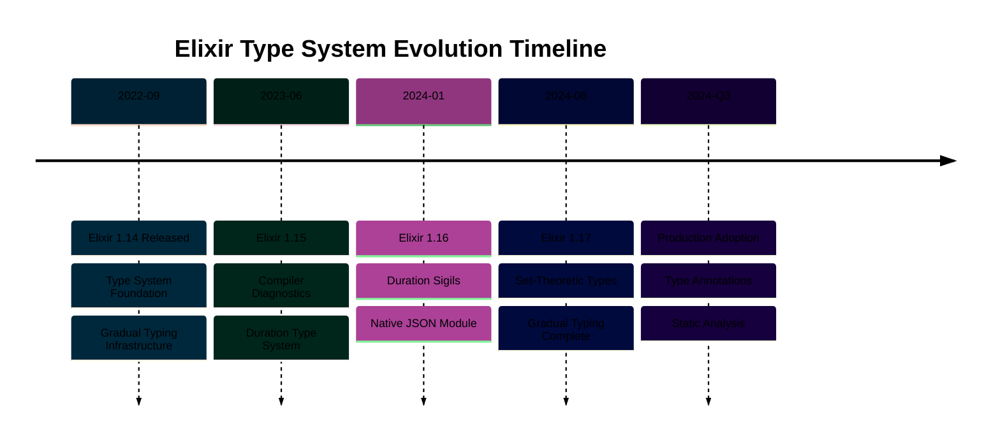

## Release Overview

Elixir 1.14, released in September 2022, represents a **LANDMARK RELEASE** in Elixir's evolution. This release establishes the foundation for Elixir's gradual type system, introducing the infrastructure and principles that would evolve through subsequent releases (1.15, 1.16, 1.17).

The release delivers three transformative features that expand Elixir's capabilities in critical areas:

- **Type System Foundation**: Gradual set-theoretic types infrastructure laying groundwork for compile-time type checking
- **dbg/2 Debugging Macro**: Interactive debugging with code inspection and pipeline visualization
- **PartitionSupervisor**: Dynamic process partitioning for horizontal scalability

This release fundamentally changes how Elixir approaches type safety while maintaining backward compatibility and the language's dynamic nature.



## Type System Foundation

Elixir 1.14 introduces the infrastructure for **gradual set-theoretic types**, a sophisticated approach that allows static type checking without sacrificing Elixir's dynamic flexibility.

**Gradual typing** means types are optional. You can add type annotations where they provide value (public APIs, critical business logic) while leaving internal implementation code unannotated. The compiler checks annotated code statically but allows dynamic typing everywhere else.

**Set-theoretic types** treat types as sets of values with union, intersection, and negation operations. This mathematical foundation supports precise type reasoning about Elixir's pattern matching and guards.

### Type System Infrastructure

```elixir
# Module attribute for type system configuration
defmodule AccountBalance do
  # Type system infrastructure (1.14)
  # Actual type annotations come in 1.17

  @doc """
  Calculates available balance after pending transactions.
  """
  def available_balance(balance, pending_transactions) do
    # => balance is account total (e.g., 10000.00)
    # => pending_transactions is list of amounts (e.g., [250.00, 100.00])
    Enum.reduce(pending_transactions, balance, fn transaction, acc ->
      # => transaction is pending amount (e.g., 250.00)
      # => acc is running balance (e.g., 10000.00)
      acc - transaction
      # => Result: reduced balance (e.g., 9750.00)
    end)
    # => Returns: final available balance (e.g., 9650.00)
  end
end
```

The foundation includes compiler infrastructure for:

- **Type inference**: Deriving types from code without annotations
- **Type checking**: Validating annotated types against inferred types
- **Error reporting**: Clear messages when types mismatch
- **Gradual guarantee**: Typed and untyped code interoperate safely

### Why This Is Landmark

Previous Elixir releases improved existing capabilities incrementally. Version 1.14 introduces an entirely new direction for the language: compile-time type checking. This philosophical shift positions Elixir alongside TypeScript and Typed Racket as pioneers in gradual typing.

The type system work begun in 1.14 continues through four releases:

- **1.14**: Infrastructure and principles
- **1.15**: Compiler diagnostics and Duration types
- **1.16**: Duration sigils and JSON module with types
- **1.17**: Set-theoretic type implementation complete

This multi-release commitment demonstrates the feature's strategic importance to Elixir's future.

## dbg/2 Debugging Macro

The `dbg/2` macro revolutionizes Elixir debugging by providing interactive code inspection with minimal setup. It replaces the common debugging pattern of adding `IO.inspect/2` calls throughout code.

### Basic Debugging

```elixir
# Calculate loan monthly payment
principal = 100000.00
# => principal is 100,000.00 (loan amount)

rate = 0.05
# => rate is 0.05 (5% annual interest)

years = 30
# => years is 30 (loan term)

monthly_payment =
  principal
  |> dbg()
  # => Prints: principal = 100000.00
  |> Kernel.*(rate / 12)
  # => Prints: result = 416.67 (monthly interest)
  |> dbg()
  # => Shows intermediate calculation
  |> Kernel.*(1 + rate / 12) ** (years * 12)
  # => Compound interest calculation
  |> dbg()
  # => Prints: result = 1853.04
  |> Kernel./((1 + rate / 12) ** (years * 12) - 1)
  # => Amortization formula
  # => Prints: monthly_payment = 536.82
```

### Pipeline Debugging

The macro excels at debugging pipelines by showing each transformation step:

```elixir
# Process transaction batch
transactions = [
  # => List of transaction maps
  %{amount: 100.00, type: :debit, account: "12345"},
  %{amount: 50.00, type: :credit, account: "12345"},
  %{amount: 200.00, type: :debit, account: "12345"}
]

account_balance =
  transactions
  |> dbg()
  # => Prints: transactions = [%{amount: 100.00, ...}, ...]
  # => Shows full list structure
  |> Enum.filter(&(&1.type == :debit))
  # => Filters to debit transactions only
  # => Prints: result = [%{amount: 100.00, ...}, %{amount: 200.00, ...}]
  |> dbg()
  # => Shows filtered list
  |> Enum.map(&Map.get(&1, :amount))
  # => Extracts amounts
  # => Prints: result = [100.00, 200.00]
  |> Enum.sum()
  # => Sums debit amounts
  # => Prints: account_balance = 300.00
```

### Production Considerations

The `dbg/2` macro includes safety features for production environments:

- **Conditional activation**: Enable only in development/staging
- **Performance overhead**: Minimal when disabled
- **Output control**: Configure verbosity levels
- **IEx integration**: Works seamlessly in interactive shell

```elixir
# Configure dbg/2 behavior
# In config/dev.exs
config :elixir, :dbg, enabled: true

# In config/prod.exs
config :elixir, :dbg, enabled: false
# => dbg/2 becomes no-op in production
```

## PartitionSupervisor

`PartitionSupervisor` enables horizontal scalability by dynamically partitioning processes across multiple supervisors. This addresses a common bottleneck where a single supervisor managing thousands of children becomes a performance constraint.

### Scalability Pattern

```elixir
# Traditional approach: single supervisor bottleneck
children = [
  {DynamicSupervisor, name: TransactionProcessor}
  # => Single supervisor for all transactions
  # => Becomes bottleneck at high volume
]

# PartitionSupervisor approach: distributed supervision
children = [
  {PartitionSupervisor,
   child_spec: DynamicSupervisor,
   # => Each partition gets its own DynamicSupervisor
   name: TransactionProcessor,
   # => Global name for routing
   partitions: 10}
   # => Creates 10 supervisors (one per scheduler by default)
   # => Distributes load across multiple processes
]
```

### Transaction Processing Example

```elixir
defmodule BankingApp.Application do
  use Application

  def start(_type, _args) do
    children = [
      # Partition supervisors for transaction processors
      {PartitionSupervisor,
       child_spec: TransactionWorker,
       # => Child specification for workers
       name: TransactionPartitions,
       # => Global name for routing
       partitions: System.schedulers_online()}
       # => One partition per CPU core
       # => Maximizes parallel processing
    ]

    opts = [strategy: :one_for_one, name: BankingApp.Supervisor]
    # => supervisor strategy: restart failed children independently
    # => name for supervisor process
    Supervisor.start_link(children, opts)
    # => Returns {:ok, pid} when supervisor starts
  end
end
```

### Process Routing

```elixir
# Start process in appropriate partition
def process_transaction(account_id, amount) do
  # => account_id is "ACC12345"
  # => amount is 1000.00

  # Route to partition based on account_id hash
  partition_key = {TransactionPartitions, account_id}
  # => Creates tuple for PartitionSupervisor routing
  # => account_id hashed to determine partition

  DynamicSupervisor.start_child(
    {:via, PartitionSupervisor, partition_key},
    # => Routes to specific partition based on account_id
    {TransactionWorker, [account_id, amount]}
    # => Child spec with initialization arguments
  )
  # => Returns {:ok, pid} when worker starts
  # => Worker runs in partition matching account_id
end
```

### Performance Characteristics

**Benefits**:

- **Reduced contention**: Multiple supervisors handle requests concurrently
- **CPU utilization**: Partitions align with scheduler count for optimal distribution
- **Predictable routing**: Same key routes to same partition (important for related processes)
- **Fault isolation**: Failure in one partition doesn't affect others

**Trade-offs**:

- **Complexity overhead**: Additional routing logic
- **Memory usage**: Multiple supervisor processes
- **Non-uniform distribution**: Hash-based routing may create uneven load

## ExUnit Pattern Diffing

ExUnit gains sophisticated pattern matching diffs that make test failures significantly more informative. When pattern matches fail, you see exactly which parts matched and which didn't.

### Before and After Comparison

```elixir
# Test assertion
test "account creation returns expected structure" do
  account = BankingApp.create_account("John Doe", 1000.00)
  # => account is result map from create_account/2

  assert %{
    id: _,
    # => Expects id field (any value)
    name: "John Doe",
    # => Expects exact name match
    balance: 1000.00,
    # => Expects exact balance match
    status: :active,
    # => Expects active status
    created_at: %DateTime{}
    # => Expects DateTime struct
  } = account
  # => Pattern match against returned account
end

# Before 1.14 failure output:
# ** (MatchError) no match of right hand side value: %{...}

# After 1.14 failure output:
# Assertion with = failed
# code:  assert %{id: _, name: "John Doe", balance: 1000.00, ...} = account
# left:  %{id: _, name: "John Doe", balance: 1000.00, status: :active, ...}
# right: %{id: "ACC123", name: "John Doe", balance: 500.00, status: :pending, ...}
#
# Pattern matching failed:
#   - balance: expected 1000.00, got 500.00
#   - status: expected :active, got :pending
```

### Nested Structure Diffs

```elixir
# Complex nested pattern
test "transaction processing creates correct audit trail" do
  result = BankingApp.process_transaction(
    # => Processes transaction with full details
    account_id: "ACC123",
    amount: 500.00,
    type: :debit
  )
  # => result is transaction result with nested maps

  assert %{
    status: :success,
    transaction: %{
      # => Nested transaction details
      id: _,
      amount: 500.00,
      type: :debit
    },
    account: %{
      # => Nested account state
      balance: 4500.00,
      # => Expected balance after debit
      status: :active
    }
  } = result
  # => Matches against nested result structure

  # Failure shows exact path to mismatch:
  # Pattern matching failed at account.balance:
  #   expected: 4500.00
  #   got: 4250.00
  # => Pinpoints nested field mismatch
end
```

### Collection Diffs

```elixir
# List pattern matching
test "transaction history contains expected entries" do
  history = BankingApp.get_transaction_history("ACC123")
  # => history is list of transaction maps

  assert [
    %{type: :credit, amount: 1000.00},
    # => First expected transaction
    %{type: :debit, amount: 500.00},
    # => Second expected transaction
    %{type: :debit, amount: 250.00}
    # => Third expected transaction
  ] = history
  # => Matches list structure

  # Failure shows element-by-element comparison:
  # List matching failed at index 1:
  #   expected: %{type: :debit, amount: 500.00}
  #   got: %{type: :credit, amount: 500.00}
  # Type field mismatch: :debit vs :credit
  # => Shows exact list element with mismatch
end
```

## Other Improvements

### Slicing Syntax

New `..//` syntax enables step-based collection slicing:

```elixir
# Daily account balances (30 days)
balances = [
  # => List of daily balance values
  1000.00, 1025.00, 1050.00, 1075.00, 1100.00,
  # => Days 1-5
  1125.00, 1150.00, 1175.00, 1200.00, 1225.00,
  # => Days 6-10
  # ... continuing to day 30
]

# Extract weekly balances (every 7th day)
weekly = Enum.slice(balances, 0..-1//7)
# => Starts at index 0, ends at -1 (last), step 7
# => Returns: [1000.00, 1175.00, 1350.00, 1525.00, 1700.00]
# => Shows balance every 7 days

# Extract even-indexed transactions
transactions = [250.00, 100.00, 50.00, 300.00, 75.00, 200.00]
# => List of transaction amounts

even_indexed = Enum.slice(transactions, 0..-1//2)
# => Step of 2 selects every other element
# => Returns: [250.00, 50.00, 75.00]
# => Elements at indexes 0, 2, 4
```

### Enumerable Protocol Enhancements

The Enumerable protocol receives optimizations for large datasets:

```elixir
# Efficient large dataset processing
transaction_stream =
  File.stream!("transactions.csv")
  # => Opens file as stream (lazy evaluation)
  |> Stream.map(&parse_transaction/1)
  # => Parses each line lazily
  |> Stream.filter(&(&1.amount > 1000.00))
  # => Filters high-value transactions lazily
  # => No memory allocated until consumption

# 1.14 optimizations reduce memory overhead
large_transactions = Enum.take(transaction_stream, 100)
# => Takes first 100 matching transactions
# => Stops processing after 100 found (efficient)
# => Previous versions might process entire file
```

### Improved Error Messages

Compiler error messages become more precise and actionable:

```elixir
# Invalid pattern match
def calculate_interest({:ok, balance}, rate) do
  balance * rate
end

calculate_interest(:error, 0.05)
# => Passes :error atom instead of tuple

# Enhanced error message (1.14):
# ** (FunctionClauseError) no function clause matching in calculate_interest/2
#
# Function clause:
#     def calculate_interest({:ok, balance}, rate)
#                            ^^^^^^^^^^^^^^
# Attempted call:
#     calculate_interest(:error, 0.05)
#                        ^^^^^^
#
# The call failed because:
#   - First argument expected a tuple {:ok, balance}
#   - Received an atom :error instead
#
# Hint: Did you mean to pass {:ok, balance} or {:error, reason}?
# => Shows exact mismatch location
# => Provides concrete suggestion
```

## Why This Is a Landmark Release

Elixir 1.14 introduces a fundamental shift in language philosophy. Previous releases improved existing capabilities; this release establishes entirely new territory: compile-time type checking.

**Strategic importance**:

- **Type system foundation**: Infrastructure for gradual typing spanning four releases
- **Paradigm expansion**: Adds static analysis without sacrificing dynamic flexibility
- **Future-proofing**: Positions Elixir for larger codebases and team scalability
- **Community direction**: Signals commitment to type safety as a core language feature

**Immediate practical value**:

- **dbg/2 macro**: Dramatically improves debugging experience
- **PartitionSupervisor**: Addresses real scalability bottlenecks
- **ExUnit diffing**: Makes test failures more actionable
- **Backward compatibility**: All improvements work with existing code

The release demonstrates Elixir's maturity: major new features that expand capabilities while maintaining the language's core principles of simplicity and developer experience.

## Upgrade Guidance

### Migration from 1.13

Elixir 1.14 maintains strong backward compatibility. Most codebases upgrade without changes.

**Verification steps**:

```bash
# Update mix.exs
# Change from:
elixir: "~> 1.13"
# To:
elixir: "~> 1.14"

# Update dependencies
mix deps.update --all

# Run test suite
mix test

# Check for deprecation warnings
mix compile --warnings-as-errors
```

**Adoption strategy**:

1. **Try dbg/2 in development**: Replace `IO.inspect/2` calls in debugging sessions
2. **Evaluate PartitionSupervisor**: Identify high-throughput supervisors that would benefit
3. **Review ExUnit output**: Observe improved test failure messages in CI
4. **Monitor type system evolution**: Follow 1.15, 1.16, 1.17 releases for full type system

**Breaking changes** (minimal):

- None for typical applications
- Some edge cases in metaprogramming may require adjustments
- Full list in official release notes

### Preparation for Types

Elixir 1.14's type system foundation prepares for future type annotations (available in 1.17):

**Documentation practices** (beneficial now, required later):

```elixir
# Document types in @doc (1.14)
@doc """
Calculates compound interest.

## Parameters
- principal: Decimal (loan amount)
- rate: Float (annual interest rate, e.g., 0.05 for 5%)
- years: Integer (loan term)

## Returns
- Decimal (total amount after interest)
"""
def compound_interest(principal, rate, years) do
  # Implementation
end

# Future (1.17) - actual type annotations:
@spec compound_interest(Decimal.t(), float(), integer()) :: Decimal.t()
def compound_interest(principal, rate, years) do
  # Implementation
end
```

**Prepare codebases**:

- **Document function signatures clearly**: Makes future type annotation easier
- **Use consistent data structures**: Simplifies type inference
- **Minimize dynamic code**: Type system works best with predictable patterns
- **Add @spec annotations gradually**: Optional in 1.14, becomes checkable in 1.17

## References

- [Elixir 1.14 Release Announcement](https://elixir-lang.org/blog/2022/09/01/elixir-v1-14-0-released/)
- [Type System Vision](https://elixir-lang.org/blog/2023/06/19/elixir-v1-15-0-released/) - Evolution through 1.15
- [Set-Theoretic Types Paper](https://arxiv.org/abs/2306.06391) - Academic foundation
- [dbg/2 Documentation](https://hexdocs.pm/elixir/Kernel.html#dbg/2)
- [PartitionSupervisor Documentation](https://hexdocs.pm/elixir/PartitionSupervisor.html)

---

**Last Updated**: 2025-02-05
**Elixir Version**: 1.14+ (minimum), 1.17.x (latest stable)
