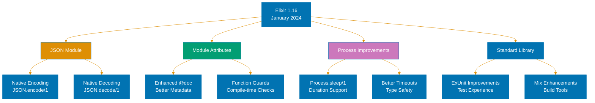

## Release Overview

Elixir 1.16 arrived in January 2024 as a feature-focused release delivering long-requested developer experience improvements. This version adds native JSON encoding and decoding capabilities, eliminating dependency on third-party JSON libraries for basic operations. The release demonstrates the language's maturation by incorporating commonly used ecosystem patterns directly into the standard library.



## Built-in JSON Module

The JSON module provides native encoding and decoding without external dependencies. This addresses the common case where applications need basic JSON operations but previously required adding libraries like Jason or Poison.

```elixir
# JSON encoding
invoice = %{                        # => Map representing invoice data
  id: "INV-2024-001",              # => Invoice identifier (String)
  amount: 1500.00,                 # => Payment amount (Float)
  currency: "USD",                 # => Currency code (String)
  status: :paid                    # => Payment status (Atom)
}                                   # => invoice is map with 4 fields

{:ok, json_string} = JSON.encode(invoice)
# => Converts invoice map to JSON string
# => json_string is "{\"id\":\"INV-2024-001\",\"amount\":1500.0,\"currency\":\"USD\",\"status\":\"paid\"}"
# => status atom becomes "paid" string in JSON

# JSON decoding
json_input = "{\"transaction_id\":\"TXN-42\",\"amount\":250.50}"
# => JSON string with transaction data
# => Contains 2 fields: transaction_id and amount

{:ok, transaction} = JSON.decode(json_input)
# => Parses JSON string into Elixir map
# => transaction is %{"transaction_id" => "TXN-42", "amount" => 250.50}
# => Keys become strings (not atoms for safety)
# => amount becomes float 250.50

transaction["amount"]              # => Access amount field
                                   # => Returns 250.50 (Float)
```

The module handles common JSON types automatically: maps become objects, lists become arrays, atoms become strings, and numbers preserve their type. Decoding always produces string keys rather than atoms to prevent atom table exhaustion attacks. For production JSON processing at scale, specialized libraries like Jason still provide better performance and features.

```elixir
# Financial reporting example
defmodule PaymentReport do
  def generate_statement(payments) do
    # => payments is list of payment maps
    # => Function returns JSON string or error tuple

    summary = %{                    # => Create summary map structure
      total_payments: length(payments),
      # => Count number of payments in list
      # => length(payments) returns integer count

      total_amount: calculate_total(payments),
      # => Sum all payment amounts
      # => Returns float representing total value

      currency: "USD",              # => Currency code string
      generated_at: DateTime.utc_now()
      # => Current UTC timestamp
      # => Returns DateTime struct
    }                               # => summary map ready for encoding

    case JSON.encode(summary) do
      # => Convert summary to JSON
      # => Returns {:ok, string} or {:error, reason}

      {:ok, json} ->                # => Encoding succeeded
        json                        # => Return JSON string

      {:error, reason} ->           # => Encoding failed
        # => reason describes what went wrong

        raise "Failed to generate report: #{inspect(reason)}"
        # => Create error message with reason details
        # => inspect converts reason to readable string
    end
  end

  defp calculate_total(payments) do
    # => Private helper function
    # => Sums amount field from all payments

    Enum.reduce(payments, 0, fn payment, acc ->
      # => Iterate through payments with accumulator
      # => acc starts at 0, accumulates total
      # => payment is current payment map

      acc + payment.amount          # => Add current amount to total
      # => payment.amount is Float
      # => Returns new accumulated total
    end)                            # => Returns final sum as Float
  end
end

# Usage
payments = [                        # => List of payment records
  %{id: "P1", amount: 100.00},     # => First payment
  %{id: "P2", amount: 250.50},     # => Second payment
  %{id: "P3", amount: 75.25}       # => Third payment
]                                   # => payments list has 3 elements

json_report = PaymentReport.generate_statement(payments)
# => Calls module function with payments
# => Returns JSON string with summary
# => json_report contains encoded summary data
```

The JSON module integrates with Phoenix automatically. Response rendering detects JSON encoding capabilities and uses the native module when appropriate, though explicit configuration controls this behavior.

## Enhanced Module Attributes

Module attributes gain improved compile-time capabilities and better documentation support. The `@doc` attribute now accepts additional metadata for generating richer documentation.

```elixir
defmodule BankAccount do
  @moduledoc """
  Manages banking operations with audit trails
  """                               # => Module-level documentation
  # => Describes module purpose

  @doc """
  Transfers funds between accounts

  ## Parameters
  - from_account: Source account identifier
  - to_account: Destination account identifier
  - amount: Transfer amount (must be positive)

  ## Returns
  - {:ok, transaction_id} on success
  - {:error, reason} on failure
  """                               # => Enhanced function documentation
  # => Parameters section documents inputs
  # => Returns section documents outputs

  @doc since: "1.16.0"              # => Version when function added
  # => Helps users understand availability

  @doc type: :public                # => Visibility metadata
  # => Marks function as public API

  def transfer(from_account, to_account, amount) when amount > 0 do
    # => Function with guard clause
    # => Guard ensures amount is positive
    # => from_account is source account ID
    # => to_account is destination account ID
    # => amount is transfer value

    with {:ok, from_balance} <- get_balance(from_account),
         # => Retrieve source account balance
         # => Returns {:ok, balance} or {:error, reason}
         # => from_balance is Float if successful

         true <- from_balance >= amount,
         # => Verify sufficient funds available
         # => Returns true if balance covers amount
         # => Pattern match fails if insufficient

         {:ok, tx_id} <- execute_transfer(from_account, to_account, amount) do
         # => Perform actual transfer operation
         # => Returns {:ok, transaction_id} on success
         # => tx_id is String transaction identifier

      {:ok, tx_id}                  # => Return success with ID
      # => tx_id returned to caller
    else
      {:error, reason} ->           # => Handle any error case
        # => reason describes failure

        {:error, reason}            # => Return error tuple

      false ->                      # => Insufficient funds case
        {:error, :insufficient_funds}
        # => Return specific error atom
    end
  end

  def transfer(_from, _to, _amount) do
    # => Catch clause for invalid amounts
    # => Matches when guard fails (amount <= 0)
    # => Underscore variables ignored

    {:error, :invalid_amount}       # => Return error for negative amounts
    # => Prevents invalid transfers
  end

  defp get_balance(account_id) do
    # => Private function to fetch balance
    # => account_id is String identifier
    # => Returns {:ok, Float} or {:error, atom}

    # Implementation omitted for brevity
    {:ok, 1000.00}                  # => Placeholder implementation
    # => Returns sample balance
  end

  defp execute_transfer(from, to, amount) do
    # => Private function for transfer logic
    # => from is source account (String)
    # => to is destination account (String)
    # => amount is transfer value (Float)

    # Implementation omitted for brevity
    tx_id = "TXN-#{:rand.uniform(10000)}"
    # => Generate random transaction ID
    # => rand.uniform returns integer 1-10000
    # => String interpolation creates ID string

    {:ok, tx_id}                    # => Return success with generated ID
  end
end
```

The enhanced documentation metadata enables tooling improvements. ExDoc generates better API documentation by extracting the structured information from `@doc` attributes. The `since` field particularly helps users understand version compatibility requirements when planning upgrades.

## Process.sleep Improvements

The `Process.sleep/1` function now accepts duration values directly, improving readability and type safety when working with time-based operations.

```elixir
# Traditional millisecond approach
Process.sleep(5000)                 # => Sleep for 5000 milliseconds
                                    # => Blocks process for 5 seconds
                                    # => Magic number lacks clarity

# Duration-based approach (Elixir 1.16+)
Process.sleep({:second, 5})         # => Sleep using duration tuple
                                    # => More readable intent
                                    # => {:second, 5} represents 5 seconds
                                    # => Converted to 5000ms internally

Process.sleep({:minute, 2})         # => Sleep for 2 minutes
                                    # => Duration: 120000 milliseconds
                                    # => {:minute, 2} is explicit time unit

# Financial batch processing example
defmodule PaymentProcessor do
  @retry_delay {:second, 5}         # => Module attribute for delay
  # => Stores delay as duration tuple
  # => Used across multiple functions

  def process_batch(payments, retries \\ 3) do
    # => Process list of payments
    # => retries defaults to 3 attempts
    # => payments is list of payment maps

    Enum.each(payments, fn payment ->
      # => Iterate through each payment
      # => payment is current payment map

      process_with_retry(payment, retries)
      # => Attempt to process with retries
      # => Blocks until payment processed or fails
    end)                            # => Returns :ok when all processed
  end

  defp process_with_retry(payment, 0) do
    # => Base case: no retries remaining
    # => payment is map to process
    # => 0 means final attempt failed

    Logger.error("Payment #{payment.id} failed after all retries")
    # => Log permanent failure
    # => payment.id identifies failed transaction

    {:error, :max_retries_exceeded} # => Return error indicating exhaustion
    # => Caller knows processing gave up
  end

  defp process_with_retry(payment, retries_left) when retries_left > 0 do
    # => Recursive case: retries available
    # => retries_left is positive integer
    # => Guard ensures valid retry count

    case charge_payment(payment) do
      # => Attempt to charge payment
      # => Returns {:ok, receipt} or {:error, reason}

      {:ok, receipt} ->             # => Payment succeeded
        # => receipt contains confirmation data

        Logger.info("Payment #{payment.id} processed successfully")
        # => Log success with payment ID

        {:ok, receipt}              # => Return success to caller
        # => Propagates receipt up call stack

      {:error, :network_timeout} -> # => Transient error occurred
        # => Network issue, safe to retry

        Logger.warning("Payment #{payment.id} timed out, retrying...")
        # => Log retry attempt
        # => Includes payment ID for tracking

        Process.sleep(@retry_delay) # => Wait before retry
        # => Sleeps for 5 seconds
        # => Uses module attribute duration
        # => Prevents overwhelming payment API

        process_with_retry(payment, retries_left - 1)
        # => Recursive call with decremented retries
        # => retries_left - 1 reduces remaining attempts
        # => Continues until success or exhaustion

      {:error, reason} ->           # => Permanent error (not retryable)
        # => reason indicates why payment can't succeed

        Logger.error("Payment #{payment.id} failed: #{inspect(reason)}")
        # => Log permanent failure with details
        # => inspect converts reason to string

        {:error, reason}            # => Return error immediately
        # => No retry for permanent failures
    end
  end

  defp charge_payment(payment) do
    # => Simulated payment charging
    # => payment is map with amount, customer, etc.
    # => Returns {:ok, receipt} or {:error, reason}

    # Implementation omitted for brevity
    if :rand.uniform() > 0.3 do     # => 70% success rate simulation
      # => rand.uniform returns float 0.0-1.0
      # => Simulates successful payment

      {:ok, %{receipt_id: "RCP-#{:rand.uniform(10000)}"}}
      # => Return success with random receipt ID
      # => Creates map with receipt_id field
    else
      # => 30% failure simulation

      {:error, :network_timeout}    # => Simulate transient error
      # => Allows retry logic to engage
    end
  end
end

# Usage
payments = [                        # => Batch of payments to process
  %{id: "PAY-1", amount: 100.00, customer: "C123"},
  %{id: "PAY-2", amount: 250.00, customer: "C456"},
  %{id: "PAY-3", amount: 75.50, customer: "C789"}
]                                   # => List of 3 payment maps

PaymentProcessor.process_batch(payments)
# => Process all payments with automatic retry
# => Waits 5 seconds between retry attempts
# => Returns when all payments processed or failed
```

Duration support extends beyond `Process.sleep/1`. Many standard library functions accepting timeouts now support duration tuples, creating consistency across the ecosystem. This change reduces bugs caused by millisecond conversion errors, particularly when refactoring code with different time units.

## Other Notable Improvements

### ExUnit Enhancements

Test framework gains better diff output for failed assertions, making test debugging faster. When asserting map equality, ExUnit now highlights exactly which keys differ rather than showing entire maps.

```elixir
# Better test output example
test "validates payment amount" do
  # => Test case for payment validation

  payment = %{                      # => Create test payment
    id: "TEST-1",                   # => Test identifier
    amount: 100.00,                 # => Expected amount
    currency: "USD"                 # => Currency code
  }                                 # => payment map with 3 fields

  expected = %{                     # => Expected structure
    id: "TEST-1",                   # => Same ID
    amount: 150.00,                 # => Different amount (intentional)
    currency: "USD"                 # => Same currency
  }                                 # => expected map with 3 fields

  assert payment == expected        # => This assertion fails
  # => Elixir 1.16 shows: amount differs (100.00 vs 150.00)
  # => Old versions showed entire maps
  # => New diff output pinpoints exact difference
end
```

### Mix Improvements

Mix gains better dependency resolution and clearer error messages when conflicts occur. Circular dependency detection now provides actionable suggestions rather than cryptic errors.

### Compiler Enhancements

The compiler produces more actionable warnings, particularly around unused variables and function definitions. Warning messages now include context about why code might be problematic.

## Upgrade Guidance

Most Elixir 1.15 applications upgrade to 1.16 without code changes. The JSON module is additive, requiring no migration from existing JSON libraries. Applications can gradually adopt the native JSON module for new code while maintaining existing library usage.

The enhanced module attributes require no changes to existing code. Documentation improvements appear automatically when regenerating docs with ExDoc. Duration support in `Process.sleep/1` is backward compatible—millisecond integers still work identically.

Review dependencies for JSON library usage. If your application only needs basic encoding and decoding, consider migrating to the native JSON module to reduce dependencies. Applications requiring high-performance JSON operations, custom encoder protocols, or streaming support should continue using specialized libraries like Jason.

Test your application thoroughly before deploying to production. While breaking changes are minimal, behavioral differences in edge cases can emerge. Pay particular attention to JSON encoding of atoms and process timeouts if you adopt new features.

## References

- [Elixir 1.16 Release Announcement](https://elixir-lang.org/blog/2024/01/22/elixir-v1-16-0-released/)
- [Elixir Documentation - JSON](https://hexdocs.pm/elixir/1.16/JSON.html)
- [Elixir Documentation - Process](https://hexdocs.pm/elixir/1.16/Process.html)

---

**Last Updated**: 2025-02-05
**Elixir Version**: 1.16.0 (release focus), 1.17.x (latest stable)
