Master advanced Elixir concepts with 25 examples covering OTP, GenServer, Supervisor, metaprogramming, macros, and advanced concurrency patterns. These examples assume familiarity with intermediate Elixir.

## Group 1: GenServer Deep Dive

### Example 61: GenServer Basics

GenServer (Generic Server) is OTP's abstraction for stateful processes with synchronous and asynchronous message handling. It provides a standardized way to build servers that maintain state and handle concurrent requests.


**Code**:

```elixir
defmodule Counter do
  use GenServer

  # Client API (public interface)
  def start_link(initial_value \\ 0) do
    GenServer.start_link(__MODULE__, initial_value, name: __MODULE__)
  end

  def increment do
    GenServer.cast(__MODULE__, :increment)  # Asynchronous, no reply
  end

  def get do
    GenServer.call(__MODULE__, :get)  # Synchronous, waits for reply
  end

  def add(value) do
    GenServer.call(__MODULE__, {:add, value})
  end

  # Server Callbacks (private implementation)
  @impl true
  def init(initial_value) do
    {:ok, initial_value}  # Return {:ok, state}
  end

  @impl true
  def handle_cast(:increment, state) do
    {:noreply, state + 1}  # Return {:noreply, new_state}
  end

  @impl true
  def handle_call(:get, _from, state) do
    {:reply, state, state}  # Return {:reply, reply_value, new_state}
  end

  @impl true
  def handle_call({:add, value}, _from, state) do
    new_state = state + value
    {:reply, new_state, new_state}
  end
end

{:ok, _pid} = Counter.start_link(0)  # Start with state = 0
Counter.increment()  # State becomes 1
Counter.increment()  # State becomes 2
Counter.get()  # => 2
Counter.add(5)  # => 7 (returns new value)
Counter.get()  # => 7

defmodule UserRegistry do
  use GenServer

  # Client API
  def start_link(_opts) do
    GenServer.start_link(__MODULE__, %{}, name: __MODULE__)
  end

  def register(name, data) do
    GenServer.call(__MODULE__, {:register, name, data})
  end

  def lookup(name) do
    GenServer.call(__MODULE__, {:lookup, name})
  end

  def list_all do
    GenServer.call(__MODULE__, :list_all)
  end

  # Server callbacks
  @impl true
  def init(_initial_state) do
    {:ok, %{}}  # Empty map as state
  end

  @impl true
  def handle_call({:register, name, data}, _from, state) do
    new_state = Map.put(state, name, data)
    {:reply, :ok, new_state}
  end

  @impl true
  def handle_call({:lookup, name}, _from, state) do
    result = Map.get(state, name, :not_found)
    {:reply, result, state}  # State unchanged
  end

  @impl true
  def handle_call(:list_all, _from, state) do
    {:reply, state, state}
  end
end

{:ok, _pid} = UserRegistry.start_link([])
UserRegistry.register("alice", %{age: 30, email: "alice@example.com"})
UserRegistry.register("bob", %{age: 25, email: "bob@example.com"})
UserRegistry.lookup("alice")  # => %{age: 30, email: "alice@example.com"}
UserRegistry.lookup("charlie")  # => :not_found
UserRegistry.list_all()  # => %{"alice" => %{...}, "bob" => %{...}}
```

**Key Takeaway**: GenServer provides a standard pattern for stateful servers. Use `call` for synchronous requests (wait for reply), `cast` for asynchronous messages (fire and forget). Separate client API from server callbacks.

**Why It Matters**: GenServer separates client API (public synchronous functions) from server callbacks (asynchronous message handlers), enabling clean separation between interface and implementation. This pattern is fundamental to OTP design—Phoenix channels, Ecto connection pools, and Task supervisors all use GenServer. In production, this separation enables testing internal state through call/cast without spawning processes, upgrading server logic without changing client API, and debugging through :sys.get_state without code changes.

---

### Example 62: GenServer State Management

GenServer state is immutable. Updates return new state, and the GenServer maintains the current state across calls. Understanding state transitions is crucial for building reliable servers.


**Code**:

```elixir
defmodule Account do
  use GenServer

  # Struct to represent state
  defstruct balance: 0, transactions: []

  # Client API
  def start_link(initial_balance) do
    GenServer.start_link(__MODULE__, initial_balance)
  end

  def deposit(pid, amount) when amount > 0 do
    GenServer.call(pid, {:deposit, amount})
  end

  def withdraw(pid, amount) when amount > 0 do
    GenServer.call(pid, {:withdraw, amount})
  end

  def balance(pid) do
    GenServer.call(pid, :balance)
  end

  def transaction_history(pid) do
    GenServer.call(pid, :transactions)
  end

  # Server callbacks
  @impl true
  def init(initial_balance) do
    state = %__MODULE__{balance: initial_balance}
    {:ok, state}
  end

  @impl true
  def handle_call({:deposit, amount}, _from, state) do
    new_balance = state.balance + amount
    transaction = {:deposit, amount, DateTime.utc_now()}
    new_state = %{state | balance: new_balance, transactions: [transaction | state.transactions]}
    {:reply, {:ok, new_balance}, new_state}
  end

  @impl true
  def handle_call({:withdraw, amount}, _from, state) do
    if state.balance >= amount do
      new_balance = state.balance - amount
      transaction = {:withdrawal, amount, DateTime.utc_now()}
      new_state = %{state | balance: new_balance, transactions: [transaction | state.transactions]}
      {:reply, {:ok, new_balance}, new_state}
    else
      {:reply, {:error, :insufficient_funds}, state}  # State unchanged
    end
  end

  @impl true
  def handle_call(:balance, _from, state) do
    {:reply, state.balance, state}
  end

  @impl true
  def handle_call(:transactions, _from, state) do
    {:reply, Enum.reverse(state.transactions), state}
  end
end

{:ok, account} = Account.start_link(1000)
Account.deposit(account, 500)  # => {:ok, 1500}
Account.withdraw(account, 200)  # => {:ok, 1300}
Account.withdraw(account, 2000)  # => {:error, :insufficient_funds}
Account.balance(account)  # => 1300
Account.transaction_history(account)  # => [{:deposit, 500, ...}, {:withdrawal, 200, ...}]

defmodule TodoList do
  use GenServer

  defstruct items: [], next_id: 1

  def start_link do
    GenServer.start_link(__MODULE__, [])
  end

  def add_item(pid, description) do
    GenServer.call(pid, {:add, description})
  end

  def complete_item(pid, id) do
    GenServer.call(pid, {:complete, id})
  end

  def list_items(pid) do
    GenServer.call(pid, :list)
  end

  @impl true
  def init(_) do
    {:ok, %__MODULE__{}}
  end

  @impl true
  def handle_call({:add, description}, _from, state) do
    item = %{id: state.next_id, description: description, completed: false}
    new_items = [item | state.items]
    new_state = %{state | items: new_items, next_id: state.next_id + 1}
    {:reply, {:ok, item.id}, new_state}
  end

  @impl true
  def handle_call({:complete, id}, _from, state) do
    new_items = Enum.map(state.items, fn item ->
      if item.id == id, do: %{item | completed: true}, else: item
    end)
    new_state = %{state | items: new_items}
    {:reply, :ok, new_state}
  end

  @impl true
  def handle_call(:list, _from, state) do
    {:reply, Enum.reverse(state.items), state}
  end
end

{:ok, todo} = TodoList.start_link()
{:ok, id1} = TodoList.add_item(todo, "Buy groceries")
{:ok, id2} = TodoList.add_item(todo, "Write code")
TodoList.complete_item(todo, id1)
TodoList.list_items(todo)  # => [%{id: 1, description: "Buy groceries", completed: true}, ...]
```

**Key Takeaway**: GenServer state is immutable—updates return new state. Use structs for complex state to make transformations clear. Every callback returns a tuple specifying the reply (if any) and the new state.

**Why It Matters**: GenServer state as immutable structs prevents accidental mutation bugs while enabling structural sharing for large states. Every handle_call/handle_cast returns new state, making state transitions explicit and traceable. In production, this enables state history tracking (for debugging), optimistic locking (compare old state), and safe concurrent reads (ETS tables storing GenServer state snapshots). The BEAM's structural sharing means copying large maps is O(log n), not O(n), making immutable updates performant.

---

### Example 63: GenServer Error Handling

GenServers can timeout, crash, or handle unexpected messages. Understanding error handling patterns ensures robust servers that fail gracefully.

**Code**:

```elixir
defmodule ResilientServer do
  use GenServer

  def start_link do
    GenServer.start_link(__MODULE__, [])
  end

  def do_work(pid) do
    GenServer.call(pid, :work, 10_000)  # 10 second timeout
  end

  def slow_work(pid) do
    GenServer.call(pid, :slow_work, 1_000)  # 1 second timeout
  end

  def crash_me(pid) do
    GenServer.cast(pid, :crash)
  end

  @impl true
  def init(_) do
    {:ok, %{}}
  end

  @impl true
  def handle_call(:work, _from, state) do
    # Simulate work
    :timer.sleep(500)
    {:reply, :done, state}
  end

  @impl true
  def handle_call(:slow_work, _from, state) do
    # Too slow, will timeout
    :timer.sleep(2_000)
    {:reply, :done, state}
  end

  @impl true
  def handle_cast(:crash, _state) do
    raise "Server crashed!"
  end

  # Handle unexpected messages
  @impl true
  def handle_info(msg, state) do
    Logger.warn("Unexpected message: #{inspect(msg)}")
    {:noreply, state}
  end

  # Stop callback
  @impl true
  def terminate(reason, _state) do
    Logger.info("Server terminating: #{inspect(reason)}")
    :ok
  end
end

{:ok, pid} = ResilientServer.start_link()
ResilientServer.do_work(pid)  # => :done

try do
  ResilientServer.slow_work(pid)  # Timeout after 1 second
rescue
  e in RuntimeError -> IO.puts("Caught timeout: #{inspect(e)}")
end

defmodule SafeServer do
  use GenServer

  def start_link do
    GenServer.start_link(__MODULE__, [])
  end

  def divide(pid, a, b) do
    GenServer.call(pid, {:divide, a, b})
  end

  @impl true
  def init(_) do
    {:ok, %{}}
  end

  @impl true
  def handle_call({:divide, a, b}, _from, state) do
    try do
      result = a / b
      {:reply, {:ok, result}, state}
    rescue
      ArithmeticError ->
        {:reply, {:error, :division_by_zero}, state}
    end
  end

  # Alternative: return error tuple without exceptions
  def handle_call_safe({:divide, _a, 0}, _from, state) do
    {:reply, {:error, :division_by_zero}, state}
  end
  def handle_call_safe({:divide, a, b}, _from, state) do
    {:reply, {:ok, a / b}, state}
  end
end

{:ok, pid} = SafeServer.start_link()
SafeServer.divide(pid, 10, 2)  # => {:ok, 5.0}
SafeServer.divide(pid, 10, 0)  # => {:error, :division_by_zero}
```

**Key Takeaway**: Handle timeouts with `GenServer.call/3` timeout parameter. Use `try/rescue` or error tuples for error handling. Implement `handle_info/2` for unexpected messages and `terminate/2` for cleanup.

**Why It Matters**: GenServer error handling through timeouts and terminate callbacks enables graceful degradation. Timeout on GenServer.call prevents cascading failures when backends slow down, while terminate callback ensures cleanup (close file handles, flush buffers). In production, this implements circuit breakers—services call external APIs with 5s timeout, crash on timeout (supervisor restarts), rather than accumulating blocked callers that exhaust system memory. Terminate callbacks prevent resource leaks during hot code upgrades.

---

### Example 64: GenServer Named Processes

Named GenServers can be referenced by atom name instead of PID. This enables easier process discovery and module-level APIs that don't require passing PIDs around.

**Code**:

```elixir
defmodule Cache do
  use GenServer

  # Start with name registration
  def start_link(_opts) do
    GenServer.start_link(__MODULE__, %{}, name: __MODULE__)
  end

  # Client API uses module name, not PID
  def put(key, value) do
    GenServer.cast(__MODULE__, {:put, key, value})
  end

  def get(key) do
    GenServer.call(__MODULE__, {:get, key})
  end

  def delete(key) do
    GenServer.cast(__MODULE__, {:delete, key})
  end

  @impl true
  def init(_) do
    {:ok, %{}}
  end

  @impl true
  def handle_cast({:put, key, value}, state) do
    {:noreply, Map.put(state, key, value)}
  end

  @impl true
  def handle_cast({:delete, key}, state) do
    {:noreply, Map.delete(state, key)}
  end

  @impl true
  def handle_call({:get, key}, _from, state) do
    {:reply, Map.get(state, key), state}
  end
end

{:ok, _pid} = Cache.start_link([])
Cache.put(:user_1, %{name: "Alice"})
Cache.get(:user_1)  # => %{name: "Alice"}
Cache.delete(:user_1)
Cache.get(:user_1)  # => nil

defmodule Worker do
  use GenServer

  def start_link(name) do
    GenServer.start_link(__MODULE__, [], name: name)
  end

  def ping(name) do
    GenServer.call(name, :ping)
  end

  @impl true
  def init(_) do
    {:ok, []}
  end

  @impl true
  def handle_call(:ping, _from, state) do
    {:reply, :pong, state}
  end
end

{:ok, _} = Worker.start_link(:worker_1)
{:ok, _} = Worker.start_link(:worker_2)
Worker.ping(:worker_1)  # => :pong
Worker.ping(:worker_2)  # => :pong

```

**Key Takeaway**: Register GenServers with `name:` option to reference by atom instead of PID. Use `__MODULE__` for singleton services. Named processes enable cleaner APIs and easier process discovery.

**Why It Matters**: Named GenServers via Registry enable dynamic process discovery without global atom exhaustion. Registry maps arbitrary terms to PIDs, unlike register/2 which requires atoms. In production, this powers multi-tenant systems—one GenServer per customer identified by UUID in Registry, avoiding atom table limits. Phoenix PubSub uses Registry for topic subscriptions (duplicate keys), while Horde provides distributed Registry for multi-node process discovery across Kubernetes pods.

---

### Example 65: GenServer Best Practices

Well-designed GenServers separate client API from server implementation, keep callbacks simple, and provide clear error handling. Following patterns improves maintainability and testability.

**Code**:

```elixir
defmodule BestPractices do
  use GenServer

  # 1. Separate client API from server callbacks
  # Client API - public functions users call
  def start_link(opts \\ []) do
    GenServer.start_link(__MODULE__, opts, name: __MODULE__)
  end

  def create_user(name, email) do
    GenServer.call(__MODULE__, {:create_user, name, email})
  end

  def get_user(id) do
    GenServer.call(__MODULE__, {:get_user, id})
  end

  # 2. Use @impl for callback clarity
  @impl true
  def init(_opts) do
    # Initialize state
    state = %{users: %{}, next_id: 1}
    {:ok, state}
  end

  @impl true
  def handle_call({:create_user, name, email}, _from, state) do
    # Keep callbacks simple - delegate to private helpers
    {reply, new_state} = do_create_user(name, email, state)
    {:reply, reply, new_state}
  end

  @impl true
  def handle_call({:get_user, id}, _from, state) do
    user = Map.get(state.users, id)
    {:reply, user, state}
  end

  # 3. Extract complex logic to private functions
  defp do_create_user(name, email, state) do
    if valid_email?(email) do
      user = %{id: state.next_id, name: name, email: email}
      new_users = Map.put(state.users, state.next_id, user)
      new_state = %{state | users: new_users, next_id: state.next_id + 1}
      {{:ok, user}, new_state}
    else
      {{:error, :invalid_email}, state}
    end
  end

  defp valid_email?(email), do: String.contains?(email, "@")

  # 4. Use typespec for documentation
  @spec create_user(String.t(), String.t()) :: {:ok, map()} | {:error, atom()}
end

defmodule BestPracticesTest do
  use ExUnit.Case

  setup do
    {:ok, _pid} = BestPractices.start_link()
    :ok
  end

  test "creates user with valid email" do
    assert {:ok, user} = BestPractices.create_user("Alice", "alice@example.com")
    assert user.name == "Alice"
  end

  test "rejects invalid email" do
    assert {:error, :invalid_email} = BestPractices.create_user("Bob", "invalid")
  end

  test "retrieves created user" do
    {:ok, user} = BestPractices.create_user("Charlie", "charlie@example.com")
    assert BestPractices.get_user(user.id) == user
  end
end

defmodule UserLogic do
  # Pure functions - easy to test
  def create_user(users, next_id, name, email) do
    if valid_email?(email) do
      user = %{id: next_id, name: name, email: email}
      new_users = Map.put(users, next_id, user)
      {{:ok, user}, new_users, next_id + 1}
    else
      {{:error, :invalid_email}, users, next_id}
    end
  end

  defp valid_email?(email), do: String.contains?(email, "@")
end

defmodule UserServer do
  use GenServer

  def start_link(_), do: GenServer.start_link(__MODULE__, %{}, name: __MODULE__)
  def create_user(name, email), do: GenServer.call(__MODULE__, {:create, name, email})

  @impl true
  def init(_), do: {:ok, %{users: %{}, next_id: 1}}

  @impl true
  def handle_call({:create, name, email}, _from, state) do
    # Delegate to pure business logic
    {reply, new_users, new_next_id} = UserLogic.create_user(state.users, state.next_id, name, email)
    new_state = %{state | users: new_users, next_id: new_next_id}
    {:reply, reply, new_state}
  end
end
```

**Key Takeaway**: Separate client API from callbacks, use `@impl` for clarity, extract complex logic to private functions, and delegate business logic to pure modules for easier testing. Keep GenServer focused on state management and concurrency.

**Why It Matters**: GenServer best practices (separate client/server, extract business logic to pure functions, use @impl) improve testability and maintainability. Pure functions are easy to test without spawning processes, while @impl ensures callback signatures match behavior. In production, this pattern enables testing critical business logic (user creation, payment processing) as pure functions with 100% coverage, while GenServer integration tests verify concurrency and message handling at lower coverage thresholds.

---

## Group 2: Supervision

### Example 66: Supervisor Basics

Supervisors monitor child processes and restart them on failure. They're the foundation of OTP's fault tolerance—processes are organized into supervision trees where supervisors restart failed children.

```mermaid
%% Color Palette: Blue #0173B2, Orange #DE8F05, Teal #029E73, Purple #CC78BC, Brown #CA9161
graph TD
    Supervisor["Supervisor"] --> Worker1["Worker 1"]
    Supervisor --> Worker2["Worker 2"]
    Supervisor --> Worker3["Worker 3"]

    Worker2 --> Crash["💥 Crash"]
    Crash --> Restart["Supervisor Restarts Worker 2"]

    style Supervisor fill:#0173B2,color:#fff
    style Worker1 fill:#029E73,color:#fff
    style Worker2 fill:#CC78BC,color:#fff
    style Worker3 fill:#029E73,color:#fff
    style Crash fill:#DE8F05,color:#fff
    style Restart fill:#029E73,color:#fff
```



**Code**:

```elixir
defmodule Worker do
  use GenServer

  def start_link(id) do
    GenServer.start_link(__MODULE__, id, name: via_tuple(id))
  end

  def crash(id) do
    GenServer.cast(via_tuple(id), :crash)
  end

  def ping(id) do
    GenServer.call(via_tuple(id), :ping)
  end

  defp via_tuple(id), do: {:via, Registry, {WorkerRegistry, id}}

  @impl true
  def init(id) do
    IO.puts("Worker #{id} starting...")
    {:ok, id}
  end

  @impl true
  def handle_call(:ping, _from, id) do
    {:reply, {:pong, id}, id}
  end

  @impl true
  def handle_cast(:crash, _state) do
    raise "Worker crashed!"
  end
end

defmodule MySupervisor do
  use Supervisor

  def start_link(_opts) do
    Supervisor.start_link(__MODULE__, :ok, name: __MODULE__)
  end

  @impl true
  def init(:ok) do
    # Start Registry for worker names
    children = [
      {Registry, keys: :unique, name: WorkerRegistry},
      # Worker children
      {Worker, 1},
      {Worker, 2},
      {Worker, 3}
    ]

    # :one_for_one strategy - restart only crashed child
    Supervisor.init(children, strategy: :one_for_one)
  end
end

{:ok, _pid} = MySupervisor.start_link([])

Worker.ping(1)  # => {:pong, 1}
Worker.crash(2)  # Crashes worker 2
:timer.sleep(100)
Worker.ping(2)  # => {:pong, 2} (works again!)

child_spec = %{
  id: Worker,
  start: {Worker, :start_link, [1]},
  restart: :permanent,  # Always restart
  shutdown: 5000,       # Wait 5s for graceful shutdown
  type: :worker         # :worker or :supervisor
}

```

**Key Takeaway**: Supervisors restart failed child processes, providing fault tolerance. Use `:one_for_one` strategy to restart only crashed children. Supervision trees isolate failures and enable "let it crash" philosophy.

**Why It Matters**: Supervisors enable 'let it crash' by automatically restarting failed children according to restart strategy. This is fundamentally different from try/catch—instead of defensive programming, you write for the happy path and let supervisors handle crashes. In production, this creates self-healing systems where transient failures (network timeouts, OOM) resolve through process restart with clean state, while permanent failures (configuration errors) crash through supervision tree to top-level logger, preventing silent failures.

---

### Example 67: Restart Strategies

Supervisors support different restart strategies based on child process dependencies. Choose the strategy that matches your process relationships.

**one_for_one Strategy**:


**one_for_all Strategy**:


**rest_for_one Strategy**:

```mermaid
graph TD
    S3["Supervisor"] --> W7["Worker 1"]
    S3 --> W8["Worker 2 💥"]
    S3 --> W9["Worker 3"]
    W8 --> R3["Restart Worker 2 & 3"]

    style S3 fill:#0173B2,color:#fff
    style W8 fill:#CC78BC,color:#fff
    style R3 fill:#029E73,color:#fff
```



**Code**:

```elixir
defmodule OneForOneSupervisor do
  use Supervisor

  def start_link(_opts) do
    Supervisor.start_link(__MODULE__, :ok)
  end

  @impl true
  def init(:ok) do
    children = [
      {Worker, 1},
      {Worker, 2},
      {Worker, 3}
    ]

    Supervisor.init(children, strategy: :one_for_one)
  end
end

defmodule OneForAllSupervisor do
  use Supervisor

  def start_link(_opts) do
    Supervisor.start_link(__MODULE__, :ok)
  end

  @impl true
  def init(:ok) do
    children = [
      {DatabaseConnection, []},  # Must be up
      {Cache, []},               # Depends on database
      {APIServer, []}            # Depends on cache
    ]

    Supervisor.init(children, strategy: :one_for_all)
  end
end

defmodule RestForOneSupervisor do
  use Supervisor

  def start_link(_opts) do
    Supervisor.start_link(__MODULE__, :ok)
  end

  @impl true
  def init(:ok) do
    children = [
      {DatabaseConnection, []},  # Started first
      {Cache, []},               # Depends on database
      {APIServer, []}            # Depends on cache
    ]

    Supervisor.init(children, strategy: :rest_for_one)
  end
end

defmodule ConfiguredSupervisor do
  use Supervisor

  def start_link(_opts) do
    Supervisor.start_link(__MODULE__, :ok)
  end

  @impl true
  def init(:ok) do
    children = [{Worker, 1}]

    Supervisor.init(children,
      strategy: :one_for_one,
      max_restarts: 3,      # Max 3 restarts...
      max_seconds: 5        # ...within 5 seconds
    )
    # If limit exceeded, supervisor itself crashes (escalates to parent)
  end
end
```

**Key Takeaway**: Choose restart strategy based on dependencies: `:one_for_one` for independent workers, `:one_for_all` for interdependent workers, `:rest_for_one` for startup-order dependencies. Configure `max_restarts` and `max_seconds` to prevent crash loops.

**Why It Matters**: Restart strategies determine blast radius for failures. :one_for_one restarts crashed child only (independent workers), :rest_for_one restarts crashed child and later siblings (startup dependencies), :one_for_all restarts all children (tightly coupled workers). In production Phoenix apps, database repo uses :one_for_one (connection pools independent), endpoint uses :rest_for_one (instrumenters depend on endpoint), while game servers use :one_for_all (players must sync state).

---

### Example 68: Dynamic Supervisors

DynamicSupervisors start children on demand rather than at supervisor init. Use them for variable numbers of workers (connection pools, user sessions, task queues).

**Starting Children Dynamically**:


**Terminating Children**:


**Use Case - Connection Pool**:


**Code**:

```elixir
defmodule DynamicWorker do
  use GenServer

  def start_link(id) do
    GenServer.start_link(__MODULE__, id)
  end

  def get_id(pid) do
    GenServer.call(pid, :get_id)
  end

  @impl true
  def init(id) do
    IO.puts("DynamicWorker #{id} started")
    {:ok, id}
  end

  @impl true
  def handle_call(:get_id, _from, id) do
    {:reply, id, id}
  end
end

defmodule MyDynamicSupervisor do
  use DynamicSupervisor

  def start_link(_opts) do
    DynamicSupervisor.start_link(__MODULE__, :ok, name: __MODULE__)
  end

  def start_worker(id) do
    child_spec = {DynamicWorker, id}
    DynamicSupervisor.start_child(__MODULE__, child_spec)
  end

  def stop_worker(pid) do
    DynamicSupervisor.terminate_child(__MODULE__, pid)
  end

  def count_workers do
    DynamicSupervisor.count_children(__MODULE__)
  end

  @impl true
  def init(:ok) do
    DynamicSupervisor.init(strategy: :one_for_one)
  end
end

{:ok, _sup} = MyDynamicSupervisor.start_link([])

{:ok, worker1} = MyDynamicSupervisor.start_worker(1)
{:ok, worker2} = MyDynamicSupervisor.start_worker(2)
{:ok, worker3} = MyDynamicSupervisor.start_worker(3)

DynamicWorker.get_id(worker1)  # => 1
DynamicWorker.get_id(worker2)  # => 2

MyDynamicSupervisor.count_workers()

MyDynamicSupervisor.stop_worker(worker2)
MyDynamicSupervisor.count_workers()

defmodule Connection do
  use GenServer

  def start_link(url) do
    GenServer.start_link(__MODULE__, url)
  end

  @impl true
  def init(url) do
    # Simulate connection
    {:ok, %{url: url, connected: true}}
  end
end

defmodule ConnectionPool do
  use DynamicSupervisor

  def start_link(_opts) do
    DynamicSupervisor.start_link(__MODULE__, :ok, name: __MODULE__)
  end

  def add_connection(url) do
    DynamicSupervisor.start_child(__MODULE__, {Connection, url})
  end

  def remove_connection(pid) do
    DynamicSupervisor.terminate_child(__MODULE__, pid)
  end

  @impl true
  def init(:ok) do
    DynamicSupervisor.init(
      strategy: :one_for_one,
      max_restarts: 5,
      max_seconds: 10
    )
  end
end

{:ok, _} = ConnectionPool.start_link([])
{:ok, conn1} = ConnectionPool.add_connection("db://localhost")
{:ok, conn2} = ConnectionPool.add_connection("db://remote")
ConnectionPool.remove_connection(conn1)
```

**Key Takeaway**: Use DynamicSupervisor for variable numbers of children started at runtime. Start children with `start_child/2`, stop with `terminate_child/2`. Ideal for pools, sessions, and dynamic workloads.

**Why It Matters**: DynamicSupervisor enables runtime child spawning for variable workloads, unlike static Supervisors with compile-time children. This powers connection pools (spawn workers on demand), job queues (one worker per job), and WebSocket handlers (one process per client). In production, DynamicSupervisor with max_children limits prevents resource exhaustion—new connection attempts fail fast when at capacity, rather than spawning unlimited processes that crash the BEAM. Task.Supervisor is DynamicSupervisor specialized for temporary workers.

---

## Group 3: OTP Applications

### Example 69: Application Module

Applications are OTP's top-level component. They bundle code, define dependencies, and specify a supervision tree. Every Mix project is an application.


**Code**:

```elixir
defmodule MyApp.MixProject do
  use Mix.Project

  def project do
    [
      app: :my_app,
      version: "0.1.0"
    ]
  end

  # Application callback
  def application do
    [
      extra_applications: [:logger],
      mod: {MyApp.Application, []}  # Application module and args
    ]
  end
end

defmodule MyApp.Application do
  use Application

  @impl true
  def start(_type, _args) do
    children = [
      {Registry, keys: :unique, name: MyApp.Registry},
      MyApp.Cache,
      {MyApp.Worker, 1},
      {MyApp.Worker, 2}
    ]

    opts = [strategy: :one_for_one, name: MyApp.Supervisor]
    Supervisor.start_link(children, opts)
  end

  @impl true
  def stop(_state) do
    # Cleanup logic
    :ok
  end
end


defmodule MyApp.Config do
  def api_key, do: Application.get_env(:my_app, :api_key)
  def timeout, do: Application.get_env(:my_app, :timeout, 3000)
end


def application do
  [
    mod: {MyApp.Application, []},
    extra_applications: [:logger, :crypto],  # Erlang/Elixir apps
    applications: [:httpoison]               # Dependencies
  ]
end
```

**Key Takeaway**: Applications define the supervision tree and lifecycle. Implement `start/2` to initialize the supervision tree, `stop/1` for cleanup. Mix projects are applications that start automatically.

**Why It Matters**: Applications define supervision tree root and lifecycle callbacks, enabling dependency management across libraries. OTP applications start in dependency order (declared in applications list), ensuring database starts before web server. In production, Mix releases compile applications into standalone ERTS package with VM, enabling deployment to bare servers. Application start_type (:normal, :takeover, :failover) enables distributed coordination during cluster formation, critical for distributed Erlang deployments.

---

### Example 70: Application Configuration

Application configuration uses `config/*.exs` files to manage environment-specific settings. Access config with `Application.get_env/3` and use runtime config for deployment.

```mermaid
%% Color Palette: Blue #0173B2, Orange #DE8F05, Teal #029E73, Purple #CC78BC, Brown #CA9161
graph TD
    ConfigBase["config/config.exs<br/>(Compile time)"] --> Dev["config/dev.exs"]
    ConfigBase --> Test["config/test.exs"]
    ConfigBase --> Prod["config/prod.exs"]

    Dev --> Runtime["config/runtime.exs<br/>(Application startup)"]
    Test --> Runtime
    Prod --> Runtime

    Runtime --> ENV["System.get_env()<br/>Environment Variables"]
    ENV --> App["Application.get_env()<br/>Access in code"]

    Warning["⚠️ Never commit secrets<br/>to config.exs"] --> UseRuntime["✓ Use runtime.exs<br/>with ENV vars"]

    style ConfigBase fill:#0173B2,color:#fff
    style Dev fill:#029E73,color:#fff
    style Test fill:#029E73,color:#fff
    style Prod fill:#029E73,color:#fff
    style Runtime fill:#DE8F05,color:#fff
    style ENV fill:#CC78BC,color:#fff
    style App fill:#CA9161,color:#fff
    style Warning fill:#CC78BC,color:#000
    style UseRuntime fill:#029E73,color:#fff
```



**Code**:

```elixir
import Config

config :my_app,
  api_url: "https://api.example.com",
  timeout: 5000,
  max_retries: 3

config :my_app, MyApp.Repo,
  database: "my_app_dev",
  username: "postgres",
  password: "postgres",
  hostname: "localhost"

import_config "#{config_env()}.exs"

import Config

config :my_app,
  debug: true,
  api_url: "http://localhost:4000"

import Config

config :my_app,
  debug: false,
  api_url: System.get_env("API_URL") || raise "API_URL not set"

import Config

if config_env() == :prod do
  config :my_app,
    api_key: System.get_env("API_KEY") || raise "API_KEY not set",
    database_url: System.get_env("DATABASE_URL") || raise "DATABASE_URL not set"
end

defmodule MyApp.API do
  def url, do: Application.get_env(:my_app, :api_url)
  def timeout, do: Application.get_env(:my_app, :timeout, 3000)  # Default 3000
  def debug?, do: Application.get_env(:my_app, :debug, false)

  def call_api do
    if debug?() do
      IO.puts("Calling #{url()} with timeout #{timeout()}")
    end
    # Make API call...
  end
end

repo_config = Application.get_env(:my_app, MyApp.Repo)
database = Keyword.get(repo_config, :database)

Application.put_env(:my_app, :debug, true)

Application.get_all_env(:my_app)
```

**Key Takeaway**: Use `config/*.exs` for environment-specific configuration. `config.exs` for all envs, `dev/test/prod.exs` for specific envs, `runtime.exs` for production secrets. Access with `Application.get_env/3`.

**Why It Matters**: Application configuration through config/\*.exs enables environment-specific settings with runtime overrides. config.exs provides defaults, dev/test/prod.exs override per environment, runtime.exs reads environment variables at startup. In production, this pattern enables secrets management—API keys from ENV vars, database URLs from Kubernetes secrets—while avoiding hardcoded credentials in source. Releases compile config at build time, runtime.exs evaluates at startup for true runtime config.

---

### Example 71: Umbrella Projects

Umbrella projects bundle multiple applications that share code and dependencies. Use them for large systems with distinct domains or to separate web interface from business logic.

**Code**:

```bash


defmodule MyAppCore.MixProject do
  use Mix.Project

  def project do
    [
      app: :my_app_core,
      version: "0.1.0",
      build_path: "../../_build",
      config_path: "../../config/config.exs",
      deps_path: "../../deps",
      lockfile: "../../mix.lock"
    ]
  end
end

defmodule MyAppWeb.MixProject do
  use Mix.Project

  def project do
    [
      app: :my_app_web,
      deps: deps()
    ]
  end

  defp deps do
    [
      {:my_app_core, in_umbrella: true},  # Depend on sibling app
      {:phoenix, "~> 1.7"}
    ]
  end
end

defmodule MyAppCore.Users do
  def list_users do
    # Business logic
    [%{id: 1, name: "Alice"}, %{id: 2, name: "Bob"}]
  end
end

defmodule MyAppWeb.UserController do
  use MyAppWeb, :controller

  def index(conn, _params) do
    users = MyAppCore.Users.list_users()  # Call core app
    render(conn, "index.html", users: users)
  end
end


```

**Key Takeaway**: Umbrella projects bundle multiple apps sharing dependencies. Use for large systems with distinct domains. Apps can depend on each other using `in_umbrella: true`. Commands run across all apps or specific apps.

**Why It Matters**: Umbrella projects organize large systems as multiple apps sharing dependencies, enabling independent deployment and clear boundaries. Each app has own supervision tree, mix.exs, and release, while sharing deps and build artifacts. In production, this enables deploying web app separately from background workers, microservice architecture with shared business logic, and independent scaling (10 web instances, 2 worker instances). Nerves uses umbrellas for firmware (core app) + UI app architecture.

---

## Group 4: Metaprogramming and Macros

### Example 72: Quote and Unquote

`quote` captures code as an Abstract Syntax Tree (AST). `unquote` injects values into quoted expressions. Understanding AST is fundamental to metaprogramming.


**Code**:

```elixir
quoted = quote do
  1 + 2
end

{:+, _metadata, [1, 2]} = quoted

quoted = quote do
  if true, do: :yes, else: :no
end

x = 5
quoted = quote do
  1 + unquote(x)
end

quoted = quote do
  1 + x
end

Code.eval_quoted(quote do: 1 + 2)  # => {3, []}

a = 10
b = 20
quoted = quote do
  unquote(a) + unquote(b)
end
Code.eval_quoted(quoted)  # => {30, []}

args = [1, 2, 3]
quoted = quote do
  sum(unquote_splicing(args))
end

defmodule Builder do
  def build_call(function, args) do
    quote do
      unquote(function)(unquote_splicing(args))
    end
  end
end

quoted = Builder.build_call(:IO.puts, ["Hello"])
Code.eval_quoted(quoted)  # Prints: Hello

quote(do: 1 + 2) |> Macro.to_string()  # => "1 + 2"

Macro.expand(quote(do: unless true, do: :no), __ENV__)
```

**Key Takeaway**: `quote` converts code to AST (tuple representation), `unquote` injects values into quoted expressions. AST is the foundation of macros—understanding it enables powerful metaprogramming.

**Why It Matters**: Quote/unquote converts code to AST (Abstract Syntax Tree) for metaprogramming. Macros receive quoted code, transform AST, return new AST that compiler injects. This powers DSLs—Ecto.Query compiles from/join/where/select to SQL, Phoenix.Router compiles get/post to pattern-matched plug pipelines. In production, macros enable zero-overhead abstractions—Router macros compile to optimized pattern matching, Ecto queries validate at compile time, removing metaprogramming overhead present in Ruby/Python ORMs.

---

### Example 73: Writing Simple Macros

Macros receive code as AST and return transformed AST. They run at compile time, enabling code generation and custom syntax.

**Code**:

```elixir
defmodule MyMacros do
  # Simple macro - no arguments
  defmacro say_hello do
    quote do
      IO.puts("Hello from macro!")
    end
  end

  # Macro with arguments
  defmacro double(value) do
    quote do
      unquote(value) * 2
    end
  end

  # Macro that generates function
  defmacro create_getter(name, value) do
    quote do
      def unquote(name)(), do: unquote(value)
    end
  end

  # Macro for logging
  defmacro log(message) do
    quote do
      IO.puts("[LOG #{DateTime.utc_now()}] #{unquote(message)}")
    end
  end

  # Macro with block (do...end)
  defmacro benchmark(name, do: block) do
    quote do
      {time, result} = :timer.tc(fn -> unquote(block) end)
      IO.puts("#{unquote(name)} took #{time}μs")
      result
    end
  end
end

defmodule Example do
  require MyMacros  # Required to use macros

  MyMacros.say_hello()  # Prints: Hello from macro!

  x = MyMacros.double(5)  # => 10

  MyMacros.create_getter(:name, "Alice")
  # Generates: def name(), do: "Alice"

  def demo do
    MyMacros.log("Starting demo")  # Prints with timestamp

    MyMacros.benchmark "computation" do
      :timer.sleep(100)
      42
    end
    # Prints: computation took ~100000μs
    # Returns: 42
  end
end

defmodule HygieneDemo do
  defmacro create_var do
    quote do
      x = 42
    end
  end
end

defmodule User do
  require HygieneDemo

  def test do
    HygieneDemo.create_var()
    x  # => ** (CompileError) undefined function x/0
  end
end

defmodule UnhygieneDemo do
  defmacro create_var do
    quote do
      var!(x) = 42  # Explicitly create variable in caller's context
    end
  end
end

defmodule User2 do
  require UnhygieneDemo

  def test do
    UnhygieneDemo.create_var()
    x  # => 42 (works! variable leaked intentionally)
  end
end

defmodule MiniTest do
  defmacro assert({:==, _, [left, right]}) do
    quote do
      left_val = unquote(left)
      right_val = unquote(right)
      if left_val != right_val do
        raise "Assertion failed: #{inspect(left_val)} != #{inspect(right_val)}"
      end
    end
  end
end

require MiniTest
MiniTest.assert(1 + 1 == 2)  # Passes
```

**Key Takeaway**: Macros transform AST at compile time. Use `defmacro` to define, `quote/unquote` to build AST, and `require` to use. Macros enable DSLs and code generation but should be used sparingly—prefer functions when possible.

**Why It Matters**: Macros enable custom syntax and compile-time code generation, but abuse creates unmaintainable code. Use macros only for DSLs (Router, Query), boilerplate reduction (use GenServer), or compile-time optimization. In production, macro overuse creates debugging nightmares—stack traces point to macro expansion site, not call site, while excessive compile times slow development. Phoenix macros are justified (route definition DSL), ExUnit macros are essential (test/describe/setup DSL), but application-level macros should be rare.

---

### Example 74: Use Macro Pattern

The `use` macro is Elixir's mechanism for injecting code into modules. When you `use SomeModule`, it calls `SomeModule.__using__/1`, which typically injects functions or configuration.

**Code**:

```elixir
defmodule Loggable do
  defmacro __using__(opts) do
    level = Keyword.get(opts, :level, :info)

    quote do
      def log(message) do
        IO.puts("[#{unquote(level) |> to_string() |> String.upcase()}] #{message}")
      end
    end
  end
end

defmodule MyApp do
  use Loggable, level: :debug

  def start do
    log("Application starting...")  # Prints: [DEBUG] Application starting...
  end
end

MyApp.start()

defmodule GenServerSimplified do
  defmacro __using__(_opts) do
    quote do
      @behaviour :gen_server

      def init(args), do: {:ok, args}
      def handle_call(_msg, _from, state), do: {:reply, :ok, state}
      def handle_cast(_msg, state), do: {:noreply, state}

      defoverridable init: 1, handle_call: 3, handle_cast: 2
    end
  end
end

defmodule MyTestCase do
  defmacro __using__(_opts) do
    quote do
      import ExUnit.Assertions
      import MyTestCase.Helpers

      setup do
        # Setup code
        {:ok, %{user: %{name: "Test User"}}}
      end
    end
  end

  defmodule Helpers do
    def assert_json(response, expected) do
      assert Jason.decode!(response) == expected
    end
  end
end

defmodule MyTest do
  use ExUnit.Case
  use MyTestCase

  test "example with helpers", %{user: user} do
    assert user.name == "Test User"
    # Can use assert_json from Helpers
  end
end

defmodule MyAppWeb do
  def controller do
    quote do
      use Phoenix.Controller, namespace: MyAppWeb

      import Plug.Conn
      import MyAppWeb.Gettext
      alias MyAppWeb.Router.Helpers, as: Routes
    end
  end

  defmacro __using__(which) when is_atom(which) do
    apply(__MODULE__, which, [])
  end
end

defmodule MyAppWeb.UserController do
  use MyAppWeb, :controller  # Injects controller code

  def index(conn, _params) do
    # Now has access to Phoenix.Controller functions
    render(conn, "index.html")
  end
end
```

**Key Takeaway**: `use SomeModule` calls `SomeModule.__using__/1` to inject code. Common pattern for DSLs (GenServer, Phoenix controllers, test cases). The `use` macro enables framework behavior injection.

**Why It Matters**: The use macro injects code through **using** callback, enabling behavior composition. use GenServer injects default callbacks, use Phoenix.Controller injects controller functions. In production, this enables library defaults with override—Phoenix HTML form helpers through use, Ecto schema macros through use, while defoverridable allows users to override injected defaults. This pattern creates extensible frameworks where users compose behaviors through use rather than inheritance.

---

### Example 75: Macro Best Practices

Macros are powerful but overuse leads to complex, hard-to-debug code. Follow best practices: prefer functions, use macros only when necessary, and keep them simple.

**Code**:

```elixir
defmodule Bad do
  defmacro add(a, b) do
    quote do: unquote(a) + unquote(b)
  end
end

defmodule Good do
  def add(a, b), do: a + b
end

defmodule SchemaGenerator do
  defmacro schema(fields) do
    quote do
      defstruct unquote(fields)

      def fields, do: unquote(fields)
    end
  end
end

defmodule Router do
  defmacro get(path, handler) do
    quote do
      def route("GET", unquote(path)), do: unquote(handler)
    end
  end
end

defmodule Optimized do
  defmacro compute_at_compile_time(expr) do
    result = Code.eval_quoted(expr) |> elem(0)
    quote do: unquote(result)
  end
end

defmodule Documented do
  @doc """
  Generates a getter function.

  ## Examples

      defmodule User do
        getter :name, "Default Name"
      end

      User.name()  # => "Default Name"
  """
  defmacro getter(name, default) do
    quote do
      def unquote(name)(), do: unquote(default)
    end
  end
end

defmodule Validated do
  defmacro safe_divide(a, b) do
    if b == 0 do
      raise ArgumentError, "Division by zero at compile time!"
    end

    quote do: unquote(a) / unquote(b)
  end
end

defmodule BindQuoted do
  # Bad - evaluates expensive_call() twice
  defmacro bad_log(expr) do
    quote do
      result = unquote(expr)
      IO.puts("Result: #{inspect(unquote(expr))}")
      result
    end
  end

  # Good - evaluates once
  defmacro good_log(expr) do
    quote bind_quoted: [expr: expr] do
      result = expr
      IO.puts("Result: #{inspect(expr)}")
      result
    end
  end
end

defmodule TooComplex do
  defmacro do_everything(name, type, opts) do
    # 50 lines of complex quote/unquote...
  end
end

defmodule Simple do
  defmacro define_field(name, type) do
    quote do
      def unquote(name)(), do: unquote(type)
    end
  end
end

defmodule Flexible do
  defmacro build(expr) do
    build_quoted(expr)
  end

  def build_quoted(expr) do
    quote do: unquote(expr) * 2
  end
end

```

**Key Takeaway**: Prefer functions over macros. Use macros only for DSLs, code generation, or compile-time optimization. Keep macros simple, document them, validate arguments, use `bind_quoted`, and provide function alternatives when possible.

**Why It Matters**: Macro best practices: prefer functions over macros, use quote bind_quoted: to avoid multiple evaluation, document macros extensively, validate macro arguments at compile time. In production, following these prevents runtime bugs from macro misuse, improves compile times (macros expand at compile), and maintains debuggability. Dialyzer and credo catch macro abuse (overly complex macros, missing specs), while ExUnit.CaptureLog enables testing macro-generated code.

---

### Example 76: Reflection and Module Introspection

Elixir provides functions to introspect modules at runtime. Use `__info__/1`, `Module` functions, and code reflection to discover functions, attributes, and module properties.

**Code**:

```elixir
defmodule Introspection do
  @moduledoc "Example module for introspection"

  @my_attr "custom attribute"

  def public_function, do: :public
  defp private_function, do: :private

  def add(a, b), do: a + b
  def subtract(a, b), do: a - b
end

Introspection.__info__(:functions)

Introspection.__info__(:macros)

Introspection.__info__(:attributes)

Introspection.__info__(:module)

function_exported?(Introspection, :add, 2)  # => true
function_exported?(Introspection, :missing, 0)  # => false

apply(Introspection, :add, [5, 3])  # => 8

:code.all_loaded()
|> Enum.filter(fn {mod, _path} -> mod |> to_string() |> String.starts_with?("Elixir.") end)
|> length()

Code.ensure_loaded?(Introspection)  # => true
Code.ensure_loaded?(:non_existent)  # => false

Module.defines?(Introspection, {:add, 2})  # => true (during compilation)

defmodule MyGenServer do
  @behaviour GenServer

  def init(args), do: {:ok, args}
  def handle_call(_req, _from, state), do: {:reply, :ok, state}
  def handle_cast(_req, state), do: {:noreply, state}
end

MyGenServer.__info__(:attributes)
|> Keyword.get_values(:behaviour)

defmodule User do
  defstruct name: nil, age: nil, email: nil
end

User.__struct__()
|> Map.keys()
|> Enum.reject(&(&1 == :__struct__))

defmodule Dynamic do
  def call_logger(:dev), do: apply(IO, :puts, ["Dev mode log"])
  def call_logger(:prod), do: apply(Logger, :info, ["Prod mode log"])
end

Dynamic.call_logger(:dev)  # Prints: Dev mode log

implementations = Protocol.consolidated?(Enumerable)
```

**Key Takeaway**: Use `__info__/1` for module metadata, `function_exported?/3` to check function existence, `apply/3` for dynamic calls. Introspection enables reflection, debugging tools, and dynamic dispatch.

**Why It Matters**: Module introspection through **info** and Code.ensure_loaded enables dynamic dispatch and hot code loading. This powers IEx autocomplete (list module functions), ExDoc documentation generation (extract @doc), and release upgrades (detect module changes). In production, introspection enables framework magic—Phoenix compiles routes from controller module exports, Ecto discovers associations from schema modules, while avoiding introspection in hot paths prevents performance regressions from expensive reflection.

---

## Group 5: Advanced Concurrency

### Example 77: Agent for Simple State

Agent wraps GenServer for simple state storage with functional API. Use for caches, configuration, or any simple state that doesn't need custom message handling.


**Code**:

```elixir
{:ok, agent} = Agent.start_link(fn -> %{} end)

Agent.get(agent, fn state -> state end)  # => %{}

Agent.update(agent, fn state -> Map.put(state, :count, 0) end)
Agent.get(agent, fn state -> state end)  # => %{count: 0}

result = Agent.get_and_update(agent, fn state ->
  new_state = Map.update(state, :count, 1, &(&1 + 1))
  {new_state.count, new_state}  # {return_value, new_state}
end)
result  # => 1
Agent.get(agent, fn state -> state end)  # => %{count: 1}

{:ok, _pid} = Agent.start_link(fn -> 0 end, name: Counter)

Agent.update(Counter, &(&1 + 1))
Agent.update(Counter, &(&1 + 1))
Agent.get(Counter, &(&1))  # => 2

defmodule Cache do
  use Agent

  def start_link(_opts) do
    Agent.start_link(fn -> %{} end, name: __MODULE__)
  end

  def put(key, value) do
    Agent.update(__MODULE__, &Map.put(&1, key, value))
  end

  def get(key) do
    Agent.get(__MODULE__, &Map.get(&1, key))
  end

  def delete(key) do
    Agent.update(__MODULE__, &Map.delete(&1, key))
  end

  def clear do
    Agent.update(__MODULE__, fn _ -> %{} end)
  end
end

{:ok, _} = Cache.start_link([])
Cache.put(:user_1, %{name: "Alice"})
Cache.get(:user_1)  # => %{name: "Alice"}
Cache.delete(:user_1)
Cache.get(:user_1)  # => nil


Agent.stop(agent)
```

**Key Takeaway**: Agent provides simple state storage with functional API. Use `get/2` to read, `update/2` to modify, `get_and_update/2` for both. Prefer Agent for simple state, GenServer for complex logic.

**Why It Matters**: Agents simplify state storage for simple use cases where GenServer is overkill. Agent wraps GenServer, providing functional API (get/update/get_and_update) for state manipulation. In production, Agents store configuration (feature flags), caches (parsed config files), and shared state (rate limit counters). However, Agents lack GenServer's message handling—for complex logic (timeout handling, multi-step operations), use GenServer directly rather than cramming logic into Agent callbacks.

---

### Example 78: Registry for Process Discovery

Registry maps keys to processes, enabling process lookup and pub/sub patterns. Use it to avoid global names and support multiple processes per key.

**Code**:

```elixir
{:ok, _} = Registry.start_link(keys: :unique, name: MyRegistry)

{:ok, pid} = Agent.start_link(fn -> 0 end)
Registry.register(MyRegistry, :counter, nil)

Registry.lookup(MyRegistry, :counter)

defmodule Worker do
  use GenServer

  def start_link(id) do
    GenServer.start_link(__MODULE__, id, name: via_tuple(id))
  end

  def get(id) do
    GenServer.call(via_tuple(id), :get)
  end

  defp via_tuple(id) do
    {:via, Registry, {WorkerRegistry, id}}
  end

  @impl true
  def init(id), do: {:ok, id}

  @impl true
  def handle_call(:get, _from, id), do: {:reply, id, id}
end

{:ok, _} = Registry.start_link(keys: :unique, name: WorkerRegistry)
{:ok, _} = Worker.start_link(1)
{:ok, _} = Worker.start_link(2)

Worker.get(1)  # => 1
Worker.get(2)  # => 2

{:ok, _} = Registry.start_link(keys: :duplicate, name: PubSub)

{:ok, subscriber1} = Agent.start_link(fn -> [] end)
{:ok, subscriber2} = Agent.start_link(fn -> [] end)

Registry.register(PubSub, :topic_1, nil)

Registry.dispatch(PubSub, :topic_1, fn entries ->
  for {pid, _} <- entries do
    send(pid, {:message, "Hello subscribers!"})
  end
end)

Registry.unregister(PubSub, :topic_1)

Registry.register(MyRegistry, :user, %{role: :admin})
Registry.match(MyRegistry, :user, %{role: :admin})

Registry.count(MyRegistry)  # => 1
Registry.count_match(MyRegistry, :user, %{role: :admin})  # => 1
```

**Key Takeaway**: Registry maps keys to PIDs for process discovery. Use `keys: :unique` for single process per key, `keys: :duplicate` for pub/sub. Replaces global names with dynamic process registration.

**Why It Matters**: Registry enables process discovery without global names, supporting unique and duplicate keys with metadata. This powers Phoenix PubSub (duplicate keys for topic subscriptions), Horde (distributed process registry), and multi-tenant systems (unique keys per tenant UUID). In production, Registry with partitions scales to millions of processes by sharding across ETS tables, while name conflicts are impossible (unlike global register/2). Registry.dispatch enables efficient broadcast to all processes with matching key.

---

### Example 79: ETS Tables (In-Memory Storage)

ETS (Erlang Term Storage) provides fast in-memory key-value storage. Tables are owned by processes and survive process crashes (if heir is set). Use for caches, lookup tables, and shared state.

**Table Types**:


**Access Types**:


**Code**:

```elixir
table = :ets.new(:my_table, [:set, :public])

:ets.insert(table, {:key1, "value1"})
:ets.insert(table, {:key2, "value2"})
:ets.insert(table, [{:key3, "value3"}, {:key4, "value4"}])  # Bulk insert

:ets.lookup(table, :key1)  # => [{:key1, "value1"}]
:ets.lookup(table, :missing)  # => []

:ets.insert(table, {:key1, "updated"})
:ets.lookup(table, :key1)  # => [{:key1, "updated"}]

:ets.delete(table, :key1)
:ets.lookup(table, :key1)  # => []

set_table = :ets.new(:set, [:set])  # Unique keys
:ets.insert(set_table, {:a, 1})
:ets.insert(set_table, {:a, 2})  # Overwrites
:ets.lookup(set_table, :a)  # => [{:a, 2}]

bag_table = :ets.new(:bag, [:bag])  # Multiple values per key
:ets.insert(bag_table, {:a, 1})
:ets.insert(bag_table, {:a, 2})
:ets.lookup(bag_table, :a)  # => [{:a, 1}, {:a, 2}]

public = :ets.new(:public, [:public])  # All processes can read/write
protected = :ets.new(:protected, [:protected])  # Owner writes, all read (default)
private = :ets.new(:private, [:private])  # Only owner can access

:ets.new(:named_table, [:named_table, :set, :public])
:ets.insert(:named_table, {:key, "value"})
:ets.lookup(:named_table, :key)  # => [{:key, "value"}]

:ets.insert(table, {:a, 1})
:ets.insert(table, {:b, 2})
:ets.insert(table, {:c, 3})

:ets.tab2list(table)  # => [{:a, 1}, {:b, 2}, {:c, 3}]
:ets.foldl(fn {k, v}, acc -> acc + v end, 0, table)  # => 6

:ets.match(table, {:a, :'$1'})  # => [[1]]
:ets.match_object(table, {:a, :_})  # => [{:a, 1}]

large_table = :ets.new(:large, [:set, :public])
Enum.each(1..1_000_000, fn i -> :ets.insert(large_table, {i, i * 2}) end)
:ets.lookup(large_table, 500_000)  # => [{500000, 1000000}] (instant!)

:ets.info(table)  # => [...] (metadata)
:ets.info(table, :size)  # => 3

:ets.delete(table)
```

**Key Takeaway**: ETS provides O(1) in-memory storage with different table types (`:set`, `:bag`, `:duplicate_bag`) and access controls. Use for caches, shared state, or lookup tables. Tables are process-owned but can outlive processes with heir.

**Why It Matters**: ETS tables provide microsecond in-memory storage with different types (:set for unique keys, :bag/:duplicate_bag for multiple values per key, :ordered_set for sorted keys). ETS is process-owned but accessible across processes (:public/:protected/:private), surviving owner crash if heir configured. In production, ETS powers caches (HTTP responses), session storage (Phoenix sessions), and rate limiters (token buckets). However, ETS is in-memory only—for persistence, use Mnesia or external store.

---

### Example 80: Erlang Interop

Elixir runs on the BEAM and can call Erlang modules directly. Use `:module_name` atom syntax to call Erlang functions. Access powerful Erlang libraries like `:timer`, `:crypto`, `:observer`.

**Code**:

```elixir
:timer.sleep(1000)  # Sleep for 1 second

:crypto.hash(:sha256, "Hello, World!")

:crypto.hash(:sha256, "Hello, World!")
|> Base.encode16(case: :lower)

:calendar.local_time()  # => {{2024, 12, 23}, {15, 30, 45}}

:os.type()  # => {:unix, :darwin} or {:win32, :nt}
:os.getenv()  # => ['PATH=/usr/bin:...', ...]
:os.getenv('HOME')  # => '/Users/username'

:lists.seq(1, 10)  # => [1, 2, 3, 4, 5, 6, 7, 8, 9, 10]
:lists.sum([1, 2, 3, 4, 5])  # => 15


:rand.uniform()  # => 0.1234567 (random float 0.0-1.0)
:rand.uniform(100)  # => 42 (random int 1-100)

user = {:user, "Alice", 30}
{:user, name, age} = user
name  # => "Alice"

:string.uppercase('hello')  # => 'HELLO'

q = :queue.new()
q = :queue.in(1, q)
q = :queue.in(2, q)
q = :queue.in(3, q)
{{:value, item}, q} = :queue.out(q)
item  # => 1

tree = :gb_trees.empty()
tree = :gb_trees.insert(:a, 1, tree)
tree = :gb_trees.insert(:b, 2, tree)
:gb_trees.lookup(:a, tree)  # => {:value, 1}

```

**Key Takeaway**: Call Erlang modules with `:module_name` syntax. Elixir has full Erlang interop—leverage powerful Erlang libraries for crypto, timing, system monitoring, and more. Erlang uses charlists (single quotes) for strings.

**Why It Matters**: Erlang interop provides access to battle-tested libraries—:crypto for cryptography, :observer for system monitoring, :ssl for TLS. Elixir compiles to same BEAM bytecode as Erlang, enabling zero-overhead calls. In production, this leverages decades of Erlang libraries—:httpc for HTTP client, :mnesia for distributed database, :ssh for SSH server—while Elixir provides better syntax and tooling (Mix, Hex). String handling differs (Erlang charlists vs Elixir binaries), requiring conversion at boundaries.

---

## Group 6: Advanced Language Features

### Example 81: Behaviours (Contracts)

Behaviours define contracts for modules. They specify required callbacks, enabling compile-time verification and polymorphism. Built-in behaviours include GenServer, Supervisor, and Application.


**Code**:

```elixir
defmodule Parser do
  @callback parse(String.t()) :: {:ok, any()} | {:error, String.t()}
  @callback format(any()) :: String.t()
end

defmodule JSONParser do
  @behaviour Parser

  @impl true
  def parse(string) do
    case Jason.decode(string) do
      {:ok, data} -> {:ok, data}
      {:error, _} -> {:error, "Invalid JSON"}
    end
  end

  @impl true
  def format(data) do
    Jason.encode!(data)
  end
end

defmodule CSVParser do
  @behaviour Parser

  @impl true
  def parse(string) do
    rows = String.split(string, "\n")
    {:ok, rows}
  end

  @impl true
  def format(rows) do
    Enum.join(rows, "\n")
  end
end


defmodule FileProcessor do
  def process(content, parser_module) do
    with {:ok, parsed} <- parser_module.parse(content) do
      # Process parsed data
      formatted = parser_module.format(parsed)
      {:ok, formatted}
    end
  end
end

json = ~s({"name": "Alice"})
FileProcessor.process(json, JSONParser)

csv = "Name,Age\nAlice,30"
FileProcessor.process(csv, CSVParser)

defmodule Storage do
  @callback save(any()) :: :ok | {:error, String.t()}
  @callback load() :: {:ok, any()} | {:error, String.t()}
  @callback delete() :: :ok
  @macrocallback config() :: Macro.t()  # Macro callback

  @optional_callbacks delete: 0, config: 0
end

defmodule FileStorage do
  @behaviour Storage

  @impl true
  def save(data), do: File.write("data.txt", inspect(data))

  @impl true
  def load do
    case File.read("data.txt") do
      {:ok, content} -> {:ok, content}
      {:error, _} -> {:error, "File not found"}
    end
  end

  # delete/0 is optional - can omit without warning
end

```

**Key Takeaway**: Behaviours define contracts with `@callback`, implementations use `@behaviour` and `@impl`. Compile-time verification ensures all required callbacks are implemented. Use for polymorphism and plugin systems.

**Why It Matters**: Behaviours define contracts through @callback, enabling compile-time verification of implementations. This powers pluggable architectures—DBConnection behaviour abstracts database drivers (Postgres, MySQL, SQLite), Phoenix.Channel behaviour abstracts transport (WebSocket, long-polling). In production, behaviours enable swapping implementations (Ecto from Postgres to SQLite for testing), while compiler verifies all callbacks implemented, catching interface changes at compile time rather than runtime crashes.

---

### Example 82: Comprehensions Deep Dive

Comprehensions generate collections from enumerables with filtering and transformations. They support lists, maps, and binaries with optional filters.

**Pipeline Flow**:


**Process Flow - Element by Element**:


**Code**:

```elixir
for x <- [1, 2, 3], do: x * 2  # => [2, 4, 6]

for x <- [1, 2], y <- [3, 4], do: {x, y}

for x <- 1..10, rem(x, 2) == 0, do: x  # => [2, 4, 6, 8, 10]

for x <- 1..10,
    rem(x, 2) == 0,
    rem(x, 3) == 0,
    do: x

users = [
  {:user, "Alice", 30},
  {:user, "Bob", 25},
  {:admin, "Charlie", 35}
]

for {:user, name, age} <- users, do: {name, age}

for x <- [1, 2, 3], into: %{}, do: {x, x * 2}

for {k, v} <- %{a: 1, b: 2}, into: %{}, do: {k, v * 10}

for {key, val} <- %{a: 1, b: 2, c: 3},
    val > 1,
    into: %{},
    do: {key, val * 2}

for <<c <- "hello">>, do: c

for <<c <- "hello">>, into: "", do: <<c + 1>>

matrix = [[1, 2, 3], [4, 5, 6], [7, 8, 9]]
for row <- matrix, x <- row, do: x * 2

pixels = <<213, 45, 132, 64, 76, 32, 76, 0, 0, 234>>
for <<r::8, g::8, b::8 <- pixels>>, do: {r, g, b}

for x <- 1..10, reduce: 0 do
  acc -> acc + x
end

for x <- 1..5, y <- 1..5, reduce: [] do
  acc -> [{x, y} | acc]
end

for x <- [1, 2, 2, 3, 3, 3], uniq: true, do: x
```

**Key Takeaway**: Comprehensions generate collections with generators, filters, and transformations. Use `into:` for custom collection types, `reduce:` for accumulation, pattern matching for filtering. Support lists, maps, and binaries.

**Why It Matters**: Comprehensions with reduce: accumulator enable complex transformations with pattern matching and filtering. Unlike Enum.reduce, comprehensions support multiple generators and pattern match filters. In production, this enables efficient data processing—for x <- users, x.active, reduce: acc do constructs maps, sets, custom collectors without intermediate lists, while comprehensions over binaries (<<c <- string>>) enable zero-copy string processing at native speed.

---

### Example 83: Bitstring Pattern Matching

Bitstrings enable binary pattern matching with precise control over bit sizes and types. Use for parsing binary protocols, image manipulation, and low-level data processing.

**Pattern Matching Example**:


**Type Specifiers**:


**Code**:

```elixir
<<a, b, c>> = <<1, 2, 3>>
a  # => 1
b  # => 2
c  # => 3

<<a::8, b::8, c::8>> = <<1, 2, 3>>
a  # => 1

<<x::16, y::16>> = <<0, 1, 0, 2>>
x  # => 1 (00000001 in 16 bits)
y  # => 2

<<first, second, rest::binary>> = <<1, 2, 3, 4, 5>>
first  # => 1
second  # => 2
rest  # => <<3, 4, 5>>

ip = <<192, 168, 1, 1>>
<<a::8, b::8, c::8, d::8>> = ip
"#{a}.#{b}.#{c}.#{d}"  # => "192.168.1.1"

color = <<213, 45, 132>>
<<r::8, g::8, b::8>> = color
{r, g, b}  # => {213, 45, 132}

<<i::integer, f::float, b::binary>> = <<42, 3.14::float, "hello">>

<<signed::signed, unsigned::unsigned>> = <<-1, 255>>
signed  # => -1
unsigned  # => 255

<<big::16-big, little::16-little>> = <<1, 2, 3, 4>>
big  # => 258 (big-endian)
little  # => 1027 (little-endian)

defmodule Packet do
  def parse(<<
    version::4,
    header_length::4,
    type::8,
    length::16,
    rest::binary
  >>) do
    %{
      version: version,
      header_length: header_length,
      type: type,
      length: length,
      payload: rest
    }
  end
end

packet = <<4::4, 5::4, 6::8, 100::16, "payload">>
Packet.parse(packet)

<<codepoint::utf8, rest::binary>> = "Hello"
codepoint  # => 72 (H)
<<codepoint::utf8>>  # => "H"

<<1, 2, 3>>  # => <<1, 2, 3>>
<<1::16, 2::16>>  # => <<0, 1, 0, 2>>
<<255::8, 128::8>>  # => <<255, 128>>

<<a::1, b::1, c::6>> = <<128>>
a  # => 1 (first bit)
b  # => 0 (second bit)
c  # => 0 (remaining 6 bits)
```

**Key Takeaway**: Bitstrings enable precise binary pattern matching with size (`::8`), type (`::integer`, `::float`, `::binary`), signedness, and endianness control. Use for parsing binary protocols, file formats, and low-level data.

**Why It Matters**: Bitstring pattern matching enables parsing binary protocols with bit-level precision. Specify sizes (::8, ::16), types (::integer, ::float, ::binary), endianness (::big, ::little), signedness (::signed, ::unsigned). In production, this powers wire protocol parsing—Ecto parses Postgres wire format, Phoenix parses WebSocket frames, Nerves parses GPIO pin states. Bitstring construction builds binaries efficiently—<<value::32>> allocates once, while string concatenation reallocates repeatedly.

---

### Example 84: Performance: Profiling and Optimization

Profiling identifies bottlenecks. Use `:timer.tc/1` for timing, `:observer.start()` for system monitoring, and Benchee for comprehensive benchmarking.

**Code**:

```elixir
{time, result} = :timer.tc(fn ->
  Enum.reduce(1..1_000_000, 0, &+/2)
end)

IO.puts("Took #{time}μs")  # Prints: Took 123456μs

Benchee.run(%{
  "Enum.map" => fn -> Enum.map(1..10_000, &(&1 * 2)) end,
  "for comprehension" => fn -> for x <- 1..10_000, do: x * 2 end,
  "Stream.map" => fn -> 1..10_000 |> Stream.map(&(&1 * 2)) |> Enum.to_list() end
})


memory_before = :erlang.memory()
memory_after = :erlang.memory()
used = memory_after[:total] - memory_before[:total]
IO.puts("Used #{used} bytes")

Process.info(self(), :memory)  # => {:memory, 12345}
Process.info(self(), :message_queue_len)  # => {:message_queue_len, 0}


Enum.reduce(1..10_000, [], fn x, acc -> acc ++ [x] end)

Enum.reduce(1..10_000, [], fn x, acc -> [x | acc] end) |> Enum.reverse()

Enum.reduce(1..1000, "", fn x, acc -> acc <> to_string(x) end)

iolist = Enum.map(1..1000, &to_string/1)
IO.iodata_to_binary(iolist)

Enum.map(list, fn x -> expensive_function(x) end)

cache = Enum.map(list, &expensive_function/1) |> Map.new()

list |> Enum.map(&transform/1) |> Enum.filter(&predicate/1) |> Enum.map(&final/1)

list
|> Enum.reduce([], fn x, acc ->
  transformed = transform(x)
  if predicate(transformed), do: [final(transformed) | acc], else: acc
end)
|> Enum.reverse()

1..10_000_000 |> Enum.map(&(&1 * 2)) |> Enum.take(10)

1..10_000_000 |> Stream.map(&(&1 * 2)) |> Enum.take(10)
```

**Key Takeaway**: Profile before optimizing. Use `:timer.tc/1` for timing, Benchee for benchmarking, `:observer` for system monitoring. Common optimizations: avoid list concatenation, use IO lists for strings, reduce enumerations, use streams for large data.

**Why It Matters**: Profiling through :timer.tc, :observer, and Benchee identifies bottlenecks before optimizing. Common optimizations: avoid list concatenation (use cons + reverse), use IO lists for strings, reduce Enum pipeline passes (fuse into single reduce), use Streams for large data. In production, this prevents premature optimization—profile first, then optimize hot paths. The BEAM's per-process GC means heap fragmentation is process-local, unlike languages with global GC pauses.

---

### Example 85: Debugging Tools

Elixir provides tools for debugging: `IEx.pry` for breakpoints, `IO.inspect` with labels, `dbg` for pipeline debugging (Elixir 1.14+), and `:debugger` for GUI debugging.

**Code**:

```elixir
defmodule Debug do
  def process(data) do
    data
    |> transform()
    |> IO.inspect(label: "After transform")  # Logs with label
    |> validate()
    |> IO.inspect(label: "After validate")
    |> finalize()
  end

  defp transform(x), do: x * 2
  defp validate(x), do: if x > 0, do: x, else: raise("Invalid")
  defp finalize(x), do: x + 1
end

Debug.process(5)

result = [1, 2, 3]
         |> Enum.map(&(&1 * 2))
         |> dbg()  # Shows: [2, 4, 6]
         |> Enum.sum()
         |> dbg()  # Shows: 12

defmodule User do
  def create(name, age) do
    require IEx
    IEx.pry()  # Execution stops here in IEx

    %{name: name, age: age}
  end
end

# # Stops at pry, can inspect variables:

binding()  # Returns keyword list of all variables in scope


def complex_calculation(x) do
  x
  |> step1()
  |> tap(&IO.inspect(&1, label: "After step1"))  # tap doesn't change value
  |> step2()
  |> tap(&IO.inspect(&1, label: "After step2"))
  |> step3()
end

def process(data) do
  if Application.get_env(:my_app, :debug) do
    IO.inspect(data, label: "DEBUG")
  end
  # ... rest of processing
end

require Logger

def risky_operation do
  Logger.debug("Starting risky operation")
  # ... code
  Logger.info("Completed successfully")
rescue
  e -> Logger.error("Failed: #{inspect(e)}")
end

big_struct = %{/* complex nested data */}
IO.inspect(big_struct, pretty: true, width: 80)

try do
  raise "Error!"
rescue
  e -> IO.puts(Exception.format(:error, e, __STACKTRACE__))
end
```

**Key Takeaway**: Use `IO.inspect/2` with labels for quick debugging, `dbg/1` for pipeline inspection, `IEx.pry` for breakpoints, and Logger for production. Leverage `tap/2` for non-invasive inspection and `:debugger` for GUI debugging.

**Why It Matters**: Debugging with IO.inspect (label:), dbg (Elixir 1.14+), IEx.pry (breakpoints), and :observer (visual profiling) provides runtime insight. IO.inspect with label: logs values without disrupting pipelines, dbg shows intermediate pipeline values, IEx.pry pauses execution for inspection. In production, structured logging (Logger.info) replaces IO.inspect, while :observer.start() in remote shells (IEx --remsh) enables profiling production systems without code changes. The BEAM's hot code loading enables adding debug statements without restart.

---

## Mastery Achieved! 🎉

You've completed all 60 advanced examples covering GenServer, Supervisor, OTP applications, metaprogramming, macros, advanced concurrency, and language internals. You now have deep knowledge of:

- **GenServer**: State management, error handling, naming, best practices
- **Supervision**: Restart strategies, DynamicSupervisor, fault tolerance
- **OTP Applications**: Lifecycle, configuration, umbrella projects
- **Metaprogramming**: Quote/unquote, macros, `use` pattern, reflection
- **Advanced Concurrency**: Agent, Registry, ETS, Erlang interop
- **Language Features**: Behaviours, comprehensions, bitstrings, profiling, debugging

**Next Steps**:

- Build production systems using OTP patterns
- Explore Phoenix framework for web applications
- Study Ecto for database interactions
- Read OTP Design Principles documentation
- Contribute to open-source Elixir projects

**Resources**:

- [Elixir Official Guides](https://hexdocs.pm/elixir/introduction.html)
- [Erlang OTP Documentation](https://www.erlang.org/doc/)
- [Elixir Forum](https://elixirforum.com/)
- [Awesome Elixir](https://github.com/h4cc/awesome-elixir)

**Related Content**:

- [Advanced Tutorial](/en/learn/software-engineering/programming-languages/elixir/tutorials/advanced) - Narrative deep dives
