Master advanced Elixir concepts with 25 examples covering OTP, GenServer, Supervisor, metaprogramming, macros, and advanced concurrency patterns. These examples assume familiarity with intermediate Elixir.

## Group 1: GenServer Deep Dive

### Example 61: GenServer Basics

GenServer (Generic Server) is OTP's abstraction for stateful processes with synchronous and asynchronous message handling. It provides a standardized way to build servers that maintain state and handle concurrent requests.


**Code**:

```elixir
defmodule Counter do
  use GenServer

  # Client API (public interface)
  def start_link(initial_value \\ 0) do
    GenServer.start_link(__MODULE__, initial_value, name: __MODULE__)  # => {:ok, #PID<...>} (starts GenServer process)
  end

  def increment do
    GenServer.cast(__MODULE__, :increment)  # => :ok (asynchronous, returns immediately)
  end

  def get do
    GenServer.call(__MODULE__, :get)  # => waits for reply from server
  end

  def add(value) do
    GenServer.call(__MODULE__, {:add, value})  # => returns new value after addition
  end

  # Server Callbacks (private implementation)
  @impl true
  def init(initial_value) do
    {:ok, initial_value}  # => {:ok, 0} (returns initial state to GenServer)
  end

  @impl true
  def handle_cast(:increment, state) do
    {:noreply, state + 1}  # => {:noreply, 1} (updates state asynchronously, no reply to caller)
  end

  @impl true
  def handle_call(:get, _from, state) do
    {:reply, state, state}  # => {:reply, 2, 2} (returns current state, state unchanged)
  end

  @impl true
  def handle_call({:add, value}, _from, state) do
    new_state = state + value  # => new_state is 7 (2 + 5)
    {:reply, new_state, new_state}  # => {:reply, 7, 7} (returns new value and updates state)
  end
end

{:ok, _pid} = Counter.start_link(0)  # Start with state = 0
Counter.increment()  # State becomes 1
Counter.increment()  # State becomes 2
Counter.get()  # => 2
Counter.add(5)  # => 7 (returns new value)
Counter.get()  # => 7

defmodule UserRegistry do
  use GenServer

  # Client API
  def start_link(_opts) do
    GenServer.start_link(__MODULE__, %{}, name: __MODULE__)
  end

  def register(name, data) do
    GenServer.call(__MODULE__, {:register, name, data})
  end

  def lookup(name) do
    GenServer.call(__MODULE__, {:lookup, name})
  end

  def list_all do
    GenServer.call(__MODULE__, :list_all)
  end

  # Server callbacks
  @impl true
  def init(_initial_state) do
    {:ok, %{}}  # => {:ok, %{}} (empty map as initial state)
  end

  @impl true
  def handle_call({:register, name, data}, _from, state) do
    new_state = Map.put(state, name, data)  # => %{"alice" => %{age: 30, ...}}
    {:reply, :ok, new_state}  # => {:reply, :ok, new_state} (confirms registration)
  end

  @impl true
  def handle_call({:lookup, name}, _from, state) do
    result = Map.get(state, name, :not_found)  # => %{age: 30, ...} or :not_found
    {:reply, result, state}  # => {:reply, result, state} (state unchanged)
  end

  @impl true
  def handle_call(:list_all, _from, state) do
    {:reply, state, state}  # => {:reply, %{"alice" => ..., "bob" => ...}, state}
  end
end

{:ok, _pid} = UserRegistry.start_link([])
UserRegistry.register("alice", %{age: 30, email: "alice@example.com"})
UserRegistry.register("bob", %{age: 25, email: "bob@example.com"})
UserRegistry.lookup("alice")  # => %{age: 30, email: "alice@example.com"}
UserRegistry.lookup("charlie")  # => :not_found
UserRegistry.list_all()  # => %{"alice" => %{...}, "bob" => %{...}}
```

**Key Takeaway**: GenServer provides a standard pattern for stateful servers. Use `call` for synchronous requests (wait for reply), `cast` for asynchronous messages (fire and forget). Separate client API from server callbacks.

**Why It Matters**: GenServer separates client API (public synchronous functions) from server callbacks (asynchronous message handlers), enabling clean separation between interface and implementation. This pattern is fundamental to OTP design—Phoenix channels, Ecto connection pools, and Task supervisors all use GenServer. In production, this separation enables testing internal state through call/cast without spawning processes, upgrading server logic without changing client API, and debugging through :sys.get_state without code changes.

---

### Example 62: GenServer State Management

GenServer state is immutable. Updates return new state, and the GenServer maintains the current state across calls. Understanding state transitions is crucial for building reliable servers.


**Code**:

```elixir
defmodule Account do
  use GenServer

  # Struct to represent state
  defstruct balance: 0, transactions: []

  # Client API
  def start_link(initial_balance) do
    GenServer.start_link(__MODULE__, initial_balance)  # => {:ok, #PID<...>}
  end

  def deposit(pid, amount) when amount > 0 do
    GenServer.call(pid, {:deposit, amount})
  end

  def withdraw(pid, amount) when amount > 0 do
    GenServer.call(pid, {:withdraw, amount})
  end

  def balance(pid) do
    GenServer.call(pid, :balance)
  end

  def transaction_history(pid) do
    GenServer.call(pid, :transactions)
  end

  # Server callbacks
  @impl true
  def init(initial_balance) do
    state = %__MODULE__{balance: initial_balance}  # => %Account{balance: 1000, transactions: []}
    {:ok, state}  # => {:ok, %Account{...}}
  end

  @impl true
  def handle_call({:deposit, amount}, _from, state) do
    new_balance = state.balance + amount  # => 1500 (1000 + 500)
    transaction = {:deposit, amount, DateTime.utc_now()}  # => {:deposit, 500, ~U[...]}
    new_state = %{state | balance: new_balance, transactions: [transaction | state.transactions]}  # => %Account{balance: 1500, transactions: [{:deposit, 500, ...}]}
    {:reply, {:ok, new_balance}, new_state}  # => {:reply, {:ok, 1500}, new_state}
  end

  @impl true
  def handle_call({:withdraw, amount}, _from, state) do
    if state.balance >= amount do
      new_balance = state.balance - amount  # => 1300 (1500 - 200)
      transaction = {:withdrawal, amount, DateTime.utc_now()}  # => {:withdrawal, 200, ~U[...]}
      new_state = %{state | balance: new_balance, transactions: [transaction | state.transactions]}  # => %Account{balance: 1300, transactions: [{:withdrawal, 200, ...}, ...]}
      {:reply, {:ok, new_balance}, new_state}  # => {:reply, {:ok, 1300}, new_state}
    else
      {:reply, {:error, :insufficient_funds}, state}  # => {:reply, {:error, :insufficient_funds}, state} (state unchanged)
    end
  end

  @impl true
  def handle_call(:balance, _from, state) do
    {:reply, state.balance, state}  # => {:reply, 1300, state} (state unchanged)
  end

  @impl true
  def handle_call(:transactions, _from, state) do
    {:reply, Enum.reverse(state.transactions), state}  # => {:reply, [{:deposit, 500, ...}, {:withdrawal, 200, ...}], state}
  end
end

{:ok, account} = Account.start_link(1000)
Account.deposit(account, 500)  # => {:ok, 1500}
Account.withdraw(account, 200)  # => {:ok, 1300}
Account.withdraw(account, 2000)  # => {:error, :insufficient_funds}
Account.balance(account)  # => 1300
Account.transaction_history(account)  # => [{:deposit, 500, ...}, {:withdrawal, 200, ...}]

defmodule TodoList do
  use GenServer

  defstruct items: [], next_id: 1

  def start_link do
    GenServer.start_link(__MODULE__, [])
  end

  def add_item(pid, description) do
    GenServer.call(pid, {:add, description})
  end

  def complete_item(pid, id) do
    GenServer.call(pid, {:complete, id})
  end

  def list_items(pid) do
    GenServer.call(pid, :list)
  end

  @impl true
  def init(_) do
    {:ok, %__MODULE__{}}
  end

  @impl true
  def handle_call({:add, description}, _from, state) do
    item = %{id: state.next_id, description: description, completed: false}
    new_items = [item | state.items]
    new_state = %{state | items: new_items, next_id: state.next_id + 1}
    {:reply, {:ok, item.id}, new_state}
  end

  @impl true
  def handle_call({:complete, id}, _from, state) do
    new_items = Enum.map(state.items, fn item ->
      if item.id == id, do: %{item | completed: true}, else: item
    end)
    new_state = %{state | items: new_items}
    {:reply, :ok, new_state}
  end

  @impl true
  def handle_call(:list, _from, state) do
    {:reply, Enum.reverse(state.items), state}
  end
end

{:ok, todo} = TodoList.start_link()
{:ok, id1} = TodoList.add_item(todo, "Buy groceries")
{:ok, id2} = TodoList.add_item(todo, "Write code")
TodoList.complete_item(todo, id1)
TodoList.list_items(todo)  # => [%{id: 1, description: "Buy groceries", completed: true}, ...]
```

**Key Takeaway**: GenServer state is immutable—updates return new state. Use structs for complex state to make transformations clear. Every callback returns a tuple specifying the reply (if any) and the new state.

**Why It Matters**: GenServer state as immutable structs prevents accidental mutation bugs while enabling structural sharing for large states. Every handle_call/handle_cast returns new state, making state transitions explicit and traceable. In production, this enables state history tracking (for debugging), optimistic locking (compare old state), and safe concurrent reads (ETS tables storing GenServer state snapshots). The BEAM's structural sharing means copying large maps is O(log n), not O(n), making immutable updates performant.

---

### Example 63: GenServer Error Handling

GenServers can timeout, crash, or handle unexpected messages. Understanding error handling patterns ensures robust servers that fail gracefully.

**Code**:

```elixir
defmodule ResilientServer do
  use GenServer

  def start_link do
    GenServer.start_link(__MODULE__, [])  # => {:ok, #PID<...>}
  end

  def do_work(pid) do
    GenServer.call(pid, :work, 10_000)  # => 10 second timeout, returns :done
  end

  def slow_work(pid) do
    GenServer.call(pid, :slow_work, 1_000)  # => 1 second timeout (will raise timeout error)
  end

  def crash_me(pid) do
    GenServer.cast(pid, :crash)  # => :ok (async, server will crash)
  end

  @impl true
  def init(_) do
    {:ok, %{}}  # => {:ok, %{}} (empty map as state)
  end

  @impl true
  def handle_call(:work, _from, state) do
    # Simulate work
    :timer.sleep(500)  # => sleep 500ms
    {:reply, :done, state}  # => {:reply, :done, state} (completes within timeout)
  end

  @impl true
  def handle_call(:slow_work, _from, state) do
    # Too slow, will timeout
    :timer.sleep(2_000)  # => sleep 2s (exceeds 1s timeout)
    {:reply, :done, state}  # => never reached (timeout occurs first)
  end

  @impl true
  def handle_cast(:crash, _state) do
    raise "Server crashed!"  # => raises error, server terminates
  end

  # Handle unexpected messages
  @impl true
  def handle_info(msg, state) do
    Logger.warn("Unexpected message: #{inspect(msg)}")  # => logs warning
    {:noreply, state}  # => {:noreply, state} (ignores message, continues)
  end

  # Stop callback
  @impl true
  def terminate(reason, _state) do
    Logger.info("Server terminating: #{inspect(reason)}")  # => logs termination reason
    :ok  # => :ok (cleanup complete)
  end
end

{:ok, pid} = ResilientServer.start_link()
ResilientServer.do_work(pid)  # => :done

try do
  ResilientServer.slow_work(pid)  # Timeout after 1 second
rescue
  e in RuntimeError -> IO.puts("Caught timeout: #{inspect(e)}")
end

defmodule SafeServer do
  use GenServer

  def start_link do
    GenServer.start_link(__MODULE__, [])  # => {:ok, #PID<...>}
  end

  def divide(pid, a, b) do
    GenServer.call(pid, {:divide, a, b})  # => calls division handler
  end

  @impl true
  def init(_) do
    {:ok, %{}}  # => {:ok, %{}}
  end

  @impl true
  def handle_call({:divide, a, b}, _from, state) do
    try do
      result = a / b  # => 5.0 or raises ArithmeticError
      {:reply, {:ok, result}, state}  # => {:reply, {:ok, 5.0}, state}
    rescue
      ArithmeticError ->  # => catches division by zero
        {:reply, {:error, :division_by_zero}, state}  # => {:reply, {:error, :division_by_zero}, state}
    end
  end

  # Alternative: return error tuple without exceptions
  def handle_call_safe({:divide, _a, 0}, _from, state) do
    {:reply, {:error, :division_by_zero}, state}  # => pattern matches zero divisor
  end
  def handle_call_safe({:divide, a, b}, _from, state) do
    {:reply, {:ok, a / b}, state}  # => {:reply, {:ok, result}, state}
  end
end

{:ok, pid} = SafeServer.start_link()  # => {:ok, #PID<...>}
SafeServer.divide(pid, 10, 2)  # => {:ok, 5.0}
SafeServer.divide(pid, 10, 0)  # => {:error, :division_by_zero}
```

**Key Takeaway**: Handle timeouts with `GenServer.call/3` timeout parameter. Use `try/rescue` or error tuples for error handling. Implement `handle_info/2` for unexpected messages and `terminate/2` for cleanup.

**Why It Matters**: GenServer error handling through timeouts and terminate callbacks enables graceful degradation. Timeout on GenServer.call prevents cascading failures when backends slow down, while terminate callback ensures cleanup (close file handles, flush buffers). In production, this implements circuit breakers—services call external APIs with 5s timeout, crash on timeout (supervisor restarts), rather than accumulating blocked callers that exhaust system memory. Terminate callbacks prevent resource leaks during hot code upgrades.

---

### Example 64: GenServer Named Processes

Named GenServers can be referenced by atom name instead of PID. This enables easier process discovery and module-level APIs that don't require passing PIDs around.

**Code**:

```elixir
# Named GenServer - Singleton pattern (one instance per application)
defmodule Cache do
  use GenServer  # => imports GenServer behavior

  # Start with name registration
  def start_link(_opts) do
    GenServer.start_link(__MODULE__, %{}, name: __MODULE__)  # => {:ok, #PID<...>} with name: Cache
    # => name: __MODULE__ registers process globally as Cache atom
    # => Now can reference as Cache instead of PID
  end

  # Client API uses module name, not PID
  def put(key, value) do
    GenServer.cast(__MODULE__, {:put, key, value})  # => :ok (sends async message to Cache process)
    # => __MODULE__ resolves to Cache atom (finds PID via process registry)
    # => No need to pass PID around!
  end

  def get(key) do
    GenServer.call(__MODULE__, {:get, key})  # => returns value or nil
    # => Synchronous call to Cache process (found by name)
  end

  def delete(key) do
    GenServer.cast(__MODULE__, {:delete, key})  # => :ok (async delete)
  end

  # Server Callbacks
  @impl true
  def init(_) do
    {:ok, %{}}  # => {:ok, %{}} (starts with empty map)
    # => State is in-memory cache (key-value pairs)
  end

  @impl true
  def handle_cast({:put, key, value}, state) do
    {:noreply, Map.put(state, key, value)}  # => {:noreply, %{user_1: %{name: "Alice"}}}
    # => Updates state with new key-value pair
  end

  @impl true
  def handle_cast({:delete, key}, state) do
    {:noreply, Map.delete(state, key)}  # => {:noreply, %{}} (removes key)
    # => State updated, key removed
  end

  @impl true
  def handle_call({:get, key}, _from, state) do
    {:reply, Map.get(state, key), state}  # => {:reply, %{name: "Alice"}, state}
    # => Returns value from cache, state unchanged
  end
end

# Usage: Singleton cache (one instance for whole application)
{:ok, _pid} = Cache.start_link([])  # => {:ok, #PID<...>} (Cache registered globally)
Cache.put(:user_1, %{name: "Alice"})  # => :ok (stores in cache)
# => State now: %{user_1: %{name: "Alice"}}
Cache.get(:user_1)  # => %{name: "Alice"} (retrieves from cache)
Cache.delete(:user_1)  # => :ok (removes from cache)
# => State now: %{}
Cache.get(:user_1)  # => nil (key not found)

# Named GenServer - Multiple instances with different names
defmodule Worker do
  use GenServer

  def start_link(name) do
    GenServer.start_link(__MODULE__, [], name: name)  # => {:ok, #PID<...>} with name: :worker_1, :worker_2, etc.
    # => Each instance has unique name (passed as argument)
    # => Can start multiple Workers with different names
  end

  def ping(name) do
    GenServer.call(name, :ping)  # => :pong (calls specific worker by name)
    # => name is :worker_1 or :worker_2 (looks up PID by name)
  end

  @impl true
  def init(_) do
    {:ok, []}  # => {:ok, []} (empty list as state)
  end

  @impl true
  def handle_call(:ping, _from, state) do
    {:reply, :pong, state}  # => {:reply, :pong, []} (simple ping response)
  end
end

# Usage: Multiple named workers (each with unique name)
{:ok, _} = Worker.start_link(:worker_1)  # => {:ok, #PID<...>} (worker_1 registered)
{:ok, _} = Worker.start_link(:worker_2)  # => {:ok, #PID<...>} (worker_2 registered)
# => Two separate Worker processes, each with unique name
Worker.ping(:worker_1)  # => :pong (pings worker_1 by name)
Worker.ping(:worker_2)  # => :pong (pings worker_2 by name)
# => Each worker responds independently

# Naming comparison:
# PID-based (without names):
#   {:ok, pid} = GenServer.start_link(Worker, [])  # => must store/pass pid everywhere
#   GenServer.call(pid, :ping)  # => pass pid to every call
#
# Name-based (with names):
#   GenServer.start_link(Worker, [], name: :worker_1)  # => register with name once
#   GenServer.call(:worker_1, :ping)  # => reference by name anywhere
#
# Benefits of naming:
# ✅ No need to pass PIDs around (cleaner API)
# ✅ Process discovery (find by name)
# ✅ Singleton pattern (one instance per name)
# ⚠️ Names are global atoms (limited to ~1 million atoms)
# ⚠️ Name conflicts cause crashes (can't register same name twice)
```

**Key Takeaway**: Register GenServers with `name:` option to reference by atom instead of PID. Use `__MODULE__` for singleton services. Named processes enable cleaner APIs and easier process discovery.

**Why It Matters**: Named GenServers via Registry enable dynamic process discovery without global atom exhaustion. Registry maps arbitrary terms to PIDs, unlike register/2 which requires atoms. In production, this powers multi-tenant systems—one GenServer per customer identified by UUID in Registry, avoiding atom table limits. Phoenix PubSub uses Registry for topic subscriptions (duplicate keys), while Horde provides distributed Registry for multi-node process discovery across Kubernetes pods.

---

### Example 65: GenServer Best Practices

Well-designed GenServers separate client API from server implementation, keep callbacks simple, and provide clear error handling. Following patterns improves maintainability and testability.

**Code**:

```elixir
# Best Practice 1: Separate client API from server callbacks
defmodule BestPractices do
  use GenServer  # => imports GenServer behavior

  # ✅ CLIENT API - Public interface (synchronous functions)
  # Users call these functions (they DON'T call handle_call directly)
  def start_link(opts \\ []) do
    GenServer.start_link(__MODULE__, opts, name: __MODULE__)  # => {:ok, #PID<...>}
  end

  def create_user(name, email) do
    GenServer.call(__MODULE__, {:create_user, name, email})  # => {:ok, user} or {:error, reason}
    # => Blocks until server replies
  end

  def get_user(id) do
    GenServer.call(__MODULE__, {:get_user, id})  # => user map or nil
  end
  # => Client API is CLEAN - no process details, just business operations

  # ✅ SERVER CALLBACKS - Private implementation (handle_* functions)
  # These run inside GenServer process, users never call them directly

  # Best Practice 2: Use @impl for callback clarity
  @impl true  # => ✅ declares this is GenServer.init/1 callback (compiler verifies signature)
  def init(_opts) do
    # Initialize state
    state = %{users: %{}, next_id: 1}  # => initial state structure
    {:ok, state}  # => {:ok, %{users: %{}, next_id: 1}}
  end
  # => @impl ensures callback signature matches behavior (compile-time check)

  @impl true
  def handle_call({:create_user, name, email}, _from, state) do
    # ✅ Best Practice 3: Keep callbacks simple - delegate to private helpers
    {reply, new_state} = do_create_user(name, email, state)  # => delegates business logic
    {:reply, reply, new_state}  # => {:reply, {:ok, user}, new_state}
  end
  # => Callback is THIN - just message routing, no business logic

  @impl true
  def handle_call({:get_user, id}, _from, state) do
    user = Map.get(state.users, id)  # => retrieves user or nil
    {:reply, user, state}  # => {:reply, %{id: 1, name: "Alice", ...}, state}
  end

  # ✅ Best Practice 4: Extract complex logic to private functions
  defp do_create_user(name, email, state) do
    if valid_email?(email) do  # => validation check
      user = %{id: state.next_id, name: name, email: email}  # => creates user map
      new_users = Map.put(state.users, state.next_id, user)  # => adds to users map
      new_state = %{state | users: new_users, next_id: state.next_id + 1}  # => updates state immutably
      {{:ok, user}, new_state}  # => returns success tuple + new state
    else
      {{:error, :invalid_email}, state}  # => returns error tuple + unchanged state
    end
  end
  # => Private helper is TESTABLE - pure function (no side effects)

  defp valid_email?(email), do: String.contains?(email, "@")  # => simple validation

  # ✅ Best Practice 5: Use typespec for documentation
  @spec create_user(String.t(), String.t()) :: {:ok, map()} | {:error, atom()}
  # => Documents function signature and return types (Dialyzer can verify)
end

# Testing GenServer with callbacks
defmodule BestPracticesTest do
  use ExUnit.Case  # => imports ExUnit test DSL

  setup do  # => runs before each test
    {:ok, _pid} = BestPractices.start_link()  # => starts GenServer for test
    :ok  # => return :ok (no context needed)
  end
  # => Each test gets fresh GenServer instance

  test "creates user with valid email" do
    assert {:ok, user} = BestPractices.create_user("Alice", "alice@example.com")  # => calls client API
    # => GenServer.call → handle_call → do_create_user → validation → success
    assert user.name == "Alice"  # => verifies user data
  end

  test "rejects invalid email" do
    assert {:error, :invalid_email} = BestPractices.create_user("Bob", "invalid")  # => validation fails
    # => GenServer.call → handle_call → do_create_user → validation fails → error
  end

  test "retrieves created user" do
    {:ok, user} = BestPractices.create_user("Charlie", "charlie@example.com")  # => creates user
    assert BestPractices.get_user(user.id) == user  # => retrieves created user
    # => State persists between calls (same GenServer process)
  end
end

# ✅ Best Practice 6: Extract business logic to pure modules (advanced pattern)
defmodule UserLogic do
  # Pure functions - NO side effects (no GenServer, no state, no I/O)
  # Easy to test without processes

  def create_user(users, next_id, name, email) do
    # => Takes explicit arguments (not hidden state)
    if valid_email?(email) do
      user = %{id: next_id, name: name, email: email}  # => creates user
      new_users = Map.put(users, next_id, user)  # => updates users map
      {{:ok, user}, new_users, next_id + 1}  # => returns result, new users, new ID
    else
      {{:error, :invalid_email}, users, next_id}  # => error with unchanged state
    end
  end
  # => PURE function: same inputs always produce same outputs
  # => Can test with simple assertions (no process spawning)

  defp valid_email?(email), do: String.contains?(email, "@")
end

# GenServer as thin wrapper around pure business logic
defmodule UserServer do
  use GenServer

  # Client API
  def start_link(_), do: GenServer.start_link(__MODULE__, %{}, name: __MODULE__)  # => {:ok, #PID<...>}
  def create_user(name, email), do: GenServer.call(__MODULE__, {:create, name, email})  # => calls server

  # Server callbacks
  @impl true
  def init(_), do: {:ok, %{users: %{}, next_id: 1}}  # => initial state

  @impl true
  def handle_call({:create, name, email}, _from, state) do
    # ✅ Delegate to pure business logic (UserLogic module)
    {reply, new_users, new_next_id} = UserLogic.create_user(state.users, state.next_id, name, email)
    # => UserLogic is PURE - takes values, returns values (no process magic)
    new_state = %{state | users: new_users, next_id: new_next_id}  # => reconstructs state from pure results
    {:reply, reply, new_state}  # => returns to caller
  end
  # => GenServer handles ONLY concurrency and state management
  # => UserLogic handles ONLY business rules and validation
  # => Clear separation of concerns!
end

# Benefits of this pattern:
# ✅ Test UserLogic without spawning processes (fast, simple unit tests)
# ✅ Test UserServer for concurrency bugs (slow, complex integration tests)
# ✅ Reuse UserLogic in other contexts (web controller, CLI, background job)
# ✅ Clear separation: GenServer = concurrency, Pure modules = business logic
```

**Key Takeaway**: Separate client API from callbacks, use `@impl` for clarity, extract complex logic to private functions, and delegate business logic to pure modules for easier testing. Keep GenServer focused on state management and concurrency.

**Why It Matters**: GenServer best practices (separate client/server, extract business logic to pure functions, use @impl) improve testability and maintainability. Pure functions are easy to test without spawning processes, while @impl ensures callback signatures match behavior. In production, this pattern enables testing critical business logic (user creation, payment processing) as pure functions with 100% coverage, while GenServer integration tests verify concurrency and message handling at lower coverage thresholds.

---

## Group 2: Supervision

### Example 66: Supervisor Basics

Supervisors monitor child processes and restart them on failure. They're the foundation of OTP's fault tolerance—processes are organized into supervision trees where supervisors restart failed children.

```mermaid
%% Color Palette: Blue #0173B2, Orange #DE8F05, Teal #029E73, Purple #CC78BC, Brown #CA9161
graph TD
    Supervisor["Supervisor"] --> Worker1["Worker 1"]
    Supervisor --> Worker2["Worker 2"]
    Supervisor --> Worker3["Worker 3"]

    Worker2 --> Crash["💥 Crash"]
    Crash --> Restart["Supervisor Restarts Worker 2"]

    style Supervisor fill:#0173B2,color:#fff
    style Worker1 fill:#029E73,color:#fff
    style Worker2 fill:#CC78BC,color:#fff
    style Worker3 fill:#029E73,color:#fff
    style Crash fill:#DE8F05,color:#fff
    style Restart fill:#029E73,color:#fff
```



**Code**:

```elixir
defmodule Worker do
  use GenServer  # => imports GenServer behavior

  # Client API
  def start_link(id) do
    GenServer.start_link(__MODULE__, id, name: via_tuple(id))  # => {:ok, #PID<...>} (registers worker with Registry)
  end

  def crash(id) do
    GenServer.cast(via_tuple(id), :crash)  # => :ok (async crash request)
  end

  def ping(id) do
    GenServer.call(via_tuple(id), :ping)  # => {:pong, 1} (synchronous ping)
  end

  defp via_tuple(id), do: {:via, Registry, {WorkerRegistry, id}}  # => {:via, Registry, {WorkerRegistry, 1}} (name registration via Registry)

  # Server Callbacks
  @impl true
  def init(id) do
    IO.puts("Worker #{id} starting...")  # => prints "Worker 1 starting..." to console
    {:ok, id}  # => {:ok, 1} (returns worker ID as initial state)
  end

  @impl true
  def handle_call(:ping, _from, id) do
    {:reply, {:pong, id}, id}  # => {:reply, {:pong, 1}, 1} (replies with worker ID, state unchanged)
  end

  @impl true
  def handle_cast(:crash, _state) do
    raise "Worker crashed!"  # => raises RuntimeError, GenServer terminates (supervisor will restart)
  end
end

defmodule MySupervisor do
  use Supervisor  # => imports Supervisor behavior

  def start_link(_opts) do
    Supervisor.start_link(__MODULE__, :ok, name: __MODULE__)  # => {:ok, #PID<...>} (starts supervisor with name MySupervisor)
  end

  @impl true
  def init(:ok) do
    # Start Registry for worker names
    children = [
      {Registry, keys: :unique, name: WorkerRegistry},  # => Registry child spec (started first)
      # Worker children
      {Worker, 1},  # => starts Worker with id=1
      {Worker, 2},  # => starts Worker with id=2
      {Worker, 3}   # => starts Worker with id=3
    ]

    # :one_for_one strategy - restart only crashed child
    Supervisor.init(children, strategy: :one_for_one)  # => {:ok, {supervisor_flags, children}} (configures restart strategy)
    # => :one_for_one means if Worker 2 crashes, only Worker 2 restarts (Workers 1 and 3 unaffected)
  end
end

# Start supervision tree
{:ok, _pid} = MySupervisor.start_link([])  # => {:ok, #PID<...>} (supervisor starts all children)
# => Prints:
# => Worker 1 starting...
# => Worker 2 starting...
# => Worker 3 starting...

Worker.ping(1)  # => {:pong, 1} (Worker 1 is alive)
Worker.crash(2)  # => :ok (Worker 2 crashes and supervisor restarts it)
# => Supervisor detects crash, restarts Worker 2
# => Prints: Worker 2 starting... (restart message)
:timer.sleep(100)  # => wait for restart to complete
Worker.ping(2)  # => {:pong, 2} (Worker 2 alive again with clean state!)
# => Demonstrates fault tolerance: crashed worker automatically recovers

# Child specification structure
child_spec = %{
  id: Worker,  # => unique identifier for child (used to identify which child crashed)
  start: {Worker, :start_link, [1]},  # => {Module, function, args} tuple for starting child
  restart: :permanent,  # => :permanent (always restart), :temporary (never restart), :transient (restart only on abnormal exit)
  shutdown: 5000,       # => 5000ms wait for graceful shutdown before force kill
  type: :worker         # => :worker or :supervisor (for supervision tree organization)
}
# => This spec defines HOW supervisor manages this child (restart policy, shutdown timeout, etc.)

```

**Key Takeaway**: Supervisors restart failed child processes, providing fault tolerance. Use `:one_for_one` strategy to restart only crashed children. Supervision trees isolate failures and enable "let it crash" philosophy.

**Why It Matters**: Supervisors enable 'let it crash' by automatically restarting failed children according to restart strategy. This is fundamentally different from try/catch—instead of defensive programming, you write for the happy path and let supervisors handle crashes. In production, this creates self-healing systems where transient failures (network timeouts, OOM) resolve through process restart with clean state, while permanent failures (configuration errors) crash through supervision tree to top-level logger, preventing silent failures.

---

### Example 67: Restart Strategies

Supervisors support different restart strategies based on child process dependencies. Choose the strategy that matches your process relationships.

**one_for_one Strategy**:


**one_for_all Strategy**:


**rest_for_one Strategy**:


**Code**:

```elixir
# :one_for_one - Independent workers, restart crashed child only
defmodule OneForOneSupervisor do
  use Supervisor  # => imports Supervisor behavior

  def start_link(_opts) do
    Supervisor.start_link(__MODULE__, :ok)  # => {:ok, #PID<...>}
  end

  @impl true
  def init(:ok) do
    children = [
      {Worker, 1},  # => Worker 1 (independent)
      {Worker, 2},  # => Worker 2 (independent)
      {Worker, 3}   # => Worker 3 (independent)
    ]
    # => Workers are INDEPENDENT - Worker 2 crash doesn't affect Workers 1 or 3

    Supervisor.init(children, strategy: :one_for_one)  # => {:ok, {supervisor_flags, children}}
    # => :one_for_one means: if Worker 2 crashes, ONLY Worker 2 restarts
    # => Workers 1 and 3 keep running with their current state
    # => Use case: stateless workers, connection pool workers, task processors
  end
end

# :one_for_all - Tightly coupled workers, restart ALL on any crash
defmodule OneForAllSupervisor do
  use Supervisor

  def start_link(_opts) do
    Supervisor.start_link(__MODULE__, :ok)  # => {:ok, #PID<...>}
  end

  @impl true
  def init(:ok) do
    children = [
      {DatabaseConnection, []},  # => Must be up for Cache and APIServer
      {Cache, []},               # => Depends on database (caches DB queries)
      {APIServer, []}            # => Depends on cache (serves cached data)
    ]
    # => Workers are TIGHTLY COUPLED - if any crashes, ALL must restart for consistency

    Supervisor.init(children, strategy: :one_for_all)  # => {:ok, {supervisor_flags, children}}
    # => :one_for_all means: if DatabaseConnection crashes, ALL THREE restart in order
    # => Why? Cache has stale DB state, APIServer has stale cache state
    # => Restart order: DatabaseConnection → Cache → APIServer (clean slate for all)
    # => Use case: workers with shared mutable state, game sessions, synchronized protocols
  end
end

# :rest_for_one - Startup-order dependencies, restart crashed child + later siblings
defmodule RestForOneSupervisor do
  use Supervisor

  def start_link(_opts) do
    Supervisor.start_link(__MODULE__, :ok)  # => {:ok, #PID<...>}
  end

  @impl true
  def init(:ok) do
    children = [
      {DatabaseConnection, []},  # => Position 1: Started first
      {Cache, []},               # => Position 2: Depends on DatabaseConnection
      {APIServer, []}            # => Position 3: Depends on Cache
    ]
    # => STARTUP ORDER MATTERS - later children depend on earlier children

    Supervisor.init(children, strategy: :rest_for_one)  # => {:ok, {supervisor_flags, children}}
    # => :rest_for_one means: restart crashed child + all LATER siblings
    # => If DatabaseConnection (pos 1) crashes: restart DatabaseConnection, Cache, APIServer
    # => If Cache (pos 2) crashes: restart Cache, APIServer (DatabaseConnection unaffected)
    # => If APIServer (pos 3) crashes: restart APIServer only (nothing depends on it)
    # => Use case: initialization pipelines, dependent services, layered architectures
  end
end

# Supervisor with restart limits (prevent crash loops)
defmodule ConfiguredSupervisor do
  use Supervisor

  def start_link(_opts) do
    Supervisor.start_link(__MODULE__, :ok)  # => {:ok, #PID<...>}
  end

  @impl true
  def init(:ok) do
    children = [{Worker, 1}]  # => single worker child

    Supervisor.init(children,
      strategy: :one_for_one,  # => restart only crashed child
      max_restarts: 3,         # => allow MAX 3 restarts...
      max_seconds: 5           # => ...within 5 second window
    )
    # => Restart budget: 3 restarts per 5 seconds
    # => Example timeline:
    # => t=0s: Worker crashes (1st restart) ✓
    # => t=2s: Worker crashes (2nd restart) ✓
    # => t=4s: Worker crashes (3rd restart) ✓
    # => t=5s: Worker crashes (4th restart in 5s) ✗ SUPERVISOR CRASHES
    # => Supervisor crashes → escalates to parent supervisor (up supervision tree)
    # => Prevents infinite crash loops from depleting system resources
    # => If limit exceeded, supervisor itself crashes (escalates to parent)
  end
end

# Example usage comparison
{:ok, one_for_one} = OneForOneSupervisor.start_link([])  # => starts 3 independent workers
# => Worker 2 crashes → only Worker 2 restarts

{:ok, one_for_all} = OneForAllSupervisor.start_link([])  # => starts 3 dependent workers
# => DatabaseConnection crashes → ALL 3 restart (DatabaseConnection → Cache → APIServer)

{:ok, rest_for_one} = RestForOneSupervisor.start_link([])  # => starts 3 workers with startup dependencies
# => Cache crashes → Cache and APIServer restart (DatabaseConnection keeps running)
```

**Key Takeaway**: Choose restart strategy based on dependencies: `:one_for_one` for independent workers, `:one_for_all` for interdependent workers, `:rest_for_one` for startup-order dependencies. Configure `max_restarts` and `max_seconds` to prevent crash loops.

**Why It Matters**: Restart strategies determine blast radius for failures. :one_for_one restarts crashed child only (independent workers), :rest_for_one restarts crashed child and later siblings (startup dependencies), :one_for_all restarts all children (tightly coupled workers). In production Phoenix apps, database repo uses :one_for_one (connection pools independent), endpoint uses :rest_for_one (instrumenters depend on endpoint), while game servers use :one_for_all (players must sync state).

---

### Example 68: Dynamic Supervisors

DynamicSupervisors start children on demand rather than at supervisor init. Use them for variable numbers of workers (connection pools, user sessions, task queues).

**Starting Children Dynamically**:


**Terminating Children**:


**Use Case - Connection Pool**:


**Code**:

```elixir
defmodule DynamicWorker do
  use GenServer  # => imports GenServer behavior

  def start_link(id) do
    GenServer.start_link(__MODULE__, id)  # => {:ok, #PID<...>} (starts worker with id as state)
  end

  def get_id(pid) do
    GenServer.call(pid, :get_id)  # => synchronous call to retrieve worker ID
  end

  @impl true
  def init(id) do
    IO.puts("DynamicWorker #{id} started")  # => prints "DynamicWorker 1 started"
    {:ok, id}  # => {:ok, 1} (stores id as state)
  end

  @impl true
  def handle_call(:get_id, _from, id) do
    {:reply, id, id}  # => {:reply, 1, 1} (returns id, state unchanged)
  end
end

defmodule MyDynamicSupervisor do
  use DynamicSupervisor  # => imports DynamicSupervisor behavior

  def start_link(_opts) do
    DynamicSupervisor.start_link(__MODULE__, :ok, name: __MODULE__)  # => {:ok, #PID<...>} (starts supervisor with NO children initially)
  end
  # => Unlike static Supervisor, DynamicSupervisor starts with ZERO children

  def start_worker(id) do
    child_spec = {DynamicWorker, id}  # => child spec: {module, arg}
    DynamicSupervisor.start_child(__MODULE__, child_spec)  # => {:ok, #PID<...>} (starts child on demand)
  end
  # => Spawns NEW worker process at runtime (not compile time)

  def stop_worker(pid) do
    DynamicSupervisor.terminate_child(__MODULE__, pid)  # => :ok (stops specific child by PID)
  end
  # => Gracefully stops worker, supervisor removes it from child list

  def count_workers do
    DynamicSupervisor.count_children(__MODULE__)  # => %{active: 3, specs: 3, supervisors: 0, workers: 3}
  end
  # => Returns count of currently supervised children

  @impl true
  def init(:ok) do
    DynamicSupervisor.init(strategy: :one_for_one)  # => {:ok, supervisor_flags}
  end
  # => Configured but starts with ZERO children (children added via start_child)
end

# Start supervisor (zero children initially)
{:ok, _sup} = MyDynamicSupervisor.start_link([])  # => {:ok, #PID<...>} (supervisor running, no children)

# Add workers dynamically at runtime
{:ok, worker1} = MyDynamicSupervisor.start_worker(1)  # => {:ok, #PID<0.123.0>} (worker 1 started)
# => Prints: DynamicWorker 1 started
{:ok, worker2} = MyDynamicSupervisor.start_worker(2)  # => {:ok, #PID<0.124.0>} (worker 2 started)
# => Prints: DynamicWorker 2 started
{:ok, worker3} = MyDynamicSupervisor.start_worker(3)  # => {:ok, #PID<0.125.0>} (worker 3 started)
# => Prints: DynamicWorker 3 started
# => Now supervisor has 3 children (added at runtime, not init time)

DynamicWorker.get_id(worker1)  # => 1 (retrieves worker 1's ID)
DynamicWorker.get_id(worker2)  # => 2 (retrieves worker 2's ID)

MyDynamicSupervisor.count_workers()  # => %{active: 3, specs: 3, supervisors: 0, workers: 3}
# => 3 workers currently supervised

MyDynamicSupervisor.stop_worker(worker2)  # => :ok (terminates worker 2)
# => Worker 2 process stopped and removed from supervisor
MyDynamicSupervisor.count_workers()  # => %{active: 2, specs: 2, supervisors: 0, workers: 2}
# => Now only 2 workers (worker1 and worker3)

# Connection Pool Example - Practical Use Case
defmodule Connection do
  use GenServer

  def start_link(url) do
    GenServer.start_link(__MODULE__, url)  # => {:ok, #PID<...>}
  end

  @impl true
  def init(url) do
    # Simulate connection establishment
    {:ok, %{url: url, connected: true}}  # => {:ok, %{url: "db://localhost", connected: true}}
  end
  # => In real pool: connect to database, open socket, authenticate
end

defmodule ConnectionPool do
  use DynamicSupervisor

  def start_link(_opts) do
    DynamicSupervisor.start_link(__MODULE__, :ok, name: __MODULE__)  # => {:ok, #PID<...>} (pool starts with zero connections)
  end

  def add_connection(url) do
    DynamicSupervisor.start_child(__MODULE__, {Connection, url})  # => {:ok, #PID<...>} (adds connection to pool)
  end
  # => Spawns new connection process on demand (e.g., high load)

  def remove_connection(pid) do
    DynamicSupervisor.terminate_child(__MODULE__, pid)  # => :ok (removes idle connection)
  end
  # => Reduces pool size when load decreases

  @impl true
  def init(:ok) do
    DynamicSupervisor.init(
      strategy: :one_for_one,  # => restart crashed connection only (others unaffected)
      max_restarts: 5,         # => allow 5 connection failures...
      max_seconds: 10          # => ...within 10 seconds before pool crashes
    )
    # => Prevents cascading failures: if DB unreachable, pool crashes (supervisor restarts pool with fresh state)
  end
end

# Usage: Dynamic connection pool
{:ok, _} = ConnectionPool.start_link([])  # => {:ok, #PID<...>} (pool starts with zero connections)
{:ok, conn1} = ConnectionPool.add_connection("db://localhost")  # => {:ok, #PID<...>} (connection 1 added)
# => Connection to local DB established
{:ok, conn2} = ConnectionPool.add_connection("db://remote")  # => {:ok, #PID<...>} (connection 2 added)
# => Connection to remote DB established
# => Pool now has 2 active connections
ConnectionPool.remove_connection(conn1)  # => :ok (closes local connection)
# => Pool now has 1 active connection (remote only)
# => Use case: scale pool up/down based on traffic, remove idle connections to save resources
```

**Key Takeaway**: Use DynamicSupervisor for variable numbers of children started at runtime. Start children with `start_child/2`, stop with `terminate_child/2`. Ideal for pools, sessions, and dynamic workloads.

**Why It Matters**: DynamicSupervisor enables runtime child spawning for variable workloads, unlike static Supervisors with compile-time children. This powers connection pools (spawn workers on demand), job queues (one worker per job), and WebSocket handlers (one process per client). In production, DynamicSupervisor with max_children limits prevents resource exhaustion—new connection attempts fail fast when at capacity, rather than spawning unlimited processes that crash the BEAM. Task.Supervisor is DynamicSupervisor specialized for temporary workers.

---

## Group 3: OTP Applications

### Example 69: Application Module

Applications are OTP's top-level component. They bundle code, define dependencies, and specify a supervision tree. Every Mix project is an application.


**Code**:

```elixir
# Mix Project - Defines application metadata
defmodule MyApp.MixProject do
  use Mix.Project  # => imports Mix.Project behavior

  def project do
    [
      app: :my_app,  # => application name (atom, must match module name)
      version: "0.1.0"  # => semantic version
    ]
  end
  # => Defines build metadata for mix (dependencies, compilers, paths)

  # Application callback - defines OTP application
  def application do
    [
      extra_applications: [:logger],  # => include Logger app (built-in Elixir app)
      mod: {MyApp.Application, []}    # => {Module, args} - application starts by calling Module.start/2 with args
    ]
  end
  # => When you run "mix run", OTP starts MyApp.Application.start(:normal, [])
  # => extra_applications ensures Logger starts BEFORE MyApp
end

# Application Module - OTP application behavior
defmodule MyApp.Application do
  use Application  # => imports Application behavior (requires start/2 and stop/1 callbacks)

  @impl true
  def start(_type, _args) do
    # => _type is :normal (regular start), :takeover (distributed failover), or :failover (node takeover)
    # => _args is [] (from mod: {MyApp.Application, []})

    # Define supervision tree children
    children = [
      {Registry, keys: :unique, name: MyApp.Registry},  # => Registry child spec (process registry)
      MyApp.Cache,  # => shorthand for {MyApp.Cache, []} (assumes start_link/1 function exists)
      {MyApp.Worker, 1},  # => Worker with arg=1
      {MyApp.Worker, 2}   # => Worker with arg=2
    ]
    # => Children start in ORDER: Registry → Cache → Worker 1 → Worker 2

    opts = [strategy: :one_for_one, name: MyApp.Supervisor]  # => supervisor options
    Supervisor.start_link(children, opts)  # => {:ok, #PID<...>} (starts root supervisor)
    # => This PID is the APPLICATION's root supervisor (if it crashes, application crashes)
  end
  # => start/2 MUST return {:ok, pid} or {:error, reason}
  # => The pid is the supervision tree root (OTP monitors it for application health)

  @impl true
  def stop(_state) do
    # => Called when application stops (before supervision tree shutdown)
    # => _state is the PID returned from start/2
    # Cleanup logic (close file handles, flush logs, graceful degradation)
    IO.puts("Application stopping...")  # => cleanup example
    :ok  # => must return :ok
  end
  # => After stop/1, OTP terminates supervision tree (children stop in reverse order)
  # => Shutdown order: Worker 2 → Worker 1 → Cache → Registry
end

# Application Configuration Access
defmodule MyApp.Config do
  def api_key, do: Application.get_env(:my_app, :api_key)  # => retrieves :api_key from :my_app config
  # => Returns nil if not configured (use pattern matching to handle)

  def timeout, do: Application.get_env(:my_app, :timeout, 3000)  # => returns :timeout or default 3000ms
  # => Third argument is DEFAULT value (returned if :timeout not configured)
end
# => Access config set in config/config.exs:
# => config :my_app, api_key: "secret", timeout: 5000

# Application Dependencies (in mix.exs)
def application do
  [
    mod: {MyApp.Application, []},  # => application module and start args
    extra_applications: [:logger, :crypto],  # => built-in Erlang/Elixir apps to start BEFORE MyApp
    # => :logger (Elixir), :crypto (Erlang) start first
    applications: [:httpoison]  # => third-party dependencies to start BEFORE MyApp
    # => :httpoison must start before MyApp (declared dependency)
  ]
  # => Start order: :logger → :crypto → :httpoison → :my_app
  # => OTP ensures dependency order automatically
end
# => If :httpoison fails to start, MyApp NEVER starts (dependency failure)

# Example usage of application lifecycle
# 1. Developer runs: mix run
#    => OTP reads mix.exs application/0
#    => Starts dependencies: Logger → Crypto → HTTPoison
#    => Calls MyApp.Application.start(:normal, [])
#    => Supervision tree starts (Registry → Cache → Workers)
#    => Application running ✓

# 2. Application stops (Ctrl+C or System.stop())
#    => OTP calls MyApp.Application.stop(pid)
#    => Cleanup logic runs (stop/1 callback)
#    => Supervision tree terminates (children shutdown in reverse)
#    => Dependencies stop in reverse: MyApp → HTTPoison → Crypto → Logger
#    => Application stopped ✓
```

**Key Takeaway**: Applications define the supervision tree and lifecycle. Implement `start/2` to initialize the supervision tree, `stop/1` for cleanup. Mix projects are applications that start automatically.

**Why It Matters**: Applications define supervision tree root and lifecycle callbacks, enabling dependency management across libraries. OTP applications start in dependency order (declared in applications list), ensuring database starts before web server. In production, Mix releases compile applications into standalone ERTS package with VM, enabling deployment to bare servers. Application start_type (:normal, :takeover, :failover) enables distributed coordination during cluster formation, critical for distributed Erlang deployments.

---

### Example 70: Application Configuration

Application configuration uses `config/*.exs` files to manage environment-specific settings. Access config with `Application.get_env/3` and use runtime config for deployment.

```mermaid
%% Color Palette: Blue #0173B2, Orange #DE8F05, Teal #029E73, Purple #CC78BC, Brown #CA9161
graph TD
    ConfigBase["config/config.exs<br/>(Compile time)"] --> Dev["config/dev.exs"]
    ConfigBase --> Test["config/test.exs"]
    ConfigBase --> Prod["config/prod.exs"]

    Dev --> Runtime["config/runtime.exs<br/>(Application startup)"]
    Test --> Runtime
    Prod --> Runtime

    Runtime --> ENV["System.get_env()<br/>Environment Variables"]
    ENV --> App["Application.get_env()<br/>Access in code"]

    Warning["⚠️ Never commit secrets<br/>to config.exs"] --> UseRuntime["✓ Use runtime.exs<br/>with ENV vars"]

    style ConfigBase fill:#0173B2,color:#fff
    style Dev fill:#029E73,color:#fff
    style Test fill:#029E73,color:#fff
    style Prod fill:#029E73,color:#fff
    style Runtime fill:#DE8F05,color:#fff
    style ENV fill:#CC78BC,color:#fff
    style App fill:#CA9161,color:#fff
    style Warning fill:#CC78BC,color:#000
    style UseRuntime fill:#029E73,color:#fff
```



**Code**:

```elixir
# config/config.exs - Base configuration (COMPILE TIME)
import Config  # => imports Config module for config/2 macro

# Application-level configuration
config :my_app,  # => :my_app is the application name (atom)
  api_url: "https://api.example.com",  # => default API URL
  timeout: 5000,  # => 5000ms timeout
  max_retries: 3  # => retry failed requests 3 times
# => These values are READ AT COMPILE TIME and baked into release

# Module-specific configuration (nested under application)
config :my_app, MyApp.Repo,  # => config for MyApp.Repo module
  database: "my_app_dev",  # => database name
  username: "postgres",  # => ❌ BAD: hardcoded credentials (OK for dev, NOT for prod)
  password: "postgres",  # => ❌ SECURITY RISK: never commit production passwords
  hostname: "localhost"  # => database host
# => This config is for DEVELOPMENT only (overridden in prod.exs)

# Import environment-specific config
import_config "#{config_env()}.exs"  # => loads dev.exs, test.exs, or prod.exs based on MIX_ENV
# => config_env() returns :dev, :test, or :prod
# => Files loaded in order: config.exs → {env}.exs (env-specific overrides base)

# config/dev.exs - Development environment (COMPILE TIME)
import Config

config :my_app,
  debug: true,  # => enable debug logging in dev
  api_url: "http://localhost:4000"  # => override to use local API
# => These values OVERRIDE config.exs settings
# => Evaluated at compile time when MIX_ENV=dev

# config/prod.exs - Production environment (COMPILE TIME)
import Config

config :my_app,
  debug: false,  # => disable debug in production
  api_url: System.get_env("API_URL") || raise "API_URL not set"  # => ❌ PROBLEM: System.get_env at COMPILE time
# => This evaluates when building release (not at runtime!)
# => If API_URL not set during build, release fails to compile
# => ✅ SOLUTION: Use runtime.exs instead

# config/runtime.exs - Runtime configuration (APPLICATION STARTUP)
import Config

if config_env() == :prod do  # => only in production
  config :my_app,
    api_key: System.get_env("API_KEY") || raise "API_KEY not set",  # => ✅ GOOD: reads ENV at runtime
    # => Application CRASHES on startup if API_KEY missing (fail fast)
    database_url: System.get_env("DATABASE_URL") || raise "DATABASE_URL not set"  # => reads DATABASE_URL at startup
  # => runtime.exs evaluates when APPLICATION STARTS (not when building release)
  # => Perfect for secrets: API keys, DB URLs, etc.
end
# => Runtime config enables SAME release binary for different environments
# => Just change environment variables, no recompilation needed

# Accessing configuration in code
defmodule MyApp.API do
  def url, do: Application.get_env(:my_app, :api_url)  # => retrieves :api_url from :my_app config
  # => Returns "https://api.example.com" (or overridden value)

  def timeout, do: Application.get_env(:my_app, :timeout, 3000)  # => returns :timeout or default 3000ms
  # => Third argument is fallback if key not found

  def debug?, do: Application.get_env(:my_app, :debug, false)  # => returns boolean, defaults to false
  # => Useful for conditional logging

  def call_api do
    if debug?() do  # => check debug mode
      IO.puts("Calling #{url()} with timeout #{timeout()}")  # => log API call in debug mode
      # => Prints: "Calling https://api.example.com with timeout 5000"
    end
    # Make API call...
  end
end

# Accessing nested configuration
repo_config = Application.get_env(:my_app, MyApp.Repo)  # => retrieves MyApp.Repo config
# => repo_config = [database: "my_app_dev", username: "postgres", ...]
database = Keyword.get(repo_config, :database)  # => extracts :database from keyword list
# => database = "my_app_dev"

# Modifying configuration at runtime (rare, usually for testing)
Application.put_env(:my_app, :debug, true)  # => sets :debug to true at runtime
# => ⚠️ Changes are NOT persisted (lost on restart)
# => Useful in tests to override config

# Getting all application config
Application.get_all_env(:my_app)  # => returns all config for :my_app
# => [api_url: "...", timeout: 5000, max_retries: 3, debug: true, ...]

# Configuration timeline:
# 1. Build time (mix compile):
#    - config.exs loaded → base settings
#    - dev.exs/test.exs/prod.exs loaded → environment overrides
#    - Values baked into compiled beam files
#
# 2. Application startup (mix run, release start):
#    - runtime.exs loaded → runtime overrides from ENV vars
#    - Application.get_env/2,3 retrieves values
#
# 3. Runtime (application running):
#    - Application.put_env/3 can modify (not persisted)
#    - Application.get_env/2,3 retrieves current values

# Best practices:
# ✅ config.exs: defaults, development settings
# ✅ dev.exs: development overrides (local URLs, debug mode)
# ✅ test.exs: test-specific settings (test database)
# ✅ prod.exs: production settings (no secrets!)
# ✅ runtime.exs: secrets from ENV vars (API keys, DB URLs)
# ❌ NEVER commit secrets to any .exs file
# ❌ AVOID System.get_env in config.exs/prod.exs (compile time)
# ✅ USE System.get_env in runtime.exs only (runtime)
```

**Key Takeaway**: Use `config/*.exs` for environment-specific configuration. `config.exs` for all envs, `dev/test/prod.exs` for specific envs, `runtime.exs` for production secrets. Access with `Application.get_env/3`.

**Why It Matters**: Application configuration through config/\*.exs enables environment-specific settings with runtime overrides. config.exs provides defaults, dev/test/prod.exs override per environment, runtime.exs reads environment variables at startup. In production, this pattern enables secrets management—API keys from ENV vars, database URLs from Kubernetes secrets—while avoiding hardcoded credentials in source. Releases compile config at build time, runtime.exs evaluates at startup for true runtime config.

---

### Example 71: Umbrella Projects

Umbrella projects bundle multiple applications that share code and dependencies. Use them for large systems with distinct domains or to separate web interface from business logic.

**Code**:

```bash
# Create umbrella project structure
mix new my_app --umbrella  # => creates apps/ directory for child applications
# => Structure:
# => my_app/
# =>   apps/         (child applications go here)
# =>   config/       (shared configuration)
# =>   mix.exs       (umbrella project definition)

# Create child apps inside umbrella
cd my_app/apps
mix new my_app_core  # => creates my_app_core app (business logic)
mix new my_app_web --sup  # => creates my_app_web app (web interface) with supervision tree
```

```elixir
# apps/my_app_core/mix.exs - Core business logic app
defmodule MyAppCore.MixProject do
  use Mix.Project

  def project do
    [
      app: :my_app_core,  # => application name (atom)
      version: "0.1.0",  # => version
      build_path: "../../_build",  # => ✅ shared build directory (umbrella root)
      config_path: "../../config/config.exs",  # => ✅ shared config
      deps_path: "../../deps",  # => ✅ shared dependencies (all apps use same versions)
      lockfile: "../../mix.lock"  # => ✅ shared lock file (dependency versions locked)
    ]
  end
  # => All umbrella apps share build artifacts and dependencies
  # => This enables: 1) consistent versions, 2) shared compilation, 3) faster builds
end

# apps/my_app_web/mix.exs - Web interface app
defmodule MyAppWeb.MixProject do
  use Mix.Project

  def project do
    [
      app: :my_app_web,  # => application name
      deps: deps()  # => dependencies for web app
    ]
  end

  defp deps do
    [
      {:my_app_core, in_umbrella: true},  # => ✅ depend on sibling app (in same umbrella)
      # => in_umbrella: true tells Mix to find :my_app_core in apps/ directory
      # => NOT from Hex (external package)
      {:phoenix, "~> 1.7"}  # => external dependency from Hex
    ]
  end
  # => Dependency order: Phoenix → my_app_core → my_app_web
  # => OTP starts apps in dependency order automatically
end

# apps/my_app_core/lib/my_app_core/users.ex - Business logic (core app)
defmodule MyAppCore.Users do
  def list_users do
    # Business logic (no web dependencies, pure Elixir)
    [%{id: 1, name: "Alice"}, %{id: 2, name: "Bob"}]  # => returns user list
  end
  # => Core app is INDEPENDENT - no Phoenix, no web concepts
  # => Can be used by: web app, CLI app, background workers, etc.
end

# apps/my_app_web/lib/my_app_web/controllers/user_controller.ex - Web layer
defmodule MyAppWeb.UserController do
  use MyAppWeb, :controller  # => imports Phoenix controller functionality

  def index(conn, _params) do
    users = MyAppCore.Users.list_users()  # => calls core app function
    # => Web app DEPENDS on core app (declared in deps)
    # => Core app is OBLIVIOUS to web app (no reverse dependency)
    render(conn, "index.html", users: users)  # => renders view with data from core
  end
end
# => Clear separation: Core = business logic, Web = presentation layer

# Running umbrella commands
# From umbrella root (my_app/):
# mix test                           # => runs tests in ALL apps
# mix test --only apps/my_app_core   # => tests specific app only
# mix compile                        # => compiles ALL apps
# mix deps.get                       # => fetches deps for ALL apps (shared deps/)
# mix run --no-halt                  # => runs ALL applications

# Benefits of umbrella architecture:
# ✅ Shared dependencies (single deps/ directory, consistent versions)
# ✅ Clear domain boundaries (core vs web vs workers)
# ✅ Independent testing (test core without Phoenix)
# ✅ Flexible deployment (deploy web separately from workers)
# ✅ Code reuse (CLI, web, workers all use same core)
# ❌ Complexity overhead (more mix.exs files, dependency management)
# ❌ Tight coupling risk (easy to create circular dependencies)

# Use umbrella when:
# ✅ Large system with distinct domains (auth, billing, notifications)
# ✅ Multiple deployment targets (web, workers, CLI)
# ✅ Shared business logic across apps
# ❌ Small projects (unnecessary complexity)
# ❌ Single deployment target (regular app is simpler)
```

**Key Takeaway**: Umbrella projects bundle multiple apps sharing dependencies. Use for large systems with distinct domains. Apps can depend on each other using `in_umbrella: true`. Commands run across all apps or specific apps.

**Why It Matters**: Umbrella projects organize large systems as multiple apps sharing dependencies, enabling independent deployment and clear boundaries. Each app has own supervision tree, mix.exs, and release, while sharing deps and build artifacts. In production, this enables deploying web app separately from background workers, microservice architecture with shared business logic, and independent scaling (10 web instances, 2 worker instances). Nerves uses umbrellas for firmware (core app) + UI app architecture.

---

## Group 4: Metaprogramming and Macros

### Example 72: Quote and Unquote

`quote` captures code as an Abstract Syntax Tree (AST). `unquote` injects values into quoted expressions. Understanding AST is fundamental to metaprogramming.


**Code**:

```elixir
# quote - captures code as AST (tuple representation)
quoted = quote do
  1 + 2  # => this code is NOT executed, it's captured as data structure
end
# => quoted = {:+, [context: Elixir, imports: [{1, Kernel}, {2, Kernel}]], [1, 2]}
# => AST format: {function_name, metadata, arguments}
# => {:+, metadata, [1, 2]} represents the + function called with args [1, 2]

{:+, _metadata, [1, 2]} = quoted  # => pattern matches AST tuple
# => Confirms structure: + operator with arguments 1 and 2

# Complex expressions also become AST
quoted = quote do
  if true, do: :yes, else: :no
end
# => {:if, [], [true, [do: :yes, else: :no]]}
# => if macro with condition true and keyword list of branches

# unquote - injects VALUES into quoted expressions
x = 5  # => x is a regular variable (not AST)
quoted = quote do
  1 + unquote(x)  # => unquote(x) evaluates x and injects value 5 into AST
end
# => {:+, [], [1, 5]}
# => Note: 5 is injected, NOT variable x
# => At quote time: x evaluated → 5 injected → AST contains literal 5

# WITHOUT unquote - variable name becomes AST variable reference
quoted = quote do
  1 + x  # => x is kept as variable reference (not evaluated)
end
# => {:+, [], [1, {:x, [], Elixir}]}
# => x becomes AST variable node, NOT value 5
# => If you eval_quoted this, it looks for variable x at eval time

# Evaluating quoted expressions
Code.eval_quoted(quote do: 1 + 2)  # => {3, []}
# => Returns {result, bindings}
# => result = 3 (evaluated expression)
# => bindings = [] (no variables bound)

# unquote with multiple values
a = 10  # => variable a
b = 20  # => variable b
quoted = quote do
  unquote(a) + unquote(b)  # => injects 10 and 20 into AST
end
# => {:+, [], [10, 20]}
# => Both values injected at quote time
Code.eval_quoted(quoted)  # => {30, []}
# => Evaluates 10 + 20 = 30

# unquote_splicing - injects list elements as separate arguments
args = [1, 2, 3]  # => list of arguments
quoted = quote do
  sum(unquote_splicing(args))  # => unquote_splicing expands [1, 2, 3] to separate args
end
# => {:sum, [], [1, 2, 3]}
# => Equivalent to: sum(1, 2, 3)
# => WITHOUT splicing: sum([1, 2, 3]) - would pass list as single arg

# Building function calls dynamically
defmodule Builder do
  def build_call(function, args) do
    quote do
      unquote(function)(unquote_splicing(args))  # => injects function name and spreads args
    end
  end
  # => function is injected as function reference
  # => args are spliced as separate arguments
end

quoted = Builder.build_call(:IO.puts, ["Hello"])  # => builds IO.puts("Hello")
# => Returns AST: {{:., [], [:IO, :puts]}, [], ["Hello"]}
Code.eval_quoted(quoted)  # => Prints: Hello
# => {nil, []} (IO.puts returns nil)

# Converting AST back to string
quote(do: 1 + 2) |> Macro.to_string()  # => "1 + 2"
# => AST → string representation (pretty print)
# => Useful for debugging macros (see generated code)

# Macro expansion - see how macros are transformed
Macro.expand(quote(do: unless true, do: :no), __ENV__)  # => expands unless macro
# => unless is a macro that rewrites to if with negated condition
# => Returns: {:if, [], [false, [do: :no, else: nil]]}
# => Shows underlying if implementation

# Key AST concepts:
# 1. Everything is a tuple: {function, metadata, arguments}
# 2. Literals (1, "hello", :atom) are kept as-is
# 3. Variables become {:var_name, metadata, context}
# 4. Function calls become {func, metadata, args}
# 5. quote captures code as AST (doesn't execute)
# 6. unquote injects values into AST at quote time
# 7. unquote_splicing expands lists as separate arguments
```

**Key Takeaway**: `quote` converts code to AST (tuple representation), `unquote` injects values into quoted expressions. AST is the foundation of macros—understanding it enables powerful metaprogramming.

**Why It Matters**: Quote/unquote converts code to AST (Abstract Syntax Tree) for metaprogramming. Macros receive quoted code, transform AST, return new AST that compiler injects. This powers DSLs—Ecto.Query compiles from/join/where/select to SQL, Phoenix.Router compiles get/post to pattern-matched plug pipelines. In production, macros enable zero-overhead abstractions—Router macros compile to optimized pattern matching, Ecto queries validate at compile time, removing metaprogramming overhead present in Ruby/Python ORMs.

---

### Example 73: Writing Simple Macros

Macros receive code as AST and return transformed AST. They run at compile time, enabling code generation and custom syntax.

**Code**:

```elixir
defmodule MyMacros do
  # Simple macro - no arguments
  defmacro say_hello do
    quote do  # => returns AST: {{:., [], [{:__aliases__, [alias: false], [:IO]}, :puts]}, [], ["Hello from macro!"]}
      IO.puts("Hello from macro!")  # => this code runs in CALLER's context at runtime
    end
  end
  # => defmacro receives NO arguments, returns AST that will be inserted at call site

  # Macro with arguments
  defmacro double(value) do
    # => value is AST of argument (e.g., for double(5), value = {:5, [], Elixir})
    quote do
      unquote(value) * 2  # => unquote injects value AST into multiplication expression
    end
    # => returns AST: {:*, [], [unquote(value), 2]}
    # => At compile time: double(5) becomes: 5 * 2
  end

  # Macro that generates function
  defmacro create_getter(name, value) do
    # => name is atom AST (e.g., :name), value is AST (e.g., "Alice")
    quote do
      def unquote(name)(), do: unquote(value)  # => generates function definition at compile time
    end
    # => creates: def name(), do: "Alice"
    # => unquote(name) injects atom as function name
    # => unquote(value) injects value as function body
  end

  # Macro for logging
  defmacro log(message) do
    quote do
      IO.puts("[LOG #{DateTime.utc_now()}] #{unquote(message)}")  # => DateTime.utc_now() evaluated at RUNTIME in caller context
    end
    # => unquote(message) injects message AST
    # => Timestamp generated when log executes, NOT when macro expands
  end

  # Macro with block (do...end)
  defmacro benchmark(name, do: block) do
    # => name is string AST, block is AST of entire do...end content
    quote do
      {time, result} = :timer.tc(fn -> unquote(block) end)  # => unquote(block) injects benchmarked code into anonymous function
      # => :timer.tc returns {microseconds, result} tuple
      IO.puts("#{unquote(name)} took #{time}μs")  # => prints benchmark name and duration
      result  # => returns result of benchmarked code
    end
    # => entire benchmark logic inserted at call site and executed at runtime
  end
end

defmodule Example do
  require MyMacros  # => makes macros available at compile time (REQUIRED for macro use)

  MyMacros.say_hello()  # => macro expands to: IO.puts("Hello from macro!")
  # => Prints: Hello from macro! (at runtime)

  x = MyMacros.double(5)  # => macro expands to: x = 5 * 2
  # => x = 10 (at runtime)

  MyMacros.create_getter(:name, "Alice")  # => generates function def at compile time
  # => Expands to: def name(), do: "Alice"
  # => Now name() function exists in Example module

  def demo do
    MyMacros.log("Starting demo")  # => expands to: IO.puts("[LOG #{DateTime.utc_now()}] Starting demo")
    # => Prints: [LOG 2024-01-15 10:30:45.123456Z] Starting demo (timestamp at runtime)

    result = MyMacros.benchmark "computation" do
      :timer.sleep(100)  # => sleep 100ms
      42  # => return value
    end
    # => Expands to:
    # => {time, result} = :timer.tc(fn -> :timer.sleep(100); 42 end)
    # => IO.puts("computation took #{time}μs")
    # => result
    # => Prints: computation took ~100000μs (100ms = 100,000 microseconds)
    # => Returns: 42
  end
end

# Macro Hygiene - variables don't leak by default
defmodule HygieneDemo do
  defmacro create_var do
    quote do
      x = 42  # => creates x in MACRO's context (hygienic), NOT caller's context
    end
  end
end

defmodule User do
  require HygieneDemo

  def test do
    HygieneDemo.create_var()  # => macro creates x in isolated scope
    x  # => ** (CompileError) undefined function x/0
    # => ERROR! Variable x from macro doesn't exist in test/0 scope
    # => This is HYGIENE - prevents accidental variable capture
  end
end

# Explicitly breaking hygiene with var!
defmodule UnhygieneDemo do
  defmacro create_var do
    quote do
      var!(x) = 42  # => var! explicitly creates variable in CALLER's context (unhygienic)
    end
  end
end

defmodule User2 do
  require UnhygieneDemo

  def test do
    UnhygieneDemo.create_var()  # => creates x in test/0 scope (intentional leak)
    x  # => 42 (works! variable explicitly leaked using var!)
    # => var! breaks hygiene when you WANT variable sharing between macro and caller
  end
end

# Pattern matching on AST
defmodule MiniTest do
  defmacro assert({:==, _, [left, right]}) do  # => pattern matches AST of == expression
    # => {:==, _, [left, right]} destructures: operator, metadata, [left_arg, right_arg]
    # => For assert(1 + 1 == 2), left = {:+, [], [1, 1]}, right = 2
    quote do
      left_val = unquote(left)  # => evaluates left expression at runtime
      # => left_val = 1 + 1 = 2
      right_val = unquote(right)  # => evaluates right expression at runtime
      # => right_val = 2
      if left_val != right_val do
        raise "Assertion failed: #{inspect(left_val)} != #{inspect(right_val)}"  # => raises on mismatch
      end
      # => If assertion passes, returns nil (no raise)
    end
    # => This shows how macros can inspect AST structure (pattern match on operator)
  end
end

require MiniTest  # => loads MiniTest macros
MiniTest.assert(1 + 1 == 2)  # => macro expands, evaluates 1+1, compares to 2, passes (no raise)
# => At compile time: pattern matches AST, generates assertion code
# => At runtime: evaluates expressions, performs comparison
```

**Key Takeaway**: Macros transform AST at compile time. Use `defmacro` to define, `quote/unquote` to build AST, and `require` to use. Macros enable DSLs and code generation but should be used sparingly—prefer functions when possible.

**Why It Matters**: Macros enable custom syntax and compile-time code generation, but abuse creates unmaintainable code. Use macros only for DSLs (Router, Query), boilerplate reduction (use GenServer), or compile-time optimization. In production, macro overuse creates debugging nightmares—stack traces point to macro expansion site, not call site, while excessive compile times slow development. Phoenix macros are justified (route definition DSL), ExUnit macros are essential (test/describe/setup DSL), but application-level macros should be rare.

---

### Example 74: Use Macro Pattern

The `use` macro is Elixir's mechanism for injecting code into modules. When you `use SomeModule`, it calls `SomeModule.__using__/1`, which typically injects functions or configuration.

**Code**:

```elixir
# Basic use macro - inject code with configuration
defmodule Loggable do
  defmacro __using__(opts) do  # => __using__ is special macro called by "use Loggable"
    # => opts is keyword list from use call (e.g., [level: :debug])
    level = Keyword.get(opts, :level, :info)  # => extract :level option, default :info
    # => This runs at COMPILE TIME (when MyApp is compiled)

    quote do  # => generates AST to inject into caller module
      def log(message) do
        IO.puts("[#{unquote(level) |> to_string() |> String.upcase()}] #{message}")
        # => unquote(level) injects compile-time value (:debug) into runtime code
        # => Expands to: IO.puts("[DEBUG] #{message}")
      end
    end
    # => This function definition is INJECTED into MyApp module at compile time
  end
end

defmodule MyApp do
  use Loggable, level: :debug  # => calls Loggable.__using__([level: :debug])
  # => At compile time, injects log/1 function into MyApp
  # => Equivalent to:
  # => def log(message), do: IO.puts("[DEBUG] #{message}")

  def start do
    log("Application starting...")  # => calls injected log/1 function
    # => Prints: [DEBUG] Application starting...
  end
end

MyApp.start()  # => prints "[DEBUG] Application starting..."

# Advanced use macro - default implementations with override
defmodule GenServerSimplified do
  defmacro __using__(_opts) do
    quote do
      @behaviour :gen_server  # => declares module implements :gen_server behavior (Erlang)

      # Default callback implementations
      def init(args), do: {:ok, args}  # => default init: pass args as state
      def handle_call(_msg, _from, state), do: {:reply, :ok, state}  # => default call: always reply :ok
      def handle_cast(_msg, state), do: {:noreply, state}  # => default cast: ignore messages

      defoverridable init: 1, handle_call: 3, handle_cast: 2  # => allows caller to override these functions
      # => User can define their own init/1, handle_call/3, handle_cast/2
      # => Without defoverridable, redefining would cause compile error
    end
  end
  # => Provides sensible defaults while allowing customization
end

# Use macro for test setup and imports
defmodule MyTestCase do
  defmacro __using__(_opts) do
    quote do
      import ExUnit.Assertions  # => makes assert/1, refute/1, etc. available
      import MyTestCase.Helpers  # => makes custom assert_json/2 available

      setup do  # => ExUnit callback (runs before each test)
        # Setup code (runs at test time, NOT compile time)
        {:ok, %{user: %{name: "Test User"}}}  # => returns context passed to tests
        # => Context merged into test arguments
      end
    end
  end
  # => Injects test helpers and setup into every test module that uses this

  defmodule Helpers do
    def assert_json(response, expected) do
      assert Jason.decode!(response) == expected  # => custom assertion for JSON
    end
  end
end

defmodule MyTest do
  use ExUnit.Case  # => injects ExUnit test DSL (test macro, setup, etc.)
  use MyTestCase   # => injects MyTestCase setup and Helpers
  # => Both __using__ macros run at compile time, injecting code

  test "example with helpers", %{user: user} do  # => %{user: user} is context from setup
    assert user.name == "Test User"  # => user from setup context
    # Can use assert_json from Helpers (imported via use MyTestCase)
    # => assert_json(~s({"name": "Test"}), %{"name" => "Test"})
  end
end

# Phoenix pattern - conditional code injection
defmodule MyAppWeb do
  # Helper function returns AST (NOT a macro)
  def controller do
    quote do  # => returns quoted AST
      use Phoenix.Controller, namespace: MyAppWeb  # => nested use (injects Phoenix controller code)

      import Plug.Conn  # => makes conn functions available (send_resp, put_status, etc.)
      import MyAppWeb.Gettext  # => makes gettext functions available (localization)
      alias MyAppWeb.Router.Helpers, as: Routes  # => alias for router helpers
    end
    # => This AST will be injected into caller when they use MyAppWeb, :controller
  end

  # __using__ dispatches to helper functions based on argument
  defmacro __using__(which) when is_atom(which) do  # => which is :controller, :view, :channel, etc.
    apply(__MODULE__, which, [])  # => calls MyAppWeb.controller(), MyAppWeb.view(), etc.
    # => Returns AST from helper function
    # => Pattern: different behaviors for different use cases
  end
end

defmodule MyAppWeb.UserController do
  use MyAppWeb, :controller  # => calls MyAppWeb.__using__(:controller)
  # => Which calls MyAppWeb.controller()
  # => Which returns quote do ... end AST
  # => Result: Phoenix.Controller, Plug.Conn, Gettext, Routes all injected

  def index(conn, _params) do
    # Now has access to Phoenix.Controller functions (from use Phoenix.Controller)
    render(conn, "index.html")  # => render/2 from Phoenix.Controller
    # Also has: conn functions (Plug.Conn), Routes.*, gettext functions
  end
end

# Usage flow for MyAppWeb.UserController:
# 1. Compiler sees: use MyAppWeb, :controller
# 2. Calls: MyAppWeb.__using__(:controller)
# 3. Which calls: MyAppWeb.controller()
# 4. Returns AST: quote do use Phoenix.Controller, ...; import Plug.Conn; ... end
# 5. AST expanded and injected into UserController
# 6. Now UserController has all Phoenix controller functionality
```

**Key Takeaway**: `use SomeModule` calls `SomeModule.__using__/1` to inject code. Common pattern for DSLs (GenServer, Phoenix controllers, test cases). The `use` macro enables framework behavior injection.

**Why It Matters**: The use macro injects code through **using** callback, enabling behavior composition. use GenServer injects default callbacks, use Phoenix.Controller injects controller functions. In production, this enables library defaults with override—Phoenix HTML form helpers through use, Ecto schema macros through use, while defoverridable allows users to override injected defaults. This pattern creates extensible frameworks where users compose behaviors through use rather than inheritance.

---

### Example 75: Macro Best Practices

Macros are powerful but overuse leads to complex, hard-to-debug code. Follow best practices: prefer functions, use macros only when necessary, and keep them simple.

**Code**:

```elixir
# Anti-pattern: Macro for simple computation (BAD)
defmodule Bad do
  defmacro add(a, b) do  # => ❌ macro is overkill for simple addition
    quote do: unquote(a) + unquote(b)
  end
  # => Problem: adds compile-time overhead for NO benefit
  # => No DSL, no code generation, just regular computation
end

# Best practice: Use function for computations (GOOD)
defmodule Good do
  def add(a, b), do: a + b  # => ✅ function is sufficient (faster, simpler, debuggable)
  # => Functions handle runtime values perfectly
  # => Rule: If it can be a function, make it a function
end

# Valid use case 1: DSL for code generation
defmodule SchemaGenerator do
  defmacro schema(fields) do  # => ✅ macro justified - generates struct + functions at compile time
    # => fields is [:name, :age, :email]
    quote do
      defstruct unquote(fields)  # => generates: defstruct [:name, :age, :email]
      # => Creates struct definition at compile time

      def fields, do: unquote(fields)  # => generates function returning field list
      # => def fields, do: [:name, :age, :email]
    end
    # => User writes: schema [:name, :age]
    # => Compiler generates: defstruct + fields/0 function
    # => Justification: Can't generate defstruct with a function (compile-time only)
  end
end

# Valid use case 2: DSL for route definitions
defmodule Router do
  defmacro get(path, handler) do  # => ✅ macro justified - generates route functions
    quote do
      def route("GET", unquote(path)), do: unquote(handler)  # => def route("GET", "/users"), do: UserController.index()
    end
    # => Generates route function clauses at compile time
    # => User writes: get "/users", UserController.index()
    # => Compiler generates pattern-matching function clause
    # => Justification: Pattern-matched function clauses can't be generated dynamically
  end
end

# Valid use case 3: Compile-time optimization
defmodule Optimized do
  defmacro compute_at_compile_time(expr) do  # => ✅ macro justified - pre-computes expensive calculations
    result = Code.eval_quoted(expr) |> elem(0)  # => evaluates expression at COMPILE time
    # => For compute_at_compile_time(1000 * 1000), result = 1000000 (computed during compilation)
    quote do: unquote(result)  # => injects pre-computed result (1000000) into code
    # => Runtime code contains: 1000000 (no multiplication executed at runtime)
    # => Justification: Moves computation from runtime to compile time (performance optimization)
  end
end

# Best practice: Document your macros
defmodule Documented do
  @doc """
  Generates a getter function.  # => ✅ documents what code is generated

  ## Examples  # => provides usage examples

      defmodule User do
        getter :name, "Default Name"  # => shows how to use macro
      end

      User.name()  # => "Default Name"  # => shows generated behavior
  """
  defmacro getter(name, default) do
    quote do
      def unquote(name)(), do: unquote(default)  # => generates: def name(), do: "Default Name"
    end
  end
  # => Rule: Always document macros - users need to understand generated code
end

# Best practice: Validate macro arguments at compile time
defmodule Validated do
  defmacro safe_divide(a, b) do
    if b == 0 do  # => compile-time check (runs when code compiles)
      raise ArgumentError, "Division by zero at compile time!"  # => ✅ fail fast at compile time
    end
    # => For safe_divide(10, 0), compilation FAILS (error caught early)

    quote do: unquote(a) / unquote(b)
  end
  # => Justification: Catch errors during development, not production
  # => Rule: Validate macro inputs when possible (static values only)
end

# Critical pattern: Use bind_quoted to avoid duplicate evaluation
defmodule BindQuoted do
  # Anti-pattern: Double evaluation (BAD)
  defmacro bad_log(expr) do
    quote do
      result = unquote(expr)  # => evaluates expr FIRST time
      IO.puts("Result: #{inspect(unquote(expr))}")  # => evaluates expr SECOND time (❌ DUPLICATE)
      result
    end
  end
  # => Problem: For bad_log(expensive_calculation()), expensive_calculation() runs TWICE
  # => If expr has side effects (database call, file write), they happen TWICE

  # Best practice: bind_quoted evaluates once (GOOD)
  defmacro good_log(expr) do
    quote bind_quoted: [expr: expr] do  # => bind_quoted: evaluates expr ONCE, binds to variable
      # => expr variable contains PRE-EVALUATED result
      result = expr  # => uses pre-evaluated value (no re-execution)
      IO.puts("Result: #{inspect(expr)}")  # => uses same pre-evaluated value
      result  # => returns pre-evaluated value
    end
  end
  # => For good_log(expensive_calculation()), expensive_calculation() runs ONCE
  # => Rule: Always use bind_quoted unless you need AST manipulation
end

# Anti-pattern: Complex macro (BAD)
defmodule TooComplex do
  defmacro do_everything(name, type, opts) do
    # 50 lines of complex quote/unquote...  # => ❌ hard to debug, maintain, understand
    # => Generates multiple functions, validations, conversions
    # => Problem: When it breaks, stack traces point to macro expansion site (useless for debugging)
  end
  # => Rule: If macro > 20 lines, extract logic to helper functions
end

# Best practice: Keep macros simple (GOOD)
defmodule Simple do
  defmacro define_field(name, type) do  # => ✅ single, clear purpose (generate field getter)
    quote do
      def unquote(name)(), do: unquote(type)  # => one-liner, easy to understand
    end
  end
  # => Rule: Macro should do ONE thing (Single Responsibility Principle)
end

# Best practice: Extract logic to functions
defmodule Flexible do
  defmacro build(expr) do
    build_quoted(expr)  # => delegates to FUNCTION for logic
    # => Macro is thin wrapper, function contains business logic
  end

  def build_quoted(expr) do  # => ✅ function is testable, debuggable, composable
    quote do: unquote(expr) * 2  # => returns AST
  end
  # => Benefits:
  # => 1. Can test build_quoted/1 with ExUnit (macros hard to test)
  # => 2. Can reuse build_quoted/1 in other macros
  # => 3. Easier to debug (regular function, not AST manipulation)
  # => Rule: Macros for glue, functions for logic
end

# Summary of when to use macros:
# ✅ DSLs (routing, testing, schema definition)
# ✅ Code generation (can't do with functions)
# ✅ Compile-time optimization (move work from runtime to compile time)
# ✅ Syntax sugar for common patterns
# ❌ Simple computations (use functions)
# ❌ Runtime values (macros receive AST, not values)
# ❌ Complex logic (hard to debug, maintain)
```

**Key Takeaway**: Prefer functions over macros. Use macros only for DSLs, code generation, or compile-time optimization. Keep macros simple, document them, validate arguments, use `bind_quoted`, and provide function alternatives when possible.

**Why It Matters**: Macro best practices: prefer functions over macros, use quote bind_quoted: to avoid multiple evaluation, document macros extensively, validate macro arguments at compile time. In production, following these prevents runtime bugs from macro misuse, improves compile times (macros expand at compile), and maintains debuggability. Dialyzer and credo catch macro abuse (overly complex macros, missing specs), while ExUnit.CaptureLog enables testing macro-generated code.

---

### Example 76: Reflection and Module Introspection

Elixir provides functions to introspect modules at runtime. Use `__info__/1`, `Module` functions, and code reflection to discover functions, attributes, and module properties.

**Code**:

```elixir
# Define module with metadata for introspection
defmodule Introspection do
  @moduledoc "Example module for introspection"  # => module documentation (accessible at runtime)

  @my_attr "custom attribute"  # => custom module attribute (stored in module metadata)

  def public_function, do: :public  # => public function (exported, callable from outside)
  defp private_function, do: :private  # => private function (NOT exported, only internal use)

  def add(a, b), do: a + b  # => public function with arity 2
  def subtract(a, b), do: a - b  # => another public function with arity 2
end
# => Module compiled with metadata: functions list, attributes, moduledoc

# Get list of public functions (name, arity pairs)
Introspection.__info__(:functions)
# => [{:public_function, 0}, {:add, 2}, {:subtract, 2}]
# => Returns keyword list of {function_name, arity} for ALL public functions
# => private_function NOT included (private functions not exported)

# Get list of macros defined in module
Introspection.__info__(:macros)
# => []
# => No macros defined in Introspection module
# => For module with macros: [{:macro_name, arity}, ...]

# Get module attributes
Introspection.__info__(:attributes)
# => [my_attr: "custom attribute", vsn: [...]]
# => Returns keyword list of module attributes
# => Includes custom (@my_attr) and compiler-generated (@vsn) attributes
# => @moduledoc stored as @doc attribute, accessible via Code.fetch_docs/1

# Get module name
Introspection.__info__(:module)
# => Introspection
# => Returns module atom itself
# => Useful for generic introspection functions

# Check if function exists and is exported
function_exported?(Introspection, :add, 2)  # => true
# => Checks: module Introspection has public function add/2
# => Runtime check (works for compiled and loaded modules)
function_exported?(Introspection, :missing, 0)  # => false
# => Returns false - function doesn't exist
function_exported?(Introspection, :private_function, 0)  # => false
# => Returns false - private functions are NOT exported (even if they exist)

# Dynamic function call using apply
apply(Introspection, :add, [5, 3])  # => 8
# => apply(Module, :function, [args]) calls Module.function(args...)
# => Equivalent to: Introspection.add(5, 3)
# => Useful when function name determined at runtime (dynamic dispatch)

# Get all loaded modules in the BEAM VM
:code.all_loaded()  # => [{Module1, path}, {Module2, path}, ...]
# => Erlang function :code.all_loaded/0 returns ALL loaded modules
# => Includes Elixir modules (Elixir.MyModule) and Erlang modules (:gen_server)
|> Enum.filter(fn {mod, _path} -> mod |> to_string() |> String.starts_with?("Elixir.") end)
# => Filter only Elixir modules (names start with "Elixir.")
# => Erlang modules like :gen_server, :ets excluded
|> length()  # => e.g., 523 (number of loaded Elixir modules)
# => Returns count of Elixir modules currently in memory

# Check if module is loaded into BEAM VM
Code.ensure_loaded?(Introspection)  # => true
# => Module already compiled and loaded in memory
# => Returns true without trying to load (module exists)
Code.ensure_loaded?(:non_existent)  # => false
# => Module doesn't exist (returns false)
# => Use Code.ensure_loaded/1 to load if not loaded: {:module, Mod} or {:error, reason}

# Check if function defined during compilation (compile-time check)
Module.defines?(Introspection, {:add, 2})  # => true (during compilation)
# => Module.defines?/2 works ONLY during module compilation (not at runtime)
# => Inside module definition: checks if function clause exists
# => After compilation: use function_exported?/3 instead

# Introspecting behaviors
defmodule MyGenServer do
  @behaviour GenServer  # => declares module implements GenServer behavior (callback contract)

  def init(args), do: {:ok, args}  # => required GenServer callback
  def handle_call(_req, _from, state), do: {:reply, :ok, state}  # => required callback
  def handle_cast(_req, state), do: {:noreply, state}  # => required callback
end
# => @behaviour attribute stored in module metadata

MyGenServer.__info__(:attributes)  # => [behaviour: [GenServer], vsn: [...]]
|> Keyword.get_values(:behaviour)  # => [GenServer]
# => Extract all behaviors module implements
# => For multiple behaviors: [GenServer, :gen_event, MyBehaviour]
# => Use to verify module implements expected callbacks

# Introspecting struct fields
defmodule User do
  defstruct name: nil, age: nil, email: nil  # => defines struct with 3 fields
end
# => defstruct generates __struct__/0 and __struct__/1 functions

User.__struct__()  # => %User{name: nil, age: nil, email: nil}
# => Returns default struct instance
# => Includes :__struct__ key pointing to module name
|> Map.keys()  # => [:__struct__, :name, :age, :email]
# => Get all keys including metadata :__struct__ key
|> Enum.reject(&(&1 == :__struct__))  # => [:name, :age, :email]
# => Remove metadata key to get only user-defined fields
# => Useful for dynamic struct manipulation or validation

# Dynamic dispatch based on environment
defmodule Dynamic do
  def call_logger(:dev), do: apply(IO, :puts, ["Dev mode log"])  # => development: print to stdout
  # => apply(IO, :puts, ["Dev mode log"]) calls IO.puts("Dev mode log")
  def call_logger(:prod), do: apply(Logger, :info, ["Prod mode log"])  # => production: use Logger
  # => apply(Logger, :info, ["Prod mode log"]) calls Logger.info("Prod mode log")
end
# => Pattern matches on environment atom, dispatches to appropriate module

Dynamic.call_logger(:dev)  # => Prints: Dev mode log
# => Calls IO.puts dynamically through apply/3
# => No compilation dependency on Logger in :dev (logger might not be configured)

# Check if protocol has been consolidated (compile-time optimization)
implementations = Protocol.consolidated?(Enumerable)
# => true (in releases/production), false (in development)
# => Protocol consolidation pre-compiles all implementations for performance
# => Consolidated protocols faster (direct dispatch vs dynamic lookup)
# => mix release consolidates protocols automatically
# => Development: protocols not consolidated (allows dynamic reloading)
```

**Key Takeaway**: Use `__info__/1` for module metadata, `function_exported?/3` to check function existence, `apply/3` for dynamic calls. Introspection enables reflection, debugging tools, and dynamic dispatch.

**Why It Matters**: Module introspection through **info** and Code.ensure_loaded enables dynamic dispatch and hot code loading. This powers IEx autocomplete (list module functions), ExDoc documentation generation (extract @doc), and release upgrades (detect module changes). In production, introspection enables framework magic—Phoenix compiles routes from controller module exports, Ecto discovers associations from schema modules, while avoiding introspection in hot paths prevents performance regressions from expensive reflection.

---

## Group 5: Advanced Concurrency

### Example 77: Agent for Simple State

Agent wraps GenServer for simple state storage with functional API. Use for caches, configuration, or any simple state that doesn't need custom message handling.


**Code**:

```elixir
# Start an Agent with empty map as initial state
{:ok, agent} = Agent.start_link(fn -> %{} end)
# => {:ok, #PID<0.123.0>}
# => Agent.start_link/1 spawns new process, runs initialization function
# => fn -> %{} end executed in Agent process, returns initial state (empty map)
# => Returns {:ok, pid} where pid is Agent process identifier

# Read state from Agent (doesn't modify state)
Agent.get(agent, fn state -> state end)  # => %{}
# => Agent.get/2 sends synchronous message to Agent process
# => Function executed INSIDE Agent process, receives current state
# => Returns function result to caller (state itself = %{})
# => State unchanged after get (read-only operation)

# Update state (write operation)
Agent.update(agent, fn state -> Map.put(state, :count, 0) end)
# => :ok
# => Agent.update/2 modifies state in Agent process
# => Function receives current state (%{}), returns new state (%{count: 0})
# => Agent process replaces old state with new state
# => Returns :ok (fire-and-forget, doesn't return new state to caller)
Agent.get(agent, fn state -> state end)  # => %{count: 0}
# => Verify state changed - now contains :count key

# Atomic read-and-update (get value AND modify state in single operation)
result = Agent.get_and_update(agent, fn state ->
  new_state = Map.update(state, :count, 1, &(&1 + 1))  # => increment :count (0 → 1)
  # => Map.update/4: if :count exists, apply &(&1 + 1), else set to 1 (default)
  {new_state.count, new_state}  # {return_value, new_state}
  # => Returns tuple: {value_to_return, new_state_to_store}
  # => {1, %{count: 1}} - return 1 to caller, store %{count: 1} as new state
end)
result  # => 1
# => result is first element of returned tuple (new_state.count)
# => State updated atomically (no race condition between read and write)
Agent.get(agent, fn state -> state end)  # => %{count: 1}
# => State persisted in Agent process

# Named Agent (register with atom for global access)
{:ok, _pid} = Agent.start_link(fn -> 0 end, name: Counter)
# => {:ok, #PID<0.456.0>}
# => Starts Agent with initial state 0 (integer)
# => name: Counter registers process globally (no need to pass PID)
# => Can reference Agent by atom :Counter instead of PID
# => Only ONE process can have name Counter at a time

# Update named Agent using atom reference
Agent.update(Counter, &(&1 + 1))  # => :ok
# => &(&1 + 1) is anonymous function: fn x -> x + 1 end
# => State: 0 → 1 (increment)
Agent.update(Counter, &(&1 + 1))  # => :ok
# => State: 1 → 2 (increment again)
Agent.get(Counter, &(&1))  # => 2
# => &(&1) is identity function: fn x -> x end (returns state as-is)
# => Returns current state: 2

# Build a proper Cache module using Agent
defmodule Cache do
  use Agent  # => injects Agent behavior and helper functions

  # Start Cache Agent with empty map
  def start_link(_opts) do
    Agent.start_link(fn -> %{} end, name: __MODULE__)
    # => __MODULE__ expands to Cache atom (module name as process name)
    # => Only one Cache Agent can run at a time (globally registered)
  end

  # Put key-value pair in cache
  def put(key, value) do
    Agent.update(__MODULE__, &Map.put(&1, key, value))
    # => Updates state: current_map → Map.put(current_map, key, value)
    # => __MODULE__ references globally registered Cache process
  end

  # Get value by key from cache
  def get(key) do
    Agent.get(__MODULE__, &Map.get(&1, key))
    # => Reads state, extracts value for key
    # => Returns nil if key doesn't exist
  end

  # Delete key from cache
  def delete(key) do
    Agent.update(__MODULE__, &Map.delete(&1, key))
    # => Removes key from state map
  end

  # Clear entire cache
  def clear do
    Agent.update(__MODULE__, fn _ -> %{} end)
    # => Replaces current state (ignores it via _) with empty map
    # => Nuclear option: wipes all cached data
  end
end

# Use the Cache module
{:ok, _} = Cache.start_link([])  # => {:ok, #PID<0.789.0>}
# => Starts Cache Agent process, registers as :Cache
Cache.put(:user_1, %{name: "Alice"})  # => :ok
# => Stores %{name: "Alice"} under key :user_1
# => State now: %{user_1: %{name: "Alice"}}
Cache.get(:user_1)  # => %{name: "Alice"}
# => Retrieves value for :user_1 key
Cache.delete(:user_1)  # => :ok
# => Removes :user_1 from cache
# => State now: %{} (empty)
Cache.get(:user_1)  # => nil


Agent.stop(agent)
```

**Key Takeaway**: Agent provides simple state storage with functional API. Use `get/2` to read, `update/2` to modify, `get_and_update/2` for both. Prefer Agent for simple state, GenServer for complex logic.

**Why It Matters**: Agents simplify state storage for simple use cases where GenServer is overkill. Agent wraps GenServer, providing functional API (get/update/get_and_update) for state manipulation. In production, Agents store configuration (feature flags), caches (parsed config files), and shared state (rate limit counters). However, Agents lack GenServer's message handling—for complex logic (timeout handling, multi-step operations), use GenServer directly rather than cramming logic into Agent callbacks.

---

### Example 78: Registry for Process Discovery

Registry maps keys to processes, enabling process lookup and pub/sub patterns. Use it to avoid global names and support multiple processes per key.

**Code**:

```elixir
# Start a Registry with unique keys (one process per key)
{:ok, _} = Registry.start_link(keys: :unique, name: MyRegistry)
# => {:ok, #PID<0.200.0>}
# => keys: :unique means each key can map to at most ONE process
# => name: MyRegistry registers Registry globally for lookup
# => Registry process supervises key-to-PID mappings

# Register current process in Registry
{:ok, pid} = Agent.start_link(fn -> 0 end)  # => {:ok, #PID<0.201.0>}
# => Start Agent process
Registry.register(MyRegistry, :counter, nil)  # => {:ok, #PID<0.201.0>}
# => Associates key :counter with self() (current process = Agent)
# => Third argument (nil) is metadata (optional value attached to registration)
# => Returns {:ok, owner_pid} on success
# => For unique Registry: duplicate key registration fails {:error, {:already_registered, pid}}

# Lookup process by key
Registry.lookup(MyRegistry, :counter)  # => [{#PID<0.201.0>, nil}]
# => Returns list of {pid, metadata} tuples for key :counter
# => For :unique Registry: list has max 1 element
# => For non-existent key: returns []
# => Metadata is nil (we registered with nil above)

# Using Registry with via tuples for named processes
defmodule Worker do
  use GenServer

  # Start Worker registered in Registry
  def start_link(id) do
    GenServer.start_link(__MODULE__, id, name: via_tuple(id))
    # => name: via_tuple(id) uses Registry for process naming
    # => Instead of global name: Worker_1, uses Registry key: {WorkerRegistry, 1}
    # => Avoids global naming conflicts
  end

  # Get state using Registry lookup
  def get(id) do
    GenServer.call(via_tuple(id), :get)
    # => via_tuple(id) resolves to PID through Registry
    # => GenServer.call sends synchronous message to resolved process
  end

  # via tuple for Registry-based naming
  defp via_tuple(id) do
    {:via, Registry, {WorkerRegistry, id}}
    # => {:via, Module, {registry_name, key}} is standard pattern
    # => GenServer uses this to register/lookup through Registry
    # => Module: Registry (the lookup mechanism)
    # => {WorkerRegistry, id}: Registry name + key
  end

  @impl true
  def init(id), do: {:ok, id}  # => Initial state = id

  @impl true
  def handle_call(:get, _from, id), do: {:reply, id, id}
  # => Returns id (state) to caller
end

# Create Workers registered in Registry
{:ok, _} = Registry.start_link(keys: :unique, name: WorkerRegistry)
# => Registry for Worker processes
{:ok, _} = Worker.start_link(1)  # => {:ok, #PID<0.300.0>}
# => Starts Worker, registers as {WorkerRegistry, 1} → #PID<0.300.0>
{:ok, _} = Worker.start_link(2)  # => {:ok, #PID<0.301.0>}
# => Starts Worker, registers as {WorkerRegistry, 2} → #PID<0.301.0>

# Call Workers by ID (Registry resolves ID to PID)
Worker.get(1)  # => 1
# => via_tuple(1) → Registry lookup → finds #PID<0.300.0> → GenServer.call
Worker.get(2)  # => 2
# => via_tuple(2) → Registry lookup → finds #PID<0.301.0> → GenServer.call

# Registry with duplicate keys (for pub/sub)
{:ok, _} = Registry.start_link(keys: :duplicate, name: PubSub)
# => {:ok, #PID<0.400.0>}
# => keys: :duplicate allows MULTIPLE processes per key
# => Perfect for pub/sub: one topic key, many subscriber processes

# Create subscriber processes
{:ok, subscriber1} = Agent.start_link(fn -> [] end)  # => {:ok, #PID<0.401.0>}
{:ok, subscriber2} = Agent.start_link(fn -> [] end)  # => {:ok, #PID<0.402.0>}

# Register both subscribers to same topic (duplicate key allowed)
# Assuming subscriber1 and subscriber2 both call:
Registry.register(PubSub, :topic_1, nil)  # => {:ok, #PID<0.401.0>}
# => First subscriber registers for :topic_1
# Registry.register(PubSub, :topic_1, nil)  # => {:ok, #PID<0.402.0>}
# => Second subscriber ALSO registers for :topic_1 (duplicate key OK)
# => Now :topic_1 → [#PID<0.401.0>, #PID<0.402.0>]

# Broadcast message to all subscribers of a topic
Registry.dispatch(PubSub, :topic_1, fn entries ->
  # => entries = [{#PID<0.401.0>, nil}, {#PID<0.402.0>, nil}]
  # => List of all processes registered for :topic_1
  for {pid, _} <- entries do
    send(pid, {:message, "Hello subscribers!"})
    # => Sends message to each subscriber process
  end
end)
# => Executes function with all matching processes
# => Both subscriber1 and subscriber2 receive {:message, "Hello subscribers!"}

# Unregister from topic
Registry.unregister(PubSub, :topic_1)  # => :ok
# => Removes current process from :topic_1 subscriptions
# => Other subscribers still registered

# Register with metadata for pattern matching
Registry.register(MyRegistry, :user, %{role: :admin})  # => {:ok, #PID<...>}
# => Register with metadata: %{role: :admin}
# => Third argument is custom metadata attached to registration
Registry.match(MyRegistry, :user, %{role: :admin})  # => [{#PID<...>, %{role: :admin}}]
# => Returns registrations matching key AND metadata pattern
# => Only returns entries where metadata matches %{role: :admin}
# => For metadata %{role: :user}, would NOT match

# Count registrations
Registry.count(MyRegistry)  # => 1
# => Total number of registrations in entire Registry
Registry.count_match(MyRegistry, :user, %{role: :admin})  # => 1
# => Count registrations matching key :user AND metadata pattern
# => Efficient for "how many admins registered?" queries
```

**Key Takeaway**: Registry maps keys to PIDs for process discovery. Use `keys: :unique` for single process per key, `keys: :duplicate` for pub/sub. Replaces global names with dynamic process registration.

**Why It Matters**: Registry enables process discovery without global names, supporting unique and duplicate keys with metadata. This powers Phoenix PubSub (duplicate keys for topic subscriptions), Horde (distributed process registry), and multi-tenant systems (unique keys per tenant UUID). In production, Registry with partitions scales to millions of processes by sharding across ETS tables, while name conflicts are impossible (unlike global register/2). Registry.dispatch enables efficient broadcast to all processes with matching key.

---

### Example 79: ETS Tables (In-Memory Storage)

ETS (Erlang Term Storage) provides fast in-memory key-value storage. Tables are owned by processes and survive process crashes (if heir is set). Use for caches, lookup tables, and shared state.

**Table Types**:


**Access Types**:


**Code**:

```elixir
# Create ETS table with :set type and :public access
table = :ets.new(:my_table, [:set, :public])
# => #Reference<0.1234567890.123456789.123456>
# => Returns table reference (NOT atom, even though first arg is atom)
# => :set - unique keys only (like Map)
# => :public - all processes can read AND write

# Insert single key-value pair (tuple format)
:ets.insert(table, {:key1, "value1"})  # => true
# => Stores {:key1, "value1"} in table
# => Returns true on success
# => Format: {key, value} where key and value can be any term
:ets.insert(table, {:key2, "value2"})  # => true

# Bulk insert multiple entries (list of tuples)
:ets.insert(table, [{:key3, "value3"}, {:key4, "value4"}])  # => true
# => Inserts multiple tuples in single operation (more efficient than loop)
# => All insertions succeed or entire operation fails (atomic)

# Lookup value by key
:ets.lookup(table, :key1)  # => [{:key1, "value1"}]
# => Returns LIST of matching tuples (always a list, even for :set)
# => For :set tables: list has max 1 element
# => Extract value: [{_key, value}] = :ets.lookup(...); value
:ets.lookup(table, :missing)  # => []
# => Empty list for non-existent keys (NOT nil or error)

# Update existing key (for :set, insert overwrites)
:ets.insert(table, {:key1, "updated"})  # => true
# => In :set table: replaces old {:key1, "value1"} with {:key1, "updated"}
:ets.lookup(table, :key1)  # => [{:key1, "updated"}]
# => Value changed from "value1" to "updated"

# Delete entry by key
:ets.delete(table, :key1)  # => true
# => Removes {:key1, "updated"} from table
# => Returns true even if key doesn't exist (idempotent)
:ets.lookup(table, :key1)  # => []
# => Verify deletion - key gone

# :set table - unique keys (overwrite on duplicate)
set_table = :ets.new(:set, [:set])  # => #Reference<...>
# => [:set] is table type (default, but explicit is clearer)
# => No access specifier = :protected (owner writes, all read)
:ets.insert(set_table, {:a, 1})  # => true
# => Inserts {:a, 1}
:ets.insert(set_table, {:a, 2})  # => true (overwrites!)
# => Replaces {:a, 1} with {:a, 2} (unique key constraint)
:ets.lookup(set_table, :a)  # => [{:a, 2}]
# => Only latest value stored (previous value discarded)

# :bag table - allows multiple values per key (NO exact duplicates)
bag_table = :ets.new(:bag, [:bag])  # => #Reference<...>
# => [:bag] allows same key with DIFFERENT values
:ets.insert(bag_table, {:a, 1})  # => true
# => Inserts {:a, 1}
:ets.insert(bag_table, {:a, 2})  # => true
# => Inserts {:a, 2} (doesn't overwrite, adds to list)
:ets.lookup(bag_table, :a)  # => [{:a, 1}, {:a, 2}]
# => Returns ALL tuples with key :a
# => Order not guaranteed (ETS doesn't maintain insertion order for :bag)

# Access control types
public = :ets.new(:public, [:public])  # => #Reference<...>
# => :public - ANY process can read AND write
# => Use for shared caches accessible by all processes
protected = :ets.new(:protected, [:protected])  # => #Reference<...>
# => :protected - owner writes, ANY process reads (DEFAULT if not specified)
# => Use for read-mostly data (config, lookups)
private = :ets.new(:private, [:private])  # => #Reference<...>
# => :private - ONLY owner process can access (read + write)
# => Use for process-local caching

# Named tables (reference by atom instead of reference)
:ets.new(:named_table, [:named_table, :set, :public])  # => :named_table (atom!)
# => :named_table option makes table globally accessible by name
# => Returns atom :named_table instead of #Reference<...>
# => Only ONE table can have name :named_table at a time
:ets.insert(:named_table, {:key, "value"})  # => true
# => Use atom :named_table instead of reference
:ets.lookup(:named_table, :key)  # => [{:key, "value"}]
# => Lookup by atom name (convenient for global tables)

# Iterate over table entries
:ets.insert(table, {:a, 1})
:ets.insert(table, {:b, 2})
:ets.insert(table, {:c, 3})

:ets.tab2list(table)  # => [{:a, 1}, {:b, 2}, {:c, 3}]
# => Converts entire table to list (ORDER NOT GUARANTEED)
# => ⚠️ SLOW for large tables (copies all entries to list)
# => Use only for debugging or small tables
:ets.foldl(fn {k, v}, acc -> acc + v end, 0, table)  # => 6
# => Fold left over table entries: sum values 1 + 2 + 3 = 6
# => More memory-efficient than tab2list (no intermediate list)
# => Function receives {key, value} and accumulator

# Pattern matching queries
:ets.match(table, {:a, :'$1'})  # => [[1]]
# => Pattern: {:a, :'$1'} matches tuples with key :a, captures value as $1
# => Returns list of lists: [[captured_value]]
# => :'$1' is special ETS pattern variable (captures value)
:ets.match_object(table, {:a, :_})  # => [{:a, 1}]
# => Returns full matching tuples (not just captured values)
# => :_ is wildcard (matches anything, doesn't capture)
# => Difference: match returns captures, match_object returns objects

# Performance: ETS is FAST even for large tables
large_table = :ets.new(:large, [:set, :public])  # => #Reference<...>
Enum.each(1..1_000_000, fn i -> :ets.insert(large_table, {i, i * 2}) end)
# => Inserts 1 million entries: {1, 2}, {2, 4}, ..., {1000000, 2000000}
:ets.lookup(large_table, 500_000)  # => [{500000, 1000000}] (instant!)
# => O(1) lookup even with 1M entries (hash table)
# => Microsecond latency regardless of table size

# Table introspection
:ets.info(table)  # => [...metadata list...]
# => Returns keyword list of table metadata (type, size, owner, etc.)
# => Includes: :id, :name, :size, :type, :owner, :protection
:ets.info(table, :size)  # => 3
# => Get specific metadata field
# => :size returns number of entries in table

# Delete entire table (not just entry)
:ets.delete(table)  # => true
# => Destroys table completely (frees memory)
# => All entries removed, table reference invalid
# => Future operations on table reference will error
```

**Key Takeaway**: ETS provides O(1) in-memory storage with different table types (`:set`, `:bag`, `:duplicate_bag`) and access controls. Use for caches, shared state, or lookup tables. Tables are process-owned but can outlive processes with heir.

**Why It Matters**: ETS tables provide microsecond in-memory storage with different types (:set for unique keys, :bag/:duplicate_bag for multiple values per key, :ordered_set for sorted keys). ETS is process-owned but accessible across processes (:public/:protected/:private), surviving owner crash if heir configured. In production, ETS powers caches (HTTP responses), session storage (Phoenix sessions), and rate limiters (token buckets). However, ETS is in-memory only—for persistence, use Mnesia or external store.

---

### Example 80: Erlang Interop

Elixir runs on the BEAM and can call Erlang modules directly. Use `:module_name` atom syntax to call Erlang functions. Access powerful Erlang libraries like `:timer`, `:crypto`, `:observer`.

**Code**:

```elixir
# Sleep using Erlang :timer module
:timer.sleep(1000)  # => :ok (after 1 second)
# => Blocks current process for 1000 milliseconds
# => :timer is Erlang module (all Erlang modules prefixed with :)
# => Elixir alternative: Process.sleep(1000)

# Cryptographic hashing with Erlang :crypto
:crypto.hash(:sha256, "Hello, World!")
# => <<127, 131, 177, ...>> (32-byte binary)
# => Returns raw binary hash (SHA256 produces 256 bits = 32 bytes)
# => First arg: algorithm (:md5, :sha, :sha256, :sha512, etc.)
# => Second arg: data to hash (binary)

# Hash and encode as hex string
:crypto.hash(:sha256, "Hello, World!")
|> Base.encode16(case: :lower)
# => "dffd6021bb2bd5b0af676290809ec3a53191dd81c7f70a4b28688a362182986f"
# => Base.encode16 is Elixir function (converts binary to hex)
# => case: :lower produces lowercase hex (default :upper)

# Date/time functions from Erlang :calendar
:calendar.local_time()  # => {{2024, 12, 23}, {15, 30, 45}}
# => Returns {{year, month, day}, {hour, minute, second}} tuple
# => Local timezone (depends on system timezone)
# => Elixir alternative: NaiveDateTime.local_now()

# Operating system information
:os.type()  # => {:unix, :darwin} or {:win32, :nt}
# => Returns {OS_family, OS_name} tuple
# => {:unix, :darwin} = macOS, {:unix, :linux} = Linux, {:win32, :nt} = Windows
:os.getenv()  # => ['PATH=/usr/bin:...', 'HOME=/Users/username', ...]
# => Returns ALL environment variables as CHARLISTS (Erlang strings)
# => Erlang strings use single quotes: 'hello' (charlist, not binary)
# => Elixir strings use double quotes: "hello" (binary)
:os.getenv('HOME')  # => '/Users/username'
# => Get specific environment variable (charlist argument!)
# => Must use single quotes for Erlang charlist
# => Elixir alternative: System.get_env("HOME") (binary argument)

# List functions from Erlang :lists
:lists.seq(1, 10)  # => [1, 2, 3, 4, 5, 6, 7, 8, 9, 10]
# => Generate sequence from 1 to 10 (inclusive)
# => Elixir alternative: Enum.to_list(1..10)
:lists.sum([1, 2, 3, 4, 5])  # => 15
# => Sum all elements in list
# => Elixir alternative: Enum.sum([1, 2, 3, 4, 5])

# Random number generation with Erlang :rand
:rand.uniform()  # => 0.1234567 (random float 0.0-1.0)
# => Returns random float in range [0.0, 1.0)
# => Uses process-specific random state (not global)
:rand.uniform(100)  # => 42 (random int 1-100)
# => Returns random integer in range 1..100 (inclusive)
# => Argument N produces range 1..N

# Erlang tuples (same syntax as Elixir)
user = {:user, "Alice", 30}  # => {:user, "Alice", 30}
# => Tuples work identically in Erlang and Elixir
# => Tagged tuple pattern (record-like structure)
{:user, name, age} = user  # => pattern match extracts fields
name  # => "Alice"
# => Destructures tuple, binds name = "Alice", age = 30

# Erlang string functions (work on CHARLISTS not binaries)
:string.uppercase('hello')  # => 'HELLO'
# => Converts charlist to uppercase
# => MUST use single quotes (charlist), not double quotes (binary)
# => For Elixir strings: String.upcase("hello") => "HELLO"
# => Mixing Erlang charlists and Elixir binaries is common source of bugs

# Queue data structure from Erlang :queue
q = :queue.new()  # => {[], []}
# => Creates empty queue (efficient FIFO data structure)
# => Implemented as two lists for O(1) amortized enqueue/dequeue
q = :queue.in(1, q)  # => {[1], []}
# => Enqueue 1 (add to back)
q = :queue.in(2, q)  # => {[2, 1], []}
# => Enqueue 2
q = :queue.in(3, q)  # => {[3, 2, 1], []}
# => Enqueue 3
# => Internal: maintains two lists for efficiency (front list, back list)
{{:value, item}, q} = :queue.out(q)  # => {{:value, 1}, {[2], [3]}}
# => Dequeue from front (FIFO order)
# => Returns {{:value, dequeued_item}, new_queue}
# => For empty queue: {:empty, queue}
item  # => 1
# => First item dequeued (FIFO: 1 came in first, out first)

# General balanced trees from Erlang :gb_trees
tree = :gb_trees.empty()  # => {0, nil}
# => Creates empty balanced binary tree (sorted by keys)
# => O(log N) insert, lookup, delete
tree = :gb_trees.insert(:a, 1, tree)  # => {1, {:a, 1, nil, nil}}
# => Insert key :a with value 1
# => Returns new tree (immutable data structure)
tree = :gb_trees.insert(:b, 2, tree)  # => {2, ...}
# => Insert key :b with value 2
# => Tree automatically balances for O(log N) operations
:gb_trees.lookup(:a, tree)  # => {:value, 1}
# => Lookup returns {:value, found_value}
# => For missing key: :none
# => Elixir alternative for simple cases: Map (hash table, not tree)
```

**Key Takeaway**: Call Erlang modules with `:module_name` syntax. Elixir has full Erlang interop—leverage powerful Erlang libraries for crypto, timing, system monitoring, and more. Erlang uses charlists (single quotes) for strings.

**Why It Matters**: Erlang interop provides access to battle-tested libraries—:crypto for cryptography, :observer for system monitoring, :ssl for TLS. Elixir compiles to same BEAM bytecode as Erlang, enabling zero-overhead calls. In production, this leverages decades of Erlang libraries—:httpc for HTTP client, :mnesia for distributed database, :ssh for SSH server—while Elixir provides better syntax and tooling (Mix, Hex). String handling differs (Erlang charlists vs Elixir binaries), requiring conversion at boundaries.

---

## Group 6: Advanced Language Features

### Example 81: Behaviours (Contracts)

Behaviours define contracts for modules. They specify required callbacks, enabling compile-time verification and polymorphism. Built-in behaviours include GenServer, Supervisor, and Application.


**Code**:

```elixir
# Define behaviour (contract) with callbacks
defmodule Parser do
  # @callback defines required function signature
  @callback parse(String.t()) :: {:ok, any()} | {:error, String.t()}
  # => parse/1 must accept String, return {:ok, data} or {:error, message}
  # => String.t() is type spec for binary string
  # => any() means return value can be any type
  @callback format(any()) :: String.t()
  # => format/1 must accept any type, return String
  # => Both callbacks REQUIRED - implementing modules must define both
end
# => Parser behaviour defines contract for parse/format operations
# => Modules implementing Parser can be used polymorphically

# Implement Parser behaviour with JSON
defmodule JSONParser do
  @behaviour Parser  # => declares module implements Parser contract
  # => Compiler will verify parse/1 and format/1 are defined
  # => Missing callbacks trigger compile error

  @impl true  # => marks this function as behaviour implementation
  # => @impl true enables compiler to verify signature matches @callback
  def parse(string) do
    case Jason.decode(string) do  # => parse JSON using Jason library
      {:ok, data} -> {:ok, data}  # => success: return parsed data
      {:error, _} -> {:error, "Invalid JSON"}  # => failure: return error message
    end
  end
  # => {:ok, %{"name" => "Alice"}} for valid JSON
  # => {:error, "Invalid JSON"} for malformed JSON

  @impl true
  def format(data) do
    Jason.encode!(data)  # => convert Elixir data to JSON string
    # => Jason.encode! raises on error (bang version)
  end
  # => %{"name" => "Alice"} → "{\"name\":\"Alice\"}"
end

# Implement Parser behaviour with CSV
defmodule CSVParser do
  @behaviour Parser

  @impl true
  def parse(string) do
    rows = String.split(string, "\n")  # => split by newline
    # => "Name,Age\nAlice,30" → ["Name,Age", "Alice,30"]
    {:ok, rows}  # => return as list of strings
  end
  # => Simplified CSV (no proper parsing, just split)

  @impl true
  def format(rows) do
    Enum.join(rows, "\n")  # => join rows with newline
    # => ["Name,Age", "Alice,30"] → "Name,Age\nAlice,30"
  end
end
# => Both JSONParser and CSVParser implement Parser contract
# => Can be used interchangeably wherever Parser expected


# Polymorphic function using behaviour
defmodule FileProcessor do
  def process(content, parser_module) do
    # => parser_module can be ANY module implementing Parser behaviour
    # => JSONParser, CSVParser, or future implementations
    with {:ok, parsed} <- parser_module.parse(content) do  # => call parse/1
      # => parsed is whatever parse/1 returns (JSON map, CSV rows, etc.)
      # Process parsed data
      formatted = parser_module.format(parsed)  # => call format/1
      {:ok, formatted}  # => return formatted string
    end
  end
  # => Same code works for JSON, CSV, XML, YAML - any Parser implementation
end

# Use JSONParser
json = ~s({"name": "Alice"})  # => ~s(...) is sigil for string (no escaping needed)
FileProcessor.process(json, JSONParser)
# => {:ok, "{\"name\":\"Alice\"}"}
# => Calls JSONParser.parse → JSONParser.format

# Use CSVParser
csv = "Name,Age\nAlice,30"
FileProcessor.process(csv, CSVParser)
# => {:ok, "Name,Age\nAlice,30"}
# => Calls CSVParser.parse → CSVParser.format
# => Same function, different behaviour implementation

# Optional callbacks
defmodule Storage do
  @callback save(any()) :: :ok | {:error, String.t()}  # => REQUIRED callback
  @callback load() :: {:ok, any()} | {:error, String.t()}  # => REQUIRED callback
  @callback delete() :: :ok  # => OPTIONAL callback (marked below)
  @macrocallback config() :: Macro.t()  # => Macro callback (for compile-time macros)
  # => @macrocallback like @callback but for macros (rare)

  @optional_callbacks delete: 0, config: 0  # => marks delete/0 and config/0 as optional
  # => Implementations can omit these without compiler warning
  # => save/1 and load/0 still REQUIRED
end

# Implement Storage with optional callbacks omitted
defmodule FileStorage do
  @behaviour Storage  # => implements Storage behaviour

  @impl true
  def save(data), do: File.write("data.txt", inspect(data))
  # => Saves data to file (inspect converts Elixir term to string)
  # => Returns :ok or {:error, reason}

  @impl true
  def load do
    case File.read("data.txt") do
      {:ok, content} -> {:ok, content}  # => file exists: return content
      {:error, _} -> {:error, "File not found"}  # => file missing: error
    end
  end

  # delete/0 is optional - can omit without warning
  # => If delete/0 not in @optional_callbacks, compiler would error here
end
# => FileStorage only implements save/1 and load/0 (delete/0 omitted)
# => Compiles successfully because delete/0 is optional
```

**Key Takeaway**: Behaviours define contracts with `@callback`, implementations use `@behaviour` and `@impl`. Compile-time verification ensures all required callbacks are implemented. Use for polymorphism and plugin systems.

**Why It Matters**: Behaviours define contracts through @callback, enabling compile-time verification of implementations. This powers pluggable architectures—DBConnection behaviour abstracts database drivers (Postgres, MySQL, SQLite), Phoenix.Channel behaviour abstracts transport (WebSocket, long-polling). In production, behaviours enable swapping implementations (Ecto from Postgres to SQLite for testing), while compiler verifies all callbacks implemented, catching interface changes at compile time rather than runtime crashes.

---

### Example 82: Comprehensions Deep Dive

Comprehensions generate collections from enumerables with filtering and transformations. They support lists, maps, and binaries with optional filters.

**Pipeline Flow**:


**Process Flow - Element by Element**:


**Code**:

```elixir
# Simple comprehension - map over list
for x <- [1, 2, 3], do: x * 2  # => [2, 4, 6]
# => for x <- list iterates each element
# => do: x * 2 transforms each element

# Multiple generators (Cartesian product)
for x <- [1, 2], y <- [3, 4], do: {x, y}
# => [{1, 3}, {1, 4}, {2, 3}, {2, 4}]
# => Nested iteration: for each x, iterate all y values

# Comprehension with filter
for x <- 1..10, rem(x, 2) == 0, do: x  # => [2, 4, 6, 8, 10]
# => rem(x, 2) == 0 is FILTER (not generator)
# => Only includes elements where filter returns true

# Multiple filters (AND logic)
for x <- 1..10,
    rem(x, 2) == 0,  # => filter: must be even
    rem(x, 3) == 0,  # => filter: must be divisible by 3
    do: x  # => [6] (only 6 satisfies both)

# Pattern matching in generator
users = [
  {:user, "Alice", 30},
  {:user, "Bob", 25},
  {:admin, "Charlie", 35}  # => won't match pattern
]

for {:user, name, age} <- users, do: {name, age}
# => [{"Alice", 30}, {"Bob", 25}]
# => Pattern {:user, name, age} filters list

# Comprehension with custom output (into:)
for x <- [1, 2, 3], into: %{}, do: {x, x * 2}
# => %{1 => 2, 2 => 4, 3 => 6}
# => into: %{} specifies output type (map)

# Transform map using comprehension
for {k, v} <- %{a: 1, b: 2}, into: %{}, do: {k, v * 10}
# => %{a: 10, b: 20}
# => Iterate map entries as {key, value} tuples

# Map transformation with filter
for {key, val} <- %{a: 1, b: 2, c: 3},
    val > 1,  # => filter: only values > 1
    into: %{},
    do: {key, val * 2}
# => %{b: 4, c: 6} (a: 1 excluded)

# Binary comprehension (iterate bytes)
for <<c <- "hello">>, do: c
# => [104, 101, 108, 108, 111] (ASCII codes)
# => <<c <- binary>> extracts bytes

# Binary comprehension with transformation
for <<c <- "hello">>, into: "", do: <<c + 1>>
# => "ifmmp" (each character shifted by 1)
# => into: "" collects into binary string

# Nested iteration (flatten matrix)
matrix = [[1, 2, 3], [4, 5, 6], [7, 8, 9]]
for row <- matrix, x <- row, do: x * 2
# => [2, 4, 6, 8, 10, 12, 14, 16, 18]
# => Flattens and transforms in one pass

# Binary pattern matching (parse pixels)
pixels = <<213, 45, 132, 64, 76, 32, 76, 0, 0, 234>>
for <<r::8, g::8, b::8 <- pixels>>, do: {r, g, b}
# => [{213, 45, 132}, {64, 76, 32}]
# => Matches 3 bytes at a time as RGB

# Comprehension with reduce
for x <- 1..10, reduce: 0 do
  acc -> acc + x  # => accumulate sum
end
# => 55 (sum of 1 to 10)
# => reduce: 0 sets initial accumulator

# Multiple generators with reduce
for x <- 1..5, y <- 1..5, reduce: [] do
  acc -> [{x, y} | acc]  # => cons to list
end
# => [{5,5}, {5,4}, ..., {1,1}] (25 tuples)
# => Cartesian product with reduce

# Unique elements
for x <- [1, 2, 2, 3, 3, 3], uniq: true, do: x
# => [1, 2, 3]
# => uniq: true removes duplicates
```

**Key Takeaway**: Comprehensions generate collections with generators, filters, and transformations. Use `into:` for custom collection types, `reduce:` for accumulation, pattern matching for filtering. Support lists, maps, and binaries.

**Why It Matters**: Comprehensions with reduce: accumulator enable complex transformations with pattern matching and filtering. Unlike Enum.reduce, comprehensions support multiple generators and pattern match filters. In production, this enables efficient data processing—for x <- users, x.active, reduce: acc do constructs maps, sets, custom collectors without intermediate lists, while comprehensions over binaries (<<c <- string>>) enable zero-copy string processing at native speed.

---

### Example 83: Bitstring Pattern Matching

Bitstrings enable binary pattern matching with precise control over bit sizes and types. Use for parsing binary protocols, image manipulation, and low-level data processing.

**Pattern Matching Example**:


**Type Specifiers**:


**Code**:

```elixir
<<a, b, c>> = <<1, 2, 3>>
a  # => 1
b  # => 2
c  # => 3

<<a::8, b::8, c::8>> = <<1, 2, 3>>
a  # => 1

<<x::16, y::16>> = <<0, 1, 0, 2>>
x  # => 1 (00000001 in 16 bits)
y  # => 2

<<first, second, rest::binary>> = <<1, 2, 3, 4, 5>>
first  # => 1
second  # => 2
rest  # => <<3, 4, 5>>

ip = <<192, 168, 1, 1>>
<<a::8, b::8, c::8, d::8>> = ip
"#{a}.#{b}.#{c}.#{d}"  # => "192.168.1.1"

color = <<213, 45, 132>>
<<r::8, g::8, b::8>> = color
{r, g, b}  # => {213, 45, 132}

<<i::integer, f::float, b::binary>> = <<42, 3.14::float, "hello">>

<<signed::signed, unsigned::unsigned>> = <<-1, 255>>
signed  # => -1
unsigned  # => 255

<<big::16-big, little::16-little>> = <<1, 2, 3, 4>>
big  # => 258 (big-endian)
little  # => 1027 (little-endian)

defmodule Packet do
  def parse(<<
    version::4,
    header_length::4,
    type::8,
    length::16,
    rest::binary
  >>) do
    %{
      version: version,
      header_length: header_length,
      type: type,
      length: length,
      payload: rest
    }
  end
end

packet = <<4::4, 5::4, 6::8, 100::16, "payload">>
Packet.parse(packet)

<<codepoint::utf8, rest::binary>> = "Hello"
codepoint  # => 72 (H)
<<codepoint::utf8>>  # => "H"

<<1, 2, 3>>  # => <<1, 2, 3>>
<<1::16, 2::16>>  # => <<0, 1, 0, 2>>
<<255::8, 128::8>>  # => <<255, 128>>

<<a::1, b::1, c::6>> = <<128>>
a  # => 1 (first bit)
b  # => 0 (second bit)
c  # => 0 (remaining 6 bits)
```

**Key Takeaway**: Bitstrings enable precise binary pattern matching with size (`::8`), type (`::integer`, `::float`, `::binary`), signedness, and endianness control. Use for parsing binary protocols, file formats, and low-level data.

**Why It Matters**: Bitstring pattern matching enables parsing binary protocols with bit-level precision. Specify sizes (::8, ::16), types (::integer, ::float, ::binary), endianness (::big, ::little), signedness (::signed, ::unsigned). In production, this powers wire protocol parsing—Ecto parses Postgres wire format, Phoenix parses WebSocket frames, Nerves parses GPIO pin states. Bitstring construction builds binaries efficiently—<<value::32>> allocates once, while string concatenation reallocates repeatedly.

---

### Example 84: Performance: Profiling and Optimization

Profiling identifies bottlenecks. Use `:timer.tc/1` for timing, `:observer.start()` for system monitoring, and Benchee for comprehensive benchmarking.

**Code**:

```elixir
{time, result} = :timer.tc(fn ->
  Enum.reduce(1..1_000_000, 0, &+/2)
end)

IO.puts("Took #{time}μs")  # Prints: Took 123456μs

Benchee.run(%{
  "Enum.map" => fn -> Enum.map(1..10_000, &(&1 * 2)) end,
  "for comprehension" => fn -> for x <- 1..10_000, do: x * 2 end,
  "Stream.map" => fn -> 1..10_000 |> Stream.map(&(&1 * 2)) |> Enum.to_list() end
})


memory_before = :erlang.memory()
memory_after = :erlang.memory()
used = memory_after[:total] - memory_before[:total]
IO.puts("Used #{used} bytes")

Process.info(self(), :memory)  # => {:memory, 12345}
Process.info(self(), :message_queue_len)  # => {:message_queue_len, 0}


Enum.reduce(1..10_000, [], fn x, acc -> acc ++ [x] end)

Enum.reduce(1..10_000, [], fn x, acc -> [x | acc] end) |> Enum.reverse()

Enum.reduce(1..1000, "", fn x, acc -> acc <> to_string(x) end)

iolist = Enum.map(1..1000, &to_string/1)
IO.iodata_to_binary(iolist)

Enum.map(list, fn x -> expensive_function(x) end)

cache = Enum.map(list, &expensive_function/1) |> Map.new()

list |> Enum.map(&transform/1) |> Enum.filter(&predicate/1) |> Enum.map(&final/1)

list
|> Enum.reduce([], fn x, acc ->
  transformed = transform(x)
  if predicate(transformed), do: [final(transformed) | acc], else: acc
end)
|> Enum.reverse()

1..10_000_000 |> Enum.map(&(&1 * 2)) |> Enum.take(10)

1..10_000_000 |> Stream.map(&(&1 * 2)) |> Enum.take(10)
```

**Key Takeaway**: Profile before optimizing. Use `:timer.tc/1` for timing, Benchee for benchmarking, `:observer` for system monitoring. Common optimizations: avoid list concatenation, use IO lists for strings, reduce enumerations, use streams for large data.

**Why It Matters**: Profiling through :timer.tc, :observer, and Benchee identifies bottlenecks before optimizing. Common optimizations: avoid list concatenation (use cons + reverse), use IO lists for strings, reduce Enum pipeline passes (fuse into single reduce), use Streams for large data. In production, this prevents premature optimization—profile first, then optimize hot paths. The BEAM's per-process GC means heap fragmentation is process-local, unlike languages with global GC pauses.

---

### Example 85: Debugging Tools

Elixir provides tools for debugging: `IEx.pry` for breakpoints, `IO.inspect` with labels, `dbg` for pipeline debugging (Elixir 1.14+), and `:debugger` for GUI debugging.

**Code**:

```elixir
defmodule Debug do
  def process(data) do
    data
    |> transform()
    |> IO.inspect(label: "After transform")  # Logs with label
    |> validate()
    |> IO.inspect(label: "After validate")
    |> finalize()
  end

  defp transform(x), do: x * 2
  defp validate(x), do: if x > 0, do: x, else: raise("Invalid")
  defp finalize(x), do: x + 1
end

Debug.process(5)

result = [1, 2, 3]
         |> Enum.map(&(&1 * 2))
         |> dbg()  # Shows: [2, 4, 6]
         |> Enum.sum()
         |> dbg()  # Shows: 12

defmodule User do
  def create(name, age) do
    require IEx
    IEx.pry()  # Execution stops here in IEx

    %{name: name, age: age}
  end
end

# # Stops at pry, can inspect variables:

binding()  # Returns keyword list of all variables in scope


def complex_calculation(x) do
  x
  |> step1()
  |> tap(&IO.inspect(&1, label: "After step1"))  # tap doesn't change value
  |> step2()
  |> tap(&IO.inspect(&1, label: "After step2"))
  |> step3()
end

def process(data) do
  if Application.get_env(:my_app, :debug) do
    IO.inspect(data, label: "DEBUG")
  end
  # ... rest of processing
end

require Logger

def risky_operation do
  Logger.debug("Starting risky operation")
  # ... code
  Logger.info("Completed successfully")
rescue
  e -> Logger.error("Failed: #{inspect(e)}")
end

big_struct = %{/* complex nested data */}
IO.inspect(big_struct, pretty: true, width: 80)

try do
  raise "Error!"
rescue
  e -> IO.puts(Exception.format(:error, e, __STACKTRACE__))
end
```

**Key Takeaway**: Use `IO.inspect/2` with labels for quick debugging, `dbg/1` for pipeline inspection, `IEx.pry` for breakpoints, and Logger for production. Leverage `tap/2` for non-invasive inspection and `:debugger` for GUI debugging.

**Why It Matters**: Debugging with IO.inspect (label:), dbg (Elixir 1.14+), IEx.pry (breakpoints), and :observer (visual profiling) provides runtime insight. IO.inspect with label: logs values without disrupting pipelines, dbg shows intermediate pipeline values, IEx.pry pauses execution for inspection. In production, structured logging (Logger.info) replaces IO.inspect, while :observer.start() in remote shells (IEx --remsh) enables profiling production systems without code changes. The BEAM's hot code loading enables adding debug statements without restart.

---

## Mastery Achieved! 🎉

You've completed all 60 advanced examples covering GenServer, Supervisor, OTP applications, metaprogramming, macros, advanced concurrency, and language internals. You now have deep knowledge of:

- **GenServer**: State management, error handling, naming, best practices
- **Supervision**: Restart strategies, DynamicSupervisor, fault tolerance
- **OTP Applications**: Lifecycle, configuration, umbrella projects
- **Metaprogramming**: Quote/unquote, macros, `use` pattern, reflection
- **Advanced Concurrency**: Agent, Registry, ETS, Erlang interop
- **Language Features**: Behaviours, comprehensions, bitstrings, profiling, debugging

**Next Steps**:

- Build production systems using OTP patterns
- Explore Phoenix framework for web applications
- Study Ecto for database interactions
- Read OTP Design Principles documentation
- Contribute to open-source Elixir projects

**Resources**:

- [Elixir Official Guides](https://hexdocs.pm/elixir/introduction.html)
- [Erlang OTP Documentation](https://www.erlang.org/doc/)
- [Elixir Forum](https://elixirforum.com/)
- [Awesome Elixir](https://github.com/h4cc/awesome-elixir)

**Related Content**:

- [Advanced Tutorial](/en/learn/software-engineering/programming-languages/elixir/tutorials/advanced) - Narrative deep dives
