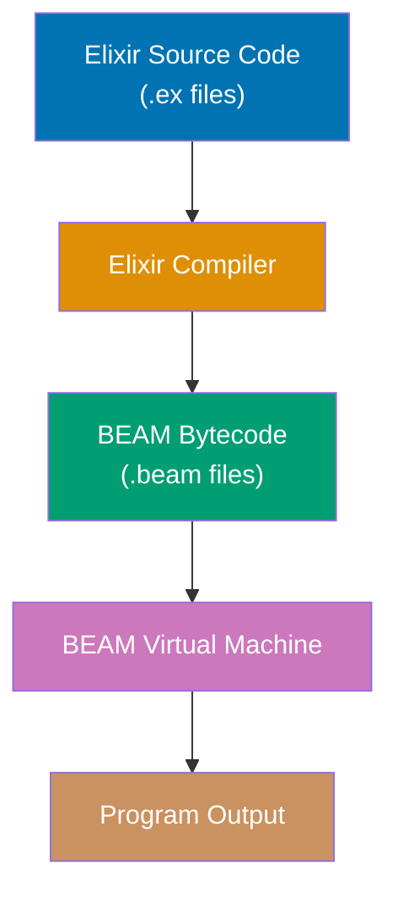
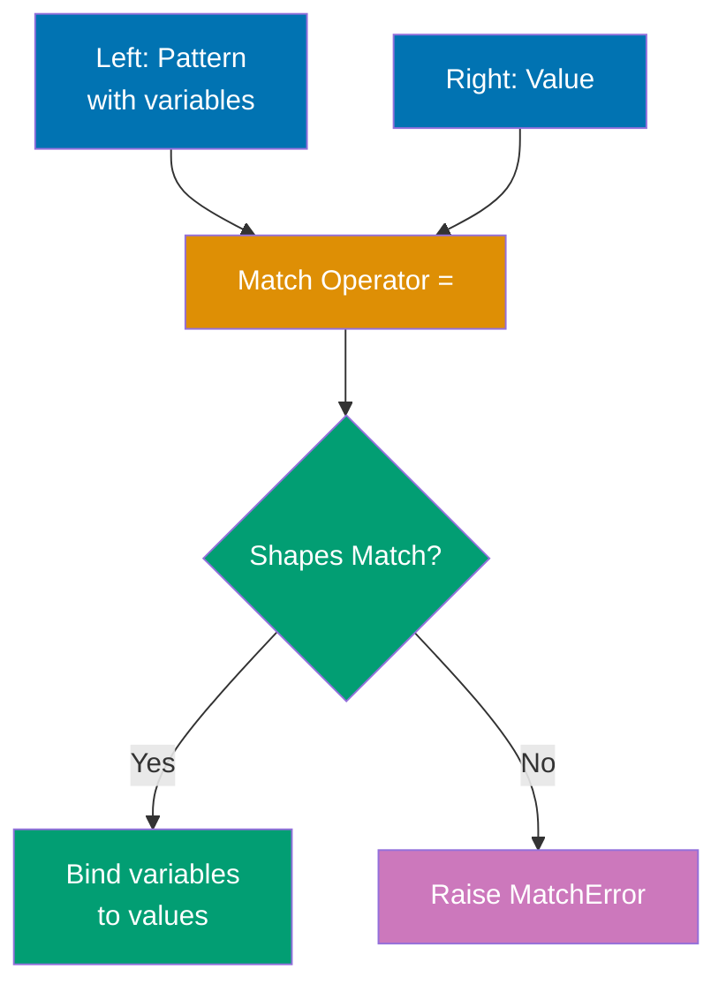
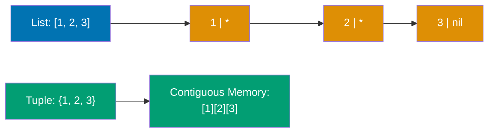
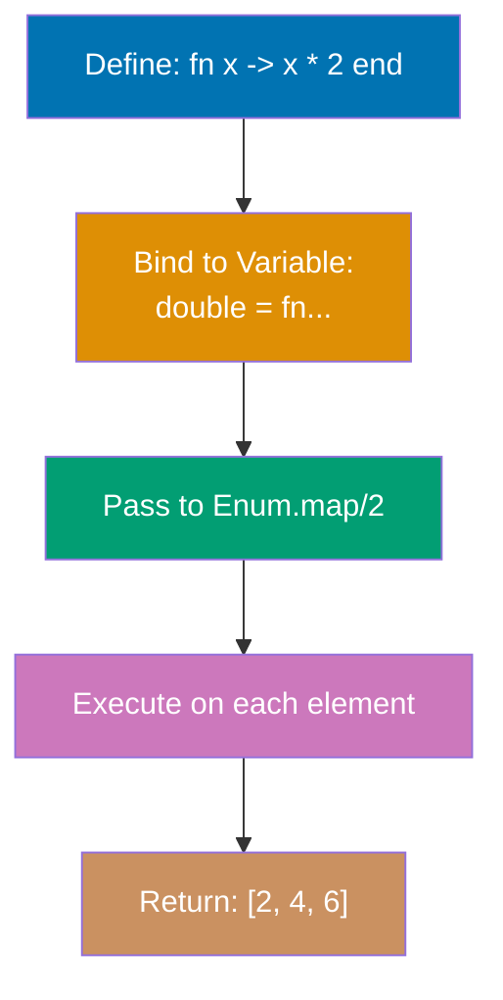
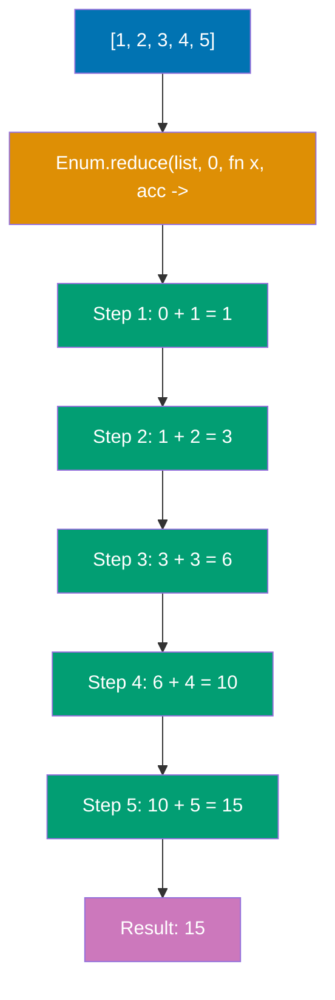
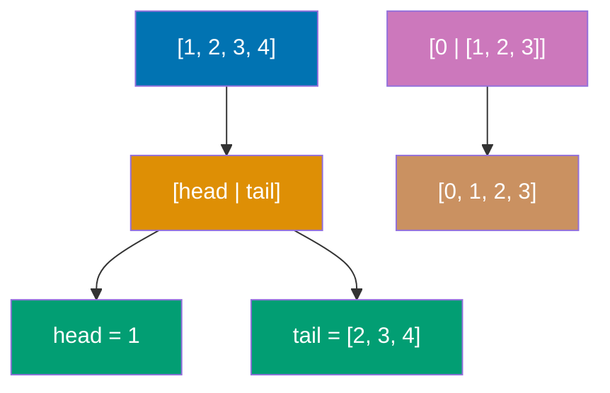

Learn Elixir fundamentals through 30 annotated code examples. Each example is self-contained, runnable in IEx, and heavily commented to show what each line does, expected outputs, and intermediate values.

## Group 1: First Steps

### Example 1: Hello World and Basic Syntax

Elixir programs run on the BEAM virtual machine (Erlang's runtime). Code can be executed interactively in IEx or compiled from `.ex` files. This example shows the simplest Elixir program and how the compilation pipeline works.



**Code**:

```elixir
defmodule Hello do
  # Define a public function using `def`
  def world do
    # IO.puts writes to standard output and returns :ok
    IO.puts("Hello, World!") # => :ok (printed output: "Hello, World!")
  end
end

Hello.world() # => :ok


```

**Key Takeaway**: Elixir code is organized into modules and functions. `IO.puts/1` returns `:ok` after printing, demonstrating Elixir's consistent return value pattern.

---

### Example 2: Variables and Immutability

Elixir variables don't hold values—they **bind** to values. The `=` operator is the **match operator**, not assignment. Once data is created, it cannot be changed (immutability), but variables can be rebound to new values.

**Code**:

```elixir
x = 1 # => 1
x # => 1

x = 2 # => 2
x # => 2

y = 1 # => 1
x = 2 # => 2

user_name = "Alice" # => "Alice"
user_age = 30 # => 30

a = b = c = 5 # => 5
a # => 5
b # => 5
c # => 5

list = [1, 2, 3] # => [1, 2, 3]
new_list = [0 | list] # => [0, 1, 2, 3]
list # => [1, 2, 3] (unchanged!)
new_list # => [0, 1, 2, 3]
```

**Key Takeaway**: Variables bind to values (they don't contain values), and data is immutable. You create new data structures instead of modifying existing ones, which enables safe concurrency.

**Why This Matters**: Immutability is foundational to the BEAM's memory model and concurrency guarantees. When data cannot be mutated, multiple processes can safely access the same data without locks or coordination—each process operates on its own copy through structural sharing. The BEAM uses reference counting for binaries and generational garbage collection per process, meaning GC pauses never stop the entire system. This architecture enables Elixir applications to handle millions of concurrent operations without the synchronization overhead that plagues mutable-state languages.

---

### Example 3: Basic Data Types

Elixir has several basic types: integers, floats, booleans, atoms, and strings. Atoms are constants where their name is their value. Strings are UTF-8 encoded binaries.

**Code**:

```elixir
integer = 42 # => 42
large_integer = 1_000_000_000_000 # => 1000000000000 (underscores for readability)
hex = 0x1F # => 31 (hexadecimal)
binary = 0b1010 # => 10 (binary)

float = 3.14 # => 3.14
scientific = 1.0e-10 # => 1.0e-10

bool_true = true # => true
bool_false = false # => false

atom = :hello # => :hello
atom_with_spaces = :"hello world" # => :"hello world"

string = "Hello, 世界!" # => "Hello, 世界!"
multiline = """
This is a
multiline string
""" # => "This is a\nmultiline string\n"

name = "Alice" # => "Alice"
greeting = "Hello, #{name}!" # => "Hello, Alice!"

is_integer(42) # => true
is_float(3.14) # => true
is_boolean(true) # => true
is_atom(:hello) # => true
is_binary("hello") # => true (strings are binaries)

i 42 # In IEx, shows: Term: 42, Data type: Integer

x = 42 # => 42 (x holds an integer)
x = "hello" # => "hello" (x now holds a string, no error!)
x = :atom # => :atom (x now holds an atom)


defmodule TypeChecker do
  def process_number(value) when is_number(value) do
    value * 2
  end

  # Guards provide runtime type checking in function clauses
  def format_value(val) when is_binary(val) do
    "String: #{val}"
  end

  def format_value(val) when is_integer(val) do
    "Number: #{val}"
  end
end

TypeChecker.process_number(21) # => 42 (works - is_number(21) is true)
TypeChecker.format_value("hello") # => "String: hello"
TypeChecker.format_value(42) # => "Number: 42"
```

**Dynamic Typing Explained**: Elixir checks types at runtime, not compile time. This gives flexibility—the same variable can hold any type. However, functions expect specific types, so runtime errors occur if you pass the wrong type. Use **guards** (the `when` keyword in function clauses) to enforce type safety and pattern match on multiple type signatures. For complex scenarios, optional type specs with `@spec` (covered in advanced sections) document expected types.

**Key Takeaway**: Elixir is dynamically typed—types are checked at runtime, giving flexibility to work with different types. The basic types are simple and consistent: atoms (`:name`) are efficient constants, strings support UTF-8 and interpolation, and integers have arbitrary precision. Use type checking functions and guards for runtime type safety.

---

## Group 2: Pattern Matching Foundation

### Example 4: Pattern Matching Basics

The `=` operator is the **match operator**, not assignment. The left side (pattern) is matched against the right side (value). If they match, variables in the pattern are bound to corresponding values. If not, a `MatchError` is raised.



**Code**:

```elixir
x = 1 # => 1

1 = x # => 1 (works! 1 equals 1)


{a, b, c} = {1, 2, 3} # => {1, 2, 3}
a # => 1
b # => 2
c # => 3

[first, second, third] = [1, 2, 3] # => [1, 2, 3]
first # => 1
second # => 2
third # => 3

{:ok, result} = {:ok, 42} # => {:ok, 42}
result # => 42


{:ok, _} = {:ok, 42} # => {:ok, 42} (42 is ignored)

{_, _, third} = {1, 2, 3} # => {1, 2, 3}
third # => 3
```

**Key Takeaway**: Pattern matching is Elixir's core feature. The `=` operator matches structures and binds variables, enabling powerful data extraction and validation in one operation.

**Why This Matters**: Pattern matching powers Elixir's "let it crash" philosophy and supervisor trees by enabling early error detection through explicit structure validation. When a pattern doesn't match, the BEAM raises a `MatchError` that supervisor processes can catch and handle through restart strategies—this fail-fast approach prevents corrupted state from propagating. In production systems, pattern matching in function heads creates self-documenting contracts that make invalid states unrepresentable, while supervisors use pattern matching on exit signals to implement sophisticated fault tolerance strategies across process boundaries.

---

### Example 5: Pin Operator (^)

By default, variables in patterns rebind to new values. The **pin operator** `^` prevents rebinding and instead matches against the variable's existing value.

**Code**:

```elixir
x = 1 # => 1
x = 2 # => 2 (x is now 2)
x # => 2

x = 1 # => 1
^x = 1 # => 1 (works! 1 matches 1)

status = :ok # => :ok

{^status, result} = {:ok, 42} # => {:ok, 42} (works!)
result # => 42


expected_status = :ok # => :ok

defmodule Matcher do
  def match_value(^expected_status, result) do
    # ^ pins expected_status from outer scope - only matches if first arg is :ok
    result
  end
end

Matcher.match_value(:ok, 42) # => 42 (works - first arg matches pinned :ok)

list = [1, 2, 3] # => [1, 2, 3]
[first | _] = list # => [1, 2, 3]
first # => 1

[^first | _] = list # => [1, 2, 3] (works - first element matches pinned value)
```

**Key Takeaway**: Use `^` when you want to match against a variable's current value instead of rebinding it. Essential for validating expected values in pattern matching.

---

### Example 6: Destructuring Collections

Pattern matching shines when destructuring complex nested data structures. You can extract deeply nested values in a single match operation.

**Code**:

```elixir
[head | tail] = [1, 2, 3, 4, 5] # => [1, 2, 3, 4, 5]
head # => 1
tail # => [2, 3, 4, 5]

[first, second | rest] = [1, 2, 3, 4, 5] # => [1, 2, 3, 4, 5]
first # => 1
second # => 2
rest # => [3, 4, 5]

[head | tail] = [1] # => [1]
head # => 1
tail # => [] (empty list)

user = {"Alice", 30, {:address, "123 Main St", "NYC"}} # => {...}
{name, age, {:address, street, city}} = user # => {...}
name # => "Alice"
age # => 30
street # => "123 Main St"
city # => "NYC"

user_map = %{name: "Bob", age: 25, city: "SF"} # => %{...}
%{name: user_name, city: user_city} = user_map # => %{...}
user_name # => "Bob"
user_city # => "SF"

nested = [[1, 2], [3, 4], [5, 6]] # => [[1, 2], [3, 4], [5, 6]]
[[a, b], [c, d], [e, f]] = nested # => [[1, 2], [3, 4], [5, 6]]
a # => 1
c # => 3
e # => 5

response = {:ok, %{status: 200, body: "Success"}} # => {...}
{:ok, %{status: status_code, body: body}} = response # => {...}
status_code # => 200
body # => "Success"
```

**Key Takeaway**: Pattern matching destructures nested data elegantly. Extract exactly what you need from complex structures in one operation, making code concise and readable.

**Why This Matters**: Elixir lists are implemented as singly-linked lists in the BEAM, making head access O(1) but indexed access O(n)—this design choice optimizes for the functional programming pattern of recursive head/tail processing. The `[head | tail]` destructuring syntax aligns perfectly with this structure, enabling efficient iteration without mutation or index tracking. In production, this means you write recursive algorithms that leverage the BEAM's tail-call optimization naturally, processing millions of elements with constant stack space while maintaining referential transparency for easier reasoning about concurrent systems.

---

## Group 3: Core Data Structures

### Example 7: Lists and Tuples

Lists are linked lists (efficient for prepending, linear access). Tuples are contiguous memory arrays (efficient for random access, fixed size). Choose based on access patterns.



**Code**:

```elixir
list = [1, 2, 3] # => [1, 2, 3]

new_list = [0 | list] # => [0, 1, 2, 3]
list # => [1, 2, 3] (unchanged, immutability!)

[1, 2] ++ [3, 4] # => [1, 2, 3, 4]

[1, 2, 3, 2, 1] -- [2] # => [1, 3, 2, 1] (removes first 2)
[1, 2, 3] -- [3, 2] # => [1]

Enum.at([1, 2, 3], 0) # => 1
Enum.at([1, 2, 3], 2) # => 3

length([1, 2, 3, 4, 5]) # => 5

tuple = {1, 2, 3} # => {1, 2, 3}

elem(tuple, 0) # => 1
elem(tuple, 2) # => 3

new_tuple = put_elem(tuple, 1, 999) # => {1, 999, 3}
tuple # => {1, 2, 3} (unchanged!)

tuple_size(tuple) # => 3


{:ok, result} = {:ok, 42} # => {:ok, 42}
{:error, reason} = {:error, "not found"} # => {:error, "not found"}
```

**Key Takeaway**: Lists are for sequential access and variable length (prepend is fast). Tuples are for fixed-size data and random access (indexing is fast). Different performance characteristics guide your choice.

---

### Example 8: Maps

Maps are key-value data structures (like hash maps or dictionaries in other languages). They're efficient for lookups and updates. Keys can be any type, but atoms are most common.

**Code**:

```elixir
map = %{"name" => "Alice", "age" => 30} # => %{"age" => 30, "name" => "Alice"}

map["name"] # => "Alice"
map["age"] # => 30
map["missing"] # => nil

user = %{name: "Bob", age: 25, city: "NYC"} # => %{age: 25, city: "NYC", name: "Bob"}

%{name: "Bob"} === %{:name => "Bob"} # => true

user.name # => "Bob"
user.age # => 25

Map.get(user, :name) # => "Bob"
Map.get(user, :missing) # => nil
Map.get(user, :missing, "N/A") # => "N/A" (default)

updated_user = %{user | age: 26} # => %{age: 26, city: "NYC", name: "Bob"}
user # => %{age: 25, city: "NYC", name: "Bob"} (unchanged!)


with_country = Map.put(user, :country, "USA")

without_age = Map.delete(user, :age) # => %{city: "NYC", name: "Bob"}

%{name: person_name} = user # => %{age: 25, city: "NYC", name: "Bob"}
person_name # => "Bob"

%{name: n, age: a} = user # => %{...}

nested = %{user: %{profile: %{bio: "Hello"}}} # => %{...}
updated_nested = put_in(nested, [:user, :profile, :bio], "Hi there!")
```

**Key Takeaway**: Maps are the go-to data structure for key-value pairs. Use atom keys for performance and dot notation convenience. Updates create new maps (immutability).

---

### Example 9: Keyword Lists

Keyword lists are lists of tuples where the first element is an atom. They look like maps but maintain order and allow duplicate keys. Commonly used for function options.

**Code**:

```elixir
keyword = [name: "Alice", age: 30] # => [name: "Alice", age: 30]

keyword === [{:name, "Alice"}, {:age, 30}] # => true

options = [timeout: 1000, timeout: 2000] # => [timeout: 1000, timeout: 2000]

Keyword.get(keyword, :name) # => "Alice"
Keyword.get(keyword, :missing) # => nil
Keyword.get(keyword, :missing, "default") # => "default"

Keyword.get(options, :timeout) # => 1000

Keyword.get_values(options, :timeout) # => [1000, 2000]

defmodule Server do
  def start(name, opts \\ []) do
    # Extract options with defaults
    port = Keyword.get(opts, :port, 8080) # => 8080 if not provided
    timeout = Keyword.get(opts, :timeout, 5000) # => 5000 if not provided
    {name, port, timeout}
  end
end

Server.start("MyServer") # => {"MyServer", 8080, 5000}
Server.start("MyServer", port: 3000) # => {"MyServer", 3000, 5000}
Server.start("MyServer", port: 3000, timeout: 10000) # => {"MyServer", 3000, 10000}

[name: n, age: a] = [name: "Bob", age: 25] # => [name: "Bob", age: 25]
n # => "Bob"
a # => 25


```

**Key Takeaway**: Keyword lists are ordered lists of `{atom, value}` tuples. Use them for function options where order matters or duplicates are needed. For everything else, use maps.

---

## Group 4: Functions

### Example 10: Anonymous Functions

Functions are first-class values in Elixir—you can assign them to variables, pass them as arguments, and return them from other functions. Anonymous functions use the `fn` syntax or capture operator `&`.



**Code**:

```elixir
add = fn a, b -> a + b end # => #Function<...>

add.(5, 3) # => 8

fizzbuzz = fn
  0, 0, _ -> "FizzBuzz"
  0, _, _ -> "Fizz"
  _, 0, _ -> "Buzz"
  _, _, x -> x
end

fizzbuzz.(0, 0, 1) # => "FizzBuzz"
fizzbuzz.(0, 1, 2) # => "Fizz"
fizzbuzz.(1, 0, 3) # => "Buzz"
fizzbuzz.(1, 1, 4) # => 4

multiply = &(&1 * &2) # => #Function<...>
multiply.(4, 5) # => 20

int_to_string = &Integer.to_string/1 # => &Integer.to_string/1
int_to_string.(42) # => "42"

apply_twice = fn f, x -> f.(f.(x)) end # => #Function<...>
increment = fn x -> x + 1 end # => #Function<...>
apply_twice.(increment, 5) # => 7 (5 + 1 + 1)

multiplier = fn factor ->
  fn x -> x * factor end
end
double = multiplier.(2) # => #Function<...>
triple = multiplier.(3) # => #Function<...>
double.(5) # => 10
triple.(5) # => 15

numbers = [1, 2, 3, 4, 5] # => [1, 2, 3, 4, 5]

Enum.map(numbers, fn x -> x * 2 end) # => [2, 4, 6, 8, 10]
Enum.filter(numbers, fn x -> rem(x, 2) == 0 end) # => [2, 4]
Enum.reduce(numbers, 0, fn x, acc -> x + acc end) # => 15

Enum.map(numbers, &(&1 * 2)) # => [2, 4, 6, 8, 10]
Enum.filter(numbers, &(rem(&1, 2) == 0)) # => [2, 4]
```

**Key Takeaway**: Functions are values that can be passed around, stored, and returned. The capture operator `&` provides concise syntax. Anonymous functions enable functional programming patterns.

---

### Example 11: Named Functions in Modules

Named functions are defined in modules using `def` (public) or `defp` (private). They support pattern matching, guards, and default arguments. Multiple clauses enable elegant branching logic.

**Code**:

```elixir
defmodule Math do
  # Public function with def
  def add(a, b) do
    a + b
  end

  # Single-line syntax for simple functions
  def subtract(a, b), do: a - b

  # Private function with defp (only callable within module)
  defp internal_multiply(a, b), do: a * b

  # Multi-clause functions (pattern matching)
  def describe(0), do: "zero"
  def describe(n) when n > 0, do: "positive"
  def describe(n) when n < 0, do: "negative"

  # Default arguments with \\
  def greet(name, greeting \\ "Hello") do
    "#{greeting}, #{name}!"
  end

  # Recursive functions
  def factorial(0), do: 1
  def factorial(n) when n > 0, do: n * factorial(n - 1)

  # Pattern matching in function heads
  def sum_list([]), do: 0
  def sum_list([head | tail]), do: head + sum_list(tail)

  # Guards for validation
  def divide(_, 0), do: {:error, "division by zero"}
  def divide(a, b) when is_number(a) and is_number(b) do
    {:ok, a / b}
  end
end

Math.add(5, 3) # => 8
Math.subtract(10, 4) # => 6

Math.describe(0) # => "zero"
Math.describe(5) # => "positive"
Math.describe(-3) # => "negative"

Math.greet("Alice") # => "Hello, Alice!" (default greeting)
Math.greet("Bob", "Hi") # => "Hi, Bob!" (custom greeting)

Math.factorial(5) # => 120
Math.sum_list([1, 2, 3, 4]) # => 10

Math.divide(10, 2) # => {:ok, 5.0}
Math.divide(10, 0) # => {:error, "division by zero"}

defmodule Example do
  def func(a), do: a
  def func(a, b), do: a + b
end

Example.func(5) # => 5
Example.func(3, 4) # => 7
```

**Key Takeaway**: Named functions use pattern matching in function heads, enabling elegant multi-clause logic. Use `def` for public, `defp` for private. Arity (number of arguments) differentiates functions.

**Why This Matters**: The BEAM's hot code reloading mechanism operates at the module level, allowing you to update running production systems without stopping them—a critical feature for high-availability services. When you deploy a new module version, the BEAM keeps both old and new versions in memory simultaneously, automatically migrating processes to the new code on their next function call. This capability requires clear module boundaries and explicit function exports (`def` vs `defp`), enabling zero-downtime deployments and A/B testing in production while maintaining process isolation guarantees across concurrent systems.

---

### Example 12: Pipe Operator (|>)

The pipe operator `|>` takes the result of an expression and passes it as the first argument to the next function. This enables readable left-to-right data transformations instead of nested function calls.

**Code**:

```elixir
result = String.upcase(String.trim("  hello  ")) # => "HELLO"

result = "  hello  "
         |> String.trim()      # => "hello"
         |> String.upcase()    # => "HELLO"

numbers = [1, 2, 3, 4, 5, 6, 7, 8, 9, 10]

sum = Enum.reduce(
  Enum.filter(
    Enum.map(numbers, fn x -> x * x end),
    fn x -> rem(x, 2) == 0 end
  ),
  0,
  fn x, acc -> x + acc end
) # => 220 (4 + 16 + 36 + 64 + 100)

sum = numbers
      |> Enum.map(fn x -> x * x end)           # => [1, 4, 9, 16, 25, 36, 49, 64, 81, 100]
      |> Enum.filter(fn x -> rem(x, 2) == 0 end) # => [4, 16, 36, 64, 100]
      |> Enum.reduce(0, fn x, acc -> x + acc end) # => 220

"hello" |> String.upcase() # => "HELLO"

5 |> (&(&1 * 2)).() # => 10
"world" |> String.duplicate(3) # => "worldworldworld"

user_names = [
  "  Alice  ",
  "  bob  ",
  " CHARLIE ",
  "  dave  "
]

formatted_names = user_names
                  |> Enum.map(&String.trim/1)           # => ["Alice", "bob", "CHARLIE", "dave"]
                  |> Enum.map(&String.capitalize/1)     # => ["Alice", "Bob", "Charlie", "Dave"]
                  |> Enum.sort()                        # => ["Alice", "Bob", "Charlie", "Dave"]
                  |> Enum.join(", ")                    # => "Alice, Bob, Charlie, Dave"

{:ok, value} = {:ok, 42}
result = value
         |> (&(&1 * 2)).() # => 84
         |> Integer.to_string() # => "84"
```

**Key Takeaway**: The pipe operator `|>` transforms nested function calls into readable left-to-right data flows. It passes the left side as the first argument to the right side function.

---

## Group 5: Control Flow and Basics

### Example 13: Case and Cond

`case` enables pattern matching on values with multiple clauses. `cond` evaluates multiple conditions and returns the result of the first truthy clause. Both provide structured branching logic.

**Code**:

```elixir
user_status = {:ok, "Alice"}

result = case user_status do
  {:ok, name} -> "Welcome, #{name}!"           # => "Welcome, Alice!"
  {:error, reason} -> "Error: #{reason}"
  _ -> "Unknown status"
end
result # => "Welcome, Alice!"

number = 15

classification = case number do
  n when n < 0 -> "negative"
  0 -> "zero"
  n when n > 0 and n <= 10 -> "small positive"
  n when n > 10 and n <= 100 -> "medium positive"
  n when n > 100 -> "large positive"
end
classification # => "medium positive"


age = 25

description = cond do
  age < 13 -> "child"
  age < 20 -> "teenager"
  age < 60 -> "adult"
  age >= 60 -> "senior"
  true -> "unknown" # Default case (always true)
end
description # => "adult"

score = 85

grade = cond do
  score >= 90 -> "A"
  score >= 80 -> "B"
  score >= 70 -> "C"
  score >= 60 -> "D"
  true -> "F"
end
grade # => "B"


http_response = {:ok, 200, "Success"}

message = case http_response do
  {:ok, 200, body} -> "OK: #{body}"
  {:ok, 404, _} -> "Not Found"
  {:ok, 500, _} -> "Server Error"
  {:error, reason} -> "Failed: #{reason}"
  _ -> "Unknown response"
end
message # => "OK: Success"

income = 50000
has_debt = false

loan_status = cond do
  income < 20000 -> "Not eligible - income too low"
  has_debt -> "Not eligible - existing debt"
  income >= 20000 and income < 50000 -> "Eligible for $10k loan"
  income >= 50000 -> "Eligible for $50k loan"
  true -> "Unknown status"
end
loan_status # => "Eligible for $50k loan"
```

**Key Takeaway**: Use `case` for pattern matching on values, `cond` for evaluating multiple conditions. Both require at least one clause to match, providing exhaustiveness checking.

---

### Example 14: Recursion Basics

Recursion is the primary looping mechanism in Elixir (no while/for loops). A recursive function calls itself with different arguments until reaching a base case. Tail-call optimization prevents stack overflow.

**Code**:

```elixir
defmodule Recursion do
  # Basic recursion - factorial
  def factorial(0), do: 1  # Base case
  def factorial(n) when n > 0 do
    n * factorial(n - 1)   # Recursive case
  end

  # Tail-recursive factorial (optimized)
  def factorial_tail(n), do: factorial_tail(n, 1)

  defp factorial_tail(0, acc), do: acc  # Base case with accumulator
  defp factorial_tail(n, acc) when n > 0 do
    factorial_tail(n - 1, n * acc)  # Tail call - last operation is recursive call
  end

  # Sum list recursively
  def sum([]), do: 0  # Base case - empty list
  def sum([head | tail]) do
    head + sum(tail)  # Recursive case - process head, recurse on tail
  end

  # Length of list
  def length([]), do: 0
  def length([_ | tail]), do: 1 + length(tail)

  # Reverse list (not tail-recursive)
  def reverse([]), do: []
  def reverse([head | tail]) do
    reverse(tail) ++ [head]  # Inefficient - appends to end each time
  end

  # Reverse list (tail-recursive, efficient)
  def reverse_tail(list), do: reverse_tail(list, [])

  defp reverse_tail([], acc), do: acc
  defp reverse_tail([head | tail], acc) do
    reverse_tail(tail, [head | acc])  # Prepend to accumulator (O(1))
  end

  # Map function - transform each element
  def map([], _func), do: []
  def map([head | tail], func) do
    [func.(head) | map(tail, func)]
  end

  # Filter function - keep elements matching predicate
  def filter([], _func), do: []
  def filter([head | tail], func) do
    if func.(head) do
      [head | filter(tail, func)]
    else
      filter(tail, func)
    end
  end
end

Recursion.factorial(5) # => 120 (5 * 4 * 3 * 2 * 1)

Recursion.factorial_tail(5) # => 120
Recursion.factorial_tail(10000) # => huge number (works without stack overflow!)

Recursion.sum([1, 2, 3, 4, 5]) # => 15

Recursion.length([1, 2, 3]) # => 3

Recursion.reverse([1, 2, 3]) # => [3, 2, 1]
Recursion.reverse_tail([1, 2, 3]) # => [3, 2, 1] (faster for large lists)

Recursion.map([1, 2, 3], fn x -> x * 2 end) # => [2, 4, 6]

Recursion.filter([1, 2, 3, 4, 5], fn x -> rem(x, 2) == 0 end) # => [2, 4]
```

**Key Takeaway**: Recursion replaces loops in Elixir. Always provide a base case to stop recursion. Tail-recursive functions (where recursive call is the last operation) are optimized to avoid stack overflow.

**Why This Matters**: The BEAM implements tail-call optimization at the VM level, meaning tail-recursive functions run in constant stack space regardless of iteration count—you can process billions of items without stack overflow. This optimization is critical in concurrent systems where each of millions of processes might perform recursive operations: non-tail-recursive functions consume stack memory proportional to recursion depth, but tail-recursive functions reuse the same stack frame. In production, this enables building reliable data pipelines that handle unbounded streams efficiently, while the BEAM's per-process heaps ensure that even if one recursive process fails, it's isolated from others through supervisor boundaries.

---

### Example 15: Enum Module Essentials

The `Enum` module provides functions for working with enumerable collections (lists, maps, ranges). Core operations include `map`, `filter`, `reduce`, `each`, and many more. Essential for functional data processing.



**Code**:

```elixir
numbers = [1, 2, 3, 4, 5]

doubled = Enum.map(numbers, fn x -> x * 2 end) # => [2, 4, 6, 8, 10]

evens = Enum.filter(numbers, fn x -> rem(x, 2) == 0 end) # => [2, 4]
odds = Enum.filter(numbers, fn x -> rem(x, 2) != 0 end) # => [1, 3, 5]

sum = Enum.reduce(numbers, 0, fn x, acc -> x + acc end) # => 15
product = Enum.reduce(numbers, 1, fn x, acc -> x * acc end) # => 120

Enum.each(numbers, fn x -> IO.puts(x) end) # Prints 1\n2\n3\n4\n5\n, returns :ok

first_even = Enum.find(numbers, fn x -> rem(x, 2) == 0 end) # => 2
missing = Enum.find(numbers, fn x -> x > 10 end) # => nil

count = Enum.count(numbers) # => 5
count_evens = Enum.count(numbers, fn x -> rem(x, 2) == 0 end) # => 2

sum = Enum.sum(numbers) # => 15
product = Enum.product(numbers) # => 120

sorted = Enum.sort([3, 1, 4, 1, 5, 9]) # => [1, 1, 3, 4, 5, 9]
sorted_desc = Enum.sort([3, 1, 4], fn a, b -> a > b end) # => [4, 3, 1]

first_three = Enum.take(numbers, 3) # => [1, 2, 3]
last_two = Enum.drop(numbers, 3) # => [4, 5]

names = ["Alice", "Bob", "Charlie"]
ages = [30, 25, 35]
zipped = Enum.zip(names, ages) # => [{"Alice", 30}, {"Bob", 25}, {"Charlie", 35}]

nested = [[1, 2], [3, 4], [5, 6]]
flattened = Enum.flat_map(nested, fn x -> x end) # => [1, 2, 3, 4, 5, 6]

words = ["apple", "ant", "banana", "bear", "cherry"]
grouped = Enum.group_by(words, fn word -> String.first(word) end)

result = [1, 2, 3, 4, 5, 6, 7, 8, 9, 10]
         |> Enum.filter(fn x -> rem(x, 2) == 0 end)  # => [2, 4, 6, 8, 10]
         |> Enum.map(fn x -> x * x end)              # => [4, 16, 36, 64, 100]
         |> Enum.sum()                               # => 220

Enum.to_list(1..10) # => [1, 2, 3, 4, 5, 6, 7, 8, 9, 10]
Enum.map(1..5, fn x -> x * x end) # => [1, 4, 9, 16, 25]

user_map = %{name: "Alice", age: 30, city: "NYC"}
Enum.map(user_map, fn {k, v} -> {k, v} end) # => [age: 30, city: "NYC", name: "Alice"]
Enum.filter(user_map, fn {_k, v} -> is_number(v) end) # => [age: 30]
```

**Key Takeaway**: `Enum` module is the Swiss Army knife for collections. `map` transforms, `filter` selects, `reduce` accumulates. Chain operations with pipe operator for readable data transformations.

---

### Example 16: Ranges and Range Operations

Ranges represent sequences of integers from start to end. They're memory-efficient (don't store all values) and work seamlessly with Enum functions. Use them for iterations, list generation, and pattern matching.

**Code**:

```elixir
# Create ranges
range1 = 1..10 # => 1..10 (includes both endpoints)
range2 = 1..10//1 # => 1..10//1 (explicit step of 1)
range3 = 10..1//-1 # => 10..1//-1 (descending range, step -1)

# Check if value in range
5 in 1..10 # => true
15 in 1..10 # => false
0 in 1..10 # => false

# Convert to list
Enum.to_list(1..5) # => [1, 2, 3, 4, 5]
Enum.to_list(10..1//-1) # => [10, 9, 8, 7, 6, 5, 4, 3, 2, 1]

# Ranges with steps
evens = 0..10//2 # => 0..10//2
Enum.to_list(evens) # => [0, 2, 4, 6, 8, 10]

odds = 1..10//2 # => 1..10//2
Enum.to_list(odds) # => [1, 3, 5, 7, 9]

# Range size
Enum.count(1..100) # => 100
Enum.count(1..10//2) # => 5

# Use ranges with Enum
Enum.map(1..5, fn x -> x * x end) # => [1, 4, 9, 16, 25]
Enum.filter(1..20, fn x -> rem(x, 3) == 0 end) # => [3, 6, 9, 12, 15, 18]
Enum.sum(1..10) # => 55 (1+2+3+...+10)

# Pattern matching with ranges
case 5 do
  x when x in 1..10 -> "In range" # => "In range" (matches!)
  _ -> "Out of range"
end

# Ranges in for comprehensions
for x <- 1..5, do: x * 2 # => [2, 4, 6, 8, 10]

# Character ranges
Enum.to_list(?a..?z) # => [97, 98, 99, ..., 122] (ASCII codes)
Enum.map(?a..?z, fn c -> <<c>> end) # => ["a", "b", "c", ..., "z"]

# Reverse a range
Enum.reverse(1..5) # => [5, 4, 3, 2, 1]

# Take from range
Enum.take(1..100, 5) # => [1, 2, 3, 4, 5]
Enum.take(1..100, -3) # => [98, 99, 100] (last 3)

# Random from range
Enum.random(1..100) # => 42 (varies - random number between 1 and 100)
```

**Key Takeaway**: Ranges are memory-efficient sequences perfect for iterations and numeric operations. They work with all Enum functions and support pattern matching with `in` operator.

---

### Example 17: String Interpolation Advanced

String interpolation embeds expressions inside strings using `#{}`. Any Elixir expression can be interpolated, and the result is automatically converted to a string. Use it for dynamic string construction.

**Code**:

```elixir
# Basic interpolation
name = "Alice" # => "Alice"
"Hello, #{name}!" # => "Hello, Alice!"

# Multiple variables
first = "Bob" # => "Bob"
last = "Smith" # => "Smith"
"Full name: #{first} #{last}" # => "Full name: Bob Smith"

# Expressions in interpolation
x = 10 # => 10
y = 20 # => 20
"Sum: #{x + y}" # => "Sum: 30"
"Product: #{x * y}" # => "Product: 200"

# Function calls in interpolation
"Uppercase: #{String.upcase("hello")}" # => "Uppercase: HELLO"
"Length: #{String.length("Elixir")}" # => "Length: 6"

# Nested interpolation
user = %{name: "Charlie", age: 25} # => %{age: 25, name: "Charlie"}
"User: #{user.name}, Age: #{user.age}" # => "User: Charlie, Age: 25"

# Conditional expressions
status = :active # => :active
"Status: #{if status == :active, do: "Active", else: "Inactive"}" # => "Status: Active"

# Case expressions
level = 5 # => 5
"Level: #{case level do
  n when n < 5 -> "Beginner"
  n when n < 10 -> "Intermediate"
  _ -> "Advanced"
end}" # => "Level: Intermediate"

# List interpolation (inspect required)
numbers = [1, 2, 3] # => [1, 2, 3]
"Numbers: #{inspect(numbers)}" # => "Numbers: [1, 2, 3]"

# Map interpolation
data = %{a: 1, b: 2} # => %{a: 1, b: 2}
"Data: #{inspect(data)}" # => "Data: %{a: 1, b: 2}"

# Multiline string with interpolation
greeting = """
Hello, #{name}!
Welcome to Elixir.
Your age is #{user.age}.
""" # => "Hello, Alice!\nWelcome to Elixir.\nYour age is 25.\n"

# Pipe operator in interpolation
result = "Result: #{1..10 |> Enum.filter(&(rem(&1, 2) == 0)) |> Enum.sum()}"
result # => "Result: 30"

# Escaping interpolation
"The syntax is: \#{variable}" # => "The syntax is: #{variable}"

# Empty interpolation
"Value: #{nil}" # => "Value: " (nil converts to empty string)
"Value: #{[]}" # => "Value: []"

# Boolean interpolation
"Active: #{true}" # => "Active: true"
"Inactive: #{false}" # => "Inactive: false"

# Atom interpolation
"Status: #{:ok}" # => "Status: ok"
```

**Key Takeaway**: String interpolation with `#{}` evaluates any Elixir expression and converts it to a string. Use `inspect/1` for complex data structures and escape with `\#{}` when needed.

---

### Example 18: List Operators and Head/Tail

Lists support special operators for prepending and pattern matching. The head/tail pattern `[head | tail]` is fundamental to recursive list processing in Elixir.



**Code**:

```elixir
# Prepend with | operator (O(1) - constant time)
list = [2, 3, 4] # => [2, 3, 4]
new_list = [1 | list] # => [1, 2, 3, 4]
list # => [2, 3, 4] (unchanged - immutability!)

# Multiple prepends
[0 | [1 | [2 | [3]]]] # => [0, 1, 2, 3]

# Destructure with pattern matching
[head | tail] = [1, 2, 3, 4, 5] # => [1, 2, 3, 4, 5]
head # => 1
tail # => [2, 3, 4, 5]

# Extract multiple elements
[first, second | rest] = [1, 2, 3, 4, 5] # => [1, 2, 3, 4, 5]
first # => 1
second # => 2
rest # => [3, 4, 5]

# Single element list
[head | tail] = [42] # => [42]
head # => 42
tail # => []

# Empty list pattern
[head | tail] = [] # => ** (MatchError) - can't match empty list

# List concatenation ++ (O(n) - linear time)
[1, 2] ++ [3, 4] # => [1, 2, 3, 4]
[1] ++ [2] ++ [3] # => [1, 2, 3]

# List subtraction -- (removes first occurrence)
[1, 2, 3, 2, 1] -- [2] # => [1, 3, 2, 1] (first 2 removed)
[1, 2, 3, 4, 5] -- [2, 4] # => [1, 3, 5]

# Membership check
1 in [1, 2, 3] # => true
5 in [1, 2, 3] # => false

# Build list with prepends (efficient)
defmodule ListBuilder do
  def build_reverse(0, acc), do: acc
  def build_reverse(n, acc) when n > 0 do
    build_reverse(n - 1, [n | acc]) # => Prepend is O(1)
  end
end

ListBuilder.build_reverse(5, []) # => [1, 2, 3, 4, 5]

# Improper list (rarely used)
[1 | 2] # => [1 | 2] (tail is not a list!)
[1, 2 | 3] # => [1, 2 | 3]

# Pattern matching in functions
defmodule Sum do
  def sum([]), do: 0 # => Base case
  def sum([head | tail]) do
    head + sum(tail) # => Recursive case
  end
end

Sum.sum([1, 2, 3, 4, 5]) # => 15

# Nested lists
[[1, 2], [3, 4]] # => [[1, 2], [3, 4]]
[head | tail] = [[1, 2], [3, 4]] # => [[1, 2], [3, 4]]
head # => [1, 2]
tail # => [[3, 4]]
```

**Key Takeaway**: Use `[head | tail]` for efficient prepending (O(1)) and pattern matching. Avoid `++` for building lists (use prepend + reverse instead). Head/tail destructuring is the foundation of recursive list processing.

---

### Example 19: If and Unless Expressions

`if` and `unless` are macros that evaluate conditions and return values. Unlike many languages, they're expressions (return values), not statements. Use them for simple two-branch conditionals.

**Code**:

```elixir
# Basic if expression
x = 10 # => 10
result = if x > 5 do
  "Greater than 5" # => "Greater than 5"
else
  "Less than or equal to 5"
end
result # => "Greater than 5"

# If without else (returns nil if false)
if true, do: "Yes" # => "Yes"
if false, do: "No" # => nil

# One-line syntax
if 2 + 2 == 4, do: "Math works", else: "Math broken" # => "Math works"

# Unless (opposite of if)
unless false, do: "This runs" # => "This runs"
unless true, do: "This doesn't run" # => nil

# Unless with else
unless 5 > 10 do
  "5 is not greater than 10" # => "5 is not greater than 10"
else
  "5 is greater than 10"
end

# Nested if
age = 25 # => 25
category = if age < 18 do
  "Minor"
else
  if age < 65 do
    "Adult" # => "Adult"
  else
    "Senior"
  end
end
category # => "Adult"

# If with pattern matching
user = {:ok, "Alice"} # => {:ok, "Alice"}
if match?({:ok, _name}, user) do
  {:ok, name} = user
  "Welcome, #{name}!" # => "Welcome, Alice!"
else
  "Error"
end

# Truthy values (everything except false and nil)
if 0, do: "Zero is truthy" # => "Zero is truthy"
if "", do: "Empty string is truthy" # => "Empty string is truthy"
if [], do: "Empty list is truthy" # => "Empty list is truthy"
if nil, do: "Nil is truthy", else: "Nil is falsy" # => "Nil is falsy"
if false, do: "False is truthy", else: "False is falsy" # => "False is falsy"

# If as last expression in function
defmodule Validator do
  def check_age(age) do
    if age >= 18 do
      {:ok, "Adult"} # => Returns this tuple if true
    else
      {:error, "Minor"}
    end
  end
end

Validator.check_age(25) # => {:ok, "Adult"}
Validator.check_age(15) # => {:error, "Minor"}

# Assign result of if
status = :active # => :active
message = if status == :active, do: "Running", else: "Stopped"
message # => "Running"

# Guard-like conditions
x = 5 # => 5
if is_integer(x) and x > 0, do: "Positive integer" # => "Positive integer"

# Unless for negative conditions (more readable)
if not (x == 0), do: "Not zero" # => Less readable
unless x == 0, do: "Not zero" # => More readable
```

**Key Takeaway**: `if` and `unless` are expressions that return values. Only `false` and `nil` are falsy; everything else is truthy. Use `unless` for negative conditions to improve readability.

---

### Example 20: Multiple Function Clauses

Functions with multiple clauses use pattern matching to dispatch to the correct implementation. Clauses are tried top-to-bottom until one matches. This enables elegant branching without if/else.

**Code**:

```elixir
# Multiple clauses with different patterns
defmodule Math do
  def abs(n) when n < 0, do: -n # => First clause: negative numbers
  def abs(n) when n >= 0, do: n # => Second clause: positive and zero
end

Math.abs(-5) # => 5
Math.abs(10) # => 10
Math.abs(0) # => 0

# Pattern matching on data types
defmodule TypeHandler do
  def handle(x) when is_integer(x), do: "Integer: #{x}"
  def handle(x) when is_binary(x), do: "String: #{x}"
  def handle(x) when is_atom(x), do: "Atom: #{inspect(x)}"
  def handle(_), do: "Unknown type"
end

TypeHandler.handle(42) # => "Integer: 42"
TypeHandler.handle("hello") # => "String: hello"
TypeHandler.handle(:ok) # => "Atom: :ok"
TypeHandler.handle([1, 2]) # => "Unknown type"

# Pattern matching on tuples
defmodule Response do
  def format({:ok, data}), do: "Success: #{data}"
  def format({:error, reason}), do: "Error: #{reason}"
  def format(_), do: "Unknown response"
end

Response.format({:ok, "Data loaded"}) # => "Success: Data loaded"
Response.format({:error, "Not found"}) # => "Error: Not found"
Response.format(:unknown) # => "Unknown response"

# Pattern matching on lists
defmodule ListOps do
  def first([]), do: nil # => Empty list
  def first([head | _tail]), do: head # => Non-empty list
end

ListOps.first([1, 2, 3]) # => 1
ListOps.first([]) # => nil

# Combining patterns and guards
defmodule Grade do
  def letter_grade(score) when score >= 90, do: "A"
  def letter_grade(score) when score >= 80, do: "B"
  def letter_grade(score) when score >= 70, do: "C"
  def letter_grade(score) when score >= 60, do: "D"
  def letter_grade(_score), do: "F"
end

Grade.letter_grade(95) # => "A"
Grade.letter_grade(75) # => "C"
Grade.letter_grade(55) # => "F"

# Different arities (different number of arguments)
defmodule Greeter do
  def greet(name), do: "Hello, #{name}!"
  def greet(name, greeting), do: "#{greeting}, #{name}!"
end

Greeter.greet("Alice") # => "Hello, Alice!"
Greeter.greet("Bob", "Hi") # => "Hi, Bob!"

# Map pattern matching
defmodule UserHandler do
  def role(%{role: :admin}), do: "Administrator"
  def role(%{role: :user}), do: "Regular User"
  def role(_), do: "Guest"
end

UserHandler.role(%{role: :admin, name: "Alice"}) # => "Administrator"
UserHandler.role(%{role: :user, name: "Bob"}) # => "Regular User"
UserHandler.role(%{name: "Charlie"}) # => "Guest"

# Recursive clauses with pattern matching
defmodule Factorial do
  def calc(0), do: 1 # => Base case
  def calc(n) when n > 0, do: n * calc(n - 1) # => Recursive case
end

Factorial.calc(5) # => 120

# Order matters! Specific before general
defmodule OrderMatters do
  # CORRECT order: specific first
  def classify(0), do: "Zero"
  def classify(n) when n < 0, do: "Negative"
  def classify(n) when n > 0, do: "Positive"

  # WRONG order would be:
  # def classify(n), do: "Number"  # This would match everything!
  # def classify(0), do: "Zero"    # Never reached
end

OrderMatters.classify(0) # => "Zero"
OrderMatters.classify(-5) # => "Negative"
OrderMatters.classify(10) # => "Positive"
```

**Key Takeaway**: Multiple function clauses enable pattern-based dispatch. Order matters—place specific patterns before general ones. Use guards for value-based conditions and pattern matching for structure-based branching.

---

### Example 21: Default Arguments

Default arguments provide fallback values when arguments aren't supplied. Define them with `\\` syntax. Functions with defaults generate multiple arities automatically.

**Code**:

```elixir
# Basic default argument
defmodule Greeter do
  def greet(name, greeting \\ "Hello") do
    "#{greeting}, #{name}!"
  end
end

Greeter.greet("Alice") # => "Hello, Alice!" (uses default)
Greeter.greet("Bob", "Hi") # => "Hi, Bob!" (overrides default)

# Multiple default arguments
defmodule Server do
  def start(name, port \\ 8080, timeout \\ 5000) do
    {name, port, timeout}
  end
end

Server.start("MyServer") # => {"MyServer", 8080, 5000}
Server.start("MyServer", 3000) # => {"MyServer", 3000, 5000}
Server.start("MyServer", 3000, 10000) # => {"MyServer", 3000, 10000}

# Default with expressions (evaluated at call time)
defmodule Logger do
  def log(message, timestamp \\ DateTime.utc_now()) do
    "#{timestamp}: #{message}"
  end
end

Logger.log("Event happened") # => "2024-12-23 10:30:45Z: Event happened"
:timer.sleep(1000)
Logger.log("Another event") # => "2024-12-23 10:30:46Z: Another event" (different time!)

# Default arguments with pattern matching
defmodule User do
  def create(name, age \\ 0, role \\ :user) do
    %{name: name, age: age, role: role}
  end
end

User.create("Alice") # => %{age: 0, name: "Alice", role: :user}
User.create("Bob", 25) # => %{age: 25, name: "Bob", role: :user}
User.create("Charlie", 30, :admin) # => %{age: 30, name: "Charlie", role: :admin}

# Defaults with guards
defmodule Calculator do
  def divide(a, b \\ 1) when b != 0 do
    a / b
  end
end

Calculator.divide(10) # => 10.0 (10 / 1)
Calculator.divide(10, 2) # => 5.0

# Default arguments in multiple clauses (tricky!)
defmodule MultiClause do
  # When using defaults with multiple clauses, define a function head
  def process(data, opts \\ [])
  def process(data, opts) when is_list(opts) do
    {data, Keyword.get(opts, :mode, :default)}
  end
end

MultiClause.process("data") # => {"data", :default}
MultiClause.process("data", mode: :custom) # => {"data", :custom}

# Default with map/struct
defmodule Config do
  def build(name, opts \\ %{}) do
    Map.merge(%{timeout: 5000, retries: 3}, opts)
    |> Map.put(:name, name)
  end
end

Config.build("app") # => %{name: "app", retries: 3, timeout: 5000}
Config.build("app", %{timeout: 10000}) # => %{name: "app", retries: 3, timeout: 10000}

# Default empty list for accumulator
defmodule ListOps do
  def reverse(list, acc \\ [])
  def reverse([], acc), do: acc
  def reverse([head | tail], acc) do
    reverse(tail, [head | acc])
  end
end

ListOps.reverse([1, 2, 3]) # => [3, 2, 1]

# Keyword list defaults
defmodule Builder do
  def build(name, opts \\ [timeout: 5000, async: false]) do
    timeout = Keyword.get(opts, :timeout)
    async = Keyword.get(opts, :async)
    {name, timeout, async}
  end
end

Builder.build("task") # => {"task", 5000, false}
Builder.build("task", timeout: 10000) # => {"task", 10000, false}
```

**Key Takeaway**: Default arguments use `\\` syntax and are evaluated at call time. When using defaults with multiple clauses, define a function head. Defaults create multiple arities automatically.

---

### Example 22: First-Class Functions

Functions are first-class values—they can be assigned to variables, passed as arguments, and returned from other functions. This enables higher-order functions and functional programming patterns.

**Code**:

```elixir
# Assign function to variable
add = fn a, b -> a + b end # => #Function<...>
add.(5, 3) # => 8

# Pass function as argument
defmodule Math do
  def apply_twice(f, x) do
    f.(f.(x)) # => Call function twice
  end
end

increment = fn x -> x + 1 end # => #Function<...>
Math.apply_twice(increment, 5) # => 7 (5 + 1 + 1)

double = fn x -> x * 2 end # => #Function<...>
Math.apply_twice(double, 3) # => 12 (3 * 2 * 2)

# Return function from function
defmodule FunctionFactory do
  def multiplier(factor) do
    fn x -> x * factor end # => Return anonymous function
  end
end

times_three = FunctionFactory.multiplier(3) # => #Function<...>
times_three.(10) # => 30

times_five = FunctionFactory.multiplier(5) # => #Function<...>
times_five.(10) # => 50

# Capture operator & shorthand
square = &(&1 * &1) # => #Function<...>
square.(7) # => 49

add_captured = &(&1 + &2) # => #Function<...>
add_captured.(10, 20) # => 30

# Capture existing function
int_to_string = &Integer.to_string/1 # => &Integer.to_string/1
int_to_string.(42) # => "42"

string_length = &String.length/1 # => &String.length/1
string_length.("hello") # => 5

# Higher-order functions with Enum
numbers = [1, 2, 3, 4, 5] # => [1, 2, 3, 4, 5]

Enum.map(numbers, fn x -> x * 2 end) # => [2, 4, 6, 8, 10]
Enum.map(numbers, &(&1 * 2)) # => [2, 4, 6, 8, 10] (same, shorter)

Enum.filter(numbers, fn x -> rem(x, 2) == 0 end) # => [2, 4]
Enum.filter(numbers, &(rem(&1, 2) == 0)) # => [2, 4]

# Store functions in data structures
operations = %{
  add: fn a, b -> a + b end,
  subtract: fn a, b -> a - b end,
  multiply: fn a, b -> a * b end
}

operations[:add].(10, 5) # => 15
operations[:multiply].(10, 5) # => 50

# Closures (capture surrounding variables)
x = 10 # => 10
add_x = fn y -> x + y end # => Captures x
add_x.(5) # => 15

x = 20 # => 20 (rebind x)
add_x.(5) # => 15 (still uses original x = 10!)

# Function composition
defmodule Compose do
  def compose(f, g) do
    fn x -> f.(g.(x)) end
  end
end

add_one = fn x -> x + 1 end # => #Function<...>
double_fn = fn x -> x * 2 end # => #Function<...>

double_then_add = Compose.compose(add_one, double_fn) # => #Function<...>
double_then_add.(5) # => 11 (5 * 2 + 1)

# Partial application
defmodule Partial do
  def partial(f, a) do
    fn b -> f.(a, b) end
  end
end

add_fn = fn a, b -> a + b end # => #Function<...>
add_10 = Partial.partial(add_fn, 10) # => #Function<...>
add_10.(5) # => 15
add_10.(20) # => 30

# Functions in pattern matching
execute = fn
  {:add, a, b} -> a + b
  {:multiply, a, b} -> a * b
  {:subtract, a, b} -> a - b
end

execute.({:add, 5, 3}) # => 8
execute.({:multiply, 5, 3}) # => 15
```

**Key Takeaway**: Functions are first-class values that can be assigned, passed, and returned. Use `&` for capture syntax. Closures capture surrounding variables. Higher-order functions enable powerful functional patterns.

---

### Example 23: Module Compilation and Loading

Modules are compiled to BEAM bytecode when loaded. Understanding compilation, recompilation, and the code loading process helps with development workflow and debugging.

**Code**:

```elixir
# Define a simple module
defmodule Example do
  def hello, do: "Hello, World!"
end

Example.hello() # => "Hello, World!"

# Check if module is loaded
Code.ensure_loaded?(Example) # => true
Code.ensure_loaded?(:non_existent) # => false

# Get module info
Example.__info__(:functions) # => [hello: 0]
Example.__info__(:module) # => Example

# Module attributes compiled into module
defmodule Versioned do
  @version "1.0.0" # => Compile-time constant

  def version, do: @version
end

Versioned.version() # => "1.0.0"

# Redefine module (in IEx)
defmodule Example do
  def hello, do: "Hi there!" # => Redefined
end

Example.hello() # => "Hi there!" (new definition)

# Get module compilation info
defmodule Compiled do
  def created_at, do: DateTime.utc_now()
end

# Module is compiled once, function returns same time
time1 = Compiled.created_at() # => 2024-12-23 10:30:00Z
:timer.sleep(1000)
time2 = Compiled.created_at() # => 2024-12-23 10:30:00Z (same!)

# Lazy module compilation
defmodule Lazy do
  @computed_value Enum.sum(1..1000) # => Computed at compile time

  def value, do: @computed_value
end

Lazy.value() # => 500500 (already computed, no runtime calculation)

# Check where module is defined (file path)
defmodule MyModule do
  def location, do: __ENV__.file
end

# Get all loaded modules
:code.all_loaded()
|> Enum.filter(fn {mod, _path} ->
  mod |> to_string() |> String.starts_with?("Elixir.")
end)
|> Enum.take(5) # => [{Elixir.Enum, ...}, {Elixir.String, ...}, ...]

# Purge and reload module (development only!)
:code.purge(Example) # => true (removes old code)
:code.delete(Example) # => true (marks for deletion)

# Module defined inside function (unusual but valid)
defmodule Outer do
  def create_module do
    defmodule Inner do
      def greet, do: "Hello from inner!"
    end
    Inner.greet()
  end
end

Outer.create_module() # => "Hello from inner!"
Outer.Inner.greet() # => "Hello from inner!" (accessible!)

# Check module exports
Example.module_info(:exports) # => [hello: 0, module_info: 0, module_info: 1]

# Module defined with Macro
defmodule Dynamic do
  Module.register_attribute(__MODULE__, :custom_attr, persist: true)
  @custom_attr "custom value"

  def get_attr do
    @custom_attr
  end
end

Dynamic.get_attr() # => "custom value"
```

**Key Takeaway**: Modules compile to BEAM bytecode when defined. Module attributes are compile-time constants. Use `Code.ensure_loaded?/1` to check loading status. In production, modules are compiled once; in IEx, redefinition is allowed for development.

---

### Example 24: IEx Basics and Helpers

IEx (Interactive Elixir) is the REPL for running Elixir code interactively. It provides helpers for documentation, introspection, compilation, and debugging.

**Code**:

```elixir
# Basic IEx helpers (run in IEx)

# h - Help for modules and functions
h(Enum) # => Shows documentation for Enum module
h(Enum.map) # => Shows documentation for Enum.map/2
h(Enum.map/2) # => Same, explicit arity

# i - Information about data types
i(42) # => Shows: Term: 42, Data type: Integer, Reference modules: Integer
i("hello") # => Shows: Term: "hello", Data type: BitString (binary)
i([1, 2, 3]) # => Shows: Term: [1, 2, 3], Data type: List

# v - Retrieve previous results
1 + 1 # => 2
v(1) # => 2 (gets result from line 1)
v(1) * 10 # => 20

v() # => Gets last result
v(-1) # => Same as v()
v(-2) # => Second-to-last result

# c - Compile file
# c("path/to/file.ex") # => Compiles and loads module

# r - Recompile module
# r(MyModule) # => Recompiles module from source

# s - Print spec information
defmodule TypedModule do
  @spec add(integer(), integer()) :: integer()
  def add(a, b), do: a + b
end

# s(TypedModule.add) # => Shows type spec

# t - Print types
# t(String) # => Shows String types

# b - Print callbacks
# b(GenServer) # => Shows GenServer callbacks

# exports - List module functions
exports(Enum) # => Lists all Enum functions: [at: 2, count: 1, ...]

# imports - Show current imports
imports() # => Shows: Kernel, Kernel.SpecialForms

# Clear screen
# clear() # => Clears IEx screen

# Break out of execution
# Use Ctrl+C twice to exit IEx

# Respawn IEx (after crash)
# respawn() # => Restarts IEx session

# pwd - Print working directory
# pwd() # => Shows current directory

# ls - List files
# ls() # => Lists files in current directory
# ls("lib") # => Lists files in lib/ directory

# cd - Change directory
# cd("lib") # => Changes to lib/ directory

# Flush messages
send(self(), :hello) # => :hello (send message to self)
send(self(), :world) # => :world
flush() # => Prints: :hello, :world (and removes from mailbox)

# Runtime info
runtime_info() # => Shows system information

# Memory info
runtime_info(:system) # => Shows system memory

# Load .iex.exs file with custom helpers
# Create ~/.iex.exs with custom functions/imports
# They'll be available in every IEx session

# Example custom IEx config (~/.iex.exs):
# import_file_if_available("~/.iex.exs")
#
# IEx.configure(
#   colors: [enabled: true],
#   default_prompt: "%prefix(%counter)>",
#   alive_prompt: "%prefix(%node)%counter>"
# )
```

**Key Takeaway**: IEx provides powerful helpers for interactive development. Use `h` for docs, `i` for data info, `v` for history, and `c`/`r` for compilation. Configure IEx with `~/.iex.exs` for custom workflows.

---

### Example 25: Boolean and Comparison Operators

Elixir provides boolean operators (`and`, `or`, `not`) and comparison operators (`==`, `===`, `!=`, `<`, `>`, etc.). Boolean operators are strict (require booleans), while `&&`, `||`, `!` work with truthy/falsy values.

**Code**:

```elixir
# Boolean operators (strict - require true/false)
true and true # => true
true and false # => false
false or true # => true
false or false # => false
not true # => false
not false # => true

# Relaxed boolean operators (work with any values)
1 && 2 # => 2 (returns last truthy value)
nil && 5 # => nil (returns first falsy)
false && "never" # => false

1 || 2 # => 1 (returns first truthy)
nil || false || 5 # => 5 (returns first truthy)
false || nil || "default" # => "default"

!true # => false
!false # => true
!nil # => true (nil is falsy)
!5 # => false (5 is truthy)

# Comparison operators
1 == 1 # => true
1 == 1.0 # => true (value equality)
1 === 1 # => true
1 === 1.0 # => false (strict equality - different types)

1 != 2 # => true
1 !== 1.0 # => true (strict inequality)

# Ordering
1 < 2 # => true
2 > 1 # => true
1 <= 1 # => true
2 >= 1 # => true

# String comparison
"a" < "b" # => true
"apple" < "banana" # => true

# Atom comparison
:atom < :beta # => true

# Different type comparison (defined ordering)
1 < :atom # => true
:atom < "string" # => true
"string" < [1, 2] # => true
[1, 2] < {1, 2} # => true

# Type ordering: number < atom < reference < function < port < pid < tuple < map < list < bitstring

# Short-circuit evaluation
true or raise("Never raised") # => true (doesn't evaluate right side)
false and raise("Never raised") # => false

# Pattern matching with guards
x = 10 # => 10
case x do
  n when n > 0 and n < 100 -> "In range" # => "In range"
  _ -> "Out of range"
end

# Combining comparisons
x = 50 # => 50
x > 0 and x < 100 # => true

age = 25 # => 25
age >= 18 and age < 65 # => true

# Truthy/falsy in conditions
if 0, do: "Zero is truthy!" # => "Zero is truthy!"
if "", do: "Empty string is truthy!" # => "Empty string is truthy!"
if [], do: "Empty list is truthy!" # => "Empty list is truthy!"
if nil, do: "Nil is truthy", else: "Nil is falsy" # => "Nil is falsy"

# Comparison functions
Kernel.==(1, 1) # => true (same as 1 == 1)
Kernel.===(1, 1.0) # => false

# Min and max with comparison
min(5, 10) # => 5
max(5, 10) # => 10
min("apple", "banana") # => "apple"

# Custom comparison
defmodule Compare do
  def within_range?(value, min, max) do
    value >= min and value <= max
  end
end

Compare.within_range?(5, 1, 10) # => true
Compare.within_range?(15, 1, 10) # => false
```

**Key Takeaway**: Use `and`/`or`/`not` for strict boolean logic, `&&`/`||`/`!` for truthy/falsy values. `==` for value equality, `===` for strict type equality. All types are comparable with defined ordering.

---

### Example 26: Truthy and Falsy Values

In Elixir, only `false` and `nil` are falsy—everything else is truthy. This differs from many languages where `0`, `""`, `[]` are falsy. Understanding truthiness is essential for conditionals.

**Code**:

```elixir
# Only false and nil are falsy
if false, do: "Truthy", else: "Falsy" # => "Falsy"
if nil, do: "Truthy", else: "Falsy" # => "Falsy"

# Everything else is truthy
if true, do: "Truthy" # => "Truthy"
if 0, do: "Truthy" # => "Truthy" (unlike JavaScript, Python)
if "", do: "Truthy" # => "Truthy"
if [], do: "Truthy" # => "Truthy"
if {}, do: "Truthy" # => "Truthy"
if %{}, do: "Truthy" # => "Truthy"

# Atoms are truthy (except false and nil)
if :ok, do: "Truthy" # => "Truthy"
if :error, do: "Truthy" # => "Truthy"

# Using truthy/falsy with ||
nil || false || 0 # => 0 (first truthy value)
nil || false || nil || "default" # => "default"

# Using truthy/falsy with &&
true && "value" # => "value"
5 && 10 # => 10 (both truthy, returns last)
nil && "never" # => nil (stops at first falsy)

# Default values with ||
name = nil # => nil
display_name = name || "Guest" # => "Guest"

config = %{timeout: nil} # => %{timeout: nil}
timeout = config[:timeout] || 5000 # => 5000

# Presence checks
defmodule User do
  def display_name(user) do
    user[:name] || "Anonymous" # => Use name or default
  end
end

User.display_name(%{name: "Alice"}) # => "Alice"
User.display_name(%{}) # => "Anonymous"
User.display_name(%{name: nil}) # => "Anonymous"

# Converting to boolean explicitly
!!true # => true
!!false # => false
!!nil # => false
!!0 # => true
!!"hello" # => true

# Pattern matching with nil check
defmodule NilHandler do
  def handle(nil), do: "Got nil"
  def handle(value), do: "Got value: #{value}"
end

NilHandler.handle(nil) # => "Got nil"
NilHandler.handle(0) # => "Got value: 0"
NilHandler.handle(false) # => "Got value: false"

# Conditional execution with &&
user = %{admin: true} # => %{admin: true}
user[:admin] && IO.puts("Admin action") # Prints: Admin action, returns :ok

user = %{admin: false} # => %{admin: false}
user[:admin] && IO.puts("Admin action") # => false (doesn't print)

# Safe navigation with truthy checks
data = nil # => nil
data && data.field # => nil (safe - doesn't try to access field)

data = %{field: "value"} # => %{field: "value"}
data && data.field # => "value"

# Guard against nil in functions
defmodule SafeMath do
  def divide(a, b) when not is_nil(a) and not is_nil(b) and b != 0 do
    a / b
  end
  def divide(_a, _b), do: nil
end

SafeMath.divide(10, 2) # => 5.0
SafeMath.divide(10, nil) # => nil
SafeMath.divide(nil, 2) # => nil
```

**Key Takeaway**: Only `false` and `nil` are falsy; everything else (including `0`, `""`, `[]`) is truthy. Use `||` for default values and `&&` for conditional execution. This differs from many other languages.

---

### Example 27: String Concatenation

Strings can be concatenated with the `<>` operator or built with interpolation and IO lists. Understanding performance trade-offs between methods is important for production code.

**Code**:

```elixir
# Basic concatenation with <>
"Hello" <> " " <> "World" # => "Hello World"

# Concatenate multiple strings
"a" <> "b" <> "c" <> "d" # => "abcd"

# Variables
first = "Hello" # => "Hello"
second = "World" # => "World"
first <> " " <> second # => "Hello World"

# Concatenation with interpolation (often clearer)
name = "Alice" # => "Alice"
"Hello, " <> name <> "!" # => "Hello, Alice!"
"Hello, #{name}!" # => "Hello, Alice!" (cleaner!)

# Building strings in loop (inefficient)
Enum.reduce(1..1000, "", fn x, acc ->
  acc <> to_string(x) <> "," # => Creates new string each iteration (slow!)
end)

# Better: use IO list and convert once
iolist = Enum.map(1..1000, fn x -> [to_string(x), ","] end)
IO.iodata_to_binary(iolist) # => "1,2,3,...,1000," (efficient!)

# String builder pattern
defmodule StringBuilder do
  def build(parts) when is_list(parts) do
    Enum.join(parts, "") # => Efficient join
  end
end

StringBuilder.build(["Hello", " ", "World"]) # => "Hello World"

# Concatenate with Enum.join
words = ["Elixir", "is", "awesome"] # => ["Elixir", "is", "awesome"]
Enum.join(words, " ") # => "Elixir is awesome"

# Custom separator
Enum.join(["a", "b", "c"], "-") # => "a-b-c"
Enum.join(1..5, ", ") # => "1, 2, 3, 4, 5"

# Empty strings
"" <> "hello" # => "hello"
"hello" <> "" # => "hello"

# Multiline string concatenation
long_string = "This is line 1. " <>
              "This is line 2. " <>
              "This is line 3."
long_string # => "This is line 1. This is line 2. This is line 3."

# Pattern matching with string concatenation
"Hello " <> name = "Hello Alice" # => "Hello Alice"
name # => "Alice"

# Concatenation in function
defmodule Formatter do
  def format_name(first, last) do
    first <> " " <> last
  end

  def format_title(title, name) do
    "#{title}. #{name}" # => Interpolation often cleaner
  end
end

Formatter.format_name("John", "Doe") # => "John Doe"
Formatter.format_title("Dr", "Smith") # => "Dr. Smith"

# Performance comparison
# SLOW (creates intermediate strings):
Enum.reduce(1..10_000, "", fn x, acc -> acc <> to_string(x) end)

# FAST (IO list, single allocation):
1..10_000 |> Enum.map(&to_string/1) |> Enum.join()

# Binary concatenation (same as string)
<<1, 2>> <> <<3, 4>> # => <<1, 2, 3, 4>>
```

**Key Takeaway**: Use `<>` for simple concatenation, interpolation for readability, and `Enum.join/2` or IO lists for building strings in loops. Avoid repeated `<>` in loops (creates intermediate strings).

---

### Example 28: List Comprehensions Basics

List comprehensions provide concise syntax for generating lists from enumerables. They combine mapping, filtering, and flattening operations in readable syntax.

**Code**:

```elixir
# Basic comprehension (like Enum.map)
for x <- [1, 2, 3, 4, 5], do: x * 2 # => [2, 4, 6, 8, 10]

# Same as Enum.map
Enum.map([1, 2, 3, 4, 5], fn x -> x * 2 end) # => [2, 4, 6, 8, 10]

# Comprehension with filter
for x <- 1..10, rem(x, 2) == 0, do: x # => [2, 4, 6, 8, 10]

# Multiple filters
for x <- 1..20,
    rem(x, 2) == 0, # => Even numbers
    rem(x, 3) == 0, # => Divisible by 3
    do: x
# => [6, 12, 18] (divisible by both 2 and 3)

# Multiple generators (cartesian product)
for x <- [1, 2], y <- [3, 4], do: {x, y}
# => [{1, 3}, {1, 4}, {2, 3}, {2, 4}]

# Nested comprehension
for x <- 1..3, y <- 1..3, do: x * y
# => [1, 2, 3, 2, 4, 6, 3, 6, 9]

# Pattern matching in generator
users = [
  {:user, "Alice", 30},
  {:user, "Bob", 25},
  {:admin, "Charlie", 35}
]

for {:user, name, age} <- users, do: {name, age}
# => [{"Alice", 30}, {"Bob", 25}] (admin filtered out by pattern)

# Comprehension with maps
for {key, value} <- %{a: 1, b: 2, c: 3}, do: {key, value * 10}
# => [a: 10, b: 20, c: 30]

# Generate map from comprehension
for x <- 1..3, into: %{}, do: {x, x * x}
# => %{1 => 1, 2 => 4, 3 => 9}

# String comprehension
for <<c <- "hello">>, do: c
# => [104, 101, 108, 108, 111] (character codes)

for <<c <- "hello">>, do: <<c>>
# => ["h", "e", "l", "l", "o"]

# Filter and transform
for x <- 1..10, x > 5, do: x * x
# => [36, 49, 64, 81, 100]

# Flatten nested lists
nested = [[1, 2], [3, 4], [5, 6]]
for list <- nested, x <- list, do: x
# => [1, 2, 3, 4, 5, 6] (flattened!)

# Multiplication table
for x <- 1..5, y <- 1..5, do: {x, y, x * y}
# => [{1, 1, 1}, {1, 2, 2}, ..., {5, 5, 25}]

# Filter with guards
for x <- 1..20, rem(x, 5) == 0, x > 10, do: x
# => [15, 20]

# Multiple values
for x <- [1, 2, 3], do: [x, x * 2]
# => [[1, 2], [2, 4], [3, 6]]

# Comprehension with into option
for x <- ["a", "b", "c"], into: "", do: String.upcase(x)
# => "ABC" (into string)
```

**Key Takeaway**: List comprehensions combine generators (`<-`), filters (guards), and transformations. They're more readable than nested `Enum` calls for complex transformations. Use `into:` to specify output collection type.

---

### Example 29: Tuple Matching and Destructuring

Tuples are fixed-size collections matched by position. Pattern matching on tuples enables elegant error handling with tagged tuples like `{:ok, value}` and `{:error, reason}`.

**Code**:

```elixir
# Basic tuple matching
{a, b, c} = {1, 2, 3} # => {1, 2, 3}
a # => 1
b # => 2
c # => 3

# Nested tuple matching
{x, {y, z}} = {1, {2, 3}} # => {1, {2, 3}}
x # => 1
y # => 2
z # => 3

# Ignore values with _
{first, _, third} = {1, 2, 3} # => {1, 2, 3}
first # => 1
third # => 3

# Tagged tuples (common Elixir pattern)
{:ok, value} = {:ok, 42} # => {:ok, 42}
value # => 42

{:error, reason} = {:error, "not found"} # => {:error, "not found"}
reason # => "not found"

# Function return tuples
defmodule FileOps do
  def read_file(path) do
    case File.read(path) do
      {:ok, content} -> {:ok, String.upcase(content)}
      {:error, reason} -> {:error, reason}
    end
  end
end

# Pattern matching in case
result = {:ok, "data"}
case result do
  {:ok, data} -> "Success: #{data}" # => "Success: data"
  {:error, reason} -> "Error: #{reason}"
end

# Pattern matching in function heads
defmodule Handler do
  def handle({:ok, data}), do: "Got: #{data}"
  def handle({:error, reason}), do: "Failed: #{reason}"
  def handle(_), do: "Unknown"
end

Handler.handle({:ok, "value"}) # => "Got: value"
Handler.handle({:error, "timeout"}) # => "Failed: timeout"

# Multiple return values
defmodule Math do
  def div_rem(a, b) do
    {div(a, b), rem(a, b)} # => Return tuple
  end
end

{quotient, remainder} = Math.div_rem(17, 5)
quotient # => 3
remainder # => 2

# Tuple size checking
tuple = {1, 2, 3} # => {1, 2, 3}
tuple_size(tuple) # => 3

# Accessing tuple elements
elem(tuple, 0) # => 1
elem(tuple, 2) # => 3

# Updating tuple (creates new tuple)
put_elem(tuple, 1, 99) # => {1, 99, 3}
tuple # => {1, 2, 3} (unchanged - immutability!)

# Common patterns: coordinates
{x, y} = {10, 20} # => {10, 20}

# RGB colors
{r, g, b} = {255, 128, 0} # => {255, 128, 0}

# Key-value pairs (before maps)
{:name, "Alice"} # => {:name, "Alice"}
{:age, 30} # => {:age, 30}

# Process communication
pid = self() # => #PID<0.123.0>
send(pid, {:message, "Hello"}) # => {:message, "Hello"}

receive do
  {:message, text} -> "Received: #{text}" # => "Received: Hello"
end

# Match on specific tag
defmodule Matcher do
  def process({:add, a, b}), do: a + b
  def process({:multiply, a, b}), do: a * b
  def process({:subtract, a, b}), do: a - b
end

Matcher.process({:add, 5, 3}) # => 8
Matcher.process({:multiply, 5, 3}) # => 15
```

**Key Takeaway**: Tuples enable fixed-size pattern matching. Tagged tuples like `{:ok, value}` and `{:error, reason}` are idiomatic for error handling. Use pattern matching in function heads for elegant dispatch.

---

### Example 30: Range Patterns and Membership

Ranges can be used in pattern matching with guards and membership checks. The `in` operator provides readable range validation, essential for boundary checking.

**Code**:

```elixir
# Check membership with in
5 in 1..10 # => true
15 in 1..10 # => false
0 in 1..10 # => false
10 in 1..10 # => true (inclusive!)

# Pattern matching with guards
defmodule RangeChecker do
  def classify(x) when x in 1..10, do: "Single digit"
  def classify(x) when x in 11..99, do: "Double digit"
  def classify(x) when x in 100..999, do: "Triple digit"
  def classify(_), do: "Other"
end

RangeChecker.classify(5) # => "Single digit"
RangeChecker.classify(42) # => "Double digit"
RangeChecker.classify(500) # => "Triple digit"

# Case with range guards
age = 25 # => 25
category = case age do
  x when x in 0..12 -> "Child"
  x when x in 13..19 -> "Teenager"
  x when x in 20..64 -> "Adult" # => "Adult"
  x when x >= 65 -> "Senior"
end
category # => "Adult"

# Multiple range checks
score = 85 # => 85
grade = case score do
  s when s in 90..100 -> "A"
  s when s in 80..89 -> "B" # => "B"
  s when s in 70..79 -> "C"
  s when s in 60..69 -> "D"
  _ -> "F"
end
grade # => "B"

# Range in conditional
x = 50 # => 50
if x in 1..100, do: "Valid", else: "Invalid" # => "Valid"

# Filter with ranges
numbers = [1, 5, 10, 15, 20, 25, 30]
Enum.filter(numbers, fn x -> x in 10..20 end) # => [10, 15, 20]

# Comprehension with range filter
for x <- 1..100, x in 50..60, do: x
# => [50, 51, 52, 53, 54, 55, 56, 57, 58, 59, 60]

# Character ranges
letter = ?m # => 109 (ASCII code for 'm')
letter in ?a..?z # => true (lowercase letter)
letter in ?A..?Z # => false

# Validate input ranges
defmodule Validator do
  def valid_age?(age) when age in 0..150, do: true
  def valid_age?(_), do: false

  def valid_percentage?(pct) when pct in 0..100, do: true
  def valid_percentage?(_), do: false
end

Validator.valid_age?(25) # => true
Validator.valid_age?(200) # => false
Validator.valid_percentage?(95) # => true
Validator.valid_percentage?(150) # => false

# Range overlap check
defmodule RangeOps do
  def overlaps?(a..b, c..d) do
    max(a, c) <= min(b, d)
  end
end

RangeOps.overlaps?(1..10, 5..15) # => true (overlap: 5..10)
RangeOps.overlaps?(1..5, 10..15) # => false (no overlap)

# Descending ranges
10 in 10..1//-1 # => true
5 in 10..1//-1 # => true
15 in 10..1//-1 # => false

# Range with step
5 in 0..10//2 # => false (0, 2, 4, 6, 8, 10 - skips 5)
6 in 0..10//2 # => true
```

**Key Takeaway**: Use `in` operator for readable range membership checks. Combine ranges with guards for elegant boundary validation. Ranges are inclusive of both endpoints.

---

## What's Next?

You've completed the beginner examples covering Elixir's fundamental syntax and core concepts. You now understand:

- Basic types, variables, and immutability
- Pattern matching and destructuring
- Lists, tuples, maps, and keyword lists
- Anonymous and named functions with defaults and multiple clauses
- Control flow with case, cond, if, and unless
- Recursion and the Enum module
- Ranges, string operations, and list comprehensions
- Boolean operators and truthy/falsy values
- Module compilation and IEx basics

**Continue your learning**:

- [Intermediate Examples (31-60)](/en/learn/software-engineering/programming-languages/elixir/tutorials/by-example/intermediate) - Advanced pattern matching, processes, error handling, testing
- [Advanced Examples (61-90)](/en/learn/software-engineering/programming-languages/elixir/tutorials/by-example/advanced) - GenServer, Supervisor, metaprogramming, OTP

**Deepen your understanding**:

- [Beginner Tutorial](/en/learn/software-engineering/programming-languages/elixir/tutorials/beginner) - Narrative explanations of concepts
- [Explanation: Best Practices](/en/learn/software-engineering/programming-languages/elixir/explanation/best-practices) - Idiomatic Elixir patterns
- [Reference: Cheat Sheet](/en/learn/software-engineering/programming-languages/elixir/reference/cheat-sheet) - Quick syntax reference
