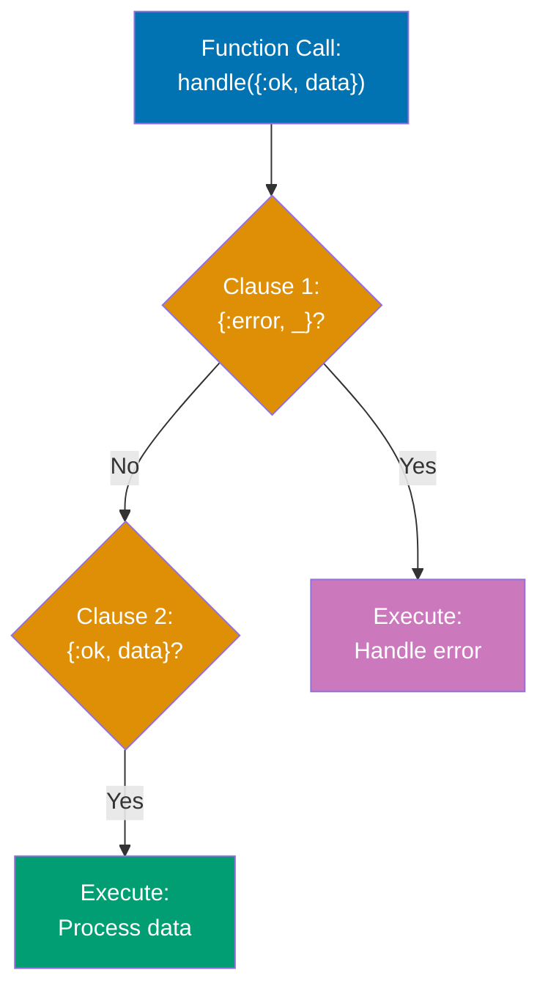
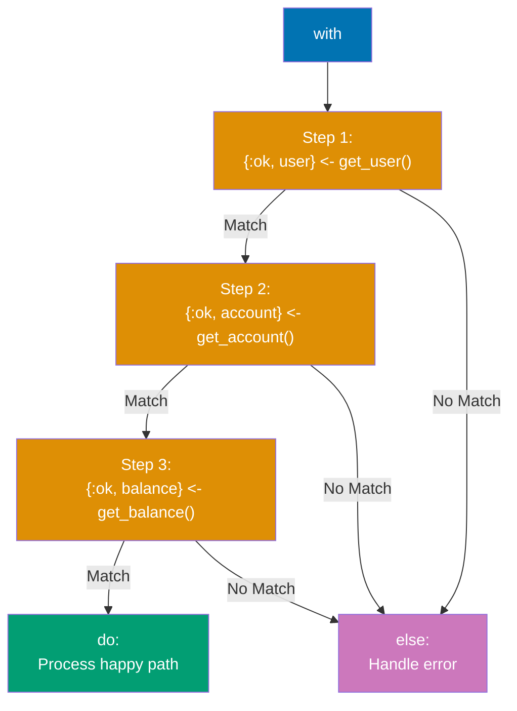
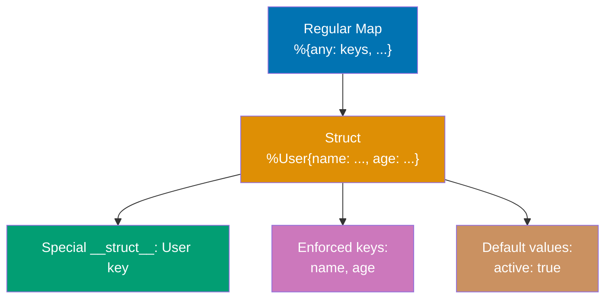
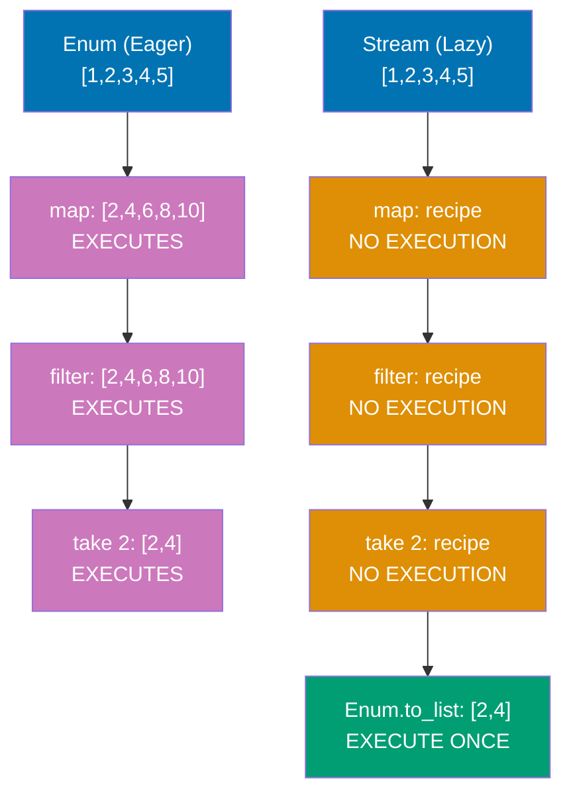
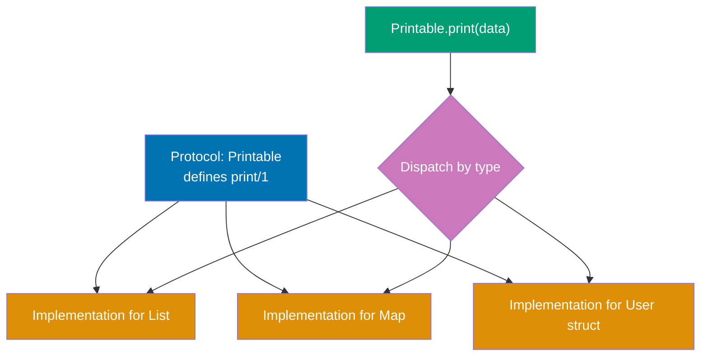
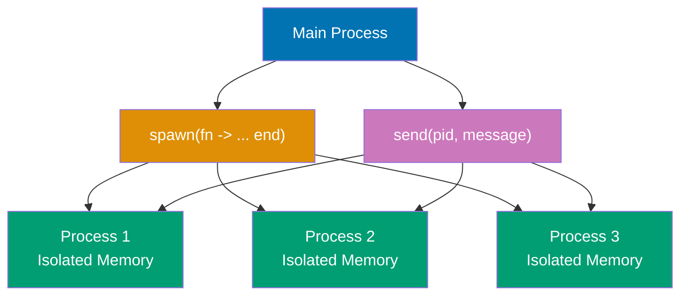
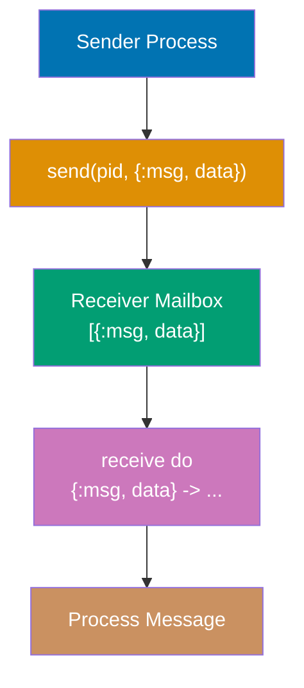
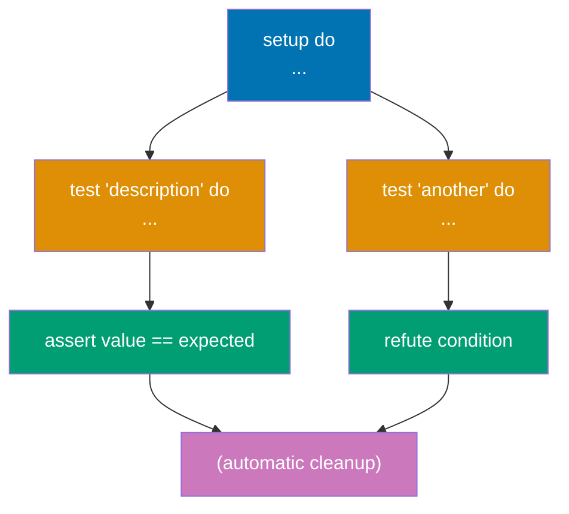
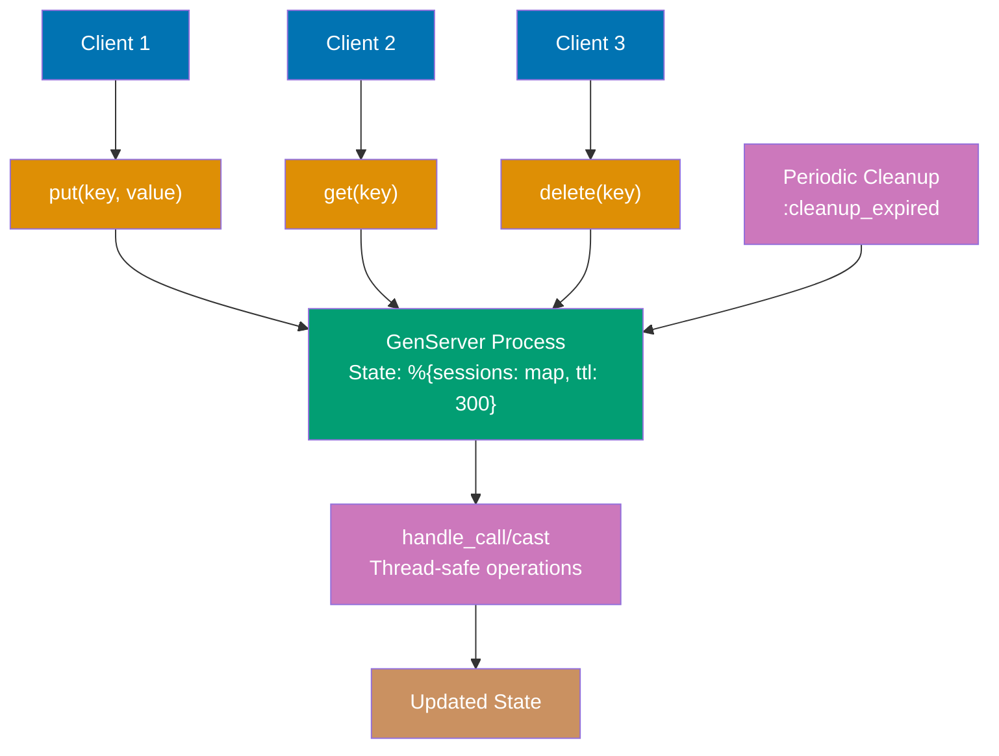

Build on your Elixir foundations with 30 intermediate examples covering advanced patterns, practical OTP usage, error handling, and testing strategies. Each example is self-contained and heavily annotated.

## Group 1: Advanced Pattern Matching

### Example 31: Guards in Depth

Guards are boolean expressions that add additional constraints to pattern matches in function heads, case clauses, and other contexts. They enable more precise pattern matching based on types and values.

**Code**:

```elixir
defmodule Guards do
  # Type guards (dispatch based on runtime type)
  def type_check(value) when is_integer(value), do: "integer: #{value}"
  # => when is_integer(value): guard checks type at runtime
  # => Guard fails: tries next clause
  # => Guard succeeds: executes this clause
  def type_check(value) when is_float(value), do: "float: #{value}"
  # => Multiple clauses tried top-to-bottom
  def type_check(value) when is_binary(value), do: "string: #{value}"
  # => is_binary checks for bitstring (includes strings)
  def type_check(value) when is_atom(value), do: "atom: #{inspect(value)}"
  # => inspect/1 converts atom to readable string
  def type_check(_value), do: "unknown type"
  # => Catch-all clause (no guard = always matches)
  # => _ prefix signals "intentionally unused"

  # Value guards (dispatch based on value ranges)
  def category(age) when age < 13, do: "child"
  # => Numeric comparison in guard
  def category(age) when age >= 13 and age < 20, do: "teen"
  # => Compound guard: and combines conditions
  # => Both conditions must be true
  def category(age) when age >= 20 and age < 65, do: "adult"
  # => Guards are evaluated at dispatch time (before function body)
  def category(age) when age >= 65, do: "senior"
  # => Last specific clause before catch-all

  # Multiple guards with `or`
  def weekday(day) when day == :saturday or day == :sunday, do: "weekend"
  # => or: either condition matches
  # => == checks value equality
  def weekday(_day), do: "weekday"
  # => Catch-all for all other days

  # Guard functions (limited set allowed for purity)
  def valid_user(name, age) when is_binary(name) and byte_size(name) > 0 and age >= 18 do
    # => byte_size/1: allowed guard function (measures binary bytes)
    # => Three conditions ANDed: type check, non-empty, age check
    {:ok, %{name: name, age: age}}
    # => Returns tagged tuple on success
  end
  def valid_user(_name, _age), do: {:error, "invalid user"}
  # => Catch-all for validation failures

  # Pattern matching with guards (combine both techniques)
  def process_response({:ok, status, body}) when status >= 200 and status < 300 do
    # => Pattern: {:ok, status, body} destructures tuple
    # => Guard: checks status is 2xx (success range)
    {:success, body}
    # => Returns normalized :success tuple
  end
  def process_response({:ok, status, _body}) when status >= 400 do
    # => Pattern matches :ok tuple but guards on 4xx+ status
    # => _ prefix: body ignored (not used in function)
    {:error, "client error: #{status}"}
    # => Returns error with status code
  end
  def process_response({:error, reason}) do
    # => Pattern matches :error tuple (no guard needed)
    {:error, "request failed: #{reason}"}
    # => Wraps reason in descriptive message
  end

  # Allowed guard functions (restricted for performance & safety):
  # Type checks: is_atom, is_binary, is_boolean, is_float, is_integer, is_list, is_map, is_tuple
  # Comparisons: ==, !=, ===, !==, <, >, <=, >=
  # Boolean: and, or, not
  # Arithmetic: +, -, *, /
  # Others: abs, div, rem, length, byte_size, tuple_size, elem, hd, tl
  # => Restriction: guards must be pure (no side effects, no IO, no exceptions)
  # => Reason: guards execute during pattern matching (before stack allocation)

  # Custom guard-safe functions (using defguard macro)
  defguard is_adult(age) when is_integer(age) and age >= 18
  # => defguard: defines reusable guard expression
  # => Expands inline at compile time (zero runtime overhead)
  # => Must only use other guard-safe operations

  def can_vote(age) when is_adult(age), do: true
  # => Uses custom guard like built-in
  # => Expands to: when is_integer(age) and age >= 18
  def can_vote(_age), do: false
  # => Catch-all for non-adults
end

# Type dispatching
Guards.type_check(42)
# => Tries clause 1: is_integer(42) → true → "integer: 42"
Guards.type_check(3.14)
# => Tries clause 1: is_integer(3.14) → false
# => Tries clause 2: is_float(3.14) → true → "float: 3.14"
Guards.type_check("hello")
# => Tries clauses 1-2: both fail
# => Tries clause 3: is_binary("hello") → true → "string: hello"
Guards.type_check(:atom)
# => Tries clauses 1-3: all fail
# => Tries clause 4: is_atom(:atom) → true → "atom: :atom"

# Value range dispatching
Guards.category(10)
# => Guard: 10 < 13 → true → "child"
Guards.category(15)
# => Guard: 15 < 13 → false
# => Guard: 15 >= 13 and 15 < 20 → true → "teen"
Guards.category(30)
# => Guards: tries clauses 1-2, both fail
# => Guard: 30 >= 20 and 30 < 65 → true → "adult"
Guards.category(70)
# => Guards: tries clauses 1-3, all fail
# => Guard: 70 >= 65 → true → "senior"

# OR guards
Guards.weekday(:saturday)
# => Guard: :saturday == :saturday or ... → true (short-circuits) → "weekend"
Guards.weekday(:monday)
# => Guard: :monday == :saturday → false
# => Guard: :monday == :sunday → false → or fails
# => Tries clause 2: always matches → "weekday"

# Complex validation
Guards.valid_user("Alice", 25)
# => Guard: is_binary("Alice") → true
# => Guard: byte_size("Alice") > 0 → 5 > 0 → true
# => Guard: 25 >= 18 → true
# => All conditions true → {:ok, %{age: 25, name: "Alice"}}
Guards.valid_user("", 25)
# => Guard: is_binary("") → true
# => Guard: byte_size("") > 0 → 0 > 0 → false → guard fails
# => Tries clause 2 → {:error, "invalid user"}
Guards.valid_user("Bob", 15)
# => Guards: is_binary("Bob") → true, byte_size("Bob") > 0 → true
# => Guard: 15 >= 18 → false → guard fails
# => Tries clause 2 → {:error, "invalid user"}

# HTTP response handling
Guards.process_response({:ok, 200, "Success"})
# => Pattern: {:ok, 200, "Success"} matches {:ok, status, body}
# => Guard: 200 >= 200 and 200 < 300 → true
# => {:success, "Success"}
Guards.process_response({:ok, 404, "Not Found"})
# => Pattern: {:ok, 404, "Not Found"} matches clause 1
# => Guard: 404 >= 200 and 404 < 300 → false → clause 1 fails
# => Tries clause 2: {:ok, 404, "Not Found"} matches {:ok, status, _body}
# => Guard: 404 >= 400 → true → {:error, "client error: 404"}
Guards.process_response({:error, :timeout})
# => Pattern: {:error, :timeout} doesn't match clause 1 or 2
# => Tries clause 3: matches {:error, reason} → {:error, "request failed: timeout"}

# Custom guard usage
Guards.can_vote(25)
# => Guard: is_adult(25) expands to is_integer(25) and 25 >= 18
# => Both true → true
Guards.can_vote(16)
# => Guard: is_integer(16) and 16 >= 18 → true and false → false
# => Tries clause 2 → false
```

**Key Takeaway**: Guards add type and value constraints to pattern matching. Only a limited set of functions is allowed in guards to ensure they remain side-effect free and fast.

**Why It Matters**: Guards execute at function dispatch time without allocating stack frames or calling external code, making them nearly free compared to if/else checks inside function bodies. The BEAM restricts guards to pure, side-effect-free operations (no IO, no message passing, no exceptions) that the compiler can inline and optimize. In production Phoenix controllers, guards validate HTTP request params at function entry (`def create(conn, %{"age" => age}) when is_integer(age) and age >= 18`), causing immediate pattern match failures for invalid inputs rather than runtime crashes deep in business logic—this fail-fast approach enables supervisors to restart with clean state while logging the exact validation that failed.

---

### Example 32: Pattern Matching in Function Heads

Multi-clause functions use pattern matching in function heads to elegantly handle different input shapes. Clauses are tried in order from top to bottom until one matches.



**Code**:

```elixir
defmodule FunctionMatching do
  # Order matters! Specific cases before general cases
  def handle_result({:ok, value}), do: "Success: #{value}"
  # => Pattern: {:ok, value} matches 2-element tuple with :ok atom
  # => value extracts second element
  def handle_result({:error, reason}), do: "Error: #{reason}"
  # => Different pattern: {:error, _} would match any error
  def handle_result(_), do: "Unknown result"
  # => Catch-all: matches anything not matched above
  # => WARNING: Must be last clause (matches everything)

  # Pattern matching with destructuring (tagged tuples)
  def greet({:user, name}), do: "Hello, #{name}!"
  # => Matches {:user, "Alice"} → extracts "Alice" into name
  def greet({:admin, name}), do: "Welcome back, Admin #{name}!"
  # => Different first element → different clause
  def greet({:guest}), do: "Welcome, guest!"
  # => Single-element tuple pattern (guest has no name)

  # List pattern matching (recursive)
  def sum([]), do: 0
  # => Base case: empty list returns 0
  # => Recursion terminates here
  def sum([head | tail]), do: head + sum(tail)
  # => Pattern: [head | tail] splits list into first element + rest
  # => Recursive case: add head to sum of tail
  # => Example: [1,2,3] → 1 + sum([2,3]) → 1 + 2 + sum([3]) → 1 + 2 + 3 + sum([]) → 6

  # Map pattern matching (structural matching)
  def user_summary(%{name: name, age: age}) when age >= 18 do
    # => Pattern: %{name: name, age: age} extracts specific keys
    # => Map can have other keys (ignored)
    # => Guard: age >= 18 adds constraint after pattern match
    "#{name} is an adult (#{age} years old)"
  end
  def user_summary(%{name: name, age: age}) do
    # => Same pattern, different guard
    # => Clause order matters: guard checked first-to-last
    "#{name} is a minor (#{age} years old)"
  end

  # Multiple pattern matches with guards (value classification)
  def classify_number(n) when n < 0, do: :negative
  # => Guard only (no pattern destructuring needed)
  def classify_number(0), do: :zero
  # => Exact value pattern (no guard needed)
  def classify_number(n) when n > 0 and n < 100, do: :small_positive
  # => Compound guard: both conditions must be true
  def classify_number(n) when n >= 100, do: :large_positive
  # => Last specific clause (implicitly covers n >= 100)

  # Complex nested patterns (multi-level destructuring)
  def process_response({:ok, %{status: 200, body: body}}) do
    # => Nested pattern: tuple contains map
    # => Matches: {:ok, %{status: 200, body: "anything"}}
    # => Extracts: body value
    {:success, body}
  end
  def process_response({:ok, %{status: status, body: _}}) when status >= 400 do
    # => Pattern: tuple + map destructuring
    # => _ ignores body (not used)
    # => Guard: status >= 400 further constrains
    {:client_error, status}
  end
  def process_response({:error, %{reason: reason}}) do
    # => Different tuple tag: :error instead of :ok
    # => Still uses map pattern for nested data
    {:failed, reason}
  end

  # Default arguments with pattern matching (multi-clause + defaults)
  def send_message(user, message, opts \\ [])
  # => Function head: declares default value opts = []
  # => Actual implementations below (pattern match on opts)
  def send_message(%{email: email}, message, priority: :high) do
    # => Pattern: opts must be [priority: :high] (keyword list)
    # => user must be map with :email key
    "Urgent email to #{email}: #{message}"
  end
  def send_message(%{email: email}, message, _opts) do
    # => Catch-all for opts (any value including [])
    # => Matches when first clause doesn't
    "Email to #{email}: #{message}"
  end
end

# Result tuple handling
FunctionMatching.handle_result({:ok, 42})
# => Tries clause 1: {:ok, 42} matches {:ok, value} → "Success: 42"
FunctionMatching.handle_result({:error, "not found"})
# => Clause 1 fails (not :ok)
# => Clause 2: {:error, "not found"} matches {:error, reason} → "Error: not found"
FunctionMatching.handle_result(:unknown)
# => Clauses 1-2 fail (not tuple)
# => Clause 3: _ matches anything → "Unknown result"

# Tagged tuple dispatching
FunctionMatching.greet({:user, "Alice"})
# => Clause 1: {:user, "Alice"} matches {:user, name} → "Hello, Alice!"
FunctionMatching.greet({:admin, "Bob"})
# => Clause 1 fails (:admin ≠ :user)
# => Clause 2: {:admin, "Bob"} matches {:admin, name} → "Welcome back, Admin Bob!"
FunctionMatching.greet({:guest})
# => Clauses 1-2 fail (wrong pattern)
# => Clause 3: {:guest} matches → "Welcome, guest!"

# Recursive list processing
FunctionMatching.sum([1, 2, 3, 4])
# => [1 | [2,3,4]] → 1 + sum([2,3,4])
# => [2 | [3,4]] → 2 + sum([3,4])
# => [3 | [4]] → 3 + sum([4])
# => [4 | []] → 4 + sum([])
# => [] → 0
# => Stack unwinds: 4 + 0 = 4, 3 + 4 = 7, 2 + 7 = 9, 1 + 9 = 10
FunctionMatching.sum([])
# => Clause 1: [] matches → 0 (base case)

# Map pattern matching with guards
FunctionMatching.user_summary(%{name: "Alice", age: 25})
# => Pattern: %{name: "Alice", age: 25} matches %{name: name, age: age}
# => Extracts: name = "Alice", age = 25
# => Guard: 25 >= 18 → true → "Alice is an adult (25 years old)"
FunctionMatching.user_summary(%{name: "Bob", age: 16})
# => Pattern matches clause 1
# => Guard: 16 >= 18 → false → clause 1 fails
# => Clause 2: same pattern, no guard → matches → "Bob is a minor (16 years old)"

# Value classification with guards
FunctionMatching.classify_number(-5)
# => Guard: -5 < 0 → true → :negative
FunctionMatching.classify_number(0)
# => Clause 1 guard fails
# => Pattern: 0 matches exactly → :zero
FunctionMatching.classify_number(50)
# => Clauses 1-2 fail
# => Guard: 50 > 0 and 50 < 100 → true → :small_positive
FunctionMatching.classify_number(200)
# => Clauses 1-3 fail
# => Guard: 200 >= 100 → true → :large_positive

# Nested pattern matching
FunctionMatching.process_response({:ok, %{status: 200, body: "OK"}})
# => Pattern: {:ok, %{status: 200, body: body}} matches exactly
# => Extracts: body = "OK" → {:success, "OK"}
FunctionMatching.process_response({:ok, %{status: 404, body: "Not Found"}})
# => Clause 1: status 404 ≠ 200 → fails
# => Clause 2: pattern matches, guard 404 >= 400 → true → {:client_error, 404}
FunctionMatching.process_response({:error, %{reason: :timeout}})
# => Clauses 1-2: {:error, ...} doesn't match {:ok, ...}
# => Clause 3: {:error, %{reason: :timeout}} matches → {:failed, :timeout}

# Default arguments with pattern matching
FunctionMatching.send_message(%{email: "a@example.com"}, "Hello", priority: :high)
# => opts = [priority: :high] (provided)
# => Clause 1: pattern [priority: :high] matches → "Urgent email..."
FunctionMatching.send_message(%{email: "b@example.com"}, "Hi", [])
# => opts = [] (provided empty list)
# => Clause 1: [] doesn't match [priority: :high]
# => Clause 2: _opts matches [] → "Email..."
```

**Key Takeaway**: Pattern matching in function heads enables elegant multi-clause logic. Place specific patterns before general ones, and combine with guards for precise control flow.

**Why It Matters**: Processes are the fundamental unit of concurrency in Elixir, implemented as lightweight BEAM green threads with microsecond spawn times and 2KB initial memory. The BEAM's preemptive scheduler distributes processes across CPU cores automatically, enabling WhatsApp to handle 2 million connections per server compared to thousands in thread-based systems. Each process has isolated heap and mailbox, so one crash never corrupts another—the foundation of Elixir's fault tolerance.

---

### Example 33: With Expression (Happy Path)

The `with` expression chains pattern matches, short-circuiting on the first mismatch. It's ideal for "happy path" coding where you expect success and want to handle errors at the end.



**Code**:

```elixir
defmodule WithExamples do
  # Simulate API functions (return tagged tuples)
  def fetch_user(id) do
    case id do
      1 -> {:ok, %{id: 1, name: "Alice", account_id: 101}}
      # => Success: returns {:ok, user_map}
      2 -> {:ok, %{id: 2, name: "Bob", account_id: 102}}
      _ -> {:error, :user_not_found}
      # => Failure: returns {:error, atom}
    end
  end

  def fetch_account(account_id) do
    case account_id do
      101 -> {:ok, %{id: 101, balance: 1000}}
      102 -> {:ok, %{id: 102, balance: 500}}
      _ -> {:error, :account_not_found}
    end
  end

  def fetch_transactions(account_id) do
    case account_id do
      101 -> {:ok, [%{amount: 100}, %{amount: -50}]}
      # => Returns list of transaction maps
      102 -> {:ok, [%{amount: 200}]}
      _ -> {:error, :transactions_not_found}
    end
  end

  # ❌ WITHOUT `with` - nested case statements (pyramid of doom)
  def get_user_summary_nested(user_id) do
    case fetch_user(user_id) do
      # => Level 1 nesting
      {:ok, user} ->
        case fetch_account(user.account_id) do
          # => Level 2 nesting
          {:ok, account} ->
            case fetch_transactions(account.id) do
              # => Level 3 nesting (hard to read!)
              {:ok, transactions} ->
                {:ok, %{user: user, account: account, transactions: transactions}}
              {:error, reason} ->
                {:error, reason}
                # => Must repeat error handling at each level
            end
          {:error, reason} ->
            {:error, reason}
            # => Duplicated error handling
        end
      {:error, reason} ->
        {:error, reason}
        # => Error handling repeated 3 times!
    end
  end

  # ✅ WITH `with` - clean happy path (linear, readable)
  def get_user_summary(user_id) do
    with {:ok, user} <- fetch_user(user_id),
         # => Step 1: pattern match {:ok, user}
         # => If matches: continue to step 2
         # => If doesn't match: jump to else block
         {:ok, account} <- fetch_account(user.account_id),
         # => Step 2: uses user from step 1
         # => Chain continues only if pattern matches
         {:ok, transactions} <- fetch_transactions(account.id) do
         # => Step 3: uses account from step 2
         # => All patterns matched: execute do block
      # Happy path - all matches succeeded
      {:ok, %{
        user: user.name,
        # => user binding from step 1
        balance: account.balance,
        # => account binding from step 2
        transaction_count: length(transactions)
        # => transactions binding from step 3
      }}
    else
      # First mismatch jumps here (short-circuit)
      {:error, :user_not_found} -> {:error, "User not found"}
      # => Pattern match error from step 1
      {:error, :account_not_found} -> {:error, "Account not found"}
      # => Pattern match error from step 2
      {:error, :transactions_not_found} -> {:error, "Transactions not found"}
      # => Pattern match error from step 3
      # => Consolidated error handling in one place!
    end
  end

  # `with` can match any pattern (not just :ok/:error)
  def complex_calculation(x) do
    with {:ok, doubled} <- {:ok, x * 2},
         # => x = 5 → {:ok, 10}
         # => Matches pattern, doubled = 10
         {:ok, incremented} <- {:ok, doubled + 1},
         # => {:ok, 11}, incremented = 11
         {:ok, squared} <- {:ok, incremented * incremented} do
         # => {:ok, 121}, squared = 121
      {:ok, squared}
      # => Returns {:ok, 121}
    else
      _ -> {:error, "calculation failed"}
      # => Catch-all for any non-matching pattern
    end
  end

  # Boolean guards in `with` (Elixir 1.3+)
  def process_number(x) when is_integer(x) do
    with true <- x > 0,
         # => Matches true or jumps to else
         # => Pattern: true <- boolean_expression
         true <- x < 100 do
         # => Second validation: x must be < 100
      {:ok, "Valid number: #{x}"}
      # => Both guards passed
    else
      false -> {:error, "Number out of range"}
      # => Either guard failed (returned false)
      # => Both failures use same pattern
    end
  end
end

# Happy path - all steps succeed
WithExamples.get_user_summary(1)
# => Step 1: fetch_user(1) → {:ok, %{id: 1, name: "Alice", account_id: 101}}
# => Step 2: fetch_account(101) → {:ok, %{id: 101, balance: 1000}}
# => Step 3: fetch_transactions(101) → {:ok, [...]}
# => do block executes → {:ok, %{balance: 1000, transaction_count: 2, user: "Alice"}}

WithExamples.get_user_summary(2)
# => User Bob, account 102, balance 500, 1 transaction
# => {:ok, %{balance: 500, transaction_count: 1, user: "Bob"}}

# Failure path - short-circuit at step 1
WithExamples.get_user_summary(999)
# => Step 1: fetch_user(999) → {:error, :user_not_found}
# => Pattern {:ok, user} doesn't match → jumps to else
# => else block: {:error, :user_not_found} matches → {:error, "User not found"}

# Calculation chain
WithExamples.complex_calculation(5)
# => Step 1: {:ok, 5 * 2} = {:ok, 10}
# => Step 2: {:ok, 10 + 1} = {:ok, 11}
# => Step 3: {:ok, 11 * 11} = {:ok, 121}
# => {:ok, 121}

# Boolean guard validation
WithExamples.process_number(50)
# => Guard 1: 50 > 0 → true (matches)
# => Guard 2: 50 < 100 → true (matches)
# => {:ok, "Valid number: 50"}

WithExamples.process_number(150)
# => Guard 1: 150 > 0 → true
# => Guard 2: 150 < 100 → false (doesn't match true)
# => else: false matched → {:error, "Number out of range"}

WithExamples.process_number(-10)
# => Guard 1: -10 > 0 → false (short-circuits)
# => else: false matched → {:error, "Number out of range"}
```

**Key Takeaway**: `with` chains pattern matches and short-circuits on the first mismatch. Use it for happy path coding where you expect success, with error handling consolidated in the `else` block.

**Why It Matters**: Process linking enables supervision trees where crashes propagate to supervisors rather than terminating the system. When a worker crashes, its linked supervisor receives an exit signal and executes restart strategy (one_for_one, rest_for_one, one_for_all). In production, this creates self-healing systems—Discord's Elixir backend uses supervision trees to automatically restart failed message routers, maintaining 99.99% uptime while serving millions of concurrent users without manual intervention.

---

## Group 2: Data Structures Advanced

### Example 34: Structs

Structs are extensions of maps with compile-time guarantees and default values. They enforce a predefined set of keys, enabling clearer data modeling and better error messages.



**Code**:

```elixir
defmodule User do
  # Define struct with default values
  defstruct name: nil, age: nil, email: nil, active: true
  # => All fields optional with defaults
  # => name, age, email default to nil
  # => active defaults to true
  # => Creates %User{} constructor

  # Alternative: enforced keys (compile-time check)
  # @enforce_keys [:name, :age]
  # => Compile error if these keys not provided at creation
  # defstruct [:name, :age, email: nil, active: true]
  # => Shorthand: atom list for required keys + keyword for defaults
end

defmodule Account do
  @enforce_keys [:id, :balance]
  # => MUST provide :id and :balance when creating struct
  # => Raises ArgumentError at runtime if missing
  defstruct [:id, :balance, status: :active, transactions: []]
  # => :id, :balance required (no defaults)
  # => status defaults to :active
  # => transactions defaults to []
end

# Create struct with all fields
user = %User{name: "Alice", age: 30, email: "alice@example.com"}
# => Syntax: %ModuleName{key: value, ...}
# => active field uses default (true)
# => %User{name: "Alice", age: 30, email: "alice@example.com", active: true}

# Create struct with partial fields (use defaults for rest)
user_partial = %User{name: "Bob", age: 25}
# => email defaults to nil, active defaults to true
# => %User{name: "Bob", age: 25, email: nil, active: true}

# Access struct fields (dot notation)
user.name
# => "Alice" (field access)
user.age
# => 30
user.active
# => true (default value)

# Update struct (immutable, creates new struct)
updated_user = %{user | age: 31, email: "alice.new@example.com"}
# => Syntax: %{struct | field: new_value, ...}
# => Returns NEW struct (original unchanged)
# => %User{name: "Alice", age: 31, email: "alice.new@example.com", active: true}
user.age
# => 30 (original unchanged - immutability!)
# => updated_user is separate copy

# Struct is a tagged map (special __struct__ field)
user.__struct__
# => User (module name)
# => Hidden field added by defstruct
is_map(user)
# => true (structs ARE maps)
# => Can use map functions on structs
Map.keys(user)
# => [:__struct__, :active, :age, :email, :name]
# => __struct__ is first key (implementation detail)

# Pattern matching on structs
%User{name: name, age: age} = user
# => Destructures struct fields
# => Pattern matches User struct (not other structs or plain maps)
name
# => "Alice"
age
# => 30

# Pattern matching in function heads (type safety)
def greet_user(%User{name: name}), do: "Hello, #{name}!"
# => Only accepts User structs (not Account or plain maps)
# => Extracts name field
# => Type-safe dispatch!
greet_user(user)
# => "Hello, Alice!"
# greet_user(%{name: "Bob"}) would raise FunctionClauseError
# => Plain map doesn't match %User{} pattern

# Enforced keys example
account = %Account{id: 1, balance: 1000}
# => MUST provide :id and :balance (@enforce_keys)
# => status and transactions use defaults
# => %Account{id: 1, balance: 1000, status: :active, transactions: []}

# account_invalid = %Account{id: 1}
# => ** (ArgumentError) missing required keys: [:balance]
# => Compile-time/runtime check prevents invalid structs
```

**Key Takeaway**: Structs are tagged maps with enforced keys and default values. They provide compile-time guarantees and clearer domain modeling compared to plain maps.

**Why It Matters**: Monitors enable one-way crash detection without the bilateral coupling of links. A GenServer can monitor a database connection process to detect disconnects without being killed by them, enabling graceful degradation. In production, monitors implement health checks—Phoenix connection pools monitor worker processes and spawn replacements for crashed workers, while the workers themselves remain unaware of monitoring, maintaining clean separation of concerns.

---

### Example 35: Streams (Lazy Enumeration)

Streams are lazy enumerables that build a recipe for computation without executing it immediately. They enable efficient processing of large or infinite datasets by composing transformations.



**Code**:

```elixir
numbers = [1, 2, 3, 4, 5, 6, 7, 8, 9, 10]

# Eager evaluation (Enum) - immediate execution
eager_result = numbers
               |> Enum.map(fn x -> x * 2 end)
               # => Pass 1: builds [2, 4, 6, 8, 10, 12, 14, 16, 18, 20]
               # => Processes all 10 elements immediately
               |> Enum.filter(fn x -> rem(x, 4) == 0 end)
               # => Pass 2: builds [4, 8, 12, 16, 20]
               # => Processes all 5 remaining elements
               |> Enum.take(2)
               # => Pass 3: takes first 2 → [4, 8]
               # => Already processed all 10 elements (wasteful!)

# Lazy evaluation (Stream) - deferred execution
lazy_result = numbers
              |> Stream.map(fn x -> x * 2 end)
              # => Returns #Stream<...> (NOT a list)
              # => No execution yet, just builds recipe
              |> Stream.filter(fn x -> rem(x, 4) == 0 end)
              # => Returns #Stream<...> (still no execution)
              # => Composes filter into recipe
              |> Enum.take(2)
              # => TRIGGERS execution: processes elements one-by-one
              # => Stops after finding 2 matches
              # => Only processes: 1→2 (no), 2→4 (YES), 3→6 (no), 4→8 (YES), STOP
              # => [4, 8] (processed 4 elements, not 10!)

# Infinite streams (impossible with eager evaluation)
infinite_numbers = Stream.iterate(1, fn x -> x + 1 end)
# => Infinite sequence: 1, 2, 3, 4, 5, ...
# => Returns #Stream<...> (no execution yet)
# => Would never terminate if eager!

first_evens = infinite_numbers
              |> Stream.filter(fn x -> rem(x, 2) == 0 end)
              # => Lazy filter (no execution)
              |> Enum.take(10)
              # => Takes first 10 even numbers
              # => [2, 4, 6, 8, 10, 12, 14, 16, 18, 20]
              # => Stops after 10 matches (doesn't process infinite stream!)

# Stream.cycle - repeats list infinitely
Stream.cycle([1, 2, 3]) |> Enum.take(7)
# => Cycles through [1,2,3] infinitely
# => Takes first 7: [1, 2, 3, 1, 2, 3, 1]

# Stream.unfold - generates values from state
fibonacci = Stream.unfold({0, 1}, fn {a, b} -> {a, {b, a + b}} end)
# => unfold(initial_state, next_fn)
# => next_fn returns {value, new_state}
# => {0, 1} → emit 0, next state {1, 1}
# => {1, 1} → emit 1, next state {1, 2}
# => {1, 2} → emit 1, next state {2, 3}
# => {2, 3} → emit 2, next state {3, 5}
# => Infinite Fibonacci sequence
Enum.take(fibonacci, 10)
# => [0, 1, 1, 2, 3, 5, 8, 13, 21, 34]

# Performance comparison
defmodule Performance do
  def eager_pipeline(n) do
    1..n
    |> Enum.map(fn x -> x * 2 end)
    # => Builds entire intermediate list (n elements)
    |> Enum.filter(fn x -> rem(x, 3) == 0 end)
    # => Builds another intermediate list (~n/3 elements)
    |> Enum.take(100)
    # => Takes 100, discards rest
    # => Wastes memory and CPU for large n
  end

  def lazy_pipeline(n) do
    1..n
    |> Stream.map(fn x -> x * 2 end)
    # => No intermediate list (lazy)
    |> Stream.filter(fn x -> rem(x, 3) == 0 end)
    # => Still lazy (just composing)
    |> Enum.take(100)
    # => Processes ONLY until 100 matches found
    # => For n=1_000_000: processes ~300 elements, not 1 million!
  end
end

# Performance.eager_pipeline(1_000_000)
# => Processes 1 million elements, builds 2 intermediate lists
# Performance.lazy_pipeline(1_000_000)
# => Processes ~300 elements, 0 intermediate lists

# Stream.resource - manage external resources (files, sockets, etc.)
stream_resource = Stream.resource(
  fn -> {:ok, "initial state"} end,
  # => Start function: called once to initialize
  # => Returns initial accumulator state
  fn state -> {[state], "next state"} end,
  # => Next function: called repeatedly
  # => Returns {values_to_emit, new_state}
  # => Can return {:halt, state} to stop
  fn _state -> :ok end
  # => After function: cleanup (called when stream ends)
  # => Close files, release resources, etc.
)
Enum.take(stream_resource, 3)
# => Calls start → {:ok, "initial state"}
# => Calls next("initial state") → {["initial state"], "next state"}
# => Emits "initial state"
# => Calls next("next state") → {["next state"], "next state"}
# => Emits "next state" (2 times)
# => Calls after("next state") → :ok (cleanup)
# => ["initial state", "next state", "next state"]
```

**Key Takeaway**: Streams enable lazy evaluation—building a recipe without executing it. Use streams for large datasets, infinite sequences, or when you want to compose transformations efficiently.

**Why It Matters**: The BEAM's message passing is asynchronous and lock-free—send/2 copies messages to the receiver's mailbox without blocking, enabling sending millions of messages per second. Unlike shared-memory threading, this eliminates race conditions and deadlocks. In production Phoenix channels, one WebSocket process handles bidirectional communication while business logic processes handle commands concurrently, communicating through message passing that the BEAM optimizes with specialized copy-on-write for large binaries.

---

### Example 36: MapSet for Uniqueness

MapSets are unordered collections of unique values. They provide efficient membership testing and set operations (union, intersection, difference). Use them when uniqueness matters and order doesn't.

**Code**:

```elixir
# Create MapSet from list (automatic deduplication)
set1 = MapSet.new([1, 2, 3, 3, 4, 4, 5])
# => MapSet.new/1 removes duplicates automatically
# => #MapSet<[1, 2, 3, 4, 5]>
# => Unordered: order not guaranteed

# Create MapSet from range
set_range = MapSet.new(1..10)
# => Converts range to set
# => #MapSet<[1, 2, 3, 4, 5, 6, 7, 8, 9, 10]>

# Add element (immutable, returns new set)
set2 = MapSet.put(set1, 6)
# => Adds 6 to set (new set returned)
# => #MapSet<[1, 2, 3, 4, 5, 6]>
set1
# => #MapSet<[1, 2, 3, 4, 5]> (original unchanged!)
# => Immutability: set2 is separate copy

# Add duplicate (no effect)
set3 = MapSet.put(set1, 3)
# => 3 already exists in set
# => Returns set unchanged
# => #MapSet<[1, 2, 3, 4, 5]> (same as set1)

# Remove element
set4 = MapSet.delete(set1, 3)
# => Removes 3 from set
# => #MapSet<[1, 2, 4, 5]>

# Membership testing (O(log n))
MapSet.member?(set1, 3)
# => Checks if 3 is in set
# => true (efficient lookup)
MapSet.member?(set1, 10)
# => Checks if 10 is in set
# => false (not present)

# Set size
MapSet.size(set1)
# => Counts unique elements
# => 5

# Set operations
setA = MapSet.new([1, 2, 3])
# => Set A: {1, 2, 3}
setB = MapSet.new([3, 4, 5])
# => Set B: {3, 4, 5}

# Union (all unique elements from both sets)
MapSet.union(setA, setB)
# => A ∪ B: elements in A OR B
# => #MapSet<[1, 2, 3, 4, 5]>

# Intersection (common elements)
MapSet.intersection(setA, setB)
# => A ∩ B: elements in A AND B
# => #MapSet<[3]> (only 3 is common)

# Difference (elements in A but not in B)
MapSet.difference(setA, setB)
# => A \ B: elements in A but NOT in B
# => #MapSet<[1, 2]> (3 is removed)
MapSet.difference(setB, setA)
# => B \ A: elements in B but NOT in A
# => #MapSet<[4, 5]> (3 is removed)
# => Difference is NOT commutative!

# Subset and superset
setX = MapSet.new([1, 2])
# => Set X: {1, 2}
setY = MapSet.new([1, 2, 3, 4])
# => Set Y: {1, 2, 3, 4}
MapSet.subset?(setX, setY)
# => Is X ⊆ Y? (all elements of X in Y?)
# => true (1 and 2 are in Y)
MapSet.subset?(setY, setX)
# => Is Y ⊆ X?
# => false (3 and 4 not in X)

# Disjoint sets (no common elements)
MapSet.disjoint?(setA, MapSet.new([6, 7]))
# => Do A and {6, 7} have any common elements?
# => true (no overlap)
# => Disjoint: A ∩ {6,7} = ∅

# Convert to list (order not guaranteed)
MapSet.to_list(set1)
# => Converts set to list
# => [1, 2, 3, 4, 5] (order may vary)
# => Sets are unordered!

# Practical example: unique tags from posts
posts = [
  %{id: 1, tags: ["elixir", "functional", "programming"]},
  %{id: 2, tags: ["elixir", "otp", "concurrency"]},
  %{id: 3, tags: ["functional", "fp", "programming"]}
]

# Extract all unique tags
all_tags = posts
           |> Enum.flat_map(fn post -> post.tags end)
           # => Flattens: ["elixir", "functional", "programming", "elixir", "otp", ...]
           # => With duplicates
           |> MapSet.new()
           # => Deduplicates: #MapSet<["elixir", "functional", "programming", "otp", "concurrency", "fp"]>
# => Automatic uniqueness!

# Find common tags between posts
post1_tags = MapSet.new(["elixir", "functional"])
post2_tags = MapSet.new(["elixir", "otp"])
MapSet.intersection(post1_tags, post2_tags)
# => Common tags: #MapSet<["elixir"]>
# => Useful for finding related content
```

**Key Takeaway**: MapSets provide O(log n) membership testing and automatic deduplication. Use them for unique collections where order doesn't matter and set operations (union, intersection, difference) are needed.

**Why It Matters**: Selective receive enables processes to prioritize messages by pattern matching mailbox contents out of order. The BEAM maintains a per-process save pointer, making selective receive O(1) for early matches. In production, this enables priority handling—a GenServer can process :urgent messages before :normal ones, while Erlang's priority_receive extension supports real-time systems with predictable latency requirements.

---

## Group 3: Module Organization

### Example 37: Module Attributes

Module attributes are compile-time constants defined with `@`. They're commonly used for documentation (`@moduledoc`, `@doc`), compile-time configuration, and storing values computed during compilation.

**Code**:

```elixir
defmodule MyModule do
  # Module documentation (special reserved attribute)
  @moduledoc """
  This module demonstrates module attributes.
  Module attributes are compile-time constants.
  """
  # => @moduledoc appears in generated documentation
  # => Accessible via Code.fetch_docs/1

  # Compile-time constants
  @default_timeout 5000
  # => Computed once during compilation
  # => Inlined wherever used (zero runtime cost)
  @version "1.0.0"
  # => String constant
  @max_retries 3
  # => Integer constant

  # Function documentation (special reserved attribute)
  @doc """
  Waits for a specified timeout or default.
  Returns :ok after waiting.
  """
  # => @doc appears in function documentation (h/1 in IEx)
  def wait(timeout \\ @default_timeout) do
    # => Default argument uses module attribute
    # => @default_timeout inlined to 5000 at compile time
    :timer.sleep(timeout)
    # => Sleeps for timeout milliseconds
    :ok
    # => Returns :ok atom
  end

  @doc """
  Gets the module version.
  """
  def version, do: @version
  # => Returns compile-time constant (inlined to "1.0.0")

  # Computed at compile time (not runtime!)
  @languages ["Elixir", "Erlang", "LFE"]
  # => List created once during compilation
  @language_count length(@languages)
  # => length/1 executed at compile time!
  # => Result: 3 (computed once, inlined everywhere)

  def supported_languages, do: @languages
  # => Returns ["Elixir", "Erlang", "LFE"] (compile-time constant)
  def language_count, do: @language_count
  # => Returns 3 (compile-time computed)

  # Module registration (declares implemented behaviour)
  @behaviour :gen_server
  # => Compiler checks we implement all required callbacks
  # => Common in OTP applications

  # Accumulating values (each @ reassignment creates new value)
  @colors [:red, :blue]
  # => Initial value: [:red, :blue]
  @colors [:green | @colors]
  # => Reads previous @colors, prepends :green → [:green, :red, :blue]
  @colors [:yellow | @colors]
  # => Reads previous @colors, prepends :yellow → [:yellow, :green, :red, :blue]

  def colors, do: @colors
  # => [:yellow, :green, :red, :blue] (final accumulated value)

  # Attributes are scoped to next function definition
  @important true
  # => Attribute active for next function
  def func1, do: @important
  # => Returns true (attribute value when func1 defined)

  @important false
  # => Redefines @important for next function
  def func2, do: @important
  # => Returns false (NEW value, doesn't affect func1!)

  # Custom attributes for metadata
  @deprecated_message "Use new_function/1 instead"
  # => Custom attribute (not reserved, any compile-time value)

  @doc @deprecated_message
  # => Uses custom attribute in @doc (dynamic documentation)
  def old_function, do: :deprecated

  # Reserved attributes (special compiler meaning):
  # @moduledoc - module documentation
  # @doc - function documentation
  # @behaviour - declares implemented behaviour
  # @impl - marks callback implementation
  # @deprecated - marks deprecated (compiler warns)
  # @spec - type specification (dialyzer)
  # @type - defines custom type
  # @opaque - defines opaque type
  # => Custom attributes allowed: @author, @since, etc.
end

# Module attribute usage examples
MyModule.wait(1000)
# => Sleeps 1000ms, returns :ok

MyModule.version()
# => "1.0.0" (compile-time constant inlined)

MyModule.supported_languages()
# => ["Elixir", "Erlang", "LFE"] (compile-time constant)

MyModule.language_count()
# => 3 (computed once at compile time, not runtime!)

MyModule.colors()
# => [:yellow, :green, :red, :blue]
# => Final accumulated value from compile-time build

```

**Key Takeaway**: Module attributes (`@name`) are compile-time constants useful for documentation, configuration, and computed values. They're evaluated during compilation, not runtime.

**Why It Matters**: The receive timeout enables gen_timeout patterns and state timeouts in GenStateMachine. Unlike polling, BEAM timeouts are implemented in the scheduler with zero CPU overhead. In production systems, this powers heartbeat detection—connection pools detect stale connections through receive timeouts, GenServers implement inactivity cleanup, and Phoenix PubSub uses timeouts to detect network partitions without polling that would waste CPU cycles.

---

### Example 38: Import, Alias, Require

`import`, `alias`, and `require` control how modules are referenced in your code. They reduce verbosity and manage namespaces cleanly.

**Code**:

```elixir
defmodule ImportAliasRequire do
  # => Module compiled at compile time with all directives processed

  # alias - shortens module names
  alias MyApp.Accounts.User
  # => Creates local binding: User = MyApp.Accounts.User
  # => Available throughout this module
  # => Now use User instead of MyApp.Accounts.User

  alias MyApp.Accounts.Admin, as: A
  # => Creates custom local binding: A = MyApp.Accounts.Admin
  # => Custom name: A instead of Admin
  # => Useful to avoid naming conflicts

  def create_user(name) do
    # => Function defined with parameter name
    %User{name: name}
    # => Creates %MyApp.Accounts.User{name: name} (alias expands at compile time)
    # => Returns User struct
    # => Without alias, would need full path: %MyApp.Accounts.User{name: name}
  end

  def create_admin(name) do
    # => Function defined with parameter name
    %A{name: name}
    # => Creates %MyApp.Accounts.Admin{name: name} using custom alias
    # => Returns Admin struct with default role: :admin
    # => Custom alias A makes code more concise
  end

  # import - brings functions into scope (no module prefix needed)
  import Enum, only: [map: 2, filter: 2]
  # => Only imports Enum.map/2 and Enum.filter/2
  # => Now callable as map(...) and filter(...) without Enum prefix
  # => Selective import prevents namespace pollution
  # => Other Enum functions still require Enum.function_name()

  def process_numbers(list) do
    # => Function accepts list parameter
    list
    # => Initial list value
    |> map(fn x -> x * 2 end)
    # => Calls imported Enum.map/2 without prefix
    # => Doubles each element
    # => Returns new list (immutable transformation)
    |> filter(fn x -> x > 10 end)
    # => Calls imported Enum.filter/2 without prefix
    # => Keeps only elements greater than 10
    # => Returns filtered list
    # => Final result: list with doubled values > 10
  end

  # import with except
  import String, except: [split: 1]
  # => Imports all String functions EXCEPT String.split/1
  # => String.split/1 still accessible as String.split/1
  # => All other String functions callable without prefix
  # => Useful when one function conflicts with existing code

  def upcase_string(str) do
    # => Function accepts string parameter
    upcase(str)
    # => Calls imported String.upcase/1 without prefix
    # => Returns uppercased string
    # => Without import, would need String.upcase(str)
  end

  # require - needed for macros
  require Logger
  # => Makes Logger macros available
  # => Logger functions are macros, not regular functions
  # => Macros must be required before use
  # => Regular functions don't need require

  def log_something do
    # => Function with no parameters
    Logger.info("This is a log message")
    # => Calls Logger.info/1 macro (requires 'require Logger')
    # => Logs at :info level
    # => Returns :ok
    # => Macros expand at compile time, enabling compile-time optimizations
  end

  # Multiple aliases at once (Elixir 1.2+)
  alias MyApp.{Accounts, Billing, Reports}
  # => Creates three aliases at once:
  # => Accounts = MyApp.Accounts
  # => Billing = MyApp.Billing
  # => Reports = MyApp.Reports
  # => Shorthand for three separate alias declarations
  # => All modules must exist under MyApp parent module

  def get_account_report do
    # => Function with no parameters
    account = Accounts.get()
    # => Calls MyApp.Accounts.get/0 using alias
    # => Binds result to account variable
    # => Returns account data structure

    billing = Billing.get()
    # => Calls MyApp.Billing.get/0 using alias
    # => Binds result to billing variable
    # => Returns billing data structure

    Reports.generate(account, billing)
    # => Calls MyApp.Reports.generate/2 using alias
    # => Passes account and billing data
    # => Returns generated report
    # => Final return value of function
  end
end
# => End of ImportAliasRequire module

defmodule MyApp.Accounts.User do
  # => Module defining User struct
  defstruct name: nil, email: nil
  # => Struct with two fields, both default to nil
  # => Creates %MyApp.Accounts.User{name: nil, email: nil}
end

defmodule MyApp.Accounts.Admin do
  # => Module defining Admin struct
  defstruct name: nil, role: :admin
  # => Struct with name (default nil) and role (default :admin)
  # => Creates %MyApp.Accounts.Admin{name: nil, role: :admin}
end

defmodule ScopingExample do
  # => Module demonstrating import scoping rules

  def func1 do
    # => Function demonstrating function-level import
    import Enum
    # => Import only available within func1 scope
    # => All Enum functions callable without prefix in func1
    # => Does NOT affect other functions in module

    map([1, 2, 3], fn x -> x * 2 end)
    # => Calls imported Enum.map/2 without prefix
    # => Doubles each element: [1, 2, 3] -> [2, 4, 6]
    # => Returns [2, 4, 6]
  end

  def func2 do
    # => Function where func1's import is NOT available
    # map([1, 2, 3], fn x -> x * 2 end)
    # => Would raise CompileError: undefined function map/2
    # => func1's import doesn't leak into func2

    Enum.map([1, 2, 3], fn x -> x * 2 end)
    # => Must use full module name Enum.map/2
    # => Doubles each element: [1, 2, 3] -> [2, 4, 6]
    # => Returns [2, 4, 6]
  end

  # Module-level import (available in all functions)
  import String
  # => Import at module level (outside function definitions)
  # => All String functions available in func3, func4, and any other function
  # => Module-level scope affects entire module

  def func3, do: upcase("hello")
  # => Uses imported String.upcase/1 without prefix
  # => Converts "hello" to "HELLO"
  # => Returns "HELLO"
  # => Works because import String is at module level

  def func4, do: downcase("WORLD")
  # => Uses imported String.downcase/1 without prefix
  # => Converts "WORLD" to "world"
  # => Returns "world"
  # => Works because import String is at module level
end
# => End of ScopingExample module

# Example usage:
# ImportAliasRequire.create_user("Alice")
# => Returns %MyApp.Accounts.User{name: "Alice", email: nil}

# ImportAliasRequire.create_admin("Bob")
# => Returns %MyApp.Accounts.Admin{name: "Bob", role: :admin}

# ImportAliasRequire.process_numbers([1, 2, 3, 4, 5, 6, 7, 8])
# => Doubles: [2, 4, 6, 8, 10, 12, 14, 16]
# => Filters > 10: [12, 14, 16]
# => Returns [12, 14, 16]

# ScopingExample.func1()
# => Returns [2, 4, 6]

# ScopingExample.func2()
# => Returns [2, 4, 6]

# ScopingExample.func3()
# => Returns "HELLO"

# ScopingExample.func4()
# => Returns "world"
```

**Key Takeaway**: Use `alias` to shorten module names, `import` to bring functions into scope (sparingly!), and `require` for macros. These directives manage namespaces and reduce verbosity.

**Why It Matters**: Tasks provide higher-level concurrency than raw spawn, with built-in monitoring and result retrieval. Task.async/await compiles to efficient BEAM process creation with selective receive for result collection. In production Phoenix controllers, `Task.async_stream(users, &send_email/1)` parallelizes IO operations across all CPU cores with backpressure, while Task Supervisor restarts failed tasks without bringing down the parent, maintaining throughput under partial failures.

---

### Example 39: Protocols (Polymorphism)

Protocols enable polymorphism—defining a function that works differently for different data types. They're Elixir's mechanism for ad-hoc polymorphism, similar to interfaces in other languages.



**Code**:

```elixir
defprotocol Printable do
  # => Protocol definition: defines polymorphic interface
  # => Protocols dispatch based on data type at runtime
  # => Similar to interfaces in OOP languages
  @doc "Converts data to a printable string"
  # => Documentation for protocol function
  def print(data)
  # => Function signature: takes any data, returns string
  # => Implementation provided by defimpl for each type
end

defimpl Printable, for: Integer do
  # => Implementation of Printable protocol for Integer type
  # => defimpl: define protocol implementation
  # => for: Integer: specifies target type
  def print(int), do: "Number: #{int}"
  # => Pattern matches integer parameter
  # => Returns formatted string with integer value
  # => String interpolation: #{int}
end

defimpl Printable, for: List do
  # => Implementation for List type
  def print(list), do: "List with #{length(list)} items: #{inspect(list)}"
  # => length(list): counts list elements
  # => inspect(list): converts list to readable string
  # => Returns formatted string with count and contents
end

defimpl Printable, for: Map do
  # => Implementation for Map type
  def print(map), do: "Map with #{map_size(map)} keys"
  # => map_size(map): counts keys in map (O(1) operation)
  # => Returns formatted string with key count
end

Printable.print(42)
# => Calls protocol function with integer
# => Runtime dispatch: finds Integer implementation
# => Executes Printable.Integer.print/1
# => Returns "Number: 42"

Printable.print([1, 2, 3])
# => Runtime dispatch: finds List implementation
# => Calls Printable.List.print/1
# => Returns "List with 3 items: [1, 2, 3]"

Printable.print(%{a: 1, b: 2})
# => Runtime dispatch: finds Map implementation
# => Calls Printable.Map.print/1
# => Returns "Map with 2 keys"

defmodule User do
  # => Custom struct definition
  defstruct name: nil, age: nil
  # => Struct with two fields: name and age
  # => Both default to nil
end

defimpl Printable, for: User do
  # => Protocol implementation for custom User struct
  # => Protocols work with any data type, including custom structs
  def print(user), do: "User: #{user.name}, age #{user.age}"
  # => Accesses struct fields: user.name, user.age
  # => Returns formatted string with user data
end

user = %User{name: "Alice", age: 30}
# => Creates User struct instance
# => Binds to user variable
# => %User{name: "Alice", age: 30}

Printable.print(user)
# => Runtime dispatch: finds User implementation
# => Calls Printable.User.print/1
# => Returns "User: Alice, age 30"

defimpl String.Chars, for: User do
  # => Implements built-in String.Chars protocol
  # => String.Chars: enables to_string/1 and string interpolation
  # => Implementing this protocol integrates User with Elixir's string system
  def to_string(user), do: user.name
  # => Returns user's name as string representation
  # => Used by to_string/1 and #{} interpolation
end

to_string(user)
# => Calls String.Chars.to_string/1
# => Dispatch finds User implementation
# => Returns "Alice"

"Hello, #{user}"
# => String interpolation calls to_string/1 implicitly
# => Uses String.Chars.User.to_string/1
# => Converts user to "Alice"
# => Returns "Hello, Alice"
# => Without String.Chars impl, would raise Protocol.UndefinedError

defmodule Range do
  # => Custom Range struct
  defstruct first: nil, last: nil
  # => Stores range bounds: first and last
end

defimpl Enumerable, for: Range do
  # => Implements built-in Enumerable protocol
  # => Enumerable: enables Enum.* functions (map, filter, reduce, count, etc.)
  # => Must implement: count/1, member?/2, reduce/3, slice/1

  def count(range), do: {:ok, range.last - range.first + 1}
  # => Returns total element count
  # => Formula: last - first + 1 (inclusive range)
  # => Example: first=1, last=5 => 5-1+1 = 5 elements
  # => Returns {:ok, count} tuple

  def member?(range, value), do: {:ok, value >= range.first and value <= range.last}
  # => Checks if value is in range
  # => Returns {:ok, boolean}
  # => Example: member?(1..5, 3) => {:ok, true}

  def reduce(range, acc, fun) do
    # => Core enumeration function
    # => Converts custom Range to built-in range (range.first..range.last)
    # => Delegates to Enum.reduce/3
    Enum.reduce(range.first..range.last, acc, fun)
    # => Applies fun to each element with accumulator
    # => This enables all Enum.* functions to work with Range
  end

  def slice(_range), do: {:error, __MODULE__}
  # => Slice operation not supported for this Range
  # => Returns {:error, module_name}
  # => __MODULE__: expands to current module name (Enumerable.Range)
  # => Some Enum functions (take, drop) use slice for optimization
  # => Error return means fallback to reduce-based implementation
end

my_range = %Range{first: 1, last: 5}
# => Creates Range struct with bounds 1..5
# => Represents values: [1, 2, 3, 4, 5]

Enum.count(my_range)
# => Calls Enumerable.Range.count/1
# => Returns {:ok, 5}
# => Enum.count extracts value from {:ok, count} tuple
# => Returns 5

Enum.member?(my_range, 3)
# => Calls Enumerable.Range.member?/2
# => Checks if 3 is in range 1..5
# => Returns {:ok, true}
# => Enum.member? extracts boolean from tuple
# => Returns true

Enum.map(my_range, fn x -> x * 2 end)
# => Uses Enumerable.Range.reduce/3 under the hood
# => Iterates: 1, 2, 3, 4, 5
# => Applies fn: 1*2=2, 2*2=4, 3*2=6, 4*2=8, 5*2=10
# => Returns [2, 4, 6, 8, 10]
# => This works because we implemented Enumerable protocol!

defprotocol Describable do
  # => Protocol with fallback to Any
  @fallback_to_any true
  # => @fallback_to_any: enables default implementation
  # => If no specific implementation found, uses Any implementation
  # => Without this, missing implementation raises Protocol.UndefinedError
  def describe(data)
  # => Function signature for polymorphic describe/1
end

defimpl Describable, for: Any do
  # => Fallback implementation for all types
  # => Only used if @fallback_to_any true
  # => Catches all types without specific implementation
  def describe(_data), do: "No description available"
  # => _data: unused parameter (underscore prefix)
  # => Returns generic fallback message
end

defimpl Describable, for: Integer do
  # => Specific implementation for Integer
  # => Takes precedence over Any implementation
  def describe(int), do: "The number #{int}"
  # => Returns specific description for integers
end

Describable.describe(42)
# => Runtime dispatch: finds Integer implementation
# => Uses specific Describable.Integer.describe/1 (not Any)
# => Returns "The number 42"

Describable.describe("hello")
# => Runtime dispatch: no String implementation found
# => Fallback to Any implementation (because @fallback_to_any true)
# => Calls Describable.Any.describe/1
# => Returns "No description available"

Describable.describe([1, 2, 3])
# => No List implementation found
# => Fallback to Any
# => Returns "No description available"
# => Without @fallback_to_any, would raise Protocol.UndefinedError
```

**Key Takeaway**: Protocols enable polymorphic functions that dispatch based on data type. Implement protocols for your custom types to integrate with Elixir's built-in functions (`to_string`, `Enum.*`, etc.).

**Why It Matters**: Agents provide simple state storage through functional transformations of immutable state. Unlike mutable variables, Agent updates are serialized through message passing, preventing race conditions. In production, Agents implement shared caches (configuration, feature flags) that thousands of processes read concurrently without locks. The BEAM's process-based isolation means Agent crashes are isolated—a corrupt cache kills the Agent, not the readers, and supervisors restart with clean state.

---

## Group 4: Error Handling

### Example 40: Result Tuples (:ok/:error)

Elixir idiomatically uses tagged tuples `{:ok, value}` or `{:error, reason}` to represent success and failure. This explicit error handling is preferred over exceptions for expected error cases.

**Code**:

```elixir
defmodule ResultTuples do
  # => Module demonstrating idiomatic Elixir error handling
  # => Uses tagged tuples instead of exceptions for expected errors

  # Function that can succeed or fail
  def divide(a, b) when b != 0, do: {:ok, a / b}
  # => Clause 1: Guard checks b != 0
  # => Success case: returns {:ok, result} tuple
  # => Tagged tuple: :ok atom indicates success, second element is value
  # => Example: divide(10, 2) => {:ok, 5.0}

  def divide(_a, 0), do: {:error, :division_by_zero}
  # => Clause 2: Pattern matches b = 0 (exact value)
  # => Failure case: returns {:error, reason} tuple
  # => :division_by_zero is an atom describing the error
  # => _a: unused parameter (underscore prefix)

  # Parse integer from string
  def parse_int(string) do
    # => Wraps Integer.parse/1 with result tuple convention
    case Integer.parse(string) do
      # => Integer.parse/1 returns {int, rest} or :error
      {int, ""} -> {:ok, int}
      # => Pattern: {int, ""} means full string parsed (no remainder)
      # => Returns {:ok, int} indicating successful complete parse
      # => Example: parse("42") => {42, ""} => {:ok, 42}

      {_int, _rest} -> {:error, :partial_parse}
      # => Pattern: {int, rest} means partial parse (extra chars remain)
      # => Returns error indicating incomplete parse
      # => Example: parse("42abc") => {42, "abc"} => {:error, :partial_parse}

      :error -> {:error, :invalid_integer}
      # => Pattern: :error means string contains no valid integer
      # => Returns error indicating invalid input
      # => Example: parse("abc") => :error => {:error, :invalid_integer}
    end
  end

  # Fetch user from database (simulated)
  def fetch_user(id) when id > 0 and id < 100 do
    # => Clause 1: Guard validates id range [1, 99]
    # => Simulates successful database lookup
    {:ok, %{id: id, name: "User #{id}"}}
    # => Returns {:ok, map} with user data
  end

  def fetch_user(_id), do: {:error, :user_not_found}
  # => Clause 2: Catches all other ids (id <= 0 or id >= 100)
  # => Returns error tuple for invalid ids

  # Chain operations with pattern matching
  def get_user_name(id) do
    # => Demonstrates manual error propagation
    case fetch_user(id) do
      # => Call fetch_user, pattern match on result
      {:ok, user} -> {:ok, user.name}
      # => Success case: extract user.name, re-wrap in {:ok, ...}
      # => Propagates success with transformed value

      {:error, reason} -> {:error, reason}
      # => Failure case: propagate error unchanged
      # => Pattern matches any error reason, passes it through
    end
  end

  # Chain with `with`
  def calculate(a_str, b_str) do
    # => Demonstrates with expression for cleaner error chaining
    with {:ok, a} <- parse_int(a_str),
         # => Step 1: Parse first string to integer
         # => If {:ok, a} pattern matches: bind a, continue to step 2
         # => If {:error, _} or other: jump to else block

         {:ok, b} <- parse_int(b_str),
         # => Step 2: Parse second string to integer
         # => If {:ok, b} pattern matches: bind b, continue to step 3
         # => If error: jump to else block

         {:ok, result} <- divide(a, b) do
         # => Step 3: Divide a by b
         # => If {:ok, result} pattern matches: bind result, execute do block
         # => If error: jump to else block

      {:ok, result}
      # => All steps succeeded: return final result
      # => Returns {:ok, result} maintaining tuple convention
    else
      {:error, reason} -> {:error, reason}
      # => Any step failed: propagate error
      # => Pattern matches any error tuple from any step
      # => Early return: stops at first error
    end
  end
end

ResultTuples.divide(10, 2)
# => Calls divide/2 with valid divisor
# => Guard b != 0 succeeds (2 != 0 is true)
# => Returns {:ok, 5.0}

ResultTuples.parse_int("42")
# => Calls Integer.parse("42") => {42, ""}
# => Pattern matches {int, ""} (complete parse)
# => Returns {:ok, 42}

ResultTuples.fetch_user(1)
# => id = 1: guard id > 0 and id < 100 succeeds
# => Returns {:ok, %{id: 1, name: "User 1"}}

ResultTuples.divide(10, 0)
# => Calls divide/2 with zero divisor
# => Guard b != 0 fails (0 != 0 is false)
# => Falls through to clause 2: divide(_a, 0)
# => Returns {:error, :division_by_zero}

ResultTuples.parse_int("abc")
# => Calls Integer.parse("abc") => :error (no digits)
# => Pattern matches :error clause
# => Returns {:error, :invalid_integer}

ResultTuples.fetch_user(999)
# => id = 999: guard id > 0 and id < 100 fails (999 < 100 is false)
# => Falls through to clause 2: fetch_user(_id)
# => Returns {:error, :user_not_found}

ResultTuples.get_user_name(1)
# => Calls fetch_user(1) => {:ok, %{id: 1, name: "User 1"}}
# => Pattern matches {:ok, user}
# => Extracts user.name => "User 1"
# => Returns {:ok, "User 1"}

ResultTuples.get_user_name(999)
# => Calls fetch_user(999) => {:error, :user_not_found}
# => Pattern matches {:error, reason}
# => Returns {:error, :user_not_found} (propagated)

ResultTuples.calculate("10", "2")
# => with step 1: parse_int("10") => {:ok, 10} ✓ bind a=10
# => with step 2: parse_int("2") => {:ok, 2} ✓ bind b=2
# => with step 3: divide(10, 2) => {:ok, 5.0} ✓ bind result=5.0
# => All steps succeeded, execute do block
# => Returns {:ok, 5.0}

ResultTuples.calculate("10", "0")
# => with step 1: parse_int("10") => {:ok, 10} ✓ bind a=10
# => with step 2: parse_int("0") => {:ok, 0} ✓ bind b=0
# => with step 3: divide(10, 0) => {:error, :division_by_zero} ✗ mismatch!
# => Pattern {:ok, result} doesn't match {:error, ...}
# => Jump to else block
# => Returns {:error, :division_by_zero}

ResultTuples.calculate("abc", "2")
# => with step 1: parse_int("abc") => {:error, :invalid_integer} ✗ mismatch!
# => Pattern {:ok, a} doesn't match {:error, ...}
# => Jump to else block immediately (step 2 and 3 never execute)
# => Returns {:error, :invalid_integer}

case ResultTuples.divide(10, 2) do
  # => Pattern matching on result tuple
  # => Call divide(10, 2) => {:ok, 5.0}
  {:ok, result} -> IO.puts("Result: #{result}")
  # => Pattern matches {:ok, 5.0}, bind result=5.0
  # => Prints "Result: 5.0"
  # => Returns :ok (IO.puts return value)

  {:error, :division_by_zero} -> IO.puts("Cannot divide by zero")
  # => Would match if result was {:error, :division_by_zero}
  # => Not executed in this example
end

{:ok, value} = ResultTuples.divide(10, 2)
# => Pattern matching assignment
# => Right side: ResultTuples.divide(10, 2) => {:ok, 5.0}
# => Left side: {:ok, value} pattern
# => Pattern matches, binds value = 5.0
# => If pattern didn't match (e.g., returned {:error, ...}), raises MatchError

value
# => Returns 5.0 (extracted from tuple)
# => This unwraps the result, losing error information!
# => Use only when you're certain of success

defmodule Bang do
  # => Module demonstrating bang (!) function convention
  # => Bang functions unwrap results or raise exceptions

  def divide!(a, b) do
    # => Function name ends with !: indicates may raise exception
    # => Convention: ! functions unwrap {:ok, value} or raise on {:error, reason}
    case ResultTuples.divide(a, b) do
      # => Calls safe divide/2 that returns tuple
      {:ok, result} -> result
      # => Success: unwrap tuple, return bare value
      # => Converts {:ok, 5.0} to 5.0

      {:error, reason} -> raise "Division failed: #{reason}"
      # => Failure: raise RuntimeError with reason
      # => Converts {:error, :division_by_zero} to exception
      # => Caller must handle with try/rescue or let process crash
    end
  end
end

Bang.divide!(10, 2)
# => Calls ResultTuples.divide(10, 2) => {:ok, 5.0}
# => Pattern matches {:ok, result}, binds result=5.0
# => Returns 5.0 (unwrapped value)
# => No exception raised
```

**Key Takeaway**: Use tagged tuples `{:ok, value}` and `{:error, reason}` for expected error cases. Functions ending with `!` unwrap results or raise exceptions. Pattern match to handle both success and failure cases.

**Why It Matters**: ETS tables provide O(1) in-memory storage backed by the BEAM's native hash tables or ordered sets. Unlike process state, ETS tables survive owner process crashes if heir is set. In production, ETS stores session data (Phoenix sessions), rate limits (ex_rated), and hot-path lookup tables that need microsecond access. Phoenix PubSub uses ETS for topic subscriptions, enabling millions of concurrent subscriptions with constant-time lookup.

---

### Example 41: Try/Rescue/After

`try/rescue/after` handles exceptions. Use `rescue` to catch exceptions, `after` for cleanup code that always runs (like `finally` in other languages). Prefer result tuples for expected errors.

**Code**:

```elixir
defmodule TryRescue do
  # => Module demonstrating exception handling with try/rescue/after
  # => Use for exceptions from external libraries or cleanup scenarios

  # Basic try/rescue
  def safe_divide(a, b) do
    # => Wraps risky division operation in try/rescue
    try do
      # => try block: code that might raise exception
      a / b
      # => Division by zero raises ArithmeticError in Elixir
      # => If successful, returns result (5.0 for 10/2)
    rescue
      # => rescue block: catches and handles exceptions
      ArithmeticError -> {:error, :division_by_zero}
      # => Pattern matches specific exception type
      # => Converts exception to {:error, reason} tuple
      # => No error information, just atom tag
    end
    # => try/rescue returns value from matched block
  end

  # Multiple rescue clauses
  def parse_and_double(str) do
    # => Demonstrates multiple rescue patterns
    try do
      str
      |> String.to_integer()
      # => String.to_integer/1 raises ArgumentError for invalid strings
      # => Example: "abc" raises ArgumentError
      |> Kernel.*(2)
      # => Kernel.*/2: multiplication operator as function
      # => Doubles the integer
    rescue
      # => Multiple rescue clauses: matched top-to-bottom
      ArgumentError -> {:error, :invalid_integer}
      # => Clause 1: Simple pattern, catches ArgumentError
      # => Returns error tuple without exception details

      err in RuntimeError -> {:error, {:runtime_error, err.message}}
      # => Clause 2: Named pattern with "in"
      # => err: binds exception struct
      # => RuntimeError: exception type to match
      # => err.message: accesses exception message field
      # => Returns error tuple with message
    end
  end

  # try/after for cleanup
  def read_file(path) do
    # => Demonstrates after block for guaranteed cleanup
    {:ok, file} = File.open(path, [:read])
    # => Opens file, pattern matches {:ok, file}
    # => If file doesn't exist, raises MatchError (no try/rescue here!)
    # => file: file handle/PID

    try do
      # => try block: risky file reading
      IO.read(file, :all)
      # => Reads entire file contents
      # => Returns string with file data
      # => Could raise if file handle invalid
    after
      # => after block: ALWAYS executes (success or exception)
      # => Similar to finally in other languages
      File.close(file)
      # => Closes file handle to free resource
      # => Runs even if IO.read raises exception
      # => Ensures no file handle leak
      # => after block return value is IGNORED
    end
    # => Returns IO.read result (string) if successful
    # => If exception raised, propagates after cleanup
  end

  # try/rescue/after all together
  def complex_operation do
    # => Demonstrates combining rescue and after
    try do
      # => try block: intentionally dangerous operation
      result = 10 / 0
      # => Division by zero raises ArithmeticError
      # => This line never executes
      {:ok, result}
      # => Would return {:ok, Infinity} if division succeeded (it won't)
    rescue
      # => rescue block: handles exceptions
      ArithmeticError -> {:error, :arithmetic_error}
      # => Catches ArithmeticError specifically
      # => Matches division by zero case
      # => Returns error tuple

      _ -> {:error, :unknown_error}
      # => Catch-all pattern: matches any exception
      # => _ discards exception value (not bound to variable)
      # => Fallback for unexpected exceptions
    after
      # => after block: runs regardless of success/failure
      IO.puts("Cleanup happens here")
      # => Prints to stdout
      # => Executes BEFORE return (after rescue clause)
      # => Return value ignored (function returns rescue result)
    end
    # => Execution order: try → rescue → after → return rescue value
  end

  # Catch specific exception type
  def handle_specific_error do
    # => Demonstrates accessing exception struct
    try do
      raise ArgumentError, message: "Invalid argument"
      # => raise: throws exception
      # => ArgumentError: exception module
      # => message: "...": sets exception message field
    rescue
      e in ArgumentError -> "Caught: #{e.message}"
      # => e in ArgumentError: binds exception to e variable
      # => e: exception struct %ArgumentError{message: "Invalid argument"}
      # => e.message: accesses message field
      # => Returns string with message (no {:error, ...} tuple)
    end
  end

  # Re-raise exception
  def logged_operation do
    # => Demonstrates logging + re-raising
    try do
      raise "Something went wrong"
      # => raise "string": creates RuntimeError with message
      # => Shorthand for: raise RuntimeError, message: "..."
    rescue
      e ->
        # => e: catches any exception (no "in" type restriction)
        # => Binds exception struct to e variable
        Logger.error("Error occurred: #{inspect(e)}")
        # => Log error before re-raising
        # => inspect(e): converts exception struct to string
        # => Side effect: logs to logger backend

        reraise e, __STACKTRACE__
        # => reraise: re-throws exception with original stacktrace
        # => e: exception struct to re-throw
        # => __STACKTRACE__: special variable with current stacktrace
        # => Preserves original error location for debugging
        # => Function does NOT return (exception propagates)
    end
  end
end

TryRescue.safe_divide(10, 2)
# => try block: 10 / 2 = 5.0 (success, no exception)
# => rescue block: NOT executed
# => Returns 5.0 (not wrapped in tuple)

TryRescue.safe_divide(10, 0)
# => try block: 10 / 0 raises ArithmeticError
# => rescue block: catches ArithmeticError
# => Returns {:error, :division_by_zero}

TryRescue.parse_and_double("5")
# => try: String.to_integer("5") => 5 (success)
# => try: 5 * 2 = 10
# => rescue: NOT executed
# => Returns 10

TryRescue.parse_and_double("abc")
# => try: String.to_integer("abc") raises ArgumentError
# => rescue: catches ArgumentError (first clause matches)
# => Returns {:error, :invalid_integer}

TryRescue.complex_operation()
# => try: 10 / 0 raises ArithmeticError
# => rescue: catches ArithmeticError => {:error, :arithmetic_error}
# => after: IO.puts("Cleanup happens here") executes
# => Prints "Cleanup happens here" to stdout
# => Returns {:error, :arithmetic_error}

TryRescue.handle_specific_error()
# => try: raise ArgumentError => raises with message
# => rescue: catches ArgumentError, binds to e
# => e.message => "Invalid argument"
# => Returns "Caught: Invalid argument"


defmodule HTTPClient do
  # => Example HTTP client with exception handling
  def get(url) do
    # => Simulates HTTP request with error handling
    try do
      # => try block: risky HTTP call
      {:ok, "Response from #{url}"}
      # => In real code, this would be: HTTPoison.get!(url)
      # => Returns success tuple with response
    rescue
      # => rescue with multiple exception types
      HTTPError -> {:error, :http_error}
      # => Hypothetical HTTPError exception
      # => Catches HTTP-specific errors (404, 500, etc.)

      TimeoutError -> {:error, :timeout}
      # => Hypothetical TimeoutError exception
      # => Catches connection timeout errors
      # => Different error handling based on exception type
    end
  end
end
```

**Key Takeaway**: Use `try/rescue/after` to handle exceptions from external libraries or for cleanup. Prefer result tuples for expected errors. The `after` block always runs, making it ideal for resource cleanup.

**Why It Matters**: ETS inheritance enables zero-downtime table handoff during process restarts. When an owner crashes, the heir process automatically receives table ownership, preserving data. In production systems, this enables persistent in-memory caches that survive application restarts—configuration tables, feature flag stores, and authentication token caches remain available during rolling deploys, while supervisors restart crashed owners without data loss.

---

### Example 42: Raise and Custom Exceptions

Use `raise` to throw exceptions. Define custom exception modules for domain-specific errors. Exceptions should be for unexpected situations, not control flow.

**Code**:

```elixir


defmodule MyApp.ValidationError do
  # => defexception: defines custom exception module
  # => Exceptions are structs with __exception__: true field
  # => Fields: message (default "Validation failed"), field (default nil)
  defexception message: "Validation failed", field: nil
  # => Default values: used when not explicitly set during raise
  # => message: string, field: atom or nil
  # => Struct: %MyApp.ValidationError{message: "...", field: nil, __exception__: true}

  @impl true
  # => @impl: indicates implementing Exception protocol callback
  # => Required when custom message/1 function overrides default
  def message(exception) do
    # => message/1: Exception protocol callback
    # => Input: exception struct %MyApp.ValidationError{...}
    # => Returns: formatted error message string
    "Validation failed for field: #{exception.field}"
    # => Interpolates field name into message
    # => Example: field=:age => "Validation failed for field: age"
    # => Used by error reporting, logs, and exception displays
  end
end

defmodule MyApp.NotFoundError do
  # => defexception with list: defines fields without defaults
  # => All fields default to nil
  defexception [:resource, :id]
  # => Fields: resource (atom/string), id (any type)
  # => No default message field (Exception protocol provides default)
  # => Struct: %MyApp.NotFoundError{resource: nil, id: nil, __exception__: true}

  @impl true
  # => Overrides default Exception.message/1 implementation
  def message(exception) do
    # => Custom message format for NotFoundError
    # => exception.resource: type of resource (e.g., "User", "Post")
    # => exception.id: identifier (e.g., 123, "abc-def")
    "#{exception.resource} with id #{exception.id} not found"
    # => Example: resource="User", id=999 => "User with id 999 not found"
    # => Human-readable error for 404-style failures
  end
end


defmodule UserValidator do
  # => Module demonstrating validation with custom exceptions
  # => Bang functions (!): raise exceptions on invalid input
  # => Follows convention: ! suffix means may raise

  def validate_age!(age) when is_integer(age) and age >= 0 and age < 150, do: :ok
  # => Clause 1: happy path guard
  # => Guard: is_integer(age) checks type
  # => Guard: age >= 0 ensures non-negative
  # => Guard: age < 150 ensures reasonable upper bound
  # => Returns: :ok (success atom)
  # => If all guards pass, validation succeeds

  def validate_age!(age) when is_integer(age) do
    # => Clause 2: integer but out of range
    # => Guard: is_integer(age) true BUT previous guards failed
    # => Means: age < 0 or age >= 150
    raise MyApp.ValidationError, field: :age, message: "Age must be between 0 and 150, got: #{age}"
    # => raise: throws MyApp.ValidationError exception
    # => field: :age identifies which field failed
    # => message: overrides default, includes actual value
    # => Process crashes unless caught with try/rescue
  end

  def validate_age!(_age) do
    # => Clause 3: not an integer (catch-all)
    # => _age: pattern matches anything (previous clauses didn't)
    # => Means: age is not integer (e.g., "30", 30.5, nil)
    raise MyApp.ValidationError, field: :age, message: "Age must be an integer"
    # => Raises with type error message
    # => No value interpolation (could be any type)
  end

  def validate_email!(email) when is_binary(email) do
    # => Email validation with bang convention
    # => Guard: is_binary(email) ensures email is string
    # => Binary = string in Elixir (UTF-8 encoded)
    if String.contains?(email, "@") do
      # => Check: email contains @ symbol (basic validation)
      # => String.contains?/2 returns boolean
      :ok
      # => Success: email has @ character
      # => Returns :ok atom
    else
      # => Failure: no @ in email
      raise MyApp.ValidationError, field: :email, message: "Email must contain @"
      # => Raises exception for invalid format
      # => Basic validation (production would use regex)
    end
  end

  def validate_email!(_email) do
    # => Catch-all: email is not a string
    # => _email: not binary (e.g., 123, :atom, nil)
    raise MyApp.ValidationError, field: :email, message: "Email must be a string"
    # => Type error: email must be string
  end
end

UserValidator.validate_age!(30)
# => Calls validate_age! with 30
# => Clause 1: is_integer(30) → true, 30 >= 0 → true, 30 < 150 → true
# => All guards pass → returns :ok
# => No exception raised

UserValidator.validate_email!("alice@example.com")
# => Calls validate_email! with string
# => Guard: is_binary("alice@example.com") → true
# => if: String.contains?("alice@example.com", "@") → true
# => Returns :ok
# => Valid email format

# Example: age validation failure (out of range)
# UserValidator.validate_age!(200)
# => Clause 1: 200 < 150 → false, guard fails
# => Clause 2: is_integer(200) → true, matches!
# => Raises MyApp.ValidationError with message: "Age must be between 0 and 150, got: 200"
# => Process crashes with exception

# Example: age validation failure (wrong type)
# UserValidator.validate_age!("30")
# => Clause 1: is_integer("30") → false, guard fails
# => Clause 2: is_integer("30") → false, guard fails
# => Clause 3: _age pattern matches "30"
# => Raises MyApp.ValidationError with message: "Age must be an integer"
# => Process crashes with exception

defmodule UserRepo do
  # => Repository module demonstrating safe/unsafe function pairs
  # => Safe function: fetch/1 returns {:ok, user} | {:error, reason}
  # => Unsafe function: fetch!/1 unwraps or raises exception

  def fetch(id) when id > 0 and id < 100 do
    # => Safe fetch: returns result tuple
    # => Guard: id must be positive and less than 100
    # => Simulates valid ID range (1-99)
    {:ok, %{id: id, name: "User #{id}"}}
    # => Success case: returns {:ok, user_map}
    # => user_map: %{id: <id>, name: "User <id>"}
    # => Type: {:ok, map()}
  end

  def fetch(_id), do: {:error, :not_found}
  # => Catch-all: invalid ID
  # => Matches when guard fails (id <= 0 or id >= 100)
  # => Returns {:error, :not_found} tuple
  # => Caller can pattern match and handle gracefully

  def fetch!(id) do
    # => Bang version: unwraps result or raises exception
    # => Follows Elixir convention: ! suffix indicates may raise
    case fetch(id) do
      # => Delegates to safe fetch/1
      {:ok, user} -> user
      # => Success: unwrap tuple, return bare user map
      # => Converts {:ok, %{...}} to %{...}
      # => Type: map()

      {:error, :not_found} ->
        # => Failure: raise custom exception
        raise MyApp.NotFoundError, resource: "User", id: id
        # => raise with keyword list: sets struct fields
        # => resource: "User" (type of resource)
        # => id: <id> (identifier that wasn't found)
        # => Exception message: "User with id <id> not found"
    end
  end
end

UserRepo.fetch(1)
# => Calls fetch with id=1
# => Guard: 1 > 0 → true, 1 < 100 → true
# => Returns {:ok, %{id: 1, name: "User 1"}}
# => Type: {:ok, map()}

UserRepo.fetch(999)
# => Calls fetch with id=999
# => Guard: 999 < 100 → false, guard fails
# => Catch-all clause matches
# => Returns {:error, :not_found}
# => Type: {:error, atom()}

UserRepo.fetch!(1)
# => Calls fetch!(1) → delegates to fetch(1)
# => fetch(1) → {:ok, %{id: 1, name: "User 1"}}
# => Pattern matches {:ok, user}
# => Returns unwrapped user map: %{id: 1, name: "User 1"}
# => Type: map() (not tuple)

# Example: bang function raising exception
# UserRepo.fetch!(999)
# => Calls fetch!(999) → delegates to fetch(999)
# => fetch(999) → {:error, :not_found}
# => Pattern matches {:error, :not_found}
# => Raises MyApp.NotFoundError with resource="User", id=999
# => Exception message: "User with id 999 not found"
# => Process crashes unless caught


```

**Key Takeaway**: Raise exceptions for unexpected, unrecoverable errors. Define custom exceptions for domain-specific errors. Use the `!` convention: functions ending with `!` raise exceptions, non-bang versions return result tuples.

**Why It Matters**: GenServer is OTP's abstraction for stateful processes with synchronous (call) and asynchronous (cast) message handling. The BEAM optimizes GenServer message dispatch through selective receive patterns. In production, GenServers implement connection pools (DBConnection), rate limiters, and stateful business logic (shopping carts, game state). Phoenix channels use GenServers per connection, enabling 2M concurrent WebSocket connections per server with isolated state.

---

## Group 5: Processes and Concurrency

### Example 43: Spawning Processes

Processes are Elixir's lightweight concurrency primitive. Each process has its own memory and communicates via message passing. Use `spawn/1` or `spawn_link/1` to create processes.



**Code**:

```elixir
# Basic process spawning
pid = spawn(fn -> IO.puts("Hello from spawned process!") end)
# => spawn/1: creates new BEAM process
# => fn: anonymous function that defines process behavior
# => Process executes concurrently with parent
# => Returns: PID (process identifier) e.g. #PID<0.150.0>
# => Process runs independently, exits when function completes
# => IO.puts runs immediately in spawned process
# => Parent process doesn't wait (non-blocking)

Process.alive?(pid)
# => Checks if process with given PID is still running
# => Usually returns false (process already finished)
# => IO.puts executes in microseconds, process exits immediately
# => Returns: false (boolean)

# Long-running process example
long_process = spawn(fn ->
  # => Spawns process that sleeps before completing
  :timer.sleep(1000)
  # => :timer.sleep/1: blocks process for 1000 milliseconds (1 second)
  # => Only affects spawned process (parent continues immediately)
  # => Erlang :timer module function
  IO.puts("Finished after 1 second")
  # => Prints after sleep completes
  # => Then process exits
end)
# => Returns: PID of long-running process
# => Process is running concurrently

Process.alive?(long_process)
# => Checks if long-running process is still alive
# => Returns: true (process still sleeping for ~1 second)
# => Type: boolean

:timer.sleep(1500)
# => Parent process sleeps for 1.5 seconds
# => Ensures child process has time to finish (after 1 second)
# => Blocking call in parent process

Process.alive?(long_process)
# => Checks again after parent sleep
# => Returns: false (child finished after 1 second, parent slept 1.5 seconds)
# => Child process exited ~0.5 seconds ago

# Getting current process PID
self()
# => Returns PID of current (calling) process
# => Example: #PID<0.100.0> (actual PID varies by runtime)
# => self/0: built-in function
# => Useful for sending messages to self or debugging

# Spawning multiple processes
pids = Enum.map(1..5, fn i ->
  # => Iterates over range 1 to 5
  # => Creates 5 concurrent processes
  spawn(fn -> IO.puts("Process #{i}") end)
  # => Each process prints its number
  # => Processes run concurrently (order not guaranteed)
  # => i: captured from parent scope (closure)
end)
# => Returns: list of 5 PIDs
# => Type: [#PID<0.151.0>, #PID<0.152.0>, ...]
# => All 5 processes execute concurrently

# Using module function with spawn
defmodule Worker do
  # => Module defining worker functions
  def work(n) do
    # => Worker function that simulates task processing
    IO.puts("Working on task #{n}")
    # => Prints start message
    :timer.sleep(100)
    # => Simulates work (100ms delay)
    IO.puts("Task #{n} done!")
    # => Prints completion message
  end
end

spawn(Worker, :work, [1])
# => spawn/3: spawns process calling module function
# => Worker: module name
# => :work: function atom (function to call)
# => [1]: arguments list (passed to Worker.work/1)
# => Equivalent to: spawn(fn -> Worker.work(1) end)
# => Returns: PID
# => More efficient than closure for module functions

# Linked processes (crash propagation)
parent_pid = self()
# => Stores parent PID for reference
# => Parent is the process calling this code
child = spawn_link(fn ->
  # => spawn_link/1: spawns process LINKED to parent
  # => Link: bidirectional connection (if either crashes, both crash)
  # => Different from spawn/1 (isolated processes)
  :timer.sleep(500)
  # => Child sleeps for 0.5 seconds
  raise "Child process crashed!"
  # => Raises exception after sleep
  # => Child process crashes
  # => Crash propagates to parent via link
  # => Parent also crashes (unless trapping exits)
end)
# => Returns: PID of linked child
# => WARNING: Parent will crash in ~500ms when child raises
# => Use Process.flag(:trap_exit, true) to handle child crashes

# Process introspection
pid = spawn(fn -> :timer.sleep(5000) end)
# => Spawns process that sleeps for 5 seconds
# => Long-lived process for inspection

Process.info(pid)
# => Returns: keyword list with process information
# => [{:registered_name, []}, {:current_function, {:timer, :sleep, 1}}, ...]
# => Includes: status, heap_size, message_queue_len, etc.
# => Returns nil if process not alive
# => Type: [{atom(), term()}] | nil

Process.info(pid, :status)
# => Queries specific process info field
# => :status field shows current process state
# => Returns: {:status, :waiting} (process waiting in sleep)
# => Other states: :running, :runnable, :suspended, :garbage_collecting
# => Type: {atom(), term()} | nil

# Mass process creation (demonstrates lightweight processes)
Enum.each(1..10_000, fn _ ->
  # => Creates 10,000 processes
  # => Demonstrates BEAM's ability to handle massive concurrency
  spawn(fn -> :timer.sleep(10_000) end)
  # => Each process sleeps for 10 seconds
  # => 10,000 concurrent sleeping processes
  # => Memory per process: ~2KB (very lightweight)
  # => Total memory: ~20MB for 10,000 processes
end)
# => All 10,000 processes run concurrently
# => BEAM scheduler distributes across CPU cores
# => No blocking (parent continues immediately)

# Memory isolation demonstration
defmodule Isolation do
  # => Module demonstrating process memory isolation
  def demonstrate do
    # => Function showing data is copied, not shared
    list = [1, 2, 3]
    # => Parent process has list [1, 2, 3]
    spawn(fn ->
      # => Child process receives COPY of list
      # => No shared memory between processes
      # Each process has its own copy
      modified_list = [0 | list]
      # => Child prepends 0 to its copy
      # => modified_list is [0, 1, 2, 3]
      # => Parent's list unchanged ([1, 2, 3])
      # => Head syntax: [0 | list] creates new list
      IO.inspect(modified_list, label: "Child process")
      # => Prints: Child process: [0, 1, 2, 3]
      # => Child sees modified version
    end)
    :timer.sleep(100)
    # => Wait for child to print (ensure ordering)
    IO.inspect(list, label: "Parent process")
    # => Prints: Parent process: [1, 2, 3]
    # => Parent's list unchanged (not affected by child)
    # => Proves: processes have isolated memory
  end
end

Isolation.demonstrate()
# => Calls demonstration function
# => Output:
# =>   Child process: [0, 1, 2, 3]
# =>   Parent process: [1, 2, 3]
# => Shows: parent and child have different lists
# => Memory isolation: no shared state between processes
```

**Key Takeaway**: Processes are lightweight, isolated, and communicate via messages. Use `spawn/1` for independent processes, `spawn_link/1` for linked processes. Elixir can run millions of processes concurrently.

**Why It Matters**: GenServer call with timeout prevents deadlocks and cascading failures. When a caller blocks on GenServer.call with 5-second timeout, it crashes on timeout rather than hanging forever. In production, this implements circuit breakers—HTTP clients using GenServer for connection pooling timeout on slow backends, triggering supervision restarts that might resolve the issue, rather than accumulating blocked processes that exhaust system resources.

---

### Example 44: Send and Receive

Processes communicate by sending and receiving messages. Messages go into a process mailbox and are processed with `receive`. This is asynchronous message passing—the sender doesn't block.



**Code**:

```elixir
# Basic bidirectional message passing
receiver = spawn(fn ->
  # => Spawns receiver process
  # => Process waits for incoming messages
  receive do
    # => receive block: pattern matches messages from mailbox
    # => Blocks until matching message arrives
    # => Messages queued in FIFO order
    {:hello, sender} -> send(sender, {:hi, self()})
    # => Pattern 1: matches {:hello, <sender_pid>}
    # => sender: extracted from tuple (caller's PID)
    # => send/2: sends message to sender
    # => self(): receiver's own PID
    # => Reply: {:hi, <receiver_pid>}
    # => Non-blocking send (returns immediately)

    {:goodbye, sender} -> send(sender, {:bye, self()})
    # => Pattern 2: matches {:goodbye, <sender_pid>}
    # => Different message type, different response
    # => Reply: {:bye, <receiver_pid>}
  end
  # => After processing one message, process exits
  # => No loop: single-message receiver
end)

send(receiver, {:hello, self()})
# => send/2: sends message to receiver process
# => Message: {:hello, <parent_pid>}
# => Goes into receiver's mailbox
# => Async: sender doesn't wait for processing
# => Returns: {:hello, <parent_pid>} (the message sent)

receive do
  # => Parent waits for reply from receiver
  {:hi, pid} -> IO.puts("Received hi from #{inspect(pid)}")
  # => Matches {:hi, <receiver_pid>}
  # => pid: bound to receiver's PID
  # => Prints: "Received hi from #PID<0.X.Y>"
  # => Process continues after receiving reply
end

# Receive with timeout (prevents infinite blocking)
spawn(fn ->
  # => Spawns process that waits for message with timeout
  receive do
    :message -> IO.puts("Got message")
    # => Matches :message atom
    # => Would print if message received within timeout
  after
    # => after clause: timeout handler
    # => Executes if no matching message arrives in time
    1000 -> IO.puts("No message received after 1 second")
    # => 1000ms timeout (1 second)
    # => Prints timeout message
    # => Process exits after timeout
  end
end)
# => Process waits 1 second, times out, prints, exits
# => No message sent, so timeout always triggers

# Multiple message patterns
receiver = spawn(fn ->
  # => New receiver with multiple pattern handlers
  receive do
    {:add, a, b} -> IO.puts("Sum: #{a + b}")
    # => Pattern: {:add, number, number}
    # => Extracts a and b from tuple
    # => Prints sum result

    {:multiply, a, b} -> IO.puts("Product: #{a * b}")
    # => Pattern: {:multiply, number, number}
    # => Different operation, same structure
    # => Prints product result

    unknown -> IO.puts("Unknown message: #{inspect(unknown)}")
    # => Catch-all pattern: matches any message
    # => unknown: binds to entire message
    # => inspect/1: converts term to readable string
    # => Handles unexpected message formats
  end
end)

send(receiver, {:add, 5, 3})
# => Sends {:add, 5, 3} to receiver
# => Matches first pattern
# => Prints: Sum: 8
# => Process exits after handling message

# Echo server (recursive receive loop)
defmodule Echo do
  # => Module implementing echo server pattern
  def loop do
    # => Recursive function: processes messages indefinitely
    receive do
      {:echo, msg, sender} ->
        # => Pattern: {:echo, message, sender_pid}
        # => Receives message and sender PID
        send(sender, {:reply, msg})
        # => Echoes message back to sender
        # => Reply: {:reply, <original_msg>}
        loop()
        # => Recursive call: continue receiving
        # => Tail-recursive: no stack growth
        # => Process remains alive for next message

      :stop -> :ok
      # => Stop signal: breaks recursion
      # => Returns :ok (function exits)
      # => Process terminates after receiving :stop
    end
  end
end

echo_pid = spawn(&Echo.loop/0)
# => spawn(&Fun/Arity): spawns with function reference
# => &Echo.loop/0: captures Echo.loop function
# => Echo server starts, waiting for messages
# => Returns: PID of echo server

send(echo_pid, {:echo, "Hello", self()})
# => Sends echo request with message "Hello"
# => Includes parent PID for reply
# => Message: {:echo, "Hello", <parent_pid>}

receive do
  {:reply, msg} -> IO.puts("Echo replied: #{msg}")
  # => Waits for echo reply
  # => Matches {:reply, "Hello"}
  # => Prints: "Echo replied: Hello"
end

send(echo_pid, {:echo, "World", self()})
# => Second echo request
# => Echo server still running (due to loop())
# => Message: {:echo, "World", <parent_pid>}

receive do
  {:reply, msg} -> IO.puts("Echo replied: #{msg}")
  # => Waits for second reply
  # => Matches {:reply, "World"}
  # => Prints: "Echo replied: World"
end

send(echo_pid, :stop)
# => Sends stop signal to echo server
# => Matches :stop pattern
# => Echo server exits (no more loop())
# => Process terminates cleanly

# FIFO message ordering
pid = self()
# => Get current process PID
send(pid, :first)
# => Send message 1 to self
# => Mailbox: [:first]
send(pid, :second)
# => Send message 2 to self
# => Mailbox: [:first, :second] (FIFO order)
send(pid, :third)
# => Send message 3 to self
# => Mailbox: [:first, :second, :third]

receive do: (:first -> IO.puts("1"))
# => Compact syntax: single-clause receive
# => Matches and removes :first from mailbox
# => Prints: 1
# => Mailbox after: [:second, :third]

receive do: (:second -> IO.puts("2"))
# => Matches and removes :second (now at head)
# => Prints: 2
# => Mailbox after: [:third]

receive do: (:third -> IO.puts("3"))
# => Matches and removes :third
# => Prints: 3
# => Mailbox after: [] (empty)
# => Demonstrates FIFO: messages processed in send order

# flush() - clear mailbox
send(self(), :msg1)
# => Send message to self
# => Mailbox: [:msg1]
send(self(), :msg2)
# => Mailbox: [:msg1, :msg2]

flush()
# => flush/0: prints all messages in mailbox
# => Removes all messages from mailbox
# => Prints: :msg1, :msg2
# => Mailbox after: [] (empty)
# => Useful for debugging and cleanup

# Asynchronous message sending (non-blocking)
pid = spawn(fn ->
  :timer.sleep(2000)
  # => Process sleeps for 2 seconds before receiving
  # => Simulates slow message processing
  receive do
    msg -> IO.puts("Received: #{inspect(msg)}")
    # => Pattern matches any message
    # => Will print after 2-second sleep
  end
end)

send(pid, :hello)
# => Sends message while process is sleeping
# => Message queued in mailbox immediately
# => send/2 returns instantly (doesn't wait for receive)
# => Returns: :hello (the message)

IO.puts("Sent message, continuing...")
# => Prints immediately after send (proves non-blocking)
# => Parent continues while child sleeps
# => Message will be processed in 2 seconds

# Messages can be any Elixir term
send(self(), {:tuple, 1, 2})
# => Tuple message
# => Mailbox: [{:tuple, 1, 2}]
send(self(), [1, 2, 3])
# => List message
# => Mailbox: [{:tuple, 1, 2}, [1, 2, 3]]
send(self(), %{key: "value"})
# => Map message
# => Mailbox: [..., %{key: "value"}]
send(self(), "string")
# => String message
# => Mailbox: [..., "string"]
send(self(), 42)
# => Integer message
# => Mailbox: [..., 42]

flush()
# => Prints all 5 messages
# => {:tuple, 1, 2}
# => [1, 2, 3]
# => %{key: "value"}
# => "string"
# => 42
# => Demonstrates: messages can be any Elixir term
# => Mailbox cleared after flush
```

**Key Takeaway**: Processes communicate via asynchronous message passing. `send/2` puts messages in the mailbox, `receive` pattern matches and processes them. Messages are queued in FIFO order.

**Why It Matters**: GenServer state immutability combined with handle_continue enables atomic state transitions without race conditions. handle_continue executes before processing other messages, guaranteeing initialization completes before requests arrive. In production GenServers managing database connections, handle_continue establishes the connection atomically—if it fails, init returns error and supervisor restarts, preventing half-initialized states that could serve requests with invalid connections.

---

### Example 45: Process Monitoring

Process monitoring allows you to detect when other processes crash or exit. Use `Process.monitor/1` to watch a process and receive a message when it exits.

**Code**:

```elixir
# Basic process monitoring (crash detection)
pid = spawn(fn ->
  # => Spawns process that will crash
  :timer.sleep(1000)
  # => Waits 1 second before crashing
  # => Simulates delayed failure
  raise "Process crashed!"
  # => Raises RuntimeError exception
  # => Process exits abnormally with reason {:EXIT, {%RuntimeError{...}, stacktrace}}
end)
# => Returns: PID of spawned process
# => Process running in background

ref = Process.monitor(pid)
# => Process.monitor/1: starts monitoring the process
# => ref: unique reference (type: reference)
# => Monitor is unidirectional: this process watches pid
# => If pid crashes, this process receives :DOWN message
# => Unlike spawn_link: monitor doesn't crash the monitoring process
# => Returns: reference e.g. #Reference<0.1234.5678>

receive do
  # => Waits for :DOWN message from monitor
  # => Pattern matches monitor exit notification
  {:DOWN, ^ref, :process, ^pid, reason} ->
    # => Pattern: {:DOWN, ref, :process, pid, exit_reason}
    # => ^ref: pin operator ensures matches our monitor reference
    # => ^pid: pin operator ensures matches our monitored process
    # => reason: bound to exit reason (why process died)
    # => Exit reason structure: {%RuntimeError{message: "Process crashed!"}, stacktrace}
    IO.puts("Process #{inspect(pid)} exited with reason: #{inspect(reason)}")
    # => Prints PID and crash reason
    # => inspect/1: converts complex term to readable string
    # => Example: "Process #PID<0.150.0> exited with reason: {%RuntimeError{...}, [...]}"
after
  # => Timeout clause: executes if no :DOWN received
  2000 -> IO.puts("No exit message received")
  # => 2000ms timeout (2 seconds)
  # => Should not trigger: process crashes in 1 second
  # => Safety net for unexpected delays
end
# => receive block completes after handling :DOWN message
# => Monitor automatically removed after :DOWN received

# Monitoring normal exit
pid = spawn(fn ->
  # => Spawns process that exits normally
  :timer.sleep(500)
  # => Waits 0.5 seconds
  :ok  # Normal exit
  # => Returns :ok (no exception)
  # => Process exits with reason :normal
end)
# => Returns: PID of new process

ref = Process.monitor(pid)
# => Creates new monitor for this process
# => New reference (different from previous)
# => Monitors normal and abnormal exits

receive do
  {:DOWN, ^ref, :process, ^pid, reason} ->
    # => Pattern: same :DOWN structure as crash case
    # => reason: will be :normal (not error tuple)
    # => Normal exit reason: atom :normal
    # => Abnormal exit reason: error tuple or atom like :killed
    IO.puts("Process exited normally with reason: #{inspect(reason)}")
    # => Prints: "Process exited normally with reason: :normal"
    # => Demonstrates monitors catch ALL exits (normal and abnormal)
after
  1000 -> IO.puts("No exit")
  # => 1000ms timeout
  # => Should not trigger: process exits in 500ms
end

# Demonitor - stop monitoring
pid = spawn(fn -> :timer.sleep(10_000) end)
# => Spawns long-running process (10 seconds)
# => Will be killed before natural exit
ref = Process.monitor(pid)
# => Start monitoring the process
# => ref: monitor reference
Process.demonitor(ref)  # Stop monitoring
# => Process.demonitor/1: removes the monitor
# => No :DOWN message will be received when pid exits
# => Monitor reference becomes invalid
# => Process still running, just not monitored
Process.exit(pid, :kill)  # Kill the process
# => Process.exit/2: forcefully terminates the process
# => :kill: brutal kill (cannot be trapped)
# => Process dies immediately
# => No :DOWN message (already demonitored)
# => Demonstrates: demonitor prevents :DOWN notifications

# Monitor multiple processes (parallel work tracker)
pids = Enum.map(1..5, fn i ->
  # => Creates 5 processes with staggered completion times
  spawn(fn ->
    # => Each process has unique sleep duration
    :timer.sleep(i * 100)
    # => Process 1: 100ms, Process 2: 200ms, ..., Process 5: 500ms
    # => Simulates parallel work with different durations
    IO.puts("Process #{i} done")
    # => Prints completion message
    # => Output order: 1, 2, 3, 4, 5 (deterministic timing)
  end)
  # => Returns PID
end)
# => pids: list of 5 PIDs
# => All processes running concurrently
# => pids is [#PID<0.150.0>, #PID<0.151.0>, ...]

refs = Enum.map(pids, &Process.monitor/1)
# => Monitor all processes
# => &Process.monitor/1: capture syntax for function reference
# => Equivalent to: fn pid -> Process.monitor(pid) end
# => refs: list of 5 monitor references
# => Each ref corresponds to a PID (same order)
# => refs is [#Reference<...>, #Reference<...>, ...]

Enum.each(refs, fn ref ->
  # => Iterate through monitor references
  # => Wait for each process to complete
  # => Sequential waiting (not parallel)
  receive do
    {:DOWN, ^ref, :process, _pid, :normal} -> :ok
    # => Pattern: match specific ref (pin operator ^ref)
    # => _pid: ignore PID (don't need it)
    # => :normal: expect normal exit (all processes should succeed)
    # => Returns :ok for each completed process
  end
  # => No timeout: waits indefinitely for each process
  # => Longest wait: 500ms (Process 5)
end)
# => Blocks until all 5 processes finish
# => Total wait time: ~500ms (not 1500ms, processes run concurrently)
# => Ensures all parallel work completes before continuing
IO.puts("All processes finished")
# => Prints after all :DOWN messages received
# => Coordination pattern: wait for multiple concurrent tasks


# TimeoutHelper - production pattern for process timeout
defmodule TimeoutHelper do
  # => Module implementing timeout pattern with monitoring
  # => Common pattern: execute function with deadline
  # => Returns result or timeout error
  def call_with_timeout(fun, timeout) do
    # => call_with_timeout/2: executes fun with timeout limit
    # => fun: function to execute (type: function)
    # => timeout: maximum wait time in milliseconds (type: integer)
    parent = self()
    # => Capture parent PID (needed for child to send result)
    # => Child process needs parent's PID to send message
    pid = spawn(fn ->
      # => Spawn child to execute function
      # => Child isolated: crash won't affect parent
      result = fun.()
      # => Execute the provided function
      # => result: function return value (any type)
      # => If fun crashes, child dies (parent gets :DOWN)
      send(parent, {:result, self(), result})
      # => Send result back to parent
      # => Message: {:result, <child_pid>, <result_value>}
      # => self(): child's own PID (for verification)
      # => Parent can match on child PID to ensure correct source
    end)
    # => pid: child PID
    # => Child running concurrently with parent
    ref = Process.monitor(pid)
    # => Monitor child process
    # => Detects if child crashes before sending result
    # => Monitor + timeout: comprehensive failure handling

    receive do
      # => Wait for result or crash or timeout
      # => Three possible outcomes
      {:result, ^pid, result} ->
        # => Pattern 1: success case
        # => ^pid: ensure result from correct child (pin operator)
        # => result: bound to function return value
        Process.demonitor(ref, [:flush])
        # => Cleanup: remove monitor
        # => [:flush]: also remove any pending :DOWN messages
        # => Important: child may exit right after send (race condition)
        # => flush prevents stale :DOWN in mailbox
        {:ok, result}
        # => Returns: {:ok, <result_value>}
        # => Success tuple for pattern matching

      {:DOWN, ^ref, :process, ^pid, reason} ->
        # => Pattern 2: child crashed
        # => ^ref, ^pid: ensure matching our child (pin operators)
        # => reason: crash reason (exception, :killed, etc.)
        {:error, {:process_died, reason}}
        # => Returns: {:error, {:process_died, <crash_reason>}}
        # => Nested tuple: distinguishes crash from timeout
        # => Caller can handle crash vs timeout differently
    after
      # => Pattern 3: timeout
      timeout ->
        # => Executes if no result and no crash in timeout milliseconds
        # => Child still running but too slow
        Process.exit(pid, :kill)
        # => Kill the child process
        # => :kill: brutal termination (cannot be trapped)
        # => Prevents zombie processes (child stops consuming resources)
        Process.demonitor(ref, [:flush])
        # => Cleanup: remove monitor and flush :DOWN
        # => :DOWN will arrive after kill (but flushed)
        {:error, :timeout}
        # => Returns: {:error, :timeout}
        # => Timeout error for caller to handle
    end
    # => Returns one of: {:ok, result}, {:error, {:process_died, reason}}, {:error, :timeout}
  end
end

# Success case - function completes within timeout
TimeoutHelper.call_with_timeout(fn -> :timer.sleep(500); 42 end, 1000)  # => {:ok, 42}
# => fn: sleeps 500ms then returns 42
# => timeout: 1000ms (1 second)
# => 500ms < 1000ms: completes successfully
# => Result received before timeout
# => Returns: {:ok, 42}
# => Monitor cleaned up with [:flush]

# Timeout case - function exceeds timeout
TimeoutHelper.call_with_timeout(fn -> :timer.sleep(2000); 42 end, 1000)  # => {:error, :timeout}
# => fn: sleeps 2000ms (2 seconds) then would return 42
# => timeout: 1000ms (1 second)
# => 2000ms > 1000ms: exceeds timeout
# => after clause triggers at 1000ms
# => Child process killed with Process.exit(pid, :kill)
# => Child never reaches return 42
# => Returns: {:error, :timeout}
# => Monitor cleaned up, child terminated
```

**Key Takeaway**: Use `Process.monitor/1` to watch processes and receive `:DOWN` messages when they exit. Monitoring is unidirectional (unlike linking) and ideal for detecting process failures without crashing.

**Why It Matters**: Supervisors implement the 'let it crash' philosophy through restart strategies that restore clean state after failures. one_for_one restarts only the crashed child, rest_for_one restarts crashed child plus later siblings, one_for_all restarts all children. In production, Phoenix apps use one_for_one for independent workers (connection pools), rest_for_one for dependent services (database -> cache -> API), creating self-healing systems that recover from transient failures without manual intervention.

---

### Example 46: Task Module (Async/Await)

The `Task` module provides a simple abstraction for spawning processes and awaiting results. It's built on processes but handles boilerplate for async/await patterns.

**Code**:

```elixir
# Basic async/await pattern
task = Task.async(fn ->
  # => Task.async/1: spawns process to execute function
  # => Returns Task struct (not just PID)
  # => Task struct: %Task{pid: <pid>, ref: <ref>, owner: <owner>}
  # => Process runs concurrently with caller
  :timer.sleep(1000)
  # => Simulates async computation (1 second)
  # => Task process sleeps, caller continues
  42
  # => Function return value
  # => Will be returned by Task.await/1
end)
# => task: %Task{pid: #PID<0.150.0>, ref: #Reference<...>, owner: #PID<0.140.0>}
# => owner: current process (caller)
# => Task process running in background

IO.puts("Task started, doing other work...")
# => Prints immediately (non-blocking)
# => Main process continues while task sleeps
# => Demonstrates concurrent execution

result = Task.await(task)  # => 42
# => Task.await/1: blocks until task completes
# => Default timeout: 5000ms (5 seconds)
# => Waits ~1 second for task to finish sleeping
# => Returns: task function's return value (42)
# => Task process terminated after returning value
# => result is 42 (integer)
IO.puts("Task result: #{result}")
# => Prints: "Task result: 42"
# => Demonstrates async/await pattern

# Multiple parallel tasks
tasks = Enum.map(1..5, fn i ->
  # => Creates 5 tasks with staggered durations
  Task.async(fn ->
    # => Each task spawns separate process
    # => All 5 processes run concurrently
    :timer.sleep(i * 200)
    # => Task 1: 200ms, Task 2: 400ms, ..., Task 5: 1000ms
    # => Parallel execution: all sleep simultaneously
    i * i
    # => Compute square: 1*1=1, 2*2=4, 3*3=9, 4*4=16, 5*5=25
    # => Return value for each task
  end)
  # => Returns Task struct
end)
# => tasks: list of 5 Task structs
# => All 5 processes running concurrently
# => tasks is [%Task{...}, %Task{...}, ...]

results = Enum.map(tasks, &Task.await/1)  # => [1, 4, 9, 16, 25]
# => Await all tasks sequentially
# => &Task.await/1: function capture syntax
# => Equivalent to: fn task -> Task.await(task) end
# => Wait for Task 1 (200ms), then Task 2 (already done), ...
# => Task 2-5 complete while waiting for Task 1
# => Total wait: ~1000ms (not 3000ms, tasks run concurrently)
# => Returns: [1, 4, 9, 16, 25]
# => All task processes terminated
IO.inspect(results)
# => Prints: [1, 4, 9, 16, 25]
# => Demonstrates parallel task execution

# Task timeout with exception
task = Task.async(fn ->
  # => Spawns slow task (10 seconds)
  :timer.sleep(10_000)
  # => Sleeps for 10 seconds
  # => Will be interrupted by timeout
  :done
  # => Never reached (timeout occurs first)
end)
# => Task running in background

try do
  # => try/rescue: exception handling block
  # => Catches Task.TimeoutError
  Task.await(task, 1000)  # Timeout after 1 second
  # => Task.await/2: second arg is timeout in milliseconds
  # => Timeout: 1000ms (1 second)
  # => 1000ms < 10000ms: task won't complete in time
  # => Raises Task.TimeoutError after 1 second
  # => Task process keeps running after timeout (not killed)
rescue
  # => Catches exceptions from try block
  e in Task.TimeoutError ->
    # => Pattern: match Task.TimeoutError exception
    # => e: bound to exception struct
    # => %Task.TimeoutError{task: <task>, timeout: 1000}
    IO.puts("Task timed out: #{inspect(e)}")
    # => Prints timeout error details
    # => Example: "Task timed out: %Task.TimeoutError{task: %Task{...}, timeout: 1000}"
    # => Task process still running in background (orphaned)
end
# => Exception handled, program continues
# => WARNING: Task process not cleaned up (potential resource leak)

# Task.yield - non-blocking check
task = Task.async(fn ->
  # => Spawns task that takes 2 seconds
  :timer.sleep(2000)
  # => Sleeps for 2 seconds
  :result
  # => Returns :result atom
end)
# => Task running in background

case Task.yield(task, 500) do
  # => Task.yield/2: checks if task completed within timeout
  # => Timeout: 500ms
  # => Non-blocking: returns immediately after timeout
  # => Does NOT raise exception on timeout
  {:ok, result} -> IO.puts("Got result: #{result}")
  # => Pattern 1: task completed within 500ms
  # => result: task return value
  # => Won't match: task needs 2000ms
  nil -> IO.puts("Task still running after 500ms")
  # => Pattern 2: task not completed within timeout
  # => Returns nil (not error tuple)
  # => Task still running in background
  # => Prints: "Task still running after 500ms"
end
# => Task process still alive (continues running)
# => Total elapsed: ~500ms

case Task.yield(task, 2000) do
  # => Second yield: wait up to 2000ms more
  # => Task has ~1500ms remaining (2000ms - 500ms)
  # => Sufficient time for task to complete
  {:ok, result} -> IO.puts("Got result: #{result}")
  # => Pattern 1: task completed within 2000ms
  # => result is :result
  # => Prints: "Got result: result"
  # => Task process terminated
  nil -> IO.puts("Still running")
  # => Pattern 2: task not completed (won't match)
  # => Task completes in ~1500ms, well within 2000ms timeout
end
# => Total elapsed: ~2000ms (500ms + 1500ms)
# => Demonstrates: yield allows polling without exceptions

# Task.start - fire and forget
Task.start(fn ->
  # => Task.start/1: spawns unlinked task
  # => Returns {:ok, pid} (not Task struct)
  # => No await needed (fire-and-forget pattern)
  # => Task not linked to caller (crash won't affect caller)
  :timer.sleep(1000)
  # => Background work: sleeps 1 second
  IO.puts("Background task completed")
  # => Prints after 1 second
  # => Side effect: output happens asynchronously
end)
# => Returns: {:ok, #PID<0.160.0>}
# => No Task struct (can't await)
IO.puts("Main process continues immediately")
# => Prints immediately (doesn't wait for task)
# => Demonstrates: fire-and-forget pattern
# => Background task completes ~1 second later

# Task.async_stream - parallel collection processing
results = 1..10
          |> Task.async_stream(fn i ->
            # => Task.async_stream/3: processes collection in parallel
            # => Creates tasks for each element
            # => max_concurrency: limits concurrent tasks
            # => Processes elements in order (preserves ordering)
            :timer.sleep(100)
            # => Each task sleeps 100ms
            # => Simulates work per element
            i * i
            # => Compute square for each element
            # => Returns: 1, 4, 9, 16, 25, 36, 49, 64, 81, 100
          end, max_concurrency: 4)
          # => max_concurrency: 4: at most 4 tasks run simultaneously
          # => First 4 tasks: process 1-4 concurrently
          # => As tasks complete, new tasks start (5-10)
          # => Returns stream of {:ok, result} tuples
          # => Stream is lazy (not yet executed)
          |> Enum.to_list()
          # => Force stream evaluation
          # => Blocks until all 10 tasks complete
          # => Total time: ~300ms (10 elements / 4 concurrency * 100ms)
          # => Not 1000ms (sequential) or 100ms (fully parallel)
# => results: [{:ok, 1}, {:ok, 4}, {:ok, 9}, ..., {:ok, 100}]
# => Each result wrapped in {:ok, value} tuple
# => Ordering preserved (1, 4, 9, not random order)

# Error handling in tasks
task = Task.async(fn ->
  # => Spawns task that will crash
  raise "Task error!"
  # => Raises RuntimeError exception
  # => Task process crashes
end)
# => Task running (will crash immediately)

try do
  # => Exception handling for task errors
  Task.await(task)
  # => Waits for task to complete
  # => Task crashes, exception propagated to caller
  # => Raises same exception in caller's context
rescue
  # => Catches exception from crashed task
  e -> IO.puts("Caught error: #{inspect(e)}")
  # => Pattern: match any exception
  # => e: %RuntimeError{message: "Task error!"}
  # => Prints: "Caught error: %RuntimeError{message: \"Task error!\"}"
  # => Exception handled, program continues
end
# => Task process terminated (crashed)
# => Demonstrates: Task.await/1 re-raises task exceptions

# Task.Supervisor - supervised tasks
{:ok, result} = Task.Supervisor.start_link()
# => Task.Supervisor.start_link/0: starts task supervisor
# => Supervisor manages task processes
# => Provides isolation: task crashes don't affect caller
# => Returns: {:ok, #PID<supervisor_pid>}
# => result: supervisor PID
# => Supervisor running and ready to spawn tasks
# => Use with Task.Supervisor.async/2 for supervised tasks
```

**Key Takeaway**: `Task` provides async/await abstraction over processes. Use `Task.async/1` and `Task.await/1` for parallel work with results. Use `Task.async_stream/3` for processing collections in parallel.

**Why It Matters**: DynamicSupervisor enables runtime child management for variable workloads. Unlike regular Supervisors with static children, DynamicSupervisor spawns children on demand and terminates idle ones. In production, this powers Phoenix connection pools that scale workers based on load, background job processors that spawn workers per job, and WebSocket supervisors that create one process per connected client, enabling systems to scale from zero to millions of processes dynamically.

---

## Group 6: Testing and Tools

### Example 47: ExUnit Basics

ExUnit is Elixir's built-in testing framework. Tests are organized into test modules, and assertions verify expected behavior. Running `mix test` executes all tests in your project.



**Code**:

```elixir
defmodule MathTest do
  # => Test module definition
  # => Module name convention: <ModuleName>Test
  use ExUnit.Case  # Makes this a test module
  # => use ExUnit.Case: imports test macros and assertions
  # => Macros: test, assert, refute, assert_raise, setup, etc.
  # => Module automatically discovered by `mix test`

  # Simple test
  test "addition works" do
    # => test/2 macro: defines a test case
    # => First arg: test description (string)
    # => Second arg: do...end block with test code
    assert 1 + 1 == 2
    # => assert/1: verifies expression is truthy
    # => 1 + 1 == 2 evaluates to true
    # => Test passes (no output)
    # => If false: test fails with detailed error message
  end
  # => Test completes successfully
  # => ExUnit tracks: 1 test, 0 failures

  # Test with description
  test "subtraction works" do
    # => Second test case (independent from first)
    # => Tests run in random order by default
    assert 5 - 3 == 2
    # => assert: verifies 5 - 3 == 2 is true
    # => True: test passes
  end

  # Multiple assertions in one test
  test "multiplication and division" do
    # => Single test with multiple assertions
    # => If any assertion fails, test stops (remaining assertions skipped)
    assert 2 * 3 == 6
    # => Assertion 1: 2 * 3 == 6 is true
    # => Passes, continue to next assertion
    assert 10 / 2 == 5.0
    # => Assertion 2: 10 / 2 == 5.0 is true
    # => Note: division returns float (5.0)
    # => Passes, continue to next assertion
    assert rem(10, 3) == 1
    # => Assertion 3: rem(10, 3) == 1 is true
    # => rem/2: remainder function (10 mod 3 = 1)
    # => All 3 assertions pass: test succeeds
  end
  # => Best practice: one logical concept per test
  # => Multiple assertions OK if testing same behavior

  # assert and refute
  test "boolean assertions" do
    # => Demonstrates assert (expect truthy) and refute (expect falsy)
    assert true
    # => assert true: always passes
    # => Verifies value is truthy (not nil or false)
    refute false
    # => refute false: always passes
    # => Verifies value is falsy (nil or false)
    # => refute: inverse of assert
    assert 1 < 2
    # => assert: 1 < 2 is true
    # => Comparison operators work in assertions
    refute 1 > 2
    # => refute: 1 > 2 is false
    # => Same as: assert !(1 > 2)
    # => All 4 assertions pass
  end

  # Pattern matching in assertions
  test "pattern matching" do
    # => Assertions support pattern matching
    # => Useful for testing function return shapes
    assert {:ok, value} = {:ok, 42}
    # => Pattern: {:ok, value} matches {:ok, 42}
    # => value bound to 42
    # => Pattern match succeeds: assertion passes
    # => If pattern fails: MatchError raised, test fails
    assert value == 42
    # => Verify value was correctly extracted
    # => value is 42 (from previous pattern match)
    # => Assertion passes
  end
  # => Pattern: test both shape (tuple) and content (value)

  # assert_raise for exceptions
  test "raises exception" do
    # => assert_raise/2: verifies code raises specific exception
    # => Essential for testing error cases
    assert_raise ArithmeticError, fn ->
      # => Expects ArithmeticError exception
      # => fn: anonymous function containing code to test
      1 / 0
      # => Division by zero in Elixir
      # => Raises ArithmeticError exception
      # => Exception type matches expectation: assertion passes
    end
    # => If wrong exception or no exception: test fails
    # => If correct exception: test passes
  end

  # assert_raise with message matching
  test "raises with message" do
    # => assert_raise/3: verifies exception AND message
    # => More precise than assert_raise/2
    assert_raise ArgumentError, "Invalid", fn ->
      # => Expects ArgumentError with message "Invalid"
      # => Message: exact string match (not substring)
      raise ArgumentError, "Invalid"
      # => Raises ArgumentError exception
      # => Message: "Invalid"
      # => Both exception type and message match: test passes
    end
    # => If message differs: test fails
    # => Example: "Invalid input" != "Invalid" (fails)
  end

  # setup - runs before each test
  setup do
    # => setup/1: callback runs before EACH test in module
    # => Use for: creating test data, initializing state
    # => Runs before: "addition works", "subtraction works", etc.
    # => Fresh setup per test (tests isolated)
    # Setup code here
    {:ok, user: %{name: "Alice", age: 30}}
    # => Returns: {:ok, <keyword_list>}
    # => Keyword list becomes test context (map)
    # => user: %{name: "Alice", age: 30} available to tests
    # => Context injected into tests that accept it
  end
  # => setup runs N times for N tests
  # => Each test gets fresh user map

  test "uses setup data", %{user: user} do
    # => Second arg: pattern matches context from setup
    # => %{user: user}: extracts user from context map
    # => user: bound to %{name: "Alice", age: 30}
    assert user.name == "Alice"
    # => Verify user.name is "Alice" (from setup)
    # => Assertion passes
    assert user.age == 30
    # => Verify user.age is 30 (from setup)
    # => Assertion passes
  end
  # => Demonstrates: setup provides test data to tests
  # => Tests can be parameterized via context

  # setup_all - runs once before all tests
  # => setup_all: runs ONCE before all tests
  # => Use for: expensive setup (database connection, file loading)
  # => Shared across all tests (not isolated)
  # on_exit - cleanup after test
  # => on_exit: registers cleanup callback
  # => Runs after test completes (success or failure)
  # => Use for: closing connections, deleting temp files
end
# => Module complete: all tests defined
# => Run with: mix test test/math_test.exs

# Calculator module - code under test
defmodule Calculator do
  # => Module with functions to test
  # => Demonstrates testing a real module
  def add(a, b), do: a + b
  # => add/2: simple addition function
  # => Returns: sum of a and b
  def subtract(a, b), do: a - b
  # => subtract/2: simple subtraction function
  def multiply(a, b), do: a * b
  # => multiply/2: simple multiplication function
  def divide(_a, 0), do: {:error, :division_by_zero}
  # => divide/2: first clause handles division by zero
  # => Pattern: matches when b is 0
  # => _a: ignore numerator (not needed)
  # => Returns: {:error, :division_by_zero} (error tuple)
  # => Prevents ArithmeticError, returns graceful error
  def divide(a, b), do: {:ok, a / b}
  # => divide/2: second clause handles valid division
  # => Pattern: matches when b is not 0 (first clause didn't match)
  # => Returns: {:ok, quotient} (success tuple)
  # => Result is float (Elixir / always returns float)
end
# => Calculator module complete
# => Demonstrates: multi-clause functions with error handling

# Calculator tests
defmodule CalculatorTest do
  # => Test module for Calculator
  use ExUnit.Case
  # => Import testing macros

  test "add/2 adds two numbers" do
    # => Test add/2 function
    assert Calculator.add(2, 3) == 5
    # => Verify 2 + 3 == 5
    # => Assertion passes
    assert Calculator.add(-1, 1) == 0
    # => Verify -1 + 1 == 0 (edge case: negative + positive)
    # => Assertion passes
  end
  # => Both assertions pass: test succeeds
  # => Tests positive and negative inputs

  test "divide/2 returns ok tuple" do
    # => Test successful division
    assert Calculator.divide(10, 2) == {:ok, 5.0}
    # => Verify divide(10, 2) returns {:ok, 5.0}
    # => Pattern: {:ok, float_result}
    # => 10 / 2 = 5.0 (float, not integer)
    # => Assertion passes
  end
  # => Tests happy path (valid division)

  test "divide/2 handles division by zero" do
    # => Test error case (division by zero)
    assert Calculator.divide(10, 0) == {:error, :division_by_zero}
    # => Verify divide(10, 0) returns error tuple
    # => First clause matches (b == 0)
    # => Returns: {:error, :division_by_zero}
    # => Assertion passes
  end
  # => Tests error path (graceful error handling)
  # => No exception raised (handled with error tuple)

  # Test tags
  @tag :slow
  # => @tag: module attribute that tags the following test
  # => :slow: tag name (atom)
  # => Use for: categorizing tests (slow, integration, external)
  # => Run only slow tests: mix test --only slow
  # => Exclude slow tests: mix test --exclude slow
  test "slow test" do
    # => Test tagged with :slow
    :timer.sleep(2000)
    # => Simulates slow operation (2 seconds)
    # => Sleeps 2000ms
    assert true
    # => Trivial assertion (always passes)
    # => Real slow tests would test actual slow operations
  end
  # => Tag allows selective test execution
  # => Useful for CI: skip slow tests in fast pipeline

  # Skip test
  @tag :skip
  # => @tag :skip: special tag that skips test execution
  # => Test not run by default
  # => Run skipped tests: mix test --include skip
  # => Use for: WIP tests, temporarily broken tests
  test "skipped test" do
    # => Test will not run (skipped)
    assert false
    # => Would fail if run
    # => But never executed due to :skip tag
  end
  # => Skipped tests show in output: "X tests, Y failures, Z skipped"
  # => Better than commenting out (documents intent)
end
# => CalculatorTest complete: 5 tests defined
# => 3 normal, 1 slow, 1 skipped


```

**Key Takeaway**: ExUnit provides testing with `assert`, `refute`, and `assert_raise`. Tests are organized in modules with `use ExUnit.Case`. Use `setup` for per-test initialization and tags to organize tests.

**Why It Matters**: Supervision trees organize processes hierarchically, isolating failures through layered recovery. Top-level supervisor restarts major subsystems, while leaf supervisors restart individual workers. In production Phoenix apps, the application supervisor manages Endpoint (web), Repo (database), and PubSub (messaging) supervisors, each managing their workers. When a database query crashes, only that worker restarts, not the web server—creating blast radius containment that maintains overall system availability.

---

### Example 48: Mix Project Structure

Mix is Elixir's build tool. It manages dependencies, compiles code, runs tests, and provides project scaffolding. Understanding the standard project structure is essential for Elixir development.

**Code**:

```bash

defmodule MyApp.MixProject do
  use Mix.Project

  def project do
    [
      app: :my_app,
      version: "0.1.0",
      elixir: "~> 1.15",
      start_permanent: Mix.env() == :prod,
      deps: deps()
    ]
  end

  def application do
    [
      extra_applications: [:logger]
    ]
  end

  defp deps do
    [
      {:httpoison, "~> 2.0"},     # HTTP client
      {:jason, "~> 1.4"},         # JSON parser
      {:ex_doc, "~> 0.30", only: :dev}  # Documentation generator
    ]
  end
end


defmodule MyApp do
  @moduledoc """
  Documentation for `MyApp`.
  """

  @doc """
  Hello world function.
  """
  def hello do
    :world
  end
end

defmodule MyAppTest do
  use ExUnit.Case
  doctest MyApp  # Runs doctests from @doc

  test "greets the world" do
    assert MyApp.hello() == :world
  end
end


import Config

config :my_app,
  api_key: "development_key",
  timeout: 5000

import_config "#{Mix.env()}.exs"  # Environment-specific config

api_key = Application.get_env(:my_app, :api_key)
timeout = Application.get_env(:my_app, :timeout, 3000)  # Default 3000
```

**Key Takeaway**: Mix provides project scaffolding, dependency management, and build tools. Standard structure: `lib/` for code, `test/` for tests, `mix.exs` for configuration. Use `mix` commands to compile, test, and manage projects.

**Why It Matters**: OTP applications define supervision trees and lifecycle callbacks for release management. Applications start in dependency order (database before web server), enabling complex systems to initialize correctly. In production, Mix releases compile OTP applications into standalone packages with BEAM runtime, enabling deployment to servers without Erlang installed. Hot code upgrades use appup files to upgrade running applications without downtime—Erlang systems run for years with zero restart.

---

### Example 49: Doctests

Doctests embed tests in documentation using `@doc` comments. They verify that code examples in documentation actually work, keeping docs accurate and tested.

**Code**:

```elixir
defmodule StringHelper do
  @moduledoc """
  Helper functions for string manipulation.
  """

  @doc """
  Reverses a string.

  ## Examples

      iex> StringHelper.reverse("hello")
      "olleh"

      iex> StringHelper.reverse("Elixir")
      "rixilE"

      iex> StringHelper.reverse("")
      ""
  """
  def reverse(string) do
    String.reverse(string)
  end

  @doc """
  Counts words in a string.

  ## Examples

      iex> StringHelper.word_count("hello world")
      2

      iex> StringHelper.word_count("one")
      1

      iex> StringHelper.word_count("")
      0
  """
  def word_count(string) do
    string
    |> String.split()
    |> length()
  end

  @doc """
  Capitalizes each word.

  ## Examples

      iex> StringHelper.capitalize_words("hello world")
      "Hello World"

      iex> StringHelper.capitalize_words("ELIXIR programming")
      "Elixir Programming"
  """
  def capitalize_words(string) do
    string
    |> String.split()
    |> Enum.map(&String.capitalize/1)
    |> Enum.join(" ")
  end

  @doc """
  Checks if string is palindrome.

  ## Examples

      iex> StringHelper.palindrome?("racecar")
      true

      iex> StringHelper.palindrome?("hello")
      false

      iex> StringHelper.palindrome?("A man a plan a canal Panama" |> String.downcase() |> String.replace(" ", ""))
      true
  """
  def palindrome?(string) do
    string == String.reverse(string)
  end
end

defmodule StringHelperTest do
  use ExUnit.Case
  doctest StringHelper  # Runs all doctests from @doc comments

  # Additional regular tests
  test "reverse handles unicode" do
    assert StringHelper.reverse("Hello 世界") == "界世 olleH"
  end
end


defmodule Calculator do
  @doc """
  Performs calculation based on operator.

  ## Examples

      iex> Calculator.calculate(5, :add, 3)
      8

      iex> Calculator.calculate(10, :subtract, 4)
      6

      iex> Calculator.calculate(3, :multiply, 4)
      12

      iex> result = Calculator.calculate(10, :divide, 2)
      iex> result
      5.0

      iex> Calculator.calculate(10, :divide, 0)
      {:error, :division_by_zero}
  """
  def calculate(a, :add, b), do: a + b
  def calculate(a, :subtract, b), do: a - b
  def calculate(a, :multiply, b), do: a * b
  def calculate(_a, :divide, 0), do: {:error, :division_by_zero}
  def calculate(a, :divide, b), do: a / b
end


```

**Key Takeaway**: Doctests embed executable examples in `@doc` comments using `iex>` prompts. Enable with `doctest ModuleName` in tests. They keep documentation accurate and provide basic test coverage.

**Why It Matters**: Registry provides process discovery without global names, enabling horizontal scalability. Instead of :my_worker singleton, Registry maps keys to PIDs with optional metadata. In production, this enables Phoenix PubSub to track millions of topic subscriptions (Registry with duplicate keys), connection pools to track worker availability (unique keys with metadata), and distributed systems to locate processes across cluster nodes through PG (Process Groups) built on Registry.

---

### Example 50: String Manipulation Advanced

Elixir strings are UTF-8 binaries. The `String` module provides extensive manipulation functions. Understanding binaries, charlists, and Unicode handling is essential for text processing.

**Code**:

```elixir
string = "Hello, 世界!"  # => "Hello, 世界!"
is_binary(string)  # => true

String.length("Hello")  # => 5
String.length("世界")  # => 2
byte_size("世界")  # => 6 (3 bytes per character)

charlist = 'hello'  # => 'hello'
is_list(charlist)  # => true
charlist === [104, 101, 108, 108, 111]  # => true

String.to_charlist("hello")  # => 'hello'
List.to_string('hello')  # => "hello"

String.slice("Hello", 0, 3)  # => "Hel"
String.slice("Hello", 1..-1)  # => "ello"
String.slice("Hello", -3, 3)  # => "llo"

String.at("Hello", 1)  # => "e"
String.at("Hello", -1)  # => "o"

String.contains?("Hello World", "World")  # => true
String.contains?("Hello World", ["Hi", "Hello"])  # => true
String.starts_with?("Hello", "He")  # => true
String.ends_with?("Hello", "lo")  # => true

String.upcase("hello")  # => "HELLO"
String.downcase("HELLO")  # => "hello"
String.capitalize("hello world")  # => "Hello world"

String.trim("  hello  ")  # => "hello"
String.trim_leading("  hello  ")  # => "hello  "
String.trim_trailing("  hello  ")  # => "  hello"

String.split("one,two,three", ",")  # => ["one", "two", "three"]
String.split("hello world")  # => ["hello", "world"] (splits on whitespace)
Enum.join(["a", "b", "c"], "-")  # => "a-b-c"

String.replace("hello world", "world", "Elixir")  # => "hello Elixir"
String.replace("aaa", "a", "b")  # => "bbb" (replaces all)
String.replace("aaa", "a", "b", global: false)  # => "baa" (first only)

String.pad_leading("42", 5, "0")  # => "00042"
String.pad_trailing("42", 5, "0")  # => "42000"

Regex.match?(~r/hello/, "hello world")  # => true
Regex.match?(~r/\d+/, "abc123")  # => true

Regex.scan(~r/\d+/, "abc 123 def 456")  # => [["123"], ["456"]]

Regex.replace(~r/\d/, "Room 123", "X")  # => "Room XXX"

~r/(?<year>\d{4})-(?<month>\d{2})-(?<day>\d{2})/
|> Regex.named_captures("Date: 2024-12-23")

String.to_integer("42")  # => 42
String.to_integer("2A", 16)  # => 42 (hexadecimal)
String.to_float("3.14")  # => 3.14
Integer.parse("42 units")  # => {42, " units"}
Float.parse("3.14 pi")  # => {3.14, " pi"}

String.graphemes("Hello")  # => ["H", "e", "l", "l", "o"]
String.graphemes("👨‍👩‍👧‍👦")  # => ["👨‍👩‍👧‍👦"] (family emoji as single grapheme!)

String.codepoints("Hello")  # => ["H", "e", "l", "l", "o"]
String.codepoints("👨‍👩‍👧‍👦")  # => ["👨", "‍", "👩", "‍", "👧", "‍", "👦"] (multiple codepoints)

name = "Alice"
"Hello, #{name}!"  # => "Hello, Alice!"

~s(String with "quotes")  # => "String with \"quotes\""
~S(No interpolation #{name})  # => "No interpolation \#{name}"
~r/regex/  # Regex sigil
~w(one two three)  # => ["one", "two", "three"] (word list)
```

**Key Takeaway**: Strings are UTF-8 binaries with grapheme-aware functions. Use the `String` module for manipulation, regex for pattern matching, and understand the difference between graphemes (visual characters) and codepoints (Unicode units).

**Why It Matters**: Phoenix Contexts implement DDD-style bounded contexts as modules with public APIs backed by GenServers or plain functions. Contexts enforce business logic boundaries—Accounts context manages users, Blog context manages posts, with no direct cross-context database access. In production, this architecture enables independent scaling (more Accounts workers than Blog workers), simplified testing (mock contexts, not databases), and team autonomy (backend teams own contexts, frontend teams consume public APIs).

---

### Example 51: GenServer Session Manager (Production Pattern)

GenServer is OTP's generic server behavior - a process that maintains state and handles synchronous/asynchronous requests. Production systems use GenServer for session storage, caches, connection pools, and stateful services. This example demonstrates a thread-safe session manager with TTL cleanup.



**Code**:

```elixir
defmodule SessionManager do
  @moduledoc """
  GenServer-based session manager with TTL-based cleanup.
  Provides thread-safe concurrent access to session data.
  """

  use GenServer  # => Use GenServer behavior (implements init, handle_call, handle_cast, etc.)

  # Client API - public interface

  @doc "Starts the session manager with optional TTL (default: 300 seconds)"
  def start_link(opts \\ []) do
    ttl = Keyword.get(opts, :ttl, 300)  # => Default 5 minutes
    GenServer.start_link(__MODULE__, ttl, name: __MODULE__)
    # => __MODULE__ = SessionManager, name registers process globally
  end

  @doc "Stores a session with given key and value"
  def put(key, value) do
    GenServer.call(__MODULE__, {:put, key, value})  # => Synchronous call
    # => Blocks until server responds
  end

  @doc "Retrieves session by key, returns {:ok, value} or {:error, :not_found}"
  def get(key) do
    GenServer.call(__MODULE__, {:get, key})  # => Synchronous call
  end

  @doc "Deletes session by key"
  def delete(key) do
    GenServer.cast(__MODULE__, {:delete, key})  # => Asynchronous cast
    # => Returns immediately without waiting for completion
  end

  @doc "Returns all active sessions (for debugging)"
  def list_all do
    GenServer.call(__MODULE__, :list_all)  # => Synchronous call
  end

  @doc "Returns session count"
  def count do
    GenServer.call(__MODULE__, :count)  # => Synchronous call
  end

  # Server Callbacks - GenServer implementation

  @impl true
  def init(ttl) do
    # => Called when GenServer starts
    # Initialize state with empty sessions map and TTL
    state = %{
      sessions: %{},  # => key -> {value, inserted_at}
      ttl: ttl        # => Time-to-live in seconds
    }

    # Schedule periodic cleanup every 60 seconds
    schedule_cleanup()  # => Sends message to self after delay

    {:ok, state}  # => Return {:ok, initial_state}
  end

  @impl true
  def handle_call({:put, key, value}, _from, state) do
    # => Synchronous request handler
    # _from = {pid, ref} of caller (unused here)

    # Store session with current timestamp
    session_data = {value, System.system_time(:second)}
    updated_sessions = Map.put(state.sessions, key, session_data)

    new_state = %{state | sessions: updated_sessions}  # => Update state

    {:reply, :ok, new_state}  # => Reply to caller with :ok, update state
  end

  @impl true
  def handle_call({:get, key}, _from, state) do
    # => Synchronous request handler for get

    case Map.get(state.sessions, key) do
      nil ->
        {:reply, {:error, :not_found}, state}  # => Session doesn't exist

      {value, inserted_at} ->
        # Check if session expired
        current_time = System.system_time(:second)
        age = current_time - inserted_at

        if age > state.ttl do
          # Session expired - remove it
          updated_sessions = Map.delete(state.sessions, key)
          new_state = %{state | sessions: updated_sessions}
          {:reply, {:error, :expired}, new_state}
        else
          # Session valid - return value
          {:reply, {:ok, value}, state}  # => State unchanged
        end
    end
  end

  @impl true
  def handle_call(:list_all, _from, state) do
    # => Return all sessions (for debugging)
    sessions = state.sessions
               |> Enum.map(fn {key, {value, _ts}} -> {key, value} end)
               |> Enum.into(%{})

    {:reply, sessions, state}  # => Return map without timestamps
  end

  @impl true
  def handle_call(:count, _from, state) do
    # => Return session count
    count = map_size(state.sessions)
    {:reply, count, state}
  end

  @impl true
  def handle_cast({:delete, key}, state) do
    # => Asynchronous request handler (no reply sent)
    updated_sessions = Map.delete(state.sessions, key)
    new_state = %{state | sessions: updated_sessions}

    {:noreply, new_state}  # => No reply for cast, just update state
  end

  @impl true
  def handle_info(:cleanup_expired, state) do
    # => Handle messages sent to process (not call/cast)
    # Cleanup expired sessions

    current_time = System.system_time(:second)

    # Filter out expired sessions
    active_sessions = state.sessions
                      |> Enum.filter(fn {_key, {_value, inserted_at}} ->
                        age = current_time - inserted_at
                        age <= state.ttl  # => Keep only non-expired
                      end)
                      |> Enum.into(%{})

    removed_count = map_size(state.sessions) - map_size(active_sessions)
    if removed_count > 0 do
      IO.puts("Cleaned up #{removed_count} expired sessions")
    end

    new_state = %{state | sessions: active_sessions}

    # Schedule next cleanup
    schedule_cleanup()

    {:noreply, new_state}  # => Update state, no reply
  end

  # Private helpers

  defp schedule_cleanup do
    # Send :cleanup_expired message to self after 60 seconds
    Process.send_after(self(), :cleanup_expired, 60_000)  # => 60 seconds
  end
end

{:ok, _pid} = SessionManager.start_link(ttl: 10)  # => 10 second TTL for demo

SessionManager.put("user_123", %{name: "Alice", role: :admin})
SessionManager.put("user_456", %{name: "Bob", role: :user})
SessionManager.put("user_789", %{name: "Charlie", role: :guest})

SessionManager.get("user_123")  # => {:ok, %{name: "Alice", role: :admin}}
SessionManager.get("user_999")  # => {:error, :not_found}

SessionManager.delete("user_456")
SessionManager.get("user_456")  # => {:error, :not_found}

SessionManager.list_all()  # => %{"user_123" => %{...}, "user_789" => %{...}}
SessionManager.count()  # => 2

:timer.sleep(11_000)  # => 11 seconds
SessionManager.get("user_123")  # => {:error, :expired}


```

**Key Takeaway**: GenServer provides thread-safe stateful processes via callbacks. Use `GenServer.call/2` for synchronous requests that need replies, `GenServer.cast/2` for asynchronous fire-and-forget operations. State is immutable - callbacks return new state. `handle_info/2` handles arbitrary messages like timers. GenServer processes run concurrently and isolate state, enabling millions of concurrent sessions.

**Why It Matters**: GenServer is the foundation of OTP applications. It handles concurrency, state management, and fault tolerance automatically. Production Elixir systems use GenServer for caches, connection pools, rate limiters, session stores, and background workers. Understanding the GenServer pattern (client API calling server callbacks that update state) is essential for building scalable, concurrent systems. Add GenServers to supervision trees for automatic restart on crashes.

---

### Example 52: Supervisor Child Specifications

Supervisors define child processes using child specifications that control restart behavior, shutdown timeouts, and process types. Understanding child specs enables fine-grained control over supervision trees.

**Code**:

```elixir
# Basic child specification
child_spec = %{
  id: MyWorker,  # => Unique identifier for child
  start: {MyWorker, :start_link, [[name: :worker_1]]},  # => {module, function, args}
  restart: :permanent,  # => Always restart (:permanent | :temporary | :transient)
  shutdown: 5000,  # => Wait 5s for graceful shutdown before kill
  type: :worker  # => :worker or :supervisor
}

# Worker module implementing child_spec/1
defmodule MyWorker do
  use GenServer

  def start_link(opts) do
    name = Keyword.get(opts, :name, __MODULE__)
    GenServer.start_link(__MODULE__, opts, name: name)
  end

  # Override default child spec
  def child_spec(opts) do
    %{
      id: Keyword.get(opts, :name, __MODULE__),
      start: {__MODULE__, :start_link, [opts]},
      restart: :permanent,  # => Custom restart strategy
      shutdown: 10_000  # => Custom shutdown timeout
    }
  end

  @impl true
  def init(opts), do: {:ok, opts}
end

# Restart strategies
# :permanent - Always restart (default for critical workers)
# :temporary - Never restart (one-time tasks)
# :transient - Restart only on abnormal exit (expected failures are OK)

defmodule Database do
  use GenServer

  def child_spec(_opts) do
    %{
      id: __MODULE__,
      start: {__MODULE__, :start_link, []},
      restart: :permanent,  # => Critical - must always run
      shutdown: 30_000  # => Long shutdown for cleanup
    }
  end

  def start_link, do: GenServer.start_link(__MODULE__, [], name: __MODULE__)
  @impl true
  def init(_), do: {:ok, %{}}
end

defmodule Cache do
  use GenServer

  def child_spec(_opts) do
    %{
      id: __MODULE__,
      start: {__MODULE__, :start_link, []},
      restart: :transient,  # => Restart on crash, not on normal exit
      shutdown: 5_000
    }
  end

  def start_link, do: GenServer.start_link(__MODULE__, [], name: __MODULE__)
  @impl true
  def init(_), do: {:ok, %{}}
end

# Supervisor with child specs
defmodule MyApp.Supervisor do
  use Supervisor

  def start_link(opts) do
    Supervisor.start_link(__MODULE__, opts, name: __MODULE__)
  end

  @impl true
  def init(_opts) do
    children = [
      Database,  # => Uses Database.child_spec/1
      Cache,  # => Uses Cache.child_spec/1
      {MyWorker, name: :worker_1},  # => Tuple form passes args
      {MyWorker, name: :worker_2}
    ]

    Supervisor.init(children, strategy: :one_for_one)
  end
end
```

**Key Takeaway**: Child specs control how supervisors manage children. Use `:permanent` for critical processes, `:transient` for expected failures, `:temporary` for one-time tasks. Implement `child_spec/1` to customize restart and shutdown behavior.

**Why It Matters**: Ecto changesets provide validation and type casting separate from database operations. Cast/validate/apply pattern enables validation errors without database round-trips, while changeset composition enables multi-step validation flows. In production, changesets validate user input in Phoenix controllers before database writes, track field changes for audit logs, and enable dry-run validations for complex workflows. Changeset.apply_changes extracts valid data without persistence, enabling preview modes.

---

### Example 53: Application Callbacks and Lifecycle

Applications are OTP's top-level abstraction. Implement `start/2` and `stop/1` callbacks to manage supervision trees and resources during app lifecycle.

**Code**:

```elixir
defmodule MyApp.Application do
  use Application  # => Application behavior

  @impl true
  def start(_type, _args) do
    # => Called when application starts
    # _type = :normal | {:takeover, node} | {:failover, node}
    # _args from mix.exs application/0

    IO.puts("Starting MyApp...")

    children = [
      # List of child processes to supervise
      {Registry, keys: :unique, name: MyApp.Registry},
      MyApp.Cache,
      MyApp.Workers.Supervisor
    ]

    opts = [strategy: :one_for_one, name: MyApp.Supervisor]
    Supervisor.start_link(children, opts)  # => Returns {:ok, pid}
  end

  @impl true
  def stop(_state) do
    # => Called before application stops
    # Perform cleanup here
    IO.puts("Stopping MyApp...")
    :ok
  end
end

# mix.exs configuration
defmodule MyApp.MixProject do
  use Mix.Project

  def application do
    [
      mod: {MyApp.Application, []},  # => Application module and args
      extra_applications: [:logger, :runtime_tools]
    ]
  end
end

# Application environment config
def start(_type, _args) do
  port = Application.get_env(:my_app, :port, 4000)  # => Get config with default
  env = Application.get_env(:my_app, :env, :dev)

  IO.puts("Starting on port #{port} in #{env} environment")

  children = [
    {MyApp.Server, port: port}
  ]

  Supervisor.start_link(children, strategy: :one_for_one)
end

# Conditional children based on environment
def start(_type, _args) do
  children = base_children()

  children =
    if Application.get_env(:my_app, :enable_metrics, false) do
      children ++ [MyApp.MetricsReporter]
    else
      children
    end

  Supervisor.start_link(children, strategy: :one_for_one)
end

defp base_children do
  [MyApp.Cache, MyApp.Database]
end
```

**Key Takeaway**: Applications start supervision trees via `start/2` callback and clean up in `stop/1`. Configure children based on environment. The return value of `start/2` becomes the supervision tree root.

**Why It Matters**: Ecto transactions use database transactions with rollback on process crashes or explicit Repo.rollback. Multi/run pattern enables complex multi-step operations with automatic rollback on any step failure. In production, this ensures data consistency—payment processing runs in transaction (charge card, create order, send email), rolling back all steps if any fails. Ecto's savepoint support enables nested transactions for complex workflows with partial rollback capabilities.

---

### Example 54: Custom Mix Tasks

Mix tasks automate project operations. Create custom tasks for deployment, seeding, migrations, or cleanup operations.

**Code**:

```elixir
defmodule Mix.Tasks.MyApp.Hello do
  @moduledoc "Prints hello message"
  @shortdoc "Say hello"

  use Mix.Task  # => Mix.Task behavior

  @impl Mix.Task
  def run(args) do
    # => Called when running: mix my_app.hello
    # args = command line arguments as list

    {opts, args, _invalid} = OptionParser.parse(args,
      switches: [name: :string, upcase: :boolean],
      aliases: [n: :name, u: :upcase]
    )

    name = opts[:name] || "World"
    message = "Hello, #{name}!"

    message = if opts[:upcase], do: String.upcase(message), else: message

    IO.puts(message)
  end
end

# Run: mix my_app.hello --name Alice --upcase
# Output: HELLO, ALICE!

defmodule Mix.Tasks.MyApp.Db.Seed do
  @moduledoc "Seeds database with sample data"
  use Mix.Task

  @requirements ["app.start"]  # => Ensure app started before task

  @impl Mix.Task
  def run(_args) do
    # App and its dependencies are started
    MyApp.Repo.insert!(%User{name: "Alice", email: "alice@example.com"})
    MyApp.Repo.insert!(%User{name: "Bob", email: "bob@example.com"})

    IO.puts("Database seeded successfully")
  end
end

defmodule Mix.Tasks.MyApp.Stats do
  @moduledoc "Show application statistics"
  use Mix.Task

  @impl Mix.Task
  def run(_args) do
    Mix.Task.run("app.start")  # => Manually start app

    # Gather stats
    user_count = MyApp.Users.count()
    active_sessions = MyApp.SessionManager.count()

    IO.puts("""
    Application Statistics:
    - Users: #{user_count}
    - Active Sessions: #{active_sessions}
    """)
  end
end
```

**Key Takeaway**: Custom Mix tasks extend build tool functionality. Use `@requirements` to ensure app dependencies are met. Parse arguments with `OptionParser` for flexible CLI interfaces.

**Why It Matters**: Phoenix endpoints implement Plug-based request pipelines where each plug transforms conn (connection struct). Plugs compose through pipelines—router calls controller plugs, which delegate to context functions. In production, this architecture enables middleware composition (authentication -> logging -> rate limiting) with compile-time pipeline validation. Plug.Conn's immutability prevents action-at-distance bugs—each plug returns modified conn without side effects, making request flow traceable.

---

### Example 55: Runtime Configuration

Runtime configuration loads settings when the application starts (not compile time). Use `config/runtime.exs` for environment variables and production secrets.

**Code**:

```elixir
# config/runtime.exs - runs at application startup
import Config

config :my_app,
  secret_key: System.get_env("SECRET_KEY") || raise("SECRET_KEY not set"),
  database_url: System.get_env("DATABASE_URL") || raise("DATABASE_URL not set"),
  port: String.to_integer(System.get_env("PORT") || "4000")

if config_env() == :prod do
  config :my_app, MyApp.Repo,
    url: System.get_env("DATABASE_URL"),
    pool_size: String.to_integer(System.get_env("POOL_SIZE") || "10")
end

# Application reads runtime config
defmodule MyApp.Application do
  use Application

  def start(_type, _args) do
    port = Application.get_env(:my_app, :port)  # => From runtime.exs
    secret = Application.get_env(:my_app, :secret_key)

    IO.puts("Starting on port #{port}")

    children = [
      {MyApp.Server, port: port, secret: secret}
    ]

    Supervisor.start_link(children, strategy: :one_for_one)
  end
end

# Helper module for config access
defmodule MyApp.Config do
  def port, do: Application.get_env(:my_app, :port, 4000)
  def secret_key, do: Application.fetch_env!(:my_app, :secret_key)  # => Raises if missing
  def database_url, do: Application.fetch_env!(:my_app, :database_url)

  def timeout, do: Application.get_env(:my_app, :timeout, 5000)
end

# Compile-time vs Runtime config
# config/config.exs (compile time - DON'T use for secrets)
config :my_app,
  default_locale: "en",  # => OK - not secret
  api_version: "v1"

# config/runtime.exs (runtime - USE for secrets)
config :my_app,
  api_key: System.get_env("API_KEY")  # => OK - loaded at runtime
```

**Key Takeaway**: Use `config/runtime.exs` for environment-dependent configuration and secrets. Runtime config loads when app starts, not at compile time. Never commit secrets to `config.exs`—use environment variables in `runtime.exs`.

**Why It Matters**: Phoenix channels implement WebSocket and long-polling PubSub over Plug connections. Each channel is a GenServer, enabling stateful bidirectional communication with handle_in callbacks. In production, channels power real-time features—chat (Discord), collaborative editing (Notion), live dashboards (LiveView). Phoenix PubSub enables inter-node broadcasting, so channels on server A receive messages from server B, while channel process isolation means one crashed channel doesn't affect others.

---

### Example 56: Process Links and Crash Propagation

Linked processes crash together—when one exits abnormally, linked processes receive exit signals. Use linking for tightly-coupled processes that should fail together.

**Code**:

```elixir
# spawn_link creates linked process
parent = self()

child = spawn_link(fn ->
  :timer.sleep(1000)
  raise "Child crashed!"  # => Parent will crash too!
end)

Process.alive?(child)  # => true
:timer.sleep(1500)
Process.alive?(child)  # => false
# Parent process also crashed!

# Manual linking
pid1 = spawn(fn -> :timer.sleep(10_000) end)
pid2 = spawn(fn -> :timer.sleep(10_000) end)

Process.link(pid1)  # => Link current process to pid1
Process.link(pid2)  # => Link to pid2

Process.exit(pid1, :kill)  # => Kills pid1, current process also receives exit signal

# Trap exits to handle linked process crashes
Process.flag(:trap_exit, true)  # => Convert exit signals to messages

linked_pid = spawn_link(fn ->
  :timer.sleep(500)
  raise "Linked process error!"
end)

receive do
  {:EXIT, ^linked_pid, reason} ->
    IO.puts("Linked process exited with reason: #{inspect(reason)}")
    # => Current process continues running!
end

# Supervisor uses links internally
defmodule Worker do
  use GenServer

  def start_link(id) do
    GenServer.start_link(__MODULE__, id)
  end

  @impl true
  def init(id) do
    IO.puts("Worker #{id} started")
    {:ok, id}
  end

  @impl true
  def handle_cast(:crash, _state) do
    raise "Worker crashed!"  # => Supervisor will restart this worker
  end
end

# Exit reasons
# :normal - graceful exit (doesn't crash linked processes)
# :kill - forceful kill (cannot be trapped)
# any other - abnormal exit (crashes linked processes)

spawn_link(fn -> exit(:normal) end)  # => Won't crash parent
spawn_link(fn -> exit(:abnormal) end)  # => Will crash parent
```

**Key Takeaway**: Linked processes crash together. Use `spawn_link/1` for coupled processes. Trap exits with `Process.flag(:trap_exit, true)` to handle crashes gracefully. Supervisors use links to detect worker crashes.

**Why It Matters**: LiveView eliminates JavaScript for interactive UIs through server-rendered HTML over WebSockets with minimal wire format. LiveView process maintains state and renders HTML diffs, sending only changed DOM to client. In production, this simplifies architecture—one Elixir codebase for backend and frontend, no REST/GraphQL API needed, while the BEAM's concurrency enables 10K+ LiveView connections per server. LiveView's state management prevents the state synchronization bugs that plague SPAs with separate backend/frontend state.

---

### Example 57: Message Mailbox Management

Process mailboxes queue incoming messages. Understanding mailbox behavior prevents memory leaks and enables selective message processing.

**Code**:

```elixir
# Messages accumulate in mailbox
pid = self()
send(pid, :msg1)
send(pid, :msg2)
send(pid, :msg3)

Process.info(pid, :message_queue_len)  # => {:message_queue_len, 3}

# receive processes messages in FIFO order
receive do
  msg -> IO.inspect(msg, label: "Received")  # => :msg1
end

Process.info(pid, :message_queue_len)  # => {:message_queue_len, 2}

# Selective receive with pattern matching
send(self(), {:priority, "urgent"})
send(self(), {:normal, "task1"})
send(self(), {:normal, "task2"})

receive do
  {:priority, msg} -> IO.puts("Priority: #{msg}")  # => Matches first
end

# flush/0 clears entire mailbox
send(self(), :a)
send(self(), :b)
send(self(), :c)
flush()  # => Prints all and clears mailbox

# Timeout prevents infinite blocking
receive do
  :expected_message -> IO.puts("Got it")
after
  1000 -> IO.puts("Timeout after 1 second")
end

# Mailbox scanning (inefficient for large mailboxes)
defmodule Mailbox do
  def drain do
    receive do
      msg ->
        IO.inspect(msg)
        drain()  # => Recursive drain
    after
      0 -> :ok  # => Immediate timeout = no more messages
    end
  end
end

send(self(), 1)
send(self(), 2)
send(self(), 3)
Mailbox.drain()  # => Prints: 1, 2, 3

# Handle unexpected messages
defmodule Worker do
  use GenServer

  @impl true
  def handle_info(msg, state) do
    # => Catches all unexpected messages
    IO.warn("Unexpected message: #{inspect(msg)}")
    {:noreply, state}  # => Ignore and continue
  end
end

# Mailbox memory leaks (avoid!)
defmodule BadWorker do
  def loop do
    # => Never processes messages - mailbox grows forever!
    :timer.sleep(1000)
    loop()
  end
end

pid = spawn(&BadWorker.loop/0)
Enum.each(1..10_000, fn i -> send(pid, {:task, i}) end)
Process.info(pid, :message_queue_len)  # => {:message_queue_len, 10000} - LEAK!
```

**Key Takeaway**: Messages queue in mailbox until processed. Use `receive` with timeouts to prevent blocking. Implement `handle_info/2` in GenServer to handle unexpected messages. Avoid mailbox leaks by processing all messages.

**Why It Matters**: Phoenix contexts as bounded contexts enable clean separation between web layer (controllers, views) and business logic (contexts). Controllers delegate to contexts, never calling Ecto directly. In production, this enables testing business logic without web layer, swapping storage backends (SQL to NoSQL) by changing context internals, and horizontal scaling by load balancing specific contexts across servers. Contexts force developers to think about business operations, not database queries.

---

### Example 58: Anonymous GenServers and Local Names

GenServers can run anonymously (PID-based) or with local/global names. Anonymous GenServers prevent name conflicts and enable multiple instances.

**Code**:

```elixir
defmodule Counter do
  use GenServer

  # Start anonymous GenServer (no name)
  def start_link(initial) do
    GenServer.start_link(__MODULE__, initial)  # => No name: option
    # => Returns {:ok, pid}
  end

  def increment(pid) do
    GenServer.call(pid, :increment)  # => Must pass PID explicitly
  end

  def get(pid) do
    GenServer.call(pid, :get)
  end

  @impl true
  def init(initial), do: {:ok, initial}

  @impl true
  def handle_call(:increment, _from, state) do
    {:reply, state + 1, state + 1}
  end

  @impl true
  def handle_call(:get, _from, state) do
    {:reply, state, state}
  end
end

# Multiple anonymous instances
{:ok, counter1} = Counter.start_link(0)
{:ok, counter2} = Counter.start_link(100)

Counter.increment(counter1)  # => 1
Counter.increment(counter2)  # => 101

Counter.get(counter1)  # => 1
Counter.get(counter2)  # => 101

# Named GenServer (local to node)
defmodule NamedCounter do
  use GenServer

  def start_link(name, initial) do
    GenServer.start_link(__MODULE__, initial, name: name)
  end

  def increment(name), do: GenServer.call(name, :increment)
  def get(name), do: GenServer.call(name, :get)

  @impl true
  def init(initial), do: {:ok, initial}

  @impl true
  def handle_call(:increment, _from, state), do: {:reply, state + 1, state + 1}
  @impl true
  def handle_call(:get, _from, state), do: {:reply, state, state}
end

{:ok, _} = NamedCounter.start_link(:counter_a, 0)
{:ok, _} = NamedCounter.start_link(:counter_b, 50)

NamedCounter.increment(:counter_a)  # => 1
NamedCounter.get(:counter_b)  # => 50

# Using Registry for dynamic names
{:ok, _} = Registry.start_link(keys: :unique, name: MyRegistry)

defmodule RegistryCounter do
  use GenServer

  def start_link(id, initial) do
    GenServer.start_link(__MODULE__, initial, name: via_tuple(id))
  end

  defp via_tuple(id) do
    {:via, Registry, {MyRegistry, {:counter, id}}}
  end

  def increment(id), do: GenServer.call(via_tuple(id), :increment)
  def get(id), do: GenServer.call(via_tuple(id), :get)

  @impl true
  def init(initial), do: {:ok, initial}

  @impl true
  def handle_call(:increment, _from, state), do: {:reply, state + 1, state + 1}
  @impl true
  def handle_call(:get, _from, state), do: {:reply, state, state}
end

RegistryCounter.start_link("user_123", 0)
RegistryCounter.start_link("user_456", 10)

RegistryCounter.increment("user_123")  # => 1
RegistryCounter.get("user_456")  # => 10
```

**Key Takeaway**: Anonymous GenServers use PIDs for identification, enabling multiple instances. Named GenServers use atoms (limited) or Registry (unlimited dynamic names). Use Registry via-tuples for scalable process registration.

**Why It Matters**: Testing in Elixir leverages process isolation—each test runs in separate process with isolated state. ExUnit.Case provides test lifecycle (setup/setup_all) with automatic cleanup. In production, this enables parallel test execution (ExUnit runs tests concurrently by default), while Ecto sandbox mode gives each test its own database transaction that rolls back after test, preventing test pollution. The BEAM's process isolation means crashing tests never affect other tests.

---

### Example 59: Telemetry Events and Metrics

Telemetry provides instrumentation for measuring application behavior. Emit events for metrics, logging, and observability without coupling code to specific reporters.

**Code**:

```elixir
# Attach telemetry handler
:telemetry.attach(
  "my-handler-id",  # => Unique handler ID
  [:my_app, :request, :stop],  # => Event name
  fn event_name, measurements, metadata, _config ->
    # => Callback receives event data
    IO.puts("Event: #{inspect(event_name)}")
    IO.puts("Duration: #{measurements.duration}ms")
    IO.puts("Metadata: #{inspect(metadata)}")
  end,
  nil  # => Config (passed to callback)
)

# Emit telemetry event
defmodule MyApp.API do
  def handle_request(path) do
    start_time = System.monotonic_time()

    # Perform work
    result = process_request(path)

    duration = System.monotonic_time() - start_time

    # Emit telemetry event
    :telemetry.execute(
      [:my_app, :request, :stop],  # => Event name
      %{duration: duration},  # => Measurements (numeric)
      %{path: path, result: result}  # => Metadata (any term)
    )

    result
  end

  defp process_request(path) do
    :timer.sleep(100)
    {:ok, "Response for #{path}"}
  end
end

MyApp.API.handle_request("/users")
# Prints:
# Event: [:my_app, :request, :stop]
# Duration: 100000000ms
# Metadata: %{path: "/users", result: {:ok, "Response for /users"}}

# Span measurement pattern
defmodule MyApp.Database do
  def query(sql) do
    :telemetry.span(
      [:my_app, :db, :query],  # => Event prefix
      %{sql: sql},  # => Metadata
      fn ->
        # Perform work
        result = execute_query(sql)

        # Return {result, extra_metadata}
        {result, %{rows: length(result)}}
      end
    )
  end

  defp execute_query(_sql) do
    :timer.sleep(50)
    [{:id, 1, :name, "Alice"}, {:id, 2, :name, "Bob"}]
  end
end

# Attach handler for database queries
:telemetry.attach(
  "db-handler",
  [:my_app, :db, :query, :stop],
  fn _event, measurements, metadata, _config ->
    IO.puts("Query took #{measurements.duration}ns")
    IO.puts("Returned #{metadata.rows} rows")
  end,
  nil
)

MyApp.Database.query("SELECT * FROM users")

# Multiple handlers for same event
:telemetry.attach_many(
  "multi-handler",
  [
    [:my_app, :request, :start],
    [:my_app, :request, :stop],
    [:my_app, :request, :exception]
  ],
  fn event, measurements, metadata, _config ->
    Logger.info("Event: #{inspect(event)}", measurements: measurements, metadata: metadata)
  end,
  nil
)
```

**Key Takeaway**: Telemetry decouples instrumentation from reporting. Emit events with `:telemetry.execute/3` for measurements and `:telemetry.span/3` for start/stop events. Attach handlers to process events for metrics, logging, or monitoring.

**Why It Matters**: Mocking in Elixir uses behaviors and dependency injection through application config rather than runtime monkey-patching. Define behavior, implement for prod and test, inject via config. In production, this approach maintains type safety (compile-time verification of mocked interface), enables concurrent tests (no global state to reset), and catches interface changes (tests fail if behavior changes). Libraries like Mox leverage this pattern for safe, concurrent mocking.

---

### Example 60: Type Specifications with @spec

Type specs document function signatures and enable static analysis with Dialyzer. They improve code documentation and catch type errors at compile time.

**Code**:

```elixir
defmodule Calculator do
  @spec add(integer(), integer()) :: integer()
  def add(a, b), do: a + b

  @spec divide(number(), number()) :: {:ok, float()} | {:error, atom()}
  def divide(_a, 0), do: {:error, :division_by_zero}
  def divide(a, b), do: {:ok, a / b}

  @spec sum(list(number())) :: number()
  def sum(numbers), do: Enum.sum(numbers)

  # Multiple clauses with same spec
  @spec abs(integer()) :: integer()
  def abs(n) when n < 0, do: -n
  def abs(n), do: n
end

defmodule User do
  @type t :: %__MODULE__{
    id: integer(),
    name: String.t(),
    email: String.t(),
    age: integer() | nil
  }

  defstruct [:id, :name, :email, :age]

  @spec new(integer(), String.t(), String.t()) :: t()
  def new(id, name, email) do
    %__MODULE__{id: id, name: name, email: email}
  end

  @spec update_age(t(), integer()) :: t()
  def update_age(user, age) do
    %{user | age: age}
  end

  @spec display(t()) :: String.t()
  def display(%__MODULE__{name: name, email: email}) do
    "#{name} (#{email})"
  end
end

defmodule StringHelper do
  @spec reverse(String.t()) :: String.t()
  def reverse(string), do: String.reverse(string)

  @spec split(String.t(), String.t()) :: list(String.t())
  def split(string, separator), do: String.split(string, separator)

  @spec join(list(String.t()), String.t()) :: String.t()
  def join(parts, separator), do: Enum.join(parts, separator)
end

# Common type specs
@spec func(integer()) :: String.t()  # Integer to string
@spec func(list(atom())) :: map()  # List of atoms to map
@spec func(pid()) :: :ok | {:error, term()}  # Process-related
@spec func(keyword()) :: any()  # Keyword list input
@spec func(tuple()) :: boolean()  # Any tuple

# Complex types
@type result :: {:ok, String.t()} | {:error, atom()}
@type user_id :: integer()
@type user_map :: %{id: user_id(), name: String.t()}

@spec find_user(user_id()) :: result()
def find_user(id) when id > 0, do: {:ok, "User #{id}"}
def find_user(_id), do: {:error, :invalid_id}

# Run Dialyzer (in terminal)
# mix dialyzer
```

**Key Takeaway**: Use `@spec` to document function types. Define custom types with `@type`. Type specs enable Dialyzer to catch type errors and improve documentation. Common types: `integer()`, `String.t()`, `list(type)`, `map()`, `{:ok, type} | {:error, reason}`.

**Why It Matters**: Property-based testing with StreamData generates hundreds of test cases from type specifications, finding edge cases unit tests miss. Properties like 'reversing twice equals identity' test invariants across input space. In production, property tests catch unicode handling bugs, integer overflow issues, and state machine edge cases that would take months to discover manually. Elixir's integration with PropEr (Erlang property testing) enables testing at WhatsApp scale—billions of property test runs on production codepaths.

---

## What's Next?

You've completed the intermediate examples covering advanced pattern matching, data structures, module organization, error handling, processes, testing, and OTP fundamentals. You now understand:

- Advanced pattern matching with guards and `with`
- Structs, streams, and MapSets
- Module attributes, import/alias, and protocols
- Error handling with result tuples and try/rescue
- Process spawning, message passing, and monitoring
- Task abstraction and testing with ExUnit
- Supervisor child specs and application lifecycle
- Custom Mix tasks and runtime configuration
- Process links, mailbox management, and GenServer patterns
- Telemetry instrumentation and type specifications

**Continue your learning**:

- [Advanced Examples (61-90)](/en/learn/software-engineering/programming-languages/elixir/tutorials/by-example/advanced) - GenServer deep dive, Supervisor patterns, metaprogramming, OTP mastery
- [Beginner Examples (1-30)](/en/learn/software-engineering/programming-languages/elixir/tutorials/by-example/beginner) - Review fundamentals if needed

**Deepen your understanding**:

- [Intermediate Tutorial](/en/learn/software-engineering/programming-languages/elixir/tutorials/intermediate) - Narrative explanations of intermediate concepts
