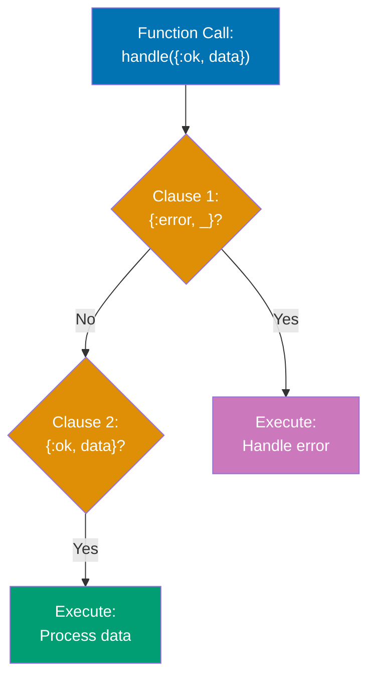
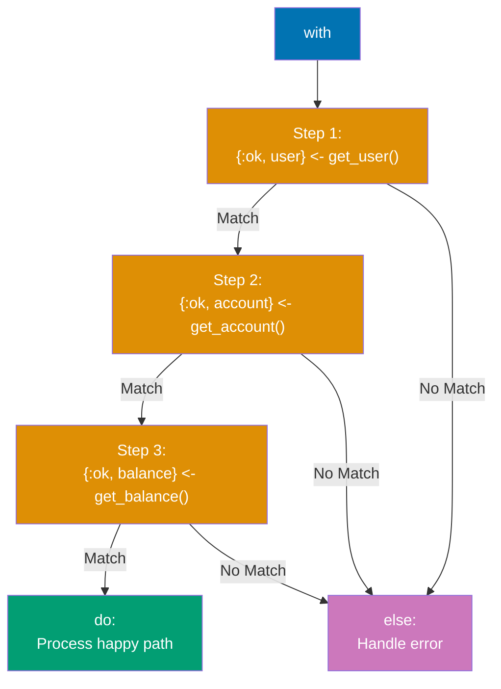
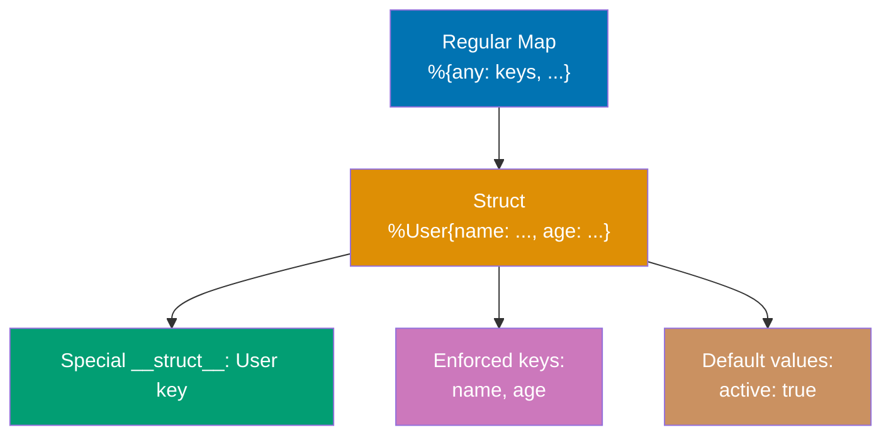
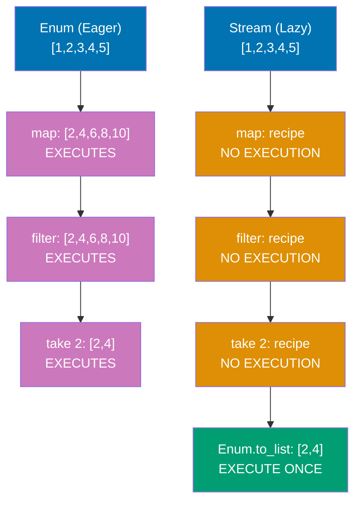
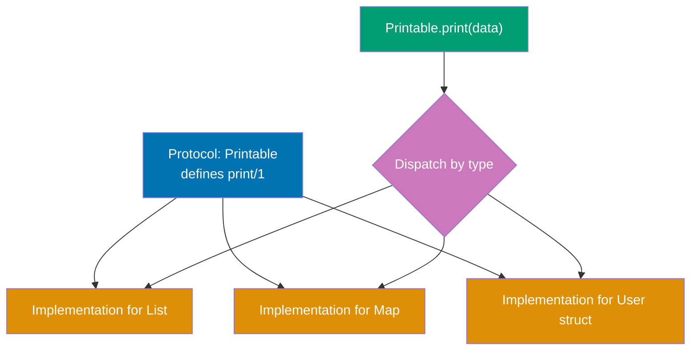
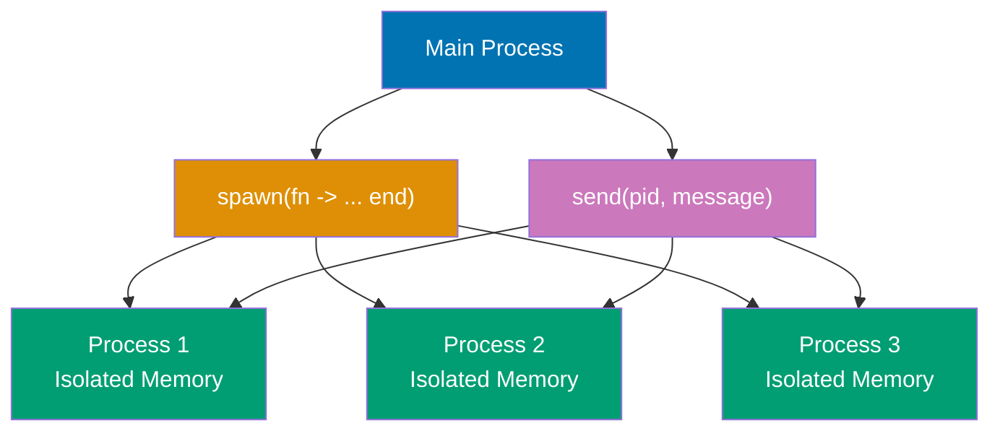
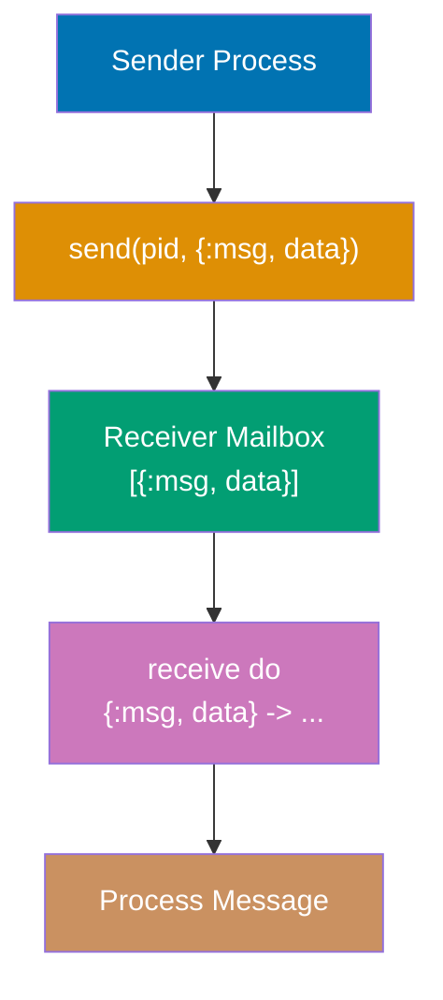
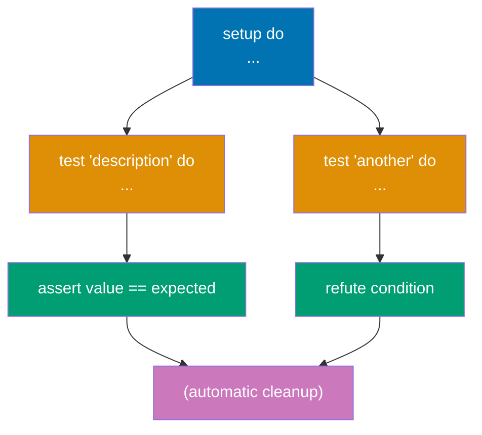
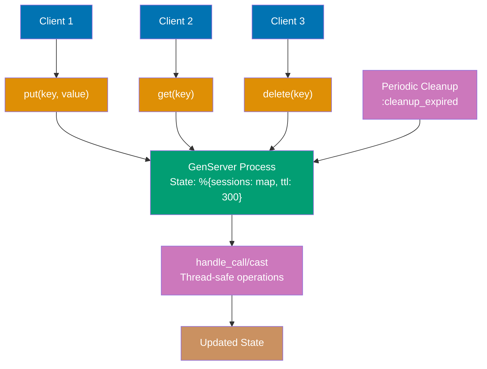

Build on your Elixir foundations with 30 intermediate examples covering advanced patterns, practical OTP usage, error handling, and testing strategies. Each example is self-contained and heavily annotated.

## Group 1: Advanced Pattern Matching

### Example 31: Guards in Depth

Guards are boolean expressions that add additional constraints to pattern matches in function heads, case clauses, and other contexts. They enable more precise pattern matching based on types and values.

**Code**:

```elixir
defmodule Guards do
  # Type guards (dispatch based on runtime type)
  def type_check(value) when is_integer(value), do: "integer: #{value}"
  # => when is_integer(value): guard checks type at runtime
  # => Guard fails: tries next clause
  # => Guard succeeds: executes this clause
  def type_check(value) when is_float(value), do: "float: #{value}"
  # => Multiple clauses tried top-to-bottom
  def type_check(value) when is_binary(value), do: "string: #{value}"
  # => is_binary checks for bitstring (includes strings)
  def type_check(value) when is_atom(value), do: "atom: #{inspect(value)}"
  # => inspect/1 converts atom to readable string
  def type_check(_value), do: "unknown type"
  # => Catch-all clause (no guard = always matches)
  # => _ prefix signals "intentionally unused"

  # Value guards (dispatch based on value ranges)
  def category(age) when age < 13, do: "child"
  # => Numeric comparison in guard
  def category(age) when age >= 13 and age < 20, do: "teen"
  # => Compound guard: and combines conditions
  # => Both conditions must be true
  def category(age) when age >= 20 and age < 65, do: "adult"
  # => Guards are evaluated at dispatch time (before function body)
  def category(age) when age >= 65, do: "senior"
  # => Last specific clause before catch-all

  # Multiple guards with `or`
  def weekday(day) when day == :saturday or day == :sunday, do: "weekend"
  # => or: either condition matches
  # => == checks value equality
  def weekday(_day), do: "weekday"
  # => Catch-all for all other days

  # Guard functions (limited set allowed for purity)
  def valid_user(name, age) when is_binary(name) and byte_size(name) > 0 and age >= 18 do
    # => byte_size/1: allowed guard function (measures binary bytes)
    # => Three conditions ANDed: type check, non-empty, age check
    {:ok, %{name: name, age: age}}
    # => Returns tagged tuple on success
  end
  def valid_user(_name, _age), do: {:error, "invalid user"}
  # => Catch-all for validation failures

  # Pattern matching with guards (combine both techniques)
  def process_response({:ok, status, body}) when status >= 200 and status < 300 do
    # => Pattern: {:ok, status, body} destructures tuple
    # => Guard: checks status is 2xx (success range)
    {:success, body}
    # => Returns normalized :success tuple
  end
  def process_response({:ok, status, _body}) when status >= 400 do
    # => Pattern matches :ok tuple but guards on 4xx+ status
    # => _ prefix: body ignored (not used in function)
    {:error, "client error: #{status}"}
    # => Returns error with status code
  end
  def process_response({:error, reason}) do
    # => Pattern matches :error tuple (no guard needed)
    {:error, "request failed: #{reason}"}
    # => Wraps reason in descriptive message
  end

  # Allowed guard functions (restricted for performance & safety):
  # Type checks: is_atom, is_binary, is_boolean, is_float, is_integer, is_list, is_map, is_tuple
  # Comparisons: ==, !=, ===, !==, <, >, <=, >=
  # Boolean: and, or, not
  # Arithmetic: +, -, *, /
  # Others: abs, div, rem, length, byte_size, tuple_size, elem, hd, tl
  # => Restriction: guards must be pure (no side effects, no IO, no exceptions)
  # => Reason: guards execute during pattern matching (before stack allocation)

  # Custom guard-safe functions (using defguard macro)
  defguard is_adult(age) when is_integer(age) and age >= 18
  # => defguard: defines reusable guard expression
  # => Expands inline at compile time (zero runtime overhead)
  # => Must only use other guard-safe operations

  def can_vote(age) when is_adult(age), do: true
  # => Uses custom guard like built-in
  # => Expands to: when is_integer(age) and age >= 18
  def can_vote(_age), do: false
  # => Catch-all for non-adults
end

# Type dispatching
Guards.type_check(42)
# => Tries clause 1: is_integer(42) → true → "integer: 42"
Guards.type_check(3.14)
# => Tries clause 1: is_integer(3.14) → false
# => Tries clause 2: is_float(3.14) → true → "float: 3.14"
Guards.type_check("hello")
# => Tries clauses 1-2: both fail
# => Tries clause 3: is_binary("hello") → true → "string: hello"
Guards.type_check(:atom)
# => Tries clauses 1-3: all fail
# => Tries clause 4: is_atom(:atom) → true → "atom: :atom"

# Value range dispatching
Guards.category(10)
# => Guard: 10 < 13 → true → "child"
Guards.category(15)
# => Guard: 15 < 13 → false
# => Guard: 15 >= 13 and 15 < 20 → true → "teen"
Guards.category(30)
# => Guards: tries clauses 1-2, both fail
# => Guard: 30 >= 20 and 30 < 65 → true → "adult"
Guards.category(70)
# => Guards: tries clauses 1-3, all fail
# => Guard: 70 >= 65 → true → "senior"

# OR guards
Guards.weekday(:saturday)
# => Guard: :saturday == :saturday or ... → true (short-circuits) → "weekend"
Guards.weekday(:monday)
# => Guard: :monday == :saturday → false
# => Guard: :monday == :sunday → false → or fails
# => Tries clause 2: always matches → "weekday"

# Complex validation
Guards.valid_user("Alice", 25)
# => Guard: is_binary("Alice") → true
# => Guard: byte_size("Alice") > 0 → 5 > 0 → true
# => Guard: 25 >= 18 → true
# => All conditions true → {:ok, %{age: 25, name: "Alice"}}
Guards.valid_user("", 25)
# => Guard: is_binary("") → true
# => Guard: byte_size("") > 0 → 0 > 0 → false → guard fails
# => Tries clause 2 → {:error, "invalid user"}
Guards.valid_user("Bob", 15)
# => Guards: is_binary("Bob") → true, byte_size("Bob") > 0 → true
# => Guard: 15 >= 18 → false → guard fails
# => Tries clause 2 → {:error, "invalid user"}

# HTTP response handling
Guards.process_response({:ok, 200, "Success"})
# => Pattern: {:ok, 200, "Success"} matches {:ok, status, body}
# => Guard: 200 >= 200 and 200 < 300 → true
# => {:success, "Success"}
Guards.process_response({:ok, 404, "Not Found"})
# => Pattern: {:ok, 404, "Not Found"} matches clause 1
# => Guard: 404 >= 200 and 404 < 300 → false → clause 1 fails
# => Tries clause 2: {:ok, 404, "Not Found"} matches {:ok, status, _body}
# => Guard: 404 >= 400 → true → {:error, "client error: 404"}
Guards.process_response({:error, :timeout})
# => Pattern: {:error, :timeout} doesn't match clause 1 or 2
# => Tries clause 3: matches {:error, reason} → {:error, "request failed: timeout"}

# Custom guard usage
Guards.can_vote(25)
# => Guard: is_adult(25) expands to is_integer(25) and 25 >= 18
# => Both true → true
Guards.can_vote(16)
# => Guard: is_integer(16) and 16 >= 18 → true and false → false
# => Tries clause 2 → false
```

**Key Takeaway**: Guards add type and value constraints to pattern matching. Only a limited set of functions is allowed in guards to ensure they remain side-effect free and fast.

**Why It Matters**: Guards execute at function dispatch time without allocating stack frames or calling external code, making them nearly free compared to if/else checks inside function bodies. The BEAM restricts guards to pure, side-effect-free operations (no IO, no message passing, no exceptions) that the compiler can inline and optimize. In production Phoenix controllers, guards validate HTTP request params at function entry (`def create(conn, %{"age" => age}) when is_integer(age) and age >= 18`), causing immediate pattern match failures for invalid inputs rather than runtime crashes deep in business logic—this fail-fast approach enables supervisors to restart with clean state while logging the exact validation that failed.

---

### Example 32: Pattern Matching in Function Heads

Multi-clause functions use pattern matching in function heads to elegantly handle different input shapes. Clauses are tried in order from top to bottom until one matches.



**Code**:

```elixir
defmodule FunctionMatching do
  # Order matters! Specific cases before general cases
  def handle_result({:ok, value}), do: "Success: #{value}"
  # => Pattern: {:ok, value} matches 2-element tuple with :ok atom
  # => value extracts second element
  def handle_result({:error, reason}), do: "Error: #{reason}"
  # => Different pattern: {:error, _} would match any error
  def handle_result(_), do: "Unknown result"
  # => Catch-all: matches anything not matched above
  # => WARNING: Must be last clause (matches everything)

  # Pattern matching with destructuring (tagged tuples)
  def greet({:user, name}), do: "Hello, #{name}!"
  # => Matches {:user, "Alice"} → extracts "Alice" into name
  def greet({:admin, name}), do: "Welcome back, Admin #{name}!"
  # => Different first element → different clause
  def greet({:guest}), do: "Welcome, guest!"
  # => Single-element tuple pattern (guest has no name)

  # List pattern matching (recursive)
  def sum([]), do: 0
  # => Base case: empty list returns 0
  # => Recursion terminates here
  def sum([head | tail]), do: head + sum(tail)
  # => Pattern: [head | tail] splits list into first element + rest
  # => Recursive case: add head to sum of tail
  # => Example: [1,2,3] → 1 + sum([2,3]) → 1 + 2 + sum([3]) → 1 + 2 + 3 + sum([]) → 6

  # Map pattern matching (structural matching)
  def user_summary(%{name: name, age: age}) when age >= 18 do
    # => Pattern: %{name: name, age: age} extracts specific keys
    # => Map can have other keys (ignored)
    # => Guard: age >= 18 adds constraint after pattern match
    "#{name} is an adult (#{age} years old)"
  end
  def user_summary(%{name: name, age: age}) do
    # => Same pattern, different guard
    # => Clause order matters: guard checked first-to-last
    "#{name} is a minor (#{age} years old)"
  end

  # Multiple pattern matches with guards (value classification)
  def classify_number(n) when n < 0, do: :negative
  # => Guard only (no pattern destructuring needed)
  def classify_number(0), do: :zero
  # => Exact value pattern (no guard needed)
  def classify_number(n) when n > 0 and n < 100, do: :small_positive
  # => Compound guard: both conditions must be true
  def classify_number(n) when n >= 100, do: :large_positive
  # => Last specific clause (implicitly covers n >= 100)

  # Complex nested patterns (multi-level destructuring)
  def process_response({:ok, %{status: 200, body: body}}) do
    # => Nested pattern: tuple contains map
    # => Matches: {:ok, %{status: 200, body: "anything"}}
    # => Extracts: body value
    {:success, body}
  end
  def process_response({:ok, %{status: status, body: _}}) when status >= 400 do
    # => Pattern: tuple + map destructuring
    # => _ ignores body (not used)
    # => Guard: status >= 400 further constrains
    {:client_error, status}
  end
  def process_response({:error, %{reason: reason}}) do
    # => Different tuple tag: :error instead of :ok
    # => Still uses map pattern for nested data
    {:failed, reason}
  end

  # Default arguments with pattern matching (multi-clause + defaults)
  def send_message(user, message, opts \\ [])
  # => Function head: declares default value opts = []
  # => Actual implementations below (pattern match on opts)
  def send_message(%{email: email}, message, priority: :high) do
    # => Pattern: opts must be [priority: :high] (keyword list)
    # => user must be map with :email key
    "Urgent email to #{email}: #{message}"
  end
  def send_message(%{email: email}, message, _opts) do
    # => Catch-all for opts (any value including [])
    # => Matches when first clause doesn't
    "Email to #{email}: #{message}"
  end
end

# Result tuple handling
FunctionMatching.handle_result({:ok, 42})
# => Tries clause 1: {:ok, 42} matches {:ok, value} → "Success: 42"
FunctionMatching.handle_result({:error, "not found"})
# => Clause 1 fails (not :ok)
# => Clause 2: {:error, "not found"} matches {:error, reason} → "Error: not found"
FunctionMatching.handle_result(:unknown)
# => Clauses 1-2 fail (not tuple)
# => Clause 3: _ matches anything → "Unknown result"

# Tagged tuple dispatching
FunctionMatching.greet({:user, "Alice"})
# => Clause 1: {:user, "Alice"} matches {:user, name} → "Hello, Alice!"
FunctionMatching.greet({:admin, "Bob"})
# => Clause 1 fails (:admin ≠ :user)
# => Clause 2: {:admin, "Bob"} matches {:admin, name} → "Welcome back, Admin Bob!"
FunctionMatching.greet({:guest})
# => Clauses 1-2 fail (wrong pattern)
# => Clause 3: {:guest} matches → "Welcome, guest!"

# Recursive list processing
FunctionMatching.sum([1, 2, 3, 4])
# => [1 | [2,3,4]] → 1 + sum([2,3,4])
# => [2 | [3,4]] → 2 + sum([3,4])
# => [3 | [4]] → 3 + sum([4])
# => [4 | []] → 4 + sum([])
# => [] → 0
# => Stack unwinds: 4 + 0 = 4, 3 + 4 = 7, 2 + 7 = 9, 1 + 9 = 10
FunctionMatching.sum([])
# => Clause 1: [] matches → 0 (base case)

# Map pattern matching with guards
FunctionMatching.user_summary(%{name: "Alice", age: 25})
# => Pattern: %{name: "Alice", age: 25} matches %{name: name, age: age}
# => Extracts: name = "Alice", age = 25
# => Guard: 25 >= 18 → true → "Alice is an adult (25 years old)"
FunctionMatching.user_summary(%{name: "Bob", age: 16})
# => Pattern matches clause 1
# => Guard: 16 >= 18 → false → clause 1 fails
# => Clause 2: same pattern, no guard → matches → "Bob is a minor (16 years old)"

# Value classification with guards
FunctionMatching.classify_number(-5)
# => Guard: -5 < 0 → true → :negative
FunctionMatching.classify_number(0)
# => Clause 1 guard fails
# => Pattern: 0 matches exactly → :zero
FunctionMatching.classify_number(50)
# => Clauses 1-2 fail
# => Guard: 50 > 0 and 50 < 100 → true → :small_positive
FunctionMatching.classify_number(200)
# => Clauses 1-3 fail
# => Guard: 200 >= 100 → true → :large_positive

# Nested pattern matching
FunctionMatching.process_response({:ok, %{status: 200, body: "OK"}})
# => Pattern: {:ok, %{status: 200, body: body}} matches exactly
# => Extracts: body = "OK" → {:success, "OK"}
FunctionMatching.process_response({:ok, %{status: 404, body: "Not Found"}})
# => Clause 1: status 404 ≠ 200 → fails
# => Clause 2: pattern matches, guard 404 >= 400 → true → {:client_error, 404}
FunctionMatching.process_response({:error, %{reason: :timeout}})
# => Clauses 1-2: {:error, ...} doesn't match {:ok, ...}
# => Clause 3: {:error, %{reason: :timeout}} matches → {:failed, :timeout}

# Default arguments with pattern matching
FunctionMatching.send_message(%{email: "a@example.com"}, "Hello", priority: :high)
# => opts = [priority: :high] (provided)
# => Clause 1: pattern [priority: :high] matches → "Urgent email..."
FunctionMatching.send_message(%{email: "b@example.com"}, "Hi", [])
# => opts = [] (provided empty list)
# => Clause 1: [] doesn't match [priority: :high]
# => Clause 2: _opts matches [] → "Email..."
```

**Key Takeaway**: Pattern matching in function heads enables elegant multi-clause logic. Place specific patterns before general ones, and combine with guards for precise control flow.

**Why It Matters**: Processes are the fundamental unit of concurrency in Elixir, implemented as lightweight BEAM green threads with microsecond spawn times and 2KB initial memory. The BEAM's preemptive scheduler distributes processes across CPU cores automatically, enabling WhatsApp to handle 2 million connections per server compared to thousands in thread-based systems. Each process has isolated heap and mailbox, so one crash never corrupts another—the foundation of Elixir's fault tolerance.

---

### Example 33: With Expression (Happy Path)

The `with` expression chains pattern matches, short-circuiting on the first mismatch. It's ideal for "happy path" coding where you expect success and want to handle errors at the end.



**Code**:

```elixir
defmodule WithExamples do
  # Simulate API functions (return tagged tuples)
  def fetch_user(id) do
    case id do
      1 -> {:ok, %{id: 1, name: "Alice", account_id: 101}}
      # => Success: returns {:ok, user_map}
      2 -> {:ok, %{id: 2, name: "Bob", account_id: 102}}
      _ -> {:error, :user_not_found}
      # => Failure: returns {:error, atom}
    end
  end

  def fetch_account(account_id) do
    case account_id do
      101 -> {:ok, %{id: 101, balance: 1000}}
      102 -> {:ok, %{id: 102, balance: 500}}
      _ -> {:error, :account_not_found}
    end
  end

  def fetch_transactions(account_id) do
    case account_id do
      101 -> {:ok, [%{amount: 100}, %{amount: -50}]}
      # => Returns list of transaction maps
      102 -> {:ok, [%{amount: 200}]}
      _ -> {:error, :transactions_not_found}
    end
  end

  # ❌ WITHOUT `with` - nested case statements (pyramid of doom)
  def get_user_summary_nested(user_id) do
    case fetch_user(user_id) do
      # => Level 1 nesting
      {:ok, user} ->
        case fetch_account(user.account_id) do
          # => Level 2 nesting
          {:ok, account} ->
            case fetch_transactions(account.id) do
              # => Level 3 nesting (hard to read!)
              {:ok, transactions} ->
                {:ok, %{user: user, account: account, transactions: transactions}}
              {:error, reason} ->
                {:error, reason}
                # => Must repeat error handling at each level
            end
          {:error, reason} ->
            {:error, reason}
            # => Duplicated error handling
        end
      {:error, reason} ->
        {:error, reason}
        # => Error handling repeated 3 times!
    end
  end

  # ✅ WITH `with` - clean happy path (linear, readable)
  def get_user_summary(user_id) do
    with {:ok, user} <- fetch_user(user_id),
         # => Step 1: pattern match {:ok, user}
         # => If matches: continue to step 2
         # => If doesn't match: jump to else block
         {:ok, account} <- fetch_account(user.account_id),
         # => Step 2: uses user from step 1
         # => Chain continues only if pattern matches
         {:ok, transactions} <- fetch_transactions(account.id) do
         # => Step 3: uses account from step 2
         # => All patterns matched: execute do block
      # Happy path - all matches succeeded
      {:ok, %{
        user: user.name,
        # => user binding from step 1
        balance: account.balance,
        # => account binding from step 2
        transaction_count: length(transactions)
        # => transactions binding from step 3
      }}
    else
      # First mismatch jumps here (short-circuit)
      {:error, :user_not_found} -> {:error, "User not found"}
      # => Pattern match error from step 1
      {:error, :account_not_found} -> {:error, "Account not found"}
      # => Pattern match error from step 2
      {:error, :transactions_not_found} -> {:error, "Transactions not found"}
      # => Pattern match error from step 3
      # => Consolidated error handling in one place!
    end
  end

  # `with` can match any pattern (not just :ok/:error)
  def complex_calculation(x) do
    with {:ok, doubled} <- {:ok, x * 2},
         # => x = 5 → {:ok, 10}
         # => Matches pattern, doubled = 10
         {:ok, incremented} <- {:ok, doubled + 1},
         # => {:ok, 11}, incremented = 11
         {:ok, squared} <- {:ok, incremented * incremented} do
         # => {:ok, 121}, squared = 121
      {:ok, squared}
      # => Returns {:ok, 121}
    else
      _ -> {:error, "calculation failed"}
      # => Catch-all for any non-matching pattern
    end
  end

  # Boolean guards in `with` (Elixir 1.3+)
  def process_number(x) when is_integer(x) do
    with true <- x > 0,
         # => Matches true or jumps to else
         # => Pattern: true <- boolean_expression
         true <- x < 100 do
         # => Second validation: x must be < 100
      {:ok, "Valid number: #{x}"}
      # => Both guards passed
    else
      false -> {:error, "Number out of range"}
      # => Either guard failed (returned false)
      # => Both failures use same pattern
    end
  end
end

# Happy path - all steps succeed
WithExamples.get_user_summary(1)
# => Step 1: fetch_user(1) → {:ok, %{id: 1, name: "Alice", account_id: 101}}
# => Step 2: fetch_account(101) → {:ok, %{id: 101, balance: 1000}}
# => Step 3: fetch_transactions(101) → {:ok, [...]}
# => do block executes → {:ok, %{balance: 1000, transaction_count: 2, user: "Alice"}}

WithExamples.get_user_summary(2)
# => User Bob, account 102, balance 500, 1 transaction
# => {:ok, %{balance: 500, transaction_count: 1, user: "Bob"}}

# Failure path - short-circuit at step 1
WithExamples.get_user_summary(999)
# => Step 1: fetch_user(999) → {:error, :user_not_found}
# => Pattern {:ok, user} doesn't match → jumps to else
# => else block: {:error, :user_not_found} matches → {:error, "User not found"}

# Calculation chain
WithExamples.complex_calculation(5)
# => Step 1: {:ok, 5 * 2} = {:ok, 10}
# => Step 2: {:ok, 10 + 1} = {:ok, 11}
# => Step 3: {:ok, 11 * 11} = {:ok, 121}
# => {:ok, 121}

# Boolean guard validation
WithExamples.process_number(50)
# => Guard 1: 50 > 0 → true (matches)
# => Guard 2: 50 < 100 → true (matches)
# => {:ok, "Valid number: 50"}

WithExamples.process_number(150)
# => Guard 1: 150 > 0 → true
# => Guard 2: 150 < 100 → false (doesn't match true)
# => else: false matched → {:error, "Number out of range"}

WithExamples.process_number(-10)
# => Guard 1: -10 > 0 → false (short-circuits)
# => else: false matched → {:error, "Number out of range"}
```

**Key Takeaway**: `with` chains pattern matches and short-circuits on the first mismatch. Use it for happy path coding where you expect success, with error handling consolidated in the `else` block.

**Why It Matters**: Process linking enables supervision trees where crashes propagate to supervisors rather than terminating the system. When a worker crashes, its linked supervisor receives an exit signal and executes restart strategy (one_for_one, rest_for_one, one_for_all). In production, this creates self-healing systems—Discord's Elixir backend uses supervision trees to automatically restart failed message routers, maintaining 99.99% uptime while serving millions of concurrent users without manual intervention.

---

## Group 2: Data Structures Advanced

### Example 34: Structs

Structs are extensions of maps with compile-time guarantees and default values. They enforce a predefined set of keys, enabling clearer data modeling and better error messages.



**Code**:

```elixir
defmodule User do
  # Define struct with default values
  defstruct name: nil, age: nil, email: nil, active: true
  # => All fields optional with defaults
  # => name, age, email default to nil
  # => active defaults to true
  # => Creates %User{} constructor

  # Alternative: enforced keys (compile-time check)
  # @enforce_keys [:name, :age]
  # => Compile error if these keys not provided at creation
  # defstruct [:name, :age, email: nil, active: true]
  # => Shorthand: atom list for required keys + keyword for defaults
end

defmodule Account do
  @enforce_keys [:id, :balance]
  # => MUST provide :id and :balance when creating struct
  # => Raises ArgumentError at runtime if missing
  defstruct [:id, :balance, status: :active, transactions: []]
  # => :id, :balance required (no defaults)
  # => status defaults to :active
  # => transactions defaults to []
end

# Create struct with all fields
user = %User{name: "Alice", age: 30, email: "alice@example.com"}
# => Syntax: %ModuleName{key: value, ...}
# => active field uses default (true)
# => %User{name: "Alice", age: 30, email: "alice@example.com", active: true}

# Create struct with partial fields (use defaults for rest)
user_partial = %User{name: "Bob", age: 25}
# => email defaults to nil, active defaults to true
# => %User{name: "Bob", age: 25, email: nil, active: true}

# Access struct fields (dot notation)
user.name
# => "Alice" (field access)
user.age
# => 30
user.active
# => true (default value)

# Update struct (immutable, creates new struct)
updated_user = %{user | age: 31, email: "alice.new@example.com"}
# => Syntax: %{struct | field: new_value, ...}
# => Returns NEW struct (original unchanged)
# => %User{name: "Alice", age: 31, email: "alice.new@example.com", active: true}
user.age
# => 30 (original unchanged - immutability!)
# => updated_user is separate copy

# Struct is a tagged map (special __struct__ field)
user.__struct__
# => User (module name)
# => Hidden field added by defstruct
is_map(user)
# => true (structs ARE maps)
# => Can use map functions on structs
Map.keys(user)
# => [:__struct__, :active, :age, :email, :name]
# => __struct__ is first key (implementation detail)

# Pattern matching on structs
%User{name: name, age: age} = user
# => Destructures struct fields
# => Pattern matches User struct (not other structs or plain maps)
name
# => "Alice"
age
# => 30

# Pattern matching in function heads (type safety)
def greet_user(%User{name: name}), do: "Hello, #{name}!"
# => Only accepts User structs (not Account or plain maps)
# => Extracts name field
# => Type-safe dispatch!
greet_user(user)
# => "Hello, Alice!"
# greet_user(%{name: "Bob"}) would raise FunctionClauseError
# => Plain map doesn't match %User{} pattern

# Enforced keys example
account = %Account{id: 1, balance: 1000}
# => MUST provide :id and :balance (@enforce_keys)
# => status and transactions use defaults
# => %Account{id: 1, balance: 1000, status: :active, transactions: []}

# account_invalid = %Account{id: 1}
# => ** (ArgumentError) missing required keys: [:balance]
# => Compile-time/runtime check prevents invalid structs
```

**Key Takeaway**: Structs are tagged maps with enforced keys and default values. They provide compile-time guarantees and clearer domain modeling compared to plain maps.

**Why It Matters**: Monitors enable one-way crash detection without the bilateral coupling of links. A GenServer can monitor a database connection process to detect disconnects without being killed by them, enabling graceful degradation. In production, monitors implement health checks—Phoenix connection pools monitor worker processes and spawn replacements for crashed workers, while the workers themselves remain unaware of monitoring, maintaining clean separation of concerns.

---

### Example 35: Streams (Lazy Enumeration)

Streams are lazy enumerables that build a recipe for computation without executing it immediately. They enable efficient processing of large or infinite datasets by composing transformations.



**Code**:

```elixir
numbers = [1, 2, 3, 4, 5, 6, 7, 8, 9, 10]

# Eager evaluation (Enum) - immediate execution
eager_result = numbers
               |> Enum.map(fn x -> x * 2 end)
               # => Pass 1: builds [2, 4, 6, 8, 10, 12, 14, 16, 18, 20]
               # => Processes all 10 elements immediately
               |> Enum.filter(fn x -> rem(x, 4) == 0 end)
               # => Pass 2: builds [4, 8, 12, 16, 20]
               # => Processes all 5 remaining elements
               |> Enum.take(2)
               # => Pass 3: takes first 2 → [4, 8]
               # => Already processed all 10 elements (wasteful!)

# Lazy evaluation (Stream) - deferred execution
lazy_result = numbers
              |> Stream.map(fn x -> x * 2 end)
              # => Returns #Stream<...> (NOT a list)
              # => No execution yet, just builds recipe
              |> Stream.filter(fn x -> rem(x, 4) == 0 end)
              # => Returns #Stream<...> (still no execution)
              # => Composes filter into recipe
              |> Enum.take(2)
              # => TRIGGERS execution: processes elements one-by-one
              # => Stops after finding 2 matches
              # => Only processes: 1→2 (no), 2→4 (YES), 3→6 (no), 4→8 (YES), STOP
              # => [4, 8] (processed 4 elements, not 10!)

# Infinite streams (impossible with eager evaluation)
infinite_numbers = Stream.iterate(1, fn x -> x + 1 end)
# => Infinite sequence: 1, 2, 3, 4, 5, ...
# => Returns #Stream<...> (no execution yet)
# => Would never terminate if eager!

first_evens = infinite_numbers
              |> Stream.filter(fn x -> rem(x, 2) == 0 end)
              # => Lazy filter (no execution)
              |> Enum.take(10)
              # => Takes first 10 even numbers
              # => [2, 4, 6, 8, 10, 12, 14, 16, 18, 20]
              # => Stops after 10 matches (doesn't process infinite stream!)

# Stream.cycle - repeats list infinitely
Stream.cycle([1, 2, 3]) |> Enum.take(7)
# => Cycles through [1,2,3] infinitely
# => Takes first 7: [1, 2, 3, 1, 2, 3, 1]

# Stream.unfold - generates values from state
fibonacci = Stream.unfold({0, 1}, fn {a, b} -> {a, {b, a + b}} end)
# => unfold(initial_state, next_fn)
# => next_fn returns {value, new_state}
# => {0, 1} → emit 0, next state {1, 1}
# => {1, 1} → emit 1, next state {1, 2}
# => {1, 2} → emit 1, next state {2, 3}
# => {2, 3} → emit 2, next state {3, 5}
# => Infinite Fibonacci sequence
Enum.take(fibonacci, 10)
# => [0, 1, 1, 2, 3, 5, 8, 13, 21, 34]

# Performance comparison
defmodule Performance do
  def eager_pipeline(n) do
    1..n
    |> Enum.map(fn x -> x * 2 end)
    # => Builds entire intermediate list (n elements)
    |> Enum.filter(fn x -> rem(x, 3) == 0 end)
    # => Builds another intermediate list (~n/3 elements)
    |> Enum.take(100)
    # => Takes 100, discards rest
    # => Wastes memory and CPU for large n
  end

  def lazy_pipeline(n) do
    1..n
    |> Stream.map(fn x -> x * 2 end)
    # => No intermediate list (lazy)
    |> Stream.filter(fn x -> rem(x, 3) == 0 end)
    # => Still lazy (just composing)
    |> Enum.take(100)
    # => Processes ONLY until 100 matches found
    # => For n=1_000_000: processes ~300 elements, not 1 million!
  end
end

# Performance.eager_pipeline(1_000_000)
# => Processes 1 million elements, builds 2 intermediate lists
# Performance.lazy_pipeline(1_000_000)
# => Processes ~300 elements, 0 intermediate lists

# Stream.resource - manage external resources (files, sockets, etc.)
stream_resource = Stream.resource(
  fn -> {:ok, "initial state"} end,
  # => Start function: called once to initialize
  # => Returns initial accumulator state
  fn state -> {[state], "next state"} end,
  # => Next function: called repeatedly
  # => Returns {values_to_emit, new_state}
  # => Can return {:halt, state} to stop
  fn _state -> :ok end
  # => After function: cleanup (called when stream ends)
  # => Close files, release resources, etc.
)
Enum.take(stream_resource, 3)
# => Calls start → {:ok, "initial state"}
# => Calls next("initial state") → {["initial state"], "next state"}
# => Emits "initial state"
# => Calls next("next state") → {["next state"], "next state"}
# => Emits "next state" (2 times)
# => Calls after("next state") → :ok (cleanup)
# => ["initial state", "next state", "next state"]
```

**Key Takeaway**: Streams enable lazy evaluation—building a recipe without executing it. Use streams for large datasets, infinite sequences, or when you want to compose transformations efficiently.

**Why It Matters**: The BEAM's message passing is asynchronous and lock-free—send/2 copies messages to the receiver's mailbox without blocking, enabling sending millions of messages per second. Unlike shared-memory threading, this eliminates race conditions and deadlocks. In production Phoenix channels, one WebSocket process handles bidirectional communication while business logic processes handle commands concurrently, communicating through message passing that the BEAM optimizes with specialized copy-on-write for large binaries.

---

### Example 36: MapSet for Uniqueness

MapSets are unordered collections of unique values. They provide efficient membership testing and set operations (union, intersection, difference). Use them when uniqueness matters and order doesn't.

**Code**:

```elixir
# Create MapSet from list (automatic deduplication)
set1 = MapSet.new([1, 2, 3, 3, 4, 4, 5])
# => MapSet.new/1 removes duplicates automatically
# => #MapSet<[1, 2, 3, 4, 5]>
# => Unordered: order not guaranteed

# Create MapSet from range
set_range = MapSet.new(1..10)
# => Converts range to set
# => #MapSet<[1, 2, 3, 4, 5, 6, 7, 8, 9, 10]>

# Add element (immutable, returns new set)
set2 = MapSet.put(set1, 6)
# => Adds 6 to set (new set returned)
# => #MapSet<[1, 2, 3, 4, 5, 6]>
set1
# => #MapSet<[1, 2, 3, 4, 5]> (original unchanged!)
# => Immutability: set2 is separate copy

# Add duplicate (no effect)
set3 = MapSet.put(set1, 3)
# => 3 already exists in set
# => Returns set unchanged
# => #MapSet<[1, 2, 3, 4, 5]> (same as set1)

# Remove element
set4 = MapSet.delete(set1, 3)
# => Removes 3 from set
# => #MapSet<[1, 2, 4, 5]>

# Membership testing (O(log n))
MapSet.member?(set1, 3)
# => Checks if 3 is in set
# => true (efficient lookup)
MapSet.member?(set1, 10)
# => Checks if 10 is in set
# => false (not present)

# Set size
MapSet.size(set1)
# => Counts unique elements
# => 5

# Set operations
setA = MapSet.new([1, 2, 3])
# => Set A: {1, 2, 3}
setB = MapSet.new([3, 4, 5])
# => Set B: {3, 4, 5}

# Union (all unique elements from both sets)
MapSet.union(setA, setB)
# => A ∪ B: elements in A OR B
# => #MapSet<[1, 2, 3, 4, 5]>

# Intersection (common elements)
MapSet.intersection(setA, setB)
# => A ∩ B: elements in A AND B
# => #MapSet<[3]> (only 3 is common)

# Difference (elements in A but not in B)
MapSet.difference(setA, setB)
# => A \ B: elements in A but NOT in B
# => #MapSet<[1, 2]> (3 is removed)
MapSet.difference(setB, setA)
# => B \ A: elements in B but NOT in A
# => #MapSet<[4, 5]> (3 is removed)
# => Difference is NOT commutative!

# Subset and superset
setX = MapSet.new([1, 2])
# => Set X: {1, 2}
setY = MapSet.new([1, 2, 3, 4])
# => Set Y: {1, 2, 3, 4}
MapSet.subset?(setX, setY)
# => Is X ⊆ Y? (all elements of X in Y?)
# => true (1 and 2 are in Y)
MapSet.subset?(setY, setX)
# => Is Y ⊆ X?
# => false (3 and 4 not in X)

# Disjoint sets (no common elements)
MapSet.disjoint?(setA, MapSet.new([6, 7]))
# => Do A and {6, 7} have any common elements?
# => true (no overlap)
# => Disjoint: A ∩ {6,7} = ∅

# Convert to list (order not guaranteed)
MapSet.to_list(set1)
# => Converts set to list
# => [1, 2, 3, 4, 5] (order may vary)
# => Sets are unordered!

# Practical example: unique tags from posts
posts = [
  %{id: 1, tags: ["elixir", "functional", "programming"]},
  %{id: 2, tags: ["elixir", "otp", "concurrency"]},
  %{id: 3, tags: ["functional", "fp", "programming"]}
]

# Extract all unique tags
all_tags = posts
           |> Enum.flat_map(fn post -> post.tags end)
           # => Flattens: ["elixir", "functional", "programming", "elixir", "otp", ...]
           # => With duplicates
           |> MapSet.new()
           # => Deduplicates: #MapSet<["elixir", "functional", "programming", "otp", "concurrency", "fp"]>
# => Automatic uniqueness!

# Find common tags between posts
post1_tags = MapSet.new(["elixir", "functional"])
post2_tags = MapSet.new(["elixir", "otp"])
MapSet.intersection(post1_tags, post2_tags)
# => Common tags: #MapSet<["elixir"]>
# => Useful for finding related content
```

**Key Takeaway**: MapSets provide O(log n) membership testing and automatic deduplication. Use them for unique collections where order doesn't matter and set operations (union, intersection, difference) are needed.

**Why It Matters**: Selective receive enables processes to prioritize messages by pattern matching mailbox contents out of order. The BEAM maintains a per-process save pointer, making selective receive O(1) for early matches. In production, this enables priority handling—a GenServer can process :urgent messages before :normal ones, while Erlang's priority_receive extension supports real-time systems with predictable latency requirements.

---

## Group 3: Module Organization

### Example 37: Module Attributes

Module attributes are compile-time constants defined with `@`. They're commonly used for documentation (`@moduledoc`, `@doc`), compile-time configuration, and storing values computed during compilation.

**Code**:

```elixir
defmodule MyModule do
  # Module documentation
  @moduledoc """
  This module demonstrates module attributes.
  Module attributes are compile-time constants.
  """

  # Compile-time constant
  @default_timeout 5000
  @version "1.0.0"
  @max_retries 3

  # Function documentation
  @doc """
  Waits for a specified timeout or default.
  Returns :ok after waiting.
  """
  def wait(timeout \\ @default_timeout) do
    :timer.sleep(timeout)
    :ok
  end

  @doc """
  Gets the module version.
  """
  def version, do: @version

  # Computed at compile time
  @languages ["Elixir", "Erlang", "LFE"]
  @language_count length(@languages) # Computed once during compilation

  def supported_languages, do: @languages
  def language_count, do: @language_count

  # Module registration (common in OTP)
  @behaviour :gen_server  # Implements gen_server behaviour (covered in advanced)

  # Accumulating values
  @colors [:red, :blue]
  @colors [:green | @colors]  # Prepend to list
  @colors [:yellow | @colors]

  def colors, do: @colors # => [:yellow, :green, :red, :blue]

  # Attributes reset per function
  @important true
  def func1, do: @important # => true

  @important false
  def func2, do: @important # => false

  # Custom attributes for metadata
  @deprecated_message "Use new_function/1 instead"

  @doc @deprecated_message
  def old_function, do: :deprecated

  # Reserved attributes (special meaning):
  # @moduledoc - module documentation
  # @doc - function documentation
  # @behaviour - implements behaviour
  # @impl - marks function as callback implementation
  # @deprecated - marks function as deprecated
  # @spec - type specification
  # @type - defines type
  # @opaque - defines opaque type
end

MyModule.wait(1000) # Waits 1 second, returns :ok
MyModule.version() # => "1.0.0"
MyModule.supported_languages() # => ["Elixir", "Erlang", "LFE"]
MyModule.language_count() # => 3
MyModule.colors() # => [:yellow, :green, :red, :blue]

```

**Key Takeaway**: Module attributes (`@name`) are compile-time constants useful for documentation, configuration, and computed values. They're evaluated during compilation, not runtime.

**Why It Matters**: The receive timeout enables gen_timeout patterns and state timeouts in GenStateMachine. Unlike polling, BEAM timeouts are implemented in the scheduler with zero CPU overhead. In production systems, this powers heartbeat detection—connection pools detect stale connections through receive timeouts, GenServers implement inactivity cleanup, and Phoenix PubSub uses timeouts to detect network partitions without polling that would waste CPU cycles.

---

### Example 38: Import, Alias, Require

`import`, `alias`, and `require` control how modules are referenced in your code. They reduce verbosity and manage namespaces cleanly.

**Code**:

```elixir
defmodule ImportAliasRequire do
  # alias - shortens module names
  alias MyApp.Accounts.User        # Now use User instead of MyApp.Accounts.User
  alias MyApp.Accounts.Admin, as: A # Custom name: A instead of Admin

  def create_user(name) do
    %User{name: name}  # Instead of %MyApp.Accounts.User{...}
  end

  def create_admin(name) do
    %A{name: name}  # Custom alias
  end

  # import - brings functions into scope (no module prefix needed)
  import Enum, only: [map: 2, filter: 2]  # Only import specific functions

  def process_numbers(list) do
    list
    |> map(fn x -> x * 2 end)     # Instead of Enum.map
    |> filter(fn x -> x > 10 end)  # Instead of Enum.filter
  end

  # import with except
  import String, except: [split: 1]  # Import all String functions except split/1

  def upcase_string(str) do
    upcase(str)  # Instead of String.upcase(str)
  end

  # require - needed for macros
  require Logger

  def log_something do
    Logger.info("This is a log message")  # Logger.info is a macro, not a function
  end

  # Multiple aliases at once (Elixir 1.2+)
  alias MyApp.{Accounts, Billing, Reports}

  def get_account_report do
    account = Accounts.get()
    billing = Billing.get()
    Reports.generate(account, billing)
  end
end

defmodule MyApp.Accounts.User do
  defstruct name: nil, email: nil
end

defmodule MyApp.Accounts.Admin do
  defstruct name: nil, role: :admin
end

defmodule ScopingExample do
  def func1 do
    import Enum  # Only available in func1
    map([1, 2, 3], fn x -> x * 2 end)
  end

  def func2 do
    # map([1, 2, 3], fn x -> x * 2 end)  # Error! import not in scope
    Enum.map([1, 2, 3], fn x -> x * 2 end)  # Must use full name
  end

  # Module-level import (available in all functions)
  import String

  def func3, do: upcase("hello")
  def func4, do: downcase("WORLD")
end

```

**Key Takeaway**: Use `alias` to shorten module names, `import` to bring functions into scope (sparingly!), and `require` for macros. These directives manage namespaces and reduce verbosity.

**Why It Matters**: Tasks provide higher-level concurrency than raw spawn, with built-in monitoring and result retrieval. Task.async/await compiles to efficient BEAM process creation with selective receive for result collection. In production Phoenix controllers, `Task.async_stream(users, &send_email/1)` parallelizes IO operations across all CPU cores with backpressure, while Task Supervisor restarts failed tasks without bringing down the parent, maintaining throughput under partial failures.

---

### Example 39: Protocols (Polymorphism)

Protocols enable polymorphism—defining a function that works differently for different data types. They're Elixir's mechanism for ad-hoc polymorphism, similar to interfaces in other languages.



**Code**:

```elixir
defprotocol Printable do
  @doc "Converts data to a printable string"
  def print(data)
end

defimpl Printable, for: Integer do
  def print(int), do: "Number: #{int}"
end

defimpl Printable, for: List do
  def print(list), do: "List with #{length(list)} items: #{inspect(list)}"
end

defimpl Printable, for: Map do
  def print(map), do: "Map with #{map_size(map)} keys"
end

Printable.print(42) # => "Number: 42"
Printable.print([1, 2, 3]) # => "List with 3 items: [1, 2, 3]"
Printable.print(%{a: 1, b: 2}) # => "Map with 2 keys"

defmodule User do
  defstruct name: nil, age: nil
end

defimpl Printable, for: User do
  def print(user), do: "User: #{user.name}, age #{user.age}"
end

user = %User{name: "Alice", age: 30}
Printable.print(user) # => "User: Alice, age 30"

defimpl String.Chars, for: User do
  def to_string(user), do: user.name
end

to_string(user) # => "Alice"
"Hello, #{user}" # => "Hello, Alice" (uses String.Chars protocol)

defmodule Range do
  defstruct first: nil, last: nil
end

defimpl Enumerable, for: Range do
  def count(range), do: {:ok, range.last - range.first + 1}
  def member?(range, value), do: {:ok, value >= range.first and value <= range.last}
  def reduce(range, acc, fun) do
    Enum.reduce(range.first..range.last, acc, fun)
  end
  def slice(_range), do: {:error, __MODULE__}
end

my_range = %Range{first: 1, last: 5}
Enum.count(my_range) # => 5
Enum.member?(my_range, 3) # => true
Enum.map(my_range, fn x -> x * 2 end) # => [2, 4, 6, 8, 10]

defprotocol Describable do
  @fallback_to_any true
  def describe(data)
end

defimpl Describable, for: Any do
  def describe(_data), do: "No description available"
end

defimpl Describable, for: Integer do
  def describe(int), do: "The number #{int}"
end

Describable.describe(42) # => "The number 42"
Describable.describe("hello") # => "No description available" (fallback)
Describable.describe([1, 2, 3]) # => "No description available" (fallback)
```

**Key Takeaway**: Protocols enable polymorphic functions that dispatch based on data type. Implement protocols for your custom types to integrate with Elixir's built-in functions (`to_string`, `Enum.*`, etc.).

**Why It Matters**: Agents provide simple state storage through functional transformations of immutable state. Unlike mutable variables, Agent updates are serialized through message passing, preventing race conditions. In production, Agents implement shared caches (configuration, feature flags) that thousands of processes read concurrently without locks. The BEAM's process-based isolation means Agent crashes are isolated—a corrupt cache kills the Agent, not the readers, and supervisors restart with clean state.

---

## Group 4: Error Handling

### Example 40: Result Tuples (:ok/:error)

Elixir idiomatically uses tagged tuples `{:ok, value}` or `{:error, reason}` to represent success and failure. This explicit error handling is preferred over exceptions for expected error cases.

**Code**:

```elixir
defmodule ResultTuples do
  # Function that can succeed or fail
  def divide(a, b) when b != 0, do: {:ok, a / b}
  def divide(_a, 0), do: {:error, :division_by_zero}

  # Parse integer from string
  def parse_int(string) do
    case Integer.parse(string) do
      {int, ""} -> {:ok, int}
      {_int, _rest} -> {:error, :partial_parse}
      :error -> {:error, :invalid_integer}
    end
  end

  # Fetch user from database (simulated)
  def fetch_user(id) when id > 0 and id < 100 do
    {:ok, %{id: id, name: "User #{id}"}}
  end
  def fetch_user(_id), do: {:error, :user_not_found}

  # Chain operations with pattern matching
  def get_user_name(id) do
    case fetch_user(id) do
      {:ok, user} -> {:ok, user.name}
      {:error, reason} -> {:error, reason}
    end
  end

  # Chain with `with`
  def calculate(a_str, b_str) do
    with {:ok, a} <- parse_int(a_str),
         {:ok, b} <- parse_int(b_str),
         {:ok, result} <- divide(a, b) do
      {:ok, result}
    else
      {:error, reason} -> {:error, reason}
    end
  end
end

ResultTuples.divide(10, 2) # => {:ok, 5.0}
ResultTuples.parse_int("42") # => {:ok, 42}
ResultTuples.fetch_user(1) # => {:ok, %{id: 1, name: "User 1"}}

ResultTuples.divide(10, 0) # => {:error, :division_by_zero}
ResultTuples.parse_int("abc") # => {:error, :invalid_integer}
ResultTuples.fetch_user(999) # => {:error, :user_not_found}

ResultTuples.get_user_name(1) # => {:ok, "User 1"}
ResultTuples.get_user_name(999) # => {:error, :user_not_found}

ResultTuples.calculate("10", "2") # => {:ok, 5.0}
ResultTuples.calculate("10", "0") # => {:error, :division_by_zero}
ResultTuples.calculate("abc", "2") # => {:error, :invalid_integer}

case ResultTuples.divide(10, 2) do
  {:ok, result} -> IO.puts("Result: #{result}")
  {:error, :division_by_zero} -> IO.puts("Cannot divide by zero")
end

{:ok, value} = ResultTuples.divide(10, 2)
value # => 5.0

defmodule Bang do
  def divide!(a, b) do
    case ResultTuples.divide(a, b) do
      {:ok, result} -> result
      {:error, reason} -> raise "Division failed: #{reason}"
    end
  end
end

Bang.divide!(10, 2) # => 5.0
```

**Key Takeaway**: Use tagged tuples `{:ok, value}` and `{:error, reason}` for expected error cases. Functions ending with `!` unwrap results or raise exceptions. Pattern match to handle both success and failure cases.

**Why It Matters**: ETS tables provide O(1) in-memory storage backed by the BEAM's native hash tables or ordered sets. Unlike process state, ETS tables survive owner process crashes if heir is set. In production, ETS stores session data (Phoenix sessions), rate limits (ex_rated), and hot-path lookup tables that need microsecond access. Phoenix PubSub uses ETS for topic subscriptions, enabling millions of concurrent subscriptions with constant-time lookup.

---

### Example 41: Try/Rescue/After

`try/rescue/after` handles exceptions. Use `rescue` to catch exceptions, `after` for cleanup code that always runs (like `finally` in other languages). Prefer result tuples for expected errors.

**Code**:

```elixir
defmodule TryRescue do
  # Basic try/rescue
  def safe_divide(a, b) do
    try do
      a / b
    rescue
      ArithmeticError -> {:error, :division_by_zero}
    end
  end

  # Multiple rescue clauses
  def parse_and_double(str) do
    try do
      str
      |> String.to_integer()
      |> Kernel.*(2)
    rescue
      ArgumentError -> {:error, :invalid_integer}
      err in RuntimeError -> {:error, {:runtime_error, err.message}}
    end
  end

  # try/after for cleanup
  def read_file(path) do
    {:ok, file} = File.open(path, [:read])
    try do
      IO.read(file, :all)
    after
      File.close(file)  # Always runs, even if error occurs
    end
  end

  # try/rescue/after all together
  def complex_operation do
    try do
      # Risky operation
      result = 10 / 0
      {:ok, result}
    rescue
      ArithmeticError -> {:error, :arithmetic_error}
      _ -> {:error, :unknown_error}
    after
      IO.puts("Cleanup happens here")  # Always runs
    end
  end

  # Catch specific exception type
  def handle_specific_error do
    try do
      raise ArgumentError, message: "Invalid argument"
    rescue
      e in ArgumentError -> "Caught: #{e.message}"
    end
  end

  # Re-raise exception
  def logged_operation do
    try do
      raise "Something went wrong"
    rescue
      e ->
        Logger.error("Error occurred: #{inspect(e)}")
        reraise e, __STACKTRACE__  # Re-raise the exception
    end
  end
end

TryRescue.safe_divide(10, 2) # => 5.0
TryRescue.safe_divide(10, 0) # => {:error, :division_by_zero}

TryRescue.parse_and_double("5") # => 10
TryRescue.parse_and_double("abc") # => {:error, :invalid_integer}

TryRescue.complex_operation()  # Prints "Cleanup happens here", returns {:error, :arithmetic_error}

TryRescue.handle_specific_error() # => "Caught: Invalid argument"


defmodule HTTPClient do
  def get(url) do
    try do
      # Imagine this is a library call that raises on failure
      {:ok, "Response from #{url}"}
    rescue
      HTTPError -> {:error, :http_error}
      TimeoutError -> {:error, :timeout}
    end
  end
end
```

**Key Takeaway**: Use `try/rescue/after` to handle exceptions from external libraries or for cleanup. Prefer result tuples for expected errors. The `after` block always runs, making it ideal for resource cleanup.

**Why It Matters**: ETS inheritance enables zero-downtime table handoff during process restarts. When an owner crashes, the heir process automatically receives table ownership, preserving data. In production systems, this enables persistent in-memory caches that survive application restarts—configuration tables, feature flag stores, and authentication token caches remain available during rolling deploys, while supervisors restart crashed owners without data loss.

---

### Example 42: Raise and Custom Exceptions

Use `raise` to throw exceptions. Define custom exception modules for domain-specific errors. Exceptions should be for unexpected situations, not control flow.

**Code**:

```elixir


defmodule MyApp.ValidationError do
  defexception message: "Validation failed", field: nil

  @impl true
  def message(exception) do
    "Validation failed for field: #{exception.field}"
  end
end

defmodule MyApp.NotFoundError do
  defexception [:resource, :id]

  @impl true
  def message(exception) do
    "#{exception.resource} with id #{exception.id} not found"
  end
end


defmodule UserValidator do
  def validate_age!(age) when is_integer(age) and age >= 0 and age < 150, do: :ok
  def validate_age!(age) when is_integer(age) do
    raise MyApp.ValidationError, field: :age, message: "Age must be between 0 and 150, got: #{age}"
  end
  def validate_age!(_age) do
    raise MyApp.ValidationError, field: :age, message: "Age must be an integer"
  end

  def validate_email!(email) when is_binary(email) do
    if String.contains?(email, "@") do
      :ok
    else
      raise MyApp.ValidationError, field: :email, message: "Email must contain @"
    end
  end
  def validate_email!(_email) do
    raise MyApp.ValidationError, field: :email, message: "Email must be a string"
  end
end

UserValidator.validate_age!(30) # => :ok

UserValidator.validate_email!("alice@example.com") # => :ok

defmodule UserRepo do
  def fetch(id) when id > 0 and id < 100 do
    {:ok, %{id: id, name: "User #{id}"}}
  end
  def fetch(_id), do: {:error, :not_found}

  def fetch!(id) do
    case fetch(id) do
      {:ok, user} -> user
      {:error, :not_found} -> raise MyApp.NotFoundError, resource: "User", id: id
    end
  end
end

UserRepo.fetch(1) # => {:ok, %{id: 1, name: "User 1"}}
UserRepo.fetch(999) # => {:error, :not_found}

UserRepo.fetch!(1) # => %{id: 1, name: "User 1"}


```

**Key Takeaway**: Raise exceptions for unexpected, unrecoverable errors. Define custom exceptions for domain-specific errors. Use the `!` convention: functions ending with `!` raise exceptions, non-bang versions return result tuples.

**Why It Matters**: GenServer is OTP's abstraction for stateful processes with synchronous (call) and asynchronous (cast) message handling. The BEAM optimizes GenServer message dispatch through selective receive patterns. In production, GenServers implement connection pools (DBConnection), rate limiters, and stateful business logic (shopping carts, game state). Phoenix channels use GenServers per connection, enabling 2M concurrent WebSocket connections per server with isolated state.

---

## Group 5: Processes and Concurrency

### Example 43: Spawning Processes

Processes are Elixir's lightweight concurrency primitive. Each process has its own memory and communicates via message passing. Use `spawn/1` or `spawn_link/1` to create processes.



**Code**:

```elixir
pid = spawn(fn -> IO.puts("Hello from spawned process!") end)

Process.alive?(pid) # => false (usually, it runs so fast)

long_process = spawn(fn ->
  :timer.sleep(1000)
  IO.puts("Finished after 1 second")
end)
Process.alive?(long_process) # => true (for about 1 second)
:timer.sleep(1500)
Process.alive?(long_process) # => false

self() # => #PID<0.100.0> (varies)

pids = Enum.map(1..5, fn i ->
  spawn(fn -> IO.puts("Process #{i}") end)
end)

defmodule Worker do
  def work(n) do
    IO.puts("Working on task #{n}")
    :timer.sleep(100)
    IO.puts("Task #{n} done!")
  end
end

spawn(Worker, :work, [1])  # Same as spawn(fn -> Worker.work(1) end)

parent_pid = self()
child = spawn_link(fn ->
  :timer.sleep(500)
  raise "Child process crashed!"
end)

pid = spawn(fn -> :timer.sleep(5000) end)
Process.info(pid) # => [{:registered_name, []}, {:current_function, ...}, ...]
Process.info(pid, :status) # => {:status, :waiting}

Enum.each(1..10_000, fn _ ->
  spawn(fn -> :timer.sleep(10_000) end)
end)

defmodule Isolation do
  def demonstrate do
    list = [1, 2, 3]
    spawn(fn ->
      # Each process has its own copy
      modified_list = [0 | list]
      IO.inspect(modified_list, label: "Child process")
    end)
    :timer.sleep(100)
    IO.inspect(list, label: "Parent process")
  end
end

Isolation.demonstrate()
```

**Key Takeaway**: Processes are lightweight, isolated, and communicate via messages. Use `spawn/1` for independent processes, `spawn_link/1` for linked processes. Elixir can run millions of processes concurrently.

**Why It Matters**: GenServer call with timeout prevents deadlocks and cascading failures. When a caller blocks on GenServer.call with 5-second timeout, it crashes on timeout rather than hanging forever. In production, this implements circuit breakers—HTTP clients using GenServer for connection pooling timeout on slow backends, triggering supervision restarts that might resolve the issue, rather than accumulating blocked processes that exhaust system resources.

---

### Example 44: Send and Receive

Processes communicate by sending and receiving messages. Messages go into a process mailbox and are processed with `receive`. This is asynchronous message passing—the sender doesn't block.



**Code**:

```elixir
receiver = spawn(fn ->
  receive do
    {:hello, sender} -> send(sender, {:hi, self()})
    {:goodbye, sender} -> send(sender, {:bye, self()})
  end
end)

send(receiver, {:hello, self()})  # Send message to receiver

receive do
  {:hi, pid} -> IO.puts("Received hi from #{inspect(pid)}")
end

spawn(fn ->
  receive do
    :message -> IO.puts("Got message")
  after
    1000 -> IO.puts("No message received after 1 second")
  end
end)

receiver = spawn(fn ->
  receive do
    {:add, a, b} -> IO.puts("Sum: #{a + b}")
    {:multiply, a, b} -> IO.puts("Product: #{a * b}")
    unknown -> IO.puts("Unknown message: #{inspect(unknown)}")
  end
end)

send(receiver, {:add, 5, 3})  # Prints: Sum: 8

defmodule Echo do
  def loop do
    receive do
      {:echo, msg, sender} ->
        send(sender, {:reply, msg})
        loop()  # Recursive call to continue receiving
      :stop -> :ok  # Stop receiving
    end
  end
end

echo_pid = spawn(&Echo.loop/0)
send(echo_pid, {:echo, "Hello", self()})

receive do
  {:reply, msg} -> IO.puts("Echo replied: #{msg}")
end

send(echo_pid, {:echo, "World", self()})
receive do
  {:reply, msg} -> IO.puts("Echo replied: #{msg}")
end

send(echo_pid, :stop)  # Stop the echo process

pid = self()
send(pid, :first)
send(pid, :second)
send(pid, :third)

receive do: (:first -> IO.puts("1"))  # Prints: 1
receive do: (:second -> IO.puts("2"))  # Prints: 2
receive do: (:third -> IO.puts("3"))  # Prints: 3

send(self(), :msg1)
send(self(), :msg2)
flush()  # Prints all messages and removes them from mailbox

pid = spawn(fn ->
  :timer.sleep(2000)  # Simulate slow processing
  receive do
    msg -> IO.puts("Received: #{inspect(msg)}")
  end
end)

send(pid, :hello)  # Returns immediately, doesn't wait for processing
IO.puts("Sent message, continuing...")

send(self(), {:tuple, 1, 2})
send(self(), [1, 2, 3])
send(self(), %{key: "value"})
send(self(), "string")
send(self(), 42)
flush()  # Prints all messages
```

**Key Takeaway**: Processes communicate via asynchronous message passing. `send/2` puts messages in the mailbox, `receive` pattern matches and processes them. Messages are queued in FIFO order.

**Why It Matters**: GenServer state immutability combined with handle_continue enables atomic state transitions without race conditions. handle_continue executes before processing other messages, guaranteeing initialization completes before requests arrive. In production GenServers managing database connections, handle_continue establishes the connection atomically—if it fails, init returns error and supervisor restarts, preventing half-initialized states that could serve requests with invalid connections.

---

### Example 45: Process Monitoring

Process monitoring allows you to detect when other processes crash or exit. Use `Process.monitor/1` to watch a process and receive a message when it exits.

**Code**:

```elixir
pid = spawn(fn ->
  :timer.sleep(1000)
  raise "Process crashed!"
end)

ref = Process.monitor(pid)

receive do
  {:DOWN, ^ref, :process, ^pid, reason} ->
    IO.puts("Process #{inspect(pid)} exited with reason: #{inspect(reason)}")
after
  2000 -> IO.puts("No exit message received")
end

pid = spawn(fn ->
  :timer.sleep(500)
  :ok  # Normal exit
end)

ref = Process.monitor(pid)

receive do
  {:DOWN, ^ref, :process, ^pid, reason} ->
    IO.puts("Process exited normally with reason: #{inspect(reason)}")
after
  1000 -> IO.puts("No exit")
end

pid = spawn(fn -> :timer.sleep(10_000) end)
ref = Process.monitor(pid)
Process.demonitor(ref)  # Stop monitoring
Process.exit(pid, :kill)  # Kill the process

pids = Enum.map(1..5, fn i ->
  spawn(fn ->
    :timer.sleep(i * 100)
    IO.puts("Process #{i} done")
  end)
end)

refs = Enum.map(pids, &Process.monitor/1)

Enum.each(refs, fn ref ->
  receive do
    {:DOWN, ^ref, :process, _pid, :normal} -> :ok
  end
end)
IO.puts("All processes finished")


defmodule TimeoutHelper do
  def call_with_timeout(fun, timeout) do
    parent = self()
    pid = spawn(fn ->
      result = fun.()
      send(parent, {:result, self(), result})
    end)
    ref = Process.monitor(pid)

    receive do
      {:result, ^pid, result} ->
        Process.demonitor(ref, [:flush])
        {:ok, result}
      {:DOWN, ^ref, :process, ^pid, reason} ->
        {:error, {:process_died, reason}}
    after
      timeout ->
        Process.exit(pid, :kill)
        Process.demonitor(ref, [:flush])
        {:error, :timeout}
    end
  end
end

TimeoutHelper.call_with_timeout(fn -> :timer.sleep(500); 42 end, 1000)  # => {:ok, 42}
TimeoutHelper.call_with_timeout(fn -> :timer.sleep(2000); 42 end, 1000)  # => {:error, :timeout}
```

**Key Takeaway**: Use `Process.monitor/1` to watch processes and receive `:DOWN` messages when they exit. Monitoring is unidirectional (unlike linking) and ideal for detecting process failures without crashing.

**Why It Matters**: Supervisors implement the 'let it crash' philosophy through restart strategies that restore clean state after failures. one_for_one restarts only the crashed child, rest_for_one restarts crashed child plus later siblings, one_for_all restarts all children. In production, Phoenix apps use one_for_one for independent workers (connection pools), rest_for_one for dependent services (database -> cache -> API), creating self-healing systems that recover from transient failures without manual intervention.

---

### Example 46: Task Module (Async/Await)

The `Task` module provides a simple abstraction for spawning processes and awaiting results. It's built on processes but handles boilerplate for async/await patterns.

**Code**:

```elixir
task = Task.async(fn ->
  :timer.sleep(1000)
  42
end)

IO.puts("Task started, doing other work...")

result = Task.await(task)  # => 42
IO.puts("Task result: #{result}")

tasks = Enum.map(1..5, fn i ->
  Task.async(fn ->
    :timer.sleep(i * 200)
    i * i
  end)
end)

results = Enum.map(tasks, &Task.await/1)  # => [1, 4, 9, 16, 25]
IO.inspect(results)

task = Task.async(fn ->
  :timer.sleep(10_000)
  :done
end)

try do
  Task.await(task, 1000)  # Timeout after 1 second
rescue
  e in Task.TimeoutError ->
    IO.puts("Task timed out: #{inspect(e)}")
end

task = Task.async(fn ->
  :timer.sleep(2000)
  :result
end)

case Task.yield(task, 500) do
  {:ok, result} -> IO.puts("Got result: #{result}")
  nil -> IO.puts("Task still running after 500ms")
end

case Task.yield(task, 2000) do
  {:ok, result} -> IO.puts("Got result: #{result}")
  nil -> IO.puts("Still running")
end

Task.start(fn ->
  :timer.sleep(1000)
  IO.puts("Background task completed")
end)
IO.puts("Main process continues immediately")

results = 1..10
          |> Task.async_stream(fn i ->
            :timer.sleep(100)
            i * i
          end, max_concurrency: 4)
          |> Enum.to_list()

task = Task.async(fn ->
  raise "Task error!"
end)

try do
  Task.await(task)
rescue
  e -> IO.puts("Caught error: #{inspect(e)}")
end

{:ok, result} = Task.Supervisor.start_link()
```

**Key Takeaway**: `Task` provides async/await abstraction over processes. Use `Task.async/1` and `Task.await/1` for parallel work with results. Use `Task.async_stream/3` for processing collections in parallel.

**Why It Matters**: DynamicSupervisor enables runtime child management for variable workloads. Unlike regular Supervisors with static children, DynamicSupervisor spawns children on demand and terminates idle ones. In production, this powers Phoenix connection pools that scale workers based on load, background job processors that spawn workers per job, and WebSocket supervisors that create one process per connected client, enabling systems to scale from zero to millions of processes dynamically.

---

## Group 6: Testing and Tools

### Example 47: ExUnit Basics

ExUnit is Elixir's built-in testing framework. Tests are organized into test modules, and assertions verify expected behavior. Running `mix test` executes all tests in your project.



**Code**:

```elixir
defmodule MathTest do
  use ExUnit.Case  # Makes this a test module

  # Simple test
  test "addition works" do
    assert 1 + 1 == 2
  end

  # Test with description
  test "subtraction works" do
    assert 5 - 3 == 2
  end

  # Multiple assertions in one test
  test "multiplication and division" do
    assert 2 * 3 == 6
    assert 10 / 2 == 5.0
    assert rem(10, 3) == 1
  end

  # assert and refute
  test "boolean assertions" do
    assert true
    refute false
    assert 1 < 2
    refute 1 > 2
  end

  # Pattern matching in assertions
  test "pattern matching" do
    assert {:ok, value} = {:ok, 42}
    assert value == 42
  end

  # assert_raise for exceptions
  test "raises exception" do
    assert_raise ArithmeticError, fn ->
      1 / 0
    end
  end

  # assert_raise with message matching
  test "raises with message" do
    assert_raise ArgumentError, "Invalid", fn ->
      raise ArgumentError, "Invalid"
    end
  end

  # setup - runs before each test
  setup do
    # Setup code here
    {:ok, user: %{name: "Alice", age: 30}}
  end

  test "uses setup data", %{user: user} do
    assert user.name == "Alice"
    assert user.age == 30
  end

  # setup_all - runs once before all tests
  # on_exit - cleanup after test
end

defmodule Calculator do
  def add(a, b), do: a + b
  def subtract(a, b), do: a - b
  def multiply(a, b), do: a * b
  def divide(_a, 0), do: {:error, :division_by_zero}
  def divide(a, b), do: {:ok, a / b}
end

defmodule CalculatorTest do
  use ExUnit.Case

  test "add/2 adds two numbers" do
    assert Calculator.add(2, 3) == 5
    assert Calculator.add(-1, 1) == 0
  end

  test "divide/2 returns ok tuple" do
    assert Calculator.divide(10, 2) == {:ok, 5.0}
  end

  test "divide/2 handles division by zero" do
    assert Calculator.divide(10, 0) == {:error, :division_by_zero}
  end

  # Test tags
  @tag :slow
  test "slow test" do
    :timer.sleep(2000)
    assert true
  end

  # Skip test
  @tag :skip
  test "skipped test" do
    assert false
  end
end


```

**Key Takeaway**: ExUnit provides testing with `assert`, `refute`, and `assert_raise`. Tests are organized in modules with `use ExUnit.Case`. Use `setup` for per-test initialization and tags to organize tests.

**Why It Matters**: Supervision trees organize processes hierarchically, isolating failures through layered recovery. Top-level supervisor restarts major subsystems, while leaf supervisors restart individual workers. In production Phoenix apps, the application supervisor manages Endpoint (web), Repo (database), and PubSub (messaging) supervisors, each managing their workers. When a database query crashes, only that worker restarts, not the web server—creating blast radius containment that maintains overall system availability.

---

### Example 48: Mix Project Structure

Mix is Elixir's build tool. It manages dependencies, compiles code, runs tests, and provides project scaffolding. Understanding the standard project structure is essential for Elixir development.

**Code**:

```bash

defmodule MyApp.MixProject do
  use Mix.Project

  def project do
    [
      app: :my_app,
      version: "0.1.0",
      elixir: "~> 1.15",
      start_permanent: Mix.env() == :prod,
      deps: deps()
    ]
  end

  def application do
    [
      extra_applications: [:logger]
    ]
  end

  defp deps do
    [
      {:httpoison, "~> 2.0"},     # HTTP client
      {:jason, "~> 1.4"},         # JSON parser
      {:ex_doc, "~> 0.30", only: :dev}  # Documentation generator
    ]
  end
end


defmodule MyApp do
  @moduledoc """
  Documentation for `MyApp`.
  """

  @doc """
  Hello world function.
  """
  def hello do
    :world
  end
end

defmodule MyAppTest do
  use ExUnit.Case
  doctest MyApp  # Runs doctests from @doc

  test "greets the world" do
    assert MyApp.hello() == :world
  end
end


import Config

config :my_app,
  api_key: "development_key",
  timeout: 5000

import_config "#{Mix.env()}.exs"  # Environment-specific config

api_key = Application.get_env(:my_app, :api_key)
timeout = Application.get_env(:my_app, :timeout, 3000)  # Default 3000
```

**Key Takeaway**: Mix provides project scaffolding, dependency management, and build tools. Standard structure: `lib/` for code, `test/` for tests, `mix.exs` for configuration. Use `mix` commands to compile, test, and manage projects.

**Why It Matters**: OTP applications define supervision trees and lifecycle callbacks for release management. Applications start in dependency order (database before web server), enabling complex systems to initialize correctly. In production, Mix releases compile OTP applications into standalone packages with BEAM runtime, enabling deployment to servers without Erlang installed. Hot code upgrades use appup files to upgrade running applications without downtime—Erlang systems run for years with zero restart.

---

### Example 49: Doctests

Doctests embed tests in documentation using `@doc` comments. They verify that code examples in documentation actually work, keeping docs accurate and tested.

**Code**:

```elixir
defmodule StringHelper do
  @moduledoc """
  Helper functions for string manipulation.
  """

  @doc """
  Reverses a string.

  ## Examples

      iex> StringHelper.reverse("hello")
      "olleh"

      iex> StringHelper.reverse("Elixir")
      "rixilE"

      iex> StringHelper.reverse("")
      ""
  """
  def reverse(string) do
    String.reverse(string)
  end

  @doc """
  Counts words in a string.

  ## Examples

      iex> StringHelper.word_count("hello world")
      2

      iex> StringHelper.word_count("one")
      1

      iex> StringHelper.word_count("")
      0
  """
  def word_count(string) do
    string
    |> String.split()
    |> length()
  end

  @doc """
  Capitalizes each word.

  ## Examples

      iex> StringHelper.capitalize_words("hello world")
      "Hello World"

      iex> StringHelper.capitalize_words("ELIXIR programming")
      "Elixir Programming"
  """
  def capitalize_words(string) do
    string
    |> String.split()
    |> Enum.map(&String.capitalize/1)
    |> Enum.join(" ")
  end

  @doc """
  Checks if string is palindrome.

  ## Examples

      iex> StringHelper.palindrome?("racecar")
      true

      iex> StringHelper.palindrome?("hello")
      false

      iex> StringHelper.palindrome?("A man a plan a canal Panama" |> String.downcase() |> String.replace(" ", ""))
      true
  """
  def palindrome?(string) do
    string == String.reverse(string)
  end
end

defmodule StringHelperTest do
  use ExUnit.Case
  doctest StringHelper  # Runs all doctests from @doc comments

  # Additional regular tests
  test "reverse handles unicode" do
    assert StringHelper.reverse("Hello 世界") == "界世 olleH"
  end
end


defmodule Calculator do
  @doc """
  Performs calculation based on operator.

  ## Examples

      iex> Calculator.calculate(5, :add, 3)
      8

      iex> Calculator.calculate(10, :subtract, 4)
      6

      iex> Calculator.calculate(3, :multiply, 4)
      12

      iex> result = Calculator.calculate(10, :divide, 2)
      iex> result
      5.0

      iex> Calculator.calculate(10, :divide, 0)
      {:error, :division_by_zero}
  """
  def calculate(a, :add, b), do: a + b
  def calculate(a, :subtract, b), do: a - b
  def calculate(a, :multiply, b), do: a * b
  def calculate(_a, :divide, 0), do: {:error, :division_by_zero}
  def calculate(a, :divide, b), do: a / b
end


```

**Key Takeaway**: Doctests embed executable examples in `@doc` comments using `iex>` prompts. Enable with `doctest ModuleName` in tests. They keep documentation accurate and provide basic test coverage.

**Why It Matters**: Registry provides process discovery without global names, enabling horizontal scalability. Instead of :my_worker singleton, Registry maps keys to PIDs with optional metadata. In production, this enables Phoenix PubSub to track millions of topic subscriptions (Registry with duplicate keys), connection pools to track worker availability (unique keys with metadata), and distributed systems to locate processes across cluster nodes through PG (Process Groups) built on Registry.

---

### Example 50: String Manipulation Advanced

Elixir strings are UTF-8 binaries. The `String` module provides extensive manipulation functions. Understanding binaries, charlists, and Unicode handling is essential for text processing.

**Code**:

```elixir
string = "Hello, 世界!"  # => "Hello, 世界!"
is_binary(string)  # => true

String.length("Hello")  # => 5
String.length("世界")  # => 2
byte_size("世界")  # => 6 (3 bytes per character)

charlist = 'hello'  # => 'hello'
is_list(charlist)  # => true
charlist === [104, 101, 108, 108, 111]  # => true

String.to_charlist("hello")  # => 'hello'
List.to_string('hello')  # => "hello"

String.slice("Hello", 0, 3)  # => "Hel"
String.slice("Hello", 1..-1)  # => "ello"
String.slice("Hello", -3, 3)  # => "llo"

String.at("Hello", 1)  # => "e"
String.at("Hello", -1)  # => "o"

String.contains?("Hello World", "World")  # => true
String.contains?("Hello World", ["Hi", "Hello"])  # => true
String.starts_with?("Hello", "He")  # => true
String.ends_with?("Hello", "lo")  # => true

String.upcase("hello")  # => "HELLO"
String.downcase("HELLO")  # => "hello"
String.capitalize("hello world")  # => "Hello world"

String.trim("  hello  ")  # => "hello"
String.trim_leading("  hello  ")  # => "hello  "
String.trim_trailing("  hello  ")  # => "  hello"

String.split("one,two,three", ",")  # => ["one", "two", "three"]
String.split("hello world")  # => ["hello", "world"] (splits on whitespace)
Enum.join(["a", "b", "c"], "-")  # => "a-b-c"

String.replace("hello world", "world", "Elixir")  # => "hello Elixir"
String.replace("aaa", "a", "b")  # => "bbb" (replaces all)
String.replace("aaa", "a", "b", global: false)  # => "baa" (first only)

String.pad_leading("42", 5, "0")  # => "00042"
String.pad_trailing("42", 5, "0")  # => "42000"

Regex.match?(~r/hello/, "hello world")  # => true
Regex.match?(~r/\d+/, "abc123")  # => true

Regex.scan(~r/\d+/, "abc 123 def 456")  # => [["123"], ["456"]]

Regex.replace(~r/\d/, "Room 123", "X")  # => "Room XXX"

~r/(?<year>\d{4})-(?<month>\d{2})-(?<day>\d{2})/
|> Regex.named_captures("Date: 2024-12-23")

String.to_integer("42")  # => 42
String.to_integer("2A", 16)  # => 42 (hexadecimal)
String.to_float("3.14")  # => 3.14
Integer.parse("42 units")  # => {42, " units"}
Float.parse("3.14 pi")  # => {3.14, " pi"}

String.graphemes("Hello")  # => ["H", "e", "l", "l", "o"]
String.graphemes("👨‍👩‍👧‍👦")  # => ["👨‍👩‍👧‍👦"] (family emoji as single grapheme!)

String.codepoints("Hello")  # => ["H", "e", "l", "l", "o"]
String.codepoints("👨‍👩‍👧‍👦")  # => ["👨", "‍", "👩", "‍", "👧", "‍", "👦"] (multiple codepoints)

name = "Alice"
"Hello, #{name}!"  # => "Hello, Alice!"

~s(String with "quotes")  # => "String with \"quotes\""
~S(No interpolation #{name})  # => "No interpolation \#{name}"
~r/regex/  # Regex sigil
~w(one two three)  # => ["one", "two", "three"] (word list)
```

**Key Takeaway**: Strings are UTF-8 binaries with grapheme-aware functions. Use the `String` module for manipulation, regex for pattern matching, and understand the difference between graphemes (visual characters) and codepoints (Unicode units).

**Why It Matters**: Phoenix Contexts implement DDD-style bounded contexts as modules with public APIs backed by GenServers or plain functions. Contexts enforce business logic boundaries—Accounts context manages users, Blog context manages posts, with no direct cross-context database access. In production, this architecture enables independent scaling (more Accounts workers than Blog workers), simplified testing (mock contexts, not databases), and team autonomy (backend teams own contexts, frontend teams consume public APIs).

---

### Example 51: GenServer Session Manager (Production Pattern)

GenServer is OTP's generic server behavior - a process that maintains state and handles synchronous/asynchronous requests. Production systems use GenServer for session storage, caches, connection pools, and stateful services. This example demonstrates a thread-safe session manager with TTL cleanup.



**Code**:

```elixir
defmodule SessionManager do
  @moduledoc """
  GenServer-based session manager with TTL-based cleanup.
  Provides thread-safe concurrent access to session data.
  """

  use GenServer  # => Use GenServer behavior (implements init, handle_call, handle_cast, etc.)

  # Client API - public interface

  @doc "Starts the session manager with optional TTL (default: 300 seconds)"
  def start_link(opts \\ []) do
    ttl = Keyword.get(opts, :ttl, 300)  # => Default 5 minutes
    GenServer.start_link(__MODULE__, ttl, name: __MODULE__)
    # => __MODULE__ = SessionManager, name registers process globally
  end

  @doc "Stores a session with given key and value"
  def put(key, value) do
    GenServer.call(__MODULE__, {:put, key, value})  # => Synchronous call
    # => Blocks until server responds
  end

  @doc "Retrieves session by key, returns {:ok, value} or {:error, :not_found}"
  def get(key) do
    GenServer.call(__MODULE__, {:get, key})  # => Synchronous call
  end

  @doc "Deletes session by key"
  def delete(key) do
    GenServer.cast(__MODULE__, {:delete, key})  # => Asynchronous cast
    # => Returns immediately without waiting for completion
  end

  @doc "Returns all active sessions (for debugging)"
  def list_all do
    GenServer.call(__MODULE__, :list_all)  # => Synchronous call
  end

  @doc "Returns session count"
  def count do
    GenServer.call(__MODULE__, :count)  # => Synchronous call
  end

  # Server Callbacks - GenServer implementation

  @impl true
  def init(ttl) do
    # => Called when GenServer starts
    # Initialize state with empty sessions map and TTL
    state = %{
      sessions: %{},  # => key -> {value, inserted_at}
      ttl: ttl        # => Time-to-live in seconds
    }

    # Schedule periodic cleanup every 60 seconds
    schedule_cleanup()  # => Sends message to self after delay

    {:ok, state}  # => Return {:ok, initial_state}
  end

  @impl true
  def handle_call({:put, key, value}, _from, state) do
    # => Synchronous request handler
    # _from = {pid, ref} of caller (unused here)

    # Store session with current timestamp
    session_data = {value, System.system_time(:second)}
    updated_sessions = Map.put(state.sessions, key, session_data)

    new_state = %{state | sessions: updated_sessions}  # => Update state

    {:reply, :ok, new_state}  # => Reply to caller with :ok, update state
  end

  @impl true
  def handle_call({:get, key}, _from, state) do
    # => Synchronous request handler for get

    case Map.get(state.sessions, key) do
      nil ->
        {:reply, {:error, :not_found}, state}  # => Session doesn't exist

      {value, inserted_at} ->
        # Check if session expired
        current_time = System.system_time(:second)
        age = current_time - inserted_at

        if age > state.ttl do
          # Session expired - remove it
          updated_sessions = Map.delete(state.sessions, key)
          new_state = %{state | sessions: updated_sessions}
          {:reply, {:error, :expired}, new_state}
        else
          # Session valid - return value
          {:reply, {:ok, value}, state}  # => State unchanged
        end
    end
  end

  @impl true
  def handle_call(:list_all, _from, state) do
    # => Return all sessions (for debugging)
    sessions = state.sessions
               |> Enum.map(fn {key, {value, _ts}} -> {key, value} end)
               |> Enum.into(%{})

    {:reply, sessions, state}  # => Return map without timestamps
  end

  @impl true
  def handle_call(:count, _from, state) do
    # => Return session count
    count = map_size(state.sessions)
    {:reply, count, state}
  end

  @impl true
  def handle_cast({:delete, key}, state) do
    # => Asynchronous request handler (no reply sent)
    updated_sessions = Map.delete(state.sessions, key)
    new_state = %{state | sessions: updated_sessions}

    {:noreply, new_state}  # => No reply for cast, just update state
  end

  @impl true
  def handle_info(:cleanup_expired, state) do
    # => Handle messages sent to process (not call/cast)
    # Cleanup expired sessions

    current_time = System.system_time(:second)

    # Filter out expired sessions
    active_sessions = state.sessions
                      |> Enum.filter(fn {_key, {_value, inserted_at}} ->
                        age = current_time - inserted_at
                        age <= state.ttl  # => Keep only non-expired
                      end)
                      |> Enum.into(%{})

    removed_count = map_size(state.sessions) - map_size(active_sessions)
    if removed_count > 0 do
      IO.puts("Cleaned up #{removed_count} expired sessions")
    end

    new_state = %{state | sessions: active_sessions}

    # Schedule next cleanup
    schedule_cleanup()

    {:noreply, new_state}  # => Update state, no reply
  end

  # Private helpers

  defp schedule_cleanup do
    # Send :cleanup_expired message to self after 60 seconds
    Process.send_after(self(), :cleanup_expired, 60_000)  # => 60 seconds
  end
end

{:ok, _pid} = SessionManager.start_link(ttl: 10)  # => 10 second TTL for demo

SessionManager.put("user_123", %{name: "Alice", role: :admin})
SessionManager.put("user_456", %{name: "Bob", role: :user})
SessionManager.put("user_789", %{name: "Charlie", role: :guest})

SessionManager.get("user_123")  # => {:ok, %{name: "Alice", role: :admin}}
SessionManager.get("user_999")  # => {:error, :not_found}

SessionManager.delete("user_456")
SessionManager.get("user_456")  # => {:error, :not_found}

SessionManager.list_all()  # => %{"user_123" => %{...}, "user_789" => %{...}}
SessionManager.count()  # => 2

:timer.sleep(11_000)  # => 11 seconds
SessionManager.get("user_123")  # => {:error, :expired}


```

**Key Takeaway**: GenServer provides thread-safe stateful processes via callbacks. Use `GenServer.call/2` for synchronous requests that need replies, `GenServer.cast/2` for asynchronous fire-and-forget operations. State is immutable - callbacks return new state. `handle_info/2` handles arbitrary messages like timers. GenServer processes run concurrently and isolate state, enabling millions of concurrent sessions.

**Why It Matters**: GenServer is the foundation of OTP applications. It handles concurrency, state management, and fault tolerance automatically. Production Elixir systems use GenServer for caches, connection pools, rate limiters, session stores, and background workers. Understanding the GenServer pattern (client API calling server callbacks that update state) is essential for building scalable, concurrent systems. Add GenServers to supervision trees for automatic restart on crashes.

---

### Example 52: Supervisor Child Specifications

Supervisors define child processes using child specifications that control restart behavior, shutdown timeouts, and process types. Understanding child specs enables fine-grained control over supervision trees.

**Code**:

```elixir
# Basic child specification
child_spec = %{
  id: MyWorker,  # => Unique identifier for child
  start: {MyWorker, :start_link, [[name: :worker_1]]},  # => {module, function, args}
  restart: :permanent,  # => Always restart (:permanent | :temporary | :transient)
  shutdown: 5000,  # => Wait 5s for graceful shutdown before kill
  type: :worker  # => :worker or :supervisor
}

# Worker module implementing child_spec/1
defmodule MyWorker do
  use GenServer

  def start_link(opts) do
    name = Keyword.get(opts, :name, __MODULE__)
    GenServer.start_link(__MODULE__, opts, name: name)
  end

  # Override default child spec
  def child_spec(opts) do
    %{
      id: Keyword.get(opts, :name, __MODULE__),
      start: {__MODULE__, :start_link, [opts]},
      restart: :permanent,  # => Custom restart strategy
      shutdown: 10_000  # => Custom shutdown timeout
    }
  end

  @impl true
  def init(opts), do: {:ok, opts}
end

# Restart strategies
# :permanent - Always restart (default for critical workers)
# :temporary - Never restart (one-time tasks)
# :transient - Restart only on abnormal exit (expected failures are OK)

defmodule Database do
  use GenServer

  def child_spec(_opts) do
    %{
      id: __MODULE__,
      start: {__MODULE__, :start_link, []},
      restart: :permanent,  # => Critical - must always run
      shutdown: 30_000  # => Long shutdown for cleanup
    }
  end

  def start_link, do: GenServer.start_link(__MODULE__, [], name: __MODULE__)
  @impl true
  def init(_), do: {:ok, %{}}
end

defmodule Cache do
  use GenServer

  def child_spec(_opts) do
    %{
      id: __MODULE__,
      start: {__MODULE__, :start_link, []},
      restart: :transient,  # => Restart on crash, not on normal exit
      shutdown: 5_000
    }
  end

  def start_link, do: GenServer.start_link(__MODULE__, [], name: __MODULE__)
  @impl true
  def init(_), do: {:ok, %{}}
end

# Supervisor with child specs
defmodule MyApp.Supervisor do
  use Supervisor

  def start_link(opts) do
    Supervisor.start_link(__MODULE__, opts, name: __MODULE__)
  end

  @impl true
  def init(_opts) do
    children = [
      Database,  # => Uses Database.child_spec/1
      Cache,  # => Uses Cache.child_spec/1
      {MyWorker, name: :worker_1},  # => Tuple form passes args
      {MyWorker, name: :worker_2}
    ]

    Supervisor.init(children, strategy: :one_for_one)
  end
end
```

**Key Takeaway**: Child specs control how supervisors manage children. Use `:permanent` for critical processes, `:transient` for expected failures, `:temporary` for one-time tasks. Implement `child_spec/1` to customize restart and shutdown behavior.

**Why It Matters**: Ecto changesets provide validation and type casting separate from database operations. Cast/validate/apply pattern enables validation errors without database round-trips, while changeset composition enables multi-step validation flows. In production, changesets validate user input in Phoenix controllers before database writes, track field changes for audit logs, and enable dry-run validations for complex workflows. Changeset.apply_changes extracts valid data without persistence, enabling preview modes.

---

### Example 53: Application Callbacks and Lifecycle

Applications are OTP's top-level abstraction. Implement `start/2` and `stop/1` callbacks to manage supervision trees and resources during app lifecycle.

**Code**:

```elixir
defmodule MyApp.Application do
  use Application  # => Application behavior

  @impl true
  def start(_type, _args) do
    # => Called when application starts
    # _type = :normal | {:takeover, node} | {:failover, node}
    # _args from mix.exs application/0

    IO.puts("Starting MyApp...")

    children = [
      # List of child processes to supervise
      {Registry, keys: :unique, name: MyApp.Registry},
      MyApp.Cache,
      MyApp.Workers.Supervisor
    ]

    opts = [strategy: :one_for_one, name: MyApp.Supervisor]
    Supervisor.start_link(children, opts)  # => Returns {:ok, pid}
  end

  @impl true
  def stop(_state) do
    # => Called before application stops
    # Perform cleanup here
    IO.puts("Stopping MyApp...")
    :ok
  end
end

# mix.exs configuration
defmodule MyApp.MixProject do
  use Mix.Project

  def application do
    [
      mod: {MyApp.Application, []},  # => Application module and args
      extra_applications: [:logger, :runtime_tools]
    ]
  end
end

# Application environment config
def start(_type, _args) do
  port = Application.get_env(:my_app, :port, 4000)  # => Get config with default
  env = Application.get_env(:my_app, :env, :dev)

  IO.puts("Starting on port #{port} in #{env} environment")

  children = [
    {MyApp.Server, port: port}
  ]

  Supervisor.start_link(children, strategy: :one_for_one)
end

# Conditional children based on environment
def start(_type, _args) do
  children = base_children()

  children =
    if Application.get_env(:my_app, :enable_metrics, false) do
      children ++ [MyApp.MetricsReporter]
    else
      children
    end

  Supervisor.start_link(children, strategy: :one_for_one)
end

defp base_children do
  [MyApp.Cache, MyApp.Database]
end
```

**Key Takeaway**: Applications start supervision trees via `start/2` callback and clean up in `stop/1`. Configure children based on environment. The return value of `start/2` becomes the supervision tree root.

**Why It Matters**: Ecto transactions use database transactions with rollback on process crashes or explicit Repo.rollback. Multi/run pattern enables complex multi-step operations with automatic rollback on any step failure. In production, this ensures data consistency—payment processing runs in transaction (charge card, create order, send email), rolling back all steps if any fails. Ecto's savepoint support enables nested transactions for complex workflows with partial rollback capabilities.

---

### Example 54: Custom Mix Tasks

Mix tasks automate project operations. Create custom tasks for deployment, seeding, migrations, or cleanup operations.

**Code**:

```elixir
defmodule Mix.Tasks.MyApp.Hello do
  @moduledoc "Prints hello message"
  @shortdoc "Say hello"

  use Mix.Task  # => Mix.Task behavior

  @impl Mix.Task
  def run(args) do
    # => Called when running: mix my_app.hello
    # args = command line arguments as list

    {opts, args, _invalid} = OptionParser.parse(args,
      switches: [name: :string, upcase: :boolean],
      aliases: [n: :name, u: :upcase]
    )

    name = opts[:name] || "World"
    message = "Hello, #{name}!"

    message = if opts[:upcase], do: String.upcase(message), else: message

    IO.puts(message)
  end
end

# Run: mix my_app.hello --name Alice --upcase
# Output: HELLO, ALICE!

defmodule Mix.Tasks.MyApp.Db.Seed do
  @moduledoc "Seeds database with sample data"
  use Mix.Task

  @requirements ["app.start"]  # => Ensure app started before task

  @impl Mix.Task
  def run(_args) do
    # App and its dependencies are started
    MyApp.Repo.insert!(%User{name: "Alice", email: "alice@example.com"})
    MyApp.Repo.insert!(%User{name: "Bob", email: "bob@example.com"})

    IO.puts("Database seeded successfully")
  end
end

defmodule Mix.Tasks.MyApp.Stats do
  @moduledoc "Show application statistics"
  use Mix.Task

  @impl Mix.Task
  def run(_args) do
    Mix.Task.run("app.start")  # => Manually start app

    # Gather stats
    user_count = MyApp.Users.count()
    active_sessions = MyApp.SessionManager.count()

    IO.puts("""
    Application Statistics:
    - Users: #{user_count}
    - Active Sessions: #{active_sessions}
    """)
  end
end
```

**Key Takeaway**: Custom Mix tasks extend build tool functionality. Use `@requirements` to ensure app dependencies are met. Parse arguments with `OptionParser` for flexible CLI interfaces.

**Why It Matters**: Phoenix endpoints implement Plug-based request pipelines where each plug transforms conn (connection struct). Plugs compose through pipelines—router calls controller plugs, which delegate to context functions. In production, this architecture enables middleware composition (authentication -> logging -> rate limiting) with compile-time pipeline validation. Plug.Conn's immutability prevents action-at-distance bugs—each plug returns modified conn without side effects, making request flow traceable.

---

### Example 55: Runtime Configuration

Runtime configuration loads settings when the application starts (not compile time). Use `config/runtime.exs` for environment variables and production secrets.

**Code**:

```elixir
# config/runtime.exs - runs at application startup
import Config

config :my_app,
  secret_key: System.get_env("SECRET_KEY") || raise("SECRET_KEY not set"),
  database_url: System.get_env("DATABASE_URL") || raise("DATABASE_URL not set"),
  port: String.to_integer(System.get_env("PORT") || "4000")

if config_env() == :prod do
  config :my_app, MyApp.Repo,
    url: System.get_env("DATABASE_URL"),
    pool_size: String.to_integer(System.get_env("POOL_SIZE") || "10")
end

# Application reads runtime config
defmodule MyApp.Application do
  use Application

  def start(_type, _args) do
    port = Application.get_env(:my_app, :port)  # => From runtime.exs
    secret = Application.get_env(:my_app, :secret_key)

    IO.puts("Starting on port #{port}")

    children = [
      {MyApp.Server, port: port, secret: secret}
    ]

    Supervisor.start_link(children, strategy: :one_for_one)
  end
end

# Helper module for config access
defmodule MyApp.Config do
  def port, do: Application.get_env(:my_app, :port, 4000)
  def secret_key, do: Application.fetch_env!(:my_app, :secret_key)  # => Raises if missing
  def database_url, do: Application.fetch_env!(:my_app, :database_url)

  def timeout, do: Application.get_env(:my_app, :timeout, 5000)
end

# Compile-time vs Runtime config
# config/config.exs (compile time - DON'T use for secrets)
config :my_app,
  default_locale: "en",  # => OK - not secret
  api_version: "v1"

# config/runtime.exs (runtime - USE for secrets)
config :my_app,
  api_key: System.get_env("API_KEY")  # => OK - loaded at runtime
```

**Key Takeaway**: Use `config/runtime.exs` for environment-dependent configuration and secrets. Runtime config loads when app starts, not at compile time. Never commit secrets to `config.exs`—use environment variables in `runtime.exs`.

**Why It Matters**: Phoenix channels implement WebSocket and long-polling PubSub over Plug connections. Each channel is a GenServer, enabling stateful bidirectional communication with handle_in callbacks. In production, channels power real-time features—chat (Discord), collaborative editing (Notion), live dashboards (LiveView). Phoenix PubSub enables inter-node broadcasting, so channels on server A receive messages from server B, while channel process isolation means one crashed channel doesn't affect others.

---

### Example 56: Process Links and Crash Propagation

Linked processes crash together—when one exits abnormally, linked processes receive exit signals. Use linking for tightly-coupled processes that should fail together.

**Code**:

```elixir
# spawn_link creates linked process
parent = self()

child = spawn_link(fn ->
  :timer.sleep(1000)
  raise "Child crashed!"  # => Parent will crash too!
end)

Process.alive?(child)  # => true
:timer.sleep(1500)
Process.alive?(child)  # => false
# Parent process also crashed!

# Manual linking
pid1 = spawn(fn -> :timer.sleep(10_000) end)
pid2 = spawn(fn -> :timer.sleep(10_000) end)

Process.link(pid1)  # => Link current process to pid1
Process.link(pid2)  # => Link to pid2

Process.exit(pid1, :kill)  # => Kills pid1, current process also receives exit signal

# Trap exits to handle linked process crashes
Process.flag(:trap_exit, true)  # => Convert exit signals to messages

linked_pid = spawn_link(fn ->
  :timer.sleep(500)
  raise "Linked process error!"
end)

receive do
  {:EXIT, ^linked_pid, reason} ->
    IO.puts("Linked process exited with reason: #{inspect(reason)}")
    # => Current process continues running!
end

# Supervisor uses links internally
defmodule Worker do
  use GenServer

  def start_link(id) do
    GenServer.start_link(__MODULE__, id)
  end

  @impl true
  def init(id) do
    IO.puts("Worker #{id} started")
    {:ok, id}
  end

  @impl true
  def handle_cast(:crash, _state) do
    raise "Worker crashed!"  # => Supervisor will restart this worker
  end
end

# Exit reasons
# :normal - graceful exit (doesn't crash linked processes)
# :kill - forceful kill (cannot be trapped)
# any other - abnormal exit (crashes linked processes)

spawn_link(fn -> exit(:normal) end)  # => Won't crash parent
spawn_link(fn -> exit(:abnormal) end)  # => Will crash parent
```

**Key Takeaway**: Linked processes crash together. Use `spawn_link/1` for coupled processes. Trap exits with `Process.flag(:trap_exit, true)` to handle crashes gracefully. Supervisors use links to detect worker crashes.

**Why It Matters**: LiveView eliminates JavaScript for interactive UIs through server-rendered HTML over WebSockets with minimal wire format. LiveView process maintains state and renders HTML diffs, sending only changed DOM to client. In production, this simplifies architecture—one Elixir codebase for backend and frontend, no REST/GraphQL API needed, while the BEAM's concurrency enables 10K+ LiveView connections per server. LiveView's state management prevents the state synchronization bugs that plague SPAs with separate backend/frontend state.

---

### Example 57: Message Mailbox Management

Process mailboxes queue incoming messages. Understanding mailbox behavior prevents memory leaks and enables selective message processing.

**Code**:

```elixir
# Messages accumulate in mailbox
pid = self()
send(pid, :msg1)
send(pid, :msg2)
send(pid, :msg3)

Process.info(pid, :message_queue_len)  # => {:message_queue_len, 3}

# receive processes messages in FIFO order
receive do
  msg -> IO.inspect(msg, label: "Received")  # => :msg1
end

Process.info(pid, :message_queue_len)  # => {:message_queue_len, 2}

# Selective receive with pattern matching
send(self(), {:priority, "urgent"})
send(self(), {:normal, "task1"})
send(self(), {:normal, "task2"})

receive do
  {:priority, msg} -> IO.puts("Priority: #{msg}")  # => Matches first
end

# flush/0 clears entire mailbox
send(self(), :a)
send(self(), :b)
send(self(), :c)
flush()  # => Prints all and clears mailbox

# Timeout prevents infinite blocking
receive do
  :expected_message -> IO.puts("Got it")
after
  1000 -> IO.puts("Timeout after 1 second")
end

# Mailbox scanning (inefficient for large mailboxes)
defmodule Mailbox do
  def drain do
    receive do
      msg ->
        IO.inspect(msg)
        drain()  # => Recursive drain
    after
      0 -> :ok  # => Immediate timeout = no more messages
    end
  end
end

send(self(), 1)
send(self(), 2)
send(self(), 3)
Mailbox.drain()  # => Prints: 1, 2, 3

# Handle unexpected messages
defmodule Worker do
  use GenServer

  @impl true
  def handle_info(msg, state) do
    # => Catches all unexpected messages
    IO.warn("Unexpected message: #{inspect(msg)}")
    {:noreply, state}  # => Ignore and continue
  end
end

# Mailbox memory leaks (avoid!)
defmodule BadWorker do
  def loop do
    # => Never processes messages - mailbox grows forever!
    :timer.sleep(1000)
    loop()
  end
end

pid = spawn(&BadWorker.loop/0)
Enum.each(1..10_000, fn i -> send(pid, {:task, i}) end)
Process.info(pid, :message_queue_len)  # => {:message_queue_len, 10000} - LEAK!
```

**Key Takeaway**: Messages queue in mailbox until processed. Use `receive` with timeouts to prevent blocking. Implement `handle_info/2` in GenServer to handle unexpected messages. Avoid mailbox leaks by processing all messages.

**Why It Matters**: Phoenix contexts as bounded contexts enable clean separation between web layer (controllers, views) and business logic (contexts). Controllers delegate to contexts, never calling Ecto directly. In production, this enables testing business logic without web layer, swapping storage backends (SQL to NoSQL) by changing context internals, and horizontal scaling by load balancing specific contexts across servers. Contexts force developers to think about business operations, not database queries.

---

### Example 58: Anonymous GenServers and Local Names

GenServers can run anonymously (PID-based) or with local/global names. Anonymous GenServers prevent name conflicts and enable multiple instances.

**Code**:

```elixir
defmodule Counter do
  use GenServer

  # Start anonymous GenServer (no name)
  def start_link(initial) do
    GenServer.start_link(__MODULE__, initial)  # => No name: option
    # => Returns {:ok, pid}
  end

  def increment(pid) do
    GenServer.call(pid, :increment)  # => Must pass PID explicitly
  end

  def get(pid) do
    GenServer.call(pid, :get)
  end

  @impl true
  def init(initial), do: {:ok, initial}

  @impl true
  def handle_call(:increment, _from, state) do
    {:reply, state + 1, state + 1}
  end

  @impl true
  def handle_call(:get, _from, state) do
    {:reply, state, state}
  end
end

# Multiple anonymous instances
{:ok, counter1} = Counter.start_link(0)
{:ok, counter2} = Counter.start_link(100)

Counter.increment(counter1)  # => 1
Counter.increment(counter2)  # => 101

Counter.get(counter1)  # => 1
Counter.get(counter2)  # => 101

# Named GenServer (local to node)
defmodule NamedCounter do
  use GenServer

  def start_link(name, initial) do
    GenServer.start_link(__MODULE__, initial, name: name)
  end

  def increment(name), do: GenServer.call(name, :increment)
  def get(name), do: GenServer.call(name, :get)

  @impl true
  def init(initial), do: {:ok, initial}

  @impl true
  def handle_call(:increment, _from, state), do: {:reply, state + 1, state + 1}
  @impl true
  def handle_call(:get, _from, state), do: {:reply, state, state}
end

{:ok, _} = NamedCounter.start_link(:counter_a, 0)
{:ok, _} = NamedCounter.start_link(:counter_b, 50)

NamedCounter.increment(:counter_a)  # => 1
NamedCounter.get(:counter_b)  # => 50

# Using Registry for dynamic names
{:ok, _} = Registry.start_link(keys: :unique, name: MyRegistry)

defmodule RegistryCounter do
  use GenServer

  def start_link(id, initial) do
    GenServer.start_link(__MODULE__, initial, name: via_tuple(id))
  end

  defp via_tuple(id) do
    {:via, Registry, {MyRegistry, {:counter, id}}}
  end

  def increment(id), do: GenServer.call(via_tuple(id), :increment)
  def get(id), do: GenServer.call(via_tuple(id), :get)

  @impl true
  def init(initial), do: {:ok, initial}

  @impl true
  def handle_call(:increment, _from, state), do: {:reply, state + 1, state + 1}
  @impl true
  def handle_call(:get, _from, state), do: {:reply, state, state}
end

RegistryCounter.start_link("user_123", 0)
RegistryCounter.start_link("user_456", 10)

RegistryCounter.increment("user_123")  # => 1
RegistryCounter.get("user_456")  # => 10
```

**Key Takeaway**: Anonymous GenServers use PIDs for identification, enabling multiple instances. Named GenServers use atoms (limited) or Registry (unlimited dynamic names). Use Registry via-tuples for scalable process registration.

**Why It Matters**: Testing in Elixir leverages process isolation—each test runs in separate process with isolated state. ExUnit.Case provides test lifecycle (setup/setup_all) with automatic cleanup. In production, this enables parallel test execution (ExUnit runs tests concurrently by default), while Ecto sandbox mode gives each test its own database transaction that rolls back after test, preventing test pollution. The BEAM's process isolation means crashing tests never affect other tests.

---

### Example 59: Telemetry Events and Metrics

Telemetry provides instrumentation for measuring application behavior. Emit events for metrics, logging, and observability without coupling code to specific reporters.

**Code**:

```elixir
# Attach telemetry handler
:telemetry.attach(
  "my-handler-id",  # => Unique handler ID
  [:my_app, :request, :stop],  # => Event name
  fn event_name, measurements, metadata, _config ->
    # => Callback receives event data
    IO.puts("Event: #{inspect(event_name)}")
    IO.puts("Duration: #{measurements.duration}ms")
    IO.puts("Metadata: #{inspect(metadata)}")
  end,
  nil  # => Config (passed to callback)
)

# Emit telemetry event
defmodule MyApp.API do
  def handle_request(path) do
    start_time = System.monotonic_time()

    # Perform work
    result = process_request(path)

    duration = System.monotonic_time() - start_time

    # Emit telemetry event
    :telemetry.execute(
      [:my_app, :request, :stop],  # => Event name
      %{duration: duration},  # => Measurements (numeric)
      %{path: path, result: result}  # => Metadata (any term)
    )

    result
  end

  defp process_request(path) do
    :timer.sleep(100)
    {:ok, "Response for #{path}"}
  end
end

MyApp.API.handle_request("/users")
# Prints:
# Event: [:my_app, :request, :stop]
# Duration: 100000000ms
# Metadata: %{path: "/users", result: {:ok, "Response for /users"}}

# Span measurement pattern
defmodule MyApp.Database do
  def query(sql) do
    :telemetry.span(
      [:my_app, :db, :query],  # => Event prefix
      %{sql: sql},  # => Metadata
      fn ->
        # Perform work
        result = execute_query(sql)

        # Return {result, extra_metadata}
        {result, %{rows: length(result)}}
      end
    )
  end

  defp execute_query(_sql) do
    :timer.sleep(50)
    [{:id, 1, :name, "Alice"}, {:id, 2, :name, "Bob"}]
  end
end

# Attach handler for database queries
:telemetry.attach(
  "db-handler",
  [:my_app, :db, :query, :stop],
  fn _event, measurements, metadata, _config ->
    IO.puts("Query took #{measurements.duration}ns")
    IO.puts("Returned #{metadata.rows} rows")
  end,
  nil
)

MyApp.Database.query("SELECT * FROM users")

# Multiple handlers for same event
:telemetry.attach_many(
  "multi-handler",
  [
    [:my_app, :request, :start],
    [:my_app, :request, :stop],
    [:my_app, :request, :exception]
  ],
  fn event, measurements, metadata, _config ->
    Logger.info("Event: #{inspect(event)}", measurements: measurements, metadata: metadata)
  end,
  nil
)
```

**Key Takeaway**: Telemetry decouples instrumentation from reporting. Emit events with `:telemetry.execute/3` for measurements and `:telemetry.span/3` for start/stop events. Attach handlers to process events for metrics, logging, or monitoring.

**Why It Matters**: Mocking in Elixir uses behaviors and dependency injection through application config rather than runtime monkey-patching. Define behavior, implement for prod and test, inject via config. In production, this approach maintains type safety (compile-time verification of mocked interface), enables concurrent tests (no global state to reset), and catches interface changes (tests fail if behavior changes). Libraries like Mox leverage this pattern for safe, concurrent mocking.

---

### Example 60: Type Specifications with @spec

Type specs document function signatures and enable static analysis with Dialyzer. They improve code documentation and catch type errors at compile time.

**Code**:

```elixir
defmodule Calculator do
  @spec add(integer(), integer()) :: integer()
  def add(a, b), do: a + b

  @spec divide(number(), number()) :: {:ok, float()} | {:error, atom()}
  def divide(_a, 0), do: {:error, :division_by_zero}
  def divide(a, b), do: {:ok, a / b}

  @spec sum(list(number())) :: number()
  def sum(numbers), do: Enum.sum(numbers)

  # Multiple clauses with same spec
  @spec abs(integer()) :: integer()
  def abs(n) when n < 0, do: -n
  def abs(n), do: n
end

defmodule User do
  @type t :: %__MODULE__{
    id: integer(),
    name: String.t(),
    email: String.t(),
    age: integer() | nil
  }

  defstruct [:id, :name, :email, :age]

  @spec new(integer(), String.t(), String.t()) :: t()
  def new(id, name, email) do
    %__MODULE__{id: id, name: name, email: email}
  end

  @spec update_age(t(), integer()) :: t()
  def update_age(user, age) do
    %{user | age: age}
  end

  @spec display(t()) :: String.t()
  def display(%__MODULE__{name: name, email: email}) do
    "#{name} (#{email})"
  end
end

defmodule StringHelper do
  @spec reverse(String.t()) :: String.t()
  def reverse(string), do: String.reverse(string)

  @spec split(String.t(), String.t()) :: list(String.t())
  def split(string, separator), do: String.split(string, separator)

  @spec join(list(String.t()), String.t()) :: String.t()
  def join(parts, separator), do: Enum.join(parts, separator)
end

# Common type specs
@spec func(integer()) :: String.t()  # Integer to string
@spec func(list(atom())) :: map()  # List of atoms to map
@spec func(pid()) :: :ok | {:error, term()}  # Process-related
@spec func(keyword()) :: any()  # Keyword list input
@spec func(tuple()) :: boolean()  # Any tuple

# Complex types
@type result :: {:ok, String.t()} | {:error, atom()}
@type user_id :: integer()
@type user_map :: %{id: user_id(), name: String.t()}

@spec find_user(user_id()) :: result()
def find_user(id) when id > 0, do: {:ok, "User #{id}"}
def find_user(_id), do: {:error, :invalid_id}

# Run Dialyzer (in terminal)
# mix dialyzer
```

**Key Takeaway**: Use `@spec` to document function types. Define custom types with `@type`. Type specs enable Dialyzer to catch type errors and improve documentation. Common types: `integer()`, `String.t()`, `list(type)`, `map()`, `{:ok, type} | {:error, reason}`.

**Why It Matters**: Property-based testing with StreamData generates hundreds of test cases from type specifications, finding edge cases unit tests miss. Properties like 'reversing twice equals identity' test invariants across input space. In production, property tests catch unicode handling bugs, integer overflow issues, and state machine edge cases that would take months to discover manually. Elixir's integration with PropEr (Erlang property testing) enables testing at WhatsApp scale—billions of property test runs on production codepaths.

---

## What's Next?

You've completed the intermediate examples covering advanced pattern matching, data structures, module organization, error handling, processes, testing, and OTP fundamentals. You now understand:

- Advanced pattern matching with guards and `with`
- Structs, streams, and MapSets
- Module attributes, import/alias, and protocols
- Error handling with result tuples and try/rescue
- Process spawning, message passing, and monitoring
- Task abstraction and testing with ExUnit
- Supervisor child specs and application lifecycle
- Custom Mix tasks and runtime configuration
- Process links, mailbox management, and GenServer patterns
- Telemetry instrumentation and type specifications

**Continue your learning**:

- [Advanced Examples (61-90)](/en/learn/software-engineering/programming-languages/elixir/tutorials/by-example/advanced) - GenServer deep dive, Supervisor patterns, metaprogramming, OTP mastery
- [Beginner Examples (1-30)](/en/learn/software-engineering/programming-languages/elixir/tutorials/by-example/beginner) - Review fundamentals if needed

**Deepen your understanding**:

- [Intermediate Tutorial](/en/learn/software-engineering/programming-languages/elixir/tutorials/intermediate) - Narrative explanations of intermediate concepts
