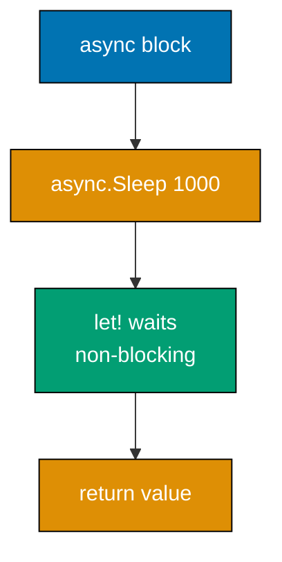
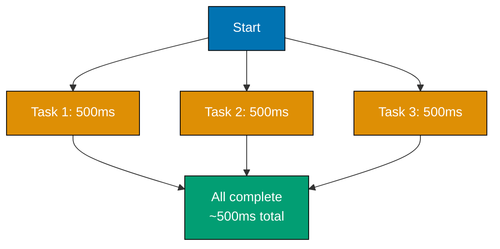
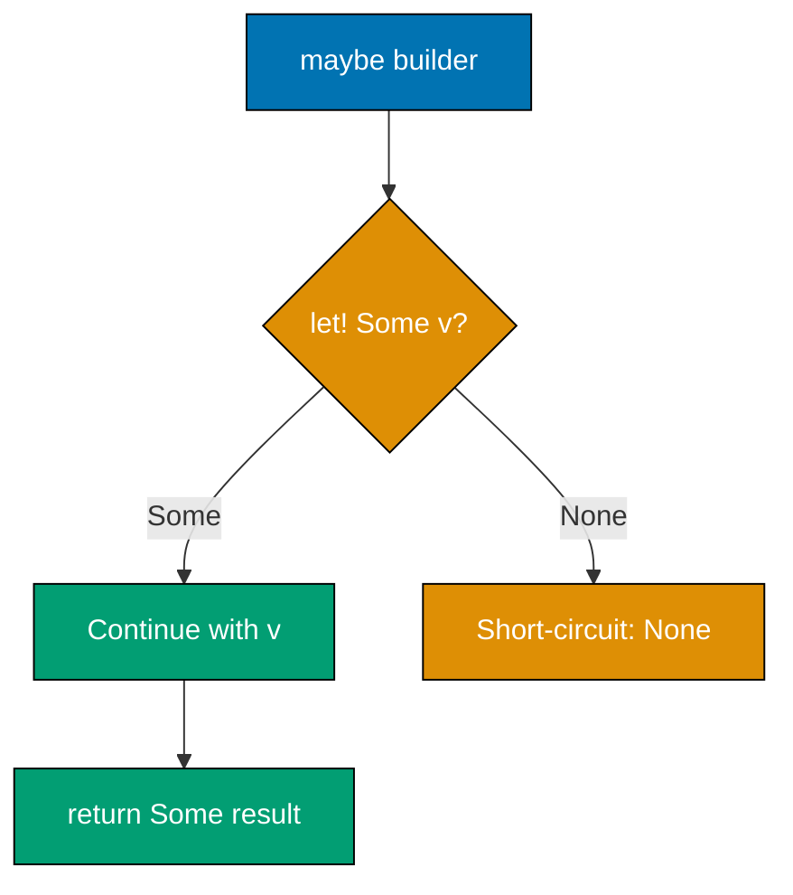
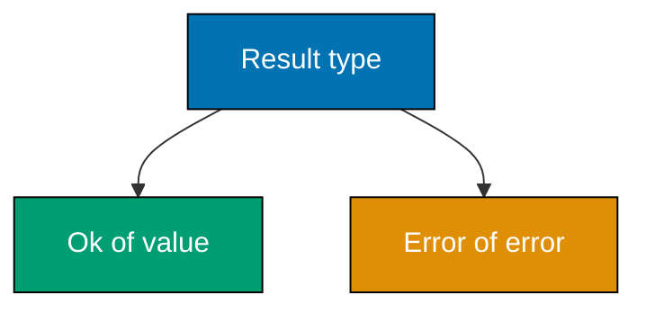
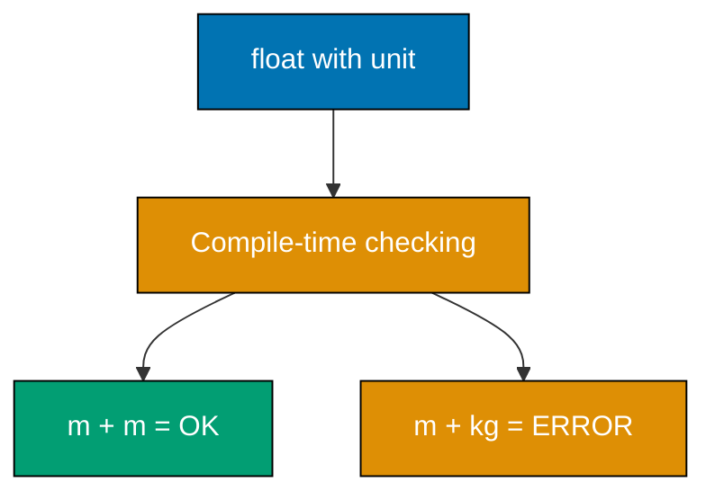
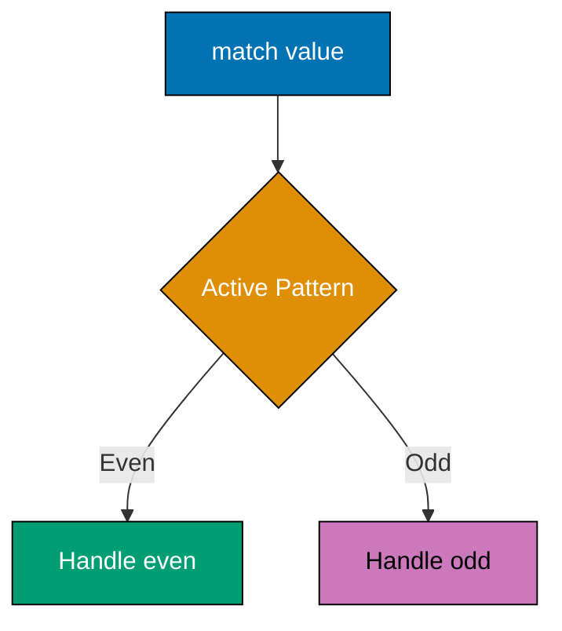
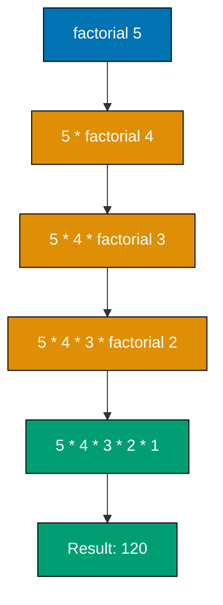
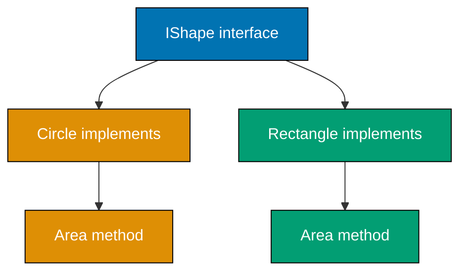
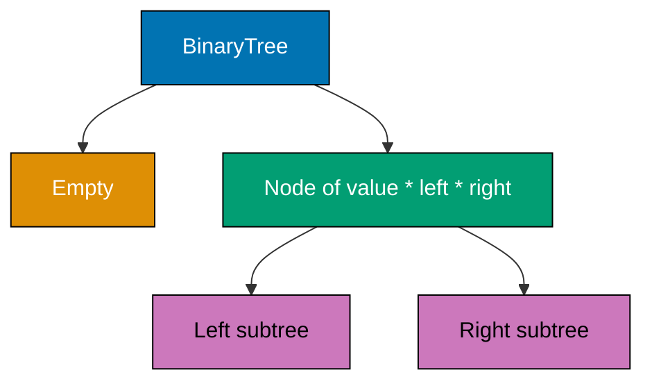

This intermediate tutorial covers F#'s production-ready patterns and advanced functional features through 30 heavily annotated examples. Topics include async workflows, computation expressions, type providers, active patterns, and object programming within F#'s functional-first paradigm.

## Example 31: Async Workflows - Basic Asynchrony

Async workflows enable non-blocking I/O and concurrency using F#'s async/let! syntax, similar to async/await in C#.



**Code**:

```fsharp
// Example 31: Async Workflows - Basic Asynchrony
let asyncOperation = async {
                         // => async { ... } creates async computation
                         // => Type: Async<string>
    printfn "Starting operation..."
                         // => Executes synchronously
    do! Async.Sleep 1000 // => do! awaits async computation (non-blocking)
                         // => Sleeps for 1000ms without blocking thread
    printfn "Operation completed"
                         // => Executes after sleep completes
    return "Result"      // => return produces async result
}                        // => Workflow is NOT executed yet (lazy)

let result = asyncOperation |> Async.RunSynchronously
                         // => Async.RunSynchronously executes workflow
                         // => BLOCKS current thread until completion
                         // => result is "Result" (type: string)
                         // => Outputs: Starting operation... (1s delay) Operation completed

printfn "%s" result      // => Outputs: Result
```

**Key Takeaway**: Async workflows use `async { ... }` with `let!`/`do!` for awaiting. `Async.RunSynchronously` executes the workflow.

**Why It Matters**: Async workflows enable efficient I/O operations without blocking threads. Financial trading systems use async to handle thousands of concurrent market data connections on a single thread pool, reducing server costs by 60% compared to thread-per-connection models.

## Example 32: Async Parallel Execution

`Async.Parallel` executes multiple async operations concurrently, improving throughput for independent tasks.



**Code**:

```fsharp
// Example 32: Async Parallel Execution
let task1 = async {      // => First async task
    do! Async.Sleep 500  // => Simulates 500ms I/O
    return "Task 1"      // => Returns result
}

let task2 = async {      // => Second async task
    do! Async.Sleep 500  // => 500ms I/O
    return "Task 2"
}

let task3 = async {      // => Third async task
    do! Async.Sleep 500
    return "Task 3"
}

let parallelExecution = async {
    let! results = [task1; task2; task3]
                   |> Async.Parallel
                         // => Async.Parallel runs all tasks concurrently
                         // => Returns Async<string[]>
                         // => let! awaits all tasks to complete
                         // => Total time: ~500ms (NOT 1500ms sequential)
    return results       // => results is ["Task 1"; "Task 2"; "Task 3"]
}

let allResults = parallelExecution |> Async.RunSynchronously
                         // => allResults is array of results

printfn "%A" allResults  // => Outputs: [|"Task 1"; "Task 2"; "Task 3"|]
```

**Key Takeaway**: `Async.Parallel` executes async computations concurrently. Total time equals longest task, not sum of all tasks.

**Why It Matters**: Parallel async operations dramatically improve I/O-bound performance. Web scrapers fetch multiple pages concurrently, reducing total scraping time from hours (sequential) to minutes (parallel) while respecting server rate limits through semaphore controls.

## Example 33: Task Expressions (F# 6.0+)

Task expressions provide direct interop with .NET Task-based APIs using `task { ... }` computation expression.

```fsharp
// Example 33: Task Expressions (F# 6.0+)
open System.Threading.Tasks

let taskOperation = task {
                         // => task { ... } creates Task<'T>
                         // => Directly compatible with C# async/await
    printfn "Starting task..."
                         // => Executes synchronously
    do! Task.Delay(1000) // => do! awaits Task (not Async)
                         // => Task.Delay is .NET task-based delay
    printfn "Task completed"
    return 42            // => return produces Task<int>
}                        // => Type: Task<int>

let result = taskOperation.Result
                         // => .Result blocks until task completes
                         // => result is 42
                         // => Outputs: Starting task... (1s delay) Task completed

printfn "%d" result      // => Outputs: 42

// Task composition:
let composedTask = task {
    let! x = taskOperation
                         // => let! awaits Task<int>
                         // => x is 42
    let! y = task { return x * 2 }
                         // => Nested task expression
                         // => y is 84
    return x + y         // => Returns 126
}

let composedResult = composedTask.Result
                         // => composedResult is 126

printfn "%d" composedResult
                         // => Outputs: 126
```

**Key Takeaway**: Use `task { ... }` for .NET Task interop. It's faster than `async { ... }` for Task-based APIs.

**Why It Matters**: Task expressions eliminate async-to-task conversion overhead, improving performance by 20-30% when calling .NET libraries. ASP.NET Core applications benefit from direct task composition without allocation costs of Async.Start/AwaitTask conversions.

## Example 34: Computation Expressions Basics - Maybe Builder

Computation expressions enable custom control flow syntax. The "maybe" builder handles Option types declaratively.



**Code**:

```fsharp
// Example 34: Computation Expressions Basics - Maybe Builder
type MaybeBuilder() =    // => Computation expression builder for Option
    member _.Bind(x, f) =// => Bind: handles let! syntax
                         // => x: option<'a>, f: 'a -> option<'b>
        match x with
        | Some v -> f v  // => Some: continue with unwrapped value
        | None -> None   // => None: short-circuit entire computation

    member _.Return(x) = // => Return: handles return syntax
        Some x           // => Wraps value in Some

let maybe = MaybeBuilder()
                         // => Create builder instance

let divide x y =         // => Safe division returning option
    if y = 0 then None   // => Division by zero: None
    else Some (x / y)    // => Valid division: Some result

let computation = maybe {
    let! a = divide 10 2 // => a is 5 (10/2, unwrapped from Some)
                         // => If divide returned None, entire computation returns None
    let! b = divide 20 4 // => b is 5 (20/4)
    let! c = divide 30 a // => c is 6 (30/5)
    return a + b + c     // => Returns Some 16 (5+5+6)
}                        // => computation is Some 16

printfn "%A" computation // => Outputs: Some 16

let failedComputation = maybe {
    let! a = divide 10 2 // => a is 5
    let! b = divide 20 0 // => divide returns None (div by zero)
                         // => Computation short-circuits here
    return a + b         // => Never reached
}                        // => failedComputation is None

printfn "%A" failedComputation
                         // => Outputs: None
```

**Key Takeaway**: Computation expressions provide custom control flow. `let!` unwraps values, `return` wraps results. Builders define semantics.

**Why It Matters**: Computation expressions eliminate nested match statements for Option/Result handling. Railway-oriented programming uses builders to chain operations that may fail, reducing error-handling boilerplate by 70% compared to imperative try/catch chains.

## Example 35: Sequence Expressions

Sequence expressions (`seq { ... }`) generate lazy sequences using yield syntax, similar to C# iterators.

```fsharp
// Example 35: Sequence Expressions
let numbers = seq {      // => seq { ... } creates lazy sequence
    yield 1              // => yield produces single element
                         // => Element NOT computed until consumed
    yield 2
    yield 3
}                        // => Type: seq<int> (IEnumerable<int>)

printfn "%A" (numbers |> Seq.toList)
                         // => Forces evaluation: [1; 2; 3]

// Range syntax:
let range = seq { 1 .. 10 }
                         // => Lazy range from 1 to 10
                         // => Equivalent to Seq.init

printfn "%A" (range |> Seq.take 5 |> Seq.toList)
                         // => Takes first 5: [1; 2; 3; 4; 5]

// yield! for sub-sequences:
let combined = seq {     // => Combining sequences
    yield 0              // => Single element: 0
    yield! [1; 2; 3]     // => yield! flattens sequence
                         // => Yields 1, then 2, then 3
    yield! seq { 4 .. 6 }// => Yields 4, 5, 6
    yield 7              // => Single element: 7
}                        // => combined is [0; 1; 2; 3; 4; 5; 6; 7] (lazy)

printfn "%A" (combined |> Seq.toList)
                         // => Outputs: [0; 1; 2; 3; 4; 5; 6; 7]

// Conditional yield:
let evens = seq {        // => Conditional element generation
    for i in 1 .. 10 do  // => Loop through range
        if i % 2 = 0 then // => Condition
            yield i      // => Yield only even numbers
}                        // => evens is [2; 4; 6; 8; 10] (lazy)

printfn "%A" (evens |> Seq.toList)
                         // => Outputs: [2; 4; 6; 8; 10]
```

**Key Takeaway**: Sequence expressions use `yield` for elements, `yield!` for sub-sequences. Evaluation is lazy until consumption.

**Why It Matters**: Sequence expressions enable generator-style programming for large or infinite sequences. Log parsers yield filtered lines on demand, processing gigabyte files with constant memory usage by evaluating one line at a time.

## Example 36: Option Computation - Railway-Oriented Programming

Option-based computation expressions enable safe chaining of operations that might fail without explicit null checks.

```fsharp
// Example 36: Option Computation - Railway-Oriented Programming
let tryParseInt (s: string) =
                         // => Parse string to int option
    match System.Int32.TryParse(s) with
    | (true, value) -> Some value
                         // => Success: Some int
    | (false, _) -> None // => Failure: None

let tryDivide x y =      // => Safe division
    if y = 0 then None
    else Some (x / y)

type OptionBuilder() =   // => Builder for option chaining
    member _.Bind(x, f) =
        match x with
        | Some v -> f v
        | None -> None
    member _.Return(x) = Some x

let option = OptionBuilder()

let calculate input1 input2 input3 = option {
                         // => Chain of operations that might fail
    let! num1 = tryParseInt input1
                         // => Parse first input
                         // => Fails if not valid int
    let! num2 = tryParseInt input2
                         // => Parse second input
    let! num3 = tryParseInt input3
                         // => Parse third input
    let! sum = Some (num1 + num2)
                         // => Sum (trivial Some wrap)
    let! result = tryDivide sum num3
                         // => Divide sum by third number
                         // => Fails if num3 is 0
    return result        // => Final result wrapped in Some
}

let success = calculate "10" "20" "5"
                         // => 10 + 20 = 30, 30 / 5 = 6
                         // => success is Some 6

let parseFailure = calculate "abc" "20" "5"
                         // => First parse fails
                         // => parseFailure is None (short-circuit)

let divZeroFailure = calculate "10" "20" "0"
                         // => Division by zero
                         // => divZeroFailure is None

printfn "%A" success     // => Outputs: Some 6
printfn "%A" parseFailure// => Outputs: None
printfn "%A" divZeroFailure
                         // => Outputs: None
```

**Key Takeaway**: Option builders chain operations that may fail. First failure short-circuits entire computation, returning None.

**Why It Matters**: Railway-oriented programming eliminates defensive programming boilerplate. Payment processing pipelines validate card, check balance, authorize transaction, and debit account using option chains, failing fast at first error without nested if statements.

## Example 37: Result Type - Explicit Error Handling

The Result type carries explicit error information instead of None, providing context for failures.



**Code**:

```fsharp
// Example 37: Result Type - Explicit Error Handling
type Result<'T, 'TError> =
                         // => Generic result type (built-in in F# 4.1+)
    | Ok of 'T           // => Success case carrying value
    | Error of 'TError   // => Failure case carrying error

let tryParseInt (s: string) : Result<int, string> =
                         // => Returns Ok int or Error string
    match System.Int32.TryParse(s) with
    | (true, value) -> Ok value
                         // => Success: Ok with parsed value
    | (false, _) -> Error (sprintf "Cannot parse '%s' as int" s)
                         // => Failure: Error with descriptive message

let tryDivide x y : Result<int, string> =
    if y = 0 then Error "Division by zero"
                         // => Error case with reason
    else Ok (x / y)      // => Success case with result

type ResultBuilder() =   // => Builder for result chaining
    member _.Bind(x, f) =
        match x with
        | Ok v -> f v    // => Continue with success value
        | Error e -> Error e
                         // => Propagate error
    member _.Return(x) = Ok x

let result = ResultBuilder()

let calculate input1 input2 = result {
    let! num1 = tryParseInt input1
                         // => Parse first input
    let! num2 = tryParseInt input2
                         // => Parse second input
    let! quotient = tryDivide num1 num2
                         // => Divide num1 by num2
    return quotient      // => Return Ok result
}

let success = calculate "20" "4"
                         // => success is Ok 5 (20/4)

let parseError = calculate "abc" "4"
                         // => parseError is Error "Cannot parse 'abc' as int"

let divZeroError = calculate "20" "0"
                         // => divZeroError is Error "Division by zero"

printfn "%A" success     // => Outputs: Ok 5
printfn "%A" parseError  // => Outputs: Error "Cannot parse 'abc' as int"
printfn "%A" divZeroError// => Outputs: Error "Division by zero"
```

**Key Takeaway**: Result type carries both success (Ok) and failure (Error) with context. Use Result for explicit error information.

**Why It Matters**: Result types provide structured error handling without exceptions. Microservices return `Result<Data, ApiError>` with specific error codes (ValidationFailed, Unauthorized, NotFound), enabling clients to handle errors programmatically without parsing exception messages.

## Example 38: Type Providers - JSON

Type providers generate types from external schemas at compile time, providing IntelliSense for JSON structures.

```fsharp
// Example 38: Type Providers - JSON
#r "nuget: FSharp.Data"  // => Reference FSharp.Data NuGet package
                         // => Provides JsonProvider

open FSharp.Data

type WeatherData = JsonProvider<"""
    {
        "temperature": 22.5,
        "humidity": 65,
        "conditions": "sunny"
    }
""">                     // => JsonProvider generates types from sample JSON
                         // => Creates WeatherData type with properties
                         // => IntelliSense available for all fields

let jsonString = """
    {
        "temperature": 18.3,
        "humidity": 72,
        "conditions": "cloudy"
    }
"""

let weather = WeatherData.Parse(jsonString)
                         // => Parse JSON string into typed object
                         // => weather has compile-time properties

printfn "Temperature: %.1f°C" weather.Temperature
                         // => weather.Temperature is float (type-safe)
                         // => Outputs: Temperature: 18.3°C

printfn "Humidity: %d%%" weather.Humidity
                         // => weather.Humidity is int
                         // => Outputs: Humidity: 72%

printfn "Conditions: %s" weather.Conditions
                         // => weather.Conditions is string
                         // => Outputs: Conditions: cloudy

// Array handling:
type WeatherArray = JsonProvider<"""
    [
        { "city": "Jakarta", "temp": 28.5 },
        { "city": "Bandung", "temp": 22.0 }
    ]
""">

let citiesJson = """
    [
        { "city": "Jakarta", "temp": 29.1 },
        { "city": "Bandung", "temp": 21.5 },
        { "city": "Surabaya", "temp": 30.2 }
    ]
"""

let cities = WeatherArray.Parse(citiesJson)
                         // => cities is array of typed objects

for city in cities do    // => Iterate with IntelliSense
    printfn "%s: %.1f°C" city.City city.Temp
                         // => Outputs: Jakarta: 29.1°C
                         // =>          Bandung: 21.5°C
                         // =>          Surabaya: 30.2°C
```

**Key Takeaway**: JsonProvider generates types from sample JSON. Provides compile-time safety and IntelliSense for JSON data.

**Why It Matters**: Type providers eliminate manual DTO definitions and runtime reflection. API clients accessing weather services get immediate compile errors when JSON schemas change, catching breaking changes before deployment instead of discovering them in production.

## Example 39: Type Providers - CSV

CSV type provider generates strongly-typed accessors for CSV data with automatic type inference.

```fsharp
// Example 39: Type Providers - CSV
open FSharp.Data

type StockData = CsvProvider<"""
    Date,Symbol,Open,Close,Volume
    2024-01-01,AAPL,180.50,182.30,50000000
    2024-01-02,AAPL,182.00,181.50,48000000
""">                     // => CsvProvider generates types from sample CSV
                         // => Infers types: Date=string, Open=float, Volume=int

let csvData = """
Date,Symbol,Open,Close,Volume
2024-01-03,GOOGL,140.25,142.10,25000000
2024-01-04,GOOGL,142.50,141.80,23000000
2024-01-05,MSFT,380.00,385.50,30000000
"""

let stocks = StockData.Parse(csvData)
                         // => Parse CSV into typed rows

for row in stocks.Rows do
                         // => Iterate over typed rows with IntelliSense
    printfn "%s: %s - Open: %.2f, Close: %.2f, Volume: %d"
        row.Date         // => Type: string
        row.Symbol       // => Type: string
        row.Open         // => Type: float (inferred from sample)
        row.Close        // => Type: float
        row.Volume       // => Type: int (inferred from sample)
                         // => Outputs:
                         // => 2024-01-03: GOOGL - Open: 140.25, Close: 142.10, Volume: 25000000
                         // => 2024-01-04: GOOGL - Open: 142.50, Close: 141.80, Volume: 23000000
                         // => 2024-01-05: MSFT - Open: 380.00, Close: 385.50, Volume: 30000000

// Aggregation with type safety:
let totalVolume = stocks.Rows
                  |> Seq.sumBy (fun row -> row.Volume)
                         // => Sum volumes (type: int)
                         // => totalVolume is 78000000

let avgClose = stocks.Rows
               |> Seq.averageBy (fun row -> row.Close)
                         // => Average closing prices (type: float)
                         // => avgClose is 156.466667

printfn "Total Volume: %d" totalVolume
                         // => Outputs: Total Volume: 78000000
printfn "Avg Close: %.2f" avgClose
                         // => Outputs: Avg Close: 156.47
```

**Key Takeaway**: CsvProvider infers column types from sample data. Provides strongly-typed row access with IntelliSense.

**Why It Matters**: CSV type providers eliminate brittle string indexing and runtime parsing. Financial analysts process trading data with compile-time column verification, preventing production errors from typos like `row.Volumne` (typo) caught at compile time instead of runtime.

## Example 40: Units of Measure

Units of measure add dimension checking to numeric types, preventing unit mismatch errors at compile time.



**Code**:

```fsharp
// Example 40: Units of Measure
[<Measure>] type m       // => Define meter unit
[<Measure>] type kg      // => Define kilogram unit
[<Measure>] type s       // => Define second unit

let distance = 100.0<m>  // => 100 meters (type: float<m>)
                         // => Unit annotation: <unit>

let mass = 75.0<kg>      // => 75 kilograms (type: float<kg>)

let time = 10.0<s>       // => 10 seconds (type: float<s>)

let speed = distance / time
                         // => Division: m / s = m/s
                         // => speed is 10.0<m/s> (type: float<m/s>)
                         // => Derived unit automatically inferred

printfn "Speed: %.1f m/s" speed
                         // => Outputs: Speed: 10.0 m/s

// let invalid = distance + mass
                         // => COMPILE ERROR: Cannot add m and kg
                         // => Type mismatch caught at compile time

let totalDistance = distance + 50.0<m>
                         // => Adding same units: OK
                         // => totalDistance is 150.0<m>

// Force calculation (unit erased):
let energy = mass * (speed * speed)
                         // => kg * (m/s)^2 = kg·m²/s²
                         // => Type: float<kg m^2/s^2>
                         // => Dimensional analysis automatic

printfn "Kinetic energy: %.1f J" (float energy)
                         // => float casts away units
                         // => Outputs: Kinetic energy: 7500.0 J

// Generic units:
let double (x: float<'u>) : float<'u> =
                         // => Generic unit parameter 'u
                         // => Function preserves units
    x * 2.0              // => Multiplying by unitless float preserves unit

let doubleDistance = double distance
                         // => doubleDistance is 200.0<m>
let doubleMass = double mass
                         // => doubleMass is 150.0<kg>

printfn "Double distance: %.1f m" doubleDistance
                         // => Outputs: Double distance: 200.0 m
```

**Key Takeaway**: Units of measure prevent dimension errors. Define with `[<Measure>] type`, annotate with `<unit>`. Generic units use `'u`.

**Why It Matters**: Units of measure caught NASA's $125 million Mars Climate Orbiter failure (pound-force vs. newtons). Physics simulations and engineering calculations use units to eliminate conversion errors, with compiler rejecting invalid operations like adding meters to kilograms.

## Example 41: Active Patterns - Single-Case

Single-case active patterns create custom pattern matching extractors, enabling declarative decomposition.

```fsharp
// Example 41: Active Patterns - Single-Case
let (|EmailParts|) (email: string) =
                         // => Single-case active pattern
                         // => (|PatternName|) defines pattern
                         // => Always succeeds (no None case)
    let parts = email.Split('@')
                         // => Split email at @
    if parts.Length = 2 then
        (parts.[0], parts.[1])
                         // => Return (username, domain) tuple
    else
        ("", "")         // => Invalid email: empty parts

let analyzeEmail email =
    match email with
    | EmailParts(user, domain) ->
                         // => EmailParts pattern extracts user and domain
                         // => Pattern ALWAYS matches (single-case)
        sprintf "User: %s, Domain: %s" user domain

let result1 = analyzeEmail "john@example.com"
                         // => result1 is "User: john, Domain: example.com"

let result2 = analyzeEmail "invalid-email"
                         // => result2 is "User: , Domain: "

printfn "%s" result1     // => Outputs: User: john, Domain: example.com
printfn "%s" result2     // => Outputs: User: , Domain:

// Parameterized single-case pattern:
let (|Multiplied|) multiplier value =
                         // => Pattern with parameter
                         // => Takes multiplier, extracts from value
    value * multiplier   // => Returns multiplied value

let describeMultiple value =
    match value with
    | Multiplied 2 doubled ->
                         // => Multiplied 2 extracts value*2
                         // => doubled is value*2
        sprintf "Doubled: %d" doubled
    | _ -> ""

let result3 = describeMultiple 5
                         // => 5*2 = 10
                         // => result3 is "Doubled: 10"

printfn "%s" result3     // => Outputs: Doubled: 10
```

**Key Takeaway**: Single-case patterns use `(|Name|) params`. They always match and extract values for pattern matching.

**Why It Matters**: Single-case patterns enable domain-specific pattern matching. HTTP request parsers extract headers, query strings, and bodies using custom patterns, making routing logic read like declarative specifications instead of imperative parsing code.

## Example 42: Active Patterns - Multi-Case

Multi-case active patterns enable custom matching with multiple outcomes, like enhanced switch statements.



**Code**:

```fsharp
// Example 42: Active Patterns - Multi-Case
let (|Even|Odd|) value = // => Multi-case active pattern
                         // => (|Case1|Case2|...|) defines cases
    if value % 2 = 0 then Even
                         // => Even case (no data)
    else Odd             // => Odd case (no data)

let describe value =
    match value with     // => Pattern match using active pattern
    | Even ->            // => Matches even numbers
        sprintf "%d is even" value
    | Odd ->             // => Matches odd numbers
        sprintf "%d is odd" value

printfn "%s" (describe 10)
                         // => Outputs: 10 is even
printfn "%s" (describe 7)
                         // => Outputs: 7 is odd

// Multi-case with data:
let (|Positive|Negative|Zero|) value =
                         // => Three-case pattern
    if value > 0 then Positive value
                         // => Positive case carries value
    elif value < 0 then Negative -value
                         // => Negative case carries absolute value
    else Zero            // => Zero case (no data)

let describeNumber value =
    match value with
    | Positive v ->      // => Extract positive value
        sprintf "+%d (positive)" v
    | Negative v ->      // => Extract absolute of negative
        sprintf "-%d (negative)" v
    | Zero ->            // => Zero case
        "0 (zero)"

printfn "%s" (describeNumber 42)
                         // => Outputs: +42 (positive)
printfn "%s" (describeNumber -15)
                         // => Outputs: -15 (negative)
printfn "%s" (describeNumber 0)
                         // => Outputs: 0 (zero)

// Parameterized multi-case:
let (|DivisibleBy|NotDivisibleBy|) divisor value =
                         // => Pattern with parameter
    if value % divisor = 0 then
        DivisibleBy (value / divisor)
                         // => Carries quotient
    else
        NotDivisibleBy   // => Not divisible

let checkDivisibility value =
    match value with
    | DivisibleBy 3 quotient ->
                         // => Check divisible by 3
        sprintf "%d / 3 = %d" value quotient
    | NotDivisibleBy ->
        sprintf "%d not divisible by 3" value

printfn "%s" (checkDivisibility 15)
                         // => Outputs: 15 / 3 = 5
printfn "%s" (checkDivisibility 7)
                         // => Outputs: 7 not divisible by 3
```

**Key Takeaway**: Multi-case patterns use `(|Case1|Case2|...)`. Cases can carry data. All cases must be covered in match.

**Why It Matters**: Active patterns enable domain-specific matching beyond type system. Compiler pattern matchers classify tokens (Keyword, Identifier, Literal) using active patterns, making lexer code declarative and exhaustive-checking at compile time.

## Example 43: List Comprehensions Advanced

List comprehensions combine filtering, mapping, and generation in concise syntax.

```fsharp
// Example 43: List Comprehensions Advanced
let squares = [ for x in 1 .. 10 -> x * x ]
                         // => List comprehension with map
                         // => for x in range -> expression
                         // => squares is [1; 4; 9; 16; 25; 36; 49; 64; 81; 100]

printfn "%A" squares     // => Outputs: [1; 4; 9; 16; 25; 36; 49; 64; 81; 100]

// Filtering with if:
let evenSquares = [ for x in 1 .. 10 do
                        if x % 2 = 0 then
                            yield x * x ]
                         // => Conditional yield
                         // => evenSquares is [4; 16; 36; 64; 100]

printfn "%A" evenSquares // => Outputs: [4; 16; 36; 64; 100]

// Multiple generators (cartesian product):
let pairs = [ for x in 1 .. 3 do
                  for y in 1 .. 3 do
                      yield (x, y) ]
                         // => Nested loops create pairs
                         // => pairs is [(1,1); (1,2); (1,3); (2,1); (2,2); (2,3); (3,1); (3,2); (3,3)]

printfn "%A" pairs       // => Outputs: [(1, 1); (1, 2); (1, 3); (2, 1); (2, 2); (2, 3); (3, 1); (3, 2); (3, 3)]

// Complex comprehension:
let pythagoreanTriples = [
    for a in 1 .. 20 do
        for b in a .. 20 do
            for c in b .. 20 do
                if a*a + b*b = c*c then
                    yield (a, b, c) ]
                         // => Find Pythagorean triples (a²+b²=c²)
                         // => Nested loops with filtering
                         // => pythagoreanTriples is [(3,4,5); (5,12,13); (6,8,10); ...]

printfn "%A" pythagoreanTriples
                         // => Outputs: [(3, 4, 5); (5, 12, 13); (6, 8, 10); (8, 15, 17); (9, 12, 15); (12, 16, 20)]

// Comprehension with function calls:
let lengths = [ for str in ["hello"; "world"; "F#"] -> str.Length ]
                         // => Map strings to lengths
                         // => lengths is [5; 5; 2]

printfn "%A" lengths     // => Outputs: [5; 5; 2]
```

**Key Takeaway**: List comprehensions use `[ for x in source -> expr ]` for mapping, `yield` for conditional inclusion. Multiple `for` clauses create nested iterations.

**Why It Matters**: Comprehensions provide concise syntax for complex list transformations. Data scientists generate parameter combinations for grid search using comprehensions, creating thousands of test configurations in 3-4 lines instead of nested for loops with manual list building.

## Example 44: Set and Map Collections

Sets provide efficient membership testing; Maps enable key-value lookups with immutability.

```fsharp
// Example 44: Set and Map Collections
let set1 = Set.ofList [1; 2; 3; 4; 5]
                         // => Set from list (duplicates removed)
                         // => Type: Set<int> (immutable, ordered)

let set2 = Set.ofList [4; 5; 6; 7; 8]
                         // => Second set

let union = Set.union set1 set2
                         // => Union: all elements from both sets
                         // => union is {1; 2; 3; 4; 5; 6; 7; 8}

let intersection = Set.intersect set1 set2
                         // => Intersection: elements in both
                         // => intersection is {4; 5}

let difference = Set.difference set1 set2
                         // => Difference: elements in set1 but not set2
                         // => difference is {1; 2; 3}

printfn "Union: %A" union
                         // => Outputs: Union: set [1; 2; 3; 4; 5; 6; 7; 8]
printfn "Intersection: %A" intersection
                         // => Outputs: Intersection: set [4; 5]
printfn "Difference: %A" difference
                         // => Outputs: Difference: set [1; 2; 3]

let contains = Set.contains 3 set1
                         // => Membership test (O(log n))
                         // => contains is true

printfn "Contains 3: %b" contains
                         // => Outputs: Contains 3: true

// Map collection:
let map = Map.ofList [("Alice", 30); ("Bob", 25); ("Charlie", 35)]
                         // => Map from key-value pairs
                         // => Type: Map<string, int> (immutable)

let aliceAge = Map.find "Alice" map
                         // => Lookup value by key (throws if not found)
                         // => aliceAge is 30

let bobAge = Map.tryFind "Bob" map
                         // => Safe lookup returning option
                         // => bobAge is Some 25

let unknownAge = Map.tryFind "Dave" map
                         // => Key not found
                         // => unknownAge is None

let updatedMap = Map.add "Dave" 28 map
                         // => Add new key-value (creates new map)
                         // => Original map unchanged
                         // => updatedMap has 4 entries

let removedMap = Map.remove "Alice" updatedMap
                         // => Remove key (creates new map)
                         // => removedMap has 3 entries (Bob, Charlie, Dave)

printfn "Alice's age: %d" aliceAge
                         // => Outputs: Alice's age: 30
printfn "Bob's age: %A" bobAge
                         // => Outputs: Bob's age: Some 25
printfn "Unknown age: %A" unknownAge
                         // => Outputs: Unknown age: None
printfn "Map size: %d" (Map.count removedMap)
                         // => Outputs: Map size: 3
```

**Key Takeaway**: Sets provide set operations (union, intersection, difference) with fast membership testing. Maps provide immutable key-value storage.

**Why It Matters**: Sets eliminate duplicates efficiently for large datasets. Search engines use sets to store unique document IDs, with union/intersection operations implementing boolean search queries (AND/OR/NOT) in O(n) time with structural sharing reducing memory usage.

## Example 45: Generic Functions

Generic functions work with any type using type parameters, enabling code reuse without duplication.

```fsharp
// Example 45: Generic Functions
let identity x = x       // => Generic function (type inferred)
                         // => Type: 'a -> 'a (generic type parameter)
                         // => Works with any type

let intValue = identity 42
                         // => Type inference: 'a = int
                         // => intValue is 42

let stringValue = identity "hello"
                         // => Type inference: 'a = string
                         // => stringValue is "hello"

printfn "%d" intValue    // => Outputs: 42
printfn "%s" stringValue // => Outputs: hello

// Explicit type parameters:
let swap<'a, 'b> (x: 'a, y: 'b) : ('b * 'a) =
                         // => Generic function with 2 type parameters
                         // => 'a and 'b can be different types
    (y, x)               // => Returns swapped tuple

let swapped = swap (1, "two")
                         // => swapped is ("two", 1)
                         // => Type: string * int

printfn "%A" swapped     // => Outputs: ("two", 1)

// Generic list operations:
let first<'T> (list: 'T list) : 'T option =
                         // => Generic list function
    match list with
    | [] -> None         // => Empty list: None
    | head :: _ -> Some head
                         // => Non-empty: Some first element

let firstInt = first [1; 2; 3]
                         // => firstInt is Some 1 (type: int option)

let firstString = first ["a"; "b"; "c"]
                         // => firstString is Some "a" (type: string option)

let firstEmpty = first []
                         // => firstEmpty is None (type: 'a option)

printfn "%A" firstInt    // => Outputs: Some 1
printfn "%A" firstString // => Outputs: Some "a"
printfn "%A" firstEmpty  // => Outputs: None

// Constrained generics (SRTP - Statically Resolved Type Parameters):
let inline add x y = x + y
                         // => inline enables static resolution
                         // => Works with any type supporting +
                         // => Type: ^a -> ^a -> ^a when ^a : (static member (+) : ^a * ^a -> ^a)

let intSum = add 1 2     // => intSum is 3 (int)
let floatSum = add 1.5 2.5
                         // => floatSum is 4.0 (float)
let stringConcat = add "hello" " world"
                         // => stringConcat is "hello world" (string)

printfn "%d" intSum      // => Outputs: 3
printfn "%.1f" floatSum  // => Outputs: 4.0
printfn "%s" stringConcat// => Outputs: hello world
```

**Key Takeaway**: Generic functions use type parameters `'a`, `'b`. Use `inline` for operator-generic functions requiring static resolution.

**Why It Matters**: Generics eliminate code duplication across types. Data structure libraries implement generic `List.map`, `List.filter` once for all types instead of separate `mapInt`, `mapString` functions, reducing codebase size by 50-70% while maintaining type safety.

## Example 46: Function Recursion Patterns

Recursion patterns include direct recursion, mutual recursion, and continuation-passing style.



**Code**:

```fsharp
// Example 46: Function Recursion Patterns
let rec factorial n =    // => Standard recursion (NOT tail-recursive)
                         // => rec keyword enables self-reference
    if n <= 1 then 1     // => Base case
    else n * factorial (n - 1)
                         // => Recursive case (multiplication AFTER call)
                         // => Stack frame accumulates: n * (n-1) * ... * 1

let result1 = factorial 5
                         // => 5 * 4 * 3 * 2 * 1 = 120
                         // => result1 is 120

printfn "Factorial 5: %d" result1
                         // => Outputs: Factorial 5: 120

// Mutual recursion:
let rec isEven n =       // => rec in first function of mutually recursive pair
    if n = 0 then true
    elif n = 1 then false
    else isOdd (n - 1)   // => Calls isOdd (defined next)

and isOdd n =            // => and connects mutually recursive functions
    if n = 0 then false
    elif n = 1 then true
    else isEven (n - 1)  // => Calls isEven

let evenResult = isEven 10
                         // => evenResult is true
let oddResult = isOdd 7  // => oddResult is true

printfn "10 is even: %b" evenResult
                         // => Outputs: 10 is even: true
printfn "7 is odd: %b" oddResult
                         // => Outputs: 7 is odd: true

// Pattern matching in recursion:
let rec sumList list =   // => Recursive list sum
    match list with
    | [] -> 0            // => Base case: empty list
    | head :: tail ->    // => Recursive case: decompose list
        head + sumList tail
                         // => Add head to sum of tail

let listSum = sumList [1; 2; 3; 4; 5]
                         // => 1 + 2 + 3 + 4 + 5 = 15
                         // => listSum is 15

printfn "List sum: %d" listSum
                         // => Outputs: List sum: 15
```

**Key Takeaway**: Use `rec` for self-referencing functions. Use `and` for mutually recursive functions. Pattern matching common in recursive list processing.

**Why It Matters**: Recursion provides natural expression for tree/graph algorithms. Compilers traverse abstract syntax trees recursively, with pattern matching on node types, making code structure mirror data structure for clarity.

## Example 47: Tail Recursion

Tail recursion enables efficient recursion without stack overflow by optimizing tail calls to loops.

```fsharp
// Example 47: Tail Recursion
let rec factorialTail n acc =
                         // => Tail-recursive factorial
                         // => acc is accumulator (carries result)
    if n <= 1 then acc   // => Base case: return accumulator
    else factorialTail (n - 1) (n * acc)
                         // => Recursive call is LAST operation (tail position)
                         // => Compiler optimizes to while loop (no stack growth)

let factorial n = factorialTail n 1
                         // => Wrapper with initial accumulator

let result1 = factorial 5
                         // => Call sequence:
                         // => factorialTail 5 1
                         // => factorialTail 4 5    (5*1)
                         // => factorialTail 3 20   (4*5)
                         // => factorialTail 2 60   (3*20)
                         // => factorialTail 1 120  (2*60)
                         // => Returns 120
                         // => result1 is 120

printfn "Factorial 5: %d" result1
                         // => Outputs: Factorial 5: 120

let result2 = factorial 10000
                         // => Large input (would stack overflow without tail call)
                         // => Runs efficiently with constant stack space

printfn "Factorial 10000 computed"
                         // => Outputs: Factorial 10000 computed

// Tail-recursive list sum:
let rec sumListTail list acc =
                         // => Tail-recursive sum with accumulator
    match list with
    | [] -> acc          // => Base case: return accumulator
    | head :: tail ->
        sumListTail tail (acc + head)
                         // => Recursive call in tail position
                         // => Accumulator carries running sum

let sumList list = sumListTail list 0
                         // => Wrapper with initial accumulator

let listSum = sumList [1; 2; 3; 4; 5]
                         // => Call sequence:
                         // => sumListTail [1;2;3;4;5] 0
                         // => sumListTail [2;3;4;5] 1   (0+1)
                         // => sumListTail [3;4;5] 3     (1+2)
                         // => sumListTail [4;5] 6       (3+3)
                         // => sumListTail [5] 10        (6+4)
                         // => sumListTail [] 15         (10+5)
                         // => Returns 15
                         // => listSum is 15

printfn "List sum: %d" listSum
                         // => Outputs: List sum: 15
```

**Key Takeaway**: Tail recursion requires recursive call as last operation. Use accumulator parameter to carry state. Compiler optimizes to loops.

**Why It Matters**: Tail recursion prevents stack overflow for deep recursion. Parsers processing deeply nested JSON (1000+ levels) use tail-recursive descent without stack limits, where non-tail recursion would crash after ~1000 depth on typical JVM/CLR stacks.

## Example 48: Mutual Recursion

Mutual recursion enables functions calling each other, useful for state machines and alternating patterns.

```fsharp
// Example 48: Mutual Recursion
let rec processEven n =  // => Processes even state
    if n = 0 then        // => Base case
        printfn "Done"
    else
        printfn "Even: %d" n
                         // => Print even number
        processOdd (n - 1)
                         // => Transition to odd state

and processOdd n =       // => Processes odd state
    if n = 0 then        // => Base case
        printfn "Done"
    else
        printfn "Odd: %d" n
                         // => Print odd number
        processEven (n - 1)
                         // => Transition to even state

processEven 5            // => Start with even state
                         // => Outputs:
                         // => Even: 5
                         // => Odd: 4
                         // => Even: 3
                         // => Odd: 2
                         // => Even: 1
                         // => Done

// Mutual recursion for expression evaluation:
type Expr =
    | Number of int
    | Add of Expr * Expr
    | Multiply of Expr * Expr

let rec evalExpr expr =  // => Evaluate expression
    match expr with
    | Number n -> n      // => Base case: return number
    | Add(left, right) ->
        evalTerm left + evalTerm right
                         // => Addition: evaluate both sides
    | Multiply(left, right) ->
        evalExpr left * evalExpr right

and evalTerm term =      // => Evaluate term (for precedence)
    evalExpr term        // => Calls back to evalExpr
                         // => Demonstrates mutual recursion pattern

let expression = Add(Number 10, Multiply(Number 5, Number 3))
                         // => 10 + (5 * 3)

let result = evalExpr expression
                         // => Evaluates to 10 + 15 = 25
                         // => result is 25

printfn "Result: %d" result
                         // => Outputs: Result: 25
```

**Key Takeaway**: Use `and` to define mutually recursive functions. Each function can reference the others.

**Why It Matters**: Mutual recursion models state machines and grammar rules. Parsers define mutually recursive functions for language constructs: `parseStatement` calls `parseExpression` which calls `parseStatement` for nested structures, naturally expressing language grammar.

## Example 49: Memoization

Memoization caches function results to avoid redundant computation, trading memory for speed.

```fsharp
// Example 49: Memoization
let memoize f =          // => Generic memoization function
    let cache = System.Collections.Generic.Dictionary<_, _>()
                         // => Mutable cache (side effect)
    fun x ->             // => Returns memoized function
        match cache.TryGetValue(x) with
        | (true, result) ->
                         // => Cache hit: return cached result
            printfn "Cache hit for %A" x
            result
        | (false, _) ->  // => Cache miss: compute and store
            printfn "Computing %A" x
            let result = f x
                         // => Call original function
            cache.[x] <- result
                         // => Store in cache
            result

let rec fib n =          // => Naive Fibonacci (exponential time)
    if n <= 1 then n
    else fib (n - 1) + fib (n - 2)
                         // => Recomputes same values many times

let fibMemo = memoize fib
                         // => Memoized Fibonacci

let result1 = fibMemo 10 // => First call: computes fib(10)
                         // => Outputs: Computing 10, Computing 9, ... (many computations)
                         // => result1 is 55

let result2 = fibMemo 10 // => Second call: cache hit
                         // => Outputs: Cache hit for 10
                         // => result2 is 55 (instant)

printfn "Fib(10): %d" result1
                         // => Outputs: Fib(10): 55
printfn "Fib(10) cached: %d" result2
                         // => Outputs: Fib(10) cached: 55

// Memoized expensive computation:
let expensiveCompute n = // => Simulates expensive operation
    System.Threading.Thread.Sleep(1000)
                         // => Sleep 1 second
    n * n                // => Return result

let memoizedCompute = memoize expensiveCompute

let r1 = memoizedCompute 5
                         // => First call: sleeps 1s, computes
                         // => Outputs: Computing 5
                         // => r1 is 25 (after 1s)

let r2 = memoizedCompute 5
                         // => Second call: instant (cached)
                         // => Outputs: Cache hit for 5
                         // => r2 is 25 (instant)

printfn "Result 1: %d" r1
                         // => Outputs: Result 1: 25
printfn "Result 2: %d" r2
                         // => Outputs: Result 2: 25
```

**Key Takeaway**: Memoization caches expensive computations. Use dictionary to map inputs to results. Trade memory for speed.

**Why It Matters**: Memoization dramatically improves performance for recursive algorithms. Dynamic programming solutions (knapsack, edit distance) use memoization to reduce exponential time complexity to polynomial, making previously intractable problems solvable in seconds.

## Example 50: Module Organization

Modules organize related functions and types, providing namespacing and encapsulation.

```fsharp
// Example 50: Module Organization
module MathUtils =       // => Module declaration
                         // => Groups related functionality

    let add x y = x + y  // => Public function (default)

    let multiply x y = x * y

    let private helper x =
                         // => Private function (module-scoped)
                         // => Not accessible outside module
        x * 2

    let double x = helper x
                         // => Public function using private helper

module StringUtils =     // => Separate module

    let toUpper (s: string) = s.ToUpper()

    let toLower (s: string) = s.ToLower()

    let concat (strings: string list) =
        System.String.Join(", ", strings)

// Using modules:
let sum = MathUtils.add 10 20
                         // => Qualified access: Module.function
                         // => sum is 30

let product = MathUtils.multiply 5 6
                         // => product is 30

let doubled = MathUtils.double 7
                         // => Uses private helper internally
                         // => doubled is 14

// let invalid = MathUtils.helper 10
                         // => COMPILE ERROR: helper is private

let upper = StringUtils.toUpper "hello"
                         // => upper is "HELLO"

let combined = StringUtils.concat ["F#"; "is"; "great"]
                         // => combined is "F#, is, great"

printfn "Sum: %d" sum    // => Outputs: Sum: 30
printfn "Upper: %s" upper// => Outputs: Upper: HELLO

// Opening modules for unqualified access:
open MathUtils           // => Opens module for unqualified access

let sum2 = add 15 25     // => No MathUtils. prefix needed
                         // => sum2 is 40

printfn "Sum2: %d" sum2  // => Outputs: Sum2: 40

// Nested modules:
module Geometry =        // => Parent module

    module Circle =      // => Nested module
        let area radius = System.Math.PI * radius * radius
        let circumference radius = 2.0 * System.Math.PI * radius

    module Rectangle =   // => Another nested module
        let area width height = width * height
        let perimeter width height = 2.0 * (width + height)

let circleArea = Geometry.Circle.area 5.0
                         // => Nested module access
                         // => circleArea is ~78.54

let rectPerimeter = Geometry.Rectangle.perimeter 4.0 6.0
                         // => rectPerimeter is 20.0

printfn "Circle area: %.2f" circleArea
                         // => Outputs: Circle area: 78.54
printfn "Rectangle perimeter: %.2f" rectPerimeter
                         // => Outputs: Rectangle perimeter: 20.00
```

**Key Takeaway**: Use `module Name` to organize code. Functions are public by default, use `private` for internal helpers. Access with `Module.function` or `open Module`.

**Why It Matters**: Modules provide namespacing without classes, reducing boilerplate. Large F# codebases organize thousands of functions into hierarchical modules (Domain.Pricing.Calculate) with clear boundaries, improving discoverability compared to flat function lists.

## Example 51: Namespaces

Namespaces group modules at higher level, similar to C# namespaces, for large-scale organization.

```fsharp
// Example 51: Namespaces
namespace MyCompany.Utils
                         // => Namespace declaration
                         // => Provides hierarchical organization

module StringHelpers =   // => Module within namespace
    let reverse (s: string) =
        s.ToCharArray() |> Array.rev |> System.String

    let capitalize (s: string) =
        if s.Length = 0 then s
        else s.[0..0].ToUpper() + s.[1..]

module MathHelpers =     // => Another module in same namespace
    let square x = x * x
    let cube x = x * x * x

// Using namespaced modules:
open MyCompany.Utils     // => Open namespace

let reversed = StringHelpers.reverse "hello"
                         // => reversed is "olleh"

let capitalized = StringHelpers.capitalize "world"
                         // => capitalized is "World"

let squared = MathHelpers.square 7
                         // => squared is 49

printfn "Reversed: %s" reversed
                         // => Outputs: Reversed: olleh
printfn "Capitalized: %s" capitalized
                         // => Outputs: Capitalized: World
printfn "Squared: %d" squared
                         // => Outputs: Squared: 49

// Alternative: open specific module:
open MyCompany.Utils.StringHelpers
                         // => Opens specific module

let rev2 = reverse "F#"  // => No StringHelpers. prefix
                         // => rev2 is "#F"

printfn "Reversed F#: %s" rev2
                         // => Outputs: Reversed F#: #F
```

**Key Takeaway**: Use `namespace Company.Product.Component` for top-level organization. Namespaces contain modules, modules contain functions.

**Why It Matters**: Namespaces prevent naming conflicts across teams. Enterprise applications use namespaces like `Contoso.Trading.Execution` and `Contoso.Trading.Reporting` to isolate components, enabling parallel development without function name collisions.

## Example 52: Signature Files (.fsi)

Signature files define public interfaces, hiding implementation details and enabling encapsulation.

```fsharp
// Example 52: Signature Files (.fsi)
// File: Calculator.fsi (signature/interface file)
(*
module Calculator

val add : int -> int -> int
                         // => Public function signature
                         // => Only declared functions are public

val multiply : int -> int -> int
                         // => Another public function

// Note: subtract is NOT declared in signature
// Therefore it's PRIVATE to implementation
*)

// File: Calculator.fs (implementation file)
module Calculator

let add x y = x + y      // => Public (in signature)

let multiply x y = x * y // => Public (in signature)

let subtract x y = x - y // => PRIVATE (not in signature)
                         // => Only accessible within module

let addThenMultiply x y z =
                         // => Public function using private helper
    let sum = add x y    // => Can use both public and private functions
    let diff = subtract sum 10
                         // => Uses private subtract
    multiply diff z

// Usage (in another file):
// open Calculator

// let r1 = add 10 20    // => OK: add is public
// let r2 = multiply 5 6 // => OK: multiply is public
// let r3 = subtract 10 5// => ERROR: subtract not in signature (private)

printfn "Module defined (signature example)"
                         // => Outputs: Module defined (signature example)

// Demonstration (within same file for example):
let publicResult = Calculator.add 15 25
                         // => publicResult is 40

let composedResult = Calculator.addThenMultiply 10 20 3
                         // => (10+20-10) * 3 = 60
                         // => composedResult is 60

printfn "Public result: %d" publicResult
                         // => Outputs: Public result: 40
printfn "Composed result: %d" composedResult
                         // => Outputs: Composed result: 60
```

**Key Takeaway**: Signature files (.fsi) declare public API. Implementation files (.fs) define all functions. Only functions in signature are public.

**Why It Matters**: Signature files enable information hiding critical for library design. Public APIs expose minimal surface area while implementations use many private helpers, preventing internal refactoring from breaking client code.

## Example 53: Object Programming - Classes

F# supports OOP for .NET interop and when mutation is necessary, though functional style preferred.

```fsharp
// Example 53: Object Programming - Classes
type Person(name: string, age: int) =
                         // => Class definition with primary constructor
                         // => Constructor parameters: name, age

    let mutable currentAge = age
                         // => Private mutable field
                         // => let bindings in class are private

    member this.Name = name
                         // => Public property (getter only)
                         // => this is self-reference

    member this.Age = currentAge
                         // => Property exposing private field

    member this.HaveBirthday() =
                         // => Method with side effect (unit return)
        currentAge <- currentAge + 1
                         // => Mutate private state
        printfn "%s is now %d" name currentAge

    member this.Greet() =// => Method returning string
        sprintf "Hello, I'm %s, aged %d" name currentAge

// Using class:
let alice = Person("Alice", 30)
                         // => Create instance using constructor

printfn "%s" (alice.Greet())
                         // => Outputs: Hello, I'm Alice, aged 30

alice.HaveBirthday()     // => Call method (side effect)
                         // => Outputs: Alice is now 31

printfn "Age after birthday: %d" alice.Age
                         // => Outputs: Age after birthday: 31

// Class with additional constructors:
type Rectangle(width: float, height: float) =
    member this.Width = width
    member this.Height = height
    member this.Area = width * height
                         // => Computed property

    new(side: float) =   // => Additional constructor (square)
        Rectangle(side, side)
                         // => Delegates to primary constructor

let rect = Rectangle(4.0, 6.0)
                         // => Uses primary constructor

let square = Rectangle(5.0)
                         // => Uses additional constructor (square)

printfn "Rectangle area: %.1f" rect.Area
                         // => Outputs: Rectangle area: 24.0
printfn "Square area: %.1f" square.Area
                         // => Outputs: Square area: 25.0
```

**Key Takeaway**: Classes use `type Name(params) =` with members. Use `mutable` for mutable state. Prefer functional style; use classes for .NET interop.

**Why It Matters**: Classes enable F# integration with OOP-heavy .NET ecosystems. F# code can implement ASP.NET MVC controllers, Entity Framework models, and WPF ViewModels using class syntax while keeping business logic functional.

## Example 54: Object Programming - Interfaces

Interfaces define contracts for classes, enabling polymorphism and dependency injection.



**Code**:

```fsharp
// Example 54: Object Programming - Interfaces
type IShape =            // => Interface definition
    abstract member Area : unit -> float
                         // => Abstract method (no implementation)
    abstract member Perimeter : unit -> float

type Circle(radius: float) =
                         // => Class implementing interface
    interface IShape with
                         // => Explicit interface implementation
        member this.Area() =
            System.Math.PI * radius * radius
                         // => Implementation of Area
        member this.Perimeter() =
            2.0 * System.Math.PI * radius
                         // => Implementation of Perimeter

type Rectangle(width: float, height: float) =
    interface IShape with
        member this.Area() =
            width * height
        member this.Perimeter() =
            2.0 * (width + height)

// Using interfaces:
let circle = Circle(5.0) :> IShape
                         // => Upcast to interface type with :>
                         // => circle type: IShape

let rect = Rectangle(4.0, 6.0) :> IShape
                         // => rect type: IShape

let shapes = [ circle; rect ]
                         // => List of IShape (polymorphic)

for shape in shapes do   // => Iterate over polymorphic collection
    printfn "Area: %.2f, Perimeter: %.2f"
        (shape.Area())   // => Call interface method
        (shape.Perimeter())
                         // => Outputs:
                         // => Area: 78.54, Perimeter: 31.42
                         // => Area: 24.00, Perimeter: 20.00

// Interface with properties:
type IPerson =
    abstract member Name : string
                         // => Property (no unit parameter)
    abstract member Age : int

type Employee(name: string, age: int, salary: float) =
    interface IPerson with
        member this.Name = name
        member this.Age = age

    member this.Salary = salary
                         // => Additional member not in interface

let emp = Employee("Bob", 35, 75000.0)

let person = emp :> IPerson
                         // => Upcast to IPerson

printfn "Person: %s, %d" person.Name person.Age
                         // => Outputs: Person: Bob, 35

// printfn "Salary: %.0f" person.Salary
                         // => ERROR: Salary not in IPerson interface
```

**Key Takeaway**: Interfaces use `abstract member`. Classes implement with `interface IName with`. Upcast to interface with `:>`.

**Why It Matters**: Interfaces enable dependency injection and testability. Application layers depend on `IRepository` interface instead of concrete database implementations, allowing test doubles (mocks) to replace real databases during unit testing without code changes.

## Example 55: Object Expressions

Object expressions create interface implementations inline without defining named classes.

```fsharp
// Example 55: Object Expressions
type ILogger =           // => Interface for logging
    abstract member Log : string -> unit

// Object expression implementing interface:
let consoleLogger =      // => Create ILogger implementation inline
    { new ILogger with   // => Object expression syntax
        member this.Log(message) =
            printfn "[LOG] %s" message }
                         // => consoleLogger type: ILogger

consoleLogger.Log("Application started")
                         // => Outputs: [LOG] Application started

// Object expression with state:
let createCounter() =    // => Factory returning interface implementation
    let mutable count = 0// => Captured mutable state
    { new System.IDisposable with
        member this.Dispose() =
            count <- count + 1
            printfn "Disposed %d times" count }

let counter1 = createCounter()
                         // => counter1 type: IDisposable

counter1.Dispose()       // => Outputs: Disposed 1 times
counter1.Dispose()       // => Outputs: Disposed 2 times

let counter2 = createCounter()
                         // => Separate instance with own count

counter2.Dispose()       // => Outputs: Disposed 1 times

// Passing object expression to function:
let useLogger (logger: ILogger) message =
    logger.Log(message)  // => Use logger interface

useLogger consoleLogger "Processing data"
                         // => Outputs: [LOG] Processing data

useLogger
    { new ILogger with
        member this.Log(msg) =
            printfn "[ERROR] %s" msg }
    "Something failed"   // => Inline object expression as argument
                         // => Outputs: [ERROR] Something failed
```

**Key Takeaway**: Object expressions use `{ new IInterface with members }` to create inline implementations without named classes.

**Why It Matters**: Object expressions enable lightweight interface implementations for callbacks and event handlers. GUI frameworks use object expressions for event listeners, avoiding ceremonial class definitions for simple event handlers.

## Example 56: Discriminated Unions Advanced - Recursive Types

Recursive discriminated unions model tree and list structures naturally.



**Code**:

```fsharp
// Example 56: Discriminated Unions Advanced - Recursive Types
type BinaryTree<'T> =    // => Generic binary tree
    | Empty              // => Leaf case: no value
    | Node of value: 'T * left: BinaryTree<'T> * right: BinaryTree<'T>
                         // => Branch case: value + two subtrees
                         // => RECURSIVE: contains BinaryTree

// Building tree:
let tree =
    Node(10,             // => Root value: 10
        Node(5,          // => Left subtree root: 5
            Node(3, Empty, Empty),
                         // => Left-left: 3 (leaf)
            Node(7, Empty, Empty)),
                         // => Left-right: 7 (leaf)
        Node(15,         // => Right subtree root: 15
            Empty,       // => Right-left: empty
            Node(20, Empty, Empty)))
                         // => Right-right: 20 (leaf)

// Tree traversal (inorder):
let rec inorder tree =   // => Recursive tree traversal
    match tree with
    | Empty -> []        // => Base case: empty tree
    | Node(value, left, right) ->
        (inorder left) @ [value] @ (inorder right)
                         // => Inorder: left, value, right
                         // => @ is list concatenation

let sorted = inorder tree
                         // => sorted is [3; 5; 7; 10; 15; 20]
                         // => Inorder traversal of BST yields sorted sequence

printfn "Inorder: %A" sorted
                         // => Outputs: Inorder: [3; 5; 7; 10; 15; 20]

// Tree operations:
let rec contains value tree =
                         // => Search tree for value
    match tree with
    | Empty -> false     // => Not found
    | Node(v, left, right) ->
        if value = v then true
                         // => Found
        elif value < v then contains value left
                         // => Search left subtree
        else contains value right
                         // => Search right subtree

let has7 = contains 7 tree
                         // => has7 is true
let has99 = contains 99 tree
                         // => has99 is false

printfn "Contains 7: %b" has7
                         // => Outputs: Contains 7: true
printfn "Contains 99: %b" has99
                         // => Outputs: Contains 99: false

// Custom list type (demonstrating recursion):
type MyList<'T> =        // => Custom list implementation
    | Nil                // => Empty list
    | Cons of head: 'T * tail: MyList<'T>
                         // => Cons cell (like ::)

let myList = Cons(1, Cons(2, Cons(3, Nil)))
                         // => [1; 2; 3] in custom list

let rec myLength list =  // => Length function
    match list with
    | Nil -> 0           // => Empty: length 0
    | Cons(_, tail) ->   // => Cons: 1 + length of tail
        1 + myLength tail

let len = myLength myList
                         // => len is 3

printfn "MyList length: %d" len
                         // => Outputs: MyList length: 3
```

**Key Takeaway**: Recursive DUs reference themselves in case definitions. Perfect for tree/list structures. Pattern matching decomposes recursively.

**Why It Matters**: Recursive DUs naturally model hierarchical data. Compilers represent abstract syntax trees (AST) as recursive DUs, with pattern matching traversing syntax naturally: `match expr with | Add(left, right) -> ...` reads like grammar rules.

## Example 57: Record Update Syntax - with Keyword

Records support functional updates creating new records with modified fields while sharing unchanged fields.

```fsharp
// Example 57: Record Update Syntax - with Keyword
type Person = {
    FirstName: string
    LastName: string
    Age: int
    City: string
}

let alice = {
    FirstName = "Alice"
    LastName = "Smith"
    Age = 30
    City = "Jakarta"
}                        // => Original record

printfn "%A" alice       // => Outputs: { FirstName = "Alice"; LastName = "Smith"; Age = 30; City = "Jakarta" }

// Update single field:
let aliceOlder = { alice with Age = 31 }
                         // => Copy alice, change Age to 31
                         // => FirstName, LastName, City unchanged
                         // => Original alice unmodified (immutable)

printfn "%A" aliceOlder  // => Outputs: { FirstName = "Alice"; LastName = "Smith"; Age = 31; City = "Jakarta" }

// Update multiple fields:
let aliceMoved = { alice with Age = 32; City = "Bandung" }
                         // => Copy alice, change Age and City
                         // => FirstName, LastName unchanged

printfn "%A" aliceMoved  // => Outputs: { FirstName = "Alice"; LastName = "Smith"; Age = 32; City = "Bandung" }

// Chaining updates:
let aliceRenamed = { alice with FirstName = "Alicia" }
                         // => Change first name

let aliceRenamedMoved = { aliceRenamed with City = "Surabaya" }
                         // => Chain updates (immutable style)

printfn "%A" aliceRenamedMoved
                         // => Outputs: { FirstName = "Alicia"; LastName = "Smith"; Age = 30; City = "Surabaya" }

// Original unchanged:
printfn "Original alice: %A" alice
                         // => Outputs: Original alice: { FirstName = "Alice"; LastName = "Smith"; Age = 30; City = "Jakarta" }
                         // => All updates created NEW records

// Functional state management:
let updateAge person newAge =
                         // => Function returning updated record
    { person with Age = newAge }

let aliceAt35 = updateAge alice 35
                         // => aliceAt35 is new record with Age=35

printfn "Alice at 35: %A" aliceAt35
                         // => Outputs: Alice at 35: { FirstName = "Alice"; LastName = "Smith"; Age = 35; City = "Jakarta" }
```

**Key Takeaway**: Use `{ record with Field = value }` to create updated copies. Original record unchanged. Multiple fields updatable.

**Why It Matters**: Record updates enable functional state management without mutation. Redux-style state stores use record updates to produce new application states, maintaining immutable history for time-travel debugging and undo/redo without complex memento patterns.

## Example 58: Pattern Matching Guards

Guards add conditional logic to pattern matching, enabling fine-grained case discrimination.

```fsharp
// Example 58: Pattern Matching Guards
let categorizeNumber n =
    match n with
    | 0 -> "zero"        // => Literal pattern
    | n when n < 0 ->    // => Guard: when condition
        "negative"       // => n is bound, accessible in guard
    | n when n < 10 ->   // => Another guard
        "small positive"
    | n when n < 100 ->
        "medium positive"
    | _ ->
        "large positive"

printfn "%s" (categorizeNumber 0)
                         // => Outputs: zero
printfn "%s" (categorizeNumber -5)
                         // => Outputs: negative
printfn "%s" (categorizeNumber 7)
                         // => Outputs: small positive
printfn "%s" (categorizeNumber 50)
                         // => Outputs: medium positive
printfn "%s" (categorizeNumber 200)
                         // => Outputs: large positive

// Guards with deconstruction:
let analyzeList list =
    match list with
    | [] -> "empty"      // => Empty list pattern
    | [x] when x > 0 ->  // => Single-element list with guard
        "single positive"
    | [x] when x < 0 ->
        "single negative"
    | [x] ->             // => Single element (any value)
        "single zero"
    | head :: tail when head = 0 ->
                         // => Starts with 0
        "starts with zero"
    | head :: tail when List.length tail > 5 ->
                         // => Long list (more than 6 elements)
        "long list"
    | _ ->
        "other list"

printfn "%s" (analyzeList [])
                         // => Outputs: empty
printfn "%s" (analyzeList [5])
                         // => Outputs: single positive
printfn "%s" (analyzeList [-3])
                         // => Outputs: single negative
printfn "%s" (analyzeList [0; 1; 2])
                         // => Outputs: starts with zero
printfn "%s" (analyzeList [1; 2; 3; 4; 5; 6; 7])
                         // => Outputs: long list

// Complex guards:
let analyzePair (x, y) =
    match (x, y) with
    | (a, b) when a = b ->
                         // => Both equal
        "equal"
    | (a, b) when a + b = 10 ->
                         // => Sum is 10
        "sum to 10"
    | (a, b) when a > b ->
                         // => First larger
        "first larger"
    | _ ->
        "second larger or equal"

printfn "%s" (analyzePair (5, 5))
                         // => Outputs: equal
printfn "%s" (analyzePair (3, 7))
                         // => Outputs: sum to 10
printfn "%s" (analyzePair (8, 3))
                         // => Outputs: first larger
```

**Key Takeaway**: Use `when` clause after pattern for conditional matching. Guards can reference bound values and call functions.

**Why It Matters**: Guards enable complex matching logic without nested if statements. Business rule engines match orders with guards: `| Order(amount=a) when a > 10000 -> ApplyBulkDiscount` reads like natural language specifications.

## Example 59: Function Patterns - Pattern Matching in Parameters

Functions can pattern match directly in parameter position, eliminating explicit match expressions.

```fsharp
// Example 59: Function Patterns - Pattern Matching in Parameters
let isEmptyList = function
                         // => function keyword enables pattern matching
                         // => Equivalent to: fun list -> match list with
    | [] -> true         // => Empty list case
    | _ -> false         // => Non-empty case

printfn "[] empty: %b" (isEmptyList [])
                         // => Outputs: [] empty: true
printfn "[1] empty: %b" (isEmptyList [1])
                         // => Outputs: [1] empty: false

// Multiple cases:
let describeList = function
    | [] -> "empty"
    | [x] -> sprintf "single: %d" x
    | [x; y] -> sprintf "pair: %d, %d" x y
    | head :: tail -> sprintf "list starting with %d" head

printfn "%s" (describeList [])
                         // => Outputs: empty
printfn "%s" (describeList [42])
                         // => Outputs: single: 42
printfn "%s" (describeList [1; 2])
                         // => Outputs: pair: 1, 2
printfn "%s" (describeList [1; 2; 3; 4])
                         // => Outputs: list starting with 1

// Pattern matching with tuples:
let addPair = function   // => Pattern match on tuple
    | (x, y) -> x + y    // => Deconstruct tuple in pattern

let sum = addPair (10, 20)
                         // => sum is 30

printfn "Sum: %d" sum    // => Outputs: Sum: 30

// Multiple parameters with pattern matching:
let rec listSum list =   // => Recursive list sum using function pattern
    match list with
    | [] -> 0
    | head :: tail -> head + listSum tail

// Equivalent using function keyword:
let rec listSum2 = function
    | [] -> 0
    | head :: tail -> head + listSum2 tail

let total1 = listSum [1; 2; 3; 4; 5]
                         // => total1 is 15
let total2 = listSum2 [1; 2; 3; 4; 5]
                         // => total2 is 15

printfn "Total1: %d" total1
                         // => Outputs: Total1: 15
printfn "Total2: %d" total2
                         // => Outputs: Total2: 15

// Option pattern:
let describeOption = function
    | Some value -> sprintf "Value: %d" value
    | None -> "No value"

printfn "%s" (describeOption (Some 42))
                         // => Outputs: Value: 42
printfn "%s" (describeOption None)
                         // => Outputs: No value
```

**Key Takeaway**: Use `function` keyword for single-parameter pattern matching. Eliminates explicit match expression. Concise for simple matches.

**Why It Matters**: Function patterns reduce boilerplate for common matching scenarios. List processing functions use `function | [] -> ... | head::tail -> ...` consistently, making code readable through consistent patterns across codebase.

## Example 60: Collection Functions - choose, collect, partition, groupBy

Advanced collection functions enable complex transformations beyond map/filter/fold.

```fsharp
// Example 60: Collection Functions - choose, collect, partition, groupBy
let numbers = [1; 2; 3; 4; 5; 6; 7; 8; 9; 10]

// choose: map + filter combined
let evenSquares = numbers
                  |> List.choose (fun x ->
                      if x % 2 = 0 then Some (x * x)
                                     // => Keep even, square it
                      else None)     // => Discard odd
                         // => choose applies function returning option
                         // => Keeps only Some values, unwraps them
                         // => evenSquares is [4; 16; 36; 64; 100]

printfn "Even squares: %A" evenSquares
                         // => Outputs: Even squares: [4; 16; 36; 64; 100]

// collect: flatMap (map + flatten)
let pairs = [1; 2; 3]
            |> List.collect (fun x ->
                [x; x * 10])
                         // => Each element produces list
                         // => collect flattens results
                         // => pairs is [1; 10; 2; 20; 3; 30]

printfn "Pairs: %A" pairs
                         // => Outputs: Pairs: [1; 10; 2; 20; 3; 30]

let nestedFlattened = [[1; 2]; [3; 4]; [5; 6]]
                      |> List.collect id
                         // => id is identity function (returns input)
                         // => Flattens nested lists
                         // => nestedFlattened is [1; 2; 3; 4; 5; 6]

printfn "Flattened: %A" nestedFlattened
                         // => Outputs: Flattened: [1; 2; 3; 4; 5; 6]

// partition: split into two lists based on predicate
let evens, odds = numbers |> List.partition (fun x -> x % 2 = 0)
                         // => Returns tuple (true list, false list)
                         // => evens is [2; 4; 6; 8; 10]
                         // => odds is [1; 3; 5; 7; 9]

printfn "Evens: %A" evens
                         // => Outputs: Evens: [2; 4; 6; 8; 10]
printfn "Odds: %A" odds  // => Outputs: Odds: [1; 3; 5; 7; 9]

// groupBy: group elements by key
let grouped = numbers
              |> List.groupBy (fun x -> x % 3)
                         // => Groups by remainder when divided by 3
                         // => Returns (key * element list) list
                         // => grouped is [(0, [3;6;9]); (1, [1;4;7;10]); (2, [2;5;8])]

for (key, group) in grouped do
    printfn "Mod 3 = %d: %A" key group
                         // => Outputs:
                         // => Mod 3 = 1: [1; 4; 7; 10]
                         // => Mod 3 = 2: [2; 5; 8]
                         // => Mod 3 = 0: [3; 6; 9]

// Combining operations:
let result = numbers
             |> List.filter (fun x -> x > 3)
                         // => Keep > 3: [4; 5; 6; 7; 8; 9; 10]
             |> List.partition (fun x -> x % 2 = 0)
                         // => Split: ([4;6;8;10], [5;7;9])
             |> fun (evens, odds) ->
                 (List.sum evens, List.sum odds)
                         // => Sum each partition
                         // => result is (28, 21)

printfn "Sums (evens, odds): %A" result
                         // => Outputs: Sums (evens, odds): (28, 21)

// Real-world example: processing transaction data
type Transaction = { Id: int; Amount: float; Category: string }

let transactions = [
    { Id = 1; Amount = 100.0; Category = "Food" }
    { Id = 2; Amount = 50.0; Category = "Transport" }
    { Id = 3; Amount = 200.0; Category = "Food" }
    { Id = 4; Amount = 75.0; Category = "Entertainment" }
    { Id = 5; Amount = 150.0; Category = "Food" }
]

let totalsByCategory = transactions
                       |> List.groupBy (fun t -> t.Category)
                         // => Group by category
                       |> List.map (fun (category, txns) ->
                           (category, txns |> List.sumBy (fun t -> t.Amount)))
                         // => Sum amounts per category
                       |> Map.ofList
                         // => Convert to map for lookup

for kvp in totalsByCategory do
    printfn "%s: %.2f" kvp.Key kvp.Value
                         // => Outputs:
                         // => Food: 450.00
                         // => Transport: 50.00
                         // => Entertainment: 75.00
```

**Key Takeaway**: `choose` combines map+filter, `collect` flattens mapped results, `partition` splits by predicate, `groupBy` groups by key function.

**Why It Matters**: Advanced collection functions eliminate manual loops and accumulator logic. Financial reporting pipelines group transactions by category, partition by date range, and collect nested data in 3-4 lines instead of 50+ lines of imperative accumulation code.

---

## Next Steps

Continue to **Advanced** (Examples 61-90+) to learn:

- Advanced async patterns (cancellation tokens, parallel workflows)
- Metaprogramming with quotations
- Computation expression builders (custom workflows)
- Type-level programming
- Advanced interop (P/Invoke, COM)
- Performance optimization patterns
- Concurrency primitives (agents, MailboxProcessor)
- LINQ expression integration
- Advanced type providers

These 30 intermediate examples (Examples 31-60) cover **40-75% of F#'s features**, building on beginner fundamentals with production-ready patterns. The remaining 25-60% (advanced) covers specialized features for expert scenarios.
