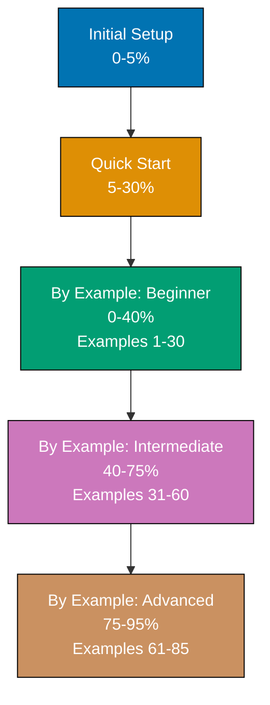

**Learn F# by reading functional code.** This by-example tutorial teaches F# through 85 heavily annotated, self-contained code examples achieving 95% language coverage. If you're an experienced programmer who prefers learning by reading working code rather than narrative explanations, this is your functional programming path.

## What is By Example?

By Example is a **functional code-first learning approach** designed for experienced developers switching to F# from object-oriented or imperative languages. Instead of lengthy explanations followed by code snippets, you'll see complete, runnable programs with inline annotations explaining what each line does, why immutability matters, and how functional patterns work.

**Target audience**: Seasonal programmers, software engineers, and developers with experience in Python, C#, Java, JavaScript, or other languages who want to learn functional programming with F# efficiently.

## How This Tutorial Works

### Structure

- **[Beginner](/en/learn/software-engineering/programming-languages/f-sharp/by-example/beginner)** (Examples 1-30): Fundamentals and functional core - 0-40% coverage
- **[Intermediate](/en/learn/software-engineering/programming-languages/f-sharp/by-example/intermediate)** (Examples 31-60): Production patterns and advanced features - 40-75% coverage
- **[Advanced](/en/learn/software-engineering/programming-languages/f-sharp/by-example/advanced)** (Examples 61-85): Expert mastery and optimization - 75-95% coverage

### Example Format

Each example follows a five-part structure:

1. **Brief explanation** (2-3 sentences) - What is this concept and why does it matter for functional programming?
2. **Diagram** (when appropriate) - Visual representation of data flow, transformations, or architecture
3. **Heavily annotated code** - Complete, runnable program with inline `// =>` annotations
4. **Key takeaway** (1-2 sentences) - The essential functional insight distilled
5. **Why it matters** (50-100 words) - Production relevance and functional programming benefits

### Example: Annotation Style

```fsharp
let numbers = [1; 2; 3; 4; 5]              // => numbers is int list (immutable)
                                           // => List is immutable linked list

let doubled =
    numbers                                // => Start with list
    |> List.map (fun n -> n * 2)           // => Transform each element
                                           // => Returns new list [2; 4; 6; 8; 10]
                                           // => Original list unchanged

let sum =
    doubled                                // => [2; 4; 6; 8; 10]
    |> List.reduce (+)                     // => Reduce with + operator
                                           // => sum is 30 (type: int inferred)
                                           // => doubled and numbers unchanged
```

## What You'll Learn

### Coverage: 95% of F# for Production Work

**Included**:

- Core functional syntax (immutability, functions, composition)
- Type system (type inference, records, discriminated unions)
- Pattern matching (exhaustive matching, active patterns)
- Collection operations (List, Seq, Array modules)
- Piping and composition (|>, >>, function chaining)
- Option and Result types (safe error handling)
- Computation expressions (async, result, option workflows)
- Railway-oriented programming (error handling pipelines)
- Type providers (JSON, SQL, CSV)
- Units of measure (type-safe calculations)
- Async programming (async workflows, parallel operations)
- Object programming (classes, interfaces, when needed)
- Testing (Expecto, FsUnit)
- Advanced types (GADTs, phantom types)
- Performance (tail recursion, value types)

**Excluded (the 5% edge cases)**:

- Rarely-used legacy features (.NET Framework specifics)
- Deep quotation internals
- Platform-specific advanced features
- Framework source implementation details

## Self-Contained Examples

**Every example is copy-paste-runnable.** Each example includes:

- Complete module definitions
- All necessary type definitions
- Helper functions defined inline
- No references to previous examples (you can start anywhere)

**Example independence**: You can jump to Example 42, copy the code, run it with `dotnet fsi`, and understand the functional pattern without reading Examples 1-41.

## Why Functional Code-First?

Traditional tutorials explain concepts, then show code. By Example inverts this with functional emphasis:

1. **See the functional code first** - Complete, working program
2. **Run it in F# Interactive** - Immediate REPL feedback
3. **Read annotations** - Understand immutability, composition, and functional flow
4. **Absorb the functional pattern** - Internalize through direct interaction

**Benefits**:

- **Faster learning** - No walls of text before seeing actual functional code
- **Immediate verification** - Run code in FSI to confirm understanding
- **Reference-friendly** - Come back later to find specific functional patterns
- **Production-focused** - Examples use real-world functional patterns, not toy code
- **REPL-driven** - Leverage F# Interactive for exploration

## How to Use This Tutorial

### If You're New to Programming

Start with [Quick Start](/en/learn/software-engineering/programming-languages/f-sharp/quick-start) first, then return to By Example for comprehensive functional coverage.

### If You Know C# or Java

Jump straight into **Beginner** examples. You'll see familiar .NET concepts transformed into functional patterns with immutability, pattern matching, and composition.

### If You Know Functional Programming

Start with **Intermediate** examples to see F#-specific features like computation expressions, type providers, and railway-oriented programming.

### If You Know Some F# (Intermediate)

Start with **Advanced** based on your comfort level. Each example is self-contained, so you won't get lost.

### As a Reference

Use the example index to find specific functional topics (e.g., "How do I use computation expressions?" → Example 47).

## Comparison to Object-Oriented Tutorials

| Aspect               | By Example (F#)                     | OOP Tutorial (C#)                   |
| -------------------- | ----------------------------------- | ----------------------------------- |
| **Approach**         | Functional-first (immutability)     | Object-oriented (mutability)        |
| **Default Style**    | Immutable, pure functions           | Mutable state, methods              |
| **Error Handling**   | Option, Result types                | Exceptions, null checks             |
| **Composition**      | Piping, function composition        | Method chaining, inheritance        |
| **Learning Curve**   | Steeper (new paradigm)              | Familiar (mainstream OOP)           |
| **Use as Reference** | Excellent (self-contained examples) | Excellent (self-contained examples) |

**Both paradigms are valid.** F# excels at correctness, domain modeling, and parallel processing. Choose based on your problem domain.

## Diagrams and Visualizations

Approximately 40% of examples include Mermaid diagrams visualizing:

- Data transformation pipelines (map, filter, fold)
- Pattern matching flow and exhaustiveness
- Railway-oriented programming (success/failure tracks)
- Async workflow execution
- Type provider data flow
- Computation expression builders
- Recursive data structures

All diagrams use a color-blind friendly palette (Blue #0173B2, Orange #DE8F05, Teal #029E73, Purple #CC78BC, Brown #CA9161) meeting WCAG AA accessibility standards.

## Prerequisites

- **Programming experience** - Familiarity with at least one programming language (Python, C#, Java, JavaScript, etc.)
- **F# environment set up** - .NET SDK installed and verified (see [Initial Setup](/en/learn/software-engineering/programming-languages/f-sharp/initial-setup))
- **Code editor ready** - VS Code with Ionide extension
- **F# Interactive running** - Comfort using `dotnet fsi` or FSI panel in VS Code

**No prior F# knowledge required** - Examples start from functional fundamentals.

## Learning Path


```mermaid
%% Color Palette: Blue #0173B2, Orange #DE8F05, Teal #029E73, Purple #CC78BC, Brown #CA9161
graph TD
    A["Initial Setup<br/>0-5%"]
    B["Quick Start<br/>5-30%"]
    C["By Example: Beginner<br/>0-40%<br/>Examples 1-30"]
    D["By Example: Intermediate<br/>40-75%<br/>Examples 31-60"]
    E["By Example: Advanced<br/>75-95%<br/>Examples 61-85"]

    A --> B
    B --> C
    C --> D
    D --> E

    style A fill:#0173B2,stroke:#000,color:#fff
    style B fill:#DE8F05,stroke:#000,color:#fff
    style C fill:#029E73,stroke:#000,color:#fff
    style D fill:#CC78BC,stroke:#000,color:#fff
    style E fill:#CA9161,stroke:#000,color:#fff
```

## What's Next?

Ready to start learning functional programming? Choose your entry point:

- **New to F#?** → [Beginner Examples (1-30)](/en/learn/software-engineering/programming-languages/f-sharp/by-example/beginner)
- **Know the basics?** → [Intermediate Examples (31-60)](/en/learn/software-engineering/programming-languages/f-sharp/by-example/intermediate)
- **Experienced with F#?** → [Advanced Examples (61-85)](/en/learn/software-engineering/programming-languages/f-sharp/by-example/advanced)

## Learning Progression

Coverage advances progressively through three stages, each building on functional fundamentals:

- **Beginner**: 0-40% coverage through 30 examples (immutability, composition, pattern matching)
- **Intermediate**: 40-75% coverage through 30 examples (computation expressions, type providers)
- **Advanced**: 75-95% coverage through 25 examples (advanced types, performance optimization)

Work at your own pace. Each example is self-contained, so you can explore topics in any order based on your current needs.

## Key Principles

1. **Every example is runnable in FSI** - Copy, paste, run in REPL, verify
2. **Annotations explain functional WHY** - Understand immutability, composition, type safety
3. **Self-contained is non-negotiable** - No hunting for code in other examples
4. **Production patterns, not toys** - Real-world functional code you'll actually write
5. **Modern F# features** - F# 8, .NET 8, contemporary functional idioms

## Functional Programming Benefits Highlighted

Throughout examples, you'll see how functional programming provides:

- **Correctness** - Type system catches errors at compile time
- **Immutability** - Eliminates race conditions and side effects
- **Composability** - Build complex operations from simple functions
- **Testability** - Pure functions are trivial to test
- **Conciseness** - Express complex logic in fewer lines
- **Domain modeling** - Types represent business rules exactly

## Feedback and Improvements

Found an error? See a better functional way to explain something? Examples are continuously improved based on learner feedback.

**Let's start functional coding!** Choose your level and dive into the examples.

## Examples by Level

### Beginner (Examples 1–30)

- [Example 1: Hello World and F# Interactive](/en/learn/software-engineering/programming-languages/f-sharp/by-example/beginner#example-1-hello-world-and-f-interactive)
- [Example 2: Immutable Values with let](/en/learn/software-engineering/programming-languages/f-sharp/by-example/beginner#example-2-immutable-values-with-let)
- [Example 3: Type Inference](/en/learn/software-engineering/programming-languages/f-sharp/by-example/beginner#example-3-type-inference)
- [Example 4: Basic Types](/en/learn/software-engineering/programming-languages/f-sharp/by-example/beginner#example-4-basic-types)
- [Example 5: Functions](/en/learn/software-engineering/programming-languages/f-sharp/by-example/beginner#example-5-functions)
- [Example 6: Function Composition](/en/learn/software-engineering/programming-languages/f-sharp/by-example/beginner#example-6-function-composition)
- [Example 7: Piping with |>](/en/learn/software-engineering/programming-languages/f-sharp/by-example/beginner#example-7-piping-with-)
- [Example 8: Pattern Matching Basics](/en/learn/software-engineering/programming-languages/f-sharp/by-example/beginner#example-8-pattern-matching-basics)
- [Example 9: Lists](/en/learn/software-engineering/programming-languages/f-sharp/by-example/beginner#example-9-lists)
- [Example 10: Recursion](/en/learn/software-engineering/programming-languages/f-sharp/by-example/beginner#example-10-recursion)
- [Example 11: List.map - Transforming Collections](/en/learn/software-engineering/programming-languages/f-sharp/by-example/beginner#example-11-listmap---transforming-collections)
- [Example 12: List.filter - Selecting Elements](/en/learn/software-engineering/programming-languages/f-sharp/by-example/beginner#example-12-listfilter---selecting-elements)
- [Example 13: List.fold - Aggregating Values](/en/learn/software-engineering/programming-languages/f-sharp/by-example/beginner#example-13-listfold---aggregating-values)
- [Example 14: Tuples](/en/learn/software-engineering/programming-languages/f-sharp/by-example/beginner#example-14-tuples)
- [Example 15: Records](/en/learn/software-engineering/programming-languages/f-sharp/by-example/beginner#example-15-records)
- [Example 16: Discriminated Unions](/en/learn/software-engineering/programming-languages/f-sharp/by-example/beginner#example-16-discriminated-unions)
- [Example 17: Option Type - Null Safety](/en/learn/software-engineering/programming-languages/f-sharp/by-example/beginner#example-17-option-type---null-safety)
- [Example 18: Unit Type](/en/learn/software-engineering/programming-languages/f-sharp/by-example/beginner#example-18-unit-type)
- [Example 19: String Manipulation](/en/learn/software-engineering/programming-languages/f-sharp/by-example/beginner#example-19-string-manipulation)
- [Example 20: Arrays](/en/learn/software-engineering/programming-languages/f-sharp/by-example/beginner#example-20-arrays)
- [Example 21: Sequences (Lazy Evaluation)](/en/learn/software-engineering/programming-languages/f-sharp/by-example/beginner#example-21-sequences-lazy-evaluation)
- [Example 22: Mutable Values (Rare Cases)](/en/learn/software-engineering/programming-languages/f-sharp/by-example/beginner#example-22-mutable-values-rare-cases)
- [Example 23: For Loops](/en/learn/software-engineering/programming-languages/f-sharp/by-example/beginner#example-23-for-loops)
- [Example 24: While Loops](/en/learn/software-engineering/programming-languages/f-sharp/by-example/beginner#example-24-while-loops)
- [Example 25: If Expressions](/en/learn/software-engineering/programming-languages/f-sharp/by-example/beginner#example-25-if-expressions)
- [Example 26: Match Expressions (Advanced)](/en/learn/software-engineering/programming-languages/f-sharp/by-example/beginner#example-26-match-expressions-advanced)
- [Example 27: Type Annotations](/en/learn/software-engineering/programming-languages/f-sharp/by-example/beginner#example-27-type-annotations)
- [Example 28: Lambda Expressions (fun)](/en/learn/software-engineering/programming-languages/f-sharp/by-example/beginner#example-28-lambda-expressions-fun)
- [Example 29: Partial Application](/en/learn/software-engineering/programming-languages/f-sharp/by-example/beginner#example-29-partial-application)
- [Example 30: Currying and Higher-Order Functions](/en/learn/software-engineering/programming-languages/f-sharp/by-example/beginner#example-30-currying-and-higher-order-functions)

### Intermediate (Examples 31–60)

- [Example 31: Async Workflows - Basic Asynchrony](/en/learn/software-engineering/programming-languages/f-sharp/by-example/intermediate#example-31-async-workflows---basic-asynchrony)
- [Example 32: Async Parallel Execution](/en/learn/software-engineering/programming-languages/f-sharp/by-example/intermediate#example-32-async-parallel-execution)
- [Example 33: Task Expressions (F# 6.0+)](/en/learn/software-engineering/programming-languages/f-sharp/by-example/intermediate#example-33-task-expressions-f-60)
- [Example 34: Computation Expressions Basics - Maybe Builder](/en/learn/software-engineering/programming-languages/f-sharp/by-example/intermediate#example-34-computation-expressions-basics---maybe-builder)
- [Example 35: Sequence Expressions](/en/learn/software-engineering/programming-languages/f-sharp/by-example/intermediate#example-35-sequence-expressions)
- [Example 36: Option Computation - Railway-Oriented Programming](/en/learn/software-engineering/programming-languages/f-sharp/by-example/intermediate#example-36-option-computation---railway-oriented-programming)
- [Example 37: Result Type - Explicit Error Handling](/en/learn/software-engineering/programming-languages/f-sharp/by-example/intermediate#example-37-result-type---explicit-error-handling)
- [Example 38: Type Providers - JSON](/en/learn/software-engineering/programming-languages/f-sharp/by-example/intermediate#example-38-type-providers---json)
- [Example 39: Type Providers - CSV](/en/learn/software-engineering/programming-languages/f-sharp/by-example/intermediate#example-39-type-providers---csv)
- [Example 40: Units of Measure](/en/learn/software-engineering/programming-languages/f-sharp/by-example/intermediate#example-40-units-of-measure)
- [Example 41: Active Patterns - Single-Case](/en/learn/software-engineering/programming-languages/f-sharp/by-example/intermediate#example-41-active-patterns---single-case)
- [Example 42: Active Patterns - Multi-Case](/en/learn/software-engineering/programming-languages/f-sharp/by-example/intermediate#example-42-active-patterns---multi-case)
- [Example 43: List Comprehensions Advanced](/en/learn/software-engineering/programming-languages/f-sharp/by-example/intermediate#example-43-list-comprehensions-advanced)
- [Example 44: Set and Map Collections](/en/learn/software-engineering/programming-languages/f-sharp/by-example/intermediate#example-44-set-and-map-collections)
- [Example 45: Generic Functions](/en/learn/software-engineering/programming-languages/f-sharp/by-example/intermediate#example-45-generic-functions)
- [Example 46: Function Recursion Patterns](/en/learn/software-engineering/programming-languages/f-sharp/by-example/intermediate#example-46-function-recursion-patterns)
- [Example 47: Tail Recursion](/en/learn/software-engineering/programming-languages/f-sharp/by-example/intermediate#example-47-tail-recursion)
- [Example 48: Mutual Recursion](/en/learn/software-engineering/programming-languages/f-sharp/by-example/intermediate#example-48-mutual-recursion)
- [Example 49: Memoization](/en/learn/software-engineering/programming-languages/f-sharp/by-example/intermediate#example-49-memoization)
- [Example 50: Module Organization](/en/learn/software-engineering/programming-languages/f-sharp/by-example/intermediate#example-50-module-organization)
- [Example 51: Namespaces](/en/learn/software-engineering/programming-languages/f-sharp/by-example/intermediate#example-51-namespaces)
- [Example 52: Signature Files (.fsi)](/en/learn/software-engineering/programming-languages/f-sharp/by-example/intermediate#example-52-signature-files-fsi)
- [Example 53: Object Programming - Classes](/en/learn/software-engineering/programming-languages/f-sharp/by-example/intermediate#example-53-object-programming---classes)
- [Example 54: Object Programming - Interfaces](/en/learn/software-engineering/programming-languages/f-sharp/by-example/intermediate#example-54-object-programming---interfaces)
- [Example 55: Object Expressions](/en/learn/software-engineering/programming-languages/f-sharp/by-example/intermediate#example-55-object-expressions)
- [Example 56: Discriminated Unions Advanced - Recursive Types](/en/learn/software-engineering/programming-languages/f-sharp/by-example/intermediate#example-56-discriminated-unions-advanced---recursive-types)
- [Example 57: Record Update Syntax - with Keyword](/en/learn/software-engineering/programming-languages/f-sharp/by-example/intermediate#example-57-record-update-syntax---with-keyword)
- [Example 58: Pattern Matching Guards](/en/learn/software-engineering/programming-languages/f-sharp/by-example/intermediate#example-58-pattern-matching-guards)
- [Example 59: Function Patterns - Pattern Matching in Parameters](/en/learn/software-engineering/programming-languages/f-sharp/by-example/intermediate#example-59-function-patterns---pattern-matching-in-parameters)
- [Example 60: Collection Functions - choose, collect, partition, groupBy](/en/learn/software-engineering/programming-languages/f-sharp/by-example/intermediate#example-60-collection-functions---choose-collect-partition-groupby)

### Advanced (Examples 61–85)

- [Example 61: MailboxProcessor - Agent-Based Concurrency](/en/learn/software-engineering/programming-languages/f-sharp/by-example/advanced#example-61-mailboxprocessor---agent-based-concurrency)
- [Example 62: Agent-Based State Management](/en/learn/software-engineering/programming-languages/f-sharp/by-example/advanced#example-62-agent-based-state-management)
- [Example 63: Async Parallelism with Async.Parallel](/en/learn/software-engineering/programming-languages/f-sharp/by-example/advanced#example-63-async-parallelism-with-asyncparallel)
- [Example 64: Custom Computation Expression Builders](/en/learn/software-engineering/programming-languages/f-sharp/by-example/advanced#example-64-custom-computation-expression-builders)
- [Example 65: Query Expressions (LINQ Integration)](/en/learn/software-engineering/programming-languages/f-sharp/by-example/advanced#example-65-query-expressions-linq-integration)
- [Example 66: Quotations - Code as Data](/en/learn/software-engineering/programming-languages/f-sharp/by-example/advanced#example-66-quotations---code-as-data)
- [Example 67: Reflection and Type Information](/en/learn/software-engineering/programming-languages/f-sharp/by-example/advanced#example-67-reflection-and-type-information)
- [Example 68: Advanced Type Constraints with SRTP](/en/learn/software-engineering/programming-languages/f-sharp/by-example/advanced#example-68-advanced-type-constraints-with-srtp)
- [Example 69: Custom Operators and Operator Overloading](/en/learn/software-engineering/programming-languages/f-sharp/by-example/advanced#example-69-custom-operators-and-operator-overloading)
- [Example 70: Parameterized Active Patterns](/en/learn/software-engineering/programming-languages/f-sharp/by-example/advanced#example-70-parameterized-active-patterns)
- [Example 71: Type Extensions and Augmentations](/en/learn/software-engineering/programming-languages/f-sharp/by-example/advanced#example-71-type-extensions-and-augmentations)
- [Example 72: Units of Measure - Type-Safe Calculations](/en/learn/software-engineering/programming-languages/f-sharp/by-example/advanced#example-72-units-of-measure---type-safe-calculations)
- [Example 73: Phantom Types for Type-State Pattern](/en/learn/software-engineering/programming-languages/f-sharp/by-example/advanced#example-73-phantom-types-for-type-state-pattern)
- [Example 74: GADTs Emulation with Discriminated Unions](/en/learn/software-engineering/programming-languages/f-sharp/by-example/advanced#example-74-gadts-emulation-with-discriminated-unions)
- [Example 75: Functional Dependency Injection](/en/learn/software-engineering/programming-languages/f-sharp/by-example/advanced#example-75-functional-dependency-injection)
- [Example 76: Event Sourcing Pattern](/en/learn/software-engineering/programming-languages/f-sharp/by-example/advanced#example-76-event-sourcing-pattern)
- [Example 77: CQRS with F# - Command Query Separation](/en/learn/software-engineering/programming-languages/f-sharp/by-example/advanced#example-77-cqrs-with-f---command-query-separation)
- [Example 78: Make Illegal States Unrepresentable](/en/learn/software-engineering/programming-languages/f-sharp/by-example/advanced#example-78-make-illegal-states-unrepresentable)
- [Example 79: Advanced Parser Combinators](/en/learn/software-engineering/programming-languages/f-sharp/by-example/advanced#example-79-advanced-parser-combinators)
- [Example 80: Metaprogramming with Code Generation](/en/learn/software-engineering/programming-languages/f-sharp/by-example/advanced#example-80-metaprogramming-with-code-generation)
- [Example 81: C# Interop - Consuming and Exposing APIs](/en/learn/software-engineering/programming-languages/f-sharp/by-example/advanced#example-81-c-interop---consuming-and-exposing-apis)
- [Example 82: Performance Optimization - Struct vs Class](/en/learn/software-engineering/programming-languages/f-sharp/by-example/advanced#example-82-performance-optimization---struct-vs-class)
- [Example 83: Profiling and Benchmarking](/en/learn/software-engineering/programming-languages/f-sharp/by-example/advanced#example-83-profiling-and-benchmarking)
- [Example 84: Concurrent Collections and Lock-Free Data Structures](/en/learn/software-engineering/programming-languages/f-sharp/by-example/advanced#example-84-concurrent-collections-and-lock-free-data-structures)
- [Example 85: Advanced Async Patterns - Cancellation and Timeouts](/en/learn/software-engineering/programming-languages/f-sharp/by-example/advanced#example-85-advanced-async-patterns---cancellation-and-timeouts)
