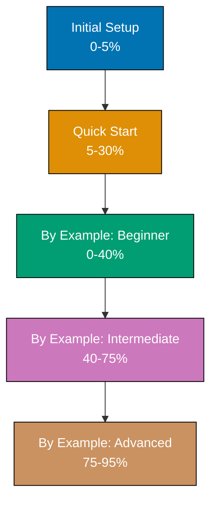

**Master F# step-by-step.** This directory contains the complete F# Full Set tutorial series - a comprehensive learning path from installation to expert mastery. Choose your starting point based on your experience level.

## Where F# Fits in Your Learning Journey

**F# is a recommended language** for functional programming on .NET, data science, domain modeling, and scalable systems. Best learned as a second or third language after [Python](/en/learn/software-engineering/programming-languages/python) or alongside [C#](/en/learn/software-engineering/programming-languages/c-sharp).

**Why F#?** F# represents Microsoft's functional-first approach to .NET - combining powerful type inference with immutability by default, pattern matching with algebraic data types, railway-oriented programming with computation expressions, and seamless .NET interoperability. The language prioritizes correctness, expressiveness, and maintainability.

**What makes F# special?** F# excels at domain modeling (type-driven design), data science (type providers), financial applications (precision and correctness), concurrent systems (immutability eliminates race conditions), web services (Giraffe, Saturn frameworks), and scripting (.fsx scripts). Type providers enable compile-time access to external data sources, computation expressions provide custom control flow, and the interactive REPL (F# Interactive) enables rapid prototyping.

**Prerequisites recommended**: Familiarity with at least one programming language (Python or C#) helps you appreciate F#'s functional approach. Experience with C# provides useful context for .NET ecosystem features. See [Programming Languages Overview](/en/learn/software-engineering/programming-languages/overview) for the complete learning path.

## Getting Started

Before diving into comprehensive tutorials, get up and running:

1. **[Initial Setup](/en/learn/software-engineering/programming-languages/f-sharp/initial-setup)** - Install .NET SDK, configure your environment, verify your setup
2. **[Quick Start](/en/learn/software-engineering/programming-languages/f-sharp/quick-start)** - Your first F# program, basic syntax touchpoints, essential concepts

These foundational tutorials (0-30% coverage) prepare you for the complete learning path.

## By Example Track (Code-First Learning)

The by-example track provides 85 heavily annotated code examples achieving 95% language coverage:

### [By Example](/en/learn/software-engineering/programming-languages/f-sharp/by-example)

- **Coverage**: 0-95% (Comprehensive code-first approach)
- **What you'll learn**: F# through 85 self-contained, heavily annotated examples
- **Goal**: Achieve comprehensive F# mastery through working code
- **Best for**: Experienced developers who prefer learning by reading and running code

**Structure**:

- **[Beginner](/en/learn/software-engineering/programming-languages/f-sharp/by-example/beginner)** (Examples 1-30): Fundamentals and core syntax
- **[Intermediate](/en/learn/software-engineering/programming-languages/f-sharp/by-example/intermediate)** (Examples 31-60): Production patterns and framework features
- **[Advanced](/en/learn/software-engineering/programming-languages/f-sharp/by-example/advanced)** (Examples 61-85): Expert mastery and optimization

## How to Choose Your Starting Point

**Choose based on your experience level:**

| Experience Level                      | Recommended Path                                |
| ------------------------------------- | ----------------------------------------------- |
| **No programming experience**         | Quick Start → By Example (Beginner → Advanced)  |
| **Experienced programmer, new to F#** | By Example (Beginner → Advanced)                |
| **Familiar with some F#, want depth** | By Example (Intermediate → Advanced)            |
| **Building production systems now**   | By Example (Intermediate → Advanced)            |
| **Seeking expert mastery**            | By Example (Advanced, review earlier as needed) |
| **Need a specific pattern?**          | Search By Example for relevant topics           |

## Tutorial Structure

Each tutorial follows the [Diátaxis framework](https://diataxis.fr/) principles for learning-oriented content:

- **Learning-oriented**: Designed to help learners master F# by doing
- **Step-by-step**: Clear, sequential progression with increasing complexity
- **Practical**: Hands-on examples with working, runnable F# code
- **Self-contained**: Examples include all necessary code and explanations
- **Production-focused**: Real-world patterns and best practices

## What You'll Learn

### Language Fundamentals (0-40%)

- Immutable values and bindings
- Functions and function composition
- Pattern matching and discriminated unions
- Lists, sequences, and collection operations
- Piping and forward composition
- Option types and error handling
- Records and tuples
- Recursion and tail recursion
- Modules and namespaces
- Type inference and type annotations

### Production Patterns (40-75%)

- Computation expressions (async, result, option)
- Railway-oriented programming
- Active patterns
- Type providers (SQL, JSON, CSV)
- Units of measure
- Object programming (classes, interfaces)
- Async workflows and task-based programming
- Testing with Expecto and FsUnit
- Domain modeling with types
- Parser combinators
- Web development (Giraffe, Saturn)

### Expert Mastery (75-95%)

- Advanced type system features (GADTs, phantom types)
- Custom computation expressions
- Reflection and quotations
- Type-level programming
- Advanced async patterns (mailbox processors, agents)
- Performance optimization (value types, inline)
- Interop with C# and .NET libraries
- Code generation and metaprogramming
- Domain-specific languages (DSLs)
- Category theory applications (functors, monads)

## Key F# Concepts

### Immutability by Default

Values in F# are immutable unless explicitly declared mutable. This eliminates entire categories of bugs and enables safe concurrent programming.

### Type Inference

F# infers types without explicit annotations, providing type safety without verbosity. The compiler validates types at compile time while code reads like dynamic languages.

### Pattern Matching

Pattern matching provides exhaustive case analysis with compiler verification, enabling robust error handling and data transformation.

### Railway-Oriented Programming

Compose error-handling pipelines using Result types, making success and failure paths explicit and composable.

### Computation Expressions

Custom syntax for control flow patterns (async, validation, parsing) through compiler-supported builder patterns.

### Type Providers

Compile-time access to external data sources (databases, JSON APIs, CSV files) with IntelliSense support and type safety.

## Learning Path Progression

## Related Languages

- **[C#](/en/learn/software-engineering/programming-languages/c-sharp)** - Object-oriented sibling on .NET platform
- **[Elixir](/en/learn/software-engineering/programming-languages/elixir)** - Functional language with similar immutability emphasis
- **Haskell** - Pure functional language influencing F# design
- **OCaml** - ML-family language that F# derives from

## External Resources

- **[Official F# Documentation](https://fsharp.org/)** - F# Software Foundation resources
- **[F# Language Guide](https://docs.microsoft.com/en-us/dotnet/fsharp/)** - Microsoft's comprehensive F# documentation
- **[F# for Fun and Profit](https://fsharpforfunandprofit.com/)** - Comprehensive F# learning site by Scott Wlaschin
- **[F# API Reference](https://fsharp.github.io/fsharp-core-docs/)** - FSharp.Core library documentation

## Version Information

These tutorials target **.NET 8** (LTS - Long Term Support) and **F# 8**, the latest stable versions as of 2024. Examples use modern F# features including computation expressions, type providers, active patterns, and units of measure.

**Migration notes**: If using older versions (.NET Framework, .NET Core 3.1, .NET 5-7), most examples work with minor adjustments. Version-specific features are clearly marked.
