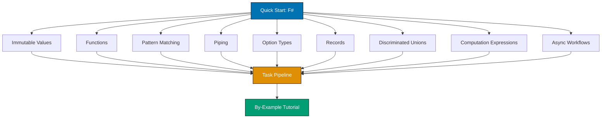

**Want to learn F# fundamentals quickly?** This quick start touches 10-12 core F# concepts by building a functional data processing pipeline. By the end, you'll have practical touchpoints for the most important functional programming features.

## Prerequisites

Before starting, you should have:

- Completed [Initial Setup](/en/learn/software-engineering/programming-languages/f-sharp/initial-setup) - .NET SDK installed and working
- VS Code with Ionide extension
- Basic understanding of programming concepts
- Willingness to write and run code

## Learning Objectives

By the end of this tutorial, you will have touchpoints for:

1. **Immutable Values** - let bindings, immutability by default
2. **Functions** - Function definitions, type inference
3. **Pattern Matching** - Match expressions, discriminated unions
4. **Piping** - Forward pipe operator, function composition
5. **Lists and Sequences** - List operations, lazy sequences
6. **Option Types** - Handling absence of values safely
7. **Records** - Immutable data structures
8. **Discriminated Unions** - Algebraic data types
9. **Computation Expressions** - Result, option workflows
10. **Async Workflows** - Asynchronous programming

## What We'll Build

A **Task Processing Pipeline** that:

- Defines tasks as immutable records
- Uses discriminated unions for task status
- Processes tasks with pattern matching
- Chains operations with piping
- Handles errors with Result types
- Demonstrates essential F# patterns

## Project Structure



## Step 1: Create Project

Create a new F# console application or script file:

### Option A: Console Project

```bash
mkdir TaskPipeline
cd TaskPipeline
dotnet new console -lang F#
```

### Option B: F# Script (Recommended for Quick Start)

```bash
mkdir TaskPipeline
cd TaskPipeline
code TaskPipeline.fsx  # Opens in VS Code
```

**We'll use a script file** for this quick start to leverage F# Interactive.

## Concept 1: Immutable Values and Records

F# values are immutable by default. Use `let` to bind values.

```fsharp
// TaskPipeline.fsx

// Immutable record type
type Task = {
    Id: int                    // => int field
    Title: string              // => string field
    Description: string        // => string field
    Priority: int              // => 1 (high) to 3 (low)
}                              // => Record is immutable by default

// Create a task
let task1 = {
    Id = 1                     // => Field assignment
    Title = "Learn F#"         // => Immutable value
    Description = "Master functional programming"
    Priority = 1               // => High priority
}                              // => task1 is Task type (inferred)

// Records are immutable - create modified copy
let task2 = {
    task1 with                 // => Copy task1
    Title = "Master F#"        // => Override Title field
}                              // => task2 is new instance, task1 unchanged

printfn "%A" task1             // => Output: { Id = 1; Title = "Learn F#"; ... }
printfn "%A" task2             // => Output: { Id = 1; Title = "Master F#"; ... }
```

**Key concepts**: `type`, `record`, immutability, `with` expression

## Concept 2: Discriminated Unions - Algebraic Data Types

Discriminated unions represent values that can be one of several named cases.

```fsharp
// Task status as discriminated union
type TaskStatus =
    | NotStarted                          // => Case with no data
    | InProgress of startedOn: System.DateTime   // => Case with DateTime data
    | Completed of completedOn: System.DateTime  // => Case with DateTime data
    | Blocked of reason: string           // => Case with string data
                                          // => Compiler ensures exhaustive matching

// Enhanced task with status
type TaskItem = {
    Id: int
    Title: string
    Status: TaskStatus                    // => Status is TaskStatus union
    Priority: int
}

// Create tasks with different statuses
let task1 = {
    Id = 1
    Title = "Learn F#"
    Status = InProgress (System.DateTime.Now)  // => InProgress case with data
    Priority = 1
}

let task2 = {
    Id = 2
    Title = "Build project"
    Status = NotStarted                   // => NotStarted case (no data)
    Priority = 2
}

let task3 = {
    Id = 3
    Title = "Deploy app"
    Status = Blocked "Waiting for API key"     // => Blocked case with reason
    Priority = 3
}
```

**Key concepts**: Discriminated unions, pattern matching data

## Concept 3: Pattern Matching - Exhaustive Case Analysis

Pattern matching provides exhaustive, compiler-verified case analysis.

```fsharp
// Get status description using pattern matching
let getStatusDescription status =
    match status with                     // => Pattern match on status
    | NotStarted -> "Not started yet"     // => Match NotStarted case
    | InProgress date ->                  // => Match InProgress, extract date
        sprintf "Started on %s" (date.ToShortDateString())
    | Completed date ->                   // => Match Completed, extract date
        sprintf "Completed on %s" (date.ToShortDateString())
    | Blocked reason ->                   // => Match Blocked, extract reason
        sprintf "Blocked: %s" reason      // => sprintf formats string
                                          // => Compiler verifies all cases covered

// Use pattern matching
let status1 = getStatusDescription task1.Status
// => status1 is "Started on 2/2/2026"

let status2 = getStatusDescription task3.Status
// => status2 is "Blocked: Waiting for API key"

printfn "%s" status1                      // => Output: Started on 2/2/2026
printfn "%s" status2                      // => Output: Blocked: Waiting for API key
```

**Key concepts**: `match`, pattern matching, exhaustiveness checking

## Concept 4: Functions and Piping

F# emphasizes function composition and piping.

```fsharp
// Function to check if task is high priority
let isHighPriority task =
    task.Priority = 1                     // => Returns bool (type inferred)
                                          // => Last expression is return value

// Function to get task title
let getTitle task =
    task.Title                            // => Returns string (inferred)

// Piping - pass result of one function to next
let highPriorityTitle =
    task1                                 // => Start with task1
    |> isHighPriority                     // => Pipe to isHighPriority: true
    |> (fun isHigh ->                     // => Lambda function
        if isHigh then getTitle task1     // => Get title if high priority
        else "Not high priority")         // => Else message
// => highPriorityTitle is "Learn F#"

// Pipe multiple operations
let tasks = [task1; task2; task3]         // => List of tasks

let highPriorityTitles =
    tasks                                 // => Start with list
    |> List.filter isHighPriority         // => Filter high priority tasks
    |> List.map getTitle                  // => Map to titles
    |> List.sort                          // => Sort alphabetically
// => highPriorityTitles is ["Learn F#"] (sorted list)

printfn "High priority tasks: %A" highPriorityTitles
// => Output: High priority tasks: ["Learn F#"]
```

**Key concepts**: Function definitions, `|>` (pipe operator), `List.filter`, `List.map`

## Concept 5: Option Types - Safe Absence

Option types represent presence or absence of values without null.

```fsharp
// Find task by ID (may not exist)
let findTaskById id taskList =
    taskList                              // => Start with task list
    |> List.tryFind (fun t -> t.Id = id)  // => Returns Option<TaskItem>
                                          // => Some task or None

// Use option
let foundTask = findTaskById 1 tasks      // => Some task1
let notFound = findTaskById 99 tasks      // => None

// Pattern match on option
let displayTask taskOption =
    match taskOption with                 // => Match on Option<TaskItem>
    | Some task ->                        // => Some case (task exists)
        printfn "Found: %s" task.Title
    | None ->                             // => None case (not found)
        printfn "Task not found"

displayTask foundTask                     // => Output: Found: Learn F#
displayTask notFound                      // => Output: Task not found

// Option.map - transform if Some, preserve None
let titleOption =
    foundTask                             // => Some task1
    |> Option.map (fun t -> t.Title)      // => Some "Learn F#"

let notFoundTitle =
    notFound                              // => None
    |> Option.map (fun t -> t.Title)      // => None (map not executed)
```

**Key concepts**: `Option<'T>`, `Some`, `None`, `Option.map`

## Concept 6: Computation Expressions - Result Type

Computation expressions provide custom syntax for patterns like error handling.

```fsharp
// Result type for success/failure
type ValidationError = string

// Validate task
let validateTask task =
    if System.String.IsNullOrWhiteSpace task.Title then
        Error "Title cannot be empty"    // => Error case with message
    elif task.Priority < 1 || task.Priority > 3 then
        Error "Priority must be 1-3"     // => Error case
    else
        Ok task                           // => Ok case with task
                                          // => Returns Result<TaskItem, string>

// Result computation expression
let processTask task =
    result {                              // => Result computation expression
        let! validated = validateTask task    // => Unwrap Ok, short-circuit on Error
        let updated = {                   // => let! succeeds, continue
            validated with
            Status = InProgress System.DateTime.Now
        }
        return updated                    // => Wrap in Ok
    }                                     // => Returns Result<TaskItem, string>

// Valid task
let validResult = processTask task1      // => Ok (updated task)

// Invalid task
let invalidTask = { task1 with Title = "" }
let invalidResult = processTask invalidTask  // => Error "Title cannot be empty"

// Pattern match results
match validResult with
| Ok task -> printfn "Processed: %s" task.Title
| Error msg -> printfn "Error: %s" msg

match invalidResult with
| Ok task -> printfn "Processed: %s" task.Title
| Error msg -> printfn "Error: %s" msg
// => Output: Error: Title cannot be empty
```

**Key concepts**: `Result<'T, 'TError>`, `Ok`, `Error`, `result { }`, `let!`

## Concept 7: List Comprehensions and Sequences

F# provides concise syntax for generating lists and sequences.

```fsharp
// List comprehension
let numbers = [1..10]                     // => [1; 2; 3; ... 10]
let evens = [for i in 1..10 do
                if i % 2 = 0 then i]      // => [2; 4; 6; 8; 10]

// Generate sample tasks
let sampleTasks = [
    for i in 1..5 do                      // => Loop from 1 to 5
        {
            Id = i
            Title = sprintf "Task %d" i
            Status = NotStarted
            Priority = (i % 3) + 1        // => Rotate priorities 1-3
        }
]                                         // => List of 5 tasks

// Sequence (lazy evaluation)
let taskSequence = seq {                  // => Sequence expression
    for i in 1..1000000 do                // => Not evaluated until iterated
        yield {                           // => yield produces element
            Id = i
            Title = sprintf "Task %d" i
            Status = NotStarted
            Priority = 1
        }
}                                         // => Seq<TaskItem> (lazy)

// Take first 3 (only evaluates those 3)
let first3 =
    taskSequence
    |> Seq.take 3                         // => Take first 3 elements
    |> Seq.toList                         // => Force evaluation to list

printfn "First 3 tasks: %A" first3
```

**Key concepts**: List comprehension `[for ... ]`, sequences `seq { }`, lazy evaluation

## Concept 8: Async Workflows

F# async workflows provide elegant asynchronous programming.

```fsharp
open System.Threading.Tasks

// Simulate async operation
let fetchTaskDetailsAsync taskId = async {
    do! Async.Sleep 1000                  // => Non-blocking delay (1 second)
                                          // => do! awaits async operation
    return {                              // => return wraps in Async
        Id = taskId
        Title = sprintf "Fetched task %d" taskId
        Status = NotStarted
        Priority = 1
    }
}                                         // => Returns Async<TaskItem>

// Run async operation
let runAsync() =
    async {
        printfn "Fetching task..."
        let! task = fetchTaskDetailsAsync 42  // => let! awaits and unwraps
        printfn "Fetched: %s" task.Title
        return task
    }
    |> Async.RunSynchronously             // => Execute async workflow

// Parallel async operations
let fetchMultipleTasks() =
    async {
        let tasks = [1; 2; 3]             // => Task IDs
        let! results =
            tasks                         // => Start with list
            |> List.map fetchTaskDetailsAsync     // => Map to async operations
            |> Async.Parallel             // => Run in parallel
                                          // => Returns Async<TaskItem[]>
        return results |> Array.toList    // => Convert array to list
    }
    |> Async.RunSynchronously             // => Execute and wait

printfn "Fetching multiple tasks in parallel..."
let parallelResults = fetchMultipleTasks()
printfn "Fetched %d tasks" parallelResults.Length
```

**Key concepts**: `async { }`, `do!`, `let!`, `Async.Sleep`, `Async.Parallel`

## Complete Pipeline Example

Put it all together:

```fsharp
// Complete task processing pipeline
let processTasks tasks =
    tasks
    |> List.filter (fun t ->              // => Filter high priority
        t.Priority = 1)
    |> List.map (fun t ->                 // => Validate each
        validateTask t)
    |> List.choose (fun result ->         // => Choose only Ok results
        match result with                 // => Pattern match Result
        | Ok task -> Some task            // => Keep successful validations
        | Error _ -> None)                // => Discard errors
    |> List.map (fun t ->                 // => Update status
        { t with Status = InProgress System.DateTime.Now })
    |> List.sortBy (fun t -> t.Id)        // => Sort by ID

// Run pipeline
let processedTasks = processTasks sampleTasks
printfn "Processed %d high-priority tasks" processedTasks.Length

// Display results
processedTasks
|> List.iter (fun t ->                    // => List.iter for side effects
    printfn "  [%d] %s - %s"
        t.Id
        t.Title
        (getStatusDescription t.Status))
```

## Run the Script

### Using F# Interactive in VS Code

1. Open `TaskPipeline.fsx` in VS Code
2. Select all code (Ctrl+A)
3. Press Alt+Enter (send to FSI)
4. View output in FSI panel

### Using dotnet fsi

```bash
dotnet fsi TaskPipeline.fsx
```

## Summary

**What you've touched**:

- Immutable values and records (data structures)
- Discriminated unions (algebraic data types)
- Pattern matching (exhaustive case analysis)
- Functions and piping (composition)
- Option types (safe absence)
- Result types (error handling)
- Computation expressions (custom syntax)
- List comprehensions (concise generation)
- Sequences (lazy evaluation)
- Async workflows (asynchronous programming)

**Key syntax learned**:

```fsharp
// Immutable record
type Task = { Id: int; Title: string }

// Discriminated union
type Status = NotStarted | InProgress of System.DateTime

// Pattern matching
match status with
| NotStarted -> "not started"
| InProgress date -> sprintf "started %O" date

// Piping
tasks
|> List.filter (fun t -> t.Priority = 1)
|> List.map (fun t -> t.Title)

// Option type
let found = List.tryFind (fun t -> t.Id = 1) tasks

// Result type
let validated = result {
    let! task = validateTask input
    return task
}

// Async workflow
let fetch = async {
    do! Async.Sleep 1000
    return "data"
}
```

## Next Steps

**Want comprehensive F# mastery?**

**Prefer code-first learning?**

- [By Example: Beginner](/en/learn/software-engineering/programming-languages/f-sharp/by-example/beginner) - Learn through 30 heavily annotated F# examples covering fundamentals

**Need specific solutions?**

- Browse by-example sections for specific patterns

**Want to understand F# philosophy?**

- [Overview](/en/learn/software-engineering/programming-languages/f-sharp/overview) - Why F# exists and when to use it

## Quick Reference Card

### Essential Syntax

```fsharp
// Values
let x = 42                          // Immutable binding
let mutable y = 10                  // Mutable (rare)
y <- 15                             // Mutation

// Functions
let add x y = x + y                 // Function with 2 parameters
let result = add 3 5                // result is 8

// Records
type Person = { Name: string; Age: int }
let person = { Name = "Alice"; Age = 30 }

// Discriminated unions
type Shape =
    | Circle of radius: float
    | Rectangle of width: float * height: float

// Pattern matching
match shape with
| Circle r -> 3.14 * r * r
| Rectangle (w, h) -> w * h

// Lists
let numbers = [1; 2; 3]
let doubled = numbers |> List.map (fun x -> x * 2)

// Option
let maybeValue = Some 42
let nothing = None

// Result
let success = Ok "data"
let failure = Error "error message"
```

This quick start provides touchpoints for essential F# functional programming. For production work, explore the beginner tutorial for comprehensive coverage and by-example content for heavily annotated functional patterns.
