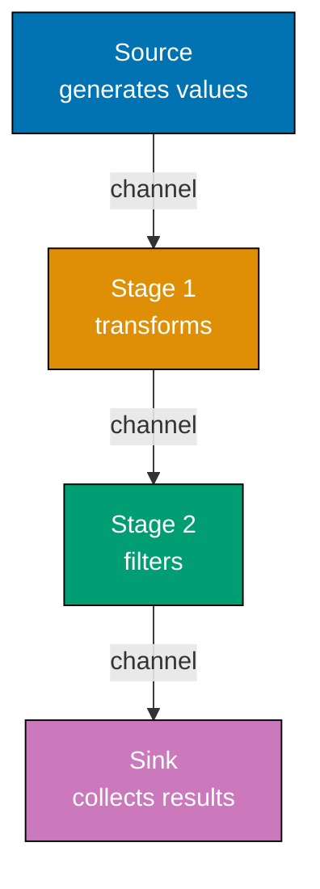
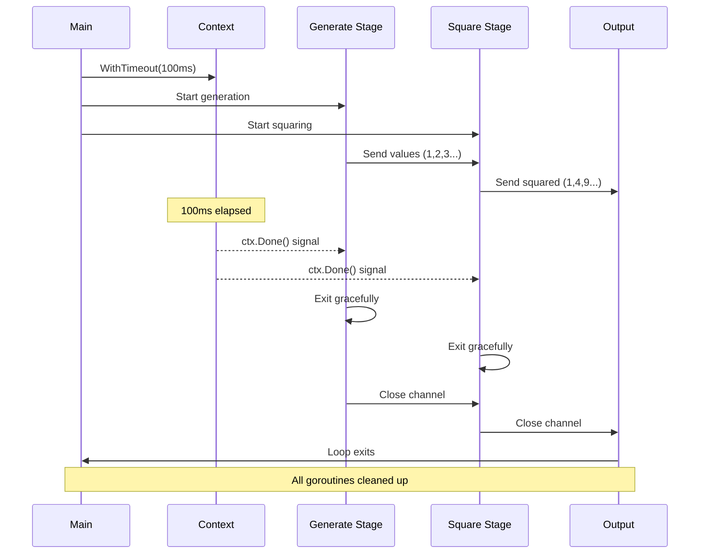
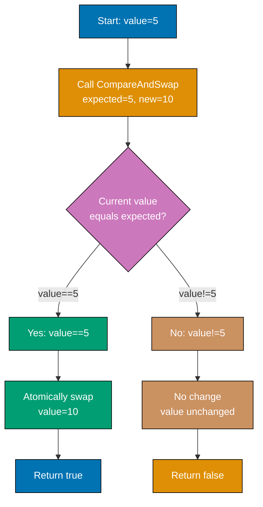
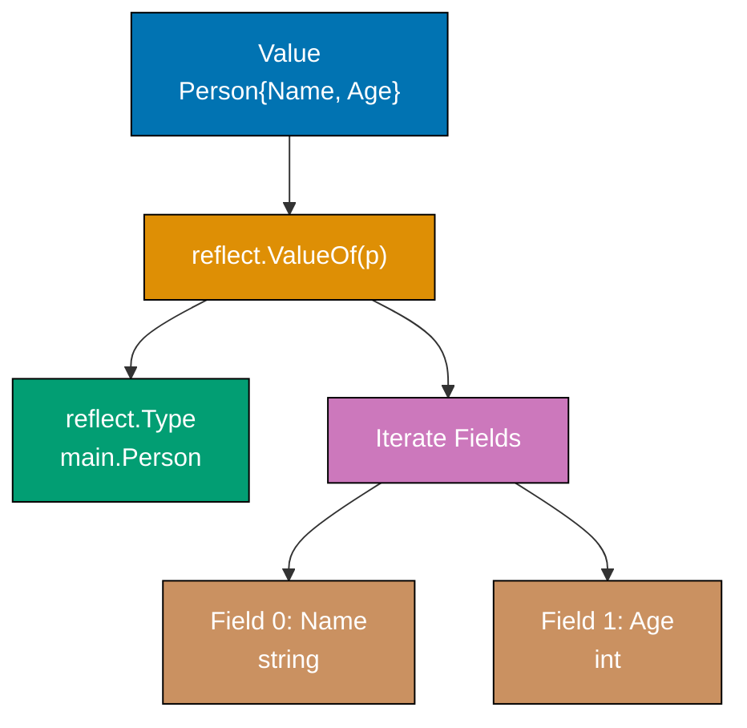
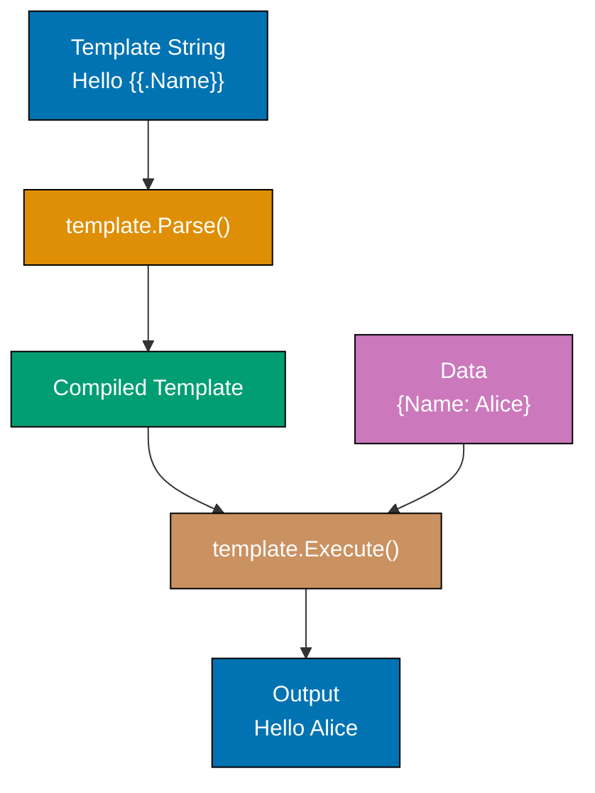
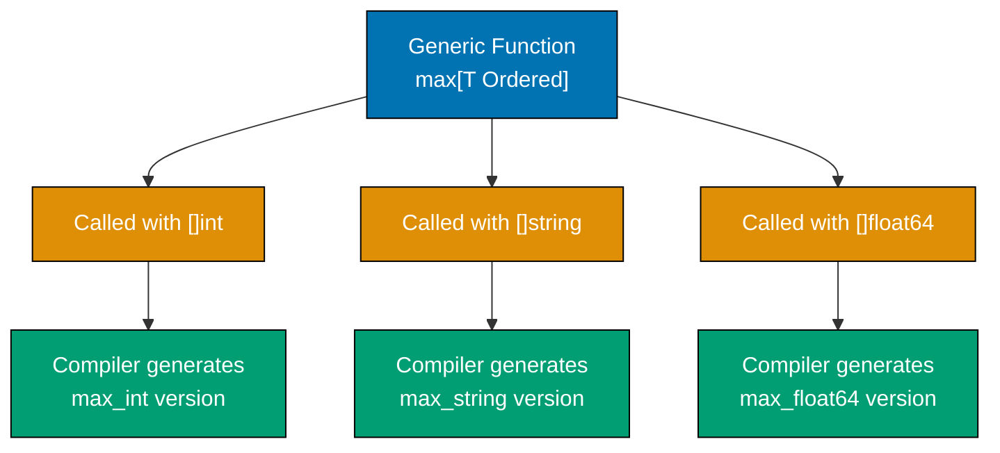
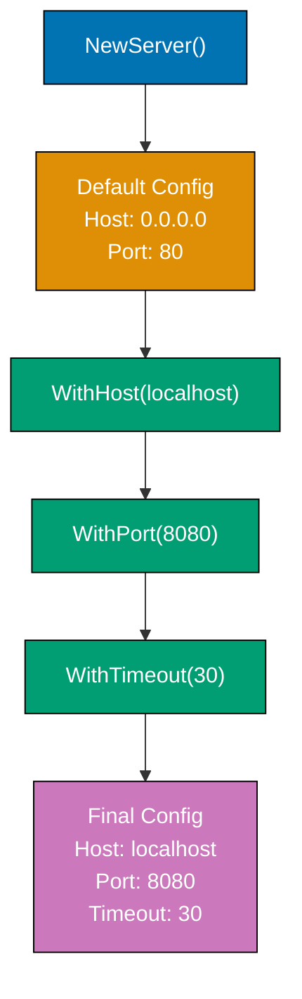
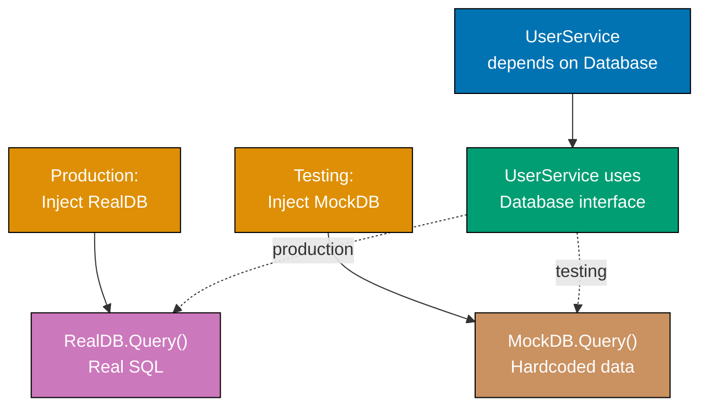
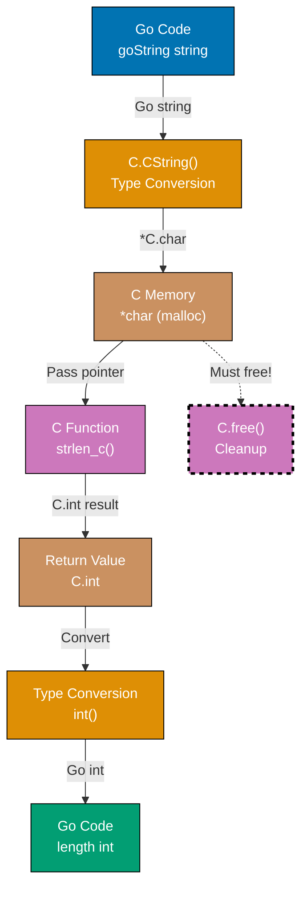

## Example 61: Pipeline Pattern

Pipelines process data through stages, each stage running concurrently. Each stage is a function that receives input from one channel and sends output to another. This composition enables elegant data processing.



**Code**:

```go
package main

import "fmt"

func main() {
    // Create pipeline: generate -> multiply by 2 -> print
    nums := generate(1, 5)         // => Stage 1: generate 1-5
                                    // => nums is <-chan int (receive-only channel)
                                    // => Goroutine starts running in background

    doubled := multiply(nums, 2)   // => Stage 2: multiply by 2
                                    // => doubled is <-chan int (new channel)
                                    // => Second goroutine starts processing nums

    square := multiply(doubled, 2) // => Stage 3: multiply by 2 again (square effect)
                                    // => square is <-chan int (final channel)
                                    // => Third goroutine processes doubled
                                    // => Pipeline: generate(1-5) -> *2 -> *2 = values*4

    // Consume results
    for result := range square {   // => Stage 4: consume results
                                    // => Blocks until value available from square
                                    // => result is 4, then 8, then 12, then 16, then 20
        fmt.Println(result)         // => Output: 4 (first iteration)
                                    // => Output: 8 (second iteration)
                                    // => Output: 12 (third iteration)
                                    // => Output: 16 (fourth iteration)
                                    // => Output: 20 (fifth iteration)
    }
    // => Loop exits when square channel closes
    // => All goroutines complete gracefully
}

// Generator stage - creates values
func generate(start, end int) <-chan int { // => Returns receive-only channel
                                            // => Caller can only receive, not send
    out := make(chan int)                   // => out is bidirectional chan int
                                            // => Unbuffered channel (blocks on send until receive)
    go func() {                             // => Spawn goroutine to generate values
                                            // => Goroutine continues after generate() returns
        for i := start; i <= end; i++ {     // => i is 1, then 2, then 3, then 4, then 5
            out <- i                        // => Send value to channel (blocks until multiply receives)
                                            // => Sends: 1, then 2, then 3, then 4, then 5
        }
        close(out)                          // => Signal completion, no more values
                                            // => Range loops will exit when channel closed
    }()
    return out                              // => Return channel immediately (goroutine runs async)
                                            // => Type converted from chan int to <-chan int
}

// Transform stage - multiplies values
func multiply(in <-chan int, factor int) <-chan int { // => in is receive-only (ensures we don't send)
                                                       // => factor is 2 in all calls
                                                       // => Returns receive-only channel
    out := make(chan int)                              // => Create new output channel
                                                        // => Unbuffered (synchronizes with consumer)
    go func() {                                         // => Spawn goroutine to transform values
                                                        // => Goroutine continues after multiply() returns
        for value := range in {                         // => Range until channel closes
                                                        // => Blocks waiting for input values
                                                        // => value is each input (1,2,3,4,5 or 2,4,6,8,10)
            out <- value * factor                       // => Send transformed value
                                                        // => First multiply: sends 2,4,6,8,10
                                                        // => Second multiply: sends 4,8,12,16,20
        }
        close(out)                                      // => Close output when input exhausted
                                                        // => Signals downstream consumers
    }()
    return out                                          // => Return channel immediately
                                                        // => Type converted from chan int to <-chan int
}
```

**Key Takeaway**: Pipelines compose concurrent stages. Each stage receives from one channel, processes, sends to next. Use channels with directional types (`<-chan` receive, `chan<-` send) to clarify data flow.

**Why It Matters**: Pipelines power production stream processing in services like Kubernetes event processing, where data flows through validation → transformation → persistence stages with automatic backpressure handling through unbuffered channels. This pattern enables building scalable ETL systems that process millions of records while maintaining bounded memory usage, unlike batch processing that requires loading entire datasets into RAM.

## Example 62: Context-Aware Pipelines

Pipeline stages should respect cancellation. When context is cancelled, all stages should exit gracefully. This enables cancelling long-running pipelines without leaking goroutines.



**Code**:

```go
package main

import (
    "context"
    "fmt"
    "time"
)

func main() {
    // Create cancellable context
    ctx, cancel := context.WithTimeout(context.Background(), 100*time.Millisecond)
                                                        // => ctx will cancel after 100ms
                                                        // => cancel is function to cancel early
                                                        // => Background() returns empty root context
    defer cancel()                                      // => Ensure cancel called (releases resources)
                                                        // => Even if context times out, call cancel()

    // Pipeline with context awareness
    nums := generateWithContext(ctx, 1, 100)            // => Generate 1-100 with cancellation
                                                        // => nums is <-chan int
                                                        // => Goroutine respects ctx.Done()

    squared := squareWithContext(ctx, nums)             // => Square each value from nums
                                                        // => squared is <-chan int
                                                        // => Goroutine respects ctx.Done()

    // Consume until context cancelled
    for result := range squared {                       // => Blocks waiting for squared values
                                                        // => result is 1, then 4, then 9, then 16...
        fmt.Println(result)                             // => Output: 1 (first value)
                                                        // => Output: 4 (second value)
                                                        // => Output: 9 (third value)
                                                        // => Outputs continue until context timeout
    }
                                                        // => Loop exits when squared channel closes
                                                        // => Context timeout (100ms) cancels pipeline
    fmt.Println("Pipeline cancelled")                   // => Output: Pipeline cancelled
                                                        // => Printed after all goroutines exit
}

func generateWithContext(ctx context.Context, start, end int) <-chan int {
                                                        // => ctx enables cancellation signal
                                                        // => start=1, end=100
                                                        // => Returns receive-only channel
    out := make(chan int)                               // => Create unbuffered channel
                                                        // => Blocks on send until receiver ready
    go func() {                                         // => Spawn goroutine for generation
                                                        // => Runs concurrently with caller
        defer close(out)                                // => Always close channel when done
                                                        // => Deferred: runs even if return early
        for i := start; i <= end; i++ {                 // => i is 1, then 2, then 3...
                                                        // => Loop continues until i > end or cancelled
            select {                                    // => Multiplexing: send or cancel
            case out <- i:                              // => Send value (blocks until receiver ready)
                                                        // => Sends: 1, 2, 3, 4... until timeout
            case <-ctx.Done():                          // => Context cancelled (timeout or manual)
                                                        // => Receives signal from closed Done() channel
                fmt.Println("Generate cancelled")       // => Output: Generate cancelled
                                                        // => Indicates graceful shutdown
                return                                  // => Exit goroutine early
                                                        // => Deferred close(out) runs
            }
            time.Sleep(10 * time.Millisecond)           // => Simulate work (10ms per value)
                                                        // => 100ms timeout = ~10 values generated
        }
                                                        // => If loop completes naturally, close(out) runs
    }()
    return out                                          // => Return channel immediately
                                                        // => Goroutine continues in background
}

func squareWithContext(ctx context.Context, in <-chan int) <-chan int {
                                                        // => ctx enables cancellation signal
                                                        // => in is input channel from generateWithContext
                                                        // => Returns receive-only channel
    out := make(chan int)                               // => Create unbuffered output channel
                                                        // => Synchronizes with consumer
    go func() {                                         // => Spawn goroutine for transformation
                                                        // => Runs concurrently with generator
        defer close(out)                                // => Always close when done
                                                        // => Signals consumer no more values
        for value := range in {                         // => Range over input channel
                                                        // => Blocks waiting for values from in
                                                        // => value is 1, then 2, then 3...
                                                        // => Exits when in closes
            select {                                    // => Multiplexing: send or cancel
            case out <- value * value:                  // => Send squared value
                                                        // => Sends: 1, 4, 9, 16, 25...
                                                        // => Blocks until consumer receives
            case <-ctx.Done():                          // => Context cancelled
                                                        // => Receives signal from closed Done() channel
                fmt.Println("Square cancelled")         // => Output: Square cancelled
                                                        // => Indicates graceful shutdown
                return                                  // => Exit goroutine early
                                                        // => Deferred close(out) runs
            }
        }
                                                        // => If input exhausted naturally, close(out) runs
    }()
    return out                                          // => Return channel immediately
                                                        // => Goroutine continues in background
}
```

**Key Takeaway**: Use `select` with `ctx.Done()` in every stage to enable graceful cancellation. When context is cancelled, all stages exit promptly without leaving goroutines running.

**Why It Matters**: Context-aware cancellation prevents goroutine leaks that plague long-running services, where a cancelled HTTP request must terminate all downstream processing to avoid wasting CPU and memory on orphaned work. Production systems like Prometheus use this pattern to abort expensive metric aggregation queries when clients disconnect, maintaining system stability under load spikes by immediately freeing resources.

## Example 63: Rate Limiting

Rate limiting restricts how fast operations occur. Token bucket pattern uses a channel - tokens arrive at a rate, operations consume tokens. When no tokens available, operations wait.

**Code**:

```go
package main

import (
    "fmt"
    "time"
)

func main() {
    // Create rate limiter - 2 operations per second
    limiter := make(chan struct{}, 2)               // => Channel with capacity 2 (tokens)
                                                    // => Buffered channel holds max 2 empty structs
                                                    // => struct{} uses zero bytes (efficient token)

    // Replenish tokens
    go func() {                                     // => Spawn goroutine to add tokens
                                                    // => Runs concurrently with main
        ticker := time.NewTicker(500 * time.Millisecond)
                                                    // => Add token every 500ms
                                                    // => ticker.C is <-chan time.Time
                                                    // => Sends current time every 500ms
        for range ticker.C {                        // => Receive from ticker every 500ms
                                                    // => Ignores time value (we just need timing)
            select {                                // => Non-blocking send attempt
            case limiter <- struct{}{}:             // => Add token if space available
                                                    // => Sends empty struct to channel
                                                    // => Succeeds if len(limiter) < 2
            default:                                // => Token buffer full, skip
                                                    // => Prevents blocking ticker goroutine
                                                    // => No action needed (already at capacity)
            }
        }
    }()

    // Use limited operations
    for i := 0; i < 5; i++ {                        // => i is 0, then 1, then 2, then 3, then 4
        <-limiter                                   // => Consume token (wait if none available)
                                                    // => Blocks until token available
                                                    // => First 2 operations immediate (initial capacity)
                                                    // => Remaining wait for token replenishment
        fmt.Printf("Operation %d at %v\n", i, time.Now().Unix())
                                                    // => Output: Operation 0 at 1234567890 (immediate)
                                                    // => Output: Operation 1 at 1234567890 (immediate)
                                                    // => Output: Operation 2 at 1234567890 (wait 500ms)
                                                    // => Output: Operation 3 at 1234567891 (wait 500ms)
                                                    // => Output: Operation 4 at 1234567891 (wait 500ms)
    }
}

// Alternative: time.Limit from golang.org/x/time/rate
import "golang.org/x/time/rate"

func limitedOperations() {
    limiter := rate.NewLimiter(rate.Every(time.Second), 5)
                                                    // => 1 op/sec sustained rate
                                                    // => burst capacity of 5 (initial tokens)
                                                    // => rate.Every(time.Second) = 1 operation per second
                                                    // => Allows bursts up to 5 operations

    for i := 0; i < 10; i++ {                       // => i is 0,1,2...9 (10 operations total)
        if !limiter.Allow() {                       // => Check if operation allowed (non-blocking)
                                                    // => Returns true if token available
                                                    // => Consumes token if available
                                                    // => First 5 return true (burst capacity)
                                                    // => Remaining 5 fail (no tokens yet)
            fmt.Println("Rate limit exceeded")      // => Output: Rate limit exceeded (for ops 5-9)
                                                    // => Indicates rejection, not wait
            continue                                // => Skip this operation
        }
        fmt.Printf("Operation %d\n", i)             // => Output: Operation 0 (first 5 operations)
                                                    // => Output: Operation 1
                                                    // => Output: Operation 2
                                                    // => Output: Operation 3
                                                    // => Output: Operation 4
                                                    // => Remaining operations rejected
    }
}
```

**Key Takeaway**: Token bucket pattern: channel of limited capacity represents tokens, operations consume tokens. Replenish tokens at fixed rate. This throttles operations smoothly.

**Why It Matters**: Rate limiting protects production APIs from overload, preventing cascading failures where unlimited client requests exhaust database connections or downstream API quotas. The token bucket pattern enables graceful degradation by allowing controlled bursts (handling traffic spikes) while enforcing sustained rate limits, the approach used by GitHub API (5,000 requests/hour) and Twitter API (15 requests/15-minute window) to maintain service quality for all users.

## Example 64: Semaphore Pattern

Semaphores limit concurrent access to resources. While `sync.Mutex` allows one goroutine at a time, semaphores allow N. Implement with buffered channel of capacity N.

**Code**:

```go
package main

import (
    "fmt"
    "sync"
)

func main() {
    // Semaphore - allow 3 concurrent operations
    sem := make(chan struct{}, 3)               // => Capacity 3 = 3 concurrent slots
                                                // => Buffered channel acts as counting semaphore
                                                // => struct{} uses zero memory per token
    var wg sync.WaitGroup                       // => WaitGroup to wait for all goroutines
                                                // => Counter starts at 0

    for i := 1; i <= 10; i++ {                  // => Launch 10 goroutines total
                                                // => i is 1,2,3...10
        wg.Add(1)                               // => Increment counter before goroutine starts
                                                // => Counter is now 1,2,3...10
        go func(id int) {                       // => Spawn goroutine with operation id
                                                // => id captured from i (avoids closure issue)
            defer wg.Done()                     // => Decrement counter when goroutine completes
                                                // => Always executes even if panic

            sem <- struct{}{}                   // => Acquire slot (blocks if all 3 slots full)
                                                // => Blocks if len(sem) == 3
                                                // => Only 3 goroutines can acquire simultaneously
            defer func() { <-sem }()            // => Release slot when done
                                                // => Deferred: runs after operation completes
                                                // => Allows waiting goroutines to proceed

            fmt.Printf("Operation %d running\n", id)
                                                // => Output: Operation 1 running (one of first 3)
                                                // => Output: Operation 2 running (one of first 3)
                                                // => Output: Operation 3 running (one of first 3)
                                                // => Remaining wait for slot release
            // Simulate work
        }(i)                                    // => Pass i as argument (prevents closure capture)
    }

    wg.Wait()                                   // => Block until counter reaches 0
                                                // => Waits for all 10 goroutines to complete
    fmt.Println("All operations complete")      // => Output: All operations complete
                                                // => Printed after all goroutines exit
}

// Weighted semaphore - operations require different numbers of slots
func weighSemaphore() {
    sem := make(chan int, 10)                   // => Capacity 10 "units"
                                                // => Can hold up to 10 int values
                                                // => Not a counting semaphore (simplified example)

    // Operation requiring 3 units
    go func() {                                 // => Spawn goroutine for operation
        n := 3                                  // => n is 3 (units required)
        sem <- n                                // => Acquire 3 units (conceptual)
                                                // => Actually sends int 3 to channel
                                                // => Blocks if channel full (len(sem) == 10)
        defer func() { <-sem }()                // => Release slot (receive from channel)
                                                // => Deferred: runs when function exits

        fmt.Println("Acquired 3 units")         // => Output: Acquired 3 units
                                                // => Printed after successfully acquiring
    }()

    // Operation requiring 7 units
    go func() {                                 // => Spawn goroutine for operation
        n := 7                                  // => n is 7 (units required)
        sem <- n                                // => Acquire 7 units (conceptual)
                                                // => Sends int 7 to channel
                                                // => Blocks if channel full
        defer func() { <-sem }()                // => Release slot when done
                                                // => Deferred execution

        fmt.Println("Acquired 7 units")         // => Output: Acquired 7 units
                                                // => Printed after successfully acquiring
    }()

    // Total capacity: 10 units, both operations can run concurrently
                                                // => Note: This is simplified example
                                                // => True weighted semaphore needs golang.org/x/sync/semaphore
                                                // => Real implementation tracks actual weight consumption
}
```

**Key Takeaway**: Semaphore = buffered channel. Capacity = maximum concurrent operations. Send before work, receive after. Useful for limiting concurrent database connections, API calls, or other bounded resources.

**Why It Matters**: Semaphores limit concurrent access to bounded resources like database connection pools (100 max connections) or external APIs with rate limits, preventing resource exhaustion that causes production outages. Unlike mutexes (N=1), semaphores enable controlled parallelism (N>1), allowing 10 concurrent S3 uploads while blocking the 11th until a slot frees, maximizing throughput without overwhelming external services.

## Example 65: Atomic Operations

Atomic operations ensure thread-safe modifications without mutexes. The `sync/atomic` package provides compare-and-swap (CAS) and atomic increments. Use when contention is low and operations are simple.



**Code**:

```go
package main

import (
    "fmt"
    "sync"
    "sync/atomic"
)

func main() {
    // Atomic counter - multiple goroutines increment safely
    var counter int64                               // => Must be int64 or int32 for atomic
                                                    // => Initialized to 0
                                                    // => Must be accessed via atomic package only
    var wg sync.WaitGroup                           // => WaitGroup to synchronize goroutines
                                                    // => Counter starts at 0

    for i := 0; i < 10; i++ {                       // => Launch 10 goroutines
                                                    // => i is 0,1,2...9
        wg.Add(1)                                   // => Increment WaitGroup counter
                                                    // => Counter reaches 10
        go func() {                                 // => Spawn goroutine
                                                    // => Runs concurrently with others
            defer wg.Done()                         // => Decrement WaitGroup when done
                                                    // => Always executes via defer
            for j := 0; j < 100; j++ {              // => Each goroutine increments 100 times
                                                    // => j is 0,1,2...99
                atomic.AddInt64(&counter, 1)        // => Atomic increment (thread-safe)
                                                    // => Adds 1 to counter atomically
                                                    // => No race condition (CPU-level atomic operation)
                                                    // => counter increases: 1,2,3...1000
            }
        }()
    }

    wg.Wait()                                       // => Block until all goroutines complete
                                                    // => Waits for counter to reach 0
    fmt.Println("Counter:", counter)                // => Output: Counter: 1000
                                                    // => Always 1000 (safe from race conditions)
                                                    // => Without atomic: unpredictable (race condition)

    // Atomic swap
    var value int64 = 10                            // => value is 10 (type: int64)
    old := atomic.SwapInt64(&value, 20)             // => Set value to 20, return old (10)
                                                    // => Atomic operation (swap happens atomically)
                                                    // => old is 10, value is now 20
    fmt.Println("Old:", old, "New:", value)         // => Output: Old: 10 New: 20
                                                    // => Demonstrates swap semantics

    // Compare-and-swap (CAS)
    var cas int64 = 5                               // => cas is 5 (type: int64)
    swapped := atomic.CompareAndSwapInt64(&cas, 5, 10)
                                                    // => If cas==5, set to 10 and return true
                                                    // => If cas!=5, no change and return false
                                                    // => cas is 5, so swap succeeds
                                                    // => swapped is true, cas is now 10
    fmt.Println("Swapped:", swapped, "Value:", cas) // => Output: Swapped: true Value: 10
                                                    // => CAS useful for lock-free algorithms

    // Failed CAS example
    swapped2 := atomic.CompareAndSwapInt64(&cas, 5, 15)
                                                    // => cas is 10 (not 5), so swap fails
                                                    // => swapped2 is false, cas unchanged (10)
                                                    // => Demonstrates conditional update

    // Load and store for safe reads
    var flag int32 = 0                              // => flag is 0 (type: int32)
                                                    // => Must use int32 for atomic operations
    atomic.StoreInt32(&flag, 1)                     // => Atomic write (sets flag to 1)
                                                    // => Ensures visibility across goroutines
                                                    // => Memory barrier guarantees ordering
    value32 := atomic.LoadInt32(&flag)              // => Atomic read (reads flag value)
                                                    // => value32 is 1
                                                    // => Ensures we see latest value
    fmt.Println("Flag:", value32)                   // => Output: Flag: 1
                                                    // => Load/Store prevent compiler reordering
}
```

**Key Takeaway**: Atomic operations are lock-free. Use `atomic.AddInt64()` for counters, `atomic.SwapInt64()` for updates, `atomic.CompareAndSwapInt64()` for conditional updates. Lower overhead than mutexes but limited to simple operations.

**Why It Matters**: Atomic operations eliminate mutex overhead for simple counters and flags in high-throughput services, where atomic.AddInt64() provides 10-100x better performance than mutex-protected increments for metrics collection that happens millions of times per second. Compare-and-swap (CAS) enables building lock-free data structures like concurrent queues used in Prometheus for metric ingestion, achieving microsecond latencies that mutexes cannot provide.

## Example 66: Reflection

Reflection inspects types and values at runtime. The `reflect` package enables dynamic code - examine struct fields, call methods, or build values whose type isn't known until runtime. Use sparingly - reflection is powerful but slow and hard to understand.



**Code**:

```go
package main

import (
    "fmt"
    "reflect"
)

func main() {
    // Inspect struct type
    type Person struct {                        // => Define struct type
        Name string                             // => First field: Name (type: string)
        Age  int                                // => Second field: Age (type: int)
    }

    p := Person{"Alice", 30}                    // => p is Person{Name:"Alice", Age:30}
                                                // => Struct literal initialization
    v := reflect.ValueOf(p)                     // => Get reflected value wrapping p
                                                // => v is reflect.Value of Person
                                                // => Enables runtime type inspection
    t := v.Type()                               // => Get type information from value
                                                // => t is reflect.Type for main.Person
                                                // => Contains metadata about struct

    fmt.Println("Type:", t)                     // => Output: Type: main.Person
                                                // => Shows package and type name
    fmt.Println("Fields:")                      // => Header for field iteration

    // Iterate struct fields
    for i := 0; i < v.NumField(); i++ {         // => NumField() returns 2 (Name, Age)
                                                // => i is 0, then 1
        field := v.Field(i)                     // => Get field value by index
                                                // => field is reflect.Value for field
                                                // => i=0: field wraps "Alice", i=1: field wraps 30
        fieldType := t.Field(i)                 // => Get field type metadata
                                                // => fieldType is reflect.StructField
                                                // => Contains Name, Type, Tag, Offset
        fmt.Printf("  %s: %v (type: %s)\n", fieldType.Name, field.Interface(), field.Type())
                                                // => fieldType.Name is "Name" or "Age"
                                                // => field.Interface() converts back to interface{}
                                                // => field.Type() is "string" or "int"
    }
    // => Output:
    // =>   Name: Alice (type: string)          // => First field
    // =>   Age: 30 (type: int)                 // => Second field

    // Get value using field name
    nameField := v.FieldByName("Name")          // => Lookup field by string name
                                                // => nameField is reflect.Value wrapping "Alice"
                                                // => Returns zero Value if field not found
    fmt.Println("Name field:", nameField.String())
                                                // => Output: Name field: Alice
                                                // => .String() converts Value to string

    // Check kind
    if t.Kind() == reflect.Struct {             // => Kind() returns underlying type category
                                                // => reflect.Struct is one of 26 kinds
                                                // => Other kinds: Int, String, Slice, etc.
        fmt.Println("Type is a struct")         // => Output: Type is a struct
                                                // => Confirms t represents struct type
    }

    // Type assertion vs reflection
    // Reflection approach (dynamic):
    val := reflect.ValueOf(p)                   // => Create new reflect.Value for p
                                                // => val wraps Person struct
    if val.Kind() == reflect.Struct {           // => Runtime check using reflection
                                                // => Slower than static type check
        fmt.Println("It's a struct (reflection)")
                                                // => Output: It's a struct (reflection)
                                                // => Dynamic approach for unknown types
    }

    // Direct approach (static, faster):
    switch p := p.(type) {                      // => Type switch (compile-time)
                                                // => p shadows outer p variable
    case Person:                                // => Match Person type
                                                // => Compiler knows type at compile-time
        fmt.Println("It's a Person (direct)")   // => Output: It's a Person (direct)
                                                // => Faster than reflection (no runtime overhead)
                                                // => Preferred when types known at compile-time
    }
}
```

**Key Takeaway**: Use reflection sparingly - it's slow and reduces code clarity. Prefer direct type assertions when possible. Reflection is useful for libraries, JSON unmarshaling, or dynamic test fixtures. `reflect.ValueOf()` gets reflected value, `.Type()` gets type, `.NumField()` iterates struct fields.

**Why It Matters**: Reflection powers critical infrastructure like JSON marshaling (encoding/json), database ORMs (GORM, sqlx), and dependency injection frameworks that need to work with types unknown at compile-time. While slow (10-100x overhead) and fragile (bypasses compile-time type safety), reflection is essential for building generic libraries that inspect struct tags for validation rules or automatically map database columns to struct fields, reducing boilerplate in application code.

## Example 67: Binary Encoding

Binary protocols and data formats require reading/writing binary data. The `encoding/binary` package handles byte order (endianness) and converts between binary and Go types.

**Code**:

```go
package main

import (
    "bytes"
    "encoding/binary"
    "fmt"
    "io"
)

func main() {
    // Write binary data
    buf := new(bytes.Buffer)                        // => buf is *bytes.Buffer (in-memory buffer)
                                                    // => Implements io.Writer and io.Reader
                                                    // => Starts empty (len=0)

    // Write integer in big-endian format
    binary.Write(buf, binary.BigEndian, int32(42))  // => 42 as 4 bytes, big-endian
                                                    // => Writes [0x00 0x00 0x00 0x2A]
                                                    // => Big-endian: most significant byte first
                                                    // => buf now has 4 bytes
    binary.Write(buf, binary.BigEndian, float32(3.14))
                                                    // => Float as 4 bytes (IEEE 754 format)
                                                    // => Writes [0x40 0x48 0xF5 0xC3] (approx)
                                                    // => buf now has 8 bytes
    binary.Write(buf, binary.BigEndian, true)       // => Bool as 1 byte
                                                    // => true writes 0x01, false writes 0x00
                                                    // => buf now has 9 bytes total

    // Read back
    reader := bytes.NewReader(buf.Bytes())          // => Create reader from buffer bytes
                                                    // => reader is *bytes.Reader at position 0
                                                    // => buf.Bytes() returns []byte slice
    var num int32                                   // => num is 0 (zero value for int32)
    var f float32                                   // => f is 0.0 (zero value for float32)
    var b bool                                      // => b is false (zero value for bool)

    binary.Read(reader, binary.BigEndian, &num)     // => Read int32 from reader
                                                    // => Reads 4 bytes, converts to int32
                                                    // => num is now 42
                                                    // => reader position advances to byte 4
    binary.Read(reader, binary.BigEndian, &f)       // => Read float32 from reader
                                                    // => Reads 4 bytes, converts to float32
                                                    // => f is now 3.14 (approximately)
                                                    // => reader position advances to byte 8
    binary.Read(reader, binary.BigEndian, &b)       // => Read bool from reader
                                                    // => Reads 1 byte, converts to bool
                                                    // => b is now true
                                                    // => reader position advances to byte 9 (EOF)

    fmt.Printf("Num: %d, Float: %f, Bool: %v\n", num, f, b)
                                                    // => Output: Num: 42, Float: 3.140000, Bool: true
                                                    // => Demonstrates round-trip encoding/decoding

    // Endianness matters
    smallBuf := new(bytes.Buffer)                   // => New empty buffer
    binary.Write(smallBuf, binary.LittleEndian, int16(256))
                                                    // => 256 in decimal = 0x0100 in hex
                                                    // => Little-endian: least significant byte first
                                                    // => Writes [0x00 0x01] (low byte, high byte)
    fmt.Printf("Little-endian bytes: %v\n", smallBuf.Bytes())
                                                    // => Output: Little-endian bytes: [0 1]
                                                    // => [0x00 0x01] as decimal

    bigBuf := new(bytes.Buffer)                     // => New empty buffer
    binary.Write(bigBuf, binary.BigEndian, int16(256))
                                                    // => 256 in decimal = 0x0100 in hex
                                                    // => Big-endian: most significant byte first
                                                    // => Writes [0x01 0x00] (high byte, low byte)
    fmt.Printf("Big-endian bytes: %v\n", bigBuf.Bytes())
                                                    // => Output: Big-endian bytes: [1 0]
                                                    // => [0x01 0x00] as decimal
                                                    // => Demonstrates endianness difference
}
```

**Key Takeaway**: `binary.Write()` serializes values to binary format. `binary.Read()` deserializes from binary. Specify endianness (`BigEndian` or `LittleEndian`). Endianness is crucial for network protocols and file formats.

**Why It Matters**: Binary encoding enables interoperability with network protocols (TCP packet headers, DNS messages) and file formats (PNG, MP4) that require precise byte-level control and endianness awareness. Big-endian (network byte order) dominates internet protocols for historical compatibility, while little-endian matches modern CPU architectures (x86, ARM), making encoding/binary essential for implementing custom protocols or parsing binary file formats in production systems.

## Example 68: Cryptography Basics

Cryptography is essential for security. Go provides standard cryptographic functions in `crypto/*` packages. Hash for integrity, random for security, HMAC for authentication, encryption for confidentiality.

**Code**:

```go
package main

import (
    "crypto/hmac"
    "crypto/rand"
    "crypto/sha256"
    "encoding/hex"
    "fmt"
)

func main() {
    // SHA256 hash - integrity check
    data := "Important message"                 // => data is string to hash
                                                // => Fixed input produces fixed hash
    hash := sha256.Sum256([]byte(data))         // => Compute SHA-256 hash
                                                // => []byte(data) converts string to bytes
                                                // => hash is [32]byte array (256 bits)
                                                // => Deterministic: same input = same hash
    fmt.Printf("SHA256: %s\n", hex.EncodeToString(hash[:]))
                                                // => hash[:] converts array to slice
                                                // => hex.EncodeToString converts bytes to hex string
                                                // => Output: SHA256: a665a45920422f9d417e4867efdc4fb8a04a1f3fff1fa07e998e86f7f7a27ae3
                                                // => 64 hex characters (32 bytes * 2)

    // HMAC - authentication
    key := []byte("secret-key")                 // => key is secret shared key ([]byte)
                                                // => Same key needed for signing and verification
    h := hmac.New(sha256.New, key)              // => Create HMAC-SHA256 hasher
                                                // => sha256.New is hash function factory
                                                // => h implements hash.Hash interface
    h.Write([]byte(data))                       // => Add data to hash
                                                // => Can call Write multiple times
                                                // => []byte(data) converts string to bytes
    signature := hex.EncodeToString(h.Sum(nil)) // => Get signature as hex
                                                // => h.Sum(nil) returns []byte signature
                                                // => nil means no prefix bytes
                                                // => signature is 64-character hex string
    fmt.Println("HMAC:", signature)             // => Output: HMAC: <64 hex chars>
                                                // => Unique for this data+key combination

    // Verify HMAC
    h2 := hmac.New(sha256.New, key)             // => Create new HMAC hasher
                                                // => Same key and hash function
    h2.Write([]byte(data))                      // => Hash same data
                                                // => Should produce identical signature
    if hmac.Equal(h.Sum(nil), h2.Sum(nil)) {    // => Compare HMAC values
                                                // => hmac.Equal prevents timing attacks
                                                // => Constant-time comparison
                                                // => Returns true if signatures match
        fmt.Println("HMAC valid")               // => Output: HMAC valid
                                                // => Confirms data not tampered
    }

    // Random bytes - for tokens, nonces
    token := make([]byte, 16)                   // => token is 16-byte slice (128 bits)
                                                // => Initialized to zeros
    _, err := rand.Read(token)                  // => Read 16 random bytes from crypto/rand
                                                // => Cryptographically secure randomness
                                                // => Fills token slice with random data
                                                // => Returns (n int, err error)
    if err != nil {                             // => Check for error (rare)
        fmt.Println("Error generating random:", err)
                                                // => Output error if random generation fails
        return                                  // => Exit function early
    }
    fmt.Printf("Random token: %s\n", hex.EncodeToString(token))
                                                // => Convert random bytes to hex string
                                                // => Output: Random token: a1b2c3d4e5f6g7h8i9j0k1l2m3n4o5p6 (example)
                                                // => 32 hex characters (16 bytes * 2)
                                                // => Different every time (unpredictable)
}
```

**Key Takeaway**: Use `crypto/sha256.Sum256()` for hashing. Use `crypto/hmac` with hash function for authentication. Use `crypto/rand.Read()` for cryptographically secure random bytes. Never use `math/rand` for security-sensitive operations.

**Why It Matters**: Cryptographic primitives are non-negotiable for production security: SHA-256 hashes verify file integrity (git commits, Docker image layers), HMAC-SHA256 authenticates webhook payloads (GitHub webhooks, Stripe signatures) preventing tampering, and crypto/rand generates session tokens that withstand cryptanalysis unlike math/rand's predictable sequences. Using crypto/rand instead of math/rand for security tokens is the difference between safe authentication and immediate compromise.

## Example 69: Templates

Templates generate text (HTML, email, config files). The `text/template` package provides template syntax with variables, functions, and control flow. Use `html/template` for HTML to prevent injection attacks.



**Code**:

```go
package main

import (
    "fmt"
    "html/template"
    "os"
    "strings"
)

func main() {
    // Simple template with variables
    tmpl, err := template.New("test").Parse("Hello, {{.Name}}! You are {{.Age}} years old.")
                                                    // => Create new template named "test"
                                                    // => Parse template string with {{}} placeholders
                                                    // => {{.Name}} accesses Name field in data
                                                    // => {{.Age}} accesses Age field
                                                    // => Returns (*Template, error)
    if err != nil {                                 // => Check parse error
                                                    // => Syntax errors caught here
        fmt.Println("Parse error:", err)            // => Output: Parse error: <error>
        return                                      // => Exit on error
    }

    data := map[string]interface{}{                 // => Data to render template
        "Name": "Alice",                            // => Name field is "Alice"
        "Age":  30,                                 // => Age field is 30 (int)
    }
    tmpl.Execute(os.Stdout, data)                   // => Execute template with data
                                                    // => Writes to os.Stdout (stdout)
                                                    // => {{.Name}} replaced with "Alice"
                                                    // => {{.Age}} replaced with 30
    // => Output: Hello, Alice! You are 30 years old.
                                                    // => Template rendered to output

    // Conditional and loops
    tmpl2, _ := template.New("list").Parse(`
Users:
{{range .Users}}
  - {{.Name}} ({{.Age}})
{{end}}
`)                                                  // => Multiline template string
                                                    // => {{range .Users}} iterates slice
                                                    // => Inside range, . is each element
                                                    // => {{end}} closes range block
                                                    // => _ ignores error (for brevity)

    data2 := map[string]interface{}{                // => Data with Users slice
        "Users": []map[string]interface{}{          // => Slice of user maps
            {"Name": "Alice", "Age": 30},           // => First user
            {"Name": "Bob", "Age": 25},             // => Second user
        },
    }
    tmpl2.Execute(os.Stdout, data2)                 // => Execute template
                                                    // => {{range}} iterates Users slice
                                                    // => First iteration: . is {"Name": "Alice", "Age": 30}
                                                    // => Second iteration: . is {"Name": "Bob", "Age": 25}
    // => Output:
    // => Users:
    // =>   - Alice (30)                            // => First user rendered
    // =>   - Bob (25)                              // => Second user rendered

    // Custom functions
    funcMap := template.FuncMap{                    // => Map of custom template functions
                                                    // => FuncMap is map[string]interface{}
        "upper": strings.ToUpper,                   // => Add function to template
                                                    // => upper calls strings.ToUpper
        "add":   func(a, b int) int { return a + b }, // => Custom function
                                                    // => add accepts 2 ints, returns sum
    }

    tmpl3, _ := template.New("funcs").Funcs(funcMap).Parse(
        "{{upper .Name}} total is {{add .Age .Years}}",
    )                                               // => Create template with custom functions
                                                    // => Funcs() adds functions before Parse()
                                                    // => {{upper .Name}} calls upper function
                                                    // => {{add .Age .Years}} calls add function

    data3 := map[string]interface{}{                // => Data for function template
        "Name":  "alice",                           // => Name is lowercase "alice"
        "Age":   30,                                // => Age is 30
        "Years": 5,                                 // => Years is 5
    }
    tmpl3.Execute(os.Stdout, data3)                 // => Execute template
                                                    // => {{upper .Name}} becomes "ALICE"
                                                    // => {{add .Age .Years}} becomes 35 (30+5)
    // => Output: ALICE total is 35                 // => Custom functions applied
}
```

**Key Takeaway**: Use `template.Parse()` to create templates. Use `.Field` to access data. Use `{{range}}` for loops, `{{if}}` for conditions. Use `html/template` instead of `text/template` for HTML to prevent injection. Define custom functions with `FuncMap`.

**Why It Matters**: Templates generate dynamic HTML, emails, and configuration files while preventing injection attacks through automatic escaping in html/template. Production systems use templates for rendering web pages (Hugo static site generator), generating Kubernetes manifests from values, and composing email notifications with user data, where text/template's lack of escaping would allow XSS attacks if user input reaches the output.

## Example 70: Generic Functions

Generics enable functions to work with different types while maintaining type safety. Type parameters in square brackets define constraints. Go 1.18+ introduces this powerful feature.



**Code**:

```go
package main

import "fmt"

func main() {
    // Generic function works with different types
    intSlice := []int{3, 1, 4, 1, 5}            // => intSlice is []int with 5 elements
                                                // => Contains: [3, 1, 4, 1, 5]
    fmt.Println("Max int:", max(intSlice))      // => Calls max with T=int
                                                // => Output: Max int: 5
                                                // => Compiler generates max_int version

    stringSlice := []string{"apple", "zebra", "banana"}
                                                // => stringSlice is []string with 3 elements
                                                // => Contains: ["apple", "zebra", "banana"]
    fmt.Println("Max string:", max(stringSlice))// => Calls max with T=string
                                                // => Output: Max string: zebra
                                                // => Compiler generates max_string version
}

// Generic function - [T any] is type parameter
// T is constrained to "any" type
func max[T any](slice []T) T {                  // => Type parameter T can be any type
                                                // => any is alias for interface{}
                                                // => slice is []T (slice of type T)
    // Compiler error: can't compare T values (no constraint)
    // This won't work because we need to define T must be comparable
    return slice[0]                             // => Returns first element (placeholder)
                                                // => Real implementation needs constraints
}

// Better: constrain T to be comparable
import "fmt"

// Comparable constraint - enables comparison operators
func betterMax[T interface{ int | float64 | string }](slice []T) T {
                                                // => T constrained to int OR float64 OR string
                                                // => Union type constraint
                                                // => Enables > operator for these types
    if len(slice) == 0 {                        // => Check for empty slice
                                                // => len(slice) returns 0 for empty
        var zero T                              // => zero is zero value for type T
                                                // => T=int: zero=0, T=string: zero=""
        return zero                             // => Return zero value
    }

    max := slice[0]                             // => max starts with first element
                                                // => max is type T
    for _, val := range slice[1:] {             // => Iterate from index 1 onwards
                                                // => slice[1:] creates subslice
                                                // => val is each element (type T)
        if val > max {                          // => Compare values (works with constraint)
                                                // => > operator enabled by union constraint
            max = val                           // => Update max if val is greater
        }
    }
    return max                                  // => Return maximum value (type T)
}

// Even better: use Ordered constraint (Go 1.21+)
import "golang.org/x/exp/constraints"

func bestMax[T constraints.Ordered](slice []T) T {
                                                // => T constrained to Ordered types
                                                // => Ordered includes: integers, floats, strings
                                                // => Standard constraint from constraints package
    if len(slice) == 0 {                        // => Handle empty slice
        var zero T                              // => zero value for type T
        return zero                             // => Return zero value
    }

    max := slice[0]                             // => Initialize max with first element
                                                // => max is type T
    for _, val := range slice[1:] {             // => Iterate remaining elements
                                                // => val is each element after first
        if val > max {                          // => Compare using > operator
                                                // => Ordered constraint enables comparisons
            max = val                           // => Update max if needed
        }
    }
    return max                                  // => Return maximum value found
                                                // => Type is T (preserves input type)
}
```

**Key Takeaway**: Generic functions use `[T TypeConstraint]` syntax. Type parameter T is replaced with actual type at compile-time. Constraints limit what operations T supports. `any` means no constraints (but limited what you can do).

**Why It Matters**: Generics (Go 1.18+) eliminate code duplication for data structures and algorithms, replacing brittle interface{}+reflection patterns with compile-time type safety. Generic max() functions work across int/float/string without type assertions, generic min-heaps work with any comparable type, and generic Result<T,E> types enable Rust-style error handling, all providing zero runtime overhead through monomorphization (compiler generates specialized versions per type).

## Example 71: Generic Types

Generic struct types work similarly to generic functions. Define type parameters, and the compiler instantiates them for each type used. Useful for containers, queues, trees, and data structures.

```mermaid
%% Color Palette: Blue #0173B2, Orange #DE8F05, Teal #029E73, Purple #CC78BC, Brown #CA9161
graph TD
    A["Generic Type<br/>Stack[T any]"]
    B["Stack[int]<br/>items []int"]
    C["Stack[string]<br/>items []string"]
    D["Stack[Person]<br/>items []Person"]

    A -->|instantiate| B
    A -->|instantiate| C
    A -->|instantiate| D

    B --> E["Push(10)<br/>Pop() int"]
    C --> F["Push(\"hi\")<br/>Pop() string"]
    D --> G["Push(person)<br/>Pop() Person"]

    style A fill:#0173B2,stroke:#000,color:#fff
    style B fill:#DE8F05,stroke:#000,color:#fff
    style C fill:#DE8F05,stroke:#000,color:#fff
    style D fill:#DE8F05,stroke:#000,color:#fff
    style E fill:#029E73,stroke:#000,color:#fff
    style F fill:#029E73,stroke:#000,color:#fff
    style G fill:#029E73,stroke:#000,color:#fff
```

**Code**:

```go
package main

import "fmt"

func main() {
    // Generic stack of integers
    intStack := NewStack[int]()                     // => Create Stack[int] instance
                                                    // => T=int, instantiates Stack with int
                                                    // => intStack is *Stack[int]
    intStack.Push(10)                               // => Push 10 (type: int)
                                                    // => items is now []int{10}
    intStack.Push(20)                               // => Push 20 (type: int)
                                                    // => items is now []int{10, 20}
    fmt.Println("Pop:", intStack.Pop())             // => Pop returns 20 (last item)
                                                    // => Output: Pop: 20
                                                    // => items is now []int{10}

    // Generic stack of strings
    stringStack := NewStack[string]()               // => Create Stack[string] instance
                                                    // => T=string, instantiates Stack with string
                                                    // => stringStack is *Stack[string]
    stringStack.Push("hello")                       // => Push "hello" (type: string)
                                                    // => items is now []string{"hello"}
    stringStack.Push("world")                       // => Push "world" (type: string)
                                                    // => items is now []string{"hello", "world"}
    fmt.Println("Pop:", stringStack.Pop())          // => Pop returns "world" (last item)
                                                    // => Output: Pop: world
                                                    // => items is now []string{"hello"}
}

// Generic stack type
type Stack[T any] struct {                          // => Type parameter T (can be any type)
                                                    // => Stack is generic over T
                                                    // => Compiler generates type-specific versions
    items []T                                       // => Slice of type T (not interface{})
                                                    // => T=int: items is []int
                                                    // => T=string: items is []string
}

// Generic methods
func (s *Stack[T]) Push(item T) {                   // => Method on Stack[T]
                                                    // => item must be type T
                                                    // => Receiver is *Stack[T] (pointer)
    s.items = append(s.items, item)                 // => Append item to slice
                                                    // => Type-safe: item is T, items is []T
                                                    // => Grows slice if needed
}

func (s *Stack[T]) Pop() T {                        // => Method returns type T
                                                    // => Return type matches Stack type parameter
    if len(s.items) == 0 {                          // => Check for empty stack
                                                    // => Prevents out-of-bounds access
        var zero T                                  // => zero is zero value for type T
                                                    // => T=int: zero=0, T=string: zero=""
        return zero                                 // => Return zero value (safe default)
    }
    lastIdx := len(s.items) - 1                     // => Index of last element
                                                    // => len(s.items)-1 is last valid index
    item := s.items[lastIdx]                        // => Get last item
                                                    // => item is type T
    s.items = s.items[:lastIdx]                     // => Remove last item (slice truncation)
                                                    // => Creates new slice view
                                                    // => Original item unreachable (GC'd)
    return item                                     // => Return popped item (type T)
}

// Constructor
func NewStack[T any]() *Stack[T] {                  // => Generic constructor function
                                                    // => T is type parameter
                                                    // => Returns pointer to Stack[T]
    return &Stack[T]{                               // => Create Stack instance
                                                    // => Stack[T] instantiated with type T
        items: make([]T, 0),                        // => Initialize empty slice of type T
                                                    // => Capacity 0 (grows as needed)
    }
}

// Generic interface
type Container[T any] interface {                   // => Generic interface over type T
                                                    // => Types implementing must specify T
    Add(T)                                          // => Method accepting type T
                                                    // => T must match interface instantiation
    Remove() T                                      // => Method returning type T
                                                    // => Type-safe: always same T
}
                                                    // => Stack[T] satisfies Container[T]
                                                    // => Stack[int] implements Container[int]
                                                    // => Stack[string] implements Container[string]
```

**Key Takeaway**: Define generic types with `Type[T TypeParam]`. Methods on generic types use the type parameter. Construct with `NewGeneric[Type]()`. Generic types enable type-safe reusable containers.

**Why It Matters**: Generic containers like Stack[T], Queue[T], and Cache[K,V] provide type-safe reusable data structures without runtime type assertions or interface{} boxing overhead. Where pre-generics Go required separate IntStack/StringStack implementations or unsafe interface{} casts, generic types enable writing containers once and using everywhere with full compile-time type checking, eliminating entire classes of runtime type errors.

## Example 72: Constraints and Comparable

Go provides standard constraints in `constraints` package. The `comparable` constraint enables `==` and `!=` operators. Custom constraints combine types and interfaces.

**Code**:

```go
package main

import (
    "fmt"
    "golang.org/x/exp/constraints"
)

func main() {
    // Numbers constraint - int, float, complex types
    fmt.Println("Sum ints:", sum([]int{1, 2, 3}))         // => 6
    fmt.Println("Sum floats:", sum([]float64{1.5, 2.5})) // => 4.0

    // Comparable constraint - can use == and !=
    if contains([]string{"a", "b", "c"}, "b") {
        fmt.Println("Found")
    }

    // Custom constraint - combine types and interface
    var m map[string]int = make(map[string]int)
    m["key"] = 10
    fmt.Println("Value:", getValue(m, "key")) // => 10
}

// Ordered constraint - can use <, >, <=, >=, ==, !=
func sum[T constraints.Integer](nums []T) T { // => Integer: int types
    var total T
    for _, n := range nums {
        total += n
    }
    return total
}

// Comparable constraint - can use == and !=
func contains[T comparable](slice []T, target T) bool { // => comparable
    for _, item := range slice {
        if item == target {     // => Works with any comparable type
            return true
        }
    }
    return false
}

// Custom constraint
type MapKey interface { // => Custom constraint
    comparable          // => Must satisfy comparable (can use ==)
}

func getValue[K MapKey, V any](m map[K]V, key K) V { // => Two type parameters
    return m[key]
}
```

**Key Takeaway**: `constraints.Ordered` = types supporting comparison operators. `constraints.Integer` = integer types. `comparable` = types supporting `==` and `!=`. Custom constraints combine interfaces and types.

**Why It Matters**: Type constraints enable generic functions to use operators (comparable for ==, constraints.Ordered for <>) while maintaining type safety, solving the pre-generics problem where generic code couldn't perform comparisons without reflection. The comparable constraint powers generic contains() functions and Set[T] implementations, while constraints.Ordered enables generic min/max/sort functions, providing operator support that interface{} could never offer.

## Example 73: Options Pattern

The options pattern provides flexible configuration through functional options. Each option function modifies configuration without requiring many constructors or mutating shared state.



**Code**:

```go
package main

import "fmt"

func main() {
    // Simple config without options
    server1 := NewServer()
    fmt.Println(server1)

    // Config with options
    server2 := NewServer(
        WithHost("localhost"),    // => Functional option
        WithPort(8080),           // => Functional option
        WithTimeout(30),          // => Functional option
    )
    fmt.Println(server2)

    // Mix options
    server3 := NewServer(
        WithPort(9000),
        // WithHost uses default
        WithTimeout(60),
    )
    fmt.Println(server3)
}

type Server struct {
    Host    string
    Port    int
    Timeout int
}

// Functional option type
type Option func(*Server) // => Option is function that modifies Server

// Constructor
func NewServer(opts ...Option) *Server { // => Variadic options
    s := &Server{
        Host:    "0.0.0.0",         // => Default values
        Port:    80,
        Timeout: 10,
    }

    for _, opt := range opts {
        opt(s)                      // => Apply each option
    }

    return s
}

// Option functions
func WithHost(host string) Option { // => Returns Option function
    return func(s *Server) {
        s.Host = host              // => Modify server
    }
}

func WithPort(port int) Option {
    return func(s *Server) {
        s.Port = port
    }
}

func WithTimeout(timeout int) Option {
    return func(s *Server) {
        s.Timeout = timeout
    }
}

func (s Server) String() string {
    return fmt.Sprintf("Server{Host: %s, Port: %d, Timeout: %d}", s.Host, s.Port, s.Timeout)
}
```

**Key Takeaway**: Options pattern accepts variadic functions that modify a config struct. Each option is a function that receives and modifies the struct. Enables flexible API without many constructors or mutating state.

**Why It Matters**: Functional options enable building flexible APIs with backward compatibility, where adding new server configuration options (timeouts, TLS settings, middleware) doesn't break existing code or require dozens of constructor variants. Used extensively in production libraries (gRPC, Kubernetes client-go), this pattern provides clean defaults, discoverability through named functions (WithTimeout()), and nil-safety compared to struct literals where missing fields silently use zero values.

## Example 74: Embed Directive (Go 1.16+)

The `//go:embed` directive embeds files into the binary at compile-time. Useful for static assets, templates, or configuration files that should be part of the executable.

**Code**:

```go
package main

import (
    "embed"
    "fmt"
)

func main() {
    // Embedded file
    fmt.Println("HTML template:")
    fmt.Println(string(htmlContent)) // => Content embedded at compile-time

    // Embedded file system
    entries, _ := fs.ReadDir("templates")
    fmt.Println("Embedded files:", len(entries))
    for _, entry := range entries {
        fmt.Println("  -", entry.Name())
    }

    // Read specific file from embedded FS
    content, _ := fs.ReadFile(fs.FS(templates), "index.html")
    fmt.Println("File content:", string(content))
}

// Single file
//go:embed templates/index.html
var htmlContent []byte // => Content embedded at compile-time

// File system
//go:embed templates/*
var templates embed.FS // => Entire directory embedded

// String content
//go:embed config.json
var config string

import "embed"
```

**Key Takeaway**: `//go:embed path` embeds files into the binary. Single file type is `[]byte` or `string`. Directory type is `embed.FS`. Files are embedded at compile-time, no runtime file system access needed.

**Why It Matters**: Embedding files into binaries eliminates deployment dependencies and version skew, enabling single-binary deployment where static assets (HTML templates, SQL migrations, configuration defaults) ship inside the executable. This powers Hugo's single-binary distribution with 300+ embedded templates, eliminates "template file not found" runtime errors, and enables hermetic builds where embedded files cannot be tampered with post-compilation, critical for security-sensitive applications.

## Example 75: Build Tags

Build tags enable conditional compilation. Platform-specific code, feature flags, or test-only code can be controlled with build tags. Tag expressions determine which files compile.

**Code**:

```go
// file: server_unix.go
//go:build unix || linux           // => Build constraint: compile only on Unix/Linux systems
// +build unix linux                // => Legacy format (pre-Go 1.17 compatibility)
                                    // => Multiple constraints joined with OR (either unix OR linux)

package main

import "fmt"

func getPlatform() string {         // => Function definition available only on Unix/Linux builds
    return "Unix/Linux"             // => Compiled only on Unix/Linux
                                    // => Returns platform identifier string
}                                   // => On Windows, this function won't exist in binary

// file: server_windows.go
//+build windows                    // => Build constraint: compile only on Windows
                                    // => Without this tag, file is included in ALL builds

package main

import "fmt"

func getPlatform() string {         // => Same function signature as Unix version
    return "Windows"                // => Compiled only on Windows
                                    // => Platform-specific implementation
}                                   // => One implementation compiled per platform

// file: main.go
package main                        // => No build tags: compiled on ALL platforms

func main() {                       // => main function calls platform-specific getPlatform()
    fmt.Println("Platform:", getPlatform())
                                    // => Platform-specific implementation
                                    // => On Linux: prints "Platform: Unix/Linux"
                                    // => On Windows: prints "Platform: Windows"
}                                   // => Linker selects correct implementation at build time

// Usage: go build                  // => Uses OS-specific files automatically
// Usage: go build -tags=feature1   // => Enables 'feature1' tag
// Usage: go run -tags="tag1,tag2"  // => Multiple tags (comma-separated)

// Multiple tags in single file
//go:build (linux || darwin) && !debug
                                    // => Complex expression: (Linux OR macOS) AND NOT debug
                                    // => Compiled only when: (on Linux OR on macOS) AND debug tag NOT set
// +build linux darwin               // => Legacy format: must match //go:build logic
// +build !debug                     // => Multiple lines joined with AND

package main

func shouldDebug() bool {           // => Function exists only in non-debug builds
    return false                    // => Compiled on Linux/Mac without debug tag
                                    // => debug tag would exclude this file from build
}                                   // => Production build includes this, debug build doesn't
```

**Key Takeaway**: `//go:build expression` (Go 1.16+) controls compilation. `-tags flag` enables tags at build-time. Use for platform-specific code, feature flags, and integration tests that require external services.

**Why It Matters**: Build tags enable platform-specific implementations without runtime checks, where Unix syscalls compile only on Linux/Mac and Windows equivalents compile only on Windows, producing optimized binaries without dead code. Production use cases include feature flags (build with/without premium features), integration tests that require external services (skip in CI with `//go:build !integration`), and specialized builds (embed debug symbols only in development builds).

## Example 76: Custom Sorting

Sorting requires implementing the `sort.Interface` or using `sort.Slice()`. Custom sorting enables ordering by different fields or complex criteria.

**Code**:

```go
package main

import (
    "fmt"
    "sort"
)

func main() {
    users := []User{                              // => Create slice of User structs
        {Name: "Alice", Age: 30, Score: 95},      // => User{Name: "Alice", Age: 30, Score: 95}
        {Name: "Bob", Age: 25, Score: 87},        // => User{Name: "Bob", Age: 25, Score: 87}
        {Name: "Charlie", Age: 30, Score: 92},    // => User{Name: "Charlie", Age: 30, Score: 92}
    }                                             // => users is []User with 3 elements

    // Sort by name
    sort.Sort(ByName(users))                      // => Convert []User to ByName type
                                                  // => ByName implements sort.Interface (Len, Swap, Less)
                                                  // => Sorts in-place by name (Alice, Bob, Charlie)
    fmt.Println("By name:", users)
                                                  // => Output: By name: [{Alice 30 95} {Bob 25 87} {Charlie 30 92}]

    // Sort by score descending
    sort.Sort(ByScoreDesc(users))                 // => Convert to ByScoreDesc type
                                                  // => Less compares scores with > (descending order)
                                                  // => Sorts in-place: Alice(95), Charlie(92), Bob(87)
    fmt.Println("By score desc:", users)
                                                  // => Output: By score desc: [{Alice 30 95} {Charlie 30 92} {Bob 25 87}]

    // Custom sort with Slice (simpler for one-off sorts)
    sort.Slice(users, func(i, j int) bool {      // => sort.Slice accepts custom Less function
                                                  // => i, j are indices to compare
        if users[i].Age == users[j].Age {         // => If ages equal, compare scores
            return users[i].Score > users[j].Score
                                                  // => Age then score desc
                                                  // => Higher score comes first
        }
        return users[i].Age < users[j].Age        // => Age ascending
                                                  // => Younger users first
    })                                            // => Multi-field sort: age ASC, then score DESC
    fmt.Println("By age then score:", users)
                                                  // => Output: [{Bob 25 87} {Alice 30 95} {Charlie 30 92}]
                                                  // => Bob (25) first, then Alice/Charlie (30) sorted by score
}

type User struct {
    Name  string                                  // => User name field
    Age   int                                     // => User age field
    Score int                                     // => User score field
}

// Implement sort.Interface
type ByName []User                                // => Type alias: []User named ByName
                                                  // => Enables implementing methods on slice type

func (b ByName) Len() int { return len(b) }      // => sort.Interface: returns number of elements
                                                  // => Required for sorting algorithm
func (b ByName) Swap(i, j int) { b[i], b[j] = b[j], b[i] }
                                                  // => sort.Interface: swaps elements at indices i, j
                                                  // => Simultaneous assignment swaps values
func (b ByName) Less(i, j int) bool { return b[i].Name < b[j].Name }
                                                  // => sort.Interface: returns true if i should come before j
                                                  // => String comparison: lexicographic order

type ByScoreDesc []User                           // => Another type alias for different sort order

func (b ByScoreDesc) Len() int { return len(b) } // => Same Len implementation
func (b ByScoreDesc) Swap(i, j int) { b[i], b[j] = b[j], b[i] }
                                                  // => Same Swap implementation
func (b ByScoreDesc) Less(i, j int) bool { return b[i].Score > b[j].Score }
                                                  // => Different Less: uses > for descending order
                                                  // => Higher scores come first (95 before 87)
```

**Key Takeaway**: Implement `sort.Interface` (Len, Swap, Less) for custom sorting. Use `sort.Slice()` for one-off sorts with custom comparator. Implement Less such that `Less(i, j)` returns true if element i should come before j.

**Why It Matters**: Custom sorting enables domain-specific ordering beyond simple field comparisons, where sorting users by age-then-score or products by price-then-rating requires multi-field comparison logic. While sort.Interface provides maximum flexibility, sort.Slice() reduces boilerplate for ad-hoc sorts, making production code that sorts API responses or database query results by complex criteria both maintainable and performant (O(n log n) quicksort).

## Example 77: Dependency Injection

Dependency injection passes dependencies to functions/types instead of creating them internally. Enables testing with mock dependencies and decouples implementations.



**Code**:

```go
package main

import (
    "fmt"
)

func main() {
    // Real database
    db := &RealDB{}                               // => Create real database instance
                                                  // => db is *RealDB (concrete type)
    userService := NewUserService(db)             // => Inject real DB (implicit interface conversion)
                                                  // => RealDB implements Database interface (Get method)
                                                  // => userService.db is Database interface pointing to RealDB

    fmt.Println(userService.GetUser(1))           // => Calls RealDB.Get(1) through interface
                                                  // => Output: User 1 from database

    // Mock database for testing
    mockDB := &MockDB{}                           // => Create mock database instance
                                                  // => mockDB is *MockDB (concrete type)
    userService2 := NewUserService(mockDB)        // => Inject mock DB
                                                  // => MockDB also implements Database interface
                                                  // => Same constructor, different implementation

    fmt.Println(userService2.GetUser(1))          // => Calls MockDB.Get(1) through interface
                                                  // => Output: Mock user 1
                                                  // => No changes to UserService code needed
}

// Interface for testability
type Database interface {
    Get(id int) string                            // => Single method: Get user by ID
                                                  // => Any type with Get(int) string satisfies interface
}                                                 // => Enables multiple implementations

// Real implementation
type RealDB struct{}                              // => Production implementation (connects to real DB)
                                                  // => Empty struct: no state needed for this example

func (r *RealDB) Get(id int) string {            // => Implements Database interface
                                                  // => In production: would execute SQL query
    return fmt.Sprintf("User %d from database", id)
                                                  // => Returns formatted string with user ID
}                                                 // => Simulates database retrieval

// Mock for testing
type MockDB struct{}                              // => Test implementation (no external dependencies)
                                                  // => Used in unit tests for fast, isolated testing

func (m *MockDB) Get(id int) string {            // => Implements same Database interface
                                                  // => Hardcoded test data (no real DB needed)
    return fmt.Sprintf("Mock user %d", id)        // => Returns predictable test data
                                                  // => Tests run fast without DB connection
}

// Service - depends on Database interface, not concrete type
type UserService struct {
    db Database                                   // => Depend on interface, not concrete type
                                                  // => Enables swapping RealDB/MockDB without code changes
}                                                 // => Key to dependency injection pattern

// Constructor injection
func NewUserService(db Database) *UserService {  // => Inject dependency through constructor
                                                  // => db parameter is interface (accepts any implementation)
    return &UserService{db: db}                   // => Store injected dependency in struct
                                                  // => Service doesn't know concrete type (RealDB or MockDB)
}

func (s *UserService) GetUser(id int) string {  // => Business logic method
    return s.db.Get(id)                           // => Use injected dependency
                                                  // => Calls Get on interface (dispatches to concrete type)
}                                                 // => Works with RealDB in production, MockDB in tests
```

**Key Takeaway**: Depend on interfaces, not concrete types. Pass dependencies through constructors. Enables testing with mock implementations and decouples code from specific implementations.

**Why It Matters**: Dependency injection through interfaces enables testing with mock implementations, where production code uses real databases while tests use in-memory mocks, achieving 100x faster test execution without external dependencies. This pattern decouples business logic from infrastructure (database, HTTP client, message queue), enabling testing in isolation and swapping implementations without modifying core logic, the foundation of testable production systems.

## Example 78: Subtests

Subtests organize tests hierarchically with `t.Run()`. Each subtest can have setup/teardown and reports individually. Subtests can run in parallel with `t.Parallel()`.

**Code**:

```go
package main

import "testing"

func TestUserService(t *testing.T) {                     // => Parent test function
    // Parent test setup
    users := setupTestData()                             // => Setup shared test data
                                                         // => users is []*User with 2 elements
                                                         // => Shared across all subtests in this parent

    t.Run("GetUser", func(t *testing.T) {                // => Subtest group for GetUser functionality
                                                         // => t.Run creates named subtest
                                                         // => Reports as TestUserService/GetUser
        t.Run("ExistingUser", func(t *testing.T) {       // => Nested subtest: existing user case
                                                         // => Reports as TestUserService/GetUser/ExistingUser
            user := findUser(users, 1)                   // => Find user with ID 1
                                                         // => user is users[0] = {Name: "Alice", Age: 30}
            if user.Name != "Alice" {                    // => Assert user name is "Alice"
                t.Errorf("Expected Alice, got %s", user.Name)
                                                         // => t.Errorf marks test failed but continues
            }                                            // => Test passes if no errors
        })                                               // => Subtest complete

        t.Run("NonExistentUser", func(t *testing.T) {    // => Nested subtest: non-existent user case
                                                         // => Reports as TestUserService/GetUser/NonExistentUser
            user := findUser(users, 999)                 // => Find user with invalid ID 999
                                                         // => user is nil (ID out of range)
            if user != nil {                             // => Assert user is nil
                t.Errorf("Expected nil, got %v", user)   // => Fail if non-nil returned
            }                                            // => Test passes (user is nil as expected)
        })                                               // => Subtest complete
    })                                                   // => GetUser subtest group complete

    t.Run("CreateUser", func(t *testing.T) {             // => Separate subtest group for CreateUser
                                                         // => Reports as TestUserService/CreateUser
        newUser := User{Name: "David", Age: 28}          // => Create new user struct
                                                         // => newUser is User{Name: "David", Age: 28}
        created := createUser(newUser)                   // => Call createUser function
                                                         // => created is User{Name: "David", Age: 28}
        if created.Name != "David" {                     // => Assert created user has correct name
            t.Errorf("Expected David, got %s", created.Name)
                                                         // => Fail if name doesn't match
        }                                                // => Test passes
    })                                                   // => CreateUser subtest complete
}                                                        // => All subtests complete

// Parallel subtests
func TestParallel(t *testing.T) {                        // => Demonstrates parallel test execution
    t.Run("Sequential", func(t *testing.T) {             // => Sequential subtest
        // Parent doesn't use t.Parallel(), runs sequentially
                                                         // => Runs in sequence with other non-parallel tests
                                                         // => Can safely access shared mutable state
    })

    t.Run("Parallel", func(t *testing.T) {               // => Parallel subtest
        t.Parallel()                                     // => Can run in parallel with other t.Parallel() tests
                                                         // => Blocks until parent function completes
                                                         // => Then runs concurrently with other parallel subtests
        // Parallel test code
                                                         // => Must NOT access shared mutable state
    })                                                   // => Tests with t.Parallel() run faster in CI
}

type User struct {
    Name string                                          // => User name field
    Age  int                                             // => User age field
}

func setupTestData() []*User {                           // => Test helper: creates test data
    return []*User{                                      // => Returns slice of user pointers
        {Name: "Alice", Age: 30},                        // => First test user
        {Name: "Bob", Age: 25},                          // => Second test user
    }                                                    // => Simulates database records
}

func findUser(users []*User, id int) *User {            // => Find user by ID (1-indexed)
    if id > 0 && id <= len(users) {                      // => Check ID is in valid range
                                                         // => id must be 1 or 2 for 2-element slice
        return users[id-1]                               // => Convert 1-indexed to 0-indexed
                                                         // => Returns user pointer
    }
    return nil                                           // => Return nil for invalid IDs
}

func createUser(u User) User {                           // => Create user (simplified for testing)
    return u                                             // => Echo back user (real version would save to DB)
}                                                        // => Returns created user
```

**Key Takeaway**: `t.Run()` creates subtests that report individually. Use for organizing tests into logical groups. `t.Parallel()` enables parallel execution for tests without shared state. Subtests can have separate setup/teardown.

**Why It Matters**: Subtests organize complex test suites hierarchically with independent reporting, where TestUserService/GetUser/ExistingUser and TestUserService/GetUser/NonExistent run as separate test cases with isolated setup/teardown. Combined with t.Parallel(), subtests enable safe concurrent test execution, reducing CI time from minutes to seconds for large test suites while maintaining clarity through structured test names and granular failure reporting.

## Example 79: Mocking with Interfaces

Testing requires isolating code under test from external dependencies. Mock implementations of interfaces enable testing without real services like databases or APIs.

**Code**:

```go
package main

import (
    "testing"
)

func TestUserRepository(t *testing.T) {                  // => Test function using mock
    // Mock storage
    mock := &MockStorage{                                // => Create mock implementation
                                                         // => mock is *MockStorage (implements Storage interface)
        data: map[int]User{                              // => Initialize mock's internal data
            1: {ID: 1, Name: "Alice"},                   // => Seed with test user
                                                         // => User with ID 1, Name "Alice"
        },                                               // => No database needed - in-memory map
    }

    repo := NewUserRepository(mock)                      // => Inject mock into repository
                                                         // => repo.storage is Storage interface pointing to MockStorage
                                                         // => Repository doesn't know it's a mock

    user, err := repo.Get(1)                             // => Call repository method
                                                         // => Internally calls mock.Get(1)
                                                         // => Returns User{ID: 1, Name: "Alice"}
    if err != nil {                                      // => Check for errors
        t.Errorf("Unexpected error: %v", err)            // => Should be nil (mock has no errors)
    }
    if user.Name != "Alice" {                            // => Assert user name
        t.Errorf("Expected Alice, got %s", user.Name)    // => Verify mock returned correct data
    }                                                    // => Test passes - mock behaves as expected
}

type User struct {
    ID   int                                             // => User ID field
    Name string                                          // => User name field
}

// Interface for testability
type Storage interface {
    Get(id int) (User, error)                            // => Get user by ID
    Save(u User) error                                   // => Save user
}                                                        // => Both Database and MockStorage implement this

// Real storage
type Database struct{}                                   // => Production implementation
                                                         // => Would connect to real database

func (d *Database) Get(id int) (User, error) {          // => Real implementation: query database
    // Real database query                               // => Would execute: SELECT * FROM users WHERE id = ?
    return User{}, nil                                   // => Placeholder: real version returns actual data
}                                                        // => Involves network call, disk I/O, SQL parsing

func (d *Database) Save(u User) error {                 // => Real implementation: insert/update database
    // Real database write                               // => Would execute: INSERT INTO users...
    return nil                                           // => Placeholder: real version handles errors
}                                                        // => Slow (network latency, disk writes)

// Mock storage
type MockStorage struct {
    data map[int]User                                    // => In-memory storage for testing
                                                         // => No external dependencies
}                                                        // => Fast - no I/O, pure memory access

func (m *MockStorage) Get(id int) (User, error) {       // => Mock implementation: lookup in map
    if user, ok := m.data[id];  ok {                     // => Check if user exists in mock data
                                                         // => ok is true if id exists in map
        return user, nil                                 // => Return user from map
                                                         // => Instant - no database query
    }
    return User{}, nil                                   // => Return zero value if not found
}                                                        // => Predictable - always returns same data

func (m *MockStorage) Save(u User) error {              // => Mock implementation: store in map
    m.data[u.ID] = u                                     // => Add/update user in map
                                                         // => No database write - just map assignment
    return nil                                           // => Never fails (unlike real DB)
}                                                        // => Tests run fast without DB setup/teardown

// Repository - depends on Storage interface
type UserRepository struct {
    storage Storage                                      // => Depend on interface
                                                         // => Can be Database or MockStorage
}                                                        // => Business logic layer

func NewUserRepository(s Storage) *UserRepository {     // => Constructor injection
    return &UserRepository{storage: s}                   // => Store injected storage
}                                                        // => Accepts any Storage implementation

func (r *UserRepository) Get(id int) (User, error) {    // => Repository method
    return r.storage.Get(id)                             // => Delegate to injected storage
                                                         // => Works with Database in production, MockStorage in tests
}                                                        // => Same code path tested in both environments
```

**Key Takeaway**: Mock implementations satisfy interfaces. Inject mocks into code under test. Mocks enable testing without real external services. Use simple in-memory mocks for fast tests.

**Why It Matters**: Mock implementations through interfaces enable fast, deterministic tests without external dependencies, where testing HTTP handlers doesn't require running real servers and testing database queries doesn't require PostgreSQL. Production codebases achieve sub-second test suites (vs multi-minute integration tests) by mocking Storage, HTTPClient, and MessageQueue interfaces with in-memory implementations that simulate success/failure scenarios without network latency or flaky external services.

## Example 80: Fuzzing (Go 1.18+)

Fuzzing automatically generates random inputs to find edge cases and crashes. Go's built-in fuzzing runs test function with generated and seed values.

**Code**:

```go
package main

import (
    "testing"
    "unicode/utf8"
)

// Run fuzzing: go test -fuzz=FuzzParseInt
                                                         // => Fuzzer generates random inputs to find crashes
func FuzzParseInt(f *testing.F) {                        // => Fuzz function (not regular test)
                                                         // => f is *testing.F (fuzzing controller)
    // Seed values - good test cases to always include
    f.Add("0")                                           // => Seed corpus: add known-good test case
                                                         // => Fuzzer always runs with "0" input
    f.Add("42")                                          // => Add positive integer case
    f.Add("-100")                                        // => Add negative integer case
    f.Add("2147483647")                                  // => Add max int32 boundary case
                                                         // => Fuzzer starts with these, then mutates

    f.Fuzz(func(t *testing.T, input string) {            // => Fuzz function receives generated inputs
                                                         // => input is randomly generated string
        // The fuzzer generates many values for input    // => Coverage-guided: generates inputs that explore new code paths
        if len(input) == 0 {                             // => Check for empty string
            return                                       // => Skip empty input
                                                         // => Early return: don't test invalid inputs
        }

        result, err := parseInt(input)                   // => Test with generated input
                                                         // => Fuzzer calls this thousands of times with different inputs
        _ = result                                       // => Ignore result (unused variable)
        _ = err                                          // => Ignore error (unused variable)
        // No assertion - fuzzer looks for panics and crashes
                                                         // => Fuzz test succeeds if no panic/crash occurs
    })                                                   // => Fuzzer runs until timeout or finds crash
}                                                        // => Command: go test -fuzz=FuzzParseInt

// Fuzzing UTF-8 strings
func FuzzValidUTF8(f *testing.F) {                       // => Fuzz test for UTF-8 validation
    f.Add("hello")                                       // => Seed: ASCII string
                                                         // => Fuzzer mutates: "hellp", "helo", etc.
    f.Add("世界")                                         // => Seed: Multi-byte UTF-8 (Chinese characters)
                                                         // => Fuzzer mutates: byte sequences, invalid UTF-8

    f.Fuzz(func(t *testing.T, input string) {            // => Fuzz function for UTF-8 testing
        // Fuzz will provide valid UTF-8 (f.Add only adds valid strings)
                                                         // => f.Add seeds are valid UTF-8
        // Fuzzer generates variations                   // => Mutations may create invalid UTF-8
        if !utf8.ValidString(input) {                    // => Check if input is valid UTF-8
                                                         // => utf8.ValidString returns false for invalid sequences
            t.Errorf("Invalid UTF-8: %v", input)         // => Fail test if invalid UTF-8 generated
                                                         // => Should NOT happen (fuzzer generates valid UTF-8 for string type)
        }                                                // => Verifies fuzzer's string generator is correct
    })                                                   // => Tests fuzzer's UTF-8 generation quality
}

func parseInt(s string) (int, error) {                  // => Simple parser for demonstration
    // Simple parser for fuzzing                         // => Real parser would handle more cases
    if s == "0" {                                        // => Check for "0" string
        return 0, nil                                    // => Return zero value
                                                         // => No error
    }
    return 1, nil                                        // => Default: return 1
                                                         // => Simplified logic (real parser would parse digits)
}                                                        // => Fuzzer finds crashes in complex parsers
```

**Key Takeaway**: Fuzzing tests provide generated inputs. Seed values with `f.Add()` include important test cases. The `f.Fuzz()` function receives generated inputs. Fuzzer looks for panics and crashes in your code.

**Why It Matters**: Fuzzing automatically discovers edge cases (empty inputs, Unicode boundary conditions, integer overflows) that manual testing misses, where fuzz testing parsers or validators finds crashes and security vulnerabilities from malformed input. Used extensively in security-critical code (parsers, decoders, validators), fuzzing has found vulnerabilities in stdlib packages and production services by generating millions of test inputs, achieving coverage that would take years of manual test writing.

## Example 81: CGO Basics

CGO enables calling C from Go. Use when you need external C libraries or performance-critical code. CGO adds complexity - prefer pure Go when possible.



**Code**:

```go
package main

/*
#include <stdio.h>
#include <string.h>

int add(int a, int b) {
    return a + b;
}

int strlen_c(const char* s) {
    return strlen(s);
}
*/
import "C"                                      // => Pseudo-package for CGO
                                                // => Must import immediately after comment block
                                                // => Enables calling C code from Go

import (
    "fmt"
)

func main() {
    // Call C function
    result := C.add(10, 20)                     // => Call C add function defined above
                                                // => C.add is Go binding to C function
                                                // => Arguments automatically converted (Go int to C int)
                                                // => result is C.int type
    fmt.Println("C.add(10, 20) =", result)      // => Output: C.add(10, 20) = 30
                                                // => fmt handles C.int printing

    // String from Go to C
    goString := "Hello"                         // => goString is Go string type
                                                // => Go strings are not null-terminated
    cString := C.CString(goString)              // => Convert Go string to C string
                                                // => Allocates memory with malloc
                                                // => cString is *C.char (pointer to C string)
                                                // => Null-terminated C-style string
    defer C.free(cString)                       // => Must free C-allocated memory
                                                // => C.free wraps stdlib free()
                                                // => Deferred: executes when function exits
                                                // => CRITICAL: forgetting this causes memory leak

    length := C.strlen_c(cString)               // => Call C strlen_c function
                                                // => cString passed as const char*
                                                // => length is C.int type (value 5)
    fmt.Println("Length:", length)              // => Output: Length: 5
                                                // => Demonstrates string passing to C

    // Complex example - calculate from Go
    a := 15                                     // => a is Go int
    b := 25                                     // => b is Go int
    sum := int(C.add(C.int(a), C.int(b)))       // => Multiple type conversions
                                                // => C.int(a) converts Go int to C int
                                                // => C.int(b) converts Go int to C int
                                                // => C.add returns C.int
                                                // => int(...) converts C.int back to Go int
                                                // => sum is 40 (type: Go int)
    fmt.Println("Sum:", sum)                    // => Output: Sum: 40
                                                // => Demonstrates type conversion dance
}
```

**Key Takeaway**: CGO imports C code and calls C functions. Use `C.CString()` to convert Go strings to C strings. Remember to `free()` C-allocated memory. CGO is complex - use only when necessary.

**Why It Matters**: CGO enables leveraging optimized C libraries (SQLite embedded database, OpenSSL cryptography) and platform-specific APIs unavailable in pure Go, where performance-critical code or legacy system integration requires calling C. However, CGO disables cross-compilation, prevents stack traces across the C boundary, and introduces manual memory management (remember to free!), making it a last resort after evaluating pure-Go alternatives for portability and safety.

## Example 82: Workspaces (Go 1.18+)

Workspaces enable multi-module development. Develop multiple modules together without publishing intermediate versions. Useful for monorepos or coordinating multiple packages.

**Code**:

```go
// go.work file (workspace configuration)
// Filename: go.work
// Location: project root directory
go 1.21                    // => Minimum Go version for workspace

use (                      // => Declare modules in this workspace
    ./cmd/api              // => Include cmd/api module (relative path)
                           // => Go uses local version instead of published
    ./cmd/cli              // => Include cmd/cli module
                           // => Changes reflected immediately in builds
    ./libs/common          // => Include libs/common module
                           // => Shared library for api and cli
)                          // => All modules use local versions

// Directory structure demonstrates workspace layout:
// project/
// ├── go.work            // => Workspace definition file (this file)
//                        // => Created with: go work init ./cmd/api ./cmd/cli ./libs/common
// ├── cmd/
// │   ├── api/
// │   │   ├── go.mod     // => Module: example.com/api
//     │   │   └── main.go    // => Can import "example.com/common" (uses local libs/common)
// │   └── cli/
// │       ├── go.mod     // => Module: example.com/cli
//         │       └── main.go    // => Can import "example.com/common" (uses local libs/common)
// └── libs/
//     └── common/
//         ├── go.mod     // => Module: example.com/common
//             └── util.go    // => Shared utilities used by api and cli

// Benefits of workspace mode:
// - Develop multiple modules together in single repository
//                        // => Edit common/util.go, immediately available in api/main.go
// - Changes in libs/common reflected immediately in cmd/api
//                        // => No need to commit, tag, push libs/common first
// - No need to publish intermediate versions to test integration
//                        // => Test cross-module changes before publishing
// - All modules tested together with: go test ./...
//                        // => Ensures changes don't break dependent modules
// - Build uses local versions: go build ./cmd/api
//                        // => api binary uses local libs/common code
// - Replace directive not needed for local development
//                        // => Workspace replaces modules automatically

// Workflow example:
// 1. go work init ./cmd/api ./cmd/cli ./libs/common
//                        // => Creates go.work file
// 2. Edit libs/common/util.go (add new function)
//                        // => Changes not yet committed
// 3. Import new function in cmd/api/main.go
//                        // => Uses local version immediately
// 4. go test ./...       // => Tests all modules with local changes
//                        // => Verifies integration before publishing
// 5. go build ./cmd/api  // => Builds api with local libs/common
//                        // => Binary includes unpublished changes
// 6. Publish libs/common, update go.mod in api/cli
//                        // => After testing, publish and update dependencies
```

**Key Takeaway**: Workspaces allow multi-module development without publishing. Define workspace with `go.work` file. Use `use()` to include local modules. All modules use local versions instead of published versions.

**Why It Matters**: Workspaces enable monorepo development where multiple interdependent modules evolve together without publishing intermediate versions, solving the problem of testing changes across libs/common and cmd/api before committing. Production teams use workspaces to develop coordinated updates across packages, test breaking changes before release, and maintain local overrides for dependencies, all while preserving independent module versioning for public releases.

## Example 83: Memory Profiling

Memory profiling identifies allocations and memory leaks. The `runtime/pprof` package enables capturing profiles. Analyze with `go tool pprof`.

**Code**:

```go
package main

import (
    "os"
    "runtime/pprof"
)

func main() {
    // Memory profiling
    f, err := os.Create("mem.prof")                      // => Create profile file
                                                         // => f is *os.File for writing profile data
    if err != nil {                                      // => Check for file creation errors
        panic(err)                                       // => Fatal error: can't profile without file
    }
    defer f.Close()                                      // => Ensure file closed when function exits
                                                         // => Flushes buffered profile data to disk

    pprof.WriteHeapProfile(f)                            // => Capture heap profile (current memory state)
                                                         // => Writes allocation data to mem.prof file
                                                         // => Snapshots heap at this moment

    // Run program: go run main.go                       // => Execute program to generate profiles
    // Then analyze: go tool pprof mem.prof              // => Interactive profiler tool
    // Commands in pprof:                                // => Profiler shell commands:
    //   top         - shows top memory allocators       // => Lists functions allocating most memory
    //   list        - shows source code with allocations // => Annotates source with allocation amounts
    //   web         - generates graph (requires Graphviz) // => Visual call graph (needs graphviz installed)

    // CPU profiling
    cpuFile, _ := os.Create("cpu.prof")                  // => Create CPU profile file
                                                         // => cpuFile is *os.File for CPU profile data
    defer cpuFile.Close()                                // => Ensure CPU profile file closed
                                                         // => Flushes CPU profile data

    pprof.StartCPUProfile(cpuFile)                       // => Start profiling CPU usage
                                                         // => Begins sampling CPU every 10ms
                                                         // => Records function call stacks
    defer pprof.StopCPUProfile()                         // => Stop profiling when function exits
                                                         // => Writes collected CPU data to file
                                                         // => MUST call Stop to finalize profile

    // Run expensive operation here
    expensiveComputation()                               // => Execute work to profile
                                                         // => Profiler records CPU time spent here
}                                                        // => Deferred functions execute: Stop, Close files

func expensiveComputation() {                            // => Simulated expensive operation
    // Simulation of work
    for i := 0; i < 1000000; i++ {                       // => Loop 1 million times
                                                         // => CPU profiler will show time spent here
        _ = i * i                                        // => Compute square (discarded)
                                                         // => Prevents compiler from optimizing away loop
    }                                                    // => Profiler identifies this as hotspot
}                                                        // => Real profiling finds actual bottlenecks
```

**Key Takeaway**: Use `pprof.WriteHeapProfile()` to capture memory allocations. Use `pprof.StartCPUProfile()` for CPU profiling. Analyze profiles with `go tool pprof`. Profile helps identify bottlenecks and memory leaks.

**Why It Matters**: Memory profiling identifies allocation hotspots and memory leaks that degrade production performance, where analyzing heap profiles reveals that JSON marshaling allocates 80% of memory or goroutines leak due to unclosed channels. Production debugging uses pprof to find why memory usage grows from 100MB to 10GB over days, pinpointing the specific code paths causing allocations, enabling targeted optimization that reduces memory by 10x without guessing.

## Example 84: Race Detector

Go's race detector identifies concurrent access to shared memory without synchronization. Run with `-race` flag during development and testing.

**Code**:

```go
package main

import (
    "fmt"
    "sync"
)

func main() {
    var counter int                                      // => Shared variable (no synchronization)
                                                         // => counter will be accessed by 10 goroutines
    var wg sync.WaitGroup                                // => WaitGroup to wait for goroutines
                                                         // => Ensures all goroutines complete before exiting

    // Race condition - multiple goroutines modify counter without sync
    for i := 0; i < 10; i++ {                            // => Spawn 10 goroutines
        wg.Add(1)                                        // => Increment WaitGroup counter
                                                         // => Tells WaitGroup to wait for 1 more goroutine
        go func() {                                      // => Spawn goroutine (runs concurrently)
            defer wg.Done()                              // => Decrement WaitGroup when goroutine exits
                                                         // => Signals goroutine completion
            counter++                                    // => DATA RACE! No synchronization
                                                         // => Multiple goroutines read/write counter concurrently
                                                         // => Read-modify-write is NOT atomic
                                                         // => Race detector will flag this line
        }()                                              // => Goroutine starts immediately
    }                                                    // => 10 goroutines running concurrently

    wg.Wait()                                            // => Block until all goroutines call Done()
                                                         // => Waits for counter to reach 0
    fmt.Println("Counter:", counter)                     // => Unpredictable value (should be 10, but race may lose increments)

    // Run with: go run -race main.go              // => Enable race detector
                                                         // => Instruments code to detect concurrent access
    // Output includes race condition detection          // => Reports file:line where race occurred
                                                         // => Shows goroutine stacks for both accesses

    // Fixed version with mutex
    var mu sync.Mutex                                    // => Mutex for synchronization
                                                         // => Protects counter from concurrent access
    counter = 0                                          // => Reset counter

    for i := 0; i < 10; i++ {                            // => Spawn 10 goroutines again
        wg.Add(1)                                        // => Increment WaitGroup
        go func() {                                      // => Goroutine with synchronization
            defer wg.Done()                              // => Decrement WaitGroup on exit
            mu.Lock()                                    // => Acquire lock (blocks if another goroutine holds it)
                                                         // => Only one goroutine can hold lock at a time
            counter++                                    // => Protected by mutex (safe concurrent access)
                                                         // => No race: only one goroutine modifies at a time
            mu.Unlock()                                  // => Release lock
                                                         // => Allows waiting goroutines to acquire lock
        }()                                              // => Goroutine starts
    }                                                    // => All goroutines use mutex correctly

    wg.Wait()                                            // => Wait for all goroutines to complete
    fmt.Println("Counter (safe):", counter)              // => Always 10 (race-free)
                                                         // => Mutex ensures all increments happen correctly
}                                                        // => Race detector shows no warnings for mutex version
```

**Key Takeaway**: Run tests with `-race` flag to detect concurrent data access without synchronization. Race detector finds most (but not all) race conditions. Use mutexes, channels, or atomic operations to fix races.

**Why It Matters**: The race detector finds data races that cause non-deterministic bugs in production, where concurrent map access crashes intermittently or counter increments produce wrong values under load. While adding 5-10x overhead (use in development/CI, not production), the race detector catches subtle concurrency bugs that are impossible to find through code review, preventing production incidents where race conditions manifest only under specific timing conditions.

## Example 85: Go Best Practices Synthesis

Go development succeeds by following core principles: explicit error handling, simple concurrency with channels, composition with interfaces, and extensive testing. This final example summarizes key practices for production-ready code.

**Code**:

```go
package main

import (
    "context"
    "fmt"
    "net/http"
    "sync"
)

func main() {
    // Production patterns synthesis
    // 1. Error handling - explicit, not exceptions
    if err := processData(); err != nil {           // => Check error immediately
                                                    // => Never ignore errors
                                                    // => err is error interface or nil
        fmt.Printf("Error: %v\n", err)              // => Always check errors
                                                    // => Output: Error: <error message>
                                                    // => %v formats error with Error() method
    }

    // 2. Concurrency - channels and goroutines
    results := make(chan int, 10)                   // => Buffered channel (capacity 10)
                                                    // => results is chan int
                                                    // => Buffer prevents blocking on send
    go func() {                                     // => Spawn goroutine
                                                    // => Runs concurrently with main
        results <- 42                               // => Send value to channel
                                                    // => Does not block (buffer has space)
        close(results)                              // => Close channel (no more values)
                                                    // => Signals receiver
    }()
    fmt.Println(<-results)                          // => Receive from channel
                                                    // => Blocks until value available
                                                    // => Output: 42
                                                    // => Channel closed after receive

    // 3. Interfaces for composition
    var w http.ResponseWriter                       // => Depend on interfaces
                                                    // => w is nil (no concrete implementation)
                                                    // => Interface enables multiple implementations
    _ = w                                           // => Blank identifier (suppress unused warning)

    // 4. Context for cancellation
    ctx, cancel := context.WithCancel(context.Background())
                                                    // => ctx is cancellable context
                                                    // => cancel is function to cancel context
                                                    // => Background() returns empty root context
    defer cancel()                                  // => Ensure cancel called
                                                    // => Releases resources
                                                    // => Always defer cancel to prevent leaks

    var wg sync.WaitGroup                           // => WaitGroup to synchronize
                                                    // => Counter starts at 0
    wg.Add(1)                                       // => Increment counter
                                                    // => Counter is now 1
    go func() {                                     // => Spawn goroutine
                                                    // => Runs concurrently
        defer wg.Done()                             // => Decrement counter when done
                                                    // => Always use defer for Done
        <-ctx.Done()                                // => Respect cancellation
                                                    // => Blocks until context cancelled
                                                    // => ctx.Done() returns closed channel
    }()

    wg.Wait()                                       // => Block until counter reaches 0
                                                    // => Waits for goroutine to complete

    // 5. Testing - write table-driven tests
    testCases := []struct {                         // => Slice of anonymous structs
        input    int                                // => Test input
        expected int                                // => Expected output
    }{
        {1, 2},                                     // => Test case 1: input=1, expected=2
        {5, 10},                                    // => Test case 2: input=5, expected=10
    }

    for _, tc := range testCases {                  // => Iterate test cases
                                                    // => tc is each test case struct
        result := tc.input * 2                      // => Compute result
                                                    // => result is tc.input * 2
        if result != tc.expected {                  // => Compare with expected
                                                    // => Reports failure if mismatch
            fmt.Printf("Test failed: %d\n", tc.input)
                                                    // => Output: Test failed: <input>
        }
    }

    // 6. Code organization - flat structure, small packages
                                                    // => Keep packages focused and small
                                                    // => Avoid deep nesting
    // 7. Documentation - export with doc comments
                                                    // => Exported identifiers start with capital
                                                    // => Add godoc comments before exports
}

// processData - process data with error handling
func processData() error {                          // => Returns error (nil on success)
    // Production-ready pattern:
    // - Return errors explicitly
                                                    // => Never use panic for normal errors
    // - Use interfaces for dependencies
                                                    // => Enables testing with mocks
    // - Make functions testable
                                                    // => Pure functions, dependency injection
    return nil                                      // => nil indicates success
                                                    // => Return specific error for failures
}

// Production-ready server pattern
func serverPattern() {
    server := &http.Server{                         // => Create HTTP server
        Addr:    ":8080",                           // => Listen on port 8080
                                                    // => ":8080" means all interfaces
        Handler: http.HandlerFunc(handler),         // => Set request handler
                                                    // => handler is function converted to Handler
    }

    // Graceful shutdown
    go func() {                                     // => Run server in goroutine
                                                    // => Allows shutdown handling
        if err := server.ListenAndServe(); err != nil && err != http.ErrServerClosed {
                                                    // => Start server (blocking call)
                                                    // => Returns error on failure
                                                    // => http.ErrServerClosed is expected on shutdown
            fmt.Printf("Server error: %v\n", err)   // => Log unexpected errors
                                                    // => Output: Server error: <error>
        }
    }()

    // Shutdown handling (signal, timeout, cleanup)
                                                    // => Listen for OS signals (SIGINT, SIGTERM)
                                                    // => Call server.Shutdown(ctx) with timeout
                                                    // => Perform cleanup (close DB, flush logs)
}

func handler(w http.ResponseWriter, r *http.Request) {
                                                    // => HTTP request handler
                                                    // => w writes response
                                                    // => r contains request details
    // Handler pattern:
    // - Check request validity
                                                    // => Validate headers, body, parameters
    // - Perform work
                                                    // => Business logic here
    // - Return appropriate status
                                                    // => Use w.WriteHeader() for status codes
    // - Log important events
                                                    // => Log errors, slow requests, security events
    fmt.Fprint(w, "OK")                             // => Write response body
                                                    // => Default status is 200 OK
}
```

**Key Takeaway**: Go best practices emphasize explicit error handling, simple concurrency with channels, composition through interfaces, extensive testing, and clear code organization. These patterns make Go code reliable, maintainable, and performant in production environments.

**Why It Matters**: Go's production success stems from its opinionated design: explicit error handling prevents silent failures (no exceptions crashing servers), simple concurrency with channels scales to 100k+ goroutines on commodity hardware (Kubernetes, Docker), and composition through interfaces enables testing and extensibility without inheritance complexity. Following these patterns produces systems like etcd (distributed database), Prometheus (monitoring), and Traefik (proxy) that handle massive scale with small teams and minimal runtime overhead.
