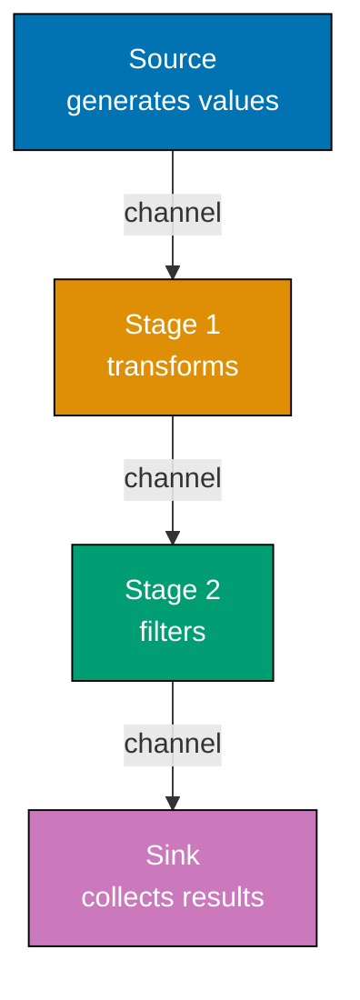
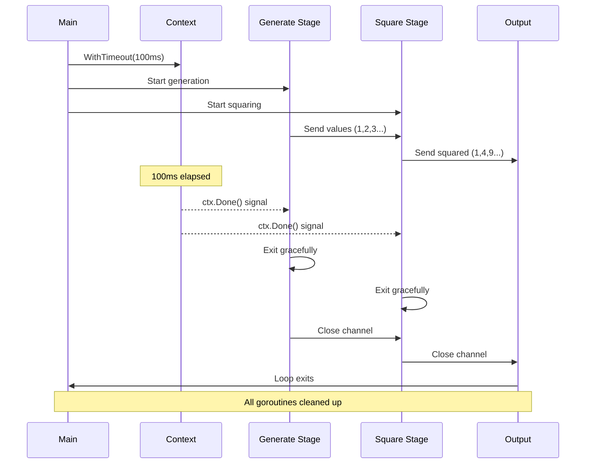
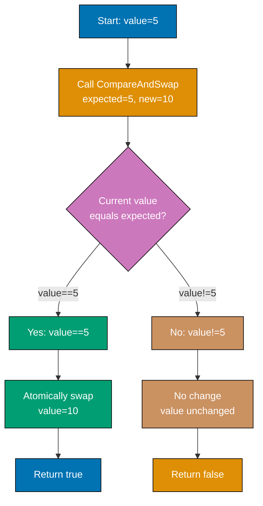
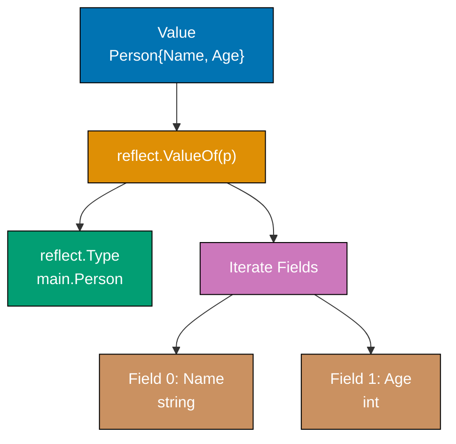
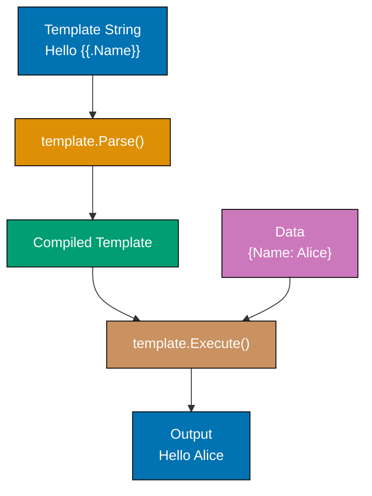
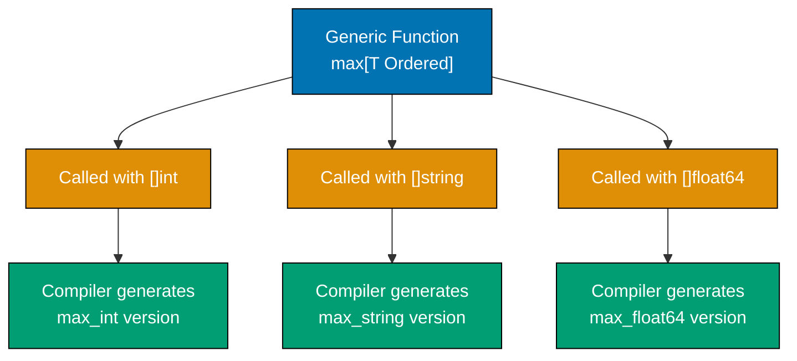
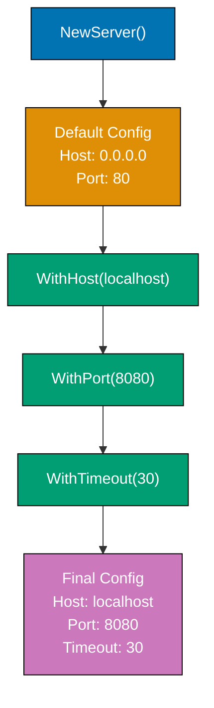
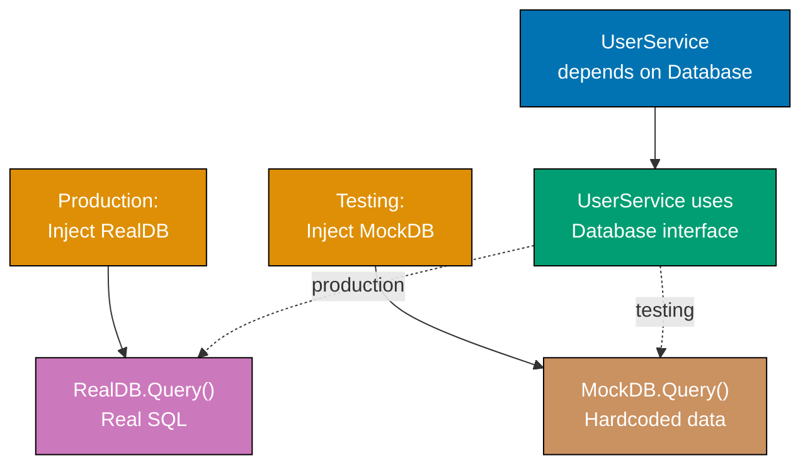
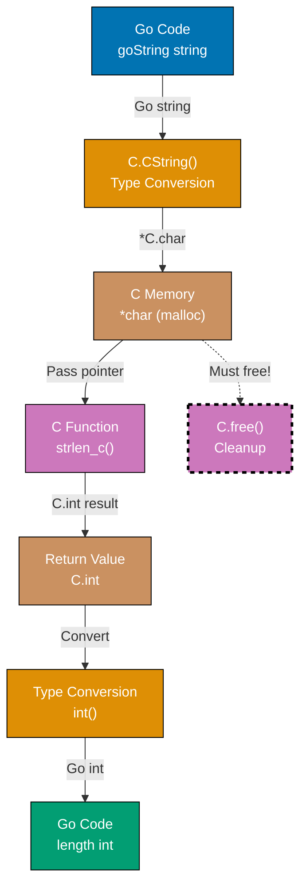

## Example 61: Pipeline Pattern

Pipelines process data through stages, each stage running concurrently. Each stage is a function that receives input from one channel and sends output to another. This composition enables elegant data processing.



**Code**:

```go
package main

import "fmt"

func main() {
    // Create pipeline: generate -> multiply by 2 -> print
    nums := generate(1, 5)         // => Stage 1: generate 1-5
                                    // => nums is <-chan int (receive-only channel)
                                    // => Goroutine starts running in background

    doubled := multiply(nums, 2)   // => Stage 2: multiply by 2
                                    // => doubled is <-chan int (new channel)
                                    // => Second goroutine starts processing nums

    square := multiply(doubled, 2) // => Stage 3: multiply by 2 again (square effect)
                                    // => square is <-chan int (final channel)
                                    // => Third goroutine processes doubled
                                    // => Pipeline: generate(1-5) -> *2 -> *2 = values*4

    // Consume results
    for result := range square {   // => Stage 4: consume results
                                    // => Blocks until value available from square
                                    // => result is 4, then 8, then 12, then 16, then 20
        fmt.Println(result)         // => Output: 4 (first iteration)
                                    // => Output: 8 (second iteration)
                                    // => Output: 12 (third iteration)
                                    // => Output: 16 (fourth iteration)
                                    // => Output: 20 (fifth iteration)
    }
    // => Loop exits when square channel closes
    // => All goroutines complete gracefully
}

// Generator stage - creates values
func generate(start, end int) <-chan int { // => Returns receive-only channel
                                            // => Caller can only receive, not send
    out := make(chan int)                   // => out is bidirectional chan int
                                            // => Unbuffered channel (blocks on send until receive)
    go func() {                             // => Spawn goroutine to generate values
                                            // => Goroutine continues after generate() returns
        for i := start; i <= end; i++ {     // => i is 1, then 2, then 3, then 4, then 5
            out <- i                        // => Send value to channel (blocks until multiply receives)
                                            // => Sends: 1, then 2, then 3, then 4, then 5
        }
        close(out)                          // => Signal completion, no more values
                                            // => Range loops will exit when channel closed
    }()
    return out                              // => Return channel immediately (goroutine runs async)
                                            // => Type converted from chan int to <-chan int
}

// Transform stage - multiplies values
func multiply(in <-chan int, factor int) <-chan int { // => in is receive-only (ensures we don't send)
                                                       // => factor is 2 in all calls
                                                       // => Returns receive-only channel
    out := make(chan int)                              // => Create new output channel
                                                        // => Unbuffered (synchronizes with consumer)
    go func() {                                         // => Spawn goroutine to transform values
                                                        // => Goroutine continues after multiply() returns
        for value := range in {                         // => Range until channel closes
                                                        // => Blocks waiting for input values
                                                        // => value is each input (1,2,3,4,5 or 2,4,6,8,10)
            out <- value * factor                       // => Send transformed value
                                                        // => First multiply: sends 2,4,6,8,10
                                                        // => Second multiply: sends 4,8,12,16,20
        }
        close(out)                                      // => Close output when input exhausted
                                                        // => Signals downstream consumers
    }()
    return out                                          // => Return channel immediately
                                                        // => Type converted from chan int to <-chan int
}
```

**Key Takeaway**: Pipelines compose concurrent stages. Each stage receives from one channel, processes, sends to next. Use channels with directional types (`<-chan` receive, `chan<-` send) to clarify data flow.

**Why It Matters**: Pipelines power production stream processing in services like Kubernetes event processing, where data flows through validation → transformation → persistence stages with automatic backpressure handling through unbuffered channels. This pattern enables building scalable ETL systems that process millions of records while maintaining bounded memory usage, unlike batch processing that requires loading entire datasets into RAM.

## Example 62: Context-Aware Pipelines

Pipeline stages should respect cancellation. When context is cancelled, all stages should exit gracefully. This enables cancelling long-running pipelines without leaking goroutines.



**Code**:

```go
package main

import (
    "context"
    "fmt"
    "time"
)

func main() {
    // Create cancellable context
    ctx, cancel := context.WithTimeout(context.Background(), 100*time.Millisecond)
                                                        // => ctx will cancel after 100ms
                                                        // => cancel is function to cancel early
                                                        // => Background() returns empty root context
    defer cancel()                                      // => Ensure cancel called (releases resources)
                                                        // => Even if context times out, call cancel()

    // Pipeline with context awareness
    nums := generateWithContext(ctx, 1, 100)            // => Generate 1-100 with cancellation
                                                        // => nums is <-chan int
                                                        // => Goroutine respects ctx.Done()

    squared := squareWithContext(ctx, nums)             // => Square each value from nums
                                                        // => squared is <-chan int
                                                        // => Goroutine respects ctx.Done()

    // Consume until context cancelled
    for result := range squared {                       // => Blocks waiting for squared values
                                                        // => result is 1, then 4, then 9, then 16...
        fmt.Println(result)                             // => Output: 1 (first value)
                                                        // => Output: 4 (second value)
                                                        // => Output: 9 (third value)
                                                        // => Outputs continue until context timeout
    }
                                                        // => Loop exits when squared channel closes
                                                        // => Context timeout (100ms) cancels pipeline
    fmt.Println("Pipeline cancelled")                   // => Output: Pipeline cancelled
                                                        // => Printed after all goroutines exit
}

func generateWithContext(ctx context.Context, start, end int) <-chan int {
                                                        // => ctx enables cancellation signal
                                                        // => start=1, end=100
                                                        // => Returns receive-only channel
    out := make(chan int)                               // => Create unbuffered channel
                                                        // => Blocks on send until receiver ready
    go func() {                                         // => Spawn goroutine for generation
                                                        // => Runs concurrently with caller
        defer close(out)                                // => Always close channel when done
                                                        // => Deferred: runs even if return early
        for i := start; i <= end; i++ {                 // => i is 1, then 2, then 3...
                                                        // => Loop continues until i > end or cancelled
            select {                                    // => Multiplexing: send or cancel
            case out <- i:                              // => Send value (blocks until receiver ready)
                                                        // => Sends: 1, 2, 3, 4... until timeout
            case <-ctx.Done():                          // => Context cancelled (timeout or manual)
                                                        // => Receives signal from closed Done() channel
                fmt.Println("Generate cancelled")       // => Output: Generate cancelled
                                                        // => Indicates graceful shutdown
                return                                  // => Exit goroutine early
                                                        // => Deferred close(out) runs
            }
            time.Sleep(10 * time.Millisecond)           // => Simulate work (10ms per value)
                                                        // => 100ms timeout = ~10 values generated
        }
                                                        // => If loop completes naturally, close(out) runs
    }()
    return out                                          // => Return channel immediately
                                                        // => Goroutine continues in background
}

func squareWithContext(ctx context.Context, in <-chan int) <-chan int {
                                                        // => ctx enables cancellation signal
                                                        // => in is input channel from generateWithContext
                                                        // => Returns receive-only channel
    out := make(chan int)                               // => Create unbuffered output channel
                                                        // => Synchronizes with consumer
    go func() {                                         // => Spawn goroutine for transformation
                                                        // => Runs concurrently with generator
        defer close(out)                                // => Always close when done
                                                        // => Signals consumer no more values
        for value := range in {                         // => Range over input channel
                                                        // => Blocks waiting for values from in
                                                        // => value is 1, then 2, then 3...
                                                        // => Exits when in closes
            select {                                    // => Multiplexing: send or cancel
            case out <- value * value:                  // => Send squared value
                                                        // => Sends: 1, 4, 9, 16, 25...
                                                        // => Blocks until consumer receives
            case <-ctx.Done():                          // => Context cancelled
                                                        // => Receives signal from closed Done() channel
                fmt.Println("Square cancelled")         // => Output: Square cancelled
                                                        // => Indicates graceful shutdown
                return                                  // => Exit goroutine early
                                                        // => Deferred close(out) runs
            }
        }
                                                        // => If input exhausted naturally, close(out) runs
    }()
    return out                                          // => Return channel immediately
                                                        // => Goroutine continues in background
}
```

**Key Takeaway**: Use `select` with `ctx.Done()` in every stage to enable graceful cancellation. When context is cancelled, all stages exit promptly without leaving goroutines running.

**Why It Matters**: Context-aware cancellation prevents goroutine leaks that plague long-running services, where a cancelled HTTP request must terminate all downstream processing to avoid wasting CPU and memory on orphaned work. Production systems like Prometheus use this pattern to abort expensive metric aggregation queries when clients disconnect, maintaining system stability under load spikes by immediately freeing resources.

## Example 63: Rate Limiting

Rate limiting restricts how fast operations occur. Token bucket pattern uses a channel - tokens arrive at a rate, operations consume tokens. When no tokens available, operations wait.

**Code**:

```go
package main

import (
    "fmt"
    "time"
)

func main() {
    // Create rate limiter - 2 operations per second
    limiter := make(chan struct{}, 2)               // => Channel with capacity 2 (tokens)
                                                    // => Buffered channel holds max 2 empty structs
                                                    // => struct{} uses zero bytes (efficient token)

    // Replenish tokens
    go func() {                                     // => Spawn goroutine to add tokens
                                                    // => Runs concurrently with main
        ticker := time.NewTicker(500 * time.Millisecond)
                                                    // => Add token every 500ms
                                                    // => ticker.C is <-chan time.Time
                                                    // => Sends current time every 500ms
        for range ticker.C {                        // => Receive from ticker every 500ms
                                                    // => Ignores time value (we just need timing)
            select {                                // => Non-blocking send attempt
            case limiter <- struct{}{}:             // => Add token if space available
                                                    // => Sends empty struct to channel
                                                    // => Succeeds if len(limiter) < 2
            default:                                // => Token buffer full, skip
                                                    // => Prevents blocking ticker goroutine
                                                    // => No action needed (already at capacity)
            }
        }
    }()

    // Use limited operations
    for i := 0; i < 5; i++ {                        // => i is 0, then 1, then 2, then 3, then 4
        <-limiter                                   // => Consume token (wait if none available)
                                                    // => Blocks until token available
                                                    // => First 2 operations immediate (initial capacity)
                                                    // => Remaining wait for token replenishment
        fmt.Printf("Operation %d at %v\n", i, time.Now().Unix())
                                                    // => Output: Operation 0 at 1234567890 (immediate)
                                                    // => Output: Operation 1 at 1234567890 (immediate)
                                                    // => Output: Operation 2 at 1234567890 (wait 500ms)
                                                    // => Output: Operation 3 at 1234567891 (wait 500ms)
                                                    // => Output: Operation 4 at 1234567891 (wait 500ms)
    }
}

// Alternative: time.Limit from golang.org/x/time/rate
import "golang.org/x/time/rate"

func limitedOperations() {
    limiter := rate.NewLimiter(rate.Every(time.Second), 5)
                                                    // => 1 op/sec sustained rate
                                                    // => burst capacity of 5 (initial tokens)
                                                    // => rate.Every(time.Second) = 1 operation per second
                                                    // => Allows bursts up to 5 operations

    for i := 0; i < 10; i++ {                       // => i is 0,1,2...9 (10 operations total)
        if !limiter.Allow() {                       // => Check if operation allowed (non-blocking)
                                                    // => Returns true if token available
                                                    // => Consumes token if available
                                                    // => First 5 return true (burst capacity)
                                                    // => Remaining 5 fail (no tokens yet)
            fmt.Println("Rate limit exceeded")      // => Output: Rate limit exceeded (for ops 5-9)
                                                    // => Indicates rejection, not wait
            continue                                // => Skip this operation
        }
        fmt.Printf("Operation %d\n", i)             // => Output: Operation 0 (first 5 operations)
                                                    // => Output: Operation 1
                                                    // => Output: Operation 2
                                                    // => Output: Operation 3
                                                    // => Output: Operation 4
                                                    // => Remaining operations rejected
    }
}
```

**Key Takeaway**: Token bucket pattern: channel of limited capacity represents tokens, operations consume tokens. Replenish tokens at fixed rate. This throttles operations smoothly.

**Why It Matters**: Rate limiting protects production APIs from overload, preventing cascading failures where unlimited client requests exhaust database connections or downstream API quotas. The token bucket pattern enables graceful degradation by allowing controlled bursts (handling traffic spikes) while enforcing sustained rate limits, the approach used by GitHub API (5,000 requests/hour) and Twitter API (15 requests/15-minute window) to maintain service quality for all users.

## Example 64: Semaphore Pattern

Semaphores limit concurrent access to resources. While `sync.Mutex` allows one goroutine at a time, semaphores allow N. Implement with buffered channel of capacity N.

**Code**:

```go
package main

import (
    "fmt"
    "sync"
)

func main() {
    // Semaphore - allow 3 concurrent operations
    sem := make(chan struct{}, 3)
                                                // => Capacity 3 = 3 concurrent slots
                                                // => Buffered channel as counting semaphore
                                                // => struct{} uses zero memory (empty struct)
    var wg sync.WaitGroup                       // => Tracks completion of all goroutines
                                                // => wg initialized to zero value

    for i := 1; i <= 10; i++ {                  // => Launch 10 goroutines total
                                                // => Only 3 can run simultaneously
        wg.Add(1)                               // => Increment counter before spawning goroutine
                                                // => Critical: Add before go keyword
        go func(id int) {                       // => Goroutine function with id parameter
                                                // => id is copy of i (avoids closure pitfall)
            defer wg.Done()                     // => Decrement counter when goroutine exits
                                                // => Always deferred to ensure execution

            sem <- struct{}{}                   // => Acquire slot (blocks if all 3 full)
                                                // => Only 3 goroutines can acquire simultaneously
                                                // => Send empty struct to channel
            defer func() { <-sem }()            // => Release slot when done
                                                // => Receive from channel frees slot
                                                // => Deferred to ensure release even on panic

            fmt.Printf("Operation %d running\n", id)
                                                // => Output: Operations 1,2,3 first
                                                // => Remaining wait for slot release
                                                // => %d formats id as decimal
            // Simulate work                    // => Real work would go here
        }(i)                                    // => Pass i as argument to goroutine
                                                // => Creates copy, safe for concurrent access
    }

    wg.Wait()                                   // => Block until all 10 goroutines call Done()
                                                // => Counter must reach 0
    fmt.Println("All operations complete")      // => Output: All operations complete
                                                // => Only prints after all goroutines finish
}

// Weighted semaphore - operations require different numbers of slots
func weightedSemaphore() {                      // => Example of weighted semaphore pattern
                                                // => Different operations consume different resources
    sem := make(chan int, 10)                   // => Capacity 10 "units"
                                                // => Simplified weighted example
                                                // => Can hold 10 int values

    // Operation requiring 3 units
    go func() {                                 // => First goroutine (lightweight operation)
        n := 3                                  // => Requires 3 units of resource
                                                // => n is number of units to acquire
        sem <- n                                // => Acquire 3 units (sends int 3)
                                                // => Blocks if channel full
                                                // => Simplified: real weighted needs more logic
        defer func() { <-sem }()                // => Release 3 units (receives int)
                                                // => Frees space in channel

        fmt.Println("Acquired 3 units")         // => Output: Acquired 3 units
                                                // => Work happens here
    }()

    // Operation requiring 7 units
    go func() {                                 // => Second goroutine (heavier operation)
        n := 7                                  // => Requires 7 units of resource
                                                // => Larger operation
        sem <- n                                // => Acquire 7 units (sends int 7)
                                                // => Blocks if insufficient capacity
        defer func() { <-sem }()                // => Release 7 units
                                                // => Returns capacity to pool

        fmt.Println("Acquired 7 units")         // => Output: Acquired 7 units
    }()

    // Total capacity: 10 units, both can run concurrently
                                                // => 3 + 7 = 10 (fits within capacity)
                                                // => Note: True weighted semaphore needs golang.org/x/sync/semaphore
                                                // => This is simplified demonstration
}
```

**Key Takeaway**: Semaphore = buffered channel. Capacity = maximum concurrent operations. Send before work, receive after. Useful for limiting concurrent database connections, API calls, or other bounded resources.

**Why It Matters**: Semaphores limit concurrent access to bounded resources like database connection pools (100 max connections) or external APIs with rate limits, preventing resource exhaustion that causes production outages. Unlike mutexes (N=1), semaphores enable controlled parallelism (N>1), allowing 10 concurrent S3 uploads while blocking the 11th until a slot frees, maximizing throughput without overwhelming external services.

## Example 65: Atomic Operations

Atomic operations ensure thread-safe modifications without mutexes. The `sync/atomic` package provides compare-and-swap (CAS) and atomic increments. Use when contention is low and operations are simple.



**Code**:

```go
package main

import (
    "fmt"
    "sync"
    "sync/atomic"
)

func main() {
    // Atomic counter - multiple goroutines increment safely
    var counter int64                               // => Must be int64 or int32 for atomic
                                                    // => Initialized to 0
                                                    // => Must be accessed via atomic package only
    var wg sync.WaitGroup                           // => WaitGroup to synchronize goroutines
                                                    // => Counter starts at 0

    for i := 0; i < 10; i++ {                       // => Launch 10 goroutines
                                                    // => i is 0,1,2...9
        wg.Add(1)                                   // => Increment WaitGroup counter
                                                    // => Counter reaches 10
        go func() {                                 // => Spawn goroutine
                                                    // => Runs concurrently with others
            defer wg.Done()                         // => Decrement WaitGroup when done
                                                    // => Always executes via defer
            for j := 0; j < 100; j++ {              // => Each goroutine increments 100 times
                                                    // => j is 0,1,2...99
                atomic.AddInt64(&counter, 1)        // => Atomic increment (thread-safe)
                                                    // => Adds 1 to counter atomically
                                                    // => No race condition (CPU-level atomic operation)
                                                    // => counter increases: 1,2,3...1000
            }
        }()
    }

    wg.Wait()                                       // => Block until all goroutines complete
                                                    // => Waits for counter to reach 0
    fmt.Println("Counter:", counter)                // => Output: Counter: 1000
                                                    // => Always 1000 (safe from race conditions)
                                                    // => Without atomic: unpredictable (race condition)

    // Atomic swap
    var value int64 = 10                            // => value is 10 (type: int64)
    old := atomic.SwapInt64(&value, 20)             // => Set value to 20, return old (10)
                                                    // => Atomic operation (swap happens atomically)
                                                    // => old is 10, value is now 20
    fmt.Println("Old:", old, "New:", value)         // => Output: Old: 10 New: 20
                                                    // => Demonstrates swap semantics

    // Compare-and-swap (CAS)
    var cas int64 = 5                               // => cas is 5 (type: int64)
    swapped := atomic.CompareAndSwapInt64(&cas, 5, 10)
                                                    // => If cas==5, set to 10 and return true
                                                    // => If cas!=5, no change and return false
                                                    // => cas is 5, so swap succeeds
                                                    // => swapped is true, cas is now 10
    fmt.Println("Swapped:", swapped, "Value:", cas) // => Output: Swapped: true Value: 10
                                                    // => CAS useful for lock-free algorithms

    // Failed CAS example
    swapped2 := atomic.CompareAndSwapInt64(&cas, 5, 15)
                                                    // => cas is 10 (not 5), so swap fails
                                                    // => swapped2 is false, cas unchanged (10)
                                                    // => Demonstrates conditional update

    // Load and store for safe reads
    var flag int32 = 0                              // => flag is 0 (type: int32)
                                                    // => Must use int32 for atomic operations
    atomic.StoreInt32(&flag, 1)                     // => Atomic write (sets flag to 1)
                                                    // => Ensures visibility across goroutines
                                                    // => Memory barrier guarantees ordering
    value32 := atomic.LoadInt32(&flag)              // => Atomic read (reads flag value)
                                                    // => value32 is 1
                                                    // => Ensures we see latest value
    fmt.Println("Flag:", value32)                   // => Output: Flag: 1
                                                    // => Load/Store prevent compiler reordering
}
```

**Key Takeaway**: Atomic operations are lock-free. Use `atomic.AddInt64()` for counters, `atomic.SwapInt64()` for updates, `atomic.CompareAndSwapInt64()` for conditional updates. Lower overhead than mutexes but limited to simple operations.

**Why It Matters**: Atomic operations eliminate mutex overhead for simple counters and flags in high-throughput services, where atomic.AddInt64() provides 10-100x better performance than mutex-protected increments for metrics collection that happens millions of times per second. Compare-and-swap (CAS) enables building lock-free data structures like concurrent queues used in Prometheus for metric ingestion, achieving microsecond latencies that mutexes cannot provide.

## Example 66: Reflection

Reflection inspects types and values at runtime. The `reflect` package enables dynamic code - examine struct fields, call methods, or build values whose type isn't known until runtime. Use sparingly - reflection is powerful but slow and hard to understand.



**Code**:

```go
package main

import (
    "fmt"
    "reflect"
)

func main() {
    // Inspect struct type
    type Person struct {                        // => Define struct type
        Name string                             // => First field: Name (type: string)
        Age  int                                // => Second field: Age (type: int)
    }

    p := Person{"Alice", 30}                    // => p is Person{Name:"Alice", Age:30}
                                                // => Struct literal initialization
    v := reflect.ValueOf(p)                     // => Get reflected value wrapping p
                                                // => v is reflect.Value of Person
                                                // => Enables runtime type inspection
    t := v.Type()                               // => Get type information from value
                                                // => t is reflect.Type for main.Person
                                                // => Contains metadata about struct

    fmt.Println("Type:", t)                     // => Output: Type: main.Person
                                                // => Shows package and type name
    fmt.Println("Fields:")                      // => Header for field iteration

    // Iterate struct fields
    for i := 0; i < v.NumField(); i++ {         // => NumField() returns 2 (Name, Age)
                                                // => i is 0, then 1
        field := v.Field(i)                     // => Get field value by index
                                                // => field is reflect.Value for field
                                                // => i=0: field wraps "Alice", i=1: field wraps 30
        fieldType := t.Field(i)                 // => Get field type metadata
                                                // => fieldType is reflect.StructField
                                                // => Contains Name, Type, Tag, Offset
        fmt.Printf("  %s: %v (type: %s)\n", fieldType.Name, field.Interface(), field.Type())
                                                // => fieldType.Name is "Name" or "Age"
                                                // => field.Interface() converts back to interface{}
                                                // => field.Type() is "string" or "int"
    }
    // => Output:
    // =>   Name: Alice (type: string)          // => First field
    // =>   Age: 30 (type: int)                 // => Second field

    // Get value using field name
    nameField := v.FieldByName("Name")          // => Lookup field by string name
                                                // => nameField is reflect.Value wrapping "Alice"
                                                // => Returns zero Value if field not found
    fmt.Println("Name field:", nameField.String())
                                                // => Output: Name field: Alice
                                                // => .String() converts Value to string

    // Check kind
    if t.Kind() == reflect.Struct {             // => Kind() returns underlying type category
                                                // => reflect.Struct is one of 26 kinds
                                                // => Other kinds: Int, String, Slice, etc.
        fmt.Println("Type is a struct")         // => Output: Type is a struct
                                                // => Confirms t represents struct type
    }

    // Type assertion vs reflection
    // Reflection approach (dynamic):
    val := reflect.ValueOf(p)                   // => Create new reflect.Value for p
                                                // => val wraps Person struct
    if val.Kind() == reflect.Struct {           // => Runtime check using reflection
                                                // => Slower than static type check
        fmt.Println("It's a struct (reflection)")
                                                // => Output: It's a struct (reflection)
                                                // => Dynamic approach for unknown types
    }

    // Direct approach (static, faster):
    switch p := p.(type) {                      // => Type switch (compile-time)
                                                // => p shadows outer p variable
    case Person:                                // => Match Person type
                                                // => Compiler knows type at compile-time
        fmt.Println("It's a Person (direct)")   // => Output: It's a Person (direct)
                                                // => Faster than reflection (no runtime overhead)
                                                // => Preferred when types known at compile-time
    }
}
```

**Key Takeaway**: Use reflection sparingly - it's slow and reduces code clarity. Prefer direct type assertions when possible. Reflection is useful for libraries, JSON unmarshaling, or dynamic test fixtures. `reflect.ValueOf()` gets reflected value, `.Type()` gets type, `.NumField()` iterates struct fields.

**Why It Matters**: Reflection powers critical infrastructure like JSON marshaling (encoding/json), database ORMs (GORM, sqlx), and dependency injection frameworks that need to work with types unknown at compile-time. While slow (10-100x overhead) and fragile (bypasses compile-time type safety), reflection is essential for building generic libraries that inspect struct tags for validation rules or automatically map database columns to struct fields, reducing boilerplate in application code.

## Example 67: Binary Encoding

Binary protocols and data formats require reading/writing binary data. The `encoding/binary` package handles byte order (endianness) and converts between binary and Go types.

**Code**:

```go
package main

import (
    "bytes"
    "encoding/binary"
    "fmt"
    "io"
)

func main() {
    // Write binary data
    buf := new(bytes.Buffer)                        // => In-memory buffer (implements io.Writer/Reader)
                                                    // => new() allocates and returns pointer

    // Write integer in big-endian format
    binary.Write(buf, binary.BigEndian, int32(42))  // => 42 as 4 bytes: [0x00 0x00 0x00 0x2A]
                                                    // => Big-endian: most significant byte first
                                                    // => int32 is always 4 bytes
    binary.Write(buf, binary.BigEndian, float32(3.14))
                                                    // => Float as 4 bytes (IEEE 754 format)
                                                    // => Writes binary representation of float
    binary.Write(buf, binary.BigEndian, true)       // => Bool as 1 byte (0x01 for true)
                                                    // => buf now has 9 bytes total (4+4+1)
                                                    // => All data serialized to bytes

    // Read back
    reader := bytes.NewReader(buf.Bytes())          // => Create reader from buffer
                                                    // => buf.Bytes() returns underlying byte slice
    var num int32                                   // => Declare variables for reading
                                                    // => Zero value: 0
    var f float32                                   // => Zero value: 0.0
    var b bool                                      // => Zero value: false

    binary.Read(reader, binary.BigEndian, &num)     // => Read 4 bytes → num is 42
                                                    // => Requires pointer to write result
    binary.Read(reader, binary.BigEndian, &f)       // => Read 4 bytes → f is 3.14
                                                    // => Reads from current position
    binary.Read(reader, binary.BigEndian, &b)       // => Read 1 byte → b is true
                                                    // => Reader position advances automatically

    fmt.Printf("Num: %d, Float: %f, Bool: %v\n", num, f, b)
                                                    // => Output: Num: 42, Float: 3.140000, Bool: true
                                                    // => All values deserialized correctly

    // Endianness matters
    smallBuf := new(bytes.Buffer)                   // => New buffer for endianness demo
    binary.Write(smallBuf, binary.LittleEndian, int16(256))
                                                    // => 256 = 0x0100 (binary: 0000000100000000)
                                                    // => Little-endian: [0x00 0x01] (low byte first)
                                                    // => int16 is 2 bytes
    fmt.Printf("Little-endian bytes: %v\n", smallBuf.Bytes())
                                                    // => Output: Little-endian bytes: [0 1]
                                                    // => Byte order: low-to-high

    bigBuf := new(bytes.Buffer)                     // => New buffer for big-endian
    binary.Write(bigBuf, binary.BigEndian, int16(256))
                                                    // => Big-endian: [0x01 0x00] (high byte first)
                                                    // => Byte order: high-to-low
    fmt.Printf("Big-endian bytes: %v\n", bigBuf.Bytes())
                                                    // => Output: Big-endian bytes: [1 0]
                                                    // => Demonstrates endianness difference
                                                    // => Same value, different byte order
}
```

**Key Takeaway**: `binary.Write()` serializes values to binary format. `binary.Read()` deserializes from binary. Specify endianness (`BigEndian` or `LittleEndian`). Endianness is crucial for network protocols and file formats.

**Why It Matters**: Binary encoding enables interoperability with network protocols (TCP packet headers, DNS messages) and file formats (PNG, MP4) that require precise byte-level control and endianness awareness. Big-endian (network byte order) dominates internet protocols for historical compatibility, while little-endian matches modern CPU architectures (x86, ARM), making encoding/binary essential for implementing custom protocols or parsing binary file formats in production systems.

## Example 68: Cryptography Basics

Cryptography is essential for security. Go provides standard cryptographic functions in `crypto/*` packages. Hash for integrity, random for security, HMAC for authentication, encryption for confidentiality.

**Code**:

```go
package main

import (
    "crypto/hmac"
    "crypto/rand"
    "crypto/sha256"
    "encoding/hex"
    "fmt"
)

func main() {
    // SHA256 hash - integrity check
    data := "Important message"                 // => Data to hash
                                                // => String converted to bytes for hashing
    hash := sha256.Sum256([]byte(data))         // => Compute SHA-256 hash
                                                // => hash is [32]byte (256 bits)
                                                // => Deterministic: same input = same hash
    fmt.Printf("SHA256: %s\n", hex.EncodeToString(hash[:]))
                                                // => Output: 64 hex characters (32 bytes * 2)
                                                // => hash[:] converts array to slice

    // HMAC - authentication
    key := []byte("secret-key")                 // => Shared secret key (known to both parties)
                                                // => In production, use strong random key
    h := hmac.New(sha256.New, key)              // => Create HMAC-SHA256 hasher
                                                // => sha256.New is hash function
    h.Write([]byte(data))                       // => Add data to hash
                                                // => Can call Write multiple times
    signature := hex.EncodeToString(h.Sum(nil)) // => Get signature as hex (64 chars)
                                                // => nil means append to nothing
    fmt.Println("HMAC:", signature)             // => Unique for this data+key combination
                                                // => Output: HMAC: <64 hex chars>

    // Verify HMAC
    h2 := hmac.New(sha256.New, key)             // => New hasher with same key
                                                // => Must use same hash function
    h2.Write([]byte(data))                      // => Hash same data
                                                // => Produces same signature if data unchanged
    if hmac.Equal(h.Sum(nil), h2.Sum(nil)) {    // => Constant-time comparison (prevents timing attacks)
                                                // => Never use == for crypto comparison
        fmt.Println("HMAC valid")               // => Data not tampered
                                                // => Output: HMAC valid
    }

    // Random bytes - for tokens, nonces
    token := make([]byte, 16)                   // => 16-byte slice (128 bits)
                                                // => Allocates space for random data
    _, err := rand.Read(token)                  // => Cryptographically secure random
                                                // => Fills token with random data
                                                // => Uses /dev/urandom on Unix
    if err != nil {                             // => Check for entropy source failure
        fmt.Println("Error generating random:", err)
        return                                  // => Abort if random generation fails
    }
    fmt.Printf("Random token: %s\n", hex.EncodeToString(token))
                                                // => 32 hex chars (16 bytes * 2)
                                                // => Different every time (unpredictable)
                                                // => Output: Random token: <random hex>
}
```

**Key Takeaway**: Use `crypto/sha256.Sum256()` for hashing. Use `crypto/hmac` with hash function for authentication. Use `crypto/rand.Read()` for cryptographically secure random bytes. Never use `math/rand` for security-sensitive operations.

**Why It Matters**: Cryptographic primitives are non-negotiable for production security: SHA-256 hashes verify file integrity (git commits, Docker image layers), HMAC-SHA256 authenticates webhook payloads (GitHub webhooks, Stripe signatures) preventing tampering, and crypto/rand generates session tokens that withstand cryptanalysis unlike math/rand's predictable sequences. Using crypto/rand instead of math/rand for security tokens is the difference between safe authentication and immediate compromise.

## Example 69: Templates

Templates generate text (HTML, email, config files). The `text/template` package provides template syntax with variables, functions, and control flow. Use `html/template` for HTML to prevent injection attacks.



**Code**:

```go
package main

import (
    "fmt"
    "html/template"
    "os"
    "strings"
)

func main() {
    // Simple template with variables
    tmpl, err := template.New("test").Parse("Hello, {{.Name}}! You are {{.Age}} years old.")
                                                    // => Create new template named "test"
                                                    // => Parse template string with {{}} placeholders
                                                    // => {{.Name}} accesses Name field in data
                                                    // => {{.Age}} accesses Age field
                                                    // => Returns (*Template, error)
    if err != nil {                                 // => Check parse error
                                                    // => Syntax errors caught here
        fmt.Println("Parse error:", err)            // => Output: Parse error: <error>
        return                                      // => Exit on error
    }

    data := map[string]interface{}{                 // => Data to render template
        "Name": "Alice",                            // => Name field is "Alice"
        "Age":  30,                                 // => Age field is 30 (int)
    }
    tmpl.Execute(os.Stdout, data)                   // => Execute template with data
                                                    // => Writes to os.Stdout (stdout)
                                                    // => {{.Name}} replaced with "Alice"
                                                    // => {{.Age}} replaced with 30
    // => Output: Hello, Alice! You are 30 years old.
                                                    // => Template rendered to output

    // Conditional and loops
    tmpl2, _ := template.New("list").Parse(`
Users:
{{range .Users}}
  - {{.Name}} ({{.Age}})
{{end}}
`)                                                  // => Multiline template string
                                                    // => {{range .Users}} iterates slice
                                                    // => Inside range, . is each element
                                                    // => {{end}} closes range block
                                                    // => _ ignores error (for brevity)

    data2 := map[string]interface{}{                // => Data with Users slice
        "Users": []map[string]interface{}{          // => Slice of user maps
            {"Name": "Alice", "Age": 30},           // => First user
            {"Name": "Bob", "Age": 25},             // => Second user
        },
    }
    tmpl2.Execute(os.Stdout, data2)                 // => Execute template
                                                    // => {{range}} iterates Users slice
                                                    // => First iteration: . is {"Name": "Alice", "Age": 30}
                                                    // => Second iteration: . is {"Name": "Bob", "Age": 25}
    // => Output:
    // => Users:
    // =>   - Alice (30)                            // => First user rendered
    // =>   - Bob (25)                              // => Second user rendered

    // Custom functions
    funcMap := template.FuncMap{                    // => Map of custom template functions
                                                    // => FuncMap is map[string]interface{}
        "upper": strings.ToUpper,                   // => Add function to template
                                                    // => upper calls strings.ToUpper
        "add":   func(a, b int) int { return a + b }, // => Custom function
                                                    // => add accepts 2 ints, returns sum
    }

    tmpl3, _ := template.New("funcs").Funcs(funcMap).Parse(
        "{{upper .Name}} total is {{add .Age .Years}}",
    )                                               // => Create template with custom functions
                                                    // => Funcs() adds functions before Parse()
                                                    // => {{upper .Name}} calls upper function
                                                    // => {{add .Age .Years}} calls add function

    data3 := map[string]interface{}{                // => Data for function template
        "Name":  "alice",                           // => Name is lowercase "alice"
        "Age":   30,                                // => Age is 30
        "Years": 5,                                 // => Years is 5
    }
    tmpl3.Execute(os.Stdout, data3)                 // => Execute template
                                                    // => {{upper .Name}} becomes "ALICE"
                                                    // => {{add .Age .Years}} becomes 35 (30+5)
    // => Output: ALICE total is 35                 // => Custom functions applied
}
```

**Key Takeaway**: Use `template.Parse()` to create templates. Use `.Field` to access data. Use `{{range}}` for loops, `{{if}}` for conditions. Use `html/template` instead of `text/template` for HTML to prevent injection. Define custom functions with `FuncMap`.

**Why It Matters**: Templates generate dynamic HTML, emails, and configuration files while preventing injection attacks through automatic escaping in html/template. Production systems use templates for rendering web pages (Hugo static site generator), generating Kubernetes manifests from values, and composing email notifications with user data, where text/template's lack of escaping would allow XSS attacks if user input reaches the output.

## Example 70: Generic Functions

Generics enable functions to work with different types while maintaining type safety. Type parameters in square brackets define constraints. Go 1.18+ introduces this powerful feature.



**Code**:

```go
package main

import "fmt"

func main() {
    // Generic function works with different types
    intSlice := []int{3, 1, 4, 1, 5}            // => intSlice is []int with 5 elements
                                                // => Contains: [3, 1, 4, 1, 5]
    fmt.Println("Max int:", max(intSlice))      // => Calls max with T=int
                                                // => Output: Max int: 5
                                                // => Compiler generates max_int version

    stringSlice := []string{"apple", "zebra", "banana"}
                                                // => stringSlice is []string with 3 elements
                                                // => Contains: ["apple", "zebra", "banana"]
    fmt.Println("Max string:", max(stringSlice))// => Calls max with T=string
                                                // => Output: Max string: zebra
                                                // => Compiler generates max_string version
}

// Generic function - [T any] is type parameter
// T is constrained to "any" type
func max[T any](slice []T) T {                  // => Type parameter T can be any type
                                                // => any is alias for interface{}
                                                // => slice is []T (slice of type T)
    // Compiler error: can't compare T values (no constraint)
    // This won't work because we need to define T must be comparable
    return slice[0]                             // => Returns first element (placeholder)
                                                // => Real implementation needs constraints
}

// Better: constrain T to be comparable
import "fmt"

// Comparable constraint - enables comparison operators
func betterMax[T interface{ int | float64 | string }](slice []T) T {
                                                // => T constrained to int OR float64 OR string
                                                // => Union type constraint
                                                // => Enables > operator for these types
    if len(slice) == 0 {                        // => Check for empty slice
                                                // => len(slice) returns 0 for empty
                                                // => Prevents index out of range panic
        var zero T                              // => zero is zero value for type T
                                                // => T=int: zero=0, T=string: zero=""
        return zero                             // => Return zero value
    }

    max := slice[0]                             // => max starts with first element
                                                // => max is type T
    for _, val := range slice[1:] {             // => Iterate from index 1 onwards
                                                // => slice[1:] creates subslice
                                                // => val is each element (type T)
        if val > max {                          // => Compare values (works with constraint)
                                                // => > operator enabled by union constraint
            max = val                           // => Update max if val is greater
        }
    }
    return max                                  // => Return maximum value (type T)
}

// Even better: use Ordered constraint (Go 1.21+)
import "golang.org/x/exp/constraints"

func bestMax[T constraints.Ordered](slice []T) T {
                                                // => T constrained to Ordered types
                                                // => Ordered includes: integers, floats, strings
                                                // => Standard constraint from constraints package
    if len(slice) == 0 {                        // => Handle empty slice
        var zero T                              // => zero value for type T
        return zero                             // => Return zero value
    }

    max := slice[0]                             // => Initialize max with first element
                                                // => max is type T
    for _, val := range slice[1:] {             // => Iterate remaining elements
                                                // => val is each element after first
        if val > max {                          // => Compare using > operator
                                                // => Ordered constraint enables comparisons
            max = val                           // => Update max if needed
        }
    }
    return max                                  // => Return maximum value found
                                                // => Type is T (preserves input type)
}
```

**Key Takeaway**: Generic functions use `[T TypeConstraint]` syntax. Type parameter T is replaced with actual type at compile-time. Constraints limit what operations T supports. `any` means no constraints (but limited what you can do).

**Why It Matters**: Generics (Go 1.18+) eliminate code duplication for data structures and algorithms, replacing brittle interface{}+reflection patterns with compile-time type safety. Generic max() functions work across int/float/string without type assertions, generic min-heaps work with any comparable type, and generic Result<T,E> types enable Rust-style error handling, all providing zero runtime overhead through monomorphization (compiler generates specialized versions per type).

## Example 71: Generic Types

Generic struct types work similarly to generic functions. Define type parameters, and the compiler instantiates them for each type used. Useful for containers, queues, trees, and data structures.

```mermaid
%% Color Palette: Blue #0173B2, Orange #DE8F05, Teal #029E73, Purple #CC78BC, Brown #CA9161
graph TD
    A["Generic Type<br/>Stack[T any]"]
    B["Stack[int]<br/>items []int"]
    C["Stack[string]<br/>items []string"]
    D["Stack[Person]<br/>items []Person"]

    A -->|instantiate| B
    A -->|instantiate| C
    A -->|instantiate| D

    B --> E["Push(10)<br/>Pop() int"]
    C --> F["Push(\"hi\")<br/>Pop() string"]
    D --> G["Push(person)<br/>Pop() Person"]

    style A fill:#0173B2,stroke:#000,color:#fff
    style B fill:#DE8F05,stroke:#000,color:#fff
    style C fill:#DE8F05,stroke:#000,color:#fff
    style D fill:#DE8F05,stroke:#000,color:#fff
    style E fill:#029E73,stroke:#000,color:#fff
    style F fill:#029E73,stroke:#000,color:#fff
    style G fill:#029E73,stroke:#000,color:#fff
```

**Code**:

```go
package main

import "fmt"

func main() {
    // Generic stack of integers
    intStack := NewStack[int]()                     // => Create Stack[int] instance
                                                    // => T=int, instantiates Stack with int
                                                    // => intStack is *Stack[int]
    intStack.Push(10)                               // => Push 10 (type: int)
                                                    // => items is now []int{10}
    intStack.Push(20)                               // => Push 20 (type: int)
                                                    // => items is now []int{10, 20}
    fmt.Println("Pop:", intStack.Pop())             // => Pop returns 20 (last item)
                                                    // => Output: Pop: 20
                                                    // => items is now []int{10}

    // Generic stack of strings
    stringStack := NewStack[string]()               // => Create Stack[string] instance
                                                    // => T=string, instantiates Stack with string
                                                    // => stringStack is *Stack[string]
    stringStack.Push("hello")                       // => Push "hello" (type: string)
                                                    // => items is now []string{"hello"}
    stringStack.Push("world")                       // => Push "world" (type: string)
                                                    // => items is now []string{"hello", "world"}
    fmt.Println("Pop:", stringStack.Pop())          // => Pop returns "world" (last item)
                                                    // => Output: Pop: world
                                                    // => items is now []string{"hello"}
}

// Generic stack type
type Stack[T any] struct {                          // => Type parameter T (can be any type)
                                                    // => Stack is generic over T
                                                    // => Compiler generates type-specific versions
    items []T                                       // => Slice of type T (not interface{})
                                                    // => T=int: items is []int
                                                    // => T=string: items is []string
}

// Generic methods
func (s *Stack[T]) Push(item T) {                   // => Method on Stack[T]
                                                    // => item must be type T
                                                    // => Receiver is *Stack[T] (pointer)
    s.items = append(s.items, item)                 // => Append item to slice
                                                    // => Type-safe: item is T, items is []T
                                                    // => Grows slice if needed
}

func (s *Stack[T]) Pop() T {                        // => Method returns type T
                                                    // => Return type matches Stack type parameter
    if len(s.items) == 0 {                          // => Check for empty stack
                                                    // => Prevents out-of-bounds access
        var zero T                                  // => zero is zero value for type T
                                                    // => T=int: zero=0, T=string: zero=""
        return zero                                 // => Return zero value (safe default)
    }
    lastIdx := len(s.items) - 1                     // => Index of last element
                                                    // => len(s.items)-1 is last valid index
    item := s.items[lastIdx]                        // => Get last item
                                                    // => item is type T
    s.items = s.items[:lastIdx]                     // => Remove last item (slice truncation)
                                                    // => Creates new slice view
                                                    // => Original item unreachable (GC'd)
    return item                                     // => Return popped item (type T)
}

// Constructor
func NewStack[T any]() *Stack[T] {                  // => Generic constructor function
                                                    // => T is type parameter
                                                    // => Returns pointer to Stack[T]
    return &Stack[T]{                               // => Create Stack instance
                                                    // => Stack[T] instantiated with type T
        items: make([]T, 0),                        // => Initialize empty slice of type T
                                                    // => Capacity 0 (grows as needed)
    }
}

// Generic interface
type Container[T any] interface {                   // => Generic interface over type T
                                                    // => Types implementing must specify T
    Add(T)                                          // => Method accepting type T
                                                    // => T must match interface instantiation
    Remove() T                                      // => Method returning type T
                                                    // => Type-safe: always same T
}
                                                    // => Stack[T] satisfies Container[T]
                                                    // => Stack[int] implements Container[int]
                                                    // => Stack[string] implements Container[string]
```

**Key Takeaway**: Define generic types with `Type[T TypeParam]`. Methods on generic types use the type parameter. Construct with `NewGeneric[Type]()`. Generic types enable type-safe reusable containers.

**Why It Matters**: Generic containers like Stack[T], Queue[T], and Cache[K,V] provide type-safe reusable data structures without runtime type assertions or interface{} boxing overhead. Where pre-generics Go required separate IntStack/StringStack implementations or unsafe interface{} casts, generic types enable writing containers once and using everywhere with full compile-time type checking, eliminating entire classes of runtime type errors.

## Example 72: Constraints and Comparable

Go provides built-in type constraints. The `comparable` constraint enables `==` and `!=` operators. Custom constraints combine types and interfaces using type unions.

**Code**:

```go
package main

import "fmt"

func main() {
    // Integer constraint - int types only
    fmt.Println("Sum ints:", sum([]int{1, 2, 3}))         // => Calls sum with []int
                                                           // => T inferred as int
                                                           // => Output: Sum ints: 6
    fmt.Println("Sum int64:", sum([]int64{1, 2, 3}))     // => Calls sum with []int64
                                                           // => T inferred as int64
                                                           // => Output: Sum int64: 6

    // Comparable constraint - can use == and !=
    if contains([]string{"a", "b", "c"}, "b") {   // => Calls contains with string slice
                                                    // => T inferred as string
                                                    // => Returns true ("b" found)
        fmt.Println("Found")                       // => Output: Found
    }

    // Custom constraint - combine types and interface
    var m map[string]int = make(map[string]int)   // => Create map with string keys
                                                    // => m is map[string]int
    m["key"] = 10                                  // => Set value
                                                    // => m is map[string:10]
    fmt.Println("Value:", getValue(m, "key"))     // => Calls getValue with string key
                                                    // => K inferred as string, V as int
                                                    // => Output: Value: 10
}

// Integer constraint using type union
type Integer interface {                          // => Custom constraint for integer types
    ~int | ~int8 | ~int16 | ~int32 | ~int64 |    // => ~ means "underlying type"
    ~uint | ~uint8 | ~uint16 | ~uint32 | ~uint64 // => Accepts all integer types
}
                                                   // => Type union defines allowed types

func sum[T Integer](nums []T) T {                // => Generic function with Integer constraint
                                                   // => T must be integer type (int, int64, etc.)
                                                   // => nums is slice of T
    var total T                                    // => total is zero value of T (0)
    for _, n := range nums {                       // => n is each element
                                                    // => First: n=1, Second: n=2, Third: n=3
        total += n                                 // => Add to total
                                                    // => total becomes 1, then 3, then 6
    }
    return total                                   // => Returns final sum (6)
}

// Comparable constraint - can use == and !=
func contains[T comparable](slice []T, target T) bool { // => Generic function
                                                         // => T must support == and !=
                                                         // => comparable is built-in constraint
    for _, item := range slice {                  // => item is each element
                                                    // => First: "a", Second: "b", Third: "c"
        if item == target {                       // => Compare using ==
                                                    // => Works because T is comparable
                                                    // => "b" == "b" is true
            return true                            // => Found match
        }
    }
    return false                                   // => No match found
}

// Custom constraint combining comparable
type MapKey interface {                           // => Custom constraint interface
    comparable                                    // => Embeds comparable constraint
                                                   // => Types must support == and !=
}
                                                   // => MapKey = comparable (same as built-in)

func getValue[K MapKey, V any](m map[K]V, key K) V { // => Two type parameters
                                                       // => K must satisfy MapKey (comparable)
                                                       // => V can be any type
                                                       // => m is map with K keys and V values
    return m[key]                                  // => Access map by key
                                                    // => Returns value of type V
}
```

**Key Takeaway**: Define custom constraints using type unions (`~int | ~int8 | ...`). `comparable` = types supporting `==` and `!=` (built-in). `~type` means "underlying type matches". Constraints enable operator usage in generic functions.

**Why It Matters**: Type constraints enable generic functions to use operators (comparable for ==, custom Integer for +/-/\*) while maintaining type safety, solving the pre-generics problem where generic code couldn't perform comparisons without reflection. The comparable constraint powers generic contains() functions and Set[T] implementations, while custom type union constraints enable generic sum/min/max functions, providing operator support that interface{} could never offer.

## Example 73: Options Pattern

The options pattern provides flexible configuration through functional options. Each option function modifies configuration without requiring many constructors or mutating shared state.



**Code**:

```go
package main

import "fmt"

func main() {
    // Simple config without options
    server1 := NewServer()                    // => Creates server with defaults
                                               // => server1.Host is "0.0.0.0"
                                               // => server1.Port is 80
                                               // => server1.Timeout is 10
    fmt.Println(server1)                      // => Output: Server{Host: 0.0.0.0, Port: 80, Timeout: 10}

    // Config with options
    server2 := NewServer(                     // => Starts with defaults
        WithHost("localhost"),                // => Functional option modifies Host
                                               // => server2.Host becomes "localhost"
        WithPort(8080),                       // => Functional option modifies Port
                                               // => server2.Port becomes 8080
        WithTimeout(30),                      // => Functional option modifies Timeout
                                               // => server2.Timeout becomes 30
    )
                                               // => Final: Host=localhost, Port=8080, Timeout=30
    fmt.Println(server2)                      // => Output: Server{Host: localhost, Port: 8080, Timeout: 30}

    // Mix options
    server3 := NewServer(                     // => Partial options usage
        WithPort(9000),                       // => Only Port modified
                                               // => server3.Port becomes 9000
        // WithHost uses default
                                               // => server3.Host stays "0.0.0.0" (default)
        WithTimeout(60),                      // => Timeout modified
                                               // => server3.Timeout becomes 60
    )
                                               // => Final: Host=0.0.0.0 (default), Port=9000, Timeout=60
    fmt.Println(server3)                      // => Output: Server{Host: 0.0.0.0, Port: 9000, Timeout: 60}
}

type Server struct {                          // => Configuration struct
    Host    string                            // => Server hostname/IP
    Port    int                               // => Server port number
    Timeout int                               // => Connection timeout in seconds
}

// Functional option type
type Option func(*Server)                     // => Option is function that modifies Server
                                               // => Takes *Server pointer to modify in-place
                                               // => Returns nothing (side effects only)

// Constructor
func NewServer(opts ...Option) *Server {     // => Variadic options parameter
                                               // => opts can be 0 or more Option functions
    s := &Server{                             // => Create Server with defaults
        Host:    "0.0.0.0",                   // => Default: listen on all interfaces
        Port:    80,                          // => Default: standard HTTP port
        Timeout: 10,                          // => Default: 10 second timeout
    }
                                               // => s is &Server{0.0.0.0, 80, 10}

    for _, opt := range opts {                // => Iterate over option functions
                                               // => opt is each Option function
        opt(s)                                // => Call option function with server pointer
                                               // => Modifies s in-place
    }
                                               // => After all options applied, s has final config

    return s                                  // => Return configured server
}

// Option functions
func WithHost(host string) Option {          // => Returns Option function (closure)
                                               // => host is captured by closure
    return func(s *Server) {                 // => Returned function modifies Server
        s.Host = host                        // => Set Host field to captured host value
                                               // => Modifies server in-place
    }
}
                                               // => Returns closure that sets Host field

func WithPort(port int) Option {             // => Returns Option function
                                               // => port is captured by closure
    return func(s *Server) {                 // => Returned function modifies Server
        s.Port = port                        // => Set Port field to captured port value
    }
}
                                               // => Returns closure that sets Port field

func WithTimeout(timeout int) Option {       // => Returns Option function
                                               // => timeout is captured by closure
    return func(s *Server) {                 // => Returned function modifies Server
        s.Timeout = timeout                  // => Set Timeout field to captured timeout value
    }
}
                                               // => Returns closure that sets Timeout field

func (s Server) String() string {            // => Stringer interface implementation
                                               // => s is value receiver (copy)
    return fmt.Sprintf("Server{Host: %s, Port: %d, Timeout: %d}", s.Host, s.Port, s.Timeout)
                                               // => Returns formatted string representation
}
```

**Key Takeaway**: Options pattern accepts variadic functions that modify a config struct. Each option is a function that receives and modifies the struct. Enables flexible API without many constructors or mutating state.

**Why It Matters**: Functional options enable building flexible APIs with backward compatibility, where adding new server configuration options (timeouts, TLS settings, middleware) doesn't break existing code or require dozens of constructor variants. Used extensively in production libraries (gRPC, Kubernetes client-go), this pattern provides clean defaults, discoverability through named functions (WithTimeout()), and nil-safety compared to struct literals where missing fields silently use zero values.

## Example 74: Embed Directive (Go 1.16+)

The `//go:embed` directive embeds files into the binary at compile-time. Useful for static assets, templates, or configuration files that should be part of the executable.

**Code**:

```go
package main

import (
    "embed"                                  // => Package for embedded file systems
    "fmt"
)

func main() {
    // Embedded file
    fmt.Println("HTML template:")            // => Output: HTML template:
    fmt.Println(string(htmlContent))         // => Content embedded at compile-time
                                              // => htmlContent is []byte containing index.html
                                              // => Converts to string and prints content
                                              // => No file I/O at runtime

    // Embedded file system
    entries, _ := templates.ReadDir("templates") // => Read directory from embedded FS
                                              // => entries is []fs.DirEntry
                                              // => Contains all files in templates/ directory
    fmt.Println("Embedded files:", len(entries)) // => Output: Embedded files: 2
                                              // => Number of files in templates/ directory
    for _, entry := range entries {          // => entry is each DirEntry
        fmt.Println("  -", entry.Name())     // => Output: - index.html
                                              // => Output: - style.css
    }

    // Read specific file from embedded FS
    content, _ := templates.ReadFile("templates/index.html") // => Read specific file
                                              // => content is []byte
                                              // => File read from embedded FS (no disk access)
    fmt.Println("File content:", string(content)) // => Output: File content: [HTML content]
                                              // => Converts to string and prints
}

// Single file
//go:embed templates/index.html              // => Compiler directive
var htmlContent []byte                       // => Content embedded at compile-time
                                              // => htmlContent contains file bytes
                                              // => File must exist at compile-time
                                              // => No runtime file access needed

// File system
//go:embed templates/*                       // => Embed entire directory
var templates embed.FS                       // => Entire directory embedded
                                              // => templates is embedded file system
                                              // => Can use fs.FS interface methods
                                              // => All files in templates/ included

// String content
//go:embed config.json                       // => Embed as string instead of []byte
var config string                            // => config contains JSON as string
                                              // => Alternative to []byte for text files
```

**Key Takeaway**: `//go:embed path` embeds files into the binary. Single file type is `[]byte` or `string`. Directory type is `embed.FS`. Files are embedded at compile-time, no runtime file system access needed.

**Why It Matters**: Embedding files into binaries eliminates deployment dependencies and version skew, enabling single-binary deployment where static assets (HTML templates, SQL migrations, configuration defaults) ship inside the executable. This powers Hugo's single-binary distribution with 300+ embedded templates, eliminates "template file not found" runtime errors, and enables hermetic builds where embedded files cannot be tampered with post-compilation, critical for security-sensitive applications.

## Example 75: Build Tags

Build tags enable conditional compilation. Platform-specific code, feature flags, or test-only code can be controlled with build tags. Tag expressions determine which files compile.

**Code**:

```go
// file: server_unix.go
//go:build unix || linux           // => Build constraint: compile only on Unix/Linux
                                    // => Syntax: //go:build followed by boolean expression
                                    // => OR operator: matches any Unix-like system
// +build unix linux                // => Legacy format (pre-Go 1.17)
                                    // => Both formats for compatibility with older Go versions

package main                        // => Platform-specific file
                                    // => Must be in same package as other platform files

import "fmt"                        // => Standard imports work normally
                                    // => Import paths same across all platform files

func getPlatform() string {         // => Compiled only on Unix/Linux builds
                                    // => One implementation per platform
                                    // => Function signature must match across files
    return "Unix/Linux"             // => Returns platform identifier
                                    // => Unix-specific implementation
}

// file: server_windows.go
//+build windows                    // => Build constraint: compile only on Windows
                                    // => Space between // and +build is optional

package main                        // => Same package as Unix file

import "fmt"                        // => Same imports as Unix file

func getPlatform() string {         // => Compiled only on Windows builds
                                    // => Same function name as Unix version
    return "Windows"                // => Platform-specific implementation
                                    // => Windows-specific return value
}

// file: main.go
package main                        // => No build tags: compiled on ALL platforms
                                    // => Main file has no constraints

func main() {                       // => Entry point for application
    fmt.Println("Platform:", getPlatform())
                                    // => On Linux: "Platform: Unix/Linux"
                                    // => On Windows: "Platform: Windows"
                                    // => Linker selects correct implementation
                                    // => Only one getPlatform() linked per build
}

// Usage: go build                  // => Uses OS-specific files automatically
                                    // => Detects GOOS and GOARCH environment variables
// Usage: go build -tags=feature1   // => Enables 'feature1' tag
                                    // => Custom tags for feature flags
// Usage: go run -tags="tag1,tag2"  // => Multiple tags (comma-separated)
                                    // => All specified tags must be satisfied

// Multiple tags in single file
//go:build (linux || darwin) && !debug
                                    // => Complex: (Linux OR macOS) AND NOT debug
                                    // => Parentheses group OR expression
                                    // => NOT operator (!) excludes debug builds
// +build linux darwin               // => Legacy format
                                    // => Space-separated means OR
// +build !debug                     // => Multiple lines joined with AND
                                    // => Exclamation mark means NOT

package main                        // => Package for complex build tag example

func shouldDebug() bool {           // => Exists only in non-debug builds
                                    // => Excluded when -tags=debug is used
    return false                    // => Returns false in production builds
}
```

**Key Takeaway**: `//go:build expression` (Go 1.16+) controls compilation. `-tags flag` enables tags at build-time. Use for platform-specific code, feature flags, and integration tests that require external services.

**Why It Matters**: Build tags enable platform-specific implementations without runtime checks, where Unix syscalls compile only on Linux/Mac and Windows equivalents compile only on Windows, producing optimized binaries without dead code. Production use cases include feature flags (build with/without premium features), integration tests that require external services (skip in CI with `//go:build !integration`), and specialized builds (embed debug symbols only in development builds).

## Example 76: Custom Sorting

Sorting requires implementing the `sort.Interface` or using `sort.Slice()`. Custom sorting enables ordering by different fields or complex criteria.

**Code**:

```go
package main

import (
    "fmt"
    "sort"
)

func main() {
    users := []User{                              // => Create slice of User structs
        {Name: "Alice", Age: 30, Score: 95},      // => User{Name: "Alice", Age: 30, Score: 95}
        {Name: "Bob", Age: 25, Score: 87},        // => User{Name: "Bob", Age: 25, Score: 87}
        {Name: "Charlie", Age: 30, Score: 92},    // => User{Name: "Charlie", Age: 30, Score: 92}
    }                                             // => users is []User with 3 elements

    // Sort by name
    sort.Sort(ByName(users))                      // => Convert []User to ByName type
                                                  // => ByName implements sort.Interface (Len, Swap, Less)
                                                  // => Sorts in-place by name (Alice, Bob, Charlie)
    fmt.Println("By name:", users)
                                                  // => Output: By name: [{Alice 30 95} {Bob 25 87} {Charlie 30 92}]

    // Sort by score descending
    sort.Sort(ByScoreDesc(users))                 // => Convert to ByScoreDesc type
                                                  // => Less compares scores with > (descending order)
                                                  // => Sorts in-place: Alice(95), Charlie(92), Bob(87)
    fmt.Println("By score desc:", users)
                                                  // => Output: By score desc: [{Alice 30 95} {Charlie 30 92} {Bob 25 87}]

    // Custom sort with Slice (simpler for one-off sorts)
    sort.Slice(users, func(i, j int) bool {      // => sort.Slice accepts custom Less function
                                                  // => i, j are indices to compare
        if users[i].Age == users[j].Age {         // => If ages equal, compare scores
            return users[i].Score > users[j].Score
                                                  // => Age then score desc
                                                  // => Higher score comes first
        }
        return users[i].Age < users[j].Age        // => Age ascending
                                                  // => Younger users first
    })                                            // => Multi-field sort: age ASC, then score DESC
    fmt.Println("By age then score:", users)
                                                  // => Output: [{Bob 25 87} {Alice 30 95} {Charlie 30 92}]
                                                  // => Bob (25) first, then Alice/Charlie (30) sorted by score
}

type User struct {
    Name  string                                  // => User name field
    Age   int                                     // => User age field
    Score int                                     // => User score field
}

// Implement sort.Interface
type ByName []User                                // => Type alias: []User named ByName
                                                  // => Enables implementing methods on slice type

func (b ByName) Len() int { return len(b) }      // => sort.Interface: returns number of elements
                                                  // => Required for sorting algorithm
func (b ByName) Swap(i, j int) { b[i], b[j] = b[j], b[i] }
                                                  // => sort.Interface: swaps elements at indices i, j
                                                  // => Simultaneous assignment swaps values
func (b ByName) Less(i, j int) bool { return b[i].Name < b[j].Name }
                                                  // => sort.Interface: returns true if i should come before j
                                                  // => String comparison: lexicographic order

type ByScoreDesc []User                           // => Another type alias for different sort order

func (b ByScoreDesc) Len() int { return len(b) } // => Same Len implementation
func (b ByScoreDesc) Swap(i, j int) { b[i], b[j] = b[j], b[i] }
                                                  // => Same Swap implementation
func (b ByScoreDesc) Less(i, j int) bool { return b[i].Score > b[j].Score }
                                                  // => Different Less: uses > for descending order
                                                  // => Higher scores come first (95 before 87)
```

**Key Takeaway**: Implement `sort.Interface` (Len, Swap, Less) for custom sorting. Use `sort.Slice()` for one-off sorts with custom comparator. Implement Less such that `Less(i, j)` returns true if element i should come before j.

**Why It Matters**: Custom sorting enables domain-specific ordering beyond simple field comparisons, where sorting users by age-then-score or products by price-then-rating requires multi-field comparison logic. While sort.Interface provides maximum flexibility, sort.Slice() reduces boilerplate for ad-hoc sorts, making production code that sorts API responses or database query results by complex criteria both maintainable and performant (O(n log n) quicksort).

## Example 77: Dependency Injection

Dependency injection passes dependencies to functions/types instead of creating them internally. Enables testing with mock dependencies and decouples implementations.



**Code**:

```go
package main

import (
    "fmt"
)

func main() {
    // Real database
    db := &RealDB{}                               // => Create real database instance
                                                  // => db is *RealDB (concrete type)
    userService := NewUserService(db)             // => Inject real DB (implicit interface conversion)
                                                  // => RealDB implements Database interface (Get method)
                                                  // => userService.db is Database interface pointing to RealDB

    fmt.Println(userService.GetUser(1))           // => Calls RealDB.Get(1) through interface
                                                  // => Output: User 1 from database

    // Mock database for testing
    mockDB := &MockDB{}                           // => Create mock database instance
                                                  // => mockDB is *MockDB (concrete type)
    userService2 := NewUserService(mockDB)        // => Inject mock DB
                                                  // => MockDB also implements Database interface
                                                  // => Same constructor, different implementation

    fmt.Println(userService2.GetUser(1))          // => Calls MockDB.Get(1) through interface
                                                  // => Output: Mock user 1
                                                  // => No changes to UserService code needed
}

// Interface for testability
type Database interface {
    Get(id int) string                            // => Single method: Get user by ID
                                                  // => Any type with Get(int) string satisfies interface
}                                                 // => Enables multiple implementations

// Real implementation
type RealDB struct{}                              // => Production implementation (connects to real DB)
                                                  // => Empty struct: no state needed for this example

func (r *RealDB) Get(id int) string {            // => Implements Database interface
                                                  // => In production: would execute SQL query
    return fmt.Sprintf("User %d from database", id)
                                                  // => Returns formatted string with user ID
}                                                 // => Simulates database retrieval

// Mock for testing
type MockDB struct{}                              // => Test implementation (no external dependencies)
                                                  // => Used in unit tests for fast, isolated testing

func (m *MockDB) Get(id int) string {            // => Implements same Database interface
                                                  // => Hardcoded test data (no real DB needed)
    return fmt.Sprintf("Mock user %d", id)        // => Returns predictable test data
                                                  // => Tests run fast without DB connection
}

// Service - depends on Database interface, not concrete type
type UserService struct {
    db Database                                   // => Depend on interface, not concrete type
                                                  // => Enables swapping RealDB/MockDB without code changes
}                                                 // => Key to dependency injection pattern

// Constructor injection
func NewUserService(db Database) *UserService {  // => Inject dependency through constructor
                                                  // => db parameter is interface (accepts any implementation)
    return &UserService{db: db}                   // => Store injected dependency in struct
                                                  // => Service doesn't know concrete type (RealDB or MockDB)
}

func (s *UserService) GetUser(id int) string {  // => Business logic method
    return s.db.Get(id)                           // => Use injected dependency
                                                  // => Calls Get on interface (dispatches to concrete type)
}                                                 // => Works with RealDB in production, MockDB in tests
```

**Key Takeaway**: Depend on interfaces, not concrete types. Pass dependencies through constructors. Enables testing with mock implementations and decouples code from specific implementations.

**Why It Matters**: Dependency injection through interfaces enables testing with mock implementations, where production code uses real databases while tests use in-memory mocks, achieving 100x faster test execution without external dependencies. This pattern decouples business logic from infrastructure (database, HTTP client, message queue), enabling testing in isolation and swapping implementations without modifying core logic, the foundation of testable production systems.

## Example 78: Subtests

Subtests organize tests hierarchically with `t.Run()`. Each subtest can have setup/teardown and reports individually. Subtests can run in parallel with `t.Parallel()`.

**Code**:

```go
package main

import "testing"

func TestUserService(t *testing.T) {
                                        // => Parent test function
                                        // => Contains all user service subtests
    users := setupTestData()            // => Setup shared test data for all subtests
                                        // => users is []*User with 2 elements
                                        // => Shared across all subtests in this function

    t.Run("GetUser", func(t *testing.T) {
                                        // => Subtest group: reports as TestUserService/GetUser
                                        // => Groups related GetUser tests together
        t.Run("ExistingUser", func(t *testing.T) {
                                        // => Nested: TestUserService/GetUser/ExistingUser
                                        // => Test case: find user by valid ID
            user := findUser(users, 1)  // => user is {Name: "Alice", Age: 30}
                                        // => ID 1 returns first user (1-indexed)
            if user.Name != "Alice" {   // => Assert user name is correct
                t.Errorf("Expected Alice, got %s", user.Name)
                                        // => t.Errorf marks test failed
            }                           // => Test passes (user.Name is "Alice")
        })

        t.Run("NonExistentUser", func(t *testing.T) {
                                        // => Nested: TestUserService/GetUser/NonExistent
                                        // => Test case: find user by invalid ID
            user := findUser(users, 999)
                                        // => user is nil (invalid ID)
                                        // => ID 999 exceeds user count (returns nil)
            if user != nil {            // => Assert user is nil
                t.Errorf("Expected nil, got %v", user)
            }                           // => Test passes (user is nil)
        })
    })

    t.Run("CreateUser", func(t *testing.T) {
                                        // => Separate group: TestUserService/CreateUser
                                        // => Tests user creation functionality
        newUser := User{Name: "David", Age: 28}
                                        // => newUser is User{Name: "David", Age: 28}
        created := createUser(newUser)  // => created is User{Name: "David", Age: 28}
                                        // => createUser echoes back input
        if created.Name != "David" {    // => Assert created user has correct name
            t.Errorf("Expected David, got %s", created.Name)
        }                               // => Test passes (created.Name is "David")
    })
}

// Parallel subtests
func TestParallel(t *testing.T) {   // => Test demonstrating parallel execution
                                    // => Parent function for parallel subtests
    t.Run("Sequential", func(t *testing.T) {
                                    // => Runs sequentially, can access shared state
                                    // => Does NOT call t.Parallel()
                                    // => Executes before parallel subtests
        // Sequential test code       // => Can safely access mutable shared data
    })

    t.Run("Parallel", func(t *testing.T) {
                                    // => Parallel subtest group
        t.Parallel()                // => Runs in parallel with other t.Parallel() tests
                                    // => Must NOT access shared mutable state
                                    // => Go test framework manages goroutine pool
        // Parallel test code       // => Runs concurrently with other parallel subtests
    })
}

type User struct {              // => User data structure for tests
    Name string                 // => User name field
    Age  int                    // => User age field
}

func setupTestData() []*User {  // => Returns test data: 2 users
                                // => Pointer slice for shared references
    return []*User{             // => Slice literal initialization
        {Name: "Alice", Age: 30},
                                // => First user (ID 1)
        {Name: "Bob", Age: 25}, // => Second user (ID 2)
    }
}

func findUser(users []*User, id int) *User {
                                // => Find by ID (1-indexed)
                                // => users is slice of pointers
    if id > 0 && id <= len(users) {
                                // => Validate ID is within bounds (1 to len)
        return users[id-1]      // => Returns user pointer (convert 1-indexed to 0-indexed)
    }
    return nil                  // => Returns nil for invalid ID (out of range)
}

func createUser(u User) User {  // => Simplified: echoes back user
                                // => Production would save to database
    return u                    // => Returns same user unchanged
}
```

**Key Takeaway**: `t.Run()` creates subtests that report individually. Use for organizing tests into logical groups. `t.Parallel()` enables parallel execution for tests without shared state. Subtests can have separate setup/teardown.

**Why It Matters**: Subtests organize complex test suites hierarchically with independent reporting, where TestUserService/GetUser/ExistingUser and TestUserService/GetUser/NonExistent run as separate test cases with isolated setup/teardown. Combined with t.Parallel(), subtests enable safe concurrent test execution, reducing CI time from minutes to seconds for large test suites while maintaining clarity through structured test names and granular failure reporting.

## Example 79: Mocking with Interfaces

Testing requires isolating code under test from external dependencies. Mock implementations of interfaces enable testing without real services like databases or APIs.

**Code**:

```go
package main

import (
    "testing"
)

func TestUserRepository(t *testing.T) {
                                                   // => Test using mock implementation
                                                   // => No real database required for testing
    mock := &MockStorage{                         // => mock implements Storage interface
                                                   // => Pointer to MockStorage struct
        data: map[int]User{                       // => Initialize internal map with test data
            1: {ID: 1, Name: "Alice"},            // => Seed test data (no database needed)
                                                   // => ID 1 maps to Alice
        },
    }

    repo := NewUserRepository(mock)               // => Inject mock into repository
                                                   // => Repository doesn't know it's a mock
                                                   // => Dependency injection pattern
                                                   // => repo uses Storage interface, not concrete type

    user, err := repo.Get(1)                      // => Internally calls mock.Get(1)
                                                   // => Returns User{ID: 1, Name: "Alice"}
                                                   // => No real database query executed
    if err != nil {                               // => Check for errors
        t.Errorf("Unexpected error: %v", err)     // => Fail test if error occurred
                                                   // => %v formats error
    }
    if user.Name != "Alice" {                     // => Assert user name is correct
        t.Errorf("Expected Alice, got %s", user.Name)
                                                   // => Fail test if name doesn't match
    }                                             // => Test passes (user.Name is "Alice")
}

type User struct {                                // => User entity for testing
    ID   int                                      // => User identifier
    Name string                                   // => User name
}

// Interface for testability
type Storage interface {                          // => Abstraction for data storage
                                                   // => Enables dependency injection
    Get(id int) (User, error)                     // => Both Database and MockStorage implement this
                                                   // => Retrieve user by ID
    Save(u User) error                            // => Store user
                                                   // => Returns error if save fails
}

// Real storage
type Database struct{}                            // => Production implementation
                                                   // => Would contain connection pool, config

func (d *Database) Get(id int) (User, error) {   // => Real: executes database query
                                                   // => Receiver: *Database
    // Real database query                        // => SELECT * FROM users WHERE id = ?
                                                   // => Slow (network latency, disk I/O)
    return User{}, nil                            // => Placeholder return (actual DB query omitted)
}

func (d *Database) Save(u User) error {          // => Real: writes to database
                                                   // => Receiver: *Database
    // Real database write                        // => INSERT INTO users VALUES (...)
                                                   // => Slow (network, disk I/O)
    return nil                                    // => Placeholder return
}

// Mock storage
type MockStorage struct {                         // => Test double for Storage interface
                                                   // => No external dependencies
    data map[int]User                             // => In-memory storage (fast, no dependencies)
                                                   // => Map from ID to User
}

func (m *MockStorage) Get(id int) (User, error) {
                                                   // => Mock: lookup in map
                                                   // => Receiver: *MockStorage
    if user, ok := m.data[id]; ok {               // => Check if ID exists in map
                                                   // => ok is true if key exists
        return user, nil                          // => Instant (no database query)
                                                   // => Return found user
    }
    return User{}, nil                            // => Return zero value User if not found
}

func (m *MockStorage) Save(u User) error {       // => Mock: store in map
                                                   // => Receiver: *MockStorage
    m.data[u.ID] = u                              // => No database write (just map assignment)
                                                   // => Store user in map
    return nil                                    // => Fast, predictable
                                                   // => Always succeeds in tests
}

// Repository - depends on Storage interface
type UserRepository struct {                      // => Business logic layer
                                                   // => Coordinates storage operations
    storage Storage                               // => Can be Database or MockStorage
                                                   // => Interface field enables dependency injection
}

func NewUserRepository(s Storage) *UserRepository {
                                                   // => Constructor injection
                                                   // => s can be any Storage implementation
    return &UserRepository{storage: s}            // => Accepts any Storage implementation
                                                   // => Returns pointer to new UserRepository
}

func (r *UserRepository) Get(id int) (User, error) {
                                                   // => Retrieve user from storage
                                                   // => Receiver: *UserRepository
    return r.storage.Get(id)                      // => Delegates to injected storage
                                                   // => Works with both implementations
                                                   // => Calls Database.Get or MockStorage.Get
}
```

**Key Takeaway**: Mock implementations satisfy interfaces. Inject mocks into code under test. Mocks enable testing without real external services. Use simple in-memory mocks for fast tests.

**Why It Matters**: Mock implementations through interfaces enable fast, deterministic tests without external dependencies, where testing HTTP handlers doesn't require running real servers and testing database queries doesn't require PostgreSQL. Production codebases achieve sub-second test suites (vs multi-minute integration tests) by mocking Storage, HTTPClient, and MessageQueue interfaces with in-memory implementations that simulate success/failure scenarios without network latency or flaky external services.

## Example 80: Fuzzing (Go 1.18+)

Fuzzing automatically generates random inputs to find edge cases and crashes. Go's built-in fuzzing runs test function with generated and seed values.

**Code**:

```go
package main

import (
    "testing"
    "unicode/utf8"
)

// Run fuzzing: go test -fuzz=FuzzParseInt
                                                  // => Fuzzer generates random inputs to find crashes
                                                  // => Command runs fuzzing until stopped (Ctrl+C)
func FuzzParseInt(f *testing.F) {                 // => f is *testing.F (fuzzing controller)
                                                  // => Function name must start with Fuzz
    // Seed values - good test cases to always include
    f.Add("0")                                    // => Seed corpus: known-good test cases
                                                  // => Fuzzer starts with seeds
    f.Add("42")                                   // => Fuzzer starts with these, then mutates
                                                  // => Generates variations of seed inputs
    f.Add("-100")                                 // => Negative number seed
                                                  // => Tests edge case handling
    f.Add("2147483647")                           // => Max int32 boundary case
                                                  // => Tests overflow scenarios

    f.Fuzz(func(t *testing.T, input string) {     // => input is randomly generated string
                                                   // => Coverage-guided: explores new code paths
                                                   // => Fuzzer mutates seeds and prior inputs
        if len(input) == 0 {                      // => Check for empty string
                                                   // => Early return to skip invalid input
            return                                // => Skip empty input (not interesting)
        }

        result, err := parseInt(input)            // => Test with generated input
                                                   // => May receive bizarre strings
        _ = result                                // => Fuzzer calls thousands of times per second
                                                   // => Discard result (only checking for crashes)
        _ = err                                   // => Discard error (fuzzer looks for panics)
        // No assertion - fuzzer looks for panics and crashes
                                                   // => Fuzzing finds code that panics or crashes
    })
}

// Fuzzing UTF-8 strings
func FuzzValidUTF8(f *testing.F) {                // => Test UTF-8 handling
                                                  // => Ensures code handles all valid UTF-8
    f.Add("hello")                                // => Seed: ASCII string
                                                  // => Simple ASCII characters
    f.Add("世界")                                  // => Seed: Multi-byte UTF-8 characters
                                                  // => Chinese characters (3 bytes each)

    f.Fuzz(func(t *testing.T, input string) {     // => Fuzzer generates UTF-8 strings
                                                   // => Coverage-guided mutation
        if !utf8.ValidString(input) {             // => Check if valid UTF-8
                                                   // => All generated strings should be valid
            t.Errorf("Invalid UTF-8: %v", input)  // => Should NOT happen (fuzzer generates valid UTF-8)
                                                   // => Reports failure if invalid UTF-8 found
        }                                         // => Test verifies utf8.ValidString always true
    })
}

func parseInt(s string) (int, error) {            // => Simple parser for demonstration
                                                  // => Production parser would handle all cases
    if s == "0" {                                 // => Special case for zero
        return 0, nil                             // => Return 0 and no error
    }
    return 1, nil                                 // => Simplified (real parser would parse digits)
                                                  // => Always returns 1 for demo purposes
}
```

**Key Takeaway**: Fuzzing tests provide generated inputs. Seed values with `f.Add()` include important test cases. The `f.Fuzz()` function receives generated inputs. Fuzzer looks for panics and crashes in your code.

**Why It Matters**: Fuzzing automatically discovers edge cases (empty inputs, Unicode boundary conditions, integer overflows) that manual testing misses, where fuzz testing parsers or validators finds crashes and security vulnerabilities from malformed input. Used extensively in security-critical code (parsers, decoders, validators), fuzzing has found vulnerabilities in stdlib packages and production services by generating millions of test inputs, achieving coverage that would take years of manual test writing.

## Example 81: CGO Basics

CGO enables calling C from Go. Use when you need external C libraries or performance-critical code. CGO adds complexity - prefer pure Go when possible.



**Code**:

```go
package main

/*
#include <stdio.h>                             // => C standard I/O library
#include <string.h>                            // => C string functions (strlen)

int add(int a, int b) {                        // => C function definition
    return a + b;                              // => Returns sum of a and b
}

int strlen_c(const char* s) {                  // => C function wrapper for strlen
    return strlen(s);                          // => Returns string length
}
*/
import "C"                                      // => Pseudo-package for CGO
                                                // => Must import immediately after comment block
                                                // => Enables calling C code from Go

import (
    "fmt"
)

func main() {
    // Call C function
    result := C.add(10, 20)                     // => Call C add function defined above
                                                // => C.add is Go binding to C function
                                                // => Arguments automatically converted (Go int to C int)
                                                // => result is C.int type
    fmt.Println("C.add(10, 20) =", result)      // => Output: C.add(10, 20) = 30
                                                // => fmt handles C.int printing

    // String from Go to C
    goString := "Hello"                         // => goString is Go string type
                                                // => Go strings are not null-terminated
    cString := C.CString(goString)              // => Convert Go string to C string
                                                // => Allocates memory with malloc
                                                // => cString is *C.char (pointer to C string)
                                                // => Null-terminated C-style string
    defer C.free(cString)                       // => Must free C-allocated memory
                                                // => C.free wraps stdlib free()
                                                // => Deferred: executes when function exits
                                                // => CRITICAL: forgetting this causes memory leak

    length := C.strlen_c(cString)               // => Call C strlen_c function
                                                // => cString passed as const char*
                                                // => length is C.int type (value 5)
    fmt.Println("Length:", length)              // => Output: Length: 5
                                                // => Demonstrates string passing to C

    // Complex example - calculate from Go
    a := 15                                     // => a is Go int
    b := 25                                     // => b is Go int
    sum := int(C.add(C.int(a), C.int(b)))       // => Multiple type conversions
                                                // => C.int(a) converts Go int to C int
                                                // => C.int(b) converts Go int to C int
                                                // => C.add returns C.int
                                                // => int(...) converts C.int back to Go int
                                                // => sum is 40 (type: Go int)
    fmt.Println("Sum:", sum)                    // => Output: Sum: 40
                                                // => Demonstrates type conversion dance
}
```

**Key Takeaway**: CGO imports C code and calls C functions. Use `C.CString()` to convert Go strings to C strings. Remember to `free()` C-allocated memory. CGO is complex - use only when necessary.

**Why It Matters**: CGO enables leveraging optimized C libraries (SQLite embedded database, OpenSSL cryptography) and platform-specific APIs unavailable in pure Go, where performance-critical code or legacy system integration requires calling C. However, CGO disables cross-compilation, prevents stack traces across the C boundary, and introduces manual memory management (remember to free!), making it a last resort after evaluating pure-Go alternatives for portability and safety.

## Example 82: Workspaces (Go 1.18+)

Workspaces enable multi-module development. Develop multiple modules together without publishing intermediate versions. Useful for monorepos or coordinating multiple packages.

**Code**:

```go
// go.work file (workspace configuration)
go 1.21                    // => Minimum Go version (workspace feature since Go 1.18)

use (                      // => Declare modules to include in workspace
    ./cmd/api              // => Relative path from workspace root
    ./cmd/cli              // => Each path must contain go.mod file
    ./libs/common          // => Changes reflected immediately in dependent modules
)

// Create workspace: go work init ./cmd/api ./cmd/cli ./libs/common
                           // => Generates go.work, scans paths for go.mod
// Add module: go work use ./new-module
                           // => Adds module to workspace, updates go.work
// Remove module: go work edit -dropuse=./cmd/cli
                           // => Removes from workspace (module still exists)
```

**Directory structure**:

```
project/
├── go.work            (created with: go work init ./cmd/api ./cmd/cli ./libs/common)
├── cmd/api/go.mod     (module: example.com/api)
├── cmd/cli/go.mod     (module: example.com/cli)
└── libs/common/go.mod (module: example.com/common shared)
```

**Benefits**: Develop multiple modules together without publishing. Changes in libs/common reflected immediately in dependent modules. Test all modules together with `go test ./...`.

**Key Takeaway**: Workspaces allow multi-module development without publishing. Define workspace with `go.work` file. Use `use()` to include local modules. All modules use local versions instead of published versions.

**Why It Matters**: Workspaces enable monorepo development where multiple interdependent modules evolve together without publishing intermediate versions, solving the problem of testing changes across libs/common and cmd/api before committing. Production teams use workspaces to develop coordinated updates across packages, test breaking changes before release, and maintain local overrides for dependencies, all while preserving independent module versioning for public releases.

## Example 83: Memory Profiling

Memory profiling identifies allocations and memory leaks. The `runtime/pprof` package enables capturing profiles. Analyze with `go tool pprof`.

**Code**:

```go
package main

import (
    "os"
    "runtime/pprof"
)

func main() {
    // Memory profiling
    f, err := os.Create("mem.prof")               // => Create profile file in current directory
                                                   // => Returns *os.File and error
    if err != nil {                               // => Check if file creation failed
        panic(err)                                // => Abort if cannot create profile
    }
    defer f.Close()                               // => Ensure file closed and flushed
                                                   // => Deferred to guarantee cleanup

    pprof.WriteHeapProfile(f)                     // => Capture heap profile (current memory state)
                                                   // => Snapshots heap allocations to mem.prof
                                                   // => Shows current memory usage

    // Run program: go run main.go               // => Execute to generate profile
    // Then analyze: go tool pprof mem.prof       // => Interactive profiler tool
                                                   // => Opens REPL for profile analysis
    // Commands in pprof:
    //   top    - shows top memory allocators      // => Displays functions with most allocations
    //   list   - shows source code with allocations // => Source-level view of allocations
    //   web    - generates graph (requires Graphviz) // => Visual call graph

    // CPU profiling
    cpuFile, _ := os.Create("cpu.prof")           // => Create CPU profile file
                                                   // => Ignoring error for demo (bad practice)
    defer cpuFile.Close()                         // => Ensure CPU profile written

    pprof.StartCPUProfile(cpuFile)                // => Start profiling CPU usage
                                                   // => Samples CPU every 10ms, records call stacks
                                                   // => Begins recording which functions consume CPU
    defer pprof.StopCPUProfile()                  // => MUST call Stop to finalize profile
                                                   // => Writes collected samples to file

    expensiveComputation()                        // => Execute work to profile
                                                   // => CPU profiler captures where time spent
}

func expensiveComputation() {                     // => Function to profile CPU usage
                                                   // => Demonstrates CPU profiling
    for i := 0; i < 1000000; i++ {                // => Loop 1 million times
                                                   // => Creates measurable CPU load
        _ = i * i                                 // => Prevents compiler optimization
                                                   // => Profiler identifies this as hotspot
                                                   // => Multiplication shows in CPU profile
    }
}
```

**Key Takeaway**: Use `pprof.WriteHeapProfile()` to capture memory allocations. Use `pprof.StartCPUProfile()` for CPU profiling. Analyze profiles with `go tool pprof`. Profile helps identify bottlenecks and memory leaks.

**Why It Matters**: Memory profiling identifies allocation hotspots and memory leaks that degrade production performance, where analyzing heap profiles reveals that JSON marshaling allocates 80% of memory or goroutines leak due to unclosed channels. Production debugging uses pprof to find why memory usage grows from 100MB to 10GB over days, pinpointing the specific code paths causing allocations, enabling targeted optimization that reduces memory by 10x without guessing.

## Example 84: Race Detector

Go's race detector identifies concurrent access to shared memory without synchronization. Run with `-race` flag during development and testing.

**Code**:

```go
package main

import (
    "fmt"
    "sync"
)

func main() {
    var counter int                         // => Shared variable (no protection)
                                             // => Accessed by multiple goroutines
    var wg sync.WaitGroup                   // => WaitGroup to wait for completion
                                             // => Tracks goroutine completion

    // Race condition - multiple goroutines modify counter without sync
    for i := 0; i < 10; i++ {               // => Spawn 10 concurrent goroutines
                                             // => All access counter simultaneously
        wg.Add(1)                           // => Increment WaitGroup counter
                                             // => Before spawning goroutine
        go func() {                         // => Goroutine closure
                                             // => Shares counter variable (DANGER!)
            defer wg.Done()                 // => Decrement WaitGroup when done
            counter++                       // => DATA RACE! Read-modify-write not atomic
                                             // => Race detector will flag this line
                                             // => Multiple goroutines read/write simultaneously
        }()
    }

    wg.Wait()                               // => Block until all goroutines finish
                                             // => Wait for counter to reach 0
    fmt.Println("Counter:", counter)        // => Unpredictable (should be 10, race may lose increments)
                                             // => Output varies: might be 7, 9, or 10

    // Run with: go run -race main.go       // => Enables race detector
                                             // => Reports file:line and goroutine stacks
                                             // => Adds 5-10x overhead (dev/test only)

    // Fixed version with mutex
    var mu sync.Mutex                       // => Mutex for synchronization
                                             // => Protects critical section
    counter = 0                             // => Reset counter to 0
                                             // => Start fresh for safe version

    for i := 0; i < 10; i++ {               // => Spawn 10 goroutines again
        wg.Add(1)                           // => Increment WaitGroup
        go func() {                         // => Goroutine with mutex protection
            defer wg.Done()                 // => Ensure Done() called
            mu.Lock()                       // => Acquire lock (blocks if held by another)
                                             // => Only one goroutine in critical section
            counter++                       // => Protected by mutex (safe)
                                             // => Read-modify-write is now atomic
            mu.Unlock()                     // => Release lock
                                             // => Allow next goroutine to acquire
        }()
    }

    wg.Wait()                               // => Wait for all goroutines to complete
    fmt.Println("Counter (safe):", counter) // => Always 10 (race-free)
                                             // => Output: Counter (safe): 10
                                             // => Deterministic result
}
```

**Key Takeaway**: Run tests with `-race` flag to detect concurrent data access without synchronization. Race detector finds most (but not all) race conditions. Use mutexes, channels, or atomic operations to fix races.

**Why It Matters**: The race detector finds data races that cause non-deterministic bugs in production, where concurrent map access crashes intermittently or counter increments produce wrong values under load. While adding 5-10x overhead (use in development/CI, not production), the race detector catches subtle concurrency bugs that are impossible to find through code review, preventing production incidents where race conditions manifest only under specific timing conditions.

## Example 85: Go Best Practices Synthesis

Go development succeeds by following core principles: explicit error handling, simple concurrency with channels, composition with interfaces, and extensive testing. This final example summarizes key practices for production-ready code.

**Code**:

```go
package main

import (
    "context"
    "fmt"
    "net/http"
    "sync"
)

func main() {
    // Production patterns synthesis
    // 1. Error handling - explicit, not exceptions
    if err := processData(); err != nil {           // => Check error immediately
                                                    // => Never ignore errors
                                                    // => err is error interface or nil
        fmt.Printf("Error: %v\n", err)              // => Always check errors
                                                    // => Output: Error: <error message>
                                                    // => %v formats error with Error() method
    }

    // 2. Concurrency - channels and goroutines
    results := make(chan int, 10)                   // => Buffered channel (capacity 10)
                                                    // => results is chan int
                                                    // => Buffer prevents blocking on send
    go func() {                                     // => Spawn goroutine
                                                    // => Runs concurrently with main
        results <- 42                               // => Send value to channel
                                                    // => Does not block (buffer has space)
        close(results)                              // => Close channel (no more values)
                                                    // => Signals receiver
    }()
    fmt.Println(<-results)                          // => Receive from channel
                                                    // => Blocks until value available
                                                    // => Output: 42
                                                    // => Channel closed after receive

    // 3. Interfaces for composition
    var w http.ResponseWriter                       // => Depend on interfaces
                                                    // => w is nil (no concrete implementation)
                                                    // => Interface enables multiple implementations
    _ = w                                           // => Blank identifier (suppress unused warning)

    // 4. Context for cancellation
    ctx, cancel := context.WithCancel(context.Background())
                                                    // => ctx is cancellable context
                                                    // => cancel is function to cancel context
                                                    // => Background() returns empty root context
    defer cancel()                                  // => Ensure cancel called
                                                    // => Releases resources
                                                    // => Always defer cancel to prevent leaks

    var wg sync.WaitGroup                           // => WaitGroup to synchronize
                                                    // => Counter starts at 0
    wg.Add(1)                                       // => Increment counter
                                                    // => Counter is now 1
    go func() {                                     // => Spawn goroutine
                                                    // => Runs concurrently
        defer wg.Done()                             // => Decrement counter when done
                                                    // => Always use defer for Done
        <-ctx.Done()                                // => Respect cancellation
                                                    // => Blocks until context cancelled
                                                    // => ctx.Done() returns closed channel
    }()

    wg.Wait()                                       // => Block until counter reaches 0
                                                    // => Waits for goroutine to complete

    // 5. Testing - write table-driven tests
    testCases := []struct {                         // => Slice of anonymous structs
        input    int                                // => Test input
        expected int                                // => Expected output
    }{
        {1, 2},                                     // => Test case 1: input=1, expected=2
        {5, 10},                                    // => Test case 2: input=5, expected=10
    }

    for _, tc := range testCases {                  // => Iterate test cases
                                                    // => tc is each test case struct
        result := tc.input * 2                      // => Compute result
                                                    // => result is tc.input * 2
        if result != tc.expected {                  // => Compare with expected
                                                    // => Reports failure if mismatch
            fmt.Printf("Test failed: %d\n", tc.input)
                                                    // => Output: Test failed: <input>
        }
    }

    // 6. Code organization - flat structure, small packages
                                                    // => Keep packages focused and small
                                                    // => Avoid deep nesting
    // 7. Documentation - export with doc comments
                                                    // => Exported identifiers start with capital
                                                    // => Add godoc comments before exports
}

// processData - process data with error handling
func processData() error {                          // => Returns error (nil on success)
    // Production-ready pattern:
    // - Return errors explicitly
                                                    // => Never use panic for normal errors
    // - Use interfaces for dependencies
                                                    // => Enables testing with mocks
    // - Make functions testable
                                                    // => Pure functions, dependency injection
    return nil                                      // => nil indicates success
                                                    // => Return specific error for failures
}

// Production-ready server pattern
func serverPattern() {
    server := &http.Server{                         // => Create HTTP server
        Addr:    ":8080",                           // => Listen on port 8080
                                                    // => ":8080" means all interfaces
        Handler: http.HandlerFunc(handler),         // => Set request handler
                                                    // => handler is function converted to Handler
    }

    // Graceful shutdown
    go func() {                                     // => Run server in goroutine
                                                    // => Allows shutdown handling
        if err := server.ListenAndServe(); err != nil && err != http.ErrServerClosed {
                                                    // => Start server (blocking call)
                                                    // => Returns error on failure
                                                    // => http.ErrServerClosed is expected on shutdown
            fmt.Printf("Server error: %v\n", err)   // => Log unexpected errors
                                                    // => Output: Server error: <error>
        }
    }()

    // Shutdown handling (signal, timeout, cleanup)
                                                    // => Listen for OS signals (SIGINT, SIGTERM)
                                                    // => Call server.Shutdown(ctx) with timeout
                                                    // => Perform cleanup (close DB, flush logs)
}

func handler(w http.ResponseWriter, r *http.Request) {
                                                    // => HTTP request handler
                                                    // => w writes response
                                                    // => r contains request details
    // Handler pattern:
    // - Check request validity
                                                    // => Validate headers, body, parameters
    // - Perform work
                                                    // => Business logic here
    // - Return appropriate status
                                                    // => Use w.WriteHeader() for status codes
    // - Log important events
                                                    // => Log errors, slow requests, security events
    fmt.Fprint(w, "OK")                             // => Write response body
                                                    // => Default status is 200 OK
}
```

**Key Takeaway**: Go best practices emphasize explicit error handling, simple concurrency with channels, composition through interfaces, extensive testing, and clear code organization. These patterns make Go code reliable, maintainable, and performant in production environments.

**Why It Matters**: Go's production success stems from its opinionated design: explicit error handling prevents silent failures (no exceptions crashing servers), simple concurrency with channels scales to 100k+ goroutines on commodity hardware (Kubernetes, Docker), and composition through interfaces enables testing and extensibility without inheritance complexity. Following these patterns produces systems like etcd (distributed database), Prometheus (monitoring), and Traefik (proxy) that handle massive scale with small teams and minimal runtime overhead.
