## Example 1: Hello World and Go Compilation

Go is a compiled language - you write source code, compile it into a binary executable, then run that binary. Understanding this pipeline reveals why Go is fast and portable.

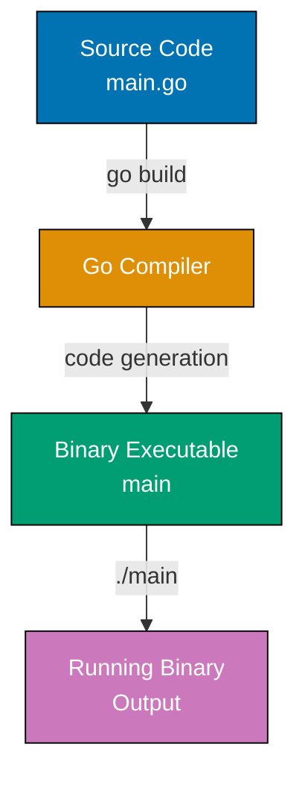

**Code**:

```go
package main // => Entry point package - makes this an executable

import (
    "fmt" // => Standard library for formatted I/O
)

func main() { // => Entry point - runtime calls this on startup
    fmt.Println("Hello, World!") // => Output: Hello, World!
                                  // => Println adds newline automatically
                                  // => String literals use double quotes (not single)
} // => Program exits after main() returns
```

**Key Takeaway**: Every executable Go program needs `package main` and a `func main()` entry point. The `import` statement brings standard library packages into scope.

**Why It Matters**: Single-binary deployment makes Go ideal for containers and microservices, where `go build` produces a statically-linked executable with no runtime dependencies unlike Java (requires JVM) or Python (requires interpreter and packages). Docker containers for Go services are 5-10MB (vs 200MB+ for equivalent Java apps), enabling faster deployments, reduced attack surface, and simplified distribution as a single file that runs anywhere.

## Example 2: Variables and Types

Go is statically typed but uses type inference - the compiler deduces types from initial values. Two ways to declare variables: explicit type with `var`, or short declaration with `:=` that infers the type.

**Code**:

```go
package main

import "fmt"

func main() {
    // Short declaration with type inference
    x := 10                     // => 10 (type: int, inferred)
    y := 3.14                   // => 3.14 (type: float64)
                                 // => float64 is default for decimal literals
    name := "Go"                // => "Go" (type: string)
    isActive := true            // => true (type: bool)

    fmt.Println(x, y, name, isActive) // => Output: 10 3.14 Go true
                                       // => Println separates values with spaces

    // Explicit type declaration
    var count int = 5           // => 5 (explicit int type)
    var message string          // => "" (zero value)
                                 // => Empty string is safe (not nil)
    var percentage float64      // => 0.0 (zero value)

    fmt.Println(count, message, percentage) // => Output: 5  0
                                             // => Two spaces: empty string between count and percentage

    // Type conversion requires explicit cast
    floatValue := 9.8           // => 9.8 (float64)
    intValue := int(floatValue) // => 9 (truncates decimal)
                                 // => No rounding - always truncates toward zero

    fmt.Println(intValue) // => Output: 9

    // Multiple variable declaration
    var a, b, c int       // => 0, 0, 0 (shared type, zero values)
                           // => All three are int type

    fmt.Println(a, b, c) // => Output: 0 0 0
}
```

**Key Takeaway**: Use `:=` for short declarations with type inference in function bodies. Go's zero values (0 for numbers, "" for strings, false for bool) initialize variables automatically when declared without values.

**Why It Matters**: Go's static typing prevents entire classes of runtime errors that plague dynamically typed languages. The compiler catches type mismatches before deployment. Zero values are a game-changer for API design—uninitialized fields have predictable, safe defaults (empty strings, zero numbers), so you never encounter `nil` errors from forgetting initialization. This design choice makes Go code more reliable and easier to reason about than languages requiring explicit null checks everywhere.

## Example 3: Constants and iota

Constants are immutable values determined at compile-time. The `iota` enumerator automatically assigns incrementing values, useful for creating enumeration patterns without manually numbering each value.

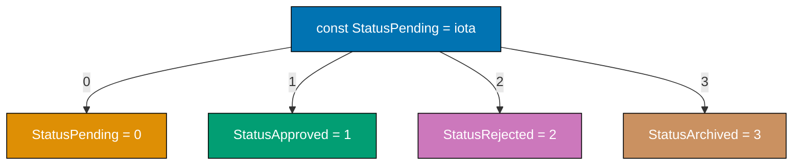

**Code**:

```go
package main

import "fmt"

func main() {
    // iota starts at 0 and increments for each constant in the block
    const (
        StatusPending    = iota // => 0 (iota resets to 0 in each const block)
        StatusApproved          // => 1 (auto-increments)
                                 // => Repeats previous expression with new iota value
        StatusRejected          // => 2
        StatusArchived          // => 3
    )

    fmt.Println(StatusPending, StatusApproved, StatusRejected, StatusArchived) // => Output: 0 1 2 3

    // Constants must be determined at compile-time
    const Pi = 3.14159         // => 3.14159 (compile-time constant)
    const Message = "Go is simple" // => Untyped constant
                                    // => Can be used with any string type

    fmt.Println(Pi, Message) // => Output: 3.14159 Go is simple

    // This would cause compilation error
    // const x = someFunction() // => ERROR: constants must be compile-time computable
                                 // => Functions execute at runtime

    var x = 5 // => 5 (variables allow runtime values)

    fmt.Println(x) // => Output: 5

    // iota with expressions
    const (
        KB = 1 << (10 * iota)   // => 1 (1 << 0)
                                 // => Bit shift creates powers of 2
        MB                       // => 1024 (1 << 10)
        GB                       // => 1048576 (1 << 20)
                                 // => 1GB = 1024 * 1024 bytes
    )

    fmt.Println(KB, MB, GB) // => Output: 1 1024 1048576
}
```

**Key Takeaway**: Use `const` for values that must be known at compile-time. `iota` eliminates manual numbering in enumeration-like patterns, automatically incrementing within a `const` block.

**Why It Matters**: Constants with `iota` enable defining related integer sequences (HTTP status codes, enumeration values, bit flags) with compile-time verification, where typos or invalid values are caught before runtime. Unlike dynamic languages where magic numbers scatter through code, Go's constants provide type-safe enumerations without the complexity of traditional enum systems, making configuration and state machines clear and maintainable.

## Example 4: Arrays and Slices

Arrays have fixed size declared upfront. Slices are dynamic collections backed by arrays - they're flexible and commonly used. Understanding the underlying array backing reveals why slices are so efficient.

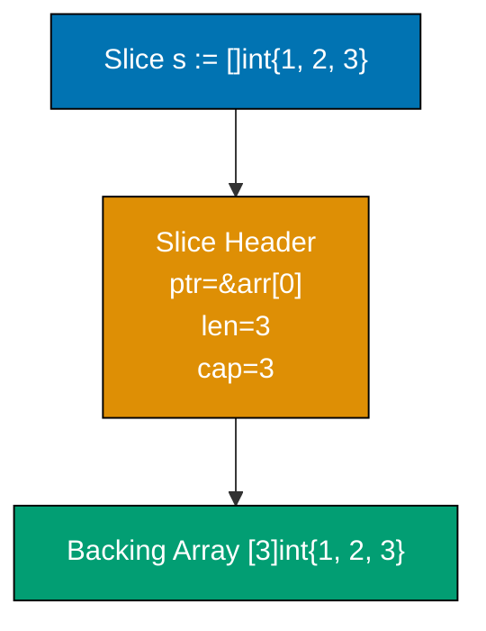

**Code**:

```go
package main

import "fmt"

func main() {
    // Array - fixed size, size is part of type
    arr := [3]int{10, 20, 30}  // => [10 20 30] (type [3]int - size in type)

    fmt.Println(arr, len(arr)) // => len() returns array size (compile-time constant)
    // => Output: [10 20 30] 3

    arr[0] = 100               // => arr is now [100 20 30] (mutable, bounds-checked)

    fmt.Println(arr)
    // => Output: [100 20 30]

    // Slice - dynamic size, backed by array
    slice := []int{1, 2, 3}    // => [1 2 3] (type []int - no size, 24-byte header)

    fmt.Println(len(slice), cap(slice)) // => len is current elements, cap is backing array size
    // => Output: 3 3

    // Append - creates new backing array if needed
    slice = append(slice, 4)   // => [1 2 3 4] (capacity exceeded, new backing array allocated)
                                // => Must assign back, capacity typically 2x old

    fmt.Println(slice, len(slice), cap(slice))
    // => Output: [1 2 3 4] 4 6

    // Slice from array or slice
    subslice := slice[1:3]     // => [2 3] ([low:high], high exclusive, shares backing array)

    fmt.Println(subslice)
    // => Output: [2 3]

    fmt.Println(cap(subslice)) // => Capacity from start to end of backing array (6-1=5)
    // => Output: 5

    // Modifying subslice affects original (shared backing array)
    subslice[0] = 999          // => subslice[0] is slice[1] - aliasing

    fmt.Println("After subslice modify:", slice)
    // => Output: After subslice modify: [1 999 3 4]

    // Reset for copy example
    slice = []int{1, 2, 3, 4}  // => Creates new backing array

    // Copy creates independent slice
    copied := make([]int, len(slice)) // => [0 0 0 0] (allocates new backing array)

    copy(copied, slice)        // => Copies elements to new array (independent)
                                // => Returns min(len(dst), len(src))

    copied[0] = 999            // => copied[0] is 999, slice unchanged (no aliasing)

    fmt.Println(slice, copied)
    // => Output: [1 2 3 4] [999 2 3 4]
}
```

**Key Takeaway**: Arrays are fixed-size and rarely used directly. Slices are the Go way - dynamic collections with `len()` (current elements) and `cap()` (backing array space). `append()` returns a new slice to handle capacity growth.

**Why It Matters**: Slices are Go's killer feature—they combine safety, flexibility, and performance. Understanding backing arrays explains why slices are passed by value efficiently (only 24 bytes of metadata, not the entire data). Capacity growth matters for performance: when you know approximately how many elements you need, pre-allocate with `make([]T, 0, capacity)` to avoid expensive reallocations. This knowledge separates inefficient Go code (repeated allocations) from production-grade code that minimizes GC pressure. Sharing slices via views with reslicing is powerful but requires care—unintended aliasing can cause subtle bugs.

## Example 5: Maps

Maps are unordered key-value collections. Unlike slices which maintain order, map iteration order is randomized - never rely on iteration order. The comma-ok idiom tests whether a key exists and its value.

**Code**:

```go
package main

import "fmt"

func main() {
    // Create map - keys are strings, values are integers
    ages := make(map[string]int) // => Empty map[string]int (hash table)
                                  // => make() allocates and initializes map

    ages["Alice"] = 30           // => Inserts "Alice": 30
    ages["Bob"] = 25              // => Now map[Alice:30 Bob:25]
    ages["Charlie"] = 35          // => map[Alice:30 Bob:25 Charlie:35]

    fmt.Println(ages["Alice"])   // => Output: 30

    fmt.Println(ages["Unknown"]) // => Output: 0 (zero value for missing key)
                                  // => Missing keys return zero value (not panic)

    // Comma-ok idiom - check if key exists
    age, exists := ages["Bob"]   // => 25, true
                                  // => Second return value distinguishes 0 from missing

    fmt.Println(age, exists) // => Output: 25 true

    age, exists = ages["David"]  // => 0, false (key not found)

    fmt.Println(age, exists) // => Output: 0 false

    // Delete key
    delete(ages, "Bob") // => Removes "Bob"
                         // => delete() on missing key is safe (no-op)

    fmt.Println(ages) // => Output: map[Alice:30 Charlie:35]

    // Map iteration order is randomized
    for name, age := range ages { // => Iterates key-value pairs (random order)
                                   // => Order changes between runs (Go randomizes intentionally)
        fmt.Printf("%s is %d\n", name, age)
    }

    // Iterate over keys only
    for name := range ages { // => Keys only
                              // => Ignores values (single variable range)
        fmt.Println(name)
    }

    // Map literal initialization
    scores := map[string]int{ // => Creates and initializes map
        "Alice": 95,
        "Bob":   87, // => Trailing comma required
                      // => Enables adding lines without modifying previous line
    }

    fmt.Println(scores) // => Output: map[Alice:95 Bob:87]
}
```

**Key Takeaway**: Maps store key-value pairs with O(1) lookup. Always use the comma-ok idiom (`value, exists := map[key]`) to safely check key existence. Never rely on map iteration order - it's deliberately randomized.

**Why It Matters**: Maps provide O(1) average-case lookup for key-value storage without external dependencies, where Go's built-in maps handle hash collisions and resizing automatically unlike C (requires external libraries) or Java (verbose HashMap boilerplate). The comma-ok idiom for existence checking prevents nil pointer panics, making maps safe for caching, configuration lookups, and deduplication in production without defensive programming overhead.

## Example 6: Structs

Structs group related data into named fields. Methods can operate on structs by specifying a receiver. The distinction between value and pointer receivers becomes important later - for now, understand the receiver is what `this` or `self` would be in other languages.

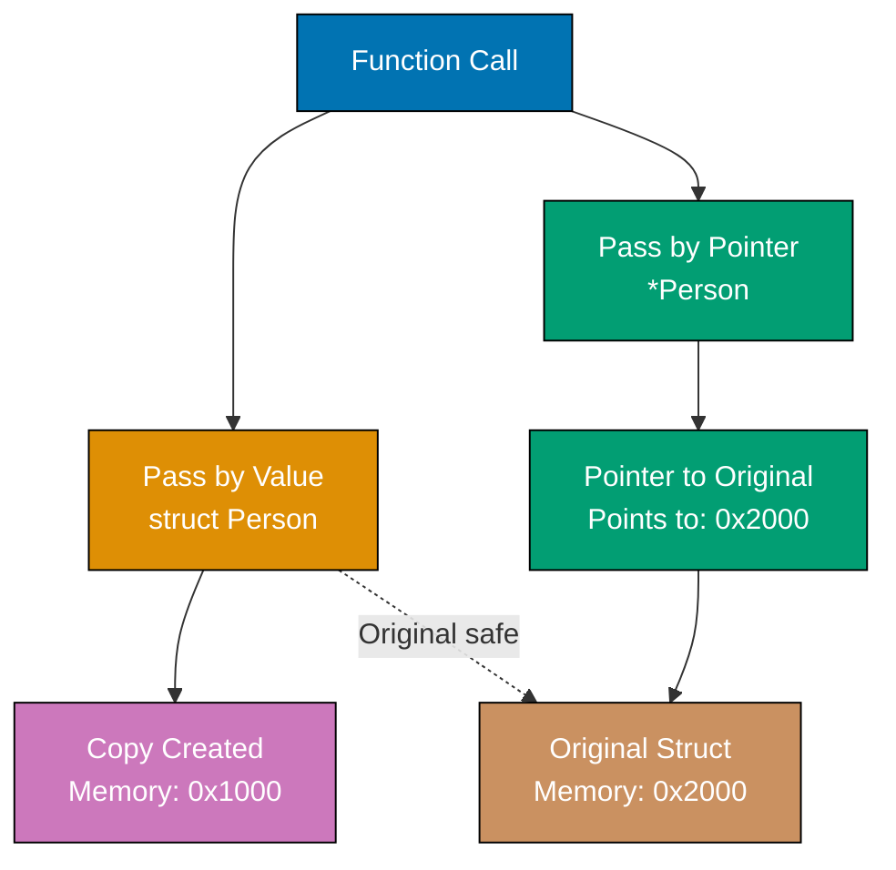

**Code**:

```go
package main

import "fmt"

func main() {
    // Define struct type and create instance
    type Person struct {
        Name string // => Exported (capital = public, lowercase = private)
        Age  int    // => Exported field
        City string // => Exported field
    }

    // Create struct using field order
    p1 := Person{"Alice", 30, "New York"} // => Positional init (fragile, avoid in production)
                                           // => Order must match struct definition

    fmt.Println(p1)
    // => Output: {Alice 30 New York}

    // Create struct using named fields (better readability)
    p2 := Person{Name: "Bob", Age: 25, City: "Boston"} // => Named fields (order doesn't matter)
                                                         // => Can specify fields in any order

    fmt.Println(p2.Name, p2.Age)          // => Dot notation access
    // => Output: Bob 25

    // Partial initialization with named fields
    p4 := Person{Name: "Charlie"}         // => Unspecified fields get zero values
                                           // => Age is 0, City is ""

    fmt.Println(p4)
    // => Output: {Charlie 0 }

    // Uninitialized struct gets zero values
    var p3 Person                         // => p3.Name is "", p3.Age is 0, p3.City is ""
                                           // => All fields initialized to zero values
                                           // => Struct zero value has all fields zero
                                           // => Safe to use immediately (no nil checks)

    fmt.Println(p3)
    // => Output: { 0 }

    // Struct field assignment
    p3.Name = "Diana"                     // => p3.Name is now "Diana"
                                           // => Individual field mutation allowed
    p3.Age = 28                            // => p3.Age is now 28
                                           // => Mutable by default (no const structs)

    fmt.Println(p3)
    // => Output: {Diana 28 }

    // Anonymous struct - used for one-off data
    response := struct {                  // => Define struct type inline (no name)
        Status int                         // => Fields follow same export rules
        Body   string
    }{200, "OK"}                          // => Initialize immediately after definition
                                           // => Useful for temporary data structures
                                           // => No reusable type name
                                           // => Common for JSON parsing and testing

    fmt.Println(response.Status)
    // => Output: 200

    fmt.Println(response.Body)
    // => Output: OK
}
```

**Key Takeaway**: Structs are Go's primary way to group related data. Use named fields when creating structs for readability. Capital letters in field names mean the field is exported and accessible from other packages.

**Why It Matters**: Value vs pointer semantics is crucial in Go and separates beginners from professionals. Passing structs by value (no pointer) creates copies—safe but expensive for large structs. Passing pointers is efficient but requires discipline to avoid shared state bugs. Methods define the receiver type: value receiver (safe, isolated) vs pointer receiver (can modify). In production Go, you constantly make this choice. Understanding field capitalization (export control without explicit `public`/`private` keywords) is the Go way of managing visibility elegantly.

## Example 7: Functions

Functions are central to Go. Unlike many languages, multiple return values are standard - this idiom appears everywhere, especially for error handling. Named return values can be used to document what a function returns.

**Code**:

```go
package main

import "fmt"

func main() {
    // Function with single return
    result := add(3, 5)         // => result is 8
                                 // => Functions can be called before definition

    fmt.Println(result)
    // => Output: 8

    // Function with multiple returns
    quotient, remainder := divide(17, 5) // => quotient is 3, remainder is 2 (common for result, error)
                                          // => Multiple returns avoid output parameters

    fmt.Println(quotient, remainder)
    // => Output: 3 2

    // Ignore return value with underscore
    q, _ := divide(20, 3)       // => q is 6, _ discards remainder (blank identifier)
                                 // => Compiler enforces using or ignoring each return value

    fmt.Println(q)
    // => Output: 6

    // Named return values
    name, greeting := greet("Go") // => name is "Go", greeting is "Hello, Go!"
                                   // => Named returns document intent

    fmt.Println(name, greeting)
    // => Output: Go Hello, Go!
}

// Single parameter and return
func add(a int, b int) int {    // => Parameters passed by value (copied)
                                 // => a and b are local copies
    return a + b
}

// Shorthand parameter syntax
func multiply(a, b int) int {   // => Consecutive params of same type use shorthand
                                 // => Equivalent to (a int, b int)
    return a * b
}

// Multiple parameters and returns
func divide(dividend int, divisor int) (int, int) { // => Two int returns (quotient, remainder)
                                                     // => No tuple type - multiple values
    return dividend / divisor, dividend % divisor   // => Integer division, then modulo
                                                     // => 17/5 = 3, 17%5 = 2
}

// Named return values - improves documentation
func greet(lang string) (language string, message string) { // => Named returns pre-declared, zero-initialized
                                                             // => language and message are local variables
    language = lang                                          // => Assign to named return
    message = fmt.Sprintf("Hello, %s!", lang)               // => fmt.Sprintf formats without printing
    return                                                   // => Naked return (returns named values implicitly)
                                                             // => Returns (language, message)
}
```

**Key Takeaway**: Functions with multiple return values are idiomatic Go - you'll use this constantly. Named return values improve clarity by documenting what a function returns. Unnamed parameters with the same type can use shorthand: `func add(a, b int)`.

**Why It Matters**: Named return values enable self-documenting function signatures and simplified error handling in defer blocks, where cleanup code can modify return values before function exit. Multiple return values eliminate the exception-handling overhead of try/catch, making error paths explicit and forcing developers to handle failures rather than ignoring them, the philosophy that makes Go production code more reliable than exception-based languages.

## Example 8: Control Flow

Go has only one loop construct (`for`) that handles all looping patterns. `if` and `switch` are straightforward but more powerful than in many languages. The `defer` statement schedules cleanup code to run when the function returns.

**Code**:

```go
package main // => Entry point package

import "fmt" // => Formatted I/O

func main() { // => Entry point function
    // if-else
    age := 25                   // => age is 25 (type: int)

    if age >= 18 {              // => Braces mandatory, no parentheses around condition
                                 // => No ternary operator in Go (use if/else)
        fmt.Println("Adult")     // => Output: Adult
    } else {
        fmt.Println("Minor")     // => Not executed (age >= 18)
    }

    // if with initialization statement
    if x := 10; x > 5 {         // => x scoped to if/else block only
                                 // => x initialized, then condition checked
        fmt.Println("x is greater than 5") // => Output: x is greater than 5
    }
    // => x undefined here (out of scope)

    // for loop - basic
    for i := 0; i < 3; i++ {    // => C-style loop
                                 // => Only loop keyword (no while, do-while)
        fmt.Println(i)           // => Output: 0, then 1, then 2
    }
    // => Output: 0 1 2

    // for loop - while style
    count := 0                   // => count is 0

    for count < 3 {             // => No while keyword - use for with condition only
        fmt.Println(count)       // => Output: 0, then 1, then 2
        count++                  // => count increments: 1, 2, 3
    }
    // => Output: 0 1 2

    // for loop - infinite
    counter := 0                 // => counter is 0

    for {                       // => Infinite loop (requires break to exit)
        if counter >= 2 {       // => Check condition before increment
            break               // => Exit loop immediately
        }
        counter++               // => counter increments: 1, 2
    }
    // => counter is 2 after loop exits

    // continue keyword
    for i := 0; i < 5; i++ {    // => Loop from 0 to 4
        if i == 2 {             // => Skip when i is 2
            continue            // => Skip rest of iteration, jump to next
        }
        fmt.Println(i)          // => Prints 0, 1, 3, 4 (skips 2)
    }
    // => Output: 0 1 3 4

    // switch statement
    language := "Go"            // => language is "Go"

    switch language {           // => No fallthrough by default (unlike C/Java)
    case "Python":              // => Not matched
        fmt.Println("Batteries included")
    case "Go":                  // => Matched - executes this case
        fmt.Println("Simple and fast")  // => Executes, then exits switch
    case "Rust":                // => Not evaluated (switch already exited)
        fmt.Println("Memory safe")
    default:                    // => Not evaluated
        fmt.Println("Unknown language")
    }
    // => Output: Simple and fast

    // switch with multiple values per case
    day := 3                    // => day is 3
    switch day {                // => Compare day against cases
    case 1, 2, 3, 4, 5:         // => Multiple values in one case
        fmt.Println("Weekday")   // => Output: Weekday (day matches 3)
    case 6, 7:                  // => Not evaluated
        fmt.Println("Weekend")
    }

    // defer - schedules cleanup
    fmt.Println("Start")        // => Output: Start (executes immediately)

    defer fmt.Println("Deferred 1")  // => Scheduled for function return (LIFO)

    defer fmt.Println("Deferred 2")  // => Executes BEFORE Deferred 1 (LIFO order)

    fmt.Println("End")          // => Output: End (executes immediately)
    // => Output order: Start, End, Deferred 2, Deferred 1
} // => Function returns, defer statements execute in LIFO order
```

**Key Takeaway**: Go's `for` loop is versatile - use it for all looping needs. `defer` schedules code to run when a function returns, useful for cleanup. Multiple `defer` statements run in reverse order (LIFO).

**Why It Matters**: Explicit control flow without exceptions forces developers to handle error cases immediately, preventing silent failures that propagate through call stacks in try/catch systems. Go's switch statement doesn't fall through by default (eliminating a common C bug), supports multiple values per case, and works without parentheses, making conditional logic cleaner and less error-prone than C-style switches that require break statements everywhere.

## Example 9: Pointers

Pointers hold memory addresses. The `&` operator takes an address, `*` dereferences it. Understanding pointers is essential for understanding Go's pass-by-value semantics and when values are copied versus when they're shared.

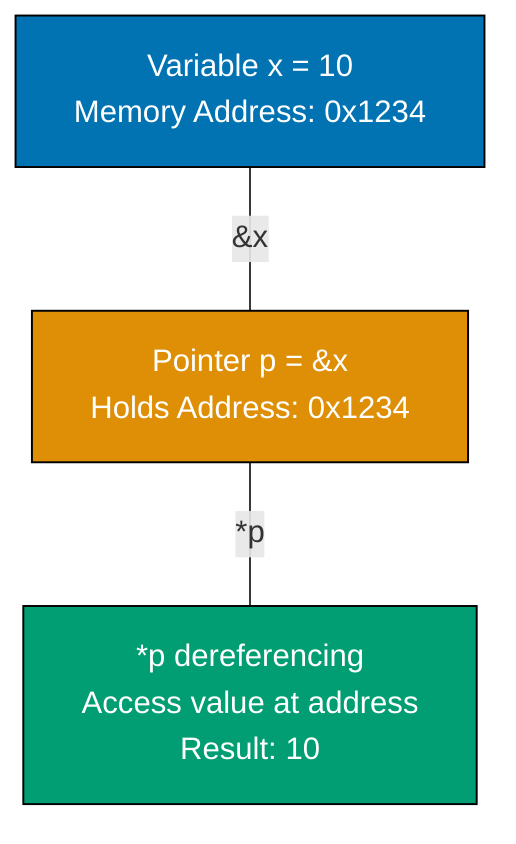

**Code**:

```go
package main

import "fmt"

func main() {
    x := 10                 // => x is 10 (stored at memory address like 0x1234)
                             // => x lives on stack or heap (compiler decides)

    p := &x                 // => p is pointer to x (type: *int)
                             // => & operator gets memory address of x
                             // => p holds address, not value

    fmt.Println(p)
    // => Output: 0xc0000a0008 (actual address varies)
    // => Hexadecimal memory address printed

    fmt.Println(*p)         // => * dereferences pointer - reads value at address
                             // => *p is 10 (the value of x)
                             // => Follow pointer to get value
    // => Output: 10

    *p = 20                 // => Dereference p and modify value at that address
                             // => x is now 20 (modified through pointer)
                             // => Indirect modification via pointer

    fmt.Println(x)
    // => Output: 20

    // Pointers enable modification in functions
    modifyValue(&x)         // => Pass address of x (function can modify original)
                             // => &x creates pointer for function parameter

    fmt.Println(x)          // => x is now 30
                             // => Function changed x through pointer
    // => Output: 30

    // Value vs pointer semantics
    y := 100
    modifyValueCopy(y)      // => Pass value (copy), not address
                             // => Function receives copy of 100
    fmt.Println(y)          // => y is still 100 (copy was modified)
                             // => Original unchanged - pass by value
    // => Output: 100

    // nil pointer - points to nothing
    var nilPtr *int         // => nilPtr is nil (zero value for pointers)
                             // => nil is safe to check, unsafe to dereference
                             // => Similar to null in other languages

    fmt.Println(nilPtr)
    // => Output: <nil>

    if nilPtr != nil {      // => Check before dereferencing
        fmt.Println(*nilPtr) // => Not executed (nilPtr is nil)
    } else {
        fmt.Println("Pointer is nil, cannot dereference")
    }
    // => Output: Pointer is nil, cannot dereference

    // Dereferencing nil causes panic - always check!
    // *nilPtr = 50         // => PANIC: runtime error: invalid memory address
                             // => Dereferencing nil crashes program

    // Create pointer with new()
    ptr := new(int)         // => ptr is pointer to new int (initialized to 0)
                             // => new() allocates memory and returns pointer
                             // => Allocates on heap, zero-initialized

    *ptr = 42               // => *ptr is now 42
                             // => Modify value at allocated address

    fmt.Println(*ptr)
    // => Output: 42
}

func modifyValue(ptr *int) { // => ptr is pointer to int (type: *int)
                              // => Receives memory address, not value copy
                              // => Can modify caller's variable

    *ptr = 30              // => Dereference ptr and modify value at that address
                            // => Changes original variable in caller
                            // => Indirect mutation through pointer
}

func modifyValueCopy(val int) { // => val is copy of argument (type: int)
                                 // => val is independent of original
                                 // => Go passes by value (copies data)

    val = 999              // => Modify copy only
                            // => Original in caller unchanged
                            // => Copy discarded after function returns
}
```

**Key Takeaway**: Pointers hold addresses. `&` gets an address, `*` dereferences it to access the value. Pointers enable functions to modify variables. Nil pointers require careful handling - dereferencing nil causes runtime panic.

**Why It Matters**: Pointers are central to understanding Go's pass-by-value semantics. Every function call copies its arguments—understanding this reveals why large structs should be passed as pointers (avoid expensive copies) and why small values can be passed by value (safe, isolated changes). Nil pointers are Go's version of null references, but they're explicit and cause panics rather than silent failures. Production Go code constantly navigates this: when to share state via pointers, when to isolate via values, and defensive nil checking before dereferencing.

## Example 10: Methods

Methods are functions attached to a type via a receiver. Go distinguishes value receivers (copy data) from pointer receivers (share data). This distinction is crucial - choosing the wrong receiver type causes subtle bugs or inefficiency.

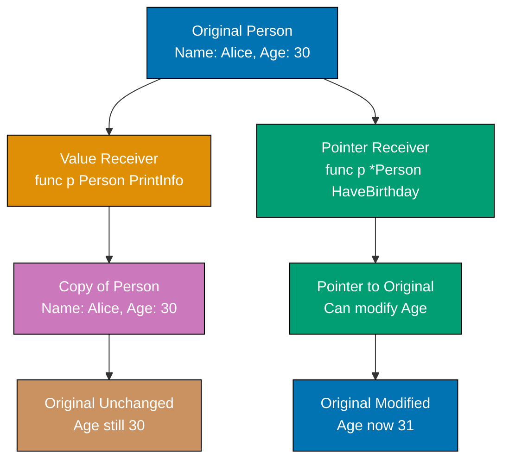

**Code**:

```go
package main

import "fmt"

func main() {
    p := Person{Name: "Alice", Age: 30} // => Person{Name:"Alice", Age:30}

    p.PrintInfo()                // => Operates on COPY, original unchanged
                                  // => Value receiver receives copy of struct
    // => Output: Name: Alice, Age: 30

    p.HaveBirthday()             // => Go converts p to &p automatically
                                  // => p.Age now 31 (modified via pointer)
                                  // => Pointer receiver method works on value
    fmt.Println(p.Age)           // => Output: 31

    p.HaveBirthday()             // => p.Age now 32
    fmt.Println(p.Age)           // => Output: 32

    ptr := &Person{Name: "Bob", Age: 25} // => ptr is *Person
                                          // => &Person{} takes address of literal

    ptr.PrintInfo()              // => Go dereferences ptr automatically
                                  // => Value receiver method works on pointer
    // => Output: Name: Bob, Age: 25

    ptr.HaveBirthday()           // => Modifies original via pointer
    fmt.Println(ptr.Age)         // => Output: 26

    p.UpdateName("Charlie")      // => Operates on copy, p.Name unchanged
                                  // => Value receiver cannot modify original
    fmt.Println(p.Name)          // => Output: Alice

    p.UpdateNamePointer("Charlie") // => Modifies original p.Name
                                    // => Pointer receiver modifies original
    fmt.Println(p.Name)          // => Output: Charlie
}

type Person struct {
    Name string
    Age  int
}

// Value receiver - operates on copy
func (p Person) PrintInfo() { // => p is copy of original struct
                                // => Method cannot modify original
    fmt.Printf("Name: %s, Age: %d\n", p.Name, p.Age)
}

// Value receiver - modifications don't affect original
func (p Person) UpdateName(newName string) {
    p.Name = newName            // => Copy modified, original unchanged
                                 // => Changes lost when function returns
}

// Pointer receiver - shares original data
func (p *Person) HaveBirthday() { // => p is pointer to original struct
                                   // => Method can modify original
    p.Age++                      // => Modifies original (p.Age shorthand for (*p).Age)
                                  // => Go automatically dereferences
}

// Pointer receiver - modifies original
func (p *Person) UpdateNamePointer(newName string) {
    p.Name = newName            // => Original modified, changes persist
                                 // => Changes visible after function returns
}
```

**Key Takeaway**: Value receivers copy data - modifications don't affect the original. Pointer receivers share data - modifications affect the original. Use pointer receivers when the method modifies the receiver or when the receiver is large (to avoid copying).

**Why It Matters**: Methods on types enable attaching behavior to data without classes, where method receivers make the relationship between data and operations explicit. Pointer receivers allow mutation and avoid copying large structs on every method call (performance), while value receivers provide immutability guarantees and safety for concurrent access. This enables building APIs that are both efficient and clear about their side effects.

## Example 11: Interfaces

Interfaces define method contracts. A type satisfies an interface implicitly - no explicit declaration needed. This duck typing is powerful but requires understanding: if a type has all methods an interface requires, it automatically satisfies that interface.

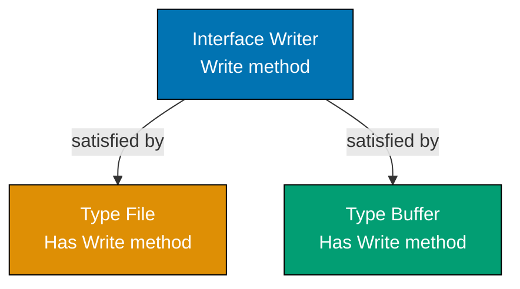

**Code**:

```go
package main

import "fmt"

func main() {
    file := &File{Name: "data.txt"} // => *File satisfies Writer (implicit interface satisfaction)
                                     // => No explicit "implements Writer" declaration

    saveData(file, "content")    // => Calls File.Write
                                  // => Type-safe polymorphism without inheritance
    // => Output: Writing to data.txt: content

    var buffer Buffer            // => buffer is Buffer (zero value, data is nil)

    saveData(&buffer, "content") // => *Buffer also satisfies Writer
                                  // => Different types, same interface
    // => No output (Buffer stores internally)

    var anything interface{} = 42 // => interface{} holds (type, value): (int, 42)
                                   // => Empty interface accepts any type

    printValue(anything)         // => Output: Value: 42 (Type: int)
                                  // => %T prints type information

    anything = "string"          // => Interface changes underlying type to (string, "string")
                                  // => Can reassign to different type

    printValue(anything)         // => Output: Value: string (Type: string)

    var w Writer                 // => w is nil Writer interface
                                  // => Interface holds (type, value) pair

    w = &File{Name: "test.txt"} // => w now holds (*File, &File{Name:"test.txt"})
                                 // => Interface wraps concrete type

    fmt.Println(w)               // => Output: &{test.txt}
                                  // => Prints underlying concrete value

    w = &Buffer{}                // => w changes to (*Buffer, &Buffer{})
                                  // => Can switch concrete types at runtime

    fmt.Println(w)               // => Output: &{[]}

    w.Write("test data")         // => Interface dispatches to Buffer.Write (dynamic dispatch)
                                  // => Runtime determines which Write() to call

    var nilWriter Writer         // => nilWriter is nil (no concrete type)
                                  // => Both type and value are nil
    if nilWriter == nil {
        fmt.Println("Writer is nil")
    }
    // => Output: Writer is nil
}

type Writer interface {
    Write(data string) error  // => Any type with Write(string) error satisfies this (implicit)
                               // => Single method interface (common Go pattern)
}

type File struct {
    Name string
}

func (f *File) Write(data string) error { // => Pointer receiver implements Write
                                           // => *File satisfies Writer, not File
    fmt.Printf("Writing to %s: %s\n", f.Name, data)
    return nil                            // => nil means success (no error)
}

type Buffer struct {
    data []string
}

func (b *Buffer) Write(data string) error { // => Pointer receiver implements Write
                                             // => *Buffer satisfies Writer
    b.data = append(b.data, data) // => Store in slice (different from File)
                                   // => Each type implements Write differently
    return nil
}

func saveData(w Writer, data string) { // => Accepts ANY Writer implementation (polymorphism)
                                        // => Function doesn't know concrete type
    w.Write(data)                // => Dynamic dispatch to concrete implementation
                                  // => Runtime resolves which Write() to call
}

func printValue(v interface{}) {       // => interface{} accepts any type
                                        // => Type-agnostic function
    fmt.Printf("Value: %v (Type: %T)\n", v, v)
                                        // => %v prints value, %T prints type
}
```

**Key Takeaway**: Interfaces define method contracts. Any type with those methods automatically satisfies the interface (implicit satisfaction). Design small interfaces (one method is common) for maximum reusability. The empty interface `interface{}` accepts any value.

**Why It Matters**: Implicit interface satisfaction is Go's secret weapon for loose coupling and composition. Unlike languages requiring explicit `implements` declarations, Go lets unrelated types suddenly satisfy interfaces. This enables powerful patterns: pass an `io.Reader` to any function expecting that interface, whether it's reading from a file, network, buffer, or custom source. Small, focused interfaces (like `io.Writer` with just `Write()`) are reusable across the entire ecosystem. This philosophy makes Go code highly modular without verbose inheritance hierarchies.

## Example 12: Error Handling

Go uses explicit error returns instead of exceptions. The `error` interface is simple - just a method returning a string. This pattern permeates Go code: function returns (result, error). Always check for errors before using results.

**Code**:

```go
package main

import (
    "errors"
    "fmt"
)

func main() {
    // Function returning error
    result, err := divide(10, 2)  // => result is 5, err is nil (Go's (int, error) pattern)
                                   // => Always declare result before error

    if err != nil {               // => Check if error occurred (nil means success)
                                   // => Always check error before using result
        fmt.Println("Error:", err)
    } else {
        fmt.Println("Result:", result)  // => Safe to use result when err is nil
    }
    // => Output: Result: 5

    // Function that errors
    result, err = divide(10, 0)   // => result is 0 (zero value), err is ErrDivisionByZero
                                   // => Zero value returned when error occurs

    if err != nil {               // => err is not nil (error occurred)
        fmt.Println("Error:", err) // => Output: Error: cannot divide by zero
                                   // => Error message from sentinel
    }

    // Error wrapping (Go 1.13+)
    wrappedErr := fmt.Errorf("division failed: %w", err) // => Wrap err with context (%w preserves original)
                                                          // => Wrapping adds context while keeping original

    if errors.Is(wrappedErr, ErrDivisionByZero) { // => errors.Is checks if error chain contains sentinel
                                                   // => Works through wrapped errors
        fmt.Println("Detected division by zero") // => Output: Detected division by zero
    }

    // Unwrap to get original error
    originalErr := errors.Unwrap(wrappedErr) // => Extract wrapped error (one level only)
                                              // => Returns nil if no wrapped error
    fmt.Println(originalErr)      // => Output: cannot divide by zero

    // Create custom error
    customErr := errors.New("custom error message") // => errors.New creates simple error
                                                     // => Common for one-off errors
    fmt.Println(customErr)        // => Output: custom error message

    // Error with formatting
    formattedErr := fmt.Errorf("operation failed: value=%d", 42) // => Format error message (no %w = no wrapping)
                                                                  // => %d formats integers
    fmt.Println(formattedErr)     // => Output: operation failed: value=42

    // Checking nil error explicitly
    _, err = divide(20, 4)        // => err is nil (successful operation)
                                   // => _ discards result (not needed)
    if err == nil {               // => Positive check (success case)
                                   // => Usually check for error, not success
        fmt.Println("Operation succeeded") // => Output: Operation succeeded
    }
}

// Sentinel error - predefined error value
var ErrDivisionByZero = errors.New("cannot divide by zero") // => Package-level sentinel error (comparable)
                                                              // => Exported for external comparison

func divide(a, b int) (int, error) { // => Returns (result, error) tuple (idiomatic Go)
                                      // => Result first, error second (convention)
    if b == 0 {                   // => Validate input first
                                   // => Early return on error
        return 0, ErrDivisionByZero  // => Return zero value and sentinel error
                                      // => Zero value safe (caller checks err)
    }
    return a / b, nil             // => Return result and nil error (success)
                                   // => nil means "no error"
}
```

**Key Takeaway**: Go uses explicit error returns - check `if err != nil` before using results. Return `nil` for no error. Use `errors.New()` or `fmt.Errorf()` to create errors. Error wrapping with `%w` preserves error chains for debugging.

**Why It Matters**: Explicit error handling makes failure paths visible in code, preventing the hidden control flow of exceptions that obscure where errors originate. Returning errors forces callers to decide how to handle failures (propagate, wrap, retry, log), making production code resilient by design. Custom error types enable rich context (wrapping with `fmt.Errorf`, error chains with `errors.Is`), supporting debugging without stack traces that exceptions provide but with explicit control flow.

## Example 13: Packages and Imports

Go organizes code with packages. Every file starts with `package`, and a directory is one package. Capitalized names are exported (visible from other packages), lowercase names are unexported (private). Imports make external packages available.

**Code**:

```go
package main                    // => Executable package (produces binary, not library)
                                 // => Must have func main() to run

import (
    "fmt"                       // => Formatting I/O from standard library
    "math"                      // => Math constants and functions
                                 // => Grouped imports preferred
)

func main() {
    fmt.Println("Pi:", math.Pi)              // => Pi: 3.141592653589793 (exported constant)
                                              // => Package prefix required for imports
    fmt.Println("Sqrt(16):", math.Sqrt(16))  // => Sqrt(16): 4 (exported function)

    msg := PublicFunction()                  // => No prefix needed (same package)
                                              // => Capital makes it public
    fmt.Println(msg)                         // => callable from other packages

    private := privateFunction()             // => Accessible within package only
                                              // => Lowercase makes it private
    fmt.Println(private)                     // => only callable within this package

    // Circle area calculation
    pi := math.Pi                            // => pi is 3.141592653589793
    radius := 5.0                            // => radius is 5.0 (float64)
    area := pi * radius * radius            // => area is 78.53981633974483
    fmt.Printf("Circle area: %.2f\n", area)  // => Circle area: 78.54 (%.2f formats to 2 decimals)
                                              // => Printf formats with template
}

// Exported function (capitalized)
func PublicFunction() string {               // => Capital P makes it exported (visible to other packages)
                                              // => Other packages can call this
    return "callable from other packages"
}

// Unexported function (lowercase)
func privateFunction() string {              // => Lowercase p makes it unexported (package-private)
                                              // => Only same package can call
    return "only callable within this package"
}

// Visibility via capitalization
const ExportedConst = 100                    // => Public (Capital E, accessible from other packages)
                                              // => Package exports with capitalization
const unexportedConst = 200                  // => Private (lowercase u, package-only)
                                              // => Hidden from external packages
```

**Key Takeaway**: `package main` declares an executable. Other packages are libraries. `import` makes packages available. Capitalization controls visibility: `Exported` is public, `unexported` is private to the package.

**Why It Matters**: Package-level organization enforces modularity, where circular dependencies are compile errors rather than runtime crashes. The `internal/` package prevents external use, enabling API evolution without breaking consumers. Capitalized exports make public APIs explicit, eliminating "what's safe to use" confusion in large codebases. Init functions enable ordered startup (database connections, configuration) with compile-time sequencing guarantees.

## Example 14: Basic Testing

Go's testing is built-in via the `testing` package. Test files end in `_test.go`. Test functions named `TestXxx(t *testing.T)`. Table-driven tests let you test many cases efficiently.

**Code**:

```go
package main

import "testing"

// Run tests with: go test
// Verbose: go test -v
// Coverage: go test -cover

// Basic test
func TestAdd(t *testing.T) {    // => Test function (must start with Test prefix, t provides utilities)
                                 // => t *testing.T is required parameter
    result := add(2, 3)          // => result is 5 (calling function under test)
    if result != 5 {            // => Manual assertion (compare expected vs actual)
                                 // => No assert library needed (standard approach)
        t.Errorf("Expected 5, got %d", result) // => Report failure (test continues after Errorf)
                                                // => Use t.Fatalf to stop test immediately
    }
}

// Table-driven test - test multiple cases
func TestDivide(t *testing.T) {  // => Tests multiple scenarios efficiently
                                  // => Single function tests many cases
    // Table of test cases
    cases := []struct {          // => Slice of anonymous structs (common Go testing pattern)
        name     string          // => Test case description
                                  // => Used in error messages
        a, b     int             // => Input values
        expected int             // => Expected result
        hasError bool            // => Whether error expected
    }{
        {"normal division", 10, 2, 5, false},        // => 10/2 = 5, no error
        {"division by zero", 10, 0, 0, true},       // => 10/0 = error expected
        {"exact division", 20, 4, 5, false},        // => 20/4 = 5, no error
    }                                                 // => Easy to add more cases

    for _, tc := range cases {   // => Iterate through test cases (_ ignores index)
                                  // => Each iteration tests one case
        result, err := divide(tc.a, tc.b) // => Call function with test inputs

        if tc.hasError {         // => Expecting an error for this case
            if err == nil {      // => Error expected but got nil
                                  // => Test failure
                t.Errorf("%s: expected error, got nil", tc.name)
            }
        } else {                 // => Not expecting error
            if err != nil {      // => Got unexpected error
                t.Errorf("%s: unexpected error: %v", tc.name, err)
            }
            if result != tc.expected { // => Check result value
                                        // => Separate check from error
                t.Errorf("%s: expected %d, got %d", tc.name, tc.expected, result)
            }
        }
    }
}
```

**Key Takeaway**: Test files end in `_test.go`. Functions named `TestXxx` are tests. Use table-driven tests to test many scenarios. Run tests with `go test` command.

**Why It Matters**: Built-in testing with `go test` eliminates external test frameworks and dependencies, where table-driven tests enable comprehensive coverage with minimal code duplication. Testing is first-class in Go tooling (coverage reports, benchmarks, examples as tests), making TDD practical without setup overhead. Fast compilation enables running tests hundreds of times per day, supporting refactoring confidence and rapid iteration cycles.

## Example 15: Strings and Formatting

Strings in Go are immutable sequences of bytes (usually UTF-8). The `strings` package provides manipulation functions. `fmt.Sprintf` formats without printing. `strings.Builder` efficiently concatenates strings.

**Code**:

```go
package main

import (
    "fmt"
    "strings"
)

func main() {
    // String basics - immutable
    s := "Hello"               // => s is "Hello" (immutable byte sequence)
    s += " World"              // => s is now "Hello World" (new string created, += inefficient in loops)
    fmt.Println(s)             // => Output: Hello World

    // String indexing returns byte values
    fmt.Println(s[0])          // => s[0] is 72 (byte value of 'H', ASCII 72)
    // => Output: 72
    fmt.Println(string(s[0]))  // => Convert byte to string: "H"
    // => Output: H

    // String length
    fmt.Println(len(s))        // => len() returns byte count: 11
    // => Output: 11

    // Strings package functions
    fmt.Println(strings.ToUpper("go"))        // => "GO" (new string, uppercase)
    // => Output: GO
    fmt.Println(strings.Contains("hello", "ll")) // => true ("hello" contains "ll")
    // => Output: true
    fmt.Println(strings.Split("a,b,c", ",")) // => []string{"a", "b", "c"}
    // => Output: [a b c]
    fmt.Println(strings.Join([]string{"a", "b", "c"}, ",")) // => "a,b,c"
    // => Output: a,b,c

    // More string operations
    trimmed := strings.TrimSpace("  hello  ") // => "hello" (leading/trailing whitespace removed)
    fmt.Println(trimmed)       // => Output: hello

    // Formatting
    formatted := fmt.Sprintf("Hello, %s! You are %d years old", "Alice", 30) // => Format string (no print, returns string)
    fmt.Println(formatted)     // => Output: Hello, Alice! You are 30 years old

    // Formatting verbs
    fmt.Printf("String: %s, Integer: %d, Float: %.2f\n", "text", 42, 3.14159)
                                // => %s (string), %d (int), %.2f (2 decimals)
    // => Output: String: text, Integer: 42, Float: 3.14

    // Efficient concatenation with Builder
    var builder strings.Builder // => Zero value ready to use (optimized for repeated appends)
    builder.WriteString("Hello") // => Append "Hello"
    builder.WriteString(" ")     // => Append " "
    builder.WriteString("Builder") // => Append "Builder"
    result := builder.String()  // => "Hello Builder" (more efficient than s1 + s2 + s3 in loops)
    fmt.Println(result)         // => Output: Hello Builder

    // String comparison
    if s == "Hello World" {     // => String equality comparison
        fmt.Println("Strings match") // => Output: Strings match
    }
}
```

**Key Takeaway**: Strings are immutable. Use `strings` package for common operations like `Split`, `Join`, `Contains`. Use `strings.Builder` for efficient concatenation in loops. Use `fmt.Sprintf` to format strings without printing.

**Why It Matters**: UTF-8 native strings prevent encoding bugs that plague ASCII-based languages, where emoji, international characters, and multi-byte sequences work correctly by default. The rune type exposes Unicode code points explicitly, making character-level processing clear and correct for international text. Format verbs (`%v`, `%T`, `%+v`) provide consistent debugging output across all types, eliminating custom toString() boilerplate.

## Example 16: Bitwise and Compound Assignment Operators

Go supports bitwise operations on integers and compound assignment operators that combine arithmetic with assignment. These operators are essential for low-level programming, bit manipulation, and concise code.

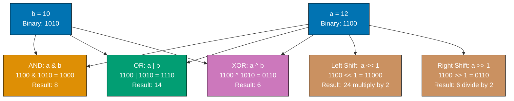

**Code**:

```go
package main

import "fmt"

func main() {
    // Compound assignment operators
    x := 10
    x += 5                     // => x = x + 5, now 15
                                // => Shorter than x = x + 5
    fmt.Println(x)

    x -= 3                     // => x = x - 3, now 12
    fmt.Println(x)

    x *= 2                     // => x = x * 2, now 24
    fmt.Println(x)

    x /= 4                     // => x = x / 4, now 6 (integer division, discards fraction)
                                // => No remainder (unlike floats)
    fmt.Println(x)

    x %= 4                     // => x = x % 4, now 2 (remainder of 6 / 4)
                                // => Modulo operator for remainders
    fmt.Println(x)

    // Bitwise operators on integers
    a := 12                    // => binary: 1100
    b := 10                    // => binary: 1010

    fmt.Println(a & b)         // => AND: 1000 = 8 (bits in BOTH)
                                // => 1&1=1, others=0
    fmt.Println(a | b)         // => OR: 1110 = 14 (bits in EITHER)
                                // => 0|0=0, others=1
    fmt.Println(a ^ b)         // => XOR: 0110 = 6 (bits in ONE only, exclusive OR)
                                // => Different bits=1, same=0
    fmt.Println(^a)            // => NOT: inverts all bits = -13 (two's complement)
                                // => Unary operator (one operand)

    // Bit shifting
    fmt.Println(a << 1)        // => Left shift: 11000 = 24 (multiply by 2^1)
                                // => Fast multiplication by powers of 2
    fmt.Println(a >> 1)        // => Right shift: 0110 = 6 (divide by 2^1)
                                // => Fast division by powers of 2

    // Compound bitwise assignment
    c := 5                     // => binary: 0101
    c &= 3                     // => 0101 & 0011 = 0001, c now 1
                                // => Combines AND with assignment
    fmt.Println(c)

    // Practical use: flag manipulation
    const (
        FlagRead  = 1 << 0     // => 1 (binary: 0001)
        FlagWrite = 1 << 1     // => 2 (binary: 0010)
                                // => Each flag is distinct bit
        FlagExec  = 1 << 2     // => 4 (binary: 0100)
    )

    permissions := FlagRead | FlagWrite    // => 3 (0001 | 0010 = 0011)
                                            // => Combine flags with OR
    fmt.Println(permissions)

    hasWrite := (permissions & FlagWrite) != 0 // => true (checks if bit 1 set)
                                                // => AND masks specific bit
    fmt.Println(hasWrite)
}
```

**Key Takeaway**: Compound assignment operators (`+=`, `-=`, `*=`, `/=`, `%=`) combine arithmetic with assignment for concise code. Bitwise operators (`&`, `|`, `^`, `^`, `<<`, `>>`) manipulate individual bits and are useful for flags, masks, and low-level operations.

**Why It Matters**: Bitwise operators enable efficient flag manipulation and low-level protocol implementation, where setting multiple boolean flags in a single integer saves memory and improves cache locality in high-performance code. Compound assignments (`+=`, `&=`) reduce verbosity while making mutation intent clear. Understanding bit operations is essential for implementing binary protocols, compression algorithms, and systems programming where byte-level control matters.

## Example 17: Variadic Functions

Variadic functions accept a variable number of arguments using the `...` syntax. The variadic parameter becomes a slice inside the function. This pattern is useful for functions like `fmt.Println` that accept any number of arguments.

**Code**:

```go
package main

import "fmt"

func main() {
    // Call with different numbers of arguments
    result1 := sum(1, 2)           // => result1 is 3 (variadic function accepts any count)
                                    // => Type-safe (all must be int)
    fmt.Println(result1)           // => Output: 3

    result2 := sum(1, 2, 3, 4, 5) // => result2 is 15 (same function, different count)
    fmt.Println(result2)           // => Output: 15

    // Can call with zero arguments
    result0 := sum()               // => result0 is 0 (empty sum, nums is []int{})
                                    // => Zero arguments valid for variadic
    fmt.Println(result0)           // => Output: 0

    // Pass slice to variadic function using ...
    numbers := []int{10, 20, 30}   // => numbers is []int{10, 20, 30}
    result3 := sum(numbers...)     // => ... unpacks slice (equivalent to sum(10, 20, 30))
                                    // => result3 is 60
                                    // => Unpacking spreads slice elements
    fmt.Println(result3)           // => Output: 60

    // Mix normal and variadic parameters
    printWithPrefix("INFO", "Server started", "Port 8080", "Ready")
                                    // => "INFO" is prefix, 3 remaining args are variadic
                                    // => Variadic must be last parameter
    // => Output:
    // => INFO: Server started
    // => INFO: Port 8080
    // => INFO: Ready

    // Variadic with one message
    printWithPrefix("ERROR", "Connection failed")
    // => Output: ERROR: Connection failed

    // Variadic with no messages
    printWithPrefix("DEBUG")       // => messages = []string{} (no output)
                                    // => Empty slice when no variadic args
}

// Variadic function - nums becomes []int inside function
func sum(nums ...int) int {        // => ...int accepts 0+ arguments (nums is []int slice)
                                    // => Inside function, nums is regular slice
    total := 0                     // => Accumulator
    for _, num := range nums {     // => Iterate over nums (_ ignores index)
        total += num               // => Accumulate sum
    }
    return total
}

// Mix normal and variadic parameters (variadic must be last)
func printWithPrefix(prefix string, messages ...string) {
                                    // => prefix required, messages variadic (0+ strings)
                                    // => Cannot have variadic before normal params
    for _, msg := range messages { // => messages is []string (variadic becomes slice)
        fmt.Printf("%s: %s\n", prefix, msg)
    }
}
```

**Key Takeaway**: Variadic functions use `...Type` to accept any number of arguments of that type, which become a slice inside the function. Use `slice...` to unpack a slice into variadic arguments. Variadic parameters must be the last parameter in the function signature.

**Why It Matters**: Variadic functions enable flexible APIs like `fmt.Printf()` without method overloading, where a single function handles arbitrary argument counts type-safely. The `...` syntax unpacks slices into variadic calls, enabling dynamic argument lists from runtime data. This powers logging, formatting, and builder patterns without the complexity of method overloading or default parameters that plague Java and C++.

## Example 18: Anonymous Functions and Closures

Anonymous functions (functions without names) can be assigned to variables or executed immediately. Closures capture variables from their surrounding scope, enabling powerful patterns like creating function factories.

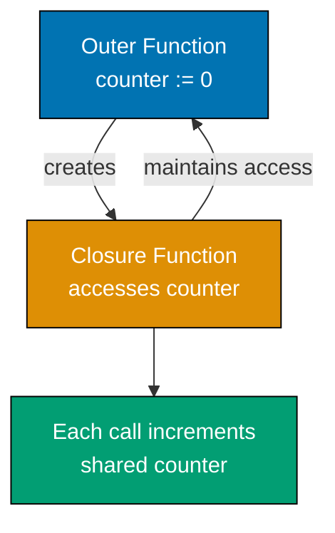

**Code**:

```go
package main

import "fmt"

func main() {
    // Anonymous function assigned to variable
    greet := func(name string) string { // => Anonymous function (greet holds function, type: func(string) string)
                                         // => No function name after func keyword
        return fmt.Sprintf("Hello, %s!", name) // => Sprintf returns string without printing
    }
    fmt.Println(greet("Alice"))    // => Output: Hello, Alice!
                                    // => Call like normal function

    // Immediately invoked function expression (IIFE)
    func() {                       // => Anonymous function invoked immediately
                                    // => Useful for scoped initialization
        fmt.Println("I run immediately")
    }()                            // => () invokes immediately (runs once, no variable)
    // => Output: I run immediately

    // IIFE with parameters
    func(msg string) {             // => Anonymous function with parameter
        fmt.Println(msg)
    }("Passing arguments")         // => Pass "Passing arguments" and invoke
                                    // => Arguments provided during invocation
    // => Output: Passing arguments

    // Closure - captures variable from outer scope
    counter := makeCounter()       // => counter is func() int (captures count from makeCounter)
                                    // => Captured variables persist across calls
    fmt.Println(counter())         // => First call: count 0→1, returns 1
    // => Output: 1
    fmt.Println(counter())         // => Second call: count 1→2, returns 2
                                    // => Same count variable, state persists
    // => Output: 2
    fmt.Println(counter())         // => Third call: count 2→3, returns 3
    // => Output: 3

    // Each closure has independent state
    counter2 := makeCounter()      // => New closure with independent count (starts at 0)
                                    // => Separate count from counter
    fmt.Println(counter2())        // => counter2's first call: returns 1 (separate from counter at 3)
    // => Output: 1
    fmt.Println(counter())         // => Original counter: 3→4
                                    // => Still has original count
    // => Output: 4

    // Closure capturing loop variable (common pitfall)
    funcs := []func(){}            // => Slice of functions
    for i := 0; i < 3; i++ {       // => Loop 0 to 2
        i := i                     // => CRITICAL: shadow i (each iteration gets own copy)
                                    // => Without this, all closures capture same i (value 3)
                                    // => Creates new i variable per iteration
        funcs = append(funcs, func() {
            fmt.Println("Loop var:", i) // => Each closure captures different i
        })
    }
    for _, f := range funcs {      // => Invoke each function
        f()
    }
    // => Output: Loop var: 0
    // => Output: Loop var: 1
    // => Output: Loop var: 2

    // Without shadowing (wrong - demonstrates pitfall)
    badFuncs := []func(){}
    for i := 0; i < 3; i++ {
        badFuncs = append(badFuncs, func() {
            fmt.Println("Bad loop var:", i) // => All closures capture SAME i
                                             // => All reference loop variable
        })
    }
    for _, f := range badFuncs {   // => Loop ends with i = 3
        f()                        // => All see i = 3
                                    // => Common closure bug
    }
    // => Output: Bad loop var: 3 (all three calls)
}

// Function that returns a closure
func makeCounter() func() int {    // => Returns func() int (function factory pattern)
                                    // => Factory creates closures with private state
    count := 0                     // => count captured by closure (lives beyond return)
                                    // => Private state for returned closure
    return func() int {            // => Closure captures count
                                    // => Returns anonymous function
        count++                    // => Increment captured count (persists across calls)
                                    // => Modifies captured variable
        return count
    }
}
```

**Key Takeaway**: Anonymous functions can be assigned to variables or invoked immediately. Closures capture variables from their surrounding scope and maintain access to those variables even after the outer function returns. Always copy loop variables when creating closures in loops to avoid capturing the wrong value.

**Why It Matters**: Closures capture lexical scope, enabling callbacks, event handlers, and functional patterns without explicit context objects. Anonymous functions eliminate trivial one-off function declarations, making code concise where small operations (sorting comparators, filter predicates) appear inline. Closures power deferred cleanup, goroutine launches with captured state, and middleware patterns that wrap behavior without boilerplate.

## Example 19: Defer, Panic, and Recover

`defer` schedules function calls to run when the surrounding function returns. `panic` stops execution and starts unwinding the stack. `recover` catches panics in deferred functions, enabling graceful error recovery.

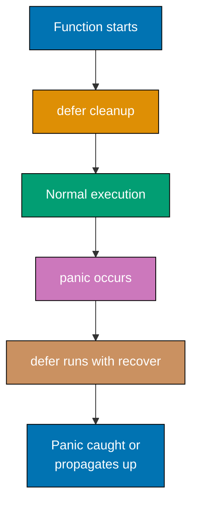

**Code**:

```go
package main

import (
    "fmt"
)

func main() {
    // defer runs when function returns (LIFO order)
    fmt.Println("Start")           // => Output: Start
    defer fmt.Println("Deferred 1") // => Scheduled (will run LAST in LIFO order)
                                     // => Last In, First Out (stack)
    defer fmt.Println("Deferred 2") // => Scheduled (will run SECOND)
    defer fmt.Println("Deferred 3") // => Scheduled (will run FIRST, most recent)
    fmt.Println("End")             // => Output: End
    // => Function returns, deferred execute in LIFO:
    // => Output: Deferred 3
    // => Output: Deferred 2
    // => Output: Deferred 1

    // defer with function call arguments (evaluated immediately)
    x := 10                        // => x is 10
    defer fmt.Println("Deferred x:", x) // => x evaluated NOW (value 10 captured)
                                         // => Arguments evaluated at defer time, not call time
    x = 20                         // => x is now 20 (deferred call still uses 10)
                                    // => Change doesn't affect deferred value
    fmt.Println("Current x:", x)   // => Output: Current x: 20
    // => Output: Deferred x: 10 (captured value)

    // panic and recover
    safeDivide(10, 2)              // => Normal execution: Output: 10 / 2 = 5
    safeDivide(10, 0)              // => Triggers panic, caught by recover
                                    // => Output: Recovered from panic: division by zero
                                    // => Program doesn't crash
    fmt.Println("Program continues after panic") // => Output: Program continues after panic
                                                  // => Execution resumes after recovered panic
}

func safeDivide(a, b int) {        // => Uses defer+recover for graceful panic handling
                                    // => Recover only works in deferred functions
    defer func() {                 // => Deferred function runs even during panic
                                    // => Anonymous defer with closure
        if r := recover(); r != nil { // => recover() returns panic value (nil if no panic)
                                       // => Only returns non-nil during panic
            fmt.Println("Recovered from panic:", r) // => Panic "caught", program continues
                                                     // => Prevents stack unwinding
        }
    }()

    if b == 0 {                   // => Check for division by zero
        panic("division by zero")  // => Trigger panic (stops execution, unwinds stack)
                                    // => Starts unwinding to find recover
    }
    fmt.Printf("%d / %d = %d\n", a, b, a/b) // => Only runs if b != 0
                                             // => Skipped during panic
}
```

**Key Takeaway**: `defer` schedules cleanup code that runs when the function returns, in LIFO order. `panic` stops execution and starts unwinding the stack. `recover()` in a deferred function catches panics, enabling graceful error handling. Use panic/recover sparingly - explicit error returns are idiomatic.

**Why It Matters**: Defer guarantees cleanup executes even during panics, preventing resource leaks (file handles, database connections, mutexes) that crash-on-error languages require try/finally to handle. LIFO execution order makes defer stacks predictable for nested resource acquisition. Panic/recover enables fail-fast for truly exceptional conditions (broken invariants) while recover in defer blocks allows graceful shutdown, protecting long-running services from crashes.

## Example 20: File Reading and Writing

Go's `os` and `io/ioutil` (now `os` in Go 1.16+) packages provide file operations. Reading and writing files requires error handling at each step. Understanding file modes and permissions is essential for production code.

**Code**:

```go
package main // => Entry point package

import (
    "fmt" // => Formatted I/O
    "os"  // => File operations
)

func main() { // => Entry point function
    // Write to file
    content := []byte("Hello, Go file I/O!") // => content is []byte (files work with bytes)
                                              // => []byte required (not string)
    err := os.WriteFile("test.txt", content, 0644) // => Write to test.txt (0644 = owner:rw-, group:r--, others:r--)
                                                    // => Creates file if doesn't exist
    if err != nil {                // => Check if write failed
        fmt.Println("Write error:", err) // => Print error message
        return                      // => Early return on error
    }
    fmt.Println("File written successfully") // => Output: File written successfully

    // Read from file
    data, err := os.ReadFile("test.txt") // => Read entire file into []byte
                                          // => Loads whole file into memory
    if err != nil {                // => Check if read failed
        fmt.Println("Read error:", err) // => Print error message
        return                      // => Early return on error
    }
    fmt.Println("File content:", string(data)) // => Convert []byte to string for printing
    // => Output: File content: Hello, Go file I/O!

    // Append to file
    file, err := os.OpenFile("test.txt", os.O_APPEND|os.O_WRONLY, 0644)
                                    // => Open for appending (| combines flags with bitwise OR)
                                    // => O_APPEND moves write pointer to end
    if err != nil {                // => Check if open failed
        fmt.Println("Open error:", err) // => Print error message
        return                      // => Early return on error
    }
    defer file.Close()             // => ALWAYS defer Close() (ensures release even if error)
                                    // => Prevents file descriptor leaks

    _, err = file.WriteString("\nAppended line") // => Write string (_ ignores bytes written)
                                                  // => Returns (bytes_written, error)
    if err != nil {                // => Check if append failed
        fmt.Println("Append error:", err) // => Print error message
        return                      // => Early return on error
    }
    fmt.Println("Content appended") // => Output: Content appended

    // Check if file exists
    if _, err := os.Stat("test.txt"); err == nil {
                                    // => os.Stat returns (file info, error); err == nil means exists
                                    // => _ discards FileInfo
        fmt.Println("File exists")  // => Output: File exists
    } else if os.IsNotExist(err) { // => Check specific error type
        fmt.Println("File does not exist") // => Not executed (file exists)
    }

    // Delete file
    err = os.Remove("test.txt")    // => Delete file from filesystem
                                    // => Permanent deletion
    if err != nil {                // => Check if delete failed
        fmt.Println("Delete error:", err) // => Print error message
        return                      // => Early return on error
    }
    fmt.Println("File deleted")    // => Output: File deleted
} // => Function returns, deferred file.Close() already executed
```

**Key Takeaway**: Use `os.WriteFile()` for simple writes and `os.ReadFile()` for reads. For more control, use `os.OpenFile()` with flags (`O_APPEND`, `O_WRONLY`, `O_CREATE`). Always use `defer file.Close()` to ensure files close properly. File permissions use Unix octal notation (0644 = owner read/write, group/others read).

**Why It Matters**: Standard library file I/O provides consistent interfaces (`io.Reader`, `io.Writer`) that compose with network, compression, and encryption without special cases. Defer file.Close() guarantees cleanup, preventing file descriptor leaks that exhaust system resources in long-running services. Buffered I/O through `bufio.Scanner` handles line-by-line reading efficiently, processing multi-GB log files without loading entire contents into memory.

## Example 21: Command-Line Arguments

Command-line programs parse arguments from `os.Args`. The `flag` package provides structured argument parsing with type checking, default values, and automatic help messages.

**Code**:

```go
package main

import (
    "flag"
    "fmt"
    "os"
)

func main() {
    // Raw arguments from os.Args
    fmt.Println("Raw args:", os.Args) // => os.Args is []string (os.Args[0] is program name)
                                       // => os.Args[0] is executable path
    // => Example: If run as "go run main.go hello world"
    // => Output: Raw args: [/tmp/go-build.../exe/main hello world]

    if len(os.Args) > 1 {          // => len > 1 means user provided arguments
                                    // => os.Args[0] is program, [1+] are args
        fmt.Println("First arg:", os.Args[1]) // => os.Args[1] is first user argument
                                               // => Zero-indexed after program name
        // => Output: First arg: hello (if provided)
    }

    // Structured argument parsing with flag package
    name := flag.String("name", "Guest", "your name") // => Define string flag (returns *string, default "Guest")
                                                        // => Third param is usage text
    age := flag.Int("age", 0, "your age")             // => Define int flag (returns *int, default 0)
    verbose := flag.Bool("verbose", false, "verbose output") // => Define bool flag (returns *bool, default false)
                                                              // => Bool flags are true if present

    flag.Parse()                   // => Parse os.Args for flags (must call before reading values)
                                    // => Processes command line arguments

    fmt.Printf("Name: %s\n", *name)    // => Dereference pointer with * to get value
                                        // => flag.String returns *string (pointer)
    fmt.Printf("Age: %d\n", *age)      // => Dereference age pointer (%d for int)
    fmt.Printf("Verbose: %t\n", *verbose) // => Dereference bool pointer (%t for bool)

    // Non-flag arguments (after flags)
    remainingArgs := flag.Args()   // => Get arguments after all flags (returns []string)
    fmt.Println("Remaining args:", remainingArgs)

    // Example usage from terminal:
    // $ go run main.go -name=Alice -age=30 -verbose file1.txt file2.txt
    // => Name: Alice, Age: 30, Verbose: true
    // => Remaining args: [file1.txt file2.txt]

    // Without flags (uses defaults):
    // $ go run main.go file1.txt
    // => Name: Guest, Age: 0, Verbose: false
    // => Remaining args: [file1.txt]
}
```

**Key Takeaway**: Use `os.Args` for raw argument access or `flag` package for structured parsing. Flag functions return pointers - dereference with `*`. Call `flag.Parse()` before reading flag values. Use `flag.Args()` for non-flag arguments.

**Why It Matters**: `os.Args` and `flag` package enable building CLI tools with standard Unix conventions (flags, arguments, help text) without external dependencies. Flag parsing handles types (int, string, bool) and validation automatically, reducing boilerplate in command-line tools. This powers production utilities where consistent flag handling (`-v`, `-h`, `--config`) follows user expectations and integrates with shell scripts.

## Example 22: Time Manipulation

The `time` package handles dates, durations, timers, and time zones. Understanding duration arithmetic and time formatting is essential for scheduling, timeouts, and timestamp handling.

**Code**:

```go
package main

import (
    "fmt"
    "time"
)

func main() {
    // Current time
    now := time.Now()              // => Current local time (type: time.Time)
                                    // => Example: 2025-12-30 15:30:45.123456 +0700 WIB
                                    // => Includes timezone information
    fmt.Println("Now:", now)

    // Time components extraction
    fmt.Println("Year:", now.Year())       // => Extract year as int: 2025
    fmt.Println("Month:", now.Month())     // => Month constant: December
                                            // => Returns time.Month type (not int)
    fmt.Println("Day:", now.Day())         // => Day of month (1-31): 30
    fmt.Println("Hour:", now.Hour())       // => Hour (0-23): 15
                                            // => 24-hour format
    fmt.Println("Weekday:", now.Weekday()) // => Day of week: Monday
                                            // => Returns time.Weekday type

    // Create specific time with Date constructor
    past := time.Date(2020, time.January, 1, 0, 0, 0, 0, time.UTC)
                                    // => time.Date(year, month, day, hour, min, sec, nsec, location)
                                    // => All parameters required (no defaults)
    fmt.Println("Past:", past)      // => Output: Past: 2020-01-01 00:00:00 +0000 UTC

    // Duration constants and arithmetic
    oneHour := time.Hour            // => time.Duration constant (int64 nanoseconds)
                                    // => Built-in constants: Hour, Minute, Second, etc.
    twoHours := 2 * time.Hour       // => Multiply duration by scalar (represents 2 hours)
                                    // => Duration arithmetic type-safe
    fmt.Println("Duration:", twoHours) // => String format: 2h0m0s

    future := now.Add(twoHours)     // => Add duration (returns new time.Time, now unchanged)
                                    // => Immutable - creates new time
    fmt.Println("Future:", future)  // => Output: Future: 2025-12-30 17:30:45.123456 +0700 WIB

    // Time difference calculation
    diff := future.Sub(now)         // => Subtract times to get duration (future - now = 2 hours)
                                    // => Returns time.Duration
    fmt.Println("Difference:", diff) // => Output: Difference: 2h0m0s

    // Time comparison methods
    if future.After(now) {          // => future.After(now) returns true (also: Before(), Equal())
                                    // => Handles timezone differences correctly
        fmt.Println("Future is after now")
    }

    // Formatting time with reference layout (Mon Jan 2 15:04:05 MST 2006)
    formatted := now.Format("2006-01-02 15:04:05")
                                    // => 2006=year, 01=month, 02=day, 15=hour, 04=min, 05=sec
    fmt.Println("Formatted:", formatted) // => Output: Formatted: 2025-12-30 15:30:45

    // Common predefined formats
    fmt.Println("RFC3339:", now.Format(time.RFC3339)) // => 2006-01-02T15:04:05Z07:00
    fmt.Println("Kitchen:", now.Format(time.Kitchen)) // => 3:04PM format

    // Parse time from string
    parsed, err := time.Parse("2006-01-02", "2025-12-25")
                                    // => Parse string using layout (returns time.Time, error)
    if err != nil {
        fmt.Println("Parse error:", err)
    } else {
        fmt.Println("Parsed:", parsed) // => Output: Parsed: 2025-12-25 00:00:00 +0000 UTC
    }

    // Sleep pauses execution
    fmt.Println("Sleeping 100ms...")
    time.Sleep(100 * time.Millisecond) // => Pause goroutine for 100ms
    fmt.Println("Awake!")           // => Output after 100ms: Awake!
}
```

**Key Takeaway**: Use `time.Now()` for current time, `time.Date()` to create specific times. Duration arithmetic uses `Add()` and `Sub()`. Format times with reference layout `2006-01-02 15:04:05`. Use `time.Sleep()` to pause execution.

**Why It Matters**: Time handling prevents common pitfalls (naive string comparisons, timezone bugs) through strong typing, where `time.Time` enforces correct arithmetic and comparisons. Duration literals (1\*time.Second) make timeouts and delays readable and type-safe. This is critical for scheduling, timeouts, and logging where incorrect time handling causes production bugs (DST transitions, leap seconds, timezone conversions) that naive timestamp arithmetic cannot handle.

## Example 23: Regular Expressions

The `regexp` package provides pattern matching and extraction. Regular expressions find, match, and extract text based on patterns. Understanding regex fundamentals unlocks powerful text processing.

**Code**:

```go
package main

import (
    "fmt"
    "regexp"
)

func main() {
    // Compile regex pattern
    pattern := `\d+`                // => Raw string literal (\d+ = one or more digits)
                                    // => Backticks for raw strings (no escaping)
    re := regexp.MustCompile(pattern) // => Compile pattern (MustCompile panics if invalid)
                                      // => Compile once, reuse many times

    // Match test - check if pattern exists
    matched := re.MatchString("abc123def") // => Returns bool: true ("abc123def" contains "123")
                                            // => Doesn't extract, just tests
    fmt.Println("Matched:", matched) // => Output: Matched: true

    // Find first match
    found := re.FindString("abc123def456") // => Returns first match: "123"
                                            // => Stops after first match
    fmt.Println("Found:", found)    // => Output: Found: 123

    // Find all matches
    all := re.FindAllString("abc123def456ghi789", -1)
                                    // => FindAllString(input, n=-1) finds all matches
                                    // => n=-1 means unlimited matches
    fmt.Println("All matches:", all) // => Output: All matches: [123 456 789]

    // Extract with capture groups
    emailPattern := `(\w+)@(\w+\.\w+)` // => (\w+)=username, @, (\w+\.\w+)=domain
                                        // => Parentheses create capture groups
    emailRe := regexp.MustCompile(emailPattern)
    matches := emailRe.FindStringSubmatch("contact: alice@example.com")
                                    // => matches[0]=full, matches[1]=group1, matches[2]=group2
                                    // => Index 0 is always full match
    if len(matches) > 2 {
        fmt.Println("Username:", matches[1]) // => Output: Username: alice
                                              // => First capture group
        fmt.Println("Domain:", matches[2])   // => Output: Domain: example.com
                                              // => Second capture group
    }

    // Replace with regex
    replaced := re.ReplaceAllString("abc123def456", "XXX")
                                    // => Replace all matches with "XXX"
                                    // => Original string unchanged
    fmt.Println("Replaced:", replaced) // => Output: Replaced: abcXXXdefXXX

    // Split with regex
    splitter := regexp.MustCompile(`\s+`) // => \s+ = one or more whitespace chars
                                           // => Matches spaces, tabs, newlines
    parts := splitter.Split("hello   world  go", -1)
                                    // => Split on whitespace (n=-1 returns all)
                                    // => Collapses multiple spaces
    fmt.Println("Split:", parts)    // => Output: Split: [hello world go]
}
```

**Key Takeaway**: Use `regexp.MustCompile()` to compile patterns. `MatchString()` tests for matches, `FindString()` extracts first match, `FindAllString()` gets all matches. Capture groups in patterns enable extraction. `ReplaceAllString()` performs regex-based replacement.

**Why It Matters**: Compiled regular expressions provide powerful pattern matching for validation (email, URLs), parsing (log lines, configuration), and transformation without external libraries. The `regexp` package prevents ReDoS attacks through linear-time guarantees, unlike PCRE's backtracking. Precompiling with `regexp.MustCompile` catches syntax errors at startup rather than runtime, making regex-heavy code (parsers, validators) reliable in production.

## Example 24: String Rune Iteration

Strings in Go are UTF-8 encoded byte sequences. Iterating by index gives bytes, but `range` gives runes (Unicode code points). Understanding this distinction prevents bugs when handling international text.

**Code**:

```go
package main

import (
    "fmt"
    "unicode/utf8"
)

func main() {
    // String with multi-byte characters
    s := "Hello, 世界"              // => String with ASCII and Chinese chars
                                    // => "Hello, " = 7 bytes (ASCII: 1 byte each)
                                    // => "世" = 3 bytes (UTF-8 encoding)
                                    // => "界" = 3 bytes (UTF-8 encoding)
                                    // => Total: 13 bytes, 9 Unicode code points

    // Length in bytes vs runes
    fmt.Println("Bytes:", len(s))   // => len() returns byte count
                                    // => s has 13 bytes
                                    // => Output: Bytes: 13
    fmt.Println("Runes:", utf8.RuneCountInString(s))
                                    // => RuneCountInString counts Unicode code points
                                    // => s has 9 runes: H, e, l, l, o, comma, space, 世, 界
                                    // => Output: Runes: 9

    // Iterate by index (gives bytes - UNSAFE for multi-byte chars)
    fmt.Println("Byte iteration:") // => Output: Byte iteration:
    for i := 0; i < len(s); i++ {   // => i iterates 0 to 12 (byte indices)
        fmt.Printf("  [%d] = %d\n", i, s[i])
                                    // => s[i] accesses individual byte (type: byte/uint8)
                                    // => For ASCII: byte = char code
                                    // => For UTF-8 multi-byte: byte = part of encoding
                                    // => Output example: [0] = 72 (H), [7] = 228 (first byte of 世)
    }

    // Iterate with range (gives runes - SAFE for multi-byte chars)
    fmt.Println("Rune iteration:")  // => Output: Rune iteration:
    for i, r := range s {           // => range on string yields (byte_index, rune)
                                    // => i is byte position where rune starts
                                    // => r is rune value (type: rune/int32)
        fmt.Printf("  [%d] = %c (U+%04X)\n", i, r, r)
                                    // => %c prints character representation
                                    // => %04X prints Unicode code point in hex
                                    // => Output example: [0] = H (U+0048), [7] = 世 (U+4E16)
    }
    // => Correctly handles multi-byte UTF-8 sequences

    // Convert string to rune slice for random access
    runes := []rune(s)              // => Convert string to []rune slice
                                    // => Each rune is one Unicode code point
                                    // => Type: []rune (same as []int32)
                                    // => len(runes) is 9 (number of code points)
    fmt.Println("Rune slice:", runes)
                                    // => Prints numeric rune values
                                    // => Output: Rune slice: [72 101 108 108 111 44 32 19990 30028]
    fmt.Println("First rune:", string(runes[0]))
                                    // => runes[0] is 72 (code point for 'H')
                                    // => string() converts rune to string
                                    // => Output: First rune: H

    // Get specific rune and its byte size
    r, size := utf8.DecodeRuneInString(s)
                                    // => Decode first rune from string
                                    // => r is rune value (72 for 'H')
                                    // => size is byte length of rune encoding (1 for ASCII)
                                    // => Returns (rune, int)
    fmt.Printf("First rune: %c (size: %d bytes)\n", r, size)
                                    // => Output: First rune: H (size: 1 bytes)

    // Check if valid UTF-8
    valid := utf8.ValidString(s)    // => Verify string is valid UTF-8 encoding
                                    // => Returns true for valid UTF-8
                                    // => Returns false for invalid byte sequences
    fmt.Println("Valid UTF-8:", valid)
                                    // => Output: Valid UTF-8: true
}
```

**Key Takeaway**: String `len()` returns bytes, not characters. Use `utf8.RuneCountInString()` for character count. Iterate with `range` to get runes (Unicode code points), not bytes. Convert to `[]rune` for random access to characters. Always use rune iteration for international text.

**Why It Matters**: Rune iteration handles multi-byte Unicode correctly, where `range` over strings yields runes (code points) rather than bytes, preventing corruption of emoji, Chinese characters, and accented letters that naive byte iteration mangles. Understanding byte vs rune distinction is essential for international text processing, where counting characters, substring extraction, and validation must respect UTF-8 encoding rather than assuming ASCII.

## Example 25: Map Manipulation Patterns

Maps support advanced patterns beyond basic get/set. Checking existence, deleting keys, iterating in deterministic order, and using structs as keys unlock powerful data organization.

**Code**:

```go
package main

import (
    "fmt"
    "sort"
)

func main() {
    // Map initialization with composite literal
    scores := map[string]int{   // => Type: map[string]int (key=string, value=int)
        "Alice": 95,            // => Key: "Alice", Value: 95
        "Bob":   87,            // => Key: "Bob", Value: 87
        "Charlie": 92,          // => Key: "Charlie", Value: 92
    }                           // => Map is reference type (passed by reference)

    // Comma-ok idiom (safe key access)
    score, exists := scores["Alice"]
                                // => Access map with key "Alice"
                                // => score gets value (95)
                                // => exists gets bool (true if key present)
                                // => Type: (int, bool)
    fmt.Println("Alice:", score, "Exists:", exists)
                                // => Output: Alice: 95 Exists: true

    score, exists = scores["David"]
                                // => Access non-existent key "David"
                                // => score gets zero value for int (0)
                                // => exists is false (key not found)
    fmt.Println("David:", score, "Exists:", exists)
                                // => Output: David: 0 Exists: false

    // Update vs insert (same syntax)
    scores["Alice"] = 98        // => Update: key "Alice" exists, change value 95→98
    scores["Eve"] = 89          // => Insert: key "Eve" doesn't exist, add new entry
    fmt.Println(scores)         // => Output: map[Alice:98 Bob:87 Charlie:92 Eve:89]
                                // => Note: map iteration order is random

    // Delete key
    delete(scores, "Bob")       // => Built-in delete(map, key) function
                                // => Removes key "Bob" and its value
                                // => Safe to call even if key doesn't exist (no panic)
    fmt.Println("After delete:", scores)
                                // => Output: map[Alice:98 Charlie:92 Eve:89]

    // Iterate in deterministic order (maps are unordered)
    // Step 1: Collect keys into slice
    keys := make([]string, 0, len(scores))
                                // => Create string slice with 0 length, capacity=map size
                                // => Capacity hint optimizes performance
    for k := range scores {     // => range on map yields key only
                                // => k is "Alice", "Charlie", "Eve" (random order)
        keys = append(keys, k)  // => Collect all keys
    }                           // => keys is ["Alice", "Charlie", "Eve"] or other order

    // Step 2: Sort keys
    sort.Strings(keys)          // => Sort keys alphabetically
                                // => keys becomes ["Alice", "Charlie", "Eve"] (alphabetical)

    // Step 3: Iterate using sorted keys
    fmt.Println("Sorted iteration:")
                                // => Output: Sorted iteration:
    for _, k := range keys {    // => Iterate sorted key slice
                                // => _ discards index, k is key
        fmt.Printf("  %s: %d\n", k, scores[k])
                                // => Access map value using sorted key
                                // => Output:   Alice: 98
                                // =>           Charlie: 92
                                // =>           Eve: 89
    }

    // Map with struct keys (structs must be comparable)
    type Point struct {         // => Define struct type
        X, Y int                // => All fields must be comparable types
    }
    locations := map[Point]string{
                                // => Map with struct key, string value
        {0, 0}:  "origin",      // => Key: Point{X:0, Y:0}, Value: "origin"
        {10, 5}: "northeast",   // => Key: Point{X:10, Y:5}, Value: "northeast"
    }
    fmt.Println(locations[Point{0, 0}])
                                // => Access using Point{0, 0} as key
                                // => Output: origin

    // Map of maps (nested structure)
    nested := map[string]map[string]int{
                                // => Outer map: string → map
                                // => Inner map: string → int
        "scores": {             // => Key: "scores", Value: map[string]int
            "math": 90,         // => Inner: "math" → 90
            "english": 85,      // => Inner: "english" → 85
        },
    }
    fmt.Println("Math score:", nested["scores"]["math"])
                                // => Access: nested["scores"] gets inner map
                                // => Then ["math"] gets value 90
                                // => Output: Math score: 90
}
```

**Key Takeaway**: Use comma-ok idiom to check key existence safely. Maps are unordered - collect and sort keys for deterministic iteration. Structs can be map keys if all fields are comparable. Nested maps require initialization of inner maps before use.

**Why It Matters**: Map iteration is intentionally randomized to prevent dependence on key order, encouraging developers to write order-independent code that doesn't break when hash implementations change. The delete() function makes map cleanup explicit and efficient (O(1) average case), critical for caches and in-memory stores. Checking existence with comma-ok prevents nil value confusion, where map["missing"] returns zero value rather than error.

## Example 26: Array vs Slice Deep Dive

Arrays and slices have critical differences in behavior, especially when passing to functions. Arrays are values (copied), slices are references (shared). Understanding backing arrays prevents subtle bugs.

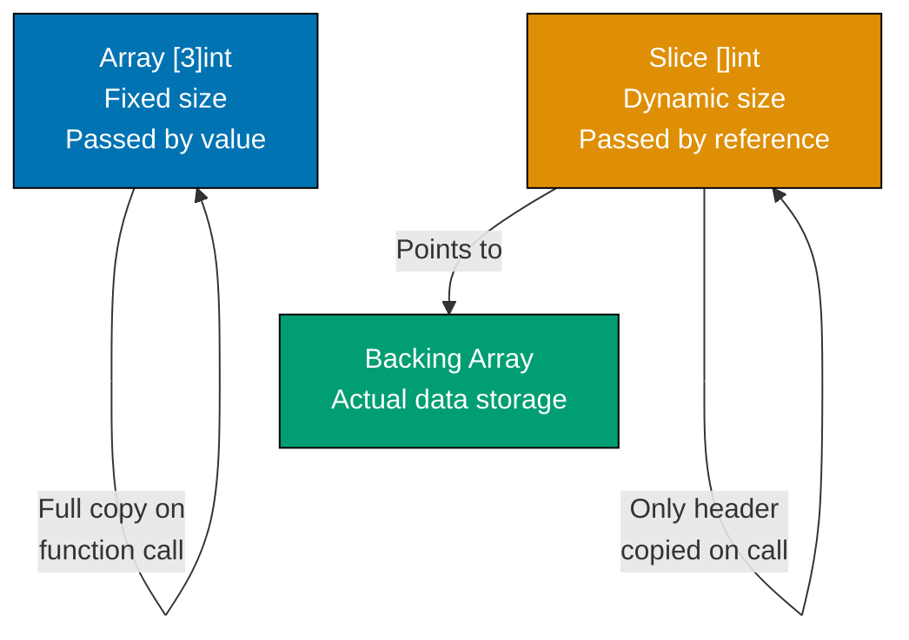

**Code**:

```go
package main

import "fmt"

func main() {
    // Array - fixed size, value type
    arr := [3]int{1, 2, 3}         // => Type: [3]int (size is part of type)
                                    // => Array is value type (copied on assignment/pass)
                                    // => arr has 3 elements: [1, 2, 3]
    modifyArray(arr)                // => Pass array to function
                                    // => Entire array copied (value semantics)
                                    // => Function gets copy, not reference
    fmt.Println("After modifyArray:", arr)
                                    // => arr unchanged: [1 2 3]
                                    // => Output: After modifyArray: [1 2 3]

    // Slice - dynamic size, reference type
    slice := []int{1, 2, 3}         // => Type: []int (no size in type)
                                    // => Slice is reference type (header + pointer to backing array)
                                    // => slice: {ptr: &array, len: 3, cap: 3}
    modifySlice(slice)              // => Pass slice to function
                                    // => Slice header copied, but ptr points to same backing array
                                    // => Function can modify backing array
    fmt.Println("After modifySlice:", slice)
                                    // => slice changed: [100 2 3]
                                    // => Output: After modifySlice: [100 2 3]

    // Slice capacity and backing array
    s1 := make([]int, 3, 5)         // => make([]T, length, capacity)
                                    // => Creates slice: len=3, cap=5
                                    // => Backing array has 5 elements, only 3 accessible
                                    // => s1: [0 0 0] (zero values)
    fmt.Println("s1:", s1, "len:", len(s1), "cap:", cap(s1))
                                    // => Output: s1: [0 0 0] len: 3 cap: 5

    s1[0] = 10                      // => Modify s1[0]: 0 → 10
                                    // => s1 is now [10 0 0]
    s2 := s1[0:2]                   // => Reslice: create new slice header
                                    // => s2 points to same backing array as s1
                                    // => s2: {ptr: s1.ptr, len: 2, cap: 5}
                                    // => s2 accesses elements [0:2]: [10 0]
    fmt.Println("s2:", s2)          // => Output: s2: [10 0]

    s2[0] = 99                      // => Modify s2[0]: 10 → 99
                                    // => Modifies shared backing array
                                    // => s1 and s2 both reference same array
    fmt.Println("s1:", s1)          // => s1 affected: [99 0 0]
                                    // => Output: s1: [99 0 0]
                                    // => Demonstrates shared backing array!

    // Append can reallocate when capacity exceeded
    s3 := []int{1, 2}               // => Slice literal: len=2, cap=2
                                    // => s3: {ptr: &[1,2], len: 2, cap: 2}
    s4 := append(s3, 3, 4, 5)       // => Append 3 elements to s3
                                    // => s3 capacity=2, need 5 total
                                    // => append() allocates new backing array (larger capacity)
                                    // => s3: still {ptr: &[1,2], len: 2, cap: 2}
                                    // => s4: new {ptr: &[1,2,3,4,5], len: 5, cap: (likely 8)}
    s4[0] = 100                     // => Modify s4[0]: 1 → 100
                                    // => s4 has different backing array than s3
    fmt.Println("s3:", s3)          // => s3 unaffected: [1 2]
                                    // => Output: s3: [1 2]
    fmt.Println("s4:", s4)          // => s4: [100 2 3 4 5]
                                    // => Output: s4: [100 2 3 4 5]

    // Copy to avoid sharing backing array
    original := []int{1, 2, 3}      // => original: {ptr: &[1,2,3], len: 3, cap: 3}
    copied := make([]int, len(original))
                                    // => Create new slice: len=3, cap=3
                                    // => copied: {ptr: &[0,0,0], len: 3, cap: 3}
    copy(copied, original)          // => copy(dst, src) built-in function
                                    // => Copies values element-by-element
                                    // => copied backing array becomes [1,2,3]
                                    // => original and copied have separate arrays
    copied[0] = 999                 // => Modify copied[0]: 1 → 999
                                    // => Only affects copied's backing array
    fmt.Println("original:", original)
                                    // => original unchanged: [1 2 3]
                                    // => Output: original: [1 2 3]
    fmt.Println("copied:", copied)  // => copied: [999 2 3]
                                    // => Output: copied: [999 2 3]
}

func modifyArray(arr [3]int) {      // => Parameter: [3]int (value type)
                                    // => arr is copy of caller's array
                                    // => arr has own memory
    arr[0] = 100                    // => Modify arr[0] in copy
                                    // => Caller's array unchanged
}

func modifySlice(slice []int) {     // => Parameter: []int (reference type)
                                    // => slice header copied: {ptr, len, cap}
                                    // => ptr points to same backing array as caller
    slice[0] = 100                  // => Modify element via ptr
                                    // => Modifies shared backing array
                                    // => Caller sees change
}
```

**Key Takeaway**: Arrays are value types - functions receive copies. Slices are reference types - functions receive header pointing to shared backing array. Reslicing shares backing arrays. `append()` may reallocate when capacity exceeded. Use `copy()` for independent slice copies.

**Why It Matters**: Understanding array vs slice semantics prevents subtle bugs where slicing creates shared backing arrays, causing unintended mutations across seemingly independent slices. Arrays have fixed size known at compile-time (stack allocation, predictable memory), while slices provide dynamic growth (heap allocation, flexible sizing). This trade-off matters for performance-critical code where stack allocation avoids GC pressure, and for correctness where sharing vs copying must be explicit.

## Example 27: Type Assertions and Type Switches

Interfaces hold values of any type. Type assertions extract the underlying concrete type. Type switches enable pattern matching on type. This is essential when working with `interface{}` or generic interfaces.

**Code**:

```go
package main

import "fmt"

func main() {
    // Type assertion - extract concrete type from interface
    var i interface{} = "hello"    // => interface{} is empty interface (holds any type)
                                    // => i currently holds string "hello"
                                    // => Type: interface{} containing string

    s := i.(string)                 // => Type assertion: i.(string)
                                    // => Extracts string value from interface
                                    // => Panics if i doesn't hold string
                                    // => s is "hello" (type: string)
    fmt.Println("String:", s)       // => Output: String: hello

    // Safe type assertion with comma-ok idiom
    s, ok := i.(string)             // => Type assertion with bool return
                                    // => s gets value if successful
                                    // => ok is true if i holds string
                                    // => s is "hello", ok is true
    if ok {                         // => ok is true, enter block
        fmt.Println("String (safe):", s)
                                    // => Output: String (safe): hello
    }

    n, ok := i.(int)                // => Try to assert i as int
                                    // => i holds string, not int
                                    // => n gets zero value (0)
                                    // => ok is false (assertion failed)
    fmt.Println("Int:", n, "OK:", ok)
                                    // => Output: Int: 0 OK: false

    // Type switch - pattern match on type
    checkType(42)                   // => Pass int
                                    // => Output: Integer: 42
    checkType("text")               // => Pass string
                                    // => Output: String: text
    checkType(3.14)                 // => Pass float64
                                    // => Output: Float: 3.14
    checkType(true)                 // => Pass bool
                                    // => Output: Boolean: true
    checkType([]int{1, 2, 3})       // => Pass slice (no case match)
                                    // => Output: Unknown type: []int

    // Interface with method, type switch on implementers
    var w Writer                    // => Declare Writer interface variable
                                    // => w is nil initially
    w = &File{Name: "test.txt"}     // => Assign *File (implements Writer)
                                    // => w now holds *File concrete type
    handleWriter(w)                 // => Call with *File
                                    // => Output: Detected File: test.txt

    w = &Buffer{}                   // => Assign *Buffer (implements Writer)
                                    // => w now holds *Buffer concrete type
    handleWriter(w)                 // => Call with *Buffer
                                    // => Output: Detected Buffer
}

func checkType(v interface{}) {     // => Parameter: interface{} (accepts any type)
                                    // => v can be int, string, float64, etc.
    switch v := v.(type) {          // => Type switch syntax
                                    // => v.(type) only valid in switch
                                    // => v in each case has that specific type
    case int:                       // => Match int type
        fmt.Printf("Integer: %d\n", v)
                                    // => v is int in this case
                                    // => Output example: Integer: 42
    case string:                    // => Match string type
        fmt.Printf("String: %s\n", v)
                                    // => v is string in this case
                                    // => Output example: String: text
    case float64:                   // => Match float64 type
        fmt.Printf("Float: %.2f\n", v)
                                    // => v is float64 in this case
                                    // => Output example: Float: 3.14
    case bool:                      // => Match bool type
        fmt.Printf("Boolean: %t\n", v)
                                    // => v is bool in this case
                                    // => Output example: Boolean: true
    default:                        // => No case matched
        fmt.Printf("Unknown type: %T\n", v)
                                    // => %T prints type name
                                    // => Output example: Unknown type: []int
    }
}

type Writer interface {             // => Define Writer interface
    Write(data string)              // => Method signature
}

type File struct {                  // => Concrete type File
    Name string                     // => Field
}

func (f *File) Write(data string) { // => *File implements Writer
    fmt.Println("Writing to file:", f.Name)
                                    // => Implementation for File
}

type Buffer struct{}                // => Empty struct Buffer

func (b *Buffer) Write(data string) {
                                    // => *Buffer implements Writer
    fmt.Println("Writing to buffer")
                                    // => Implementation for Buffer
}

func handleWriter(w Writer) {       // => Parameter: Writer interface
                                    // => w can be *File, *Buffer, etc.
    switch v := w.(type) {          // => Type switch on interface
                                    // => Determine concrete type of w
    case *File:                     // => w holds *File
        fmt.Println("Detected File:", v.Name)
                                    // => v is *File, access Name field
                                    // => Output: Detected File: test.txt
    case *Buffer:                   // => w holds *Buffer
        fmt.Println("Detected Buffer")
                                    // => v is *Buffer
                                    // => Output: Detected Buffer
    default:                        // => w holds other Writer implementation
        fmt.Println("Unknown Writer")
                                    // => Fallback case
    }
}
```

**Key Takeaway**: Use type assertion `v.(Type)` to extract concrete type from interface. Use comma-ok pattern for safe assertions. Type switches (`v.(type)`) enable pattern matching on types. `%T` format verb prints a value's type.

**Why It Matters**: Type assertions and switches enable safe dynamic typing, where `interface{}` provides flexibility (JSON unmarshaling, generic containers) and type assertions restore compile-time safety before use. The comma-ok idiom prevents runtime panics when assertions fail, making type checking explicit rather than exception-based. This pattern powers frameworks (database drivers, web servers) that work with unknown types and delegate to user code.

## Example 28: Package Initialization and init Functions

Package-level variables initialize before `main()`. The `init()` function runs once per package at program startup, useful for setup tasks. Understanding initialization order prevents subtle bugs.

**Code**:

```go
package main

import "fmt"

// Package-level variables initialize before init() and main()
var globalVar = initialize()    // => Package-level variable declaration
                                // => initialize() called at program startup
                                // => Runs BEFORE any init() function
                                // => globalVar set to "initialized"

func initialize() string {      // => Helper function for initialization
    fmt.Println("1. Initializing globalVar")
                                // => Output: 1. Initializing globalVar
                                // => Runs first (package var initialization)
    return "initialized"        // => Returns string "initialized"
                                // => Value assigned to globalVar
}

// init() runs after package-level variables, before main()
func init() {                   // => Special init() function (no parameters/returns)
                                // => Runs after all package variables initialized
                                // => Runs before main()
    fmt.Println("2. First init() function")
                                // => Output: 2. First init() function
}

// Multiple init() functions run in order of appearance
func init() {                   // => Second init() function in same file
                                // => Go allows multiple init() functions
                                // => Execute in source code order
    fmt.Println("3. Second init() function")
                                // => Output: 3. Second init() function
                                // => Runs after first init()
}

func main() {                   // => Program entry point
                                // => Runs after all init() functions complete
    fmt.Println("4. main() function")
                                // => Output: 4. main() function
    fmt.Println("globalVar:", globalVar)
                                // => globalVar already initialized to "initialized"
                                // => Output: globalVar: initialized
sh

// => Complete output sequence:
// => 1. Initializing globalVar      (package var initialization)
// => 2. First init() function       (first init)
// => 3. Second init() function      (second init)
// => 4. main() function             (main execution)
// => globalVar: initialized         (from main)
```

**Key Takeaway**: Initialization order: package-level variables → `init()` functions → `main()`. Multiple `init()` functions execute in order of appearance. Use `init()` for setup that must run once before `main()`, like initializing caches, registering drivers, or loading configuration.

**Why It Matters**: Init functions enable ordered package initialization (database connections, global caches, configuration loading) with compile-time sequencing guarantees, preventing race conditions during startup. Unlike constructors that require explicit calling, init() runs automatically, ensuring setup completes before main() or tests run. This is critical for stateful packages (database drivers, metric systems) where initialization order determines correctness.

## Example 29: Formatted Printing Verbs

The `fmt` package provides powerful formatting verbs for printing. Understanding `%v`, `%T`, `%#v`, `%+v` and others enables precise output control for debugging and logging.

**Code**:

```go
package main

import "fmt"

func main() {
    type Person struct {
        Name string
        Age  int
    }

    p := Person{"Alice", 30}    // => Person{Name:"Alice", Age:30}
    num := 255                  // => Binary: 11111111, Hex: 0xFF
    pi := 3.14159

    // Struct formatting verbs
    fmt.Printf("%v\n", p)           // => {Alice 30} (default format, field values only)
                                     // => Most common format verb
    fmt.Printf("%+v\n", p)          // => {Name:Alice Age:30} (with field names)
                                     // => Useful for debugging structs
    fmt.Printf("%#v\n", p)          // => main.Person{Name:"Alice", Age:30} (Go syntax)
                                     // => Copy-paste ready Go code
    fmt.Printf("%T\n", p)           // => main.Person (runtime type)
                                     // => Shows actual type of value

    // Integer formatting verbs
    fmt.Printf("%d\n", num)         // => 255 (decimal base-10)
                                     // => Default integer format
    fmt.Printf("%b\n", num)         // => 11111111 (binary base-2)
    fmt.Printf("%o\n", num)         // => 377 (octal base-8)
    fmt.Printf("%x\n", num)         // => ff (hex lowercase)
    fmt.Printf("%X\n", num)         // => FF (hex uppercase)
    fmt.Printf("%c\n", num)         // => ÿ (Unicode code point 255)
                                     // => Converts int to character

    // Float formatting verbs
    fmt.Printf("%f\n", pi)          // => 3.141590 (6 decimals default)
    fmt.Printf("%.2f\n", pi)        // => 3.14 (rounds to 2 decimals)
                                     // => Precision specified with .N
    fmt.Printf("%e\n", pi)          // => 3.141590e+00 (scientific, lowercase 'e')
    fmt.Printf("%E\n", pi)          // => 3.141590E+00 (scientific, uppercase 'E')

    // String formatting verbs
    fmt.Printf("%s\n", "hello")     // => hello (plain, no quotes)
    fmt.Printf("%q\n", "hello")     // => "hello" (quoted, safe representation)
                                     // => Escapes special characters
    fmt.Printf("%10s\n", "hello")   // =>      hello (width 10, right-aligned)
                                     // => Pads with spaces
    fmt.Printf("%-10s\n", "hello")  // => hello      (width 10, left-aligned)
                                     // => - prefix for left align

    // Pointer and boolean
    fmt.Printf("%p\n", &p)          // => 0xc0000a0000 (hex memory address)
                                     // => Shows where value stored
    fmt.Printf("%t\n", true)        // => true (boolean as "true"/"false")

    // Width and precision
    fmt.Printf("|%5d|\n", 42)       // => |   42| (width 5, right-aligned)
    fmt.Printf("|%-5d|\n", 42)      // => |42   | (width 5, left-aligned)
    fmt.Printf("|%05d|\n", 42)      // => |00042| (width 5, zero-padded)
                                     // => 0 prefix fills with zeros
}
```

**Key Takeaway**: Use `%v` for default format, `%+v` to include field names, `%#v` for Go syntax representation, `%T` for type. Numeric formatting: `%d` (decimal), `%x` (hex), `%b` (binary). Float precision: `%.2f`. Width and alignment control output formatting precisely.

**Why It Matters**: Format verbs provide consistent debugging output across all types, where `%+v` shows struct field names and `%#v` shows Go syntax representation, eliminating custom toString() methods. The `%T` verb exposes runtime type information for debugging interface{} values. Understanding format verbs is essential for logging and debugging, where choosing `%v` vs `%s` vs `%q` affects output clarity (quotes for strings, hex for bytes).

## Example 30: Testing Subtests and Helpers

Go 1.7+ introduced subtests for organizing related test cases. Test helpers mark functions as helpers to improve failure messages. Table-driven tests with subtests enable precise test organization.

**Code**:

```go
package main

import "testing"

// Run all tests: go test -v
// Run specific test: go test -v -run TestCalculations
// Run specific subtest: go test -v -run TestCalculations/addition

func TestCalculations(t *testing.T) {
                                    // => Test function (must start with Test)
                                    // => Parameter: *testing.T for test control
                                    // => Name format: Test<Name> (capitalized)
    // Subtests organize related test cases
    t.Run("addition", func(t *testing.T) {
                                    // => t.Run(name, func) creates subtest
                                    // => Subtest name: "addition"
                                    // => Each subtest gets own *testing.T
                                    // => Full test name: TestCalculations/addition
        result := add(2, 3)         // => Call function under test
                                    // => add(2, 3) returns 5
        if result != 5 {            // => Assertion: result should be 5
            t.Errorf("Expected 5, got %d", result)
                                    // => t.Errorf marks test failed but continues
                                    // => %d formats integer in error message
        }                           // => Test passes (result is 5)
    })

    t.Run("subtraction", func(t *testing.T) {
                                    // => Second subtest: "subtraction"
                                    // => Subtests run sequentially in order
        result := subtract(10, 4)   // => subtract(10, 4) returns 6
        if result != 6 {            // => Assertion: result should be 6
            t.Errorf("Expected 6, got %d", result)
        }                           // => Test passes
    })

    t.Run("multiplication", func(t *testing.T) {
                                    // => Third subtest: "multiplication"
                                    // => Independent from previous subtests
        result := multiply(3, 7)    // => multiply(3, 7) returns 21
        if result != 21 {           // => Assertion: result should be 21
            t.Errorf("Expected 21, got %d", result)
        }                           // => Test passes
    })
}

// Table-driven tests with subtests
func TestDivision(t *testing.T) {   // => Table-driven test pattern
                                    // => Separates test data from test logic
    tests := []struct {             // => Slice of anonymous structs
                                    // => Each struct is one test case
                                    // => Table-driven pattern scales to many cases
        name     string             // => Subtest name (for t.Run)
        a, b     int                // => Input parameters for divide()
        expected int                // => Expected result value
        hasError bool               // => Whether error expected
    }{
        {"normal division", 10, 2, 5, false},
                                    // => Test case: 10/2=5, no error
        {"division by zero", 10, 0, 0, true},
                                    // => Test case: 10/0, expect error
        {"negative result", -10, 2, -5, false},
                                    // => Test case: -10/2=-5, no error
    }                               // => 3 test cases defined in table

    for _, tc := range tests {      // => Iterate test cases
                                    // => tc is current test case struct
        t.Run(tc.name, func(t *testing.T) {
                                    // => Create subtest with tc.name
                                    // => Each test case becomes independent subtest
            result, err := divide(tc.a, tc.b)
                                    // => Call divide with test inputs
                                    // => Returns (int, error)

            if tc.hasError {        // => Check if error expected
                if err == nil {     // => Error expected but got nil
                    t.Error("Expected error, got nil")
                                    // => t.Error marks failure
                }
            } else {                // => No error expected
                if err != nil {     // => Got unexpected error
                    t.Errorf("Unexpected error: %v", err)
                }
                if result != tc.expected {
                                    // => Result doesn't match expected
                    t.Errorf("Expected %d, got %d", tc.expected, result)
                }
            }
        })
    }
}

// Test helper - marked with t.Helper()
func assertNoError(t *testing.T, err error) {
                                    // => Helper function for common assertion
                                    // => Takes *testing.T and error to check
    t.Helper()                      // => Mark as helper function
                                    // => Error line numbers point to caller, not here
                                    // => Improves error message readability
    if err != nil {                 // => Check if error occurred
        t.Fatalf("Unexpected error: %v", err)
                                    // => t.Fatalf marks test failed and stops execution
                                    // => Unlike t.Errorf (continues)
    }
}

func TestWithHelper(t *testing.T) { // => Test using helper function
    err := doSomething()            // => Call function that returns error
                                    // => doSomething() returns nil
    assertNoError(t, err)           // => Use helper to check error
                                    // => If error, failure points to this line
                                    // => Not to t.Fatalf line in helper

    // If assertion fails, error points to this line (line 38), not helper internals (line 34)
    // This is the benefit of t.Helper() - clearer error reporting
}

// Functions being tested
func add(a, b int) int      { return a + b }
                                    // => Simple addition: 2+3=5
func subtract(a, b int) int { return a - b }
                                    // => Simple subtraction: 10-4=6
func multiply(a, b int) int { return a * b }
                                    // => Simple multiplication: 3*7=21
func divide(a, b int) (int, error) {
                                    // => Division with error handling
    if b == 0 {                     // => Check for division by zero
        return 0, fmt.Errorf("division by zero")
                                    // => Return error if b is 0
    }
    return a / b, nil               // => Return result and nil error
}
func doSomething() error { return nil }
                                    // => Dummy function for helper demo
                                    // => Always returns nil (no error)
```

**Key Takeaway**: Use `t.Run(name, func(t *testing.T))` to create subtests for better organization. Run specific subtests with `-run TestName/SubtestName`. Mark helpers with `t.Helper()` to improve error line reporting. Combine table-driven tests with subtests for maximum clarity.

**Why It Matters**: Subtests with t.Run() organize complex test suites hierarchically, where TestUser/Create and TestUser/Update run as independent test cases with isolated setup/teardown. Test helpers with t.Helper() improve failure reporting by showing the test code location rather than helper internals. This enables maintainable test suites with clear failure messages, critical for large codebases where hundreds of tests must remain readable.
