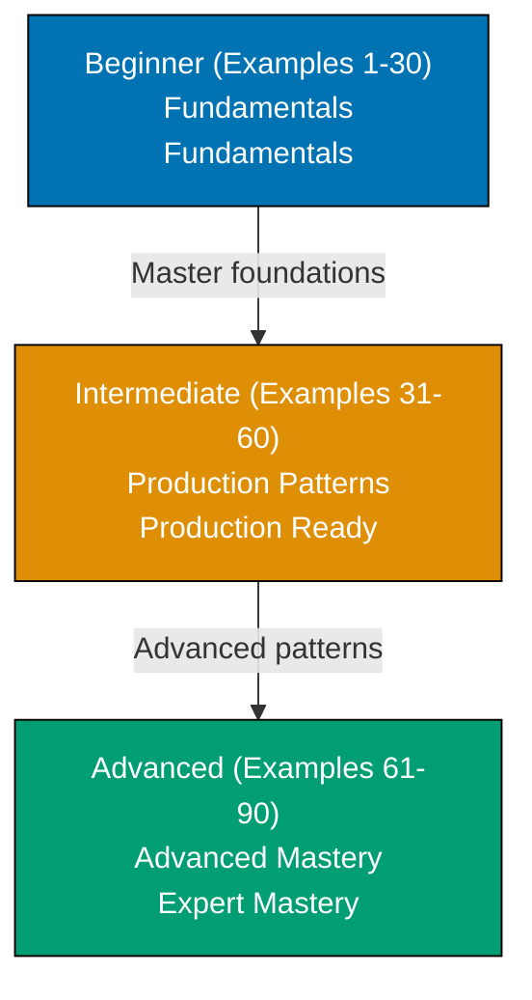

**Want to quickly master Go through working examples?** This by-example guide teaches essential concepts of Go through 85+ annotated code examples organized by complexity level.

## What Is By-Example Learning?

By-example learning is an **example-first approach** where you learn through annotated, runnable code rather than narrative explanations. Each example is self-contained, immediately executable with `go run`, and heavily commented to show:

- **What each line does** - Inline comments explain the purpose and mechanism
- **Expected outputs** - Using `// =>` notation to show results
- **Intermediate values** - Variable states and control flow made visible
- **Key takeaways** - 1-2 sentence summaries of core concepts

This approach is **ideal for experienced developers** (seasonal programmers or software engineers) who are familiar with at least one programming language and want to quickly understand Go's syntax, idioms, and unique features through working code.

Unlike narrative tutorials that build understanding through explanation and storytelling, by-example learning lets you **see the code first, run it second, and understand it through direct interaction**. You learn by doing, not by reading about doing.

## Learning Path

The Go by-example tutorial guides you through 75-90 examples organized into three progressive levels, from fundamental concepts to advanced patterns.

```mermaid
%% Color Palette: Blue #0173B2, Orange #DE8F05, Teal #029E73, Purple #CC78BC, Brown #CA9161
graph TD
    A["Beginner (Examples 1-30)<br/>Fundamentals<br/>Fundamentals"]
    B["Intermediate (Examples 31-60)<br/>Production Patterns<br/>Production Ready"]
    C["Advanced (Examples 61-90)<br/>Advanced Mastery<br/>Expert Mastery"]

    A -->|Master foundations| B
    B -->|Advanced patterns| C

    style A fill:#0173B2,stroke:#000,color:#fff
    style B fill:#DE8F05,stroke:#000,color:#fff
    style C fill:#029E73,stroke:#000,color:#fff
```

## Coverage Philosophy

This by-example guide provides **comprehensive coverage of Go** through practical, annotated examples. This tutorial covers core language features comprehensively, not a time estimate—focus is on **outcomes and understanding**, not duration.

### What's Covered

- **Core syntax** - Variables, types, operators, control flow, methods
- **Data structures** - Arrays, slices, maps, structs, and their underlying mechanics (backing arrays, capacity, zero values)
- **Functions and methods** - Function declarations, multiple returns, methods, receivers (value vs pointer), and when to use each
- **Interfaces and composition** - Interface definition, implicit satisfaction, type assertions, and Go's composition-over-inheritance philosophy
- **Error handling** - The `error` interface, custom error types, error wrapping, and the error handling idiom
- **Concurrency fundamentals** - Goroutines, channels (buffered and unbuffered), the `select` statement, synchronization primitives (`sync.WaitGroup`, `sync.Mutex`)
- **Standard library** - Deep dive into `fmt`, `strings`, `encoding/json`, `net/http`, `time`, `regexp`, `context`, and other essential packages
- **I/O and HTTP** - File operations, HTTP clients and servers, handler functions, middleware patterns
- **Production patterns** - HTTP middleware chains (request/response decoration), graceful shutdown with signal handling, worker pools, options pattern for configuration
- **Testing and benchmarking** - Table-driven tests, subtests, benchmarking, fuzzing, test coverage measurement
- **Advanced concurrency** - Pipeline patterns, fan-out/fan-in, rate limiting, semaphores, atomic operations
- **Modern Go features** - Generics (Go 1.18+), embed directive (Go 1.16+), fuzzing (Go 1.18+), workspaces (Go 1.18+)
- **Advanced tools** - Reflection, CGO, build tags, custom sorting, dependency injection, memory profiling, race detector

### What's NOT Covered

This guide focuses on **learning-oriented examples**, not problem-solving recipes or production deployment. For additional topics:

- **Framework-specific content** - Gin, Echo, Chi (standard library foundation taught here applies to all frameworks)
- **Database drivers** - SQL, MongoDB packages (driver APIs vary, learn standard library patterns instead)
- **Deployment and DevOps** - Docker, Kubernetes, cloud deployment (infrastructure beyond the language)
- **Go internals** - Scheduler algorithms, garbage collector internals, memory layout
- **Ecosystem tools** - Profiling tools beyond `pprof`, code generation tools, specialized libraries

The comprehensive coverage goal maintains humility—no tutorial can cover everything. This guide teaches the **core concepts that continue learning beyond this tutorial** through your own exploration and project work.

## How to Use This Guide

1. **Sequential or selective** - Read examples in order for progressive learning, or jump to specific topics when switching from another language
2. **Run everything** - Copy and paste examples into a file and execute with `go run`. Experimentation solidifies understanding.
3. **Modify and explore** - Change values, add print statements, break things intentionally. Learn through experimentation.
4. **Use as reference** - Bookmark examples for quick lookups when you forget syntax or patterns
5. **Complement with narrative tutorials** - By-example learning is code-first; pair with comprehensive tutorials for deeper explanations

**Best workflow**: Open your editor or terminal in one window, this guide in another. Run each example as you read it. When you encounter something unfamiliar, run the example, modify it, see what changes.

**Reference System**: Examples are numbered (1-90) and grouped by level. This numbering appears in other Go content at ayokoding.com, allowing you to reference specific examples elsewhere.

## Structure of Each Example

Every example follows a consistent five-part format:

1. **Brief Explanation** (2-3 sentences): What the example demonstrates and why it matters
2. **Mermaid Diagram** (optional): Visual clarification when concept relationships benefit from visualization
3. **Heavily Annotated Code**: Every significant line includes a comment explaining what it does and what it produces (using `// =>` notation)
4. **Key Takeaway** (1-2 sentences): The core insight you should retain from this example

This structure minimizes context switching - explanation, visual aid, runnable code, and distilled essence all in one place.

## Relationship to Other Tutorials

This by-example tutorial complements other learning approaches. Choose based on your situation:

| Tutorial Type        | Coverage        | Best For                          | Learning Style                       |
| -------------------- | --------------- | --------------------------------- | ------------------------------------ |
| **Quick Start**      | 5-30%           | Getting something working quickly | Hands-on with guided structure       |
| **Beginner**         | 0-60%           | Learning from scratch             | Narrative explanations with examples |
| **This: By Example** | Comprehensive   | Rapid depth for experienced devs  | Code-first, minimal explanation      |
| **Cookbook**         | Parallel        | Solving specific problems         | Problem-solution recipes             |
| **Advanced**         | advanced topics | Expert mastery                    | Deep dives and edge cases            |

By-example is ideal if you have programming experience in other languages. It accelerates learning by leveraging your existing knowledge - you focus on "how Go does this" rather than learning programming concepts from scratch.

The comprehensive coverage represents depth and breadth of topics you'll encounter in production Go code. It explicitly acknowledges that no tutorial covers everything, but these examples provide the foundation for continued learning through official documentation, source code, and community resources.

## Prerequisites

- Basic programming experience in any language (Python, JavaScript, Java, C++, etc.)
- A code editor you're comfortable with (VS Code with Go extension, GoLand, Vim, etc.)

You don't need to understand Go's internals, philosophy, or ecosystem yet - this tutorial teaches those through examples. You just need comfort reading and running code.

## Learning Strategies

### For Python/JavaScript Developers

You're used to dynamic typing and flexible syntax. Go will feel more structured but simpler than Java:

- **Static typing with inference**: Types are checked at compile time, but `var` and `:=` reduce verbosity
- **No classes**: Use structs and methods instead of OOP inheritance
- **Explicit error handling**: No exceptions, check returned `error` values

Focus on Examples 5-12 (types and structs) and Examples 20-25 (error handling) to build Go intuition.

### For Java/C# Developers

You understand static typing and OOP. Go simplifies and changes the paradigm:

- **Composition over inheritance**: Embed structs instead of extending classes
- **Interfaces are implicit**: No `implements` keyword, just satisfy the method set
- **No generics complexity**: Generics added in Go 1.18, simpler than Java's

Focus on Examples 15-20 (interfaces) and Examples 31-40 (goroutines and channels) to leverage your OOP knowledge.

### For C/C++ Developers

You understand pointers and systems programming. Go modernizes the experience:

- **Garbage collection**: No manual memory management, but pointers exist
- **Goroutines vs threads**: Lightweight concurrency without thread management
- **Built-in tooling**: `go fmt`, `go test`, `go build` standardize workflow

Focus on Examples 55-65 (unsafe code, CGO) and Examples 70-80 (performance profiling) to apply systems knowledge.

### For Rust Developers

You know ownership and systems programming. Go trades safety for simplicity:

- **GC instead of ownership**: No borrow checker, runtime handles memory
- **Simpler concurrency**: Goroutines and channels vs async/await
- **Faster compilation**: Near-instant builds for rapid iteration

Focus on Examples 31-50 (concurrency patterns) to see Go's approach to safe concurrent programming.

## Code-First Philosophy

This tutorial prioritizes working code over theoretical discussion:

- **No lengthy prose**: Concepts are demonstrated, not explained at length
- **Runnable examples**: Every example compiles and runs with `go run`
- **Learn by doing**: Understanding comes from running and modifying code
- **Pattern recognition**: See the same patterns in different contexts across 85 examples

If you prefer narrative explanations. By-example learning works best when you learn through experimentation.

## Comparison with By-Example for Other Languages

Other languages at ayokoding.com have similar by-example tutorials:

- **Java By-Example**: 75 examples covering OOP, streams, concurrency, JVM patterns
- **Elixir By-Example**: 90 examples covering functional programming, pattern matching, concurrency, OTP

The Go version follows the same philosophy and structure but emphasizes Go-specific strengths: simplicity, concurrency, static compilation, and the extensive standard library.

## Examples by Level

### Beginner (Examples 1–30)

- [Example 1: Hello World and Go Compilation](/en/learn/software-engineering/programming-languages/golang/by-example/beginner#example-1-hello-world-and-go-compilation)
- [Example 2: Variables and Types](/en/learn/software-engineering/programming-languages/golang/by-example/beginner#example-2-variables-and-types)
- [Example 3: Constants and iota](/en/learn/software-engineering/programming-languages/golang/by-example/beginner#example-3-constants-and-iota)
- [Example 4: Arrays and Slices](/en/learn/software-engineering/programming-languages/golang/by-example/beginner#example-4-arrays-and-slices)
- [Example 5: Maps](/en/learn/software-engineering/programming-languages/golang/by-example/beginner#example-5-maps)
- [Example 6: Structs](/en/learn/software-engineering/programming-languages/golang/by-example/beginner#example-6-structs)
- [Example 7: Functions](/en/learn/software-engineering/programming-languages/golang/by-example/beginner#example-7-functions)
- [Example 8: Control Flow](/en/learn/software-engineering/programming-languages/golang/by-example/beginner#example-8-control-flow)
- [Example 9: Pointers](/en/learn/software-engineering/programming-languages/golang/by-example/beginner#example-9-pointers)
- [Example 10: Methods](/en/learn/software-engineering/programming-languages/golang/by-example/beginner#example-10-methods)
- [Example 11: Interfaces](/en/learn/software-engineering/programming-languages/golang/by-example/beginner#example-11-interfaces)
- [Example 12: Error Handling](/en/learn/software-engineering/programming-languages/golang/by-example/beginner#example-12-error-handling)
- [Example 13: Packages and Imports](/en/learn/software-engineering/programming-languages/golang/by-example/beginner#example-13-packages-and-imports)
- [Example 14: Basic Testing](/en/learn/software-engineering/programming-languages/golang/by-example/beginner#example-14-basic-testing)
- [Example 15: Strings and Formatting](/en/learn/software-engineering/programming-languages/golang/by-example/beginner#example-15-strings-and-formatting)
- [Example 16: Bitwise and Compound Assignment Operators](/en/learn/software-engineering/programming-languages/golang/by-example/beginner#example-16-bitwise-and-compound-assignment-operators)
- [Example 17: Variadic Functions](/en/learn/software-engineering/programming-languages/golang/by-example/beginner#example-17-variadic-functions)
- [Example 18: Anonymous Functions and Closures](/en/learn/software-engineering/programming-languages/golang/by-example/beginner#example-18-anonymous-functions-and-closures)
- [Example 19: Defer, Panic, and Recover](/en/learn/software-engineering/programming-languages/golang/by-example/beginner#example-19-defer-panic-and-recover)
- [Example 20: File Reading and Writing](/en/learn/software-engineering/programming-languages/golang/by-example/beginner#example-20-file-reading-and-writing)
- [Example 21: Command-Line Arguments](/en/learn/software-engineering/programming-languages/golang/by-example/beginner#example-21-command-line-arguments)
- [Example 22: Time Manipulation](/en/learn/software-engineering/programming-languages/golang/by-example/beginner#example-22-time-manipulation)
- [Example 23: Regular Expressions](/en/learn/software-engineering/programming-languages/golang/by-example/beginner#example-23-regular-expressions)
- [Example 24: String Rune Iteration](/en/learn/software-engineering/programming-languages/golang/by-example/beginner#example-24-string-rune-iteration)
- [Example 25: Map Manipulation Patterns](/en/learn/software-engineering/programming-languages/golang/by-example/beginner#example-25-map-manipulation-patterns)
- [Example 26: Array vs Slice Deep Dive](/en/learn/software-engineering/programming-languages/golang/by-example/beginner#example-26-array-vs-slice-deep-dive)
- [Example 27: Type Assertions and Type Switches](/en/learn/software-engineering/programming-languages/golang/by-example/beginner#example-27-type-assertions-and-type-switches)
- [Example 28: Package Initialization and init Functions](/en/learn/software-engineering/programming-languages/golang/by-example/beginner#example-28-package-initialization-and-init-functions)
- [Example 29: Formatted Printing Verbs](/en/learn/software-engineering/programming-languages/golang/by-example/beginner#example-29-formatted-printing-verbs)
- [Example 30: Testing Subtests and Helpers](/en/learn/software-engineering/programming-languages/golang/by-example/beginner#example-30-testing-subtests-and-helpers)

### Intermediate (Examples 31–60)

- [Example 31: Type Embedding and Composition](/en/learn/software-engineering/programming-languages/golang/by-example/intermediate#example-31-type-embedding-and-composition)
- [Example 32: Custom Error Types](/en/learn/software-engineering/programming-languages/golang/by-example/intermediate#example-32-custom-error-types)
- [Example 33: JSON Handling](/en/learn/software-engineering/programming-languages/golang/by-example/intermediate#example-33-json-handling)
- [Example 34: Goroutines](/en/learn/software-engineering/programming-languages/golang/by-example/intermediate#example-34-goroutines)
- [Example 35: Channels](/en/learn/software-engineering/programming-languages/golang/by-example/intermediate#example-35-channels)
- [Example 36: Channel Select](/en/learn/software-engineering/programming-languages/golang/by-example/intermediate#example-36-channel-select)
- [Example 37: WaitGroups and Sync](/en/learn/software-engineering/programming-languages/golang/by-example/intermediate#example-37-waitgroups-and-sync)
- [Example 38: File I/O](/en/learn/software-engineering/programming-languages/golang/by-example/intermediate#example-38-file-io)
- [Example 39: HTTP Client](/en/learn/software-engineering/programming-languages/golang/by-example/intermediate#example-39-http-client)
- [Example 40: HTTP Server](/en/learn/software-engineering/programming-languages/golang/by-example/intermediate#example-40-http-server)
- [Example 41: Time and Duration](/en/learn/software-engineering/programming-languages/golang/by-example/intermediate#example-41-time-and-duration)
- [Example 42: Regular Expressions](/en/learn/software-engineering/programming-languages/golang/by-example/intermediate#example-42-regular-expressions)
- [Example 43: Context Package](/en/learn/software-engineering/programming-languages/golang/by-example/intermediate#example-43-context-package)
- [Example 44: Flag Parsing](/en/learn/software-engineering/programming-languages/golang/by-example/intermediate#example-44-flag-parsing)
- [Example 45: HTTP Middleware Pattern](/en/learn/software-engineering/programming-languages/golang/by-example/intermediate#example-45-http-middleware-pattern)
- [Example 46: Graceful Shutdown](/en/learn/software-engineering/programming-languages/golang/by-example/intermediate#example-46-graceful-shutdown)
- [Example 47: Worker Pool Pattern](/en/learn/software-engineering/programming-languages/golang/by-example/intermediate#example-47-worker-pool-pattern)
- [Example 48: Benchmarking](/en/learn/software-engineering/programming-languages/golang/by-example/intermediate#example-48-benchmarking)
- [Example 49: Examples as Tests](/en/learn/software-engineering/programming-languages/golang/by-example/intermediate#example-49-examples-as-tests)
- [Example 50: Test Coverage](/en/learn/software-engineering/programming-languages/golang/by-example/intermediate#example-50-test-coverage)
- [Example 51: HTTP Middleware Chain (Production Pattern)](/en/learn/software-engineering/programming-languages/golang/by-example/intermediate#example-51-http-middleware-chain-production-pattern)
- [Example 52: Context Cancellation Patterns](/en/learn/software-engineering/programming-languages/golang/by-example/intermediate#example-52-context-cancellation-patterns)
- [Example 53: JSON Streaming with Encoder/Decoder](/en/learn/software-engineering/programming-languages/golang/by-example/intermediate#example-53-json-streaming-with-encoderdecoder)
- [Example 54: HTTP Client with Timeouts and Retries](/en/learn/software-engineering/programming-languages/golang/by-example/intermediate#example-54-http-client-with-timeouts-and-retries)
- [Example 55: Table-Driven Test Patterns](/en/learn/software-engineering/programming-languages/golang/by-example/intermediate#example-55-table-driven-test-patterns)
- [Example 56: Buffered I/O for Performance](/en/learn/software-engineering/programming-languages/golang/by-example/intermediate#example-56-buffered-io-for-performance)
- [Example 57: Worker Pool with Graceful Shutdown](/en/learn/software-engineering/programming-languages/golang/by-example/intermediate#example-57-worker-pool-with-graceful-shutdown)
- [Example 58: Custom Error Types with Stack Context](/en/learn/software-engineering/programming-languages/golang/by-example/intermediate#example-58-custom-error-types-with-stack-context)
- [Example 59: Rate Limiting with Token Bucket](/en/learn/software-engineering/programming-languages/golang/by-example/intermediate#example-59-rate-limiting-with-token-bucket)
- [Example 60: Benchmarking and Optimization](/en/learn/software-engineering/programming-languages/golang/by-example/intermediate#example-60-benchmarking-and-optimization)

### Advanced (Examples 61–85)

- [Example 61: Pipeline Pattern](/en/learn/software-engineering/programming-languages/golang/by-example/advanced#example-61-pipeline-pattern)
- [Example 62: Context-Aware Pipelines](/en/learn/software-engineering/programming-languages/golang/by-example/advanced#example-62-context-aware-pipelines)
- [Example 63: Rate Limiting](/en/learn/software-engineering/programming-languages/golang/by-example/advanced#example-63-rate-limiting)
- [Example 64: Semaphore Pattern](/en/learn/software-engineering/programming-languages/golang/by-example/advanced#example-64-semaphore-pattern)
- [Example 65: Atomic Operations](/en/learn/software-engineering/programming-languages/golang/by-example/advanced#example-65-atomic-operations)
- [Example 66: Reflection](/en/learn/software-engineering/programming-languages/golang/by-example/advanced#example-66-reflection)
- [Example 67: Binary Encoding](/en/learn/software-engineering/programming-languages/golang/by-example/advanced#example-67-binary-encoding)
- [Example 68: Cryptography Basics](/en/learn/software-engineering/programming-languages/golang/by-example/advanced#example-68-cryptography-basics)
- [Example 69: Templates](/en/learn/software-engineering/programming-languages/golang/by-example/advanced#example-69-templates)
- [Example 70: Generic Functions](/en/learn/software-engineering/programming-languages/golang/by-example/advanced#example-70-generic-functions)
- [Example 71: Generic Types](/en/learn/software-engineering/programming-languages/golang/by-example/advanced#example-71-generic-types)
- [Example 72: Constraints and Comparable](/en/learn/software-engineering/programming-languages/golang/by-example/advanced#example-72-constraints-and-comparable)
- [Example 73: Options Pattern](/en/learn/software-engineering/programming-languages/golang/by-example/advanced#example-73-options-pattern)
- [Example 74: Embed Directive (Go 1.16+)](/en/learn/software-engineering/programming-languages/golang/by-example/advanced#example-74-embed-directive-go-116)
- [Example 75: Build Tags](/en/learn/software-engineering/programming-languages/golang/by-example/advanced#example-75-build-tags)
- [Example 76: Custom Sorting](/en/learn/software-engineering/programming-languages/golang/by-example/advanced#example-76-custom-sorting)
- [Example 77: Dependency Injection](/en/learn/software-engineering/programming-languages/golang/by-example/advanced#example-77-dependency-injection)
- [Example 78: Subtests](/en/learn/software-engineering/programming-languages/golang/by-example/advanced#example-78-subtests)
- [Example 79: Mocking with Interfaces](/en/learn/software-engineering/programming-languages/golang/by-example/advanced#example-79-mocking-with-interfaces)
- [Example 80: Fuzzing (Go 1.18+)](/en/learn/software-engineering/programming-languages/golang/by-example/advanced#example-80-fuzzing-go-118)
- [Example 81: CGO Basics](/en/learn/software-engineering/programming-languages/golang/by-example/advanced#example-81-cgo-basics)
- [Example 82: Workspaces (Go 1.18+)](/en/learn/software-engineering/programming-languages/golang/by-example/advanced#example-82-workspaces-go-118)
- [Example 83: Memory Profiling](/en/learn/software-engineering/programming-languages/golang/by-example/advanced#example-83-memory-profiling)
- [Example 84: Race Detector](/en/learn/software-engineering/programming-languages/golang/by-example/advanced#example-84-race-detector)
- [Example 85: Go Best Practices Synthesis](/en/learn/software-engineering/programming-languages/golang/by-example/advanced#example-85-go-best-practices-synthesis)
