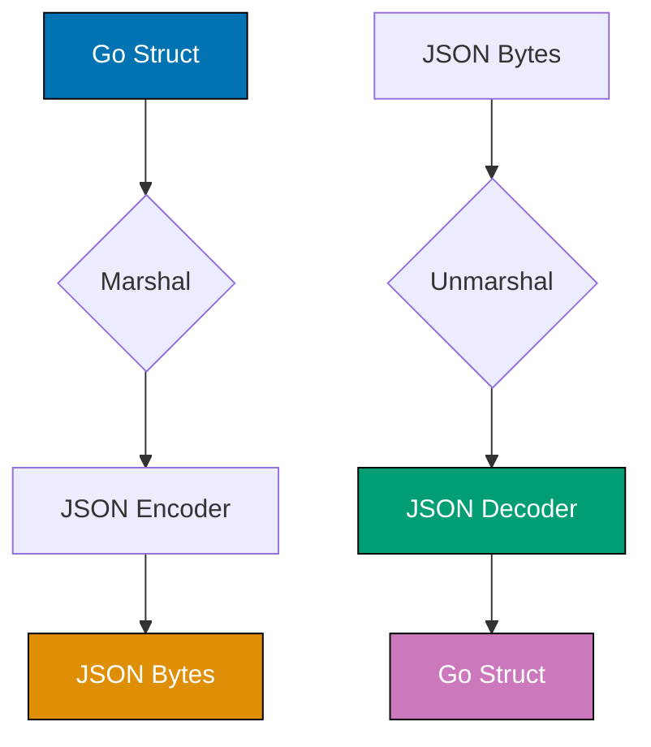

## Problem

JSON handling requires proper struct tags, custom marshaling for complex types, and validation. Incorrect marshaling leads to data loss or incorrect JSON output.

```go
// Problematic - no control over JSON output
type User struct {
    ID       int
    Password string  // Exposed in JSON!
    Email    string
}
```

This guide shows practical JSON handling techniques in Go.

## Solution

### 1. Struct Tags and Basic Marshaling

```go
type User struct {
    ID        int       `json:"id"`
    Username  string    `json:"username"`
    Email     string    `json:"email"`
    Password  string    `json:"-"`  // Omit from JSON
    CreatedAt time.Time `json:"created_at"`
    UpdatedAt time.Time `json:"updated_at,omitempty"`  // Omit if zero
}

func main() {
    user := User{
        ID:       1,
        Username: "john",
        Email:    "john@example.com",
        Password: "secret",
    }

    // Marshal to JSON
    data, _ := json.Marshal(user)
    fmt.Println(string(data))
    // {"id":1,"username":"john","email":"john@example.com","created_at":"0001-01-01T00:00:00Z"}

    // Unmarshal from JSON
    jsonStr := `{"id":2,"username":"jane","email":"jane@example.com"}`
    var newUser User
    json.Unmarshal([]byte(jsonStr), &newUser)
}
```

### 2. Custom JSON Marshaling

```go
type Duration time.Duration

func (d Duration) MarshalJSON() ([]byte, error) {
    return json.Marshal(time.Duration(d).String())
}

func (d *Duration) UnmarshalJSON(b []byte) error {
    var v interface{}
    if err := json.Unmarshal(b, &v); err != nil {
        return err
    }

    switch value := v.(type) {
    case string:
        dur, err := time.ParseDuration(value)
        if err != nil {
            return err
        }
        *d = Duration(dur)
        return nil
    default:
        return errors.New("invalid duration")
    }
}

type Config struct {
    Timeout Duration `json:"timeout"`
}
```

### 3. Embedded JSON

```go
type Event struct {
    Type string          `json:"type"`
    Data json.RawMessage `json:"data"`
}

type UserEvent struct {
    Username string `json:"username"`
    Email    string `json:"email"`
}

func handleEvent(eventJSON string) error {
    var event Event
    if err := json.Unmarshal([]byte(eventJSON), &event); err != nil {
        return err
    }

    switch event.Type {
    case "user_created":
        var userEvent UserEvent
        if err := json.Unmarshal(event.Data, &userEvent); err != nil {
            return err
        }
        fmt.Printf("User created: %s\n", userEvent.Username)
    }

    return nil
}
```

## How It Works



## Variations

### 1. JSON Streaming with Encoder/Decoder

Use `json.Encoder` and `json.Decoder` for streaming large JSON:

```go
// Streaming encode
func streamEncode(w io.Writer, users []User) error {
    enc := json.NewEncoder(w)
    enc.SetIndent("", "  ")  // Pretty print

    for _, user := range users {
        if err := enc.Encode(user); err != nil {
            return err
        }
    }
    return nil
}

// Streaming decode
func streamDecode(r io.Reader) ([]User, error) {
    dec := json.NewDecoder(r)
    var users []User

    // Read opening bracket
    if _, err := dec.Token(); err != nil {
        return nil, err
    }

    for dec.More() {
        var user User
        if err := dec.Decode(&user); err != nil {
            return nil, err
        }
        users = append(users, user)
    }

    // Read closing bracket
    if _, err := dec.Token(); err != nil {
        return nil, err
    }

    return users, nil
}
```

**Trade-offs**: Memory efficient for large data but more complex than Marshal/Unmarshal.

### 2. Nullable Fields with Pointers

Use pointers to distinguish between zero values and missing fields:

```go
type User struct {
    ID       int     `json:"id"`
    Username string  `json:"username"`
    Age      *int    `json:"age,omitempty"`      // nil if not provided
    Active   *bool   `json:"active,omitempty"`   // nil vs false
}

func main() {
    age := 25
    active := false

    user := User{
        ID:       1,
        Username: "john",
        Age:      &age,     // Explicitly set to 25
        Active:   &active,  // Explicitly set to false (not omitted)
    }

    data, _ := json.Marshal(user)
    // {"id":1,"username":"john","age":25,"active":false}
}
```

**Trade-offs**: Precise control over null vs zero but adds pointer dereferencing.

### 3. Custom Field Names with Tags

Map Go names to different JSON names:

```go
type APIResponse struct {
    UserID    int    `json:"user_id"`
    FirstName string `json:"firstName"`
    LastName  string `json:"lastName"`
    IsActive  bool   `json:"is_active"`
}
```

**Trade-offs**: Adapts to external APIs but creates naming inconsistency.

### 4. Validation with JSON Schema

Validate JSON against schema:

```go
import "github.com/xeipuuv/gojsonschema"

func validateJSON(jsonData, schemaURL string) error {
    schema := gojsonschema.NewReferenceLoader(schemaURL)
    doc := gojsonschema.NewStringLoader(jsonData)

    result, err := gojsonschema.Validate(schema, doc)
    if err != nil {
        return err
    }

    if !result.Valid() {
        for _, desc := range result.Errors() {
            return fmt.Errorf("validation error: %s", desc)
        }
    }

    return nil
}
```

**Trade-offs**: Strong validation but requires schema definition and external library.

### 5. Dynamic JSON with map[string]interface{}

Handle unknown JSON structure:

```go
func parseDynamicJSON(jsonStr string) error {
    var data map[string]interface{}
    if err := json.Unmarshal([]byte(jsonStr), &data); err != nil {
        return err
    }

    // Type assertions needed
    if username, ok := data["username"].(string); ok {
        fmt.Println("Username:", username)
    }

    if age, ok := data["age"].(float64); ok {  // JSON numbers are float64!
        fmt.Println("Age:", int(age))
    }

    return nil
}
```

**Trade-offs**: Flexible but loses type safety and requires type assertions.

## Common Pitfalls

**Pitfall 1: Unexported Fields**

```go
// Bad - lowercase fields won't marshal
type User struct {
    id   int
    name string
}

// Good
type User struct {
    ID   int    `json:"id"`
    Name string `json:"name"`
}
```

**Pitfall 2: Ignoring Errors**

```go
// Bad
json.Unmarshal(data, &user)

// Good
if err := json.Unmarshal(data, &user); err != nil {
    return fmt.Errorf("unmarshal failed: %w", err)
}
```

## Related Patterns

**Related Tutorial**: See [Beginner Tutorial - JSON Basics](/en/learn/software-engineering/programming-languages/golang/tutorials/beginner#json).
**Related How-To**: See [Build REST APIs](/en/learn/software-engineering/programming-languages/golang/how-to/build-rest-apis).
**Related Cookbook**: See Cookbook recipe "JSON Patterns".

## Further Reading

- [encoding/json](https://pkg.go.dev/encoding/json)
- [JSON and Go](https://go.dev/blog/json)
