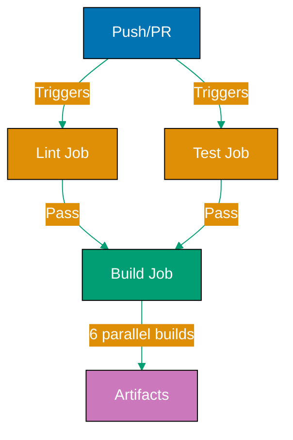

## Why CI/CD Pipelines Matter

CI/CD pipelines are critical for Go projects because they automate testing, ensure code quality, enable fast feedback, and provide consistent builds. Automated pipelines catch bugs before merge, enforce quality gates, and deploy reliably across platforms without manual intervention.

**Core benefits**:

- **Fast feedback**: Know within minutes if changes break tests
- **Consistent quality**: Automated linting, testing, coverage checks
- **Multi-platform builds**: Compile for Linux, macOS, Windows automatically
- **Reliable deployment**: Same process every time, no human error

**Problem**: Without CI/CD, teams rely on manual testing, inconsistent builds, and error-prone deployments leading to production incidents and slow release cycles.

**Solution**: Start with basic GitHub Actions workflow for testing, then layer in quality gates, multi-platform builds, and automated releases.

## Basic Workflow: GitHub Actions

GitHub Actions is built into GitHub with no additional setup required.

**Minimal test workflow**:

```yaml
# File: .github/workflows/test.yml
name: Test
# => Workflow name (shows in GitHub UI)

on:
  push:
    branches: [main]
  # => Runs on push to main branch

  pull_request:
    branches: [main]
  # => Runs on pull requests targeting main

jobs:
  test:
    # => Job name
    runs-on: ubuntu-latest
    # => Runs on Ubuntu (GitHub-hosted runner)
    # => Free for public repos, limited minutes for private

    steps:
      - uses: actions/checkout@v4
        # => Checks out repository code
        # => Required first step

      - uses: actions/setup-go@v5
        with:
          go-version: "1.23"
        # => Installs Go 1.23
        # => actions/setup-go caches dependencies

      - name: Run tests
        run: go test -v ./...
        # => Runs tests verbosely
        # => Fails workflow if tests fail
```

**How it works**:

1. Push to main or open PR
2. GitHub Actions starts Ubuntu VM
3. Checks out code
4. Installs Go
5. Runs tests
6. Reports success/failure

**Viewing results**:

- GitHub UI: Repository → Actions tab
- PR checks: Green checkmark or red X
- Email notifications on failure

## Production Workflow: Comprehensive Quality Gates

Production pipelines include linting, race detection, and coverage.

**Complete workflow**:

```yaml
# File: .github/workflows/ci.yml
name: CI

on:
  push:
    branches: [main]
  pull_request:
    branches: [main]

env:
  GO_VERSION: "1.23"
  # => Environment variable (reused across jobs)

jobs:
  lint:
    # => Job 1: Linting
    runs-on: ubuntu-latest
    steps:
      - uses: actions/checkout@v4

      - uses: actions/setup-go@v5
        with:
          go-version: ${{ env.GO_VERSION }}
          # => Uses env variable

      - name: Install golangci-lint
        run: |
          curl -sSfL https://raw.githubusercontent.com/golangci/golangci-lint/master/install.sh | sh -s -- -b $(go env GOPATH)/bin
        # => Installs golangci-lint
        # => Cached by actions/setup-go

      - name: Run golangci-lint
        run: golangci-lint run --timeout=5m
        # => Lints code
        # => 5-minute timeout for large projects

  test:
    # => Job 2: Testing
    runs-on: ubuntu-latest
    strategy:
      matrix:
        go-version: ["1.22", "1.23"]
        # => Tests on multiple Go versions
        # => Matrix creates 2 parallel jobs
    steps:
      - uses: actions/checkout@v4

      - uses: actions/setup-go@v5
        with:
          go-version: ${{ matrix.go-version }}
          # => Uses matrix variable

      - name: Run tests
        run: go test -v -race -coverprofile=coverage.out ./...
        # => -v: verbose output
        # => -race: race detector (catches concurrency bugs)
        # => -coverprofile: generates coverage report

      - name: Upload coverage
        uses: codecov/codecov-action@v4
        with:
          file: ./coverage.out
        # => Uploads coverage to codecov.io
        # => Optional: requires Codecov account

  build:
    # => Job 3: Build verification
    runs-on: ubuntu-latest
    needs: [lint, test]
    # => needs: only runs if lint and test pass
    # => Saves resources (no build if tests fail)

    strategy:
      matrix:
        goos: [linux, darwin, windows]
        goarch: [amd64, arm64]
        # => Matrix: 3 OS x 2 architectures = 6 builds
        # => All run in parallel

    steps:
      - uses: actions/checkout@v4

      - uses: actions/setup-go@v5
        with:
          go-version: ${{ env.GO_VERSION }}

      - name: Build
        env:
          GOOS: ${{ matrix.goos }}
          GOARCH: ${{ matrix.goarch }}
        run: |
          CGO_ENABLED=0 go build -ldflags="-s -w" -o myapp-${{ matrix.goos }}-${{ matrix.goarch }}
        # => Cross-compiles for target platform
        # => Creates binary: myapp-linux-amd64, etc.

      - name: Upload artifact
        uses: actions/upload-artifact@v4
        with:
          name: myapp-${{ matrix.goos }}-${{ matrix.goarch }}
          path: myapp-${{ matrix.goos }}-${{ matrix.goarch }}
        # => Stores binary as artifact
        # => Downloadable from GitHub Actions UI
        # => Retained for 90 days (configurable)
```

**Workflow visualization**:



**Pipeline execution time**:

- Lint: ~1 minute
- Test (2 Go versions): ~2 minutes (parallel)
- Build (6 platforms): ~3 minutes (parallel)
- **Total**: ~6 minutes (parallelized)

## Release Automation: goreleaser

goreleaser automates multi-platform builds, GitHub releases, and Docker images.

**Installation** (local):

```bash
brew install goreleaser
# => macOS
# => Linux: see goreleaser.com/install

goreleaser --version
```

**Configuration**:

```yaml
# File: .goreleaser.yml
version: 2

before:
  hooks:
    - go mod tidy
    - go test ./...
    # => Pre-release checks
    # => Ensures tests pass before release

builds:
  - env:
      - CGO_ENABLED=0
    # => Static binary

    goos:
      - linux
      - darwin
      - windows
    # => Target operating systems

    goarch:
      - amd64
      - arm64
    # => Target architectures
    # => Matrix: 3 OS x 2 arch = 6 binaries

    ldflags:
      - -s -w
      - -X main.Version={{.Version}}
      - -X main.Commit={{.Commit}}
      - -X main.Date={{.Date}}
    # => Strips symbols, injects version info

archives:
  - format: tar.gz
    # => Creates .tar.gz archives

    name_template: >-
      {{ .ProjectName }}_
      {{- .Version }}_
      {{- .Os }}_
      {{- .Arch }}
    # => Archive name: myapp_v1.0.0_linux_amd64.tar.gz
    files:
      - README.md
      - LICENSE
    # => Includes additional files in archive

checksum:
  name_template: "checksums.txt"
  # => SHA256 checksums for verification

changelog:
  sort: asc
  filters:
    exclude:
      - "^docs:"
      - "^test:"
      - "^ci:"
  # => Generates changelog from git commits
  # => Excludes non-code commits

release:
  github:
    owner: myuser
    name: myrepo
  # => Creates GitHub release
  # => Uploads binaries and checksums

dockers:
  - image_templates:
      - "myuser/myapp:{{ .Version }}"
      - "myuser/myapp:latest"
    # => Builds and pushes Docker images
    # => Requires Docker Hub credentials
```

**Release workflow**:

```yaml
# File: .github/workflows/release.yml
name: Release

on:
  push:
    tags:
      - "v*"
  # => Triggers on version tags (v1.0.0, v2.1.3, etc.)

permissions:
  contents: write
  # => Required for creating GitHub releases

jobs:
  goreleaser:
    runs-on: ubuntu-latest
    steps:
      - uses: actions/checkout@v4
        with:
          fetch-depth: 0
        # => fetch-depth: 0 fetches all history
        # => Required for changelog generation

      - uses: actions/setup-go@v5
        with:
          go-version: "1.23"

      - name: Run GoReleaser
        uses: goreleaser/goreleaser-action@v6
        with:
          version: latest
          args: release --clean
        env:
          GITHUB_TOKEN: ${{ secrets.GITHUB_TOKEN }}
        # => GITHUB_TOKEN auto-provided by GitHub
        # => Uploads release assets
```

**Creating a release**:

```bash
# Tag version
git tag -a v1.0.0 -m "Release v1.0.0"

# Push tag
git push origin v1.0.0

# GitHub Actions automatically:
# 1. Runs tests
# 2. Builds binaries for all platforms
# 3. Creates GitHub release
# 4. Uploads binaries and checksums
# 5. Builds and pushes Docker images
# 6. Generates changelog
```

**Release output**:

```
GitHub Release: myrepo/releases/tag/v1.0.0
├── myapp_v1.0.0_linux_amd64.tar.gz
├── myapp_v1.0.0_linux_arm64.tar.gz
├── myapp_v1.0.0_darwin_amd64.tar.gz
├── myapp_v1.0.0_darwin_arm64.tar.gz
├── myapp_v1.0.0_windows_amd64.zip
├── myapp_v1.0.0_windows_arm64.zip
├── checksums.txt
└── CHANGELOG.md
```

**Docker images**:

```bash
docker pull myuser/myapp:v1.0.0
docker pull myuser/myapp:latest
# => Both tags point to same image
# => latest auto-updated on each release
```

## Advanced Patterns

**Caching dependencies**:

```yaml
# File: .github/workflows/test.yml
jobs:
  test:
    runs-on: ubuntu-latest
    steps:
      - uses: actions/checkout@v4

      - uses: actions/setup-go@v5
        with:
          go-version: "1.23"
          cache: true
          # => Caches go.mod/go.sum dependencies
          # => Speeds up subsequent runs (2-3x faster)

      - name: Run tests
        run: go test ./...
```

**Manual caching** (advanced control):

```yaml
- name: Cache Go modules
  uses: actions/cache@v4
  with:
    path: ~/go/pkg/mod
    key: ${{ runner.os }}-go-${{ hashFiles('**/go.sum') }}
    restore-keys: |
      ${{ runner.os }}-go-
  # => Caches module directory
  # => key: unique identifier from go.sum hash
  # => restore-keys: fallback if exact match not found

- name: Download dependencies
  run: go mod download
```

**Branch protection rules** (require CI to pass):

GitHub Settings → Branches → Branch protection rules:

- Require status checks to pass before merging
- Require branches to be up to date before merging
- Select: lint, test, build jobs

Effect: PRs cannot merge until all checks pass.

**Scheduled workflows** (nightly builds):

```yaml
# File: .github/workflows/nightly.yml
name: Nightly

on:
  schedule:
    - cron: "0 0 * * *"
    # => Runs daily at midnight UTC
    # => 0 0 * * * = minute hour day month weekday

jobs:
  test:
    runs-on: ubuntu-latest
    steps:
      - uses: actions/checkout@v4
      - uses: actions/setup-go@v5
        with:
          go-version: "1.23"

      - name: Run tests
        run: go test -v -race ./...

      - name: Run benchmarks
        run: go test -bench=. -benchmem ./...
        # => Benchmarks (slow, only in nightly)
```

**Matrix testing** (Go versions):

```yaml
strategy:
  matrix:
    go-version: ["1.21", "1.22", "1.23"]
    os: [ubuntu-latest, macos-latest, windows-latest]
  # => Matrix: 3 versions x 3 OS = 9 jobs
  # => All run in parallel

steps:
  - uses: actions/checkout@v4
  - uses: actions/setup-go@v5
    with:
      go-version: ${{ matrix.go-version }}

  - name: Run tests
    run: go test ./...
```

**Environment-specific deployments**:

```yaml
# File: .github/workflows/deploy.yml
name: Deploy

on:
  push:
    branches: [main]

jobs:
  deploy-staging:
    # => Deploy to staging on main push
    runs-on: ubuntu-latest
    environment: staging
    # => Uses staging environment secrets

    steps:
      - uses: actions/checkout@v4
      - name: Deploy to staging
        run: |
          # Deploy commands
          echo "Deploying to staging"
        env:
          DEPLOY_KEY: ${{ secrets.STAGING_DEPLOY_KEY }}

  deploy-production:
    # => Deploy to production on manual approval
    runs-on: ubuntu-latest
    needs: deploy-staging
    # => Only runs after staging succeeds

    environment: production
    # => Requires manual approval (GitHub setting)

    steps:
      - uses: actions/checkout@v4
      - name: Deploy to production
        run: |
          echo "Deploying to production"
        env:
          DEPLOY_KEY: ${{ secrets.PRODUCTION_DEPLOY_KEY }}
```

## Docker Build in CI/CD

**Build and push Docker images**:

```yaml
# File: .github/workflows/docker.yml
name: Docker

on:
  push:
    branches: [main]
    tags: ["v*"]

env:
  REGISTRY: docker.io
  IMAGE_NAME: myuser/myapp

jobs:
  build:
    runs-on: ubuntu-latest
    steps:
      - uses: actions/checkout@v4

      - name: Set up Docker Buildx
        uses: docker/setup-buildx-action@v3
        # => Enables advanced Docker features

      - name: Log in to Docker Hub
        uses: docker/login-action@v3
        with:
          username: ${{ secrets.DOCKER_USERNAME }}
          password: ${{ secrets.DOCKER_PASSWORD }}
        # => Authenticates to Docker Hub

      - name: Extract metadata
        id: meta
        uses: docker/metadata-action@v5
        with:
          images: ${{ env.REGISTRY }}/${{ env.IMAGE_NAME }}
          tags: |
            type=ref,event=branch
            type=semver,pattern={{version}}
            type=semver,pattern={{major}}.{{minor}}
        # => Generates tags: main, v1.0.0, v1.0

      - name: Build and push
        uses: docker/build-push-action@v5
        with:
          context: .
          push: true
          tags: ${{ steps.meta.outputs.tags }}
          cache-from: type=gha
          cache-to: type=gha,mode=max
        # => Builds and pushes Docker image
        # => cache-from/cache-to: uses GitHub Actions cache
```

**Multi-architecture Docker images**:

```yaml
- name: Set up QEMU
  uses: docker/setup-qemu-action@v3
  # => Enables cross-platform builds

- name: Build and push
  uses: docker/build-push-action@v5
  with:
    context: .
    platforms: linux/amd64,linux/arm64
    # => Builds for x86-64 and ARM64
    push: true
    tags: ${{ steps.meta.outputs.tags }}
```

## Best Practices

**DO**:

- Cache dependencies (faster builds)
- Run tests before builds (fail fast)
- Use matrix for multi-platform builds
- Require CI to pass before merge (branch protection)
- Automate releases (goreleaser)
- Use secrets for credentials
- Run linting and race detector in CI

**DON'T**:

- Skip tests in CI (defeats purpose)
- Hardcode credentials (use secrets)
- Run slow tests on every push (use nightly for heavy tests)
- Build without testing first (wastes resources)
- Ignore CI failures

**Pipeline stages** (recommended order):

1. **Lint** (~1 min): golangci-lint
2. **Test** (~2 min): go test -race -cover
3. **Build** (~3 min): Multi-platform compilation
4. **Deploy** (conditional): Only on specific branches/tags

**Cost optimization**:

- Free for public repos
- Private repos: 2,000 minutes/month (free tier)
- Use caching to reduce build time
- Matrix builds run in parallel (same cost as serial)

## Example: Complete Production Pipeline

```yaml
# File: .github/workflows/production.yml
name: Production CI/CD

on:
  push:
    branches: [main]
  pull_request:
    branches: [main]
  release:
    types: [created]

env:
  GO_VERSION: "1.23"

jobs:
  quality:
    runs-on: ubuntu-latest
    steps:
      - uses: actions/checkout@v4
      - uses: actions/setup-go@v5
        with:
          go-version: ${{ env.GO_VERSION }}
          cache: true

      - name: Format check
        run: test -z $(gofmt -l .)

      - name: Vet
        run: go vet ./...

      - name: Install golangci-lint
        run: curl -sSfL https://raw.githubusercontent.com/golangci/golangci-lint/master/install.sh | sh -s -- -b $(go env GOPATH)/bin

      - name: Lint
        run: golangci-lint run --timeout=5m

  test:
    runs-on: ubuntu-latest
    strategy:
      matrix:
        go-version: ["1.22", "1.23"]
    steps:
      - uses: actions/checkout@v4
      - uses: actions/setup-go@v5
        with:
          go-version: ${{ matrix.go-version }}
          cache: true

      - name: Test
        run: go test -v -race -coverprofile=coverage.out ./...

      - name: Upload coverage
        uses: codecov/codecov-action@v4
        with:
          file: ./coverage.out

  build:
    needs: [quality, test]
    runs-on: ubuntu-latest
    strategy:
      matrix:
        goos: [linux, darwin, windows]
        goarch: [amd64, arm64]
    steps:
      - uses: actions/checkout@v4
      - uses: actions/setup-go@v5
        with:
          go-version: ${{ env.GO_VERSION }}

      - name: Build
        env:
          GOOS: ${{ matrix.goos }}
          GOARCH: ${{ matrix.goarch }}
        run: CGO_ENABLED=0 go build -ldflags="-s -w" -o myapp

      - name: Upload artifact
        uses: actions/upload-artifact@v4
        with:
          name: myapp-${{ matrix.goos }}-${{ matrix.goarch }}
          path: myapp

  deploy:
    if: github.event_name == 'release'
    needs: [build]
    runs-on: ubuntu-latest
    steps:
      - name: Deploy
        run: echo "Deploy to production"
```

## Summary

Go CI/CD essentials:

- **GitHub Actions**: Built-in, free for public repos
- **Quality gates**: Lint, test, race detector, coverage
- **Multi-platform builds**: Matrix strategy (GOOS/GOARCH)
- **Release automation**: goreleaser for GitHub releases
- **Docker integration**: Multi-architecture images

**Minimal CI pipeline**:

```yaml
name: CI
on: [push, pull_request]
jobs:
  test:
    runs-on: ubuntu-latest
    steps:
      - uses: actions/checkout@v4
      - uses: actions/setup-go@v5
        with:
          go-version: "1.23"
          cache: true
      - run: go test -race ./...
```

**Progressive adoption**:

1. Start with basic test workflow
2. Add linting and vet
3. Enable race detector and coverage
4. Add multi-platform build matrix
5. Automate releases with goreleaser
6. Integrate Docker builds

**Pipeline performance**:

- Caching: 2-3x faster builds
- Parallel jobs: Matrix builds run simultaneously
- Fail fast: Run tests before builds
- Typical pipeline: 5-10 minutes (with caching)
