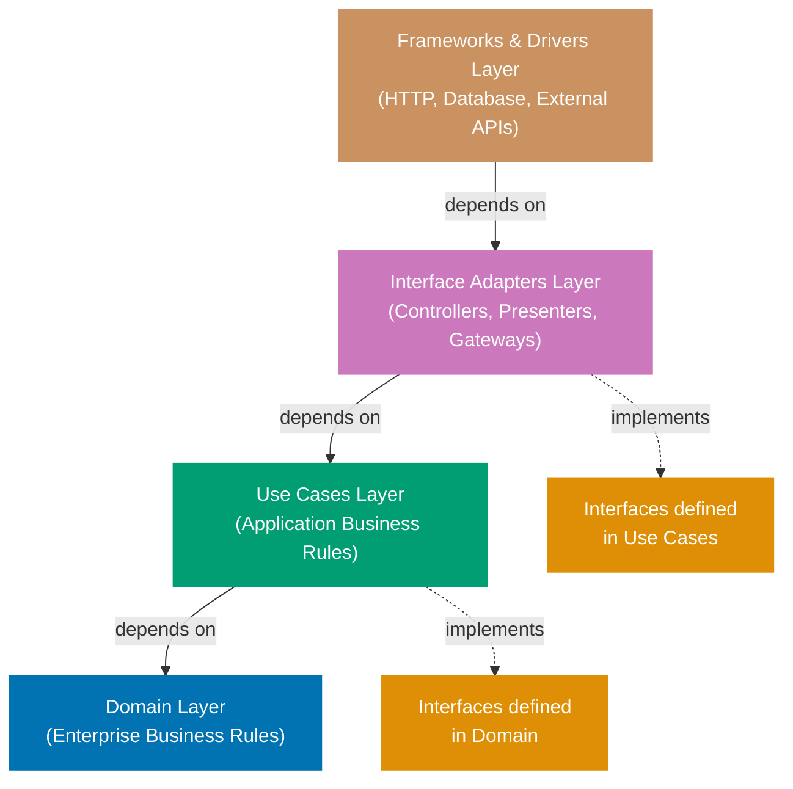

## Why Clean Architecture Matters

Clean Architecture separates concerns into distinct layers with clear dependency rules, making systems testable, maintainable, and independent of external frameworks. In financial systems like zakat calculators or payment processors, clean architecture prevents business logic contamination by database details, HTTP frameworks, or external APIs.

**Core benefits**:

- **Testability**: Business logic tests run without databases or HTTP servers
- **Framework independence**: Swap web frameworks without touching domain logic
- **Database agnostic**: Move from PostgreSQL to MongoDB with minimal changes
- **Business logic clarity**: Domain rules visible without infrastructure noise

**Problem**: Without layer separation, business logic mixes with database queries, HTTP handlers, and external API calls, making testing impossible and changes risky.

**Solution**: Organize code into layers (domain, usecase, adapter) with dependency inversion through interfaces, ensuring inner layers never depend on outer layers.

## Clean Architecture Dependency Rule



**Dependency rule**:

- **Domain Layer** (innermost): No dependencies on outer layers, only standard library
- **Use Cases Layer**: Depends on Domain, defines repository interfaces (dependency inversion)
- **Interface Adapters Layer**: Implements interfaces from Use Cases (controllers, presenters)
- **Frameworks Layer** (outermost): Depends on all inner layers (HTTP, database, external APIs)
- **Critical**: Dependencies always point inward (outer → inner, never inner → outer)

## Standard Library Approach: Package Organization

Go's standard library demonstrates layer separation through package organization and interface boundaries. No external framework needed - just packages and interfaces.

### Layer Structure with Packages

```go
// Project structure (standard library only)
// project/
//   internal/
//     domain/     // => Core business logic (no external dependencies)
//     usecase/    // => Application logic (coordinates domain)
//     adapter/    // => External interfaces (HTTP, database, APIs)
//   cmd/
//     main.go     // => Entry point (wires dependencies)

// File: internal/domain/zakat.go
package domain

import "errors"
// => Standard library only
// => No database, HTTP, or framework imports

// ZakatCalculation represents domain calculation result
// => Value object (immutable, no identity)
// => Pure domain concept
type ZakatCalculation struct {
    Wealth     float64 // => Total wealth amount
    Nisab      float64 // => Minimum threshold
    ZakatDue   float64 // => 2.5% of wealth above nisab
    IsEligible bool    // => Whether zakat required
}
// => Domain struct with validation embedded

// CalculateZakat applies Islamic zakat rules
// => Pure function (no side effects)
// => Domain logic isolated from infrastructure
func CalculateZakat(wealth, nisab float64) (*ZakatCalculation, error) {
    // => Returns pointer to avoid copying large structs
    // => error for validation failures

    if wealth < 0 {
        // => Domain rule: wealth cannot be negative
        return nil, errors.New("wealth cannot be negative")
        // => error from standard library
    }

    if nisab < 0 {
        // => Domain rule: nisab cannot be negative
        return nil, errors.New("nisab cannot be negative")
    }

    isEligible := wealth >= nisab
    // => Domain rule: wealth must meet nisab threshold
    // => Boolean flag for eligibility

    zakatDue := 0.0
    // => Default to zero zakat

    if isEligible {
        // => Only calculate if eligible
        zakatDue = (wealth - nisab) * 0.025
        // => Domain rule: 2.5% of wealth above nisab
        // => Financial calculation logic
    }

    return &ZakatCalculation{
        Wealth:     wealth,
        Nisab:      nisab,
        ZakatDue:   zakatDue,
        IsEligible: isEligible,
    }, nil
    // => Returns domain result
    // => No database, HTTP, or external concerns
}
```

**Domain layer characteristics**:

- No external dependencies (only standard library)
- Pure functions where possible
- Business rules explicit in code
- Framework-independent structs

### Usecase Layer with Interface Boundaries

```go
// File: internal/usecase/zakat_service.go
package usecase

import (
    "context"
    // => Standard library context for cancellation
    "project/internal/domain"
    // => Depends on domain package (inner layer)
)

// ZakatRepository defines persistence interface
// => Interface defined in usecase (not adapter)
// => Dependency inversion: usecase defines contract
type ZakatRepository interface {
    // => Adapter implements this interface
    // => Usecase depends on abstraction, not concrete type

    Save(ctx context.Context, calc *domain.ZakatCalculation) error
    // => context.Context for cancellation, timeouts
    // => Returns error for failures
}

// ZakatService orchestrates zakat calculation workflow
// => Application logic (coordinates domain and persistence)
// => No HTTP, database, or framework details
type ZakatService struct {
    repo ZakatRepository
    // => Interface field (not concrete repository)
    // => Enables testing with mock repository
}

// NewZakatService creates service with repository
// => Constructor pattern (Go convention)
// => Dependency injection through constructor
func NewZakatService(repo ZakatRepository) *ZakatService {
    // => Accepts interface for flexibility
    // => Caller provides concrete implementation
    return &ZakatService{repo: repo}
    // => Returns pointer to service
}

// Calculate performs zakat calculation and persistence
// => Coordinates domain logic and storage
// => Returns domain result and error
func (s *ZakatService) Calculate(ctx context.Context, wealth, nisab float64) (*domain.ZakatCalculation, error) {
    // => Method receiver (pointer for consistency)
    // => context.Context propagated from caller

    calc, err := domain.CalculateZakat(wealth, nisab)
    // => Calls domain function (pure business logic)
    // => Usecase coordinates, doesn't implement logic
    if err != nil {
        // => Domain validation error
        return nil, err
        // => Propagate domain error to caller
    }

    err = s.repo.Save(ctx, calc)
    // => Persist through interface (not concrete database)
    // => Interface allows testing without database
    if err != nil {
        // => Persistence error (database, network)
        return nil, err
        // => Propagate infrastructure error
    }

    return calc, nil
    // => Return domain result on success
}
```

**Usecase layer characteristics**:

- Defines interfaces for external dependencies (repositories)
- Coordinates domain logic and persistence
- No concrete infrastructure dependencies
- Testable with mock implementations

### Adapter Layer: External Systems

```go
// File: internal/adapter/postgres_repository.go
package adapter

import (
    "context"
    "database/sql"
    // => Standard library database driver
    "project/internal/domain"
    "project/internal/usecase"
    // => Imports inner layers (allowed)
    // => Implements interface from usecase
)

// PostgresRepository implements ZakatRepository for PostgreSQL
// => Concrete implementation (adapter layer)
// => Contains database-specific details
type PostgresRepository struct {
    db *sql.DB
    // => Database connection pool
    // => Standard library sql.DB
}

// NewPostgresRepository creates PostgreSQL repository
// => Constructor returns interface type
// => Caller sees interface, not concrete type
func NewPostgresRepository(db *sql.DB) usecase.ZakatRepository {
    // => Returns interface (usecase.ZakatRepository)
    // => Hides concrete type from callers
    return &PostgresRepository{db: db}
    // => Returns pointer implementing interface
}

// Save persists zakat calculation to PostgreSQL
// => Implements interface method
// => Database details isolated here
func (r *PostgresRepository) Save(ctx context.Context, calc *domain.ZakatCalculation) error {
    // => Method receiver implements interface
    // => context.Context for cancellation

    query := `
        INSERT INTO zakat_calculations (wealth, nisab, zakat_due, is_eligible)
        VALUES ($1, $2, $3, $4)
    `
    // => SQL query (database detail)
    // => Isolated in adapter layer

    _, err := r.db.ExecContext(ctx, query,
        calc.Wealth, calc.Nisab, calc.ZakatDue, calc.IsEligible,
    )
    // => ExecContext respects context cancellation
    // => Returns result and error
    // => Standard library database/sql
    if err != nil {
        // => Database error (connection, constraint violation)
        return err
        // => Error propagated to usecase
    }

    return nil
    // => Success (no error)
}
```

**Adapter layer characteristics**:

- Implements interfaces from usecase layer
- Contains all framework/database/HTTP details
- Depends on inner layers (domain, usecase)
- Replaceable without touching business logic

### Wiring Dependencies in Main

```go
// File: cmd/main.go
package main

import (
    "database/sql"
    "log"
    "project/internal/adapter"
    "project/internal/usecase"
    _ "github.com/lib/pq"
    // => PostgreSQL driver (side effect import)
)

func main() {
    // => Entry point wires all dependencies
    // => Composition root pattern

    db, err := sql.Open("postgres", "connection-string")
    // => Create database connection
    // => Standard library sql.Open
    if err != nil {
        log.Fatal(err)
        // => Exit if database unavailable
    }
    defer db.Close()
    // => Cleanup on exit

    repo := adapter.NewPostgresRepository(db)
    // => Create concrete repository (adapter)
    // => Returns interface type

    service := usecase.NewZakatService(repo)
    // => Inject repository into service
    // => Service depends on interface, not concrete type

    // Use service for calculations
    // => service.Calculate(ctx, wealth, nisab)
    // => Domain logic isolated from infrastructure
}
```

**Dependency flow**:

- main → adapter → usecase → domain
- Outer layers depend on inner layers
- Inner layers define interfaces (dependency inversion)

**Limitations of standard library approach**:

- Manual dependency wiring (no DI container)
- Verbose interface definitions
- No framework guidance (structure is convention)
- Testing requires manual mock creation

## Production Framework: Hexagonal Architecture with Wire

Hexagonal architecture (ports & adapters) formalizes clean architecture with explicit ports (interfaces) and adapters (implementations), commonly using Google Wire for dependency injection.

### Installing Wire

```bash
go install github.com/google/wire/cmd/wire@latest
# => Installs Wire code generation tool
# => Generates dependency injection code
```

### Ports: Domain-Defined Interfaces

```go
// File: internal/ports/repository.go
package ports

import (
    "context"
    "project/internal/domain"
)

// ZakatRepository defines persistence port
// => Port (interface) in separate package
// => Explicit architecture boundary
type ZakatRepository interface {
    Save(ctx context.Context, calc *domain.ZakatCalculation) error
    FindByID(ctx context.Context, id string) (*domain.ZakatCalculation, error)
    // => Multiple methods for complete port
}

// File: internal/ports/service.go
package ports

import (
    "context"
    "project/internal/domain"
)

// ZakatService defines application service port
// => Service interface (for HTTP handlers)
// => Hexagonal architecture exposes ports for all boundaries
type ZakatService interface {
    Calculate(ctx context.Context, wealth, nisab float64) (*domain.ZakatCalculation, error)
}
```

### Adapters: Concrete Implementations

```go
// File: internal/adapters/postgres_adapter.go
package adapters

import (
    "context"
    "database/sql"
    "project/internal/domain"
    "project/internal/ports"
)

// PostgresAdapter implements repository port for PostgreSQL
// => Adapter implements port interface
// => Hexagonal architecture naming
type PostgresAdapter struct {
    db *sql.DB
}

// NewPostgresAdapter creates PostgreSQL adapter
// => Constructor for adapter
func NewPostgresAdapter(db *sql.DB) ports.ZakatRepository {
    // => Returns port interface
    return &PostgresAdapter{db: db}
}

func (a *PostgresAdapter) Save(ctx context.Context, calc *domain.ZakatCalculation) error {
    // => Implementation same as standard library example
    query := `INSERT INTO zakat_calculations (wealth, nisab, zakat_due, is_eligible) VALUES ($1, $2, $3, $4)`
    _, err := a.db.ExecContext(ctx, query, calc.Wealth, calc.Nisab, calc.ZakatDue, calc.IsEligible)
    return err
}

func (a *PostgresAdapter) FindByID(ctx context.Context, id string) (*domain.ZakatCalculation, error) {
    // => Additional method for port completeness
    query := `SELECT wealth, nisab, zakat_due, is_eligible FROM zakat_calculations WHERE id = $1`
    row := a.db.QueryRowContext(ctx, query, id)
    calc := &domain.ZakatCalculation{}
    err := row.Scan(&calc.Wealth, &calc.Nisab, &calc.ZakatDue, &calc.IsEligible)
    return calc, err
}
```

### Wire Dependency Injection

```go
// File: internal/wire.go
//go:build wireinject
// => Build tag: only compiled during wire generation
// => Not included in normal builds

package internal

import (
    "database/sql"
    "github.com/google/wire"
    // => Wire dependency injection framework
    "project/internal/adapters"
    "project/internal/ports"
    "project/internal/service"
)

// InitializeZakatService wires dependencies
// => Wire function signature (wire generates implementation)
func InitializeZakatService(db *sql.DB) (ports.ZakatService, error) {
    // => Returns interface, not concrete type
    // => Wire generates code to instantiate dependencies

    wire.Build(
        adapters.NewPostgresAdapter,
        // => Provides ports.ZakatRepository
        service.NewZakatService,
        // => Consumes ports.ZakatRepository, provides ports.ZakatService
    )
    // => Wire analyzes constructors and generates wiring code

    return nil, nil
    // => Placeholder (wire generates actual implementation)
}
```

```bash
# Generate Wire code
wire ./internal
# => Generates wire_gen.go with dependency injection code
# => Analyzes constructors and builds dependency graph
```

**Trade-offs table**:

| Aspect                   | Standard Library (Packages) | Production (Hexagonal + Wire)    |
| ------------------------ | --------------------------- | -------------------------------- |
| **Complexity**           | Low (just packages)         | Medium (ports/adapters/wire)     |
| **Boilerplate**          | Manual wiring in main       | Wire generates DI code           |
| **Architecture clarity** | Convention-based            | Explicit ports & adapters        |
| **Testing**              | Manual mocks                | Easy port mocking                |
| **Team onboarding**      | Requires discipline         | Self-documenting structure       |
| **When to use**          | Small projects (<20 files)  | Medium-large systems (>20 files) |

## Best Practices

1. **Inner layers define interfaces**: Usecase/domain define repository interfaces, adapters implement
2. **No framework in domain**: Domain should import only standard library
3. **Single direction dependencies**: Always outer → inner, never inner → outer
4. **Package internal/**: Use internal/ to prevent external imports
5. **Context propagation**: Pass context.Context through all layers for cancellation
6. **Error wrapping**: Wrap errors with layer context: `fmt.Errorf("usecase: %w", err)`

## Real-World Example: Tax Calculation Service

```go
// Domain layer: Tax rules (no infrastructure)
package domain

type TaxBracket struct {
    MinIncome float64
    MaxIncome float64
    Rate      float64
}

func CalculateIncomeTax(income float64, brackets []TaxBracket) float64 {
    // => Pure tax calculation logic
    // => No database, HTTP, or external dependencies
    tax := 0.0
    for _, bracket := range brackets {
        if income > bracket.MinIncome {
            taxableIncome := min(income, bracket.MaxIncome) - bracket.MinIncome
            tax += taxableIncome * bracket.Rate
        }
    }
    return tax
}

// Usecase layer: Tax service (coordinates domain + persistence)
package usecase

import "domain"

type TaxRepository interface {
    GetBrackets(ctx context.Context) ([]domain.TaxBracket, error)
}

type TaxService struct {
    repo TaxRepository
}

func (s *TaxService) CalculateTax(ctx context.Context, income float64) (float64, error) {
    brackets, err := s.repo.GetBrackets(ctx)
    if err != nil {
        return 0, err
    }
    return domain.CalculateIncomeTax(income, brackets), nil
}

// Adapter layer: PostgreSQL repository
package adapter

type PostgresTaxRepo struct {
    db *sql.DB
}

func (r *PostgresTaxRepo) GetBrackets(ctx context.Context) ([]domain.TaxBracket, error) {
    // => SQL queries here
    // => Database details isolated
}
```

**Architecture benefits demonstrated**:

- Tax rules testable without database
- Switch from PostgreSQL to MongoDB: only adapter changes
- HTTP handlers depend on TaxService interface (testable with mocks)
- Business logic clear and isolated
