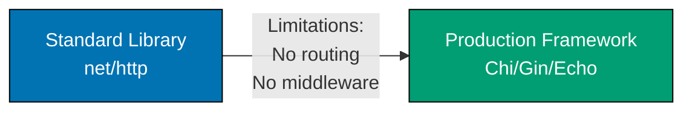

**Ready to build production Go systems?** This In-the-Field guide teaches production patterns by following the **Standard Library First** principle, ensuring you understand fundamentals before frameworks.

## What Is "In the Field"?

In-the-Field guides teach production Go development through real-world implementation patterns. Unlike by-example tutorials that achieve 95% language coverage, these guides focus on specific production scenarios using industry-standard frameworks, libraries, and enterprise patterns.

**Key distinction**: By-example taught Go through code. In-the-field teaches **how to build production systems** with Go.

## Standard Library First Philosophy

Go's standard library is exceptionally comprehensive. Unlike other languages where frameworks are mandatory, Go provides production-ready tools built-in for:

- **HTTP servers** (`net/http`) - Production-grade web servers without frameworks
- **Database access** (`database/sql`) - Query execution, connection pooling primitives
- **JSON handling** (`encoding/json`) - Serialization and deserialization
- **Testing** (`testing` package) - Unit testing, benchmarking, fuzzing
- **Concurrency** (goroutines, channels) - Native concurrency primitives

**Our Approach**: Learn the standard library first, understand when it's insufficient, then adopt frameworks with full knowledge of trade-offs.

### Why This Matters

1. **Foundation understanding** - Know primitives before abstractions
2. **Informed framework selection** - Understand problems frameworks solve
3. **Problem awareness** - See manual implementation complexity
4. **Framework independence** - Core knowledge transfers across tools
5. **Trade-off comprehension** - Recognize when frameworks add value vs overhead
6. **Debugging capability** - Understand what frameworks do under the hood
7. **Optimization skills** - Recognize performance bottlenecks and optimization opportunities
8. **Production disaster prevention** - Avoid connection leaks, goroutine leaks, memory issues from framework misuse

## Guide Organization

The 36 guides are organized into 7 categories:

### 1. Start Here (2 guides)

Foundation guides covering production best practices and anti-patterns:

- [Best Practices](/en/learn/software-engineering/programming-languages/golang/in-the-field/best-practices) - Production patterns and idioms
- [Anti Patterns](/en/learn/software-engineering/programming-languages/golang/in-the-field/anti-patterns) - Common mistakes and code smells

### 2. Core Concepts (6 guides)

Fundamental Go concepts for production systems:

- [Type System](/en/learn/software-engineering/programming-languages/golang/in-the-field/type-system) - Type safety and type parameters (generics)
- [Composition Patterns](/en/learn/software-engineering/programming-languages/golang/in-the-field/composition-patterns) - Struct embedding and composition
- [Concurrency and Goroutines](/en/learn/software-engineering/programming-languages/golang/in-the-field/concurrency-and-goroutines) - Production concurrency patterns
- [Error Handling](/en/learn/software-engineering/programming-languages/golang/in-the-field/error-handling) - Error wrapping, custom errors, sentinel errors
- [Interface Design](/en/learn/software-engineering/programming-languages/golang/in-the-field/interface-design) - Interface design principles
- [Generics](/en/learn/software-engineering/programming-languages/golang/in-the-field/generics) - Type parameters in production code

### 3. Integration (7 guides)

Integrating with external systems and protocols:

- [HTTP Services](/en/learn/software-engineering/programming-languages/golang/in-the-field/http-services) - `net/http` → Chi/Gin/Echo
- [JSON API Integration](/en/learn/software-engineering/programming-languages/golang/in-the-field/json-api-integration) - RESTful API clients and servers
- [SQL Databases](/en/learn/software-engineering/programming-languages/golang/in-the-field/sql-databases) - `database/sql` → sqlx → GORM
- [NoSQL Databases](/en/learn/software-engineering/programming-languages/golang/in-the-field/nosql-databases) - MongoDB, Redis, Cassandra integration
- [Grpc Protobuf](/en/learn/software-engineering/programming-languages/golang/in-the-field/grpc-protobuf) - gRPC services and Protocol Buffers
- [Messaging](/en/learn/software-engineering/programming-languages/golang/in-the-field/messaging) - Kafka, RabbitMQ, NATS integration
- [Testing Strategies](/en/learn/software-engineering/programming-languages/golang/in-the-field/testing-strategies) - Testing → Testify → integration tests

### 4. Application Development (5 guides)

Building production-ready applications:

- [Cli Applications](/en/learn/software-engineering/programming-languages/golang/in-the-field/cli-applications) - CLI tools with Cobra
- [Configuration](/en/learn/software-engineering/programming-languages/golang/in-the-field/configuration) - Hardcoded → env vars → Viper
- [Logging Observability](/en/learn/software-engineering/programming-languages/golang/in-the-field/logging-observability) - `log` → Zap/Zerolog → OpenTelemetry
- [Package Organization](/en/learn/software-engineering/programming-languages/golang/in-the-field/package-organization) - Project structure patterns
- [Code Generation](/en/learn/software-engineering/programming-languages/golang/in-the-field/code-generation) - `go generate`, protobuf, stringer

### 5. Architecture (3 guides)

Enterprise architectural patterns:

- [Clean Architecture](/en/learn/software-engineering/programming-languages/golang/in-the-field/clean-architecture) - Dependency inversion, hexagonal architecture
- [Domain Driven Design](/en/learn/software-engineering/programming-languages/golang/in-the-field/domain-driven-design) - DDD patterns in Go
- [Microservices Patterns](/en/learn/software-engineering/programming-languages/golang/in-the-field/microservices-patterns) - Service communication, discovery, resilience

### 6. Production (7 guides)

Production-ready patterns for reliability, security, and performance:

- [Authentication Authorization](/en/learn/software-engineering/programming-languages/golang/in-the-field/authentication-authorization) - Basic auth → JWT → OAuth2/OIDC
- [Security Best Practices](/en/learn/software-engineering/programming-languages/golang/in-the-field/security-best-practices) - Input validation, secrets, crypto
- [Caching](/en/learn/software-engineering/programming-languages/golang/in-the-field/caching) - In-memory → Redis → distributed caching
- [Resilience Patterns](/en/learn/software-engineering/programming-languages/golang/in-the-field/resilience-patterns) - Circuit breakers, retry, timeouts
- [Performance Optimization](/en/learn/software-engineering/programming-languages/golang/in-the-field/performance-optimization) - Profiling, benchmarking, tuning
- [Memory Management](/en/learn/software-engineering/programming-languages/golang/in-the-field/memory-management) - GC tuning, memory profiling
- [Cloud Native Patterns](/en/learn/software-engineering/programming-languages/golang/in-the-field/cloud-native-patterns) - 12-factor apps, service mesh

### 7. DevOps (6 guides)

Development tooling and deployment:

- [Go Modules](/en/learn/software-engineering/programming-languages/golang/in-the-field/go-modules) - Dependency management
- [Build Compilation](/en/learn/software-engineering/programming-languages/golang/in-the-field/build-compilation) - Build tags, cross-compilation, optimization
- [Testing Qa](/en/learn/software-engineering/programming-languages/golang/in-the-field/testing-qa) - Table-driven tests, mocks, coverage
- [Docker Containerization](/en/learn/software-engineering/programming-languages/golang/in-the-field/docker-containerization) - Multi-stage builds, minimal images
- [Ci Cd Pipelines](/en/learn/software-engineering/programming-languages/golang/in-the-field/ci-cd-pipelines) - GitHub Actions, GitLab CI, testing pipelines

## Progressive Learning Path

Each guide follows this structure:

1. **Why It Matters** - Production context and real-world scenarios
2. **Standard Library First** - Built-in approach with annotated examples
3. **Limitations** - When standard library insufficient for production
4. **Production Framework** - Industry-standard solutions with examples
5. **Trade-offs** - Clear comparison tables (complexity, learning curve, maintenance)
6. **Best Practices** - Actionable guidance with code examples

### Example Progression (HTTP Services)



**Standard Library**: `net/http` provides HTTP server, but manual routing and middleware.

**Limitations**: No built-in routing patterns, middleware chains require manual implementation, context handling verbose.

**Production Framework**: Chi (lightweight), Gin (performance), or Echo (features) provide routing, middleware, and easier context management.

**Trade-off**: Learn `net/http` patterns first to understand what frameworks abstract away.

## Code Annotation Standard

All code examples maintain **1.0-2.25 annotation density** (comment lines per code line) using `// =>` notation to explain values, states, and outputs.

**Example**:

```go
// Standard library HTTP server (net/http)
mux := http.NewServeMux()                   // => Create request multiplexer (router)
                                            // => Type: *http.ServeMux
mux.HandleFunc("/", func(w http.ResponseWriter, r *http.Request) {
    w.Write([]byte("Hello World"))          // => Writes response body
})                                          // => Closure captures mux
server := &http.Server{                     // => Configure HTTP server
    Addr:    ":8080",                       // => Listen on port 8080
    Handler: mux,                           // => Use mux for routing
}                                           // => Type: *http.Server
server.ListenAndServe()                     // => Blocks, starts server
                                            // => Returns error on failure
```

## Who Should Use These Guides?

- **Go developers building production systems** - Learn industry patterns
- **Teams adopting Go for backend services** - Establish production conventions
- **Developers transitioning from other languages** - Understand Go production ecosystem
- **Anyone seeking production-ready Go patterns** - Framework selection, trade-offs, best practices

## Prerequisite Knowledge

These guides assume familiarity with Go fundamentals. If you're new to Go, start with:

- [Initial Setup](/en/learn/software-engineering/programming-languages/golang/initial-setup) - 0-5% Go coverage (installation, tooling)
- [Quick Start](/en/learn/software-engineering/programming-languages/golang/quick-start) - 5-30% Go coverage (basic syntax, first program)
- [By Example](/en/learn/software-engineering/programming-languages/golang/by-example) - 75-95% Go coverage (85+ annotated examples)

**Minimum**: Complete Quick Start (5-30% coverage) before starting In-the-Field guides.

**Recommended**: Complete By Example (75-95% coverage) for comprehensive foundation.

## Learning Approach

**Not a comprehensive tutorial**: These guides target specific production scenarios, not sequential skill building. Jump to relevant topics based on your project needs.

**Code-first learning**: Examples are self-contained and runnable. Copy, execute, modify, experiment.

**Framework pragmatism**: We teach standard library first, but recommend frameworks when they provide clear production value.

## Convention Reference

These guides follow the [In-the-Field Convention](https://github.com/wahidyankf/open-sharia-enterprise/blob/main/governance/conventions/tutorials/in-the-field.md), which defines production implementation guide standards.
