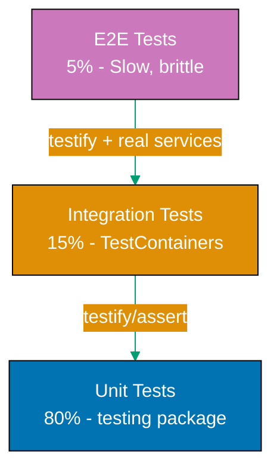

## Why Testing Strategies Matter

Testing is fundamental to production Go systems because it catches bugs early, enables confident refactoring, documents behavior, and supports continuous deployment. Go's built-in testing package and table-driven test pattern make testing first-class, not an afterthought.

**Core benefits**:

- **Early bug detection**: Catch errors in seconds, not production
- **Confident refactoring**: Change code knowing tests verify correctness
- **Living documentation**: Tests show how code should behave
- **Fast feedback**: Go's fast compilation makes test cycles quick

**Problem**: Without systematic testing strategies, bugs reach production causing downtime and data corruption.

**Solution**: Adopt Go's standard testing patterns from the testing package, then layer in production tools for integration testing.

## Standard Library Testing (testing package)

Go includes the `testing` package for unit tests with no external dependencies.

**Basic test structure**:

```go
package calculator
// => Package under test
// => Tests live in same package

import (
    "testing"
    // => Standard library testing package
    // => Provides *testing.T for test control
)

// Add returns the sum of two integers
// => Function under test
// => Simple demonstration of testable code
func Add(a, b int) int {
    return a + b
    // => Returns sum
}

func TestAdd(t *testing.T) {
    // => Test function must start with Test
    // => Takes *testing.T parameter for test control
    // => t provides assertion methods

    result := Add(2, 3)
    // => result is 5
    // => Calls function under test

    if result != 5 {
        // => Manual assertion (if statement)
        // => Standard library has no assert helpers
        t.Errorf("Add(2, 3) = %d; want 5", result)
        // => t.Errorf reports failure but continues test
        // => %d formats integer
        // => Test fails but other tests still run
    }
    // => Test passes if no errors reported
}
```

**Running tests**:

```bash
go test
# => Runs all tests in current package
# => Output: PASS or FAIL
# => Exit code 0 on success, 1 on failure

go test -v
# => Verbose output showing each test
# => Shows test names and timing

go test ./...
# => Runs tests in all packages recursively
# => Common for entire project testing
```

**Table-driven tests** (Go idiom):

```go
func TestAdd_TableDriven(t *testing.T) {
    // => Table-driven test pattern
    // => Go idiom for testing multiple cases

    tests := []struct {
        name string
        a    int
        b    int
        want int
    }{
        // => Anonymous struct slice
        // => Each entry is a test case
        // => name field for test identification

        {name: "positive numbers", a: 2, b: 3, want: 5},
        // => First test case
        // => Field names explicit for clarity

        {name: "negative numbers", a: -2, b: -3, want: -5},
        // => Second test case
        // => Tests edge case

        {name: "zero", a: 0, b: 0, want: 0},
        // => Third test case
        // => Tests boundary condition

        {name: "mixed signs", a: 5, b: -3, want: 2},
        // => Fourth test case
        // => Tests another edge case
    }

    for _, tt := range tests {
        // => Iterate over test cases
        // => tt is current test case
        // => Underscore discards index

        t.Run(tt.name, func(t *testing.T) {
            // => t.Run creates subtest
            // => Runs each case independently
            // => tt.name identifies subtest in output

            got := Add(tt.a, tt.b)
            // => got holds actual result
            // => Naming convention: got vs want

            if got != tt.want {
                // => Compare actual vs expected
                t.Errorf("Add(%d, %d) = %d; want %d",
                    tt.a, tt.b, got, tt.want)
                // => Report failure with context
                // => Shows input and expected/actual output
            }
        })
    }
}
```

**Parallel tests** (standard library feature):

```go
func TestConcurrentOperations(t *testing.T) {
    // => Test concurrent behavior
    // => Verifies thread safety

    t.Parallel()
    // => Marks test to run in parallel
    // => Standard library schedules parallel execution
    // => Reduces total test time

    // Test code here runs concurrently
    // => Multiple tests execute simultaneously
    // => Use for independent tests
}
```

**Limitations of standard library**:

- No rich assertions (manual if statements)
- No test fixtures or setup helpers
- No integration test support (databases, external services)
- Manual mock creation

## Production Testing: testify

testify provides assertion helpers and mock generation for cleaner test code.

**Installation**:

```bash
go get github.com/stretchr/testify
# => Downloads testify package
# => Latest version from GitHub
```

**Rich assertions**:

```go
package calculator

import (
    "testing"
    // => Standard testing package

    "github.com/stretchr/testify/assert"
    // => testify assertions package
    // => Provides assert.Equal, assert.NotNil, etc.
)

func TestAdd_WithAssert(t *testing.T) {
    // => Test using testify assertions
    // => Cleaner than manual if statements

    result := Add(2, 3)
    // => result is 5

    assert.Equal(t, 5, result)
    // => assert.Equal compares values
    // => t reports failure location
    // => 5 is expected, result is actual
    // => Fails test on mismatch

    assert.NotNil(t, result)
    // => Checks value is not nil
    // => Useful for pointer/interface checks
}

func TestDivide_ErrorCase(t *testing.T) {
    // => Test error handling
    // => Verifies divide-by-zero returns error

    _, err := Divide(10, 0)
    // => Underscore ignores result value
    // => err captured for assertion

    assert.Error(t, err)
    // => Asserts err is not nil
    // => Cleaner than if err == nil { t.Error() }

    assert.EqualError(t, err, "division by zero")
    // => Checks exact error message
    // => Verifies error type and content
}
```

**Mock generation**:

```go
package service

import (
    "testing"
    // => Standard testing

    "github.com/stretchr/testify/mock"
    // => testify mocking support
)

// UserRepository defines data access interface
// => Interface for dependency injection
// => Allows mocking in tests
type UserRepository interface {
    FindByID(id int) (*User, error)
    // => Method to be mocked
}

// MockUserRepository is a test mock
// => Generated or hand-written mock
// => Embeds mock.Mock for tracking
type MockUserRepository struct {
    mock.Mock
    // => Embeds testify's mock infrastructure
    // => Provides On(), Return(), AssertCalled()
}

func (m *MockUserRepository) FindByID(id int) (*User, error) {
    // => Implements UserRepository interface
    // => Delegates to mock.Mock

    args := m.Called(id)
    // => Records method call with arguments
    // => Returns configured values

    return args.Get(0).(*User), args.Error(1)
    // => Get(0) returns first configured return value
    // => Error(1) returns second (error) return value
}

func TestUserService_GetUser(t *testing.T) {
    // => Tests service with mocked repository
    // => Integration test without real database

    mockRepo := new(MockUserRepository)
    // => Creates mock instance
    // => Ready to configure expectations

    expectedUser := &User{ID: 1, Name: "Alice"}
    // => Test fixture data
    // => expectedUser is what mock will return

    mockRepo.On("FindByID", 1).Return(expectedUser, nil)
    // => Configures mock behavior
    // => When FindByID(1) called, return expectedUser
    // => Second return value is error (nil for success)

    service := NewUserService(mockRepo)
    // => Creates service with mocked dependency
    // => Service unaware it's using mock

    user, err := service.GetUser(1)
    // => Calls service method
    // => Service calls mockRepo.FindByID(1)

    assert.NoError(t, err)
    // => Verifies no error occurred

    assert.Equal(t, expectedUser, user)
    // => Verifies returned user matches expected

    mockRepo.AssertExpectations(t)
    // => Verifies FindByID was called exactly as configured
    // => Fails if not called or called with wrong arguments
}
```

**Trade-offs**:

| Approach        | Pros                                  | Cons                      |
| --------------- | ------------------------------------- | ------------------------- |
| testing package | No dependencies, fast, standard       | Verbose assertions        |
| testify         | Rich assertions, mocking, readability | External dependency (2MB) |

**When to use each**:

- **testing package**: Simple unit tests, library code, no mocking needed
- **testify**: Complex assertions, mocking dependencies, application code

## Integration Testing: TestContainers

TestContainers spins up real databases and services in Docker for integration tests.

**Installation**:

```bash
go get github.com/testcontainers/testcontainers-go
# => Downloads TestContainers library
# => Requires Docker running locally
```

**PostgreSQL integration test**:

```go
package database

import (
    "context"
    // => Context for container lifecycle
    "database/sql"
    // => Standard library database/sql
    "testing"

    _ "github.com/lib/pq"
    // => PostgreSQL driver (blank import for side effects)

    "github.com/testcontainers/testcontainers-go"
    "github.com/testcontainers/testcontainers-go/wait"
    // => TestContainers for Docker integration
)

func TestUserRepository_Integration(t *testing.T) {
    // => Integration test with real PostgreSQL
    // => Verifies actual database operations

    ctx := context.Background()
    // => Background context for container ops

    req := testcontainers.ContainerRequest{
        Image:        "postgres:16-alpine",
        // => PostgreSQL 16 Alpine image (small)
        // => TestContainers pulls if not present

        ExposedPorts: []string{"5432/tcp"},
        // => Exposes PostgreSQL port
        // => TestContainers maps to random host port

        Env: map[string]string{
            "POSTGRES_USER":     "test",
            "POSTGRES_PASSWORD": "test",
            "POSTGRES_DB":       "testdb",
        },
        // => Container environment variables
        // => Configures PostgreSQL credentials

        WaitingFor: wait.ForListeningPort("5432/tcp"),
        // => Waits until PostgreSQL accepts connections
        // => Prevents test running before DB ready
    }

    container, err := testcontainers.GenericContainer(ctx,
        testcontainers.GenericContainerRequest{
            ContainerRequest: req,
            Started:          true,
        })
    // => Starts PostgreSQL container
    // => container is handle for cleanup
    // => err non-nil if Docker unavailable

    if err != nil {
        t.Fatalf("Failed to start container: %v", err)
        // => t.Fatalf stops test immediately
        // => Can't proceed without database
    }

    defer container.Terminate(ctx)
    // => Cleanup: stops and removes container
    // => Runs even if test fails
    // => Prevents container leaks

    host, _ := container.Host(ctx)
    // => Gets Docker host IP
    // => Usually localhost or Docker machine IP

    port, _ := container.MappedPort(ctx, "5432")
    // => Gets random host port mapped to 5432
    // => Avoids port conflicts

    dsn := fmt.Sprintf(
        "postgres://test:test@%s:%s/testdb?sslmode=disable",
        host, port.Port())
    // => Builds connection string
    // => Uses container's host and port

    db, err := sql.Open("postgres", dsn)
    // => Opens database connection
    // => Connects to container

    if err != nil {
        t.Fatalf("Failed to connect: %v", err)
    }
    defer db.Close()
    // => Cleanup database connection

    // Run schema migrations
    // => Create tables for testing
    _, err = db.Exec(`
        CREATE TABLE users (
            id SERIAL PRIMARY KEY,
            name VARCHAR(100) NOT NULL
        )
    `)
    // => Executes DDL
    // => Sets up test schema

    if err != nil {
        t.Fatalf("Failed to create schema: %v", err)
    }

    // Test repository with real database
    repo := NewUserRepository(db)
    // => Creates repository with real DB connection

    user := &User{Name: "Alice"}
    // => Test data

    err = repo.Create(user)
    // => Inserts into real PostgreSQL
    // => Tests actual SQL execution

    assert.NoError(t, err)
    // => Verifies insert succeeded

    retrieved, err := repo.FindByID(user.ID)
    // => Queries real database
    // => Verifies data persisted

    assert.NoError(t, err)
    assert.Equal(t, "Alice", retrieved.Name)
    // => Verifies round-trip to database
}
```

**Trade-offs**:

| Approach       | Pros                          | Cons                          |
| -------------- | ----------------------------- | ----------------------------- |
| Mocks          | Fast, no Docker, isolated     | Don't test actual integration |
| TestContainers | Real services, accurate tests | Slower, requires Docker       |

**When to use each**:

- **Mocks**: Unit tests, fast feedback loops
- **TestContainers**: Integration tests, CI/CD pipelines, pre-deployment verification

## Test Pyramid in Go

Go testing follows the test pyramid pattern:



**Progression**:

1. **Unit tests (80%)**: testing package → testify for complex assertions
2. **Integration tests (15%)**: TestContainers for database/external services
3. **E2E tests (5%)**: Full application tests with real dependencies

## Best Practices

**Test organization**:

- Co-locate tests with code (`calculator.go` and `calculator_test.go` in same directory)
- Use `_test` package suffix for black-box testing (`package calculator_test`)
- Group related tests with table-driven pattern

**Naming conventions**:

- Test functions: `TestFunctionName` or `TestFunctionName_Scenario`
- Table-driven subtests: Use descriptive `name` field
- Benchmark functions: `BenchmarkFunctionName`

**Coverage**:

```bash
go test -cover
# => Shows percentage of code executed by tests
# => Example: coverage: 85.2% of statements

go test -coverprofile=coverage.out
# => Generates coverage report file

go tool cover -html=coverage.out
# => Opens HTML coverage report in browser
# => Shows which lines covered/uncovered
```

**Parallel execution**:

```bash
go test -parallel 4
# => Runs up to 4 tests concurrently
# => Speeds up test suites
# => Requires tests marked with t.Parallel()
```

**When to choose each strategy**:

- **Standard library (testing)**: Always start here for unit tests
- **testify**: Add when assertion verbosity becomes burden (>10 tests)
- **TestContainers**: Use for database integration tests, avoid in unit tests

## Common Patterns

**Setup and teardown**:

```go
func TestMain(m *testing.M) {
    // => Special function runs before/after all tests
    // => Called once per package

    // Setup
    setupDatabase()
    // => One-time setup for all tests

    // Run tests
    code := m.Run()
    // => Executes all tests in package
    // => code is exit code (0 = pass, 1 = fail)

    // Teardown
    cleanupDatabase()
    // => One-time cleanup

    os.Exit(code)
    // => Exit with test result code
}
```

**Helper functions**:

```go
func setupTestDB(t *testing.T) *sql.DB {
    // => Test helper function
    // => Takes *testing.T to report errors

    t.Helper()
    // => Marks function as helper
    // => Errors report caller's line, not helper's

    db, err := sql.Open("postgres", testDSN)
    if err != nil {
        t.Fatalf("setup failed: %v", err)
        // => Fails test if setup impossible
    }

    return db
}
```

**Golden files** (expected output testing):

```go
func TestRender_GoldenFile(t *testing.T) {
    // => Compares output to expected file
    // => Common for template/code generation

    output := Render(testData)
    // => Generates output

    goldenFile := "testdata/expected.golden"
    // => testdata/ is Go convention for test fixtures

    if *update {
        // => -update flag regenerates golden files
        os.WriteFile(goldenFile, output, 0644)
    }

    expected, _ := os.ReadFile(goldenFile)
    // => Reads expected output

    assert.Equal(t, string(expected), string(output))
    // => Compares actual vs expected
}
```

## Summary

Go's testing philosophy:

- **Built-in testing package** suffices for most unit tests
- **Table-driven tests** are the Go idiom for comprehensive coverage
- **testify** reduces assertion verbosity for complex tests
- **TestContainers** enables real integration testing without mocking
- **Test pyramid**: 80% unit, 15% integration, 5% E2E

**Progressive adoption**:

1. Start with `testing` package and table-driven tests
2. Add testify when manual assertions become verbose
3. Use TestContainers for database/service integration tests
4. Maintain fast unit test suite (>80% of tests)
