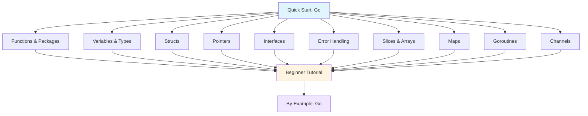

**Want to learn Go fundamentals quickly?** This quick start touches 8-12 core Go concepts with one example each. By the end, you'll have practical touchpoints for the most important language features.

## Prerequisites

Before starting, you should have:

- Completed [Initial Setup](/en/learn/software-engineering/programming-languages/golang/initial-setup) - Go installed and working
- A text editor or IDE (VS Code with Go extension, GoLand, or any editor)
- Basic understanding of programming concepts
- Willingness to write and run code

## Learning Objectives

By the end of this tutorial, you will have touchpoints for:

1. **Functions and Packages** - Define functions, multiple return values, packages
2. **Variables and Types** - Declarations, type inference, basic types
3. **Structs** - Define custom types, methods
4. **Pointers** - Reference types, pass by reference
5. **Interfaces** - Define contracts, implement interfaces
6. **Error Handling** - Return errors, custom errors
7. **Arrays and Slices** - Fixed and dynamic arrays
8. **Maps** - Key-value data structures
9. **Goroutines** - Concurrent execution
10. **Channels** - Communicate between goroutines

## Learning Path



## Concept 1: Functions and Packages - Organize Code

Go programs are made of packages, with `main` as the entry point.

### Example: Functions and Packages

```go
package main

import (
    "fmt"
    "math"
    "strings"
)

// Simple function
func greet(name string) {
    fmt.Printf("Hello, %s!\n", name)
}

// Function with return value
func add(a int, b int) int {
    return a + b
}

// Multiple return values (common in Go)
func divide(a, b float64) (float64, error) {
    if b == 0 {
        return 0, fmt.Errorf("cannot divide by zero")
    }
    return a / b, nil
}

// Named return values
func getMinMax(numbers []int) (min int, max int) {
    min, max = numbers[0], numbers[0]
    for _, num := range numbers {
        if num < min {
            min = num
        }
        if num > max {
            max = num
        }
    }
    return // Returns named variables
}

// Variadic function
func sum(numbers ...int) int {
    total := 0
    for _, num := range numbers {
        total += num
    }
    return total
}

func main() {
    greet("Alice")  // Hello, Alice!

    result := add(5, 3)
    fmt.Println(result)  // 8

    quotient, err := divide(10, 2)
    if err != nil {
        fmt.Println("Error:", err)
    } else {
        fmt.Println(quotient)  // 5
    }

    min, max := getMinMax([]int{3, 7, 1, 9, 4})
    fmt.Printf("Min: %d, Max: %d\n", min, max)  // Min: 1, Max: 9

    total := sum(1, 2, 3, 4, 5)
    fmt.Println(total)  // 15

    // Using standard library
    fmt.Println(math.Sqrt(16))           // 4
    fmt.Println(strings.ToUpper("go"))   // GO
}
```

**Key concepts**: `package`, `import`, `func`, multiple return values, variadic functions

## Concept 2: Variables and Types - Store Data

Go uses static typing with type inference.

### Example: Variable Declarations and Types

```go
package main

import "fmt"

func main() {
    // Variable declarations
    var age int = 25
    var price float64 = 19.99
    var name string = "Alice"
    var isActive bool = true

    // Type inference
    count := 42          // int
    message := "Hello"   // string
    pi := 3.14159        // float64

    // Multiple declarations
    var x, y int = 10, 20
    a, b := 5, "test"

    // Zero values (default values)
    var num int       // 0
    var str string    // ""
    var flag bool     // false
    var ptr *int      // nil

    fmt.Println(age, price, name, isActive)
    fmt.Println(count, message, pi)
    fmt.Println(x, y, a, b)
    fmt.Println(num, str, flag, ptr)

    // Type conversion (explicit)
    var i int = 42
    var f float64 = float64(i)
    var u uint = uint(f)

    fmt.Printf("i=%d, f=%f, u=%d\n", i, f, u)

    // Constants
    const Pi = 3.14159
    const Greeting = "Hello, World!"
    // Pi = 3.14  // Compile error - cannot reassign

    // Typed constants
    const MaxConnections int = 100

    // iota for enumerations
    const (
        Sunday = iota    // 0
        Monday           // 1
        Tuesday          // 2
        Wednesday        // 3
    )

    fmt.Println(Sunday, Monday, Tuesday)  // 0 1 2
}
```

**Key concepts**: `var`, `:=`, type inference, zero values, constants, `iota`

## Concept 3: Structs - Custom Data Types

Structs group related data together.

### Example: Struct Definition and Methods

```go
package main

import "fmt"

// Struct definition
type Person struct {
    Name string
    Age  int
    City string
}

// Method with value receiver
func (p Person) Greet() {
    fmt.Printf("Hello, my name is %s\n", p.Name)
}

// Method with pointer receiver (can modify struct)
func (p *Person) HaveBirthday() {
    p.Age++
}

// Constructor function (convention)
func NewPerson(name string, age int, city string) *Person {
    return &Person{
        Name: name,
        Age:  age,
        City: city,
    }
}

// Embedded structs
type Address struct {
    Street string
    City   string
}

type Employee struct {
    Person  // Embedded struct (composition)
    Address
    ID     int
    Salary float64
}

func main() {
    // Create struct (field names)
    alice := Person{
        Name: "Alice",
        Age:  30,
        City: "NYC",
    }

    // Create struct (positional)
    bob := Person{"Bob", 25, "LA"}

    // Access fields
    fmt.Println(alice.Name)  // Alice
    fmt.Println(bob.Age)     // 25

    // Call methods
    alice.Greet()  // Hello, my name is Alice

    alice.HaveBirthday()
    fmt.Println(alice.Age)  // 31

    // Using constructor
    charlie := NewPerson("Charlie", 35, "Chicago")
    charlie.Greet()

    // Embedded struct
    emp := Employee{
        Person: Person{Name: "David", Age: 40, City: "Boston"},
        Address: Address{Street: "123 Main St", City: "Boston"},
        ID: 1001,
        Salary: 75000,
    }

    fmt.Println(emp.Name)    // David (from embedded Person)
    fmt.Println(emp.Street)  // 123 Main St (from embedded Address)
    fmt.Println(emp.ID)      // 1001

    emp.Greet()  // Hello, my name is David (method from Person)
}
```

**Key concepts**: `struct`, methods, value/pointer receivers, embedded structs

## Concept 4: Pointers - Reference Types

Pointers hold memory addresses, enabling pass-by-reference.

### Example: Pointers and References

```go
package main

import "fmt"

func modifyValue(x int) {
    x = 100  // Modifies local copy, not original
}

func modifyPointer(x *int) {
    *x = 100  // Modifies original value
}

func main() {
    // Basic pointers
    var num int = 42
    var ptr *int = &num  // & gets address

    fmt.Println("num:", num)    // 42
    fmt.Println("ptr:", ptr)    // Memory address (e.g., 0xc000014098)
    fmt.Println("*ptr:", *ptr)  // 42 (* dereferences pointer)

    // Modify through pointer
    *ptr = 100
    fmt.Println("num:", num)  // 100 (changed via pointer)

    // Pass by value vs pass by pointer
    a := 10
    modifyValue(a)
    fmt.Println("After modifyValue:", a)  // 10 (unchanged)

    modifyPointer(&a)
    fmt.Println("After modifyPointer:", a)  // 100 (changed)

    // new() function - allocates memory
    ptr2 := new(int)  // Returns *int with zero value
    fmt.Println(*ptr2)  // 0

    *ptr2 = 42
    fmt.Println(*ptr2)  // 42

    // Nil pointers
    var nilPtr *int
    fmt.Println(nilPtr == nil)  // true

    // Pointer to struct
    type Person struct {
        Name string
        Age  int
    }

    p := &Person{Name: "Alice", Age: 30}
    fmt.Println(p.Name)  // Alice (Go automatically dereferences)
    (*p).Age++           // Explicit dereference
    p.Age++              // Automatic dereference (same as above)
    fmt.Println(p.Age)   // 32
}
```

**Key concepts**: `*` (dereference), `&` (address), `new()`, pointer receivers

## Concept 5: Interfaces - Define Contracts

Interfaces specify behavior without implementation.

### Example: Interface Implementation

```go
package main

import (
    "fmt"
    "math"
)

// Interface definition
type Shape interface {
    Area() float64
    Perimeter() float64
}

// Circle implements Shape
type Circle struct {
    Radius float64
}

func (c Circle) Area() float64 {
    return math.Pi * c.Radius * c.Radius
}

func (c Circle) Perimeter() float64 {
    return 2 * math.Pi * c.Radius
}

// Rectangle implements Shape
type Rectangle struct {
    Width  float64
    Height float64
}

func (r Rectangle) Area() float64 {
    return r.Width * r.Height
}

func (r Rectangle) Perimeter() float64 {
    return 2 * (r.Width + r.Height)
}

// Function accepting interface
func printShapeInfo(s Shape) {
    fmt.Printf("Area: %.2f, Perimeter: %.2f\n", s.Area(), s.Perimeter())
}

// Empty interface (interface{})
func printAnything(val interface{}) {
    fmt.Println(val)
}

// Type assertion
func describe(i interface{}) {
    switch v := i.(type) {
    case int:
        fmt.Printf("Integer: %d\n", v)
    case string:
        fmt.Printf("String: %s\n", v)
    case Circle:
        fmt.Printf("Circle with radius: %.2f\n", v.Radius)
    default:
        fmt.Printf("Unknown type: %T\n", v)
    }
}

func main() {
    circle := Circle{Radius: 5}
    rect := Rectangle{Width: 10, Height: 5}

    // Polymorphism - interface variable holds any type that implements it
    var shape Shape

    shape = circle
    printShapeInfo(shape)  // Area: 78.54, Perimeter: 31.42

    shape = rect
    printShapeInfo(shape)  // Area: 50.00, Perimeter: 30.00

    // Slice of interfaces
    shapes := []Shape{circle, rect}
    for _, s := range shapes {
        printShapeInfo(s)
    }

    // Empty interface
    printAnything(42)
    printAnything("hello")
    printAnything(circle)

    // Type assertion
    describe(42)
    describe("Go")
    describe(circle)
    describe(3.14)
}
```

**Key concepts**: `interface`, implicit implementation, empty interface `interface{}`, type assertion

## Concept 6: Error Handling - Return Errors

Go uses explicit error return values instead of exceptions.

### Example: Error Handling Patterns

```go
package main

import (
    "errors"
    "fmt"
    "strconv"
)

// Function returning error
func divide(a, b float64) (float64, error) {
    if b == 0 {
        return 0, errors.New("division by zero")
    }
    return a / b, nil
}

// Custom error type
type ValidationError struct {
    Field   string
    Message string
}

func (e *ValidationError) Error() string {
    return fmt.Sprintf("%s: %s", e.Field, e.Message)
}

func validateAge(age int) error {
    if age < 0 {
        return &ValidationError{
            Field:   "age",
            Message: "cannot be negative",
        }
    }
    if age > 150 {
        return &ValidationError{
            Field:   "age",
            Message: "seems unrealistic",
        }
    }
    return nil
}

// Error wrapping (Go 1.13+)
func processData(input string) error {
    num, err := strconv.Atoi(input)
    if err != nil {
        return fmt.Errorf("failed to parse input: %w", err)
    }

    if num < 0 {
        return fmt.Errorf("invalid number: %d", num)
    }

    return nil
}

func main() {
    // Basic error handling
    result, err := divide(10, 2)
    if err != nil {
        fmt.Println("Error:", err)
        return
    }
    fmt.Println("Result:", result)  // Result: 5

    // Division by zero
    result, err = divide(10, 0)
    if err != nil {
        fmt.Println("Error:", err)  // Error: division by zero
    }

    // Custom error
    err = validateAge(-5)
    if err != nil {
        fmt.Println("Validation error:", err)  // Validation error: age: cannot be negative
    }

    err = validateAge(30)
    if err != nil {
        fmt.Println("Error:", err)
    } else {
        fmt.Println("Age is valid")  // Age is valid
    }

    // Error wrapping
    err = processData("abc")
    if err != nil {
        fmt.Println("Process error:", err)
        // Process error: failed to parse input: strconv.Atoi: parsing "abc": invalid syntax
    }

    // errors.Is and errors.As (Go 1.13+)
    var validationErr *ValidationError
    err = validateAge(200)
    if errors.As(err, &validationErr) {
        fmt.Printf("Field: %s, Message: %s\n", validationErr.Field, validationErr.Message)
    }
}
```

**Key concepts**: Error return values, `error` interface, custom errors, error wrapping

## Concept 7: Arrays and Slices - Collections

Arrays have fixed size, slices are dynamic.

### Example: Arrays and Slices

```go
package main

import "fmt"

func main() {
    // Array (fixed size)
    var arr [5]int
    arr[0] = 10
    arr[1] = 20
    fmt.Println(arr)  // [10 20 0 0 0] (zero values for uninitialized)

    // Array literal
    numbers := [5]int{1, 2, 3, 4, 5}
    fmt.Println(numbers)  // [1 2 3 4 5]

    // Slice (dynamic array)
    var slice []int  // nil slice
    slice = append(slice, 1)
    slice = append(slice, 2, 3, 4, 5)
    fmt.Println(slice)  // [1 2 3 4 5]

    // Slice literal
    fruits := []string{"apple", "banana", "cherry"}
    fmt.Println(fruits)  // [apple banana cherry]

    // make() for slices
    s := make([]int, 5)       // length 5, capacity 5
    fmt.Println(s)            // [0 0 0 0 0]
    fmt.Println(len(s))       // 5
    fmt.Println(cap(s))       // 5

    s2 := make([]int, 3, 10)  // length 3, capacity 10
    fmt.Println(len(s2))      // 3
    fmt.Println(cap(s2))      // 10

    // Slicing
    nums := []int{1, 2, 3, 4, 5, 6, 7, 8, 9, 10}
    fmt.Println(nums[0:5])    // [1 2 3 4 5]
    fmt.Println(nums[5:])     // [6 7 8 9 10]
    fmt.Println(nums[:5])     // [1 2 3 4 5]
    fmt.Println(nums[2:7])    // [3 4 5 6 7]

    // Copy slices
    src := []int{1, 2, 3}
    dst := make([]int, len(src))
    copy(dst, src)
    fmt.Println(dst)  // [1 2 3]

    // 2D slices
    matrix := [][]int{
        {1, 2, 3},
        {4, 5, 6},
        {7, 8, 9},
    }
    fmt.Println(matrix[1][2])  // 6

    // Iterate over slice
    for i, val := range fruits {
        fmt.Printf("%d: %s\n", i, val)
    }
    // 0: apple
    // 1: banana
    // 2: cherry
}
```

**Key concepts**: Arrays `[n]type`, slices `[]type`, `make()`, `append()`, `len()`, `cap()`

## Concept 8: Maps - Key-Value Storage

Maps provide key-value data structures.

### Example: Map Operations

```go
package main

import "fmt"

func main() {
    // Create map with make
    ages := make(map[string]int)
    ages["Alice"] = 30
    ages["Bob"] = 25
    ages["Charlie"] = 35

    fmt.Println(ages)  // map[Alice:30 Bob:25 Charlie:35]

    // Map literal
    scores := map[string]int{
        "Alice":   95,
        "Bob":     87,
        "Charlie": 92,
    }

    // Access value
    fmt.Println(scores["Alice"])  // 95

    // Check if key exists
    score, exists := scores["David"]
    if exists {
        fmt.Println("David's score:", score)
    } else {
        fmt.Println("David not found")  // David not found
    }

    // Modify value
    scores["Bob"] = 90
    fmt.Println(scores["Bob"])  // 90

    // Delete key
    delete(scores, "Charlie")
    fmt.Println(scores)  // map[Alice:95 Bob:90]

    // Iterate over map
    for name, age := range ages {
        fmt.Printf("%s is %d years old\n", name, age)
    }

    // Map with struct values
    type Person struct {
        Name string
        Age  int
    }

    people := map[int]Person{
        1: {Name: "Alice", Age: 30},
        2: {Name: "Bob", Age: 25},
    }

    fmt.Println(people[1])  // {Alice 30}

    // Zero value for maps is nil
    var nilMap map[string]int
    fmt.Println(nilMap == nil)  // true
    // nilMap["key"] = 42  // Runtime panic! Must use make() first

    // Check map length
    fmt.Println(len(scores))  // 2
}
```

**Key concepts**: `map[keyType]valueType`, `make()`, key existence check, `delete()`

## Concept 9: Goroutines - Concurrent Execution

Goroutines are lightweight threads managed by Go runtime.

### Example: Concurrent Execution

```go
package main

import (
    "fmt"
    "time"
)

func say(message string) {
    for i := 0; i < 3; i++ {
        fmt.Println(message)
        time.Sleep(100 * time.Millisecond)
    }
}

func count(name string) {
    for i := 1; i <= 5; i++ {
        fmt.Printf("%s: %d\n", name, i)
        time.Sleep(50 * time.Millisecond)
    }
}

func fibonacci(n int, results chan int) {
    a, b := 0, 1
    for i := 0; i < n; i++ {
        results <- a  // Send to channel
        a, b = b, a+b
    }
    close(results)
}

func main() {
    // Sequential execution
    say("Hello")
    say("World")
    // Takes ~600ms (3 iterations × 100ms × 2 calls)

    fmt.Println("---")

    // Concurrent execution with goroutine
    go say("Hello")  // Runs in background
    say("World")     // Runs in foreground
    // Takes ~300ms (runs concurrently)

    fmt.Println("---")

    // Multiple goroutines
    go count("A")
    go count("B")
    go count("C")

    // Wait for goroutines (not ideal, better to use channels or WaitGroup)
    time.Sleep(300 * time.Millisecond)

    fmt.Println("---")

    // Anonymous goroutine
    go func() {
        fmt.Println("Anonymous goroutine")
    }()

    time.Sleep(100 * time.Millisecond)

    // Goroutine with channel (see next concept)
    results := make(chan int, 10)
    go fibonacci(10, results)

    for num := range results {
        fmt.Print(num, " ")
    }
    fmt.Println()  // 0 1 1 2 3 5 8 13 21 34
}
```

**Key concepts**: `go` keyword, concurrent execution, lightweight threads

## Concept 10: Channels - Goroutine Communication

Channels enable safe communication between goroutines.

### Example: Channel Operations

```go
package main

import (
    "fmt"
    "time"
)

func main() {
    // Create channel
    ch := make(chan int)

    // Send and receive must be in different goroutines
    go func() {
        ch <- 42  // Send value to channel
    }()

    value := <-ch  // Receive value from channel
    fmt.Println(value)  // 42

    // Buffered channel
    buffered := make(chan string, 2)
    buffered <- "hello"  // Non-blocking (buffer has space)
    buffered <- "world"  // Non-blocking (buffer has space)
    // buffered <- "!"  // Would block (buffer full)

    fmt.Println(<-buffered)  // hello
    fmt.Println(<-buffered)  // world

    // Channel as function parameter
    messages := make(chan string)
    go sendMessages(messages)

    for msg := range messages {
        fmt.Println(msg)
    }

    // Select statement - wait on multiple channels
    ch1 := make(chan string)
    ch2 := make(chan string)

    go func() {
        time.Sleep(100 * time.Millisecond)
        ch1 <- "from ch1"
    }()

    go func() {
        time.Sleep(200 * time.Millisecond)
        ch2 <- "from ch2"
    }()

    for i := 0; i < 2; i++ {
        select {
        case msg1 := <-ch1:
            fmt.Println(msg1)
        case msg2 := <-ch2:
            fmt.Println(msg2)
        }
    }

    // Timeout with select
    timeout := make(chan bool)
    go func() {
        time.Sleep(2 * time.Second)
        timeout <- true
    }()

    select {
    case <-timeout:
        fmt.Println("Timeout!")
    case <-time.After(1 * time.Second):
        fmt.Println("Operation timed out")
    }

    // Close channel
    jobs := make(chan int, 5)
    done := make(chan bool)

    go worker(jobs, done)

    for j := 1; j <= 3; j++ {
        jobs <- j
    }
    close(jobs)  // Signal no more values

    <-done  // Wait for worker to finish
}

func sendMessages(ch chan string) {
    ch <- "Hello"
    ch <- "World"
    ch <- "from"
    ch <- "Go"
    close(ch)  // Close channel when done
}

func worker(jobs <-chan int, done chan<- bool) {
    for job := range jobs {
        fmt.Printf("Processing job %d\n", job)
        time.Sleep(100 * time.Millisecond)
    }
    done <- true
}
```

**Key concepts**: `make(chan type)`, `<-` (send/receive), buffered channels, `select`, `close()`

## Summary

**What you've touched**:

- Functions and packages (multiple returns, variadic)
- Variables and types (inference, constants, iota)
- Structs (methods, embedded structs)
- Pointers (references, pass by reference)
- Interfaces (implicit implementation, polymorphism)
- Error handling (explicit errors, custom errors)
- Arrays and slices (dynamic collections)
- Maps (key-value storage)
- Goroutines (concurrent execution)
- Channels (goroutine communication)

**Key syntax learned**:

```go
// Function
func add(a, b int) int {
    return a + b
}

// Struct
type Person struct {
    Name string
    Age  int
}

// Method
func (p *Person) Greet() {
    fmt.Println("Hello!")
}

// Interface
type Shape interface {
    Area() float64
}

// Error handling
result, err := divide(10, 2)
if err != nil {
    // Handle error
}

// Goroutine
go doWork()

// Channel
ch := make(chan int)
ch <- 42        // Send
value := <-ch   // Receive
```

## Next Steps

**Want comprehensive Go mastery?**

**Prefer code-first learning?**

- [By-Example Tutorial](/en/learn/software-engineering/programming-languages/golang/by-example) - Learn through heavily annotated Go examples

**Need specific solutions?**

- Browse by-example sections for specific patterns

**Want to understand Go philosophy?**

- [Overview](/en/learn/software-engineering/programming-languages/golang/overview) - Why Go exists and when to use it

## Quick Reference Card

### Essential Syntax

```go
// Variables
var x int = 42
y := 10  // Short declaration

// Functions
func add(a, b int) (int, error) {
    return a + b, nil
}

// Structs
type Person struct {
    Name string
    Age  int
}

p := Person{Name: "Alice", Age: 30}

// Slices
nums := []int{1, 2, 3}
nums = append(nums, 4)

// Maps
m := make(map[string]int)
m["key"] = 42

// Control flow
if x > 0 {
    // ...
}

for i := 0; i < 10; i++ {
    // ...
}

for key, value := range m {
    // ...
}

// Goroutines
go doWork()

// Channels
ch := make(chan int)
ch <- 42
value := <-ch
```

### Common Patterns

```go
// Error handling
if err != nil {
    return err
}

// Defer (cleanup)
file, err := os.Open("file.txt")
if err != nil {
    return err
}
defer file.Close()

// Interface type assertion
if val, ok := i.(string); ok {
    // val is string
}

// Empty interface
func printAny(v interface{}) {
    fmt.Println(v)
}

// Channel with select
select {
case msg := <-ch1:
    // Handle ch1
case msg := <-ch2:
    // Handle ch2
case <-time.After(1 * time.Second):
    // Timeout
}
```

This quick start provides touchpoints for essential Go operations. For production work, explore the beginner tutorial for comprehensive coverage and by-example content for heavily annotated code patterns.
