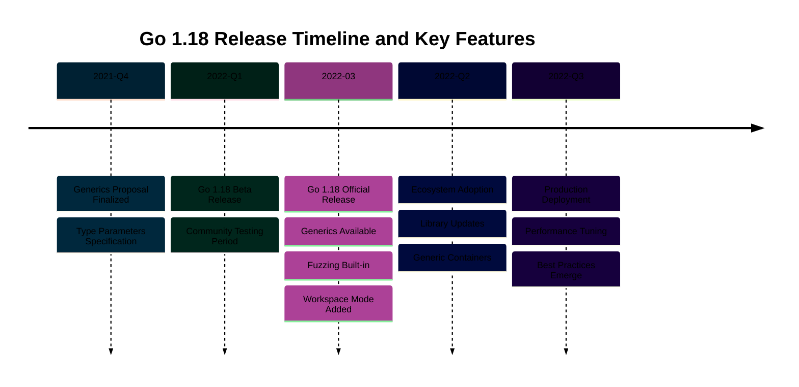

## Overview

Go 1.18, released in March 2022, represents one of the most significant releases in Go's history. It introduces three major features that fundamentally change how Go developers write, test, and organize code:

- **Generics (Type Parameters)**: Write type-safe, reusable code without sacrificing performance
- **Fuzzing Support**: Built-in fuzzing for discovering bugs through automated input generation
- **Workspace Mode**: Simplify development across multiple modules

This release brings modern programming capabilities while maintaining Go's simplicity and performance.



## Generics (Type Parameters)

Generics allow you to write functions and types that work with any type while maintaining type safety.

```go
// Generic function with type parameter
func Print[T any](value T) {
    fmt.Println(value)
}

// Usage with type inference
Print(42)          // int
Print("hello")     // string
```

Type constraints define what operations are allowed:

```go
// Custom constraint for numeric types
type Number interface {
    int | int8 | int16 | int32 | int64 |
    uint | uint8 | uint16 | uint32 | uint64 |
    float32 | float64
}

// Generic sum function
func Sum[T Number](values []T) T {
    var sum T
    for _, v := range values {
        sum += v
    }
    return sum
}
```

## Fuzzing Support

Native fuzzing automatically discovers bugs through random input generation:

```go
func FuzzReverse(f *testing.F) {
    // Seed corpus
    f.Add("hello")
    f.Add("world")

    // Fuzz target
    f.Fuzz(func(t *testing.T, input string) {
        reversed := Reverse(input)
        doubleReversed := Reverse(reversed)

        if input != doubleReversed {
            t.Errorf("Reverse(Reverse(%q)) = %q, want %q",
                input, doubleReversed, input)
        }
    })
}
```

Run fuzzing:

```bash
go test -fuzz=FuzzReverse
```

## Workspace Mode

Workspace mode simplifies multi-module development without complex `replace` directives:

```bash
# Initialize workspace with modules
go work init ./app ./lib

# go.work file created:
go 1.18

use (
    ./app
    ./lib
)
```

Local changes to modules are immediately available without publishing or manual configuration.

## References

- [Go 1.18 Release Notes](https://go.dev/doc/go1.18)
- [Generics Tutorial](https://go.dev/doc/tutorial/generics)
- [Fuzzing Documentation](https://go.dev/doc/fuzz/)

---

**Last Updated**: 2026-02-04
**Go Version**: 1.18+ (minimum), 1.25.x (latest stable)
