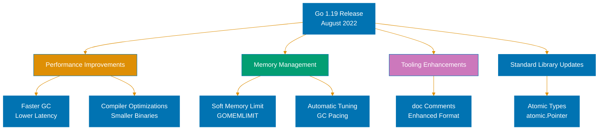

## Overview

Go 1.19 introduces performance improvements, enhanced memory management, and tooling enhancements. Released in August 2022, this release continues Go's evolution toward better performance and developer experience.



## Key Features

### Soft Memory Limit (GOMEMLIMIT)

Control maximum heap memory usage:

```bash
# Set 2GB memory limit
GOMEMLIMIT=2GiB go run main.go
```

### Faster Garbage Collector

Improved GC with lower latency and better throughput.

### Enhanced Doc Comments

Better documentation formatting with links and lists.

### atomic.Pointer Type

Type-safe atomic pointers:

```go
var ptr atomic.Pointer[Config]

config := &Config{Host: "localhost"}
ptr.Store(config)

current := ptr.Load()
```

## Breaking Changes

Consult the official Go 1.19 documentation for detailed breaking changes and migration guidance.

## References

- [Go 1.19 Release Notes](https://go.dev/doc/go1.19)
- [Go Documentation](https://go.dev/doc/)

---

**Last Updated**: 2026-02-04
**Go Version**: 1.18+ (baseline), 1.25.x (latest stable)
