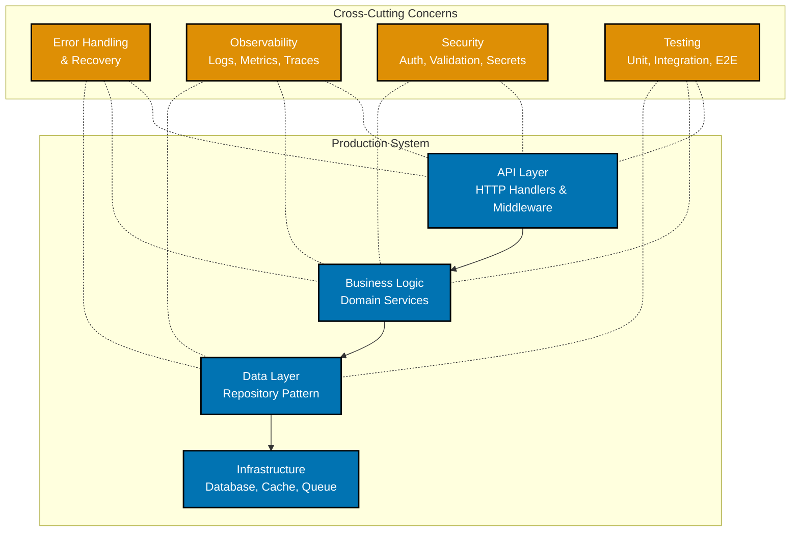
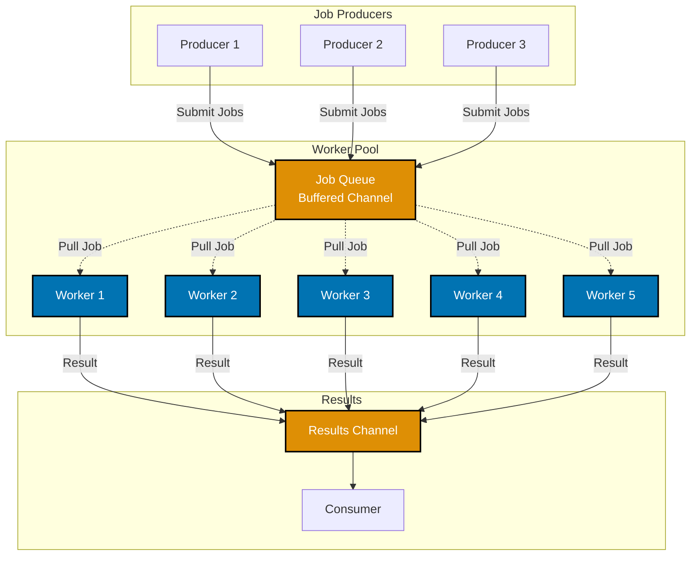

**Ready to build production-grade systems?** This tutorial teaches professional Go techniques used in companies like Uber, Netflix, and Google. You'll learn patterns for concurrent systems, production-ready error handling, testing strategies, and deployment practices.

**Prerequisites**: Complete the [Beginner tutorial](beginner) or have equivalent Go experience.

## 🎯 Learning Objectives

After this tutorial, you'll be able to:

- Implement advanced concurrency patterns (worker pools, pipelines, fan-out/fan-in)
- Build resilient systems with proper error handling and recovery
- Write comprehensive test suites for production code
- Design applications using architecture patterns (hexagonal, clean architecture)
- Optimize performance using profiling and benchmarking
- Implement security best practices in Go applications
- Deploy Go applications with health checks and observability

## 🏗️ Production Go Architecture

Professional Go development involves multiple layers working together:



This tutorial covers techniques for building each layer and implementing cross-cutting concerns professionally.

---

## Section 1: Advanced Concurrency Patterns

Go's concurrency model is one of its greatest strengths. Beyond basic goroutines and channels, there are patterns for building scalable systems.

### Worker Pool Pattern

A worker pool manages a fixed number of goroutines processing tasks from a queue. This prevents goroutine explosion when handling thousands of requests:

```go
package main

import (
	"fmt"
	"sync"
	"time"
)

type Job struct {
	ID    int
	Value int
}

type Result struct {
	Job    Job
	Result int
}

// WorkerPool manages a pool of workers
type WorkerPool struct {
	jobs    chan Job
	results chan Result
	wg      sync.WaitGroup
}

// NewWorkerPool creates a worker pool with numWorkers goroutines
func NewWorkerPool(numWorkers int) *WorkerPool {
	return &WorkerPool{
		jobs:    make(chan Job, 100),      // Buffered to avoid goroutine blocking
		results: make(chan Result, 100),
	}
}

// Start launches worker goroutines
func (wp *WorkerPool) Start(numWorkers int) {
	for i := 0; i < numWorkers; i++ {
		wp.wg.Add(1)
		go wp.worker()
	}
}

// worker processes jobs from the queue
func (wp *WorkerPool) worker() {
	defer wp.wg.Done()
	for job := range wp.jobs {
		// Simulate CPU-bound work
		result := job.Value * 2
		wp.results <- Result{Job: job, Result: result}
	}
}

// Submit adds a job to the queue
func (wp *WorkerPool) Submit(job Job) {
	wp.jobs <- job
}

// Close stops accepting new jobs and waits for workers to finish
func (wp *WorkerPool) Close() {
	close(wp.jobs)
	wp.wg.Wait()
	close(wp.results)
}

// GetResults returns a channel to read results
func (wp *WorkerPool) GetResults() <-chan Result {
	return wp.results
}

func main() {
	pool := NewWorkerPool(100)
	pool.Start(5) // 5 worker goroutines

	// Submit 100 jobs
	go func() {
		for i := 0; i < 100; i++ {
			pool.Submit(Job{ID: i, Value: i})
		}
		pool.Close()
	}()

	// Collect results
	resultCount := 0
	for result := range pool.GetResults() {
		resultCount++
		if resultCount <= 3 {
			fmt.Printf("Job %d: %d -> %d\n", result.Job.ID, result.Job.Value, result.Result)
		}
	}
	fmt.Printf("Processed %d jobs\n", resultCount)
}
```

**Key Concepts**:

- **Job Queue**: Buffered channel prevents blocking producers
- **Worker Goroutines**: Fixed number prevents resource exhaustion
- **WaitGroup**: Synchronizes workers and main goroutine
- **Channel Closure**: Signals workers when no more jobs are coming

**Worker Pool Architecture**:



The worker pool prevents goroutine explosion by maintaining a fixed number of workers processing an unbounded queue of jobs.

### Pipeline Pattern

Pipelines process data through sequential stages. Each stage is independent and can be scaled:

```go
package main

import "fmt"

// Pipeline stages
func generate(nums ...int) <-chan int {
	out := make(chan int)
	go func() {
		for _, n := range nums {
			out <- n
		}
		close(out)
	}()
	return out
}

func square(in <-chan int) <-chan int {
	out := make(chan int)
	go func() {
		for n := range in {
			out <- n * n
		}
		close(out)
	}()
	return out
}

func sum(in <-chan int) <-chan int {
	out := make(chan int)
	go func() {
		total := 0
		for n := range in {
			total += n
		}
		out <- total
		close(out)
	}()
	return out
}

func main() {
	// Create pipeline: generate -> square -> sum
	numbers := generate(1, 2, 3, 4, 5)
	squared := square(numbers)
	result := sum(squared)

	fmt.Println(<-result) // Output: 55 (1 + 4 + 9 + 16 + 25)
}
```

**Benefits**:

- Each stage can be scaled independently
- Stages can be composed into different pipelines
- Natural separation of concerns

### Context for Cancellation and Timeouts

The `context` package provides a way to cancel operations across goroutines and set timeouts:

```go
package main

import (
	"context"
	"fmt"
	"time"
)

// SlowOperation simulates a long-running operation
func SlowOperation(ctx context.Context, name string, duration time.Duration) error {
	select {
	case <-time.After(duration):
		fmt.Printf("%s completed\n", name)
		return nil
	case <-ctx.Done():
		fmt.Printf("%s cancelled: %v\n", name, ctx.Err())
		return ctx.Err()
	}
}

func main() {
	// Example 1: Timeout
	ctx, cancel := context.WithTimeout(context.Background(), 2*time.Second)
	defer cancel()

	fmt.Println("Example 1: Timeout")
	if err := SlowOperation(ctx, "Operation", 3*time.Second); err != nil {
		fmt.Println("Failed:", err)
	}

	// Example 2: Explicit cancellation
	fmt.Println("\nExample 2: Cancellation")
	ctx2, cancel2 := context.WithCancel(context.Background())
	go func() {
		time.Sleep(1 * time.Second)
		cancel2() // Cancel after 1 second
	}()

	if err := SlowOperation(ctx2, "Another Operation", 5*time.Second); err != nil {
		fmt.Println("Failed:", err)
	}
}
```

**Production Use Cases**:

- HTTP request timeouts
- Graceful shutdown (cancel all running operations)
- Request deadlines across service calls

### ✅ Checkpoint: Advanced Concurrency

Before moving forward, ensure you can:

- [ ] Design a worker pool for your specific workload
- [ ] Understand when to use pipelines vs worker pools
- [ ] Implement graceful shutdown with context cancellation
- [ ] Use WaitGroup to synchronize goroutines

**Practice Exercise**: Build a web scraper using a worker pool that fetches 100 URLs concurrently with a max of 10 workers.

---

## Section 2: Production Error Handling

Go's error handling philosophy is explicit. Rather than try-catch, Go returns errors as values.

### Error Wrapping and Chains

Go 1.13+ provides error wrapping to preserve error context:

```go
package main

import (
	"errors"
	"fmt"
	"os"
)

// Custom error type
type ValidationError struct {
	Field string
	Value interface{}
}

func (e *ValidationError) Error() string {
	return fmt.Sprintf("validation error on field %s: invalid value %v", e.Field, e.Value)
}

// Function that returns wrapped errors
func readConfig(filename string) (string, error) {
	// File operations can return os.PathError
	data, err := os.ReadFile(filename)
	if err != nil {
		// Wrap with context
		return "", fmt.Errorf("failed to read config file %s: %w", filename, err)
	}

	// Validation can return custom errors
	if len(data) == 0 {
		return "", &ValidationError{Field: "content", Value: "empty file"}
	}

	return string(data), nil
}

func main() {
	// Attempting to read non-existent file
	_, err := readConfig("nonexistent.conf")
	if err != nil {
		fmt.Println("Error:", err)

		// Check for specific error type
		var validErr *ValidationError
		if errors.As(err, &validErr) {
			fmt.Printf("Validation failed on %s\n", validErr.Field)
		}

		// Check for specific error value (sentinel error)
		if errors.Is(err, os.ErrNotExist) {
			fmt.Println("File not found")
		}

		// Unwrap to see the original error
		fmt.Println("Original error:", errors.Unwrap(err))
	}
}
```

**Key Functions**:

- `fmt.Errorf("%w", err)` - Wraps error (preserves chain)
- `errors.Is(err, target)` - Checks if error matches target
- `errors.As(err, &val)` - Extracts error of specific type
- `errors.Unwrap(err)` - Gets wrapped error

### Implementing Resilience with Retries

Production systems need to handle transient failures:

```go
package main

import (
	"fmt"
	"math"
	"math/rand"
	"time"
)

// RetryConfig specifies retry behavior
type RetryConfig struct {
	MaxAttempts int
	InitialDelay time.Duration
	MaxDelay    time.Duration
	Multiplier  float64
}

// Exponential backoff with jitter
func RetryWithBackoff(config RetryConfig, fn func() error) error {
	var lastErr error
	delay := config.InitialDelay

	for attempt := 1; attempt <= config.MaxAttempts; attempt++ {
		lastErr = fn()
		if lastErr == nil {
			return nil // Success
		}

		if attempt == config.MaxAttempts {
			break // No more retries
		}

		// Calculate backoff with jitter
		jitter := time.Duration(rand.Int63n(int64(delay)))
		actualDelay := delay + jitter

		fmt.Printf("Attempt %d failed, retrying after %v\n", attempt, actualDelay)
		time.Sleep(actualDelay)

		// Exponential backoff
		delay = time.Duration(math.Min(
			float64(delay)*config.Multiplier,
			float64(config.MaxDelay),
		))
	}

	return fmt.Errorf("failed after %d attempts: %w", config.MaxAttempts, lastErr)
}

// Example unreliable function
func UnreliableOperation() error {
	if rand.Float64() < 0.7 { // 70% failure rate
		return fmt.Errorf("temporary failure")
	}
	return nil
}

func main() {
	config := RetryConfig{
		MaxAttempts:  3,
		InitialDelay: 100 * time.Millisecond,
		MaxDelay:     2 * time.Second,
		Multiplier:   2.0,
	}

	err := RetryWithBackoff(config, UnreliableOperation)
	if err != nil {
		fmt.Println("Final error:", err)
	} else {
		fmt.Println("Success!")
	}
}
```

---

## Section 3: Testing Strategies

Production code requires comprehensive testing beyond basic unit tests.

### Integration Testing

Integration tests verify components work together:

```go
package main

import (
	"fmt"
	"testing"
)

// Database interface (abstraction for testing)
type Database interface {
	Get(key string) (string, error)
	Set(key string, value string) error
}

// MockDatabase for testing
type MockDatabase struct {
	data map[string]string
}

func NewMockDatabase() *MockDatabase {
	return &MockDatabase{data: make(map[string]string)}
}

func (m *MockDatabase) Get(key string) (string, error) {
	if val, ok := m.data[key]; ok {
		return val, nil
	}
	return "", fmt.Errorf("key not found")
}

func (m *MockDatabase) Set(key string, value string) error {
	m.data[key] = value
	return nil
}

// Service uses Database
type UserService struct {
	db Database
}

func NewUserService(db Database) *UserService {
	return &UserService{db: db}
}

func (s *UserService) GetUser(id string) (string, error) {
	return s.db.Get(id)
}

func (s *UserService) SaveUser(id string, name string) error {
	return s.db.Set(id, name)
}

// Integration test
func TestUserService(t *testing.T) {
	db := NewMockDatabase()
	service := NewUserService(db)

	// Test save
	if err := service.SaveUser("1", "Alice"); err != nil {
		t.Fatalf("SaveUser failed: %v", err)
	}

	// Test retrieve
	user, err := service.GetUser("1")
	if err != nil {
		t.Fatalf("GetUser failed: %v", err)
	}

	if user != "Alice" {
		t.Errorf("Expected 'Alice', got '%s'", user)
	}
}
```

### Benchmarking

Benchmarks measure performance:

```go
package main

import (
	"testing"
)

func SlowStringConcat(n int) string {
	result := ""
	for i := 0; i < n; i++ {
		result += "x" // Inefficient: creates new string each iteration
	}
	return result
}

func FastStringConcat(n int) string {
	b := make([]byte, n)
	for i := 0; i < n; i++ {
		b[i] = 'x'
	}
	return string(b)
}

// Benchmark slow version
func BenchmarkSlowConcat(b *testing.B) {
	for i := 0; i < b.N; i++ {
		SlowStringConcat(1000)
	}
}

// Benchmark fast version
func BenchmarkFastConcat(b *testing.B) {
	for i := 0; i < b.N; i++ {
		FastStringConcat(1000)
	}
}

// Run with: go test -bench=. -benchmem
```

Run benchmarks: `go test -bench=. -benchmem`

---

## Section 4: Code Organization and Architecture

Professional applications use architecture patterns to maintain scalability and testability.

### Hexagonal (Ports and Adapters) Architecture

```go
// domain/user.go - Core business logic
package domain

type User struct {
	ID   string
	Name string
	Email string
}

type UserRepository interface {
	Save(user User) error
	GetByID(id string) (User, error)
}

// Port: defines the service interface
type UserService interface {
	RegisterUser(name, email string) (User, error)
	GetUser(id string) (User, error)
}

// application/service.go - Use case implementation
package application

import "domain"

type UserServiceImpl struct {
	repo domain.UserRepository
}

func NewUserService(repo domain.UserRepository) domain.UserService {
	return &UserServiceImpl{repo: repo}
}

func (s *UserServiceImpl) RegisterUser(name, email string) (domain.User, error) {
	user := domain.User{ID: "123", Name: name, Email: email}
	if err := s.repo.Save(user); err != nil {
		return domain.User{}, err
	}
	return user, nil
}

func (s *UserServiceImpl) GetUser(id string) (domain.User, error) {
	return s.repo.GetByID(id)
}

// infrastructure/postgres.go - Adapter implementation
package infrastructure

import "domain"

type PostgresRepository struct {
	// connection pool, etc
}

func (r *PostgresRepository) Save(user domain.User) error {
	// SQL implementation
	return nil
}

func (r *PostgresRepository) GetByID(id string) (domain.User, error) {
	// SQL implementation
	return domain.User{}, nil
}
```

**Benefits**:

- Core business logic independent of frameworks
- Easy to swap implementations (PostgreSQL ↔ MongoDB)
- Testable with mock repositories

### Dependency Injection

Inject dependencies rather than hardcoding:

```go
// Good: Dependencies injected
func NewUserHandler(service UserService, logger Logger) *UserHandler {
	return &UserHandler{
		service: service,
		logger:  logger,
	}
}

// Bad: Hardcoded dependencies
func NewUserHandlerBad() *UserHandler {
	return &UserHandler{
		service: globalUserService, // Global dependency!
		logger:  globalLogger,
	}
}
```

---

## Section 5: Performance and Optimization

Understanding performance is critical for production systems.

### Profiling with pprof

Go includes built-in profiling:

```go
package main

import (
	"fmt"
	"runtime/pprof"
	"os"
)

func expensiveOperation() {
	sum := 0
	for i := 0; i < 1000000000; i++ {
		sum += i
	}
	fmt.Println(sum)
}

func main() {
	// Start CPU profiling
	f, _ := os.Create("cpu.prof")
	pprof.StartCPUProfile(f)
	defer pprof.StopCPUProfile()

	expensiveOperation()

	// Run with: go run main.go
	// Then: go tool pprof cpu.prof
	// Then: (pprof) top (shows top functions by CPU usage)
}
```

### Memory Allocation Patterns

Reduce allocations in hot paths:

```go
// Bad: Allocates on each iteration
func BadProcessing(items []int) {
	for _, item := range items {
		result := make([]byte, 1024) // Allocates!
		_ = result
	}
}

// Good: Reuse buffer
func GoodProcessing(items []int) {
	buffer := make([]byte, 1024) // Allocate once
	for _, item := range items {
		_ = buffer
		// Reuse buffer
	}
}

// Even better: Use sync.Pool for temporary objects
var bufferPool = sync.Pool{
	New: func() interface{} {
		return make([]byte, 1024)
	},
}

func OptimizedProcessing(items []int) {
	buffer := bufferPool.Get().([]byte)
	defer bufferPool.Put(buffer)

	for _, item := range items {
		_ = buffer
		// Use buffer
	}
}
```

---

## Section 6: Security Best Practices

Production applications must be secure:

### Input Validation

```go
import (
	"regexp"
	"strings"
)

func ValidateEmail(email string) error {
	if len(email) == 0 {
		return fmt.Errorf("email cannot be empty")
	}
	if len(email) > 254 {
		return fmt.Errorf("email too long")
	}
	// Basic email regex
	if matched, _ := regexp.MatchString(`^[a-zA-Z0-9._%+-]+@[a-zA-Z0-9.-]+\.[a-zA-Z]{2,}$`, email); !matched {
		return fmt.Errorf("invalid email format")
	}
	return nil
}

// Prevent SQL injection with parameterized queries
func GetUser(db *sql.DB, id string) (User, error) {
	// Good: Parameterized query
	row := db.QueryRow("SELECT id, name FROM users WHERE id = ?", id)

	// Bad: String concatenation (DO NOT USE)
	// row := db.QueryRow("SELECT id, name FROM users WHERE id = " + id)

	var u User
	if err := row.Scan(&u.ID, &u.Name); err != nil {
		return User{}, err
	}
	return u, nil
}
```

### Secrets Management

Never hardcode secrets:

```go
import "os"

// Good: From environment
apiKey := os.Getenv("API_KEY")

// Good: From secure vault (e.g., HashiCorp Vault)
// - Never commit secrets to git
// - Use `.gitignore` for `.env` files
// - Rotate secrets regularly
```

---

## Section 7: Deployment and Observability

Production systems need health checks and monitoring:

### Graceful Shutdown

```go
package main

import (
	"context"
	"net/http"
	"os"
	"os/signal"
	"syscall"
	"time"
)

func main() {
	server := &http.Server{
		Addr:    ":8080",
		Handler: http.HandlerFunc(func(w http.ResponseWriter, r *http.Request) {
			w.WriteHeader(http.StatusOK)
		}),
	}

	// Start server in goroutine
	go func() {
		if err := server.ListenAndServe(); err != nil && err != http.ErrServerClosed {
			panic(err)
		}
	}()

	// Wait for interrupt signal
	sigChan := make(chan os.Signal, 1)
	signal.Notify(sigChan, syscall.SIGINT, syscall.SIGTERM)
	<-sigChan

	// Graceful shutdown with timeout
	ctx, cancel := context.WithTimeout(context.Background(), 30*time.Second)
	defer cancel()

	if err := server.Shutdown(ctx); err != nil {
		panic(err)
	}
}
```

### Health Checks

```go
func healthHandler(w http.ResponseWriter, r *http.Request) {
	// Check critical services
	if !isDatabaseHealthy() {
		w.WriteHeader(http.StatusServiceUnavailable)
		return
	}
	w.WriteHeader(http.StatusOK)
	w.Write([]byte("OK"))
}

func main() {
	http.HandleFunc("/health", healthHandler)
	http.ListenAndServe(":8080", nil)

	// Now: curl http://localhost:8080/health
}
```

---

## Section 8: Practical HTTP Services

Building HTTP APIs is a common production use case:

### Building REST APIs

```go
package main

import (
	"encoding/json"
	"fmt"
	"net/http"
	"sync"
)

// User represents a user resource
type User struct {
	ID   string `json:"id"`
	Name string `json:"name"`
	Email string `json:"email"`
}

// UserStore manages user data (in-memory for this example)
type UserStore struct {
	mu    sync.RWMutex
	users map[string]User
}

func NewUserStore() *UserStore {
	return &UserStore{
		users: make(map[string]User),
	}
}

func (s *UserStore) Create(user User) error {
	s.mu.Lock()
	defer s.mu.Unlock()
	s.users[user.ID] = user
	return nil
}

func (s *UserStore) Get(id string) (User, error) {
	s.mu.RLock()
	defer s.mu.RUnlock()
	user, ok := s.users[id]
	if !ok {
		return User{}, fmt.Errorf("user not found")
	}
	return user, nil
}

// HTTP Handlers
type UserHandler struct {
	store *UserStore
}

func NewUserHandler(store *UserStore) *UserHandler {
	return &UserHandler{store: store}
}

// POST /users
func (h *UserHandler) CreateUser(w http.ResponseWriter, r *http.Request) {
	var user User
	if err := json.NewDecoder(r.Body).Decode(&user); err != nil {
		http.Error(w, "Invalid request", http.StatusBadRequest)
		return
	}

	if err := h.store.Create(user); err != nil {
		http.Error(w, err.Error(), http.StatusInternalServerError)
		return
	}

	w.Header().Set("Content-Type", "application/json")
	w.WriteHeader(http.StatusCreated)
	json.NewEncoder(w).Encode(user)
}

// GET /users/{id}
func (h *UserHandler) GetUser(w http.ResponseWriter, r *http.Request) {
	id := r.URL.Path[len("/users/"):]
	user, err := h.store.Get(id)
	if err != nil {
		http.Error(w, "User not found", http.StatusNotFound)
		return
	}

	w.Header().Set("Content-Type", "application/json")
	json.NewEncoder(w).Encode(user)
}

func main() {
	store := NewUserStore()
	handler := NewUserHandler(store)

	http.HandleFunc("/users", func(w http.ResponseWriter, r *http.Request) {
		if r.Method == http.MethodPost {
			handler.CreateUser(w, r)
		}
	})

	http.HandleFunc("/users/", func(w http.ResponseWriter, r *http.Request) {
		if r.Method == http.MethodGet {
			handler.GetUser(w, r)
		}
	})

	http.ListenAndServe(":8080", nil)
}
```

### Middleware Pattern

Middleware adds cross-cutting concerns (logging, authentication, etc.):

```go
// Middleware function that wraps a handler
func LoggingMiddleware(next http.Handler) http.Handler {
	return http.HandlerFunc(func(w http.ResponseWriter, r *http.Request) {
		fmt.Printf("Request: %s %s\n", r.Method, r.URL.Path)
		next.ServeHTTP(w, r)
	})
}

// Authentication middleware
func AuthMiddleware(next http.Handler) http.Handler {
	return http.HandlerFunc(func(w http.ResponseWriter, r *http.Request) {
		token := r.Header.Get("Authorization")
		if token == "" {
			http.Error(w, "Unauthorized", http.StatusUnauthorized)
			return
		}
		// Validate token here
		next.ServeHTTP(w, r)
	})
}

// Usage
func main() {
	mux := http.NewServeMux()
	mux.HandleFunc("/", func(w http.ResponseWriter, r *http.Request) {
		w.WriteHeader(http.StatusOK)
	})

	// Apply middleware
	handler := LoggingMiddleware(AuthMiddleware(mux))
	http.ListenAndServe(":8080", handler)
}
```

---

## Understanding Go Modules

Production applications use modules for dependency management:

```bash
go mod init github.com/username/myapp

go get github.com/some/package@v1.2.3

go get -u ./...

go mod tidy

go mod verify
```

**Best Practices**:

- Commit `go.mod` and `go.sum` to version control
- Pin specific versions for reproducibility
- Regularly update dependencies for security patches
- Use `go get -u=patch ./...` to update only patch versions

---

## Workspace Mode (Multi-Module Projects)

For projects with multiple modules:

```
project/
├── go.work
├── service-a/
│   ├── go.mod
│   └── main.go
├── service-b/
│   ├── go.mod
│   └── main.go
└── shared/
    ├── go.mod
    └── utils.go
```

`go.work`:

```
go 1.25

use (
	./service-a
	./service-b
	./shared
)
```

This allows local development of interdependent modules without publishing to a registry.

---

## Race Detector

Concurrency bugs are hard to find. Go's race detector helps:

```bash
go test -race ./...

go run -race main.go
```

The race detector identifies concurrent access to shared memory that isn't properly synchronized. This catches data races that might only appear under specific timing conditions.

**Example Race Condition**:

```go
var counter int

func incrementUnsafe() {
	for i := 0; i < 1000; i++ {
		counter++ // DATA RACE! Unsynchronized access
	}
}

func main() {
	go incrementUnsafe()
	go incrementUnsafe()
	time.Sleep(time.Second)
	fmt.Println(counter) // May not be 2000
}
```

**Fix with Mutex**:

```go
var (
	counter int
	mu      sync.Mutex
)

func incrementSafe() {
	for i := 0; i < 1000; i++ {
		mu.Lock()
		counter++
		mu.Unlock()
	}
}
```

---

## Advanced Interface Patterns

Interfaces are central to Go's design. Understanding advanced patterns is crucial:

### Interface Segregation Principle

Write small, focused interfaces:

```go
// Good: Small, focused interfaces
type Reader interface {
	Read(p []byte) (n int, err error)
}

type Writer interface {
	Write(p []byte) (n int, err error)
}

type Closer interface {
	Close() error
}

// Compose interfaces for larger contracts
type ReadWriter interface {
	Reader
	Writer
}

type ReadWriteCloser interface {
	Reader
	Writer
	Closer
}

// Bad: Large interface with many methods
type FileInterface interface {
	Read(p []byte) (n int, err error)
	Write(p []byte) (n int, err error)
	Close() error
	Seek(offset int64, whence int) (int64, error)
	Stat() (os.FileInfo, error)
	Name() string
	Truncate(size int64) error
	// ... 20 more methods
}
```

Small interfaces:

- Are easier to mock for testing
- Force better design
- Are more flexible
- Encourage composition

### Interface{} and Type Assertions

Sometimes you need to accept any type:

```go
// store accepts any type
func store(data interface{}) error {
	// Type assertion to get specific type
	if str, ok := data.(string); ok {
		fmt.Println("String:", str)
		return nil
	}

	if num, ok := data.(int); ok {
		fmt.Println("Number:", num)
		return nil
	}

	// Type switch for multiple types
	switch v := data.(type) {
	case string:
		fmt.Println("String:", v)
	case int:
		fmt.Println("Integer:", v)
	case []string:
		fmt.Println("Slice of strings:", v)
	default:
		return fmt.Errorf("unsupported type: %T", data)
	}

	return nil
}
```

---

## Generics (Go 1.18+)

Generics allow writing type-safe generic code:

### Generic Functions

```go
// Sort any comparable type
func Sort[T interface{ ~int | ~string }](s []T) {
	for i := 0; i < len(s)-1; i++ {
		for j := 0; j < len(s)-1-i; j++ {
			if s[j] > s[j+1] {
				s[j], s[j+1] = s[j+1], s[j]
			}
		}
	}
}

// Generic Map function - works with any function that transforms one type to another
func Map[T any, U any](items []T, fn func(T) U) []U {
	result := make([]U, len(items))
	for i, item := range items {
		result[i] = fn(item)
	}
	return result
}

func main() {
	numbers := []int{3, 1, 4, 1, 5}
	Sort(numbers)
	fmt.Println(numbers) // [1 1 3 4 5]

	strings := []string{"dog", "cat", "bird"}
	Sort(strings)
	fmt.Println(strings) // [bird cat dog]

	// Map with type conversion
	nums := []int{1, 2, 3, 4}
	doubled := Map(nums, func(n int) int {
		return n * 2
	})
	fmt.Println(doubled) // [2 4 6 8]
}
```

### Generic Types

```go
// Generic Stack
type Stack[T any] struct {
	items []T
}

func (s *Stack[T]) Push(item T) {
	s.items = append(s.items, item)
}

func (s *Stack[T]) Pop() (T, error) {
	var zero T
	if len(s.items) == 0 {
		return zero, fmt.Errorf("empty stack")
	}
	item := s.items[len(s.items)-1]
	s.items = s.items[:len(s.items)-1]
	return item, nil
}

func main() {
	// Stack of strings
	stringStack := &Stack[string]{}
	stringStack.Push("hello")
	stringStack.Push("world")
	item, _ := stringStack.Pop()
	fmt.Println(item) // world

	// Stack of integers (same code, different type)
	intStack := &Stack[int]{}
	intStack.Push(42)
	intStack.Push(100)
	item2, _ := intStack.Pop()
	fmt.Println(item2) // 100
}
```

---

## Advanced Testing Techniques

### Table-Driven Tests

```go
func TestDivide(t *testing.T) {
	tests := []struct {
		name    string
		a       float64
		b       float64
		want    float64
		wantErr bool
	}{
		{name: "normal division", a: 10, b: 2, want: 5, wantErr: false},
		{name: "decimal result", a: 7, b: 2, want: 3.5, wantErr: false},
		{name: "divide by zero", a: 10, b: 0, want: 0, wantErr: true},
	}

	for _, tt := range tests {
		t.Run(tt.name, func(t *testing.T) {
			got, err := Divide(tt.a, tt.b)
			if (err != nil) != tt.wantErr {
				t.Errorf("Divide() error = %v, wantErr %v", err, tt.wantErr)
				return
			}
			if !tt.wantErr && got != tt.want {
				t.Errorf("Divide() = %v, want %v", got, tt.want)
			}
		})
	}
}
```

**Benefits**:

- Easy to add new test cases
- Test names are descriptive
- Clear what each test expects

### Test Fixtures and Helpers

```go
// Helper function to set up test database
func setupTestDB(t *testing.T) *sql.DB {
	db, err := sql.Open("sqlite", ":memory:")
	if err != nil {
		t.Fatalf("Failed to open test DB: %v", err)
	}

	// Create schema
	_, err = db.Exec(`CREATE TABLE users (
		id INTEGER PRIMARY KEY,
		name TEXT,
		email TEXT
	)`)
	if err != nil {
		t.Fatalf("Failed to create schema: %v", err)
	}

	return db
}

// Use in tests
func TestUserRepository(t *testing.T) {
	db := setupTestDB(t)
	defer db.Close()

	repo := NewUserRepository(db)
	user := User{Name: "Alice", Email: "alice@example.com"}

	if err := repo.Save(user); err != nil {
		t.Fatalf("Save failed: %v", err)
	}
}
```

### Fuzzing (Go 1.18+)

Fuzz testing generates random inputs to find edge cases:

```go
func FuzzParseInt(f *testing.F) {
	// Seed with some inputs
	f.Add("123")
	f.Add("0")
	f.Add("-456")

	f.Fuzz(func(t *testing.T, input string) {
		// This runs ParseInt with random string inputs
		if _, err := strconv.Atoi(input); err == nil {
			// Reached here without panic = test passed
		}
	})
}

// Run with: go test -fuzz=FuzzParseInt
```

---

## Context in Production Code

The `context` package is essential for production Go:

### Propagating Context

```go
func main() {
	ctx, cancel := context.WithTimeout(context.Background(), 30*time.Second)
	defer cancel()

	if err := handleRequest(ctx); err != nil {
		log.Fatal(err)
	}
}

func handleRequest(ctx context.Context) error {
	return callDownstream(ctx)
}

func callDownstream(ctx context.Context) error {
	// Database operation with context
	rows, err := db.QueryContext(ctx, "SELECT * FROM users")
	if err != nil {
		return fmt.Errorf("query failed: %w", err)
	}
	defer rows.Close()

	// All operations respect the timeout from the top
	return nil
}
```

Context flows down the call stack. Any timeout at the top cancels all child operations automatically.

---

## Structured Logging

Production systems need structured logging, not printf-style:

```go
// Bad: Unstructured logging
log.Printf("User registered: %s, %s, %d", name, email, age)

// Good: Structured logging (using a library like logrus or zap)
logger.WithFields(map[string]interface{}{
	"user_id": "123",
	"name":    "Alice",
	"email":   "alice@example.com",
	"age":     30,
	"action":  "user_registration",
}).Info("User registered successfully")

// Logged as JSON:
// {"level":"info","msg":"User registered successfully","user_id":"123","name":"Alice",...}
```

Structured logging allows:

- Parsing logs programmatically
- Filtering and searching logs
- Aggregating logs from multiple services
- Creating dashboards and alerts

---

## 🏆 Challenges

**Challenge 1: Build a Resilient HTTP Client**

Create an HTTP client with:

- Exponential backoff retries
- Request timeouts
- Circuit breaker pattern (fail fast when service is down)
- Comprehensive error handling

**Challenge 2: Production Server**

Build a web server with:

- Concurrent request handling (worker pool)
- Graceful shutdown
- Health check endpoint
- Request logging

**Challenge 3: Data Pipeline**

Implement a pipeline that:

- Reads from a data source
- Processes data through multiple stages
- Writes to destination
- Handles errors and retries at each stage

---

## 📚 Next Steps

You've learned production-grade Go! Your next destination depends on your goals:

1. **Want Expert Mastery?** Continue to [Advanced Go Programming](advanced) for:
   - Runtime internals and optimization
   - Advanced debugging techniques
   - System design patterns

2. **Need Specific Patterns?** Check the [Golang Cookbook](cookbook) for:
   - Generics patterns
   - Concurrency recipes
   - Web development patterns

3. **Building a Real Project?** Apply these patterns to build:
   - Microservices
   - API servers
   - CLI tools
   - Data processing pipelines

---

## ✅ Self-Assessment

After completing this tutorial, you should be able to:

- [ ] Design and implement worker pools for concurrent processing
- [ ] Handle errors with proper wrapping and recovery strategies
- [ ] Write integration tests and benchmarks
- [ ] Design applications using hexagonal architecture
- [ ] Profile and optimize Go applications
- [ ] Implement security best practices
- [ ] Deploy applications with health checks and graceful shutdown
