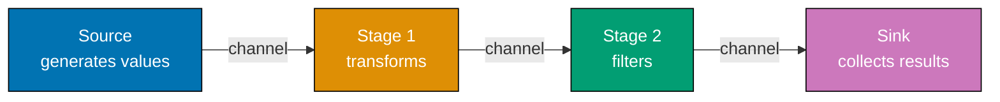
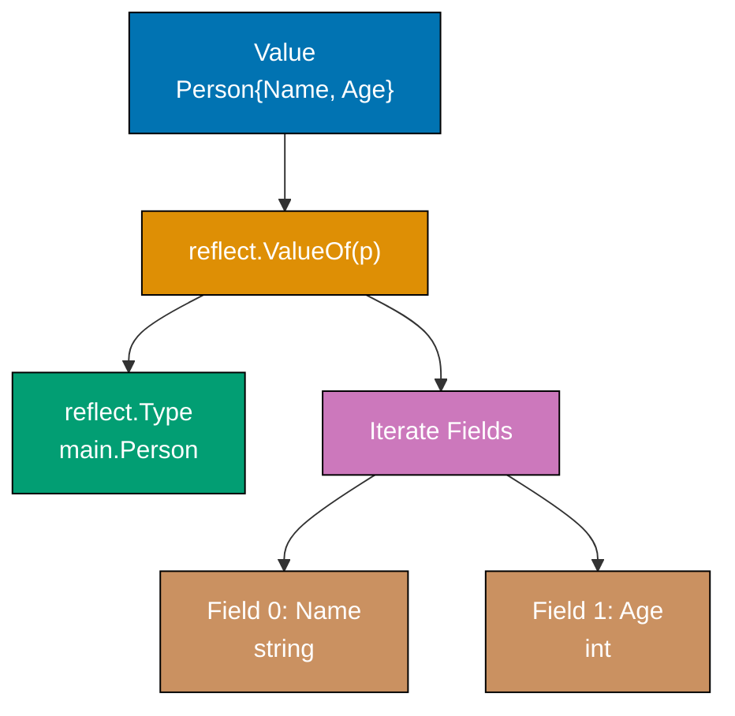
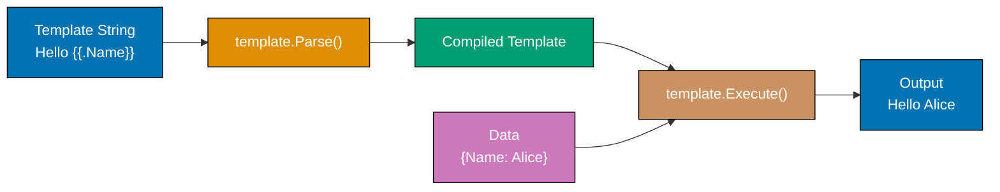
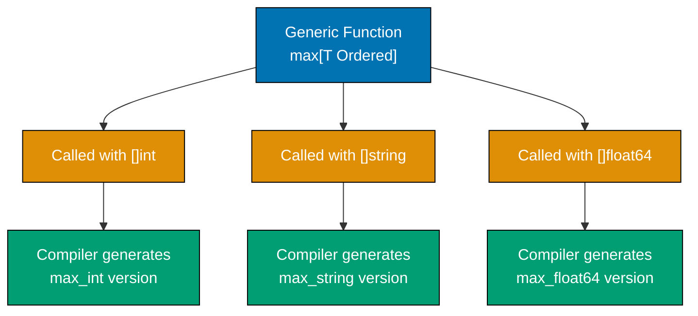
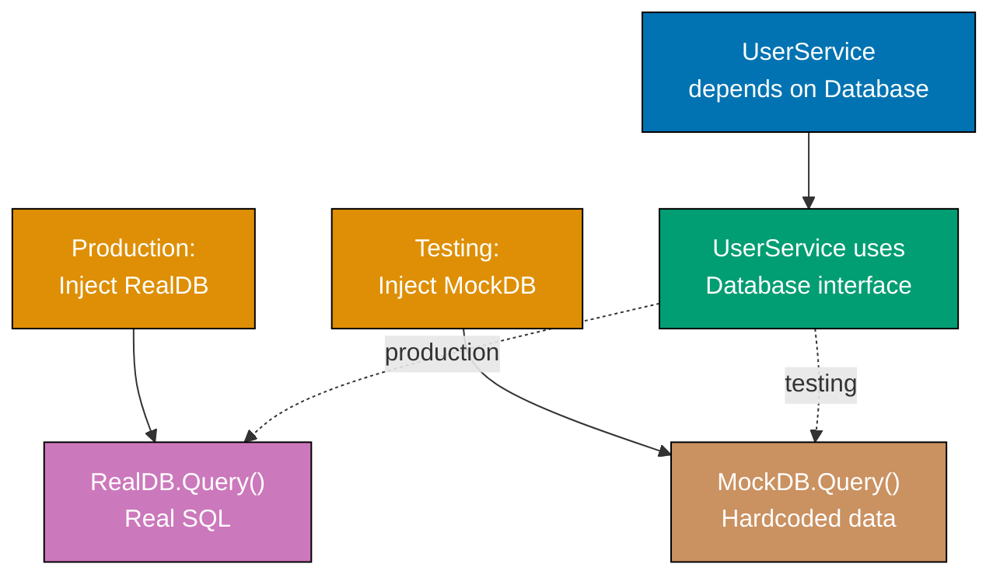

## Group 1: Advanced Concurrency Patterns

### Example 36: Pipeline Pattern

Pipelines process data through stages, each stage running concurrently. Each stage is a function that receives input from one channel and sends output to another. This composition enables elegant data processing.



**Code**:

```go
package main

import "fmt"

func main() {
    // Create pipeline: generate -> multiply by 2 -> print
    nums := generate(1, 5)         // => Stage 1: generate 1-5
    doubled := multiply(nums, 2)   // => Stage 2: multiply by 2
    square := multiply(doubled, 2) // => Stage 3: multiply by 2 again (square effect)

    // Consume results
    for result := range square {   // => Stage 4: consume results
        fmt.Println(result)
    }
    // => Output: 4 8 12 16 20
}

// Generator stage - creates values
func generate(start, end int) <-chan int { // => Returns receive-only channel
    out := make(chan int)
    go func() {
        for i := start; i <= end; i++ {
            out <- i               // => Send generated values
        }
        close(out)                 // => Signal completion
    }()
    return out
}

// Transform stage - multiplies values
func multiply(in <-chan int, factor int) <-chan int { // => Receive input, send output
    out := make(chan int)
    go func() {
        for value := range in {    // => Range until channel closes
            out <- value * factor  // => Send transformed value
        }
        close(out)
    }()
    return out
}
```

**Key Takeaway**: Pipelines compose concurrent stages. Each stage receives from one channel, processes, sends to next. Use channels with directional types (`<-chan` receive, `chan<-` send) to clarify data flow.

### Example 37: Context-Aware Pipelines

Pipeline stages should respect cancellation. When context is cancelled, all stages should exit gracefully. This enables cancelling long-running pipelines without leaking goroutines.

**Code**:

```go
package main

import (
    "context"
    "fmt"
    "time"
)

func main() {
    // Create cancellable context
    ctx, cancel := context.WithTimeout(context.Background(), 100*time.Millisecond)
    defer cancel()

    // Pipeline with context awareness
    nums := generateWithContext(ctx, 1, 100)
    squared := squareWithContext(ctx, nums)

    // Consume until context cancelled
    for result := range squared {
        fmt.Println(result)
    }
    fmt.Println("Pipeline cancelled")
}

func generateWithContext(ctx context.Context, start, end int) <-chan int {
    out := make(chan int)
    go func() {
        defer close(out)
        for i := start; i <= end; i++ {
            select {
            case out <- i:           // => Send value
            case <-ctx.Done():       // => Check for cancellation
                fmt.Println("Generate cancelled")
                return
            }
            time.Sleep(10 * time.Millisecond)
        }
    }()
    return out
}

func squareWithContext(ctx context.Context, in <-chan int) <-chan int {
    out := make(chan int)
    go func() {
        defer close(out)
        for value := range in {
            select {
            case out <- value * value: // => Send result
            case <-ctx.Done():         // => Check for cancellation
                fmt.Println("Square cancelled")
                return
            }
        }
    }()
    return out
}
```

**Key Takeaway**: Use `select` with `ctx.Done()` in every stage to enable graceful cancellation. When context is cancelled, all stages exit promptly without leaving goroutines running.

### Example 38: Rate Limiting

Rate limiting restricts how fast operations occur. Token bucket pattern uses a channel - tokens arrive at a rate, operations consume tokens. When no tokens available, operations wait.

**Code**:

```go
package main

import (
    "fmt"
    "time"
)

func main() {
    // Create rate limiter - 2 operations per second
    limiter := make(chan struct{}, 2) // => Channel with capacity 2 (tokens)

    // Replenish tokens
    go func() {
        ticker := time.NewTicker(500 * time.Millisecond) // => Add token every 500ms
        for range ticker.C {
            select {
            case limiter <- struct{}{}: // => Add token if space available
            default:
                // Token buffer full, skip
            }
        }
    }()

    // Use limited operations
    for i := 0; i < 5; i++ {
        <-limiter                  // => Consume token (wait if none available)
        fmt.Printf("Operation %d at %v\n", i, time.Now().Unix())
    }
}

// Alternative: time.Limit from golang.org/x/time/rate
import "golang.org/x/time/rate"

func limitedOperations() {
    limiter := rate.NewLimiter(rate.Every(time.Second), 5) // => 1 op/sec, burst 5

    for i := 0; i < 10; i++ {
        if !limiter.Allow() {     // => Check if operation allowed
            fmt.Println("Rate limit exceeded")
            continue
        }
        fmt.Printf("Operation %d\n", i)
    }
}
```

**Key Takeaway**: Token bucket pattern: channel of limited capacity represents tokens, operations consume tokens. Replenish tokens at fixed rate. This throttles operations smoothly.

### Example 39: Semaphore Pattern

Semaphores limit concurrent access to resources. While `sync.Mutex` allows one goroutine at a time, semaphores allow N. Implement with buffered channel of capacity N.

**Code**:

```go
package main

import (
    "fmt"
    "sync"
)

func main() {
    // Semaphore - allow 3 concurrent operations
    sem := make(chan struct{}, 3) // => Capacity 3 = 3 concurrent slots
    var wg sync.WaitGroup

    for i := 1; i <= 10; i++ {
        wg.Add(1)
        go func(id int) {
            defer wg.Done()

            sem <- struct{}{}      // => Acquire slot (blocks if all 3 slots full)
            defer func() { <-sem }() // => Release slot when done

            fmt.Printf("Operation %d running\n", id)
            // Simulate work
        }(i)
    }

    wg.Wait()
    fmt.Println("All operations complete")
}

// Weighted semaphore - operations require different numbers of slots
func weighSemaphore() {
    sem := make(chan int, 10)  // => Capacity 10 "units"

    // Operation requiring 3 units
    go func() {
        n := 3
        sem <- n                // => Acquire 3 units
        defer func() { <-sem }()

        fmt.Println("Acquired 3 units")
    }()

    // Operation requiring 7 units
    go func() {
        n := 7
        sem <- n                // => Acquire 7 units
        defer func() { <-sem }()

        fmt.Println("Acquired 7 units")
    }()

    // Total capacity: 10 units, both operations can run concurrently
}
```

**Key Takeaway**: Semaphore = buffered channel. Capacity = maximum concurrent operations. Send before work, receive after. Useful for limiting concurrent database connections, API calls, or other bounded resources.

### Example 40: Atomic Operations

Atomic operations ensure thread-safe modifications without mutexes. The `sync/atomic` package provides compare-and-swap (CAS) and atomic increments. Use when contention is low and operations are simple.

**Code**:

```go
package main

import (
    "fmt"
    "sync"
    "sync/atomic"
)

func main() {
    // Atomic counter - multiple goroutines increment safely
    var counter int64          // => Must be int64 or int32 for atomic
    var wg sync.WaitGroup

    for i := 0; i < 10; i++ {
        wg.Add(1)
        go func() {
            defer wg.Done()
            for j := 0; j < 100; j++ {
                atomic.AddInt64(&counter, 1) // => Atomic increment
            }
        }()
    }

    wg.Wait()
    fmt.Println("Counter:", counter) // => 1000 (safe from race conditions)

    // Atomic swap
    var value int64 = 10
    old := atomic.SwapInt64(&value, 20) // => Set to 20, return old value (10)
    fmt.Println("Old:", old, "New:", value)

    // Compare-and-swap (CAS)
    var cas int64 = 5
    swapped := atomic.CompareAndSwapInt64(&cas, 5, 10) // => If cas==5, set to 10
    fmt.Println("Swapped:", swapped, "Value:", cas)    // => true, 10

    // Load and store for safe reads
    var flag int32 = 0
    atomic.StoreInt32(&flag, 1)        // => Atomic write
    value32 := atomic.LoadInt32(&flag) // => Atomic read
    fmt.Println("Flag:", value32)
}
```

**Key Takeaway**: Atomic operations are lock-free. Use `atomic.AddInt64()` for counters, `atomic.SwapInt64()` for updates, `atomic.CompareAndSwapInt64()` for conditional updates. Lower overhead than mutexes but limited to simple operations.

## Group 2: Advanced Standard Library

### Example 41: Reflection

Reflection inspects types and values at runtime. The `reflect` package enables dynamic code - examine struct fields, call methods, or build values whose type isn't known until runtime. Use sparingly - reflection is powerful but slow and hard to understand.



**Code**:

```go
package main

import (
    "fmt"
    "reflect"
)

func main() {
    // Inspect struct type
    type Person struct {
        Name string
        Age  int
    }

    p := Person{"Alice", 30}
    v := reflect.ValueOf(p)    // => Get reflected value
    t := v.Type()              // => Get type

    fmt.Println("Type:", t)    // => main.Person
    fmt.Println("Fields:")

    // Iterate struct fields
    for i := 0; i < v.NumField(); i++ {
        field := v.Field(i)    // => Get field value
        fieldType := t.Field(i) // => Get field type
        fmt.Printf("  %s: %v (type: %s)\n", fieldType.Name, field.Interface(), field.Type())
    }
    // => Output:
    // =>   Name: Alice (type: string)
    // =>   Age: 30 (type: int)

    // Get value using field name
    nameField := v.FieldByName("Name")
    fmt.Println("Name field:", nameField.String())

    // Check kind
    if t.Kind() == reflect.Struct {
        fmt.Println("Type is a struct")
    }

    // Type assertion vs reflection
    // Reflection approach (dynamic):
    val := reflect.ValueOf(p)
    if val.Kind() == reflect.Struct {
        fmt.Println("It's a struct (reflection)")
    }

    // Direct approach (static, faster):
    switch p := p.(type) {
    case Person:
        fmt.Println("It's a Person (direct)")
    }
}
```

**Key Takeaway**: Use reflection sparingly - it's slow and reduces code clarity. Prefer direct type assertions when possible. Reflection is useful for libraries, JSON unmarshaling, or dynamic test fixtures. `reflect.ValueOf()` gets reflected value, `.Type()` gets type, `.NumField()` iterates struct fields.

### Example 42: Binary Encoding

Binary protocols and data formats require reading/writing binary data. The `encoding/binary` package handles byte order (endianness) and converts between binary and Go types.

**Code**:

```go
package main

import (
    "bytes"
    "encoding/binary"
    "fmt"
    "io"
)

func main() {
    // Write binary data
    buf := new(bytes.Buffer)

    // Write integer in big-endian format
    binary.Write(buf, binary.BigEndian, int32(42)) // => 42 as 4 bytes, big-endian
    binary.Write(buf, binary.BigEndian, float32(3.14)) // => Float
    binary.Write(buf, binary.BigEndian, true)      // => Bool

    // Read back
    reader := bytes.NewReader(buf.Bytes())
    var num int32
    var f float32
    var b bool

    binary.Read(reader, binary.BigEndian, &num) // => Read int32
    binary.Read(reader, binary.BigEndian, &f)   // => Read float32
    binary.Read(reader, binary.BigEndian, &b)   // => Read bool

    fmt.Printf("Num: %d, Float: %f, Bool: %v\n", num, f, b)
    // => Output: Num: 42, Float: 3.140000, Bool: true

    // Endianness matters
    smallBuf := new(bytes.Buffer)
    binary.Write(smallBuf, binary.LittleEndian, int16(256)) // => Little-endian
    fmt.Printf("Little-endian bytes: %v\n", smallBuf.Bytes()) // => [0 1]

    bigBuf := new(bytes.Buffer)
    binary.Write(bigBuf, binary.BigEndian, int16(256))     // => Big-endian
    fmt.Printf("Big-endian bytes: %v\n", bigBuf.Bytes())   // => [1 0]
}
```

**Key Takeaway**: `binary.Write()` serializes values to binary format. `binary.Read()` deserializes from binary. Specify endianness (`BigEndian` or `LittleEndian`). Endianness is crucial for network protocols and file formats.

### Example 43: Cryptography Basics

Cryptography is essential for security. Go provides standard cryptographic functions in `crypto/*` packages. Hash for integrity, random for security, HMAC for authentication, encryption for confidentiality.

**Code**:

```go
package main

import (
    "crypto/hmac"
    "crypto/rand"
    "crypto/sha256"
    "encoding/hex"
    "fmt"
)

func main() {
    // SHA256 hash - integrity check
    data := "Important message"
    hash := sha256.Sum256([]byte(data))  // => Compute hash
    fmt.Printf("SHA256: %s\n", hex.EncodeToString(hash[:])) // => Print as hex
    // => Output: SHA256: a665a45920422f9d417e4867efdc4fb8a04a1f3fff1fa07e998e86f7f7a27ae3

    // HMAC - authentication
    key := []byte("secret-key")
    h := hmac.New(sha256.New, key)       // => Create HMAC-SHA256
    h.Write([]byte(data))                // => Add data to hash
    signature := hex.EncodeToString(h.Sum(nil)) // => Get signature as hex
    fmt.Println("HMAC:", signature)

    // Verify HMAC
    h2 := hmac.New(sha256.New, key)
    h2.Write([]byte(data))
    if hmac.Equal(h.Sum(nil), h2.Sum(nil)) { // => Compare HMAC values
        fmt.Println("HMAC valid")
    }

    // Random bytes - for tokens, nonces
    token := make([]byte, 16)
    _, err := rand.Read(token)            // => Read 16 random bytes
    if err != nil {
        fmt.Println("Error generating random:", err)
        return
    }
    fmt.Printf("Random token: %s\n", hex.EncodeToString(token))
    // => Output: Random token: a1b2c3d4e5f6g7h8i9j0k1l2m3n4o5p6 (example)
}
```

**Key Takeaway**: Use `crypto/sha256.Sum256()` for hashing. Use `crypto/hmac` with hash function for authentication. Use `crypto/rand.Read()` for cryptographically secure random bytes. Never use `math/rand` for security-sensitive operations.

### Example 44: Templates

Templates generate text (HTML, email, config files). The `text/template` package provides template syntax with variables, functions, and control flow. Use `html/template` for HTML to prevent injection attacks.



**Code**:

```go
package main

import (
    "fmt"
    "html/template"
    "os"
    "strings"
)

func main() {
    // Simple template with variables
    tmpl, err := template.New("test").Parse("Hello, {{.Name}}! You are {{.Age}} years old.")
    if err != nil {
        fmt.Println("Parse error:", err)
        return
    }

    data := map[string]interface{}{
        "Name": "Alice",
        "Age":  30,
    }
    tmpl.Execute(os.Stdout, data) // => Execute template with data
    // => Output: Hello, Alice! You are 30 years old.

    // Conditional and loops
    tmpl2, _ := template.New("list").Parse(`
Users:
{{range .Users}}
  - {{.Name}} ({{.Age}})
{{end}}
`)

    data2 := map[string]interface{}{
        "Users": []map[string]interface{}{
            {"Name": "Alice", "Age": 30},
            {"Name": "Bob", "Age": 25},
        },
    }
    tmpl2.Execute(os.Stdout, data2)
    // => Output:
    // => Users:
    // =>   - Alice (30)
    // =>   - Bob (25)

    // Custom functions
    funcMap := template.FuncMap{
        "upper": strings.ToUpper,         // => Add function to template
        "add":   func(a, b int) int { return a + b }, // => Custom function
    }

    tmpl3, _ := template.New("funcs").Funcs(funcMap).Parse(
        "{{upper .Name}} total is {{add .Age .Years}}",
    )

    data3 := map[string]interface{}{
        "Name":  "alice",
        "Age":   30,
        "Years": 5,
    }
    tmpl3.Execute(os.Stdout, data3)
    // => Output: ALICE total is 35
}
```

**Key Takeaway**: Use `template.Parse()` to create templates. Use `.Field` to access data. Use `{{range}}` for loops, `{{if}}` for conditions. Use `html/template` instead of `text/template` for HTML to prevent injection. Define custom functions with `FuncMap`.

## Group 3: Generics (Go 1.18+)

### Example 45: Generic Functions

Generics enable functions to work with different types while maintaining type safety. Type parameters in square brackets define constraints. Go 1.18+ introduces this powerful feature.



**Code**:

```go
package main

import "fmt"

func main() {
    // Generic function works with different types
    intSlice := []int{3, 1, 4, 1, 5}
    fmt.Println("Max int:", max(intSlice))     // => 5

    stringSlice := []string{"apple", "zebra", "banana"}
    fmt.Println("Max string:", max(stringSlice)) // => zebra
}

// Generic function - [T any] is type parameter
// T is constrained to "any" type
func max[T any](slice []T) T { // => Type parameter T
    // Compiler error: can't compare T values (no constraint)
    // This won't work because we need to define T must be comparable
    return slice[0]
}

// Better: constrain T to be comparable
import "fmt"

// Comparable constraint - enables comparison operators
func betterMax[T interface{ int | float64 | string }](slice []T) T { // => Constraint
    if len(slice) == 0 {
        var zero T
        return zero
    }

    max := slice[0]
    for _, val := range slice[1:] {
        if val > max {          // => Works because T is constrained
            max = val
        }
    }
    return max
}

// Even better: use Ordered constraint (Go 1.21+)
import "golang.org/x/exp/constraints"

func bestMax[T constraints.Ordered](slice []T) T { // => Standard constraint
    if len(slice) == 0 {
        var zero T
        return zero
    }

    max := slice[0]
    for _, val := range slice[1:] {
        if val > max {
            max = val
        }
    }
    return max
}
```

**Key Takeaway**: Generic functions use `[T TypeConstraint]` syntax. Type parameter T is replaced with actual type at compile-time. Constraints limit what operations T supports. `any` means no constraints (but limited what you can do).

### Example 46: Generic Types

Generic struct types work similarly to generic functions. Define type parameters, and the compiler instantiates them for each type used. Useful for containers, queues, trees, and data structures.

```mermaid
%% Color Palette: Blue #0173B2, Orange #DE8F05, Teal #029E73, Purple #CC78BC, Brown #CA9161
graph TB
    A["Generic Type<br/>Stack[T any]"]
    B["Stack[int]<br/>items []int"]
    C["Stack[string]<br/>items []string"]
    D["Stack[Person]<br/>items []Person"]

    A -->|instantiate| B
    A -->|instantiate| C
    A -->|instantiate| D

    B --> E["Push(10)<br/>Pop() int"]
    C --> F["Push(\"hi\")<br/>Pop() string"]
    D --> G["Push(person)<br/>Pop() Person"]

    style A fill:#0173B2,stroke:#000,color:#fff
    style B fill:#DE8F05,stroke:#000,color:#fff
    style C fill:#DE8F05,stroke:#000,color:#fff
    style D fill:#DE8F05,stroke:#000,color:#fff
    style E fill:#029E73,stroke:#000,color:#fff
    style F fill:#029E73,stroke:#000,color:#fff
    style G fill:#029E73,stroke:#000,color:#fff
```

**Code**:

```go
package main

import "fmt"

func main() {
    // Generic stack of integers
    intStack := NewStack[int]()
    intStack.Push(10)
    intStack.Push(20)
    fmt.Println("Pop:", intStack.Pop()) // => 20

    // Generic stack of strings
    stringStack := NewStack[string]()
    stringStack.Push("hello")
    stringStack.Push("world")
    fmt.Println("Pop:", stringStack.Pop()) // => world
}

// Generic stack type
type Stack[T any] struct {    // => Type parameter T
    items []T
}

// Generic methods
func (s *Stack[T]) Push(item T) { // => Works with type T
    s.items = append(s.items, item)
}

func (s *Stack[T]) Pop() T {
    if len(s.items) == 0 {
        var zero T
        return zero
    }
    lastIdx := len(s.items) - 1
    item := s.items[lastIdx]
    s.items = s.items[:lastIdx]
    return item
}

// Constructor
func NewStack[T any]() *Stack[T] { // => Generic constructor
    return &Stack[T]{
        items: make([]T, 0),
    }
}

// Generic interface
type Container[T any] interface { // => Generic interface
    Add(T)
    Remove() T
}
```

**Key Takeaway**: Define generic types with `Type[T TypeParam]`. Methods on generic types use the type parameter. Construct with `NewGeneric[Type]()`. Generic types enable type-safe reusable containers.

### Example 47: Constraints and Comparable

Go provides standard constraints in `constraints` package. The `comparable` constraint enables `==` and `!=` operators. Custom constraints combine types and interfaces.

**Code**:

```go
package main

import (
    "fmt"
    "golang.org/x/exp/constraints"
)

func main() {
    // Numbers constraint - int, float, complex types
    fmt.Println("Sum ints:", sum([]int{1, 2, 3}))         // => 6
    fmt.Println("Sum floats:", sum([]float64{1.5, 2.5})) // => 4.0

    // Comparable constraint - can use == and !=
    if contains([]string{"a", "b", "c"}, "b") {
        fmt.Println("Found")
    }

    // Custom constraint - combine types and interface
    var m map[string]int = make(map[string]int)
    m["key"] = 10
    fmt.Println("Value:", getValue(m, "key")) // => 10
}

// Ordered constraint - can use <, >, <=, >=, ==, !=
func sum[T constraints.Integer](nums []T) T { // => Integer: int types
    var total T
    for _, n := range nums {
        total += n
    }
    return total
}

// Comparable constraint - can use == and !=
func contains[T comparable](slice []T, target T) bool { // => comparable
    for _, item := range slice {
        if item == target {     // => Works with any comparable type
            return true
        }
    }
    return false
}

// Custom constraint
type MapKey interface { // => Custom constraint
    comparable          // => Must satisfy comparable (can use ==)
}

func getValue[K MapKey, V any](m map[K]V, key K) V { // => Two type parameters
    return m[key]
}
```

**Key Takeaway**: `constraints.Ordered` = types supporting comparison operators. `constraints.Integer` = integer types. `comparable` = types supporting `==` and `!=`. Custom constraints combine interfaces and types.

## Group 4: Advanced Patterns

### Example 48: Options Pattern

The options pattern provides flexible configuration through functional options. Each option function modifies configuration without requiring many constructors or mutating shared state.

```mermaid
%% Color Palette: Blue #0173B2, Orange #DE8F05, Teal #029E73, Purple #CC78BC, Brown #CA9161
graph LR
    A["NewServer()"]
    B["Default Config<br/>Host: 0.0.0.0<br/>Port: 80"]
    C["WithHost(\"localhost\")"]
    D["WithPort(8080)"]
    E["WithTimeout(30)"]
    F["Final Config<br/>Host: localhost<br/>Port: 8080<br/>Timeout: 30"]

    A --> B
    B --> C
    C --> D
    D --> E
    E --> F

    style A fill:#0173B2,stroke:#000,color:#fff
    style B fill:#DE8F05,stroke:#000,color:#fff
    style C fill:#029E73,stroke:#000,color:#fff
    style D fill:#029E73,stroke:#000,color:#fff
    style E fill:#029E73,stroke:#000,color:#fff
    style F fill:#CC78BC,stroke:#000,color:#fff
```

**Code**:

```go
package main

import "fmt"

func main() {
    // Simple config without options
    server1 := NewServer()
    fmt.Println(server1)

    // Config with options
    server2 := NewServer(
        WithHost("localhost"),    // => Functional option
        WithPort(8080),           // => Functional option
        WithTimeout(30),          // => Functional option
    )
    fmt.Println(server2)

    // Mix options
    server3 := NewServer(
        WithPort(9000),
        // WithHost uses default
        WithTimeout(60),
    )
    fmt.Println(server3)
}

type Server struct {
    Host    string
    Port    int
    Timeout int
}

// Functional option type
type Option func(*Server) // => Option is function that modifies Server

// Constructor
func NewServer(opts ...Option) *Server { // => Variadic options
    s := &Server{
        Host:    "0.0.0.0",         // => Default values
        Port:    80,
        Timeout: 10,
    }

    for _, opt := range opts {
        opt(s)                      // => Apply each option
    }

    return s
}

// Option functions
func WithHost(host string) Option { // => Returns Option function
    return func(s *Server) {
        s.Host = host              // => Modify server
    }
}

func WithPort(port int) Option {
    return func(s *Server) {
        s.Port = port
    }
}

func WithTimeout(timeout int) Option {
    return func(s *Server) {
        s.Timeout = timeout
    }
}

func (s Server) String() string {
    return fmt.Sprintf("Server{Host: %s, Port: %d, Timeout: %d}", s.Host, s.Port, s.Timeout)
}
```

**Key Takeaway**: Options pattern accepts variadic functions that modify a config struct. Each option is a function that receives and modifies the struct. Enables flexible API without many constructors or mutating state.

### Example 49: Embed Directive (Go 1.16+)

The `//go:embed` directive embeds files into the binary at compile-time. Useful for static assets, templates, or configuration files that should be part of the executable.

**Code**:

```go
package main

import (
    "embed"
    "fmt"
)

func main() {
    // Embedded file
    fmt.Println("HTML template:")
    fmt.Println(string(htmlContent)) // => Content embedded at compile-time

    // Embedded file system
    entries, _ := fs.ReadDir("templates")
    fmt.Println("Embedded files:", len(entries))
    for _, entry := range entries {
        fmt.Println("  -", entry.Name())
    }

    // Read specific file from embedded FS
    content, _ := fs.ReadFile(fs.FS(templates), "index.html")
    fmt.Println("File content:", string(content))
}

// Single file
//go:embed templates/index.html
var htmlContent []byte // => Content embedded at compile-time

// File system
//go:embed templates/*
var templates embed.FS // => Entire directory embedded

// String content
//go:embed config.json
var config string

import "embed"
```

**Key Takeaway**: `//go:embed path` embeds files into the binary. Single file type is `[]byte` or `string`. Directory type is `embed.FS`. Files are embedded at compile-time, no runtime file system access needed.

### Example 50: Build Tags

Build tags enable conditional compilation. Platform-specific code, feature flags, or test-only code can be controlled with build tags. Tag expressions determine which files compile.

**Code**:

```go
// file: server_unix.go
//go:build unix || linux
// +build unix linux

package main

import "fmt"

func getPlatform() string {
    return "Unix/Linux"            // => Compiled only on Unix/Linux
}

// file: server_windows.go
//+build windows

package main

import "fmt"

func getPlatform() string {
    return "Windows"               // => Compiled only on Windows
}

// file: main.go
package main

func main() {
    fmt.Println("Platform:", getPlatform()) // => Platform-specific implementation
}

// Usage: go build, go build -tags=feature1, go run -tags="tag1,tag2"

// Multiple tags in single file
//go:build (linux || darwin) && !debug
// +build linux darwin
// +build !debug

package main

func shouldDebug() bool {
    return false                   // => Compiled on Linux/Mac without debug tag
}
```

**Key Takeaway**: `//go:build expression` (Go 1.16+) controls compilation. `-tags flag` enables tags at build-time. Use for platform-specific code, feature flags, and integration tests that require external services.

### Example 51: Custom Sorting

Sorting requires implementing the `sort.Interface` or using `sort.Slice()`. Custom sorting enables ordering by different fields or complex criteria.

**Code**:

```go
package main

import (
    "fmt"
    "sort"
)

func main() {
    users := []User{
        {Name: "Alice", Age: 30, Score: 95},
        {Name: "Bob", Age: 25, Score: 87},
        {Name: "Charlie", Age: 30, Score: 92},
    }

    // Sort by name
    sort.Sort(ByName(users))
    fmt.Println("By name:", users)

    // Sort by score descending
    sort.Sort(ByScoreDesc(users))
    fmt.Println("By score desc:", users)

    // Custom sort with Slice (simpler for one-off sorts)
    sort.Slice(users, func(i, j int) bool {
        if users[i].Age == users[j].Age {
            return users[i].Score > users[j].Score // => Age then score desc
        }
        return users[i].Age < users[j].Age        // => Age ascending
    })
    fmt.Println("By age then score:", users)
}

type User struct {
    Name  string
    Age   int
    Score int
}

// Implement sort.Interface
type ByName []User

func (b ByName) Len() int           { return len(b) }
func (b ByName) Swap(i, j int)      { b[i], b[j] = b[j], b[i] }
func (b ByName) Less(i, j int) bool { return b[i].Name < b[j].Name }

type ByScoreDesc []User

func (b ByScoreDesc) Len() int           { return len(b) }
func (b ByScoreDesc) Swap(i, j int)      { b[i], b[j] = b[j], b[i] }
func (b ByScoreDesc) Less(i, j int) bool { return b[i].Score > b[j].Score }
```

**Key Takeaway**: Implement `sort.Interface` (Len, Swap, Less) for custom sorting. Use `sort.Slice()` for one-off sorts with custom comparator. Implement Less such that `Less(i, j)` returns true if element i should come before j.

### Example 52: Dependency Injection

Dependency injection passes dependencies to functions/types instead of creating them internally. Enables testing with mock dependencies and decouples implementations.



**Code**:

```go
package main

import (
    "fmt"
)

func main() {
    // Real database
    db := &RealDB{}
    userService := NewUserService(db) // => Inject real DB

    fmt.Println(userService.GetUser(1))

    // Mock database for testing
    mockDB := &MockDB{}
    userService2 := NewUserService(mockDB) // => Inject mock DB

    fmt.Println(userService2.GetUser(1))
}

// Interface for testability
type Database interface {
    Get(id int) string
}

// Real implementation
type RealDB struct{}

func (r *RealDB) Get(id int) string {
    return fmt.Sprintf("User %d from database", id)
}

// Mock for testing
type MockDB struct{}

func (m *MockDB) Get(id int) string {
    return fmt.Sprintf("Mock user %d", id)
}

// Service - depends on Database interface, not concrete type
type UserService struct {
    db Database              // => Depend on interface, not concrete type
}

// Constructor injection
func NewUserService(db Database) *UserService { // => Inject dependency
    return &UserService{db: db}
}

func (s *UserService) GetUser(id int) string {
    return s.db.Get(id)     // => Use injected dependency
}
```

**Key Takeaway**: Depend on interfaces, not concrete types. Pass dependencies through constructors. Enables testing with mock implementations and decouples code from specific implementations.

## Group 5: Testing and Tooling

### Example 53: Subtests

Subtests organize tests hierarchically with `t.Run()`. Each subtest can have setup/teardown and reports individually. Subtests can run in parallel with `t.Parallel()`.

**Code**:

```go
package main

import "testing"

func TestUserService(t *testing.T) {
    // Parent test setup
    users := setupTestData()

    t.Run("GetUser", func(t *testing.T) {
        t.Run("ExistingUser", func(t *testing.T) {
            user := findUser(users, 1)
            if user.Name != "Alice" {
                t.Errorf("Expected Alice, got %s", user.Name)
            }
        })

        t.Run("NonExistentUser", func(t *testing.T) {
            user := findUser(users, 999)
            if user != nil {
                t.Errorf("Expected nil, got %v", user)
            }
        })
    })

    t.Run("CreateUser", func(t *testing.T) {
        newUser := User{Name: "David", Age: 28}
        created := createUser(newUser)
        if created.Name != "David" {
            t.Errorf("Expected David, got %s", created.Name)
        }
    })
}

// Parallel subtests
func TestParallel(t *testing.T) {
    t.Run("Sequential", func(t *testing.T) {
        // Parent doesn't use t.Parallel(), runs sequentially
    })

    t.Run("Parallel", func(t *testing.T) {
        t.Parallel()            // => Can run in parallel with other t.Parallel() tests
        // Parallel test code
    })
}

type User struct {
    Name string
    Age  int
}

func setupTestData() []*User {
    return []*User{
        {Name: "Alice", Age: 30},
        {Name: "Bob", Age: 25},
    }
}

func findUser(users []*User, id int) *User {
    if id > 0 && id <= len(users) {
        return users[id-1]
    }
    return nil
}

func createUser(u User) User {
    return u
}
```

**Key Takeaway**: `t.Run()` creates subtests that report individually. Use for organizing tests into logical groups. `t.Parallel()` enables parallel execution for tests without shared state. Subtests can have separate setup/teardown.

### Example 54: Mocking with Interfaces

Testing requires isolating code under test from external dependencies. Mock implementations of interfaces enable testing without real services like databases or APIs.

**Code**:

```go
package main

import (
    "testing"
)

func TestUserRepository(t *testing.T) {
    // Mock storage
    mock := &MockStorage{
        data: map[int]User{
            1: {ID: 1, Name: "Alice"},
        },
    }

    repo := NewUserRepository(mock)

    user, err := repo.Get(1)
    if err != nil {
        t.Errorf("Unexpected error: %v", err)
    }
    if user.Name != "Alice" {
        t.Errorf("Expected Alice, got %s", user.Name)
    }
}

type User struct {
    ID   int
    Name string
}

// Interface for testability
type Storage interface {
    Get(id int) (User, error)
    Save(u User) error
}

// Real storage
type Database struct{}

func (d *Database) Get(id int) (User, error) {
    // Real database query
    return User{}, nil
}

func (d *Database) Save(u User) error {
    // Real database write
    return nil
}

// Mock storage
type MockStorage struct {
    data map[int]User
}

func (m *MockStorage) Get(id int) (User, error) {
    if user, ok := m.data[id]; ok {
        return user, nil
    }
    return User{}, nil
}

func (m *MockStorage) Save(u User) error {
    m.data[u.ID] = u
    return nil
}

// Repository - depends on Storage interface
type UserRepository struct {
    storage Storage
}

func NewUserRepository(s Storage) *UserRepository {
    return &UserRepository{storage: s}
}

func (r *UserRepository) Get(id int) (User, error) {
    return r.storage.Get(id)
}
```

**Key Takeaway**: Mock implementations satisfy interfaces. Inject mocks into code under test. Mocks enable testing without real external services. Use simple in-memory mocks for fast tests.

### Example 55: Fuzzing (Go 1.18+)

Fuzzing automatically generates random inputs to find edge cases and crashes. Go's built-in fuzzing runs test function with generated and seed values.

**Code**:

```go
package main

import (
    "testing"
    "unicode/utf8"
)

// Run fuzzing: go test -fuzz=FuzzParseInt
func FuzzParseInt(f *testing.F) {
    // Seed values - good test cases to always include
    f.Add("0")
    f.Add("42")
    f.Add("-100")
    f.Add("2147483647")

    f.Fuzz(func(t *testing.T, input string) { // => Fuzz function
        // The fuzzer generates many values for input
        if len(input) == 0 {
            return                // => Skip empty input
        }

        result, err := parseInt(input) // => Test with generated input
        _ = result
        _ = err
        // No assertion - fuzzer looks for panics and crashes
    })
}

// Fuzzing UTF-8 strings
func FuzzValidUTF8(f *testing.F) {
    f.Add("hello")
    f.Add("世界")

    f.Fuzz(func(t *testing.T, input string) {
        // Fuzz will provide valid UTF-8 (f.Add only adds valid strings)
        // Fuzzer generates variations
        if !utf8.ValidString(input) {
            t.Errorf("Invalid UTF-8: %v", input)
        }
    })
}

func parseInt(s string) (int, error) {
    // Simple parser for fuzzing
    if s == "0" {
        return 0, nil
    }
    return 1, nil
}
```

**Key Takeaway**: Fuzzing tests provide generated inputs. Seed values with `f.Add()` include important test cases. The `f.Fuzz()` function receives generated inputs. Fuzzer looks for panics and crashes in your code.

### Example 56: CGO Basics

CGO enables calling C from Go. Use when you need external C libraries or performance-critical code. CGO adds complexity - prefer pure Go when possible.

**Code**:

```go
package main

/*
#include <stdio.h>
#include <string.h>

int add(int a, int b) {
    return a + b;
}

int strlen_c(const char* s) {
    return strlen(s);
}
*/
import "C"

import (
    "fmt"
)

func main() {
    // Call C function
    result := C.add(10, 20)         // => Call C add function
    fmt.Println("C.add(10, 20) =", result)

    // String from Go to C
    goString := "Hello"
    cString := C.CString(goString)  // => Convert Go string to C string
    defer C.free(cString)           // => Must free C string

    length := C.strlen_c(cString)
    fmt.Println("Length:", length)

    // Complex example - calculate from Go
    a := 15
    b := 25
    sum := int(C.add(C.int(a), C.int(b))) // => Convert Go int to C int
    fmt.Println("Sum:", sum)
}
```

**Key Takeaway**: CGO imports C code and calls C functions. Use `C.CString()` to convert Go strings to C strings. Remember to `free()` C-allocated memory. CGO is complex - use only when necessary.

## Group 6: Modern Go and Best Practices

### Example 57: Workspaces (Go 1.18+)

Workspaces enable multi-module development. Develop multiple modules together without publishing intermediate versions. Useful for monorepos or coordinating multiple packages.

**Code**:

```
// go.work file
go 1.21

use (
    ./cmd/api              // => Include local module
    ./cmd/cli
    ./libs/common
)

// Directory structure:
// project/
// ├── go.work            // Workspace definition
// ├── cmd/
// │   ├── api/
// │   │   └── go.mod
// │   └── cli/
// │       └── go.mod
// └── libs/
//     └── common/
//         └── go.mod

// Benefits:
// - Develop multiple modules together
// - Changes in libs/common reflected immediately in cmd/api
// - No need to publish intermediate versions
// - All modules tested together

// Usage: go test ./... (tests all modules)
//        go build ./cmd/api (builds api using local libs)
```

**Key Takeaway**: Workspaces allow multi-module development without publishing. Define workspace with `go.work` file. Use `use()` to include local modules. All modules use local versions instead of published versions.

### Example 58: Memory Profiling

Memory profiling identifies allocations and memory leaks. The `runtime/pprof` package enables capturing profiles. Analyze with `go tool pprof`.

**Code**:

```go
package main

import (
    "os"
    "runtime/pprof"
)

func main() {
    // Memory profiling
    f, err := os.Create("mem.prof")
    if err != nil {
        panic(err)
    }
    defer f.Close()

    pprof.WriteHeapProfile(f)  // => Capture heap profile

    // Run program: go run main.go
    // Then analyze: go tool pprof mem.prof
    // Commands in pprof:
    //   top         - shows top memory allocators
    //   list        - shows source code with allocations
    //   web         - generates graph (requires Graphviz)

    // CPU profiling
    cpuFile, _ := os.Create("cpu.prof")
    defer cpuFile.Close()

    pprof.StartCPUProfile(cpuFile) // => Start profiling
    defer pprof.StopCPUProfile()

    // Run expensive operation here
    expensiveComputation()
}

func expensiveComputation() {
    // Simulation of work
    for i := 0; i < 1000000; i++ {
        _ = i * i
    }
}
```

**Key Takeaway**: Use `pprof.WriteHeapProfile()` to capture memory allocations. Use `pprof.StartCPUProfile()` for CPU profiling. Analyze profiles with `go tool pprof`. Profile helps identify bottlenecks and memory leaks.

### Example 59: Race Detector

Go's race detector identifies concurrent access to shared memory without synchronization. Run with `-race` flag during development and testing.

**Code**:

```go
package main

import (
    "fmt"
    "sync"
)

func main() {
    var counter int
    var wg sync.WaitGroup

    // Race condition - multiple goroutines modify counter without sync
    for i := 0; i < 10; i++ {
        wg.Add(1)
        go func() {
            defer wg.Done()
            counter++               // => DATA RACE! No synchronization
        }()
    }

    wg.Wait()
    fmt.Println("Counter:", counter) // => Unpredictable value

    // Run with: go run -race main.go
    // Output includes race condition detection

    // Fixed version with mutex
    var mu sync.Mutex
    counter = 0

    for i := 0; i < 10; i++ {
        wg.Add(1)
        go func() {
            defer wg.Done()
            mu.Lock()
            counter++              // => Protected by mutex
            mu.Unlock()
        }()
    }

    wg.Wait()
    fmt.Println("Counter (safe):", counter) // => Always 10
}
```

**Key Takeaway**: Run tests with `-race` flag to detect concurrent data access without synchronization. Race detector finds most (but not all) race conditions. Use mutexes, channels, or atomic operations to fix races.

### Example 60: Go Best Practices Synthesis

Go development succeeds by following core principles: explicit error handling, simple concurrency with channels, composition with interfaces, and extensive testing. This final example summarizes key practices for production-ready code.

**Code**:

```go
package main

import (
    "context"
    "fmt"
    "net/http"
    "sync"
)

func main() {
    // Production patterns synthesis
    // 1. Error handling - explicit, not exceptions
    if err := processData(); err != nil {
        fmt.Printf("Error: %v\n", err) // => Always check errors
    }

    // 2. Concurrency - channels and goroutines
    results := make(chan int, 10)
    go func() {
        results <- 42
        close(results)
    }()
    fmt.Println(<-results)

    // 3. Interfaces for composition
    var w http.ResponseWriter // => Depend on interfaces
    _ = w

    // 4. Context for cancellation
    ctx, cancel := context.WithCancel(context.Background())
    defer cancel()

    var wg sync.WaitGroup
    wg.Add(1)
    go func() {
        defer wg.Done()
        <-ctx.Done()            // => Respect cancellation
    }()

    wg.Wait()

    // 5. Testing - write table-driven tests
    testCases := []struct {
        input    int
        expected int
    }{
        {1, 2},
        {5, 10},
    }

    for _, tc := range testCases {
        result := tc.input * 2
        if result != tc.expected {
            fmt.Printf("Test failed: %d\n", tc.input)
        }
    }

    // 6. Code organization - flat structure, small packages
    // 7. Documentation - export with doc comments
}

// processData - process data with error handling
func processData() error {
    // Production-ready pattern:
    // - Return errors explicitly
    // - Use interfaces for dependencies
    // - Make functions testable
    return nil
}

// Production-ready server pattern
func serverPattern() {
    server := &http.Server{
        Addr:    ":8080",
        Handler: http.HandlerFunc(handler),
    }

    // Graceful shutdown
    go func() {
        if err := server.ListenAndServe(); err != nil && err != http.ErrServerClosed {
            fmt.Printf("Server error: %v\n", err)
        }
    }()

    // Shutdown handling (signal, timeout, cleanup)
}

func handler(w http.ResponseWriter, r *http.Request) {
    // Handler pattern:
    // - Check request validity
    // - Perform work
    // - Return appropriate status
    // - Log important events
    fmt.Fprint(w, "OK")
}
```

**Key Takeaway**: Go best practices emphasize explicit error handling, simple concurrency with channels, composition through interfaces, extensive testing, and clear code organization. These patterns make Go code reliable, maintainable, and performant in production environments.
