## Group 1: First Steps

### Example 1: Hello World and Go Compilation

Go is a compiled language - you write source code, compile it into a binary executable, then run that binary. Understanding this pipeline reveals why Go is fast and portable.

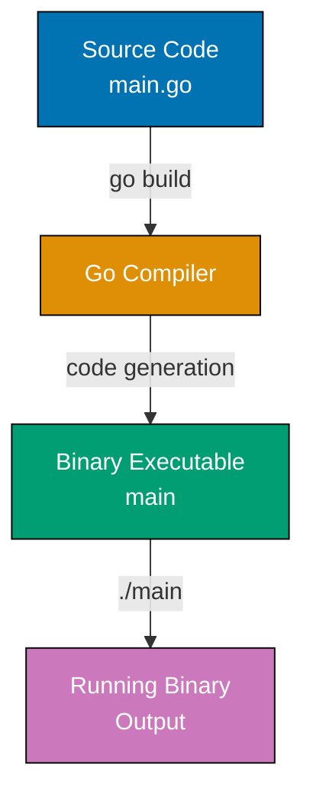

**Code**:

```go
package main // => Declares this is the main executable package
             // => "main" is special - it tells the compiler to create an executable
             // => Other package names (like "utils") create libraries, not executables

import (
    "fmt" // => Import formatting package from standard library
          // => fmt provides I/O formatting functions (Printf, Println, Sprintf, etc.)
          // => Standard library packages are always available, no installation needed
)

func main() { // => Entry point - every executable needs main() in main package
              // => Go runtime calls main() when program starts
              // => No parameters, no return value (unlike C/Java's int main)
              // => Program exits when main() returns

    fmt.Println("Hello, World!") // => Println writes to stdout and adds newline
                                  // => Returns (n int, err error) but we ignore them here
                                  // => n is bytes written, err is write error (if any)
                                  // => Equivalent to: fmt.Fprintln(os.Stdout, "Hello, World!")
    // => Output: Hello, World!
}
```

**Key Takeaway**: Every executable Go program needs `package main` and a `func main()` entry point. The `import` statement brings standard library packages into scope.

**Why It Matters**: Single-binary deployment makes Go ideal for containers and microservices, where `go build` produces a statically-linked executable with no runtime dependencies unlike Java (requires JVM) or Python (requires interpreter and packages). Docker containers for Go services are 5-10MB (vs 200MB+ for equivalent Java apps), enabling faster deployments, reduced attack surface, and simplified distribution as a single file that runs anywhere.

### Example 2: Variables and Types

Go is statically typed but uses type inference - the compiler deduces types from initial values. Two ways to declare variables: explicit type with `var`, or short declaration with `:=` that infers the type.

**Code**:

```go
package main

import "fmt"

func main() {
    // Short declaration with type inference
    x := 10                     // => x is 10 (type: int, inferred from literal)
                                 // => := creates variable and assigns in one step
                                 // => Only works inside functions (not package-level)

    y := 3.14                   // => y is 3.14 (type: float64, default for decimal literals)
                                 // => All decimal literals become float64 unless explicitly typed

    name := "Go"                // => name is "Go" (type: string)
                                 // => Strings are immutable UTF-8 byte sequences

    isActive := true            // => isActive is true (type: bool)
                                 // => bool values are only true or false (not 1/0)

    fmt.Println(x, y, name, isActive) // => Println accepts any number of arguments
                                      // => Separates them with spaces automatically
    // => Output: 10 3.14 Go true

    // Explicit type declaration
    var count int = 5           // => count is 5 (type: int, explicitly declared)
                                 // => var keyword allows explicit type specification
                                 // => Useful for package-level variables or when type differs from literal

    var message string          // => message is "" (string zero value)
                                 // => Declared without initialization gets zero value
                                 // => Zero value for string is empty string ""

    var percentage float64      // => percentage is 0.0 (float64 zero value)
                                 // => Zero value for numeric types is 0

    fmt.Println(count, message, percentage) // => Empty string prints as blank space
    // => Output: 5  0
    // => Note: message is empty (invisible), percentage prints as 0

    // Type conversion requires explicit cast
    floatValue := 9.8           // => floatValue is 9.8 (type: float64)

    intValue := int(floatValue) // => intValue is 9 (type: int)
                                 // => Conversion truncates decimal (doesn't round)
                                 // => 9.8 becomes 9, not 10
                                 // => Go has no implicit type conversion (unlike C/Java)

    fmt.Println(intValue)       // => Print converted value
    // => Output: 9

    // Multiple variable declaration
    var a, b, c int             // => a, b, c all initialized to 0 (int zero value)
                                 // => Same type for all variables in declaration

    fmt.Println(a, b, c)        // => Print multiple zero values
    // => Output: 0 0 0
}
```

**Key Takeaway**: Use `:=` for short declarations with type inference in function bodies. Go's zero values (0 for numbers, "" for strings, false for bool) initialize variables automatically when declared without values.

**Why This Matters**: Go's static typing prevents entire classes of runtime errors that plague dynamically typed languages. The compiler catches type mismatches before deployment. Zero values are a game-changer for API design—uninitialized fields have predictable, safe defaults (empty strings, zero numbers), so you never encounter `nil` errors from forgetting initialization. This design choice makes Go code more reliable and easier to reason about than languages requiring explicit null checks everywhere.

### Example 3: Constants and iota

Constants are immutable values determined at compile-time. The `iota` enumerator automatically assigns incrementing values, useful for creating enumeration patterns without manually numbering each value.

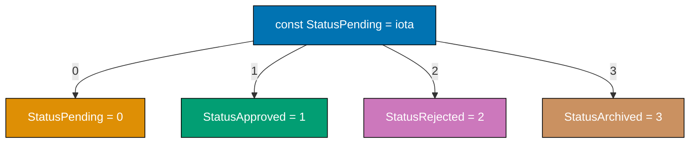

**Code**:

```go
package main

import "fmt"

func main() {
    // iota starts at 0 and increments for each constant in the block
    const (
        StatusPending    = iota // => StatusPending is 0 (iota starts at 0)
                                 // => iota is reset to 0 at start of each const block
                                 // => Useful for creating enumeration-like patterns

        StatusApproved          // => StatusApproved is 1 (iota auto-increments)
                                 // => No need to repeat "= iota" - implicit continuation
                                 // => Each line gets next iota value automatically

        StatusRejected          // => StatusRejected is 2 (iota continues incrementing)

        StatusArchived          // => StatusArchived is 3 (final value in this block)
    )

    fmt.Println(StatusPending, StatusApproved, StatusRejected, StatusArchived)
    // => Print all status constants
    // => Output: 0 1 2 3

    // Constants must be determined at compile-time
    const Pi = 3.14159         // => Pi is 3.14159 (type: float64, typed constant)
                                 // => Value known at compile-time, immutable
                                 // => Typed constants have specific type

    const Message = "Go is simple" // => Message is "Go is simple" (untyped constant)
                                    // => Untyped constants work wherever the type fits
                                    // => More flexible than typed constants

    fmt.Println(Pi, Message)    // => Print constants
    // => Output: 3.14159 Go is simple

    // This would cause compilation error - can't assign variable to const
    // const x = someFunction() // => ERROR: function calls not allowed in const
                                  // => Constants must be compile-time computable
                                  // => No runtime evaluation allowed

    var x = 5                   // => x is 5 (type: int, variables allow runtime values)
                                 // => Variables CAN be assigned function results
                                 // => Variables computed at runtime, not compile-time

    fmt.Println(x)              // => Print variable
    // => Output: 5

    // iota with expressions
    const (
        KB = 1 << (10 * iota)   // => KB is 1 << 0 = 1
        MB                       // => MB is 1 << 10 = 1024 (1 KB * 1024)
        GB                       // => GB is 1 << 20 = 1048576 (1 MB * 1024)
    )

    fmt.Println(KB, MB, GB)     // => Print byte size constants
    // => Output: 1 1024 1048576
}
```

**Key Takeaway**: Use `const` for values that must be known at compile-time. `iota` eliminates manual numbering in enumeration-like patterns, automatically incrementing within a `const` block.

## Group 2: Core Data Structures

**Why It Matters**: Constants with `iota` enable defining related integer sequences (HTTP status codes, enumeration values, bit flags) with compile-time verification, where typos or invalid values are caught before runtime. Unlike dynamic languages where magic numbers scatter through code, Go's constants provide type-safe enumerations without the complexity of traditional enum systems, making configuration and state machines clear and maintainable.

### Example 4: Arrays and Slices

Arrays have fixed size declared upfront. Slices are dynamic collections backed by arrays - they're flexible and commonly used. Understanding the underlying array backing reveals why slices are so efficient.

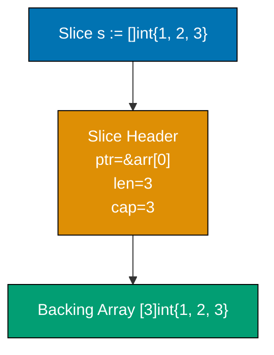

**Code**:

```go
package main

import "fmt"

func main() {
    // Array - fixed size, size is part of type
    arr := [3]int{10, 20, 30}  // => arr is [10 20 30] (type: [3]int)
                                // => [3]int and [4]int are DIFFERENT types
                                // => Size is compile-time constant, part of type signature

    fmt.Println(arr, len(arr)) // => Print array and length
                                // => len() returns array size (always 3 for [3]int)
    // => Output: [10 20 30] 3

    arr[0] = 100               // => arr[0] is now 100 (arrays are mutable)
                                // => arr is now [100 20 30]
                                // => Zero-indexed like most languages

    fmt.Println(arr)           // => Print modified array
    // => Output: [100 20 30]

    // Slice - dynamic size, backed by array
    slice := []int{1, 2, 3}    // => slice is [1 2 3] (type: []int, no size in brackets)
                                // => Creates backing array automatically
                                // => Slice is a reference to part (or all) of an array

    fmt.Println(len(slice), cap(slice)) // => len is current elements, cap is backing array capacity
                                        // => len() returns 3 (number of elements)
                                        // => cap() returns 3 (backing array size)
    // => Output: 3 3

    // Append - creates new backing array if needed
    slice = append(slice, 4)   // => slice is now [1 2 3 4]
                                // => Original capacity (3) exceeded, Go allocates new backing array
                                // => Capacity typically doubles (3 → 6 or similar growth strategy)
                                // => Returns new slice value, must assign back to variable

    fmt.Println(slice, len(slice), cap(slice)) // => Print slice, length, capacity
    // => Output: [1 2 3 4] 4 6
    // => New capacity is 6 (grew from 3)

    // Slice from array or slice
    subslice := slice[1:3]     // => subslice is [2 3] (elements at indices 1 and 2)
                                // => Syntax: [low:high] where high is exclusive
                                // => Shares backing array with original slice
                                // => No data copy, just new slice header

    fmt.Println(subslice)      // => Print subslice
    // => Output: [2 3]

    fmt.Println(cap(subslice)) // => Capacity is from start to end of backing array
                                // => subslice starts at index 1, backing array has 6 elements
                                // => Remaining capacity is 6 - 1 = 5
    // => Output: 5

    // Modifying subslice affects original (shared backing array)
    subslice[0] = 999          // => subslice[0] is same as slice[1] (shared memory)
                                // => subslice is now [999 3]
                                // => slice is now [1 999 3 4]

    fmt.Println("After subslice modify:", slice) // => Original slice affected
    // => Output: After subslice modify: [1 999 3 4]

    // Reset for copy example
    slice = []int{1, 2, 3, 4}  // => slice is [1 2 3 4]

    // Copy creates independent slice
    copied := make([]int, len(slice)) // => copied is [0 0 0 0] (zero values, len=4, cap=4)
                                       // => make([]T, len, cap) allocates new slice
                                       // => No values copied yet, just allocated

    copy(copied, slice)        // => copy(dst, src) copies elements from src to dst
                                // => Returns number of elements copied (4 in this case)
                                // => copied is now [1 2 3 4] (values copied)
                                // => Different backing arrays, no sharing

    copied[0] = 999            // => copied[0] is now 999
                                // => copied is [999 2 3 4]
                                // => slice remains [1 2 3 4] (independent)

    fmt.Println(slice, copied) // => Print both slices
    // => Output: [1 2 3 4] [999 2 3 4]
    // => slice unchanged, copied modified independently
}
```

**Key Takeaway**: Arrays are fixed-size and rarely used directly. Slices are the Go way - dynamic collections with `len()` (current elements) and `cap()` (backing array space). `append()` returns a new slice to handle capacity growth.

**Why This Matters**: Slices are Go's killer feature—they combine safety, flexibility, and performance. Understanding backing arrays explains why slices are passed by value efficiently (only 24 bytes of metadata, not the entire data). Capacity growth matters for performance: when you know approximately how many elements you need, pre-allocate with `make([]T, 0, capacity)` to avoid expensive reallocations. This knowledge separates inefficient Go code (repeated allocations) from production-grade code that minimizes GC pressure. Sharing slices via views with reslicing is powerful but requires care—unintended aliasing can cause subtle bugs.

### Example 5: Maps

Maps are unordered key-value collections. Unlike slices which maintain order, map iteration order is randomized - never rely on iteration order. The comma-ok idiom tests whether a key exists and its value.

**Code**:

```go
package main

import "fmt"

func main() {
    // Create map - keys are strings, values are integers
    ages := make(map[string]int) // => ages is empty map[string]int{}
                                  // => make() allocates and initializes map
                                  // => Map is reference type (like slice)

    ages["Alice"] = 30           // => Insert key "Alice" with value 30
                                  // => ages is now map[Alice:30]

    ages["Bob"] = 25              // => ages is now map[Alice:30 Bob:25]
    ages["Charlie"] = 35          // => ages is now map[Alice:30 Bob:25 Charlie:35]

    fmt.Println(ages["Alice"])   // => Access value by key
                                  // => Returns 30 (key exists)
    // => Output: 30

    fmt.Println(ages["Unknown"]) // => Access non-existent key
                                  // => Returns 0 (zero value for int)
                                  // => Does NOT panic, returns type's zero value
    // => Output: 0

    // Comma-ok idiom - check if key exists
    age, exists := ages["Bob"]   // => age is 25, exists is true (key found)
                                  // => exists is boolean indicating key presence
                                  // => Standard pattern for safe map access

    fmt.Println(age, exists)     // => Print value and existence flag
    // => Output: 25 true

    age, exists = ages["David"]  // => age is 0, exists is false (key not found)
                                  // => age gets zero value when key doesn't exist
                                  // => exists is false indicating absence

    fmt.Println(age, exists)     // => Print zero value and false flag
    // => Output: 0 false

    // Delete key
    delete(ages, "Bob")          // => Remove "Bob" key from map
                                  // => ages is now map[Alice:30 Charlie:35]
                                  // => delete() is safe - no panic if key doesn't exist
                                  // => Built-in function, not a method

    fmt.Println(ages)            // => Print remaining map
    // => Output: map[Alice:30 Charlie:35]
    // => Order may vary (maps are unordered)

    // Map iteration order is randomized
    for name, age := range ages { // => Iterate over key-value pairs
                                   // => name is key, age is value
                                   // => Order is deliberately randomized each run
                                   // => Go randomizes to prevent order dependency bugs

        fmt.Printf("%s is %d\n", name, age) // => Print each pair
        // => Output order varies each run
    }

    // Iterate over keys only
    for name := range ages {     // => Iterate over keys, ignore values
                                  // => Only one variable = keys only
                                  // => Two variables = keys and values

        fmt.Println(name)         // => Print each key
        // => Output: Alice Charlie (or Charlie Alice)
    }

    // Map literal initialization
    scores := map[string]int{    // => scores is map[Alice:95 Bob:87]
        "Alice": 95,              // => Composite literal syntax
        "Bob":   87,              // => More concise than make() + assignments
    }

    fmt.Println(scores)          // => Print map
    // => Output: map[Alice:95 Bob:87]
}
```

**Key Takeaway**: Maps store key-value pairs with O(1) lookup. Always use the comma-ok idiom (`value, exists := map[key]`) to safely check key existence. Never rely on map iteration order - it's deliberately randomized.

**Why It Matters**: Maps provide O(1) average-case lookup for key-value storage without external dependencies, where Go's built-in maps handle hash collisions and resizing automatically unlike C (requires external libraries) or Java (verbose HashMap boilerplate). The comma-ok idiom for existence checking prevents nil pointer panics, making maps safe for caching, configuration lookups, and deduplication in production without defensive programming overhead.

### Example 6: Structs

Structs group related data into named fields. Methods can operate on structs by specifying a receiver. The distinction between value and pointer receivers becomes important later - for now, understand the receiver is what `this` or `self` would be in other languages.

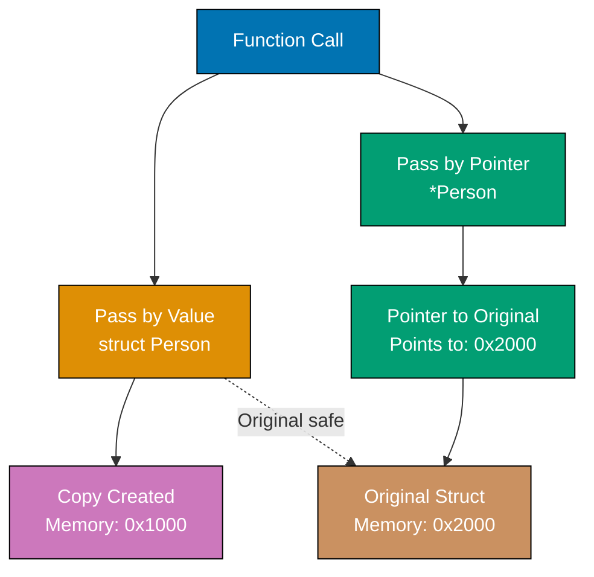

**Code**:

```go
package main

import "fmt"

func main() {
    // Define struct type and create instance
    type Person struct {
        Name string // => Exported field (capital N) - accessible from other packages
                     // => Lowercase would be unexported (private to package)

        Age  int    // => Exported field (capital A)
                     // => int zero value is 0

        City string // => Exported field (capital C)
                     // => string zero value is ""
    }

    // Create struct using field order
    p1 := Person{"Alice", 30, "New York"} // => p1 is Person{Name:"Alice", Age:30, City:"New York"}
                                           // => Positional initialization (fragile, avoid in production)
                                           // => Order must match struct definition exactly

    fmt.Println(p1)                       // => Print struct with default format
    // => Output: {Alice 30 New York}

    // Create struct using named fields (better readability)
    p2 := Person{Name: "Bob", Age: 25, City: "Boston"} // => p2 is Person{Name:"Bob", Age:25, City:"Boston"}
                                                        // => Named field initialization (preferred)
                                                        // => Order doesn't matter with named fields
                                                        // => More readable and maintainable

    fmt.Println(p2.Name, p2.Age)          // => Access fields with dot notation
                                           // => p2.Name is "Bob", p2.Age is 25
    // => Output: Bob 25

    // Partial initialization with named fields
    p4 := Person{Name: "Charlie"}         // => p4.Name is "Charlie", Age is 0, City is ""
                                           // => Unspecified fields get zero values
                                           // => Safe and explicit

    fmt.Println(p4)                       // => Print partially initialized struct
    // => Output: {Charlie 0 }

    // Uninitialized struct gets zero values
    var p3 Person                         // => p3.Name is "", p3.Age is 0, p3.City is ""
                                           // => All fields initialized to zero values
                                           // => No nil panic risk (unlike some languages)

    fmt.Println(p3)                       // => Print zero-valued struct
    // => Output: { 0 }
    // => Empty string, 0, empty string

    // Struct field assignment
    p3.Name = "Diana"                     // => p3.Name is now "Diana"
    p3.Age = 28                            // => p3.Age is now 28
                                           // => p3 is Person{Name:"Diana", Age:28, City:""}

    fmt.Println(p3)                       // => Print updated struct
    // => Output: {Diana 28 }

    // Anonymous struct - used for one-off data
    response := struct {                  // => Define struct type inline (no name)
        Status int                         // => Fields defined on the fly
        Body   string
    }{200, "OK"}                          // => Initialize immediately after definition
                                           // => response.Status is 200, response.Body is "OK"
                                           // => Useful for temporary data structures

    fmt.Println(response.Status)          // => Access anonymous struct field
    // => Output: 200

    fmt.Println(response.Body)            // => Access another field
    // => Output: OK
}
```

**Key Takeaway**: Structs are Go's primary way to group related data. Use named fields when creating structs for readability. Capital letters in field names mean the field is exported and accessible from other packages.

**Why This Matters**: Value vs pointer semantics is crucial in Go and separates beginners from professionals. Passing structs by value (no pointer) creates copies—safe but expensive for large structs. Passing pointers is efficient but requires discipline to avoid shared state bugs. Methods define the receiver type: value receiver (safe, isolated) vs pointer receiver (can modify). In production Go, you constantly make this choice. Understanding field capitalization (export control without explicit `public`/`private` keywords) is the Go way of managing visibility elegantly.

## Group 3: Functions and Control Flow

### Example 7: Functions

Functions are central to Go. Unlike many languages, multiple return values are standard - this idiom appears everywhere, especially for error handling. Named return values can be used to document what a function returns.

**Code**:

```go
package main

import "fmt"

func main() {
    // Function with single return
    result := add(3, 5)         // => result is 8 (calling add function)
                                 // => Function call syntax: functionName(args)
                                 // => Return value assigned to result

    fmt.Println(result)         // => Print returned value
    // => Output: 8

    // Function with multiple returns
    quotient, remainder := divide(17, 5) // => quotient is 3, remainder is 2
                                          // => Multiple return values assigned to separate variables
                                          // => Go's idiomatic way to return related values
                                          // => Commonly used for (result, error) pattern

    fmt.Println(quotient, remainder)     // => Print both values
    // => Output: 3 2

    // Ignore return value with underscore
    q, _ := divide(20, 3)       // => q is 6, remainder ignored with _
                                 // => _ is blank identifier (discards value)
                                 // => Useful when you only need some return values

    fmt.Println(q)              // => Print quotient only
    // => Output: 6

    // Named return values
    name, greeting := greet("Go") // => name is "Go", greeting is "Hello, Go!"
                                   // => Named returns improve function documentation
                                   // => Return values are pre-declared in signature

    fmt.Println(name, greeting)   // => Print both named returns
    // => Output: Go Hello, Go!
}

// Single parameter and return
func add(a int, b int) int {    // => Parameters: a and b (both int)
                                 // => Return type: int (after parameters)
                                 // => Parameters passed by value (copied)

    return a + b                // => Compute sum and return
                                 // => Returns single int value
                                 // => a is 3, b is 5, returns 8
}

// Shorthand parameter syntax
func multiply(a, b int) int {   // => a and b share type int (shorthand)
                                 // => Equivalent to: (a int, b int)
                                 // => More concise when multiple params have same type

    return a * b                // => Returns product
}

// Multiple parameters and returns
func divide(dividend int, divisor int) (int, int) { // => Two int params, two int returns
                                                     // => Return types in parentheses
                                                     // => First return is quotient, second is remainder

    return dividend / divisor, dividend % divisor   // => Return two values separated by comma
                                                     // => dividend/divisor is integer division
                                                     // => dividend%divisor is modulo (remainder)
                                                     // => 17/5 is 3, 17%5 is 2
}

// Named return values - improves documentation
func greet(lang string) (language string, message string) { // => Named return values
                                                             // => language and message pre-declared
                                                             // => Initialized to zero values
                                                             // => Acts as documentation

    language = lang                              // => Assign to named return variable
                                                  // => language is now "Go"

    message = fmt.Sprintf("Hello, %s!", lang)   // => Format string and assign to named return
                                                  // => message is now "Hello, Go!"
                                                  // => Sprintf returns formatted string (doesn't print)

    return                                       // => Naked return (uses named return values)
                                                  // => Returns language and message implicitly
                                                  // => Could also write: return language, message
}
```

**Key Takeaway**: Functions with multiple return values are idiomatic Go - you'll use this constantly. Named return values improve clarity by documenting what a function returns. Unnamed parameters with the same type can use shorthand: `func add(a, b int)`.

**Why It Matters**: Named return values enable self-documenting function signatures and simplified error handling in defer blocks, where cleanup code can modify return values before function exit. Multiple return values eliminate the exception-handling overhead of try/catch, making error paths explicit and forcing developers to handle failures rather than ignoring them, the philosophy that makes Go production code more reliable than exception-based languages.

### Example 8: Control Flow

Go has only one loop construct (`for`) that handles all looping patterns. `if` and `switch` are straightforward but more powerful than in many languages. The `defer` statement schedules cleanup code to run when the function returns.

**Code**:

```go
package main

import "fmt"

func main() {
    // if-else
    age := 25                   // => age is 25 (type: int)

    if age >= 18 {              // => Condition: 25 >= 18 is true
                                 // => No parentheses around condition (unlike C/Java)
                                 // => Braces are mandatory (no single-line if without braces)

        fmt.Println("Adult")    // => This branch executes (condition true)
    } else {
        fmt.Println("Minor")    // => This branch skipped
    }
    // => Output: Adult

    // if with initialization statement
    if x := 10; x > 5 {         // => x is 10, scoped to if block only
                                 // => Condition: 10 > 5 is true
                                 // => x only accessible inside if/else blocks

        fmt.Println("x is greater than 5") // => Executes
        // => Output: x is greater than 5
    }
    // x is no longer in scope here

    // for loop - basic
    for i := 0; i < 3; i++ {    // => i starts at 0
                                 // => Iteration 1: i is 0, prints 0, then i becomes 1
                                 // => Iteration 2: i is 1, prints 1, then i becomes 2
                                 // => Iteration 3: i is 2, prints 2, then i becomes 3
                                 // => Loop exits (3 < 3 is false)

        fmt.Println(i)
    }
    // => Output: 0 1 2 (each on new line)

    // for loop - while style
    count := 0                  // => count is 0

    for count < 3 {             // => No while keyword in Go - use for with condition only
                                 // => Iteration 1: 0 < 3 is true, prints 0, count becomes 1
                                 // => Iteration 2: 1 < 3 is true, prints 1, count becomes 2
                                 // => Iteration 3: 2 < 3 is true, prints 2, count becomes 3
                                 // => Loop exits (3 < 3 is false)

        fmt.Println(count)       // => Print current count
        count++                  // => Increment count (count = count + 1)
    }
    // => Output: 0 1 2 (each on new line)

    // for loop - infinite
    counter := 0                // => counter is 0

    for {                       // => Infinite loop (no condition = always true)
                                 // => Iteration 1: counter is 0, 0 >= 2 is false, counter becomes 1
                                 // => Iteration 2: counter is 1, 1 >= 2 is false, counter becomes 2
                                 // => Iteration 3: counter is 2, 2 >= 2 is true, break exits loop

        if counter >= 2 {
            break              // => Exit loop immediately
                                // => Skips remaining iterations
        }
        counter++              // => Increment counter
    }
    // counter is now 2

    // continue keyword
    for i := 0; i < 5; i++ {    // => Loop from 0 to 4
        if i == 2 {
            continue            // => Skip rest of iteration when i is 2
        }
        fmt.Println(i)          // => Prints 0, 1, 3, 4 (skips 2)
    }
    // => Output: 0 1 3 4

    // switch statement
    language := "Go"            // => language is "Go"

    switch language {           // => Match language against cases
                                 // => No fallthrough by default (unlike C/Java)
                                 // => Only matching case executes

    case "Python":
        fmt.Println("Batteries included") // => Skipped (not a match)
    case "Go":
        fmt.Println("Simple and fast")    // => Executes (matches)
                                           // => Automatically breaks (no fallthrough)
    case "Rust":
        fmt.Println("Memory safe")        // => Skipped (already matched Go)
    default:
        fmt.Println("Unknown language")   // => Executes if no case matches
    }
    // => Output: Simple and fast

    // switch with multiple values per case
    day := 3
    switch day {
    case 1, 2, 3, 4, 5:         // => Multiple values in one case
        fmt.Println("Weekday")   // => Executes (3 matches)
    case 6, 7:
        fmt.Println("Weekend")
    }
    // => Output: Weekday

    // defer - schedules cleanup
    fmt.Println("Start")        // => Prints immediately
                                 // => Output: Start

    defer fmt.Println("Deferred 1") // => Scheduled to run when main() returns
                                     // => Pushed onto defer stack (LIFO)

    defer fmt.Println("Deferred 2") // => Scheduled after "Deferred 1"
                                     // => Will execute BEFORE "Deferred 1" (LIFO order)

    fmt.Println("End")          // => Prints immediately
                                 // => Output: End
    // => main() returns, deferred functions execute in reverse order
    // => Output: Deferred 2
    // => Output: Deferred 1
}
```

**Key Takeaway**: Go's `for` loop is versatile - use it for all looping needs. `defer` schedules code to run when a function returns, useful for cleanup. Multiple `defer` statements run in reverse order (LIFO).

**Why It Matters**: Explicit control flow without exceptions forces developers to handle error cases immediately, preventing silent failures that propagate through call stacks in try/catch systems. Go's switch statement doesn't fall through by default (eliminating a common C bug), supports multiple values per case, and works without parentheses, making conditional logic cleaner and less error-prone than C-style switches that require break statements everywhere.

### Example 9: Pointers

Pointers hold memory addresses. The `&` operator takes an address, `*` dereferences it. Understanding pointers is essential for understanding Go's pass-by-value semantics and when values are copied versus when they're shared.

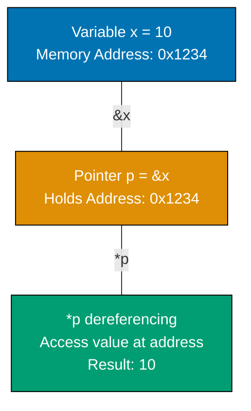

**Code**:

```go
package main

import "fmt"

func main() {
    x := 10                 // => x is 10 (type: int, stored at some memory address)
                             // => x occupies memory at address like 0x1234

    p := &x                 // => p is pointer to x (type: *int)
                             // => & operator gets memory address of x
                             // => p stores the address where x lives (e.g., 0x1234)

    fmt.Println(p)          // => Print pointer value (memory address)
    // => Output: 0xc0000a0008 (actual address varies per run)

    fmt.Println(*p)         // => * dereferences pointer - reads value at address
                             // => *p accesses value at memory location stored in p
                             // => *p is 10 (the value of x)
    // => Output: 10

    *p = 20                 // => Dereference p and modify value at that address
                             // => Changes value stored at x's memory location
                             // => x is now 20 (modified through pointer)

    fmt.Println(x)          // => Print x directly
    // => Output: 20
    // => x changed because *p modified the same memory location

    // Pointers enable modification in functions
    modifyValue(&x)         // => Pass address of x (not a copy of x's value)
                             // => &x creates pointer to x
                             // => Function receives memory address, can modify original

    fmt.Println(x)          // => x is now 30 (modified by function)
    // => Output: 30

    // Value vs pointer semantics
    y := 100                // => y is 100
    modifyValueCopy(y)      // => Pass value (copy), not address
    fmt.Println(y)          // => y is still 100 (copy was modified, not original)
    // => Output: 100

    // nil pointer - points to nothing
    var nilPtr *int         // => nilPtr is nil (type: *int, zero value for pointers)
                             // => Uninitialized pointers are nil (don't point anywhere)
                             // => nil is safe to check, unsafe to dereference

    fmt.Println(nilPtr)     // => Print nil pointer
    // => Output: <nil>

    if nilPtr != nil {
        fmt.Println(*nilPtr) // => Safe: only dereference if not nil
    } else {
        fmt.Println("Pointer is nil, cannot dereference")
    }
    // => Output: Pointer is nil, cannot dereference

    // Dereferencing nil causes panic - always check!
    // *nilPtr = 50         // => PANIC: runtime error: invalid memory address
                             // => Never dereference nil pointer

    // Create pointer with new()
    ptr := new(int)         // => ptr is pointer to new int (initialized to 0)
                             // => new() allocates memory and returns pointer
                             // => *ptr is 0 (int zero value)

    *ptr = 42               // => Set value through pointer
                             // => *ptr is now 42

    fmt.Println(*ptr)       // => Print dereferenced value
    // => Output: 42
}

func modifyValue(ptr *int) { // => ptr is pointer to int (type: *int)
                              // => Receives memory address, not value copy

    *ptr = 30              // => Dereference ptr and modify value at that address
                            // => Changes original variable in caller
}

func modifyValueCopy(val int) { // => val is copy of argument (type: int)
                                 // => val is independent of original

    val = 999              // => Modify copy only
                            // => Original in caller unchanged
}
```

**Key Takeaway**: Pointers hold addresses. `&` gets an address, `*` dereferences it to access the value. Pointers enable functions to modify variables. Nil pointers require careful handling - dereferencing nil causes runtime panic.

**Why This Matters**: Pointers are central to understanding Go's pass-by-value semantics. Every function call copies its arguments—understanding this reveals why large structs should be passed as pointers (avoid expensive copies) and why small values can be passed by value (safe, isolated changes). Nil pointers are Go's version of null references, but they're explicit and cause panics rather than silent failures. Production Go code constantly navigates this: when to share state via pointers, when to isolate via values, and defensive nil checking before dereferencing.

## Group 4: Methods and Interfaces

### Example 10: Methods

Methods are functions attached to a type via a receiver. Go distinguishes value receivers (copy data) from pointer receivers (share data). This distinction is crucial - choosing the wrong receiver type causes subtle bugs or inefficiency.

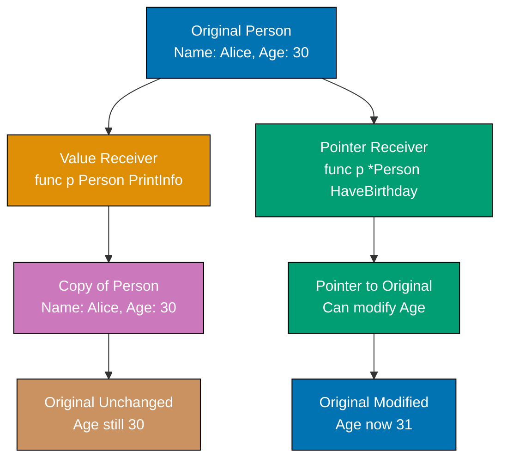

**Code**:

```go
package main

import "fmt"

func main() {
    p := Person{Name: "Alice", Age: 30} // => p is Person{Name:"Alice", Age:30}
                                         // => p stored as value (not pointer)

    // Call method with value receiver
    p.PrintInfo()                // => Calls PrintInfo on COPY of p
                                  // => Method receives Person{Name:"Alice", Age:30}
                                  // => Original p unchanged (copy was used)
    // => Output: Name: Alice, Age: 30

    // Call method with pointer receiver
    p.HaveBirthday()             // => Go automatically converts p to &p
                                  // => Method receives pointer to p (address)
                                  // => p.Age is now 31 (modified through pointer)

    fmt.Println(p.Age)           // => Print modified age
    // => Output: 31
    // => Original p was modified (pointer receiver)

    // Pointer methods called on values (Go automatically takes address)
    p.HaveBirthday()             // => Again, Go converts p to &p automatically
                                  // => p.Age is now 32

    fmt.Println(p.Age)           // => Print age after second birthday
    // => Output: 32

    // Pointer variable calling methods
    ptr := &Person{Name: "Bob", Age: 25} // => ptr is *Person (pointer to Person)
                                          // => Points to Person{Name:"Bob", Age:25}

    ptr.PrintInfo()              // => Go automatically dereferences ptr to *ptr
                                  // => Value receiver gets copy of *ptr
    // => Output: Name: Bob, Age: 25

    ptr.HaveBirthday()           // => Pointer receiver works directly with ptr
                                  // => (*ptr).Age is now 26

    fmt.Println(ptr.Age)         // => Access field through pointer
                                  // => Equivalent to: (*ptr).Age
    // => Output: 26

    // Value receiver doesn't modify original
    p.UpdateName("Charlie")      // => Calls method on copy of p
                                  // => Copy's Name becomes "Charlie"
                                  // => Original p.Name unchanged ("Alice")

    fmt.Println(p.Name)          // => Original unchanged
    // => Output: Alice

    // Pointer receiver modifies original
    p.UpdateNamePointer("Charlie") // => Calls method with pointer to p
                                    // => Modifies original p.Name to "Charlie"

    fmt.Println(p.Name)          // => Original modified
    // => Output: Charlie
}

type Person struct {
    Name string
    Age  int
}

// Value receiver - receiver gets copy of data
func (p Person) PrintInfo() {   // => p is copy of caller's Person
                                 // => Type: Person (not *Person)
                                 // => Modifications to p don't affect caller

    fmt.Printf("Name: %s, Age: %d\n", p.Name, p.Age) // => Read fields from copy
}

// Value receiver that modifies copy (doesn't affect original)
func (p Person) UpdateName(newName string) { // => p is copy
    p.Name = newName            // => Modify copy's Name
                                 // => Original unchanged (copy discarded after method returns)
}

// Pointer receiver - receiver shares original data
func (p *Person) HaveBirthday() { // => p is pointer to caller's Person
                                   // => Type: *Person
                                   // => Can modify original through pointer

    p.Age++                      // => Increment Age of original Person
                                  // => Equivalent to: (*p).Age++
                                  // => Go allows p.Age shorthand for (*p).Age
}

// Pointer receiver that modifies original
func (p *Person) UpdateNamePointer(newName string) { // => p is pointer
    p.Name = newName            // => Modify original's Name through pointer
                                 // => Changes persist after method returns
}
```

**Key Takeaway**: Value receivers copy data - modifications don't affect the original. Pointer receivers share data - modifications affect the original. Use pointer receivers when the method modifies the receiver or when the receiver is large (to avoid copying).

**Why It Matters**: Methods on types enable attaching behavior to data without classes, where method receivers make the relationship between data and operations explicit. Pointer receivers allow mutation and avoid copying large structs on every method call (performance), while value receivers provide immutability guarantees and safety for concurrent access. This enables building APIs that are both efficient and clear about their side effects.

### Example 11: Interfaces

Interfaces define method contracts. A type satisfies an interface implicitly - no explicit declaration needed. This duck typing is powerful but requires understanding: if a type has all methods an interface requires, it automatically satisfies that interface.

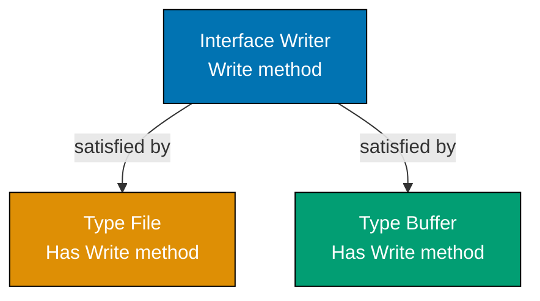

**Code**:

```go
package main

import "fmt"

func main() {
    // Without interfaces - hardcoded types
    file := &File{Name: "data.txt"} // => file is *File (pointer to File)
                                     // => Type-specific variable

    saveData(file, "content")    // => Pass *File to function accepting Writer
                                  // => *File satisfies Writer (has Write method)
    // => Output: Writing to data.txt: content

    // With interfaces - work with any Writer
    var buffer Buffer            // => buffer is Buffer (zero value)
                                  // => buffer.data is nil (slice zero value)

    saveData(&buffer, "content") // => Pass *Buffer to same function
                                  // => *Buffer also satisfies Writer interface
                                  // => Polymorphism without inheritance!
    // => No output (Buffer stores data internally)

    // Empty interface - accepts anything
    var anything interface{} = 42 // => anything holds int value 42
                                   // => interface{} is empty interface (no method requirements)
                                   // => Can store any type

    printValue(anything)         // => Print int value and type
    // => Output: Value: 42 (Type: int)

    anything = "string"          // => Reassign to string (different type)
                                  // => Interface can change underlying type
                                  // => anything now holds string "string"

    printValue(anything)         // => Print string value and type
    // => Output: Value: string (Type: string)

    // Using an interface as a type
    var w Writer                 // => w is Writer interface (zero value is nil)
                                  // => Interface variable holds (type, value) pair
                                  // => Currently: (nil, nil)

    w = &File{Name: "test.txt"} // => w now holds (*File, &File{Name:"test.txt"})
                                  // => Type: *File, Value: pointer to File instance
                                  // => Assignment works because *File satisfies Writer

    fmt.Println(w)               // => Print interface value
    // => Output: &{test.txt}

    w = &Buffer{}                // => w now holds (*Buffer, &Buffer{})
                                  // => Changed underlying type from *File to *Buffer
                                  // => Interface adapts to different concrete types

    fmt.Println(w)               // => Print new interface value
    // => Output: &{[]}

    // Calling interface methods
    w.Write("test data")         // => Call Write on whatever type w holds
                                  // => Currently *Buffer, so Buffer.Write executes
                                  // => Interface dispatches to correct method

    // Interface with nil check
    var nilWriter Writer         // => nilWriter is nil (no concrete type assigned)
    if nilWriter == nil {
        fmt.Println("Writer is nil") // => Executes (nil interface)
    }
    // => Output: Writer is nil
}

// Interface definition - specifies what methods are required
type Writer interface {
    Write(data string) error  // => Method signature only (no implementation)
                               // => Any type with Write(string) error satisfies this
                               // => No explicit "implements" keyword needed
}

// File type implements Write method - satisfies Writer implicitly
type File struct {
    Name string              // => File has one field
}

func (f *File) Write(data string) error { // => *File has Write method
                                           // => Method signature matches Writer interface
                                           // => *File implicitly satisfies Writer
                                           // => No declaration needed

    fmt.Printf("Writing to %s: %s\n", f.Name, data) // => Print to stdout
    return nil                         // => Return nil error (success)
}

// Buffer type also implements Write - also satisfies Writer
type Buffer struct {
    data []string            // => Buffer stores data in slice
}

func (b *Buffer) Write(data string) error { // => *Buffer also has Write method
                                             // => Different implementation, same signature
                                             // => *Buffer also satisfies Writer implicitly

    b.data = append(b.data, data) // => Append to internal slice
                                   // => No stdout output (different behavior)

    return nil                     // => Return nil error (success)
}

// Function works with any Writer
func saveData(w Writer, data string) { // => Accepts ANY type implementing Writer
                                        // => Works with *File, *Buffer, or any future type
                                        // => Compile-time type safety, runtime polymorphism

    w.Write(data)                // => Call Write method on whatever type w holds
                                  // => Interface dispatches to concrete implementation
}

// Empty interface accepts any type
func printValue(v interface{}) {       // => v can hold any value of any type
                                        // => interface{} has no method requirements
                                        // => Similar to Object in Java or any in TypeScript

    fmt.Printf("Value: %v (Type: %T)\n", v, v) // => %v prints value, %T prints type
                                                 // => Works for int, string, struct, anything
}
```

**Key Takeaway**: Interfaces define method contracts. Any type with those methods automatically satisfies the interface (implicit satisfaction). Design small interfaces (one method is common) for maximum reusability. The empty interface `interface{}` accepts any value.

**Why This Matters**: Implicit interface satisfaction is Go's secret weapon for loose coupling and composition. Unlike languages requiring explicit `implements` declarations, Go lets unrelated types suddenly satisfy interfaces. This enables powerful patterns: pass an `io.Reader` to any function expecting that interface, whether it's reading from a file, network, buffer, or custom source. Small, focused interfaces (like `io.Writer` with just `Write()`) are reusable across the entire ecosystem. This philosophy makes Go code highly modular without verbose inheritance hierarchies.

### Example 12: Error Handling

Go uses explicit error returns instead of exceptions. The `error` interface is simple - just a method returning a string. This pattern permeates Go code: function returns (result, error). Always check for errors before using results.

**Code**:

```go
package main

import (
    "errors"
    "fmt"
)

func main() {
    // Function returning error
    result, err := divide(10, 2)  // => result is 5, err is nil (no error)
                                   // => Multiple return values: (int, error)
                                   // => Go's idiomatic error handling pattern

    if err != nil {               // => Check if error occurred (nil means no error)
                                   // => Always check err before using result
                                   // => This branch skipped (err is nil)

        fmt.Println("Error:", err)
    } else {
        fmt.Println("Result:", result) // => This branch executes (err is nil)
                                        // => result is 5
    }
    // => Output: Result: 5

    // Function that errors
    result, err = divide(10, 0)   // => result is 0 (zero value), err is ErrDivisionByZero
                                   // => Division by zero triggers error
                                   // => result contains zero value (unsafe to use)

    if err != nil {               // => err is not nil (error occurred)
                                   // => This branch executes

        fmt.Println("Error:", err) // => Print error message
                                    // => err.Error() returns "cannot divide by zero"
        // => Output: Error: cannot divide by zero
    }

    // Error wrapping (Go 1.13+)
    wrappedErr := fmt.Errorf("division failed: %w", err) // => Wrap err with context
                                                          // => %w preserves original error
                                                          // => Creates error chain for debugging
                                                          // => wrappedErr contains both messages

    if errors.Is(wrappedErr, ErrDivisionByZero) { // => Check if error chain contains sentinel
                                                   // => errors.Is unwraps and compares
                                                   // => Returns true (ErrDivisionByZero in chain)

        fmt.Println("Detected division by zero") // => Executes (match found)
        // => Output: Detected division by zero
    }

    // Unwrap to get original error
    originalErr := errors.Unwrap(wrappedErr) // => Extract wrapped error
                                              // => Returns ErrDivisionByZero
                                              // => Only unwraps one level

    fmt.Println(originalErr)      // => Print original error
    // => Output: cannot divide by zero

    // Create custom error
    customErr := errors.New("custom error message") // => Create new error
                                                     // => Returns error interface
                                                     // => customErr.Error() returns message

    fmt.Println(customErr)        // => Print custom error
    // => Output: custom error message

    // Error with formatting
    formattedErr := fmt.Errorf("operation failed: value=%d", 42) // => Format error message
                                                                  // => Similar to Sprintf
                                                                  // => No wrapping (no %w)

    fmt.Println(formattedErr)     // => Print formatted error
    // => Output: operation failed: value=42

    // Checking nil error explicitly
    _, err = divide(20, 4)        // => err is nil (successful operation)
                                   // => Ignore result with _

    if err == nil {               // => Explicit nil check
        fmt.Println("Operation succeeded") // => Executes (no error)
        // => Output: Operation succeeded
    }
}

// Sentinel error - predefined error value
var ErrDivisionByZero = errors.New("cannot divide by zero") // => Package-level error
                                                             // => Sentinel errors are comparable
                                                             // => Can use == or errors.Is

func divide(a, b int) (int, error) { // => Returns (result, error) tuple
                                      // => Idiomatic Go error handling
                                      // => Always return zero value + error on failure

    if b == 0 {                   // => Validate input
        return 0, ErrDivisionByZero  // => Return zero value and sentinel error
                                      // => 0 is int zero value (caller shouldn't use)
                                      // => Return ErrDivisionByZero for comparison
    }

    return a / b, nil             // => Return result and nil error (success)
                                   // => nil means no error occurred
                                   // => Caller can safely use result
}
```

**Key Takeaway**: Go uses explicit error returns - check `if err != nil` before using results. Return `nil` for no error. Use `errors.New()` or `fmt.Errorf()` to create errors. Error wrapping with `%w` preserves error chains for debugging.

## Group 5: Packages and Testing

**Why It Matters**: Explicit error handling makes failure paths visible in code, preventing the hidden control flow of exceptions that obscure where errors originate. Returning errors forces callers to decide how to handle failures (propagate, wrap, retry, log), making production code resilient by design. Custom error types enable rich context (wrapping with `fmt.Errorf`, error chains with `errors.Is`), supporting debugging without stack traces that exceptions provide but with explicit control flow.

### Example 13: Packages and Imports

Go organizes code with packages. Every file starts with `package`, and a directory is one package. Capitalized names are exported (visible from other packages), lowercase names are unexported (private). Imports make external packages available.

**Code**:

```go
package main // => Every Go file must declare a package
             // => package main creates executable
             // => Other package names create libraries

import (
    "fmt"                       // => Standard library package for formatting
                                 // => Import path: "fmt" (no version, in stdlib)
                                 // => After import, use fmt.Function() syntax

    "math"                      // => Standard library package for math operations
                                 // => Provides constants (Pi, E) and functions (Sqrt, Pow)
)

func main() {
    // Standard library packages available after import
    fmt.Println("Pi:", math.Pi) // => Access exported constant from math package
                                 // => math.Pi is 3.141592653589793
                                 // => Package.Identifier syntax (qualified name)
    // => Output: Pi: 3.141592653589793

    fmt.Println("Sqrt(16):", math.Sqrt(16)) // => Call exported function from math
                                             // => math.Sqrt returns float64
                                             // => Sqrt(16) is 4.0
    // => Output: Sqrt(16): 4

    // Calling exported function from this package
    msg := PublicFunction()     // => Call without package prefix (same package)
                                 // => msg is "callable from other packages"

    fmt.Println(msg)            // => Print returned string
    // => Output: callable from other packages

    // Calling unexported function
    private := privateFunction() // => Call unexported (same package, so allowed)
                                  // => private is "only callable within this package"
                                  // => From other packages, this would fail to compile

    fmt.Println(private)        // => Print unexported function result
    // => Output: only callable within this package

    // Accessing unexported variable would fail
    // fmt.Println(unexportedVar) // => ERROR if called from other package
                                   // => Unexported identifiers invisible outside package

    // Multiple imports can be used
    pi := math.Pi               // => Assign constant to variable
                                 // => pi is 3.141592653589793 (type: float64)

    radius := 5.0               // => radius is 5.0
    area := pi * radius * radius // => Calculate circle area
                                  // => area is approximately 78.54

    fmt.Printf("Circle area: %.2f\n", area) // => Print with 2 decimal places
    // => Output: Circle area: 78.54
}

// Exported functions (capitalized)
func PublicFunction() string {  // => Capital P - exported from this package
                                 // => Visible to other packages importing this one
                                 // => Public API of the package

    return "callable from other packages" // => Return string literal
}

// Unexported functions (lowercase)
func privateFunction() string { // => Lowercase p - private to this package
                                 // => Not visible outside this package
                                 // => Internal implementation detail

    return "only callable within this package" // => Return string
                                                // => Only usable within same package
}

// Exported constant
const ExportedConst = 100       // => Capital E - exported
                                 // => Other packages can access

// Unexported constant
const unexportedConst = 200     // => Lowercase u - unexported
                                 // => Private to this package
```

**Key Takeaway**: `package main` declares an executable. Other packages are libraries. `import` makes packages available. Capitalization controls visibility: `Exported` is public, `unexported` is private to the package.

**Why It Matters**: Package-level organization enforces modularity, where circular dependencies are compile errors rather than runtime crashes. The `internal/` package prevents external use, enabling API evolution without breaking consumers. Capitalized exports make public APIs explicit, eliminating "what's safe to use" confusion in large codebases. Init functions enable ordered startup (database connections, configuration) with compile-time sequencing guarantees.

### Example 14: Basic Testing

Go's testing is built-in via the `testing` package. Test files end in `_test.go`. Test functions named `TestXxx(t *testing.T)`. Table-driven tests let you test many cases efficiently.

**Code**:

```go
package main

import "testing"

// Run tests with: go test
// Verbose: go test -v
// Coverage: go test -cover

// Basic test
func TestAdd(t *testing.T) {    // => Test function (t *testing.T parameter required)
                                 // => Must start with Test prefix
                                 // => t provides testing utilities

    result := add(2, 3)          // => result is 5 (calling function under test)
                                  // => Test actual behavior

    if result != 5 {            // => Manual assertion (compare expected vs actual)
                                 // => If false, test passes silently
                                 // => If true, report failure

        t.Errorf("Expected 5, got %d", result) // => Report test failure with message
                                                // => Test continues after Errorf
                                                // => Use t.Fatalf to stop immediately
    }
    // => Test passes (result == 5)
}

// Table-driven test - test multiple cases
func TestDivide(t *testing.T) {  // => Test function for divide()
                                  // => Tests multiple scenarios efficiently

    // Table of test cases
    cases := []struct {          // => Slice of anonymous structs
                                  // => Each struct is one test case
                                  // => Common Go testing pattern

        name     string          // => Test case description
        a, b     int             // => Input values
        expected int             // => Expected result
        hasError bool            // => Whether error expected
    }{
        {"normal division", 10, 2, 5, false},        // => Test case 1: 10/2 = 5, no error
        {"division by zero", 10, 0, 0, true},       // => Test case 2: 10/0 = error
        {"exact division", 20, 4, 5, false},        // => Test case 3: 20/4 = 5, no error
    }

    for _, tc := range cases {   // => Iterate through test cases
                                  // => _ ignores index
                                  // => tc is current test case

        result, err := divide(tc.a, tc.b) // => Call function with test inputs
                                           // => result is quotient, err is error

        if tc.hasError {         // => Expecting an error for this case
            if err == nil {      // => Error expected but got nil
                t.Errorf("%s: expected error, got nil", tc.name) // => Test fails
                                                                  // => Report missing error
            }
            // => If err != nil, test passes (error as expected)
        } else {                 // => Not expecting error
            if err != nil {      // => Got unexpected error
                t.Errorf("%s: unexpected error: %v", tc.name, err) // => Test fails
            }
            if result != tc.expected { // => Check result value
                t.Errorf("%s: expected %d, got %d", tc.name, tc.expected, result) // => Test fails
                                                                                    // => Report wrong result
            }
            // => If result == expected and err == nil, test passes
        }
    }
    // => All test cases processed
}
```

**Key Takeaway**: Test files end in `_test.go`. Functions named `TestXxx` are tests. Use table-driven tests to test many scenarios. Run tests with `go test` command.

**Why It Matters**: Built-in testing with `go test` eliminates external test frameworks and dependencies, where table-driven tests enable comprehensive coverage with minimal code duplication. Testing is first-class in Go tooling (coverage reports, benchmarks, examples as tests), making TDD practical without setup overhead. Fast compilation enables running tests hundreds of times per day, supporting refactoring confidence and rapid iteration cycles.

### Example 15: Strings and Formatting

Strings in Go are immutable sequences of bytes (usually UTF-8). The `strings` package provides manipulation functions. `fmt.Sprintf` formats without printing. `strings.Builder` efficiently concatenates strings.

**Code**:

```go
package main

import (
    "fmt"
    "strings"
)

func main() {
    // String basics - immutable
    s := "Hello"               // => s is "Hello" (type: string, immutable)
                                // => Strings are immutable byte sequences

    s += " World"              // => s is now "Hello World" (new string created)
                                // => Original "Hello" unchanged (immutable)
                                // => += creates new string (inefficient in loops)

    fmt.Println(s)             // => Print concatenated string
    // => Output: Hello World

    // String indexing returns byte values
    fmt.Println(s[0])          // => s[0] is 72 (byte value of 'H', not character)
                                // => Indexing accesses bytes, not runes
                                // => 'H' has ASCII value 72
    // => Output: 72

    fmt.Println(string(s[0]))  // => Convert byte to string
                                // => string(72) is "H"
    // => Output: H

    // String length
    fmt.Println(len(s))        // => len() returns byte count
                                // => "Hello World" is 11 bytes
    // => Output: 11

    // Strings package functions
    fmt.Println(strings.ToUpper("go"))        // => Convert to uppercase
                                               // => Returns "GO" (new string)
    // => Output: GO

    fmt.Println(strings.Contains("hello", "ll")) // => Check substring
                                                  // => "hello" contains "ll" → true
    // => Output: true

    fmt.Println(strings.Split("a,b,c", ",")) // => Split string by delimiter
                                              // => Returns []string{"a", "b", "c"}
    // => Output: [a b c]

    fmt.Println(strings.Join([]string{"a", "b", "c"}, ",")) // => Join slice with delimiter
                                                              // => Returns "a,b,c"
    // => Output: a,b,c

    // More string operations
    trimmed := strings.TrimSpace("  hello  ") // => Remove leading/trailing whitespace
                                               // => trimmed is "hello"

    fmt.Println(trimmed)       // => Print trimmed string
    // => Output: hello

    // Formatting
    formatted := fmt.Sprintf("Hello, %s! You are %d years old", "Alice", 30) // => Format string (no print)
                                                                               // => Similar to Printf but returns string
                                                                               // => formatted is "Hello, Alice! You are 30 years old"

    fmt.Println(formatted)     // => Print formatted string
    // => Output: Hello, Alice! You are 30 years old

    // Formatting verbs
    fmt.Printf("String: %s, Integer: %d, Float: %.2f\n", "text", 42, 3.14159)
                                // => %s for string, %d for int, %.2f for float with 2 decimals
                                // => Prints directly to stdout
    // => Output: String: text, Integer: 42, Float: 3.14

    // Efficient concatenation with Builder
    var builder strings.Builder // => builder is strings.Builder (zero value ready to use)
                                 // => Optimized for repeated appends (no intermediate strings)
                                 // => Grows buffer efficiently

    builder.WriteString("Hello") // => Append "Hello" to builder
                                  // => Returns (int, error), usually ignored
                                  // => builder internal buffer: "Hello"

    builder.WriteString(" ")     // => Append " "
                                  // => builder internal buffer: "Hello "

    builder.WriteString("Builder") // => Append "Builder"
                                    // => builder internal buffer: "Hello Builder"

    result := builder.String()  // => Get final string from builder
                                 // => result is "Hello Builder"
                                 // => More efficient than s1 + s2 + s3 in loops

    fmt.Println(result)         // => Print builder result
    // => Output: Hello Builder

    // String comparison
    if s == "Hello World" {     // => String equality comparison
        fmt.Println("Strings match") // => Executes (s is "Hello World")
        // => Output: Strings match
    }
}
```

**Key Takeaway**: Strings are immutable. Use `strings` package for common operations like `Split`, `Join`, `Contains`. Use `strings.Builder` for efficient concatenation in loops. Use `fmt.Sprintf` to format strings without printing.

## Group 6: Operators and More Basics

**Why It Matters**: UTF-8 native strings prevent encoding bugs that plague ASCII-based languages, where emoji, international characters, and multi-byte sequences work correctly by default. The rune type exposes Unicode code points explicitly, making character-level processing clear and correct for international text. Format verbs (`%v`, `%T`, `%+v`) provide consistent debugging output across all types, eliminating custom toString() boilerplate.

### Example 16: Bitwise and Compound Assignment Operators

Go supports bitwise operations on integers and compound assignment operators that combine arithmetic with assignment. These operators are essential for low-level programming, bit manipulation, and concise code.

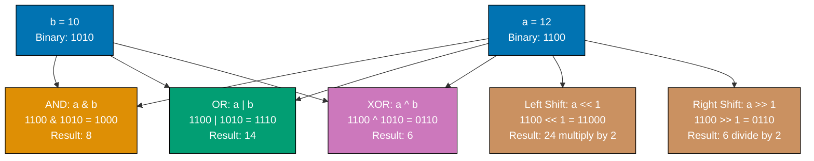

**Code**:

```go
package main

import "fmt"

func main() {
    // Compound assignment operators
    x := 10                    // => x is 10 (type: int)
                                // => Initial value

    x += 5                     // => x = x + 5 (compound addition assignment)
                                // => x is now 15 (10 + 5)
                                // => Shorthand for x = x + 5

    fmt.Println(x)             // => Print current value
    // => Output: 15

    x -= 3                     // => x = x - 3 (compound subtraction)
                                // => x is now 12 (15 - 3)

    fmt.Println(x)             // => Print updated value
    // => Output: 12

    x *= 2                     // => x = x * 2 (compound multiplication)
                                // => x is now 24 (12 * 2)

    fmt.Println(x)             // => Print product
    // => Output: 24

    x /= 4                     // => x = x / 4 (compound division)
                                // => x is now 6 (24 / 4, integer division)

    fmt.Println(x)             // => Print quotient
    // => Output: 6

    x %= 4                     // => x = x % 4 (compound modulo)
                                // => x is now 2 (6 % 4 = remainder of 6/4)

    fmt.Println(x)             // => Print remainder
    // => Output: 2

    // Bitwise operators on integers
    a := 12                    // => a is 12 (binary: 1100)
                                // => 12 = 8 + 4 = 2³ + 2²

    b := 10                    // => b is 10 (binary: 1010)
                                // => 10 = 8 + 2 = 2³ + 2¹

    fmt.Println(a & b)         // => Bitwise AND: 1100 & 1010 = 1000
                                // => 1000 = 8 in decimal
                                // => Only bits set in BOTH operands
    // => Output: 8

    fmt.Println(a | b)         // => Bitwise OR: 1100 | 1010 = 1110
                                // => 1110 = 14 in decimal
                                // => Bits set in EITHER operand
    // => Output: 14

    fmt.Println(a ^ b)         // => Bitwise XOR: 1100 ^ 1010 = 0110
                                // => 0110 = 6 in decimal
                                // => Bits set in ONE BUT NOT BOTH operands
    // => Output: 6

    fmt.Println(^a)            // => Bitwise NOT: ^1100 = ...11110011
                                // => Inverts all bits (two's complement)
                                // => -13 in decimal (signed integer)
    // => Output: -13

    // Bit shifting
    fmt.Println(a << 1)        // => Left shift: 1100 << 1 = 11000
                                // => 11000 = 24 in decimal
                                // => Multiplies by 2¹ (left shift by 1)
                                // => Each left shift multiplies by 2
    // => Output: 24

    fmt.Println(a >> 1)        // => Right shift: 1100 >> 1 = 0110
                                // => 0110 = 6 in decimal
                                // => Divides by 2¹ (right shift by 1)
                                // => Each right shift divides by 2
    // => Output: 6

    // Compound bitwise assignment
    c := 5                     // => c is 5 (binary: 0101)
                                // => 5 = 4 + 1 = 2² + 2⁰

    c &= 3                     // => c = c & 3 (compound AND)
                                // => 0101 & 0011 = 0001
                                // => c is now 1

    fmt.Println(c)             // => Print result
    // => Output: 1

    // Practical use: flag manipulation
    const (
        FlagRead  = 1 << 0     // => 0001 = 1
        FlagWrite = 1 << 1     // => 0010 = 2
        FlagExec  = 1 << 2     // => 0100 = 4
    )

    permissions := FlagRead | FlagWrite // => 0001 | 0010 = 0011 = 3
                                         // => Set read and write flags

    fmt.Println(permissions)   // => Print combined flags
    // => Output: 3

    hasWrite := (permissions & FlagWrite) != 0 // => Check if write flag set
                                                // => 0011 & 0010 = 0010 ≠ 0 → true

    fmt.Println(hasWrite)      // => Print flag check result
    // => Output: true
}
```

**Key Takeaway**: Compound assignment operators (`+=`, `-=`, `*=`, `/=`, `%=`) combine arithmetic with assignment for concise code. Bitwise operators (`&`, `|`, `^`, `^`, `<<`, `>>`) manipulate individual bits and are useful for flags, masks, and low-level operations.

**Why It Matters**: Bitwise operators enable efficient flag manipulation and low-level protocol implementation, where setting multiple boolean flags in a single integer saves memory and improves cache locality in high-performance code. Compound assignments (`+=`, `&=`) reduce verbosity while making mutation intent clear. Understanding bit operations is essential for implementing binary protocols, compression algorithms, and systems programming where byte-level control matters.

### Example 17: Variadic Functions

Variadic functions accept a variable number of arguments using the `...` syntax. The variadic parameter becomes a slice inside the function. This pattern is useful for functions like `fmt.Println` that accept any number of arguments.

**Code**:

```go
package main

import "fmt"

func main() {
    // Call with different numbers of arguments
    result1 := sum(1, 2)           // => Pass 2 arguments
                                    // => result1 is 3 (1 + 2)
                                    // => Variadic function accepts any count

    fmt.Println(result1)           // => Print result
    // => Output: 3

    result2 := sum(1, 2, 3, 4, 5) // => Pass 5 arguments
                                   // => result2 is 15 (1+2+3+4+5)
                                   // => Same function, different argument count

    fmt.Println(result2)           // => Print result
    // => Output: 15

    // Can call with zero arguments
    result0 := sum()               // => No arguments (valid for variadic)
                                    // => result0 is 0 (empty sum)
                                    // => nums will be empty slice []int{}

    fmt.Println(result0)           // => Print empty sum
    // => Output: 0

    // Pass slice to variadic function using ...
    numbers := []int{10, 20, 30}   // => numbers is []int{10, 20, 30}

    result3 := sum(numbers...)     // => ... unpacks slice into arguments
                                    // => Equivalent to: sum(10, 20, 30)
                                    // => result3 is 60 (10+20+30)

    fmt.Println(result3)           // => Print unpacked slice sum
    // => Output: 60

    // Mix normal and variadic parameters
    printWithPrefix("INFO", "Server started", "Port 8080", "Ready")
                                    // => "INFO" is prefix (normal parameter)
                                    // => Remaining 3 args are variadic
                                    // => messages = []string{"Server started", "Port 8080", "Ready"}
    // => Output:
    // => INFO: Server started
    // => INFO: Port 8080
    // => INFO: Ready

    // Variadic with one message
    printWithPrefix("ERROR", "Connection failed")
                                    // => messages = []string{"Connection failed"}
    // => Output:
    // => ERROR: Connection failed

    // Variadic with no messages
    printWithPrefix("DEBUG")       // => messages = []string{} (empty slice)
                                    // => Loop doesn't execute (no messages)
    // => No output (empty messages slice)
}

// Variadic function - nums becomes []int inside function
func sum(nums ...int) int {        // => ...int accepts 0 or more int arguments
                                    // => nums is type []int (slice of ints)
                                    // => nums contains all passed arguments

    total := 0                     // => total is 0 (accumulator)

    for _, num := range nums {     // => Iterate over nums slice
                                    // => _ ignores index
                                    // => num is current element

        total += num               // => Add current number to total
                                    // => total accumulates sum
    }

    return total                   // => Return accumulated sum
}

// Mix normal and variadic parameters (variadic must be last)
func printWithPrefix(prefix string, messages ...string) {
                                    // => prefix is normal parameter (required)
                                    // => messages is variadic (0 or more strings)
                                    // => Variadic parameter MUST be last

    for _, msg := range messages { // => Iterate over messages slice
                                    // => messages is []string (variadic becomes slice)

        fmt.Printf("%s: %s\n", prefix, msg) // => Print with prefix
                                             // => Format: "prefix: message"
    }
}
```

**Key Takeaway**: Variadic functions use `...Type` to accept any number of arguments of that type, which become a slice inside the function. Use `slice...` to unpack a slice into variadic arguments. Variadic parameters must be the last parameter in the function signature.

**Why It Matters**: Variadic functions enable flexible APIs like `fmt.Printf()` without method overloading, where a single function handles arbitrary argument counts type-safely. The `...` syntax unpacks slices into variadic calls, enabling dynamic argument lists from runtime data. This powers logging, formatting, and builder patterns without the complexity of method overloading or default parameters that plague Java and C++.

### Example 18: Anonymous Functions and Closures

Anonymous functions (functions without names) can be assigned to variables or executed immediately. Closures capture variables from their surrounding scope, enabling powerful patterns like creating function factories.

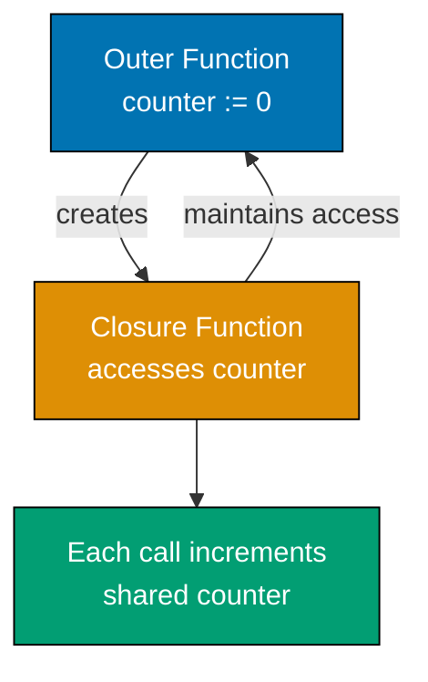

**Code**:

```go
package main

import "fmt"

func main() {
    // Anonymous function assigned to variable
    greet := func(name string) string { // => Anonymous function (no name after func)
                                         // => greet is variable holding function
                                         // => Type: func(string) string

        return fmt.Sprintf("Hello, %s!", name) // => Format and return string
                                                // => Sprintf doesn't print, returns string
    }

    fmt.Println(greet("Alice"))    // => Call function stored in greet
                                    // => greet("Alice") returns "Hello, Alice!"
    // => Output: Hello, Alice!

    // Immediately invoked function expression (IIFE)
    func() {                       // => Anonymous function defined
        fmt.Println("I run immediately") // => This code executes immediately
    }()                            // => () immediately invokes the function
                                    // => No variable assignment, runs once
    // => Output: I run immediately

    // IIFE with parameters
    func(msg string) {             // => Anonymous function with parameter
        fmt.Println(msg)            // => Print parameter
    }("Passing arguments")         // => Pass "Passing arguments" and invoke
    // => Output: Passing arguments

    // Closure - captures variable from outer scope
    counter := makeCounter()       // => counter is func() int (returned closure)
                                    // => Closure captures count variable from makeCounter
                                    // => count lives in closure's environment

    fmt.Println(counter())         // => First call: count was 0, increments to 1, returns 1
    // => Output: 1

    fmt.Println(counter())         // => Second call: count is 1, increments to 2, returns 2
                                    // => Same count variable (captured by closure)
    // => Output: 2

    fmt.Println(counter())         // => Third call: count is 2, increments to 3, returns 3
    // => Output: 3

    // Each closure has independent state
    counter2 := makeCounter()      // => New closure with NEW count variable
                                    // => counter2's count is independent of counter's count
                                    // => counter2's count starts at 0

    fmt.Println(counter2())        // => counter2's first call: returns 1
                                    // => Separate from counter (which is at 3)
    // => Output: 1

    fmt.Println(counter())         // => Original counter still at 3, increments to 4
    // => Output: 4

    // Closure capturing loop variable (common pitfall)
    funcs := []func(){}            // => funcs is slice of functions (no parameters, no return)

    for i := 0; i < 3; i++ {       // => Loop from 0 to 2
        i := i                     // => CRITICAL: shadow i with new variable
                                    // => Each iteration gets its own copy of i
                                    // => Without this, all closures capture same i (value 3)

        funcs = append(funcs, func() { // => Append anonymous function to slice
                                        // => This function captures the SHADOWED i
                                        // => Each closure captures different i

            fmt.Println("Loop var:", i) // => Print captured i
                                         // => Each closure has own i (0, 1, 2)
        })
    }

    for _, f := range funcs {      // => Iterate over function slice
                                    // => _ ignores index, f is current function

        f()                        // => Invoke function
                                    // => Prints captured i value
    }
    // => Output: Loop var: 0
    // => Output: Loop var: 1
    // => Output: Loop var: 2

    // Without shadowing (wrong - demonstrates pitfall)
    badFuncs := []func(){}
    for i := 0; i < 3; i++ {       // => Loop from 0 to 2
        // NO shadowing here - all closures capture same i
        badFuncs = append(badFuncs, func() {
            fmt.Println("Bad loop var:", i) // => Captures SAME i from loop
        })
    }
    // Loop ends with i = 3
    for _, f := range badFuncs {
        f()                        // => All closures see i = 3
    }
    // => Output: Bad loop var: 3
    // => Output: Bad loop var: 3
    // => Output: Bad loop var: 3
}

// Function that returns a closure
func makeCounter() func() int {    // => Returns function type: func() int
                                    // => No parameters, returns int
                                    // => Function factory pattern

    count := 0                     // => count is local variable in makeCounter
                                    // => Will be captured by returned closure
                                    // => Lives beyond makeCounter's return (closure keeps it alive)

    return func() int {            // => Return anonymous function (closure)
                                    // => This function captures count variable
                                    // => Forms closure over count

        count++                    // => Increment captured count
                                    // => Modifies variable from outer scope
                                    // => count persists across calls

        return count               // => Return incremented value
    }
    // => makeCounter returns, but count survives in closure
}
```

**Key Takeaway**: Anonymous functions can be assigned to variables or invoked immediately. Closures capture variables from their surrounding scope and maintain access to those variables even after the outer function returns. Always copy loop variables when creating closures in loops to avoid capturing the wrong value.

**Why It Matters**: Closures capture lexical scope, enabling callbacks, event handlers, and functional patterns without explicit context objects. Anonymous functions eliminate trivial one-off function declarations, making code concise where small operations (sorting comparators, filter predicates) appear inline. Closures power deferred cleanup, goroutine launches with captured state, and middleware patterns that wrap behavior without boilerplate.

### Example 19: Defer, Panic, and Recover

`defer` schedules function calls to run when the surrounding function returns. `panic` stops execution and starts unwinding the stack. `recover` catches panics in deferred functions, enabling graceful error recovery.

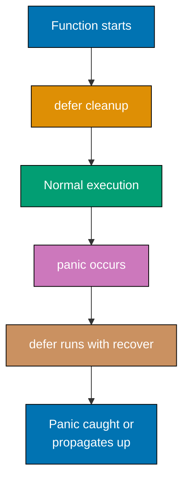

**Code**:

```go
package main

import (
    "fmt"
)

func main() {
    // defer runs when function returns (LIFO order)
    fmt.Println("Start")           // => Executes immediately
    // => Output: Start

    defer fmt.Println("Deferred 1") // => Scheduled to run on function return
                                     // => Added to defer stack (position 1)
                                     // => Will run LAST (LIFO - Last In First Out)

    defer fmt.Println("Deferred 2") // => Added to defer stack (position 2)
                                     // => Will run SECOND

    defer fmt.Println("Deferred 3") // => Added to defer stack (position 3)
                                     // => Will run FIRST (most recent defer)

    fmt.Println("End")             // => Executes immediately
    // => Output: End
    // => Function about to return, deferred functions execute in LIFO order
    // => Output: Deferred 3
    // => Output: Deferred 2
    // => Output: Deferred 1

    // defer with function call arguments (evaluated immediately)
    x := 10                        // => x is 10

    defer fmt.Println("Deferred x:", x) // => x evaluated NOW (x is 10)
                                         // => Value 10 captured at defer time
                                         // => Defer statement scheduled with x=10

    x = 20                         // => x is now 20
                                    // => Deferred call still uses x=10 (captured earlier)

    fmt.Println("Current x:", x)   // => Print current x value
    // => Output: Current x: 20
    // => Function returns, deferred call executes with captured x=10
    // => Output: Deferred x: 10

    // panic and recover
    safeDivide(10, 2)              // => Normal execution (no panic)
                                    // => Prints "10 / 2 = 5"
    // => Output: 10 / 2 = 5

    safeDivide(10, 0)              // => Triggers panic
                                    // => Panic caught by deferred recover
                                    // => Prints "Recovered from panic: division by zero"
    // => Output: Recovered from panic: division by zero

    fmt.Println("Program continues after panic") // => Executes (panic was recovered)
                                                   // => Program didn't crash
    // => Output: Program continues after panic
}

func safeDivide(a, b int) {        // => Function that may panic
                                    // => Uses defer+recover for graceful handling

    defer func() {                 // => Defer anonymous function
                                    // => Will run when safeDivide returns OR panics
                                    // => Deferred functions run even during panic

        if r := recover(); r != nil { // => recover() returns panic value (or nil)
                                       // => r is panic value if panic occurred
                                       // => r is nil if no panic

            fmt.Println("Recovered from panic:", r) // => Print panic value
                                                     // => Panic is "caught" here
                                                     // => Program continues normally
        }
    }()

    if b == 0 {                   // => Check for division by zero
        panic("division by zero")  // => Trigger panic with string message
                                    // => Stops normal execution
                                    // => Unwinds stack, running deferred functions
                                    // => Panic value is "division by zero"
    }

    fmt.Printf("%d / %d = %d\n", a, b, a/b) // => Normal execution
                                             // => Only runs if b != 0
                                             // => Prints division result
}
```

**Key Takeaway**: `defer` schedules cleanup code that runs when the function returns, in LIFO order. `panic` stops execution and starts unwinding the stack. `recover()` in a deferred function catches panics, enabling graceful error handling. Use panic/recover sparingly - explicit error returns are idiomatic.

**Why It Matters**: Defer guarantees cleanup executes even during panics, preventing resource leaks (file handles, database connections, mutexes) that crash-on-error languages require try/finally to handle. LIFO execution order makes defer stacks predictable for nested resource acquisition. Panic/recover enables fail-fast for truly exceptional conditions (broken invariants) while recover in defer blocks allows graceful shutdown, protecting long-running services from crashes.

### Example 20: File Reading and Writing

Go's `os` and `io/ioutil` (now `os` in Go 1.16+) packages provide file operations. Reading and writing files requires error handling at each step. Understanding file modes and permissions is essential for production code.

**Code**:

```go
package main

import (
    "fmt"
    "os"
)

func main() {
    // Write to file
    content := []byte("Hello, Go file I/O!") // => content is []byte (byte slice)
                                              // => Files work with bytes, not strings
                                              // => Explicit conversion to []byte

    err := os.WriteFile("test.txt", content, 0644) // => Write content to test.txt
                                                    // => 0644 = file permissions (octal)
                                                    // => 0644 = owner:rw-, group:r--, others:r--
                                                    // => Returns error (or nil on success)

    if err != nil {                // => Check if write failed
        fmt.Println("Write error:", err) // => Print error and exit
        return                      // => Early return on error
    }

    fmt.Println("File written successfully") // => Success message
    // => Output: File written successfully

    // Read from file
    data, err := os.ReadFile("test.txt") // => Read entire file into memory
                                          // => data is []byte containing file content
                                          // => err is error (nil if successful)

    if err != nil {                // => Check if read failed
        fmt.Println("Read error:", err)
        return
    }

    fmt.Println("File content:", string(data)) // => Convert []byte to string for printing
                                                // => data remains []byte, string() creates copy
    // => Output: File content: Hello, Go file I/O!

    // Append to file
    file, err := os.OpenFile("test.txt", os.O_APPEND|os.O_WRONLY, 0644)
                                    // => Open file for appending
                                    // => os.O_APPEND = append mode (write at end)
                                    // => os.O_WRONLY = write-only mode
                                    // => | combines flags (bitwise OR)
                                    // => Returns *os.File and error

    if err != nil {                // => Check if open failed
        fmt.Println("Open error:", err)
        return
    }

    defer file.Close()             // => Schedule file close on function return
                                    // => ALWAYS defer Close() after opening files
                                    // => Ensures file closes even if error occurs
                                    // => Releases file handle to OS

    _, err = file.WriteString("\nAppended line") // => Write string to file
                                                  // => \n adds newline before text
                                                  // => Returns (bytes written, error)
                                                  // => _ ignores bytes written

    if err != nil {                // => Check if append failed
        fmt.Println("Append error:", err)
        return
    }

    fmt.Println("Content appended") // => Success message
    // => Output: Content appended

    // Check if file exists
    if _, err := os.Stat("test.txt"); err == nil {
        fmt.Println("File exists")
    } else if os.IsNotExist(err) {
        fmt.Println("File does not exist")
    }

    // Delete file
    err = os.Remove("test.txt")    // => Delete file
    if err != nil {
        fmt.Println("Delete error:", err)
        return
    }
    fmt.Println("File deleted")
}
```

**Key Takeaway**: Use `os.WriteFile()` for simple writes and `os.ReadFile()` for reads. For more control, use `os.OpenFile()` with flags (`O_APPEND`, `O_WRONLY`, `O_CREATE`). Always use `defer file.Close()` to ensure files close properly. File permissions use Unix octal notation (0644 = owner read/write, group/others read).

**Why It Matters**: Standard library file I/O provides consistent interfaces (`io.Reader`, `io.Writer`) that compose with network, compression, and encryption without special cases. Defer file.Close() guarantees cleanup, preventing file descriptor leaks that exhaust system resources in long-running services. Buffered I/O through `bufio.Scanner` handles line-by-line reading efficiently, processing multi-GB log files without loading entire contents into memory.

### Example 21: Command-Line Arguments

Command-line programs parse arguments from `os.Args`. The `flag` package provides structured argument parsing with type checking, default values, and automatic help messages.

**Code**:

```go
package main

import (
    "flag"
    "fmt"
    "os"
)

func main() {
    // Raw arguments from os.Args
    fmt.Println("Raw args:", os.Args) // => os.Args is []string (slice of strings)
                                       // => os.Args[0] is program name
                                       // => os.Args[1:] are command-line arguments
                                       // => Always contains at least program name

    // => Example: If run as "go run main.go hello world"
    // => Output: Raw args: [/tmp/go-build.../exe/main hello world]

    if len(os.Args) > 1 {          // => Check if any arguments provided
                                    // => len(os.Args) >= 1 always (program name)
                                    // => len > 1 means user provided arguments

        fmt.Println("First arg:", os.Args[1]) // => Access first user argument
                                               // => os.Args[1] (index 0 is program)
        // => Output: First arg: hello (if provided)
    }

    // Structured argument parsing with flag package
    name := flag.String("name", "Guest", "your name") // => Define string flag
                                                       // => Returns *string (pointer)
                                                       // => Default value: "Guest"
                                                       // => Usage message: "your name"

    age := flag.Int("age", 0, "your age")             // => Define int flag
                                                       // => Returns *int (pointer)
                                                       // => Default: 0

    verbose := flag.Bool("verbose", false, "verbose output") // => Define bool flag
                                                              // => Returns *bool (pointer)
                                                              // => Default: false
                                                              // => Bool flags don't need =value

    flag.Parse()                   // => Parse os.Args for flags
                                    // => Must call before reading flag values
                                    // => Splits flags from non-flag args
                                    // => Sets flag variables to parsed values

    fmt.Printf("Name: %s\n", *name)    // => Dereference pointer with *
                                        // => *name gets value from pointer
                                        // => Prints flag value or default

    fmt.Printf("Age: %d\n", *age)      // => Dereference age pointer
                                        // => %d format for int

    fmt.Printf("Verbose: %t\n", *verbose) // => Dereference bool pointer
                                           // => %t format for bool

    // Non-flag arguments (after flags)
    remainingArgs := flag.Args()   // => Get arguments after all flags
                                    // => Returns []string
                                    // => Empty if no non-flag args provided

    fmt.Println("Remaining args:", remainingArgs) // => Print non-flag arguments
                                                   // => Useful for file names, etc.

    // Example usage from terminal:
    // $ go run main.go -name=Alice -age=30 -verbose file1.txt file2.txt
    // => Name: Alice (from flag)
    // => Age: 30 (from flag)
    // => Verbose: true (bool flag present)
    // => Remaining args: [file1.txt file2.txt] (non-flag args)

    // Without flags (uses defaults):
    // $ go run main.go file1.txt
    // => Name: Guest (default)
    // => Age: 0 (default)
    // => Verbose: false (default)
    // => Remaining args: [file1.txt]
}
```

**Key Takeaway**: Use `os.Args` for raw argument access or `flag` package for structured parsing. Flag functions return pointers - dereference with `*`. Call `flag.Parse()` before reading flag values. Use `flag.Args()` for non-flag arguments.

**Why It Matters**: `os.Args` and `flag` package enable building CLI tools with standard Unix conventions (flags, arguments, help text) without external dependencies. Flag parsing handles types (int, string, bool) and validation automatically, reducing boilerplate in command-line tools. This powers production utilities where consistent flag handling (`-v`, `-h`, `--config`) follows user expectations and integrates with shell scripts.

### Example 22: Time Manipulation

The `time` package handles dates, durations, timers, and time zones. Understanding duration arithmetic and time formatting is essential for scheduling, timeouts, and timestamp handling.

**Code**:

```go
package main

import (
    "fmt"
    "time"
)

func main() {
    // Current time
    now := time.Now()              // => Returns current local time (type: time.Time)
                                    // => Contains date, time, timezone info
                                    // => Example: 2025-12-30 15:30:45.123456 +0700 WIB
    fmt.Println("Now:", now)        // => Output: Now: 2025-12-30 15:30:45.123456 +0700 WIB

    // Time components extraction
    fmt.Println("Year:", now.Year())       // => Extract year as int
                                            // => Output: Year: 2025
    fmt.Println("Month:", now.Month())     // => Month as time.Month constant
                                            // => Output: Month: December
    fmt.Println("Day:", now.Day())         // => Day of month (1-31)
                                            // => Output: Day: 30
    fmt.Println("Hour:", now.Hour())       // => Hour in 24-hour format (0-23)
                                            // => Output: Hour: 15
    fmt.Println("Weekday:", now.Weekday()) // => Day of week as time.Weekday constant
                                            // => Output: Weekday: Monday

    // Create specific time with Date constructor
    past := time.Date(2020, time.January, 1, 0, 0, 0, 0, time.UTC)
                                    // => time.Date(year, month, day, hour, min, sec, nsec, location)
                                    // => Parameters: 2020, January, 1, 0h, 0m, 0s, 0ns, UTC timezone
                                    // => Creates: 2020-01-01 00:00:00 +0000 UTC
    fmt.Println("Past:", past)      // => Output: Past: 2020-01-01 00:00:00 +0000 UTC

    // Duration constants and arithmetic
    oneHour := time.Hour            // => Duration constant = 1 hour
                                    // => Type: time.Duration (int64 nanoseconds)
                                    // => oneHour is 3600000000000 nanoseconds
    twoHours := 2 * time.Hour       // => Multiply duration by scalar
                                    // => twoHours is 7200000000000 nanoseconds
                                    // => Represents 2 hours
    fmt.Println("Duration:", twoHours) // => String format: 2h0m0s
                                        // => Output: Duration: 2h0m0s

    future := now.Add(twoHours)     // => Add duration to time
                                    // => now is 2025-12-30 15:30:45, add 2 hours
                                    // => future is 2025-12-30 17:30:45
                                    // => Returns new time.Time (now unchanged)
    fmt.Println("Future:", future)  // => Output: Future: 2025-12-30 17:30:45.123456 +0700 WIB

    // Time difference calculation
    diff := future.Sub(now)         // => Subtract times to get duration
                                    // => future - now = 2 hours
                                    // => Returns time.Duration
    fmt.Println("Difference:", diff) // => Output: Difference: 2h0m0s

    // Time comparison methods
    if future.After(now) {          // => future.After(now) returns true
                                    // => Compares time values
                                    // => Also available: Before(), Equal()
        fmt.Println("Future is after now")
                                    // => Output: Future is after now
    }

    // Formatting time with reference layout
    // Reference time: Mon Jan 2 15:04:05 MST 2006
    formatted := now.Format("2006-01-02 15:04:05")
                                    // => Format using reference time pattern
                                    // => 2006=year, 01=month, 02=day, 15=hour, 04=minute, 05=second
                                    // => Converts: 2025-12-30 15:30:45.123456 → "2025-12-30 15:30:45"
    fmt.Println("Formatted:", formatted) // => Output: Formatted: 2025-12-30 15:30:45

    // Common predefined formats
    fmt.Println("RFC3339:", now.Format(time.RFC3339))
                                    // => RFC3339 format: 2006-01-02T15:04:05Z07:00
                                    // => Output: RFC3339: 2025-12-30T15:30:45+07:00
    fmt.Println("Kitchen:", now.Format(time.Kitchen))
                                    // => Kitchen format: 3:04PM
                                    // => Output: Kitchen: 3:30PM

    // Parse time from string
    parsed, err := time.Parse("2006-01-02", "2025-12-25")
                                    // => Parse string using layout pattern
                                    // => Layout: "2006-01-02" matches input "2025-12-25"
                                    // => Returns (time.Time, error)
    if err != nil {                 // => Check parse error
        fmt.Println("Parse error:", err)
                                    // => Would print if format mismatch
    } else {
        fmt.Println("Parsed:", parsed)
                                    // => parsed is 2025-12-25 00:00:00 +0000 UTC
                                    // => Output: Parsed: 2025-12-25 00:00:00 +0000 UTC
    }

    // Sleep pauses execution
    fmt.Println("Sleeping 100ms...") // => Output: Sleeping 100ms...
    time.Sleep(100 * time.Millisecond)
                                    // => Pause goroutine for 100 milliseconds
                                    // => Blocks current goroutine only
                                    // => 100 * time.Millisecond = 100000000 nanoseconds
    fmt.Println("Awake!")           // => Output after 100ms: Awake!
}
```

**Key Takeaway**: Use `time.Now()` for current time, `time.Date()` to create specific times. Duration arithmetic uses `Add()` and `Sub()`. Format times with reference layout `2006-01-02 15:04:05`. Use `time.Sleep()` to pause execution.

**Why It Matters**: Time handling prevents common pitfalls (naive string comparisons, timezone bugs) through strong typing, where `time.Time` enforces correct arithmetic and comparisons. Duration literals (1\*time.Second) make timeouts and delays readable and type-safe. This is critical for scheduling, timeouts, and logging where incorrect time handling causes production bugs (DST transitions, leap seconds, timezone conversions) that naive timestamp arithmetic cannot handle.

### Example 23: Regular Expressions

The `regexp` package provides pattern matching and extraction. Regular expressions find, match, and extract text based on patterns. Understanding regex fundamentals unlocks powerful text processing.

**Code**:

```go
package main

import (
    "fmt"
    "regexp"
)

func main() {
    // Compile regex pattern
    pattern := `\d+`                // => Raw string literal (backslashes literal)
                                    // => \d+ means: one or more digit characters
                                    // => Type: string
    re := regexp.MustCompile(pattern)
                                    // => Compile pattern into regexp.Regexp
                                    // => MustCompile panics if pattern invalid
                                    // => Alternative: regexp.Compile returns (regexp, error)
                                    // => re is *regexp.Regexp

    // Match test - check if pattern exists
    matched := re.MatchString("abc123def")
                                    // => Test if string contains pattern
                                    // => "abc123def" contains "123" (matches \d+)
                                    // => Returns bool (true)
    fmt.Println("Matched:", matched) // => Output: Matched: true

    // Find first match
    found := re.FindString("abc123def456")
                                    // => FindString returns first match as string
                                    // => Input: "abc123def456"
                                    // => First digit sequence: "123"
                                    // => Returns "123" (string)
    fmt.Println("Found:", found)    // => Output: Found: 123

    // Find all matches
    all := re.FindAllString("abc123def456ghi789", -1)
                                    // => FindAllString(input, n) finds up to n matches
                                    // => n=-1 means find all matches
                                    // => Input: "abc123def456ghi789"
                                    // => Finds: "123", "456", "789"
                                    // => Returns []string slice
    fmt.Println("All matches:", all) // => Output: All matches: [123 456 789]

    // Extract with capture groups
    emailPattern := `(\w+)@(\w+\.\w+)`
                                    // => Pattern with capture groups: (...)
                                    // => (\w+) = one or more word chars (group 1: username)
                                    // => @ = literal @ symbol
                                    // => (\w+\.\w+) = domain.tld (group 2: domain)
    emailRe := regexp.MustCompile(emailPattern)
                                    // => Compile email pattern
                                    // => emailRe is *regexp.Regexp
    matches := emailRe.FindStringSubmatch("contact: alice@example.com")
                                    // => FindStringSubmatch returns []string
                                    // => matches[0] = full match "alice@example.com"
                                    // => matches[1] = first capture group "alice"
                                    // => matches[2] = second capture group "example.com"
                                    // => Returns nil if no match
    if len(matches) > 2 {           // => Check we have all capture groups
                                    // => len(matches) is 3 (full + 2 groups)
        fmt.Println("Username:", matches[1])
                                    // => matches[1] is "alice"
                                    // => Output: Username: alice
        fmt.Println("Domain:", matches[2])
                                    // => matches[2] is "example.com"
                                    // => Output: Domain: example.com
    }

    // Replace with regex
    replaced := re.ReplaceAllString("abc123def456", "XXX")
                                    // => Replace all pattern matches with "XXX"
                                    // => Input: "abc123def456"
                                    // => Replace "123" → "XXX", "456" → "XXX"
                                    // => Returns "abcXXXdefXXX"
    fmt.Println("Replaced:", replaced)
                                    // => Output: Replaced: abcXXXdefXXX

    // Split with regex
    splitter := regexp.MustCompile(`\s+`)
                                    // => Pattern \s+ = one or more whitespace chars
                                    // => Matches spaces, tabs, newlines
    parts := splitter.Split("hello   world  go", -1)
                                    // => Split on whitespace sequences
                                    // => Input: "hello   world  go"
                                    // => Splits at "   " and "  "
                                    // => n=-1 means return all substrings
                                    // => Returns []string: ["hello", "world", "go"]
    fmt.Println("Split:", parts)    // => Output: Split: [hello world go]
}
```

**Key Takeaway**: Use `regexp.MustCompile()` to compile patterns. `MatchString()` tests for matches, `FindString()` extracts first match, `FindAllString()` gets all matches. Capture groups in patterns enable extraction. `ReplaceAllString()` performs regex-based replacement.

**Why It Matters**: Compiled regular expressions provide powerful pattern matching for validation (email, URLs), parsing (log lines, configuration), and transformation without external libraries. The `regexp` package prevents ReDoS attacks through linear-time guarantees, unlike PCRE's backtracking. Precompiling with `regexp.MustCompile` catches syntax errors at startup rather than runtime, making regex-heavy code (parsers, validators) reliable in production.

### Example 24: String Rune Iteration

Strings in Go are UTF-8 encoded byte sequences. Iterating by index gives bytes, but `range` gives runes (Unicode code points). Understanding this distinction prevents bugs when handling international text.

**Code**:

```go
package main

import (
    "fmt"
    "unicode/utf8"
)

func main() {
    // String with multi-byte characters
    s := "Hello, 世界"              // => String with ASCII and Chinese chars
                                    // => "Hello, " = 7 bytes (ASCII: 1 byte each)
                                    // => "世" = 3 bytes (UTF-8 encoding)
                                    // => "界" = 3 bytes (UTF-8 encoding)
                                    // => Total: 13 bytes, 9 Unicode code points

    // Length in bytes vs runes
    fmt.Println("Bytes:", len(s))   // => len() returns byte count
                                    // => s has 13 bytes
                                    // => Output: Bytes: 13
    fmt.Println("Runes:", utf8.RuneCountInString(s))
                                    // => RuneCountInString counts Unicode code points
                                    // => s has 9 runes: H, e, l, l, o, comma, space, 世, 界
                                    // => Output: Runes: 9

    // Iterate by index (gives bytes - UNSAFE for multi-byte chars)
    fmt.Println("Byte iteration:") // => Output: Byte iteration:
    for i := 0; i < len(s); i++ {   // => i iterates 0 to 12 (byte indices)
        fmt.Printf("  [%d] = %d\n", i, s[i])
                                    // => s[i] accesses individual byte (type: byte/uint8)
                                    // => For ASCII: byte = char code
                                    // => For UTF-8 multi-byte: byte = part of encoding
                                    // => Output example: [0] = 72 (H), [7] = 228 (first byte of 世)
    }

    // Iterate with range (gives runes - SAFE for multi-byte chars)
    fmt.Println("Rune iteration:")  // => Output: Rune iteration:
    for i, r := range s {           // => range on string yields (byte_index, rune)
                                    // => i is byte position where rune starts
                                    // => r is rune value (type: rune/int32)
        fmt.Printf("  [%d] = %c (U+%04X)\n", i, r, r)
                                    // => %c prints character representation
                                    // => %04X prints Unicode code point in hex
                                    // => Output example: [0] = H (U+0048), [7] = 世 (U+4E16)
    }
    // => Correctly handles multi-byte UTF-8 sequences

    // Convert string to rune slice for random access
    runes := []rune(s)              // => Convert string to []rune slice
                                    // => Each rune is one Unicode code point
                                    // => Type: []rune (same as []int32)
                                    // => len(runes) is 9 (number of code points)
    fmt.Println("Rune slice:", runes)
                                    // => Prints numeric rune values
                                    // => Output: Rune slice: [72 101 108 108 111 44 32 19990 30028]
    fmt.Println("First rune:", string(runes[0]))
                                    // => runes[0] is 72 (code point for 'H')
                                    // => string() converts rune to string
                                    // => Output: First rune: H

    // Get specific rune and its byte size
    r, size := utf8.DecodeRuneInString(s)
                                    // => Decode first rune from string
                                    // => r is rune value (72 for 'H')
                                    // => size is byte length of rune encoding (1 for ASCII)
                                    // => Returns (rune, int)
    fmt.Printf("First rune: %c (size: %d bytes)\n", r, size)
                                    // => Output: First rune: H (size: 1 bytes)

    // Check if valid UTF-8
    valid := utf8.ValidString(s)    // => Verify string is valid UTF-8 encoding
                                    // => Returns true for valid UTF-8
                                    // => Returns false for invalid byte sequences
    fmt.Println("Valid UTF-8:", valid)
                                    // => Output: Valid UTF-8: true
}
```

**Key Takeaway**: String `len()` returns bytes, not characters. Use `utf8.RuneCountInString()` for character count. Iterate with `range` to get runes (Unicode code points), not bytes. Convert to `[]rune` for random access to characters. Always use rune iteration for international text.

**Why It Matters**: Rune iteration handles multi-byte Unicode correctly, where `range` over strings yields runes (code points) rather than bytes, preventing corruption of emoji, Chinese characters, and accented letters that naive byte iteration mangles. Understanding byte vs rune distinction is essential for international text processing, where counting characters, substring extraction, and validation must respect UTF-8 encoding rather than assuming ASCII.

### Example 25: Map Manipulation Patterns

Maps support advanced patterns beyond basic get/set. Checking existence, deleting keys, iterating in deterministic order, and using structs as keys unlock powerful data organization.

**Code**:

```go
package main

import (
    "fmt"
    "sort"
)

func main() {
    // Map initialization with composite literal
    scores := map[string]int{   // => Type: map[string]int (key=string, value=int)
        "Alice": 95,            // => Key: "Alice", Value: 95
        "Bob":   87,            // => Key: "Bob", Value: 87
        "Charlie": 92,          // => Key: "Charlie", Value: 92
    }                           // => Map is reference type (passed by reference)

    // Comma-ok idiom (safe key access)
    score, exists := scores["Alice"]
                                // => Access map with key "Alice"
                                // => score gets value (95)
                                // => exists gets bool (true if key present)
                                // => Type: (int, bool)
    fmt.Println("Alice:", score, "Exists:", exists)
                                // => Output: Alice: 95 Exists: true

    score, exists = scores["David"]
                                // => Access non-existent key "David"
                                // => score gets zero value for int (0)
                                // => exists is false (key not found)
    fmt.Println("David:", score, "Exists:", exists)
                                // => Output: David: 0 Exists: false

    // Update vs insert (same syntax)
    scores["Alice"] = 98        // => Update: key "Alice" exists, change value 95→98
    scores["Eve"] = 89          // => Insert: key "Eve" doesn't exist, add new entry
    fmt.Println(scores)         // => Output: map[Alice:98 Bob:87 Charlie:92 Eve:89]
                                // => Note: map iteration order is random

    // Delete key
    delete(scores, "Bob")       // => Built-in delete(map, key) function
                                // => Removes key "Bob" and its value
                                // => Safe to call even if key doesn't exist (no panic)
    fmt.Println("After delete:", scores)
                                // => Output: map[Alice:98 Charlie:92 Eve:89]

    // Iterate in deterministic order (maps are unordered)
    // Step 1: Collect keys into slice
    keys := make([]string, 0, len(scores))
                                // => Create string slice with 0 length, capacity=map size
                                // => Capacity hint optimizes performance
    for k := range scores {     // => range on map yields key only
                                // => k is "Alice", "Charlie", "Eve" (random order)
        keys = append(keys, k)  // => Collect all keys
    }                           // => keys is ["Alice", "Charlie", "Eve"] or other order

    // Step 2: Sort keys
    sort.Strings(keys)          // => Sort keys alphabetically
                                // => keys becomes ["Alice", "Charlie", "Eve"] (alphabetical)

    // Step 3: Iterate using sorted keys
    fmt.Println("Sorted iteration:")
                                // => Output: Sorted iteration:
    for _, k := range keys {    // => Iterate sorted key slice
                                // => _ discards index, k is key
        fmt.Printf("  %s: %d\n", k, scores[k])
                                // => Access map value using sorted key
                                // => Output:   Alice: 98
                                // =>           Charlie: 92
                                // =>           Eve: 89
    }

    // Map with struct keys (structs must be comparable)
    type Point struct {         // => Define struct type
        X, Y int                // => All fields must be comparable types
    }
    locations := map[Point]string{
                                // => Map with struct key, string value
        {0, 0}:  "origin",      // => Key: Point{X:0, Y:0}, Value: "origin"
        {10, 5}: "northeast",   // => Key: Point{X:10, Y:5}, Value: "northeast"
    }
    fmt.Println(locations[Point{0, 0}])
                                // => Access using Point{0, 0} as key
                                // => Output: origin

    // Map of maps (nested structure)
    nested := map[string]map[string]int{
                                // => Outer map: string → map
                                // => Inner map: string → int
        "scores": {             // => Key: "scores", Value: map[string]int
            "math": 90,         // => Inner: "math" → 90
            "english": 85,      // => Inner: "english" → 85
        },
    }
    fmt.Println("Math score:", nested["scores"]["math"])
                                // => Access: nested["scores"] gets inner map
                                // => Then ["math"] gets value 90
                                // => Output: Math score: 90
}
```

**Key Takeaway**: Use comma-ok idiom to check key existence safely. Maps are unordered - collect and sort keys for deterministic iteration. Structs can be map keys if all fields are comparable. Nested maps require initialization of inner maps before use.

**Why It Matters**: Map iteration is intentionally randomized to prevent dependence on key order, encouraging developers to write order-independent code that doesn't break when hash implementations change. The delete() function makes map cleanup explicit and efficient (O(1) average case), critical for caches and in-memory stores. Checking existence with comma-ok prevents nil value confusion, where map["missing"] returns zero value rather than error.

### Example 26: Array vs Slice Deep Dive

Arrays and slices have critical differences in behavior, especially when passing to functions. Arrays are values (copied), slices are references (shared). Understanding backing arrays prevents subtle bugs.

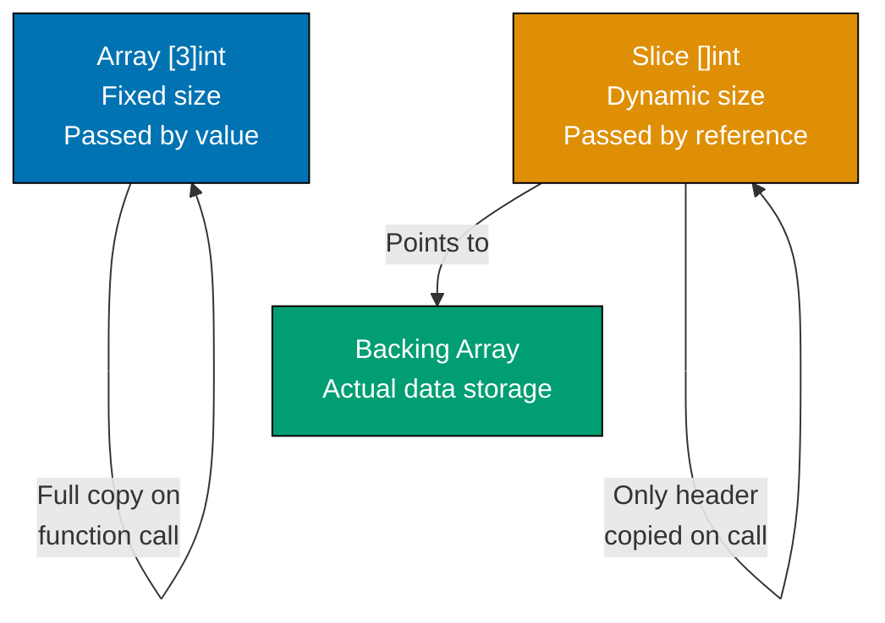

**Code**:

```go
package main

import "fmt"

func main() {
    // Array - fixed size, value type
    arr := [3]int{1, 2, 3}         // => Type: [3]int (size is part of type)
                                    // => Array is value type (copied on assignment/pass)
                                    // => arr has 3 elements: [1, 2, 3]
    modifyArray(arr)                // => Pass array to function
                                    // => Entire array copied (value semantics)
                                    // => Function gets copy, not reference
    fmt.Println("After modifyArray:", arr)
                                    // => arr unchanged: [1 2 3]
                                    // => Output: After modifyArray: [1 2 3]

    // Slice - dynamic size, reference type
    slice := []int{1, 2, 3}         // => Type: []int (no size in type)
                                    // => Slice is reference type (header + pointer to backing array)
                                    // => slice: {ptr: &array, len: 3, cap: 3}
    modifySlice(slice)              // => Pass slice to function
                                    // => Slice header copied, but ptr points to same backing array
                                    // => Function can modify backing array
    fmt.Println("After modifySlice:", slice)
                                    // => slice changed: [100 2 3]
                                    // => Output: After modifySlice: [100 2 3]

    // Slice capacity and backing array
    s1 := make([]int, 3, 5)         // => make([]T, length, capacity)
                                    // => Creates slice: len=3, cap=5
                                    // => Backing array has 5 elements, only 3 accessible
                                    // => s1: [0 0 0] (zero values)
    fmt.Println("s1:", s1, "len:", len(s1), "cap:", cap(s1))
                                    // => Output: s1: [0 0 0] len: 3 cap: 5

    s1[0] = 10                      // => Modify s1[0]: 0 → 10
                                    // => s1 is now [10 0 0]
    s2 := s1[0:2]                   // => Reslice: create new slice header
                                    // => s2 points to same backing array as s1
                                    // => s2: {ptr: s1.ptr, len: 2, cap: 5}
                                    // => s2 accesses elements [0:2]: [10 0]
    fmt.Println("s2:", s2)          // => Output: s2: [10 0]

    s2[0] = 99                      // => Modify s2[0]: 10 → 99
                                    // => Modifies shared backing array
                                    // => s1 and s2 both reference same array
    fmt.Println("s1:", s1)          // => s1 affected: [99 0 0]
                                    // => Output: s1: [99 0 0]
                                    // => Demonstrates shared backing array!

    // Append can reallocate when capacity exceeded
    s3 := []int{1, 2}               // => Slice literal: len=2, cap=2
                                    // => s3: {ptr: &[1,2], len: 2, cap: 2}
    s4 := append(s3, 3, 4, 5)       // => Append 3 elements to s3
                                    // => s3 capacity=2, need 5 total
                                    // => append() allocates new backing array (larger capacity)
                                    // => s3: still {ptr: &[1,2], len: 2, cap: 2}
                                    // => s4: new {ptr: &[1,2,3,4,5], len: 5, cap: (likely 8)}
    s4[0] = 100                     // => Modify s4[0]: 1 → 100
                                    // => s4 has different backing array than s3
    fmt.Println("s3:", s3)          // => s3 unaffected: [1 2]
                                    // => Output: s3: [1 2]
    fmt.Println("s4:", s4)          // => s4: [100 2 3 4 5]
                                    // => Output: s4: [100 2 3 4 5]

    // Copy to avoid sharing backing array
    original := []int{1, 2, 3}      // => original: {ptr: &[1,2,3], len: 3, cap: 3}
    copied := make([]int, len(original))
                                    // => Create new slice: len=3, cap=3
                                    // => copied: {ptr: &[0,0,0], len: 3, cap: 3}
    copy(copied, original)          // => copy(dst, src) built-in function
                                    // => Copies values element-by-element
                                    // => copied backing array becomes [1,2,3]
                                    // => original and copied have separate arrays
    copied[0] = 999                 // => Modify copied[0]: 1 → 999
                                    // => Only affects copied's backing array
    fmt.Println("original:", original)
                                    // => original unchanged: [1 2 3]
                                    // => Output: original: [1 2 3]
    fmt.Println("copied:", copied)  // => copied: [999 2 3]
                                    // => Output: copied: [999 2 3]
}

func modifyArray(arr [3]int) {      // => Parameter: [3]int (value type)
                                    // => arr is copy of caller's array
                                    // => arr has own memory
    arr[0] = 100                    // => Modify arr[0] in copy
                                    // => Caller's array unchanged
}

func modifySlice(slice []int) {     // => Parameter: []int (reference type)
                                    // => slice header copied: {ptr, len, cap}
                                    // => ptr points to same backing array as caller
    slice[0] = 100                  // => Modify element via ptr
                                    // => Modifies shared backing array
                                    // => Caller sees change
}
```

**Key Takeaway**: Arrays are value types - functions receive copies. Slices are reference types - functions receive header pointing to shared backing array. Reslicing shares backing arrays. `append()` may reallocate when capacity exceeded. Use `copy()` for independent slice copies.

**Why It Matters**: Understanding array vs slice semantics prevents subtle bugs where slicing creates shared backing arrays, causing unintended mutations across seemingly independent slices. Arrays have fixed size known at compile-time (stack allocation, predictable memory), while slices provide dynamic growth (heap allocation, flexible sizing). This trade-off matters for performance-critical code where stack allocation avoids GC pressure, and for correctness where sharing vs copying must be explicit.

### Example 27: Type Assertions and Type Switches

Interfaces hold values of any type. Type assertions extract the underlying concrete type. Type switches enable pattern matching on type. This is essential when working with `interface{}` or generic interfaces.

**Code**:

```go
package main

import "fmt"

func main() {
    // Type assertion - extract concrete type from interface
    var i interface{} = "hello"    // => interface{} is empty interface (holds any type)
                                    // => i currently holds string "hello"
                                    // => Type: interface{} containing string

    s := i.(string)                 // => Type assertion: i.(string)
                                    // => Extracts string value from interface
                                    // => Panics if i doesn't hold string
                                    // => s is "hello" (type: string)
    fmt.Println("String:", s)       // => Output: String: hello

    // Safe type assertion with comma-ok idiom
    s, ok := i.(string)             // => Type assertion with bool return
                                    // => s gets value if successful
                                    // => ok is true if i holds string
                                    // => s is "hello", ok is true
    if ok {                         // => ok is true, enter block
        fmt.Println("String (safe):", s)
                                    // => Output: String (safe): hello
    }

    n, ok := i.(int)                // => Try to assert i as int
                                    // => i holds string, not int
                                    // => n gets zero value (0)
                                    // => ok is false (assertion failed)
    fmt.Println("Int:", n, "OK:", ok)
                                    // => Output: Int: 0 OK: false

    // Type switch - pattern match on type
    checkType(42)                   // => Pass int
                                    // => Output: Integer: 42
    checkType("text")               // => Pass string
                                    // => Output: String: text
    checkType(3.14)                 // => Pass float64
                                    // => Output: Float: 3.14
    checkType(true)                 // => Pass bool
                                    // => Output: Boolean: true
    checkType([]int{1, 2, 3})       // => Pass slice (no case match)
                                    // => Output: Unknown type: []int

    // Interface with method, type switch on implementers
    var w Writer                    // => Declare Writer interface variable
                                    // => w is nil initially
    w = &File{Name: "test.txt"}     // => Assign *File (implements Writer)
                                    // => w now holds *File concrete type
    handleWriter(w)                 // => Call with *File
                                    // => Output: Detected File: test.txt

    w = &Buffer{}                   // => Assign *Buffer (implements Writer)
                                    // => w now holds *Buffer concrete type
    handleWriter(w)                 // => Call with *Buffer
                                    // => Output: Detected Buffer
}

func checkType(v interface{}) {     // => Parameter: interface{} (accepts any type)
                                    // => v can be int, string, float64, etc.
    switch v := v.(type) {          // => Type switch syntax
                                    // => v.(type) only valid in switch
                                    // => v in each case has that specific type
    case int:                       // => Match int type
        fmt.Printf("Integer: %d\n", v)
                                    // => v is int in this case
                                    // => Output example: Integer: 42
    case string:                    // => Match string type
        fmt.Printf("String: %s\n", v)
                                    // => v is string in this case
                                    // => Output example: String: text
    case float64:                   // => Match float64 type
        fmt.Printf("Float: %.2f\n", v)
                                    // => v is float64 in this case
                                    // => Output example: Float: 3.14
    case bool:                      // => Match bool type
        fmt.Printf("Boolean: %t\n", v)
                                    // => v is bool in this case
                                    // => Output example: Boolean: true
    default:                        // => No case matched
        fmt.Printf("Unknown type: %T\n", v)
                                    // => %T prints type name
                                    // => Output example: Unknown type: []int
    }
}

type Writer interface {             // => Define Writer interface
    Write(data string)              // => Method signature
}

type File struct {                  // => Concrete type File
    Name string                     // => Field
}

func (f *File) Write(data string) { // => *File implements Writer
    fmt.Println("Writing to file:", f.Name)
                                    // => Implementation for File
}

type Buffer struct{}                // => Empty struct Buffer

func (b *Buffer) Write(data string) {
                                    // => *Buffer implements Writer
    fmt.Println("Writing to buffer")
                                    // => Implementation for Buffer
}

func handleWriter(w Writer) {       // => Parameter: Writer interface
                                    // => w can be *File, *Buffer, etc.
    switch v := w.(type) {          // => Type switch on interface
                                    // => Determine concrete type of w
    case *File:                     // => w holds *File
        fmt.Println("Detected File:", v.Name)
                                    // => v is *File, access Name field
                                    // => Output: Detected File: test.txt
    case *Buffer:                   // => w holds *Buffer
        fmt.Println("Detected Buffer")
                                    // => v is *Buffer
                                    // => Output: Detected Buffer
    default:                        // => w holds other Writer implementation
        fmt.Println("Unknown Writer")
                                    // => Fallback case
    }
}
```

**Key Takeaway**: Use type assertion `v.(Type)` to extract concrete type from interface. Use comma-ok pattern for safe assertions. Type switches (`v.(type)`) enable pattern matching on types. `%T` format verb prints a value's type.

**Why It Matters**: Type assertions and switches enable safe dynamic typing, where `interface{}` provides flexibility (JSON unmarshaling, generic containers) and type assertions restore compile-time safety before use. The comma-ok idiom prevents runtime panics when assertions fail, making type checking explicit rather than exception-based. This pattern powers frameworks (database drivers, web servers) that work with unknown types and delegate to user code.

### Example 28: Package Initialization and init Functions

Package-level variables initialize before `main()`. The `init()` function runs once per package at program startup, useful for setup tasks. Understanding initialization order prevents subtle bugs.

**Code**:

```go
package main

import "fmt"

// Package-level variables initialize before init() and main()
var globalVar = initialize()    // => Package-level variable declaration
                                // => initialize() called at program startup
                                // => Runs BEFORE any init() function
                                // => globalVar set to "initialized"

func initialize() string {      // => Helper function for initialization
    fmt.Println("1. Initializing globalVar")
                                // => Output: 1. Initializing globalVar
                                // => Runs first (package var initialization)
    return "initialized"        // => Returns string "initialized"
                                // => Value assigned to globalVar
}

// init() runs after package-level variables, before main()
func init() {                   // => Special init() function (no parameters/returns)
                                // => Runs after all package variables initialized
                                // => Runs before main()
    fmt.Println("2. First init() function")
                                // => Output: 2. First init() function
}

// Multiple init() functions run in order of appearance
func init() {                   // => Second init() function in same file
                                // => Go allows multiple init() functions
                                // => Execute in source code order
    fmt.Println("3. Second init() function")
                                // => Output: 3. Second init() function
                                // => Runs after first init()
}

func main() {                   // => Program entry point
                                // => Runs after all init() functions complete
    fmt.Println("4. main() function")
                                // => Output: 4. main() function
    fmt.Println("globalVar:", globalVar)
                                // => globalVar already initialized to "initialized"
                                // => Output: globalVar: initialized
}

// => Complete output sequence:
// => 1. Initializing globalVar      (package var initialization)
// => 2. First init() function       (first init)
// => 3. Second init() function      (second init)
// => 4. main() function             (main execution)
// => globalVar: initialized         (from main)
```

**Key Takeaway**: Initialization order: package-level variables → `init()` functions → `main()`. Multiple `init()` functions execute in order of appearance. Use `init()` for setup that must run once before `main()`, like initializing caches, registering drivers, or loading configuration.

**Why It Matters**: Init functions enable ordered package initialization (database connections, global caches, configuration loading) with compile-time sequencing guarantees, preventing race conditions during startup. Unlike constructors that require explicit calling, init() runs automatically, ensuring setup completes before main() or tests run. This is critical for stateful packages (database drivers, metric systems) where initialization order determines correctness.

### Example 29: Formatted Printing Verbs

The `fmt` package provides powerful formatting verbs for printing. Understanding `%v`, `%T`, `%#v`, `%+v` and others enables precise output control for debugging and logging.

**Code**:

```go
package main

import "fmt"

func main() {
    type Person struct {            // => Define struct type
        Name string                 // => Field: Name (string)
        Age  int                    // => Field: Age (int)
    }

    p := Person{"Alice", 30}        // => Create Person instance
                                    // => p.Name is "Alice", p.Age is 30
    num := 255                      // => Integer for formatting demos
                                    // => Binary: 11111111, Hex: FF, Octal: 377
    pi := 3.14159                   // => Float for formatting demos

    // Common formatting verbs for structs
    fmt.Printf("%v\n", p)           // => %v: default format (values only)
                                    // => Output: {Alice 30}
    fmt.Printf("%+v\n", p)          // => %+v: include field names
                                    // => Output: {Name:Alice Age:30}
    fmt.Printf("%#v\n", p)          // => %#v: Go-syntax representation
                                    // => Output: main.Person{Name:"Alice", Age:30}
    fmt.Printf("%T\n", p)           // => %T: type of value
                                    // => Output: main.Person

    // Integer formatting verbs
    fmt.Printf("%d\n", num)         // => %d: decimal (base 10)
                                    // => 255 in decimal
                                    // => Output: 255
    fmt.Printf("%b\n", num)         // => %b: binary (base 2)
                                    // => 255 = 11111111 in binary
                                    // => Output: 11111111
    fmt.Printf("%o\n", num)         // => %o: octal (base 8)
                                    // => 255 = 377 in octal
                                    // => Output: 377
    fmt.Printf("%x\n", num)         // => %x: hexadecimal lowercase (base 16)
                                    // => 255 = ff in hex
                                    // => Output: ff
    fmt.Printf("%X\n", num)         // => %X: hexadecimal uppercase
                                    // => 255 = FF in hex
                                    // => Output: FF
    fmt.Printf("%c\n", num)         // => %c: character (Unicode code point)
                                    // => 255 = ÿ character
                                    // => Output: ÿ

    // Float formatting verbs
    fmt.Printf("%f\n", pi)          // => %f: decimal floating point
                                    // => Default precision: 6 decimals
                                    // => Output: 3.141590
    fmt.Printf("%.2f\n", pi)        // => %.2f: 2 decimal places
                                    // => Rounds to 2 decimals
                                    // => Output: 3.14
    fmt.Printf("%e\n", pi)          // => %e: scientific notation lowercase
                                    // => Exponent format
                                    // => Output: 3.141590e+00
    fmt.Printf("%E\n", pi)          // => %E: scientific notation uppercase
                                    // => Uppercase E
                                    // => Output: 3.141590E+00

    // String formatting verbs
    fmt.Printf("%s\n", "hello")     // => %s: plain string
                                    // => Output: hello
    fmt.Printf("%q\n", "hello")     // => %q: quoted string (Go syntax)
                                    // => Adds double quotes
                                    // => Output: "hello"
    fmt.Printf("%10s\n", "hello")   // => %10s: width 10, right-aligned
                                    // => Pads with spaces on left
                                    // => Output: "     hello"
    fmt.Printf("%-10s\n", "hello")  // => %-10s: width 10, left-aligned
                                    // => Pads with spaces on right
                                    // => Output: "hello     "

    // Pointer formatting
    fmt.Printf("%p\n", &p)          // => %p: pointer address in hex
                                    // => &p is address of p
                                    // => Output: 0xc0000a0000 (example address)

    // Boolean formatting
    fmt.Printf("%t\n", true)        // => %t: boolean (true/false)
                                    // => Output: true

    // Width and precision control
    fmt.Printf("|%5d|\n", 42)       // => %5d: width 5, right-aligned
                                    // => Pads with spaces: "   42"
                                    // => Output: |   42|
    fmt.Printf("|%-5d|\n", 42)      // => %-5d: width 5, left-aligned
                                    // => Pads with spaces: "42   "
                                    // => Output: |42   |
    fmt.Printf("|%05d|\n", 42)      // => %05d: width 5, zero-padded
                                    // => Pads with zeros: "00042"
                                    // => Output: |00042|
}
```

**Key Takeaway**: Use `%v` for default format, `%+v` to include field names, `%#v` for Go syntax representation, `%T` for type. Numeric formatting: `%d` (decimal), `%x` (hex), `%b` (binary). Float precision: `%.2f`. Width and alignment control output formatting precisely.

**Why It Matters**: Format verbs provide consistent debugging output across all types, where `%+v` shows struct field names and `%#v` shows Go syntax representation, eliminating custom toString() methods. The `%T` verb exposes runtime type information for debugging interface{} values. Understanding format verbs is essential for logging and debugging, where choosing `%v` vs `%s` vs `%q` affects output clarity (quotes for strings, hex for bytes).

### Example 30: Testing Subtests and Helpers

Go 1.7+ introduced subtests for organizing related test cases. Test helpers mark functions as helpers to improve failure messages. Table-driven tests with subtests enable precise test organization.

**Code**:

```go
package main

import "testing"

// Run all tests: go test -v
// Run specific test: go test -v -run TestCalculations
// Run specific subtest: go test -v -run TestCalculations/addition

func TestCalculations(t *testing.T) {
                                    // => Test function (must start with Test)
                                    // => Parameter: *testing.T for test control
    // Subtests organize related test cases
    t.Run("addition", func(t *testing.T) {
                                    // => t.Run(name, func) creates subtest
                                    // => Subtest name: "addition"
                                    // => Each subtest gets own *testing.T
        result := add(2, 3)         // => Call function under test
                                    // => add(2, 3) returns 5
        if result != 5 {            // => Assertion: result should be 5
            t.Errorf("Expected 5, got %d", result)
                                    // => t.Errorf marks test failed but continues
        }                           // => Test passes (result is 5)
    })

    t.Run("subtraction", func(t *testing.T) {
                                    // => Second subtest: "subtraction"
        result := subtract(10, 4)   // => subtract(10, 4) returns 6
        if result != 6 {            // => Assertion: result should be 6
            t.Errorf("Expected 6, got %d", result)
        }                           // => Test passes
    })

    t.Run("multiplication", func(t *testing.T) {
                                    // => Third subtest: "multiplication"
        result := multiply(3, 7)    // => multiply(3, 7) returns 21
        if result != 21 {           // => Assertion: result should be 21
            t.Errorf("Expected 21, got %d", result)
        }                           // => Test passes
    })
}

// Table-driven tests with subtests
func TestDivision(t *testing.T) {   // => Table-driven test pattern
    tests := []struct {             // => Slice of anonymous structs
                                    // => Each struct is one test case
        name     string             // => Subtest name
        a, b     int                // => Input parameters
        expected int                // => Expected result
        hasError bool               // => Whether error expected
    }{
        {"normal division", 10, 2, 5, false},
                                    // => Test case: 10/2=5, no error
        {"division by zero", 10, 0, 0, true},
                                    // => Test case: 10/0, expect error
        {"negative result", -10, 2, -5, false},
                                    // => Test case: -10/2=-5, no error
    }

    for _, tc := range tests {      // => Iterate test cases
                                    // => tc is current test case struct
        t.Run(tc.name, func(t *testing.T) {
                                    // => Create subtest with tc.name
                                    // => Each test case becomes independent subtest
            result, err := divide(tc.a, tc.b)
                                    // => Call divide with test inputs
                                    // => Returns (int, error)

            if tc.hasError {        // => Check if error expected
                if err == nil {     // => Error expected but got nil
                    t.Error("Expected error, got nil")
                                    // => t.Error marks failure
                }
            } else {                // => No error expected
                if err != nil {     // => Got unexpected error
                    t.Errorf("Unexpected error: %v", err)
                }
                if result != tc.expected {
                                    // => Result doesn't match expected
                    t.Errorf("Expected %d, got %d", tc.expected, result)
                }
            }
        })
    }
}

// Test helper - marked with t.Helper()
func assertNoError(t *testing.T, err error) {
                                    // => Helper function for common assertion
                                    // => Takes *testing.T and error to check
    t.Helper()                      // => Mark as helper function
                                    // => Error line numbers point to caller, not here
                                    // => Improves error message readability
    if err != nil {                 // => Check if error occurred
        t.Fatalf("Unexpected error: %v", err)
                                    // => t.Fatalf marks test failed and stops execution
                                    // => Unlike t.Errorf (continues)
    }
}

func TestWithHelper(t *testing.T) { // => Test using helper function
    err := doSomething()            // => Call function that returns error
                                    // => doSomething() returns nil
    assertNoError(t, err)           // => Use helper to check error
                                    // => If error, failure points to this line
                                    // => Not to t.Fatalf line in helper

    // If assertion fails, error points to this line (line 38), not helper internals (line 34)
    // This is the benefit of t.Helper() - clearer error reporting
}

// Functions being tested
func add(a, b int) int      { return a + b }
                                    // => Simple addition: 2+3=5
func subtract(a, b int) int { return a - b }
                                    // => Simple subtraction: 10-4=6
func multiply(a, b int) int { return a * b }
                                    // => Simple multiplication: 3*7=21
func divide(a, b int) (int, error) {
                                    // => Division with error handling
    if b == 0 {                     // => Check for division by zero
        return 0, fmt.Errorf("division by zero")
                                    // => Return error if b is 0
    }
    return a / b, nil               // => Return result and nil error
}
func doSomething() error { return nil }
                                    // => Dummy function for helper demo
                                    // => Always returns nil (no error)
```

**Key Takeaway**: Use `t.Run(name, func(t *testing.T))` to create subtests for better organization. Run specific subtests with `-run TestName/SubtestName`. Mark helpers with `t.Helper()` to improve error line reporting. Combine table-driven tests with subtests for maximum clarity.

**Why It Matters**: Subtests with t.Run() organize complex test suites hierarchically, where TestUser/Create and TestUser/Update run as independent test cases with isolated setup/teardown. Test helpers with t.Helper() improve failure reporting by showing the test code location rather than helper internals. This enables maintainable test suites with clear failure messages, critical for large codebases where hundreds of tests must remain readable.

**Why It Matters**: Subtests with t.Run() organize complex test suites hierarchically, where TestUser/Create and TestUser/Update run as independent test cases with isolated setup/teardown. Test helpers with t.Helper() improve failure reporting by showing the test code location rather than helper internals. This enables maintainable test suites with clear failure messages, critical for large codebases where hundreds of tests must remain readable.
