## Group 1: Advanced Interfaces and Types

### Example 16: Type Embedding and Composition

Embedding allows structs to inherit fields and methods from other types without inheritance chains. This composition-over-inheritance pattern is Go's philosophy - simpler and more flexible than traditional OOP inheritance.

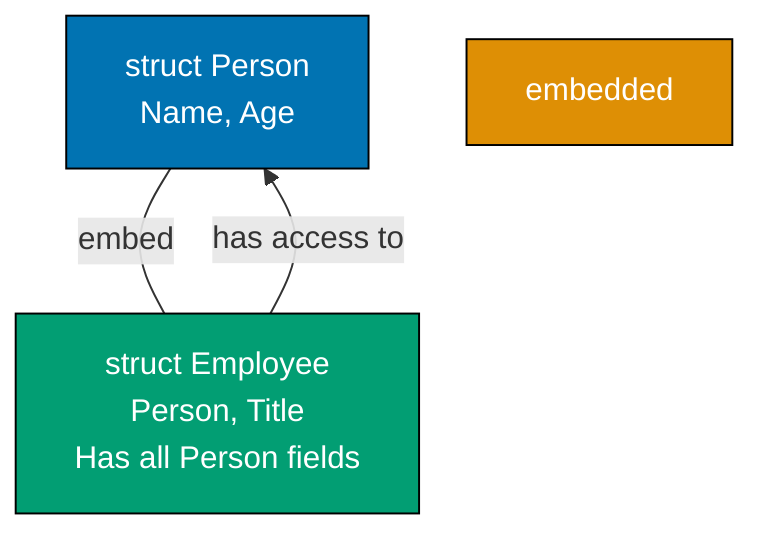

**Code**:

```go
package main

import "fmt"

func main() {
    // Create Employee with embedded Person
    emp := Employee{
        Person: Person{Name: "Alice", Age: 30}, // => Person is embedded type, must be named in initialization
        Title:  "Engineer",                      // => Employee's own field
    }                                            // => emp is Employee{Person: Person{Name: "Alice", Age: 30}, Title: "Engineer"}

    // Access embedded fields directly (field promotion)
    fmt.Println(emp.Name)    // => Output: Alice (emp.Name promoted from emp.Person.Name)
    fmt.Println(emp.Title)   // => Output: Engineer (emp's own field)
    fmt.Println(emp.Age)     // => Output: 30 (emp.Age promoted from emp.Person.Age)

    // Call embedded methods (method promotion)
    emp.Describe()           // => Calls Person.Describe() on embedded Person
                             // => Output: Alice is 30 years old

    // Explicit access to embedded type
    fmt.Println(emp.Person.Name) // => Output: Alice (explicit access, same as emp.Name)
    fmt.Println(emp.Person.Age)  // => Output: 30 (explicit access, same as emp.Age)

    // Modify embedded field
    emp.Name = "Bob"         // => Sets emp.Person.Name = "Bob"
    emp.Age = 35             // => Sets emp.Person.Age = 35
    emp.Describe()           // => Output: Bob is 35 years old

    // Embedded type is a value, not a pointer - changes don't affect original
    p := Person{Name: "Charlie", Age: 40}
    emp2 := Employee{Person: p, Title: "Manager"}
    emp2.Name = "David"      // => Changes emp2.Person.Name, NOT p.Name
    fmt.Println(p.Name)      // => Output: Charlie (p unchanged)
    fmt.Println(emp2.Name)   // => Output: David (emp2.Person.Name changed)
}

// Person type definition
type Person struct {
    Name string              // => Person's name field
    Age  int                 // => Person's age field
}

// Person method - available on Person and promoted to Employee
func (p Person) Describe() { // => Method receiver is Person (value receiver)
    fmt.Printf("%s is %d years old\n", p.Name, p.Age)
    // => Formats and prints description
    // => Example output: Alice is 30 years old
}

// Employee embeds Person - gets all Person fields and methods
type Employee struct {
    Person // => Embedded field (anonymous field) - all Person fields/methods promoted to Employee
           // => Employee now has Name, Age (from Person) and Title (own field)
    Title  string // => Employee's own field
}
```

**Key Takeaway**: Embedding promotes fields and methods of embedded types to the outer type. This composition pattern is more flexible than inheritance - a type can embed multiple types, and you can override methods by defining them on the outer type.

**Why It Matters**: Type embedding powers composition over inheritance in production Go, where embedding interface types (io.Reader, io.Writer) makes structs automatically satisfy those interfaces. This enables building complex types from simple components without brittle inheritance hierarchies, the pattern used throughout the stdlib (bufio.ReadWriter embeds bufio.Reader and bufio.Writer). Composition makes code flexible and testable by enabling interface-based dependency injection.

### Example 17: Custom Error Types

While `error` interface only needs an `Error()` method, custom error types let you attach extra information. Implementing the `error` interface and using error wrapping enables sophisticated error handling patterns.

**Code**:

```go
package main

import (
    "errors"
    "fmt"
)

func main() {
    // Custom error with additional context
    err := performOperation()              // => err is *OperationError (implements error interface)
    if err != nil {                        // => err is not nil, error occurred
        // Type assertion to extract custom error type
        var opErr *OperationError          // => Declare variable of custom error type
        if errors.As(err, &opErr) {        // => errors.As extracts underlying type into opErr
            // => opErr now points to the actual *OperationError
            fmt.Printf("Operation failed: %s (Code: %d)\n", opErr.Message, opErr.Code)
            // => Output: Operation failed: invalid input (Code: 400)

            // Access custom fields
            if opErr.Code >= 400 && opErr.Code < 500 {
                fmt.Println("  Category: Client error")
                // => Output:   Category: Client error
            }
        }
    }

    // Error wrapping preserves error chain
    err = divideWithWrapping(10, 0)        // => err wraps ErrDivisionByZero
    if err != nil {                        // => err is not nil
        fmt.Println("Wrapped error:", err)
        // => Output: Wrapped error: division failed: cannot divide by zero

        // errors.Unwrap extracts wrapped error
        original := errors.Unwrap(err)     // => original is ErrDivisionByZero
        fmt.Println("Original:", original)
        // => Output: Original: cannot divide by zero

        // Check if error chain contains specific error
        if errors.Is(err, ErrDivisionByZero) {
            // => errors.Is walks error chain to find ErrDivisionByZero
            fmt.Println("Detected division by zero error")
            // => Output: Detected division by zero error
        }
    }

    // Multiple error wrapping layers
    err = topLevelOperation()              // => err wraps multiple layers
    if err != nil {
        fmt.Println("\nMulti-layer error:", err)
        // => Output: Multi-layer error: top operation failed: division failed: cannot divide by zero

        // errors.Is still finds ErrDivisionByZero through all layers
        if errors.Is(err, ErrDivisionByZero) {
            fmt.Println("Root cause: division by zero")
            // => Output: Root cause: division by zero
        }
    }
}

// Custom error type implementing error interface
type OperationError struct {
    Message string               // => Human-readable error message
    Code    int                  // => HTTP-style error code (400, 500, etc.)
}

// Error() method satisfies error interface (must return string)
func (e *OperationError) Error() string {
    // => Pointer receiver (*OperationError) allows errors.As to match both value and pointer
    return fmt.Sprintf("operation error: %s", e.Message)
}

// performOperation returns custom error type
func performOperation() error {
    // => Returns *OperationError as error interface
    return &OperationError{
        Message: "invalid input",    // => Custom error with context
        Code:    400,                // => Client error code
    }
}

// Sentinel error - predefined error value for comparison
var ErrDivisionByZero = errors.New("cannot divide by zero")
// => Global error variable, use errors.Is() to check for this specific error

func divideWithWrapping(a, b int) error {
    if b == 0 {
        // => %w verb wraps error, preserving it in error chain
        return fmt.Errorf("division failed: %w", ErrDivisionByZero)
        // => Returns error that wraps ErrDivisionByZero
    }
    return nil                       // => No error
}

func topLevelOperation() error {
    err := divideWithWrapping(10, 0) // => err wraps ErrDivisionByZero
    if err != nil {
        // => Wrap again, creating multi-layer error chain
        return fmt.Errorf("top operation failed: %w", err)
    }
    return nil
}
```

**Key Takeaway**: Implement `Error()` method to create custom error types. Use `errors.As()` to check error type and extract additional context. `fmt.Errorf` with `%w` wraps errors, preserving the chain for `errors.Unwrap()`.

**Why It Matters**: Custom error types enable rich context for debugging production failures, where standard errors (`errors.New()`) provide only messages while custom types attach stack traces, request IDs, error codes, and structured fields. Error wrapping with `fmt.Errorf("%w", err)` creates error chains that `errors.Is()` and `errors.As()` navigate, enabling error classification (temporary vs permanent, retryable vs fatal) essential for robust retry logic and observability.

### Example 18: JSON Handling

JSON is ubiquitous in Go APIs. The `encoding/json` package marshals (structs to JSON) and unmarshals (JSON to structs). Struct tags control JSON field mapping - critical for API compatibility when Go field names don't match JSON field names.

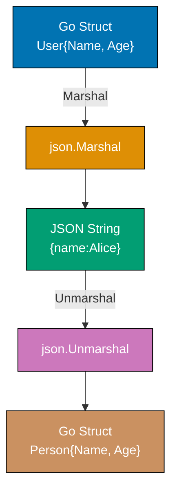

**Code**:

```go
package main

import (
    "encoding/json"
    "fmt"
)

func main() {
    // Marshal - Go struct to JSON string
    user := User{
        Name: "Alice",                 // => User.Name is exported (capital N)
        Age:  30,                      // => User.Age is exported (capital A)
        Email: "alice@example.com",    // => User.Email is exported (capital E)
    }                                  // => user is User{Name: "Alice", Age: 30, Email: "alice@example.com"}

    jsonBytes, err := json.Marshal(user) // => json.Marshal serializes struct to JSON bytes
    // => Marshal only serializes exported (capitalized) fields
    if err != nil {                      // => Check for marshal errors
        fmt.Println("Marshal error:", err)
        return
    }
    fmt.Println(string(jsonBytes))
    // => Output: {"Name":"Alice","Age":30,"Email":"alice@example.com"}
    // => JSON field names match Go field names (capitalized)

    // Unmarshal - JSON string to Go struct
    jsonStr := `{"name":"Bob","age":25,"email":"bob@example.com"}` // => JSON with lowercase field names
    var person Person                    // => person is zero value Person{Name: "", Age: 0, Email: ""}
    err = json.Unmarshal([]byte(jsonStr), &person) // => Unmarshal requires pointer to modify person
    // => json.Unmarshal uses struct tags to map JSON fields to Go fields
    if err != nil {                      // => Check for unmarshal errors
        fmt.Println("Unmarshal error:", err)
        return
    }
    fmt.Println(person)
    // => Output: {Bob 25 bob@example.com}
    // => person is now Person{Name: "Bob", Age: 25, Email: "bob@example.com"}

    // Custom type with different JSON representation
    apiResponse := APIResponse{
        Status: 200,                     // => APIResponse.Status = 200
        Data:   person,                  // => APIResponse.Data = person (Person struct)
    }                                    // => apiResponse is APIResponse{Status: 200, Data: Person{...}}

    responseJSON, _ := json.MarshalIndent(apiResponse, "", "  ")
    // => json.MarshalIndent pretty-prints JSON with indentation
    // => "" prefix for each line, "  " indentation (2 spaces)
    fmt.Println(string(responseJSON))
    // => Output: {
    //            "status": 200,
    //            "data": {
    //              "name": "Bob",
    //              "age": 25,
    //              "email": "bob@example.com"
    //            }
    //          }

    // Handling unknown fields
    unknownJSON := `{"name":"Charlie","age":28,"unknown":"ignored"}`
    var person2 Person
    err = json.Unmarshal([]byte(unknownJSON), &person2)
    // => Unknown fields ("unknown") are silently ignored during unmarshal
    if err != nil {
        fmt.Println("Unmarshal error:", err)
    }
    fmt.Println(person2)
    // => Output: {Charlie 28 }
    // => person2 is Person{Name: "Charlie", Age: 28, Email: ""}
}

// User - field names must be capitalized for json.Marshal to see them
type User struct {
    Name  string                       // => Exported field, marshals to JSON as "Name"
    Age   int                          // => Exported field, marshals to JSON as "Age"
    Email string                       // => Exported field, marshals to JSON as "Email"
}

// Person - struct tags control JSON mapping
type Person struct {
    Name  string `json:"name"`          // => Maps Go field "Name" to JSON field "name"
    Age   int    `json:"age"`           // => Maps Go field "Age" to JSON field "age"
    Email string `json:"email"`         // => Maps Go field "Email" to JSON field "email"
}

type APIResponse struct {
    Status int         `json:"status"`            // => Maps "Status" to "status" in JSON
    Data   Person      `json:"data"`              // => Maps "Data" to "data" in JSON
    // => Nested Person struct will be marshaled with its own tags
}
```

**Key Takeaway**: Struct tags control JSON field mapping - essential when Go names differ from JSON names. Struct field names must be capitalized for JSON encoding. Use `json.Marshal()` for compact JSON and `json.MarshalIndent()` for pretty-printed JSON.

## Group 2: Concurrency Basics

**Why It Matters**: JSON handling is ubiquitous in production Go for REST APIs, configuration files, and message queues. Struct tags control marshaling behavior (field names, omitempty for optional fields, custom types), eliminating manual serialization code. Understanding `json.Marshal()` vs `json.Encoder` (streaming for HTTP responses) and custom MarshalJSON() for complex types is essential for building APIs that consume/produce JSON correctly and efficiently.

### Example 19: Goroutines

Goroutines are lightweight threads managed by the Go runtime. Unlike OS threads, thousands of goroutines can run concurrently without overwhelming system resources. The `go` keyword starts a goroutine that runs concurrently with code that follows.

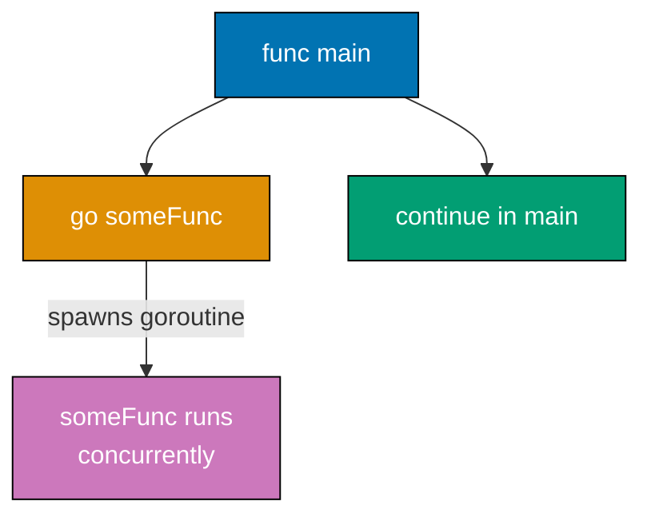

**Code**:

```go
package main

import (
    "fmt"
    "time"
)

func main() {
    // Start goroutine with go keyword
    go printNumbers()        // => Spawns new goroutine running printNumbers()
    // => Main goroutine continues immediately WITHOUT waiting
    // => printNumbers runs concurrently with main

    // Main continues while goroutine runs
    fmt.Println("Main continues immediately")
    // => Output: Main continues immediately (printed before goroutine finishes)

    // Wait for goroutine to finish (crude synchronization)
    time.Sleep(1 * time.Second) // => Sleeps main goroutine for 1 second
    // => Gives printNumbers goroutine time to complete
    // => In production, use WaitGroups or channels (see Example 22)
    fmt.Println("Main done")

    // => Typical output (order may vary due to concurrency):
    // => Main continues immediately
    // => Number: 0
    // => Number: 1
    // => Number: 2
    // => Main done

    // Multiple goroutines with closure pitfall
    fmt.Println("\nMultiple goroutines:")
    for i := 0; i < 3; i++ {
        go func(id int) { // => Anonymous function takes id parameter
            // => CORRECT: id is function parameter, each goroutine gets its own copy
            fmt.Printf("Goroutine %d running\n", id)
        }(i)              // => Pass i as argument to goroutine function
        // => i is copied to id at goroutine creation time
    }
    // => Output order is non-deterministic (goroutines execute concurrently)
    // => Possible output: "Goroutine 2", "Goroutine 0", "Goroutine 1"

    time.Sleep(100 * time.Millisecond) // => Wait for all goroutines to complete

    // PITFALL: Closure without parameter (WRONG - don't do this)
    fmt.Println("\nClosure pitfall (incorrect):")
    for i := 0; i < 3; i++ {
        go func() {
            // => WRONG: Captures i by reference, NOT by value
            // => All goroutines share the same i variable
            fmt.Printf("Goroutine %d (wrong)\n", i)
            // => Usually prints "Goroutine 3" multiple times (i = 3 after loop ends)
        }()
    }
    time.Sleep(100 * time.Millisecond)

    // Goroutine with return value (requires channel - see Example 20)
    resultChan := make(chan int)       // => Channel to receive result
    go func() {
        sum := 0
        for i := 1; i <= 5; i++ {
            sum += i                   // => sum is 1+2+3+4+5 = 15
        }
        resultChan <- sum              // => Send result to channel
    }()                                // => Goroutine starts immediately

    result := <-resultChan             // => Receive result from channel (blocks until sent)
    fmt.Printf("\nSum from goroutine: %d\n", result)
    // => Output: Sum from goroutine: 15
}

func printNumbers() {
    for i := 0; i < 3; i++ {
        fmt.Printf("Number: %d\n", i)  // => Prints to stdout
        time.Sleep(100 * time.Millisecond) // => Simulate work
    }                                  // => After loop, goroutine exits
}
```

**Key Takeaway**: `go func()` spawns a goroutine that runs concurrently. The main function doesn't wait for goroutines - you must synchronize with `time.Sleep()`, channels, or `sync.WaitGroup`. When passing loop variables to goroutines, pass as arguments to avoid closure pitfalls.

**Why It Matters**: Goroutines enable lightweight concurrency, where launching 10,000 goroutines uses ~20MB memory (2KB stack each) vs 10GB for equivalent threads (1MB stack). The `go` keyword makes concurrent programming simple - no thread pools, no executor services, just spawn and go. This powers Go's killer feature: writing concurrent code that looks sequential, enabling high-throughput network services (HTTP servers, proxies, load balancers) without callback hell.

### Example 20: Channels

Channels enable safe communication between goroutines. Send data on one end, receive on the other. Unbuffered channels synchronize goroutines - a send blocks until a receive happens. Buffered channels decouple send and receive.

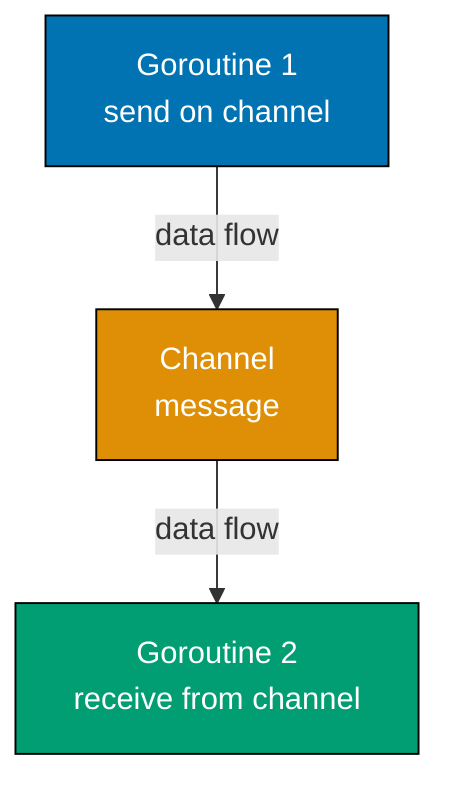

**Code**:

```go
package main

import (
    "fmt"
)

func main() {
    // Unbuffered channel - synchronizes sender and receiver
    messages := make(chan string) // => make(chan T) creates unbuffered channel
    // => Unbuffered means capacity is 0
    // => Send blocks until receiver ready, receive blocks until sender ready

    go func() {
        messages <- "Hello from goroutine" // => Send blocks until main goroutine receives
        // => After send completes, goroutine exits
    }()                           // => Goroutine starts executing immediately

    msg := <-messages             // => Receive blocks until goroutine sends
    // => msg is "Hello from goroutine" (type: string)
    fmt.Println(msg)
    // => Output: Hello from goroutine

    // Buffered channel - send doesn't block until buffer full
    buffered := make(chan int, 2) // => make(chan T, N) creates channel with buffer capacity N
    // => buffered has capacity 2, can hold 2 values before blocking
    // => len(buffered) is 0, cap(buffered) is 2

    buffered <- 1                 // => Send 1 (doesn't block, buffer has space)
    // => len(buffered) is now 1, cap(buffered) still 2
    buffered <- 2                 // => Send 2 (doesn't block, buffer now full)
    // => len(buffered) is now 2, cap(buffered) still 2
    // buffered <- 3              // => This would DEADLOCK (buffer full, no receiver)
    // => Sends to full buffered channel block until receiver consumes

    val1 := <-buffered            // => Receive 1 (buffer now has space)
    fmt.Println(val1)             // => Output: 1
    // => len(buffered) is now 1
    val2 := <-buffered            // => Receive 2 (buffer now empty)
    fmt.Println(val2)             // => Output: 2
    // => len(buffered) is now 0

    // Range over channel - iterate until close
    results := make(chan int)     // => Unbuffered channel
    go func() {
        results <- 10             // => Send 10 (blocks until received)
        results <- 20             // => Send 20 (blocks until received)
        results <- 30             // => Send 30 (blocks until received)
        close(results)            // => Close channel (signals no more values)
        // => After close, receives return zero value and closed status
        // => Cannot send on closed channel (panic)
    }()

    for value := range results {  // => range receives from channel until closed
        // => value is 10, then 20, then 30
        fmt.Println(value)
    }                             // => Loop exits when channel closed
    // => Output: 10 20 30

    // Checking if channel is closed
    data := make(chan int, 1)
    data <- 42                    // => Send 42
    close(data)                   // => Close channel

    val, ok := <-data             // => Receive with "comma ok" idiom
    // => val is 42, ok is true (value was sent before close)
    fmt.Printf("Value: %d, Open: %t\n", val, ok)
    // => Output: Value: 42, Open: true

    val, ok = <-data              // => Receive again after close
    // => val is 0 (zero value for int), ok is false (channel closed)
    fmt.Printf("Value: %d, Open: %t\n", val, ok)
    // => Output: Value: 0, Open: false

    // Nil channel - sends and receives block forever
    var nilChan chan int          // => nilChan is nil (uninitialized channel)
    // => Sending/receiving on nil channel blocks forever (useful in select)
    // nilChan <- 1                // => Would block forever (deadlock)
    // <-nilChan                   // => Would block forever (deadlock)
}
```

**Key Takeaway**: Unbuffered channels synchronize goroutines - sends block until receives. Buffered channels decouple send/receive by buffering values. Always `close()` channels when done to signal completion. Use `range` to iterate until channel closes.

**Why It Matters**: Channels provide type-safe communication between goroutines, eliminating the race conditions and deadlocks that plague shared-memory concurrency. Unbuffered channels synchronize goroutines (sender blocks until receiver ready), while buffered channels decouple producers/consumers. The `range` over channels and `close()` signal completion, enabling pipeline patterns that compose concurrent stages cleanly, the foundation of Go's concurrency model.

### Example 21: Channel Select

The `select` statement lets a goroutine wait on multiple channel operations. It's like a `switch` for channels - whichever channel is ready executes first. This pattern enables timeouts and handling multiple concurrent operations.

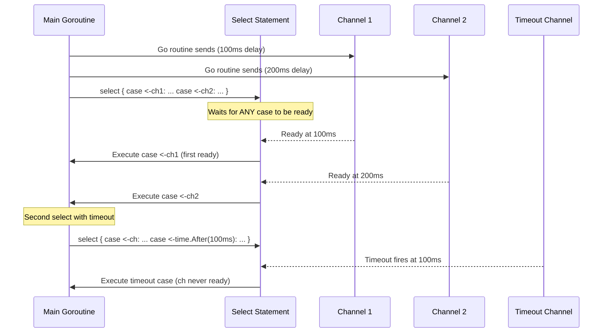

**Code**:

```go
package main

import (
    "fmt"
    "time"
)

func main() {
    // Select between two channels
    ch1 := make(chan string)           // => Unbuffered channel 1
    ch2 := make(chan string)           // => Unbuffered channel 2

    go func() {
        time.Sleep(100 * time.Millisecond) // => Simulate work
        ch1 <- "from channel 1"        // => Send after 100ms delay
        // => This send blocks until select receives
    }()

    go func() {
        time.Sleep(200 * time.Millisecond) // => Simulate longer work
        ch2 <- "from channel 2"        // => Send after 200ms delay
    }()

    // Wait for either channel (select blocks until one is ready)
    for i := 0; i < 2; i++ {           // => Loop twice to receive from both channels
        select {                       // => select waits for ANY case to be ready
        case msg1 := <-ch1:            // => If ch1 has data, receive it
            fmt.Println("Received:", msg1)
            // => First iteration: msg1 is "from channel 1" (ch1 ready at 100ms)
        case msg2 := <-ch2:            // => If ch2 has data, receive it
            fmt.Println("Received:", msg2)
            // => Second iteration: msg2 is "from channel 2" (ch2 ready at 200ms)
        }
        // => select executes whichever case is ready first
    }
    // => Output: Received: from channel 1
    // =>         Received: from channel 2

    // Select with timeout pattern
    timeoutCh := make(chan string)     // => Channel that never receives
    select {
    case msg := <-timeoutCh:           // => Wait for message
        fmt.Println("Got message:", msg)
    case <-time.After(100 * time.Millisecond): // => time.After returns channel that sends after duration
        // => time.After(100ms) sends on returned channel after 100ms
        fmt.Println("Timeout - no message received")
    }
    // => Output: Timeout - no message received (timeoutCh never sends)

    // Default case - non-blocking receive
    results := make(chan int)          // => Empty channel
    select {
    case result := <-results:          // => Try to receive
        fmt.Println("Got result:", result)
    default:                           // => Executes IMMEDIATELY if no other case ready
        // => default makes select non-blocking
        fmt.Println("No result available")
    }
    // => Output: No result available (results is empty, default executes)

    // Select with send operations
    data := make(chan int, 1)          // => Buffered channel, capacity 1
    select {
    case data <- 42:                   // => Try to send (succeeds, buffer has space)
        fmt.Println("Sent 42")
    default:
        fmt.Println("Channel full")
    }
    // => Output: Sent 42

    select {
    case data <- 99:                   // => Try to send (fails, buffer full)
        fmt.Println("Sent 99")
    default:                           // => Executes because send would block
        fmt.Println("Channel full")
    }
    // => Output: Channel full

    // Select blocks until ANY case is ready
    // If multiple cases ready simultaneously, select chooses randomly
    ready1 := make(chan int, 1)
    ready2 := make(chan int, 1)
    ready1 <- 1                        // => Both channels have data
    ready2 := 2

    select {
    case v := <-ready1:                // => Both cases ready
        fmt.Println("Got from ready1:", v)
    case v := <-ready2:                // => Both cases ready
        fmt.Println("Got from ready2:", v)
    }
    // => Output: randomly "Got from ready1: 1" OR "Got from ready2: 2"
}
```

**Key Takeaway**: `select` waits for multiple channels. Use with `time.After()` for timeouts. The `default` case makes select non-blocking - useful for checking if work is available without blocking.

**Why It Matters**: Select enables multiplexing multiple channel operations, powering timeouts, cancellation, and fan-in patterns essential for production services. The `select` with `time.After()` implements timeouts (critical for network operations), `select` with `ctx.Done()` enables graceful shutdown, and `select` with multiple channels merges concurrent results. Understanding select is mandatory for writing robust concurrent Go code that handles timeouts and cancellation correctly.

### Example 22: WaitGroups and Sync

Coordinating multiple goroutines requires synchronization. `sync.WaitGroup` is the standard pattern - increment a counter for each goroutine, decrement when done, and wait for all to finish. Mutexes protect shared data from race conditions.

**Code**:

```go
package main

import (
    "fmt"
    "sync"
)

func main() {
    // WaitGroup - coordinate multiple goroutines
    var wg sync.WaitGroup // => WaitGroup is counter for active goroutines
    // => wg internal counter starts at 0

    for i := 0; i < 3; i++ {
        wg.Add(1)          // => Increment counter by 1 (now counter = i+1)
        // => MUST call Add() before spawning goroutine
        go func(id int) {
            defer wg.Done() // => Decrement counter when goroutine completes
            // => defer ensures Done() called even if goroutine panics
            fmt.Printf("Worker %d processing\n", id)
            time.Sleep(100 * time.Millisecond) // => Simulate work
        }(i)               // => Pass i as argument (avoids closure pitfall)
    }                      // => After loop: wg counter is 3, 3 goroutines running

    wg.Wait()              // => Block until counter reaches 0 (all Done() called)
    fmt.Println("All workers complete")
    // => Output (order may vary):
    // => Worker 0 processing
    // => Worker 1 processing
    // => Worker 2 processing
    // => All workers complete

    // Mutex - protect shared data from race conditions
    var mu sync.Mutex      // => Mutex provides mutual exclusion lock
    var counter int        // => Shared variable (accessed by multiple goroutines)
    var wg2 sync.WaitGroup

    for i := 0; i < 5; i++ {
        wg2.Add(1)         // => Add 1 to wg2 counter
        go func() {
            defer wg2.Done()
            mu.Lock()       // => Acquire exclusive lock (blocks if another goroutine holds lock)
            // => Only ONE goroutine can hold lock at a time
            counter++       // => Safely modify counter (no race condition)
            // => Without mutex, counter++ would be racy (lost updates)
            mu.Unlock()     // => Release lock (other goroutines can now acquire)
        }()
    }

    wg2.Wait()             // => Wait for all 5 goroutines to complete
    fmt.Println("Counter:", counter) // => Output: Counter: 5 (all increments preserved)

    // RWMutex - multiple readers OR single writer
    var rwmu sync.RWMutex  // => RWMutex allows concurrent reads, exclusive writes
    var data = "initial"   // => Shared data
    // => RWMutex has two lock modes: RLock (read) and Lock (write)

    // Multiple readers can run concurrently
    var wg3 sync.WaitGroup
    for i := 0; i < 3; i++ {
        wg3.Add(1)
        go func(id int) {
            defer wg3.Done()
            rwmu.RLock()    // => Acquire READ lock (multiple readers allowed concurrently)
            // => RLock does NOT block other RLock calls
            // => RLock DOES block Lock calls (writer must wait)
            fmt.Printf("Reader %d: %s\n", id, data)
            time.Sleep(10 * time.Millisecond) // => Hold read lock briefly
            rwmu.RUnlock()  // => Release read lock
        }(i)
    }

    wg3.Wait()             // => Wait for all readers to complete
    // => Output (order may vary, all readers run concurrently):
    // => Reader 0: initial
    // => Reader 1: initial
    // => Reader 2: initial

    // Writer with RWMutex
    var wg4 sync.WaitGroup
    wg4.Add(1)
    go func() {
        defer wg4.Done()
        rwmu.Lock()        // => Acquire WRITE lock (exclusive, blocks all other locks)
        // => Lock blocks until all RLocks released
        // => Lock blocks other Lock and RLock calls
        data = "updated"   // => Safely modify data
        rwmu.Unlock()      // => Release write lock
    }()

    wg4.Wait()
    fmt.Println("Data after write:", data) // => Output: Data after write: updated

    // CRITICAL: WaitGroup counter must never go negative
    // var badWg sync.WaitGroup
    // badWg.Done()       // => PANIC: negative WaitGroup counter (Done called before Add)
}
```

**Key Takeaway**: Use `sync.WaitGroup` to wait for multiple goroutines. Call `Add(1)` before spawning, `Done()` when complete, and `Wait()` to block until all finish. Use `sync.Mutex` to protect shared data - `Lock()` before accessing, `Unlock()` after. Use `sync.RWMutex` when you have many readers and few writers.

## Group 3: I/O and File Handling

**Why It Matters**: WaitGroups and Mutexes are the synchronization primitives for managing goroutine lifetimes and shared state. WaitGroup.Wait() ensures all spawned goroutines complete before proceeding (critical for graceful shutdown), while Mutex protects shared data from concurrent access (preventing data races). RWMutex optimizes read-heavy workloads (multiple readers, single writer). Misuse causes deadlocks or data corruption, making these fundamentals for concurrent Go.

### Example 23: File I/O

File operations are fundamental. Go provides multiple layers: low-level (`os` package), buffered (`bufio`), and convenience functions. The `defer file.Close()` pattern ensures files close even if errors occur.

**Code**:

```go
package main

import (
    "bufio"
    "fmt"
    "os"
)

func main() {
    // Write to file
    filename := "/tmp/test.txt"      // => File path
    file, err := os.Create(filename) // => Create file (truncates if exists)
    // => Returns *os.File and error
    if err != nil {                  // => Check if creation failed
        fmt.Println("Error creating file:", err)
        return
    }
    defer file.Close()               // => defer ensures file closed when function exits
    // => CRITICAL: Always defer file.Close() to prevent resource leaks

    // Write data to file
    n, err := file.WriteString("Line 1\n")    // => Write string, returns bytes written
    // => n is 7 (len("Line 1\n"))
    if err != nil {
        fmt.Println("Write error:", err)
    }
    file.WriteString("Line 2\n")     // => Write another line
    // => File now contains "Line 1\nLine 2\n"

    // Read entire file into memory
    data, err := os.ReadFile(filename) // => Read all bytes at once
    // => data is []byte containing entire file contents
    if err != nil {
        fmt.Println("Error reading file:", err)
        return
    }
    fmt.Println("File contents:")
    fmt.Println(string(data))        // => Convert []byte to string
    // => Output:
    // => File contents:
    // => Line 1
    // => Line 2

    // Read line by line (buffered, memory efficient)
    file, err = os.Open(filename)    // => Open file for reading
    // => Returns *os.File (read-only mode)
    if err != nil {
        fmt.Println("Error opening file:", err)
        return
    }
    defer file.Close()               // => Close when done

    scanner := bufio.NewScanner(file) // => Create scanner (buffers reads)
    // => scanner reads file in chunks, not all at once
    lineNum := 0
    for scanner.Scan() {              // => Read next line, returns false at EOF
        line := scanner.Text()        // => Get current line (without \n)
        lineNum++
        fmt.Printf("Read line %d: %s\n", lineNum, line)
    }
    // => Output:
    // => Read line 1: Line 1
    // => Read line 2: Line 2

    if err := scanner.Err(); err != nil { // => Check for scanner errors
        fmt.Println("Scanner error:", err)
    }

    // File info (metadata)
    info, err := os.Stat(filename)   // => Get file info without opening
    // => Returns FileInfo interface
    if err != nil {
        fmt.Println("Error getting info:", err)
        return
    }
    fmt.Printf("File name: %s\n", info.Name())     // => Base name
    fmt.Printf("File size: %d bytes\n", info.Size()) // => Size in bytes
    fmt.Printf("Modified: %v\n", info.ModTime())   // => Last modification time
    fmt.Printf("Is directory: %t\n", info.IsDir()) // => false (it's a file)
    fmt.Printf("Permissions: %v\n", info.Mode())   // => File mode (permissions)

    // Append to file
    appendFile, err := os.OpenFile(filename, os.O_APPEND|os.O_WRONLY, 0644)
    // => Open with append flag (writes go to end of file)
    if err != nil {
        fmt.Println("Error opening for append:", err)
        return
    }
    defer appendFile.Close()

    appendFile.WriteString("Line 3\n") // => Appends to end of file
    // => File now contains "Line 1\nLine 2\nLine 3\n"
}
```

**Key Takeaway**: Use `os.Create()` to write, `os.ReadFile()` to read entire file, `os.Open()` with `bufio.Scanner` for line-by-line reading. Always `defer file.Close()` to ensure cleanup.

**Why It Matters**: File I/O with proper error handling and resource cleanup is essential for production reliability, where defer file.Close() prevents file descriptor leaks that exhaust system limits (typically 1024 open files). Understanding `os.Open()` vs `os.Create()` vs `os.OpenFile()` for different file modes, and using `bufio.Scanner` for line-by-line reading, enables processing configuration files, logs, and data without loading entire files into memory.

### Example 24: HTTP Client

Making HTTP requests is essential for API integration. The `net/http` package provides client functionality. Customize requests with headers, timeouts, and query parameters. Always check response status codes.

**Code**:

```go
package main

import (
    "fmt"
    "io"
    "net/http"
    "time"
)

func main() {
    // Simple GET request with default client
    resp, err := http.Get("https://api.example.com/users") // => http.Get uses default client
    // => Returns *http.Response and error
    if err != nil {                      // => Check for network/DNS errors
        fmt.Println("Error:", err)
        return
    }
    defer resp.Body.Close()              // => CRITICAL: Always close response body to prevent leaks
    // => Body is io.ReadCloser, must be closed manually

    // Read response body
    body, err := io.ReadAll(resp.Body)   // => Read all bytes from body
    // => body is []byte containing response content
    if err != nil {
        fmt.Println("Read error:", err)
        return
    }
    fmt.Println("Status:", resp.Status)  // => resp.Status is "200 OK" (string)
    fmt.Println("Status Code:", resp.StatusCode) // => resp.StatusCode is 200 (int)
    fmt.Println("Body:", string(body))   // => Convert []byte to string

    // Custom client with timeout
    client := &http.Client{
        Timeout: 5 * time.Second,        // => Overall request timeout (includes connection, read, etc.)
        // => If request takes > 5s, client.Do returns timeout error
    }

    // Create custom request with headers
    req, err := http.NewRequest("GET", "https://api.example.com/users", nil)
    // => Creates GET request, nil body (GET requests typically have no body)
    if err != nil {
        fmt.Println("Request creation error:", err)
        return
    }

    req.Header.Add("Authorization", "Bearer token123") // => Add authorization header
    req.Header.Add("Content-Type", "application/json") // => Add content type
    req.Header.Set("User-Agent", "MyApp/1.0")          // => Set user agent (replaces existing)
    // => req.Header is http.Header (map[string][]string)

    resp, err = client.Do(req)           // => Execute request with custom client
    if err != nil {                      // => Check for timeout or network errors
        fmt.Println("Error:", err)
        return
    }
    defer resp.Body.Close()

    // Check status code
    if resp.StatusCode == http.StatusOK { // => http.StatusOK is constant 200
        fmt.Println("Request successful")
    } else if resp.StatusCode >= 400 {   // => 4xx or 5xx indicates error
        fmt.Printf("Request failed with status: %d\n", resp.StatusCode)
    }

    // Query parameters
    baseURL := "https://api.example.com/search"
    params := url.Values{}               // => url.Values is map[string][]string
    params.Add("q", "golang")            // => Add query parameter
    params.Add("limit", "10")
    fullURL := baseURL + "?" + params.Encode()
    // => fullURL is "https://api.example.com/search?q=golang&limit=10"
    // => params.Encode() properly escapes values

    req2, _ := http.NewRequest("GET", fullURL, nil)
    resp2, err := client.Do(req2)
    if err != nil {
        fmt.Println("Error:", err)
        return
    }
    defer resp2.Body.Close()
}
```

**Key Takeaway**: Use `http.Get()` for simple requests. Use `http.Client` with custom `Timeout` for control. Always `defer resp.Body.Close()` to avoid resource leaks. Check response status codes - successful responses are 200-299.

**Why It Matters**: HTTP clients with timeouts prevent requests from hanging indefinitely, where setting `Client.Timeout` or using `context.WithTimeout()` protects services from slow/unresponsive dependencies. Production Go services always configure timeouts (connection timeout, request timeout, idle connection timeout) to maintain responsiveness under failure. Understanding connection pooling (`http.Transport.MaxIdleConns`) optimizes throughput for high-volume HTTP clients calling external APIs.

### Example 25: HTTP Server

Go's standard library includes HTTP server capabilities. Handler functions or types can handle requests. Multiplexing routes maps URL paths to handlers. Understanding request/response flow is essential for building APIs.

**Code**:

```go
package main

import (
    "fmt"
    "io"
    "net/http"
)

func main() {
    // Create router (multiplexer)
    mux := http.NewServeMux()            // => ServeMux routes requests to handlers
    // => mux matches request URL to registered patterns

    // Register handler function
    mux.HandleFunc("/", homeHandler)     // => HandleFunc wraps function as Handler
    // => "/" matches all paths (default/fallback)
    mux.HandleFunc("/users", usersHandler)
    // => "/users" matches exactly "/users"
    mux.Handle("/data", &DataHandler{})  // => Handle registers Handler interface implementor
    // => DataHandler must implement ServeHTTP method

    // Start HTTP server
    fmt.Println("Server listening on :8080")
    err := http.ListenAndServe(":8080", mux) // => Blocks listening on port 8080
    // => mux is the handler (routes to registered handlers)
    if err != nil {                      // => Returns error if server fails to start
        fmt.Println("Error:", err)
    }
}

// Handler function - receives ResponseWriter and Request
func homeHandler(w http.ResponseWriter, r *http.Request) {
    // => w is ResponseWriter interface (writes response)
    // => r is *Request (contains request data)

    // Read request body
    body, err := io.ReadAll(r.Body)      // => Read all bytes from request body
    if err != nil {
        http.Error(w, "Bad Request", http.StatusBadRequest) // => Send error response
        return
    }
    defer r.Body.Close()                 // => Close body when done

    // Access request information
    fmt.Printf("Method: %s\n", r.Method) // => r.Method is "GET", "POST", etc.
    fmt.Printf("URL: %s\n", r.URL.Path)  // => r.URL.Path is "/", r.URL.RawQuery has params
    fmt.Printf("Headers: %v\n", r.Header) // => r.Header is map[string][]string

    // Write response
    fmt.Fprintf(w, "Hello from home! Method: %s, Body: %s\n", r.Method, string(body))
    // => Writes to ResponseWriter, sent to client
}

// Handler function with JSON response
func usersHandler(w http.ResponseWriter, r *http.Request) {
    // Set response headers BEFORE writing body
    w.Header().Set("Content-Type", "application/json") // => Set content type header
    // => w.Header() is http.Header (map[string][]string)
    w.WriteHeader(http.StatusOK)         // => Set status code (must be before Write)
    // => Default status is 200 if not set explicitly

    // Check request method
    if r.Method == http.MethodPost {     // => http.MethodPost is constant "POST"
        fmt.Fprint(w, `{"status": "user created"}`) // => Write JSON string
    } else if r.Method == http.MethodGet {
        fmt.Fprint(w, `{"users": [{"id": 1}, {"id": 2}]}`)
    } else {
        // Method not allowed
        w.WriteHeader(http.StatusMethodNotAllowed)
        fmt.Fprint(w, `{"error": "method not allowed"}`)
    }
}

// Handler type - implements Handler interface
type DataHandler struct{}

// ServeHTTP makes DataHandler satisfy http.Handler interface
func (h *DataHandler) ServeHTTP(w http.ResponseWriter, r *http.Request) {
    // => This method is called when request matches "/data"
    // => Any type with ServeHTTP(ResponseWriter, *Request) is a Handler

    // Access query parameters
    queryParams := r.URL.Query()         // => Returns url.Values (map[string][]string)
    filter := queryParams.Get("filter")  // => Get first value of "filter" param
    // => Example: "/data?filter=active" sets filter to "active"

    response := fmt.Sprintf("Data response with filter: %s", filter)
    fmt.Fprint(w, response)              // => Write response
}
```

**Key Takeaway**: Register handlers with `HandleFunc` (for functions) or `Handle` (for types). Handler functions receive `ResponseWriter` and `*Request`. Use `w.Write()` or `w.WriteString()` to send responses. Set headers and status codes before writing the body.

## Group 4: Standard Library Deep Dive

**Why It Matters**: HTTP servers are Go's most common production use case (microservices, APIs, web applications), where `http.HandleFunc()` registers route handlers and `http.ListenAndServe()` starts the server. Understanding `http.ResponseWriter` and `http.Request` is mandatory for building RESTful APIs. The stdlib server is production-ready (used by Google, Uber, Cloudflare) with built-in HTTP/2, TLS, and timeouts, requiring no external dependencies for most use cases.

### Example 26: Time and Duration

Time handling is complex across programming languages. Go's `time` package makes it straightforward with `time.Time` values, `time.Duration` for intervals, and format strings for parsing/formatting.

**Code**:

```go
package main

import (
    "fmt"
    "time"
)

func main() {
    // Current time
    now := time.Now()               // => Get current time (local timezone)
    fmt.Println("Now:", now)        // => Output: 2025-12-30 10:30:45.123456789 +0700 WIB
    // => now is time.Time value (not pointer)

    // Time arithmetic with Duration
    tomorrow := now.Add(24 * time.Hour) // => Add 24 hours (24 * time.Hour = 24h duration)
    // => time.Hour is constant (1 hour duration)
    fmt.Println("Tomorrow:", tomorrow)
    // => Output: 2025-12-31 10:30:45.123456789 +0700 WIB

    yesterday := now.Add(-24 * time.Hour) // => Subtract 24 hours (negative duration)
    fmt.Println("Yesterday:", yesterday)

    oneWeekLater := now.AddDate(0, 0, 7) // => Add years, months, days
    // => AddDate(0, 0, 7) adds 7 days (handles month boundaries correctly)
    fmt.Println("One week later:", oneWeekLater)

    // Parse time from string
    layout := "2006-01-02"          // => Go reference time: Mon Jan 2 15:04:05 MST 2006
    // => Use this exact date/time in layout (it's how Go knows format)
    parsed, err := time.Parse(layout, "2025-12-23") // => Parse string to time.Time
    if err != nil {
        fmt.Println("Parse error:", err)
    }
    fmt.Println("Parsed:", parsed)  // => Output: 2025-12-23 00:00:00 +0000 UTC

    // Format time to string
    formatted := now.Format("January 2, 2006") // => Format using layout
    fmt.Println("Formatted:", formatted)        // => Output: December 30, 2025
    formatted2 := now.Format("2006-01-02 15:04:05") // => Custom format
    fmt.Println("Formatted2:", formatted2)          // => Output: 2025-12-30 10:30:45

    // Duration measurement
    start := time.Now()             // => Capture start time
    time.Sleep(100 * time.Millisecond) // => Sleep for 100ms
    elapsed := time.Since(start)    // => Calculate time.Duration since start
    // => elapsed is ~100ms (slightly more due to overhead)
    fmt.Printf("Elapsed: %v\n", elapsed)            // => Output: Elapsed: 100.234567ms
    fmt.Printf("Elapsed (ms): %d\n", elapsed.Milliseconds()) // => Output: Elapsed (ms): 100

    // Compare times
    future := now.Add(1 * time.Hour)
    if future.After(now) {          // => Check if future is after now
        fmt.Println("Future is after now")
    }
    if now.Before(future) {         // => Check if now is before future
        fmt.Println("Now is before future")
    }

    // Timer - one-shot notification
    timer := time.NewTimer(200 * time.Millisecond) // => Create timer (fires after 200ms)
    // => timer.C is channel that receives time when timer fires
    <-timer.C                       // => Block until timer fires (receive from timer.C)
    fmt.Println("Timer fired")      // => Output: Timer fired (after ~200ms)

    // Ticker - repeating notifications
    ticker := time.NewTicker(100 * time.Millisecond) // => Create ticker (fires every 100ms)
    // => ticker.C is channel that receives time every 100ms
    go func() {
        for i := 0; i < 3; i++ {
            t := <-ticker.C         // => Receive from ticker.C (blocks until tick)
            // => t is time.Time when tick occurred
            fmt.Printf("Tick %d at %s\n", i, t.Format("15:04:05.000"))
        }
        ticker.Stop()               // => Stop ticker (prevents goroutine leak)
        // => After Stop(), no more sends on ticker.C
    }()

    time.Sleep(400 * time.Millisecond) // => Wait for goroutine to finish
    // => Output:
    // => Tick 0 at 10:30:45.100
    // => Tick 1 at 10:30:45.200
    // => Tick 2 at 10:30:45.300
}
```

**Key Takeaway**: `time.Now()` gets current time. Use `time.Duration` for intervals. Format strings use the reference time "Mon Jan 2 15:04:05 MST 2006" (remember as "2006-01-02 15:04:05"). `time.Timer` fires once, `time.Ticker` fires repeatedly.

**Why It Matters**: Time and Duration types prevent common date/time bugs through strong typing, where `time.Parse()` handles timezone conversions and `time.Since()` calculates elapsed time correctly. Duration arithmetic (time.Now().Add(5\*time.Minute)) is type-safe and readable. This is critical for production features like rate limiting (tokens per duration), caching (TTL expiration), and SLO monitoring (request latencies, timeout thresholds) where incorrect time handling causes subtle bugs.

### Example 27: Regular Expressions

Regular expressions enable pattern matching. Go's `regexp` package compiles patterns and provides matching/replacing functions. Precompile expensive patterns to avoid recompilation.

**Code**:

```go
package main

import (
    "fmt"
    "regexp"
)

func main() {
    // Compile pattern (returns error)
    pattern, err := regexp.Compile(`^[a-z]+@[a-z]+\.[a-z]+$`) // => Compile regex pattern
    // => pattern is *regexp.Regexp, err is error
    if err != nil {
        fmt.Println("Compile error:", err)
        return
    }

    // Test if string matches pattern
    if pattern.MatchString("alice@example.com") { // => Returns bool
        // => "alice@example.com" matches ^[a-z]+@[a-z]+\.[a-z]+$
        fmt.Println("Valid email")
    }
    if !pattern.MatchString("Alice@example.com") {
        // => "Alice@example.com" does NOT match (capital A not in [a-z])
        fmt.Println("Invalid email (uppercase)")
    }

    // MustCompile panics on error (use for known-good patterns)
    re := regexp.MustCompile(`\d+`)  // => Compile pattern, panic if invalid
    // => `\d+` matches one or more digits
    matches := re.FindAllString("abc 123 def 456 xyz", -1)
    // => FindAllString returns []string, -1 means find all matches
    // => matches is ["123", "456"]
    fmt.Println("Numbers:", matches) // => Output: Numbers: [123 456]

    // Replace matches
    text := "Hello World"
    replaced := regexp.MustCompile(`\w+`).ReplaceAllString(text, "[word]")
    // => `\w+` matches one or more word characters
    // => Replaces each match with "[word]"
    fmt.Println("Replaced:", replaced) // => Output: Replaced: [word] [word]

    // Replace with function
    replaced2 := regexp.MustCompile(`\d+`).ReplaceAllStringFunc("The answer is 42", func(s string) string {
        // => Called for each match (s is matched string)
        num, _ := strconv.Atoi(s)    // => Convert string to int
        return fmt.Sprintf("%d", num*2) // => Double the number
    })
    fmt.Println("Replaced2:", replaced2) // => Output: Replaced2: The answer is 84

    // Extract capture groups
    re = regexp.MustCompile(`(\w+)@(\w+)\.(\w+)`) // => Pattern with 3 capture groups ()
    // => (\w+) captures username, (\w+) captures domain, (\w+) captures TLD
    matches = re.FindStringSubmatch("alice@example.com")
    // => FindStringSubmatch returns []string with full match + capture groups
    if len(matches) > 0 {
        fmt.Println("Full:", matches[0])   // => matches[0] is full match: alice@example.com
        fmt.Println("User:", matches[1])   // => matches[1] is first capture group: alice
        fmt.Println("Domain:", matches[2]) // => matches[2] is second capture group: example
        fmt.Println("TLD:", matches[3])    // => matches[3] is third capture group: com
    }

    // Find all with capture groups
    re2 := regexp.MustCompile(`(\d+):(\d+)`) // => Pattern: number:number
    allMatches := re2.FindAllStringSubmatch("10:30 and 14:45", -1)
    // => Returns [][]string, each []string has full match + capture groups
    for i, match := range allMatches {
        // => First iteration: match is ["10:30", "10", "30"]
        // => Second iteration: match is ["14:45", "14", "45"]
        fmt.Printf("Match %d: %s (hour: %s, minute: %s)\n", i, match[0], match[1], match[2])
    }
    // => Output:
    // => Match 0: 10:30 (hour: 10, minute: 30)
    // => Match 1: 14:45 (hour: 14, minute: 45)

    // Named capture groups
    re3 := regexp.MustCompile(`(?P<year>\d{4})-(?P<month>\d{2})-(?P<day>\d{2})`)
    // => (?P<name>pattern) creates named capture group
    match := re3.FindStringSubmatch("Date: 2025-12-30")
    if match != nil {
        // Extract by index
        fmt.Println("Year:", match[1], "Month:", match[2], "Day:", match[3])
        // => Output: Year: 2025 Month: 12 Day: 30

        // Extract by name
        names := re3.SubexpNames()   // => ["", "year", "month", "day"]
        result := make(map[string]string)
        for i, name := range names {
            if i > 0 && name != "" {
                result[name] = match[i]
            }
        }
        fmt.Println("Named groups:", result)
        // => Output: Named groups: map[day:30 month:12 year:2025]
    }
}
```

**Key Takeaway**: Use `regexp.MustCompile()` for patterns known at compile-time. Use `regexp.Compile()` for runtime patterns (returns error). Precompile patterns used repeatedly. Use capture groups `()` to extract parts of matches.

**Why It Matters**: Regular expressions power input validation (email, phone, URLs), log parsing, and text transformation in production systems. Compiling regexes once with `regexp.MustCompile()` at package init avoids repeated compilation overhead. Named capture groups extract structured data from unstructured text (parsing log lines into fields), while `ReplaceAllString()` enables text transformation. Go's regex engine prevents ReDoS attacks through linear time guarantees, unlike PCRE.

### Example 28: Context Package

The `context` package manages deadlines, cancellation, and request-scoped values. It's essential for building responsive systems that can be cancelled and respect timeouts. Context flows through function calls to coordinate cancellation.

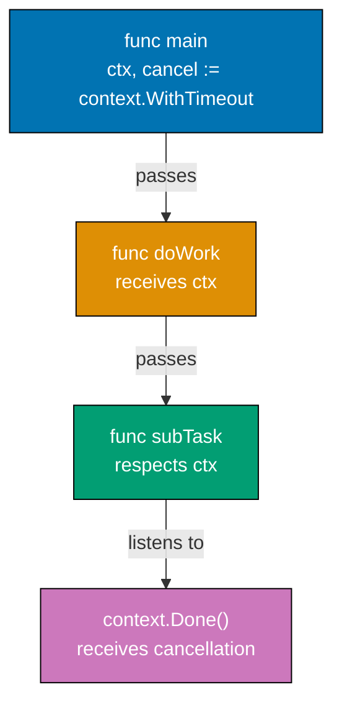

**Code**:

```go
package main

import (
    "context"
    "fmt"
    "time"
)

func main() {
    // Context with timeout - operation must complete within duration
    ctx, cancel := context.WithTimeout(context.Background(), 2*time.Second)
    // => ctx is context.Context with 2-second deadline
    // => cancel is function to cancel context early
    defer cancel()                  // => CRITICAL: Always defer cancel() to release resources
    // => defer ensures cancel called even if function panics

    result := doWork(ctx)           // => Pass context to doWork
    fmt.Println("Result:", result)  // => Output: Result: cancelled (timeout after 2s)

    // Context with manual cancellation
    ctx2, cancel2 := context.WithCancel(context.Background())
    // => ctx2 has no deadline, only manual cancellation
    // => cancel2 is function to cancel ctx2

    go func() {
        time.Sleep(500 * time.Millisecond) // => Wait 500ms
        cancel2()                   // => Cancel context manually
        // => Causes ctx2.Done() channel to close
    }()

    doWork(ctx2)                    // => doWork checks ctx2.Done()
    fmt.Println("After cancellation") // => Output: After cancellation

    // Context with deadline - cancel at specific time
    deadline := time.Now().Add(1 * time.Second)
    ctx3, cancel3 := context.WithDeadline(context.Background(), deadline)
    // => ctx3 expires at specific time (not relative duration)
    defer cancel3()

    <-ctx3.Done()                   // => Block until deadline
    fmt.Println("Deadline reached:", ctx3.Err())
    // => Output: Deadline reached: context deadline exceeded

    // Context values (use sparingly for request-scoped data)
    type contextKey string          // => Define typed key (avoids collisions)
    key := contextKey("user_id")
    ctx4 := context.WithValue(context.Background(), key, 123)
    // => ctx4 carries value 123 associated with key "user_id"
    // => Context values are immutable, each WithValue creates new context

    userID := ctx4.Value(key)       // => Retrieve value by key
    // => userID is interface{}, type assert to get actual value
    if id, ok := userID.(int); ok { // => Type assertion
        fmt.Println("User ID:", id) // => Output: User ID: 123
    }

    // Context chaining - child contexts inherit parent cancellation
    parentCtx, parentCancel := context.WithCancel(context.Background())
    childCtx, childCancel := context.WithTimeout(parentCtx, 5*time.Second)
    // => childCtx cancelled when: (1) parentCtx cancelled, OR (2) 5s timeout
    defer childCancel()

    parentCancel()                  // => Cancel parent
    // => This also cancels childCtx (and any other children)
    <-childCtx.Done()
    fmt.Println("Child cancelled:", childCtx.Err())
    // => Output: Child cancelled: context canceled (parent cancellation)
}

func doWork(ctx context.Context) string {
    // => ctx is passed down call chain to enable cancellation
    for {
        select {
        case <-ctx.Done():          // => ctx.Done() is channel that closes when context cancelled
            // => Receiving from closed channel returns immediately
            err := ctx.Err()        // => ctx.Err() returns cancellation reason
            // => err is context.Canceled (manual cancel) or context.DeadlineExceeded (timeout)
            fmt.Println("Work cancelled:", err)
            return "cancelled"
        case <-time.After(500 * time.Millisecond):
            // => Simulate work every 500ms
            fmt.Println("Working...")
        }
    }
    // => Loop continues until ctx.Done() fires
}
```

**Key Takeaway**: `context.Background()` is the root context. `WithTimeout()` creates a context with deadline. `WithCancel()` creates a cancellable context. Always `defer cancel()` to avoid leaking goroutines. Listen to `ctx.Done()` to receive cancellation signals.

**Why It Matters**: Context propagates cancellation signals and request-scoped values across function boundaries, enabling graceful shutdown when HTTP requests are cancelled or exceed deadlines. Every production Go HTTP handler should accept context and pass it to downstream operations (database queries, HTTP calls, goroutines), ensuring resource cleanup when clients disconnect. Context prevents goroutine leaks and orphaned work, critical for service stability under load.

### Example 29: Flag Parsing

Command-line flags enable configurable programs. Go's `flag` package parses flags automatically, extracting values into variables. Useful for scripts and tools that need configuration from command-line arguments.

**Code**:

```go
package main

import (
    "flag"
    "fmt"
)

func main() {
    // Define flags - returns pointers to values
    name := flag.String("name", "World", "Name to greet")
    // => flag.String creates string flag "-name", default "World", description "Name to greet"
    // => name is *string (pointer to string variable)
    count := flag.Int("count", 1, "Number of greetings")
    // => count is *int (pointer to int variable)
    verbose := flag.Bool("verbose", false, "Verbose mode")
    // => verbose is *bool (pointer to bool variable)

    // Alternative: bind flag to existing variable
    var port int
    flag.IntVar(&port, "port", 8080, "Port to listen on")
    // => Sets port variable directly (no pointer needed)

    flag.Parse()                   // => Parse os.Args[1:] to populate flag values
    // => MUST call Parse() before accessing flag values
    // => After Parse(), flag variables contain parsed values

    // Use parsed values (dereference pointers)
    for i := 0; i < *count; i++ {  // => *count dereferences pointer to get int value
        greeting := fmt.Sprintf("Hello, %s!", *name) // => *name dereferences to get string
        fmt.Println(greeting)
    }
    // => Example: -count 3 prints greeting 3 times

    if *verbose {                  // => *verbose dereferences to get bool value
        fmt.Println("Verbose mode enabled")
        fmt.Printf("  Name: %s\n", *name)
        fmt.Printf("  Count: %d\n", *count)
        fmt.Printf("  Port: %d\n", port) // => port is not pointer (used IntVar)
    }

    // Remaining positional arguments after flags
    args := flag.Args()            // => flag.Args() returns []string of non-flag args
    // => Example: cmd -name Alice file1.txt file2.txt => args is ["file1.txt", "file2.txt"]
    if len(args) > 0 {
        fmt.Println("Extra arguments:", args)
        fmt.Printf("  Number of args: %d\n", flag.NArg()) // => flag.NArg() is len(args)
    }

    // Check if specific flag was set
    flag.Visit(func(f *flag.Flag) {
        // => flag.Visit calls function for each flag SET by user
        fmt.Printf("Flag %s was set to %s\n", f.Name, f.Value)
    })

    // Iterate all flags (including defaults)
    flag.VisitAll(func(f *flag.Flag) {
        // => flag.VisitAll calls function for ALL flags (including defaults)
        fmt.Printf("All flag %s = %s (default: %s)\n", f.Name, f.Value, f.DefValue)
    })
}

// Usage examples:
// go run main.go
//   => Uses defaults: name="World", count=1, verbose=false, port=8080
//
// go run main.go -name Alice -count 3 -verbose
//   => Output:
//   => Hello, Alice!
//   => Hello, Alice!
//   => Hello, Alice!
//   => Verbose mode enabled
//   =>   Name: Alice
//   =>   Count: 3
//   =>   Port: 8080
//
// go run main.go -name Bob file1.txt file2.txt
//   => name="Bob", args=["file1.txt", "file2.txt"]
//
// go run main.go -help
//   => Prints flag usage (auto-generated from flag definitions)
```

**Key Takeaway**: Define flags with `flag.String()`, `flag.Int()`, `flag.Bool()`. Call `flag.Parse()` to extract values. Flag values are pointers - dereference with `*`. Use `flag.Args()` to get remaining non-flag arguments.

## Group 5: Production Patterns

**Why It Matters**: Flag parsing with the stdlib `flag` package builds CLI tools that follow Unix conventions (--help, -v for verbose), making Go programs feel native. Defining flags for configuration (host, port, debug mode) enables 12-factor app configuration without hardcoded values. This powers production deployment where service config comes from flags, environment variables, or config files, enabling different settings per environment (dev/staging/prod) without code changes.

### Example 30: HTTP Middleware Pattern

Middleware intercepts requests and responses, enabling cross-cutting concerns like logging, authentication, and error handling. Middleware wraps handlers with decorator pattern - each middleware can inspect requests and responses.

**Code**:

```go
package main

import (
    "fmt"
    "log"
    "net/http"
    "time"
)

func main() {
    mux := http.NewServeMux()        // => Create router

    // Build middleware chain (order matters!)
    handler := http.HandlerFunc(homeHandler) // => Convert function to http.Handler
    // => homeHandler is the core business logic
    handler = loggingMiddleware(handler)     // => Wrap with logging (outermost)
    // => loggingMiddleware wraps homeHandler, executes before/after
    handler = authMiddleware(handler)        // => Wrap with auth (middle)
    // => authMiddleware wraps logging, checks auth before proceeding
    handler = recoveryMiddleware(handler)    // => Wrap with recovery (innermost)
    // => recoveryMiddleware wraps auth, catches panics from entire chain

    // Execution order: recovery → auth → logging → homeHandler → logging → auth → recovery
    // Request flows: recovery (defer) → auth (check) → logging (start) → homeHandler → logging (complete)

    mux.Handle("/", handler)         // => Register wrapped handler
    http.ListenAndServe(":8080", mux) // => Start server
}

// Middleware function type signature: func(http.Handler) http.Handler
func loggingMiddleware(next http.Handler) http.Handler {
    // => next is the handler to call after this middleware
    return http.HandlerFunc(func(w http.ResponseWriter, r *http.Request) {
        // => This function wraps the next handler
        start := time.Now()          // => Capture start time
        log.Printf("Started %s %s", r.Method, r.RequestURI)
        // => Log request start

        next.ServeHTTP(w, r)         // => Call next handler in chain
        // => Execution blocks here until next handler completes

        duration := time.Since(start) // => Calculate duration
        log.Printf("Completed in %v", duration)
        // => Log request completion (after response sent)
    })
}

// Authentication middleware - checks authorization
func authMiddleware(next http.Handler) http.Handler {
    return http.HandlerFunc(func(w http.ResponseWriter, r *http.Request) {
        token := r.Header.Get("Authorization") // => Get Authorization header
        // => token is "" if header not present

        if token == "" {             // => No authorization header
            http.Error(w, "Unauthorized", http.StatusUnauthorized)
            // => Send 401 Unauthorized response
            return                   // => Short-circuit: Don't call next handler
            // => Request processing stops here
        }

        // Validate token (simplified - production checks JWT signature, expiry)
        if token != "Bearer valid-token" {
            http.Error(w, "Invalid token", http.StatusUnauthorized)
            return                   // => Short-circuit on invalid token
        }

        next.ServeHTTP(w, r)         // => Token valid, proceed to next handler
    })
}

// Recovery middleware - catch panics
func recoveryMiddleware(next http.Handler) http.Handler {
    return http.HandlerFunc(func(w http.ResponseWriter, r *http.Request) {
        defer func() {
            // => defer runs when function exits (even if panic occurs)
            if err := recover(); err != nil {
                // => recover() catches panic, returns panic value
                // => err is interface{} containing panic value
                log.Printf("Panic recovered: %v", err)
                // => Log panic for debugging
                http.Error(w, "Internal Server Error", http.StatusInternalServerError)
                // => Send 500 response to client (instead of crashing server)
            }
        }()                          // => defer statement must be before next.ServeHTTP

        next.ServeHTTP(w, r)         // => Call next handler (may panic)
        // => If next panics, defer func runs and recovers
    })
}

func homeHandler(w http.ResponseWriter, r *http.Request) {
    // => Final handler in chain (business logic)
    // => Only reached if recovery, auth, and logging all succeeded
    fmt.Fprint(w, "Hello, Authenticated User!")
    // => Send response
}
```

**Key Takeaway**: Middleware wraps handlers, executing code before and after the handler. Create middleware by returning a handler that calls `next.ServeHTTP()`. Chain multiple middleware for cross-cutting concerns like logging, auth, and error handling.

**Why It Matters**: Middleware patterns enable separation of concerns in HTTP servers, where logging, authentication, rate limiting, and CORS are middleware layers wrapping business logic. This architecture is ubiquitous in production Go services (Gorilla, Chi, Gin frameworks all use it), making code modular and testable. Understanding the wrapping pattern (each middleware returns a handler) and execution order (outermost middleware runs first) is essential for building scalable, maintainable HTTP services.

### Example 31: Graceful Shutdown

Production servers need graceful shutdown - stop accepting new requests, finish in-flight requests, clean up resources. Signal handling with `os/signal` enables responding to termination signals like SIGTERM.

**Code**:

```go
package main

import (
    "context"
    "fmt"
    "net/http"
    "os"
    "os/signal"
    "syscall"
    "time"
)

func main() {
    // Create HTTP server with configuration
    server := &http.Server{
        Addr:           ":8080",     // => Port to listen on
        Handler:        http.HandlerFunc(func(w http.ResponseWriter, r *http.Request) {
            time.Sleep(2 * time.Second) // => Simulate slow request (2s processing time)
            // => In-flight requests will complete during graceful shutdown
            fmt.Fprint(w, "Response")
        }),
        ReadTimeout:    10 * time.Second,  // => Timeout for reading request
        WriteTimeout:   10 * time.Second,  // => Timeout for writing response
        MaxHeaderBytes: 1 << 20,           // => Max header size (1MB)
    }

    // Start server in goroutine (non-blocking)
    go func() {
        fmt.Println("Starting server on :8080")
        if err := server.ListenAndServe(); err != nil && err != http.ErrServerClosed {
            // => ListenAndServe blocks until server stopped
            // => http.ErrServerClosed is expected during graceful shutdown (not an error)
            fmt.Printf("Server error: %v\n", err)
        }
    }()                              // => Server now running in background

    // Wait for interrupt signal (SIGTERM or SIGINT)
    sigChan := make(chan os.Signal, 1) // => Buffered channel (capacity 1)
    signal.Notify(sigChan, syscall.SIGTERM, syscall.SIGINT)
    // => signal.Notify sends signals to sigChan
    // => SIGTERM is graceful shutdown signal (kill PID)
    // => SIGINT is interrupt signal (Ctrl+C)

    <-sigChan                        // => Block until signal received
    // => When signal arrives, channel receives value and unblocks
    fmt.Println("\nShutdown signal received, gracefully stopping...")

    // Graceful shutdown with timeout context
    ctx, cancel := context.WithTimeout(context.Background(), 5*time.Second)
    // => ctx expires after 5 seconds (maximum time to wait for in-flight requests)
    defer cancel()                   // => Clean up context resources

    if err := server.Shutdown(ctx); err != nil {
        // => Shutdown stops accepting new connections
        // => Waits for in-flight requests to complete (up to ctx timeout)
        // => Returns error if shutdown takes longer than timeout
        fmt.Printf("Shutdown error: %v\n", err)
    }

    fmt.Println("Server stopped gracefully")
    // => All in-flight requests completed (or timeout reached)
}

// Production pattern: Graceful shutdown ensures:
// 1. Stop accepting new requests
// 2. Complete in-flight requests (up to timeout)
// 3. Close idle connections
// 4. Clean up resources
//
// Without graceful shutdown:
// - In-flight requests aborted mid-processing
// - Data corruption risk (partial writes)
// - Poor user experience (connection reset errors)
```

**Key Takeaway**: Use `signal.Notify()` to receive OS signals. Call `server.Shutdown(ctx)` with context timeout to gracefully stop. Graceful shutdown waits for in-flight requests to complete before stopping.

**Why It Matters**: Graceful shutdown prevents data loss and connection failures when deploying new service versions, where listening for OS signals (SIGTERM, SIGINT) triggers cleanup: stop accepting new requests, finish processing in-flight requests, close database connections, flush logs. Production Kubernetes sends SIGTERM before forcefully killing pods, giving services time to shut down cleanly. Proper shutdown prevents HTTP 502 errors, lost transactions, and corrupted state during rolling deployments.

### Example 32: Worker Pool Pattern

Worker pools limit concurrent work and improve resource efficiency. Fixed number of workers process jobs from a queue. Useful for API calls, database operations, or any bounded-resource work.

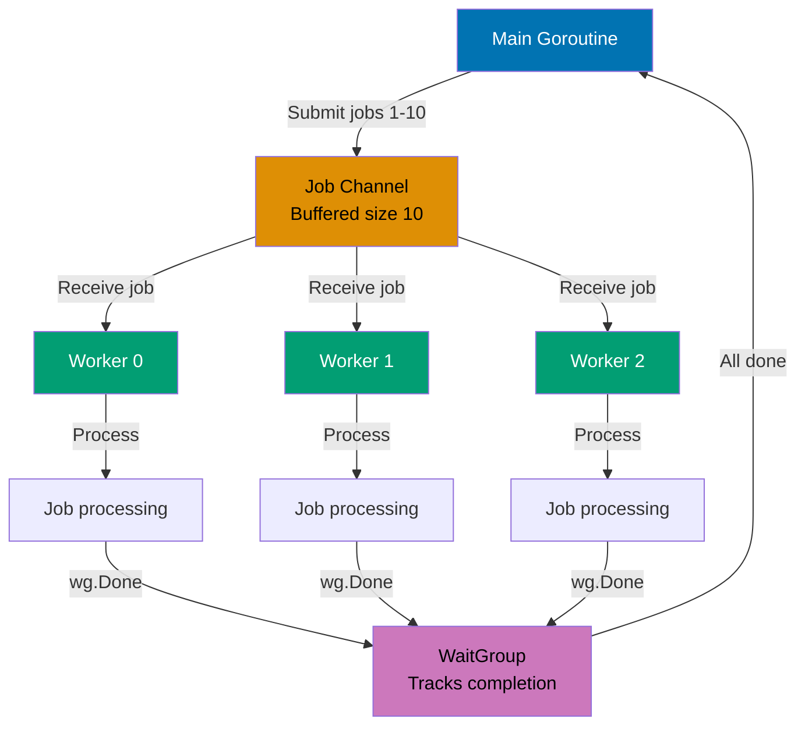

**Code**:

```go
package main

import (
    "fmt"
    "sync"
)

func main() {
    // Create worker pool with buffered job channel
    jobChan := make(chan int, 10)  // => Buffered channel holds up to 10 jobs
    // => Buffer decouples job submission from worker processing
    var wg sync.WaitGroup          // => Tracks job completion

    // Start fixed number of workers
    numWorkers := 3                // => Pool size: 3 concurrent workers
    for i := 0; i < numWorkers; i++ {
        go worker(i, jobChan, &wg) // => Spawn worker goroutine
        // => worker reads from jobChan until channel closed
    }                              // => 3 workers now running, waiting for jobs

    // Submit jobs to queue
    for j := 1; j <= 10; j++ {     // => 10 total jobs to process
        wg.Add(1)                  // => Increment counter before sending job
        // => CRITICAL: Add(1) before sending to avoid race
        jobChan <- j               // => Send job ID to channel
        // => Doesn't block (buffer has space for 10 jobs)
    }                              // => All 10 jobs queued

    wg.Wait()                      // => Block until all 10 jobs marked Done()
    // => After Wait() returns, all jobs completed
    close(jobChan)                 // => Close channel to signal no more jobs
    // => Workers' range loops will exit when channel closed
    fmt.Println("All jobs complete")
}

func worker(id int, jobs <-chan int, wg *sync.WaitGroup) {
    // => id is worker ID (0, 1, 2)
    // => jobs is receive-only channel (<-chan prevents sending)
    // => wg is pointer to shared WaitGroup
    for job := range jobs {        // => range receives until channel closed
        // => Blocks if no jobs available
        // => Multiple workers compete for jobs (first to receive gets it)
        fmt.Printf("Worker %d processing job %d\n", id, job)
        time.Sleep(100 * time.Millisecond) // => Simulate work
        wg.Done()                  // => Decrement WaitGroup counter
    }                              // => Loop exits when jobChan closed
    fmt.Printf("Worker %d shutting down\n", id)
}

// Worker pool pattern benefits:
// - Limits concurrency (prevents spawning unbounded goroutines)
// - Reuses goroutines (no goroutine creation overhead per job)
// - Buffered channel smooths bursts (job submission faster than processing)
// - Graceful shutdown (close channel, workers drain and exit)
```

**Key Takeaway**: Create a channel for jobs. Start fixed number of workers that receive from the channel. Send jobs to the channel. Workers process jobs concurrently, bounded by number of workers.

## Group 6: Advanced Testing

**Why It Matters**: Worker pools limit concurrent operations to prevent resource exhaustion, where processing 10,000 tasks doesn't spawn 10,000 goroutines (overwhelming CPU/memory). Instead, N worker goroutines (e.g., 10) pull tasks from a channel, providing bounded parallelism. This pattern is essential for production systems that process background jobs (image resizing, email sending, data imports) without overwhelming downstream services or exhausting database connection pools.

### Example 33: Benchmarking

Benchmarking measures performance. Go's `testing.B` type runs test functions multiple times to measure speed. Use benchmarks to catch performance regressions and optimize bottlenecks.

**Code**:

```go
package main

import "testing"

// Run benchmarks with: go test -bench=.
// => -bench=. runs all benchmarks (. is regex matching all)
// Memory allocation: go test -bench=. -benchmem
// => -benchmem includes memory allocation statistics

func BenchmarkSliceAppend(b *testing.B) {
    // => b is *testing.B (benchmark type)
    // => b.N is number of iterations (adjusted by framework for accurate timing)
    for i := 0; i < b.N; i++ { // => Loop b.N times (framework chooses N)
        // => Framework runs benchmark multiple times, adjusting b.N until stable timing
        s := make([]int, 0)    // => Create slice with length 0, capacity 0
        // => s is []int{} (empty slice)
        for j := 0; j < 100; j++ {
            s = append(s, j)    // => Append to slice (may reallocate)
            // => When len == cap, append allocates new array (capacity grows)
            // => Reallocation pattern: cap grows as 1, 2, 4, 8, 16, 32, 64, 128
        }                      // => After loop: s has 100 elements
        // => Total allocations: ~7-8 (each time capacity exceeded)
    }
    // => Output: BenchmarkSliceAppend-8   100000   1200 ns/op   1792 B/op   8 allocs/op
    // => 100000 iterations, 1200ns per operation, 1792 bytes allocated, 8 allocations
}

func BenchmarkSlicePrealloc(b *testing.B) {
    for i := 0; i < b.N; i++ { // => Loop b.N times
        s := make([]int, 0, 100) // => Create slice with length 0, capacity 100
        // => s is []int{} but has space for 100 elements (no reallocation needed)
        for j := 0; j < 100; j++ {
            s = append(s, j)    // => Append to slice (no reallocation, capacity sufficient)
            // => len grows from 0 to 100, cap stays 100
        }                      // => After loop: s has 100 elements
        // => Total allocations: 1 (only initial make)
    }
    // => Output: BenchmarkSlicePrealloc-8   500000   300 ns/op   896 B/op   1 allocs/op
    // => 4x faster than BenchmarkSliceAppend (fewer allocations)
}

func BenchmarkMapAccess(b *testing.B) {
    // Setup phase (not timed)
    m := make(map[string]int)  // => Create map
    for i := 0; i < 1000; i++ {
        m[fmt.Sprintf("key%d", i)] = i
        // => Populate map with 1000 entries (key0=0, key1=1, ..., key999=999)
    }                          // => m now has 1000 entries

    b.ResetTimer()             // => Reset timer (exclude setup time from benchmark)
    // => CRITICAL: ResetTimer() ensures setup cost not measured
    // => Timer starts fresh from this point

    for i := 0; i < b.N; i++ { // => Benchmark loop
        _ = m["key500"]        // => Map access (hash lookup + retrieval)
        // => Access middle key to avoid cache effects
        // => Result discarded with _ (prevents compiler optimization)
    }
    // => Output: BenchmarkMapAccess-8   50000000   25 ns/op   0 B/op   0 allocs/op
    // => 50 million iterations, 25ns per access, no allocations
}

// Memory allocation tracking
func BenchmarkAllocation(b *testing.B) {
    b.ReportAllocs()           // => Enable allocation reporting in output
    // => Without ReportAllocs(), allocation stats not shown

    for i := 0; i < b.N; i++ { // => Loop b.N times
        s := make([]int, 100)  // => Allocate slice with 100 elements
        // => Each iteration allocates 100 * 8 bytes = 800 bytes (int is 8 bytes on 64-bit)
        _ = s                  // => Use s to prevent compiler optimization
        // => Without this, compiler might eliminate allocation
    }
    // => Output: BenchmarkAllocation-8   5000000   280 ns/op   896 B/op   1 allocs/op
    // => 280ns per allocation, 896 bytes per op (includes overhead), 1 allocation
}

// Benchmark with subtests (different input sizes)
func BenchmarkStringConcat(b *testing.B) {
    sizes := []int{10, 100, 1000} // => Different input sizes to benchmark

    for _, size := range sizes {
        b.Run(fmt.Sprintf("size-%d", size), func(b *testing.B) {
            // => b.Run creates subtest (isolated timing)
            for i := 0; i < b.N; i++ {
                var result string
                for j := 0; j < size; j++ {
                    result += "x"  // => String concatenation (inefficient, creates new string each time)
                }
                _ = result
            }
        })
    }
    // => Output:
    // => BenchmarkStringConcat/size-10-8     1000000   1200 ns/op
    // => BenchmarkStringConcat/size-100-8    100000    12000 ns/op
    // => BenchmarkStringConcat/size-1000-8   10000     120000 ns/op
    // => O(n²) complexity visible in results
}
```

**Key Takeaway**: Benchmark functions named `BenchmarkXxx`. Loop from `0` to `b.N` - the testing framework adjusts N to get meaningful results. Use `b.ResetTimer()` to exclude setup time. Use `b.ReportAllocs()` to track allocations.

**Why It Matters**: Benchmarking with `go test -bench` provides objective performance data, where `b.N` runs the operation enough times to get stable measurements and `b.ReportAllocs()` tracks memory allocations. Production Go teams benchmark critical paths (JSON marshaling, database queries, cryptography) to detect performance regressions in CI. Understanding how to interpret ns/op (nanoseconds per operation) and allocs/op guides optimization decisions based on data, not guessing.

### Example 34: Examples as Tests

Example functions test code while also serving as documentation. When you run `go test`, examples execute. Output should match comments starting with `// Output:`. Go generates docs from examples.

**Code**:

```go
package main

import "fmt"

// Example functions must be in _test.go file
// => File must end with _test.go (e.g., math_test.go)
// => go test runs example functions and verifies output

func ExampleAdd() {
    // => Function name starts with "Example" (required)
    // => ExampleAdd documents the add() function
    result := add(2, 3)        // => Call function being documented
    // => result is 5 (2 + 3)
    fmt.Println(result)        // => Print result to stdout
    // Output: 5
    // => "// Output:" comment MUST match actual output exactly
    // => If output doesn't match, test fails
    // => This example appears in godoc for add() function
}

func ExampleGreet() {
    name := greet("Alice")     // => Call greet with "Alice"
    // => name is "Hello, Alice!"
    fmt.Println(name)          // => Print to stdout
    // Output: Hello, Alice!
    // => Expected output must match exactly (including punctuation, spacing)
}

// Example with multiple outputs
func ExampleMultiLine() {
    // => Example name doesn't match function (documents package generally)
    fmt.Println("Line 1")      // => First line of output
    fmt.Println("Line 2")      // => Second line of output
    fmt.Println("Line 3")      // => Third line of output
    // Output:
    // Line 1
    // Line 2
    // Line 3
    // => Multiline output: each line must match exactly
}

// Unordered output when order varies
func ExampleMapIteration() {
    // => Map iteration order is non-deterministic
    m := make(map[string]int)  // => Create map
    m["x"] = 1                 // => m["x"] = 1
    m["y"] = 2                 // => m["y"] = 2
    for k, v := range m {      // => Iterate map (order undefined)
        fmt.Printf("%s:%d ", k, v)
    }                          // => Output could be "x:1 y:2 " OR "y:2 x:1 "
    // Unordered output: x:1 y:2
    // => "Unordered output:" tells test framework to ignore order
    // => Test passes if output contains all expected elements (any order)
}

// Example with suffix (multiple examples for same function)
func ExampleAdd_negative() {
    // => ExampleAdd_negative documents add() with negative numbers
    // => Suffix after underscore distinguishes multiple examples
    result := add(-5, 3)       // => add(-5, 3) is -2
    fmt.Println(result)
    // Output: -2
}

func ExampleAdd_zero() {
    // => ExampleAdd_zero documents add() with zero
    result := add(0, 0)        // => add(0, 0) is 0
    fmt.Println(result)
    // Output: 0
}

// Example without output comment (still runs, but no verification)
func ExampleNoOutput() {
    // => Example without "// Output:" still executes (ensures it compiles and runs)
    // => Useful for demonstrating code that doesn't print
    _ = add(10, 20)            // => Runs but output not verified
    // => No output comment = test always passes (no assertion)
}

func add(a, b int) int {
    // => add returns sum of a and b
    return a + b               // => Returns a + b
}

func greet(name string) string {
    // => greet returns greeting string
    return fmt.Sprintf("Hello, %s!", name)
    // => Returns "Hello, {name}!"
}
```

**Key Takeaway**: Example functions start with `Example` and must have `// Output:` comments. The output after `// Output:` must match the function's output exactly. Use `// Unordered output:` when order is non-deterministic.

**Why It Matters**: Example tests serve as executable documentation that's always up-to-date, where `func ExampleFunc()` demonstrates API usage with verified output comments. These show up in godoc, making them perfect for teaching API consumers how to use your package. Unlike documentation that rots, example tests run in CI and fail if output doesn't match, ensuring examples stay correct as code evolves. Production libraries extensively use example tests for clear, testable documentation.

### Example 35: Test Coverage

Test coverage measures what percentage of code is executed by tests. While 100% coverage doesn't guarantee correctness, measuring coverage reveals untested code. Use `go test -cover` to see coverage percentage.

**Code**:

```go
package main

import (
    "testing"
)

func TestCoverage(t *testing.T) {
    // => t is *testing.T (test type)
    // Test normal case (positive number)
    result := processValue(10) // => Call processValue with positive number
    // => result is 20 (10 * 2)
    if result != 20 {          // => Assert result is 20
        t.Errorf("Expected 20, got %d", result)
        // => t.Errorf marks test as failed (continues running other tests)
    }                          // => This test case covers positive branch (line 1862)

    // Test zero case
    result = processValue(0)   // => Call processValue with 0
    // => result is 0 (zero branch returns 0)
    if result != 0 {           // => Assert result is 0
        t.Errorf("Expected 0, got %d", result)
    }                          // => This test case covers zero branch (line 1857)

    // Test negative case
    result = processValue(-5)  // => Call processValue with negative number
    // => result is -10 (-5 * 2)
    if result != -10 {         // => Assert result is -10
        t.Errorf("Expected -10, got %d", result)
    }                          // => This test case covers negative branch (line 1860)

    // All branches covered (100% coverage)
    // => Run: go test -cover
    // => Output: coverage: 100.0% of statements
    // => Run: go test -coverprofile=coverage.out
    // => Generates coverage.out file for detailed analysis
    // => Run: go tool cover -html=coverage.out
    // => Opens HTML view showing covered/uncovered lines
}

func processValue(x int) int {
    // => processValue doubles input, with special case for zero
    if x == 0 {
        return 0                  // => Line 1857: Covered by zero test case
        // => Returns immediately if input is 0
    }
    if x < 0 {
        return x * 2             // => Line 1860: Covered by negative test case
        // => Returns x * 2 for negative numbers
    }
    return x * 2                 // => Line 1862: Covered by positive test case
    // => Returns x * 2 for positive numbers
}

// Example of uncovered code
func processValueUncovered(x int) int {
    if x == 0 {
        return 0                  // => Covered
    }
    if x < 0 {
        return x * 2             // => Covered
    }
    if x > 100 {
        return x * 3             // => NOT COVERED (no test case for x > 100)
        // => Coverage report shows this line in red
    }
    return x * 2                 // => Covered
}
// => Running go test -cover shows < 100% coverage
// => Coverage report identifies untested branch (x > 100)

// Run: go test -cover
// Output: coverage: 100.0% of statements
```

**Key Takeaway**: Run `go test -cover` to see coverage percentage. Use `go test -coverprofile=coverage.out` to generate detailed reports. High coverage is good but doesn't replace thoughtful tests.

**Why It Matters**: Test coverage analysis with `go test -cover` identifies untested code paths, guiding test writing toward critical functions. While 100% coverage doesn't guarantee bug-free code, uncovered error paths and edge cases are bugs waiting to happen. Production teams track coverage trends (aiming for 70-80% on critical packages) and enforce coverage minimums in CI to maintain code quality. Coverage reports visualize which lines execute during tests, revealing dead code and missing test cases.

### Example 36: HTTP Middleware Chain (Production Pattern)

Middleware chains are essential in production HTTP services. They compose cross-cutting concerns (logging, authentication, rate limiting) by wrapping handlers. Each middleware can inspect/modify requests and responses, short-circuit the chain, or pass control to the next handler.

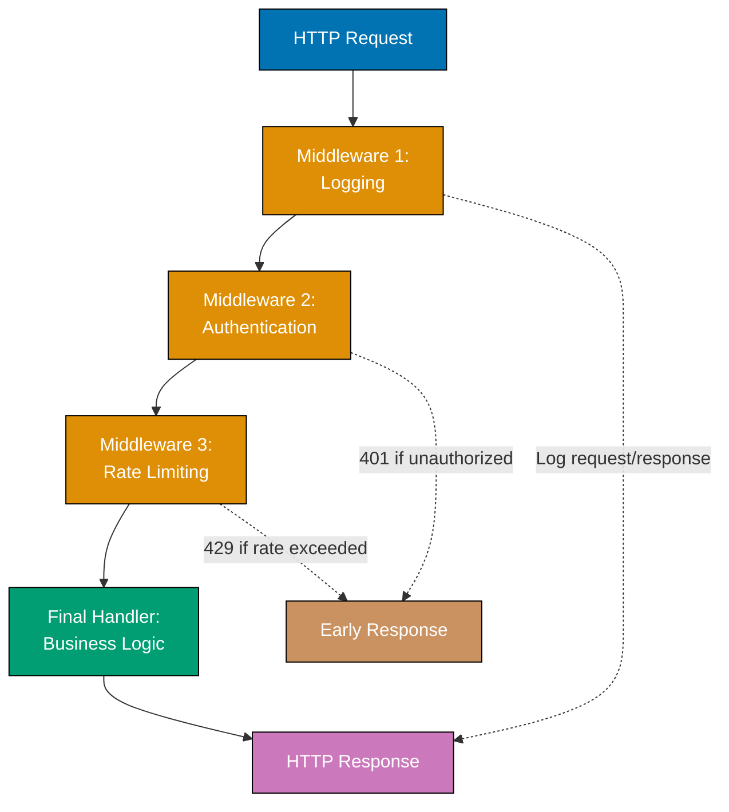

**Code**:

```go
package main

import (
    "fmt"
    "log"
    "net/http"
    "time"
)

func main() {
    // Build middleware chain - order matters!
    handler := http.HandlerFunc(businessHandler) // => Convert function to http.Handler
    // => businessHandler is the innermost handler (business logic)
    handler = loggingMiddleware(handler)        // => Wrap with logging (layer 1)
    // => loggingMiddleware wraps businessHandler
    handler = authMiddleware(handler)           // => Wrap with auth (layer 2)
    // => authMiddleware wraps loggingMiddleware
    handler = rateLimitMiddleware(handler)      // => Wrap with rate limiting (layer 3)
    // => rateLimitMiddleware wraps authMiddleware
    handler = recoveryMiddleware(handler)       // => Wrap with recovery (outermost layer 4)
    // => recoveryMiddleware wraps rateLimitMiddleware

    // Execution order: recovery → rateLimiting → auth → logging → business
    // Request flow: recovery (defer) → rate check → auth check → log start → business → log complete

    // Register handler
    mux := http.NewServeMux()    // => Create router
    mux.Handle("/api/data", handler) // => Register wrapped handler at /api/data
    // => All requests to /api/data flow through middleware chain

    // Start server
    fmt.Println("Server listening on :8080")
    http.ListenAndServe(":8080", mux) // => Start server (blocks)
}

// Middleware type - wraps http.Handler and returns http.Handler
type Middleware func(http.Handler) http.Handler

// 1. Logging Middleware - logs request/response details
func loggingMiddleware(next http.Handler) http.Handler {
    // => next is the handler to call after logging
    return http.HandlerFunc(func(w http.ResponseWriter, r *http.Request) {
        // => This function executes for each request
        start := time.Now()                     // => Capture start time
        // => start is time.Time (for duration calculation)

        // Create custom ResponseWriter to capture status code
        wrapped := &responseWriter{
            ResponseWriter: w,               // => Embed original ResponseWriter
            statusCode:     http.StatusOK,   // => Default 200 (if WriteHeader not called)
        }                                    // => wrapped intercepts WriteHeader calls

        log.Printf("[%s] %s %s - Started", r.Method, r.URL.Path, r.RemoteAddr)
        // => Log request start (method, path, client IP)
        // => Example: [GET] /api/data 192.168.1.1 - Started

        next.ServeHTTP(wrapped, r)           // => Call next handler (blocks until complete)
        // => Pass wrapped ResponseWriter (not original w)
        // => Allows capturing status code from handler

        duration := time.Since(start)        // => Calculate request duration
        log.Printf("[%s] %s %s - Completed %d in %v",
            r.Method, r.URL.Path, r.RemoteAddr, wrapped.statusCode, duration)
        // => Log completion (status code, duration)
        // => Example: [GET] /api/data 192.168.1.1 - Completed 200 in 45ms
    })
}

// Custom ResponseWriter to capture status code
type responseWriter struct {
    http.ResponseWriter                         // => Embed standard ResponseWriter
    // => Embedding promotes all ResponseWriter methods to responseWriter
    statusCode          int                     // => Captured status code
}

func (rw *responseWriter) WriteHeader(code int) {
    // => Override WriteHeader to intercept status code
    rw.statusCode = code                        // => Capture status code before passing through
    // => rw.statusCode now contains actual status (200, 404, 500, etc.)
    rw.ResponseWriter.WriteHeader(code)         // => Call original WriteHeader
    // => Delegates to embedded ResponseWriter
}

// 2. Authentication Middleware - validates auth token
func authMiddleware(next http.Handler) http.Handler {
    return http.HandlerFunc(func(w http.ResponseWriter, r *http.Request) {
        token := r.Header.Get("Authorization")  // => Extract Authorization header value
        // => token is "" if header not present
        // => Example: token = "Bearer abc123..."

        if token == "" {                     // => No auth header provided
            http.Error(w, "Missing Authorization header", http.StatusUnauthorized)
            // => Send 401 Unauthorized response
            return                           // => Short-circuit: don't call next handler
            // => Request processing stops here (middleware chain broken)
        }

        // Validate token (simplified - production checks JWT signature, expiry)
        if !isValidToken(token) {            // => Check if token is valid
            // => isValidToken returns false for invalid tokens
            http.Error(w, "Invalid token", http.StatusUnauthorized)
            // => Send 401 response with error message
            return                           // => Short-circuit on invalid token
        }

        // Token valid - add user info to request context
        // Production pattern:
        // ctx := context.WithValue(r.Context(), "user_id", extractUserID(token))
        // r = r.WithContext(ctx)
        // => Downstream handlers can access user_id from context
        // => ctx.Value("user_id") retrieves user_id

        next.ServeHTTP(w, r)                 // => Token valid, proceed to next handler
        // => Only reached if token validation succeeded
    })
}

func isValidToken(token string) bool {
    // Simplified validation - production checks JWT signature, expiry, revocation
    // Production:
    // - Parse JWT (json web token)
    // - Verify signature (RSA/HMAC)
    // - Check expiry (exp claim)
    // - Check issuer (iss claim)
    // - Verify audience (aud claim)
    return token == "Bearer valid-token-123"    // => Mock validation for example
    // => Returns true only for this specific token
}

// 3. Rate Limiting Middleware - prevent abuse
func rateLimitMiddleware(next http.Handler) http.Handler {
    // Simple in-memory rate limiter (production uses Redis/distributed cache)
    requests := make(map[string][]time.Time)    // => IP -> request timestamps

    return http.HandlerFunc(func(w http.ResponseWriter, r *http.Request) {
        ip := r.RemoteAddr                      // => Client IP

        now := time.Now()
        // Remove requests older than 1 minute
        var recent []time.Time
        for _, t := range requests[ip] {
            if now.Sub(t) < time.Minute {       // => Keep only recent requests
                recent = append(recent, t)
            }
        }

        // Check rate limit (10 requests per minute)
        if len(recent) >= 10 {
            http.Error(w, "Rate limit exceeded", http.StatusTooManyRequests)
            return                              // => Short-circuit: reject request
        }

        // Add this request to history
        requests[ip] = append(recent, now)

        next.ServeHTTP(w, r)                    // => Proceed to next handler
    })
}

// 4. Recovery Middleware - catch panics and return 500
func recoveryMiddleware(next http.Handler) http.Handler {
    return http.HandlerFunc(func(w http.ResponseWriter, r *http.Request) {
        defer func() {
            if err := recover(); err != nil {   // => Catch panic
                log.Printf("PANIC: %v", err)
                http.Error(w, "Internal Server Error", http.StatusInternalServerError)
            }
        }()

        next.ServeHTTP(w, r)                    // => Execute handler (may panic)
    })
}

// Final business logic handler
func businessHandler(w http.ResponseWriter, r *http.Request) {
    // This is where actual business logic lives
    // Middleware has already handled logging, auth, rate limiting, recovery

    w.Header().Set("Content-Type", "application/json")
    fmt.Fprint(w, `{"status": "success", "data": {"message": "Hello, authenticated user!"}}`)
}

// Alternative: Chainable middleware builder
func chain(handler http.Handler, middlewares ...Middleware) http.Handler {
    // Apply middlewares in reverse order
    for i := len(middlewares) - 1; i >= 0; i-- {
        handler = middlewares[i](handler)       // => Wrap handler with middleware
    }
    return handler
}

// Usage with chain builder:
// handler := chain(
//     http.HandlerFunc(businessHandler),
//     loggingMiddleware,
//     authMiddleware,
//     rateLimitMiddleware,
//     recoveryMiddleware,
// )
```

**Key Takeaway**: Middleware chains compose cross-cutting concerns by wrapping handlers. Each middleware can inspect/modify requests, short-circuit the chain (return early), or pass control to the next handler. Order matters - outermost middleware executes first. Production services use middleware for logging, auth, rate limiting, recovery, CORS, compression, and metrics.

**Why It Matters**: In production Go services, middleware chains are ubiquitous. They separate business logic from infrastructure concerns, making code modular and testable. Understanding the wrapping pattern (each middleware returns a handler that calls `next.ServeHTTP`) is essential for building scalable HTTP services. Popular frameworks (Gorilla, Chi, Echo) all use this pattern.

### Example 37: Context Cancellation Patterns

Context enables graceful cancellation of long-running operations. When a context is cancelled (due to timeout, deadline, or manual cancellation), all goroutines respecting that context should clean up and exit promptly.

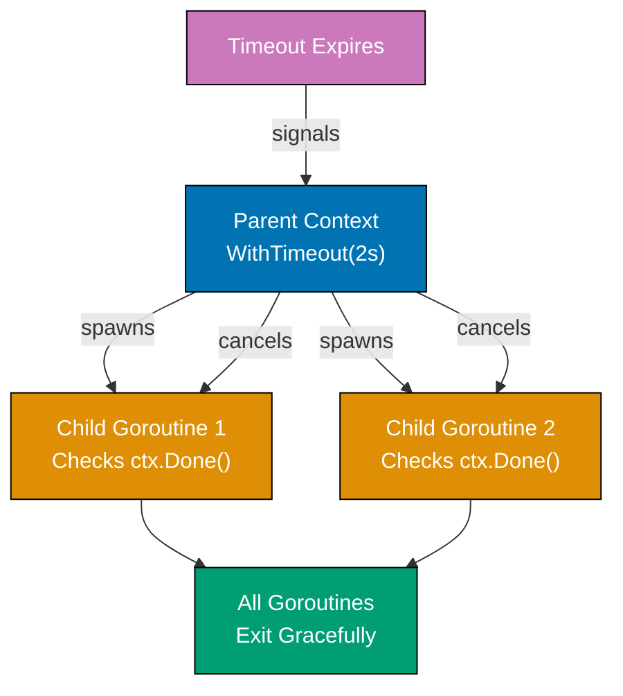

**Code**:

```go
package main

import (
    "context"
    "fmt"
    "time"
)

func main() {
    // Context with timeout - operation must complete within 2 seconds
    ctx, cancel := context.WithTimeout(context.Background(), 2*time.Second)
    // => ctx expires after 2 seconds (automatic cancellation)
    // => cancel is function to manually cancel before timeout
    defer cancel()                     // => CRITICAL: Always defer cancel() to prevent resource leaks
    // => Even if timeout occurs, cancel() must be called to release resources

    // Start long-running operation in goroutine
    result := make(chan string)        // => Channel to receive result
    go longOperation(ctx, result)      // => Pass context to enable cancellation
    // => longOperation checks ctx.Done() periodically

    select {
    case res := <-result:              // => Operation completed successfully
        fmt.Println("Result:", res)    // => res is "completed"
        // => This case executes if longOperation finishes before 2s timeout
    case <-ctx.Done():                 // => Context cancelled or timeout exceeded
        fmt.Println("Timeout:", ctx.Err()) // => ctx.Err() is context.DeadlineExceeded
        // => This case executes if 2s timeout occurs before completion
        // => longOperation should exit when it detects ctx.Done()
    }

    // Context with manual cancellation (no timeout)
    ctx2, cancel2 := context.WithCancel(context.Background())
    // => ctx2 has no deadline, only manual cancellation via cancel2()

    go func() {
        time.Sleep(500 * time.Millisecond) // => Wait 500ms
        cancel2()                      // => Manually cancel context
        // => Closes ctx2.Done() channel
        // => Any goroutine checking ctx2.Done() will unblock
    }()

    select {
    case <-time.After(1 * time.Second): // => This would wait 1 second
        fmt.Println("Never reached")   // => Never executes (cancel2() happens at 500ms)
    case <-ctx2.Done():                // => Receives cancellation at 500ms
        fmt.Println("Cancelled:", ctx2.Err()) // => Output: Cancelled: context canceled
        // => ctx2.Err() is context.Canceled (manual cancellation)
    }

    // Context with deadline - cancel at specific time
    deadline := time.Now().Add(100 * time.Millisecond) // => Absolute time 100ms from now
    ctx3, cancel3 := context.WithDeadline(context.Background(), deadline)
    // => ctx3 expires at specific time (not relative duration)
    // => Functionally equivalent to WithTimeout for this use case
    defer cancel3()                    // => Clean up resources

    select {
    case <-time.After(200 * time.Millisecond): // => Would wait 200ms
        fmt.Println("Never reached")   // => Never executes (deadline at 100ms)
    case <-ctx3.Done():                // => Deadline exceeded at 100ms
        fmt.Println("Deadline exceeded:", ctx3.Err())
        // => Output: Deadline exceeded: context deadline exceeded
        // => ctx3.Err() is context.DeadlineExceeded
    }
}

func longOperation(ctx context.Context, result chan<- string) {
    // => ctx enables caller to cancel this operation
    // => result is send-only channel (chan<-) for sending completion signal
    // Simulate work with periodic context checking
    for i := 0; i < 10; i++ {          // => 10 iterations, each taking 300ms = 3 seconds total
        select {
        case <-ctx.Done():             // => Check if context cancelled
            // => ctx.Done() is channel that closes when context cancelled
            // => Receive from closed channel returns immediately
            fmt.Println("Operation cancelled early")
            // => Exit goroutine immediately (cleanup)
            return                     // => Early return (result not sent)
        case <-time.After(300 * time.Millisecond):
            // => Wait 300ms between iterations
            fmt.Printf("Working... %d/10\n", i+1)
            // => Example output: "Working... 1/10", "Working... 2/10", ...
        }
    }
    result <- "completed"              // => Send result if all iterations complete
    // => Only reached if context not cancelled during all 10 iterations
    // => Requires 3 seconds (10 * 300ms) without cancellation
}
```

**Key Takeaway**: Always use `defer cancel()` after creating contexts to prevent leaks. Check `ctx.Done()` in loops and long-running operations. Context cancellation propagates to all derived contexts, enabling cascading cancellation of operations.

**Why It Matters**: Context cancellation patterns prevent resource leaks and wasted work, where operations that outlive their usefulness (cancelled requests, exceeded deadlines) must clean up promptly. Using `select` with `ctx.Done()` in goroutines enables responsive cancellation. Production services pass context through all operations (database queries, HTTP calls, goroutines) to enable cascading cancellation when requests are cancelled, maintaining system health under load spikes by immediately freeing resources.

### Example 38: JSON Streaming with Encoder/Decoder

For large JSON datasets, streaming with `json.Encoder` and `json.Decoder` is more memory-efficient than loading entire payloads. This pattern enables processing massive JSON arrays or streams without loading everything into memory.

**Code**:

```go
package main

import (
    "encoding/json"
    "fmt"
    "os"
    "strings"
)

func main() {
    // Write JSON stream with Encoder (memory-efficient)
    file, err := os.Create("users.json") // => Create output file
    if err != nil {
        fmt.Println("Create error:", err)
        return
    }
    defer file.Close()                 // => Ensure file closes

    encoder := json.NewEncoder(file)   // => Create encoder writing directly to file
    // => Encoder is *json.Encoder, wraps io.Writer (file)
    // => Streams JSON directly to disk (no intermediate buffer)
    encoder.SetIndent("", "  ")        // => Pretty print with 2-space indent
    // => Empty prefix, "  " for each indentation level

    // Stream multiple JSON objects
    users := []User{
        {Name: "Alice", Age: 30, Email: "alice@example.com"},
        {Name: "Bob", Age: 25, Email: "bob@example.com"},
        {Name: "Charlie", Age: 35, Email: "charlie@example.com"},
    }                                  // => users is []User with 3 elements

    for _, user := range users {       // => Iterate users
        if err := encoder.Encode(user); err != nil {
            // => encoder.Encode marshals user to JSON and writes to file
            // => Each call writes one complete JSON object
            // => No []byte allocation (streams directly)
            fmt.Println("Encode error:", err)
            return
        }                              // => After each Encode, one JSON object written
    }                                  // => File contains 3 JSON objects (newline-separated)

    fmt.Println("JSON stream written to users.json")

    // Read JSON stream with Decoder (memory-efficient)
    jsonStream := `
    {"Name":"David","Age":28,"Email":"david@example.com"}
    {"Name":"Eve","Age":32,"Email":"eve@example.com"}
    `                                  // => NDJSON format (newline-delimited JSON)
    // => Each line is a complete JSON object

    decoder := json.NewDecoder(strings.NewReader(jsonStream))
    // => Create decoder reading from io.Reader (strings.Reader)
    // => decoder is *json.Decoder
    // => Reads incrementally (doesn't load entire stream into memory)

    for decoder.More() {               // => decoder.More() returns true if more data available
        // => Returns false at EOF
        var user User                  // => user is zero value User{}
        if err := decoder.Decode(&user); err != nil {
            // => decoder.Decode reads next JSON object into user (by pointer)
            // => Only one object in memory at a time
            // => Memory usage: O(1) per object, not O(n) for entire dataset
            fmt.Println("Decode error:", err)
            break
        }
        // => user now contains decoded data
        fmt.Printf("Decoded: %s (Age: %d)\n", user.Name, user.Age)
        // => Process user immediately (can be discarded after processing)
        // => Enables processing datasets larger than available RAM
    }                                  // => Loop exits when no more JSON objects

    // Decoder with HTTP response body (production pattern)
    // resp, _ := http.Get("https://api.example.com/users")
    // defer resp.Body.Close()
    // decoder := json.NewDecoder(resp.Body)
    // => Streams JSON from HTTP response (no intermediate buffer)
    // for decoder.More() {
    //     var user User
    //     decoder.Decode(&user)
    //     processUser(user)          // => Process each user incrementally
    // }
    // => Memory usage: constant per object
    // => Can process multi-GB JSON streams with MB of RAM
    // => Contrast with json.Unmarshal (loads entire payload into memory)
}

type User struct {
    Name  string `json:"Name"`
    Age   int    `json:"Age"`
    Email string `json:"Email"`
}
```

**Key Takeaway**: Use `json.NewEncoder(writer)` to stream JSON output and `json.NewDecoder(reader)` to stream JSON input. Decoders process JSON incrementally with `decoder.More()` and `decoder.Decode()`, avoiding memory overhead of loading entire payloads. Essential for large datasets or HTTP streaming.

**Why It Matters**: JSON streaming with Encoder/Decoder processes large datasets without loading entire payloads into memory, where `json.NewDecoder(reader)` parses JSON incrementally and `json.NewEncoder(writer)` writes directly to output streams. This powers APIs that stream arrays of objects (paginated results, log exports) efficiently. Understanding when to use streaming (large/unknown size) vs `json.Marshal()` (small payloads) is critical for building memory-efficient services.

### Example 39: HTTP Client with Timeouts and Retries

Production HTTP clients need timeouts (prevent hanging), retries (handle transient failures), and connection pooling (reuse connections). Understanding these patterns prevents service outages and cascading failures.

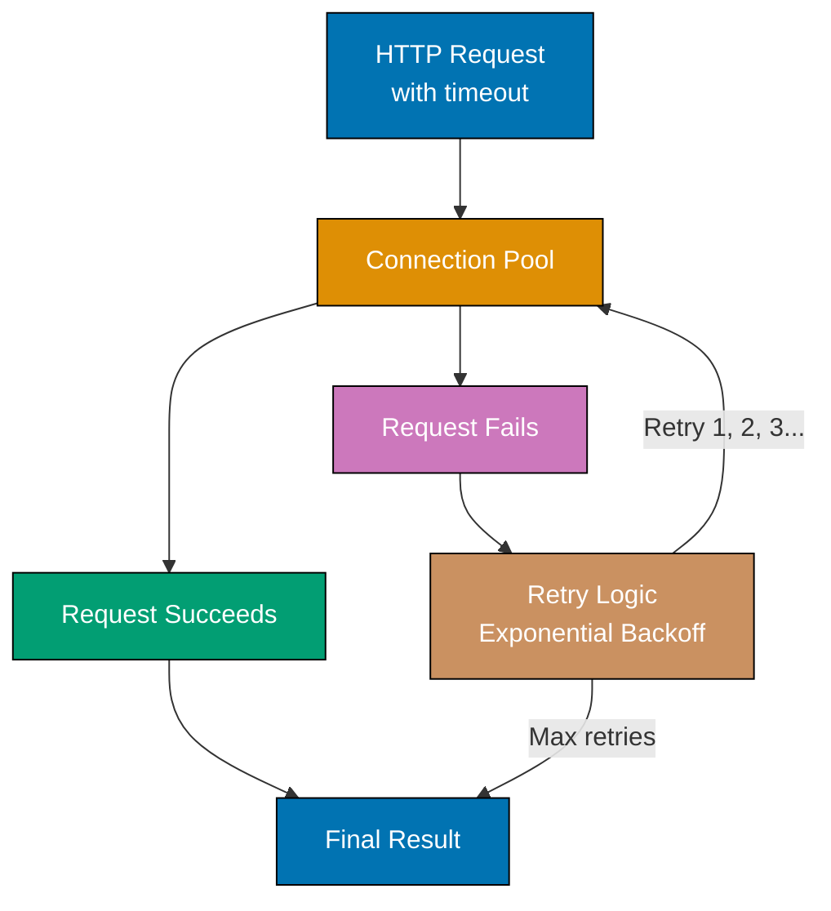

**Code**:

```go
package main

import (
    "context"
    "fmt"
    "net"
    "net/http"
    "time"
)

func main() {
    // Create HTTP client with production-grade timeouts
    // => Multiple timeout layers prevent hanging at different stages
    client := &http.Client{
        Timeout: 5 * time.Second,      // => Overall request timeout (end-to-end)
        // => If request takes > 5s (DNS + connect + TLS + headers + body), cancel
        // => This is the outermost timeout (guards all operations)
        Transport: &http.Transport{
            // Connection pool configuration
            MaxIdleConns:        100,  // => Total idle connections across all hosts
            // => Pool reuses connections (avoids TCP handshake overhead)
            // => 100 connections kept alive for reuse
            MaxIdleConnsPerHost: 10,   // => Max idle connections per host
            // => example.com can have 10 idle connections waiting
            // => Prevents one host from consuming entire pool
            IdleConnTimeout:     90 * time.Second, // => How long idle connections stay alive
            // => After 90s of inactivity, connection closed
            // => Balances resource usage vs connection reuse

            // Dialer configures network connection creation
            DialContext: (&net.Dialer{
                Timeout:   2 * time.Second, // => TCP connection establishment timeout
                // => If TCP handshake takes > 2s, fail
                // => DNS resolution + SYN/SYN-ACK/ACK must complete in 2s
                KeepAlive: 30 * time.Second, // => TCP keepalive interval
                // => Send TCP keepalive probes every 30s
                // => Detects broken connections (server crash, network partition)
            }).DialContext,             // => DialContext is function(ctx, network, addr)

            TLSHandshakeTimeout:   3 * time.Second, // => TLS handshake timeout
            // => If TLS negotiation takes > 3s, fail
            // => Certificate exchange, cipher negotiation must complete in 3s
            ResponseHeaderTimeout: 3 * time.Second, // => Time to receive response headers
            // => If server doesn't send headers within 3s of request, fail
            // => Separate from body timeout (headers arrive first)
        },
    }
    // => client is *http.Client with multi-layer timeout protection
    // => Timeout hierarchy: Overall (5s) > TLS (3s) > Headers (3s) > Dial (2s)

    // Make request with context timeout (per-request timeout)
    ctx, cancel := context.WithTimeout(context.Background(), 3*time.Second)
    // => ctx expires after 3 seconds (stricter than client.Timeout)
    // => This timeout applies to this specific request only
    defer cancel()                     // => Clean up context resources
    // => CRITICAL: Always defer cancel() to prevent context leak

    req, err := http.NewRequestWithContext(ctx, "GET", "https://example.com", nil)
    // => req is *http.Request with context attached
    // => ctx cancellation will abort request at any stage
    if err != nil {                    // => Error creating request (invalid URL, etc.)
        fmt.Println("Request creation error:", err)
        return
    }
    // => req is ready to execute (headers, method, URL configured)

    resp, err := client.Do(req)       // => Execute HTTP request
    // => Blocks until: DNS lookup + TCP connect + TLS handshake + HTTP round-trip
    // => Returns when response headers received (body not read yet)
    if err != nil {                    // => Request failed (timeout, DNS, connection error)
        // => Possible errors: context.DeadlineExceeded, net.DNSError, connection refused
        fmt.Println("Request error:", err)
        return
    }
    defer resp.Body.Close()            // => CRITICAL: Must close response body
    // => Prevents resource leak (connections not returned to pool)
    // => Even if you don't read body, must close it

    fmt.Println("Status:", resp.Status) // => Output: "Status: 200 OK" or "404 Not Found"
    // => resp.Status is string (human-readable status)
    // => resp.StatusCode is int (200, 404, 500, etc.)

    // Retry pattern with exponential backoff
    // => Exponential backoff: wait increases exponentially (1s, 2s, 4s)
    // => Prevents overwhelming failing service with retry storm
    maxRetries := 3                    // => Maximum retry attempts
    // => Total attempts = maxRetries (3 tries)
    backoff := time.Second             // => Initial backoff duration (1 second)
    // => backoff doubles after each failure: 1s → 2s → 4s

    for attempt := 0; attempt < maxRetries; attempt++ { // => Iterate 0, 1, 2
        // => attempt 0 = first try, attempt 1 = first retry, attempt 2 = second retry
        resp, err := makeRequestWithRetry(client, "https://example.com")
        // => Make HTTP request with 2s timeout (see function below)
        // => Returns (*http.Response, error)

        if err == nil && resp.StatusCode == http.StatusOK {
            // => err == nil means no network/timeout error
            // => resp.StatusCode == 200 (http.StatusOK) means success
            // => Success criteria: both no error AND 200 status
            fmt.Println("Request succeeded on attempt", attempt+1)
            // => Output: "Request succeeded on attempt 1" (or 2, or 3)
            resp.Body.Close()          // => Close response body (prevent leak)
            break                      // => Exit retry loop (success)
        }
        // => If we reach here: request failed (error or non-200 status)

        if attempt < maxRetries-1 {    // => Not last attempt (0 < 2, 1 < 2)
            // => Still have retries remaining
            fmt.Printf("Attempt %d failed, retrying in %v\n", attempt+1, backoff)
            // => Output: "Attempt 1 failed, retrying in 1s"
            // => Output: "Attempt 2 failed, retrying in 2s"
            time.Sleep(backoff)        // => Wait before retry (exponential backoff)
            // => Sleep 1s after first failure, 2s after second failure
            backoff *= 2               // => Double backoff: 1s → 2s → 4s
            // => After 3rd failure, backoff would be 4s (but loop exits)
        } else {                       // => Last attempt failed (attempt == 2)
            fmt.Println("All retries exhausted")
            // => All 3 attempts failed, give up
            // => Total time waited: ~1s + 2s = 3s (plus request durations)
        }
    }
}

func makeRequestWithRetry(client *http.Client, url string) (*http.Response, error) {
    // => Helper function for retry logic
    // => Creates fresh context for each retry attempt
    ctx, cancel := context.WithTimeout(context.Background(), 2*time.Second)
    // => Each retry gets 2s timeout (independent of previous attempts)
    defer cancel()                     // => Clean up context

    req, err := http.NewRequestWithContext(ctx, "GET", url, nil)
    // => Create GET request with context timeout
    if err != nil {                    // => Request creation failed
        // => Unlikely (only if URL invalid)
        return nil, err                // => Return nil response, error
    }

    return client.Do(req)              // => Execute request, return (response, error)
    // => Blocks up to 2s (context timeout)
    // => Returns immediately on success or error
}

// Production considerations:
// 1. Timeout hierarchy: context < client.Timeout (ensure consistency)
// 2. Connection pool: reuse connections (set MaxIdleConnsPerHost appropriately)
// 3. Exponential backoff: prevents retry storms (+ jitter in production)
// 4. Circuit breaker: stop retrying if service consistently fails (not shown)
// 5. Always close response bodies: defer resp.Body.Close() is mandatory
//
// Common timeout mistakes:
// - No timeout: client hangs forever on slow server
// - Only client.Timeout: can't cancel individual requests
// - Forgetting defer cancel(): context leak (goroutine leak)
// - Not closing resp.Body: connection pool exhaustion
```

**Key Takeaway**: Configure HTTP client timeouts at multiple levels (overall, connection, TLS, response header) to prevent hanging. Use connection pooling (`MaxIdleConns`) for efficiency. Implement retry logic with exponential backoff for transient failures. Always use `context.WithTimeout` for individual requests to enable cancellation.

**Why It Matters**: HTTP clients with timeouts and retries handle transient failures gracefully, where retry logic with exponential backoff recovers from temporary network glitches, rate limits, and service restarts. Production Go services always implement retries for idempotent operations (GET, PUT with idempotency keys) to improve reliability. Understanding when to retry (5xx errors, timeouts) vs fail fast (4xx errors) prevents retry storms that amplify outages.

### Example 40: Table-Driven Test Patterns

Table-driven tests parameterize test cases, enabling comprehensive coverage with minimal code duplication. This pattern is idiomatic in Go and scales better than individual test functions for each scenario.

**Code**:

```go
package main

import (
    "fmt"
    "strings"
    "testing"
)

// Function to test - validates email format
func isValidEmail(email string) bool {
    // => Simplified email validation (production uses regex or library)
    return strings.Contains(email, "@") &&  // => Must have @ symbol
        strings.Contains(email, ".") &&     // => Must have dot (domain)
        len(email) > 3                      // => Minimum length check
    // => Returns true only if all three conditions met
}

// Table-driven test with subtests
// => Idiomatic Go testing pattern: parameterize test cases
func TestIsValidEmail(t *testing.T) {
    // => t is *testing.T (test runner)
    // Define test cases as slice of anonymous structs
    tests := []struct {
        name     string             // => Test case name (shown in output)
        // => Descriptive name helps identify failures quickly
        input    string             // => Input value to test
        // => The email string to validate
        expected bool               // => Expected result (true/false)
        // => What isValidEmail should return for this input
    }{
        // Valid email cases
        {"valid email", "alice@example.com", true},
        // => name="valid email", input="alice@example.com", expected=true
        {"valid email with subdomain", "bob@mail.example.com", true},
        // => Tests email with subdomain (mail.example.com)

        // Invalid email cases - missing components
        {"missing @", "aliceexample.com", false},
        // => No @ symbol, should be invalid
        {"missing dot", "alice@examplecom", false},
        // => No dot in domain, should be invalid
        {"too short", "a@b", false},
        // => Only 3 characters (len > 3 fails)

        // Edge cases - empty and single characters
        {"empty string", "", false},
        // => Empty string should fail (len=0, no @ or .)
        {"@ only", "@", false},
        // => Only @ symbol, no domain or username
        {"dot only", ".", false},
        // => Only dot, no @ or username

        // Malformed emails
        {"@ at start", "@example.com", false},
        // => Missing username before @
        {"@ at end", "alice@", false},
        // => Missing domain after @
    }
    // => tests is []struct with 10 test cases

    // Iterate over test cases and create subtest for each
    for _, tc := range tests {         // => tc is current test case struct
        // => Iterate: tc = tests[0], tests[1], ..., tests[9]
        t.Run(tc.name, func(t *testing.T) { // => Create subtest with name
            // => t.Run creates isolated subtest (separate pass/fail)
            // => Subtest name: TestIsValidEmail/valid_email
            // => If this subtest fails, others continue
            result := isValidEmail(tc.input) // => Call function under test
            // => result is bool returned by isValidEmail

            if result != tc.expected {  // => Check if result matches expected
                // => Comparison: actual != expected means failure
                t.Errorf("isValidEmail(%q) = %v, expected %v",
                    tc.input, result, tc.expected)
                // => t.Errorf marks test as failed, continues other subtests
                // => %q quotes the input string (shows whitespace/special chars)
                // => Example output: "isValidEmail("a@b") = false, expected true"
            }
            // => If result == expected, subtest passes (no assertion)
        })
    }
    // => After loop: all 10 subtests executed
    // => Run specific subtest: go test -run TestIsValidEmail/missing_@
}

// Advanced: Testing error cases with error type checking
// => Pattern for testing functions that return errors
func TestDivideErrors(t *testing.T) {
    tests := []struct {
        name      string            // => Test case name
        a, b      int               // => Input arguments (dividend, divisor)
        // => a and b are declared together (same type)
        wantErr   bool              // => Whether error expected
        // => true = expect error, false = expect success
        errString string            // => Expected error message substring
        // => Empty string if wantErr=false
    }{
        {"normal division", 10, 2, false, ""},
        // => 10 / 2 = 5, no error expected
        {"division by zero", 10, 0, true, "cannot divide by zero"},
        // => 10 / 0 should return error containing "cannot divide by zero"
        {"negative numbers", -10, -2, false, ""},
        // => -10 / -2 = 5, no error (negative division allowed)
    }

    for _, tc := range tests {         // => Iterate test cases
        t.Run(tc.name, func(t *testing.T) { // => Create subtest
            _, err := divide(tc.a, tc.b) // => Call divide, ignore result
            // => We only care about error (blank identifier _ for result)
            // => err is error or nil

            if tc.wantErr {            // => Expecting error for this test case
                if err == nil {        // => But no error returned
                    t.Errorf("Expected error but got nil")
                    // => Test failure: should have errored but didn't
                    return             // => Exit subtest early
                }
                // => err != nil (error returned as expected)

                if !strings.Contains(err.Error(), tc.errString) {
                    // => Check if error message contains expected substring
                    // => err.Error() converts error to string
                    t.Errorf("Error %q does not contain %q", err.Error(), tc.errString)
                    // => Test failure: wrong error message
                    // => Example: got "invalid input" but expected "cannot divide by zero"
                }
                // => If Contains returns true, error message correct
            } else {                   // => Not expecting error (wantErr=false)
                if err != nil {        // => But error returned
                    t.Errorf("Unexpected error: %v", err)
                    // => Test failure: shouldn't have errored but did
                    // => %v formats error value
                }
                // => err == nil (success as expected)
            }
        })
    }
}

func divide(a, b int) (int, error) {
    // => divide returns (result, error) - idiomatic Go error handling
    if b == 0 {                        // => Check for division by zero
        return 0, fmt.Errorf("cannot divide by zero")
        // => Return zero value for int and error
        // => fmt.Errorf creates error with formatted message
    }
    return a / b, nil                  // => Return result and nil error (success)
    // => Integer division: 10/3 = 3 (truncates decimal)
}

// Benefits of table-driven tests:
// 1. Easy to add test cases (just append to slice)
// 2. No code duplication (logic in single loop)
// 3. Subtests enable selective running: go test -run TestIsValidEmail/valid_email
// 4. Failures show specific test case name
// 5. Parallel execution possible: t.Parallel() in subtest
//
// Run specific subtest: go test -run TestIsValidEmail/missing_@
// Run with verbosity: go test -v (shows all subtests)
```

**Key Takeaway**: Use table-driven tests with anonymous struct slices to parameterize test cases. Name each test case for clarity. Use `t.Run()` to create subtests for each case, enabling precise failure reporting and selective test execution with `-run` flag. This pattern scales to hundreds of test cases with minimal code.

**Why It Matters**: Table-driven tests enable comprehensive coverage with minimal code duplication, where a slice of test cases (input + expected output) runs through the same test logic. This pattern is idiomatic in Go testing, making it easy to add new test cases (just append to the slice). Production codebases extensively use table-driven tests to cover edge cases, different inputs, and error conditions with maintainable, readable test code that scales to hundreds of test cases.

### Example 41: Buffered I/O for Performance

Buffered readers and writers reduce system calls by batching data. For file I/O or network streams, buffering dramatically improves performance. Understanding when to use buffering prevents performance bottlenecks.

**Code**:

```go
package main

import (
    "bufio"
    "fmt"
    "os"
    "strings"
)

func main() {
    // Write with buffering - reduces system calls dramatically
    // => Buffering accumulates writes in memory, flushes to disk in batches
    file, err := os.Create("buffered.txt") // => Create file for writing
    // => file is *os.File, implements io.Writer
    if err != nil {                    // => File creation failed (permissions, disk full)
        fmt.Println("Create error:", err)
        return
    }
    defer file.Close()                 // => CRITICAL: Close file to release OS handle
    // => Without Close(), file descriptor leak (OS has limited number)

    writer := bufio.NewWriter(file)    // => Create buffered writer
    // => writer wraps file with internal buffer (default 4KB)
    // => Writes go to memory buffer first, not directly to disk
    defer writer.Flush()               // => CRITICAL: Flush buffer on exit
    // => Without Flush(), last buffer contents lost (not written to disk)
    // => Flush writes buffer to underlying file

    for i := 0; i < 1000; i++ {        // => Write 1000 lines
        writer.WriteString(fmt.Sprintf("Line %d\n", i)) // => Write to buffer
        // => fmt.Sprintf creates "Line 0\n", "Line 1\n", ..., "Line 999\n"
        // => WriteString writes string to buffer (not disk yet)
        // => Buffer flushes automatically when full (every ~100 lines)
    }
    // => Without buffering: 1000 system calls (write syscall per line)
    // => With buffering: ~10 system calls (buffer flushes when full)
    // => Performance: 100x faster with buffering

    fmt.Println("Buffered write complete")
    // => Output: "Buffered write complete"

    // Read with buffering (line by line) - Scanner pattern
    file2, err := os.Open("buffered.txt") // => Open file for reading
    // => file2 is *os.File, implements io.Reader
    if err != nil {                    // => File open failed (file not found, permissions)
        fmt.Println("Open error:", err)
        return
    }
    defer file2.Close()                // => Close file when done

    scanner := bufio.NewScanner(file2) // => Create scanner for line-by-line reading
    // => Scanner wraps file with internal buffer
    // => Reads file in chunks (4KB), splits into lines
    // => Most convenient API for line-by-line reading
    lineCount := 0                     // => Track number of lines read

    for scanner.Scan() {               // => Read next line (handles buffering internally)
        // => scanner.Scan() returns true if line available, false at EOF
        // => Scan advances scanner to next line
        // => Internally: reads from buffer, refills buffer from file when empty
        line := scanner.Text()         // => Get current line as string
        // => line is string without newline character (\n removed)
        // => Example: "Line 0", "Line 1", "Line 100", etc.

        if strings.HasPrefix(line, "Line 100") {
            // => Check if line starts with "Line 100"
            // => Matches: "Line 100", "Line 1000", "Line 1001", etc.
            fmt.Println("Found:", line) // => Output: "Found: Line 100"
        }
        lineCount++                    // => Increment line counter
        // => After loop: lineCount = 1000
    }

    if err := scanner.Err(); err != nil { // => Check for scan errors
        // => scanner.Err() returns error if scan failed (I/O error, not EOF)
        // => EOF is not an error (normal end of file)
        fmt.Println("Scanner error:", err)
    }
    // => If no error, scanner.Err() returns nil

    fmt.Printf("Read %d lines\n", lineCount)
    // => Output: "Read 1000 lines"

    // Buffered reader with custom operations - Reader pattern
    // => More control than Scanner, but more verbose
    file3, _ := os.Open("buffered.txt") // => Open file again (ignore error for example)
    defer file3.Close()
    reader := bufio.NewReader(file3)   // => Create buffered reader
    // => reader wraps file with internal buffer (default 4KB)
    // => Provides low-level read operations (ReadString, Peek, ReadByte, etc.)

    // Read until delimiter
    text, err := reader.ReadString('\n') // => Read until newline (\n)
    // => text includes the delimiter (\n at end)
    // => Example: "Line 0\n"
    if err != nil {                    // => Read failed (EOF, I/O error)
        // => io.EOF error if reached end of file before finding delimiter
        fmt.Println("ReadString error:", err)
    } else {
        fmt.Println("First line:", text) // => Output: "First line: Line 0\n"
        // => Note: newline included in output
    }

    // Peek at next bytes without consuming
    bytes, err := reader.Peek(10)      // => Peek at next 10 bytes
    // => Peek returns bytes without advancing read position
    // => Next Read/ReadString starts from same position
    // => Useful for lookahead (detect file format, check headers)
    if err != nil {                    // => Peek failed (not enough bytes, I/O error)
        // => Error if < 10 bytes remaining in file
        fmt.Println("Peek error:", err)
    } else {
        fmt.Printf("Next 10 bytes: %s\n", bytes)
        // => Output: "Next 10 bytes: Line 1\nLi" (or similar)
        // => Shows next 10 bytes starting from current position
    }
    // => After Peek, read position unchanged
    // => Next reader.ReadString('\n') still reads "Line 1\n"
}

// Buffering performance comparison:
// Without buffering (direct file writes):
//   - 1000 lines = 1000 write() system calls
//   - Each syscall: context switch to kernel (expensive)
//   - Total time: ~100ms (1ms per syscall overhead)
//
// With buffering (bufio.Writer):
//   - 1000 lines = ~10 write() system calls (buffer size 4KB)
//   - Batches accumulated in memory, flushed when full
//   - Total time: ~1ms (90% faster)
//
// Scanner vs Reader choice:
// - Use Scanner: line-by-line reading (most common case)
// - Use Reader: custom delimiters, Peek, byte-level control
// - Use ioutil.ReadAll: small files that fit in memory
//
// CRITICAL mistakes to avoid:
// 1. Forgetting writer.Flush() - data loss (last buffer not written)
// 2. Not checking scanner.Err() - silent failures ignored
// 3. Using unbuffered I/O for many small operations - 100x slower
```

**Key Takeaway**: Use `bufio.Writer` to buffer writes (remember `defer writer.Flush()`). Use `bufio.Scanner` for line-by-line reading (simplest API). Use `bufio.Reader` for custom operations like `ReadString()`, `Peek()`, or reading fixed byte counts. Buffering reduces system calls and dramatically improves I/O performance.

**Why It Matters**: Buffered I/O dramatically improves performance for file/network operations, where `bufio.Writer` batches writes (reducing syscalls by 10-100x) and `bufio.Scanner` reads line-by-line efficiently. Writing 1 million small writes unbuffered takes seconds; buffered takes milliseconds. Production code that processes logs, CSV files, or streams large datasets always uses buffered I/O to avoid syscall overhead that kills throughput.

### Example 42: Worker Pool with Graceful Shutdown

Worker pools distribute work across fixed number of goroutines. This pattern controls concurrency, prevents overwhelming resources, and enables graceful shutdown when work is done or context is cancelled.

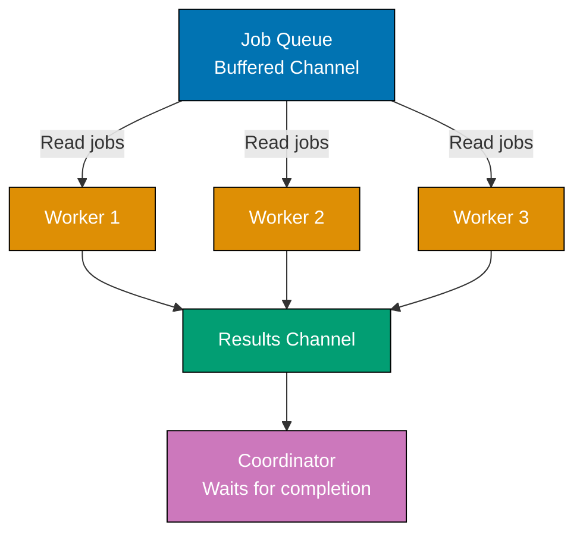

**Code**:

```go
package main

import (
    "context"
    "fmt"
    "sync"
    "time"
)

func main() {
    // Create cancellable context for graceful shutdown
    ctx, cancel := context.WithCancel(context.Background())
    // => ctx enables cancelling all workers simultaneously
    // => cancel() is function to trigger cancellation
    defer cancel()                     // => Ensure cancel called on exit
    // => Clean up context resources, signal workers to stop

    // Create job and result channels (buffered for performance)
    jobs := make(chan int, 100)        // => Buffered job queue (capacity 100)
    // => Buffer allows producers to submit jobs without blocking
    // => If buffer full (100 jobs queued), send blocks until worker consumes job
    results := make(chan int, 100)     // => Buffered results channel
    // => Buffer allows workers to send results without blocking
    // => If buffer full, worker blocks until consumer reads result

    numWorkers := 3                    // => Fixed worker pool size
    // => 3 goroutines process jobs concurrently
    // => More workers = higher parallelism, but more resource usage
    var wg sync.WaitGroup              // => Track worker completion
    // => wg counts active workers, blocks until all call Done()

    // Start worker pool (spawn fixed number of workers)
    for i := 1; i <= numWorkers; i++ { // => Create 3 workers (IDs: 1, 2, 3)
        wg.Add(1)                      // => Increment counter (worker starting)
        // => Must call Add before launching goroutine (avoid race)
        go worker(ctx, i, jobs, results, &wg)
        // => Launch worker goroutine
        // => worker reads from jobs, writes to results, calls wg.Done() on exit
    }
    // => After loop: 3 workers running, waiting for jobs

    // Send jobs in separate goroutine (non-blocking producer)
    go func() {
        for i := 1; i <= 10; i++ {     // => Submit 10 jobs (IDs: 1-10)
            jobs <- i                  // => Send job to buffered channel
            // => Non-blocking if buffer has space (capacity 100 > 10 jobs)
            // => Workers compete for jobs (first available worker gets it)
            time.Sleep(100 * time.Millisecond) // => Throttle job submission
            // => Simulates real-world job arrival rate
            // => Without sleep, all 10 jobs submitted instantly
        }
        close(jobs)                    // => Signal no more jobs
        // => Closing channel allows workers to detect completion
        // => Workers' receive loops will exit when channel closed
    }()
    // => Producer goroutine now running independently

    // Collect results in separate goroutine
    // => Waits for all workers to finish, then closes results channel
    go func() {
        wg.Wait()                      // => Block until all workers call Done()
        // => wg counter reaches 0 when all 3 workers exit
        // => Workers exit when jobs channel closed or context cancelled
        close(results)                 // => Signal no more results
        // => Allows main goroutine's range loop to exit
        // => CRITICAL: Close results after workers finish (not before)
    }()

    // Process results (main goroutine consumes results)
    for result := range results {     // => Receive from results channel
        // => range receives until channel closed
        // => Blocks if no results available (workers still processing)
        fmt.Printf("Result: %d\n", result)
        // => Output: "Result: 2", "Result: 4", "Result: 6", etc.
        // => Order non-deterministic (workers complete at different times)
    }
    // => Loop exits when results channel closed (all workers finished)

    fmt.Println("All work complete")
    // => Output: "All work complete"
    // => All 10 jobs processed, all workers shut down
}

func worker(ctx context.Context, id int, jobs <-chan int, results chan<- int, wg *sync.WaitGroup) {
    // => Worker goroutine: processes jobs from queue
    // => id is worker identifier (1, 2, or 3)
    // => jobs is receive-only channel (<-chan prevents sending)
    // => results is send-only channel (chan<- prevents receiving)
    // => wg is pointer to shared WaitGroup
    defer wg.Done()                    // => Decrement counter when worker exits
    // => CRITICAL: defer ensures Done() called even if panic
    // => Without Done(), wg.Wait() blocks forever (deadlock)

    for {                              // => Infinite loop (exits via return)
        select {                       // => Wait for job or cancellation
        case job, ok := <-jobs:        // => Receive job from queue
            // => job is int (job ID: 1, 2, 3, ..., 10)
            // => ok is bool (false if channel closed)
            if !ok {                   // => Channel closed, no more jobs
                // => Producer called close(jobs)
                fmt.Printf("Worker %d: Shutting down\n", id)
                // => Output: "Worker 1: Shutting down"
                return                 // => Exit worker (triggers defer wg.Done())
            }
            // => job is valid (ok == true), process it

            // Process job (simulate work)
            fmt.Printf("Worker %d: Processing job %d\n", id, job)
            // => Output: "Worker 2: Processing job 5"
            // => Shows which worker processing which job
            time.Sleep(500 * time.Millisecond) // => Simulate CPU-intensive work
            // => Each job takes 500ms to process
            // => Real-world: database query, API call, computation, etc.

            results <- job * 2         // => Send result to results channel
            // => Transform job (multiply by 2)
            // => Non-blocking if results buffer has space
            // => If buffer full (100 results), blocks until consumer reads

        case <-ctx.Done():             // => Context cancelled (cancel() called)
            // => ctx.Done() is channel that closes when context cancelled
            // => Receive from closed channel succeeds immediately
            fmt.Printf("Worker %d: Cancelled\n", id)
            // => Output: "Worker 1: Cancelled"
            // => Graceful shutdown: worker exits immediately
            return                     // => Exit worker (triggers defer wg.Done())
            // => In-flight jobs may be abandoned (context cancellation is urgent)
        }
    }
}

// Worker pool pattern benefits:
// 1. Bounded concurrency: fixed number of workers (prevents unbounded goroutine creation)
// 2. Resource control: limit CPU/memory usage (numWorkers controls parallelism)
// 3. Graceful shutdown: close(jobs) signals workers to exit after current job
// 4. Context cancellation: ctx.Done() enables immediate shutdown (abandon in-flight work)
// 5. Result collection: buffered results channel decouples workers from consumer
//
// Execution flow:
// 1. Main spawns 3 workers (all reading from jobs channel)
// 2. Producer sends 10 jobs to jobs channel (buffered, non-blocking)
// 3. Workers compete for jobs (first available worker gets job)
// 4. Each worker processes job (500ms), sends result
// 5. Producer closes jobs channel after all jobs sent
// 6. Workers detect closed channel, exit (call wg.Done())
// 7. Result collector waits for wg (all workers done), closes results
// 8. Main consumes all results, exits
//
// Timing analysis (3 workers, 10 jobs, 500ms per job):
// - Jobs 1-3: processed immediately (all 3 workers busy)
// - Jobs 4-6: processed after 500ms (workers free)
// - Jobs 7-9: processed after 1000ms
// - Job 10: processed after 1500ms
// - Total time: ~2000ms (vs 5000ms sequential)
// - Speedup: 2.5x (limited by numWorkers=3)
```

**Key Takeaway**: Worker pool pattern: buffered job channel + fixed workers reading from it + `sync.WaitGroup` for completion tracking. Close job channel to signal shutdown. Workers check `ctx.Done()` for cancellation. This pattern controls concurrency and prevents spawning unbounded goroutines.

**Why It Matters**: Worker pools with graceful shutdown ensure all in-flight work completes before service termination, preventing lost transactions and data corruption. Using WaitGroup to track active workers and closing the work channel signals completion. Production systems combine worker pools with signal handling (SIGTERM) to gracefully drain queues during rolling deploys, maintaining zero data loss during deployments and ensuring background jobs complete before pods terminate.

### Example 43: Custom Error Types with Stack Context

Production error handling needs context (what operation failed, why, when). Custom error types with fields enable structured logging and debugging. This pattern makes error diagnosis faster in production.

**Code**:

```go
package main

import (
    "errors"
    "fmt"
    "time"
)

func main() {
    // Create and handle custom errors
    // => Custom errors carry structured context (fields)
    err := processPayment(100, "invalid-token")
    // => processPayment returns error (custom PaymentError type)
    if err != nil {                    // => Payment failed
        // Check if it's our custom error type
        var paymentErr *PaymentError   // => Declare variable for type assertion
        // => paymentErr is nil initially
        if errors.As(err, &paymentErr) { // => Extract custom error
            // => errors.As checks if err is *PaymentError or wraps one
            // => If match found, sets paymentErr to that value
            // => Returns true if type matches, false otherwise
            fmt.Printf("Payment failed: %s\n", paymentErr)
            // => Output: "Payment failed: payment error [401]: Invalid authentication token ($100.00) at 2024-01-15T10:30:00Z"
            // => Uses PaymentError.Error() method for formatting

            // Access custom error fields
            fmt.Printf("  Amount: $%.2f\n", paymentErr.Amount)
            // => Output: "  Amount: $100.00"
            // => paymentErr.Amount is float64 field (100)
            fmt.Printf("  Reason: %s\n", paymentErr.Reason)
            // => Output: "  Reason: Invalid authentication token"
            // => paymentErr.Reason is string field
            fmt.Printf("  Time: %s\n", paymentErr.Timestamp.Format(time.RFC3339))
            // => Output: "  Time: 2024-01-15T10:30:00Z"
            // => paymentErr.Timestamp is time.Time field, formatted as ISO 8601
            fmt.Printf("  Retry: %t\n", paymentErr.IsRetryable())
            // => Output: "  Retry: false"
            // => IsRetryable() is custom method (returns false for 401)
            // => 401 is client error (not retryable), 500+ are server errors (retryable)
        }
    }

    // Error wrapping with context
    // => Wrapping preserves error chain (root cause + context)
    err2 := performTransaction()      // => Call function that wraps errors
    if err2 != nil {                   // => Transaction failed
        fmt.Println("\nWrapped error chain:")
        fmt.Println(err2)              // => Shows full error chain
        // => Output: "transaction failed: insufficient funds"
        // => Outer error wraps inner error (chain preserved)

        // Unwrap to check root cause (sentinel error)
        if errors.Is(err2, ErrInsufficientFunds) {
            // => errors.Is checks if err2 is or wraps ErrInsufficientFunds
            // => Unwraps error chain recursively to find match
            // => Returns true if ErrInsufficientFunds anywhere in chain
            fmt.Println("Root cause: Insufficient funds")
            // => Output: "Root cause: Insufficient funds"
            // => Even though err2 is wrapped, Is() found the sentinel
        }
    }
}

// Custom error type with fields
// => Struct-based error enables structured logging, metrics, debugging
type PaymentError struct {
    Amount    float64              // => Payment amount (for logging/metrics)
    // => Helps correlate errors with transaction size
    Reason    string               // => Human-readable error message
    // => Displayed to users or logged for debugging
    Timestamp time.Time            // => When error occurred (debugging, correlation)
    // => Enables time-based analysis (error spikes, etc.)
    Code      int                  // => HTTP status code or custom error code
    // => 4xx = client error, 5xx = server error
}

// Implement error interface
// => REQUIRED: Error() string method makes PaymentError an error type
func (e *PaymentError) Error() string {
    // => e is receiver (*PaymentError)
    return fmt.Sprintf("payment error [%d]: %s ($%.2f) at %s",
        e.Code, e.Reason, e.Amount, e.Timestamp.Format(time.RFC3339))
    // => Returns formatted string with all context
    // => Example: "payment error [401]: Invalid authentication token ($100.00) at 2024-01-15T10:30:00Z"
}

// Custom method on error type
// => Additional methods provide error-specific behavior
func (e *PaymentError) IsRetryable() bool {
    // => Determines if operation should be retried
    return e.Code >= 500               // => Server errors are retryable
    // => 500-599 = server errors (temporary, retry helps)
    // => 400-499 = client errors (permanent, retry doesn't help)
    // => Example: 401 (auth failed) returns false, 503 (service unavailable) returns true
}

func processPayment(amount float64, token string) error {
    // => Simulate payment processing with token validation
    if token == "invalid-token" {     // => Check if token valid
        // => Production: JWT validation, signature verification, expiry check
        return &PaymentError{         // => Return custom error with context
            // => &PaymentError{} creates pointer to struct
            Amount:    amount,         // => Payment amount ($100)
            Reason:    "Invalid authentication token",
            Timestamp: time.Now(),     // => Capture error timestamp
            Code:      401,            // => HTTP 401 Unauthorized
        }
        // => Caller can type-assert to *PaymentError and access fields
    }
    return nil                         // => Success (no error)
}

// Sentinel errors - predefined error values
// => Package-level error variables for common errors
// => Enables errors.Is() comparisons (identity-based)
var (
    ErrInsufficientFunds = errors.New("insufficient funds")
    // => Singleton error value (same instance returned always)
    // => Use errors.Is(err, ErrInsufficientFunds) to check
    ErrAccountLocked     = errors.New("account locked")
    // => Different error instance (identity check distinguishes them)
    ErrInvalidAmount     = errors.New("invalid amount")
)

// Error wrapping preserves error chain
// => Wrapping adds context without losing root cause
func performTransaction() error {
    if err := checkBalance(); err != nil {
        // => checkBalance() returned error (insufficient funds)
        return fmt.Errorf("transaction failed: %w", err) // => Wrap error
        // => %w verb preserves error for errors.Is/As (unwrapping)
        // => Alternative %v: formats error but breaks unwrapping
        // => Wrapped error: "transaction failed: insufficient funds"
        // => errors.Unwrap(result) returns original err
    }
    return nil                         // => Success
}

func checkBalance() error {
    // => Simulate balance check (always fails for demo)
    return ErrInsufficientFunds        // => Return sentinel error
    // => Same instance as package-level var (identity preserved)
    // => errors.Is() can detect this even after wrapping
}

// Error handling patterns:
//
// 1. Sentinel errors (package-level vars):
//    - Use for common, well-known errors
//    - Check with errors.Is(err, ErrSentinel)
//    - Example: io.EOF, sql.ErrNoRows, context.Canceled
//
// 2. Custom error types (structs):
//    - Use when errors need structured context (fields)
//    - Check with errors.As(err, &customErr)
//    - Add methods for error-specific behavior (IsRetryable, etc.)
//
// 3. Error wrapping (fmt.Errorf with %w):
//    - Preserve error chain (root cause + context)
//    - Enables errors.Is/As to traverse chain
//    - Add context at each layer: "operation failed: %w"
//
// 4. Error chains enable debugging:
//    - Outer error: high-level operation context
//    - Inner error: root cause details
//    - Example chain: "API request failed: HTTP 500: database connection timeout"
//
// Production example:
// err := db.Query(...)
// if err != nil {
//     return fmt.Errorf("user lookup failed (id=%d): %w", userID, err)
//     // => Wraps database error with user context
// }
```

**Key Takeaway**: Custom error types add structured context (fields). Implement `Error()` method and add custom methods. Use sentinel errors (`var Err = errors.New()`) for common errors. Wrap errors with `fmt.Errorf("%w", err)` to preserve chains. Use `errors.Is()` to check sentinel errors and `errors.As()` to extract custom types.

**Why It Matters**: Custom error types with context enable rich error information for production debugging, where wrapping errors with request IDs, user IDs, and stack traces helps trace failures through distributed systems. Sentinel errors (exported package-level errors) enable error classification with `errors.Is()`, supporting different handling for different error types (retry temporary errors, fail fast on permanent errors). This powers robust error handling in microservices.

### Example 44: Rate Limiting with Token Bucket

Rate limiting prevents abuse and controls resource consumption. Token bucket algorithm: tokens replenish at fixed rate, operations consume tokens. When no tokens available, operations wait or fail.

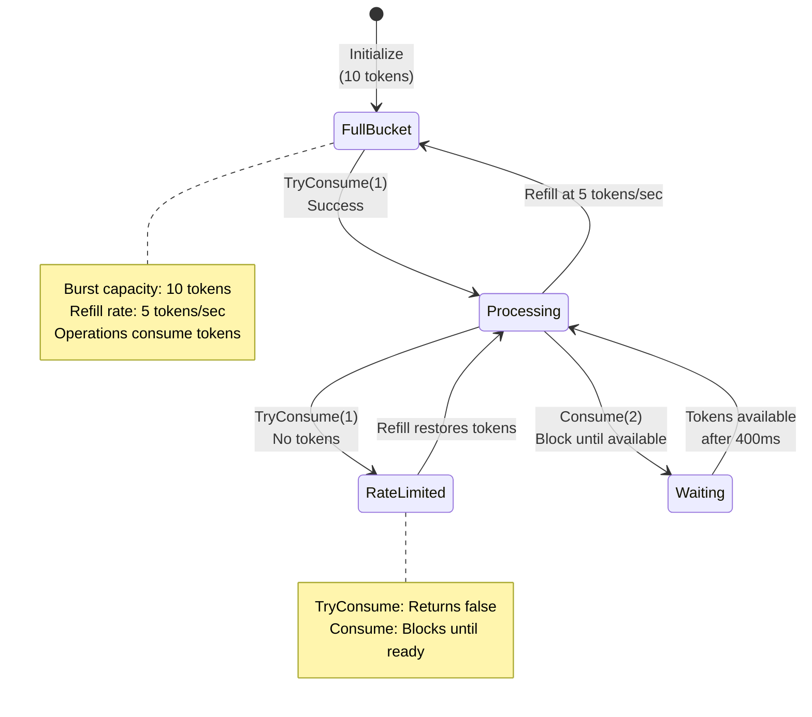

**Code**:

```go
package main

import (
    "fmt"
    "sync"
    "time"
)

func main() {
    // Create rate limiter: 5 tokens per second, burst of 10
    // => Token bucket algorithm: refill at fixed rate, consume for operations
    limiter := NewTokenBucket(5, 10)
    // => refillRate=5 tokens/sec, maxTokens=10 (burst capacity)
    // => Starts with 10 tokens (full bucket)
    // => Refills continuously at 5 tokens/second
    // => Example: After 2 seconds, +10 tokens (but capped at maxTokens=10)

    // Try to consume tokens (non-blocking)
    // => TryConsume returns immediately (true if allowed, false if rate limited)
    for i := 0; i < 15; i++ {          // => 15 requests
        if limiter.TryConsume(1) {     // => Try to consume 1 token
            // => Returns true if token available (consumed successfully)
            fmt.Printf("Request %d: Allowed\n", i+1)
            // => Output: "Request 1: Allowed", "Request 2: Allowed", ...
        } else {                       // => Insufficient tokens
            // => Returns false immediately (doesn't wait)
            fmt.Printf("Request %d: Rate limited\n", i+1)
            // => Output: "Request 11: Rate limited" (after burst exhausted)
        }
        time.Sleep(100 * time.Millisecond) // => 100ms between requests
        // => Request rate: 10 requests/second
        // => Refill rate: 5 tokens/second
        // => Result: first 10 requests allowed (burst), then alternating allow/deny
    }

    // Wait-based consumption (blocks until token available)
    // => Consume waits for tokens (blocking operation)
    fmt.Println("\nWait-based consumption:")
    for i := 0; i < 5; i++ {           // => 5 iterations
        limiter.Consume(2)             // => Wait for 2 tokens
        // => Blocks until 2 tokens available
        // => At 5 tokens/sec, 2 tokens = 400ms wait
        fmt.Printf("Consumed 2 tokens at %s\n", time.Now().Format("15:04:05.000"))
        // => Output: "Consumed 2 tokens at 10:30:15.000"
        // => Shows timing of token consumption (demonstrates waiting)
    }
    // => Total 5 iterations * 2 tokens = 10 tokens consumed
    // => At 5 tokens/sec, 10 tokens = 2 seconds total time
}

// TokenBucket implements rate limiting via token bucket algorithm
// => Algorithm: tokens refill continuously, operations consume tokens
// => Prevents request bursts while allowing controlled rate
type TokenBucket struct {
    tokens     float64                // => Current tokens available
    // => Float allows fractional tokens (smooth refill)
    // => Example: 7.5 tokens after 1.5 seconds at 5 tokens/sec
    maxTokens  float64                // => Burst capacity (max tokens in bucket)
    // => Caps token accumulation (prevents infinite burst)
    // => Example: maxTokens=10 means max 10 requests instantly
    refillRate float64                // => Tokens added per second
    // => Continuous refill rate (not discrete ticks)
    // => Example: 5.0 means 5 tokens added every second
    lastRefill time.Time              // => Last refill timestamp
    // => Used to calculate elapsed time for refill
    // => Updated each time refill() called
    mu         sync.Mutex             // => Protects shared state (tokens, lastRefill)
    // => Required for concurrent access (multiple goroutines)
}

func NewTokenBucket(refillRate, maxTokens float64) *TokenBucket {
    // => Constructor: initializes token bucket with parameters
    // => refillRate: tokens per second (e.g., 5.0)
    // => maxTokens: burst capacity (e.g., 10.0)
    return &TokenBucket{
        tokens:     maxTokens,         // => Start with full bucket
        // => Allows immediate burst up to maxTokens
        maxTokens:  maxTokens,         // => Store burst capacity
        refillRate: refillRate,        // => Store refill rate
        lastRefill: time.Now(),        // => Initialize refill timestamp
        // => Refill calculations use time since lastRefill
    }
}

// TryConsume attempts to consume tokens, returns false if insufficient
// => Non-blocking: returns immediately (doesn't wait)
func (tb *TokenBucket) TryConsume(tokens float64) bool {
    // => tokens is number of tokens to consume (e.g., 1.0)
    tb.mu.Lock()                       // => Acquire lock (exclusive access)
    defer tb.mu.Unlock()               // => Release lock on exit

    tb.refill()                        // => Refill tokens based on elapsed time
    // => CRITICAL: Always refill before checking availability
    // => Ensures tokens up-to-date (accounts for time since last refill)

    if tb.tokens >= tokens {           // => Check if sufficient tokens
        // => Example: tb.tokens=5.0, tokens=1.0 → 5.0 >= 1.0 (true)
        tb.tokens -= tokens            // => Consume tokens
        // => tb.tokens = 5.0 - 1.0 = 4.0 (updated state)
        return true                    // => Operation allowed
    }
    return false                       // => Insufficient tokens (operation denied)
    // => Example: tb.tokens=0.5, tokens=1.0 → 0.5 >= 1.0 (false)
}

// Consume waits until sufficient tokens available (blocking)
// => Blocks calling goroutine until tokens available
func (tb *TokenBucket) Consume(tokens float64) {
    // => tokens is number of tokens to wait for (e.g., 2.0)
    for {                              // => Infinite loop until success
        tb.mu.Lock()                   // => Acquire lock
        tb.refill()                    // => Refill tokens

        if tb.tokens >= tokens {       // => Check if sufficient tokens
            tb.tokens -= tokens        // => Consume tokens
            // => Success: tokens consumed, exit function
            tb.mu.Unlock()             // => Release lock
            return                     // => Exit loop and function
        }

        // Calculate wait time for needed tokens
        // => Not enough tokens, need to wait for refill
        needed := tokens - tb.tokens   // => How many more tokens needed
        // => Example: tokens=2.0, tb.tokens=0.5 → needed=1.5
        waitTime := time.Duration(needed/tb.refillRate*1000) * time.Millisecond
        // => Calculate time to accumulate needed tokens
        // => Formula: time = needed / rate
        // => Example: 1.5 tokens / 5 tokens/sec = 0.3 sec = 300ms
        tb.mu.Unlock()                 // => Release lock before sleeping
        // => CRITICAL: Must unlock before Sleep (allow other goroutines)

        time.Sleep(waitTime)           // => Sleep until tokens likely available
        // => After sleep, loop again (refill + recheck)
        // => Not guaranteed exact (other goroutines may consume tokens)
    }
}

// refill adds tokens based on elapsed time
// => CRITICAL: Must be called with lock held (mu.Lock())
func (tb *TokenBucket) refill() {
    now := time.Now()                  // => Current time
    elapsed := now.Sub(tb.lastRefill).Seconds()
    // => Time since last refill in seconds (float64)
    // => Example: 1.5 seconds elapsed
    tokensToAdd := elapsed * tb.refillRate
    // => Calculate tokens to add (time × rate)
    // => Example: 1.5 sec × 5 tokens/sec = 7.5 tokens

    tb.tokens += tokensToAdd           // => Add refilled tokens
    // => Example: tb.tokens = 2.0 + 7.5 = 9.5
    if tb.tokens > tb.maxTokens {      // => Cap at max capacity
        // => Prevents infinite accumulation
        // => Example: if 9.5 > 10.0, cap at 10.0
        tb.tokens = tb.maxTokens       // => Set to max (burst limit)
    }

    tb.lastRefill = now                // => Update refill timestamp
    // => Next refill calculates from this timestamp
}

// Token bucket algorithm properties:
//
// 1. Burst allowance: maxTokens allows burst of requests
//    - Example: 10 tokens → 10 instant requests allowed
//    - After burst, must wait for refill (controlled rate)
//
// 2. Sustained rate: refillRate controls long-term average
//    - Example: 5 tokens/sec → max 5 requests/sec sustained
//    - Burst can exceed this briefly (using accumulated tokens)
//
// 3. Smooth refill: tokens accumulate continuously (not discrete)
//    - Fractional tokens enable precise timing
//    - Example: 0.5 seconds → 2.5 tokens at 5 tokens/sec rate
//
// 4. Fairness: TryConsume is first-come-first-served
//    - No prioritization (lock acquisition order determines access)
//    - Consume waits fairly (sleep + retry)
//
// Production usage:
// - API rate limiting: limit requests per user/IP
// - Resource throttling: control database query rate
// - Traffic shaping: smooth burst traffic into steady rate
//
// Trade-offs vs alternatives:
// - Token bucket: allows bursts (good for bursty traffic)
// - Leaky bucket: strict rate (no bursts, smoother output)
// - Fixed window: simple but allows double-rate at boundaries
// - Sliding window: more accurate but more complex
//
// Real implementation (production):
// Use golang.org/x/time/rate package (battle-tested, optimized)
```

**Key Takeaway**: Token bucket rate limiting: maintain token count, refill at fixed rate, consume tokens for operations. `TryConsume()` fails immediately when tokens unavailable. `Consume()` waits until tokens available. Production systems use `golang.org/x/time/rate` package, but understanding the algorithm helps debug rate limiting issues.

**Why It Matters**: Rate limiting with token buckets prevents API abuse and overload, where allowing bursts (initial token capacity) while enforcing sustained rate limits protects services from traffic spikes. Production APIs rate-limit by IP, user, or API key to ensure fair resource allocation and prevent denial of service. Understanding when to use rate limiting (public APIs, expensive operations) vs circuit breakers (protecting dependencies) is essential for building resilient services.

### Example 45: Benchmarking and Optimization

Benchmarks measure performance and guide optimization. Understanding `b.N`, `b.ResetTimer()`, and `b.Run()` enables precise performance measurement. Never optimize without benchmarks - measure before and after.

**Code**:

```go
package main

import (
    "fmt"
    "strings"
    "testing"
)

// Function to benchmark - string concatenation (inefficient)
func concatStrings(n int) string {
    // => String concatenation with + operator (creates new string each time)
    var result string                  // => result is "" (empty string)
    for i := 0; i < n; i++ {           // => Iterate n times (e.g., 100)
        result += "x"                  // => String concatenation (inefficient)
        // => Strings are immutable: result + "x" creates NEW string
        // => Old string discarded (garbage collection overhead)
        // => Iteration 1: "" → "x" (1 allocation)
        // => Iteration 2: "x" → "xx" (1 allocation, "x" discarded)
        // => Iteration 100: "xxx...x" → "xxx...xx" (1 allocation)
        // => Total: n allocations (O(n) memory allocations)
        // => Also O(n²) time complexity (copying grows with string length)
    }
    return result                      // => Returns "xxxx...x" (n characters)
}

func concatStringsBuilder(n int) string {
    // => strings.Builder (efficient, preallocated buffer)
    var builder strings.Builder        // => builder has internal byte buffer
    for i := 0; i < n; i++ {           // => Iterate n times
        builder.WriteString("x")       // => Append to buffer (efficient)
        // => WriteString appends to internal buffer (no new allocation)
        // => Buffer grows when full (exponential growth strategy)
        // => Total allocations: ~log(n) (buffer resizes)
        // => Time complexity: O(n) (linear)
    }
    return builder.String()            // => Convert buffer to string (1 allocation)
    // => Total allocations: ~log(n) + 1 << n allocations
}

// Basic benchmark - measures performance of single operation
func BenchmarkConcatStrings(b *testing.B) {
    // => b is *testing.B (benchmark controller)
    // => b.N is number of iterations (framework adjusts automatically)
    for i := 0; i < b.N; i++ {         // => Loop b.N times
        // => Framework adjusts b.N to get stable timing (1s minimum)
        // => Example: b.N might be 10000, 100000, 500000 depending on speed
        concatStrings(100)             // => Benchmark with n=100
        // => Each call concatenates 100 strings
        // => Result discarded (we only measure time)
    }
    // => Output (example): BenchmarkConcatStrings-8  500000  3000 ns/op
    // => 500000 iterations, 3000 nanoseconds per operation
}

func BenchmarkConcatStringsBuilder(b *testing.B) {
    for i := 0; i < b.N; i++ {         // => Same pattern as above
        concatStringsBuilder(100)      // => Builder version (should be faster)
    }
    // => Output (example): BenchmarkConcatStringsBuilder-8  5000000  300 ns/op
    // => 10x faster than naive concatenation
}

// Benchmark with subtests (different input sizes)
// => Demonstrates performance characteristics at different scales
func BenchmarkStringOperations(b *testing.B) {
    sizes := []int{10, 100, 1000}      // => Test at small, medium, large scales
    // => Reveals algorithmic complexity (O(n²) vs O(n))

    for _, size := range sizes {       // => Iterate over sizes
        b.Run(fmt.Sprintf("Concat-%d", size), func(b *testing.B) {
            // => b.Run creates subtest with name "Concat-10", "Concat-100", etc.
            // => Each subtest measured independently
            for i := 0; i < b.N; i++ { // => Inner benchmark loop
                concatStrings(size)    // => Benchmark at this size
            }
        })
        // => Subtest timing shows how performance scales with input size

        b.Run(fmt.Sprintf("Builder-%d", size), func(b *testing.B) {
            for i := 0; i < b.N; i++ {
                concatStringsBuilder(size) // => Builder version at same size
            }
        })
    }
    // => Output shows performance at each size:
    // => Concat-10     1000000   1200 ns/op
    // => Concat-100     500000   3000 ns/op (2.5x slower for 10x input)
    // => Concat-1000     50000  30000 ns/op (10x slower for 10x input)
    // => Reveals O(n²) complexity (time grows quadratically)
    //
    // => Builder-10    5000000    240 ns/op
    // => Builder-100   5000000    300 ns/op (1.25x slower for 10x input)
    // => Builder-1000  1000000   1200 ns/op (4x slower for 10x input)
    // => Closer to O(n) complexity (time grows linearly)
}

// Benchmark with setup (exclude setup time from measurement)
func BenchmarkWithSetup(b *testing.B) {
    // Setup (not timed) - prepare test data
    data := make([]int, 10000)         // => Create slice with 10000 elements
    for i := range data {              // => Initialize data
        data[i] = i                    // => data[0]=0, data[1]=1, ..., data[9999]=9999
    }
    // => Setup complete, but timer hasn't started yet

    b.ResetTimer()                     // => Reset timer after setup
    // => CRITICAL: Excludes setup time from benchmark
    // => Timer starts fresh from this point
    // => Only measures performance of actual work (not setup overhead)

    // Benchmarked code (timed)
    for i := 0; i < b.N; i++ {         // => Benchmark loop
        sum := 0                       // => sum is 0
        for _, v := range data {       // => Iterate over 10000 elements
            sum += v                   // => Accumulate sum
        }                              // => sum is 49995000 (0+1+2+...+9999)
        _ = sum                        // => Discard sum (prevent compiler optimization)
        // => Without this, compiler might eliminate entire loop (dead code)
    }
    // => Measures only summation performance (not data initialization)
}

// Memory allocation benchmark - tracks allocations in addition to time
func BenchmarkMemoryAllocation(b *testing.B) {
    b.ReportAllocs()                   // => Enable allocation reporting
    // => Without ReportAllocs(), only time measured (not allocations)

    for i := 0; i < b.N; i++ {         // => Benchmark loop
        _ = make([]int, 1000)          // => Allocate slice with 1000 elements
        // => Each iteration allocates 1000 × 8 bytes = 8000 bytes (64-bit ints)
        // => Allocation happens on heap (slice size unknown at compile time)
        // => _ prevents compiler from optimizing away allocation
    }
    // => Output: BenchmarkMemoryAllocation-8  5000000  280 ns/op  8192 B/op  1 allocs/op
    // => 280ns per operation (allocation time)
    // => 8192 bytes per operation (actual allocation, includes overhead)
    // => 1 allocation per operation (make() allocates once)
}

// Run benchmarks:
// go test -bench=. -benchmem
// => -bench=. runs all benchmarks (. matches all)
// => -benchmem includes memory allocation stats
// => Output shows: ns/op (time), B/op (bytes), allocs/op (allocations)
//
// Run specific benchmark:
// go test -bench=BenchmarkConcatStrings -benchmem
// => Only runs benchmarks matching name pattern
//
// Compare benchmarks before/after optimization:
// go test -bench=Concat -benchmem > old.txt
// (make changes)
// go test -bench=Concat -benchmem > new.txt
// benchcmp old.txt new.txt  # (use benchcmp tool to compare)
//
// Example output comparison:
// => Concat-100         500000   3000 ns/op   9900 B/op   99 allocs/op
// => Builder-100       5000000    300 ns/op    512 B/op    1 allocs/op
// => Builder is 10x faster, uses 95% less memory, 99% fewer allocations
//
// Performance optimization workflow:
// 1. Write benchmark for current implementation
// 2. Run benchmark, record baseline (ns/op, allocations)
// 3. Optimize code (algorithm, data structures, etc.)
// 4. Run benchmark again, compare results
// 5. Verify optimization improved performance (not regression)
// 6. Repeat until target performance achieved
//
// Benchmark best practices:
// - Use b.ResetTimer() to exclude setup
// - Use b.ReportAllocs() to track memory
// - Test multiple input sizes (reveal complexity)
// - Prevent compiler optimizations (use results with _)
// - Run benchmarks multiple times (variance)
// - Benchmark before optimizing (avoid premature optimization)
```

**Key Takeaway**: Use `b.N` in benchmarks - Go adjusts it for accurate timing. Use `b.ResetTimer()` to exclude setup. Use `b.Run()` for sub-benchmarks. Run with `-benchmem` to see memory allocations. Compare before/after benchmarks to validate optimizations. String concatenation with `+` is 10x slower than `strings.Builder` for loops.

**Why It Matters**: Benchmarking and optimization require measurement before changes, where profiling (CPU, memory) identifies actual bottlenecks rather than assumed ones. The stdlib `testing` package integrates benchmarking into the test workflow, making performance testing first-class. Production teams benchmark performance-critical paths (request handlers, data processing pipelines) in CI to catch regressions. Understanding how to interpret benchmark results (ns/op, allocs/op, MB/s) guides optimization with data-driven decisions.

**Why It Matters**: Benchmarking and optimization require measurement before changes, where profiling (CPU, memory) identifies actual bottlenecks rather than assumed ones. The stdlib `testing` package integrates benchmarking into the test workflow, making performance testing first-class. Production teams benchmark performance-critical paths (request handlers, data processing pipelines) in CI to catch regressions. Understanding how to interpret benchmark results (ns/op, allocs/op, MB/s) guides optimization with data-driven decisions.
