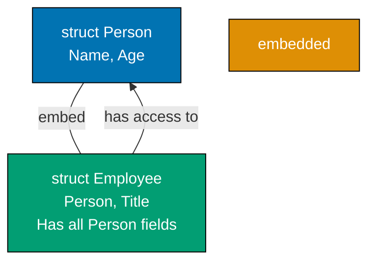
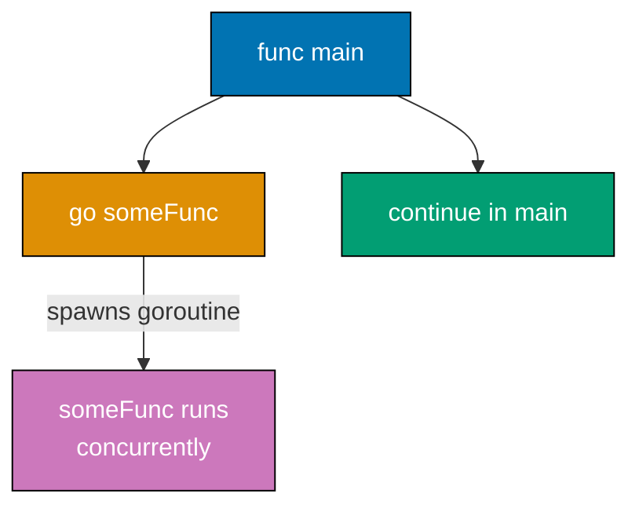
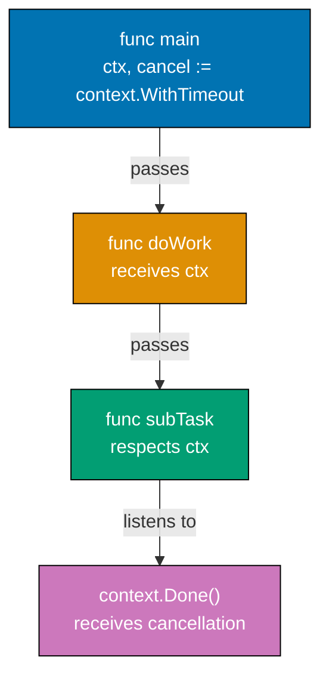
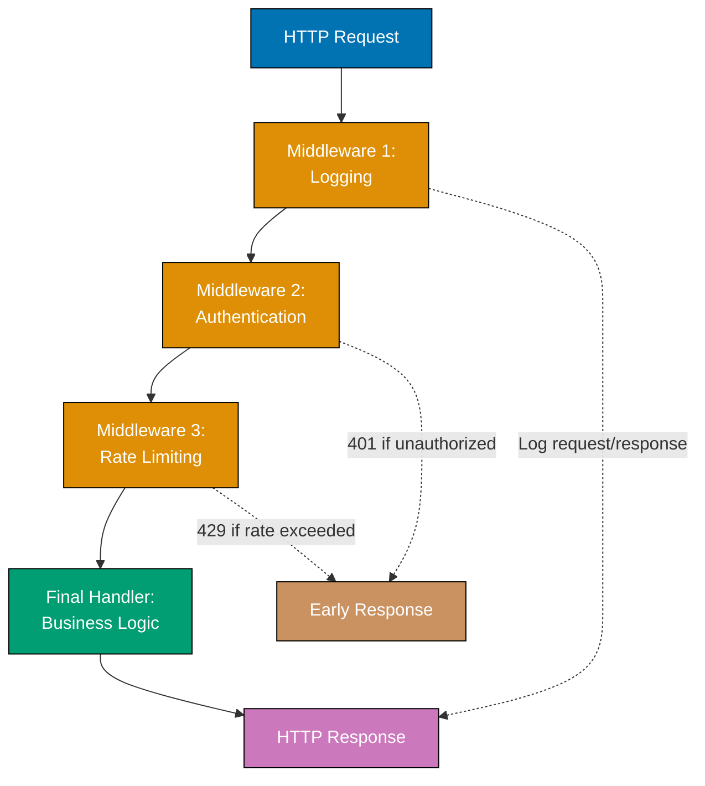
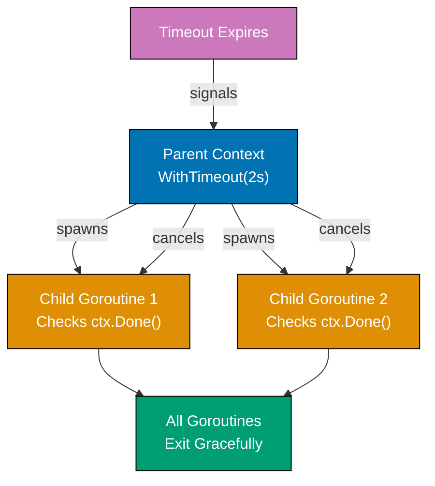
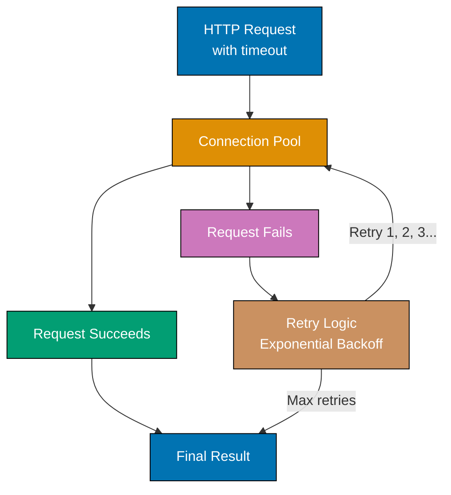
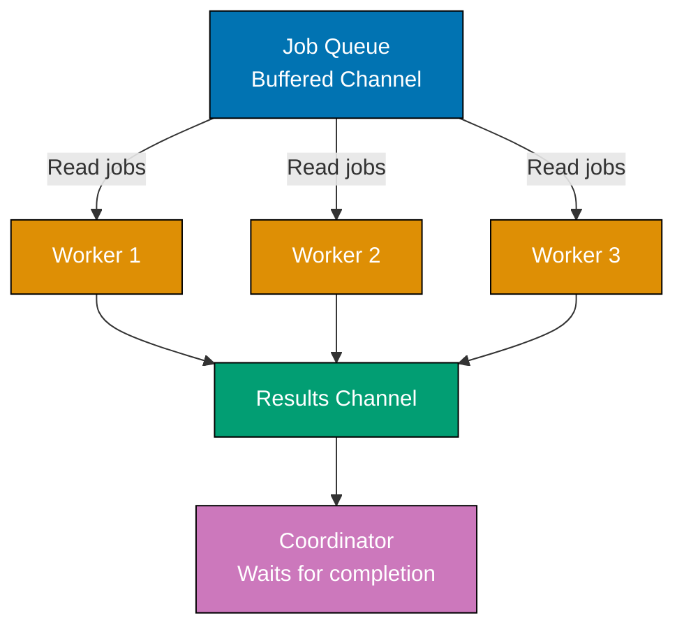

## Group 1: Advanced Interfaces and Types

### Example 16: Type Embedding and Composition

Embedding allows structs to inherit fields and methods from other types without inheritance chains. This composition-over-inheritance pattern is Go's philosophy - simpler and more flexible than traditional OOP inheritance.



**Code**:

```go
package main

import "fmt"

func main() {
    emp := Employee{
        Person: Person{Name: "Alice", Age: 30}, // => Explicit Person initialization
        Title:  "Engineer",
    }

    // Access embedded fields directly
    fmt.Println(emp.Name)    // => Alice (direct access to Person fields)
    fmt.Println(emp.Title)   // => Engineer

    // Call embedded methods
    emp.Describe()           // => Embedded method callable directly

    // Explicit access to embedded type
    fmt.Println(emp.Person.Name) // => Alice
}

type Person struct {
    Name string
    Age  int
}

func (p Person) Describe() { // => Person method
    fmt.Printf("%s is %d years old\n", p.Name, p.Age)
    // => Output: Alice is 30 years old
}

// Embed Person - Employee has all Person fields and methods
type Employee struct {
    Person // => Embedded field (no name) - fields and methods promoted
    Title  string
}
```

**Key Takeaway**: Embedding promotes fields and methods of embedded types to the outer type. This composition pattern is more flexible than inheritance - a type can embed multiple types, and you can override methods by defining them on the outer type.

### Example 17: Custom Error Types

While `error` interface only needs an `Error()` method, custom error types let you attach extra information. Implementing the `error` interface and using error wrapping enables sophisticated error handling patterns.

**Code**:

```go
package main

import (
    "errors"
    "fmt"
)

func main() {
    // Custom error with additional context
    err := performOperation()
    if err != nil {
        // Check if it's our custom error type
        var opErr *OperationError
        if errors.As(err, &opErr) { // => Extract custom error type
            fmt.Printf("Operation failed: %s (Code: %d)\n", opErr.Message, opErr.Code)
            // => Output: Operation failed: invalid input (Code: 400)
        }
    }

    // Error wrapping preserves error chain
    err = divideWithWrapping(10, 0)
    if err != nil {
        fmt.Println("Wrapped error:", err)
        // => Output: Wrapped error: division failed: cannot divide by zero

        original := errors.Unwrap(err)
        fmt.Println("Original:", original)
        // => Output: Original: cannot divide by zero
    }
}

// Custom error type implementing error interface
type OperationError struct {
    Message string
    Code    int
}

// Error() method satisfies error interface
func (e *OperationError) Error() string { // => Must be pointer receiver for this pattern
    return fmt.Sprintf("operation error: %s", e.Message)
}

func performOperation() error {
    return &OperationError{
        Message: "invalid input",
        Code:    400,
    }
}

var ErrDivisionByZero = errors.New("cannot divide by zero")

func divideWithWrapping(a, b int) error {
    if b == 0 {
        return fmt.Errorf("division failed: %w", ErrDivisionByZero) // => Wrap error
    }
    return nil
}
```

**Key Takeaway**: Implement `Error()` method to create custom error types. Use `errors.As()` to check error type and extract additional context. `fmt.Errorf` with `%w` wraps errors, preserving the chain for `errors.Unwrap()`.

### Example 18: JSON Handling

JSON is ubiquitous in Go APIs. The `encoding/json` package marshals (structs to JSON) and unmarshals (JSON to structs). Struct tags control JSON field mapping - critical for API compatibility when Go field names don't match JSON field names.

```mermaid
%% Color Palette: Blue #0173B2, Orange #DE8F05, Teal #029E73, Purple #CC78BC, Brown #CA9161
graph LR
    A["Go Struct<br/>User{Name, Age}"]
    B["json.Marshal"]
    C["JSON String<br/>{\"name\":\"Alice\"}"]
    D["json.Unmarshal"]
    E["Go Struct<br/>Person{Name, Age}"]

    A -->|Marshal| B
    B --> C
    C -->|Unmarshal| D
    D --> E

    style A fill:#0173B2,stroke:#000,color:#fff
    style B fill:#DE8F05,stroke:#000,color:#fff
    style C fill:#029E73,stroke:#000,color:#fff
    style D fill:#CC78BC,stroke:#000,color:#fff
    style E fill:#CA9161,stroke:#000,color:#fff
```

**Code**:

```go
package main

import (
    "encoding/json"
    "fmt"
)

func main() {
    // Marshal - Go struct to JSON string
    user := User{
        Name: "Alice",
        Age:  30,
        Email: "alice@example.com",
    }

    jsonBytes, err := json.Marshal(user) // => Convert struct to JSON
    if err != nil {
        fmt.Println("Marshal error:", err)
        return
    }
    fmt.Println(string(jsonBytes))
    // => Output: {"Name":"Alice","Age":30,"Email":"alice@example.com"}

    // Unmarshal - JSON string to Go struct
    jsonStr := `{"name":"Bob","age":25,"email":"bob@example.com"}` // => Lowercase JSON fields
    var person Person
    err = json.Unmarshal([]byte(jsonStr), &person) // => Unmarshal into pointer
    if err != nil {
        fmt.Println("Unmarshal error:", err)
        return
    }
    fmt.Println(person)
    // => Output: {Bob 25 bob@example.com}

    // Custom type with different JSON representation
    apiResponse := APIResponse{
        Status: 200,
        Data:   person,
    }
    responseJSON, _ := json.MarshalIndent(apiResponse, "", "  ") // => Pretty print JSON
    fmt.Println(string(responseJSON))
    // => Output: {
    //            "status": 200,
    //            "data": {
    //              "name": "Bob",
    //              "age": 25,
    //              "email": "bob@example.com"
    //            }
    //          }
}

// User - field names must be capitalized for json.Marshal to see them
type User struct {
    Name  string
    Age   int
    Email string
}

// Person - struct tags control JSON mapping
type Person struct {
    Name  string `json:"name"`          // => Map to "name" in JSON
    Age   int    `json:"age"`           // => Map to "age" in JSON
    Email string `json:"email"`         // => Map to "email" in JSON
}

type APIResponse struct {
    Status int         `json:"status"`            // => Customize field name
    Data   Person      `json:"data"`
}
```

**Key Takeaway**: Struct tags control JSON field mapping - essential when Go names differ from JSON names. Struct field names must be capitalized for JSON encoding. Use `json.Marshal()` for compact JSON and `json.MarshalIndent()` for pretty-printed JSON.

## Group 2: Concurrency Basics

### Example 19: Goroutines

Goroutines are lightweight threads managed by the Go runtime. Unlike OS threads, thousands of goroutines can run concurrently without overwhelming system resources. The `go` keyword starts a goroutine that runs concurrently with code that follows.



**Code**:

```go
package main

import (
    "fmt"
    "time"
)

func main() {
    // Start goroutine
    go printNumbers()        // => go keyword spawns goroutine - execution continues

    // Main continues while goroutine runs
    fmt.Println("Main continues immediately")

    // Wait for goroutine to finish
    time.Sleep(1 * time.Second) // => Goroutine needs time to complete
    fmt.Println("Main done")

    // => Output:
    // => Main continues immediately
    // => Number: 0
    // => Number: 1
    // => Number: 2
    // => Main done

    // Multiple goroutines
    for i := 0; i < 3; i++ {
        go func(id int) { // => Anonymous function in goroutine
            fmt.Printf("Goroutine %d running\n", id)
        }(i)              // => Note: must pass i as argument (see common pitfall)
    }

    time.Sleep(100 * time.Millisecond) // => Let goroutines complete
}

func printNumbers() {
    for i := 0; i < 3; i++ {
        fmt.Printf("Number: %d\n", i)
    }
}
```

**Key Takeaway**: `go func()` spawns a goroutine that runs concurrently. The main function doesn't wait for goroutines - you must synchronize with `time.Sleep()`, channels, or `sync.WaitGroup`. When passing loop variables to goroutines, pass as arguments to avoid closure pitfalls.

### Example 20: Channels

Channels enable safe communication between goroutines. Send data on one end, receive on the other. Unbuffered channels synchronize goroutines - a send blocks until a receive happens. Buffered channels decouple send and receive.


**Code**:

```go
package main

import (
    "fmt"
)

func main() {
    // Unbuffered channel - send blocks until receive
    messages := make(chan string) // => Create channel for strings

    go func() {
        messages <- "Hello from goroutine" // => Send on channel
    }()

    msg := <-messages                      // => Receive from channel (blocks until send)
    fmt.Println(msg)
    // => Output: Hello from goroutine

    // Buffered channel - send blocks only when buffer full
    buffered := make(chan int, 2) // => Buffer capacity 2

    buffered <- 1                  // => Send (doesn't block, buffer has space)
    buffered <- 2                  // => Send (buffer full now)
    // buffered <- 3               // => This would block (buffer full)

    val1 := <-buffered            // => Receive (now buffer has space)
    fmt.Println(val1)             // => 1
    val2 := <-buffered
    fmt.Println(val2)             // => 2

    // Range over channel
    results := make(chan int)
    go func() {
        results <- 10
        results <- 20
        results <- 30
        close(results)            // => Close channel to signal no more sends
    }()

    for value := range results { // => Range blocks until channel closed
        fmt.Println(value)
    }
    // => Output: 10 20 30
}
```

**Key Takeaway**: Unbuffered channels synchronize goroutines - sends block until receives. Buffered channels decouple send/receive by buffering values. Always `close()` channels when done to signal completion. Use `range` to iterate until channel closes.

### Example 21: Channel Select

The `select` statement lets a goroutine wait on multiple channel operations. It's like a `switch` for channels - whichever channel is ready executes first. This pattern enables timeouts and handling multiple concurrent operations.

**Code**:

```go
package main

import (
    "fmt"
    "time"
)

func main() {
    // Select between two channels
    ch1 := make(chan string)
    ch2 := make(chan string)

    go func() {
        time.Sleep(100 * time.Millisecond)
        ch1 <- "from channel 1" // => Send after delay
    }()

    go func() {
        time.Sleep(200 * time.Millisecond)
        ch2 <- "from channel 2" // => Send after longer delay
    }()

    // Wait for either channel
    for i := 0; i < 2; i++ {
        select {                // => Wait for any channel to be ready
        case msg1 := <-ch1:     // => If ch1 is ready, execute
            fmt.Println("Received:", msg1)
        case msg2 := <-ch2:     // => If ch2 is ready, execute
            fmt.Println("Received:", msg2)
        }
    }

    // Select with timeout
    timeoutCh := make(chan string)
    select {
    case msg := <-timeoutCh: // => Wait up to 100ms for message
        fmt.Println("Got message:", msg)
    case <-time.After(100 * time.Millisecond): // => Timeout fires if no message in 100ms
        fmt.Println("Timeout - no message received")
    }
    // => Output: Timeout - no message received

    // Default case - non-blocking receive
    results := make(chan int)
    select {
    case result := <-results:
        fmt.Println("Got result:", result)
    default:                 // => Executes if no other case ready
        fmt.Println("No result available")
    }
    // => Output: No result available
}
```

**Key Takeaway**: `select` waits for multiple channels. Use with `time.After()` for timeouts. The `default` case makes select non-blocking - useful for checking if work is available without blocking.

### Example 22: WaitGroups and Sync

Coordinating multiple goroutines requires synchronization. `sync.WaitGroup` is the standard pattern - increment a counter for each goroutine, decrement when done, and wait for all to finish. Mutexes protect shared data from race conditions.

**Code**:

```go
package main

import (
    "fmt"
    "sync"
)

func main() {
    // WaitGroup - coordinate multiple goroutines
    var wg sync.WaitGroup // => WaitGroup tracks active goroutines

    for i := 0; i < 3; i++ {
        wg.Add(1)          // => Increment counter - one more goroutine starting
        go func(id int) {
            defer wg.Done() // => Decrement counter when goroutine completes
            fmt.Printf("Worker %d processing\n", id)
        }(i)
    }

    wg.Wait()              // => Block until all goroutines call Done()
    fmt.Println("All workers complete")
    // => Output:
    // => Worker 0 processing
    // => Worker 1 processing
    // => Worker 2 processing
    // => All workers complete

    // Mutex - protect shared data
    var mu sync.Mutex      // => Mutex protects counter
    var counter int
    var wg2 sync.WaitGroup

    for i := 0; i < 5; i++ {
        wg2.Add(1)
        go func() {
            defer wg2.Done()
            mu.Lock()       // => Acquire lock - only one goroutine at a time
            counter++       // => Safely modify shared counter
            mu.Unlock()     // => Release lock - other goroutines can proceed
        }()
    }

    wg2.Wait()
    fmt.Println("Counter:", counter) // => 5 (safe increment)

    // RWMutex - multiple readers, exclusive writer
    var rwmu sync.RWMutex
    var data = "initial"

    // Multiple readers can run concurrently
    var wg3 sync.WaitGroup
    for i := 0; i < 3; i++ {
        wg3.Add(1)
        go func(id int) {
            defer wg3.Done()
            rwmu.RLock()    // => Read lock - multiple goroutines allowed
            fmt.Printf("Reader %d: %s\n", id, data)
            rwmu.RUnlock()
        }(i)
    }

    wg3.Wait()
}
```

**Key Takeaway**: Use `sync.WaitGroup` to wait for multiple goroutines. Call `Add(1)` before spawning, `Done()` when complete, and `Wait()` to block until all finish. Use `sync.Mutex` to protect shared data - `Lock()` before accessing, `Unlock()` after. Use `sync.RWMutex` when you have many readers and few writers.

## Group 3: I/O and File Handling

### Example 23: File I/O

File operations are fundamental. Go provides multiple layers: low-level (`os` package), buffered (`bufio`), and convenience functions. The `defer file.Close()` pattern ensures files close even if errors occur.

**Code**:

```go
package main

import (
    "bufio"
    "fmt"
    "os"
)

func main() {
    // Write to file
    filename := "/tmp/test.txt"
    file, err := os.Create(filename) // => Create or truncate file
    if err != nil {
        fmt.Println("Error creating file:", err)
        return
    }
    defer file.Close()              // => Ensure file closes

    file.WriteString("Line 1\n")    // => Write data
    file.WriteString("Line 2\n")

    // Read entire file
    data, err := os.ReadFile(filename) // => Read all content at once
    if err != nil {
        fmt.Println("Error reading file:", err)
        return
    }
    fmt.Println("File contents:")
    fmt.Println(string(data))
    // => Output:
    // => File contents:
    // => Line 1
    // => Line 2

    // Read line by line (buffered)
    file, err = os.Open(filename)
    if err != nil {
        fmt.Println("Error opening file:", err)
        return
    }
    defer file.Close()

    scanner := bufio.NewScanner(file) // => Buffer reads for efficiency
    for scanner.Scan() {              // => Read until EOF
        line := scanner.Text()        // => Get current line
        fmt.Println("Read:", line)
    }
    // => Output:
    // => Read: Line 1
    // => Read: Line 2

    // File info
    info, err := os.Stat(filename)
    if err != nil {
        fmt.Println("Error getting info:", err)
        return
    }
    fmt.Printf("File size: %d bytes\n", info.Size()) // => File metadata
    fmt.Printf("Modified: %v\n", info.ModTime())
}
```

**Key Takeaway**: Use `os.Create()` to write, `os.ReadFile()` to read entire file, `os.Open()` with `bufio.Scanner` for line-by-line reading. Always `defer file.Close()` to ensure cleanup.

### Example 24: HTTP Client

Making HTTP requests is essential for API integration. The `net/http` package provides client functionality. Customize requests with headers, timeouts, and query parameters. Always check response status codes.

**Code**:

```go
package main

import (
    "fmt"
    "io"
    "net/http"
    "time"
)

func main() {
    // Simple GET request
    resp, err := http.Get("https://api.example.com/users") // => GET request
    if err != nil {
        fmt.Println("Error:", err)
        return
    }
    defer resp.Body.Close()  // => Ensure response body closes

    body, _ := io.ReadAll(resp.Body) // => Read response body
    fmt.Println("Status:", resp.Status) // => Check status
    fmt.Println("Body:", string(body))

    // Custom client with timeout
    client := &http.Client{
        Timeout: 5 * time.Second, // => Request timeout
    }

    // Create custom request
    req, _ := http.NewRequest("GET", "https://api.example.com/users", nil)
    req.Header.Add("Authorization", "Bearer token123") // => Add headers

    resp, err = client.Do(req) // => Execute request
    if err != nil {
        fmt.Println("Error:", err)
        return
    }
    defer resp.Body.Close()

    if resp.StatusCode == http.StatusOK { // => Check status code
        fmt.Println("Request successful")
    }
}
```

**Key Takeaway**: Use `http.Get()` for simple requests. Use `http.Client` with custom `Timeout` for control. Always `defer resp.Body.Close()` to avoid resource leaks. Check response status codes - successful responses are 200-299.

### Example 25: HTTP Server

Go's standard library includes HTTP server capabilities. Handler functions or types can handle requests. Multiplexing routes maps URL paths to handlers. Understanding request/response flow is essential for building APIs.

**Code**:

```go
package main

import (
    "fmt"
    "io"
    "net/http"
)

func main() {
    // Register handlers
    mux := http.NewServeMux() // => Create router

    mux.HandleFunc("/", homeHandler)       // => Map URL path to handler function
    mux.HandleFunc("/users", usersHandler)
    mux.Handle("/data", &DataHandler{})    // => Use handler type

    // Start server
    fmt.Println("Server listening on :8080")
    err := http.ListenAndServe(":8080", mux) // => Start server on port 8080
    if err != nil {
        fmt.Println("Error:", err)
    }
}

// Handler function
func homeHandler(w http.ResponseWriter, r *http.Request) { // => w: write response, r: request
    body, _ := io.ReadAll(r.Body) // => Read request body
    fmt.Fprintf(w, "Hello from home! Body: %s\n", string(body)) // => Write response
}

// Handler function
func usersHandler(w http.ResponseWriter, r *http.Request) {
    w.Header().Set("Content-Type", "application/json") // => Set response header
    w.WriteHeader(http.StatusOK)                       // => Set status code

    if r.Method == http.MethodPost {                   // => Check request method
        fmt.Fprint(w, `{"status": "user created"}`)
    } else {
        fmt.Fprint(w, `{"users": []}`)
    }
}

// Handler type
type DataHandler struct{}

func (h *DataHandler) ServeHTTP(w http.ResponseWriter, r *http.Request) { // => ServeHTTP satisfies Handler interface
    fmt.Fprint(w, "Data response")
}
```

**Key Takeaway**: Register handlers with `HandleFunc` (for functions) or `Handle` (for types). Handler functions receive `ResponseWriter` and `*Request`. Use `w.Write()` or `w.WriteString()` to send responses. Set headers and status codes before writing the body.

## Group 4: Standard Library Deep Dive

### Example 26: Time and Duration

Time handling is complex across programming languages. Go's `time` package makes it straightforward with `time.Time` values, `time.Duration` for intervals, and format strings for parsing/formatting.

**Code**:

```go
package main

import (
    "fmt"
    "time"
)

func main() {
    // Current time
    now := time.Now()               // => Get current time
    fmt.Println("Now:", now)        // => Output: 2025-12-23 10:30:45.123456789 +0000 UTC

    // Time arithmetic
    tomorrow := now.Add(24 * time.Hour) // => Add duration
    fmt.Println("Tomorrow:", tomorrow)

    // Parse time
    layout := "2006-01-02"          // => Go uses specific reference time
    parsed, _ := time.Parse(layout, "2025-12-23") // => Parse string to time
    fmt.Println("Parsed:", parsed)

    // Format time
    formatted := now.Format("January 2, 2006") // => Format to string
    fmt.Println("Formatted:", formatted)

    // Duration
    start := time.Now()
    time.Sleep(100 * time.Millisecond)
    elapsed := time.Since(start)    // => Calculate duration
    fmt.Printf("Elapsed: %v\n", elapsed) // => ~100ms

    // Timer and Ticker
    timer := time.NewTimer(200 * time.Millisecond) // => One-shot timer
    <-timer.C                       // => Wait for timer to fire
    fmt.Println("Timer fired")

    ticker := time.NewTicker(100 * time.Millisecond) // => Repeating ticker
    go func() {
        for i := 0; i < 3; i++ {
            <-ticker.C             // => Fire every 100ms
            fmt.Println("Tick", i)
        }
        ticker.Stop()              // => Stop ticker
    }()

    time.Sleep(400 * time.Millisecond) // => Wait for ticks
}
```

**Key Takeaway**: `time.Now()` gets current time. Use `time.Duration` for intervals. Format strings use the reference time "Mon Jan 2 15:04:05 MST 2006" (remember as "2006-01-02 15:04:05"). `time.Timer` fires once, `time.Ticker` fires repeatedly.

### Example 27: Regular Expressions

Regular expressions enable pattern matching. Go's `regexp` package compiles patterns and provides matching/replacing functions. Precompile expensive patterns to avoid recompilation.

**Code**:

```go
package main

import (
    "fmt"
    "regexp"
)

func main() {
    // Compile pattern
    pattern, _ := regexp.Compile(`^[a-z]+@[a-z]+\.[a-z]+$`) // => Precompile pattern

    // Test if string matches
    if pattern.MatchString("alice@example.com") {
        fmt.Println("Valid email")
    }

    // Find matches
    re := regexp.MustCompile(`\d+`)  // => Find all numbers
    matches := re.FindAllString("abc 123 def 456", -1) // => -1 means find all
    fmt.Println("Numbers:", matches) // => [123 456]

    // Replace matches
    text := "Hello World"
    replaced := regexp.MustCompile(`\w+`).ReplaceAllString(text, "[word]")
    fmt.Println("Replaced:", replaced) // => [word] [word]

    // Extract capture groups
    re = regexp.MustCompile(`(\w+)@(\w+)\.(\w+)`) // => Three capture groups
    matches = re.FindStringSubmatch("alice@example.com")
    if len(matches) > 0 {
        fmt.Println("Full:", matches[0])   // => alice@example.com
        fmt.Println("User:", matches[1])   // => alice
        fmt.Println("Domain:", matches[2]) // => example
        fmt.Println("TLD:", matches[3])    // => com
    }
}
```

**Key Takeaway**: Use `regexp.MustCompile()` for patterns known at compile-time. Use `regexp.Compile()` for runtime patterns (returns error). Precompile patterns used repeatedly. Use capture groups `()` to extract parts of matches.

### Example 28: Context Package

The `context` package manages deadlines, cancellation, and request-scoped values. It's essential for building responsive systems that can be cancelled and respect timeouts. Context flows through function calls to coordinate cancellation.



**Code**:

```go
package main

import (
    "context"
    "fmt"
    "time"
)

func main() {
    // Context with timeout
    ctx, cancel := context.WithTimeout(context.Background(), 2*time.Second)
    defer cancel()                  // => Clean up context

    result := doWork(ctx)           // => Pass context
    fmt.Println("Result:", result)

    // Context with cancellation
    ctx2, cancel2 := context.WithCancel(context.Background())

    go func() {
        time.Sleep(500 * time.Millisecond)
        cancel2()                   // => Cancel context
    }()

    doWork(ctx2)
    fmt.Println("After cancellation")

    // Context values (use sparingly)
    ctx3 := context.WithValue(context.Background(), "user_id", 123)
    userID := ctx3.Value("user_id") // => Retrieve value
    fmt.Println("User ID:", userID)
}

func doWork(ctx context.Context) string {
    for {
        select {
        case <-ctx.Done():          // => Context cancelled or deadline exceeded
            fmt.Println("Work cancelled:", ctx.Err())
            return "cancelled"
        case <-time.After(500 * time.Millisecond):
            fmt.Println("Working...")
        }
    }
}
```

**Key Takeaway**: `context.Background()` is the root context. `WithTimeout()` creates a context with deadline. `WithCancel()` creates a cancellable context. Always `defer cancel()` to avoid leaking goroutines. Listen to `ctx.Done()` to receive cancellation signals.

### Example 29: Flag Parsing

Command-line flags enable configurable programs. Go's `flag` package parses flags automatically, extracting values into variables. Useful for scripts and tools that need configuration from command-line arguments.

**Code**:

```go
package main

import (
    "flag"
    "fmt"
)

func main() {
    // Define flags
    name := flag.String("name", "World", "Name to greet") // => String flag with default
    count := flag.Int("count", 1, "Number of greetings")  // => Integer flag
    verbose := flag.Bool("verbose", false, "Verbose mode") // => Boolean flag

    flag.Parse()                   // => Parse command-line flags

    // Use parsed values
    for i := 0; i < *count; i++ { // => Flags are pointers to values
        greeting := fmt.Sprintf("Hello, %s!", *name)
        fmt.Println(greeting)
    }

    if *verbose {
        fmt.Println("Verbose mode enabled")
    }

    // Remaining arguments after flags
    args := flag.Args()            // => Non-flag arguments
    if len(args) > 0 {
        fmt.Println("Extra arguments:", args)
    }
}

// Usage: go run main.go -name Alice -count 3 -verbose
// Output:
// Hello, Alice!
// Hello, Alice!
// Hello, Alice!
// Verbose mode enabled
```

**Key Takeaway**: Define flags with `flag.String()`, `flag.Int()`, `flag.Bool()`. Call `flag.Parse()` to extract values. Flag values are pointers - dereference with `*`. Use `flag.Args()` to get remaining non-flag arguments.

## Group 5: Production Patterns

### Example 30: HTTP Middleware Pattern

Middleware intercepts requests and responses, enabling cross-cutting concerns like logging, authentication, and error handling. Middleware wraps handlers with decorator pattern - each middleware can inspect requests and responses.

**Code**:

```go
package main

import (
    "fmt"
    "log"
    "net/http"
    "time"
)

func main() {
    mux := http.NewServeMux()

    // Register handler with middleware chain
    handler := http.HandlerFunc(homeHandler)
    handler = loggingMiddleware(handler)      // => Wrap with logging
    handler = authMiddleware(handler)         // => Wrap with auth
    handler = recoveryMiddleware(handler)     // => Wrap with recovery

    mux.Handle("/", handler)
    http.ListenAndServe(":8080", mux)
}

// Middleware function - returns handler that wraps original
func loggingMiddleware(next http.Handler) http.Handler {
    return http.HandlerFunc(func(w http.ResponseWriter, r *http.Request) {
        start := time.Now()
        log.Printf("Started %s %s", r.Method, r.RequestURI)

        next.ServeHTTP(w, r)        // => Call next handler

        log.Printf("Completed in %v", time.Since(start))
    })
}

// Authentication middleware
func authMiddleware(next http.Handler) http.Handler {
    return http.HandlerFunc(func(w http.ResponseWriter, r *http.Request) {
        token := r.Header.Get("Authorization") // => Check request header

        if token == "" {
            http.Error(w, "Unauthorized", http.StatusUnauthorized) // => Reject if no token
            return
        }

        next.ServeHTTP(w, r)        // => Proceed if authorized
    })
}

// Recovery middleware - catch panics
func recoveryMiddleware(next http.Handler) http.Handler {
    return http.HandlerFunc(func(w http.ResponseWriter, r *http.Request) {
        defer func() {
            if err := recover(); err != nil { // => Catch panic
                log.Printf("Panic: %v", err)
                http.Error(w, "Internal Server Error", http.StatusInternalServerError)
            }
        }()

        next.ServeHTTP(w, r)
    })
}

func homeHandler(w http.ResponseWriter, r *http.Request) {
    fmt.Fprint(w, "Hello, Authenticated User!")
}
```

**Key Takeaway**: Middleware wraps handlers, executing code before and after the handler. Create middleware by returning a handler that calls `next.ServeHTTP()`. Chain multiple middleware for cross-cutting concerns like logging, auth, and error handling.

### Example 31: Graceful Shutdown

Production servers need graceful shutdown - stop accepting new requests, finish in-flight requests, clean up resources. Signal handling with `os/signal` enables responding to termination signals like SIGTERM.

**Code**:

```go
package main

import (
    "context"
    "fmt"
    "net/http"
    "os"
    "os/signal"
    "syscall"
    "time"
)

func main() {
    // Create server
    server := &http.Server{
        Addr:           ":8080",
        Handler:        http.HandlerFunc(func(w http.ResponseWriter, r *http.Request) {
            time.Sleep(2 * time.Second) // => Simulate work
            fmt.Fprint(w, "Response")
        }),
        ReadTimeout:    10 * time.Second,
        WriteTimeout:   10 * time.Second,
        MaxHeaderBytes: 1 << 20,
    }

    // Start server in goroutine
    go func() {
        fmt.Println("Starting server on :8080")
        if err := server.ListenAndServe(); err != nil && err != http.ErrServerClosed {
            fmt.Printf("Server error: %v\n", err)
        }
    }()

    // Wait for interrupt signal
    sigChan := make(chan os.Signal, 1)
    signal.Notify(sigChan, syscall.SIGTERM, syscall.SIGINT) // => Listen for signals

    <-sigChan                        // => Block until signal received
    fmt.Println("\nShutdown signal received, gracefully stopping...")

    // Graceful shutdown with timeout
    ctx, cancel := context.WithTimeout(context.Background(), 5*time.Second)
    defer cancel()

    if err := server.Shutdown(ctx); err != nil { // => Shutdown gracefully
        fmt.Printf("Shutdown error: %v\n", err)
    }

    fmt.Println("Server stopped")
}
```

**Key Takeaway**: Use `signal.Notify()` to receive OS signals. Call `server.Shutdown(ctx)` with context timeout to gracefully stop. Graceful shutdown waits for in-flight requests to complete before stopping.

### Example 32: Worker Pool Pattern

Worker pools limit concurrent work and improve resource efficiency. Fixed number of workers process jobs from a queue. Useful for API calls, database operations, or any bounded-resource work.

**Code**:

```go
package main

import (
    "fmt"
    "sync"
)

func main() {
    // Create worker pool
    jobChan := make(chan int, 10)  // => Job queue (buffered)
    var wg sync.WaitGroup

    // Start workers
    numWorkers := 3
    for i := 0; i < numWorkers; i++ {
        go worker(i, jobChan, &wg) // => Start worker
    }

    // Submit jobs
    for j := 1; j <= 10; j++ {
        wg.Add(1)                  // => One more job
        jobChan <- j               // => Send job to queue
    }

    wg.Wait()                      // => Wait for all jobs complete
    close(jobChan)                 // => Signal no more jobs
    fmt.Println("All jobs complete")
}

func worker(id int, jobs <-chan int, wg *sync.WaitGroup) {
    for job := range jobs {        // => Receive jobs
        fmt.Printf("Worker %d processing job %d\n", id, job)
        wg.Done()                  // => Mark job complete
    }
}
```

**Key Takeaway**: Create a channel for jobs. Start fixed number of workers that receive from the channel. Send jobs to the channel. Workers process jobs concurrently, bounded by number of workers.

## Group 6: Advanced Testing

### Example 33: Benchmarking

Benchmarking measures performance. Go's `testing.B` type runs test functions multiple times to measure speed. Use benchmarks to catch performance regressions and optimize bottlenecks.

**Code**:

```go
package main

import "testing"

// Run benchmarks with: go test -bench=.
// Memory allocation: go test -bench=. -benchmem

func BenchmarkSliceAppend(b *testing.B) {
    for i := 0; i < b.N; i++ { // => b.N iterations (determined by testing framework)
        s := make([]int, 0)
        for j := 0; j < 100; j++ {
            s = append(s, j)    // => Append to slice
        }
    }
}

func BenchmarkSlicePrealloc(b *testing.B) {
    for i := 0; i < b.N; i++ {
        s := make([]int, 0, 100) // => Preallocate capacity
        for j := 0; j < 100; j++ {
            s = append(s, j)
        }
    }
}

func BenchmarkMapAccess(b *testing.B) {
    m := make(map[string]int)
    for i := 0; i < 1000; i++ {
        m[fmt.Sprintf("key%d", i)] = i
    }

    b.ResetTimer()               // => Reset timer (exclude setup)

    for i := 0; i < b.N; i++ {
        _ = m["key500"]          // => Access operation to benchmark
    }
}

// Memory allocation tracking
func BenchmarkAllocation(b *testing.B) {
    b.ReportAllocs()            // => Report memory allocations

    for i := 0; i < b.N; i++ {
        s := make([]int, 100)    // => Allocation
        _ = s
    }
}
```

**Key Takeaway**: Benchmark functions named `BenchmarkXxx`. Loop from `0` to `b.N` - the testing framework adjusts N to get meaningful results. Use `b.ResetTimer()` to exclude setup time. Use `b.ReportAllocs()` to track allocations.

### Example 34: Examples as Tests

Example functions test code while also serving as documentation. When you run `go test`, examples execute. Output should match comments starting with `// Output:`. Go generates docs from examples.

**Code**:

```go
package main

import "fmt"

// Example functions must be in _test.go file
func ExampleAdd() {
    result := add(2, 3)
    fmt.Println(result)
    // Output: 5
}

func ExampleGreet() {
    name := greet("Alice")
    fmt.Println(name)
    // Output: Hello, Alice!
}

// Unordered output when order varies
func ExampleMapIteration() {
    m := make(map[string]int)
    m["x"] = 1
    m["y"] = 2
    for k, v := range m {
        fmt.Printf("%s:%d ", k, v)
    }
    // Unordered output: x:1 y:2 OR y:2 x:1 OR x:1 y:2 OR ...
}

func add(a, b int) int {
    return a + b
}

func greet(name string) string {
    return fmt.Sprintf("Hello, %s!", name)
}
```

**Key Takeaway**: Example functions start with `Example` and must have `// Output:` comments. The output after `// Output:` must match the function's output exactly. Use `// Unordered output:` when order is non-deterministic.

### Example 35: Test Coverage

Test coverage measures what percentage of code is executed by tests. While 100% coverage doesn't guarantee correctness, measuring coverage reveals untested code. Use `go test -cover` to see coverage percentage.

**Code**:

```go
package main

import (
    "testing"
)

func TestCoverage(t *testing.T) {
    // Test normal case
    result := processValue(10)
    if result != 20 {
        t.Errorf("Expected 20, got %d", result)
    }

    // Test zero case
    result = processValue(0)
    if result != 0 {
        t.Errorf("Expected 0, got %d", result)
    }

    // Test negative case
    result = processValue(-5)
    if result != -10 {
        t.Errorf("Expected -10, got %d", result)
    }
}

func processValue(x int) int {
    if x == 0 {
        return 0                  // => Covered by test
    }
    if x < 0 {
        return x * 2             // => Covered by test
    }
    return x * 2                 // => Covered by test
}

// Run: go test -cover
// Output: coverage: 100.0% of statements
```

**Key Takeaway**: Run `go test -cover` to see coverage percentage. Use `go test -coverprofile=coverage.out` to generate detailed reports. High coverage is good but doesn't replace thoughtful tests.

### Example 36: HTTP Middleware Chain (Production Pattern)

Middleware chains are essential in production HTTP services. They compose cross-cutting concerns (logging, authentication, rate limiting) by wrapping handlers. Each middleware can inspect/modify requests and responses, short-circuit the chain, or pass control to the next handler.



**Code**:

```go
package main

import (
    "fmt"
    "log"
    "net/http"
    "time"
)

func main() {
    // Build middleware chain - order matters!
    handler := http.HandlerFunc(businessHandler)
    handler = loggingMiddleware(handler)        // => Outermost: logs everything
    handler = authMiddleware(handler)           // => Checks auth before business logic
    handler = rateLimitMiddleware(handler)      // => Rate limit before auth
    handler = recoveryMiddleware(handler)       // => Recover from panics in any layer

    // Register handler
    mux := http.NewServeMux()
    mux.Handle("/api/data", handler)

    // Start server
    fmt.Println("Server listening on :8080")
    http.ListenAndServe(":8080", mux)
}

// Middleware type - wraps http.Handler and returns http.Handler
type Middleware func(http.Handler) http.Handler

// 1. Logging Middleware - logs request/response details
func loggingMiddleware(next http.Handler) http.Handler {
    return http.HandlerFunc(func(w http.ResponseWriter, r *http.Request) {
        start := time.Now()                     // => Capture start time

        // Create custom ResponseWriter to capture status code
        wrapped := &responseWriter{
            ResponseWriter: w,
            statusCode:     http.StatusOK,      // => Default 200
        }

        log.Printf("[%s] %s %s - Started", r.Method, r.URL.Path, r.RemoteAddr)

        next.ServeHTTP(wrapped, r)              // => Call next handler in chain

        duration := time.Since(start)
        log.Printf("[%s] %s %s - Completed %d in %v",
            r.Method, r.URL.Path, r.RemoteAddr, wrapped.statusCode, duration)
    })
}

// Custom ResponseWriter to capture status code
type responseWriter struct {
    http.ResponseWriter                         // => Embed standard ResponseWriter
    statusCode          int
}

func (rw *responseWriter) WriteHeader(code int) {
    rw.statusCode = code                        // => Capture status code
    rw.ResponseWriter.WriteHeader(code)         // => Call original WriteHeader
}

// 2. Authentication Middleware - validates auth token
func authMiddleware(next http.Handler) http.Handler {
    return http.HandlerFunc(func(w http.ResponseWriter, r *http.Request) {
        token := r.Header.Get("Authorization")  // => Extract token from header

        if token == "" {
            http.Error(w, "Missing Authorization header", http.StatusUnauthorized)
            return                              // => Short-circuit: don't call next
        }

        // Validate token (simplified - production would check signature, expiry)
        if !isValidToken(token) {
            http.Error(w, "Invalid token", http.StatusUnauthorized)
            return                              // => Short-circuit
        }

        // Token valid - add user info to request context
        // In production: ctx := context.WithValue(r.Context(), "user_id", userID)
        // r = r.WithContext(ctx)

        next.ServeHTTP(w, r)                    // => Proceed to next handler
    })
}

func isValidToken(token string) bool {
    // Simplified validation - production checks JWT signature, expiry
    return token == "Bearer valid-token-123"    // => Mock validation
}

// 3. Rate Limiting Middleware - prevent abuse
func rateLimitMiddleware(next http.Handler) http.Handler {
    // Simple in-memory rate limiter (production uses Redis/distributed cache)
    requests := make(map[string][]time.Time)    // => IP -> request timestamps

    return http.HandlerFunc(func(w http.ResponseWriter, r *http.Request) {
        ip := r.RemoteAddr                      // => Client IP

        now := time.Now()
        // Remove requests older than 1 minute
        var recent []time.Time
        for _, t := range requests[ip] {
            if now.Sub(t) < time.Minute {       // => Keep only recent requests
                recent = append(recent, t)
            }
        }

        // Check rate limit (10 requests per minute)
        if len(recent) >= 10 {
            http.Error(w, "Rate limit exceeded", http.StatusTooManyRequests)
            return                              // => Short-circuit: reject request
        }

        // Add this request to history
        requests[ip] = append(recent, now)

        next.ServeHTTP(w, r)                    // => Proceed to next handler
    })
}

// 4. Recovery Middleware - catch panics and return 500
func recoveryMiddleware(next http.Handler) http.Handler {
    return http.HandlerFunc(func(w http.ResponseWriter, r *http.Request) {
        defer func() {
            if err := recover(); err != nil {   // => Catch panic
                log.Printf("PANIC: %v", err)
                http.Error(w, "Internal Server Error", http.StatusInternalServerError)
            }
        }()

        next.ServeHTTP(w, r)                    // => Execute handler (may panic)
    })
}

// Final business logic handler
func businessHandler(w http.ResponseWriter, r *http.Request) {
    // This is where actual business logic lives
    // Middleware has already handled logging, auth, rate limiting, recovery

    w.Header().Set("Content-Type", "application/json")
    fmt.Fprint(w, `{"status": "success", "data": {"message": "Hello, authenticated user!"}}`)
}

// Alternative: Chainable middleware builder
func chain(handler http.Handler, middlewares ...Middleware) http.Handler {
    // Apply middlewares in reverse order
    for i := len(middlewares) - 1; i >= 0; i-- {
        handler = middlewares[i](handler)       // => Wrap handler with middleware
    }
    return handler
}

// Usage with chain builder:
// handler := chain(
//     http.HandlerFunc(businessHandler),
//     loggingMiddleware,
//     authMiddleware,
//     rateLimitMiddleware,
//     recoveryMiddleware,
// )
```

**Key Takeaway**: Middleware chains compose cross-cutting concerns by wrapping handlers. Each middleware can inspect/modify requests, short-circuit the chain (return early), or pass control to the next handler. Order matters - outermost middleware executes first. Production services use middleware for logging, auth, rate limiting, recovery, CORS, compression, and metrics.

**Why This Matters**: In production Go services, middleware chains are ubiquitous. They separate business logic from infrastructure concerns, making code modular and testable. Understanding the wrapping pattern (each middleware returns a handler that calls `next.ServeHTTP`) is essential for building scalable HTTP services. Popular frameworks (Gorilla, Chi, Echo) all use this pattern.

### Example 37: Context Cancellation Patterns

Context enables graceful cancellation of long-running operations. When a context is cancelled (due to timeout, deadline, or manual cancellation), all goroutines respecting that context should clean up and exit promptly.



**Code**:

```go
package main

import (
    "context"
    "fmt"
    "time"
)

func main() {
    // Context with timeout
    ctx, cancel := context.WithTimeout(context.Background(), 2*time.Second)
    defer cancel()                     // => Always defer cancel to prevent leaks

    // Start long-running operation
    result := make(chan string)
    go longOperation(ctx, result)

    select {
    case res := <-result:
        fmt.Println("Result:", res)    // => Operation completed
    case <-ctx.Done():
        fmt.Println("Timeout:", ctx.Err()) // => Context timeout or cancelled
    }

    // Context with manual cancellation
    ctx2, cancel2 := context.WithCancel(context.Background())

    go func() {
        time.Sleep(500 * time.Millisecond)
        cancel2()                      // => Manually cancel context
    }()

    select {
    case <-time.After(1 * time.Second):
        fmt.Println("Never reached")
    case <-ctx2.Done():
        fmt.Println("Cancelled:", ctx2.Err()) // => context canceled
    }

    // Context with deadline
    deadline := time.Now().Add(100 * time.Millisecond)
    ctx3, cancel3 := context.WithDeadline(context.Background(), deadline)
    defer cancel3()

    select {
    case <-time.After(200 * time.Millisecond):
        fmt.Println("Never reached")
    case <-ctx3.Done():
        fmt.Println("Deadline exceeded:", ctx3.Err())
    }
}

func longOperation(ctx context.Context, result chan<- string) {
    // Simulate work with periodic context checking
    for i := 0; i < 10; i++ {
        select {
        case <-ctx.Done():             // => Check if context cancelled
            fmt.Println("Operation cancelled early")
            return
        case <-time.After(300 * time.Millisecond):
            fmt.Printf("Working... %d/10\n", i+1)
        }
    }
    result <- "completed"              // => Send result if not cancelled
}
```

**Key Takeaway**: Always use `defer cancel()` after creating contexts to prevent leaks. Check `ctx.Done()` in loops and long-running operations. Context cancellation propagates to all derived contexts, enabling cascading cancellation of operations.

### Example 38: JSON Streaming with Encoder/Decoder

For large JSON datasets, streaming with `json.Encoder` and `json.Decoder` is more memory-efficient than loading entire payloads. This pattern enables processing massive JSON arrays or streams without loading everything into memory.

**Code**:

```go
package main

import (
    "encoding/json"
    "fmt"
    "os"
    "strings"
)

func main() {
    // Write JSON stream with Encoder
    file, err := os.Create("users.json")
    if err != nil {
        fmt.Println("Create error:", err)
        return
    }
    defer file.Close()

    encoder := json.NewEncoder(file)   // => Create encoder writing to file
    encoder.SetIndent("", "  ")        // => Pretty print with 2-space indent

    // Stream multiple JSON objects
    users := []User{
        {Name: "Alice", Age: 30, Email: "alice@example.com"},
        {Name: "Bob", Age: 25, Email: "bob@example.com"},
        {Name: "Charlie", Age: 35, Email: "charlie@example.com"},
    }

    for _, user := range users {
        if err := encoder.Encode(user); err != nil { // => Write one JSON object
            fmt.Println("Encode error:", err)
            return
        }
    }

    fmt.Println("JSON stream written to users.json")

    // Read JSON stream with Decoder
    jsonStream := `
    {"Name":"David","Age":28,"Email":"david@example.com"}
    {"Name":"Eve","Age":32,"Email":"eve@example.com"}
    `

    decoder := json.NewDecoder(strings.NewReader(jsonStream))

    for decoder.More() {               // => Check if more JSON objects available
        var user User
        if err := decoder.Decode(&user); err != nil { // => Decode one object
            fmt.Println("Decode error:", err)
            break
        }
        fmt.Printf("Decoded: %s (Age: %d)\n", user.Name, user.Age)
    }

    // Decoder with HTTP response body (common pattern)
    // resp, _ := http.Get("https://api.example.com/users")
    // decoder := json.NewDecoder(resp.Body)
    // for decoder.More() {
    //     var user User
    //     decoder.Decode(&user)
    //     processUser(user)
    // }
}

type User struct {
    Name  string `json:"Name"`
    Age   int    `json:"Age"`
    Email string `json:"Email"`
}
```

**Key Takeaway**: Use `json.NewEncoder(writer)` to stream JSON output and `json.NewDecoder(reader)` to stream JSON input. Decoders process JSON incrementally with `decoder.More()` and `decoder.Decode()`, avoiding memory overhead of loading entire payloads. Essential for large datasets or HTTP streaming.

### Example 39: HTTP Client with Timeouts and Retries

Production HTTP clients need timeouts (prevent hanging), retries (handle transient failures), and connection pooling (reuse connections). Understanding these patterns prevents service outages and cascading failures.



**Code**:

```go
package main

import (
    "context"
    "fmt"
    "net/http"
    "time"
)

func main() {
    // Create HTTP client with timeouts
    client := &http.Client{
        Timeout: 5 * time.Second,      // => Overall request timeout
        Transport: &http.Transport{
            MaxIdleConns:        100,  // => Connection pool size
            MaxIdleConnsPerHost: 10,
            IdleConnTimeout:     90 * time.Second,
            DialContext: (&net.Dialer{
                Timeout:   2 * time.Second, // => Connection timeout
                KeepAlive: 30 * time.Second,
            }).DialContext,
            TLSHandshakeTimeout:   3 * time.Second,
            ResponseHeaderTimeout: 3 * time.Second,
        },
    }

    // Make request with context timeout
    ctx, cancel := context.WithTimeout(context.Background(), 3*time.Second)
    defer cancel()

    req, err := http.NewRequestWithContext(ctx, "GET", "https://example.com", nil)
    if err != nil {
        fmt.Println("Request creation error:", err)
        return
    }

    resp, err := client.Do(req)
    if err != nil {
        fmt.Println("Request error:", err)
        return
    }
    defer resp.Body.Close()

    fmt.Println("Status:", resp.Status)

    // Retry with exponential backoff
    maxRetries := 3
    backoff := time.Second

    for attempt := 0; attempt < maxRetries; attempt++ {
        resp, err := makeRequestWithRetry(client, "https://example.com")
        if err == nil && resp.StatusCode == http.StatusOK {
            fmt.Println("Request succeeded on attempt", attempt+1)
            resp.Body.Close()
            break
        }

        if attempt < maxRetries-1 {
            fmt.Printf("Attempt %d failed, retrying in %v\n", attempt+1, backoff)
            time.Sleep(backoff)
            backoff *= 2               // => Exponential backoff: 1s, 2s, 4s
        } else {
            fmt.Println("All retries exhausted")
        }
    }
}

func makeRequestWithRetry(client *http.Client, url string) (*http.Response, error) {
    ctx, cancel := context.WithTimeout(context.Background(), 2*time.Second)
    defer cancel()

    req, err := http.NewRequestWithContext(ctx, "GET", url, nil)
    if err != nil {
        return nil, err
    }

    return client.Do(req)
}
```

**Key Takeaway**: Configure HTTP client timeouts at multiple levels (overall, connection, TLS, response header) to prevent hanging. Use connection pooling (`MaxIdleConns`) for efficiency. Implement retry logic with exponential backoff for transient failures. Always use `context.WithTimeout` for individual requests to enable cancellation.

### Example 40: Table-Driven Test Patterns

Table-driven tests parameterize test cases, enabling comprehensive coverage with minimal code duplication. This pattern is idiomatic in Go and scales better than individual test functions for each scenario.

**Code**:

```go
package main

import (
    "strings"
    "testing"
)

// Function to test - validates email format
func isValidEmail(email string) bool {
    return strings.Contains(email, "@") &&
        strings.Contains(email, ".") &&
        len(email) > 3
}

// Table-driven test with subtests
func TestIsValidEmail(t *testing.T) {
    tests := []struct {
        name     string             // => Test case name
        input    string             // => Input value
        expected bool               // => Expected result
    }{
        {"valid email", "alice@example.com", true},
        {"valid email with subdomain", "bob@mail.example.com", true},
        {"missing @", "aliceexample.com", false},
        {"missing dot", "alice@examplecom", false},
        {"too short", "a@b", false},
        {"empty string", "", false},
        {"@ only", "@", false},
        {"dot only", ".", false},
        {"@ at start", "@example.com", false},
        {"@ at end", "alice@", false},
    }

    for _, tc := range tests {
        t.Run(tc.name, func(t *testing.T) { // => Create subtest for each case
            result := isValidEmail(tc.input)
            if result != tc.expected {
                t.Errorf("isValidEmail(%q) = %v, expected %v",
                    tc.input, result, tc.expected)
            }
        })
    }
}

// Advanced: Testing error cases with error type checking
func TestDivideErrors(t *testing.T) {
    tests := []struct {
        name      string
        a, b      int
        wantErr   bool
        errString string         // => Expected error message substring
    }{
        {"normal division", 10, 2, false, ""},
        {"division by zero", 10, 0, true, "cannot divide by zero"},
        {"negative numbers", -10, -2, false, ""},
    }

    for _, tc := range tests {
        t.Run(tc.name, func(t *testing.T) {
            _, err := divide(tc.a, tc.b)

            if tc.wantErr {
                if err == nil {
                    t.Errorf("Expected error but got nil")
                    return
                }
                if !strings.Contains(err.Error(), tc.errString) {
                    t.Errorf("Error %q does not contain %q", err.Error(), tc.errString)
                }
            } else {
                if err != nil {
                    t.Errorf("Unexpected error: %v", err)
                }
            }
        })
    }
}

func divide(a, b int) (int, error) {
    if b == 0 {
        return 0, fmt.Errorf("cannot divide by zero")
    }
    return a / b, nil
}
```

**Key Takeaway**: Use table-driven tests with anonymous struct slices to parameterize test cases. Name each test case for clarity. Use `t.Run()` to create subtests for each case, enabling precise failure reporting and selective test execution with `-run` flag. This pattern scales to hundreds of test cases with minimal code.

### Example 41: Buffered I/O for Performance

Buffered readers and writers reduce system calls by batching data. For file I/O or network streams, buffering dramatically improves performance. Understanding when to use buffering prevents performance bottlenecks.

**Code**:

```go
package main

import (
    "bufio"
    "fmt"
    "os"
    "strings"
)

func main() {
    // Write with buffering
    file, err := os.Create("buffered.txt")
    if err != nil {
        fmt.Println("Create error:", err)
        return
    }
    defer file.Close()

    writer := bufio.NewWriter(file)    // => Create buffered writer
    defer writer.Flush()               // => CRITICAL: Flush buffer on exit

    for i := 0; i < 1000; i++ {
        writer.WriteString(fmt.Sprintf("Line %d\n", i)) // => Write to buffer
    }
    // => Data written to disk in batches, not 1000 individual writes

    fmt.Println("Buffered write complete")

    // Read with buffering (line by line)
    file2, err := os.Open("buffered.txt")
    if err != nil {
        fmt.Println("Open error:", err)
        return
    }
    defer file2.Close()

    scanner := bufio.NewScanner(file2) // => Create scanner for line-by-line reading
    lineCount := 0

    for scanner.Scan() {               // => Read next line (handles buffering internally)
        line := scanner.Text()         // => Get current line
        if strings.HasPrefix(line, "Line 100") {
            fmt.Println("Found:", line)
        }
        lineCount++
    }

    if err := scanner.Err(); err != nil { // => Check for scan errors
        fmt.Println("Scanner error:", err)
    }

    fmt.Printf("Read %d lines\n", lineCount)

    // Buffered reader with custom operations
    reader := bufio.NewReader(file2)

    // Read until delimiter
    text, err := reader.ReadString('\n') // => Read until newline
    if err != nil {
        fmt.Println("ReadString error:", err)
    } else {
        fmt.Println("First line:", text)
    }

    // Peek at next bytes without consuming
    bytes, err := reader.Peek(10)      // => Peek at next 10 bytes
    if err != nil {
        fmt.Println("Peek error:", err)
    } else {
        fmt.Printf("Next 10 bytes: %s\n", bytes)
    }
}
```

**Key Takeaway**: Use `bufio.Writer` to buffer writes (remember `defer writer.Flush()`). Use `bufio.Scanner` for line-by-line reading (simplest API). Use `bufio.Reader` for custom operations like `ReadString()`, `Peek()`, or reading fixed byte counts. Buffering reduces system calls and dramatically improves I/O performance.

### Example 42: Worker Pool with Graceful Shutdown

Worker pools distribute work across fixed number of goroutines. This pattern controls concurrency, prevents overwhelming resources, and enables graceful shutdown when work is done or context is cancelled.



**Code**:

```go
package main

import (
    "context"
    "fmt"
    "sync"
    "time"
)

func main() {
    ctx, cancel := context.WithCancel(context.Background())
    defer cancel()

    // Create job and result channels
    jobs := make(chan int, 100)        // => Buffered job queue
    results := make(chan int, 100)     // => Buffered results

    numWorkers := 3
    var wg sync.WaitGroup

    // Start worker pool
    for i := 1; i <= numWorkers; i++ {
        wg.Add(1)
        go worker(ctx, i, jobs, results, &wg)
    }

    // Send jobs
    go func() {
        for i := 1; i <= 10; i++ {
            jobs <- i                  // => Send job to queue
            time.Sleep(100 * time.Millisecond)
        }
        close(jobs)                    // => Signal no more jobs
    }()

    // Collect results
    go func() {
        wg.Wait()                      // => Wait for all workers to finish
        close(results)                 // => Signal no more results
    }()

    // Process results
    for result := range results {
        fmt.Printf("Result: %d\n", result)
    }

    fmt.Println("All work complete")
}

func worker(ctx context.Context, id int, jobs <-chan int, results chan<- int, wg *sync.WaitGroup) {
    defer wg.Done()

    for {
        select {
        case job, ok := <-jobs:        // => Receive job from queue
            if !ok {                   // => Channel closed, no more jobs
                fmt.Printf("Worker %d: Shutting down\n", id)
                return
            }

            // Process job
            fmt.Printf("Worker %d: Processing job %d\n", id, job)
            time.Sleep(500 * time.Millisecond) // => Simulate work
            results <- job * 2         // => Send result

        case <-ctx.Done():             // => Context cancelled
            fmt.Printf("Worker %d: Cancelled\n", id)
            return
        }
    }
}
```

**Key Takeaway**: Worker pool pattern: buffered job channel + fixed workers reading from it + `sync.WaitGroup` for completion tracking. Close job channel to signal shutdown. Workers check `ctx.Done()` for cancellation. This pattern controls concurrency and prevents spawning unbounded goroutines.

### Example 43: Custom Error Types with Stack Context

Production error handling needs context (what operation failed, why, when). Custom error types with fields enable structured logging and debugging. This pattern makes error diagnosis faster in production.

**Code**:

```go
package main

import (
    "errors"
    "fmt"
    "time"
)

func main() {
    // Create and handle custom errors
    err := processPayment(100, "invalid-token")
    if err != nil {
        // Check if it's our custom error
        var paymentErr *PaymentError
        if errors.As(err, &paymentErr) { // => Extract custom error
            fmt.Printf("Payment failed: %s\n", paymentErr)
            fmt.Printf("  Amount: $%.2f\n", paymentErr.Amount)
            fmt.Printf("  Reason: %s\n", paymentErr.Reason)
            fmt.Printf("  Time: %s\n", paymentErr.Timestamp.Format(time.RFC3339))
            fmt.Printf("  Retry: %t\n", paymentErr.IsRetryable())
        }
    }

    // Error wrapping with context
    err2 := performTransaction()
    if err2 != nil {
        fmt.Println("\nWrapped error chain:")
        fmt.Println(err2)              // => Shows full error chain

        // Unwrap to check root cause
        if errors.Is(err2, ErrInsufficientFunds) {
            fmt.Println("Root cause: Insufficient funds")
        }
    }
}

// Custom error type with fields
type PaymentError struct {
    Amount    float64
    Reason    string
    Timestamp time.Time
    Code      int
}

// Implement error interface
func (e *PaymentError) Error() string {
    return fmt.Sprintf("payment error [%d]: %s ($%.2f) at %s",
        e.Code, e.Reason, e.Amount, e.Timestamp.Format(time.RFC3339))
}

// Custom method on error type
func (e *PaymentError) IsRetryable() bool {
    return e.Code >= 500               // => Server errors are retryable
}

func processPayment(amount float64, token string) error {
    if token == "invalid-token" {
        return &PaymentError{
            Amount:    amount,
            Reason:    "Invalid authentication token",
            Timestamp: time.Now(),
            Code:      401,
        }
    }
    return nil
}

// Sentinel errors - predefined error values
var (
    ErrInsufficientFunds = errors.New("insufficient funds")
    ErrAccountLocked     = errors.New("account locked")
    ErrInvalidAmount     = errors.New("invalid amount")
)

// Error wrapping preserves error chain
func performTransaction() error {
    if err := checkBalance(); err != nil {
        return fmt.Errorf("transaction failed: %w", err) // => Wrap error
    }
    return nil
}

func checkBalance() error {
    return ErrInsufficientFunds        // => Return sentinel error
}
```

**Key Takeaway**: Custom error types add structured context (fields). Implement `Error()` method and add custom methods. Use sentinel errors (`var Err = errors.New()`) for common errors. Wrap errors with `fmt.Errorf("%w", err)` to preserve chains. Use `errors.Is()` to check sentinel errors and `errors.As()` to extract custom types.

### Example 44: Rate Limiting with Token Bucket

Rate limiting prevents abuse and controls resource consumption. Token bucket algorithm: tokens replenish at fixed rate, operations consume tokens. When no tokens available, operations wait or fail.

**Code**:

```go
package main

import (
    "fmt"
    "sync"
    "time"
)

func main() {
    // Create rate limiter: 5 tokens per second, burst of 10
    limiter := NewTokenBucket(5, 10)

    // Try to consume tokens
    for i := 0; i < 15; i++ {
        if limiter.TryConsume(1) {
            fmt.Printf("Request %d: Allowed\n", i+1)
        } else {
            fmt.Printf("Request %d: Rate limited\n", i+1)
        }
        time.Sleep(100 * time.Millisecond)
    }

    // Wait-based consumption (blocks until token available)
    fmt.Println("\nWait-based consumption:")
    for i := 0; i < 5; i++ {
        limiter.Consume(2)             // => Wait for 2 tokens
        fmt.Printf("Consumed 2 tokens at %s\n", time.Now().Format("15:04:05.000"))
    }
}

// TokenBucket implements rate limiting
type TokenBucket struct {
    tokens     float64                // => Current tokens available
    maxTokens  float64                // => Burst capacity
    refillRate float64                // => Tokens added per second
    lastRefill time.Time              // => Last refill timestamp
    mu         sync.Mutex
}

func NewTokenBucket(refillRate, maxTokens float64) *TokenBucket {
    return &TokenBucket{
        tokens:     maxTokens,
        maxTokens:  maxTokens,
        refillRate: refillRate,
        lastRefill: time.Now(),
    }
}

// TryConsume attempts to consume tokens, returns false if insufficient
func (tb *TokenBucket) TryConsume(tokens float64) bool {
    tb.mu.Lock()
    defer tb.mu.Unlock()

    tb.refill()                        // => Refill before checking

    if tb.tokens >= tokens {
        tb.tokens -= tokens            // => Consume tokens
        return true
    }
    return false                       // => Insufficient tokens
}

// Consume waits until sufficient tokens available
func (tb *TokenBucket) Consume(tokens float64) {
    for {
        tb.mu.Lock()
        tb.refill()

        if tb.tokens >= tokens {
            tb.tokens -= tokens
            tb.mu.Unlock()
            return
        }

        // Calculate wait time for needed tokens
        needed := tokens - tb.tokens
        waitTime := time.Duration(needed/tb.refillRate*1000) * time.Millisecond
        tb.mu.Unlock()

        time.Sleep(waitTime)
    }
}

// refill adds tokens based on elapsed time (must be called with lock held)
func (tb *TokenBucket) refill() {
    now := time.Now()
    elapsed := now.Sub(tb.lastRefill).Seconds()
    tokensToAdd := elapsed * tb.refillRate

    tb.tokens += tokensToAdd
    if tb.tokens > tb.maxTokens {      // => Cap at max capacity
        tb.tokens = tb.maxTokens
    }

    tb.lastRefill = now
}
```

**Key Takeaway**: Token bucket rate limiting: maintain token count, refill at fixed rate, consume tokens for operations. `TryConsume()` fails immediately when tokens unavailable. `Consume()` waits until tokens available. Production systems use `golang.org/x/time/rate` package, but understanding the algorithm helps debug rate limiting issues.

### Example 45: Benchmarking and Optimization

Benchmarks measure performance and guide optimization. Understanding `b.N`, `b.ResetTimer()`, and `b.Run()` enables precise performance measurement. Never optimize without benchmarks - measure before and after.

**Code**:

```go
package main

import (
    "strings"
    "testing"
)

// Function to benchmark
func concatStrings(n int) string {
    var result string
    for i := 0; i < n; i++ {
        result += "x"                  // => String concatenation (inefficient)
    }
    return result
}

func concatStringsBuilder(n int) string {
    var builder strings.Builder
    for i := 0; i < n; i++ {
        builder.WriteString("x")       // => Builder (efficient)
    }
    return builder.String()
}

// Basic benchmark
func BenchmarkConcatStrings(b *testing.B) {
    for i := 0; i < b.N; i++ {         // => b.N adjusted automatically for timing
        concatStrings(100)
    }
}

func BenchmarkConcatStringsBuilder(b *testing.B) {
    for i := 0; i < b.N; i++ {
        concatStringsBuilder(100)
    }
}

// Benchmark with subtests (different input sizes)
func BenchmarkStringOperations(b *testing.B) {
    sizes := []int{10, 100, 1000}

    for _, size := range sizes {
        b.Run(fmt.Sprintf("Concat-%d", size), func(b *testing.B) {
            for i := 0; i < b.N; i++ {
                concatStrings(size)
            }
        })

        b.Run(fmt.Sprintf("Builder-%d", size), func(b *testing.B) {
            for i := 0; i < b.N; i++ {
                concatStringsBuilder(size)
            }
        })
    }
}

// Benchmark with setup
func BenchmarkWithSetup(b *testing.B) {
    // Setup (not timed)
    data := make([]int, 10000)
    for i := range data {
        data[i] = i
    }

    b.ResetTimer()                     // => Reset timer after setup

    // Benchmarked code
    for i := 0; i < b.N; i++ {
        sum := 0
        for _, v := range data {
            sum += v
        }
    }
}

// Memory allocation benchmark
func BenchmarkMemoryAllocation(b *testing.B) {
    b.ReportAllocs()                   // => Report memory allocations

    for i := 0; i < b.N; i++ {
        _ = make([]int, 1000)          // => Allocate slice
    }
}

// Run benchmarks:
// go test -bench=. -benchmem
// => Output shows ns/op, allocations/op, bytes/op
//
// Compare benchmarks:
// go test -bench=Concat -benchmem
// => Concat-100         500000   3000 ns/op   9900 B/op   99 allocs/op
// => Builder-100       5000000    300 ns/op    512 B/op    1 allocs/op
```

**Key Takeaway**: Use `b.N` in benchmarks - Go adjusts it for accurate timing. Use `b.ResetTimer()` to exclude setup. Use `b.Run()` for sub-benchmarks. Run with `-benchmem` to see memory allocations. Compare before/after benchmarks to validate optimizations. String concatenation with `+` is 10x slower than `strings.Builder` for loops.
