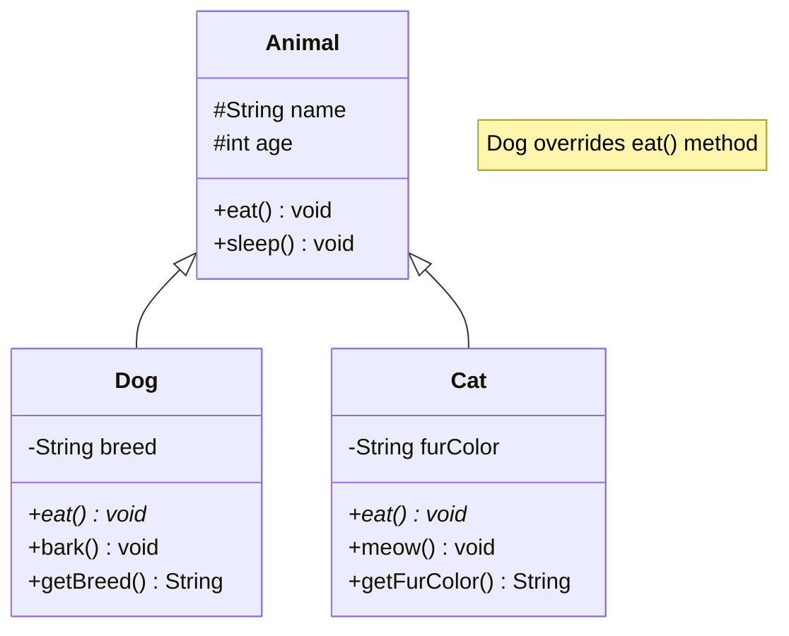

---

Ever wondered how professional developers transform simple code into robust, maintainable applications? This is a complete journey from zero to solid Java expertise. You'll learn object-oriented programming, the collections framework, testing, and modern Java features through structured lessons and practice exercises.

## What You'll Achieve

By the end of this tutorial, you will:

- ✅ Understand Java's core data types and how to use them effectively
- ✅ Write well-structured classes with proper encapsulation
- ✅ Use inheritance and interfaces to build extensible programs
- ✅ Master the Collections Framework (List, Set, Map)
- ✅ Handle errors gracefully with exceptions
- ✅ Write testable code and test it with JUnit 5
- ✅ Use streams for functional-style data processing
- ✅ Apply SOLID principles to organize code
- ✅ Build several complete practice projects
- ✅ Know what to learn next for professional development

## Prerequisites

- Completed [Initial Setup for Java](initial-setup) (Java installed and working)
- Completed [Java Quick Start](quick-start) (familiar with basic syntax)
- Or completed just the Initial Setup and comfortable with basic programming

## Learning Path Overview

This tutorial covers **0-60% of Java knowledge** comprehensively. It's a **depth-first** approach - each concept is explained thoroughly with multiple examples and practice exercises.

We'll progress in these stages:

1. **OOP Fundamentals** - Classes, objects, encapsulation
2. **Inheritance and Polymorphism** - Code reuse and extensibility
3. **Interfaces and Abstract Classes** - Defining contracts
4. **Collections Framework** - Lists, Sets, Maps with generics
5. **String and Text Processing** - String manipulation and formatting
6. **Exception Handling** - Error handling best practices
7. **Unit Testing with JUnit 5** - Testing your code
8. **Streams and Functional Programming** - Modern Java style
9. **Modern Java Features** - Records, var keyword, text blocks
10. **Practice Projects** - Apply everything you've learned

---

## Part 1: Object-Oriented Programming Fundamentals

### 1.1 Classes and Objects

A **class** is a blueprint; an **object** is an instance created from that blueprint.

#### Example: Creating a Class

```java
// File: BankAccount.java
public class BankAccount {
    // Fields (data members) - describe the object
    public String accountNumber;
    public String accountHolder;
    public double balance;

    // Constructor - initializes new objects
    public BankAccount(String accountNumber, String accountHolder, double initialBalance) {
        this.accountNumber = accountNumber;
        this.accountHolder = accountHolder;
        this.balance = initialBalance;
    }

    // Methods (behavior) - what the object can do
    public void deposit(double amount) {
        if (amount > 0) {
            balance += amount;
            System.out.println("Deposited: $" + amount);
        }
    }

    public void withdraw(double amount) {
        if (amount > 0 && amount <= balance) {
            balance -= amount;
            System.out.println("Withdrew: $" + amount);
        } else {
            System.out.println("Insufficient funds");
        }
    }

    public double getBalance() {
        return balance;
    }

    public void printStatement() {
        System.out.println("Account: " + accountNumber);
        System.out.println("Holder: " + accountHolder);
        System.out.println("Balance: $" + balance);
    }
}

// Using the class
public class BankAccountDemo {
    public static void main(String[] args) {
        // Create objects (instances)
        BankAccount account1 = new BankAccount("12345", "Alice", 1000);
        BankAccount account2 = new BankAccount("67890", "Bob", 500);

        // Use objects
        account1.deposit(500);
        account1.withdraw(200);
        account1.printStatement();

        account2.deposit(250);
        account2.printStatement();
    }
}
```

**Key Concepts**:

- **Fields** store data for each object
- **Constructors** are special methods that initialize objects (called with `new`)
- **`this`** refers to the current object
- **Methods** define what the object can do
- Each object has its own copy of fields (account1 and account2 have separate balances)

### 1.2 Encapsulation and Access Modifiers

**Encapsulation** means hiding internal details and only exposing what's necessary.

#### Example: Encapsulation with Private and Public

```java
public class Person {
    // Private fields - only accessible within this class
    private String name;
    private int age;
    private double salary;

    // Public constructor
    public Person(String name, int age, double salary) {
        this.name = name;
        this.age = age;
        this.salary = salary;
    }

    // Public getter methods - safe read access
    public String getName() {
        return name;
    }

    public int getAge() {
        return age;
    }

    public double getSalary() {
        return salary;
    }

    // Public setter with validation - controlled write access
    public void setAge(int age) {
        if (age > 0 && age < 150) {
            this.age = age;
        }
    }

    public void setSalary(double salary) {
        if (salary > 0) {
            this.salary = salary;
        }
    }

    public String getInfo() {
        return name + " (Age: " + age + ", Salary: $" + salary + ")";
    }
}

// Usage
public class PersonDemo {
    public static void main(String[] args) {
        Person person = new Person("Alice", 30, 50000);

        System.out.println(person.getInfo());

        // Use setters with validation
        person.setSalary(55000);
        person.setAge(31);
        System.out.println(person.getInfo());

        // This would be prevented by private fields:
        // person.age = -5;  // Compile error!
    }
}
```

**Access Modifiers**:

- **`private`** - Only accessible within this class (most restrictive)
- **`public`** - Accessible from anywhere (least restrictive)
- **Default (no modifier)** - Package-accessible
- **`protected`** - Accessible in subclasses (covered in next section)

Encapsulation provides:

- **Safety** - Invalid values can't be set
- **Flexibility** - Internal changes don't affect external code
- **Control** - Validation logic protects data integrity

### 1.3 The Four Pillars of OOP

#### Abstraction

Showing only essential features, hiding complexity.

```java
public class PaymentProcessor {
    // Abstraction: hiding how payment is processed
    public void processPayment(double amount) {
        validateAmount(amount);
        connectToBank();
        sendTransaction(amount);
        logTransaction(amount);
    }

    private void validateAmount(double amount) { /* ... */ }
    private void connectToBank() { /* ... */ }
    private void sendTransaction(double amount) { /* ... */ }
    private void logTransaction(double amount) { /* ... */ }
}

// User only calls processPayment, doesn't need to know internal steps
```

#### Encapsulation

Bundling data and methods, controlling access.

(Already shown above with private/public)

#### Inheritance

Creating new classes based on existing ones (covered next).

#### Polymorphism

One interface, many implementations (covered with inheritance).

---

## Part 2: Inheritance and Polymorphism

### 2.1 Inheritance Basics

**Inheritance** allows a class to inherit fields and methods from another class.

#### Class Hierarchy Visualization



#### Example: Simple Inheritance

```java
// Parent class (superclass)
public class Animal {
    protected String name;
    protected int age;

    public Animal(String name, int age) {
        this.name = name;
        this.age = age;
    }

    public void eat() {
        System.out.println(name + " is eating");
    }

    public void sleep() {
        System.out.println(name + " is sleeping");
    }
}

// Child class (subclass)
public class Dog extends Animal {
    private String breed;

    public Dog(String name, int age, String breed) {
        super(name, age);  // Call parent constructor
        this.breed = breed;
    }

    // Override: provide new implementation
    public void eat() {
        System.out.println(name + " is eating dog food");
    }

    // New method specific to Dog
    public void bark() {
        System.out.println(name + " says: Woof!");
    }

    public String getBreed() {
        return breed;
    }
}

// Usage
public class InheritanceDemo {
    public static void main(String[] args) {
        Dog dog = new Dog("Rex", 3, "Golden Retriever");

        dog.eat();      // Uses Dog's version
        dog.sleep();    // Uses Animal's version
        dog.bark();     // Dog-specific method
    }
}
```

**Key Keywords**:

- **`extends`** - Inherit from a parent class
- **`super`** - Reference to parent class (call parent constructor or methods)
- **`@Override`** - Annotation indicating method override (not required but recommended)

### 2.2 Method Overriding and Polymorphism

**Polymorphism** means "many forms" - one interface, multiple implementations.

#### Example: Polymorphism in Action

```java
public class Animal {
    protected String name;

    public Animal(String name) {
        this.name = name;
    }

    public void makeSound() {
        System.out.println(name + " makes a sound");
    }
}

public class Dog extends Animal {
    public Dog(String name) {
        super(name);
    }

    @Override
    public void makeSound() {
        System.out.println(name + " barks: Woof!");
    }
}

public class Cat extends Animal {
    public Cat(String name) {
        super(name);
    }

    @Override
    public void makeSound() {
        System.out.println(name + " meows: Meow!");
    }
}

public class Bird extends Animal {
    public Bird(String name) {
        super(name);
    }

    @Override
    public void makeSound() {
        System.out.println(name + " chirps");
    }
}

// Polymorphism in action
public class PolymorphismDemo {
    public static void main(String[] args) {
        // Create an array of Animal (can hold Dog, Cat, Bird)
        Animal[] animals = new Animal[3];
        animals[0] = new Dog("Rex");
        animals[1] = new Cat("Whiskers");
        animals[2] = new Bird("Tweety");

        // Same method call, different behavior based on actual type
        for (Animal animal : animals) {
            animal.makeSound();
        }
        // Output:
        // Rex barks: Woof!
        // Whiskers meows: Meow!
        // Tweety chirps
    }
}
```

**Benefits of Polymorphism**:

- Write code once that works with multiple types
- Easy to add new types without changing existing code
- More flexible and maintainable programs

---

## Part 3: Interfaces and Abstract Classes

### 3.1 Interfaces

An **interface** defines a contract - methods that implementing classes MUST provide.

#### Example: Interfaces

```java
// Interface defines contract
public interface Vehicle {
    void start();
    void stop();
    void accelerate();
}

// Implementing the interface
public class Car implements Vehicle {
    private String model;
    private boolean isRunning = false;

    public Car(String model) {
        this.model = model;
    }

    @Override
    public void start() {
        isRunning = true;
        System.out.println(model + " engine started");
    }

    @Override
    public void stop() {
        isRunning = false;
        System.out.println(model + " engine stopped");
    }

    @Override
    public void accelerate() {
        if (isRunning) {
            System.out.println(model + " accelerating");
        }
    }
}

public class Motorcycle implements Vehicle {
    private String brand;
    private boolean isRunning = false;

    public Motorcycle(String brand) {
        this.brand = brand;
    }

    @Override
    public void start() {
        isRunning = true;
        System.out.println(brand + " motorcycle started");
    }

    @Override
    public void stop() {
        isRunning = false;
        System.out.println(brand + " motorcycle stopped");
    }

    @Override
    public void accelerate() {
        if (isRunning) {
            System.out.println(brand + " motorcycle accelerating");
        }
    }
}

// Using the interface
public class VehicleDemo {
    public static void main(String[] args) {
        Vehicle car = new Car("Honda Accord");
        Vehicle motorcycle = new Motorcycle("Harley-Davidson");

        car.start();
        car.accelerate();
        car.stop();

        motorcycle.start();
        motorcycle.accelerate();
        motorcycle.stop();
    }
}
```

**Key Points**:

- **Interface** - Defines what methods must exist
- **Implements** - A class implements an interface
- Multiple classes can implement the same interface
- A class can implement multiple interfaces

### 3.2 Abstract Classes

An **abstract class** is a class that can't be instantiated, but can be inherited. It's between a regular class and interface.

#### Example: Abstract Class

```java
// Abstract class - can't be instantiated directly
public abstract class Shape {
    protected String color;

    public Shape(String color) {
        this.color = color;
    }

    // Abstract method - must be implemented by subclasses
    public abstract double calculateArea();
    public abstract void display();

    // Concrete method - can be used by subclasses
    public void printColor() {
        System.out.println("Color: " + color);
    }
}

// Concrete implementation
public class Circle extends Shape {
    private double radius;

    public Circle(String color, double radius) {
        super(color);
        this.radius = radius;
    }

    @Override
    public double calculateArea() {
        return Math.PI * radius * radius;
    }

    @Override
    public void display() {
        System.out.println("Circle with radius " + radius);
        printColor();
        System.out.println("Area: " + calculateArea());
    }
}

public class Rectangle extends Shape {
    private double width;
    private double height;

    public Rectangle(String color, double width, double height) {
        super(color);
        this.width = width;
        this.height = height;
    }

    @Override
    public double calculateArea() {
        return width * height;
    }

    @Override
    public void display() {
        System.out.println("Rectangle " + width + " x " + height);
        printColor();
        System.out.println("Area: " + calculateArea());
    }
}

// Usage
public class AbstractDemo {
    public static void main(String[] args) {
        // Shape shape = new Shape("red");  // Compile error - can't instantiate abstract

        Circle circle = new Circle("red", 5);
        Rectangle rectangle = new Rectangle("blue", 4, 6);

        circle.display();
        rectangle.display();
    }
}
```

**Abstract vs Interface**:

- **Abstract Class** - Share code and state; tight relationship
- **Interface** - Define contract only; loose coupling

Use abstract classes when classes share a common base. Use interfaces when defining capabilities.

---

## Part 4: Collections Framework and Generics

### 4.1 Collections and Generics

The **Collections Framework** provides data structures like List, Set, and Map. **Generics** allow type-safe collections.

#### Example: List (ArrayList)

```java
import java.util.ArrayList;
import java.util.List;

public class ListExample {
    public static void main(String[] args) {
        // ArrayList is a resizable list
        List<String> fruits = new ArrayList<>();

        // Add elements
        fruits.add("apple");
        fruits.add("banana");
        fruits.add("cherry");

        // Access by index
        System.out.println(fruits.get(0));      // "apple"

        // Check if contains
        if (fruits.contains("banana")) {
            System.out.println("We have bananas");
        }

        // Loop through all
        for (String fruit : fruits) {
            System.out.println(fruit);
        }

        // Remove
        fruits.remove("banana");
        System.out.println("Size: " + fruits.size());

        // Generic type provides type safety
        // fruits.add(123);  // Compile error - can't add integer to List<String>
    }
}
```

#### Example: Set (HashSet)

```java
import java.util.HashSet;
import java.util.Set;

public class SetExample {
    public static void main(String[] args) {
        // Set - unique elements, no ordering guarantee
        Set<String> colors = new HashSet<>();

        colors.add("red");
        colors.add("blue");
        colors.add("red");      // Duplicate - will be ignored

        System.out.println(colors.size());      // 2, not 3
        System.out.println(colors.contains("blue"));  // true

        // Loop
        for (String color : colors) {
            System.out.println(color);
        }
    }
}
```

#### Example: Map (HashMap)

```java
import java.util.HashMap;
import java.util.Map;

public class MapExample {
    public static void main(String[] args) {
        // Map - key-value pairs
        Map<String, Integer> scores = new HashMap<>();

        // Put entries
        scores.put("Alice", 95);
        scores.put("Bob", 87);
        scores.put("Charlie", 92);

        // Get value
        System.out.println(scores.get("Alice"));  // 95

        // Iterate over entries
        for (Map.Entry<String, Integer> entry : scores.entrySet()) {
            String name = entry.getKey();
            int score = entry.getValue();
            System.out.println(name + ": " + score);
        }

        // Check existence
        if (scores.containsKey("David")) {
            System.out.println(scores.get("David"));
        } else {
            System.out.println("David not found");
        }

        // Remove
        scores.remove("Bob");
    }
}
```

### 4.2 Useful Collection Methods

```java
import java.util.*;

public class CollectionMethods {
    public static void main(String[] args) {
        List<Integer> numbers = new ArrayList<>();
        numbers.addAll(Arrays.asList(3, 1, 4, 1, 5, 9, 2, 6));

        // Sort
        Collections.sort(numbers);
        System.out.println(numbers);  // [1, 1, 2, 3, 4, 5, 6, 9]

        // Reverse
        Collections.reverse(numbers);
        System.out.println(numbers);  // [9, 6, 5, 4, 3, 2, 1, 1]

        // Min/Max
        System.out.println("Min: " + Collections.min(numbers));
        System.out.println("Max: " + Collections.max(numbers));

        // Find
        System.out.println("Contains 5: " + numbers.contains(5));

        // Size
        System.out.println("Size: " + numbers.size());
    }
}
```

---

## Part 5: Exception Handling

### 5.1 Try-Catch-Finally

**Exception handling** allows graceful error recovery.

#### Example: Exception Handling

```java
public class ExceptionHandling {
    public static void main(String[] args) {
        // Example 1: Division by zero
        try {
            int result = 10 / 0;  // ArithmeticException
        } catch (ArithmeticException e) {
            System.out.println("Cannot divide by zero");
        }

        // Example 2: Array index out of bounds
        try {
            int[] array = {1, 2, 3};
            System.out.println(array[10]);  // IndexOutOfBoundsException
        } catch (ArrayIndexOutOfBoundsException e) {
            System.out.println("Index not in array");
        }

        // Example 3: Multiple exceptions
        try {
            String text = "abc";
            int number = Integer.parseInt(text);  // NumberFormatException
        } catch (NumberFormatException e) {
            System.out.println("Invalid number format");
        } catch (Exception e) {
            System.out.println("Some other error");
        }

        // Example 4: Finally block
        try {
            System.out.println("Attempting operation");
            int x = 5 / 1;
        } catch (ArithmeticException e) {
            System.out.println("Error occurred");
        } finally {
            // Always runs, whether exception or not
            System.out.println("Cleanup: operation complete");
        }
    }
}
```

### 5.2 Throwing Exceptions

You can throw exceptions to indicate errors in your code.

#### Example: Throwing Exceptions

```java
public class BankAccount {
    private double balance;

    public BankAccount(double initialBalance) {
        if (initialBalance < 0) {
            throw new IllegalArgumentException("Balance cannot be negative");
        }
        this.balance = initialBalance;
    }

    public void withdraw(double amount) throws InsufficientFundsException {
        if (amount < 0) {
            throw new IllegalArgumentException("Amount cannot be negative");
        }
        if (amount > balance) {
            throw new InsufficientFundsException("Not enough balance");
        }
        balance -= amount;
    }

    public double getBalance() {
        return balance;
    }
}

// Custom exception
public class InsufficientFundsException extends Exception {
    public InsufficientFundsException(String message) {
        super(message);
    }
}

// Usage
public class ExceptionThrowingDemo {
    public static void main(String[] args) {
        try {
            BankAccount account = new BankAccount(100);
            account.withdraw(150);  // Throws InsufficientFundsException
        } catch (InsufficientFundsException e) {
            System.out.println("Error: " + e.getMessage());
        }
    }
}
```

---

## Part 6: Testing with JUnit 5

### 6.1 Writing Tests

**Testing** ensures your code works correctly.

#### Example: Simple Class to Test

```java
public class Calculator {
    public int add(int a, int b) {
        return a + b;
    }

    public int subtract(int a, int b) {
        return a - b;
    }

    public int multiply(int a, int b) {
        return a * b;
    }

    public int divide(int a, int b) {
        if (b == 0) {
            throw new IllegalArgumentException("Cannot divide by zero");
        }
        return a / b;
    }
}
```

#### Example: JUnit 5 Test Class

```java
import org.junit.jupiter.api.Test;
import static org.junit.jupiter.api.Assertions.*;

public class CalculatorTest {
    private Calculator calculator = new Calculator();

    @Test
    public void testAddition() {
        int result = calculator.add(5, 3);
        assertEquals(8, result);
    }

    @Test
    public void testSubtraction() {
        int result = calculator.subtract(10, 4);
        assertEquals(6, result);
    }

    @Test
    public void testMultiplication() {
        int result = calculator.multiply(7, 6);
        assertEquals(42, result);
    }

    @Test
    public void testDivision() {
        int result = calculator.divide(20, 4);
        assertEquals(5, result);
    }

    @Test
    public void testDivisionByZeroThrows() {
        assertThrows(IllegalArgumentException.class, () -> {
            calculator.divide(10, 0);
        });
    }
}
```

**Common Assertions**:

- **`assertEquals(expected, actual)`** - Check if values are equal
- **`assertTrue(condition)`** - Check if condition is true
- **`assertFalse(condition)`** - Check if condition is false
- **`assertThrows(Exception.class, () -> {...})`** - Check if exception is thrown
- **`assertNull(value)`** - Check if value is null
- **`assertNotNull(value)`** - Check if value is not null

---

## Part 7: Streams and Functional Programming

### 7.1 Introduction to Streams

**Streams** allow functional-style data processing on collections.

#### Example: Streams

```java
import java.util.*;
import java.util.stream.Collectors;

public class StreamExample {
    public static void main(String[] args) {
        List<Integer> numbers = Arrays.asList(1, 2, 3, 4, 5, 6, 7, 8, 9, 10);

        // Filter: keep only even numbers
        List<Integer> evens = numbers.stream()
            .filter(n -> n % 2 == 0)
            .collect(Collectors.toList());
        System.out.println("Evens: " + evens);  // [2, 4, 6, 8, 10]

        // Map: double each number
        List<Integer> doubled = numbers.stream()
            .map(n -> n * 2)
            .collect(Collectors.toList());
        System.out.println("Doubled: " + doubled);  // [2, 4, 6, 8, ...]

        // Filter and map combined
        List<Integer> result = numbers.stream()
            .filter(n -> n % 2 == 0)      // Keep evens
            .map(n -> n * n)               // Square them
            .collect(Collectors.toList());
        System.out.println("Evens squared: " + result);  // [4, 16, 36, 64, 100]

        // Reduce: sum all numbers
        int sum = numbers.stream()
            .reduce(0, (a, b) -> a + b);
        System.out.println("Sum: " + sum);  // 55

        // ForEach: process each element
        numbers.stream()
            .filter(n -> n > 5)
            .forEach(n -> System.out.println(n));
    }
}
```

### 7.2 Lambda Expressions

**Lambda expressions** are short, inline functions.

#### Example: Lambda Expressions

```java
public class LambdaExample {
    public static void main(String[] args) {
        // Traditional way - anonymous inner class
        List<String> names = Arrays.asList("Alice", "Bob", "Charlie");
        names.forEach(new java.util.function.Consumer<String>() {
            @Override
            public void accept(String name) {
                System.out.println(name);
            }
        });

        // Lambda way - much shorter
        names.forEach(name -> System.out.println(name));

        // With more logic
        names.forEach(name -> {
            String upper = name.toUpperCase();
            System.out.println(upper);
        });

        // In streams
        List<Integer> numbers = Arrays.asList(1, 2, 3, 4, 5);
        numbers.stream()
            .filter(n -> n > 2)
            .map(n -> n * n)
            .forEach(n -> System.out.println(n));
    }
}
```

---

## Part 8: Modern Java Features

### 8.1 Records (Java 16+)

**Records** are a concise way to define immutable data classes.

#### Example: Records

```java
// Before Java 16 - lots of boilerplate
public class PersonOld {
    private final String name;
    private final int age;

    public PersonOld(String name, int age) {
        this.name = name;
        this.age = age;
    }

    public String getName() { return name; }
    public int getAge() { return age; }

    @Override
    public boolean equals(Object o) { /* ... */ }

    @Override
    public int hashCode() { /* ... */ }

    @Override
    public String toString() { /* ... */ }
}

// Java 16+ - concise record
public record Person(String name, int age) {}

// Usage - same as before
public class RecordExample {
    public static void main(String[] args) {
        Person person = new Person("Alice", 30);
        System.out.println(person.name());   // "Alice"
        System.out.println(person.age());    // 30
        System.out.println(person);          // Person[name=Alice, age=30]
    }
}
```

### 8.2 Var Keyword (Java 10+)

**`var`** lets the compiler infer types.

#### Example: Var Keyword

```java
public class VarExample {
    public static void main(String[] args) {
        // Before: explicit type
        ArrayList<String> list1 = new ArrayList<String>();

        // With var: type inferred
        var list2 = new ArrayList<String>();

        // Works for all types
        var name = "Alice";        // String
        var age = 30;              // int
        var price = 19.99;         // double
        var numbers = Arrays.asList(1, 2, 3);  // List<Integer>

        // Useful in loops
        var colors = Arrays.asList("red", "green", "blue");
        for (var color : colors) {
            System.out.println(color);
        }
    }
}
```

### 8.3 Text Blocks (Java 13+)

**Text blocks** make multi-line strings easier.

#### Example: Text Blocks

```java
public class TextBlockExample {
    public static void main(String[] args) {
        // Before: string concatenation or escape sequences
        String json1 = "{\"name\": \"Alice\", \"age\": 30}";

        // Text block: cleaner
        String json2 = """
            {
                "name": "Alice",
                "age": 30
            }
            """;

        // HTML example
        String html = """
            <html>
                <body>
                    <h1>Welcome</h1>
                </body>
            </html>
            """;

        System.out.println(html);
    }
}
```

---

## Part 9: SOLID Principles

### 9.1 Brief Overview of SOLID

**SOLID** principles help write maintainable code:

- **S**ingle Responsibility - One reason to change
- **O**pen/Closed - Open for extension, closed for modification
- **L**iskov Substitution - Subclasses interchangeable with parent
- **I**nterface Segregation - Many small interfaces, not one large
- **D**ependency Inversion - Depend on abstractions, not implementations

#### Example: Good Design

```java
// Bad: Tightly coupled, high responsibility
public class PaymentProcessor {
    public void processPayment(String cardNumber, double amount) {
        // Validate
        // Connect to bank
        // Process payment
        // Log to file
        // Send email
        // Update database
        // All in one class!
    }
}

// Good: Separated concerns, loosely coupled
public interface PaymentGateway {
    void process(double amount);
}

public class StripePaymentGateway implements PaymentGateway {
    @Override
    public void process(double amount) {
        // Only handles Stripe payment
    }
}

public interface Logger {
    void log(String message);
}

public interface NotificationService {
    void sendEmail(String to, String message);
}

public class PaymentProcessor {
    private PaymentGateway gateway;
    private Logger logger;
    private NotificationService notificationService;

    public PaymentProcessor(PaymentGateway gateway, Logger logger,
                           NotificationService notificationService) {
        this.gateway = gateway;
        this.logger = logger;
        this.notificationService = notificationService;
    }

    public void processPayment(double amount) {
        gateway.process(amount);
        logger.log("Payment processed: $" + amount);
        notificationService.sendEmail("user@example.com", "Payment received");
    }
}
```

Each class has one responsibility, dependencies are injected, easy to test and extend.

---

## Part 10: Practice Projects

### Project 1: Library Management System

Build a simple library system with books, members, and borrowing.

#### Core Classes

```java
public class Book {
    private String isbn;
    private String title;
    private String author;
    private boolean isAvailable;

    public Book(String isbn, String title, String author) {
        this.isbn = isbn;
        this.title = title;
        this.author = author;
        this.isAvailable = true;
    }

    // Getters and methods...
}

public class Member {
    private String id;
    private String name;
    private List<Book> borrowedBooks;

    public Member(String id, String name) {
        this.id = id;
        this.name = name;
        this.borrowedBooks = new ArrayList<>();
    }

    public void borrowBook(Book book) {
        if (book.isAvailable()) {
            borrowedBooks.add(book);
            book.setAvailable(false);
        }
    }

    // More methods...
}

public class Library {
    private List<Book> books;
    private List<Member> members;

    public Library() {
        this.books = new ArrayList<>();
        this.members = new ArrayList<>();
    }

    public void addBook(Book book) {
        books.add(book);
    }

    public void registerMember(Member member) {
        members.add(member);
    }

    // More methods...
}
```

### Project 2: Student Grade Management System

Track students, courses, and grades with calculations.

Build this yourself using:

- Classes for Student, Course, Grade
- Collections to store data
- Methods to calculate GPA, averages
- Exception handling for invalid inputs
- Tests to verify calculations

### Project 3: Task Management Application

Create a simple task management system.

Features:

- Create, read, update, delete tasks
- Mark tasks complete/incomplete
- Filter tasks by status
- Store in collections
- Use streams to process data

---

## Practice Exercises

### Exercise 1: Extend Animals Inheritance

Create additional animals (Lion, Elephant, Fish) extending the Animal class from earlier examples. Each should override makeSound() and add unique methods.

### Exercise 2: Temperature Converter

Create a class that converts temperatures. Use encapsulation, validation, and exceptions.

### Exercise 3: Word Frequency Counter

Read a text, count word frequencies, and display results sorted by frequency. Use collections and streams.

### Exercise 4: Shape Area Calculator

Create abstract Shape class with concrete Circle, Rectangle, Triangle implementations. Store in a collection, calculate total area using streams.

---

## 🎯 Capstone Project: Student Management System

Now it's time to build a complete application that demonstrates all concepts learned in this tutorial.

### Project Overview

Build a Student Management System that tracks students, their courses, and grades. This project integrates:

- Object-oriented design (classes, inheritance, interfaces)
- Collections and generics
- Exception handling
- Streams and functional programming
- SOLID principles
- Testing with JUnit 5

### Requirements

**1. Core Classes**

Create the following classes:

- **`Student`** (abstract)
  - Properties: ID, name, email, enrollment date
  - Methods: getInfo(), enrollInCourse(Course), dropCourse(Course)
  - Encapsulation with validation

- **`UndergraduateStudent`** extends `Student`
  - Additional: major, expected graduation year
  - Method: getYearsUntilGraduation()

- **`GraduateStudent`** extends `Student`
  - Additional: advisor, thesis title
  - Method: isThesisComplete()

- **`Course`**
  - Properties: code, name, credits, instructor
  - Immutable (use final fields)

- **`Grade`**
  - Properties: student, course, score (0-100), letterGrade
  - Implements Comparable<Grade>

**2. Collection Management**

- Store students in a `Set<Student>` (no duplicates)
- Store courses in a `List<Course>`
- Store grades in a `Map<Student, List<Grade>>`

**3. Functionality**

- Add/remove students
- Add/remove courses
- Record grades for students
- Calculate student GPA (average of all grades)
- Find courses by code
- List all students in a course
- Find highest-scoring student in each course
- Generate student transcripts

**4. Exception Handling**

Create custom exceptions:

- **`StudentNotFoundException`** - Student doesn't exist
- **`CourseFullException`** - Course enrollment limit reached
- **`InvalidGradeException`** - Grade score out of bounds
- **`InvalidStudentException`** - Invalid student data

**5. Stream Processing**

Use streams for:

- Finding top students by GPA
- Filtering students by major/advisor
- Grouping students by year
- Sorting grades by score

**6. SOLID Principles**

- **Single Responsibility**: Each class has one reason to change
- **Open/Closed**: Open for extension (UndergraduateStudent, GraduateStudent)
- **Liskov Substitution**: Subclasses properly substitute parents
- **Interface Segregation**: Use specific interfaces if needed
- **Dependency Inversion**: Depend on abstractions, not concretions

### Testing Requirements

Write JUnit 5 tests for:

- Student creation and validation
- Course enrollment/drops
- Grade calculation and GPA
- Exception scenarios
- Stream operations

**Minimum coverage**:

- 2-3 tests per class
- At least one negative test per method
- Exception handling tests

### Sample Code Structure

```java
public abstract class Student {
    private String id;
    private String name;
    private String email;
    private LocalDate enrollmentDate;
    private Set<Course> enrolledCourses;

    public Student(String id, String name, String email) {
        if (id == null || id.isEmpty()) {
            throw new InvalidStudentException("ID cannot be empty");
        }
        this.id = id;
        this.name = name;
        this.email = email;
        this.enrollmentDate = LocalDate.now();
        this.enrolledCourses = new HashSet<>();
    }

    public void enrollInCourse(Course course) throws CourseFullException {
        // Implementation
    }

    public double calculateGPA(Map<Student, List<Grade>> allGrades) {
        return allGrades.getOrDefault(this, new ArrayList<>())
                .stream()
                .mapToDouble(Grade::getScore)
                .average()
                .orElse(0.0);
    }

    public abstract String getInfo();
}

public class Course {
    private final String code;
    private final String name;
    private final int credits;
    private final String instructor;
    private final int maxEnrollment = 30;

    // Constructor and getters
}
```

### Success Criteria

- ✅ All classes properly implement inheritance hierarchy
- ✅ Collections used appropriately (Set, List, Map)
- ✅ No raw types warnings
- ✅ All custom exceptions thrown correctly
- ✅ Streams used for at least 3 operations
- ✅ All SOLID principles demonstrated
- ✅ All JUnit tests pass
- ✅ Code is well-commented and readable
- ✅ No null pointer exceptions (validation in constructors)

### Challenges (Optional Extensions)

1. **Persistence**: Save/load from JSON or CSV
2. **Scheduling**: Add class schedule with time conflicts detection
3. **Grading Weights**: Different assignment weights (homework 30%, exams 70%)
4. **Prerequisites**: Track course prerequisites and enforce
5. **GPA Calculation**: Different rules for undergraduate vs graduate

This project consolidates everything you've learned in this Beginner tutorial. Start with core classes, add functionality gradually, and test as you go!

---

## What to Learn Next

Congratulations! You've mastered Java fundamentals (0-60% coverage).

### Next Steps

**For Production Development** → Continue with [Intermediate Java](intermediate):

- Design patterns (Singleton, Factory, Observer, etc.)
- SOLID principles in depth
- Concurrency and threading
- Performance optimization
- Database with JDBC

**For Quick Reference** → Use [Java Cookbook](cookbook) for:

- Common patterns and solutions
- Day-to-day recipes
- Code snippets you can copy

**For Expert Mastery** → Eventually [Advanced Java](advanced):

- JVM internals
- Garbage collection
- Advanced concurrency
- Reflection and annotations

---

## Related Content

**Previous Tutorials:**

**Next Steps:**

- [Intermediate Java](/en/learn/software-engineering/programming-languages/java/by-concept/intermediate) - Design patterns and concurrency
- [Advanced Java](/en/learn/software-engineering/programming-languages/java/by-concept/advanced) - JVM internals and advanced topics

**How-To Guides:**

**Cookbook:**

**Explanations:**

---

## Key Takeaways

1. **Classes** organize code into reusable objects
2. **Inheritance** enables code reuse
3. **Interfaces** define contracts without implementation
4. **Collections** manage groups of objects
5. **Exceptions** handle errors gracefully
6. **Tests** verify your code works
7. **Streams** provide functional-style processing
8. **SOLID principles** structure maintainable code

---

**Beginner Tutorial Complete!** You're now ready for production development or advanced Java mastery.
