Master advanced Java concepts through 109 annotated code examples. Build on intermediate foundations to explore advanced concurrency, parallelism, virtual threads, JVM internals, memory management, garbage collection tuning, design patterns, profiling tools, finite state machines, performance optimization (JVM tuning, JFR, async-profiler, JMH), and modern Java features.

## Example 60: Concurrent Collections

Concurrent collections provide thread safety with better performance than synchronized wrappers. `ConcurrentHashMap` offers lock striping. `BlockingQueue` supports producer-consumer patterns.

**BlockingQueue (Producer-Consumer):**

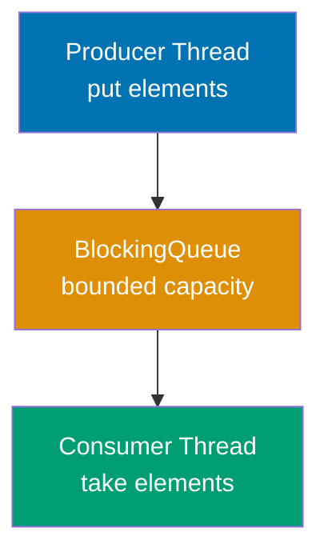

**ConcurrentHashMap (Lock Striping):**

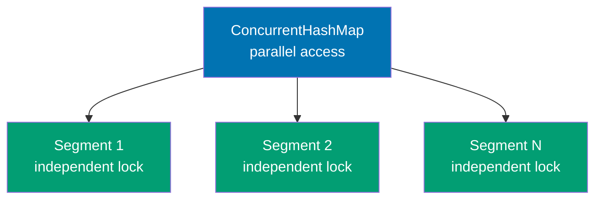

**Code**:

```java
import java.util.concurrent.*;
import java.util.*;

// ConcurrentHashMap - thread-safe without blocking entire map
ConcurrentHashMap<String, Integer> map = new ConcurrentHashMap<>(); // => Empty map, uses lock striping for segments
                                 // => Each segment has independent lock (parallel writes)

// putIfAbsent - atomic operation (check + insert)
Integer result1 = map.putIfAbsent("key1", 100);
                                 // => Atomically checks if key1 exists, CAS-based operation
                                 // => Key doesn't exist, inserts key1=100, returns null
                                 // => Returns null when key was absent (insertion successful)
System.out.println(map.get("key1")); // => 100 (key1 now maps to 100, volatile read)
Integer existing = map.putIfAbsent("key1", 200);
                                 // => Key exists with value 100, does NOT replace
                                 // => Returns 100 (existing value, map unchanged, thread-safe)
System.out.println(map.get("key1")); // => 100 (unchanged, still 100)

// computeIfAbsent - compute value if absent
Integer computed = map.computeIfAbsent("key2", k -> k.length() * 10);
                                 // => Checks if key2 exists, calls lambda: k="key2"
                                 // => Computes "key2".length() = 4, then * 10 = 40, inserts key2=40
                                 // => Atomic computation: only one thread computes value
System.out.println(map.get("key2")); // => 40 (key2 now maps to 40)
Integer recompute = map.computeIfAbsent("key2", k -> k.length() * 20);
                                 // => Key exists (value is 40), lambda NOT called, returns 40
                                 // => Avoids redundant computation when key already present

// merge - combine values atomically
map.put("count", 1);                 // => Inserts count=1 into map
Integer merged = map.merge("count", 5, (old, val) -> old + val);
                                 // => Retrieves old=1, computes 1 + 5 = 6, updates count=6, returns 6
System.out.println(map.get("count")); // => 6 (count now holds 6)

// CopyOnWriteArrayList - thread-safe list, copy-on-write semantics
CopyOnWriteArrayList<String> list = new CopyOnWriteArrayList<>(); // => Empty list, writes create new array copy
                                 // => Optimized for read-heavy workloads (many reads, few writes)
list.add("A"); // => Creates new internal array with ["A"]
                                 // => Write operation copies entire array (expensive)
list.add("B"); // => Creates new internal array with ["A", "B"]
System.out.println(list.size()); // => 2

// Safe iteration even if list modified during iteration
for (String s : list) { // => Iterator uses snapshot of list at iteration start
    System.out.println(s); // => Prints "A", then "B" (original snapshot)
    list.add("C"); // => Safe - iterator uses snapshot, won't see "C" in this loop
} // => Loop completes with 2 iterations (A, B), not affected by concurrent adds
System.out.println(list.size()); // => 4 (A, B, C, C - two "C"s added during loop)

// ConcurrentLinkedQueue - non-blocking FIFO queue (lock-free)
ConcurrentLinkedQueue<String> queue = new ConcurrentLinkedQueue<>(); // => Empty queue, uses CAS operations
                                 // => Lock-free: no thread blocking, uses atomic operations
boolean offered1 = queue.offer("First"); // => true (element added to tail)
                                 // => Non-blocking add operation
boolean offered2 = queue.offer("Second"); // => true (element added after "First")
System.out.println(queue.size()); // => 2 (weakly consistent size, may be stale in concurrent env)
String head = queue.poll(); // => "First" (removed from head, queue now has ["Second"])
String head2 = queue.poll(); // => "Second" (removed from head, queue now empty)
String head3 = queue.poll(); // => null (queue empty)

// BlockingQueue - producer-consumer pattern with blocking coordination
BlockingQueue<Integer> blockingQueue = new ArrayBlockingQueue<>(10);
                                 // => Bounded queue capacity 10, backed by array, FIFO ordering, thread-safe

// Producer thread
Thread producer = new Thread(() -> { // => Creates producer thread (lambda implements Runnable)
    try {
        for (int i = 0; i < 5; i++) { // => Will produce items 0-4 (5 iterations)
            blockingQueue.put(i); // => Blocks if queue full, waits until space available
            System.out.println("Produced: " + i);
            Thread.sleep(100);   // => Simulate production work (100ms delay)
        }
    } catch (InterruptedException e) {
        Thread.currentThread().interrupt(); // => Restore interrupted status
    }
}); // => Thread created but not running (must call start())

// Consumer thread
Thread consumer = new Thread(() -> { // => Creates consumer thread (separate from producer)
    try {
        for (int i = 0; i < 5; i++) { // => Will consume 5 items (matches producer count)
            Integer item = blockingQueue.take(); // => Blocks if queue empty, waits until item available
            System.out.println("Consumed: " + item);
            Thread.sleep(150);   // => Slower than producer (150ms vs 100ms), creates backpressure
        }
    } catch (InterruptedException e) {
        Thread.currentThread().interrupt(); // => Restore interrupted status
    }
}); // => Thread created but not running (must call start())

producer.start();                // => Start producer thread, begins producing items
consumer.start();                // => Start consumer thread, begins consuming items
// => Both threads run concurrently, BlockingQueue coordinates between them
```

**Key Takeaway**: `ConcurrentHashMap` provides thread-safe operations with lock striping. `CopyOnWriteArrayList` is safe for iteration-heavy workloads. `BlockingQueue` enables producer-consumer patterns with blocking operations. These collections offer better performance than `Collections.synchronizedXxx()` wrappers.

**Why It Matters**: Concurrent collections provide thread-safe operations without manual synchronization, preventing data races and deadlocks. ConcurrentHashMap enables high-throughput concurrent reads/writes with fine-grained locking. CopyOnWriteArrayList optimizes read-heavy scenarios (event listeners, caches) by copying on modification. BlockingQueue implementations enable producer-consumer patterns with built-in waiting/notification. Understanding which collection fits which access pattern (read-heavy vs write-heavy, bounded vs unbounded) prevents performance bottlenecks. These collections are essential building blocks for scalable concurrent systems—caches, work queues, shared state—enabling correctness without synchronization complexity.

---

## Example 61: Atomic Variables

Atomic variables use hardware-level Compare-And-Swap (CAS) operations for lock-free concurrency. They provide better performance than synchronized blocks for simple state updates. Ideal for counters, flags, and references.

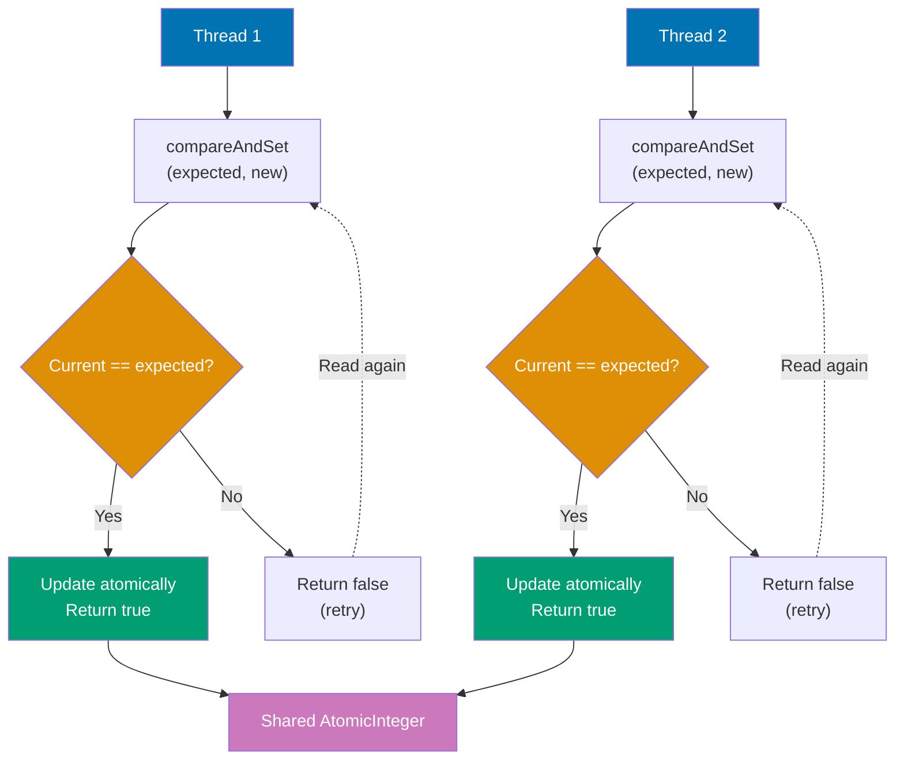

**Code**:

```java
import java.util.concurrent.atomic.*;

// AtomicInteger - thread-safe integer operations without locks
AtomicInteger counter = new AtomicInteger(0); // => Initialized to 0, uses CAS internally

// Atomic read and write operations
int current = counter.get(); // => 0 (volatile read, guaranteed visibility across threads)
counter.set(10); // => Set to 10 (volatile write, visible to all threads)
System.out.println(counter.get()); // => 10

// Atomic increment operations
int previous = counter.getAndIncrement(); // => 10 (returns old value, then increments to 11)
System.out.println(counter.get()); // => 11 (counter now 11)
int newValue = counter.incrementAndGet(); // => 12 (increments first, then returns new value)
System.out.println(counter.get()); // => 12 (counter now 12)

// compareAndSet - atomic compare-and-swap (CAS operation)
boolean success = counter.compareAndSet(12, 20);
                                 // => Hardware-level CAS (CMPXCHG): read (12), compare (12), set to 20 atomically
                                 // => true (current was 12, set to 20, no race condition)
System.out.println(counter.get()); // => 20 (successfully updated, volatile read)
boolean failure = counter.compareAndSet(12, 30);
                                 // => CAS with expected 12, current is 20, comparison fails, no update
                                 // => false (current is 20, not 12, atomic all-or-nothing)
System.out.println(counter.get()); // => 20 (unchanged, CAS failed)

// updateAndGet - atomic update with lambda function
int updated = counter.updateAndGet(v -> v * 2);
                                 // => CAS loop: reads v=20, applies lambda (20*2=40), compareAndSet(20,40)
                                 // => Retries if concurrent modification, returns 40 (lock-free)
System.out.println(counter.get()); // => 40 (counter now 40, function applied atomically)

// accumulateAndGet - atomic accumulation with binary operator
int accumulated = counter.accumulateAndGet(5, (curr, update) -> curr + update);
                                 // => Reads curr=40, calls lambda (40+5=45), atomically sets to 45, returns 45
System.out.println(counter.get()); // => 45 (counter now 45)

// AtomicLong - for long values (same API as AtomicInteger)
AtomicLong longCounter = new AtomicLong(1000L); // => Initialized to 1000
long result = longCounter.addAndGet(500); // => 1500 (atomically adds 500, returns new value)
System.out.println(longCounter.get()); // => 1500

// AtomicBoolean - for thread-safe flags
AtomicBoolean flag = new AtomicBoolean(false); // => Initialized to false
boolean wasSet = flag.getAndSet(true); // => false (old value), flag now true
System.out.println(flag.get()); // => true (flag flipped atomically)
boolean swapped = flag.compareAndSet(true, false); // => true (was true, now false)
System.out.println(flag.get()); // => false (back to false)

// AtomicReference - for object references (any object type)
AtomicReference<String> ref = new AtomicReference<>("Hello"); // => Reference to "Hello"
boolean updated2 = ref.compareAndSet("Hello", "World"); // => true (swapped to "World")
String value = ref.get(); // => "World" (new reference)
ref.set("Java"); // => Reference now points to "Java"
System.out.println(ref.get()); // => "Java"

// Practical example: thread-safe counter without locks
AtomicInteger sharedCounter = new AtomicInteger(0); // => Shared between threads, starts at 0
Runnable task = () -> { // => Each thread runs this task
    for (int i = 0; i < 1000; i++) {
        sharedCounter.incrementAndGet(); // => Thread-safe atomic increment, no synchronized needed
    }
}; // => Task increments counter 1000 times

Thread t1 = new Thread(task); // => First thread
Thread t2 = new Thread(task); // => Second thread
t1.start(); // => Start thread 1 (runs concurrently)
t2.start(); // => Start thread 2 (runs concurrently)
t1.join(); // => Wait for thread 1 to complete
t2.join(); // => Wait for thread 2 to complete
System.out.println("Final count: " + sharedCounter.get());
// => Output: "Final count: 2000" (always correct, with non-atomic int would be unpredictable)
```

**Key Takeaway**: Atomic variables use CAS for lock-free thread safety. Better performance than synchronized for simple operations. Use `incrementAndGet()` for post-increment, `getAndIncrement()` for pre-increment behavior. `compareAndSet()` enables atomic conditional updates.

**Why It Matters**: Atomic variables enable lock-free concurrency through compare-and-swap (CAS) operations—providing thread-safe updates without synchronization overhead. They're essential for counters, flags, and lock-free data structures in high-performance systems. AtomicInteger, AtomicLong, and AtomicReference prevent races while avoiding lock contention that limits scalability. Understanding CAS enables optimistic concurrency—retry on failure instead of blocking. Atomics power millions of operations per second in systems where synchronized blocks cause bottlenecks. However, they don't replace locks for complex multi-variable invariants. Use atomics for hotspot optimization where lock contention is measured and proven problematic.

---

## Example 62: CountDownLatch and CyclicBarrier

`CountDownLatch` allows threads to wait until a set of operations completes. `CyclicBarrier` synchronizes threads at a common barrier point. Both coordinate multi-threaded workflows but serve different patterns.

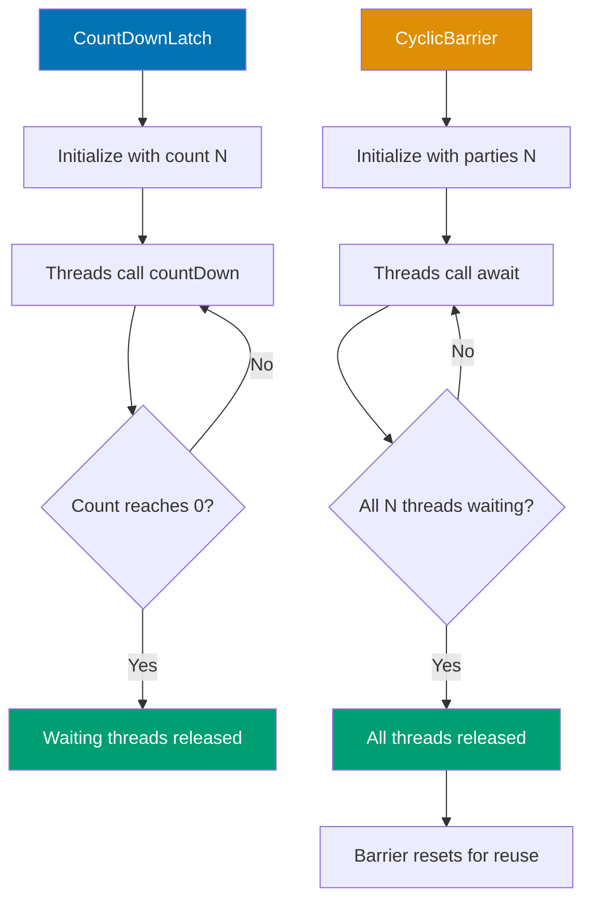

**Code**:

```java
import java.util.concurrent.*;

// CountDownLatch - wait for multiple events
CountDownLatch latch = new CountDownLatch(3);
                                 // => Creates latch with count = 3
                                 // => Thread calling await() blocks until count reaches 0
                                 // => One-time use: cannot reset after reaching 0

// Worker threads count down
for (int i = 0; i < 3; i++) {
                                 // => Creates 3 worker threads
    int taskId = i;              // => Capture loop variable for lambda
                                 // => Effectively final for lambda closure
    new Thread(() -> {           // => Creates and starts new worker thread
        System.out.println("Task " + taskId + " starting");
                                 // => Output: "Task 0 starting", "Task 1 starting", etc.
        try { Thread.sleep(1000); } catch (InterruptedException e) {}
                                 // => Simulates 1 second of work
        System.out.println("Task " + taskId + " done");
                                 // => Output: "Task 0 done", etc. after ~1 second
        latch.countDown();       // => Decrements latch counter by 1
                                 // => When counter reaches 0, releases all waiting threads
    }).start();                  // => Starts thread execution
}

// Main thread waits for all tasks
latch.await();                   // => Blocks current thread until count reaches 0
                                 // => Waits for all 3 countDown() calls
                                 // => Can throw InterruptedException (not caught here)
                                 // => After release: main thread continues execution
System.out.println("All tasks completed!");
                                 // => Output: "All tasks completed!" after all 3 tasks finish
                                 // => Guaranteed to print AFTER all "Task N done" messages
                                 // => Coordination primitive ensures happens-after relationship

// CyclicBarrier - synchronize threads at barrier
CyclicBarrier barrier = new CyclicBarrier(3, () -> {
                                 // => Creates barrier for 3 threads (parties)
                                 // => Second argument: barrier action (runs when all threads arrive)
                                 // => Barrier action executes in last thread to arrive
    System.out.println("All threads reached barrier!");
                                 // => Output: "All threads reached barrier!" when all 3 threads call await()
                                 // => Prints ONCE per barrier cycle
                                 // => Runs before any thread continues past barrier
});                              // => Barrier is reusable after all threads pass

// Threads wait at barrier
for (int i = 0; i < 3; i++) {
                                 // => Creates 3 threads for barrier synchronization
    int threadId = i;            // => Capture loop variable for lambda
                                 // => Effectively final for closure
    new Thread(() -> {           // => Creates new thread with lambda runnable
        try {
            System.out.println("Thread " + threadId + " working");
                                 // => Output: "Thread 0 working", etc.
                                 // => Order non-deterministic
            Thread.sleep(1000);  // => Simulates 1 second of work
                                 // => Each thread works independently before barrier
            System.out.println("Thread " + threadId + " waiting at barrier");
                                 // => Output: "Thread 0 waiting at barrier", etc.
                                 // => Signals thread arrival at synchronization point
            barrier.await();     // => Blocks until all 3 threads call await()
                                 // => When last thread arrives, barrier action runs
                                 // => Then ALL threads released simultaneously
                                 // => Barrier resets automatically for next cycle
            System.out.println("Thread " + threadId + " continues after barrier");
                                 // => Output: "Thread 0 continues after barrier", etc.
                                 // => All 3 messages print nearly simultaneously
                                 // => Happens-after relationship with barrier action
        } catch (Exception e) {} // => Catches InterruptedException, BrokenBarrierException
                                 // => BrokenBarrierException if another thread interrupted
    }).start();                  // => Starts thread execution
}

// Barrier can be reused (cyclic)
                                 // => "Cyclic" means barrier resets after all threads pass
                                 // => Same barrier can coordinate multiple rounds
                                 // => Unlike CountDownLatch (one-time use only)
// After all threads pass, barrier resets for next use
                                 // => Internal count returns to 3 (parties value)
                                 // => Ready for next synchronization round

// Semaphore - control access to limited resources
Semaphore semaphore = new Semaphore(2);
                                 // => Creates semaphore with 2 permits
                                 // => Allows 2 threads to acquire permit simultaneously
                                 // => Third thread blocks until permit released
                                 // => Fair=false (default): no FIFO guarantee

Runnable task = () -> {          // => Task definition (runs in each thread)
    try {
        semaphore.acquire();     // => Acquires 1 permit from semaphore
                                 // => Blocks if no permits available (waits for release)
                                 // => Decrements available permits by 1
                                 // => Throws InterruptedException if interrupted while waiting
        System.out.println(Thread.currentThread().getName() + " acquired permit");
                                 // => Output: "Thread-0 acquired permit", etc.
                                 // => At most 2 threads print this simultaneously
                                 // => Third thread waits until one releases
        Thread.sleep(2000);      // => Simulates 2 seconds of work with permit
                                 // => Holds permit for 2 seconds (resource usage)
        System.out.println(Thread.currentThread().getName() + " releasing permit");
                                 // => Output: "Thread-0 releasing permit", etc.
                                 // => Signals permit about to be returned
        semaphore.release();     // => Releases permit back to semaphore
                                 // => Increments available permits by 1
                                 // => Unblocks one waiting thread (if any)
                                 // => MUST match acquire (no try-finally = leak risk)
    } catch (InterruptedException e) {}
                                 // => Catches interrupt during acquire() or sleep()
};

// 5 threads compete for 2 permits
for (int i = 0; i < 5; i++) {
                                 // => Creates 5 threads competing for 2 permits
                                 // => Threads 0-1 acquire immediately
                                 // => Threads 2-4 wait until permit available
    new Thread(task, "Thread-" + i).start();
                                 // => Starts thread with custom name "Thread-0", etc.
                                 // => All threads execute same task runnable
}
```

**Key Takeaway**: `CountDownLatch` is one-time use for waiting on multiple events. `CyclicBarrier` is reusable for synchronizing threads at a common point. `Semaphore` controls access to limited resources with permits. Choose based on coordination pattern.

**Why It Matters**: CountDownLatch and CyclicBarrier enable thread coordination patterns. CountDownLatch waits for N events before proceeding—useful for phased initialization (start processing after all services ready) and parallel testing (wait for async operations). CyclicBarrier waits for N threads to reach a barrier then resets—ideal for iterative parallel algorithms. Understanding one-time (latch) vs reusable (barrier) determines appropriate choice. These primitives prevent busy-waiting and race conditions in concurrent coordination. They're common in production systems requiring synchronization across multiple threads without complex locking logic.

---

## Example 63: Fork/Join Framework

Fork/Join framework enables efficient parallel processing of recursive tasks. It uses work-stealing queues where idle threads steal work from busy threads. Powers parallel streams under the hood.

**Code**:

```java
import java.util.concurrent.*;

// RecursiveTask - returns a result
class SumTask extends RecursiveTask<Long> {
                                 // => RecursiveTask<Long>: returns Long result
                                 // => Part of Fork/Join framework
    private final long[] array;  // => Array to sum
                                 // => Immutable: shared across tasks safely
    private final int start, end;// => Task's range: [start, end)
                                 // => Defines which portion this task processes
    private static final int THRESHOLD = 1000;
                                 // => Granularity threshold: when to stop splitting
                                 // => Tasks smaller than this execute sequentially

    public SumTask(long[] array, int start, int end) {
                                 // => Constructor initializes task range
        this.array = array;      // => Store array reference
        this.start = start;      // => Store start index
        this.end = end;          // => Store end index
    }

    @Override
    protected Long compute() {   // => Called by ForkJoinPool when task executes
                                 // => Runs in worker thread (part of thread pool)
        int length = end - start;// => Calculate subarray size
                                 // => Determines if task should split further

        // Base case: compute directly if small enough
        if (length <= THRESHOLD) {
                                 // => THRESHOLD (1000): minimum work unit size
                                 // => Below threshold: sequential computation faster than forking overhead
                                 // => Prevents excessive task creation (granularity control)
            long sum = 0;        // => Accumulator for sequential sum
            for (int i = start; i < end; i++) {
                                 // => Sequential loop: no parallelism here
                sum += array[i]; // => Add array element to sum
                                 // => Direct memory access (no synchronization needed)
            }
            return sum;          // => Return computed sum for this range
        }                        // => Base case completes, task finishes

        // Recursive case: split into subtasks
        int mid = start + length / 2;
                                 // => Calculate midpoint for binary split
                                 // => Divides work evenly: left half + right half
        SumTask leftTask = new SumTask(array, start, mid);
                                 // => Create left subtask (first half of range)
                                 // => New RecursiveTask instance (not started yet)
        SumTask rightTask = new SumTask(array, mid, end);
                                 // => Create right subtask (second half of range)
                                 // => Separate task for concurrent execution

        leftTask.fork();         // => Async execute left subtask
                                 // => fork() submits task to ForkJoinPool queue
                                 // => Other threads can steal this task (work-stealing)
                                 // => Returns immediately (non-blocking)
                                 // => Left task runs concurrently in another thread
        long rightResult = rightTask.compute();
                                 // => Compute right in current thread (synchronous)
                                 // => Recursive call: may fork further if still too large
                                 // => Current thread does useful work (not idle)
                                 // => Avoids forking overhead for one subtask
        long leftResult = leftTask.join();
                                 // => Wait for left result (blocking if not complete)
                                 // => join() blocks until forked task finishes
                                 // => Returns computed sum from left subtask
                                 // => May help with work-stealing while waiting

        return leftResult + rightResult;
                                 // => Combine results from left and right subtasks
                                 // => Recursive merge: bubble up results through call stack
    }                            // => Task completes, returns sum for this range
}

// Using ForkJoinPool
long[] numbers = new long[10000];
                                 // => Array of 10,000 elements
for (int i = 0; i < numbers.length; i++) {
    numbers[i] = i + 1;          // => Populates array: 1, 2, 3, ..., 10000
}

ForkJoinPool pool = new ForkJoinPool();
                                 // => Default: Runtime.availableProcessors() threads
                                 // => Creates thread pool for work-stealing
SumTask task = new SumTask(numbers, 0, numbers.length);
                                 // => Creates root task: sum entire array
long result = pool.invoke(task);// => Executes task, returns result
                                 // => Output: 50005000 (sum of 1 to 10000)

// RecursiveAction - no result (void)
                                 // => Use for tasks that perform actions without returning values
class PrintTask extends RecursiveAction {
                                 // => RecursiveAction: no return value
                                 // => Alternative to RecursiveTask when no result needed
    private final int start, end;// => Range to process
                                 // => Defines task boundaries
    private static final int THRESHOLD = 10;
                                 // => Threshold: stop splitting at 10 elements
                                 // => Smaller threshold = more fine-grained parallelism

    public PrintTask(int start, int end) {
                                 // => Constructor sets task range
        this.start = start;      // => Task range start
        this.end = end;          // => Task range end
    }

    @Override
    protected void compute() {
        if (end - start <= THRESHOLD) {
                                 // => Base case: print directly if small enough
            for (int i = start; i < end; i++) {
                System.out.println("Processing: " + i);
                                 // => Sequential processing
            }
        } else {                 // => Recursive case: split task
            int mid = start + (end - start) / 2;
                                 // => Calculate midpoint
            PrintTask left = new PrintTask(start, mid);
                                 // => Left subtask
            PrintTask right = new PrintTask(mid, end);
                                 // => Right subtask
            invokeAll(left, right);
                                 // => Fork both and wait for completion
                                 // => Parallel execution of both subtasks
        }
    }
}

PrintTask printTask = new PrintTask(0, 100);
                                 // => Create task to print 0-99
pool.invoke(printTask);          // => Executes task
                                 // => Prints 0 to 99 in parallel (order non-deterministic)

// Parallel streams use ForkJoinPool.commonPool()
long parallelSum = java.util.stream.LongStream.range(1, 10001)
                                 // => Creates LongStream: 1 to 10000
    .parallel();                 // => Uses ForkJoinPool internally
                                 // => ForkJoinPool.commonPool() by default
    .sum();                      // => Parallel reduction
                                 // => Output: 50005000
```

**Key Takeaway**: Fork/Join splits recursive tasks for parallel execution. `RecursiveTask<V>` returns results, `RecursiveAction` doesn't. Work-stealing balances load across threads. Use for divide-and-conquer algorithms. Parallel streams leverage this framework.

**Why It Matters**: Fork/Join framework parallelizes divide-and-conquer algorithms—merge sort, quicksort, tree processing. Work-stealing load balancing ensures even CPU utilization—idle threads steal tasks from busy threads. RecursiveTask/RecursiveAction hide thread pool complexity, enabling focus on problem decomposition. However, overhead limits effectiveness to large tasks—small tasks underperform sequential code. Understanding task granularity (split until work exceeds threshold) optimizes performance. Fork/Join powers parallel streams and is essential for CPU-bound parallel algorithms on multi-core hardware, enabling scalability without manual thread management.

---

## Example 64: Annotations and Reflection

Annotations add metadata to code for compile-time and runtime processing. Reflection inspects and manipulates code at runtime. Together they enable frameworks like Spring and JUnit to work their magic.

**Code**:

```java
import java.lang.annotation.*;
import java.lang.reflect.*;

// Custom annotation definition
@Retention(RetentionPolicy.RUNTIME) // => Annotation accessible at runtime via reflection
// => Without RUNTIME, annotation discarded after compilation (SOURCE/CLASS retention)
@Target(ElementType.METHOD) // => Restricts annotation to methods only
// => Other targets: TYPE (classes), FIELD, PARAMETER, CONSTRUCTOR, etc.
@interface Test {
    String description() default ""; // => Annotation parameter with default value
    // => Usage: @Test(description = "test name") or @Test() (uses default "")
    int timeout() default 0;
    // => Multiple parameters allowed in annotation
    // => Defaults make parameters optional
}

// Another annotation for classes
@Retention(RetentionPolicy.RUNTIME)
// => Class annotation also needs RUNTIME retention for reflection
@Target(ElementType.TYPE) // => Can only be applied to classes/interfaces
// => ElementType.TYPE includes classes, interfaces, enums, records
@interface Component {
    String value();
    // => No default = required parameter
    // => Must specify: @Component("ServiceName")
}

// Using custom annotations
@Component("UserService") // => Class-level annotation with value parameter
// => Accessible via clazz.getAnnotation(Component.class)
class UserService {
    @Test(description = "Verify user creation", timeout = 5000)
    // => Method-level annotation with both parameters specified
    // => timeout = 5000 milliseconds (5 seconds)
    public void testCreateUser() {
        System.out.println("Testing user creation");
        // => Prints: "Testing user creation" when invoked via reflection
    }

    @Test(description = "Verify user deletion")
    // => timeout parameter uses default value (0)
    // => Only description specified explicitly
    public void testDeleteUser() {
        System.out.println("Testing user deletion");
        // => Prints: "Testing user deletion" when invoked
    }

    public void helperMethod() {
        // No annotation
        // => Not detected by reflection scan for @Test
        // => Won't be invoked by test runner
    }
}

// Reflection - inspecting annotations at runtime
Class<?> clazz = UserService.class;
// => Gets Class object for UserService
// => Class<?> wildcard allows any class type

// Check if class has annotation
if (clazz.isAnnotationPresent(Component.class)) {
    // => Returns true if @Component annotation present on UserService class
    // => Returns false if annotation missing or not RUNTIME retention
    Component component = clazz.getAnnotation(Component.class);
    // => Retrieves @Component annotation instance
    // => Returns proxy object implementing Component interface
    System.out.println("Component name: " + component.value()); // => "UserService"
    // => Calls value() method on annotation proxy
    // => Prints: "Component name: UserService"
}

// Find all methods with @Test annotation
Method[] methods = clazz.getDeclaredMethods();
// => Gets ALL methods (public, private, protected, package-private)
// => Returns array of Method objects (reflection API)
// => getDeclaredMethods() excludes inherited methods
for (Method method : methods) {
    // => Iterates through all 3 methods: testCreateUser, testDeleteUser, helperMethod
    if (method.isAnnotationPresent(Test.class)) {
        // => Returns true for testCreateUser and testDeleteUser
        // => Returns false for helperMethod (no @Test annotation)
        Test test = method.getAnnotation(Test.class);
        // => Retrieves @Test annotation from method
        // => Returns proxy object with description() and timeout() methods
        System.out.println("Test: " + method.getName());
        // => Prints method name: "testCreateUser" or "testDeleteUser"
        System.out.println("  Description: " + test.description());
        // => Prints annotation parameter value
        // => "Verify user creation" or "Verify user deletion"
        System.out.println("  Timeout: " + test.timeout());
        // => Prints timeout value: 5000 or 0 (default)

        // Invoke method using reflection
        try {
            Object instance = clazz.getDeclaredConstructor().newInstance();
            // => Creates new UserService instance via no-arg constructor
            // => getDeclaredConstructor() finds constructor with matching params (none)
            // => newInstance() invokes constructor, returns new object
            method.invoke(instance); // Calls the test method
            // => Dynamically invokes method on instance
            // => Equivalent to: instance.testCreateUser() or instance.testDeleteUser()
            // => Prints: "Testing user creation" or "Testing user deletion"
        } catch (Exception e) {
            // => Catches: IllegalAccessException, InvocationTargetException, etc.
            // => Reflection throws checked exceptions
            e.printStackTrace();
            // => Prints stack trace if method invocation fails
        }
    }
}

// Reflection - inspecting class structure
Field[] fields = clazz.getDeclaredFields();
// => Gets all fields declared in UserService (none in this example)
// => Returns empty array for UserService (no fields)
for (Field field : fields) {
    // => Loop doesn't execute (UserService has no fields)
    System.out.println("Field: " + field.getName() + " (" + field.getType() + ")");
    // => Would print field name and type if fields existed
    // => Example output: "Field: counter (int)"
}

// Accessing private fields (be careful!)
class Person {
    private String name = "Alice";
    // => Private field normally inaccessible outside class
    // => Reflection can bypass access modifiers
}

Person person = new Person();
// => Creates Person instance with name = "Alice"
Field nameField = Person.class.getDeclaredField("name");
// => Gets Field object for "name" field
// => getDeclaredField("name") finds field by exact name
// => Throws NoSuchFieldException if field doesn't exist
nameField.setAccessible(true); // Bypass private access
// => Disables Java access control for this field
// => Allows reading/writing private field from outside class
// => Required to access private members via reflection
String name = (String) nameField.get(person); // => "Alice"
// => Reads field value from person instance
// => Returns Object, requires cast to String
// => Result: "Alice" (original value)
nameField.set(person, "Bob"); // Modify private field
// => Writes new value to field
// => Changes person.name from "Alice" to "Bob"
// => Bypasses immutability and encapsulation

// Built-in annotations
@Override // Compile-time check for method overriding
// => Compiler verifies method actually overrides superclass method
// => Compile error if method doesn't override anything
@Deprecated(since = "2.0") // Mark as deprecated
// => Warns users this class is deprecated
// => Compiler generates warnings when used
// => "since" parameter documents deprecation version
@SuppressWarnings("unchecked") // Suppress compiler warnings
// => Disables specific compiler warnings for this class
// => "unchecked" suppresses generic type safety warnings
class Example {
    @Override
    public String toString() { return "Example"; }
    // => Overrides Object.toString()
    // => @Override ensures this actually overrides (compile-time check)
    // => Returns: "Example"
}
```

**Key Takeaway**: Annotations add metadata with `@interface`. `@Retention` controls lifecycle (SOURCE/CLASS/RUNTIME). `@Target` specifies where annotations apply. Reflection reads annotations and manipulates code at runtime via `Class`, `Method`, `Field`. Enables framework magic but slower than direct access.

**Why It Matters**: Annotations enable declarative programming—express intent without boilerplate. Reflection enables processing annotations at runtime, powering dependency injection (Spring's @Autowired), persistence (JPA's @Entity), validation (@NotNull), and testing (@Test). Understanding retention policies (SOURCE, CLASS, RUNTIME) determines annotation availability. Custom annotations enable domain-specific configurations. However, reflection is slow, fragile (breaks with refactoring), and bypasses type safety—use sparingly. Annotations are foundational to modern Java development, but understanding their reflection-based implementation enables effective usage and debugging when frameworks misbehave.

---

## Example 65: Enums with Behavior

Enums are type-safe constants that can have fields, methods, and constant-specific behavior. They're more powerful than simple integer constants and integrate seamlessly with switch statements.

**Code**:

```java
// Basic enum
enum Day {                       // => Defines enum type Day
                                 // => Enum class implicitly extends java.lang.Enum
                                 // => Cannot extend other classes (single inheritance)
    MONDAY, TUESDAY, WEDNESDAY, THURSDAY, FRIDAY, SATURDAY, SUNDAY
                                 // => Enum constants (instances of Day)
                                 // => Created once at class loading (singletons)
                                 // => Implicitly public static final
}

Day today = Day.MONDAY;          // => References MONDAY constant
                                 // => Type-safe: can only assign Day enum values
System.out.println(today);       // => Calls toString(): "MONDAY"
                                 // => Output: MONDAY
System.out.println(today.ordinal());
                                 // => Returns position in enum declaration (0-based)
                                 // => Output: 0 (MONDAY is first constant)

// Enum with fields and methods
enum Planet {                    // => Enum with instance fields and methods
    MERCURY(3.303e23, 2.4397e6), // => Calls constructor Planet(double, double)
                                 // => mass = 3.303e23 kg, radius = 2.4397e6 m
                                 // => Each constant is separate instance with own fields
    VENUS(4.869e24, 6.0518e6),   // => Venus instance with different mass/radius
    EARTH(5.976e24, 6.37814e6),  // => Earth instance
    MARS(6.421e23, 3.3972e6);    // => Mars instance (semicolon required before members)

    private final double mass;   // => Instance field (each constant has own)
                                 // => Final: immutable after construction
                                 // => Private: encapsulated (accessible via methods)
    private final double radius; // => Radius in meters
                                 // => All enum constants have these fields

    // Constructor (always private)
    Planet(double mass, double radius) {
                                 // => Constructor implicitly private (cannot be public)
                                 // => Called once per constant during class loading
                                 // => Cannot create new Planet instances externally
        this.mass = mass;        // => Initializes instance field
                                 // => Each constant stores its own mass
        this.radius = radius;    // => Initializes radius field
                                 // => Fields immutable after constructor completes
    }

    public double surfaceGravity() {
                                 // => Instance method (each constant can call)
                                 // => Calculates gravity using this constant's mass/radius
        final double G = 6.67300E-11;
                                 // => Gravitational constant (m³/kg·s²)
                                 // => Final local variable
        return G * mass / (radius * radius);
                                 // => Newton's law: g = GM/r²
                                 // => Returns gravity in m/s²
    }

    public double surfaceWeight(double otherMass) {
                                 // => Calculates weight on this planet's surface
                                 // => otherMass in kg
        return otherMass * surfaceGravity();
                                 // => Weight = mass × gravity
                                 // => Returns weight in Newtons
    }
}

double earthWeight = 75.0;       // => Person's weight on Earth (kg)
                                 // => Will calculate equivalent weight on Mars
double marsWeight = Planet.MARS.surfaceWeight(earthWeight);
                                 // => Calls MARS instance's surfaceWeight method
                                 // => MARS.surfaceGravity() ≈ 3.71 m/s²
                                 // => Result: 75 × 3.71 ≈ 28.4 kg
                                 // => Output: ~28.4 (Mars gravity is 38% of Earth's)

// Enum with abstract methods (constant-specific behavior)
enum Operation {                 // => Enum with constant-specific method implementations
    PLUS {                       // => Anonymous class body for PLUS constant
        @Override                // => Overrides abstract apply method
        public double apply(double x, double y) { return x + y; }
                                 // => PLUS-specific implementation: addition
                                 // => This implementation only for PLUS constant
    },
    MINUS {                      // => MINUS constant with subtraction implementation
        @Override
        public double apply(double x, double y) { return x - y; }
                                 // => MINUS-specific: subtraction
    },
    TIMES {                      // => TIMES constant with multiplication
        @Override
        public double apply(double x, double y) { return x * y; }
                                 // => TIMES-specific: multiplication
    },
    DIVIDE {                     // => DIVIDE constant with division
        @Override
        public double apply(double x, double y) { return x / y; }
                                 // => DIVIDE-specific: division (no zero check)
    };

    public abstract double apply(double x, double y);
                                 // => Abstract method: each constant must implement
                                 // => Forces constant-specific behavior
                                 // => Enables polymorphism via enum constants
}

double result = Operation.PLUS.apply(5, 3);
                                 // => Calls PLUS constant's apply implementation
                                 // => Returns 5 + 3 = 8.0
                                 // => Output: 8.0
double product = Operation.TIMES.apply(4, 7);
                                 // => Calls TIMES constant's apply implementation
                                 // => Returns 4 × 7 = 28.0
                                 // => Output: 28.0

// Enum methods
Day[] days = Day.values();       // => Returns array of all enum constants
                                 // => Returns: [MONDAY, TUESDAY, ..., SUNDAY]
                                 // => New array each call (defensive copy)
                                 // => Order matches declaration order
Day day = Day.valueOf("FRIDAY"); // => Converts string to enum constant
                                 // => Case-sensitive: must exactly match constant name
                                 // => Returns: Day.FRIDAY
                                 // => Throws IllegalArgumentException if name invalid

// Switch with enum (exhaustive in modern Java)
String typeOfDay = switch (today) {
                                 // => Switch expression (Java 14+)
                                 // => Returns value assigned to typeOfDay
                                 // => Compiler checks exhaustiveness for enums
    case MONDAY, TUESDAY, WEDNESDAY, THURSDAY, FRIDAY -> "Weekday";
                                 // => Multiple cases with arrow syntax
                                 // => Returns: "Weekday" for any weekday
                                 // => No fall-through (arrow syntax)
    case SATURDAY, SUNDAY -> "Weekend";
                                 // => Handles weekend cases
                                 // => Returns: "Weekend"
                                 // => All 7 days covered: exhaustive
};                               // => Semicolon required for switch expression
                                 // => Compiler enforces: all enum constants handled

// EnumSet - efficient set implementation for enums
import java.util.*;
EnumSet<Day> weekend = EnumSet.of(Day.SATURDAY, Day.SUNDAY);
                                 // => Creates EnumSet with SATURDAY and SUNDAY
                                 // => Internally uses bit vector (very efficient)
                                 // => EnumSet faster than HashSet for enums
                                 // => No nulls allowed
EnumSet<Day> weekdays = EnumSet.range(Day.MONDAY, Day.FRIDAY);
                                 // => Creates EnumSet with range (inclusive)
                                 // => Contains: MONDAY, TUESDAY, WEDNESDAY, THURSDAY, FRIDAY
                                 // => Uses ordinal values for range calculation
                                 // => O(1) operations due to bit vector

// EnumMap - efficient map with enum keys
EnumMap<Day, String> schedule = new EnumMap<>(Day.class);
                                 // => Creates EnumMap with Day keys
                                 // => Requires enum class token for initialization
                                 // => Internally uses array (faster than HashMap)
                                 // => Maintains natural enum order
schedule.put(Day.MONDAY, "Team meeting");
                                 // => Maps MONDAY to "Team meeting"
                                 // => O(1) put operation (array-based)
                                 // => schedule.get(MONDAY) returns "Team meeting"
schedule.put(Day.WEDNESDAY, "Code review");
                                 // => Maps WEDNESDAY to "Code review"
                                 // => Null values allowed, null keys not allowed
```

**Key Takeaway**: Enums are type-safe constants with fields, methods, and constructors. Constant-specific behavior via abstract methods enables polymorphism. `values()` and `valueOf()` provide iteration and lookup. `EnumSet` and `EnumMap` offer efficient enum-based collections.

**Why It Matters**: Enums provide type-safe constants with behavior, eliminating magic strings/numbers. Methods on enums encapsulate state-specific logic (Status.ACTIVE.canTransitionTo(INACTIVE)), making code self-documenting. Exhaustive switch statements with enums enable compiler-checked completeness. EnumSet and EnumMap are highly optimized for enum keys. Enums model finite state machines, configuration options, strategy patterns. Understanding enum construction (singletons, instance-specific behavior) enables sophisticated designs. Enums prevent stringly-typed code that's fragile and hard to refactor, making them essential for modeling closed sets of values in type-safe, maintainable systems.

---

## Example 66: Sealed Classes and Pattern Matching

Sealed classes restrict which classes can extend or implement them, enabling exhaustive pattern matching. Pattern matching eliminates casts and enables type-safe, concise code. Available in Java 17+.

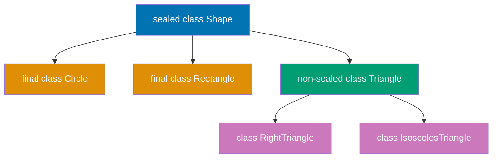

**Code**:

```java
// Sealed class - restricted inheritance hierarchy
sealed class Shape permits Circle, Rectangle, Triangle {
                                 // => sealed keyword restricts which classes can extend Shape
                                 // => permits clause lists allowed subclasses explicitly
                                 // => Compiler enforces: only Circle, Rectangle, Triangle can extend
                                 // => Enables exhaustive pattern matching (all subtypes known)
    // Only Circle, Rectangle, Triangle can extend Shape
                                 // => Attempting to create other subclasses causes compile error
                                 // => Permits must be in same module or package
}

// Permitted subclasses must be final, sealed, or non-sealed
final class Circle extends Shape {
                                 // => final: Circle cannot be further subclassed
                                 // => Required choice for sealed subclass
                                 // => Closes inheritance hierarchy at this level
    private final double radius; // => Immutable field (final)
    public Circle(double radius) { this.radius = radius; }
                                 // => Constructor initializes immutable radius
                                 // => this.radius cannot change after construction
    public double area() { return Math.PI * radius * radius; }
                                 // => Calculates circle area: πr²
                                 // => Uses Math.PI constant (≈ 3.14159...)
}

final class Rectangle extends Shape {
                                 // => final: Rectangle cannot be subclassed
                                 // => Second permitted subclass of Shape
    private final double width, height;
                                 // => Two immutable fields
                                 // => Compact field declaration (both final double)
    public Rectangle(double width, double height) {
                                 // => Constructor for rectangle dimensions
        this.width = width;      // => Initializes width field
        this.height = height;    // => Initializes height field
    }
    public double area() { return width * height; }
                                 // => Rectangle area: width × height
}

non-sealed class Triangle extends Shape {
                                 // => non-sealed: Triangle CAN be further subclassed
                                 // => Opens inheritance hierarchy at this level
                                 // => Allows external classes to extend Triangle
    // non-sealed: allows further subclassing
                                 // => RightTriangle, IsoscelesTriangle, etc. can extend Triangle
                                 // => Breaks sealed constraint intentionally
    private final double base, height;
                                 // => Triangle dimensions (immutable)
    public Triangle(double base, double height) {
                                 // => Constructor for triangle dimensions
        this.base = base;        // => Base of triangle
        this.height = height;    // => Height of triangle
    }
    public double area() { return 0.5 * base * height; }
                                 // => Triangle area: ½ × base × height
}

// Pattern matching for instanceof (Java 16+)
Object obj = "Hello";            // => Object reference to String instance
                                 // => Runtime type is String, compile-time type is Object
if (obj instanceof String s) {   // => instanceof with pattern variable
                                 // => Tests if obj is String AND assigns to s
                                 // => s is automatically cast to String
                                 // => No explicit cast needed: (String) obj
    // s is automatically cast to String in this scope
                                 // => s is String type, not Object
                                 // => Scope: s available only in if block
    System.out.println(s.toUpperCase());
                                 // => Calls String.toUpperCase() directly on s
                                 // => Output: "HELLO"
                                 // => No ClassCastException risk (already verified by instanceof)
}

// Pattern matching with sealed classes
Shape shape = new Circle(5.0);   // => Creates Circle with radius 5.0
                                 // => Shape reference (polymorphism)
                                 // => Runtime type is Circle

// Switch pattern matching (Java 17+, enhanced in Java 21)
double area = switch (shape) {   // => Switch on sealed type (exhaustive)
                                 // => Compiler knows all subtypes: Circle, Rectangle, Triangle
                                 // => No default case needed (exhaustive)
    case Circle c -> Math.PI * c.radius * c.radius;
                                 // => Pattern variable c (type Circle)
                                 // => Direct access to c.radius (no cast)
                                 // => Returns πr² for circles
    case Rectangle r -> r.width * r.height;
                                 // => Pattern variable r (type Rectangle)
                                 // => Returns width × height for rectangles
    case Triangle t -> 0.5 * t.base * t.height;
                                 // => Pattern variable t (type Triangle)
                                 // => Returns ½bh for triangles
    // Exhaustive: compiler knows all possible subtypes
                                 // => All Shape subtypes covered
                                 // => Compile error if any subtype missing
};                               // => Switch expression returns double
                                 // => area = calculated area value

// Pattern matching with guards (Java 21+)
String description = switch (shape) {
                                 // => Switch with guard conditions (when clause)
                                 // => More specific cases checked first
    case Circle c when c.radius > 10 -> "Large circle";
                                 // => Guard: c.radius > 10 must be true
                                 // => Returns "Large circle" if radius > 10
                                 // => Falls through to next Circle case if false
    case Circle c -> "Small circle";
                                 // => Catches all other Circle cases (radius ≤ 10)
                                 // => Returns "Small circle"
    case Rectangle r when r.width == r.height -> "Square";
                                 // => Guard: width == height (square detection)
                                 // => Returns "Square" for rectangles with equal sides
    case Rectangle r -> "Rectangle";
                                 // => Catches non-square rectangles
    case Triangle t -> "Triangle";
                                 // => All triangles (no guard)
};                               // => description = matched string value

// Record patterns (Java 19+, finalized in Java 21)
record Point(int x, int y) {}    // => Record with x, y components
                                 // => Auto-generates constructor, getters, equals, hashCode
                                 // => Immutable: components final

Object point = new Point(10, 20);// => Creates Point(10, 20)
                                 // => Reference type Object (upcasting)
if (point instanceof Point(int x, int y)) {
                                 // => Record pattern: destructures Point into x, y
                                 // => Checks if point is Point AND extracts components
                                 // => x = 10, y = 20 (pattern variables)
                                 // => No need for point.x(), point.y() calls
    System.out.println("x: " + x + ", y: " + y);
                                 // => Direct access to destructured variables
                                 // => Output: "x: 10, y: 20"
}

// Nested record patterns
record ColoredPoint(Point point, String color) {}
                                 // => Record containing another record
                                 // => point field is Point type
                                 // => color field is String type

Object cp = new ColoredPoint(new Point(5, 10), "red");
                                 // => Creates ColoredPoint with nested Point
                                 // => cp.point() returns Point(5, 10)
                                 // => cp.color() returns "red"
if (cp instanceof ColoredPoint(Point(int x, int y), String color)) {
                                 // => Nested record pattern: destructures TWO levels
                                 // => First level: ColoredPoint → Point, String
                                 // => Second level: Point → int x, int y
                                 // => Pattern variables: x, y, color
    System.out.println("Point at (" + x + ", " + y + ") is " + color);
                                 // => Accesses x, y, color directly (no getters)
                                 // => Output: "Point at (5, 10) is red"
}

// Sealed interfaces
sealed interface Result permits Success, Failure {}
                                 // => Sealed interface (Java 17+)
                                 // => Only Success and Failure can implement Result
                                 // => Enables exhaustive switch on Result type
record Success(String data) implements Result {}
                                 // => Success record implements Result
                                 // => Implicitly final (records cannot be extended)
                                 // => data field accessible via data() getter
record Failure(String error) implements Result {}
                                 // => Failure record implements Result
                                 // => error field accessible via error() getter

Result result = new Success("Data loaded");
                                 // => Creates Success with "Data loaded"
                                 // => Result reference (polymorphism)
                                 // => Runtime type is Success
String message = switch (result) {
                                 // => Switch on sealed interface Result
                                 // => Exhaustive: Success and Failure are only implementations
    case Success(String data) -> "Success: " + data;
                                 // => Record pattern on Success
                                 // => Destructures: data = "Data loaded"
                                 // => Returns "Success: Data loaded"
    case Failure(String error) -> "Error: " + error;
                                 // => Record pattern on Failure
                                 // => Destructures: error = failure message
                                 // => Returns "Error: " + error
};                               // => message = "Success: Data loaded"
                                 // => No default case needed (exhaustive)
```

**Key Takeaway**: Sealed classes restrict inheritance with `sealed` and `permits`. Subclasses must be `final`, `sealed`, or `non-sealed`. Pattern matching for `instanceof` eliminates casts. Switch pattern matching enables exhaustive type checking. Record patterns destructure records in pattern matching.

**Why It Matters**: Sealed classes enable exhaustive hierarchies—all subtypes known at compile time, enabling complete case analysis. Combined with pattern matching (Java 17+), they provide type-safe destructuring without casts. Sealed classes complement enums (which lack per-variant data) and interfaces (which allow unlimited implementations). They're ideal for modeling closed domain concepts—Result<T, Error>, AST nodes, state machines—where all variants are known and fixed. Sealed classes prevent external extension, ensuring exhaustive handling and enabling better compiler errors, refactoring support, and reasoning about code correctness.

---

## Example 67: Module Basics (JPMS)

Modules provide stronger encapsulation than packages via `module-info.java`. They explicitly declare dependencies (`requires`) and control visibility (`exports`, `opens`).

**module-info.java syntax**:

```java
// File: module-info.java (at module root, alongside src/)
module com.example.myapp {      // => Module declaration (reverse domain naming)

    // Dependencies
    requires java.sql;           // => Dependency on java.sql module (JDBC)
                                 // => java.base is implicit (all modules auto-require it)
    requires transitive java.logging; // => Transitive: modules requiring myapp also get java.logging
                                 // => Propagates dependency to consumers

    // Public API
    exports com.example.myapp.api; // => Makes api package accessible to all modules
    exports com.example.myapp.internal to com.example.test; // => Qualified export: only for test module

    // Reflection access (for frameworks)
    opens com.example.myapp.model; // => Allows deep reflection (Spring, Hibernate)
                                 // => Needed for serialization, dependency injection
    opens com.example.myapp.entity to org.hibernate.orm; // => Qualified open: only Hibernate

    // Service Provider Interface
    provides com.example.myapp.api.Service // => Declares service implementation
        with com.example.myapp.impl.ServiceImpl; // => ServiceLoader discovers this
    uses com.example.myapp.api.Service; // => Declares module uses ServiceLoader for Service
}
```

**Checking modules at runtime**:

```java
Module module = String.class.getModule(); // => Get module containing String class
System.out.println(module.getName());  // => Output: "java.base"
System.out.println(module.isNamed());  // => Output: true (named module vs unnamed/classpath)

// Unnamed module (classpath code)
// Code on classpath runs in unnamed module, can read all named modules (one-way)
// Enables gradual migration (mix classpath and modules)
```

**Key Takeaway**: Modules use `module-info.java` to declare dependencies (`requires`, `requires transitive`), control visibility (`exports`, `opens`), and provide services (`provides`, `uses`). Non-exported packages are truly internal—even public classes aren't accessible outside the module.

**Why It Matters**: Modules (Java 9+) provide explicit dependencies and strong encapsulation that classpath lacks. Before modules, all public classes were globally accessible—libraries couldn't hide internal implementation details. With modules, `exports` controls package visibility at compile-time, preventing accidental usage of internal APIs. `requires transitive` prevents dependency hell by making transitive dependencies explicit. However, migration complexity (unnamed modules, automatic modules, split packages) makes JPMS optional for many applications. Use modules for large codebases, library development, or when you need enforced API boundaries.

---

## Example 68: Module Visibility and JLink Custom Runtimes

Modules enable strong encapsulation (non-exported packages hidden) and custom JRE creation with jlink (smaller deployments).

**Strong encapsulation example**:

**Exported package** (public API):

```java
// File: com/example/myapp/api/PublicService.java
package com.example.myapp.api;   // => Exported in module-info.java
                                 // => exports com.example.myapp.api; in module descriptor
                                 // => Makes this package accessible to other modules

public class PublicService {     // => Public class in exported package
                                 // => Both "public" keyword AND exported package required
                                 // => Accessible from outside module
    public void serve() {        // => Other modules can import and use this
                                 // => External code can call this method
        System.out.println("Public API");
                                 // => Output: Public API
    }
}
```

**Non-exported package** (internal implementation):

```java
// File: com/example/myapp/internal/InternalUtil.java
package com.example.myapp.internal; // => NOT exported in module-info.java
                                 // => No "exports" statement for this package
                                 // => Module descriptor hides this package

public class InternalUtil {      // => Public BUT in non-exported package
                                 // => "public" modifier alone doesn't grant access
                                 // => Module system overrides traditional Java visibility
    public static void helper() { // => NOT accessible to other modules
                                 // => External import fails at compile time
                                 // => Strong encapsulation enforced by module layer
        System.out.println("Internal helper");
                                 // => Only callable within same module
    }
}
// Other modules CANNOT import or use InternalUtil (compile error)
// Strong encapsulation: public doesn't mean globally accessible
// Module boundary trumps access modifiers
```

**JLink custom runtime images**:

```bash
# Create custom JRE with only required modules
jlink --module-path $JAVA_HOME/jmods:mods \
      # => Specifies module search path (platform modules + custom modules)
      --add-modules com.example.myapp \
      # => Includes com.example.myapp and ALL its dependencies
      # => Resolves transitive closure (follows requires directives)
      --output customjre
      # => Output directory for custom runtime image

# Result:
# - Includes com.example.myapp and its dependencies (transitive closure)
#   => Automatically includes java.base (always required)
#   => Pulls in java.sql if myapp requires it
# - Smaller JRE: ~50MB vs ~300MB full JDK
#   => Only bundles needed modules, not entire platform
# - Faster startup: fewer modules to load
#   => Module graph resolution is faster with fewer modules
# - Deployment: ship customjre/ folder with app (no separate JRE install)
#   => Self-contained: customjre/bin/java runs application
```

**Module layers**:

```java
ModuleLayer bootLayer = ModuleLayer.boot(); // => Boot layer (platform + application modules)
                                 // => Default layer loaded at JVM startup
                                 // => Contains platform modules + classpath/module-path apps
Set<Module> modules = bootLayer.modules(); // => All modules in boot layer
                                 // => Returns Set<Module> with all loaded modules
                                 // => Includes java.base, java.sql, user modules, etc.
modules.forEach(m -> System.out.println(m.getName())); // => java.base, java.sql, com.example.myapp, etc.
                                 // => Iterates and prints each module name
                                 // => Output: module names from boot layer
```

**Key Takeaway**: Modules provide true encapsulation—non-exported packages are inaccessible even if classes are public. JLink creates custom JREs with only required modules, dramatically reducing deployment size. Module layers enable dynamic module loading and isolation.

**Why It Matters**: Pre-modules, libraries couldn't hide internals—developers accessed internal APIs (like sun.misc.Unsafe), causing maintenance nightmares when internals changed. Modules enforce boundaries at compile-time. JLink revolutionizes deployment—instead of shipping 300MB JRE, create 50MB custom runtime with only needed modules (java.base, java.sql, etc.). Essential for containers (smaller Docker images), embedded systems (limited storage), and cloud deployments (faster cold starts). However, JLink requires modular app + dependencies—ecosystem adoption is gradual. Use modules for API protection and JLink for optimized deployments.

---

## Example 69: var and Type Inference

`var` enables local variable type inference, reducing boilerplate while preserving static typing. The compiler infers types from initializers. Use for readability when types are obvious, avoid when clarity suffers.

**Code**:

```java
// var for local variables (Java 10+)
var message = "Hello";           // => Inferred type: String (still statically typed at compile time)
var count = 42;                  // => Inferred as int (not Integer wrapper)
var price = 19.99;               // => Inferred as double (default for decimals)

// Works with generics (reduces verbosity)
var list = new ArrayList<String>();  // => Inferred as ArrayList<String>
                                 // => Removes redundant type declaration on left
var map = new HashMap<String, Integer>();  // => Inferred as HashMap<String, Integer>

// Diamond operator with var
var names = new ArrayList<>();   // => Inferred as ArrayList<Object> (loses type safety!)
                                 // => Be careful without explicit generic
var scores = List.of(95, 87, 92);// => Inferred as List<Integer>
                                 // => Type from method return and arguments

// var in loops
var numbers = List.of(1, 2, 3, 4, 5);  // => List<Integer>
for (var num : numbers) {        // => num inferred as Integer from collection element type
    System.out.println(num);     // => Output: 1, 2, 3, 4, 5
}

for (var i = 0; i < 10; i++) {   // => i inferred as int from literal 0
    System.out.println(i);       // => Output: 0, 1, 2, ..., 9
}

// var with streams
var stream = numbers.stream()    // => Inferred type: Stream<Integer>
    .filter(n -> n > 2)          // => Filter keeps Integer type
    .map(n -> n * 2);            // => var avoids verbose Stream<Integer> declaration

// When var improves readability
var userRepository = new UserRepositoryImpl();  // => Type obvious from constructor name
                                 // => var eliminates redundancy
var configuration = ConfigurationLoader.load("config.json");  // => Type clear from method name

// When var reduces readability (avoid these)
var data = process();            // => What type is data? Not obvious, reduces clarity
                                 // => Avoid var when type unclear
var x = calculate(y);            // => Double readability problem: vague name + var
                                 // => Need to check calculate() return type

// var limitations
// Cannot use without initializer
// var x;                        // => ERROR: cannot infer type without initializer

// Cannot use with null
// var name = null;              // => ERROR: null has no specific type (ambiguous)

// Cannot use for fields
class Example {
    // var field = "value";       // => ERROR: var only for local variables
}

// Cannot use for method parameters
// void method(var param) {}     // => ERROR: method signatures require explicit types

// Cannot use for method return types
// var getValue() { return 42; } // => ERROR: return type must be explicit

// var with method references
var comparator = Comparator.comparing(String::length);  // => Inferred as Comparator<String>

// var doesn't change semantics, only reduces verbosity
var text = "Hello";              // => Still statically typed as String (type locked at compile time)
                                 // => Not dynamic typing (like JavaScript var)
// text = 42;                    // => ERROR: incompatible types (var doesn't weaken type safety)

// Best practices
// ✅ Use var when type is obvious from right-hand side
var users = userService.getAllUsers();
                                 // => Method name clearly suggests returns users
                                 // => Improves readability: focus on logic, not types

// ✅ Use var for complex generic types
var result = new HashMap<String, List<Map<String, Object>>>();
                                 // => Complex nested generics: verbose to repeat
                                 // => Right side specifies full type clearly
                                 // => var eliminates redundant left-side declaration

// ❌ Avoid var when type isn't clear
var value = compute();           // => Compute what? Type unclear
                                 // => Better: explicit type or better variable name
                                 // => Harms readability and maintainability

// ❌ Avoid var for primitives when literal type unclear
var flag = false;                // => Inferred as boolean (not Boolean)
                                 // => Obvious here, but ambiguity possible
var number = 1;                  // => Inferred as int, but could be long
                                 // => Better: int number = 1; (explicit primitive)
                                 // => Clarity over brevity for primitive literals
```

**Key Takeaway**: `var` infers local variable types from initializers, reducing boilerplate while preserving static typing. Use when types are obvious from context. Limited to local variables—not fields, parameters, or return types. Doesn't change semantics, only syntax.

**Why It Matters**: var (Java 10+) reduces boilerplate through local variable type inference—eliminating redundant type declarations while maintaining compile-time type safety. It improves readability for obvious types (var list = new ArrayList<String>()) but can harm clarity when type isn't evident. Understanding where var works (local variables with initializers) vs where it doesn't (fields, parameters, method returns) prevents misuse. var doesn't make Java dynamically typed—it's purely compile-time sugar. Use it to reduce verbosity without sacrificing type safety, improving code maintainability by focusing on logic rather than repetitive type declarations.

---

## Example 70: Garbage Collection Basics

Garbage collection automatically reclaims memory from unreachable objects. The generational hypothesis (most objects die young) drives GC design. Understanding GC helps optimize application performance.

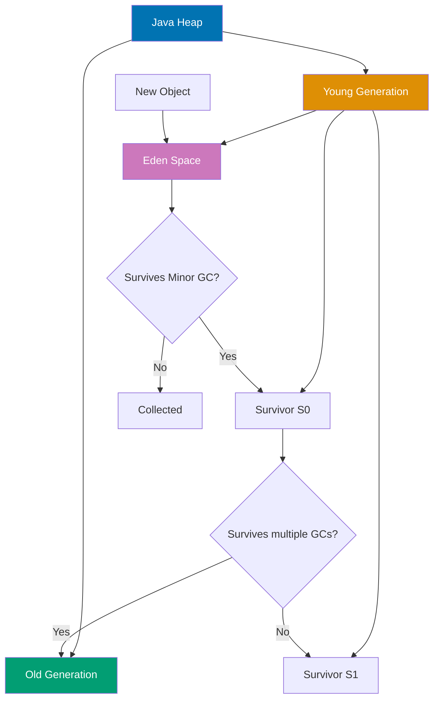

**Code**:

```java
// Object lifecycle
class MyObject {
    private byte[] data = new byte[1024]; // => 1KB per object, allocated on heap
}

// Objects created in Eden space (Young Gen)
MyObject obj1 = new MyObject(); // => Allocated in Eden space (Young Generation)
MyObject obj2 = new MyObject(); // => Also in Eden
System.out.println("Created obj1 and obj2"); // => Both reachable

// obj1 becomes unreachable
obj1 = null; // => obj1 eligible for GC, obj2 still reachable

// Minor GC occurs when Eden fills
// => Survivors age in S0/S1, then promote to Old Gen

// GC roots (always reachable, prevent GC):
// 1. Local variables in active methods (stack references)
// 2. Static fields (Class metadata references)
// 3. Active threads (Thread objects and their stacks)
// 4. JNI references (native code references)

// Example: memory leak via static collection
class MemoryLeakExample {
    private static List<byte[]> cache = new ArrayList<>(); // => Static field is GC root

    public static void addToCache(byte[] data) {
        cache.add(data); // => Never removed → OutOfMemoryError
    }
}

// Weak references allow GC even if referenced
import java.lang.ref.*;

// Strong reference (default) - prevents GC
String strongRef = new String("Will not be collected"); // => GC root prevents collection

// Soft reference - collected only if memory pressure
SoftReference<String> softRef = new SoftReference<>(new String("Collected if needed"));
// => Collected under memory pressure
String value = softRef.get(); // => May return null if object was collected
if (value != null) {
    System.out.println(value); // => Only prints if object still in memory
}

// Weak reference - collected at next GC
WeakReference<String> weakRef = new WeakReference<>(new String("Collected soon"));
// => Collected at next GC (useful for caches)
String weakValue = weakRef.get(); // => May return null
System.out.println(weakValue); // => Prints string or throws NPE if collected
// => If GC ran: null reference causes NPE
// => If object alive: prints "Collected soon"

// Phantom reference - for cleanup hooks
ReferenceQueue<String> queue = new ReferenceQueue<>(); // => GC notifications
PhantomReference<String> phantomRef = new PhantomReference<>(
    new String("For cleanup"), queue
);
// => For post-finalization cleanup (more reliable than finalize())

// System.gc() suggests GC (doesn't guarantee it)
System.gc(); // => Hint only (JVM may ignore, expensive if honored)

// Monitoring GC (via JVM flags)
// -XX:+PrintGCDetails - Print GC logs
// => Logs GC events: collections, timings, heap sizes
// => Example output: [GC (Allocation Failure) [PSYoungGen: 512K->128K(1024K)] 512K->256K(4096K), 0.001s]
// -XX:+PrintGCDateStamps - Add timestamps
// => Adds absolute timestamps to GC logs
// => Example: 2024-01-15T10:30:45.123+0000: [GC (Allocation Failure)...]
// -Xms512m -Xmx2g - Set min/max heap size
// => -Xms512m: Initial heap size (512 megabytes)
// => -Xmx2g: Maximum heap size (2 gigabytes)
// => Heap grows from Xms to Xmx as needed
// => Setting Xms = Xmx prevents heap resizing overhead

// GC types (algorithmic overview)
// Serial GC: Single-threaded, simple
// => -XX:+UseSerialGC flag
// => Stops application during collection (stop-the-world)
// => Best for: small heaps (<100MB), single-CPU systems, batch jobs
// Parallel GC: Multi-threaded, throughput-focused
// => -XX:+UseParallelGC flag (default in Java 8)
// => Multiple threads for young/old generation collection
// => Best for: throughput-critical apps, multi-CPU servers
// G1 GC: Region-based, balanced (default in Java 9+)
// => -XX:+UseG1GC flag (default in Java 9+)
// => Divides heap into regions, collects incrementally
// => Targets pause time goals (-XX:MaxGCPauseMillis)
// => Best for: large heaps (>4GB), balanced latency/throughput
// ZGC: Ultra-low latency, large heaps (Java 15+)
// => -XX:+UseZGC flag
// => Concurrent GC: <10ms pauses even for terabyte heaps
// => Best for: latency-critical apps, very large heaps (100GB+)
// Shenandoah: Low-latency, concurrent (Java 12+)
// => -XX:+UseShenandoahGC flag
// => Similar to ZGC: concurrent, low-latency
// => Best for: low-latency apps, large heaps

// Finalizers (deprecated, avoid!)
@Deprecated
// => finalize() deprecated in Java 9, removed in future versions
class BadExample {
    @Override
    protected void finalize() throws Throwable {
        // Unpredictable timing, performance impact
        // => finalize() called by GC thread before object reclaimed
        // => Timing unpredictable: may run seconds/minutes/never after object unreachable
        // => Slows GC: objects with finalizers require extra GC cycles
        // => Exceptions in finalize() silently ignored
        // Use try-with-resources or Cleaner instead
        // => Cleaner provides deterministic cleanup
        // => try-with-resources ensures cleanup via AutoCloseable.close()
    }
}

// Modern cleanup with Cleaner (Java 9+)
import java.lang.ref.Cleaner;
// => Replacement for finalize(), provides cleanup hooks

class Resource {
    private static final Cleaner cleaner = Cleaner.create();
    // => Shared instance, manages cleanup threads

    private final Cleaner.Cleanable cleanable;
    // => Registration handle for this resource's cleanup action
    // => Allows manual cleanup via cleanable.clean()

    Resource() {
        this.cleanable = cleaner.register(this, new CleanupAction());
        // => Registers cleanup when Resource unreachable
    }

    private static class CleanupAction implements Runnable {
        // => MUST be static (avoid circular reference)
        @Override
        public void run() {
            // Cleanup code here
            System.out.println("Resource cleaned up");
        }
    }
}
```

**Key Takeaway**: GC reclaims memory from unreachable objects. Young generation (Eden + Survivor) for new objects, old generation for long-lived objects. GC roots determine reachability. Soft/weak references allow GC-friendly caching. Avoid finalizers; use Cleaner or try-with-resources.

**Why It Matters**: Garbage collection automates memory management, preventing leaks and use-after-free bugs. Understanding GC algorithms (G1, ZGC, Shenandoah) enables choosing appropriate collectors for latency vs throughput requirements. Heap sizing (-Xmx, -Xms) balances memory usage vs GC frequency. GC pauses impact application latency—low-latency systems need pause-sensitive collectors (ZGC, Shenandoah provide sub-millisecond pauses). Monitoring GC via logs and JMX reveals memory issues—leaks, excessive allocation, inappropriate heap size. Understanding GC fundamentals enables effective memory tuning, preventing OutOfMemoryError and minimizing pause impact on production applications.

---

## Example 71: Memory Management and Reference Types

Java provides four reference types to control GC behavior. Strong references prevent collection. Soft references enable memory-sensitive caches. Weak references allow collection despite references. Phantom references enable pre-mortem cleanup.

**Code**:

```java
import java.lang.ref.*;
import java.util.*;

// Strong reference (default) - prevents GC
String strong = new String("Cannot be collected while referenced");
                                 // => Strong reference prevents GC
                                 // => Object stays in memory while strong references exist
strong = null;                   // => Removes strong reference
                                 // => Object now eligible for GC

// Soft reference - memory-sensitive caching
class ImageCache {              // => Cache implementation using soft references
    private Map<String, SoftReference<byte[]>> cache = new HashMap<>();  // => Cache storage
                                 // => Map keys = cache keys (String)
                                 // => Map values = SoftReference wrapping byte[] images

    public void addImage(String key, byte[] image) {  // => Adds image to cache
        cache.put(key, new SoftReference<>(image));   // => Stores soft-referenced image
                                 // => Wraps image in SoftReference
                                 // => GC can collect image if memory pressure
    }

    public byte[] getImage(String key) {  // => Retrieves image from cache
        SoftReference<byte[]> ref = cache.get(key);  // => Gets SoftReference for key
                                 // => Retrieves SoftReference from map
        if (ref != null) {       // => Check if key exists in cache
            byte[] image = ref.get();  // => Extracts byte[] from reference
                                 // => Extract wrapped image
                                 // => Returns null if GC collected it
            if (image != null) {
                return image;    // => Cache hit: image still in memory
            } else {
                cache.remove(key);
                                 // => Image was collected, clean up map entry
            }
        }
        return null;             // => Cache miss: key not found or collected
    }
}

// Soft references cleared only when heap is nearly full
                                 // => JVM clears soft refs before OutOfMemoryError
// Ideal for caches that can be regenerated
                                 // => Data loss acceptable if memory needed

// Weak reference - collected at next GC
WeakReference<String> weak = new WeakReference<>(new String("Collected soon"));
                                 // => Wraps new String in WeakReference
                                 // => String collected at next GC regardless of memory
String value = weak.get();       // => Retrieves wrapped object
                                 // => Returns null if already collected
if (value != null) {
    System.out.println(value);   // => Prints if object still alive
} else {
    System.out.println("Already collected");
                                 // => Prints if GC ran and collected object
}

// WeakHashMap - auto-remove entries when keys collected
WeakHashMap<Object, String> weakMap = new WeakHashMap<>();
                                 // => Map with weak keys
                                 // => Entries auto-removed when key collected
Object key = new Object();       // => Strong reference to key object
weakMap.put(key, "value");       // => Add entry with weak key
System.out.println(weakMap.size());
                                 // => Output: 1 (entry present)

key = null;                      // => Remove strong reference
                                 // => Key becomes weakly reachable (only weakMap holds it)
System.gc();                     // => Suggest GC (may collect weakly reachable objects)
Thread.sleep(100);               // => Wait for GC to run
System.out.println(weakMap.size());
                                 // => Output: 0 (entry auto-removed after key collected)

// Phantom reference - for cleanup notification
class ResourceWithCleanup {
    private static ReferenceQueue<ResourceWithCleanup> queue =
        new ReferenceQueue<>();  // => Queue receives phantom refs after finalization
                                 // => Enables post-GC cleanup notifications
    private static Set<PhantomReference<ResourceWithCleanup>> refs =
        new HashSet<>();         // => Track all phantom refs to prevent collection
                                 // => PhantomReference itself must be strongly reachable

    private String resourceId;

    ResourceWithCleanup(String id) {
        this.resourceId = id;
        refs.add(new PhantomReference<>(this, queue));
                                 // => Register phantom ref for this instance
                                 // => Added to queue after object finalized
    }

    static void cleanupThread() {
        new Thread(() -> {       // => Background cleanup thread
            while (true) {
                try {
                    Reference<?> ref = queue.remove();
                                 // => Blocks until phantom ref added to queue
                                 // => Indicates object finalized, ready for cleanup
                    // Object has been finalized, perform cleanup
                    System.out.println("Cleanup triggered");
                                 // => Custom cleanup logic here
                    refs.remove(ref);
                                 // => Remove from tracking set
                } catch (InterruptedException e) {}
            }
        }).start();
    }
}

// Reference comparison
Object obj = new Object();       // => Strong reference to Object

// Strong: obj -> Object (prevents GC)
                                 // => obj is GC root, prevents collection
SoftReference<Object> soft = new SoftReference<>(obj);
                                 // => Soft reference to same Object
// Soft: obj -> SoftRef -> Object (GC if memory pressure)
                                 // => Object still protected by strong ref (obj)
                                 // => If obj set to null, only soft ref remains

WeakReference<Object> weak2 = new WeakReference<>(obj);
                                 // => Weak reference to same Object
// Weak: obj -> WeakRef -> Object (GC at next cycle)
                                 // => Object still protected by strong ref (obj)
                                 // => If obj set to null, collected at next GC

PhantomReference<Object> phantom = new PhantomReference<>(obj, new ReferenceQueue<>());
                                 // => Phantom reference to same Object
// Phantom: obj -> PhantomRef -> Object (get() always null, for cleanup)
                                 // => get() always returns null (can't retrieve object)
                                 // => Used for cleanup notification, not object access

// Reachability hierarchy (from strongest to weakest)
// 1. Strongly reachable: via strong reference chain from GC root
                                 // => Regular references (local vars, fields, etc.)
// 2. Softly reachable: only via soft references
                                 // => No strong refs, only soft refs
// 3. Weakly reachable: only via weak references
                                 // => No strong/soft refs, only weak refs
// 4. Phantom reachable: finalized, only phantom refs remain
                                 // => Finalized but not yet reclaimed
// 5. Unreachable: no references, ready for collection
                                 // => Memory can be reclaimed

// Practical: metadata cache with weak keys
class MetadataCache {
    private WeakHashMap<Class<?>, String> metadata = new WeakHashMap<>();
                                 // => Weak keys: Class<?> objects
                                 // => Entries removed when Class unloaded

    public void register(Class<?> clazz, String meta) {
        metadata.put(clazz, meta);
                                 // => Associates metadata with class
    }

    public String get(Class<?> clazz) {
        return metadata.get(clazz);
                                 // => Retrieves metadata for class
    }

    // When Class<?> objects are unloaded (classloader gone),
                                 // => Classloader unload triggers Class unload
    // entries auto-removed from map
                                 // => WeakHashMap automatically cleans up entries
}
```

**Key Takeaway**: Four reference types control GC: strong (default, prevents GC), soft (memory-sensitive caching), weak (GC-friendly caching), phantom (cleanup hooks). `WeakHashMap` auto-removes entries when keys collected. Soft references cleared under memory pressure, weak at next GC.

**Why It Matters**: Understanding reference types (strong, weak, soft, phantom) enables advanced memory management—caches that don't prevent GC, resource cleanup, memory-sensitive collections. Weak references enable caches that release entries under memory pressure. Soft references provide memory-sensitive caching—retain while memory available. Phantom references enable post-GC cleanup for native resources. Reference queues enable notification when objects are collected. These tools power memory-efficient caching, resource management, and preventing memory leaks. However, they're complex—use existing libraries (Guava caches) when possible. Understanding references enables building memory-efficient systems handling large datasets.

---

## Example 72: Performance Monitoring and Profiling

Java provides rich tools for monitoring and profiling applications. JMX exposes runtime metrics. JFR enables low-overhead production profiling. JMH provides accurate microbenchmarks. Profile before optimizing.

**Code**:

```java
import java.lang.management.*;
import javax.management.*;

// JMX - Java Management Extensions
ManagementFactory.getRuntimeMXBean().getName();
                                 // => Returns "PID@hostname" format
                                 // => Example: "12345@myserver.com"

// Memory monitoring
MemoryMXBean memoryBean = ManagementFactory.getMemoryMXBean();
                                 // => MBean for heap/non-heap memory monitoring
MemoryUsage heapUsage = memoryBean.getHeapMemoryUsage();
                                 // => Current heap memory usage statistics
System.out.println("Heap used: " + heapUsage.getUsed() / 1024 / 1024 + " MB");
                                 // => Prints current heap usage in megabytes
System.out.println("Heap max: " + heapUsage.getMax() / 1024 / 1024 + " MB");
                                 // => Prints maximum heap size (-Xmx)

// Thread monitoring
ThreadMXBean threadBean = ManagementFactory.getThreadMXBean();
                                 // => MBean for thread monitoring
System.out.println("Live threads: " + threadBean.getThreadCount());
                                 // => Current number of live threads
System.out.println("Peak threads: " + threadBean.getPeakThreadCount());
                                 // => Maximum thread count since JVM start

// Detect deadlocks
long[] deadlockedThreads = threadBean.findDeadlockedThreads();
                                 // => Returns thread IDs in deadlock
                                 // => null if no deadlock detected
if (deadlockedThreads != null) {
    System.out.println("Deadlock detected!");
                                 // => Warning when threads deadlocked
}

// GC monitoring
List<GarbageCollectorMXBean> gcBeans = ManagementFactory.getGarbageCollectorMXBeans();
                                 // => List of GC MBeans (young, old generation)
for (GarbageCollectorMXBean gcBean : gcBeans) {
    System.out.println("GC: " + gcBean.getName());
                                 // => GC name: "G1 Young Generation", "G1 Old Generation", etc.
    System.out.println("  Collections: " + gcBean.getCollectionCount());
                                 // => Number of GC collections performed
    System.out.println("  Time (ms): " + gcBean.getCollectionTime());
                                 // => Total time spent in GC (milliseconds)
}

// CPU time for current thread
long cpuTime = threadBean.getCurrentThreadCpuTime();
                                 // => CPU time for current thread (nanoseconds)
long userTime = threadBean.getCurrentThreadUserTime();
                                 // => User-mode CPU time (excludes kernel time)
System.out.println("CPU time (ns): " + cpuTime);
                                 // => Prints CPU time in nanoseconds

// Class loading monitoring
ClassLoadingMXBean classBean = ManagementFactory.getClassLoadingMXBean();
                                 // => MBean for class loading statistics
System.out.println("Loaded classes: " + classBean.getLoadedClassCount());
                                 // => Currently loaded classes
System.out.println("Total loaded: " + classBean.getTotalLoadedClassCount());
                                 // => Total classes loaded since JVM start

// Compilation monitoring (JIT)
CompilationMXBean compBean = ManagementFactory.getCompilationMXBean();
                                 // => MBean for JIT compiler monitoring
System.out.println("JIT compilation time (ms): " + compBean.getTotalCompilationTime());
                                 // => Total time JIT spent compiling (milliseconds)

// Simple performance measurement
long start = System.nanoTime();  // => High-precision timestamp (nanoseconds)
// Code to measure
for (int i = 0; i < 1000000; i++) {
    Math.sqrt(i);                // => CPU-bound operation to measure
}
long end = System.nanoTime();    // => End timestamp
System.out.println("Elapsed (ms): " + (end - start) / 1_000_000);
                                 // => Converts nanoseconds to milliseconds
                                 // => Warning: nanoTime has measurement overhead

// JMH (Java Microbenchmark Harness) - external library
// More accurate than System.nanoTime() due to warmup, JIT, etc.
                                 // => JMH handles JIT warmup, dead code elimination
                                 // => Provides statistical analysis of results
/*
@Benchmark
public void benchmarkMethod() {
    // Code to benchmark
    doWork();                    // => JMH manages iterations, warmup, statistics
}
*/

// JFR (Java Flight Recorder) - low-overhead profiling
// Start: java -XX:StartFlightRecording=duration=60s,filename=recording.jfr MyApp
                                 // => Records JVM events for 60 seconds
                                 // => Low overhead: ~1% typical
// Analyze with JDK Mission Control
                                 // => GUI tool for analyzing JFR recordings

// Common profiling tools (external)
// - jconsole: GUI for JMX monitoring
                                 // => Real-time monitoring of MBeans
// - jvisualvm: Profiling, heap dumps, thread dumps
                                 // => Free, bundled with JDK
// - JDK Mission Control: JFR analysis
                                 // => Advanced profiling, flame graphs
// - Async-profiler: Low-overhead CPU/memory profiling
                                 // => Production-safe, native profiler
// - YourKit, JProfiler: Commercial profilers
                                 // => Feature-rich, paid tools

// Heap dump on OutOfMemoryError
// -XX:+HeapDumpOnOutOfMemoryError -XX:HeapDumpPath=/path/to/dump
                                 // => Automatically dumps heap on OOM
                                 // => Enables post-mortem analysis

// Thread dump
// kill -3 <pid> (sends SIGQUIT, prints thread dump to stdout)
// jstack <pid> (external tool)

// Performance anti-patterns to avoid:
// 1. String concatenation in loops (use StringBuilder)
// 2. Excessive object creation in hot paths
// 3. Synchronization bottlenecks
// 4. Inefficient algorithms (O(n²) when O(n log n) exists)
// 5. Premature optimization (profile first!)
```

**Key Takeaway**: JMX exposes runtime metrics via MXBeans (memory, threads, GC, classes). JFR enables low-overhead production profiling. Tools: jconsole, jvisualvm, JMC. JMH for accurate microbenchmarks. Profile before optimizing—measure, don't guess.

**Why It Matters**: Performance monitoring and profiling identify bottlenecks—CPU hotspots, memory leaks, lock contention. JMX exposes runtime metrics (heap usage, thread count, GC stats) for monitoring. Profilers (JProfiler, YourKit, async-profiler) identify slow methods, allocation hotspots, and synchronization issues. Understanding sampling vs instrumentation balances accuracy vs overhead. JFR (Java Flight Recorder) provides low-overhead production profiling. Profiling prevents premature optimization by measuring before changing code. It's essential for optimizing performance-critical systems, enabling data-driven decisions about where optimization effort produces meaningful results.

---

## Example 73: Common Performance Patterns

Choosing appropriate data structures and algorithms dramatically impacts performance. StringBuilder for string building. ArrayList for indexed access. HashMap for lookups. Lazy initialization for expensive objects. Profile before optimizing.

**Code**:

```java
import java.util.*;

// String concatenation - avoid in loops
String bad = "";                 // => Immutable empty string
for (int i = 0; i < 1000; i++) {
    bad += i;                    // => Creates new String each iteration
                                 // => O(n²) complexity: copy entire string each time
                                 // => 1000 iterations = ~500,000 character copies
}

// Use StringBuilder instead
StringBuilder good = new StringBuilder();
                                 // => Mutable character buffer
                                 // => Grows dynamically without copying
for (int i = 0; i < 1000; i++) {
    good.append(i);              // => O(1) amortized append
                                 // => O(n) total complexity
}
String result = good.toString(); // => Convert to immutable String

// ArrayList vs LinkedList
List<Integer> arrayList = new ArrayList<>();
                                 // => Array-backed list: contiguous memory
List<Integer> linkedList = new LinkedList<>();
                                 // => Node-based list: linked nodes

// ArrayList: O(1) random access, O(n) insertion in middle
arrayList.get(50);               // => Fast: array index access O(1)
                                 // => Direct memory access
arrayList.add(0, 100);           // => Slow: shifts all elements right O(n)
                                 // => Array copy: expensive for large lists

// LinkedList: O(n) random access, O(1) insertion if iterator
linkedList.get(50);              // => Slow: traverses 50 nodes O(n)
                                 // => No random access: sequential traversal
Iterator<Integer> it = linkedList.iterator();
it.next();                       // => Iterator tracks position
((LinkedList<Integer>) linkedList).add(1, 100);
                                 // => Still O(n) without iterator position
                                 // => Must traverse to position 1

// Prefer ArrayList unless frequent insertions/deletions in middle
                                 // => ArrayList wins for most use cases
                                 // => Better cache locality, lower memory overhead

// HashMap resizing - set initial capacity if size known
Map<String, Integer> inefficient = new HashMap<>();
                                 // => Default capacity 16, resizes at 75% load
                                 // => Multiple resizes for 1000 entries: 16 → 32 → 64 → 128 → 256 → 512 → 1024
for (int i = 0; i < 1000; i++) {
    inefficient.put("key" + i, i);
                                 // => Multiple resizes: expensive rehashing
                                 // => Each resize: allocate new array, rehash all entries
}

Map<String, Integer> efficient = new HashMap<>(1000 * 4 / 3);
                                 // => Initial capacity ~1333: no resize needed for 1000 entries
                                 // => Load factor 0.75: resize at 1333 * 0.75 = 1000
for (int i = 0; i < 1000; i++) {
    efficient.put("key" + i, i); // => No resizes: direct insertion
                                 // => Much faster: avoids rehashing overhead
}

// Stream vs for-loop performance
List<Integer> numbers = new ArrayList<>();
for (int i = 0; i < 1000000; i++) {
    numbers.add(i);              // => Creates list with 1M integers
}

// Stream: more readable, potential parallelization, overhead
long streamSum = numbers.stream()
                                 // => Creates stream from list
    .filter(n -> n % 2 == 0)     // => Filters even numbers
                                 // => Lambda + stream overhead
    .mapToLong(n -> n)           // => Converts Integer to long
                                 // => Avoids boxing overhead in sum()
    .sum();                      // => Sums filtered numbers
                                 // => More readable but slower than loop

// For-loop: faster for simple operations, less overhead
long loopSum = 0;                // => Accumulator
for (int n : numbers) {          // => Enhanced for loop
                                 // => Direct iteration: no stream overhead
    if (n % 2 == 0) {            // => Filter condition
        loopSum += n;            // => Accumulate sum
                                 // => Primitive operations: faster than streams
    }
}                                // => ~2-3x faster than stream for simple operations

// Parallel stream for CPU-intensive work
long parallelSum = numbers.parallelStream()
                                 // => Creates parallel stream
                                 // => Uses ForkJoinPool.commonPool()
    .filter(n -> n % 2 == 0)     // => Parallel filtering
    .mapToLong(n -> n)           // => Parallel mapping
    .sum();                      // => Parallel reduction
                                 // => Faster for large datasets, CPU-bound tasks
                                 // => Overhead: only worthwhile for large data/expensive operations

// Lazy initialization - delay expensive object creation
class ExpensiveObject {
    private static ExpensiveObject instance;
                                 // => Static field: shared across all calls

    public static ExpensiveObject getInstance() {
        if (instance == null) {  // => Lazy: check if already created
            instance = new ExpensiveObject();
                                 // => Created only when needed
                                 // => Not thread-safe: race condition possible
        }
        return instance;         // => Returns singleton instance
    }
}

// Thread-safe lazy initialization (double-checked locking)
class ThreadSafeLazy {
    private static volatile ThreadSafeLazy instance;
                                 // => volatile: ensures visibility across threads
                                 // => Prevents partial construction visibility

    public static ThreadSafeLazy getInstance() {
        if (instance == null) {  // => First check (no locking)
                                 // => Fast path: if already initialized, skip lock
            synchronized (ThreadSafeLazy.class) {
                                 // => Lock only if instance null
                                 // => Prevents multiple threads creating instances
                if (instance == null) {
                                 // => Second check (with lock)
                                 // => Prevents race: another thread may have created between checks
                    instance = new ThreadSafeLazy();
                                 // => Creates instance inside lock
                }
            }
        }
        return instance;         // => Returns singleton instance
                                 // => Thread-safe: only one instance created
    }
}

// Object pooling (rarely beneficial in modern JVMs)
// Modern GC is fast; pooling adds complexity
                                 // => Modern GC (G1, ZGC) very efficient at allocation
                                 // => Pooling adds complexity: thread-safety, eviction
// Only consider for:
// - JDBC connections       // => Connection creation expensive (network handshake)
// - Thread pools            // => Thread creation expensive (OS resources)
// - Expensive external resources
                                 // => Native resources: file handles, sockets
                                 // => Don't pool regular Java objects

// Avoiding unnecessary object creation
// Bad
Integer badCount = new Integer(42);
                                 // => Creates new Integer object
                                 // => Bypasses Integer cache
                                 // => Deprecated: don't use constructor
// Good
Integer goodCount = 42;          // => Uses Integer.valueOf() cache (-128 to 127)
                                 // => Returns cached Integer for small values
                                 // => No object creation for cached range

// EnumSet/EnumMap - efficient for enums
enum Color { RED, GREEN, BLUE }
Set<Color> colors = EnumSet.of(Color.RED, Color.BLUE);
                                 // => Bit vector internally: very efficient
                                 // => 64 bits = 64 enums without allocation
                                 // => Much faster than HashSet for enums

// Effective caching with appropriate eviction
Map<String, String> cache = new LinkedHashMap<>(100, 0.75f, true) {
                                 // => LinkedHashMap with access-order mode
                                 // => true = access-order (LRU), false = insertion-order
    @Override
    protected boolean removeEldestEntry(Map.Entry<String, String> eldest) {
        return size() > 100;     // => LRU cache with max 100 entries
                                 // => Automatically evicts oldest accessed entry
                                 // => Called after each put: returns true to remove eldest
    }
};
```

**Key Takeaway**: Use `StringBuilder` for string concatenation in loops. Prefer `ArrayList` over `LinkedList` for most cases. Set HashMap initial capacity to avoid resizes. Streams for readability, loops for raw performance. Lazy initialization delays expensive object creation. Profile before optimizing.

**Why It Matters**: Common performance patterns (object pooling, lazy initialization, caching, batching) optimize hot paths in production code. Understanding when to apply each pattern prevents both premature optimization and performance bugs. Object pooling reduces allocation in high-throughput paths (connection pools, buffer pools). Lazy initialization defers expensive work until needed. Caching trades memory for speed—memoizing expensive computations. Batching reduces per-operation overhead (batch database inserts, network requests). However, patterns have costs—pooling adds complexity, caching adds memory pressure, batching adds latency. Measure before optimizing, and understand trade-offs.

---

## Example 74: Connection Pool Factory Pattern

Production database applications use connection pooling to reuse expensive database connections. This example demonstrates Singleton (pool manager), Factory (connection creation), and Builder (configuration) patterns in a real-world context.

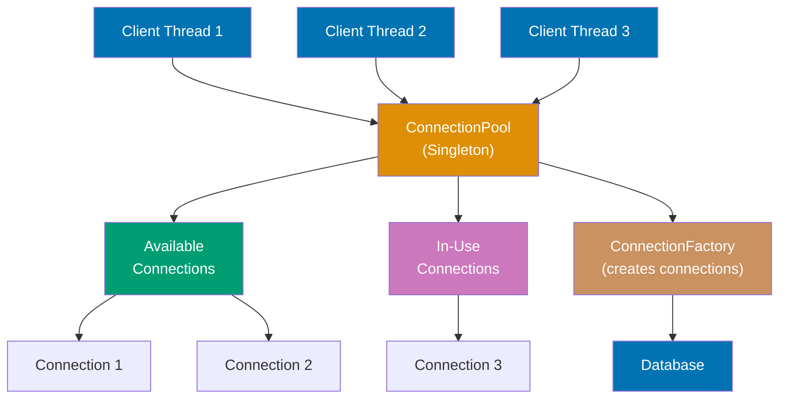

**Code**:

```java
import java.sql.*;            // => JDBC API: Connection, ResultSet, SQLException
                                 // => Core database connectivity interfaces
import java.util.*;             // => Utilities: List, Set, Queue
import java.util.concurrent.*;  // => Concurrency: ConcurrentLinkedQueue, CopyOnWriteArraySet

// Database connection interface
interface DatabaseConnection {
                                 // => Abstraction for different database types (Strategy pattern)
                                 // => Enables polymorphism: PostgresConnection, MySQLConnection
                                 // => Contract: all implementations must provide these methods
    void connect() throws SQLException;
                                 // => Method signature: no return value, may throw SQLException
                                 // => Opens database connection (expensive operation: 100-1000ms)
                                 // => May throw SQLException for connection failures
    void disconnect();           // => Closes connection and releases resources
                                 // => Method signature: no parameters, no return value
    ResultSet executeQuery(String sql) throws SQLException;
                                 // => Executes SQL query, returns result set
                                 // => Method signature: accepts SQL string, may throw SQLException
    boolean isConnected();       // => Checks if connection is currently open
                                 // => Method signature: returns boolean (true if connected)
    String getConnectionString();// => Returns JDBC connection string
                                 // => Method signature: returns String (connection URL)
}
                                 // => End of DatabaseConnection interface

// PostgreSQL connection implementation
class PostgresConnection implements DatabaseConnection {
                                 // => Concrete implementation for PostgreSQL databases
                                 // => JDBC URL pattern: jdbc:postgresql://host:port/database
    private Connection connection;
                                 // => Actual JDBC connection object (java.sql.Connection)
                                 // => null until connect() called
    private final String connString;
                                 // => Immutable connection string (formatted in constructor)

    public PostgresConnection(String host, int port, String database) {
                                 // => Constructor parameters: host, port, database name
        this.connString = String.format("jdbc:postgresql://%s:%d/%s",
                                       host, port, database);
                                 // => Example: "jdbc:postgresql://localhost:5432/mydb"
                                 // => String.format builds JDBC URL from components
    }

    @Override
    public void connect() throws SQLException {
                                 // => Opens connection to PostgreSQL database
        connection = DriverManager.getConnection(connString);
                                 // => DriverManager finds JDBC driver and establishes connection
                                 // => Expensive operation: TCP handshake + authentication + initialization
                                 // => May take 100-1000ms depending on network/database
        System.out.println("Connected to PostgreSQL: " + connString);
                                 // => Output: "Connected to PostgreSQL: jdbc:postgresql://localhost:5432/mydb"
    }

    @Override
    public void disconnect() {   // => Closes connection and releases resources
        try {
                                 // => try-catch wraps close operation to handle exceptions
            if (connection != null) connection.close();
                                 // => Closes JDBC connection (releases TCP socket, database session)
                                 // => null check prevents NPE if connect() never called
            System.out.println("Disconnected from PostgreSQL");
                                 // => Output: "Disconnected from PostgreSQL"
        } catch (SQLException e) {
                                 // => Catches errors during disconnect (rare but possible)
            e.printStackTrace(); // => Logs exception stack trace
        }
    }

    @Override
    public ResultSet executeQuery(String sql) throws SQLException {
                                 // => Executes SELECT query and returns results
        return connection.createStatement().executeQuery(sql);
                                 // => Creates Statement, executes query, returns ResultSet
                                 // => ResultSet contains query results (rows and columns)
    }

    @Override
    public boolean isConnected() {
                                 // => Checks if connection is currently open and valid
        try {
                                 // => try-catch handles potential SQLException from isClosed()
            return connection != null && !connection.isClosed();
                                 // => true if connection exists and not closed
                                 // => false if null or closed
        } catch (SQLException e) {
                                 // => isClosed() may throw SQLException (rare)
            return false;        // => Return false on exception (treat as disconnected)
        }
    }

    @Override
    public String getConnectionString() { return connString; }
                                 // => Returns JDBC connection string (e.g., "jdbc:postgresql://localhost:5432/mydb")
                                 // => Useful for debugging or logging connection details
}
                                 // => End of PostgresConnection class

// MySQL connection implementation
class MySQLConnection implements DatabaseConnection {
                                 // => Concrete implementation for MySQL databases
                                 // => JDBC URL pattern: jdbc:mysql://host:port/database
                                 // => Parallel to PostgresConnection (Factory can return either)
    private Connection connection;
                                 // => JDBC connection object (null until connect() called)
    private final String connString;
                                 // => Immutable MySQL connection string

    public MySQLConnection(String host, int port, String database) {
                                 // => Constructor for MySQL connection parameters
        this.connString = String.format("jdbc:mysql://%s:%d/%s",
                                       host, port, database);
                                 // => Example: "jdbc:mysql://localhost:3306/mydb"
                                 // => Note: MySQL default port 3306 (vs Postgres 5432)
    }

    @Override
    public void connect() throws SQLException {
                                 // => Opens connection to MySQL database
        connection = DriverManager.getConnection(connString);
                                 // => DriverManager finds MySQL JDBC driver (com.mysql.cj.jdbc.Driver)
                                 // => Establishes connection: TCP handshake + authentication + MySQL handshake
        System.out.println("Connected to MySQL: " + connString);
                                 // => Output: "Connected to MySQL: jdbc:mysql://localhost:3306/mydb"
    }

    @Override
    public void disconnect() {   // => Closes MySQL connection
        try {
                                 // => try-catch wraps close to handle SQLException
            if (connection != null) connection.close();
                                 // => Closes connection, releases MySQL session
            System.out.println("Disconnected from MySQL");
                                 // => Output: "Disconnected from MySQL"
        } catch (SQLException e) {
            e.printStackTrace(); // => Logs disconnect errors (rare)
        }
    }

    @Override
    public ResultSet executeQuery(String sql) throws SQLException {
                                 // => Executes SQL query against MySQL database
        return connection.createStatement().executeQuery(sql);
                                 // => Creates Statement, executes query, returns ResultSet with rows
    }

    @Override
    public boolean isConnected() {
                                 // => Checks MySQL connection status
        try {
                                 // => try-catch handles potential SQLException
            return connection != null && !connection.isClosed();
                                 // => true if connection valid and open
        } catch (SQLException e) {
            return false;        // => false on exception or if closed
        }
    }

    @Override
    public String getConnectionString() { return connString; }
                                 // => Returns MySQL JDBC connection string
                                 // => Example: "jdbc:mysql://localhost:3306/mydb"
}
                                 // => End of MySQLConnection class

// Factory for creating database connections
class ConnectionFactory {        // => Factory pattern: creates objects without exposing creation logic
                                 // => Centralizes connection creation, supports multiple database types
    public static DatabaseConnection create(String dbType, String host,
                                           int port, String database) {
                                 // => Factory method returns interface type (DatabaseConnection)
                                 // => Decouples client from concrete implementations
                                 // => Static factory method (no instance needed)
                                 // => Parameters: database type, host, port, database name
        return switch (dbType.toLowerCase()) {
                                 // => Switch expression on database type (case-insensitive)
                                 // => Returns appropriate DatabaseConnection implementation
            case "postgres", "postgresql" ->
                new PostgresConnection(host, port, database);
                                 // => Returns PostgresConnection for "postgres" or "postgresql"
            case "mysql" ->
                new MySQLConnection(host, port, database);
                                 // => Returns MySQLConnection for "mysql"
            default ->
                throw new IllegalArgumentException("Unsupported database: " + dbType);
                                 // => Throws exception for unsupported database types
                                 // => Example error: "Unsupported database: oracle"
        };
                                 // => Switch expression returns DatabaseConnection instance
    }
}
                                 // => End of ConnectionFactory class

// Connection configuration using Builder pattern
class ConnectionConfig {        // => Immutable configuration object (all fields final)
                                 // => Uses Builder pattern to construct complex configuration
    private final String dbType; // => Database type: "postgres", "mysql"
    private final String host;   // => Database host: "localhost", "db.example.com"
    private final int port;      // => Database port: 5432 (Postgres), 3306 (MySQL)
    private final String database;
                                 // => Database name: "mydb", "production"
    private final int poolSize;  // => Number of connections in pool (default: 10)
    private final int timeout;   // => Connection timeout in seconds (default: 30)

    private ConnectionConfig(Builder builder) {
                                 // => Private constructor (only Builder can create instances)
                                 // => Ensures Builder pattern enforced
        this.dbType = builder.dbType;
                                 // => Copies dbType from Builder
        this.host = builder.host;
                                 // => Copies host from Builder
        this.port = builder.port;
                                 // => Copies port from Builder (may be default)
        this.database = builder.database;
                                 // => Copies database name from Builder
        this.poolSize = builder.poolSize;
                                 // => Copies poolSize from Builder (default: 10)
        this.timeout = builder.timeout;
                                 // => Copies timeout from Builder (default: 30)
    }

    // Fluent Builder
    public static class Builder {
                                 // => Inner static Builder class (nested within ConnectionConfig)
                                 // => Provides fluent API for building configuration
        private final String dbType;
                                 // => Required field: database type (no default)
        private final String host;
                                 // => Required field: host (no default)
        private final String database;
                                 // => Required field: database name (no default)
        private int port = 5432; // Default for Postgres
                                 // => Field initialization sets default value
                                 // => Optional field with default: Postgres port
        private int poolSize = 10;
                                 // => Optional field with default: 10 connections
        private int timeout = 30;
                                 // => Optional field with default: 30 seconds

        public Builder(String dbType, String host, String database) {
                                 // => Constructor requires only mandatory fields
                                 // => Optional fields use defaults (can be overridden with setters)
            this.dbType = dbType;
                                 // => Sets required database type
            this.host = host;    // => Sets required host
            this.database = database;
                                 // => Sets required database name
        }

        public Builder port(int port) {
                                 // => Optional setter for port (overrides default)
            this.port = port;    // => Sets custom port (e.g., 3306 for MySQL)
            return this; // => Fluent API
                                 // => Returns this Builder for method chaining
                                 // => Enables: builder.port(3306).poolSize(20).build()
        }

        public Builder poolSize(int size) {
                                 // => Optional setter for pool size
                                 // => Method chaining: returns Builder
            this.poolSize = size;
                                 // => Sets number of connections (e.g., 20, 50)
                                 // => Overrides default value of 10
            return this;         // => Returns this for chaining
                                 // => Enables fluent API
        }

        public Builder timeout(int seconds) {
                                 // => Optional setter for connection timeout
                                 // => Method chaining pattern
            this.timeout = seconds;
                                 // => Sets timeout in seconds (e.g., 60, 120)
                                 // => Overrides default of 30 seconds
            return this;         // => Returns this for chaining
                                 // => Fluent API continuation
        }

        public ConnectionConfig build() {
                                 // => Terminal operation: creates ConnectionConfig instance
                                 // => Finalizes builder pattern (no more method chaining)
            return new ConnectionConfig(this);
                                 // => Calls private constructor with this Builder
                                 // => Returns immutable ConnectionConfig
                                 // => Builder fields copied to final configuration
        }
    }
                                 // => End of Builder inner class

    public String getDbType() { return dbType; }
                                 // => Getter for database type
    public String getHost() { return host; }
                                 // => Getter for host
    public int getPort() { return port; }
                                 // => Getter for port
    public String getDatabase() { return database; }
                                 // => Getter for database name
    public int getPoolSize() { return poolSize; }
                                 // => Getter for pool size
    public int getTimeout() { return timeout; }
                                 // => Getter for timeout
                                 // => Returns timeout value in seconds
}
                                 // => End of ConnectionConfig class

// Connection Pool using Singleton pattern
class ConnectionPool {          // => Singleton pattern: only one pool instance per application
                                 // => Manages connection reuse (pool), prevents connection exhaustion
    private static volatile ConnectionPool instance; // Singleton instance
                                 // => volatile: ensures visibility across threads (happens-before)
                                 // => static: single instance shared across all callers
                                 // => null initially, created on first getInstance() call
    private final Queue<DatabaseConnection> availableConnections;
                                 // => Queue of connections available for use (not currently in use)
                                 // => ConcurrentLinkedQueue: thread-safe, lock-free queue
    private final Set<DatabaseConnection> inUseConnections;
                                 // => Set of connections currently in use by clients
                                 // => ConcurrentHashMap.newKeySet(): thread-safe set
    private final ConnectionConfig config;
                                 // => Configuration: database type, host, pool size, etc.

    private ConnectionPool(ConnectionConfig config) {
                                 // => Private constructor (Singleton: no public instantiation)
                                 // => Only getInstance() can create instance
                                 // => Constructor called once by getInstance()
        this.config = config;    // => Saves configuration
                                 // => Stores reference to immutable configuration
                                 // => Configuration contains dbType, host, port, database, poolSize, timeout
        this.availableConnections = new ConcurrentLinkedQueue<>();
                                 // => Initializes available connections queue (thread-safe)
                                 // => ConcurrentLinkedQueue: lock-free, unbounded queue
        this.inUseConnections = ConcurrentHashMap.newKeySet();
                                 // => Initializes in-use connections set (thread-safe)
                                 // => newKeySet() creates Set backed by ConcurrentHashMap

        // Pre-create pool connections
        for (int i = 0; i < config.getPoolSize(); i++) {
                                 // => Loops poolSize times (default: 10)
                                 // => Pre-creates connections to avoid lazy initialization delays
                                 // => Warm start: connections ready immediately
            DatabaseConnection conn = ConnectionFactory.create(
                config.getDbType(),
                config.getHost(),
                config.getPort(),
                config.getDatabase()
            );                   // => Creates connection using Factory pattern
                                 // => Connection not yet opened (connect() not called)
            availableConnections.offer(conn);
                                 // => Adds connection to available queue
                                 // => offer(): adds to tail of queue (non-blocking)
                                 // => Connection ready for use via acquire()
        }
        System.out.println("Connection pool initialized with " +
                         config.getPoolSize() + " connections");
                                 // => Logs initialization completion
                                 // => Output: "Connection pool initialized with 10 connections"
    }

    // Thread-safe Singleton with double-checked locking
    public static ConnectionPool getInstance(ConnectionConfig config) {
                                 // => Static factory method for Singleton instance
                                 // => Thread-safe: uses double-checked locking pattern
        if (instance == null) {  // => First check (no synchronization, fast path)
                                 // => Avoids synchronization overhead if already initialized
                                 // => Optimistic check: most calls take this fast path
            synchronized (ConnectionPool.class) {
                                 // => Synchronizes on class object (ensures single instance)
                                 // => Lock acquired: other threads block here
                                 // => synchronized block ensures mutual exclusion
                if (instance == null) {
                                 // => Second check inside synchronized block
                                 // => Prevents race condition: two threads pass first check
                    instance = new ConnectionPool(config);
                                 // => Creates Singleton instance (called once)
                }
            }
        }
        return instance;         // => Returns existing instance (all subsequent calls)
                                 // => volatile ensures visibility across threads
    }

    public DatabaseConnection acquire() throws InterruptedException {
                                 // => Acquires connection from pool (blocking if pool exhausted)
                                 // => throws InterruptedException if thread interrupted while waiting
        DatabaseConnection conn = availableConnections.poll();
                                 // => poll() is non-blocking (returns immediately)
                                 // => poll(): removes and returns head of queue (non-blocking)
                                 // => Returns null if queue empty (no available connections)
        if (conn == null) {      // => Pool exhausted: no available connections
                                 // => All connections currently in use
            System.out.println("Pool exhausted, creating new connection");
                                 // => Output: "Pool exhausted, creating new connection"
                                 // => Indicates pool undersized or connection leak
                                 // => Warning: dynamic creation can lead to unbounded growth
            conn = ConnectionFactory.create(
                config.getDbType(),
                                 // => Passes database type from config
                config.getHost(),
                                 // => Passes host from config
                config.getPort(),
                                 // => Passes port from config
                config.getDatabase()
                                 // => Passes database name from config
            );                   // => Creates new connection dynamically (overflow strategy)
                                 // => Alternative: block until connection available (HikariCP strategy)
                                 // => Factory method handles database-specific creation
        }
        inUseConnections.add(conn);
                                 // => Thread-safe add operation (ConcurrentHashMap.newKeySet())
                                 // => Adds connection to in-use set
                                 // => Tracks borrowed connections for leak detection
        return conn; // => Connection from pool or newly created
                                 // => Caller must call release(conn) when done
                                 // => Connection leak if release() not called (pool exhaustion)
    }

    public void release(DatabaseConnection conn) {
                                 // => Returns connection to pool for reuse
                                 // => MUST be called after acquire() to prevent leaks
        if (inUseConnections.remove(conn)) {
                                 // => Removes from in-use set
                                 // => Returns true if conn was in set (valid release)
                                 // => Returns false if conn not in set (double-release or invalid)
            availableConnections.offer(conn);
                                 // => Adds connection back to available queue
                                 // => Connection now available for next acquire() call
                                 // => offer() adds to tail of queue (non-blocking)
            System.out.println("Connection returned to pool");
                                 // => Output: "Connection returned to pool"
        }
                                 // => If remove() returns false, connection not released (already released or invalid)
    }

    public void shutdown() {     // => Closes all connections and shuts down pool
        for (DatabaseConnection conn : availableConnections) {
                                 // => Iterates available connections
                                 // => Enhanced for loop over queue elements
            conn.disconnect();   // => Closes each available connection
                                 // => Releases database resources
        }
        for (DatabaseConnection conn : inUseConnections) {
                                 // => Iterates in-use connections (may be leaked)
                                 // => Enhanced for loop over set elements
            conn.disconnect();   // => Closes each in-use connection (cleanup)
                                 // => Force-closes even if not properly released
        }
        System.out.println("Connection pool shut down");
                                 // => Output: "Connection pool shut down"
                                 // => Indicates cleanup complete
    }

    public int getAvailableCount() { return availableConnections.size(); }
                                 // => Returns number of available connections (not in use)
                                 // => Useful for monitoring pool utilization
    public int getInUseCount() { return inUseConnections.size(); }
                                 // => Returns number of in-use connections (borrowed)
                                 // => Helps detect connection leaks
}
                                 // => End of ConnectionPool class

// Usage example combining all patterns
ConnectionConfig config = new ConnectionConfig.Builder("postgres", "localhost", "mydb")
                                 // => Creates Builder with required fields: dbType, host, database
                                 // => Builder pattern: fluent API for complex configuration
    .port(5432)                  // => Optional: sets port to 5432 (Postgres default)
                                 // => Method chaining: port() returns Builder
    .poolSize(20)                // => Optional: sets pool size to 20 connections (default: 10)
    .timeout(60)                 // => Optional: sets timeout to 60 seconds (default: 30)
    .build(); // => Builder pattern
                                 // => Terminal operation: builds immutable ConnectionConfig
                                 // => config is now ready for ConnectionPool.getInstance()

ConnectionPool pool = ConnectionPool.getInstance(config); // => Singleton
                                 // => Gets Singleton ConnectionPool instance
                                 // => First call creates pool with 20 pre-initialized connections
                                 // => Subsequent calls return same instance (Singleton)

// Acquire connection from pool
DatabaseConnection conn = pool.acquire(); // => Factory creates connection
                                 // => Acquires connection from available queue
                                 // => Returns existing connection (fast: ~1ms) or creates new (slow: 100-1000ms)
                                 // => conn must be released in finally block to avoid leaks
try {
                                 // => try-catch-finally ensures connection always released
    conn.connect();              // => Opens connection (TCP handshake + authentication)
                                 // => May throw SQLException
    ResultSet rs = conn.executeQuery("SELECT * FROM users");
                                 // => Executes SQL query, returns ResultSet
                                 // => rs contains all rows from users table
    // Process results...
                                 // => Placeholder for result processing logic (iterate ResultSet rows)
} catch (SQLException e) {       // => Catches SQL exceptions (connection failures, query errors)
    e.printStackTrace();         // => Logs exception stack trace
                                 // => Prints SQLException details to stderr
} finally {
                                 // => finally block always executes (even if exception thrown)
    pool.release(conn); // => Return to pool for reuse
                                 // => CRITICAL: always release in finally block
                                 // => Failure to release causes connection leak and pool exhaustion
                                 // => Connection returned to availableConnections queue
}

// Pool statistics
System.out.println("Available: " + pool.getAvailableCount());
                                 // => Prints number of available connections
                                 // => Output: "Available: 19" (20 total - 1 in use)
                                 // => Shows connections ready for reuse
System.out.println("In use: " + pool.getInUseCount());
                                 // => Output: "In use: 1" (conn acquired but not released yet)
                                 // => Shows connections currently borrowed
                                 // => Helps monitor pool usage and detect leaks

pool.shutdown(); // Cleanup
                                 // => Closes all connections (available + in-use)
                                 // => Call on application shutdown (cleanup resources)
                                 // => Releases all database resources
```

**Key Takeaway**: This demonstrates all three creational patterns in production context. **Singleton** ensures one connection pool instance (thread-safe with double-checked locking). **Factory** creates database connections by type (Postgres, MySQL) enabling polymorphism. **Builder** constructs complex configuration with fluent API, avoiding telescoping constructors. Connection pooling is essential for production databases—creating connections is expensive (100-1000ms), reusing them is fast (1ms). This pattern appears in all production database libraries (HikariCP, C3P0, Apache DBCP).

**Why It Matters**: Connection pooling reuses database connections, eliminating expensive connection setup (TCP handshake, authentication, initialization). Pools prevent exhaustion by limiting max connections, and improve performance by maintaining warm connections. Understanding pool sizing (max connections, min idle, connection timeout) optimizes performance vs resource usage. HikariCP is the standard high-performance pool. Connection leaks (not returning connections) cause pool exhaustion and application failure—use try-with-resources. Pooling is essential for scalable database-backed applications—unpooled connections can't handle production load. Similar patterns apply to thread pools, object pools, and other expensive resources.

---

## Example 75: Strategy, Observer, Decorator

Behavioral patterns define communication between objects. Strategy encapsulates algorithms. Observer enables one-to-many notifications. Decorator adds responsibilities dynamically without subclassing.

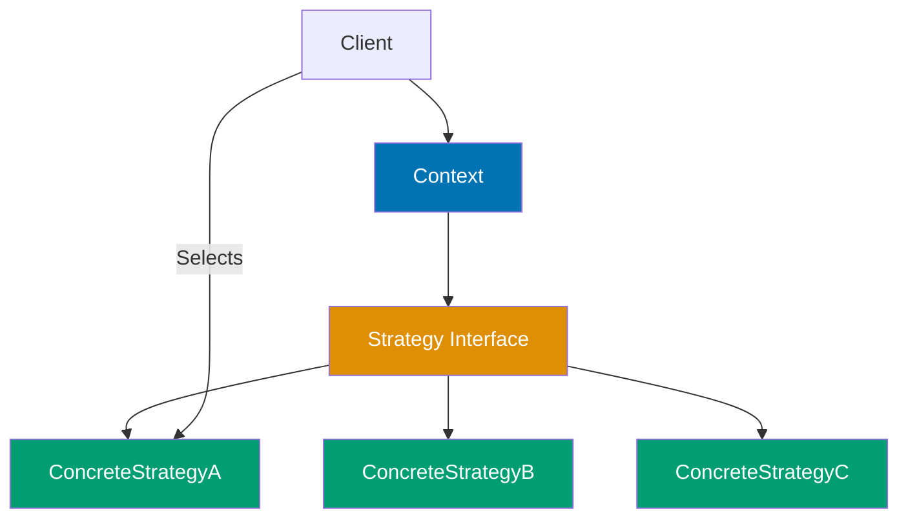

**Code**:

```java
// Strategy pattern - encapsulate algorithms

interface PaymentStrategy {
    // => Defines contract for payment algorithms
    // => Different implementations = different payment methods
    void pay(int amount);
    // => All strategies implement same interface method
    // => Enables runtime strategy swapping
}

class CreditCardStrategy implements PaymentStrategy {
    // => Concrete strategy: credit card payment
    // => Encapsulates credit card payment logic
    private String cardNumber;
    // => Strategy-specific data (card number)
    // => Each strategy can have different fields

    public CreditCardStrategy(String cardNumber) {
        this.cardNumber = cardNumber;
        // => Constructor receives strategy-specific configuration
        // => Enables parameterized strategy instances
    }

    @Override
    public void pay(int amount) {
        System.out.println("Paid " + amount + " using Credit Card " + cardNumber);
        // => Strategy-specific implementation
        // => In real app: calls payment gateway API
        // => Prints: "Paid 100 using Credit Card 1234-5678"
    }
}

class PayPalStrategy implements PaymentStrategy {
    // => Alternative concrete strategy: PayPal payment
    // => Same interface, different implementation
    private String email;
    // => PayPal-specific data (email instead of card number)
    // => Strategies can have different internal structures

    public PayPalStrategy(String email) {
        this.email = email;
        // => PayPal requires email, not card number
        // => Each strategy configured independently
    }

    @Override
    public void pay(int amount) {
        System.out.println("Paid " + amount + " using PayPal " + email);
        // => PayPal-specific implementation
        // => Different logic, same interface contract
        // => Prints: "Paid 50 using PayPal user@example.com"
    }
}

class ShoppingCart {
    // => Context: uses strategy without knowing concrete type
    // => Delegates payment to strategy object
    private PaymentStrategy paymentStrategy;
    // => Holds reference to strategy interface, not concrete class
    // => Enables runtime strategy switching

    public void setPaymentStrategy(PaymentStrategy strategy) {
        // => Runtime strategy selection
        // => Can change payment method on-the-fly
        this.paymentStrategy = strategy;
        // => Stores new strategy, replaces previous one
        // => No code changes needed to add new payment methods
    }

    public void checkout(int amount) {
        paymentStrategy.pay(amount);
        // => Delegates to strategy's pay() method
        // => ShoppingCart doesn't know which strategy (credit card, PayPal, etc.)
        // => Open/closed principle: open for extension, closed for modification
    }
}

ShoppingCart cart = new ShoppingCart();
// => Creates context (shopping cart) without strategy
// => Strategy set later via setPaymentStrategy()
cart.setPaymentStrategy(new CreditCardStrategy("1234-5678"));
// => Runtime strategy selection: credit card
// => Passes card number to strategy constructor
cart.checkout(100); // => "Paid 100 using Credit Card 1234-5678"
// => Executes credit card payment strategy
// => ShoppingCart delegates to CreditCardStrategy.pay()

cart.setPaymentStrategy(new PayPalStrategy("user@example.com"));
// => Changes strategy at runtime without modifying ShoppingCart code
// => New strategy with different configuration (email instead of card)
cart.checkout(50); // => "Paid 50 using PayPal user@example.com"
// => Executes PayPal payment strategy
// => Same checkout() method, different behavior

// Strategy with lambdas (simpler for simple algorithms)
interface Comparator<T> {
    // => Functional interface: single abstract method
    // => Can be implemented with lambda expressions
    int compare(T o1, T o2);
    // => Returns: negative (o1 < o2), zero (equal), positive (o1 > o2)
    // => Enables custom sorting logic
}

List<String> names = Arrays.asList("Alice", "Bob", "Charlie");
// => Initial list: ["Alice", "Bob", "Charlie"]
// => Arrays.asList() creates fixed-size list
names.sort((a, b) -> a.length() - b.length()); // Lambda as strategy
// => Lambda implements Comparator interface
// => Sorts by string length: "Bob" (3), "Alice" (5), "Charlie" (7)
// => Result: ["Bob", "Alice", "Charlie"]
// => Strategy pattern simplified: no explicit classes needed for simple algorithms

// Observer pattern - one-to-many dependency

interface Observer {
    // => Defines contract for observers (subscribers)
    // => Observers notified when subject state changes
    void update(String message);
    // => Callback method invoked by subject
    // => Receives notification with message payload
}

class Subject {
    // => Observable object (publisher)
    // => Maintains list of observers, notifies them on state change
    private List<Observer> observers = new ArrayList<>();
    // => Stores all registered observers
    // => One-to-many relationship: one subject, multiple observers

    public void attach(Observer observer) {
        // => Registers new observer (subscribe)
        // => Observer added to notification list
        observers.add(observer);
        // => Now observer will receive all future notifications
        // => No limit on number of observers
    }

    public void detach(Observer observer) {
        // => Unregisters observer (unsubscribe)
        // => Observer removed from notification list
        observers.remove(observer);
        // => Observer no longer receives notifications
        // => Prevents memory leaks from abandoned observers
    }

    public void notifyObservers(String message) {
        // => Broadcasts message to all registered observers
        // => Called when subject state changes
        for (Observer observer : observers) {
            // => Iterates through all registered observers
            // => Order dependent on registration sequence
            observer.update(message);
            // => Invokes each observer's update() callback
            // => Push model: subject pushes data to observers
        }
    }
}

class EmailObserver implements Observer {
    // => Concrete observer: sends email notifications
    // => Implements update() to define notification behavior
    @Override
    public void update(String message) {
        System.out.println("Email sent: " + message);
        // => Observer-specific action: send email
        // => In real app: calls email service API
        // => Prints: "Email sent: New update available"
    }
}

class SMSObserver implements Observer {
    // => Alternative concrete observer: sends SMS notifications
    // => Same interface, different notification channel
    @Override
    public void update(String message) {
        System.out.println("SMS sent: " + message);
        // => Observer-specific action: send SMS
        // => Different behavior, same interface contract
        // => Prints: "SMS sent: New update available"
    }
}

Subject subject = new Subject();
// => Creates observable object (publisher)
// => No observers yet (empty list)
subject.attach(new EmailObserver());
// => Registers first observer: email notifications
// => Subject now notifies email observer on state change
subject.attach(new SMSObserver());
// => Registers second observer: SMS notifications
// => Subject now notifies both observers
// => Easy to add new notification channels without modifying Subject
subject.notifyObservers("New update available");
// => Triggers notification to all observers
// => Both observers receive same message
// => Email observer prints: "Email sent: New update available"
// => SMS observer prints: "SMS sent: New update available"
// => Output:
// => Email sent: New update available
// => SMS sent: New update available

// Decorator pattern - add behavior dynamically

interface Coffee {
    // => Component interface: base coffee contract
    // => Both base coffee and decorators implement this interface
    double cost();
    // => Returns total cost (base + decorations)
    // => Decorators add their cost to wrapped object's cost
    String description();
    // => Returns full description (base + decorations)
    // => Decorators append their description to wrapped object's description
}

class SimpleCoffee implements Coffee {
    // => Concrete component: base coffee without decorations
    // => Starting point for decoration chain
    @Override
    public double cost() { return 2.0; }
    // => Base cost: $2.00
    // => Decorators add to this cost

    @Override
    public String description() { return "Simple coffee"; }
    // => Base description: "Simple coffee"
    // => Decorators append to this description
}

// Decorator base class
abstract class CoffeeDecorator implements Coffee {
    // => Abstract decorator: wraps Coffee object
    // => All concrete decorators extend this class
    protected Coffee coffee;
    // => Wrapped coffee object (base or another decorator)
    // => Enables decorator chaining (decorator wraps decorator)

    public CoffeeDecorator(Coffee coffee) {
        // => Constructor receives coffee to wrap
        // => Delegation pattern: decorator delegates to wrapped object
        this.coffee = coffee;
        // => Stores wrapped coffee for delegation
        // => Forms decorator chain: SimpleCoffee -> MilkDecorator -> SugarDecorator
    }
}

class MilkDecorator extends CoffeeDecorator {
    // => Concrete decorator: adds milk to coffee
    // => Wraps Coffee object, adds milk cost/description
    public MilkDecorator(Coffee coffee) { super(coffee); }
    // => Passes wrapped coffee to parent constructor
    // => Can wrap SimpleCoffee or another decorator

    @Override
    public double cost() { return coffee.cost() + 0.5; }
    // => Adds milk cost ($0.50) to wrapped coffee's cost
    // => Delegates to wrapped coffee.cost(), then adds decoration cost
    // => SimpleCoffee: 2.0 + 0.5 = 2.5

    @Override
    public String description() { return coffee.description() + ", milk"; }
    // => Appends ", milk" to wrapped coffee's description
    // => Delegates to wrapped coffee.description(), then adds decoration
    // => SimpleCoffee: "Simple coffee" + ", milk" = "Simple coffee, milk"
}

class SugarDecorator extends CoffeeDecorator {
    // => Concrete decorator: adds sugar to coffee
    // => Can wrap SimpleCoffee, MilkDecorator, or any Coffee
    public SugarDecorator(Coffee coffee) { super(coffee); }
    // => Receives coffee to wrap (base or decorated)
    // => Enables multiple decorations on same object

    @Override
    public double cost() { return coffee.cost() + 0.2; }
    // => Adds sugar cost ($0.20) to wrapped coffee's cost
    // => MilkDecorator(SimpleCoffee): 2.5 + 0.2 = 2.7

    @Override
    public String description() { return coffee.description() + ", sugar"; }
    // => Appends ", sugar" to wrapped coffee's description
    // => MilkDecorator(SimpleCoffee): "Simple coffee, milk" + ", sugar" = "Simple coffee, milk, sugar"
}

Coffee coffee = new SimpleCoffee();
// => Creates base coffee: cost = 2.0, description = "Simple coffee"
// => Starting point for decoration
coffee = new MilkDecorator(coffee);
// => Wraps SimpleCoffee with MilkDecorator
// => coffee now: cost = 2.5, description = "Simple coffee, milk"
// => Decoration chain: SimpleCoffee -> MilkDecorator
coffee = new SugarDecorator(coffee);
// => Wraps MilkDecorator with SugarDecorator
// => coffee now: cost = 2.7, description = "Simple coffee, milk, sugar"
// => Decoration chain: SimpleCoffee -> MilkDecorator -> SugarDecorator
System.out.println(coffee.description()); // => "Simple coffee, milk, sugar"
// => Calls SugarDecorator.description()
// => SugarDecorator delegates to MilkDecorator.description()
// => MilkDecorator delegates to SimpleCoffee.description()
// => Chain: SimpleCoffee ("Simple coffee") -> MilkDecorator (+ ", milk") -> SugarDecorator (+ ", sugar")
System.out.println(coffee.cost()); // => 2.7
// => Calls SugarDecorator.cost()
// => SugarDecorator delegates to MilkDecorator.cost() + 0.2
// => MilkDecorator delegates to SimpleCoffee.cost() + 0.5
// => Chain: SimpleCoffee (2.0) -> MilkDecorator (2.0 + 0.5 = 2.5) -> SugarDecorator (2.5 + 0.2 = 2.7)
```

**Key Takeaway**: Strategy encapsulates algorithms, enabling runtime selection. Lambdas simplify strategy for simple cases. Observer enables one-to-many notifications, decoupling subjects from observers. Decorator adds behavior dynamically through composition, avoiding subclass explosion.

**Why It Matters**: Design patterns (Strategy, Observer, Decorator) solve recurring problems with proven solutions. Strategy enables algorithm selection at runtime (payment methods, sorting strategies). Observer enables event-driven architectures (UI events, distributed events). Decorator adds behavior dynamically without subclassing (I/O streams, servlet filters). Understanding patterns improves communication—"use observer pattern" conveys more than detailed explanation. However, overuse causes over-engineering—apply patterns when appropriate, not reflexively. Patterns are essential for maintainable systems, providing shared vocabulary and proven structures for common problems.

---

## Example 76: Dependency Injection Basics

Dependency Injection (DI) inverts control, allowing dependencies to be provided externally rather than created internally. Enhances testability, flexibility, and maintainability. Constructor injection preferred for required dependencies.

**Code**:

```java
// Without DI - tight coupling
class OrderServiceBad {
    private EmailService emailService = new EmailService();
                                 // => Hardcoded dependency creation
                                 // => Tight coupling: OrderServiceBad depends on concrete EmailService
                                 // => Cannot swap implementation without modifying class
                                 // => Cannot test with mock (EmailService hardcoded)

    public void placeOrder(Order order) {
        // Process order
        emailService.send("Order placed");
                                 // => Calls hardcoded EmailService
                                 // => Cannot mock for unit testing
                                 // => Cannot change to SMS without code modification
    }
}

// With DI - loose coupling via interface
interface NotificationService {
                                 // => Abstraction: defines contract, not implementation
                                 // => OrderService depends on interface, not concrete class
    void send(String message);   // => Abstract method: implementations provide behavior
}

class EmailService implements NotificationService {
                                 // => Concrete implementation: email notifications
                                 // => Implements NotificationService contract
    @Override
    public void send(String message) {
        System.out.println("Email: " + message);
                                 // => Email-specific implementation
                                 // => Output: "Email: [message]"
    }
}

class SMSService implements NotificationService {
                                 // => Alternative implementation: SMS notifications
                                 // => Same interface, different behavior
    @Override
    public void send(String message) {
        System.out.println("SMS: " + message);
                                 // => SMS-specific implementation
                                 // => Output: "SMS: [message]"
    }
}

// Constructor injection (preferred for required dependencies)
class OrderService {
    private final NotificationService notificationService;
                                 // => Final field: immutable after construction
                                 // => Dependency must be provided via constructor
                                 // => Makes dependencies explicit and required

    public OrderService(NotificationService notificationService) {
                                 // => Constructor receives dependency from outside
                                 // => Inversion of control: caller provides dependency
        this.notificationService = notificationService;
                                 // => Injected dependency stored for use
                                 // => Can be EmailService, SMSService, or any NotificationService
    }

    public void placeOrder(Order order) {
        // Process order
        notificationService.send("Order placed");
                                 // => Uses injected dependency (EmailService or SMSService)
                                 // => Actual implementation determined at construction
                                 // => Polymorphism: interface reference, concrete behavior
    }
}

// Using the service
NotificationService emailService = new EmailService();
                                 // => Creates EmailService instance
OrderService orderService = new OrderService(emailService);
                                 // => Injects EmailService into OrderService
                                 // => OrderService uses email notifications
orderService.placeOrder(new Order());
                                 // => Calls placeOrder, sends email notification
                                 // => Output: "Email: Order placed"

// Easily switch implementation
NotificationService smsService = new SMSService();
                                 // => Creates SMSService instance
OrderService orderService2 = new OrderService(smsService);
                                 // => Injects SMSService into OrderService
                                 // => No code change in OrderService needed
                                 // => Same OrderService code, different behavior

// Setter injection (for optional dependencies)
class ReportService {
    private Logger logger;       // => Optional dependency (not final)
                                 // => Can be null, service works without it

    public void setLogger(Logger logger) {
        this.logger = logger;    // => Optional dependency injected via setter
                                 // => Can be called after construction
                                 // => Allows optional configuration
    }

    public void generateReport() {
        if (logger != null) {    // => Check if logger injected
                                 // => Service degrades gracefully without logger
            logger.log("Report generated");
                                 // => Uses logger if available
        }
    }
}

// Benefits of DI
// 1. Testability - inject mocks/stubs
class MockNotificationService implements NotificationService {
                                 // => Test double: implements same interface
                                 // => Used for unit testing OrderService
    public List<String> sentMessages = new ArrayList<>();
                                 // => Tracks sent messages for assertions
                                 // => Verification: check what messages sent

    @Override
    public void send(String message) {
        sentMessages.add(message);
                                 // => Records message instead of sending
                                 // => Enables verification in tests
    }
}

MockNotificationService mock = new MockNotificationService();
                                 // => Creates mock for testing
OrderService testService = new OrderService(mock);
                                 // => Injects mock into OrderService
                                 // => OrderService doesn't know it's a mock
testService.placeOrder(new Order());
                                 // => Executes order placement with mock
                                 // => Mock records message instead of sending
assert mock.sentMessages.contains("Order placed");
                                 // => Verifies message was sent
                                 // => Unit test: validates behavior without real email

// 2. Flexibility - change behavior without modifying code
                                 // => Swap EmailService for SMSService at runtime
                                 // => Add new NotificationService implementations
// 3. Maintainability - dependencies explicit in constructor
                                 // => Constructor signature documents required dependencies
                                 // => No hidden dependencies (no new inside)

// Manual DI container (simple example)
class DIContainer {
    private Map<Class<?>, Object> services = new HashMap<>();
                                 // => Service registry: maps types to instances
                                 // => Simple service locator pattern

    public <T> void register(Class<T> type, T instance) {
                                 // => Registers service instance for type
                                 // => Generic method: works for any type
        services.put(type, instance);
                                 // => Stores instance keyed by class type
    }

    @SuppressWarnings("unchecked")
    public <T> T resolve(Class<T> type) {
                                 // => Retrieves registered service by type
                                 // => Returns null if not registered
        return (T) services.get(type);
                                 // => Cast required due to type erasure
                                 // => SuppressWarnings: we know cast is safe
    }
}

DIContainer container = new DIContainer();
                                 // => Creates DI container instance
container.register(NotificationService.class, new EmailService());
                                 // => Registers EmailService as NotificationService
                                 // => Container manages service lifecycle
NotificationService service = container.resolve(NotificationService.class);
                                 // => Retrieves NotificationService from container
                                 // => Returns EmailService instance
                                 // => Decouples service creation from usage

// Spring Framework DI (conceptual)
/*
@Component                       // => Spring manages lifecycle
class OrderService {
    private final NotificationService notificationService;

    @Autowired                   // => Spring injects dependency automatically
    public OrderService(NotificationService notificationService) {
        this.notificationService = notificationService;
    }                            // => Spring finds NotificationService bean and injects
}

@Component                       // => Spring creates instance automatically
class EmailService implements NotificationService {
    // Spring creates instance
                                 // => Spring scans classpath, creates beans
                                 // => Wires dependencies based on types
}
*/

// DI principles
// - Depend on abstractions (interfaces), not concretions
                                 // => OrderService depends on NotificationService, not EmailService
                                 // => Enables swapping implementations
// - Constructor injection for required dependencies
                                 // => Makes dependencies explicit and immutable
// - Setter injection for optional dependencies
                                 // => Allows optional configuration
// - Avoid service locator pattern (anti-pattern)
                                 // => Service locator hides dependencies
                                 // => Constructor injection preferred
```

**Key Takeaway**: DI inverts control—dependencies injected, not created internally. Constructor injection for required dependencies, setter for optional. Enhances testability via mock injection. Depend on interfaces for flexibility. DI containers automate wiring in frameworks.

**Why It Matters**: Dependency injection decouples code from concrete dependencies, improving testability and flexibility. Constructor injection (preferred) makes dependencies explicit and enables immutability. Field injection (convenient) hides dependencies but prevents immutability. Method injection enables optional dependencies. Understanding DI enables effective framework usage (Spring, Guice, Dagger). DI inverts control—framework instantiates objects, not application code. This enables swapping implementations (mock for test, real for production), reduces coupling, and improves modularity. DI is foundational to modern Java development, enabling loosely coupled, testable, maintainable systems.

---

## Example 77: Immutability Patterns

Immutable objects cannot be modified after creation, providing inherent thread safety and simplicity. Use final fields, no setters, defensive copying for mutable components. Records automate immutable class creation.

**Code**:

```java
// Immutable class - traditional approach
final class ImmutablePoint {   // => final: class cannot be subclassed
                                 // => Prevents mutable subclasses breaking immutability
    private final int x;         // => final field: cannot be reassigned after construction
    private final int y;         // => Immutable: both fields final

    public ImmutablePoint(int x, int y) {
                                 // => Constructor: only place fields can be set
        this.x = x;              // => Assigns x once, never changes
        this.y = y;              // => Assigns y once, never changes
    }

    public int getX() { return x; }
                                 // => Getter: returns value, cannot modify
    public int getY() { return y; }
                                 // => No setters: state cannot change after construction

    // No setters - state cannot change
                                 // => Immutability guarantee: no mutation methods

    // Operations return new instances
    public ImmutablePoint move(int dx, int dy) {
                                 // => Functional style: returns new instance
        return new ImmutablePoint(x + dx, y + dy);
                                 // => Creates new ImmutablePoint with updated coordinates
                                 // => Original object unchanged (immutable)
    }

    @Override
    public boolean equals(Object obj) {
        if (!(obj instanceof ImmutablePoint other)) return false;
                                 // => Type check with pattern variable
        return x == other.x && y == other.y;
                                 // => Value equality: compares coordinates
    }

    @Override
    public int hashCode() {
        return Objects.hash(x, y);
                                 // => Stable hash: never changes (immutable)
                                 // => Safe as HashMap key
    }
}

ImmutablePoint p1 = new ImmutablePoint(10, 20);
                                 // => Creates point at (10, 20)
                                 // => p1 holds immutable instance
ImmutablePoint p2 = p1.move(5, 5);
                                 // => Returns new ImmutablePoint(15, 25)
                                 // => p1 unchanged: (10, 20)
                                 // => Functional style: transformation creates new object
// p1 unchanged: (10, 20)       // => Immutability: original unmodified

// Immutable class with mutable component - defensive copying
final class ImmutablePerson {
    private final String name;   // => String immutable: safe
    private final Date birthDate;// => Date MUTABLE: requires defensive copy
                                 // => Risk: caller could mutate Date after passing

    public ImmutablePerson(String name, Date birthDate) {
        this.name = name;        // => String immutable: direct assignment safe
        this.birthDate = new Date(birthDate.getTime());
                                 // => Defensive copy: creates new Date
                                 // => Prevents caller from mutating our internal state
    }

    public String getName() { return name; }
                                 // => String immutable: safe to return directly

    public Date getBirthDate() {
        return new Date(birthDate.getTime());
                                 // => Defensive copy: returns copy, not original
                                 // => Prevents caller from mutating internal state
    }
}

Date date = new Date();          // => Creates mutable Date
ImmutablePerson person = new ImmutablePerson("Alice", date);
                                 // => Constructor makes defensive copy
date.setTime(0);                 // => Mutates original Date
                                 // => Doesn't affect person.birthDate (defensive copy protected)

// Records - immutable data carriers (Java 14+)
record Point(int x, int y) {
                                 // => Record: compact immutable class syntax
    // Automatically generates:
    // - private final fields
                                 // => x and y are final fields
    // - constructor
                                 // => Point(int x, int y) generated
    // - getters (x(), y())
                                 // => Accessor methods, not setters
    // - equals(), hashCode(), toString()
                                 // => Value-based equality
}

Point p = new Point(10, 20);     // => Creates Point record
System.out.println(p.x());       // => Calls generated accessor
                                 // => Output: 10
// No setters - immutable by default
                                 // => Records cannot have setters

// Compact constructor for validation
record PositivePoint(int x, int y) {
    public PositivePoint {       // => Compact constructor: no parameter list
                                 // => Runs before field assignment
        if (x < 0 || y < 0) {    // => Validation: ensures positive coordinates
            throw new IllegalArgumentException("Coordinates must be positive");
                                 // => Prevents invalid state
        }
    }                            // => Fields assigned after validation succeeds
}

// Immutable collections (Java 9+)
List<String> immutableList = List.of("A", "B", "C");
                                 // => Creates immutable list
// immutableList.add("D");       // => UnsupportedOperationException thrown
                                 // => Modification attempts fail at runtime

Set<Integer> immutableSet = Set.of(1, 2, 3);
                                 // => Immutable set: no add/remove operations
Map<String, Integer> immutableMap = Map.of("one", 1, "two", 2);
                                 // => Immutable map: no put/remove operations

// Copying to immutable (Java 10+)
List<String> mutable = new ArrayList<>(List.of("X", "Y"));
                                 // => Creates mutable ArrayList
List<String> copy = List.copyOf(mutable);
                                 // => Creates immutable copy
                                 // => Changes to mutable don't affect copy

// Benefits of immutability
// 1. Thread safety - no synchronization needed
final class SharedCounter {
    private final int count;     // => Immutable: safe to share across threads

    public SharedCounter(int count) { this.count = count; }
                                 // => Constructor initializes immutable state

    public SharedCounter increment() {
        return new SharedCounter(count + 1);
                                 // => Returns new instance with incremented count
    }

    public int getCount() { return count; }

    // Safe to share across threads without locks
                                 // => Immutability eliminates race conditions
}

// 2. Cacheability - hash code never changes
Map<ImmutablePoint, String> cache = new HashMap<>();
                                 // => HashMap with immutable keys
ImmutablePoint key = new ImmutablePoint(5, 10);
                                 // => Immutable key: hash never changes
cache.put(key, "Value");         // => Safe: key cannot mutate
                                 // => Hash code stability guarantees correct lookup

// 3. Simplicity - no defensive copying needed
public void processPoint(ImmutablePoint point) {
                                 // => Receives immutable object
    // No worry about caller modifying point
                                 // => Caller cannot mutate point
                                 // => No need for defensive copy
}

// 4. Failure atomicity - partially constructed objects impossible
                                 // => All fields set in constructor before object accessible
                                 // => No "half-constructed" state visible

// Persistent data structures (conceptual)
                                 // => Immutable collections share structure for efficiency
// Example: adding to immutable list creates new list sharing most nodes
                                 // => Copy-on-write: only modified parts copied
```

**Key Takeaway**: Immutable objects use final fields, no setters, and defensive copying for mutable components. Records automate immutable class creation. Immutable collections via `List.of()`, `Set.of()`, `Map.of()`. Benefits: thread safety, simplicity, cacheability, failure atomicity.

**Why It Matters**: Immutability prevents bugs from unintended mutations—immutable objects are thread-safe, easier to reason about, and prevent data races. Immutable collections (List.of, Set.of, Map.of) prevent modification bugs. Records provide immutable data carriers. Defensive copying prevents mutations through references. Understanding when immutability helps (shared data, concurrent access, caching) vs when mutability is needed (performance-critical updates, large data structures) determines appropriate design. Immutability reduces cognitive load—no need to track mutations. It's essential for thread-safe code without synchronization and prevents entire categories of bugs.

---

ClassLoaders dynamically load classes into the JVM. The delegation model ensures core classes load first. Custom loaders enable plugins, hot-reloading, and bytecode manipulation. Each loader creates an isolation boundary.

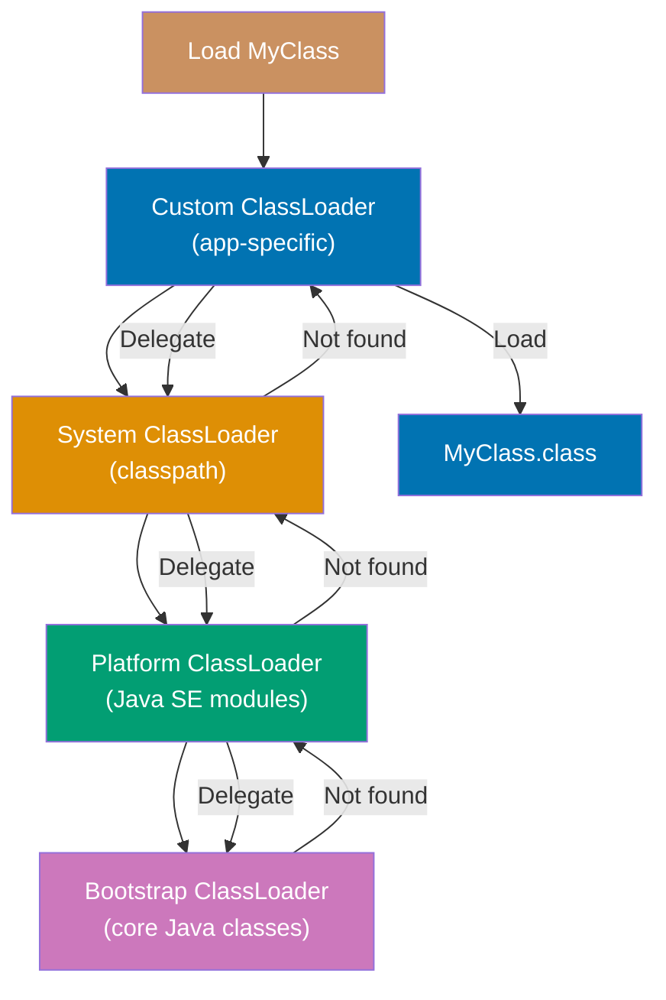

**Code**:

```java
import java.io.*;
import java.nio.file.*;

// ClassLoader hierarchy
ClassLoader systemClassLoader = ClassLoader.getSystemClassLoader();
                                 // => System/Application ClassLoader (loads from classpath)
                                 // => Loads application classes (-cp, CLASSPATH)
System.out.println("System: " + systemClassLoader);
// => sun.misc.Launcher$AppClassLoader
                                 // => Output: sun.misc.Launcher$AppClassLoader@... (Java 8)
                                 // => Output: jdk.internal.loader.ClassLoaders$AppClassLoader@... (Java 9+)

ClassLoader platformClassLoader = systemClassLoader.getParent();
                                 // => Platform ClassLoader (parent of System)
                                 // => Loads Java SE platform modules (Java 9+)
System.out.println("Platform: " + platformClassLoader);
// => sun.misc.Launcher$ExtClassLoader (Java 8) or PlatformClassLoader (Java 9+)
                                 // => Java 8: ExtClassLoader (loads from jre/lib/ext)
                                 // => Java 9+: PlatformClassLoader (loads platform modules)

ClassLoader bootstrapClassLoader = platformClassLoader.getParent();
                                 // => Bootstrap ClassLoader (top of hierarchy)
                                 // => Loads core Java classes (java.lang, java.util, etc.)
System.out.println("Bootstrap: " + bootstrapClassLoader);
// => null (bootstrap loader is native)
                                 // => Output: null (bootstrap implemented in native code, not Java)
                                 // => Loads rt.jar (Java 8) or java.base module (Java 9+)

// Delegation model: child delegates to parent before loading
// Bootstrap -> Platform -> System -> Custom
                                 // => Parent-first delegation: ask parent before loading yourself
                                 // => Prevents class conflicts (core classes always from Bootstrap)
                                 // => Custom → System → Platform → Bootstrap (delegation chain)

// Custom ClassLoader
class CustomClassLoader extends ClassLoader {
                                 // => Extends ClassLoader for custom class loading behavior
                                 // => Override findClass() to define custom loading logic
    private String classPath;    // => Custom classpath (directory containing .class files)
                                 // => Example: "/custom/classes/"

    public CustomClassLoader(String classPath) {
                                 // => Constructor: sets custom classpath
        this.classPath = classPath;
                                 // => Stores path for later use in findClass()
    }

    @Override
    protected Class<?> findClass(String name) throws ClassNotFoundException {
                                 // => Called when class not found in parent loaders
                                 // => name: fully qualified class name (e.g., "com.example.MyClass")
        try {
            // Convert class name to file path
            String fileName = name.replace('.', '/') + ".class";
                                 // => Converts com.example.MyClass → com/example/MyClass.class
                                 // => File path relative to classPath
            Path path = Paths.get(classPath, fileName);
                                 // => Builds absolute path: classPath + fileName
                                 // => Example: "/custom/classes/com/example/MyClass.class"
            byte[] classBytes = Files.readAllBytes(path);
                                 // => Reads .class file bytes from disk
                                 // => classBytes: bytecode for class definition

            // Define class from bytes
            return defineClass(name, classBytes, 0, classBytes.length);
                                 // => Converts bytecode to Class<?> object
                                 // => defineClass(): JVM method to create class from bytes
                                 // => Returns Class<?> ready for instantiation
        } catch (IOException e) {
                                 // => Catches file read errors
            throw new ClassNotFoundException("Could not load class: " + name, e);
                                 // => Wraps IOException as ClassNotFoundException
        }
    }
}

// Using custom ClassLoader
CustomClassLoader loader = new CustomClassLoader("/path/to/classes");
                                 // => Creates custom loader with specific classpath
                                 // => loader will search /path/to/classes for .class files
Class<?> clazz = loader.loadClass("com.example.MyClass");
                                 // => Loads class using custom loader
                                 // => Delegates to parent first, then findClass() if not found
                                 // => clazz is Class<?> for com.example.MyClass
Object instance = clazz.getDeclaredConstructor().newInstance();
                                 // => Creates instance of loaded class
                                 // => getDeclaredConstructor() gets no-arg constructor
                                 // => newInstance() invokes constructor, returns Object

// Class identity determined by (class name + ClassLoader)
// Same class loaded by different loaders are different classes!
                                 // => Class identity: (fully qualified name, ClassLoader instance)
                                 // => Important: same source, different loaders → different classes
ClassLoader loader1 = new CustomClassLoader("/path1");
                                 // => First custom loader instance
Class<?> class1 = loader1.loadClass("MyClass");
                                 // => Loads MyClass using loader1
ClassLoader loader2 = new CustomClassLoader("/path2");
                                 // => Second custom loader instance (different object)
Class<?> class2 = loader2.loadClass("MyClass");
                                 // => Loads MyClass using loader2
// class1 != class2 (different loaders)
                                 // => class1 and class2 are DIFFERENT classes
                                 // => Same name, different loaders → incompatible types
                                 // => class1.isInstance(class2.newInstance()) → false!

// Hot reload use case
class HotReloadClassLoader extends ClassLoader {
                                 // => Enables reloading classes without JVM restart
    private String classPath;    // => Path to .class files

    public HotReloadClassLoader(String classPath) {
                                 // => Constructor: stores classpath
        this.classPath = classPath;
                                 // => Saved for creating fresh loaders
    }

    public Class<?> reload(String name) throws Exception {
                                 // => Reloads class with fresh loader
        // Create new loader for each reload (isolates class versions)
                                 // => Key: new loader creates new class identity
                                 // => Old class and new class are different (different loaders)
        CustomClassLoader freshLoader = new CustomClassLoader(classPath);
                                 // => Fresh loader instance (not cached)
        return freshLoader.loadClass(name);
                                 // => Loads class with fresh loader
                                 // => Returns NEW Class<?> instance (old version unaffected)
    }
}

// Plugin system use case
class PluginLoader extends ClassLoader {
    public void loadPlugin(String jarPath) throws Exception {
        // Load classes from JAR file
        // Each plugin gets isolated ClassLoader
    }
}

// ClassLoader methods
Class<?> loadedClass = String.class;
ClassLoader loader3 = loadedClass.getClassLoader();
// => null (bootstrap loader loaded String)

URL resource = loader3.getResource("config.properties");
// Find resource in classpath

InputStream stream = loader3.getResourceAsStream("data.txt");
// Load resource as stream

// Context ClassLoader (for frameworks)
Thread thread = Thread.currentThread();
ClassLoader contextLoader = thread.getContextClassLoader();
thread.setContextClassLoader(new CustomClassLoader("/custom/path"));

// OSGi and module systems use ClassLoader isolation
// Each bundle/module has own ClassLoader for dependency isolation
```

**Key Takeaway**: ClassLoaders dynamically load classes with delegation model (child → parent → bootstrap). Custom loaders enable plugins, hot-reloading, and isolation. Class identity = class name + ClassLoader. `findClass()` for custom loading, `defineClass()` converts bytes to classes.

**Why It Matters**: Custom ClassLoaders enable dynamic loading, isolation (plugins, web apps), and hot-reloading (development tools). Understanding delegation model (parent-first by default) prevents classpath conflicts. Custom loaders enable loading classes from non-standard sources (network, databases, encrypted jars). They power plugin systems (IDE plugins, app containers), application servers (servlet isolation), and dynamic languages (Groovy, Scala). However, classloading complexity causes subtle bugs—class identity includes loader, preventing casting across loaders. Most applications use default loaders—custom loaders are for frameworks and specialized systems requiring dynamic behavior.

---

## Example 78: Virtual Threads (Project Loom, Java 21+)

Virtual threads enable millions of lightweight threads with low overhead. M:N mapping to platform threads. Ideal for I/O-bound workloads. Simplifies concurrent code without callbacks. Available in Java 21+.

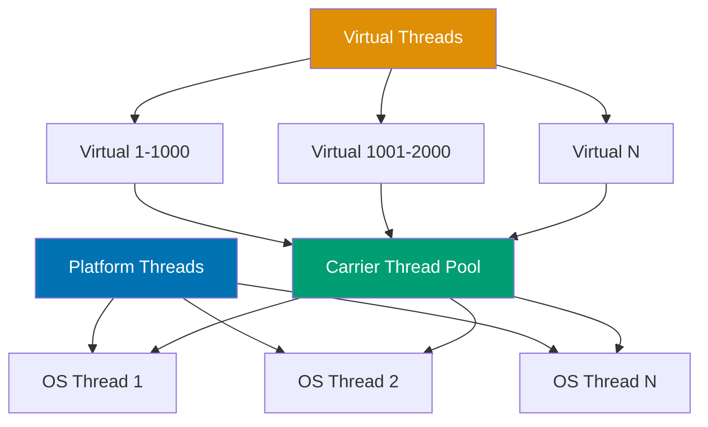

**Code**:

```java
// Traditional platform thread (heavyweight)
Thread platformThread = new Thread(() -> {                             // => Creates platform thread
    System.out.println("Platform thread: " + Thread.currentThread());  // => Output: Platform thread: Thread[Thread-0,5,main]
});                                                                     // => Maps 1:1 to OS thread (heavyweight)
platformThread.start();                                                // => Starts thread execution

// Virtual thread (lightweight, Java 21+)
Thread virtualThread = Thread.ofVirtual().start(() -> {                // => Creates and starts virtual thread
    System.out.println("Virtual thread: " + Thread.currentThread());   // => Output: Virtual thread: VirtualThread[#21]/runnable@ForkJoinPool-1-worker-1
});                                                                     // => M:N mapping to carrier threads (lightweight)

// Create virtual thread with name
Thread namedVirtual = Thread.ofVirtual()                               // => Builder for virtual thread
    .name("my-virtual-thread")                                         // => Sets thread name
    .start(() -> {                                                     // => Starts named virtual thread
        System.out.println(Thread.currentThread().getName());          // => Output: my-virtual-thread
    });

// Executor for virtual threads
ExecutorService executor = Executors.newVirtualThreadPerTaskExecutor(); // => Creates executor that spawns virtual thread per task
executor.submit(() -> {                                                 // => Submits task to executor
    System.out.println("Task in virtual thread");                       // => Output: Task in virtual thread
});                                                                      // => Task runs in virtual thread
executor.close();                                                        // => Auto-closes when all tasks complete (Java 19+ AutoCloseable)

// Massive concurrency with virtual threads
// => Platform threads: 1000s max (each ~1MB stack, OS limit)
// => Virtual threads: millions possible (each ~1KB, JVM-managed)

try (var executor = Executors.newVirtualThreadPerTaskExecutor()) {
                                 // => Creates executor for virtual threads
                                 // => Auto-closeable (try-with-resources)
                                 // => Each submit() creates new virtual thread (no pooling)
    for (int i = 0; i < 1_000_000; i++) {
                                 // => 1 million iterations (would crash with platform threads)
        int taskId = i;          // => Capture loop variable for lambda
        executor.submit(() -> {  // => Creates virtual thread per task
                                 // => Virtual thread is cheap (~1KB overhead)
                                 // => Million virtual threads map to ~N carrier threads
            System.out.println("Task " + taskId);
                                 // => Output: "Task 0", "Task 1", etc.
                                 // => Output order non-deterministic (concurrent execution)
        });                      // => Task submitted, thread created immediately
    }
} // => Auto-waits for completion (try-with-resources close)
  // => All 1 million tasks complete before exiting block
  // => No manual shutdown needed

// Virtual threads excel at I/O-bound work
ExecutorService ioExecutor = Executors.newVirtualThreadPerTaskExecutor();
                                 // => Executor for I/O-bound tasks
ioExecutor.submit(() -> {        // => Submits I/O task in virtual thread
    String data = httpClient.get("https://api.example.com");
                                 // => Blocking I/O call (waits for network response)
                                 // => Virtual thread UNMOUNTS from carrier thread during wait
                                 // => Carrier thread freed to run other virtual threads
                                 // => Virtual thread REMOUNTS when I/O completes
                                 // => data = HTTP response body (after network wait)
    System.out.println(data);    // => Output: [response data]
});                              // => Virtual thread lifecycle: create → mount → unmount → remount → complete
// => Carrier thread never blocks (handles other virtual threads during I/O)

// Structured concurrency (preview feature, Java 21+)
// => Scoped thread lifetime management (parent-child relationship)
// => Ensures child tasks complete before parent continues
/*
try (var scope = new StructuredTaskScope.ShutdownOnFailure()) {
                                 // => Creates scope with fail-fast policy
                                 // => Scope shuts down if any subtask fails
                                 // => Auto-closeable (ensures cleanup)
    Future<String> user = scope.fork(() -> fetchUser(userId));
                                 // => Forks subtask to fetch user (runs in virtual thread)
                                 // => Returns Future for result
    Future<String> orders = scope.fork(() -> fetchOrders(userId));
                                 // => Forks subtask to fetch orders (parallel with user)
                                 // => Both tasks run concurrently

    scope.join();                // => Waits for both subtasks to complete
                                 // => Blocks until all forked tasks finish
    scope.throwIfFailed();       // => Propagates exception if any subtask failed
                                 // => Fails fast (cancels other tasks on first failure)

    return new UserData(user.resultNow(), orders.resultNow());
                                 // => resultNow() returns completed result (no blocking)
                                 // => Both results guaranteed available after join()
}                                // => Scope closed, all subtasks guaranteed complete
*/

// Virtual thread characteristics
// => 1. Cheap to create (millions possible, minimal overhead)
// => 2. Unmount from carrier thread when blocking (I/O, sleep, locks)
// => 3. No thread pooling needed (create per-task, lightweight)
// => 4. Same Thread API, different implementation (drop-in replacement)

// When virtual threads excel
// => - High concurrency I/O (web servers, database queries, API calls)
// => - Blocking I/O operations (network, file, database)
// => - Simplifies async code (no callbacks, futures, reactive)

// When virtual threads DON'T help
// => - CPU-bound work (same cores available, no benefit)
// => - Synchronized blocks (pins carrier thread, defeats purpose)
// => - Native code (JNI pins carrier thread, blocks carrier)

// Pinning (carrier thread blocked, BAD)
Object lock = new Object();      // => Shared lock object
synchronized (lock) {            // => Synchronized block pins carrier thread
                                 // => Virtual thread CANNOT unmount during synchronized
                                 // => Carrier thread blocked for entire duration
    Thread.sleep(1000);          // => Blocks carrier thread (defeats virtual thread benefit)
                                 // => Sleep doesn't unmount (pinned by synchronized)
}                                // => Carrier thread unavailable to other virtual threads

// Solution: use ReentrantLock instead
ReentrantLock reentrantLock = new ReentrantLock();
                                 // => ReentrantLock allows unmounting (virtual thread friendly)
reentrantLock.lock();            // => Acquires lock (virtual thread can unmount if needed)
                                 // => Virtual thread unmounts if lock unavailable
try {
    Thread.sleep(1000);          // => Sleep unmounts virtual thread (frees carrier)
                                 // => Carrier thread available to other virtual threads
} finally {
    reentrantLock.unlock();      // => Release lock (always in finally)
                                 // => Ensures lock released even on exception
}

// Thread.sleep() with virtual threads
Thread.sleep(1000);              // => Virtual thread unmounts from carrier (doesn't block)
                                 // => Carrier thread freed for other virtual threads
                                 // => Virtual thread remounts after 1000ms

// Comparing platform vs virtual threads
// => Platform: 1-1 mapping to OS thread, expensive (~1MB stack), limited (1000s)
// => Virtual: M-N mapping to carrier threads, cheap (~1KB), millions possible

// Migration from platform to virtual threads
ExecutorService oldExecutor = Executors.newFixedThreadPool(10);
                                 // => Old: 10 platform threads (heavyweight, pooled)
                                 // => Limits concurrency to 10 tasks

ExecutorService newExecutor = Executors.newVirtualThreadPerTaskExecutor();
                                 // => New: virtual thread per task (lightweight, no limit)
                                 // => Same ExecutorService API, different implementation
                                 // => Code unchanged, just swap executor

// Virtual thread debugging
// => jcmd <pid> Thread.dump_to_file -format=json <file>
// => Virtual threads visible in thread dumps (JFR events)
// => Carrier thread mapping visible for debugging pinning issues
```

**Key Takeaway**: Virtual threads are lightweight (millions possible) with M:N mapping to platform threads. Ideal for I/O-bound workloads—unmount from carrier when blocking. Create per-task with `Thread.ofVirtual()` or `Executors.newVirtualThreadPerTaskExecutor()`. Avoid synchronized blocks (pins carrier), use `ReentrantLock`. Simplifies concurrency without callbacks.

**Why It Matters**: Phaser enables dynamic participant coordination—threads can register/deregister during execution. It generalizes CountDownLatch (one-time) and CyclicBarrier (fixed parties) with multi-phase support. Phasers enable complex coordination patterns (parallel algorithms with phases, test orchestration). Understanding termination (when parties reach zero) prevents resource leaks. Phasers are powerful but complex—use simpler primitives when possible. They shine in scenarios requiring flexible, multi-phase coordination across dynamic sets of threads.

---

## Example 79: Modern Java Best Practices

Modern Java emphasizes immutability, composition, type safety, and simplicity. Records for data, sealed classes for domain modeling, pattern matching for cleaner code. Testing and modularity are essential. Streams and Optional improve expressiveness.

**Code**:

```java
// Prefer composition over inheritance
// Bad - inheritance for code reuse
class Stack extends ArrayList {                                      // => Inherits 20+ ArrayList methods
    // Inherits methods that break stack semantics (add at index, etc.)  // => Violates encapsulation (stack = LIFO only)
}

// Good - composition
class Stack {                                                        // => Composition-based design
    private List items = new ArrayList<>();                         // => Delegates to internal list

    public void push(Object item) { items.add(item); }             // => Only LIFO push operation
    public Object pop() { return items.remove(items.size() - 1); } // => Only LIFO pop operation
    // Only expose stack operations                                  // => Prevents misuse (no add at index)
}

// Use streams judiciously (readability vs performance)
// Stream: readable, potential parallelization
List<String> names = users.stream()                                 // => Creates stream from users list
    .filter(u -> u.isActive())                                      // => Filters active users only
    .map(User::getName)                                             // => Extracts names
    .collect(Collectors.toList());                                  // => names = ["Alice", "Bob", "Charlie"]

// For-loop: faster for simple operations
List<String> names2 = new ArrayList<>();                            // => names2 = [] (empty)
for (User u : users) {                                              // => Iterates each user
    if (u.isActive()) {                                             // => Checks active status
        names2.add(u.getName());                                    // => Adds name to list
    }                                                                // => Faster for small collections
}                                                                    // => names2 = ["Alice", "Bob", "Charlie"]

// Leverage records for data carriers
record Point(int x, int y) {}                                       // => Compact data class (Java 16+)
record Person(String name, int age) {}                              // => Auto-generates constructor, getters, equals, hashCode, toString

Point p = new Point(10, 20);                                        // => p.x() = 10, p.y() = 20
// Auto-generated: constructor, getters, equals, hashCode, toString  // => p.toString() = "Point[x=10, y=20]"

// Sealed classes for domain modeling
sealed interface Result permits Success, Failure {}                 // => Only Success/Failure can implement Result
record Success(String data) implements Result {}                    // => Success case
record Failure(String error) implements Result {}                   // => Failure case

// Pattern matching for cleaner code
String message = switch (result) {                                  // => Exhaustive pattern matching
    case Success(String data) -> "Success: " + data;                // => Destructures Success record
    case Failure(String error) -> "Error: " + error;                // => Destructures Failure record
};                                                                   // => message = "Success: OK" or "Error: Failed"

// Immutability by default
// Bad - mutable
class MutablePoint {                                                 // => Public fields = mutable
    public int x, y;                                                 // => Can be changed: p.x = 999
}

// Good - immutable
record ImmutablePoint(int x, int y) {}                              // => Final fields, no setters
                                                                     // => Cannot change after creation

// Explicit nullability with Optional
// Bad - null return
public User findUser(Long id) {                                     // => Returns User or null (implicit)
    return null;                                                     // => Caller must check for null manually
}

// Good - Optional
public Optional<User> findUser(Long id) {                           // => Returns Optional<User> (explicit nullability)
    return Optional.ofNullable(repository.find(id));                // => Wraps nullable value
}                                                                    // => Caller forced to handle empty case

user.ifPresent(u -> System.out.println(u.getName()));               // => Only prints if user present
                                                                     // => Output: "Alice" (if user exists)

// Use var for obvious types
var users = userRepository.findAll();
                                 // => Type inferred: List<User> (obvious from method return type)
                                 // => Compiler resolves type at compile time (not runtime)
                                 // => users is List<User> (static typing preserved)
var count = users.size();        // => Type inferred: int (obvious from List.size() return type)
                                 // => count is int (static typing)

// Testing as first-class activity
@Test                            // => JUnit test annotation (marks method as test)
void shouldCreateUser() {        // => Test method (void return, descriptive name)
                                 // => Naming: should[Action] describes expected behavior
    // Arrange                   // => Setup phase: prepare test data
    User user = new User("Alice", "alice@example.com");
                                 // => user = User[name=Alice, email=alice@example.com]
                                 // => Test data created

    // Act                       // => Execution phase: invoke system under test
    userService.create(user);    // => Calls create method (operation being tested)
                                 // => Persists user to repository

    // Assert                    // => Verification phase: check expected outcome
    User saved = userRepository.find(user.getId());
                                 // => Retrieves user from repository
                                 // => saved should match original user
    assertEquals("Alice", saved.getName());
                                 // => Verifies name persisted correctly
                                 // => Test fails if names don't match
}

// Modern module organization (Java 9+)
// => module-info.java defines module boundaries
// => Encapsulation at module level (stronger than package-private)
module com.example.app {         // => Declares module com.example.app
    requires java.sql;           // => Declares dependency on java.sql module
                                 // => Module system enforces at compile/runtime
    exports com.example.app.api; // => Makes api package accessible to other modules
                                 // => Internal packages hidden by default
    opens com.example.app.entity to org.hibernate.orm;
                                 // => Allows reflective access to entity package
                                 // => Required for Hibernate to access private fields
}                                // => Module provides strong encapsulation

// Prefer method references over lambdas
// => Lambda: verbose, explicit parameter
users.forEach(u -> System.out.println(u));
                                 // => Lambda receives User u, prints u
                                 // => Output: [User@123, User@456, ...]

// => Method reference: cleaner, same behavior
users.forEach(System.out::println);
                                 // => Method reference (::) to println
                                 // => Equivalent to u -> System.out.println(u)
                                 // => Output: [User@123, User@456, ...]

// Use try-with-resources for AutoCloseable
try (var reader = new BufferedReader(new FileReader("file.txt"))) {
                                 // => Creates BufferedReader (implements AutoCloseable)
                                 // => try-with-resources ensures reader.close() called
                                 // => Automatic cleanup even on exception
    return reader.readLine();    // => Reads first line from file
                                 // => Returns line (reader auto-closed after return)
} // => reader.close() called here (automatic)
  // => Prevents resource leaks

// Avoid premature optimization
// => 1. Write clear code first (readability priority)
// => 2. Profile to find bottlenecks (measure, don't guess)
// => 3. Optimize where measurements prove necessary (data-driven)
// => "Premature optimization is the root of all evil" - Donald Knuth

// Document public APIs
/**
 * Calculates the sum of two integers.
 *                                 // => Javadoc comment for public API
 * @param a the first integer     // => Parameter documentation
 * @param b the second integer    // => Parameter documentation
 * @return the sum of a and b     // => Return value documentation
 */                               // => Generates HTML documentation (javadoc tool)
public int add(int a, int b) {   // => Public API method
    return a + b;                // => Returns sum (a + b)
}

// Use enums for type-safe constants
enum Status { PENDING, APPROVED, REJECTED }
                                 // => Type-safe enumeration (compile-time checked)
                                 // => Status.PENDING, Status.APPROVED, Status.REJECTED
                                 // => Prevents invalid values (no magic strings)

// Modern exception handling (multi-catch, Java 7+)
try {
    riskyOperation();            // => May throw IOException or SQLException
                                 // => Calls operation that might fail
} catch (IOException | SQLException e) {
                                 // => Multi-catch: handles both exception types
                                 // => Single catch block instead of two separate blocks
                                 // => e is final (cannot reassign)
    logger.error("Operation failed", e);
                                 // => Logs error with exception stacktrace
                                 // => Same handler for both exception types
}

// Text blocks for multi-line strings (Java 15+)
String json = """
    {
        "name": "Alice",
        "age": 30
    }
    """;                         // => Text block (multi-line string literal)
                                 // => Preserves formatting (no escape sequences)
                                 // => Automatic indentation handling
                                 // => json = "{\n    \"name\": \"Alice\",\n    \"age\": 30\n}\n"

// Switch expressions (Java 14+)
int numLetters = switch (day) {  // => Switch as expression (returns value)
                                 // => Exhaustiveness checked at compile time
    case MONDAY, FRIDAY, SUNDAY -> 6;
                                 // => Multiple cases with arrow syntax
                                 // => Returns 6 (implicit break)
    case TUESDAY -> 7;           // => Single case, returns 7
    default -> throw new IllegalArgumentException();
                                 // => Default required for exhaustiveness (unless all cases covered)
                                 // => Throws exception for unexpected values
};                               // => numLetters assigned result (6 or 7 or exception)

// Helpful NullPointerExceptions (Java 14+)
// => JVM shows WHICH reference was null in call chain
// => Example: user.getAddress().getStreet()
// => Old message: "NullPointerException" (unhelpful)
// => New message: "Cannot invoke getStreet() because getAddress() returned null"
// => Identifies exact null point in chain (debugging aid)

// Modern Java philosophy
// => - Immutability reduces bugs (fewer side effects, safer concurrency)
// => - Composition over inheritance (flexible, avoids fragile base class)
// => - Explicit over implicit (Optional vs null, sealed classes vs open hierarchies)
// => - Type safety (records, sealed classes, pattern matching prevent runtime errors)
// => - Simplicity (avoid over-engineering, YAGNI principle)
// => - Testing and observability built-in (JUnit, JFR, monitoring)
```

**Key Takeaway**: Modern Java emphasizes immutability (records, final), composition over inheritance, type safety (sealed classes, pattern matching), and explicitness (Optional). Use streams for readability, records for data, sealed classes for modeling. Testing essential. Avoid premature optimization—profile first. Simplicity over complexity.

**Why It Matters**: Semaphores limit concurrent access—rate limiting, connection pooling, resource bounding. They prevent resource exhaustion from too many concurrent operations (database connections, API calls, threads). Understanding fairness (FIFO vs non-FIFO acquisition) impacts performance vs latency. Semaphores enable throttling—control parallelism without rejecting requests. However, they don't prevent deadlocks (acquire multiple permits in different orders). Use them for resource limiting, not mutual exclusion (use locks). Semaphores are essential for building resilient systems with controlled concurrency.

---

## Memory Management and JVM Internals

Master Java's automatic memory management, garbage collection algorithms, JVM internals, and performance optimization techniques for building high-performance applications.

## Example 80: JVM Memory Model and Regions

The JVM divides memory into distinct regions: heap (shared object storage), stack (thread-local execution frames), metaspace (class metadata), and direct buffers (off-heap NIO). Understanding memory regions is essential for diagnosing memory issues and tuning performance.

**JVM Memory Architecture**:

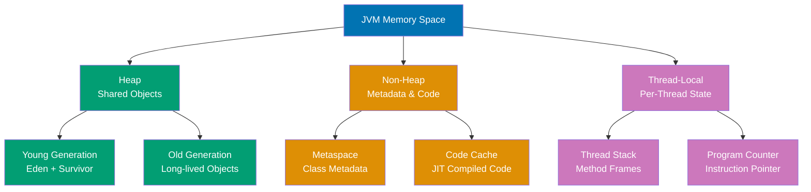

**Code**:

```java
import java.math.BigDecimal;

// Heap allocation - shared across threads
class Account {                          // => Class metadata stored in Metaspace (non-heap)
    private BigDecimal balance;          // => Field reference stored in object (8 bytes)
                                         // => Points to BigDecimal object on heap

    public Account(BigDecimal initial) { // => Constructor creates heap object
        this.balance = initial;          // => Object allocation path: TLAB → Eden → Heap
                                         // => TLAB: Thread-Local Allocation Buffer (fast, lock-free)
    }
}

// Stack allocation - thread-local
public void processTransaction(BigDecimal amount) {
    // Stack frame created for processTransaction() method
    // => Contains: local variables, operand stack, frame data

    Account acc = new Account(new BigDecimal("1000"));
                                         // => 'acc' reference stored on stack (8 bytes)

    BigDecimal fee = amount.multiply(new BigDecimal("0.01"));
                                         // => 'fee' reference on stack (thread-local, 8 bytes)
                                         // => Heap: slower allocation, GC-managed

    BigDecimal total = acc.balance.add(fee);
                                         // => 'total' reference on stack (thread-local)

    // Stack frame destroyed when method returns
    // => Local variables (acc, fee, total) removed from stack
    // => Heap deallocation: delayed (next GC cycle)
}

// Metaspace - class metadata storage
// => Class structure: Account.class stored in Metaspace
// => Metaspace uses native memory (not heap, grows dynamically)

// Direct buffers - off-heap memory
import java.nio.ByteBuffer;

ByteBuffer directBuffer = ByteBuffer.allocateDirect(1024);
                                         // => Allocates 1KB off-heap (native memory)
                                         // => Tuning: -XX:MaxDirectMemorySize=512m
```

**Key Takeaway**: JVM memory has four regions: heap (shared objects, GC-managed), stack (thread-local frames, auto-deallocated), metaspace (class metadata, native memory), and direct buffers (off-heap I/O). Heap objects need GC, stack is automatic, metaspace grows dynamically.

**Why It Matters** (95 words): Understanding JVM memory regions prevents OutOfMemoryErrors and enables performance tuning. Heap sizing affects GC frequency—too small causes frequent GCs, too large causes long pauses. Stack size impacts thread count (1MB per thread default, 1000 threads = 1GB). Metaspace leaks occur from excessive class loading (hot reload, classloader leaks). Direct buffers speed I/O but consume native memory outside heap limits. Knowing allocation paths (TLAB → Eden → Old) helps diagnose premature promotion. Memory region awareness is fundamental to Java performance engineering.

---

## Example 81: Garbage Collection with G1GC

G1GC (Garbage First) is Java's default collector (since Java 9), designed for balanced throughput and predictable pause times. It divides the heap into regions and performs incremental collection, prioritizing high-garbage regions first.

**G1GC Heap Regions**:

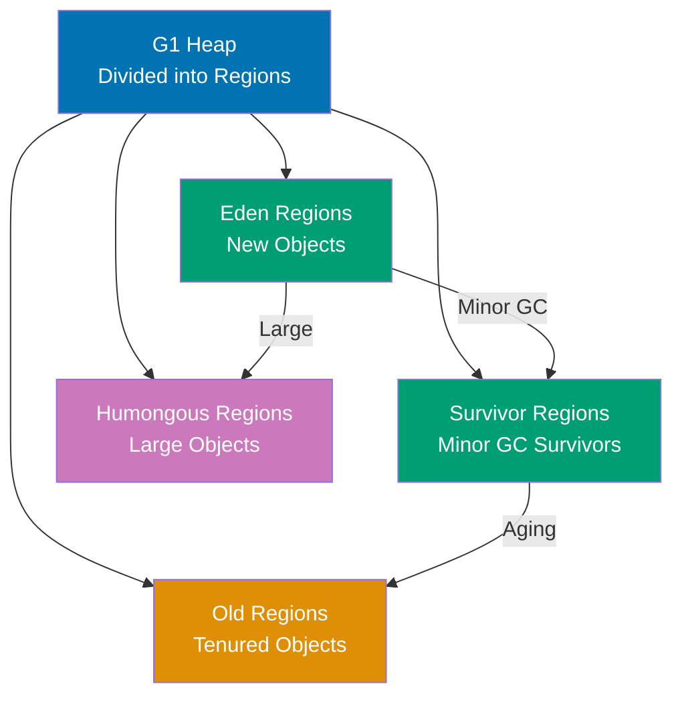

**Code**:

```java
// Low-latency configuration (transaction processing)
// java -Xms16g -Xmx16g -XX:+UseG1GC -XX:MaxGCPauseMillis=50
//      -XX:G1HeapRegionSize=8m -XX:InitiatingHeapOccupancyPercent=35
//      TransactionProcessor
// => 16GB heap, 8MB regions, <50ms pause target
// => Early concurrent marking (IHOP 35%) prevents heap exhaustion

// High-throughput configuration (batch processing)
// java -Xms32g -Xmx32g -XX:+UseG1GC -XX:MaxGCPauseMillis=500
//      -XX:G1HeapRegionSize=32m -XX:InitiatingHeapOccupancyPercent=50
//      BatchProcessor
// => 32GB heap, 32MB regions, 500ms pause tolerance
// => Late concurrent marking (IHOP 50%) maximizes throughput

// G1GC phases: Young GC (STW 10-50ms) → Concurrent Marking → Mixed GC → Full GC (avoid)

// Monitoring G1GC
import java.lang.management.*;

public class G1Monitoring {
    public static void main(String[] args) {
        List<GarbageCollectorMXBean> gcBeans = ManagementFactory.getGarbageCollectorMXBeans();
        // => Get GC MXBeans for monitoring

        for (GarbageCollectorMXBean gcBean : gcBeans) {
            System.out.println("GC: " + gcBean.getName());
            // => "G1 Young Generation" or "G1 Old Generation"
            System.out.println("Count: " + gcBean.getCollectionCount());
            // => Total collections since JVM start
            System.out.println("Time: " + gcBean.getCollectionTime() + "ms");
            // => Total pause time (calculate throughput)
        }
    }
}
```

**Key Takeaway**: G1GC divides heap into regions (1-32MB), collecting high-garbage regions first. Tune with MaxGCPauseMillis (target pause time), G1HeapRegionSize (region size), and InitiatingHeapOccupancyPercent (concurrent marking threshold). Low latency: small regions, low IHOP. High throughput: large regions, high IHOP, longer pauses.

**Why It Matters** (98 words): G1GC enables predictable GC pauses for large heaps (4GB+). Unlike CMS (deprecated), G1 compacts incrementally, avoiding fragmentation. The region-based design allows incremental collection—collect 10% of heap per cycle instead of entire heap. This makes sub-100ms pauses achievable even with 64GB heaps. Tuning MaxGCPauseMillis guides G1's effort (more regions per cycle = shorter pauses but more frequent). Understanding IHOP (Initiating Heap Occupancy Percent) prevents allocation failures (start concurrent marking early enough). G1GC is the best default for most workloads—balance of throughput and latency without manual tuning.

---

## Example 82: Ultra-Low Latency with ZGC

ZGC is a scalable low-latency garbage collector designed for heaps up to 16TB with pause times under 10ms. It performs most GC work concurrently using colored pointers and load barriers, achieving sub-millisecond pauses even during heap compaction.

**ZGC Concurrent Operations**:

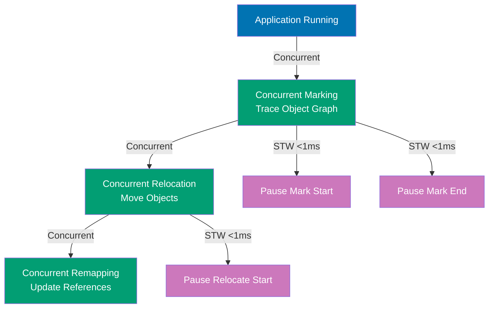

**Code**:

```java
// ZGC production configuration (ultra-low latency)
// java -Xms32g -Xmx32g -XX:+UseZGC -XX:ConcGCThreads=8
//      -XX:ZCollectionInterval=10 -XX:ZAllocationSpikeTolerance=2
//      PaymentGateway
// => 32GB heap, <10ms pauses, handles 2x allocation spikes
// => Colored pointers + load barriers enable concurrent GC

// ZGC phases (all mostly concurrent, <1ms STW):
// 1. Pause Mark Start (STW <1ms) - scan roots
// 2. Concurrent Mark - trace object graph
// 3. Pause Mark End (STW <1ms) - finalize marking
// 4. Pause Relocate Start (STW <1ms) - relocate roots
// 5. Concurrent Relocate - move objects (concurrent)

public class PaymentGateway {
    public PaymentResult processPayment(Payment payment) {
        // => ZGC enables consistent sub-5ms latency
        PaymentResult result = new PaymentResult();
        // => No allocation stalls (ZGC pages always available)
        result.setStatus(validate(payment));
        // => No latency spikes from GC pauses
        return result;
    }

    // Generational ZGC (Java 21+)
    // java -XX:+UseZGC -XX:+ZGenerational -Xms64g -Xmx64g PaymentGateway
    // => 10-25% higher throughput, exploits generational hypothesis

    private PaymentStatus validate(Payment payment) {
        return PaymentStatus.SUCCESS;
    }

    private static class Payment { }
    private static class PaymentResult {
        private PaymentStatus status;
        void setStatus(PaymentStatus s) { this.status = s; }
    }
    private enum PaymentStatus { SUCCESS, FAILURE }
}

// Performance comparison: G1GC 150ms avg → ZGC 2ms avg (75x better)
// Trade-off: 2-5% throughput overhead from load barriers
```

**Key Takeaway**: ZGC achieves sub-10ms pauses for heaps up to 16TB using concurrent marking, relocation, and remapping. Colored pointers encode GC metadata in references. Load barriers enable concurrent operations. Generational ZGC (Java 21+) adds 10-25% throughput by exploiting generational hypothesis. Trade-off: 2-5% throughput overhead for ultra-low latency.

**Why It Matters** (100 words): ZGC enables ultra-low latency for large heaps. Traditional collectors (even G1GC) struggle with >32GB heaps—pauses grow with heap size. ZGC breaks this relationship: pauses stay sub-10ms regardless of heap size (tested to 16TB). This makes Java viable for latency-critical systems (trading platforms, real-time bidding, gaming servers). Colored pointers and load barriers are the key: GC state encoded in pointers themselves, checked on every object access. The 2-5% throughput cost is worth it for predictable latency. Generational ZGC (Java 21+) recovers most throughput while keeping low latency. ZGC is the future of Java GC.

---

## Example 83: JVM Profiling with Java Flight Recorder (JFR)

Java Flight Recorder (JFR) is a low-overhead profiling framework built into the JVM. It records runtime events (allocations, GC, locks, I/O) with minimal performance impact (<1% overhead), making it safe for production use.

**Code**:

```java
// Enabling JFR at JVM startup
// JVM flags:
// java -XX:StartFlightRecording=duration=60s,filename=recording.jfr \
//      -XX:FlightRecorderOptions=stackdepth=128 \
//      MyApp
// => Starts JFR when JVM launches (no code changes needed)

// => duration=60s: Record for 60 seconds then stop

// Continuous recording (circular buffer)
// java -XX:StartFlightRecording=maxage=6h,maxsize=500M,filename=recording.jfr \
//      MyApp
// => Continuous mode: never stops, runs indefinitely

// => maxage=6h: Keep last 6 hours of events (circular buffer)

// Starting JFR on running JVM (no restart)
// Command: jcmd <pid> JFR.start duration=60s filename=recording.jfr
// => Attaches to running process (PID)
// => Starts recording for 60 seconds

// Stopping JFR recording
// Command: jcmd <pid> JFR.stop filename=recording.jfr
// => Stops ongoing recording

// Dumping current recording without stopping
// Command: jcmd <pid> JFR.dump filename=snapshot.jfr
// => Captures snapshot of current recording

import jdk.jfr.*;
import java.nio.file.*;

// Programmatic JFR control (Java 14+)
class JFRProgrammatic {

    public void profileOperation() throws Exception {
        // Start recording programmatically
        Configuration config = Configuration.getConfiguration("profile");
                                         // => "profile" preset: detailed events

        Recording recording = new Recording(config);
                                         // => Creates new recording with config

        recording.setMaxAge(Duration.ofHours(1));
                                         // => Keep last 1 hour of events
        recording.setMaxSize(100 * 1024 * 1024);
                                         // => Max 100MB recording size

        recording.start();               // => Start recording events

        try {
            // Run workload to profile
            processLargeDataset();       // => All events recorded: allocations, GC pauses, thread activity

        } finally {
            recording.stop();            // => Stop recording

            Path destination = Paths.get("recording-" + System.currentTimeMillis() + ".jfr");
                                         // => Unique filename with timestamp
            recording.dump(destination); // => Write recording to file

            recording.close();           // => Cleanup: close recording
        }
    }

    private void processLargeDataset() {
        // Workload to profile
    }
}

// Analyzing JFR recordings with JDK Mission Control (JMC)
// GUI tool: jmc recording.jfr
// => Opens visual analysis tool

// Key JFR events for memory analysis:
// 1. jdk.ObjectAllocationInNewTLAB
//    => Objects allocated in TLAB (fast path)
//    => Shows allocation hotspots (classes, stack traces)

// 2. jdk.ObjectAllocationOutsideTLAB
//    => Large objects allocated outside TLAB (slow path)
//    => Indicates humongous objects (>50% region size in G1)

// 3. jdk.GarbageCollection
//    => GC events: duration, heap before/after, GC cause
//    => Identifies GC frequency and pause times

// 4. jdk.OldGarbageCollection
//    => Old generation GCs (expensive, focus here)

// 5. jdk.PromoteObjectInNewPLAB
//    => Objects promoted to old generation
//    => High promotion rate indicates premature promotion

// Analyzing allocation hotspots
class AllocationAnalysis {

    // Example: Finding allocation hotspots with JFR
    // 1. Record JFR: jcmd <pid> JFR.start duration=60s filename=alloc.jfr
    // 2. Run workload under load
    // 3. Open in JMC: jmc alloc.jfr
    // 4. Navigate: Memory → Allocations
    // 5. Sort by "Total Allocation" (descending)

    // Example JFR allocation report:
    // Top Allocation Sites:
    // 1. BigDecimal.<init>(String)                    - 1.2GB (35% of allocations)
    //    Stack trace: Account.calculateFee() → BigDecimal.<init>()
    //    => Optimization: Cache common BigDecimal values

    // 2. HashMap.resize()                             - 500MB (15% of allocations)
    //    Stack trace: TransactionCache.put() → HashMap.resize()
    //    => Optimization: Pre-size HashMap with initial capacity

    // 3. String.substring()                           - 200MB (6% of allocations)
    //    Stack trace: Parser.extractId() → String.substring()
    //    => Optimization: Reuse String, avoid unnecessary substring()
}

// JFR custom events (advanced)
@Name("com.example.PaymentProcessed")
@Label("Payment Processed")
@Description("Triggered when payment is processed")
@Category("Application")
class PaymentProcessedEvent extends Event {
    @Label("Payment ID")
    String paymentId;

    @Label("Amount")
    long amount;

    @Label("Processing Time")
    @Timespan(Timespan.MILLISECONDS)
    long processingTime;
}

class CustomEventExample {

    public void processPayment(String id, long amount) {
        long start = System.currentTimeMillis();

        // Process payment...

        long duration = System.currentTimeMillis() - start;

        // Record custom event
        PaymentProcessedEvent event = new PaymentProcessedEvent();
        event.paymentId = id;            // => Set event fields
        event.amount = amount;
        event.processingTime = duration;

        event.commit();                  // => Commit event to JFR recording
    }
}

// JFR vs other profilers
// JFR advantages:
// - Low overhead (<1%, safe for production)
// - Built into JVM (no agent required)
// - Rich event set (GC, allocations, locks, I/O, CPU)
// - Continuous recording (circular buffer, always on)

// JFR limitations:
// - Sampling profiler (not every allocation captured)
// - GUI required (JMC) for best analysis
// - JFR files can be large (100MB+ for long recordings)

// When to use JFR
// ✅ Production profiling (low overhead, always-on)
// ✅ Memory allocation analysis (hotspots, leak suspects)
// ✅ GC behavior analysis (pause times, frequency, heap usage)
// ✅ Latency investigation (blocking events, lock contention)

```

**Key Takeaway**: JFR (Java Flight Recorder) is a low-overhead (<1%) profiling framework for production use. It records GC events, allocations, locks, and I/O. Enable with -XX:StartFlightRecording or jcmd on running JVMs. Analyze with JMC (JDK Mission Control) to find allocation hotspots, GC issues, and performance bottlenecks. Custom events extend JFR.

**Why It Matters** (100 words): JFR enables continuous production profiling without performance penalties. Traditional profilers (VisualVM, YourKit) add 10-50% overhead, making them unsuitable for production. JFR's <1% overhead allows always-on recording—capture issues as they happen (intermittent GC pauses, allocation spikes). The circular buffer (maxage, maxsize) keeps recent history without unbounded growth. JFR's event-based architecture records low-level JVM events (TLAB allocations, GC phases, lock acquisitions) invisible to other profilers. Analyzing JFR recordings in JMC reveals allocation hotspots (35% from BigDecimal constructor), premature promotion (survivors → old), and GC tuning opportunities. JFR is essential for diagnosing production memory issues.

## Example 84: CompletableFuture Advanced Patterns

CompletableFuture provides powerful exception handling, composition, and timeout mechanisms for asynchronous programming. Handle failures with `exceptionally()`, `handle()`, or `whenComplete()`. Combine futures with `thenCompose()` (sequential) or `thenCombine()` (parallel). Enforce timeouts with `orTimeout()` or `completeOnTimeout()`.

**Exception handling methods:**

```java
import java.util.concurrent.*;

class CompletableFutureAdvanced {

    public static void main(String[] args) throws Exception {

        // exceptionally: recover from exception
        CompletableFuture<String> future1 = CompletableFuture.supplyAsync(() -> {
            // => Async task runs in ForkJoinPool.commonPool()
            if (Math.random() > 0.5) throw new RuntimeException("Random failure");
            // => 50% chance of exception (simulated failure)
            return "Success";
            // => Returns on success path
        }).exceptionally(ex -> {
            // => Fallback handler called ONLY on exception
            // => ex is RuntimeException caught from supplyAsync
            System.out.println("Recovering from: " + ex.getMessage());
            // => Logs error for debugging
            return "Recovered: " + ex.getMessage();
            // => Returns fallback value (String type matches future)
        });

        System.out.println(future1.get());
        // => Blocks until complete (throws ExecutionException if unhandled)
        // => exceptionally() already handled exception, so get() never throws
        // => Output: "Success" OR "Recovered: Random failure"

        // handle: transform both success and failure paths
        CompletableFuture<String> future2 = CompletableFuture.supplyAsync(() -> {
            // => Another async task
            if (Math.random() > 0.5) throw new RuntimeException("Error");
            // => 50% failure rate
            return "Data";
            // => Success path returns "Data"
        }).handle((result, ex) -> {
            // => Handler always called (success OR failure)
            // => result is non-null on success (contains "Data")
            // => ex is non-null on failure (contains RuntimeException)
            if (ex != null) {
                // => Exception path
                return "Error: " + ex.getMessage();
                // => Transforms exception to error string
            }
            return "Processed: " + result;
            // => Success path transforms "Data" to "Processed: Data"
        });

        System.out.println(future2.get());
        // => Blocks for result (handle() transforms exception to String)
        // => handle() already converted exception, so get() never throws
        // => Output: "Processed: Data" OR "Error: Error"

        // whenComplete: side effects without transformation
        CompletableFuture<String> future3 = CompletableFuture.supplyAsync(() -> "Result")
            // => Returns immediately with "Result"
            .whenComplete((result, ex) -> {
                // => Side effect handler (doesn't change result/exception)
                if (ex != null) {
                    // => Exception case
                    System.out.println("Failed: " + ex);
                    // => Log failure (console output)
                } else {
                    // => Success case
                    System.out.println("Completed: " + result);
                    // => Log success with value
                }
                // => Original result/exception passes through unchanged
            });

        System.out.println(future3.get());
        // => future3 still contains "Result" (whenComplete doesn't transform)
        // => Console output: "Completed: Result"
        // => Return output: "Result"
    }
}
```

**Key Takeaway**: CompletableFuture exception handling: `exceptionally()` recovers from failures (fallback values), `handle()` transforms both success and error paths (unified handler), `whenComplete()` adds side effects like logging without altering results.

**Why It Matters** (50-100 words): Exception handling in async code is critical—unlike synchronous try-catch, async exceptions happen on different threads. CompletableFuture provides three strategies: `exceptionally()` for fallback values (return default on error), `handle()` for unified success/error transformation (single handler for both paths), `whenComplete()` for side effects (logging, metrics) without changing outcomes. These methods enable robust async pipelines that gracefully degrade (fallback to cached data), unify error handling (HTTP error codes from both success/failure), and maintain observability (log all completions). Mastering exception handling prevents silent failures in async systems.

## Example 85: Custom Annotations with Retention Policies

Custom annotations enable metadata-driven programming. Retention policies control annotation availability: `SOURCE` (compile-time only, like Lombok), `CLASS` (bytecode but not runtime, for instrumentation), `RUNTIME` (reflection-accessible, like Spring/JUnit). Use `@Target` to restrict annotation locations (TYPE, METHOD, FIELD, PARAMETER).

**Validation framework with runtime annotations:**

```java
import java.lang.annotation.*;
import java.lang.reflect.*;
import java.util.*;

// Retention policy: RUNTIME (accessible via reflection)
@Retention(RetentionPolicy.RUNTIME)
    // => Annotation preserved in .class file AND available at runtime
    // => RetentionPolicy.RUNTIME: available via reflection
    // => Alternative: SOURCE (Lombok), CLASS (bytecode only)
@Target(ElementType.FIELD)
    // => Can only be applied to fields (not methods/classes/parameters)
    // => ElementType.FIELD restricts usage to field declarations
@interface NotNull {
    // => Custom annotation definition
    // => @interface declares annotation type (special interface)
    String message() default "Field cannot be null";
        // => Annotation parameter with default value
        // => Can be overridden: @NotNull(message = "Custom msg")
}

@Retention(RetentionPolicy.RUNTIME)
// => Runtime reflection access required for validation
@Target(ElementType.FIELD)
@interface Range {
    int min();
    // => Required parameter (no default)
    int max();
    String message() default "Value out of range";
    // => Optional parameter (has default)
}

// Domain model with validation annotations
class User {
    @NotNull(message = "Username required")
    // => Declarative constraint: username must not be null
    private String username;

    @Range(min = 18, max = 120, message = "Age must be 18-120")
    // => Declarative constraint: age between 18-120
    private int age;

    public User(String username, int age) {
        this.username = username;
        // => May be null (validation happens later)
        this.age = age;
        // => May be out of range (validation decoupled from constructor)
    }
}

// Validation framework using reflection
class Validator {

    public static List<String> validate(Object obj) throws IllegalAccessException {
        // => Generic validator works on any annotated object
        // => Takes any Object instance (User, Order, Product, etc.)
        List<String> errors = new ArrayList<>();
        // => Collects all validation errors across all fields
        Class<?> clazz = obj.getClass();
        // => Get runtime class of object (User.class, Order.class, etc.)
        // => Reflection starts here: inspect class metadata

        for (Field field : clazz.getDeclaredFields()) {
            // => Iterate all fields (including private username, age, email)
            // => getDeclaredFields() returns fields from THIS class only (no inheritance)
            // => For User class, iterates over [username field, age field]
            // => Each iteration processes one field's annotations
            field.setAccessible(true);
            // => Bypass private access modifier (reflection override)
            // => Normally "private String username" is inaccessible
            // => Required for private field access in validation
            Object value = field.get(obj);
            // => Read field value from object instance
            // => For validUser, reads "alice" from username field, 25 from age

            // Check @NotNull constraint
            if (field.isAnnotationPresent(NotNull.class)) {
                // => Field has @NotNull annotation (username has it)
                // => isAnnotationPresent() checks if annotation exists on field
                NotNull ann = field.getAnnotation(NotNull.class);
                // => Retrieve annotation instance with metadata
                // => ann.message() will be "Username required"
                if (value == null) {
                    // => Constraint violated (null not allowed)
                    // => For invalidUser, username is null → violation
                    errors.add(ann.message());
                    // => Add custom error message to errors list
                    // => errors now contains ["Username required"]
                }
            }

            // Check @Range constraint
            if (field.isAnnotationPresent(Range.class)) {
                // => Field has @Range annotation (age field has it)
                // => @Range(min=18, max=120)
                Range ann = field.getAnnotation(Range.class);
                // => Get annotation with min/max values
                // => ann.min() returns 18, ann.max() returns 120
                if (value instanceof Integer) {
                    // => Type check (Range only applies to integers)
                    // => age is int, so value is Integer (autoboxed)
                    int intValue = (Integer) value;
                    // => Unbox Integer to primitive int
                    // => For invalidUser, intValue is 15
                    if (intValue < ann.min() || intValue > ann.max()) {
                        // => Value outside allowed range [18-120]
                        // => 15 < 18 → violation
                        errors.add(ann.message() + " [" + ann.min() + "-" + ann.max() + "]");
                        // => Add descriptive error with range bounds
                        // => errors now contains ["Username required", "Age must be 18-120 [18-120]"]
                    }
                }
            }
        }

        return errors;
        // => Returns empty list if valid (no violations)
        // => Returns list of error messages if invalid (["Username required", ...])
    }

    public static void main(String[] args) throws Exception {
        // Valid user (all constraints pass)
        User validUser = new User("alice", 25);
        // => username is "alice" (not null ✅), age is 25 (18-120 ✅)
        List<String> errors1 = validate(validUser);
        // => Runs reflection-based validation
        // => Checks username (not null ✅) and age (18-120 ✅)
        System.out.println("Valid user errors: " + errors1);
        // => Output: "Valid user errors: []" (empty list, no violations)

        // Invalid user (multiple constraint violations)
        User invalidUser = new User(null, 15);
        // => username is null (@NotNull violation ❌)
        // => age is 15 (@Range violation, <18 ❌)
        List<String> errors2 = validate(invalidUser);
        // => Validation finds two errors
        System.out.println("Invalid user errors: " + errors2);
        // => Output: "Invalid user errors: [Username required, Age must be 18-120 [18-120]]"
    }
}
```

**Key Takeaway**: Custom annotations with `@Retention(RUNTIME)` enable reflection-based processing at runtime (validation, dependency injection). `@Target` restricts annotation usage (FIELD, METHOD, TYPE). Reflection reads annotations via `getAnnotation()`, `isAnnotationPresent()` to implement frameworks.

**Why It Matters** (50-100 words): Annotations enable declarative programming—constraints are metadata on fields (`@NotNull`, `@Range`), not scattered in business logic. Retention policies optimize for use cases: SOURCE for compile-time tools (Lombok generates getters/setters), CLASS for bytecode instrumentation (AOP), RUNTIME for frameworks (Spring reads `@Autowired`, JUnit reads `@Test`). Reflection-based validation separates constraint definition (annotations on User) from enforcement (Validator.validate), enabling reusable validation logic across all domain models. Annotation-driven design reduces boilerplate, centralizes configuration, and powers modern Java frameworks.
