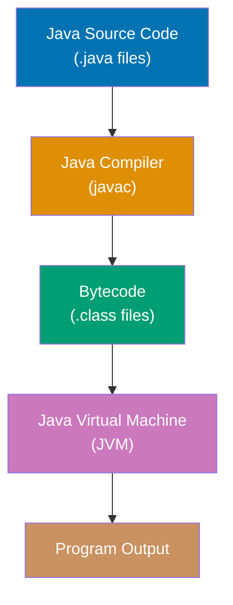
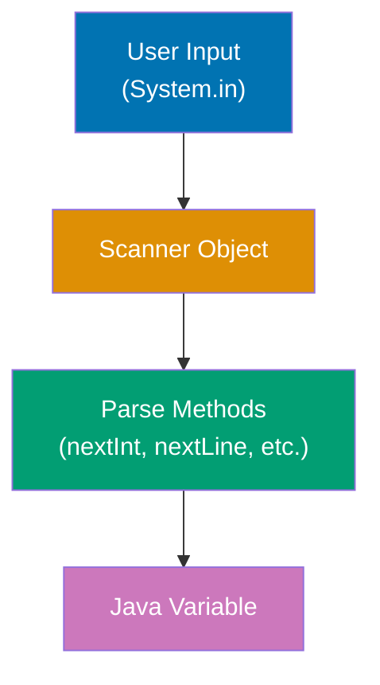
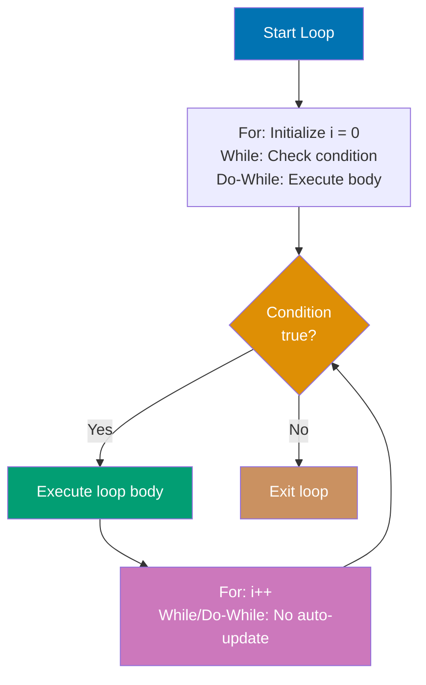
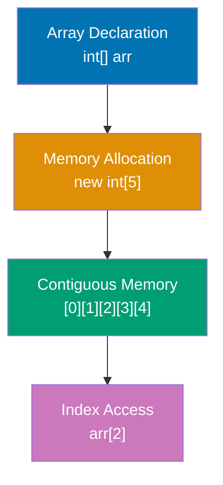
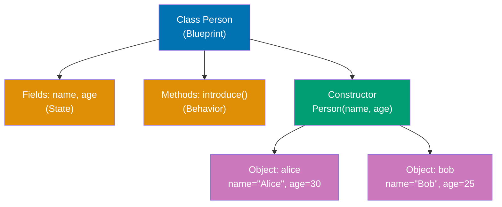
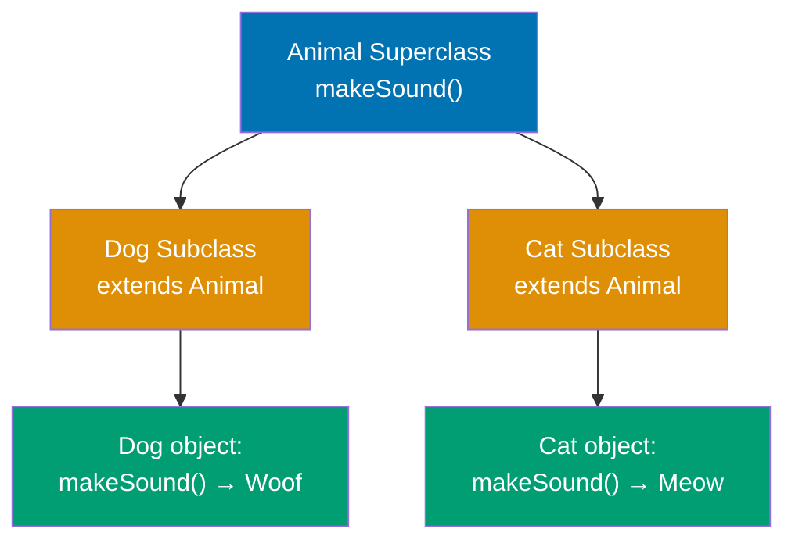
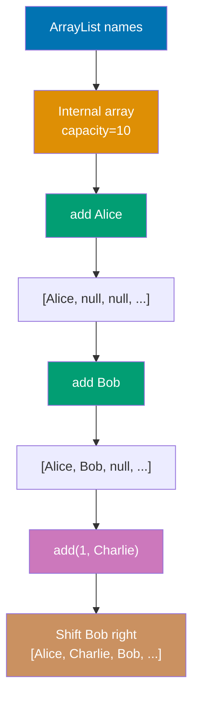
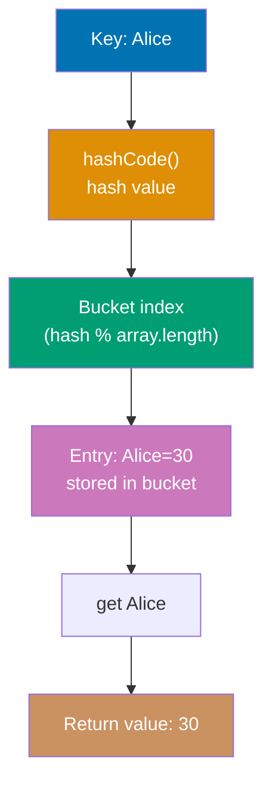
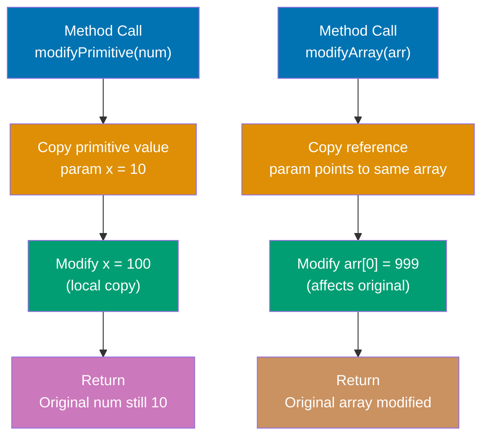

Learn Java fundamentals through 30 annotated code examples. Each example is self-contained, runnable in JShell or as standalone classes, and heavily commented to show what each line does, expected outputs, and intermediate values.

## Example 1: Hello World and JVM Compilation

Java programs run on the JVM (Java Virtual Machine). Code is compiled to bytecode (`.class` files) that the JVM executes. This example shows the simplest Java program and how the compilation pipeline works.



**Code**:

```java
// File: HelloWorld.java (filename must match public class name)
// => Filename MUST equal public class name (HelloWorld.java for class HelloWorld)
public class HelloWorld {                          // => Public class, accessible from other packages
                                                   // => Only ONE public class allowed per .java file
    public static void main(String[] args) {       // => Entry point: public static void main(String[])
                                                   // => JVM calls this method first when program starts
                                                   // => String[] args holds command-line arguments
        System.out.println("Hello, World!");       // => System.out is PrintStream (standard output)
                                                   // => println() prints text + newline character
                                                   // => Output: Hello, World!
    }                                              // => Method execution completes, program ends
}                                                  // => End of class definition

// Compilation: javac HelloWorld.java → HelloWorld.class (bytecode)
// => javac is Java compiler (converts .java source to .class bytecode)
// => HelloWorld.class contains platform-independent JVM bytecode
// => Bytecode is intermediate representation (not native machine code)
// Execution: java HelloWorld → JVM loads .class and runs main()
// => java is JVM launcher (loads bytecode and executes it)
// => JVM interprets bytecode OR JIT-compiles to native code for performance
// => Same .class file runs on Windows, Linux, macOS (write once, run anywhere)
// => Platform-specific JVM handles OS-level details (file I/O, memory, threads)
```

**Key Takeaway**: Java code is organized into classes with filenames matching public class names. The `public static void main(String[] args)` method is the fixed entry point recognized by the JVM. Code compiles to platform-independent bytecode (`.class` files) executed by the platform-specific JVM, enabling "write once, run anywhere" portability.

**Why It Matters**: The JVM architecture revolutionized software deployment by decoupling code from operating systems. Before Java, C/C++ programs required separate compilation for Windows, Linux, and macOS—often with platform-specific code branches. Java's bytecode layer lets enterprises ship one `.jar` file that runs identically across all platforms, eliminating costly multi-platform testing. This design enabled Java to dominate enterprise servers (Spring Boot, Tomcat), Android mobile apps (Dalvik/ART VMs execute Java bytecode), and big data systems (Hadoop, Spark, Kafka)—all sharing the same codebase across heterogeneous infrastructure.

---

## Example 2: Variables and Type System

Java is statically typed with two categories: primitive types (stored on stack) and reference types (stored on heap). Types can be declared explicitly or inferred with `var`.

**Code**:

```java
// PRIMITIVE TYPES (8 total, stored on stack, cannot be null)
// => Primitives are NOT objects (no methods, cannot be null)
// => Stored directly in stack memory (fast access, no heap allocation)
// => Stack memory auto-managed (no GC overhead for primitives)
byte b = 127;                    // => b is 127 (type: byte)
                                 // => 8-bit signed integer, range: -128 to 127
                                 // => Smallest integer type (1 byte memory)
                                 // => Overflow: byte b = 128 would cause compile error
                                 // => Max value: Byte.MAX_VALUE (127), min: Byte.MIN_VALUE (-128)
short s = 32000;                 // => s is 32000 (type: short)
                                 // => 16-bit signed integer, range: -32,768 to 32,767
                                 // => 2 bytes memory (larger than byte, smaller than int)
                                 // => Used for memory optimization in large arrays
int i = 42;                      // => i is 42 (type: int)
                                 // => 32-bit signed integer (DEFAULT for whole numbers)
                                 // => Most common integer type (4 bytes)
                                 // => Range: -2,147,483,648 to 2,147,483,647
                                 // => No suffix needed for int literals (default)
long l = 1000000L;               // => l is 1000000 (type: long)
                                 // => 64-bit signed integer, requires L suffix for literals
                                 // => Without L suffix, compiler treats as int (may overflow)
                                 // => 8 bytes (largest primitive integer type)
                                 // => Range: -9,223,372,036,854,775,808 to 9,223,372,036,854,775,807
float f = 3.14f;                 // => f is 3.14 (type: float, approximation due to binary representation)
                                 // => 32-bit floating-point, requires f suffix for literals
                                 // => Less precision than double (4 bytes, ~7 decimal digits precision)
                                 // => Without f suffix: 3.14 treated as double (compile error)
double d = 3.14159;              // => d is 3.14159 (type: double)
                                 // => 64-bit floating-point (DEFAULT for decimal literals)
                                 // => Higher precision than float (8 bytes, ~15 decimal digits precision)
                                 // => Preferred for most calculations requiring decimals
boolean bool = true;             // => bool is true (type: boolean)
                                 // => Only true or false (NOT 0/1 like C/C++)
                                 // => Cannot cast to int (unlike C: if(bool) compiles, if(1) doesn't)
                                 // => 1 byte memory (though only needs 1 bit logically)
                                 // => JVM implementation uses 1 byte for addressability
char c = 'A';                    // => c is 'A' (type: char)
                                 // => 16-bit Unicode character (single quotes only)
                                 // => Numeric value: 65 (ASCII/Unicode code point)
                                 // => Supports international characters beyond ASCII (2 bytes)
                                 // => Can store Unicode from \u0000 to \uFFFF

// REFERENCE TYPES (stored on heap, can be null)
// => Reference variables hold memory addresses (pointers to heap objects)
// => Objects allocated on heap (managed by garbage collector)
// => Heap memory persists beyond method scope (unlike stack)
// => Garbage collector reclaims unreachable objects automatically
String str = "Hello";            // => str holds reference to String object in heap
                                 // => str variable on stack (4/8 bytes depending on JVM)
                                 // => "Hello" object on heap (object header + char array)
                                 // => Literal "Hello" stored in string pool (shared memory optimization)
                                 // => String pool avoids duplicate string objects (deduplication)
                                 // => str points to pooled String instance
int[] array = {1, 2, 3};         // => array holds reference to array object in heap
                                 // => array.length is 3 (property, not method!)
                                 // => Array elements stored contiguously in heap
                                 // => Each element occupies 4 bytes (int size)
                                 // => Total heap: object header + (3 × 4 bytes) + padding

// TYPE INFERENCE with var (Java 10+, local variables only)
// => var keyword tells compiler to infer type from initializer
// => Type determined at compile time (NOT runtime like JavaScript)
// => Still statically typed (cannot reassign different type)
// => Cannot use var without initializer: var x; ← compile error
var num = 100;                   // => Type inferred as int at compile time (literal 100 is int)
                                 // => num is 100 (type: int, inferred)
                                 // => Equivalent to: int num = 100;
                                 // => num = "text" ← compile error (cannot change type)
var text = "World";              // => Type inferred as String at compile time
                                 // => text is "World" (type: String, inferred)
                                 // => Equivalent to: String text = "World";
                                 // => Compiler analyzes initializer expression for type

System.out.println(i);           // => Calls println with int argument
                                 // => Converts int to String automatically (Integer.toString())
                                 // => Autoboxing: int → Integer → toString() → String
                                 // => Output: 42
System.out.println(str);         // => Calls println with String argument
                                 // => No conversion needed (already String)
                                 // => Output: Hello
```

**Key Takeaway**: Java has 8 primitive types (stored on stack, cannot be null) and reference types (stored on heap, can be null). Use `var` for type inference in local variables while maintaining static type safety—the compiler infers types at compile time, not runtime.

**Why It Matters**: Java's explicit type system catches errors at compile time rather than runtime, preventing entire categories of bugs that plague dynamically typed languages like Python/JavaScript. The primitive/reference distinction optimizes memory layout—primitives avoid heap allocation overhead for simple values (ints, booleans), while reference types enable object sharing and polymorphism essential for OOP. This design lets the JVM optimize hot paths with primitive operations while maintaining object-oriented flexibility for complex data structures. Modern Java's `var` keyword (introduced in Java 10) reduces boilerplate without sacrificing type safety—unlike JavaScript/Python's dynamic typing, Java's `var` is resolved entirely at compile time, preserving performance and IDE support.

---

## Example 3: Basic Input/Output with Scanner

Java's `Scanner` class reads formatted input from various sources (console, files, strings). It's the standard way to handle user input in console applications and parse structured text data.



**Code**:

```java
import java.util.Scanner;        // => Scanner from java.util (not auto-imported)
                                 // => java.lang.* auto-imported (String, System, Integer)
                                 // => All other packages require explicit import

Scanner scanner = new Scanner(System.in);
                                 // => new Scanner() creates Scanner object on heap
// => scanner wraps System.in (console input stream)
// => System.in is InputStream reading bytes from console
// => Scanner converts byte stream to typed values
// => Provides type-safe parsing methods (nextInt, nextDouble, nextLine)
// => Internal buffer stores input until parsed

System.out.print("Enter your name: ");
// => print() does NOT add newline (cursor stays on same line)
// => println() adds \n after output (moves cursor to next line)
// => System.out is PrintStream for console output
String name = scanner.nextLine(); // => Reads entire line until Enter (\n)
                                  // => Blocks waiting for user input
                                  // => Newline character consumed (not included in result)
                                  // => Input: "Alice\n" → name is "Alice" (without \n)
                                  // => Returns String object allocated on heap

System.out.print("Enter your age: ");
// => Prompt user for numeric input
int age = scanner.nextInt();     // => Reads next integer token (whitespace-delimited)
                                 // => Blocks waiting for integer input
                                 // => Parses numeric characters until whitespace
                                 // => Input: "25\n" → age is 25
                                 // => CRITICAL: newline \n remains in buffer (not consumed!)
                                 // => NumberFormatException if non-numeric (e.g., "abc")
scanner.nextLine();              // => Consume leftover newline after nextInt()
                                 // => REQUIRED: nextInt() doesn't consume \n
                                 // => Without this: next nextLine() returns empty string
                                 // => Reads from current position to end of line
                                 // => Discards the leftover \n character

System.out.println("Hello, " + name + "! You are " + age + " years old.");
// => String concatenation using + operator
// => Compiler converts: "Hello, " + name → StringBuilder append chain
// => age (int) auto-converted to String via Integer.toString()
// => Final concatenated String passed to println()
// => Output: Hello, Alice! You are 25 years old.
// => println() adds \n after output

scanner.close();                 // => Close scanner to release resources
                                 // => Flushes internal buffer
                                 // => Releases file descriptor
                                 // => Also closes underlying System.in stream
                                 // => CAUTION: System.in.close() affects entire JVM
                                 // => Cannot read from System.in after closing
```

**Key Takeaway**: Use `Scanner` for reading console input with type-safe parsing methods (`nextInt`, `nextDouble`, `nextLine`). Always call `scanner.nextLine()` after `nextInt()` or similar methods to consume leftover newlines that would otherwise interfere with subsequent `nextLine()` calls.

**Why It Matters**: Scanner's tokenized parsing eliminates manual string-to-type conversion boilerplate common in languages like C (scanf) or Python (input() + int()). The delimiter-based approach (default: whitespace) enables easy parsing of structured data like CSV files or space-separated integers. However, the newline consumption quirk (nextInt doesn't consume trailing \n) is Java's most common beginner gotcha—responsible for thousands of StackOverflow questions. Production code often prefers BufferedReader for performance or Files.readAllLines() for modern file I/O, but Scanner remains the standard teaching tool and is still used in competitive programming and quick scripts.

---

## Example 4: Control Flow - If/Else and Switch

Java provides `if/else` for conditional branching and `switch` for multi-way branching. Modern Java (14+) adds switch expressions for more concise pattern matching.

**Code**:

```java
int score = 85;                  // => score initialized to 85 (int primitive on stack)

// IF/ELSE - traditional conditional branching
if (score >= 90) {               // => Evaluates boolean expression: 85 >= 90
                                 // => Condition is false (85 < 90)
                                 // => Skips this block, moves to next else if
    System.out.println("Grade: A");
} else if (score >= 80) {        // => Evaluates: 85 >= 80
                                 // => Condition is true (85 >= 80)
                                 // => Enters this block, executes println
    System.out.println("Grade: B");
    // => Output: Grade: B
    // => Execution stops after first true branch (no more conditions checked)
} else if (score >= 70) {        // => Not evaluated (previous branch taken)
                                 // => Skipped (previous branch executed)
    System.out.println("Grade: C");
} else {                         // => Catch-all for remaining cases
                                 // => Skipped (previous branch executed)
    System.out.println("Grade: F");
}                                // => Control flow exits if/else chain

// SWITCH STATEMENT - multi-way branch (traditional, Java 1.0+)
String day = "Monday";           // => day holds reference to String "Monday" in string pool
switch (day) {                   // => Switch on String (Java 7+, earlier versions: int/char/enum only)
                                 // => Internally uses String.hashCode() + equals() for matching
                                 // => Generates efficient bytecode (hash table or lookup switch)
    case "Monday":               // => Compares: day.equals("Monday")
                                 // => Matches (day equals "Monday")
                                 // => Enters this case block
        System.out.println("Start of work week");
                                 // => Output: Start of work week
        break;                   // => Exit switch immediately (jump to closing brace)
                                 // => WITHOUT break: falls through to next case (executes "TGIF!")
    case "Friday":               // => Not evaluated (break in previous case)
                                 // => Skipped (Monday already matched)
        System.out.println("TGIF!");
        break;                   // => Exit switch
    default:                     // => Matches any value not covered by cases
                                 // => Skipped (Monday already matched)
                                 // => Optional (no compile error if omitted)
        System.out.println("Midweek");
}                                // => End of switch statement

// SWITCH EXPRESSION - modern syntax (Java 14+, preview → Java 17 stable)
int numLetters = switch (day) {  // => Switch as expression (MUST return value)
                                 // => Entire switch expression evaluated to single int
                                 // => Exhaustive: all cases must be covered (compile error if not)
    case "Monday", "Friday" -> 6; // => Arrow syntax (implicit break, no fall-through)
                                  // => Multiple labels: comma-separated ("Monday" OR "Friday")
                                  // => Evaluates to 6 (counts letters in "Monday")
                                  // => No break needed (arrow -> prevents fall-through)
    case "Tuesday" -> 7;          // => Returns 7 for "Tuesday" (7 letters)
    case "Wednesday" -> 9;        // => Returns 9 for "Wednesday" (9 letters)
    default -> 0;                 // => Returns 0 for all other values
                                  // => Required for exhaustiveness (compiler enforces)
};                               // => Result assigned to numLetters
// => numLetters is 6 ("Monday" has 6 letters)
// => Assignment completes here
System.out.println(numLetters);  // => Prints the computed value
                                 // => Output: 6
```

**Key Takeaway**: Use `if/else` for simple boolean conditions and modern switch expressions for multi-way branching based on discrete values. Switch expressions with arrow syntax (`->`) eliminate fall-through bugs and enable value-returning switches, making code safer and more concise than traditional switch statements.

**Why It Matters**: Switch expressions (Java 14+) fix Java's most criticized control flow defect: the mandatory `break` keyword that caused decades of fall-through bugs where forgetting `break` executed unintended cases. The arrow syntax (`->`) provides implicit break behavior and enables switches as expressions that return values, eliminating temporary variables. This aligns Java with modern languages (Kotlin's `when`, Rust's `match`) while maintaining backward compatibility. Pattern matching in switch (Java 17+ preview, 21 stable) extends this further to type-safe object decomposition, finally bringing algebraic data type capabilities to Java's type system after 25 years.

---

## Example 5: Loops - For, While, Do-While

Java provides three loop constructs: `for` (known iteration count), `while` (condition-based), and `do-while` (execute-then-check). Enhanced for-loop simplifies collection iteration.



**Code**:

```java
// FOR LOOP - known iteration count
for (int i = 0; i < 5; i++) {    // => i starts at 0, increments until i < 5 is false
                                 // => Loop structure: init; condition; increment
    System.out.print(i + " ");   // => i is 0, 1, 2, 3, 4 (5 iterations total)
                                 // => Each iteration prints i followed by space
}                                // => Output: 0 1 2 3 4
System.out.println();            // => Newline after loop (moves cursor to next line)

// WHILE LOOP - condition-checked before each iteration
int count = 0;                   // => count initialized to 0
while (count < 3) {              // => Check condition first (may execute 0 times if false)
                                 // => Loop continues while count < 3
    System.out.print(count + " ");
                                 // => Prints current value followed by space
    count++;                     // => Increment count (count becomes 1, 2, 3)
                                 // => After count becomes 3, condition fails, loop exits
}                                // => Output: 0 1 2 (three iterations)
System.out.println();            // => Newline after loop

// DO-WHILE LOOP - condition-checked after each iteration
int num = 0;                     // => num initialized to 0 (starting value)
do {                             // => Execute body first (always runs at least once)
                                 // => Guarantees minimum one iteration even if condition false initially
    System.out.print(num + " ");
                                 // => First iteration: num is 0, prints "0 "
                                 // => Second iteration: num is 1, prints "1 "
                                 // => Third iteration: num is 2, prints "2 "
    num++;                       // => Increment after printing (num becomes 1, 2, 3)
                                 // => Post-increment ensures printed value is original
} while (num < 3);               // => Check condition after execution (runs after num becomes 3)
                                 // => Condition false (3 < 3 is false), loop exits
                                 // => Output: 0 1 2 (three iterations executed)
System.out.println();            // => Newline after loop completes

// ENHANCED FOR LOOP - iterate over arrays/collections
int[] numbers = {10, 20, 30};    // => Array with 3 elements stored contiguously
                                 // => numbers.length is 3 (array property)
for (int n : numbers) {          // => "for each n in numbers" (enhanced for-loop syntax)
                                 // => Compiler generates iterator code automatically
                                 // => First iteration: n = numbers[0] = 10
                                 // => Second iteration: n = numbers[1] = 20
                                 // => Third iteration: n = numbers[2] = 30
    System.out.print(n + " ");   // => Prints current element followed by space
                                 // => No manual index management (no i++, no array[i])
}                                // => Output: 10 20 30 (all elements printed)
                                 // => Loop terminates automatically after last element
```

**Key Takeaway**: Use `for` loops for known iteration counts, `while` for condition-based looping, and enhanced for-loops (`for (element : collection)`) to iterate over arrays/collections without index management. Do-while guarantees at least one execution, unlike while which may execute zero times.

**Why It Matters**: The enhanced for-loop (Java 5, 2004) eliminated a major source of off-by-one errors and verbose index arithmetic that plagued traditional for-loops. Before enhanced for, iterating arrays required manual bounds checking (`for (int i = 0; i < array.length; i++)`)—error-prone when mixing `<` vs `<=` or accessing `array[i+1]`. The enhanced syntax `for (Type elem : collection)` also provides iterator abstraction, working identically for arrays, Lists, Sets, and any Iterable, enabling generic code. Combined with streams (Java 8+), declarative iteration replaced imperative loops for most collection processing, dramatically improving code readability and reducing bugs.

---

## Example 6: Arrays and Array Operations

Arrays are fixed-size, indexed collections storing elements of a single type. They're the foundation of Java's collection framework and critical for performance-sensitive code.



**Code**:

```java
// ARRAY DECLARATION AND INITIALIZATION
int[] numbers = {1, 2, 3, 4, 5}; // => Inline initialization (size inferred)
                                 // => numbers.length is 5 (property, not method!)
int[] empty = new int[10];       // => Allocates 10 elements, all initialized to 0
                                 // => Default values: 0 for int, false for boolean, null for objects

// ARRAY ACCESS
int first = numbers[0];          // => first is 1 (arrays are 0-indexed)
int last = numbers[numbers.length - 1];
                                 // => last is 5 (length-1 gets last element)
numbers[2] = 99;                 // => numbers is now {1, 2, 99, 4, 5}

// ARRAY UTILITIES (java.util.Arrays)
import java.util.Arrays;

int[] copy = Arrays.copyOf(numbers, numbers.length);
                                 // => Creates deep copy of numbers array
String str = Arrays.toString(numbers);
                                 // => str is "[1, 2, 99, 4, 5]" (readable string representation)
Arrays.sort(numbers);            // => Sorts in-place: numbers becomes {1, 2, 4, 5, 99}

// MULTIDIMENSIONAL ARRAYS
int[][] matrix = {               // => 2D array (array of arrays)
    {1, 2, 3},
    {4, 5, 6}
};
int value = matrix[1][2];        // => value is 6 (row 1, column 2)
```

**Key Takeaway**: Arrays have fixed size determined at creation and use zero-based indexing. Access array length via `.length` property (not `.length()` method). Use `Arrays` utility class for common operations like sorting, copying, and string conversion—don't reinvent these operations.

**Why It Matters**: Arrays are Java's lowest-level data structure, offering O(1) random access and minimal memory overhead (just object header + elements), making them essential for performance-critical code in games, financial systems, and data processing. Unlike higher-level collections (ArrayList, HashMap), arrays have no abstraction overhead—direct memory layout enables JIT compiler optimizations like loop unrolling and SIMD vectorization. However, fixed size is often limiting; ArrayList (backed by resizable array) is preferred for most business logic. The `Arrays` utility class (Java 1.2, 1998) standardized common operations that previously required manual loops, eliminating bugs from manual binary search or mergesort implementations.

---

## Example 7: Classes and Objects

Classes are blueprints for objects, defining fields (state) and methods (behavior). Objects are instances of classes created with the `new` keyword.



**Code**:

```java
// CLASS DEFINITION
public class Person {            // => public: class accessible from any package
                                 // => Blueprint for Person objects (template)
                                 // => Defines structure: fields (state) + methods (behavior)
                                 // => Each instance gets own copy of fields
    // FIELDS (instance variables, state)
    String name;                 // => Package-private field (no modifier = package access)
                                 // => Each Person object has its own name field (heap memory)
                                 // => Instance variable: belongs to object, not class
    int age;                     // => Default values auto-initialized
                                 // => null for reference types (String)
                                 // => 0 for int, false for boolean, etc.
                                 // => Initialized before constructor body executes

    // CONSTRUCTOR - special method to initialize new objects
    public Person(String name, int age) {
                                 // => Constructor name MUST match class name (Person)
                                 // => No return type (not even void)
                                 // => Called when: new Person("Alice", 30)
                                 // => Parameters shadow instance fields (name parameter vs this.name field)
        this.name = name;        // => this: reference to current object being constructed
                                 // => this.name: instance field (object state)
                                 // => name: parameter (local variable)
                                 // => Assigns parameter value "Alice" to instance field
        this.age = age;          // => this.age: instance field (object state)
                                 // => age: parameter (local variable)
                                 // => Assigns parameter value 30 to instance field
    }                            // => Constructor completes, object initialization done
                                 // => Object now fully initialized and usable

    // METHOD - defines behavior
    public void introduce() {    // => public: accessible from anywhere
                                 // => void: no return value (side-effect method)
                                 // => Instance method: operates on specific object (requires this)
        System.out.println("Hi, I'm " + name + " and I'm " + age + " years old.");
                                 // => name implicitly this.name (refers to calling object's field)
                                 // => age implicitly this.age
        // => Can access instance fields directly (name, age implicitly refer to this.name, this.age)
        // => String concatenation: "Hi, I'm " + this.name + " and I'm " + this.age + " years old."
        // => Compiler uses StringBuilder for efficient concatenation
    }                            // => Method returns (void, no return statement needed)
}                                // => End of class definition

// CREATING OBJECTS (instantiation)
Person alice = new Person("Alice", 30);
                                 // => new keyword triggers object creation on heap
                                 // => Step 1: Allocate heap memory (object header + 2 fields)
                                 // => Step 2: Initialize fields to defaults (name=null, age=0)
                                 // => Step 3: Call constructor Person(String, int)
                                 // => Step 4: Constructor sets name="Alice", age=30
                                 // => alice variable on stack holds reference (memory address)
                                 // => Object has independent state: alice.name="Alice", alice.age=30
                                 // => Reference type: alice holds pointer, not actual object
Person bob = new Person("Bob", 25);
                                 // => new Person() allocates SEPARATE object on heap
                                 // => Separate object with different state
                                 // => bob.name="Bob", bob.age=25 (independent from alice)
                                 // => bob and alice references point to different heap objects
                                 // => Modifying bob doesn't affect alice (independent instances)

// CALLING METHODS
alice.introduce();               // => Calls introduce() on alice object
                                 // => Inside method: this refers to alice object
                                 // => Accesses alice.name ("Alice") and alice.age (30)
                                 // => Output: Hi, I'm Alice and I'm 30 years old.
bob.introduce();                 // => Calls introduce() on bob object
                                 // => Inside method: this refers to bob object
                                 // => Accesses bob.name ("Bob") and bob.age (25)
                                 // => Output: Hi, I'm Bob and I'm 25 years old.
                                 // => Same method code, different object state (polymorphism)

// FIELD ACCESS
System.out.println(alice.name);  // => Direct field access via dot operator
                                 // => alice.name dereferences alice pointer, accesses name field
                                 // => Output: Alice (direct field access)
                                 // => No encapsulation (public field would allow arbitrary modification)
```

**Key Takeaway**: Classes define object templates with fields (state) and methods (behavior). Constructors initialize objects via `new` keyword. Each object has independent state—modifying one object doesn't affect others. Use `this` keyword to distinguish instance fields from parameters when names collide.

**Why It Matters**: Java's "everything is an object" philosophy (except primitives) forced consistent OOP design where behavior and data are always bundled together, unlike C's struct + separate functions or JavaScript's prototype-based objects. This enabled large-scale code organization through encapsulation—private fields hide implementation details while public methods expose controlled interfaces. The constructor mechanism (inspired by C++) standardized object initialization, eliminating C's uninitialized struct memory bugs. Constructors must be explicitly called via `new`, preventing C++'s stack allocation confusion (automatic constructor calls), making object lifetime explicit and simplifying garbage collection.

---

## Example 8: Inheritance and Polymorphism

Inheritance creates class hierarchies where subclasses extend superclasses, inheriting fields and methods. Polymorphism allows treating specialized objects through general types.



**Code**:

```java
// SUPERCLASS (base class, parent class)
class Animal {
    public void makeSound() {
        System.out.println("Some generic animal sound");
    }
}

// SUBCLASS (derived class, child class)
class Dog extends Animal {       // => Dog inherits all fields/methods from Animal
    @Override                    // => Annotation: indicates intentional method override
    public void makeSound() {    // => Overrides Animal's makeSound()
        System.out.println("Woof!");
    }
}

class Cat extends Animal {
    @Override
    public void makeSound() {
        System.out.println("Meow!");
    }
}

// POLYMORPHISM - treating specific types through general type
Animal animal1 = new Dog();      // => Dog object referenced as Animal (upcast)
Animal animal2 = new Cat();      // => Cat object referenced as Animal
animal1.makeSound();             // => Output: Woof! (Dog's method called, not Animal's)
animal2.makeSound();             // => Output: Meow! (runtime polymorphism)

// ARRAY OF POLYMORPHIC OBJECTS
Animal[] animals = {new Dog(), new Cat(), new Dog()};
for (Animal a : animals) {       // => Iterate using Animal type
    a.makeSound();               // => Calls correct subclass method for each object
}                                // => Output: Woof! Meow! Woof!
```

**Key Takeaway**: Inheritance (`extends`) creates is-a relationships where subclasses inherit superclass members. Override methods with `@Override` annotation to customize behavior. Polymorphism lets you reference subclass objects via superclass type—method calls dynamically dispatch to the actual object's overridden method at runtime.

**Why It Matters**: Polymorphism is Java's mechanism for code reuse and extensibility without modifying existing code. Before polymorphism, adding new types (like a new Animal subclass) required modifying every function that processed animals (switch statements checking type). With polymorphism, new subclasses integrate seamlessly—existing code calling `animal.makeSound()` works with new types without changes (Open/Closed Principle). This enabled frameworks like Spring and Hibernate to operate on user-defined classes through interfaces, revolutionizing enterprise Java. However, overuse created "ClassExplosion" anti-pattern in early 2000s Java (deep inheritance hierarchies); modern Java favors composition (fields of interface types) over inheritance.

---

## Example 9: Interfaces and Abstraction

Interfaces define contracts (what methods a class must implement) without implementation. Classes can implement multiple interfaces, enabling flexible type hierarchies.

**Code**:

```java
// INTERFACE DEFINITION
public interface Drawable {      // => Contract: any Drawable must implement draw()
                                 // => Interface members are public and abstract by default
    void draw();                 // => Abstract method (no body, implicitly public abstract)
                                 // => Any class implementing Drawable MUST provide draw() implementation
    // => Constants are implicitly public static final
    double PI = 3.14159;         // => Accessible as Drawable.PI
                                 // => Cannot be reassigned (final constant)
}

// CLASS IMPLEMENTING INTERFACE
class Circle implements Drawable {
                                 // => Circle must implement all Drawable methods
                                 // => "implements" keyword declares interface contract
    @Override                    // => Annotation verifies we're overriding interface method
                                 // => Compile error if method signature doesn't match
    public void draw() {         // => Must be public (interface methods are public)
                                 // => Provides concrete implementation for abstract method
        System.out.println("Drawing a circle");
                                 // => Output: Drawing a circle
    }
}

class Square implements Drawable {
                                 // => Square also implements Drawable (different implementation)
    @Override                    // => Verifies interface contract fulfillment
    public void draw() {         // => Square's version of draw()
        System.out.println("Drawing a square");
                                 // => Output: Drawing a square
    }
}

// MULTIPLE INTERFACE IMPLEMENTATION
interface Resizable {            // => Second interface defining resize capability
    void resize(int factor);     // => Single abstract method taking int parameter
}

class FlexibleCircle implements Drawable, Resizable {
                                 // => Can implement multiple interfaces (no multiple inheritance for classes)
                                 // => Must implement ALL methods from BOTH interfaces
    @Override
    public void draw() {         // => Implements Drawable.draw()
        System.out.println("Drawing flexible circle");
                                 // => Output: Drawing flexible circle
    }

    @Override
    public void resize(int factor) {
                                 // => Implements Resizable.resize(int)
        System.out.println("Resizing by " + factor);
                                 // => Output: Resizing by [factor value]
    }
}

// POLYMORPHISM WITH INTERFACES
Drawable shape1 = new Circle(); // => Circle referenced as Drawable
                                 // => shape1 is type Drawable, actual object is Circle
Drawable shape2 = new Square(); // => Square referenced as Drawable
                                 // => shape2 is type Drawable, actual object is Square
shape1.draw();                   // => Calls Circle's draw() method (dynamic dispatch)
                                 // => Output: Drawing a circle
shape2.draw();                   // => Calls Square's draw() method (dynamic dispatch)
                                 // => Output: Drawing a square
```

**Key Takeaway**: Interfaces define method contracts without implementation, forcing implementing classes to provide behavior. Classes can implement multiple interfaces (unlike single-class inheritance), enabling flexible type hierarchies. Use interfaces to define capabilities (Drawable, Runnable, Comparable) rather than concrete types.

**Why It Matters**: Interfaces solve Java's single-inheritance limitation—while a class can only extend one superclass, it can implement unlimited interfaces, enabling role-based composition. This design pattern (interface segregation) prevents the brittle base class problem where changing a superclass breaks all subclasses. Modern Java frameworks depend entirely on interfaces: Spring's dependency injection wires interface types, JPA repositories extend interface hierarchies, and servlet containers call interface methods (Servlet, Filter, Listener). Java 8's default methods (interface methods with bodies) later enabled interface evolution without breaking implementations, crucial for adding stream operations to Collections framework after 15 years.

---

## Example 10: ArrayList - Dynamic Arrays

ArrayList is a resizable array implementation providing fast random access and automatic growth. It's Java's most commonly used collection type for ordered, index-accessible elements.



**Code**:

```java
import java.util.ArrayList;

// CREATE ArrayList
ArrayList<String> names = new ArrayList<>();
                                 // => Generic type <String> specifies element type at compile time
                                 // => Initially empty with default capacity 10
                                 // => Internal array grows automatically when capacity exceeded

// ADD ELEMENTS
names.add("Alice");              // => Appends to end at index 0
                                 // => Internal array: ["Alice", null, null, ..., null]
                                 // => names is ["Alice"], size is 1
names.add("Bob");                // => Appends at index 1 (next available position)
                                 // => Internal array: ["Alice", "Bob", null, ..., null]
                                 // => names is ["Alice", "Bob"], size is 2
names.add(1, "Charlie");         // => Insert at index 1, shifts Bob to index 2
                                 // => Shifts existing elements right to make space
                                 // => Internal array: ["Alice", "Charlie", "Bob", null, ..., null]
                                 // => names is ["Alice", "Charlie", "Bob"], size is 3

// ACCESS ELEMENTS
String first = names.get(0);     // => first is "Alice" (0-indexed like arrays)
int size = names.size();         // => size is 3 (method, not property like array.length)

// MODIFY ELEMENTS
names.set(2, "Dave");            // => Replace element at index 2
                                 // => names is ["Alice", "Charlie", "Dave"] (Bob replaced)

// REMOVE ELEMENTS
names.remove("Charlie");         // => Remove by value (searches for "Charlie")
                                 // => Linear search O(n) through array to find "Charlie"
                                 // => Found at index 1, removes element
                                 // => Shifts remaining elements left to fill gap
                                 // => names is ["Alice", "Dave"], size is 2
names.remove(0);                 // => Remove by index (removes first element)
                                 // => Removes "Alice" at index 0
                                 // => Shifts "Dave" from index 1 to index 0
                                 // => names is ["Dave"], size is 1

// ITERATE
for (String name : names) {      // => Enhanced for-loop works with ArrayList
    System.out.println(name);    // => Output: Dave
}

// CONTAINS AND SEARCH
boolean has = names.contains("Dave");
                                 // => has is true (linear search O(n))
int index = names.indexOf("Dave");
                                 // => index is 0 (returns -1 if not found)
```

**Key Takeaway**: ArrayList provides dynamic arrays that grow automatically, avoiding fixed-size limitations of primitive arrays. Use `add()` to append, `get(index)` to access, `set(index, value)` to modify, and `remove()` to delete. ArrayList maintains insertion order and allows duplicates, making it ideal for ordered collections with unknown size.

**Why It Matters**: ArrayList replaced manual array resizing logic (copying to larger arrays) that plagued pre-Collections Framework Java (before 1.2, 1998). The automatic doubling strategy (capacity doubles when full) provides amortized O(1) append performance, eliminating the O(n) cost of shifting elements in manual implementations. Generic types (`ArrayList<String>`) added in Java 5 (2004) eliminated dangerous ClassCastException runtime errors from pre-generics `ArrayList` storing Object types. Despite ArrayList's ubiquity, it's internally just a resizable `Object[]` array—understanding this reveals why random access is O(1) but insertion/deletion at arbitrary positions is O(n) due to element shifting.

---

## Example 11: HashMap - Key-Value Mappings

HashMap stores key-value pairs with O(1) average-case lookup using hash-based indexing. It's essential for fast associative data structures like caches, indexes, and dictionaries.



**Code**:

```java
import java.util.HashMap;
import java.util.Map;

// CREATE HashMap
HashMap<String, Integer> ages = new HashMap<>();
                                 // => Key type: String, Value type: Integer
                                 // => Backed by hash table (array + linked lists/trees)

// PUT key-value pairs
ages.put("Alice", 30);           // => Computes hash of "Alice" key using hashCode()
                                 // => Maps hash to bucket index: hash % array.length
                                 // => Stores Entry("Alice", 30) at computed bucket
                                 // => ages is {"Alice": 30}, size is 1
ages.put("Bob", 25);             // => Computes hash of "Bob", maps to bucket index
                                 // => Different hash likely results in different bucket
                                 // => Stores Entry("Bob", 25) at its bucket
                                 // => ages is {"Alice": 30, "Bob": 25}, size is 2
ages.put("Alice", 31);           // => Computes hash of "Alice" (same as before)
                                 // => Finds existing Entry with key "Alice" in bucket
                                 // => Overwrites old value 30 with new value 31
                                 // => ages is {"Alice": 31, "Bob": 25}, size still 2

// GET values by key
int aliceAge = ages.get("Alice");// => Computes hash of "Alice", looks up bucket
                                 // => aliceAge is 31 (value found)
Integer charlieAge = ages.get("Charlie");
                                 // => Computes hash, looks up bucket, key not found
                                 // => charlieAge is null (key doesn't exist, returns null)

// GET with default value (Java 8+)
int defaultAge = ages.getOrDefault("Charlie", 0);
                                 // => Looks up "Charlie", not found
                                 // => Returns default value 0 instead of null
                                 // => defaultAge is 0 (Charlie not in map)

// CHECK existence
boolean hasAlice = ages.containsKey("Alice");
                                 // => hasAlice is true
boolean has25 = ages.containsValue(25);
                                 // => has25 is true

// REMOVE
ages.remove("Bob");              // => ages is {"Alice": 31}

// ITERATE over entries
for (Map.Entry<String, Integer> entry : ages.entrySet()) {
    System.out.println(entry.getKey() + ": " + entry.getValue());
    // => Output: Alice: 31
}
```

**Key Takeaway**: HashMap provides O(1) average key-value lookup using hash codes. Keys must implement `hashCode()` and `equals()` properly. Use `put()` to insert/update, `get()` to retrieve, and `containsKey()` to check existence. HashMap does NOT maintain insertion order—use LinkedHashMap if order matters.

**Why It Matters**: HashMap revolutionized associative data structures by providing near-constant-time lookup (vs O(log n) for TreeMap, O(n) for ArrayList search). The hash function distributes keys across buckets, enabling fast retrieval even with millions of entries—critical for caches, database indexes, and routing tables. Java 8's HashMap improvements (tree bins when buckets exceed 8 elements) prevent worst-case O(n) lookups from hash collisions, a vulnerability exploited in hash collision DoS attacks pre-Java 8. String keys are common (configuration maps, JSON parsing), and String's cached `hashCode()` (computed once, stored in field) makes string-keyed HashMaps especially fast.

---

## Example 12: HashSet - Unique Collections

HashSet stores unique elements with O(1) add/contains operations. It's backed by HashMap internally, using elements as keys with a dummy value.

**Code**:

```java
import java.util.HashSet;

// CREATE HashSet
HashSet<String> unique = new HashSet<>();

// ADD elements (duplicates ignored)
unique.add("apple");             // => unique is {"apple"}, returns true (added)
unique.add("banana");            // => unique is {"apple", "banana"}
unique.add("apple");             // => unique unchanged (duplicate), returns false (not added)

// CONTAINS check
boolean has = unique.contains("apple");
                                 // => has is true (O(1) lookup via hash)

// REMOVE
unique.remove("banana");         // => unique is {"apple"}

// SIZE
int count = unique.size();       // => count is 1

// ITERATE (unordered!)
for (String item : unique) {
    System.out.println(item);    // => Output: apple (order not guaranteed)
}

// SET OPERATIONS
HashSet<Integer> set1 = new HashSet<>(Arrays.asList(1, 2, 3));
HashSet<Integer> set2 = new HashSet<>(Arrays.asList(3, 4, 5));

set1.addAll(set2);               // => Union: set1 is {1, 2, 3, 4, 5}
// set1.retainAll(set2);         // => Intersection: keeps only elements in both
// set1.removeAll(set2);         // => Difference: removes elements in set2
```

**Key Takeaway**: HashSet guarantees uniqueness using `equals()` and `hashCode()` for element comparison. Add, remove, and contains operations are O(1) average case. HashSet does NOT maintain order—use LinkedHashSet for insertion order or TreeSet for sorted order.

**Why It Matters**: HashSet implements mathematical set semantics (unique elements, set operations) with hash table performance, eliminating the O(n) duplicate-checking overhead of "contains before add" patterns with ArrayList. This makes HashSet essential for deduplication (removing duplicates from collections), membership testing (checking if element exists), and set algebra (union, intersection, difference). Internally, HashSet is just a HashMap with elements as keys and a dummy `PRESENT` constant as value—understanding this reveals why HashSet has same performance characteristics as HashMap and why element `hashCode()` quality directly impacts performance.

---

## Example 13: Control Flow - Ternary and Operators

Beyond if/else, Java provides the ternary operator (`? :`) for inline conditional expressions and short-circuit logical operators for efficient boolean evaluation.

**Code**:

```java
// TERNARY OPERATOR - inline conditional expression
int age = 20;                    // => age is 20 (primitive int)
String status = (age >= 18) ? "adult" : "minor";
                                 // => Ternary syntax: (condition) ? valueIfTrue : valueIfFalse
                                 // => Evaluates age >= 18 → true
                                 // => Returns "adult" (true branch)
                                 // => status is "adult" (20 >= 18 is true)

// Equivalent if/else (more verbose)
String status2;
if (age >= 18) {
    status2 = "adult";
} else {
    status2 = "minor";
}

// SHORT-CIRCUIT OPERATORS
boolean a = true;
boolean b = false;

boolean and = a && b;            // => and is false (both must be true)
                                 // => Short-circuit: if a is false, b never evaluated
boolean or = a || b;             // => or is true (at least one true)
                                 // => Short-circuit: if a is true, b never evaluated

// Short-circuit prevents null pointer errors
String str = null;
if (str != null && str.length() > 0) {
                                 // => str.length() only called if str != null
                                 // => Safe: no NullPointerException
    System.out.println("Non-empty string");
}

// COMPARISON OPERATORS
int x = 10;
int y = 20;
boolean equal = (x == y);        // => false (value equality)
boolean notEqual = (x != y);     // => true
boolean greater = (x > y);       // => false
boolean lessOrEqual = (x <= y);  // => true

// REFERENCE vs VALUE equality
String s1 = new String("hello");
String s2 = new String("hello");
boolean refEqual = (s1 == s2);   // => false (different objects, different memory addresses)
boolean valueEqual = s1.equals(s2);
                                 // => true (same content via equals() method)
```

**Key Takeaway**: Use ternary operator (`condition ? true : false`) for simple inline conditionals, replacing verbose if/else. Logical operators `&&` and `||` short-circuit—right side only evaluated if necessary, preventing NullPointerExceptions. For objects, use `equals()` for value comparison, `==` for reference comparison.

**Why It Matters**: Short-circuit evaluation prevents defensive null checks from becoming nested if pyramids—`if (obj != null && obj.method())` is cleaner than nested `if (obj != null) { if (obj.method()) {...} }`. The ternary operator enables functional-style expressions where every construct returns a value (common in modern Java streams), though overuse creates unreadable one-liners. The `==` vs `equals()` distinction trips up every Java beginner—`==` compares memory addresses for objects (reference equality), while `equals()` compares content (value equality). This design enables object identity checks (`list.remove(specific object reference)`) while requiring explicit value comparison, preventing C++'s operator overloading ambiguity.

---

## Example 14: Enhanced Loops and Iterators

Java's enhanced for-loop simplifies iteration over arrays and collections. Under the hood, it uses the Iterator pattern for type-safe traversal.

**Code**:

```java
import java.util.*;

// ENHANCED FOR with ArrayList
ArrayList<String> fruits = new ArrayList<>(Arrays.asList("apple", "banana", "cherry"));

for (String fruit : fruits) {    // => "for each fruit in fruits"
    System.out.println(fruit);   // => Output: apple, banana, cherry (order preserved)
}

// TRADITIONAL for loop (when index needed)
for (int i = 0; i < fruits.size(); i++) {
    System.out.println(i + ": " + fruits.get(i));
    // => Output: 0: apple, 1: banana, 2: cherry
}

// ITERATOR - manual iteration with remove support
Iterator<String> iter = fruits.iterator();
                                 // => Create iterator from collection
while (iter.hasNext()) {         // => Check if more elements remain
    String fruit = iter.next();  // => Get next element and advance
    System.out.println(fruit);
    if (fruit.equals("banana")) {
        iter.remove();           // => Safe removal during iteration
    }                            // => fruits is now ["apple", "cherry"]
}

// CAUTION: ConcurrentModificationException
ArrayList<Integer> numbers = new ArrayList<>(Arrays.asList(1, 2, 3, 4));
for (Integer num : numbers) {
    // numbers.remove(num);      // => ERROR: ConcurrentModificationException
    // => Cannot modify collection during enhanced for-loop
}

// CORRECT removal: use Iterator.remove() or removeIf()
numbers.removeIf(num -> num % 2 == 0);
                                 // => Removes even numbers, numbers is [1, 3]
```

**Key Takeaway**: Enhanced for-loops (`for (element : collection)`) provide clean iteration syntax for read-only traversal. To remove elements during iteration, use `Iterator.remove()` or `Collection.removeIf()`, NOT direct collection modification which throws ConcurrentModificationException. Use traditional for-loops when you need the index.

**Why It Matters**: The enhanced for-loop (Java 5, 2004) eliminated index-out-of-bounds errors and verbose iterator boilerplate that plagued Java collections before. It works with any `Iterable` type (Lists, Sets, arrays), providing uniform syntax across data structures. However, the ConcurrentModificationException (thrown when modifying collection during iteration) is Java's fail-fast mechanism to prevent iterator invalidation bugs—understanding this prevents the common mistake of `list.remove(element)` inside `for (element : list)`. Modern Java's `removeIf()` method (Java 8) finally provided a safe removal API, using iterators internally to avoid the exception.

---

## Example 15: Methods and Parameter Passing

Java methods encapsulate reusable logic with parameters and return values. Parameters are pass-by-value—primitives copy values, objects copy references (both are value copies, but object references point to same heap object).



**Code**:

```java
// METHOD DEFINITION
public static int add(int a, int b) {
                                 // => public: accessible from anywhere
                                 // => static: belongs to class (no object needed)
                                 // => int: return type
                                 // => add: method name
                                 // => (int a, int b): parameter list
    return a + b;                // => return keyword sends value back to caller
}

// METHOD CALL
int sum = add(5, 3);             // => sum is 8 (result of 5 + 3)
                                 // => Arguments 5 and 3 are copied to parameters a and b

// PASS-BY-VALUE for primitives
public static void modifyPrimitive(int x) {
    x = 100;                     // => Modifies local copy of parameter x, NOT original variable
                                 // => Parameter x is separate variable with copied value
}

int num = 10;                    // => num is 10 (primitive int on stack)
modifyPrimitive(num);            // => Copies value 10 to parameter x
                                 // => num still 10 after method returns (primitive pass-by-value)

// PASS-BY-VALUE for references (reference itself is copied)
public static void modifyArray(int[] arr) {
    arr[0] = 999;                // => Modifies heap object (reference points to same array)
}

public static void reassignArray(int[] arr) {
    arr = new int[]{100, 200};   // => Reassigns local reference copy (original unchanged)
}

int[] numbers = {1, 2, 3};
modifyArray(numbers);            // => numbers is [999, 2, 3] (heap object modified)
reassignArray(numbers);          // => numbers still [999, 2, 3] (reference copy reassigned)

// RETURN VALUES
public static String greet(String name) {
    return "Hello, " + name;     // => Return String object reference
}

String message = greet("Alice"); // => message is "Hello, Alice"

// VOID METHODS (no return value)
public static void printMessage(String msg) {
    System.out.println(msg);     // => Side effect (output) instead of return value
}                                // => Implicit return at end (no return statement needed)
```

**Key Takeaway**: Java is strictly pass-by-value—primitives copy values, objects copy reference values (not the objects themselves). Modifying object contents via reference affects the original, but reassigning the reference variable does not. Methods can return values via `return` keyword or be `void` for side-effects-only methods.

**Why It Matters**: Pass-by-value semantics prevent the confusing aliasing bugs of C++'s pass-by-reference (where function parameters can unexpectedly modify caller variables). However, "pass-by-value for references" trips up beginners—object references are copied (so reassigning parameter doesn't affect caller), but the reference points to the same heap object (so modifying object contents affects caller). This design makes objects naturally shared (avoiding expensive deep copies) while preventing accidental parameter reassignment side effects. Understanding this distinction is crucial for debugging—`list.add()` modifies the shared List object, but `list = newList` only affects the local variable.

---

## Example 16: Exception Handling - Try/Catch/Finally

Exceptions handle errors gracefully without crashing programs. Java distinguishes checked exceptions (must handle or declare) from unchecked exceptions (runtime errors).

**Code**:

```java
// TRY-CATCH - handle exceptions
try {                            // => Protected code block (exceptions caught)
    int result = 10 / 0;         // => ArithmeticException: division by zero
    System.out.println(result);  // => Never executed (exception thrown above)
} catch (ArithmeticException e) {// => Catch specific exception type
    System.out.println("Cannot divide by zero!");
    // => Output: Cannot divide by zero!
}

// MULTIPLE CATCH blocks
try {
    String text = null;
    System.out.println(text.length());
                                 // => NullPointerException (text is null)
} catch (NullPointerException e) {
    System.out.println("Null reference!");
    // => Output: Null reference!
} catch (Exception e) {          // => Catch-all for remaining exceptions
    System.out.println("Other error: " + e.getMessage());
}

// FINALLY block (always executes)
Scanner scanner = null;
try {
    scanner = new Scanner(System.in);
    // ... use scanner ...
} catch (Exception e) {
    System.out.println("Error: " + e);
} finally {                      // => Executes whether exception thrown or not
    if (scanner != null) {
        scanner.close();         // => Cleanup resources (always runs)
    }
}

// TRY-WITH-RESOURCES (Java 7+, automatic resource management)
try (Scanner s = new Scanner(System.in)) {
                                 // => Resources declared in () auto-close after try
    String input = s.nextLine();
}                                // => Scanner.close() called automatically (even if exception)

// THROWING EXCEPTIONS
public static void checkAge(int age) throws IllegalArgumentException {
                                 // => throws declares method can throw exception
    if (age < 0) {
        throw new IllegalArgumentException("Age cannot be negative");
                                 // => throw keyword creates and throws exception
    }
}

try {
    checkAge(-5);                // => Throws IllegalArgumentException
} catch (IllegalArgumentException e) {
    System.out.println(e.getMessage());
    // => Output: Age cannot be negative
}
```

**Key Takeaway**: Use try-catch blocks to handle exceptions gracefully. Catch specific exception types first, general types last. Use `finally` for cleanup code that must run regardless of exceptions. Use try-with-resources for automatic resource management of AutoCloseable objects like Scanner, streams, and database connections.

**Why It Matters**: Checked exceptions (IOException, SQLException) force explicit error handling via try-catch or throws declarations, preventing silent failures in file I/O or database operations. This design choice (unique to Java among mainstream languages) sparked decades of debate—proponents praise compile-time error handling enforcement, critics cite exception-handling boilerplate and generic `throws Exception` anti-patterns. Try-with-resources (Java 7, 2011) finally solved the resource leak epidemic from forgotten `finally { stream.close(); }` blocks, automatically closing resources even when exceptions occur. Modern languages (Go, Rust) chose explicit error returns instead of exceptions, but Java's exception model remains dominant in enterprise systems where failure scenarios must be documented and handled.

---

## Example 17: String Manipulation - Common Operations

Strings are immutable character sequences with extensive manipulation methods. String operations create new String objects rather than modifying existing ones.

**Code**:

```java
String text = "Hello, World!";

// LENGTH and CHARACTER ACCESS
int len = text.length();         // => len is 13 (method, not property)
char first = text.charAt(0);     // => first is 'H' (0-indexed)

// SUBSTRING
String hello = text.substring(0, 5);
                                 // => hello is "Hello" (end index exclusive: [0, 5))
String world = text.substring(7);// => world is "World!" (from index 7 to end)

// CONCATENATION
String greeting = "Hi" + " " + "there";
                                 // => greeting is "Hi there" (+ operator)
String concat = "Hello".concat(" World");
                                 // => concat is "Hello World" (.concat() method)

// CASE CONVERSION
String upper = text.toUpperCase();
                                 // => upper is "HELLO, WORLD!" (original unchanged)
String lower = text.toLowerCase();
                                 // => lower is "hello, world!"

// TRIMMING
String padded = "  text  ";
String trimmed = padded.trim();  // => trimmed is "text" (removes leading/trailing whitespace)

// SEARCH
boolean contains = text.contains("World");
                                 // => contains is true (substring search)
boolean starts = text.startsWith("Hello");
                                 // => starts is true
int index = text.indexOf("World");
                                 // => index is 7 (first occurrence, -1 if not found)

// REPLACEMENT
String replaced = text.replace("World", "Java");
                                 // => replaced is "Hello, Java!" (original unchanged)

// SPLITTING
String csv = "apple,banana,cherry";
String[] fruits = csv.split(",");// => fruits is ["apple", "banana", "cherry"]

// IMMUTABILITY demonstration
String original = "Java";
original.toUpperCase();          // => Returns "JAVA" but original unchanged
System.out.println(original);    // => Output: Java (still lowercase!)

String modified = original.toUpperCase();
                                 // => Must assign to new variable to capture result
System.out.println(modified);    // => Output: JAVA
```

**Key Takeaway**: Strings are immutable—all manipulation methods return new String objects rather than modifying originals. This prevents accidental modifications but requires assigning results to variables. Use `+` or `concat()` for simple concatenation, `StringBuilder` for loops or repeated modifications.

**Why It Matters**: String immutability enables the string pool (literal strings share memory, reducing heap usage), thread safety (immutable objects are inherently thread-safe), and security (strings can't be modified after security checks). However, naive string concatenation in loops (`str += "x"`) creates O(n²) complexity as each concatenation allocates a new string—for 1000 iterations, this creates 1000 temporary string objects. StringBuilder solves this with mutable character buffers, providing O(n) amortized append performance. Modern Java's string deduplication (G1 garbage collector) and compact strings (Java 9, using byte[] instead of char[] for Latin-1 strings) further optimize string memory usage, critical since strings consume 25%+ of heap in typical applications.

---

## Example 18: StringBuilder - Efficient String Construction

StringBuilder provides mutable string buffers for efficient string construction in loops or repeated modifications. Unlike String concatenation, StringBuilder modifies internal buffer instead of creating new objects.

**Code**:

```java
// STRING CONCATENATION (inefficient in loops)
String result = "";
for (int i = 0; i < 1000; i++) {
    result += i + " ";           // => Creates 1000 temporary String objects (slow!)
}

// STRINGBUILDER (efficient)
StringBuilder sb = new StringBuilder();
                                 // => Mutable character buffer (default capacity 16 chars)
                                 // => Internal char[] array grows when capacity exceeded
for (int i = 0; i < 1000; i++) {
    sb.append(i).append(" ");    // => append() modifies internal buffer in-place
                                 // => First append adds number, second adds space
                                 // => Method chaining: append() returns this for fluent API
                                 // => No temporary String objects created (O(n) vs O(n²))
}                                // => Loop completes with all 1000 numbers in buffer
String efficient = sb.toString();// => Convert final buffer to immutable String
                                 // => Creates single String from accumulated characters
                                 // => efficient is "0 1 2 ... 999 " (1000 numbers + spaces)

// COMMON StringBuilder OPERATIONS
StringBuilder builder = new StringBuilder("Hello");
builder.append(" World");        // => builder contains "Hello World"
builder.insert(5, ",");          // => builder contains "Hello, World"
builder.replace(7, 12, "Java");  // => builder contains "Hello, Java"
builder.delete(5, 6);            // => builder contains "Hello Java"
builder.reverse();               // => builder contains "avaJ olleH"

String final = builder.toString();
                                 // => final is "avaJ olleH"

// INITIAL CAPACITY (performance optimization)
StringBuilder sized = new StringBuilder(1000);
                                 // => Pre-allocate capacity to avoid resizing
// => Default capacity (16) doubles when full (expensive array copy)
// => Pre-sizing avoids resizing overhead for known large strings
```

**Key Takeaway**: Use StringBuilder for string construction in loops, repeated modifications, or when building large strings. It provides mutable buffer avoiding the O(n²) overhead of repeated String concatenation. Convert to String via `toString()` when construction is complete.

**Why It Matters**: StringBuilder's mutable design prevents the exponential object allocation of naive string concatenation—concatenating 10,000 strings with `+` creates 10,000 temporary String objects and copies characters repeatedly (O(n²) complexity). StringBuilder's internal `char[]` buffer grows exponentially (doubling when full), providing amortized O(1) append and O(n) total complexity. This performance difference is dramatic: concatenating 100,000 strings takes milliseconds with StringBuilder vs seconds with `+`. Java compilers optimize trivial cases (`"a" + "b" + "c"` → single String), but cannot optimize loop concatenation, making StringBuilder essential for string-intensive code. StringBuffer (thread-safe variant) predates StringBuilder but incurs synchronization overhead—use StringBuilder unless thread safety is required.

---

## Example 19: Generics - Type-Safe Collections

Generics enable type-safe collections and methods by parameterizing types. They provide compile-time type checking, eliminating ClassCastException errors at runtime.

**Code**:

```java
import java.util.*;              // => Imports ArrayList, List, Arrays, Collectors, etc.

// GENERIC COLLECTIONS
ArrayList<String> strings = new ArrayList<>();
                                 // => <String> specifies element type at compile time
                                 // => Generic type parameter: compile-time type checking
                                 // => Diamond operator <> (Java 7+): infers type from left side
                                 // => Equivalent: new ArrayList<String>() (explicit)
                                 // => Type erasure: becomes ArrayList at runtime (backwards compatibility)
strings.add("hello");            // => Type-safe: compiler verifies argument is String
                                 // => Compile-time check: add(String) called with String
                                 // => No runtime type check needed (already verified at compile time)
strings.add("world");            // => Another String added to list
// strings.add(42);              // => Compile error: incompatible types
                                 // => Cannot add Integer to List<String>
                                 // => Type safety prevents ClassCastException at runtime

String first = strings.get(0);   // => get() returns String (type inferred from generic)
                                 // => No cast needed (compiler knows type is String)
                                 // => Pre-generics required: (String) list.get(0)
                                 // => Type safety: cannot accidentally assign to wrong type

// PRE-GENERICS (Java 1.4 and earlier)
ArrayList rawList = new ArrayList();
                                 // => Raw type (no generic parameter)
                                 // => Compiler warning: unchecked operations
                                 // => All elements stored as Object type
                                 // => No compile-time type safety
rawList.add("text");             // => Accepts String (autoboxed to Object)
rawList.add(123);                // => Accepts Integer (autoboxed to Object)
                                 // => Accepts any type (no compile-time safety)
                                 // => Type heterogeneity: mixed types in same list
String str = (String) rawList.get(0);
                                 // => Requires explicit cast from Object to String
                                 // => Runtime type check: ClassCastException if wrong type
                                 // => get(0) returns "text" (stored as Object)
                                 // => Cast succeeds: Object → String
// Integer fail = (Integer) rawList.get(0); // => ClassCastException at runtime!

// GENERIC METHODS
public static <T> void printArray(T[] array) {
                                 // => <T> declares type parameter (method-level generics)
                                 // => T is placeholder for any reference type
                                 // => T can be any type (String, Integer, etc.)
                                 // => Compiler infers T from argument type when called
                                 // => T[] array: array of T elements
    for (T element : array) {    // => Enhanced for-loop iterates array
                                 // => element has type T (inferred at call site)
        System.out.print(element + " ");
                                 // => element.toString() called automatically
                                 // => Works for any type with toString()
    }
    System.out.println();        // => Newline after array elements
}

Integer[] numbers = {1, 2, 3};   // => Array of Integer wrapper objects (not int[])
String[] words = {"hello", "world"};
printArray(numbers);             // => T inferred as Integer at call site
                                 // => Compiler substitutes Integer for T throughout method
                                 // => Calls printArray<Integer>(Integer[])
                                 // => Output: 1 2 3
printArray(words);               // => T inferred as String from argument type
                                 // => Compiler substitutes String for T
                                 // => Calls printArray<String>(String[])
                                 // => Output: hello world

// BOUNDED TYPE PARAMETERS
public static <T extends Number> double sum(List<T> list) {
                                 // => <T extends Number>: bounded type parameter
                                 // => T must be Number or subclass (Integer, Double, Long, etc.)
                                 // => Cannot call with List<String> (compile error)
                                 // => Upper bound enables calling Number methods on T
    double total = 0;            // => Accumulator for sum
    for (T num : list) {         // => Iterate elements (type T)
                                 // => num has type T (which extends Number)
        total += num.doubleValue();
                                 // => Can call Number methods (T extends Number constraint)
                                 // => doubleValue() converts any Number subclass to double
                                 // => Integer.doubleValue(), Double.doubleValue(), etc.
                                 // => Accumulated in total
    }
    return total;                // => Return accumulated sum as double
}

List<Integer> ints = Arrays.asList(1, 2, 3);
                                 // => Arrays.asList() creates immutable List<Integer>
double result = sum(ints);       // => T inferred as Integer (fits Number bound)
                                 // => Calls sum<Integer>(List<Integer>)
                                 // => 1.doubleValue() + 2.doubleValue() + 3.doubleValue()
                                 // => result is 6.0

// WILDCARD TYPES
public static void printList(List<?> list) {
                                 // => ? is wildcard (unknown type)
                                 // => Unbounded wildcard: accepts List of any type
                                 // => Can accept List<String>, List<Integer>, etc.
                                 // => Cannot add elements (type unknown, type safety)
                                 // => Can only read as Object
    for (Object elem : list) {   // => Elements treated as Object (unknown type)
                                 // => elem type is Object (greatest common type)
                                 // => Cannot cast to specific type (unknown at compile time)
        System.out.print(elem + " ");
                                 // => elem.toString() called (Object method)
    }
}

List<String> names = Arrays.asList("Alice", "Bob");
List<Integer> nums = Arrays.asList(1, 2, 3);
printList(names);                // => ? resolves to String at runtime
                                 // => Output: Alice Bob
printList(nums);                 // => ? resolves to Integer at runtime
                                 // => Output: 1 2 3
                                 // => Wildcard enables method to accept any List type
```

**Key Takeaway**: Generics provide compile-time type safety for collections and methods, eliminating runtime ClassCastException errors. Use `<T>` for type parameters in generic classes/methods. Use bounded types (`<T extends Class>`) to restrict acceptable types. Use wildcards (`<?>`) for flexible method parameters accepting any generic type.

**Why It Matters**: Pre-generics Java (before 1.5, 2004) required unsafe casts and stored everything as Object, causing thousands of production ClassCastException bugs when wrong types were retrieved. Generics enabled the Collections Framework to provide type-safe APIs without code duplication—one ArrayList implementation works for all types. The compiler uses type erasure (removing generic information at runtime) for backward compatibility with pre-generics bytecode, but this creates limitations: cannot create `new T[]` arrays, cannot use primitives as type parameters (`List<int>` illegal, must use `List<Integer>`), and cannot detect type at runtime (`list instanceof List<String>` illegal). Despite these quirks, generics are essential for modern Java—streams, Optional, CompletableFuture all depend on generics for type safety.

---

## Example 20: Varargs - Variable-Length Arguments

Varargs allows methods to accept variable numbers of arguments using `...` syntax. Arguments are treated as arrays inside the method.

**Code**:

```java
// VARARGS METHOD
public static int sum(int... numbers) {
                                 // => int... allows 0 or more int arguments
                                 // => numbers is treated as int[] inside method
    int total = 0;
    for (int num : numbers) {
        total += num;
    }
    return total;
}

// CALLING with different argument counts
int result1 = sum();             // => result1 is 0 (no arguments, empty array)
int result2 = sum(5);            // => result2 is 5 (one argument)
int result3 = sum(1, 2, 3, 4);   // => result3 is 10 (four arguments)

// VARARGS with regular parameters
public static String format(String template, Object... args) {
                                 // => Regular parameter first, varargs last
    return String.format(template, args);
                                 // => args passed to format() as array
}

String msg = format("Hello %s, you have %d messages", "Alice", 5);
                                 // => msg is "Hello Alice, you have 5 messages"

// VARARGS vs ARRAY parameter
public static void printArray(int[] array) {
                                 // => Requires explicit array
    for (int n : array) {
        System.out.print(n + " ");
    }
}

printArray(new int[]{1, 2, 3});  // => Must create array explicitly

// Varargs equivalent (cleaner call syntax)
public static void printVarargs(int... numbers) {
    for (int n : numbers) {
        System.out.print(n + " ");
    }
}

printVarargs(1, 2, 3);           // => No explicit array creation needed

// VARARGS RULES
// 1. Only one varargs parameter allowed per method
// 2. Varargs must be LAST parameter
// public static void invalid(int... a, String s) {}  // => ERROR: varargs not last
```

**Key Takeaway**: Varargs (`Type... varName`) allows methods to accept variable numbers of arguments, treating them as arrays internally. Varargs must be the last parameter in the parameter list. Use varargs for flexible APIs (printf-style formatting, builders, utility methods) but prefer explicit arrays for performance-critical code to avoid hidden array allocation.

**Why It Matters**: Varargs eliminated the need for overloaded methods with different argument counts (`print(int a)`, `print(int a, int b)`, etc.) that plagued pre-Java 5 APIs. Methods like `String.format()`, `Arrays.asList()`, and logging frameworks depend on varargs for flexible argument lists. However, each varargs call creates a new array object (heap allocation), making it unsuitable for tight loops or performance-critical paths—hotspot compiler cannot always optimize away the allocation. The `@SafeVarargs` annotation (Java 7+) suppresses generic array creation warnings for varargs methods, necessary because varargs with generics `<T>` creates unchecked array allocation (due to type erasure) that the compiler warns about.

---

## Example 21: Autoboxing and Wrapper Classes

Java provides wrapper classes (Integer, Double, Boolean, etc.) to treat primitives as objects. Autoboxing automatically converts primitives to wrappers and vice versa.

**Code**:

```java
// WRAPPER CLASSES - primitives as objects
int primitive = 42;
Integer wrapped = Integer.valueOf(primitive);
                                 // => Explicit boxing: int → Integer object
int unwrapped = wrapped.intValue();
                                 // => Explicit unboxing: Integer → int
                                 // => unwrapped is 42

// AUTOBOXING (Java 5+, automatic conversion)
Integer auto = 42;               // => Autoboxing: int → Integer (automatic valueOf call)
int primitiveAuto = auto;        // => Auto-unboxing: Integer → int (automatic intValue call)

// COLLECTIONS require objects (no primitives)
ArrayList<Integer> numbers = new ArrayList<>();
                                 // => Cannot use ArrayList<int> (primitives not allowed)
numbers.add(10);                 // => Autoboxing: 10 (int) → Integer object
numbers.add(20);
int first = numbers.get(0);      // => Auto-unboxing: Integer → int (first is 10)

// WRAPPER CLASS UTILITIES
String numberStr = "123";
int parsed = Integer.parseInt(numberStr);
                                 // => parsed is 123 (String → int)
Integer parsedObj = Integer.valueOf(numberStr);
                                 // => parsedObj is 123 (String → Integer object)

String binary = Integer.toBinaryString(42);
                                 // => binary is "101010" (decimal to binary)
int max = Integer.MAX_VALUE;     // => max is 2147483647 (largest int)
int min = Integer.MIN_VALUE;     // => min is -2147483648 (smallest int)

// NULL POINTER RISK with auto-unboxing
Integer nullValue = null;
// int danger = nullValue;       // => NullPointerException! (cannot unbox null)
if (nullValue != null) {
    int safe = nullValue;        // => Safe unboxing (null-check first)
}

// WRAPPER CACHING (-128 to 127)
Integer a = 127;
Integer b = 127;
System.out.println(a == b);      // => Output: true (same cached object)

Integer c = 128;
Integer d = 128;
System.out.println(c == d);      // => Output: false (different objects, outside cache)
System.out.println(c.equals(d)); // => Output: true (value equality)
```

**Key Takeaway**: Wrapper classes (Integer, Double, Boolean) enable primitives to be used where objects are required (collections, generics). Autoboxing automatically converts primitives to wrappers and vice versa. Always use `equals()` for wrapper comparison, NOT `==` (except for cached values -128 to 127). Check for null before auto-unboxing to avoid NullPointerException.

**Why It Matters**: Autoboxing (Java 5, 2004) eliminated the tedious `Integer.valueOf()` and `intValue()` boilerplate that made pre-generics collections painful (`list.add(new Integer(5))`). However, automatic conversion hides performance costs—each autoboxing allocates a heap object, making loops like `Integer sum = 0; for (...) sum += i;` allocate millions of temporary Integer objects. The -128 to 127 cache optimization (valueOf returns cached instances) prevents some allocations but creates the `==` comparison trap where `Integer a = 127; Integer b = 127; a == b` is true (cached) but `Integer c = 128; Integer d = 128; c == d` is false (different objects). This is Java's most counterintuitive behavior, fixed by always using `equals()` for object comparison.

---

## Example 22: Static Members and Initialization

Static members belong to the class rather than instances. They're shared across all objects and accessible without creating instances. Static blocks initialize static fields.

**Code**:

```java
public class Counter {
    // STATIC FIELD - shared across all Counter objects
    private static int totalCount = 0;
                                 // => One copy shared by all instances
    // INSTANCE FIELD - each object has its own copy
    private int instanceCount = 0;

    // CONSTRUCTOR
    public Counter() {
        totalCount++;            // => Increment shared static field
        instanceCount++;         // => Increment instance field
    }

    // STATIC METHOD - can be called without creating object
    public static int getTotalCount() {
                                 // => Counter.getTotalCount() (no object needed)
        return totalCount;
        // return instanceCount; // => ERROR: cannot access instance field from static method
    }

    // INSTANCE METHOD - requires object
    public int getInstanceCount() {
        return instanceCount;    // => Can access both instance and static fields
    }

    // STATIC INITIALIZATION BLOCK - runs once when class loaded
    static {
        System.out.println("Counter class loaded");
        totalCount = 0;          // => Initialize static fields
        // Complex initialization logic here
    }
}

// USAGE
Counter c1 = new Counter();      // => Output: Counter class loaded (static block runs once)
Counter c2 = new Counter();
Counter c3 = new Counter();

System.out.println(Counter.getTotalCount());
                                 // => Output: 3 (static method call via class name)
System.out.println(c1.getInstanceCount());
                                 // => Output: 1 (each object has own instanceCount)

// STATIC IMPORT
import static java.lang.Math.PI;
import static java.lang.Math.sqrt;

double area = PI * sqrt(25);     // => Use PI and sqrt directly (no Math. prefix)
                                 // => area is 15.707... (π * 5)
```

**Key Takeaway**: Static members belong to the class, not instances—they're shared across all objects. Static methods can only access static fields (no `this` reference). Static blocks initialize static fields when class loads. Use static for utility methods (Math.sqrt), constants (Math.PI), and shared state (counters, caches).

**Why It Matters**: Static members provide class-level state and behavior without requiring object instantiation, essential for utility classes (Math, Collections, Arrays) and singleton patterns. However, static fields are effectively global variables, creating testing difficulties (cannot easily mock or reset) and thread-safety challenges (shared mutable state requires synchronization). The static initialization block runs exactly once when the class is first loaded, useful for expensive initialization (loading config files, initializing database pools) but creates class-loading side effects that can surprise developers. Modern Java favors dependency injection over static methods for better testability, though static utilities remain ubiquitous for pure functions without state.

---

## Example 23: Access Modifiers and Encapsulation

Access modifiers control visibility of classes, fields, and methods. Encapsulation hides implementation details, exposing only public API while keeping internals private.

**Code**:

```java
// ACCESS MODIFIERS: public, private, protected, package-private (default)

public class BankAccount {       // => public: accessible from any package
    // PRIVATE fields - hidden implementation details
    private String accountNumber; // => private: only accessible within this class
    private double balance;       // => Encapsulation: hide internal state

    // PUBLIC constructor - exposed API
    public BankAccount(String accountNumber, double initialBalance) {
        this.accountNumber = accountNumber;
        this.balance = initialBalance;
    }

    // PUBLIC methods - exposed behavior
    public void deposit(double amount) {
        if (amount > 0) {          // => Validation logic
            balance += amount;     // => Can access private field
        }
    }

    public boolean withdraw(double amount) {
        if (amount > 0 && balance >= amount) {
            balance -= amount;
            return true;           // => Success
        }
        return false;              // => Failure (insufficient funds)
    }

    public double getBalance() {   // => Getter method (read-only access to private field)
        return balance;
    }

    // PRIVATE helper method - internal implementation
    private void logTransaction(String type, double amount) {
                                   // => Only callable within this class
        System.out.println(type + ": $" + amount + ", Balance: $" + balance);
    }
}

// PACKAGE-PRIVATE (no modifier) - accessible within same package
class PackageHelper {              // => No public keyword (package-private)
    void helperMethod() {          // => Package-private method
        // Accessible to classes in same package only
    }
}

// PROTECTED - accessible in subclasses and same package
class Animal {
    protected String species;      // => Accessible in subclasses

    protected void makeSound() {   // => Subclasses can override
        System.out.println("Generic sound");
    }
}

class Dog extends Animal {
    public void bark() {
        species = "Canine";        // => Can access protected field from superclass
        makeSound();               // => Can call protected method
    }
}

// USAGE
BankAccount account = new BankAccount("12345", 1000);
account.deposit(500);              // => Public method accessible
double bal = account.getBalance(); // => bal is 1500
// account.balance = 0;            // => ERROR: balance is private (cannot access directly)
// account.logTransaction();       // => ERROR: logTransaction is private
```

**Key Takeaway**: Use `private` for fields to hide implementation (encapsulation), `public` for API methods that clients should use, `protected` for inheritance-accessible members, and package-private (no modifier) for package-internal helpers. Encapsulation prevents direct field access, enforcing validation through methods.

**Why It Matters**: Encapsulation is Java's enforcement of information hiding—making fields private prevents clients from creating invalid state (negative balances, null required fields). Public getter/setter methods (JavaBeans pattern) enable validation and future implementation changes without breaking clients. This design enables evolution: changing `balance` from double to BigDecimal only affects BankAccount internals, not clients calling public methods. However, naive getters/setters that just expose fields without validation (anemic domain model anti-pattern) provide no value over public fields. Modern Java records (Java 14+) eliminate getter boilerplate for immutable data classes, though mutable state still benefits from encapsulation.

---

## Example 24: Packages and Imports

Packages organize classes into namespaces, preventing name collisions. Import statements make classes from other packages accessible without fully qualified names.

**Code**:

```java
// PACKAGE DECLARATION (must be first statement, before imports)
package com.example.myapp;       // => This file belongs to com.example.myapp package
                                 // => File must be in com/example/myapp/ directory

// IMPORT STATEMENTS (after package, before class)
import java.util.ArrayList;      // => Import specific class
import java.util.HashMap;
import java.util.List;           // => Import interface (List is interface, ArrayList implements it)

import java.time.*;              // => Import all classes from package (wildcard)
                                 // => Imports LocalDate, LocalTime, LocalDateTime, etc.

import static java.lang.Math.PI; // => Static import (import static field)
import static java.lang.Math.sqrt;
                                 // => Use PI and sqrt directly (no Math. prefix)

// AUTO-IMPORTED: java.lang.* (String, System, Integer, etc.)

public class App {
    public static void main(String[] args) {
        // Use imported classes without fully qualified names
        ArrayList<String> list = new ArrayList<>();
                                 // => ArrayList from java.util (imported)
        LocalDate date = LocalDate.now();
                                 // => LocalDate from java.time.* (wildcard import)

        double area = PI * sqrt(25);
                                 // => PI and sqrt from static import

        // Fully qualified name (no import needed)
        java.util.Scanner scanner = new java.util.Scanner(System.in);
                                 // => Fully qualified: package.ClassName
                                 // => Avoids import statement (verbose but explicit)
    }
}

// PACKAGE CONVENTIONS
// com.company.project.module - reverse domain name notation
// com.example.myapp.model    - models/entities
// com.example.myapp.service  - business logic
// com.example.myapp.util     - utility classes
// => Organizing structure: domain / project / layer / class

// NAME COLLISION resolution
import java.util.Date;
import java.sql.Date;            // => ERROR: Date conflicts (both java.util.Date and java.sql.Date)

// Solution: use fully qualified name for one
import java.util.Date;
// ... then use java.sql.Date for SQL dates explicitly
java.sql.Date sqlDate = new java.sql.Date(System.currentTimeMillis());
```

**Key Takeaway**: Packages organize classes into namespaces using reverse domain notation (`com.company.project`). Import statements make classes accessible without fully qualified names. Use wildcard imports (`import java.util.*`) for multiple classes from same package. Resolve name collisions by using fully qualified names for conflicting classes.

**Why It Matters**: Packages prevent the namespace pollution that plagued C/C++ where all names share a global namespace, causing conflicts when libraries define identically named classes. Java's package system enables modular development—teams can work on separate packages without coordination. The reverse domain name convention (`com.yourcompany.project`) guarantees globally unique package names, preventing conflicts when combining third-party libraries. However, wildcard imports (`import java.util.*`) are controversial—they hide which classes are used (reducing IDE navigation) but eliminate import list maintenance. Modern IDEs auto-optimize imports, making this debate moot. Java 9's module system (Project Jigsaw) added a layer above packages for stronger encapsulation and explicit dependencies, though adoption remains limited outside large frameworks.

---

## Example 25: Enums - Type-Safe Constants

Enums define fixed sets of named constants with type safety. Unlike integer constants, enums provide compile-time safety, namespacing, and can have fields and methods.

**Code**:

```java
// BASIC ENUM
public enum Day {
    MONDAY, TUESDAY, WEDNESDAY, THURSDAY, FRIDAY, SATURDAY, SUNDAY
}                                // => Each name is an enum constant (public static final)

// USAGE
Day today = Day.MONDAY;          // => Type-safe constant
System.out.println(today);       // => Output: MONDAY (toString() returns name)

// SWITCH with enums
switch (today) {
    case MONDAY:
        System.out.println("Start of week");
        break;
    case FRIDAY:
        System.out.println("TGIF!");
        break;
    default:
        System.out.println("Midweek");
}

// ENUM with FIELDS and METHODS
public enum Planet {
    MERCURY(3.303e+23, 2.4397e6),
    VENUS(4.869e+24, 6.0518e6),
    EARTH(5.976e+24, 6.37814e6);

    private final double mass;   // => Enum can have fields
    private final double radius;

    Planet(double mass, double radius) {
                                 // => Enum constructor (implicitly private)
        this.mass = mass;
        this.radius = radius;
    }

    public double mass() {       // => Enum can have methods
        return mass;
    }

    public double surfaceGravity() {
        final double G = 6.67300E-11;
        return G * mass / (radius * radius);
    }
}

// USAGE
Planet earth = Planet.EARTH;
double gravity = earth.surfaceGravity();
                                 // => gravity is 9.802... m/s²

// ENUM METHODS
Day[] allDays = Day.values();    // => Returns array of all enum constants
                                 // => allDays is [MONDAY, TUESDAY, ..., SUNDAY]
Day parsed = Day.valueOf("MONDAY");
                                 // => parsed is Day.MONDAY (String → enum)
int ordinal = Day.MONDAY.ordinal();
                                 // => ordinal is 0 (index in declaration order)

// ITERATING enums
for (Day day : Day.values()) {
    System.out.println(day);     // => Output: MONDAY, TUESDAY, ..., SUNDAY
}
```

**Key Takeaway**: Enums define type-safe constant sets preventing invalid values. Each enum constant is a singleton instance. Enums can have fields, constructors, and methods, making them more powerful than simple integer constants. Use `values()` to iterate all constants, `valueOf()` to parse strings, and `ordinal()` for declaration order.

**Why It Matters**: Pre-enum Java (before 1.5, 2004) used integer constants (`public static final int MONDAY = 0;`) which allowed invalid values (`day = 99`), lacked type safety (`int day = MONTH.JANUARY` compiles!), and had no namespacing (`NORTH` conflicts across enums). Enums fix all these issues—only valid constants allowed, compile-time type checking, and automatic namespacing. Enum constants are singleton instances created once during class loading, enabling safe `==` comparison (`day1 == day2` works, unlike String comparison). The ability to add fields/methods makes enums mini-classes—Joshua Bloch's Effective Java popularized the "enum singleton" pattern as the safest singleton implementation (serialization-safe, reflection-proof).

---

## Example 26: File I/O - Reading and Writing Files

Java provides multiple APIs for file operations. Modern NIO.2 (java.nio.file) offers simpler, more powerful file I/O than legacy java.io classes.

**Code**:

```java
import java.nio.file.*;          // => Modern NIO.2 API for file operations
import java.io.IOException;      // => Checked exception for I/O errors
import java.util.List;           // => For working with file lines as List

// WRITE to file
String content = "Hello, File I/O!";
                                 // => String to write to file
Path path = Paths.get("output.txt");
                                 // => Path represents file/directory location
                                 // => Relative path (current working directory)
try {                            // => try block required for checked IOException
    Files.writeString(path, content);
                                 // => Writes string to file (creates if doesn't exist)
                                 // => Overwrites if file already exists
    System.out.println("File written successfully");
                                 // => Output: File written successfully
} catch (IOException e) {        // => Checked exception (must handle or declare)
                                 // => Catches file write errors (permissions, disk full, etc.)
    System.out.println("Error writing file: " + e.getMessage());
                                 // => Output: Error writing file: [error details]
}

// READ from file
try {                            // => Separate try block for read operation
    String fileContent = Files.readString(path);
                                 // => Reads entire file as String
                                 // => fileContent is "Hello, File I/O!"
    System.out.println(fileContent);
                                 // => Output: Hello, File I/O!
} catch (IOException e) {        // => Catches file read errors (file not found, etc.)
    System.out.println("Error reading file: " + e.getMessage());
                                 // => Output: Error reading file: [error details]
}

// READ lines as List
try {                            // => Another try block for line-by-line reading
    List<String> lines = Files.readAllLines(path);
                                 // => Reads file as List of lines
                                 // => lines is List with 1 element: ["Hello, File I/O!"]
    for (String line : lines) {  // => Enhanced for loop iterating over lines
                                 // => line is "Hello, File I/O!" (first and only line)
        System.out.println(line);// => Output: Hello, File I/O!
    }
} catch (IOException e) {        // => Catches file read errors
    e.printStackTrace();         // => Prints full stack trace to stderr
                                 // => Shows error location and call chain
}

// APPEND to file
String moreContent = "\nAppended line";
                                 // => New content with newline prefix
try {                            // => try block for append operation
    Files.writeString(path, moreContent, StandardOpenOption.APPEND);
                                 // => APPEND option adds to existing content
                                 // => Without APPEND, would overwrite file
                                 // => File now contains: "Hello, File I/O!\nAppended line"
} catch (IOException e) {        // => Catches append errors
    e.printStackTrace();         // => Prints stack trace if error occurs
}

// CHECK file existence and properties
boolean exists = Files.exists(path);
                                 // => exists is true if file exists
                                 // => Returns false if file doesn't exist
boolean isFile = Files.isRegularFile(path);
                                 // => isFile is true (not directory)
                                 // => Returns false for directories, symbolic links
long size = Files.size(path);    // => size in bytes
                                 // => size is approximately 30 bytes (depends on content)

// DELETE file
try {                            // => try block for delete operation
    Files.delete(path);          // => Deletes file (throws exception if doesn't exist)
                                 // => File is removed from filesystem
    // Files.deleteIfExists(path); => Alternative (no exception if missing)
                                 // => Returns true if deleted, false if didn't exist
} catch (IOException e) {        // => Catches delete errors (permissions, file in use)
    e.printStackTrace();         // => Prints error details
}

// CREATING directories
Path dir = Paths.get("my/nested/directory");
                                 // => Path with multiple directory levels
                                 // => Relative path from current directory
try {                            // => try block for directory creation
    Files.createDirectories(dir);// => Creates all parent directories if needed
                                 // => Creates "my", then "my/nested", then "my/nested/directory"
                                 // => No error if directories already exist
} catch (IOException e) {        // => Catches directory creation errors
    e.printStackTrace();         // => Prints error if creation fails
}
```

**Key Takeaway**: Use java.nio.file (NIO.2) for modern file I/O—`Files.readString()` and `Files.writeString()` for simple text files, `Files.readAllLines()` for line-by-line processing. All file operations throw checked IOException requiring try-catch. Use `Paths.get()` to create Path objects representing file locations.

**Why It Matters**: NIO.2 (Java 7, 2011) finally provided a modern file API after two decades of clunky java.io streams. The old approach required verbose FileInputStream/FileOutputStream/BufferedReader boilerplate with manual resource management (forgetting `close()` caused file descriptor leaks). NIO.2's utility methods (`Files.readString()`, added Java 11) reduce this to one-liners, while try-with-resources ensures automatic closing. Path abstraction works across filesystems (local disk, network shares, ZIP files) transparently. However, `readString()` and `readAllLines()` load entire files into memory—unsuitable for large files (gigabytes) where streaming with `Files.lines()` (returns Stream<String>) is necessary. The checked IOException enforcement is controversial but prevents silent file operation failures common in languages without checked exceptions.

---

## Example 27: Lambda Expressions and Functional Interfaces

Lambda expressions provide concise syntax for anonymous functions, enabling functional programming patterns. Functional interfaces (interfaces with one abstract method) can be implemented with lambdas.

**Code**:

```java
import java.util.*;
import java.util.function.*;

// FUNCTIONAL INTERFACE - interface with single abstract method
@FunctionalInterface
interface Calculator {
    int calculate(int a, int b);
}

// LAMBDA EXPRESSION - implements functional interface
Calculator add = (a, b) -> a + b;
                                 // => (parameters) -> expression (lambda syntax)
                                 // => Compiler infers parameter types (int a, int b) from Calculator interface
                                 // => Implements Calculator.calculate() method anonymously
                                 // => add is Calculator reference to lambda implementation
int sum = add.calculate(5, 3);   // => Calls lambda with arguments 5 and 3
                                 // => Lambda executes: 5 + 3
                                 // => sum is 8 (returned value)

// LAMBDA with BLOCK body
Calculator multiply = (a, b) -> {
    int result = a * b;
    return result;               // => Explicit return needed for blocks
};

// COMMON FUNCTIONAL INTERFACES (java.util.function package)

// Predicate<T> - takes T, returns boolean
Predicate<Integer> isEven = num -> num % 2 == 0;
                                 // => Type inferred from Predicate<Integer> declaration
                                 // => num is Integer (inferred, no explicit type needed)
                                 // => Lambda tests if number is even (remainder 0)
System.out.println(isEven.test(4));
                                 // => Calls test() method with argument 4
                                 // => Lambda evaluates: 4 % 2 == 0 → true
                                 // => Output: true

// Function<T, R> - takes T, returns R
Function<String, Integer> length = str -> str.length();
                                 // => Function<String, Integer> declares input/output types
                                 // => str is String (inferred from Function<String, ...>)
                                 // => Lambda calls String.length() method
                                 // => Returns Integer (inferred from Function<..., Integer>)
System.out.println(length.apply("hello"));
                                 // => Calls apply() method with "hello"
                                 // => Lambda executes: "hello".length() → 5
                                 // => Output: 5 (Integer value)

// Consumer<T> - takes T, returns nothing (void)
Consumer<String> printer = msg -> System.out.println(msg);
printer.accept("Hello Lambda"); // => Output: Hello Lambda

// Supplier<T> - takes nothing, returns T
Supplier<Double> random = () -> Math.random();
                                 // => No parameters → empty ()
double rand = random.get();      // => rand is random value 0.0 to 1.0

// LAMBDAS with COLLECTIONS
List<Integer> numbers = Arrays.asList(1, 2, 3, 4, 5);

// forEach with lambda
numbers.forEach(n -> System.out.print(n + " "));
                                 // => Output: 1 2 3 4 5

// removeIf with lambda
numbers.removeIf(n -> n % 2 == 0);
                                 // => Removes even numbers, numbers is [1, 3, 5]

// sort with lambda comparator
List<String> words = Arrays.asList("apple", "banana", "cherry");
words.sort((a, b) -> a.length() - b.length());
                                 // => Sort by length: ["apple", "banana", "cherry"]

// METHOD REFERENCE - shorthand for lambdas calling single method
Consumer<String> methodRef = System.out::println;
                                 // => Equivalent to: str -> System.out.println(str)
words.forEach(System.out::println);
                                 // => Output: apple, banana, cherry (each on new line)
```

**Key Takeaway**: Lambda expressions `(params) -> expression` provide concise syntax for functional interfaces (interfaces with one abstract method). Common functional interfaces: Predicate (condition), Function (transformation), Consumer (side effect), Supplier (factory). Method references (`Class::method`) are syntactic sugar for lambdas delegating to existing methods.

**Why It Matters**: Lambdas (Java 8, 2014) transformed Java from verbose OOP-only language to hybrid functional/OOP language, finally catching up to C#'s lambdas (2007) and modern languages. Pre-lambda Java required anonymous inner classes for callbacks (`new Runnable() { public void run() {...} }`), making functional patterns painfully verbose. Lambdas enable streams API (`list.stream().filter(...).map(...).collect()`), parallel processing, and reactive programming. The lambda syntax leverages type inference—compiler deduces parameter types from functional interface, eliminating boilerplate. However, lambdas capture variables from surrounding scope (closures), but Java enforces "effectively final" rule—captured variables cannot be modified, preventing subtle concurrency bugs from mutable closures.

---

## Example 28: Streams API - Functional Collection Processing

Streams provide declarative, functional-style operations on collections. They enable filtering, mapping, and reducing operations without explicit loops, supporting both sequential and parallel execution.

**Code**:

```java
import java.util.*;
import java.util.stream.*;

List<Integer> numbers = Arrays.asList(1, 2, 3, 4, 5, 6, 7, 8, 9, 10);

// FILTER - keep elements matching predicate
List<Integer> evens = numbers.stream()
                                 // => Create stream from collection
    .filter(n -> n % 2 == 0)     // => Keep only even numbers
    .collect(Collectors.toList());
                                 // => Collect results to List
// => evens is [2, 4, 6, 8, 10]

// MAP - transform elements
List<Integer> squares = numbers.stream()
    .map(n -> n * n)             // => Transform each element
    .collect(Collectors.toList());
// => squares is [1, 4, 9, 16, 25, 36, 49, 64, 81, 100]

// FILTER + MAP chain
List<Integer> evenSquares = numbers.stream()
                                 // => Create stream pipeline from list
    .filter(n -> n % 2 == 0)     // => Lazy intermediate operation: keep evens
                                 // => Passes [2, 4, 6, 8, 10] to next stage
    .map(n -> n * n)             // => Lazy intermediate operation: square each
                                 // => Transforms to [4, 16, 36, 64, 100]
    .collect(Collectors.toList());
                                 // => Terminal operation: triggers pipeline execution
                                 // => Collects results into new ArrayList

// REDUCE - combine elements to single value
int sum = numbers.stream()
                                 // => Stream of [1, 2, 3, 4, 5, 6, 7, 8, 9, 10]
    .reduce(0, (a, b) -> a + b); // => reduce() combines all elements sequentially
                                 // => 0 is initial value (identity/accumulator seed)
                                 // => (a,b)->a+b is binary operator (accumulator function)
                                 // => Iteration 1: a=0, b=1 → result=1
                                 // => Iteration 2: a=1, b=2 → result=3
                                 // => ... continues through all elements
                                 // => Final result: sum is 55 (1+2+...+10)

// COUNT
long count = numbers.stream()
    .filter(n -> n > 5)
    .count();                    // => count is 5 (numbers 6,7,8,9,10)

// MIN / MAX
Optional<Integer> max = numbers.stream()
    .max(Integer::compareTo);    // => max is Optional[10]
int maxValue = max.orElse(0);    // => maxValue is 10 (or 0 if empty)

// SORT
List<Integer> sorted = numbers.stream()
    .sorted(Comparator.reverseOrder())
    .collect(Collectors.toList());
// => sorted is [10, 9, 8, 7, 6, 5, 4, 3, 2, 1]

// DISTINCT - remove duplicates
List<Integer> withDupes = Arrays.asList(1, 2, 2, 3, 3, 3, 4);
List<Integer> unique = withDupes.stream()
    .distinct()
    .collect(Collectors.toList());
// => unique is [1, 2, 3, 4]

// PARALLEL STREAMS - concurrent processing
int parallelSum = numbers.parallelStream()
                                 // => Parallel execution across multiple threads
    .filter(n -> n % 2 == 0)
    .mapToInt(n -> n)            // => Convert to IntStream for primitive efficiency
    .sum();                      // => parallelSum is 30

// STREAM from other sources
Stream<String> stream1 = Stream.of("a", "b", "c");
                                 // => Create stream from varargs
IntStream range = IntStream.range(1, 10);
                                 // => Create stream of ints 1-9 (exclusive end)
```

**Key Takeaway**: Streams enable functional collection processing with declarative operations: `filter` (select), `map` (transform), `reduce` (combine), `collect` (accumulate). Streams are lazy—intermediate operations (filter, map) don't execute until terminal operation (collect, count, reduce) is called. Use `parallelStream()` for concurrent processing on multi-core systems.

**Why It Matters**: Streams (Java 8, 2014) eliminated imperative loops for collection processing, making code more declarative and readable—`list.stream().filter().map().collect()` clearly expresses intent vs nested loops with temporary variables. Lazy evaluation optimizes performance: filtering 1 million elements then taking first 10 only processes ~10 elements, not the full million. Parallel streams leverage multi-core CPUs automatically—`parallelStream()` splits work across threads using fork/join pool, achieving near-linear speedup for CPU-bound operations. However, streams have overhead—for small collections (<100 elements), traditional loops are faster. The Optional return type for min/max forces null-safety, preventing NullPointerException from empty collections.

---

## Example 29: Optional - Null-Safe Value Containers

Optional is a container for values that may be absent, providing null-safe operations. It forces explicit handling of missing values, preventing NullPointerException.

**Code**:

```java
import java.util.Optional;

// CREATE Optional
Optional<String> present = Optional.of("hello");
                                 // => Optional containing "hello"
// Optional<String> nullError = Optional.of(null);
                                 // => NullPointerException (use ofNullable for null)

Optional<String> maybe = Optional.ofNullable(null);
                                 // => Optional.empty() (safe null handling)

Optional<String> empty = Optional.empty();
                                 // => Explicitly empty Optional

// CHECK presence
boolean hasValue = present.isPresent();
                                 // => hasValue is true
boolean isEmpty = empty.isEmpty();
                                 // => isEmpty is true (Java 11+)

// GET value (unsafe - throws if empty!)
String value = present.get();    // => value is "hello"
// String danger = empty.get();  // => NoSuchElementException!

// GET with default value (safe)
String withDefault = empty.orElse("default");
                                 // => withDefault is "default"
String withSupplier = empty.orElseGet(() -> "computed default");
                                 // => Supplier called only if empty (lazy)

// CONDITIONAL execution
present.ifPresent(val -> System.out.println("Value: " + val));
                                 // => Output: Value: hello
empty.ifPresent(val -> System.out.println("Not executed"));
                                 // => No output (empty Optional)

// MAP - transform value if present
Optional<Integer> length = present.map(String::length);
                                 // => length is Optional[5] ("hello".length())
Optional<Integer> emptyLength = empty.map(String::length);
                                 // => emptyLength is Optional.empty()

// FILTER - keep value if matches predicate
Optional<String> longEnough = present.filter(s -> s.length() > 3);
                                 // => longEnough is Optional["hello"] (5 > 3)
Optional<String> tooShort = present.filter(s -> s.length() > 10);
                                 // => tooShort is Optional.empty() (5 not > 10)

// FLATMAP - transform to Optional, avoid nesting
Optional<String> outer = Optional.of("hello");
Optional<String> flattened = outer.flatMap(s ->
    Optional.of(s.toUpperCase())
);                               // => flattened is Optional["HELLO"]
                                 // => map would give Optional[Optional["HELLO"]]

// CHAINING operations
String result = Optional.ofNullable("  text  ")
    .filter(s -> !s.isEmpty())   // => Keep non-empty
    .map(String::trim)           // => "text"
    .map(String::toUpperCase)    // => "TEXT"
    .orElse("EMPTY");            // => result is "TEXT"

// REAL-WORLD usage: method return types
public Optional<String> findUserById(int id) {
    // ... database lookup ...
    if (userFound) {
        return Optional.of(userName);
    }
    return Optional.empty();     // => Explicit "no result" signal
}

Optional<String> user = findUserById(123);
user.ifPresent(name -> System.out.println("Found: " + name));
```

**Key Takeaway**: Optional provides null-safe container for values that may be absent. Use `ofNullable()` to create from potentially null values, `orElse()` for default values, `map()`/`filter()` for transformations, and `ifPresent()` for conditional execution. Optional forces explicit missing-value handling, preventing NullPointerException.

**Why It Matters**: Optional (Java 8, 2014) brought functional null-handling from languages like Scala/Haskell to Java, forcing developers to acknowledge missing values explicitly. Before Optional, null returns were ambiguous—does `findUser()` returning null mean "not found" or "error"? Optional makes intent explicit: `Optional<User>` clearly signals "may be absent". However, Optional is NOT a general null replacement—use it for return types signaling potential absence, NOT for fields or parameters (creates more NullPointerExceptions from unwrapping). The `get()` method is dangerous (throws if empty), prefer `orElse()` or `ifPresent()`. Despite criticism (Tony Hoare called null his "billion-dollar mistake"), Optional doesn't eliminate null—just makes it visible where values may be missing.

---

## Example 30: Date and Time API - Modern Temporal Types

Java 8's java.time package provides immutable, thread-safe date/time types replacing the notoriously buggy java.util.Date and Calendar. The new API clearly separates date, time, and datetime concepts.

**Code**:

```java
import java.time.*;
import java.time.format.DateTimeFormatter;

// CURRENT date/time
LocalDate today = LocalDate.now();
                                 // => today is 2026-01-02 (date only, no time)
LocalTime now = LocalTime.now();  // => now is 04:41:07 (time only, no date)
LocalDateTime datetime = LocalDateTime.now();
                                 // => datetime is 2026-01-02T04:41:07 (date + time)

// CREATE specific date/time
LocalDate birthday = LocalDate.of(1990, 5, 15);
                                 // => birthday is 1990-05-15
LocalTime meeting = LocalTime.of(14, 30);
                                 // => meeting is 14:30 (2:30 PM)

// DATE arithmetic
LocalDate tomorrow = today.plusDays(1);
                                 // => tomorrow is 2026-01-03 (original unchanged)
LocalDate lastWeek = today.minusWeeks(1);
                                 // => lastWeek is 2025-12-26

// EXTRACT components
int year = today.getYear();      // => year is 2026
Month month = today.getMonth();  // => month is JANUARY (enum)
int day = today.getDayOfMonth(); // => day is 2

// COMPARISONS
boolean isBefore = birthday.isBefore(today);
                                 // => isBefore is true (1990 < 2026)
boolean isAfter = tomorrow.isAfter(today);
                                 // => isAfter is true

// PERIOD - date-based duration
LocalDate start = LocalDate.of(2020, 1, 1);
LocalDate end = LocalDate.of(2026, 1, 2);
Period period = Period.between(start, end);
                                 // => period is 6 years, 1 day
int years = period.getYears();   // => years is 6

// DURATION - time-based duration
LocalTime start = LocalTime.of(9, 0);
LocalTime end = LocalTime.of(17, 30);
Duration duration = Duration.between(start, end);
                                 // => duration is 8 hours 30 minutes
long hours = duration.toHours(); // => hours is 8

// FORMATTING (output)
DateTimeFormatter formatter = DateTimeFormatter.ofPattern("dd/MM/yyyy");
String formatted = today.format(formatter);
                                 // => formatted is "02/01/2026"

// PARSING (input)
LocalDate parsed = LocalDate.parse("15-05-1990",
    DateTimeFormatter.ofPattern("dd-MM-yyyy"));
                                 // => parsed is 1990-05-15

// ZONED date/time (with timezone)
ZonedDateTime zoned = ZonedDateTime.now(ZoneId.of("America/New_York"));
                                 // => zoned is 2026-01-01T16:41:07-05:00[America/New_York]

// INSTANT - machine timestamp (nanosecond precision)
Instant timestamp = Instant.now();
                                 // => timestamp is 2026-01-01T21:41:07.123456789Z (UTC)
long epochSeconds = timestamp.getEpochSecond();
                                 // => Seconds since 1970-01-01T00:00:00Z
```

**Key Takeaway**: Use java.time types for date/time operations: LocalDate (date only), LocalTime (time only), LocalDateTime (date+time), ZonedDateTime (with timezone), Instant (machine timestamp). All types are immutable (methods return new instances). Use DateTimeFormatter for parsing/formatting with custom patterns.

**Why It Matters**: java.util.Date and Calendar (Java 1.0-1.1) were fundamentally broken—mutable (not thread-safe), 0-indexed months (January = 0), confusing constructors (year offset by 1900), and no timezone clarity. The java.time API (Java 8, 2014, based on Joda-Time library) fixed all issues with immutable types, clear method names (`plusDays` vs `add(Calendar.DAY_OF_MONTH, 1)`), and explicit timezone handling (LocalDateTime vs ZonedDateTime). Immutability eliminates shared-state concurrency bugs and enables safe caching. The distinction between human time (LocalDateTime) and machine time (Instant) prevents subtle bugs from timezone conversions. Modern applications use Instant for timestamps (database storage, logs) and ZonedDateTime for user-facing dates (meeting schedulers, calendars).

---
