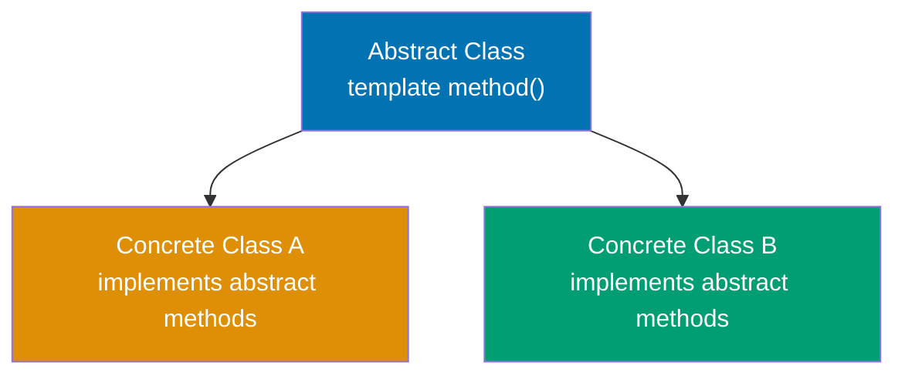
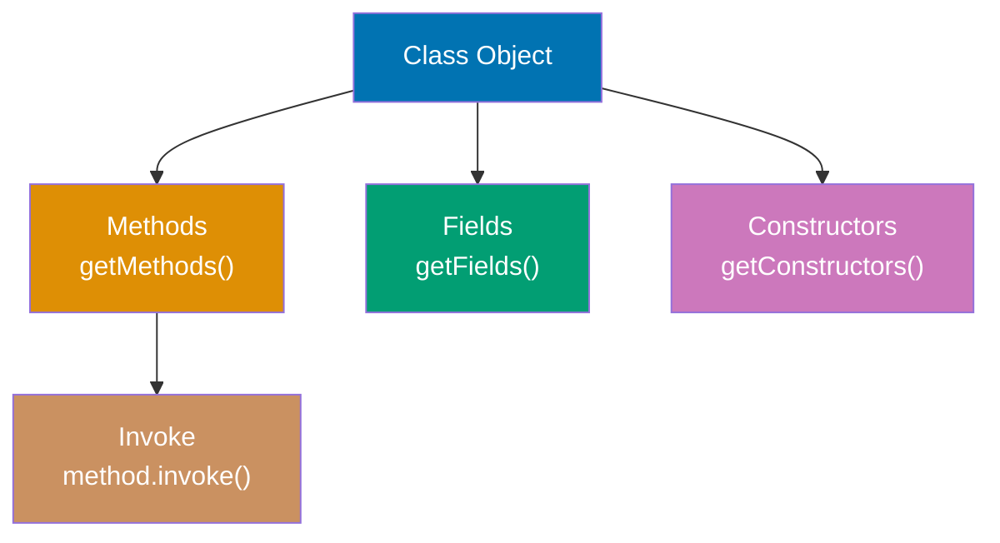
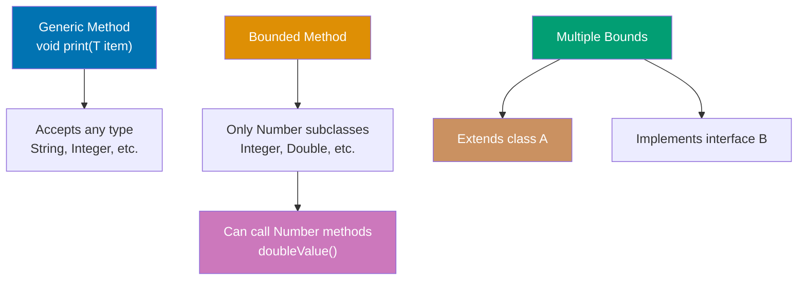
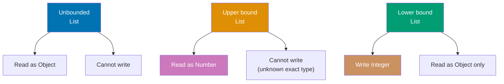
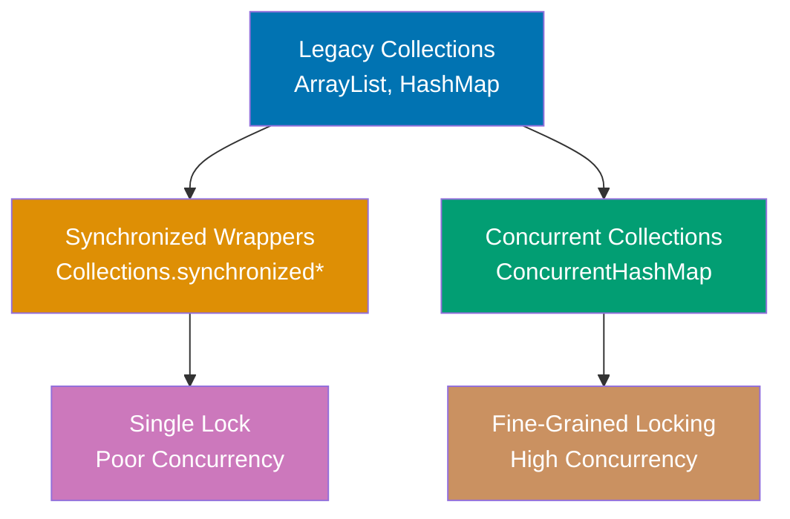
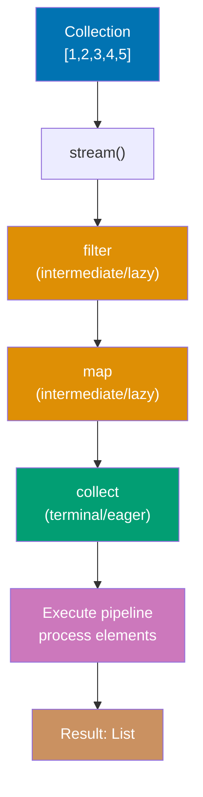
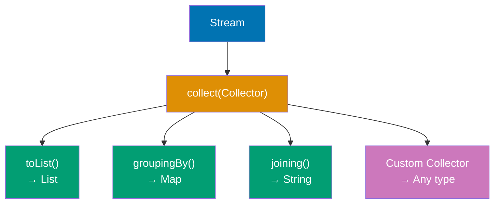
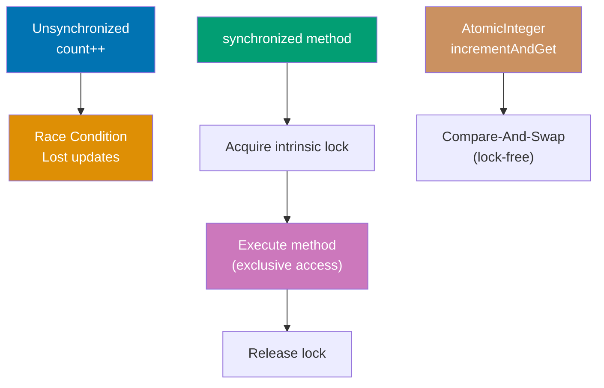

Master intermediate Java concepts through 20 annotated code examples. Each example builds on beginner foundations, introducing advanced OOP, generics, functional programming, and concurrency patterns.

## Example 31: Abstract Classes and Template Method Pattern

Abstract classes provide partial implementations with abstract methods that subclasses must implement. The template method pattern defines algorithm skeletons in abstract classes with customizable steps.



**Code**:

```java
// ABSTRACT CLASS - cannot be instantiated, may have abstract and concrete methods
abstract class DataProcessor {
    // => Cannot create: new DataProcessor() - compile error
    // => Must extend to use

    // TEMPLATE METHOD - defines algorithm skeleton (final prevents override)
    public final void process() {
        // => Final keyword prevents subclass override
        // => Ensures all subclasses execute same workflow
        // => Enforces consistent 4-step pipeline
        loadData();
        // => Step 1: subclass-specific data loading
        // => Abstract method: implementation varies by processor type
        transform();
        // => Step 2: subclass-specific transformation
        // => Converts loaded data to internal format
        validate();
        // => Step 3: shared validation logic
        // => Concrete implementation: same for all subclasses
        save();
        // => Step 4: subclass-specific persistence
        // => Abstract method: storage destination varies
    }

    // ABSTRACT METHODS - subclasses must implement
    protected abstract void loadData();
    // => No method body: subclass MUST provide implementation
    // => Compile error if concrete subclass doesn't override
    protected abstract void transform();
    // => Forces customization point for data transformation
    // => Each processor defines its own parsing logic
    protected abstract void save();
    // => Each subclass chooses storage mechanism
    // => Database, cache, file system, etc.

    // CONCRETE METHOD - shared implementation
    protected void validate() {
        // => All subclasses inherit this implementation
        // => Can be overridden (not final) if needed
        System.out.println("Validating data");
        // => Common validation logic
        // => Output: "Validating data"
    }
}

// CONCRETE SUBCLASS
class CSVProcessor extends DataProcessor {
    // => Inherits template method process()
    // => Must implement 3 abstract methods

    @Override
    protected void loadData() {
        System.out.println("Loading CSV file");
        // => CSV-specific: reads .csv files
    }

    @Override
    protected void transform() {
        System.out.println("Parsing CSV to objects");
        // => Converts comma-separated values to Java objects
    }

    @Override
    protected void save() {
        System.out.println("Saving to database");
        // => Persists to SQL database
    }
}

class JSONProcessor extends DataProcessor {
    // => Different implementations, same interface

    @Override
    protected void loadData() {
        System.out.println("Loading JSON file");
        // => JSON-specific: reads .json files
    }

    @Override
    protected void transform() {
        System.out.println("Parsing JSON to objects");
        // => Converts JSON strings to Java objects
    }

    @Override
    protected void save() {
        System.out.println("Saving to cache");
        // => Stores in memory cache (different from CSV)
    }
}

// USAGE
DataProcessor csv = new CSVProcessor();
// => Creates concrete instance (abstract class used as type)
csv.process();
// => Executes: loadData() → transform() → validate() → save()
// => Uses CSVProcessor implementations for steps 1,2,4
// => Output: Loading CSV file
// =>         Parsing CSV to objects
// =>         Validating data
// =>         Saving to database

DataProcessor json = new JSONProcessor();
// => Different processor, same workflow structure
json.process();
// => Uses JSONProcessor implementations
// => Output: Loading JSON file
// =>         Parsing JSON to objects
// =>         Validating data
// =>         Saving to cache
```

**Key Takeaway**: Abstract classes combine concrete methods (shared implementation) with abstract methods (enforced customization). The template method pattern uses a final concrete method defining the algorithm structure, delegating steps to abstract methods implemented by subclasses—ensuring consistent workflow while allowing customization.

**Why It Matters**: Abstract classes solve the code duplication vs. flexibility tradeoff that plagued early OOP—without them, shared logic required copy-paste across subclasses or awkward empty method implementations in interfaces. The template method pattern enabled frameworks like Spring and servlets to define processing pipelines (request handling, transaction management) while letting developers customize specific steps. Modern Java's default methods in interfaces (Java 8+) provide similar capabilities, but abstract classes remain essential when state (fields) must be shared. The pattern appears throughout the JDK: InputStream.read() templates byte reading, AbstractList provides skeletal List implementation, and Thread.run() enables custom thread behavior.

---

## Example 32: Composition Over Inheritance

Composition builds objects from reusable components rather than inheriting from parent classes. It provides flexibility by assembling behaviors dynamically rather than being locked into inheritance hierarchies.

**Code**:

```java
// COMPOSITION - building objects from components
// => HAS-A relationships instead of IS-A (inheritance)

// Component interfaces
interface Engine {
    // => Contract: all engines must implement start()
    // => Enables polymorphism: any Engine type works
    void start();
    // => No method body: interface method (abstract by default)
}

interface Transmission {
    // => Contract: all transmissions must implement shift()
    // => Allows different shifting strategies
    void shift(int gear);
    // => Parameter: target gear number
}

// Component implementations
class ElectricEngine implements Engine {
    // => Concrete implementation of Engine interface
    // => Electric motor behavior
    public void start() {
        System.out.println("Electric motor starting silently");
        // => Electric-specific: quiet startup
        // => Output: "Electric motor starting silently"
    }
}

class GasEngine implements Engine {
    // => Concrete implementation of Engine interface
    // => Combustion engine behavior
    public void start() {
        System.out.println("Gas engine roaring to life");
        // => Gas-specific: loud startup with ignition
        // => Output: "Gas engine roaring to life"
    }
}

class ManualTransmission implements Transmission {
    // => Concrete implementation of Transmission interface
    // => Manual gear control strategy
    public void shift(int gear) {
        System.out.println("Manual shift to gear " + gear);
        // => Driver controls each gear change
        // => Output: "Manual shift to gear N"
    }
}

class AutomaticTransmission implements Transmission {
    // => Concrete implementation of Transmission interface
    // => Automatic gear control strategy
    public void shift(int gear) {
        System.out.println("Automatic shift to gear " + gear);
        // => System determines shift timing
        // => Output: "Automatic shift to gear N"
    }
}

// COMPOSED CLASS - has-a relationship instead of is-a
class Car {
    // => Car contains components (composition)
    private final Engine engine;
    // => HAS-A Engine (can be electric, gas, diesel, etc.)
    private final Transmission transmission;
    // => HAS-A Transmission (can be manual, automatic, CVT, etc.)

    public Car(Engine engine, Transmission transmission) {
        // => Dependency injection: flexibility at construction
        this.engine = engine;
        // => Store engine reference
        this.transmission = transmission;
        // => Store transmission reference
    }

    public void drive() {
        // => Coordinate components to drive
        engine.start();
        // => Delegate to composed engine
        transmission.shift(1);
        // => Shift to 1st gear
        transmission.shift(2);
        // => Shift to 2nd gear
    }
}

// USAGE - flexible assembly of behaviors
Car electricAuto = new Car(new ElectricEngine(), new AutomaticTransmission());
// => Mix electric engine + automatic transmission
electricAuto.drive();
// => Output: Electric motor starting silently
// =>         Automatic shift to gear 1
// =>         Automatic shift to gear 2

Car gasManual = new Car(new GasEngine(), new ManualTransmission());
// => Mix gas engine + manual transmission
gasManual.drive();
// => Output: Gas engine roaring to life
// =>         Manual shift to gear 1
// =>         Manual shift to gear 2

// CONTRAST: Inheritance approach (rigid, explosive class hierarchy)
// => Would need: ElectricAutoCar, ElectricManualCar, GasAutoCar, GasManualCar
// => 2 engines × 2 transmissions = 4 classes (composition uses 2 components)
// => Adding diesel: 2 more classes (composition: 1 component)
// => Composition grows linearly, inheritance grows exponentially
```

**Key Takeaway**: Composition assembles objects from independent components (has-a relationships), providing runtime flexibility to mix and match behaviors. Prefer composition over inheritance to avoid rigid class hierarchies and the "diamond problem" where multiple inheritance paths create ambiguity.

**Why It Matters**: "Favor composition over inheritance" became a core OOP principle after decades of inheritance abuse created unmaintainable class hierarchies. Inheritance couples subclasses to superclass implementation details—changing a parent class breaks all children (fragile base class problem). Composition enables dependency injection frameworks like Spring to wire objects at runtime, testing frameworks to inject mocks, and strategy patterns to swap algorithms dynamically. The Java Collections Framework uses composition extensively: ArrayList composes an Object[] array, LinkedList composes Node objects, and decorator classes like Collections.synchronizedList() wrap existing lists with thread-safety behavior without inheritance.

---

## Example 33: Nested and Inner Classes

Java supports nested classes (static) and inner classes (non-static) that provide encapsulation and logical grouping. Inner classes access outer class instance members, while nested classes are independent.

**Code**:

```java
public class OuterClass {
    // => Outer class containing nested/inner classes
    private String outerField = "Outer field";
    // => Instance field: accessible to inner classes
    private static String staticField = "Static field";
    // => Static field: accessible to all nested classes

    // STATIC NESTED CLASS - independent of outer instance
    public static class StaticNested {
        // => Static means no implicit reference to outer instance
        // => Can be instantiated without OuterClass instance
        public void display() {
            System.out.println(staticField);
            // => ✅ Can access static outer members
            // => Output: "Static field"
            // System.out.println(outerField);
            // => ❌ ERROR: cannot access instance members
            // => No outer instance reference available
        }
    }

    // INNER CLASS (non-static) - tied to outer instance
    public class Inner {
        // => Non-static: holds implicit reference to outer instance
        // => Cannot exist without OuterClass instance
        private String innerField = "Inner field";
        // => Inner class can have its own fields

        public void display() {
            System.out.println(outerField);
            // => ✅ Accesses outer instance field
            // => Implicit reference: OuterClass.this.outerField
            System.out.println(staticField);
            // => ✅ Also accesses static members
            System.out.println(innerField);
            // => Accesses own field
        }

        public void accessOuter() {
            OuterClass.this.outerField = "Modified";
            // => Explicit outer reference syntax
            // => OuterClass.this = the outer instance
            // => Modifies outer field from inner class
        }
    }

    // METHOD LOCAL INNER CLASS - defined inside method
    public void methodWithLocalClass() {
        // => Local class scope: only visible within this method
        final String localVar = "Local variable";
        // => Must be final or effectively final (Java 8+)

        class LocalInner {
            // => Class defined inside method body
            // => Can access method's local variables
            public void display() {
                System.out.println(localVar);
                // => Accesses enclosing method's final variable
                // => Captured in closure
                System.out.println(outerField);
                // => Also accesses outer instance fields
            }
        }

        LocalInner local = new LocalInner();
        // => Instantiate local class within method
        local.display();
        // => Output: "Local variable", "Outer field"
    }

    // ANONYMOUS INNER CLASS - one-time implementation
    public Runnable createRunnable() {
        // => Returns interface instance without named class
        return new Runnable() {
            // => Anonymous class: no class name
            // => Implements Runnable on the fly
            @Override
            public void run() {
                System.out.println("Anonymous inner class: " + outerField);
                // => Can access outer instance members
                // => Output: "Anonymous inner class: Outer field"
            }
        };
        // => Before Java 8 lambdas, this was common pattern
    }
}

// USAGE
OuterClass.StaticNested nested = new OuterClass.StaticNested();
// => Create static nested class: no outer instance needed
// => Syntax: OuterClass.NestedClass
nested.display();
// => Output: "Static field"

OuterClass outer = new OuterClass();
// => Create outer instance first
OuterClass.Inner inner = outer.new Inner();
// => Create inner class: requires outer instance
// => Syntax: outerInstance.new InnerClass()
// => Inner holds reference to 'outer'
inner.display();
// => Output: "Outer field"
// =>         "Static field"
// =>         "Inner field"

outer.methodWithLocalClass();
// => Executes method containing local inner class
// => Output: "Local variable"
// =>         "Outer field"

Runnable r = outer.createRunnable();
// => Returns anonymous Runnable instance
r.run();
// => Output: "Anonymous inner class: Outer field"
```

**Key Takeaway**: Static nested classes are independent of outer instances and can only access outer static members. Inner classes (non-static) are tied to outer instances and can access all outer members. Use nested classes for logical grouping and inner classes when tight coupling with outer state is needed.

**Why It Matters**: Inner classes enable event handling patterns in GUI frameworks (Swing, JavaFX) where listeners need access to surrounding component state without passing references manually. Anonymous inner classes powered Java's callback mechanisms before lambdas (Java 8), though lambdas are now preferred for functional interfaces. Static nested classes organize helper classes without polluting package namespace—Map.Entry, LinkedList.Node, and Builder patterns use this extensively. The outer class reference overhead (inner classes store implicit reference to outer instance) can cause memory leaks if inner instances outlive outer instances, a common pitfall in Android Activity listeners.

---

## Example 34: Reflection API - Runtime Introspection

Reflection allows runtime inspection and manipulation of classes, methods, and fields. It enables frameworks to work with user-defined classes without compile-time knowledge.



**Code**:

```java
import java.lang.reflect.*;
// => Import reflection API classes

class Person {
    // => Simple class for reflection demonstration
    private String name;
    // => Private field: not accessible without setAccessible()
    public int age;
    // => Public field: directly accessible via reflection

    public Person() {}
    // => Default constructor

    public Person(String name, int age) {
        // => Parameterized constructor
        this.name = name;
        this.age = age;
    }

    private void secretMethod() {
        // => Private method: needs setAccessible() to invoke
        System.out.println("Secret: " + name);
    }

    public String getName() {
        // => Public getter method
        return name;
    }
}

// REFLECTION USAGE
Class<?> clazz = Person.class;
                                 // => Obtain Class metadata object for Person
                                 // => .class literal retrieves compile-time Class reference
                                 // => <?> wildcard: type-safe reflection (unknown generic type)
                                 // => Alternative: Class.forName("Person") loads by string name
                                 // => Class object contains all runtime type information

// GET CLASS INFORMATION
String className = clazz.getName();
                                 // => Returns fully qualified name (package + class)
                                 // => Result: "Person" (or "com.example.Person" if in package)
                                 // => Includes package prefix for uniqueness
String simpleName = clazz.getSimpleName();
                                 // => Returns class name without package prefix
                                 // => Result: "Person" (just class name)
                                 // => Used for display/logging purposes

// INSTANTIATE via reflection
Constructor<?> constructor = clazz.getConstructor(String.class, int.class);
                                 // => Finds public constructor matching parameter types
                                 // => getConstructor() searches public constructors only
                                 // => Parameter types: String.class, int.class (varargs)
                                 // => Throws NoSuchMethodException if no matching constructor
                                 // => Constructor<?> holds reference to constructor metadata
Object instance = constructor.newInstance("Alice", 30);
                                 // => Invokes constructor with arguments
                                 // => newInstance() calls Constructor with varargs Object[]
                                 // => Creates instance: new Person("Alice", 30)
                                 // => Returns Object (generic type, needs casting for type safety)
                                 // => Throws InstantiationException, IllegalAccessException, InvocationTargetException

// ACCESS FIELDS
Field ageField = clazz.getField("age");
                                 // => Gets PUBLIC field named "age" by string lookup
                                 // => getField() searches public fields only (not private)
                                 // => Throws NoSuchFieldException if field not found or not public
                                 // => Field object wraps field metadata
int ageValue = (int) ageField.get(instance);
                                 // => Reads field value from specific instance
                                 // => ageField.get() returns Object, requires cast to int
                                 // => Retrieves value from Person object's age field
                                 // => Result: 30 (initial value from constructor)
                                 // => Autoboxing: int → Integer → Object → (int) unbox
ageField.set(instance, 31);      // => Modifies field value reflectively
                                 // => ageField.set(object, value) mutates field on instance
                                 // => Changes age from 30 to 31
                                 // => Now age = 31 (modified)
                                 // => Value autoboxed: 31 (int) → Integer → Object

// ACCESS PRIVATE FIELDS
Field nameField = clazz.getDeclaredField("name");
                                 // => Gets any field (public or private) by name
                                 // => getDeclaredField() finds private members (bypasses normal access)
                                 // => Searches only this class (not inherited fields)
                                 // => "name" is private, so getField("name") would fail
nameField.setAccessible(true);   // => Disables Java access control checks
                                 // => Allows reading/writing private field
                                 // => ⚠️ Security risk: breaks encapsulation (violates OOP)
                                 // => SecurityManager may block this if installed
                                 // => Equivalent to making field public at runtime
String nameValue = (String) nameField.get(instance);
                                 // => Reads private field value via reflection
                                 // => nameField.get() returns Object, cast to String
                                 // => Result: "Alice" (value set in constructor)
                                 // => Without setAccessible(true): IllegalAccessException

// INVOKE METHODS
Method getNameMethod = clazz.getMethod("getName");
                                 // => Finds public method by name and parameter types
                                 // => getMethod() searches public methods (including inherited)
                                 // => Empty parameter array: no arguments for getName()
                                 // => Returns Method object wrapping method metadata
String name = (String) getNameMethod.invoke(instance);
                                 // => Invokes method on instance reflectively
                                 // => invoke(object, args...) calls method with varargs
                                 // => Equivalent to: instance.getName() (direct call)
                                 // => Returns Object (generic), cast to String
                                 // => Result: "Alice" (method return value)
                                 // => ~3x slower than direct invocation

// INVOKE PRIVATE METHODS
Method secretMethod = clazz.getDeclaredMethod("secretMethod");
                                 // => Finds private method by name
                                 // => getDeclaredMethod() searches private methods
                                 // => getMethod() would fail (private not accessible)
secretMethod.setAccessible(true);// => Bypasses private access modifier
                                 // => Allows invoking private method
                                 // => ⚠️ Breaks encapsulation (testing/framework use)
secretMethod.invoke(instance);   // => Invokes private method reflectively
                                 // => Calls secretMethod() on instance
                                 // => Method executes: prints "Secret: Alice"
                                 // => Output: "Secret: Alice"
                                 // => Without setAccessible(true): IllegalAccessException

// LIST ALL METHODS
for (Method method : clazz.getDeclaredMethods()) {
    // => Iterates all declared methods (public and private)
    System.out.println(method.getName());
    // => Prints method names
}
// => Output: secretMethod
// =>         getName
```

**Key Takeaway**: Reflection provides runtime access to class metadata, allowing inspection of fields, methods, and constructors. Use `setAccessible(true)` to bypass access controls for private members. Reflection enables frameworks and libraries to work with arbitrary user classes without compile-time knowledge.

**Why It Matters**: Reflection powers Java's entire framework ecosystem—Spring uses it for dependency injection (scanning for @Component, @Autowired), JPA for entity mapping (@Entity, @Column), JUnit for test discovery (@Test), and serialization frameworks (Gson, Jackson) for JSON mapping. Without reflection, these frameworks would require manual registration or code generation for every class. However, reflection has costs: performance overhead (method.invoke() is ~3x slower than direct calls), type safety loss (casts and string-based lookups), and security risks (accessing private members breaks encapsulation). Modern Java introduced MethodHandles (Java 7) as faster, type-safe alternatives, while annotation processors enable compile-time code generation replacing some reflection use cases.

---

## Example 35: Annotations and Custom Metadata

Annotations add metadata to code that can be processed at compile-time or runtime. Custom annotations enable declarative programming patterns used extensively in frameworks.

**Code**:

```java
import java.lang.annotation.*;
import java.lang.reflect.*;

// DEFINE CUSTOM ANNOTATION
@Retention(RetentionPolicy.RUNTIME)  // => Available at runtime via reflection
@Target(ElementType.METHOD)          // => Can only be applied to methods
public @interface Test {
    String description() default "";  // => Annotation parameter with default value
    int timeout() default 0;
}

// ANOTHER ANNOTATION
@Retention(RetentionPolicy.RUNTIME)
@Target(ElementType.FIELD)
public @interface Inject {           // => Marks fields for dependency injection
}

// USE ANNOTATIONS
class TestSuite {
    @Inject
    private String dependency;       // => Marked for injection

    @Test(description = "Adds two numbers", timeout = 1000)
    public void testAddition() {
        System.out.println("Testing addition");
    }

    @Test(description = "Divides by zero")
    public void testDivision() {
        System.out.println("Testing division");
    }

    public void helperMethod() {     // => No @Test annotation
        System.out.println("Not a test");
    }
}

// PROCESS ANNOTATIONS via reflection
Class<?> clazz = TestSuite.class;
                                 // => Get Class object representing TestSuite type
                                 // => clazz is java.lang.Class<TestSuite> (type metadata)
                                 // => Class object contains all runtime information about TestSuite
                                 // => Enables introspection of methods, fields, annotations

// Find and execute @Test methods
for (Method method : clazz.getDeclaredMethods()) {
                                 // => getDeclaredMethods() returns all methods (public + private)
                                 // => Returns Method[] array: testAddition, testDivision, helperMethod
                                 // => Method object wraps method metadata (name, params, annotations)
                                 // => Each Method represents one method in the class
    if (method.isAnnotationPresent(Test.class)) {
                                 // => Check if method has @Test annotation at runtime
                                 // => Uses reflection to inspect method's annotation metadata
                                 // => testAddition: true (has @Test), testDivision: true, helperMethod: false
                                 // => Annotation must have RUNTIME retention to be visible
                                 // => RetentionPolicy.RUNTIME enables runtime discovery
                                 // => SOURCE/CLASS retention annotations discarded before runtime
        Test testAnnotation = method.getAnnotation(Test.class);
                                 // => Retrieve @Test annotation instance from method
                                 // => Returns proxy implementing Test interface
                                 // => testAnnotation contains description and timeout parameters
                                 // => Parameters accessible as method calls (description(), timeout())
        System.out.println("Running test: " + testAnnotation.description());
                                 // => Access annotation parameter value via method call
                                 // => testAnnotation.description() returns String from annotation
                                 // => Output: "Running test: Adds two numbers" (for testAddition)
                                 // => Output: "Running test: Divides by zero" (for testDivision)

        try {
            Object instance = clazz.getDeclaredConstructor().newInstance();
                                 // => Create new TestSuite instance via reflection
                                 // => getDeclaredConstructor() finds no-arg constructor
                                 // => newInstance() calls constructor, returns new object
            method.invoke(instance);  // => Execute test method on instance
                                 // => invoke() calls method dynamically (equivalent to instance.testAddition())
        } catch (Exception e) {
            System.out.println("Test failed: " + e.getMessage());
                                 // => Catch exceptions from method invocation
        }
    }
}
// => Output: Running test: Adds two numbers, Testing addition
//           Running test: Divides by zero, Testing division

// BUILT-IN ANNOTATIONS
class Example {
    @Override                    // => Compile-time check that method overrides superclass
    public String toString() {
        return "Example";
    }

    @Deprecated                  // => Marks method as deprecated (compiler warning)
    public void oldMethod() {}

    @SuppressWarnings("unchecked") // => Suppresses compiler warnings
    public void rawTypeMethod() {
        java.util.List list = new java.util.ArrayList();
    }
}
```

**Key Takeaway**: Annotations add metadata to code without affecting execution. Use `@Retention` to specify when annotations are available (SOURCE, CLASS, RUNTIME) and `@Target` to restrict where annotations can be applied. Process runtime annotations via reflection to implement custom behaviors.

**Why It Matters**: Annotations revolutionized Java framework design by enabling declarative programming—compare Spring's `@Autowired` to manual factory.getBean() calls, or JPA's `@Entity @Column` to XML configuration files. Annotations shift complexity from user code to framework code, improving readability (@Transactional vs. manual transaction.begin/commit). However, overuse creates "magic" behavior invisible in code (Spring's @Async spawning threads invisibly), making debugging difficult. Annotation processing (compile-time, via javax.annotation.processing) generates code during compilation (Lombok, Dagger), avoiding reflection overhead while keeping declarative syntax. The combination of annotations + reflection enabled the "convention over configuration" movement that made frameworks like Spring Boot possible.

---

## Example 36: Generic Methods and Bounded Type Parameters

Generic methods enable type-safe method implementations that work with any type. Bounded type parameters restrict generic types to subclasses of a bound, enabling access to bound class methods.



**Code**:

```java
import java.util.*;

// GENERIC METHOD - type parameter before return type
public static <T> void printArray(T[] array) {
                                 // => <T> declares type parameter for this method
                                 // => T can be any type (inferred from argument)
    for (T element : array) {    // => Enhanced for-loop iterates array elements
                                 // => Each element has type T (type-safe)
        System.out.print(element + " ");
                                 // => Prints element followed by space
    }
    System.out.println();        // => Newline after all elements printed
}

// BOUNDED TYPE PARAMETER - restricts to Number subclasses
public static <T extends Number> double sum(List<T> numbers) {
                                 // => T must be Number or subclass (Integer, Double, etc.)
    double total = 0;
    for (T num : numbers) {
        total += num.doubleValue();  // => Can call Number methods because of bound
    }
    return total;
}

// MULTIPLE BOUNDS - must extend class AND implement interfaces
interface Measurable {
    double getMeasurement();
}

public static <T extends Number & Measurable> double average(List<T> items) {
                                 // => T must extend Number AND implement Measurable
    double total = 0;
    for (T item : items) {
        total += item.getMeasurement();
    }
    return total / items.size();
}

// USAGE
Integer[] ints = {1, 2, 3};      // => Array of Integer wrapper objects
String[] strs = {"a", "b", "c"};  // => Array of String objects
printArray(ints);                // => Compiler infers T = Integer from argument type
                                 // => Calls printArray<Integer>(Integer[])
                                 // => Output: 1 2 3
printArray(strs);                // => Compiler infers T = String from argument type
                                 // => Calls printArray<String>(String[])
                                 // => Output: a b c

List<Integer> intList = Arrays.asList(1, 2, 3, 4);
                                 // => Creates fixed-size List<Integer> from varargs
                                 // => List contains [1, 2, 3, 4]
double sum = sum(intList);       // => Calls sum<Integer>(List<Integer>)
                                 // => Iterates list: 1+2+3+4 = 10
                                 // => sum is 10.0 (converted to double)

// GENERIC CLASS with type parameter
class Box<T> {
                                 // => Generic class with type parameter T
                                 // => T is placeholder, replaced at instantiation
    private T content;           // => Field of type T (unknown until instantiation)

    public void set(T content) {
                                 // => Method parameter type T
                                 // => Enforces type safety at compile time
        this.content = content;  // => Stores value of type T
    }

    public T get() {
                                 // => Return type T (same type as set)
        return content;          // => Returns stored value (type T)
    }
}

Box<String> stringBox = new Box<>();
                                 // => Diamond operator <> infers type from left side
                                 // => T = String for this instance
                                 // => Creates Box<String>
stringBox.set("Hello");          // => Type-safe: only String allowed
                                 // => Compiler enforces: set(String)
                                 // => Calling set(123) would be compile error
String value = stringBox.get();  // => No cast needed (compiler knows returns String)
                                 // => value is "Hello" (type: String)
```

**Key Takeaway**: Generic methods use `<T>` before return type to declare type parameters. Bounded type parameters (`<T extends Class>`) restrict acceptable types and enable calling methods of the bound class. Multiple bounds require `<T extends Class & Interface1 & Interface2>` syntax with class first.

**Why It Matters**: Bounded type parameters solve the "how do I operate on generic types?" problem—without bounds, generic `<T>` treats everything as Object, preventing method calls beyond Object's methods. Bounds enable generic algorithms: Collections.sort() requires `<T extends Comparable<T>>` to call compareTo(), Stream.max() requires Comparator, and numeric operations require `<T extends Number>`. Multiple bounds enable rich generic constraints in libraries like Hibernate (entities must extend BaseEntity AND implement Serializable). The class-first rule in multiple bounds reflects Java's single-inheritance, multiple-interfaces model, though rarely needed in practice.

---

## Example 37: Wildcards and Type Variance

Wildcards (`?`) represent unknown types in generics. Upper-bounded wildcards (`? extends Type`) enable reading, lower-bounded wildcards (`? super Type`) enable writing, following covariance and contravariance rules.



**Code**:

```java
import java.util.*;

// UNBOUNDED WILDCARD - unknown type
public static void printList(List<?> list) {
                                 // => Accepts List of any type
                                 // => ? means "unknown type" (wildcard)
                                 // => Works with List<Integer>, List<String>, List<Object>, etc.
    for (Object elem : list) {   // => Can only read as Object (safest supertype)
                                 // => Cannot assume specific type (unknown)
                                 // => elem could be Integer, String, anything
        System.out.print(elem + " ");
                                 // => Prints using Object.toString()
    }
    System.out.println();
    // list.add("x");            // => ERROR: cannot write to List<?>
                                 // => Compiler doesn't know element type
}

// UPPER-BOUNDED WILDCARD - covariance (reading)
public static double sumNumbers(List<? extends Number> numbers) {
                                 // => Accepts List<Integer>, List<Double>, List<Number>, etc.
                                 // => ? extends Number means "unknown type that extends Number"
    double sum = 0;              // => Accumulator initialized to 0
    for (Number num : numbers) { // => Can read elements as Number (upper bound)
                                 // => Safe because all elements ARE Number subclasses
        sum += num.doubleValue();// => Call Number method doubleValue()
                                 // => Accumulate into sum
    }
    return sum;                  // => Return total sum
    // numbers.add(1);           // => ERROR: cannot write (compiler doesn't know exact type)
                                 // => Could be List<Double>, cannot add Integer
}

// LOWER-BOUNDED WILDCARD - contravariance (writing)
public static void addIntegers(List<? super Integer> list) {
                                 // => ? super Integer means "unknown type that's Integer or superclass"
                                 // => Accepts List<Integer>, List<Number>, List<Object>
                                 // => Cannot accept List<Double> (Double not super of Integer)
    list.add(1);                 // => Can write Integer (safe for any supertype)
                                 // => Integer IS-A Number, Integer IS-A Object
                                 // => Guaranteed safe to add Integer to list
    list.add(2);                 // => Another Integer safely added
    // Integer val = list.get(0); // => ERROR: can only read as Object
                                 // => Could be List<Number> (returns Number, not Integer)
                                 // => Could be List<Object> (returns Object, not Integer)
                                 // => Only safe return type is Object

// USAGE
List<Integer> ints = Arrays.asList(1, 2, 3);
                                 // => Fixed-size List<Integer>
List<Double> doubles = Arrays.asList(1.0, 2.0, 3.0);
                                 // => Fixed-size List<Double>

printList(ints);                 // => Calls printList(List<?>)
                                 // => Accepts List<Integer> (wildcard matches)
                                 // => Output: 1 2 3
printList(doubles);              // => Calls printList(List<?>)
                                 // => Accepts List<Double> (wildcard matches)
                                 // => Output: 1.0 2.0 3.0

double sum1 = sumNumbers(ints);  // => List<Integer> matches List<? extends Number>
                                 // => Integer extends Number
                                 // => sum1 is 6.0 (1+2+3)
double sum2 = sumNumbers(doubles); // => List<Double> matches List<? extends Number>
                                 // => Double extends Number
                                 // => sum2 is 6.0 (1.0+2.0+3.0)

List<Number> numbers = new ArrayList<>();
                                 // => Mutable List<Number> (ArrayList)
addIntegers(numbers);            // => List<Number> matches List<? super Integer>
                                 // => Number is super of Integer
                                 // => Can safely add Integers to List<Number>
System.out.println(numbers);     // => numbers now contains [1, 2]
                                 // => Output: [1, 2]

// PECS RULE: Producer Extends, Consumer Super
// Producer (reading): use <? extends T>
// Consumer (writing): use <? super T>

public static <T> void copy(List<? extends T> source, List<? super T> dest) {
                                 // => Generic method with two wildcard parameters
                                 // => source produces T (extends: covariance)
                                 // => dest consumes T (super: contravariance)
                                 // => Enables copying from subtype to supertype
    for (T item : source) {
                                 // => Reads from source (produces T)
                                 // => item has type T
        dest.add(item);          // => Writes to dest (consumes T)
                                 // => Safe: dest accepts T or supertype
    }
}

List<Integer> src = Arrays.asList(1, 2, 3);
                                 // => Source: List<Integer>
List<Number> dst = new ArrayList<>();
                                 // => Destination: List<Number> (supertype of Integer)
copy(src, dst);                  // => T = Integer (inferred)
                                 // => source: List<? extends Integer> (List<Integer> matches)
                                 // => dest: List<? super Integer> (List<Number> matches)
                                 // => Copies [1, 2, 3] from src to dst
                                 // => dst now contains [1, 2, 3]
```

**Key Takeaway**: Use `? extends Type` for reading (covariance), `? super Type` for writing (contravariance), and `?` for both reading (as Object) and no writing. Follow PECS rule: "Producer Extends, Consumer Super"—if a method produces values from a collection, use `extends`; if it consumes values into a collection, use `super`.

**Why It Matters**: Wildcards enable flexible generic APIs that accept related types without requiring exact matches—before wildcards, List<Integer> and List<Number> were completely unrelated despite inheritance. The PECS rule guides API design: Collections.addAll(Collection<? extends E>) is producer (extends), Collections.sort(List<T>, Comparator<? super T>) is consumer (super). Understanding variance prevents type safety violations: allowing writes to List<? extends Number> would permit adding Double to List<Integer>. This complexity drives some developers to avoid wildcards entirely, but mastering them enables elegant generic APIs like Stream.collect(Collector<? super T>).

---

## Example 38: Collections Framework Deep Dive

The Collections Framework provides algorithms for sorting, searching, and transforming collections. Understanding time complexities and choosing appropriate implementations is critical for performance.

**Code**:

```java
import java.util.*;
                                 // => Import collections framework classes

// CHOOSING COLLECTION TYPES based on requirements

// ArrayList - indexed access, dynamic size
List<String> arrayList = new ArrayList<>();
                                 // => arrayList is [] (empty dynamic array)
arrayList.add("A");              // => O(1) amortized (O(n) when resizing)
                                 // => arrayList is ["A"]
String value = arrayList.get(0); // => O(1) random access
                                 // => value is "A"
arrayList.remove(0);             // => O(n) due to shifting elements
                                 // => arrayList is [] (removed "A")

// LinkedList - efficient insertion/deletion, poor random access
List<String> linkedList = new LinkedList<>();
                                 // => linkedList is [] (empty doubly-linked list)
linkedList.add("A");             // => O(1) append to tail
                                 // => linkedList is ["A"]
linkedList.add(0, "B");          // => O(1) prepend to head
                                 // => linkedList is ["B", "A"]
String first = linkedList.get(0); // => O(n) traversal (must walk nodes, no indexing)
                                 // => first is "B"

// HashSet - unique elements, no order, O(1) operations
Set<String> hashSet = new HashSet<>();
                                 // => hashSet is {} (empty hash table)
hashSet.add("A");                // => O(1) average (hash bucket insert)
                                 // => hashSet is {"A"}
boolean contains = hashSet.contains("A");
                                 // => O(1) average hash lookup
                                 // => contains is true

// TreeSet - sorted, unique elements, O(log n) operations
Set<Integer> treeSet = new TreeSet<>();
                                 // => treeSet is {} (empty red-black tree)
treeSet.add(3);                  // => treeSet is {3}
treeSet.add(1);                  // => treeSet is {1, 3} (auto-sorted)
treeSet.add(2);                  // => treeSet is {1, 2, 3} (maintains order)
System.out.println(treeSet);     // => Output: [1, 2, 3] (sorted by natural order)

// HashMap - key-value pairs, O(1) operations
Map<String, Integer> hashMap = new HashMap<>();
                                 // => hashMap is {} (empty hash table)
hashMap.put("Alice", 30);        // => O(1) average insert
                                 // => hashMap is {"Alice"=30}
Integer age = hashMap.get("Alice"); // => O(1) average lookup
                                 // => age is 30

// TreeMap - sorted by keys, O(log n) operations
Map<String, Integer> treeMap = new TreeMap<>();
                                 // => treeMap is {} (empty red-black tree)
treeMap.put("Charlie", 25);      // => treeMap is {"Charlie"=25}
treeMap.put("Alice", 30);        // => treeMap is {"Alice"=30, "Charlie"=25}
treeMap.put("Bob", 28);          // => treeMap is {"Alice"=30, "Bob"=28, "Charlie"=25}
System.out.println(treeMap);     // => Output: {Alice=30, Bob=28, Charlie=25} (sorted by key)

// COLLECTIONS UTILITY METHODS
List<Integer> numbers = Arrays.asList(3, 1, 4, 1, 5, 9);
                                 // => numbers is [3, 1, 4, 1, 5, 9] (fixed-size list)

Collections.sort(numbers);       // => In-place sort (mutates original)
                                 // => numbers is [1, 1, 3, 4, 5, 9]
Collections.reverse(numbers);    // => In-place reversal
                                 // => numbers is [9, 5, 4, 3, 1, 1]
Collections.shuffle(numbers);    // => Randomizes order (uses Random)
                                 // => numbers is [unpredictable order]

int max = Collections.max(numbers); // => Finds maximum element
                                 // => max is 9
int min = Collections.min(numbers); // => Finds minimum element
                                 // => min is 1

int frequency = Collections.frequency(numbers, 1);
                                 // => Counts occurrences of 1
                                 // => frequency is 2 (appears twice)

// IMMUTABLE COLLECTIONS (Java 9+)
List<String> immutable = List.of("A", "B", "C");
                                 // => immutable is ["A", "B", "C"] (cannot modify)
// immutable.add("D");           // => UnsupportedOperationException (immutable)

Map<String, Integer> immutableMap = Map.of("A", 1, "B", 2);
                                 // => immutableMap is {"A"=1, "B"=2} (cannot modify)
// immutableMap.put("C", 3);     // => UnsupportedOperationException (immutable)
```

**Key Takeaway**: Choose collection types based on access patterns: ArrayList for indexed access, LinkedList for frequent insertions/deletions, HashSet for uniqueness with O(1) operations, TreeSet for sorted uniqueness, HashMap for key-value O(1) lookups, TreeMap for sorted keys. Understand time complexity tradeoffs to avoid performance pitfalls.

**Why It Matters**: Choosing the wrong collection type causes severe performance issues at scale—using ArrayList.contains() in a loop creates O(n²) complexity vs. HashSet's O(n). A common pitfall: using LinkedList thinking "linked list is always better for insertions," but ArrayList's cache locality makes it faster for small-to-medium lists. TreeSet/TreeMap's O(log n) seems close to HashMap's O(1), but with millions of entries, the difference is dramatic (20 operations vs. 1). Java 9's List.of() and Map.of() factory methods create space-efficient immutable collections (no separate unmodifiable wrappers), essential for functional programming patterns. The Collections Framework standardized algorithms that previously required manual implementation, eliminating bugs from manual binary search or sort implementations.

---

## Example 39: Concurrent Collections for Thread Safety

Concurrent collections provide thread-safe operations without external synchronization. They use lock-free algorithms and fine-grained locking for better concurrency than synchronized collections.



**Code**:

```java
import java.util.concurrent.*;
import java.util.*;

// CONCURRENTHASHMAP - thread-safe without single lock
ConcurrentHashMap<String, Integer> concurrentMap = new ConcurrentHashMap<>();
                                 // => concurrentMap is {} (empty, thread-safe map)
                                 // => Uses segment-based locking (high concurrency)

// Thread-safe operations
concurrentMap.put("key", 1);     // => Thread-safe put without blocking all threads
                                 // => concurrentMap is {"key"=1}
Integer value = concurrentMap.get("key");
                                 // => Thread-safe get (lock-free read in Java 8+)
                                 // => value is 1

// ATOMIC OPERATIONS
concurrentMap.putIfAbsent("key", 2);
                                 // => Only puts if key doesn't exist (atomic check-and-set)
                                 // => Returns 1 (key exists, not inserted)
                                 // => concurrentMap is {"key"=1} (unchanged)

concurrentMap.computeIfAbsent("newKey", k -> k.length());
                                 // => Computes value atomically if key absent
                                 // => Lambda: "newKey".length() returns 6
                                 // => concurrentMap is {"key"=1, "newKey"=6}

concurrentMap.merge("key", 1, Integer::sum);
                                 // => Atomically updates: old value + new value
                                 // => Merges 1 (existing) + 1 (new) = 2
                                 // => concurrentMap is {"key"=2, "newKey"=6}

// COPYONWRITEARRAYLIST - reads without locking, writes copy entire array
CopyOnWriteArrayList<String> cowList = new CopyOnWriteArrayList<>();
                                 // => cowList is [] (empty, optimized for reads)
cowList.add("A");                // => Creates new array copy with "A"
                                 // => cowList is ["A"] (write expensive, read cheap)
cowList.add("B");                // => Every write copies array (O(n) write cost)
                                 // => cowList is ["A", "B"]

// Safe iteration during concurrent modifications
for (String item : cowList) {    // => Iteration uses snapshot (no ConcurrentModificationException)
                                 // => Iterates over: ["A", "B"]
    cowList.add("C");            // => Modifications don't affect ongoing iteration
                                 // => Creates new array but iterator sees old snapshot
}                                // => After loop: cowList is ["A", "B", "C", "C"]

// BLOCKINGQUEUE - producer-consumer pattern
BlockingQueue<String> queue = new LinkedBlockingQueue<>(10);
                                 // => queue capacity is 10 (blocks when full)
                                 // => Uses locks and conditions (thread coordination)

// Producer thread
new Thread(() -> {               // => Lambda creates producer thread
    try {
        queue.put("item");       // => Blocks if queue full (waits for space)
                                 // => Wakes up consumers waiting for items
    } catch (InterruptedException e) {
        e.printStackTrace();     // => Handle thread interruption
    }
}).start();                      // => Start producer thread immediately

// Consumer thread
new Thread(() -> {               // => Lambda creates consumer thread
    try {
        String item = queue.take(); // => Blocks if queue empty (waits for item)
                                 // => item is "item" (from producer)
        System.out.println("Consumed: " + item);
                                 // => Output: Consumed: item
    } catch (InterruptedException e) {
        e.printStackTrace();     // => Handle thread interruption
    }
}).start();                      // => Start consumer thread immediately

// CONCURRENTSKIPLISTMAP - sorted, concurrent alternative to TreeMap
ConcurrentSkipListMap<Integer, String> skipListMap = new ConcurrentSkipListMap<>();
                                 // => skipListMap is {} (empty skip list, sorted + thread-safe)
skipListMap.put(3, "three");     // => skipListMap is {3="three"}
skipListMap.put(1, "one");       // => skipListMap is {1="one", 3="three"} (auto-sorted)
skipListMap.put(2, "two");       // => skipListMap is {1="one", 2="two", 3="three"}
System.out.println(skipListMap);  // => Output: {1=one, 2=two, 3=three} (sorted, thread-safe)

// CONTRAST: Synchronized wrapper (poor concurrency)
Map<String, Integer> syncMap = Collections.synchronizedMap(new HashMap<>());
                                 // => syncMap is {} (wrapped HashMap)
                                 // => Single lock for all operations (severe bottleneck)
                                 // => All threads block each other (no concurrency)
```

**Key Takeaway**: Use ConcurrentHashMap for high-concurrency key-value access with fine-grained locking. CopyOnWriteArrayList suits read-heavy workloads where writes are rare. BlockingQueue enables producer-consumer patterns with thread-safe blocking operations. Avoid synchronized wrappers (Collections.synchronizedMap()) which use coarse-grained locking.

**Why It Matters**: ConcurrentHashMap revolutionized Java concurrency by replacing Hashtable's single-lock design with segment-based locking (Java 7) and later lock-free reads with CAS operations (Java 8+), achieving 10-100x throughput in multi-threaded scenarios. Before concurrent collections, developers used synchronized blocks or Collections.synchronizedMap(), creating severe bottlenecks—every operation acquired the same lock, serializing all threads. BlockingQueue enables elegant producer-consumer patterns without manual wait/notify complexity, powering thread pools (Executors use BlockingQueue internally) and message queues. CopyOnWriteArrayList's write-amplification (copying entire array) makes it unsuitable for write-heavy workloads, but perfect for listener lists in event systems where reads vastly outnumber writes.

---

## Example 40: Stream Pipeline Optimization

Stream operations are lazy (intermediate) or eager (terminal). Understanding laziness enables building efficient pipelines that short-circuit and minimize iterations.



**Code**:

```java
import java.util.*;
import java.util.stream.*;

List<Integer> numbers = Arrays.asList(1, 2, 3, 4, 5, 6, 7, 8, 9, 10);
                                 // => numbers is [1, 2, 3, 4, 5, 6, 7, 8, 9, 10]

// LAZY EVALUATION - intermediate operations don't execute until terminal operation
Stream<Integer> stream = numbers.stream()
                                 // => Creates stream from list (no processing yet)
                                 // => Pipeline defined but not executed
    .filter(n -> {
        System.out.println("Filter: " + n);
        return n % 2 == 0;       // => NOT executed yet (lazy intermediate operation)
                                 // => Defines filtering logic, doesn't apply it
    })
    .map(n -> {
        System.out.println("Map: " + n);
        return n * 2;            // => NOT executed yet (lazy intermediate operation)
                                 // => Defines mapping logic, doesn't apply it
    });
// => No output yet (no terminal operation)
// => Stream pipeline defined but not executed
// => No System.out.println calls made

List<Integer> result = stream.collect(Collectors.toList());
                                 // => Terminal operation triggers pipeline execution
                                 // => Now executes filter and map for each element
// => Output: Filter: 1, Filter: 2, Map: 2, Filter: 3, Filter: 4, Map: 4, ...
// => result is [4, 8, 12, 16, 20] (even numbers doubled)

// SHORT-CIRCUITING - stops processing when result determined
Optional<Integer> first = numbers.stream()
                                 // => Creates new stream from numbers
    .filter(n -> {
        System.out.println("Checking: " + n);
        return n > 5;            // => Filter for n > 5
    })
    .findFirst();                // => Short-circuits after first match
                                 // => Stops immediately when match found
// => Output: Checking: 1, Checking: 2, ..., Checking: 6
// => Stops at 6 (first n > 5), doesn't process 7, 8, 9, 10
// => first is Optional[6]

// PARALLEL STREAMS - splits work across threads
long count = numbers.parallelStream()
                                 // => Splits collection across ForkJoinPool threads
    .filter(n -> n % 2 == 0)     // => Parallel filtering (each thread processes subset)
                                 // => Filters: 2, 4, 6, 8, 10
    .count();                    // => Terminal operation: counts matches
                                 // => Parallel execution (order not guaranteed)
                                 // => count is 5

// OPTIMIZATION: limit() short-circuits infinite streams
Stream.iterate(0, n -> n + 1)    // => Infinite stream: 0, 1, 2, 3, ... (unbounded)
                                 // => Without limit(), would run forever
    .filter(n -> n % 2 == 0)     // => Even numbers: 0, 2, 4, 6, 8, ...
    .limit(5)                    // => Take first 5: stops after 5 elements
                                 // => Short-circuits infinite stream
    .forEach(System.out::println);
                                 // => Terminal operation: prints each element
// => Output: 0, 2, 4, 6, 8 (stops, doesn't run forever)

// PRIMITIVE STREAMS - avoid autoboxing overhead
IntStream.range(1, 1000000)      // => Primitive int stream (no Integer objects)
                                 // => range is [1, 2, ..., 999999]
    .filter(n -> n % 2 == 0)     // => Filters even numbers (no boxing)
    .sum();                      // => sum() on IntStream (no boxing/unboxing)
                                 // => Returns int sum directly (efficient)

// STATELESS vs STATEFUL operations
numbers.stream()                 // => Creates stream from numbers
    .filter(n -> n > 5)          // => Stateless: each element processed independently
                                 // => Filters: 6, 7, 8, 9, 10
    .map(n -> n * 2)             // => Stateless: independent transformation
                                 // => Maps to: 12, 14, 16, 18, 20
    .sorted()                    // => STATEFUL: requires all elements (breaks streaming)
                                 // => Collects all before sorting (memory overhead)
    .collect(Collectors.toList());
                                 // => Terminal: collects to List
                                 // => Result is [12, 14, 16, 18, 20] (sorted)
```

**Key Takeaway**: Intermediate operations (filter, map) are lazy—they don't execute until a terminal operation (collect, forEach, count) triggers the pipeline. Short-circuiting operations (findFirst, limit, anyMatch) stop processing early. Use primitive streams (IntStream, LongStream, DoubleStream) to avoid autoboxing overhead for numeric operations.

**Why It Matters**: Lazy evaluation enables efficient stream pipelines—filter then map then findFirst only processes elements until the first match, potentially touching 1% of a million-element collection vs. processing all elements eagerly. Before streams, achieving this required manual short-circuit logic in loops. However, stateful operations (sorted, distinct) break streaming by requiring all elements in memory, negating laziness benefits—sorting a billion-element stream still loads everything. Parallel streams promise automatic parallelization but have overhead: Collections.parallelStream() splits work across ForkJoinPool threads, beneficial only for CPU-intensive operations on large collections (>10,000 elements). Primitive streams eliminate autoboxing that creates millions of temporary Integer/Double objects, critical for numeric computations but often forgotten.

---

## Example 41: Collectors and Stream Reduction

Collectors transform stream results into collections, maps, or aggregated values. Custom collectors enable complex reductions beyond built-in options.



**Code**:

```java
import java.util.*;
import java.util.stream.*;

List<String> words = Arrays.asList("apple", "banana", "apricot", "blueberry", "avocado");

// COLLECTING TO COLLECTIONS
List<String> list = words.stream()
                                 // => Creates stream from words list
                                 // => Stream<String> containing 5 words
    .filter(w -> w.startsWith("a"))
                                 // => Lambda: w -> w.startsWith("a")
                                 // => Keeps only: apple, apricot, avocado
                                 // => Filters out: banana, blueberry
    .collect(Collectors.toList());
                                 // => Terminal operation: collects to ArrayList
                                 // => list is [apple, apricot, avocado]
                                 // => Type: List<String> with 3 elements

Set<String> set = words.stream()
                                 // => Creates new stream (previous consumed)
                                 // => Stream<String> with all 5 words
    .collect(Collectors.toSet());
                                 // => Terminal operation: collects to HashSet
                                 // => Removes duplicates (none in this example)
                                 // => set contains {apple, banana, apricot, blueberry, avocado}
                                 // => Unordered collection

// JOINING STRINGS
String joined = words.stream()
                                 // => Stream<String> from words list
    .collect(Collectors.joining(", "));
                                 // => joining() concatenates with delimiter
                                 // => Delimiter: ", " (comma-space)
                                 // => joined is "apple, banana, apricot, blueberry, avocado"
                                 // => Single string combining all elements

String prefixed = words.stream()
                                 // => New stream from same source
    .collect(Collectors.joining(", ", "[", "]"));
                                 // => joining(delimiter, prefix, suffix)
                                 // => Delimiter: ", " between elements
                                 // => Prefix: "[" at start
                                 // => Suffix: "]" at end
                                 // => prefixed is "[apple, banana, apricot, blueberry, avocado]"
                                 // => Wrapped in brackets

// GROUPING BY
Map<Character, List<String>> grouped = words.stream()
                                 // => Creates stream from words list
                                 // => Stream pipeline: source → grouping collector
    .collect(Collectors.groupingBy(w -> w.charAt(0)));
                                 // => groupingBy() creates map with computed keys
                                 // => Lambda w -> w.charAt(0) extracts first character
                                 // => For each word: compute key, add word to key's list
                                 // => Creates Map<Character, List<String>>
                                 // => "apple" → key 'a', "banana" → key 'b', etc.
                                 // => Each key is first char, value is list of words with that char
// => {a=[apple, apricot, avocado], b=[banana, blueberry]}
// => 'a' key maps to list with 3 words, 'b' key maps to list with 2 words

// COUNTING
Map<Character, Long> counts = words.stream()
                                 // => Stream pipeline with nested collector
    .collect(Collectors.groupingBy(w -> w.charAt(0), Collectors.counting()));
                                 // => groupingBy() with downstream collector
                                 // => First groups by first character (like above)
                                 // => Then applies counting() to each group
                                 // => counting() returns Long count for each key's group
                                 // => {a=3, b=2} ('a' has 3 words, 'b' has 2 words)

// PARTITIONING (boolean predicate)
Map<Boolean, List<String>> partitioned = words.stream()
                                 // => Stream<String> from words
    .collect(Collectors.partitioningBy(w -> w.length() > 6));
                                 // => partitioningBy() splits into 2 groups based on predicate
                                 // => Lambda: w -> w.length() > 6 (true/false)
                                 // => TRUE key: words longer than 6 chars
                                 // => FALSE key: words 6 chars or shorter
                                 // => {false=[apple, banana], true=[apricot, blueberry, avocado]}
                                 // => Always returns Map<Boolean, List<T>>

// MAPPING WITHIN GROUPING
Map<Character, List<Integer>> lengths = words.stream()
                                 // => Stream<String> from words
    .collect(Collectors.groupingBy(
                                 // => groupingBy() with downstream collector
        w -> w.charAt(0),        // => Classifier: extract first character
                                 // => Groups by: 'a', 'b'
        Collectors.mapping(String::length, Collectors.toList())
                                 // => Downstream: mapping() transforms grouped values
                                 // => String::length converts each word to its length
                                 // => toList() collects transformed values
                                 // => Maps String → Integer → List<Integer>
    ));
                                 // => {a=[5, 7, 7], b=[6, 9]}
                                 // => 'a' group: [apple(5), apricot(7), avocado(7)]
                                 // => 'b' group: [banana(6), blueberry(9)]

// CUSTOM COLLECTOR - joining with custom logic
String custom = words.stream()
                                 // => Stream<String> from words
    .collect(Collector.of(
                                 // => Collector.of() creates custom collector
                                 // => 4 components: supplier, accumulator, combiner, finisher
        StringBuilder::new,      // => Supplier: creates mutable container
                                 // => Method reference: () -> new StringBuilder()
                                 // => Called once per thread (parallel) or once total (sequential)
        (sb, s) -> sb.append(s).append(" "),
                                 // => Accumulator: processes each element
                                 // => BiConsumer<StringBuilder, String>
                                 // => Appends word + space to StringBuilder
                                 // => Called for each word: "apple ", "banana ", etc.
        (sb1, sb2) -> sb1.append(sb2),
                                 // => Combiner: merges results from parallel streams
                                 // => BinaryOperator<StringBuilder>
                                 // => Combines partial results if stream.parallel()
        StringBuilder::toString  // => Finisher: final transformation
                                 // => Function<StringBuilder, String>
                                 // => Converts mutable StringBuilder to immutable String
    ));
                                 // => custom is "apple banana apricot blueberry avocado "
                                 // => Note: trailing space from append logic

// REDUCING
int totalLength = words.stream()
                                 // => Stream<String> from words
    .collect(Collectors.summingInt(String::length));
                                 // => summingInt() converts to int and sums
                                 // => String::length method reference
                                 // => apple(5) + banana(6) + apricot(7) + blueberry(9) + avocado(7)
                                 // => totalLength is 34 (sum of all word lengths)

Optional<String> longest = words.stream()
                                 // => Stream<String> from words
    .collect(Collectors.maxBy(Comparator.comparing(String::length)));
                                 // => maxBy() finds maximum by comparator
                                 // => Comparator.comparing(String::length) compares by length
                                 // => Finds word with maximum length
                                 // => blueberry has 9 characters (longest)
                                 // => longest is Optional[blueberry]
                                 // => Optional in case stream was empty

// TEEING (Java 12+) - apply two collectors and merge results
Map<String, Object> stats = words.stream()
                                 // => Stream<String> from words
    .collect(Collectors.teeing(
                                 // => teeing() applies 2 collectors, merges results
                                 // => Solves "one stream, two collectors" problem
        Collectors.counting(),   // => First collector: counts elements
                                 // => Result: 5L (Long)
        Collectors.joining(","), // => Second collector: joins with comma
                                 // => Result: "apple,banana,apricot,blueberry,avocado"
        (count, joined) -> Map.of("count", count, "words", joined)
                                 // => Merger: BiFunction<Long, String, Map>
                                 // => Combines both collector results into single Map
                                 // => Creates Map with 2 entries
    ));
                                 // => {count=5, words=apple,banana,apricot,blueberry,avocado}
                                 // => Single pass through stream produces both results
```

**Key Takeaway**: Use built-in Collectors for common operations: toList(), toSet(), groupingBy(), partitioningBy(), joining(). Compose collectors with mapping(), counting(), summingInt() for complex aggregations. Create custom collectors via Collector.of() for specialized reduction logic.

**Why It Matters**: Collectors enable declarative data transformations replacing imperative loops—groupingBy() replaces manual Map population with iteration, joining() replaces StringBuilder loops. The composition pattern (groupingBy + counting) creates multi-level aggregations in single expressions, impossible in traditional loops without nested logic. Custom collectors extend the system: statistical frameworks collect custom metrics, test libraries collect assertion results, and data pipelines collect into custom data structures. However, complex collector chains become unreadable—groupingBy(x, mapping(y, filtering(z, ...))) creates nested generics and confusing semantics. The teeing() collector (Java 12) elegantly solves the "one stream, multiple collectors" problem that previously required collect() duplication or stream re-creation.

---

## Example 42: Method References and Function Composition

Method references provide shorthand for lambdas that delegate to existing methods. Composing functions creates reusable transformation pipelines.

**Code**:

```java
import java.util.*;
import java.util.function.*;

// METHOD REFERENCE TYPES

// 1. STATIC METHOD REFERENCE
Function<String, Integer> parser1 = Integer::parseInt;
                                 // => Equivalent to: s -> Integer.parseInt(s)
int value = parser1.apply("123"); // => value is 123

// 2. INSTANCE METHOD REFERENCE (on particular object)
String prefix = "Hello, ";
Function<String, String> greeter = prefix::concat;
                                 // => Equivalent to: s -> prefix.concat(s)
String greeting = greeter.apply("World");
                                 // => greeting is "Hello, World"

// 3. INSTANCE METHOD REFERENCE (on arbitrary object)
Function<String, Integer> lengthGetter = String::length;
                                 // => Equivalent to: s -> s.length()
                                 // => Calls length() on parameter (not specific object)
                                 // => Type: Function<String, Integer>
int length = lengthGetter.apply("test");
                                 // => Applies function to "test" string
                                 // => "test".length() returns 4
                                 // => length is 4

// 4. CONSTRUCTOR REFERENCE
Supplier<List<String>> listMaker = ArrayList::new;
                                 // => Equivalent to: () -> new ArrayList<>()
                                 // => References no-arg constructor
                                 // => Type: Supplier<List<String>>
List<String> list = listMaker.get();
                                 // => Calls ArrayList::new (creates new ArrayList)
                                 // => list is empty ArrayList<String>

Function<String, Person> personMaker = Person::new;
                                 // => References Person constructor taking String
                                 // => Equivalent to: name -> new Person(name)
                                 // => Calls Person(String name) constructor

// FUNCTION COMPOSITION - chaining transformations
Function<String, String> trim = String::trim;
                                 // => Function: removes leading/trailing whitespace
Function<String, String> upper = String::toUpperCase;
                                 // => Function: converts to uppercase
Function<String, Integer> length = String::length;
                                 // => Function: returns string length

Function<String, Integer> pipeline = trim.andThen(upper).andThen(length);
                                 // => andThen() chains functions left-to-right
                                 // => trim first, then upper, then length
                                 // => Type: Function<String, Integer>
                                 // => Execution order: trim → upper → length
int result = pipeline.apply("  hello  ");
                                 // => Step 1: trim("  hello  ") → "hello"
                                 // => Step 2: upper("hello") → "HELLO"
                                 // => Step 3: length("HELLO") → 5
                                 // => result is 5

Function<String, Integer> composed = length.compose(upper).compose(trim);
                                 // => compose() chains right-to-left (reverse order)
                                 // => trim first, then upper, then length
                                 // => Same result as andThen, different syntax

// PREDICATE COMPOSITION - combining conditions
Predicate<String> startsWithA = s -> s.startsWith("a");
                                 // => Predicate: tests if string starts with 'a'
Predicate<String> longerThan5 = s -> s.length() > 5;
                                 // => Predicate: tests if string length > 5

Predicate<String> combined = startsWithA.and(longerThan5);
                                 // => and() creates logical AND predicate
                                 // => Both conditions must be true
                                 // => Type: Predicate<String>
boolean test1 = combined.test("apple");
                                 // => "apple" starts with 'a': true
                                 // => "apple".length() is 5, not > 5: false
                                 // => AND result: false
boolean test2 = combined.test("apricot");
                                 // => "apricot" starts with 'a': true
                                 // => "apricot".length() is 7 > 5: true
                                 // => AND result: true

Predicate<String> either = startsWithA.or(longerThan5);
                                 // => or() creates logical OR predicate
                                 // => At least one condition must be true
                                 // => Type: Predicate<String>

Predicate<String> negated = startsWithA.negate();
                                 // => negate() inverts predicate result
                                 // => Returns true if string does NOT start with 'a'

// PRACTICAL EXAMPLE - reusable transformations
List<String> inputs = Arrays.asList("  apple  ", "  BANANA  ", "  cherry  ");
                                 // => Input list with whitespace and mixed case

List<String> processed = inputs.stream()
                                 // => Creates Stream<String> from list
    .map(String::trim)           // => Method reference: removes whitespace
                                 // => "  apple  " → "apple"
                                 // => "  BANANA  " → "BANANA"
                                 // => "  cherry  " → "cherry"
    .map(String::toLowerCase)    // => Method reference: converts to lowercase
                                 // => "apple" → "apple" (no change)
                                 // => "BANANA" → "banana"
                                 // => "cherry" → "cherry" (no change)
    .filter(s -> s.length() > 5)
                                 // => Lambda predicate: keeps strings with length > 5
                                 // => "apple" (5 chars): false (filtered out)
                                 // => "banana" (6 chars): true (kept)
                                 // => "cherry" (6 chars): true (kept)
    .collect(Collectors.toList());
                                 // => Collects remaining elements to List
                                 // => processed is ["banana", "cherry"]
```

**Key Takeaway**: Method references (`Class::method`) provide concise alternatives to lambdas that just call a method. Use `andThen()` for left-to-right function composition and `compose()` for right-to-left. Compose predicates with `and()`, `or()`, and `negate()` to build complex conditions from simple ones.

**Why It Matters**: Method references eliminate lambda boilerplate for common cases—`list.forEach(System.out::println)` is clearer than `list.forEach(s -> System.out.println(s))`. Function composition enables point-free style (defining transformations without intermediate variables), common in functional programming but rare in Java. However, excessive composition creates unreadable pipelines: `f.andThen(g).andThen(h).compose(i).compose(j)` obscures logic. The real power emerges in frameworks: Spring's @Transactional uses method references for AOP pointcuts, testing frameworks use them for method handles, and reactive libraries (Reactor, RxJava) chain transformations via function composition. Constructor references (`ArrayList::new`) enable supplier patterns and factory methods without lambda wrappers.

---

## Example 43: NIO.2 File Operations and Path API

NIO.2 (java.nio.file) provides modern file I/O with Path abstraction, symbolic link support, and directory traversal. It replaces legacy java.io.File with clearer semantics.

**Code**:

```java
import java.nio.file.*;
import java.io.IOException;
import java.util.stream.Stream;

// PATH OPERATIONS - modern file path abstraction
Path path = Paths.get("data", "file.txt");
                                 // => Factory method creates Path object
                                 // => Joins path components with system separator
                                 // => Creates path to data/file.txt
                                 // => Type: Path (interface, implementation varies by OS)
Path absolute = path.toAbsolutePath();
                                 // => Converts relative path to absolute
                                 // => Prepends current working directory
                                 // => Example: /home/user/project/data/file.txt
Path parent = path.getParent();
                                 // => Extracts parent directory path
                                 // => parent is "data"
Path filename = path.getFileName();
                                 // => Extracts file name component
                                 // => filename is "file.txt"

// FILE OPERATIONS
try {
    // Create file
    Files.createFile(path);      // => Creates empty file at path
                                 // => Throws FileAlreadyExistsException if file exists
                                 // => Atomic operation (guaranteed by OS)

    // Write content
    String content = "Hello, NIO.2!";
                                 // => Content string to write
    Files.writeString(path, content);
                                 // => Writes string to file using UTF-8
                                 // => Overwrites existing content completely
                                 // => Convenient for small text files

    // Read content
    String read = Files.readString(path);
                                 // => Reads entire file into String
                                 // => Uses UTF-8 encoding by default
                                 // => read is "Hello, NIO.2!"
                                 // => Suitable for small files (loads all into memory)

    // Append content
    Files.writeString(path, "\nNew line", StandardOpenOption.APPEND);
                                 // => StandardOpenOption.APPEND: adds to end
                                 // => "\n" creates new line before text
                                 // => Preserves existing content
                                 // => File now contains 2 lines

    // Read all lines
    List<String> lines = Files.readAllLines(path);
                                 // => Reads file, splits by line breaks
                                 // => Returns List<String> with each line
                                 // => lines is ["Hello, NIO.2!", "New line"]
                                 // => Entire file loaded into memory

    // STREAMING LINES (for large files)
    try (Stream<String> stream = Files.lines(path)) {
                                 // => Creates Stream<String> lazily reading lines
                                 // => Efficient for large files (doesn't load all into memory)
                                 // => try-with-resources ensures stream closed
        stream.filter(line -> line.startsWith("Hello"))
                                 // => Filters lines starting with "Hello"
                                 // => Keeps only: "Hello, NIO.2!"
              .forEach(System.out::println);
                                 // => Prints each matching line
                                 // => Output: Hello, NIO.2!
    }                            // => Stream auto-closed here

    // FILE METADATA
    boolean exists = Files.exists(path);
                                 // => Checks if file exists on filesystem
                                 // => exists is true (we just created it)
    boolean isReadable = Files.isReadable(path);
                                 // => Checks read permission
                                 // => isReadable likely true (depends on permissions)
    boolean isDirectory = Files.isDirectory(path);
                                 // => Tests if path is directory
                                 // => isDirectory is false (it's a file)
    long size = Files.size(path);
                                 // => Returns file size in bytes
                                 // => size depends on content written

    // COPY and MOVE
    Path backup = Paths.get("data", "backup.txt");
                                 // => Target path for copy operation
    Files.copy(path, backup, StandardCopyOption.REPLACE_EXISTING);
                                 // => Copies file to backup location
                                 // => REPLACE_EXISTING: overwrites if backup.txt exists
                                 // => Creates new file with same content

    Path moved = Paths.get("data", "moved.txt");
                                 // => Target path for move operation
    Files.move(backup, moved, StandardCopyOption.ATOMIC_MOVE);
                                 // => Moves backup.txt to moved.txt
                                 // => ATOMIC_MOVE: guaranteed atomic on same filesystem
                                 // => backup.txt deleted, moved.txt created
                                 // => Original path (backup) no longer exists

    // DELETE
    Files.delete(moved);         // => Deletes moved.txt file
                                 // => Throws NoSuchFileException if file doesn't exist
                                 // => Throws DirectoryNotEmptyException if directory with contents
    Files.deleteIfExists(path);  // => Deletes file.txt if it exists
                                 // => Returns boolean: true if deleted, false if didn't exist
                                 // => No exception if file not found

} catch (IOException e) {
    e.printStackTrace();
}

// DIRECTORY OPERATIONS
try {
    Path dir = Paths.get("mydir");
                                 // => Creates Path to directory "mydir"
    Files.createDirectory(dir);  // => Creates single directory
                                 // => Throws if parent doesn't exist
                                 // => Throws if directory already exists

    Path nested = Paths.get("my/nested/dir");
                                 // => Path to deeply nested directory
    Files.createDirectories(nested);
                                 // => Creates all parent directories if needed
                                 // => Creates "my", "my/nested", "my/nested/dir"
                                 // => No error if directory already exists

    // LIST DIRECTORY CONTENTS
    try (Stream<Path> paths = Files.list(dir)) {
                                 // => Returns Stream<Path> of direct children
                                 // => NOT recursive (only immediate children)
                                 // => try-with-resources closes stream
        paths.forEach(System.out::println);
                                 // => Prints each child path
                                 // => Output: one line per file/directory in mydir
    }

    // WALK DIRECTORY TREE (recursive)
    try (Stream<Path> paths = Files.walk(nested)) {
                                 // => Returns Stream<Path> recursively traversing tree
                                 // => Includes all descendants (files and directories)
                                 // => Depth-first traversal
        paths.filter(Files::isRegularFile)
                                 // => Filters to only regular files (not directories)
                                 // => Method reference to Files.isRegularFile(Path)
             .forEach(System.out::println);
                                 // => Prints path of each file in tree
                                 // => Output: all files in nested and subdirectories
    }

} catch (IOException e) {
                                 // => Handles I/O exceptions from directory operations
    e.printStackTrace();
}
```

**Key Takeaway**: Use NIO.2's Path and Files classes for modern file I/O. Files.readString() and Files.writeString() handle simple text operations. Use Files.lines() to stream large files efficiently. Files.walk() recursively traverses directories, returning Stream<Path> for functional processing.

**Why It Matters**: NIO.2 fixed java.io.File's numerous flaws: ambiguous error handling (boolean returns vs. exceptions), poor symbolic link support, and platform-dependent behavior. The Path interface abstracts filesystem differences, enabling identical code for local files, network shares, and ZIP filesystem providers. Files.lines() streams enable processing gigabyte files without loading into memory—critical for log analysis and data processing. The switch from blocking I/O to asynchronous I/O (AsynchronousFileChannel) enables high-throughput servers, though most applications stick with simpler synchronous Files methods. Modern Java's Files API is so superior that java.io.File is essentially deprecated in new code, though legacy APIs still require it.

---

## Example 44: JSON Processing with Jackson

Jackson is Java's de facto JSON library, providing object mapping, streaming, and tree model APIs. It enables serialization/deserialization between Java objects and JSON.

**Code**:

```java
import com.fasterxml.jackson.databind.ObjectMapper;
import com.fasterxml.jackson.annotation.*;
import java.util.*;

// POJO for JSON mapping
class Person {
    private String name;
    private int age;

    @JsonProperty("email_address")  // => Maps to different JSON field name
    private String email;

    @JsonIgnore                  // => Excludes from JSON serialization
    private String password;

    // Constructors, getters, setters...
    public Person() {}

    public Person(String name, int age, String email) {
        this.name = name;
        this.age = age;
        this.email = email;
    }

    // Getters/setters omitted for brevity
}

// OBJECT MAPPER - main Jackson entry point
ObjectMapper mapper = new ObjectMapper();
                                 // => Central Jackson component for conversions
                                 // => Handles serialization and deserialization
                                 // => Reusable (thread-safe after configuration)

// SERIALIZE (Java object → JSON)
Person person = new Person("Alice", 30, "alice@example.com");
                                 // => Creates Person object with 3 fields
String json = mapper.writeValueAsString(person);
                                 // => Serializes object to JSON string
                                 // => Uses reflection to read fields
                                 // => Calls getters for field values
                                 // => json is {"name":"Alice","age":30,"email_address":"alice@example.com"}
                                 // => Note: "email_address" from @JsonProperty annotation

// DESERIALIZE (JSON → Java object)
String jsonInput = "{\"name\":\"Bob\",\"age\":25,\"email_address\":\"bob@example.com\"}";
                                 // => JSON string with 3 fields
Person deserializedPerson = mapper.readValue(jsonInput, Person.class);
                                 // => Parses JSON to Person object
                                 // => Calls default constructor Person()
                                 // => Uses setters to populate fields
                                 // => Maps "email_address" to email field
                                 // => deserializedPerson.name is "Bob"
                                 // => deserializedPerson.age is 25
                                 // => deserializedPerson.email is "bob@example.com"

// WORKING WITH COLLECTIONS
List<Person> people = Arrays.asList(
                                 // => Creates list of 2 Person objects
    new Person("Alice", 30, "alice@example.com"),
    new Person("Bob", 25, "bob@example.com")
);

String jsonArray = mapper.writeValueAsString(people);
                                 // => Serializes entire list to JSON array
                                 // => Each Person becomes JSON object
                                 // => jsonArray is [{"name":"Alice",...},{"name":"Bob",...}]
                                 // => Square brackets indicate JSON array

// DESERIALIZE TO LIST
List<Person> deserializedList = mapper.readValue(
    jsonArray,               // => JSON array string to parse
    mapper.getTypeFactory().constructCollectionType(List.class, Person.class)
                                 // => TypeFactory handles generic type erasure
                                 // => Specifies: List<Person> (not just List)
                                 // => Needed because generics erased at runtime
);
                                 // => deserializedList contains 2 Person objects
                                 // => Fully populated from JSON

// TREE MODEL - for dynamic JSON
JsonNode root = mapper.readTree(jsonInput);
                                 // => Parses JSON to tree structure
                                 // => JsonNode is abstract representation
                                 // => No POJO class required
String name = root.get("name").asText();
                                 // => Navigates to "name" field
                                 // => Extracts as text/String
                                 // => name is "Bob"
int age = root.get("age").asInt();
                                 // => Navigates to "age" field
                                 // => Extracts as integer
                                 // => age is 25

// CREATE JSON TREE
ObjectNode node = mapper.createObjectNode();
                                 // => Creates new JSON object node
                                 // => Mutable tree structure
node.put("name", "Charlie");     // => Adds string field
                                 // => Key: "name", value: "Charlie"
node.put("age", 35);             // => Adds integer field
                                 // => Key: "age", value: 35
String createdJson = mapper.writeValueAsString(node);
                                 // => Serializes tree to JSON string
                                 // => createdJson is {"name":"Charlie","age":35}
```

**Key Takeaway**: Use ObjectMapper for JSON serialization (writeValueAsString) and deserialization (readValue). Annotate POJOs with @JsonProperty for field mapping and @JsonIgnore to exclude fields. Use JsonNode tree model for dynamic JSON without predefined Java classes.

**Why It Matters**: JSON processing powers REST APIs, configuration files, and data interchange in modern Java applications. Jackson's annotation-based mapping eliminates manual JSON parsing that plagued early Java (manual JSONObject.getString() calls). The library's performance (faster than Gson through bytecode generation) makes it standard in Spring Boot, JAX-RS, and most Java REST frameworks. However, Jackson's reflection-based approach has limitations: it requires default constructors and getters/setters (violating immutability), and deserialization can instantiate arbitrary classes (security risk). Modern alternatives like kotlinx.serialization use compile-time code generation, but Jackson's ecosystem and Spring integration keep it dominant.

---

## Example 45: JUnit 5 Testing Fundamentals

JUnit 5 provides annotations, assertions, and lifecycle methods for unit testing. It enables test-driven development and ensures code correctness through automated verification.

**Code**:

```java
import org.junit.jupiter.api.*;  // => JUnit 5 core annotations (@Test, @BeforeEach, etc.)
import static org.junit.jupiter.api.Assertions.*;
                                 // => Static import for assertion methods (assertEquals, assertTrue, etc.)
import java.util.*;              // => Java utilities (not used here, common in tests)

class Calculator {               // => Class under test (production code)
    public int add(int a, int b) {
                                 // => Method to test: addition operation
        return a + b;            // => Returns sum of two integers
    }

    public int divide(int a, int b) {
                                 // => Method to test: division operation with validation
        if (b == 0) throw new ArithmeticException("Division by zero");
                                 // => Guards against division by zero
                                 // => Throws ArithmeticException with message
        return a / b;            // => Returns quotient if divisor non-zero
    }
}

// TEST CLASS
class CalculatorTest {          // => Test class following JUnit 5 naming convention (*Test)
    private Calculator calculator;
                                 // => Instance field holding object under test
                                 // => Recreated before each test via @BeforeEach

    // LIFECYCLE METHODS
    @BeforeAll                   // => Runs once before all tests (must be static)
                                 // => Use for expensive one-time setup (DB connections, etc.)
    static void initAll() {      // => Must be static (runs before any instance created)
        System.out.println("Initializing test suite");
                                 // => Output: Initializing test suite (once at start)
    }

    @BeforeEach                  // => Runs before each test
                                 // => Use to reset test state (fresh object per test)
    void init() {                // => Instance method (new instance per test)
        calculator = new Calculator();
                                 // => Creates fresh Calculator for each test
                                 // => Ensures test isolation (no shared state)
    }

    @AfterEach                   // => Runs after each test
                                 // => Use for cleanup (close files, release resources)
    void tearDown() {            // => Instance method (runs after each test)
        calculator = null;       // => Clears reference (helps garbage collection)
                                 // => Not strictly needed here (automatic cleanup)
    }

    @AfterAll                    // => Runs once after all tests
                                 // => Use for expensive cleanup (close DB, shutdown servers)
    static void tearDownAll() {  // => Must be static (runs after all instances destroyed)
        System.out.println("Test suite complete");
                                 // => Output: Test suite complete (once at end)
    }

    // BASIC TEST
    @Test                        // => Marks method as test
                                 // => JUnit discovers and runs methods with @Test annotation
    void testAddition() {        // => Test method name should describe what's being tested
        int result = calculator.add(2, 3);
                                 // => Calls add with arguments 2, 3
                                 // => result is 5
        assertEquals(5, result);  // => Assertion: expected vs actual
                                 // => Test passes if result == 5, fails otherwise
    }

    // MULTIPLE ASSERTIONS
    @Test
    void testMultipleAssertions() {
                                 // => Tests multiple scenarios in one test method
        assertAll(               // => Groups assertions (all executed even if one fails)
                                 // => Without assertAll, first failure stops execution
            () -> assertEquals(5, calculator.add(2, 3)),
                                 // => Lambda assertion: 2 + 3 should equal 5
            () -> assertEquals(0, calculator.add(-2, 2)),
                                 // => Lambda assertion: -2 + 2 should equal 0
            () -> assertTrue(calculator.add(1, 1) > 0)
                                 // => Lambda assertion: 1 + 1 should be positive
        );                       // => All three assertions run, failure report shows all issues
    }

    // EXCEPTION TESTING
    @Test
    void testDivisionByZero() {  // => Tests that exception is thrown correctly
        Exception exception = assertThrows(
                                 // => Captures thrown exception for further assertions
            ArithmeticException.class,
                                 // => Expected exception type
            () -> calculator.divide(10, 0)
                                 // => Lambda that should throw exception
        );                       // => Asserts exception is thrown
                                 // => Test fails if no exception or wrong type thrown
        assertEquals("Division by zero", exception.getMessage());
                                 // => Verifies exception message is correct
                                 // => Ensures error messages are user-friendly
    }

    // TIMEOUT TESTING
    @Test
    @Timeout(1)                  // => Test must complete within 1 second
                                 // => Fails if test takes longer (prevents hanging tests)
    void testPerformance() {     // => Tests that method completes quickly
        calculator.add(1, 1);    // => Simple addition should be instant
                                 // => Test fails if takes more than 1 second
    }

    // DISABLED TEST
    @Disabled("Not implemented yet")
                                 // => Temporarily disables test (not run during test suite)
                                 // => Use for incomplete tests or known failures
    @Test
    void testNotReady() {        // => Test method that's disabled
        // Skipped during test run
                                 // => JUnit shows this as "skipped" in results
                                 // => Reason appears in test report
    }

    // PARAMETERIZED TEST
    @ParameterizedTest           // => Runs same test with different inputs
                                 // => More concise than writing multiple @Test methods
    @ValueSource(ints = {1, 2, 3, 4, 5})
                                 // => Provides input values (test runs 5 times)
                                 // => Each int becomes parameter to test method
    void testMultipleInputs(int number) {
                                 // => number takes values 1, 2, 3, 4, 5 across 5 runs
        assertTrue(calculator.add(number, 1) > number);
                                 // => Asserts: number + 1 > number (should always be true)
                                 // => Runs 5 assertions: (1+1>1), (2+1>2), (3+1>3), (4+1>4), (5+1>5)
    }

    // DISPLAY NAME
    @DisplayName("Test division with valid inputs")
                                 // => Custom display name for test reports
                                 // => More readable than method name in test output
    @Test
    void testDivision() {        // => Actual method name (less important with @DisplayName)
        assertEquals(2, calculator.divide(10, 5));
                                 // => Asserts: 10 / 5 == 2
                                 // => Test report shows: "Test division with valid inputs ✓"
    }
}
```

**Key Takeaway**: Use @Test to mark test methods, assertions (assertEquals, assertTrue, assertThrows) to verify behavior, and lifecycle annotations (@BeforeEach, @AfterEach) to set up and tear down test fixtures. Use @ParameterizedTest for testing multiple inputs with one test method.

**Why It Matters**: JUnit revolutionized Java development by enabling automated testing that catches regressions before deployment. Before JUnit, testing required manual execution and verification—error-prone and time-consuming. The @Test annotation transformed testing from comment-marked methods to discoverable, runnable tests via reflection. JUnit 5's assertAll() solves the "first failure stops execution" problem of traditional assertions, reporting all failures in one run. However, unit tests have limitations: they verify logic in isolation but miss integration issues (database, network, external APIs). The "test pyramid" recommends many unit tests, fewer integration tests, and minimal UI tests—but achieving this requires disciplined test design and mocking dependencies (enter Mockito).

---

## Example 46: Mockito for Dependency Mocking

Mockito creates mock objects for testing, isolating units from dependencies. It enables testing code that depends on databases, external APIs, or complex objects without actual implementations.

**Code**:

```java
import org.junit.jupiter.api.Test;
                                 // => JUnit 5 test annotation
import org.mockito.*;            // => Mockito core classes (Mock, InjectMocks, etc.)
import static org.mockito.Mockito.*;
                                 // => Static import for Mockito methods (when, verify, etc.)
import static org.junit.jupiter.api.Assertions.*;
                                 // => Static import for assertion methods
import java.util.*;              // => Java utilities

// DEPENDENCIES TO MOCK
interface UserRepository {       // => External dependency that will be mocked
                                 // => Interface makes mocking easier (no concrete class needed)
    User findById(String id);    // => Method that reads from data source
                                 // => In real code, would query database
    void save(User user);        // => Method that writes to data source
                                 // => In real code, would persist to database
}

class User {                     // => Domain object (data class)
    private String id;           // => User identifier
    private String name;         // => User name

    public User(String id, String name) {
                                 // => Constructor for creating User objects
        this.id = id;            // => Sets user ID
        this.name = name;        // => Sets user name
    }

    // Getters/setters...
                                 // => getName() needed for UserService logic
}

// SERVICE CLASS UNDER TEST
class UserService {              // => Business logic class we want to test
                                 // => Depends on UserRepository (will be mocked)
    private final UserRepository repository;
                                 // => Dependency injected via constructor
                                 // => Final ensures immutability

    public UserService(UserRepository repository) {
                                 // => Constructor injection (testable design)
        this.repository = repository;
                                 // => Stores repository reference
    }

    public String getUserName(String id) {
                                 // => Business method to test
        User user = repository.findById(id);
                                 // => Calls repository (will call mock in tests)
        return user != null ? user.getName() : "Unknown";
                                 // => Returns name if user found, "Unknown" if null
    }

    public void updateUser(User user) {
                                 // => Business method for updating users
        repository.save(user);   // => Delegates to repository (will call mock)
                                 // => No return value (void method)
    }
}

// TESTS WITH MOCKS
class UserServiceTest {          // => Test class using Mockito mocks
    @Mock                        // => Mockito creates mock implementation
                                 // => mockRepository doesn't need real implementation
    private UserRepository mockRepository;
                                 // => Mock object (all methods return null by default)

    @InjectMocks                 // => Mockito injects mocks into this object
                                 // => userService will be created with mockRepository injected
    private UserService userService;
                                 // => Object under test (uses mocked dependencies)

    @BeforeEach                  // => Runs before each test method
    void setUp() {               // => Initializes Mockito annotations
        MockitoAnnotations.openMocks(this);
                                 // => Initialize mocks
                                 // => Creates mock for @Mock fields and injects into @InjectMocks
    }

    @Test
    void testGetUserName() {     // => Tests happy path: user exists
        // STUBBING - define mock behavior
        User mockUser = new User("123", "Alice");
                                 // => Creates test User object
                                 // => mockUser has id="123", name="Alice"
        when(mockRepository.findById("123")).thenReturn(mockUser);
                                 // => When findById("123") called, return mockUser
                                 // => Stubbing: defines what mock should do
                                 // => mockRepository is programmed to return mockUser

        // EXECUTE
        String name = userService.getUserName("123");
                                 // => Calls method under test
                                 // => Internally calls mockRepository.findById("123")
                                 // => name is "Alice" (from mockUser)

        // VERIFY
        assertEquals("Alice", name);
                                 // => Asserts returned name is correct
        verify(mockRepository, times(1)).findById("123");
                                 // => Verify findById was called exactly once
                                 // => Ensures service uses repository correctly
    }

    @Test
    void testGetUserNameNotFound() {
                                 // => Tests edge case: user not found
        when(mockRepository.findById("999")).thenReturn(null);
                                 // => Stub to return null (user doesn't exist)
                                 // => mockRepository.findById("999") returns null

        String name = userService.getUserName("999");
                                 // => Calls method with non-existent ID
                                 // => name should be "Unknown"

        assertEquals("Unknown", name);
                                 // => Asserts fallback value returned
                                 // => Verifies null-safety logic works
    }

    @Test
    void testUpdateUser() {      // => Tests void method using verification
        User user = new User("123", "Bob");
                                 // => Creates test user to save
                                 // => user has id="123", name="Bob"

        userService.updateUser(user);
                                 // => Calls update method
                                 // => Internally calls mockRepository.save(user)

        // VERIFY method called with specific argument
        verify(mockRepository).save(user);
                                 // => Verify save was called with user
                                 // => times(1) is implicit default
                                 // => Ensures service delegates to repository correctly
    }

    @Test
    void testExceptionHandling() {
                                 // => Tests that service propagates exceptions
        // STUB TO THROW EXCEPTION
        when(mockRepository.findById(anyString()))
                                 // => anyString() matches any String argument
            .thenThrow(new RuntimeException("Database error"));
                                 // => Stub throws exception when called
                                 // => Simulates database failure

        assertThrows(RuntimeException.class, () -> {
                                 // => Asserts that lambda throws RuntimeException
            userService.getUserName("123");
                                 // => Calls service (should propagate exception)
        });                      // => Test passes if RuntimeException thrown
    }

    @Test
    void testArgumentMatchers() {
                                 // => Tests flexible argument matching
        // ARGUMENT MATCHERS - flexible matching
        when(mockRepository.findById(anyString()))
                                 // => anyString() matches ANY String (not specific value)
                                 // => More flexible than exact matching
            .thenReturn(new User("any", "AnyUser"));
                                 // => Returns same user regardless of ID

        String name = userService.getUserName("anything");
                                 // => Calls with "anything" (matches anyString())
                                 // => name is "AnyUser"
        assertEquals("AnyUser", name);
                                 // => Asserts matcher worked correctly

        // Verify with matchers
        verify(mockRepository).findById(startsWith("any"));
                                 // => Verifies findById called with String starting with "any"
                                 // => "anything" starts with "any" (verification passes)
    }
}
```

**Key Takeaway**: Use Mockito's @Mock to create mock objects and @InjectMocks to inject them into test subjects. Stub behavior with when().thenReturn() and verify interactions with verify(). Use argument matchers (anyString(), startsWith()) for flexible verification.

**Why It Matters**: Mockito enables unit testing code with external dependencies (databases, REST APIs, file systems) without requiring actual infrastructure. Before mocking frameworks, tests required test databases or in-memory implementations—slow and brittle. Mockito's when/thenReturn syntax provides readable test setup compared to hand-written stub classes. However, over-mocking creates "test smells": mocking everything tests implementation details rather than behavior, making tests fragile to refactoring. The "mock vs. stub vs. fake" debate continues: mocks verify interactions (verify calls), stubs provide canned responses, and fakes are working implementations (H2 in-memory database). Mockito handles mocks and stubs; fakes require manual implementation or test containers.

---

## Example 47: Thread Basics and Runnable

Threads enable concurrent execution. Java provides Runnable interface for defining thread tasks and Thread class for execution management.

**Code**:

```java
// RUNNABLE - task to execute in thread
class PrintTask implements Runnable {
                                 // => Implements Runnable functional interface
    private final String message;
                                 // => Immutable message field (thread-safe)

    public PrintTask(String message) {
                                 // => Constructor initializes task
        this.message = message;  // => Stores message for run() method
    }

    @Override
    public void run() {          // => Executed when thread starts
                                 // => This code runs in separate thread
        for (int i = 0; i < 5; i++) {
                                 // => Loop 5 times
            System.out.println(message + " " + i);
                                 // => Output: message + iteration number
            try {
                Thread.sleep(100); // => Pause 100ms (yields CPU to other threads)
                                 // => Allows context switching
            } catch (InterruptedException e) {
                                 // => Thrown if thread interrupted during sleep
                e.printStackTrace();
                                 // => Print stack trace
            }
        }
    }
}

// CREATE AND START THREADS
Thread thread1 = new Thread(new PrintTask("Thread-1"));
                                 // => Creates Thread with Runnable task
                                 // => PrintTask implements Runnable interface
                                 // => Thread not started yet (NEW state)
Thread thread2 = new Thread(new PrintTask("Thread-2"));
                                 // => Second independent thread
                                 // => Each has separate execution context

thread1.start();                 // => Starts thread (calls run() in new thread)
                                 // => Creates OS thread, enters RUNNABLE state
                                 // => run() executes concurrently with main thread
thread2.start();                 // => Starts second thread concurrently
                                 // => Both threads execute independently
                                 // => Output interleaved (non-deterministic order)
                                 // => Example: Thread-1 0, Thread-2 0, Thread-1 1...

// WAIT FOR COMPLETION
try {
    thread1.join();              // => Blocks until thread1 completes
                                 // => Main thread waits for thread1 to finish
                                 // => Ensures thread1 done before proceeding
    thread2.join();              // => Blocks until thread2 completes
                                 // => Main thread waits for thread2 to finish
                                 // => Both threads guaranteed finished after this
} catch (InterruptedException e) {
                                 // => Thrown if waiting thread interrupted
    e.printStackTrace();         // => Print exception details
}

// LAMBDA SYNTAX (Java 8+)
Thread thread3 = new Thread(() -> {
                                 // => Lambda implements Runnable.run()
                                 // => Concise syntax for simple tasks
    System.out.println("Lambda thread running");
                                 // => Output: Lambda thread running
});
thread3.start();                 // => Starts thread executing lambda
                                 // => Lambda code runs in new thread

// THREAD PROPERTIES
Thread current = Thread.currentThread();
                                 // => Gets reference to currently executing thread
                                 // => In main: returns main thread
String name = current.getName();
                                 // => Thread name (default: Thread-N)
                                 // => name might be "main" if in main thread
long id = current.getId();       // => Unique thread ID (positive long)
                                 // => Assigned by JVM, never reused
                                 // => Example: 1 (main thread), 2, 3, ...
int priority = current.getPriority();
                                 // => Priority hint for scheduler (1-10)
                                 // => Default: 5 (Thread.NORM_PRIORITY)
                                 // => Higher priority MAY get more CPU time (not guaranteed)
```

**Key Takeaway**: Implement Runnable to define thread tasks, create Thread objects wrapping Runnable, and call start() to begin execution. Use join() to wait for thread completion. Never call run() directly—it executes in current thread without concurrency.

**Why It Matters**: Threads enable responsive UIs (Swing event thread vs. background workers), parallel processing (multi-core CPU utilization), and asynchronous I/O (network servers handling thousands of connections). However, raw threads have issues: no return values (run() returns void), manual lifecycle management (start/join/interrupt), and no exception handling (exceptions die silently in threads). These limitations drove ExecutorService creation (thread pools with Future return values) and eventually CompletableFuture (composable async operations). Modern Java rarely uses Thread directly—Executors and higher-level abstractions are preferred—but understanding threads is essential for debugging concurrency issues.

---

## Example 48: Synchronization and Thread Safety

Shared mutable state requires synchronization to prevent race conditions. Java provides synchronized keyword, locks, and atomic classes for thread safety.



**Code**:

```java
import java.util.concurrent.atomic.AtomicInteger;
import java.util.concurrent.locks.*;

// RACE CONDITION - unsafe shared state
class UnsafeCounter {
    private int count = 0;

    public void increment() {
        count++;                 // => NOT thread-safe (read-modify-write race)
    }

    public int getCount() {
        return count;
    }
}

// SYNCHRONIZED METHOD - thread-safe via intrinsic lock
class SynchronizedCounter {
    private int count = 0;       // => Shared mutable state (requires synchronization)

    public synchronized void increment() {
                                 // => synchronized keyword acquires intrinsic lock
                                 // => Only one thread can execute this method at a time
                                 // => Other threads block until lock released
        count++;                 // => Thread-safe increment (read-modify-write)
                                 // => Lock ensures atomicity of this operation
    }                            // => Lock automatically released on method exit

    public synchronized int getCount() {
                                 // => synchronized ensures visibility of count changes
        return count;            // => Returns current value (consistent read)
    }
}

// SYNCHRONIZED BLOCK - finer-grained locking
class BlockCounter {
    private int count = 0;       // => Shared mutable state
    private final Object lock = new Object();
                                 // => Explicit lock object (any Object works)
                                 // => final ensures lock reference never changes

    public void increment() {
        // Non-critical code here executes without lock
        synchronized(lock) {     // => Acquires lock on specific object
                                 // => Only locks critical section (not entire method)
                                 // => Allows better concurrency vs method-level sync
            count++;             // => Critical section: thread-safe increment
        }                        // => Lock automatically released here
        // Non-critical code here executes without lock
    }
}

// EXPLICIT LOCK - ReentrantLock for advanced control
class LockCounter {
    private int count = 0;       // => Shared mutable state
    private final Lock lock = new ReentrantLock();
                                 // => Explicit Lock interface (more flexible than synchronized)
                                 // => "Reentrant" means same thread can acquire multiple times

    public void increment() {
        lock.lock();             // => Explicitly acquires lock
                                 // => Blocks if another thread holds lock
                                 // => Must manually unlock (unlike synchronized)
        try {
            count++;             // => Critical section
                                 // => Thread-safe modification
        } finally {
            lock.unlock();       // => MUST unlock in finally block
                                 // => Ensures unlock even if exception thrown
                                 // => Failure to unlock causes deadlock
        }
    }
}

// ATOMIC CLASSES - lock-free thread safety
class AtomicCounter {
    private final AtomicInteger count = new AtomicInteger(0);
                                 // => AtomicInteger provides thread-safe operations
                                 // => Uses compare-and-swap (CAS) hardware instructions
                                 // => Lock-free (no blocking, better performance)
                                 // => Initialized to 0

    public void increment() {
        count.incrementAndGet(); // => Atomically increments and returns new value
                                 // => Thread-safe without synchronized/locks
                                 // => Equivalent to: ++count in thread-safe way
                                 // => Uses CAS loop internally
    }

    public int getCount() {
        return count.get();      // => Atomically reads current value
                                 // => Thread-safe read operation
                                 // => Returns int value
    }
}

// DEMONSTRATION
SynchronizedCounter counter = new SynchronizedCounter();
                                 // => Creates shared counter object
                                 // => Will be accessed by multiple threads

// Multiple threads incrementing
Thread t1 = new Thread(() -> {
                                 // => Lambda defines thread task
    for (int i = 0; i < 1000; i++) {
                                 // => Loop 1000 times
        counter.increment();     // => Each call acquires lock, increments, releases lock
                                 // => Synchronized method ensures thread safety
    }
});

Thread t2 = new Thread(() -> {
                                 // => Second thread with same task
    for (int i = 0; i < 1000; i++) {
                                 // => Also loops 1000 times
        counter.increment();     // => Competes with t1 for lock
                                 // => May block waiting for t1 to release lock
    }
});

t1.start();                      // => Starts first thread
                                 // => Begins executing loop
t2.start();                      // => Starts second thread concurrently
                                 // => Both threads run simultaneously

try {
    t1.join();                   // => Main thread waits for t1 to finish
                                 // => Blocks until t1 completes all 1000 increments
    t2.join();                   // => Main thread waits for t2 to finish
                                 // => Blocks until t2 completes all 1000 increments
} catch (InterruptedException e) {
    e.printStackTrace();
}

System.out.println("Final count: " + counter.getCount());
                                 // => Both threads finished, reads final value
                                 // => t1 did 1000 increments, t2 did 1000 increments
                                 // => Output: Final count: 2000 (correct with synchronization)
                                 // => Without synchronization: value would be < 2000 (lost updates)
```

**Key Takeaway**: Use synchronized methods or blocks to protect shared mutable state. Explicit locks (ReentrantLock) provide more control (try-lock, timed lock). Atomic classes (AtomicInteger) offer lock-free thread safety for simple operations. Without synchronization, concurrent access causes race conditions leading to incorrect results.

**Why It Matters**: Synchronization prevents data corruption from concurrent access—without it, count++ (read-modify-write) allows lost updates where two threads read same value and both write incremented result (both write 1 instead of 1 and 2). The synchronized keyword uses intrinsic locks (every Java object has one), simple but coarse-grained (locks entire method/block). ReentrantLock enables fairness (FIFO waiting), try-lock (non-blocking), and lock conditions (await/signal), essential for complex synchronization. Atomic classes use CPU compare-and-swap (CAS) instructions for lock-free updates, faster than locks for simple operations but limited to single-variable updates. Modern Java emphasizes immutability and concurrent collections over manual synchronization, reserving locks for complex state machines and atomic operations for counters/flags.

---

## Example 49: ExecutorService and Thread Pools

ExecutorService manages thread pools for executing tasks without manual Thread creation. It provides lifecycle management, Future results, and efficient thread reuse.

**Code**:

```java
import java.util.concurrent.*;
import java.util.*;

// FIXED THREAD POOL - reuses fixed number of threads
ExecutorService executor = Executors.newFixedThreadPool(3);
                                 // => Factory method creates thread pool
                                 // => Pool contains exactly 3 worker threads
                                 // => Threads reused across tasks (efficient)
                                 // => Tasks queue if all 3 threads busy

// SUBMIT RUNNABLE tasks
executor.submit(() -> {
                                 // => Lambda implements Runnable
                                 // => submit() returns Future<?> (no result)
    System.out.println("Task 1 running in " + Thread.currentThread().getName());
                                 // => Output: Task 1 running in pool-1-thread-1
                                 // => Thread name shows pool and thread number
});

executor.submit(() -> {
                                 // => Second task submitted to same pool
                                 // => Executed by any available thread
    System.out.println("Task 2 running in " + Thread.currentThread().getName());
                                 // => Output: Task 2 running in pool-1-thread-2 (or thread-1 if reused)
                                 // => Thread allocation non-deterministic
});

// SUBMIT CALLABLE tasks (return values)
Future<Integer> future = executor.submit(() -> {
                                 // => Lambda implements Callable<Integer>
                                 // => Callable differs from Runnable: returns value
                                 // => submit() returns Future<Integer> (represents async result)
    Thread.sleep(1000);          // => Simulates long-running computation
                                 // => Sleeps 1 second
    return 42;                   // => Returns value from task
                                 // => Type: Integer (Callable<Integer> return type)
});

try {
    Integer result = future.get();
                                 // => Blocks current thread until task completes
                                 // => Retrieves result from Future
                                 // => Waits up to 1 second (task's sleep time)
                                 // => result is 42
    System.out.println("Result: " + result);
                                 // => Output: Result: 42
} catch (InterruptedException | ExecutionException e) {
                                 // => InterruptedException: if waiting interrupted
                                 // => ExecutionException: if task threw exception
    e.printStackTrace();
}

// SUBMIT MULTIPLE TASKS
List<Callable<Integer>> tasks = Arrays.asList(
                                 // => Creates list of 3 Callable tasks
    () -> { Thread.sleep(500); return 1; },
                                 // => Task 1: sleeps 500ms, returns 1
    () -> { Thread.sleep(300); return 2; },
                                 // => Task 2: sleeps 300ms, returns 2 (faster)
    () -> { Thread.sleep(100); return 3; }
                                 // => Task 3: sleeps 100ms, returns 3 (fastest)
);

try {
    // invokeAll - waits for all tasks to complete
    List<Future<Integer>> futures = executor.invokeAll(tasks);
                                 // => Submits all 3 tasks to pool
                                 // => Blocks until ALL tasks complete
                                 // => Returns List<Future<Integer>> with results
                                 // => futures.size() is 3
    for (Future<Integer> f : futures) {
                                 // => Iterates over completed futures
        System.out.println("Result: " + f.get());
                                 // => f.get() doesn't block (already complete)
                                 // => Output: Result: 1
                                 // =>         Result: 2
                                 // =>         Result: 3
                                 // => Order matches submission order, not completion order
    }

    // invokeAny - returns first completed result
    Integer first = executor.invokeAny(tasks);
                                 // => Submits all tasks, returns result of first to complete
                                 // => Task 3 completes first (100ms sleep)
                                 // => Cancels remaining tasks after first completes
                                 // => Blocks until at least one task finishes
    System.out.println("First result: " + first);
                                 // => first is 3 (fastest task)
                                 // => Output: First result: 3
} catch (InterruptedException | ExecutionException e) {
    e.printStackTrace();
}

// SCHEDULED EXECUTOR - delayed/periodic tasks
ScheduledExecutorService scheduler = Executors.newScheduledThreadPool(2);
                                 // => Creates pool with 2 threads for scheduled tasks
                                 // => Supports delays and periodic execution

// Execute after delay
scheduler.schedule(() -> {
                                 // => schedule() runs task once after delay
    System.out.println("Delayed task");
                                 // => Output: Delayed task (after 2 seconds)
}, 2, TimeUnit.SECONDS);         // => Initial delay: 2 seconds
                                 // => TimeUnit.SECONDS specifies unit
                                 // => Task runs once, not repeated

// Execute periodically
scheduler.scheduleAtFixedRate(() -> {
                                 // => scheduleAtFixedRate() repeats task at fixed intervals
    System.out.println("Periodic task");
                                 // => Output: Periodic task (every 1 second)
}, 0, 1, TimeUnit.SECONDS);      // => Initial delay: 0 (starts immediately)
                                 // => Period: 1 second between executions
                                 // => Runs: 0s, 1s, 2s, 3s, ... (until shutdown)

// SHUTDOWN
executor.shutdown();             // => Initiates graceful shutdown
                                 // => No new tasks accepted after this call
                                 // => Previously submitted tasks continue executing
                                 // => Doesn't block (returns immediately)
try {
    if (!executor.awaitTermination(60, TimeUnit.SECONDS)) {
                                 // => Waits up to 60 seconds for tasks to complete
                                 // => Returns true if all tasks finished
                                 // => Returns false if timeout occurred
        executor.shutdownNow();  // => Force shutdown if timeout
                                 // => Attempts to stop executing tasks
                                 // => Interrupts threads running tasks
                                 // => Returns list of tasks that never started
    }
} catch (InterruptedException e) {
                                 // => If current thread interrupted while waiting
    executor.shutdownNow();      // => Force shutdown on interruption
                                 // => Propagates interrupt signal
}
```

**Key Takeaway**: Use ExecutorService for thread pool management. Submit Runnable (no return value) or Callable (returns Future) tasks. Use shutdown() to gracefully stop accepting new tasks and awaitTermination() to wait for completion. ScheduledExecutorService enables delayed and periodic task execution.

**Why It Matters**: Thread pools eliminate the overhead of creating/destroying threads for each task—thread creation costs ~1ms and 1MB stack memory, prohibitive for servers handling thousands of requests. Executors.newFixedThreadPool() reuses threads across tasks, reducing overhead to microseconds. Future<T> provides the "return value from asynchronous operation" capability missing from raw threads, enabling functional-style async code (flatMap over futures, compose operations). However, thread pools have limits: fixed-size pools can deadlock if tasks wait for other tasks (all threads blocked), and unbounded queues consume infinite memory if tasks arrive faster than processing. The fork/join pool (Java 7) and virtual threads (Java 21) address these issues with work-stealing and lightweight threads, but ExecutorService remains the standard for bounded concurrency.

---

## Example 50: CompletableFuture for Async Programming

CompletableFuture enables composable asynchronous operations with functional-style transformations. It replaces callback hell with declarative async pipelines.

**Code**:

```java
import java.util.concurrent.*;

// BASIC COMPLETABLEFUTURE
CompletableFuture<String> future = CompletableFuture.supplyAsync(() -> {
                                 // => supplyAsync() runs lambda in background thread
                                 // => Returns CompletableFuture<String>
                                 // => Executes in ForkJoinPool.commonPool() by default
    try {
        Thread.sleep(1000);      // => Simulates long-running task
                                 // => Sleeps 1 second
    } catch (InterruptedException e) {
        throw new RuntimeException(e);
    }
    return "Hello";              // => Returns value when task completes
                                 // => Result available after 1 second
});

// CHAINING OPERATIONS
CompletableFuture<String> result = future
                                 // => Start with CompletableFuture<String> from above
    .thenApply(s -> s + " World")
                                 // => thenApply() transforms result when available
                                 // => Lambda: s -> s + " World"
                                 // => Input: "Hello" (from previous stage)
                                 // => Output: "Hello World"
                                 // => Returns CompletableFuture<String>
    .thenApply(String::toUpperCase);
                                 // => Method reference: transforms to uppercase
                                 // => Input: "Hello World"
                                 // => Output: "HELLO WORLD"
                                 // => Returns CompletableFuture<String>

result.thenAccept(s -> System.out.println("Result: " + s));
                                 // => thenAccept() consumes result (no return value)
                                 // => Lambda executes when result available
                                 // => s is "HELLO WORLD"
                                 // => Output: Result: HELLO WORLD (after 1+ seconds)
                                 // => Returns CompletableFuture<Void>

// COMBINING FUTURES
CompletableFuture<Integer> future1 = CompletableFuture.supplyAsync(() -> 10);
                                 // => Creates async task returning 10
                                 // => Runs in background thread
CompletableFuture<Integer> future2 = CompletableFuture.supplyAsync(() -> 20);
                                 // => Creates second independent async task returning 20
                                 // => Both futures execute concurrently

CompletableFuture<Integer> combined = future1.thenCombine(future2, (a, b) -> a + b);
                                 // => thenCombine() waits for BOTH futures to complete
                                 // => BiFunction: (a, b) -> a + b combines results
                                 // => a = 10 (from future1)
                                 // => b = 20 (from future2)
                                 // => Result: 30
                                 // => Returns CompletableFuture<Integer>
combined.thenAccept(sum -> System.out.println("Sum: " + sum));
                                 // => sum is 30 (combined result)
                                 // => Output: Sum: 30

// SEQUENTIAL COMPOSITION
CompletableFuture<String> sequential = CompletableFuture.supplyAsync(() -> "user123")
                                 // => First async operation: returns "user123"
    .thenCompose(userId -> CompletableFuture.supplyAsync(() -> {
                                 // => Second async operation depends on first result
                                 // => userId = "user123" from previous stage
        // Fetch user details based on userId
        return "User: " + userId;// => Returns "User: user123"
    }));                         // => thenCompose flattens nested CompletableFuture<CompletableFuture<String>> → CompletableFuture<String>
                                 // => Like flatMap for futures (avoids nesting)

// EXCEPTION HANDLING
CompletableFuture<String> withError = CompletableFuture.supplyAsync(() -> {
                                 // => Async task that will throw exception
    if (true) throw new RuntimeException("Error!");
                                 // => Always throws exception
    return "Success";            // => Never reached
})
.exceptionally(ex -> {
                                 // => exceptionally() handles exceptions
                                 // => Called if previous stage threw exception
                                 // => ex is the thrown exception
    System.out.println("Caught: " + ex.getMessage());
                                 // => Output: Caught: Error!
    return "Fallback value";     // => Returns fallback on exception
                                 // => Replaces exception with normal value
})
.thenApply(s -> s.toUpperCase());
                                 // => Continues pipeline with fallback value
                                 // => s is "Fallback value"
                                 // => Result: "FALLBACK VALUE"

// TIMEOUT (Java 9+)
CompletableFuture<String> withTimeout = CompletableFuture.supplyAsync(() -> {
                                 // => Async task that takes too long
    try {
        Thread.sleep(5000);      // => Sleeps 5 seconds (too slow)
    } catch (InterruptedException e) {}
    return "Slow result";        // => Would return after 5 seconds
})
.orTimeout(2, TimeUnit.SECONDS);
                                 // => orTimeout() fails future if exceeds 2 seconds
                                 // => Completes exceptionally with TimeoutException
                                 // => Task cancelled if times out

// ALLOF - wait for all futures
CompletableFuture<Void> allDone = CompletableFuture.allOf(future1, future2, sequential);
                                 // => allOf() waits for ALL futures to complete
                                 // => Returns CompletableFuture<Void> (no combined result)
                                 // => Completes when all inputs complete
allDone.thenRun(() -> System.out.println("All futures complete"));
                                 // => thenRun() executes when all done
                                 // => Output: All futures complete

// ANYOF - wait for any future
CompletableFuture<Object> anyDone = CompletableFuture.anyOf(future1, future2);
                                 // => anyOf() completes when ANY future completes
                                 // => Returns CompletableFuture<Object> (type-unsafe)
                                 // => Result is value from first completed future
anyDone.thenAccept(result -> System.out.println("First result: " + result));
                                 // => result is whichever completes first
                                 // => Output: First result: 10 or First result: 20

// BLOCKING WAIT (use sparingly)
try {
    String finalResult = result.get();
                                 // => Blocks current thread until future completes
                                 // => Returns result value ("HELLO WORLD")
                                 // => Defeats async purpose (use thenAccept instead)
                                 // => May wait indefinitely if future never completes
    String timeoutResult = result.get(1, TimeUnit.SECONDS);
                                 // => Blocks with timeout (maximum 1 second)
                                 // => Returns result if completes within timeout
                                 // => Throws TimeoutException if exceeds 1 second
                                 // => Better than get() for potentially long operations
} catch (InterruptedException | ExecutionException | TimeoutException e) {
                                 // => InterruptedException: if thread interrupted while waiting
                                 // => ExecutionException: if future completed with exception
                                 // => TimeoutException: if timeout exceeded
    e.printStackTrace();
}
```

**Key Takeaway**: CompletableFuture enables async operations with functional composition. Use thenApply() for transformations, thenCombine() to merge results, thenCompose() for sequential async operations, and exceptionally() for error handling. Avoid blocking with get()—prefer reactive chaining with thenAccept() and thenRun().

**Why It Matters**: CompletableFuture brought reactive programming to standard Java, eliminating callback hell (nested callbacks for async operations). Before CompletableFuture, async code required manual thread management or libraries like Guava's ListenableFuture. The functional composition model (thenApply, thenCompose) matches modern async patterns from JavaScript Promises, Kotlin coroutines, and Scala futures. However, CompletableFuture has limitations: no cancellation propagation (cancelling parent doesn't cancel children), complex error handling (exceptions don't propagate automatically), and verbose syntax compared to async/await. Virtual threads (Java 21) enable blocking-style async code with structured concurrency, potentially replacing CompletableFuture for many use cases, though CompletableFuture remains essential for composing independent async operations.

---
