Master intermediate Java concepts through 20 annotated code examples. Each example builds on beginner foundations, introducing advanced OOP, generics, functional programming, and concurrency patterns.

## Example 31: Abstract Classes and Template Method Pattern

Abstract classes provide partial implementations with abstract methods that subclasses must implement. The template method pattern defines algorithm skeletons in abstract classes with customizable steps.

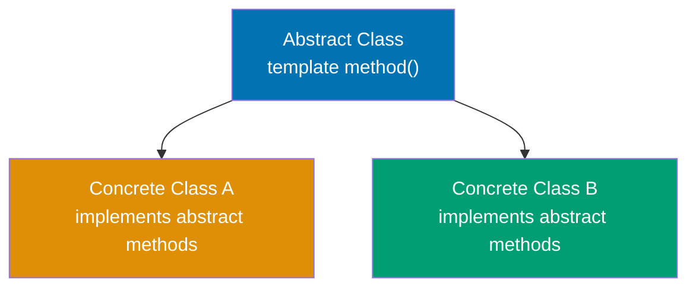

**Code**:

```java
// ABSTRACT CLASS - cannot be instantiated
abstract class DataProcessor {
    // => Cannot create: new DataProcessor() - compile error
    // => Must extend to use

    // TEMPLATE METHOD - defines algorithm skeleton
    public final void process() {
        // => Final keyword prevents subclass override
        // => Ensures all subclasses execute same workflow
        loadData();                  // => Step 1: subclass-specific loading
                                     // => Calls overridden loadData() in CSVProcessor/JSONProcessor
        transform();                 // => Step 2: subclass-specific transformation
                                     // => Polymorphic call: runtime type determines implementation
        validate();                  // => Step 3: shared validation logic
                                     // => Calls concrete method (same for all subclasses)
        save();                      // => Step 4: subclass-specific persistence
                                     // => Storage destination varies by subclass
    }

    // ABSTRACT METHODS - subclasses must implement
    protected abstract void loadData();
                                     // => No method body: subclass MUST override
    protected abstract void transform();
                                     // => Customization point for data transformation
    protected abstract void save();  // => Each subclass chooses storage mechanism

    // CONCRETE METHOD - shared implementation
    protected void validate() {      // => All subclasses inherit this
                                     // => Can be overridden (not final)
        System.out.println("Validating data");
                                     // => Output: Validating data
    }
}

// CONCRETE SUBCLASS
class CSVProcessor extends DataProcessor {
                                     // => Inherits template method process()
                                     // => Must implement 3 abstract methods
                                     // => Concrete class can be instantiated (unlike abstract parent)

    @Override
    protected void loadData() {      // => Implements abstract method
        System.out.println("Loading CSV file");
                                     // => Output: Loading CSV file
    }

    @Override
    protected void transform() {     // => Implements abstract method
        System.out.println("Parsing CSV to objects");
                                     // => Output: Parsing CSV to objects
    }

    @Override
    protected void save() {          // => Implements abstract method
        System.out.println("Saving to database");
                                     // => Output: Saving to database
    }
}

class JSONProcessor extends DataProcessor {
                                     // => Different implementations, same interface
                                     // => Also inherits process() template method

    @Override
    protected void loadData() {
        System.out.println("Loading JSON file");
                                     // => Output: Loading JSON file
    }

    @Override
    protected void transform() {
        System.out.println("Parsing JSON to objects");
                                     // => Output: Parsing JSON to objects
    }

    @Override
    protected void save() {
        System.out.println("Saving to cache");
                                     // => Output: Saving to cache
    }
}

// USAGE
DataProcessor csv = new CSVProcessor();
                                     // => Creates concrete instance
                                     // => Polymorphism: variable type is DataProcessor, runtime type is CSVProcessor
csv.process();                       // => Executes 4-step pipeline
                                     // => Calls CSVProcessor's overridden methods
                                     // => Output: Loading CSV file
                                     // =>         Parsing CSV to objects
                                     // =>         Validating data
                                     // =>         Saving to database

DataProcessor json = new JSONProcessor();
// => Different processor, same workflow structure
// => Runtime type is JSONProcessor (polymorphic binding)
json.process();
// => Uses JSONProcessor implementations
// => Output: Loading JSON file
// =>         Parsing JSON to objects
// =>         Validating data
// =>         Saving to cache
```

**Key Takeaway**: Abstract classes combine concrete methods (shared implementation) with abstract methods (enforced customization). The template method pattern uses a final concrete method defining the algorithm structure, delegating steps to abstract methods implemented by subclasses—ensuring consistent workflow while allowing customization.

**Why It Matters**: Abstract classes solve the code duplication vs. flexibility tradeoff that plagued early OOP—without them, shared logic required copy-paste across subclasses or awkward empty method implementations in interfaces. The template method pattern enabled frameworks like Spring and servlets to define processing pipelines (request handling, transaction management) while letting developers customize specific steps. Modern Java's default methods in interfaces (Java 8+) provide similar capabilities, but abstract classes remain essential when state (fields) must be shared. The pattern appears throughout the JDK: InputStream.read() templates byte reading, AbstractList provides skeletal List implementation, and Thread.run() enables custom thread behavior.

---

## Example 32: Composition Over Inheritance

Composition builds objects from reusable components rather than inheriting from parent classes. It provides flexibility by assembling behaviors dynamically rather than being locked into inheritance hierarchies.

**Code**:

```java
// COMPOSITION - building objects from components
// => HAS-A relationships instead of IS-A (inheritance)

// Component interfaces
interface Engine {                   // => Contract: all engines must implement start()
                                     // => Enables polymorphism across engine types
                                     // => Abstract: no implementation details
    void start();
}

interface Transmission {             // => Contract: all transmissions must implement shift()
                                     // => Abstraction allows different shifting strategies
    void shift(int gear);            // => Parameter: target gear number
}

// Component implementations
class ElectricEngine implements Engine {
                                     // => Must implement all abstract methods (start())
    public void start() {
        System.out.println("Electric motor starting silently");
                                     // => Electric-specific: quiet startup
                                     // => Output: "Electric motor starting silently"
    }
}

class GasEngine implements Engine {
                                     // => Different implementation, same interface
    public void start() {
        System.out.println("Gas engine roaring to life");
                                     // => Gas-specific: loud startup
                                     // => Output: "Gas engine roaring to life"
    }
}

class ManualTransmission implements Transmission {
    public void shift(int gear) {
        System.out.println("Manual shift to gear " + gear);
                                     // => Driver controls each gear change
                                     // => Output: "Manual shift to gear N"
    }
}

class AutomaticTransmission implements Transmission {
    public void shift(int gear) {
        System.out.println("Automatic shift to gear " + gear);
                                     // => System determines shift timing
                                     // => Output: "Automatic shift to gear N"
    }
}

// COMPOSED CLASS - has-a relationship
class Car {                          // => Car contains components (composition)
                                     // => No inheritance: uses delegation
    private final Engine engine;     // => HAS-A Engine (can be any Engine implementation)
                                     // => Final: cannot be reassigned after construction
    private final Transmission transmission;
                                     // => HAS-A Transmission (can be any type)

    public Car(Engine engine, Transmission transmission) {
                                     // => Constructor accepts interfaces (dependency injection)
                                     // => Decouples Car from specific implementations
        this.engine = engine;
        this.transmission = transmission;
    }

    public void drive() {            // => Orchestrates behavior of composed objects
                                     // => Coordination logic lives in Car, not components
        engine.start();              // => Delegate to composed engine
                                     // => Polymorphic call: runtime type determines behavior
        transmission.shift(1);       // => Shift to 1st gear
        transmission.shift(2);       // => Shift to 2nd gear
    }
}

// USAGE - flexible assembly of behaviors
Car electricAuto = new Car(new ElectricEngine(), new AutomaticTransmission());
                                     // => Mix electric engine + automatic transmission
                                     // => Components passed to constructor (dependency injection)
                                     // => Runtime assembly: any Engine + any Transmission valid
electricAuto.drive();
// => Output: Electric motor starting silently
// =>         Automatic shift to gear 1
// =>         Automatic shift to gear 2

Car gasManual = new Car(new GasEngine(), new ManualTransmission());
                                     // => Mix gas engine + manual transmission
                                     // => Same Car class, different behaviors
gasManual.drive();
// => Output: Gas engine roaring to life
// =>         Manual shift to gear 1
// =>         Manual shift to gear 2

// CONTRAST: Inheritance approach (rigid, explosive class hierarchy)
// => Would need: ElectricAutoCar, ElectricManualCar, GasAutoCar, GasManualCar
// => 2 engines × 2 transmissions = 4 classes (composition uses 2 components)
// => Adding diesel: 2 more classes (composition: 1 component)
// => Composition grows linearly, inheritance grows exponentially
```

**Key Takeaway**: Composition assembles objects from independent components (has-a relationships), providing runtime flexibility to mix and match behaviors. Prefer composition over inheritance to avoid rigid class hierarchies and the "diamond problem" where multiple inheritance paths create ambiguity.

**Why It Matters**: "Favor composition over inheritance" became a core OOP principle after decades of inheritance abuse created unmaintainable class hierarchies. Inheritance couples subclasses to superclass implementation details—changing a parent class breaks all children (fragile base class problem). Composition enables dependency injection frameworks like Spring to wire objects at runtime, testing frameworks to inject mocks, and strategy patterns to swap algorithms dynamically. The Java Collections Framework uses composition extensively: ArrayList composes an Object[] array, LinkedList composes Node objects, and decorator classes like Collections.synchronizedList() wrap existing lists with thread-safety behavior without inheritance.

---

## Example 33: Nested and Inner Classes

Java supports nested classes (static) and inner classes (non-static) that provide encapsulation and logical grouping. Inner classes access outer class instance members, while nested classes are independent.

**Code**:

```java
public class OuterClass {            // => Outer class containing nested/inner classes
                                     // => Demonstrates 4 types of nested classes
    private String outerField = "Outer field";
                                     // => Instance field accessible to inner classes
                                     // => Private but accessible from inner (special rule)
    private static String staticField = "Static field";
                                     // => Static field accessible to all nested classes
                                     // => Class-level variable (not instance-specific)

    // STATIC NESTED CLASS - independent of outer instance
    public static class StaticNested {
                                     // => Static: no implicit reference to outer instance
                                     // => Can instantiate without OuterClass instance
                                     // => Like standalone class, but namespaced in OuterClass
        public void display() {      // => Method in static nested class
                                     // => Can only access static outer members
            System.out.println(staticField);
                                     // => ✅ Can access static outer members
                                     // => staticField is class-level (no instance needed)
                                     // => Output: "Static field"
            // System.out.println(outerField);
                                     // => ❌ ERROR: cannot access instance members
                                     // => outerField requires OuterClass instance (not available)
        }
    }

    // INNER CLASS (non-static) - tied to outer instance
    public class Inner {             // => Non-static: holds implicit outer reference
                                     // => Cannot exist without OuterClass instance
                                     // => Compiler adds hidden field: final OuterClass this$0
        private String innerField = "Inner field";
                                     // => Inner class can have own fields
                                     // => Each Inner instance has its own innerField

        public void display() {
                                     // => Method accessing both outer and inner state
            System.out.println(outerField);
                                     // => ✅ Accesses outer instance field
                                     // => Implicit: OuterClass.this.outerField
                                     // => Uses hidden reference to outer instance
                                     // => Output: "Outer field"
            System.out.println(staticField);
                                     // => ✅ Also accesses static members
                                     // => Static members accessible from anywhere
                                     // => Output: "Static field"
            System.out.println(innerField);
                                     // => Accesses own field (this.innerField)
                                     // => Inner instance's own state
                                     // => Output: "Inner field"
        }

        public void accessOuter() {
            OuterClass.this.outerField = "Modified";
                                     // => Explicit outer reference syntax
                                     // => OuterClass.this = the outer instance
        }
    }

    // METHOD LOCAL INNER CLASS - defined inside method
    public void methodWithLocalClass() {
                                     // => Local class scope: only in this method
        final String localVar = "Local variable";
                                     // => Must be final/effectively final (Java 8+)

        class LocalInner {           // => Class defined inside method body
                                     // => Can access method's local variables
            public void display() {
                System.out.println(localVar);
                                     // => Accesses enclosing method's final variable
                System.out.println(outerField);
                                     // => Also accesses outer instance fields
            }
        }

        LocalInner local = new LocalInner();
                                     // => Instantiate local class within method
        local.display();             // => Output: "Local variable", "Outer field"
    }

    // ANONYMOUS INNER CLASS - one-time implementation
    public Runnable createRunnable() {
        // => Returns interface instance without named class
        return new Runnable() {
            // => Anonymous class: no class name
            // => Implements Runnable on the fly
            @Override
            public void run() {
                System.out.println("Anonymous inner class: " + outerField);
                // => Can access outer instance members
                // => Output: "Anonymous inner class: Outer field"
            }
        };
        // => Before Java 8 lambdas, this was common pattern
    }
}

// USAGE
OuterClass.StaticNested nested = new OuterClass.StaticNested();
// => Create static nested class: no outer instance needed
// => Syntax: OuterClass.NestedClass
nested.display();                    // => Calls display() on static nested instance
                                     // => Output: "Static field"

OuterClass outer = new OuterClass();
// => Create outer instance first
OuterClass.Inner inner = outer.new Inner();
// => Create inner class: requires outer instance
// => Syntax: outerInstance.new InnerClass()
// => Inner holds reference to 'outer'
inner.display();
// => Output: "Outer field"
// =>         "Static field"
// =>         "Inner field"

outer.methodWithLocalClass();
// => Executes method containing local inner class
// => Output: "Local variable"
// =>         "Outer field"

Runnable r = outer.createRunnable();
// => Returns anonymous Runnable instance
r.run();
// => Output: "Anonymous inner class: Outer field"
```

**Key Takeaway**: Static nested classes are independent of outer instances and can only access outer static members. Inner classes (non-static) are tied to outer instances and can access all outer members. Use nested classes for logical grouping and inner classes when tight coupling with outer state is needed.

**Why It Matters**: Inner classes enable event handling patterns in GUI frameworks (Swing, JavaFX) where listeners need access to surrounding component state without passing references manually. Anonymous inner classes powered Java's callback mechanisms before lambdas (Java 8), though lambdas are now preferred for functional interfaces. Static nested classes organize helper classes without polluting package namespace—Map.Entry, LinkedList.Node, and Builder patterns use this extensively. The outer class reference overhead (inner classes store implicit reference to outer instance) can cause memory leaks if inner instances outlive outer instances, a common pitfall in Android Activity listeners.

---

## Example 34: Reflection API - Runtime Introspection

Reflection allows runtime inspection and manipulation of classes, methods, and fields. It enables frameworks to work with user-defined classes without compile-time knowledge.

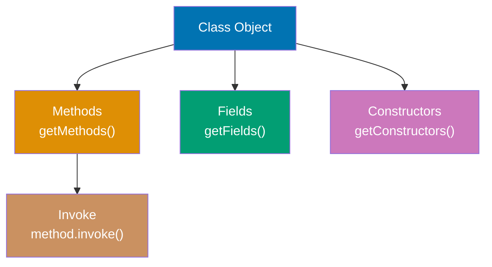

**Code**:

```java
import java.lang.reflect.*;

class Person {
    private String name;
    public int age;

    public Person() {}

    public Person(String name, int age) {
        this.name = name;
        this.age = age;
    }

    private void secretMethod() {
        System.out.println("Secret: " + name);
    }

    public String getName() {
        return name;
    }
}

// REFLECTION USAGE
Class<?> clazz = Person.class;
                                 // => Obtain Class metadata for Person

// GET CLASS INFORMATION
String className = clazz.getName();
                                 // => Returns fully qualified name: "Person"
String simpleName = clazz.getSimpleName();
                                 // => Returns class name without package: "Person"

// INSTANTIATE via reflection
Constructor<?> constructor = clazz.getConstructor(String.class, int.class);
                                 // => Finds public constructor with String, int parameters
Object instance = constructor.newInstance("Alice", 30);
                                 // => Creates instance: new Person("Alice", 30)

// ACCESS FIELDS
Field ageField = clazz.getField("age");
                                 // => Gets public field "age"
int ageValue = (int) ageField.get(instance);
                                 // => Reads age value: 30
                                 // => Autoboxing: int → Integer → Object → (int) unbox
ageField.set(instance, 31);      // => Modifies field value reflectively
                                 // => ageField.set(object, value) mutates field on instance
                                 // => Changes age from 30 to 31
                                 // => Now age = 31 (modified)
                                 // => Value autoboxed: 31 (int) → Integer → Object

// ACCESS PRIVATE FIELDS
Field nameField = clazz.getDeclaredField("name");
                                 // => Gets any field (public or private) by name
                                 // => getDeclaredField() finds private members (bypasses normal access)
                                 // => Searches only this class (not inherited fields)
                                 // => "name" is private, so getField("name") would fail
nameField.setAccessible(true);   // => Disables Java access control checks
                                 // => Allows reading/writing private field
                                 // => ⚠️ Security risk: breaks encapsulation (violates OOP)
                                 // => SecurityManager may block this if installed
                                 // => Equivalent to making field public at runtime
String nameValue = (String) nameField.get(instance);
                                 // => Reads private field value via reflection
                                 // => nameField.get() returns Object, cast to String
                                 // => Result: "Alice" (value set in constructor)
                                 // => Without setAccessible(true): IllegalAccessException

// INVOKE METHODS
Method getNameMethod = clazz.getMethod("getName");
                                 // => Finds public method by name and parameter types
                                 // => getMethod() searches public methods (including inherited)
                                 // => Empty parameter array: no arguments for getName()
                                 // => Returns Method object wrapping method metadata
String name = (String) getNameMethod.invoke(instance);
                                 // => Invokes method on instance reflectively
                                 // => invoke(object, args...) calls method with varargs
                                 // => Equivalent to: instance.getName() (direct call)
                                 // => Returns Object (generic), cast to String
                                 // => Result: "Alice" (method return value)
                                 // => ~3x slower than direct invocation

// INVOKE PRIVATE METHODS
Method secretMethod = clazz.getDeclaredMethod("secretMethod");
                                 // => Finds private method by name
                                 // => getDeclaredMethod() searches private methods
                                 // => getMethod() would fail (private not accessible)
secretMethod.setAccessible(true);// => Bypasses private access modifier
                                 // => Allows invoking private method
                                 // => ⚠️ Breaks encapsulation (testing/framework use)
secretMethod.invoke(instance);   // => Invokes private method reflectively
                                 // => Calls secretMethod() on instance
                                 // => Method executes: prints "Secret: Alice"
                                 // => Output: "Secret: Alice"
                                 // => Without setAccessible(true): IllegalAccessException

// LIST ALL METHODS
for (Method method : clazz.getDeclaredMethods()) {
    // => Iterates all declared methods (public and private)
    // => getDeclaredMethods() returns Method[] array of all methods
    // => Includes: secretMethod (private), getName (public), constructors excluded
    // => Each Method object contains method metadata (name, parameters, return type)
    System.out.println(method.getName());
    // => Prints method names via Method.getName()
    // => getName() returns String: method name only (not signature)
    // => Output depends on declaration order in source file
}
// => Output: secretMethod
// =>         getName
```

**Key Takeaway**: Reflection provides runtime access to class metadata, allowing inspection of fields, methods, and constructors. Use `setAccessible(true)` to bypass access controls for private members. Reflection enables frameworks and libraries to work with arbitrary user classes without compile-time knowledge.

**Why It Matters**: Reflection powers Java's entire framework ecosystem—Spring uses it for dependency injection (scanning for @Component, @Autowired), JPA for entity mapping (@Entity, @Column), JUnit for test discovery (@Test), and serialization frameworks (Gson, Jackson) for JSON mapping. Without reflection, these frameworks would require manual registration or code generation for every class. However, reflection has costs: performance overhead (method.invoke() is ~3x slower than direct calls), type safety loss (casts and string-based lookups), and security risks (accessing private members breaks encapsulation). Modern Java introduced MethodHandles (Java 7) as faster, type-safe alternatives, while annotation processors enable compile-time code generation replacing some reflection use cases.

---

## Example 35: Annotations and Custom Metadata

Annotations add metadata to code that can be processed at compile-time or runtime. Custom annotations enable declarative programming patterns used extensively in frameworks.

**Code**:

```java
import java.lang.annotation.*;
import java.lang.reflect.*;

// DEFINE CUSTOM ANNOTATION
@Retention(RetentionPolicy.RUNTIME)  // => Available at runtime via reflection
                                     // => Retention policy determines when annotation accessible
                                     // => SOURCE: discarded after compilation (compile-time only)
                                     // => CLASS: stored in .class file but not available at runtime
                                     // => RUNTIME: stored in .class and accessible via reflection
@Target(ElementType.METHOD)          // => Can only be applied to methods
                                     // => ElementType options: TYPE (class), FIELD, METHOD, PARAMETER, CONSTRUCTOR, etc.
                                     // => Restricts where annotation can appear syntactically
public @interface Test {             // => @interface keyword defines annotation type
                                     // => Implicitly extends java.lang.annotation.Annotation
                                     // => Name: Test (can be used as @Test in code)
                                     // => Compiler generates interface with annotation methods
    String description() default "";  // => Annotation parameter with default value
                                     // => Method-like syntax defines annotation attribute
                                     // => Return type: String (parameter type)
                                     // => default "": if not specified, uses empty string
                                     // => Usage: @Test(description = "test name")
    int timeout() default 0;         // => Optional timeout parameter (milliseconds)
                                     // => Return type: int (primitive type allowed)
                                     // => default 0: no timeout if not specified
                                     // => Usage: @Test(timeout = 1000)
}

// ANOTHER ANNOTATION
@Retention(RetentionPolicy.RUNTIME)  // => Available at runtime
@Target(ElementType.FIELD)           // => Restricts to field declarations
public @interface Inject {           // => Marks fields for dependency injection
}

// USE ANNOTATIONS
class TestSuite {                    // => Class containing test methods
    @Inject                          // => Annotation marks field for injection
    private String dependency;       // => Framework will populate this field

    @Test(description = "Adds two numbers", timeout = 1000)
                                     // => Annotation with parameters
    public void testAddition() {     // => Test method (has @Test)
        System.out.println("Testing addition");
    }

    @Test(description = "Divides by zero")
                                     // => Annotation with description only
    public void testDivision() {     // => Test method (has @Test)
        System.out.println("Testing division");
    }

    public void helperMethod() {     // => No @Test annotation
        System.out.println("Not a test");
    }
}

// PROCESS ANNOTATIONS via reflection
Class<?> clazz = TestSuite.class;
                                 // => Get Class object representing TestSuite type
                                 // => clazz is java.lang.Class<TestSuite> (type metadata)
                                 // => Class object contains all runtime information about TestSuite
                                 // => Enables introspection of methods, fields, annotations

// Find and execute @Test methods
for (Method method : clazz.getDeclaredMethods()) {
                                 // => getDeclaredMethods() returns all methods (public + private)
                                 // => Returns Method[] array: testAddition, testDivision, helperMethod
                                 // => Method object wraps method metadata (name, params, annotations)
                                 // => Each Method represents one method in the class
    if (method.isAnnotationPresent(Test.class)) {
                                 // => Check if method has @Test annotation at runtime
                                 // => Uses reflection to inspect method's annotation metadata
                                 // => testAddition: true (has @Test), testDivision: true, helperMethod: false
                                 // => Annotation must have RUNTIME retention to be visible
                                 // => RetentionPolicy.RUNTIME enables runtime discovery
                                 // => SOURCE/CLASS retention annotations discarded before runtime
        Test testAnnotation = method.getAnnotation(Test.class);
                                 // => Retrieve @Test annotation instance from method
                                 // => Returns proxy implementing Test interface
                                 // => testAnnotation contains description and timeout parameters
                                 // => Parameters accessible as method calls (description(), timeout())
        System.out.println("Running test: " + testAnnotation.description());
                                 // => Access annotation parameter value via method call
                                 // => testAnnotation.description() returns String from annotation
                                 // => Output: "Running test: Adds two numbers" (for testAddition)
                                 // => Output: "Running test: Divides by zero" (for testDivision)

        try {
            Object instance = clazz.getDeclaredConstructor().newInstance();
                                 // => Create new TestSuite instance via reflection
                                 // => getDeclaredConstructor() finds no-arg constructor (public TestSuite())
                                 // => Returns Constructor<TestSuite> object wrapping constructor metadata
                                 // => newInstance() calls constructor with no arguments
                                 // => Creates new TestSuite instance (fresh object per test)
                                 // => Returns Object (generic type, could cast to TestSuite)
                                 // => Throws multiple checked exceptions (InstantiationException, IllegalAccessException, InvocationTargetException, NoSuchMethodException)
            method.invoke(instance);  // => Execute test method on instance
                                 // => invoke() calls method dynamically (equivalent to instance.testAddition())
                                 // => First parameter: target object (instance)
                                 // => Varargs parameters: method arguments (none for these tests)
                                 // => Executes method body, prints "Testing addition" or "Testing division"
                                 // => Returns Object (method return value, null for void methods)
        } catch (Exception e) {
            System.out.println("Test failed: " + e.getMessage());
                                 // => Catch exceptions from method invocation
                                 // => Handles InstantiationException (constructor fails)
                                 // => Handles IllegalAccessException (access denied)
                                 // => Handles InvocationTargetException (method threw exception)
                                 // => e.getMessage() returns exception description
                                 // => Output format: "Test failed: [exception message]"
        }
    }
}
// => Output: Running test: Adds two numbers, Testing addition
//           Running test: Divides by zero, Testing division

// BUILT-IN ANNOTATIONS
class Example {
    @Override                    // => Compile-time check for overriding
                                 // => Compiler error if not actually overriding
    public String toString() {   // => Overrides Object.toString()
        return "Example";
    }

    @Deprecated                  // => Marks method as deprecated
                                 // => Compiler warning when called
    public void oldMethod() {}   // => Legacy method

    @SuppressWarnings("unchecked") // => Suppresses specific compiler warnings
                                   // => Useful for legacy code with raw types
    public void rawTypeMethod() {  // => Method using raw types
        java.util.List list = new java.util.ArrayList();
                                   // => Raw List (no generic type)
    }
}
```

**Key Takeaway**: Annotations add metadata to code without affecting execution. Use `@Retention` to specify when annotations are available (SOURCE, CLASS, RUNTIME) and `@Target` to restrict where annotations can be applied. Process runtime annotations via reflection to implement custom behaviors.

**Why It Matters**: Annotations revolutionized Java framework design by enabling declarative programming—compare Spring's `@Autowired` to manual factory.getBean() calls, or JPA's `@Entity @Column` to XML configuration files. Annotations shift complexity from user code to framework code, improving readability (@Transactional vs. manual transaction.begin/commit). However, overuse creates "magic" behavior invisible in code (Spring's @Async spawning threads invisibly), making debugging difficult. Annotation processing (compile-time, via javax.annotation.processing) generates code during compilation (Lombok, Dagger), avoiding reflection overhead while keeping declarative syntax. The combination of annotations + reflection enabled the "convention over configuration" movement that made frameworks like Spring Boot possible.

---

## Example 36: Generic Methods and Bounded Type Parameters

Generic methods enable type-safe method implementations that work with any type. Bounded type parameters restrict generic types to subclasses of a bound, enabling access to bound class methods.

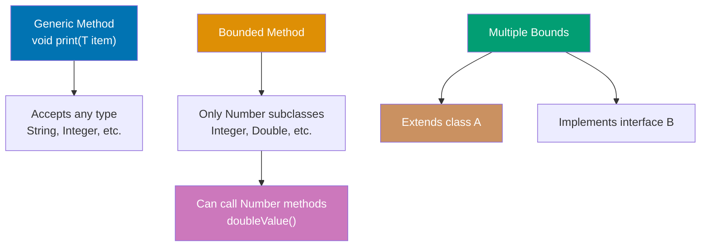

**Code**:

```java
import java.util.*;

// GENERIC METHOD - type parameter before return type
public static <T> void printArray(T[] array) {
                                 // => <T> declares type parameter for this method
                                 // => T can be any type (inferred from argument)
    for (T element : array) {    // => Enhanced for-loop iterates array elements
                                 // => Each element has type T (type-safe)
        System.out.print(element + " ");
    }
    System.out.println();        // => Newline after all elements printed
}

// BOUNDED TYPE PARAMETER - restricts to Number subclasses
public static <T extends Number> double sum(List<T> numbers) {
                                 // => T must be Number or subclass (Integer, Double, etc.)
                                 // => Upper bound enables calling Number methods
    double total = 0;            // => Accumulator initialized to 0.0
    for (T num : numbers) {      // => Iterates each element of type T
        total += num.doubleValue();  // => Can call Number methods because of bound
    }
    return total;                // => Returns accumulated sum as double
}

// MULTIPLE BOUNDS - must extend class AND implement interfaces
interface Measurable {           // => Contract: all Measurable types provide getMeasurement()
    double getMeasurement();     // => Abstract method returning numeric measurement
                                 // => No default implementation
}

public static <T extends Number & Measurable> double average(List<T> items) {
                                 // => T must extend Number AND implement Measurable
                                 // => Class bound comes first (Number), then interfaces
                                 // => Enables calling both Number and Measurable methods
                                 // => Intersection type: T satisfies both constraints
    double total = 0;            // => Accumulator for sum
    for (T item : items) {       // => Iterates each item of type T
                                 // => item guaranteed to have both Number and Measurable methods
        total += item.getMeasurement();
                                 // => Calls Measurable interface method
                                 // => Accumulates measurements into total
    }
    return total / items.size(); // => Divides sum by count for average
                                 // => items.size() returns int, promoted to double
}

// USAGE
Integer[] ints = {1, 2, 3};      // => Array of Integer wrapper objects
String[] strs = {"a", "b", "c"};  // => Array of String objects
printArray(ints);                // => Compiler infers T = Integer from argument type
                                 // => Calls printArray<Integer>(Integer[])
                                 // => Output: 1 2 3
printArray(strs);                // => Compiler infers T = String from argument type
                                 // => Calls printArray<String>(String[])
                                 // => Output: a b c

List<Integer> intList = Arrays.asList(1, 2, 3, 4);
                                 // => Creates fixed-size List<Integer> from varargs
                                 // => List contains [1, 2, 3, 4]
double sum = sum(intList);       // => Calls sum<Integer>(List<Integer>)
                                 // => Iterates list: 1+2+3+4 = 10
                                 // => sum is 10.0 (converted to double)

// GENERIC CLASS with type parameter
class Box<T> {
                                 // => Generic class with type parameter T
                                 // => T is placeholder, replaced at instantiation
    private T content;           // => Field of type T (unknown until instantiation)

    public void set(T content) {
                                 // => Method parameter type T
                                 // => Enforces type safety at compile time
        this.content = content;  // => Stores value of type T
    }

    public T get() {
                                 // => Return type T (same type as set)
        return content;          // => Returns stored value (type T)
    }
}

Box<String> stringBox = new Box<>();
                                 // => Diamond operator <> infers type from left side
                                 // => T = String for this instance
                                 // => Creates Box<String>
stringBox.set("Hello");          // => Type-safe: only String allowed
                                 // => Compiler enforces: set(String)
                                 // => Calling set(123) would be compile error
String value = stringBox.get();  // => No cast needed (compiler knows returns String)
                                 // => value is "Hello" (type: String)
```

**Key Takeaway**: Generic methods use `<T>` before return type to declare type parameters. Bounded type parameters (`<T extends Class>`) restrict acceptable types and enable calling methods of the bound class. Multiple bounds require `<T extends Class & Interface1 & Interface2>` syntax with class first.

**Why It Matters**: Bounded type parameters solve the "how do I operate on generic types?" problem—without bounds, generic `<T>` treats everything as Object, preventing method calls beyond Object's methods. Bounds enable generic algorithms: Collections.sort() requires `<T extends Comparable<T>>` to call compareTo(), Stream.max() requires Comparator, and numeric operations require `<T extends Number>`. Multiple bounds enable rich generic constraints in libraries like Hibernate (entities must extend BaseEntity AND implement Serializable). The class-first rule in multiple bounds reflects Java's single-inheritance, multiple-interfaces model, though rarely needed in practice.

---

## Example 37: Wildcards and Type Variance

Wildcards (`?`) represent unknown types in generics. Upper-bounded wildcards (`? extends Type`) enable reading, lower-bounded wildcards (`? super Type`) enable writing, following covariance and contravariance rules.

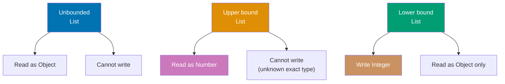

**Code**:

```java
import java.util.*;

// UNBOUNDED WILDCARD - unknown type
public static void printList(List<?> list) {
                                 // => Accepts List of any type (?)
                                 // => List<?> represents "List of unknown type"
                                 // => More flexible than List<Object> (not same!)
    for (Object elem : list) {   // => Can only read as Object (safest supertype)
                                 // => Cannot assume specific type (could be List<String>, List<Integer>, etc.)
                                 // => elem type: Object (common supertype of all)
        System.out.print(elem + " ");
                                 // => Prints element via toString() (Object method)
    }
    System.out.println();        // => Newline after all elements
    // list.add("x");            // => ERROR: cannot write to List<?>
                                 // => Compiler prevents writes (unknown exact type)
}

// UPPER-BOUNDED WILDCARD - covariance (reading)
public static double sumNumbers(List<? extends Number> numbers) {
                                 // => ? extends Number: accepts List<Integer>, List<Double>, etc.
                                 // => Covariant: can read as Number or supertypes
                                 // => Producer pattern: produces Number values for consumption
    double sum = 0;              // => Accumulator initialized to 0.0
    for (Number num : numbers) { // => Can read as Number (upper bound)
                                 // => num guaranteed to be Number or subclass
                                 // => Safe to treat all elements as Number
        sum += num.doubleValue();// => Calls Number.doubleValue()
                                 // => Works for Integer, Double, Long, etc.
                                 // => Accumulates: sum = sum + num.doubleValue()
    }
    return sum;                  // => Returns total sum
    // numbers.add(1);           // => ERROR: cannot write (exact type unknown)
                                 // => Could be List<Integer>, can't add Double
                                 // => Compiler prevents type-unsafe writes
}

// LOWER-BOUNDED WILDCARD - contravariance (writing)
public static void addIntegers(List<? super Integer> list) {
                                 // => ? super Integer: accepts List<Integer>, List<Number>, List<Object>
                                 // => Contravariant: can write Integer values
                                 // => Consumer pattern: consumes Integer values
    list.add(1);                 // => Can write Integer (safe for any supertype)
                                 // => Integer always compatible with Integer/Number/Object
                                 // => list now contains 1 (type guaranteed compatible)
    list.add(2);                 // => Adds another Integer to list
                                 // => list now contains [1, 2]
    // Integer val = list.get(0); // => ERROR: can only read as Object
                                 // => Could be List<Number> or List<Object>
                                 // => Compiler doesn't know exact type to return
}

// USAGE
List<Integer> ints = Arrays.asList(1, 2, 3);
List<Double> doubles = Arrays.asList(1.0, 2.0, 3.0);

printList(ints);                 // => Output: 1 2 3
printList(doubles);              // => Output: 1.0 2.0 3.0

double sum1 = sumNumbers(ints);  // => sum1 is 6.0 (Integer extends Number)
double sum2 = sumNumbers(doubles); // => sum2 is 6.0 (Double extends Number)

List<Number> numbers = new ArrayList<>();
addIntegers(numbers);            // => Can add Integers (Number super Integer)
                                 // => numbers becomes [1, 2]
System.out.println(numbers);     // => Output: [1, 2]

// PECS RULE: Producer Extends, Consumer Super
// Producer (reading): use <? extends T>
// Consumer (writing): use <? super T>

public static <T> void copy(List<? extends T> source, List<? super T> dest) {
                                 // => Generic method with two wildcard parameters
                                 // => source produces T (extends: covariance)
                                 // => dest consumes T (super: contravariance)
                                 // => Enables copying from subtype to supertype
    for (T item : source) {
                                 // => Reads from source (produces T)
                                 // => item has type T
        dest.add(item);          // => Writes to dest (consumes T)
                                 // => Safe: dest accepts T or supertype
    }
}

List<Integer> src = Arrays.asList(1, 2, 3);
                                 // => Source: List<Integer>
List<Number> dst = new ArrayList<>();
                                 // => Destination: List<Number> (supertype of Integer)
copy(src, dst);                  // => T = Integer (inferred)
                                 // => source: List<? extends Integer> (List<Integer> matches)
                                 // => dest: List<? super Integer> (List<Number> matches)
                                 // => Copies [1, 2, 3] from src to dst
                                 // => dst now contains [1, 2, 3]
```

**Key Takeaway**: Use `? extends Type` for reading (covariance), `? super Type` for writing (contravariance), and `?` for both reading (as Object) and no writing. Follow PECS rule: "Producer Extends, Consumer Super"—if a method produces values from a collection, use `extends`; if it consumes values into a collection, use `super`.

**Why It Matters**: Wildcards enable flexible generic APIs that accept related types without requiring exact matches—before wildcards, List<Integer> and List<Number> were completely unrelated despite inheritance. The PECS rule guides API design: Collections.addAll(Collection<? extends E>) is producer (extends), Collections.sort(List<T>, Comparator<? super T>) is consumer (super). Understanding variance prevents type safety violations: allowing writes to List<? extends Number> would permit adding Double to List<Integer>. This complexity drives some developers to avoid wildcards entirely, but mastering them enables elegant generic APIs like Stream.collect(Collector<? super T>).

---

## Example 38: ArrayList vs LinkedList Performance

ArrayList and LinkedList both implement the List interface but have different performance characteristics. ArrayList uses a resizable array (O(1) indexed access, O(n) insertions), while LinkedList uses doubly-linked nodes (O(1) insertions at ends, O(n) indexed access).

**Comparison**: When to use each implementation

**ArrayList approach** (array-backed):

```java
import java.util.*;

List<String> arrayList = new ArrayList<>(); // => Backed by resizable array
                                 // => Initial capacity 10, grows by 50% when full
arrayList.add("A");              // => O(1) amortized append
                                 // => Appends to end of internal array
arrayList.add("B");              // => arrayList is ["A", "B"]
arrayList.add("C");              // => arrayList is ["A", "B", "C"]

String value = arrayList.get(1); // => O(1) random access, value is "B"
                                 // => Direct array indexing (array[1])

arrayList.remove(0);             // => O(n) removal, shifts elements left, arrayList is ["B", "C"]
                                 // => System.arraycopy() shifts remaining elements
```

**Problem**: ArrayList excels at random access but removal from middle/start requires shifting elements—expensive for large lists.

**LinkedList approach** (node-based):

```java
List<String> linkedList = new LinkedList<>(); // => Doubly-linked nodes
                                 // => Each node has prev/next pointers
linkedList.add("A");             // => O(1) append to tail
linkedList.add(0, "B");          // => O(1) prepend, updates head pointer
                                 // => Just updates first.prev reference
linkedList.add("C");             // => linkedList is ["B", "A", "C"]

String first = linkedList.get(0); // => O(n) access, must traverse nodes, first is "B"
                                 // => Optimized: searches from head if index < size/2

linkedList.remove(0);            // => O(1) removal from head, linkedList is ["A", "C"]
                                 // => Updates head pointer, no element shifting needed
```

**Benefit**: LinkedList is efficient for insertions/deletions at ends (O(1)) but slow for random access (O(n) traversal).

**Key Takeaway**: Use ArrayList for random access and iteration (default choice). Use LinkedList only for frequent insertions/deletions at ends (queue/deque operations). ArrayList's cache locality makes it faster than LinkedList for most use cases, even with insertions.

**Why It Matters**: The "ArrayList vs LinkedList" decision is one of Java's most common performance traps. Many developers assume LinkedList is always better for insertions, but ArrayList's cache-friendly sequential memory layout makes it faster for small-to-medium lists (even with O(n) shifts). LinkedList's pointer-chasing destroys CPU cache performance. Benchmark: inserting 10,000 elements in middle of list—ArrayList (array copy overhead) often beats LinkedList (cache misses) by 2-3x. Use LinkedList only for Deque operations (addFirst/removeFirst) or when you truly need O(1) insertions at arbitrary positions (rare). Default to ArrayList.

---

## Example 39: HashSet vs TreeSet for Unique Collections

HashSet and TreeSet both enforce uniqueness but differ in ordering and performance. HashSet uses hashing (O(1) operations, no order), while TreeSet uses a red-black tree (O(log n) operations, sorted order).

**HashSet approach** (hash table):

```java
import java.util.*;

Set<String> hashSet = new HashSet<>(); // => Backed by HashMap
                                 // => Uses hashCode() for bucket placement
hashSet.add("banana");           // => O(1) insert, hashSet is {"banana"}
                                 // => Computes hashCode("banana") to find bucket
hashSet.add("apple");            // => hashSet is {"banana", "apple"} (arbitrary order)
hashSet.add("cherry");           // => hashSet is {"banana", "apple", "cherry"}
hashSet.add("apple");            // => Duplicate ignored
                                 // => equals("apple") detects existing value

boolean contains = hashSet.contains("apple"); // => O(1) lookup, contains is true
                                 // => hashCode + equals for fast lookup

System.out.println(hashSet);     // => Output: [banana, apple, cherry]
                                 // => Iteration order unpredictable (hash-based)
```

**Problem**: HashSet has O(1) operations but no predictable iteration order—elements appear in hash order, not insertion or sorted order.

**TreeSet approach** (red-black tree):

```java
Set<String> treeSet = new TreeSet<>(); // => Red-black tree, self-balancing BST
                                 // => Maintains sorted order automatically
treeSet.add("banana");           // => O(log n) insert
                                 // => Uses compareTo() for positioning
treeSet.add("apple");            // => treeSet is {"apple", "banana"} (sorted)
treeSet.add("cherry");           // => treeSet is {"apple", "banana", "cherry"}
treeSet.add("apple");            // => Duplicate ignored
                                 // => compareTo("apple") returns 0 (equal)

boolean contains = treeSet.contains("apple"); // => O(log n) lookup, contains is true
                                 // => Binary search through tree structure

System.out.println(treeSet);     // => Output: [apple, banana, cherry]
                                 // => Natural alphabetical ordering (Comparable)
```

**Benefit**: TreeSet maintains sorted order and provides range operations (subSet, headSet, tailSet). Elements must implement Comparable or provide Comparator.

**Key Takeaway**: Use HashSet for fast O(1) operations when order doesn't matter. Use TreeSet when you need sorted iteration or range queries (O(log n) operations). HashSet is default choice for uniqueness checks.

**Why It Matters**: The O(1) vs O(log n) difference seems small but scales dramatically. With 1 million elements, HashSet lookup is ~1 operation vs TreeSet's ~20 operations (log₂(1,000,000) ≈ 20). However, TreeSet provides sorted iteration "for free"—if you need both uniqueness AND sorted order, TreeSet eliminates the need for separate sorting (Collections.sort() is O(n log n)). TreeSet also enables efficient range operations: finding all elements between "B" and "M" is O(log n + k) where k is result size. Use TreeSet for sorted uniqueness, range queries, or when iteration order matters. Otherwise default to HashSet.

---

## Example 40: HashMap vs TreeMap and Collections Utilities

HashMap and TreeMap both store key-value pairs but differ in ordering and performance. HashMap uses hashing (O(1) operations), TreeMap uses red-black tree (O(log n) operations, sorted by keys).

**HashMap approach** (hash table):

```java
import java.util.*;

Map<String, Integer> hashMap = new HashMap<>(); // => Hash table
                                 // => Unordered key-value storage
hashMap.put("Alice", 30);        // => O(1) insert
                                 // => Uses hashCode() to determine bucket
hashMap.put("Charlie", 25);      // => hashMap is {"Alice"=30, "Charlie"=25}
hashMap.put("Bob", 28);          // => hashMap is {"Alice"=30, "Charlie"=25, "Bob"=28}

Integer age = hashMap.get("Alice"); // => O(1) lookup, age is 30
                                 // => hashCode("Alice") finds bucket, equals() confirms key

System.out.println(hashMap);     // => Output: {Alice=30, Charlie=25, Bob=28}
                                 // => Arbitrary insertion order (not sorted)
```

**TreeMap approach** (red-black tree, sorted by keys):

```java
Map<String, Integer> treeMap = new TreeMap<>(); // => Red-black tree
                                 // => Self-balancing binary search tree
treeMap.put("Alice", 30);        // => O(log n) insert
                                 // => Uses compareTo() for key ordering
treeMap.put("Charlie", 25);      // => treeMap is {"Alice"=30, "Charlie"=25}
treeMap.put("Bob", 28);          // => treeMap is {"Alice"=30, "Bob"=28, "Charlie"=25} (sorted)
                                 // => Automatically maintains sorted order (natural ordering)

System.out.println(treeMap);     // => Output: {Alice=30, Bob=28, Charlie=25}
                                 // => Keys sorted alphabetically
```

**Collections utility methods** (sort, reverse, shuffle, etc.):

```java
List<Integer> numbers = Arrays.asList(3, 1, 4, 1, 5, 9); // => Fixed-size list

Collections.sort(numbers);       // => In-place sort, numbers is [1, 1, 3, 4, 5, 9]
Collections.reverse(numbers);    // => In-place reversal, numbers is [9, 5, 4, 3, 1, 1]

int max = Collections.max(numbers); // => max is 9
int min = Collections.min(numbers); // => min is 1
int freq = Collections.frequency(numbers, 1); // => freq is 2

// Immutable collections (Java 9+)
List<String> immutable = List.of("A", "B", "C"); // => Immutable list
Map<String, Integer> immutableMap = Map.of("A", 1, "B", 2); // => Immutable map
// immutable.add("D");           // => UnsupportedOperationException
```

**Key Takeaway**: Use HashMap for O(1) key-value lookups (default choice). Use TreeMap for sorted keys or range queries (O(log n)). Collections class provides utility methods for sorting, reversing, finding max/min, and counting frequencies. Java 9+ List.of/Map.of create space-efficient immutable collections.

**Why It Matters**: HashMap vs TreeMap parallels HashSet vs TreeSet—O(1) vs O(log n) tradeoff for unsorted vs sorted data. With millions of entries, HashMap dramatically outperforms TreeMap for get/put operations. However, TreeMap provides sorted iteration and range operations (subMap, headMap, tailMap) essential for ordered data processing. Collections utility methods (sort, reverse, max, min, frequency) eliminate manual algorithm implementations—use them instead of writing loops. Java 9's List.of/Map.of create compact immutable collections (no separate unmodifiable wrapper overhead), enabling functional programming patterns and preventing accidental mutation.

---

## Example 41: Concurrent Collections for Thread Safety

Concurrent collections provide thread-safe operations without external synchronization. They use lock-free algorithms and fine-grained locking for better concurrency than synchronized collections.

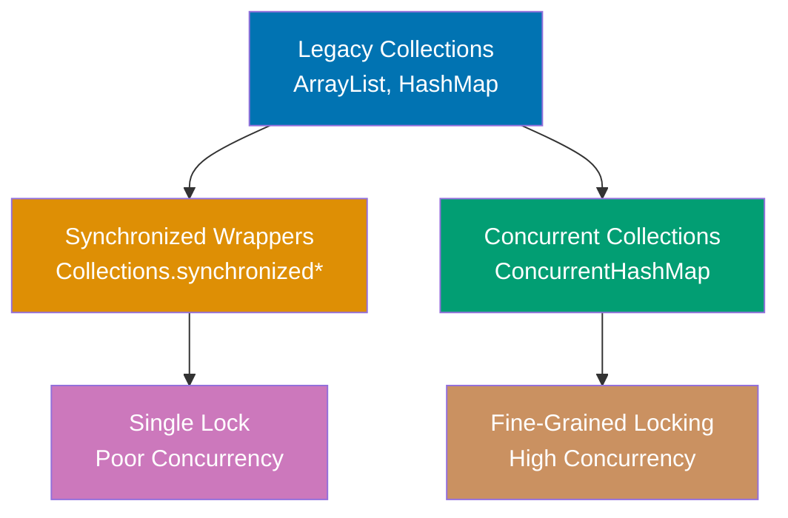

**Code**:

```java
import java.util.concurrent.*;
import java.util.*;

// CONCURRENTHASHMAP - thread-safe without single lock
ConcurrentHashMap<String, Integer> concurrentMap = new ConcurrentHashMap<>();
                                 // => Uses fine-grained locking (per bucket)
                                 // => Multiple threads can write concurrently
                                 // => Better scalability than synchronized collections

// Thread-safe operations
concurrentMap.put("key", 1);     // => Thread-safe put, locks only affected bucket
                                 // => concurrentMap is {"key"=1}
                                 // => Other buckets remain accessible to other threads
Integer value = concurrentMap.get("key");
                                 // => Lock-free read (Java 8+), value is 1

// ATOMIC OPERATIONS
concurrentMap.putIfAbsent("key", 2);
                                 // => Atomic check-and-set, returns 1 (key exists)
                                 // => concurrentMap unchanged

concurrentMap.computeIfAbsent("newKey", k -> k.length());
                                 // => Computes value atomically if absent
                                 // => Returns 6, concurrentMap is {"key"=1, "newKey"=6}

concurrentMap.merge("key", 1, Integer::sum);
                                 // => Atomically merges: 1 (old) + 1 (new) = 2
                                 // => concurrentMap is {"key"=2, "newKey"=6}

// COPYONWRITEARRAYLIST - optimized for read-heavy workloads
CopyOnWriteArrayList<String> cowList = new CopyOnWriteArrayList<>();
                                 // => Every write creates new array copy
                                 // => Reads never block
                                 // => Expensive writes, but safe concurrent iteration
cowList.add("A");                // => Creates copy, cowList is ["A"]
                                 // => Write operation copies entire array
cowList.add("B");                // => cowList is ["A", "B"]

// Safe iteration during concurrent modifications
for (String item : cowList) {    // => Iterator uses snapshot (no ConcurrentModificationException)
    cowList.add("C");            // => Modifications don't affect iteration
}                                // => After loop: cowList is ["A", "B", "C", "C"]

// BLOCKINGQUEUE - producer-consumer pattern
BlockingQueue<String> queue = new LinkedBlockingQueue<>(10);
                                 // => Bounded queue, capacity 10
                                 // => Thread-safe queue for producer-consumer scenarios

// Producer thread
new Thread(() -> {
    try {
        queue.put("item");       // => Blocks if queue full
                                 // => Waits until space available
    } catch (InterruptedException e) {
        e.printStackTrace();
    }
}).start();                      // => Start producer thread

// Consumer thread
new Thread(() -> {
    try {
        String item = queue.take(); // => Blocks if queue empty, item is "item"
        System.out.println("Consumed: " + item);
                                 // => Output: Consumed: item
    } catch (InterruptedException e) {
        e.printStackTrace();
    }
}).start();                      // => Start consumer thread

// CONCURRENTSKIPLISTMAP - sorted, concurrent alternative to TreeMap
ConcurrentSkipListMap<Integer, String> skipListMap = new ConcurrentSkipListMap<>();
                                 // => Skip list with O(log n) operations, sorted + thread-safe
skipListMap.put(3, "three");     // => Concurrent insert, skipListMap is {3="three"}
skipListMap.put(1, "one");       // => skipListMap is {1="one", 3="three"} (auto-sorted)
skipListMap.put(2, "two");       // => skipListMap is {1="one", 2="two", 3="three"}
System.out.println(skipListMap);  // => Output: {1=one, 2=two, 3=three}
                                 // => Keys automatically sorted by natural ordering

// CONTRAST: Synchronized wrapper (poor concurrency)
Map<String, Integer> syncMap = Collections.synchronizedMap(new HashMap<>());
                                 // => Single lock for all operations (bottleneck)
                                 // => Avoid in favor of ConcurrentHashMap
```

**Key Takeaway**: Use ConcurrentHashMap for high-concurrency key-value access with fine-grained locking. CopyOnWriteArrayList suits read-heavy workloads where writes are rare. BlockingQueue enables producer-consumer patterns with thread-safe blocking operations. Avoid synchronized wrappers (Collections.synchronizedMap()) which use coarse-grained locking.

**Why It Matters**: ConcurrentHashMap revolutionized Java concurrency by replacing Hashtable's single-lock design with segment-based locking (Java 7) and later lock-free reads with CAS operations (Java 8+), achieving 10-100x throughput in multi-threaded scenarios. Before concurrent collections, developers used synchronized blocks or Collections.synchronizedMap(), creating severe bottlenecks—every operation acquired the same lock, serializing all threads. BlockingQueue enables elegant producer-consumer patterns without manual wait/notify complexity, powering thread pools (Executors use BlockingQueue internally) and message queues. CopyOnWriteArrayList's write-amplification (copying entire array) makes it unsuitable for write-heavy workloads, but perfect for listener lists in event systems where reads vastly outnumber writes.

---

## Example 42: Stream Pipeline Optimization

Stream operations are lazy (intermediate) or eager (terminal). Understanding laziness enables building efficient pipelines that short-circuit and minimize iterations.

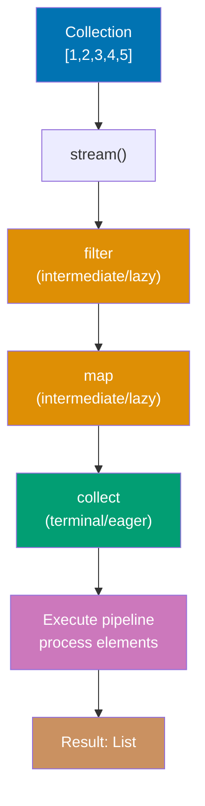

**Code**:

```java
import java.util.*;
import java.util.stream.*;

List<Integer> numbers = Arrays.asList(1, 2, 3, 4, 5, 6, 7, 8, 9, 10);
                                 // => numbers is [1, 2, 3, 4, 5, 6, 7, 8, 9, 10]
                                 // => Immutable list created via Arrays.asList()

// LAZY EVALUATION - intermediate operations don't execute until terminal operation
Stream<Integer> stream = numbers.stream()
                                 // => Creates stream (no processing yet)
                                 // => Stream is just a pipeline definition, not execution
    .filter(n -> {
        System.out.println("Filter: " + n);
        return n % 2 == 0;       // => NOT executed yet (lazy)
                                 // => Lambda not invoked until terminal operation
    })
    .map(n -> {
        System.out.println("Map: " + n);
        return n * 2;            // => NOT executed yet (lazy)
                                 // => Transformation deferred until terminal operation
    });
// => No output yet (no terminal operation)
                                 // => Pipeline built but not executed

List<Integer> result = stream.collect(Collectors.toList());
                                 // => Terminal operation triggers execution
// => Output: Filter: 1, Filter: 2, Map: 2, Filter: 3, Filter: 4, Map: 4, ...
// => result is [4, 8, 12, 16, 20]

// SHORT-CIRCUITING - stops processing when result determined
Optional<Integer> first = numbers.stream()
    .filter(n -> {
        System.out.println("Checking: " + n);
        return n > 5;            // => Filter for n > 5
    })
    .findFirst();                // => Short-circuits after first match
                                 // => Stops processing when first element found
// => Output: Checking: 1, Checking: 2, ..., Checking: 6
// => Stops at 6, doesn't process 7-10
                                 // => Early termination improves performance
// => first is Optional[6]

// PARALLEL STREAMS - splits work across threads
long count = numbers.parallelStream()
                                 // => Uses ForkJoinPool threads
                                 // => Work distributed across CPU cores
    .filter(n -> n % 2 == 0)     // => Parallel filtering
                                 // => Multiple threads process different elements concurrently
    .count();                    // => count is 5

// OPTIMIZATION: limit() short-circuits infinite streams
Stream.iterate(0, n -> n + 1)    // => Infinite stream: 0, 1, 2, 3, ...
                                 // => Without limit, would run forever
    .filter(n -> n % 2 == 0)     // => Even numbers
    .limit(5)                    // => Take first 5, stops infinite stream
                                 // => Short-circuits after 5 matches (not 5 iterations)
    .forEach(System.out::println);
                                 // => Terminal operation: prints each
// => Output: 0, 2, 4, 6, 8

// PRIMITIVE STREAMS - avoid autoboxing overhead
IntStream.range(1, 1000000)      // => Primitive int stream (no Integer objects)
                                 // => Efficient: avoids creating 1 million Integer wrappers
    .filter(n -> n % 2 == 0)     // => Filters even numbers (no boxing)
                                 // => Works directly with primitives (int)
    .sum();                      // => Specialized sum() for primitives
                                 // => Returns primitive long (not Long wrapper)

// STATELESS vs STATEFUL operations
numbers.stream()
    .filter(n -> n > 5)          // => Stateless: independent
    .map(n -> n * 2)             // => Stateless: independent transformation
    .sorted()                    // => STATEFUL: requires all elements (breaks streaming)
    .collect(Collectors.toList());
                                 // => Result is [12, 14, 16, 18, 20]
```

**Key Takeaway**: Intermediate operations (filter, map) are lazy—they don't execute until a terminal operation (collect, forEach, count) triggers the pipeline. Short-circuiting operations (findFirst, limit, anyMatch) stop processing early. Use primitive streams (IntStream, LongStream, DoubleStream) to avoid autoboxing overhead for numeric operations.

**Why It Matters**: Lazy evaluation enables efficient stream pipelines—filter then map then findFirst only processes elements until the first match, potentially touching 1% of a million-element collection vs. processing all elements eagerly. Before streams, achieving this required manual short-circuit logic in loops. However, stateful operations (sorted, distinct) break streaming by requiring all elements in memory, negating laziness benefits—sorting a billion-element stream still loads everything. Parallel streams promise automatic parallelization but have overhead: Collections.parallelStream() splits work across ForkJoinPool threads, beneficial only for CPU-intensive operations on large collections (>10,000 elements). Primitive streams eliminate autoboxing that creates millions of temporary Integer/Double objects, critical for numeric computations but often forgotten.

---

## Example 43: Collectors and Stream Reduction

Collectors transform stream results into collections, maps, or aggregated values. Custom collectors enable complex reductions beyond built-in options.

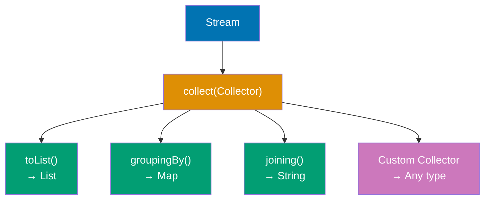

**Code**:

```java
import java.util.*;
import java.util.stream.*;

List<String> words = Arrays.asList("apple", "banana", "apricot", "blueberry", "avocado");

// COLLECTING TO COLLECTIONS
List<String> list = words.stream()
    .filter(w -> w.startsWith("a"))
                                 // => Keeps: apple, apricot, avocado
    .collect(Collectors.toList());
                                 // => list is [apple, apricot, avocado]

Set<String> set = words.stream()
    .collect(Collectors.toSet());
                                 // => Collects to HashSet, set is {apple, banana, apricot, blueberry, avocado}

// JOINING STRINGS
String joined = words.stream()
    .collect(Collectors.joining(", "));
                                 // => joined is "apple, banana, apricot, blueberry, avocado"

String prefixed = words.stream()
    .collect(Collectors.joining(", ", "[", "]"));
                                 // => Wraps with brackets
                                 // => prefixed is "[apple, banana, apricot, blueberry, avocado]"

// GROUPING BY
Map<Character, List<String>> grouped = words.stream()
    .collect(Collectors.groupingBy(w -> w.charAt(0)));
                                 // => Groups by first letter
                                 // => {a=[apple, apricot, avocado], b=[banana, blueberry]}

// COUNTING
Map<Character, Long> counts = words.stream()
    .collect(Collectors.groupingBy(w -> w.charAt(0), Collectors.counting()));
                                 // => Groups and counts: {a=3, b=2}

// PARTITIONING (boolean predicate)
Map<Boolean, List<String>> partitioned = words.stream()
    .collect(Collectors.partitioningBy(w -> w.length() > 6));
                                 // => Splits by length > 6
                                 // => {false=[apple, banana], true=[apricot, blueberry, avocado]}

// MAPPING WITHIN GROUPING
Map<Character, List<Integer>> lengths = words.stream()
    .collect(Collectors.groupingBy(
        w -> w.charAt(0),        // => Groups by first character
        Collectors.mapping(String::length, Collectors.toList())
                                 // => Maps to lengths within groups
    ));
                                 // => {a=[5, 7, 7], b=[6, 9]}

// CUSTOM COLLECTOR - joining with custom logic
String custom = words.stream()
                                 // => Stream<String> from words list
    .collect(Collector.of(
                                 // => Creates custom collector (4 components)
                                 // => Collector.of() factory method with 4 functions
                                 // => Components: supplier, accumulator, combiner, finisher
        StringBuilder::new,      // => Supplier: creates StringBuilder container
                                 // => Supplier<StringBuilder>: () -> new StringBuilder()
                                 // => Creates mutable accumulation container
                                 // => Called once per stream (or per parallel segment)
        (sb, s) -> sb.append(s).append(" "),
                                 // => Accumulator: appends word + space
                                 // => BiConsumer<StringBuilder, String>: accumulates element into container
                                 // => (container, element) -> { container mutation }
                                 // => Called for each element in stream
                                 // => Mutates sb: "apple " → "apple banana " → ...
        (sb1, sb2) -> sb1.append(sb2),
                                 // => Combiner: merges parallel results
                                 // => BinaryOperator<StringBuilder>: combines two containers
                                 // => Used in parallel streams to merge partial results
                                 // => sb1 += sb2 (appends sb2 content to sb1)
                                 // => Sequential streams don't call this
        StringBuilder::toString  // => Finisher: final transformation
                                 // => Function<StringBuilder, String>
                                 // => Converts mutable StringBuilder to immutable String
                                 // => Called once at end to produce final result
    ));
                                 // => custom is "apple banana apricot blueberry avocado "
                                 // => Note: trailing space from append logic
                                 // => Each word followed by space (including last)

// REDUCING
int totalLength = words.stream()
                                 // => Stream<String> from words
                                 // => Source: [apple, banana, apricot, blueberry, avocado]
    .collect(Collectors.summingInt(String::length));
                                 // => summingInt() converts to int and sums
                                 // => ToIntFunction<String>: String::length extracts length
                                 // => Maps each word to its length: apple→5, banana→6, etc.
                                 // => Accumulates sum: 0 + 5 + 6 + 7 + 9 + 7
                                 // => apple(5) + banana(6) + apricot(7) + blueberry(9) + avocado(7)
                                 // => Returns primitive int (not Integer wrapper)
                                 // => totalLength is 34 (sum of all word lengths)

Optional<String> longest = words.stream()
                                 // => Stream<String> from words
                                 // => Finds maximum element by comparison criteria
    .collect(Collectors.maxBy(Comparator.comparing(String::length)));
                                 // => maxBy() finds maximum by comparator
                                 // => Comparator.comparing(String::length) creates comparator
                                 // => Extracts length from each word, compares numerically
                                 // => Compares: 5 vs 6 vs 7 vs 9 vs 7
                                 // => Finds word with maximum length
                                 // => blueberry has 9 characters (longest)
                                 // => Returns Optional<String> (handles empty stream case)
                                 // => longest is Optional[blueberry]
                                 // => Optional in case stream was empty (would be Optional.empty())

// TEEING (Java 12+) - apply two collectors and merge results
Map<String, Object> stats = words.stream()
                                 // => Stream<String> from words
                                 // => Single stream split to two collectors
    .collect(Collectors.teeing(
                                 // => teeing() applies 2 collectors, merges results
                                 // => Solves "one stream, two collectors" problem
                                 // => Before Java 12: required stream duplication or separate passes
                                 // => Components: downstream1, downstream2, merger function
        Collectors.counting(),   // => First collector: counts elements
                                 // => Downstream collector 1: Collector<String, ?, Long>
                                 // => Counts stream elements as Long
                                 // => Result: 5L (Long)
        Collectors.joining(","), // => Second collector: joins with comma
                                 // => Downstream collector 2: Collector<String, ?, String>
                                 // => Concatenates elements with "," delimiter
                                 // => Result: "apple,banana,apricot,blueberry,avocado"
        (count, joined) -> Map.of("count", count, "words", joined)
                                 // => Merger: BiFunction<Long, String, Map>
                                 // => Combines both collector results into single Map
                                 // => Parameter 1: count (Long from counting())
                                 // => Parameter 2: joined (String from joining())
                                 // => Map.of() creates immutable Map with 2 entries
                                 // => Creates Map with 2 entries
    ));
                                 // => {count=5, words=apple,banana,apricot,blueberry,avocado}
                                 // => Single pass through stream produces both results
                                 // => Efficient: no stream duplication or re-iteration needed
```

**Key Takeaway**: Use built-in Collectors for common operations: toList(), toSet(), groupingBy(), partitioningBy(), joining(). Compose collectors with mapping(), counting(), summingInt() for complex aggregations. Create custom collectors via Collector.of() for specialized reduction logic.

**Why It Matters**: Collectors enable declarative data transformations replacing imperative loops—groupingBy() replaces manual Map population with iteration, joining() replaces StringBuilder loops. The composition pattern (groupingBy + counting) creates multi-level aggregations in single expressions, impossible in traditional loops without nested logic. Custom collectors extend the system: statistical frameworks collect custom metrics, test libraries collect assertion results, and data pipelines collect into custom data structures. However, complex collector chains become unreadable—groupingBy(x, mapping(y, filtering(z, ...))) creates nested generics and confusing semantics. The teeing() collector (Java 12) elegantly solves the "one stream, multiple collectors" problem that previously required collect() duplication or stream re-creation.

---

## Example 44: Method References and Function Composition

Method references provide shorthand for lambdas that delegate to existing methods. Composing functions creates reusable transformation pipelines.

**Code**:

```java
import java.util.*;
import java.util.function.*;

// METHOD REFERENCE TYPES

// 1. STATIC METHOD REFERENCE
Function<String, Integer> parser1 = Integer::parseInt;
                                 // => Equivalent to: s -> Integer.parseInt(s)
                                 // => Type: Function<String, Integer>
int value = parser1.apply("123");
                                 // => Calls Integer.parseInt("123")
                                 // => value is 123

// 2. INSTANCE METHOD REFERENCE (on particular object)
String prefix = "Hello, ";
Function<String, String> greeter = prefix::concat;
                                 // => Captures 'prefix' variable (bound method reference)
                                 // => Equivalent to: s -> prefix.concat(s)
String greeting = greeter.apply("World");
                                 // => Calls prefix.concat("World")
                                 // => greeting is "Hello, World"

// 3. INSTANCE METHOD REFERENCE (on arbitrary object)
Function<String, Integer> lengthGetter = String::length;
                                 // => Calls length() on parameter (not specific object)
                                 // => Equivalent to: s -> s.length()
int length = lengthGetter.apply("test");
                                 // => "test".length() returns 4
                                 // => length is 4

// 4. CONSTRUCTOR REFERENCE
Supplier<List<String>> listMaker = ArrayList::new;
                                 // => Equivalent to: () -> new ArrayList<>()
List<String> list = listMaker.get();
                                 // => list is empty ArrayList<String>

Function<String, Person> personMaker = Person::new;
                                 // => References Person(String name) constructor
                                 // => Equivalent to: name -> new Person(name)

// FUNCTION COMPOSITION - chaining transformations
Function<String, String> trim = String::trim;
Function<String, String> upper = String::toUpperCase;
Function<String, Integer> length = String::length;

Function<String, Integer> pipeline = trim.andThen(upper).andThen(length);
                                 // => andThen() chains left-to-right: trim → upper → length
int result = pipeline.apply("  hello  ");
                                 // => Step 1: trim("  hello  ") → "hello"
                                 // => Step 2: upper("hello") → "HELLO"
                                 // => Step 3: length("HELLO") → 5
                                 // => result is 5

Function<String, Integer> composed = length.compose(upper).compose(trim);
                                 // => compose() chains right-to-left (reverse order)
                                 // => Same result as andThen, different syntax

// PREDICATE COMPOSITION - combining conditions
Predicate<String> startsWithA = s -> s.startsWith("a");
Predicate<String> longerThan5 = s -> s.length() > 5;

Predicate<String> combined = startsWithA.and(longerThan5);
                                 // => Logical AND: both conditions must be true
boolean test1 = combined.test("apple");
                                 // => "apple" starts with 'a': true, length 5 not > 5: false
                                 // => AND result: false
boolean test2 = combined.test("apricot");
                                 // => "apricot" starts with 'a': true, length 7 > 5: true
                                 // => AND result: true

Predicate<String> either = startsWithA.or(longerThan5);
                                 // => Logical OR: at least one condition must be true

Predicate<String> negated = startsWithA.negate();
                                 // => Inverts result: true if does NOT start with 'a'

// PRACTICAL EXAMPLE - reusable transformations
List<String> inputs = Arrays.asList("  apple  ", "  BANANA  ", "  cherry  ");

List<String> processed = inputs.stream()
    .map(String::trim)           // => Removes whitespace
                                 // => ["apple", "BANANA", "cherry"]
    .map(String::toLowerCase)    // => Converts to lowercase
                                 // => ["apple", "banana", "cherry"]
    .filter(s -> s.length() > 5)
                                 // => Keeps strings longer than 5 chars
                                 // => ["banana", "cherry"] (apple filtered out)
    .collect(Collectors.toList());
                                 // => processed is ["banana", "cherry"]
```

**Key Takeaway**: Method references (`Class::method`) provide concise alternatives to lambdas that just call a method. Use `andThen()` for left-to-right function composition and `compose()` for right-to-left. Compose predicates with `and()`, `or()`, and `negate()` to build complex conditions from simple ones.

**Why It Matters**: Method references eliminate lambda boilerplate for common cases—`list.forEach(System.out::println)` is clearer than `list.forEach(s -> System.out.println(s))`. Function composition enables point-free style (defining transformations without intermediate variables), common in functional programming but rare in Java. However, excessive composition creates unreadable pipelines: `f.andThen(g).andThen(h).compose(i).compose(j)` obscures logic. The real power emerges in frameworks: Spring's @Transactional uses method references for AOP pointcuts, testing frameworks use them for method handles, and reactive libraries (Reactor, RxJava) chain transformations via function composition. Constructor references (`ArrayList::new`) enable supplier patterns and factory methods without lambda wrappers.

---

## Example 45: NIO.2 File Operations and Path API

NIO.2 (java.nio.file) provides modern file I/O with Path abstraction, symbolic link support, and directory traversal. It replaces legacy java.io.File with clearer semantics.

**Code**:

```java
import java.nio.file.*;
import java.io.IOException;
import java.util.stream.Stream;

// PATH OPERATIONS - modern file path abstraction
Path path = Paths.get("data", "file.txt");
                                 // => Joins path components with system separator (/ or \)
                                 // => Creates path to data/file.txt (relative path)
                                 // => Path is interface, implementation varies by OS
Path absolute = path.toAbsolutePath();
                                 // => Prepends current working directory
                                 // => Example: /home/user/project/data/file.txt
                                 // => Returns new Path instance
Path parent = path.getParent();
                                 // => Extracts parent directory path
                                 // => parent is "data" (Path object, not String)
Path filename = path.getFileName();
                                 // => Gets last component of path
                                 // => filename is "file.txt" (Path object, not String)

// FILE OPERATIONS
try {
    // Create file
    Files.createFile(path);      // => Creates empty file at path
                                 // => Atomic operation, throws if file exists

    // Write content
    String content = "Hello, NIO.2!";
                                 // => String to write to file
    Files.writeString(path, content);
                                 // => Writes string to file using UTF-8 (Java 11+)
                                 // => Overwrites existing content (not append)

    // Read content
    String read = Files.readString(path);
                                 // => Reads entire file into String (UTF-8)
                                 // => read is "Hello, NIO.2!"
                                 // => Loads all into memory (OutOfMemoryError risk for large files)

    // Append content
    Files.writeString(path, "\nNew line", StandardOpenOption.APPEND);
                                 // => APPEND: adds to end, preserves existing content
                                 // => File now contains 2 lines

    // Read all lines
    List<String> lines = Files.readAllLines(path);
                                 // => Splits by line breaks, returns List<String>
                                 // => lines is ["Hello, NIO.2!", "New line"]
                                 // => Loads entire file into memory

    // STREAMING LINES (for large files)
    try (Stream<String> stream = Files.lines(path)) {
                                 // => Lazy stream reads lines on-demand (efficient for large files)
                                 // => try-with-resources ensures stream closed (CRITICAL for resource cleanup)
        stream.filter(line -> line.startsWith("Hello"))
                                 // => Keeps only lines starting with "Hello"
              .forEach(System.out::println);
                                 // => Output: Hello, NIO.2!
    }

    // FILE METADATA
    boolean exists = Files.exists(path);
                                 // => exists is true (we just created it)
    boolean isReadable = Files.isReadable(path);
                                 // => Checks read permission
    boolean isDirectory = Files.isDirectory(path);
                                 // => isDirectory is false (it's a file)
    long size = Files.size(path);
                                 // => Returns file size in bytes

    // COPY and MOVE
    Path backup = Paths.get("data", "backup.txt");
                                 // => Target path for copy
    Files.copy(path, backup, StandardCopyOption.REPLACE_EXISTING);
                                 // => Copies file, REPLACE_EXISTING overwrites if exists

    Path moved = Paths.get("data", "moved.txt");
                                 // => Target path for move
    Files.move(backup, moved, StandardCopyOption.ATOMIC_MOVE);
                                 // => ATOMIC_MOVE: guaranteed atomic on same filesystem
                                 // => backup.txt deleted, moved.txt created

    // DELETE
    Files.delete(moved);         // => Deletes file, throws if not found
    Files.deleteIfExists(path);  // => Returns boolean, no exception if not found

} catch (IOException e) {
    e.printStackTrace();
}

// DIRECTORY OPERATIONS
try {
    Path dir = Paths.get("mydir");
                                 // => Path to directory
    Files.createDirectory(dir);  // => Creates single directory
                                 // => Throws if parent doesn't exist or dir already exists

    Path nested = Paths.get("my/nested/dir");
                                 // => Path to deeply nested directory
    Files.createDirectories(nested);
                                 // => Creates all parent directories if needed
                                 // => Idempotent: no error if directories exist (unlike createDirectory)

    // LIST DIRECTORY CONTENTS
    try (Stream<Path> paths = Files.list(dir)) {
                                 // => Returns direct children only (NOT recursive)
                                 // => try-with-resources releases directory handle
        paths.forEach(System.out::println);
                                 // => Output: one line per file/directory in mydir
    }

    // WALK DIRECTORY TREE (recursive)
    try (Stream<Path> paths = Files.walk(nested)) {
                                 // => Recursively traverses entire tree (depth-first)
                                 // => CRITICAL: Must close stream to release handles
        paths.filter(Files::isRegularFile)
                                 // => Filters to only regular files (not directories)
             .forEach(System.out::println);
                                 // => Output: all files in nested and subdirectories
    }

} catch (IOException e) {
    e.printStackTrace();
}
```

**Key Takeaway**: Use NIO.2's Path and Files classes for modern file I/O. Files.readString() and Files.writeString() handle simple text operations. Use Files.lines() to stream large files efficiently. Files.walk() recursively traverses directories, returning Stream<Path> for functional processing.

**Why It Matters**: NIO.2 fixed java.io.File's numerous flaws: ambiguous error handling (boolean returns vs. exceptions), poor symbolic link support, and platform-dependent behavior. The Path interface abstracts filesystem differences, enabling identical code for local files, network shares, and ZIP filesystem providers. Files.lines() streams enable processing gigabyte files without loading into memory—critical for log analysis and data processing. The switch from blocking I/O to asynchronous I/O (AsynchronousFileChannel) enables high-throughput servers, though most applications stick with simpler synchronous Files methods. Modern Java's Files API is so superior that java.io.File is essentially deprecated in new code, though legacy APIs still require it.

---

## Example 46: Thread Basics and Runnable

Threads enable concurrent execution. Java provides Runnable interface for defining thread tasks and Thread class for execution management.

**Code**:

```java
// RUNNABLE - task to execute in thread
class PrintTask implements Runnable {
                                 // => Runnable: functional interface with single run() method
    private final String message;
                                 // => Immutable message field (thread-safe)

    public PrintTask(String message) {
        this.message = message;  // => Stores message for run() method
    }

    @Override
    public void run() {          // => Executed when thread starts
                                 // => Runs in separate thread (not main thread)
                                 // => Exceptions thrown here don't propagate to caller
        for (int i = 0; i < 5; i++) {
            System.out.println(message + " " + i);
                                 // => Output: "Thread-1 0", "Thread-1 1", etc.
            try {
                Thread.sleep(100); // => Pause 100ms (yields CPU to other threads)
                                 // => TIMED_WAITING state, releases CPU but not locks
            } catch (InterruptedException e) {
                                 // => Thrown if thread interrupted during sleep
                e.printStackTrace();
            }
        }
    }
}

// CREATE AND START THREADS
Thread thread1 = new Thread(new PrintTask("Thread-1"));
                                 // => Creates Thread with Runnable task
                                 // => Thread not started yet (NEW state)
Thread thread2 = new Thread(new PrintTask("Thread-2"));
                                 // => Second independent thread with separate execution context

thread1.start();                 // => Starts thread (calls run() in new thread)
                                 // => NEW → RUNNABLE state, allocates OS thread
                                 // => Calling start() twice throws IllegalThreadStateException
thread2.start();                 // => Both threads execute concurrently
                                 // => Output interleaved (non-deterministic order)
                                 // => Example: Thread-1 0, Thread-2 0, Thread-1 1...

// WAIT FOR COMPLETION
try {
    thread1.join();              // => Blocks until thread1 completes
                                 // => Main thread enters WAITING state (releases CPU)
    thread2.join();              // => Blocks until thread2 completes
                                 // => Both threads guaranteed finished after this
} catch (InterruptedException e) {
                                 // => Thrown if waiting thread interrupted
    e.printStackTrace();
}

// LAMBDA SYNTAX (Java 8+)
Thread thread3 = new Thread(() -> {
                                 // => Lambda implements Runnable.run()
                                 // => Concise syntax for simple tasks
    System.out.println("Lambda thread running");
                                 // => Output: Lambda thread running
});
thread3.start();                 // => Starts thread executing lambda

// THREAD PROPERTIES
Thread current = Thread.currentThread();
                                 // => Gets reference to currently executing thread
                                 // => Static method, returns thread that calls it
String name = current.getName();
                                 // => Thread name (default: "Thread-N")
                                 // => Can set: thread.setName("CustomName")
long id = current.getId();       // => Unique thread ID (positive long)
                                 // => Assigned by JVM, never reused
int priority = current.getPriority();
                                 // => Priority hint for scheduler (1-10, default: 5)
                                 // => Higher priority MAY get more CPU time (not guaranteed)
```

**Key Takeaway**: Implement Runnable to define thread tasks, create Thread objects wrapping Runnable, and call start() to begin execution. Use join() to wait for thread completion. Never call run() directly—it executes in current thread without concurrency.

**Why It Matters**: Threads enable responsive UIs (Swing event thread vs. background workers), parallel processing (multi-core CPU utilization), and asynchronous I/O (network servers handling thousands of connections). However, raw threads have issues: no return values (run() returns void), manual lifecycle management (start/join/interrupt), and no exception handling (exceptions die silently in threads). These limitations drove ExecutorService creation (thread pools with Future return values) and eventually CompletableFuture (composable async operations). Modern Java rarely uses Thread directly—Executors and higher-level abstractions are preferred—but understanding threads is essential for debugging concurrency issues.

---

## Example 47: Synchronization and Thread Safety

Shared mutable state requires synchronization to prevent race conditions. Java provides synchronized keyword, locks, and atomic classes for thread safety.

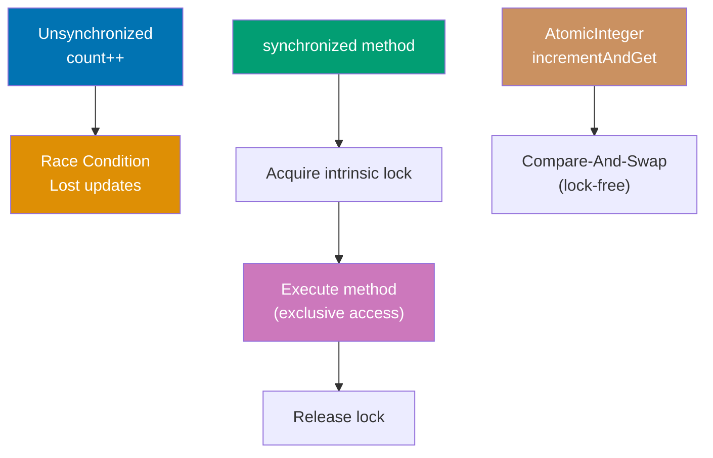

**Code**:

```java
import java.util.concurrent.atomic.AtomicInteger;
import java.util.concurrent.locks.*;

// RACE CONDITION - unsafe shared state
class UnsafeCounter {
    private int count = 0;       // => Shared mutable state across threads
                                 // => No synchronization protection
                                 // => Multiple threads accessing same memory location

    public void increment() {
        count++;                 // => NOT thread-safe (read-modify-write race)
                                 // => Actually 3 operations: read count, add 1, write count
                                 // => Thread interleaving causes lost updates
                                 // => Example: Thread1 reads 0, Thread2 reads 0, both write 1 (lost one increment)
                                 // => Non-atomic operation (can be interrupted mid-execution)
    }

    public int getCount() {
        return count;            // => Reads possibly stale/inconsistent value
                                 // => No happens-before guarantee from writes
                                 // => May read old cached value (CPU cache coherence issue)
                                 // => No memory barrier (write visibility not guaranteed)
    }
}

// SYNCHRONIZED METHOD - thread-safe via intrinsic lock
class SynchronizedCounter {
    private int count = 0;       // => Shared mutable state (requires synchronization)
                                 // => Protected by synchronized methods below

    public synchronized void increment() {
                                 // => synchronized keyword acquires intrinsic lock (monitor)
                                 // => Locks on this instance (implicit: synchronized(this))
                                 // => Only one thread can execute this method at a time
                                 // => Other threads block until lock released (BLOCKED state)
                                 // => Guarantees atomicity and visibility
        count++;                 // => Thread-safe increment (read-modify-write)
                                 // => Lock ensures atomicity of this operation
                                 // => Read, modify, write happen as single atomic unit
    }                            // => Lock automatically released on method exit
                                 // => Even if exception thrown (finally-like semantics)

    public synchronized int getCount() {
                                 // => synchronized ensures visibility of count changes
                                 // => Memory barrier: flushes CPU cache, reads from main memory
                                 // => Acquires same intrinsic lock as increment()
        return count;            // => Returns current value (consistent read)
                                 // => Sees all writes from previous synchronized increment() calls
    }
}

// SYNCHRONIZED BLOCK - finer-grained locking
class BlockCounter {
    private int count = 0;       // => Shared mutable state
    private final Object lock = new Object();
                                 // => Explicit lock object (any Object works)
                                 // => final ensures lock reference never changes
                                 // => Dedicated lock object (not this) prevents external locking

    public void increment() {
        // Non-critical code here executes without lock
        // => Allows concurrent execution of non-critical sections
        // => Better throughput than locking entire method
        synchronized(lock) {     // => Acquires lock on specific object
                                 // => synchronized(Object) block syntax
                                 // => Only locks critical section (not entire method)
                                 // => Allows better concurrency vs method-level sync
                                 // => Smaller critical section = less contention
            count++;             // => Critical section: thread-safe increment
                                 // => Read-modify-write protected by lock
        }                        // => Lock automatically released here
                                 // => Even if exception thrown
        // Non-critical code here executes without lock
        // => Other threads can execute non-critical sections concurrently
    }
}

// EXPLICIT LOCK - ReentrantLock for advanced control
class LockCounter {
    private int count = 0;       // => Shared mutable state
    private final Lock lock = new ReentrantLock();
                                 // => Explicit Lock interface (more flexible than synchronized)
                                 // => "Reentrant" means same thread can acquire multiple times
                                 // => Maintains acquisition count (lock count for reentrancy)
                                 // => Supports fairness policy: new ReentrantLock(true)

    public void increment() {
        lock.lock();             // => Explicitly acquires lock
                                 // => Blocks if another thread holds lock (like synchronized)
                                 // => Increments hold count if already owned by current thread
                                 // => Must manually unlock (unlike synchronized)
                                 // => No automatic unlock (dangerous if forgotten)
        try {
            count++;             // => Critical section
                                 // => Thread-safe modification
                                 // => Read-modify-write protected by lock
        } finally {
            lock.unlock();       // => MUST unlock in finally block
                                 // => Ensures unlock even if exception thrown
                                 // => Decrements hold count (must unlock same number of times as locked)
                                 // => Failure to unlock causes deadlock (all threads wait forever)
        }
    }
}

// ATOMIC CLASSES - lock-free thread safety
class AtomicCounter {
    private final AtomicInteger count = new AtomicInteger(0);
                                 // => AtomicInteger provides thread-safe operations
                                 // => Uses compare-and-swap (CAS) hardware instructions
                                 // => CAS: atomically compares expected value and updates if match
                                 // => Lock-free (no blocking, better performance)
                                 // => No thread ever blocks waiting for lock
                                 // => Initialized to 0
                                 // => Backed by volatile int field for visibility

    public void increment() {
        count.incrementAndGet(); // => Atomically increments and returns new value
                                 // => Thread-safe without synchronized/locks
                                 // => Equivalent to: ++count in thread-safe way
                                 // => Uses CAS loop internally:
                                 // =>   1. Read current value
                                 // =>   2. Compute new value (current + 1)
                                 // =>   3. CAS: if current unchanged, write new value
                                 // =>   4. If CAS fails (another thread modified), retry loop
                                 // => Alternative: getAndIncrement() returns old value (count++)
    }

    public int getCount() {
        return count.get();      // => Atomically reads current value
                                 // => Thread-safe read operation
                                 // => Reads volatile field (memory barrier, sees latest writes)
                                 // => Returns int value (primitive, not Integer wrapper)
    }
}

// DEMONSTRATION
SynchronizedCounter counter = new SynchronizedCounter();
                                 // => Creates shared counter object
                                 // => Will be accessed by multiple threads

// Multiple threads incrementing
Thread t1 = new Thread(() -> {
                                 // => Lambda defines thread task
    for (int i = 0; i < 1000; i++) {
                                 // => Loop 1000 times
        counter.increment();     // => Each call acquires lock, increments, releases lock
                                 // => Synchronized method ensures thread safety
    }
});

Thread t2 = new Thread(() -> {
                                 // => Second thread with same task
    for (int i = 0; i < 1000; i++) {
                                 // => Also loops 1000 times
        counter.increment();     // => Competes with t1 for lock
                                 // => May block waiting for t1 to release lock
    }
});

t1.start();                      // => Starts first thread
                                 // => Begins executing loop
t2.start();                      // => Starts second thread concurrently
                                 // => Both threads run simultaneously

try {
    t1.join();                   // => Main thread waits for t1 to finish
                                 // => Blocks until t1 completes all 1000 increments
    t2.join();                   // => Main thread waits for t2 to finish
                                 // => Blocks until t2 completes all 1000 increments
} catch (InterruptedException e) {
    e.printStackTrace();
}

System.out.println("Final count: " + counter.getCount());
                                 // => Both threads finished, reads final value
                                 // => t1 did 1000 increments, t2 did 1000 increments
                                 // => Output: Final count: 2000 (correct with synchronization)
                                 // => Without synchronization: value would be < 2000 (lost updates)
```

**Key Takeaway**: Use synchronized methods or blocks to protect shared mutable state. Explicit locks (ReentrantLock) provide more control (try-lock, timed lock). Atomic classes (AtomicInteger) offer lock-free thread safety for simple operations. Without synchronization, concurrent access causes race conditions leading to incorrect results.

**Why It Matters**: Synchronization prevents data corruption from concurrent access—without it, count++ (read-modify-write) allows lost updates where two threads read same value and both write incremented result (both write 1 instead of 1 and 2). The synchronized keyword uses intrinsic locks (every Java object has one), simple but coarse-grained (locks entire method/block). ReentrantLock enables fairness (FIFO waiting), try-lock (non-blocking), and lock conditions (await/signal), essential for complex synchronization. Atomic classes use CPU compare-and-swap (CAS) instructions for lock-free updates, faster than locks for simple operations but limited to single-variable updates. Modern Java emphasizes immutability and concurrent collections over manual synchronization, reserving locks for complex state machines and atomic operations for counters/flags.

---

## Example 48: ExecutorService and Thread Pools

ExecutorService manages thread pools for executing tasks without manual Thread creation. It provides lifecycle management, Future results, and efficient thread reuse.

**Code**:

```java
import java.util.concurrent.*;
import java.util.*;

// FIXED THREAD POOL - reuses fixed number of threads
ExecutorService executor = Executors.newFixedThreadPool(3);
                                 // => Factory method creates thread pool
                                 // => Pool contains exactly 3 worker threads
                                 // => Threads reused across tasks (efficient)
                                 // => Tasks queue if all 3 threads busy

// SUBMIT RUNNABLE tasks
executor.submit(() -> {
                                 // => Lambda implements Runnable
                                 // => submit() returns Future<?> (no result)
    System.out.println("Task 1 running in " + Thread.currentThread().getName());
                                 // => Output: Task 1 running in pool-1-thread-1
                                 // => Thread name shows pool and thread number
});

executor.submit(() -> {
                                 // => Second task submitted to same pool
                                 // => Executed by any available thread
    System.out.println("Task 2 running in " + Thread.currentThread().getName());
                                 // => Output: Task 2 running in pool-1-thread-2 (or thread-1 if reused)
                                 // => Thread allocation non-deterministic
});

// SUBMIT CALLABLE tasks (return values)
Future<Integer> future = executor.submit(() -> {
                                 // => Lambda implements Callable<Integer>
                                 // => Callable differs from Runnable: returns value
                                 // => submit() returns Future<Integer> (represents async result)
    Thread.sleep(1000);          // => Simulates long-running computation
                                 // => Sleeps 1 second
    return 42;                   // => Returns value from task
                                 // => Type: Integer (Callable<Integer> return type)
});

try {
    Integer result = future.get();
                                 // => Blocks current thread until task completes
                                 // => Retrieves result from Future
                                 // => Waits up to 1 second (task's sleep time)
                                 // => result is 42
    System.out.println("Result: " + result);
                                 // => Output: Result: 42
} catch (InterruptedException | ExecutionException e) {
                                 // => InterruptedException: if waiting interrupted
                                 // => ExecutionException: if task threw exception
    e.printStackTrace();
}

// SUBMIT MULTIPLE TASKS
List<Callable<Integer>> tasks = Arrays.asList(
                                 // => Creates list of 3 Callable tasks
                                 // => Each Callable<Integer> returns Integer result
                                 // => Different sleep times simulate varying workloads
    () -> { Thread.sleep(500); return 1; },
                                 // => Lambda 1: sleeps 500ms, returns 1
                                 // => Slowest task (takes 500 milliseconds)
    () -> { Thread.sleep(300); return 2; },
                                 // => Lambda 2: sleeps 300ms, returns 2 (faster)
                                 // => Medium-speed task
    () -> { Thread.sleep(100); return 3; }
                                 // => Lambda 3: sleeps 100ms, returns 3 (fastest)
                                 // => Will complete first in race scenarios
);

try {
    // invokeAll - waits for all tasks to complete
    List<Future<Integer>> futures = executor.invokeAll(tasks);
                                 // => Submits all 3 tasks to pool
                                 // => Blocks until ALL tasks complete
                                 // => Returns List<Future<Integer>> with results
                                 // => futures.size() is 3
    for (Future<Integer> f : futures) {
                                 // => Iterates over completed futures
        System.out.println("Result: " + f.get());
                                 // => f.get() doesn't block (already complete)
                                 // => Output: Result: 1
                                 // =>         Result: 2
                                 // =>         Result: 3
                                 // => Order matches submission order, not completion order
    }

    // invokeAny - returns first completed result
    Integer first = executor.invokeAny(tasks);
                                 // => Submits all tasks, returns result of first to complete
                                 // => Task 3 completes first (100ms sleep)
                                 // => Cancels remaining tasks after first completes
                                 // => Blocks until at least one task finishes
    System.out.println("First result: " + first);
                                 // => first is 3 (fastest task)
                                 // => Output: First result: 3
} catch (InterruptedException | ExecutionException e) {
    e.printStackTrace();
}

// SCHEDULED EXECUTOR - delayed/periodic tasks
ScheduledExecutorService scheduler = Executors.newScheduledThreadPool(2);
                                 // => Creates pool with 2 threads for scheduled tasks
                                 // => Supports delays and periodic execution

// Execute after delay
scheduler.schedule(() -> {
                                 // => schedule() runs task once after delay
    System.out.println("Delayed task");
                                 // => Output: Delayed task (after 2 seconds)
}, 2, TimeUnit.SECONDS);         // => Initial delay: 2 seconds
                                 // => TimeUnit.SECONDS specifies unit
                                 // => Task runs once, not repeated

// Execute periodically
scheduler.scheduleAtFixedRate(() -> {
                                 // => scheduleAtFixedRate() repeats task at fixed intervals
    System.out.println("Periodic task");
                                 // => Output: Periodic task (every 1 second)
}, 0, 1, TimeUnit.SECONDS);      // => Initial delay: 0 (starts immediately)
                                 // => Period: 1 second between executions
                                 // => Runs: 0s, 1s, 2s, 3s, ... (until shutdown)

// SHUTDOWN
executor.shutdown();             // => Initiates graceful shutdown
                                 // => No new tasks accepted after this call
                                 // => Throws RejectedExecutionException for new submissions
                                 // => Previously submitted tasks continue executing
                                 // => Doesn't block (returns immediately)
                                 // => Essential for clean resource cleanup
try {
    if (!executor.awaitTermination(60, TimeUnit.SECONDS)) {
                                 // => Waits up to 60 seconds for tasks to complete
                                 // => Blocks current thread during wait
                                 // => Returns true if all tasks finished within timeout
                                 // => Returns false if timeout occurred (tasks still running)
        executor.shutdownNow();  // => Force shutdown if timeout exceeded
                                 // => Attempts to stop executing tasks
                                 // => Sends interrupt to threads running tasks
                                 // => Interrupts threads running tasks
                                 // => Returns list of tasks that never started
                                 // => Last resort for hung tasks
    }
} catch (InterruptedException e) {
                                 // => If current thread interrupted while waiting
                                 // => InterruptedException thrown by awaitTermination()
    executor.shutdownNow();      // => Force shutdown on interruption
                                 // => Propagates interrupt signal to pool threads
                                 // => Thread.currentThread().interrupt() recommended after
}
```

**Key Takeaway**: Use ExecutorService for thread pool management. Submit Runnable (no return value) or Callable (returns Future) tasks. Use shutdown() to gracefully stop accepting new tasks and awaitTermination() to wait for completion. ScheduledExecutorService enables delayed and periodic task execution.

**Why It Matters**: Thread pools eliminate the overhead of creating/destroying threads for each task—thread creation costs ~1ms and 1MB stack memory, prohibitive for servers handling thousands of requests. Executors.newFixedThreadPool() reuses threads across tasks, reducing overhead to microseconds. Future<T> provides the "return value from asynchronous operation" capability missing from raw threads, enabling functional-style async code (flatMap over futures, compose operations). However, thread pools have limits: fixed-size pools can deadlock if tasks wait for other tasks (all threads blocked), and unbounded queues consume infinite memory if tasks arrive faster than processing. The fork/join pool (Java 7) and virtual threads (Java 21) address these issues with work-stealing and lightweight threads, but ExecutorService remains the standard for bounded concurrency.

---

## Example 49: CompletableFuture for Async Programming

CompletableFuture enables composable asynchronous operations with functional-style transformations. It replaces callback hell with declarative async pipelines.

**Code**:

```java
import java.util.concurrent.*;

// BASIC COMPLETABLEFUTURE
CompletableFuture<String> future = CompletableFuture.supplyAsync(() -> {
                                 // => supplyAsync() runs lambda in background thread
                                 // => Returns CompletableFuture<String>
                                 // => Executes in ForkJoinPool.commonPool() by default
    try {
        Thread.sleep(1000);      // => Simulates long-running task
                                 // => Sleeps 1 second
    } catch (InterruptedException e) {
        throw new RuntimeException(e);
    }
    return "Hello";              // => Returns value when task completes
                                 // => Result available after 1 second
});

// CHAINING OPERATIONS
CompletableFuture<String> result = future
                                 // => Start with CompletableFuture<String> from above
                                 // => Chain transformations on async result
    .thenApply(s -> s + " World")
                                 // => thenApply() transforms result when available
                                 // => Lambda: s -> s + " World"
                                 // => Function<String, String> (String → String)
                                 // => Input: "Hello" (from previous stage)
                                 // => Output: "Hello World" (concatenation)
                                 // => Returns CompletableFuture<String>
                                 // => Non-blocking: schedules transformation
    .thenApply(String::toUpperCase);
                                 // => Method reference: transforms to uppercase
                                 // => Second transformation in chain
                                 // => Input: "Hello World"
                                 // => Output: "HELLO WORLD"
                                 // => Returns CompletableFuture<String>
                                 // => Entire chain executes asynchronously

result.thenAccept(s -> System.out.println("Result: " + s));
                                 // => thenAccept() consumes result (no return value)
                                 // => Lambda executes when result available
                                 // => s is "HELLO WORLD"
                                 // => Output: Result: HELLO WORLD (after 1+ seconds)
                                 // => Returns CompletableFuture<Void>

// COMBINING FUTURES
CompletableFuture<Integer> future1 = CompletableFuture.supplyAsync(() -> 10);
                                 // => Creates async task returning 10
                                 // => supplyAsync() uses ForkJoinPool.commonPool()
                                 // => Runs in background thread immediately
                                 // => Non-blocking: returns immediately
CompletableFuture<Integer> future2 = CompletableFuture.supplyAsync(() -> 20);
                                 // => Creates second independent async task returning 20
                                 // => Separate task, not dependent on future1
                                 // => Both futures execute concurrently (parallel)
                                 // => Different threads may execute each

CompletableFuture<Integer> combined = future1.thenCombine(future2, (a, b) -> a + b);
                                 // => thenCombine() waits for BOTH futures to complete
                                 // => Combines results from two independent futures
                                 // => BiFunction: (a, b) -> a + b combines results
                                 // => a = 10 (from future1), b = 20 (from future2)
                                 // => Waits for slower of the two futures
                                 // => Result: 30 (10 + 20)
                                 // => Returns CompletableFuture<Integer>
                                 // => Type: BiFunction<Integer, Integer, Integer>
combined.thenAccept(sum -> System.out.println("Sum: " + sum));
                                 // => sum is 30 (combined result)
                                 // => Output: Sum: 30

// SEQUENTIAL COMPOSITION
CompletableFuture<String> sequential = CompletableFuture.supplyAsync(() -> "user123")
                                 // => First async operation: returns "user123"
                                 // => Simulates fetching user ID
    .thenCompose(userId -> CompletableFuture.supplyAsync(() -> {
                                 // => Second async operation depends on first result
                                 // => thenCompose() takes Function<String, CompletableFuture<String>>
                                 // => userId = "user123" from previous stage
                                 // => Sequential dependency: waits for first future
        // Fetch user details based on userId
        return "User: " + userId;// => Returns "User: user123"
                                 // => Simulates fetching user details
    }));                         // => thenCompose flattens nested CompletableFuture<CompletableFuture<String>> → CompletableFuture<String>
                                 // => Like flatMap for futures (avoids nesting)
                                 // => Critical: use thenCompose, NOT thenApply (would nest futures)

// EXCEPTION HANDLING
CompletableFuture<String> withError = CompletableFuture.supplyAsync(() -> {
                                 // => Async task that will throw exception
    if (true) throw new RuntimeException("Error!");
                                 // => Always throws exception
    return "Success";            // => Never reached
})
.exceptionally(ex -> {
                                 // => exceptionally() handles exceptions
                                 // => Called if previous stage threw exception
                                 // => ex is the thrown exception
    System.out.println("Caught: " + ex.getMessage());
                                 // => Output: Caught: Error!
    return "Fallback value";     // => Returns fallback on exception
                                 // => Replaces exception with normal value
})
.thenApply(s -> s.toUpperCase());
                                 // => Continues pipeline with fallback value
                                 // => s is "Fallback value"
                                 // => Result: "FALLBACK VALUE"

// TIMEOUT (Java 9+)
CompletableFuture<String> withTimeout = CompletableFuture.supplyAsync(() -> {
                                 // => Async task that takes too long
    try {
        Thread.sleep(5000);      // => Sleeps 5 seconds (too slow)
    } catch (InterruptedException e) {}
    return "Slow result";        // => Would return after 5 seconds
})
.orTimeout(2, TimeUnit.SECONDS);
                                 // => orTimeout() fails future if exceeds 2 seconds
                                 // => Completes exceptionally with TimeoutException
                                 // => Task cancelled if times out

// ALLOF - wait for all futures
CompletableFuture<Void> allDone = CompletableFuture.allOf(future1, future2, sequential);
                                 // => allOf() waits for ALL futures to complete
                                 // => Returns CompletableFuture<Void> (no combined result)
                                 // => Completes when all inputs complete
allDone.thenRun(() -> System.out.println("All futures complete"));
                                 // => thenRun() executes when all done
                                 // => Output: All futures complete

// ANYOF - wait for any future
CompletableFuture<Object> anyDone = CompletableFuture.anyOf(future1, future2);
                                 // => anyOf() completes when ANY future completes
                                 // => Returns CompletableFuture<Object> (type-unsafe)
                                 // => Result is value from first completed future
anyDone.thenAccept(result -> System.out.println("First result: " + result));
                                 // => result is whichever completes first
                                 // => Output: First result: 10 or First result: 20

// BLOCKING WAIT (use sparingly)
try {
    String finalResult = result.get();
                                 // => Blocks current thread until future completes
                                 // => Returns result value ("HELLO WORLD")
                                 // => Defeats async purpose (use thenAccept instead)
                                 // => May wait indefinitely if future never completes
    String timeoutResult = result.get(1, TimeUnit.SECONDS);
                                 // => Blocks with timeout (maximum 1 second)
                                 // => Returns result if completes within timeout
                                 // => Throws TimeoutException if exceeds 1 second
                                 // => Better than get() for potentially long operations
} catch (InterruptedException | ExecutionException | TimeoutException e) {
                                 // => InterruptedException: if thread interrupted while waiting
                                 // => ExecutionException: if future completed with exception
                                 // => TimeoutException: if timeout exceeded
    e.printStackTrace();
}
```

**Key Takeaway**: CompletableFuture enables async operations with functional composition. Use thenApply() for transformations, thenCombine() to merge results, thenCompose() for sequential async operations, and exceptionally() for error handling. Avoid blocking with get()—prefer reactive chaining with thenAccept() and thenRun().

**Why It Matters**: CompletableFuture brought reactive programming to standard Java, eliminating callback hell (nested callbacks for async operations). Before CompletableFuture, async code required manual thread management or libraries like Guava's ListenableFuture. The functional composition model (thenApply, thenCompose) matches modern async patterns from JavaScript Promises, Kotlin coroutines, and Scala futures. However, CompletableFuture has limitations: no cancellation propagation (cancelling parent doesn't cancel children), complex error handling (exceptions don't propagate automatically), and verbose syntax compared to async/await. Virtual threads (Java 21) enable blocking-style async code with structured concurrency, potentially replacing CompletableFuture for many use cases, though CompletableFuture remains essential for composing independent async operations.

---

## Modern Java Idioms (Java 17+)

Modern Java idioms leverage features from Java 17+ (records, sealed classes, pattern matching, text blocks) and Java 21+ (virtual threads, enhanced pattern matching). These idioms emphasize immutability, type safety, and conciseness.

---

## Example 50: Records for Immutable Data

Records provide concise syntax for immutable data carriers, automatically generating constructors, getters, equals(), hashCode(), and toString().

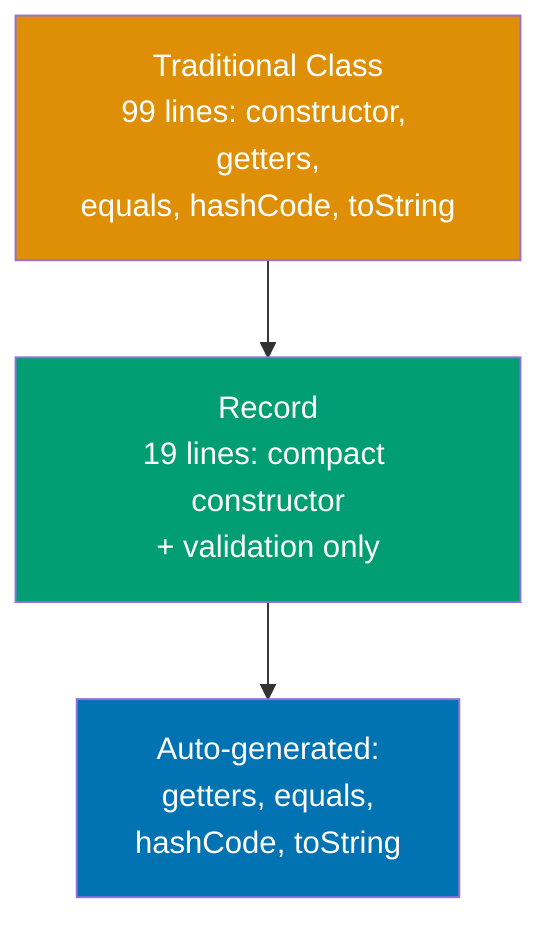

**Code**:

```java
// TRADITIONAL CLASS - verbose
public final class Payment {
    // => Pre-record approach: manual immutability
    // => final: prevents inheritance (security/design)
    private final BigDecimal amount;
        // => Immutable field: cannot be changed after construction
        // => BigDecimal: precise decimal math for money
    private final LocalDate date;
        // => Immutable field: payment date
        // => LocalDate: date without time component

    public Payment(BigDecimal amount, LocalDate date) {
        // => Constructor: manually assign all fields
        // => No validation (caller responsibility)
        this.amount = amount;
            // => Field assignment (manual)
        this.date = date;
            // => Field assignment (manual)
    }

    public BigDecimal amount() { return amount; }
        // => Getter without "get" prefix (record-style naming)
    public LocalDate date() { return date; }
        // => Getter without "get" prefix

    @Override
    public boolean equals(Object o) {
        // => 15 lines of boilerplate equality logic
        // => Compares all fields for structural equality
        // => Handles null and type checking
        if (this == o) return true;
            // => Same reference: equal
        if (o == null || getClass() != o.getClass()) return false;
            // => Null or different class: not equal
        Payment payment = (Payment) o;
            // => Safe cast after type check
        return Objects.equals(amount, payment.amount) &&
               Objects.equals(date, payment.date);
            // => Field-by-field equality (null-safe)
    }

    @Override
    public int hashCode() {
        // => Generates hash from all fields
        // => Required: equals() overridden → hashCode() must match
        return Objects.hash(amount, date);
            // => Consistent hash based on fields
    }

    @Override
    public String toString() {
        // => String representation for debugging
        // => Format: ClassName{field=value, ...}
        return "Payment{amount=" + amount + ", date=" + date + '}';
            // => Manual string concatenation
    }
}

// RECORD - concise (Java 17+)
public record PaymentRecord(
    // => Record declaration: replaces 50+ lines of boilerplate
    // => Automatically: final class, private final fields, constructor, getters, equals, hashCode, toString
    BigDecimal amount,       // => Final field, auto-getter: amount()
                             // => Immutable: no setter generated
                             // => Component: not "field" until after compact constructor
    LocalDate date           // => Final field, auto-getter: date()
                             // => Component: parameter-like until initialization
) {
    // COMPACT CONSTRUCTOR - validation only
    public PaymentRecord {   // => No parameter list (uses record components)
                             // => Runs BEFORE field initialization
                             // => Validates before assignment (fail-fast)
                             // => Compact form: no explicit field assignment needed
        if (amount.compareTo(BigDecimal.ZERO) <= 0) {
                             // => Business rule: amount must be positive
                             // => amount is component parameter here (not field yet)
            throw new IllegalArgumentException("Amount must be positive");
                             // => Throws immediately (object never created)
                             // => No partial construction: all-or-nothing
        }
        Objects.requireNonNull(date, "Date required");
                             // => Null check with custom message
                             // => Prevents null dates
                             // => date is component parameter here
        // => After this block: fields initialized to params
        // => Automatic: this.amount = amount; this.date = date;
        // => No explicit this.amount = amount needed
    }

    // DERIVED METHODS - business logic
    public boolean isRecent() {
        // => Custom method beyond auto-generated ones
        // => Can add domain logic to records
        return date.isAfter(LocalDate.now().minusDays(30));
                             // => LocalDate.now() = current date
                             // => minusDays(30) = 30 days ago
                             // => isAfter checks if payment date > threshold
                             // => Returns true if within last 30 days
    }
}

// USAGE
PaymentRecord payment = new PaymentRecord(
    // => Create record instance via canonical constructor
    new BigDecimal("150.00"),// => amount field
                             // => String constructor for exact decimal
    LocalDate.of(2026, 1, 15)// => date field
                             // => Static factory: year, month, day
);                           // => Compact constructor runs validation
                             // => amount > 0 ✓, date != null ✓
                             // => Fields initialized after validation passes
                             // => payment = PaymentRecord[amount=150.00, date=2026-01-15]

System.out.println(payment.amount());
                             // => Auto-generated getter (no get prefix)
                             // => payment.amount() returns BigDecimal 150.00
                             // => Output: 150.00
System.out.println(payment.date());
                             // => Auto-generated getter
                             // => payment.date() returns LocalDate 2026-01-15
                             // => Output: 2026-01-15
System.out.println(payment);
                             // => Auto-generated toString()
                             // => Format: RecordName[field=value, field=value]
                             // => Output: PaymentRecord[amount=150.00, date=2026-01-15]
                             // => Field names included (better debugging than traditional)

PaymentRecord copy = new PaymentRecord(payment.amount(), payment.date());
                             // => Records have no setters (immutable)
                             // => Create new instance to "modify"
                             // => copy = PaymentRecord[amount=150.00, date=2026-01-15]
System.out.println(payment.equals(copy));
                             // => Auto-generated equals() compares all fields
                             // => payment.amount == copy.amount ✓
                             // => payment.date == copy.date ✓
                             // => Output: true
                             // => Auto-generated structural equality
```

**Key Takeaway**: Use records for immutable data classes (DTOs, value objects, API responses). Records reduce boilerplate by 80%, enforce immutability by default, and provide structural equality automatically. Validation goes in compact constructor.

**Why It Matters**: Before records (pre-Java 14), creating immutable data classes required 50-100 lines of boilerplate for constructors, getters, equals(), hashCode(), and toString(). Tools like Lombok reduced boilerplate but added external dependencies and IDE-specific issues. Records are language-native (no dependencies), compile-time verified, and optimized by JVM. Records model domain concepts clearly: `PaymentRecord` is obviously data (no behavior), unlike traditional classes where intent is unclear. Records integrate with pattern matching (Java 21+), enabling destructuring in switch expressions and instanceof checks. Use records for 90% of immutable data classes—fallback to traditional classes only when inheritance, custom serialization, or mutable fields required.

---

## Example 51: Sealed Classes for Closed Hierarchies

Sealed classes restrict which classes can extend or implement them, enabling exhaustive pattern matching and domain modeling.

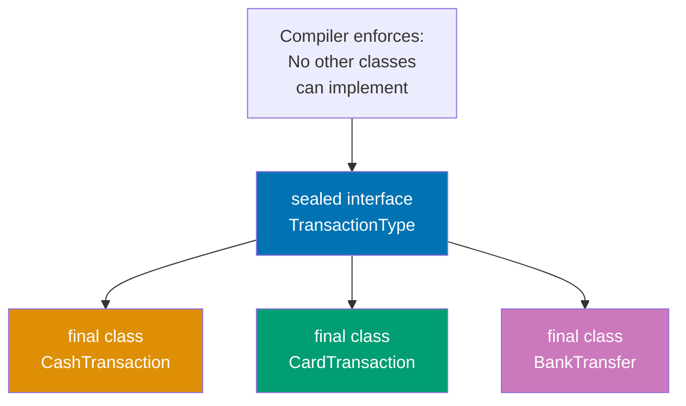

**Code**:

```java
// SEALED INTERFACE - restricts implementors
public sealed interface TransactionType
    // => sealed: restricts which types can implement this interface
    // => Java 17+ feature for closed type hierarchies
    permits CashTransaction, CardTransaction, BankTransfer {
                             // => Only these 3 classes can implement
                             // => Compiler prevents other implementations
                             // => permits clause is exhaustive list
                             // => Enables exhaustive pattern matching
                             // => All permitted types must be in same module/package

    BigDecimal amount();     // => All subtypes must provide amount
                             // => Abstract method: no implementation here
    String description();    // => Common interface method
                             // => Each subtype provides specific description
}

// PERMITTED IMPLEMENTATIONS
public final class CashTransaction implements TransactionType {
                             // => final prevents further subclassing
                             // => Must be in permits clause above
                             // => Implements sealed interface
    private final BigDecimal amount;
        // => Immutable field: transaction amount
    private final String currency;
        // => Immutable field: currency code (USD, EUR, etc.)

    public CashTransaction(BigDecimal amount, String currency) {
        // => Constructor: initialize cash transaction
        this.amount = amount;
            // => Store transaction amount
        this.currency = currency;
            // => Store currency code
    }

    @Override
    public BigDecimal amount() {
        // => Implement abstract method from interface
        return amount;
            // => Return transaction amount
    }

    @Override
    public String description() {
        // => Implement abstract method from interface
        // => Provide cash-specific description format
        return "Cash: " + amount + " " + currency;
                             // => Example: "Cash: 100.00 USD"
                             // => Returns: "Cash: 100.00 USD"
    }
}

public final class CardTransaction implements TransactionType {
                             // => Second permitted subtype
                             // => final: no further subclassing
                             // => Must be listed in permits clause
    private final BigDecimal amount;
        // => Transaction amount for card payment
    private final String last4Digits;
        // => Last 4 digits of card number (security)
        // => Don't store full card number

    public CardTransaction(BigDecimal amount, String last4Digits) {
        // => Constructor: initialize card transaction
        this.amount = amount;
            // => Store payment amount
        this.last4Digits = last4Digits;
            // => Store last 4 digits for display
    }

    @Override
    public BigDecimal amount() {
        // => Implement interface method
        return amount;
            // => Return card payment amount
    }

    @Override
    public String description() {
        // => Implement interface method
        // => Card-specific description format
        return "Card ending " + last4Digits + ": " + amount;
                             // => Example: "Card ending 1234: 50.00"
                             // => Returns: "Card ending 1234: 50.00"
    }
}

public final class BankTransfer implements TransactionType {
                             // => Third permitted subtype
                             // => final: closes inheritance hierarchy
                             // => Must be in permits clause
    private final BigDecimal amount;
        // => Transfer amount
    private final String accountNumber;
        // => Destination account number

    public BankTransfer(BigDecimal amount, String accountNumber) {
        // => Constructor: initialize bank transfer
        this.amount = amount;
            // => Store transfer amount
        this.accountNumber = accountNumber;
            // => Store destination account
    }

    @Override
    public BigDecimal amount() {
        // => Implement interface method
        return amount;
            // => Return transfer amount
    }

    @Override
    public String description() {
        // => Implement interface method
        // => Bank transfer specific format
        return "Bank transfer to " + accountNumber + ": " + amount;
                             // => Example: "Bank transfer to 123456: 200.00"
                             // => Returns: "Bank transfer to 123456: 200.00"
    }
}

// EXHAUSTIVE PATTERN MATCHING (Java 21+)
public String processTransaction(TransactionType txn) {
    // => Pattern matching switch expression (Java 21+)
    // => txn: sealed type (TransactionType)
    return switch (txn) {    // => Compiler checks ALL permitted types covered
                             // => No default case needed (exhaustiveness guaranteed)
                             // => Sealed interface permits exactly 3 types
                             // => Switch must handle all 3
        case CashTransaction c ->
                             // => Matches CashTransaction, binds to 'c'
                             // => No casting needed (pattern variable)
                             // => c has type CashTransaction (compile-time known)
            "Processing cash: " + c.description();
                             // => Calls CashTransaction.description()
                             // => c.description() returns "Cash: 100.00 USD"
                             // => Returns: "Processing cash: Cash: 100.00 USD"

        case CardTransaction card ->
                             // => Matches CardTransaction, binds to 'card'
                             // => card has type CardTransaction
            "Processing card: " + card.description();
                             // => Calls CardTransaction.description()
                             // => card.description() returns "Card ending 1234: 50.00"
                             // => Returns: "Processing card: Card ending 1234: 50.00"

        case BankTransfer bank ->
                             // => Matches BankTransfer, binds to 'bank'
                             // => bank has type BankTransfer
            "Processing bank: " + bank.description();
                             // => Calls BankTransfer.description()
                             // => bank.description() returns "Bank transfer to 123456: 200.00"
                             // => Returns: "Processing bank: Bank transfer to 123456: 200.00"
        // => No default needed: compiler knows these are ALL types
        // => If permits clause changes, compiler errors here (catches bugs)
        // => Exhaustiveness check: all 3 types covered ✓
    };
}

// USAGE
TransactionType txn1 = new CashTransaction(
    // => Create CashTransaction (permitted type)
    // => Assign to sealed interface type
    new BigDecimal("100.00"),// => amount
                             // => Precise decimal for money
    "USD"                    // => currency
                             // => US Dollar
);
    // => txn1 = CashTransaction instance
    // => Stored as TransactionType (interface reference)
System.out.println(processTransaction(txn1));
                             // => Calls processTransaction with CashTransaction
                             // => Switch matches CashTransaction case
                             // => Returns "Processing cash: Cash: 100.00 USD"
                             // => Output: Processing cash: Cash: 100.00 USD

TransactionType txn2 = new CardTransaction(
    // => Create CardTransaction (permitted type)
    new BigDecimal("50.00"), // => amount
                             // => Payment amount
    "1234"                   // => last 4 digits
                             // => Security: partial card number
);
    // => txn2 = CardTransaction instance
    // => Stored as TransactionType
System.out.println(processTransaction(txn2));
                             // => Calls processTransaction with CardTransaction
                             // => Switch matches CardTransaction case
                             // => Returns "Processing card: Card ending 1234: 50.00"
                             // => Output: Processing card: Card ending 1234: 50.00

// COMPILE ERROR if trying to add new implementation
// public final class CheckTransaction implements TransactionType {
//                               // => Compiler error: not in permits clause
//                               // => Cannot implement sealed interface
//                               // => Only CashTransaction, CardTransaction, BankTransfer permitted
// }
```

**Key Takeaway**: Use sealed classes/interfaces to model closed domain hierarchies (payment types, status enums, result types). Compiler enforces exhaustiveness in pattern matching, eliminating runtime errors from missing cases. All permitted types must be final, sealed, or non-sealed.

**Why It Matters**: Sealed classes solve the "expression problem": adding new operations (methods) without modifying existing code, while controlling type extensions. Traditional interfaces allow anyone to implement (open hierarchy), making exhaustive pattern matching impossible—you always need a default case that might hide bugs. Sealed types enable algebraic data types (sum types) common in functional languages: `TransactionType = Cash | Card | Bank`. This powers type-safe state machines, command patterns, and domain models. When adding new permitted type, compiler errors at all switch expressions, forcing updates—prevents forgetting to handle new cases. Use sealed types for domain models with known, fixed variants (HTTP methods, database operations, workflow states). Use traditional interfaces when extensibility required (plugin systems, third-party implementations).

---

## Example 52: Pattern Matching for Switch

Pattern matching for switch combines type checking, casting, and conditional logic in concise syntax.

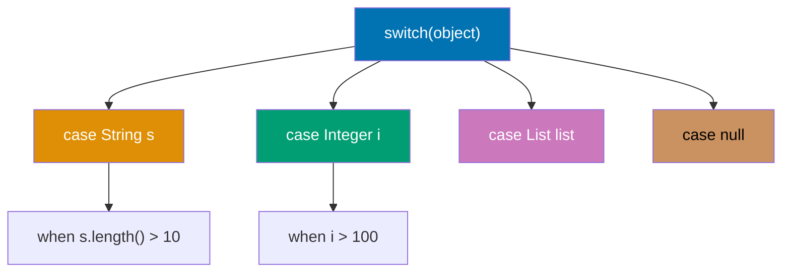

**Code**:

```java
// TRADITIONAL INSTANCEOF CASCADE
public String formatOld(Object obj) {
    if (obj == null) {       // => Manual null check
        return "null";
    } else if (obj instanceof String) {
        String s = (String) obj;
                             // => Manual cast after check
        return "String: " + s;
    } else if (obj instanceof Integer) {
        Integer i = (Integer) obj;
                             // => Duplicate casting boilerplate
        return "Integer: " + i;
    } else if (obj instanceof List<?>) {
        List<?> list = (List<?>) obj;
                             // => Verbose and error-prone
        return "List of " + list.size() + " items";
    } else {
        return "Unknown";
    }
}

// PATTERN MATCHING FOR SWITCH (Java 21+)
public String formatNew(Object obj) {
    return switch (obj) {    // => Switch expression (returns value)
                             // => Exhaustive: covers all cases or uses default

        case null ->         // => Explicit null handling (no NullPointerException)
                             // => Pattern matching supports null case
            "null";          // => Returns: "null"

        case String s ->     // => Type pattern: matches String, binds to 's'
                             // => No explicit cast needed (automatic)
                             // => 's' scoped to this case only
            "String: " + s;  // => Returns: "String: hello"

        case Integer i when i > 100 ->
                             // => Type pattern with GUARD condition
                             // => 'when' adds boolean condition
                             // => Matches Integer AND i > 100
            "Large Integer: " + i;
                             // => Returns: "Large Integer: 150"

        case Integer i ->    // => Fallback for smaller integers
                             // => Ordered after guarded case (guards checked first)
            "Small Integer: " + i;
                             // => Returns: "Small Integer: 42"

        case List<?> list when !list.isEmpty() ->
                             // => Generic type pattern with guard
                             // => Matches non-empty lists only
            "List of " + list.size() + " items";
                             // => Returns: "List of 3 items"

        case List<?> list -> // => Matches empty lists
            "Empty list";    // => Returns: "Empty list"

        default ->           // => Catches all unmatched types
                             // => Required unless cases exhaustive
            "Unknown: " + obj.getClass().getSimpleName();
                             // => Returns: "Unknown: Double" (for 3.14)
    };
}

// RECORD PATTERNS (Java 21+)
record Point(int x, int y) {}
                             // => Simple coordinate record (immutable)
                             // => Two int components: x and y
                             // => Auto-generates: constructor, accessors, equals, hashCode

public String describePoint(Object obj) {
                             // => Method parameter: Object (any type)
                             // => Pattern matching extracts type and components
    return switch (obj) {
                             // => Switch expression on obj
                             // => Pattern matching with record destructuring
        case Point(int x, int y) when x == 0 && y == 0 ->
                             // => RECORD PATTERN: destructures Point into x, y
                             // => Pattern: Point(int x, int y) extracts components
                             // => Extracts fields in one step (no getters needed)
                             // => Guard: when x == 0 && y == 0 checks origin
                             // => Both x and y must be 0
            "Origin";        // => Returns: "Origin" for (0, 0)

        case Point(int x, int y) when x == y ->
                             // => Destructures Point, checks diagonal condition
                             // => Guard: when x == y tests equality
                             // => Matches points on y=x line
            "Diagonal at (" + x + ", " + y + ")";
                             // => String concatenation with coordinates
                             // => Returns: "Diagonal at (5, 5)" for Point(5, 5)

        case Point(int x, int y) when y == 0 ->
                             // => Checks horizontal axis (y coordinate is 0)
                             // => Guard: when y == 0 checks x-axis
            "X-axis at x=" + x;
                             // => Only shows x coordinate (y is 0)
                             // => Returns: "X-axis at x=10" for Point(10, 0)

        case Point(int x, int y) ->
                             // => General point (no guard, matches any Point)
                             // => Fallback for points not matching specific cases
            "Point(" + x + ", " + y + ")";
                             // => General format with both coordinates
                             // => Returns: "Point(3, 7)" for Point(3, 7)

        default -> "Not a point";
                             // => Matches non-Point objects
                             // => Required for Object parameter (not exhaustive)
    };
}

// USAGE
System.out.println(formatNew("hello"));
                             // => Calls formatNew with String argument
                             // => Matches: case String s
                             // => Output: String: hello
System.out.println(formatNew(150));
                             // => Calls formatNew with Integer 150
                             // => Matches: case Integer i when i > 100
                             // => Output: Large Integer: 150
System.out.println(formatNew(42));
                             // => Calls formatNew with Integer 42
                             // => Doesn't match i > 100 guard
                             // => Falls through to: case Integer i
                             // => Output: Small Integer: 42
System.out.println(formatNew(List.of(1, 2, 3)));
                             // => Calls formatNew with List of 3 integers
                             // => Matches: case List<?> list when !list.isEmpty()
                             // => Output: List of 3 items
System.out.println(formatNew(null));
                             // => Calls formatNew with null reference
                             // => Matches: case null (explicit null handling)
                             // => Output: null
System.out.println(formatNew(3.14));
                             // => Calls formatNew with Double 3.14
                             // => No matching case for Double type
                             // => Falls to default case
                             // => Output: Unknown: Double

Point origin = new Point(0, 0);
                             // => Creates Point at origin coordinates
                             // => Record constructor: Point(int x, int y)
System.out.println(describePoint(origin));
                             // => Calls describePoint with Point(0, 0)
                             // => Matches: case Point(int x, int y) when x == 0 && y == 0
                             // => Output: Origin
Point diagonal = new Point(5, 5);
                             // => Creates Point on diagonal line (x == y)
System.out.println(describePoint(diagonal));
                             // => Calls describePoint with Point(5, 5)
                             // => Matches: case Point(int x, int y) when x == y
                             // => Output: Diagonal at (5, 5)
```

**Key Takeaway**: Pattern matching for switch eliminates instanceof-cast boilerplate, supports guards (when clauses) for complex conditions, and enables record destructuring. Use null case to avoid NullPointerException, guards to combine type and logic checks, and sealed types for exhaustive matching.

**Why It Matters**: Traditional instanceof chains required 3 steps per branch: type check (instanceof), cast, then use. Pattern matching reduces this to one step, eliminating 66% of boilerplate and cast errors (forgetting cast after check). Guards (when clauses) avoid nested ifs, making complex conditions readable: `case Integer i when i > 100` vs `if (obj instanceof Integer) { Integer i = (Integer) obj; if (i > 100) {...}}`. Record patterns enable destructuring (extracting fields directly): `case Point(int x, int y)` replaces manual `point.x()`, `point.y()` calls—critical for nested data structures. Sealed types + pattern matching = compiler-verified exhaustiveness: adding new permitted type forces updating all switch expressions (catches bugs at compile-time). This combination brings algebraic data types and exhaustive pattern matching from functional languages (Scala, Haskell) to Java, transforming type-based dispatching from error-prone runtime checks to compile-time guarantees.

---

## Example 53: Optional for Null Safety

Optional explicitly models presence/absence of values, eliminating NullPointerException through functional composition.

**Code**:

```java
// NULL-BASED APPROACH - error-prone
public String findUserEmailOld(String userId) {
                             // => Traditional null-based method signature
                             // => No indication null is possible (documentation only)
    User user = database.findUser(userId);
                             // => Returns null if not found
                             // => Caller must remember to check
                             // => Easy to forget: no compile-time safety
    if (user == null) {
        return null;         // => Null propagation continues
                             // => Caller must check again
                             // => Chain of null checks required
    }

    String email = user.getEmail();
                             // => getEmail() might also return null
                             // => Another hidden null possibility
    if (email == null) {
        return null;         // => Nested null checks proliferate
                             // => 3 levels deep for simple operation
    }

    return email.toLowerCase();
                             // => Risk: NullPointerException if checks missed
                             // => Fragile: any skipped check causes crash
}

// OPTIONAL APPROACH - null-safe
public Optional<String> findUserEmail(String userId) {
                             // => Method signature declares Optional<String>
                             // => Compile-time indication: result might be absent
                             // => Forces caller to handle both cases
    return database.findUserOptional(userId)
                             // => Returns Optional<User> (empty if not found)
                             // => Explicit: caller knows value might be absent
                             // => No null: uses Optional.empty() instead
        .map(User::getEmail) // => map() transforms Optional<User> → Optional<String>
                             // => If user absent: returns Optional.empty() (short-circuits)
                             // => If user present: extracts email, wraps in Optional
                             // => Handles null email: returns Optional.empty()
                             // => No explicit null check needed
        .map(String::toLowerCase);
                             // => Chains transformations safely
                             // => Optional<String> → Optional<String> (lowercase)
                             // => If email absent: returns Optional.empty()
                             // => Entire chain null-safe (no NPE possible)
}

// CREATION
Optional<String> present = Optional.of("value");
                             // => Creates Optional with non-null value
                             // => Throws NullPointerException if "value" is null
                             // => Use when value guaranteed non-null
                             // => present wraps "value" (type: Optional<String>)
Optional<String> nullable = Optional.ofNullable(getValue());
                             // => Creates Optional from potentially null value
                             // => Returns Optional.empty() if getValue() returns null
                             // => Returns Optional.of(value) if getValue() non-null
                             // => Most common creation method (safe for unknowns)
Optional<String> empty = Optional.empty();
                             // => Creates empty Optional explicitly
                             // => Represents absence of value
                             // => Singleton instance (same object reused)

// TRANSFORMATION - map()
Optional<String> upper = Optional.of("hello")
                             // => Creates Optional<String> with "hello"
                             // => Value present (not empty)
    .map(String::toUpperCase);
                             // => map() applies function if value present
                             // => Method reference: String::toUpperCase
                             // => Transforms "hello" → "HELLO"
                             // => Returns Optional<String> with "HELLO"
                             // => If empty: returns Optional.empty() (no function call)
                             // => Type-safe transformation: Optional<String> → Optional<String>

// FLAT MAPPING - flatMap()
public Optional<String> getUserCity(String userId) {
                             // => Method returns Optional<String> (city or empty)
    return database.findUserOptional(userId)
                             // => Optional<User> (user or empty)
                             // => First step in Optional chain
        .flatMap(user -> user.getAddress())
                             // => getAddress() returns Optional<Address>
                             // => flatMap() prevents Optional<Optional<Address>>
                             // => Flattens to Optional<Address>
                             // => If user empty: short-circuits to Optional.empty()
        .flatMap(address -> address.getCity());
                             // => getCity() returns Optional<String>
                             // => flatMap() flattens Optional<Optional<String>> → Optional<String>
                             // => Final result: Optional<String> (city)
                             // => 3-level nested Optional chain without nesting types
}

// FILTERING - filter()
Optional<String> longEmail = Optional.of("user@example.com")
                             // => Creates Optional<String> with email
                             // => Value: "user@example.com" (16 characters)
    .filter(email -> email.length() > 10);
                             // => filter() keeps value if predicate true
                             // => Predicate: email.length() > 10
                             // => email.length() is 16 (> 10), so kept
                             // => Returns Optional<String> with "user@example.com"
                             // => Type unchanged: Optional<String> → Optional<String>

Optional<String> shortEmail = Optional.of("me@co")
                             // => Creates Optional<String> with short email
                             // => Value: "me@co" (5 characters)
    .filter(email -> email.length() > 10);
                             // => Predicate: email.length() > 10
                             // => email.length() is 5 (NOT > 10), so filtered out
                             // => Returns Optional.empty()
                             // => Value discarded because predicate failed

// TERMINAL OPERATIONS
String result1 = Optional.of("value").orElse("default");
                             // => orElse() returns value if present, else default
                             // => Optional contains "value", so returns "value"
                             // => Returns: "value"
                             // => CAVEAT: "default" is ALWAYS evaluated (even if not used)
                             // => Inefficient if default is expensive to compute

String result2 = Optional.empty().orElse("default");
                             // => Optional is empty (no value)
                             // => Falls back to default value
                             // => Returns: "default"

String result3 = Optional.of("value").orElseGet(() -> expensiveDefault());
                             // => orElseGet() takes Supplier (lazy evaluation)
                             // => Optional contains "value", so supplier not called
                             // => Only calls expensiveDefault() if Optional empty
                             // => Returns: "value" (supplier not called)
                             // => Efficient: avoids expensive computation

String result4 = Optional.empty()
                             // => Empty Optional (no value present)
    .orElseThrow(() -> new IllegalStateException("Not found"));
                             // => orElseThrow() throws exception if empty
                             // => Supplier creates exception only when needed
                             // => Throws: IllegalStateException("Not found")
                             // => Use when absence is exceptional condition

// PRESENCE CHECKS
Optional<String> opt = Optional.of("test");
if (opt.isPresent()) {      // => isPresent() returns true if value present
    String value = opt.get();// => get() returns value if present
                             // => DANGER: get() throws NoSuchElementException if empty
                             // => Prefer ifPresent() or orElse() instead
    System.out.println(value);
}

// SAFER PRESENCE HANDLING
Optional.of("test").ifPresent(value -> {
                             // => ifPresent() executes lambda if value present
                             // => No exception risk (lambda not called if empty)
    System.out.println("Value: " + value);
                             // => Output: Value: test
});

Optional.empty().ifPresent(value -> {
                             // => Lambda not executed (Optional empty)
    System.out.println("Value: " + value);
                             // => No output
});

// CONDITIONAL ACTIONS (Java 9+)
Optional.of("test").ifPresentOrElse(
    value -> System.out.println("Found: " + value),
                             // => Action if value present
                             // => Output: Found: test
    () -> System.out.println("Not found")
                             // => Action if value absent
                             // => Not executed (value present)
);

Optional.empty().ifPresentOrElse(
    value -> System.out.println("Found: " + value),
                             // => Not executed (value absent)
    () -> System.out.println("Not found")
                             // => Executed when empty
                             // => Output: Not found
);

// OR OPERATOR (Java 9+)
Optional<String> primary = Optional.empty();
Optional<String> secondary = Optional.of("fallback");

Optional<String> result5 = primary.or(() -> secondary);
                             // => or() returns this Optional if present
                             // => Otherwise returns alternative Optional
                             // => Returns: Optional with "fallback"
                             // => Lazy: supplier only called if primary empty

// STREAM CONVERSION (Java 9+)
List<String> emails = users.stream()
    .map(User::getEmailOptional)
                             // => Stream<Optional<String>>
    .flatMap(Optional::stream)
                             // => Optional.stream() converts Optional → Stream
                             // => Empty optionals become empty streams (filtered out)
                             // => Present optionals become 1-element streams
                             // => flatMap flattens: Stream<Stream<String>> → Stream<String>
    .collect(Collectors.toList());
                             // => Collects only present emails (no nulls)
```

**Key Takeaway**: Use Optional for return types when absence is expected and valid. Chain transformations with map()/flatMap(), provide defaults with orElse()/orElseGet(), and avoid get() (prefer ifPresent()/orElseThrow()). Never use Optional for fields or parameters (use null checks instead).

**Why It Matters**: NullPointerException is Java's most common runtime error, often from forgetting null checks or null propagating through method chains. Optional makes absence explicit in type signatures: `Optional<User> findUser()` vs `User findUser()` clearly signals "might not exist." This shifts null handling from implicit (remember to check) to explicit (compiler/IDE prompts). Functional composition (map, flatMap, filter) enables null-safe chaining without nested ifs: `findUser().map(User::getEmail).map(String::toLowerCase).orElse("unknown")` replaces 10+ lines of null checks. However, Optional has overhead (wrapper object allocation) and should NOT be used everywhere: avoid Optional fields (breaks serialization), Optional parameters (caller burden), or Optional collections (use Collections.emptyList()). Optional excels for return types in queries, configuration lookups, and parsers where absence is meaningful. Java 9+ enhancements (ifPresentOrElse, or, stream) make Optional more powerful, approaching monadic error handling from functional languages.

---

## Example 54: Stream API Collectors

Collectors transform streams into collections, maps, or aggregate values through terminal operations.

**Code**:

```java
record Employee(String name, String department, int salary) {}
                             // => Simple employee record
                             // => Immutable data carrier for employee information

List<Employee> employees = List.of(
    // => Creates immutable list of 5 employees
    new Employee("Alice", "Engineering", 80000),
                             // => Engineering employee, $80k salary
    new Employee("Bob", "Sales", 60000),
                             // => Sales employee, $60k salary
    new Employee("Charlie", "Engineering", 90000),
                             // => Engineering employee, $90k salary (highest)
    new Employee("Diana", "HR", 55000),
                             // => HR employee, $55k salary (lowest)
    new Employee("Eve", "Sales", 65000)
                             // => Sales employee, $65k salary
);                           // => Sample employee data for collector examples

// BASIC COLLECTION
List<String> names = employees.stream()
                             // => Creates stream pipeline for name extraction
    .map(Employee::name)     // => Extracts names: Stream<String>
                             // => Transforms Employee objects to String names
    .collect(Collectors.toList());
                             // => Collects to List<String>
                             // => Returns: ["Alice", "Bob", "Charlie", "Diana", "Eve"]

Set<String> uniqueDepts = employees.stream()
    .map(Employee::department)
                             // => Extracts departments: Stream<String>
    .collect(Collectors.toSet());
                             // => Collects to Set<String> (removes duplicates)
                             // => Returns: ["Engineering", "Sales", "HR"]

// GROUPING BY
Map<String, List<Employee>> byDepartment = employees.stream()
                             // => Stream of 5 employees
    .collect(Collectors.groupingBy(Employee::department));
                             // => groupingBy() creates Map<String, List<Employee>>
                             // => Classifier function: Employee::department
                             // => Automatically groups employees by department string
                             // => Key: department name
                             // => Value: List of employees in that department
                             // => Returns: {
                             //   "Engineering": [Alice, Charlie],
                             //   "Sales": [Bob, Eve],
                             //   "HR": [Diana]
                             // }

// GROUPING WITH DOWNSTREAM COLLECTOR
Map<String, Long> employeeCountByDept = employees.stream()
                             // => Creates stream for processing
    .collect(Collectors.groupingBy(
        Employee::department,// => Classifier: groups by department
                             // => First-level aggregation by department
        Collectors.counting()// => Downstream collector: counts employees
                             // => Second-level aggregation within each group
    ));                      // => Returns Map<String, Long>
                             // => Two-stage collection: group then count
                             // => Returns: {
                             //   "Engineering": 2,
                             //   "Sales": 2,
                             //   "HR": 1
                             // }

Map<String, Integer> totalSalaryByDept = employees.stream()
                             // => Stream all employees for salary aggregation
    .collect(Collectors.groupingBy(
        Employee::department,// => Groups by department
                             // => Creates separate buckets for each department
        Collectors.summingInt(Employee::salary)
                             // => Downstream: sums salaries in each group
                             // => Extracts salary and adds within group
    ));                      // => Returns Map<String, Integer>
                             // => Engineering: 80000+90000, Sales: 60000+65000, HR: 55000
                             // => Returns: {
                             //   "Engineering": 170000,
                             //   "Sales": 125000,
                             //   "HR": 55000
                             // }

Map<String, Optional<Employee>> highestPaidByDept = employees.stream()
                             // => Stream for finding highest paid per department
    .collect(Collectors.groupingBy(
        Employee::department,
                             // => Groups employees by department first
        Collectors.maxBy(Comparator.comparingInt(Employee::salary))
                             // => Downstream: finds employee with max salary
                             // => Comparator compares employees by salary field
    ));                      // => Returns Map<String, Optional<Employee>>
                             // => Optional because group might be empty
                             // => Returns: {
                             //   "Engineering": Optional[Charlie(90000)],
                             //   "Sales": Optional[Eve(65000)],
                             //   "HR": Optional[Diana(55000)]
                             // }

// PARTITIONING BY (boolean predicate)
Map<Boolean, List<Employee>> partitionedBySalary = employees.stream()
                             // => Stream for binary classification
    .collect(Collectors.partitioningBy(e -> e.salary() > 65000));
                             // => partitioningBy() splits into 2 groups: true/false
                             // => Predicate: salary > 65000
                             // => Always returns 2 keys: true and false
                             // => Returns Map<Boolean, List<Employee>>
                             // => Returns: {
                             //   true: [Alice(80000), Charlie(90000)],
                             //   false: [Bob(60000), Diana(55000), Eve(65000)]
                             // }

// MAPPING DOWNSTREAM
Map<String, List<String>> namesByDept = employees.stream()
                             // => Stream for extracting names by department
    .collect(Collectors.groupingBy(
        Employee::department,
                             // => First-level: group by department
        Collectors.mapping(
                             // => Second-level: transform Employee to String
            Employee::name,  // => Extracts name from each employee
                             // => Mapping function applied within each group
            Collectors.toList()
                             // => Collects mapped names to List
                             // => Collects transformed Strings, not Employee objects
        )
    ));                      // => Returns Map<String, List<String>>
                             // => Returns: {
                             //   "Engineering": ["Alice", "Charlie"],
                             //   "Sales": ["Bob", "Eve"],
                             //   "HR": ["Diana"]
                             // }

// JOINING STRINGS
String allNames = employees.stream()
    .map(Employee::name)
    .collect(Collectors.joining(", "));
                             // => joining() concatenates with delimiter
                             // => Returns: "Alice, Bob, Charlie, Diana, Eve"

String formattedNames = employees.stream()
    .map(Employee::name)
    .collect(Collectors.joining(
        ", ",                // => Delimiter between elements
        "Employees: ",       // => Prefix before first element
        "."                  // => Suffix after last element
    ));                      // => Returns: "Employees: Alice, Bob, Charlie, Diana, Eve."

// REDUCING
int totalSalaries = employees.stream()
    .collect(Collectors.summingInt(Employee::salary));
                             // => summingInt() sums integer values
                             // => Returns: 350000

double avgSalary = employees.stream()
    .collect(Collectors.averagingInt(Employee::salary));
                             // => averagingInt() calculates average
                             // => Returns: 70000.0

Optional<Employee> highestPaid = employees.stream()
    .collect(Collectors.maxBy(Comparator.comparingInt(Employee::salary)));
                             // => maxBy() finds maximum by comparator
                             // => Returns: Optional[Charlie(90000)]

// STATISTICS
IntSummaryStatistics stats = employees.stream()
                             // => Stream for comprehensive salary statistics
    .collect(Collectors.summarizingInt(Employee::salary));
                             // => summarizingInt() computes count, sum, min, avg, max
                             // => Single-pass collection of all statistics
                             // => More efficient than 5 separate stream operations
System.out.println(stats.getCount());
                             // => Number of employees processed
                             // => Output: 5
System.out.println(stats.getSum());
                             // => Total of all salaries (80k+60k+90k+55k+65k)
                             // => Output: 350000
System.out.println(stats.getMin());
                             // => Lowest salary (Diana's)
                             // => Output: 55000
System.out.println(stats.getMax());
                             // => Highest salary (Charlie's)
                             // => Output: 90000
System.out.println(stats.getAverage());
                             // => Mean salary (350000 / 5)
                             // => Output: 70000.0

// TO MAP
Map<String, Integer> salaryByName = employees.stream()
    .collect(Collectors.toMap(
        Employee::name,      // => Key mapper: employee name
        Employee::salary     // => Value mapper: salary
    ));                      // => Returns Map<String, Integer>
                             // => Returns: {
                             //   "Alice": 80000,
                             //   "Bob": 60000,
                             //   "Charlie": 90000,
                             //   "Diana": 55000,
                             //   "Eve": 65000
                             // }

// TO MAP WITH MERGE FUNCTION
Map<String, Integer> salaryByDeptMerged = employees.stream()
    .collect(Collectors.toMap(
        Employee::department,// => Key mapper (duplicates exist)
        Employee::salary,    // => Value mapper
        Integer::sum         // => Merge function: handles key collisions
                             // => Sums salaries for same department
    ));                      // => Returns: {
                             //   "Engineering": 170000,
                             //   "Sales": 125000,
                             //   "HR": 55000
                             // }

// FILTERING (Java 9+)
Map<String, List<Employee>> highEarnersbyDept = employees.stream()
    .collect(Collectors.groupingBy(
        Employee::department,
        Collectors.filtering(
            e -> e.salary() > 60000,
                             // => Filter predicate
            Collectors.toList()
                             // => Downstream collector after filtering
        )
    ));                      // => Returns: {
                             //   "Engineering": [Alice, Charlie],
                             //   "Sales": [Eve],
                             //   "HR": []
                             // }

// FLAT MAPPING (Java 9+)
record Department(String name, List<String> teams) {}
List<Department> departments = List.of(
    new Department("Engineering", List.of("Backend", "Frontend")),
    new Department("Sales", List.of("Direct", "Enterprise"))
);

Map<String, List<String>> teamsByDept = departments.stream()
    .collect(Collectors.toMap(
        Department::name,
        Department::teams
    ));
                             // => Regular approach: Map<String, List<String>>

List<String> allTeams = departments.stream()
    .flatMap(d -> d.teams().stream())
                             // => flatMap flattens nested lists
    .collect(Collectors.toList());
                             // => Returns: ["Backend", "Frontend", "Direct", "Enterprise"]
```

**Key Takeaway**: Use Collectors for terminal stream operations: toList()/toSet() for collections, groupingBy() for multi-level grouping, partitioningBy() for boolean splits, joining() for string concatenation, and summarizingInt() for statistics. Compose collectors with downstream collectors for complex aggregations.

**Why It Matters**: Stream collectors enable declarative data transformation, replacing imperative loops with functional pipelines. Before streams (pre-Java 8), grouping required manual map creation and loop-based aggregation (error-prone, verbose). Collectors provide optimized, reusable aggregation strategies: `groupingBy()` handles concurrent collection, `toMap()` detects duplicate keys, `summarizingInt()` computes multiple statistics in one pass. Downstream collectors enable compositional aggregation: group → filter → count in single pipeline. This matches SQL-like expressiveness (GROUP BY, COUNT, SUM) but with type safety and IDE support. Advanced collectors (filtering, flatMapping in Java 9+) eliminate intermediate stream operations, improving performance. Use collectors for ETL pipelines, report generation, and data analysis—prefer imperative loops only when: early termination needed (findFirst), stateful accumulation required, or parallel execution harmful (sequential guarantees).

---

## Example 55: Text Blocks for Multi-Line Strings

Text blocks (Java 17+) provide clean syntax for multi-line strings without escape sequences or concatenation.

**Code**:

```java
// TRADITIONAL STRING CONCATENATION - verbose
String sqlOld = "SELECT users.id, users.name, users.email\n" +
                // => Pre-Java 17 approach: manual string building
                // => Each line is separate String literal
                // => String concatenation at compile time
                "FROM users\n" +
                // => + operator concatenates strings
                // => \n explicitly added for newline
                // => Must escape newline characters
                "JOIN orders ON users.id = orders.user_id\n" +
                // => Must manually maintain formatting
                // => Concatenation operator required for continuation
                "WHERE orders.status = 'ACTIVE'\n" +
                // => Single quotes inside double quotes
                // => Mixing quotes increases complexity
                "ORDER BY users.name";
                // => No \n on last line
                             // => Requires explicit \n for newlines
                             // => Requires + operator for concatenation
                             // => Each line needs quotes and +
                             // => Unreadable formatting (no natural structure)
                             // => Easy to forget \n or +
                             // => Error-prone: missing \n breaks SQL syntax
                             // => Result: valid SQL but hard to maintain
                             // => Developer cognitive load high

// TEXT BLOCK (Java 17+)
String sqlNew = """
    // => Opening """ starts text block
    // => MUST be followed by newline (syntax requirement)
    // => Compiler feature: text blocks are String type
    SELECT users.id, users.name, users.email
        // => SQL query line 1
        // => Indentation preserved relative to closing """
        // => No concatenation operator needed
    FROM users
        // => SQL query line 2
        // => Natural multi-line syntax
    JOIN orders ON users.id = orders.user_id
        // => SQL query line 3
        // => Single quotes don't need escaping
        // => Readability improved dramatically
    WHERE orders.status = 'ACTIVE'
        // => SQL query line 4
        // => Maintains SQL structure visually
    ORDER BY users.name
        // => SQL query line 5 (final line)
        // => Newlines automatically inserted between lines
    """;                     // => Closing """ at indentation level 4
                             // => Triple quotes (""") delimit text block
                             // => Opening """ must be followed by newline
                             // => Automatic newline preservation (no \n needed)
                             // => No escape sequences needed (except \ and """)
                             // => Closing """ determines indentation level
                             // => All lines dedented to match closing """ position
                             // => Result: natural SQL formatting preserved
                             // => sqlNew contains multi-line string with newlines
                             // => Type: String (interchangeable with traditional strings)

// FORMATTING WITH TEXT BLOCKS
String userId = "user123";   // => Variable to inject into SQL
                             // => String interpolation requires placeholder approach
String status = "ACTIVE";    // => Another variable for WHERE clause

String formattedSql = """
    SELECT users.id, users.name, users.email
    FROM users
    WHERE users.id = '%s'
        // => %s is placeholder for String formatting
    AND users.status = '%s'
        // => Second placeholder
    """.formatted(userId, status);
                             // => formatted() method replaces %s placeholders
                             // => First %s replaced with userId ("user123")
                             // => Second %s replaced with status ("ACTIVE")
                             // => Type-safe: requires exact number of arguments
                             // => Compile-time check for argument count mismatch
                             // => Returns multi-line string with substitutions:
                             //    SELECT users.id, users.name, users.email
                             //    FROM users
                             //    WHERE users.id = 'user123'
                             //    AND users.status = 'ACTIVE'

// JSON TEMPLATE
String jsonTemplate = """
    {
      "user": {
        "id": "%s",
            // => Placeholder for user ID
        "name": "%s",
            // => Placeholder for name
        "email": "%s",
            // => Placeholder for email
        "active": %b
            // => Boolean placeholder (%b for boolean formatting)
            // => Text blocks preserve JSON structure naturally
      }
    }
    """.formatted("user123", "Alice", "alice@example.com", true);
                             // => No escaping " needed inside text block
                             // => Double quotes preserved naturally in JSON structure
                             // => Returns valid JSON:
                             // {
                             //   "user": {
                             //     "id": "user123",
                             //     "name": "Alice",
                             //     "email": "alice@example.com",
                             //     "active": true
                             //   }
                             // }

// HTML TEMPLATE
String htmlTemplate = """
    <!DOCTYPE html>
    <html>
      <head>
        <title>%s</title>
            // => Title placeholder
      </head>
      <body>
        <h1>Welcome, %s!</h1>
            // => Name placeholder in heading
        <p>Email: %s</p>
            // => Email placeholder in paragraph
      </body>
    </html>
    """.formatted("User Profile", "Alice", "alice@example.com");
                             // => Natural HTML formatting
                             // => No escape sequences for quotes
                             // => HTML structure preserved exactly as written

// ESCAPE SEQUENCES IN TEXT BLOCKS
String withEscapes = """
    Line 1
    Line 2 with "quoted text"
    Line 3 with \\backslash
    Line 4 with \ttab
    """;                     // => " doesn't need escaping in text block
                             // => \\ escapes backslash
                             // => \t for tab still works
                             // => Returns:
                             // Line 1
                             // Line 2 with "quoted text"
                             // Line 3 with \backslash
                             // Line 4 with    tab

// INDENTATION CONTROL
String indented = """
        Indented by 8 spaces
        Also indented by 8
    """;                     // => Closing """ at column 4
                             // => Content dedented by 4 (minimum indentation)
                             // => Each line keeps 4 extra spaces
                             // => Returns:
                             //     Indented by 8 spaces
                             //     Also indented by 8

String noIndent = """
    Line 1
    Line 2
""";                         // => Closing """ at column 0
                             // => Content dedented by 0 (no common indent)
                             // => Returns:
                             //     Line 1
                             //     Line 2

// TRAILING WHITESPACE (Java 15+)
String preserveTrailing = """
    Line 1   \s
    Line 2\s
    """;                     // => \s preserves trailing space
                             // => Prevents IDE auto-trim
                             // => Returns:
                             // Line 1
                             // Line 2

// LINE CONTINUATION (Java 15+)
String singleLine = """
    This is a very long line that \
    continues on the next line without a newline
    """;                     // => \ at end of line continues to next
                             // => No newline inserted
                             // => Returns: This is a very long line that continues on the next line without a newline

// SCRIPT TEMPLATES
String bashScript = """
    #!/bin/bash
    set -e

    echo "Starting deployment..."
    docker build -t myapp:%s .
    docker push myapp:%s
    kubectl apply -f deployment.yaml
    echo "Deployment complete"
    """.formatted("v1.2.3", "v1.2.3");
                             // => Shell script with version substitution
                             // => Preserves script structure

// REGEX PATTERNS
String emailRegex = """
    ^[A-Za-z0-9+_.-]+@[A-Za-z0-9.-]+\\.[A-Za-z]{2,}$
    """.strip();             // => strip() removes leading/trailing whitespace
                             // => Single backslash for regex (not double)
                             // => Returns: ^[A-Za-z0-9+_.-]+@[A-Za-z0-9.-]+\.[A-Za-z]{2,}$

// COMPARISON: OLD vs NEW
// OLD: 8 lines, 6 escaped newlines, 5 concatenations
String oldWay = "{\n" +
                "  \"status\": \"success\",\n" +
                "  \"data\": {\n" +
                "    \"id\": \"" + id + "\",\n" +
                "    \"value\": " + value + "\n" +
                "  }\n" +
                "}";

// NEW: 8 lines, 0 escapes, 0 concatenations
String newWay = """
    {
      "status": "success",
      "data": {
        "id": "%s",
        "value": %d
      }
    }
    """.formatted(id, value);
                             // => Cleaner, more maintainable
```

**Key Takeaway**: Use text blocks for SQL queries, JSON/XML templates, HTML, scripts, and documentation. Closing `"""` position controls indentation level. Use `.formatted()` for variable substitution, `\s` to preserve trailing spaces, and `\` for line continuation.

**Why It Matters**: Multi-line strings in Java were notoriously painful before text blocks (Java 15), requiring manual newline escapes (`\n`), string concatenation (`+`), and quote escaping (`\"`). This made SQL queries, JSON templates, and HTML generation error-prone and unreadable. Text blocks solve this with: (1) Automatic newline preservation (no `\n`), (2) Quote preservation (no escaping `"` inside block), (3) Smart indentation (dedents to closing `"""`), and (4) Integration with formatted() for variable substitution. This matches multi-line string syntax from Python (`"""`), JavaScript (backticks), and Kotlin (`"""`). Text blocks improve code clarity by making structured text (SQL, JSON, YAML) look like structured text—not concatenated line fragments. Use for: database queries (readable SQL), API responses (JSON/XML templates), documentation (embedded examples), and scripts (shell/Python snippets). Avoid for: single-line strings (use regular `"..."`), dynamic content (prefer template engines for complex HTML), and security-sensitive contexts (sanitize inputs before `formatted()`).

---

## Example 56: Local Variable Type Inference (var)

The `var` keyword (Java 10+) infers local variable types from initializers, reducing verbosity while maintaining type safety.

**Code**:

```java
// TRADITIONAL TYPE DECLARATION - verbose
Map<String, List<Employee>> employeesByDepartment =
    new HashMap<String, List<Employee>>();
                             // => Type repeated 3 times (left, right, diamond)
                             // => Error-prone: must keep left/right synchronized

// VAR TYPE INFERENCE (Java 10+)
var employeesByDept = new HashMap<String, List<Employee>>();
                             // => Compiler infers Map<String, List<Employee>> from right
                             // => Still strongly typed (not dynamic typing)

// GOOD USAGE - type obvious from initializer
var message = "Hello";       // => String (obvious from string literal)
                             // => Inferred type: java.lang.String
var count = 42;              // => int (obvious from integer literal)
                             // => Primitive type inferred, not Integer wrapper
var price = 19.99;           // => double (obvious from decimal literal)
                             // => Primitive double, not Double wrapper
var names = new ArrayList<String>();
                             // => ArrayList<String> (obvious from constructor)
var numbers = List.of(1, 2, 3);
                             // => List<Integer> (obvious from List.of factory)

// GOOD USAGE - diamond operator
var employees = new ArrayList<Employee>();
                             // => ArrayList<Employee> inferred from diamond <>
                             // => var + diamond: maximum brevity with type safety

// GOOD USAGE - complex generic types
var mapper = new HashMap<String, Function<Employee, String>>();
                             // => HashMap<String, Function<Employee, String>>
                             // => Value: avoids complex generic type duplication

// GOOD USAGE - streams
var activeEmployees = employees.stream()
                             // => Creates Stream<Employee> from employees
    .filter(Employee::isActive)
                             // => Filters to active employees only
    .collect(Collectors.toList());
                             // => Collects to List<Employee>
                             // => Clear from context without explicit type

// GOOD USAGE - try-with-resources
try (var reader = new BufferedReader(new FileReader("data.txt"))) {
                             // => BufferedReader inferred from constructor
                             // => Type obvious from BufferedReader constructor
    var line = reader.readLine();
                             // => String inferred from readLine() return type
} catch (IOException e) {    // => Handles file I/O exceptions
                             // => Both file operations and auto-close can throw
}

// GOOD USAGE - loops
for (var employee : employees) {
                             // => Employee inferred from employees collection
    System.out.println(employee.name());
                             // => Calls name() on Employee (type-safe)
}

var entries = map.entrySet();// => Set<Map.Entry<K, V>> inferred from map
                             // => Type: Set<Map.Entry<String, Integer>>
for (var entry : entries) {  // => Map.Entry<String, Integer> inferred per iteration
                             // => entry type extracted from entries Set
    System.out.println(entry.getKey() + ": " + entry.getValue());
                             // => getKey() returns String, getValue() returns Integer
}

// BAD USAGE - type not obvious
var result = process();      // => What type is result?
                             // => Reader must check process() signature
                             // => Harms code review and maintenance

var data = getData();        // => What is data?
                             // => Generic method name gives no hint

// GOOD ALTERNATIVE - explicit type
ProcessedData result = process();
                             // => Clear: result is ProcessedData
UserData data = getData();   // => Clear: data is UserData
                             // => Type visible in code review/diff

// BAD USAGE - null or generic initializers
var value = null;            // => COMPILE ERROR: cannot infer from null
                             // => null has no type information
var list = new ArrayList<>();// => COMPILE ERROR: cannot infer generic type
                             // => Diamond <> requires left-side type context

// BAD USAGE - method parameters (not allowed)
// public void printMessage(var message) {
//                               // => COMPILE ERROR: var only for local variables
// }

// BAD USAGE - fields (not allowed)
// class MyClass {
//     var field = "value";  // => COMPILE ERROR: var only for local variables
// }

// LAMBDAS WITH VAR (Java 11+)
BiFunction<Integer, Integer, Integer> add = (var x, var y) -> x + y;
                             // => var in lambda parameters (all or none rule)
                             // => Without var: (x, y) -> x + y (shorter, no annotations)

// CHAIN READABILITY
// BAD - too much var
var a = getA();              // => What type is a? Unclear
var b = a.getB();            // => What type is b? Must trace through a
var c = b.getC();            // => What type is c? Must trace through a, b
var d = c.getD();            // => Unclear: what are a, b, c, d?
                             // => Cognitive overload tracing types

// GOOD - selective var
UserAccount account = getAccount();
                             // => Explicit: account is UserAccount
var transactions = account.getTransactions();
                             // => List<Transaction> inferred (obvious from method name)
var recent = transactions.stream()
                             // => Stream<Transaction> from transactions list
    .filter(t -> t.isRecent())
                             // => Filters to recent transactions only
    .collect(Collectors.toList());
                             // => Collects filtered stream to List<Transaction>

// COMPARISON
// BEFORE var
Map<String, List<Transaction>> transactionsByUser =
    new HashMap<String, List<Transaction>>();
                             // => 83 characters

// AFTER var
var transactionsByUser = new HashMap<String, List<Transaction>>();
                             // => 67 characters
```

**Key Takeaway**: Use `var` when type is obvious from right side (constructors, method calls, literals). Avoid `var` when type is unclear (generic method names, complex return types). Never use for fields, parameters, or when initializer lacks type info (null, raw generics). `var` reduces verbosity, not type safety.

**Why It Matters**: Java's verbosity (repeating types) was a long-standing criticism, especially with generics: `Map<String, List<Employee>> map = new HashMap<String, List<Employee>>()` repeats the type declaration twice. `var` reduces this without sacrificing type safety—Java remains statically typed, compiler infers exact type from initializer. This isn't dynamic typing (like JavaScript `var`): once inferred, type is fixed and compile-time checked. `var` shines with: (1) Complex generics (nested types), (2) Diamond operator (avoid repeating `<Type>`), (3) Streams (type obvious from operations), (4) Try-with-resources (resource type clear). However, overusing `var` harms readability: `var result = process()` forces reader to check `process()` signature, while `ProcessedData result = process()` is self-documenting. Use `var` as "don't repeat yourself" (DRY) for types, not "hide the type." Modern IDEs show inferred types on hover, but code reviews and diffs lack this—prioritize readability. `var` adoption guideline: if deleting left-hand type makes reader pause, keep explicit type; if right-hand side clearly shows type, use `var`.

---

## Example 57: Try-With-Resources for Resource Management

Try-with-resources (Java 7+) automatically closes resources implementing AutoCloseable, eliminating finally-block boilerplate and resource leaks.

**Code**:

```java
// MANUAL RESOURCE MANAGEMENT - error-prone
public void processFileOld(String path) throws IOException {
    BufferedReader reader = null;
                             // => Initialize to null for finally block
                             // => Necessary for finally block scope
    try {
        reader = new BufferedReader(new FileReader(path));
                             // => Opens file resource (acquires system handle)
                             // => FileReader opens file, BufferedReader wraps it
                             // => Resource leak if exception before assignment
                             // => Assignment happens AFTER constructor success
        String line = reader.readLine();
                             // => Read first line from file
                             // => Returns String or null if EOF
        System.out.println(line);
                             // => Output: first line content
                             // => Prints to console
    } finally {
        if (reader != null) {// => Manual null check required
                             // => Prevents NullPointerException if reader never assigned
            try {
                reader.close();
                             // => Manual close in finally block
                             // => Releases file handle to OS
                             // => Another try-catch for close() exceptions
                             // => close() itself can throw IOException
            } catch (IOException e) {
                             // => Swallows close exception (bad practice)
                             // => Original exception takes precedence
                e.printStackTrace();
                             // => Prints close exception to stderr
            }
        }
    }                        // => 15 lines for simple file read
                             // => Verbose, error-prone, nested try-catch
}

// TRY-WITH-RESOURCES (Java 7+)
public void processFile(String path) throws IOException {
    try (BufferedReader reader = new BufferedReader(new FileReader(path))) {
                             // => Resource declared in try(...) parentheses
                             // => Syntax: try (Resource r = new Resource()) { ... }
                             // => Implements AutoCloseable (close() called automatically)
                             // => Compiler generates finally block internally
                             // => Guaranteed close even if exception thrown
                             // => Resource scope limited to try block
        String line = reader.readLine();
                             // => Read file content (first line)
                             // => Can throw IOException
        System.out.println(line);
                             // => Output: first line of file
                             // => Prints line content to console
    }                        // => reader.close() called automatically here (implicit finally)
                             // => Close happens before catch/finally blocks
                             // => If exception in try body: close() still called
                             // => If close() throws: exception suppressed, original thrown
                             // => Suppressed exceptions available via getSuppressed()
}                            // => 6 lines (60% less code than manual approach)
                             // => No null checks, no nested try-catch

// MULTIPLE RESOURCES
public void copyFile(String source, String dest) throws IOException {
    try (BufferedReader reader = new BufferedReader(new FileReader(source));
                             // => First resource: source file reader
                             // => Opens source file for reading
                             // => Must implement AutoCloseable
         BufferedWriter writer = new BufferedWriter(new FileWriter(dest))) {
                             // => Second resource: destination file writer
                             // => Opens dest file for writing (creates if doesn't exist)
                             // => Multiple resources separated by semicolon (;)
                             // => Can declare any number of resources
                             // => Closed in REVERSE order: writer, then reader
                             // => Reverse order prevents dependencies breaking
                             // => Guaranteed cleanup even if reader/writer throws

        String line;         // => Variable to hold each line from source
                             // => Declared outside loop for scope
        while ((line = reader.readLine()) != null) {
                             // => Reads line, assigns to 'line', checks if null
                             // => null indicates end of file (EOF)
                             // => Loop continues while lines remain
                             // => Idiomatic Java pattern: assign + test in while condition
            writer.write(line);
                             // => Write line to destination file
                             // => Does not append newline (write raw content)
            writer.newLine();// => Add platform-specific newline
                             // => Uses system line separator (\n or \r\n)
        }                    // => Loop exits at EOF (readLine() returns null)
                             // => Automatic flush and close for both resources
    }                        // => writer closed first (reverse order), then reader
                             // => All data flushed to disk before close
}

// EFFECTIVELY FINAL RESOURCES (Java 9+)
public void processExistingResource(BufferedReader reader) throws IOException {
                             // => reader parameter passed from caller
                             // => Caller owns resource, method uses it
    // Java 7-8: must declare inside try
    // try (BufferedReader r = reader) { ... }
                             // => Required dummy assignment in Java 7-8

    // Java 9+: can use effectively final variable
    try (reader) {           // => reader must be final or effectively final
                             // => "Effectively final": no reassignment after initialization
                             // => No reassignment needed (cleaner syntax)
                             // => Cleaner for resources from parameters/fields
        String line = reader.readLine();
                             // => Read first line from reader
                             // => Can throw IOException
        System.out.println(line);
                             // => Output: line content to console
    }                        // => reader.close() called automatically
                             // => Caller's resource closed by method (careful!)
}

// CUSTOM AUTOCLOSEABLE RESOURCE
class DatabaseConnection implements AutoCloseable {
                             // => Custom resource implementing AutoCloseable
                             // => Contract: must provide close() method
    private Connection conn; // => Underlying JDBC connection
                             // => Private field encapsulates resource

    public DatabaseConnection(String url) throws SQLException {
                             // => Constructor acquires resource
                             // => throws SQLException if connection fails
        this.conn = DriverManager.getConnection(url);
                             // => Opens database connection via JDBC
                             // => Acquires connection from driver (resource allocation)
        System.out.println("Database connected");
                             // => Output: Database connected (initialization complete)
    }

    public void executeQuery(String sql) throws SQLException {
                             // => Executes SQL query on connection
        try (Statement stmt = conn.createStatement()) {
                             // => Nested try-with-resources
                             // => Statement is also AutoCloseable
                             // => Statement auto-closed after block
            stmt.execute(sql);
                             // => Execute SQL query via statement
                             // => Can be SELECT, INSERT, UPDATE, DELETE, etc.
        }                    // => stmt.close() called automatically here
    }

    @Override
    public void close() throws SQLException {
                             // => Called automatically by try-with-resources
                             // => Contract method from AutoCloseable interface
                             // => Releases acquired resource
        if (conn != null && !conn.isClosed()) {
                             // => Check connection is valid and open
                             // => Prevents double-close (idempotent close)
                             // => !conn.isClosed() ensures connection still open
            conn.close();    // => Close underlying JDBC connection
                             // => Returns connection to pool (if pooled)
            System.out.println("Database disconnected");
                             // => Output: Database disconnected (cleanup complete)
        }
    }
}

// USAGE OF CUSTOM RESOURCE
public void queryDatabase(String sql) throws SQLException {
    try (DatabaseConnection db = new DatabaseConnection("jdbc:...")) {
                             // => Output: Database connected
                             // => db.close() will be called automatically
        db.executeQuery(sql);
    }                        // => Output: Database disconnected
                             // => Guaranteed cleanup
}

// SUPPRESSED EXCEPTIONS
public void demonstrateSuppressedExceptions() {
    try (var resource = new AutoCloseable() {
                             // => Anonymous inner class implementing AutoCloseable
                             // => Created inline for demonstration
        @Override
        public void close() throws Exception {
                             // => Override close() method
                             // => Will be called automatically by try-with-resources
            throw new Exception("Error during close");
                             // => close() throws exception
                             // => Simulates close() failure scenario
        }
    }) {
        throw new Exception("Error in try block");
                             // => try block throws exception FIRST
                             // => Original/primary exception
                             // => close() called before catch, also throws
    } catch (Exception e) {
        System.out.println("Main exception: " + e.getMessage());
                             // => Output: Main exception: Error in try block
                             // => e is the original try block exception
                             // => Original exception preserved (not lost)

        Throwable[] suppressed = e.getSuppressed();
                             // => getSuppressed() returns close() exceptions
                             // => Array of exceptions suppressed during close
                             // => Mechanism prevents losing close() errors
        System.out.println("Suppressed exceptions: " + suppressed.length);
                             // => Output: Suppressed exceptions: 1
                             // => One exception from close() added as suppressed
        System.out.println("Suppressed: " + suppressed[0].getMessage());
                             // => Output: Suppressed: Error during close
                             // => First suppressed exception is close() error
                             // => Available for debugging resource cleanup issues
    }                        // => Close exceptions don't hide original exception
                             // => Best of both worlds: primary + close() exceptions
}

// NESTED TRY-WITH-RESOURCES
public void processNestedResources() throws IOException {
    try (var outer = new BufferedReader(new FileReader("outer.txt"))) {
                             // => Outer resource (longer lifetime)
                             // => Opens outer.txt file for reading
                             // => Remains open for entire outer try block
        String config = outer.readLine();
                             // => Reads config value from outer file
                             // => config contains filename to process

        try (var inner = new BufferedReader(new FileReader(config))) {
                             // => Inner resource (shorter lifetime)
                             // => Opens file named in config variable
                             // => Nested try-with-resources (independent cleanup)
            String data = inner.readLine();
                             // => Reads data from inner file
            System.out.println(data);
                             // => Output: data content from inner file
        }                    // => inner.close() called here (inner scope exits)
                             // => Inner resource released first
    }                        // => outer.close() called here (outer scope exits)
                             // => Outer resource released second
                             // => Clean separation of resource lifetimes
                             // => Each resource lives only as long as needed
}

// COMPARISON: OLD vs NEW
// OLD: 20+ lines, manual null checks, error-prone
FileInputStream fis = null;
try {
    fis = new FileInputStream("data.txt");
    // ... use fis
} finally {
    if (fis != null) {
        try {
            fis.close();
        } catch (IOException e) {
            e.printStackTrace();
        }
    }
}

// NEW: 3 lines, automatic cleanup, exception-safe
try (var fis = new FileInputStream("data.txt")) {
    // ... use fis
}                            // => fis.close() guaranteed
```

**Key Takeaway**: Always use try-with-resources for AutoCloseable resources (files, streams, connections). Resources close in reverse declaration order. Close exceptions are suppressed (not lost) if try block throws. Java 9+ allows effectively final variables in try(...).

**Why It Matters**: Resource leaks (unclosed files, connections, streams) were a major source of bugs in Java before try-with-resources (Java 7). Traditional finally blocks required: (1) Null checks (resource might not initialize), (2) Nested try-catch for close() exceptions, (3) Manual exception handling that often swallowed close() errors. Try-with-resources automates this: compiler generates finally block that calls close() in reverse order, handles null automatically, and preserves exceptions (close() exceptions suppressed, not lost). This prevents: file descriptor exhaustion (OS limit on open files), connection pool leaks (database connections not returned), memory leaks (streams holding references). Try-with-resources works with any AutoCloseable: files (BufferedReader, FileWriter), streams (InputStream, OutputStream), network (Socket, ServerSocket), database (Connection, Statement, ResultSet), and custom resources. Java 9+ improvement (effectively final resources) enables passing resources as parameters without re-wrapping. Exception handling improved: try block exception is primary, close() exceptions available via getSuppressed()—critical for debugging resource cleanup failures. Modern Java code should use try-with-resources for 100% of AutoCloseable resources—manual finally blocks are code smell indicating pre-Java 7 patterns.

---

## Example 58: Builder Pattern for Complex Objects

Builder pattern creates complex objects step-by-step, providing readable construction with validation and optional parameters.

**Code**:

```java
// PROBLEM - complex constructor
public class LoanAgreement {
                             // => Class demonstrates telescoping constructor anti-pattern
    private final String id;       // => Immutable field (final)
    private final String borrower; // => Borrower identifier
    private final String lender;   // => Lender identifier
    private final BigDecimal principal; // => Loan amount
    private final BigDecimal interestRate; // => Annual interest rate
    private final int termMonths;  // => Loan term in months
    private final LocalDate startDate; // => Loan start date
    private final String purpose;  // => Loan purpose (optional)
    private final boolean secured; // => Secured/unsecured flag
    private final List<String> collateral; // => Collateral items (optional)
                             // => 10 fields: some required, some optional
                             // => Too many fields for simple constructor

    // BAD: telescoping constructor
    public LoanAgreement(String id, String borrower, String lender,
                        BigDecimal principal, BigDecimal interestRate,
                        int termMonths, LocalDate startDate) {
                             // => Constructor with 7 required parameters
                             // => Delegates to main constructor
                             // => Constructor chaining to avoid duplication
        this(id, borrower, lender, principal, interestRate,
             termMonths, startDate, null, false, List.of());
                             // => Calls overloaded constructor with defaults
                             // => purpose=null, secured=false, collateral=[]
                             // => Hard to read: which parameter is which?
                             // => Telescoping: multiple overloaded constructors
                             // => Anti-pattern: requires many constructor overloads
    }

    public LoanAgreement(String id, String borrower, String lender,
                        BigDecimal principal, BigDecimal interestRate,
                        int termMonths, LocalDate startDate, String purpose,
                        boolean secured, List<String> collateral) {
                             // => 10 parameters (unreadable, unmaintainable)
                             // => Parameter order easy to mix up
                             // => No named parameters in Java
                             // => IDE required to know parameter positions
        this.id = id;            // => Assigns id field
        this.borrower = borrower; // => Assigns borrower field
        this.lender = lender;    // => Assigns lender field
        this.principal = principal; // => Assigns principal field
        this.interestRate = interestRate; // => Assigns interest rate
        this.termMonths = termMonths; // => Assigns term
        this.startDate = startDate; // => Assigns start date
        this.purpose = purpose;  // => Assigns optional purpose
        this.secured = secured;  // => Assigns secured flag
        this.collateral = List.copyOf(collateral);
                             // => Defensive copy of collateral list
                             // => Ensures immutability (caller can't modify)
    }
}

// SOLUTION - Builder Pattern
public class LoanAgreement {
    // Immutable fields
    private final String id;         // => final: immutable after construction
                             // => Cannot be reassigned after initialization
    private final String borrower;   // => Borrower identifier
    private final String lender;     // => Lender identifier
    private final BigDecimal principal; // => Loan amount (required)
    private final BigDecimal interestRate; // => Annual interest rate (required)
    private final int termMonths;    // => Loan term in months (required)
    private final LocalDate startDate; // => Loan start date (required)
    private final String purpose;    // => Loan purpose (optional, can be empty)
    private final boolean secured;   // => Secured/unsecured flag (optional, default false)
    private final List<String> collateral; // => Collateral items (optional, default empty)
                             // => All fields final: object is immutable after construction

    // PRIVATE CONSTRUCTOR - only builder can create
    private LoanAgreement(Builder builder) {
                             // => Accepts Builder, not individual fields
                             // => Private: only Builder.build() can call
                             // => Enforces builder pattern usage
                             // => Single constructor reduces duplication
                             // => Validation in one place (not scattered)
        this.id = builder.id;    // => Copies id from builder
                             // => Builder already validated these fields
        this.borrower = builder.borrower; // => Copies borrower
        this.lender = builder.lender; // => Copies lender
        this.principal = builder.principal; // => Copies principal
        this.interestRate = builder.interestRate; // => Copies interest rate
        this.termMonths = builder.termMonths; // => Copies term
        this.startDate = builder.startDate; // => Copies start date
        this.purpose = builder.purpose; // => Copies optional purpose
        this.secured = builder.secured; // => Copies secured flag
        this.collateral = builder.collateral; // => Shares list reference (already defensive copied)
                             // => All fields assigned from builder state

        validate();          // => Centralized validation after all fields set
                             // => Ensures object invariants before construction completes
                             // => Throws if validation fails (object never created)
    }

    private void validate() {
                             // => Business rule validation method
                             // => Called from constructor (fail-fast)
        if (borrower == null || borrower.isBlank()) {
                             // => Null check and empty check
            throw new IllegalArgumentException("Borrower required");
                             // => Required field violation
        }
        if (principal.compareTo(BigDecimal.ZERO) <= 0) {
                             // => BigDecimal comparison (can't use < operator)
                             // => Ensures principal is positive
            throw new IllegalArgumentException("Principal must be positive");
                             // => Business rule: no zero/negative loans
        }
        if (termMonths <= 0) {
                             // => Primitive int comparison
            throw new IllegalArgumentException("Term must be positive");
                             // => Business rule: loan must have duration
        }
                             // => Business rule validation
                             // => Fails fast before object fully constructed
                             // => Prevents invalid objects from existing
    }

    // Getters - simple accessors for immutable fields
    public String id() { return id; } // => Returns loan identifier
    public String borrower() { return borrower; } // => Returns borrower identifier
    public BigDecimal principal() { return principal; } // => Returns loan principal amount
    // ... other getters (interestRate, termMonths, startDate, purpose, secured, collateral)

    // BUILDER CLASS
    public static class Builder {
                             // => Static nested class (no outer instance reference)
                             // => Mutable fields (before building)
                             // => Fluent interface pattern (method chaining)
                             // => Separates mutable construction from immutable object
                             // => Builder holds temporary state during construction
        // Required fields (no defaults)
        private String id;       // => Initially null (set via id() method)
                             // => Must be set before build() or validation fails
        private String borrower; // => Initially null (required)
        private String lender;   // => Initially null (required)
        private BigDecimal principal; // => Initially null (required)
        private BigDecimal interestRate; // => Initially null (required)
        private int termMonths;  // => Initially 0 (required, validated)
        private LocalDate startDate; // => Initially null (required)
                             // => Required fields have no defaults (must be set explicitly)
                             // => Null/zero values indicate field not yet set

        // Optional fields with defaults
        private String purpose = ""; // => Default: empty string
                             // => Optional: caller can skip setting this
        private boolean secured = false; // => Default: unsecured loan
                             // => Most loans are unsecured
        private List<String> collateral = List.of(); // => Default: empty immutable list
                             // => No collateral by default
                             // => Optional fields provide sensible defaults
                             // => Caller can override if needed

        // REQUIRED FIELD SETTERS - return this for chaining
        public Builder id(String id) {
                             // => Setter for required field
                             // => Mutable setter on builder (not LoanAgreement itself)
            this.id = id;    // => Sets id field on builder
            return this;     // => Returns builder for method chaining
                             // => Enables: builder.id(...).borrower(...)
                             // => Fluent interface: reads like natural language
        }

        public Builder borrower(String borrower) {
                             // => Setter for required borrower field
            this.borrower = borrower;
                             // => Stores borrower value
                             // => No validation here (validation happens in build())
            return this;     // => Returns this for chaining
        }

        public Builder lender(String lender) {
                             // => Setter for required lender field
            this.lender = lender;
                             // => Stores lender value
            return this;     // => Returns this for chaining
                             // => Allows continuing builder chain
        }

        public Builder principal(BigDecimal principal) {
                             // => Setter for loan amount (required)
            this.principal = principal;
                             // => Stores principal amount
            return this;     // => Returns this for chaining
        }

        public Builder interestRate(BigDecimal interestRate) {
                             // => Setter for interest rate (required)
            this.interestRate = interestRate;
                             // => Stores annual interest rate
            return this;     // => Returns this for chaining
        }

        public Builder termMonths(int termMonths) {
                             // => Setter for loan term (required)
            this.termMonths = termMonths;
                             // => Stores term duration in months
                             // => No validation yet (validation deferred to build())
            return this;     // => Returns this for chaining
                             // => Enables: .termMonths(36).startDate(...)
        }

        public Builder startDate(LocalDate startDate) {
                             // => Setter for loan start date (required)
            this.startDate = startDate;
                             // => Stores loan start date
                             // => LocalDate is immutable (thread-safe)
            return this;     // => Returns this for chaining
                             // => Final required field before build()
        }

        // OPTIONAL FIELD SETTERS
        public Builder purpose(String purpose) {
                             // => Setter for optional purpose field
                             // => Unlike required fields, has default value
            this.purpose = purpose;
                             // => Overrides default empty string
                             // => Caller can omit if purpose not needed
            return this;     // => Optional: caller can skip this
                             // => Returns this for chaining
                             // => Pattern: optional setters identical to required
        }

        public Builder secured(boolean secured) {
                             // => Setter for optional secured flag
            this.secured = secured;
                             // => Overrides default false
                             // => Most loans are unsecured (default matches common case)
            return this;     // => Returns this for chaining
                             // => Only call if loan is secured
        }

        public Builder collateral(List<String> collateral) {
                             // => Setter for optional collateral list
            this.collateral = List.copyOf(collateral);
                             // => Defensive copy (prevents external modification)
                             // => Creates immutable copy of input list
                             // => Caller can't modify list after passing to builder
                             // => Ensures builder immutability guarantee
                             // => List.copyOf() throws if input is null
            return this;     // => Returns this for chaining
                             // => Enables: .collateral(...).build()
        }

        // BUILD METHOD - creates LoanAgreement
        public LoanAgreement build() {
                             // => Terminal operation (ends chaining)
                             // => Creates immutable LoanAgreement from builder
                             // => Final method in builder chain
            return new LoanAgreement(this);
                             // => Calls private constructor with builder
                             // => Passes entire builder (not individual fields)
                             // => Single-argument constructor simplifies signature
                             // => Validation happens in constructor
                             // => Throws if validation fails
                             // => Returns fully initialized immutable object
        }
    }

    // FACTORY METHOD - creates builder
    public static Builder builder() {
                             // => Static factory method for builder creation
                             // => Entry point for builder pattern
                             // => Clearer than "new Builder()" syntax
                             // => Usage: LoanAgreement.builder().id(...).build()
                             // => Conventional naming: "builder()" not "newBuilder()"
        return new Builder();// => Returns new builder instance
                             // => Builder has default values for optional fields
                             // => Required fields initialized to null/0
    }
}

// USAGE - fluent API
LoanAgreement loan = LoanAgreement.builder()
                             // => Creates builder
                             // => Entry point for building process
                             // => Returns Builder instance with defaults
    .id("LOAN-2024-001")    // => Sets id, returns builder
                             // => First method call in chain
    .borrower("John Doe")   // => Sets borrower, returns builder
                             // => Chain continues (fluent pattern)
    .lender("Bank Corp")    // => Method chaining (fluent interface)
                             // => Reads like natural language
                             // => No parameter position confusion
    .principal(new BigDecimal("50000"))
                             // => $50,000 loan amount
    .interestRate(new BigDecimal("0.065"))
                             // => 6.5% annual interest rate
    .termMonths(36)
                             // => 3-year loan term (36 months)
    .startDate(LocalDate.of(2024, 1, 1))
                             // => Loan starts January 1, 2024
    .purpose("Home renovation")
                             // => Optional field (can be omitted)
                             // => Named parameters simulate (no parameter order confusion)
                             // => Self-documenting code (purpose is clear)
    .secured(true)          // => Another optional field
                             // => Indicates loan is secured by collateral
    .collateral(List.of("Property deed"))
                             // => Optional list parameter
                             // => Specifies what secures the loan
    .build();               // => Builds LoanAgreement instance
                             // => Validation runs here
                             // => Returns immutable object or throws exception
                             // => loan is fully initialized LoanAgreement

// USAGE - minimal required fields only
LoanAgreement minimalLoan = LoanAgreement.builder()
                             // => Create builder for minimal loan
    .id("LOAN-2024-002")
                             // => Second loan example
    .borrower("Jane Smith")
                             // => Different borrower
    .lender("Credit Union")
                             // => Different lender
    .principal(new BigDecimal("25000"))
                             // => $25,000 loan (smaller than first example)
    .interestRate(new BigDecimal("0.055"))
                             // => 5.5% interest (lower rate)
    .termMonths(24)
                             // => 2-year term (shorter than first)
    .startDate(LocalDate.now())
                             // => Start date is today
    .build();               // => Optional fields use defaults
                             // => purpose="", secured=false, collateral=[]
                             // => No .purpose(), .secured(), .collateral() calls
                             // => Demonstrates optional parameter flexibility
                             // => purpose = "", secured = false, collateral = []
                             // => minimalLoan is unsecured loan with no stated purpose

// VALIDATION FAILURE
try {
                             // => Try block for validation exception handling
    LoanAgreement invalid = LoanAgreement.builder()
                             // => Attempt to build invalid loan
        .id("LOAN-2024-003")
                             // => Valid ID
        .borrower("")       // => Invalid: blank borrower
                             // => Will trigger validation error
        .lender("Bank")
                             // => Valid lender
        .principal(new BigDecimal("-1000"))
                             // => Invalid: negative principal
                             // => Business rule violation
        .interestRate(new BigDecimal("0.05"))
                             // => Valid interest rate
        .termMonths(-12)    // => Invalid: negative term
                             // => Another business rule violation
        .startDate(LocalDate.now())
                             // => Valid start date
        .build();           // => Throws IllegalArgumentException
                             // => Validation in constructor detects first error
                             // => Fails fast: stops at first violation
} catch (IllegalArgumentException e) {
                             // => Catches validation exception
    System.out.println("Validation error: " + e.getMessage());
                             // => Output: Validation error: Borrower required
                             // => Shows first validation error found
}

// ALTERNATIVE: RECORD WITH BUILDER (Java 17+)
// For simple cases, use record with static factory
public record SimpleLoan(String id, String borrower, BigDecimal amount) {
    public static Builder builder() {
        return new Builder();
    }

    public static class Builder {
        private String id;
        private String borrower;
        private BigDecimal amount;

        public Builder id(String id) {
            this.id = id;
            return this;
        }

        public Builder borrower(String borrower) {
            this.borrower = borrower;
            return this;
        }

        public Builder amount(BigDecimal amount) {
            this.amount = amount;
            return this;
        }

        public SimpleLoan build() {
            return new SimpleLoan(id, borrower, amount);
                             // => Record constructor handles immutability
        }
    }
}

SimpleLoan simple = SimpleLoan.builder()
    .id("SIMPLE-001")
    .borrower("Alice")
    .amount(new BigDecimal("10000"))
    .build();               // => Combines record + builder
```

**Key Takeaway**: Use builder pattern for classes with 4+ parameters, optional fields, or complex validation. Builder provides: fluent API (method chaining), named parameters (readability), immutability (fields set once), and centralized validation (in build() or constructor). For simple cases, records reduce builder boilerplate.

**Why It Matters**: Java lacks named parameters and default arguments (unlike Python, Kotlin), making constructors with many parameters unreadable: `new LoanAgreement("id", "borrower", "lender", principal, rate, term, date, purpose, true, collateral)` (which parameter is which?). Telescoping constructors (multiple overloads for optional params) explode combinatorially: 3 optional params = 8 constructors. Builder pattern solves this with: (1) Named setters (`.borrower("John")` self-documents), (2) Optional params (skip `.purpose()` if not needed), (3) Immutability (final fields after build()), (4) Validation (centralized in build()). The fluent API (returning `this`) enables method chaining, reading like natural language: `builder().id("x").borrower("y").build()`. Builders shine for: configuration objects (many optional settings), test data (readable test setup), DSLs (domain-specific languages), and API responses (flexible field sets). Downsides: boilerplate (builder class doubles code size) and memory (temporary builder object). Java 14+ records reduce builder boilerplate for simple cases (no custom validation). Consider Lombok's `@Builder` annotation to auto-generate builders, or Kotlin's data classes with default params (eliminates builder need). Modern Java projects use builders for 90% of complex domain objects—telescoping constructors are anti-pattern post-Java 8.

---

## Example 59: Immutability Patterns with Records

Immutability ensures objects never change after creation, providing thread safety and predictable behavior. Records (Java 17+) enforce immutability by default.

**Code**:

```java
// MUTABLE CLASS - problematic
public class MutableAccount {
    // => Traditional mutable design (pre-records)
    private BigDecimal balance;
                             // => Not final: can be changed after construction
                             // => Mutable field: reassignable via setter
    private String owner;
                             // => Also not final: mutable

    public MutableAccount(BigDecimal balance, String owner) {
                             // => Constructor sets initial state
        this.balance = balance;
                             // => Initial balance assignment
        this.owner = owner;
                             // => Initial owner assignment
    }

    public void setBalance(BigDecimal balance) {
                             // => Setter allows mutation
                             // => Public API to change state after construction
                             // => Thread-unsafe: concurrent modifications
                             // => Race condition: two threads calling setBalance simultaneously
        this.balance = balance;
                             // => Direct field mutation (problematic)
    }

    public BigDecimal getBalance() {
        return balance;      // => Returns current balance
                             // => Value may change between calls (unpredictable)
    }

    // PROBLEM: shared mutable state
    MutableAccount account = new MutableAccount(new BigDecimal("1000"), "Alice");
                             // => Creates account with initial balance 1000
    processPayment(account); // => Modifies account.balance
                             // => Side effect: account state changed
    generateReport(account); // => Sees modified balance (unexpected)
                             // => Reports different value than initial
                             // => Hard to reason about state changes
                             // => Who modified balance? When? Why?
}

// IMMUTABLE CLASS - traditional approach
public final class ImmutableAccount {
                             // => final class: prevents subclassing
                             // => Subclasses could add mutable fields
                             // => Without final, subclass could break immutability
    private final BigDecimal balance;
                             // => final field: cannot be reassigned
                             // => Assigned once in constructor, never changes
    private final String owner;
                             // => All fields final (deeply immutable)
                             // => No setters exist to modify these

    public ImmutableAccount(BigDecimal balance, String owner) {
                             // => Constructor is only place to set fields
        this.balance = balance;
                             // => First and last assignment to balance
        this.owner = owner;  // => Fields set once in constructor
                             // => After construction, object frozen
    }

    // NO SETTERS - only getters
    public BigDecimal balance() { return balance; }
                             // => Read-only access, no setter available
    public String owner() { return owner; }
                             // => Accessor returns field value, cannot modify

    // MODIFIED COPY - returns new instance
    public ImmutableAccount withBalance(BigDecimal newBalance) {
                             // => Functional update: returns NEW object
                             // => Pattern: "with" prefix for copy methods
                             // => Original object unchanged
                             // => This object (this.balance, this.owner) remains frozen
        return new ImmutableAccount(newBalance, this.owner);
                             // => Creates copy with updated field
                             // => New object with newBalance, keeps original owner
    }

    public ImmutableAccount deposit(BigDecimal amount) {
                             // => Business operation returns new instance
        return new ImmutableAccount(
            this.balance.add(amount),
                             // => Calculates new balance
                             // => BigDecimal.add() also returns new instance (immutable)
            this.owner
                             // => Owner unchanged, copied to new instance
        );                   // => Returns new ImmutableAccount
                             // => Original account unchanged
                             // => Caller must use returned value
}

// USAGE - immutable operations
ImmutableAccount account = new ImmutableAccount(new BigDecimal("1000"), "Alice");
                             // => Original account: balance = 1000
ImmutableAccount updated = account.deposit(new BigDecimal("500"));
                             // => New account: balance = 1500
System.out.println(account.balance());
                             // => Output: 1000 (original unchanged)
System.out.println(updated.balance());
                             // => Output: 1500 (new instance)

// RECORD - immutable by default (Java 17+)
public record Account(
                             // => record keyword: compact immutable class
    BigDecimal balance,      // => Implicitly final
                             // => Compiler generates private final field
    String owner             // => Implicitly final
                             // => Record components become final fields
) {                          // => No boilerplate: equals, hashCode, toString auto-generated
                             // => Auto-generated: balance(), owner() accessors

    // COMPACT CONSTRUCTOR - validation
    public Account {         // => Runs before field initialization
                             // => No parameter list (compact syntax)
                             // => Parameters (balance, owner) available automatically
        if (balance.compareTo(BigDecimal.ZERO) < 0) {
                             // => Validation: balance >= 0
            throw new IllegalArgumentException("Balance cannot be negative");
                             // => Fails fast on invalid state
        }
        Objects.requireNonNull(owner, "Owner required");
                             // => Null check: owner must exist
                             // => After validation, fields initialized automatically
    }

    // FUNCTIONAL UPDATES - return new instances
    public Account deposit(BigDecimal amount) {
                             // => Business method: returns new instance
        return new Account(balance.add(amount), owner);
                             // => Creates new record with updated balance
                             // => Original record unchanged (this.balance still 1000)
    }

    public Account withdraw(BigDecimal amount) {
                             // => Withdrawal with validation
        if (balance.compareTo(amount) < 0) {
                             // => Validates sufficient funds
            throw new IllegalArgumentException("Insufficient funds");
                             // => Fails instead of returning invalid state
        }
        return new Account(balance.subtract(amount), owner);
                             // => Returns new record with reduced balance
    }

    public Account transferOwner(String newOwner) {
                             // => Ownership transfer (balance unchanged)
        return new Account(balance, newOwner);
                             // => Creates new record with different owner
                             // => Balance copied, owner replaced
    }
}

// USAGE - record immutability
Account account1 = new Account(new BigDecimal("1000"), "Alice");
Account account2 = account1.deposit(new BigDecimal("500"));
Account account3 = account2.withdraw(new BigDecimal("200"));
                             // => Chained functional updates
                             // => Each operation returns new instance
System.out.println(account1.balance());
                             // => Output: 1000 (original unchanged)
System.out.println(account2.balance());
                             // => Output: 1500
System.out.println(account3.balance());
                             // => Output: 1300

// DEFENSIVE COPYING - for mutable field types
public record MutableFieldRecord(List<String> items) {
                             // => List is mutable type (not String/BigDecimal)
                             // => DANGER: external code can modify list
                             // => Records don't automatically defend against mutable fields

    // BAD: exposes mutable internal state
    // Caller can do: record.items().add("hack");
    // => Without defensive copy, caller mutates internal state
    // => Breaks immutability guarantee

    // GOOD: defensive copy in compact constructor
    public MutableFieldRecord {
                             // => Compact constructor intercepts initialization
        items = List.copyOf(items);
                             // => Creates immutable copy
                             // => List.copyOf() returns unmodifiable list
                             // => External changes don't affect record
                             // => items parameter replaced with immutable copy
    }

    // ALTERNATIVE: return copy from accessor
    @Override
    public List<String> items() {
                             // => Overrides auto-generated accessor
        return List.copyOf(items);
                             // => Returns immutable copy
                             // => Caller cannot modify internal state
                             // => Two-layer defense: copy in constructor + accessor
    }
}

// USAGE - defensive copying
List<String> original = new ArrayList<>(List.of("A", "B", "C"));
MutableFieldRecord record = new MutableFieldRecord(original);
original.add("D");           // => Modifies original list
System.out.println(record.items());
                             // => Output: [A, B, C] (record unaffected)
                             // => Defensive copy protected internal state

// NESTED IMMUTABILITY
public record Address(String street, String city, String zip) {}
                             // => Immutable nested record
                             // => All fields (street, city, zip) final

public record Person(String name, Address address) {
                             // => Nested immutable structure
                             // => address field is final reference to immutable Address
                             // => Deep immutability: Person and Address both frozen

    public Person withAddress(Address newAddress) {
                             // => Replace entire address
        return new Person(name, newAddress);
                             // => Functional update
                             // => New Person with different Address instance
    }

    public Person withCity(String newCity) {
                             // => Update nested field (city within address)
        return new Person(
            name,
                             // => Name unchanged
            new Address(address.street(), newCity, address.zip())
                             // => Creates new Address with updated city
                             // => street and zip copied from original address
        );                   // => Deep immutability: all levels immutable
                             // => New Person with new Address (both objects replaced)
    }
}

// USAGE - nested immutability
Address addr1 = new Address("123 Main St", "Boston", "02101");
Person person1 = new Person("Alice", addr1);
Person person2 = person1.withCity("Cambridge");
                             // => Creates new Person with new Address
System.out.println(person1.address().city());
                             // => Output: Boston (original unchanged)
System.out.println(person2.address().city());
                             // => Output: Cambridge

// IMMUTABLE COLLECTIONS
public record Portfolio(Map<String, BigDecimal> holdings) {
                             // => Map is mutable type
                             // => Need defensive copy to maintain immutability

    public Portfolio {
                             // => Compact constructor for defensive copy
        holdings = Map.copyOf(holdings);
                             // => Defensive copy: immutable map
                             // => Map.copyOf() returns unmodifiable map
                             // => Prevents external modification
                             // => Internal map cannot be changed after construction
    }

    public Portfolio addHolding(String symbol, BigDecimal shares) {
                             // => Functional update: add holding
        var updated = new HashMap<>(holdings);
                             // => Creates mutable copy of immutable map
                             // => Need mutable copy to modify
        updated.put(symbol, shares);
                             // => Adds new holding
                             // => Modifies temporary mutable copy
        return new Portfolio(updated);
                             // => Returns new Portfolio with updated holdings
                             // => Original Portfolio unchanged
    }

    public Portfolio removeHolding(String symbol) {
                             // => Functional update: remove holding
        var updated = new HashMap<>(holdings);
                             // => Mutable copy for modification
        updated.remove(symbol);
                             // => Removes holding from copy
        return new Portfolio(updated);
                             // => New Portfolio without removed holding
    }
}

// COMPARISON: MUTABLE vs IMMUTABLE
// MUTABLE - risky
MutableAccount mut = new MutableAccount(new BigDecimal("1000"), "Alice");
processPayment(mut);         // => SIDE EFFECT: modifies mut.balance
System.out.println(mut.getBalance());
                             // => Output: ??? (depends on processPayment implementation)
                             // => Hard to track state changes

// IMMUTABLE - safe
Account imm = new Account(new BigDecimal("1000"), "Alice");
Account result = processPaymentImmutable(imm);
                             // => Returns NEW account
                             // => Original account unchanged
System.out.println(imm.balance());
                             // => Output: 1000 (guaranteed)
System.out.println(result.balance());
                             // => Output: [calculated balance]
                             // => Easy to reason about: no hidden state changes
```

**Key Takeaway**: Use records for immutability by default. All record fields are implicitly final (no setters). For updates, create new instances with modified values (functional updates). Use defensive copying (List.copyOf(), Map.copyOf()) for mutable field types. Immutability provides thread safety, predictable behavior, and hashcode stability.

**Why It Matters**: Mutable objects are a primary source of bugs in concurrent programs: race conditions (simultaneous modifications), inconsistent state (partial updates), and unpredictable behavior (methods change object state). Immutability eliminates these: immutable objects are thread-safe by default (no synchronization needed), can be safely shared across threads, and have stable hash codes (safe for HashMap/HashSet keys). Before records (pre-Java 14), creating immutable classes required: final class declaration, final fields, no setters, defensive copying in constructors/getters, manual equals/hashCode/toString—50+ lines of boilerplate. Records reduce this to one line: `record Account(BigDecimal balance, String owner) {}`. Functional updates (`withBalance()`, `deposit()`) replace setters, returning new instances instead of modifying existing ones—this matches functional programming patterns (Haskell, Clojure) and modern JavaScript (React immutability). Immutability enables: safe caching (values never change), optimistic concurrency (compare-and-swap), and event sourcing (state history preserved). Use immutability for: value objects (Money, Address), domain events (OrderPlaced, PaymentReceived), configuration (AppConfig), and API responses. Avoid for: large data structures (copying overhead), UI state (frequent updates), or performance-critical hot paths (profiling required). Modern Java embraces immutability as default—mutable classes require justification, not vice versa.

---

## Functional Programming in Java

Functional programming in Java enables writing cleaner, more predictable code through pure functions, immutability, and function composition. This section covers functional interfaces, lambda expressions, method references, streams, and functional error handling patterns.

## Type Safety in Java

Master compile-time type safety through modern Java features: sealed classes for exhaustive handling, Optional for null safety, JSpecify annotations for null-checking, records for immutable value objects, and type-safe patterns that prevent runtime errors.

## Error Handling Patterns

## Example 60: Try-With-Resources Automatic Cleanup

Try-with-resources automatically closes resources that implement AutoCloseable interface. Resources are closed in reverse order of declaration, even if exceptions occur.

**Manual cleanup vs automatic cleanup**:

```java
import java.io.*;
    // => Import IOException, BufferedReader, FileReader

public class ResourceManagement {
    // MANUAL CLEANUP - verbose, error-prone
    public String manualCleanup(String path) throws IOException {
        // => Old-style resource management (pre-Java 7)
        // => path: file path to read from
        BufferedReader reader = null;
            // => Must initialize outside try
            // => null allows use in finally block
            // => Required for proper scope

        try {
            reader = new BufferedReader(new FileReader(path));
                // => Open resource
                // => FileReader opens file
                // => BufferedReader wraps for efficient reading
            return reader.readLine();
                // => Read data
                // => Returns first line of file
                // => Early return: finally block still executes
        } finally {
            // => Cleanup block: always executes
            // => Executes even if return or exception
            if (reader != null) {
                // => Null check required
                // => Prevents NPE if new FileReader failed
                try {
                    reader.close();
                        // => Nested try-catch for close()
                        // => close() can throw IOException
                } catch (IOException e) {
                    // => Handle close() exception separately
                    // => Close exception doesn't hide primary exception
                    e.printStackTrace();
                        // => Log close failure
                }
            }
        }
        // => Problems: verbose (nested try-catch), error-prone (forgot null check = NPE)
    }

    // AUTOMATIC CLEANUP - concise, safe
    public String automaticCleanup(String path) throws IOException {
        // => Modern resource management (Java 7+)
        // => path: file path to read from
        try (BufferedReader reader = new BufferedReader(new FileReader(path))) {
            // => Resource declared in try(...) parentheses
            // => Must implement AutoCloseable interface
            // => Automatically closed when try block exits
            // => reader scope limited to try block
            // => No null check needed

            return reader.readLine();
                // => Read data
                // => Returns first line of file
                // => reader.close() called before return
        } // => reader.close() called automatically here
          // => Even if exception thrown or return executed
          // => No explicit close() needed
          // => Exception handling: close exception suppressed if primary exists

        // => Benefits: concise (no manual close), safe (always closed), proper exception handling
    }
}
```

**Multiple resources - reverse order closing**:

```java
import java.io.*;
    // => Import IOException, BufferedReader, BufferedWriter, etc.

public class MultipleResources {
    public void copyFile(String source, String dest) throws IOException {
        // => Copy file contents from source to dest
        // => source: path to input file
        // => dest: path to output file
        try (
            // MULTIPLE RESOURCES - declared in try-with-resources
            // Resource 1: opened first
            BufferedReader reader = new BufferedReader(new FileReader(source));
                // => reader created first
                // => new FileReader(source) opens file for reading
                // => BufferedReader wraps for efficient line reading
                // => reader implements AutoCloseable

            // Resource 2: opened second
            BufferedWriter writer = new BufferedWriter(new FileWriter(dest))
                // => writer created second
                // => new FileWriter(dest) opens file for writing
                // => BufferedWriter wraps for efficient writing
                // => writer implements AutoCloseable
                // => Note: no semicolon after last resource
        ) {
            String line;
                // => Variable to hold each line read from source
            while ((line = reader.readLine()) != null) {
                // => Read each line from source
                // => reader.readLine() returns String or null (EOF)
                // => Assignment + null check in one expression
                // => Loop continues until EOF (line == null)
                writer.write(line);
                    // => Write to destination
                    // => line contains current line content (no newline)
                writer.newLine();
                    // => Add newline
                    // => Platform-appropriate line separator
            }
            // => All lines copied when loop exits

        } // => Automatic closing happens here (REVERSE ORDER)
          // => Order: writer.close() called FIRST (reverse order)
          // => writer flushed and closed (output file finalized)
          // => Then: reader.close() called SECOND
          // => Reverse order ensures dependent resources closed first
          // => Even if exception thrown, both resources closed
    }
}
```

**Custom AutoCloseable resource**:

```java
// CUSTOM RESOURCE - implements AutoCloseable
class DatabaseConnection implements AutoCloseable {
    // => Custom resource for automatic cleanup with try-with-resources
    // => Must implement close() method from AutoCloseable
    private boolean closed = false;
        // => Track resource state to prevent double-close
        // => Initially false (connection open)

    public DatabaseConnection(String url) {
        // => Constructor: initialize database connection
        // => url: connection string (e.g., "jdbc:mysql://localhost")
        System.out.println("Opening connection to: " + url);
            // => Simulate connection establishment
            // => Output: Opening connection to: jdbc:mysql://localhost
            // => Resource initialization
            // => closed remains false (connection is open)
    }

    public void executeQuery(String sql) {
        // => Execute SQL query on connection
        // => sql: SQL statement to execute
        if (closed) {
            // => Check if resource already closed
            // => Prevents use-after-close bugs
            throw new IllegalStateException("Connection closed");
                // => Runtime exception: cannot use closed connection
        }
        System.out.println("Executing: " + sql);
            // => Simulate query execution
            // => Output: Executing: SELECT * FROM users
            // => Only reached if connection still open
    }

    @Override
    public void close() {
        // => Required by AutoCloseable interface
        // => Called automatically by try-with-resources
        // => Cleanup method: release database connection

        if (!closed) {
            // => Only close if not already closed
            // => Idempotent: safe to call multiple times
            System.out.println("Closing database connection");
                // => Simulate connection release
                // => Output: Closing database connection
            closed = true;
                // => Mark as closed
                // => Subsequent executeQuery() calls will fail
        }
        // => If already closed, do nothing (idempotent)
    }
}

// USAGE - automatic cleanup
public class DatabaseExample {
    public void queryDatabase() {
        // => Demonstrate automatic resource management
        try (DatabaseConnection conn = new DatabaseConnection("jdbc:mysql://localhost")) {
            // => Opens connection
            // => conn = new DatabaseConnection("jdbc:mysql://localhost")
            // => Output: Opening connection to: jdbc:mysql://localhost
            // => conn.close() will be called automatically at block exit

            conn.executeQuery("SELECT * FROM users");
                // => Execute query while connection open
                // => Output: Executing: SELECT * FROM users
                // => closed = false (connection still open)

        } // => conn.close() called automatically HERE
          // => Happens even if executeQuery throws exception
          // => Output: Closing database connection
          // => closed = true (connection now closed)
          // => Guaranteed cleanup even if exception thrown
    }
}
```

**Exception suppression with try-with-resources**:

```java
import java.io.*;
    // => Import IOException and AutoCloseable

class ProblematicResource implements AutoCloseable {
    // => Custom resource that throws during both use AND close
    // => Demonstrates exception suppression mechanism
    private final String name;
        // => Resource identifier for error messages

    public ProblematicResource(String name) {
        // => Constructor: initialize resource name
        this.name = name;
            // => Store name for later use in exceptions
    }

    public void useResource() throws IOException {
        // => Simulate resource usage that fails
        throw new IOException("Error using " + name);
            // => Primary exception from resource use
            // => Example: "Error using db"
            // => This is the MAIN exception (not suppressed)
    }

    @Override
    public void close() throws IOException {
        // => AutoCloseable contract: cleanup resource
        // => Called automatically by try-with-resources
        throw new IOException("Error closing " + name);
            // => Secondary exception from close()
            // => Example: "Error closing db"
            // => This will be SUPPRESSED (attached to primary)
    }
}

public class SuppressionExample {
    public void demonstrateSuppression() {
        // => Demonstrate exception suppression in try-with-resources
        try (ProblematicResource resource = new ProblematicResource("db")) {
            // => Resource created successfully
            // => resource.name = "db"
            // => close() will be called automatically on exit

            resource.useResource();
                // => Throws IOException: "Error using db"
                // => This is PRIMARY exception
                // => After this throws, close() is called automatically
                // => close() also throws: "Error closing db"
                // => Close exception is SUPPRESSED (not lost!)

        } catch (IOException e) {
            // => Catches primary exception from useResource()
            // => e = IOException("Error using db")
            // => Close exception attached as suppressed
            System.out.println("Primary exception: " + e.getMessage());
                // => e.getMessage() = "Error using db"
                // => Output: Primary exception: Error using db

            // SUPPRESSED EXCEPTIONS - from close()
            Throwable[] suppressed = e.getSuppressed();
                // => Array of exceptions suppressed during cleanup
                // => suppressed.length is 1
                // => suppressed[0] = IOException("Error closing db")
                // => Access exceptions from close() that were attached

            for (Throwable s : suppressed) {
                // => Iterate over suppressed exceptions
                // => s = IOException("Error closing db")
                System.out.println("Suppressed exception: " + s.getMessage());
                    // => s.getMessage() = "Error closing db"
                    // => Output: Suppressed exception: Error closing db
            }
        }

        // => Primary exception preserved: "Error using db"
        // => Close exception attached as suppressed: "Error closing db"
        // => Both exceptions available for debugging
        // => No exceptions lost during cleanup
    }
}
```

**Key Takeaway**: Try-with-resources automatically closes resources implementing AutoCloseable interface. Resources declared in try(...) parentheses are closed automatically when try block exits (normal completion, exception, or return). Multiple resources close in reverse order of declaration: last opened, first closed. Exception suppression: if both try block and close() throw exceptions, try exception is primary, close exception becomes suppressed exception accessible via getSuppressed().

**Why It Matters**: Manual resource cleanup is error-prone: forgot to close (resource leak), close() throws exception (complicates error handling), and null check required (verbose). Try-with-resources eliminates these issues: guaranteed cleanup (even with exception or return), proper exception handling (suppressed exceptions), and no null checks (resource initialized in try statement). Real-world impact: resource leaks cause production outages (file descriptor exhaustion crashes server), memory leaks from unclosed connections (heap exhaustion), and database connection pool starvation (blocked transactions). AutoCloseable contract: close() method is idempotent (safe to call multiple times), close() releases resources (file handles, network sockets, database connections), and close() should not throw exceptions if possible (simplifies cleanup). Multiple resource order matters: writer depends on reader (close writer first to flush buffers), child resource depends on parent (close child first), and reverse order ensures proper cleanup cascade. Exception suppression preserves debugging context: primary exception is what went wrong in business logic, suppressed exceptions show cleanup failures, and both available in stack trace. Modern practice: always use try-with-resources for AutoCloseable objects, implement AutoCloseable for custom resources needing cleanup, and make close() idempotent (track state, guard against double-close).

## Example 61: Custom Result Type for Functional Error Handling

Result<T, E> type represents computation that may succeed with value T or fail with error E. Enables functional error handling without exceptions.

**Custom Result implementation**:

```java
// RESULT TYPE - sealed for exhaustiveness
public sealed interface Result<T, E> permits Success, Failure {
    // => Sealed: only Success and Failure can implement Result
    // => Compiler enforces handling both cases
    // => T = success value type, E = error type
    // => Alternative to throwing exceptions

    // FACTORY METHODS
    static <T, E> Result<T, E> success(T value) {
        // => Create successful result
        // => Generic method: infers T and E from context
        return new Success<>(value);
            // => Wrap successful value
            // => Returns Success<T, E> as Result<T, E>
    }

    static <T, E> Result<T, E> failure(E error) {
        // => Create failed result
        // => Generic method: infers T and E from context
        return new Failure<>(error);
            // => Wrap error value
            // => Returns Failure<T, E> as Result<T, E>
    }

    // QUERY METHODS
    boolean isSuccess();
        // => Returns true if Success, false if Failure
        // => Use for conditional logic
    boolean isFailure();
        // => Returns true if Failure, false if Success
        // => Opposite of isSuccess()

    // TRANSFORMATION METHODS
    <U> Result<U, E> map(Function<T, U> mapper);
        // => Transform success value
        // => Signature: T → U (function that transforms value)
        // => Returns: Result<U, E> (new success type, same error type)
        // => Example: Result<String, E> → Result<Integer, E>

    <U> Result<U, E> flatMap(Function<T, Result<U, E>> mapper);
        // => Chain operations that return Result
        // => Signature: T → Result<U, E> (function returns Result)
        // => Returns: Result<U, E> (unwrapped, not Result<Result<U, E>>)
        // => Prevents nesting when chaining Result-returning operations

    T orElse(T defaultValue);
        // => Extract value or provide default
        // => Returns: T (the success value or defaultValue)
        // => Use when you need a value regardless of success/failure

    T orElseThrow(Function<E, ? extends RuntimeException> exceptionMapper);
        // => Convert to exception if failure
        // => Signature: E → RuntimeException (convert error to exception)
        // => Returns: T (success value) or throws RuntimeException
        // => Bridge between Result style and exception style
}

// SUCCESS CASE - contains value
record Success<T, E>(T value) implements Result<T, E> {
    // => Record: immutable, automatic equals/hashCode/toString
    // => value is the successful result
    // => Component accessor: value() returns T
    // => Compact constructor validates value not null (optional)

    @Override
    public boolean isSuccess() {
        // => Query method implementation
        return true;
            // => Success always returns true for isSuccess()
    }

    @Override
    public boolean isFailure() {
        // => Query method implementation
        return false;
            // => Success always returns false for isFailure()
    }

    @Override
    public <U> Result<U, E> map(Function<T, U> mapper) {
        // => Transform the success value
        // => mapper: T → U (transforms value to new type)
        return Result.success(mapper.apply(value));
            // => Apply transformation to value
            // => mapper.apply(value) returns U
            // => Wrap result in new Success<U, E>
            // => Type changes: Result<T, E> → Result<U, E>
    }

    @Override
    public <U> Result<U, E> flatMap(Function<T, Result<U, E>> mapper) {
        // => Chain operation that returns Result
        // => mapper: T → Result<U, E> (returns Result, not plain value)
        return mapper.apply(value);
            // => Apply transformation that returns Result
            // => mapper.apply(value) returns Result<U, E>
            // => Return Result directly (no double-wrapping)
            // => Prevents Result<Result<U, E>> nesting
    }

    @Override
    public T orElse(T defaultValue) {
        // => Extract value or use default
        // => defaultValue: fallback if this were Failure
        return value;
            // => Success: return actual value (ignore default)
            // => defaultValue parameter unused in Success case
    }

    @Override
    public T orElseThrow(Function<E, ? extends RuntimeException> exceptionMapper) {
        // => Extract value or throw exception
        // => exceptionMapper: E → RuntimeException (unused in Success)
        return value;
            // => Success: return value (no exception)
            // => exceptionMapper parameter unused in Success case
    }
}

// FAILURE CASE - contains error
record Failure<T, E>(E error) implements Result<T, E> {
    // => error is the failure reason
    // => Component accessor: error() returns E
    // => No value of type T (failure state)

    @Override
    public boolean isSuccess() {
        // => Query method implementation
        return false;
            // => Failure always returns false for isSuccess()
    }

    @Override
    public boolean isFailure() {
        // => Query method implementation
        return true;
            // => Failure always returns true for isFailure()
    }

    @Override
    @SuppressWarnings("unchecked")
        // => Suppress warning: unchecked cast is safe here
    public <U> Result<U, E> map(Function<T, U> mapper) {
        // => Transform attempt: but no value to transform
        // => mapper: T → U (unused, no T value exists)
        return (Result<U, E>) this;
            // => Failure: skip transformation (no value to transform)
            // => Cast is safe: Failure<anything, E> is compatible
            // => this is Failure<T, E>, cast to Result<U, E>
            // => Works because Failure only cares about E, not T
    }

    @Override
    @SuppressWarnings("unchecked")
        // => Suppress warning: unchecked cast is safe here
    public <U> Result<U, E> flatMap(Function<T, Result<U, E>> mapper) {
        // => Chain attempt: but no value to chain from
        // => mapper: T → Result<U, E> (unused, no T value)
        return (Result<U, E>) this;
            // => Failure: skip transformation
            // => Cast reasoning same as map()
            // => Preserves error, changes result type signature
    }

    @Override
    public T orElse(T defaultValue) {
        // => Extract value or use default
        // => No value in Failure, so use defaultValue
        return defaultValue;
            // => Failure: return default (no actual value)
            // => defaultValue becomes the result
    }

    @Override
    public T orElseThrow(Function<E, ? extends RuntimeException> exceptionMapper) {
        // => Extract value or throw exception
        // => Failure has no value, so throw
        // => exceptionMapper: E → RuntimeException (convert error type)
        throw exceptionMapper.apply(error);
            // => Failure: convert error to exception and throw
            // => exceptionMapper.apply(error) creates RuntimeException
            // => Method never returns (always throws)
    }
}
```

**Using Result for error handling**:

```java
// ERROR TYPE - domain-specific errors
enum UserError {
    // => Enum constants with associated messages
    USER_NOT_FOUND("User not found"),
        // => Error case: user ID doesn't exist in system
    INVALID_EMAIL("Invalid email format"),
        // => Error case: email validation failed
    DATABASE_ERROR("Database connection failed");
        // => Error case: infrastructure failure

    private final String message;
        // => Each enum constant has a message field

    UserError(String message) {
        // => Constructor called for each enum constant
        this.message = message;
            // => Store message for later retrieval
    }

    public String getMessage() {
        return message;
            // => Expose error message to callers
    }
}

// SERVICE USING RESULT
class UserService {
    public Result<String, UserError> findUserEmail(String userId) {
        // => Returns Result: either Success<String> or Failure<UserError>
        // => No exceptions thrown!
        // => Type: Result<String, UserError> (email string or user error)

        if (userId == null || userId.isEmpty()) {
            // => Validate input: null/empty is invalid
            return Result.failure(UserError.INVALID_EMAIL);
                // => Validation failure
                // => Returns Failure<String, UserError>
        }

        if (userId.equals("123")) {
            // => Check if user exists (simplified lookup)
            return Result.success("user@example.com");
                // => Success case: email found
                // => Returns Success<String, UserError>
                // => Wrapped value: "user@example.com"
        }

        return Result.failure(UserError.USER_NOT_FOUND);
            // => Failure case: user doesn't exist
            // => Returns Failure<String, UserError>
    }

    public Result<String, UserError> getUserDomain(String userId) {
        // => Chain operations using flatMap
        // => Type: Result<String, UserError> (domain or error)
        return findUserEmail(userId)
                // => Returns Result<String, UserError>
                // => Could be Success("user@example.com") or Failure(USER_NOT_FOUND)
            .flatMap(email -> extractDomain(email));
                // => Only called if findUserEmail succeeds
                // => extractDomain returns Result<String, UserError>
                // => flatMap unwraps: no nested Result
                // => Final type: Result<String, UserError> (domain or error)
    }

    private Result<String, UserError> extractDomain(String email) {
        // => Parse email to extract domain part
        int atIndex = email.indexOf('@');
            // => Find position of '@' character
            // => Returns -1 if not found
        if (atIndex < 0) {
            // => No '@' found: invalid email
            return Result.failure(UserError.INVALID_EMAIL);
                // => Invalid email format
                // => Returns Failure<String, UserError>
        }
        String domain = email.substring(atIndex + 1);
            // => Extract everything after '@'
            // => Example: "user@example.com" → "example.com"
        return Result.success(domain);
            // => Extracted domain
            // => Returns Success<String, UserError>
            // => Wrapped value: domain string
    }
}

// USAGE - pattern matching with switch expression (Java 21+)
public class ResultDemo {
    public void demonstrateResult() {
        UserService service = new UserService();
            // => Create service instance for demonstrations

        // EXAMPLE 1: Pattern matching (exhaustive)
        Result<String, UserError> result1 = service.findUserEmail("123");
            // => Call findUserEmail with existing user ID
            // => Returns Success("user@example.com")
            // => Type: Result<String, UserError>

        String message1 = switch (result1) {
            // => Pattern match on Result (sealed interface: exhaustive)
            // => Compiler ensures all cases covered
            case Success<String, UserError> s -> "Email: " + s.value();
                // => Success case: extract value
                // => s.value() returns "user@example.com"
                // => message1 = "Email: user@example.com"

            case Failure<String, UserError> f -> "Error: " + f.error().getMessage();
                // => Failure case: extract error
                // => Not executed for userId "123"
                // => f.error() would return UserError enum
        };
            // => switch expression returns String
            // => message1 = "Email: user@example.com"
        System.out.println(message1);
            // => Output: Email: user@example.com

        // EXAMPLE 2: orElse for default value
        String email2 = service.findUserEmail("456")
            // => Call with non-existent user ID
            // => Returns Failure(USER_NOT_FOUND)
            .orElse("no-email@example.com");
                // => Success: return email
                // => Failure: return default "no-email@example.com"
                // => email2 = "no-email@example.com" (failure case)
        System.out.println("Email: " + email2);
            // => Output: Email: no-email@example.com

        // EXAMPLE 3: orElseThrow to convert to exception
        try {
            String email3 = service.findUserEmail("456")
                // => Returns Failure(USER_NOT_FOUND)
                .orElseThrow(error -> new RuntimeException(error.getMessage()));
                    // => Failure: convert UserError to RuntimeException
                    // => error = USER_NOT_FOUND
                    // => Throws RuntimeException("User not found")
                    // => This line never returns normally
        } catch (RuntimeException e) {
            // => Catch thrown exception
            // => e.getMessage() = "User not found"
            System.err.println("Exception: " + e.getMessage());
                // => Output: Exception: User not found
        }

        // EXAMPLE 4: Chaining with flatMap
        Result<String, UserError> domainResult = service.getUserDomain("123");
            // => Chain: findUserEmail("123") → extractDomain(email)
            // => findUserEmail returns Success("user@example.com")
            // => extractDomain returns Success("example.com")
            // => flatMap prevents nesting: Result<Result<...>>
            // => Final: domainResult = Success("example.com")

        switch (domainResult) {
            // => Pattern match on Result<String, UserError>
            case Success<String, UserError> s ->
                // => Success case executed
                System.out.println("Domain: " + s.value());
                    // => s.value() = "example.com"
                    // => Output: Domain: example.com

            case Failure<String, UserError> f ->
                // => Failure case: not executed (success scenario)
                System.err.println("Error: " + f.error().getMessage());
                    // => Would print error message if failure
        }

        // EXAMPLE 5: Multiple operations with map
        Result<Integer, UserError> lengthResult = service.findUserEmail("123")
            // => Returns Success("user@example.com")
            .map(String::length);
                // => Success("user@example.com") → Success(16)
                // => map applies String::length to value
                // => "user@example.com".length() = 16
                // => Failure preserved if findUserEmail failed
                // => lengthResult = Success<Integer>(16)

        switch (lengthResult) {
            // => Pattern match on Result<Integer, UserError>
            case Success<Integer, UserError> s ->
                // => Success case executed
                System.out.println("Email length: " + s.value());
                    // => s.value() = 16
                    // => Output: Email length: 16

            case Failure<Integer, UserError> f ->
                // => Failure case: not executed (success scenario)
                System.err.println("Error: " + f.error().getMessage());
                    // => Would print error message if failure
        }
    }
}
```

**Key Takeaway**: Result<T, E> type explicitly represents success (value of type T) or failure (error of type E) without exceptions. Sealed interface with Success and Failure records enables pattern matching for exhaustive handling. Use map() to transform success value, flatMap() to chain Result-returning operations (prevents nested Result), and orElse()/orElseThrow() to extract value with fallback. Functional error handling: errors are values (not control flow), composable (chain with flatMap), and type-safe (compiler enforces handling both cases).

**Why It Matters**: Exception-based error handling has limitations: exceptions are invisible in method signatures (IOException hidden unless declared), control flow via exceptions is non-local (jumps stack frames), and exceptions encourage catch-all blocks (lost error context). Result type solves this: errors explicit in return type (Result<User, UserError> documents both success and failure), errors are values (can be passed, stored, transformed), and type system enforces handling (sealed types require pattern match covering Success/Failure). Railway-oriented programming: imagine two tracks—success track (green) and failure track (red), operations stay on success track if they succeed, and switch to failure track on first error (no error propagation code needed). flatMap enables composition: operation1().flatMap(r1 → operation2(r1)).flatMap(r2 → operation3(r2)), each operation only executes if previous succeeded, and first failure short-circuits entire chain. Comparison to exceptions: Result is explicit (see Result<T, E> in signature), exceptions are implicit (need to check throws clause or docs), Result is composable (map/flatMap), exceptions require try-catch nesting, Result is pure (no side effects), and exceptions are side effects (control flow). When to use Result: validation pipelines (accumulate errors), functional codebases (avoid exceptions), and explicit error handling (make failures visible). When to use exceptions: integration with existing exception-based APIs, truly exceptional conditions (out of memory, hardware failure), and resource management (try-with-resources for AutoCloseable). Result libraries: Vavr (io.vavr.control.Either), Result4j (functional error handling), and custom implementations (as shown). Performance: Result allocation per operation (heap overhead), but predictable cost (no stack unwinding), and suitable for most use cases (avoid in hot loops).
