Master intermediate Java concepts through 20 annotated code examples. Each example builds on beginner foundations, introducing advanced OOP, generics, functional programming, and concurrency patterns.

## Example 31: Abstract Classes and Template Method Pattern

Abstract classes provide partial implementations with abstract methods that subclasses must implement. The template method pattern defines algorithm skeletons in abstract classes with customizable steps.

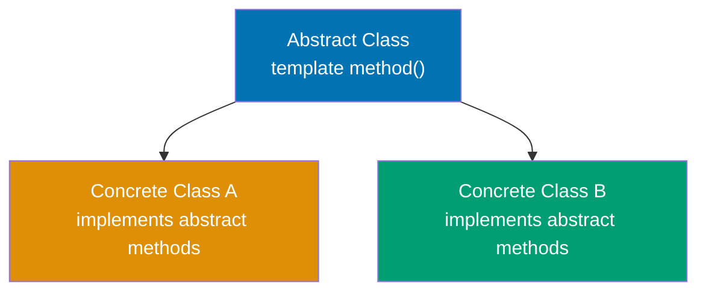

**Code**:

```java
// ABSTRACT CLASS - cannot be instantiated
abstract class DataProcessor {
    // => Cannot create: new DataProcessor() - compile error
    // => Must extend to use

    // TEMPLATE METHOD - defines algorithm skeleton
    public final void process() {
        // => Final keyword prevents subclass override
        // => Ensures all subclasses execute same workflow
        loadData();                  // => Step 1: subclass-specific loading
                                     // => Calls overridden loadData() in CSVProcessor/JSONProcessor
        transform();                 // => Step 2: subclass-specific transformation
                                     // => Polymorphic call: runtime type determines implementation
        validate();                  // => Step 3: shared validation logic
                                     // => Calls concrete method (same for all subclasses)
        save();                      // => Step 4: subclass-specific persistence
                                     // => Storage destination varies by subclass
    }

    // ABSTRACT METHODS - subclasses must implement
    protected abstract void loadData();
                                     // => No method body: subclass MUST override
    protected abstract void transform();
                                     // => Customization point for data transformation
    protected abstract void save();  // => Each subclass chooses storage mechanism

    // CONCRETE METHOD - shared implementation
    protected void validate() {      // => All subclasses inherit this
                                     // => Can be overridden (not final)
        System.out.println("Validating data");
                                     // => Output: Validating data
    }
}

// CONCRETE SUBCLASS
class CSVProcessor extends DataProcessor {
                                     // => Inherits template method process()
                                     // => Must implement 3 abstract methods

    @Override
    protected void loadData() {      // => Implements abstract method
        System.out.println("Loading CSV file");
                                     // => Output: Loading CSV file
    }

    @Override
    protected void transform() {     // => Implements abstract method
        System.out.println("Parsing CSV to objects");
                                     // => Output: Parsing CSV to objects
    }

    @Override
    protected void save() {          // => Implements abstract method
        System.out.println("Saving to database");
                                     // => Output: Saving to database
    }
}

class JSONProcessor extends DataProcessor {
                                     // => Different implementations, same interface

    @Override
    protected void loadData() {
        System.out.println("Loading JSON file");
                                     // => Output: Loading JSON file
    }

    @Override
    protected void transform() {
        System.out.println("Parsing JSON to objects");
                                     // => Output: Parsing JSON to objects
    }

    @Override
    protected void save() {
        System.out.println("Saving to cache");
                                     // => Output: Saving to cache
    }
}

// USAGE
DataProcessor csv = new CSVProcessor();
                                     // => Creates concrete instance
csv.process();                       // => Executes 4-step pipeline
                                     // => Calls CSVProcessor's overridden methods
                                     // => Output: Loading CSV file
                                     // =>         Parsing CSV to objects
                                     // =>         Validating data
                                     // =>         Saving to database

DataProcessor json = new JSONProcessor();
// => Different processor, same workflow structure
json.process();
// => Uses JSONProcessor implementations
// => Output: Loading JSON file
// =>         Parsing JSON to objects
// =>         Validating data
// =>         Saving to cache
```

**Key Takeaway**: Abstract classes combine concrete methods (shared implementation) with abstract methods (enforced customization). The template method pattern uses a final concrete method defining the algorithm structure, delegating steps to abstract methods implemented by subclasses—ensuring consistent workflow while allowing customization.

**Why It Matters**: Abstract classes solve the code duplication vs. flexibility tradeoff that plagued early OOP—without them, shared logic required copy-paste across subclasses or awkward empty method implementations in interfaces. The template method pattern enabled frameworks like Spring and servlets to define processing pipelines (request handling, transaction management) while letting developers customize specific steps. Modern Java's default methods in interfaces (Java 8+) provide similar capabilities, but abstract classes remain essential when state (fields) must be shared. The pattern appears throughout the JDK: InputStream.read() templates byte reading, AbstractList provides skeletal List implementation, and Thread.run() enables custom thread behavior.

---

## Example 32: Composition Over Inheritance

Composition builds objects from reusable components rather than inheriting from parent classes. It provides flexibility by assembling behaviors dynamically rather than being locked into inheritance hierarchies.

**Code**:

```java
// COMPOSITION - building objects from components
// => HAS-A relationships instead of IS-A (inheritance)

// Component interfaces
interface Engine {                   // => Contract: all engines must implement start()
                                     // => Enables polymorphism across engine types
    void start();                    // => No body: abstract by default in interfaces
}

interface Transmission {             // => Contract: all transmissions must implement shift()
                                     // => Allows different shifting strategies
    void shift(int gear);            // => Parameter: target gear number
}

// Component implementations
class ElectricEngine implements Engine {
    // => Concrete implementation of Engine interface
    // => Electric motor behavior
    public void start() {
        System.out.println("Electric motor starting silently");
        // => Electric-specific: quiet startup
        // => Output: "Electric motor starting silently"
    }
}

class GasEngine implements Engine {
    // => Concrete implementation of Engine interface
    // => Combustion engine behavior
    public void start() {
        System.out.println("Gas engine roaring to life");
        // => Gas-specific: loud startup with ignition
        // => Output: "Gas engine roaring to life"
    }
}

class ManualTransmission implements Transmission {
    // => Concrete implementation of Transmission interface
    // => Manual gear control strategy
    public void shift(int gear) {
        System.out.println("Manual shift to gear " + gear);
        // => Driver controls each gear change
        // => Output: "Manual shift to gear N"
    }
}

class AutomaticTransmission implements Transmission {
    // => Concrete implementation of Transmission interface
    // => Automatic gear control strategy
    public void shift(int gear) {
        System.out.println("Automatic shift to gear " + gear);
        // => System determines shift timing
        // => Output: "Automatic shift to gear N"
    }
}

// COMPOSED CLASS - has-a relationship
class Car {                          // => Car contains components (composition)
    private final Engine engine;     // => HAS-A Engine (can be any Engine implementation)
                                     // => Final: cannot be reassigned after construction
    private final Transmission transmission;
                                     // => HAS-A Transmission (can be any Transmission type)

    public Car(Engine engine, Transmission transmission) {
                                     // => Dependency injection pattern
        this.engine = engine;        // => Store engine reference
        this.transmission = transmission;
                                     // => Store transmission reference
    }

    public void drive() {            // => Coordinate components
        engine.start();              // => Delegate to composed engine
        transmission.shift(1);       // => Shift to 1st gear
        transmission.shift(2);       // => Shift to 2nd gear
    }
}

// USAGE - flexible assembly of behaviors
Car electricAuto = new Car(new ElectricEngine(), new AutomaticTransmission());
// => Mix electric engine + automatic transmission
electricAuto.drive();
// => Output: Electric motor starting silently
// =>         Automatic shift to gear 1
// =>         Automatic shift to gear 2

Car gasManual = new Car(new GasEngine(), new ManualTransmission());
// => Mix gas engine + manual transmission
gasManual.drive();
// => Output: Gas engine roaring to life
// =>         Manual shift to gear 1
// =>         Manual shift to gear 2

// CONTRAST: Inheritance approach (rigid, explosive class hierarchy)
// => Would need: ElectricAutoCar, ElectricManualCar, GasAutoCar, GasManualCar
// => 2 engines × 2 transmissions = 4 classes (composition uses 2 components)
// => Adding diesel: 2 more classes (composition: 1 component)
// => Composition grows linearly, inheritance grows exponentially
```

**Key Takeaway**: Composition assembles objects from independent components (has-a relationships), providing runtime flexibility to mix and match behaviors. Prefer composition over inheritance to avoid rigid class hierarchies and the "diamond problem" where multiple inheritance paths create ambiguity.

**Why It Matters**: "Favor composition over inheritance" became a core OOP principle after decades of inheritance abuse created unmaintainable class hierarchies. Inheritance couples subclasses to superclass implementation details—changing a parent class breaks all children (fragile base class problem). Composition enables dependency injection frameworks like Spring to wire objects at runtime, testing frameworks to inject mocks, and strategy patterns to swap algorithms dynamically. The Java Collections Framework uses composition extensively: ArrayList composes an Object[] array, LinkedList composes Node objects, and decorator classes like Collections.synchronizedList() wrap existing lists with thread-safety behavior without inheritance.

---

## Example 33: Nested and Inner Classes

Java supports nested classes (static) and inner classes (non-static) that provide encapsulation and logical grouping. Inner classes access outer class instance members, while nested classes are independent.

**Code**:

```java
public class OuterClass {            // => Outer class containing nested/inner classes
    private String outerField = "Outer field";
                                     // => Instance field accessible to inner classes
    private static String staticField = "Static field";
                                     // => Static field accessible to all nested classes

    // STATIC NESTED CLASS - independent of outer instance
    public static class StaticNested {
                                     // => Static: no implicit reference to outer instance
                                     // => Can instantiate without OuterClass instance
        public void display() {      // => Method in static nested class
            System.out.println(staticField);
                                     // => ✅ Can access static outer members
                                     // => Output: "Static field"
            // System.out.println(outerField);
                                     // => ❌ ERROR: cannot access instance members
        }
    }

    // INNER CLASS (non-static) - tied to outer instance
    public class Inner {             // => Non-static: holds implicit outer reference
                                     // => Cannot exist without OuterClass instance
        private String innerField = "Inner field";
                                     // => Inner class can have own fields

        public void display() {
            System.out.println(outerField);
                                     // => ✅ Accesses outer instance field
                                     // => Implicit: OuterClass.this.outerField
            System.out.println(staticField);
                                     // => ✅ Also accesses static members
            System.out.println(innerField);
                                     // => Accesses own field
        }

        public void accessOuter() {
            OuterClass.this.outerField = "Modified";
                                     // => Explicit outer reference syntax
                                     // => OuterClass.this = the outer instance
        }
    }

    // METHOD LOCAL INNER CLASS - defined inside method
    public void methodWithLocalClass() {
                                     // => Local class scope: only in this method
        final String localVar = "Local variable";
                                     // => Must be final/effectively final (Java 8+)

        class LocalInner {           // => Class defined inside method body
                                     // => Can access method's local variables
            public void display() {
                System.out.println(localVar);
                                     // => Accesses enclosing method's final variable
                System.out.println(outerField);
                                     // => Also accesses outer instance fields
            }
        }

        LocalInner local = new LocalInner();
                                     // => Instantiate local class within method
        local.display();             // => Output: "Local variable", "Outer field"
    }

    // ANONYMOUS INNER CLASS - one-time implementation
    public Runnable createRunnable() {
        // => Returns interface instance without named class
        return new Runnable() {
            // => Anonymous class: no class name
            // => Implements Runnable on the fly
            @Override
            public void run() {
                System.out.println("Anonymous inner class: " + outerField);
                // => Can access outer instance members
                // => Output: "Anonymous inner class: Outer field"
            }
        };
        // => Before Java 8 lambdas, this was common pattern
    }
}

// USAGE
OuterClass.StaticNested nested = new OuterClass.StaticNested();
// => Create static nested class: no outer instance needed
// => Syntax: OuterClass.NestedClass
nested.display();                    // => Calls display() on static nested instance
                                     // => Output: "Static field"

OuterClass outer = new OuterClass();
// => Create outer instance first
OuterClass.Inner inner = outer.new Inner();
// => Create inner class: requires outer instance
// => Syntax: outerInstance.new InnerClass()
// => Inner holds reference to 'outer'
inner.display();
// => Output: "Outer field"
// =>         "Static field"
// =>         "Inner field"

outer.methodWithLocalClass();
// => Executes method containing local inner class
// => Output: "Local variable"
// =>         "Outer field"

Runnable r = outer.createRunnable();
// => Returns anonymous Runnable instance
r.run();
// => Output: "Anonymous inner class: Outer field"
```

**Key Takeaway**: Static nested classes are independent of outer instances and can only access outer static members. Inner classes (non-static) are tied to outer instances and can access all outer members. Use nested classes for logical grouping and inner classes when tight coupling with outer state is needed.

**Why It Matters**: Inner classes enable event handling patterns in GUI frameworks (Swing, JavaFX) where listeners need access to surrounding component state without passing references manually. Anonymous inner classes powered Java's callback mechanisms before lambdas (Java 8), though lambdas are now preferred for functional interfaces. Static nested classes organize helper classes without polluting package namespace—Map.Entry, LinkedList.Node, and Builder patterns use this extensively. The outer class reference overhead (inner classes store implicit reference to outer instance) can cause memory leaks if inner instances outlive outer instances, a common pitfall in Android Activity listeners.

---

## Example 34: Reflection API - Runtime Introspection

Reflection allows runtime inspection and manipulation of classes, methods, and fields. It enables frameworks to work with user-defined classes without compile-time knowledge.

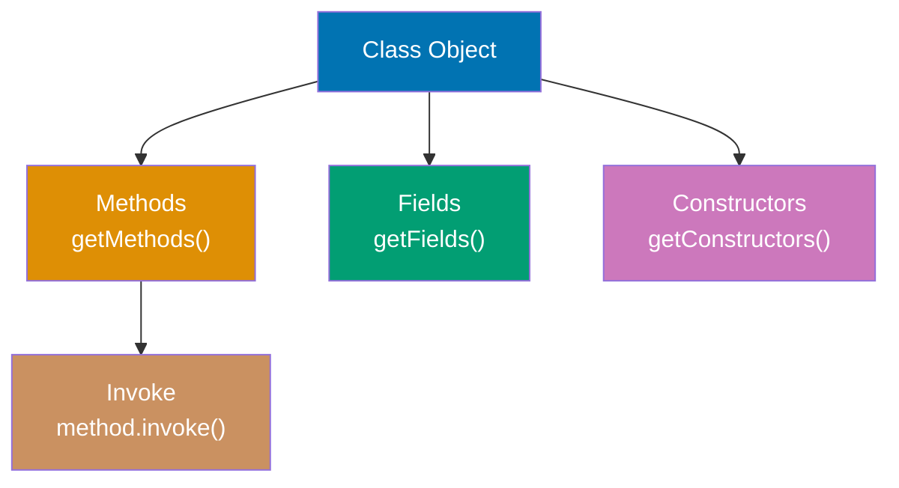

**Code**:

```java
import java.lang.reflect.*;
// => Import reflection API classes

class Person {
    // => Simple class for reflection demonstration
    private String name;
    // => Private field: not accessible without setAccessible()
    public int age;
    // => Public field: directly accessible via reflection

    public Person() {}
    // => Default constructor

    public Person(String name, int age) {
        // => Parameterized constructor
        this.name = name;
        this.age = age;
    }

    private void secretMethod() {
        // => Private method: needs setAccessible() to invoke
        System.out.println("Secret: " + name);
    }

    public String getName() {
        // => Public getter method
        return name;
    }
}

// REFLECTION USAGE
Class<?> clazz = Person.class;
                                 // => Obtain Class metadata object for Person
                                 // => .class literal retrieves compile-time Class reference
                                 // => <?> wildcard: type-safe reflection (unknown generic type)
                                 // => Alternative: Class.forName("Person") loads by string name
                                 // => Class object contains all runtime type information

// GET CLASS INFORMATION
String className = clazz.getName();
                                 // => Returns fully qualified name (package + class)
                                 // => Result: "Person" (or "com.example.Person" if in package)
                                 // => Includes package prefix for uniqueness
String simpleName = clazz.getSimpleName();
                                 // => Returns class name without package prefix
                                 // => Result: "Person" (just class name)
                                 // => Used for display/logging purposes

// INSTANTIATE via reflection
Constructor<?> constructor = clazz.getConstructor(String.class, int.class);
                                 // => Finds public constructor matching parameter types
                                 // => getConstructor() searches public constructors only
                                 // => Parameter types: String.class, int.class (varargs)
                                 // => Throws NoSuchMethodException if no matching constructor
                                 // => Constructor<?> holds reference to constructor metadata
Object instance = constructor.newInstance("Alice", 30);
                                 // => Invokes constructor with arguments
                                 // => newInstance() calls Constructor with varargs Object[]
                                 // => Creates instance: new Person("Alice", 30)
                                 // => Returns Object (generic type, needs casting for type safety)
                                 // => Throws InstantiationException, IllegalAccessException, InvocationTargetException

// ACCESS FIELDS
Field ageField = clazz.getField("age");
                                 // => Gets PUBLIC field named "age" by string lookup
                                 // => getField() searches public fields only (not private)
                                 // => Throws NoSuchFieldException if field not found or not public
                                 // => Field object wraps field metadata
int ageValue = (int) ageField.get(instance);
                                 // => Reads field value from specific instance
                                 // => ageField.get() returns Object, requires cast to int
                                 // => Retrieves value from Person object's age field
                                 // => Result: 30 (initial value from constructor)
                                 // => Autoboxing: int → Integer → Object → (int) unbox
ageField.set(instance, 31);      // => Modifies field value reflectively
                                 // => ageField.set(object, value) mutates field on instance
                                 // => Changes age from 30 to 31
                                 // => Now age = 31 (modified)
                                 // => Value autoboxed: 31 (int) → Integer → Object

// ACCESS PRIVATE FIELDS
Field nameField = clazz.getDeclaredField("name");
                                 // => Gets any field (public or private) by name
                                 // => getDeclaredField() finds private members (bypasses normal access)
                                 // => Searches only this class (not inherited fields)
                                 // => "name" is private, so getField("name") would fail
nameField.setAccessible(true);   // => Disables Java access control checks
                                 // => Allows reading/writing private field
                                 // => ⚠️ Security risk: breaks encapsulation (violates OOP)
                                 // => SecurityManager may block this if installed
                                 // => Equivalent to making field public at runtime
String nameValue = (String) nameField.get(instance);
                                 // => Reads private field value via reflection
                                 // => nameField.get() returns Object, cast to String
                                 // => Result: "Alice" (value set in constructor)
                                 // => Without setAccessible(true): IllegalAccessException

// INVOKE METHODS
Method getNameMethod = clazz.getMethod("getName");
                                 // => Finds public method by name and parameter types
                                 // => getMethod() searches public methods (including inherited)
                                 // => Empty parameter array: no arguments for getName()
                                 // => Returns Method object wrapping method metadata
String name = (String) getNameMethod.invoke(instance);
                                 // => Invokes method on instance reflectively
                                 // => invoke(object, args...) calls method with varargs
                                 // => Equivalent to: instance.getName() (direct call)
                                 // => Returns Object (generic), cast to String
                                 // => Result: "Alice" (method return value)
                                 // => ~3x slower than direct invocation

// INVOKE PRIVATE METHODS
Method secretMethod = clazz.getDeclaredMethod("secretMethod");
                                 // => Finds private method by name
                                 // => getDeclaredMethod() searches private methods
                                 // => getMethod() would fail (private not accessible)
secretMethod.setAccessible(true);// => Bypasses private access modifier
                                 // => Allows invoking private method
                                 // => ⚠️ Breaks encapsulation (testing/framework use)
secretMethod.invoke(instance);   // => Invokes private method reflectively
                                 // => Calls secretMethod() on instance
                                 // => Method executes: prints "Secret: Alice"
                                 // => Output: "Secret: Alice"
                                 // => Without setAccessible(true): IllegalAccessException

// LIST ALL METHODS
for (Method method : clazz.getDeclaredMethods()) {
    // => Iterates all declared methods (public and private)
    System.out.println(method.getName());
    // => Prints method names
}
// => Output: secretMethod
// =>         getName
```

**Key Takeaway**: Reflection provides runtime access to class metadata, allowing inspection of fields, methods, and constructors. Use `setAccessible(true)` to bypass access controls for private members. Reflection enables frameworks and libraries to work with arbitrary user classes without compile-time knowledge.

**Why It Matters**: Reflection powers Java's entire framework ecosystem—Spring uses it for dependency injection (scanning for @Component, @Autowired), JPA for entity mapping (@Entity, @Column), JUnit for test discovery (@Test), and serialization frameworks (Gson, Jackson) for JSON mapping. Without reflection, these frameworks would require manual registration or code generation for every class. However, reflection has costs: performance overhead (method.invoke() is ~3x slower than direct calls), type safety loss (casts and string-based lookups), and security risks (accessing private members breaks encapsulation). Modern Java introduced MethodHandles (Java 7) as faster, type-safe alternatives, while annotation processors enable compile-time code generation replacing some reflection use cases.

---

## Example 35: Annotations and Custom Metadata

Annotations add metadata to code that can be processed at compile-time or runtime. Custom annotations enable declarative programming patterns used extensively in frameworks.

**Code**:

```java
import java.lang.annotation.*;
import java.lang.reflect.*;

// DEFINE CUSTOM ANNOTATION
@Retention(RetentionPolicy.RUNTIME)  // => Available at runtime via reflection
                                     // => Enables runtime inspection of annotation data
@Target(ElementType.METHOD)          // => Can only be applied to methods
                                     // => Compile error if used on class/field
public @interface Test {             // => @interface keyword defines annotation type
    String description() default "";  // => Annotation parameter with default value
    int timeout() default 0;         // => Optional timeout parameter (milliseconds)
}

// ANOTHER ANNOTATION
@Retention(RetentionPolicy.RUNTIME)  // => Available at runtime
@Target(ElementType.FIELD)           // => Restricts to field declarations
public @interface Inject {           // => Marks fields for dependency injection
}

// USE ANNOTATIONS
class TestSuite {                    // => Class containing test methods
    @Inject                          // => Annotation marks field for injection
    private String dependency;       // => Framework will populate this field

    @Test(description = "Adds two numbers", timeout = 1000)
                                     // => Annotation with parameters
    public void testAddition() {     // => Test method (has @Test)
        System.out.println("Testing addition");
    }

    @Test(description = "Divides by zero")
                                     // => Annotation with description only
    public void testDivision() {     // => Test method (has @Test)
        System.out.println("Testing division");
    }

    public void helperMethod() {     // => No @Test annotation
        System.out.println("Not a test");
    }
}

// PROCESS ANNOTATIONS via reflection
Class<?> clazz = TestSuite.class;
                                 // => Get Class object representing TestSuite type
                                 // => clazz is java.lang.Class<TestSuite> (type metadata)
                                 // => Class object contains all runtime information about TestSuite
                                 // => Enables introspection of methods, fields, annotations

// Find and execute @Test methods
for (Method method : clazz.getDeclaredMethods()) {
                                 // => getDeclaredMethods() returns all methods (public + private)
                                 // => Returns Method[] array: testAddition, testDivision, helperMethod
                                 // => Method object wraps method metadata (name, params, annotations)
                                 // => Each Method represents one method in the class
    if (method.isAnnotationPresent(Test.class)) {
                                 // => Check if method has @Test annotation at runtime
                                 // => Uses reflection to inspect method's annotation metadata
                                 // => testAddition: true (has @Test), testDivision: true, helperMethod: false
                                 // => Annotation must have RUNTIME retention to be visible
                                 // => RetentionPolicy.RUNTIME enables runtime discovery
                                 // => SOURCE/CLASS retention annotations discarded before runtime
        Test testAnnotation = method.getAnnotation(Test.class);
                                 // => Retrieve @Test annotation instance from method
                                 // => Returns proxy implementing Test interface
                                 // => testAnnotation contains description and timeout parameters
                                 // => Parameters accessible as method calls (description(), timeout())
        System.out.println("Running test: " + testAnnotation.description());
                                 // => Access annotation parameter value via method call
                                 // => testAnnotation.description() returns String from annotation
                                 // => Output: "Running test: Adds two numbers" (for testAddition)
                                 // => Output: "Running test: Divides by zero" (for testDivision)

        try {
            Object instance = clazz.getDeclaredConstructor().newInstance();
                                 // => Create new TestSuite instance via reflection
                                 // => getDeclaredConstructor() finds no-arg constructor
                                 // => newInstance() calls constructor, returns new object
            method.invoke(instance);  // => Execute test method on instance
                                 // => invoke() calls method dynamically (equivalent to instance.testAddition())
        } catch (Exception e) {
            System.out.println("Test failed: " + e.getMessage());
                                 // => Catch exceptions from method invocation
        }
    }
}
// => Output: Running test: Adds two numbers, Testing addition
//           Running test: Divides by zero, Testing division

// BUILT-IN ANNOTATIONS
class Example {
    @Override                    // => Compile-time check for overriding
                                 // => Compiler error if not actually overriding
    public String toString() {   // => Overrides Object.toString()
        return "Example";
    }

    @Deprecated                  // => Marks method as deprecated
                                 // => Compiler warning when called
    public void oldMethod() {}   // => Legacy method

    @SuppressWarnings("unchecked") // => Suppresses specific compiler warnings
                                   // => Useful for legacy code with raw types
    public void rawTypeMethod() {  // => Method using raw types
        java.util.List list = new java.util.ArrayList();
                                   // => Raw List (no generic type)
    }
}
```

**Key Takeaway**: Annotations add metadata to code without affecting execution. Use `@Retention` to specify when annotations are available (SOURCE, CLASS, RUNTIME) and `@Target` to restrict where annotations can be applied. Process runtime annotations via reflection to implement custom behaviors.

**Why It Matters**: Annotations revolutionized Java framework design by enabling declarative programming—compare Spring's `@Autowired` to manual factory.getBean() calls, or JPA's `@Entity @Column` to XML configuration files. Annotations shift complexity from user code to framework code, improving readability (@Transactional vs. manual transaction.begin/commit). However, overuse creates "magic" behavior invisible in code (Spring's @Async spawning threads invisibly), making debugging difficult. Annotation processing (compile-time, via javax.annotation.processing) generates code during compilation (Lombok, Dagger), avoiding reflection overhead while keeping declarative syntax. The combination of annotations + reflection enabled the "convention over configuration" movement that made frameworks like Spring Boot possible.

---

## Example 36: Generic Methods and Bounded Type Parameters

Generic methods enable type-safe method implementations that work with any type. Bounded type parameters restrict generic types to subclasses of a bound, enabling access to bound class methods.

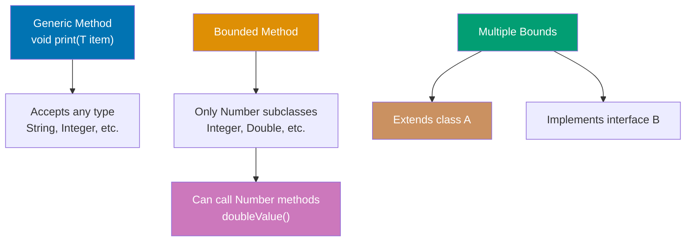

**Code**:

```java
import java.util.*;

// GENERIC METHOD - type parameter before return type
public static <T> void printArray(T[] array) {
                                 // => <T> declares type parameter for this method
                                 // => T can be any type (inferred from argument)
    for (T element : array) {    // => Enhanced for-loop iterates array elements
                                 // => Each element has type T (type-safe)
        System.out.print(element + " ");
                                 // => Prints element followed by space
    }
    System.out.println();        // => Newline after all elements printed
}

// BOUNDED TYPE PARAMETER - restricts to Number subclasses
public static <T extends Number> double sum(List<T> numbers) {
                                 // => T must be Number or subclass (Integer, Double, etc.)
    double total = 0;
    for (T num : numbers) {
        total += num.doubleValue();  // => Can call Number methods because of bound
    }
    return total;
}

// MULTIPLE BOUNDS - must extend class AND implement interfaces
interface Measurable {
    double getMeasurement();
}

public static <T extends Number & Measurable> double average(List<T> items) {
                                 // => T must extend Number AND implement Measurable
    double total = 0;
    for (T item : items) {
        total += item.getMeasurement();
    }
    return total / items.size();
}

// USAGE
Integer[] ints = {1, 2, 3};      // => Array of Integer wrapper objects
String[] strs = {"a", "b", "c"};  // => Array of String objects
printArray(ints);                // => Compiler infers T = Integer from argument type
                                 // => Calls printArray<Integer>(Integer[])
                                 // => Output: 1 2 3
printArray(strs);                // => Compiler infers T = String from argument type
                                 // => Calls printArray<String>(String[])
                                 // => Output: a b c

List<Integer> intList = Arrays.asList(1, 2, 3, 4);
                                 // => Creates fixed-size List<Integer> from varargs
                                 // => List contains [1, 2, 3, 4]
double sum = sum(intList);       // => Calls sum<Integer>(List<Integer>)
                                 // => Iterates list: 1+2+3+4 = 10
                                 // => sum is 10.0 (converted to double)

// GENERIC CLASS with type parameter
class Box<T> {
                                 // => Generic class with type parameter T
                                 // => T is placeholder, replaced at instantiation
    private T content;           // => Field of type T (unknown until instantiation)

    public void set(T content) {
                                 // => Method parameter type T
                                 // => Enforces type safety at compile time
        this.content = content;  // => Stores value of type T
    }

    public T get() {
                                 // => Return type T (same type as set)
        return content;          // => Returns stored value (type T)
    }
}

Box<String> stringBox = new Box<>();
                                 // => Diamond operator <> infers type from left side
                                 // => T = String for this instance
                                 // => Creates Box<String>
stringBox.set("Hello");          // => Type-safe: only String allowed
                                 // => Compiler enforces: set(String)
                                 // => Calling set(123) would be compile error
String value = stringBox.get();  // => No cast needed (compiler knows returns String)
                                 // => value is "Hello" (type: String)
```

**Key Takeaway**: Generic methods use `<T>` before return type to declare type parameters. Bounded type parameters (`<T extends Class>`) restrict acceptable types and enable calling methods of the bound class. Multiple bounds require `<T extends Class & Interface1 & Interface2>` syntax with class first.

**Why It Matters**: Bounded type parameters solve the "how do I operate on generic types?" problem—without bounds, generic `<T>` treats everything as Object, preventing method calls beyond Object's methods. Bounds enable generic algorithms: Collections.sort() requires `<T extends Comparable<T>>` to call compareTo(), Stream.max() requires Comparator, and numeric operations require `<T extends Number>`. Multiple bounds enable rich generic constraints in libraries like Hibernate (entities must extend BaseEntity AND implement Serializable). The class-first rule in multiple bounds reflects Java's single-inheritance, multiple-interfaces model, though rarely needed in practice.

---

## Example 37: Wildcards and Type Variance

Wildcards (`?`) represent unknown types in generics. Upper-bounded wildcards (`? extends Type`) enable reading, lower-bounded wildcards (`? super Type`) enable writing, following covariance and contravariance rules.

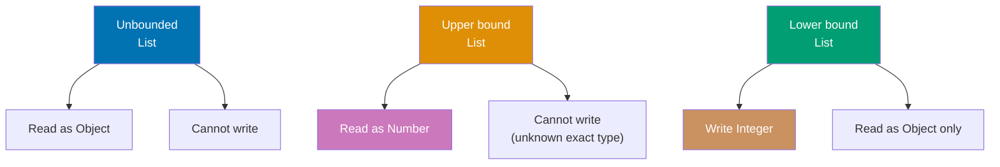

**Code**:

```java
import java.util.*;

// UNBOUNDED WILDCARD - unknown type
public static void printList(List<?> list) {
                                 // => Accepts List of any type (?)
    for (Object elem : list) {   // => Can only read as Object (safest supertype)
        System.out.print(elem + " ");
    }
    System.out.println();
    // list.add("x");            // => ERROR: cannot write to List<?>
}

// UPPER-BOUNDED WILDCARD - covariance (reading)
public static double sumNumbers(List<? extends Number> numbers) {
                                 // => ? extends Number: accepts List<Integer>, List<Double>, etc.
    double sum = 0;
    for (Number num : numbers) { // => Can read as Number (upper bound)
        sum += num.doubleValue();// => Calls Number.doubleValue()
    }
    return sum;
    // numbers.add(1);           // => ERROR: cannot write (exact type unknown)
}

// LOWER-BOUNDED WILDCARD - contravariance (writing)
public static void addIntegers(List<? super Integer> list) {
                                 // => ? super Integer: accepts List<Integer>, List<Number>, List<Object>
    list.add(1);                 // => Can write Integer (safe for any supertype)
    list.add(2);
    // Integer val = list.get(0); // => ERROR: can only read as Object
                                 // => Could be List<Number> or List<Object>
}

// USAGE
List<Integer> ints = Arrays.asList(1, 2, 3);
List<Double> doubles = Arrays.asList(1.0, 2.0, 3.0);

printList(ints);                 // => Output: 1 2 3
printList(doubles);              // => Output: 1.0 2.0 3.0

double sum1 = sumNumbers(ints);  // => sum1 is 6.0 (Integer extends Number)
double sum2 = sumNumbers(doubles); // => sum2 is 6.0 (Double extends Number)

List<Number> numbers = new ArrayList<>();
addIntegers(numbers);            // => Can add Integers (Number super Integer)
                                 // => numbers becomes [1, 2]
System.out.println(numbers);     // => Output: [1, 2]

// PECS RULE: Producer Extends, Consumer Super
// Producer (reading): use <? extends T>
// Consumer (writing): use <? super T>

public static <T> void copy(List<? extends T> source, List<? super T> dest) {
                                 // => Generic method with two wildcard parameters
                                 // => source produces T (extends: covariance)
                                 // => dest consumes T (super: contravariance)
                                 // => Enables copying from subtype to supertype
    for (T item : source) {
                                 // => Reads from source (produces T)
                                 // => item has type T
        dest.add(item);          // => Writes to dest (consumes T)
                                 // => Safe: dest accepts T or supertype
    }
}

List<Integer> src = Arrays.asList(1, 2, 3);
                                 // => Source: List<Integer>
List<Number> dst = new ArrayList<>();
                                 // => Destination: List<Number> (supertype of Integer)
copy(src, dst);                  // => T = Integer (inferred)
                                 // => source: List<? extends Integer> (List<Integer> matches)
                                 // => dest: List<? super Integer> (List<Number> matches)
                                 // => Copies [1, 2, 3] from src to dst
                                 // => dst now contains [1, 2, 3]
```

**Key Takeaway**: Use `? extends Type` for reading (covariance), `? super Type` for writing (contravariance), and `?` for both reading (as Object) and no writing. Follow PECS rule: "Producer Extends, Consumer Super"—if a method produces values from a collection, use `extends`; if it consumes values into a collection, use `super`.

**Why It Matters**: Wildcards enable flexible generic APIs that accept related types without requiring exact matches—before wildcards, List<Integer> and List<Number> were completely unrelated despite inheritance. The PECS rule guides API design: Collections.addAll(Collection<? extends E>) is producer (extends), Collections.sort(List<T>, Comparator<? super T>) is consumer (super). Understanding variance prevents type safety violations: allowing writes to List<? extends Number> would permit adding Double to List<Integer>. This complexity drives some developers to avoid wildcards entirely, but mastering them enables elegant generic APIs like Stream.collect(Collector<? super T>).

---

## Example 38: Collections Framework Deep Dive

The Collections Framework provides algorithms for sorting, searching, and transforming collections. Understanding time complexities and choosing appropriate implementations is critical for performance.

**Code**:

```java
import java.util.*;
                                 // => Import collections framework classes

// CHOOSING COLLECTION TYPES based on requirements

// ArrayList - indexed access, dynamic size
List<String> arrayList = new ArrayList<>();
arrayList.add("A");              // => O(1) amortized, arrayList is ["A"]
String value = arrayList.get(0); // => O(1) random access, value is "A"
arrayList.remove(0);             // => O(n) due to shifting, arrayList is []

// LinkedList - efficient insertion/deletion
List<String> linkedList = new LinkedList<>();
linkedList.add("A");             // => O(1) append
linkedList.add(0, "B");          // => O(1) prepend, linkedList is ["B", "A"]
String first = linkedList.get(0); // => O(n) traversal, first is "B"

// HashSet - unique elements, O(1) operations
Set<String> hashSet = new HashSet<>();
hashSet.add("A");                // => O(1) insert, hashSet is {"A"}
boolean contains = hashSet.contains("A");
                                 // => O(1) lookup, contains is true

// TreeSet - sorted, O(log n) operations
Set<Integer> treeSet = new TreeSet<>();
treeSet.add(3);
treeSet.add(1);                  // => Auto-sorted: treeSet is {1, 3}
treeSet.add(2);                  // => treeSet is {1, 2, 3}
System.out.println(treeSet);     // => Output: [1, 2, 3]

// HashMap - key-value pairs, O(1) operations
Map<String, Integer> hashMap = new HashMap<>();
hashMap.put("Alice", 30);        // => O(1) insert
Integer age = hashMap.get("Alice"); // => O(1) lookup, age is 30

// TreeMap - sorted by keys, O(log n) operations
Map<String, Integer> treeMap = new TreeMap<>();
treeMap.put("Charlie", 25);
treeMap.put("Alice", 30);
treeMap.put("Bob", 28);          // => Maintains sorted order by key
System.out.println(treeMap);     // => Output: {Alice=30, Bob=28, Charlie=25}

// COLLECTIONS UTILITY METHODS
List<Integer> numbers = Arrays.asList(3, 1, 4, 1, 5, 9);
                                 // => numbers is [3, 1, 4, 1, 5, 9] (fixed-size list)

Collections.sort(numbers);       // => In-place sort (mutates original)
                                 // => numbers is [1, 1, 3, 4, 5, 9]
Collections.reverse(numbers);    // => In-place reversal
                                 // => numbers is [9, 5, 4, 3, 1, 1]
Collections.shuffle(numbers);    // => Randomizes order (uses Random)
                                 // => numbers is [unpredictable order]

int max = Collections.max(numbers); // => Finds maximum element
                                 // => max is 9
int min = Collections.min(numbers); // => Finds minimum element
                                 // => min is 1

int frequency = Collections.frequency(numbers, 1);
                                 // => Counts occurrences of 1
                                 // => frequency is 2 (appears twice)

// IMMUTABLE COLLECTIONS (Java 9+)
List<String> immutable = List.of("A", "B", "C");
                                 // => immutable is ["A", "B", "C"] (cannot modify)
// immutable.add("D");           // => UnsupportedOperationException (immutable)

Map<String, Integer> immutableMap = Map.of("A", 1, "B", 2);
                                 // => immutableMap is {"A"=1, "B"=2} (cannot modify)
// immutableMap.put("C", 3);     // => UnsupportedOperationException (immutable)
```

**Key Takeaway**: Choose collection types based on access patterns: ArrayList for indexed access, LinkedList for frequent insertions/deletions, HashSet for uniqueness with O(1) operations, TreeSet for sorted uniqueness, HashMap for key-value O(1) lookups, TreeMap for sorted keys. Understand time complexity tradeoffs to avoid performance pitfalls.

**Why It Matters**: Choosing the wrong collection type causes severe performance issues at scale—using ArrayList.contains() in a loop creates O(n²) complexity vs. HashSet's O(n). A common pitfall: using LinkedList thinking "linked list is always better for insertions," but ArrayList's cache locality makes it faster for small-to-medium lists. TreeSet/TreeMap's O(log n) seems close to HashMap's O(1), but with millions of entries, the difference is dramatic (20 operations vs. 1). Java 9's List.of() and Map.of() factory methods create space-efficient immutable collections (no separate unmodifiable wrappers), essential for functional programming patterns. The Collections Framework standardized algorithms that previously required manual implementation, eliminating bugs from manual binary search or sort implementations.

---

## Example 39: Concurrent Collections for Thread Safety

Concurrent collections provide thread-safe operations without external synchronization. They use lock-free algorithms and fine-grained locking for better concurrency than synchronized collections.

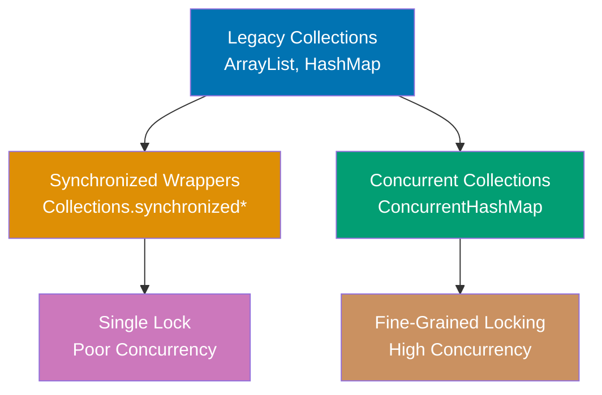

**Code**:

```java
import java.util.concurrent.*;
import java.util.*;

// CONCURRENTHASHMAP - thread-safe without single lock
ConcurrentHashMap<String, Integer> concurrentMap = new ConcurrentHashMap<>();
                                 // => concurrentMap is {} (empty, thread-safe map)
                                 // => Uses segment-based locking (high concurrency)

// Thread-safe operations
concurrentMap.put("key", 1);     // => Thread-safe put without blocking all threads
                                 // => concurrentMap is {"key"=1}
Integer value = concurrentMap.get("key");
                                 // => Thread-safe get (lock-free read in Java 8+)
                                 // => value is 1

// ATOMIC OPERATIONS
concurrentMap.putIfAbsent("key", 2);
                                 // => Only puts if key doesn't exist (atomic check-and-set)
                                 // => Returns 1 (key exists, not inserted)
                                 // => concurrentMap is {"key"=1} (unchanged)

concurrentMap.computeIfAbsent("newKey", k -> k.length());
                                 // => Computes value atomically if key absent
                                 // => Lambda: "newKey".length() returns 6
                                 // => concurrentMap is {"key"=1, "newKey"=6}

concurrentMap.merge("key", 1, Integer::sum);
                                 // => Atomically updates: old value + new value
                                 // => Merges 1 (existing) + 1 (new) = 2
                                 // => concurrentMap is {"key"=2, "newKey"=6}

// COPYONWRITEARRAYLIST - reads without locking, writes copy entire array
CopyOnWriteArrayList<String> cowList = new CopyOnWriteArrayList<>();
                                 // => cowList is [] (empty, optimized for reads)
cowList.add("A");                // => Creates new array copy with "A"
                                 // => cowList is ["A"] (write expensive, read cheap)
cowList.add("B");                // => Every write copies array (O(n) write cost)
                                 // => cowList is ["A", "B"]

// Safe iteration during concurrent modifications
for (String item : cowList) {    // => Iteration uses snapshot (no ConcurrentModificationException)
                                 // => Iterates over: ["A", "B"]
    cowList.add("C");            // => Modifications don't affect ongoing iteration
                                 // => Creates new array but iterator sees old snapshot
}                                // => After loop: cowList is ["A", "B", "C", "C"]

// BLOCKINGQUEUE - producer-consumer pattern
BlockingQueue<String> queue = new LinkedBlockingQueue<>(10);
                                 // => queue capacity is 10 (blocks when full)
                                 // => Uses locks and conditions (thread coordination)

// Producer thread
new Thread(() -> {               // => Lambda creates producer thread
    try {
        queue.put("item");       // => Blocks if queue full (waits for space)
                                 // => Wakes up consumers waiting for items
    } catch (InterruptedException e) {
        e.printStackTrace();     // => Handle thread interruption
    }
}).start();                      // => Start producer thread immediately

// Consumer thread
new Thread(() -> {               // => Lambda creates consumer thread
    try {
        String item = queue.take(); // => Blocks if queue empty (waits for item)
                                 // => item is "item" (from producer)
        System.out.println("Consumed: " + item);
                                 // => Output: Consumed: item
    } catch (InterruptedException e) {
        e.printStackTrace();     // => Handle thread interruption
    }
}).start();                      // => Start consumer thread immediately

// CONCURRENTSKIPLISTMAP - sorted, concurrent alternative to TreeMap
ConcurrentSkipListMap<Integer, String> skipListMap = new ConcurrentSkipListMap<>();
                                 // => skipListMap is {} (empty skip list, sorted + thread-safe)
skipListMap.put(3, "three");     // => skipListMap is {3="three"}
skipListMap.put(1, "one");       // => skipListMap is {1="one", 3="three"} (auto-sorted)
skipListMap.put(2, "two");       // => skipListMap is {1="one", 2="two", 3="three"}
System.out.println(skipListMap);  // => Output: {1=one, 2=two, 3=three} (sorted, thread-safe)

// CONTRAST: Synchronized wrapper (poor concurrency)
Map<String, Integer> syncMap = Collections.synchronizedMap(new HashMap<>());
                                 // => syncMap is {} (wrapped HashMap)
                                 // => Single lock for all operations (severe bottleneck)
                                 // => All threads block each other (no concurrency)
```

**Key Takeaway**: Use ConcurrentHashMap for high-concurrency key-value access with fine-grained locking. CopyOnWriteArrayList suits read-heavy workloads where writes are rare. BlockingQueue enables producer-consumer patterns with thread-safe blocking operations. Avoid synchronized wrappers (Collections.synchronizedMap()) which use coarse-grained locking.

**Why It Matters**: ConcurrentHashMap revolutionized Java concurrency by replacing Hashtable's single-lock design with segment-based locking (Java 7) and later lock-free reads with CAS operations (Java 8+), achieving 10-100x throughput in multi-threaded scenarios. Before concurrent collections, developers used synchronized blocks or Collections.synchronizedMap(), creating severe bottlenecks—every operation acquired the same lock, serializing all threads. BlockingQueue enables elegant producer-consumer patterns without manual wait/notify complexity, powering thread pools (Executors use BlockingQueue internally) and message queues. CopyOnWriteArrayList's write-amplification (copying entire array) makes it unsuitable for write-heavy workloads, but perfect for listener lists in event systems where reads vastly outnumber writes.

---

## Example 40: Stream Pipeline Optimization

Stream operations are lazy (intermediate) or eager (terminal). Understanding laziness enables building efficient pipelines that short-circuit and minimize iterations.

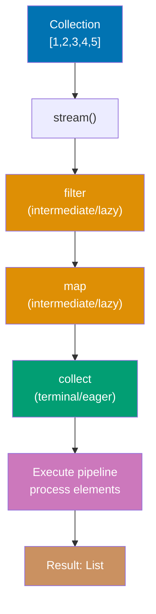

**Code**:

```java
import java.util.*;
import java.util.stream.*;

List<Integer> numbers = Arrays.asList(1, 2, 3, 4, 5, 6, 7, 8, 9, 10);
                                 // => numbers is [1, 2, 3, 4, 5, 6, 7, 8, 9, 10]

// LAZY EVALUATION - intermediate operations don't execute until terminal operation
Stream<Integer> stream = numbers.stream()
                                 // => Creates stream from list (no processing yet)
                                 // => Pipeline defined but not executed
    .filter(n -> {
        System.out.println("Filter: " + n);
        return n % 2 == 0;       // => NOT executed yet (lazy intermediate operation)
                                 // => Defines filtering logic, doesn't apply it
    })
    .map(n -> {
        System.out.println("Map: " + n);
        return n * 2;            // => NOT executed yet (lazy intermediate operation)
                                 // => Defines mapping logic, doesn't apply it
    });
// => No output yet (no terminal operation)
// => Stream pipeline defined but not executed
// => No System.out.println calls made

List<Integer> result = stream.collect(Collectors.toList());
                                 // => Terminal operation triggers pipeline execution
                                 // => Now executes filter and map for each element
// => Output: Filter: 1, Filter: 2, Map: 2, Filter: 3, Filter: 4, Map: 4, ...
// => result is [4, 8, 12, 16, 20] (even numbers doubled)

// SHORT-CIRCUITING - stops processing when result determined
Optional<Integer> first = numbers.stream()
                                 // => Creates new stream from numbers
    .filter(n -> {
        System.out.println("Checking: " + n);
        return n > 5;            // => Filter for n > 5
    })
    .findFirst();                // => Short-circuits after first match
                                 // => Stops immediately when match found
// => Output: Checking: 1, Checking: 2, ..., Checking: 6
// => Stops at 6 (first n > 5), doesn't process 7, 8, 9, 10
// => first is Optional[6]

// PARALLEL STREAMS - splits work across threads
long count = numbers.parallelStream()
                                 // => Splits collection across ForkJoinPool threads
    .filter(n -> n % 2 == 0)     // => Parallel filtering (each thread processes subset)
                                 // => Filters: 2, 4, 6, 8, 10
    .count();                    // => Terminal operation: counts matches
                                 // => Parallel execution (order not guaranteed)
                                 // => count is 5

// OPTIMIZATION: limit() short-circuits infinite streams
Stream.iterate(0, n -> n + 1)    // => Infinite stream: 0, 1, 2, 3, ... (unbounded)
                                 // => Without limit(), would run forever
    .filter(n -> n % 2 == 0)     // => Even numbers: 0, 2, 4, 6, 8, ...
    .limit(5)                    // => Take first 5: stops after 5 elements
                                 // => Short-circuits infinite stream
    .forEach(System.out::println);
                                 // => Terminal operation: prints each element
// => Output: 0, 2, 4, 6, 8 (stops, doesn't run forever)

// PRIMITIVE STREAMS - avoid autoboxing overhead
IntStream.range(1, 1000000)      // => Primitive int stream (no Integer objects)
                                 // => range is [1, 2, ..., 999999]
    .filter(n -> n % 2 == 0)     // => Filters even numbers (no boxing)
    .sum();                      // => sum() on IntStream (no boxing/unboxing)
                                 // => Returns int sum directly (efficient)

// STATELESS vs STATEFUL operations
numbers.stream()                 // => Creates stream from numbers
    .filter(n -> n > 5)          // => Stateless: each element processed independently
                                 // => Filters: 6, 7, 8, 9, 10
    .map(n -> n * 2)             // => Stateless: independent transformation
                                 // => Maps to: 12, 14, 16, 18, 20
    .sorted()                    // => STATEFUL: requires all elements (breaks streaming)
                                 // => Collects all before sorting (memory overhead)
    .collect(Collectors.toList());
                                 // => Terminal: collects to List
                                 // => Result is [12, 14, 16, 18, 20] (sorted)
```

**Key Takeaway**: Intermediate operations (filter, map) are lazy—they don't execute until a terminal operation (collect, forEach, count) triggers the pipeline. Short-circuiting operations (findFirst, limit, anyMatch) stop processing early. Use primitive streams (IntStream, LongStream, DoubleStream) to avoid autoboxing overhead for numeric operations.

**Why It Matters**: Lazy evaluation enables efficient stream pipelines—filter then map then findFirst only processes elements until the first match, potentially touching 1% of a million-element collection vs. processing all elements eagerly. Before streams, achieving this required manual short-circuit logic in loops. However, stateful operations (sorted, distinct) break streaming by requiring all elements in memory, negating laziness benefits—sorting a billion-element stream still loads everything. Parallel streams promise automatic parallelization but have overhead: Collections.parallelStream() splits work across ForkJoinPool threads, beneficial only for CPU-intensive operations on large collections (>10,000 elements). Primitive streams eliminate autoboxing that creates millions of temporary Integer/Double objects, critical for numeric computations but often forgotten.

---

## Example 41: Collectors and Stream Reduction

Collectors transform stream results into collections, maps, or aggregated values. Custom collectors enable complex reductions beyond built-in options.

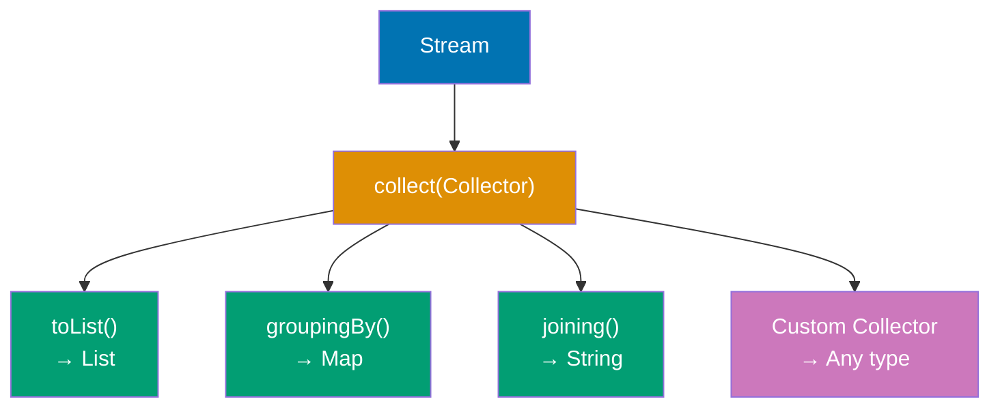

**Code**:

```java
import java.util.*;
import java.util.stream.*;

List<String> words = Arrays.asList("apple", "banana", "apricot", "blueberry", "avocado");

// COLLECTING TO COLLECTIONS
List<String> list = words.stream()
                                 // => Creates stream from words list
    .filter(w -> w.startsWith("a"))
                                 // => Keeps: apple, apricot, avocado
    .collect(Collectors.toList());
                                 // => Collects to ArrayList
                                 // => list is [apple, apricot, avocado]

Set<String> set = words.stream()
    .collect(Collectors.toSet());
                                 // => Collects to HashSet (unordered)

// JOINING STRINGS
String joined = words.stream()
    .collect(Collectors.joining(", "));
                                 // => joined is "apple, banana, apricot, blueberry, avocado"

String prefixed = words.stream()
    .collect(Collectors.joining(", ", "[", "]"));
                                 // => joining(delimiter, prefix, suffix)
                                 // => prefixed is "[apple, banana, apricot, blueberry, avocado]"

// GROUPING BY
Map<Character, List<String>> grouped = words.stream()
    .collect(Collectors.groupingBy(w -> w.charAt(0)));
                                 // => Groups by first character
                                 // => {a=[apple, apricot, avocado], b=[banana, blueberry]}

// COUNTING
Map<Character, Long> counts = words.stream()
    .collect(Collectors.groupingBy(w -> w.charAt(0), Collectors.counting()));
                                 // => Groups by first char, then counts each group
                                 // => {a=3, b=2}

// PARTITIONING (boolean predicate)
Map<Boolean, List<String>> partitioned = words.stream()
    .collect(Collectors.partitioningBy(w -> w.length() > 6));
                                 // => Splits into true/false groups by length
                                 // => {false=[apple, banana], true=[apricot, blueberry, avocado]}

// MAPPING WITHIN GROUPING
Map<Character, List<Integer>> lengths = words.stream()
    .collect(Collectors.groupingBy(
        w -> w.charAt(0),        // => Groups by first character
        Collectors.mapping(String::length, Collectors.toList())
                                 // => Transforms to word lengths
    ));
                                 // => {a=[5, 7, 7], b=[6, 9]}

// CUSTOM COLLECTOR - joining with custom logic
String custom = words.stream()
    .collect(Collector.of(
                                 // => Creates custom collector (4 components)
        StringBuilder::new,      // => Supplier: creates StringBuilder container
        (sb, s) -> sb.append(s).append(" "),
                                 // => Accumulator: appends word + space
        (sb1, sb2) -> sb1.append(sb2),
                                 // => Combiner: merges parallel results
        StringBuilder::toString  // => Finisher: final transformation
                                 // => Function<StringBuilder, String>
                                 // => Converts mutable StringBuilder to immutable String
    ));
                                 // => custom is "apple banana apricot blueberry avocado "
                                 // => Note: trailing space from append logic

// REDUCING
int totalLength = words.stream()
                                 // => Stream<String> from words
    .collect(Collectors.summingInt(String::length));
                                 // => summingInt() converts to int and sums
                                 // => String::length method reference
                                 // => apple(5) + banana(6) + apricot(7) + blueberry(9) + avocado(7)
                                 // => totalLength is 34 (sum of all word lengths)

Optional<String> longest = words.stream()
                                 // => Stream<String> from words
    .collect(Collectors.maxBy(Comparator.comparing(String::length)));
                                 // => maxBy() finds maximum by comparator
                                 // => Comparator.comparing(String::length) compares by length
                                 // => Finds word with maximum length
                                 // => blueberry has 9 characters (longest)
                                 // => longest is Optional[blueberry]
                                 // => Optional in case stream was empty

// TEEING (Java 12+) - apply two collectors and merge results
Map<String, Object> stats = words.stream()
                                 // => Stream<String> from words
    .collect(Collectors.teeing(
                                 // => teeing() applies 2 collectors, merges results
                                 // => Solves "one stream, two collectors" problem
        Collectors.counting(),   // => First collector: counts elements
                                 // => Result: 5L (Long)
        Collectors.joining(","), // => Second collector: joins with comma
                                 // => Result: "apple,banana,apricot,blueberry,avocado"
        (count, joined) -> Map.of("count", count, "words", joined)
                                 // => Merger: BiFunction<Long, String, Map>
                                 // => Combines both collector results into single Map
                                 // => Creates Map with 2 entries
    ));
                                 // => {count=5, words=apple,banana,apricot,blueberry,avocado}
                                 // => Single pass through stream produces both results
```

**Key Takeaway**: Use built-in Collectors for common operations: toList(), toSet(), groupingBy(), partitioningBy(), joining(). Compose collectors with mapping(), counting(), summingInt() for complex aggregations. Create custom collectors via Collector.of() for specialized reduction logic.

**Why It Matters**: Collectors enable declarative data transformations replacing imperative loops—groupingBy() replaces manual Map population with iteration, joining() replaces StringBuilder loops. The composition pattern (groupingBy + counting) creates multi-level aggregations in single expressions, impossible in traditional loops without nested logic. Custom collectors extend the system: statistical frameworks collect custom metrics, test libraries collect assertion results, and data pipelines collect into custom data structures. However, complex collector chains become unreadable—groupingBy(x, mapping(y, filtering(z, ...))) creates nested generics and confusing semantics. The teeing() collector (Java 12) elegantly solves the "one stream, multiple collectors" problem that previously required collect() duplication or stream re-creation.

---

## Example 42: Method References and Function Composition

Method references provide shorthand for lambdas that delegate to existing methods. Composing functions creates reusable transformation pipelines.

**Code**:

```java
import java.util.*;
import java.util.function.*;

// METHOD REFERENCE TYPES

// 1. STATIC METHOD REFERENCE
Function<String, Integer> parser1 = Integer::parseInt;
                                 // => Equivalent to: s -> Integer.parseInt(s)
int value = parser1.apply("123"); // => value is 123

// 2. INSTANCE METHOD REFERENCE (on particular object)
String prefix = "Hello, ";
Function<String, String> greeter = prefix::concat;
                                 // => Equivalent to: s -> prefix.concat(s)
String greeting = greeter.apply("World");
                                 // => greeting is "Hello, World"

// 3. INSTANCE METHOD REFERENCE (on arbitrary object)
Function<String, Integer> lengthGetter = String::length;
                                 // => Equivalent to: s -> s.length()
                                 // => Calls length() on parameter (not specific object)
                                 // => Type: Function<String, Integer>
int length = lengthGetter.apply("test");
                                 // => Applies function to "test" string
                                 // => "test".length() returns 4
                                 // => length is 4

// 4. CONSTRUCTOR REFERENCE
Supplier<List<String>> listMaker = ArrayList::new;
                                 // => Equivalent to: () -> new ArrayList<>()
                                 // => References no-arg constructor
                                 // => Type: Supplier<List<String>>
List<String> list = listMaker.get();
                                 // => Calls ArrayList::new (creates new ArrayList)
                                 // => list is empty ArrayList<String>

Function<String, Person> personMaker = Person::new;
                                 // => References Person constructor taking String
                                 // => Equivalent to: name -> new Person(name)
                                 // => Calls Person(String name) constructor

// FUNCTION COMPOSITION - chaining transformations
Function<String, String> trim = String::trim;
                                 // => Function: removes leading/trailing whitespace
Function<String, String> upper = String::toUpperCase;
                                 // => Function: converts to uppercase
Function<String, Integer> length = String::length;
                                 // => Function: returns string length

Function<String, Integer> pipeline = trim.andThen(upper).andThen(length);
                                 // => andThen() chains functions left-to-right
                                 // => trim first, then upper, then length
                                 // => Type: Function<String, Integer>
                                 // => Execution order: trim → upper → length
int result = pipeline.apply("  hello  ");
                                 // => Step 1: trim("  hello  ") → "hello"
                                 // => Step 2: upper("hello") → "HELLO"
                                 // => Step 3: length("HELLO") → 5
                                 // => result is 5

Function<String, Integer> composed = length.compose(upper).compose(trim);
                                 // => compose() chains right-to-left (reverse order)
                                 // => trim first, then upper, then length
                                 // => Same result as andThen, different syntax

// PREDICATE COMPOSITION - combining conditions
Predicate<String> startsWithA = s -> s.startsWith("a");
                                 // => Predicate: tests if string starts with 'a'
Predicate<String> longerThan5 = s -> s.length() > 5;
                                 // => Predicate: tests if string length > 5

Predicate<String> combined = startsWithA.and(longerThan5);
                                 // => and() creates logical AND predicate
                                 // => Both conditions must be true
                                 // => Type: Predicate<String>
boolean test1 = combined.test("apple");
                                 // => "apple" starts with 'a': true
                                 // => "apple".length() is 5, not > 5: false
                                 // => AND result: false
boolean test2 = combined.test("apricot");
                                 // => "apricot" starts with 'a': true
                                 // => "apricot".length() is 7 > 5: true
                                 // => AND result: true

Predicate<String> either = startsWithA.or(longerThan5);
                                 // => or() creates logical OR predicate
                                 // => At least one condition must be true
                                 // => Type: Predicate<String>

Predicate<String> negated = startsWithA.negate();
                                 // => negate() inverts predicate result
                                 // => Returns true if string does NOT start with 'a'

// PRACTICAL EXAMPLE - reusable transformations
List<String> inputs = Arrays.asList("  apple  ", "  BANANA  ", "  cherry  ");
                                 // => Input list with whitespace and mixed case

List<String> processed = inputs.stream()
                                 // => Creates Stream<String> from list
    .map(String::trim)           // => Method reference: removes whitespace
                                 // => "  apple  " → "apple"
                                 // => "  BANANA  " → "BANANA"
                                 // => "  cherry  " → "cherry"
    .map(String::toLowerCase)    // => Method reference: converts to lowercase
                                 // => "apple" → "apple" (no change)
                                 // => "BANANA" → "banana"
                                 // => "cherry" → "cherry" (no change)
    .filter(s -> s.length() > 5)
                                 // => Lambda predicate: keeps strings with length > 5
                                 // => "apple" (5 chars): false (filtered out)
                                 // => "banana" (6 chars): true (kept)
                                 // => "cherry" (6 chars): true (kept)
    .collect(Collectors.toList());
                                 // => Collects remaining elements to List
                                 // => processed is ["banana", "cherry"]
```

**Key Takeaway**: Method references (`Class::method`) provide concise alternatives to lambdas that just call a method. Use `andThen()` for left-to-right function composition and `compose()` for right-to-left. Compose predicates with `and()`, `or()`, and `negate()` to build complex conditions from simple ones.

**Why It Matters**: Method references eliminate lambda boilerplate for common cases—`list.forEach(System.out::println)` is clearer than `list.forEach(s -> System.out.println(s))`. Function composition enables point-free style (defining transformations without intermediate variables), common in functional programming but rare in Java. However, excessive composition creates unreadable pipelines: `f.andThen(g).andThen(h).compose(i).compose(j)` obscures logic. The real power emerges in frameworks: Spring's @Transactional uses method references for AOP pointcuts, testing frameworks use them for method handles, and reactive libraries (Reactor, RxJava) chain transformations via function composition. Constructor references (`ArrayList::new`) enable supplier patterns and factory methods without lambda wrappers.

---

## Example 43: NIO.2 File Operations and Path API

NIO.2 (java.nio.file) provides modern file I/O with Path abstraction, symbolic link support, and directory traversal. It replaces legacy java.io.File with clearer semantics.

**Code**:

```java
import java.nio.file.*;
import java.io.IOException;
import java.util.stream.Stream;

// PATH OPERATIONS - modern file path abstraction
Path path = Paths.get("data", "file.txt");
                                 // => Factory method creates Path object
                                 // => Joins path components with system separator
                                 // => Creates path to data/file.txt
                                 // => Type: Path (interface, implementation varies by OS)
Path absolute = path.toAbsolutePath();
                                 // => Converts relative path to absolute
                                 // => Prepends current working directory
                                 // => Example: /home/user/project/data/file.txt
Path parent = path.getParent();
                                 // => Extracts parent directory path
                                 // => parent is "data"
Path filename = path.getFileName();
                                 // => Extracts file name component
                                 // => filename is "file.txt"

// FILE OPERATIONS
try {
    // Create file
    Files.createFile(path);      // => Creates empty file at path
                                 // => Throws FileAlreadyExistsException if file exists
                                 // => Atomic operation (guaranteed by OS)

    // Write content
    String content = "Hello, NIO.2!";
                                 // => Content string to write
    Files.writeString(path, content);
                                 // => Writes string to file using UTF-8
                                 // => Overwrites existing content completely
                                 // => Convenient for small text files

    // Read content
    String read = Files.readString(path);
                                 // => Reads entire file into String
                                 // => Uses UTF-8 encoding by default
                                 // => read is "Hello, NIO.2!"
                                 // => Suitable for small files (loads all into memory)

    // Append content
    Files.writeString(path, "\nNew line", StandardOpenOption.APPEND);
                                 // => StandardOpenOption.APPEND: adds to end
                                 // => "\n" creates new line before text
                                 // => Preserves existing content
                                 // => File now contains 2 lines

    // Read all lines
    List<String> lines = Files.readAllLines(path);
                                 // => Reads file, splits by line breaks
                                 // => Returns List<String> with each line
                                 // => lines is ["Hello, NIO.2!", "New line"]
                                 // => Entire file loaded into memory

    // STREAMING LINES (for large files)
    try (Stream<String> stream = Files.lines(path)) {
                                 // => Creates Stream<String> lazily reading lines
                                 // => Efficient for large files (doesn't load all into memory)
                                 // => try-with-resources ensures stream closed
        stream.filter(line -> line.startsWith("Hello"))
                                 // => Filters lines starting with "Hello"
                                 // => Keeps only: "Hello, NIO.2!"
              .forEach(System.out::println);
                                 // => Prints each matching line
                                 // => Output: Hello, NIO.2!
    }                            // => Stream auto-closed here

    // FILE METADATA
    boolean exists = Files.exists(path);
                                 // => Checks if file exists on filesystem
                                 // => exists is true (we just created it)
    boolean isReadable = Files.isReadable(path);
                                 // => Checks read permission
                                 // => isReadable likely true (depends on permissions)
    boolean isDirectory = Files.isDirectory(path);
                                 // => Tests if path is directory
                                 // => isDirectory is false (it's a file)
    long size = Files.size(path);
                                 // => Returns file size in bytes
                                 // => size depends on content written

    // COPY and MOVE
    Path backup = Paths.get("data", "backup.txt");
                                 // => Target path for copy operation
    Files.copy(path, backup, StandardCopyOption.REPLACE_EXISTING);
                                 // => Copies file to backup location
                                 // => REPLACE_EXISTING: overwrites if backup.txt exists
                                 // => Creates new file with same content

    Path moved = Paths.get("data", "moved.txt");
                                 // => Target path for move operation
    Files.move(backup, moved, StandardCopyOption.ATOMIC_MOVE);
                                 // => Moves backup.txt to moved.txt
                                 // => ATOMIC_MOVE: guaranteed atomic on same filesystem
                                 // => backup.txt deleted, moved.txt created
                                 // => Original path (backup) no longer exists

    // DELETE
    Files.delete(moved);         // => Deletes moved.txt file
                                 // => Throws NoSuchFileException if file doesn't exist
                                 // => Throws DirectoryNotEmptyException if directory with contents
    Files.deleteIfExists(path);  // => Deletes file.txt if it exists
                                 // => Returns boolean: true if deleted, false if didn't exist
                                 // => No exception if file not found

} catch (IOException e) {
    e.printStackTrace();
}

// DIRECTORY OPERATIONS
try {
    Path dir = Paths.get("mydir");
                                 // => Creates Path to directory "mydir"
    Files.createDirectory(dir);  // => Creates single directory
                                 // => Throws if parent doesn't exist
                                 // => Throws if directory already exists

    Path nested = Paths.get("my/nested/dir");
                                 // => Path to deeply nested directory
    Files.createDirectories(nested);
                                 // => Creates all parent directories if needed
                                 // => Creates "my", "my/nested", "my/nested/dir"
                                 // => No error if directory already exists

    // LIST DIRECTORY CONTENTS
    try (Stream<Path> paths = Files.list(dir)) {
                                 // => Returns Stream<Path> of direct children
                                 // => NOT recursive (only immediate children)
                                 // => try-with-resources closes stream
        paths.forEach(System.out::println);
                                 // => Prints each child path
                                 // => Output: one line per file/directory in mydir
    }

    // WALK DIRECTORY TREE (recursive)
    try (Stream<Path> paths = Files.walk(nested)) {
                                 // => Returns Stream<Path> recursively traversing tree
                                 // => Includes all descendants (files and directories)
                                 // => Depth-first traversal
        paths.filter(Files::isRegularFile)
                                 // => Filters to only regular files (not directories)
                                 // => Method reference to Files.isRegularFile(Path)
             .forEach(System.out::println);
                                 // => Prints path of each file in tree
                                 // => Output: all files in nested and subdirectories
    }

} catch (IOException e) {
                                 // => Handles I/O exceptions from directory operations
    e.printStackTrace();
}
```

**Key Takeaway**: Use NIO.2's Path and Files classes for modern file I/O. Files.readString() and Files.writeString() handle simple text operations. Use Files.lines() to stream large files efficiently. Files.walk() recursively traverses directories, returning Stream<Path> for functional processing.

**Why It Matters**: NIO.2 fixed java.io.File's numerous flaws: ambiguous error handling (boolean returns vs. exceptions), poor symbolic link support, and platform-dependent behavior. The Path interface abstracts filesystem differences, enabling identical code for local files, network shares, and ZIP filesystem providers. Files.lines() streams enable processing gigabyte files without loading into memory—critical for log analysis and data processing. The switch from blocking I/O to asynchronous I/O (AsynchronousFileChannel) enables high-throughput servers, though most applications stick with simpler synchronous Files methods. Modern Java's Files API is so superior that java.io.File is essentially deprecated in new code, though legacy APIs still require it.

---

## Example 44: JSON Processing with Jackson

Jackson is Java's de facto JSON library, providing object mapping, streaming, and tree model APIs. It enables serialization/deserialization between Java objects and JSON.

**Code**:

```java
import com.fasterxml.jackson.databind.ObjectMapper;
import com.fasterxml.jackson.annotation.*;
import java.util.*;

// POJO for JSON mapping
class Person {
    private String name;
    private int age;

    @JsonProperty("email_address")  // => Maps to different JSON field name
    private String email;

    @JsonIgnore                  // => Excludes from JSON serialization
    private String password;

    // Constructors, getters, setters...
    public Person() {}

    public Person(String name, int age, String email) {
        this.name = name;
        this.age = age;
        this.email = email;
    }

    // Getters/setters omitted for brevity
}

// OBJECT MAPPER - main Jackson entry point
ObjectMapper mapper = new ObjectMapper();
                                 // => Central Jackson component for conversions
                                 // => Handles serialization and deserialization
                                 // => Reusable (thread-safe after configuration)

// SERIALIZE (Java object → JSON)
Person person = new Person("Alice", 30, "alice@example.com");
                                 // => Creates Person object with 3 fields
String json = mapper.writeValueAsString(person);
                                 // => Serializes object to JSON string
                                 // => Uses reflection to read fields
                                 // => Calls getters for field values
                                 // => json is {"name":"Alice","age":30,"email_address":"alice@example.com"}
                                 // => Note: "email_address" from @JsonProperty annotation

// DESERIALIZE (JSON → Java object)
String jsonInput = "{\"name\":\"Bob\",\"age\":25,\"email_address\":\"bob@example.com\"}";
                                 // => JSON string with 3 fields
Person deserializedPerson = mapper.readValue(jsonInput, Person.class);
                                 // => Parses JSON to Person object
                                 // => Calls default constructor Person()
                                 // => Uses setters to populate fields
                                 // => Maps "email_address" to email field
                                 // => deserializedPerson.name is "Bob"
                                 // => deserializedPerson.age is 25
                                 // => deserializedPerson.email is "bob@example.com"

// WORKING WITH COLLECTIONS
List<Person> people = Arrays.asList(
                                 // => Creates list of 2 Person objects
    new Person("Alice", 30, "alice@example.com"),
    new Person("Bob", 25, "bob@example.com")
);

String jsonArray = mapper.writeValueAsString(people);
                                 // => Serializes entire list to JSON array
                                 // => Each Person becomes JSON object
                                 // => jsonArray is [{"name":"Alice",...},{"name":"Bob",...}]
                                 // => Square brackets indicate JSON array

// DESERIALIZE TO LIST
List<Person> deserializedList = mapper.readValue(
    jsonArray,               // => JSON array string to parse
    mapper.getTypeFactory().constructCollectionType(List.class, Person.class)
                                 // => TypeFactory handles generic type erasure
                                 // => Specifies: List<Person> (not just List)
                                 // => Needed because generics erased at runtime
);
                                 // => deserializedList contains 2 Person objects
                                 // => Fully populated from JSON

// TREE MODEL - for dynamic JSON
JsonNode root = mapper.readTree(jsonInput);
                                 // => Parses JSON to tree structure
                                 // => JsonNode is abstract representation
                                 // => No POJO class required
String name = root.get("name").asText();
                                 // => Navigates to "name" field
                                 // => Extracts as text/String
                                 // => name is "Bob"
int age = root.get("age").asInt();
                                 // => Navigates to "age" field
                                 // => Extracts as integer
                                 // => age is 25

// CREATE JSON TREE
ObjectNode node = mapper.createObjectNode();
                                 // => Creates new JSON object node
                                 // => Mutable tree structure
node.put("name", "Charlie");     // => Adds string field
                                 // => Key: "name", value: "Charlie"
node.put("age", 35);             // => Adds integer field
                                 // => Key: "age", value: 35
String createdJson = mapper.writeValueAsString(node);
                                 // => Serializes tree to JSON string
                                 // => createdJson is {"name":"Charlie","age":35}
```

**Key Takeaway**: Use ObjectMapper for JSON serialization (writeValueAsString) and deserialization (readValue). Annotate POJOs with @JsonProperty for field mapping and @JsonIgnore to exclude fields. Use JsonNode tree model for dynamic JSON without predefined Java classes.

**Why It Matters**: JSON processing powers REST APIs, configuration files, and data interchange in modern Java applications. Jackson's annotation-based mapping eliminates manual JSON parsing that plagued early Java (manual JSONObject.getString() calls). The library's performance (faster than Gson through bytecode generation) makes it standard in Spring Boot, JAX-RS, and most Java REST frameworks. However, Jackson's reflection-based approach has limitations: it requires default constructors and getters/setters (violating immutability), and deserialization can instantiate arbitrary classes (security risk). Modern alternatives like kotlinx.serialization use compile-time code generation, but Jackson's ecosystem and Spring integration keep it dominant.

---

## Example 45: JUnit 5 Testing Fundamentals

JUnit 5 provides annotations, assertions, and lifecycle methods for unit testing. It enables test-driven development and ensures code correctness through automated verification.

**Code**:

```java
import org.junit.jupiter.api.*;  // => JUnit 5 core annotations (@Test, @BeforeEach, etc.)
import static org.junit.jupiter.api.Assertions.*;
                                 // => Static import for assertion methods (assertEquals, assertTrue, etc.)
import java.util.*;              // => Java utilities (not used here, common in tests)

class Calculator {               // => Class under test (production code)
    public int add(int a, int b) {
                                 // => Method to test: addition operation
        return a + b;            // => Returns sum of two integers
    }

    public int divide(int a, int b) {
                                 // => Method to test: division operation with validation
        if (b == 0) throw new ArithmeticException("Division by zero");
                                 // => Guards against division by zero
                                 // => Throws ArithmeticException with message
        return a / b;            // => Returns quotient if divisor non-zero
    }
}

// TEST CLASS
class CalculatorTest {          // => Test class following JUnit 5 naming convention (*Test)
    private Calculator calculator;
                                 // => Instance field holding object under test
                                 // => Recreated before each test via @BeforeEach

    // LIFECYCLE METHODS
    @BeforeAll                   // => Runs once before all tests (must be static)
                                 // => Use for expensive one-time setup (DB connections, etc.)
    static void initAll() {      // => Must be static (runs before any instance created)
        System.out.println("Initializing test suite");
                                 // => Output: Initializing test suite (once at start)
    }

    @BeforeEach                  // => Runs before each test
                                 // => Use to reset test state (fresh object per test)
    void init() {                // => Instance method (new instance per test)
        calculator = new Calculator();
                                 // => Creates fresh Calculator for each test
                                 // => Ensures test isolation (no shared state)
    }

    @AfterEach                   // => Runs after each test
                                 // => Use for cleanup (close files, release resources)
    void tearDown() {            // => Instance method (runs after each test)
        calculator = null;       // => Clears reference (helps garbage collection)
                                 // => Not strictly needed here (automatic cleanup)
    }

    @AfterAll                    // => Runs once after all tests
                                 // => Use for expensive cleanup (close DB, shutdown servers)
    static void tearDownAll() {  // => Must be static (runs after all instances destroyed)
        System.out.println("Test suite complete");
                                 // => Output: Test suite complete (once at end)
    }

    // BASIC TEST
    @Test                        // => Marks method as test
                                 // => JUnit discovers and runs methods with @Test annotation
    void testAddition() {        // => Test method name should describe what's being tested
        int result = calculator.add(2, 3);
                                 // => Calls add with arguments 2, 3
                                 // => result is 5
        assertEquals(5, result);  // => Assertion: expected vs actual
                                 // => Test passes if result == 5, fails otherwise
    }

    // MULTIPLE ASSERTIONS
    @Test
    void testMultipleAssertions() {
                                 // => Tests multiple scenarios in one test method
        assertAll(               // => Groups assertions (all executed even if one fails)
                                 // => Without assertAll, first failure stops execution
            () -> assertEquals(5, calculator.add(2, 3)),
                                 // => Lambda assertion: 2 + 3 should equal 5
            () -> assertEquals(0, calculator.add(-2, 2)),
                                 // => Lambda assertion: -2 + 2 should equal 0
            () -> assertTrue(calculator.add(1, 1) > 0)
                                 // => Lambda assertion: 1 + 1 should be positive
        );                       // => All three assertions run, failure report shows all issues
    }

    // EXCEPTION TESTING
    @Test
    void testDivisionByZero() {  // => Tests that exception is thrown correctly
        Exception exception = assertThrows(
                                 // => Captures thrown exception for further assertions
            ArithmeticException.class,
                                 // => Expected exception type
            () -> calculator.divide(10, 0)
                                 // => Lambda that should throw exception
        );                       // => Asserts exception is thrown
                                 // => Test fails if no exception or wrong type thrown
        assertEquals("Division by zero", exception.getMessage());
                                 // => Verifies exception message is correct
                                 // => Ensures error messages are user-friendly
    }

    // TIMEOUT TESTING
    @Test
    @Timeout(1)                  // => Test must complete within 1 second
                                 // => Fails if test takes longer (prevents hanging tests)
    void testPerformance() {     // => Tests that method completes quickly
        calculator.add(1, 1);    // => Simple addition should be instant
                                 // => Test fails if takes more than 1 second
    }

    // DISABLED TEST
    @Disabled("Not implemented yet")
                                 // => Temporarily disables test (not run during test suite)
                                 // => Use for incomplete tests or known failures
    @Test
    void testNotReady() {        // => Test method that's disabled
        // Skipped during test run
                                 // => JUnit shows this as "skipped" in results
                                 // => Reason appears in test report
    }

    // PARAMETERIZED TEST
    @ParameterizedTest           // => Runs same test with different inputs
                                 // => More concise than writing multiple @Test methods
    @ValueSource(ints = {1, 2, 3, 4, 5})
                                 // => Provides input values (test runs 5 times)
                                 // => Each int becomes parameter to test method
    void testMultipleInputs(int number) {
                                 // => number takes values 1, 2, 3, 4, 5 across 5 runs
        assertTrue(calculator.add(number, 1) > number);
                                 // => Asserts: number + 1 > number (should always be true)
                                 // => Runs 5 assertions: (1+1>1), (2+1>2), (3+1>3), (4+1>4), (5+1>5)
    }

    // DISPLAY NAME
    @DisplayName("Test division with valid inputs")
                                 // => Custom display name for test reports
                                 // => More readable than method name in test output
    @Test
    void testDivision() {        // => Actual method name (less important with @DisplayName)
        assertEquals(2, calculator.divide(10, 5));
                                 // => Asserts: 10 / 5 == 2
                                 // => Test report shows: "Test division with valid inputs ✓"
    }
}
```

**Key Takeaway**: Use @Test to mark test methods, assertions (assertEquals, assertTrue, assertThrows) to verify behavior, and lifecycle annotations (@BeforeEach, @AfterEach) to set up and tear down test fixtures. Use @ParameterizedTest for testing multiple inputs with one test method.

**Why It Matters**: JUnit revolutionized Java development by enabling automated testing that catches regressions before deployment. Before JUnit, testing required manual execution and verification—error-prone and time-consuming. The @Test annotation transformed testing from comment-marked methods to discoverable, runnable tests via reflection. JUnit 5's assertAll() solves the "first failure stops execution" problem of traditional assertions, reporting all failures in one run. However, unit tests have limitations: they verify logic in isolation but miss integration issues (database, network, external APIs). The "test pyramid" recommends many unit tests, fewer integration tests, and minimal UI tests—but achieving this requires disciplined test design and mocking dependencies (enter Mockito).

---

## Example 46: Mockito for Dependency Mocking

Mockito creates mock objects for testing, isolating units from dependencies. It enables testing code that depends on databases, external APIs, or complex objects without actual implementations.

**Code**:

```java
import org.junit.jupiter.api.Test;
                                 // => JUnit 5 test annotation
import org.mockito.*;            // => Mockito core classes (Mock, InjectMocks, etc.)
import static org.mockito.Mockito.*;
                                 // => Static import for Mockito methods (when, verify, etc.)
import static org.junit.jupiter.api.Assertions.*;
                                 // => Static import for assertion methods
import java.util.*;              // => Java utilities

// DEPENDENCIES TO MOCK
interface UserRepository {       // => External dependency that will be mocked
                                 // => Interface makes mocking easier (no concrete class needed)
    User findById(String id);    // => Method that reads from data source
                                 // => In real code, would query database
    void save(User user);        // => Method that writes to data source
                                 // => In real code, would persist to database
}

class User {                     // => Domain object (data class)
    private String id;           // => User identifier
    private String name;         // => User name

    public User(String id, String name) {
                                 // => Constructor for creating User objects
        this.id = id;            // => Sets user ID
        this.name = name;        // => Sets user name
    }

    // Getters/setters...
                                 // => getName() needed for UserService logic
}

// SERVICE CLASS UNDER TEST
class UserService {              // => Business logic class we want to test
                                 // => Depends on UserRepository (will be mocked)
    private final UserRepository repository;
                                 // => Dependency injected via constructor
                                 // => Final ensures immutability

    public UserService(UserRepository repository) {
                                 // => Constructor injection (testable design)
        this.repository = repository;
                                 // => Stores repository reference
    }

    public String getUserName(String id) {
                                 // => Business method to test
        User user = repository.findById(id);
                                 // => Calls repository (will call mock in tests)
        return user != null ? user.getName() : "Unknown";
                                 // => Returns name if user found, "Unknown" if null
    }

    public void updateUser(User user) {
                                 // => Business method for updating users
        repository.save(user);   // => Delegates to repository (will call mock)
                                 // => No return value (void method)
    }
}

// TESTS WITH MOCKS
class UserServiceTest {          // => Test class using Mockito mocks
    @Mock                        // => Mockito creates mock implementation
                                 // => mockRepository doesn't need real implementation
    private UserRepository mockRepository;
                                 // => Mock object (all methods return null by default)

    @InjectMocks                 // => Mockito injects mocks into this object
                                 // => userService will be created with mockRepository injected
    private UserService userService;
                                 // => Object under test (uses mocked dependencies)

    @BeforeEach                  // => Runs before each test method
    void setUp() {               // => Initializes Mockito annotations
        MockitoAnnotations.openMocks(this);
                                 // => Initialize mocks
                                 // => Creates mock for @Mock fields and injects into @InjectMocks
    }

    @Test
    void testGetUserName() {     // => Tests happy path: user exists
        // STUBBING - define mock behavior
        User mockUser = new User("123", "Alice");
                                 // => Creates test User object
                                 // => mockUser has id="123", name="Alice"
        when(mockRepository.findById("123")).thenReturn(mockUser);
                                 // => When findById("123") called, return mockUser
                                 // => Stubbing: defines what mock should do
                                 // => mockRepository is programmed to return mockUser

        // EXECUTE
        String name = userService.getUserName("123");
                                 // => Calls method under test
                                 // => Internally calls mockRepository.findById("123")
                                 // => name is "Alice" (from mockUser)

        // VERIFY
        assertEquals("Alice", name);
                                 // => Asserts returned name is correct
        verify(mockRepository, times(1)).findById("123");
                                 // => Verify findById was called exactly once
                                 // => Ensures service uses repository correctly
    }

    @Test
    void testGetUserNameNotFound() {
                                 // => Tests edge case: user not found
        when(mockRepository.findById("999")).thenReturn(null);
                                 // => Stub to return null (user doesn't exist)
                                 // => mockRepository.findById("999") returns null

        String name = userService.getUserName("999");
                                 // => Calls method with non-existent ID
                                 // => name should be "Unknown"

        assertEquals("Unknown", name);
                                 // => Asserts fallback value returned
                                 // => Verifies null-safety logic works
    }

    @Test
    void testUpdateUser() {      // => Tests void method using verification
        User user = new User("123", "Bob");
                                 // => Creates test user to save
                                 // => user has id="123", name="Bob"

        userService.updateUser(user);
                                 // => Calls update method
                                 // => Internally calls mockRepository.save(user)

        // VERIFY method called with specific argument
        verify(mockRepository).save(user);
                                 // => Verify save was called with user
                                 // => times(1) is implicit default
                                 // => Ensures service delegates to repository correctly
    }

    @Test
    void testExceptionHandling() {
                                 // => Tests that service propagates exceptions
        // STUB TO THROW EXCEPTION
        when(mockRepository.findById(anyString()))
                                 // => anyString() matches any String argument
            .thenThrow(new RuntimeException("Database error"));
                                 // => Stub throws exception when called
                                 // => Simulates database failure

        assertThrows(RuntimeException.class, () -> {
                                 // => Asserts that lambda throws RuntimeException
            userService.getUserName("123");
                                 // => Calls service (should propagate exception)
        });                      // => Test passes if RuntimeException thrown
    }

    @Test
    void testArgumentMatchers() {
                                 // => Tests flexible argument matching
        // ARGUMENT MATCHERS - flexible matching
        when(mockRepository.findById(anyString()))
                                 // => anyString() matches ANY String (not specific value)
                                 // => More flexible than exact matching
            .thenReturn(new User("any", "AnyUser"));
                                 // => Returns same user regardless of ID

        String name = userService.getUserName("anything");
                                 // => Calls with "anything" (matches anyString())
                                 // => name is "AnyUser"
        assertEquals("AnyUser", name);
                                 // => Asserts matcher worked correctly

        // Verify with matchers
        verify(mockRepository).findById(startsWith("any"));
                                 // => Verifies findById called with String starting with "any"
                                 // => "anything" starts with "any" (verification passes)
    }
}
```

**Key Takeaway**: Use Mockito's @Mock to create mock objects and @InjectMocks to inject them into test subjects. Stub behavior with when().thenReturn() and verify interactions with verify(). Use argument matchers (anyString(), startsWith()) for flexible verification.

**Why It Matters**: Mockito enables unit testing code with external dependencies (databases, REST APIs, file systems) without requiring actual infrastructure. Before mocking frameworks, tests required test databases or in-memory implementations—slow and brittle. Mockito's when/thenReturn syntax provides readable test setup compared to hand-written stub classes. However, over-mocking creates "test smells": mocking everything tests implementation details rather than behavior, making tests fragile to refactoring. The "mock vs. stub vs. fake" debate continues: mocks verify interactions (verify calls), stubs provide canned responses, and fakes are working implementations (H2 in-memory database). Mockito handles mocks and stubs; fakes require manual implementation or test containers.

---

## Example 47: Thread Basics and Runnable

Threads enable concurrent execution. Java provides Runnable interface for defining thread tasks and Thread class for execution management.

**Code**:

```java
// RUNNABLE - task to execute in thread
class PrintTask implements Runnable {
                                 // => Implements Runnable functional interface
    private final String message;
                                 // => Immutable message field (thread-safe)

    public PrintTask(String message) {
                                 // => Constructor initializes task
        this.message = message;  // => Stores message for run() method
    }

    @Override
    public void run() {          // => Executed when thread starts
                                 // => This code runs in separate thread
        for (int i = 0; i < 5; i++) {
                                 // => Loop 5 times
            System.out.println(message + " " + i);
                                 // => Output: message + iteration number
            try {
                Thread.sleep(100); // => Pause 100ms (yields CPU to other threads)
                                 // => Allows context switching
            } catch (InterruptedException e) {
                                 // => Thrown if thread interrupted during sleep
                e.printStackTrace();
                                 // => Print stack trace
            }
        }
    }
}

// CREATE AND START THREADS
Thread thread1 = new Thread(new PrintTask("Thread-1"));
                                 // => Creates Thread with Runnable task
                                 // => PrintTask implements Runnable interface
                                 // => Thread not started yet (NEW state)
Thread thread2 = new Thread(new PrintTask("Thread-2"));
                                 // => Second independent thread
                                 // => Each has separate execution context

thread1.start();                 // => Starts thread (calls run() in new thread)
                                 // => Creates OS thread, enters RUNNABLE state
                                 // => run() executes concurrently with main thread
thread2.start();                 // => Starts second thread concurrently
                                 // => Both threads execute independently
                                 // => Output interleaved (non-deterministic order)
                                 // => Example: Thread-1 0, Thread-2 0, Thread-1 1...

// WAIT FOR COMPLETION
try {
    thread1.join();              // => Blocks until thread1 completes
                                 // => Main thread waits for thread1 to finish
                                 // => Ensures thread1 done before proceeding
    thread2.join();              // => Blocks until thread2 completes
                                 // => Main thread waits for thread2 to finish
                                 // => Both threads guaranteed finished after this
} catch (InterruptedException e) {
                                 // => Thrown if waiting thread interrupted
    e.printStackTrace();         // => Print exception details
}

// LAMBDA SYNTAX (Java 8+)
Thread thread3 = new Thread(() -> {
                                 // => Lambda implements Runnable.run()
                                 // => Concise syntax for simple tasks
    System.out.println("Lambda thread running");
                                 // => Output: Lambda thread running
});
thread3.start();                 // => Starts thread executing lambda
                                 // => Lambda code runs in new thread

// THREAD PROPERTIES
Thread current = Thread.currentThread();
                                 // => Gets reference to currently executing thread
                                 // => In main: returns main thread
String name = current.getName();
                                 // => Thread name (default: Thread-N)
                                 // => name might be "main" if in main thread
long id = current.getId();       // => Unique thread ID (positive long)
                                 // => Assigned by JVM, never reused
                                 // => Example: 1 (main thread), 2, 3, ...
int priority = current.getPriority();
                                 // => Priority hint for scheduler (1-10)
                                 // => Default: 5 (Thread.NORM_PRIORITY)
                                 // => Higher priority MAY get more CPU time (not guaranteed)
```

**Key Takeaway**: Implement Runnable to define thread tasks, create Thread objects wrapping Runnable, and call start() to begin execution. Use join() to wait for thread completion. Never call run() directly—it executes in current thread without concurrency.

**Why It Matters**: Threads enable responsive UIs (Swing event thread vs. background workers), parallel processing (multi-core CPU utilization), and asynchronous I/O (network servers handling thousands of connections). However, raw threads have issues: no return values (run() returns void), manual lifecycle management (start/join/interrupt), and no exception handling (exceptions die silently in threads). These limitations drove ExecutorService creation (thread pools with Future return values) and eventually CompletableFuture (composable async operations). Modern Java rarely uses Thread directly—Executors and higher-level abstractions are preferred—but understanding threads is essential for debugging concurrency issues.

---

## Example 48: Synchronization and Thread Safety

Shared mutable state requires synchronization to prevent race conditions. Java provides synchronized keyword, locks, and atomic classes for thread safety.

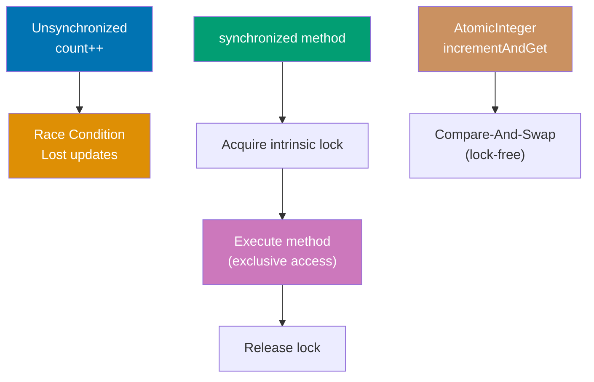

**Code**:

```java
import java.util.concurrent.atomic.AtomicInteger;
import java.util.concurrent.locks.*;

// RACE CONDITION - unsafe shared state
class UnsafeCounter {
    private int count = 0;

    public void increment() {
        count++;                 // => NOT thread-safe (read-modify-write race)
    }

    public int getCount() {
        return count;
    }
}

// SYNCHRONIZED METHOD - thread-safe via intrinsic lock
class SynchronizedCounter {
    private int count = 0;       // => Shared mutable state (requires synchronization)

    public synchronized void increment() {
                                 // => synchronized keyword acquires intrinsic lock
                                 // => Only one thread can execute this method at a time
                                 // => Other threads block until lock released
        count++;                 // => Thread-safe increment (read-modify-write)
                                 // => Lock ensures atomicity of this operation
    }                            // => Lock automatically released on method exit

    public synchronized int getCount() {
                                 // => synchronized ensures visibility of count changes
        return count;            // => Returns current value (consistent read)
    }
}

// SYNCHRONIZED BLOCK - finer-grained locking
class BlockCounter {
    private int count = 0;       // => Shared mutable state
    private final Object lock = new Object();
                                 // => Explicit lock object (any Object works)
                                 // => final ensures lock reference never changes

    public void increment() {
        // Non-critical code here executes without lock
        synchronized(lock) {     // => Acquires lock on specific object
                                 // => Only locks critical section (not entire method)
                                 // => Allows better concurrency vs method-level sync
            count++;             // => Critical section: thread-safe increment
        }                        // => Lock automatically released here
        // Non-critical code here executes without lock
    }
}

// EXPLICIT LOCK - ReentrantLock for advanced control
class LockCounter {
    private int count = 0;       // => Shared mutable state
    private final Lock lock = new ReentrantLock();
                                 // => Explicit Lock interface (more flexible than synchronized)
                                 // => "Reentrant" means same thread can acquire multiple times

    public void increment() {
        lock.lock();             // => Explicitly acquires lock
                                 // => Blocks if another thread holds lock
                                 // => Must manually unlock (unlike synchronized)
        try {
            count++;             // => Critical section
                                 // => Thread-safe modification
        } finally {
            lock.unlock();       // => MUST unlock in finally block
                                 // => Ensures unlock even if exception thrown
                                 // => Failure to unlock causes deadlock
        }
    }
}

// ATOMIC CLASSES - lock-free thread safety
class AtomicCounter {
    private final AtomicInteger count = new AtomicInteger(0);
                                 // => AtomicInteger provides thread-safe operations
                                 // => Uses compare-and-swap (CAS) hardware instructions
                                 // => Lock-free (no blocking, better performance)
                                 // => Initialized to 0

    public void increment() {
        count.incrementAndGet(); // => Atomically increments and returns new value
                                 // => Thread-safe without synchronized/locks
                                 // => Equivalent to: ++count in thread-safe way
                                 // => Uses CAS loop internally
    }

    public int getCount() {
        return count.get();      // => Atomically reads current value
                                 // => Thread-safe read operation
                                 // => Returns int value
    }
}

// DEMONSTRATION
SynchronizedCounter counter = new SynchronizedCounter();
                                 // => Creates shared counter object
                                 // => Will be accessed by multiple threads

// Multiple threads incrementing
Thread t1 = new Thread(() -> {
                                 // => Lambda defines thread task
    for (int i = 0; i < 1000; i++) {
                                 // => Loop 1000 times
        counter.increment();     // => Each call acquires lock, increments, releases lock
                                 // => Synchronized method ensures thread safety
    }
});

Thread t2 = new Thread(() -> {
                                 // => Second thread with same task
    for (int i = 0; i < 1000; i++) {
                                 // => Also loops 1000 times
        counter.increment();     // => Competes with t1 for lock
                                 // => May block waiting for t1 to release lock
    }
});

t1.start();                      // => Starts first thread
                                 // => Begins executing loop
t2.start();                      // => Starts second thread concurrently
                                 // => Both threads run simultaneously

try {
    t1.join();                   // => Main thread waits for t1 to finish
                                 // => Blocks until t1 completes all 1000 increments
    t2.join();                   // => Main thread waits for t2 to finish
                                 // => Blocks until t2 completes all 1000 increments
} catch (InterruptedException e) {
    e.printStackTrace();
}

System.out.println("Final count: " + counter.getCount());
                                 // => Both threads finished, reads final value
                                 // => t1 did 1000 increments, t2 did 1000 increments
                                 // => Output: Final count: 2000 (correct with synchronization)
                                 // => Without synchronization: value would be < 2000 (lost updates)
```

**Key Takeaway**: Use synchronized methods or blocks to protect shared mutable state. Explicit locks (ReentrantLock) provide more control (try-lock, timed lock). Atomic classes (AtomicInteger) offer lock-free thread safety for simple operations. Without synchronization, concurrent access causes race conditions leading to incorrect results.

**Why It Matters**: Synchronization prevents data corruption from concurrent access—without it, count++ (read-modify-write) allows lost updates where two threads read same value and both write incremented result (both write 1 instead of 1 and 2). The synchronized keyword uses intrinsic locks (every Java object has one), simple but coarse-grained (locks entire method/block). ReentrantLock enables fairness (FIFO waiting), try-lock (non-blocking), and lock conditions (await/signal), essential for complex synchronization. Atomic classes use CPU compare-and-swap (CAS) instructions for lock-free updates, faster than locks for simple operations but limited to single-variable updates. Modern Java emphasizes immutability and concurrent collections over manual synchronization, reserving locks for complex state machines and atomic operations for counters/flags.

---

## Example 49: ExecutorService and Thread Pools

ExecutorService manages thread pools for executing tasks without manual Thread creation. It provides lifecycle management, Future results, and efficient thread reuse.

**Code**:

```java
import java.util.concurrent.*;
import java.util.*;

// FIXED THREAD POOL - reuses fixed number of threads
ExecutorService executor = Executors.newFixedThreadPool(3);
                                 // => Factory method creates thread pool
                                 // => Pool contains exactly 3 worker threads
                                 // => Threads reused across tasks (efficient)
                                 // => Tasks queue if all 3 threads busy

// SUBMIT RUNNABLE tasks
executor.submit(() -> {
                                 // => Lambda implements Runnable
                                 // => submit() returns Future<?> (no result)
    System.out.println("Task 1 running in " + Thread.currentThread().getName());
                                 // => Output: Task 1 running in pool-1-thread-1
                                 // => Thread name shows pool and thread number
});

executor.submit(() -> {
                                 // => Second task submitted to same pool
                                 // => Executed by any available thread
    System.out.println("Task 2 running in " + Thread.currentThread().getName());
                                 // => Output: Task 2 running in pool-1-thread-2 (or thread-1 if reused)
                                 // => Thread allocation non-deterministic
});

// SUBMIT CALLABLE tasks (return values)
Future<Integer> future = executor.submit(() -> {
                                 // => Lambda implements Callable<Integer>
                                 // => Callable differs from Runnable: returns value
                                 // => submit() returns Future<Integer> (represents async result)
    Thread.sleep(1000);          // => Simulates long-running computation
                                 // => Sleeps 1 second
    return 42;                   // => Returns value from task
                                 // => Type: Integer (Callable<Integer> return type)
});

try {
    Integer result = future.get();
                                 // => Blocks current thread until task completes
                                 // => Retrieves result from Future
                                 // => Waits up to 1 second (task's sleep time)
                                 // => result is 42
    System.out.println("Result: " + result);
                                 // => Output: Result: 42
} catch (InterruptedException | ExecutionException e) {
                                 // => InterruptedException: if waiting interrupted
                                 // => ExecutionException: if task threw exception
    e.printStackTrace();
}

// SUBMIT MULTIPLE TASKS
List<Callable<Integer>> tasks = Arrays.asList(
                                 // => Creates list of 3 Callable tasks
    () -> { Thread.sleep(500); return 1; },
                                 // => Task 1: sleeps 500ms, returns 1
    () -> { Thread.sleep(300); return 2; },
                                 // => Task 2: sleeps 300ms, returns 2 (faster)
    () -> { Thread.sleep(100); return 3; }
                                 // => Task 3: sleeps 100ms, returns 3 (fastest)
);

try {
    // invokeAll - waits for all tasks to complete
    List<Future<Integer>> futures = executor.invokeAll(tasks);
                                 // => Submits all 3 tasks to pool
                                 // => Blocks until ALL tasks complete
                                 // => Returns List<Future<Integer>> with results
                                 // => futures.size() is 3
    for (Future<Integer> f : futures) {
                                 // => Iterates over completed futures
        System.out.println("Result: " + f.get());
                                 // => f.get() doesn't block (already complete)
                                 // => Output: Result: 1
                                 // =>         Result: 2
                                 // =>         Result: 3
                                 // => Order matches submission order, not completion order
    }

    // invokeAny - returns first completed result
    Integer first = executor.invokeAny(tasks);
                                 // => Submits all tasks, returns result of first to complete
                                 // => Task 3 completes first (100ms sleep)
                                 // => Cancels remaining tasks after first completes
                                 // => Blocks until at least one task finishes
    System.out.println("First result: " + first);
                                 // => first is 3 (fastest task)
                                 // => Output: First result: 3
} catch (InterruptedException | ExecutionException e) {
    e.printStackTrace();
}

// SCHEDULED EXECUTOR - delayed/periodic tasks
ScheduledExecutorService scheduler = Executors.newScheduledThreadPool(2);
                                 // => Creates pool with 2 threads for scheduled tasks
                                 // => Supports delays and periodic execution

// Execute after delay
scheduler.schedule(() -> {
                                 // => schedule() runs task once after delay
    System.out.println("Delayed task");
                                 // => Output: Delayed task (after 2 seconds)
}, 2, TimeUnit.SECONDS);         // => Initial delay: 2 seconds
                                 // => TimeUnit.SECONDS specifies unit
                                 // => Task runs once, not repeated

// Execute periodically
scheduler.scheduleAtFixedRate(() -> {
                                 // => scheduleAtFixedRate() repeats task at fixed intervals
    System.out.println("Periodic task");
                                 // => Output: Periodic task (every 1 second)
}, 0, 1, TimeUnit.SECONDS);      // => Initial delay: 0 (starts immediately)
                                 // => Period: 1 second between executions
                                 // => Runs: 0s, 1s, 2s, 3s, ... (until shutdown)

// SHUTDOWN
executor.shutdown();             // => Initiates graceful shutdown
                                 // => No new tasks accepted after this call
                                 // => Previously submitted tasks continue executing
                                 // => Doesn't block (returns immediately)
try {
    if (!executor.awaitTermination(60, TimeUnit.SECONDS)) {
                                 // => Waits up to 60 seconds for tasks to complete
                                 // => Returns true if all tasks finished
                                 // => Returns false if timeout occurred
        executor.shutdownNow();  // => Force shutdown if timeout
                                 // => Attempts to stop executing tasks
                                 // => Interrupts threads running tasks
                                 // => Returns list of tasks that never started
    }
} catch (InterruptedException e) {
                                 // => If current thread interrupted while waiting
    executor.shutdownNow();      // => Force shutdown on interruption
                                 // => Propagates interrupt signal
}
```

**Key Takeaway**: Use ExecutorService for thread pool management. Submit Runnable (no return value) or Callable (returns Future) tasks. Use shutdown() to gracefully stop accepting new tasks and awaitTermination() to wait for completion. ScheduledExecutorService enables delayed and periodic task execution.

**Why It Matters**: Thread pools eliminate the overhead of creating/destroying threads for each task—thread creation costs ~1ms and 1MB stack memory, prohibitive for servers handling thousands of requests. Executors.newFixedThreadPool() reuses threads across tasks, reducing overhead to microseconds. Future<T> provides the "return value from asynchronous operation" capability missing from raw threads, enabling functional-style async code (flatMap over futures, compose operations). However, thread pools have limits: fixed-size pools can deadlock if tasks wait for other tasks (all threads blocked), and unbounded queues consume infinite memory if tasks arrive faster than processing. The fork/join pool (Java 7) and virtual threads (Java 21) address these issues with work-stealing and lightweight threads, but ExecutorService remains the standard for bounded concurrency.

---

## Example 50: CompletableFuture for Async Programming

CompletableFuture enables composable asynchronous operations with functional-style transformations. It replaces callback hell with declarative async pipelines.

**Code**:

```java
import java.util.concurrent.*;

// BASIC COMPLETABLEFUTURE
CompletableFuture<String> future = CompletableFuture.supplyAsync(() -> {
                                 // => supplyAsync() runs lambda in background thread
                                 // => Returns CompletableFuture<String>
                                 // => Executes in ForkJoinPool.commonPool() by default
    try {
        Thread.sleep(1000);      // => Simulates long-running task
                                 // => Sleeps 1 second
    } catch (InterruptedException e) {
        throw new RuntimeException(e);
    }
    return "Hello";              // => Returns value when task completes
                                 // => Result available after 1 second
});

// CHAINING OPERATIONS
CompletableFuture<String> result = future
                                 // => Start with CompletableFuture<String> from above
    .thenApply(s -> s + " World")
                                 // => thenApply() transforms result when available
                                 // => Lambda: s -> s + " World"
                                 // => Input: "Hello" (from previous stage)
                                 // => Output: "Hello World"
                                 // => Returns CompletableFuture<String>
    .thenApply(String::toUpperCase);
                                 // => Method reference: transforms to uppercase
                                 // => Input: "Hello World"
                                 // => Output: "HELLO WORLD"
                                 // => Returns CompletableFuture<String>

result.thenAccept(s -> System.out.println("Result: " + s));
                                 // => thenAccept() consumes result (no return value)
                                 // => Lambda executes when result available
                                 // => s is "HELLO WORLD"
                                 // => Output: Result: HELLO WORLD (after 1+ seconds)
                                 // => Returns CompletableFuture<Void>

// COMBINING FUTURES
CompletableFuture<Integer> future1 = CompletableFuture.supplyAsync(() -> 10);
                                 // => Creates async task returning 10
                                 // => Runs in background thread
CompletableFuture<Integer> future2 = CompletableFuture.supplyAsync(() -> 20);
                                 // => Creates second independent async task returning 20
                                 // => Both futures execute concurrently

CompletableFuture<Integer> combined = future1.thenCombine(future2, (a, b) -> a + b);
                                 // => thenCombine() waits for BOTH futures to complete
                                 // => BiFunction: (a, b) -> a + b combines results
                                 // => a = 10 (from future1)
                                 // => b = 20 (from future2)
                                 // => Result: 30
                                 // => Returns CompletableFuture<Integer>
combined.thenAccept(sum -> System.out.println("Sum: " + sum));
                                 // => sum is 30 (combined result)
                                 // => Output: Sum: 30

// SEQUENTIAL COMPOSITION
CompletableFuture<String> sequential = CompletableFuture.supplyAsync(() -> "user123")
                                 // => First async operation: returns "user123"
    .thenCompose(userId -> CompletableFuture.supplyAsync(() -> {
                                 // => Second async operation depends on first result
                                 // => userId = "user123" from previous stage
        // Fetch user details based on userId
        return "User: " + userId;// => Returns "User: user123"
    }));                         // => thenCompose flattens nested CompletableFuture<CompletableFuture<String>> → CompletableFuture<String>
                                 // => Like flatMap for futures (avoids nesting)

// EXCEPTION HANDLING
CompletableFuture<String> withError = CompletableFuture.supplyAsync(() -> {
                                 // => Async task that will throw exception
    if (true) throw new RuntimeException("Error!");
                                 // => Always throws exception
    return "Success";            // => Never reached
})
.exceptionally(ex -> {
                                 // => exceptionally() handles exceptions
                                 // => Called if previous stage threw exception
                                 // => ex is the thrown exception
    System.out.println("Caught: " + ex.getMessage());
                                 // => Output: Caught: Error!
    return "Fallback value";     // => Returns fallback on exception
                                 // => Replaces exception with normal value
})
.thenApply(s -> s.toUpperCase());
                                 // => Continues pipeline with fallback value
                                 // => s is "Fallback value"
                                 // => Result: "FALLBACK VALUE"

// TIMEOUT (Java 9+)
CompletableFuture<String> withTimeout = CompletableFuture.supplyAsync(() -> {
                                 // => Async task that takes too long
    try {
        Thread.sleep(5000);      // => Sleeps 5 seconds (too slow)
    } catch (InterruptedException e) {}
    return "Slow result";        // => Would return after 5 seconds
})
.orTimeout(2, TimeUnit.SECONDS);
                                 // => orTimeout() fails future if exceeds 2 seconds
                                 // => Completes exceptionally with TimeoutException
                                 // => Task cancelled if times out

// ALLOF - wait for all futures
CompletableFuture<Void> allDone = CompletableFuture.allOf(future1, future2, sequential);
                                 // => allOf() waits for ALL futures to complete
                                 // => Returns CompletableFuture<Void> (no combined result)
                                 // => Completes when all inputs complete
allDone.thenRun(() -> System.out.println("All futures complete"));
                                 // => thenRun() executes when all done
                                 // => Output: All futures complete

// ANYOF - wait for any future
CompletableFuture<Object> anyDone = CompletableFuture.anyOf(future1, future2);
                                 // => anyOf() completes when ANY future completes
                                 // => Returns CompletableFuture<Object> (type-unsafe)
                                 // => Result is value from first completed future
anyDone.thenAccept(result -> System.out.println("First result: " + result));
                                 // => result is whichever completes first
                                 // => Output: First result: 10 or First result: 20

// BLOCKING WAIT (use sparingly)
try {
    String finalResult = result.get();
                                 // => Blocks current thread until future completes
                                 // => Returns result value ("HELLO WORLD")
                                 // => Defeats async purpose (use thenAccept instead)
                                 // => May wait indefinitely if future never completes
    String timeoutResult = result.get(1, TimeUnit.SECONDS);
                                 // => Blocks with timeout (maximum 1 second)
                                 // => Returns result if completes within timeout
                                 // => Throws TimeoutException if exceeds 1 second
                                 // => Better than get() for potentially long operations
} catch (InterruptedException | ExecutionException | TimeoutException e) {
                                 // => InterruptedException: if thread interrupted while waiting
                                 // => ExecutionException: if future completed with exception
                                 // => TimeoutException: if timeout exceeded
    e.printStackTrace();
}
```

**Key Takeaway**: CompletableFuture enables async operations with functional composition. Use thenApply() for transformations, thenCombine() to merge results, thenCompose() for sequential async operations, and exceptionally() for error handling. Avoid blocking with get()—prefer reactive chaining with thenAccept() and thenRun().

**Why It Matters**: CompletableFuture brought reactive programming to standard Java, eliminating callback hell (nested callbacks for async operations). Before CompletableFuture, async code required manual thread management or libraries like Guava's ListenableFuture. The functional composition model (thenApply, thenCompose) matches modern async patterns from JavaScript Promises, Kotlin coroutines, and Scala futures. However, CompletableFuture has limitations: no cancellation propagation (cancelling parent doesn't cancel children), complex error handling (exceptions don't propagate automatically), and verbose syntax compared to async/await. Virtual threads (Java 21) enable blocking-style async code with structured concurrency, potentially replacing CompletableFuture for many use cases, though CompletableFuture remains essential for composing independent async operations.

---

## Modern Java Idioms (Java 17+)

Modern Java idioms leverage features from Java 17+ (records, sealed classes, pattern matching, text blocks) and Java 21+ (virtual threads, enhanced pattern matching). These idioms emphasize immutability, type safety, and conciseness.

---

## Example 51: Records for Immutable Data

Records provide concise syntax for immutable data carriers, automatically generating constructors, getters, equals(), hashCode(), and toString().

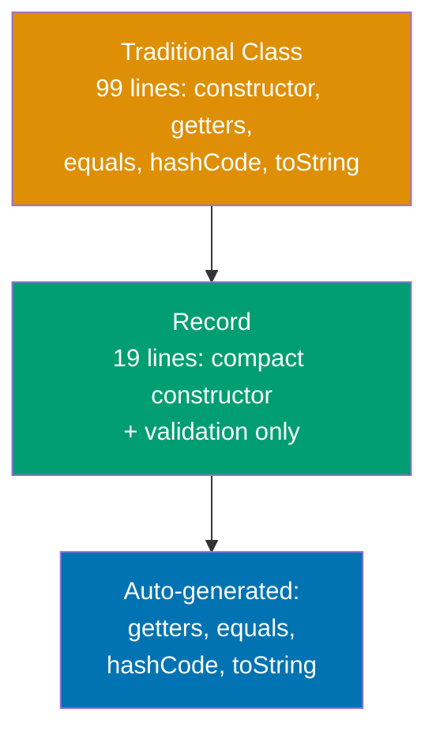

**Code**:

```java
// TRADITIONAL CLASS - verbose
public final class Payment {
    private final BigDecimal amount;
    private final LocalDate date;

    public Payment(BigDecimal amount, LocalDate date) {
        this.amount = amount;
        this.date = date;
    }

    public BigDecimal amount() { return amount; }
    public LocalDate date() { return date; }

    @Override
    public boolean equals(Object o) {
        // => 15 lines of boilerplate equality logic
        // => Compares all fields for structural equality
        // => Handles null and type checking
        if (this == o) return true;
        if (o == null || getClass() != o.getClass()) return false;
        Payment payment = (Payment) o;
        return Objects.equals(amount, payment.amount) &&
               Objects.equals(date, payment.date);
    }

    @Override
    public int hashCode() {
        // => Generates hash from all fields
        return Objects.hash(amount, date);
    }

    @Override
    public String toString() {
        // => String representation for debugging
        return "Payment{amount=" + amount + ", date=" + date + '}';
    }
}

// RECORD - concise (Java 17+)
public record PaymentRecord(
    BigDecimal amount,       // => Final field, auto-getter: amount()
                             // => Immutable: no setter generated
    LocalDate date           // => Final field, auto-getter: date()
) {
    // COMPACT CONSTRUCTOR - validation only
    public PaymentRecord {   // => No parameter list (uses record components)
                             // => Runs BEFORE field initialization
                             // => Validates before assignment (fail-fast)
        if (amount.compareTo(BigDecimal.ZERO) <= 0) {
                             // => Business rule: amount must be positive
            throw new IllegalArgumentException("Amount must be positive");
                             // => Throws immediately (object never created)
        }
        Objects.requireNonNull(date, "Date required");
                             // => Null check with custom message
                             // => Prevents null dates
        // => After this block: fields initialized to params
        // => No explicit this.amount = amount needed
    }

    // DERIVED METHODS - business logic
    public boolean isRecent() {
        // => Custom method beyond auto-generated ones
        return date.isAfter(LocalDate.now().minusDays(30));
                             // => Returns true if within last 30 days
    }
}

// USAGE
PaymentRecord payment = new PaymentRecord(
    new BigDecimal("150.00"),// => amount field
    LocalDate.of(2026, 1, 15)// => date field
);                           // => Compact constructor runs validation
                             // => Fields initialized after validation passes

System.out.println(payment.amount());
                             // => Output: 150.00
                             // => Auto-generated getter (no get prefix)
System.out.println(payment.date());
                             // => Output: 2026-01-15
System.out.println(payment);
                             // => Output: PaymentRecord[amount=150.00, date=2026-01-15]
                             // => Auto-generated toString with field names

PaymentRecord copy = new PaymentRecord(payment.amount(), payment.date());
                             // => Records have no setters (immutable)
                             // => Create new instance to "modify"
System.out.println(payment.equals(copy));
                             // => Output: true
                             // => Auto-generated structural equality
```

**Key Takeaway**: Use records for immutable data classes (DTOs, value objects, API responses). Records reduce boilerplate by 80%, enforce immutability by default, and provide structural equality automatically. Validation goes in compact constructor.

**Why It Matters**: Before records (pre-Java 14), creating immutable data classes required 50-100 lines of boilerplate for constructors, getters, equals(), hashCode(), and toString(). Tools like Lombok reduced boilerplate but added external dependencies and IDE-specific issues. Records are language-native (no dependencies), compile-time verified, and optimized by JVM. Records model domain concepts clearly: `PaymentRecord` is obviously data (no behavior), unlike traditional classes where intent is unclear. Records integrate with pattern matching (Java 21+), enabling destructuring in switch expressions and instanceof checks. Use records for 90% of immutable data classes—fallback to traditional classes only when inheritance, custom serialization, or mutable fields required.

---

## Example 52: Sealed Classes for Closed Hierarchies

Sealed classes restrict which classes can extend or implement them, enabling exhaustive pattern matching and domain modeling.

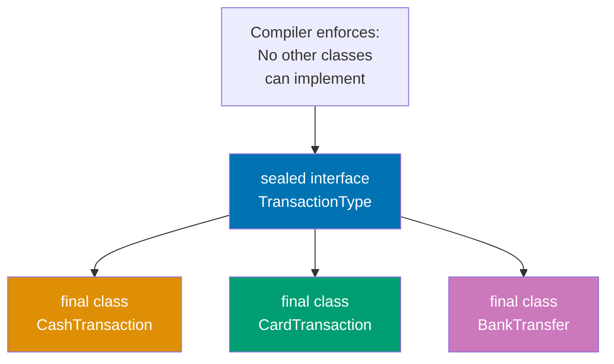

**Code**:

```java
// SEALED INTERFACE - restricts implementors
public sealed interface TransactionType
    permits CashTransaction, CardTransaction, BankTransfer {
                             // => Only these 3 classes can implement
                             // => Compiler prevents other implementations
                             // => Enables exhaustive pattern matching

    BigDecimal amount();     // => All subtypes must provide amount
    String description();    // => Common interface method
}

// PERMITTED IMPLEMENTATIONS
public final class CashTransaction implements TransactionType {
                             // => final prevents further subclassing
                             // => Must be in permits clause above
    private final BigDecimal amount;
    private final String currency;

    public CashTransaction(BigDecimal amount, String currency) {
        this.amount = amount;
        this.currency = currency;
    }

    @Override
    public BigDecimal amount() { return amount; }

    @Override
    public String description() {
        return "Cash: " + amount + " " + currency;
                             // => Returns: "Cash: 100.00 USD"
    }
}

public final class CardTransaction implements TransactionType {
                             // => Second permitted subtype
    private final BigDecimal amount;
    private final String last4Digits;

    public CardTransaction(BigDecimal amount, String last4Digits) {
        this.amount = amount;
        this.last4Digits = last4Digits;
    }

    @Override
    public BigDecimal amount() { return amount; }

    @Override
    public String description() {
        return "Card ending " + last4Digits + ": " + amount;
                             // => Returns: "Card ending 1234: 50.00"
    }
}

public final class BankTransfer implements TransactionType {
                             // => Third permitted subtype
    private final BigDecimal amount;
    private final String accountNumber;

    public BankTransfer(BigDecimal amount, String accountNumber) {
        this.amount = amount;
        this.accountNumber = accountNumber;
    }

    @Override
    public BigDecimal amount() { return amount; }

    @Override
    public String description() {
        return "Bank transfer to " + accountNumber + ": " + amount;
                             // => Returns: "Bank transfer to 123456: 200.00"
    }
}

// EXHAUSTIVE PATTERN MATCHING (Java 21+)
public String processTransaction(TransactionType txn) {
    return switch (txn) {    // => Compiler checks ALL permitted types covered
                             // => No default case needed (exhaustiveness guaranteed)
        case CashTransaction c ->
                             // => Matches CashTransaction, binds to 'c'
                             // => No casting needed (pattern variable)
            "Processing cash: " + c.description();
                             // => Returns: "Processing cash: Cash: 100.00 USD"

        case CardTransaction card ->
                             // => Matches CardTransaction, binds to 'card'
            "Processing card: " + card.description();
                             // => Returns: "Processing card: Card ending 1234: 50.00"

        case BankTransfer bank ->
                             // => Matches BankTransfer, binds to 'bank'
            "Processing bank: " + bank.description();
                             // => Returns: "Processing bank: Bank transfer to 123456: 200.00"
        // => No default needed: compiler knows these are ALL types
        // => If permits clause changes, compiler errors here (catches bugs)
    };
}

// USAGE
TransactionType txn1 = new CashTransaction(
    new BigDecimal("100.00"),// => amount
    "USD"                    // => currency
);
System.out.println(processTransaction(txn1));
                             // => Output: Processing cash: Cash: 100.00 USD

TransactionType txn2 = new CardTransaction(
    new BigDecimal("50.00"), // => amount
    "1234"                   // => last 4 digits
);
System.out.println(processTransaction(txn2));
                             // => Output: Processing card: Card ending 1234: 50.00

// COMPILE ERROR if trying to add new implementation
// public final class CheckTransaction implements TransactionType {
//                               // => Compiler error: not in permits clause
//                               // => Cannot implement sealed interface
// }
```

**Key Takeaway**: Use sealed classes/interfaces to model closed domain hierarchies (payment types, status enums, result types). Compiler enforces exhaustiveness in pattern matching, eliminating runtime errors from missing cases. All permitted types must be final, sealed, or non-sealed.

**Why It Matters**: Sealed classes solve the "expression problem": adding new operations (methods) without modifying existing code, while controlling type extensions. Traditional interfaces allow anyone to implement (open hierarchy), making exhaustive pattern matching impossible—you always need a default case that might hide bugs. Sealed types enable algebraic data types (sum types) common in functional languages: `TransactionType = Cash | Card | Bank`. This powers type-safe state machines, command patterns, and domain models. When adding new permitted type, compiler errors at all switch expressions, forcing updates—prevents forgetting to handle new cases. Use sealed types for domain models with known, fixed variants (HTTP methods, database operations, workflow states). Use traditional interfaces when extensibility required (plugin systems, third-party implementations).

---

## Example 53: Pattern Matching for Switch

Pattern matching for switch combines type checking, casting, and conditional logic in concise syntax.

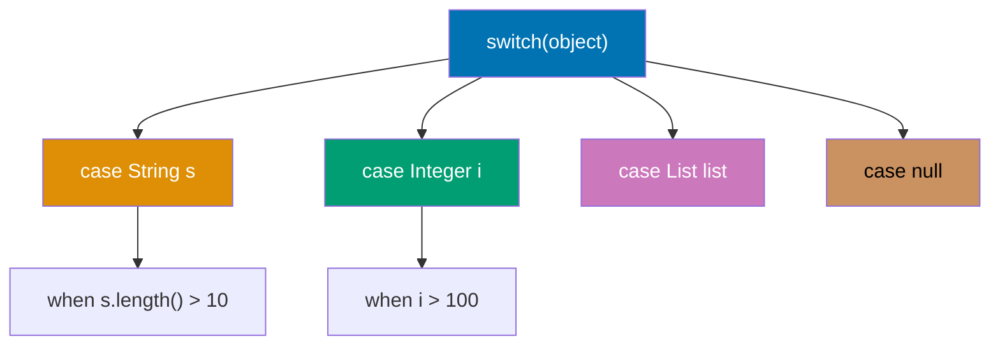

**Code**:

```java
// TRADITIONAL INSTANCEOF CASCADE
public String formatOld(Object obj) {
    if (obj == null) {       // => Manual null check
        return "null";
    } else if (obj instanceof String) {
        String s = (String) obj;
                             // => Manual cast after check
        return "String: " + s;
    } else if (obj instanceof Integer) {
        Integer i = (Integer) obj;
                             // => Duplicate casting boilerplate
        return "Integer: " + i;
    } else if (obj instanceof List<?>) {
        List<?> list = (List<?>) obj;
                             // => Verbose and error-prone
        return "List of " + list.size() + " items";
    } else {
        return "Unknown";
    }
}

// PATTERN MATCHING FOR SWITCH (Java 21+)
public String formatNew(Object obj) {
    return switch (obj) {    // => Switch expression (returns value)
                             // => Exhaustive: covers all cases or uses default

        case null ->         // => Explicit null handling (no NullPointerException)
                             // => Pattern matching supports null case
            "null";          // => Returns: "null"

        case String s ->     // => Type pattern: matches String, binds to 's'
                             // => No explicit cast needed (automatic)
                             // => 's' scoped to this case only
            "String: " + s;  // => Returns: "String: hello"

        case Integer i when i > 100 ->
                             // => Type pattern with GUARD condition
                             // => 'when' adds boolean condition
                             // => Matches Integer AND i > 100
            "Large Integer: " + i;
                             // => Returns: "Large Integer: 150"

        case Integer i ->    // => Fallback for smaller integers
                             // => Ordered after guarded case (guards checked first)
            "Small Integer: " + i;
                             // => Returns: "Small Integer: 42"

        case List<?> list when !list.isEmpty() ->
                             // => Generic type pattern with guard
                             // => Matches non-empty lists only
            "List of " + list.size() + " items";
                             // => Returns: "List of 3 items"

        case List<?> list -> // => Matches empty lists
            "Empty list";    // => Returns: "Empty list"

        default ->           // => Catches all unmatched types
                             // => Required unless cases exhaustive
            "Unknown: " + obj.getClass().getSimpleName();
                             // => Returns: "Unknown: Double" (for 3.14)
    };
}

// RECORD PATTERNS (Java 21+)
record Point(int x, int y) {}
                             // => Simple coordinate record

public String describePoint(Object obj) {
    return switch (obj) {
        case Point(int x, int y) when x == 0 && y == 0 ->
                             // => RECORD PATTERN: destructures Point into x, y
                             // => Extracts fields in one step (no getters)
                             // => Guard checks origin (0, 0)
            "Origin";        // => Returns: "Origin"

        case Point(int x, int y) when x == y ->
                             // => Destructures and checks diagonal
            "Diagonal at (" + x + ", " + y + ")";
                             // => Returns: "Diagonal at (5, 5)"

        case Point(int x, int y) when y == 0 ->
                             // => Checks horizontal axis
            "X-axis at x=" + x;
                             // => Returns: "X-axis at x=10"

        case Point(int x, int y) ->
                             // => General point
            "Point(" + x + ", " + y + ")";
                             // => Returns: "Point(3, 7)"

        default -> "Not a point";
    };
}

// USAGE
System.out.println(formatNew("hello"));
                             // => Output: String: hello
System.out.println(formatNew(150));
                             // => Output: Large Integer: 150
System.out.println(formatNew(42));
                             // => Output: Small Integer: 42
System.out.println(formatNew(List.of(1, 2, 3)));
                             // => Output: List of 3 items
System.out.println(formatNew(null));
                             // => Output: null
System.out.println(formatNew(3.14));
                             // => Output: Unknown: Double

Point origin = new Point(0, 0);
System.out.println(describePoint(origin));
                             // => Output: Origin
Point diagonal = new Point(5, 5);
System.out.println(describePoint(diagonal));
                             // => Output: Diagonal at (5, 5)
```

**Key Takeaway**: Pattern matching for switch eliminates instanceof-cast boilerplate, supports guards (when clauses) for complex conditions, and enables record destructuring. Use null case to avoid NullPointerException, guards to combine type and logic checks, and sealed types for exhaustive matching.

**Why It Matters**: Traditional instanceof chains required 3 steps per branch: type check (instanceof), cast, then use. Pattern matching reduces this to one step, eliminating 66% of boilerplate and cast errors (forgetting cast after check). Guards (when clauses) avoid nested ifs, making complex conditions readable: `case Integer i when i > 100` vs `if (obj instanceof Integer) { Integer i = (Integer) obj; if (i > 100) {...}}`. Record patterns enable destructuring (extracting fields directly): `case Point(int x, int y)` replaces manual `point.x()`, `point.y()` calls—critical for nested data structures. Sealed types + pattern matching = compiler-verified exhaustiveness: adding new permitted type forces updating all switch expressions (catches bugs at compile-time). This combination brings algebraic data types and exhaustive pattern matching from functional languages (Scala, Haskell) to Java, transforming type-based dispatching from error-prone runtime checks to compile-time guarantees.

---

## Example 54: Optional for Null Safety

Optional explicitly models presence/absence of values, eliminating NullPointerException through functional composition.

**Code**:

```java
// NULL-BASED APPROACH - error-prone
public String findUserEmailOld(String userId) {
    User user = database.findUser(userId);
                             // => Returns null if not found
                             // => Caller must remember to check
    if (user == null) {
        return null;         // => Null propagation continues
                             // => Caller must check again
    }

    String email = user.getEmail();
                             // => getEmail() might also return null
    if (email == null) {
        return null;         // => Nested null checks proliferate
    }

    return email.toLowerCase();
                             // => Risk: NullPointerException if checks missed
}

// OPTIONAL APPROACH - null-safe
public Optional<String> findUserEmail(String userId) {
    return database.findUserOptional(userId)
                             // => Returns Optional<User> (empty if not found)
                             // => Explicit: caller knows value might be absent
        .map(User::getEmail) // => map() transforms Optional<User> → Optional<String>
                             // => If user absent: returns Optional.empty() (short-circuits)
                             // => If user present: extracts email, wraps in Optional
                             // => Handles null email: returns Optional.empty()
        .map(String::toLowerCase);
                             // => Chains transformations safely
                             // => Optional<String> → Optional<String> (lowercase)
                             // => If email absent: returns Optional.empty()
}

// CREATION
Optional<String> present = Optional.of("value");
                             // => Creates Optional with non-null value
                             // => Throws NullPointerException if "value" is null
Optional<String> nullable = Optional.ofNullable(getValue());
                             // => Creates Optional from potentially null value
                             // => Returns Optional.empty() if getValue() returns null
Optional<String> empty = Optional.empty();
                             // => Creates empty Optional explicitly

// TRANSFORMATION - map()
Optional<String> upper = Optional.of("hello")
    .map(String::toUpperCase);
                             // => map() applies function if value present
                             // => Returns Optional<String> with "HELLO"
                             // => If empty: returns Optional.empty() (no function call)

// FLAT MAPPING - flatMap()
public Optional<String> getUserCity(String userId) {
    return database.findUserOptional(userId)
                             // => Optional<User>
        .flatMap(user -> user.getAddress())
                             // => getAddress() returns Optional<Address>
                             // => flatMap() prevents Optional<Optional<Address>>
                             // => Flattens to Optional<Address>
        .flatMap(address -> address.getCity());
                             // => getCity() returns Optional<String>
                             // => Final result: Optional<String> (city)
}

// FILTERING - filter()
Optional<String> longEmail = Optional.of("user@example.com")
    .filter(email -> email.length() > 10);
                             // => filter() keeps value if predicate true
                             // => email.length() is 16 (> 10), so kept
                             // => Returns Optional<String> with "user@example.com"

Optional<String> shortEmail = Optional.of("me@co")
    .filter(email -> email.length() > 10);
                             // => email.length() is 5 (< 10), so filtered out
                             // => Returns Optional.empty()

// TERMINAL OPERATIONS
String result1 = Optional.of("value").orElse("default");
                             // => orElse() returns value if present, else default
                             // => Returns: "value"
                             // => CAVEAT: "default" is ALWAYS evaluated (even if not used)

String result2 = Optional.empty().orElse("default");
                             // => Optional is empty, returns default
                             // => Returns: "default"

String result3 = Optional.of("value").orElseGet(() -> expensiveDefault());
                             // => orElseGet() takes Supplier (lazy evaluation)
                             // => Only calls expensiveDefault() if Optional empty
                             // => Returns: "value" (supplier not called)

String result4 = Optional.empty()
    .orElseThrow(() -> new IllegalStateException("Not found"));
                             // => orElseThrow() throws exception if empty
                             // => Throws: IllegalStateException("Not found")

// PRESENCE CHECKS
Optional<String> opt = Optional.of("test");
if (opt.isPresent()) {      // => isPresent() returns true if value present
    String value = opt.get();// => get() returns value if present
                             // => DANGER: get() throws NoSuchElementException if empty
                             // => Prefer ifPresent() or orElse() instead
    System.out.println(value);
}

// SAFER PRESENCE HANDLING
Optional.of("test").ifPresent(value -> {
                             // => ifPresent() executes lambda if value present
                             // => No exception risk (lambda not called if empty)
    System.out.println("Value: " + value);
                             // => Output: Value: test
});

Optional.empty().ifPresent(value -> {
                             // => Lambda not executed (Optional empty)
    System.out.println("Value: " + value);
                             // => No output
});

// CONDITIONAL ACTIONS (Java 9+)
Optional.of("test").ifPresentOrElse(
    value -> System.out.println("Found: " + value),
                             // => Action if value present
                             // => Output: Found: test
    () -> System.out.println("Not found")
                             // => Action if value absent
                             // => Not executed (value present)
);

Optional.empty().ifPresentOrElse(
    value -> System.out.println("Found: " + value),
                             // => Not executed (value absent)
    () -> System.out.println("Not found")
                             // => Executed when empty
                             // => Output: Not found
);

// OR OPERATOR (Java 9+)
Optional<String> primary = Optional.empty();
Optional<String> secondary = Optional.of("fallback");

Optional<String> result5 = primary.or(() -> secondary);
                             // => or() returns this Optional if present
                             // => Otherwise returns alternative Optional
                             // => Returns: Optional with "fallback"
                             // => Lazy: supplier only called if primary empty

// STREAM CONVERSION (Java 9+)
List<String> emails = users.stream()
    .map(User::getEmailOptional)
                             // => Stream<Optional<String>>
    .flatMap(Optional::stream)
                             // => Optional.stream() converts Optional → Stream
                             // => Empty optionals become empty streams (filtered out)
                             // => Present optionals become 1-element streams
                             // => flatMap flattens: Stream<Stream<String>> → Stream<String>
    .collect(Collectors.toList());
                             // => Collects only present emails (no nulls)
```

**Key Takeaway**: Use Optional for return types when absence is expected and valid. Chain transformations with map()/flatMap(), provide defaults with orElse()/orElseGet(), and avoid get() (prefer ifPresent()/orElseThrow()). Never use Optional for fields or parameters (use null checks instead).

**Why It Matters**: NullPointerException is Java's most common runtime error, often from forgetting null checks or null propagating through method chains. Optional makes absence explicit in type signatures: `Optional<User> findUser()` vs `User findUser()` clearly signals "might not exist." This shifts null handling from implicit (remember to check) to explicit (compiler/IDE prompts). Functional composition (map, flatMap, filter) enables null-safe chaining without nested ifs: `findUser().map(User::getEmail).map(String::toLowerCase).orElse("unknown")` replaces 10+ lines of null checks. However, Optional has overhead (wrapper object allocation) and should NOT be used everywhere: avoid Optional fields (breaks serialization), Optional parameters (caller burden), or Optional collections (use Collections.emptyList()). Optional excels for return types in queries, configuration lookups, and parsers where absence is meaningful. Java 9+ enhancements (ifPresentOrElse, or, stream) make Optional more powerful, approaching monadic error handling from functional languages.

---

## Example 55: Stream API Collectors

Collectors transform streams into collections, maps, or aggregate values through terminal operations.

**Code**:

```java
record Employee(String name, String department, int salary) {}
                             // => Simple employee record

List<Employee> employees = List.of(
    new Employee("Alice", "Engineering", 80000),
    new Employee("Bob", "Sales", 60000),
    new Employee("Charlie", "Engineering", 90000),
    new Employee("Diana", "HR", 55000),
    new Employee("Eve", "Sales", 65000)
);                           // => Sample employee data

// BASIC COLLECTION
List<String> names = employees.stream()
    .map(Employee::name)     // => Extracts names: Stream<String>
    .collect(Collectors.toList());
                             // => Collects to List<String>
                             // => Returns: ["Alice", "Bob", "Charlie", "Diana", "Eve"]

Set<String> uniqueDepts = employees.stream()
    .map(Employee::department)
                             // => Extracts departments: Stream<String>
    .collect(Collectors.toSet());
                             // => Collects to Set<String> (removes duplicates)
                             // => Returns: ["Engineering", "Sales", "HR"]

// GROUPING BY
Map<String, List<Employee>> byDepartment = employees.stream()
    .collect(Collectors.groupingBy(Employee::department));
                             // => groupingBy() creates Map<String, List<Employee>>
                             // => Key: department name
                             // => Value: List of employees in that department
                             // => Returns: {
                             //   "Engineering": [Alice, Charlie],
                             //   "Sales": [Bob, Eve],
                             //   "HR": [Diana]
                             // }

// GROUPING WITH DOWNSTREAM COLLECTOR
Map<String, Long> employeeCountByDept = employees.stream()
    .collect(Collectors.groupingBy(
        Employee::department,// => Classifier: groups by department
        Collectors.counting()// => Downstream collector: counts employees
    ));                      // => Returns Map<String, Long>
                             // => Returns: {
                             //   "Engineering": 2,
                             //   "Sales": 2,
                             //   "HR": 1
                             // }

Map<String, Integer> totalSalaryByDept = employees.stream()
    .collect(Collectors.groupingBy(
        Employee::department,// => Groups by department
        Collectors.summingInt(Employee::salary)
                             // => Downstream: sums salaries in each group
    ));                      // => Returns Map<String, Integer>
                             // => Returns: {
                             //   "Engineering": 170000,
                             //   "Sales": 125000,
                             //   "HR": 55000
                             // }

Map<String, Optional<Employee>> highestPaidByDept = employees.stream()
    .collect(Collectors.groupingBy(
        Employee::department,
        Collectors.maxBy(Comparator.comparingInt(Employee::salary))
                             // => Downstream: finds employee with max salary
    ));                      // => Returns Map<String, Optional<Employee>>
                             // => Optional because group might be empty
                             // => Returns: {
                             //   "Engineering": Optional[Charlie(90000)],
                             //   "Sales": Optional[Eve(65000)],
                             //   "HR": Optional[Diana(55000)]
                             // }

// PARTITIONING BY (boolean predicate)
Map<Boolean, List<Employee>> partitionedBySalary = employees.stream()
    .collect(Collectors.partitioningBy(e -> e.salary() > 65000));
                             // => partitioningBy() splits into 2 groups: true/false
                             // => Predicate: salary > 65000
                             // => Returns Map<Boolean, List<Employee>>
                             // => Returns: {
                             //   true: [Alice(80000), Charlie(90000)],
                             //   false: [Bob(60000), Diana(55000), Eve(65000)]
                             // }

// MAPPING DOWNSTREAM
Map<String, List<String>> namesByDept = employees.stream()
    .collect(Collectors.groupingBy(
        Employee::department,
        Collectors.mapping(
            Employee::name,  // => Extracts name from each employee
            Collectors.toList()
                             // => Collects mapped names to List
        )
    ));                      // => Returns Map<String, List<String>>
                             // => Returns: {
                             //   "Engineering": ["Alice", "Charlie"],
                             //   "Sales": ["Bob", "Eve"],
                             //   "HR": ["Diana"]
                             // }

// JOINING STRINGS
String allNames = employees.stream()
    .map(Employee::name)
    .collect(Collectors.joining(", "));
                             // => joining() concatenates with delimiter
                             // => Returns: "Alice, Bob, Charlie, Diana, Eve"

String formattedNames = employees.stream()
    .map(Employee::name)
    .collect(Collectors.joining(
        ", ",                // => Delimiter between elements
        "Employees: ",       // => Prefix before first element
        "."                  // => Suffix after last element
    ));                      // => Returns: "Employees: Alice, Bob, Charlie, Diana, Eve."

// REDUCING
int totalSalaries = employees.stream()
    .collect(Collectors.summingInt(Employee::salary));
                             // => summingInt() sums integer values
                             // => Returns: 350000

double avgSalary = employees.stream()
    .collect(Collectors.averagingInt(Employee::salary));
                             // => averagingInt() calculates average
                             // => Returns: 70000.0

Optional<Employee> highestPaid = employees.stream()
    .collect(Collectors.maxBy(Comparator.comparingInt(Employee::salary)));
                             // => maxBy() finds maximum by comparator
                             // => Returns: Optional[Charlie(90000)]

// STATISTICS
IntSummaryStatistics stats = employees.stream()
    .collect(Collectors.summarizingInt(Employee::salary));
                             // => summarizingInt() computes count, sum, min, avg, max
System.out.println(stats.getCount());
                             // => Output: 5
System.out.println(stats.getSum());
                             // => Output: 350000
System.out.println(stats.getMin());
                             // => Output: 55000
System.out.println(stats.getMax());
                             // => Output: 90000
System.out.println(stats.getAverage());
                             // => Output: 70000.0

// TO MAP
Map<String, Integer> salaryByName = employees.stream()
    .collect(Collectors.toMap(
        Employee::name,      // => Key mapper: employee name
        Employee::salary     // => Value mapper: salary
    ));                      // => Returns Map<String, Integer>
                             // => Returns: {
                             //   "Alice": 80000,
                             //   "Bob": 60000,
                             //   "Charlie": 90000,
                             //   "Diana": 55000,
                             //   "Eve": 65000
                             // }

// TO MAP WITH MERGE FUNCTION
Map<String, Integer> salaryByDeptMerged = employees.stream()
    .collect(Collectors.toMap(
        Employee::department,// => Key mapper (duplicates exist)
        Employee::salary,    // => Value mapper
        Integer::sum         // => Merge function: handles key collisions
                             // => Sums salaries for same department
    ));                      // => Returns: {
                             //   "Engineering": 170000,
                             //   "Sales": 125000,
                             //   "HR": 55000
                             // }

// FILTERING (Java 9+)
Map<String, List<Employee>> highEarnersbyDept = employees.stream()
    .collect(Collectors.groupingBy(
        Employee::department,
        Collectors.filtering(
            e -> e.salary() > 60000,
                             // => Filter predicate
            Collectors.toList()
                             // => Downstream collector after filtering
        )
    ));                      // => Returns: {
                             //   "Engineering": [Alice, Charlie],
                             //   "Sales": [Eve],
                             //   "HR": []
                             // }

// FLAT MAPPING (Java 9+)
record Department(String name, List<String> teams) {}
List<Department> departments = List.of(
    new Department("Engineering", List.of("Backend", "Frontend")),
    new Department("Sales", List.of("Direct", "Enterprise"))
);

Map<String, List<String>> teamsByDept = departments.stream()
    .collect(Collectors.toMap(
        Department::name,
        Department::teams
    ));
                             // => Regular approach: Map<String, List<String>>

List<String> allTeams = departments.stream()
    .flatMap(d -> d.teams().stream())
                             // => flatMap flattens nested lists
    .collect(Collectors.toList());
                             // => Returns: ["Backend", "Frontend", "Direct", "Enterprise"]
```

**Key Takeaway**: Use Collectors for terminal stream operations: toList()/toSet() for collections, groupingBy() for multi-level grouping, partitioningBy() for boolean splits, joining() for string concatenation, and summarizingInt() for statistics. Compose collectors with downstream collectors for complex aggregations.

**Why It Matters**: Stream collectors enable declarative data transformation, replacing imperative loops with functional pipelines. Before streams (pre-Java 8), grouping required manual map creation and loop-based aggregation (error-prone, verbose). Collectors provide optimized, reusable aggregation strategies: `groupingBy()` handles concurrent collection, `toMap()` detects duplicate keys, `summarizingInt()` computes multiple statistics in one pass. Downstream collectors enable compositional aggregation: group → filter → count in single pipeline. This matches SQL-like expressiveness (GROUP BY, COUNT, SUM) but with type safety and IDE support. Advanced collectors (filtering, flatMapping in Java 9+) eliminate intermediate stream operations, improving performance. Use collectors for ETL pipelines, report generation, and data analysis—prefer imperative loops only when: early termination needed (findFirst), stateful accumulation required, or parallel execution harmful (sequential guarantees).

---

## Example 56: Text Blocks for Multi-Line Strings

Text blocks (Java 17+) provide clean syntax for multi-line strings without escape sequences or concatenation.

**Code**:

```java
// TRADITIONAL STRING CONCATENATION - verbose
String sqlOld = "SELECT users.id, users.name, users.email\n" +
                "FROM users\n" +
                "JOIN orders ON users.id = orders.user_id\n" +
                "WHERE orders.status = 'ACTIVE'\n" +
                "ORDER BY users.name";
                             // => Requires \n for newlines
                             // => Requires + for concatenation
                             // => Unreadable formatting
                             // => Easy to forget \n or +

// TEXT BLOCK (Java 17+)
String sqlNew = """
    SELECT users.id, users.name, users.email
    FROM users
    JOIN orders ON users.id = orders.user_id
    WHERE orders.status = 'ACTIVE'
    ORDER BY users.name
    """;                     // => Triple quotes delimit text block
                             // => Automatic newline preservation
                             // => No escape sequences needed
                             // => Closing """ determines indentation level
                             // => All lines dedented to match closing """

// FORMATTING WITH TEXT BLOCKS
String userId = "user123";
String status = "ACTIVE";

String formattedSql = """
    SELECT users.id, users.name, users.email
    FROM users
    WHERE users.id = '%s'
    AND users.status = '%s'
    """.formatted(userId, status);
                             // => formatted() replaces %s placeholders
                             // => Returns: SELECT users.id, users.name, users.email
                             //             FROM users
                             //             WHERE users.id = 'user123'
                             //             AND users.status = 'ACTIVE'

// JSON TEMPLATE
String jsonTemplate = """
    {
      "user": {
        "id": "%s",
        "name": "%s",
        "email": "%s",
        "active": %b
      }
    }
    """.formatted("user123", "Alice", "alice@example.com", true);
                             // => No escaping " needed inside text block
                             // => Returns valid JSON:
                             // {
                             //   "user": {
                             //     "id": "user123",
                             //     "name": "Alice",
                             //     "email": "alice@example.com",
                             //     "active": true
                             //   }
                             // }

// HTML TEMPLATE
String htmlTemplate = """
    <!DOCTYPE html>
    <html>
      <head>
        <title>%s</title>
      </head>
      <body>
        <h1>Welcome, %s!</h1>
        <p>Email: %s</p>
      </body>
    </html>
    """.formatted("User Profile", "Alice", "alice@example.com");
                             // => Natural HTML formatting
                             // => No escape sequences for quotes

// ESCAPE SEQUENCES IN TEXT BLOCKS
String withEscapes = """
    Line 1
    Line 2 with "quoted text"
    Line 3 with \\backslash
    Line 4 with \ttab
    """;                     // => " doesn't need escaping in text block
                             // => \\ escapes backslash
                             // => \t for tab still works
                             // => Returns:
                             // Line 1
                             // Line 2 with "quoted text"
                             // Line 3 with \backslash
                             // Line 4 with    tab

// INDENTATION CONTROL
String indented = """
        Indented by 8 spaces
        Also indented by 8
    """;                     // => Closing """ at column 4
                             // => Content dedented by 4 (minimum indentation)
                             // => Each line keeps 4 extra spaces
                             // => Returns:
                             //     Indented by 8 spaces
                             //     Also indented by 8

String noIndent = """
    Line 1
    Line 2
""";                         // => Closing """ at column 0
                             // => Content dedented by 0 (no common indent)
                             // => Returns:
                             //     Line 1
                             //     Line 2

// TRAILING WHITESPACE (Java 15+)
String preserveTrailing = """
    Line 1   \s
    Line 2\s
    """;                     // => \s preserves trailing space
                             // => Prevents IDE auto-trim
                             // => Returns:
                             // Line 1
                             // Line 2

// LINE CONTINUATION (Java 15+)
String singleLine = """
    This is a very long line that \
    continues on the next line without a newline
    """;                     // => \ at end of line continues to next
                             // => No newline inserted
                             // => Returns: This is a very long line that continues on the next line without a newline

// SCRIPT TEMPLATES
String bashScript = """
    #!/bin/bash
    set -e

    echo "Starting deployment..."
    docker build -t myapp:%s .
    docker push myapp:%s
    kubectl apply -f deployment.yaml
    echo "Deployment complete"
    """.formatted("v1.2.3", "v1.2.3");
                             // => Shell script with version substitution
                             // => Preserves script structure

// REGEX PATTERNS
String emailRegex = """
    ^[A-Za-z0-9+_.-]+@[A-Za-z0-9.-]+\\.[A-Za-z]{2,}$
    """.strip();             // => strip() removes leading/trailing whitespace
                             // => Single backslash for regex (not double)
                             // => Returns: ^[A-Za-z0-9+_.-]+@[A-Za-z0-9.-]+\.[A-Za-z]{2,}$

// COMPARISON: OLD vs NEW
// OLD: 8 lines, 6 escaped newlines, 5 concatenations
String oldWay = "{\n" +
                "  \"status\": \"success\",\n" +
                "  \"data\": {\n" +
                "    \"id\": \"" + id + "\",\n" +
                "    \"value\": " + value + "\n" +
                "  }\n" +
                "}";

// NEW: 8 lines, 0 escapes, 0 concatenations
String newWay = """
    {
      "status": "success",
      "data": {
        "id": "%s",
        "value": %d
      }
    }
    """.formatted(id, value);
                             // => Cleaner, more maintainable
```

**Key Takeaway**: Use text blocks for SQL queries, JSON/XML templates, HTML, scripts, and documentation. Closing `"""` position controls indentation level. Use `.formatted()` for variable substitution, `\s` to preserve trailing spaces, and `\` for line continuation.

**Why It Matters**: Multi-line strings in Java were notoriously painful before text blocks (Java 15), requiring manual newline escapes (`\n`), string concatenation (`+`), and quote escaping (`\"`). This made SQL queries, JSON templates, and HTML generation error-prone and unreadable. Text blocks solve this with: (1) Automatic newline preservation (no `\n`), (2) Quote preservation (no escaping `"` inside block), (3) Smart indentation (dedents to closing `"""`), and (4) Integration with formatted() for variable substitution. This matches multi-line string syntax from Python (`"""`), JavaScript (backticks), and Kotlin (`"""`). Text blocks improve code clarity by making structured text (SQL, JSON, YAML) look like structured text—not concatenated line fragments. Use for: database queries (readable SQL), API responses (JSON/XML templates), documentation (embedded examples), and scripts (shell/Python snippets). Avoid for: single-line strings (use regular `"..."`), dynamic content (prefer template engines for complex HTML), and security-sensitive contexts (sanitize inputs before `formatted()`).

---

## Example 57: Local Variable Type Inference (var)

The `var` keyword (Java 10+) infers local variable types from initializers, reducing verbosity while maintaining type safety.

**Code**:

```java
// TRADITIONAL TYPE DECLARATION - verbose
Map<String, List<Employee>> employeesByDepartment =
    new HashMap<String, List<Employee>>();
                             // => Type repeated 3 times
                             // => Redundant: right side has all type info

// VAR TYPE INFERENCE (Java 10+)
var employeesByDept = new HashMap<String, List<Employee>>();
                             // => Compiler infers Map<String, List<Employee>>
                             // => Type appears once (right side)
                             // => Still strongly typed (not dynamic typing)

// GOOD USAGE - type obvious from initializer
var message = "Hello";       // => String (obvious)
var count = 42;              // => int (obvious)
var price = 19.99;           // => double (obvious)
var names = new ArrayList<String>();
                             // => ArrayList<String> (obvious)
var numbers = List.of(1, 2, 3);
                             // => List<Integer> (obvious from List.of)

// GOOD USAGE - diamond operator
var employees = new ArrayList<Employee>();
                             // => ArrayList<Employee> inferred from <>
                             // => Before var: ArrayList<Employee> employees = new ArrayList<>();

// GOOD USAGE - complex generic types
var mapper = new HashMap<String, Function<Employee, String>>();
                             // => HashMap<String, Function<Employee, String>>
                             // => Saves typing nested generics

// GOOD USAGE - streams
var activeEmployees = employees.stream()
    .filter(Employee::isActive)
    .collect(Collectors.toList());
                             // => List<Employee> inferred from stream operations
                             // => Clear from context

// GOOD USAGE - try-with-resources
try (var reader = new BufferedReader(new FileReader("data.txt"))) {
                             // => BufferedReader inferred
                             // => Shorter than BufferedReader reader = ...
    var line = reader.readLine();
                             // => String inferred from readLine()
}

// GOOD USAGE - loops
for (var employee : employees) {
                             // => Employee inferred from employees collection
    System.out.println(employee.name());
}

var entries = map.entrySet();
for (var entry : entries) {  // => Map.Entry<String, Integer> inferred
    System.out.println(entry.getKey() + ": " + entry.getValue());
}

// BAD USAGE - type not obvious
var result = process();      // => What type is result?
                             // => Reader must check process() signature
                             // => Prefer explicit type for clarity

var data = getData();        // => What is data?
                             // => Generic method name gives no hint

// GOOD ALTERNATIVE - explicit type
ProcessedData result = process();
                             // => Clear: result is ProcessedData
UserData data = getData();   // => Clear: data is UserData

// BAD USAGE - null or generic initializers
var value = null;            // => COMPILE ERROR: cannot infer from null
var list = new ArrayList<>();// => COMPILE ERROR: cannot infer generic type
                             // => Must use: new ArrayList<String>()

// BAD USAGE - method parameters (not allowed)
// public void printMessage(var message) {
//                               // => COMPILE ERROR: var only for local variables
// }

// BAD USAGE - fields (not allowed)
// class MyClass {
//     var field = "value";  // => COMPILE ERROR: var only for local variables
// }

// LAMBDAS WITH VAR (Java 11+)
BiFunction<Integer, Integer, Integer> add = (var x, var y) -> x + y;
                             // => var in lambda parameters (all or none)
                             // => Allows annotations: (@NotNull var x, @NotNull var y)
                             // => Without var: (x, y) -> x + y (shorter)
                             // => Use var if annotations needed

// CHAIN READABILITY
// BAD - too much var
var a = getA();
var b = a.getB();
var c = b.getC();
var d = c.getD();            // => Unclear: what are a, b, c, d?

// GOOD - selective var
UserAccount account = getAccount();
var transactions = account.getTransactions();
                             // => List<Transaction> inferred (obvious)
var recent = transactions.stream()
    .filter(t -> t.isRecent())
    .collect(Collectors.toList());
                             // => Type clear from stream operations

// COMPARISON
// BEFORE var
Map<String, List<Transaction>> transactionsByUser =
    new HashMap<String, List<Transaction>>();
                             // => 83 characters
                             // => Type repeated

// AFTER var
var transactionsByUser = new HashMap<String, List<Transaction>>();
                             // => 67 characters
                             // => Type appears once
                             // => Same type safety
```

**Key Takeaway**: Use `var` when type is obvious from right side (constructors, method calls, literals). Avoid `var` when type is unclear (generic method names, complex return types). Never use for fields, parameters, or when initializer lacks type info (null, raw generics). `var` reduces verbosity, not type safety.

**Why It Matters**: Java's verbosity (repeating types) was a long-standing criticism, especially with generics: `Map<String, List<Employee>> map = new HashMap<String, List<Employee>>()` repeats the type declaration twice. `var` reduces this without sacrificing type safety—Java remains statically typed, compiler infers exact type from initializer. This isn't dynamic typing (like JavaScript `var`): once inferred, type is fixed and compile-time checked. `var` shines with: (1) Complex generics (nested types), (2) Diamond operator (avoid repeating `<Type>`), (3) Streams (type obvious from operations), (4) Try-with-resources (resource type clear). However, overusing `var` harms readability: `var result = process()` forces reader to check `process()` signature, while `ProcessedData result = process()` is self-documenting. Use `var` as "don't repeat yourself" (DRY) for types, not "hide the type." Modern IDEs show inferred types on hover, but code reviews and diffs lack this—prioritize readability. `var` adoption guideline: if deleting left-hand type makes reader pause, keep explicit type; if right-hand side clearly shows type, use `var`.

---

## Example 58: Try-With-Resources for Resource Management

Try-with-resources (Java 7+) automatically closes resources implementing AutoCloseable, eliminating finally-block boilerplate and resource leaks.

**Code**:

```java
// MANUAL RESOURCE MANAGEMENT - error-prone
public void processFileOld(String path) throws IOException {
    BufferedReader reader = null;
                             // => Initialize to null for finally block
    try {
        reader = new BufferedReader(new FileReader(path));
                             // => Opens file resource
                             // => Resource leak if exception before assignment
        String line = reader.readLine();
                             // => Read first line from file
        System.out.println(line);
                             // => Output: first line content
    } finally {
        if (reader != null) {// => Manual null check required
            try {
                reader.close();
                             // => Manual close in finally
                             // => Another try-catch for close() exceptions
            } catch (IOException e) {
                             // => Swallows close exception (bad)
                e.printStackTrace();
            }
        }
    }                        // => 15 lines for simple file read
}

// TRY-WITH-RESOURCES (Java 7+)
public void processFile(String path) throws IOException {
    try (BufferedReader reader = new BufferedReader(new FileReader(path))) {
                             // => Resource declared in try(...) parentheses
                             // => Implements AutoCloseable (close() called automatically)
                             // => Guaranteed close even if exception thrown
        String line = reader.readLine();
                             // => Read file content
        System.out.println(line);
                             // => Output: first line of file
    }                        // => reader.close() called automatically here
                             // => If exception in try body: close() still called
                             // => If close() throws: exception suppressed, original thrown
}                            // => 6 lines (60% less code)

// MULTIPLE RESOURCES
public void copyFile(String source, String dest) throws IOException {
    try (BufferedReader reader = new BufferedReader(new FileReader(source));
                             // => First resource: source file reader
         BufferedWriter writer = new BufferedWriter(new FileWriter(dest))) {
                             // => Second resource: destination file writer
                             // => Multiple resources separated by semicolon
                             // => Closed in REVERSE order: writer, then reader
                             // => Guaranteed cleanup even if reader/writer throws

        String line;         // => Variable to hold each line
        while ((line = reader.readLine()) != null) {
                             // => Read each line until EOF
            writer.write(line);
                             // => Write to destination
            writer.newLine();// => Add newline
        }                    // => Automatic flush and close for both resources
    }
}

// EFFECTIVELY FINAL RESOURCES (Java 9+)
public void processExistingResource(BufferedReader reader) throws IOException {
                             // => reader parameter passed from caller
    // Java 7-8: must declare inside try
    // try (BufferedReader r = reader) { ... }

    // Java 9+: can use effectively final variable
    try (reader) {           // => reader must be final or effectively final
                             // => No reassignment needed
                             // => Cleaner for resources from parameters
        String line = reader.readLine();
                             // => Read first line
        System.out.println(line);
                             // => Output: line content
    }                        // => reader.close() called automatically
}

// CUSTOM AUTOCLOSEABLE RESOURCE
class DatabaseConnection implements AutoCloseable {
                             // => Custom resource implementing AutoCloseable
    private Connection conn;

    public DatabaseConnection(String url) throws SQLException {
        this.conn = DriverManager.getConnection(url);
                             // => Opens database connection
        System.out.println("Database connected");
    }

    public void executeQuery(String sql) throws SQLException {
        try (Statement stmt = conn.createStatement()) {
                             // => Nested try-with-resources
                             // => Statement auto-closed
            stmt.execute(sql);
                             // => Execute SQL query
        }
    }

    @Override
    public void close() throws SQLException {
                             // => Called automatically by try-with-resources
        if (conn != null && !conn.isClosed()) {
                             // => Check connection is valid and open
            conn.close();    // => Close underlying connection
            System.out.println("Database disconnected");
                             // => Output: Database disconnected
        }
    }
}

// USAGE OF CUSTOM RESOURCE
public void queryDatabase(String sql) throws SQLException {
    try (DatabaseConnection db = new DatabaseConnection("jdbc:...")) {
                             // => Output: Database connected
                             // => db.close() will be called automatically
        db.executeQuery(sql);
    }                        // => Output: Database disconnected
                             // => Guaranteed cleanup
}

// SUPPRESSED EXCEPTIONS
public void demonstrateSuppressedExceptions() {
    try (var resource = new AutoCloseable() {
        @Override
        public void close() throws Exception {
            throw new Exception("Error during close");
                             // => close() throws exception
        }
    }) {
        throw new Exception("Error in try block");
                             // => try block throws exception FIRST
    } catch (Exception e) {
        System.out.println("Main exception: " + e.getMessage());
                             // => Output: Main exception: Error in try block
                             // => Original exception preserved

        Throwable[] suppressed = e.getSuppressed();
                             // => getSuppressed() returns close() exceptions
        System.out.println("Suppressed exceptions: " + suppressed.length);
                             // => Output: Suppressed exceptions: 1
        System.out.println("Suppressed: " + suppressed[0].getMessage());
                             // => Output: Suppressed: Error during close
    }                        // => Close exceptions don't hide original exception
}

// NESTED TRY-WITH-RESOURCES
public void processNestedResources() throws IOException {
    try (var outer = new BufferedReader(new FileReader("outer.txt"))) {
                             // => Outer resource
        String config = outer.readLine();

        try (var inner = new BufferedReader(new FileReader(config))) {
                             // => Inner resource (nested try)
            String data = inner.readLine();
            System.out.println(data);
        }                    // => inner.close() called here
    }                        // => outer.close() called here
                             // => Clean separation of resource lifetimes
}

// COMPARISON: OLD vs NEW
// OLD: 20+ lines, manual null checks, error-prone
FileInputStream fis = null;
try {
    fis = new FileInputStream("data.txt");
    // ... use fis
} finally {
    if (fis != null) {
        try {
            fis.close();
        } catch (IOException e) {
            e.printStackTrace();
        }
    }
}

// NEW: 3 lines, automatic cleanup, exception-safe
try (var fis = new FileInputStream("data.txt")) {
    // ... use fis
}                            // => fis.close() guaranteed
```

**Key Takeaway**: Always use try-with-resources for AutoCloseable resources (files, streams, connections). Resources close in reverse declaration order. Close exceptions are suppressed (not lost) if try block throws. Java 9+ allows effectively final variables in try(...).

**Why It Matters**: Resource leaks (unclosed files, connections, streams) were a major source of bugs in Java before try-with-resources (Java 7). Traditional finally blocks required: (1) Null checks (resource might not initialize), (2) Nested try-catch for close() exceptions, (3) Manual exception handling that often swallowed close() errors. Try-with-resources automates this: compiler generates finally block that calls close() in reverse order, handles null automatically, and preserves exceptions (close() exceptions suppressed, not lost). This prevents: file descriptor exhaustion (OS limit on open files), connection pool leaks (database connections not returned), memory leaks (streams holding references). Try-with-resources works with any AutoCloseable: files (BufferedReader, FileWriter), streams (InputStream, OutputStream), network (Socket, ServerSocket), database (Connection, Statement, ResultSet), and custom resources. Java 9+ improvement (effectively final resources) enables passing resources as parameters without re-wrapping. Exception handling improved: try block exception is primary, close() exceptions available via getSuppressed()—critical for debugging resource cleanup failures. Modern Java code should use try-with-resources for 100% of AutoCloseable resources—manual finally blocks are code smell indicating pre-Java 7 patterns.

---

## Example 59: Builder Pattern for Complex Objects

Builder pattern creates complex objects step-by-step, providing readable construction with validation and optional parameters.

**Code**:

```java
// PROBLEM - complex constructor
public class LoanAgreement {
    private final String id;
    private final String borrower;
    private final String lender;
    private final BigDecimal principal;
    private final BigDecimal interestRate;
    private final int termMonths;
    private final LocalDate startDate;
    private final String purpose;
    private final boolean secured;
    private final List<String> collateral;

    // BAD: telescoping constructor
    public LoanAgreement(String id, String borrower, String lender,
                        BigDecimal principal, BigDecimal interestRate,
                        int termMonths, LocalDate startDate) {
        this(id, borrower, lender, principal, interestRate,
             termMonths, startDate, null, false, List.of());
                             // => Calls overloaded constructor with defaults
                             // => Hard to read: which parameter is which?
    }

    public LoanAgreement(String id, String borrower, String lender,
                        BigDecimal principal, BigDecimal interestRate,
                        int termMonths, LocalDate startDate, String purpose,
                        boolean secured, List<String> collateral) {
                             // => 10 parameters (unreadable)
                             // => Parameter order easy to mix up
                             // => No named parameters in Java
        this.id = id;
        this.borrower = borrower;
        this.lender = lender;
        this.principal = principal;
        this.interestRate = interestRate;
        this.termMonths = termMonths;
        this.startDate = startDate;
        this.purpose = purpose;
        this.secured = secured;
        this.collateral = List.copyOf(collateral);
    }
}

// SOLUTION - Builder Pattern
public class LoanAgreement {
    // Immutable fields
    private final String id;
    private final String borrower;
    private final String lender;
    private final BigDecimal principal;
    private final BigDecimal interestRate;
    private final int termMonths;
    private final LocalDate startDate;
    private final String purpose;
    private final boolean secured;
    private final List<String> collateral;

    // PRIVATE CONSTRUCTOR - only builder can create
    private LoanAgreement(Builder builder) {
                             // => Accepts Builder, not individual fields
                             // => Validation in one place
        this.id = builder.id;
        this.borrower = builder.borrower;
        this.lender = builder.lender;
        this.principal = builder.principal;
        this.interestRate = builder.interestRate;
        this.termMonths = builder.termMonths;
        this.startDate = builder.startDate;
        this.purpose = builder.purpose;
        this.secured = builder.secured;
        this.collateral = builder.collateral;

        validate();          // => Centralized validation after construction
    }

    private void validate() {
        if (borrower == null || borrower.isBlank()) {
            throw new IllegalArgumentException("Borrower required");
        }
        if (principal.compareTo(BigDecimal.ZERO) <= 0) {
            throw new IllegalArgumentException("Principal must be positive");
        }
        if (termMonths <= 0) {
            throw new IllegalArgumentException("Term must be positive");
        }
                             // => Business rule validation
                             // => Fails fast before object fully constructed
    }

    // Getters
    public String id() { return id; }
    public String borrower() { return borrower; }
    public BigDecimal principal() { return principal; }
    // ... other getters

    // BUILDER CLASS
    public static class Builder {
                             // => Static nested class
                             // => Mutable fields (before building)
        // Required fields
        private String id;
        private String borrower;
        private String lender;
        private BigDecimal principal;
        private BigDecimal interestRate;
        private int termMonths;
        private LocalDate startDate;

        // Optional fields with defaults
        private String purpose = "";
        private boolean secured = false;
        private List<String> collateral = List.of();

        // REQUIRED FIELD SETTERS - return this for chaining
        public Builder id(String id) {
            this.id = id;    // => Sets id field
            return this;     // => Returns builder for method chaining
        }

        public Builder borrower(String borrower) {
            this.borrower = borrower;
            return this;
        }

        public Builder lender(String lender) {
            this.lender = lender;
            return this;
        }

        public Builder principal(BigDecimal principal) {
            this.principal = principal;
            return this;
        }

        public Builder interestRate(BigDecimal interestRate) {
            this.interestRate = interestRate;
            return this;
        }

        public Builder termMonths(int termMonths) {
            this.termMonths = termMonths;
            return this;
        }

        public Builder startDate(LocalDate startDate) {
            this.startDate = startDate;
            return this;
        }

        // OPTIONAL FIELD SETTERS
        public Builder purpose(String purpose) {
            this.purpose = purpose;
            return this;     // => Optional: caller can skip this
        }

        public Builder secured(boolean secured) {
            this.secured = secured;
            return this;
        }

        public Builder collateral(List<String> collateral) {
            this.collateral = List.copyOf(collateral);
                             // => Defensive copy (immutability)
            return this;
        }

        // BUILD METHOD - creates LoanAgreement
        public LoanAgreement build() {
                             // => Terminal operation
            return new LoanAgreement(this);
                             // => Calls private constructor
                             // => Validation happens in constructor
        }
    }

    // FACTORY METHOD - creates builder
    public static Builder builder() {
                             // => Static factory method
        return new Builder();// => Returns new builder instance
    }
}

// USAGE - fluent API
LoanAgreement loan = LoanAgreement.builder()
                             // => Creates builder
    .id("LOAN-2024-001")    // => Sets id, returns builder
    .borrower("John Doe")   // => Sets borrower, returns builder
    .lender("Bank Corp")    // => Method chaining (fluent interface)
    .principal(new BigDecimal("50000"))
    .interestRate(new BigDecimal("0.065"))
    .termMonths(36)
    .startDate(LocalDate.of(2024, 1, 1))
    .purpose("Home renovation")
                             // => Optional field (can be omitted)
    .secured(true)          // => Another optional field
    .collateral(List.of("Property deed"))
                             // => Optional list parameter
    .build();               // => Builds LoanAgreement instance
                             // => Validation runs here

// USAGE - minimal required fields only
LoanAgreement minimalLoan = LoanAgreement.builder()
    .id("LOAN-2024-002")
    .borrower("Jane Smith")
    .lender("Credit Union")
    .principal(new BigDecimal("25000"))
    .interestRate(new BigDecimal("0.055"))
    .termMonths(24)
    .startDate(LocalDate.now())
    .build();               // => Optional fields use defaults
                             // => purpose = "", secured = false, collateral = []

// VALIDATION FAILURE
try {
    LoanAgreement invalid = LoanAgreement.builder()
        .id("LOAN-2024-003")
        .borrower("")       // => Invalid: blank borrower
        .lender("Bank")
        .principal(new BigDecimal("-1000"))
                             // => Invalid: negative principal
        .interestRate(new BigDecimal("0.05"))
        .termMonths(-12)    // => Invalid: negative term
        .startDate(LocalDate.now())
        .build();           // => Throws IllegalArgumentException
} catch (IllegalArgumentException e) {
    System.out.println("Validation error: " + e.getMessage());
                             // => Output: Validation error: Borrower required
}

// ALTERNATIVE: RECORD WITH BUILDER (Java 17+)
// For simple cases, use record with static factory
public record SimpleLoan(String id, String borrower, BigDecimal amount) {
    public static Builder builder() {
        return new Builder();
    }

    public static class Builder {
        private String id;
        private String borrower;
        private BigDecimal amount;

        public Builder id(String id) {
            this.id = id;
            return this;
        }

        public Builder borrower(String borrower) {
            this.borrower = borrower;
            return this;
        }

        public Builder amount(BigDecimal amount) {
            this.amount = amount;
            return this;
        }

        public SimpleLoan build() {
            return new SimpleLoan(id, borrower, amount);
                             // => Record constructor handles immutability
        }
    }
}

SimpleLoan simple = SimpleLoan.builder()
    .id("SIMPLE-001")
    .borrower("Alice")
    .amount(new BigDecimal("10000"))
    .build();               // => Combines record + builder
```

**Key Takeaway**: Use builder pattern for classes with 4+ parameters, optional fields, or complex validation. Builder provides: fluent API (method chaining), named parameters (readability), immutability (fields set once), and centralized validation (in build() or constructor). For simple cases, records reduce builder boilerplate.

**Why It Matters**: Java lacks named parameters and default arguments (unlike Python, Kotlin), making constructors with many parameters unreadable: `new LoanAgreement("id", "borrower", "lender", principal, rate, term, date, purpose, true, collateral)` (which parameter is which?). Telescoping constructors (multiple overloads for optional params) explode combinatorially: 3 optional params = 8 constructors. Builder pattern solves this with: (1) Named setters (`.borrower("John")` self-documents), (2) Optional params (skip `.purpose()` if not needed), (3) Immutability (final fields after build()), (4) Validation (centralized in build()). The fluent API (returning `this`) enables method chaining, reading like natural language: `builder().id("x").borrower("y").build()`. Builders shine for: configuration objects (many optional settings), test data (readable test setup), DSLs (domain-specific languages), and API responses (flexible field sets). Downsides: boilerplate (builder class doubles code size) and memory (temporary builder object). Java 14+ records reduce builder boilerplate for simple cases (no custom validation). Consider Lombok's `@Builder` annotation to auto-generate builders, or Kotlin's data classes with default params (eliminates builder need). Modern Java projects use builders for 90% of complex domain objects—telescoping constructors are anti-pattern post-Java 8.

---

## Example 60: Immutability Patterns with Records

Immutability ensures objects never change after creation, providing thread safety and predictable behavior. Records (Java 17+) enforce immutability by default.

**Code**:

```java
// MUTABLE CLASS - problematic
public class MutableAccount {
    private BigDecimal balance;
                             // => Not final: can be changed after construction
    private String owner;

    public MutableAccount(BigDecimal balance, String owner) {
        this.balance = balance;
        this.owner = owner;
    }

    public void setBalance(BigDecimal balance) {
                             // => Setter allows mutation
                             // => Thread-unsafe: concurrent modifications
        this.balance = balance;
    }

    public BigDecimal getBalance() {
        return balance;      // => Returns current balance
    }

    // PROBLEM: shared mutable state
    MutableAccount account = new MutableAccount(new BigDecimal("1000"), "Alice");
    processPayment(account); // => Modifies account.balance
    generateReport(account); // => Sees modified balance (unexpected)
                             // => Hard to reason about state changes
}

// IMMUTABLE CLASS - traditional approach
public final class ImmutableAccount {
                             // => final class: prevents subclassing
                             // => Subclasses could add mutable fields
    private final BigDecimal balance;
                             // => final field: cannot be reassigned
    private final String owner;
                             // => All fields final (deeply immutable)

    public ImmutableAccount(BigDecimal balance, String owner) {
        this.balance = balance;
        this.owner = owner;  // => Fields set once in constructor
    }

    // NO SETTERS - only getters
    public BigDecimal balance() { return balance; }
    public String owner() { return owner; }

    // MODIFIED COPY - returns new instance
    public ImmutableAccount withBalance(BigDecimal newBalance) {
                             // => Functional update: returns NEW object
                             // => Original object unchanged
        return new ImmutableAccount(newBalance, this.owner);
                             // => Creates copy with updated field
    }

    public ImmutableAccount deposit(BigDecimal amount) {
        return new ImmutableAccount(
            this.balance.add(amount),
                             // => Calculates new balance
            this.owner
        );                   // => Returns new ImmutableAccount
                             // => Original account unchanged
    }
}

// USAGE - immutable operations
ImmutableAccount account = new ImmutableAccount(new BigDecimal("1000"), "Alice");
                             // => Original account: balance = 1000
ImmutableAccount updated = account.deposit(new BigDecimal("500"));
                             // => New account: balance = 1500
System.out.println(account.balance());
                             // => Output: 1000 (original unchanged)
System.out.println(updated.balance());
                             // => Output: 1500 (new instance)

// RECORD - immutable by default (Java 17+)
public record Account(
    BigDecimal balance,      // => Implicitly final
    String owner             // => Implicitly final
) {                          // => No boilerplate: equals, hashCode, toString auto-generated

    // COMPACT CONSTRUCTOR - validation
    public Account {         // => Runs before field initialization
        if (balance.compareTo(BigDecimal.ZERO) < 0) {
            throw new IllegalArgumentException("Balance cannot be negative");
        }
        Objects.requireNonNull(owner, "Owner required");
    }

    // FUNCTIONAL UPDATES - return new instances
    public Account deposit(BigDecimal amount) {
        return new Account(balance.add(amount), owner);
                             // => Creates new record with updated balance
    }

    public Account withdraw(BigDecimal amount) {
        if (balance.compareTo(amount) < 0) {
            throw new IllegalArgumentException("Insufficient funds");
        }
        return new Account(balance.subtract(amount), owner);
    }

    public Account transferOwner(String newOwner) {
        return new Account(balance, newOwner);
                             // => Creates new record with different owner
    }
}

// USAGE - record immutability
Account account1 = new Account(new BigDecimal("1000"), "Alice");
Account account2 = account1.deposit(new BigDecimal("500"));
Account account3 = account2.withdraw(new BigDecimal("200"));
                             // => Chained functional updates
                             // => Each operation returns new instance
System.out.println(account1.balance());
                             // => Output: 1000 (original unchanged)
System.out.println(account2.balance());
                             // => Output: 1500
System.out.println(account3.balance());
                             // => Output: 1300

// DEFENSIVE COPYING - for mutable field types
public record MutableFieldRecord(List<String> items) {
                             // => List is mutable type (not String/BigDecimal)
                             // => DANGER: external code can modify list

    // BAD: exposes mutable internal state
    // Caller can do: record.items().add("hack");

    // GOOD: defensive copy in compact constructor
    public MutableFieldRecord {
        items = List.copyOf(items);
                             // => Creates immutable copy
                             // => List.copyOf() returns unmodifiable list
                             // => External changes don't affect record
    }

    // ALTERNATIVE: return copy from accessor
    @Override
    public List<String> items() {
        return List.copyOf(items);
                             // => Returns immutable copy
                             // => Caller cannot modify internal state
    }
}

// USAGE - defensive copying
List<String> original = new ArrayList<>(List.of("A", "B", "C"));
MutableFieldRecord record = new MutableFieldRecord(original);
original.add("D");           // => Modifies original list
System.out.println(record.items());
                             // => Output: [A, B, C] (record unaffected)
                             // => Defensive copy protected internal state

// NESTED IMMUTABILITY
public record Address(String street, String city, String zip) {}
                             // => Immutable nested record

public record Person(String name, Address address) {
                             // => Nested immutable structure

    public Person withAddress(Address newAddress) {
        return new Person(name, newAddress);
                             // => Functional update
    }

    public Person withCity(String newCity) {
        return new Person(
            name,
            new Address(address.street(), newCity, address.zip())
                             // => Creates new Address with updated city
        );                   // => Deep immutability: all levels immutable
    }
}

// USAGE - nested immutability
Address addr1 = new Address("123 Main St", "Boston", "02101");
Person person1 = new Person("Alice", addr1);
Person person2 = person1.withCity("Cambridge");
                             // => Creates new Person with new Address
System.out.println(person1.address().city());
                             // => Output: Boston (original unchanged)
System.out.println(person2.address().city());
                             // => Output: Cambridge

// IMMUTABLE COLLECTIONS
public record Portfolio(Map<String, BigDecimal> holdings) {
                             // => Map is mutable type

    public Portfolio {
        holdings = Map.copyOf(holdings);
                             // => Defensive copy: immutable map
                             // => Prevents external modification
    }

    public Portfolio addHolding(String symbol, BigDecimal shares) {
        var updated = new HashMap<>(holdings);
                             // => Creates mutable copy of immutable map
        updated.put(symbol, shares);
                             // => Adds new holding
        return new Portfolio(updated);
                             // => Returns new Portfolio with updated holdings
    }

    public Portfolio removeHolding(String symbol) {
        var updated = new HashMap<>(holdings);
        updated.remove(symbol);
        return new Portfolio(updated);
    }
}

// COMPARISON: MUTABLE vs IMMUTABLE
// MUTABLE - risky
MutableAccount mut = new MutableAccount(new BigDecimal("1000"), "Alice");
processPayment(mut);         // => SIDE EFFECT: modifies mut.balance
System.out.println(mut.getBalance());
                             // => Output: ??? (depends on processPayment implementation)
                             // => Hard to track state changes

// IMMUTABLE - safe
Account imm = new Account(new BigDecimal("1000"), "Alice");
Account result = processPaymentImmutable(imm);
                             // => Returns NEW account
                             // => Original account unchanged
System.out.println(imm.balance());
                             // => Output: 1000 (guaranteed)
System.out.println(result.balance());
                             // => Output: [calculated balance]
                             // => Easy to reason about: no hidden state changes
```

**Key Takeaway**: Use records for immutability by default. All record fields are implicitly final (no setters). For updates, create new instances with modified values (functional updates). Use defensive copying (List.copyOf(), Map.copyOf()) for mutable field types. Immutability provides thread safety, predictable behavior, and hashcode stability.

**Why It Matters**: Mutable objects are a primary source of bugs in concurrent programs: race conditions (simultaneous modifications), inconsistent state (partial updates), and unpredictable behavior (methods change object state). Immutability eliminates these: immutable objects are thread-safe by default (no synchronization needed), can be safely shared across threads, and have stable hash codes (safe for HashMap/HashSet keys). Before records (pre-Java 14), creating immutable classes required: final class declaration, final fields, no setters, defensive copying in constructors/getters, manual equals/hashCode/toString—50+ lines of boilerplate. Records reduce this to one line: `record Account(BigDecimal balance, String owner) {}`. Functional updates (`withBalance()`, `deposit()`) replace setters, returning new instances instead of modifying existing ones—this matches functional programming patterns (Haskell, Clojure) and modern JavaScript (React immutability). Immutability enables: safe caching (values never change), optimistic concurrency (compare-and-swap), and event sourcing (state history preserved). Use immutability for: value objects (Money, Address), domain events (OrderPlaced, PaymentReceived), configuration (AppConfig), and API responses. Avoid for: large data structures (copying overhead), UI state (frequent updates), or performance-critical hot paths (profiling required). Modern Java embraces immutability as default—mutable classes require justification, not vice versa.

---

## Functional Programming in Java

Functional programming in Java enables writing cleaner, more predictable code through pure functions, immutability, and function composition. This section covers functional interfaces, lambda expressions, method references, streams, and functional error handling patterns.

## Type Safety in Java

Master compile-time type safety through modern Java features: sealed classes for exhaustive handling, Optional for null safety, JSpecify annotations for null-checking, records for immutable value objects, and type-safe patterns that prevent runtime errors.

## Error Handling Patterns

## Example 61: Try-With-Resources Automatic Cleanup

Try-with-resources automatically closes resources that implement AutoCloseable interface. Resources are closed in reverse order of declaration, even if exceptions occur.

**Manual cleanup vs automatic cleanup**:

```java
import java.io.*;

public class ResourceManagement {
    // MANUAL CLEANUP - verbose, error-prone
    public String manualCleanup(String path) throws IOException {
        BufferedReader reader = null;
            // => Must initialize outside try

        try {
            reader = new BufferedReader(new FileReader(path));
                // => Open resource
            return reader.readLine();
                // => Read data
        } finally {
            if (reader != null) {
                // => Null check required
                try {
                    reader.close();
                        // => Nested try-catch for close()
                } catch (IOException e) {
                    // => Handle close() exception separately
                    e.printStackTrace();
                }
            }
        }
        // => Problems: verbose (nested try-catch), error-prone (forgot null check = NPE)
    }

    // AUTOMATIC CLEANUP - concise, safe
    public String automaticCleanup(String path) throws IOException {
        try (BufferedReader reader = new BufferedReader(new FileReader(path))) {
            // => Resource declared in try(...) parentheses
            // => Must implement AutoCloseable interface
            // => Automatically closed when try block exits

            return reader.readLine();
                // => Read data
        } // => reader.close() called automatically here
          // => Even if exception thrown or return executed
          // => No explicit close() needed

        // => Benefits: concise (no manual close), safe (always closed), proper exception handling
    }
}
```

**Multiple resources - reverse order closing**:

```java
import java.io.*;

public class MultipleResources {
    public void copyFile(String source, String dest) throws IOException {
        try (
            // Resource 1: opened first
            BufferedReader reader = new BufferedReader(new FileReader(source));
                // => reader created first

            // Resource 2: opened second
            BufferedWriter writer = new BufferedWriter(new FileWriter(dest))
                // => writer created second
        ) {
            String line;
            while ((line = reader.readLine()) != null) {
                // => Read each line from source
                writer.write(line);
                    // => Write to destination
                writer.newLine();
                    // => Add newline
            }

        } // => Automatic closing happens here
          // => Order: writer.close() called FIRST (reverse order)
          // => Then: reader.close() called SECOND
          // => Reverse order ensures dependent resources closed first
    }
}
```

**Custom AutoCloseable resource**:

```java
// CUSTOM RESOURCE - implements AutoCloseable
class DatabaseConnection implements AutoCloseable {
    private boolean closed = false;

    public DatabaseConnection(String url) {
        System.out.println("Opening connection to: " + url);
            // => Output: Opening connection to: jdbc:mysql://localhost
            // => Resource initialization
    }

    public void executeQuery(String sql) {
        if (closed) {
            // => Check if resource already closed
            throw new IllegalStateException("Connection closed");
        }
        System.out.println("Executing: " + sql);
            // => Output: Executing: SELECT * FROM users
    }

    @Override
    public void close() {
        // => Required by AutoCloseable interface
        // => Called automatically by try-with-resources

        if (!closed) {
            System.out.println("Closing database connection");
                // => Output: Closing database connection
            closed = true;
                // => Mark as closed
        }
    }
}

// USAGE - automatic cleanup
public class DatabaseExample {
    public void queryDatabase() {
        try (DatabaseConnection conn = new DatabaseConnection("jdbc:mysql://localhost")) {
            // => Opens connection
            // => Output: Opening connection to: jdbc:mysql://localhost

            conn.executeQuery("SELECT * FROM users");
                // => Output: Executing: SELECT * FROM users

        } // => conn.close() called automatically
          // => Output: Closing database connection
          // => Guaranteed cleanup even if exception thrown
    }
}
```

**Exception suppression with try-with-resources**:

```java
import java.io.*;

class ProblematicResource implements AutoCloseable {
    private final String name;

    public ProblematicResource(String name) {
        this.name = name;
    }

    public void useResource() throws IOException {
        throw new IOException("Error using " + name);
            // => Primary exception from resource use
    }

    @Override
    public void close() throws IOException {
        throw new IOException("Error closing " + name);
            // => Secondary exception from close()
    }
}

public class SuppressionExample {
    public void demonstrateSuppression() {
        try (ProblematicResource resource = new ProblematicResource("db")) {
            // => Resource created successfully

            resource.useResource();
                // => Throws IOException: "Error using db"
                // => This is PRIMARY exception

        } catch (IOException e) {
            // => Catches primary exception from useResource()
            System.out.println("Primary exception: " + e.getMessage());
                // => Output: Primary exception: Error using db

            // SUPPRESSED EXCEPTIONS - from close()
            Throwable[] suppressed = e.getSuppressed();
                // => Array of exceptions suppressed during cleanup
                // => suppressed.length is 1

            for (Throwable s : suppressed) {
                System.out.println("Suppressed exception: " + s.getMessage());
                    // => Output: Suppressed exception: Error closing db
            }
        }

        // => Primary exception preserved: "Error using db"
        // => Close exception attached as suppressed: "Error closing db"
        // => Both exceptions available for debugging
    }
}
```

**Key Takeaway**: Try-with-resources automatically closes resources implementing AutoCloseable interface. Resources declared in try(...) parentheses are closed automatically when try block exits (normal completion, exception, or return). Multiple resources close in reverse order of declaration: last opened, first closed. Exception suppression: if both try block and close() throw exceptions, try exception is primary, close exception becomes suppressed exception accessible via getSuppressed().

**Why It Matters**: Manual resource cleanup is error-prone: forgot to close (resource leak), close() throws exception (complicates error handling), and null check required (verbose). Try-with-resources eliminates these issues: guaranteed cleanup (even with exception or return), proper exception handling (suppressed exceptions), and no null checks (resource initialized in try statement). Real-world impact: resource leaks cause production outages (file descriptor exhaustion crashes server), memory leaks from unclosed connections (heap exhaustion), and database connection pool starvation (blocked transactions). AutoCloseable contract: close() method is idempotent (safe to call multiple times), close() releases resources (file handles, network sockets, database connections), and close() should not throw exceptions if possible (simplifies cleanup). Multiple resource order matters: writer depends on reader (close writer first to flush buffers), child resource depends on parent (close child first), and reverse order ensures proper cleanup cascade. Exception suppression preserves debugging context: primary exception is what went wrong in business logic, suppressed exceptions show cleanup failures, and both available in stack trace. Modern practice: always use try-with-resources for AutoCloseable objects, implement AutoCloseable for custom resources needing cleanup, and make close() idempotent (track state, guard against double-close).

## Example 62: Custom Result Type for Functional Error Handling

Result<T, E> type represents computation that may succeed with value T or fail with error E. Enables functional error handling without exceptions.

**Custom Result implementation**:

```java
// RESULT TYPE - sealed for exhaustiveness
public sealed interface Result<T, E> permits Success, Failure {
    // => Sealed: only Success and Failure can implement Result
    // => Compiler enforces handling both cases

    // FACTORY METHODS
    static <T, E> Result<T, E> success(T value) {
        return new Success<>(value);
            // => Wrap successful value
    }

    static <T, E> Result<T, E> failure(E error) {
        return new Failure<>(error);
            // => Wrap error value
    }

    // QUERY METHODS
    boolean isSuccess();
    boolean isFailure();

    // TRANSFORMATION METHODS
    <U> Result<U, E> map(Function<T, U> mapper);
        // => Transform success value

    <U> Result<U, E> flatMap(Function<T, Result<U, E>> mapper);
        // => Chain operations that return Result

    T orElse(T defaultValue);
        // => Extract value or provide default

    T orElseThrow(Function<E, ? extends RuntimeException> exceptionMapper);
        // => Convert to exception if failure
}

// SUCCESS CASE - contains value
record Success<T, E>(T value) implements Result<T, E> {
    // => Record: immutable, automatic equals/hashCode/toString
    // => value is the successful result

    @Override
    public boolean isSuccess() { return true; }

    @Override
    public boolean isFailure() { return false; }

    @Override
    public <U> Result<U, E> map(Function<T, U> mapper) {
        return Result.success(mapper.apply(value));
            // => Apply transformation to value
            // => Wrap result in new Success
    }

    @Override
    public <U> Result<U, E> flatMap(Function<T, Result<U, E>> mapper) {
        return mapper.apply(value);
            // => Apply transformation that returns Result
            // => Return Result directly (no double-wrapping)
    }

    @Override
    public T orElse(T defaultValue) {
        return value;
            // => Success: return actual value (ignore default)
    }

    @Override
    public T orElseThrow(Function<E, ? extends RuntimeException> exceptionMapper) {
        return value;
            // => Success: return value (no exception)
    }
}

// FAILURE CASE - contains error
record Failure<T, E>(E error) implements Result<T, E> {
    // => error is the failure reason

    @Override
    public boolean isSuccess() { return false; }

    @Override
    public boolean isFailure() { return true; }

    @Override
    @SuppressWarnings("unchecked")
    public <U> Result<U, E> map(Function<T, U> mapper) {
        return (Result<U, E>) this;
            // => Failure: skip transformation (no value to transform)
            // => Cast is safe: Failure<anything, E> is compatible
    }

    @Override
    @SuppressWarnings("unchecked")
    public <U> Result<U, E> flatMap(Function<T, Result<U, E>> mapper) {
        return (Result<U, E>) this;
            // => Failure: skip transformation
    }

    @Override
    public T orElse(T defaultValue) {
        return defaultValue;
            // => Failure: return default (no actual value)
    }

    @Override
    public T orElseThrow(Function<E, ? extends RuntimeException> exceptionMapper) {
        throw exceptionMapper.apply(error);
            // => Failure: convert error to exception and throw
    }
}
```

**Using Result for error handling**:

```java
// ERROR TYPE - domain-specific errors
enum UserError {
    USER_NOT_FOUND("User not found"),
    INVALID_EMAIL("Invalid email format"),
    DATABASE_ERROR("Database connection failed");

    private final String message;

    UserError(String message) {
        this.message = message;
    }

    public String getMessage() {
        return message;
    }
}

// SERVICE USING RESULT
class UserService {
    public Result<String, UserError> findUserEmail(String userId) {
        // => Returns Result: either Success<String> or Failure<UserError>
        // => No exceptions thrown!

        if (userId == null || userId.isEmpty()) {
            return Result.failure(UserError.INVALID_EMAIL);
                // => Validation failure
        }

        if (userId.equals("123")) {
            return Result.success("user@example.com");
                // => Success case: email found
        }

        return Result.failure(UserError.USER_NOT_FOUND);
            // => Failure case: user doesn't exist
    }

    public Result<String, UserError> getUserDomain(String userId) {
        // => Chain operations using flatMap
        return findUserEmail(userId)
                // => Returns Result<String, UserError>
            .flatMap(email -> extractDomain(email));
                // => Only called if findUserEmail succeeds
                // => extractDomain returns Result<String, UserError>
                // => flatMap unwraps: no nested Result
    }

    private Result<String, UserError> extractDomain(String email) {
        int atIndex = email.indexOf('@');
        if (atIndex < 0) {
            return Result.failure(UserError.INVALID_EMAIL);
                // => Invalid email format
        }
        String domain = email.substring(atIndex + 1);
        return Result.success(domain);
            // => Extracted domain
    }
}

// USAGE - pattern matching with switch expression (Java 21+)
public class ResultDemo {
    public void demonstrateResult() {
        UserService service = new UserService();

        // EXAMPLE 1: Pattern matching (exhaustive)
        Result<String, UserError> result1 = service.findUserEmail("123");

        String message1 = switch (result1) {
            case Success<String, UserError> s -> "Email: " + s.value();
                // => Success case: extract value
                // => Output: Email: user@example.com

            case Failure<String, UserError> f -> "Error: " + f.error().getMessage();
                // => Failure case: extract error
                // => Not executed for userId "123"
        };
        System.out.println(message1);
            // => Output: Email: user@example.com

        // EXAMPLE 2: orElse for default value
        String email2 = service.findUserEmail("456")
            .orElse("no-email@example.com");
                // => Success: return email
                // => Failure: return default "no-email@example.com"
        System.out.println("Email: " + email2);
            // => Output: Email: no-email@example.com

        // EXAMPLE 3: orElseThrow to convert to exception
        try {
            String email3 = service.findUserEmail("456")
                .orElseThrow(error -> new RuntimeException(error.getMessage()));
                    // => Failure: convert UserError to RuntimeException
        } catch (RuntimeException e) {
            System.err.println("Exception: " + e.getMessage());
                // => Output: Exception: User not found
        }

        // EXAMPLE 4: Chaining with flatMap
        Result<String, UserError> domainResult = service.getUserDomain("123");

        switch (domainResult) {
            case Success<String, UserError> s ->
                System.out.println("Domain: " + s.value());
                    // => Output: Domain: example.com

            case Failure<String, UserError> f ->
                System.err.println("Error: " + f.error().getMessage());
                    // => Not executed (success case)
        }

        // EXAMPLE 5: Multiple operations with map
        Result<Integer, UserError> lengthResult = service.findUserEmail("123")
            .map(String::length);
                // => Success("user@example.com") → Success(16)
                // => Failure preserved if findUserEmail failed

        switch (lengthResult) {
            case Success<Integer, UserError> s ->
                System.out.println("Email length: " + s.value());
                    // => Output: Email length: 16

            case Failure<Integer, UserError> f ->
                System.err.println("Error: " + f.error().getMessage());
        }
    }
}
```

**Key Takeaway**: Result<T, E> type explicitly represents success (value of type T) or failure (error of type E) without exceptions. Sealed interface with Success and Failure records enables pattern matching for exhaustive handling. Use map() to transform success value, flatMap() to chain Result-returning operations (prevents nested Result), and orElse()/orElseThrow() to extract value with fallback. Functional error handling: errors are values (not control flow), composable (chain with flatMap), and type-safe (compiler enforces handling both cases).

**Why It Matters**: Exception-based error handling has limitations: exceptions are invisible in method signatures (IOException hidden unless declared), control flow via exceptions is non-local (jumps stack frames), and exceptions encourage catch-all blocks (lost error context). Result type solves this: errors explicit in return type (Result<User, UserError> documents both success and failure), errors are values (can be passed, stored, transformed), and type system enforces handling (sealed types require pattern match covering Success/Failure). Railway-oriented programming: imagine two tracks—success track (green) and failure track (red), operations stay on success track if they succeed, and switch to failure track on first error (no error propagation code needed). flatMap enables composition: operation1().flatMap(r1 → operation2(r1)).flatMap(r2 → operation3(r2)), each operation only executes if previous succeeded, and first failure short-circuits entire chain. Comparison to exceptions: Result is explicit (see Result<T, E> in signature), exceptions are implicit (need to check throws clause or docs), Result is composable (map/flatMap), exceptions require try-catch nesting, Result is pure (no side effects), and exceptions are side effects (control flow). When to use Result: validation pipelines (accumulate errors), functional codebases (avoid exceptions), and explicit error handling (make failures visible). When to use exceptions: integration with existing exception-based APIs, truly exceptional conditions (out of memory, hardware failure), and resource management (try-with-resources for AutoCloseable). Result libraries: Vavr (io.vavr.control.Either), Result4j (functional error handling), and custom implementations (as shown). Performance: Result allocation per operation (heap overhead), but predictable cost (no stack unwinding), and suitable for most use cases (avoid in hot loops).
