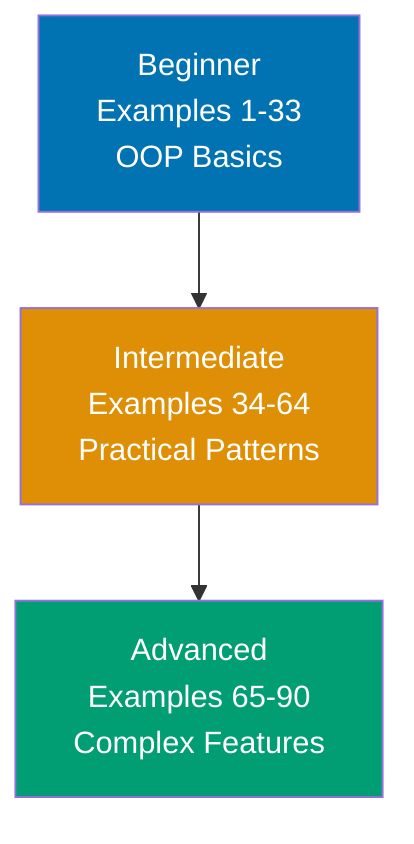

**Want to quickly master Java through working examples?** This by-example guide teaches 95% of Java through 90 annotated code examples organized by complexity level.

## What Is By-Example Learning?

By-example learning is an **example-first approach** where you learn through annotated, runnable code rather than narrative explanations. Each example is self-contained, immediately executable in JShell (Java's interactive shell) or as standalone classes, and heavily commented to show:

- **What each line does** - Inline comments explain the purpose and mechanism
- **Expected outputs** - Using `// =>` notation to show results
- **Intermediate values** - Variable states and object flows made visible
- **Key takeaways** - 1-2 sentence summaries of core concepts

This approach is **ideal for experienced developers** (seasonal programmers or software engineers) who are familiar with at least one programming language and want to quickly understand Java's syntax, idioms, and unique features through working code.

Unlike narrative tutorials that build understanding through explanation and storytelling, by-example learning lets you **see the code first, run it second, and understand it through direct interaction**. You learn by doing, not by reading about doing.

## Learning Path



Progress from fundamentals through practical patterns to advanced JVM features and modern Java capabilities. Each level builds on the previous, increasing in sophistication and introducing more Java-specific concepts.

## Coverage Philosophy

This by-example guide provides **95% coverage of Java** through practical, annotated examples. The 95% figure represents the depth and breadth of concepts covered, not a time estimate—focus is on **outcomes and understanding**, not duration.

### What's Covered

- **Core syntax** - Variables, types, operators, control flow, methods
- **Object-oriented programming** - Classes, objects, inheritance, polymorphism, interfaces, abstraction
- **Collections framework** - List, Set, Map, Queue, generics, iterators
- **Functional programming** - Lambdas, method references, streams, Optional
- **Exception handling** - Try-catch-finally, checked vs unchecked exceptions, custom exceptions
- **File I/O** - NIO.2, streams, serialization, JSON
- **Concurrency** - Threads, synchronization, ExecutorService, CompletableFuture, virtual threads
- **Testing** - JUnit, Mockito, test patterns
- **JVM internals** - Garbage collection, memory management, bytecode, class loading
- **Design patterns** - Singleton, Factory, Builder, Strategy, Observer, Decorator, Dependency Injection
- **Modern Java features** - Records, sealed classes, pattern matching, modules, var

### What's NOT Covered

This guide focuses on **learning-oriented examples**, not problem-solving recipes or production deployment. For additional topics:

- **Deep framework knowledge** - Spring, Hibernate, JavaFX covered at introductory level only

The 95% coverage goal maintains humility—no tutorial can cover everything. This guide teaches the **core concepts that unlock the remaining 5%** through your own exploration and project work.

## How to Use This Guide

1. **Sequential or selective** - Read examples in order for progressive learning, or jump to specific topics when switching from another language
2. **Run everything** - Copy and paste examples into JShell or create standalone `.java` files to see outputs yourself. Experimentation solidifies understanding.
3. **Modify and explore** - Change values, add print statements, break things intentionally. Learn through experimentation.
4. **Use as reference** - Bookmark examples for quick lookups when you forget syntax or patterns
5. **Complement with narrative tutorials** - By-example learning is code-first; pair with comprehensive tutorials for deeper explanations

**Best workflow**: Open JShell or your IDE in one window, this guide in another. Run each example as you read it. When you encounter something unfamiliar, run the example, modify it, see what changes.

## Relationship to Other Tutorials

Understanding where by-example fits in the tutorial ecosystem helps you choose the right learning path:

| Tutorial Type    | Coverage                | Approach                       | Target Audience        | When to Use                                          |
| ---------------- | ----------------------- | ------------------------------ | ---------------------- | ---------------------------------------------------- |
| **By Example**   | 95% through 90 examples | Code-first, annotated examples | Experienced developers | Quick language pickup, reference, language switching |
| **Quick Start**  | 5-30% touchpoints       | Hands-on project               | Newcomers to Java      | First taste, decide if worth learning                |
| **Beginner**     | 0-60% comprehensive     | Narrative, explanatory         | Complete beginners     | Deep understanding, first programming language       |
| **Intermediate** | 60-85%                  | Practical applications         | Past basics            | Production patterns, frameworks                      |
| **Advanced**     | 85-95%                  | Complex systems                | Experienced Java devs  | JVM internals, distributed systems                   |
| **Cookbook**     | Problem-oriented        | Recipe, solution-focused       | All levels             | Specific problems, common tasks                      |

**By Example vs. Quick Start**: By Example provides 95% coverage through examples vs. Quick Start's 5-30% through a single project. By Example is code-first reference; Quick Start is hands-on introduction.

**By Example vs. Beginner Tutorial**: By Example is code-first for experienced developers; Beginner Tutorial is narrative-first for complete beginners. By Example shows patterns; Beginner Tutorial explains concepts.

**By Example vs. Cookbook**: By Example is learning-oriented with progressive examples building language knowledge. Cookbook is problem-solving oriented with standalone recipes for specific tasks. By Example teaches concepts; Cookbook solves problems.

## Prerequisites

**Required**:

- Experience with at least one programming language
- Ability to run code in JShell or compile Java programs

**Recommended (helpful but not required)**:

- Familiarity with object-oriented programming concepts (classes, inheritance, polymorphism)
- Experience with statically typed languages (C++, C#, TypeScript)
- Understanding of compilation and bytecode basics

**No prior Java experience required** - This guide assumes you're new to Java but experienced with programming in general. You should be comfortable reading code, understanding basic programming concepts (variables, functions, loops), and learning through hands-on experimentation.

## Structure of Each Example

Every example follows this consistent format:

````markdown
### Example N: Concept Name

Brief explanation of the concept in 2-3 sentences. Explains **what** the concept is and **why** it matters.

[OPTIONAL: Mermaid diagram when concept relationships need visualization]

**Code**:

```java
// Comment explaining what this section does
public class Example {
    // Inline comment for each significant line
    public static void main(String[] args) {
        int result = operation(); // => expected_output_value
        // Intermediate values shown in comments
        int transformed = transform(result); // => intermediate_value
        System.out.println(transformed); // => final_output
    }
}
```

**Key Takeaway**: 1-2 sentence summary highlighting the most important insight or pattern from this example.
````

The **brief explanation** provides context. The **code** is heavily annotated with inline comments and `// =>` output notation. The **key takeaway** distills the concept to its essence.

Mermaid diagrams appear when **visual representation clarifies concept relationships** - showing data flow, object hierarchies, or abstract structures. Not every example needs a diagram; they're used strategically to enhance understanding.

## Learning Strategies

### For Python/JavaScript Developers

You're used to dynamic typing and flexible syntax. Java will feel more structured and verbose:

- **Static typing**: Every variable has a declared type, caught at compile time
- **Explicit OOP**: Everything lives in classes, no standalone functions
- **Checked exceptions**: Must handle or declare exceptions explicitly

Focus on Examples 1-10 (types and classes) and Examples 19-20 (exception handling) to build static typing intuition.

### For C/C++ Developers

You understand static typing and compilation. Java simplifies memory management:

- **Garbage collection**: No manual memory management, no pointers
- **No header files**: Single compilation unit per class
- **Platform independence**: Write once, run anywhere via JVM

Focus on Examples 70-90 (JVM internals) and Examples 46-55 (concurrency) to leverage your systems knowledge.

### For Kotlin/Scala Developers

You know JVM semantics already. Java shows the foundation:

- **Verbose but explicit**: No type inference, everything declared
- **No null safety**: Must check nulls manually (or use Optional)
- **Traditional OOP**: No data classes, extension functions, or coroutines

Focus on Examples 65-90 (advanced features and JVM internals) to see modern Java capabilities.

## Code-First Philosophy

This tutorial prioritizes working code over theoretical discussion:

- **No lengthy prose**: Concepts are demonstrated, not explained at length
- **Runnable examples**: Every example compiles and runs in JShell or as standalone classes
- **Learn by doing**: Understanding comes from running and modifying code
- **Pattern recognition**: See the same patterns in different contexts across 90 examples

If you prefer narrative explanations. By-example learning works best when you learn through experimentation.

## Ready to Start?

Jump into the beginner examples to start learning Java through code:

- [Beginner Examples (1-33)](/en/learn/software-engineering/programming-languages/java/by-example/beginner) - Basic syntax, OOP fundamentals, collections, control flow
- [Intermediate Examples (34-64)](/en/learn/software-engineering/programming-languages/java/by-example/intermediate) - Advanced OOP, generics, functional programming, concurrency
- [Advanced Examples (65-90)](/en/learn/software-engineering/programming-languages/java/by-example/advanced) - JVM internals, design patterns, modern Java features

Each example is self-contained and runnable. Start with Example 1, or jump to topics that interest you most.

## Examples by Level

### Beginner (Examples 1–33)

- [Example 1: Hello World and JVM Compilation](/en/learn/software-engineering/programming-languages/java/by-example/beginner#example-1-hello-world-and-jvm-compilation)
- [Example 2: Variables and Type System](/en/learn/software-engineering/programming-languages/java/by-example/beginner#example-2-variables-and-type-system)
- [Example 3: Basic Input/Output with Scanner](/en/learn/software-engineering/programming-languages/java/by-example/beginner#example-3-basic-inputoutput-with-scanner)
- [Example 4: Control Flow - If/Else and Switch](/en/learn/software-engineering/programming-languages/java/by-example/beginner#example-4-control-flow---ifelse-and-switch)
- [Example 5: For Loop Basics](/en/learn/software-engineering/programming-languages/java/by-example/beginner#example-5-for-loop-basics)
- [Example 6: While and Do-While Loops](/en/learn/software-engineering/programming-languages/java/by-example/beginner#example-6-while-and-do-while-loops)
- [Example 7: Enhanced For Loop (For-Each)](/en/learn/software-engineering/programming-languages/java/by-example/beginner#example-7-enhanced-for-loop-for-each)
- [Example 8: Array Basics](/en/learn/software-engineering/programming-languages/java/by-example/beginner#example-8-array-basics)
- [Example 9: Array Utilities](/en/learn/software-engineering/programming-languages/java/by-example/beginner#example-9-array-utilities)
- [Example 10: Classes and Objects](/en/learn/software-engineering/programming-languages/java/by-example/beginner#example-10-classes-and-objects)
- [Example 11: Inheritance and Polymorphism](/en/learn/software-engineering/programming-languages/java/by-example/beginner#example-11-inheritance-and-polymorphism)
- [Example 12: Interfaces and Abstraction](/en/learn/software-engineering/programming-languages/java/by-example/beginner#example-12-interfaces-and-abstraction)
- [Example 13: ArrayList - Dynamic Arrays](/en/learn/software-engineering/programming-languages/java/by-example/beginner#example-13-arraylist---dynamic-arrays)
- [Example 14: HashMap - Key-Value Mappings](/en/learn/software-engineering/programming-languages/java/by-example/beginner#example-14-hashmap---key-value-mappings)
- [Example 15: HashSet - Unique Collections](/en/learn/software-engineering/programming-languages/java/by-example/beginner#example-15-hashset---unique-collections)
- [Example 16: Control Flow - Ternary and Operators](/en/learn/software-engineering/programming-languages/java/by-example/beginner#example-16-control-flow---ternary-and-operators)
- [Example 17: Enhanced Loops and Iterators](/en/learn/software-engineering/programming-languages/java/by-example/beginner#example-17-enhanced-loops-and-iterators)
- [Example 18: Methods and Parameter Passing](/en/learn/software-engineering/programming-languages/java/by-example/beginner#example-18-methods-and-parameter-passing)
- [Example 19: Exception Handling - Try/Catch/Finally](/en/learn/software-engineering/programming-languages/java/by-example/beginner#example-19-exception-handling---trycatchfinally)
- [Example 20: String Manipulation - Common Operations](/en/learn/software-engineering/programming-languages/java/by-example/beginner#example-20-string-manipulation---common-operations)
- [Example 21: StringBuilder - Efficient String Construction](/en/learn/software-engineering/programming-languages/java/by-example/beginner#example-21-stringbuilder---efficient-string-construction)
- [Example 22: Generics - Type-Safe Collections](/en/learn/software-engineering/programming-languages/java/by-example/beginner#example-22-generics---type-safe-collections)
- [Example 23: Varargs - Variable-Length Arguments](/en/learn/software-engineering/programming-languages/java/by-example/beginner#example-23-varargs---variable-length-arguments)
- [Example 24: Autoboxing and Wrapper Classes](/en/learn/software-engineering/programming-languages/java/by-example/beginner#example-24-autoboxing-and-wrapper-classes)
- [Example 25: Static Members and Initialization](/en/learn/software-engineering/programming-languages/java/by-example/beginner#example-25-static-members-and-initialization)
- [Example 26: Access Modifiers and Encapsulation](/en/learn/software-engineering/programming-languages/java/by-example/beginner#example-26-access-modifiers-and-encapsulation)
- [Example 27: Packages and Imports](/en/learn/software-engineering/programming-languages/java/by-example/beginner#example-27-packages-and-imports)
- [Example 28: Enums - Type-Safe Constants](/en/learn/software-engineering/programming-languages/java/by-example/beginner#example-28-enums---type-safe-constants)
- [Example 29: File I/O - Reading and Writing Files](/en/learn/software-engineering/programming-languages/java/by-example/beginner#example-29-file-io---reading-and-writing-files)
- [Example 30: Lambda Expressions and Functional Interfaces](/en/learn/software-engineering/programming-languages/java/by-example/beginner#example-30-lambda-expressions-and-functional-interfaces)
- [Example 31: Streams API - Functional Collection Processing](/en/learn/software-engineering/programming-languages/java/by-example/beginner#example-31-streams-api---functional-collection-processing)
- [Example 32: Optional - Null-Safe Value Containers](/en/learn/software-engineering/programming-languages/java/by-example/beginner#example-32-optional---null-safe-value-containers)
- [Example 33: Date and Time API - Modern Temporal Types](/en/learn/software-engineering/programming-languages/java/by-example/beginner#example-33-date-and-time-api---modern-temporal-types)

### Intermediate (Examples 34–64)

- [Example 34: Abstract Classes and Template Method Pattern](/en/learn/software-engineering/programming-languages/java/by-example/intermediate#example-34-abstract-classes-and-template-method-pattern)
- [Example 35: Composition Over Inheritance](/en/learn/software-engineering/programming-languages/java/by-example/intermediate#example-35-composition-over-inheritance)
- [Example 36: Nested and Inner Classes](/en/learn/software-engineering/programming-languages/java/by-example/intermediate#example-36-nested-and-inner-classes)
- [Example 37: Reflection API - Runtime Introspection](/en/learn/software-engineering/programming-languages/java/by-example/intermediate#example-37-reflection-api---runtime-introspection)
- [Example 38: Annotations and Custom Metadata](/en/learn/software-engineering/programming-languages/java/by-example/intermediate#example-38-annotations-and-custom-metadata)
- [Example 39: Generic Methods and Bounded Type Parameters](/en/learn/software-engineering/programming-languages/java/by-example/intermediate#example-39-generic-methods-and-bounded-type-parameters)
- [Example 40: Wildcards and Type Variance](/en/learn/software-engineering/programming-languages/java/by-example/intermediate#example-40-wildcards-and-type-variance)
- [Example 41: ArrayList vs LinkedList Performance](/en/learn/software-engineering/programming-languages/java/by-example/intermediate#example-41-arraylist-vs-linkedlist-performance)
- [Example 42: HashSet vs TreeSet for Unique Collections](/en/learn/software-engineering/programming-languages/java/by-example/intermediate#example-42-hashset-vs-treeset-for-unique-collections)
- [Example 43: HashMap vs TreeMap and Collections Utilities](/en/learn/software-engineering/programming-languages/java/by-example/intermediate#example-43-hashmap-vs-treemap-and-collections-utilities)
- [Example 44: Concurrent Collections for Thread Safety](/en/learn/software-engineering/programming-languages/java/by-example/intermediate#example-44-concurrent-collections-for-thread-safety)
- [Example 45: Stream Pipeline Optimization](/en/learn/software-engineering/programming-languages/java/by-example/intermediate#example-45-stream-pipeline-optimization)
- [Example 46: Collectors and Stream Reduction](/en/learn/software-engineering/programming-languages/java/by-example/intermediate#example-46-collectors-and-stream-reduction)
- [Example 47: Method References and Function Composition](/en/learn/software-engineering/programming-languages/java/by-example/intermediate#example-47-method-references-and-function-composition)
- [Example 48: NIO.2 File Operations and Path API](/en/learn/software-engineering/programming-languages/java/by-example/intermediate#example-48-nio2-file-operations-and-path-api)
- [Example 49: Thread Basics and Runnable](/en/learn/software-engineering/programming-languages/java/by-example/intermediate#example-49-thread-basics-and-runnable)
- [Example 50: Synchronization and Thread Safety](/en/learn/software-engineering/programming-languages/java/by-example/intermediate#example-50-synchronization-and-thread-safety)
- [Example 51: ExecutorService and Thread Pools](/en/learn/software-engineering/programming-languages/java/by-example/intermediate#example-51-executorservice-and-thread-pools)
- [Example 52: CompletableFuture for Async Programming](/en/learn/software-engineering/programming-languages/java/by-example/intermediate#example-52-completablefuture-for-async-programming)
- [Example 53: Records for Immutable Data](/en/learn/software-engineering/programming-languages/java/by-example/intermediate#example-53-records-for-immutable-data)
- [Example 54: Sealed Classes for Closed Hierarchies](/en/learn/software-engineering/programming-languages/java/by-example/intermediate#example-54-sealed-classes-for-closed-hierarchies)
- [Example 55: Pattern Matching for Switch](/en/learn/software-engineering/programming-languages/java/by-example/intermediate#example-55-pattern-matching-for-switch)
- [Example 56: Optional for Null Safety](/en/learn/software-engineering/programming-languages/java/by-example/intermediate#example-56-optional-for-null-safety)
- [Example 57: Stream API Collectors](/en/learn/software-engineering/programming-languages/java/by-example/intermediate#example-57-stream-api-collectors)
- [Example 58: Text Blocks for Multi-Line Strings](/en/learn/software-engineering/programming-languages/java/by-example/intermediate#example-58-text-blocks-for-multi-line-strings)
- [Example 59: Local Variable Type Inference (var)](/en/learn/software-engineering/programming-languages/java/by-example/intermediate#example-59-local-variable-type-inference-var)
- [Example 60: Try-With-Resources for Resource Management](/en/learn/software-engineering/programming-languages/java/by-example/intermediate#example-60-try-with-resources-for-resource-management)
- [Example 61: Builder Pattern for Complex Objects](/en/learn/software-engineering/programming-languages/java/by-example/intermediate#example-61-builder-pattern-for-complex-objects)
- [Example 62: Immutability Patterns with Records](/en/learn/software-engineering/programming-languages/java/by-example/intermediate#example-62-immutability-patterns-with-records)
- [Example 63: Try-With-Resources Automatic Cleanup](/en/learn/software-engineering/programming-languages/java/by-example/intermediate#example-63-try-with-resources-automatic-cleanup)
- [Example 64: Custom Result Type for Functional Error Handling](/en/learn/software-engineering/programming-languages/java/by-example/intermediate#example-64-custom-result-type-for-functional-error-handling)

### Advanced (Examples 65–90)

- [Example 65: Concurrent Collections](/en/learn/software-engineering/programming-languages/java/by-example/advanced#example-65-concurrent-collections)
- [Example 66: Atomic Variables](/en/learn/software-engineering/programming-languages/java/by-example/advanced#example-66-atomic-variables)
- [Example 67: CountDownLatch and CyclicBarrier](/en/learn/software-engineering/programming-languages/java/by-example/advanced#example-67-countdownlatch-and-cyclicbarrier)
- [Example 68: Fork/Join Framework](/en/learn/software-engineering/programming-languages/java/by-example/advanced#example-68-forkjoin-framework)
- [Example 69: Annotations and Reflection](/en/learn/software-engineering/programming-languages/java/by-example/advanced#example-69-annotations-and-reflection)
- [Example 70: Enums with Behavior](/en/learn/software-engineering/programming-languages/java/by-example/advanced#example-70-enums-with-behavior)
- [Example 71: Sealed Classes and Pattern Matching](/en/learn/software-engineering/programming-languages/java/by-example/advanced#example-71-sealed-classes-and-pattern-matching)
- [Example 72: Module Basics (JPMS)](/en/learn/software-engineering/programming-languages/java/by-example/advanced#example-72-module-basics-jpms)
- [Example 73: Module Visibility and JLink Custom Runtimes](/en/learn/software-engineering/programming-languages/java/by-example/advanced#example-73-module-visibility-and-jlink-custom-runtimes)
- [Example 74: var and Type Inference](/en/learn/software-engineering/programming-languages/java/by-example/advanced#example-74-var-and-type-inference)
- [Example 75: Garbage Collection Basics](/en/learn/software-engineering/programming-languages/java/by-example/advanced#example-75-garbage-collection-basics)
- [Example 76: Memory Management and Reference Types](/en/learn/software-engineering/programming-languages/java/by-example/advanced#example-76-memory-management-and-reference-types)
- [Example 77: Performance Monitoring and Profiling](/en/learn/software-engineering/programming-languages/java/by-example/advanced#example-77-performance-monitoring-and-profiling)
- [Example 78: Common Performance Patterns](/en/learn/software-engineering/programming-languages/java/by-example/advanced#example-78-common-performance-patterns)
- [Example 79: Connection Pool Factory Pattern](/en/learn/software-engineering/programming-languages/java/by-example/advanced#example-79-connection-pool-factory-pattern)
- [Example 80: Strategy, Observer, Decorator](/en/learn/software-engineering/programming-languages/java/by-example/advanced#example-80-strategy-observer-decorator)
- [Example 81: Dependency Injection Basics](/en/learn/software-engineering/programming-languages/java/by-example/advanced#example-81-dependency-injection-basics)
- [Example 82: Immutability Patterns](/en/learn/software-engineering/programming-languages/java/by-example/advanced#example-82-immutability-patterns)
- [Example 83: Virtual Threads (Project Loom, Java 21+)](/en/learn/software-engineering/programming-languages/java/by-example/advanced#example-83-virtual-threads-project-loom-java-21)
- [Example 84: Modern Java Best Practices](/en/learn/software-engineering/programming-languages/java/by-example/advanced#example-84-modern-java-best-practices)
- [Example 85: JVM Memory Model and Regions](/en/learn/software-engineering/programming-languages/java/by-example/advanced#example-85-jvm-memory-model-and-regions)
- [Example 86: Garbage Collection with G1GC](/en/learn/software-engineering/programming-languages/java/by-example/advanced#example-86-garbage-collection-with-g1gc)
- [Example 87: Ultra-Low Latency with ZGC](/en/learn/software-engineering/programming-languages/java/by-example/advanced#example-87-ultra-low-latency-with-zgc)
- [Example 88: JVM Profiling with Java Flight Recorder (JFR)](/en/learn/software-engineering/programming-languages/java/by-example/advanced#example-88-jvm-profiling-with-java-flight-recorder-jfr)
- [Example 89: CompletableFuture Advanced Patterns](/en/learn/software-engineering/programming-languages/java/by-example/advanced#example-89-completablefuture-advanced-patterns)
- [Example 90: Custom Annotations with Retention Policies](/en/learn/software-engineering/programming-languages/java/by-example/advanced#example-90-custom-annotations-with-retention-policies)
