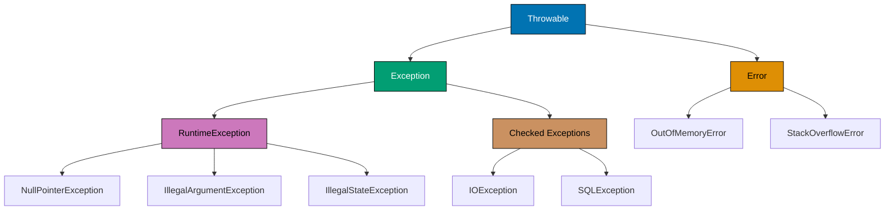

## Problem

Poor exception handling leads to unclear error messages, difficult debugging, and unreliable applications. Common mistakes include swallowing exceptions, catching too broadly, and using exceptions for control flow.

This guide shows how to handle exceptions effectively.

## Exception Hierarchy

Understanding Java's exception hierarchy helps you choose the right approach.



**Key differences**:

- **Error**: JVM issues, rarely catchable (OutOfMemoryError, StackOverflowError)
- **Checked Exception**: Must handle or declare (IOException, SQLException)
- **Unchecked Exception**: Runtime exceptions, optional handling (NullPointerException, IllegalArgumentException)

## Choosing Exception Types

### Use Unchecked Exceptions for Programming Errors

Programming errors indicate bugs that should be fixed, not handled.

```java
// ✅ IllegalArgumentException for invalid parameters
public void setAge(int age) {
  if (age < 0 || age > 150) {
    throw new IllegalArgumentException("Age must be between 0 and 150, got: " + age);
  }
  this.age = age;
}

// ✅ IllegalStateException for invalid object state
public void withdraw(BigDecimal amount) {
  if (isClosed) {
    throw new IllegalStateException("Cannot withdraw from closed account");
  }
  if (balance.compareTo(amount) < 0) {
    throw new IllegalStateException("Insufficient funds");
  }
  balance = balance.subtract(amount);
}

// ✅ NullPointerException for null violations
public void setUsername(String username) {
  this.username = Objects.requireNonNull(username, "username cannot be null");
}
```

### Use Checked Exceptions for Recoverable Conditions

Checked exceptions force callers to handle conditions they can recover from.

```java
// ✅ Custom checked exception for business errors
public class InsufficientFundsException extends Exception {
  private final BigDecimal requested;
  private final BigDecimal available;

  public InsufficientFundsException(BigDecimal requested, BigDecimal available) {
    super(String.format("Insufficient funds: requested %s, available %s",
      requested, available));
    this.requested = requested;
    this.available = available;
  }

  public BigDecimal getRequested() { return requested; }
  public BigDecimal getAvailable() { return available; }
}

public void withdraw(BigDecimal amount) throws InsufficientFundsException {
  if (balance.compareTo(amount) < 0) {
    throw new InsufficientFundsException(amount, balance);
  }
  balance = balance.subtract(amount);
}

// Caller can recover
try {
  account.withdraw(amount);
} catch (InsufficientFundsException e) {
  // Show user available balance and ask for different amount
  showError("Cannot withdraw " + e.getRequested() +
    ". Available balance: " + e.getAvailable());
}
```

**When to use checked exceptions**:

- Caller can take meaningful recovery action
- External resource failures (network, file system, database)
- Business rule violations that users can correct

**When NOT to use checked exceptions**:

- Programming errors (use unchecked)
- Unrecoverable conditions (let it propagate)
- Forces try-catch without meaningful handling

## Catching Exceptions

### Catch Specific Exceptions

Catch the most specific exception type you can handle.

```java
// ❌ Catching too broadly
try {
  String content = Files.readString(path);
  int value = Integer.parseInt(content);
} catch (Exception e) {
  // Which exception occurred? IOException? NumberFormatException?
  logger.error("Something went wrong", e);
}

// ✅ Catch specific exceptions
try {
  String content = Files.readString(path);
  int value = Integer.parseInt(content);
} catch (IOException e) {
  logger.error("Failed to read file: " + path, e);
  throw new ConfigurationException("Cannot load configuration", e);
} catch (NumberFormatException e) {
  logger.error("Invalid number format in file: " + path, e);
  throw new ConfigurationException("Configuration contains invalid number", e);
}
```

### Handle Multiple Exceptions Appropriately

Java 7+ allows catching multiple exceptions in one block.

```java
// ✅ Same handling for multiple exceptions
try {
  processOrder(order);
} catch (PaymentException | ShippingException e) {
  // Same error handling for both
  logger.error("Order processing failed", e);
  notifyAdmin(order, e);
  return OrderResult.failed(e.getMessage());
}

// ✅ Different handling for different exceptions
try {
  processOrder(order);
} catch (PaymentException e) {
  logger.error("Payment failed for order: " + order.getId(), e);
  refundCustomer(order);
  return OrderResult.paymentFailed(e.getMessage());
} catch (ShippingException e) {
  logger.error("Shipping failed for order: " + order.getId(), e);
  notifyCustomer(order, e);
  return OrderResult.shippingFailed(e.getMessage());
}
```

### Never Swallow Exceptions

Always log or rethrow exceptions.

```java
// ❌ Swallowed exception - error disappears
try {
  criticalOperation();
} catch (Exception e) {
  // Silent failure - impossible to debug
}

// ❌ Worse - logs but continues as if nothing happened
try {
  importantValidation();
} catch (ValidationException e) {
  logger.debug("Validation failed", e); // Too low severity
  // Continues with invalid data!
}

// ✅ Log and rethrow
try {
  criticalOperation();
} catch (OperationException e) {
  logger.error("Critical operation failed", e);
  throw e;
}

// ✅ Log and wrap in different exception
try {
  importantValidation();
} catch (ValidationException e) {
  logger.error("Validation failed", e);
  throw new BusinessException("Cannot process request due to validation failure", e);
}

// ✅ Log and return error result
try {
  processPayment(order);
} catch (PaymentException e) {
  logger.error("Payment processing failed for order: " + order.getId(), e);
  return PaymentResult.failed(e.getMessage());
}
```

## Creating Custom Exceptions

### Design Meaningful Exception Classes

Custom exceptions should provide context and recovery information.

```java
// ❌ Generic exception without context
public class OrderException extends Exception {
  public OrderException(String message) {
    super(message);
  }
}

// ✅ Specific exception with context
public class OrderValidationException extends Exception {
  private final Order order;
  private final List<ValidationError> errors;

  public OrderValidationException(Order order, List<ValidationError> errors) {
    super(buildMessage(order, errors));
    this.order = order;
    this.errors = new ArrayList<>(errors);
  }

  private static String buildMessage(Order order, List<ValidationError> errors) {
    return String.format("Order validation failed for order %s: %s",
      order.getId(),
      errors.stream()
        .map(ValidationError::getMessage)
        .collect(Collectors.joining(", ")));
  }

  public Order getOrder() { return order; }
  public List<ValidationError> getErrors() {
    return new ArrayList<>(errors);
  }
}

// Usage
try {
  orderService.process(order);
} catch (OrderValidationException e) {
  // Access detailed error information
  for (ValidationError error : e.getErrors()) {
    showFieldError(error.getField(), error.getMessage());
  }
}
```

### Exception Hierarchy

Create exception hierarchies for related errors.

```java
// Base exception
public class OrderProcessingException extends Exception {
  private final String orderId;

  public OrderProcessingException(String orderId, String message) {
    super(message);
    this.orderId = orderId;
  }

  public OrderProcessingException(String orderId, String message, Throwable cause) {
    super(message, cause);
    this.orderId = orderId;
  }

  public String getOrderId() { return orderId; }
}

// Specific exceptions
public class OrderValidationException extends OrderProcessingException {
  public OrderValidationException(String orderId, String message) {
    super(orderId, message);
  }
}

public class PaymentProcessingException extends OrderProcessingException {
  private final String transactionId;

  public PaymentProcessingException(String orderId, String transactionId, String message) {
    super(orderId, message);
    this.transactionId = transactionId;
  }

  public String getTransactionId() { return transactionId; }
}

// Caller can catch broadly or specifically
try {
  orderService.process(order);
} catch (PaymentProcessingException e) {
  // Handle payment-specific error
  handlePaymentError(e.getOrderId(), e.getTransactionId());
} catch (OrderProcessingException e) {
  // Handle any other order processing error
  handleOrderError(e.getOrderId());
}
```

## Resource Management

### Use Try-with-Resources

Automatically close resources without explicit finally blocks.

```java
// ❌ Manual resource management - error-prone
public void processFile(String path) throws IOException {
  BufferedReader reader = null;
  try {
    reader = new BufferedReader(new FileReader(path));
    String line;
    while ((line = reader.readLine()) != null) {
      processLine(line);
    }
  } finally {
    if (reader != null) {
      try {
        reader.close(); // Can throw IOException
      } catch (IOException e) {
        // What to do? Log? Ignore?
      }
    }
  }
}

// ✅ Try-with-resources - automatic cleanup
public void processFile(String path) throws IOException {
  try (BufferedReader reader = new BufferedReader(new FileReader(path))) {
    String line;
    while ((line = reader.readLine()) != null) {
      processLine(line);
    }
  } // Automatically closed, even if exception thrown
}

// ✅ Multiple resources
public void copyFile(String source, String dest) throws IOException {
  try (
    InputStream in = new FileInputStream(source);
    OutputStream out = new FileOutputStream(dest)
  ) {
    byte[] buffer = new byte[8192];
    int bytesRead;
    while ((bytesRead = in.read(buffer)) != -1) {
      out.write(buffer, 0, bytesRead);
    }
  }
}
```

### Custom AutoCloseable Resources

Implement `AutoCloseable` for custom resource classes.

```java
public class DatabaseConnection implements AutoCloseable {
  private final Connection connection;
  private boolean closed = false;

  public DatabaseConnection(String url) throws SQLException {
    this.connection = DriverManager.getConnection(url);
  }

  public ResultSet executeQuery(String sql) throws SQLException {
    if (closed) {
      throw new IllegalStateException("Connection is closed");
    }
    return connection.createStatement().executeQuery(sql);
  }

  @Override
  public void close() throws SQLException {
    if (!closed) {
      connection.close();
      closed = true;
    }
  }
}

// Usage
try (DatabaseConnection db = new DatabaseConnection(url)) {
  ResultSet results = db.executeQuery("SELECT * FROM users");
  // Process results
} // Automatically closed
```

## Exception Anti-Patterns

### Don't Use Exceptions for Control Flow

Exceptions are expensive and should represent exceptional conditions.

```java
// ❌ Exception for control flow
public int parseInteger(String input) {
  try {
    return Integer.parseInt(input);
  } catch (NumberFormatException e) {
    return 0; // Normal case, not exceptional
  }
}

// ✅ Return Optional or special value
public Optional<Integer> parseInteger(String input) {
  try {
    return Optional.of(Integer.parseInt(input));
  } catch (NumberFormatException e) {
    return Optional.empty();
  }
}

// Usage
parseInteger(input).ifPresent(value -> processValue(value));
```

### Don't Catch Throwable or Error

Only catch exceptions you can handle.

```java
// ❌ Catching everything
try {
  doSomething();
} catch (Throwable t) {
  // Catches OutOfMemoryError, ThreadDeath, etc.
  // Cannot recover from these
}

// ✅ Catch specific recoverable exceptions
try {
  doSomething();
} catch (SpecificException e) {
  // Can handle this specific case
}
```

### Don't Lose Original Exception

Always preserve exception chain.

```java
// ❌ Lost original exception
try {
  loadConfiguration();
} catch (IOException e) {
  throw new ConfigurationException("Failed to load config");
  // Original IOException lost - cannot debug
}

// ✅ Preserve exception chain
try {
  loadConfiguration();
} catch (IOException e) {
  throw new ConfigurationException("Failed to load config", e);
  // Original exception available in stack trace
}
```

## Logging Exceptions

### Log at Appropriate Level

Choose log level based on severity and recoverability.

```java
public class OrderService {
  private static final Logger logger = LoggerFactory.getLogger(OrderService.class);

  public OrderResult processOrder(Order order) {
    try {
      validateOrder(order);
      processPayment(order);
      return OrderResult.success(order);

    } catch (OrderValidationException e) {
      // Expected business error - info or warn
      logger.info("Order validation failed: {}", e.getMessage());
      return OrderResult.validationFailed(e.getErrors());

    } catch (PaymentException e) {
      // External service failure - error
      logger.error("Payment processing failed for order: " + order.getId(), e);
      return OrderResult.paymentFailed(e.getMessage());

    } catch (Exception e) {
      // Unexpected error - error with full context
      logger.error("Unexpected error processing order: " + order.getId(), e);
      return OrderResult.systemError();
    }
  }
}
```

### Include Context in Log Messages

```java
// ❌ Unhelpful log message
try {
  processPayment(order);
} catch (PaymentException e) {
  logger.error("Payment failed", e);
}

// ✅ Contextual log message
try {
  processPayment(order);
} catch (PaymentException e) {
  logger.error("Payment processing failed for order {} with amount {} using method {}",
    order.getId(), order.getTotal(), order.getPaymentMethod(), e);
}
```

## Testing Exception Handling

### Verify Expected Exceptions

Test that code throws expected exceptions for invalid input.

```java
@Test
void shouldThrowExceptionForNegativeAge() {
  User user = new User();

  assertThrows(IllegalArgumentException.class, () -> {
    user.setAge(-5);
  });
}

@Test
void shouldThrowExceptionWithCorrectMessage() {
  User user = new User();

  IllegalArgumentException exception = assertThrows(
    IllegalArgumentException.class,
    () -> user.setAge(-5)
  );

  assertTrue(exception.getMessage().contains("Age must be between 0 and 150"));
}

@Test
void shouldHandleInsufficientFunds() {
  BankAccount account = new BankAccount("123", new BigDecimal("100"));

  InsufficientFundsException exception = assertThrows(
    InsufficientFundsException.class,
    () -> account.withdraw(new BigDecimal("200"))
  );

  assertEquals(new BigDecimal("200"), exception.getRequested());
  assertEquals(new BigDecimal("100"), exception.getAvailable());
}
```

## Summary

Effective exception handling distinguishes well-designed applications from fragile ones. The foundation lies in choosing the right exception types for different situations. Use unchecked exceptions for programming errors - these represent bugs that should be fixed, not handled. When callers can take meaningful recovery action, checked exceptions force them to acknowledge and handle the possibility of failure. Custom exceptions carry context beyond generic error messages, providing the information needed for proper recovery or debugging.

When catching exceptions, precision matters. Catch the most specific exception type you can handle, not broad categories that lump together unrelated problems. Never swallow exceptions silently - every exception deserves either logging and rethrowing, or logging and returning an error result. This ensures problems don't disappear into the ether, impossible to debug later.

Resource management becomes simple and reliable with try-with-resources. Let the language handle cleanup automatically rather than writing error-prone finally blocks. For your own resource classes, implement AutoCloseable to participate in this automatic cleanup system. This pattern eliminates resource leaks that plague manual management.

Several anti-patterns sabotage exception handling. Using exceptions for normal control flow makes your code slow and confusing - exceptions are expensive and should represent exceptional conditions. Catching Throwable or Error catches things you can't recover from, giving false confidence. Breaking the exception chain by creating new exceptions without passing the cause loses crucial debugging context.

Testing exception handling verifies your error paths work as designed. Test that invalid inputs throw the right exceptions with helpful messages. Verify that your exception objects carry the context needed for recovery. Thorough exception testing builds confidence that your application degrades gracefully when things go wrong, providing clear information for debugging and recovery.

## Related Content

- [Java Best Practices and Design Principles](/en/learn/software-engineering/programming-languages/java/explanation/best-practices)
- [Common Java Anti-Patterns](/en/learn/software-engineering/programming-languages/java/explanation/anti-patterns)
- [How to Avoid NullPointerException](/en/learn/software-engineering/programming-languages/java/how-to/avoid-nullpointerexception)
- [How to Refactor God Classes](/en/learn/software-engineering/programming-languages/java/how-to/refactor-god-classes)
