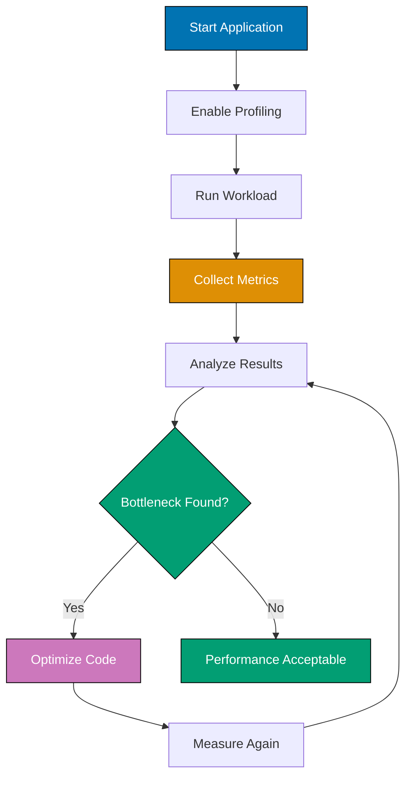

## Problem

Java applications can suffer from performance issues due to inefficient code, suboptimal JVM configuration, or lack of proper profiling. Performance problems manifest as slow response times, high memory usage, or CPU bottlenecks.

```java
// Inefficient code - creates many temporary objects
String result = "";
for (int i = 0; i < 10000; i++) {
    result += i; // Creates a new String object each iteration
}
```

This guide shows practical techniques for identifying and resolving performance bottlenecks in Java applications.

## Solution

### 1. Profile Before Optimizing

Always measure performance before making optimizations. Use profiling tools to identify actual bottlenecks rather than guessing.

**Java Flight Recorder (JFR)** - Built-in profiling tool (Java 11+):

```java
// Enable JFR at startup
// java -XX:StartFlightRecording=duration=60s,filename=recording.jfr MyApp

// Or programmatically
import jdk.jfr.Recording;
import jdk.jfr.consumer.RecordingFile;

public class PerformanceProfiler {
    public static void profileOperation() throws Exception {
        Recording recording = new Recording();
        recording.setMaxSize(100_000_000); // 100MB max
        recording.setDumpOnExit(true);
        recording.setDestination(Path.of("app-recording.jfr"));

        recording.start();

        try {
            // Your application code here
            performBusinessLogic();
        } finally {
            recording.stop();
            recording.close();
        }
    }

    private static void performBusinessLogic() {
        // Simulated business logic
        List<String> data = new ArrayList<>();
        for (int i = 0; i < 1_000_000; i++) {
            data.add("Item " + i);
        }
    }
}
```

### 2. Benchmark with JMH

Use Java Microbenchmark Harness (JMH) for accurate performance measurements.

**Setup** (Maven dependency):

```xml
<dependency>
    <groupId>org.openjdk.jmh</groupId>
    <artifactId>jmh-core</artifactId>
    <version>1.37</version>
</dependency>
<dependency>
    <groupId>org.openjdk.jmh</groupId>
    <artifactId>jmh-generator-annprocess</artifactId>
    <version>1.37</version>
    <scope>provided</scope>
</dependency>
```

**Example Benchmark**:

```java
import org.openjdk.jmh.annotations.*;
import java.util.concurrent.TimeUnit;

@BenchmarkMode(Mode.AverageTime)
@OutputTimeUnit(TimeUnit.NANOSECONDS)
@State(Scope.Thread)
@Fork(value = 1, warmups = 1)
@Warmup(iterations = 3, time = 1)
@Measurement(iterations = 5, time = 1)
public class StringConcatenationBenchmark {

    private static final int ITERATIONS = 10000;

    @Benchmark
    public String stringConcatenation() {
        String result = "";
        for (int i = 0; i < ITERATIONS; i++) {
            result += i;
        }
        return result;
    }

    @Benchmark
    public String stringBuilder() {
        StringBuilder sb = new StringBuilder();
        for (int i = 0; i < ITERATIONS; i++) {
            sb.append(i);
        }
        return sb.toString();
    }

    @Benchmark
    public String stringBuilderWithCapacity() {
        StringBuilder sb = new StringBuilder(ITERATIONS * 5);
        for (int i = 0; i < ITERATIONS; i++) {
            sb.append(i);
        }
        return sb.toString();
    }
}
```

**Running the benchmark**:

```bash
mvn clean install
java -jar target/benchmarks.jar
```

**Expected output**:

```
Benchmark                                           Mode  Cnt   Score   Error  Units
StringConcatenationBenchmark.stringConcatenation    avgt    5  45.234  ±1.234  ms/op
StringConcatenationBenchmark.stringBuilder          avgt    5   0.123  ±0.001  ms/op
StringConcatenationBenchmark.stringBuilderWithCapacity avgt 5   0.089  ±0.001  ms/op
```

### 3. Tune Garbage Collection

Configure GC based on application characteristics.

**G1GC (Default in Java 9+)** - Good balance for most applications:

```bash
java -XX:+UseG1GC \
     -XX:MaxGCPauseMillis=200 \
     -XX:InitiatingHeapOccupancyPercent=45 \
     -XX:G1HeapRegionSize=16m \
     -Xms2g -Xmx4g \
     -XX:+PrintGCDetails \
     -XX:+PrintGCDateStamps \
     -Xloggc:gc.log \
     MyApp
```

**ZGC** - Low-latency collector (Java 15+):

```bash
java -XX:+UseZGC \
     -XX:ZCollectionInterval=5 \
     -Xms8g -Xmx8g \
     -XX:+PrintGCDetails \
     MyApp
```

**Shenandoah** - Low-pause collector:

```bash
java -XX:+UseShenandoahGC \
     -Xms4g -Xmx4g \
     -XX:+PrintGCDetails \
     MyApp
```

### 4. Memory Optimization

**Object pooling** for frequently created objects:

```java
import java.util.concurrent.ArrayBlockingQueue;
import java.util.concurrent.BlockingQueue;

public class ObjectPool<T> {
    private final BlockingQueue<T> pool;
    private final ObjectFactory<T> factory;

    public ObjectPool(ObjectFactory<T> factory, int size) {
        this.factory = factory;
        this.pool = new ArrayBlockingQueue<>(size);

        // Pre-populate pool
        for (int i = 0; i < size; i++) {
            pool.offer(factory.create());
        }
    }

    public T borrow() throws InterruptedException {
        T object = pool.poll();
        return object != null ? object : factory.create();
    }

    public void returnObject(T object) {
        factory.reset(object);
        pool.offer(object);
    }

    @FunctionalInterface
    public interface ObjectFactory<T> {
        T create();
        default void reset(T object) {
            // Override to reset object state
        }
    }
}

// Usage
ObjectPool<StringBuilder> pool = new ObjectPool<>(
    new ObjectPool.ObjectFactory<>() {
        public StringBuilder create() {
            return new StringBuilder(1024);
        }

        public void reset(StringBuilder sb) {
            sb.setLength(0);
        }
    },
    10 // pool size
);

// Borrow, use, return
StringBuilder sb = pool.borrow();
try {
    sb.append("data");
    String result = sb.toString();
} finally {
    pool.returnObject(sb);
}
```

## How It Works

### Profiling Workflow



**Key concepts**:

1. **JFR Profiling**: Captures detailed runtime information with minimal overhead (<1%)
2. **JMH Benchmarking**: Eliminates JIT compilation effects and warmup variations
3. **GC Tuning**: Balances throughput vs. pause times based on application needs
4. **Object Pooling**: Reduces allocation pressure for frequently created objects

### GC Selection Decision Tree

Choose GC based on application characteristics:

- **G1GC**: General-purpose applications, balanced throughput and latency
- **ZGC**: Low-latency requirements (<10ms pauses), large heaps (>100GB)
- **Shenandoah**: Pause-sensitive applications, medium to large heaps
- **Parallel GC**: Batch processing, throughput-critical (not latency-sensitive)

## Variations

### CPU Profiling with Async-Profiler

For deeper CPU profiling, use async-profiler (external tool):

```bash
wget https://github.com/jvm-profiling-tools/async-profiler/releases/download/v2.9/async-profiler-2.9-linux-x64.tar.gz
tar -xzf async-profiler-2.9-linux-x64.tar.gz

./profiler.sh -d 60 -f flamegraph.html 12345

./profiler.sh -e cpu -d 60 -f cpu-flamegraph.html 12345
./profiler.sh -e alloc -d 60 -f alloc-flamegraph.html 12345
```

### Heap Analysis

Analyze memory usage with jmap and jhat:

```bash
jmap -dump:format=b,file=heap.bin <pid>

jhat -port 7000 heap.bin
```

### Native Memory Tracking

Track native memory usage (Java 8+):

```bash
java -XX:NativeMemoryTracking=summary MyApp

jcmd <pid> VM.native_memory summary

jcmd <pid> VM.native_memory baseline
jcmd <pid> VM.native_memory summary.diff
```

## Common Pitfalls

**Pitfall 1: Premature Optimization**

Don't optimize without profiling data.

```java
// Bad: Optimizing without evidence
public String formatData(List<String> items) {
    // Complex optimization that may not help
    StringBuilder sb = new StringBuilder(items.size() * 100);
    // ...
}

// Good: Optimize after profiling shows it's a bottleneck
public String formatData(List<String> items) {
    // Simple, readable code first
    return String.join(", ", items);
}
```

**Pitfall 2: Microbenchmark Pitfalls**

JMH prevents common benchmarking mistakes, but you still need to avoid:

```java
// Bad: Dead code elimination
@Benchmark
public void badBenchmark() {
    String result = "test".toUpperCase(); // Result not used - may be optimized away
}

// Good: Return or consume result
@Benchmark
public String goodBenchmark() {
    return "test".toUpperCase(); // Result returned
}

// Or use Blackhole
@Benchmark
public void goodBenchmarkBlackhole(Blackhole bh) {
    bh.consume("test".toUpperCase()); // Result consumed
}
```

**Pitfall 3: Ignoring GC Logs**

Always analyze GC logs to understand pause times and throughput:

```bash
java -Xlog:gc*:file=gc.log:time,uptime,level,tags \
     -XX:+UseG1GC \
     MyApp

```

**Pitfall 4: Object Pooling Overhead**

Object pooling can hurt performance if:

- Objects are cheap to create
- Pool management overhead exceeds object creation cost
- Pool causes contention in multithreaded scenarios

```java
// Don't pool simple objects
// Bad: StringBuilder pooling for small operations
String result = pool.borrow().append("x").toString(); // Overhead not worth it

// Good: Direct creation for small operations
String result = new StringBuilder().append("x").toString();
```

## Related Patterns

**Related Tutorial**: See [Intermediate Tutorial - Performance Optimization](/en/learn/software-engineering/programming-languages/python/tutorials/intermediate#performance-optimization) for performance fundamentals and [Advanced Tutorial - JVM Internals](/en/learn/software-engineering/programming-languages/python/tutorials/advanced#jvm-internals) for deep JVM tuning.

**Related How-To**: See [Work with Streams Effectively](/en/learn/software-engineering/programming-languages/java/how-to/work-with-streams-effectively) for stream performance patterns and [Use Collections Effectively](/en/learn/software-engineering/programming-languages/java/how-to/use-collections-effectively) for collection performance.

**Related Cookbook**: See Cookbook recipes "Efficient String Operations" and "Concurrent Collections Performance" for copy-paste ready performance patterns.

**Related Explanation**: See [Best Practices - Performance](/en/learn/software-engineering/programming-languages/python/explanation/best-practices#performance) for overarching performance principles.

## Further Reading

- [JMH Samples](https://github.com/openjdk/jmh/tree/master/jmh-samples/src/main/java/org/openjdk/jmh/samples) - Official JMH example benchmarks
- [G1GC Tuning Guide](https://docs.oracle.com/en/java/javase/21/gctuning/garbage-first-g1-garbage-collector1.html) - Oracle's G1GC documentation
- [Java Performance: The Definitive Guide](https://www.oreilly.com/library/view/java-performance-the/9781449363512/) - Comprehensive performance book
- [Async-Profiler GitHub](https://github.com/jvm-profiling-tools/async-profiler) - Low-overhead profiling tool
