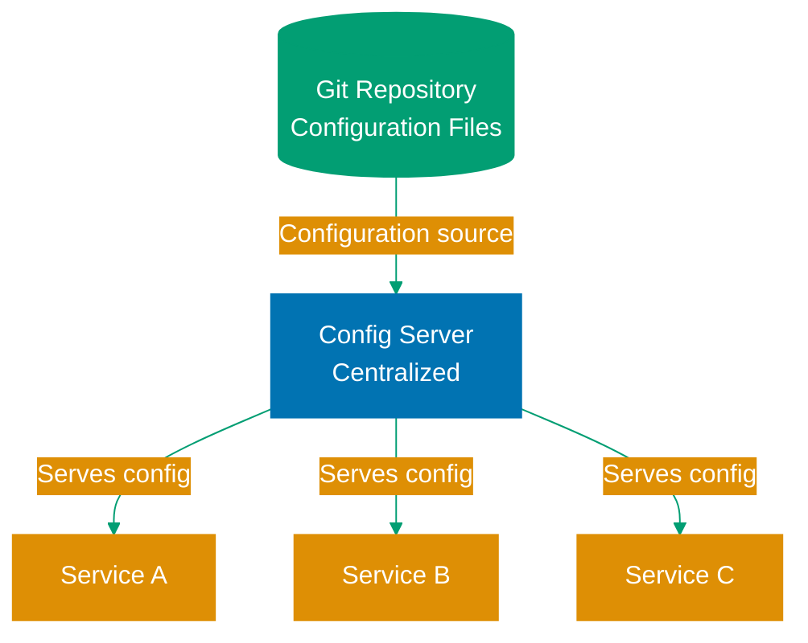

## What is Configuration Management?

**Configuration management** is the practice of separating application settings from code, enabling the same application binary to run in different environments (development, staging, production) with different configurations.

**Why configuration management matters:**

- **Environment-specific settings**: Database URLs, API keys, feature flags differ per environment
- **No recompilation**: Change settings without rebuilding application
- **Security**: Keep secrets out of source code
- **Flexibility**: Adapt application behavior without code changes

**Common configuration concerns:**

- Database connection strings
- External API endpoints and credentials
- Feature flags and toggles
- Logging levels and output formats
- Thread pool sizes and timeouts
- Caching parameters

## Pedagogical Approach: Standard Library First

This content follows the **progression from fundamentals to production frameworks**:

1. **Properties and ResourceBundle** - Java standard library configuration
2. **System Properties and Environment Variables** - OS-level configuration
3. **Spring Boot Configuration** - Convention-based configuration with profiles
4. **Spring Cloud Config** - Centralized configuration server for distributed systems
5. **Secrets Management** - Vault, encrypted properties, and security best practices

**Why this approach?**

- Understanding Properties files reveals configuration fundamentals
- System properties and environment variables are universal across frameworks
- Spring Boot builds on these foundations with powerful conventions
- Cloud Config solves distributed system challenges
- Secrets management addresses security requirements

## Foundation: Properties Files

Java's standard library provides **Properties** class for key-value configuration.

### Basic Properties File

**config.properties:**

```properties
# Database configuration
database.url=jdbc:postgresql://localhost:5432/mydb
database.username=admin
database.password=secret123
database.pool.size=10

# Application settings
app.name=MyApplication
app.version=1.0.0
app.feature.newUi=true
```

**Loading properties:**

```java
import java.io.IOException;
import java.io.InputStream;
import java.util.Properties;

public class ConfigLoader {
    public static Properties loadConfig() throws IOException {
        Properties props = new Properties();

        // Load from classpath
        try (InputStream input = ConfigLoader.class
                .getClassLoader()
                .getResourceAsStream("config.properties")) {

            if (input == null) {
                throw new IOException("Unable to find config.properties");
            }

            props.load(input);
        }

        return props;
    }

    public static void main(String[] args) throws IOException {
        Properties config = loadConfig();

        String dbUrl = config.getProperty("database.url");
        String appName = config.getProperty("app.name");
        int poolSize = Integer.parseInt(config.getProperty("database.pool.size"));
        boolean newUi = Boolean.parseBoolean(config.getProperty("app.feature.newUi"));

        System.out.println("Database URL: " + dbUrl);
        System.out.println("Pool size: " + poolSize);
    }
}
```

**Problems with basic Properties:**

- ❌ No type safety (everything is String)
- ❌ Manual parsing required (parseInt, parseBoolean)
- ❌ No environment-specific overrides
- ❌ Secrets stored in plain text
- ❌ No validation or required field checking

**Solution:** Use ResourceBundle for internationalization or migrate to Spring Boot for production applications.

### ResourceBundle for Localized Configuration

**ResourceBundle** extends Properties for locale-specific configuration (i18n/l10n).

**messages.properties (default):**

```properties
greeting=Hello
farewell=Goodbye
```

**messages_id.properties (Indonesian):**

```properties
greeting=Halo
farewell=Selamat tinggal
```

**Usage:**

```java
import java.util.Locale;
import java.util.ResourceBundle;

public class I18nConfig {
    public static void main(String[] args) {
        // Default locale
        ResourceBundle bundle = ResourceBundle.getBundle("messages");
        System.out.println(bundle.getString("greeting")); // Hello

        // Indonesian locale
        ResourceBundle bundleId = ResourceBundle.getBundle("messages",
            new Locale("id", "ID"));
        System.out.println(bundleId.getString("greeting")); // Halo
    }
}
```

**Use case:** Internationalized applications needing locale-specific messages. For general configuration, use environment variables or Spring Boot.

## System Properties and Environment Variables

**System properties** and **environment variables** provide OS-level configuration, accessible across all frameworks.

### System Properties

Set via command line with `-D` flag:

```bash
java -Dapp.environment=production \
     -Ddatabase.url=jdbc:postgresql://prod-db:5432/app \
     -jar myapp.jar
```

**Reading system properties:**

```java
public class SystemPropsConfig {
    public static void main(String[] args) {
        String environment = System.getProperty("app.environment", "development");
        String dbUrl = System.getProperty("database.url");

        System.out.println("Environment: " + environment);
        System.out.println("Database: " + dbUrl);

        // All system properties
        System.getProperties().forEach((key, value) -> {
            System.out.println(key + " = " + value);
        });
    }
}
```

**Setting programmatically:**

```java
// Set before application starts
System.setProperty("app.environment", "test");
```

### Environment Variables

Set via shell or container orchestration:

```bash
export DATABASE_URL=jdbc:postgresql://prod-db:5432/app
export DATABASE_PASSWORD=secret123
export APP_ENVIRONMENT=production

java -jar myapp.jar
```

**Reading environment variables:**

```java
public class EnvVarConfig {
    public static void main(String[] args) {
        String dbUrl = System.getenv("DATABASE_URL");
        String dbPassword = System.getenv("DATABASE_PASSWORD");
        String environment = System.getenv().getOrDefault("APP_ENVIRONMENT", "development");

        System.out.println("Environment: " + environment);
        System.out.println("Database: " + dbUrl);

        // All environment variables
        System.getenv().forEach((key, value) -> {
            System.out.println(key + " = " + value);
        });
    }
}
```

**System Properties vs Environment Variables:**

| Feature        | System Properties                   | Environment Variables              |
| -------------- | ----------------------------------- | ---------------------------------- |
| **Scope**      | JVM-specific                        | OS-wide                            |
| **Set method** | `-D` flag or `System.setProperty()` | Shell or container                 |
| **Naming**     | `app.name` (dot notation)           | `APP_NAME` (uppercase, underscore) |
| **Security**   | Visible in JVM tools                | Visible in process list            |
| **Use case**   | JVM tuning, app config              | Container/cloud deployment         |

**Best practice:** Use environment variables for **secrets** and **environment-specific settings** (12-factor app principle). Use system properties for **JVM tuning** and **debugging flags**.

## Spring Boot Configuration

**Spring Boot** provides powerful configuration management with conventions, profiles, and type-safe binding.

### application.properties

**src/main/resources/application.properties:**

```properties
# Server configuration
server.port=8080
server.shutdown=graceful

# Database configuration
spring.datasource.url=jdbc:postgresql://localhost:5432/mydb
spring.datasource.username=admin
spring.datasource.password=secret123
spring.datasource.hikari.maximum-pool-size=10

# Logging
logging.level.root=INFO
logging.level.com.example=DEBUG

# Custom application properties
app.name=MyApplication
app.feature.new-ui=true
app.max-upload-size=10MB
```

**Property sources hierarchy (highest priority first):**

1. Command-line arguments (`--server.port=9090`)
2. System properties (`-Dserver.port=9090`)
3. Environment variables (`SERVER_PORT=9090`)
4. Profile-specific properties (`application-prod.properties`)
5. Default properties (`application.properties`)

### YAML Configuration

Spring Boot also supports **YAML** format (more readable for nested properties):

**src/main/resources/application.yml:**

```yaml
server:
  port: 8080
  shutdown: graceful

spring:
  datasource:
    url: jdbc:postgresql://localhost:5432/mydb
    username: admin
    password: secret123
    hikari:
      maximum-pool-size: 10

logging:
  level:
    root: INFO
    com.example: DEBUG

app:
  name: MyApplication
  feature:
    new-ui: true
  max-upload-size: 10MB
```

**Properties vs YAML:**

- **Properties**: Simpler, universally supported, better for simple configs
- **YAML**: More readable for nested structures, supports lists/arrays

### Accessing Configuration with @Value

```java
import org.springframework.beans.factory.annotation.Value;
import org.springframework.stereotype.Component;

@Component
public class AppConfig {
    @Value("${app.name}")
    private String appName;

    @Value("${app.feature.new-ui}")
    private boolean newUiEnabled;

    @Value("${app.max-upload-size}")
    private String maxUploadSize;

    @Value("${app.admin-email:admin@example.com}") // Default value
    private String adminEmail;

    public void printConfig() {
        System.out.println("App name: " + appName);
        System.out.println("New UI: " + newUiEnabled);
        System.out.println("Max upload: " + maxUploadSize);
        System.out.println("Admin email: " + adminEmail);
    }
}
```

**Problems with @Value:**

- ❌ No type safety (errors at runtime)
- ❌ No validation
- ❌ Scattered across codebase
- ❌ Hard to test

**Solution:** Use `@ConfigurationProperties` for type-safe configuration.

### Type-Safe Configuration with @ConfigurationProperties

```java
import org.springframework.boot.context.properties.ConfigurationProperties;
import org.springframework.stereotype.Component;
import org.springframework.validation.annotation.Validated;
import javax.validation.constraints.*;

@Component
@ConfigurationProperties(prefix = "app")
@Validated
public class AppProperties {
    @NotBlank
    private String name;

    private Feature feature = new Feature();

    @NotBlank
    @Pattern(regexp = "\\d+MB")
    private String maxUploadSize;

    @Email
    private String adminEmail = "admin@example.com";

    // Getters and setters
    public String getName() { return name; }
    public void setName(String name) { this.name = name; }

    public Feature getFeature() { return feature; }
    public void setFeature(Feature feature) { this.feature = feature; }

    public String getMaxUploadSize() { return maxUploadSize; }
    public void setMaxUploadSize(String maxUploadSize) {
        this.maxUploadSize = maxUploadSize;
    }

    public String getAdminEmail() { return adminEmail; }
    public void setAdminEmail(String adminEmail) {
        this.adminEmail = adminEmail;
    }

    public static class Feature {
        private boolean newUi;

        public boolean isNewUi() { return newUi; }
        public void setNewUi(boolean newUi) { this.newUi = newUi; }
    }
}
```

**Usage:**

```java
@Service
public class AppService {
    private final AppProperties appProperties;

    public AppService(AppProperties appProperties) {
        this.appProperties = appProperties;
    }

    public void doSomething() {
        if (appProperties.getFeature().isNewUi()) {
            // New UI logic
        }

        System.out.println("App: " + appProperties.getName());
    }
}
```

**Benefits:**

- ✅ Type-safe (compile-time errors)
- ✅ Validation with JSR-303 annotations
- ✅ Centralized configuration class
- ✅ IDE autocomplete support
- ✅ Easy to test (just instantiate and set values)

### Configuration Profiles

**Profiles** enable environment-specific configuration.

**application-dev.properties:**

```properties
spring.datasource.url=jdbc:postgresql://localhost:5432/mydb_dev
logging.level.root=DEBUG
```

**application-prod.properties:**

```properties
spring.datasource.url=jdbc:postgresql://prod-db:5432/mydb_prod
logging.level.root=WARN
```

**Activating profiles:**

```bash
# Via environment variable
export SPRING_PROFILES_ACTIVE=prod
java -jar myapp.jar

# Via command line
java -jar myapp.jar --spring.profiles.active=prod

# Via system property
java -Dspring.profiles.active=prod -jar myapp.jar
```

**Profile-specific beans:**

```java
@Configuration
@Profile("dev")
public class DevConfig {
    @Bean
    public DataSource dataSource() {
        // H2 in-memory database for development
        return new EmbeddedDatabaseBuilder()
            .setType(EmbeddedDatabaseType.H2)
            .build();
    }
}

@Configuration
@Profile("prod")
public class ProdConfig {
    @Bean
    public DataSource dataSource() {
        // Production PostgreSQL with connection pooling
        HikariConfig config = new HikariConfig();
        config.setJdbcUrl(System.getenv("DATABASE_URL"));
        config.setUsername(System.getenv("DATABASE_USERNAME"));
        config.setPassword(System.getenv("DATABASE_PASSWORD"));
        return new HikariDataSource(config);
    }
}
```

**Multiple active profiles:**

```bash
# Activate multiple profiles (comma-separated)
java -jar myapp.jar --spring.profiles.active=prod,metrics,tracing
```

## Spring Cloud Config

**Spring Cloud Config** provides **centralized configuration** for distributed systems (microservices).

**Architecture:**



### Config Server Setup

**Dependencies:**

```xml
<dependency>
    <groupId>org.springframework.cloud</groupId>
    <artifactId>spring-cloud-config-server</artifactId>
</dependency>
```

**Application class:**

```java
import org.springframework.boot.SpringApplication;
import org.springframework.boot.autoconfigure.SpringBootApplication;
import org.springframework.cloud.config.server.EnableConfigServer;

@SpringBootApplication
@EnableConfigServer
public class ConfigServerApplication {
    public static void main(String[] args) {
        SpringApplication.run(ConfigServerApplication.class, args);
    }
}
```

**application.yml:**

```yaml
server:
  port: 8888

spring:
  cloud:
    config:
      server:
        git:
          uri: https://github.com/myorg/config-repo
          default-label: main
          search-paths: "{application}"
```

### Configuration Repository Structure

**Git repository (config-repo):**

```
config-repo/
├── application.yml              # Common config for all services
├── user-service.yml            # user-service specific
├── user-service-dev.yml        # user-service dev profile
├── user-service-prod.yml       # user-service prod profile
├── order-service.yml
└── order-service-prod.yml
```

**application.yml (shared):**

```yaml
logging:
  level:
    root: INFO

management:
  endpoints:
    web:
      exposure:
        include: health,info,metrics
```

**user-service-prod.yml:**

```yaml
spring:
  datasource:
    url: jdbc:postgresql://prod-db:5432/users
    username: ${DB_USERNAME}
    password: ${DB_PASSWORD}

logging:
  level:
    com.example.userservice: WARN
```

### Config Client Setup

**Dependencies:**

```xml
<dependency>
    <groupId>org.springframework.cloud</groupId>
    <artifactId>spring-cloud-starter-config</artifactId>
</dependency>
```

**bootstrap.yml (loaded before application.yml):**

```yaml
spring:
  application:
    name: user-service
  cloud:
    config:
      uri: http://localhost:8888
      fail-fast: true
  profiles:
    active: prod
```

**Why Config Server?**

- ✅ Centralized configuration (one place to update settings)
- ✅ Version control (Git history for configuration changes)
- ✅ Dynamic refresh (change config without restarting services)
- ✅ Environment separation (dev/staging/prod in separate files)
- ✅ Encryption support (encrypt sensitive values)

**When NOT to use Config Server:**

- ❌ Single application (overkill, use Spring Boot profiles)
- ❌ Small team (<5 services) - complexity may not justify benefits
- ❌ Secrets management (use Vault instead for credentials)

## Secrets Management

**Never store secrets in code or plain-text configuration files.**

### Problem: Secrets in Plain Text

```properties
# ❌ WRONG - Never commit this!
database.password=SuperSecret123
api.key=sk_live_abc123xyz789
jwt.secret=my-secret-key-for-tokens
```

**Why this is dangerous:**

- ❌ Exposed in version control history (even if deleted later)
- ❌ Visible to all developers with repository access
- ❌ Accidentally committed and pushed to public repositories
- ❌ Hard to rotate (requires code changes)

### Solution 1: Environment Variables

Store secrets in environment variables, never in code:

**application.properties:**

```properties
# Reference environment variables
database.password=${DATABASE_PASSWORD}
api.key=${API_KEY}
jwt.secret=${JWT_SECRET}
```

**Setting in production:**

```bash
# Kubernetes Secret
apiVersion: v1
kind: Secret
metadata:
  name: app-secrets
type: Opaque
data:
  DATABASE_PASSWORD: U3VwZXJTZWNyZXQxMjM=  # base64 encoded
  API_KEY: c2tfbGl2ZV9hYmMxMjN4eXo3ODk=
  JWT_SECRET: bXktc2VjcmV0LWtleS1mb3ItdG9rZW5z
```

```yaml
# Pod specification
env:
  - name: DATABASE_PASSWORD
    valueFrom:
      secretKeyRef:
        name: app-secrets
        key: DATABASE_PASSWORD
```

**Benefits:**

- ✅ Secrets not in code
- ✅ Different per environment
- ✅ Managed by ops/platform team

**Limitations:**

- ❌ Still visible in process list
- ❌ No audit trail for access
- ❌ No automatic rotation

### Solution 2: HashiCorp Vault

**Vault** is a secrets management tool with encryption, access control, and audit logging.

**Dependencies:**

```xml
<dependency>
    <groupId>org.springframework.cloud</groupId>
    <artifactId>spring-cloud-starter-vault-config</artifactId>
</dependency>
```

**bootstrap.yml:**

```yaml
spring:
  cloud:
    vault:
      uri: https://vault.example.com:8200
      authentication: TOKEN
      token: ${VAULT_TOKEN}
      kv:
        enabled: true
        backend: secret
        application-name: user-service
```

**Vault storage:**

```bash
# Store secrets in Vault
vault kv put secret/user-service \
  database.password=SuperSecret123 \
  api.key=sk_live_abc123xyz789
```

**Spring Boot retrieves automatically:**

```java
@Value("${database.password}")
private String dbPassword; // Retrieved from Vault at runtime
```

**Benefits:**

- ✅ Centralized secrets management
- ✅ Encryption at rest and in transit
- ✅ Access control and audit logging
- ✅ Automatic rotation support
- ✅ Dynamic secrets (database credentials generated on-demand)

### Solution 3: Encrypted Properties (Jasypt)

**Jasypt** (Java Simplified Encryption) encrypts properties in configuration files.

**Dependencies:**

```xml
<dependency>
    <groupId>com.github.ulisesbocchio</groupId>
    <artifactId>jasypt-spring-boot-starter</artifactId>
    <version>3.0.5</version>
</dependency>
```

**Generate encrypted value:**

```bash
java -cp jasypt-1.9.3.jar \
  org.jasypt.intf.cli.JasyptPBEStringEncryptionCLI \
  input="SuperSecret123" \
  password="MasterKey" \
  algorithm=PBEWithMD5AndDES

# Output: Encrypted value: vR8eoN0lQiKj5HhQLnGz9A==
```

**application.properties:**

```properties
# Store encrypted value with ENC() wrapper
database.password=ENC(vR8eoN0lQiKj5HhQLnGz9A==)
```

**Set decryption key via environment variable:**

```bash
export JASYPT_ENCRYPTOR_PASSWORD=MasterKey
java -jar myapp.jar
```

**Benefits:**

- ✅ Secrets encrypted in configuration files
- ✅ Safe to commit to version control
- ✅ No external systems required

**Limitations:**

- ❌ Master key still needs protection (environment variable)
- ❌ No centralized management
- ❌ Manual rotation process

## 12-Factor App Configuration Principles

The **12-Factor App** methodology defines best practices for cloud-native applications.

### Factor III: Store Config in the Environment

**Principle:** Configuration varies between environments; code does not.

**✅ Correct approach:**

```java
// Code is environment-agnostic
String dbUrl = System.getenv("DATABASE_URL");
String apiKey = System.getenv("API_KEY");
```

**❌ Wrong approach:**

```java
// Hard-coded environment logic
String dbUrl;
if (environment.equals("prod")) {
    dbUrl = "jdbc:postgresql://prod-db:5432/app";
} else {
    dbUrl = "jdbc:postgresql://dev-db:5432/app";
}
```

### Strict Separation

**Config is:**

- Likely to vary between deploys (dev/staging/prod)
- Environment-specific values (URLs, credentials, hostnames)

**Config is NOT:**

- Internal application settings (routing rules, business logic)
- Code-level constants (max retry attempts, timeout values that never change)

### Environment Variables vs Configuration Files

**12-Factor recommendation:** Use environment variables for config.

**Why?**

- ✅ Language/OS agnostic
- ✅ Easy to change without code changes
- ✅ Clear separation from code
- ✅ Difficult to accidentally commit

**Modern interpretation:** Combine environment variables with Spring Boot profiles:

- Use `.properties`/`.yml` for **structure and defaults**
- Override with **environment variables** for environment-specific values

**Example:**

```yaml
# application.yml - structure and defaults
spring:
  datasource:
    url: ${DATABASE_URL:jdbc:postgresql://localhost:5432/mydb}
    username: ${DATABASE_USERNAME:admin}
    password: ${DATABASE_PASSWORD:changeme}
```

Production sets environment variables to override defaults.

## Testing Configuration

### Testing with Test Properties

```java
import org.springframework.boot.test.context.SpringBootTest;
import org.springframework.test.context.TestPropertySource;

@SpringBootTest
@TestPropertySource(properties = {
    "app.name=TestApp",
    "app.feature.new-ui=false",
    "spring.datasource.url=jdbc:h2:mem:testdb"
})
class AppServiceTest {
    @Autowired
    private AppService appService;

    @Test
    void testWithCustomConfig() {
        // Tests run with overridden configuration
        assertThat(appService.getAppName()).isEqualTo("TestApp");
    }
}
```

### Testing ConfigurationProperties

```java
import org.junit.jupiter.api.Test;
import org.springframework.boot.context.properties.EnableConfigurationProperties;
import org.springframework.boot.test.context.runner.ApplicationContextRunner;

class AppPropertiesTest {
    private final ApplicationContextRunner contextRunner = new ApplicationContextRunner()
        .withUserConfiguration(AppPropertiesTestConfig.class);

    @Test
    void testValidConfiguration() {
        contextRunner
            .withPropertyValues(
                "app.name=MyApp",
                "app.feature.new-ui=true",
                "app.max-upload-size=10MB"
            )
            .run(context -> {
                AppProperties props = context.getBean(AppProperties.class);
                assertThat(props.getName()).isEqualTo("MyApp");
                assertThat(props.getFeature().isNewUi()).isTrue();
            });
    }

    @Test
    void testInvalidConfiguration() {
        contextRunner
            .withPropertyValues(
                "app.name=",  // Blank, should fail @NotBlank validation
                "app.max-upload-size=invalid"
            )
            .run(context -> {
                assertThat(context).hasFailed();
            });
    }

    @EnableConfigurationProperties(AppProperties.class)
    static class AppPropertiesTestConfig {
    }
}
```

## Best Practices

### 1. Use Type-Safe Configuration

```java
// ✅ CORRECT - Type-safe with @ConfigurationProperties
@ConfigurationProperties(prefix = "app")
public class AppConfig {
    private int maxConnections;
    private Duration timeout;
}

// ❌ WRONG - String-based with @Value
@Value("${app.max-connections}")
private String maxConnections; // Should be int
```

### 2. Provide Sensible Defaults

```java
// ✅ CORRECT - Defaults in application.yml, environment-specific in env vars
spring:
  datasource:
    hikari:
      maximum-pool-size: ${DB_POOL_SIZE:10}  # Default 10
      connection-timeout: ${DB_TIMEOUT:30000} # Default 30s
```

### 3. Validate Configuration at Startup

```java
@ConfigurationProperties(prefix = "app")
@Validated
public class AppConfig {
    @NotBlank
    private String apiUrl;

    @Min(1)
    @Max(100)
    private int maxRetries;

    @Pattern(regexp = "https?://.*")
    private String webhookUrl;
}
```

### 4. Document Configuration Properties

```java
/**
 * Configuration properties for external API integration.
 *
 * <p>Required properties:
 * <ul>
 *   <li>app.api.url - Base URL for external API (e.g., https://api.example.com)
 *   <li>app.api.key - API authentication key (store in environment variable)
 * </ul>
 *
 * <p>Optional properties:
 * <ul>
 *   <li>app.api.timeout - Request timeout in milliseconds (default: 5000)
 *   <li>app.api.max-retries - Maximum retry attempts (default: 3)
 * </ul>
 */
@ConfigurationProperties(prefix = "app.api")
public class ApiConfig {
    // ...
}
```

### 5. Never Log Secrets

```java
// ❌ WRONG - Logs password
log.info("Connecting to database: {} with password: {}", dbUrl, dbPassword);

// ✅ CORRECT - Omit sensitive values
log.info("Connecting to database: {}", dbUrl);

// ✅ CORRECT - Mask sensitive values
log.info("API key configured: {}***", apiKey.substring(0, 4));
```

### 6. Use Profiles for Environment Separation

```yaml
# application.yml - defaults
spring:
  profiles:
    active: ${SPRING_PROFILE:dev}

---
# Development profile
spring:
  config:
    activate:
      on-profile: dev
  datasource:
    url: jdbc:h2:mem:devdb

---
# Production profile
spring:
  config:
    activate:
      on-profile: prod
  datasource:
    url: ${DATABASE_URL}
```

### 7. Externalize ALL Environment-Specific Config

```java
// ❌ WRONG - Hard-coded environment checks
if (environment.equals("production")) {
    enableMetrics();
}

// ✅ CORRECT - Feature flags via configuration
@ConfigurationProperties(prefix = "app.features")
public class FeatureFlags {
    private boolean metricsEnabled;
}
```

## Common Pitfalls

### Pitfall 1: Committing Secrets to Git

```properties
# ❌ NEVER commit this file with real secrets
database.password=SuperSecret123
```

**Prevention:**

- Use `.env.example` with dummy values
- Add `.env` to `.gitignore`
- Use environment variables or secrets manager

### Pitfall 2: Using Wrong Property Source Precedence

```yaml
# application.yml
server.port: 8080
```

```bash
# Command line (highest precedence)
java -jar app.jar --server.port=9090  # Uses 9090, not 8080
```

**Remember precedence:** Command line > System properties > Env vars > Profile-specific > application.properties

### Pitfall 3: Missing Validation

```java
// ❌ WRONG - No validation, fails at runtime
@Value("${app.max-connections}")
private int maxConnections; // What if value is "abc"?

// ✅ CORRECT - Validated at startup
@ConfigurationProperties(prefix = "app")
@Validated
public class AppConfig {
    @Min(1)
    @Max(1000)
    private int maxConnections;
}
```

### Pitfall 4: Mixing Configuration and Code

```java
// ❌ WRONG - Business logic mixed with config
public class PaymentService {
    private final String apiKey = System.getenv("PAYMENT_API_KEY");
    private final int timeout = Integer.parseInt(System.getenv("PAYMENT_TIMEOUT"));
}

// ✅ CORRECT - Inject configuration
public class PaymentService {
    private final PaymentConfig config;

    public PaymentService(PaymentConfig config) {
        this.config = config;
    }
}
```

## Related Topics

- [Best Practices](/en/learn/software-engineering/programming-languages/java/in-practice/best-practices) - General Java coding standards
- [Security Practices](/en/learn/software-engineering/programming-languages/java/in-practice/security-practices) - Secrets management and security
- [CI/CD Pipelines](/en/learn/software-engineering/programming-languages/java/in-practice/ci-cd) - Environment-specific deployments
- [Cloud-Native Patterns](/en/learn/software-engineering/programming-languages/java/in-practice/cloud-native-patterns) - 12-factor app implementation
- [Docker and Kubernetes](/en/learn/software-engineering/programming-languages/java/in-practice/docker-and-kubernetes) - Container configuration

## References

**Official Documentation:**

- [Spring Boot Externalized Configuration](https://docs.spring.io/spring-boot/reference/features/external-config.html)
- [Spring Cloud Config Documentation](https://docs.spring.io/spring-cloud-config/docs/current/reference/html/)
- [HashiCorp Vault Documentation](https://developer.hashicorp.com/vault/docs)
- [The Twelve-Factor App - Config](https://12factor.net/config)
- [Jasypt Spring Boot](https://github.com/ulisesbocchio/jasypt-spring-boot)

**Books:**

- "Spring Boot in Action" by Craig Walls
- "Cloud Native Java" by Josh Long and Kenny Bastani
