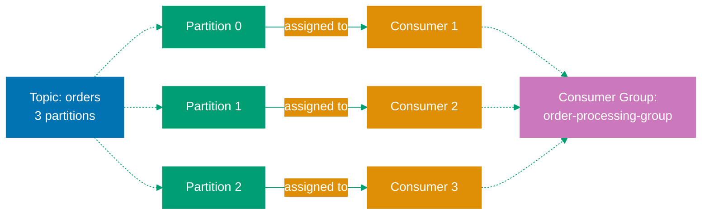
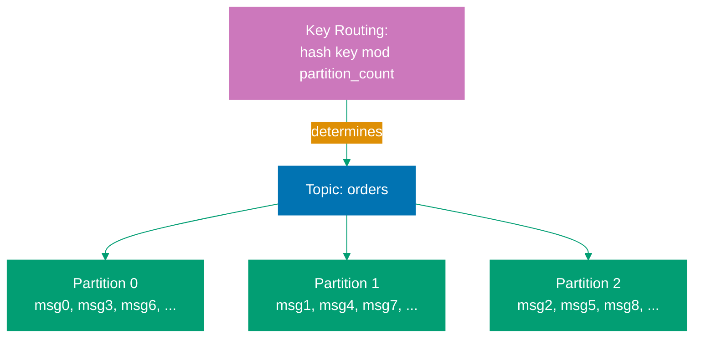

## Why Messaging Matters

Messaging enables asynchronous communication between distributed components. Systems communicate by sending messages through intermediaries (message queues, topics, event streams) instead of direct synchronous calls.

**Core Benefits**:

- **Decoupling**: Producers and consumers operate independently
- **Scalability**: Add consumers to handle increased load
- **Reliability**: Messages persist until processed
- **Asynchronicity**: Producers don't block waiting for consumers
- **Fault tolerance**: System continues functioning despite component failures

**Problem**: Synchronous communication creates tight coupling. If service B is down, service A fails. If service B is slow, service A waits.

**Solution**: Message-based communication decouples services. Service A sends message and continues. Service B processes when available.

## Message Queue vs Event Stream

Different messaging patterns solve different problems.

### Point-to-Point (Message Queue)

**Pattern**: One producer, one consumer per message.

**Characteristics**:

- Each message consumed exactly once
- Queue stores messages until consumed
- Consumers compete for messages
- Message deleted after consumption
- Order guaranteed within queue

**Use cases**:

- Task distribution (job processing)
- Work queues (background jobs)
- Command processing

**Example scenario**: Order processing system where each order processed by one worker.

### Publish-Subscribe (Topic)

**Pattern**: One producer, multiple consumers per message.

**Characteristics**:

- Each subscriber receives copy of message
- Multiple independent subscriptions
- Message broadcast to all subscribers
- No competition between subscribers
- Subscribers can have different processing rates

**Use cases**:

- Event notifications (user registered, order placed)
- Data replication (update caches)
- Fan-out processing

**Example scenario**: User registration event triggers multiple actions (send email, update analytics, create profile).

### Event Streaming

**Pattern**: Append-only log of events, replay capability.

**Characteristics**:

- Events stored permanently (configurable retention)
- Consumers track their position (offset)
- Multiple consumers can read same events
- Events ordered by partition
- Replay events from any point

**Use cases**:

- Event sourcing (rebuild state from events)
- Real-time analytics (stream processing)
- Change data capture (database changes)
- Audit logging

**Example scenario**: Financial transactions log where events replayed to rebuild account balances.

## JMS (Java Message Service - Standard)

JMS provides standard API for Java messaging. Different vendors implement JMS specification (ActiveMQ, IBM MQ, Solace).

### Queue vs Topic

**Queue (Point-to-Point)**:

```java
import javax.jms.*;
import javax.naming.InitialContext;

public class JmsQueueProducer {
    public static void main(String[] args) throws Exception {
        // SETUP: Connection factory and queue
        InitialContext context = new InitialContext();
        ConnectionFactory factory = (ConnectionFactory) context.lookup("ConnectionFactory");
        Queue queue = (Queue) context.lookup("OrderQueue");

        // CREATE: Connection and session
        Connection connection = factory.createConnection();
        connection.start();

        Session session = connection.createSession(
            false,  // NOT TRANSACTED
            Session.AUTO_ACKNOWLEDGE
        );

        // PRODUCER: Send messages
        MessageProducer producer = session.createProducer(queue);

        TextMessage message = session.createTextMessage("Order #12345");
        message.setStringProperty("orderId", "12345");
        message.setIntProperty("priority", 5);

        producer.send(message);  // SEND: Message to queue
        System.out.println("Sent: " + message.getText());

        // CLEANUP
        producer.close();
        session.close();
        connection.close();
    }
}
```

**Queue Consumer**:

```java
public class JmsQueueConsumer {
    public static void main(String[] args) throws Exception {
        InitialContext context = new InitialContext();
        ConnectionFactory factory = (ConnectionFactory) context.lookup("ConnectionFactory");
        Queue queue = (Queue) context.lookup("OrderQueue");

        Connection connection = factory.createConnection();
        connection.start();

        Session session = connection.createSession(false, Session.AUTO_ACKNOWLEDGE);

        // CONSUMER: Receive messages
        MessageConsumer consumer = session.createConsumer(queue);

        // SYNCHRONOUS: Block until message arrives
        Message message = consumer.receive(5000);  // WAIT: 5 seconds
        if (message instanceof TextMessage) {
            TextMessage textMessage = (TextMessage) message;
            System.out.println("Received: " + textMessage.getText());
            System.out.println("Order ID: " + message.getStringProperty("orderId"));
        }

        consumer.close();
        session.close();
        connection.close();
    }
}
```

**Topic (Publish-Subscribe)**:

```java
public class JmsTopicPublisher {
    public static void main(String[] args) throws Exception {
        InitialContext context = new InitialContext();
        ConnectionFactory factory = (ConnectionFactory) context.lookup("ConnectionFactory");
        Topic topic = (Topic) context.lookup("UserEventsTopic");

        Connection connection = factory.createConnection();
        connection.start();

        Session session = connection.createSession(false, Session.AUTO_ACKNOWLEDGE);

        // PUBLISHER: Send to topic
        MessageProducer publisher = session.createProducer(topic);

        TextMessage message = session.createTextMessage("User alice registered");
        message.setStringProperty("eventType", "USER_REGISTERED");
        message.setStringProperty("userId", "alice");

        publisher.send(message);  // BROADCAST: All subscribers receive
        System.out.println("Published: " + message.getText());

        publisher.close();
        session.close();
        connection.close();
    }
}
```

**Topic Subscriber**:

```java
public class JmsTopicSubscriber {
    public static void main(String[] args) throws Exception {
        InitialContext context = new InitialContext();
        ConnectionFactory factory = (ConnectionFactory) context.lookup("ConnectionFactory");
        Topic topic = (Topic) context.lookup("UserEventsTopic");

        Connection connection = factory.createConnection();
        connection.start();

        Session session = connection.createSession(false, Session.AUTO_ACKNOWLEDGE);

        // SUBSCRIBER: Receive messages from topic
        MessageConsumer subscriber = session.createConsumer(topic);

        // ASYNCHRONOUS: Message listener
        subscriber.setMessageListener(message -> {
            try {
                if (message instanceof TextMessage) {
                    TextMessage textMessage = (TextMessage) message;
                    String eventType = message.getStringProperty("eventType");
                    System.out.println("Event: " + eventType);
                    System.out.println("Message: " + textMessage.getText());
                }
            } catch (JMSException e) {
                e.printStackTrace();
            }
        });

        // KEEP RUNNING: Listener runs in background
        Thread.sleep(60000);  // Wait 60 seconds

        subscriber.close();
        session.close();
        connection.close();
    }
}
```

### Message Types

JMS supports multiple message types:

```java
// TEXT MESSAGE: String content
TextMessage textMessage = session.createTextMessage("Hello World");

// OBJECT MESSAGE: Serializable object
Order order = new Order("12345", 100.0);
ObjectMessage objectMessage = session.createObjectMessage(order);

// BYTES MESSAGE: Raw bytes
BytesMessage bytesMessage = session.createBytesMessage();
bytesMessage.writeBytes(data);

// MAP MESSAGE: Key-value pairs
MapMessage mapMessage = session.createMapMessage();
mapMessage.setString("orderId", "12345");
mapMessage.setDouble("amount", 100.0);

// STREAM MESSAGE: Sequential values
StreamMessage streamMessage = session.createStreamMessage();
streamMessage.writeString("Alice");
streamMessage.writeInt(25);
```

### Transactions and Acknowledgments

**Transacted Session**:

```java
// CREATE: Transacted session
Session session = connection.createSession(
    true,  // TRANSACTED
    Session.SESSION_TRANSACTED
);

MessageProducer producer = session.createProducer(queue);

try {
    // SEND: Multiple messages in transaction
    for (int i = 0; i < 10; i++) {
        TextMessage message = session.createTextMessage("Message " + i);
        producer.send(message);
    }

    session.commit();  // COMMIT: All messages sent atomically

} catch (Exception e) {
    session.rollback();  // ROLLBACK: Discard all messages
}
```

**Acknowledgment Modes**:

| Mode                    | Behavior                            |
| ----------------------- | ----------------------------------- |
| **AUTO_ACKNOWLEDGE**    | Session automatically acknowledges  |
| **CLIENT_ACKNOWLEDGE**  | Client explicitly acknowledges      |
| **DUPS_OK_ACKNOWLEDGE** | Lazy acknowledgment (duplicates OK) |
| **SESSION_TRANSACTED**  | Acknowledgment tied to transaction  |

```java
// CLIENT ACKNOWLEDGE: Manual control
Session session = connection.createSession(false, Session.CLIENT_ACKNOWLEDGE);

MessageConsumer consumer = session.createConsumer(queue);
Message message = consumer.receive();

try {
    processMessage(message);
    message.acknowledge();  // ACKNOWLEDGE: Message successfully processed
} catch (Exception e) {
    // NOT ACKNOWLEDGED: Message redelivered
}
```

### Why JMS is Limited

**Limitations**:

1. **Vendor lock-in**: Implementations not portable between vendors
2. **Configuration complexity**: JNDI setup, connection factory configuration
3. **Limited scalability**: Not designed for high-throughput streaming
4. **No distributed log**: Messages deleted after consumption (no replay)
5. **Java-specific**: Not language-agnostic

**Before**: JMS for enterprise messaging
**After**: Modern systems use Kafka (high throughput, distributed) or RabbitMQ (AMQP standard, flexible routing)

## Apache Kafka

Kafka is distributed event streaming platform with high throughput, durability, and scalability.

### Producer API (Sending Messages)

**Basic Producer**:

```java
import org.apache.kafka.clients.producer.*;
import java.util.Properties;

public class KafkaProducerExample {
    public static void main(String[] args) {
        // CONFIGURATION
        Properties props = new Properties();
        props.put("bootstrap.servers", "localhost:9092");  // Kafka broker addresses
        props.put("key.serializer", "org.apache.kafka.common.serialization.StringSerializer");
        props.put("value.serializer", "org.apache.kafka.common.serialization.StringSerializer");
        props.put("acks", "all");  // Wait for all replicas to acknowledge
        props.put("retries", 3);  // Retry failed sends

        // CREATE: Producer
        KafkaProducer<String, String> producer = new KafkaProducer<>(props);

        // SEND: Messages
        for (int i = 0; i < 10; i++) {
            String key = "order-" + i;
            String value = "Order details for order " + i;

            ProducerRecord<String, String> record = new ProducerRecord<>(
                "orders",  // TOPIC
                key,       // KEY: Determines partition (same key → same partition)
                value      // VALUE: Message content
            );

            // ASYNC SEND: Fire and forget
            producer.send(record, (metadata, exception) -> {
                if (exception != null) {
                    System.err.println("Error sending: " + exception.getMessage());
                } else {
                    System.out.println("Sent to partition " + metadata.partition() +
                        ", offset " + metadata.offset());
                }
            });
        }

        // FLUSH: Wait for all sends to complete
        producer.flush();
        producer.close();
    }
}
```

**Synchronous Send**:

```java
// SYNC: Wait for acknowledgment
try {
    RecordMetadata metadata = producer.send(record).get();  // BLOCKS
    System.out.println("Sent successfully: " + metadata.offset());
} catch (Exception e) {
    System.err.println("Failed to send: " + e.getMessage());
}
```

### Consumer API (Consuming Messages)

**Basic Consumer**:

```java
import org.apache.kafka.clients.consumer.*;
import java.time.Duration;
import java.util.Collections;
import java.util.Properties;

public class KafkaConsumerExample {
    public static void main(String[] args) {
        // CONFIGURATION
        Properties props = new Properties();
        props.put("bootstrap.servers", "localhost:9092");
        props.put("group.id", "order-processing-group");  // CONSUMER GROUP
        props.put("key.deserializer", "org.apache.kafka.common.serialization.StringDeserializer");
        props.put("value.deserializer", "org.apache.kafka.common.serialization.StringDeserializer");
        props.put("enable.auto.commit", "true");  // Auto-commit offsets
        props.put("auto.commit.interval.ms", "1000");
        props.put("auto.offset.reset", "earliest");  // Start from beginning

        // CREATE: Consumer
        KafkaConsumer<String, String> consumer = new KafkaConsumer<>(props);

        // SUBSCRIBE: Topic
        consumer.subscribe(Collections.singletonList("orders"));

        // POLL: Messages in loop
        try {
            while (true) {
                ConsumerRecords<String, String> records = consumer.poll(Duration.ofMillis(100));

                for (ConsumerRecord<String, String> record : records) {
                    System.out.printf("Partition: %d, Offset: %d, Key: %s, Value: %s%n",
                        record.partition(),
                        record.offset(),
                        record.key(),
                        record.value()
                    );

                    // PROCESS: Message
                    processOrder(record.value());
                }
            }
        } finally {
            consumer.close();
        }
    }

    static void processOrder(String order) {
        // Business logic
    }
}
```

**Consumer Groups**:



**SCALING**: Add consumers up to partition count
**REBALANCING**: Partitions redistributed when consumers join/leave

**Manual Offset Management**:

```java
props.put("enable.auto.commit", "false");  // MANUAL COMMIT

KafkaConsumer<String, String> consumer = new KafkaConsumer<>(props);
consumer.subscribe(Collections.singletonList("orders"));

while (true) {
    ConsumerRecords<String, String> records = consumer.poll(Duration.ofMillis(100));

    for (ConsumerRecord<String, String> record : records) {
        try {
            processOrder(record.value());

            // COMMIT: After successful processing
            consumer.commitSync();  // SYNC: Blocks until committed

        } catch (Exception e) {
            // ERROR: Don't commit, message will be redelivered
            System.err.println("Failed to process: " + e.getMessage());
        }
    }
}
```

### Kafka Streams (Stream Processing)

Process streams of events with stateful operations:

```java
import org.apache.kafka.streams.*;
import org.apache.kafka.streams.kstream.*;
import java.util.Properties;

public class KafkaStreamsExample {
    public static void main(String[] args) {
        // CONFIGURATION
        Properties props = new Properties();
        props.put(StreamsConfig.APPLICATION_ID_CONFIG, "order-analytics");
        props.put(StreamsConfig.BOOTSTRAP_SERVERS_CONFIG, "localhost:9092");
        props.put(StreamsConfig.DEFAULT_KEY_SERDE_CLASS_CONFIG,
            org.apache.kafka.common.serialization.Serdes.String().getClass());
        props.put(StreamsConfig.DEFAULT_VALUE_SERDE_CLASS_CONFIG,
            org.apache.kafka.common.serialization.Serdes.String().getClass());

        // BUILD: Stream topology
        StreamsBuilder builder = new StreamsBuilder();

        // SOURCE: Read from topic
        KStream<String, String> orders = builder.stream("orders");

        // TRANSFORM: Filter and map
        KStream<String, String> highValueOrders = orders
            .filter((key, value) -> {
                // FILTER: High-value orders only
                double amount = parseOrderAmount(value);
                return amount > 1000.0;
            })
            .mapValues(value -> {
                // TRANSFORM: Add processing timestamp
                return value + " [processed: " + System.currentTimeMillis() + "]";
            });

        // SINK: Write to output topic
        highValueOrders.to("high-value-orders");

        // AGGREGATION: Count by category
        KTable<String, Long> categoryCounts = orders
            .groupBy((key, value) -> extractCategory(value))  // GROUP BY
            .count();  // AGGREGATE

        categoryCounts.toStream().to("category-counts");

        // START: Streams application
        KafkaStreams streams = new KafkaStreams(builder.build(), props);
        streams.start();

        // SHUTDOWN HOOK
        Runtime.getRuntime().addShutdownHook(new Thread(streams::close));
    }

    static double parseOrderAmount(String value) {
        // Parse order amount from message
        return 1500.0;
    }

    static String extractCategory(String value) {
        // Extract category from order
        return "electronics";
    }
}
```

### Topics and Partitions

**Topics**: Logical categories for messages.

**Partitions**: Physical subdivision for parallelism.



**KEY ROUTING**: `hash(key) % partition_count → partition`
**ORDERING**: Guaranteed within partition, NOT across partitions
**PARALLELISM**: Consumers = partitions for max throughput

**Creating Topic**:

```bash
# Create topic with 3 partitions, replication factor 3
kafka-topics.sh --create --topic orders \
    --partitions 3 \
    --replication-factor 3 \
    --bootstrap-server localhost:9092
```

### Offset Management

**Offsets**: Consumer's position in partition.

```
Partition 0:
Offset: 0    1    2    3    4    5    6
        [m0] [m1] [m2] [m3] [m4] [m5] [m6]
                             ^
                             Current offset: 4
                             (messages 0-3 consumed)
```

**Offset Commit Strategies**:

```java
// AUTO COMMIT: Periodic background commits
props.put("enable.auto.commit", "true");
props.put("auto.commit.interval.ms", "5000");  // Every 5 seconds

// MANUAL SYNC: Commit after processing
consumer.commitSync();

// MANUAL ASYNC: Non-blocking commit
consumer.commitAsync((offsets, exception) -> {
    if (exception != null) {
        System.err.println("Commit failed: " + exception.getMessage());
    }
});

// MANUAL WITH OFFSET: Commit specific offset
Map<TopicPartition, OffsetAndMetadata> offsets = new HashMap<>();
offsets.put(
    new TopicPartition("orders", 0),
    new OffsetAndMetadata(100)  // Commit offset 100
);
consumer.commitSync(offsets);
```

### Why Kafka

**Advantages**:

- **High throughput**: Millions of messages per second
- **Durability**: Persistent storage with configurable retention
- **Scalability**: Horizontal scaling with partitions
- **Fault tolerance**: Replication and automatic failover
- **Replay capability**: Consumers can rewind and replay events
- **Stream processing**: Built-in Kafka Streams API

**Use cases**:

- Event sourcing and CQRS
- Real-time analytics and monitoring
- Log aggregation
- Change data capture (CDC)
- Microservices communication

## RabbitMQ (AMQP)

RabbitMQ implements AMQP (Advanced Message Queuing Protocol) with flexible routing.

### Exchanges (Direct, Fanout, Topic, Headers)

**Exchange types** determine message routing:

| Type    | Routing                       | Use Case                 |
| ------- | ----------------------------- | ------------------------ |
| Direct  | Exact routing key match       | Point-to-point routing   |
| Fanout  | Broadcast to all queues       | Publish-subscribe        |
| Topic   | Pattern matching routing keys | Selective routing        |
| Headers | Header attribute matching     | Complex routing criteria |

**Direct Exchange**:

```java
import com.rabbitmq.client.*;

public class RabbitMQDirectExchange {
    public static void main(String[] args) throws Exception {
        // CONNECTION
        ConnectionFactory factory = new ConnectionFactory();
        factory.setHost("localhost");
        Connection connection = factory.newConnection();
        Channel channel = connection.createChannel();

        // DECLARE: Exchange and queues
        String exchangeName = "order.direct";
        channel.exchangeDeclare(exchangeName, "direct", true);  // DURABLE

        String queue1 = "priority.high";
        String queue2 = "priority.low";
        channel.queueDeclare(queue1, true, false, false, null);
        channel.queueDeclare(queue2, true, false, false, null);

        // BIND: Queues to exchange with routing keys
        channel.queueBind(queue1, exchangeName, "high");  // ROUTING KEY: "high"
        channel.queueBind(queue2, exchangeName, "low");   // ROUTING KEY: "low"

        // PUBLISH: Messages with routing keys
        channel.basicPublish(exchangeName, "high", null,
            "High priority order".getBytes());  // ROUTE: → queue1

        channel.basicPublish(exchangeName, "low", null,
            "Low priority order".getBytes());  // ROUTE: → queue2

        channel.close();
        connection.close();
    }
}
```

**Fanout Exchange** (Broadcast):

```java
// DECLARE: Fanout exchange
String exchangeName = "user.events";
channel.exchangeDeclare(exchangeName, "fanout", true);

// BIND: Multiple queues (all receive messages)
channel.queueBind("email.queue", exchangeName, "");
channel.queueBind("analytics.queue", exchangeName, "");
channel.queueBind("notification.queue", exchangeName, "");

// PUBLISH: Broadcast to all queues
channel.basicPublish(exchangeName, "", null,
    "User registered: alice".getBytes());
```

**Topic Exchange** (Pattern Matching):

```java
// DECLARE: Topic exchange
String exchangeName = "logs.topic";
channel.exchangeDeclare(exchangeName, "topic", true);

// BIND: Queues with pattern-matching routing keys
channel.queueBind("critical.logs", exchangeName, "*.critical");  // PATTERN: *.critical
channel.queueBind("error.logs", exchangeName, "#.error");       // PATTERN: #.error (multi-level)
channel.queueBind("all.logs", exchangeName, "#");               // PATTERN: # (all messages)

// PUBLISH: Messages with routing keys
channel.basicPublish(exchangeName, "app.critical", null, "Critical error".getBytes());
channel.basicPublish(exchangeName, "system.auth.error", null, "Auth failed".getBytes());

/*
ROUTING:
- "app.critical" → critical.logs, all.logs
- "system.auth.error" → error.logs, all.logs

WILDCARDS:
- * matches one word
- # matches zero or more words
*/
```

### Queues and Bindings

**Queue Declaration**:

```java
// DECLARE: Queue with options
Map<String, Object> args = new HashMap<>();
args.put("x-message-ttl", 60000);  // MESSAGE TTL: 60 seconds
args.put("x-max-length", 10000);   // MAX LENGTH: 10,000 messages

channel.queueDeclare(
    "orders",      // QUEUE NAME
    true,          // DURABLE: Survives broker restart
    false,         // EXCLUSIVE: Not exclusive to connection
    false,         // AUTO-DELETE: Don't delete when unused
    args           // ARGUMENTS
);
```

**Queue Binding**:

```java
// BIND: Queue to exchange
channel.queueBind(
    "orders.processing",  // QUEUE
    "orders.exchange",    // EXCHANGE
    "order.created",      // ROUTING KEY
    null                  // ARGUMENTS
);
```

### Message Acknowledgment

**Manual Acknowledgment**:

```java
// CONSUMER: Manual acknowledgment
Channel channel = connection.createChannel();
channel.queueDeclare("orders", true, false, false, null);

DeliverCallback deliverCallback = (consumerTag, delivery) -> {
    String message = new String(delivery.getBody(), "UTF-8");

    try {
        processOrder(message);

        // ACK: Message successfully processed
        channel.basicAck(delivery.getEnvelope().getDeliveryTag(), false);

    } catch (Exception e) {
        // NACK: Message processing failed
        channel.basicNack(
            delivery.getEnvelope().getDeliveryTag(),
            false,  // MULTIPLE: false (only this message)
            true    // REQUEUE: true (requeue for retry)
        );
    }
};

// CONSUME: Manual ack mode
channel.basicConsume("orders", false, deliverCallback, consumerTag -> {});
```

**Acknowledgment Modes**:

| Method        | Effect                                 |
| ------------- | -------------------------------------- |
| `basicAck`    | Acknowledge successful processing      |
| `basicNack`   | Negative acknowledge (requeue or drop) |
| `basicReject` | Reject single message                  |

### Dead Letter Queues

Handle failed messages:

```java
// MAIN QUEUE: With dead letter exchange
Map<String, Object> args = new HashMap<>();
args.put("x-dead-letter-exchange", "orders.dlx");  // DLX
args.put("x-dead-letter-routing-key", "failed");

channel.queueDeclare("orders", true, false, false, args);

// DEAD LETTER EXCHANGE and QUEUE
channel.exchangeDeclare("orders.dlx", "direct", true);
channel.queueDeclare("orders.failed", true, false, false, null);
channel.queueBind("orders.failed", "orders.dlx", "failed");

// MESSAGES: Failed processing → orders.failed
```

**Dead letter triggers**:

- Message rejected with requeue=false
- Message TTL expired
- Queue length limit exceeded

### RabbitMQ vs Kafka Trade-offs

| Feature               | RabbitMQ                      | Kafka                     |
| --------------------- | ----------------------------- | ------------------------- |
| **Model**             | Message broker (queues)       | Event stream (log)        |
| **Message retention** | Deleted after consumption     | Persistent (configurable) |
| **Ordering**          | Per queue                     | Per partition             |
| **Routing**           | Complex (exchanges, bindings) | Simple (topic, partition) |
| **Throughput**        | 10K-100K msg/sec              | 1M+ msg/sec               |
| **Replay**            | No                            | Yes                       |
| **Use case**          | Task distribution, RPC        | Event sourcing, analytics |

## Spring Integration

Spring provides abstraction over messaging systems.

### Spring JMS

**Configuration**:

```java
import org.springframework.context.annotation.Bean;
import org.springframework.context.annotation.Configuration;
import org.springframework.jms.annotation.EnableJms;
import org.springframework.jms.core.JmsTemplate;
import javax.jms.ConnectionFactory;

@Configuration
@EnableJms
public class JmsConfig {
    @Bean
    public JmsTemplate jmsTemplate(ConnectionFactory connectionFactory) {
        return new JmsTemplate(connectionFactory);
    }
}
```

**Producer**:

```java
import org.springframework.jms.core.JmsTemplate;
import org.springframework.stereotype.Service;

@Service
public class OrderProducer {
    private final JmsTemplate jmsTemplate;

    public OrderProducer(JmsTemplate jmsTemplate) {
        this.jmsTemplate = jmsTemplate;
    }

    public void sendOrder(String order) {
        jmsTemplate.convertAndSend("orders", order);  // SEND: To queue
    }
}
```

**Consumer**:

```java
import org.springframework.jms.annotation.JmsListener;
import org.springframework.stereotype.Component;

@Component
public class OrderConsumer {
    @JmsListener(destination = "orders")
    public void processOrder(String order) {
        // CONSUME: From queue
        System.out.println("Processing: " + order);
    }
}
```

### Spring Kafka

**Configuration**:

```java
import org.springframework.context.annotation.Bean;
import org.springframework.context.annotation.Configuration;
import org.springframework.kafka.annotation.EnableKafka;
import org.springframework.kafka.core.*;
import org.apache.kafka.clients.producer.ProducerConfig;
import org.apache.kafka.clients.consumer.ConsumerConfig;
import java.util.HashMap;
import java.util.Map;

@Configuration
@EnableKafka
public class KafkaConfig {
    @Bean
    public ProducerFactory<String, String> producerFactory() {
        Map<String, Object> config = new HashMap<>();
        config.put(ProducerConfig.BOOTSTRAP_SERVERS_CONFIG, "localhost:9092");
        config.put(ProducerConfig.KEY_SERIALIZER_CLASS_CONFIG,
            org.apache.kafka.common.serialization.StringSerializer.class);
        config.put(ProducerConfig.VALUE_SERIALIZER_CLASS_CONFIG,
            org.apache.kafka.common.serialization.StringSerializer.class);
        return new DefaultKafkaProducerFactory<>(config);
    }

    @Bean
    public KafkaTemplate<String, String> kafkaTemplate() {
        return new KafkaTemplate<>(producerFactory());
    }

    @Bean
    public ConsumerFactory<String, String> consumerFactory() {
        Map<String, Object> config = new HashMap<>();
        config.put(ConsumerConfig.BOOTSTRAP_SERVERS_CONFIG, "localhost:9092");
        config.put(ConsumerConfig.GROUP_ID_CONFIG, "order-group");
        config.put(ConsumerConfig.KEY_DESERIALIZER_CLASS_CONFIG,
            org.apache.kafka.common.serialization.StringDeserializer.class);
        config.put(ConsumerConfig.VALUE_DESERIALIZER_CLASS_CONFIG,
            org.apache.kafka.common.serialization.StringDeserializer.class);
        return new DefaultKafkaConsumerFactory<>(config);
    }
}
```

**Producer**:

```java
import org.springframework.kafka.core.KafkaTemplate;
import org.springframework.stereotype.Service;

@Service
public class KafkaOrderProducer {
    private final KafkaTemplate<String, String> kafkaTemplate;

    public KafkaOrderProducer(KafkaTemplate<String, String> kafkaTemplate) {
        this.kafkaTemplate = kafkaTemplate;
    }

    public void sendOrder(String key, String order) {
        kafkaTemplate.send("orders", key, order);  // SEND: To topic
    }
}
```

**Consumer**:

```java
import org.springframework.kafka.annotation.KafkaListener;
import org.springframework.stereotype.Component;

@Component
public class KafkaOrderConsumer {
    @KafkaListener(topics = "orders", groupId = "order-group")
    public void processOrder(String order) {
        // CONSUME: From topic
        System.out.println("Processing: " + order);
    }
}
```

### Spring AMQP (RabbitMQ)

**Configuration**:

```java
import org.springframework.amqp.core.*;
import org.springframework.amqp.rabbit.connection.ConnectionFactory;
import org.springframework.amqp.rabbit.core.RabbitTemplate;
import org.springframework.context.annotation.Bean;
import org.springframework.context.annotation.Configuration;

@Configuration
public class RabbitConfig {
    @Bean
    public Queue ordersQueue() {
        return new Queue("orders", true);  // DURABLE
    }

    @Bean
    public DirectExchange ordersExchange() {
        return new DirectExchange("orders.exchange");
    }

    @Bean
    public Binding binding(Queue ordersQueue, DirectExchange ordersExchange) {
        return BindingBuilder.bind(ordersQueue)
            .to(ordersExchange)
            .with("order.created");
    }

    @Bean
    public RabbitTemplate rabbitTemplate(ConnectionFactory connectionFactory) {
        return new RabbitTemplate(connectionFactory);
    }
}
```

**Producer**:

```java
import org.springframework.amqp.rabbit.core.RabbitTemplate;
import org.springframework.stereotype.Service;

@Service
public class RabbitOrderProducer {
    private final RabbitTemplate rabbitTemplate;

    public RabbitOrderProducer(RabbitTemplate rabbitTemplate) {
        this.rabbitTemplate = rabbitTemplate;
    }

    public void sendOrder(String order) {
        rabbitTemplate.convertAndSend("orders.exchange", "order.created", order);
    }
}
```

**Consumer**:

```java
import org.springframework.amqp.rabbit.annotation.RabbitListener;
import org.springframework.stereotype.Component;

@Component
public class RabbitOrderConsumer {
    @RabbitListener(queues = "orders")
    public void processOrder(String order) {
        System.out.println("Processing: " + order);
    }
}
```

### Spring Cloud Stream

Abstraction layer over messaging systems:

```java
import org.springframework.cloud.stream.annotation.EnableBinding;
import org.springframework.cloud.stream.annotation.StreamListener;
import org.springframework.cloud.stream.messaging.Sink;
import org.springframework.cloud.stream.messaging.Source;
import org.springframework.messaging.support.MessageBuilder;
import org.springframework.stereotype.Component;

@Component
@EnableBinding({Source.class, Sink.class})
public class OrderStreamService {
    private final Source source;

    public OrderStreamService(Source source) {
        this.source = source;
    }

    public void publishOrder(String order) {
        source.output().send(MessageBuilder.withPayload(order).build());
    }

    @StreamListener(Sink.INPUT)
    public void processOrder(String order) {
        System.out.println("Processing: " + order);
    }
}
```

**Configuration** (application.yml):

```yaml
spring:
  cloud:
    stream:
      bindings:
        output:
          destination: orders
        input:
          destination: orders
          group: order-processors
      kafka:
        binder:
          brokers: localhost:9092
```

## Event Sourcing Patterns

### Event Store

Store all state changes as events:

```java
public class EventStore {
    private final Map<String, List<Event>> events = new ConcurrentHashMap<>();

    public void append(String aggregateId, Event event) {
        events.computeIfAbsent(aggregateId, k -> new ArrayList<>()).add(event);
    }

    public List<Event> getEvents(String aggregateId) {
        return events.getOrDefault(aggregateId, Collections.emptyList());
    }
}

// EVENTS
interface Event {
    Instant getTimestamp();
}

record OrderCreatedEvent(String orderId, String customerId, Instant timestamp) implements Event {}
record OrderPaidEvent(String orderId, double amount, Instant timestamp) implements Event {}
record OrderShippedEvent(String orderId, String address, Instant timestamp) implements Event {}
```

### Event Replay

Rebuild state from events:

```java
public class Order {
    private String orderId;
    private String customerId;
    private OrderStatus status;
    private double totalAmount;

    public static Order fromEvents(List<Event> events) {
        Order order = new Order();
        for (Event event : events) {
            order.apply(event);  // REPLAY: Apply each event
        }
        return order;
    }

    private void apply(Event event) {
        switch (event) {
            case OrderCreatedEvent e -> {
                this.orderId = e.orderId();
                this.customerId = e.customerId();
                this.status = OrderStatus.CREATED;
            }
            case OrderPaidEvent e -> {
                this.totalAmount = e.amount();
                this.status = OrderStatus.PAID;
            }
            case OrderShippedEvent e -> {
                this.status = OrderStatus.SHIPPED;
            }
            default -> throw new IllegalArgumentException("Unknown event: " + event);
        }
    }
}
```

### CQRS (Command Query Responsibility Segregation)

Separate read and write models:

```java
// COMMAND SIDE: Write model (event sourced)
public class OrderCommandService {
    private final EventStore eventStore;

    public void createOrder(CreateOrderCommand cmd) {
        OrderCreatedEvent event = new OrderCreatedEvent(
            cmd.orderId(), cmd.customerId(), Instant.now()
        );
        eventStore.append(cmd.orderId(), event);
    }

    public void payOrder(PayOrderCommand cmd) {
        OrderPaidEvent event = new OrderPaidEvent(
            cmd.orderId(), cmd.amount(), Instant.now()
        );
        eventStore.append(cmd.orderId(), event);
    }
}

// QUERY SIDE: Read model (denormalized)
public class OrderQueryService {
    private final Map<String, OrderView> orderViews = new ConcurrentHashMap<>();

    @EventListener
    public void on(OrderCreatedEvent event) {
        OrderView view = new OrderView();
        view.orderId = event.orderId();
        view.customerId = event.customerId();
        view.status = "CREATED";
        orderViews.put(event.orderId(), view);
    }

    @EventListener
    public void on(OrderPaidEvent event) {
        OrderView view = orderViews.get(event.orderId());
        view.totalAmount = event.amount();
        view.status = "PAID";
    }

    public OrderView getOrder(String orderId) {
        return orderViews.get(orderId);  // QUERY: Fast read
    }
}

record OrderView(String orderId, String customerId, String status, double totalAmount) {}
```

### Saga Pattern for Distributed Transactions

Coordinate long-running transactions across services:

```java
public class OrderSaga {
    private final KafkaTemplate<String, String> kafka;

    public void createOrder(CreateOrderRequest request) {
        // STEP 1: Create order
        kafka.send("order-commands", new CreateOrderCommand(request));

        // STEP 2: Reserve inventory (choreography)
        kafka.send("inventory-commands", new ReserveInventoryCommand(request));

        // STEP 3: Process payment
        kafka.send("payment-commands", new ProcessPaymentCommand(request));
    }

    @KafkaListener(topics = "inventory-events")
    public void onInventoryReserved(InventoryReservedEvent event) {
        // COMPENSATION: If payment fails, release inventory
    }

    @KafkaListener(topics = "payment-events")
    public void onPaymentFailed(PaymentFailedEvent event) {
        // COMPENSATE: Rollback
        kafka.send("inventory-commands", new ReleaseInventoryCommand(event.orderId()));
        kafka.send("order-commands", new CancelOrderCommand(event.orderId()));
    }
}
```

**Saga patterns**:

- **Choreography**: Services publish events, others react
- **Orchestration**: Central coordinator directs flow

## Message Patterns

### Producer-Consumer

Single consumer processes messages:

```java
// PATTERN: Work queue
producer.send("tasks", task);
consumer.receive("tasks");  // One consumer processes
```

### Publish-Subscribe

Multiple consumers receive same message:

```java
// PATTERN: Event broadcast
publisher.send("events", event);
subscriber1.receive("events");  // All subscribers receive
subscriber2.receive("events");
```

### Request-Reply

Synchronous communication over async messaging:

```java
// REQUEST
String correlationId = UUID.randomUUID().toString();
Message request = new Message("getUser", correlationId, replyQueue);
producer.send("requests", request);

// REPLY
Message response = consumer.receive(replyQueue, correlationId);
```

### Competing Consumers

Multiple consumers compete for messages:

```java
// PATTERN: Parallel processing
consumer1.receive("tasks");  // Competes with consumer2
consumer2.receive("tasks");  // Only one receives each message
```

### Message Routing

Route messages based on content:

```java
// PATTERN: Content-based routing
if (message.getPriority() == HIGH) {
    router.send("high-priority-queue", message);
} else {
    router.send("normal-queue", message);
}
```

## Best Practices

### Idempotency (Handle Duplicate Messages)

Messages may be delivered multiple times:

```java
public class IdempotentConsumer {
    private final Set<String> processedMessages = new ConcurrentHashSet<>();

    public void processMessage(Message message) {
        String messageId = message.getMessageId();

        // CHECK: Already processed?
        if (processedMessages.contains(messageId)) {
            return;  // SKIP: Duplicate message
        }

        // PROCESS
        doBusinessLogic(message);

        // RECORD: Mark as processed
        processedMessages.add(messageId);
    }
}
```

### Error Handling

Dead letter queues and retry policies:

```java
@KafkaListener(topics = "orders")
public void processOrder(String order) {
    try {
        processBusinessLogic(order);
    } catch (TransientException e) {
        // RETRY: Transient error, will recover
        throw new RetryableException(e);
    } catch (PermanentException e) {
        // DLQ: Send to dead letter queue
        sendToDeadLetterQueue(order, e);
    }
}
```

### Message Ordering Guarantees

**Kafka**: Order guaranteed within partition

```java
// PARTITION BY KEY: Same key → same partition → ordered
producer.send(new ProducerRecord<>("orders", customerId, order));
```

**RabbitMQ**: Order guaranteed within queue

```java
// SINGLE QUEUE: Messages ordered
channel.basicPublish("", "orders", null, message);
```

### Schema Evolution

Handle message format changes:

```java
// VERSION 1
record OrderEventV1(String orderId, String customerId) {}

// VERSION 2: Add field
record OrderEventV2(String orderId, String customerId, String email) {}

// CONSUMER: Handle both versions
public void processOrder(String json) {
    try {
        OrderEventV2 event = parseV2(json);
        processV2(event);
    } catch (Exception e) {
        OrderEventV1 event = parseV1(json);
        processV1(event);
    }
}
```

### Monitoring and Observability

Track messaging metrics:

```java
@Component
public class MessagingMetrics {
    private final MeterRegistry registry;

    public MessagingMetrics(MeterRegistry registry) {
        this.registry = registry;
    }

    public void recordMessageSent(String topic) {
        registry.counter("messages.sent", "topic", topic).increment();
    }

    public void recordMessageProcessed(String topic, long durationMillis) {
        registry.timer("message.processing.duration", "topic", topic)
            .record(Duration.ofMillis(durationMillis));
    }

    public void recordMessageFailed(String topic, String errorType) {
        registry.counter("messages.failed", "topic", topic, "error", errorType)
            .increment();
    }
}
```

## Related Content

- [Concurrency and Parallelism](/en/learn/software-engineering/programming-languages/java/in-practice/concurrency-and-parallelism) - Async processing with CompletableFuture
- [Resilience Patterns](/en/learn/software-engineering/programming-languages/java/in-practice/resilience-patterns) - Retry and circuit breaker for messaging
- [Cloud-Native Patterns](/en/learn/software-engineering/programming-languages/java/in-practice/cloud-native-patterns) - Distributed systems and event-driven architecture
