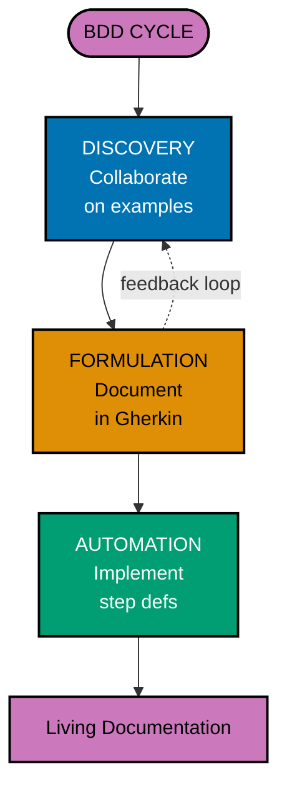
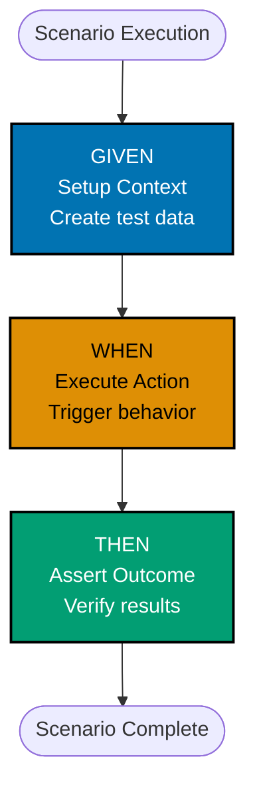
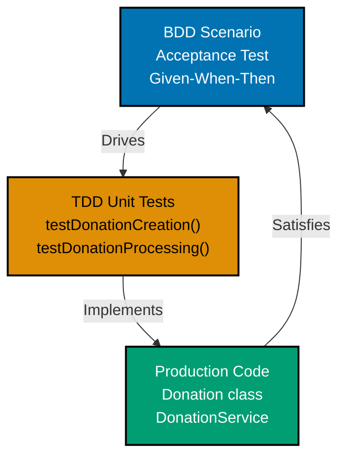

## Understanding BDD Philosophy

**Problem**: Traditional requirements are ambiguous. "The system shall calculate Zakat at 2.5%" leaves questions unanswered. What is zakatable wealth? What about nisab? What about the haul period?

**Solution**: BDD uses concrete examples in business-readable language.

```gherkin
Feature: Zakat Calculation

  Scenario: Zakat calculation for wealth above nisab after complete haul
    Given a Zakat account with balance "100,000 USD"
    And the nisab threshold is "5,000 USD"
    And the haul started on "2025-03-01"
    When I calculate Zakat on "2026-03-15"
    Then the Zakat amount should be "2,375.00 USD"
    And the calculation shows zakatable wealth of "95,000 USD"
```

**Value**: Business stakeholders validate scenarios. Developers automate them. Regulators audit them.

## BDD Principles Without Tools (Manual Approach)

BDD principles can be applied manually using standard testing frameworks before introducing collaboration tools like Cucumber.

### Given-When-Then in JUnit Tests

Structure tests using Given-When-Then pattern with clear sections and comments.

**Pattern**:

```java
import org.junit.jupiter.api.Test;
import static org.junit.jupiter.api.Assertions.*;

public class ZakatCalculatorBDDTest {

    @Test
    void shouldCalculateZakatForWealthAboveNisabAfterCompleteHaul() {
        // GIVEN: A Zakat account with balance above nisab after complete haul
        ZakatAccount account = new ZakatAccount("ACC-001");
        account.setBalance(Money.usd(100_000));
        account.setNisab(Money.usd(5_000));
        account.setHaulStartDate(LocalDate.of(2025, 3, 1));

        ZakatCalculator calculator = new ZakatCalculator();

        // WHEN: I calculate Zakat after one lunar year
        LocalDate calculationDate = LocalDate.of(2026, 3, 15);
        ZakatCalculation result = calculator.calculate(account, calculationDate);

        // THEN: Zakat should be 2.5% of zakatable wealth
        assertEquals(Money.usd(2_375), result.getZakatAmount());
        assertEquals(Money.usd(95_000), result.getZakatableWealth());
    }

    @Test
    void shouldNotCalculateZakatWhenBalanceBelowNisab() {
        // GIVEN: A Zakat account with balance below nisab
        ZakatAccount account = new ZakatAccount("ACC-002");
        account.setBalance(Money.usd(4_000));
        account.setNisab(Money.usd(5_000));
        account.setHaulStartDate(LocalDate.of(2025, 3, 1));

        ZakatCalculator calculator = new ZakatCalculator();

        // WHEN: I calculate Zakat
        LocalDate calculationDate = LocalDate.of(2026, 3, 15);
        ZakatCalculation result = calculator.calculate(account, calculationDate);

        // THEN: No Zakat should be due
        assertEquals(Money.usd(0), result.getZakatAmount());
        assertEquals("Balance below nisab", result.getReason());
    }
}
```

**Before**: Tests without clear structure, mixed setup and assertions
**After**: Clear Given-When-Then sections, business-readable test names

### Descriptive Test Method Names

Use descriptive method names that express business behavior, not technical implementation.

**Good naming patterns**:

```java
// Pattern: shouldDoSomethingWhenCondition
@Test
void shouldCalculateZakatWhenWealthAboveNisab() { }

@Test
void shouldRejectDonationWhenAmountIsNegative() { }

@Test
void shouldSendReceiptWhenDonationIsCompleted() { }

// Pattern: givenCondition_whenAction_thenOutcome
@Test
void givenBalanceAboveNisab_whenCalculatingZakat_thenReturnsTwoPointFivePercent() { }

@Test
void givenIncompleteHaul_whenCalculatingZakat_thenReturnsZero() { }
```

**Avoid technical names**:

```java
// BAD: Technical details, not business behavior
@Test
void testZakatCalculation() { }

@Test
void testCalculate_ReturnsCorrectValue() { }

@Test
void test1() { }
```

**Before**: Generic test names provide no context
**After**: Descriptive names document expected behavior

### Plain Text Scenarios as Comments

Document scenarios as structured comments before automation.

**Pattern**:

```java
public class DonationProcessingBDDTest {

    /*
     * Scenario: Donor makes a recurring donation
     *
     * Given a donor with ID "D-001"
     *   And the donor has a valid payment method
     * When the donor creates a recurring donation of "100 USD" monthly
     * Then the donation should be scheduled
     *   And the first payment should be processed immediately
     *   And the next payment should be scheduled for next month
     */
    @Test
    void shouldScheduleRecurringDonationAndProcessFirstPayment() {
        // GIVEN
        Donor donor = createDonor("D-001");
        donor.addPaymentMethod(createValidCreditCard());

        // WHEN
        RecurringDonation donation = donationService.createRecurring(
            donor.getId(),
            Money.usd(100),
            RecurrencePattern.MONTHLY
        );

        // THEN
        assertEquals(DonationStatus.SCHEDULED, donation.getStatus());
        assertNotNull(donation.getLastPaymentDate());
        assertEquals(
            LocalDate.now().plusMonths(1),
            donation.getNextPaymentDate()
        );
    }
}
```

**Before**: No specification before implementation
**After**: Scenario documented as comment, then automated as test

### Limitations of Manual BDD

Manual BDD with JUnit lacks collaboration features that make BDD valuable.

**Missing compared to Cucumber**:

- **Business-readable language**: Gherkin is readable by non-technical stakeholders
- **Living documentation**: Cucumber generates readable reports from scenarios
- **Shared understanding**: Business and development collaborate on scenario wording
- **Reusable steps**: Gherkin steps can be reused across scenarios
- **Examples tables**: Scenario Outline reduces duplication
- **Tags for organization**: Filter and organize scenarios by feature/priority
- **External specification**: Scenarios live in .feature files, separate from code

**When manual BDD is sufficient**:

- Technical teams only (no business stakeholder involvement)
- Simple domain logic (minimal scenarios)
- Learning BDD concepts before tooling

**Why Cucumber is the standard**:

- **Collaboration**: Business stakeholders can read and validate scenarios
- **Living documentation**: Always synchronized with code
- **Discovery**: Scenarios drive conversation and reveal gaps in understanding
- **Audit trail**: Scenarios document business rules for compliance/regulatory review

**Conclusion**: Manual BDD teaches Given-When-Then structure, but production BDD requires collaboration tools like Cucumber to deliver full value: shared understanding, living documentation, and stakeholder engagement.

## BDD Three-Phase Cycle (Cucumber & Gherkin)

**Problem**: How do we move from vague requirements to executable tests?

**Solution**: BDD uses three distinct phases.



**Discovery**: Business stakeholders, developers, and testers explore examples together. "What happens if donation amount is negative?" "What about zero?" "What about amounts over $10,000?" These questions become scenarios.

**Formulation**: Document examples as structured Gherkin scenarios using Given-When-Then format with concrete data.

**Automation**: Implement step definitions connecting Gherkin to Java code.

## Gherkin Given-When-Then Structure

**Problem**: How do we structure scenarios consistently?

**Solution**: Use Given-When-Then pattern for clear scenario steps.



**Given**: Establishes context (preconditions).

```gherkin
Given a Zakat account with balance "100,000 USD"
And the nisab is "5,000 USD"
And the haul started on "2025-03-01"
```

**When**: Describes the action (event).

```gherkin
When I calculate Zakat for the account on "2026-03-15"
```

**Then**: Asserts expected outcome (postconditions).

```gherkin
Then the Zakat amount should be "2,375.00 USD"
And the Zakat should be marked as "due"
And a Zakat notification should be sent to the donor
```

## Gherkin Background for Shared Context

**Problem**: Multiple scenarios need identical setup, creating duplication.

**Solution**: Use Background block for shared context.

```gherkin
Feature: Zakat Calculation

  Background:
    Given the nisab is "5,000 USD"
    And the haul period is 1 lunar year
    And today is "2026-03-15"

  Scenario: Calculate Zakat for wealth above nisab
    Given a Zakat account with balance "100,000 USD"
    And the haul started on "2025-03-01"
    When I calculate Zakat
    Then the Zakat should be "2,375 USD"

  Scenario: No Zakat when below nisab
    Given a Zakat account with balance "4,000 USD"
    And the haul started on "2025-03-01"
    When I calculate Zakat
    Then the Zakat should be "0 USD"
    And the reason should be "Balance below nisab"
```

**Background executes before each scenario**, providing common setup without duplication.

## Gherkin Scenario Outline for Data Variations

**Problem**: Testing multiple data variations creates repetitive scenarios.

**Solution**: Use Scenario Outline with Examples table.

```gherkin
Scenario Outline: Zakat calculation for different balances
  Given a Zakat account with balance "<balance>"
  And the nisab is "5,000 USD"
  And the haul is complete
  When I calculate Zakat
  Then the Zakat amount should be "<expected_zakat>"

  Examples:
    | balance       | expected_zakat |
    | 100,000 USD   | 2,375.00 USD   |
    | 50,000 USD    | 1,125.00 USD   |
    | 10,000 USD    | 125.00 USD     |
    | 5,000 USD     | 0.00 USD       |
    | 4,999 USD     | 0.00 USD       |
```

**Each row in Examples table generates a separate scenario execution** with placeholders replaced by table values.

## Gherkin Data Tables for Complex Data

**Problem**: Scenarios need to set up complex structured data.

**Solution**: Use data tables for multi-column data.

```gherkin
Scenario: Create donation with multiple allocations
  Given a donor with ID "D-001"
  When the donor creates a donation with the following allocations:
    | Fund ID | Amount     | Percentage |
    | F-001   | 600 USD    | 60%        |
    | F-002   | 400 USD    | 40%        |
  Then the total donation amount should be "1,000 USD"
  And the donation should have 2 allocations
```

**Data tables provide structured input** for step definitions to parse and use.

## Gherkin Doc Strings for Multi-Line Text

**Problem**: Scenarios need to verify multi-line text output like receipts or reports.

**Solution**: Use doc strings (triple quotes) for multi-line text.

```gherkin
Scenario: Generate Zakat receipt
  Given a Zakat payment of "2,375 USD" for account "ZA-001"
  When I generate the receipt
  Then the receipt should contain:
    """
    Zakat Receipt

    Account: ZA-001
    Payment Date: 2026-03-15
    Amount: $2,375.00 USD

    Calculation:
    - Balance: $100,000.00
    - Nisab: $5,000.00
    - Zakatable Wealth: $95,000.00
    - Zakat Rate: 2.5%
    - Zakat Due: $2,375.00

    May Allah accept your Zakat.
    """
```

**Doc strings preserve formatting and whitespace** for precise text verification.

## Gherkin Tags for Organization

**Problem**: Need to organize and filter scenarios for different test runs.

**Solution**: Use tags to categorize scenarios.

```gherkin
@zakat @calculation @critical
Scenario: Calculate Zakat for wealth above nisab
  # High-priority Zakat calculation test

@donation @allocation @smoke
Scenario: Allocate donation to emergency fund
  # Quick smoke test for donation allocation

@security @authentication
Scenario: Require authentication for large donations
  # Security-focused test
```

**Run specific tags**: `@smoke` for quick checks, `@critical` for essential features, `@security` for security tests.

## Cucumber JVM Setup

**Problem**: How do we set up Cucumber in Java projects?

**Solution**: Add Cucumber dependencies and create test runner.

**Maven Dependencies**:

```xml
<dependency>
    <groupId>io.cucumber</groupId>
    <artifactId>cucumber-java</artifactId>
    <version>7.21.0</version>
    <scope>test</scope>
</dependency>
<dependency>
    <groupId>io.cucumber</groupId>
    <artifactId>cucumber-junit-platform-engine</artifactId>
    <version>7.21.0</version>
    <scope>test</scope>
</dependency>
```

**Test Runner**:

```java
import org.junit.platform.suite.api.*;

@Suite
@IncludeEngines("cucumber")
@SelectClasspathResource("features")
@ConfigurationParameter(key = "cucumber.plugin", value = "pretty, html:target/cucumber-reports.html")
@ConfigurationParameter(key = "cucumber.glue", value = "com.example.finance.bdd.steps")
public class CucumberTestRunner {
}
```

**Project Structure**:

```
src/
├── main/java/
│   └── com/example/finance/
│       ├── domain/
│       ├── application/
│       └── infrastructure/
└── test/
    ├── java/
    │   └── com/example/finance/bdd/
    │       ├── CucumberTestRunner.java
    │       └── steps/
    │           ├── DonationSteps.java
    │           └── ZakatSteps.java
    └── resources/features/
        ├── donation/
        │   └── donation-processing.feature
        └── zakat/
            └── zakat-calculation.feature
```

## Basic Step Definitions

**Problem**: How do we connect Gherkin steps to Java code?

**Solution**: Create step definition methods with Cucumber annotations.

```java
import io.cucumber.java.en.*;
import static org.assertj.core.api.Assertions.*;

public class DonationSteps {
    private Donor donor;
    private Money donationAmount;
    private DonationResult result;

    @Given("a donor with ID {string}")
    public void aDonorWithId(String donorId) {
        this.donor = testDataBuilder.createDonor(donorId);
    }

    @When("the donor makes a donation of {string}")
    public void theDonorMakesADonation(String amountStr) {
        this.donationAmount = MoneyParser.parse(amountStr);
        this.result = donationService.createDonation(
            donor.getId(),
            donationAmount
        );
    }

    @Then("the donation should be processed successfully")
    public void theDonationShouldBeProcessedSuccessfully() {
        assertThat(result.isSuccess()).isTrue();
    }

    @Then("the donation amount should be recorded as {string} after {string} fee")
    public void theDonationAmountShouldBeRecorded(String netAmountStr, String feeStr) {
        Money expectedNet = MoneyParser.parse(netAmountStr);
        Money expectedFee = MoneyParser.parse(feeStr);

        assertThat(result.getDonation().getNetAmount()).isEqualTo(expectedNet);
        assertThat(result.getDonation().getFee()).isEqualTo(expectedFee);
    }
}
```

**Step definitions match Gherkin text** and extract parameters for use in Java code.

## Step Definitions with Data Tables

**Problem**: How do we handle data tables in step definitions?

**Solution**: Use DataTable parameter or custom types.

```java
@Given("the following donation funds exist:")
public void theFollowingDonationFundsExist(DataTable dataTable) {
    List<Map<String, String>> rows = dataTable.asMaps();

    for (Map<String, String> row : rows) {
        FundId fundId = FundId.of(row.get("Fund ID"));
        String fundName = row.get("Fund Name");
        String category = row.get("Category");

        fundRepository.save(new Fund(fundId, fundName, category));
    }
}

// Alternative: Custom type with automatic transformation
@Given("the following donation funds exist:")
public void theFollowingFundsExist(List<FundData> funds) {
    funds.forEach(fund -> fundRepository.save(
        new Fund(fund.id(), fund.name(), fund.category())
    ));
}

// Custom data type
public record FundData(
    @CucumberTableColumn("Fund ID") FundId id,
    @CucumberTableColumn("Fund Name") String name,
    @CucumberTableColumn("Category") String category
) {}
```

**DataTable provides flexible access** to table rows as maps or custom objects.

## Step Definitions with Doc Strings

**Problem**: How do we verify multi-line text in step definitions?

**Solution**: Use String parameter for doc strings.

```java
@Then("the receipt should contain:")
public void theReceiptShouldContain(String expectedReceipt) {
    String actualReceipt = receiptGenerator.generate(zakatPayment);

    // Normalize whitespace for comparison
    String normalizedExpected = expectedReceipt.trim().replaceAll("\\s+", " ");
    String normalizedActual = actualReceipt.trim().replaceAll("\\s+", " ");

    assertThat(normalizedActual).contains(normalizedExpected);
}
```

**Doc string content passes as method parameter** for verification against actual output.

## Custom Parameter Types

**Problem**: Repeatedly parsing domain objects from strings is verbose.

**Solution**: Define custom parameter types for automatic conversion.

```java
import io.cucumber.java.ParameterType;

public class ParameterTypes {
    @ParameterType("\\d+(?:,\\d{3})* [A-Z]{3}")
    public Money money(String moneyStr) {
        String[] parts = moneyStr.split(" ");
        String amountStr = parts[0].replace(",", "");
        String currencyCode = parts[1];

        return Money.of(new BigDecimal(amountStr), currencyCode);
    }

    @ParameterType("[A-Z]{2}-\\d+")
    public DonorId donorId(String id) {
        return DonorId.of(id);
    }

    @ParameterType("\\d{4}-\\d{2}-\\d{2}")
    public LocalDate date(String dateStr) {
        return LocalDate.parse(dateStr);
    }
}

// Usage in step definitions
@When("the donor makes a donation of {money}")
public void theDonorMakesADonation(Money amount) {
    this.result = donationService.createDonation(donor.getId(), amount);
}

@Given("a donor with ID {donorId}")
public void aDonorWithId(DonorId donorId) {
    this.donor = testDataBuilder.createDonor(donorId);
}
```

**Custom parameter types eliminate repetitive parsing** and improve step definition readability.

## Cucumber Hooks for Setup and Teardown

**Problem**: Scenarios need setup and cleanup logic.

**Solution**: Use @Before and @After hooks.

```java
import io.cucumber.java.*;

public class Hooks {
    private TestDataBuilder testDataBuilder;
    private DatabaseCleaner databaseCleaner;

    @Before
    public void setUp() {
        // Run before each scenario
        testDataBuilder.reset();
    }

    @After
    public void tearDown() {
        // Run after each scenario
        databaseCleaner.clean();
    }

    @Before("@database")
    public void setUpDatabase() {
        // Run only for scenarios tagged @database
        databaseCleaner.prepare();
    }

    @AfterStep
    public void takeScreenshot(Scenario scenario) {
        // Run after each step
        if (scenario.isFailed()) {
            // Take screenshot or log details
        }
    }
}
```

**Hooks provide lifecycle management** for test setup, cleanup, and debugging.

## Scenario Context for Shared State

**Problem**: Step definitions need to share state within a scenario.

**Solution**: Use ScenarioScoped context object.

```java
@ScenarioScoped
public class ScenarioContext {
    private final Map<String, Object> context = new HashMap<>();
    private Throwable lastException;

    public void set(String key, Object value) {
        context.put(key, value);
    }

    public <T> T get(String key, Class<T> type) {
        return type.cast(context.get(key));
    }

    public Optional<Throwable> getLastException() {
        return Optional.ofNullable(lastException);
    }

    public void setLastException(Throwable exception) {
        this.lastException = exception;
    }
}

// Usage in step definitions
public class LoanApplicationSteps {
    private final ScenarioContext context;
    private final LoanService loanService;

    @Given("an applicant with income {bigdecimal}")
    public void createApplicant(BigDecimal income) {
        Applicant applicant = new Applicant(income);
        context.set("applicant", applicant);
    }

    @When("the applicant requests a loan of {bigdecimal}")
    public void requestLoan(BigDecimal amount) {
        Applicant applicant = context.get("applicant", Applicant.class);
        LoanApplication application = loanService.apply(applicant, amount);
        context.set("application", application);
    }

    @Then("the application status should be {string}")
    public void verifyStatus(String expectedStatus) {
        LoanApplication application = context.get("application", LoanApplication.class);
        assertThat(application.getStatus().toString()).isEqualTo(expectedStatus);
    }
}
```

**ScenarioContext provides type-safe state sharing** between step definitions within a single scenario.

## Pattern: One Scenario, One Behavior

**Problem**: Scenarios testing multiple behaviors are hard to maintain and debug.

**Solution**: Each scenario should test exactly one behavior.

**Bad Practice** (multiple behaviors):

```gherkin
Scenario: Donation processing
  Given a donor "D-001"
  When the donor makes a donation of "1,000 USD"
  Then the donation is processed
  And an email is sent
  And the balance is updated
  And the receipt is generated
  And the donor status is updated
```

**Good Practice** (focused scenarios):

```gherkin
Scenario: Donation is processed successfully
  Given a donor "D-001"
  When the donor makes a donation of "1,000 USD"
  Then the donation should have status "PROCESSED"

Scenario: Receipt is generated after donation
  Given a processed donation "DON-001"
  When the receipt is generated
  Then the receipt should contain the donation amount

Scenario: Donor receives email confirmation
  Given a donor "D-001" with email "donor@example.com"
  When the donor makes a donation of "1,000 USD"
  Then a confirmation email should be sent to "donor@example.com"
```

**Each scenario has single responsibility**, making failures easier to diagnose.

## Pattern: Declarative over Imperative

**Problem**: Imperative scenarios couple to UI implementation details.

**Solution**: Write declarative scenarios focused on behavior, not UI steps.

**Bad Practice** (imperative, UI-focused):

```gherkin
Scenario: Make a donation
  Given I am on the homepage
  When I click the "Donate" button
  And I enter "1000" in the "Amount" field
  And I select "USD" from the "Currency" dropdown
  And I enter "D-001" in the "Donor ID" field
  And I click "Submit"
  Then I should see "Donation successful"
```

**Good Practice** (declarative, behavior-focused):

```gherkin
Scenario: Donor makes a donation
  Given a donor with ID "D-001"
  When the donor makes a donation of "1,000 USD"
  Then the donation should be processed successfully
  And the donor should receive a confirmation
```

**Declarative scenarios remain stable** when UI changes.

## Pattern: Avoid Coupling to Implementation

**Problem**: Scenarios coupled to database schema or API details break when implementation changes.

**Solution**: Write scenarios using domain language, not technical details.

**Bad Practice** (coupled to database):

```gherkin
Scenario: Save donation
  When I insert a row into the "donations" table with values:
    | id       | amount | donor_id | status  |
    | DON-001  | 1000   | D-001    | PENDING |
  Then the "donations" table should have 1 row
  And the "status" column should be "PENDING"
```

**Good Practice** (domain-focused):

```gherkin
Scenario: Create a pending donation
  Given a donor "D-001"
  When the donor creates a donation of "1,000 USD"
  Then the donation should be created with status "PENDING"
  And the donation should be retrievable by its ID
```

**Domain-focused scenarios survive refactoring** of technical implementation.

## Pattern: Avoid Incidental Details

**Problem**: Scenarios with irrelevant details are hard to read and maintain.

**Solution**: Include only details relevant to the behavior being tested.

**Bad Practice** (too many details):

```gherkin
Scenario: Process donation
  Given a donor with:
    | First Name  | John              |
    | Last Name   | Doe               |
    | Email       | john@example.com  |
    | Phone       | +1234567890       |
    | Address     | 123 Main St       |
    | City        | New York          |
    | State       | NY                |
    | Zip         | 10001             |
    | Country     | USA               |
  When the donor makes a donation of "1,000 USD"
  Then the donation is processed
```

**Good Practice** (only relevant details):

```gherkin
Scenario: Process donation
  Given a donor "D-001"
  When the donor makes a donation of "1,000 USD"
  Then the donation should be processed successfully
```

**Minimal scenarios reduce noise** and focus on essential behavior.

## Collaboration: Example Mapping Sessions

**Problem**: Teams struggle to discover concrete examples from abstract requirements.

**Solution**: Use Example Mapping workshops with structured format.

**Participants**:

- Product Owner (business expert)
- Developers (implementation)
- Testers (edge cases, examples)

**Structure**:

1. **User Story Card** (blue): What feature are we building?
2. **Rules** (yellow): Business rules for the feature
3. **Examples** (green): Concrete scenarios
4. **Questions** (red): Uncertainties to resolve

**Example Session**:

```
┌────────────────────────────────────────────┐
│  User Story (BLUE)                         │
│  As a donor, I want to make a donation     │
│  so that I can support charitable causes   │
└────────────────────────────────────────────┘

┌────────────────────────────────────────────┐
│  Rule (YELLOW)                             │
│  Donations must be positive amounts        │
└────────────────────────────────────────────┘
   │
   ├─> Example (GREEN): Donation of 1,000 USD is valid
   ├─> Example (GREEN): Donation of -100 USD is rejected
   └─> Example (GREEN): Donation of 0 USD is rejected

┌────────────────────────────────────────────┐
│  Rule (YELLOW)                             │
│  Donations over $10,000 need approval      │
└────────────────────────────────────────────┘
   │
   ├─> Example (GREEN): Donation of 5,000 USD is auto-approved
   ├─> Example (GREEN): Donation of 15,000 USD needs approval
   └─> Question (RED): What happens if approval is denied?
```

**Example Mapping produces actionable scenarios** and identifies gaps in requirements.

## Collaboration: Three Amigos Meetings

**Problem**: Requirements handoffs lose context and create misunderstandings.

**Solution**: Regular meetings between Product Owner, Developer, and Tester.

**Agenda**:

1. Review user story and understand feature need
2. Generate scenarios through conversation
3. Identify edge cases and unusual situations
4. Clarify technical questions
5. Write Gherkin scenarios together

**Example Conversation**:

```
PO: "We need to support Zakat calculation."

Dev: "What's the formula?"

PO: "2.5% of wealth above the nisab, after one lunar year."

Tester: "What if the lunar year isn't complete?"

PO: "No Zakat is due until the full year passes."

Dev: "What if balance falls below nisab during the year?"

PO: "The haul resets, and they must wait another full year."

Tester: "What about partial years? 11 months?"

PO: "No Zakat. Must be full lunar year."
```

**This conversation becomes**:

```gherkin
Scenario: No Zakat due when haul is incomplete
  Given a Zakat account with balance "100,000 USD"
  And the nisab is "5,000 USD"
  And the haul started "11 months ago"
  When I calculate Zakat
  Then the Zakat amount should be "0 USD"
  And the reason should be "Haul incomplete"
```

**Three Amigos meetings build shared understanding** before implementation.

## BDD vs TDD: Complementary Practices

**Problem**: Confusion about when to use BDD vs TDD.

**Solution**: Use both practices at different levels.



**Typical Workflow**:

1. **BDD**: Write Gherkin scenario (RED - fails, no implementation)
2. **TDD**: Write unit test for first component (RED)
3. **TDD**: Implement component (GREEN)
4. **TDD**: Refactor component
5. **TDD**: Repeat for all components
6. **BDD**: Implement step definitions
7. **BDD**: Run scenario (GREEN if TDD was thorough)

| Aspect          | TDD                           | BDD                          |
| --------------- | ----------------------------- | ---------------------------- |
| **Focus**       | Technical correctness         | Business behavior            |
| **Language**    | Code (JUnit tests)            | Gherkin (business-readable)  |
| **Audience**    | Developers                    | Business + Developers        |
| **Granularity** | Unit level (classes, methods) | Feature level (user stories) |
| **Feedback**    | Red-Green-Refactor            | Discovery-Formulation-Auto   |
| **When**        | Before writing code           | Before writing user stories  |

**BDD drives feature design, TDD drives implementation quality.**

## BDD Checklist

### Discovery Phase

- Involve business stakeholders in example exploration
- Identify concrete examples for each business rule
- Explore edge cases and exceptions
- Clarify ambiguous requirements
- Document questions needing answers

### Formulation Phase

- Write scenarios in Given-When-Then format
- Use ubiquitous language (domain terms)
- Each scenario tests one behavior
- Make scenarios declarative (WHAT not HOW)
- Remove incidental details
- Use Background for shared context
- Use Scenario Outline for data variations

### Automation Phase

- Keep step definitions simple and focused
- Define parameter types for domain objects
- Reuse step definitions across scenarios
- Avoid coupling to implementation details
- Use hooks for clean setup/teardown
- Ensure scenarios run reliably and independently

### Maintenance Phase

- Keep scenarios synchronized with code
- Fix failed scenarios immediately
- Remove obsolete scenarios
- Maintain living documentation accessibility

## Related Documentation

**Core Java Documentation**:

- [Test-Driven Development](/en/learn/software-engineering/programming-languages/java/in-the-field/test-driven-development) - TDD complements BDD
- [Best Practices](/en/learn/software-engineering/programming-languages/java/in-the-field/best-practices) - Java development standards

**External Resources**:

- Cucumber Documentation - Official Cucumber guides and reference
- Gherkin Language Reference - Syntax and best practices
