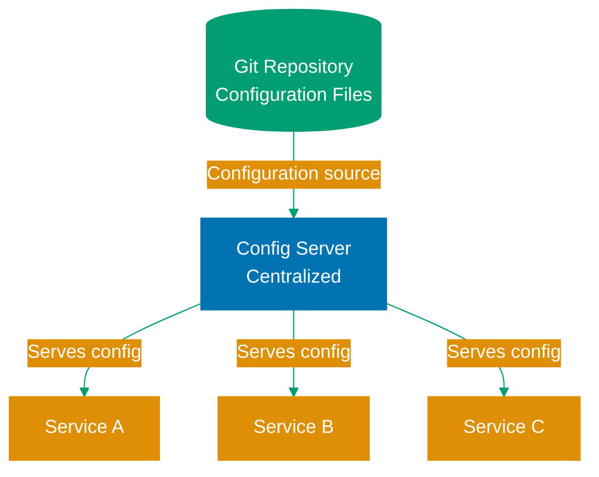

## What is Configuration Management?

**Configuration management** is the practice of separating application settings from code, enabling the same application binary to run in different environments (development, staging, production) with different configurations.

**Why configuration management matters:**

- **Environment-specific settings**: Database URLs, API keys, feature flags differ per environment
- **No recompilation**: Change settings without rebuilding application
- **Security**: Keep secrets out of source code
- **Flexibility**: Adapt application behavior without code changes

**Common configuration concerns:**

- Database connection strings
- External API endpoints and credentials
- Feature flags and toggles
- Logging levels and output formats
- Thread pool sizes and timeouts
- Caching parameters

## Pedagogical Approach: Standard Library First

This content follows the **progression from fundamentals to production frameworks**:

1. **Properties and ResourceBundle** - Java standard library configuration
2. **System Properties and Environment Variables** - OS-level configuration
3. **Spring Boot Configuration** - Convention-based configuration with profiles
4. **Spring Cloud Config** - Centralized configuration server for distributed systems
5. **Secrets Management** - Vault, encrypted properties, and security best practices

**Why this approach?**

- Understanding Properties files reveals configuration fundamentals
- System properties and environment variables are universal across frameworks
- Spring Boot builds on these foundations with powerful conventions
- Cloud Config solves distributed system challenges
- Secrets management addresses security requirements

## Foundation: Properties Files

Java's standard library provides **Properties** class for key-value configuration.

### Basic Properties File

**config.properties:**

```properties
# Database configuration
database.url=jdbc:postgresql://localhost:5432/mydb
database.username=admin
database.password=secret123
database.pool.size=10

# Application settings
app.name=MyApplication
app.version=1.0.0
app.feature.newUi=true
```

**Loading properties:**

```java
import java.io.IOException;         // => Checked exception for I/O operations
import java.io.InputStream;         // => Stream for reading configuration file
import java.util.Properties;        // => Key-value configuration storage

public class ConfigLoader {
    public static Properties loadConfig() throws IOException {
        // => Throws IOException if file not found or cannot be read
        Properties props = new Properties();
        // => Properties object stores configuration as String key-value pairs
        // => Internally uses Hashtable (thread-safe but synchronized overhead)

        // Load from classpath
        try (InputStream input = ConfigLoader.class
                .getClassLoader()
                // => getClassLoader() retrieves ClassLoader for ConfigLoader class
                // => ClassLoader responsible for loading classes and resources
                .getResourceAsStream("config.properties")) {
                // => getResourceAsStream() loads from src/main/resources/ or classpath root
                // => Returns null if file not found (not exception)
                // => try-with-resources ensures InputStream.close() called automatically

            if (input == null) {
                // => Explicit null check required (getResourceAsStream returns null)
                throw new IOException("Unable to find config.properties");
                // => Convert null to exception for caller handling
            }

            props.load(input);
            // => Parses properties file format (key=value lines)
            // => Populates props Map with parsed key-value pairs
            // => Throws IOException if file malformed or read fails
        }

        return props;
        // => Returns populated Properties object
    }

    public static void main(String[] args) throws IOException {
        Properties config = loadConfig();
        // => config contains all key-value pairs from config.properties

        String dbUrl = config.getProperty("database.url");
        // => Retrieves value for "database.url" key (returns String or null)
        String appName = config.getProperty("app.name");
        // => Retrieves value for "app.name" key
        int poolSize = Integer.parseInt(config.getProperty("database.pool.size"));
        // => Manual parsing from String to int required
        // => parseInt() throws NumberFormatException if value not numeric
        // => No type safety: error discovered at runtime, not compile time
        boolean newUi = Boolean.parseBoolean(config.getProperty("app.feature.newUi"));
        // => Manual parsing from String to boolean
        // => parseBoolean() returns false for any value except "true" (case-insensitive)
        // => No validation: invalid values silently become false

        System.out.println("Database URL: " + dbUrl);
        System.out.println("Pool size: " + poolSize);
        // => Output configuration values for verification
    }
}
```

**Problems with basic Properties:**

- ❌ No type safety (everything is String)
- ❌ Manual parsing required (parseInt, parseBoolean)
- ❌ No environment-specific overrides
- ❌ Secrets stored in plain text
- ❌ No validation or required field checking

**Solution:** Use ResourceBundle for internationalization or migrate to Spring Boot for production applications.

### ResourceBundle for Localized Configuration

**ResourceBundle** extends Properties for locale-specific configuration (i18n/l10n).

**messages.properties (default):**

```properties
greeting=Hello
farewell=Goodbye
```

**messages_id.properties (Indonesian):**

```properties
greeting=Halo
farewell=Selamat tinggal
```

**Usage:**

```java
import java.util.Locale;           // => Locale represents language/country/variant
import java.util.ResourceBundle;   // => ResourceBundle manages localized resources

public class I18nConfig {
    public static void main(String[] args) {
        // Default locale
        ResourceBundle bundle = ResourceBundle.getBundle("messages");
        // => getBundle("messages") looks for messages.properties
        // => Checks JVM default locale first (e.g., Locale.US)
        // => Falls back to messages.properties if no locale match
        // => Loads from classpath (src/main/resources/)
        System.out.println(bundle.getString("greeting")); // Hello
        // => getString("greeting") retrieves value for "greeting" key
        // => Returns "Hello" from messages.properties (default)

        // Indonesian locale
        ResourceBundle bundleId = ResourceBundle.getBundle("messages",
            new Locale("id", "ID"));
        // => new Locale("id", "ID"): Indonesian language, Indonesia country
        // => getBundle() looks for messages_id_ID.properties first
        // => Falls back to messages_id.properties if country-specific not found
        // => Falls back to messages.properties if language-specific not found
        System.out.println(bundleId.getString("greeting")); // Halo
        // => getString("greeting") retrieves from messages_id.properties
        // => Returns "Halo" (Indonesian translation)
    }
}
```

**Use case:** Internationalized applications needing locale-specific messages. For general configuration, use environment variables or Spring Boot.

## System Properties and Environment Variables

**System properties** and **environment variables** provide OS-level configuration, accessible across all frameworks.

### System Properties

Set via command line with `-D` flag:

```bash
java -Dapp.environment=production \
     -Ddatabase.url=jdbc:postgresql://prod-db:5432/app \
     -jar myapp.jar
```

**Reading system properties:**

```java
public class SystemPropsConfig {
    public static void main(String[] args) {
        String environment = System.getProperty("app.environment", "development");
        // => getProperty("app.environment", "development"): retrieves system property
        // => First parameter: property key to look up
        // => Second parameter: default value if property not set
        // => Returns "development" if -Dapp.environment not provided on command line
        String dbUrl = System.getProperty("database.url");
        // => getProperty("database.url"): no default value
        // => Returns null if property not set (no -Ddatabase.url flag)
        // => Use with caution: null values require null-checking

        System.out.println("Environment: " + environment);
        System.out.println("Database: " + dbUrl);
        // => Output current configuration for verification

        // All system properties
        System.getProperties().forEach((key, value) -> {
            // => System.getProperties() returns Properties object (extends Hashtable)
            // => Contains ALL system properties (JVM, OS, user-defined)
            // => Includes: java.version, os.name, user.home, custom properties
            // => forEach() iterates over all key-value pairs
            System.out.println(key + " = " + value);
            // => Prints all properties for debugging/inspection
            // => Useful for discovering available properties
        });
    }
}
```

**Setting programmatically:**

```java
// Set before application starts
System.setProperty("app.environment", "test");
// => setProperty(key, value): programmatically sets system property
// => Modifies global JVM system properties (visible to all threads)
// => Must be called BEFORE properties are read by application
// => Common use: test setup, dynamic configuration
// => Persists for lifetime of JVM process
```

### Environment Variables

Set via shell or container orchestration:

```bash
export DATABASE_URL=jdbc:postgresql://prod-db:5432/app
export DATABASE_PASSWORD=secret123
export APP_ENVIRONMENT=production

java -jar myapp.jar
```

**Reading environment variables:**

```java
public class EnvVarConfig {
    public static void main(String[] args) {
        String dbUrl = System.getenv("DATABASE_URL");
        // => getenv("DATABASE_URL"): retrieves OS environment variable
        // => Returns String value or null if variable not set
        // => Environment variables set in shell or container (e.g., Docker, Kubernetes)
        // => Naming convention: UPPERCASE_WITH_UNDERSCORES
        String dbPassword = System.getenv("DATABASE_PASSWORD");
        // => Retrieves password from environment
        // => SECURITY: Never hardcode passwords in code
        // => Environment variables visible in process list (ps aux shows them)
        String environment = System.getenv().getOrDefault("APP_ENVIRONMENT", "development");
        // => getenv() returns Map<String,String> of all environment variables
        // => getOrDefault(): provides fallback if variable not set
        // => Returns "development" if APP_ENVIRONMENT not defined in shell

        System.out.println("Environment: " + environment);
        System.out.println("Database: " + dbUrl);
        // => Output configuration for verification
        // => SECURITY WARNING: Don't log passwords!

        // All environment variables
        System.getenv().forEach((key, value) -> {
            // => Iterates over ALL environment variables
            // => Includes PATH, HOME, USER, and custom variables
            // => Useful for debugging what's available
            System.out.println(key + " = " + value);
            // => Prints all env vars
            // => WARNING: May expose sensitive values (passwords, tokens)
        });
    }
}
```

**System Properties vs Environment Variables:**

| Feature        | System Properties                   | Environment Variables              |
| -------------- | ----------------------------------- | ---------------------------------- |
| **Scope**      | JVM-specific                        | OS-wide                            |
| **Set method** | `-D` flag or `System.setProperty()` | Shell or container                 |
| **Naming**     | `app.name` (dot notation)           | `APP_NAME` (uppercase, underscore) |
| **Security**   | Visible in JVM tools                | Visible in process list            |
| **Use case**   | JVM tuning, app config              | Container/cloud deployment         |

**Best practice:** Use environment variables for **secrets** and **environment-specific settings** (12-factor app principle). Use system properties for **JVM tuning** and **debugging flags**.

## Spring Boot Configuration

**Spring Boot** provides powerful configuration management with conventions, profiles, and type-safe binding.

### application.properties

**src/main/resources/application.properties:**

```properties
# Server configuration
server.port=8080
server.shutdown=graceful

# Database configuration
spring.datasource.url=jdbc:postgresql://localhost:5432/mydb
spring.datasource.username=admin
spring.datasource.password=secret123
spring.datasource.hikari.maximum-pool-size=10

# Logging
logging.level.root=INFO
logging.level.com.example=DEBUG

# Custom application properties
app.name=MyApplication
app.feature.new-ui=true
app.max-upload-size=10MB
```

**Property sources hierarchy (highest priority first):**

1. Command-line arguments (`--server.port=9090`)
2. System properties (`-Dserver.port=9090`)
3. Environment variables (`SERVER_PORT=9090`)
4. Profile-specific properties (`application-prod.properties`)
5. Default properties (`application.properties`)

### YAML Configuration

Spring Boot also supports **YAML** format (more readable for nested properties):

**src/main/resources/application.yml:**

```yaml
server:
  port: 8080
  shutdown: graceful

spring:
  datasource:
    url: jdbc:postgresql://localhost:5432/mydb
    username: admin
    password: secret123
    hikari:
      maximum-pool-size: 10

logging:
  level:
    root: INFO
    com.example: DEBUG

app:
  name: MyApplication
  feature:
    new-ui: true
  max-upload-size: 10MB
```

**Properties vs YAML:**

- **Properties**: Simpler, universally supported, better for simple configs
- **YAML**: More readable for nested structures, supports lists/arrays

### Accessing Configuration with @Value

```java
import org.springframework.beans.factory.annotation.Value;  // => Spring property injection
import org.springframework.stereotype.Component;            // => Mark class as Spring bean

@Component  // => Register as Spring bean for dependency injection
// => Spring automatically creates instance at startup
public class AppConfig {
    @Value("${app.name}")  // => Inject value from application.properties
    // => ${...} resolves property from property sources
    // => app.name key looked up in application.properties/yml
    // => Injection happens during bean creation
    // => Runtime error if property not found (no default)
    private String appName;

    @Value("${app.feature.new-ui}")  // => Inject boolean value
    // => String "true" automatically converted to boolean
    // => Type conversion handled by Spring
    // => Accepts: true, false (case-insensitive)
    private boolean newUiEnabled;

    @Value("${app.max-upload-size}")  // => Inject string value
    // => No type conversion (stays as String)
    // => Application must parse "10MB" format manually
    private String maxUploadSize;

    @Value("${app.admin-email:admin@example.com}") // Default value
    // => Colon syntax provides default value
    // => "admin@example.com" used if property not found
    // => Prevents runtime error for missing property
    // => Useful for optional configuration
    private String adminEmail;

    public void printConfig() {
        System.out.println("App name: " + appName);
        System.out.println("New UI: " + newUiEnabled);
        System.out.println("Max upload: " + maxUploadSize);
        System.out.println("Admin email: " + adminEmail);
        // => Display injected values for verification
    }
}
```

**Problems with @Value:**

- ❌ No type safety (errors at runtime)
- ❌ No validation
- ❌ Scattered across codebase
- ❌ Hard to test

**Solution:** Use `@ConfigurationProperties` for type-safe configuration.

### Type-Safe Configuration with @ConfigurationProperties

```java
import org.springframework.boot.context.properties.ConfigurationProperties;
// => ConfigurationProperties enables type-safe property binding
// => Binds external configuration to Java objects
// => Automatically converts properties to target types
import org.springframework.stereotype.Component;
// => Component marks class as Spring bean for auto-detection
import org.springframework.validation.annotation.Validated;
// => Validated triggers JSR-303 validation at startup
// => Throws exception if validation fails (fail-fast)
import javax.validation.constraints.*;
// => JSR-303 validation annotations (@NotBlank, @Email, @Pattern, etc.)

@Component
// => Registers AppProperties as Spring bean
// => Spring creates single instance at startup (singleton scope)
@ConfigurationProperties(prefix = "app")
// => Binds properties with "app.*" prefix from application.properties/yml
// => Maps app.name → name field, app.feature.new-ui → feature.newUi
// => Uses JavaBean conventions: setters for property binding
@Validated
// => Validates all fields with constraint annotations at startup
// => Application fails to start if validation errors found
// => Provides immediate feedback for misconfigurations
public class AppProperties {
    @NotBlank
    // => Validates field is not null, empty string, or whitespace
    // => Throws ConstraintViolationException if app.name missing or blank
    private String name;

    private Feature feature = new Feature();
    // => Nested configuration object for app.feature.* properties
    // => Initialized with default instance (prevents NullPointerException)

    @NotBlank
    // => Validates maxUploadSize is not blank
    @Pattern(regexp = "\\d+MB")
    // => Validates format matches pattern: digits followed by "MB"
    // => Accepts: "10MB", "100MB", rejects: "10", "10GB", "MB10"
    // => Regular expression: \d+ (one or more digits), MB (literal)
    private String maxUploadSize;

    @Email
    // => Validates email format (basic RFC 5322 compliance)
    // => Accepts: user@example.com, rejects: invalid-email
    // => Default value provided to make field optional
    private String adminEmail = "admin@example.com";
    // => Default value used if app.admin-email not in properties

    // Getters and setters
    public String getName() { return name; }
    // => Getter required by Spring for property access
    public void setName(String name) { this.name = name; }
    // => Setter called by Spring during property binding
    // => Spring converts property value to String (no conversion needed)

    public Feature getFeature() { return feature; }
    public void setFeature(Feature feature) { this.feature = feature; }
    // => Setter called for nested object binding (app.feature.*)

    public String getMaxUploadSize() { return maxUploadSize; }
    public void setMaxUploadSize(String maxUploadSize) {
        this.maxUploadSize = maxUploadSize;
        // => Spring calls this during binding
        // => Validation happens AFTER setter completes
    }

    public String getAdminEmail() { return adminEmail; }
    public void setAdminEmail(String adminEmail) {
        this.adminEmail = adminEmail;
        // => Overrides default value if property exists
    }

    public static class Feature {
        // => Static nested class for app.feature.* properties
        // => Can be reused/accessed independently of parent
        private boolean newUi;

        public boolean isNewUi() { return newUi; }
        // => Boolean getter convention: isXxx() instead of getXxx()
        // => Spring looks for isNewUi() when reading property
        public void setNewUi(boolean newUi) { this.newUi = newUi; }
        // => Spring converts "true"/"false" strings to boolean
        // => Accepts: true, false, TRUE, FALSE (case-insensitive)
        // => Invalid values cause binding failure
    }
}
```

**Usage:**

```java
@Service
// => Service marks class as Spring business logic component
// => Auto-detected by component scanning
// => Registered as singleton bean
public class AppService {
    private final AppProperties appProperties;
    // => Final field ensures immutability after construction
    // => Prevents accidental reassignment
    // => Configuration injected once at bean creation

    public AppService(AppProperties appProperties) {
        // => Constructor injection (recommended over field injection)
        // => Spring automatically injects AppProperties bean
        // => Constructor called once during application startup
        // => Enables easy testing (can pass mock AppProperties)
        this.appProperties = appProperties;
        // => Store reference to injected configuration
    }

    public void doSomething() {
        if (appProperties.getFeature().isNewUi()) {
            // => Check feature flag from configuration
            // => Access nested property: app.feature.new-ui
            // => Type-safe: compiler knows isNewUi() returns boolean
            // New UI logic
        }

        System.out.println("App: " + appProperties.getName());
        // => Access type-safe configuration value
        // => No string parsing, no type casting required
        // => Null-safe: validation ensures name exists
    }
}
```

**Benefits:**

- ✅ Type-safe (compile-time errors)
- ✅ Validation with JSR-303 annotations
- ✅ Centralized configuration class
- ✅ IDE autocomplete support
- ✅ Easy to test (just instantiate and set values)

### Configuration Profiles

**Profiles** enable environment-specific configuration.

**application-dev.properties:**

```properties
spring.datasource.url=jdbc:postgresql://localhost:5432/mydb_dev
logging.level.root=DEBUG
```

**application-prod.properties:**

```properties
spring.datasource.url=jdbc:postgresql://prod-db:5432/mydb_prod
logging.level.root=WARN
```

**Activating profiles:**

```bash
# Via environment variable
export SPRING_PROFILES_ACTIVE=prod
java -jar myapp.jar

# Via command line
java -jar myapp.jar --spring.profiles.active=prod

# Via system property
java -Dspring.profiles.active=prod -jar myapp.jar
```

**Profile-specific beans:**

```java
@Configuration
// => Configuration marks class as source of bean definitions
// => Methods annotated with @Bean create Spring-managed objects
@Profile("dev")
// => Profile("dev") activates this configuration ONLY when "dev" profile active
// => Activated via: --spring.profiles.active=dev
// => Beans in this class created only in development environment
public class DevConfig {
    @Bean
    // => Bean creates Spring-managed DataSource instance
    // => Method name becomes bean name (default)
    // => Spring calls this method once at startup
    public DataSource dataSource() {
        // H2 in-memory database for development
        // => H2: lightweight database, runs in JVM memory
        // => No external database server required
        // => Data lost when application stops (ephemeral)
        // => Perfect for local development and testing
        return new EmbeddedDatabaseBuilder()
            // => Builder pattern for configuring embedded database
            .setType(EmbeddedDatabaseType.H2)
            // => Specifies H2 database engine
            // => Other options: HSQL, Derby
            .build();
            // => Creates and starts database
            // => Returns DataSource configured for H2
    }
}

@Configuration
@Profile("prod")
// => Profile("prod") activates ONLY in production
// => Mutually exclusive with DevConfig (different profiles)
public class ProdConfig {
    @Bean
    public DataSource dataSource() {
        // Production PostgreSQL with connection pooling
        // => HikariCP: high-performance JDBC connection pool
        // => Manages connection lifecycle, prevents connection leaks
        // => Reuses connections across requests (performance)
        HikariConfig config = new HikariConfig();
        // => Configuration object for Hikari connection pool
        config.setJdbcUrl(System.getenv("DATABASE_URL"));
        // => Read database URL from environment variable
        // => Example: jdbc:postgresql://prod-db.example.com:5432/mydb
        // => Environment variable set by deployment platform (Kubernetes, Docker)
        config.setUsername(System.getenv("DATABASE_USERNAME"));
        // => Database authentication username from env var
        // => Keeps credentials out of code
        config.setPassword(System.getenv("DATABASE_PASSWORD"));
        // => Database password from env var
        // => SECURITY: Never hardcode passwords
        // => Environment variables managed by secrets system
        return new HikariDataSource(config);
        // => Create connection pool with configuration
        // => Pool initialized: opens initial connections to database
        // => Ready to serve requests
    }
}
```

**Multiple active profiles:**

```bash
# Activate multiple profiles (comma-separated)
java -jar myapp.jar --spring.profiles.active=prod,metrics,tracing
```

## Spring Cloud Config

**Spring Cloud Config** provides **centralized configuration** for distributed systems (microservices).

**Architecture:**



### Config Server Setup

**Dependencies:**

```xml
<dependency>
    <groupId>org.springframework.cloud</groupId>
    <artifactId>spring-cloud-config-server</artifactId>
</dependency>
```

**Application class:**

```java
import org.springframework.boot.SpringApplication;
// => SpringApplication bootstraps Spring Boot application
// => Provides main entry point for application startup
import org.springframework.boot.autoconfigure.SpringBootApplication;
// => SpringBootApplication combines @Configuration, @EnableAutoConfiguration, @ComponentScan
// => Enables Spring Boot auto-configuration and component scanning
import org.springframework.cloud.config.server.EnableConfigServer;
// => EnableConfigServer activates Spring Cloud Config Server functionality
// => Exposes REST endpoints for configuration retrieval

@SpringBootApplication
// => Marks this as Spring Boot application main class
// => Auto-configures Spring context based on classpath dependencies
// => Scans package and subpackages for Spring components
@EnableConfigServer
// => Activates Config Server capabilities
// => Enables HTTP endpoints: /{application}/{profile}/{label}
// => Example: GET http://localhost:8888/user-service/prod/main
// => Fetches configuration from Git repository
public class ConfigServerApplication {
    public static void main(String[] args) {
        // => Standard Java application entry point
        SpringApplication.run(ConfigServerApplication.class, args);
        // => run() bootstraps entire Spring application context
        // => Starts embedded Tomcat server (default port 8080)
        // => Connects to configured Git repository
        // => Makes configuration available via REST API
        // => Blocks until application shutdown
    }
}
```

**application.yml:**

```yaml
server:
  port: 8888
  # => Config Server listens on port 8888 (convention)
  # => Clients connect to http://localhost:8888 for configuration
  # => Can be overridden via environment variable: SERVER_PORT=9000

spring:
  cloud:
    config:
      # => Spring Cloud Config configuration section
      server:
        # => Server-side configuration (Git backend settings)
        git:
          # => Git backend stores configuration files
          # => Alternative backends: Vault, JDBC, SVN
          uri: https://github.com/myorg/config-repo
          # => Git repository URL containing configuration files
          # => Supports: HTTPS, SSH, local file system (file://)
          # => Example SSH: git@github.com:myorg/config-repo.git
          # => Server clones this repository at startup
          default-label: main
          # => Git branch/tag to read from (default branch)
          # => Can be overridden per request: /{app}/{profile}/{label}
          # => Example: main, develop, v1.0.0
          search-paths: "{application}"
          # => Directory pattern within repository
          # => {application} placeholder replaced with application name
          # => user-service looks in config-repo/user-service/
          # => Supports wildcards: "config/{application}", "*/config"
```

### Configuration Repository Structure

**Git repository (config-repo):**

```
config-repo/
├── application.yml              # Common config for all services
├── user-service.yml            # user-service specific
├── user-service-dev.yml        # user-service dev profile
├── user-service-prod.yml       # user-service prod profile
├── order-service.yml
└── order-service-prod.yml
```

**application.yml (shared):**

```yaml
logging:
  level:
    root: INFO

management:
  endpoints:
    web:
      exposure:
        include: health,info,metrics
```

**user-service-prod.yml:**

```yaml
spring:
  datasource:
    url: jdbc:postgresql://prod-db:5432/users
    username: ${DB_USERNAME}
    password: ${DB_PASSWORD}

logging:
  level:
    com.example.userservice: WARN
```

### Config Client Setup

**Dependencies:**

```xml
<dependency>
    <groupId>org.springframework.cloud</groupId>
    <artifactId>spring-cloud-starter-config</artifactId>
</dependency>
```

**bootstrap.yml (loaded before application.yml):**

```yaml
# => bootstrap.yml loaded BEFORE application.yml
# => Used for Config Server connection settings
# => Must be available at application startup
spring:
  application:
    name: user-service
    # => Application name used to fetch configuration
    # => Config Server looks for: user-service.yml, user-service-{profile}.yml
    # => Must match configuration file names in Git repository
  cloud:
    config:
      # => Config Client settings (how to connect to Config Server)
      uri: http://localhost:8888
      # => Config Server URL
      # => Client sends GET request to fetch configuration
      # => Can use multiple URIs for HA: uri: http://server1:8888,http://server2:8888
      # => Override via env var: SPRING_CLOUD_CONFIG_URI
      fail-fast: true
      # => fail-fast=true: application startup fails if Config Server unreachable
      # => fail-fast=false: uses local configuration as fallback
      # => Recommended true for production (detect misconfigurations early)
  profiles:
    active: prod
    # => Active profile determines which configuration files loaded
    # => Fetches: application.yml, user-service.yml, user-service-prod.yml
    # => Later files override earlier ones (precedence)
    # => Override via: SPRING_PROFILES_ACTIVE=staging
```

**Why Config Server?**

- ✅ Centralized configuration (one place to update settings)
- ✅ Version control (Git history for configuration changes)
- ✅ Dynamic refresh (change config without restarting services)
- ✅ Environment separation (dev/staging/prod in separate files)
- ✅ Encryption support (encrypt sensitive values)

**When NOT to use Config Server:**

- ❌ Single application (overkill, use Spring Boot profiles)
- ❌ Small team (<5 services) - complexity may not justify benefits
- ❌ Secrets management (use Vault instead for credentials)

## Secrets Management

**Never store secrets in code or plain-text configuration files.**

### Problem: Secrets in Plain Text

```properties
# ❌ WRONG - Never commit this!
database.password=SuperSecret123
api.key=sk_live_abc123xyz789
jwt.secret=my-secret-key-for-tokens
```

**Why this is dangerous:**

- ❌ Exposed in version control history (even if deleted later)
- ❌ Visible to all developers with repository access
- ❌ Accidentally committed and pushed to public repositories
- ❌ Hard to rotate (requires code changes)

### Solution 1: Environment Variables

Store secrets in environment variables, never in code:

**application.properties:**

```properties
# Reference environment variables
database.password=${DATABASE_PASSWORD}
api.key=${API_KEY}
jwt.secret=${JWT_SECRET}
```

**Setting in production:**

```bash
# Kubernetes Secret
apiVersion: v1
kind: Secret
metadata:
  name: app-secrets
type: Opaque
data:
  DATABASE_PASSWORD: U3VwZXJTZWNyZXQxMjM=  # base64 encoded
  API_KEY: c2tfbGl2ZV9hYmMxMjN4eXo3ODk=
  JWT_SECRET: bXktc2VjcmV0LWtleS1mb3ItdG9rZW5z
```

```yaml
# Pod specification
env:
  - name: DATABASE_PASSWORD
    valueFrom:
      secretKeyRef:
        name: app-secrets
        key: DATABASE_PASSWORD
```

**Benefits:**

- ✅ Secrets not in code
- ✅ Different per environment
- ✅ Managed by ops/platform team

**Limitations:**

- ❌ Still visible in process list
- ❌ No audit trail for access
- ❌ No automatic rotation

### Solution 2: HashiCorp Vault

**Vault** is a secrets management tool with encryption, access control, and audit logging.

**Dependencies:**

```xml
<dependency>
    <groupId>org.springframework.cloud</groupId>
    <artifactId>spring-cloud-starter-vault-config</artifactId>
</dependency>
```

**bootstrap.yml:**

```yaml
spring:
  cloud:
    vault:
      # => Vault integration configuration
      # => Fetches secrets from HashiCorp Vault at startup
      uri: https://vault.example.com:8200
      # => Vault server endpoint
      # => Default port: 8200
      # => HTTPS required for production (TLS encryption)
      # => HTTP only for local development
      authentication: TOKEN
      # => Authentication method: TOKEN
      # => Other methods: AppRole, AWS IAM, Kubernetes, TLS certificates
      # => TOKEN simplest but requires secure token distribution
      token: ${VAULT_TOKEN}
      # => Vault access token from environment variable
      # => SECURITY: Never hardcode token in configuration
      # => Token has permissions to read secrets from specific paths
      # => Typically injected by container orchestrator (Kubernetes)
      kv:
        # => Key-Value secrets engine configuration
        # => Vault stores secrets in KV backend
        enabled: true
        # => Enable KV secrets engine integration
        backend: secret
        # => KV backend mount point in Vault
        # => Full path: secret/user-service/
        # => Can be customized per environment
        application-name: user-service
        # => Application-specific path segment
        # => Spring fetches from: secret/user-service
        # => Supports profiles: secret/user-service/prod
```

**Vault storage:**

```bash
# Store secrets in Vault
# => CLI command to write secrets to Vault
vault kv put secret/user-service \
  # => kv put: writes to Key-Value secrets engine
  # => secret/user-service: full path in Vault
  # => secret = backend mount point, user-service = application name
  database.password=SuperSecret123 \
  # => Key-value pair: database.password as key
  # => Value encrypted at rest by Vault
  # => Accessible via Vault API with valid token
  api.key=sk_live_abc123xyz789
  # => Second secret stored in same path
  # => Both secrets returned when Spring Boot fetches configuration
  # => Vault maintains audit log of all access
```

**Spring Boot retrieves automatically:**

```java
@Value("${database.password}")
// => @Value injects property from application property sources
// => Spring Cloud Vault adds Vault as property source
// => Property resolution order: env vars > Vault > application.yml
// => Value fetched from Vault at application startup
private String dbPassword; // Retrieved from Vault at runtime
// => dbPassword populated with value from secret/user-service/database.password
// => Decrypted by Vault before returning to application
// => Application never sees encrypted value
// => If Vault unreachable, application startup fails (fail-fast)
```

**Benefits:**

- ✅ Centralized secrets management
- ✅ Encryption at rest and in transit
- ✅ Access control and audit logging
- ✅ Automatic rotation support
- ✅ Dynamic secrets (database credentials generated on-demand)

### Solution 3: Encrypted Properties (Jasypt)

**Jasypt** (Java Simplified Encryption) encrypts properties in configuration files.

**Dependencies:**

```xml
<dependency>
    <groupId>com.github.ulisesbocchio</groupId>
    <artifactId>jasypt-spring-boot-starter</artifactId>
    <version>3.0.5</version>
</dependency>
```

**Generate encrypted value:**

```bash
java -cp jasypt-1.9.3.jar \
  # => Run Jasypt CLI tool from JAR file
  # => -cp adds jasypt JAR to classpath
  org.jasypt.intf.cli.JasyptPBEStringEncryptionCLI \
  # => Jasypt Password-Based Encryption CLI tool
  # => Encrypts string using password-based encryption
  input="SuperSecret123" \
  # => Plain text value to encrypt
  # => This is your actual database password
  password="MasterKey" \
  # => Encryption password (master key)
  # => SECURITY: Must be kept secure (environment variable in production)
  # => Same password required for decryption at runtime
  algorithm=PBEWithMD5AndDES
  # => Encryption algorithm: Password-Based Encryption with MD5 and DES
  # => MD5 derives key from password, DES encrypts data
  # => SECURITY NOTE: Consider stronger algorithms (e.g., PBEWITHHMACSHA512ANDAES_256)

# Output: Encrypted value: vR8eoN0lQiKj5HhQLnGz9A==
# => Base64-encoded encrypted value
# => Safe to commit to version control
# => Useless without master password
```

**application.properties:**

```properties
# Store encrypted value with ENC() wrapper
# => ENC() signals Jasypt to decrypt this value
database.password=ENC(vR8eoN0lQiKj5HhQLnGz9A==)
# => Encrypted value from previous step
# => ENC() wrapper tells Jasypt to decrypt before injecting
# => Without ENC(), treated as literal string
# => Safe to commit: cannot be decrypted without master password
# => At runtime, Jasypt decrypts and injects plain text value
```

**Set decryption key via environment variable:**

```bash
export JASYPT_ENCRYPTOR_PASSWORD=MasterKey
# => Set master password as environment variable
# => JASYPT_ENCRYPTOR_PASSWORD read by Jasypt at startup
# => Must match password used during encryption
# => SECURITY: Set via secrets manager (Kubernetes Secret, AWS Secrets Manager)
# => Never hardcode or log this value
java -jar myapp.jar
# => Start application with Jasypt-encrypted properties
# => Jasypt automatically decrypts ENC() values at startup
# => Plain text values injected into @Value fields
# => Application fails to start if password incorrect or missing
```

**Benefits:**

- ✅ Secrets encrypted in configuration files
- ✅ Safe to commit to version control
- ✅ No external systems required

**Limitations:**

- ❌ Master key still needs protection (environment variable)
- ❌ No centralized management
- ❌ Manual rotation process

## 12-Factor App Configuration Principles

The **12-Factor App** methodology defines best practices for cloud-native applications.

### Factor III: Store Config in the Environment

**Principle:** Configuration varies between environments; code does not.

**✅ Correct approach:**

```java
// Code is environment-agnostic
// => No hard-coded environment checks (no if/else for prod/dev)
// => Same code runs in all environments
String dbUrl = System.getenv("DATABASE_URL");
// => Read database URL from environment variable
// => Different values per environment (dev/staging/prod)
// => Set by deployment platform (Kubernetes, Docker, cloud provider)
// => Example dev: jdbc:postgresql://localhost:5432/mydb
// => Example prod: jdbc:postgresql://prod-db.internal:5432/mydb
String apiKey = System.getenv("API_KEY");
// => Read API key from environment
// => Secrets never in code or version control
// => Each environment has different key
// => Rotation: update env var, restart application
```

**❌ Wrong approach:**

```java
// Hard-coded environment logic
// => ANTI-PATTERN: Environment-specific code branches
String dbUrl;
if (environment.equals("prod")) {
    // => Hard-coded production URL
    // => Adding new environment requires code change
    // => URL changes require recompilation
    dbUrl = "jdbc:postgresql://prod-db:5432/app";
    // => Database hostname hard-coded
    // => Cannot change without modifying source code
} else {
    // => Assumes everything else is development
    // => What about staging, QA, integration environments?
    dbUrl = "jdbc:postgresql://dev-db:5432/app";
    // => Development URL hard-coded
}
// => PROBLEMS: Code knows about infrastructure, tight coupling,
// => requires rebuild for configuration changes, violates 12-factor
```

### Strict Separation

**Config is:**

- Likely to vary between deploys (dev/staging/prod)
- Environment-specific values (URLs, credentials, hostnames)

**Config is NOT:**

- Internal application settings (routing rules, business logic)
- Code-level constants (max retry attempts, timeout values that never change)

### Environment Variables vs Configuration Files

**12-Factor recommendation:** Use environment variables for config.

**Why?**

- ✅ Language/OS agnostic
- ✅ Easy to change without code changes
- ✅ Clear separation from code
- ✅ Difficult to accidentally commit

**Modern interpretation:** Combine environment variables with Spring Boot profiles:

- Use `.properties`/`.yml` for **structure and defaults**
- Override with **environment variables** for environment-specific values

**Example:**

```yaml
# application.yml - structure and defaults
# => Configuration file committed to version control
# => Defines structure and default values
spring:
  datasource:
    # => Spring Boot DataSource configuration
    url: ${DATABASE_URL:jdbc:postgresql://localhost:5432/mydb}
    # => ${DATABASE_URL:...} reads environment variable DATABASE_URL
    # => Colon syntax provides default value
    # => Default used if DATABASE_URL not set (local development)
    # => Production overrides via environment variable
    username: ${DATABASE_USERNAME:admin}
    # => Username from env var, falls back to "admin"
    # => Default suitable for local development
    # => Production sets DATABASE_USERNAME via secrets manager
    password: ${DATABASE_PASSWORD:changeme}
    # => Password from env var, default "changeme"
    # => SECURITY: Default is placeholder only
    # => Production MUST set DATABASE_PASSWORD
    # => Application should validate password is not default at startup
```

Production sets environment variables to override defaults.

## Testing Configuration

### Testing with Test Properties

```java
import org.springframework.boot.test.context.SpringBootTest;
// => SpringBootTest loads full application context for integration tests
// => Starts Spring container with all beans configured
import org.springframework.test.context.TestPropertySource;
// => TestPropertySource overrides properties for test execution
// => Higher precedence than application.properties

@SpringBootTest
// => Loads entire application context (heavyweight test)
// => All components, auto-configuration, and beans initialized
// => Suitable for integration tests, not unit tests
@TestPropertySource(properties = {
    // => Override properties for this test class
    // => Properties set programmatically (no external file needed)
    "app.name=TestApp",
    // => Override app.name property
    // => Value "TestApp" injected into @Value fields
    "app.feature.new-ui=false",
    // => Override feature flag for testing
    // => Tests can verify behavior with feature disabled
    "spring.datasource.url=jdbc:h2:mem:testdb"
    // => Override database URL to use H2 in-memory database
    // => jdbc:h2:mem:testdb creates ephemeral test database
    // => Database created when test starts, destroyed when test ends
    // => Prevents tests from affecting real database
})
class AppServiceTest {
    @Autowired
    // => Inject AppService bean from test application context
    // => Bean configured with test properties (TestApp, new-ui=false, H2 database)
    private AppService appService;

    @Test
    void testWithCustomConfig() {
        // Tests run with overridden configuration
        // => Test verifies behavior with test-specific configuration
        assertThat(appService.getAppName()).isEqualTo("TestApp");
        // => Assert injected property matches test override
        // => Verifies @Value injection working correctly
    }
}
```

### Testing ConfigurationProperties

```java
import org.junit.jupiter.api.Test;
// => JUnit 5 test annotation
import org.springframework.boot.context.properties.EnableConfigurationProperties;
// => EnableConfigurationProperties registers @ConfigurationProperties beans
import org.springframework.boot.test.context.runner.ApplicationContextRunner;
// => ApplicationContextRunner: lightweight test utility for Spring context
// => Creates minimal context (faster than @SpringBootTest)

class AppPropertiesTest {
    // => Unit test for @ConfigurationProperties validation
    // => No full application context needed
    private final ApplicationContextRunner contextRunner = new ApplicationContextRunner()
        // => Create test context runner
        // => Configures minimal Spring context for testing
        .withUserConfiguration(AppPropertiesTestConfig.class);
        // => Load AppPropertiesTestConfig as configuration
        // => Only beans from this config class registered

    @Test
    void testValidConfiguration() {
        // => Test case: valid properties pass validation
        contextRunner
            .withPropertyValues(
                // => Set properties programmatically
                // => Simulates application.properties values
                "app.name=MyApp",
                // => Valid: non-blank name
                "app.feature.new-ui=true",
                // => Valid: boolean value
                "app.max-upload-size=10MB"
                // => Valid: matches @Pattern regexp \d+MB
            )
            .run(context -> {
                // => Execute test with configured context
                // => Context created with specified properties
                AppProperties props = context.getBean(AppProperties.class);
                // => Retrieve AppProperties bean from context
                // => Bean created with property binding and validation
                assertThat(props.getName()).isEqualTo("MyApp");
                // => Verify property bound correctly
                assertThat(props.getFeature().isNewUi()).isTrue();
                // => Verify nested property bound correctly
            });
    }

    @Test
    void testInvalidConfiguration() {
        // => Test case: invalid properties fail validation
        contextRunner
            .withPropertyValues(
                "app.name=",  // Blank, should fail @NotBlank validation
                // => Empty string violates @NotBlank constraint
                // => Context creation should fail
                "app.max-upload-size=invalid"
                // => Doesn't match @Pattern regexp \d+MB
                // => Validation should reject this value
            )
            .run(context -> {
                // => Run with invalid properties
                assertThat(context).hasFailed();
                // => Assert context creation failed
                // => Validation errors prevent application startup
                // => Fail-fast behavior: detect misconfiguration early
            });
    }

    @EnableConfigurationProperties(AppProperties.class)
    // => Register AppProperties as @ConfigurationProperties bean
    // => Enables property binding and validation for test
    static class AppPropertiesTestConfig {
        // => Minimal test configuration
        // => Only registers AppProperties bean
        // => No other application components loaded
    }
}
```

## Best Practices

### 1. Use Type-Safe Configuration

```java
// ✅ CORRECT - Type-safe with @ConfigurationProperties
@ConfigurationProperties(prefix = "app")
public class AppConfig {
    private int maxConnections;
    private Duration timeout;
}

// ❌ WRONG - String-based with @Value
@Value("${app.max-connections}")
private String maxConnections; // Should be int
```

### 2. Provide Sensible Defaults

```java
// ✅ CORRECT - Defaults in application.yml, environment-specific in env vars
spring:
  datasource:
    hikari:
      maximum-pool-size: ${DB_POOL_SIZE:10}  # Default 10
      connection-timeout: ${DB_TIMEOUT:30000} # Default 30s
```

### 3. Validate Configuration at Startup

```java
@ConfigurationProperties(prefix = "app")
@Validated
public class AppConfig {
    @NotBlank
    private String apiUrl;

    @Min(1)
    @Max(100)
    private int maxRetries;

    @Pattern(regexp = "https?://.*")
    private String webhookUrl;
}
```

### 4. Document Configuration Properties

```java
/**
 * Configuration properties for external API integration.
 *
 * <p>Required properties:
 * <ul>
 *   <li>app.api.url - Base URL for external API (e.g., https://api.example.com)
 *   <li>app.api.key - API authentication key (store in environment variable)
 * </ul>
 *
 * <p>Optional properties:
 * <ul>
 *   <li>app.api.timeout - Request timeout in milliseconds (default: 5000)
 *   <li>app.api.max-retries - Maximum retry attempts (default: 3)
 * </ul>
 */
@ConfigurationProperties(prefix = "app.api")
public class ApiConfig {
    // ...
}
```

### 5. Never Log Secrets

```java
// ❌ WRONG - Logs password
log.info("Connecting to database: {} with password: {}", dbUrl, dbPassword);

// ✅ CORRECT - Omit sensitive values
log.info("Connecting to database: {}", dbUrl);

// ✅ CORRECT - Mask sensitive values
log.info("API key configured: {}***", apiKey.substring(0, 4));
```

### 6. Use Profiles for Environment Separation

```yaml
# application.yml - defaults
spring:
  profiles:
    active: ${SPRING_PROFILE:dev}

---
# Development profile
spring:
  config:
    activate:
      on-profile: dev
  datasource:
    url: jdbc:h2:mem:devdb

---
# Production profile
spring:
  config:
    activate:
      on-profile: prod
  datasource:
    url: ${DATABASE_URL}
```

### 7. Externalize ALL Environment-Specific Config

```java
// ❌ WRONG - Hard-coded environment checks
if (environment.equals("production")) {
    enableMetrics();
}

// ✅ CORRECT - Feature flags via configuration
@ConfigurationProperties(prefix = "app.features")
public class FeatureFlags {
    private boolean metricsEnabled;
}
```

## Common Pitfalls

### Pitfall 1: Committing Secrets to Git

```properties
# ❌ NEVER commit this file with real secrets
database.password=SuperSecret123
```

**Prevention:**

- Use `.env.example` with dummy values
- Add `.env` to `.gitignore`
- Use environment variables or secrets manager

### Pitfall 2: Using Wrong Property Source Precedence

```yaml
# application.yml
server.port: 8080
```

```bash
# Command line (highest precedence)
java -jar app.jar --server.port=9090  # Uses 9090, not 8080
```

**Remember precedence:** Command line > System properties > Env vars > Profile-specific > application.properties

### Pitfall 3: Missing Validation

```java
// ❌ WRONG - No validation, fails at runtime
@Value("${app.max-connections}")
private int maxConnections; // What if value is "abc"?

// ✅ CORRECT - Validated at startup
@ConfigurationProperties(prefix = "app")
@Validated
public class AppConfig {
    @Min(1)
    @Max(1000)
    private int maxConnections;
}
```

### Pitfall 4: Mixing Configuration and Code

```java
// ❌ WRONG - Business logic mixed with config
public class PaymentService {
    private final String apiKey = System.getenv("PAYMENT_API_KEY");
    private final int timeout = Integer.parseInt(System.getenv("PAYMENT_TIMEOUT"));
}

// ✅ CORRECT - Inject configuration
public class PaymentService {
    private final PaymentConfig config;

    public PaymentService(PaymentConfig config) {
        this.config = config;
    }
}
```

## Related Topics

- [Best Practices](/en/learn/software-engineering/programming-languages/java/in-the-field/best-practices) - General Java coding standards
- [Security Practices](/en/learn/software-engineering/programming-languages/java/in-the-field/security-practices) - Secrets management and security
- [CI/CD Pipelines](/en/learn/software-engineering/programming-languages/java/in-the-field/ci-cd) - Environment-specific deployments
- [Cloud-Native Patterns](/en/learn/software-engineering/programming-languages/java/in-the-field/cloud-native-patterns) - 12-factor app implementation
- [Docker and Kubernetes](/en/learn/software-engineering/programming-languages/java/in-the-field/docker-and-kubernetes) - Container configuration

## References

**Official Documentation:**

- [Spring Boot Externalized Configuration](https://docs.spring.io/spring-boot/reference/features/external-config.html)
- [Spring Cloud Config Documentation](https://docs.spring.io/spring-cloud-config/docs/current/reference/html/)
- [HashiCorp Vault Documentation](https://developer.hashicorp.com/vault/docs)
- [The Twelve-Factor App - Config](https://12factor.net/config)
- [Jasypt Spring Boot](https://github.com/ulisesbocchio/jasypt-spring-boot)

**Books:**

- "Spring Boot in Action" by Craig Walls
- "Cloud Native Java" by Josh Long and Kenny Bastani
