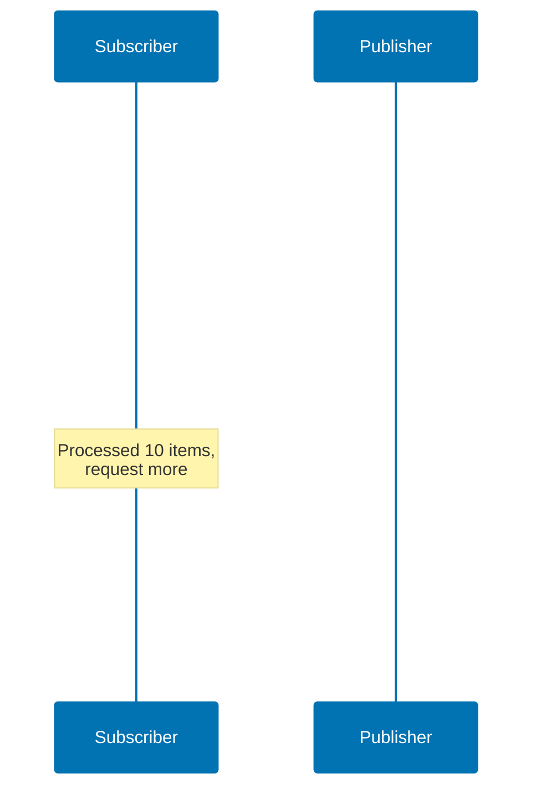

## What is Reactive Programming?

Reactive programming is a programming paradigm focused on **asynchronous data streams** and the **propagation of change**. In Java, reactive programming enables building highly scalable, non-blocking applications that efficiently handle thousands of concurrent operations.

**Key characteristics:**

- **Non-blocking**: Operations don't block threads while waiting for I/O
- **Asynchronous**: Results arrive via callbacks or reactive streams
- **Event-driven**: Components react to events (data arrival, errors, completion)
- **Backpressure-aware**: Consumers can signal producers to slow down

**When to use reactive programming:**

✅ **Good fit:**

- High-concurrency web services (handling thousands of simultaneous connections)
- Real-time data processing (streaming analytics, IoT data pipelines)
- Event-driven systems (notification services, chat applications)
- I/O-intensive operations (multiple database/API calls per request)

❌ **Poor fit:**

- CPU-intensive computations (image processing, scientific calculations)
- Simple CRUD applications with low concurrency
- Batch processing with sequential operations
- Teams unfamiliar with reactive paradigm (steep learning curve)

## Pedagogical Approach: Standard Library First

This content follows the **progression from fundamentals to production frameworks**:

1. **CompletableFuture** - Standard library asynchronous programming
2. **Reactive Streams** - Understand the specification and contracts
3. **Project Reactor** - Production-ready reactive library (Spring ecosystem)
4. **RxJava** - Alternative reactive library with rich operators

**Why this approach?**

- Understanding CompletableFuture reveals async/non-blocking fundamentals
- Reactive Streams specification clarifies the contracts frameworks implement
- Project Reactor builds on these foundations with powerful abstractions
- Comparing implementations reveals trade-offs and design decisions

## Foundation: CompletableFuture

Before reactive libraries, Java 8 introduced **CompletableFuture** for asynchronous programming.

### Basic Async Operations

```java
import java.util.concurrent.CompletableFuture;
import java.util.concurrent.ExecutorService;
import java.util.concurrent.Executors;

public class CompletableFutureBasics {
    public static void main(String[] args) {
        // Simple async computation
        CompletableFuture<String> future = CompletableFuture.supplyAsync(() -> {  // => Creates async task (type: CompletableFuture<String>)
                                                                                   // => Lambda runs in background thread
            // Runs in ForkJoinPool.commonPool()
            return "Hello from " + Thread.currentThread().getName();  // => Returns thread name (type: String)
                                                                      // => Thread name like "ForkJoinPool.commonPool-worker-1"
        });  // => Returns immediately (non-blocking)
            // => Main thread continues without waiting

        // Non-blocking callback
        future.thenAccept(result ->  // => Registers callback for when future completes
                                    // => result is computed value (type: String)
            System.out.println("Result: " + result)  // => Prints result when available
                                                    // => Callback runs on completing thread
        );

        // Block to see output (don't do this in production)
        future.join();  // => Blocks main thread until future completes
                       // => Only for demo - defeats purpose of async!
                       // => In production: use callbacks or reactive streams
    }
}
```

**Why this matters:** CompletableFuture demonstrates async execution without blocking the calling thread. However, it's designed for **single values**, not streams of data.

### Composing Async Operations

```java
public class UserService {
    public CompletableFuture<User> getUser(long userId) {  // => userId is user ID (type: long)
        return CompletableFuture.supplyAsync(() -> {  // => Returns CompletableFuture<User> immediately
                                                      // => Actual work runs asynchronously
            // Simulate database call
            return fetchUserFromDb(userId);  // => Expensive I/O operation (type: User)
                                            // => Runs on ForkJoinPool thread
        });
    }

    public CompletableFuture<List<Order>> getOrders(long userId) {  // => Returns orders future (type: CompletableFuture<List<Order>>)
        return CompletableFuture.supplyAsync(() -> {
            // Simulate API call
            return fetchOrdersFromApi(userId);  // => External API call (type: List<Order>)
                                               // => Runs in parallel with getUser()
        });
    }

    public CompletableFuture<UserProfile> getUserProfile(long userId) {
        // Compose two async operations
        CompletableFuture<User> userFuture = getUser(userId);  // => Start async user fetch (type: CompletableFuture<User>)
        CompletableFuture<List<Order>> ordersFuture = getOrders(userId);  // => Start async orders fetch (type: CompletableFuture<List<Order>>)
                                                                          // => Both execute in parallel

        return userFuture.thenCombine(ordersFuture, (user, orders) -> {  // => Combine when BOTH complete (type: CompletableFuture<UserProfile>)
                                                                         // => user is User, orders is List<Order>
            // Combine results when both complete
            return new UserProfile(user, orders);  // => Create profile with both results (type: UserProfile)
                                                  // => Only executes when both futures complete
        });  // => Returns future immediately (non-blocking)
    }
}
```

**Problem with CompletableFuture:** Works well for single async values, but becomes unwieldy for:

- Streams of data (e.g., consuming Kafka topics, WebSocket messages)
- Backpressure (what if producer is faster than consumer?)
- Cancellation and resource cleanup
- Complex error handling across streams

**Solution:** Reactive Streams specification and libraries like Project Reactor.

## Reactive Streams Specification

**Reactive Streams** is a JVM specification (adopted in Java 9 as `java.util.concurrent.Flow`) defining standard interfaces for asynchronous stream processing with **non-blocking backpressure**.

### The Four Interfaces

```java
import java.util.concurrent.Flow.*;

// 1. Publisher - produces items
public interface Publisher<T> {
    void subscribe(Subscriber<? super T> subscriber);
}

// 2. Subscriber - consumes items
public interface Subscriber<T> {
    void onSubscribe(Subscription subscription);
    void onNext(T item);
    void onError(Throwable throwable);
    void onComplete();
}

// 3. Subscription - link between Publisher and Subscriber
public interface Subscription {
    void request(long n);  // Request n items (backpressure)
    void cancel();         // Cancel subscription
}

// 4. Processor - both Publisher and Subscriber
public interface Processor<T, R> extends Subscriber<T>, Publisher<R> {
}
```

### The Reactive Streams Contract

**Critical rules:**

1. **Backpressure**: Subscriber calls `request(n)` to signal how many items it can handle
2. **No concurrent calls**: Publisher must not call `onNext()` concurrently
3. **Sequential signals**: `onSubscribe()` → `onNext()* → (onError() | onComplete())`
4. **Cancel safety**: Subscription can be cancelled at any time

**Example flow:**



**Why this matters:** Understanding these contracts is essential for using reactive libraries correctly and debugging reactive code.

## Project Reactor: Production-Ready Reactive

**Project Reactor** is the reactive library used by Spring Framework 5+ (Spring WebFlux). It implements Reactive Streams with powerful operators and Spring integration.

**Core dependencies:**

```xml
<dependency>
    <groupId>io.projectreactor</groupId>
    <artifactId>reactor-core</artifactId>
    <version>3.6.0</version>
</dependency>
```

### Mono: Zero or One Element

`Mono<T>` represents an asynchronous computation that completes with **zero or one** element.

```java
import reactor.core.publisher.Mono;

public class MonoExamples {
    // Simple value
    Mono<String> mono = Mono.just("Hello");  // => Creates Mono with immediate value (type: Mono<String>)
                                             // => Emits "Hello" when subscribed
                                             // => Completes after emitting value

    // Empty Mono
    Mono<String> empty = Mono.empty();  // => Creates Mono that emits nothing (type: Mono<String>)
                                       // => Completes immediately without emitting value
                                       // => Represents "no result" case

    // Mono from Callable
    Mono<User> user = Mono.fromCallable(() -> {  // => Deferred execution (type: Mono<User>)
                                                 // => Callable NOT invoked until subscription
        // Deferred execution - runs when subscribed
        return userRepository.findById(123);  // => Expensive operation deferred (type: User)
                                             // => Executes on subscribing thread
    });

    // Mono with error
    Mono<String> error = Mono.error(new RuntimeException("Failed"));  // => Creates Mono that emits error (type: Mono<String>)
                                                                      // => Error signal sent to subscriber
                                                                      // => No value emitted, only error

    public Mono<User> getUserById(long id) {  // => id is user ID (type: long)
        return Mono.fromCallable(() -> userRepository.findById(id))  // => Wrap blocking call (type: Mono<User>)
                                                                     // => Returns Mono immediately
                   .subscribeOn(Schedulers.boundedElastic());  // => Execute on elastic I/O thread pool
                                                               // => Prevents blocking main thread
                                                               // => boundedElastic for blocking operations
    }
}
```

**Key insight:** `Mono` is lazy - nothing executes until you **subscribe**. This allows building complex pipelines before execution.

### Flux: Zero to Many Elements

`Flux<T>` represents an asynchronous sequence of **zero to many** elements.

```java
import reactor.core.publisher.Flux;
import java.time.Duration;

public class FluxExamples {
    // Fixed sequence
    Flux<String> flux = Flux.just("A", "B", "C");  // => Creates Flux with 3 elements (type: Flux<String>)
                                                   // => Emits "A", "B", "C" when subscribed
                                                   // => Completes after emitting all values

    // From collection
    Flux<Integer> numbers = Flux.fromIterable(List.of(1, 2, 3, 4, 5));  // => Creates Flux from collection (type: Flux<Integer>)
                                                                        // => Emits each element sequentially
                                                                        // => Useful for converting existing collections

    // Infinite sequence
    Flux<Long> interval = Flux.interval(Duration.ofSeconds(1));  // => Creates infinite Flux (type: Flux<Long>)
                                                                 // => Emits 0, 1, 2, 3... every second
                                                                 // => Never completes (infinite stream)
                                                                 // => Use with take() to limit

    // Range
    Flux<Integer> range = Flux.range(1, 100); // 1 to 100  // => Creates Flux of 100 integers (type: Flux<Integer>)
                                                           // => Emits 1, 2, 3... 100 sequentially
                                                           // => Completes after emitting 100

    public Flux<Product> getAllProducts() {  // => Returns all products (type: Flux<Product>)
        return Flux.fromIterable(productRepository.findAll())  // => Convert List<Product> to Flux (type: Flux<Product>)
                                                               // => findAll() is blocking operation
                   .subscribeOn(Schedulers.boundedElastic());  // => Execute on elastic thread pool
                                                              // => Prevents blocking main thread
    }
}
```

### Transforming Streams with Operators

Reactor provides **operators** for transforming reactive streams.

**Mapping operators:**

````java
Flux<String> names = Flux.just("alice", "bob", "charlie");  // => Creates Flux with 3 names (type: Flux<String>)
                                                            // => Source stream for transformations

// map - transform each element
Flux<String> uppercase = names.map(String::toUpperCase);  // => Transform each element (type: Flux<String>)
                                                          // => Synchronous 1-to-1 transformation
                                                          // => name -> name.toUpperCase()
// Emits: "ALICE", "BOB", "CHARLIE"

// filter - keep elements matching predicate
Flux<String> longNames = names.filter(name -> name.length() > 3);  // => Keep only matching elements (type: Flux<String>)
                                                                   // => name is element being tested (type: String)
                                                                   // => Predicate returns boolean
// Emits: "alice", "charlie"  // => "bob" filtered out (length = 3)

// flatMap - async transformation returning Publisher
Flux<Order> orders = Flux.just(1L, 2L, 3L)  // => Creates Flux of user IDs (type: Flux<Long>)
    .flatMap(userId -> orderService.getOrders(userId));  // => userId is each ID (type: Long)
                                                         // => getOrders() returns Flux<Order> or Mono<List<Order>>
                                                         // => Flattens nested Publishers into single Flux
                                                         // => Executes async calls in parallel
// Flattens Mono<List<Order>> results into single Flux<Order>

**Combining streams:**

```java
Flux<String> flux1 = Flux.just("A", "B");  // => First flux (type: Flux<String>)
                                           // => Emits "A", "B"
Flux<String> flux2 = Flux.just("C", "D");  // => Second flux (type: Flux<String>)
                                           // => Emits "C", "D"

// concat - sequential (flux1 completes, then flux2)
Flux<String> sequential = Flux.concat(flux1, flux2);  // => Concatenate sequentially (type: Flux<String>)
                                                      // => Waits for flux1 to complete
                                                      // => Then subscribes to flux2
// Emits: "A", "B", "C", "D"  // => Guaranteed order

// merge - interleaved (subscribe to both, emit as items arrive)
Flux<String> merged = Flux.merge(flux1, flux2);  // => Merge concurrently (type: Flux<String>)
                                                 // => Subscribes to both immediately
                                                 // => Emits items as they arrive
// Emits: "A", "C", "B", "D" (order depends on timing)  // => Non-deterministic order

// zip - pair corresponding elements
Flux<String> zipped = Flux.zip(flux1, flux2, (a, b) -> a + b);  // => Combine paired elements (type: Flux<String>)
                                                                // => a is from flux1, b is from flux2 (both type: String)
                                                                // => Waits for both elements before emitting
                                                                // => Completes when shortest flux completes
// Emits: "AC", "BD"  // => ("A" + "C"), ("B" + "D")`

**Error handling:**

```java
Flux<String> flux = Flux.just("A", "B", "C")  // => Creates source flux (type: Flux<String>)
    .map(s -> {  // => s is each element (type: String)
        if (s.equals("B")) throw new RuntimeException("Error on B");  // => Throws on "B"
        return s;  // => Returns unchanged for "A", "C"
    })
    .onErrorReturn("DEFAULT")      // Fallback value  // => Replaces error with fallback (type: String)
                                                      // => Terminates stream with this value
                                                      // => Stream completes after error
    .onErrorResume(e -> Flux.empty()) // Fallback publisher  // => e is the error (type: Throwable)
                                                              // => Returns fallback Flux on error
                                                              // => Flux.empty() completes without values
    .onErrorContinue((err, item) -> {  // => err is error, item is failing element
                                      // => Does NOT terminate stream
        // Log and skip failing items
        log.error("Failed on item: " + item, err);  // => item is "B" (type: String)
                                                    // => Stream continues with "C"
    });
```

### Backpressure Strategies

When producer is faster than consumer, **backpressure** controls flow.

```java
Flux<Integer> fast = Flux.range(1, 1000);  // => Creates fast producer (type: Flux<Integer>)
                                           // => Emits 1000 items rapidly
                                           // => Faster than consumer can process

// Strategy 1: Buffer (store in memory)
fast.onBackpressureBuffer(100) // Buffer up to 100 items  // => Creates buffer of size 100
                                                          // => Stores excess items in memory
                                                          // => Throws error if buffer overflows
    .subscribe(item -> slowConsumer(item));  // => item is buffered integer (type: Integer)
                                            // => Consumer processes at own pace

// Strategy 2: Drop (discard excess items)
fast.onBackpressureDrop()  // => Drops items when consumer can't keep up
                          // => No buffering, immediate discard
                          // => Data loss acceptable (metrics, monitoring)
    .subscribe(item -> slowConsumer(item));  // => item is Integer, some values skipped

// Strategy 3: Latest (keep only latest item)
fast.onBackpressureLatest()  // => Keeps only most recent item
                            // => Drops intermediate values
                            // => Always processes latest state
    .subscribe(item -> slowConsumer(item));  // => item is latest Integer (e.g., jumps 1→500→1000)

// Strategy 4: Error (fail if consumer too slow)
fast.onBackpressureError()  // => Signals error immediately when overflow detected
                           // => No buffering or dropping
                           // => Fails fast strategy
    .subscribe(item -> slowConsumer(item));  // => Throws MissingBackpressureException if too slow
```

**Production choice:** Use `onBackpressureBuffer` with size limit for bursty loads, `onBackpressureDrop` for metrics/monitoring where data loss is acceptable.

### Schedulers: Threading in Reactive Code

Reactive operations are **non-blocking** but still need threads. **Schedulers** control where operations execute.

```java
import reactor.core.scheduler.Schedulers;

// Schedulers.immediate() - current thread (default)  // => No thread switching
                                                      // => Executes on calling thread
// Schedulers.single() - single reusable thread  // => Single shared thread for all subscribers
                                                 // => Useful for sequential tasks
// Schedulers.parallel() - fixed pool (CPU-bound, size = CPU cores)  // => Thread pool sized to CPU count
                                                                     // => Optimized for CPU-intensive work
// Schedulers.boundedElastic() - elastic pool (I/O-bound, grows/shrinks)  // => Thread pool grows dynamically (max ~10x CPU cores)
                                                                          // => For blocking I/O operations
                                                                          // => Threads released when idle

Mono<User> user = Mono.fromCallable(() -> {  // => Lambda NOT executed until subscription
    // This blocks! Use boundedElastic for blocking I/O
    return jdbcTemplate.queryForObject(sql, User.class);  // => BLOCKING JDBC call (type: User)
                                                          // => Must run on boundedElastic
}).subscribeOn(Schedulers.boundedElastic());  // => Subscribes on I/O thread pool
                                             // => Prevents blocking main thread

Flux<String> flux = Flux.just("A", "B", "C")  // => Creates source flux (type: Flux<String>)
    .publishOn(Schedulers.parallel())  // Downstream runs on parallel scheduler  // => Switches thread for downstream operators
                                                                                 // => map() executes on parallel thread
    .map(s -> heavyCpuWork(s));  // => s is element (type: String)
                                // => CPU-intensive transformation
                                // => Runs on parallel scheduler thread
```

**Critical rules:**

- **subscribeOn**: Controls where source/subscription executes
- **publishOn**: Controls where downstream operators execute
- **boundedElastic** for blocking I/O (JDBC, file I/O, legacy APIs)
- **parallel** for CPU-intensive operations
- Never block in reactive pipeline without appropriate scheduler

## Spring WebFlux: Reactive Web Services

**Spring WebFlux** is Spring's reactive web framework (alternative to Spring MVC).

**Dependencies:**

```xml
<dependency>
    <groupId>org.springframework.boot</groupId>
    <artifactId>spring-boot-starter-webflux</artifactId>
</dependency>
```

### Reactive REST Controller

```java
import org.springframework.web.bind.annotation.*;
import reactor.core.publisher.Flux;
import reactor.core.publisher.Mono;

@RestController  // => Spring REST controller
@RequestMapping("/api/users")  // => Base path for all endpoints
public class UserController {
    private final UserService userService;  // => Reactive service (returns Mono/Flux)

    public UserController(UserService userService) {  // => Constructor injection
        this.userService = userService;
    }

    @GetMapping("/{id}")  // => GET /api/users/123
    public Mono<User> getUser(@PathVariable Long id) {  // => id from URL path (type: Long)
        return userService.findById(id);  // => Returns Mono<User> (type: Mono<User>)
                                         // => WebFlux subscribes automatically
                                         // => Response sent when Mono completes
    }

    @GetMapping  // => GET /api/users
    public Flux<User> getAllUsers() {  // => Returns stream of users (type: Flux<User>)
        return userService.findAll();  // => Returns Flux<User> (type: Flux<User>)
                                      // => WebFlux collects to JSON array
    }

    @PostMapping  // => POST /api/users
    public Mono<User> createUser(@RequestBody User user) {  // => user from request body (type: User)
        return userService.save(user);  // => Returns saved user (type: Mono<User>)
                                       // => Returns 200 OK with created user
    }

    @GetMapping(value = "/stream", produces = "text/event-stream")  // => Server-Sent Events endpoint
    public Flux<User> streamUsers() {  // => Continuous stream (type: Flux<User>)
        // Server-Sent Events - pushes updates to clients
        return userService.findAll()  // => Get all users (type: Flux<User>)
            .delayElements(Duration.ofSeconds(1));  // => Emit one user per second
                                                   // => Simulates real-time updates
                                                   // => Connection stays open
    }
}
```

**Why WebFlux?** Handles thousands of concurrent connections with small thread pool (non-blocking I/O).

### Reactive Repository with R2DBC

**R2DBC** (Reactive Relational Database Connectivity) provides non-blocking database access.

```xml
<dependency>
    <groupId>org.springframework.boot</groupId>
    <artifactId>spring-boot-starter-data-r2dbc</artifactId>
</dependency>
<dependency>
    <groupId>io.r2dbc</groupId>
    <artifactId>r2dbc-postgresql</artifactId>
</dependency>
```

```java
import org.springframework.data.r2dbc.repository.R2dbcRepository;
import reactor.core.publisher.Flux;
import reactor.core.publisher.Mono;

public interface UserRepository extends R2dbcRepository<User, Long> {  // => R2dbcRepository for reactive database access
                                                                       // => User is entity, Long is ID type
    Flux<User> findByLastName(String lastName);  // => lastName is search parameter (type: String)
                                                // => Returns stream of matching users (type: Flux<User>)
                                                // => Query derived from method name
    Mono<User> findByEmail(String email);  // => email is search parameter (type: String)
                                          // => Returns single user or empty (type: Mono<User>)
                                          // => Email typically unique
}

@Service  // => Spring service component
public class UserService {
    private final UserRepository repository;  // => Reactive repository (returns Mono/Flux)

    public UserService(UserRepository repository) {  // => Constructor injection
        this.repository = repository;
    }

    public Mono<User> findById(Long id) {  // => id is user ID (type: Long)
        return repository.findById(id)  // => Returns Mono<User> (type: Mono<User>)
                                       // => Non-blocking database query
            .switchIfEmpty(Mono.error(new NotFoundException("User not found")));  // => Replace empty with error
                                                                                  // => Signals 404 Not Found
    }

    public Flux<User> findAll() {  // => Returns all users (type: Flux<User>)
        return repository.findAll();  // => Returns Flux<User> (type: Flux<User>)
                                     // => Non-blocking database query
                                     // => Streams results as they arrive
    }
}
```

**Critical difference from JDBC:**

- JDBC blocks thread while waiting for database → wastes threads under high concurrency
- R2DBC returns Mono/Flux immediately → thread free to handle other requests

## RxJava: Alternative Reactive Library

**RxJava** is another popular reactive library (predates Reactor, used in Android development).

**Dependencies:**

```xml
<dependency>
    <groupId>io.reactivex.rxjava3</groupId>
    <artifactId>rxjava</artifactId>
    <version>3.1.8</version>
</dependency>
```

### RxJava Core Types

```java
import io.reactivex.rxjava3.core.*;

// Single - exactly one item or error
Single<String> single = Single.just("Hello");  // => Creates Single with value (type: Single<String>)
                                               // => Must emit exactly one value
                                               // => No onComplete signal (value IS completion)

// Maybe - zero or one item
Maybe<String> maybe = Maybe.empty();  // => Creates empty Maybe (type: Maybe<String>)
                                     // => Emits 0 or 1 item
                                     // => Similar to Mono in Project Reactor

// Observable - zero to many items (no backpressure)
Observable<String> observable = Observable.just("A", "B", "C");  // => Creates Observable (type: Observable<String>)
                                                                 // => Emits 0 to N items
                                                                 // => NO backpressure support
                                                                 // => Can overwhelm slow consumers

// Flowable - zero to many items (with backpressure)
Flowable<String> flowable = Flowable.just("A", "B", "C");  // => Creates Flowable (type: Flowable<String>)
                                                           // => Emits 0 to N items
                                                           // => WITH backpressure support
                                                           // => Similar to Flux in Project Reactor

// Completable - no items, just completion or error signal
Completable completable = Completable.complete();  // => Creates completed signal (type: Completable)
                                                  // => No values emitted
                                                  // => Only signals completion or error
                                                  // => Useful for side effects (save, delete)
```

**Project Reactor vs RxJava:**

| Feature                | Project Reactor      | RxJava                         |
| ---------------------- | -------------------- | ------------------------------ |
| **0-1 items**          | Mono                 | Single, Maybe                  |
| **0-N items**          | Flux                 | Observable, Flowable           |
| **Completion signal**  | Built into Mono/Flux | Completable                    |
| **Backpressure**       | Always               | Flowable only (not Observable) |
| **Spring integration** | Native (WebFlux)     | Manual                         |
| **Learning curve**     | Moderate             | Steeper (more types)           |

**When to use RxJava:** Android development, existing RxJava codebases, preference for explicit type distinctions (Single vs Maybe vs Observable).

**When to use Reactor:** Spring ecosystem, new projects, simpler API with Mono/Flux.

## Testing Reactive Code

Testing asynchronous code requires specialized approaches.

### Testing with StepVerifier

**StepVerifier** (from reactor-test) validates reactive sequences.

```xml
<dependency>
    <groupId>io.projectreactor</groupId>
    <artifactId>reactor-test</artifactId>
    <scope>test</scope>
</dependency>
```

```java
import reactor.test.StepVerifier;

@Test
void testMonoSuccess() {
    Mono<String> mono = Mono.just("Hello");  // => Creates test Mono (type: Mono<String>)

    StepVerifier.create(mono)  // => Creates verifier for mono
        .expectNext("Hello")  // => Expects single emission with value "Hello"
                             // => Fails test if different value or no emission
        .verifyComplete();  // => Expects onComplete signal
                           // => Subscribes and blocks until completion
}

@Test
void testFluxSequence() {
    Flux<Integer> flux = Flux.just(1, 2, 3);  // => Creates test Flux (type: Flux<Integer>)

    StepVerifier.create(flux)  // => Creates verifier for flux
        .expectNext(1)  // => Expects first emission = 1
        .expectNext(2)  // => Expects second emission = 2
        .expectNext(3)  // => Expects third emission = 3
        .verifyComplete();  // => Expects onComplete signal
                           // => Verifies exact sequence and completion
}

@Test
void testFluxError() {
    Flux<String> flux = Flux.error(new RuntimeException("Error"));  // => Creates error-emitting Flux

    StepVerifier.create(flux)  // => Creates verifier for error flux
        .expectError(RuntimeException.class)  // => Expects RuntimeException signal
                                             // => Fails if different error or no error
        .verify();  // => Subscribes and verifies error
}

@Test
void testBackpressure() {
    Flux<Integer> flux = Flux.range(1, 100);  // => Creates Flux of 100 integers

    StepVerifier.create(flux, 10) // Request only 10 items  // => Initial request = 10 (backpressure)
                                                            // => Doesn't request all items upfront
        .expectNextCount(10)  // => Expects exactly 10 emissions
                             // => Verifies backpressure respected
        .thenRequest(10)           // Request 10 more  // => Request 10 additional items
        .expectNextCount(10)  // => Expects another 10 emissions
        .thenCancel()              // Cancel subscription  // => Cancels before completion
                                                          // => Remaining 80 items not requested
        .verify();  // => Executes verification
}
```

### Testing Delays and Virtual Time

```java
@Test
void testDelayWithVirtualTime() {
    // Without virtual time, this test would take 10 seconds
    Flux<Long> flux = Flux.interval(Duration.ofSeconds(1)).take(10);  // => Creates flux emitting 0-9 every second
                                                                      // => Would take 10 seconds in real time

    StepVerifier.withVirtualTime(() -> flux)  // => Uses virtual time scheduler (type: StepVerifier.FirstStep<Long>)
                                             // => Lambda defers flux creation
                                             // => Allows scheduler replacement before subscription
        .expectSubscription()  // => Expects onSubscribe signal
                              // => Verifies subscription happened
        .thenAwait(Duration.ofSeconds(10))  // => Advances virtual time by 10 seconds
                                           // => Happens instantly (not real time)
                                           // => Triggers 10 interval emissions
        .expectNextCount(10)  // => Expects 10 emissions (0, 1, 2... 9)
                             // => Verifies all interval ticks happened
        .verifyComplete();  // => Expects onComplete signal
                           // => Test completes instantly
}
```

### Testing WebFlux Controllers

```java
import org.springframework.boot.test.autoconfigure.web.reactive.WebFluxTest;
import org.springframework.test.web.reactive.server.WebTestClient;

@WebFluxTest(UserController.class)  // => Loads only UserController (slice test)
                                    // => Autoconfigures WebTestClient
class UserControllerTest {
    @Autowired  // => Injected test client
    private WebTestClient webClient;  // => Non-blocking HTTP client for tests (type: WebTestClient)

    @MockBean  // => Mock service in Spring context
    private UserService userService;  // => Mocked dependency (returns Mono/Flux)

    @Test
    void testGetUser() {
        User user = new User(1L, "Alice");  // => Test user (type: User)
        when(userService.findById(1L)).thenReturn(Mono.just(user));  // => Mock returns Mono with user
                                                                     // => Simulates successful database lookup

        webClient.get()  // => Start GET request builder
            .uri("/api/users/1")  // => Request URI (ID = 1)
            .exchange()  // => Execute request (type: WebTestClient.ResponseSpec)
                        // => Non-blocking execution
            .expectStatus().isOk()  // => Expects HTTP 200 OK
            .expectBody(User.class)  // => Expects User in response body
                                    // => Deserializes JSON to User
            .isEqualTo(user);  // => Verifies response equals expected user
    }

    @Test
    void testGetAllUsers() {
        Flux<User> users = Flux.just(  // => Test flux with 2 users (type: Flux<User>)
            new User(1L, "Alice"),
            new User(2L, "Bob")
        );
        when(userService.findAll()).thenReturn(users);  // => Mock returns Flux with users
                                                       // => Simulates database query

        webClient.get()  // => Start GET request
            .uri("/api/users")  // => Request all users endpoint
            .exchange()  // => Execute request
            .expectStatus().isOk()  // => Expects HTTP 200 OK
            .expectBodyList(User.class)  // => Expects List<User> in response body
                                        // => Collects Flux to List
            .hasSize(2);  // => Verifies exactly 2 users
                         // => Validates collection size
    }
}
```

## Performance Considerations

### When Reactive Improves Performance

**High I/O concurrency:**

```java
// Imperative (Spring MVC + JDBC) - blocks thread per request
@GetMapping("/users/{id}")  // => Traditional Spring MVC endpoint
public User getUser(@PathVariable Long id) {  // => id from URL path (type: Long)
                                              // => Returns User immediately (type: User)
    // Thread blocked waiting for database
    return userRepository.findById(id).orElseThrow();  // => BLOCKING JDBC call
                                                       // => Thread waits for database response
                                                       // => Thread cannot handle other requests
}
// 1000 concurrent requests = 1000 blocked threads = high memory, context switching  // => 1000 threads × ~1MB stack = ~1GB memory
                                                                                     // => High context switching overhead

// Reactive (WebFlux + R2DBC) - non-blocking
@GetMapping("/users/{id}")  // => Reactive WebFlux endpoint
public Mono<User> getUser(@PathVariable Long id) {  // => id from URL path (type: Long)
                                                    // => Returns Mono immediately (type: Mono<User>)
    // Thread released immediately, callback when data arrives
    return userRepository.findById(id)  // => Non-blocking R2DBC query
                                       // => Thread released while waiting for database
                                       // => Can handle other requests
        .switchIfEmpty(Mono.error(new NotFoundException()));  // => Error if not found
}
// 1000 concurrent requests = small fixed thread pool = low memory, minimal context switching  // => Maybe 8-16 threads total
                                                                                               // => Low memory footprint
                                                                                               // => Minimal context switching
```

**Performance gain:** 10-100x higher concurrency with same resources.

### When Reactive Doesn't Help

**CPU-bound operations:**

```java
// Reactive doesn't help here - CPU is the bottleneck, not I/O
Flux<BufferedImage> images = Flux.fromIterable(imageFiles)  // => Creates flux from image files (type: Flux<File>)
    .map(file -> expensiveImageProcessing(file)); // Still blocks CPU  // => file is File (type: File)
                                                                       // => expensiveImageProcessing() uses CPU
                                                                       // => Non-blocking I/O doesn't help CPU work
                                                                       // => Should use parallel() or Schedulers.parallel()
```

**Simple CRUD with low concurrency:** Reactive complexity not justified if you're handling <100 concurrent requests.

### Memory Considerations

Reactive streams are memory-efficient for **bounded streams** but can leak with **infinite streams**:

```java
// Memory leak - buffers infinite stream
Flux.interval(Duration.ofMillis(1))  // => Creates infinite flux (type: Flux<Long>)
                                    // => Emits every 1ms (1000 items/second)
    .buffer(Duration.ofSeconds(10)) // Buffers 10000 items every 10 seconds  // => Collects 10 seconds of items
                                                                             // => 10000 items buffered
                                                                             // => Memory grows unbounded
    .subscribe();  // => Subscribes but doesn't process fast enough
                  // => Buffer grows continuously

// Fixed - use backpressure strategies
Flux.interval(Duration.ofMillis(1))  // => Same infinite flux
    .onBackpressureDrop() // Drop excess items  // => Drops items when consumer slow
                                               // => No buffering, constant memory
    .subscribe();  // => Subscribes safely
                  // => Memory usage bounded
```

## Common Pitfalls

### Pitfall 1: Forgetting to Subscribe

```java
// ❌ WRONG - Nothing executes!
Mono<User> user = userService.findById(1L);  // => Creates Mono but DOESN'T execute (type: Mono<User>)
                                            // => Only builds reactive pipeline
// Code never runs because Mono is lazy  // => Database query NEVER happens
                                         // => Common beginner mistake

// ✅ CORRECT - Subscribe to trigger execution
Mono<User> user = userService.findById(1L);  // => Creates Mono (type: Mono<User>)
user.subscribe(u -> System.out.println(u));  // => Subscribes and triggers execution
                                            // => u is emitted User (type: User)
                                            // => NOW database query happens

// ✅ In WebFlux controllers, framework subscribes automatically
@GetMapping("/{id}")
public Mono<User> getUser(@PathVariable Long id) {  // => id from path (type: Long)
    return userService.findById(id); // Framework subscribes  // => WebFlux subscribes automatically
                                                              // => No manual subscribe() needed
                                                              // => Framework handles subscription lifecycle
}
```

### Pitfall 2: Blocking in Reactive Pipeline

```java
// ❌ WRONG - Defeats purpose of reactive (blocks thread)
Mono<User> user = Mono.fromCallable(() -> {  // => Creates Mono (type: Mono<User>)
    return jdbcTemplate.queryForObject(sql, User.class); // BLOCKS!  // => BLOCKING JDBC call
                                                                     // => Runs on subscribing thread
                                                                     // => Blocks event loop thread
                                                                     // => Kills reactive performance
});

// ✅ CORRECT - Use boundedElastic scheduler for blocking code
Mono<User> user = Mono.fromCallable(() -> {  // => Creates Mono (type: Mono<User>)
    return jdbcTemplate.queryForObject(sql, User.class);  // => Still BLOCKING JDBC
                                                          // => But runs on separate thread
}).subscribeOn(Schedulers.boundedElastic());  // => Executes on I/O thread pool
                                             // => Event loop thread not blocked
                                             // => Bridge pattern for legacy code

// ✅ BETTER - Use reactive database driver (R2DBC)
Mono<User> user = r2dbcRepository.findById(id); // Non-blocking  // => id is user ID (type: Long)
                                                               // => Returns Mono immediately (type: Mono<User>)
                                                               // => TRUE non-blocking I/O
                                                               // => No thread blocking at all
```

### Pitfall 3: Swallowing Errors

```java
// ❌ WRONG - Error disappears silently
flux.subscribe(  // => flux is some Flux<T>
    item -> process(item),  // => item is each element (type: T)
                           // => onNext handler processes items
    error -> {} // Empty error handler swallows errors  // => error is Throwable (type: Throwable)
                                                        // => SILENTLY ignores errors
                                                        // => Impossible to debug
);

// ✅ CORRECT - Log errors
flux.subscribe(  // => Same flux
    item -> process(item),  // => Process each item
    error -> log.error("Processing failed", error)  // => error is Throwable
                                                    // => Logs error for debugging
                                                    // => At least visible in logs
);

// ✅ BETTER - Handle errors in pipeline
flux.onErrorResume(error -> {  // => error is Throwable (type: Throwable)
                              // => Catches errors in pipeline
    log.error("Processing failed", error);  // => Log error
    return Flux.empty(); // Fallback  // => Returns fallback Flux (type: Flux<T>)
                                      // => Stream continues with empty result
}).subscribe();  // => Simple subscribe() without error handler
                // => Errors already handled in pipeline
```

### Pitfall 4: Creating Mono/Flux Eagerly

```java
// ❌ WRONG - Executes immediately, not lazily
public Mono<User> getUser(Long id) {  // => id is user ID (type: Long)
    User user = repository.findById(id).block(); // Executes here!  // => BLOCKS immediately
                                                                    // => Executes BEFORE method returns
                                                                    // => Not deferred
    return Mono.just(user); // Too late  // => Returns already-fetched user (type: Mono<User>)
                                         // => Defeats lazy evaluation
                                         // => Already blocked calling thread
}

// ✅ CORRECT - Defer execution
public Mono<User> getUser(Long id) {  // => id is user ID (type: Long)
    return Mono.fromCallable(() -> repository.findById(id).block());  // => Lambda defers execution (type: Mono<User>)
                                                                      // => Executes only when subscribed
                                                                      // => Lazy evaluation preserved
    // Or better: return repository.findById(id); if repository is reactive  // => If repository already returns Mono<User>
                                                                             // => No block() needed at all
}
```

## Migrating from Imperative to Reactive

### Step 1: Identify I/O Boundaries

Replace blocking I/O with reactive equivalents:

- **JDBC** → R2DBC
- **RestTemplate** → WebClient
- **Blocking file I/O** → AsynchronousFileChannel or reactive libraries

### Step 2: Start with Controllers

```java
// Before (Spring MVC)
@RestController  // => Traditional Spring MVC controller
public class UserController {
    @GetMapping("/users/{id}")
    public User getUser(@PathVariable Long id) {  // => id from path (type: Long)
                                                  // => Returns User immediately (type: User)
        return userService.findById(id);  // => Blocking call (type: User)
                                         // => Thread waits for service
    }
}

// After (Spring WebFlux)
@RestController  // => Reactive WebFlux controller
public class UserController {
    @GetMapping("/users/{id}")
    public Mono<User> getUser(@PathVariable Long id) {  // => id from path (type: Long)
                                                        // => Returns Mono immediately (type: Mono<User>)
        return userService.findById(id);  // => Non-blocking (type: Mono<User>)
                                         // => WebFlux subscribes automatically
                                         // => Thread released while waiting
    }
}
```

### Step 3: Convert Services Layer

```java
// Before
@Service  // => Traditional service
public class UserService {
    public User findById(Long id) {  // => id is user ID (type: Long)
                                     // => Returns User immediately (type: User)
        return repository.findById(id).orElseThrow();  // => Blocking repository call (type: Optional<User>)
                                                       // => orElseThrow() on Optional
                                                       // => Throws if user not found
    }
}

// After
@Service  // => Reactive service
public class UserService {
    public Mono<User> findById(Long id) {  // => id is user ID (type: Long)
                                           // => Returns Mono immediately (type: Mono<User>)
        return repository.findById(id)  // => Reactive repository (type: Mono<User>)
                                       // => Returns Mono, not Optional
            .switchIfEmpty(Mono.error(new NotFoundException()));  // => Replace empty with error
                                                                  // => Reactive equivalent of orElseThrow()
    }
}
```

### Step 4: Wrap Legacy Blocking Code

If you can't replace blocking libraries immediately:

```java
@Service  // => Service wrapping legacy code
public class LegacyService {
    private final Scheduler scheduler = Schedulers.boundedElastic();  // => Reusable I/O scheduler (type: Scheduler)
                                                                      // => For blocking operations

    public Mono<Data> getLegacyData() {  // => Returns reactive type (type: Mono<Data>)
        return Mono.fromCallable(() -> {  // => Defers execution (type: Mono<Data>)
                                         // => Lambda wraps blocking call
            // Legacy blocking JDBC call
            return jdbcTemplate.queryForObject(sql, Data.class);  // => BLOCKING JDBC (type: Data)
                                                                  // => But runs on separate thread
        }).subscribeOn(scheduler);  // => Executes on boundedElastic pool
                                   // => Event loop thread not blocked
                                   // => Bridge to legacy code
    }
}
```

**Warning:** This is a **bridge pattern**, not ideal. Migrate to R2DBC for true non-blocking benefits.

## When NOT to Use Reactive

Reactive programming adds complexity. Avoid it when:

1. **Simple applications**: Basic CRUD with <100 concurrent users
2. **Team unfamiliar**: Steep learning curve, harder to debug
3. **Primarily CPU-bound**: Reactive optimizes I/O, not computation
4. **Legacy integration heavy**: Wrapping blocking code defeats benefits
5. **Transactional consistency critical**: Reactive transactions are harder

**Rule of thumb:** Start with Spring MVC + JDBC. Migrate to WebFlux + R2DBC when you **measure** I/O-bound concurrency bottlenecks.

## Best Practices

### 1. Use Appropriate Return Types

```java
// Use Mono for single results
Mono<User> getUser(Long id)  // => id is user ID (type: Long)
                             // => Returns 0 or 1 user (type: Mono<User>)
                             // => Single entity lookup

// Use Flux for collections
Flux<User> getAllUsers()  // => Returns 0 to N users (type: Flux<User>)
                         // => Collection of entities
                         // => Can stream millions of records

// Use Mono<Void> for operations with no return
Mono<Void> deleteUser(Long id)  // => id is user ID (type: Long)
                               // => Returns completion signal (type: Mono<Void>)
                               // => No value, only success/error signal
```

### 2. Handle Errors Close to Source

```java
Mono<User> user = repository.findById(id)  // => id is user ID (type: Long)
                                          // => Returns Mono<User> (type: Mono<User>)
    .onErrorMap(SQLException.class, e -> new DatabaseException(e))  // => e is SQLException (type: SQLException)
                                                                    // => Converts to domain exception
                                                                    // => Hides infrastructure details
    .switchIfEmpty(Mono.error(new NotFoundException()));  // => Replace empty with error
                                                          // => Not found = business error
```

### 3. Use Operators, Not Imperative Logic

```java
// ❌ WRONG - Breaking reactive chain
List<User> users = userFlux.collectList().block();  // => BLOCKS thread (type: List<User>)
                                                    // => Defeats reactive purpose
                                                    // => Collects entire stream to memory
for (User u : users) {  // => u is each user (type: User)
                       // => Imperative loop
    if (u.isActive()) {  // => Imperative condition
        processUser(u);  // => Blocking processing
    }
}

// ✅ CORRECT - Stay in reactive pipeline
userFlux  // => userFlux is Flux<User>
    .filter(User::isActive)  // => Keeps only active users
                            // => Reactive operator
    .flatMap(u -> processUser(u))  // => u is active user (type: User)
                                   // => processUser() returns Mono/Flux
                                   // => Async processing
    .subscribe();  // => Subscribes to trigger execution
                  // => Never blocks
```

### 4. Limit Concurrency with flatMap

```java
// Can overwhelm downstream services
userFlux.flatMap(user -> externalApiCall(user));  // => user is each User (type: User)
                                                  // => externalApiCall() returns Mono/Flux
                                                  // => Unbounded concurrency
                                                  // => Can make 1000s of parallel API calls
                                                  // => Overwhelms external service

// Limit to 10 concurrent calls
userFlux.flatMap(user -> externalApiCall(user), 10);  // => user is each User (type: User)
                                                      // => 10 is concurrency limit (type: int)
                                                      // => Maximum 10 concurrent API calls
                                                      // => Protects downstream service
```

### 5. Use publishOn Sparingly

```java
// Too many publishOn calls hurt performance
flux.publishOn(Schedulers.parallel())  // => Switch to parallel thread
                                       // => Thread context switch overhead
    .map(this::step1)  // => Runs on parallel thread
    .publishOn(Schedulers.boundedElastic())  // => Switch to elastic thread
                                            // => Another context switch
    .map(this::step2)  // => Runs on elastic thread
    .publishOn(Schedulers.parallel())  // => Switch back to parallel
                                       // => Third context switch
    .map(this::step3);  // => Runs on parallel thread
                       // => Too much thread switching

// Better - one publishOn for entire chain
flux.publishOn(Schedulers.boundedElastic())  // => Single thread switch
                                            // => All downstream on elastic
    .map(this::step1)  // => Runs on elastic thread
    .map(this::step2)  // => Same elastic thread
    .map(this::step3);  // => Same elastic thread
                       // => Minimal context switching
```

## Related Topics

- [Concurrency and Parallelism](/en/learn/software-engineering/programming-languages/java/in-the-field/concurrency-and-parallelism) - Thread-based concurrency vs reactive
- [Web Services and REST APIs](/en/learn/software-engineering/programming-languages/java/in-the-field/web-services) - Spring MVC vs Spring WebFlux
- [Working with SQL Databases](/en/learn/software-engineering/programming-languages/java/in-the-field/sql-database) - JDBC vs R2DBC
- [Performance Optimization](/en/learn/software-engineering/programming-languages/java/in-the-field/performance) - Measuring reactive vs imperative performance
- [Testing](/en/learn/software-engineering/programming-languages/java/by-example/beginner/testing) - Testing reactive code patterns

## References

**Official Documentation:**

- [Project Reactor Documentation](https://projectreactor.io/docs)
- [Reactive Streams Specification](https://www.reactive-streams.org/)
- [Spring WebFlux Documentation](https://docs.spring.io/spring-framework/reference/web/webflux.html)
- [R2DBC Documentation](https://r2dbc.io/)
- [RxJava Documentation](https://github.com/ReactiveX/RxJava)

**Books:**

- "Hands-On Reactive Programming in Spring 5" by Oleh Dokuka, Igor Lozynskyi
- "Reactive Programming with RxJava" by Tomasz Nurkiewicz, Ben Christensen
````
