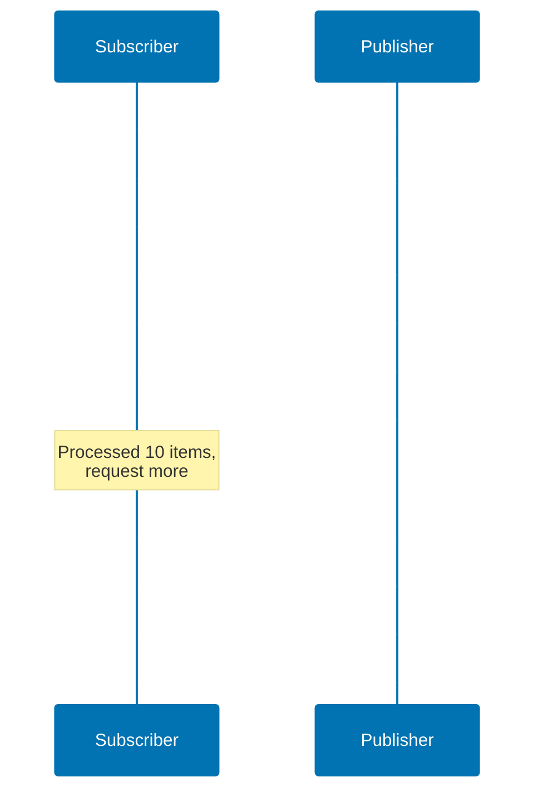

## What is Reactive Programming?

Reactive programming is a programming paradigm focused on **asynchronous data streams** and the **propagation of change**. In Java, reactive programming enables building highly scalable, non-blocking applications that efficiently handle thousands of concurrent operations.

**Key characteristics:**

- **Non-blocking**: Operations don't block threads while waiting for I/O
- **Asynchronous**: Results arrive via callbacks or reactive streams
- **Event-driven**: Components react to events (data arrival, errors, completion)
- **Backpressure-aware**: Consumers can signal producers to slow down

**When to use reactive programming:**

✅ **Good fit:**

- High-concurrency web services (handling thousands of simultaneous connections)
- Real-time data processing (streaming analytics, IoT data pipelines)
- Event-driven systems (notification services, chat applications)
- I/O-intensive operations (multiple database/API calls per request)

❌ **Poor fit:**

- CPU-intensive computations (image processing, scientific calculations)
- Simple CRUD applications with low concurrency
- Batch processing with sequential operations
- Teams unfamiliar with reactive paradigm (steep learning curve)

## Pedagogical Approach: Standard Library First

This content follows the **progression from fundamentals to production frameworks**:

1. **CompletableFuture** - Standard library asynchronous programming
2. **Reactive Streams** - Understand the specification and contracts
3. **Project Reactor** - Production-ready reactive library (Spring ecosystem)
4. **RxJava** - Alternative reactive library with rich operators

**Why this approach?**

- Understanding CompletableFuture reveals async/non-blocking fundamentals
- Reactive Streams specification clarifies the contracts frameworks implement
- Project Reactor builds on these foundations with powerful abstractions
- Comparing implementations reveals trade-offs and design decisions

## Foundation: CompletableFuture

Before reactive libraries, Java 8 introduced **CompletableFuture** for asynchronous programming.

### Basic Async Operations

```java
import java.util.concurrent.CompletableFuture;
import java.util.concurrent.ExecutorService;
import java.util.concurrent.Executors;

public class CompletableFutureBasics {
    public static void main(String[] args) {
        // Simple async computation
        CompletableFuture<String> future = CompletableFuture.supplyAsync(() -> {
            // Runs in ForkJoinPool.commonPool()
            return "Hello from " + Thread.currentThread().getName();
        });

        // Non-blocking callback
        future.thenAccept(result ->
            System.out.println("Result: " + result)
        );

        // Block to see output (don't do this in production)
        future.join();
    }
}
```

**Why this matters:** CompletableFuture demonstrates async execution without blocking the calling thread. However, it's designed for **single values**, not streams of data.

### Composing Async Operations

```java
public class UserService {
    public CompletableFuture<User> getUser(long userId) {
        return CompletableFuture.supplyAsync(() -> {
            // Simulate database call
            return fetchUserFromDb(userId);
        });
    }

    public CompletableFuture<List<Order>> getOrders(long userId) {
        return CompletableFuture.supplyAsync(() -> {
            // Simulate API call
            return fetchOrdersFromApi(userId);
        });
    }

    public CompletableFuture<UserProfile> getUserProfile(long userId) {
        // Compose two async operations
        CompletableFuture<User> userFuture = getUser(userId);
        CompletableFuture<List<Order>> ordersFuture = getOrders(userId);

        return userFuture.thenCombine(ordersFuture, (user, orders) -> {
            // Combine results when both complete
            return new UserProfile(user, orders);
        });
    }
}
```

**Problem with CompletableFuture:** Works well for single async values, but becomes unwieldy for:

- Streams of data (e.g., consuming Kafka topics, WebSocket messages)
- Backpressure (what if producer is faster than consumer?)
- Cancellation and resource cleanup
- Complex error handling across streams

**Solution:** Reactive Streams specification and libraries like Project Reactor.

## Reactive Streams Specification

**Reactive Streams** is a JVM specification (adopted in Java 9 as `java.util.concurrent.Flow`) defining standard interfaces for asynchronous stream processing with **non-blocking backpressure**.

### The Four Interfaces

```java
import java.util.concurrent.Flow.*;

// 1. Publisher - produces items
public interface Publisher<T> {
    void subscribe(Subscriber<? super T> subscriber);
}

// 2. Subscriber - consumes items
public interface Subscriber<T> {
    void onSubscribe(Subscription subscription);
    void onNext(T item);
    void onError(Throwable throwable);
    void onComplete();
}

// 3. Subscription - link between Publisher and Subscriber
public interface Subscription {
    void request(long n);  // Request n items (backpressure)
    void cancel();         // Cancel subscription
}

// 4. Processor - both Publisher and Subscriber
public interface Processor<T, R> extends Subscriber<T>, Publisher<R> {
}
```

### The Reactive Streams Contract

**Critical rules:**

1. **Backpressure**: Subscriber calls `request(n)` to signal how many items it can handle
2. **No concurrent calls**: Publisher must not call `onNext()` concurrently
3. **Sequential signals**: `onSubscribe()` → `onNext()* → (onError() | onComplete())`
4. **Cancel safety**: Subscription can be cancelled at any time

**Example flow:**



**Why this matters:** Understanding these contracts is essential for using reactive libraries correctly and debugging reactive code.

## Project Reactor: Production-Ready Reactive

**Project Reactor** is the reactive library used by Spring Framework 5+ (Spring WebFlux). It implements Reactive Streams with powerful operators and Spring integration.

**Core dependencies:**

```xml
<dependency>
    <groupId>io.projectreactor</groupId>
    <artifactId>reactor-core</artifactId>
    <version>3.6.0</version>
</dependency>
```

### Mono: Zero or One Element

`Mono<T>` represents an asynchronous computation that completes with **zero or one** element.

```java
import reactor.core.publisher.Mono;

public class MonoExamples {
    // Simple value
    Mono<String> mono = Mono.just("Hello");

    // Empty Mono
    Mono<String> empty = Mono.empty();

    // Mono from Callable
    Mono<User> user = Mono.fromCallable(() -> {
        // Deferred execution - runs when subscribed
        return userRepository.findById(123);
    });

    // Mono with error
    Mono<String> error = Mono.error(new RuntimeException("Failed"));

    public Mono<User> getUserById(long id) {
        return Mono.fromCallable(() -> userRepository.findById(id))
                   .subscribeOn(Schedulers.boundedElastic()); // Run on I/O thread pool
    }
}
```

**Key insight:** `Mono` is lazy - nothing executes until you **subscribe**. This allows building complex pipelines before execution.

### Flux: Zero to Many Elements

`Flux<T>` represents an asynchronous sequence of **zero to many** elements.

```java
import reactor.core.publisher.Flux;
import java.time.Duration;

public class FluxExamples {
    // Fixed sequence
    Flux<String> flux = Flux.just("A", "B", "C");

    // From collection
    Flux<Integer> numbers = Flux.fromIterable(List.of(1, 2, 3, 4, 5));

    // Infinite sequence
    Flux<Long> interval = Flux.interval(Duration.ofSeconds(1));

    // Range
    Flux<Integer> range = Flux.range(1, 100); // 1 to 100

    public Flux<Product> getAllProducts() {
        return Flux.fromIterable(productRepository.findAll())
                   .subscribeOn(Schedulers.boundedElastic());
    }
}
```

### Transforming Streams with Operators

Reactor provides **operators** for transforming reactive streams.

**Mapping operators:**

```java
Flux<String> names = Flux.just("alice", "bob", "charlie");

// map - transform each element
Flux<String> uppercase = names.map(String::toUpperCase);
// Emits: "ALICE", "BOB", "CHARLIE"

// filter - keep elements matching predicate
Flux<String> longNames = names.filter(name -> name.length() > 3);
// Emits: "alice", "charlie"

// flatMap - async transformation returning Publisher
Flux<Order> orders = Flux.just(1L, 2L, 3L)
    .flatMap(userId -> orderService.getOrders(userId));
// Flattens Mono<List<Order>> results into single Flux<Order>
```

**Combining streams:**

```java
Flux<String> flux1 = Flux.just("A", "B");
Flux<String> flux2 = Flux.just("C", "D");

// concat - sequential (flux1 completes, then flux2)
Flux<String> sequential = Flux.concat(flux1, flux2);
// Emits: "A", "B", "C", "D"

// merge - interleaved (subscribe to both, emit as items arrive)
Flux<String> merged = Flux.merge(flux1, flux2);
// Emits: "A", "C", "B", "D" (order depends on timing)

// zip - pair corresponding elements
Flux<String> zipped = Flux.zip(flux1, flux2, (a, b) -> a + b);
// Emits: "AC", "BD"
```

**Error handling:**

```java
Flux<String> flux = Flux.just("A", "B", "C")
    .map(s -> {
        if (s.equals("B")) throw new RuntimeException("Error on B");
        return s;
    })
    .onErrorReturn("DEFAULT")      // Fallback value
    .onErrorResume(e -> Flux.empty()) // Fallback publisher
    .onErrorContinue((err, item) -> {
        // Log and skip failing items
        log.error("Failed on item: " + item, err);
    });
```

### Backpressure Strategies

When producer is faster than consumer, **backpressure** controls flow.

```java
Flux<Integer> fast = Flux.range(1, 1000);

// Strategy 1: Buffer (store in memory)
fast.onBackpressureBuffer(100) // Buffer up to 100 items
    .subscribe(item -> slowConsumer(item));

// Strategy 2: Drop (discard excess items)
fast.onBackpressureDrop()
    .subscribe(item -> slowConsumer(item));

// Strategy 3: Latest (keep only latest item)
fast.onBackpressureLatest()
    .subscribe(item -> slowConsumer(item));

// Strategy 4: Error (fail if consumer too slow)
fast.onBackpressureError()
    .subscribe(item -> slowConsumer(item));
```

**Production choice:** Use `onBackpressureBuffer` with size limit for bursty loads, `onBackpressureDrop` for metrics/monitoring where data loss is acceptable.

### Schedulers: Threading in Reactive Code

Reactive operations are **non-blocking** but still need threads. **Schedulers** control where operations execute.

```java
import reactor.core.scheduler.Schedulers;

// Schedulers.immediate() - current thread (default)
// Schedulers.single() - single reusable thread
// Schedulers.parallel() - fixed pool (CPU-bound, size = CPU cores)
// Schedulers.boundedElastic() - elastic pool (I/O-bound, grows/shrinks)

Mono<User> user = Mono.fromCallable(() -> {
    // This blocks! Use boundedElastic for blocking I/O
    return jdbcTemplate.queryForObject(sql, User.class);
}).subscribeOn(Schedulers.boundedElastic());

Flux<String> flux = Flux.just("A", "B", "C")
    .publishOn(Schedulers.parallel())  // Downstream runs on parallel scheduler
    .map(s -> heavyCpuWork(s));
```

**Critical rules:**

- **subscribeOn**: Controls where source/subscription executes
- **publishOn**: Controls where downstream operators execute
- **boundedElastic** for blocking I/O (JDBC, file I/O, legacy APIs)
- **parallel** for CPU-intensive operations
- Never block in reactive pipeline without appropriate scheduler

## Spring WebFlux: Reactive Web Services

**Spring WebFlux** is Spring's reactive web framework (alternative to Spring MVC).

**Dependencies:**

```xml
<dependency>
    <groupId>org.springframework.boot</groupId>
    <artifactId>spring-boot-starter-webflux</artifactId>
</dependency>
```

### Reactive REST Controller

```java
import org.springframework.web.bind.annotation.*;
import reactor.core.publisher.Flux;
import reactor.core.publisher.Mono;

@RestController
@RequestMapping("/api/users")
public class UserController {
    private final UserService userService;

    public UserController(UserService userService) {
        this.userService = userService;
    }

    @GetMapping("/{id}")
    public Mono<User> getUser(@PathVariable Long id) {
        return userService.findById(id);
    }

    @GetMapping
    public Flux<User> getAllUsers() {
        return userService.findAll();
    }

    @PostMapping
    public Mono<User> createUser(@RequestBody User user) {
        return userService.save(user);
    }

    @GetMapping(value = "/stream", produces = "text/event-stream")
    public Flux<User> streamUsers() {
        // Server-Sent Events - pushes updates to clients
        return userService.findAll()
            .delayElements(Duration.ofSeconds(1));
    }
}
```

**Why WebFlux?** Handles thousands of concurrent connections with small thread pool (non-blocking I/O).

### Reactive Repository with R2DBC

**R2DBC** (Reactive Relational Database Connectivity) provides non-blocking database access.

```xml
<dependency>
    <groupId>org.springframework.boot</groupId>
    <artifactId>spring-boot-starter-data-r2dbc</artifactId>
</dependency>
<dependency>
    <groupId>io.r2dbc</groupId>
    <artifactId>r2dbc-postgresql</artifactId>
</dependency>
```

```java
import org.springframework.data.r2dbc.repository.R2dbcRepository;
import reactor.core.publisher.Flux;
import reactor.core.publisher.Mono;

public interface UserRepository extends R2dbcRepository<User, Long> {
    Flux<User> findByLastName(String lastName);
    Mono<User> findByEmail(String email);
}

@Service
public class UserService {
    private final UserRepository repository;

    public UserService(UserRepository repository) {
        this.repository = repository;
    }

    public Mono<User> findById(Long id) {
        return repository.findById(id)
            .switchIfEmpty(Mono.error(new NotFoundException("User not found")));
    }

    public Flux<User> findAll() {
        return repository.findAll();
    }
}
```

**Critical difference from JDBC:**

- JDBC blocks thread while waiting for database → wastes threads under high concurrency
- R2DBC returns Mono/Flux immediately → thread free to handle other requests

## RxJava: Alternative Reactive Library

**RxJava** is another popular reactive library (predates Reactor, used in Android development).

**Dependencies:**

```xml
<dependency>
    <groupId>io.reactivex.rxjava3</groupId>
    <artifactId>rxjava</artifactId>
    <version>3.1.8</version>
</dependency>
```

### RxJava Core Types

```java
import io.reactivex.rxjava3.core.*;

// Single - exactly one item or error
Single<String> single = Single.just("Hello");

// Maybe - zero or one item
Maybe<String> maybe = Maybe.empty();

// Observable - zero to many items (no backpressure)
Observable<String> observable = Observable.just("A", "B", "C");

// Flowable - zero to many items (with backpressure)
Flowable<String> flowable = Flowable.just("A", "B", "C");

// Completable - no items, just completion or error signal
Completable completable = Completable.complete();
```

**Project Reactor vs RxJava:**

| Feature                | Project Reactor      | RxJava                         |
| ---------------------- | -------------------- | ------------------------------ |
| **0-1 items**          | Mono                 | Single, Maybe                  |
| **0-N items**          | Flux                 | Observable, Flowable           |
| **Completion signal**  | Built into Mono/Flux | Completable                    |
| **Backpressure**       | Always               | Flowable only (not Observable) |
| **Spring integration** | Native (WebFlux)     | Manual                         |
| **Learning curve**     | Moderate             | Steeper (more types)           |

**When to use RxJava:** Android development, existing RxJava codebases, preference for explicit type distinctions (Single vs Maybe vs Observable).

**When to use Reactor:** Spring ecosystem, new projects, simpler API with Mono/Flux.

## Testing Reactive Code

Testing asynchronous code requires specialized approaches.

### Testing with StepVerifier

**StepVerifier** (from reactor-test) validates reactive sequences.

```xml
<dependency>
    <groupId>io.projectreactor</groupId>
    <artifactId>reactor-test</artifactId>
    <scope>test</scope>
</dependency>
```

```java
import reactor.test.StepVerifier;

@Test
void testMonoSuccess() {
    Mono<String> mono = Mono.just("Hello");

    StepVerifier.create(mono)
        .expectNext("Hello")
        .verifyComplete();
}

@Test
void testFluxSequence() {
    Flux<Integer> flux = Flux.just(1, 2, 3);

    StepVerifier.create(flux)
        .expectNext(1)
        .expectNext(2)
        .expectNext(3)
        .verifyComplete();
}

@Test
void testFluxError() {
    Flux<String> flux = Flux.error(new RuntimeException("Error"));

    StepVerifier.create(flux)
        .expectError(RuntimeException.class)
        .verify();
}

@Test
void testBackpressure() {
    Flux<Integer> flux = Flux.range(1, 100);

    StepVerifier.create(flux, 10) // Request only 10 items
        .expectNextCount(10)
        .thenRequest(10)           // Request 10 more
        .expectNextCount(10)
        .thenCancel()              // Cancel subscription
        .verify();
}
```

### Testing Delays and Virtual Time

```java
@Test
void testDelayWithVirtualTime() {
    // Without virtual time, this test would take 10 seconds
    Flux<Long> flux = Flux.interval(Duration.ofSeconds(1)).take(10);

    StepVerifier.withVirtualTime(() -> flux)
        .expectSubscription()
        .thenAwait(Duration.ofSeconds(10))
        .expectNextCount(10)
        .verifyComplete();
}
```

### Testing WebFlux Controllers

```java
import org.springframework.boot.test.autoconfigure.web.reactive.WebFluxTest;
import org.springframework.test.web.reactive.server.WebTestClient;

@WebFluxTest(UserController.class)
class UserControllerTest {
    @Autowired
    private WebTestClient webClient;

    @MockBean
    private UserService userService;

    @Test
    void testGetUser() {
        User user = new User(1L, "Alice");
        when(userService.findById(1L)).thenReturn(Mono.just(user));

        webClient.get()
            .uri("/api/users/1")
            .exchange()
            .expectStatus().isOk()
            .expectBody(User.class)
            .isEqualTo(user);
    }

    @Test
    void testGetAllUsers() {
        Flux<User> users = Flux.just(
            new User(1L, "Alice"),
            new User(2L, "Bob")
        );
        when(userService.findAll()).thenReturn(users);

        webClient.get()
            .uri("/api/users")
            .exchange()
            .expectStatus().isOk()
            .expectBodyList(User.class)
            .hasSize(2);
    }
}
```

## Performance Considerations

### When Reactive Improves Performance

**High I/O concurrency:**

```java
// Imperative (Spring MVC + JDBC) - blocks thread per request
@GetMapping("/users/{id}")
public User getUser(@PathVariable Long id) {
    // Thread blocked waiting for database
    return userRepository.findById(id).orElseThrow();
}
// 1000 concurrent requests = 1000 blocked threads = high memory, context switching

// Reactive (WebFlux + R2DBC) - non-blocking
@GetMapping("/users/{id}")
public Mono<User> getUser(@PathVariable Long id) {
    // Thread released immediately, callback when data arrives
    return userRepository.findById(id)
        .switchIfEmpty(Mono.error(new NotFoundException()));
}
// 1000 concurrent requests = small fixed thread pool = low memory, minimal context switching
```

**Performance gain:** 10-100x higher concurrency with same resources.

### When Reactive Doesn't Help

**CPU-bound operations:**

```java
// Reactive doesn't help here - CPU is the bottleneck, not I/O
Flux<BufferedImage> images = Flux.fromIterable(imageFiles)
    .map(file -> expensiveImageProcessing(file)); // Still blocks CPU
```

**Simple CRUD with low concurrency:** Reactive complexity not justified if you're handling <100 concurrent requests.

### Memory Considerations

Reactive streams are memory-efficient for **bounded streams** but can leak with **infinite streams**:

```java
// Memory leak - buffers infinite stream
Flux.interval(Duration.ofMillis(1))
    .buffer(Duration.ofSeconds(10)) // Buffers 10000 items every 10 seconds
    .subscribe();

// Fixed - use backpressure strategies
Flux.interval(Duration.ofMillis(1))
    .onBackpressureDrop() // Drop excess items
    .subscribe();
```

## Common Pitfalls

### Pitfall 1: Forgetting to Subscribe

```java
// ❌ WRONG - Nothing executes!
Mono<User> user = userService.findById(1L);
// Code never runs because Mono is lazy

// ✅ CORRECT - Subscribe to trigger execution
Mono<User> user = userService.findById(1L);
user.subscribe(u -> System.out.println(u));

// ✅ In WebFlux controllers, framework subscribes automatically
@GetMapping("/{id}")
public Mono<User> getUser(@PathVariable Long id) {
    return userService.findById(id); // Framework subscribes
}
```

### Pitfall 2: Blocking in Reactive Pipeline

```java
// ❌ WRONG - Defeats purpose of reactive (blocks thread)
Mono<User> user = Mono.fromCallable(() -> {
    return jdbcTemplate.queryForObject(sql, User.class); // BLOCKS!
});

// ✅ CORRECT - Use boundedElastic scheduler for blocking code
Mono<User> user = Mono.fromCallable(() -> {
    return jdbcTemplate.queryForObject(sql, User.class);
}).subscribeOn(Schedulers.boundedElastic());

// ✅ BETTER - Use reactive database driver (R2DBC)
Mono<User> user = r2dbcRepository.findById(id); // Non-blocking
```

### Pitfall 3: Swallowing Errors

```java
// ❌ WRONG - Error disappears silently
flux.subscribe(
    item -> process(item),
    error -> {} // Empty error handler swallows errors
);

// ✅ CORRECT - Log errors
flux.subscribe(
    item -> process(item),
    error -> log.error("Processing failed", error)
);

// ✅ BETTER - Handle errors in pipeline
flux.onErrorResume(error -> {
    log.error("Processing failed", error);
    return Flux.empty(); // Fallback
}).subscribe();
```

### Pitfall 4: Creating Mono/Flux Eagerly

```java
// ❌ WRONG - Executes immediately, not lazily
public Mono<User> getUser(Long id) {
    User user = repository.findById(id).block(); // Executes here!
    return Mono.just(user); // Too late
}

// ✅ CORRECT - Defer execution
public Mono<User> getUser(Long id) {
    return Mono.fromCallable(() -> repository.findById(id).block());
    // Or better: return repository.findById(id); if repository is reactive
}
```

## Migrating from Imperative to Reactive

### Step 1: Identify I/O Boundaries

Replace blocking I/O with reactive equivalents:

- **JDBC** → R2DBC
- **RestTemplate** → WebClient
- **Blocking file I/O** → AsynchronousFileChannel or reactive libraries

### Step 2: Start with Controllers

```java
// Before (Spring MVC)
@RestController
public class UserController {
    @GetMapping("/users/{id}")
    public User getUser(@PathVariable Long id) {
        return userService.findById(id);
    }
}

// After (Spring WebFlux)
@RestController
public class UserController {
    @GetMapping("/users/{id}")
    public Mono<User> getUser(@PathVariable Long id) {
        return userService.findById(id);
    }
}
```

### Step 3: Convert Services Layer

```java
// Before
@Service
public class UserService {
    public User findById(Long id) {
        return repository.findById(id).orElseThrow();
    }
}

// After
@Service
public class UserService {
    public Mono<User> findById(Long id) {
        return repository.findById(id)
            .switchIfEmpty(Mono.error(new NotFoundException()));
    }
}
```

### Step 4: Wrap Legacy Blocking Code

If you can't replace blocking libraries immediately:

```java
@Service
public class LegacyService {
    private final Scheduler scheduler = Schedulers.boundedElastic();

    public Mono<Data> getLegacyData() {
        return Mono.fromCallable(() -> {
            // Legacy blocking JDBC call
            return jdbcTemplate.queryForObject(sql, Data.class);
        }).subscribeOn(scheduler);
    }
}
```

**Warning:** This is a **bridge pattern**, not ideal. Migrate to R2DBC for true non-blocking benefits.

## When NOT to Use Reactive

Reactive programming adds complexity. Avoid it when:

1. **Simple applications**: Basic CRUD with <100 concurrent users
2. **Team unfamiliar**: Steep learning curve, harder to debug
3. **Primarily CPU-bound**: Reactive optimizes I/O, not computation
4. **Legacy integration heavy**: Wrapping blocking code defeats benefits
5. **Transactional consistency critical**: Reactive transactions are harder

**Rule of thumb:** Start with Spring MVC + JDBC. Migrate to WebFlux + R2DBC when you **measure** I/O-bound concurrency bottlenecks.

## Best Practices

### 1. Use Appropriate Return Types

```java
// Use Mono for single results
Mono<User> getUser(Long id)

// Use Flux for collections
Flux<User> getAllUsers()

// Use Mono<Void> for operations with no return
Mono<Void> deleteUser(Long id)
```

### 2. Handle Errors Close to Source

```java
Mono<User> user = repository.findById(id)
    .onErrorMap(SQLException.class, e -> new DatabaseException(e))
    .switchIfEmpty(Mono.error(new NotFoundException()));
```

### 3. Use Operators, Not Imperative Logic

```java
// ❌ WRONG - Breaking reactive chain
List<User> users = userFlux.collectList().block();
for (User u : users) {
    if (u.isActive()) {
        processUser(u);
    }
}

// ✅ CORRECT - Stay in reactive pipeline
userFlux
    .filter(User::isActive)
    .flatMap(u -> processUser(u))
    .subscribe();
```

### 4. Limit Concurrency with flatMap

```java
// Can overwhelm downstream services
userFlux.flatMap(user -> externalApiCall(user));

// Limit to 10 concurrent calls
userFlux.flatMap(user -> externalApiCall(user), 10);
```

### 5. Use publishOn Sparingly

```java
// Too many publishOn calls hurt performance
flux.publishOn(Schedulers.parallel())
    .map(this::step1)
    .publishOn(Schedulers.boundedElastic())
    .map(this::step2)
    .publishOn(Schedulers.parallel())
    .map(this::step3);

// Better - one publishOn for entire chain
flux.publishOn(Schedulers.boundedElastic())
    .map(this::step1)
    .map(this::step2)
    .map(this::step3);
```

## Related Topics

- [Concurrency and Parallelism](/en/learn/software-engineering/programming-languages/java/in-the-field/concurrency-and-parallelism) - Thread-based concurrency vs reactive
- [Web Services and REST APIs](/en/learn/software-engineering/programming-languages/java/in-the-field/web-services) - Spring MVC vs Spring WebFlux
- [Working with SQL Databases](/en/learn/software-engineering/programming-languages/java/in-the-field/sql-database) - JDBC vs R2DBC
- [Performance Optimization](/en/learn/software-engineering/programming-languages/java/in-the-field/performance) - Measuring reactive vs imperative performance
- [Testing](/en/learn/software-engineering/programming-languages/java/by-example/beginner/testing) - Testing reactive code patterns

## References

**Official Documentation:**

- [Project Reactor Documentation](https://projectreactor.io/docs)
- [Reactive Streams Specification](https://www.reactive-streams.org/)
- [Spring WebFlux Documentation](https://docs.spring.io/spring-framework/reference/web/webflux.html)
- [R2DBC Documentation](https://r2dbc.io/)
- [RxJava Documentation](https://github.com/ReactiveX/RxJava)

**Books:**

- "Hands-On Reactive Programming in Spring 5" by Oleh Dokuka, Igor Lozynskyi
- "Reactive Programming with RxJava" by Tomasz Nurkiewicz, Ben Christensen
