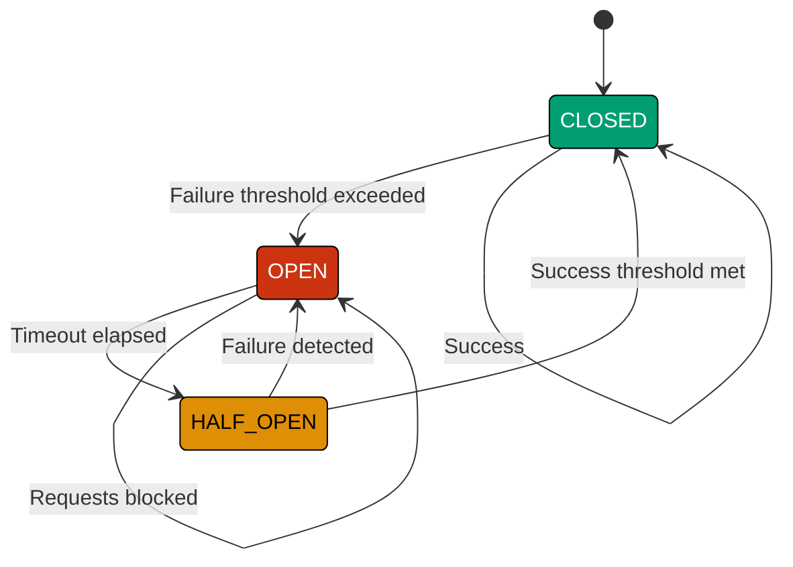
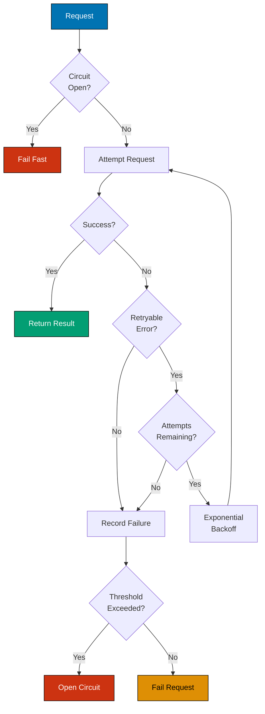

## Understanding Resilience Patterns

Resilience means systems continue functioning despite failures. Distributed systems face network failures, service outages, and transient errors. Resilience patterns prevent cascading failures and enable graceful degradation.

**Why resilience matters:**

- **Failures are normal**: Network partitions, timeouts, service crashes
- **Cascading failures**: One failure triggers others
- **User experience**: Partial functionality beats complete failure
- **Cost efficiency**: Retries can succeed without manual intervention

This guide covers retry patterns with exponential backoff and circuit breaker patterns for protecting systems from overload.

## Retry Pattern with Exponential Backoff

**Problem**: Transient failures (network glitches, temporary overload) cause operations to fail when immediate retry might succeed. Naive retries create thundering herd problem.

**Recognition signals:**

- Operations fail intermittently
- Network timeouts occur sporadically
- Services report temporary unavailability (503 Service Unavailable)
- Immediate retries create load spikes
- No delay between retry attempts

**Solution**: Retry with exponential backoff - increasing delays between attempts.

| Characteristic      | Naive Retry               | Exponential Backoff                |
| ------------------- | ------------------------- | ---------------------------------- |
| Retry timing        | Immediate                 | Increasing delays (1s, 2s, 4s, 8s) |
| Load pattern        | Thundering herd           | Distributed load                   |
| Success probability | Same each attempt         | Increases with time                |
| Resource usage      | High (constant hammering) | Bounded (max attempts)             |

**Example:**

```java
import java.time.Duration;
import java.util.Random;
import java.util.function.Supplier;

public class RetryWithBackoff {
    private final int maxAttempts;
    private final Duration initialDelay;
    private final double multiplier;
    private final Random random = new Random();

    public RetryWithBackoff(int maxAttempts, Duration initialDelay, double multiplier) {
        this.maxAttempts = maxAttempts;
        this.initialDelay = initialDelay;
        this.multiplier = multiplier;
    }

    public <T> T execute(Supplier<T> operation) {
        Exception lastException = null;
        long delay = initialDelay.toMillis();

        for (int attempt = 1; attempt <= maxAttempts; attempt++) {
            try {
                return operation.get();  // SUCCESS
            } catch (Exception e) {
                lastException = e;
                if (attempt == maxAttempts) {
                    break;  // EXHAUSTED: No more retries
                }

                // EXPONENTIAL BACKOFF with jitter
                long jitter = (long) (delay * 0.1 * random.nextDouble());
                long sleepTime = delay + jitter;

                try {
                    Thread.sleep(sleepTime);
                } catch (InterruptedException ie) {
                    Thread.currentThread().interrupt();
                    throw new RuntimeException("Retry interrupted", ie);
                }

                delay = (long) (delay * multiplier);  // INCREASE: 1s → 2s → 4s → 8s
            }
        }

        throw new RuntimeException("Failed after " + maxAttempts + " attempts", lastException);
    }
}

// USAGE
RetryWithBackoff retry = new RetryWithBackoff(
    5,  // MAX 5 attempts
    Duration.ofSeconds(1),  // START with 1 second
    2.0  // DOUBLE each time
);

String result = retry.execute(() -> {
    return externalService.call();  // MIGHT FAIL TRANSIENTLY
});
```

**Timing example:**

| Attempt | Delay | Total Time |
| ------- | ----- | ---------- |
| 1       | 0s    | 0s         |
| 2       | 1s    | 1s         |
| 3       | 2s    | 3s         |
| 4       | 4s    | 7s         |
| 5       | 8s    | 15s        |

**Jitter**: Random variance prevents synchronized retries.

```java
// WITHOUT JITTER: All clients retry at same time
delay = baseDelay * Math.pow(multiplier, attempt);

// WITH JITTER: Spread out retries
long jitter = (long) (delay * 0.1 * random.nextDouble());  // ±10%
delay = baseDelay * Math.pow(multiplier, attempt) + jitter;
```

### Retry Decision Logic

Not all failures should be retried:

```java
public boolean shouldRetry(Exception e) {
    // RETRY: Transient errors
    if (e instanceof SocketTimeoutException) return true;
    if (e instanceof ConnectException) return true;

    // RETRY: HTTP 503 (Service Unavailable), 429 (Too Many Requests)
    if (e instanceof HttpStatusException) {
        int status = ((HttpStatusException) e).getStatusCode();
        return status == 503 || status == 429;
    }

    // DON'T RETRY: Client errors (4xx except 429)
    if (e instanceof HttpStatusException) {
        int status = ((HttpStatusException) e).getStatusCode();
        return status < 400 || status >= 500;  // NOT 4xx
    }

    // DON'T RETRY: Authentication failures
    if (e instanceof AuthenticationException) return false;

    return false;  // DEFAULT: Don't retry
}
```

| HTTP Status               | Retry? | Reason                               |
| ------------------------- | ------ | ------------------------------------ |
| 200-299                   | N/A    | Success                              |
| 400 Bad Request           | No     | Client error (won't change on retry) |
| 401 Unauthorized          | No     | Authentication issue                 |
| 404 Not Found             | No     | Resource doesn't exist               |
| 429 Too Many Requests     | Yes    | Rate limit (with backoff)            |
| 500 Internal Server Error | Yes    | Transient server issue               |
| 503 Service Unavailable   | Yes    | Temporary overload                   |
| 504 Gateway Timeout       | Yes    | Temporary timeout                    |

## Circuit Breaker Pattern

**Problem**: When downstream service fails, continuous retries waste resources and delay failure detection. Clients amplify load on failing services.

**Recognition signals:**

- Repeated failures to same service
- Timeouts exhaust connection pools
- Cascading failures across services
- Slow degradation instead of fast failure
- No recovery time for failing service

**Solution**: Circuit breaker stops requests to failing service, allowing recovery time.

### Circuit Breaker States



| State     | Behavior                      | Transition                       |
| --------- | ----------------------------- | -------------------------------- |
| CLOSED    | Requests pass through         | Failure threshold → OPEN         |
| OPEN      | Requests fail immediately     | Timeout → HALF_OPEN              |
| HALF_OPEN | Limited requests test service | Success → CLOSED, Failure → OPEN |

**Implementation:**

```java
import java.time.Duration;
import java.time.Instant;
import java.util.concurrent.atomic.AtomicInteger;
import java.util.concurrent.atomic.AtomicReference;
import java.util.function.Supplier;

public class CircuitBreaker {
    private enum State { CLOSED, OPEN, HALF_OPEN }

    private final int failureThreshold;
    private final Duration timeout;
    private final AtomicInteger failureCount = new AtomicInteger(0);
    private final AtomicReference<State> state = new AtomicReference<>(State.CLOSED);
    private volatile Instant openedAt;

    public CircuitBreaker(int failureThreshold, Duration timeout) {
        this.failureThreshold = failureThreshold;
        this.timeout = timeout;
    }

    public <T> T execute(Supplier<T> operation) {
        if (state.get() == State.OPEN) {
            // CHECK: Timeout elapsed?
            if (Instant.now().isAfter(openedAt.plus(timeout))) {
                state.set(State.HALF_OPEN);  // TRANSITION: Try one request
            } else {
                throw new CircuitBreakerOpenException("Circuit breaker is OPEN");
            }
        }

        try {
            T result = operation.get();  // EXECUTE
            onSuccess();
            return result;
        } catch (Exception e) {
            onFailure();
            throw e;
        }
    }

    private void onSuccess() {
        failureCount.set(0);  // RESET
        if (state.get() == State.HALF_OPEN) {
            state.set(State.CLOSED);  // TRANSITION: Service recovered
        }
    }

    private void onFailure() {
        int failures = failureCount.incrementAndGet();
        if (failures >= failureThreshold) {
            state.set(State.OPEN);  // TRANSITION: Too many failures
            openedAt = Instant.now();
        }
    }

    public State getState() {
        return state.get();
    }
}

// USAGE
CircuitBreaker breaker = new CircuitBreaker(
    5,  // OPEN after 5 failures
    Duration.ofSeconds(30)  // WAIT 30 seconds before retry
);

try {
    String response = breaker.execute(() -> {
        return externalService.call();
    });
} catch (CircuitBreakerOpenException e) {
    // FAST FAIL: Circuit is open
    return cachedResponse();  // FALLBACK
}
```

**Behavior timeline:**

| Time | Failures | State     | Action                        |
| ---- | -------- | --------- | ----------------------------- |
| 0s   | 0        | CLOSED    | Requests pass                 |
| 5s   | 5        | OPEN      | Circuit opens, block requests |
| 10s  | 5        | OPEN      | Requests blocked (fail fast)  |
| 35s  | 5        | HALF_OPEN | Allow one test request        |
| 35s  | 5        | CLOSED    | Test succeeds, circuit closes |

### Advanced Circuit Breaker

```java
public class AdvancedCircuitBreaker {
    private final int failureThreshold;
    private final int successThreshold;  // HALF_OPEN → CLOSED
    private final Duration timeout;
    private final SlidingWindow failureWindow;  // Track recent failures
    private final AtomicInteger halfOpenSuccesses = new AtomicInteger(0);

    private static class SlidingWindow {
        private final int size;
        private final CircularBuffer<Boolean> results;

        public SlidingWindow(int size) {
            this.size = size;
            this.results = new CircularBuffer<>(size);
        }

        public void record(boolean success) {
            results.add(success);
        }

        public int getFailureCount() {
            return (int) results.stream().filter(r -> !r).count();
        }

        public double getFailureRate() {
            return (double) getFailureCount() / results.size();
        }
    }

    public <T> T execute(Supplier<T> operation) {
        State current = state.get();

        if (current == State.OPEN) {
            if (shouldAttemptReset()) {
                state.set(State.HALF_OPEN);
                halfOpenSuccesses.set(0);
            } else {
                throw new CircuitBreakerOpenException();
            }
        }

        try {
            T result = operation.get();
            onSuccess();
            return result;
        } catch (Exception e) {
            onFailure();
            throw e;
        }
    }

    private void onSuccess() {
        failureWindow.record(true);

        if (state.get() == State.HALF_OPEN) {
            int successes = halfOpenSuccesses.incrementAndGet();
            if (successes >= successThreshold) {
                state.set(State.CLOSED);  // RECOVERED
                failureWindow.clear();
            }
        }
    }

    private void onFailure() {
        failureWindow.record(false);

        if (state.get() == State.HALF_OPEN) {
            state.set(State.OPEN);  // STILL FAILING
            openedAt = Instant.now();
        } else if (failureWindow.getFailureRate() >= failureThreshold) {
            state.set(State.OPEN);
            openedAt = Instant.now();
        }
    }
}
```

## Combining Patterns

**Problem**: Retry and circuit breaker solve different problems. Combined, they provide robust resilience.

**Solution**: Circuit breaker outside, retry inside.

```java
public class ResilientHttpClient {
    private final CircuitBreaker circuitBreaker;
    private final RetryWithBackoff retry;

    public ResilientHttpClient() {
        this.circuitBreaker = new CircuitBreaker(5, Duration.ofSeconds(30));
        this.retry = new RetryWithBackoff(3, Duration.ofSeconds(1), 2.0);
    }

    public String call(String url) {
        return circuitBreaker.execute(() -> {  // CIRCUIT BREAKER: Fail fast if open
            return retry.execute(() -> {  // RETRY: Handle transient failures
                return httpClient.get(url);
            });
        });
    }
}
```

**Decision flowchart:**



## Fallback Strategies

When all else fails, provide degraded functionality:

```java
public class ResilientService {
    private final CircuitBreaker breaker;
    private final Cache<String, String> cache;

    public String getData(String key) {
        try {
            return breaker.execute(() -> {
                return externalService.fetch(key);
            });
        } catch (CircuitBreakerOpenException e) {
            // FALLBACK 1: Return cached data
            String cached = cache.get(key);
            if (cached != null) {
                return cached;
            }

            // FALLBACK 2: Return default value
            return getDefaultValue(key);
        }
    }

    private String getDefaultValue(String key) {
        return "Service temporarily unavailable";
    }
}
```

## Guidelines

**When to use retry:**

- ✓ Transient network failures
- ✓ Temporary service overload
- ✓ Read operations (idempotent)
- ✓ Operations with bounded time

**When to avoid retry:**

- ✗ Client errors (4xx)
- ✗ Non-idempotent writes (unless idempotency key used)
- ✗ Real-time operations with strict latency requirements

**When to use circuit breaker:**

- ✓ Calls to external services
- ✓ Operations that can fail in cascading manner
- ✓ Services with known failure modes
- ✓ Operations where fast failure preferred over slow failure

**Best practices:**

1. **Combine patterns**: Circuit breaker + retry + fallback
2. **Monitor metrics**: Track failure rates, circuit state transitions
3. **Set realistic thresholds**: Balance sensitivity vs. false positives
4. **Test failures**: Chaos engineering, fault injection
5. **Provide fallbacks**: Cached data, default values, degraded functionality

## Conclusion

Resilience patterns enable fault-tolerant systems:

- **Retry with backoff**: Handle transient failures gracefully
- **Circuit breaker**: Prevent cascading failures, enable recovery
- **Fallbacks**: Degrade gracefully instead of complete failure

Build resilience in layers: retry for transient issues, circuit breaker for sustained failures, and fallbacks for complete outages. Monitor and tune thresholds based on real-world behavior. Resilience is not optional in distributed systems.
