## Why Test-Driven Development Matters

Test-Driven Development (TDD) is critical for financial and enterprise systems because it prevents costly bugs, ensures correctness, enables confident refactoring, and documents behavior through executable specifications.

**Core Benefits**:

- **Prevents costly bugs**: Catch calculation errors before production
- **Ensures correctness**: Test-first forces thinking about requirements
- **Enables refactoring**: Tests provide safety net for improvements
- **Documents behavior**: Tests serve as executable specifications
- **Builds confidence**: High test coverage reduces deployment risk

**Problem**: Without TDD, bugs reach production causing incorrect calculations and financial losses.

**Solution**: Write tests first to catch bugs in seconds, never in production.

## The Red-Green-Refactor Cycle

TDD follows a simple three-step cycle that drives development through tests.

```mermaid
%% Color Palette: Blue #0173B2, Orange #DE8F05, Teal #029E73, Purple #CC78BC
%% All colors are color-blind friendly and meet WCAG AA contrast standards

stateDiagram-v2
    [*] --> Red: Write test

    Red --> Green: Test fails
    Green --> Refactor: Test passes
    Refactor --> Red: Tests still pass,<br/>next feature

    note right of Red
        🔴 RED
        Write failing test
        Specify desired behavior
    end note

    note right of Green
        🟢 GREEN
        Write minimum code
        Make test pass
    end note

    note right of Refactor
        ♻️ REFACTOR
        Improve code quality
        Keep tests passing
    end note

    classDef redState fill:#CC78BC,stroke:#000000,color:#FFFFFF,stroke-width:3px
    classDef greenState fill:#029E73,stroke:#000000,color:#FFFFFF,stroke-width:3px
    classDef refactorState fill:#0173B2,stroke:#000000,color:#FFFFFF,stroke-width:3px

    class Red redState
    class Green greenState
    class Refactor refactorState
```



### Step 1: RED - Write Failing Test

Write a test that specifies desired behavior. The test fails because the feature doesn't exist yet.

**Before**: No test, no specification of behavior
**After**: Clear specification of what code should do, test fails as expected

### Step 2: GREEN - Make It Pass

Write minimum code to make the test pass. Don't worry about perfection yet.

**Before**: Test fails, feature not implemented
**After**: Test passes, feature works (even if implementation is simple)

### Step 3: REFACTOR - Improve Code

Improve code quality while keeping tests green. Extract constants, improve naming, add validation, record domain events.

**Before**: Code works but may be simple or duplicated
**After**: Clean, maintainable code with tests still passing

## Testing Approaches in Java

Java provides multiple approaches for testing code, from built-in language features to sophisticated frameworks.

| Approach                | Abstraction | Organization | Reporting | Production Ready | Use When                  |
| ----------------------- | ----------- | ------------ | --------- | ---------------- | ------------------------- |
| **assert keyword**      | Low         | Manual       | None      | No               | Learning, debugging       |
| **Manual test runners** | Low         | Manual       | Basic     | No               | Simple scripts            |
| **JUnit 5**             | High        | Automatic    | Rich      | Yes              | Production testing        |
| **TestNG**              | High        | Automatic    | Rich      | Yes              | Complex test dependencies |

**Recommended progression**: Start with assert keyword to understand testing fundamentals → Learn manual test runners to see framework value → Use JUnit 5 for production testing.

## Built-in Testing with Standard Library

**Foundation**: Java's built-in testing capabilities (assert keyword, manual test runners, exception verification) are covered in [by-example beginner section](/en/learn/software-engineering/programming-languages/java/by-example/beginner#testing-basics). This guide focuses on production TDD with JUnit 5, Mockito, and professional testing patterns.

For learning purposes, here's a brief summary of standard library testing:

### Assert Keyword Basics

Java provides the `assert` keyword for runtime assertions that verify program correctness.

**Pattern**:

```java
public class Calculator {
    public int add(int a, int b) {
        return a + b;
    }

    public int divide(int a, int b) {
        assert b != 0 : "Divisor cannot be zero";
        return a / b;
    }

    public static void main(String[] args) {
        Calculator calc = new Calculator();

        // Test addition
        int result = calc.add(2, 3);
        assert result == 5 : "Expected 2 + 3 = 5, got " + result;

        // Test division
        int quotient = calc.divide(10, 2);
        assert quotient == 5 : "Expected 10 / 2 = 5, got " + quotient;

        System.out.println("All assertions passed!");
    }
}
```

**Enabling assertions**: Assertions are disabled by default. Enable with `-ea` (enable assertions) flag.

```bash
# Run with assertions enabled
java -ea Calculator

# Run with assertions disabled (default)
java Calculator
```

**Problem**: Assertions disabled by default means bugs can slip through.

**Solution**: Always run tests with `-ea` flag during development and testing.

### Assert Syntax and Messages

Assert statements verify conditions and throw AssertionError if false.

**Syntax**:

```java
// Simple assertion (no message)
assert condition;

// Assertion with message
assert condition : "Error message";

// Assertion with detailed message
assert condition : String.format("Expected %d, got %d", expected, actual);
```

**Example**:

```java
public class StringUtils {
    public static String reverse(String input) {
        assert input != null : "Input cannot be null";
        assert !input.isEmpty() : "Input cannot be empty";

        StringBuilder reversed = new StringBuilder(input).reverse();
        String result = reversed.toString();

        // Post-condition: reversed string has same length
        assert result.length() == input.length() : "Length mismatch after reversal";

        return result;
    }

    public static void main(String[] args) {
        assert reverse("hello").equals("olleh") : "Failed to reverse 'hello'";
        assert reverse("Java").equals("avaJ") : "Failed to reverse 'Java'";

        System.out.println("All string tests passed!");
    }
}
```

**Before**: No verification of correctness
**After**: Runtime verification with clear error messages

### Limitations of Assert Keyword

Assert keyword has significant limitations for production testing.

**Critical limitations**:

1. **Disabled by default**: Assertions don't run in production unless explicitly enabled
2. **No test discovery**: Must manually call test methods from main()
3. **Poor failure reporting**: Only shows first failure, then stops execution
4. **No test organization**: No way to group related tests
5. **No setup/teardown**: No lifecycle hooks for test isolation
6. **No test reporting**: No summary of passed/failed tests

**Example showing limitations**:

```java
public class LimitationsExample {
    public static void main(String[] args) {
        // Limitation 1: First failure stops everything
        assert 2 + 2 == 4 : "Math works";
        assert 2 + 2 == 5 : "This fails and stops execution";
        assert 3 + 3 == 6 : "Never reached due to previous failure";

        // Limitation 2: No way to track passed vs failed
        // Limitation 3: No organized test suites
        // Limitation 4: No reporting (just exception or nothing)
    }
}
```

**When to use assertions**:

- **Debugging**: Verify invariants during development
- **Internal consistency**: Check preconditions and postconditions
- **Learning**: Understand testing concepts before frameworks

**When NOT to use assertions**:

- **Production testing**: Frameworks provide organization and reporting
- **Public API validation**: Use exceptions (IllegalArgumentException) instead
- **Business logic errors**: Use exceptions, not assertions

### Manual Test Runner Pattern

Create simple test runner with main() method for organized testing without frameworks.

**Pattern**:

```java
public class ManualTestRunner {
    private int passed = 0;
    private int failed = 0;

    public void runTest(String testName, Runnable test) {
        try {
            test.run();
            passed++;
            System.out.println("✓ PASS: " + testName);
        } catch (AssertionError e) {
            failed++;
            System.out.println("✗ FAIL: " + testName);
            System.out.println("  Reason: " + e.getMessage());
        } catch (Exception e) {
            failed++;
            System.out.println("✗ ERROR: " + testName);
            System.out.println("  Exception: " + e.getMessage());
        }
    }

    public void printSummary() {
        System.out.println("\n" + "=".repeat(50));
        System.out.println("Tests run: " + (passed + failed));
        System.out.println("Passed: " + passed);
        System.out.println("Failed: " + failed);
        System.out.println("=".repeat(50));

        if (failed > 0) {
            System.exit(1);  // Non-zero exit code indicates failure
        }
    }

    public static void main(String[] args) {
        ManualTestRunner runner = new ManualTestRunner();

        // Test Calculator
        Calculator calc = new Calculator();

        runner.runTest("Addition: 2 + 3 = 5", () -> {
            assert calc.add(2, 3) == 5;
        });

        runner.runTest("Addition: negative numbers", () -> {
            assert calc.add(-5, 3) == -2;
        });

        runner.runTest("Division: 10 / 2 = 5", () -> {
            assert calc.divide(10, 2) == 5;
        });

        runner.runTest("Division by zero should fail", () -> {
            try {
                calc.divide(10, 0);
                throw new AssertionError("Should have thrown exception");
            } catch (AssertionError e) {
                // Expected
            }
        });

        runner.printSummary();
    }
}
```

**Output**:

```
✓ PASS: Addition: 2 + 3 = 5
✓ PASS: Addition: negative numbers
✓ PASS: Division: 10 / 2 = 5
✗ FAIL: Division by zero should fail
  Reason: Divisor cannot be zero

==================================================
Tests run: 4
Passed: 3
Failed: 1
==================================================
```

**Before**: Assertions stop on first failure
**After**: All tests run, summary shows pass/fail count

### Exception-Based Verification

Use try-catch blocks to verify exception throwing.

**Pattern**:

```java
public class ExceptionTestingExample {
    public static void testDivisionByZero() {
        Calculator calc = new Calculator();

        try {
            calc.divide(10, 0);
            throw new AssertionError("Expected AssertionError for division by zero");
        } catch (AssertionError e) {
            if (e.getMessage().contains("Divisor cannot be zero")) {
                System.out.println("✓ PASS: Division by zero throws correct error");
            } else {
                throw new AssertionError("Wrong error message: " + e.getMessage());
            }
        }
    }

    public static void main(String[] args) {
        testDivisionByZero();
    }
}
```

**Problem**: Verifying exception throwing requires verbose try-catch blocks.

**Solution**: Frameworks provide cleaner exception assertions (shown later in JUnit 5).

### Exit Codes for Pass/Fail

Use System.exit() to signal test success or failure to calling processes.

**Pattern**:

```java
public class ExitCodeExample {
    public static void main(String[] args) {
        boolean allTestsPassed = true;

        // Run tests
        try {
            assert 2 + 2 == 4;
            assert 3 * 3 == 9;
            System.out.println("All tests passed!");
        } catch (AssertionError e) {
            System.err.println("Test failed: " + e.getMessage());
            allTestsPassed = false;
        }

        // Exit with appropriate code
        if (allTestsPassed) {
            System.exit(0);  // Success
        } else {
            System.exit(1);  // Failure
        }
    }
}
```

**Exit code conventions**:

- `0`: Success (all tests passed)
- `1`: Failure (one or more tests failed)
- `2+`: Specific error codes (optional)

**Use in CI/CD**:

```bash
# Run tests and check exit code
java -ea ExitCodeExample
if [ $? -eq 0 ]; then
    echo "Tests passed, deploying..."
else
    echo "Tests failed, aborting deployment"
    exit 1
fi
```

**Before**: No signal to calling process about test results
**After**: Exit codes enable CI/CD integration

### Why We Need Testing Frameworks

Built-in testing approaches fail for production testing due to missing features.

**Critical missing features**:

| Feature                    | assert keyword | Manual Runner | JUnit 5 |
| -------------------------- | -------------- | ------------- | ------- |
| **Test discovery**         | ✗ No           | ✗ No          | ✓ Yes   |
| **Lifecycle hooks**        | ✗ No           | ✗ No          | ✓ Yes   |
| **Parameterized**          | ✗ No           | ✗ No          | ✓ Yes   |
| **Parallel tests**         | ✗ No           | ✗ No          | ✓ Yes   |
| **Rich reporting**         | ✗ No           | △ Basic       | ✓ Yes   |
| **IDE integration**        | ✗ No           | ✗ No          | ✓ Yes   |
| **Build tool integration** | ✗ No           | ✗ No          | ✓ Yes   |
| **Test organization**      | ✗ No           | △ Manual      | ✓ Yes   |

**Production testing requirements**:

- **Test discovery**: Automatically find and run all test methods
- **Test isolation**: Each test runs with clean state (setup/teardown)
- **Rich assertions**: Clear failure messages with expected vs actual
- **Exception testing**: Verify exception types and messages easily
- **Parameterized tests**: Run same test with multiple inputs
- **Test organization**: Group related tests with @Nested
- **Parallel execution**: Speed up test suites
- **Build integration**: Maven/Gradle automatically run tests
- **IDE integration**: Run tests from IDE, see failures inline

**Example showing framework value**:

```java
// Manual approach: 20+ lines per test with try-catch, reporting, etc.
public static void testAddition() {
    try {
        Calculator calc = new Calculator();
        int result = calc.add(2, 3);
        assert result == 5 : "Expected 5, got " + result;
        System.out.println("✓ PASS: testAddition");
    } catch (AssertionError e) {
        System.out.println("✗ FAIL: testAddition - " + e.getMessage());
    }
}

// JUnit 5 approach: 4 lines with automatic discovery, reporting, IDE integration
@Test
void testAddition() {
    Calculator calc = new Calculator();
    assertThat(calc.add(2, 3)).isEqualTo(5);
}
```

**Conclusion**: Manual testing teaches fundamentals, but production testing requires frameworks for organization, automation, and tooling integration.

## JUnit 5 - Testing Framework (External Library)

JUnit 5 is the modern testing framework for Java, providing annotations, lifecycle hooks, and parameterized testing.

### Basic Test Structure

JUnit 5 organizes tests with clear structure using lifecycle hooks and annotations.

**Key annotations**:

- `@Test`: Marks a test method
- `@BeforeEach`: Runs before each test (setup)
- `@AfterEach`: Runs after each test (cleanup)
- `@DisplayName`: Provides readable test names in reports
- `@Disabled`: Temporarily disables a test
- `@Timeout`: Fails test if execution exceeds time limit

**Problem**: Tests need consistent setup and teardown for isolation.

**Solution**: Use lifecycle hooks to ensure each test starts with clean state.

### Lifecycle Hooks


**Before**: Manual setup in each test, potential state leakage between tests
**After**: Automatic setup/teardown, isolated tests

### Parameterized Tests

Parameterized tests allow testing multiple inputs with single test method using `@ParameterizedTest`.

**Data sources**:

- `@CsvSource`: Inline CSV data
- `@ValueSource`: Single parameter values
- `@MethodSource`: Complex data from factory method

**Problem**: Writing duplicate tests for multiple input scenarios is repetitive.

**Solution**: Use parameterized tests to test multiple scenarios with one test method.

### Nested Tests

Nested tests organize related test cases hierarchically using `@Nested` annotation and Given-When-Then structure.

**Problem**: Flat test structure makes it hard to see relationships between tests.

**Solution**: Use `@Nested` classes to group related scenarios (e.g., "When created", "When processed").

### Test Timeouts

Timeout testing prevents hanging tests by failing if execution exceeds time limit using `@Timeout` annotation.

**Pattern**: `@Timeout(value = 1, unit = TimeUnit.SECONDS)`

**Use cases**:

- **Performance regression**: Detect when code becomes unexpectedly slow
- **Prevent hanging**: Fail fast instead of blocking CI pipeline
- **Resource cleanup**: Ensure tests don't leak resources causing slowdowns

**Problem**: Slow or hanging tests block CI pipeline and developer productivity.

**Solution**: Add `@Timeout` to catch performance regressions and prevent infinite loops.

**Trade-off**: Flaky on slow CI servers - set conservative limits or skip on CI.

### Display Names

Display names make test reports more readable using `@DisplayName` annotation for human-friendly test descriptions.

**Pattern**: `@DisplayName("Should calculate discount when customer is VIP")`

**Before**: Test reports show method names like `testCalculateDiscount_VipCustomer_ReturnsDiscountedPrice`
**After**: Test reports show readable names like "Should calculate discount when customer is VIP"

**Problem**: Method names must follow Java naming conventions making them less readable in reports.

**Solution**: Use `@DisplayName` to separate code naming from test documentation.

**Best practices**:

- Use business language not technical jargon
- Start with "Should" for behavior-driven style
- Keep under 80 characters for readability
- Describe expected behavior not implementation

## AssertJ - Fluent Assertions (External Library)

AssertJ provides fluent, readable assertions that make test failures clear and expressive.

### Fluent Assertion Style

AssertJ uses method chaining for readable assertions:

- **Equality**: `assertThat(value).isEqualTo(expected)`
- **Strings**: `assertThat(str).startsWith("prefix").contains("middle").endsWith("suffix")`
- **Numbers**: `assertThat(num).isGreaterThan(min).isLessThan(max)`
- **BigDecimal**: `assertThat(decimal).isEqualByComparingTo(expected)`
- **Nulls**: `assertThat(value).isNotNull()`

**Problem**: Traditional JUnit assertions (`assertEquals`) are less readable and have unclear failure messages.

**Solution**: AssertJ fluent API makes assertions read like natural language.

### Collection Assertions

AssertJ provides rich assertions for collections:

- **Size**: `assertThat(list).hasSize(3)`
- **Contains**: `assertThat(list).contains("item")`
- **Exact order**: `assertThat(list).containsExactly("a", "b", "c")`
- **Any order**: `assertThat(list).containsExactlyInAnyOrder("c", "a", "b")`
- **Predicates**: `assertThat(list).allMatch(x -> x.length() > 2)`

**Problem**: Testing collection contents requires multiple assertions or complex logic.

**Solution**: AssertJ collection assertions express intent clearly in one line.

### Exception Assertions

AssertJ makes exception testing clear and expressive:

- `assertThatThrownBy(() -> code).isInstanceOf(Exception.class).hasMessage("message")`
- `assertThatIllegalArgumentException().isThrownBy(() -> code)`
- `assertThatNoException().isThrownBy(() -> code)`

**Problem**: JUnit's `assertThrows` doesn't allow fluent verification of exception details.

**Solution**: AssertJ exception assertions verify type and message in one fluent chain.

### Custom Assertions

Custom assertions encapsulate domain-specific assertion logic for reusability and clarity.

**Problem**: Repeating complex assertions for domain objects in multiple tests.

**Solution**: Create custom assertion classes extending `AbstractAssert` for domain objects.

## Mockito - Mocking Framework (External Library)

Mockito provides test doubles for isolating units under test by replacing dependencies with controlled mocks.

### Creating Mocks

Mockito creates test doubles that intercept method calls and return stubbed values.


**Key annotations**:

- `@Mock`: Creates mock object
- `@InjectMocks`: Creates object and injects mocks into it
- `@ExtendWith(MockitoExtension.class)`: Enables Mockito in JUnit 5

**Problem**: Testing a service requires real database, message broker, and external APIs.

**Solution**: Replace dependencies with mocks to test service logic in isolation.

### Stubbing Behavior

Mockito stubs configure how mocks respond to method calls:

- **Return value**: `when(mock.method()).thenReturn(value)`
- **Successive values**: `when(mock.method()).thenReturn(value1).thenReturn(value2)`
- **Throw exception**: `when(mock.method()).thenThrow(new Exception())`
- **Argument matchers**: `when(mock.method(anyString())).thenReturn(value)`

**Problem**: Mocks need to return specific values to test different scenarios.

**Solution**: Stub method calls with `when().thenReturn()` to control mock behavior.

### Verification

Mockito verification confirms that expected interactions occurred:

- **Method called**: `verify(mock).method()`
- **Call count**: `verify(mock, times(2)).method()`
- **Never called**: `verify(mock, never()).method()`
- **At least once**: `verify(mock, atLeastOnce()).method()`
- **Argument matchers**: `verify(mock).method(argThat(predicate))`

**Problem**: Need to verify that service called repository to save changes.

**Solution**: Use `verify()` to confirm expected method calls happened.

### Argument Captors

Argument captors capture arguments passed to mock methods for detailed verification:

- `ArgumentCaptor.forClass(Type.class)`
- `verify(mock).method(captor.capture())`
- `captor.getValue()` returns captured argument

**Problem**: Need to verify not just that method was called, but with what specific values.

**Solution**: Use ArgumentCaptor to capture and inspect method arguments.

### Argument Matchers

Argument matchers provide flexible matching for stub configuration and verification when exact values aren't known or relevant.

**Common matchers**:

- `any()`: Matches any value (including null)
- `anyString()`: Matches any String
- `anyInt()`, `anyLong()`, `anyDouble()`: Matches any primitive
- `startsWith(prefix)`: String starting with prefix
- `endsWith(suffix)`: String ending with suffix
- `contains(substring)`: String containing substring
- `argThat(predicate)`: Custom predicate matching

**Stubbing with matchers**:

```java
when(repository.findById(anyString())).thenReturn(defaultUser);
when(repository.findByEmail(startsWith("admin"))).thenReturn(adminUser);
```

**Verification with matchers**:

```java
verify(repository).save(argThat(user -> user.getAge() > 18));
verify(emailService).send(anyString(), contains("welcome"));
```

**Problem**: Testing with exact values is brittle - tests break when inputs change slightly.

**Solution**: Use matchers to verify behavior patterns rather than exact values.

**Warning**: Cannot mix matchers and exact values in same method call - use `eq()` for exact values when mixing.

### Spies

Spies allow partial mocking of real objects - use real methods but stub specific behaviors.

**Problem**: Need real object behavior but want to verify interactions or stub one method.

**Solution**: Use `spy()` to create partial mock that delegates to real object by default.

## Testing Strategies and the Test Pyramid

The test pyramid guides how many tests to write at each level for optimal coverage and speed.


**Strategy**:

- **70% Unit Tests**: Fast, isolated, test business logic
- **20% Integration Tests**: Test component interactions
- **10% E2E Tests**: Test complete user workflows

### Unit Tests

Unit tests test individual units in isolation with no external dependencies.

**Characteristics**:

- Fast execution (less than 100ms each)
- No database, network, or file system
- Use mocks for dependencies
- Test single class or method

**Problem**: Slow tests with external dependencies make TDD painful.

**Solution**: Isolate units with mocks for fast, focused tests.

### Integration Tests

Integration tests verify multiple components working together with real dependencies.

**Characteristics**:

- Slower execution (1-10 seconds)
- Real dependencies (database, message broker)
- Test component interactions
- Use TestContainers for databases

**Problem**: Mocks can't verify components actually work together.

**Solution**: Integration tests with real dependencies verify component contracts.

### TestContainers

TestContainers provides real databases in Docker containers for integration tests.

**Problem**: Integration tests need real databases but can't rely on shared test database.

**Solution**: TestContainers spins up isolated database per test suite in Docker.

## Testing Domain Models

Domain models require special testing approaches for value objects, entities, and aggregates.

### Testing Value Objects

Value objects are immutable, equality is based on value, and they have no identity.

**Test focus**:

- **Creation**: Valid objects created correctly
- **Validation**: Invalid inputs rejected
- **Immutability**: Operations return new instances
- **Equality**: Same values equal, hashCode matches

**Problem**: Value objects must maintain invariants and immutability.

**Solution**: Test creation, validation, immutability, and equality.

### Testing Entities

Entities have identity, and equality is based on ID regardless of other field values.

**Test focus**:

- **Creation**: Entity created with ID
- **State changes**: Methods modify state correctly
- **Invariants**: Business rules enforced
- **Equality by ID**: Same ID equals same entity

**Problem**: Entities have complex state transitions and business rules.

**Solution**: Test state transitions, invariant enforcement, and ID-based equality.

### Testing Aggregates

Aggregates are consistency boundaries with domain events, and only root is publicly accessible.

**Test focus**:

- **Aggregate operations**: Commands modify state correctly
- **Domain events**: Events recorded for state changes
- **Invariant enforcement**: Aggregates protect invariants
- **State transitions**: Valid state transitions only

**Problem**: Aggregates have complex invariants and emit domain events.

**Solution**: Test commands, events, invariants, and state transitions.

## Testing Patterns

### AAA Pattern (Arrange-Act-Assert)

Structure every test with three clear sections for readability and maintenance.

**Sections**:

- **Arrange**: Set up test data and dependencies
- **Act**: Execute behavior being tested
- **Assert**: Verify expected outcome

**Problem**: Unstructured tests are hard to read and maintain.

**Solution**: Use AAA pattern to make test structure clear.

### Given-When-Then Pattern

BDD-style structure similar to AAA with business-focused language.

**Sections**:

- **Given**: Preconditions and test setup
- **When**: Action being tested
- **Then**: Expected results

**Problem**: Technical AAA names don't express business intent.

**Solution**: Given-When-Then expresses business scenarios clearly.

### Test Builders

Test builders create test data easily with fluent API for complex object construction.

**Problem**: Creating test objects with many fields is verbose and repetitive.

**Solution**: Builder pattern provides fluent API for test object creation.

### Object Mother Pattern

Object mother provides factory methods for common test objects with meaningful defaults.

**Problem**: Tests need common object configurations repeatedly.

**Solution**: Object Mother pattern centralizes test object creation with meaningful names.

## TDD Best Practices

### 1. Write Tests First

Always write the test before the implementation to drive design and ensure testability.

**Before**: Write implementation, then test (if at all)
**After**: Write test first, then minimum code to pass, then refactor

### 2. One Assertion Per Test

Focus each test on a single behavior for clear failures and easy debugging.

**Before**: Multiple unrelated assertions in one test
**After**: Separate tests for each concern with single assertion

### 3. Use Descriptive Test Names

Test names should describe the behavior being tested for documentation and clarity.

**Naming patterns**:

- `shouldDoSomethingWhenCondition()`
- `testMethodName_Scenario_ExpectedBehavior()`
- Use `@DisplayName` for natural language

**Before**: Vague names like `test1()` or `testMethod()`
**After**: Descriptive names like `shouldThrowExceptionWhenAmountIsNegative()`

### 4. Keep Tests Independent

Tests should not depend on each other or execution order.

**Problem**: Tests that depend on execution order fail randomly.

**Solution**: Each test creates own test data, no shared state.

### 5. Test Behavior, Not Implementation

Test what code does, not how it does it, to avoid brittle tests.

**Before**: Testing implementation details like internal data structures
**After**: Testing public behavior and contracts

## TDD Checklist

### Before Writing Code

- [ ] Write a failing test first
- [ ] Test describes desired behavior clearly
- [ ] Test name is descriptive
- [ ] Test uses AAA or Given-When-Then structure

### Writing Implementation

- [ ] Write minimum code to make test pass
- [ ] All tests pass (GREEN)
- [ ] No shortcuts or workarounds

### After Tests Pass

- [ ] Refactor code for clarity
- [ ] Extract duplicated logic
- [ ] Improve naming
- [ ] All tests still pass after refactoring

### Code Review

- [ ] Tests cover edge cases
- [ ] Tests are independent
- [ ] No implementation details tested
- [ ] Test coverage is adequate (greater than 80%)
- [ ] Fast execution (unit tests less than 100ms)

## Performance and Coverage

### Test Execution Speed

**Unit test target**: Less than 100ms per test for fast feedback loop

**Integration test target**: 1-10 seconds acceptable for real dependencies

**Problem**: Slow tests make TDD painful and discourage running tests frequently.

**Solution**: Keep unit tests fast with mocks, reserve integration tests for component verification.

### Code Coverage Targets

Use JaCoCo for coverage reports and set appropriate targets per layer.

**Coverage targets**:

- **Domain models**: 95-100% (core business logic)
- **Application services**: 80-90%
- **Infrastructure**: 60-80%
- **Overall project**: Greater than 80%

**Problem**: Low coverage means untested code paths reach production.

**Solution**: Set coverage targets and measure with JaCoCo to ensure adequate testing.

## Related Content

### Core Java Topics

- **[Java Best Practices](/en/learn/software-engineering/programming-languages/java/in-the-field/best-practices)** - General coding standards and principles
- **[Java Anti-Patterns](/en/learn/software-engineering/programming-languages/java/in-the-field/anti-patterns)** - Common mistakes to avoid

### Testing in Practice

See [Java Test-Driven Development Examples](/en/learn/software-engineering/programming-languages/java/by-example/advanced#test-driven-development) for code-heavy examples of TDD patterns.

### External Resources

**Testing Frameworks**:

- [JUnit 5 User Guide](https://junit.org/junit5/docs/current/user-guide/) - Official JUnit 5 documentation
- [AssertJ Documentation](https://assertj.github.io/doc/) - Fluent assertions guide
- [Mockito Documentation](https://javadoc.io/doc/org.mockito/mockito-core/latest/org/mockito/Mockito.html) - Mocking framework reference
- [TestContainers](https://testcontainers.com/) - Integration testing with containers

**TDD Philosophy**:

- [Test-Driven Development by Example](https://www.oreilly.com/library/view/test-driven-development/0321146530/) - Kent Beck's foundational book
- [Growing Object-Oriented Software, Guided by Tests](https://www.growing-object-oriented-software.com/) - Advanced TDD practices

---

**Last Updated**: 2025-12-12
**Java Version**: 17+ (baseline), 21+ (recommended)
**Framework Versions**: JUnit 5.10.1, Mockito 5.15.2, AssertJ 3.27.6, TestContainers 1.20.4
