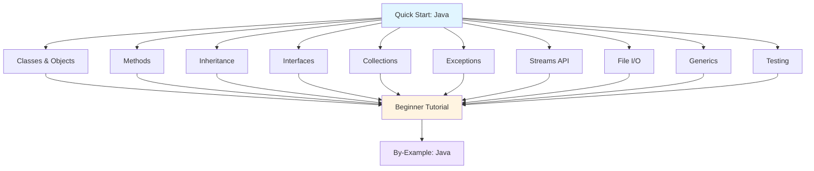

**Want to learn Java fundamentals quickly?** This quick start touches 8-12 core Java concepts with one example each. By the end, you'll have practical touchpoints for the most important language features.

This tutorial provides 5-30% coverage - rapid exposure to core concepts. For comprehensive mastery, continue to [Beginner Tutorial](/en/learn/software-engineering/programming-languages/java/by-concept/beginner) (0-60% coverage) or explore [By-Example](/en/learn/software-engineering/programming-languages/java/by-example) for heavily annotated code.

## Prerequisites

Before starting, you should have:

- Completed [Initial Setup](/en/learn/software-engineering/programming-languages/java/initial-setup) - JDK installed and working
- A text editor or IDE (IntelliJ IDEA, Eclipse, VS Code, or any editor)
- Basic understanding of programming concepts
- Willingness to write and run code

## Learning Objectives

By the end of this tutorial, you will have touchpoints for:

1. **Classes and Objects** - Define classes, create objects, constructors
2. **Methods and Overloading** - Instance methods, static methods, method overloading
3. **Inheritance and Polymorphism** - Extend classes, override methods
4. **Interfaces** - Define contracts, implement interfaces
5. **Collections Framework** - List, Set, Map data structures
6. **Exception Handling** - Try-catch, checked exceptions
7. **Streams API** - Functional programming with streams
8. **File I/O** - Read and write files
9. **Generics** - Type-safe collections and methods
10. **Testing with JUnit** - Write unit tests

## Learning Path



## Concept 1: Classes and Objects - Object-Oriented Fundamentals

Java is object-oriented - everything belongs to a class.

### Example: Class Definition and Object Creation

```java
// Person.java
public class Person {
    // Fields (instance variables)
    private String name;
    private int age;

    // Constructor
    public Person(String name, int age) {
        this.name = name;
        this.age = age;
    }

    // Getter methods
    public String getName() {
        return name;
    }

    public int getAge() {
        return age;
    }

    // Setter methods
    public void setAge(int age) {
        this.age = age;
    }

    // Instance method
    public void greet() {
        System.out.println("Hello, my name is " + name);
    }

    // Method with return value
    public boolean isAdult() {
        return age >= 18;
    }
}

// Main.java
public class Main {
    public static void main(String[] args) {
        // Create objects
        Person alice = new Person("Alice", 30);
        Person bob = new Person("Bob", 15);

        // Use objects
        alice.greet();  // Hello, my name is Alice
        System.out.println(alice.isAdult());  // true
        System.out.println(bob.isAdult());    // false

        // Modify object
        bob.setAge(20);
        System.out.println(bob.isAdult());    // true
    }
}
```

**Key concepts**: `class`, fields, constructors, methods, `this`, getters/setters, `new`

**When to explore deeper**: [Beginner Tutorial - Classes and Objects](/en/learn/software-engineering/programming-languages/java/by-concept/beginner#classes-objects)

## Concept 2: Methods and Overloading - Organize Behavior

Define methods with different signatures.

### Example: Method Overloading and Static Methods

```java
public class Calculator {
    // Method overloading - same name, different parameters
    public int add(int a, int b) {
        return a + b;
    }

    public double add(double a, double b) {
        return a + b;
    }

    public int add(int a, int b, int c) {
        return a + b + c;
    }

    // Static method - belongs to class, not instance
    public static int multiply(int a, int b) {
        return a * b;
    }

    // Varargs - variable number of arguments
    public static int sum(int... numbers) {
        int total = 0;
        for (int num : numbers) {
            total += num;
        }
        return total;
    }
}

public class Main {
    public static void main(String[] args) {
        Calculator calc = new Calculator();

        // Overloaded methods
        System.out.println(calc.add(5, 3));         // 8 (int)
        System.out.println(calc.add(5.5, 3.2));     // 8.7 (double)
        System.out.println(calc.add(1, 2, 3));      // 6 (three ints)

        // Static method - call on class
        System.out.println(Calculator.multiply(4, 5));  // 20

        // Varargs
        System.out.println(Calculator.sum(1, 2, 3, 4, 5));  // 15
    }
}
```

**Key concepts**: Method overloading, `static`, varargs (`int...`)

**When to explore deeper**: [Beginner Tutorial - Methods](/en/learn/software-engineering/programming-languages/java/by-concept/beginner#methods)

## Concept 3: Inheritance and Polymorphism - Code Reuse

Extend classes to inherit and specialize behavior.

### Example: Inheritance and Method Overriding

```java
// Base class
public class Animal {
    protected String name;

    public Animal(String name) {
        this.name = name;
    }

    public void makeSound() {
        System.out.println("Some generic sound");
    }

    public void sleep() {
        System.out.println(name + " is sleeping");
    }
}

// Derived class
public class Dog extends Animal {
    private String breed;

    public Dog(String name, String breed) {
        super(name);  // Call parent constructor
        this.breed = breed;
    }

    @Override  // Override parent method
    public void makeSound() {
        System.out.println(name + " says: Woof!");
    }

    // Additional method specific to Dog
    public void fetch() {
        System.out.println(name + " is fetching");
    }
}

public class Cat extends Animal {
    public Cat(String name) {
        super(name);
    }

    @Override
    public void makeSound() {
        System.out.println(name + " says: Meow!");
    }
}

public class Main {
    public static void main(String[] args) {
        // Polymorphism - parent reference, child object
        Animal dog = new Dog("Buddy", "Labrador");
        Animal cat = new Cat("Whiskers");

        dog.makeSound();  // Buddy says: Woof! (Dog's version)
        cat.makeSound();  // Whiskers says: Meow! (Cat's version)

        // Array of Animals
        Animal[] animals = {dog, cat};
        for (Animal animal : animals) {
            animal.makeSound();
            animal.sleep();
        }

        // Cast to access subclass methods
        if (dog instanceof Dog) {
            ((Dog) dog).fetch();  // Buddy is fetching
        }
    }
}
```

**Key concepts**: `extends`, `super`, `@Override`, polymorphism, `instanceof`, casting

**When to explore deeper**: [Beginner Tutorial - Inheritance](/en/learn/software-engineering/programming-languages/java/by-concept/beginner#inheritance)

## Concept 4: Interfaces - Define Contracts

Interfaces specify what a class must do, not how.

### Example: Interface Implementation

```java
// Interface definition
public interface Drawable {
    void draw();  // Abstract method (no body)

    default void display() {  // Default method (Java 8+)
        System.out.println("Displaying drawable object");
    }
}

public interface Resizable {
    void resize(double factor);
}

// Implement single interface
public class Circle implements Drawable {
    private double radius;

    public Circle(double radius) {
        this.radius = radius;
    }

    @Override
    public void draw() {
        System.out.println("Drawing circle with radius " + radius);
    }
}

// Implement multiple interfaces
public class Rectangle implements Drawable, Resizable {
    private double width;
    private double height;

    public Rectangle(double width, double height) {
        this.width = width;
        this.height = height;
    }

    @Override
    public void draw() {
        System.out.println("Drawing rectangle " + width + "x" + height);
    }

    @Override
    public void resize(double factor) {
        width *= factor;
        height *= factor;
        System.out.println("Resized to " + width + "x" + height);
    }
}

public class Main {
    public static void main(String[] args) {
        Drawable circle = new Circle(5.0);
        circle.draw();     // Drawing circle with radius 5.0
        circle.display();  // Displaying drawable object (default method)

        Rectangle rect = new Rectangle(10, 20);
        rect.draw();       // Drawing rectangle 10.0x20.0
        rect.resize(1.5);  // Resized to 15.0x30.0
        rect.draw();       // Drawing rectangle 15.0x30.0
    }
}
```

**Key concepts**: `interface`, `implements`, abstract methods, `default` methods

**When to explore deeper**: [Beginner Tutorial - Interfaces](/en/learn/software-engineering/programming-languages/java/by-concept/beginner#interfaces)

## Concept 5: Collections Framework - Data Structures

Java provides rich collection classes for storing data.

### Example: List, Set, Map

```java
import java.util.*;

public class Main {
    public static void main(String[] args) {
        // List - ordered, allows duplicates
        List<String> fruits = new ArrayList<>();
        fruits.add("apple");
        fruits.add("banana");
        fruits.add("apple");  // Duplicate allowed
        System.out.println(fruits);  // [apple, banana, apple]
        System.out.println(fruits.get(0));  // apple (access by index)

        // Set - unordered, no duplicates
        Set<String> uniqueFruits = new HashSet<>();
        uniqueFruits.add("apple");
        uniqueFruits.add("banana");
        uniqueFruits.add("apple");  // Duplicate ignored
        System.out.println(uniqueFruits);  // [banana, apple] (order not guaranteed)

        // Map - key-value pairs
        Map<String, Integer> ages = new HashMap<>();
        ages.put("Alice", 30);
        ages.put("Bob", 25);
        ages.put("Charlie", 35);
        System.out.println(ages.get("Alice"));  // 30
        System.out.println(ages.containsKey("Bob"));  // true

        // Iterate over Map
        for (Map.Entry<String, Integer> entry : ages.entrySet()) {
            System.out.println(entry.getKey() + ": " + entry.getValue());
        }

        // Common operations
        List<Integer> numbers = Arrays.asList(1, 2, 3, 4, 5);
        System.out.println(numbers.size());       // 5
        System.out.println(numbers.contains(3));  // true
        Collections.sort(numbers);
        Collections.reverse(numbers);
        System.out.println(Collections.max(numbers));  // 5
    }
}
```

**Key classes**: `ArrayList`, `HashSet`, `HashMap`, `LinkedList`, `TreeSet`, `TreeMap`

**When to explore deeper**: [Beginner Tutorial - Collections](/en/learn/software-engineering/programming-languages/java/by-concept/beginner#collections)

## Concept 6: Exception Handling - Handle Errors Gracefully

Use try-catch to handle errors without crashing.

### Example: Try-Catch and Custom Exceptions

```java
import java.io.*;

public class Main {
    public static void main(String[] args) {
        // Basic try-catch
        try {
            int result = 10 / 0;
        } catch (ArithmeticException e) {
            System.out.println("Cannot divide by zero!");
        }

        // Multiple catch blocks
        try {
            String str = null;
            System.out.println(str.length());
        } catch (NullPointerException e) {
            System.out.println("Null pointer error");
        } catch (Exception e) {
            System.out.println("General error: " + e.getMessage());
        }

        // Try-catch-finally
        BufferedReader reader = null;
        try {
            reader = new BufferedReader(new FileReader("data.txt"));
            String line = reader.readLine();
            System.out.println(line);
        } catch (FileNotFoundException e) {
            System.out.println("File not found");
        } catch (IOException e) {
            System.out.println("IO error: " + e.getMessage());
        } finally {
            try {
                if (reader != null) reader.close();
            } catch (IOException e) {
                System.out.println("Error closing file");
            }
        }

        // Try-with-resources (Java 7+, auto-close)
        try (BufferedReader br = new BufferedReader(new FileReader("data.txt"))) {
            String line = br.readLine();
            System.out.println(line);
        } catch (IOException e) {
            System.out.println("Error: " + e.getMessage());
        }

        // Throw exception
        try {
            validateAge(-5);
        } catch (IllegalArgumentException e) {
            System.out.println("Validation error: " + e.getMessage());
        }
    }

    public static void validateAge(int age) {
        if (age < 0) {
            throw new IllegalArgumentException("Age cannot be negative");
        }
    }
}

// Custom exception
class InvalidInputException extends Exception {
    public InvalidInputException(String message) {
        super(message);
    }
}
```

**Key concepts**: `try`, `catch`, `finally`, `throw`, `throws`, checked vs unchecked exceptions

**When to explore deeper**: [Beginner Tutorial - Exception Handling](/en/learn/software-engineering/programming-languages/java/by-concept/beginner#exception-handling)

## Concept 7: Streams API - Functional Programming

Process collections with functional operations (Java 8+).

### Example: Stream Operations

```java
import java.util.*;
import java.util.stream.*;

public class Main {
    public static void main(String[] args) {
        List<Integer> numbers = Arrays.asList(1, 2, 3, 4, 5, 6, 7, 8, 9, 10);

        // Filter - select elements
        List<Integer> evens = numbers.stream()
            .filter(n -> n % 2 == 0)
            .collect(Collectors.toList());
        System.out.println(evens);  // [2, 4, 6, 8, 10]

        // Map - transform elements
        List<Integer> squares = numbers.stream()
            .map(n -> n * n)
            .collect(Collectors.toList());
        System.out.println(squares);  // [1, 4, 9, 16, 25, ...]

        // Reduce - aggregate
        int sum = numbers.stream()
            .reduce(0, (a, b) -> a + b);
        System.out.println(sum);  // 55

        // Chain operations
        int sumOfEvenSquares = numbers.stream()
            .filter(n -> n % 2 == 0)
            .map(n -> n * n)
            .reduce(0, Integer::sum);
        System.out.println(sumOfEvenSquares);  // 220

        // Find operations
        Optional<Integer> first = numbers.stream()
            .filter(n -> n > 5)
            .findFirst();
        System.out.println(first.get());  // 6

        // Count
        long count = numbers.stream()
            .filter(n -> n > 5)
            .count();
        System.out.println(count);  // 5

        // Sorted
        List<String> names = Arrays.asList("Charlie", "Alice", "Bob");
        List<String> sorted = names.stream()
            .sorted()
            .collect(Collectors.toList());
        System.out.println(sorted);  // [Alice, Bob, Charlie]

        // Distinct
        List<Integer> withDuplicates = Arrays.asList(1, 2, 2, 3, 3, 3, 4);
        List<Integer> unique = withDuplicates.stream()
            .distinct()
            .collect(Collectors.toList());
        System.out.println(unique);  // [1, 2, 3, 4]
    }
}
```

**Key operations**: `filter`, `map`, `reduce`, `collect`, `findFirst`, `sorted`, `distinct`

**When to explore deeper**: [Beginner Tutorial - Streams API](/en/learn/software-engineering/programming-languages/java/by-concept/beginner#streams-api)

## Concept 8: File I/O - Read and Write Files

Work with files to persist and retrieve data.

### Example: File Operations

```java
import java.io.*;
import java.nio.file.*;
import java.util.*;

public class Main {
    public static void main(String[] args) {
        // Write to file (traditional approach)
        try (PrintWriter writer = new PrintWriter("data.txt")) {
            writer.println("Hello, File!");
            writer.println("This is line 2");
            writer.println("This is line 3");
        } catch (IOException e) {
            e.printStackTrace();
        }

        // Read from file (traditional approach)
        try (BufferedReader reader = new BufferedReader(new FileReader("data.txt"))) {
            String line;
            while ((line = reader.readLine()) != null) {
                System.out.println(line);
            }
        } catch (IOException e) {
            e.printStackTrace();
        }

        // Modern approach with Files class (Java 7+)
        try {
            // Write all lines
            List<String> lines = Arrays.asList("Line 1", "Line 2", "Line 3");
            Files.write(Paths.get("output.txt"), lines);

            // Read all lines
            List<String> readLines = Files.readAllLines(Paths.get("output.txt"));
            readLines.forEach(System.out::println);

            // Read as stream
            Files.lines(Paths.get("output.txt"))
                .forEach(System.out::println);

        } catch (IOException e) {
            e.printStackTrace();
        }

        // Working with directories
        try {
            // Create directory
            Files.createDirectories(Paths.get("mydir/subdir"));

            // List files in directory
            Files.list(Paths.get("."))
                .filter(Files::isRegularFile)
                .forEach(System.out::println);

            // Delete file
            Files.deleteIfExists(Paths.get("temp.txt"));

        } catch (IOException e) {
            e.printStackTrace();
        }
    }
}
```

**Key classes**: `BufferedReader`, `PrintWriter`, `Files`, `Paths`, try-with-resources

**When to explore deeper**: [Beginner Tutorial - File I/O](/en/learn/software-engineering/programming-languages/java/by-concept/beginner#file-io)

## Concept 9: Generics - Type-Safe Code

Write reusable, type-safe code with generics.

### Example: Generic Classes and Methods

```java
import java.util.*;

// Generic class
class Box<T> {
    private T value;

    public void set(T value) {
        this.value = value;
    }

    public T get() {
        return value;
    }
}

// Generic method
class Utils {
    public static <T> void printArray(T[] array) {
        for (T element : array) {
            System.out.print(element + " ");
        }
        System.out.println();
    }

    // Bounded type parameter
    public static <T extends Number> double sum(List<T> numbers) {
        double total = 0;
        for (T num : numbers) {
            total += num.doubleValue();
        }
        return total;
    }
}

public class Main {
    public static void main(String[] args) {
        // Generic class usage
        Box<String> stringBox = new Box<>();
        stringBox.set("Hello");
        String str = stringBox.get();  // Type-safe, no cast needed
        System.out.println(str);

        Box<Integer> intBox = new Box<>();
        intBox.set(42);
        int num = intBox.get();
        System.out.println(num);

        // Generic method usage
        String[] names = {"Alice", "Bob", "Charlie"};
        Integer[] numbers = {1, 2, 3, 4, 5};

        Utils.printArray(names);    // Alice Bob Charlie
        Utils.printArray(numbers);  // 1 2 3 4 5

        // Bounded generics
        List<Integer> intList = Arrays.asList(1, 2, 3, 4, 5);
        List<Double> doubleList = Arrays.asList(1.5, 2.5, 3.5);

        System.out.println(Utils.sum(intList));     // 15.0
        System.out.println(Utils.sum(doubleList));  // 7.5

        // Generic collections
        List<String> stringList = new ArrayList<>();
        stringList.add("Java");
        // stringList.add(42);  // Compile error - type safety!

        Map<String, Integer> ages = new HashMap<>();
        ages.put("Alice", 30);
        // ages.put("Bob", "twenty");  // Compile error - type safety!
    }
}
```

**Key concepts**: `<T>`, type parameters, bounded types, type safety, generic methods

**When to explore deeper**: [Beginner Tutorial - Generics](/en/learn/software-engineering/programming-languages/java/by-concept/beginner#generics)

## Concept 10: Testing with JUnit - Write Unit Tests

Write automated tests to verify code correctness.

### Example: JUnit Tests

```java
// Calculator.java
public class Calculator {
    public int add(int a, int b) {
        return a + b;
    }

    public int divide(int a, int b) {
        if (b == 0) {
            throw new IllegalArgumentException("Cannot divide by zero");
        }
        return a / b;
    }

    public boolean isEven(int number) {
        return number % 2 == 0;
    }
}

// CalculatorTest.java
import org.junit.jupiter.api.Test;
import static org.junit.jupiter.api.Assertions.*;

class CalculatorTest {

    @Test
    void testAdd() {
        Calculator calc = new Calculator();
        assertEquals(8, calc.add(5, 3));
        assertEquals(0, calc.add(-5, 5));
        assertEquals(-8, calc.add(-5, -3));
    }

    @Test
    void testDivide() {
        Calculator calc = new Calculator();
        assertEquals(2, calc.divide(10, 5));
        assertEquals(-2, calc.divide(10, -5));
    }

    @Test
    void testDivideByZero() {
        Calculator calc = new Calculator();
        assertThrows(IllegalArgumentException.class, () -> {
            calc.divide(10, 0);
        });
    }

    @Test
    void testIsEven() {
        Calculator calc = new Calculator();
        assertTrue(calc.isEven(4));
        assertTrue(calc.isEven(0));
        assertFalse(calc.isEven(3));
        assertFalse(calc.isEven(-7));
    }
}
```

Running tests with Maven:

```bash

mvn test
```

**Key concepts**: `@Test`, assertions (`assertEquals`, `assertTrue`, `assertThrows`), test methods

**When to explore deeper**: [Beginner Tutorial - Testing with JUnit](/en/learn/software-engineering/programming-languages/java/by-concept/beginner#testing-junit)

## Summary

**What you've touched**:

- Classes and objects (constructors, fields, methods)
- Method overloading and static methods
- Inheritance and polymorphism
- Interfaces and implementation
- Collections framework (List, Set, Map)
- Exception handling (try-catch-finally)
- Streams API (filter, map, reduce)
- File I/O (reading, writing, Files class)
- Generics (type-safe code)
- Testing with JUnit

**Key syntax learned**:

```java
// Class definition
public class Person {
    private String name;

    public Person(String name) {
        this.name = name;
    }

    public void greet() {
        System.out.println("Hello!");
    }
}

// Inheritance
public class Student extends Person {
    @Override
    public void greet() {
        System.out.println("Hi, I'm a student");
    }
}

// Interface
public interface Drawable {
    void draw();
}

// Collections
List<String> list = new ArrayList<>();
Map<String, Integer> map = new HashMap<>();

// Streams
list.stream()
    .filter(s -> s.length() > 5)
    .map(String::toUpperCase)
    .collect(Collectors.toList());

// Exception handling
try {
    riskyOperation();
} catch (Exception e) {
    handleError(e);
} finally {
    cleanup();
}
```

## Next Steps

**Want comprehensive Java mastery?**

- [Beginner Tutorial](/en/learn/software-engineering/programming-languages/java/by-concept/beginner) (0-60% coverage) - Deep dive into Java fundamentals with extensive practice

**Prefer code-first learning?**

- [By-Example Tutorial](/en/learn/software-engineering/programming-languages/java/by-example) - Learn through heavily annotated Java examples

**Need specific solutions?**

- Browse by-example sections for specific patterns

**Want to understand Java philosophy?**

- [Overview](/en/learn/software-engineering/programming-languages/java/overview) - Why Java exists and when to use it

## Quick Reference Card

### Essential Syntax

```java
// Variables
int x = 42;
String name = "Alice";
boolean flag = true;

// Arrays
int[] numbers = {1, 2, 3, 4, 5};
String[] names = new String[10];

// Control flow
if (condition) {
    doSomething();
} else if (otherCondition) {
    doOther();
} else {
    doDefault();
}

for (int i = 0; i < 10; i++) {
    System.out.println(i);
}

for (String name : names) {
    System.out.println(name);
}

while (condition) {
    doWork();
}

// Methods
public static void main(String[] args) {
    // Entry point
}

public int add(int a, int b) {
    return a + b;
}

// Exception handling
try {
    riskyOperation();
} catch (IOException e) {
    handleError(e);
}

// Collections
List<String> list = new ArrayList<>();
list.add("item");
String first = list.get(0);

Map<String, Integer> map = new HashMap<>();
map.put("key", 42);
int value = map.get("key");
```

### Common Patterns

```java
// Null check
if (obj != null) {
    obj.method();
}

// Optional (Java 8+)
Optional<String> opt = Optional.ofNullable(str);
opt.ifPresent(System.out::println);

// String formatting
String formatted = String.format("Name: %s, Age: %d", name, age);

// File reading (modern)
List<String> lines = Files.readAllLines(Paths.get("file.txt"));

// Stream processing
List<Integer> evens = numbers.stream()
    .filter(n -> n % 2 == 0)
    .collect(Collectors.toList());

// Builder pattern
Person person = new Person.Builder()
    .withName("Alice")
    .withAge(30)
    .build();
```

This quick start provides touchpoints for essential Java operations. For production work, explore the beginner tutorial for comprehensive coverage and by-example content for heavily annotated code patterns.
