Learn Java fundamentals through 30 annotated code examples. Each example is self-contained, runnable in JShell or as standalone classes, and heavily commented to show what each line does, expected outputs, and intermediate values.

## Group 1: First Steps

### Example 1: Hello World and JVM Compilation

Java programs run on the JVM (Java Virtual Machine). Code is compiled to bytecode (`.class` files) that the JVM executes. This example shows the simplest Java program and how the compilation pipeline works.

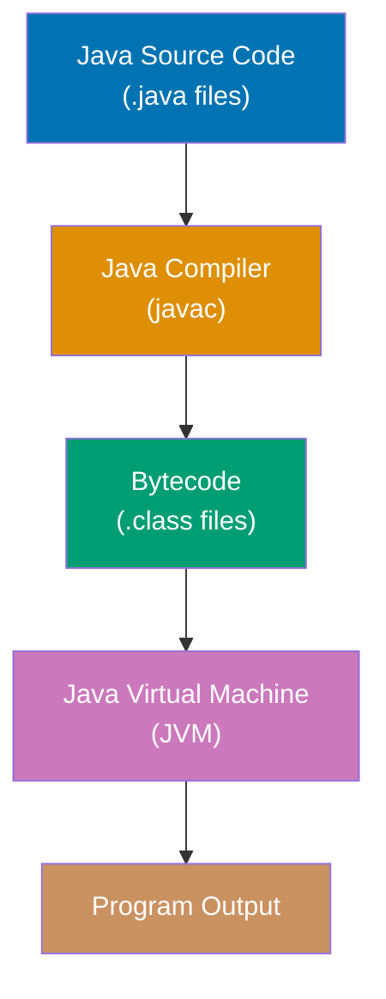

**Code**:

```java
// Define a class - the basic unit of code organization in Java
public class HelloWorld {
    // Every Java application needs a main method as the entry point
    // public: accessible from anywhere
    // static: belongs to the class, not instances
    // void: doesn't return a value
    // String[] args: command-line arguments
    public static void main(String[] args) {
        // System.out.println writes to standard output
        System.out.println("Hello, World!"); // => prints "Hello, World!"
        // main returns implicitly (void return type)
    }
}

// To compile: javac HelloWorld.java (creates HelloWorld.class)
// To run: java HelloWorld (executes the bytecode)

// Single-line comments use //
/* Multi-line comments
   use /* and */
// Javadoc comments use /** for documentation */
```

**Key Takeaway**: Java code is organized into classes. The `main` method is the entry point. Code compiles to bytecode and runs on the JVM, providing platform independence.

---

### Example 2: Variables and Type System

Java is statically typed with two categories: primitive types (stored on stack) and reference types (stored on heap). Types can be declared explicitly or inferred with `var`.

**Code**:

```java
// Primitive types (8 total) - stored directly in memory
byte b = 127; // => 127 (8-bit signed integer, -128 to 127)
short s = 32000; // => 32000 (16-bit signed integer)
int i = 42; // => 42 (32-bit signed integer, default for whole numbers)
long l = 1000000L; // => 1000000 (64-bit signed, note L suffix)

float f = 3.14f; // => 3.14 (32-bit floating point, note f suffix)
double d = 3.14159; // => 3.14159 (64-bit floating point, default for decimals)

boolean bool = true; // => true (true or false only)
char c = 'A'; // => 'A' (16-bit Unicode character, single quotes)

// Reference types - variables hold references (memory addresses)
String str = "Hello"; // => "Hello" (String is a class, not primitive)
int[] array = {1, 2, 3}; // => [1, 2, 3] (arrays are reference types)

// Type inference with var (Java 10+) - compiler infers type
var num = 100; // => 100 (inferred as int)
var text = "World"; // => "World" (inferred as String)
var list = new java.util.ArrayList<String>(); // => [] (inferred type)

// Final variables (constants) - cannot be reassigned
final int CONST = 42; // => 42
// CONST = 50; // ERROR: cannot reassign final variable

// Default values for instance variables (not local variables)
// Primitives: 0, 0.0, false, '\u0000'
// References: null

// Type casting
int x = 10;
double y = x; // => 10.0 (implicit widening cast, no precision loss)
double z = 9.8;
int w = (int) z; // => 9 (explicit narrowing cast, loses decimal part)

// Null only applies to reference types
String nullStr = null; // => null (OK for reference types)
// int nullInt = null; // ERROR: primitives cannot be null
```

**Key Takeaway**: Java distinguishes primitives (value stored directly) from reference types (value stored on heap). `var` reduces boilerplate while maintaining compile-time type safety. Primitives have default values; references default to `null`.

**Why It Matters**: The stack vs heap distinction directly impacts performance and memory management. Primitives on the stack are allocated and freed instantly when methods return (~nanoseconds), making them ideal for high-performance computations. Heap-allocated objects require garbage collection cycles, adding overhead but enabling flexible object lifecycles and sharing across scopes. Stack space is limited (~1MB per thread by default), so large data structures must use the heap. This design enables Java to balance raw performance (primitives) with object-oriented flexibility (references), allowing you to choose the right tool for each scenario.

---

### Example 3: Basic Input/Output with Scanner

Java's `Scanner` class reads formatted input from various sources (console, files, strings). It's the standard way to handle user input in console applications and parse structured text data.

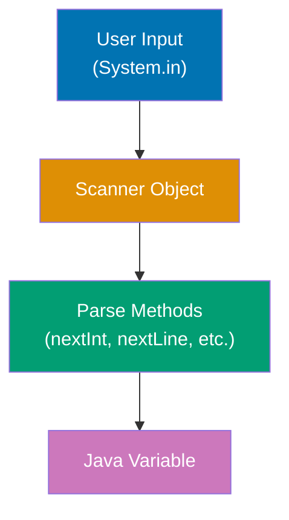

**Code**:

```java
import java.util.Scanner;

// Reading from console (System.in)
Scanner scanner = new Scanner(System.in); // => Create scanner for standard input

// Reading different types
System.out.print("Enter your name: ");
String name = scanner.nextLine(); // => Reads entire line until newline
// Example input: "Alice" => name is "Alice"

System.out.print("Enter your age: ");
int age = scanner.nextInt(); // => Reads next integer token
// Example input: 25 => age is 25
scanner.nextLine(); // => Consume leftover newline after nextInt()

System.out.print("Enter your GPA: ");
double gpa = scanner.nextDouble(); // => Reads next double token
// Example input: 3.85 => gpa is 3.85
scanner.nextLine(); // => Consume leftover newline

System.out.print("Are you a student? (true/false): ");
boolean isStudent = scanner.nextBoolean(); // => Reads next boolean token
// Example input: true => isStudent is true

// Checking if input is available
System.out.print("Enter a number (or text to skip): ");
if (scanner.hasNextInt()) { // => Check if next token is an integer
    int number = scanner.nextInt(); // => Safe to read int
    System.out.println("You entered: " + number);
} else {
    String text = scanner.next(); // => Read as string instead
    System.out.println("Not a number: " + text);
}

// Reading from a string (parsing structured data)
String data = "John 30 Engineer";
Scanner stringScanner = new Scanner(data); // => Create scanner from string
String personName = stringScanner.next(); // => "John" (reads until whitespace)
int personAge = stringScanner.nextInt(); // => 30
String occupation = stringScanner.next(); // => "Engineer"
stringScanner.close(); // => Close scanner to free resources

// Using delimiter (default is whitespace)
String csvData = "apple,banana,cherry";
Scanner csvScanner = new Scanner(csvData);
csvScanner.useDelimiter(","); // => Set comma as delimiter
String fruit1 = csvScanner.next(); // => "apple"
String fruit2 = csvScanner.next(); // => "banana"
String fruit3 = csvScanner.next(); // => "cherry"
csvScanner.close(); // => Always close scanners

// Common pattern: try-with-resources (auto-closes scanner)
try (Scanner autoScanner = new Scanner(System.in)) {
    System.out.print("Enter text: ");
    String input = autoScanner.nextLine(); // => Reads input
    System.out.println("You entered: " + input);
    // => autoScanner automatically closed when try block exits
}

// Validation pattern
Scanner validScanner = new Scanner(System.in);
int validNumber = 0;
boolean valid = false;

while (!valid) {
    System.out.print("Enter a positive number: ");
    if (validScanner.hasNextInt()) {
        int num = validScanner.nextInt();
        if (num > 0) {
            validNumber = num; // => Valid input
            valid = true; // => Exit loop
        } else {
            System.out.println("Number must be positive!");
        }
    } else {
        System.out.println("Invalid input! Enter a number.");
        validScanner.next(); // => Consume invalid input
    }
}
validScanner.close();

// Important Scanner behaviors:
// next() reads until whitespace (doesn't consume newline)
// nextLine() reads entire line (consumes newline)
// nextInt(), nextDouble(), etc. read token but DON'T consume newline
// Always call nextLine() after nextInt()/nextDouble() to consume leftover newline

// Example of the newline issue:
Scanner issueDemo = new Scanner(System.in);
System.out.print("Enter a number: ");
int num = issueDemo.nextInt(); // => Reads "42" but leaves "\n" in buffer
// Scanner buffer: "\n" (newline still there)

System.out.print("Enter your name: ");
String userName = issueDemo.nextLine(); // => Reads the leftover "\n" immediately!
// userName is "" (empty string) - BUG!

// FIX: Consume leftover newline
Scanner fixDemo = new Scanner(System.in);
System.out.print("Enter a number: ");
int fixNum = fixDemo.nextInt(); // => Reads "42"
fixDemo.nextLine(); // => Consume leftover "\n"
System.out.print("Enter your name: ");
String fixName = fixDemo.nextLine(); // => Now correctly reads name
fixDemo.close();
```

**Key Takeaway**: Use `Scanner` for reading formatted input from console, files, or strings. Call `nextLine()` after `nextInt()`/`nextDouble()` to consume leftover newlines. Use `hasNextX()` methods to validate input before reading. Always close scanners with `close()` or use try-with-resources for automatic cleanup.

**Why It Matters**: Scanner is the standard way to build interactive Java console applications—command-line tools, simple games, educational programs. The newline consumption bug (`nextInt()` leaving `\n` in buffer) is one of the most common beginner mistakes, causing empty `nextLine()` reads that appear to skip user input. Production systems use `Scanner` for parsing structured text (CSV files, config files, log parsing) with custom delimiters. While GUI applications use Swing/JavaFX for input and web services use HTTP requests, understanding `Scanner` is essential for debugging, scripting, and backend data processing where text parsing is ubiquitous.

---

### Example 4: String Comparison and Equality

In Java, strings are objects, not primitives. The `==` operator compares references (memory addresses), not content. Always use `.equals()` to compare string values properly.

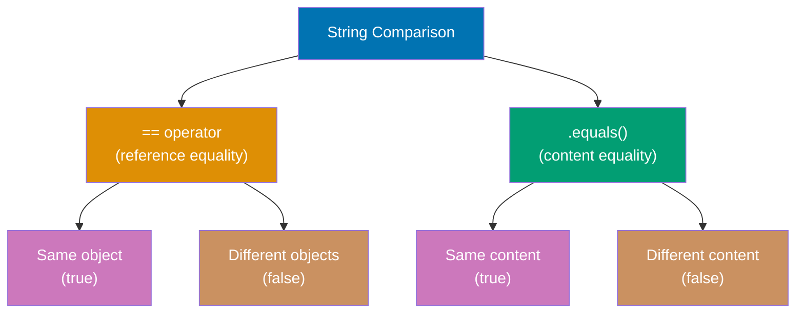

**Code**:

```java
// String literals vs new String()
String s1 = "hello"; // => String literal (stored in string pool)
String s2 = "hello"; // => Same literal (reuses s1's object in pool)
String s3 = new String("hello"); // => New object in heap (NOT in pool)

// == compares references (memory addresses)
System.out.println(s1 == s2); // => true (both point to same object in pool)
System.out.println(s1 == s3); // => false (different objects: pool vs heap)

// .equals() compares content (actual characters)
System.out.println(s1.equals(s2)); // => true (same content)
System.out.println(s1.equals(s3)); // => true (same content)
System.out.println(s1.equals("hello")); // => true (same content)

// Case-sensitive vs case-insensitive comparison
String lower = "java";
String upper = "JAVA";
System.out.println(lower.equals(upper)); // => false (case-sensitive)
System.out.println(lower.equalsIgnoreCase(upper)); // => true (case-insensitive)

// null handling
String nullStr = null;
String nonNull = "text";

// SAFE: .equals() on string literal (null-safe)
System.out.println("text".equals(nonNull)); // => true
System.out.println("text".equals(nullStr)); // => false (no exception!)

// UNSAFE: .equals() on nullable variable
// System.out.println(nullStr.equals("text")); // => NullPointerException!

// compareTo() for lexicographical ordering
String a = "apple";
String b = "banana";
String c = "apple";

int result1 = a.compareTo(b); // => negative (a < b alphabetically)
int result2 = b.compareTo(a); // => positive (b > a alphabetically)
int result3 = a.compareTo(c); // => 0 (equal strings)

// compareTo() returns:
//   negative if this < other
//   0 if this == other
//   positive if this > other

// Sorting with compareTo()
java.util.List<String> names = java.util.Arrays.asList("Charlie", "Alice", "Bob");
names.sort(String::compareTo); // => ["Alice", "Bob", "Charlie"]

// compareToIgnoreCase() for case-insensitive ordering
String x = "Apple";
String y = "banana";
System.out.println(x.compareTo(y)); // => negative (uppercase < lowercase in ASCII)
System.out.println(x.compareToIgnoreCase(y)); // => negative (alphabetical order)

// contentEquals() for CharSequence comparison
String str = "hello";
StringBuilder sb = new StringBuilder("hello");
System.out.println(str.equals(sb)); // => false (different types!)
System.out.println(str.contentEquals(sb)); // => true (same content)

// String interning (manual pool management)
String s4 = new String("hello"); // => New heap object
String s5 = s4.intern(); // => Returns pooled "hello" (same as s1)
System.out.println(s1 == s5); // => true (both from pool)
System.out.println(s1 == s4); // => false (s4 is heap object)

// Common mistake: using == for string comparison
String input = new Scanner(System.in).nextLine(); // User enters "yes"
if (input == "yes") { // => BUG: compares references, usually false!
    // This block rarely executes!
}

// CORRECT: use .equals()
if (input.equals("yes")) { // => Correct: compares content
    // This block executes when user enters "yes"
}

// BETTER: null-safe comparison
if ("yes".equals(input)) { // => Null-safe: no exception if input is null
    // Safe even if input is null
}

// startsWith() and endsWith() for prefix/suffix checks
String filename = "document.pdf";
System.out.println(filename.endsWith(".pdf")); // => true
System.out.println(filename.startsWith("doc")); // => true

// contains() for substring check
String text = "The quick brown fox";
System.out.println(text.contains("quick")); // => true
System.out.println(text.contains("slow")); // => false

// regionMatches() for partial comparison
String str1 = "Hello World";
String str2 = "world";
// Check if str1[6..10] matches str2[0..4] (ignore case)
boolean matches = str1.regionMatches(true, 6, str2, 0, 5); // => true

// Performance note: string pool reduces memory usage
String pooled1 = "test"; // => Pool reference
String pooled2 = "test"; // => Same pool reference (memory efficient)
String heap1 = new String("test"); // => Heap object
String heap2 = new String("test"); // => Another heap object (wasteful!)

// Use == only for:
//   - Null checks: if (str == null)
//   - Identity checks: if (str == CONSTANT_REFERENCE)
// Use .equals() for value comparison (always!)
```

**Key Takeaway**: Always use `.equals()` to compare string content, never `==` (which compares references). Use `"literal".equals(variable)` pattern for null safety. Use `.equalsIgnoreCase()` for case-insensitive comparison and `.compareTo()` for sorting. String literals are automatically interned (pooled), but `new String()` creates separate heap objects.

**Why It Matters**: The `==` vs `.equals()` distinction is the most common source of string comparison bugs in Java. String literals are interned by default, so `"hello" == "hello"` works accidentally, leading developers to use `==` everywhere—then fail when comparing strings from user input, file I/O, or `new String()` constructors. Production code receives strings from external sources (databases, HTTP requests, file parsers) that are never interned, making reference equality unreliable. The null-safe pattern `"constant".equals(variable)` is ubiquitous in enterprise code to avoid `NullPointerException`. Modern IDEs warn about `==` on strings, and static analysis tools flag it as a code smell, but understanding the reference vs value distinction is essential for debugging legacy code and avoiding subtle bugs in string-heavy applications.

---

### Example 5: Basic Data Types and Operations

Java provides rich operators for primitives. Strings are immutable reference types. Autoboxing converts primitives to wrapper classes automatically.

**Code**:

```java
// Arithmetic operators
int a = 10, b = 3;
int sum = a + b; // => 13 (addition)
int diff = a - b; // => 7 (subtraction)
int prod = a * b; // => 30 (multiplication)
int quot = a / b; // => 3 (integer division, truncates)
int rem = a % b; // => 1 (remainder/modulo)

// Comparison operators (return boolean)
boolean equal = (a == b); // => false (equality)
boolean notEqual = (a != b); // => true (inequality)
boolean greater = (a > b); // => true (greater than)
boolean less = (a <= b); // => false (less than or equal)

// Logical operators
boolean x = true, y = false;
boolean and = x && y; // => false (logical AND, short-circuits)
boolean or = x || y; // => true (logical OR, short-circuits)
boolean not = !x; // => false (logical NOT)

// String operations (Strings are immutable objects)
String s1 = "Hello";
String s2 = "World";
String concat = s1 + " " + s2; // => "Hello World" (concatenation with +)
int length = s1.length(); // => 5 (string length)
String sub = s1.substring(1, 4); // => "ell" (substring from index 1 to 3)
char first = s1.charAt(0); // => 'H' (character at index 0)

// String immutability
String original = "Java";
String modified = original.concat(" Programming"); // => "Java Programming"
// original is still "Java" - concat created a NEW string

// StringBuilder for mutable strings (efficient for repeated modifications)
StringBuilder sb = new StringBuilder("Start");
sb.append(" ").append("Building"); // => "Start Building" (modifies in-place)
String result = sb.toString(); // => "Start Building" (convert to String)

// Autoboxing and unboxing (automatic conversion)
Integer objInt = 42; // => 42 (autoboxing: int -> Integer)
int primInt = objInt; // => 42 (unboxing: Integer -> int)

// Wrapper classes: Byte, Short, Integer, Long, Float, Double, Boolean, Character
Integer wrapped = Integer.valueOf(100); // => 100 (explicit boxing)
int unwrapped = wrapped.intValue(); // => 100 (explicit unboxing)
```

**Key Takeaway**: Java provides comprehensive operators for primitives. Strings are immutable—operations create new strings. Use `StringBuilder` for efficient repeated modifications. Autoboxing converts primitives to objects automatically for collections and generics.

**Why It Matters**: String immutability enables **thread safety** and **string interning**. Multiple threads can safely share string references without synchronization because strings cannot change—eliminating data races. The JVM interns identical string literals (stores one copy in memory), reducing memory footprint. However, immutability means string concatenation in loops creates many temporary objects, causing garbage collection pressure. Use `StringBuilder` when building strings iteratively (e.g., in loops) to avoid this overhead. The `+` operator is fine for simple concatenation, but repeated operations should use `StringBuilder` for O(n) instead of O(n²) performance.

---

### Example 6: Math Operations and the Math Class

Java's `Math` class provides essential mathematical functions for scientific calculations, rounding, random numbers, and more. All methods are static—no object creation needed.

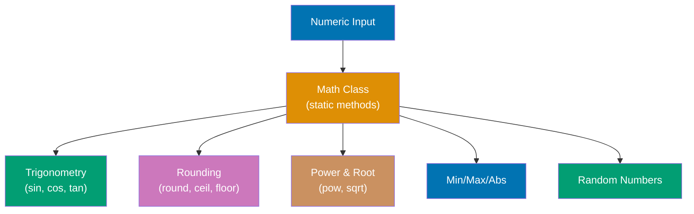

**Code**:

```java
// Constants
double pi = Math.PI; // => 3.141592653589793 (π constant)
double e = Math.E; // => 2.718281828459045 (Euler's number)

// Basic operations
int absValue = Math.abs(-42); // => 42 (absolute value)
int max = Math.max(10, 20); // => 20 (larger of two values)
int min = Math.min(10, 20); // => 10 (smaller of two values)

// Power and roots
double squared = Math.pow(5, 2); // => 25.0 (5²)
double cubed = Math.pow(2, 3); // => 8.0 (2³)
double sqrt = Math.sqrt(16); // => 4.0 (square root)
double cbrt = Math.cbrt(27); // => 3.0 (cube root)

// Rounding methods
double num = 7.8;
long rounded = Math.round(num); // => 8 (rounds to nearest integer)
double ceil = Math.ceil(num); // => 8.0 (rounds UP to nearest integer)
double floor = Math.floor(num); // => 7.0 (rounds DOWN to nearest integer)

// Negative rounding
double negNum = -7.8;
long negRounded = Math.round(negNum); // => -8 (rounds to nearest)
double negCeil = Math.ceil(negNum); // => -7.0 (rounds UP toward 0)
double negFloor = Math.floor(negNum); // => -8.0 (rounds DOWN away from 0)

// Rounding to decimal places
double value = 3.14159;
double twoDecimals = Math.round(value * 100.0) / 100.0; // => 3.14 (2 decimal places)
// Multiply by 10^n, round, then divide by 10^n

// Trigonometric functions (use radians, NOT degrees)
double angle = Math.toRadians(90); // => 1.5707... (convert degrees to radians)
double sine = Math.sin(angle); // => 1.0 (sin(90°) = 1)
double cosine = Math.cos(angle); // => ~0.0 (cos(90°) = 0, floating-point imprecision)
double tangent = Math.tan(Math.toRadians(45)); // => ~1.0 (tan(45°) = 1)

// Inverse trigonometric functions (return radians)
double arcsin = Math.asin(1.0); // => 1.5707... (π/2 radians = 90°)
double degrees = Math.toDegrees(arcsin); // => 90.0 (convert radians to degrees)

// Exponential and logarithmic functions
double exp = Math.exp(1); // => 2.718... (e¹)
double log = Math.log(Math.E); // => 1.0 (natural log, ln(e) = 1)
double log10 = Math.log10(100); // => 2.0 (log base 10, log₁₀(100) = 2)

// Sign function
double sign = Math.signum(-5.3); // => -1.0 (returns -1.0, 0.0, or 1.0)
double zeroSign = Math.signum(0); // => 0.0
double posSign = Math.signum(42.7); // => 1.0

// Random numbers (0.0 ≤ random < 1.0)
double random = Math.random(); // => Random double in [0.0, 1.0)
// Example: 0.7234512...

// Generate random int in range [min, max]
int randomInt = (int) (Math.random() * (max - min + 1)) + min;
// For [1, 100]: (int) (Math.random() * 100) + 1

// Random int from 1 to 6 (dice roll)
int dice = (int) (Math.random() * 6) + 1; // => Random int in [1, 6]

// Hypotenuse calculation (Pythagorean theorem)
double a = 3.0, b = 4.0;
double hypotenuse = Math.hypot(a, b); // => 5.0 (√(a² + b²))

// Copy sign
double copySign = Math.copySign(5.0, -1.0); // => -5.0 (magnitude of first, sign of second)

// Next floating-point value
double nextUp = Math.nextUp(1.0); // => 1.0000000000000002 (next representable double)
double nextDown = Math.nextDown(1.0); // => 0.9999999999999999 (previous representable double)

// Exact arithmetic (throws ArithmeticException on overflow)
try {
    int exact = Math.addExact(Integer.MAX_VALUE, 1); // => Throws ArithmeticException
} catch (ArithmeticException ex) {
    System.out.println("Overflow detected!"); // => Overflow detected!
}

int safeAdd = Math.addExact(100, 200); // => 300 (no overflow)
int safeMult = Math.multiplyExact(10, 20); // => 200 (no overflow)

// Common use cases
double distance = Math.sqrt(Math.pow(x2 - x1, 2) + Math.pow(y2 - y1, 2)); // Euclidean distance
double area = Math.PI * Math.pow(radius, 2); // Circle area
double volume = (4.0 / 3.0) * Math.PI * Math.pow(radius, 3); // Sphere volume

// Precision note: floating-point arithmetic has rounding errors
double result = 0.1 + 0.2; // => 0.30000000000000004 (NOT exactly 0.3!)
// Use BigDecimal for exact decimal arithmetic in financial calculations
```

**Key Takeaway**: Use `Math` class for mathematical operations (power, roots, rounding, trigonometry). All methods are static—call `Math.methodName()`. Use `Math.round()` for nearest integer, `Math.ceil()` to round up, `Math.floor()` to round down. Trigonometric functions use radians—convert degrees with `toRadians()`/`toDegrees()`. Use exact arithmetic methods (`addExact`, `multiplyExact`) to detect integer overflow.

**Why It Matters**: Math operations are fundamental to scientific computing, game development, financial calculations, and data analysis. The `Math` class provides optimized native implementations of complex algorithms (trigonometry, logarithms) that would be error-prone to implement manually. Rounding methods (`ceil`, `floor`, `round`) are critical for display formatting, pagination logic (e.g., calculating total pages from item count), and allocation algorithms. However, floating-point arithmetic has precision limits—`0.1 + 0.2` is not exactly `0.3` due to binary representation. For financial applications requiring exact decimal arithmetic, use `BigDecimal` instead. Production systems use `Math.random()` for non-cryptographic randomness (simulations, sampling) but require `SecureRandom` for security-sensitive contexts (tokens, passwords).

---

## Group 2: Object-Oriented Foundation

### Example 7: Classes and Objects

Classes are blueprints that define state (fields) and behavior (methods). Objects are instances created from classes. Constructors initialize object state.

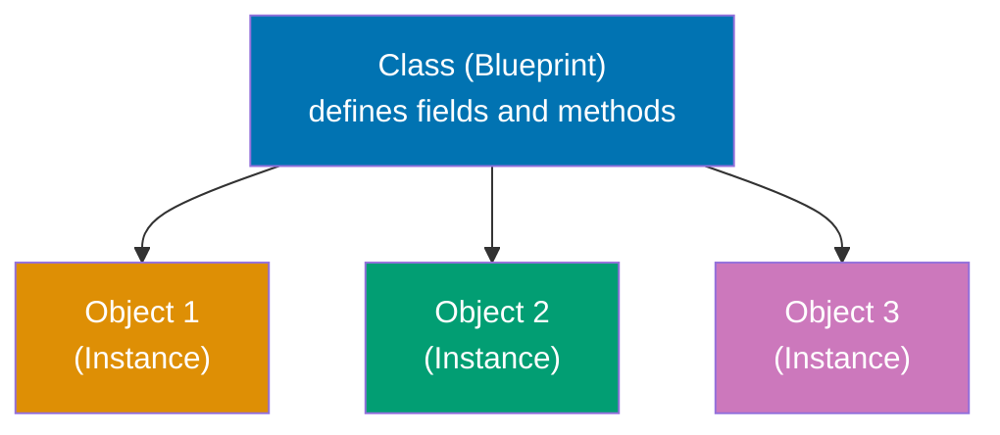

**Code**:

```java
// Class definition with fields (state) and methods (behavior)
public class Person {
    // Fields (instance variables) - each object has its own copy
    private String name; // private: only accessible within this class
    private int age;

    // Constructor - special method called when creating objects with 'new'
    public Person(String name, int age) {
        // 'this' refers to the current instance
        this.name = name; // Distinguish field from parameter
        this.age = age;
    }

    // Constructor overloading - multiple constructors with different parameters
    public Person(String name) {
        this(name, 0); // Call other constructor using this()
    }

    // Default constructor (no parameters) - Java provides one if you don't
    public Person() {
        this("Unknown", 0);
    }

    // Instance method - operates on instance data
    public void greet() {
        System.out.println("Hi, I'm " + name); // => "Hi, I'm Alice"
    }

    // Getter method (accessor)
    public String getName() {
        return name; // => returns the name field
    }

    // Setter method (mutator)
    public void setAge(int age) {
        this.age = age; // Updates the age field
    }

    // Method overloading - same name, different parameters
    public void celebrate() {
        System.out.println(name + " is celebrating!");
    }

    public void celebrate(String event) {
        System.out.println(name + " is celebrating " + event + "!");
    }
}

// Creating objects (instances) using 'new' keyword
Person alice = new Person("Alice", 30); // => Person instance
Person bob = new Person("Bob"); // => Person instance (age defaults to 0)

// Calling instance methods
alice.greet(); // => prints "Hi, I'm Alice"
String aliceName = alice.getName(); // => "Alice"
alice.setAge(31); // Updates alice's age to 31

// Method overloading in action
bob.celebrate(); // => prints "Bob is celebrating!"
bob.celebrate("birthday"); // => prints "Bob is celebrating birthday!"

// Access modifiers control visibility:
// public: accessible from anywhere
// private: accessible only within the class
// protected: accessible within package and subclasses
// (default/package-private): accessible within package
```

**Key Takeaway**: Classes define the structure and behavior; objects are instances with their own state. Constructors initialize objects. `this` refers to the current instance. Access modifiers (`private`, `public`) control encapsulation.

---

### Example 8: Inheritance and Polymorphism

Inheritance creates IS-A relationships where subclasses inherit fields and methods from superclasses. Polymorphism allows treating subclass objects as superclass references.

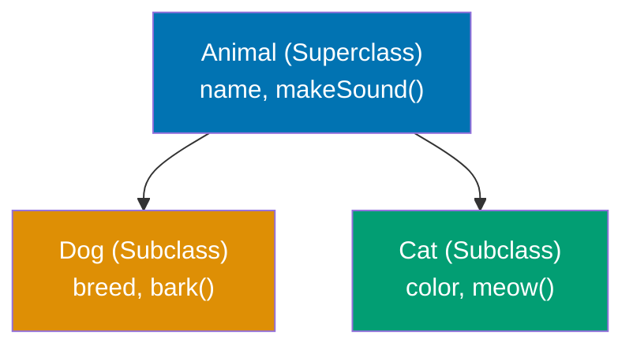

**Code**:

```java
// Superclass (parent class)
public class Animal {
    protected String name; // protected: accessible to subclasses

    public Animal(String name) {
        this.name = name;
    }

    // Method to be overridden
    public void makeSound() {
        System.out.println(name + " makes a sound");
    }
}

// Subclass (child class) using 'extends' keyword
public class Dog extends Animal {
    private String breed;

    // Constructor with 'super' to call superclass constructor
    public Dog(String name, String breed) {
        super(name); // MUST be first statement, calls Animal(name)
        this.breed = breed;
    }

    // Method overriding with @Override annotation (recommended)
    @Override
    public void makeSound() {
        System.out.println(name + " barks: Woof!"); // => "Rex barks: Woof!"
    }

    // Subclass-specific method
    public void fetch() {
        System.out.println(name + " fetches the ball!");
    }
}

public class Cat extends Animal {
    public Cat(String name) {
        super(name);
    }

    @Override
    public void makeSound() {
        System.out.println(name + " meows: Meow!"); // => "Whiskers meows: Meow!"
    }
}

// Creating instances
Dog dog = new Dog("Rex", "Labrador"); // => Dog instance
Cat cat = new Cat("Whiskers"); // => Cat instance

// Polymorphism - treating subclass as superclass reference
Animal animal1 = dog; // => Rex (Dog) stored as Animal reference
Animal animal2 = cat; // => Whiskers (Cat) stored as Animal reference

// Runtime polymorphism - method called based on actual object type
animal1.makeSound(); // => "Rex barks: Woof!" (Dog's version)
animal2.makeSound(); // => "Whiskers meows: Meow!" (Cat's version)

// animal1.fetch(); // ERROR: Animal reference doesn't have fetch()
((Dog) animal1).fetch(); // => OK: cast to Dog first, then call fetch()

// Object class - root of all classes
Object obj = dog; // => Every class inherits from Object

// Common Object methods to override
public class Animal {
    // ... fields and constructor ...

    @Override
    public String toString() {
        return "Animal[name=" + name + "]"; // => "Animal[name=Rex]"
    }

    @Override
    public boolean equals(Object other) {
        if (other instanceof Animal) {
            return name.equals(((Animal) other).name);
        }
        return false;
    }

    @Override
    public int hashCode() {
        return name.hashCode(); // => hash code based on name
    }
}

// final keyword prevents inheritance or overriding
final class FinalClass {} // Cannot be extended
// class Sub extends FinalClass {} // ERROR

public class Base {
    public final void cannotOverride() {} // Cannot be overridden
}
```

**Key Takeaway**: Inheritance (`extends`) creates IS-A relationships and enables code reuse. `super` accesses superclass members. Polymorphism allows subclass objects through superclass references. Override `toString()`, `equals()`, and `hashCode()` for proper object behavior. Use `final` to prevent inheritance or overriding.

**Why It Matters**: Use inheritance **only for true IS-A relationships** where subclasses should inherit ALL behaviors—a Dog IS-A Animal makes sense. However, inheritance creates **tight coupling**: changes to the superclass affect all subclasses, making code fragile. Prefer **composition** (HAS-A) when you need specific capabilities without the full parent behavior—a Car HAS-AN Engine, not IS-AN Engine. Composition enables runtime flexibility (swap engines) and avoids forcing subclasses to inherit unwanted behaviors. The rule of thumb: inheritance for shared identity and behavior, composition for shared functionality. When in doubt, choose composition—it's easier to refactor composition to inheritance than vice versa.

---

### Example 9: Interfaces and Abstraction

Interfaces define contracts (what methods a class must implement) without implementation. Classes can implement multiple interfaces, enabling flexible type hierarchies.

**Code**:

```java
// Interface definition - defines contract (what, not how)
public interface Drawable {
    // Abstract method (implicitly public abstract)
    void draw();

    // Interfaces can have constants (implicitly public static final)
    double PI = 3.14159;

    // Default methods (Java 8+) - provide implementation
    default void print() {
        System.out.println("Drawing..."); // => "Drawing..."
    }

    // Static methods (Java 8+)
    static void info() {
        System.out.println("Drawable interface"); // => "Drawable interface"
    }
}

// Another interface
public interface Movable {
    void move(int x, int y);
}

// Class implementing interface(s) using 'implements' keyword
public class Circle implements Drawable {
    private int radius;

    public Circle(int radius) {
        this.radius = radius;
    }

    // Must implement all abstract methods from interface
    @Override
    public void draw() {
        System.out.println("Drawing circle with radius " + radius);
    }
}

// Implementing multiple interfaces (multiple inheritance of type)
public class Rectangle implements Drawable, Movable {
    private int width, height;
    private int x, y;

    public Rectangle(int width, int height) {
        this.width = width;
        this.height = height;
    }

    @Override
    public void draw() {
        System.out.println("Drawing rectangle " + width + "x" + height);
    }

    @Override
    public void move(int newX, int newY) {
        this.x = newX;
        this.y = newY;
        System.out.println("Moved to (" + x + ", " + y + ")");
    }
}

// Using interfaces
Drawable circle = new Circle(10); // => Interface reference
circle.draw(); // => "Drawing circle with radius 10"
circle.print(); // => "Drawing..." (default method)

Drawable rect = new Rectangle(20, 30); // => Rectangle as Drawable
rect.draw(); // => "Drawing rectangle 20x30"

// Abstract classes vs Interfaces
public abstract class Shape {
    // Can have state (fields)
    protected String color;

    // Can have constructors
    public Shape(String color) {
        this.color = color;
    }

    // Can have concrete methods
    public String getColor() {
        return color;
    }

    // Can have abstract methods
    public abstract double area();
}

public class Square extends Shape {
    private double side;

    public Square(String color, double side) {
        super(color);
        this.side = side;
    }

    @Override
    public double area() {
        return side * side; // => side²
    }
}

// Marker interfaces (no methods) - used for type checking
public interface Serializable {} // Empty interface

// Functional interfaces (Java 8+) - exactly one abstract method
@FunctionalInterface
public interface Calculator {
    int calculate(int a, int b); // Single abstract method

    // Can still have default and static methods
    default void log(String msg) {
        System.out.println("Log: " + msg);
    }
}

// Lambda expressions work with functional interfaces
Calculator add = (a, b) -> a + b; // => Lambda implementing Calculator
int sum = add.calculate(5, 3); // => 8
```

**Key Takeaway**: Interfaces define contracts without implementation. Classes can `implements` multiple interfaces for flexible type systems. Abstract classes can have state and constructors; interfaces cannot (before Java 8). Default methods allow adding behavior to interfaces. Functional interfaces enable lambda expressions.

**Why It Matters**: Interfaces enable **loose coupling** and **dependency inversion**—clients depend on abstractions (interfaces), not concrete implementations. This makes code **testable** (inject mock implementations), **flexible** (swap implementations at runtime), and **maintainable** (change internals without affecting clients). For example, `List<T>` is an interface—you can switch from `ArrayList` to `LinkedList` without changing client code. Multiple interface implementation provides the benefits of multiple inheritance without the diamond problem. Interfaces define "what" an object can do; classes define "how" it's done. Design principle: program to interfaces, not implementations, to create loosely coupled, easily testable systems.

---

## Group 3: Core Collections

### Example 10: Arrays and Lists

Arrays have fixed size and fast access. Lists (like `ArrayList`) are dynamic and provide rich operations. Generics ensure type safety for collections.

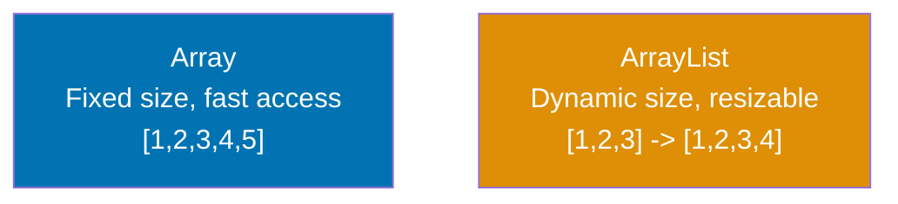

**Code**:

```java
import java.util.ArrayList;
import java.util.Arrays;
import java.util.List;

// Array declaration and initialization
int[] numbers = {1, 2, 3, 4, 5}; // => [1, 2, 3, 4, 5]
String[] names = new String[3]; // => [null, null, null] (default values)

// Array access and modification
int first = numbers[0]; // => 1 (zero-indexed)
numbers[2] = 30; // => [1, 2, 30, 4, 5] (modifies array in-place)

// Array length (property, not method)
int len = numbers.length; // => 5

// Enhanced for loop (for-each) - read-only iteration
for (int num : numbers) {
    System.out.println(num); // => prints 1, 2, 30, 4, 5
}

// Traditional for loop - allows index access
for (int i = 0; i < numbers.length; i++) {
    System.out.println(numbers[i]); // => same output
}

// Arrays utility class
String arrStr = Arrays.toString(numbers); // => "[1, 2, 30, 4, 5]"
int[] sorted = {5, 2, 8, 1, 9};
Arrays.sort(sorted); // => [1, 2, 5, 8, 9] (sorts in-place)

// ArrayList - dynamic, resizable list
ArrayList<String> list = new ArrayList<>(); // Generic type in <>
list.add("Alice"); // => ["Alice"]
list.add("Bob"); // => ["Alice", "Bob"]
list.add("Charlie"); // => ["Alice", "Bob", "Charlie"]

// List operations
String element = list.get(1); // => "Bob" (get by index)
list.set(1, "Robert"); // => ["Alice", "Robert", "Charlie"] (replace)
list.remove(0); // => ["Robert", "Charlie"] (remove by index)
list.remove("Charlie"); // => ["Robert"] (remove by value)

int size = list.size(); // => 1 (current size)
boolean contains = list.contains("Robert"); // => true
boolean isEmpty = list.isEmpty(); // => false

// Adding at specific position
list.add(0, "Start"); // => ["Start", "Robert"] (insert at index 0)

// List interface (parent of ArrayList)
List<Integer> nums = new ArrayList<>();
nums.add(10);
nums.add(20);
nums.add(30); // => [10, 20, 30]

// Arrays.asList() - creates fixed-size list backed by array
List<String> fixedList = Arrays.asList("A", "B", "C"); // => ["A", "B", "C"]
// fixedList.add("D"); // ERROR: UnsupportedOperationException (fixed size)

// List.of() (Java 9+) - creates immutable list
List<String> immutable = List.of("X", "Y", "Z"); // => ["X", "Y", "Z"]
// immutable.add("W"); // ERROR: UnsupportedOperationException (immutable)

// Converting between arrays and lists
String[] array = {"One", "Two", "Three"};
List<String> listFromArray = new ArrayList<>(Arrays.asList(array)); // => mutable list
String[] arrayFromList = list.toArray(new String[0]); // => array

// Generics provide compile-time type safety
ArrayList<Integer> ints = new ArrayList<>();
ints.add(42); // => OK
// ints.add("text"); // ERROR: compile-time type check prevents this

// Raw type (no generics) - avoid this
ArrayList raw = new ArrayList(); // => Warning: raw type
raw.add(100); // => OK (any object)
raw.add("mixed"); // => OK but dangerous
```

**Key Takeaway**: Arrays have fixed size with fast access. `ArrayList` is dynamic with rich operations. Generics (`<Type>`) provide type safety. `Arrays.asList()` creates fixed-size list. `List.of()` creates immutable list. Enhanced for-each loop simplifies iteration.

**Why It Matters**: Arrays provide O(1) random access by index, making them ideal for algorithms requiring fast lookups like binary search. However, fixed size limits flexibility—enterprise systems often need dynamic collections. Arrays of primitives avoid boxing overhead (int[] vs Integer[]), saving memory and improving cache locality for performance-critical code. Multi-dimensional arrays enable matrix operations in scientific computing, image processing, and machine learning applications. Understanding arrays is foundational because most collection classes (ArrayList, ArrayDeque) use arrays internally.

---

### Example 11: Maps and HashMap

Maps store key-value pairs. `HashMap` provides O(1) average lookup time using hash-based indexing. Different implementations offer different ordering guarantees.

**Code**:

```java
import java.util.HashMap;
import java.util.Map;
import java.util.TreeMap;
import java.util.LinkedHashMap;

// HashMap - unordered, allows one null key and multiple null values
HashMap<String, Integer> ages = new HashMap<>();

// put() adds or updates key-value pairs
ages.put("Alice", 30); // => {"Alice": 30}
ages.put("Bob", 25); // => {"Alice": 30, "Bob": 25}
ages.put("Charlie", 35); // => {"Alice": 30, "Bob": 25, "Charlie": 35}

// get() retrieves value by key
Integer aliceAge = ages.get("Alice"); // => 30
Integer missing = ages.get("David"); // => null (key doesn't exist)

// getOrDefault() provides fallback value
int davidAge = ages.getOrDefault("David", 0); // => 0 (default value)

// containsKey() and containsValue()
boolean hasAlice = ages.containsKey("Alice"); // => true
boolean has25 = ages.containsValue(25); // => true

// remove() removes key-value pair
ages.remove("Bob"); // => {"Alice": 30, "Charlie": 35}

// putIfAbsent() only puts if key doesn't exist
ages.putIfAbsent("Alice", 40); // => No change (key exists)
ages.putIfAbsent("David", 28); // => {"Alice": 30, "Charlie": 35, "David": 28}

// size() returns number of entries
int count = ages.size(); // => 3

// Iteration methods
for (String key : ages.keySet()) {
    System.out.println(key); // => "Alice", "Charlie", "David" (unordered)
}

for (Integer value : ages.values()) {
    System.out.println(value); // => 30, 35, 28 (unordered)
}

// entrySet() for both key and value
for (Map.Entry<String, Integer> entry : ages.entrySet()) {
    System.out.println(entry.getKey() + ": " + entry.getValue());
    // => "Alice: 30", "Charlie: 35", "David: 28"
}

// Map.of() (Java 9+) - immutable map with up to 10 entries
Map<String, String> codes = Map.of(
    "US", "United States",
    "UK", "United Kingdom",
    "JP", "Japan"
); // => immutable map
// codes.put("CN", "China"); // ERROR: UnsupportedOperationException

// TreeMap - sorted by keys (natural ordering or Comparator)
TreeMap<String, Integer> sorted = new TreeMap<>();
sorted.put("Zebra", 3);
sorted.put("Apple", 1);
sorted.put("Mango", 2); // => {"Apple": 1, "Mango": 2, "Zebra": 3} (sorted keys)

// LinkedHashMap - maintains insertion order
LinkedHashMap<String, Integer> ordered = new LinkedHashMap<>();
ordered.put("First", 1);
ordered.put("Second", 2);
ordered.put("Third", 3); // => maintains insertion order

// Null handling in HashMap
HashMap<String, String> map = new HashMap<>();
map.put(null, "NullKey"); // => OK: one null key allowed
map.put("key1", null); // => OK: null values allowed
map.put("key2", null); // => OK: multiple null values allowed

// Computing values based on keys
ages.compute("Alice", (k, v) -> v + 1); // => Alice: 31
ages.computeIfAbsent("Eve", k -> 29); // => adds Eve: 29 if absent
ages.merge("Alice", 1, (old, val) -> old + val); // => Alice: 32 (31 + 1)
```

**Key Takeaway**: `HashMap` provides O(1) average lookup for key-value pairs. `get()`, `put()`, `remove()`, `containsKey()` are core operations. `TreeMap` sorts keys. `LinkedHashMap` maintains insertion order. `Map.of()` creates immutable maps. Iterate using `keySet()`, `values()`, or `entrySet()`.

**Why It Matters**: ArrayList is Java's most used collection, powering everything from HTTP request parameter lists to database query results. Dynamic resizing (doubling capacity) provides O(1) amortized append time, enabling efficient list building. Understanding when ArrayList's O(n) insertion/removal at arbitrary positions becomes a bottleneck (use LinkedList) or when thread safety is needed (use CopyOnWriteArrayList) prevents production performance issues. The fail-fast iterators detect concurrent modification, preventing subtle bugs in multi-threaded code.

---

### Example 12: Sets for Uniqueness

Sets ensure element uniqueness automatically. `HashSet` provides O(1) operations. Proper `equals()` and `hashCode()` implementation is essential for correct behavior.

**Code**:

```java
import java.util.HashSet;
import java.util.Set;
import java.util.TreeSet;
import java.util.LinkedHashSet;

// HashSet - unordered, no duplicates
HashSet<String> set = new HashSet<>();

// add() adds element if not present
set.add("Apple"); // => true (added), set: {"Apple"}
set.add("Banana"); // => true, set: {"Apple", "Banana"}
set.add("Apple"); // => false (already exists, not added)

// Set maintains uniqueness
System.out.println(set); // => [Apple, Banana] (unordered)

// contains() checks membership
boolean hasApple = set.contains("Apple"); // => true
boolean hasCherry = set.contains("Cherry"); // => false

// remove() removes element
set.remove("Banana"); // => true (was present), set: {"Apple"}
set.remove("Cherry"); // => false (wasn't present)

// size() and isEmpty()
int count = set.size(); // => 1
boolean empty = set.isEmpty(); // => false

// Set operations (mathematical set operations)
Set<Integer> set1 = new HashSet<>();
set1.add(1);
set1.add(2);
set1.add(3); // => {1, 2, 3}

Set<Integer> set2 = new HashSet<>();
set2.add(2);
set2.add(3);
set2.add(4); // => {2, 3, 4}

// Union - addAll() modifies set1
Set<Integer> union = new HashSet<>(set1);
union.addAll(set2); // => {1, 2, 3, 4} (all elements from both sets)

// Intersection - retainAll() keeps only common elements
Set<Integer> intersection = new HashSet<>(set1);
intersection.retainAll(set2); // => {2, 3} (elements in both sets)

// Difference - removeAll() removes elements present in set2
Set<Integer> difference = new HashSet<>(set1);
difference.removeAll(set2); // => {1} (elements in set1 but not set2)

// Set.of() (Java 9+) - immutable set
Set<String> colors = Set.of("Red", "Green", "Blue"); // => immutable
// colors.add("Yellow"); // ERROR: UnsupportedOperationException

// TreeSet - sorted set (elements must be Comparable)
TreeSet<Integer> sortedSet = new TreeSet<>();
sortedSet.add(5);
sortedSet.add(1);
sortedSet.add(3); // => {1, 3, 5} (sorted in natural order)

// LinkedHashSet - maintains insertion order
LinkedHashSet<String> orderedSet = new LinkedHashSet<>();
orderedSet.add("First");
orderedSet.add("Second");
orderedSet.add("Third"); // => maintains insertion order

// equals() and hashCode() importance for custom objects
class Person {
    String name;
    int age;

    Person(String name, int age) {
        this.name = name;
        this.age = age;
    }

    // MUST override equals() and hashCode() for proper Set behavior
    @Override
    public boolean equals(Object obj) {
        if (obj instanceof Person) {
            Person other = (Person) obj;
            return name.equals(other.name) && age == other.age;
        }
        return false;
    }

    @Override
    public int hashCode() {
        return name.hashCode() + age; // Simple hash combination
    }
}

Set<Person> people = new HashSet<>();
people.add(new Person("Alice", 30));
people.add(new Person("Alice", 30)); // => Not added (equals() returns true)
System.out.println(people.size()); // => 1 (uniqueness enforced)
```

**Key Takeaway**: Sets ensure automatic uniqueness. `HashSet` provides O(1) operations. `TreeSet` sorts elements. `LinkedHashSet` maintains insertion order. Custom objects in sets MUST override `equals()` and `hashCode()` correctly. Set operations: `addAll()` (union), `retainAll()` (intersection), `removeAll()` (difference).

**Why It Matters**: HashMap is fundamental to enterprise systems—caching results, indexing data, storing configuration. O(1) average-case lookup/insert makes it ideal for fast access patterns (user sessions, feature flags, API rate limits). Understanding hash collisions and load factor tuning prevents performance degradation as maps grow. The LinkedHashMap and TreeMap variants provide ordering guarantees when needed. Thread-safe alternatives (ConcurrentHashMap) enable lock-free concurrent access in multi-threaded applications without manual synchronization.

---

## Group 4: Control Flow and Methods

### Example 13: Conditional Statements

Java provides multiple conditional structures. Modern switch expressions (Java 12+) reduce boilerplate. Pattern matching (Java 17+) enables type checking and casting in one step.

**Code**:

```java
// if-else statements
int score = 85;

if (score >= 90) {
    System.out.println("Grade: A");
} else if (score >= 80) {
    System.out.println("Grade: B"); // => "Grade: B" (this branch executes)
} else if (score >= 70) {
    System.out.println("Grade: C");
} else {
    System.out.println("Grade: F");
}

// Nested conditionals
boolean hasLicense = true;
int age = 20;

if (age >= 18) {
    if (hasLicense) {
        System.out.println("Can drive"); // => "Can drive"
    } else {
        System.out.println("Need license");
    }
} else {
    System.out.println("Too young");
}

// Traditional switch statement
String day = "Monday";

switch (day) {
    case "Monday":
    case "Tuesday":
    case "Wednesday":
    case "Thursday":
    case "Friday":
        System.out.println("Weekday"); // => "Weekday"
        break; // IMPORTANT: prevents fall-through
    case "Saturday":
    case "Sunday":
        System.out.println("Weekend");
        break;
    default:
        System.out.println("Invalid day");
}

// Switch expressions (Java 12+) - cleaner syntax, no break needed
String dayType = switch (day) {
    case "Monday", "Tuesday", "Wednesday", "Thursday", "Friday" -> "Weekday";
    case "Saturday", "Sunday" -> "Weekend";
    default -> "Invalid";
}; // => "Weekday"

// Switch with blocks
int numLetters = switch (day) {
    case "Monday", "Friday", "Sunday" -> 6;
    case "Tuesday" -> 7;
    case "Wednesday" -> {
        System.out.println("Midweek!");
        yield 9; // yield returns value from block
    }
    default -> 0;
}; // => 6

// Pattern matching for switch (Java 17+, preview)
Object obj = "Hello";

String result = switch (obj) {
    case String s -> "String of length " + s.length(); // => "String of length 5"
    case Integer i -> "Integer: " + i;
    case null -> "Null value";
    default -> "Unknown type";
};

// Ternary operator (condition ? true : false)
int num = 10;
String parity = (num % 2 == 0) ? "even" : "odd"; // => "even"

// Chaining ternary (discouraged for readability)
String size = (num < 10) ? "small" : (num < 100) ? "medium" : "large"; // => "medium"
```

**Key Takeaway**: `if-else` handles boolean conditions. Traditional `switch` requires `break` to prevent fall-through. Switch expressions (Java 12+) return values directly and eliminate `break`. Pattern matching (Java 17+) combines type checking and casting. Ternary operator provides concise conditional expressions.

**Why It Matters**: HashSet provides O(1) contains/add/remove operations, enabling efficient duplicate elimination and membership testing. It powers unique constraint validation, deduplication pipelines, and graph adjacency lists. Understanding set operations (union, intersection, difference) enables elegant solutions to problems like finding common elements or detecting changes between data snapshots. EnumSet and TreeSet variants optimize for specific use cases (enum values, sorted elements). Sets prevent logic bugs from accidental duplicates corrupting business logic.

---

### Example 14: Loops and Iteration

Java offers multiple loop types for different use cases. Enhanced for-each simplifies collection iteration. `break` exits loops; `continue` skips to next iteration.

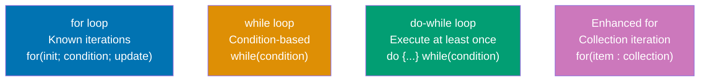

**Code**:

```java
import java.util.ArrayList;
import java.util.Iterator;
import java.util.List;

// for loop - initialization; condition; update
for (int i = 0; i < 5; i++) {
    System.out.println(i); // => prints 0, 1, 2, 3, 4
}

// Multiple variables in for loop
for (int i = 0, j = 10; i < j; i++, j--) {
    System.out.println(i + " " + j); // => "0 10", "1 9", "2 8", "3 7", "4 6"
}

// while loop - condition evaluated before each iteration
int count = 0;
while (count < 3) {
    System.out.println("Count: " + count); // => "Count: 0", "Count: 1", "Count: 2"
    count++;
}

// do-while loop - executes at least once (condition checked after)
int num = 0;
do {
    System.out.println("Number: " + num); // => "Number: 0"
    num++;
} while (num < 0); // Condition is false, but block executed once

// Enhanced for loop (for-each) - read-only iteration over arrays/collections
String[] names = {"Alice", "Bob", "Charlie"};
for (String name : names) {
    System.out.println(name); // => "Alice", "Bob", "Charlie"
}

List<Integer> numbers = List.of(10, 20, 30);
for (int n : numbers) {
    System.out.println(n); // => 10, 20, 30
}

// break - exits loop immediately
for (int i = 0; i < 10; i++) {
    if (i == 5) {
        break; // Exits loop when i is 5
    }
    System.out.println(i); // => prints 0, 1, 2, 3, 4
}

// continue - skips to next iteration
for (int i = 0; i < 5; i++) {
    if (i == 2) {
        continue; // Skip when i is 2
    }
    System.out.println(i); // => prints 0, 1, 3, 4 (skips 2)
}

// Nested loops
for (int i = 1; i <= 3; i++) {
    for (int j = 1; j <= 3; j++) {
        System.out.print(i * j + " "); // => "1 2 3 2 4 6 3 6 9 "
    }
    System.out.println();
}

// Labeled break and continue (for nested loops)
outer: for (int i = 0; i < 3; i++) {
    for (int j = 0; j < 3; j++) {
        if (i == 1 && j == 1) {
            break outer; // Breaks out of outer loop
        }
        System.out.println(i + "," + j);
    }
}

// Iterator - manual iteration with hasNext() and next()
List<String> list = new ArrayList<>();
list.add("A");
list.add("B");
list.add("C");

Iterator<String> iterator = list.iterator();
while (iterator.hasNext()) {
    String item = iterator.next(); // => "A", "B", "C"
    System.out.println(item);
    // Can safely remove during iteration
    if (item.equals("B")) {
        iterator.remove(); // => list becomes ["A", "C"]
    }
}

// Iterable interface - classes implementing this can use enhanced for
// (ArrayList, HashSet, etc. implement Iterable)
Iterable<Integer> iterable = List.of(1, 2, 3);
for (int val : iterable) {
    System.out.println(val); // => 1, 2, 3
}
```

**Key Takeaway**: `for` loops have explicit initialization and update. `while` checks condition first. `do-while` executes at least once. Enhanced for-each simplifies collection iteration. `break` exits loops; `continue` skips to next iteration. `Iterator` provides manual iteration with safe removal.

**Why It Matters**: Java generics provide compile-time type safety, catching type mismatches before runtime—preventing ClassCastException in production. Eliminating casts improves code readability and prevents bugs from incorrect assumptions about collection contents. Generics enable writing reusable algorithms (Collections.sort, Stream operations) that work with any type while maintaining type safety. Understanding type erasure prevents confusion when using reflection or varargs with generics. Type safety reduces debugging time and prevents data corruption from type mismatches.

---

### Example 15: Methods and Return Types

Methods define behavior with typed parameters and return values. Method overloading allows same name with different parameters. Static methods belong to the class; instance methods to objects.

**Code**:

```java
// Method declaration: returnType methodName(parameters)
public static int add(int a, int b) {
    return a + b; // => returns sum
}

// Calling static method
int sum = add(5, 3); // => 8

// void methods - no return value
public static void greet(String name) {
    System.out.println("Hello, " + name); // => "Hello, Alice"
    // return; // implicit return for void methods
}

// Methods can have multiple return statements
public static String getGrade(int score) {
    if (score >= 90) {
        return "A"; // Returns and exits method
    } else if (score >= 80) {
        return "B";
    } else if (score >= 70) {
        return "C";
    } else {
        return "F";
    }
    // No code after all return paths - compile error if unreachable code
}

// Method overloading - same name, different parameters
public static int multiply(int a, int b) {
    return a * b; // => two parameters
}

public static int multiply(int a, int b, int c) {
    return a * b * c; // => three parameters
}

public static double multiply(double a, double b) {
    return a * b; // => different parameter types
}

// Calls resolved at compile-time based on parameters
int result1 = multiply(2, 3); // => 6 (calls first version)
int result2 = multiply(2, 3, 4); // => 24 (calls second version)
double result3 = multiply(2.5, 3.0); // => 7.5 (calls third version)

// Varargs (variable arguments) - zero or more arguments
public static int sum(int... numbers) { // ... creates array
    int total = 0;
    for (int n : numbers) {
        total += n;
    }
    return total;
}

int s1 = sum(); // => 0 (no arguments)
int s2 = sum(1, 2, 3); // => 6 (three arguments)
int s3 = sum(1, 2, 3, 4, 5); // => 15 (five arguments)

// Varargs must be last parameter
public static void print(String prefix, int... numbers) {
    System.out.print(prefix + ": ");
    for (int n : numbers) {
        System.out.print(n + " ");
    }
}

// Static methods vs instance methods
class Calculator {
    // Static method - belongs to class, accessed via ClassName.method()
    public static int add(int a, int b) {
        return a + b;
    }

    // Instance method - belongs to objects, accessed via object.method()
    private int value;

    public void setValue(int v) {
        this.value = v; // Can access instance fields
    }

    public int getValue() {
        return value;
    }

    // Static method cannot access instance fields
    public static void cannotAccessInstance() {
        // System.out.println(value); // ERROR: non-static field
    }
}

// Calling static method
int result = Calculator.add(10, 20); // => 30

// Calling instance method
Calculator calc = new Calculator();
calc.setValue(100);
int val = calc.getValue(); // => 100

// Method references (Java 8+) - reusable method as object
// ClassName::staticMethod or object::instanceMethod
import java.util.function.Function;

Function<String, Integer> parseMethod = Integer::parseInt; // Method reference
int parsed = parseMethod.apply("123"); // => 123

// Return type covariance (overriding can return subtype)
class Animal {
    public Animal reproduce() {
        return new Animal();
    }
}

class Dog extends Animal {
    @Override
    public Dog reproduce() { // Returns Dog (subtype of Animal)
        return new Dog(); // => OK: covariant return type
    }
}
```

**Key Takeaway**: Methods have return types and parameters. `void` methods return nothing. Method overloading allows same name with different signatures. Varargs (`...`) accept variable arguments as array. Static methods belong to class; instance methods to objects. Method references (`::`) enable functional programming.

**Why It Matters**: Exceptions separate error handling from business logic, improving code readability and maintainability. Checked exceptions force callers to handle errors explicitly, preventing silent failures in production (database connection failures, file not found). Unchecked exceptions (NullPointerException, IllegalArgumentException) indicate programming errors requiring fixes, not recovery. The try-with-resources syntax prevents resource leaks (database connections, file handles) that cause memory exhaustion and system instability in long-running applications.

---

## Group 5: Exception Handling and Basics

### Example 16: Exception Handling

Java distinguishes checked exceptions (compile-time enforced) from unchecked exceptions (runtime). `try-catch-finally` handles exceptions. `try-with-resources` manages resources automatically.

**Code**:

```java
import java.io.*;

// try-catch for exception handling
public static void divideExample() {
    try {
        int result = 10 / 0; // ArithmeticException thrown here
        System.out.println(result); // This line never executes
    } catch (ArithmeticException e) {
        System.out.println("Cannot divide by zero!"); // => Executed
        System.out.println("Error: " + e.getMessage()); // => "/ by zero"
    }
    System.out.println("Program continues"); // => Executes normally
}

// Multiple catch blocks - most specific first
public static void parseExample(String input) {
    try {
        int num = Integer.parseInt(input); // May throw NumberFormatException
        int result = 100 / num; // May throw ArithmeticException
        System.out.println(result);
    } catch (NumberFormatException e) {
        System.out.println("Invalid number format"); // => If input is "abc"
    } catch (ArithmeticException e) {
        System.out.println("Division error"); // => If num is 0
    } catch (Exception e) {
        System.out.println("Other error"); // => Catch-all (most general last)
    }
}

// finally block - always executes (even if exception thrown or caught)
public static void finallyExample() {
    FileReader reader = null;
    try {
        reader = new FileReader("file.txt");
        // Read file operations...
    } catch (IOException e) {
        System.out.println("Error reading file");
    } finally {
        // Cleanup code - always runs
        if (reader != null) {
            try {
                reader.close(); // Close resource
            } catch (IOException e) {
                System.out.println("Error closing file");
            }
        }
        System.out.println("Cleanup complete"); // => Always executes
    }
}

// try-with-resources (Java 7+) - automatic resource management
public static void tryWithResourcesExample() {
    // Resources in () are AutoCloseable - closed automatically
    try (FileReader reader = new FileReader("data.txt");
         BufferedReader buffered = new BufferedReader(reader)) {
        String line = buffered.readLine();
        System.out.println(line);
    } catch (IOException e) {
        System.out.println("File error: " + e.getMessage());
    }
    // reader and buffered automatically closed, even if exception thrown
}

// throw keyword - manually throw exception
public static void validateAge(int age) {
    if (age < 0) {
        throw new IllegalArgumentException("Age cannot be negative");
    }
    if (age < 18) {
        throw new IllegalStateException("Must be 18 or older");
    }
    System.out.println("Valid age: " + age);
}

// Checked exceptions - must be declared with 'throws' or caught
public static void readFile(String filename) throws IOException {
    FileReader reader = new FileReader(filename); // IOException is checked
    // Must declare throws IOException or catch it
}

// Calling method that throws checked exception
public static void caller() {
    try {
        readFile("test.txt"); // Must catch checked exception
    } catch (IOException e) {
        System.out.println("File not found: " + e.getMessage());
    }
}

// Unchecked exceptions (RuntimeException subclasses) - not required to catch
// NullPointerException, ArithmeticException, ArrayIndexOutOfBoundsException, etc.
public static void uncheckedExample() {
    String str = null;
    // str.length(); // NullPointerException - unchecked, no catch required

    int[] arr = {1, 2, 3};
    // int x = arr[5]; // ArrayIndexOutOfBoundsException - unchecked
}

// Custom exceptions
class InsufficientFundsException extends Exception {
    public InsufficientFundsException(String message) {
        super(message);
    }
}

public static void withdraw(double amount, double balance) throws InsufficientFundsException {
    if (amount > balance) {
        throw new InsufficientFundsException("Balance: " + balance + ", Requested: " + amount);
    }
    System.out.println("Withdrawal successful");
}

// Exception hierarchy
// Throwable
//   ├── Error (JVM errors, don't catch)
//   └── Exception
//       ├── IOException (checked)
//       ├── SQLException (checked)
//       └── RuntimeException (unchecked)
//           ├── NullPointerException
//           ├── ArithmeticException
//           └── IllegalArgumentException
```

**Key Takeaway**: `try-catch` handles exceptions. `finally` always executes for cleanup. `try-with-resources` auto-closes `AutoCloseable` resources. Checked exceptions (compile-time) require `throws` declaration or catching. Unchecked exceptions (runtime) don't require explicit handling. `throw` manually throws exceptions.

**Why It Matters**: Checked exceptions document API contracts—IOException forces file handling to deal with disk full, network timeouts. This explicit error handling prevents silent failures that corrupt data or lose transactions. However, overuse creates verbose code—use unchecked exceptions for programming errors. The exception hierarchy enables catch-all handlers (catch Exception) while allowing specific handling (catch FileNotFoundException). Proper exception handling is critical in distributed systems where partial failures are common and recovery strategies vary by failure type.

---

### Example 17: Common Utility Classes

Java provides rich utility classes for common operations. `Math`, `String`, `Arrays`, `Collections`, and `Objects` offer static methods that simplify tasks.

**Code**:

```java
import java.util.*;

// Math class - mathematical operations (all static methods)
int absolute = Math.abs(-10); // => 10 (absolute value)
int maximum = Math.max(5, 10); // => 10 (larger value)
int minimum = Math.min(5, 10); // => 5 (smaller value)

double power = Math.pow(2, 3); // => 8.0 (2³)
double squareRoot = Math.sqrt(16); // => 4.0 (√16)
double rounded = Math.round(3.7); // => 4.0 (rounds to nearest integer)
double ceiling = Math.ceil(3.2); // => 4.0 (rounds up)
double floor = Math.floor(3.8); // => 3.0 (rounds down)

double random = Math.random(); // => 0.0 to 1.0 (exclusive)
int randomInt = (int) (Math.random() * 100); // => 0 to 99

// Math constants
double pi = Math.PI; // => 3.141592653589793
double e = Math.E; // => 2.718281828459045

// String methods (extensive utility methods)
String text = "  Hello World  ";

int length = text.length(); // => 15 (includes spaces)
String trimmed = text.trim(); // => "Hello World" (removes leading/trailing spaces)
String upper = text.toUpperCase(); // => "  HELLO WORLD  "
String lower = text.toLowerCase(); // => "  hello world  "

boolean starts = text.trim().startsWith("Hello"); // => true
boolean ends = text.trim().endsWith("World"); // => true
boolean contains = text.contains("World"); // => true

String replaced = text.replace("World", "Java"); // => "  Hello Java  "
String[] parts = "apple,banana,cherry".split(","); // => ["apple", "banana", "cherry"]
String joined = String.join("-", "A", "B", "C"); // => "A-B-C"

// String formatting
String formatted = String.format("Name: %s, Age: %d", "Alice", 30);
// => "Name: Alice, Age: 30"

// String comparison
String s1 = "hello";
String s2 = "hello";
String s3 = "HELLO";

boolean equals = s1.equals(s2); // => true (content comparison)
boolean same = (s1 == s2); // => true (reference comparison - same object)
boolean equalsIgnoreCase = s1.equalsIgnoreCase(s3); // => true
int comparison = s1.compareTo(s2); // => 0 (lexicographic order: 0 = equal, <0 = less, >0 = greater)

// Arrays utility class
int[] numbers = {5, 2, 8, 1, 9};

Arrays.sort(numbers); // => [1, 2, 5, 8, 9] (sorts in-place)
String arrayStr = Arrays.toString(numbers); // => "[1, 2, 5, 8, 9]"

int index = Arrays.binarySearch(numbers, 5); // => 2 (index of 5, array must be sorted)
int[] filled = new int[5];
Arrays.fill(filled, 7); // => [7, 7, 7, 7, 7]

int[] copy = Arrays.copyOf(numbers, 3); // => [1, 2, 5] (first 3 elements)
int[] range = Arrays.copyOfRange(numbers, 1, 4); // => [2, 5, 8] (index 1 to 3)

boolean equal = Arrays.equals(numbers, copy); // => false (different lengths)

// Collections utility class
List<Integer> list = new ArrayList<>(Arrays.asList(3, 1, 4, 1, 5));

Collections.sort(list); // => [1, 1, 3, 4, 5] (sorts in-place)
Collections.reverse(list); // => [5, 4, 3, 1, 1] (reverses in-place)
Collections.shuffle(list); // => randomizes order

int max = Collections.max(list); // => 5 (maximum element)
int min = Collections.min(list); // => 1 (minimum element)
int freq = Collections.frequency(list, 1); // => 2 (count of 1s)

Collections.fill(list, 0); // => [0, 0, 0, 0, 0]
Collections.replaceAll(list, 0, 9); // => [9, 9, 9, 9, 9]

// Objects utility class (Java 7+)
String nullableStr = null;

// requireNonNull throws NullPointerException if null
Objects.requireNonNull(nullableStr, "String cannot be null"); // => throws NPE

// Safe null handling
boolean isNull = Objects.isNull(nullableStr); // => true
boolean notNull = Objects.nonNull(nullableStr); // => false

// Safe equals (handles nulls)
String a = "test";
String b = null;
boolean safeEquals = Objects.equals(a, b); // => false (no NPE)

// Hash code generation
int hash = Objects.hash("Alice", 30, "Engineer"); // => combined hash code
```

**Key Takeaway**: `Math` provides mathematical operations and constants. `String` has extensive methods for manipulation and comparison. `Arrays` utility offers sorting, searching, and array operations. `Collections` utility provides algorithms for lists. `Objects` utility handles null-safe operations and hash generation.

**Why It Matters**: File I/O is essential for logs, configuration, data import/export, and persistence. Java's NIO.2 (Path, Files) provides simpler APIs than legacy File class and handles filesystem edge cases correctly. Try-with-resources prevents file handle leaks that exhaust system resources. Understanding buffered vs unbuffered I/O impacts performance—buffering reduces system calls. Character encoding (UTF-8) prevents data corruption when reading/writing text across systems. Production systems process millions of files, so understanding I/O patterns prevents bottlenecks.

---

### Example 18: Introduction to Streams

Streams enable functional-style operations on collections. Intermediate operations (lazy) return streams. Terminal operations (eager) trigger execution and produce results.


**Code**:

```java
import java.util.*;
import java.util.stream.*;

// Creating streams from collections
List<Integer> numbers = List.of(1, 2, 3, 4, 5, 6, 7, 8, 9, 10);
Stream<Integer> stream = numbers.stream(); // => creates stream from list

// filter() - intermediate operation (keeps elements matching predicate)
Stream<Integer> evens = numbers.stream()
    .filter(n -> n % 2 == 0); // => keeps 2, 4, 6, 8, 10 (lazy, not executed yet)

// map() - intermediate operation (transforms each element)
Stream<Integer> squared = numbers.stream()
    .map(n -> n * n); // => 1, 4, 9, 16, 25, ... (lazy)

// sorted() - intermediate operation (sorts elements)
List<Integer> unsorted = List.of(5, 2, 8, 1, 9);
Stream<Integer> sorted = unsorted.stream()
    .sorted(); // => 1, 2, 5, 8, 9 (lazy)

// distinct() - intermediate operation (removes duplicates)
List<Integer> duplicates = List.of(1, 2, 2, 3, 3, 3);
Stream<Integer> unique = duplicates.stream()
    .distinct(); // => 1, 2, 3 (lazy)

// limit() - intermediate operation (takes first N elements)
Stream<Integer> limited = numbers.stream()
    .limit(5); // => 1, 2, 3, 4, 5 (lazy)

// Method chaining (fluent API) - combine operations
List<Integer> result = numbers.stream()
    .filter(n -> n % 2 == 0)    // Keep evens: 2, 4, 6, 8, 10
    .map(n -> n * n)             // Square: 4, 16, 36, 64, 100
    .sorted()                    // Sort: 4, 16, 36, 64, 100
    .collect(Collectors.toList()); // Terminal: collect to List
// => [4, 16, 36, 64, 100]

// collect() - terminal operation (collects to collection)
List<Integer> evenList = numbers.stream()
    .filter(n -> n % 2 == 0)
    .collect(Collectors.toList()); // => [2, 4, 6, 8, 10]

Set<Integer> evenSet = numbers.stream()
    .filter(n -> n % 2 == 0)
    .collect(Collectors.toSet()); // => {2, 4, 6, 8, 10}

// forEach() - terminal operation (performs action on each element)
numbers.stream()
    .filter(n -> n > 5)
    .forEach(n -> System.out.println(n)); // => prints 6, 7, 8, 9, 10

// count() - terminal operation (returns count)
long count = numbers.stream()
    .filter(n -> n > 5)
    .count(); // => 5

// reduce() - terminal operation (combines elements)
int sum = numbers.stream()
    .reduce(0, (a, b) -> a + b); // => 55 (sum of all numbers)

Optional<Integer> max = numbers.stream()
    .reduce((a, b) -> a > b ? a : b); // => Optional[10] (maximum)

// Lambda expressions - concise syntax for functional interfaces
// (parameters) -> expression
List<String> names = List.of("Alice", "Bob", "Charlie", "David");

List<String> shortNames = names.stream()
    .filter(name -> name.length() <= 5) // Lambda: name -> boolean
    .collect(Collectors.toList()); // => ["Alice", "Bob", "David"]

List<String> uppercased = names.stream()
    .map(name -> name.toUpperCase()) // Lambda: name -> String
    .collect(Collectors.toList()); // => ["ALICE", "BOB", "CHARLIE", "DAVID"]

// Streams are single-use (can't reuse after terminal operation)
Stream<Integer> s = numbers.stream();
long c1 = s.count(); // => 10 (terminal operation, stream consumed)
// long c2 = s.count(); // ERROR: stream already operated upon

// Re-create stream for multiple operations
long evenCount = numbers.stream().filter(n -> n % 2 == 0).count(); // => 5
long oddCount = numbers.stream().filter(n -> n % 2 != 0).count(); // => 5

// Intermediate operations are lazy - only execute when terminal operation called
Stream<Integer> lazy = numbers.stream()
    .filter(n -> {
        System.out.println("Filtering " + n);
        return n % 2 == 0;
    })
    .map(n -> {
        System.out.println("Mapping " + n);
        return n * n;
    });
// Nothing printed yet - operations not executed

List<Integer> eager = lazy.collect(Collectors.toList());
// NOW operations execute: "Filtering 1", "Filtering 2", "Mapping 2", ...
```

**Key Takeaway**: Streams enable functional-style operations on collections. Intermediate operations (`filter`, `map`, `sorted`, `distinct`, `limit`) are lazy and return streams. Terminal operations (`collect`, `forEach`, `count`, `reduce`) trigger execution and produce results. Lambda expressions provide concise syntax. Streams are single-use and must be recreated for multiple operations.

**Why It Matters**: Console I/O enables interactive tools, data ingestion scripts, and debugging. BufferedReader prevents reading character-by-character (inefficient), batching reads for better performance. Scanner provides convenient parsing of structured input (CSV files, user input). Understanding newline handling prevents cross-platform bugs (Windows CRLF vs Unix LF). Production logging often goes to stdout/stderr, so understanding output streams is essential for debugging containerized applications where logs are captured from standard streams.

---

## Group 6: Additional Core Features

### Example 19: Switch Expressions and Pattern Matching

Modern Java switch expressions (Java 12+) reduce boilerplate and support pattern matching. They return values directly and eliminate fall-through bugs with arrow syntax.

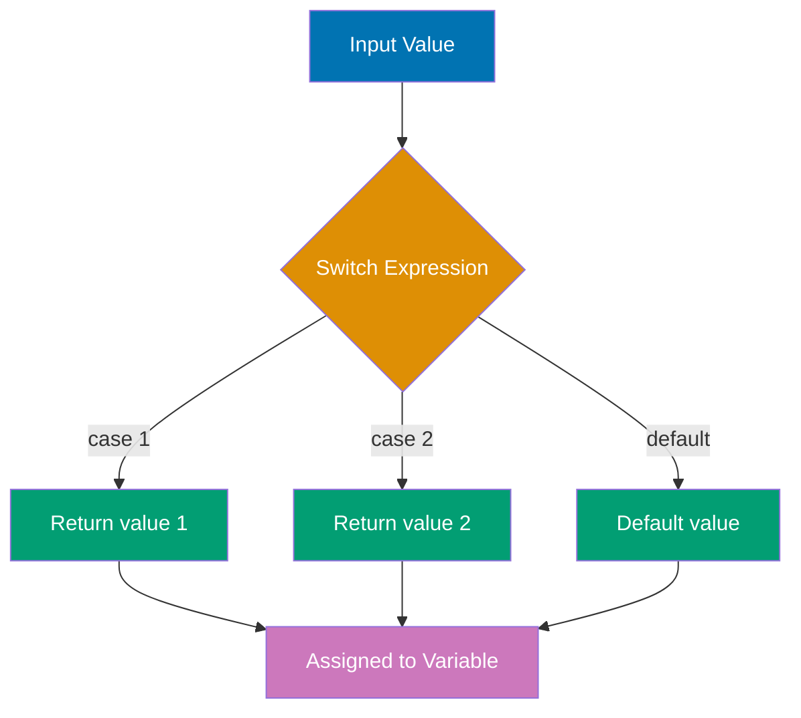

**Code**:

```java
// Switch expression with arrow syntax (Java 12+)
int dayNum = 3; // => 3 (represents Wednesday)

// Returns value directly - no break needed
String dayType = switch (dayNum) {
    case 1, 7 -> "Weekend"; // => Multiple values in one case
    case 2, 3, 4, 5, 6 -> "Weekday"; // => This case executes
    default -> "Invalid";
}; // => dayType is "Weekday"

System.out.println("Day type: " + dayType); // => "Day type: Weekday"

// Switch expression with yield for blocks
int quarter = switch (dayNum) {
    case 1, 2, 3 -> {
        System.out.println("Q1"); // => Can have statements in block
        yield 1; // => yield returns value from block
    }
    case 4, 5, 6 -> {
        System.out.println("Q2");
        yield 2;
    }
    case 7, 8, 9 -> {
        System.out.println("Q3");
        yield 3;
    }
    case 10, 11, 12 -> {
        System.out.println("Q4");
        yield 4;
    }
    default -> {
        yield 0; // => Must yield in every case
    }
}; // => quarter is 1 (because dayNum 3 is in Q1)

// Enhanced instanceof with pattern variables (Java 16+)
Object obj = "Hello World"; // => obj is String

// Traditional instanceof (verbose)
if (obj instanceof String) {
    String str = (String) obj; // => Need explicit cast
    System.out.println(str.toUpperCase()); // => "HELLO WORLD"
}

// Pattern matching instanceof (concise)
if (obj instanceof String s) { // => s is automatically cast
    System.out.println(s.toUpperCase()); // => "HELLO WORLD" (no cast needed)
    System.out.println("Length: " + s.length()); // => "Length: 11"
} // => s only in scope within if block

// Pattern matching in switch (Java 17+, preview in 17-20, standard in 21+)
Object value = 42; // => value is Integer

String result = switch (value) {
    case Integer i -> "Integer: " + i; // => Pattern matches and binds to i
    case String s -> "String: " + s;
    case Double d -> "Double: " + d;
    case null -> "Null value"; // => Can match null explicitly
    default -> "Unknown type";
}; // => result is "Integer: 42"

// Switch with guards (when clause) - Java 21+
int num = 15; // => num is 15

String category = switch (num) {
    case Integer i when i < 0 -> "Negative"; // => Guard condition
    case Integer i when i == 0 -> "Zero";
    case Integer i when i > 0 && i < 10 -> "Small positive";
    case Integer i when i >= 10 && i < 100 -> "Medium positive"; // => This executes
    case Integer i when i >= 100 -> "Large positive";
    default -> "Unknown";
}; // => category is "Medium positive"

// Exhaustiveness checking - compiler ensures all cases covered
sealed interface Shape permits Circle, Rectangle, Triangle {}
record Circle(double radius) implements Shape {}
record Rectangle(double width, double height) implements Shape {}
record Triangle(double base, double height) implements Shape {}

double area = switch (shape) { // => Compiler checks all Shape types covered
    case Circle c -> Math.PI * c.radius() * c.radius(); // => πr²
    case Rectangle r -> r.width() * r.height(); // => width × height
    case Triangle t -> 0.5 * t.base() * t.height(); // => ½ × base × height
    // No default needed - compiler knows all cases covered
};
```

**Key Takeaway**: Switch expressions return values and use `->` arrow syntax (no `break` needed). `yield` returns values from block expressions. Pattern matching `instanceof` combines type check and cast in one step. Switch pattern matching (Java 17+/21+) enables type-based switching with guards. Exhaustiveness checking prevents missing cases with sealed types.

**Why It Matters**: Date-time bugs cause financial losses (billing cycles), compliance violations (audit trails), and user confusion (timezone mismatches). Legacy Date class is mutable and thread-unsafe—modern java.time API provides immutable, thread-safe types preventing concurrency bugs. ZonedDateTime correctly handles daylight saving time transitions, timezone offsets, and historical timezone changes. Duration and Period enable precise interval calculations for SLAs, expirations, and scheduling. ISO 8601 formatting ensures unambiguous date exchange across systems and timezones.

---

### Example 20: Text Blocks and String Manipulation

Text blocks (Java 15+) provide multiline strings with proper formatting. String methods offer rich manipulation capabilities for real-world text processing.

**Code**:

```java
// Text block (Java 15+) - preserves formatting
String json = """
    {
        "name": "Alice",
        "age": 30,
        "city": "New York"
    }
    """; // => Multiline string with preserved formatting

System.out.println(json);
// => Prints:
// {
//     "name": "Alice",
//     "age": 30,
//     "city": "New York"
// }

// Text block indentation - leftmost content determines baseline
String html = """
        <html>
            <body>
                <h1>Title</h1>
            </body>
        </html>
        """; // => Indentation relative to closing delimiter

// Escape sequences in text blocks
String formatted = """
    Line 1\n\
    Line 2 (no newline after Line 1)
    Line 3 "with quotes"
    """; // => \n for explicit newline, \ for line continuation

// String interpolation alternatives (formatted, format)
String name = "Bob"; // => name is "Bob"
int age = 25; // => age is 25

String message = String.format("Name: %s, Age: %d", name, age);
// => "Name: Bob, Age: 25"

String formatted2 = "Name: %s, Age: %d".formatted(name, age);
// => Same as above (Java 15+)

// String manipulation methods
String text = "  Hello, World!  "; // => text with leading/trailing spaces

String trimmed = text.trim(); // => "Hello, World!" (removes whitespace)
String stripped = text.strip(); // => "Hello, World!" (Unicode-aware trim)
boolean blank = "   ".isBlank(); // => true (only whitespace)
boolean empty = "".isEmpty(); // => true (zero length)

// String splitting and joining
String csv = "apple,banana,cherry"; // => CSV data
String[] fruits = csv.split(","); // => ["apple", "banana", "cherry"]

String joined = String.join(" | ", fruits); // => "apple | banana | cherry"

// Repeat (Java 11+)
String repeated = "Ha".repeat(3); // => "HaHaHa"
String line = "=".repeat(20); // => "===================="

// Lines (Java 11+) - stream of lines
String multiline = "Line 1\nLine 2\nLine 3"; // => multiline string
multiline.lines() // => Stream<String> of lines
    .forEach(line -> System.out.println(line)); // => Prints each line

// indent (Java 12+)
String indented = "Hello\nWorld".indent(4);
// => "    Hello\n    World\n" (adds 4 spaces to each line)

// Character methods
char ch = 'A'; // => ch is 'A'
boolean isDigit = Character.isDigit(ch); // => false
boolean isLetter = Character.isLetter(ch); // => true
boolean isUpperCase = Character.isUpperCase(ch); // => true
char toLowerCase = Character.toLowerCase(ch); // => 'a'

// String comparison
String s1 = "hello"; // => s1 is "hello"
String s2 = "HELLO"; // => s2 is "HELLO"
boolean equals = s1.equals(s2); // => false (case-sensitive)
boolean equalsIgnoreCase = s1.equalsIgnoreCase(s2); // => true
int compared = s1.compareTo(s2); // => positive number (s1 > s2 lexicographically)

// contains, startsWith, endsWith
String sentence = "Java is awesome"; // => sentence
boolean contains = sentence.contains("is"); // => true
boolean starts = sentence.startsWith("Java"); // => true
boolean ends = sentence.endsWith("awesome"); // => true

// replace variations
String original = "Hello World Hello"; // => original
String replaced = original.replace("Hello", "Hi"); // => "Hi World Hi" (all occurrences)
String replacedFirst = original.replaceFirst("Hello", "Hi"); // => "Hi World Hello" (first only)
String regex = "a1b2c3".replaceAll("\\d", "X"); // => "aXbXcX" (regex replacement)

// substring
String sub = "Java Programming".substring(5); // => "Programming" (from index 5)
String range = "Java Programming".substring(0, 4); // => "Java" (index 0 to 3)

// indexOf and lastIndexOf
int firstIndex = "Hello World".indexOf("o"); // => 4 (first 'o')
int lastIndex = "Hello World".lastIndexOf("o"); // => 7 (last 'o')
int notFound = "Hello".indexOf("z"); // => -1 (not found)
```

**Key Takeaway**: Text blocks (`"""..."""`) provide multiline strings with preserved formatting. `strip()` is Unicode-aware trim. `lines()` creates stream of lines. `repeat()` duplicates strings. `formatted()` provides template formatting. String methods (`split`, `join`, `replace`, `substring`, `indexOf`) handle common text operations.

**Why It Matters**: Random number generation powers simulations, sampling, testing, and security (cryptographic keys, tokens). java.util.Random is fast but predictable—SecureRandom provides cryptographically strong randomness for security-sensitive operations (password salts, session IDs). Seeding enables reproducible testing (same seed produces same sequence). Understanding distributions (uniform vs Gaussian) enables correct modeling of real-world phenomena. Production systems use random sampling for A/B testing, load balancing, and performance profiling.

---

### Example 21: Varargs and Overloading

Varargs (`...`) accept variable number of arguments as array. Method overloading allows same name with different signatures. Compiler selects most specific match at compile-time.

**Code**:

```java
// Varargs - variable number of arguments
public static int sum(int... numbers) { // => numbers is int[]
    int total = 0; // => total starts at 0
    for (int num : numbers) {
        total += num; // => Add each number
    }
    return total; // => Return accumulated sum
}

int result1 = sum(); // => 0 (no arguments, empty array)
int result2 = sum(5); // => 5 (one argument)
int result3 = sum(1, 2, 3); // => 6 (three arguments)
int result4 = sum(1, 2, 3, 4, 5); // => 15 (five arguments)

// Varargs must be last parameter
public static void print(String prefix, int... numbers) {
    System.out.print(prefix + ": "); // => prefix is "Numbers"
    for (int num : numbers) {
        System.out.print(num + " "); // => Print each number
    }
    System.out.println(); // => Newline
}

print("Numbers", 1, 2, 3); // => "Numbers: 1 2 3 "

// Can pass array to varargs
int[] array = {10, 20, 30}; // => array of 3 integers
int arraySum = sum(array); // => 60 (same as sum(10, 20, 30))

// Method overloading - same name, different parameters
public static int multiply(int a, int b) {
    return a * b; // => Two parameters
}

public static int multiply(int a, int b, int c) {
    return a * b * c; // => Three parameters
}

public static double multiply(double a, double b) {
    return a * b; // => Different types
}

// Compiler selects method based on arguments
int m1 = multiply(2, 3); // => 6 (calls two-parameter int version)
int m2 = multiply(2, 3, 4); // => 24 (calls three-parameter version)
double m3 = multiply(2.5, 3.0); // => 7.5 (calls double version)

// Overloading with automatic widening
public static void display(int num) {
    System.out.println("int: " + num);
}

public static void display(long num) {
    System.out.println("long: " + num);
}

public static void display(double num) {
    System.out.println("double: " + num);
}

byte b = 10; // => b is byte
display(b); // => "int: 10" (byte widened to int)

int i = 20; // => i is int
display(i); // => "int: 20" (exact match)

long l = 30L; // => l is long
display(l); // => "long: 30" (exact match)

float f = 40.0f; // => f is float
display(f); // => "double: 40.0" (float widened to double)

// Overloading resolution priority:
// 1. Exact match
// 2. Primitive widening (byte -> short -> int -> long -> float -> double)
// 3. Autoboxing (int -> Integer)
// 4. Varargs

// Ambiguous overloading (compile error)
// public static void process(int a, double b) {}
// public static void process(double a, int b) {}
// process(1, 2); // ERROR: ambiguous (both could match with widening)

// Constructor overloading
class Rectangle {
    private double width; // => width field
    private double height; // => height field

    // Default constructor
    public Rectangle() {
        this(1.0, 1.0); // => Delegates to two-parameter constructor
    }

    // One parameter (square)
    public Rectangle(double side) {
        this(side, side); // => Delegates to two-parameter constructor
    }

    // Two parameters
    public Rectangle(double width, double height) {
        this.width = width; // => Sets width
        this.height = height; // => Sets height
    }

    public double area() {
        return width * height; // => Calculates area
    }
}

Rectangle r1 = new Rectangle(); // => 1.0 × 1.0 square
double area1 = r1.area(); // => 1.0

Rectangle r2 = new Rectangle(5.0); // => 5.0 × 5.0 square
double area2 = r2.area(); // => 25.0

Rectangle r3 = new Rectangle(3.0, 4.0); // => 3.0 × 4.0 rectangle
double area3 = r3.area(); // => 12.0

// Varargs with overloading
public static String format(String s) {
    return "[" + s + "]"; // => Single string
}

public static String format(String... strings) {
    return "[" + String.join(", ", strings) + "]"; // => Multiple strings
}

String f1 = format("A"); // => "[A]" (exact match, calls single-parameter)
String f2 = format("A", "B"); // => "[A, B]" (calls varargs)
String f3 = format("A", "B", "C"); // => "[A, B, C]" (calls varargs)
```

**Key Takeaway**: Varargs (`type... name`) accept zero or more arguments as array. Must be last parameter. Method overloading allows same name with different signatures (parameter count or types). Compiler selects method based on: exact match, primitive widening, autoboxing, then varargs. Constructor overloading enables multiple initialization patterns with `this()` delegation.

**Why It Matters**: Math operations are fundamental to financial calculations (interest, taxes), scientific computing, game development, and data analysis. Understanding precision (double vs BigDecimal) prevents financial rounding errors. Trigonometric functions enable geometric calculations, signal processing, and physics simulations. Exponential and logarithmic functions model growth rates, compression ratios, and algorithmic complexity. The Math class provides tested, optimized implementations preventing implementation bugs in critical calculations. BigDecimal ensures exact decimal arithmetic for monetary values, avoiding floating-point errors.

---

### Example 22: Wrapper Classes and Autoboxing

Wrapper classes (Integer, Double, Boolean, etc.) box primitives into objects for collections and generics. Autoboxing converts automatically. Understand performance implications and caching behavior.

**Code**:

```java
// Wrapper classes - object representations of primitives
Integer objInt = Integer.valueOf(42); // => Integer object wrapping 42
int primitive = objInt.intValue(); // => 42 (extract primitive)

// Autoboxing - automatic primitive to wrapper conversion
Integer auto = 100; // => Autoboxing: int -> Integer
int unboxed = auto; // => Unboxing: Integer -> int (value is 100)

// Why wrappers exist: collections require objects
ArrayList<Integer> numbers = new ArrayList<>(); // => List of Integer, NOT int
numbers.add(10); // => Autoboxing: 10 -> Integer.valueOf(10)
numbers.add(20); // => Autoboxing: 20 -> Integer.valueOf(20)
int value = numbers.get(0); // => Unboxing: Integer -> int (value is 10)

// All primitive wrapper classes
Byte byteObj = 127; // => byte wrapper
Short shortObj = 32000; // => short wrapper
Integer intObj = 42; // => int wrapper
Long longObj = 1000L; // => long wrapper
Float floatObj = 3.14f; // => float wrapper
Double doubleObj = 3.14159; // => double wrapper
Character charObj = 'A'; // => char wrapper
Boolean boolObj = true; // => boolean wrapper

// Integer caching (-128 to 127)
Integer a = 100; // => Cached
Integer b = 100; // => Same cached instance
System.out.println(a == b); // => true (same object reference!)

Integer c = 200; // => Not cached
Integer d = 200; // => Different instance
System.out.println(c == d); // => false (different objects)
System.out.println(c.equals(d)); // => true (same value)

// CRITICAL: Always use .equals() for wrapper comparison
Integer x = 42; // => x wraps 42
Integer y = 42; // => y wraps 42 (cached, same instance)
Integer z = Integer.valueOf(42); // => z also refers to cached instance

System.out.println(x == y); // => true (cached range)
System.out.println(x.equals(y)); // => true (correct comparison)

// Null pointers with autoboxing
Integer nullInt = null; // => Wrapper can be null
// int value = nullInt; // => NullPointerException! (unboxing null fails)

// Safe unboxing with null check
if (nullInt != null) {
    int safe = nullInt; // => Only unbox if not null
}

// Wrapper utility methods
int parsed = Integer.parseInt("123"); // => 123 (String -> int)
Integer parsedObj = Integer.valueOf("456"); // => Integer(456) (String -> Integer)

String binary = Integer.toBinaryString(10); // => "1010"
String hex = Integer.toHexString(255); // => "ff"
String octal = Integer.toOctalString(8); // => "10"

int max = Integer.MAX_VALUE; // => 2147483647
int min = Integer.MIN_VALUE; // => -2147483648

// Double special values
double inf = Double.POSITIVE_INFINITY; // => Infinity
double ninf = Double.NEGATIVE_INFINITY; // => -Infinity
double nan = Double.NaN; // => Not a Number

boolean isNaN = Double.isNaN(0.0 / 0.0); // => true
boolean isInfinite = Double.isInfinite(1.0 / 0.0); // => true

// Character utility methods
boolean isDigit = Character.isDigit('5'); // => true
boolean isLetter = Character.isLetter('A'); // => true
boolean isWhitespace = Character.isWhitespace(' '); // => true
char upper = Character.toUpperCase('a'); // => 'A'
int numeric = Character.getNumericValue('5'); // => 5

// Boolean parsing
Boolean bool1 = Boolean.valueOf("true"); // => true
Boolean bool2 = Boolean.valueOf("false"); // => false
Boolean bool3 = Boolean.valueOf("yes"); // => false (anything except "true" is false)

// Performance consideration
long sum1 = 0; // => Primitive (FAST)
for (int i = 0; i < 1000000; i++) {
    sum1 += i; // => No boxing/unboxing
}

Long sum2 = 0L; // => Wrapper (SLOW - autoboxing overhead)
for (int i = 0; i < 1000000; i++) {
    sum2 += i; // => Each iteration: unbox sum2, add, box result
    // Creates 1,000,000 temporary Long objects!
}
// Use primitives for performance-critical code

// Wrapper immutability
Integer num = 10; // => num refers to Integer(10)
num = 20; // => num now refers to NEW Integer(20), old object unchanged
// Wrappers are immutable - cannot modify value after creation
```

**Key Takeaway**: Wrapper classes (Integer, Double, Boolean, etc.) box primitives into objects for collections and generics. Autoboxing converts automatically but creates objects. Integer caches -128 to 127. Always use `.equals()` for wrapper comparison (not `==`). Null wrappers throw NullPointerException when unboxed. Use primitives for performance-critical code to avoid boxing overhead.

**Why It Matters**: String manipulation dominates enterprise code—parsing logs, formatting reports, validating input, building queries. Understanding immutability prevents bugs from unexpected mutations. StringBuilder provides O(n) string building vs O(n²) with concatenation in loops—critical for performance with large strings. Regular expressions enable powerful pattern matching but require careful escaping to avoid injection attacks (SQL, shell). String interning reduces memory when storing many duplicates (enum-like strings). Efficient string handling directly impacts application throughput and memory footprint.

---

### Example 23: Type Conversion and Parsing

Java requires explicit type conversions between different data types. Parsing strings to numbers is common when reading user input or configuration files. Always handle parsing exceptions to avoid crashes.

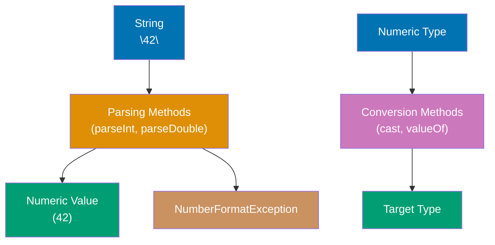

**Code**:

```java
// String to primitive (parsing)
String numStr = "42";
int parsedInt = Integer.parseInt(numStr); // => 42 (String -> int)
double parsedDouble = Double.parseDouble("3.14"); // => 3.14 (String -> double)
boolean parsedBool = Boolean.parseBoolean("true"); // => true (String -> boolean)
long parsedLong = Long.parseLong("1000000"); // => 1000000 (String -> long)

// Parsing with different radix (base)
int binary = Integer.parseInt("1010", 2); // => 10 (binary to decimal)
int hex = Integer.parseInt("FF", 16); // => 255 (hexadecimal to decimal)
int octal = Integer.parseInt("77", 8); // => 63 (octal to decimal)

// String to wrapper (returns wrapper object)
Integer boxedInt = Integer.valueOf("42"); // => Integer(42) (String -> Integer)
Double boxedDouble = Double.valueOf("3.14"); // => Double(3.14) (String -> Double)

// Parsing errors throw NumberFormatException
try {
    int invalid = Integer.parseInt("abc"); // => Throws NumberFormatException!
} catch (NumberFormatException e) {
    System.out.println("Invalid number format"); // => Output: Invalid number format
}

// Safe parsing with try-catch
String input = "123abc";
int safeValue = 0; // Default value
try {
    safeValue = Integer.parseInt(input);
} catch (NumberFormatException e) {
    safeValue = -1; // Use default when parsing fails
}
System.out.println(safeValue); // => -1

// Primitive to String (conversion)
int number = 42;
String str1 = String.valueOf(number); // => "42" (int -> String)
String str2 = Integer.toString(number); // => "42" (int -> String)
String str3 = "" + number; // => "42" (concatenation trick, less clear)
String str4 = number + ""; // => "42" (same as above)

// Formatting numbers to strings
double price = 12.5;
String formatted = String.format("$%.2f", price); // => "$12.50" (2 decimal places)
String padded = String.format("%05d", 42); // => "00042" (zero-padded to 5 digits)

// Primitive type conversions (widening)
int intVal = 100;
long longVal = intVal; // => 100L (automatic widening: int -> long)
double doubleVal = intVal; // => 100.0 (automatic widening: int -> double)
float floatVal = intVal; // => 100.0f (automatic widening: int -> float)

// Narrowing conversions (requires explicit cast)
double doubleNum = 9.99;
int truncated = (int) doubleNum; // => 9 (loses decimal part)
long longNum = 1000000000000L;
int narrowed = (int) longNum; // => Possible data loss if value > Integer.MAX_VALUE

// Overflow in narrowing conversion
int maxInt = Integer.MAX_VALUE; // => 2147483647
short overflow = (short) maxInt; // => -1 (overflow wraps around!)

// Wrapper to primitive (unboxing)
Integer wrappedInt = 42;
int primitiveInt = wrappedInt; // => 42 (automatic unboxing)
int explicit = wrappedInt.intValue(); // => 42 (explicit unboxing)

// NullPointerException when unboxing null
Integer nullWrapper = null;
try {
    int value = nullWrapper; // => NullPointerException! (cannot unbox null)
} catch (NullPointerException e) {
    System.out.println("Cannot unbox null"); // => Output: Cannot unbox null
}

// Converting between wrapper types
Integer intWrapper = 42;
Double doubleWrapper = intWrapper.doubleValue(); // => 42.0 (Integer -> Double)
String stringWrapper = intWrapper.toString(); // => "42" (Integer -> String)

// Parsing with validation
String userInput = "  123  "; // User input often has whitespace
userInput = userInput.trim(); // => "123" (remove leading/trailing whitespace)
if (userInput.matches("-?\\d+")) { // => Regex: optional minus, followed by digits
    int validNum = Integer.parseInt(userInput); // => Safe to parse
    System.out.println("Valid: " + validNum); // => Output: Valid: 123
} else {
    System.out.println("Invalid input");
}

// Character to int (ASCII/Unicode value)
char letter = 'A';
int ascii = (int) letter; // => 65 (ASCII value of 'A')
char digit = '7';
int digitValue = Character.getNumericValue(digit); // => 7 (numeric value of character)
int digitAscii = (int) digit; // => 55 (ASCII value, NOT 7!)

// Boolean parsing (case-insensitive)
boolean b1 = Boolean.parseBoolean("TRUE"); // => true
boolean b2 = Boolean.parseBoolean("Yes"); // => false (only "true" returns true!)
boolean b3 = Boolean.parseBoolean("1"); // => false (not recognized as true)

// Radix string representation
int num = 255;
String bin = Integer.toBinaryString(num); // => "11111111" (binary representation)
String oct = Integer.toOctalString(num); // => "377" (octal representation)
String hexStr = Integer.toHexString(num); // => "ff" (hexadecimal representation)

// Converting arrays
String[] stringArray = {"1", "2", "3"};
int[] intArray = new int[stringArray.length];
for (int i = 0; i < stringArray.length; i++) {
    intArray[i] = Integer.parseInt(stringArray[i]); // => [1, 2, 3]
}

// Using streams for array conversion (Java 8+)
int[] streamArray = java.util.Arrays.stream(stringArray)
    .mapToInt(Integer::parseInt) // => Parse each string to int
    .toArray(); // => [1, 2, 3]

// Handling optional values (Java 8+)
String nullableStr = null;
Integer optionalInt = nullableStr != null ? Integer.parseInt(nullableStr) : null;
// Better with Optional (advanced)
java.util.Optional<Integer> opt = java.util.Optional.ofNullable(nullableStr)
    .map(Integer::parseInt);

// Common conversion utilities
double decimal = 12.56789;
long rounded = Math.round(decimal); // => 13 (rounds to nearest long)
int floor = (int) Math.floor(decimal); // => 12 (rounds down)
int ceil = (int) Math.ceil(decimal); // => 13 (rounds up)
```

**Key Takeaway**: Use `Integer.parseInt()`, `Double.parseDouble()`, etc. to parse strings to primitives. Use `String.valueOf()` or wrapper `.toString()` to convert primitives/objects to strings. Parsing can throw `NumberFormatException`—always validate input or use try-catch. Widening conversions (int → long → double) are automatic; narrowing conversions require explicit casts and may lose precision or overflow.

**Why It Matters**: Type conversion and parsing are fundamental to real-world Java applications. Web services receive data as JSON/XML strings that must be parsed to numbers for calculations. Configuration files (properties, YAML) store settings as strings requiring type conversion. User input from forms, command-line arguments, or REST APIs always arrives as strings, making robust parsing essential to prevent crashes from invalid data. The `NumberFormatException` is one of the most common runtime exceptions in production code—proper validation and error handling separate robust applications from fragile ones. Understanding widening vs narrowing conversions prevents subtle overflow bugs (e.g., casting long to int can silently corrupt data). Type safety and explicit conversions make Java verbose but catch errors at compile-time that would be runtime bugs in dynamically-typed languages.

---

### Example 24: Static Members and Blocks

Static members belong to the class, not instances. Static methods can't access instance members. Static blocks initialize class-level state. Understanding static helps with utility classes and singletons.

**Code**:

```java
// Static fields - shared across all instances
class Counter {
    private static int count = 0; // => Class-level variable (one copy for all instances)
    private int instanceId; // => Instance-level variable (each object has its own)

    public Counter() {
        count++; // => Increment shared counter
        this.instanceId = count; // => Assign instance ID
    }

    public int getInstanceId() {
        return instanceId; // => Return this instance's ID
    }

    public static int getCount() {
        return count; // => Return total count (static method)
    }
}

Counter c1 = new Counter(); // => count becomes 1, c1.instanceId = 1
Counter c2 = new Counter(); // => count becomes 2, c2.instanceId = 2
Counter c3 = new Counter(); // => count becomes 3, c3.instanceId = 3

System.out.println(c1.getInstanceId()); // => 1
System.out.println(c2.getInstanceId()); // => 2
System.out.println(Counter.getCount()); // => 3 (accessed via class name)

// Static methods - belong to class
class MathUtils {
    // Static method - no access to instance members
    public static int add(int a, int b) {
        return a + b; // => Pure function, no instance state
    }

    public static int multiply(int a, int b) {
        return a * b; // => Another static utility method
    }
}

int sum = MathUtils.add(5, 3); // => 8 (call via class name)
int product = MathUtils.multiply(4, 7); // => 28

// Static cannot access instance members
class Example {
    private int instanceVar = 10; // => Instance variable
    private static int staticVar = 20; // => Static variable

    public static void staticMethod() {
        System.out.println(staticVar); // => OK: static can access static
        // System.out.println(instanceVar); // => ERROR: static can't access instance
        // this.instanceVar; // => ERROR: no 'this' in static context
    }

    public void instanceMethod() {
        System.out.println(instanceVar); // => OK: instance can access instance
        System.out.println(staticVar); // => OK: instance can access static
    }
}

// Static initialization block - runs once when class loaded
class DatabaseConfig {
    private static String url; // => Static field
    private static String username; // => Static field
    private static String password; // => Static field

    // Static block - runs when class first loaded
    static {
        System.out.println("Loading database config..."); // => Executes once
        url = "jdbc:mysql://localhost:3306/db"; // => Initialize static field
        username = "admin"; // => Initialize static field
        password = "secret"; // => Initialize static field
        System.out.println("Config loaded"); // => Executes once
    }

    public static String getUrl() {
        return url; // => Return initialized value
    }
}

String dbUrl = DatabaseConfig.getUrl(); // => Triggers class loading and static block
// => Prints: "Loading database config..." and "Config loaded"
String dbUrl2 = DatabaseConfig.getUrl(); // => Static block does NOT run again

// Multiple static blocks - execute in order
class InitOrder {
    private static int a; // => Uninitialized
    private static int b; // => Uninitialized

    static {
        a = 10; // => First block: a = 10
        System.out.println("First static block: a = " + a); // => "First static block: a = 10"
    }

    static {
        b = a * 2; // => Second block: b = 20 (uses a from first block)
        System.out.println("Second static block: b = " + b); // => "Second static block: b = 20"
    }
}

// Initialization order: static fields -> static blocks -> instance fields -> constructors

// Static imports - import static members
import static java.lang.Math.PI; // => Import constant
import static java.lang.Math.sqrt; // => Import method

double radius = 5.0; // => radius is 5.0
double area = PI * radius * radius; // => Use PI directly (no Math. prefix)
double result = sqrt(16); // => 4.0 (use sqrt directly)

// Static inner classes - nested class that doesn't need outer instance
class Outer {
    private static String staticOuter = "Static Outer"; // => Outer static field
    private String instanceOuter = "Instance Outer"; // => Outer instance field

    // Static nested class
    public static class StaticNested {
        public void display() {
            System.out.println(staticOuter); // => OK: can access outer static
            // System.out.println(instanceOuter); // => ERROR: can't access outer instance
        }
    }
}

// Create static nested class - no outer instance needed
Outer.StaticNested nested = new Outer.StaticNested(); // => Create without Outer instance
nested.display(); // => "Static Outer"

// Constants pattern - public static final
class Constants {
    public static final double PI = 3.14159; // => Constant (cannot be changed)
    public static final int MAX_SIZE = 1000; // => Constant
    public static final String APP_NAME = "MyApp"; // => Constant

    // Prevent instantiation
    private Constants() {
        throw new AssertionError("Cannot instantiate constants class");
    }
}

double pi = Constants.PI; // => 3.14159
// Constants.PI = 3.0; // => ERROR: cannot assign to final variable
```

**Key Takeaway**: Static members belong to the class (shared across all instances). Static methods accessed via class name (not instance). Static can't access instance members. Static blocks initialize class-level state once when class loads. Use static for utility methods, constants, and counters. Static imports allow using static members without class prefix.

**Why It Matters**: StringBuilder is essential when building strings in loops—concatenation creates temporary objects causing garbage collection pressure and O(n²) performance. In production systems generating reports, logs, or JSON responses with thousands of fields, StringBuilder provides O(n) performance. Thread safety (StringBuffer) is rarely needed—StringBuilder is preferred for single-threaded contexts. Understanding capacity tuning prevents repeated reallocations. String building dominates serialization, templating, and formatting tasks, so efficient StringBuilder usage directly improves application responsiveness.

---

### Example 25: Packages and Access Modifiers

Packages organize classes into namespaces. Access modifiers (`public`, `private`, `protected`, package-private) control visibility. Understanding access control is essential for encapsulation and API design.

**Code**:

```java
// Package declaration - must be first statement
package com.example.myapp; // => This class belongs to com.example.myapp package

// Import statements - come after package declaration
import java.util.ArrayList; // => Import specific class
import java.util.List; // => Import specific class
import java.io.*; // => Import all classes from java.io (wildcard)
import static java.lang.Math.PI; // => Static import for constants/methods

// Access modifiers control visibility

// PUBLIC - accessible from anywhere
public class PublicClass {
    public int publicField = 10; // => Accessible from any package

    public void publicMethod() {
        System.out.println("Public method"); // => Accessible from anywhere
    }
}

// PRIVATE - accessible only within same class
class PrivateExample {
    private int privateField = 20; // => Only accessible within this class

    private void privateMethod() {
        System.out.println("Private method"); // => Only within this class
    }

    public void accessPrivate() {
        System.out.println(privateField); // => OK: same class
        privateMethod(); // => OK: same class
    }
}

// PROTECTED - accessible within package and by subclasses
class ProtectedExample {
    protected int protectedField = 30; // => Package + subclasses

    protected void protectedMethod() {
        System.out.println("Protected method"); // => Package + subclasses
    }
}

// PACKAGE-PRIVATE (default) - accessible only within same package
class PackagePrivateClass { // => No modifier = package-private
    int packageField = 40; // => No modifier = package-private

    void packageMethod() {
        System.out.println("Package-private method"); // => Same package only
    }
}

// Access modifier visibility summary:
//                      | Class | Package | Subclass | World |
// -----------------------------------------------------------|
// public               |  ✓    |    ✓    |    ✓     |   ✓   |
// protected            |  ✓    |    ✓    |    ✓     |   ✗   |
// (package-private)    |  ✓    |    ✓    |    ✗     |   ✗   |
// private              |  ✓    |    ✗    |    ✗     |   ✗   |

// Typical access pattern for classes
public class Person {
    // Private fields - internal state hidden
    private String name; // => Only accessible within Person
    private int age; // => Only accessible within Person

    // Public constructor - allows creation from anywhere
    public Person(String name, int age) {
        this.name = name; // => Initialize private field
        this.age = age; // => Initialize private field
    }

    // Public getters - controlled read access
    public String getName() {
        return name; // => Expose name via method
    }

    public int getAge() {
        return age; // => Expose age via method
    }

    // Public setters with validation - controlled write access
    public void setAge(int age) {
        if (age >= 0 && age <= 150) { // => Validation logic
            this.age = age; // => Only set if valid
        } else {
            throw new IllegalArgumentException("Invalid age"); // => Reject invalid
        }
    }

    // Private helper method - implementation detail
    private boolean isAdult() {
        return age >= 18; // => Internal logic, not exposed
    }

    // Public method using private helper
    public String getCategory() {
        return isAdult() ? "Adult" : "Minor"; // => Uses private helper
    }
}

Person person = new Person("Alice", 25); // => OK: public constructor
String name = person.getName(); // => "Alice" (public getter)
// String directName = person.name; // => ERROR: name is private
person.setAge(30); // => OK: public setter
// boolean adult = person.isAdult(); // => ERROR: isAdult is private

// Package structure example:
// com/example/myapp/
//   ├── Main.java (public class Main)
//   ├── util/
//   │   ├── StringUtils.java (public class StringUtils)
//   │   └── Helper.java (package-private class Helper)
//   └── model/
//       ├── User.java (public class User)
//       └── UserRepository.java (public interface UserRepository)

// Importing from different packages
// package com.example.myapp;
// import com.example.myapp.util.StringUtils; // Import from util package
// import com.example.myapp.model.User; // Import from model package

// Static import for constants
// import static com.example.myapp.Constants.MAX_SIZE;
// int size = MAX_SIZE; // Use constant without Constants. prefix

// Constructor access modifiers
class ConstructorAccess {
    // Private constructor - prevents external instantiation
    private ConstructorAccess() {
        // Singleton pattern or utility class
    }

    // Public static factory method - only way to create instance
    public static ConstructorAccess create() {
        return new ConstructorAccess(); // => Can access private constructor from same class
    }
}

// ConstructorAccess obj = new ConstructorAccess(); // => ERROR: constructor is private
ConstructorAccess obj = ConstructorAccess.create(); // => OK: use factory method

// Package-private classes and interfaces
// Only visible within same package - implementation details hidden
interface InternalApi { // => Package-private (no public modifier)
    void internalMethod();
}

class InternalImpl implements InternalApi { // => Package-private
    @Override
    public void internalMethod() {
        // Implementation
    }
}

// Public facade exposes only what's needed
public class PublicApi {
    private InternalApi internal = new InternalImpl(); // => Private field

    public void publicMethod() {
        internal.internalMethod(); // => Use internal implementation
    }
}
```

**Key Takeaway**: Packages organize classes (`package com.example`). Import statements bring classes into scope. Access modifiers control visibility: `public` (everywhere), `protected` (package + subclasses), package-private (same package), `private` (same class). Typical pattern: private fields, public getters/setters, private helpers. Package-private classes hide implementation details. Use access control for encapsulation and API design.

**Why It Matters**: Object-oriented design enables code reuse, modularity, and maintainability through encapsulation. Classes model real-world entities (Customer, Order, Invoice) making code intuitive. Constructors enforce invariants (required fields) preventing invalid objects. Encapsulation (private fields, public methods) hides implementation details enabling refactoring without breaking clients. Objects enable polymorphism—swapping implementations without changing client code. OOP is fundamental to frameworks like Spring where dependency injection and interfaces enable loosely coupled, testable systems.

---

### Example 26: The `var` Keyword

The `var` keyword (Java 10+) provides local variable type inference. Compiler infers type from initializer. Improves readability for complex types while maintaining compile-time type safety.

**Code**:

```java
// Traditional explicit types (verbose)
ArrayList<String> list1 = new ArrayList<String>(); // => Type repeated
HashMap<String, Integer> map1 = new HashMap<String, Integer>(); // => Verbose
String message1 = "Hello World"; // => Simple case

// var with type inference (concise)
var list2 = new ArrayList<String>(); // => Compiler infers ArrayList<String>
var map2 = new HashMap<String, Integer>(); // => Inferred HashMap<String, Integer>
var message2 = "Hello World"; // => Inferred String

// Type is still static and checked at compile-time
// list2 = 42; // => ERROR: incompatible types (can't assign int to ArrayList)
list2.add("Java"); // => OK: add is a valid ArrayList method
// list2.add(123); // => ERROR: type mismatch (expects String, got int)

// var works with primitives
var count = 0; // => int (inferred from 0)
var price = 19.99; // => double (inferred from 19.99)
var flag = true; // => boolean (inferred from true)
var letter = 'A'; // => char (inferred from 'A')

// var with method return types
var now = java.time.LocalDateTime.now(); // => LocalDateTime (inferred from return type)
var random = Math.random(); // => double (Math.random() returns double)
var length = "Hello".length(); // => int (String.length() returns int)

// var in loops (very useful)
// Traditional for-each
for (String item : list2) {
    System.out.println(item); // => item is String
}

// var for-each (cleaner)
var items = List.of("Java", "Python", "Go"); // => List<String>
for (var item : items) { // => item inferred as String
    System.out.println(item); // => Prints each language
}

// var in traditional for loop
for (var i = 0; i < 10; i++) { // => i inferred as int
    System.out.println(i); // => Prints 0 to 9
}

// var with complex generic types (readability win)
// Traditional (very verbose)
Map<String, List<Map<String, Integer>>> traditional =
    new HashMap<String, List<Map<String, Integer>>>();

// var (much cleaner)
var modern = new HashMap<String, List<Map<String, Integer>>>();
// => Type is still HashMap<String, List<Map<String, Integer>>>

// var with diamond operator
var list3 = new ArrayList<>(); // => ERROR: cannot infer type from <> alone
var list4 = new ArrayList<String>(); // => OK: explicit type argument

// var with lambda expressions - type inferred from context
// Predicate<String> filter = s -> s.length() > 5; // Traditional
Predicate<String> traditional2 = s -> s.length() > 5;
var filtered = items.stream()
    .filter(s -> s.length() > 5) // => s type inferred within lambda
    .collect(Collectors.toList()); // => filtered inferred as List<String>

// var limitations and restrictions:

// 1. MUST have initializer
// var x; // => ERROR: cannot infer type without initializer
var y = 10; // => OK: inferred as int

// 2. Cannot use with null
// var nullVar = null; // => ERROR: cannot infer type from null
var nullableString = (String) null; // => OK: explicit type cast

// 3. Cannot use for fields (only local variables)
class Example {
    // var field = 10; // => ERROR: var not allowed for fields
    private int field = 10; // => Must use explicit type
}

// 4. Cannot use for method parameters
// public void method(var param) {} // => ERROR: var not allowed for parameters
public void method(String param) {} // => Must use explicit type

// 5. Cannot use for method return types
// public var getValue() { return 42; } // => ERROR: var not allowed for return type
public int getValue() { return 42; } // => Must use explicit type

// 6. Array initializer needs explicit type
// var array = {1, 2, 3}; // => ERROR: cannot infer type from array initializer
var array = new int[]{1, 2, 3}; // => OK: int[] inferred

// When to use var vs explicit types:

// Use var when type is obvious from right-hand side
var builder = new StringBuilder(); // => GOOD: obvious it's StringBuilder
var user = userService.getUser(id); // => GOOD: method name indicates User

// Avoid var when type is not obvious
var result = calculate(); // => BAD: what type does calculate() return?
CalculationResult result2 = calculate(); // => GOOD: explicit type clarifies

// var with var keyword itself (Java 11+ - reserved keyword)
// var var = 10; // => ERROR in Java 11+: var is reserved keyword in certain contexts
// Can still use as identifier in some cases for backward compatibility

// Practical example: improving code readability
// Traditional (type info repeated)
Entry<String, List<Integer>> entry1 =
    new AbstractMap.SimpleEntry<String, List<Integer>>("key", List.of(1, 2, 3));

// With var (type still enforced, less visual noise)
var entry2 = new AbstractMap.SimpleEntry<>("key", List.of(1, 2, 3));
// => Type is Entry<String, List<Integer>> (inferred from constructor)

String key = entry2.getKey(); // => "key"
List<Integer> values = entry2.getValue(); // => [1, 2, 3]
```

**Key Takeaway**: `var` provides local variable type inference (Java 10+). Compiler infers type from initializer—compile-time type safety maintained. Reduces boilerplate for complex generic types. Restrictions: requires initializer, local variables only (not fields/parameters/return types), cannot infer from null or array initializers. Use when type is obvious from right-hand side. Improves readability without sacrificing type safety.

**Why It Matters**: Encapsulation protects object invariants—preventing invalid states that cause bugs. Private fields with public getters/setters enable validation, logging, and lazy initialization without exposing internal representation. Information hiding enables refactoring internals without breaking clients. The JavaBean convention (getters/setters) integrates with frameworks (Spring, Hibernate) that rely on reflection to access properties. Proper encapsulation prevents data corruption, enforces business rules, and reduces coupling between components. It's foundational to maintainable object-oriented systems.

---

### Example 27: Nested and Inner Classes

Java supports four types of nested classes: static nested, non-static inner, local (inside methods), and anonymous. Each serves different purposes for organization, encapsulation, and callback patterns.

**Code**:

```java
// 1. Static nested class - doesn't need outer instance
class Outer {
    private static String staticField = "Static Outer"; // => Outer static field
    private String instanceField = "Instance Outer"; // => Outer instance field

    // Static nested class
    public static class StaticNested {
        public void display() {
            System.out.println(staticField); // => OK: access outer static
            // System.out.println(instanceField); // => ERROR: no outer instance
        }
    }
}

// Create static nested class - no outer instance needed
Outer.StaticNested nested = new Outer.StaticNested(); // => Create directly
nested.display(); // => "Static Outer"

// 2. Non-static inner class - tied to outer instance
class Outer2 {
    private String outerField = "Outer Field"; // => Outer instance field

    // Inner class (non-static)
    public class Inner {
        public void display() {
            System.out.println(outerField); // => OK: access outer instance member
            System.out.println(Outer2.this.outerField); // => Explicit outer this reference
        }

        public void shadowing() {
            String outerField = "Inner Local"; // => Shadows outer field
            System.out.println(outerField); // => "Inner Local" (local variable)
            System.out.println(Outer2.this.outerField); // => "Outer Field" (outer field)
        }
    }

    public Inner createInner() {
        return new Inner(); // => Outer can create inner directly
    }
}

// Create inner class - MUST have outer instance first
Outer2 outer = new Outer2(); // => Create outer instance
Outer2.Inner inner = outer.new Inner(); // => Create inner from outer instance
inner.display(); // => "Outer Field"

// Or create via outer method
Outer2.Inner inner2 = outer.createInner(); // => Alternative creation

// 3. Local class - defined inside method
class LocalClassExample {
    public void demonstrateLocal() {
        final String localVar = "Local Variable"; // => Effectively final

        // Local class - only visible within this method
        class LocalClass {
            public void display() {
                System.out.println(localVar); // => OK: capture effectively final variable
                // localVar = "Modified"; // => ERROR: local class captures final/effectively final only
            }
        }

        LocalClass local = new LocalClass(); // => Create local class
        local.display(); // => "Local Variable"
    }
}

LocalClassExample example = new LocalClassExample();
example.demonstrateLocal(); // => Creates and uses local class

// 4. Anonymous inner class - class without name
interface Greeting {
    void greet(String name);
}

class AnonymousExample {
    public void demonstrate() {
        // Anonymous class implementing interface
        Greeting greeting = new Greeting() {
            @Override
            public void greet(String name) {
                System.out.println("Hello, " + name + "!"); // => Implementation
            }
        };

        greeting.greet("Alice"); // => "Hello, Alice!"

        // Anonymous class extending class
        Object obj = new Object() {
            @Override
            public String toString() {
                return "Custom toString"; // => Override method
            }
        };

        System.out.println(obj); // => "Custom toString"
    }
}

AnonymousExample anonEx = new AnonymousExample();
anonEx.demonstrate(); // => Uses anonymous classes

// Anonymous class vs lambda (modern alternative)
// Anonymous class (verbose)
Runnable runnable1 = new Runnable() {
    @Override
    public void run() {
        System.out.println("Running"); // => Implementation
    }
};

// Lambda (concise) - only works for functional interfaces
Runnable runnable2 = () -> System.out.println("Running");

// Practical use case: Event listeners
interface ClickListener {
    void onClick();
}

class Button {
    private ClickListener listener; // => Store listener

    public void setOnClickListener(ClickListener listener) {
        this.listener = listener; // => Set listener
    }

    public void click() {
        if (listener != null) {
            listener.onClick(); // => Trigger callback
        }
    }
}

Button button = new Button(); // => Create button

// Anonymous inner class as callback
button.setOnClickListener(new ClickListener() {
    @Override
    public void onClick() {
        System.out.println("Button clicked!"); // => Callback implementation
    }
});

button.click(); // => "Button clicked!"

// Or with lambda (cleaner)
button.setOnClickListener(() -> System.out.println("Button clicked!")); // => Same behavior
button.click(); // => "Button clicked!"

// Nested class access levels
class OuterAccess {
    // All access modifiers work for nested classes
    public static class PublicNested {} // => Accessible anywhere
    protected static class ProtectedNested {} // => Package + subclasses
    static class PackageNested {} // => Same package only
    private static class PrivateNested {} // => Only within OuterAccess

    public void usePrivateNested() {
        PrivateNested pn = new PrivateNested(); // => OK: same outer class
    }
}

// OuterAccess.PrivateNested pn = new OuterAccess.PrivateNested(); // => ERROR: private
OuterAccess.PublicNested pub = new OuterAccess.PublicNested(); // => OK: public

// Capturing variables - effectively final requirement
class EffectivelyFinalExample {
    public void demonstrate() {
        int x = 10; // => Effectively final (not modified)
        // x = 20; // => Would make x NOT effectively final

        Runnable r = new Runnable() {
            @Override
            public void run() {
                System.out.println(x); // => OK: x is effectively final
            }
        };

        // x = 30; // => ERROR: would make x not effectively final (captured by r)

        r.run(); // => "10"
    }
}
```

**Key Takeaway**: Four nested class types: static nested (no outer instance), non-static inner (tied to outer), local (in method), anonymous (no name). Static nested accessed via `Outer.StaticNested`. Inner accessed via `outer.new Inner()`. Local and anonymous capture effectively final variables. Anonymous classes are verbose—prefer lambdas for functional interfaces. Nested classes provide encapsulation and organization for tightly coupled logic.

**Why It Matters**: Static members provide shared state and utility functions without requiring instances. Static methods (Math.abs, Collections.sort) offer convenient APIs for stateless operations. Static fields enable constants, singletons, and class-level counters. However, static state hinders testability (hard to mock) and concurrency (shared mutable state causes races). Overuse couples code to global state making it fragile. Use static judiciously—prefer instance methods for stateful operations, static for truly stateless utilities. Static imports reduce verbosity but can harm readability when overused.

---

### Example 28: Final Keyword

The `final` keyword prevents modification: final variables can't be reassigned, final methods can't be overridden, final classes can't be extended. Essential for immutability and security.

**Code**:

```java
// Final variables - cannot be reassigned after initialization
final int CONST = 42; // => CONST is 42, cannot change
// CONST = 50; // => ERROR: cannot assign to final variable

final String name; // => Declaration without initialization
name = "Alice"; // => OK: first assignment (initialization)
// name = "Bob"; // => ERROR: cannot reassign final variable

// Final with objects - reference is final, not object state
final List<String> list = new ArrayList<>(); // => list reference is final
list.add("Java"); // => OK: modify object state (list is mutable)
list.add("Python"); // => OK: add more elements
// list = new ArrayList<>(); // => ERROR: cannot reassign final reference
// => final makes REFERENCE immutable, not OBJECT

// Final parameters - cannot be modified inside method
public static void process(final int value) {
    // value = 10; // => ERROR: cannot assign to final parameter
    System.out.println(value * 2); // => OK: read final parameter
}

// Final in loops - each iteration gets new final variable
for (final String item : List.of("A", "B", "C")) {
    System.out.println(item); // => "A", "B", "C"
    // item = "X"; // => ERROR: cannot modify final variable
}

// Final instance fields - must be initialized
class Person {
    private final String name; // => Must initialize in constructor
    private final int birthYear; // => Must initialize in constructor
    private int age; // => Not final, can change

    // Final fields MUST be initialized by end of constructor
    public Person(String name, int birthYear) {
        this.name = name; // => Initialize final field
        this.birthYear = birthYear; // => Initialize final field
        this.age = 0; // => Initialize non-final field
    }

    public void celebrateBirthday() {
        this.age++; // => OK: age is not final
        // this.birthYear++; // => ERROR: cannot modify final field
    }

    public String getName() {
        return name; // => Return final field
    }
}

// Blank final - final field without initializer at declaration
class BlankFinal {
    private final int value; // => Blank final (no initializer)

    // Must initialize in constructor
    public BlankFinal(int value) {
        this.value = value; // => Initialize blank final
    }
}

// Final methods - cannot be overridden in subclasses
class Parent {
    // Final method - prevents override
    public final void finalMethod() {
        System.out.println("Parent final method"); // => Cannot be overridden
    }

    // Non-final method - can be overridden
    public void regularMethod() {
        System.out.println("Parent regular method"); // => Can be overridden
    }
}

class Child extends Parent {
    // @Override
    // public void finalMethod() {} // => ERROR: cannot override final method

    @Override
    public void regularMethod() {
        System.out.println("Child regular method"); // => OK: override non-final
    }
}

// Final classes - cannot be extended
final class FinalClass {
    public void method() {
        System.out.println("Final class method"); // => Class cannot be subclassed
    }
}

// class SubClass extends FinalClass {} // => ERROR: cannot extend final class

// Practical uses of final classes: String, Integer, Math (from Java standard library)
// final class String - prevents subclassing to maintain security and performance guarantees
// final class Integer - wrapper class cannot be extended
// final class Math - utility class with only static methods

// Effectively final - not declared final, but never modified
public static void effectivelyFinal() {
    int x = 10; // => Not declared final, but never modified
    int y = 20; // => Not declared final

    Runnable r = () -> {
        System.out.println(x); // => OK: x is effectively final (never modified)
        // System.out.println(y); // => Would be ERROR if y modified later
    };

    // x = 30; // => Uncommenting this would make x NOT effectively final
    // => Lambdas and anonymous classes can only capture final/effectively final variables
}

// Final static fields - class constants
class Constants {
    // Public constants - final and static
    public static final double PI = 3.14159; // => Cannot change, shared across instances
    public static final int MAX_SIZE = 1000; // => Constant
    public static final String APP_NAME = "MyApp"; // => Constant

    // Private constructor prevents instantiation
    private Constants() {}
}

double area = Constants.PI * 5 * 5; // => Use constant
// Constants.PI = 3.0; // => ERROR: cannot assign to final static field

// Final for immutability - defensive copying
class ImmutablePerson {
    private final String name; // => Final field
    private final List<String> hobbies; // => Final reference

    public ImmutablePerson(String name, List<String> hobbies) {
        this.name = name; // => Assign final
        // Defensive copy to prevent external modification
        this.hobbies = new ArrayList<>(hobbies); // => Create new list (copy)
    }

    public String getName() {
        return name; // => Return final field (String is immutable)
    }

    public List<String> getHobbies() {
        // Return unmodifiable view to preserve immutability
        return Collections.unmodifiableList(hobbies); // => Prevent external modification
    }
}

List<String> originalHobbies = new ArrayList<>();
originalHobbies.add("Reading");
ImmutablePerson person = new ImmutablePerson("Alice", originalHobbies);

originalHobbies.add("Gaming"); // => Modifies original list
System.out.println(person.getHobbies()); // => [Reading] (person's copy unaffected)

// person.getHobbies().add("Cooking"); // => ERROR: UnsupportedOperationException (unmodifiable)

// Final vs const in other languages:
// Java final is runtime constant (value determined at runtime)
// compile-time constants use "static final" together
class CompileTimeConstants {
    // Compile-time constant - value known at compile time
    public static final int COMPILE_CONST = 100; // => Known at compile time

    // Runtime constant - value determined at runtime
    public final int runtimeConst; // => Not known until object created

    public CompileTimeConstants(int value) {
        this.runtimeConst = value; // => Set at runtime
    }
}
```

**Key Takeaway**: `final` prevents modification: variables can't be reassigned, methods can't be overridden, classes can't be extended. Final variables require initialization (declaration or constructor). Final reference makes pointer immutable, not object state. Effectively final variables (not modified after initialization) can be captured by lambdas. Use final for constants (`static final`), immutability (final fields), and security (final methods/classes). Final helps compiler optimize and prevents accidental modification.

**Why It Matters**: Method overloading provides intuitive APIs—multiple constructors, convenience methods with defaults. It enables backward compatibility (add overloads without breaking existing callers). However, ambiguous overloads cause compile errors—careful signature design prevents confusion. Overloading based on parameter count or type is clearer than subtle type differences. It's common in Java APIs (String.substring, List.remove) and frameworks (Spring's RestTemplate). Avoid overloading with autoboxing—Integer vs int overloads create subtle bugs. Clear overloading improves API usability and reduces documentation burden.

---

### Example 29: This and Super Keywords

The `this` keyword references the current instance. The `super` keyword references the parent class. Both are essential for constructors, method calls, and resolving name conflicts.

**Code**:

```java
// this keyword - reference to current instance
class Person {
    private String name; // => Instance field
    private int age; // => Instance field

    // Constructor with same parameter names as fields
    public Person(String name, int age) {
        this.name = name; // => this.name refers to field, name refers to parameter
        this.age = age; // => Distinguish field from parameter using this
    }

    // Method returning current instance (fluent API)
    public Person setName(String name) {
        this.name = name; // => Update field
        return this; // => Return current instance for method chaining
    }

    public Person setAge(int age) {
        this.age = age; // => Update field
        return this; // => Return current instance
    }

    public void display() {
        System.out.println("Name: " + this.name + ", Age: " + this.age);
        // this is optional when no ambiguity
        System.out.println("Name: " + name + ", Age: " + age); // => Same as above
    }
}

// Method chaining with this
Person person = new Person("Alice", 30);
person.setName("Bob").setAge(25).display(); // => Chained calls
// => "Name: Bob, Age: 25"

// this() - call another constructor in same class
class Rectangle {
    private double width; // => width field
    private double height; // => height field

    // Default constructor
    public Rectangle() {
        this(1.0, 1.0); // => Calls two-parameter constructor
        // this() MUST be first statement in constructor
    }

    // One parameter (square)
    public Rectangle(double side) {
        this(side, side); // => Calls two-parameter constructor
    }

    // Two parameters (primary constructor)
    public Rectangle(double width, double height) {
        this.width = width; // => Initialize fields
        this.height = height;
    }

    public double area() {
        return this.width * this.height; // => Calculate area
    }
}

Rectangle r1 = new Rectangle(); // => Calls default constructor -> this(1.0, 1.0)
Rectangle r2 = new Rectangle(5.0); // => Calls one-param constructor -> this(5.0, 5.0)
Rectangle r3 = new Rectangle(3.0, 4.0); // => Calls two-param constructor directly

// this as method parameter - pass current instance
class Node {
    private int value; // => Node value
    private Node next; // => Reference to next node

    public Node(int value) {
        this.value = value; // => Initialize value
    }

    public void setNext(Node next) {
        this.next = next; // => Set next node
    }

    public void appendSelf(Node head) {
        head.setNext(this); // => Pass current instance to another object
    }
}

// super keyword - reference to parent class
class Animal {
    protected String name; // => Accessible to subclasses

    public Animal(String name) {
        this.name = name; // => Initialize name
    }

    public void makeSound() {
        System.out.println(name + " makes a sound"); // => Generic sound
    }

    public void eat() {
        System.out.println(name + " is eating"); // => Eating behavior
    }
}

class Dog extends Animal {
    private String breed; // => Dog-specific field

    // Constructor calling parent constructor
    public Dog(String name, String breed) {
        super(name); // => MUST be first statement, calls Animal(name)
        this.breed = breed; // => Initialize subclass field
    }

    // Override parent method
    @Override
    public void makeSound() {
        System.out.println(name + " barks: Woof!"); // => Specific sound
    }

    // Method using both this and super
    public void displayInfo() {
        System.out.println("Dog: " + this.name); // => this.name (current instance)
        super.makeSound(); // => Call parent version: "Rex makes a sound"
        this.makeSound(); // => Call current version: "Rex barks: Woof!"
        // Without super, would call overridden version
    }

    // Calling parent method explicitly
    public void eatWithMessage() {
        super.eat(); // => Call parent's eat() method
        System.out.println("Dog is full!"); // => Additional behavior
    }
}

Dog dog = new Dog("Rex", "Labrador"); // => Calls super(name), then initializes breed
dog.displayInfo();
// => "Dog: Rex"
// => "Rex makes a sound" (super.makeSound())
// => "Rex barks: Woof!" (this.makeSound())

dog.eatWithMessage();
// => "Rex is eating" (super.eat())
// => "Dog is full!"

// super vs this in constructors
class GrandParent {
    public GrandParent() {
        System.out.println("GrandParent constructor"); // => First
    }
}

class Parent2 extends GrandParent {
    public Parent2() {
        super(); // => Implicit if not specified, calls GrandParent()
        System.out.println("Parent constructor"); // => Second
    }
}

class Child2 extends Parent2 {
    public Child2() {
        super(); // => Calls Parent2(), which calls GrandParent()
        System.out.println("Child constructor"); // => Third
    }
}

Child2 child = new Child2();
// => Output:
// => "GrandParent constructor"
// => "Parent constructor"
// => "Child constructor"

// Implicit super() call - added by compiler if not specified
class ImplicitSuper {
    public ImplicitSuper() {
        // super(); // => Implicitly added by compiler
        System.out.println("Constructor"); // => Executes after super()
    }
}

// this vs super summary:
// this:
//   - References current instance
//   - this.field accesses instance field
//   - this.method() calls instance method
//   - this() calls another constructor in SAME class
//   - return this enables method chaining

// super:
//   - References parent class
//   - super.field accesses parent field (if accessible)
//   - super.method() calls parent method
//   - super() calls parent constructor
//   - super MUST be first statement in constructor if used

// Common error: super/this() not first statement
class ConstructorError {
    // public ConstructorError() {
    //     int x = 10; // Some code
    //     super(); // => ERROR: super() must be first statement
    // }

    public ConstructorError() {
        super(); // => Correct: first statement
        int x = 10; // => Other code after super()
    }
}

// Cannot use both this() and super() in same constructor
class BothError {
    // public BothError() {
    //     super(); // Call parent
    //     this(10); // ERROR: cannot have both this() and super()
    // }

    public BothError() {
        this(10); // => OK: call another constructor (which will call super())
    }

    public BothError(int value) {
        super(); // => This constructor calls super()
    }
}
```

**Key Takeaway**: `this` references current instance. Use `this.field` to distinguish fields from parameters. `this()` calls another constructor in same class (must be first statement). `return this` enables method chaining. `super` references parent class. Use `super()` to call parent constructor (must be first statement). `super.method()` calls parent method version. Cannot use both `this()` and `super()` in same constructor—choose one delegation path. Implicit `super()` added by compiler if no explicit `super()` or `this()` call.

**Why It Matters**: Understanding `this` and `super` is essential for object-oriented Java development. `this()` constructor chaining reduces duplication by centralizing initialization logic in one constructor. Method chaining (`return this`) creates fluent APIs common in builders (StringBuilder, Stream API). `super()` ensures parent class initialization happens before subclass logic, maintaining object invariants. Distinguishing `this.field` from parameters prevents shadowing bugs. These keywords are fundamental to inheritance hierarchies, dependency injection frameworks, and proper OOP design patterns.

### Example 30: Basic Date and Time

Java 8 introduced the `java.time` package (based on Joda-Time) which replaced the legacy `Date` and `Calendar` classes. Modern date/time APIs are immutable, thread-safe, and provide clear semantics for dates, times, and durations.

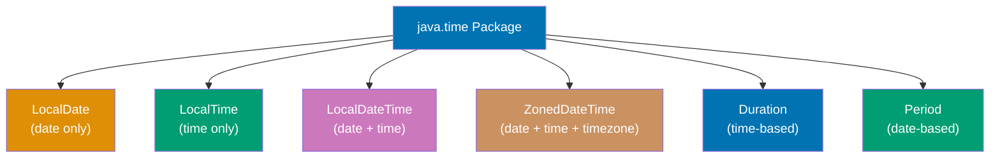

**Code**:

```java
import java.time.*;
import java.time.format.DateTimeFormatter;
import java.time.temporal.ChronoUnit;

// LocalDate - date without time or timezone
LocalDate today = LocalDate.now(); // => Current date (e.g., 2025-01-15)
LocalDate specificDate = LocalDate.of(2025, 12, 31); // => 2025-12-31
LocalDate parsed = LocalDate.parse("2025-06-15"); // => 2025-06-15 (ISO format)

// Extracting date components
int year = today.getYear(); // => 2025
int month = today.getMonthValue(); // => 1 (January)
int day = today.getDayOfMonth(); // => 15
DayOfWeek dayOfWeek = today.getDayOfWeek(); // => WEDNESDAY

// Date arithmetic
LocalDate tomorrow = today.plusDays(1); // => 2025-01-16
LocalDate nextWeek = today.plusWeeks(1); // => 2025-01-22
LocalDate nextMonth = today.plusMonths(1); // => 2025-02-15
LocalDate nextYear = today.plusYears(1); // => 2026-01-15
LocalDate yesterday = today.minusDays(1); // => 2025-01-14

// LocalTime - time without date or timezone
LocalTime now = LocalTime.now(); // => Current time (e.g., 14:30:00.123)
LocalTime specificTime = LocalTime.of(14, 30); // => 14:30
LocalTime withSeconds = LocalTime.of(14, 30, 45); // => 14:30:45
LocalTime withNanos = LocalTime.of(14, 30, 45, 123000000); // => 14:30:45.123

// Extracting time components
int hour = now.getHour(); // => 14 (24-hour format)
int minute = now.getMinute(); // => 30
int second = now.getSecond(); // => 0

// Time arithmetic
LocalTime later = now.plusHours(2); // => 16:30:00.123
LocalTime earlier = now.minusMinutes(15); // => 14:15:00.123

// LocalDateTime - date and time without timezone
LocalDateTime dateTime = LocalDateTime.now(); // => 2025-01-15T14:30:00.123
LocalDateTime specific = LocalDateTime.of(2025, 12, 31, 23, 59, 59); // => 2025-12-31T23:59:59
LocalDateTime combined = LocalDateTime.of(today, now); // => Combine date and time

// Parsing and formatting
String formatted = dateTime.format(DateTimeFormatter.ISO_LOCAL_DATE_TIME); // => "2025-01-15T14:30:00.123"
DateTimeFormatter customFormat = DateTimeFormatter.ofPattern("yyyy-MM-dd HH:mm:ss");
String custom = dateTime.format(customFormat); // => "2025-01-15 14:30:00"
LocalDateTime parsedDateTime = LocalDateTime.parse("2025-12-31T23:59:59"); // => Parse ISO format

// ZonedDateTime - date, time, and timezone
ZonedDateTime zonedNow = ZonedDateTime.now(); // => Current date/time with system timezone
ZoneId newYork = ZoneId.of("America/New_York");
ZonedDateTime nyTime = ZonedDateTime.now(newYork); // => Current time in New York
ZonedDateTime utc = ZonedDateTime.now(ZoneId.of("UTC")); // => Current UTC time

// Converting between timezones
ZonedDateTime tokyoTime = zonedNow.withZoneSameInstant(ZoneId.of("Asia/Tokyo")); // => Convert to Tokyo time

// Instant - point in time (Unix timestamp)
Instant instant = Instant.now(); // => Current instant (UTC)
long epochSeconds = instant.getEpochSecond(); // => Seconds since 1970-01-01T00:00:00Z
long epochMillis = instant.toEpochMilli(); // => Milliseconds since epoch

// Converting between types
LocalDate dateFromDateTime = dateTime.toLocalDate(); // => Extract date
LocalTime timeFromDateTime = dateTime.toLocalTime(); // => Extract time
Instant instantFromZoned = zonedNow.toInstant(); // => Convert to Instant

// Duration - time-based amount (hours, minutes, seconds)
Duration duration = Duration.ofHours(2); // => 2 hours
Duration minutes = Duration.ofMinutes(30); // => 30 minutes
Duration between = Duration.between(now, later); // => Duration between two times

long durationSeconds = duration.getSeconds(); // => 7200 seconds
long durationMinutes = duration.toMinutes(); // => 120 minutes

// Period - date-based amount (years, months, days)
Period period = Period.ofDays(7); // => 7 days
Period weeks = Period.ofWeeks(2); // => 14 days
Period months = Period.ofMonths(3); // => 3 months
Period dateBetween = Period.between(today, nextYear); // => Period between two dates

int years = dateBetween.getYears(); // => 1 year
int days = dateBetween.getDays(); // => 0 days (same day of month)

// Temporal adjusters
LocalDate firstDayOfMonth = today.withDayOfMonth(1); // => 2025-01-01
LocalDate lastDayOfMonth = today.with(java.time.temporal.TemporalAdjusters.lastDayOfMonth()); // => 2025-01-31
LocalDate nextMonday = today.with(java.time.temporal.TemporalAdjusters.next(DayOfWeek.MONDAY)); // => Next Monday

// Comparisons
boolean isBefore = today.isBefore(tomorrow); // => true
boolean isAfter = today.isAfter(yesterday); // => true
boolean isEqual = today.isEqual(today); // => true

// Checking leap year
boolean isLeapYear = today.isLeapYear(); // => false (2025 is not a leap year)

// Date calculations
long daysBetween = ChronoUnit.DAYS.between(today, nextYear); // => 365 days
long monthsBetween = ChronoUnit.MONTHS.between(today, nextYear); // => 12 months

// Common patterns
// Calculate age
LocalDate birthDate = LocalDate.of(1990, 5, 15);
int age = Period.between(birthDate, today).getYears(); // => 34 years old

// Check if date is in range
LocalDate start = LocalDate.of(2025, 1, 1);
LocalDate end = LocalDate.of(2025, 12, 31);
boolean inRange = !today.isBefore(start) && !today.isAfter(end); // => true

// Format for display
String displayDate = today.format(DateTimeFormatter.ofPattern("MMMM d, yyyy")); // => "January 15, 2025"
String displayTime = now.format(DateTimeFormatter.ofPattern("hh:mm a")); // => "02:30 PM"

// Parsing with custom format
DateTimeFormatter parser = DateTimeFormatter.ofPattern("dd/MM/yyyy");
LocalDate usDate = LocalDate.parse("31/12/2025", parser); // => 2025-12-31

// Legacy Date interoperability (avoid using Date/Calendar directly)
java.util.Date legacyDate = java.util.Date.from(instant); // => Convert Instant to Date
Instant fromLegacy = legacyDate.toInstant(); // => Convert Date to Instant
```

**Key Takeaway**: Use `LocalDate` for dates without time, `LocalTime` for times without dates, `LocalDateTime` for combined date/time without timezone, and `ZonedDateTime` when timezone is needed. All `java.time` classes are immutable—operations return new instances. Use `Duration` for time-based amounts (hours/minutes) and `Period` for date-based amounts (years/months/days). Format with `DateTimeFormatter` and parse with `parse()`. Avoid legacy `Date` and `Calendar` classes.

**Why It Matters**: Date and time handling is critical in production systems—scheduling tasks, logging events, calculating business days, tracking user activity, managing subscriptions, and handling international users across timezones. The legacy `Date` and `Calendar` APIs were notoriously buggy (mutable, thread-unsafe, confusing month indexing starting at 0) causing countless production issues. The modern `java.time` API (JSR-310) provides type safety (separate LocalDate/LocalTime/LocalDateTime), immutability (thread-safe by default), and clear semantics (no ambiguous timezone behavior). Timezone handling is essential for global applications—storing timestamps as UTC `Instant` and converting to local timezone for display prevents data corruption from daylight saving time changes and regional differences. Understanding `Period` vs `Duration` prevents bugs when adding "1 month" (date-based, variable length) vs "30 days" (time-based, fixed length). Production systems use `java.time` extensively in REST APIs (ISO-8601 serialization), databases (TIMESTAMP columns), and scheduling frameworks (Quartz, Spring Scheduler).
