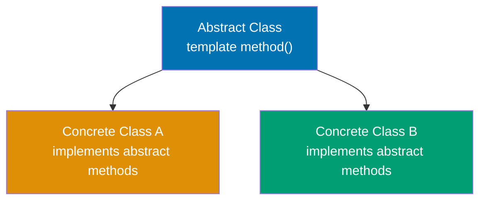
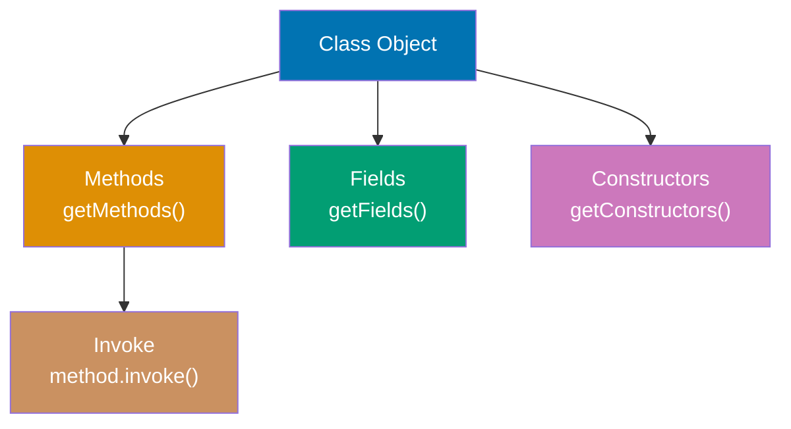
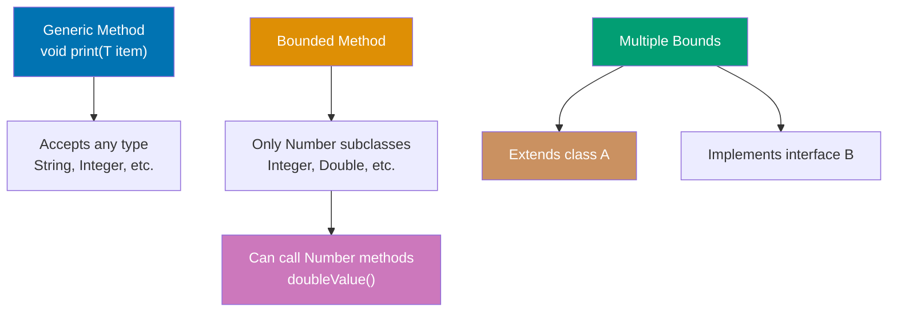
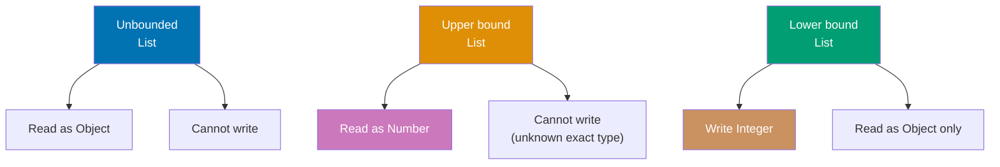
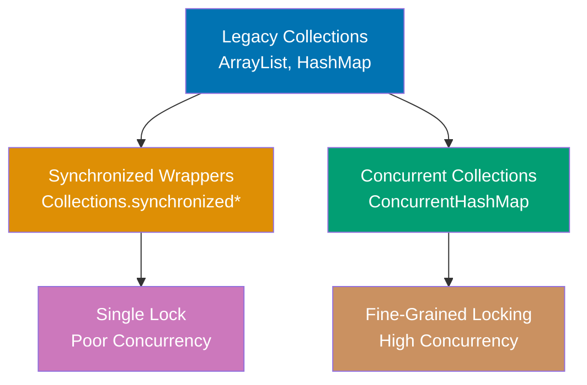
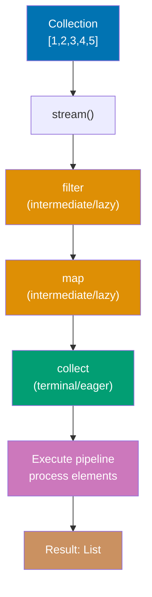
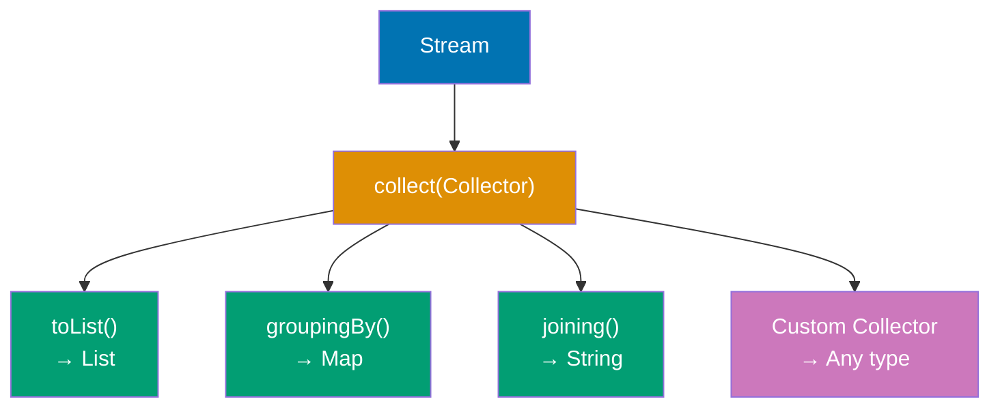
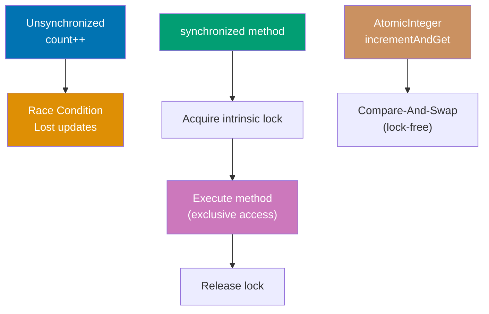

Master intermediate Java concepts through 20 annotated code examples. Each example builds on beginner foundations, introducing advanced OOP, generics, functional programming, and concurrency patterns.

## Group 1: Advanced OOP

### Example 31: Abstract Classes and Template Method Pattern

Abstract classes provide partial implementations with abstract methods that subclasses must implement. The template method pattern defines algorithm skeletons in abstract classes with customizable steps.



**Code**:

```java
// ABSTRACT CLASS - cannot be instantiated, may have abstract and concrete methods
abstract class DataProcessor {
    // => Cannot create: new DataProcessor() - compile error
    // => Must extend to use

    // TEMPLATE METHOD - defines algorithm skeleton (final prevents override)
    public final void process() {
        // => Final keyword prevents subclass override
        // => Ensures all subclasses execute same workflow
        // => Enforces consistent 4-step pipeline
        loadData();
        // => Step 1: subclass-specific data loading
        // => Abstract method: implementation varies by processor type
        transform();
        // => Step 2: subclass-specific transformation
        // => Converts loaded data to internal format
        validate();
        // => Step 3: shared validation logic
        // => Concrete implementation: same for all subclasses
        save();
        // => Step 4: subclass-specific persistence
        // => Abstract method: storage destination varies
    }

    // ABSTRACT METHODS - subclasses must implement
    protected abstract void loadData();
    // => No method body: subclass MUST provide implementation
    // => Compile error if concrete subclass doesn't override
    protected abstract void transform();
    // => Forces customization point for data transformation
    // => Each processor defines its own parsing logic
    protected abstract void save();
    // => Each subclass chooses storage mechanism
    // => Database, cache, file system, etc.

    // CONCRETE METHOD - shared implementation
    protected void validate() {
        // => All subclasses inherit this implementation
        // => Can be overridden (not final) if needed
        System.out.println("Validating data");
        // => Common validation logic
        // => Output: "Validating data"
    }
}

// CONCRETE SUBCLASS
class CSVProcessor extends DataProcessor {
    // => Inherits template method process()
    // => Must implement 3 abstract methods

    @Override
    protected void loadData() {
        System.out.println("Loading CSV file");
        // => CSV-specific: reads .csv files
    }

    @Override
    protected void transform() {
        System.out.println("Parsing CSV to objects");
        // => Converts comma-separated values to Java objects
    }

    @Override
    protected void save() {
        System.out.println("Saving to database");
        // => Persists to SQL database
    }
}

class JSONProcessor extends DataProcessor {
    // => Different implementations, same interface

    @Override
    protected void loadData() {
        System.out.println("Loading JSON file");
        // => JSON-specific: reads .json files
    }

    @Override
    protected void transform() {
        System.out.println("Parsing JSON to objects");
        // => Converts JSON strings to Java objects
    }

    @Override
    protected void save() {
        System.out.println("Saving to cache");
        // => Stores in memory cache (different from CSV)
    }
}

// USAGE
DataProcessor csv = new CSVProcessor();
// => Creates concrete instance (abstract class used as type)
csv.process();
// => Executes: loadData() → transform() → validate() → save()
// => Uses CSVProcessor implementations for steps 1,2,4
// => Output: Loading CSV file
// =>         Parsing CSV to objects
// =>         Validating data
// =>         Saving to database

DataProcessor json = new JSONProcessor();
// => Different processor, same workflow structure
json.process();
// => Uses JSONProcessor implementations
// => Output: Loading JSON file
// =>         Parsing JSON to objects
// =>         Validating data
// =>         Saving to cache
```

**Key Takeaway**: Abstract classes combine concrete methods (shared implementation) with abstract methods (enforced customization). The template method pattern uses a final concrete method defining the algorithm structure, delegating steps to abstract methods implemented by subclasses—ensuring consistent workflow while allowing customization.

**Why It Matters**: Abstract classes solve the code duplication vs. flexibility tradeoff that plagued early OOP—without them, shared logic required copy-paste across subclasses or awkward empty method implementations in interfaces. The template method pattern enabled frameworks like Spring and servlets to define processing pipelines (request handling, transaction management) while letting developers customize specific steps. Modern Java's default methods in interfaces (Java 8+) provide similar capabilities, but abstract classes remain essential when state (fields) must be shared. The pattern appears throughout the JDK: InputStream.read() templates byte reading, AbstractList provides skeletal List implementation, and Thread.run() enables custom thread behavior.

---

### Example 32: Composition Over Inheritance

Composition builds objects from reusable components rather than inheriting from parent classes. It provides flexibility by assembling behaviors dynamically rather than being locked into inheritance hierarchies.

**Code**:

```java
// COMPOSITION - building objects from components
// => HAS-A relationships instead of IS-A (inheritance)

// Component interfaces
interface Engine {
    // => Contract: all engines must implement start()
    // => Enables polymorphism: any Engine type works
    void start();
    // => No method body: interface method (abstract by default)
}

interface Transmission {
    // => Contract: all transmissions must implement shift()
    // => Allows different shifting strategies
    void shift(int gear);
    // => Parameter: target gear number
}

// Component implementations
class ElectricEngine implements Engine {
    // => Concrete implementation of Engine interface
    // => Electric motor behavior
    public void start() {
        System.out.println("Electric motor starting silently");
        // => Electric-specific: quiet startup
        // => Output: "Electric motor starting silently"
    }
}

class GasEngine implements Engine {
    // => Concrete implementation of Engine interface
    // => Combustion engine behavior
    public void start() {
        System.out.println("Gas engine roaring to life");
        // => Gas-specific: loud startup with ignition
        // => Output: "Gas engine roaring to life"
    }
}

class ManualTransmission implements Transmission {
    // => Concrete implementation of Transmission interface
    // => Manual gear control strategy
    public void shift(int gear) {
        System.out.println("Manual shift to gear " + gear);
        // => Driver controls each gear change
        // => Output: "Manual shift to gear N"
    }
}

class AutomaticTransmission implements Transmission {
    // => Concrete implementation of Transmission interface
    // => Automatic gear control strategy
    public void shift(int gear) {
        System.out.println("Automatic shift to gear " + gear);
        // => System determines shift timing
        // => Output: "Automatic shift to gear N"
    }
}

// COMPOSED CLASS - has-a relationship instead of is-a
class Car {
    // => Car contains components (composition)
    private final Engine engine;
    // => HAS-A Engine (can be electric, gas, diesel, etc.)
    private final Transmission transmission;
    // => HAS-A Transmission (can be manual, automatic, CVT, etc.)

    public Car(Engine engine, Transmission transmission) {
        // => Dependency injection: flexibility at construction
        this.engine = engine;
        // => Store engine reference
        this.transmission = transmission;
        // => Store transmission reference
    }

    public void drive() {
        // => Coordinate components to drive
        engine.start();
        // => Delegate to composed engine
        transmission.shift(1);
        // => Shift to 1st gear
        transmission.shift(2);
        // => Shift to 2nd gear
    }
}

// USAGE - flexible assembly of behaviors
Car electricAuto = new Car(new ElectricEngine(), new AutomaticTransmission());
// => Mix electric engine + automatic transmission
electricAuto.drive();
// => Output: Electric motor starting silently
// =>         Automatic shift to gear 1
// =>         Automatic shift to gear 2

Car gasManual = new Car(new GasEngine(), new ManualTransmission());
// => Mix gas engine + manual transmission
gasManual.drive();
// => Output: Gas engine roaring to life
// =>         Manual shift to gear 1
// =>         Manual shift to gear 2

// CONTRAST: Inheritance approach (rigid, explosive class hierarchy)
// => Would need: ElectricAutoCar, ElectricManualCar, GasAutoCar, GasManualCar
// => 2 engines × 2 transmissions = 4 classes (composition uses 2 components)
// => Adding diesel: 2 more classes (composition: 1 component)
// => Composition grows linearly, inheritance grows exponentially
```

**Key Takeaway**: Composition assembles objects from independent components (has-a relationships), providing runtime flexibility to mix and match behaviors. Prefer composition over inheritance to avoid rigid class hierarchies and the "diamond problem" where multiple inheritance paths create ambiguity.

**Why It Matters**: "Favor composition over inheritance" became a core OOP principle after decades of inheritance abuse created unmaintainable class hierarchies. Inheritance couples subclasses to superclass implementation details—changing a parent class breaks all children (fragile base class problem). Composition enables dependency injection frameworks like Spring to wire objects at runtime, testing frameworks to inject mocks, and strategy patterns to swap algorithms dynamically. The Java Collections Framework uses composition extensively: ArrayList composes an Object[] array, LinkedList composes Node objects, and decorator classes like Collections.synchronizedList() wrap existing lists with thread-safety behavior without inheritance.

---

### Example 33: Nested and Inner Classes

Java supports nested classes (static) and inner classes (non-static) that provide encapsulation and logical grouping. Inner classes access outer class instance members, while nested classes are independent.

**Code**:

```java
public class OuterClass {
    // => Outer class containing nested/inner classes
    private String outerField = "Outer field";
    // => Instance field: accessible to inner classes
    private static String staticField = "Static field";
    // => Static field: accessible to all nested classes

    // STATIC NESTED CLASS - independent of outer instance
    public static class StaticNested {
        // => Static means no implicit reference to outer instance
        // => Can be instantiated without OuterClass instance
        public void display() {
            System.out.println(staticField);
            // => ✅ Can access static outer members
            // => Output: "Static field"
            // System.out.println(outerField);
            // => ❌ ERROR: cannot access instance members
            // => No outer instance reference available
        }
    }

    // INNER CLASS (non-static) - tied to outer instance
    public class Inner {
        // => Non-static: holds implicit reference to outer instance
        // => Cannot exist without OuterClass instance
        private String innerField = "Inner field";
        // => Inner class can have its own fields

        public void display() {
            System.out.println(outerField);
            // => ✅ Accesses outer instance field
            // => Implicit reference: OuterClass.this.outerField
            System.out.println(staticField);
            // => ✅ Also accesses static members
            System.out.println(innerField);
            // => Accesses own field
        }

        public void accessOuter() {
            OuterClass.this.outerField = "Modified";
            // => Explicit outer reference syntax
            // => OuterClass.this = the outer instance
            // => Modifies outer field from inner class
        }
    }

    // METHOD LOCAL INNER CLASS - defined inside method
    public void methodWithLocalClass() {
        // => Local class scope: only visible within this method
        final String localVar = "Local variable";
        // => Must be final or effectively final (Java 8+)

        class LocalInner {
            // => Class defined inside method body
            // => Can access method's local variables
            public void display() {
                System.out.println(localVar);
                // => Accesses enclosing method's final variable
                // => Captured in closure
                System.out.println(outerField);
                // => Also accesses outer instance fields
            }
        }

        LocalInner local = new LocalInner();
        // => Instantiate local class within method
        local.display();
        // => Output: "Local variable", "Outer field"
    }

    // ANONYMOUS INNER CLASS - one-time implementation
    public Runnable createRunnable() {
        // => Returns interface instance without named class
        return new Runnable() {
            // => Anonymous class: no class name
            // => Implements Runnable on the fly
            @Override
            public void run() {
                System.out.println("Anonymous inner class: " + outerField);
                // => Can access outer instance members
                // => Output: "Anonymous inner class: Outer field"
            }
        };
        // => Before Java 8 lambdas, this was common pattern
    }
}

// USAGE
OuterClass.StaticNested nested = new OuterClass.StaticNested();
// => Create static nested class: no outer instance needed
// => Syntax: OuterClass.NestedClass
nested.display();
// => Output: "Static field"

OuterClass outer = new OuterClass();
// => Create outer instance first
OuterClass.Inner inner = outer.new Inner();
// => Create inner class: requires outer instance
// => Syntax: outerInstance.new InnerClass()
// => Inner holds reference to 'outer'
inner.display();
// => Output: "Outer field"
// =>         "Static field"
// =>         "Inner field"

outer.methodWithLocalClass();
// => Executes method containing local inner class
// => Output: "Local variable"
// =>         "Outer field"

Runnable r = outer.createRunnable();
// => Returns anonymous Runnable instance
r.run();
// => Output: "Anonymous inner class: Outer field"
```

**Key Takeaway**: Static nested classes are independent of outer instances and can only access outer static members. Inner classes (non-static) are tied to outer instances and can access all outer members. Use nested classes for logical grouping and inner classes when tight coupling with outer state is needed.

**Why It Matters**: Inner classes enable event handling patterns in GUI frameworks (Swing, JavaFX) where listeners need access to surrounding component state without passing references manually. Anonymous inner classes powered Java's callback mechanisms before lambdas (Java 8), though lambdas are now preferred for functional interfaces. Static nested classes organize helper classes without polluting package namespace—Map.Entry, LinkedList.Node, and Builder patterns use this extensively. The outer class reference overhead (inner classes store implicit reference to outer instance) can cause memory leaks if inner instances outlive outer instances, a common pitfall in Android Activity listeners.

---

### Example 34: Reflection API - Runtime Introspection

Reflection allows runtime inspection and manipulation of classes, methods, and fields. It enables frameworks to work with user-defined classes without compile-time knowledge.



**Code**:

```java
import java.lang.reflect.*;
// => Import reflection API classes

class Person {
    // => Simple class for reflection demonstration
    private String name;
    // => Private field: not accessible without setAccessible()
    public int age;
    // => Public field: directly accessible via reflection

    public Person() {}
    // => Default constructor

    public Person(String name, int age) {
        // => Parameterized constructor
        this.name = name;
        this.age = age;
    }

    private void secretMethod() {
        // => Private method: needs setAccessible() to invoke
        System.out.println("Secret: " + name);
    }

    public String getName() {
        // => Public getter method
        return name;
    }
}

// REFLECTION USAGE
Class<?> clazz = Person.class;
// => Obtain Class metadata object for Person
// => <?> wildcard: type-safe reflection

// GET CLASS INFORMATION
String className = clazz.getName();
// => Returns fully qualified name
// => Result: "Person" (or "com.example.Person" if in package)
String simpleName = clazz.getSimpleName();
// => Returns class name without package
// => Result: "Person"

// INSTANTIATE via reflection
Constructor<?> constructor = clazz.getConstructor(String.class, int.class);
// => Finds public constructor matching parameter types
// => Throws NoSuchMethodException if not found
Object instance = constructor.newInstance("Alice", 30);
// => Creates instance: new Person("Alice", 30)
// => Returns Object (needs casting for type safety)

// ACCESS FIELDS
Field ageField = clazz.getField("age");
// => Gets PUBLIC field named "age"
// => Throws NoSuchFieldException if not found or not public
int ageValue = (int) ageField.get(instance);
// => Reads field value from instance
// => Result: 30
ageField.set(instance, 31);
// => Modifies field value
// => Now age = 31

// ACCESS PRIVATE FIELDS
Field nameField = clazz.getDeclaredField("name");
// => Gets any field (public or private) by name
// => getDeclaredField() finds private members
nameField.setAccessible(true);
// => Disables Java access control checks
// => ⚠️ Security risk: breaks encapsulation
String nameValue = (String) nameField.get(instance);
// => Reads private field value
// => Result: "Alice"

// INVOKE METHODS
Method getNameMethod = clazz.getMethod("getName");
// => Finds public method by name and parameter types
String name = (String) getNameMethod.invoke(instance);
// => Invokes method on instance
// => Equivalent to: instance.getName()
// => Result: "Alice"

// INVOKE PRIVATE METHODS
Method secretMethod = clazz.getDeclaredMethod("secretMethod");
// => Finds private method
secretMethod.setAccessible(true);
// => Bypasses private access modifier
secretMethod.invoke(instance);
// => Invokes private method
// => Output: "Secret: Alice"

// LIST ALL METHODS
for (Method method : clazz.getDeclaredMethods()) {
    // => Iterates all declared methods (public and private)
    System.out.println(method.getName());
    // => Prints method names
}
// => Output: secretMethod
// =>         getName
```

**Key Takeaway**: Reflection provides runtime access to class metadata, allowing inspection of fields, methods, and constructors. Use `setAccessible(true)` to bypass access controls for private members. Reflection enables frameworks and libraries to work with arbitrary user classes without compile-time knowledge.

**Why It Matters**: Reflection powers Java's entire framework ecosystem—Spring uses it for dependency injection (scanning for @Component, @Autowired), JPA for entity mapping (@Entity, @Column), JUnit for test discovery (@Test), and serialization frameworks (Gson, Jackson) for JSON mapping. Without reflection, these frameworks would require manual registration or code generation for every class. However, reflection has costs: performance overhead (method.invoke() is ~3x slower than direct calls), type safety loss (casts and string-based lookups), and security risks (accessing private members breaks encapsulation). Modern Java introduced MethodHandles (Java 7) as faster, type-safe alternatives, while annotation processors enable compile-time code generation replacing some reflection use cases.

---

### Example 35: Annotations and Custom Metadata

Annotations add metadata to code that can be processed at compile-time or runtime. Custom annotations enable declarative programming patterns used extensively in frameworks.

**Code**:

```java
import java.lang.annotation.*;
import java.lang.reflect.*;

// DEFINE CUSTOM ANNOTATION
@Retention(RetentionPolicy.RUNTIME)  // => Available at runtime via reflection
@Target(ElementType.METHOD)          // => Can only be applied to methods
public @interface Test {
    String description() default "";  // => Annotation parameter with default value
    int timeout() default 0;
}

// ANOTHER ANNOTATION
@Retention(RetentionPolicy.RUNTIME)
@Target(ElementType.FIELD)
public @interface Inject {           // => Marks fields for dependency injection
}

// USE ANNOTATIONS
class TestSuite {
    @Inject
    private String dependency;       // => Marked for injection

    @Test(description = "Adds two numbers", timeout = 1000)
    public void testAddition() {
        System.out.println("Testing addition");
    }

    @Test(description = "Divides by zero")
    public void testDivision() {
        System.out.println("Testing division");
    }

    public void helperMethod() {     // => No @Test annotation
        System.out.println("Not a test");
    }
}

// PROCESS ANNOTATIONS via reflection
Class<?> clazz = TestSuite.class;
                                 // => Get Class object representing TestSuite type
                                 // => clazz is java.lang.Class<TestSuite> (type metadata)

// Find and execute @Test methods
for (Method method : clazz.getDeclaredMethods()) {
                                 // => getDeclaredMethods() returns all methods (public + private)
                                 // => Returns: testAddition, testDivision, helperMethod
    if (method.isAnnotationPresent(Test.class)) {
                                 // => Check if method has @Test annotation at runtime
                                 // => testAddition: true, testDivision: true, helperMethod: false
                                 // => Annotation must have RUNTIME retention to be visible
        Test testAnnotation = method.getAnnotation(Test.class);
                                 // => Retrieve @Test annotation instance from method
                                 // => testAnnotation contains description and timeout parameters
        System.out.println("Running test: " + testAnnotation.description());
                                 // => Access annotation parameter value
                                 // => Output: "Running test: Adds two numbers" (for testAddition)

        try {
            Object instance = clazz.getDeclaredConstructor().newInstance();
                                 // => Create new TestSuite instance via reflection
                                 // => getDeclaredConstructor() finds no-arg constructor
                                 // => newInstance() calls constructor, returns new object
            method.invoke(instance);  // => Execute test method on instance
                                 // => invoke() calls method dynamically (equivalent to instance.testAddition())
        } catch (Exception e) {
            System.out.println("Test failed: " + e.getMessage());
                                 // => Catch exceptions from method invocation
        }
    }
}
// => Output: Running test: Adds two numbers, Testing addition
//           Running test: Divides by zero, Testing division

// BUILT-IN ANNOTATIONS
class Example {
    @Override                    // => Compile-time check that method overrides superclass
    public String toString() {
        return "Example";
    }

    @Deprecated                  // => Marks method as deprecated (compiler warning)
    public void oldMethod() {}

    @SuppressWarnings("unchecked") // => Suppresses compiler warnings
    public void rawTypeMethod() {
        java.util.List list = new java.util.ArrayList();
    }
}
```

**Key Takeaway**: Annotations add metadata to code without affecting execution. Use `@Retention` to specify when annotations are available (SOURCE, CLASS, RUNTIME) and `@Target` to restrict where annotations can be applied. Process runtime annotations via reflection to implement custom behaviors.

**Why It Matters**: Annotations revolutionized Java framework design by enabling declarative programming—compare Spring's `@Autowired` to manual factory.getBean() calls, or JPA's `@Entity @Column` to XML configuration files. Annotations shift complexity from user code to framework code, improving readability (@Transactional vs. manual transaction.begin/commit). However, overuse creates "magic" behavior invisible in code (Spring's @Async spawning threads invisibly), making debugging difficult. Annotation processing (compile-time, via javax.annotation.processing) generates code during compilation (Lombok, Dagger), avoiding reflection overhead while keeping declarative syntax. The combination of annotations + reflection enabled the "convention over configuration" movement that made frameworks like Spring Boot possible.

---

## Group 2: Advanced Collections and Generics

### Example 36: Generic Methods and Bounded Type Parameters

Generic methods enable type-safe method implementations that work with any type. Bounded type parameters restrict generic types to subclasses of a bound, enabling access to bound class methods.



**Code**:

```java
import java.util.*;

// GENERIC METHOD - type parameter before return type
public static <T> void printArray(T[] array) {
                                 // => <T> declares type parameter for this method
                                 // => T can be any type (inferred from argument)
    for (T element : array) {    // => Enhanced for-loop iterates array elements
                                 // => Each element has type T (type-safe)
        System.out.print(element + " ");
                                 // => Prints element followed by space
    }
    System.out.println();        // => Newline after all elements printed
}

// BOUNDED TYPE PARAMETER - restricts to Number subclasses
public static <T extends Number> double sum(List<T> numbers) {
                                 // => T must be Number or subclass (Integer, Double, etc.)
    double total = 0;
    for (T num : numbers) {
        total += num.doubleValue();  // => Can call Number methods because of bound
    }
    return total;
}

// MULTIPLE BOUNDS - must extend class AND implement interfaces
interface Measurable {
    double getMeasurement();
}

public static <T extends Number & Measurable> double average(List<T> items) {
                                 // => T must extend Number AND implement Measurable
    double total = 0;
    for (T item : items) {
        total += item.getMeasurement();
    }
    return total / items.size();
}

// USAGE
Integer[] ints = {1, 2, 3};      // => Array of Integer wrapper objects
String[] strs = {"a", "b", "c"};  // => Array of String objects
printArray(ints);                // => Compiler infers T = Integer from argument type
                                 // => Calls printArray<Integer>(Integer[])
                                 // => Output: 1 2 3
printArray(strs);                // => Compiler infers T = String from argument type
                                 // => Calls printArray<String>(String[])
                                 // => Output: a b c

List<Integer> intList = Arrays.asList(1, 2, 3, 4);
                                 // => Creates fixed-size List<Integer> from varargs
                                 // => List contains [1, 2, 3, 4]
double sum = sum(intList);       // => Calls sum<Integer>(List<Integer>)
                                 // => Iterates list: 1+2+3+4 = 10
                                 // => sum is 10.0 (converted to double)

// GENERIC CLASS with type parameter
class Box<T> {
    private T content;

    public void set(T content) {
        this.content = content;
    }

    public T get() {
        return content;
    }
}

Box<String> stringBox = new Box<>();
stringBox.set("Hello");          // => Type-safe: only String allowed
String value = stringBox.get();  // => No cast needed
```

**Key Takeaway**: Generic methods use `<T>` before return type to declare type parameters. Bounded type parameters (`<T extends Class>`) restrict acceptable types and enable calling methods of the bound class. Multiple bounds require `<T extends Class & Interface1 & Interface2>` syntax with class first.

**Why It Matters**: Bounded type parameters solve the "how do I operate on generic types?" problem—without bounds, generic `<T>` treats everything as Object, preventing method calls beyond Object's methods. Bounds enable generic algorithms: Collections.sort() requires `<T extends Comparable<T>>` to call compareTo(), Stream.max() requires Comparator, and numeric operations require `<T extends Number>`. Multiple bounds enable rich generic constraints in libraries like Hibernate (entities must extend BaseEntity AND implement Serializable). The class-first rule in multiple bounds reflects Java's single-inheritance, multiple-interfaces model, though rarely needed in practice.

---

### Example 37: Wildcards and Type Variance

Wildcards (`?`) represent unknown types in generics. Upper-bounded wildcards (`? extends Type`) enable reading, lower-bounded wildcards (`? super Type`) enable writing, following covariance and contravariance rules.



**Code**:

```java
import java.util.*;

// UNBOUNDED WILDCARD - unknown type
public static void printList(List<?> list) {
                                 // => Accepts List of any type
    for (Object elem : list) {   // => Can only read as Object
        System.out.print(elem + " ");
    }
    System.out.println();
}

// UPPER-BOUNDED WILDCARD - covariance (reading)
public static double sumNumbers(List<? extends Number> numbers) {
                                 // => Accepts List<Integer>, List<Double>, List<Number>, etc.
                                 // => ? extends Number means "unknown type that extends Number"
    double sum = 0;              // => Accumulator initialized to 0
    for (Number num : numbers) { // => Can read elements as Number (upper bound)
                                 // => Safe because all elements ARE Number subclasses
        sum += num.doubleValue();// => Call Number method doubleValue()
                                 // => Accumulate into sum
    }
    return sum;                  // => Return total sum
    // numbers.add(1);           // => ERROR: cannot write (compiler doesn't know exact type)
                                 // => Could be List<Double>, cannot add Integer
}

// LOWER-BOUNDED WILDCARD - contravariance (writing)
public static void addIntegers(List<? super Integer> list) {
                                 // => Accepts List<Integer>, List<Number>, List<Object>
    list.add(1);                 // => Can write Integer
    list.add(2);
    // Integer val = list.get(0); // => ERROR: can only read as Object
}

// USAGE
List<Integer> ints = Arrays.asList(1, 2, 3);
List<Double> doubles = Arrays.asList(1.0, 2.0, 3.0);

printList(ints);                 // => Output: 1 2 3
printList(doubles);              // => Output: 1.0 2.0 3.0

double sum1 = sumNumbers(ints);  // => sum1 is 6.0
double sum2 = sumNumbers(doubles); // => sum2 is 6.0

List<Number> numbers = new ArrayList<>();
addIntegers(numbers);            // => Can add to List<Number>
System.out.println(numbers);     // => Output: [1, 2]

// PECS RULE: Producer Extends, Consumer Super
// Producer (reading): use <? extends T>
// Consumer (writing): use <? super T>

public static <T> void copy(List<? extends T> source, List<? super T> dest) {
                                 // => source produces T, dest consumes T
    for (T item : source) {
        dest.add(item);          // => Read from source, write to dest
    }
}

List<Integer> src = Arrays.asList(1, 2, 3);
List<Number> dst = new ArrayList<>();
copy(src, dst);                  // => Copies Integer to Number list
```

**Key Takeaway**: Use `? extends Type` for reading (covariance), `? super Type` for writing (contravariance), and `?` for both reading (as Object) and no writing. Follow PECS rule: "Producer Extends, Consumer Super"—if a method produces values from a collection, use `extends`; if it consumes values into a collection, use `super`.

**Why It Matters**: Wildcards enable flexible generic APIs that accept related types without requiring exact matches—before wildcards, List<Integer> and List<Number> were completely unrelated despite inheritance. The PECS rule guides API design: Collections.addAll(Collection<? extends E>) is producer (extends), Collections.sort(List<T>, Comparator<? super T>) is consumer (super). Understanding variance prevents type safety violations: allowing writes to List<? extends Number> would permit adding Double to List<Integer>. This complexity drives some developers to avoid wildcards entirely, but mastering them enables elegant generic APIs like Stream.collect(Collector<? super T>).

---

### Example 38: Collections Framework Deep Dive

The Collections Framework provides algorithms for sorting, searching, and transforming collections. Understanding time complexities and choosing appropriate implementations is critical for performance.

**Code**:

```java
import java.util.*;

// CHOOSING COLLECTION TYPES based on requirements

// ArrayList - indexed access, dynamic size
List<String> arrayList = new ArrayList<>();
arrayList.add("A");              // => O(1) amortized (O(n) when resizing)
String value = arrayList.get(0); // => O(1) random access
arrayList.remove(0);             // => O(n) due to shifting

// LinkedList - efficient insertion/deletion, poor random access
List<String> linkedList = new LinkedList<>();
linkedList.add("A");             // => O(1) append
linkedList.add(0, "B");          // => O(1) prepend
String first = linkedList.get(0); // => O(n) traversal (no indexing)

// HashSet - unique elements, no order, O(1) operations
Set<String> hashSet = new HashSet<>();
hashSet.add("A");                // => O(1) average
boolean contains = hashSet.contains("A"); // => O(1) average

// TreeSet - sorted, unique elements, O(log n) operations
Set<Integer> treeSet = new TreeSet<>();
treeSet.add(3);
treeSet.add(1);
treeSet.add(2);
System.out.println(treeSet);     // => Output: [1, 2, 3] (sorted)

// HashMap - key-value pairs, O(1) operations
Map<String, Integer> hashMap = new HashMap<>();
hashMap.put("Alice", 30);        // => O(1) average
Integer age = hashMap.get("Alice"); // => O(1) average

// TreeMap - sorted by keys, O(log n) operations
Map<String, Integer> treeMap = new TreeMap<>();
treeMap.put("Charlie", 25);
treeMap.put("Alice", 30);
treeMap.put("Bob", 28);
System.out.println(treeMap);     // => Output: {Alice=30, Bob=28, Charlie=25} (sorted by key)

// COLLECTIONS UTILITY METHODS
List<Integer> numbers = Arrays.asList(3, 1, 4, 1, 5, 9);

Collections.sort(numbers);       // => numbers is [1, 1, 3, 4, 5, 9]
Collections.reverse(numbers);    // => numbers is [9, 5, 4, 3, 1, 1]
Collections.shuffle(numbers);    // => Randomizes order

int max = Collections.max(numbers); // => max is 9
int min = Collections.min(numbers); // => min is 1

int frequency = Collections.frequency(numbers, 1);
                                 // => frequency is 2 (appears twice)

// IMMUTABLE COLLECTIONS (Java 9+)
List<String> immutable = List.of("A", "B", "C");
// immutable.add("D");           // => UnsupportedOperationException

Map<String, Integer> immutableMap = Map.of("A", 1, "B", 2);
// immutableMap.put("C", 3);     // => UnsupportedOperationException
```

**Key Takeaway**: Choose collection types based on access patterns: ArrayList for indexed access, LinkedList for frequent insertions/deletions, HashSet for uniqueness with O(1) operations, TreeSet for sorted uniqueness, HashMap for key-value O(1) lookups, TreeMap for sorted keys. Understand time complexity tradeoffs to avoid performance pitfalls.

**Why It Matters**: Choosing the wrong collection type causes severe performance issues at scale—using ArrayList.contains() in a loop creates O(n²) complexity vs. HashSet's O(n). A common pitfall: using LinkedList thinking "linked list is always better for insertions," but ArrayList's cache locality makes it faster for small-to-medium lists. TreeSet/TreeMap's O(log n) seems close to HashMap's O(1), but with millions of entries, the difference is dramatic (20 operations vs. 1). Java 9's List.of() and Map.of() factory methods create space-efficient immutable collections (no separate unmodifiable wrappers), essential for functional programming patterns. The Collections Framework standardized algorithms that previously required manual implementation, eliminating bugs from manual binary search or sort implementations.

---

### Example 39: Concurrent Collections for Thread Safety

Concurrent collections provide thread-safe operations without external synchronization. They use lock-free algorithms and fine-grained locking for better concurrency than synchronized collections.



**Code**:

```java
import java.util.concurrent.*;
import java.util.*;

// CONCURRENTHASHMAP - thread-safe without single lock
ConcurrentHashMap<String, Integer> concurrentMap = new ConcurrentHashMap<>();

// Thread-safe operations
concurrentMap.put("key", 1);     // => Thread-safe put
Integer value = concurrentMap.get("key"); // => Thread-safe get

// ATOMIC OPERATIONS
concurrentMap.putIfAbsent("key", 2);
                                 // => Only puts if key doesn't exist (atomic)
                                 // => Returns null if inserted, existing value otherwise

concurrentMap.computeIfAbsent("newKey", k -> k.length());
                                 // => Computes value atomically if key absent
                                 // => newKey -> 6 (length of "newKey")

concurrentMap.merge("key", 1, Integer::sum);
                                 // => Atomically updates: old value + new value
                                 // => key -> 2 (was 1, merged with 1)

// COPYONWRITEARRAYLIST - reads without locking, writes copy entire array
CopyOnWriteArrayList<String> cowList = new CopyOnWriteArrayList<>();
cowList.add("A");                // => Creates new array copy
cowList.add("B");                // => Every write copies array (expensive!)

// Safe iteration during concurrent modifications
for (String item : cowList) {    // => Iteration uses snapshot (no ConcurrentModificationException)
    cowList.add("C");            // => Modifications don't affect ongoing iteration
}

// BLOCKINGQUEUE - producer-consumer pattern
BlockingQueue<String> queue = new LinkedBlockingQueue<>(10);
                                 // => Capacity 10 (blocks when full)

// Producer thread
new Thread(() -> {
    try {
        queue.put("item");       // => Blocks if queue full
    } catch (InterruptedException e) {
        e.printStackTrace();
    }
}).start();

// Consumer thread
new Thread(() -> {
    try {
        String item = queue.take(); // => Blocks if queue empty
        System.out.println("Consumed: " + item);
    } catch (InterruptedException e) {
        e.printStackTrace();
    }
}).start();

// CONCURRENTSKIPLISTMAP - sorted, concurrent alternative to TreeMap
ConcurrentSkipListMap<Integer, String> skipListMap = new ConcurrentSkipListMap<>();
skipListMap.put(3, "three");
skipListMap.put(1, "one");
skipListMap.put(2, "two");
System.out.println(skipListMap);  // => Output: {1=one, 2=two, 3=three} (sorted, thread-safe)

// CONTRAST: Synchronized wrapper (poor concurrency)
Map<String, Integer> syncMap = Collections.synchronizedMap(new HashMap<>());
                                 // => Single lock for all operations (bottleneck)
```

**Key Takeaway**: Use ConcurrentHashMap for high-concurrency key-value access with fine-grained locking. CopyOnWriteArrayList suits read-heavy workloads where writes are rare. BlockingQueue enables producer-consumer patterns with thread-safe blocking operations. Avoid synchronized wrappers (Collections.synchronizedMap()) which use coarse-grained locking.

**Why It Matters**: ConcurrentHashMap revolutionized Java concurrency by replacing Hashtable's single-lock design with segment-based locking (Java 7) and later lock-free reads with CAS operations (Java 8+), achieving 10-100x throughput in multi-threaded scenarios. Before concurrent collections, developers used synchronized blocks or Collections.synchronizedMap(), creating severe bottlenecks—every operation acquired the same lock, serializing all threads. BlockingQueue enables elegant producer-consumer patterns without manual wait/notify complexity, powering thread pools (Executors use BlockingQueue internally) and message queues. CopyOnWriteArrayList's write-amplification (copying entire array) makes it unsuitable for write-heavy workloads, but perfect for listener lists in event systems where reads vastly outnumber writes.

---

## Group 3: Functional Programming

### Example 40: Stream Pipeline Optimization

Stream operations are lazy (intermediate) or eager (terminal). Understanding laziness enables building efficient pipelines that short-circuit and minimize iterations.



**Code**:

```java
import java.util.*;
import java.util.stream.*;

List<Integer> numbers = Arrays.asList(1, 2, 3, 4, 5, 6, 7, 8, 9, 10);

// LAZY EVALUATION - intermediate operations don't execute until terminal operation
Stream<Integer> stream = numbers.stream()
                                 // => Creates stream from list (no processing yet)
    .filter(n -> {
        System.out.println("Filter: " + n);
        return n % 2 == 0;       // => NOT executed yet (lazy intermediate operation)
                                 // => Defines filtering logic, doesn't apply it
    })
    .map(n -> {
        System.out.println("Map: " + n);
        return n * 2;            // => NOT executed yet (lazy intermediate operation)
                                 // => Defines mapping logic, doesn't apply it
    });
// => No output yet (no terminal operation)
// => Stream pipeline defined but not executed

List<Integer> result = stream.collect(Collectors.toList());
                                 // => Terminal operation triggers pipeline execution
// => Output: Filter: 1, Filter: 2, Map: 2, Filter: 3, Filter: 4, Map: 4, ...

// SHORT-CIRCUITING - stops processing when result determined
Optional<Integer> first = numbers.stream()
    .filter(n -> {
        System.out.println("Checking: " + n);
        return n > 5;
    })
    .findFirst();                // => Short-circuits after first match
// => Output: Checking: 1, Checking: 2, ..., Checking: 6
// => Stops at 6 (first n > 5), doesn't process 7, 8, 9, 10

// PARALLEL STREAMS - splits work across threads
long count = numbers.parallelStream()
    .filter(n -> n % 2 == 0)
    .count();                    // => Parallel execution (order not guaranteed)
                                 // => count is 5

// OPTIMIZATION: limit() short-circuits infinite streams
Stream.iterate(0, n -> n + 1)    // => Infinite stream: 0, 1, 2, 3, ...
    .filter(n -> n % 2 == 0)     // => Even numbers: 0, 2, 4, 6, ...
    .limit(5)                    // => Take first 5: stops after 5 elements
    .forEach(System.out::println);
// => Output: 0, 2, 4, 6, 8 (stops, doesn't run forever)

// PRIMITIVE STREAMS - avoid autoboxing overhead
IntStream.range(1, 1000000)      // => Primitive int stream (no Integer objects)
    .filter(n -> n % 2 == 0)
    .sum();                      // => sum() on IntStream (no boxing/unboxing)

// STATELESS vs STATEFUL operations
numbers.stream()
    .filter(n -> n > 5)          // => Stateless: each element processed independently
    .map(n -> n * 2)             // => Stateless
    .sorted()                    // => STATEFUL: requires all elements (breaks streaming)
    .collect(Collectors.toList());
```

**Key Takeaway**: Intermediate operations (filter, map) are lazy—they don't execute until a terminal operation (collect, forEach, count) triggers the pipeline. Short-circuiting operations (findFirst, limit, anyMatch) stop processing early. Use primitive streams (IntStream, LongStream, DoubleStream) to avoid autoboxing overhead for numeric operations.

**Why It Matters**: Lazy evaluation enables efficient stream pipelines—filter then map then findFirst only processes elements until the first match, potentially touching 1% of a million-element collection vs. processing all elements eagerly. Before streams, achieving this required manual short-circuit logic in loops. However, stateful operations (sorted, distinct) break streaming by requiring all elements in memory, negating laziness benefits—sorting a billion-element stream still loads everything. Parallel streams promise automatic parallelization but have overhead: Collections.parallelStream() splits work across ForkJoinPool threads, beneficial only for CPU-intensive operations on large collections (>10,000 elements). Primitive streams eliminate autoboxing that creates millions of temporary Integer/Double objects, critical for numeric computations but often forgotten.

---

### Example 41: Collectors and Stream Reduction

Collectors transform stream results into collections, maps, or aggregated values. Custom collectors enable complex reductions beyond built-in options.



**Code**:

```java
import java.util.*;
import java.util.stream.*;

List<String> words = Arrays.asList("apple", "banana", "apricot", "blueberry", "avocado");

// COLLECTING TO COLLECTIONS
List<String> list = words.stream()
    .filter(w -> w.startsWith("a"))
    .collect(Collectors.toList()); // => list is [apple, apricot, avocado]

Set<String> set = words.stream()
    .collect(Collectors.toSet()); // => Removes duplicates

// JOINING STRINGS
String joined = words.stream()
    .collect(Collectors.joining(", "));
                                 // => joined is "apple, banana, apricot, blueberry, avocado"

String prefixed = words.stream()
    .collect(Collectors.joining(", ", "[", "]"));
                                 // => prefixed is "[apple, banana, apricot, blueberry, avocado]"

// GROUPING BY
Map<Character, List<String>> grouped = words.stream()
                                 // => Creates stream from words list
                                 // => Stream pipeline: source → grouping collector
    .collect(Collectors.groupingBy(w -> w.charAt(0)));
                                 // => groupingBy() creates map with computed keys
                                 // => Lambda w -> w.charAt(0) extracts first character
                                 // => For each word: compute key, add word to key's list
                                 // => Creates Map<Character, List<String>>
                                 // => "apple" → key 'a', "banana" → key 'b', etc.
                                 // => Each key is first char, value is list of words with that char
// => {a=[apple, apricot, avocado], b=[banana, blueberry]}
// => 'a' key maps to list with 3 words, 'b' key maps to list with 2 words

// COUNTING
Map<Character, Long> counts = words.stream()
                                 // => Stream pipeline with nested collector
    .collect(Collectors.groupingBy(w -> w.charAt(0), Collectors.counting()));
                                 // => groupingBy() with downstream collector
                                 // => First groups by first character (like above)
                                 // => Then applies counting() to each group
                                 // => counting() returns Long count for each key's group
                                 // => {a=3, b=2} ('a' has 3 words, 'b' has 2 words)

// PARTITIONING (boolean predicate)
Map<Boolean, List<String>> partitioned = words.stream()
    .collect(Collectors.partitioningBy(w -> w.length() > 6));
                                 // => {false=[apple, banana], true=[apricot, blueberry, avocado]}

// MAPPING WITHIN GROUPING
Map<Character, List<Integer>> lengths = words.stream()
    .collect(Collectors.groupingBy(
        w -> w.charAt(0),
        Collectors.mapping(String::length, Collectors.toList())
    ));                          // => {a=[5, 7, 7], b=[6, 9]}

// CUSTOM COLLECTOR - joining with custom logic
String custom = words.stream()
    .collect(Collector.of(
        StringBuilder::new,      // Supplier: creates mutable container
        (sb, s) -> sb.append(s).append(" "), // Accumulator: adds elements
        (sb1, sb2) -> sb1.append(sb2), // Combiner: merges parallel results
        StringBuilder::toString  // Finisher: final transformation
    ));
// => custom is "apple banana apricot blueberry avocado "

// REDUCING
int totalLength = words.stream()
    .collect(Collectors.summingInt(String::length));
                                 // => totalLength is 34 (sum of all lengths)

Optional<String> longest = words.stream()
    .collect(Collectors.maxBy(Comparator.comparing(String::length)));
                                 // => longest is Optional[blueberry]

// TEEING (Java 12+) - apply two collectors and merge results
Map<String, Object> stats = words.stream()
    .collect(Collectors.teeing(
        Collectors.counting(),
        Collectors.joining(","),
        (count, joined) -> Map.of("count", count, "words", joined)
    ));
// => {count=5, words=apple,banana,apricot,blueberry,avocado}
```

**Key Takeaway**: Use built-in Collectors for common operations: toList(), toSet(), groupingBy(), partitioningBy(), joining(). Compose collectors with mapping(), counting(), summingInt() for complex aggregations. Create custom collectors via Collector.of() for specialized reduction logic.

**Why It Matters**: Collectors enable declarative data transformations replacing imperative loops—groupingBy() replaces manual Map population with iteration, joining() replaces StringBuilder loops. The composition pattern (groupingBy + counting) creates multi-level aggregations in single expressions, impossible in traditional loops without nested logic. Custom collectors extend the system: statistical frameworks collect custom metrics, test libraries collect assertion results, and data pipelines collect into custom data structures. However, complex collector chains become unreadable—groupingBy(x, mapping(y, filtering(z, ...))) creates nested generics and confusing semantics. The teeing() collector (Java 12) elegantly solves the "one stream, multiple collectors" problem that previously required collect() duplication or stream re-creation.

---

### Example 42: Method References and Function Composition

Method references provide shorthand for lambdas that delegate to existing methods. Composing functions creates reusable transformation pipelines.

**Code**:

```java
import java.util.*;
import java.util.function.*;

// METHOD REFERENCE TYPES

// 1. STATIC METHOD REFERENCE
Function<String, Integer> parser1 = Integer::parseInt;
                                 // => Equivalent to: s -> Integer.parseInt(s)
int value = parser1.apply("123"); // => value is 123

// 2. INSTANCE METHOD REFERENCE (on particular object)
String prefix = "Hello, ";
Function<String, String> greeter = prefix::concat;
                                 // => Equivalent to: s -> prefix.concat(s)
String greeting = greeter.apply("World");
                                 // => greeting is "Hello, World"

// 3. INSTANCE METHOD REFERENCE (on arbitrary object)
Function<String, Integer> lengthGetter = String::length;
                                 // => Equivalent to: s -> s.length()
int length = lengthGetter.apply("test");
                                 // => length is 4

// 4. CONSTRUCTOR REFERENCE
Supplier<List<String>> listMaker = ArrayList::new;
                                 // => Equivalent to: () -> new ArrayList<>()
List<String> list = listMaker.get();

Function<String, Person> personMaker = Person::new;
                                 // => Calls Person(String name) constructor

// FUNCTION COMPOSITION - chaining transformations
Function<String, String> trim = String::trim;
Function<String, String> upper = String::toUpperCase;
Function<String, Integer> length = String::length;

Function<String, Integer> pipeline = trim.andThen(upper).andThen(length);
                                 // => trim → upper → length (left to right)
int result = pipeline.apply("  hello  ");
                                 // => result is 5 ("  hello  " → "hello" → "HELLO" → 5)

Function<String, Integer> composed = length.compose(upper).compose(trim);
                                 // => compose applies right to left (reverse order)

// PREDICATE COMPOSITION - combining conditions
Predicate<String> startsWithA = s -> s.startsWith("a");
Predicate<String> longerThan5 = s -> s.length() > 5;

Predicate<String> combined = startsWithA.and(longerThan5);
                                 // => AND: both conditions must be true
boolean test1 = combined.test("apple");
                                 // => false (5 chars, not > 5)
boolean test2 = combined.test("apricot");
                                 // => true (starts with 'a' AND length > 5)

Predicate<String> either = startsWithA.or(longerThan5);
                                 // => OR: at least one condition true

Predicate<String> negated = startsWithA.negate();
                                 // => NOT: inverts condition

// PRACTICAL EXAMPLE - reusable transformations
List<String> inputs = Arrays.asList("  apple  ", "  BANANA  ", "  cherry  ");

List<String> processed = inputs.stream()
    .map(String::trim)           // => Method reference
    .map(String::toLowerCase)    // => Chained transformations
    .filter(s -> s.length() > 5)
    .collect(Collectors.toList());
// => processed is ["banana", "cherry"]
```

**Key Takeaway**: Method references (`Class::method`) provide concise alternatives to lambdas that just call a method. Use `andThen()` for left-to-right function composition and `compose()` for right-to-left. Compose predicates with `and()`, `or()`, and `negate()` to build complex conditions from simple ones.

**Why It Matters**: Method references eliminate lambda boilerplate for common cases—`list.forEach(System.out::println)` is clearer than `list.forEach(s -> System.out.println(s))`. Function composition enables point-free style (defining transformations without intermediate variables), common in functional programming but rare in Java. However, excessive composition creates unreadable pipelines: `f.andThen(g).andThen(h).compose(i).compose(j)` obscures logic. The real power emerges in frameworks: Spring's @Transactional uses method references for AOP pointcuts, testing frameworks use them for method handles, and reactive libraries (Reactor, RxJava) chain transformations via function composition. Constructor references (`ArrayList::new`) enable supplier patterns and factory methods without lambda wrappers.

---

## Group 4: I/O and Serialization

### Example 43: NIO.2 File Operations and Path API

NIO.2 (java.nio.file) provides modern file I/O with Path abstraction, symbolic link support, and directory traversal. It replaces legacy java.io.File with clearer semantics.

**Code**:

```java
import java.nio.file.*;
import java.io.IOException;
import java.util.stream.Stream;

// PATH OPERATIONS - modern file path abstraction
Path path = Paths.get("data", "file.txt");
                                 // => Creates path to data/file.txt
Path absolute = path.toAbsolutePath();
                                 // => Converts to absolute path
Path parent = path.getParent();  // => parent is "data"
Path filename = path.getFileName(); // => filename is "file.txt"

// FILE OPERATIONS
try {
    // Create file
    Files.createFile(path);      // => Creates file (throws if exists)

    // Write content
    String content = "Hello, NIO.2!";
    Files.writeString(path, content);
                                 // => Writes string to file (overwrites existing)

    // Read content
    String read = Files.readString(path);
                                 // => Reads entire file as String

    // Append content
    Files.writeString(path, "\nNew line", StandardOpenOption.APPEND);

    // Read all lines
    List<String> lines = Files.readAllLines(path);
                                 // => lines is ["Hello, NIO.2!", "New line"]

    // STREAMING LINES (for large files)
    try (Stream<String> stream = Files.lines(path)) {
        stream.filter(line -> line.startsWith("Hello"))
              .forEach(System.out::println);
    }                            // => Stream auto-closed (try-with-resources)

    // FILE METADATA
    boolean exists = Files.exists(path);
    boolean isReadable = Files.isReadable(path);
    boolean isDirectory = Files.isDirectory(path);
    long size = Files.size(path); // => Size in bytes

    // COPY and MOVE
    Path backup = Paths.get("data", "backup.txt");
    Files.copy(path, backup, StandardCopyOption.REPLACE_EXISTING);

    Path moved = Paths.get("data", "moved.txt");
    Files.move(backup, moved, StandardCopyOption.ATOMIC_MOVE);

    // DELETE
    Files.delete(moved);         // => Deletes file (throws if not exists)
    Files.deleteIfExists(path);  // => Deletes if exists (no exception)

} catch (IOException e) {
    e.printStackTrace();
}

// DIRECTORY OPERATIONS
try {
    Path dir = Paths.get("mydir");
    Files.createDirectory(dir);  // => Creates single directory

    Path nested = Paths.get("my/nested/dir");
    Files.createDirectories(nested);
                                 // => Creates all parent directories

    // LIST DIRECTORY CONTENTS
    try (Stream<Path> paths = Files.list(dir)) {
        paths.forEach(System.out::println);
    }

    // WALK DIRECTORY TREE (recursive)
    try (Stream<Path> paths = Files.walk(nested)) {
        paths.filter(Files::isRegularFile)
             .forEach(System.out::println);
    }

} catch (IOException e) {
    e.printStackTrace();
}
```

**Key Takeaway**: Use NIO.2's Path and Files classes for modern file I/O. Files.readString() and Files.writeString() handle simple text operations. Use Files.lines() to stream large files efficiently. Files.walk() recursively traverses directories, returning Stream<Path> for functional processing.

**Why It Matters**: NIO.2 fixed java.io.File's numerous flaws: ambiguous error handling (boolean returns vs. exceptions), poor symbolic link support, and platform-dependent behavior. The Path interface abstracts filesystem differences, enabling identical code for local files, network shares, and ZIP filesystem providers. Files.lines() streams enable processing gigabyte files without loading into memory—critical for log analysis and data processing. The switch from blocking I/O to asynchronous I/O (AsynchronousFileChannel) enables high-throughput servers, though most applications stick with simpler synchronous Files methods. Modern Java's Files API is so superior that java.io.File is essentially deprecated in new code, though legacy APIs still require it.

---

### Example 44: JSON Processing with Jackson

Jackson is Java's de facto JSON library, providing object mapping, streaming, and tree model APIs. It enables serialization/deserialization between Java objects and JSON.

**Code**:

```java
import com.fasterxml.jackson.databind.ObjectMapper;
import com.fasterxml.jackson.annotation.*;
import java.util.*;

// POJO for JSON mapping
class Person {
    private String name;
    private int age;

    @JsonProperty("email_address")  // => Maps to different JSON field name
    private String email;

    @JsonIgnore                  // => Excludes from JSON serialization
    private String password;

    // Constructors, getters, setters...
    public Person() {}

    public Person(String name, int age, String email) {
        this.name = name;
        this.age = age;
        this.email = email;
    }

    // Getters/setters omitted for brevity
}

// OBJECT MAPPER - main Jackson entry point
ObjectMapper mapper = new ObjectMapper();

// SERIALIZE (Java object → JSON)
Person person = new Person("Alice", 30, "alice@example.com");
String json = mapper.writeValueAsString(person);
// => json is {"name":"Alice","age":30,"email_address":"alice@example.com"}

// DESERIALIZE (JSON → Java object)
String jsonInput = "{\"name\":\"Bob\",\"age\":25,\"email_address\":\"bob@example.com\"}";
Person deserializedPerson = mapper.readValue(jsonInput, Person.class);
// => deserializedPerson.name is "Bob"

// WORKING WITH COLLECTIONS
List<Person> people = Arrays.asList(
    new Person("Alice", 30, "alice@example.com"),
    new Person("Bob", 25, "bob@example.com")
);

String jsonArray = mapper.writeValueAsString(people);
// => [{"name":"Alice",...},{"name":"Bob",...}]

// DESERIALIZE TO LIST
List<Person> deserializedList = mapper.readValue(
    jsonArray,
    mapper.getTypeFactory().constructCollectionType(List.class, Person.class)
);

// TREE MODEL - for dynamic JSON
JsonNode root = mapper.readTree(jsonInput);
String name = root.get("name").asText();
                                 // => name is "Bob"
int age = root.get("age").asInt();
                                 // => age is 25

// CREATE JSON TREE
ObjectNode node = mapper.createObjectNode();
node.put("name", "Charlie");
node.put("age", 35);
String createdJson = mapper.writeValueAsString(node);
// => {"name":"Charlie","age":35}
```

**Key Takeaway**: Use ObjectMapper for JSON serialization (writeValueAsString) and deserialization (readValue). Annotate POJOs with @JsonProperty for field mapping and @JsonIgnore to exclude fields. Use JsonNode tree model for dynamic JSON without predefined Java classes.

**Why It Matters**: JSON processing powers REST APIs, configuration files, and data interchange in modern Java applications. Jackson's annotation-based mapping eliminates manual JSON parsing that plagued early Java (manual JSONObject.getString() calls). The library's performance (faster than Gson through bytecode generation) makes it standard in Spring Boot, JAX-RS, and most Java REST frameworks. However, Jackson's reflection-based approach has limitations: it requires default constructors and getters/setters (violating immutability), and deserialization can instantiate arbitrary classes (security risk). Modern alternatives like kotlinx.serialization use compile-time code generation, but Jackson's ecosystem and Spring integration keep it dominant.

---

## Group 5: Testing

### Example 45: JUnit 5 Testing Fundamentals

JUnit 5 provides annotations, assertions, and lifecycle methods for unit testing. It enables test-driven development and ensures code correctness through automated verification.

**Code**:

```java
import org.junit.jupiter.api.*;
import static org.junit.jupiter.api.Assertions.*;
import java.util.*;

class Calculator {
    public int add(int a, int b) {
        return a + b;
    }

    public int divide(int a, int b) {
        if (b == 0) throw new ArithmeticException("Division by zero");
        return a / b;
    }
}

// TEST CLASS
class CalculatorTest {
    private Calculator calculator;

    // LIFECYCLE METHODS
    @BeforeAll                   // => Runs once before all tests (must be static)
    static void initAll() {
        System.out.println("Initializing test suite");
    }

    @BeforeEach                  // => Runs before each test
    void init() {
        calculator = new Calculator();
    }

    @AfterEach                   // => Runs after each test
    void tearDown() {
        calculator = null;
    }

    @AfterAll                    // => Runs once after all tests
    static void tearDownAll() {
        System.out.println("Test suite complete");
    }

    // BASIC TEST
    @Test                        // => Marks method as test
    void testAddition() {
        int result = calculator.add(2, 3);
        assertEquals(5, result);  // => Assertion: expected vs actual
    }

    // MULTIPLE ASSERTIONS
    @Test
    void testMultipleAssertions() {
        assertAll(               // => Groups assertions (all executed even if one fails)
            () -> assertEquals(5, calculator.add(2, 3)),
            () -> assertEquals(0, calculator.add(-2, 2)),
            () -> assertTrue(calculator.add(1, 1) > 0)
        );
    }

    // EXCEPTION TESTING
    @Test
    void testDivisionByZero() {
        Exception exception = assertThrows(
            ArithmeticException.class,
            () -> calculator.divide(10, 0)
        );                       // => Asserts exception is thrown
        assertEquals("Division by zero", exception.getMessage());
    }

    // TIMEOUT TESTING
    @Test
    @Timeout(1)                  // => Test must complete within 1 second
    void testPerformance() {
        calculator.add(1, 1);
    }

    // DISABLED TEST
    @Disabled("Not implemented yet")
    @Test
    void testNotReady() {
        // Skipped during test run
    }

    // PARAMETERIZED TEST
    @ParameterizedTest
    @ValueSource(ints = {1, 2, 3, 4, 5})
    void testMultipleInputs(int number) {
        assertTrue(calculator.add(number, 1) > number);
    }

    // DISPLAY NAME
    @DisplayName("Test division with valid inputs")
    @Test
    void testDivision() {
        assertEquals(2, calculator.divide(10, 5));
    }
}
```

**Key Takeaway**: Use @Test to mark test methods, assertions (assertEquals, assertTrue, assertThrows) to verify behavior, and lifecycle annotations (@BeforeEach, @AfterEach) to set up and tear down test fixtures. Use @ParameterizedTest for testing multiple inputs with one test method.

**Why It Matters**: JUnit revolutionized Java development by enabling automated testing that catches regressions before deployment. Before JUnit, testing required manual execution and verification—error-prone and time-consuming. The @Test annotation transformed testing from comment-marked methods to discoverable, runnable tests via reflection. JUnit 5's assertAll() solves the "first failure stops execution" problem of traditional assertions, reporting all failures in one run. However, unit tests have limitations: they verify logic in isolation but miss integration issues (database, network, external APIs). The "test pyramid" recommends many unit tests, fewer integration tests, and minimal UI tests—but achieving this requires disciplined test design and mocking dependencies (enter Mockito).

---

### Example 46: Mockito for Dependency Mocking

Mockito creates mock objects for testing, isolating units from dependencies. It enables testing code that depends on databases, external APIs, or complex objects without actual implementations.

**Code**:

```java
import org.junit.jupiter.api.Test;
import org.mockito.*;
import static org.mockito.Mockito.*;
import static org.junit.jupiter.api.Assertions.*;
import java.util.*;

// DEPENDENCIES TO MOCK
interface UserRepository {
    User findById(String id);
    void save(User user);
}

class User {
    private String id;
    private String name;

    public User(String id, String name) {
        this.id = id;
        this.name = name;
    }

    // Getters/setters...
}

// SERVICE CLASS UNDER TEST
class UserService {
    private final UserRepository repository;

    public UserService(UserRepository repository) {
        this.repository = repository;
    }

    public String getUserName(String id) {
        User user = repository.findById(id);
        return user != null ? user.getName() : "Unknown";
    }

    public void updateUser(User user) {
        repository.save(user);
    }
}

// TESTS WITH MOCKS
class UserServiceTest {
    @Mock                        // => Mockito creates mock implementation
    private UserRepository mockRepository;

    @InjectMocks                 // => Mockito injects mocks into this object
    private UserService userService;

    @BeforeEach
    void setUp() {
        MockitoAnnotations.openMocks(this);
                                 // => Initialize mocks
    }

    @Test
    void testGetUserName() {
        // STUBBING - define mock behavior
        User mockUser = new User("123", "Alice");
        when(mockRepository.findById("123")).thenReturn(mockUser);
                                 // => When findById("123") called, return mockUser

        // EXECUTE
        String name = userService.getUserName("123");

        // VERIFY
        assertEquals("Alice", name);
        verify(mockRepository, times(1)).findById("123");
                                 // => Verify findById was called exactly once
    }

    @Test
    void testGetUserNameNotFound() {
        when(mockRepository.findById("999")).thenReturn(null);

        String name = userService.getUserName("999");

        assertEquals("Unknown", name);
    }

    @Test
    void testUpdateUser() {
        User user = new User("123", "Bob");

        userService.updateUser(user);

        // VERIFY method called with specific argument
        verify(mockRepository).save(user);
                                 // => Verify save was called with user
    }

    @Test
    void testExceptionHandling() {
        // STUB TO THROW EXCEPTION
        when(mockRepository.findById(anyString()))
            .thenThrow(new RuntimeException("Database error"));

        assertThrows(RuntimeException.class, () -> {
            userService.getUserName("123");
        });
    }

    @Test
    void testArgumentMatchers() {
        // ARGUMENT MATCHERS - flexible matching
        when(mockRepository.findById(anyString()))
            .thenReturn(new User("any", "AnyUser"));

        String name = userService.getUserName("anything");
        assertEquals("AnyUser", name);

        // Verify with matchers
        verify(mockRepository).findById(startsWith("any"));
    }
}
```

**Key Takeaway**: Use Mockito's @Mock to create mock objects and @InjectMocks to inject them into test subjects. Stub behavior with when().thenReturn() and verify interactions with verify(). Use argument matchers (anyString(), startsWith()) for flexible verification.

**Why It Matters**: Mockito enables unit testing code with external dependencies (databases, REST APIs, file systems) without requiring actual infrastructure. Before mocking frameworks, tests required test databases or in-memory implementations—slow and brittle. Mockito's when/thenReturn syntax provides readable test setup compared to hand-written stub classes. However, over-mocking creates "test smells": mocking everything tests implementation details rather than behavior, making tests fragile to refactoring. The "mock vs. stub vs. fake" debate continues: mocks verify interactions (verify calls), stubs provide canned responses, and fakes are working implementations (H2 in-memory database). Mockito handles mocks and stubs; fakes require manual implementation or test containers.

---

## Group 6: Concurrency

### Example 47: Thread Basics and Runnable

Threads enable concurrent execution. Java provides Runnable interface for defining thread tasks and Thread class for execution management.

**Code**:

```java
// RUNNABLE - task to execute in thread
class PrintTask implements Runnable {
    private final String message;

    public PrintTask(String message) {
        this.message = message;
    }

    @Override
    public void run() {          // => Executed when thread starts
        for (int i = 0; i < 5; i++) {
            System.out.println(message + " " + i);
            try {
                Thread.sleep(100); // => Pause 100ms
            } catch (InterruptedException e) {
                e.printStackTrace();
            }
        }
    }
}

// CREATE AND START THREADS
Thread thread1 = new Thread(new PrintTask("Thread-1"));
Thread thread2 = new Thread(new PrintTask("Thread-2"));

thread1.start();                 // => Starts thread (calls run() in new thread)
thread2.start();                 // => Both threads run concurrently

// WAIT FOR COMPLETION
try {
    thread1.join();              // => Wait for thread1 to complete
    thread2.join();              // => Wait for thread2 to complete
} catch (InterruptedException e) {
    e.printStackTrace();
}

// LAMBDA SYNTAX (Java 8+)
Thread thread3 = new Thread(() -> {
    System.out.println("Lambda thread running");
});
thread3.start();

// THREAD PROPERTIES
Thread current = Thread.currentThread();
String name = current.getName(); // => Thread name
long id = current.getId();       // => Unique thread ID
int priority = current.getPriority();
                                 // => Priority (1-10, default 5)
```

**Key Takeaway**: Implement Runnable to define thread tasks, create Thread objects wrapping Runnable, and call start() to begin execution. Use join() to wait for thread completion. Never call run() directly—it executes in current thread without concurrency.

**Why It Matters**: Threads enable responsive UIs (Swing event thread vs. background workers), parallel processing (multi-core CPU utilization), and asynchronous I/O (network servers handling thousands of connections). However, raw threads have issues: no return values (run() returns void), manual lifecycle management (start/join/interrupt), and no exception handling (exceptions die silently in threads). These limitations drove ExecutorService creation (thread pools with Future return values) and eventually CompletableFuture (composable async operations). Modern Java rarely uses Thread directly—Executors and higher-level abstractions are preferred—but understanding threads is essential for debugging concurrency issues.

---

### Example 48: Synchronization and Thread Safety

Shared mutable state requires synchronization to prevent race conditions. Java provides synchronized keyword, locks, and atomic classes for thread safety.



**Code**:

```java
import java.util.concurrent.atomic.AtomicInteger;
import java.util.concurrent.locks.*;

// RACE CONDITION - unsafe shared state
class UnsafeCounter {
    private int count = 0;

    public void increment() {
        count++;                 // => NOT thread-safe (read-modify-write race)
    }

    public int getCount() {
        return count;
    }
}

// SYNCHRONIZED METHOD - thread-safe via intrinsic lock
class SynchronizedCounter {
    private int count = 0;       // => Shared mutable state (requires synchronization)

    public synchronized void increment() {
                                 // => synchronized keyword acquires intrinsic lock
                                 // => Only one thread can execute this method at a time
                                 // => Other threads block until lock released
        count++;                 // => Thread-safe increment (read-modify-write)
                                 // => Lock ensures atomicity of this operation
    }                            // => Lock automatically released on method exit

    public synchronized int getCount() {
                                 // => synchronized ensures visibility of count changes
        return count;            // => Returns current value (consistent read)
    }
}

// SYNCHRONIZED BLOCK - finer-grained locking
class BlockCounter {
    private int count = 0;
    private final Object lock = new Object();

    public void increment() {
        synchronized(lock) {     // => Lock only critical section
            count++;
        }
    }
}

// EXPLICIT LOCK - ReentrantLock for advanced control
class LockCounter {
    private int count = 0;
    private final Lock lock = new ReentrantLock();

    public void increment() {
        lock.lock();             // => Explicitly acquire lock
        try {
            count++;
        } finally {
            lock.unlock();       // => Always unlock in finally
        }
    }
}

// ATOMIC CLASSES - lock-free thread safety
class AtomicCounter {
    private final AtomicInteger count = new AtomicInteger(0);

    public void increment() {
        count.incrementAndGet(); // => Atomic operation (thread-safe without locks)
    }

    public int getCount() {
        return count.get();
    }
}

// DEMONSTRATION
SynchronizedCounter counter = new SynchronizedCounter();

// Multiple threads incrementing
Thread t1 = new Thread(() -> {
    for (int i = 0; i < 1000; i++) {
        counter.increment();
    }
});

Thread t2 = new Thread(() -> {
    for (int i = 0; i < 1000; i++) {
        counter.increment();
    }
});

t1.start();
t2.start();

try {
    t1.join();
    t2.join();
} catch (InterruptedException e) {
    e.printStackTrace();
}

System.out.println("Final count: " + counter.getCount());
                                 // => Output: Final count: 2000 (correct with synchronization)
```

**Key Takeaway**: Use synchronized methods or blocks to protect shared mutable state. Explicit locks (ReentrantLock) provide more control (try-lock, timed lock). Atomic classes (AtomicInteger) offer lock-free thread safety for simple operations. Without synchronization, concurrent access causes race conditions leading to incorrect results.

**Why It Matters**: Synchronization prevents data corruption from concurrent access—without it, count++ (read-modify-write) allows lost updates where two threads read same value and both write incremented result (both write 1 instead of 1 and 2). The synchronized keyword uses intrinsic locks (every Java object has one), simple but coarse-grained (locks entire method/block). ReentrantLock enables fairness (FIFO waiting), try-lock (non-blocking), and lock conditions (await/signal), essential for complex synchronization. Atomic classes use CPU compare-and-swap (CAS) instructions for lock-free updates, faster than locks for simple operations but limited to single-variable updates. Modern Java emphasizes immutability and concurrent collections over manual synchronization, reserving locks for complex state machines and atomic operations for counters/flags.

---

### Example 49: ExecutorService and Thread Pools

ExecutorService manages thread pools for executing tasks without manual Thread creation. It provides lifecycle management, Future results, and efficient thread reuse.

**Code**:

```java
import java.util.concurrent.*;
import java.util.*;

// FIXED THREAD POOL - reuses fixed number of threads
ExecutorService executor = Executors.newFixedThreadPool(3);
                                 // => Creates pool of 3 threads

// SUBMIT RUNNABLE tasks
executor.submit(() -> {
    System.out.println("Task 1 running in " + Thread.currentThread().getName());
});

executor.submit(() -> {
    System.out.println("Task 2 running in " + Thread.currentThread().getName());
});

// SUBMIT CALLABLE tasks (return values)
Future<Integer> future = executor.submit(() -> {
    Thread.sleep(1000);
    return 42;                   // => Returns value (Callable<Integer>)
});

try {
    Integer result = future.get(); // => Blocks until result available
    System.out.println("Result: " + result);
                                 // => Output: Result: 42
} catch (InterruptedException | ExecutionException e) {
    e.printStackTrace();
}

// SUBMIT MULTIPLE TASKS
List<Callable<Integer>> tasks = Arrays.asList(
    () -> { Thread.sleep(500); return 1; },
    () -> { Thread.sleep(300); return 2; },
    () -> { Thread.sleep(100); return 3; }
);

try {
    // invokeAll - waits for all tasks to complete
    List<Future<Integer>> futures = executor.invokeAll(tasks);
    for (Future<Integer> f : futures) {
        System.out.println("Result: " + f.get());
    }

    // invokeAny - returns first completed result
    Integer first = executor.invokeAny(tasks);
    System.out.println("First result: " + first);
                                 // => Returns 3 (fastest task)
} catch (InterruptedException | ExecutionException e) {
    e.printStackTrace();
}

// SCHEDULED EXECUTOR - delayed/periodic tasks
ScheduledExecutorService scheduler = Executors.newScheduledThreadPool(2);

// Execute after delay
scheduler.schedule(() -> {
    System.out.println("Delayed task");
}, 2, TimeUnit.SECONDS);         // => Runs after 2 seconds

// Execute periodically
scheduler.scheduleAtFixedRate(() -> {
    System.out.println("Periodic task");
}, 0, 1, TimeUnit.SECONDS);      // => Runs every 1 second (initial delay 0)

// SHUTDOWN
executor.shutdown();             // => No new tasks accepted, existing tasks complete
try {
    if (!executor.awaitTermination(60, TimeUnit.SECONDS)) {
        executor.shutdownNow();  // => Force shutdown if timeout
    }
} catch (InterruptedException e) {
    executor.shutdownNow();
}
```

**Key Takeaway**: Use ExecutorService for thread pool management. Submit Runnable (no return value) or Callable (returns Future) tasks. Use shutdown() to gracefully stop accepting new tasks and awaitTermination() to wait for completion. ScheduledExecutorService enables delayed and periodic task execution.

**Why It Matters**: Thread pools eliminate the overhead of creating/destroying threads for each task—thread creation costs ~1ms and 1MB stack memory, prohibitive for servers handling thousands of requests. Executors.newFixedThreadPool() reuses threads across tasks, reducing overhead to microseconds. Future<T> provides the "return value from asynchronous operation" capability missing from raw threads, enabling functional-style async code (flatMap over futures, compose operations). However, thread pools have limits: fixed-size pools can deadlock if tasks wait for other tasks (all threads blocked), and unbounded queues consume infinite memory if tasks arrive faster than processing. The fork/join pool (Java 7) and virtual threads (Java 21) address these issues with work-stealing and lightweight threads, but ExecutorService remains the standard for bounded concurrency.

---

### Example 50: CompletableFuture for Async Programming

CompletableFuture enables composable asynchronous operations with functional-style transformations. It replaces callback hell with declarative async pipelines.

**Code**:

```java
import java.util.concurrent.*;

// BASIC COMPLETABLEFUTURE
CompletableFuture<String> future = CompletableFuture.supplyAsync(() -> {
    // Runs in ForkJoinPool.commonPool()
    try {
        Thread.sleep(1000);
    } catch (InterruptedException e) {
        throw new RuntimeException(e);
    }
    return "Hello";
});

// CHAINING OPERATIONS
CompletableFuture<String> result = future
    .thenApply(s -> s + " World")     // => Transform result
    .thenApply(String::toUpperCase);  // => Chain transformations

result.thenAccept(s -> System.out.println("Result: " + s));
                                 // => Output: Result: HELLO WORLD (when complete)

// COMBINING FUTURES
CompletableFuture<Integer> future1 = CompletableFuture.supplyAsync(() -> 10);
CompletableFuture<Integer> future2 = CompletableFuture.supplyAsync(() -> 20);

CompletableFuture<Integer> combined = future1.thenCombine(future2, (a, b) -> a + b);
                                 // => Waits for both, combines results
combined.thenAccept(sum -> System.out.println("Sum: " + sum));
                                 // => Output: Sum: 30

// SEQUENTIAL COMPOSITION
CompletableFuture<String> sequential = CompletableFuture.supplyAsync(() -> "user123")
                                 // => First async operation: returns "user123"
    .thenCompose(userId -> CompletableFuture.supplyAsync(() -> {
                                 // => Second async operation depends on first result
                                 // => userId = "user123" from previous stage
        // Fetch user details based on userId
        return "User: " + userId;// => Returns "User: user123"
    }));                         // => thenCompose flattens nested CompletableFuture<CompletableFuture<String>> → CompletableFuture<String>
                                 // => Like flatMap for futures (avoids nesting)

// EXCEPTION HANDLING
CompletableFuture<String> withError = CompletableFuture.supplyAsync(() -> {
    if (true) throw new RuntimeException("Error!");
    return "Success";
})
.exceptionally(ex -> {
    System.out.println("Caught: " + ex.getMessage());
    return "Fallback value";     // => Returns fallback on exception
})
.thenApply(s -> s.toUpperCase());

// TIMEOUT (Java 9+)
CompletableFuture<String> withTimeout = CompletableFuture.supplyAsync(() -> {
    try {
        Thread.sleep(5000);
    } catch (InterruptedException e) {}
    return "Slow result";
})
.orTimeout(2, TimeUnit.SECONDS); // => Completes exceptionally if timeout

// ALLOF - wait for all futures
CompletableFuture<Void> allDone = CompletableFuture.allOf(future1, future2, sequential);
allDone.thenRun(() -> System.out.println("All futures complete"));

// ANYOF - wait for any future
CompletableFuture<Object> anyDone = CompletableFuture.anyOf(future1, future2);
anyDone.thenAccept(result -> System.out.println("First result: " + result));

// BLOCKING WAIT (use sparingly)
try {
    String finalResult = result.get();  // => Blocks until complete
    String timeoutResult = result.get(1, TimeUnit.SECONDS);
                                 // => Blocks with timeout
} catch (InterruptedException | ExecutionException | TimeoutException e) {
    e.printStackTrace();
}
```

**Key Takeaway**: CompletableFuture enables async operations with functional composition. Use thenApply() for transformations, thenCombine() to merge results, thenCompose() for sequential async operations, and exceptionally() for error handling. Avoid blocking with get()—prefer reactive chaining with thenAccept() and thenRun().

**Why It Matters**: CompletableFuture brought reactive programming to standard Java, eliminating callback hell (nested callbacks for async operations). Before CompletableFuture, async code required manual thread management or libraries like Guava's ListenableFuture. The functional composition model (thenApply, thenCompose) matches modern async patterns from JavaScript Promises, Kotlin coroutines, and Scala futures. However, CompletableFuture has limitations: no cancellation propagation (cancelling parent doesn't cancel children), complex error handling (exceptions don't propagate automatically), and verbose syntax compared to async/await. Virtual threads (Java 21) enable blocking-style async code with structured concurrency, potentially replacing CompletableFuture for many use cases, though CompletableFuture remains essential for composing independent async operations.

---
