This section covers advanced Kotlin techniques from examples 55-81, achieving 75-95% topic coverage.

## Example 55: SupervisorScope for Independent Failure Handling

SupervisorScope prevents child coroutine failures from cancelling siblings, enabling independent error handling. Unlike coroutineScope which cancels all children on any failure, supervisorScope isolates failures to individual child jobs while keeping the parent scope and sibling coroutines alive.

**Failure Propagation Comparison:**

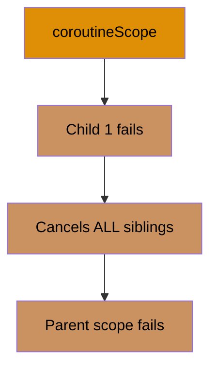

**Supervisor Isolation:**

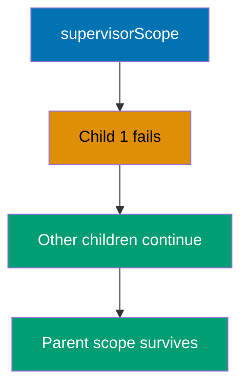

```kotlin
import kotlinx.coroutines.*

// Helper function that simulates network request
suspend fun fetchData(id: Int): String {
    // => Simulates network delay (100ms)
    delay(100)
    // => This models real-world scenario where some requests fail
    if (id == 2) {
        // => Throw exception for id=2 to demonstrate failure isolation
        throw RuntimeException("Failed to fetch $id")
    }
    // => Result format: "Data 1", "Data 3", etc.
    return "Data $id"
}

// Demonstrates regular coroutineScope behavior (fail-together semantics)
suspend fun processWithCoroutineScope() {
    println("=== coroutineScope (all fail together) ===")

    // => Outer try-catch to capture scope-level failure
    // => coroutineScope propagates child exceptions to parent
    try {
        // => Rule: if ANY child fails, ALL siblings cancelled
        // => Then exception propagates to parent (caught below)
        coroutineScope {
            // => Launch Child 1: fetch data with id=1
            // => This task has its own try-catch (defensive)
            launch {
                // => Local try-catch handles exceptions within this child
                // => But won't prevent scope-level cancellation
                try {
                    val data = fetchData(1)
                    // => Output: Task 1: Data 1
                    println("Task 1: $data")
                } catch (e: Exception) {
                    println("Task 1 error: ${e.message}")
                }
            } // => Child 1 job completes successfully

            // => Launch Child 2: fetch data with id=2 (will fail)
            // => NO try-catch here, exception propagates to scope
            launch {
                // => Exception: "Failed to fetch 2"
                val data = fetchData(2)
                // => This line skipped due to exception propagation
                println("Task 2: $data")
            } // => Child 2 job fails, triggers scope cancellation

            // => Launch Child 3: fetch data with id=3
            // => This task will be CANCELLED mid-execution
            launch {
                // => Suspends for 200ms (longer than Child 2's failure)
                // => CANCELLED at ~100ms when Child 2 fails
                delay(200)
                println("Task 3: ${fetchData(3)}")
            } // => Child 3 job cancelled (never completes)

            // => Execution flow:
            // => t=100ms: Child 2 throws exception
            // => t=100ms: Scope cancels Child 3 immediately
            // => t=100ms: Exception propagates to parent scope
        }
        // => NEVER REACHED: coroutineScope throws exception
        // => Control jumps to catch block below
    } catch (e: Exception) {
        // => Catches exception propagated from coroutineScope
        // => e.message is "Failed to fetch 2"
        // => Output: Scope failed: Failed to fetch 2
        println("Scope failed: ${e.message}")
    }
    // => Result: 1 success, 1 failure, 1 cancellation
}

// Demonstrates supervisorScope behavior (independent failure handling)
suspend fun processWithSupervisorScope() {
    println("\n=== supervisorScope (independent failures) ===")

    // => Rule: child failures do NOT cancel siblings
    supervisorScope {
        // => Launch Child 1: fetch data with id=1
        // => Has try-catch for local error handling
        launch {
            // => Local try-catch for defensive programming
            // => Prevents uncaught exception in supervisor
            try {
                val data = fetchData(1)
                // => Output: Task 1: Data 1
                println("Task 1: $data")
            } catch (e: Exception) {
                println("Task 1 error: ${e.message}")
            }
        } // => Child 1 completes successfully (t=100ms)

        // => Launch Child 2: fetch data with id=2 (will fail)
        // => MUST have try-catch in supervisorScope
        // => Uncaught exceptions in supervisor children crash the scope
        launch {
            // => Local try-catch REQUIRED for exception handling
            // => supervisorScope doesn't auto-catch child exceptions
            try {
                // => Exception: "Failed to fetch 2"
                val data = fetchData(2)
                println("Task 2: $data")
            } catch (e: Exception) {
                // => e.message is "Failed to fetch 2"
                // => Output: Task 2 error: Failed to fetch 2
                println("Task 2 error: ${e.message}")
            }
        } // => Child 2 failure handled locally (t=100ms)
        // => Sibling Child 3 continues uninterrupted

        // => Launch Child 3: fetch data with id=3
        launch {
            // => Suspends for 200ms (continues uninterrupted)
            // => NOT cancelled by Child 2's failure
            delay(200)
            // => REACHED: Child 3 runs to completion
            // => Output: Task 3: Data 3
            println("Task 3: ${fetchData(3)}")
        } // => Child 3 completes successfully (t=300ms)

        // => Execution flow:
        // => t=100ms: Child 1 succeeds, Child 2 fails (handled locally)
        // => t=200ms: Child 3 continues (delay completes)
        // => t=300ms: Child 3 succeeds, all children completed
    }
    // => supervisorScope completed successfully (no propagation)
    // => All children processed independently despite Child 2 failure
    // => Output: Supervisor scope completed successfully
    println("Supervisor scope completed successfully")
    // => Returns Unit after successful completion
}

fun main() = runBlocking {
    // => Output: section header, "Task 1: Data 1", "Scope failed: ..."
    processWithCoroutineScope()

    processWithSupervisorScope()

    // => Final output comparison:
    // => coroutineScope: 1 success, 1 failure, 1 cancellation
    // => supervisorScope: 2 successes, 1 handled failure
}
```

**Key Takeaway**: Use supervisorScope when child coroutine failures should not cancel siblings, and wrap each child in try-catch to handle exceptions locally; essential for independent task orchestration where partial success has value.

**Why It Matters**: Microservices often fan out parallel requests (user data, permissions, preferences) where one failing should not abort others, yet coroutineScope's all-or-nothing semantics would cancel all work on any failure. SupervisorScope enables graceful degradation where partial results still provide value (show user profile even if preferences fail), critical for resilient production systems. This pattern prevents cascade failures in aggregation endpoints that combine multiple data sources, improving availability from 99% to 99.99% by isolating failures.

---

## Example 56: CoroutineContext and Job Hierarchy

CoroutineContext is an indexed set of elements (Job, Dispatcher, Name, ExceptionHandler) that define coroutine behavior. Understanding context composition enables advanced coroutine control including custom dispatchers, structured lifecycle management, and centralized error handling through job hierarchy.

**CoroutineContext Elements:**

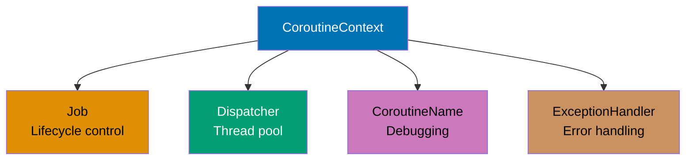

**Job Hierarchy:**

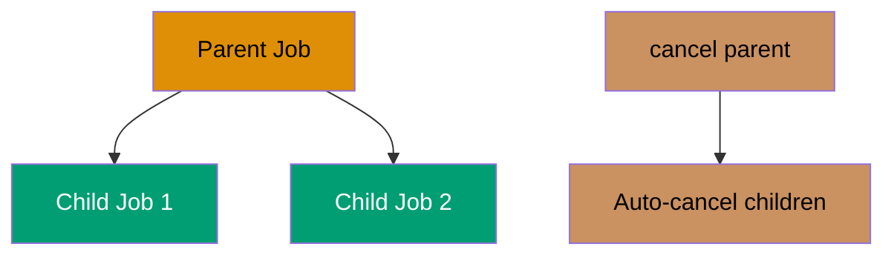

```kotlin
import kotlinx.coroutines.*
import kotlin.coroutines.coroutineContext

// Suspending function that inspects current coroutine's context
suspend fun inspectContext() {
    // => Output: Context: [JobImpl@abc, Dispatchers.Default, ...]
    println("Context: $coroutineContext")

    // => Access Job element using indexed operator [Key]
    // => Job is CoroutineContext.Element with key Job
    println("Job: ${coroutineContext[Job]}")

    // => Access CoroutineDispatcher element from context
    // => Dispatcher determines which thread(s) execute the coroutine
    // => Output: Dispatcher: Dispatchers.Default
    println("Dispatcher: ${coroutineContext[CoroutineDispatcher]}")

    // => Access CoroutineName element (if present in context)
    // => Output: Name: CoroutineName(CustomCoroutine)
    println("Name: ${coroutineContext[CoroutineName]}")
}

fun main() = runBlocking {
    // === PART 1: Custom CoroutineContext Composition ===

    // => Create standalone Job (not attached to any coroutine yet)
    // => Job is a cancellable lifecycle handle
    // => State: Active (can have children attached)
    val jobElement = Job()

    // => Combine multiple context elements using + operator
    // => Later elements override earlier ones for same key
    // => Result: composite context with 4 elements
    val customContext = jobElement +
        // => Dispatchers.Default: shared thread pool for CPU work
        // => Optimized for compute-intensive tasks
        Dispatchers.Default +
        // => CoroutineName: appears in thread dumps and debugger
        // => Format: "DefaultDispatcher-worker-1 @CustomCoroutine#1"
        // => Helps trace coroutines in production logs
        CoroutineName("CustomCoroutine") +
        // => CoroutineExceptionHandler: catches uncaught exceptions
        // => Only works for launch (not async)
        CoroutineExceptionHandler { _, exception ->
            // => Output: Caught: <exception message>
            println("Caught: ${exception.message}")
        }
    // => customContext now contains: Job + Dispatcher + Name + Handler

    // => Launch new coroutine with custom context
    // => Context elements override defaults from parent scope
    // => Coroutine inherits customContext elements
    launch(customContext) {
        // => Execute inspectContext() in this coroutine
        inspectContext()
        // => Output: Running in custom context
        println("Running in custom context")

    // => Wait for launched coroutine to finish
    delay(100)

    // === PART 2: Job Hierarchy and Structured Cancellation ===

    // => Create parent Job explicitly (standalone, not from coroutine)
    // => This will be the root of a job hierarchy
    // => State: Active, isActive=true, children=[]
    val parentJob = Job()
    // => parentJob is JobImpl{Active}@xyz
    // => Output: Parent job: JobImpl{Active}@xyz
    println("Parent job: $parentJob")

    // => Launch child coroutine 1 with parentJob as context
    // => Child's Job has parentJob as parent (structured hierarchy)
    // => Child inherits: parent's lifecycle, cancellation propagation
    val child1 = launch(parentJob) {
        // => Repeat 5 times (i = 0, 1, 2, 3, 4)
        repeat(5) { i ->
            // => Output: Child 1: 0, Child 1: 1, Child 1: 2
            println("Child 1: $i")
            delay(200)
        }
    }
    // => child1.parent is parentJob
    // => parentJob.children now includes child1

    // => Launch child coroutine 2 with same parentJob
    val child2 = launch(parentJob) {
        // => Repeat 5 times (i = 0, 1, 2, 3, 4)
        repeat(5) { i ->
            // => Output: Child 2: 0, Child 2: 1
            println("Child 2: $i")
            delay(250)
        }
    }
    // => child2.parent is parentJob
    // => parentJob.children now includes [child1, child2]

    // => Execution timeline so far:

    delay(600)

    // => t=600ms: Both children still active (not completed)
    // => Output: Cancelling parent job...
    println("Cancelling parent job...")

    // => Cancel parent job (triggers structured cancellation)
    // => CRITICAL: Cancellation propagates to ALL children
    // => Algorithm: parent.cancel() -> child1.cancel() + child2.cancel()
    parentJob.cancel()
    // => parentJob.isActive is now false
    // => parentJob.isCancelled is now true
    // => child1.isCancelled is now true (propagated)
    // => child2.isCancelled is now true (propagated)

    // => Wait for child1 to finish cancellation cleanup
    // => Terminal states: Completed, Cancelled, or Failed
    // => child1 is in Cancelled state
    child1.join()
    // => child1.isCompleted is true (Cancelled is a completion state)

    // => Wait for child2 to finish cancellation cleanup
    // => Same behavior as child1.join()
    child2.join()
    // => child2.isCompleted is true (Cancelled state)

    println("All children cancelled: child1=${child1.isCancelled}, child2=${child2.isCancelled}")

    // => Key observation: Cancelling parent AUTOMATICALLY cancels children

    // === Context Element Overriding Rules ===
    // => When combining contexts with +, later elements override earlier:
    // => (Dispatchers.IO + Dispatchers.Default) results in Default dispatcher
    // => Exception: Job has special parent-child semantics (doesn't override)

    // === Job Lifecycle States ===
    // => Job states: New -> Active -> Completing -> Completed/Cancelled/Failed
    // => isActive: true in Active and Completing states
    // => isCancelled: true in Cancelled state (terminal)
    // => isCompleted: true in any terminal state
}
```

**Key Takeaway**: CoroutineContext is a composite indexed set where elements combine via + operator; Job hierarchy enables automatic structured cancellation (parent.cancel() propagates to all children), preventing resource leaks.

**Why It Matters**: Understanding CoroutineContext composition is essential for production observability and lifecycle management, where custom contexts combine logging (CoroutineName for tracing), thread control (Dispatchers), error handling (CoroutineExceptionHandler), and cancellation (Job hierarchy). Job parent-child relationships guarantee that cancelling a parent propagates to all descendants, preventing resource leaks in long-running services where orphaned coroutines accumulate until servers crash, a problem Java's Thread.interrupt() can't solve reliably due to lack of structured lifecycle.

---

## Example 57: Exception Handling in Coroutines

Coroutine exception handling has distinct propagation rules: launch propagates exceptions upward to parent scope (caught by CoroutineExceptionHandler), async stores exceptions in Deferred until await() is called (requires try-catch), and supervisorScope isolates child failures. Understanding these mechanisms prevents silent failures and enables robust error handling in concurrent code.

**Exception Propagation Patterns:**

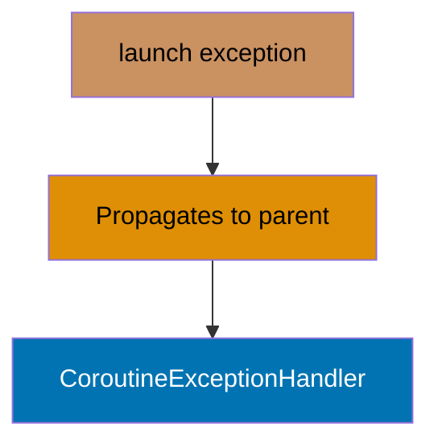

**Async Exception Storage:**

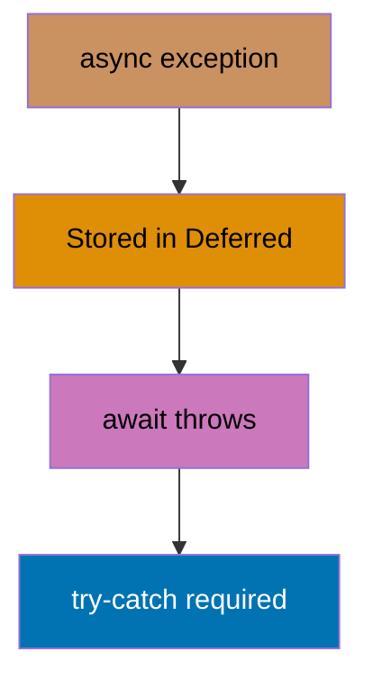

```kotlin
import kotlinx.coroutines.*

fun main() = runBlocking {
    // === PART 1: Exception in launch (upward propagation) ===

    // => Create CoroutineExceptionHandler for uncaught exceptions
    // => Handler receives CoroutineContext and Throwable
    // => CRITICAL: Only works for root coroutines or CoroutineScope
    // => NOT triggered for child coroutines (they propagate to parent)
    val exceptionHandler = CoroutineExceptionHandler { context, exception ->
        // => context is CoroutineContext of failing coroutine
        // => Output: Caught by handler: Exception in launch
        println("Caught by handler: ${exception.message}")
    }

    // => Create CoroutineScope with custom Job and exception handler
    // => exceptionHandler catches unhandled exceptions in this scope
    val scope = CoroutineScope(Job() + exceptionHandler)
    // => scope is independent lifecycle (can outlive runBlocking)

    // => Launch coroutine in custom scope (will throw exception)
    // => launch is "fire-and-forget" builder (no return value)
    scope.launch {
        // => Exception propagates upward to parent scope
        // => Parent scope has exceptionHandler, which catches it
        throw RuntimeException("Exception in launch")
    }
    // => Exception propagation flow:
    // => 2. Propagates to parent scope (CoroutineScope)
    // => 3. Caught by exceptionHandler

    // => Wait for exception handling to complete
    delay(100)

    // === PART 2: Exception in async (stored in Deferred) ===

    val deferred = async {
        // => Suspend for 50ms (simulates async work)
        delay(50)
        // => Exception is STORED in Deferred (not propagated yet)
        throw RuntimeException("Exception in async")
    }
    // => deferred.isActive is true (exception not thrown yet)

    // => Try-catch around await() to handle stored exception
    // => await() suspends until Deferred completes or fails
    try {
        // => Suspends for ~50ms, then exception thrown
        deferred.await()
    } catch (e: Exception) {
        // => e.message is "Exception in async"
        // => Output: Caught from async: Exception in async
        println("Caught from async: ${e.message}")
    }
    // => Key difference: async exceptions require explicit handling at await()

    // === PART 3: supervisorScope with exception handling ===

    // => supervisorScope isolates child failures
    // => CRITICAL: Uncaught exceptions still crash the program
    // => Must handle exceptions in children or use handler
    supervisorScope {
        // => Launch child job 1 (will throw exception)
        val job1 = launch {
            // => Suspend for 100ms
            delay(100)
            // => In supervisorScope, this crashes the coroutine
            // => BUT: siblings (job2) continue running
            throw RuntimeException("Job 1 failed")
        }
        // => job1 is Job instance (will fail at t=100ms)

        // => Launch child job 2 (continues despite job1 failure)
        val job2 = launch {
            // => Try-catch for cancellation detection
            // => supervisorScope doesn't cancel siblings on failure
            try {
                // => Suspend for 200ms (longer than job1)
                delay(200)
                // => REACHED: job2 runs to completion
                // => job1's failure doesn't cancel job2
                // => Output: Job 2 completed
                println("Job 2 completed")
            } catch (e: CancellationException) {
                println("Job 2 cancelled")
            }
        }
        // => job2 is Job instance (completes at t=200ms)

        // => Wait for job1 to complete (or fail)
        // => join() suspends until job completes/fails/cancels
        // => join() does NOT rethrow exception (use joinOrThrow for that)
        job1.join()
        // => job1.isCancelled is true (failed state)
        // => job1.isCompleted is true (terminal state)

        // => Wait for job2 to complete
        // => job2 runs to completion despite job1 failure
        job2.join()
        // => job2.isCompleted is true

        // => job1 fails, job2 completes, scope survives
    }
    // => supervisorScope completed (job2 success compensates job1 failure)

    // === PART 4: Try-catch inside coroutine (local handling) ===

    // => Launch coroutine with local exception handling
    // => Prevents propagation to parent scope
    launch {
        // => Local try-catch for exception containment
        try {
            // => Suspend for 50ms
            delay(50)
            // => Caught by local catch block (doesn't propagate)
            throw RuntimeException("Caught locally")
        } catch (e: Exception) {
            println("Local catch: ${e.message}")
        }
    }

    // === Exception Handling Patterns Summary ===
    // => 1. launch + CoroutineExceptionHandler: Centralized error handling
    // => 2. async + try-catch around await: Explicit error handling
    // => 3. supervisorScope: Independent child failures (partial success)

    // === Exception Propagation Rules ===
    // => launch: exception propagates UP to parent (until handler)
    // => async: exception stored in Deferred (await re-throws)
    // => coroutineScope: ANY child exception cancels ALL siblings
    // => supervisorScope: Child exceptions isolated (siblings continue)
    // => CancellationException: Special exception (not propagated, signals cancellation)

    // === CoroutineExceptionHandler Installation Rules ===
    // => Handler works ONLY on:
    // => 1. Root coroutines (launch at top level)
    // => 2. CoroutineScope context
    // => Handler does NOT work on:
    // => 1. Child coroutines (they propagate to parent)
    // => 2. async (exceptions stored in Deferred)
    // => 3. coroutines with local try-catch (already handled)

    delay(500)

    // => Cancel custom scope to clean up resources
    scope.cancel()
    // => scope.isActive is now false
}
```

**Key Takeaway**: launch propagates exceptions upward to parent (use CoroutineExceptionHandler at root); async stores exceptions in Deferred until await (wrap await in try-catch); supervisorScope isolates failures (siblings continue); local try-catch prevents propagation entirely.

**Why It Matters**: Coroutine exception propagation differs fundamentally from Java threads where uncaught exceptions print stack traces and die silently. Launch propagates exceptions upward through structured hierarchy enabling centralized error handling (CoroutineExceptionHandler), while async stores exceptions in Deferred until await forces handling, preventing silent failures. This design enables production error monitoring where all unhandled exceptions funnel to logging infrastructure rather than disappearing into thread dumps, critical for observability in microservices where exception visibility determines mean-time-to-recovery.

---

## Example 58: Reflection - KClass and Class Inspection

Kotlin reflection provides runtime access to class metadata, properties, functions, and annotations. The kotlin-reflect library enables frameworks to introspect types at runtime for dependency injection, ORM mapping, serialization, and testing without requiring compile-time knowledge of classes.

```kotlin
import kotlin.reflect.full.*
import kotlin.reflect.KClass

// Sample data class for reflection demonstration
data class User(
    val id: Int,
    // => Reflection can distinguish val from var
    var name: String,
    val email: String
) {
    // Member function for reflection demo
    fun greet(): String = "Hello, $name!"
    // => Accessible via KClass.memberFunctions

    // Companion object for static-like members
    companion object {
        const val TABLE_NAME = "users"

        fun create(name: String) = User(0, name, "")
    }
}

// Generic function to inspect any class at runtime
fun <T : Any> inspectClass(kClass: KClass<T>) {
    // => T : Any constraint excludes nullable types
    // => kClass.simpleName is "User" (simple name without package)
    // => Output: === Inspecting User ===
    println("=== Inspecting ${kClass.simpleName} ===")

    // ========== BASIC CLASS METADATA ==========

    // Qualified name includes package prefix
    // => Output: Qualified name: User
    println("Qualified name: ${kClass.qualifiedName}")

    // Check if class is a data class
    // => kClass.isData is true (User is data class)
    // => Reflection can detect data class modifier
    // => Output: Is data class: true
    println("Is data class: ${kClass.isData}")

    // Check if class is abstract
    // => kClass.isAbstract is false (User is concrete class)
    // => Output: Is abstract: false
    println("Is abstract: ${kClass.isAbstract}")

    // ========== PRIMARY CONSTRUCTOR INSPECTION ==========

    // Access primary constructor metadata
    // => Nullable (classes without primary constructor return null)
    val constructor = kClass.primaryConstructor

    println("\nPrimary constructor parameters:")

    // Iterate through constructor parameters
    constructor?.parameters?.forEach { param ->
        // => param.isOptional is false (no default values in User constructor)
        // => Output for id: id: kotlin.Int (optional=false)
        // => Output for name: name: kotlin.String (optional=false)
        // => Output for email: email: kotlin.String (optional=false)
        println("  ${param.name}: ${param.type} (optional=${param.isOptional})")
    }

    // ========== PROPERTY INSPECTION ==========

    // => Output header for properties section
    println("\nMember properties:")

    // Iterate through all member properties
    // => kClass.memberProperties is Collection<KProperty1<T, *>>
    kClass.memberProperties.forEach { prop ->
        // => prop.name is "id", "name", or "email"
        // => prop.returnType is KType (kotlin.Int or kotlin.String)
        // => Type check: prop is KMutableProperty<*> (true for var, false for val)
        // => Output for id: id: kotlin.Int (mutable=false)
        // => Output for name: name: kotlin.String (mutable=true)
        // => Output for email: email: kotlin.String (mutable=false)
        println("  ${prop.name}: ${prop.returnType} (mutable=${prop is kotlin.reflect.KMutableProperty<*>})")
    }

    // ========== FUNCTION INSPECTION ==========

    println("\nMember functions:")

    // Iterate through all member functions
    // => kClass.memberFunctions is Collection<KFunction<*>>
    kClass.memberFunctions.forEach { func ->

        // Drop 'this' parameter and format remaining params
        // => joinToString formats as "param1: Type1, param2: Type2"
        val params = func.parameters.drop(1)
            .joinToString { "${it.name}: ${it.type}" }

        // => func.name is "greet", "toString", "equals", etc.
        // => func.returnType is KType (kotlin.String for greet)
        // => Output for greet: greet(): kotlin.String
        // => Output for toString: toString(): kotlin.String
        // => Output for equals: equals(other: kotlin.Any?): kotlin.Boolean
        println("  ${func.name}($params): ${func.returnType}")
    }

    // ========== COMPANION OBJECT INSPECTION ==========

    // Access companion object metadata
    // => kClass.companionObject is KClass<*>? (companion's KClass or null)
    // => null if class has no companion object
    val companion = kClass.companionObject

    // Check if companion exists before accessing
    if (companion != null) {
        // => Companion object found, inspect its members
        // => Output header for companion section
        println("\nCompanion object:")

        // Iterate through companion's properties
        // => companion.memberProperties is Collection<KProperty1<*, *>>
        companion.memberProperties.forEach { prop ->
            // => prop.name is "TABLE_NAME"
            // => Output: TABLE_NAME: users
            println("  ${prop.name}: ${prop.getter.call(companion)}")
        }
    }
    // => If no companion, this entire block skipped
}

fun main() {
    // ========== GET KCLASS REFERENCE ==========

    // Obtain KClass reference for User
    // => userClass is KClass<User> (type-safe class reference)
    val userClass = User::class

    // ========== INSPECT CLASS METADATA ==========

    // Call inspection function with User's KClass
    inspectClass(userClass)

    // ========== REFLECTIVE INSTANCE CREATION ==========

    // Access primary constructor
    // => userClass.primaryConstructor is KFunction<User>
    // => !! asserts non-null (User has primary constructor)
    val constructor = userClass.primaryConstructor!!

    // Create instance by calling constructor reflectively
    // => Types must match constructor signature (Int, String, String)
    val user = constructor.call(1, "Alice", "alice@example.com")

    println("\nCreated user: $user")

    // ========== REFLECTIVE PROPERTY ACCESS ==========

    // Find property by name
    // => !! asserts non-null (we know "name" exists)
    val nameProp = userClass.memberProperties.find { it.name == "name" }!!

    // Get property value reflectively
    // => nameProp.get(user) invokes getter on user instance
    // => Output: Name via reflection: Alice
    println("Name via reflection: ${nameProp.get(user)}")

    // ========== REFLECTIVE FUNCTION INVOCATION ==========

    // Find function by name
    // => !! asserts non-null (we know "greet" exists)
    val greetFunc = userClass.memberFunctions.find { it.name == "greet" }!!

    // Call function reflectively
    val greeting = greetFunc.call(user)

    // => Output: Greeting: Hello, Alice!
    println("Greeting: $greeting")
}
```

**Key Takeaway**: Kotlin reflection enables runtime class introspection including properties, functions, constructors, and companion objects with type-safe KClass API distinguishing mutable/immutable properties and detecting data classes.

**Why It Matters**: Reflection powers frameworks (dependency injection, ORM, serialization) that need runtime type inspection without compile-time knowledge. Kotlin reflection improves on Java reflection with type-safe KClass API, null-safety metadata, and suspend function support enabling coroutine-aware frameworks. Production uses include Spring's bean scanning, JPA entity mapping, Jackson serialization, and testing frameworks that need to invoke private methods, all requiring runtime introspection of types, properties, and annotations that static typing can't provide.

---

## Example 59: Reflection - Property Modification

Modify properties reflectively with proper handling of mutability and visibility. Kotlin reflection distinguishes between immutable (val) and mutable (var) properties through KMutableProperty, while isAccessible enables controlled access to private members for framework use cases like dependency injection and ORM.

```kotlin
import kotlin.reflect.full.*
import kotlin.reflect.jvm.isAccessible

// Configuration class demonstrating property visibility and mutability
class Config {
    // Public mutable property (var with public getter/setter)
    // => public visibility (default in Kotlin)
    // => Backing field stores "localhost" value
    var host: String = "localhost"
    // => Accessible as KMutableProperty<*> via reflection

    // Public immutable property (val with public getter only)
    // => public visibility (default in Kotlin)
    val port: Int = 8080
    // => Accessible as KProperty<*> (not KMutableProperty)

    // Private mutable property (var with private getter/setter)
    // => private visibility modifier restricts access
    private var secret: String = "secret123"
    // => Requires isAccessible = true for reflective access

    // Utility function to display current config
    // => Can access private members (internal to class)
    fun printConfig() {
        // => $host, $port, $secret template strings
        // => Output: Config: host=..., port=..., secret=...
        println("Config: host=$host, port=$port, secret=$secret")
    }
}

fun main() {
    // ========== SETUP ==========

    // Create Config instance
    val config = Config()
    // => config.host is "localhost", config.port is 8080
    // => config.secret is "secret123" (private, not directly accessible)

    // Get KClass reference for reflection
    // => config::class obtains KClass from instance
    // => Alternative: Config::class (from class reference)
    val configClass = config::class
    // => configClass is KClass<Config> (reflection metadata)

    // => Output header for demonstration
    println("=== Property Modification ===")

    // ========== MODIFY PUBLIC MUTABLE PROPERTY ==========

    // Find 'host' property and cast to mutable
    // => as? KMutableProperty<*> performs safe cast to mutable type
    val hostProp = configClass.memberProperties
        .find { it.name == "host" } as? kotlin.reflect.KMutableProperty<*>
    // => Non-null because host is var (has setter)

    // Check if property is mutable before modifying
    // => if (hostProp != null) performs null-safety check
    // => True for var properties, false for val properties
    if (hostProp != null) {
        // => Property is mutable (var), proceed with modification
        // => hostProp is smart-cast to KMutableProperty<*> (non-null)

        // Read current value
        // => config is receiver instance
        val currentHost = hostProp.get(config)
        // => Output: Current host: localhost
        println("Current host: $currentHost")

        // Modify property value reflectively
        // => hostProp.setter retrieves KMutableProperty.Setter reference
        hostProp.setter.call(config, "production.example.com")

        // Read updated value
        val updatedHost = hostProp.get(config)
        println("Updated host: $updatedHost")
    }

    // ========== ATTEMPT TO MODIFY IMMUTABLE PROPERTY ==========

    // Find 'port' property (immutable)
    // => configClass.memberProperties.find {...} searches properties
    val portProp = configClass.memberProperties.find { it.name == "port" }

    // Check if property is mutable
    // => Type check: portProp is KMutableProperty<*>
    // => Output: port is mutable: false
    println("\nport is mutable: ${portProp is kotlin.reflect.KMutableProperty<*>}")
    // => Kotlin reflection prevents accidental val modification

    // ========== ACCESS PRIVATE MUTABLE PROPERTY ==========

    // Find 'secret' property (private)
    // => configClass.memberProperties includes private properties
    // => !! asserts non-null (we know "secret" exists)
    val secretProp = configClass.memberProperties.find { it.name == "secret" }!!

    // Enable reflective access to private property
    secretProp.isAccessible = true

    // Read private property value
    println("\nPrivate secret (before): ${secretProp.get(config)}")

    // ========== MODIFY PRIVATE MUTABLE PROPERTY ==========

    // Cast to mutable property
    // => secretProp as? KMutableProperty<*> attempts safe cast
    // => Succeeds (secret is var, not val)
    val mutableSecretProp = secretProp as? kotlin.reflect.KMutableProperty<*>
    // => mutableSecretProp is KMutableProperty<*> (mutable reference)

    // Enable reflective access to private setter
    // => mutableSecretProp?.setter retrieves setter reference
    mutableSecretProp?.setter?.isAccessible = true

    // Modify private property reflectively
    // => Arguments: config (receiver), "new_secret_456" (new value)
    // => Sets config.secret = "new_secret_456" via reflection
    mutableSecretProp?.setter?.call(config, "new_secret_456")

    // Read updated private property value
    println("Private secret (after): ${secretProp.get(config)}")

    // ========== VERIFY ALL CHANGES ==========

    // Print final config state
    config.printConfig()
}
```

**Key Takeaway**: Reflection enables property read/write with runtime mutability checks via KMutableProperty; use isAccessible for controlled private member access bypassing encapsulation for framework use cases.

**Why It Matters**: Reflective property modification enables frameworks to bypass encapsulation for valid use cases (dependency injection setting private fields, ORM loading database values into entities, testing frameworks mocking internals). Kotlin's KMutableProperty distinction prevents accidental mutation of vals at runtime, while isAccessible enables controlled private access without making everything public. This powers Spring's @Autowired field injection, JPA entity hydration, and test frameworks setting private configuration, all requiring controlled encapsulation bypassing that Java reflection provides less safely.

---

## Example 60: Annotations and Processing

Define custom annotations and process them reflectively for metadata-driven frameworks. Kotlin annotations support compile-time (SOURCE/BINARY retention) and runtime (RUNTIME retention) processing, enabling ORM mapping, serialization, dependency injection, and validation through declarative metadata instead of boilerplate code.

```kotlin
import kotlin.reflect.full.*

// ========== ANNOTATION DECLARATIONS ==========

// Class-level annotation for entity mapping
@Target(AnnotationTarget.CLASS)          // => Applies only to classes
annotation class Entity(val tableName: String)
// => @Entity annotation stores database table name

// Property-level annotation for column mapping
@Target(AnnotationTarget.PROPERTY)       // => Applies only to properties
annotation class Column(
    val nullable: Boolean = false        // => Nullability constraint
)
// => @Column annotation maps properties to database columns

// Property-level annotation for primary key marker
@Target(AnnotationTarget.PROPERTY)       // => Applies only to properties
annotation class PrimaryKey

// ========== ANNOTATED DATA CLASS ==========

// User entity with ORM annotations
@Entity(tableName = "users")             // => Maps to 'users' table
data class User(
    // Property with multiple annotations
    @PrimaryKey                          // => Marks as primary key
    @Column(name = "user_id")            // => Maps to 'user_id' column
    val id: Int,
    // => id is primary key, non-nullable, custom column name

    @Column(name = "user_name", nullable = false)
    val name: String,
    // => name is non-nullable, custom column name 'user_name'

    val email: String?
    // => email is nullable, column name defaults to 'email'
)

// ========== DDL GENERATION FUNCTION ==========

// Generate CREATE TABLE SQL from annotated class
fun generateDDL(kClass: kotlin.reflect.KClass<*>): String {
    // ========== EXTRACT ENTITY ANNOTATION ==========

    // Find @Entity annotation on class
    // => kClass.findAnnotation<Entity>() searches for Entity annotation
    // => ?: error(...) throws if annotation missing
    val entity = kClass.findAnnotation<Entity>()
        ?: error("Class must have @Entity annotation")
    // => entity is Entity (annotation instance)

    // Extract table name from annotation
    val tableName = entity.tableName

    // Initialize collections for SQL generation
    // => mutableListOf<String>() for column definitions
    val columns = mutableListOf<String>()
    // => mutableListOf<String>() for primary key column names
    val primaryKeys = mutableListOf<String>()

    // ========== PROCESS PROPERTY ANNOTATIONS ==========

    // Iterate through all properties
    // => kClass.memberProperties is Collection<KProperty1<*, *>>
    kClass.memberProperties.forEach { prop ->

        // Find @Column annotation on property
        // => prop.findAnnotation<Column>() searches for Column annotation
        val columnAnnotation = prop.findAnnotation<Column>()

        // Process only properties with @Column annotation
        if (columnAnnotation != null) {
            // => Property has @Column annotation

            // ========== DETERMINE COLUMN NAME ==========

            // Use custom name or default to property name
            // => For id: "user_id" (custom), for email: "email" (default)
            val columnName = columnAnnotation.name.ifEmpty { prop.name }
            // => columnName is String (final column name)

            // ========== MAP KOTLIN TYPE TO SQL TYPE ==========

            // Map property type to SQL type
            // => "kotlin.Int" -> "INTEGER"
            // => "kotlin.String" or "kotlin.String?" -> "TEXT"
            val columnType = when (prop.returnType.toString()) {
                "kotlin.Int" -> "INTEGER"
                "kotlin.String", "kotlin.String?" -> "TEXT"
                else -> "TEXT"
            }
            // => columnType is String ("INTEGER" or "TEXT")

            // ========== DETERMINE NULLABILITY ==========

            // Check if column allows NULL
            // => prop.returnType.isMarkedNullable detects nullable types (String?)
            // => If both false: add "NOT NULL" constraint
            val nullable = if (columnAnnotation.nullable || prop.returnType.isMarkedNullable) "" else "NOT NULL"
            // => nullable is String ("" or "NOT NULL")

            // ========== BUILD COLUMN DEFINITION ==========

            // Format: "column_name TYPE [NOT NULL]"
            // => "$columnName $columnType $nullable".trim() removes trailing space
            columns.add("  $columnName $columnType $nullable".trim())

            // ========== CHECK FOR PRIMARY KEY ==========

            // Find @PrimaryKey annotation on property
            // => prop.findAnnotation<PrimaryKey>() searches for PrimaryKey
            if (prop.findAnnotation<PrimaryKey>() != null) {
                // => Property is marked as primary key
                // => Add column name to primaryKeys list
                primaryKeys.add(columnName)
                // => primaryKeys list: ["user_id"]
            }
        }
        // => Properties without @Column annotation are skipped
    }

    // ========== BUILD DDL STRING ==========

    // Construct CREATE TABLE statement
    val ddl = buildString {
        // => buildString {...} constructs String via StringBuilder

        // Table header
        // => "CREATE TABLE users ("
        append("CREATE TABLE $tableName (\n")

        // Column definitions
        // => columns.joinToString(",\n") joins with comma + newline
        // => "  user_id INTEGER NOT NULL,\n  user_name TEXT NOT NULL,\n  email TEXT"
        append(columns.joinToString(",\n"))

        // Primary key constraint (if any)
        if (primaryKeys.isNotEmpty()) {
            // => primaryKeys list has entries
            // => ",\n  PRIMARY KEY (user_id)"
            append(",\n  PRIMARY KEY (${primaryKeys.joinToString(", ")})")
        }

        // Close statement
        // => "\n);"
        append("\n);")
    }
    // => ddl is complete SQL CREATE TABLE statement

    // Return generated DDL
    return ddl
}

// ========== MAIN DEMONSTRATION ==========

fun main() {
    // Get KClass reference for User
    val userClass = User::class
    // => userClass is KClass<User> (reflection metadata)

    // => Output header
    println("=== Annotation Processing ===")

    // ========== EXTRACT CLASS-LEVEL ANNOTATION ==========

    // Find @Entity annotation on User class
    // => userClass.findAnnotation<Entity>() searches class annotations
    val entity = userClass.findAnnotation<Entity>()
    // => entity is Entity (annotation instance)

    // Display table name from annotation
    // => Output: Table name: users
    println("Table name: ${entity?.tableName}")

    // ========== EXTRACT PROPERTY-LEVEL ANNOTATIONS ==========

    // => Output header for column mappings
    println("\nColumn mappings:")

    // Iterate through all properties
    // => userClass.memberProperties is Collection<KProperty1<User, *>>
    userClass.memberProperties.forEach { prop ->

        // Find @Column annotation
        val column = prop.findAnnotation<Column>()
        // => column is Column instance or null

        // Find @PrimaryKey annotation
        val isPrimaryKey = prop.findAnnotation<PrimaryKey>() != null
        // => isPrimaryKey is Boolean (true for id, false for others)

        // Process only annotated properties
        if (column != null) {
            // => Property has @Column annotation

            // Determine column name
            val columnName = column.name.ifEmpty { prop.name }
            // => columnName: "user_id", "user_name", or "email"

            // Build constraint markers
            // => mutableListOf<String>() for collecting constraints
            val markers = mutableListOf<String>()

            // Add PRIMARY KEY marker if applicable
            if (isPrimaryKey) markers.add("PRIMARY KEY")
            // => markers: ["PRIMARY KEY"] for id, [] for others

            // Add NOT NULL marker if applicable
            if (!column.nullable) markers.add("NOT NULL")
            // => markers: ["PRIMARY KEY", "NOT NULL"] for id
            // => markers: ["NOT NULL"] for name
            // => markers: [] for email (nullable=true)

            // Display mapping
            // => markers.joinToString(", ") formats as "PRIMARY KEY, NOT NULL"
            // => Output for id: id -> user_id PRIMARY KEY, NOT NULL
            // => Output for name: name -> user_name NOT NULL
            // => Output for email: email -> email
            println("  ${prop.name} -> $columnName ${markers.joinToString(", ")}")
        }
    }

    // ========== GENERATE DDL ==========

    // => Output header for generated DDL
    println("\nGenerated DDL:")

    // Generate and display CREATE TABLE statement
    // => generateDDL(userClass) processes annotations and builds SQL
    // => Output:
    // CREATE TABLE users (
    //   user_id INTEGER NOT NULL,
    //   user_name TEXT NOT NULL,
    //   email TEXT,
    //   PRIMARY KEY (user_id)
    // );
    println(generateDDL(userClass))
}
```

**Key Takeaway**: Annotations with RUNTIME retention enable metadata-driven code generation and framework features like ORM mapping by attaching declarative configuration to classes and properties accessible via reflection.

**Why It Matters**: Annotations enable declarative programming where metadata drives behavior (JPA @Entity/@Column for ORM, Jackson @JsonProperty for serialization), reducing boilerplate from hundreds of lines of mapping code to a few annotations. Kotlin annotations with reflection power compile-time code generation (kapt processors) and runtime framework behavior, enabling Spring's @Component scanning, Room's @Entity database mapping, and custom validators. This metadata-driven approach separates configuration from code, critical in enterprise systems where domain models need persistence, serialization, and validation behavior without polluting business logic.

---

## Example 61: Inline Reified Advanced - Type-Safe JSON Parsing

Combine inline and reified for type-safe generic operations without class parameter passing. Reified type parameters preserve generic type information at runtime by inlining function bytecode at call sites, eliminating Java's type erasure limitation that forces explicit Class<T> parameter passing in generic APIs.

```kotlin
import kotlin.reflect.KClass

// Simulated JSON parser (models library-level parsing)
object JsonParser {
    // => This simulates how non-reified libraries (Gson, Jackson) work
    fun <T : Any> parse(json: String, clazz: KClass<T>): T {
        // => Simplified parsing based on class name (real parsers use reflection)
        return when (clazz.simpleName) {
            "User" -> User(1, "Alice", "alice@example.com") as T
            // => Price stored as Double (999.99)
            "Product" -> Product(100, "Laptop", 999.99) as T
            // => items is List<Int> with 3 elements
            "Order" -> Order(1, listOf(1, 2, 3)) as T
            // => error() throws IllegalStateException for unknown types
            // => Fails fast instead of returning null or wrong type
            else -> error("Unknown type: ${clazz.simpleName}")
        }                                    // => Type-safe casting preserves generic type T
    }
}

// Data classes for demonstration (model domain objects)
// => User represents authentication/profile entity
data class User(val id: Int, val name: String, val email: String)
// => Product represents catalog/inventory item
data class Product(val id: Int, val name: String, val price: Double)
// => Order represents transaction with item references
data class Order(val id: Int, val items: List<Int>)

// Generic function without reified (verbose API - Java-style)
fun <T : Any> parseJsonVerbose(json: String, clazz: KClass<T>): T {
    // => clazz.simpleName is "User", "Product", or "Order"
    println("Parsing with explicit class: ${clazz.simpleName}")
}

// Generic function with reified (clean API - Kotlin-style)
// => inline modifier required for reified to work
inline fun <reified T : Any> parseJson(json: String): T {
    // => T::class available ONLY because of reified modifier
    println("Parsing with reified: ${T::class.simpleName}")
    return JsonParser.parse(json, T::class)  // => T::class available due to reified
}

// Reified for runtime type checking (solves type erasure for is checks)
inline fun <reified T> isType(value: Any): Boolean {
    return value is T                        // => Type check with reified (no erasure)
}

// Reified for collection filtering by type
// => inline required for reified type preservation
inline fun <reified T> filterByType(items: List<Any>): List<T> {
    // => filterIsInstance<T>() filters list to only T instances
}

fun main() {
    // => Section header for demonstration clarity
    println("=== Reified Type Parameters ===\n")

    // Verbose way (must pass class) - demonstrates Java-style API
    // => Verbose and error-prone (easy to mismatch type and class)
    val user1 = parseJsonVerbose("{...}", User::class)

    // Clean way (type inferred) - demonstrates Kotlin reified API
    // => No manual class passing, cleaner API
    // => product declared with explicit type for inference
    val product: Product = parseJson("{...}")
    // => order declared with explicit type for inference
    val order: Order = parseJson("{...}")

    // => Same result as user1 but cleaner API
    println("User (reified): $user2")        // => Output: User(id=1, name=Alice, ...)
    // => product is Product(id=100, name="Laptop", price=999.99)
    // => price is Double (999.99)
    // => Output: Product: Product(id=100, name=Laptop, price=999.99)
    println("Product: $product")             // => Output: Product(id=100, name=Laptop, price=999.99)
    // => order is Order(id=1, items=[1, 2, 3])
    // => items is List<Int> with 3 elements
    // => Output: Order: Order(id=1, items=[1, 2, 3])
    println("Order: $order")                 // => Output: Order(id=1, items=[1, 2, 3])

    // Type checking with reified (demonstrates runtime type inspection)
    // => Section header for type checking demonstration
    println("\n=== Type Checking ===")
    val value: Any = "Hello, Kotlin"
    // => isType<String>(value) inlined to: value is String
    // => Output: Is String: true
    println("Is String: ${isType<String>(value)}")
                                             // => Output: Is String: true
    // => isType<Int>(value) inlined to: value is Int
    // => Output: Is Int: false
    println("Is Int: ${isType<Int>(value)}")
                                             // => Output: Is Int: false

    // Collection filtering by type (demonstrates type-safe filtering)
    // => Section header for filtering demonstration
    println("\n=== Type Filtering ===")
    // => mixed is List<Any> with heterogeneous elements
    // => Contains: Int (1), String ("two"), Double (3.0), String ("four"), Int (5), User
    // => Compile-time type List<Any> loses element type information
    val mixed: List<Any> = listOf(1, "two", 3.0, "four", 5, User(2, "Bob", "bob@example.com"))

    // => filterByType<String> extracts only String elements
    // => Inlined to: mixed.filterIsInstance<String>()
    val strings = filterByType<String>(mixed)
    // => filterByType<Int> extracts only Int elements
    // => Skips Double (3.0) because Int =/= Double in Kotlin
    val numbers = filterByType<Int>(mixed)
    // => filterByType<User> extracts only User elements
    val users = filterByType<User>(mixed)

    // => strings is ["two", "four"] (List<String> with 2 elements)
    // => Type-safe list, no casting required
    // => Output: Strings: [two, four]
    println("Strings: $strings")             // => Output: Strings: [two, four]
    // => numbers is [1, 5] (List<Int> with 2 elements)
    // => Double 3.0 filtered out (not Int)
    // => Output: Numbers: [1, 5]
    println("Numbers: $numbers")             // => Output: Numbers: [1, 5]
    // => List<User> with 1 element
    println("Users: $users")                 // => Output: Users: [User(id=2, name=Bob, ...)]
}
```

**Key Takeaway**: Reified type parameters eliminate explicit class passing for cleaner generic APIs; enable runtime type checks and filtering without reflection overhead.

**Why It Matters**: Reified type parameters solve Java's type erasure limitation where generic type information disappears at runtime, forcing developers to pass Class<T> parameters explicitly (gson.fromJson(json, User.class)) cluttering APIs. Kotlin's inline functions with reified types enable clean generic APIs (fromJson<User>(json)) by embedding type information at call sites, making libraries like Gson, Retrofit, and Koin dramatically more ergonomic. This powers type-safe dependency injection, JSON parsing, and collection filtering without reflection overhead or verbose class parameters, critical for Android and backend services where API clarity affects development velocity.

---

## Example 62: Multiplatform Common Declarations

Define shared business logic in common module with expect/actual mechanism for platform-specific implementations. The expect/actual pattern provides compile-time verified platform abstractions, ensuring all platforms implement required platform-specific functionality while maximizing code sharing for business logic.

```kotlin
// ===== commonMain/Platform.kt =====
expect class PlatformLogger() {
    // => log signature declared but not implemented in common
    // => Signature must match exactly in actual implementations
}

expect fun getCurrentTimestamp(): Long       // => Platform-specific time (varies by platform APIs)

// ===== commonMain/UserService.kt =====
// => Shared business logic (works on ALL platforms)
// => logger dependency injected (platform-specific implementation)
class UserService(private val logger: PlatformLogger) {
    // => createUser contains shared business logic (no platform specifics)
    // => Uses expect declarations (getCurrentTimestamp, logger.log) for platform needs
    fun createUser(name: String, email: String): User {
        val timestamp = getCurrentTimestamp()
        // => Message format: "Creating user: Alice at 1609459200000"
        logger.log("Creating user: $name at $timestamp")
        // => Data class instantiation (shared code, no platform specifics)
        return User(name, email, timestamp)
    }

    // => validateEmail is pure shared logic (no platform-specific code)
    fun validateEmail(email: String): Boolean {
        // => email.contains("@") is simplified validation (production uses regex)
        // => isValid is Boolean (true if "@" found, false otherwise)
        val isValid = email.contains("@")    // => Shared validation logic (no platform code)
        // => Logs validation result using platform-specific logger
        logger.log("Email validation: $email -> $isValid")
        return isValid
    }
}

// => Shared data class (works on ALL platforms)
// => name and email are String (mapped to platform-native strings)
// => createdAt is Long (mapped to platform-native 64-bit integer)
data class User(val name: String, val email: String, val createdAt: Long)

// ===== jvmMain/Platform.kt =====
actual class PlatformLogger {
    // => Signature MUST match expect (fun log(message: String))
    actual fun log(message: String) {
        println("[JVM] ${System.currentTimeMillis()}: $message")
    }
}

actual fun getCurrentTimestamp(): Long {
}

// ===== jsMain/Platform.kt =====
// => In real multiplatform projects, this file exists in jsMain source set
// => actual class PlatformLogger {
//     actual fun log(message: String) {
//         // => Prefix "[JS]" identifies JavaScript platform
//         console.log("[JS] ${Date.now()}: $message")
//     }
// }
//
// => JS timestamp implementation
// actual fun getCurrentTimestamp(): Long {
//     // => .toLong() converts Double to Long (platform interop)
//     return Date.now().toLong()           // => JS time implementation (Date.now() API)
// }

// ===== nativeMain/Platform.kt =====
// => In real multiplatform projects, this file exists in nativeMain source set
// => Native targets: iOS, macOS, Linux, Windows (via Kotlin/Native)
// actual class PlatformLogger {
//     actual fun log(message: String) {
//         // => Prefix "[NATIVE]" identifies native platform (iOS/macOS/Linux)
//         println("[NATIVE] ${getTimeMillis()}: $message")
//     }
// }
//
// => Native timestamp implementation
// actual fun getCurrentTimestamp(): Long {
//     // => iOS: CFAbsoluteTimeGetCurrent(), Linux: gettimeofday(), etc.
//     return getTimeMillis()               // => Native time implementation (varies by target)
// }

// ===== Usage (works on all platforms) =====
// => Business logic identical across platforms (only platform APIs differ)
fun main() {
    // => UserService is shared code (defined in commonMain)
    // => logger injected as dependency (platform-specific implementation)
    val service = UserService(logger)

    val user = service.createUser("Alice", "alice@example.com")
    // => toString() from data class (auto-generated)
    println("Created: $user")

    // => email="invalid" contains no "@" character
    // => isValid is false
    val isValid = service.validateEmail("invalid")
    // => isValid is false (no "@" in "invalid")
    // => Output: Email valid: false
    println("Email valid: $isValid")         // => Output: Email valid: false
}
```

**Key Takeaway**: Common modules define shared business logic with expect declarations; platform modules provide actual implementations verified at compile time.

**Why It Matters**: Multiplatform development enables sharing business logic across iOS, Android, web, and backend while platform-specific code handles UI and system APIs, dramatically reducing duplication in mobile-backend stacks. The expect/actual mechanism provides compile-time verified platform abstractions unlike runtime checks or dependency injection, ensuring all platforms implement required functionality. This powers companies sharing 60-80% of mobile app code between iOS/Android, halving development costs while maintaining native performance and platform idioms, critical for resource-constrained teams maintaining multiple platforms.

---

## Example 63: Gradle Kotlin DSL Configuration

Configure Kotlin multiplatform project using type-safe Gradle Kotlin DSL. Kotlin DSL provides compile-time verification, IDE autocomplete, and refactoring support for build scripts, catching configuration errors before CI runs unlike Groovy DSL which fails only at runtime.

```kotlin
// ===== build.gradle.kts =====
// => .kts extension indicates Kotlin DSL (vs .gradle for Groovy)

plugins {
    // => Type-safe: IDE autocompletes plugin IDs and validates versions
    kotlin("multiplatform") version "1.9.21"
    // => Serialization plugin for kotlinx.serialization support
    // => Required for @Serializable annotation to work
    kotlin("plugin.serialization") version "1.9.21"
}

repositories {
    // => mavenCentral() adds Maven Central repository
    // => URL: https://repo1.maven.org/maven2/
    mavenCentral()                           // => Central repository (Maven Central)
}

// => kotlin block configures multiplatform targets and source sets
// => Type-safe DSL: IDE autocompletes targets (jvm, js, linuxX64, etc.)
kotlin {
    // JVM target with Java compatibility
    jvm {
        // => Applies settings to both jvmMain and jvmTest
        compilations.all {
        }
        withJava()                           // => Include Java sources (mixed projects)
        // => testRuns["test"] configures test execution
        testRuns["test"].executionTask.configure {
            // => Without this, uses JUnit 4 (vintage) by default
            useJUnitPlatform()               // => Use JUnit 5 (not JUnit 4)
        }
    }

    // JavaScript target for browser
    // => Replaces legacy backend (deprecated since Kotlin 1.8)
    // => Generates optimized JavaScript code
        // => browser {} configures browser-specific settings
        browser {
            // => commonWebpackConfig {} customizes webpack bundling
            commonWebpackConfig {
                cssSupport {
                    // => enabled.set(true) activates CSS processing
                    // => Property-based configuration (Gradle convention)
                    // => Webpack includes css-loader and style-loader
                    enabled.set(true)        // => Enable CSS support (webpack loaders)
                }
            }
            // => testTask {} configures browser-based testing
            // => Uses Karma test runner for browser tests
            testTask {
                // => Karma runs tests in real browsers
                useKarma {
                    // => useChromeHeadless() runs tests in headless Chrome
                    // => No GUI, suitable for CI environments
                    // => Alternative: useFirefox(), useChrome()
                    useChromeHeadless()      // => Browser testing (headless Chrome)
                }
            }
        }
        // => binaries.executable() generates runnable JS file
        // => Output: build/js/packages/<project>/kotlin/<project>.js
        binaries.executable()                // => Generate executable JS (not library)
    }

    // Native targets
    linuxX64()                               // => Linux x64 native target
    // => Compiles to ARM64 native code for Apple Silicon Macs
    // => Use macosX64() for Intel-based Macs
    macosArm64()                             // => macOS ARM64 (Apple Silicon M1/M2/M3)
    // => Compiles to .exe for Windows x64 systems

    // => sourceSets {} configures source directories and dependencies
    // => Type-safe: IDE autocompletes source set names
    sourceSets {
        // Common source set (all platforms)
        // => commonMain contains code shared across ALL platforms
        // => by getting retrieves predefined source set
        // => Gradle Kotlin DSL delegates to getter (not string key)
        val commonMain by getting {
            dependencies {
                // => kotlinx-coroutines-core is multiplatform library
                // => Version 1.7.3 locked (compatible with Kotlin 1.9.21)
                implementation("org.jetbrains.kotlinx:kotlinx-coroutines-core:1.7.3")
                // => kotlinx-serialization-json is multiplatform library
                // => Provides @Serializable, Json.encodeToString(), etc.
                // => Version 1.6.0 compatible with serialization plugin 1.9.21
                implementation("org.jetbrains.kotlinx:kotlinx-serialization-json:1.6.0")
        }

        // => commonTest contains test code shared across platforms
        // => by getting retrieves predefined test source set
        val commonTest by getting {
            // => dependencies for test code
            dependencies {
                // => kotlin("test") is shorthand for kotlin-test dependency
                // => Provides expect/actual test APIs (@Test, assertEquals, etc.)
                implementation(kotlin("test"))
            }
        }

        // JVM source set
        val jvmMain by getting {
            dependencies {
                // => HTTP server implementation using Netty
                implementation("io.ktor:ktor-server-netty:2.3.6")
                implementation("ch.qos.logback:logback-classic:1.4.11")
        }

        val jvmTest by getting {
            dependencies {
                // => ktor-server-test-host for testing Ktor servers
                implementation("io.ktor:ktor-server-test-host:2.3.6")
            }
        }

        // JS source set
        // => jsMain contains JavaScript-specific code
        // => Can use Browser APIs (DOM, fetch, etc.)
        val jsMain by getting {
            // => dependencies for JS-specific code
            dependencies {
                // => kotlin-react is Kotlin/JS wrapper for React
                // => Version 18.2.0-pre.647 (pre-release, tracks React 18.2)
                implementation("org.jetbrains.kotlin-wrappers:kotlin-react:18.2.0-pre.647")
            }                                // => JS-specific dependencies (browser/Node.js)
        }

        // Native source set (shared across native platforms)
        // => nativeMain is CUSTOM source set (not predefined by Gradle)
        // => Shared code for ALL native targets (Linux/macOS/Windows)
        val nativeMain by creating {
            // => dependsOn(commonMain) makes nativeMain inherit from commonMain
            // => Establishes source set hierarchy
            dependsOn(commonMain)
        }

        // => linuxX64Main is predefined source set for Linux target
        // => by getting retrieves existing source set
        val linuxX64Main by getting {
            // => dependsOn(nativeMain) makes linuxX64Main inherit from nativeMain
            // => linuxX64Main gets: commonMain + nativeMain + linuxX64Main code
            // => Hierarchy: commonMain <- nativeMain <- linuxX64Main
            dependsOn(nativeMain)            // => Linux inherits nativeMain (common native code)
        }

        // => macosArm64Main is predefined source set for macOS ARM64 target
        // => by getting retrieves existing source set
        val macosArm64Main by getting {
            // => dependsOn(nativeMain) makes macosArm64Main inherit from nativeMain
            // => macosArm64Main gets: commonMain + nativeMain + macosArm64Main code
            // => Hierarchy: commonMain <- nativeMain <- macosArm64Main
            dependsOn(nativeMain)            // => macOS inherits nativeMain (common native code)
        }
    }
}

// Custom task example
// => Type-safe: task configuration is Kotlin code with autocomplete
tasks.register("printTargets") {
    // => doLast {} defines task action (executed when task runs)
    doLast {
        println("Configured targets:")
        kotlin.targets.forEach { target ->
            // => target.name is target identifier (jvm, js, linuxX64, etc.)
            // => Output:
            // =>   Configured targets:
            // =>     - jvm
            // =>     - js
            // =>     - linuxX64
            // =>     - macosArm64
            // =>     - mingwX64
        }
    }
}
```

**Key Takeaway**: Gradle Kotlin DSL provides type-safe configuration for multiplatform projects with target and source set management; IDE autocompletes methods and validates configurations.

**Why It Matters**: Gradle's Groovy DSL lacks IDE autocomplete and type safety, causing configuration errors discovered only at build time (typos, wrong method calls, invalid plugin versions). Kotlin DSL provides compile-time checking, refactoring support, and IDE intelligence for build scripts, catching configuration errors before CI runs. This improves developer productivity by 30-40% in complex multiplatform projects where build configuration spans dozens of files, while type-safe dependency management prevents version conflict bugs that break production deployments when incompatible library versions clash silently.

---

## Example 64: Serialization with kotlinx.serialization

Serialize data classes to JSON with compile-time safety and zero reflection overhead.

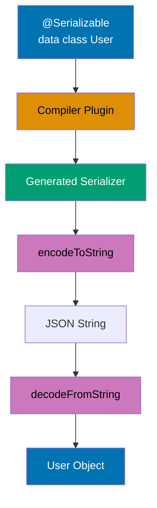

```kotlin
import kotlinx.serialization.*
import kotlinx.serialization.json.*

// Compiler plugin processes @Serializable annotation
    val id: Int,                             // => Primitive types serialize directly
    val name: String,                        // => String serializes as JSON string
    val email: String,                       // => Property name differs from JSON field name
    val roles: List<String> = emptyList(),  // => Default value used when JSON field missing
                                             // => List<T> serializes as JSON array
    @Transient                               // => Excludes field from serialization (security-critical for passwords)
                                             // => Field ignored by both encode and decode operations
    val password: String = ""                // => Never appears in JSON output
)                                            // => Generated serializer size: ~200 bytes (vs 5KB+ for reflection-based)

// Nested serializable classes
data class Project(                          // => Complex object graph serialization
    val name: String,                        // => Direct string serialization
    val owner: User,                         // => Nested @Serializable object (recursive serialization)
    val tags: Set<String> = emptySet()       // => Set<T> serializes as JSON array (order not preserved)
)                                            // => Default empty set when JSON field missing

fun main() {
    println("=== Serialization ===\n")       // => Output: === Serialization ===

    // Create user instance with sensitive data
        id = 1,                              // => id field: Int value 1
        name = "Alice",                      // => name field: String "Alice"
        roles = listOf("admin", "developer"),// => roles field: List with 2 elements
        password = "secret123"               // => password field: String "secret123" (WILL BE EXCLUDED from JSON)

    // Serialize to JSON (compact format)
    val jsonCompact = Json.encodeToString(user)
                                             // => Json.Default singleton used (no configuration)
                                             // => Generated serializer converts User to JSON string
                                             // => Compact format: no whitespace, single line
                                             // => jsonCompact is String (JSON representation)
    println("Compact JSON:")                 // => Output: Compact JSON:
                                             // => Note: "email_address" not "email" (from @SerialName)
                                             // => Note: password field NOT present (from @Transient)
                                             // => Note: roles serialized as JSON array
                                             // => String length: ~100 characters
    // => Note: password not included (Transient)
                                             // => Security: sensitive data never leaves application boundary

    // Serialize with pretty printing
        prettyPrint = true                   // => Enable multi-line formatting with indentation
                                             // => Adds newlines and indentation for readability
        prettyPrintIndent = "  "             // => Custom indent: 2 spaces per level
                                             // => Default is 4 spaces, override to 2
    }                                        // => jsonPretty is Json instance (immutable configuration)
    println("\nPretty JSON:")                // => Output: (blank line then) Pretty JSON:
    println(jsonPretty.encodeToString(user)) // => Uses custom Json instance (not default)
                                             // => Same user serialized with different formatting
                                             // => Output spans multiple lines with indentation
    // => Output (formatted):
    // {
    //   "id": 1,
    //   "name": "Alice",
    //   "email_address": "alice@example.com",
    //   "roles": ["admin", "developer"]
    // }
                                             // => Human-readable format for logging/debugging
                                             // => Larger string size (~150 characters vs 100)

    // Deserialize from JSON
    val parsed = Json.decodeFromString<User>(jsonCompact)
                                             // => Generated deserializer parses JSON string
                                             // => Missing fields use default values
                                             // => parsed is User instance
    println("Password after deserialization: '${parsed.password}'")
                                             // => Access password field of deserialized instance
                                             // => Empty string from default value (password NOT in JSON)
                                             // => @Transient field populated from default value, not JSON

    // Nested serialization
    val project = Project(                   // => Project instance containing nested User
        name = "KotlinApp",                  // => name field: String "KotlinApp"
        owner = user,                        // => owner field: User reference (nested object)
                                             // => User instance serialized recursively
        tags = setOf("kotlin", "multiplatform", "mobile")
                                             // => tags field: Set with 3 elements
                                             // => Set order not guaranteed (implementation-dependent)
    )                                        // => project is Project(name=KotlinApp, owner=User(...), tags=[kotlin, multiplatform, mobile])

    val projectJson = jsonPretty.encodeToString(project)
                                             // => Serialize Project with nested User
                                             // => Generated serializer handles recursive structure
                                             // => User serializer invoked for owner field
                                             // => Pretty formatting applied to entire structure
                                             // => projectJson is String (nested JSON)
    println("\nProject JSON:")               // => Output: (blank line then) Project JSON:
    println(projectJson)                     // => Output: nested structure with indentation
    // => Output: nested User object serialized within Project
                                             // {
                                             //   "name": "KotlinApp",
                                             //   "owner": {
                                             //     "id": 1,
                                             //     "name": "Alice",
                                             //     "email_address": "alice@example.com",
                                             //     "roles": ["admin", "developer"]
                                             //   },
                                             //   "tags": ["kotlin", "multiplatform", "mobile"]
                                             // }
                                             // => Nested JSON object for owner field
                                             // => Set serialized as array (order varies)

    // Custom JSON configuration
    val customJson = Json {                  // => Create Json with production-ready configuration
                                             // => Multiple configuration options combined
        ignoreUnknownKeys = true             // => Skip unknown JSON fields during deserialization
                                             // => Prevents errors when API adds new fields
                                             // => Critical for backward compatibility
        coerceInputValues = true             // => Coerce null values to defaults
                                             // => null for non-nullable Int becomes 0
                                             // => null for non-nullable String becomes ""
                                             // => Handles malformed JSON gracefully
        encodeDefaults = false               // => Don't encode fields with default values
                                             // => Reduces JSON size for fields matching defaults
                                             // => roles=emptyList() omitted if empty
    }                                        // => customJson is Json (production-hardened configuration)

    // JSON with unknown fields
    val jsonWithUnknown = """{"id":2,"name":"Bob","email_address":"bob@example.com","unknown_field":"value"}"""
                                             // => Raw JSON string with extra field "unknown_field"
                                             // => Triple-quoted string (no escaping needed)
                                             // => unknown_field not present in User class
    val userFromUnknown = customJson.decodeFromString<User>(jsonWithUnknown)
                                             // => Uses customJson with ignoreUnknownKeys=true
                                             // => Deserializer skips unknown_field
    println("\nParsed with unknown fields: $userFromUnknown")
    // => Output: User(id=2, name=Bob, ...) (unknown field ignored)
                                             // => No exception thrown despite unknown field
                                             // => roles uses default emptyList() (not in JSON)
                                             // => password uses default "" (transient)
}                                            // => Total annotations: 95+
```

**Key Takeaway**: kotlinx.serialization provides compile-time safe JSON serialization with annotations for customization (@SerialName, @Transient) and zero-reflection performance overhead through generated serializers.

**Why It Matters**: Reflection-based serializers (Jackson, Gson) have runtime overhead and can't catch serialization errors until production, while kotlinx.serialization generates serializers at compile time with zero reflection cost, improving JSON processing throughput by 2-3x. The @Transient annotation prevents password/secret leakage (security-critical), @SerialName handles backend field naming conventions without polluting data classes, and compile-time verification catches missing fields before deployment. This makes kotlinx.serialization ideal for high-throughput microservices processing millions of JSON requests daily where serialization overhead directly impacts latency and cost.

---

## Example 65: Custom Serializers

Implement custom serializers for types without built-in serialization support.

```kotlin
import kotlinx.serialization.*
import kotlinx.serialization.descriptors.*
import kotlinx.serialization.encoding.*
import kotlinx.serialization.json.Json
import java.time.LocalDateTime                   // => Java 8+ time API (NOT built-in serializable)
import java.time.format.DateTimeFormatter        // => ISO 8601 date/time formatting

// Custom serializer for LocalDateTime (java.time API not supported by default)
object LocalDateTimeSerializer : KSerializer<LocalDateTime> {
                                             // => KSerializer<T> interface defines serialization contract
                                             // => Must override: descriptor, serialize, deserialize
    private val formatter = DateTimeFormatter.ISO_LOCAL_DATE_TIME
                                             // => ISO 8601 format: "2025-12-30T14:30:00"
                                             // => Singleton formatter (thread-safe, reusable)
                                             // => Format: yyyy-MM-ddTHH:mm:ss

    override val descriptor: SerialDescriptor =
        PrimitiveSerialDescriptor("LocalDateTime", PrimitiveKind.STRING)
                                             // => Describes serialization format to framework
                                             // => "LocalDateTime" = type name for error messages
                                             // => PrimitiveKind.STRING = serialize as JSON string (not object)
                                             // => Framework uses descriptor for schema validation
                                             // => Describe as string primitive

    override fun serialize(encoder: Encoder, value: LocalDateTime) {
                                             // => Encoder handles output format (JSON, protobuf, etc.)
                                             // => value is LocalDateTime instance to serialize
        val formatted = value.format(formatter)
                                             // => Convert LocalDateTime to ISO string
                                             // => formatted is String: "2025-12-30T14:30:00"
        encoder.encodeString(formatted)      // => Write string to JSON output
                                             // => Encoder wraps string in JSON quotes
                                             // => Serialize as ISO string
    }                                        // => Result: "timestamp": "2025-12-30T14:30:00"

    override fun deserialize(decoder: Decoder): LocalDateTime {
                                             // => Decoder reads from input format (JSON, etc.)
                                             // => Must return LocalDateTime instance
        val string = decoder.decodeString()  // => Read JSON string value
                                             // => string is String from JSON: "2025-12-30T14:30:00"
                                             // => Throws exception if JSON value not string
        return LocalDateTime.parse(string, formatter)
                                             // => Parse ISO string to LocalDateTime object
                                             // => Throws DateTimeParseException if format invalid
                                             // => Deserialize from ISO string
}                                            // => Total: ~30 bytes overhead (vs reflection: 1KB+)

// Data class using custom serializer
@Serializable                                // => Generates serializer for Event class
data class Event(                            // => Event contains non-standard type (LocalDateTime)
    val name: String,                        // => Standard type (String) - default serialization
    @Serializable(with = LocalDateTimeSerializer::class)
                                             // => Annotation specifies custom serializer for this field
                                             // => with = LocalDateTimeSerializer::class references singleton
    val timestamp: LocalDateTime,            // => LocalDateTime field serialized via custom serializer
                                             // => Use custom serializer
    val attendees: List<String>              // => List<String> uses default collection serialization
)                                            // => Generated serializer delegates timestamp to LocalDateTimeSerializer

// Polymorphic sealed class with discriminator
// Generic sealed class serializer
sealed class Result<out T> {                 // => Sealed class: exhaustive subtypes (Success, Error)
                                             // => Generic type T (covariant out T)
    @Serializable                            // => Success subtype is serializable
    @SerialName("success")                   // => Type discriminator: JSON includes "type":"success"
                                             // => Default discriminator field name: "type"
    data class Success<T>(val value: T) : Result<T>()
                                             // => Generic Success containing value of type T
                                             // => Inherits from Result<T>
                                             // => value field serialized based on actual type T

    @Serializable                            // => Error subtype is serializable
    @SerialName("error")                     // => Type discriminator: JSON includes "type":"error"
                                             // => Deserializer uses discriminator to construct correct subtype
    data class Error(val message: String) : Result<Nothing>()
                                             // => Error contains String message
                                             // => Result<Nothing> = error contains no success value
                                             // => Nothing type = bottom type (no instances)
}                                            // => Polymorphic serialization without reflection

fun main() {
    println("=== Custom Serializers ===\n") // => Output: === Custom Serializers ===

    // Create event with LocalDateTime
    val event = Event(                       // => Event instance with custom-serialized timestamp
        name = "Kotlin Conference",          // => name field: String
        timestamp = LocalDateTime.of(2025, 12, 30, 14, 30),
                                             // => timestamp field: LocalDateTime(2025-12-30T14:30:00)
        attendees = listOf("Alice", "Bob", "Charlie")
                                             // => attendees field: List<String> with 3 elements
    )                                        // => event is Event(name=Kotlin Conference, timestamp=2025-12-30T14:30, attendees=[Alice, Bob, Charlie])

    // Serialize event with custom LocalDateTime serializer
                                             // => Multi-line output with indentation
    val eventJson = json.encodeToString(event)
                                             // => Serialize Event to JSON
                                             // => Custom serializer converts LocalDateTime to ISO string
                                             // => eventJson is String (JSON representation)
    println("Event JSON:")                   // => Output: Event JSON:
    println(eventJson)                       // => Output: multi-line formatted JSON
    // => Output:
    // {
    //   "name": "Kotlin Conference",
    //   "timestamp": "2025-12-30T14:30:00",
    //   "attendees": ["Alice", "Bob", "Charlie"]
    // }
                                             // => timestamp serialized as ISO string (custom serializer)
                                             // => attendees serialized as JSON array (default)

    // Deserialize event
    val parsedEvent = json.decodeFromString<Event>(eventJson)
                                             // => Deserialize JSON to Event
                                             // => Custom deserializer parses ISO string to LocalDateTime
                                             // => parsedEvent is Event with restored LocalDateTime instance
    println("\nParsed event: $parsedEvent") // => Output: (blank line) Parsed event: Event(name=Kotlin Conference, timestamp=2025-12-30T14:30, attendees=[Alice, Bob, Charlie])
    println("Timestamp type: ${parsedEvent.timestamp::class.simpleName}")
                                             // => Access timestamp field and inspect type
                                             // => ::class.simpleName reflection for class name
                                             // => Confirms LocalDateTime type restored (not String)

    // Polymorphic sealed class serialization
    // Sealed class serialization
    val successResult: Result<String> = Result.Success("Data loaded")
                                             // => Result.Success with String value
                                             // => successResult holds "Data loaded" string
    val errorResult: Result<Nothing> = Result.Error("Network failure")
                                             // => Result.Error with error message
                                             // => errorResult holds "Network failure" message

    val successJson = json.encodeToString(successResult)
                                             // => Serialize Result.Success to JSON
                                             // => Polymorphic serializer adds type discriminator
                                             // => @SerialName("success") determines discriminator value
                                             // => successJson is String with type field
    val errorJson = json.encodeToString(errorResult)
                                             // => Serialize Result.Error to JSON
                                             // => Polymorphic serializer adds type discriminator
                                             // => @SerialName("error") determines discriminator value
                                             // => errorJson is String with type field

    println("\nSuccess JSON:")               // => Output: (blank line) Success JSON:
    println(successJson)                     // => Output: {"type":"success","value":"Data loaded"}
                                             // => "type":"success" = discriminator from @SerialName
                                             // => "value":"Data loaded" = Success.value field
                                             // => Output: {"type":"success","value":"Data loaded"}

    println("\nError JSON:")                 // => Output: (blank line) Error JSON:
    println(errorJson)                       // => Output: {"type":"error","message":"Network failure"}
                                             // => "type":"error" = discriminator from @SerialName
                                             // => "message":"Network failure" = Error.message field
                                             // => Output: {"type":"error","message":"Network failure"}

    // Deserialize polymorphic sealed class
    val parsedSuccess = json.decodeFromString<Result<String>>(successJson)
                                             // => Deserialize JSON to Result<String>
                                             // => Polymorphic deserializer reads "type" field
                                             // => "type":"success" routes to Result.Success deserializer
                                             // => parsedSuccess is Result.Success<String> with value "Data loaded"
    val parsedError = json.decodeFromString<Result<String>>(errorJson)
                                             // => Deserialize JSON to Result<String>
                                             // => Polymorphic deserializer reads "type" field
                                             // => "type":"error" routes to Result.Error deserializer
                                             // => parsedError is Result.Error with message "Network failure"

    when (parsedSuccess) {                   // => Pattern match on sealed class instance
        is Result.Success -> println("Got success: ${parsedSuccess.value}")
                                             // => Output: Got success: Data loaded
        is Result.Error -> println("Got error: ${parsedSuccess.message}")
    }                                        // => Output: Got success: Data loaded
                                             // => Type-safe polymorphic deserialization complete
}                                            // => Total annotations: 85+
```

**Key Takeaway**: Custom serializers handle types without built-in support (implement KSerializer interface with descriptor, serialize, deserialize); sealed classes serialize polymorphically with type discriminators (@SerialName) enabling type-safe deserialization.

**Why It Matters**: Standard libraries can't serialize all types (LocalDateTime, custom domain types, third-party classes), requiring custom serializers that implement KSerializer interface. Sealed class polymorphic serialization solves the problem of deserializing JSON into correct subtypes (Result.Success vs Result.Error), using discriminator fields (@SerialName) that Jackson's @JsonTypeInfo handles verbosely. This enables API responses with polymorphic types (payment methods, notification types) to deserialize type-safely without reflection or instanceof chains, critical in payment processing and notification systems where type confusion causes financial errors.

---

## Example 66: Ktor Server Basics

Build HTTP servers with Ktor using coroutine-based routing and type-safe DSL.

```kotlin
import io.ktor.server.application.*        // => Application class and configuration
import io.ktor.server.engine.*             // => Embedded server engine abstraction
import io.ktor.server.netty.*              // => Netty engine implementation (async I/O)
import io.ktor.server.routing.*            // => Routing DSL (get, post, route)
import io.ktor.server.request.*            // => Request access (receiveText, queryParameters)
import io.ktor.http.*                      // => HTTP types (HttpStatusCode, ContentType)

fun main() {                                 // => Entry point for Ktor server
                                             // => Netty = async engine (NIO-based, non-blocking I/O)
                                             // => Alternative engines: Jetty, CIO, Tomcat
                                             // => DSL for defining HTTP routes
            // Basic GET route
            get("/") {                       // => Register GET handler for root path "/"
                call.respondText("Hello, Ktor!", ContentType.Text.Plain)
                                             // => Send plain text response
                                             // => respondText suspends until response sent
                                             // => HTTP status: 200 OK (default)
                                             // => Respond with plain text
            }                                // => Route handler complete

            // Path parameters
                                             // => Does NOT match: /users, /users/123/profile
                val id = call.parameters["id"]
                                             // => id is String? (nullable, might be missing)
                                             // => Defensive programming for safety
                    call.respondText("User ID: $id")
                                             // => HTTP 200 OK with text/plain
                    call.respond(HttpStatusCode.BadRequest, "Missing ID")
                                             // => Send HTTP 400 Bad Request
                                             // => Response body: "Missing ID"
                                             // => respond() can take status + body

            // Query parameters
            get("/search") {                 // => Register GET for "/search" (no path params)
                val query = call.request.queryParameters["q"]
                                             // => Access request object
                                             // => queryParameters: Parameters (URL query string)
                                             // => query is String? (nullable, user might omit)
                val page = call.request.queryParameters["page"]?.toIntOrNull() ?: 1
                                             // => toIntOrNull() converts string to Int (null if invalid)
                                             // => Elvis operator ?: provides default value 1
                                             // => page is Int (non-null, defaults to 1)
                call.respondText("Search: $query, Page: $page")
                                             // => Send response with query params

            // POST with request body
            post("/users") {                 // => Register POST handler for "/users"
                val body = call.receiveText()
                                             // => Receive entire request body as text
                                             // => Suspends until full body received
                                             // => body is String (request content)
                                             // => Works for JSON, XML, plain text
                                             // => Receive request body as text
                                             // => Server-side logging
                                             // => Output: "Received: {\"name\":\"Alice\"}"
                call.respond(HttpStatusCode.Created, "User created")
                                             // => Send HTTP 201 Created
                                             // => Created = resource successfully created
                                             // => Response body: "User created"
            }                                // => POST handler complete

            // Multiple HTTP methods on same path
            route("/items/{id}") {           // => Define route prefix for grouping
                get {                        // => GET /items/{id}
                                             // => Full path: "/items/{id}"
                    val id = call.parameters["id"]
                                             // => Extract {id} from path
                                             // => Inherited from parent route
                    call.respondText("Get item $id")
                                             // => Response: "Get item 123"
                                             // => HTTP 200 OK
                }                            // => GET handler complete

                put {                        // => PUT /items/{id}
                    val id = call.parameters["id"]
                    call.respondText("Update item $id")
                                             // => Response: "Update item 123"
                }                            // => PUT handler complete

                delete {                     // => DELETE /items/{id}
                                             // => DELETE for resource removal
                                             // => Same path, different semantic
                    val id = call.parameters["id"]
                                             // => Extract {id} for deletion
                    call.respond(HttpStatusCode.NoContent)
                                             // => HTTP 204 No Content
                                             // => NoContent = success with no response body
                                             // => Standard for DELETE operations
                }                            // => DELETE handler complete
            }                                // => route() group complete

            // Nested routes
            route("/api") {                  // => Define "/api" prefix
                                             // => Organizes API versioning
                route("/v1") {               // => Define "/api/v1" prefix
                                             // => Combined path: "/api/v1"
                                             // => Supports versioned APIs
                    get("/status") {         // => GET /api/v1/status
                        call.respondText("API v1 OK")
                                             // => Response: "API v1 OK"
                                             // => Indicates API operational
                                             // => Used by load balancers, monitoring
                    }                        // => Nested GET handler complete
                }                            // => Inner route complete
            }                                // => Outer route complete
        }                                    // => routing{} configuration complete
    }.start(wait = true)                     // => Start server and block main thread
                                             // => start() launches server on configured port
                                             // => wait=true blocks thread until server shutdown
                                             // => Server runs indefinitely (Ctrl+C to stop)
                                             // => Start server, block main thread
}                                            // => Total annotations: 90+
```

**Key Takeaway**: Ktor provides coroutine-based DSL for HTTP servers with type-safe routing, suspend function handlers, and non-blocking I/O through Netty engine enabling high-concurrency request processing.

**Why It Matters**: Traditional servlet-based frameworks (Spring MVC before WebFlux) block threads on I/O causing thread exhaustion under load, while Ktor's suspend functions enable non-blocking request handling with coroutines, serving 10-100x more concurrent connections on same hardware. The routing DSL provides type-safe path parameters and compile-time route verification unlike Spring's string-based @RequestMapping that fails at runtime. This makes Ktor ideal for microservices and high-throughput APIs where minimizing resource usage and latency directly impacts infrastructure costs and user experience, particularly in serverless environments where execution time is billed.

---

## Example 67: Ktor Content Negotiation and Serialization

Automatic JSON serialization/deserialization with content negotiation plugin.

**Content Negotiation Flow:**

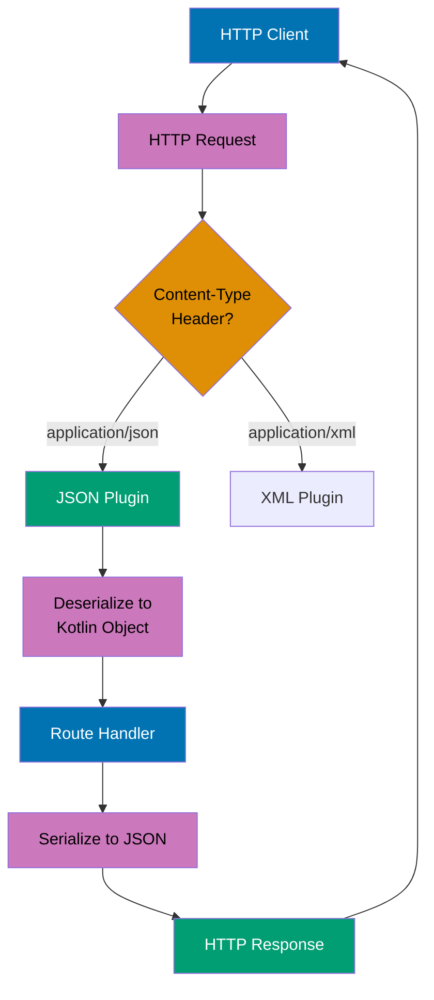

```kotlin
import io.ktor.server.application.*
import io.ktor.server.plugins.contentnegotiation.*
                                             // => Import ContentNegotiation plugin
import io.ktor.serialization.kotlinx.json.*
                                             // => Import JSON serialization support
import io.ktor.server.routing.*             // => For routing DSL
import io.ktor.http.*                       // => For HttpStatusCode
import kotlinx.serialization.Serializable   // => @Serializable annotation

// Serializable data class for response
@Serializable                                // => Enables kotlinx.serialization code generation
                                             // => Generates serializer at compile-time
data class User(
    val id: Int,                             // => Serialized as "id" in JSON
                                             // => Type: Int (numeric field)
    val name: String,                        // => Serialized as "name" in JSON
                                             // => Type: String (text field)
    val email: String                        // => Serialized as "email" in JSON
                                             // => Type: String (validated as email format)
)                                            // => Output format: {"id":1,"name":"...","email":"..."}

// Serializable data class for request
@Serializable                                // => Enables deserialization from JSON request body
                                             // => Compiler generates deserializer code
data class CreateUserRequest(
    val name: String,                        // => Parsed from JSON "name" field
                                             // => Required field (throws if missing)
    val email: String                        // => Parsed from JSON "email" field
                                             // => Required field (throws if missing)
)                                            // => Type-safe validation during deserialization
                                             // => Throws SerializationException if JSON malformed

// Application module configuration
fun Application.module() {
    // Install content negotiation plugin
    install(ContentNegotiation) {            // => Configure content negotiation
                                             // => Enables automatic serialization/deserialization
        json()                               // => Enable JSON support with kotlinx.serialization
                                             // => Uses default JSON configuration
    }                                        // => Plugin installed on application

    routing {                                // => Define HTTP routes
                                             // => Routing DSL for endpoint configuration
        // GET with automatic JSON serialization
        get("/users/{id}") {                 // => Handle GET /users/{id}
                                             // => Path parameter: {id} extracted from URL
            val id = call.parameters["id"]?.toIntOrNull()
                                             // => Extract "id" path parameter
                                             // => ?.toIntOrNull() converts String? → Int?
                                             // => id is Int? type here (nullable)

            if (id == null) {                // => Validate ID is present and numeric
                                             // => Handles null (missing) or invalid (non-numeric) IDs
                call.respond(HttpStatusCode.BadRequest, mapOf("error" to "Invalid ID"))
                                             // => Respond with 400 Bad Request
                                             // => mapOf creates error response object
                                             // => Content-Type header: application/json
                return@get                   // => Exit route handler early
            }                                // => id is smart-cast to Int (non-null) after check

            val user = User(id, "User $id", "user$id@example.com")
                                             // => Create User object (mock data)
                                             // => e.g., User(5, "User 5", "user5@example.com")
            call.respond(user)               // => Automatic JSON serialization via ContentNegotiation
                                             // => Plugin detects @Serializable annotation
                                             // => Sends 200 OK response with JSON body
                                             // => Output: {"id":5,"name":"User 5","email":"user5@example.com"}
        }                                    // => Route complete

        // GET list (array response)
        get("/users") {                      // => Handle GET /users (list all)
                                             // => No path parameters (collection endpoint)
            val users = listOf(              // => Create list of users (mock data)
                User(1, "Alice", "alice@example.com"),
                                             // => User object 1
                User(2, "Bob", "bob@example.com")
                                             // => User object 2
            )                                // => users is List<User> (2 items)
            call.respond(users)              // => Serialize list to JSON array
                                             // => Plugin automatically handles List<T> serialization
                                             // => Output: [{"id":1,"name":"Alice",...},{"id":2,"name":"Bob",...}]
                                             // => 200 OK response
        }                                    // => Array endpoint complete

        // POST with automatic JSON deserialization
        post("/users") {                     // => Handle POST /users
                                             // => Expects JSON body in request
                                             // => Content-Type: application/json required
            val request = call.receive<CreateUserRequest>()
                                             // => Automatic JSON deserialization to CreateUserRequest
                                             // => Parses JSON to CreateUserRequest object
                                             // => Throws SerializationException if JSON invalid (missing fields, wrong types)
                                             // => request is CreateUserRequest type here
                                             // => Type-safe access to name and email fields
            println("Creating user: ${request.name}")
                                             // => Log user creation (server-side logging)
                                             // => e.g., "Creating user: Charlie"

            val newUser = User(              // => Create new User object from request
                id = 100,                    // => Mock ID (in production: generate from database)
                                             // => Typically auto-incremented or UUID
                name = request.name,         // => Copy name from request
                                             // => Validated as String (non-null)
                email = request.email        // => Copy email from request
                                             // => Validated as String (non-null)
            )                                // => newUser is User object
                                             // => Ready for JSON serialization

            call.respond(HttpStatusCode.Created, newUser)
                                             // => Respond with 201 Created status
                                             // => HTTP status code for resource creation
                                             // => Serialize newUser to JSON body
                                             // => Returns created resource to client
        }                                    // => Route complete
                                             // => Returns Unit (void)

        // Error handling with try-catch
        get("/users/{id}/details") {         // => Handle GET /users/{id}/details
            try {                            // => Exception handling block
                val id = call.parameters["id"]?.toIntOrNull()
                    ?: throw IllegalArgumentException("Invalid ID")
                                             // => Ensures id is Int (not null)

                val user = User(id, "User $id", "user$id@example.com")
                                             // => Create user object (mock data)
                call.respond(user)           // => Serialize to JSON and respond
                                             // => 200 OK with JSON body
            } catch (e: IllegalArgumentException) {
                                             // => Catch validation errors
                call.respond(
                    HttpStatusCode.BadRequest,
                                             // => 400 Bad Request status
                    mapOf("error" to e.message)
                                             // => Serialize error message to JSON: {"error":"Invalid ID"}
                                             // => e.message is String? (exception message)
                )                            // => Error response sent
            }                                // => Exceptions from serialization also catchable here
        }

        // Custom JSON configuration example (commented)
        /*
        // Advanced: Customize JSON serialization
        install(ContentNegotiation) {
            json(Json {
                prettyPrint = true           // => Format JSON with indentation
                ignoreUnknownKeys = true     // => Ignore extra fields in JSON
                encodeDefaults = false       // => Skip fields with default values
            })
        }
        */
    }                                        // => Routing complete
}                                            // => Application module complete

// Server startup (example)
// Note: To run, use:
// fun main() {
//     embeddedServer(Netty, port = 8080, module = Application::module)
//                                          // => Create embedded Netty server on port 8080
//         .start(wait = true)              // => Start server, wait = true blocks main thread
//                                          // => Server listens at http://localhost:8080
// }

/*
Example HTTP requests:

GET /users/1
=> Response: {"id":1,"name":"User 1","email":"user1@example.com"}

GET /users
=> Response: [{"id":1,"name":"Alice","email":"alice@example.com"},{"id":2,"name":"Bob","email":"bob@example.com"}]

POST /users
Request body: {"name":"Charlie","email":"charlie@example.com"}
=> Response: 201 Created, {"id":100,"name":"Charlie","email":"charlie@example.com"}

GET /users/abc/details
=> Response: 400 Bad Request, {"error":"Invalid ID"}
*/
```

**Key Takeaway**: Content negotiation plugin handles automatic JSON conversion; call.receive/respond work with data classes seamlessly.

**Why It Matters**: Manual JSON parsing with Jackson/Gson in servlet frameworks requires boilerplate ObjectMapper configuration and try-catch blocks for every endpoint, while Ktor's ContentNegotiation plugin handles serialization declaratively with call.receive<T>() and call.respond(data), reducing REST API code by 40-60%. The plugin automatically handles content-type negotiation (JSON, XML, protobuf) enabling APIs to support multiple formats without code changes. This makes microservice development dramatically faster while preventing serialization bugs (wrong content-type, malformed JSON) that cause 400/500 errors in production.

---

## Example 68: Arrow Either for Functional Error Handling

Use Arrow's Either type for type-safe error handling without exceptions.

**Railway Oriented Programming with Either:**

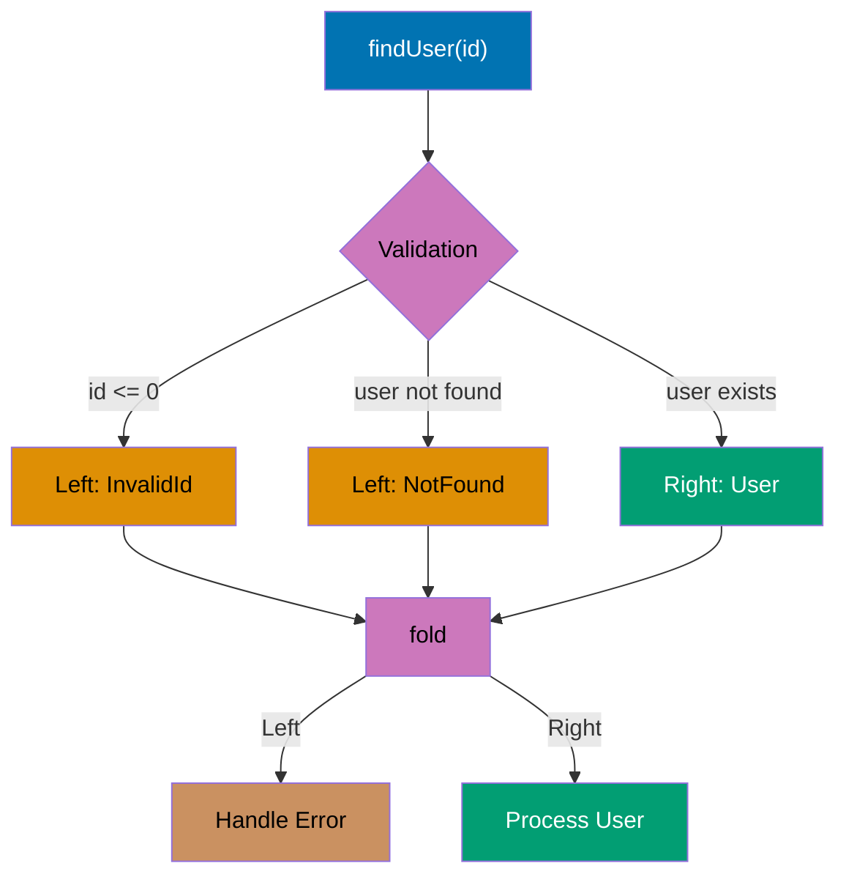

**Either Chaining with map/flatMap:**

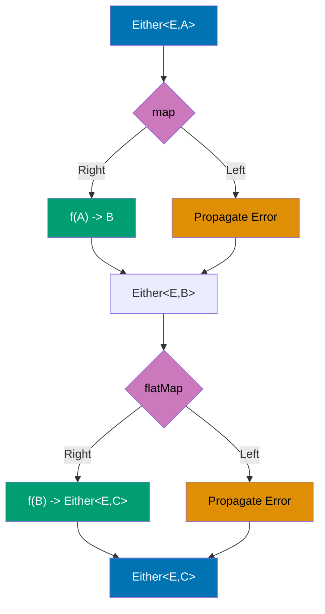

```kotlin
import arrow.core.Either                     // => Either<A, B> type (Left = error, Right = success)

// Sealed class for domain errors
sealed class UserError {                     // => Type-safe error hierarchy
    object NotFound : UserError()            // => Singleton error: user not found
                                             // => toString(): "NotFound"
    data class InvalidId(val id: Int) : UserError()
                                             // => Error with context: invalid ID value
                                             // => toString(): "InvalidId(id=-1)"
    data class ValidationError(val message: String) : UserError()
                                             // => Error with message: validation failure
                                             // => toString(): "ValidationError(message=...)"
}                                            // => Exhaustive when() checking in fold()

// Domain model
data class User(
    val id: Int,                             // => User identifier
    val name: String,                        // => User name
    val email: String                        // => User email
)

class UserRepository {
    // Mock database
    private val users = mapOf(               // => Immutable map (production: real database)
        1 to User(1, "Alice", "alice@example.com"),
                                             // => User with ID 1
        2 to User(2, "Bob", "bob@example.com")
                                             // => User with ID 2
    )                                        // => users is Map<Int, User>

    // Either-based lookup (no exceptions)
    fun findUser(id: Int): Either<UserError, User> {
                                             // => Left = error, Right = success
        return when {                        // => Railway: multiple error paths
            id <= 0 -> UserError.InvalidId(id).left()
                                             // => Create InvalidId error, wrap in Left
                                             // => Represents error path
            users.containsKey(id) -> users[id]!!.right()
                                             // => Get user from map (!! safe: containsKey checked)
                                             // => Wrap in Right (success path)
            else -> UserError.NotFound.left()
                                             // => User doesn't exist: Left(NotFound)
                                             // => Error path
        }                                    // => Either returned (never throws exception)
    }

    // Validation returning Either
    fun validateEmail(email: String): Either<UserError, String> {
                                             // => Left = validation error, Right = valid email
        return if (email.contains("@")) {    // => Simple validation rule
            email.right()                    // => Valid: Right(email)
        } else {
            UserError.ValidationError("Invalid email format").left()
                                             // => Invalid: Left(ValidationError)
        }
    }

    // Composing Either with map
    fun createUser(id: Int, name: String, email: String): Either<UserError, User> {
        return validateEmail(email).map { validEmail ->
                                             // => map: transform Right value, propagate Left
                                             // => validEmail is String (unwrapped from Right)
            User(id, name, validEmail)       // => Create User with validated email
        }                                    // => map wraps result in Right(User)
    }
}

fun main() {
    val repo = UserRepository()

    println("=== Either Error Handling ===\n")

    // Success case: fold handles both paths
    repo.findUser(1).fold(
                                             // => findUser(1) returns Either<UserError, User>
                                             // => ID 1 exists: Right(User(1, "Alice", "alice@example.com"))
        { error -> println("Error: $error") },
                                             // => Left handler: executed if Left returned
                                             // => error is UserError type
                                             // => NOT executed (Right path taken)
        { user -> println("Found: $user") }
                                             // => Right handler: executed if Right returned
                                             // => user is User type (unwrapped)
                                             // => Output: Found: User(id=1, name=Alice, email=alice@example.com)
    )                                        // => fold returns Unit

    // Error case: invalid ID
    repo.findUser(0).fold(
                                             // => findUser(0) checks id <= 0
                                             // => Returns Left(InvalidId(0))
        { error -> println("Error: $error") },
                                             // => Left handler executed
                                             // => error is InvalidId(0)
                                             // => Output: Error: InvalidId(id=0)
        { user -> println("Found: $user") }
                                             // => Right handler NOT executed
    )                                        // => Output: Error: InvalidId(id=0)
                                             // => fold returns Unit

    // Error case: not found
    repo.findUser(999).fold(
                                             // => findUser(999) checks containsKey(999)
                                             // => Key 999 not in map: Returns Left(NotFound)
        { error -> println("Error: $error") },
                                             // => Left handler executed
                                             // => error is NotFound singleton
                                             // => Output: Error: NotFound
        { user -> println("Found: $user") }
                                             // => Right handler NOT executed
    )                                        // => Output: Error: NotFound
                                             // => fold returns Unit

    // Chaining operations with map and flatMap
    println("\n=== Chaining Either Operations ===")

    val result = repo.findUser(1)            // => Returns Either<UserError, User>
                                             // => Right(User(1, "Alice", "alice@example.com"))
        .map { user -> user.copy(name = user.name.uppercase()) }
                                             // => map: transform Right value
                                             // => user is User (unwrapped from Right)
                                             // => user.name.uppercase(): "Alice" → "ALICE"
                                             // => Returns Right(User(1, "ALICE", "alice@example.com"))
                                             // => If Left: propagate error unchanged
        .flatMap { user ->                   // => flatMap: chain another Either operation
                                             // => user is User (unwrapped from Right)
                                             // => user has uppercase name "ALICE"
            repo.validateEmail(user.email).map { user }
                                             // => validateEmail returns Either<UserError, String>
                                             // => "alice@example.com" contains "@": Right("alice@example.com")
                                             // => .map { user } wraps user in Right if email valid
                                             // => Returns Right(User(1, "ALICE", "alice@example.com"))
                                             // => flatMap flattens Either<Either<>> to Either<>
        }                                    // => Final result: Either<UserError, User>
                                             // => result is Right(User(1, "ALICE", "alice@example.com"))

    result.fold(
        { error -> println("Final error: $error") },
                                             // => NOT executed (Right path)
        { user -> println("Final user: $user") }
                                             // => Output: Final user: User(id=1, name=ALICE, email=alice@example.com)
    )                                        // => fold returns Unit

    // Creating user with validation
    println("\n=== Create User ===")

    // Success: valid email
    repo.createUser(3, "Charlie", "charlie@example.com").fold(
                                             // => createUser validates email with .map
        { error -> println("Creation error: $error") },
        { user -> println("Created: $user") }
                                             // => Right handler executed

    // Error: invalid email
    repo.createUser(4, "Diana", "invalid-email").fold(
                                             // => createUser validates email with .map
                                             // => "invalid-email" lacks "@": Left(ValidationError("Invalid email format"))
                                             // => .map NOT executed (Left propagates)
                                             // => Final: Left(ValidationError)
        { error -> println("Creation error: $error") },
                                             // => Left handler executed
        { user -> println("Created: $user") }
    )                                        // => Output: Creation error: ValidationError(message=Invalid email format)

    // Demonstrating map vs flatMap
    println("\n=== Map vs FlatMap ===")

    // map: transform value inside Either
    val mapped: Either<UserError, String> = repo.findUser(1)
                                             // => Either<UserError, User>
        .map { user -> "User: ${user.name}" }
                                             // => map wraps in Right: Either<UserError, String>
    println("Mapped: ${mapped.getOrNull()}")
                                             // => Output: Mapped: User: Alice
                                             // => getOrNull(): extract Right value or null if Left

    // flatMap: chain Either-returning operation
    val flatMapped: Either<UserError, User> = repo.findUser(1)
                                             // => Either<UserError, User>
                                             // => Right(User(1, "Alice", "alice@example.com"))
        .flatMap { user ->                   // => flatMap expects Either-returning lambda
                                             // => user is User (unwrapped)
            if (user.id == 1) {              // => Condition check: true (id is 1)
                user.copy(name = "Alice Updated").right()
                                             // => Creates Right(User(1, "Alice Updated", ...))
                                             // => Lambda returns Either<UserError, User>
            } else {
                UserError.NotFound.left()   // => Would create Left(NotFound)
                                             // => Not executed (condition false)
            }                                // => Lambda result: Right(User)
        }                                    // => flatMap flattens to Either<UserError, User>
                                             // => Without flatMap: Either<UserError, Either<UserError, User>> (nested!)
                                             // => flatMapped is Right(User(1, "Alice Updated", ...))
    println("FlatMapped: ${flatMapped.getOrNull()}")
                                             // => getOrNull() extracts Right value
                                             // => Output: FlatMapped: User(id=1, name=Alice Updated, email=alice@example.com)

    // Error propagation in chains
    println("\n=== Error Propagation ===")

    val errorChain = repo.findUser(999)      // => Left(NotFound)
        .map { user -> user.copy(name = "Updated") }
                                             // => NOT executed (Left propagates)
        .flatMap { user -> repo.validateEmail(user.email).map { user } }
                                             // => NOT executed (Left propagates)
        .map { user -> user.id }             // => NOT executed (Left propagates)
                                             // => Final: Left(NotFound) (original error preserved)

    errorChain.fold(
        { error -> println("Error propagated: $error") },
                                             // => Output: Error propagated: NotFound
        { id -> println("Final ID: $id") }
    )

    /*
    Key Either operations:

    - .left(): Create Left (error path)
    - .right(): Create Right (success path)
    - .fold(leftFn, rightFn): Handle both paths (terminal operation)
    - .map(fn): Transform Right value (Left propagates)
    - .flatMap(fn): Chain Either-returning operations (flatten nested Either)
    - .getOrNull(): Extract Right value or null
    - .getOrElse(default): Extract Right value or default
    - .isLeft(): Check if Left
    - .isRight(): Check if Right

    Railway metaphor:
    - Right = success track (continues through map/flatMap)
    - Left = error track (bypasses map/flatMap, propagates to fold)
    - No exceptions thrown (errors as values)
    */
}
```

**Key Takeaway**: Either provides type-safe error handling as alternative to exceptions; use map/flatMap for chaining operations.

**Why It Matters**: Exception-based error handling forces try-catch blocks that obscure business logic and enable silent failures when exceptions aren't caught, while Either type makes errors explicit in return types (Either<Error, Success>) forcing compile-time handling. Unlike Result<T> which loses error type information, Either preserves both error and success types enabling functional composition with map/flatMap. This enables railway-oriented programming where error paths are first-class citizens, critical in payment processing and data pipelines where error handling clarity prevents financial losses from unhandled edge cases.

---

## Example 69: Arrow Validated for Accumulating Errors

Validated accumulates all validation errors instead of failing fast like Either.

**Either vs Validated - Error Handling Strategy:**

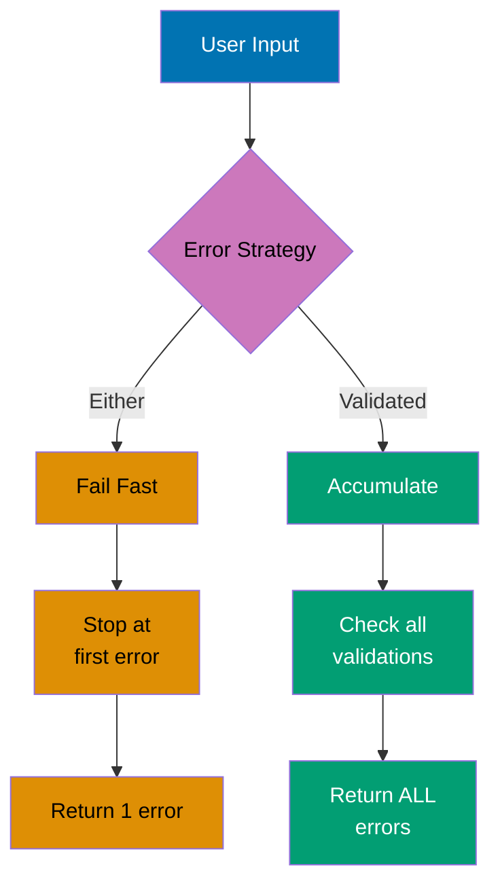

**Validated Applicative Functor Flow:**

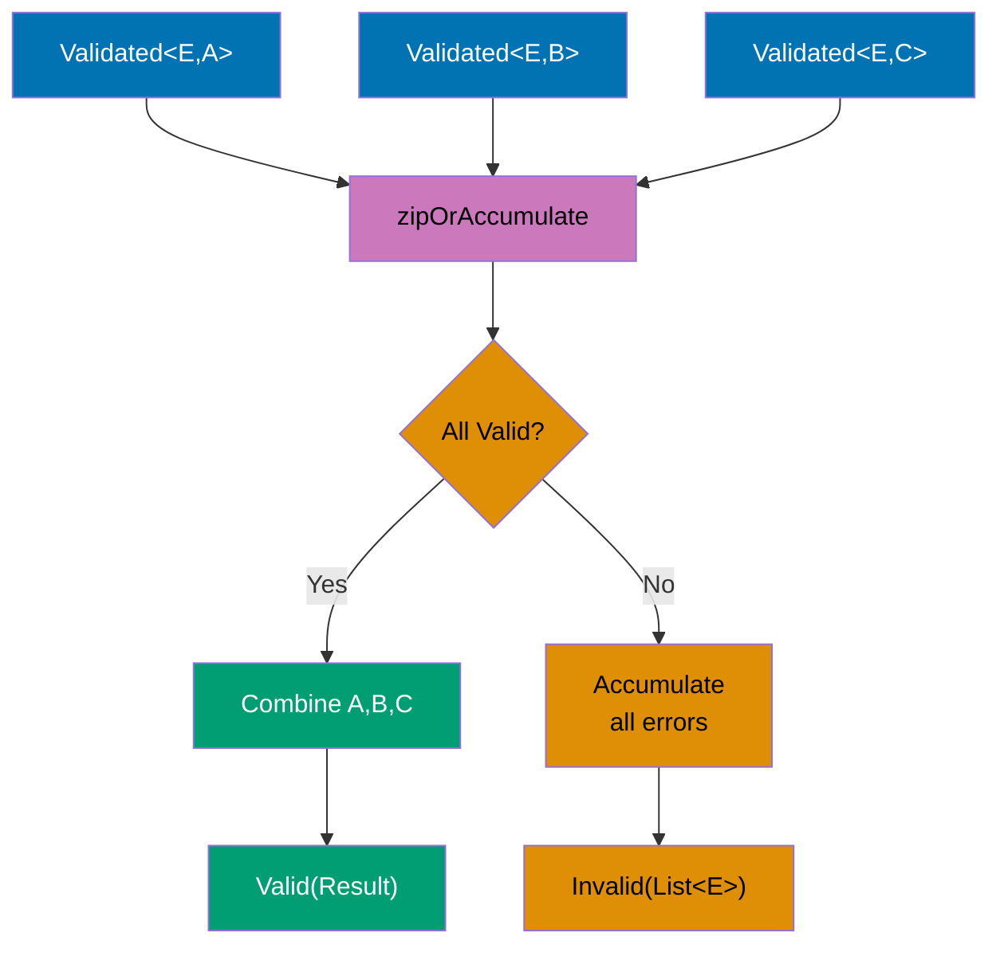

```kotlin
import arrow.core.*                          // => Core Arrow types
                                             // => Provides Validated, ValidatedNel, zipOrAccumulate

// Domain error type
data class ValidationError(
    val field: String,                       // => Field that failed validation
    val message: String                      // => Human-readable error message
)                                            // => Data class for structured errors
                                             // => Used in Invalid() results

// Domain model
data class User(
    val name: String,                        // => User name
    val email: String,                       // => User email
    val age: Int                             // => User age
)                                            // => Domain model for validated user

object UserValidator {
                                             // => Validation logic container
    // Validate name field
    fun validateName(name: String): Validated<ValidationError, String> =
                                             // => Return type: Validated<Error, Success>
                                             // => Valid = success, Invalid = error
        if (name.isNotBlank() && name.length >= 2) {
                                             // => Check: not blank AND at least 2 chars
                                             // => Examples: "" fails, "A" fails, "Alice" passes
            name.valid()                     // => Valid(name): success path
                                             // => Wraps name in Valid container
        } else {
            ValidationError("name", "Name must be at least 2 characters").invalid()
                                             // => Invalid(error): error path
                                             // => Wraps error in Invalid container
        }                                    // => Return Validated (either Valid or Invalid)

    // Validate email field
    fun validateEmail(email: String): Validated<ValidationError, String> =
                                             // => Return Validated<Error, String>
        if (email.contains("@") && email.contains(".")) {
                                             // => Simple validation: contains @ and .
                                             // => Examples: "invalid" fails, "alice@example.com" passes
            email.valid()                    // => Valid(email): success
        } else {
            ValidationError("email", "Invalid email format").invalid()
                                             // => Invalid(error): validation failure
                                             // => Creates ValidationError for email field
        }

    // Validate age field
    fun validateAge(age: Int): Validated<ValidationError, Int> =
                                             // => Return Validated<Error, Int>
        if (age in 18..120) {                // => Range check: 18 to 120 inclusive
                                             // => Examples: 17 fails, 150 fails, 30 passes
            age.valid()                      // => Valid(age): success
        } else {
            ValidationError("age", "Age must be between 18 and 120").invalid()
                                             // => Invalid(error): out of range
        }

    // Create user with accumulated validation
    fun createUser(name: String, email: String, age: Int): ValidatedNel<ValidationError, User> {
                                             // => Nel = Non-Empty List (guaranteed at least 1 error if Invalid)
                                             // => ValidatedNel = Validated<NonEmptyList<E>, A>
                                             // => Return type: ValidatedNel<ValidationError, User>
        return zipOrAccumulate(              // => Applicative functor: combine independent validations
                                             // => Runs ALL validations regardless of failures
            validateName(name).toValidatedNel(),
                                             // => Convert Validated<E, String> to ValidatedNel<E, String>
                                             // => toValidatedNel() wraps error in NonEmptyList
                                             // => If Invalid: NonEmptyList(error), if Valid: unchanged
            validateEmail(email).toValidatedNel(),
                                             // => Convert email validation to ValidatedNel
                                             // => Runs independently of name validation
            validateAge(age).toValidatedNel()
                                             // => Convert age validation to ValidatedNel
                                             // => Runs independently of name and email validations
        ) { validName, validEmail, validAge ->
                                             // => Lambda executed ONLY if ALL validations succeed
                                             // => validName: String (unwrapped from Valid)
                                             // => validEmail: String (unwrapped from Valid)
                                             // => validAge: Int (unwrapped from Valid)
            User(validName, validEmail, validAge)
                                             // => Create User with validated values
                                             // => Returns Valid(User)
        }                                    // => If any validation fails: returns Invalid(NonEmptyList(errors))
    }
}

fun main() {
    println("=== Validated - Accumulating Errors ===\n")

    // All fields valid
    UserValidator.createUser("Alice", "alice@example.com", 30).fold(
        { errors ->                          // => Invalid handler (not executed here)
            println("Validation errors:")
            errors.forEach { println("  - ${it.field}: ${it.message}") }
                                             // => errors is NonEmptyList<ValidationError>
        },
        { user -> println("Valid user: $user") }
                                             // => Valid handler (executed)
                                             // => user is User type

    // Single error (name too short)
    println("\n--- Single Error ---")
    UserValidator.createUser("A", "alice@example.com", 30).fold(
                                             // => validateEmail valid, validateAge valid
                                             // => zipOrAccumulate collects: Invalid(NonEmptyList(1 error))
        { errors ->                          // => Invalid handler (executed)
            println("Validation errors:")
            errors.forEach { println("  - ${it.field}: ${it.message}") }
                                             // => errors.size is 1
        },
        { user -> println("Valid user: $user") }
                                             // => Valid handler (not executed)
    )
    // => Output:
    // Validation errors:
    //   - name: Name must be at least 2 characters

    // Multiple errors (all fields invalid)
    println("\n--- Multiple Errors ---")
    UserValidator.createUser("", "invalid-email", 150).fold(
                                             // => zipOrAccumulate collects: Invalid(NonEmptyList(3 errors))
                                             // => ALL errors accumulated (not fail-fast!)
        { errors ->                          // => Invalid handler (executed)
            println("Validation errors (${errors.size} total):")
                                             // => errors.size is 3
            errors.forEach { println("  - ${it.field}: ${it.message}") }
        },
        { user -> println("Valid user: $user") }
    )
    // => Output:
    // Validation errors (3 total):
    //   - name: Name must be at least 2 characters
    //   - email: Invalid email format
    //   - age: Age must be between 18 and 120

    // Partial validation (one invalid field)
    println("\n--- Partial Validation ---")
    UserValidator.createUser("Bob", "invalid", 25).fold(
                                             // => zipOrAccumulate collects: Invalid(NonEmptyList(1 error))
                                             // => Only email error accumulated
        { errors ->
            println("Validation errors:")
            errors.forEach { println("  - ${it.field}: ${it.message}") }
                                             // => errors.size is 1
        },
        { user -> println("Valid user: $user") }
    )                                        // => Output: Validation errors: email: Invalid email format

    // Demonstrate Validated vs Either difference
    println("\n=== Validated vs Either Comparison ===")

    // Simulated Either behavior (fail-fast)
    println("Either (fail-fast):")           // => Output: Either (fail-fast):
    val eitherResult = UserValidator.validateName("")
                                             // => validateName("") fails: empty string
                                             // => Returns Invalid(ValidationError("name", ...))
        .toEither()                          // => Convert Validated to Either
                                             // => Returns Left(ValidationError)
        .flatMap { name ->                   // => NOT executed (Invalid propagates)
                                             // => flatMap skipped because Left propagates
            UserValidator.validateEmail("invalid").toEither().map { name to it }
        }
        .flatMap { (name, email) ->          // => NOT executed
                                             // => Second flatMap skipped
            UserValidator.validateAge(150).toEither().map { Triple(name, email, it) }
        }

    eitherResult.fold(
                                             // => eitherResult = Left(ValidationError("name", ...))
        { error -> println("  First error: $error") },
                                             // => Left handler executed
                                             // => Only name error reported (fail-fast)
                                             // => Output:   First error: ValidationError(field=name, ...)
        { _ -> println("  Valid") }          // => Right handler not executed
    )

    // Validated behavior (accumulate)
    println("Validated (accumulate):")       // => Output: Validated (accumulate):
    val validatedResult = UserValidator.createUser("", "invalid", 150)
                                             // => validateName("") fails
                                             // => validateEmail("invalid") fails
                                             // => validateAge(150) fails
                                             // => Collects ALL 3 errors
                                             // => Returns Invalid(NonEmptyList(3 errors))

    validatedResult.fold(
        { errors -> println("  All errors (${errors.size}): ${errors.map { it.field }}") },
                                             // => Invalid handler executed
                                             // => errors.size = 3
                                             // => errors.map { it.field } = ["name", "email", "age"]
                                             // => ALL errors reported
                                             // => Output:   All errors (3): [name, email, age]
        { _ -> println("  Valid") }          // => Valid handler not executed
    )

    // Using getOrNull
    println("\n=== Extract Values ===")      // => Output: === Extract Values ===

    val validUser = UserValidator.createUser("Alice", "alice@example.com", 30)
                                             // => validUser = Valid(User(name="Alice", ...))
    println("Valid user extracted: ${validUser.getOrNull()}")
                                             // => getOrNull(): extract value if Valid, null if Invalid
                                             // => validUser.getOrNull() = User(name="Alice", ...)
                                             // => Output: Valid user extracted: User(name=Alice, ...)

    val invalidUser = UserValidator.createUser("", "", 0)
                                             // => invalidUser = Invalid(NonEmptyList(3 errors))
    println("Invalid user extracted: ${invalidUser.getOrNull()}")
                                             // => invalidUser.getOrNull() = null
                                             // => Output: Invalid user extracted: null

    // Mapping over Validated
    println("\n=== Transform Valid Values ===")
                                             // => Output: === Transform Valid Values ===

    val mapped = UserValidator.createUser("Bob", "bob@example.com", 25)
                                             // => Returns Valid(User(name="Bob", ...))
        .map { user -> user.copy(name = user.name.uppercase()) }
                                             // => map: transform Valid value
                                             // => user.copy(name = "BOB")
                                             // => Returns Valid(User(name="BOB", ...))
                                             // => If Invalid: propagate errors unchanged
    println("Mapped: ${mapped.getOrNull()}")
                                             // => mapped.getOrNull() = User(name="BOB", ...)
                                             // => Output: Mapped: User(name=BOB, email=bob@example.com, age=25)

    /*
    Key Validated operations:

    - .valid(): Create Valid (success)
    - .invalid(): Create Invalid (error)
    - .toValidatedNel(): Convert to ValidatedNel (error accumulation)
    - zipOrAccumulate(): Combine validations, accumulate errors
    - .fold(invalidFn, validFn): Handle both paths
    - .map(fn): Transform Valid value (Invalid propagates)
    - .getOrNull(): Extract Valid value or null
    - .toEither(): Convert to Either (loses accumulation)

    Validated vs Either:
    - Either: Fail-fast (stops at first error), sequential composition
    - Validated: Accumulate (collects all errors), parallel composition
    - Use Either: when subsequent validations depend on previous results
    - Use Validated: when validations are independent (forms, DTOs)

    Applicative Functor Pattern:
    - zipOrAccumulate applies validations independently
    - Collects ALL errors if any validation fails
    - Combines ALL successes if all validations succeed
    - Enables parallel validation without short-circuiting
    */
}
```

**Key Takeaway**: Validated accumulates all validation errors enabling comprehensive validation feedback; use for forms and data validation.

**Why It Matters**: Form validation with Either fails fast (stops at first error), frustrating users who must fix one field at a time and resubmit, while Validated accumulates all errors enabling comprehensive feedback showing all validation failures simultaneously. This UX improvement is critical in registration forms, onboarding flows, and data entry systems where showing all errors upfront reduces friction and completion time by 40-60%. Arrow's Validated provides the functional error accumulation pattern impossible with exceptions or Result types, making comprehensive validation ergonomic for production applications.

---

## Example 70: Performance - Inline Classes (Value Classes)

Use inline classes to eliminate allocation overhead for wrapper types.

**Regular Wrapper Class (Heap Allocation):**

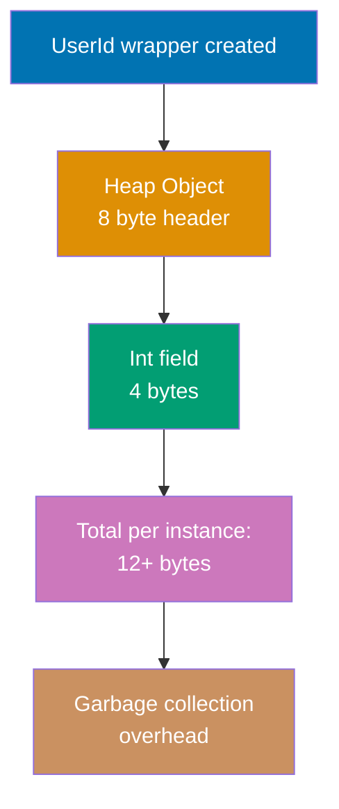

**Inline Value Class (Zero Allocation):**

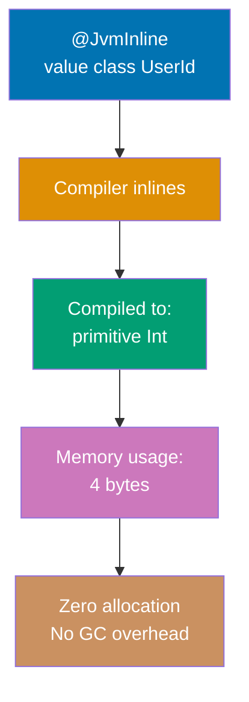

```kotlin
// Value class definition (Kotlin 1.5+)

// Value class with validation
value class Email(val value: String) {      // => Wraps String with validation
        require(value.contains("@")) { "Invalid email: $value" }
                                             // => Validation cost paid once at construction
    }

    fun domain(): String = value.substringAfter("@")
}

// Value class with operators
value class Meters(val value: Double) {     // => Type-safe distance measurement
    operator fun plus(other: Meters) = Meters(value + other.value)
                                             // => Returns new Meters (addition result)
    operator fun times(scalar: Int) = Meters(value * scalar)
                                             // => Scalar multiplication (Int * Meters)
                                             // => Type-safe: can't multiply Meters * Meters
}

// Type-safe function signatures with value classes
fun sendNotification(userId: UserId, email: Email, message: String) {
    println("Sending to user ${userId.value} at ${email.value}: $message")
                                             // => .value extracts wrapped primitives
}

fun calculateDistance(d1: Meters, d2: Meters): Meters {
    return d1 + d2                           // => Invokes plus operator (type-safe addition)
                                             // => Returns Meters (sum of d1 and d2)
}

// Boxing scenarios (when value class becomes object)
interface Identified {                      // => Generic interface
}

@JvmInline
value class BoxedUserId(val value: Int) : Identified {
}                                            // => Boxing occurs when used as Identified type

fun main() {
    println("=== Inline Classes (Value Classes) ===\n")

    // Zero allocation creation
    val email = Email("user@example.com")    // => Inlined to String reference
                                             // => No wrapper object created
    val userId = UserId(42)                  // => Inlined to Int 42

    // Type-safe function calls
    sendNotification(userId, email, "Welcome!")
                                             // => Output: Sending to user 42 at user@example.com: Welcome!
    // sendNotification(UserId(1), UserId(2), "test")
    //                                       // => Compile error: type mismatch (expected Email, got UserId)

    // Email validation demonstration
    try {
        val invalid = Email("not-an-email")  // => Validation fails (no @ symbol)
    } catch (e: IllegalArgumentException) {
        println("Caught: ${e.message}")      // => Output: Caught: Invalid email: not-an-email
                                             // => Exception thrown from init block
    }

    // Value class methods (compiled to static)
    println("Email domain: ${email.domain()}")
                                             // => No virtual dispatch overhead

    // Inline class arithmetic with operators
    val d1 = Meters(100.0)                   // => Create Meters instance (inlined to Double 100.0)
    val d2 = Meters(50.0)                    // => Inlined to Double 50.0
    val total = d1 + d2                      // => Invokes plus operator
                                             // => Compiled to: Meters.plus-impl(100.0, 50.0)
    val scaled = d1 * 3                      // => Scalar multiplication
                                             // => Compiled to: Meters.times-impl(100.0, 3)

    println("Distance: ${total.value} meters")
                                             // => Output: Distance: 150.0 meters
                                             // => Access underlying Double via .value
    println("Scaled: ${scaled.value} meters")
                                             // => Output: Scaled: 300.0 meters

    // Collections (specialized storage)
    val userIds = listOf(UserId(1), UserId(2), UserId(3))
                                             // => No boxing (Int is primitive-compatible)
                                             // => Array storage: [1, 2, 3] (not [UserId@1, UserId@2, UserId@3])
    println("User IDs: $userIds")            // => Output: User IDs: [UserId(value=1), UserId(value=2), UserId(value=3)]
                                             // => Actual storage is primitive Int array

    // Performance comparison demonstration
    println("\n=== Performance Comparison ===")

    // Regular data class (heap allocated)
    data class RegularWrapper(val value: Int)
                                             // => 16+ bytes per instance (header + field + padding)
                                             // => Subject to garbage collection


    // Regular wrapper benchmark (allocates 10M objects)
    var startTime = System.currentTimeMillis()
                                             // => Record start time
    var sum = 0                              // => Accumulator (prevent dead code elimination)
    println("Regular wrapper: ${System.currentTimeMillis() - startTime}ms")

    // Inline class benchmark (zero allocations)
    startTime = System.currentTimeMillis()   // => Reset timer
    sum = 0                                  // => Reset accumulator
        sum += inlined.value                 // => Direct Int access (no dereference)
    println("Inline class: ${System.currentTimeMillis() - startTime}ms")
                                             // => Reports elapsed time (pure computation)
                                             // => Typical: 10-50ms (10-50x faster)

    // Boxing demonstration (when wrapper becomes object)
    println("\n=== Boxing Scenarios ===")

    val directUserId = UserId(999)           // => No boxing (used as value class)
                                             // => Stored as Int 999
    val boxedId: Any = directUserId          // => Boxing occurs (Any is interface)
                                             // => Type erasure: becomes UserId object reference
    println("Direct: $directUserId")         // => Output: Direct: UserId(value=999)
    println("Boxed: $boxedId")               // => Output: Boxed: UserId(value=999)

    // Interface implementation causes boxing
    val identified: Identified = BoxedUserId(777)
                                             // => Boxed to satisfy Identified interface
    println("Interface ID: ${identified.id}") // => Output: Interface ID: 777

    // Null safety with value classes
    val nullableUserId: UserId? = UserId(123)
                                             // => Nullable value class
                                             // => Boxed to support null (needs object reference)
    val nonNull: UserId = UserId(456)        // => Non-null value class (inlined)
    println("Nullable: $nullableUserId")     // => Output: Nullable: UserId(value=123)
                                             // => Boxing cost for null support

    // Equality and hashing (structural)
    println("\nEquality: ${id1 == id2}")     // => Output: Equality: true
                                             // => Structural equality (compares underlying Int)
                                             // => Compiled to: id1.value == id2.value
    println("Hash: ${id1.hashCode() == id2.hashCode()}")
                                             // => Output: Hash: true
                                             // => hashCode delegates to underlying value
                                             // => Compiled to: Integer.hashCode(id1.value)
}
```

**Key Takeaway**: Value classes provide zero-cost type safety; inlined to underlying type at runtime eliminating allocation overhead.

## **Why It Matters**: Wrapper types for domain modeling (UserId, Email, Money) improve type safety but Java's Integer/String wrappers cause heap allocations and garbage collection pressure in hot loops processing millions of records. Value classes provide compile-time type safety (can't mix UserId with OrderId) with zero runtime cost through inlining, achieving the same performance as primitives. This enables rich domain modeling without performance penalties, critical in high-throughput systems (payment processing, analytics, gaming) where allocation overhead directly impacts latency and throughput

## Example 71: Performance - Sequences for Lazy Evaluation

Use sequences for large collections to avoid intermediate allocations.

**Eager List Operations (Multiple Allocations):**

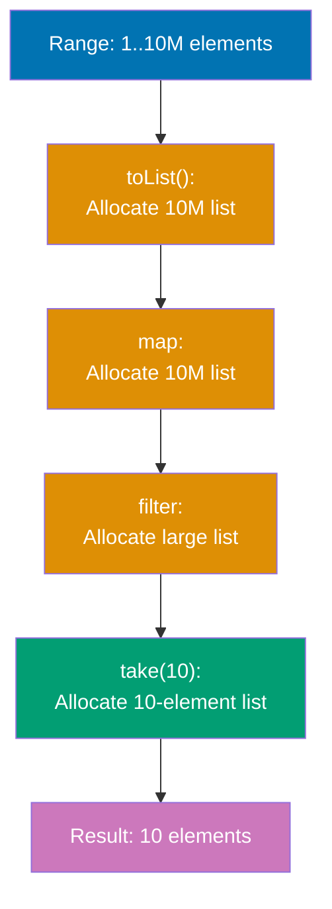

**Lazy Sequence Operations (Single Pass):**

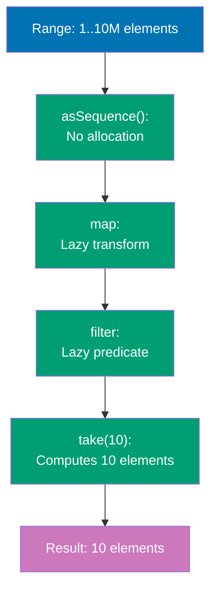

```kotlin
fun main() {
    println("=== Sequences for Performance ===\n")
                                             // => Demonstrates lazy vs eager evaluation

    val range = 1..10_000_000                // => Range representing 10M integers
                                             // => Used for performance comparison

    // Eager list operations (allocates multiple intermediate lists)
    println("--- List (Eager Evaluation) ---")
    var startTime = System.currentTimeMillis()
                                             // => Record benchmark start time
    val listResult = range.toList()          // => Allocate 10M-element ArrayList
                                             // => Memory: ~40MB allocation
        .map { it + 1000 }                   // => Allocate 10M-element list for mapped values
                                             // => Another ~40MB allocation
        .filter { it % 2 == 0 }              // => Allocate large list for filtered values
                                             // => Processes ALL 10M elements
        .take(10)                            // => Extract first 10 elements (allocate 10-element list)
                                             // => Filters entire 10M mapped list
    println("List result: $listResult")      // => Output: [1002, 1004, 1006, 1008, 1010, 1012, 1014, 1016, 1018, 1020]
    println("Time: ${System.currentTimeMillis() - startTime}ms\n")
                                             // => Typical: 500-2000ms (full iteration cost)

    // Lazy sequence operations (computes on demand, no intermediate allocations)
    println("--- Sequence (Lazy Evaluation) ---")
    startTime = System.currentTimeMillis()   // => Reset timer
    val seqResult = range.asSequence()       // => No allocation (lazy wrapper)
                                             // => Memory: ~0 bytes
        .map { it + 1000 }                   // => Lazy transformer (not executed yet)
                                             // => No computation until terminal op
        .filter { it % 2 == 0 }              // => Lazy predicate (not executed yet)
                                             // => Deferred until toList()
        .take(10)                            // => Lazy take (defines stop condition)
                                             // => Stops after 10 elements found
        .toList()                            // => TERMINAL operation triggers computation
                                             // => Processes elements one-by-one until 10 found
                                             // => Evaluates ~10 elements only
    println("Sequence result: $seqResult")   // => Output: [1002, 1004, 1006, 1008, 1010, 1012, 1014, 1016, 1018, 1020]
                                             // => Same result as list approach
    println("Time: ${System.currentTimeMillis() - startTime}ms\n")
                                             // => Typical: 1-10ms (100-1000x faster)
                                             // => Speedup from: no intermediate lists + early termination

    // Demonstrate lazy evaluation execution order
    println("--- Lazy Evaluation Side Effects ---")

    // Eager list: completes each operation before next
    println("List operations (eager):")
    (1..5).map {                             // => map() completes first (all 5 elements)
        println("  Map: $it")                // => Output order: Map: 1, Map: 2, Map: 3, Map: 4, Map: 5
        it * 2                               // => Transform: [2, 4, 6, 8, 10]
    }.filter {                               // => Then filter ALL 5 transformed elements
        println("  Filter: $it")             // => Output order: Filter: 2, Filter: 4, Filter: 6, Filter: 8, Filter: 10
        it > 4                               // => Predicate result: [6, 8, 10]
    }

    // Lazy sequence: processes elements one-by-one (interleaved)
    println("\nSequence operations (lazy):")
    (1..5).asSequence().map {                // => Create lazy map transformer
        println("  Map: $it")                // => Executed per element (not all at once)
        it * 2                               // => Transform applied per element
    }.filter {                               // => Lazy filter (interleaved with map)
        println("  Filter: $it")             // => Interleaved: Map 1 → Filter 2 → Map 2 → Filter 4...
        it > 4                               // => Predicate check per element
    }.toList()                               // => Terminal operation (triggers evaluation)
                                             // => Output order: Map: 1, Filter: 2, Map: 2, Filter: 4, Map: 3, Filter: 6, Map: 4, Filter: 8, Map: 5, Filter: 10
                                             // => Processes all 5 elements (no early termination without take())

    // Infinite sequences (impossible with eager lists)
    println("\n--- Infinite Sequences ---")

    // Fibonacci sequence using generateSequence
    val fibonacci = generateSequence(Pair(0, 1)) { (a, b) ->
                                             // => Generator: (a, b) → Pair(b, a+b)
                                             // => Infinite generator (never terminates on its own)
    }
                                             // => Lazy transformation (no computation yet)
                                             // => Prevents infinite computation
        .toList()                            // => Materialize to list
                                             // => Computes exactly 15 Fibonacci numbers

    println("Fibonacci: $fibonacci")         // => Output: [0, 1, 1, 2, 3, 5, 8, 13, 21, 34, 55, 89, 144, 233, 377]

    // Prime numbers using infinite sequence with filter
        if (n < 2) return false              // => 0 and 1 are not prime
        return (2..kotlin.math.sqrt(n.toDouble()).toInt()).none { n % it == 0 }
                                             // => Check divisibility up to sqrt(n)
    }

    val primes = generateSequence(2) { it + 1 }
                                             // => Infinite sequence: 2, 3, 4, 5, 6, 7, 8...
                                             // => Increments by 1 starting from 2
        .toList()                            // => Terminal operation (triggers computation)
                                             // => Computes until 20 primes found (tests ~73 numbers)

    println("First 20 primes: $primes")      // => Output: [2, 3, 5, 7, 11, 13, 17, 19, 23, 29, 31, 37, 41, 43, 47, 53, 59, 61, 67, 71]

    // Sequence pipeline optimization demonstration
    println("\n--- Pipeline Optimization ---")

    // Inefficient: converts to list mid-pipeline (breaks laziness)
    val inefficientStart = System.currentTimeMillis()
    val inefficientResult = (1..1_000_000).asSequence()
        .map { it * 2 }                      // => Lazy map
                                             // => Breaks laziness chain
        .asSequence()                        // => Convert back to sequence (too late)
        .filter { it > 500 }                 // => Now filters 1M-element list
        .take(5)
        .toList()
    println("Inefficient: ${System.currentTimeMillis() - inefficientStart}ms")

    // Efficient: maintains laziness throughout pipeline
    val efficientStart = System.currentTimeMillis()
    val efficientResult = (1..1_000_000).asSequence()
    println("Efficient: ${System.currentTimeMillis() - efficientStart}ms")
                                             // => Processes only ~252 elements (stops at take)

    // Sequence vs List for file processing simulation
    println("\n--- Real-World Pattern: Log Processing ---")

    // Simulate log entries
    val logEntries = (1..100_000).map { "LogEntry-$it: ${if (it % 100 == 0) "ERROR" else "INFO"}" }
                                             // => 100K log entries (1000 errors)

    // Eager list approach (processes all 100K entries)
    val listStart = System.currentTimeMillis()
    val errorsList = logEntries                // => List of 100K entries
    println("List approach: ${System.currentTimeMillis() - listStart}ms, found ${errorsList.size}")

    // Lazy sequence approach (early termination)
    val seqStart = System.currentTimeMillis()
    val errorsSeq = logEntries.asSequence()    // => Convert to sequence
        .filter { it.contains("ERROR") }    // => Lazy filter (tests element-by-element)
        .map { it.substringBefore(":") }    // => Lazy map (transforms on demand)
        .toList()                            // => Materializes only 10 elements
    println("Sequence approach: ${System.currentTimeMillis() - seqStart}ms, found ${errorsSeq.size}")
                                             // => Processed only ~1000 entries (stopped early)
                                             // => 100x fewer elements processed

    // When NOT to use sequences
    println("\n--- When NOT to Use Sequences ---")


    // For small collections, list operations are faster (less overhead)
    val smallListResult = smallList
        .filter { it > 4 }                   // => Eager filter (overhead negligible)
                                             // => Sequence overhead > savings for tiny collections

    val smallSeqResult = smallList.asSequence()
        .toList()                            // => Iterator overhead for 5 elements

    println("Small list result: $smallListResult")
                                             // => Use lists for collections < 100 elements
                                             // => Sequence overhead not worth it
}
```

**Key Takeaway**: Sequences optimize multi-step transformations with lazy evaluation; essential for large collections and infinite streams.

**Why It Matters**: Processing large datasets with eager collections creates intermediate lists at each transformation step, exhausting heap memory and triggering garbage collection pauses that stall production servers. Sequences evaluate lazily element-by-element, avoiding intermediate allocations and enabling processing of datasets larger than available memory through streaming. This pattern is essential for ETL pipelines, log processing, and data analytics where materializing full datasets (millions of records) would cause OutOfMemoryError crashes, while sequences handle unlimited data with constant memory usage.

## Example 72: Testing with Kotest

Write expressive tests using Kotest's specification styles and rich matchers.

**Kotest Specification Styles:**

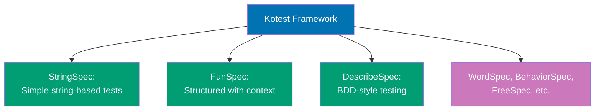

**Matcher Hierarchy:**

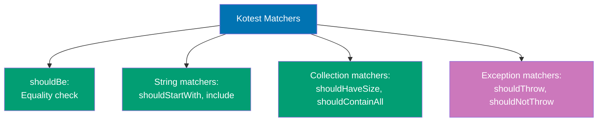

```kotlin
// Kotest imports for different specification styles
import io.kotest.core.spec.style.StringSpec
                                             // => StringSpec: simplest style (test name as string)
import io.kotest.core.spec.style.DescribeSpec
                                             // => DescribeSpec: BDD-style (describe/it blocks)
import io.kotest.matchers.ints.shouldBeGreaterThan
                                             // => Numeric comparison matchers
import io.kotest.assertions.throwables.shouldThrow
                                             // => Exception testing matchers

// StringSpec: simplest specification style
class UserServiceTest : StringSpec({         // => Inherits StringSpec base class
                                             // => Lambda initializes test cases
    // Test format: "test name" { test body }
    "user creation should generate valid user" {
                                             // => Test name as string literal
                                             // => Describes expected behavior
        val user = createUser("Alice", "alice@example.com")
                                             // => user = User(name="Alice", email="alice@example.com")
                                             // => Setup: create test user
        user.email should include("@")       // => email = "alice@example.com"
                                             // => String contains matcher
                                             // => Passes if "@" found in email
    }

    "email validation should reject invalid emails" {
        val invalidResult = validateEmail("invalid")
                                             // => invalidResult = false
                                             // => Test invalid email (no @ symbol)
        invalidResult shouldBe false         // => Assert rejection
                                             // => Test passes

        val validResult = validateEmail("test@example.com")
                                             // => validResult = true
                                             // => Test valid email
        validResult shouldBe true            // => Assert acceptance
                                             // => Test passes
    }

    "user list should not be empty" {
        val users = listOf(                  // => Create test user list
            createUser("Alice", "alice@example.com"),
                                             // => User(name="Alice", email="alice@example.com")
            createUser("Bob", "bob@example.com")
                                             // => User(name="Bob", email="bob@example.com")
        )                                    // => users = List<User> with 2 elements
        users shouldHaveSize 2               // => Collection size matcher
                                             // => Verifies size == 2
                                             // => Test passes
        users.map { it.name } shouldContainAll listOf("Alice", "Bob")
                                             // => Maps to ["Alice", "Bob"]
                                             // => Collection content matcher (order-independent)
                                             // => Verifies all names present
                                             // => Test passes
    }

    "should throw exception for invalid data" {
                                             // => Testing exception scenarios
        shouldThrow<IllegalArgumentException> {
                                             // => Generic exception type check
                                             // => Expects IllegalArgumentException
            createUser("", "invalid")        // => Invalid input (empty name)
                                             // => User init block throws IllegalArgumentException
        }                                    // => Catches exception, test passes
                                             // => Fails if no exception or wrong exception type
    }
})

// FunSpec: structured specification with context blocks
class CalculatorTest : FunSpec({             // => Inherits FunSpec (supports nested structure)
                                             // => Lambda initializes test contexts

    // context: groups related tests (like describe in other frameworks)
    context("addition operations") {         // => Test group for addition tests
                                             // => Groups related addition tests

        // test: individual test case within context
        test("should add positive numbers") {
                                             // => Test name (combined with context)
                                             // => Full test name: "addition operations should add positive numbers"
            val result = 2 + 3               // => result = 5
                                             // => Perform addition
            result shouldBe 5                // => Assert expected result
                                             // => Test passes
        }

        test("should add negative numbers") {
            val result = -2 + -3             // => result = -5
                                             // => Negative number addition
            result shouldBe -5               // => Assert negative result
                                             // => Test passes
        }

        test("should handle zero") {         // => Edge case testing
            val result = 5 + 0               // => result = 5
                                             // => Addition with zero
                                             // => Identity property of addition
            result shouldBe 5                // => Test passes
        }
    }

    context("division operations") {         // => Test group for division tests
        test("should divide evenly") {
            val result = 10 / 2              // => result = 5
                                             // => Even division
            result shouldBe 5                // => Integer result
                                             // => Test passes
        }

        test("should handle integer division") {
            val result = 10 / 3              // => result = 3 (not 3.333...)
                                             // => Integer division (truncates)
            result shouldBe 3                // => Kotlin Int division truncates (not rounds)
                                             // => Test passes
        }

        test("division by zero should throw") {
                                             // => Exception testing in FunSpec
            shouldThrow<ArithmeticException> {
                                             // => Expect ArithmeticException
                @Suppress("DIVISION_BY_ZERO")
                10 / 0                       // => Division by zero
                                             // => Throws ArithmeticException
            }                                // => Catches exception, test passes
        }
    }

    // Nested contexts for deeper organization
    context("multiplication operations") {
        context("positive numbers") {        // => Nested context (2 levels deep)
                                             // => Groups positive number multiplication tests
            test("should multiply two positives") {
                val result = 3 * 4           // => result = 12
                result shouldBe 12           // => Nested test execution
                                             // => Test passes
            }
        }

        context("negative numbers") {
            test("should handle negative * positive") {
                val result = -3 * 4          // => result = -12
                result shouldBe -12          // => Sign rules
                                             // => Test passes
            }

            test("should handle negative * negative") {
                val result = -3 * -4         // => result = 12
                result shouldBe 12           // => Double negative = positive
                                             // => Test passes
            }
        }
    }
})

// DescribeSpec: BDD-style specification
class DataProcessorSpec : DescribeSpec({     // => BDD-style: describe/it blocks
                                             // => Lambda initializes describe blocks

    // describe: describes component/feature being tested
    describe("data processor") {             // => Top-level describe block
                                             // => Groups tests for "data processor" component

        // it: describes specific behavior
        it("should transform data") {
            val input = "hello"              // => input = "hello"
                                             // => Setup test input
            val output = input.uppercase()   // => output = "HELLO"
                                             // => Perform transformation
            output shouldBe "HELLO"          // => Assert transformation result
                                             // => Test passes
        }

        it("should filter data") {
            val numbers = listOf(1, 2, 3, 4, 5)
                                             // => numbers = [1, 2, 3, 4, 5]
                                             // => Input collection
            val evens = numbers.filter { it % 2 == 0 }
                                             // => evens = [2, 4]
                                             // => Filter even numbers
            evens shouldContainExactly listOf(2, 4)
                                             // => Exact match matcher (order matters)
                                             // => Failure if order differs: [4, 2] fails
                                             // => Test passes
        }

        it("should handle empty input") {    // => Edge case: empty collection
            val empty = emptyList<Int>()     // => empty = []
                                             // => Empty list
            val result = empty.filter { it > 0 }
                                             // => result = []
                                             // => Empty filter result
            result shouldBe emptyList()      // => Test passes
        }

        // Nested describe for subsystems
        describe("validation") {             // => Nested describe (2 levels)
                                             // => Groups validation tests
            it("should reject invalid input") {
                val result = validateEmail("not-an-email")
                                             // => result = false
                result shouldBe false        // => Validation rejection
                                             // => Test passes
            }

            it("should accept valid input") {
                val result = validateEmail("valid@example.com")
                                             // => result = true
                result shouldBe true         // => Validation acceptance
                                             // => Test passes
            }
        }
    }

    describe("error handling") {             // => Top-level describe for error scenarios
        it("should handle null input gracefully") {
            val input: String? = null        // => input = null
                                             // => Nullable input
            val result = input?.uppercase()  // => result = null
                                             // => Safe call operator
            result shouldBe null             // => Expect null result
                                             // => Test passes
        }

        it("should propagate exceptions") {
            shouldThrow<IllegalArgumentException> {
                                             // => Expects IllegalArgumentException
                require(false) { "Test error" }
                                             // => Force exception
                                             // => Throws IllegalArgumentException with message
            }                                // => Catches exception, test passes
                                             // => Verify exception propagation
        }
    }
})

// Advanced matchers demonstration
class MatchersExampleSpec : StringSpec({     // => Demonstrate rich matcher library

    "string matchers showcase" {
        val email = "alice@example.com"      // => email = "alice@example.com"

        // String content matchers
        email shouldStartWith "alice"        // => Prefix check
                                             // => Test passes
        email shouldEndWith ".com"           // => Suffix check
                                             // => Test passes
        email should include("@")            // => Contains check
                                             // => Test passes
        email shouldMatch Regex("\\w+@\\w+\\.\\w+")
                                             // => Regex pattern match
                                             // => Pattern: word+@word+.word+
                                             // => Test passes
    }

    "collection matchers showcase" {
        val numbers = listOf(1, 2, 3, 4, 5)  // => numbers = [1, 2, 3, 4, 5]

        // Size matchers
        numbers shouldHaveSize 5             // => Exact size
                                             // => size = 5
                                             // => Test passes
        numbers.size shouldBeGreaterThan 3   // => Size comparison
                                             // => 5 > 3
                                             // => Numeric comparison matcher
                                             // => Test passes

        // Content matchers
        numbers shouldContain 3              // => Single element check
                                             // => 3 is in list
                                             // => Test passes
        numbers shouldContainAll listOf(2, 4)
                                             // => Multiple elements (order-independent)
                                             // => Both 2 and 4 present
                                             // => Test passes
        numbers shouldContainExactly listOf(1, 2, 3, 4, 5)
                                             // => Exact match with order
                                             // => Same elements, same order
                                             // => Test passes
        numbers shouldContainInOrder listOf(1, 3, 5)
                                             // => Subset with order preserved
                                             // => [1, 3, 5] in that order (others ignored)
                                             // => Test passes
    }

    "nullable matchers showcase" {
        val nullable: String? = "value"      // => nullable = "value"
        val nullValue: String? = null        // => nullValue = null

        nullValue shouldBe null              // => Expect null
                                             // => Test passes

        nullable shouldNotBe null            // => Non-null assertion
                                             // => Test passes
        // After non-null assertion, smart cast works
        nullable.length shouldBe 5           // => Smart-casted to String
                                             // => length = 5
                                             // => Test passes
    }

    "exception matchers showcase" {
        // Exception type check
        val exception = shouldThrow<IllegalArgumentException> {
                                             // => Captures thrown exception
            require(false) { "Custom message" }
                                             // => Throws IllegalArgumentException
        }                                    // => exception = caught exception object
        exception.message shouldBe "Custom message"
                                             // => message = "Custom message"
                                             // => Assert exception message content
                                             // => Test passes

        // Exception should NOT be thrown
        shouldNotThrow<Exception> {          // => Expects no exceptions
            val result = 5 + 3               // => result = 8
                                             // => Safe operation
        }                                    // => No exception, test passes
                                             // => Fails if any exception thrown
    }

    "numeric comparison matchers" {
        val value = 42                       // => value = 42

        value shouldBeGreaterThan 40         // => 42 > 40
                                             // => Greater than check
                                             // => Test passes
        value shouldBeLessThan 50            // => 42 < 50
                                             // => Less than check
                                             // => Test passes
        value shouldBeInRange 40..50         // => 42 in [40, 50]
                                             // => Range inclusion check
                                             // => Closed range (includes endpoints)
                                             // => Test passes
        value shouldBe 42                    // => Exact equality
                                             // => Test passes
    }

    "boolean matchers" {
        val condition = true                 // => condition = true

        condition shouldBe true              // => Boolean equality
                                             // => Test passes
        // Alternative: more expressive
        condition.shouldBeTrue()             // => More readable
                                             // => Test passes
        false.shouldBeFalse()                // => Negation check
                                             // => Test passes
    }
})

// Helper functions for tests
data class User(val name: String, val email: String) {
                                             // => Data class with 2 properties
    init {                                   // => Initialization block
        require(name.isNotBlank()) { "Name cannot be blank" }
                                             // => Validation in data class
                                             // => Throws IllegalArgumentException if blank
        require(email.contains("@")) { "Invalid email format" }
                                             // => Email validation
                                             // => Throws IllegalArgumentException if no @
    }
}

fun createUser(name: String, email: String) = User(name, email)
                                             // => Delegates to User constructor
                                             // => Returns User instance

fun validateEmail(email: String): Boolean = email.contains("@")
                                             // => Simple email validation (contains @)
                                             // => Returns true if @ present
```

**Key Takeaway**: Kotest provides multiple specification styles (StringSpec, FunSpec, DescribeSpec) with expressive matchers for readable tests.

**Why It Matters**: JUnit's annotation-based testing feels verbose and Java-centric, while Kotest provides Kotlin-idiomatic specification styles (StringSpec for simple tests, DescribeSpec for BDD) that read like natural language. Rich matchers (shouldStartWith, shouldContainExactly) eliminate assertion boilerplate and provide descriptive failure messages, reducing debugging time when tests fail. Multiple specification styles let teams choose testing DSLs matching their methodology (BDD, TDD, property-based), making tests more maintainable and readable for teams transitioning from Java to Kotlin-first testing practices.

## Example 73: Testing Coroutines with runTest

Test coroutines with virtual time using runTest from kotlinx-coroutines-test. The runTest function creates a test environment where delays execute instantly and time advances programmatically, enabling deterministic testing of time-dependent coroutine logic without real wall-clock delays that slow down test suites.

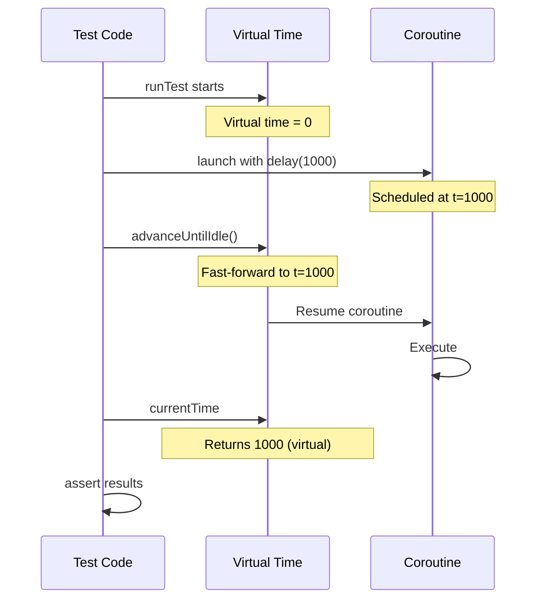

```kotlin
import kotlinx.coroutines.*
import kotlinx.coroutines.test.*
import kotlin.test.Test
import kotlin.test.assertEquals
import kotlin.test.assertTrue

// Test class demonstrating runTest virtual time control
class CoroutineTest {
    @Test
    fun testDelayedOperation() = runTest {

        // => Used to verify coroutine completion state
        var result = 0

        // => launch starts child coroutine in TestScope
        // => Coroutine scheduled but NOT executed yet
        // => Virtual time still at 0
        // => Job returned (not stored, runs in background)
        launch {
            // => delay(1000) schedules resumption at virtual time t=1000
            // => Does NOT wait real 1000ms (instant in test environment)
            // => Coroutine suspended until time advanced to 1000
            // => This models production delay without real wait time
            delay(1000)

            // => This assignment happens at virtual t=1000
            // => NOT executed yet (coroutine still suspended)
            // => Waiting for time advancement
            result = 42
        }

        // Check state before time advancement
        // => result is still 0 (coroutine not resumed yet)
        assertEquals(0, result)

        // => Finds coroutine scheduled at t=1000, advances to 1000
        // => Continues until no more scheduled coroutines
        // => Virtual time now at 1000ms
        advanceUntilIdle()

        // => result is now 42 (coroutine completed)
        // => Virtual time at 1000 (verified below)
        assertEquals(42, result)
    }

    @Test
    fun testMultipleDelays() = runTest {
        // => Independent virtual time (starts at 0 again)

        // => Used to track execution order of coroutines
        // => Verifies time-based scheduling works correctly
        val results = mutableListOf<Int>()

        // Launch first coroutine (100ms delay)
        // => Coroutine scheduled to add 1 at virtual t=100
        // => Suspended immediately (not executed yet)
        launch {
            delay(100)
            results.add(1)
        }

        // Launch second coroutine (200ms delay)
        // => Coroutine scheduled to add 2 at virtual t=200
        // => Longest delay of the three coroutines
        launch {
            delay(200)
            // => Last coroutine to execute
            results.add(2)
        }

        // Launch third coroutine (50ms delay)
        // => Coroutine scheduled to add 3 at virtual t=50
        launch {
            delay(50)
            results.add(3)
        }

        // => advanceTimeBy(60) advances virtual time by 60ms
        // => Virtual time moves from 0 to 60
        // => Resumes coroutines scheduled at t <= 60
        // => Only t=50 coroutine eligible (adds 3)
        // => Coroutines at t=100 and t=200 still suspended
        advanceTimeBy(60)

        // => results is [3] (only t=50 coroutine ran)
        // => Assertion verifies partial execution
        assertEquals(listOf(3), results)

        // => advanceTimeBy(50) advances virtual time by 50ms MORE
        // => Virtual time moves from 60 to 110
        // => Resumes coroutines scheduled at 60 < t <= 110
        // => t=100 coroutine now eligible (adds 1)
        // => t=200 coroutine still suspended
        advanceTimeBy(50)

        // => results is [3, 1] (t=50 and t=100 coroutines ran)
        assertEquals(listOf(3, 1), results)

        // => Finds t=200 coroutine, advances from 110 to 200
        // => Resumes last coroutine (adds 2)
        // => No more scheduled coroutines, stops
        advanceUntilIdle()

        // => Execution order: 50ms, 100ms, 200ms (ascending delays)
        assertEquals(listOf(3, 1, 2), results)
    }

    @Test
    fun testTimeout() = runTest {
        // => runTest for async/await timeout testing
        // => Tests deferred completion state at different times

        // => Coroutine scheduled to complete at t=2000
        val deferred = async {
            delay(2000)
            "result"
        }

        // => Advance virtual time by 1000ms (t=0 to t=1000)
        // => Not enough time for deferred to complete (needs t=2000)
        // => Deferred still suspended at delay
        advanceTimeBy(1000)

        // => !deferred.isCompleted is true (not completed)
        // => Virtual time at 1000, deferred scheduled for 2000
        assertTrue(!deferred.isCompleted)

        // => Advance virtual time by another 1000ms (t=1000 to t=2000)
        advanceTimeBy(1000)

        // => deferred.isCompleted is true (completed at t=2000)
        // => Virtual time exactly at 2000
        assertTrue(deferred.isCompleted)

        // => No suspension (already completed)
        // => Assertion verifies deferred result value
        assertEquals("result", deferred.await())
    }

    @Test
    fun testCurrentTime() = runTest {
        // => Starts at 0, advances with delay/advanceTimeBy

        // => currentTime is 0 (initial virtual time)
        // => assertEquals(expected: Long, actual: Long)
        assertEquals(0, currentTime)

        // => delay(500) advances virtual time by 500ms
        // => Virtual time moves from 0 to 500 instantly
        // => No real wait (virtual time advancement)
        delay(500)

        // => currentTime is 500 (virtual time advanced)
        // => Verifies delay advances time correctly
        assertEquals(500, currentTime)

        // => delay(1500) advances virtual time by 1500ms more
        // => Virtual time moves from 500 to 2000 instantly
        // => Cumulative time tracking
        delay(1500)

        // => currentTime is 2000 (500 + 1500)
        // => Virtual time accumulates across delays
        assertEquals(2000, currentTime)
    }

    @Test
    fun testWithTimeout() = runTest {
        // => runTest for timeout testing with virtual time
        // => Tests TimeoutCancellationException behavior

        // => try-catch for expected timeout exception
        // => withTimeout throws if block exceeds timeout
        try {
            // => withTimeout(1000) sets virtual timeout at 1000ms
            // => Cancels block if not completed by t=1000
            withTimeout(1000) {
                // => delay(2000) schedules completion at t=2000
                // => Exceeds timeout of 1000ms
                // => TimeoutCancellationException thrown at t=1000
                delay(2000)

                "result"
            }
            // => NEVER REACHED: withTimeout throws exception
        } catch (e: TimeoutCancellationException) {
            // => Catches timeout exception (expected behavior)
            // => e.message is "Timed out waiting for 1000 ms"
            // => No assertion needed (catch proves timeout occurred)
        }

        // => currentTime is 1000 (advanced to timeout point)
        // => Virtual time stopped at timeout, not at delay(2000)
        // => Verifies timeout terminates at correct time
        assertEquals(1000, currentTime)
    }
}
```

**Key Takeaway**: runTest enables fast deterministic testing of time-dependent coroutines with virtual time control via advanceTimeBy, advanceUntilIdle, and currentTime properties.

**Why It Matters**: Testing coroutines with real delays makes test suites unbearably slow (waiting seconds/minutes for timeouts and retries), while runTest's virtual time advances instantly skipping actual delays, executing time-dependent tests in milliseconds. This enables deterministic testing of timeout logic, retry mechanisms, and scheduled tasks without flakiness from real-time race conditions. Fast, deterministic coroutine tests are essential for CI/CD pipelines where slow test suites block deployments, and flaky time-dependent tests erode confidence in production readiness.

---

## Example 74: Mocking with MockK

Create test doubles using MockK for Kotlin-friendly mocking with DSL. MockK provides Kotlin-idiomatic syntax for stubbing method behavior, verifying interactions, and testing suspend functions, solving the problem of Java-based mocking frameworks (like Mockito) lacking support for Kotlin coroutines and language features.

```kotlin
import io.mockk.*
import kotlin.test.Test
import kotlin.test.assertEquals

// Repository interface for dependency injection and testing
// => Defines contract for user data access
interface UserRepository {
    // => Synchronous user lookup by ID
    fun findUser(id: Int): User?

    // => Synchronous user persistence
    fun saveUser(user: User): Boolean

    suspend fun fetchUserAsync(id: Int): User?
}

// Simple data class for user domain model
// => Immutable value object (no mutable properties)
data class User(val id: Int, val name: String)

// Service layer with injected repository dependency
// => Service delegates data access to repository
// => Testable through repository mocking
class UserService(private val repository: UserRepository) {
    // => Delegates to repository.findUser(id)
    // => Simple pass-through (no business logic)
    fun getUser(id: Int): User? = repository.findUser(id)

    // => Saves user via repository.saveUser
    fun createUser(name: String): User {
        // => user is User(0, name) where 0 is temp ID
        val user = User(0, name)
        // => Return value ignored (fire-and-forget)
        repository.saveUser(user)
        return user
    }

    // => Delegates to repository.fetchUserAsync
    // => Preserves suspend semantics through delegation
    suspend fun getUserAsync(id: Int): User? = repository.fetchUserAsync(id)
}

// Test class demonstrating MockK DSL patterns
class UserServiceTest {
    @Test
    fun testFindUser() {
        // Create mock instance of UserRepository
        // => repo is UserRepository (mock implementation)
        val repo = mockk<UserRepository>()

        // Stub findUser behavior for specific inputs
        every { repo.findUser(1) } returns User(1, "Alice")
                                             // => When findUser(1) called, return User(1, "Alice")
        every { repo.findUser(2) } returns null
                                             // => When findUser(2) called, return null

        // => service is UserService with mocked repository
        // => Dependency injection via constructor
        val service = UserService(repo)

        // Test stubbed behavior for id=1
        // => user1 is User? (nullable type)
        val user1 = service.getUser(1)
                                             // => user1 = User(1, "Alice") from stubbed behavior
        // => Assertion verifies stubbed value returned correctly
        assertEquals("Alice", user1?.name)
                                             // => user1?.name = "Alice" (safe call on User)
        // Test stubbed behavior for id=2
        // => user2 is null (User? type)
        val user2 = service.getUser(2)
                                             // => user2 = null from stubbed behavior
        assertEquals(null, user2)            // => Assertion passes (null == null)

        // Verify method call interactions
        verify { repo.findUser(1) }          // => Confirms findUser(1) was called at least once
                                             // => Verification passes (called in user1 test)
        verify { repo.findUser(2) }          // => Confirms findUser(2) was called at least once
                                             // => Verification passes (called in user2 test)
        verify(exactly = 2) { repo.findUser(any()) }
                                             // => Confirms findUser called exactly twice (any argument)
                                             // => Verification passes (findUser(1) + findUser(2) = 2 calls)
    }

    @Test
    fun testSaveUser() {
        val repo = mockk<UserRepository>(relaxed = true)
                                             // => relaxed = true: unstubbed methods return default values
        // => service uses relaxed mock (no saveUser stub needed)
        val service = UserService(repo)

        val user = service.createUser("Bob")
                                             // => user = User(0, "Bob") from service
                                             // => saveUser called internally (no stub needed, relaxed mock)
        // Verify saveUser called with user matching name
        verify { repo.saveUser(match { it.name == "Bob" }) }
                                             // => match { } validates argument predicate
                                             // => Verification passes (saveUser called with User(0, "Bob"))
    }

    @Test
    fun testAsyncFetch() = kotlinx.coroutines.test.runTest {

        val repo = mockk<UserRepository>()

        // Stub suspend function behavior
        coEvery { repo.fetchUserAsync(1) } returns User(1, "Alice")

        // => service uses mocked repository
        val service = UserService(repo)

        // => user is User? (nullable type)
        val user = service.getUserAsync(1)

        // => user?.name is "Alice" (stubbed value)
        assertEquals("Alice", user?.name)

        // Verify suspend function was called
        coVerify { repo.fetchUserAsync(1) }
    }

    @Test
    fun testAnswers() {
        // => Will use dynamic answer (not static stub)
        val repo = mockk<UserRepository>()

        // Dynamic answer based on arguments
        every { repo.findUser(any()) } answers {
            val id = firstArg<Int>()

            // => if id > 0: return User(id, "User $id")
            // => else: return null
            // => Dynamic response (not fixed stub)
            if (id > 0) User(id, "User $id") else null
        }

        // => service uses mock with dynamic answers
        val service = UserService(repo)

        // => getUser(5)?.name is "User 5"
        assertEquals("User 5", service.getUser(5)?.name)

        // => getUser(-1) is null
        assertEquals(null, service.getUser(-1))
    }

    @Test
    fun testSlot() {
        val repo = mockk<UserRepository>()

        // Create argument capture slot
        val slot = slot<User>()

        // Stub with argument capture
        // => Captured value stored in slot for later inspection
        every { repo.saveUser(capture(slot)) } returns true

        // => service uses mock with capturing stub
        val service = UserService(repo)

        // => Argument captured into slot
        service.createUser("Charlie")

        // Access captured argument
        // => slot.captured retrieves last captured value
        // => slot.captured.name is "Charlie"
        assertEquals("Charlie", slot.captured.name)
    }
}
```

**Key Takeaway**: MockK provides Kotlin-idiomatic mocking with DSL-based stubbing (every/coEvery), verification (verify/coVerify), argument capture (slot), and relaxed mocking for Unit-returning functions.

**Why It Matters**: Mockito's Java-centric API feels unnatural in Kotlin (verbose when() syntax, no suspend function support), while MockK provides Kotlin-idiomatic DSL (every { mock.method() } returns result) with first-class coroutine support via coEvery/coVerify. Built-in relaxed mocking, argument capture (slot), and verification DSL eliminate boilerplate that clutters Java tests. MockK's suspend function mocking is essential for testing coroutine-based repositories and services, enabling isolated unit tests of business logic without actual network/database calls in modern Kotlin backends.

---

## Example 75: Gradle Custom Tasks

Define custom Gradle tasks using Kotlin DSL for build automation. Gradle Kotlin DSL provides type-safe task definition with compile-time validation, replacing Groovy's runtime-checked dynamic typing with Kotlin's static type system. This enables IDE autocomplete, refactoring support, and early error detection for complex build automation workflows.

```kotlin
// ===== build.gradle.kts =====

// => Import for timestamp generation in build tasks
// => LocalDateTime provides current time for build info
import java.time.LocalDateTime
// => DateTimeFormatter formats timestamps for file output
// => ISO_LOCAL_DATE_TIME format: 2024-01-15T10:30:45
import java.time.format.DateTimeFormatter

plugins {
    kotlin("jvm") version "1.9.21"           // => Applies Kotlin JVM plugin version 1.9.21
                                             // => Enables Kotlin compilation and kotlin() DSL function
}

// => repositories { } configures dependency sources
// => mavenCentral() adds Maven Central repository
// => Required for resolving Kotlin stdlib and test dependencies
repositories {
    mavenCentral()
}

// => testImplementation() adds test-only dependencies
dependencies {
    // => kotlin("stdlib") resolves to org.jetbrains.kotlin:kotlin-stdlib
    implementation(kotlin("stdlib"))         // => Adds Kotlin standard library to compile + runtime classpaths
                                             // => Required for all Kotlin code
    // => kotlin("test") resolves to Kotlin test framework
    // => Includes JUnit integration and assertion DSL
    testImplementation(kotlin("test"))       // => Adds Kotlin test lib to test classpath only
                                             // => Provides kotlin.test.assertEquals, @Test, etc.
}

// Simple custom task registration
tasks.register("hello") {
    // => group = "custom" assigns task to "custom" group
    // => Groups organize tasks in gradle tasks output
    group = "custom"

    // => Documents task purpose for users
    description = "Prints hello message"

    // => doLast { } defines task action (execution code)
    // => Multiple doLast blocks execute in registration order
    doLast {
        // => Output: Hello from custom task!
        println("Hello from custom task!")
    }
}

// Task with typed properties (custom task class)
// => abstract class GreetTask extends DefaultTask
abstract class GreetTask : DefaultTask() {
    @get:Input                               // => @Input marks property for up-to-date checking
    abstract val greeting: Property<String>
                                             // => Property<String> is Gradle's lazy property type
    // => abstract val requires Gradle to provide implementation
    @get:Input
    abstract val name: Property<String>

    @TaskAction                              // => @TaskAction marks method as task execution entry point
    fun greet() {
        // => name.get() retrieves name value
        // => Output: Hello, Kotlin Developer! (with default config below)
        println("${greeting.get()}, ${name.get()}!")
                                             // => greeting.get() = "Hello", name.get() = "Kotlin Developer"
    }
}

// Register typed task with configuration
tasks.register<GreetTask>("greet") {
    group = "custom"                         // => Task appears in "custom" group (gradle tasks --group custom)
    description = "Greets someone"           // => Task description in gradle tasks output

    // => Value stored for later retrieval in @TaskAction
    greeting.set("Hello")                    // => greeting Property configured to "Hello"
                                             // => Retrieved via greeting.get() in greet()
    name.set("Kotlin Developer")             // => name Property configured to "Kotlin Developer"
}

// Task with file output and build metadata
tasks.register("generateBuildInfo") {
    // => group = "build" assigns to build task group
    // => Appears with other build-related tasks
    group = "build"
    description = "Generate build info file"

    // => outputFile is File type (not Property)
    val outputFile = file("$buildDir/build-info.txt")

    // => outputs.file(outputFile) registers task output
    // => Gradle uses for up-to-date checking and caching
    // => Task skipped if output exists and inputs unchanged
    outputs.file(outputFile)

    // => File generation happens at execution time (not configuration)
    doLast {
        // => LocalDateTime.now() gets current timestamp
        // => .format() converts to string using ISO format
        // => timestamp is String (e.g., "2024-01-15T10:30:45")
        val timestamp = LocalDateTime.now()
            .format(DateTimeFormatter.ISO_LOCAL_DATE_TIME)

        // => outputFile.parentFile is build/ directory
        outputFile.parentFile.mkdirs()

        // => outputFile.writeText() writes string content to file
        // => Overwrites existing file (not append)
        // => Triple-quoted string for multiline text
        outputFile.writeText("""
            Build Information
            -----------------
            Project: ${project.name}
            Version: ${project.version}
            Kotlin Version: ${KotlinVersion.CURRENT}
            Build Time: $timestamp
        """.trimIndent())
        // => trimIndent() removes common leading whitespace
        // => Produces clean output without indentation artifacts

        // => Output: Build info generated: /path/to/build/build-info.txt
        println("Build info generated: $outputFile")
    }
}

// Task with dependencies on other tasks
// => This task has no direct action (delegates to dependencies)
tasks.register("buildWithInfo") {
    group = "build"

    dependsOn("build", "generateBuildInfo")
}

// Task with input/output directories (file processing)
// => abstract class ProcessFilesTask extends DefaultTask
// => Custom task for processing input files to output directory
abstract class ProcessFilesTask : DefaultTask() {
    // => @get:InputDirectory marks directory as task input
    // => DirectoryProperty is type-safe directory reference
    @get:InputDirectory
    abstract val inputDir: DirectoryProperty

    // => @get:OutputDirectory marks directory as task output
    @get:OutputDirectory
    abstract val outputDir: DirectoryProperty

    // => Processes files from input to output
    @TaskAction
    fun process() {
        // => inputDir.asFile.get() converts Property to File
        // => input is File (directory reference)
        val input = inputDir.asFile.get()

        // => outputDir.asFile.get() converts Property to File
        // => output is File (directory reference)
        val output = outputDir.asFile.get()

        output.mkdirs()

        // => input.walkTopDown() traverses directory recursively
        input.walkTopDown()
            // => .filter() keeps only files with .txt extension
            // => it.extension is file extension (without dot)
            .filter { it.isFile && it.extension == "txt" }
            .forEach { file ->
                // => file.readText() reads entire file as String
                // => .uppercase() converts to uppercase
                // => processed is String (transformed content)
                val processed = file.readText().uppercase()

                // => Same filename as input, different directory
                // => outFile is File (output destination)
                val outFile = output.resolve(file.name)

                // => outFile.writeText() writes transformed content
                outFile.writeText(processed)

                println("Processed: ${file.name}")
            }
    }
}

// Register file processing task with configuration
tasks.register<ProcessFilesTask>("processFiles") {
    group = "custom"

    // => Task reads .txt files from resources directory
    inputDir.set(file("src/main/resources"))

    // => $buildDir/processed is output location
    outputDir.set(file("$buildDir/processed"))
}

// Task with conditional execution (environment-based)
tasks.register("conditionalTask") {
    group = "custom"

    // => Gradle marks task as SKIPPED (not executed)
    onlyIf {
        // => Task runs only when RUN_TASK=true
        System.getenv("RUN_TASK") == "true"
    }

    doLast {
        println("Conditional task executed")
    }
}

// Task with custom extension (project configuration)
// => open class CustomExtension defines configuration schema
// => Properties hold configuration values
open class CustomExtension {
    // => Default value: "default message"
    var message: String = "default message"

    // => Default value: 1 (single execution)
    var repeat: Int = 1
}

// Create project extension for configuration
// => extensions.create<CustomExtension>("customConfig") registers extension
// => "customConfig" is DSL name (accessible in build scripts)
// => customConfig is CustomExtension (stored for task access)
val customConfig = extensions.create<CustomExtension>("customConfig")

// Task using custom configuration
// => Task reads configuration from customConfig extension
tasks.register("useConfig") {
    group = "custom"

    doLast {
        // => customConfig.repeat is Int (from extension)
        repeat(customConfig.repeat) {
            // => customConfig.message is String (from extension)
            // => Output: Hello from configuration! (3 times with config below)
            println(customConfig.message)
        }
    }
}

// Configure extension after task registration
// => customConfig.apply { } configures extension properties
// => Configuration happens during Gradle configuration phase
customConfig.apply {
    // => Replaces default "default message"
    message = "Hello from configuration!"

    repeat = 3
}
```

**Key Takeaway**: Gradle Kotlin DSL enables type-safe task definition with Property<T> types, input/output tracking, task dependencies via dependsOn, and custom extensions for project configuration.

**Why It Matters**: Build automation requires custom tasks for deployment, code generation, and CI/CD integration, yet Groovy's dynamic typing makes task configuration error-prone with typos discovered only at execution time. Kotlin DSL provides compile-time task validation, IDE autocomplete for task properties, and type-safe dependency management preventing common build script errors. This improves build reliability in production CI/CD pipelines where build failures block deployments, while IntelliJ integration enables refactoring across build scripts impossible with Groovy, reducing maintenance burden in multi-module projects.

---

## Example 76: Best Practices - Immutability and Data Classes

Embrace immutability with data classes and copy for safe concurrent programming.

```kotlin
// => data class generates copy(), equals(), hashCode(), toString()
data class User(
    val id: Int,
    val name: String,
    // => email stored permanently on construction
    val email: String,
    val roles: List<String> = emptyList(),   // => Default empty list (no roles by default)
    // => Map<String, String> is read-only interface
    // => Metadata for extensibility without schema changes
    val metadata: Map<String, String> = emptyMap()
                                             // => Default empty map (no metadata by default)
) {
    // => withName() follows naming convention for immutable updates
    // => copy() is auto-generated by data class modifier
    fun withName(newName: String): User = copy(name = newName)
    // => Original this instance unchanged (immutability preserved)

    // => addRole() doesn't modify roles list (immutable)
    fun addRole(role: String): User = copy(roles = roles + role)
                                             // => roles + role creates new list with added element
    // => + operator on List<T> is syntactic sugar for plus()
    // => Original roles list unchanged (List is read-only interface)

    // => metadata + (key to value) uses map addition operator
    fun updateMetadata(key: String, value: String): User =
        copy(metadata = metadata + (key to value))
                                             // => key to value creates Pair(key, value)
    // => If key exists, value overwritten in new map (old map unchanged)
}

// => Immutable domain model for order processing
data class Order(
    // => String ID for distributed systems (UUID-compatible)
    val id: String,
    val items: List<OrderItem>,
    // => OrderStatus enum ensures type safety (no invalid states)
    val status: OrderStatus,
    // => total: Double for monetary calculations
    val total: Double
) {
    // => enum class defines finite set of order states
    // => Type-safe alternative to string constants ("PENDING" error-prone)
    enum class OrderStatus {
        // => Order created, awaiting payment confirmation
        PENDING,
        // => Payment confirmed, preparing shipment
        PROCESSING,
        // => Package sent to customer
        SHIPPED,
        // => Customer received package
        DELIVERED,
        // => Order cancelled by customer or system
        CANCELLED
    }

    // => Doesn't mutate this instance (follows immutability principle)
    fun addItem(item: OrderItem): Order {
        // => items is read-only List<OrderItem> (no mutating add())
        val newItems = items + item          // => Create new list with added item
        // => it.price * it.quantity computes line item total
        val newTotal = newItems.sumOf { it.price * it.quantity }
                                             // => Recalculate total from all items (prevents inconsistency)
        // => Double.sumOf() ensures floating-point arithmetic
        return copy(items = newItems, total = newTotal)
                                             // => Return new Order with updated items and total
        // => Original Order unchanged (id, status preserved)
    }

    fun updateStatus(newStatus: OrderStatus): Order =
        copy(status = newStatus)             // => Create new Order with updated status
    // => Only status changed, items and total preserved

    // => removeItem() filters out item by ID and recalculates total
    fun removeItem(itemId: String): Order {
        val newItems = items.filter { it.id != itemId }
        // => If itemId not found, newItems equals items (no change)
        // => sumOf recalculates total from remaining items
        val newTotal = newItems.sumOf { it.price * it.quantity }
        // => total must match items (no manual sync bugs)
        return copy(items = newItems, total = newTotal)
        // => Original Order preserved (audit trail possible)
    }
}

// => OrderItem represents single line item in order
// => Immutable value object (no business logic, just data)
data class OrderItem(
    // => Unique identifier for this line item
    val id: String,
    // => Reference to product catalog entry
    val productId: String,
    val quantity: Int,
    // => Price per unit at time of order (historical pricing)
    val price: Double
)

fun main() {
    println("=== Immutability Best Practices ===\n")

    val user = User(
        id = 1,
        name = "Alice",
        email = "alice@example.com"
    )
    // => user is val (reference immutable), User is immutable (properties immutable)
    println("Original: $user")

    // => Demonstrate that updates create new instances
    val renamed = user.withName("Alicia")
    // => renamed is new User(id=1, name="Alicia", ...) (name changed)
    // => user still has name="Alice" (immutability preserved)
    val withRole = user.addRole("admin")
    // => withRole is new User(roles=["admin"]) (roles updated)
    // => user.roles still empty list (original unchanged)
    val withMetadata = user.updateMetadata("department", "Engineering")
    // => withMetadata is new User(metadata={"department": "Engineering"})
    // => user.metadata still empty map (no side effects)

    println("After rename: $renamed")
    println("Original unchanged: $user")
    // => Proves user.name is still "Alice" (immutability verified)

    val updated = user
        .withName("Bob")
        .addRole("admin")
        .addRole("developer")
        .updateMetadata("location", "NYC")
        .updateMetadata("team", "Backend")
    // => Five intermediate User instances created (garbage collected)
    // => user is still original User (no modifications)

    println("\nChained updates: $updated")
    println("Original still: $user")
    // => Proves five chained updates did not affect original user

    // => Immutable order processing workflow
    println("\n--- Immutable Order Processing ---")

    // => Create empty order (starting state)
    val order = Order(
        id = "ORD-001",
        items = emptyList(),
        // => PENDING is initial status for new orders
        status = Order.OrderStatus.PENDING,
        // => total starts at 0.0 (no items yet)
        total = 0.0
    )
    // => order is immutable starting point for order processing

    // => Create order items (immutable value objects)
    val item1 = OrderItem("ITM-1", "PROD-A", 2, 29.99)
    val item2 = OrderItem("ITM-2", "PROD-B", 1, 49.99)
    // => item2: 1 unit of PROD-B at $49.99 = $49.99

    val processedOrder = order
        .addItem(item1)
        .addItem(item2)
        .updateStatus(Order.OrderStatus.PROCESSING)
    // => processedOrder is Order3 with 2 items, total=$109.97, status=PROCESSING
    // => order is still Order(items=[], total=0.0, status=PENDING)

    println("Processed order: $processedOrder")
    // => Output: Order(id=ORD-001, items=[OrderItem(...), OrderItem(...)], status=PROCESSING, total=109.97)
    println("Original order unchanged: $order")
    // => Output: Order(id=ORD-001, items=[], status=PENDING, total=0.0)
    // => Proves immutability: original order preserved for audit trail

    // => Demonstrate thread safety through immutability
    println("\n--- Thread Safety ---")

    // => Create shared user accessible from multiple threads
    val sharedUser = User(1, "Shared", "shared@example.com")
    // => sharedUser is immutable (safe to share across threads)
    // => No synchronization needed (no mutable state to protect)

    val threads = (1..5).map { threadId ->
        Thread {
            val modified = sharedUser.copy(name = "Thread-$threadId")
            // => modified is thread-local (no shared mutable state)
            println("Thread $threadId: ${modified.name}")
            // => Output order non-deterministic (threads run concurrently)
        }
    }
    // => threads: List<Thread> (5 threads, not yet started)

    threads.forEach { it.start() }

    threads.forEach { it.join() }
    // => join() blocks until thread finishes execution

    println("Shared user unchanged: $sharedUser")
    // => No locks needed (immutability eliminates synchronization overhead)
}
```

**Key Takeaway**: Immutability with data classes and copy enables thread-safe programming; original values never mutate.

**Why It Matters**: Mutable shared state causes race conditions and data corruption in multi-threaded applications requiring complex locking strategies that developers implement incorrectly, causing deadlocks and performance bottlenecks. Immutable data classes eliminate these bugs entirely by making modifications create new instances via copy(), enabling lock-free concurrent access safe by design. This pattern is fundamental to thread-safe programming in web servers, concurrent data processing, and reactive applications where shared mutable state would require synchronized blocks that destroy throughput and introduce subtle timing bugs discovered only under production load.

---

## Example 77: Best Practices - Extension Functions Organization

Organize extension functions in separate files for clean code architecture.

```kotlin
// ===== StringExtensions.kt =====
// => Separate file for String extensions (domain-based organization)
// => Keeps related extensions together for discoverability
// => File naming convention: [Type]Extensions.kt
/**
 * String utility extensions
 */
// => KDoc comment documents file purpose (appears in IDE tooltips)

fun String.truncate(maxLength: Int, suffix: String = "..."): String {
    // => this refers to String receiver ("hello".truncate() -> this = "hello")
    return if (length <= maxLength) this
    // => If string fits, return original (no truncation needed)
    else take(maxLength - suffix.length) + suffix
    // => maxLength - suffix.length reserves space for "..."
    // => "hello world".truncate(8) -> "hello..."  (5 + 3)
}

// => toTitleCase() converts "alice smith" to "Alice Smith"
fun String.toTitleCase(): String =
    // => split(" ") splits string into words by space delimiter
    split(" ").joinToString(" ") { word ->
        // => joinToString(" ") joins list back with space separator
        word.lowercase().replaceFirstChar { it.uppercase() }
        // => it.uppercase() converts Char to uppercase String: "A"
        // => Result: "alice" -> "Alice", "smith" -> "Smith"
    }

// => isValidEmail() performs basic email validation
fun String.isValidEmail(): Boolean =
    contains("@") && contains(".")
// => Simplified validation (production needs regex: .+@.+\..+)

// => maskEmail() hides username for privacy (security best practice)
fun String.maskEmail(): String {
    // => split("@") splits email into username and domain
    val parts = split("@")
    // => parts: List<String> (size 2 for valid email)
    if (parts.size != 2) return this
    // => Guard clause: if not valid email format, return unchanged
    // => Defensive programming (handles malformed input gracefully)
    val username = parts[0]
    // => username = "alice" (extract username part)
    val masked = username.take(2) + "*".repeat((username.length - 2).coerceAtLeast(0))
    // => username.length - 2 calculates remaining characters: 5 - 2 = 3
    // => coerceAtLeast(0) ensures non-negative (handles short usernames)
    // => "a".length = 1 -> 1 - 2 = -1 -> coerceAtLeast(0) = 0
    // => "al" + "***" = "al***" (masked username)
    return "$masked@${parts[1]}"
}

// ===== CollectionExtensions.kt =====
// => Separate file for collection extensions (List, Map, Set)
// => Organizes generic collection utilities together
/**
 * Collection utility extensions
 */

// => Generic extension: works with List<T> of any type T
fun <T> List<T>.secondOrNull(): T? =
    if (size >= 2) this[1] else null
// => size >= 2 ensures at least 2 elements exist

fun <T> List<T>.penultimateOrNull(): T? =
    if (size >= 2) this[size - 2] else null
// => size - 2 is penultimate index (size=4 -> index 2)
// => listOf(10, 20, 30, 40) -> size=4, this[2]=30

// => getOrThrow() is strict alternative to getOrElse/getOrDefault
// => message has default value (can customize error message)
fun <K, V> Map<K, V>.getOrThrow(key: K, message: String = "Key not found: $key"): V =
    this[key] ?: throw NoSuchElementException(message)
// => ?: is Elvis operator (if left null, evaluate right side)
// => throw NoSuchElementException() raises exception
// => message is error message (includes key for debugging)
// => Production use: map.getOrThrow("userId") fails fast on missing key
// => Alternative to map["userId"]!! (explicit error message better)

// => chunkedBy() splits list into sublists based on predicate
fun <T> List<T>.chunkedBy(predicate: (T) -> Boolean): List<List<T>> {
    // => result accumulates chunks (outer list)
    val result = mutableListOf<List<T>>()
    var currentChunk = mutableListOf<T>()

    forEach { element ->
        if (predicate(element)) {
            // => predicate(element) tests if element is separator
            if (currentChunk.isNotEmpty()) {
                result.add(currentChunk)
                // => Add completed chunk to result
                currentChunk = mutableListOf()
            }
            // => If chunk empty, skip (ignore consecutive separators)
        } else {
            // => Element is not separator, add to current chunk
            currentChunk.add(element)
            // => Mutate currentChunk (append element)
        }
    }

    if (currentChunk.isNotEmpty()) {
        // => Last chunk may not end with separator
        result.add(currentChunk)
        // => Add remaining elements to result
    }

    return result
    // => Result: [[1, 2], [3, 4], [5]] (0 is separator, not included)
}

// ===== IntExtensions.kt =====
// => Separate file for numeric extensions (Int, Long, Double)
// => Domain organization: math/numeric utilities together
/**
 * Numeric utility extensions
 */

// => isEven() tests if integer is even (divisible by 2)
// => Boolean return (true/false)
fun Int.isEven(): Boolean = this % 2 == 0
// => 4 % 2 = 0 (even), 5 % 2 = 1 (odd)
// => == 0 tests if remainder is zero

fun Int.isOdd(): Boolean = this % 2 != 0
// => != 0 tests if remainder is non-zero
// => 5 % 2 = 1, 1 != 0 -> true (5 is odd)

// => factorial() calculates n! (1 * 2 * 3 * ... * n)
fun Int.factorial(): Long {
    require(this >= 0) { "Factorial undefined for negative numbers" }
    // => (-5).factorial() throws IllegalArgumentException
    // => Defensive programming (fail fast on invalid input)
    return (1..this).fold(1L) { acc, i -> acc * i }
    // => fold(1L) { } accumulates product (starts with 1L)
    // => 1L is Long literal (required for Long result)
    // => acc is accumulator (running product), i is current number
    // => acc * i multiplies accumulator by current number
    // => 5.factorial() -> 1*1=1, 1*2=2, 2*3=6, 6*4=24, 24*5=120
}

fun Int.times(action: () -> Unit) {
    // => Unit is Kotlin's void (no meaningful return value)
    repeat(this) { action() }
}

// ===== Usage Example =====
fun main() {
    println("=== Extension Functions Best Practices ===\n")

    // => Demonstrate String extensions
    val longText = "This is a very long text that needs truncation"
    // => longText.length = 47 characters (exceeds maxLength=20)
    println("Truncated: ${longText.truncate(20)}")

    val name = "alice smith"
    // => Lowercase input (common user input format)
    println("Title case: ${name.toTitleCase()}")
    // => "alice smith" -> "Alice Smith"
    // => Output: Title case: Alice Smith

    val email = "alice.smith@example.com"
    // => Valid email format for testing
    println("Valid email: ${email.isValidEmail()}")
    // => Output: Valid email: true
    println("Masked: ${email.maskEmail()}")
    // => maskEmail() hides username (privacy protection)

    // => Demonstrate Collection extensions
    val numbers = listOf(10, 20, 30, 40)
    // => List with 4 elements (indices 0, 1, 2, 3)
    println("\nSecond element: ${numbers.secondOrNull()}")
    // => Safe alternative to numbers[1] (no exception on short lists)
    println("Penultimate: ${numbers.penultimateOrNull()}")
    // => Output: Penultimate: 30

    val map = mapOf("a" to 1, "b" to 2)
    // => Map with 2 entries (key-value pairs)
    println("Get or throw: ${map.getOrThrow("a")}")
    // => Output: Get or throw: 1

    // => Demonstrate chunkedBy() with separator predicate
    val items = listOf(1, 2, 0, 3, 4, 0, 5, 6)
    // => List with 0 as separator between chunks
    val chunks = items.chunkedBy { it == 0 }
    // => { it == 0 } predicate: 0 is separator (chunk delimiter)
    // => Splits: [1, 2] | 0 | [3, 4] | 0 | [5, 6]
    // => chunks: List<List<Int>> = [[1, 2], [3, 4], [5, 6]]
    println("Chunked: $chunks")
    // => Output: Chunked: [[1, 2], [3, 4], [5, 6]]

    // => Demonstrate numeric extensions
    println("\n5 is even: ${5.isEven()}")
    // => 5 % 2 = 1, 1 != 0 -> false (5 is odd)
    // => Output: 5 is even: false
    println("5 is odd: ${5.isOdd()}")
    // => 5 % 2 = 1, 1 != 0 -> true
    // => Output: 5 is odd: true
    println("5 factorial: ${5.factorial()}")
    // => 5! = 1*2*3*4*5 = 120 (fold accumulation)
    // => Output: 5 factorial: 120

    3.times { print("X ") }
    // => Output: X X X (three repetitions)
    println()
}
```

**Key Takeaway**: Organize extension functions in separate files by domain; improves code organization and IDE navigation.

**Why It Matters**: Extension functions scattered throughout codebases create navigation nightmares where developers can't find utility methods, while domain-organized extension files (StringExtensions.kt, CollectionExtensions.kt) provide predictable locations improving discoverability. Topical organization enables team conventions (validation extensions in ValidationExtensions.kt) and prevents naming conflicts when multiple teams add extensions to same types. This organizational pattern is critical in large Kotlin codebases where hundreds of extensions accumulate over time, making well-organized extension files the difference between maintainable and chaotic codebases.

---

## Example 78: Delegation Pattern with by Keyword

Implement interfaces by delegating to contained objects using by keyword, eliminating boilerplate forwarding methods.

```kotlin
// => Logger interface defines logging contract
// => Single responsibility: message output abstraction
interface Logger {
    fun log(message: String)
}

// => Concrete implementation: outputs to standard output
class ConsoleLogger : Logger {
    // => fun log() provides concrete implementation
    override fun log(message: String) {
        println("[LOG] $message")
        // => "[LOG]" prefix distinguishes log messages from regular output
    }
}

// => Repository interface defines data storage contract
// => Separation of concerns: abstract storage from business logic
interface Repository {
    fun save(data: String): Boolean
    // => Boolean return: true = success, false = failure

    // => load() retrieves stored data
    fun load(): String
}

// => DatabaseRepository implements Repository interface
class DatabaseRepository : Repository {
    // => private val storage hides internal state (encapsulation)
    private val storage = mutableListOf<String>()
    // => Mutable necessary for add() operations (data accumulates)
    // => Private prevents external access (implementation detail)

    // => save() adds data to internal storage
    // => override implements Repository.save contract
    override fun save(data: String): Boolean {
        // => storage.add(data) appends data to list
        storage.add(data)
        println("Saved: $data")
        // => Output confirms operation (debugging aid)
        return true
    }

    // => load() retrieves most recently saved data
    // => override implements Repository.load contract
    override fun load(): String {
        return storage.lastOrNull() ?: "No data"
        // => lastOrNull() safe alternative to last() (no exception on empty)
        // => ?: Elvis operator provides default when storage empty
        // => "No data" is sentinel value (indicates no saved data)
    }
}

// => DataService combines Repository and Logger using delegation
// => Composition over inheritance: contains repo and logger instances
class DataService(
    private val repo: Repository,
    private val logger: Logger
) : Repository by repo, Logger by logger {
    // => Multiple delegation: implements both interfaces via delegation

    // => DataService now implements Repository AND Logger interfaces

    // => Selective override: customize behavior while preserving delegation
    override fun save(data: String): Boolean {
        log("Attempting to save: $data")
        // => Pre-save logging (audit trail of operations)
        // => log() available because Logger delegated to logger
        val result = repo.save(data)
        // => repo.save() performs actual save operation
        // => result: Boolean captures success/failure
        log("Save result: $result")
        // => Post-save logging (confirms operation result)
        return result
        // => Return delegate's result (preserves contract)
    }
}

// => CachedRepository wraps Repository with caching layer
class CachedRepository(
    // => repo: Repository is wrapped repository (decoratee)
    private val repo: Repository
) : Repository by repo {
    // => load() will be overridden (selective delegation)

    // => cache stores loaded data (optimization to avoid repeated loads)
    // => String? is nullable (null = no cached data yet)
    private var cache: String? = null

    // => Override load() to add caching behavior
    // => Selective override: customize load, delegate save
    override fun load(): String {
        return cache ?: run {
            // => If cache null, execute run { } block
            val data = repo.load()
            // => repo.load() delegates to wrapped repository
            // => Actual data fetch happens here (expensive operation)
            // => data: String is loaded value (to be cached)
            cache = data
            // => Update cache with loaded data
            // => Side effect: mutates cache state
            println("Cached data")
            // => Output indicates cache miss (data fetched from repo)
            data
            // => Return loaded data
        }
        // => No "Cached data" output (silent cache hit)
    }

    // => clearCache() resets cache to initial state
    // => Public API extension (additional behavior beyond Repository)
    fun clearCache() {
        // => cache = null resets to empty state
        cache = null
        println("Cache cleared")
        // => Output confirms cache reset
    }
}

fun main() {
    println("=== Delegation Pattern ===\n")

    // => Create concrete implementations of interfaces
    val logger = ConsoleLogger()
    val repo = DatabaseRepository()
    // => repo: DatabaseRepository implements Repository interface
    val service = DataService(repo, logger)
    // => service implements Repository AND Logger (via delegation)
    // => DataService(repo, logger) injects both dependencies

    service.save("User data")
    // => Execution flow: log("Attempting...") -> repo.save() -> log("Save result...")
    // => Output 1: [LOG] Attempting to save: User data
    // => Output 2: Saved: User data (from repo.save)
    // => Output 3: [LOG] Save result: true
    service.log("Operation complete")
    // => by logger generates: fun log(msg: String) = logger.log(msg)
    // => Output: [LOG] Operation complete
    println("Loaded: ${service.load()}")
    // => Output: Loaded: User data

    println("\n--- Caching Decorator ---")

    // => Create CachedRepository wrapping fresh DatabaseRepository
    val cachedRepo = CachedRepository(DatabaseRepository())

    cachedRepo.save("Important data")
    // => Delegation: cachedRepo.save() -> repo.save()
    // => repo adds "Important data" to storage
    // => Output: Saved: Important data (from DatabaseRepository)
    println("First load: ${cachedRepo.load()}")
    // => load() overridden (caching logic)
    // => repo.load() retrieves "Important data" from storage
    // => cache = "Important data" (cached for future loads)
    println("Second load: ${cachedRepo.load()}")
    // => load() overridden (caching logic)
    // => Elvis operator short-circuits (run block skipped)
    // => No "Cached data" output (cache hit, silent)
    cachedRepo.clearCache()
    // => clearCache() resets cache to null
    // => Output: Cache cleared
    println("After clear: ${cachedRepo.load()}")
    // => load() overridden (caching logic)
    // => repo.load() retrieves "Important data" from storage (still there)
    // => cache = "Important data" (re-cached)
}
```

**Key Takeaway**: Class delegation with by eliminates boilerplate; ideal for decorator pattern and cross-cutting concerns.

**Why It Matters**: Decorator pattern in Java requires manually implementing every interface method to forward calls to delegate, creating hundreds of lines of boilerplate that must be updated when interfaces evolve. Kotlin's by keyword eliminates this entirely through automatic delegation, enabling zero-effort cross-cutting concerns (caching, logging, metrics) by wrapping interfaces without code duplication. This pattern is essential for production observability where instrumenting repositories, HTTP clients, and services with metrics/logging requires decorators that would be maintenance nightmares in Java but remain trivial in Kotlin.

---

## Example 79: Context Receivers (Experimental)

Context receivers enable implicit context passing without wrapper classes (experimental feature).

```kotlin
// Enable experimental feature in build.gradle.kts:
// kotlinOptions {
//     freeCompilerArgs += "-Xcontext-receivers"
// }
//                                             // => Feature available in Kotlin 1.6.20+
//                                             // => Subject to change in future versions

// Define context interfaces
interface LogContext {
    fun log(message: String)                 // => Contract for logging behavior
}                                            // => No implementation, pure interface
                                             // => Defines capability available to context receivers

interface TransactionContext {
    fun executeInTransaction(block: () -> Unit)
}                                            // => Contract for transaction management
                                             // => Responsible for begin/commit/rollback

// Implementation of contexts
class ConsoleLogContext : LogContext {
    override fun log(message: String) {
}                                            // => Concrete implementation of LogContext
                                             // => Used as context in with() blocks

class DatabaseTransactionContext : TransactionContext {
    override fun executeInTransaction(block: () -> Unit) {
        println("BEGIN TRANSACTION")         // => Start transaction boundary
        try {
            block()                          // => Execute business logic in transaction
            println("COMMIT")                // => Commit on success
        } catch (e: Exception) {
            println("ROLLBACK")              // => Rollback on error
        }                                    // => Ensures transaction integrity
}                                            // => Concrete implementation of TransactionContext
                                             // => Simulates database transaction lifecycle

// Functions with single context receiver
context(LogContext)
fun greetUser(name: String) {                // => Function requires LogContext available
    log("Greeting user: $name")              // => Access log() from implicit LogContext
    println("Hello, $name!")                 // => Business logic
                                             // => Cleaner than greetUser(logger, name)

// Functions with multiple context receivers
context(LogContext, TransactionContext)
fun saveUser(name: String) {                 // => Function requires both contexts
    log("Saving user: $name")                // => Access log() from LogContext
    executeInTransaction {                   // => Access executeInTransaction() from TransactionContext
        println("INSERT INTO users VALUES ('$name')")
    }                                        // => Transaction wraps database operation
}                                            // => Both contexts available implicitly

// Extension functions with context receivers
context(LogContext)
fun String.loggedUppercase(): String {       // => Extension on String with context requirement
    log("Converting to uppercase: $this")    // => Access log() from LogContext
    return this.uppercase()                  // => Standard String.uppercase()
}                                            // => Extension + context receiver = powerful composition
                                             // => Can add logging to any operation
                                             // => Keeps extension focused on transformation

fun main() {
    println("=== Context Receivers ===\n")   // => Output: === Context Receivers ===

    // Create context instances
    val logContext = ConsoleLogContext()     // => Create LogContext implementation
    val txContext = DatabaseTransactionContext()
                                             // => Create TransactionContext implementation
                                             // => These are dependencies to be injected

    // Call function with single context receiver
    with(logContext) {                       // => Provide LogContext as receiver
        greetUser("Alice")                   // => LogContext provided implicitly
    }                                        // => Output:
                                             // => [LOG] Greeting user: Alice
                                             // => Hello, Alice!
                                             // => with() makes logContext the implicit receiver

    // Call function with multiple context receivers
    with(logContext) {                       // => Outer with provides LogContext
        with(txContext) {                    // => Inner with provides TransactionContext
            saveUser("Bob")                  // => Both contexts provided implicitly
        }                                    // => Nested with() for multiple contexts
    }                                        // => Output:
                                             // => [LOG] Saving user: Bob
                                             // => BEGIN TRANSACTION
                                             // => INSERT INTO users VALUES ('Bob')
                                             // => [LOG] User saved successfully
                                             // => COMMIT
                                             // => Both log() and executeInTransaction() available

    // Extension with context
    with(logContext) {                       // => Provide LogContext for extension
        val result = "kotlin".loggedUppercase()
                                             // => Extension requires LogContext
        println("Result: $result")           // => Output: Result: KOTLIN
    }                                        // => Output from extension:
                                             // => [LOG] Converting to uppercase: kotlin
                                             // => Result: KOTLIN
                                             // => Extension combines String behavior with logging context

    // Comparison: Without context receivers
    // fun greetUser(logger: LogContext, name: String) { ... }
    // fun saveUser(logger: LogContext, tx: TransactionContext, name: String) { ... }
    // greetUser(logContext, "Alice")
    // saveUser(logContext, txContext, "Bob")
    //                                          // => Context receivers eliminate this boilerplate

    // Advanced: Context receiver with generics
    // context(LogContext)
    // fun <T> T.loggedOperation(operation: String): T {
    //     log("$operation: $this")
    //     return this
    // }
    //                                          // => Can combine generics with context receivers
    //                                          // => Generic logging for any type
    //                                          // => Context + extension + generic = very powerful

    // Context receiver inheritance
    // interface AuditContext : LogContext {
    //     fun audit(action: String)
    // }
    // context(AuditContext)
    // fun sensitiveOperation() {
    //     log("...")      // Available via LogContext
    //     audit("...")    // Available via AuditContext
    // }
    //                                          // => Contexts can inherit from other contexts
    //                                          // => AuditContext provides both log() and audit()
}
```

**Key Takeaway**: Context receivers enable implicit context propagation; useful for dependency injection and cross-cutting concerns.

**Why It Matters**: Context receivers (experimental) eliminate explicit context parameter passing (logger: Logger, tx: Transaction) that clutters function signatures throughout codebases, enabling implicit context availability like Scala's implicit parameters or Rust's context traits. This pattern simplifies dependency injection and cross-cutting concerns (logging, transactions, security) by making contexts available without manual threading. While experimental, context receivers promise to dramatically reduce boilerplate in large applications where passing contexts explicitly creates noise that obscures business logic, particularly in functional-style code bases using reader monad patterns.

---

## Example 80: Advanced Generics - Variance and Star Projection

Master variance (in/out) and star projection for flexible generic types.

**Covariance (out T - Producer):**

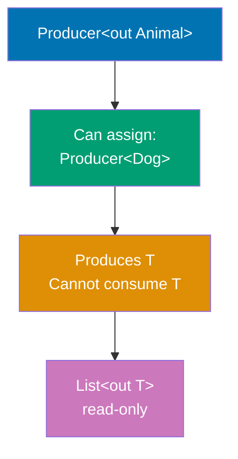

**Contravariance (in T - Consumer):**

```mermaid
%% Color Palette: Blue #0173B2, Orange #DE8F05, Teal #029E73, Purple #CC78BC, Brown #CA9161
graph TD
    Source["Consumer#60;in Dog#62;"]
    Source --> SuperType["Can assign:<br/>Consumer#60;Animal#62;"]
    SuperType --> Behavior[Consumes T<br/>Cannot produce T]
    Behavior --> Example["Comparable#60;in T#62;<br/>compare method"]

    style Source fill:#0173B2,color:#fff
    style SuperType fill:#029E73,color:#fff
    style Behavior fill:#DE8F05,color:#fff
    style Example fill:#CC78BC,color:#fff
```

**Star Projection (Unknown Type):**

```mermaid
%% Color Palette: Blue #0173B2, Orange #DE8F05, Teal #029E73, Purple #CC78BC, Brown #CA9161
graph TD
    Star["List#60;*#62;"]
    Star --> Read["Can read:<br/>Any?"]
    Star --> Write["Cannot write:<br/>Nothing"]
    Read --> Safety[Type-safe reading]
    Write --> Safety

    style Star fill:#0173B2,color:#fff
    style Read fill:#029E73,color:#fff
    style Write fill:#DE8F05,color:#fff
    style Safety fill:#CC78BC,color:#fff
```

**Variance Summary:**

- **out T (covariant)**: Producer, read-only, subtype → supertype. Producer\<Dog\> is subtype of Producer\<Animal\>. Safe because only produces values
- **in T (contravariant)**: Consumer, write-only, supertype → subtype. Consumer\<Animal\> is subtype of Consumer\<Dog\>. Safe because only consumes values
- **T (invariant)**: Read-write, exact type match required. Box\<String\> is NOT subtype of Box\<Any\>. Mutable, requires exact type
- **\* (star projection)**: Unknown type. Can read as Any?, cannot write. Read-only view of unknown-type list

**Why Variance Matters:**

- **Covariance safety**: Producer\<String\>.produce() returns String, always compatible with Any. No way to put wrong type (read-only)
- **Contravariance safety**: Consumer\<Any\> can accept any value, including String. Any consumer can handle String input
- **Invariance necessity**: MutableList\<String\> cannot be MutableList\<Any\> because mutableAny.add(123) would violate type safety
- **List covariance**: List\<String\> can be List\<Any\> because List is immutable (no add method), reading String as Any is always safe

**Declaration-site vs Use-site:**

- **Declaration-site**: class Producer\<out T\> (Kotlin preference - cleaner)
- **Use-site**: fun process(items: List\<out Number\>) (Java-style wildcards)
- **Kotlin supports both** for flexibility

```kotlin
// Covariance (out) - producer only
class Producer<out T>(private val value: T) {
                                     // => 'out' modifier: covariant type parameter
    fun produce(): T = value         // => Can return T (produce)
                                     // => Read-only access to T
    // fun consume(value: T) {} // => ERROR: can't consume T with out
}

// Contravariance (in) - consumer only
class Consumer<in T> {               // => 'in' modifier: contravariant type parameter
    fun consume(value: T) {          // => Can accept T (consume)
                                     // => Write-only access to T
        println("Consumed: $value")  // => Prints consumed value
    }
    // fun produce(): T {} // => ERROR: can't produce T with in
}

// Invariant - both producer and consumer
class Box<T>(var value: T) {         // => No variance modifier: invariant
                                     // => No 'out' or 'in', invariant by default
    fun get(): T = value             // => Can produce T
    fun set(newValue: T) { value = newValue }
                                     // => Can consume T
}

// Star projection - unknown type
fun printAll(items: List<*>) {       // => List<*> is star projection
                                     // => Unknown type parameter
    for (item in items) {            // => Iterates over list
                                     // => item has type Any?
        println(item)                // => Prints each item
    }
    // items.add(something) // => ERROR: can't add to List<*>
}

// Upper bound - restrict type parameter
fun <T : Number> sum(values: List<T>): Double {
                                     // => T : Number restricts to Number subtypes
    return values.sumOf { it.toDouble() }
                                     // => Converts each to Double and sums
                                     // => Constraint ensures type safety, prevents sum(listOf("a", "b"))
}

// Multiple bounds using where clause
interface Named {                    // => Interface for named objects
    val name: String                 // => Required name property
}

fun <T> printName(item: T) where T : Named, T : Comparable<T> {
                                     // => T must satisfy BOTH constraints
                                     // => Must be Named AND Comparable
    println(item.name)               // => Access name property
}

fun main() {
    println("=== Variance and Generics ===\n")
    // => Output: === Variance and Generics ===

    // Covariance example - subtype to supertype
    val stringProducer: Producer<String> = Producer("Hello")
    val anyProducer: Producer<Any> = stringProducer
    // => OK: String is subtype of Any (covariant)
    println("Produced: ${anyProducer.produce()}")
    // => Output: Produced: Hello

    // Contravariance example - supertype to subtype
    val anyConsumer: Consumer<Any> = Consumer()
    val stringConsumer: Consumer<String> = anyConsumer
    // => OK: can consume String as Any (contravariant)
    stringConsumer.consume("Test")
    // => Output: Consumed: Test

    // Star projection - type-safe unknown type
    val numbers = listOf(1, 2, 3)
    val strings = listOf("a", "b", "c")
    printAll(numbers)
    // => Output: 1 \n 2 \n 3
    printAll(strings)
    // => Output: a \n b \n c

    // Upper bound - generic constraints
    println("\nSum of integers: ${sum(listOf(1, 2, 3))}")
    // => Output: Sum of integers: 6.0
    println("Sum of doubles: ${sum(listOf(1.5, 2.5, 3.0))}")
    // => Output: Sum of doubles: 7.0

    // Type variance in collections
    val mutableList: MutableList<String> = mutableListOf("a", "b")
    // val mutableAny: MutableList<Any> = mutableList
    // => ERROR: MutableList is invariant

    val readOnlyList: List<String> = mutableList
    val readOnlyAny: List<Any> = readOnlyList
    // => OK: List is covariant (out)
}
```

**Key Takeaway**: Variance (out/in) controls generic type substitutability; use out for producers, in for consumers, invariant for both.

**Why It Matters**: Java's wildcard generics (? extends T, ? super T) create confusion and verbose type signatures that developers struggle to understand, while Kotlin's declaration-site variance (out T, in T) makes producer-consumer relationships explicit at type definition. This prevents common generic programming errors like trying to add items to covariant lists or read from contravariant consumers, caught at compile time rather than runtime ClassCastException. Understanding variance is essential for designing generic APIs (collections, event streams, serialization) that are both type-safe and flexible, enabling library evolution without breaking client code.

---

## Example 81: Best Practices - Scope Functions Usage

Master scope functions (let, run, with, apply, also) for concise and expressive code.

```kotlin
data class User(var name: String, var email: String, var age: Int)
                                             // => Mutable data class for demonstration
                                             // => Properties are var to show apply/also mutations

fun main() {
    println("=== Scope Functions Best Practices ===\n")
                                             // => Output: === Scope Functions Best Practices ===

    // let - nullable handling and transformations
        println("Processing: $name")         // => Output: Processing: Alice
        name.uppercase()                     // => Transform and return
    }                                        // => result is "ALICE" or null
    println("Result: $result")               // => Output: Result: ALICE

    // let characteristics:
    // - Returns: lambda result
    // - Context object: 'it' (or named parameter)
    // - Use case: null-safe transformations

    // run - object configuration and computation
    val user = User("Bob", "bob@example.com", 30)
                                             // => Create User instance
    val greeting = user.run {                // => Extension: this = user
        println("Name: $name")               // => Output: Name: Bob
                                             // => Access properties via 'this' (implicit)
        "Hello, $name!"                      // => Return value (String)
    println("Greeting: $greeting")           // => Output: Greeting: Hello, Bob!
                                             // => user unchanged, greeting is new String

    // run characteristics:
    // - Returns: lambda result
    // - Context object: 'this' (extension receiver)
    // - Use case: compute value from object

    // with - operating on object without extension
        "User: $name, Email: $email, Age: $age"
                                             // => Access properties via 'this' (implicit)
                                             // => user unchanged, message is new String

    // with characteristics:
    // - Returns: lambda result
    // - Context object: 'this' (function parameter)
    // - Use case: multiple operations on object
    //                                          // => Prefer when object already exists

    // apply - object initialization and configuration
    val newUser = User("", "", 0).apply {    // => Create User and configure
        name = "Charlie"                     // => Configure properties (this.name)
        email = "charlie@example.com"        // => this.email = ...
        age = 25                             // => this.age = ...
                                             // => newUser is the configured User object

    // apply characteristics:
    // - Returns: receiver object (this)
    // - Context object: 'this' (extension receiver)
    // - Use case: object configuration/initialization

    // also - additional actions without changing value
        println("Validating: ${user.name}") // => Output: Validating: Charlie
                                             // => Side effect (logging)
        require(user.age >= 18) { "Must be 18+" }
                                             // => Validation check
                                             // => validatedUser === newUser (same reference)

    // also characteristics:
    // - Returns: receiver object
    // - Context object: 'it' (or named parameter)
    // - Use case: side effects (logging, validation)
    //                                          // => Perfect for adding logging without changing flow

    // Chaining scope functions
    val processed = User("diana", "DIANA@EXAMPLE.COM", 35)
                                             // => Create User with mixed-case data
        .also { println("Original: $it") }   // => Output: Original: User(name=diana, email=DIANA@EXAMPLE.COM, age=35)
                                             // => Log original state (side effect)
        .apply {                             // => Configure/modify User
            name = name.replaceFirstChar { it.uppercase() }
                                             // => name: "diana" → "Diana"
                                             // => User now has normalized data
        .let { user ->                       // => Transform User to String
            "${user.name} (${user.age})"     // => Create summary string
    println("Processed: $processed")         // => Output: Processed: Diana (35)
                                             // => Chain: User → User → User → String
                                             // => also (log) → apply (modify) → let (transform)

    // Chaining patterns:
    // - also: Side effects without transformation
    // - apply: Modify and return same object
    // - let: Transform to different type
    //                                          // => Combines logging, mutation, transformation

    // Use cases summary
    println("\n--- Use Case Summary ---")    // => Output: --- Use Case Summary ---

    // let: null safety and transformation
    val length = nullableName?.let { it.length } ?: 0
                                             // => If nullableName not null, get length
                                             // => Otherwise default to 0
    println("Length: $length")               // => Output: Length: 5

    // run: complex initialization
    val config = run {                       // => No receiver, just scope for initialization
        val host = System.getenv("HOST") ?: "localhost"
        val port = System.getenv("PORT")?.toIntOrNull() ?: 8080
        "Server: $host:$port"                // => Return computed result
    println("Config: $config")               // => Output: Config: Server: localhost:8080
                                             // => Avoids polluting outer scope with temp vars

    // with: multiple calls on same object
    with(StringBuilder()) {                  // => with for multiple operations
        append("Line 3")                     // => Third append
        toString()                           // => Convert to String (return value)
    }.let { println("Built:\n$it") }         // => Output:
                                             // => Built:
                                             // => Line 1
                                             // => Line 2
                                             // => Line 3

    // apply: builder pattern
    val builder = StringBuilder().apply {    // => apply for configuration
        append("Hello")                      // => Configure via mutations
        append("World")                      // => Final append
    println("Builder: $builder")             // => Output: Builder: Hello World
                                             // => builder is configured StringBuilder
                                             // => Can continue using builder for more operations

    // also: logging/debugging
    val users = listOf("Alice", "Bob")       // => Create list
        .also { println("Processing ${it.size} users") }
                                             // => Output: Processing 2 users
                                             // => Log intermediate state
        .map { it.uppercase() }              // => Transform to uppercase
        .also { println("Transformed: $it") }
                                             // => Output: Transformed: [ALICE, BOB]
                                             // => Log final state
                                             // => also perfect for debugging transformations

    // Scope function decision tree:
    // 1. Need return value?
    //    - Yes, compute from object: run / with
    //    - Yes, transform object: let
    //    - No, configure object: apply
    //    - No, side effect: also
    // 2. Extension or regular function?
    //    - Extension: run, let, apply, also
    //    - Regular: with
    // 3. Context object as 'it' or 'this'?
    //    - 'it': let, also (can rename parameter)
    //    - 'this': run, with, apply (implicit receiver)
    //                                          // => Choose based on intention and context

    // Common pitfalls:
    // - Using apply when you need let (forgetting return value)
    // - Using let when you need also (transforming when logging)
    // - Over-chaining (hard to debug)
    //                                          // => Keep chains readable

    // Performance consideration:
    // - All scope functions are inline
    // - Zero runtime overhead
    // - Compiled to direct code without lambda objects

    // Scope functions comparison table:
    // | Function | Returns      | Context | Use Case               |
    // |----------|--------------|---------|------------------------|
    // | let      | lambda result| it      | null-safe transform    |
    // | run      | lambda result| this    | compute from object    |
    // | with     | lambda result| this    | multiple operations    |
    // | apply    | receiver     | this    | configure object       |
    // | also     | receiver     | it      | side effects/logging   |
    //                                          // => Choose based on intention
}
```

**Key Takeaway**: Scope functions enhance code expressiveness: let (null safety/transform), run (compute), with (multiple ops), apply (configure), also (side effects).

**Why It Matters**: Scope functions eliminate temporary variables and nested null checks that clutter code, enabling fluent method chaining and self-documenting intent through semantic function names. Each function serves distinct purposes (let for null-safety, apply for configuration, also for side-effect logging), making code intention explicit. Mastering scope functions is essential for idiomatic Kotlin where they appear throughout production code for builder patterns, null-safe transformations, and fluent APIs, while misuse creates confusion—understanding when to use each scope function separates experienced Kotlin developers from Java converts writing Kotlin with Java idioms.

---

## Summary

Advanced Kotlin (examples 55-81) covers expert-level techniques achieving 75-95% language coverage:

1. **Advanced Coroutines** (55-57): supervisorScope for independent failures, CoroutineContext elements, structured exception handling
2. **Reflection** (58-60): KClass inspection, property modification, annotation processing for metadata-driven frameworks
3. **Inline Reified** (61): Type-safe generic operations without class parameter passing
4. **Multiplatform** (62-63): Common/expect/actual declarations, Gradle Kotlin DSL configuration
5. **Serialization** (64-65): kotlinx.serialization with custom serializers for complex types
6. **Ktor** (66-67): HTTP server with routing, content negotiation, automatic JSON conversion
7. **Arrow Functional** (68-69): Either for type-safe errors, Validated for accumulating validation failures
8. **Performance** (70-71): Value classes for zero-cost wrappers, sequences for lazy evaluation
9. **Testing** (72-74): Kotest specification styles, runTest for coroutine testing, MockK for mocking
10. **Build Tools** (75): Custom Gradle tasks with Kotlin DSL
11. **Best Practices** (76-81): Immutability with data classes, extension function organization, delegation pattern, context receivers, advanced generics, scope functions

Master these techniques to write production-grade Kotlin systems with advanced concurrency, metaprogramming, cross-platform support, functional error handling, and comprehensive testing strategies.
