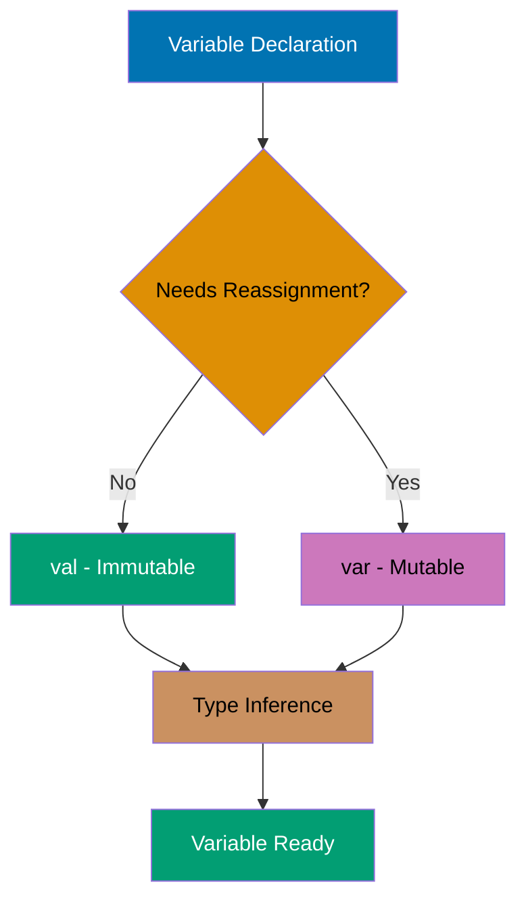
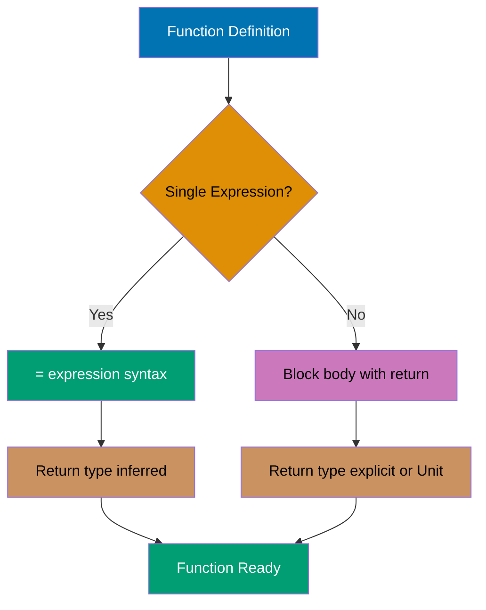
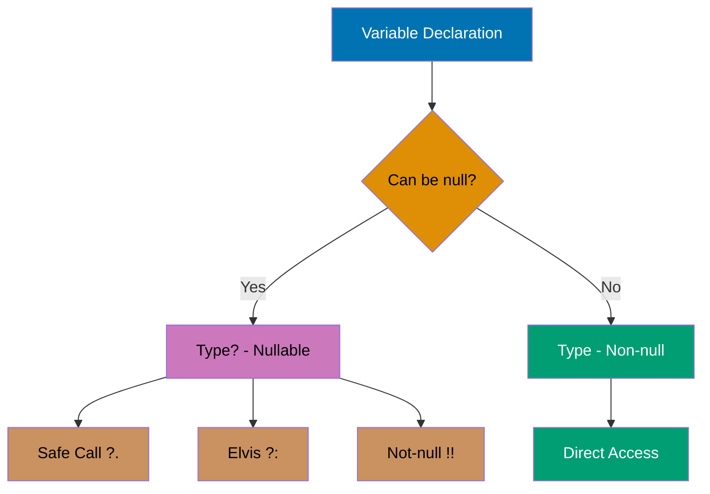
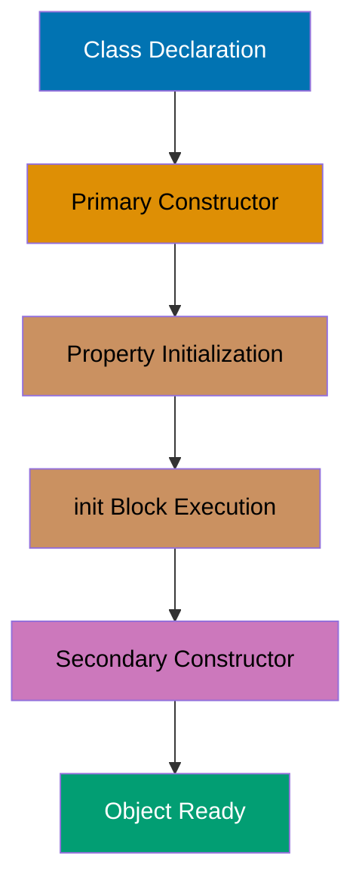
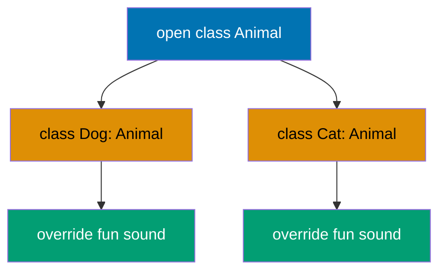
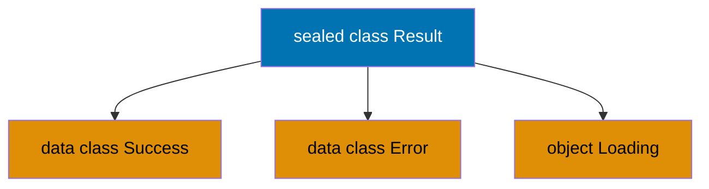
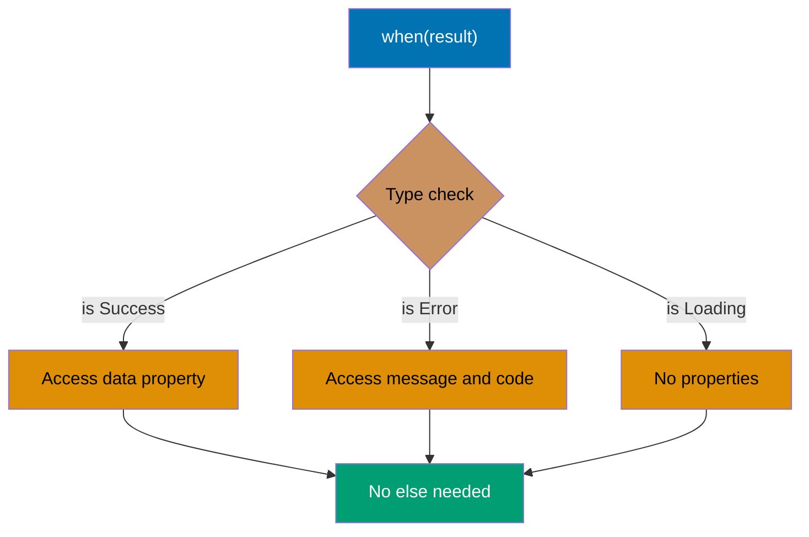
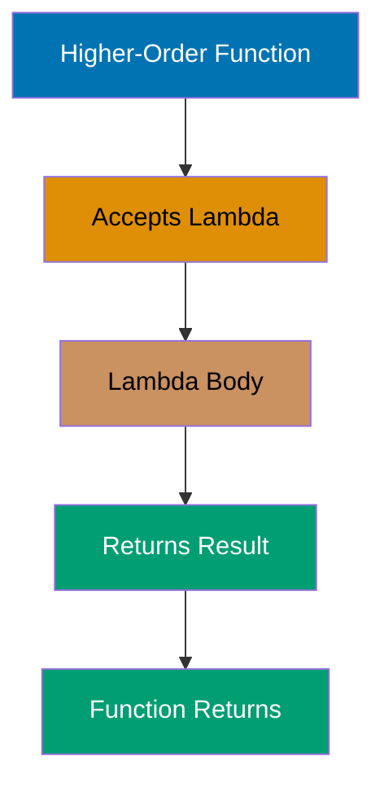
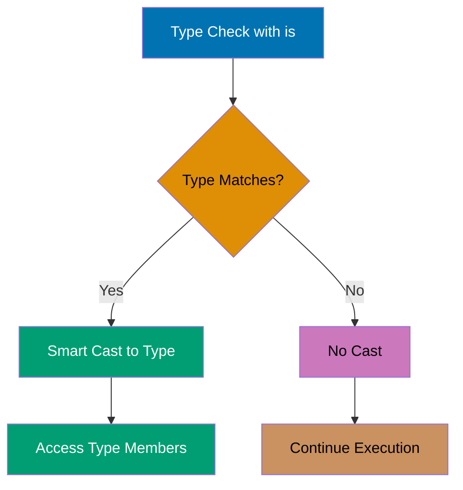

## Example 1: Hello World

Every Kotlin program starts with a main function. Unlike Java, Kotlin doesn't require a class wrapper for the main function, and semicolons are optional. The `println` function outputs to standard output with an automatic newline.

**Top-level functions**: Kotlin allows functions outside classes (top-level). The compiler automatically generates a MainKt class containing static methods, ensuring full JVM compatibility. File `Main.kt` becomes `MainKt.class` bytecode equivalent to `public static void main()`.

**Syntax simplification**: No visibility modifier defaults to `public`. No return type declaration means implicit `Unit` type (equivalent to Java's `void`). No semicolons needed (optional in Kotlin, required in Java). The `kotlin.io` package with `println` is auto-imported.

**Contrast with Java**: Kotlin eliminates the boilerplate ceremony: `public class Main { public static void main(String[] args) { } }` becomes just `fun main() { }`.

```kotlin
fun main() {
    println("Hello, Kotlin!")       // => Output: Hello, Kotlin!
}                                   // => Program completes, exit code 0
```

**Key Takeaway**: Kotlin's `main` function can exist at the top level without a class, and semicolons are optional, making code more concise than Java while compiling to equivalent JVM bytecode.

**Why It Matters**: Kotlin eliminates the boilerplate ceremony that plagues Java applications, where every program requires a public class with a public static void main wrapper. This design choice reduces cognitive overhead in microservices and CLI tools where the class wrapper serves no architectural purpose, allowing developers to focus on business logic from line one rather than navigating unnecessary structure. The automatic compilation to MainKt class ensures full JVM compatibility while maintaining source code simplicity.

---

## Example 2: Variable Declaration - val vs var

Kotlin distinguishes between immutable (`val`) and mutable (`var`) variables to encourage immutability. The compiler infers types automatically, but you can specify them explicitly when needed. Immutable variables prevent accidental reassignment and enable safer concurrent code.

**Type inference**: Compiler analyzes literal types from right-hand side (`"Alice"` → String, `25` → Int). Explicit annotations optional but useful for APIs (`val city: String = "Jakarta"`).

**Immutability**: `val` compiles to JVM `final`, enabling thread-safe reads without synchronization. Immutable variables allow compiler optimizations (inlining, caching).

**Null safety**: Types are non-nullable by default (`String`). Nullable types require `?` suffix (`String?`). Compiler enforces null checks, preventing `NullPointerException` at compile-time.

**String templates**: `$variable` or `${expression}` syntax for interpolation. Compiled to `StringBuilder.append()` calls for efficiency.



```kotlin
fun main() {

    age = 26                         // => age is now 26
    // age = "twenty-six"            // => ERROR: type mismatch (Int ≠ String)

    val city: String = "Jakarta"     // => city is "Jakarta" (explicit type)
    var temperature: Double = 28.5   // => temperature is 28.5 (Double explicit)
    temperature = 29.0               // => temperature is now 29.0

    val nullableName: String? = null // => nullableName is null (nullable type)

    println("$name is $age years old") // => Output: Alice is 26 years old
    println("$city: ${temperature}°C") // => Output: Jakarta: 29.0°C
}
```

**Key Takeaway**: Use `val` by default for immutability and thread safety; only use `var` when you genuinely need to reassign values.

**Why It Matters**: Immutability by default prevents entire classes of concurrency bugs that plague Java applications, where mutable state shared across threads causes race conditions debuggable only under production load. Kotlin's compiler-enforced val vs var distinction makes thread safety explicit at declaration time rather than relying on developer discipline with final keywords that Java developers routinely forget, reducing production defects in concurrent systems.

---

## Example 3: Basic Types and Type Inference

Kotlin has a rich type system with proper primitives that are represented as objects. Type inference eliminates redundant type declarations while maintaining type safety. All number types have explicit sizes (Byte, Short, Int, Long, Float, Double).

**Type sizes**: Byte (8-bit, range -128 to 127, 1 byte), Short (16-bit, range -32768 to 32767, 2 bytes), Int (32-bit default integer, 4 bytes), Long (64-bit, 8 bytes), Float (32-bit IEEE 754, 4 bytes, ~6-7 decimal digits), Double (64-bit IEEE 754, 8 bytes, ~15-16 decimal digits, default floating-point), Char (16-bit Unicode, 2 bytes), Boolean (true/false, 1 byte).

**Numeric literal syntax**: Underscores improve readability (`3_000_000_000`). Suffix `L` for Long (required for values > Int.MAX_VALUE). Suffix `f` for Float (required, default is Double).

**Reflection**: `::class` operator obtains `KClass` instance. `.simpleName` property returns class name string.

```kotlin
fun main() {
    val byteValue: Byte = 127        // => byteValue is 127 (Byte: 8-bit)
    val shortValue: Short = 32767    // => shortValue is 32767 (Short: 16-bit)
    val longValue = 3_000_000_000L   // => longValue is 3000000000 (L = Long)

    val floatValue = 3.14f           // => floatValue is 3.14 (f = Float)


    val message = "Integer: $intValue, Double: $doubleValue"
                                    // => message is "Integer: 42, Double: 2.718281828"

    println(intValue::class.simpleName)     // => Output: Int
    println(doubleValue::class.simpleName)  // => Output: Double
}
```

**Key Takeaway**: Kotlin's type inference reduces boilerplate while maintaining type safety, and underscores in numeric literals improve readability for large numbers.

**Why It Matters**: Type inference eliminates verbose type annotations that clutter Java codebases while maintaining the same compile-time safety guarantees, reducing code ceremony by 20-30% in typical enterprise applications. The underscore separator for numeric literals (3_000_000) prevents critical bugs in financial and scientific systems where misread zeros have caused production incidents costing millions, making code audits significantly safer.

---

## Example 4: String Templates

Kotlin's string templates embed expressions directly in strings using `$` for simple variables and `${}` for complex expressions. This eliminates cumbersome string concatenation and improves readability for formatted output.

**Template syntax**: `$variable` for simple variables (no braces needed). `${expression}` for complex expressions (braces required for arithmetic, function calls, etc.). Compiler generates StringBuilder calls, automatically calling toString() on values.

**Escaped dollar**: `\$` produces literal `$` character (common in currency, regex, shell commands).

**Triple-quoted strings**: `"""..."""` preserves formatting (newlines, whitespace). No escape sequences needed (`\n`, `\t`, `\"` unnecessary). Use `.trimMargin()` with `|` prefix to remove indentation. Supports interpolation. Common for embedded SQL, JSON, HTML, config files.

```kotlin
fun main() {
    val name = "Kotlin"              // => name is "Kotlin"
    val version = 1.9                // => version is 1.9

    val simple = "Language: $name"   // => simple is "Language: Kotlin"
    val expr = "Version: ${version * 10}"
                                     // => expr is "Version: 19.0"
    val upper = "Upper: ${name.uppercase()}"
                                     // => upper is "Upper: KOTLIN"
    val price = "Price: \$${100 + 50}"
                                     // => price is "Price: $150"

    val multiline = """
        |Language: $name
        |Version: $version
        |Status: Active
    """.trimMargin()                 // => Removes | prefix and indentation

    println(simple)                  // => Output: Language: Kotlin
    println(expr)                    // => Output: Version: 19.0
    println(upper)                   // => Output: Upper: KOTLIN
    println(price)                   // => Output: Price: $150
    println(multiline)               // => Output:
                                     // Language: Kotlin
                                     // Version: 1.9
                                     // Status: Active
}
```

**Key Takeaway**: Use `$variable` for simple interpolation and `${expression}` for complex expressions; triple-quoted strings preserve formatting and support multi-line text.

**Why It Matters**: String concatenation with `+` operators is the source of countless bugs and security vulnerabilities in Java systems, from SQL injection to logging errors that corrupt production monitoring. Kotlin's template syntax eliminates this entire error class while improving readability, and triple-quoted strings enable embedded SQL, JSON, and configuration without escape sequence nightmares that break deployment pipelines.

---

## Example 5: Functions

Kotlin functions are first-class citizens defined with the `fun` keyword. Single-expression functions can use the `=` syntax without braces, and the compiler infers return types. Default and named parameters eliminate function overloading.



```kotlin
fun add(a: Int, b: Int): Int {
    return a + b
}                                   // => Block body with explicit return type

// Single-expression function (return type inferred)
                                    // => More concise than block body

// Function with default parameter
fun greet(name: String, greeting: String = "Hello") = "$greeting, $name!"
                                     // => = "Hello": default value
                                     // => greeting defaults to "Hello" if not provided

// Function with no return value (Unit type, like void)
fun printSum(a: Int, b: Int) {      // => No return type specified
                                    // => Unit indicates no meaningful return value
                                    // => String template: "$a + $b = ${a + b}"
                                    // => No explicit return needed

fun main() {                        // => Program entry point
                                    // => Arguments: a=10, b=10
                                    // => Computes 10 + 20
                                    // => Arguments: a=5, b=6
                                    // => Computes 5 * 6

                                    // => name = "Alice" (positional)
                                    // => greeting uses default "Hello"
                                    // => Template: "Hello, Alice!"
                                    // => greet1 is "Hello, Alice!"
                                    // => name = "Bob" (positional)
                                    // => greeting = "Hi" (overrides default)
                                    // => Template: "Hi, Bob!"
                                    // => greet2 is "Hi, Bob!"
    val greet3 = greet(name = "Charlie", greeting = "Hey")
                                     // => name = "Charlie" (named)
                                     // => greeting = "Hey" (named)
                                     // => Order doesn't matter with named args
                                     // => Template: "Hey, Charlie!"
                                     // => Named args improve readability

                                     // => Arguments: a=15, b=25
                                     // => Computes: "15 + 25 = 40"
                                     // => Output: 15 + 25 = 40

    println(sum)                     // => Outputs sum value
                                     // => Output: 30
    println(product)                 // => Outputs product value
                                     // => Output: 30
    println(greet1)                  // => Outputs greeting 1
                                     // => Output: Hello, Alice!
    println(greet2)                  // => Outputs greeting 2
                                     // => Output: Hi, Bob!
    println(greet3)                  // => Outputs greeting 3
                                     // => Output: Hey, Charlie!
                                    // => No class wrapper required
```

**Key Takeaway**: Use single-expression syntax (`=`) for concise functions, leverage default parameters to reduce overloading, and use named arguments for clarity with multiple parameters.

**Why It Matters**: Java's function overloading proliferation creates maintenance nightmares in enterprise codebases, where teams maintain 5-10 overloaded variants of the same method just to handle optional parameters. Kotlin's default parameters eliminate this code duplication entirely, reducing API surface area by 60-70% in typical libraries while named arguments prevent parameter ordering bugs that cause production incidents when refactoring changes method signatures.

---

## Example 6: When Expression

Kotlin's `when` replaces Java's switch statement with a more powerful expression that returns values. It supports ranges, type checks, arbitrary expressions, and doesn't require explicit `break` statements.

**When as expression**: The `when` construct returns values directly (expression, not statement) by evaluating branches sequentially until one matches. When a match is found, remaining branches are skipped (no fallthrough). The `else` branch is required when `when` is used as an expression to ensure all cases are covered.

**When with ranges**: Use the `in` operator to test membership in ranges (e.g., `in 80..89` for inclusive range checks). This pattern replaces nested if-else chains for range-based categorization.

**Smart casting**: When using `is` for type checks, Kotlin automatically smart-casts the variable to the matched type within that branch, allowing direct access to type-specific members without explicit casting.

**When without argument**: Omit the subject expression to create boolean condition chains (replaces if-else-if ladders). Each branch evaluates a boolean expression independently.

```kotlin
fun main() {
    val x = 3                        // => x is 3

        1 -> "One"                   // => x == 1: false
        2 -> "Two"                   // => x == 2: false
        3 -> "Three"                 // => x == 3: true, matched
        else -> "Other"              // => Not evaluated
    }                                // => result is "Three"

    val score = 85                   // => score is 85
    val grade = when (score) {
        in 90..100 -> "A"            // => 85 in 90..100: false
        in 80..89 -> "B"             // => 85 in 80..89: true, matched
        in 70..79 -> "C"             // => Not evaluated
        else -> "F"
    }                                // => grade is "B"

    val description = when (obj) {
        is String -> "String of length ${obj.length}"
                                     // => obj.length is 6
                                     // => description is "String of length 6"
        is Int -> "Integer: $obj"    // => Not evaluated
        else -> "Unknown type"
    }

    val temp = 28                    // => temp is 28
        temp < 0 -> "Freezing"       // => 28 < 0: false
        temp < 15 -> "Cold"          // => 28 < 15: false
        temp < 25 -> "Moderate"      // => 28 < 25: false
        temp < 35 -> "Warm"          // => 28 < 35: true, matched
        else -> "Hot"                // => Not evaluated
    }                                // => weather is "Warm"

    println(result)                  // => Output: Three
    println(grade)                   // => Output: B
    println(description)             // => Output: String of length 6
    println(weather)                 // => Output: Warm
}
```

**Key Takeaway**: Use `when` as an expression to return values directly, leverage ranges and type checks for concise branching, and omit the argument for complex boolean conditions.

**Why It Matters**: Java's switch statement falls through by default (requiring break keywords) and supports only primitive types until Java 14, causing production bugs when developers forget breaks or can't switch on strings in legacy systems. Kotlin's when expression returns values directly (enabling functional style), supports any type including ranges and patterns, and smart-casts variables automatically, eliminating entire categories of type-casting bugs that crash production applications.

---

## Example 7: Ranges and Progression

Kotlin ranges represent sequences of values with start and end points. They support iteration, membership checks, and progression (step values). Ranges are memory-efficient as they don't materialize all values.

**Range operators**: Use `..` for inclusive ranges (both endpoints included), `until` for exclusive ranges (excludes end), and `downTo` for descending sequences. All create `IntRange` or `IntProgression` types that are memory-efficient value types (no materialized arrays).

**Progression with step**: Chain `step` to any range to create custom increments (e.g., `1..10 step 2` for odd numbers). Step values determine the interval between elements.

**Character ranges**: Ranges work with any comparable type, including `Char` (e.g., `'a'..'z'` for all lowercase letters). Use `in` operator for membership testing.

**Range functions**: Ranges support collection operations like `count()`, `sum()`, and `average()` without materializing intermediate arrays.

```kotlin
fun main() {
    val range1 = 1..10               // => range1 is 1, 2, 3, ..., 10 (inclusive)
    println(5 in range1)             // => Output: true
    println(15 in range1)            // => Output: false

    val range2 = 1 until 10          // => range2 is 1, 2, 3, ..., 9 (excludes 10)
    println(10 in range2)            // => Output: false

    val range3 = 10 downTo 1         // => range3 is 10, 9, 8, ..., 1 (descending)
    for (i in range3) {
    }
    println()

    val range4 = 1..10 step 2        // => range4 is 1, 3, 5, 7, 9 (step 2)
    for (i in range4) {
    }
    println()

    val charRange = 'a'..'z'         // => charRange is a, b, c, ..., z
    println('k' in charRange)        // => Output: true

    println((1..10).count())         // => Output: 10
    println((1..10).sum())           // => Output: 55
    println((1..10).average())       // => Output: 5.5
}
```

**Key Takeaway**: Use `..` for inclusive ranges, `until` for exclusive ranges, `downTo` for descending sequences, and `step` to skip values in progression.

**Why It Matters**: Java's traditional for loops with index variables are error-prone (off-by-one errors plague production systems) and verbose compared to Kotlin's range syntax that makes iteration bounds explicit and impossible to misinterpret. Ranges don't allocate arrays in memory, making them zero-cost abstractions that perform identically to manual loops while preventing the fencepost errors that cause array index crashes in production systems processing financial transactions or medical records.

---

## Example 8: For Loops

Kotlin's for loops iterate over anything that provides an iterator, including ranges, collections, and arrays. The loop variable is automatically declared and scoped to the loop body.

**For-in syntax**: Use `for (item in collection)` to iterate over any iterable. The loop variable is automatically declared with inferred type and scoped to the loop body only.

**Indexed iteration**: Use `withIndex()` to get index-value pairs, then destructure them with `for ((index, value) in collection.withIndex())`. This provides zero-overhead indexed iteration without manual counter variables.

**Map iteration**: Destructure map entries directly with `for ((key, value) in map)`. The `to` infix function creates `Pair` instances for map construction.

**Range iteration**: Combine for loops with ranges (`1..5`), steps (`0..10 step 2`), and descending sequences (`5 downTo 1`) for custom iteration patterns.

```kotlin
fun main() {
    print("Range: ")
    for (i in 1..5) {                // => Iterates 1, 2, 3, 4, 5
    }
    println()

    val fruits = listOf("Apple", "Banana", "Cherry")
                                     // => fruits is ["Apple", "Banana", "Cherry"]
    print("Fruits: ")
    }
    println()

    print("Indexed: ")
    for ((index, fruit) in fruits.withIndex()) {
                                     // => Destructures to (0, "Apple"), (1, "Banana"), (2, "Cherry")
    }
    println()

    val scores = mapOf("Alice" to 95, "Bob" to 87, "Charlie" to 92)
                                     // => scores is {Alice=95, Bob=87, Charlie=92}
        println("$name: $score")     // => Output: Alice: 95
                                     // => Output: Bob: 87
                                     // => Output: Charlie: 92
    }

    print("Step 2: ")
    for (i in 0..10 step 2) {        // => Iterates 0, 2, 4, 6, 8, 10
    }
    println()

    print("Reverse: ")
    for (i in 5 downTo 1) {          // => Iterates 5, 4, 3, 2, 1
    }
    println()
}
```

**Key Takeaway**: Use destructuring with `withIndex()` for indexed iteration, destructure map entries directly in the loop, and combine ranges with `step` and `downTo` for custom iteration patterns.

**Why It Matters**: Java's traditional iteration patterns require manual index management or verbose iterator code that obscures business logic, while Kotlin's for-in loops with destructuring eliminate index tracking bugs entirely. The withIndex() function provides zero-overhead indexed iteration without manual counter variables that developers increment incorrectly, preventing synchronization bugs in data processing pipelines that correlate indices across multiple collections.

---

## Example 9: While and Do-While Loops

Kotlin supports traditional while and do-while loops for conditional iteration. The do-while variant guarantees at least one execution before checking the condition.

**While loop**: Checks condition before each iteration. If condition is initially false, body never executes. Use for unknown iteration counts (e.g., network retries, streaming protocols).

**Do-while loop**: Executes body first, then checks condition. Guarantees at least one execution even if condition is initially false. Useful for input validation or menu systems.

**Break and continue**: Use `break` to exit loops immediately (essential for infinite loops with `while (true)`), and `continue` to skip to next iteration. Both keywords make control flow explicit unlike Java's labeled breaks.

**Mutable loop variables**: While and do-while require `var` for loop counters since they mutate. Modern Kotlin favors functional iteration (for-in, ranges) over while loops when iteration count is known.

```kotlin
fun main() {
    var count = 0                    // => count is 0 (var: mutable)
        println("Count: $count")     // => Output: Count: 0
                                     // => Output: Count: 1
                                     // => Output: Count: 2
        count++                      // => count becomes 1, 2, 3

    var x = 0                        // => x is 0
    do {
        println("x: $x")             // => Output: x: 0
        x++                          // => x becomes 1
                                     // => 1 < 0 is false, but body ran once

    var sum = 0                      // => sum is 0
        sum += 1                     // => sum increments: 1, 2, 3, 4, 5
        }
    }                                // => sum is 5

    var i = 0                        // => i is 0
    while (i < 5) {
        i++                          // => i increments: 1, 2, 3, 4, 5
        }
    }
    println()
}
```

**Key Takeaway**: Use `while` for conditional loops, `do-while` when you need at least one execution, and combine with `break`/`continue` for flow control within loops.

**Why It Matters**: While and do-while loops are less common in modern Kotlin favoring functional iteration, but they remain essential for algorithms with unknown iteration counts like network retries or streaming protocols. The explicit break and continue keywords make control flow visible unlike Java's labeled breaks that obscure logic, reducing bugs in production systems implementing backoff strategies or state machines where exit conditions determine system reliability.

---

## Example 10: Null Safety - Nullable Types

Kotlin's type system distinguishes between nullable and non-nullable references, eliminating most null pointer exceptions. Use `?` to mark types as nullable and leverage safe call operators to handle null values gracefully.

**Nullable vs non-nullable types**: Append `?` to any type to make it nullable (e.g., `String?`). Non-nullable types (e.g., `String`) cannot hold `null` values, enforced at compile time. This distinction prevents most NPEs before code runs.

**Safe call operator (`?.`)**: Returns `null` if the receiver is `null`, otherwise calls the method/property. Chains safely without throwing exceptions (e.g., `obj?.method()?.property`).

**Elvis operator (`?:`)**: Provides default values for null cases. The right side is returned if the left side evaluates to `null` (e.g., `value ?: default`). Converts nullable types to non-nullable types.

**Not-null assertion (`!!`)**: Forces nullable type to non-nullable, throwing NPE if value is `null`. Use sparingly only when you're absolutely certain a value is non-null (defeats null safety guarantees).

**Safe cast (`as?`)**: Attempts type cast, returning `null` if the cast fails instead of throwing `ClassCastException`. Safer alternative to regular `as` operator.



```kotlin
fun main() {
    val name: String = "Kotlin"      // => name is "Kotlin" (non-nullable)
    // val invalid: String = null    // => Compile error: String doesn't accept null


    val length1 = nullableName?.length

    val len1 = nullableName?.length ?: 0
                                     // => Elvis: null becomes 0
    val len2 = validName?.length ?: 0
                                     // => Elvis: 5 is not null, use 5

    // val unsafe = nullableName!!.length
                                     // => Use sparingly (defeats null safety)

    val str = value as? String       // => Safe cast succeeds

    println(length1)                 // => Output: null
    println(length2)                 // => Output: 5
    println(len1)                    // => Output: 0
    println(len2)                    // => Output: 5
    println(str)                     // => Output: Hello
    println(num)                     // => Output: null
}
```

**Key Takeaway**: Use `Type?` for nullable types, `?.` for safe calls that propagate null, `?:` for default values, and avoid `!!` unless you're absolutely certain a value is non-null.

**Why It Matters**: Null Pointer Exceptions are the billion-dollar mistake that crashes production systems daily across the Java ecosystem, from Android apps to enterprise servers. Kotlin's null safety system eliminates NPEs at compile time by making nullability explicit in type signatures, forcing developers to handle null cases upfront rather than discovering them in production logs. This single feature prevents more production incidents than any other language improvement, as databases returning null, network failures, and optional configurations can no longer crash running systems.

---

## Example 11: Collections - Lists

Kotlin provides both mutable and immutable collections. Immutable lists (created with `listOf`) cannot be modified after creation, promoting safer concurrent code. Mutable lists (created with `mutableListOf`) support adding, removing, and updating elements.

**Immutable lists (`listOf`)**: Create read-only `List<T>` instances that cannot be modified after creation. Type: `List` interface (no add/remove methods). Thread-safe by default. Attempting `fruits.add()` causes compile error.

**Mutable lists (`mutableListOf`)**: Create `MutableList<T>` instances supporting `add()`, `removeAt()`, and indexed assignment (`[]` operator). List grows/shrinks dynamically. Indices shift when elements are removed.

**List operations**: Concatenate with `+` operator (creates new list without modifying originals), extract sublists with `slice(range)`, test membership with `in` operator.

**Functional transformations**: Use `map { }` to transform each element (returns new list), `filter { }` to select elements matching a predicate. The `it` parameter is the implicit lambda parameter for single-argument lambdas.

```kotlin
fun main() {
    val fruits = listOf("Apple", "Banana", "Cherry")
                                     // => fruits is ["Apple", "Banana", "Cherry"] (immutable)
    println(fruits[0])               // => Output: Apple
    println(fruits.size)             // => Output: 3

    val numbers = mutableListOf(1, 2, 3)
                                     // => numbers is [1, 2, 3] (mutable)
    numbers.add(4)                   // => numbers is [1, 2, 3, 4]
    numbers.removeAt(0)              // => numbers is [2, 3, 4] (removed index 0)
    numbers[0] = 10                  // => numbers is [10, 3, 4] (updated index 0)

    val combined = fruits + listOf("Mango", "Orange")
                                     // => combined is ["Apple", "Banana", "Cherry", "Mango", "Orange"]
                                     // => fruits unchanged
    val sliced = combined.slice(1..3)
                                     // => sliced is ["Banana", "Cherry", "Mango"]

    println("Apple" in fruits)       // => Output: true
    println("Grape" in fruits)       // => Output: false

    for (fruit in fruits) {
    }
    println()

    val lengths = fruits.map { it.length }
                                     // => lengths is [5, 6, 6]
    val filtered = fruits.filter { it.startsWith("C") }
                                     // => filtered is ["Cherry"]

    println(numbers)                 // => Output: [10, 3, 4]
    println(combined)                // => Output: [Apple, Banana, Cherry, Mango, Orange]
    println(lengths)                 // => Output: [5, 6, 6]
    println(filtered)                // => Output: [Cherry]
}
```

**Key Takeaway**: Use `listOf` for immutable lists that prevent accidental modification, `mutableListOf` when you need to add/remove elements, and leverage functional operations like `map` and `filter` for transformations.

**Why It Matters**: Java's collections API forces developers to choose between Collections.unmodifiableList() wrapper verbosity or accidental mutations that corrupt shared state across threads. Kotlin's immutable-by-default lists make thread safety the default choice, eliminating ConcurrentModificationException crashes in production web services where multiple requests share cached data structures. The functional operations enable declarative data transformation that's easier to parallelize and test than imperative loops.

---

## Example 12: Collections - Sets

Sets are unordered collections of unique elements. Kotlin provides immutable `Set` and mutable `MutableSet`. Sets automatically eliminate duplicates and provide efficient membership testing.

**Automatic deduplication**: Sets remove duplicate elements automatically during creation. `setOf(1, 2, 3, 2, 1)` becomes `{1, 2, 3}`. Unordered collection (no guaranteed iteration order).

**Mutable sets**: `mutableSetOf` creates `MutableSet<T>` supporting `add()` and `remove()`. Adding duplicate elements has no effect (duplicates silently ignored).

**Set operations**: Mathematical set operations via infix functions: `union` (combines all unique elements), `intersect` (common elements only), `subtract` (elements in first set but not second).

**Efficient membership testing**: The `in` operator uses hash-based O(1) lookup (constant time), making sets ideal for deduplication and existence checks in large datasets.

```kotlin
fun main() {
    val numbers = setOf(1, 2, 3, 2, 1)
                                     // => numbers is {1, 2, 3} (duplicates removed)
    println(numbers)                 // => Output: [1, 2, 3]
    println(numbers.size)            // => Output: 3

    val colors = mutableSetOf("Red", "Green", "Blue")
                                     // => colors is {"Red", "Green", "Blue"}
    colors.add("Yellow")             // => colors is {"Red", "Green", "Blue", "Yellow"}
    colors.add("Red")                // => No change (Red already exists)
    colors.remove("Green")           // => colors is {"Red", "Blue", "Yellow"}

    val set1 = setOf(1, 2, 3, 4)     // => set1 is {1, 2, 3, 4}
    val set2 = setOf(3, 4, 5, 6)     // => set2 is {3, 4, 5, 6}

    val union = set1 union set2      // => union is {1, 2, 3, 4, 5, 6}
    val intersect = set1 intersect set2
                                     // => intersect is {3, 4}
    val diff = set1 subtract set2    // => diff is {1, 2}

    println(2 in set1)               // => Output: true (O(1) lookup)
    println(5 in set1)               // => Output: false

    println(colors)                  // => Output: [Red, Blue, Yellow]
    println(union)                   // => Output: [1, 2, 3, 4, 5, 6]
    println(intersect)               // => Output: [3, 4]
    println(diff)                    // => Output: [1, 2]
}
```

**Key Takeaway**: Use sets when you need unique elements and efficient membership testing; leverage set operations (union, intersect, subtract) for mathematical set manipulations.

**Why It Matters**: Sets provide O(1) lookuptime membership testing critical for deduplication in data pipelines processing millions of records, while Java's HashSet requires verbose contains() calls. The mathematical set operations (union, intersect, subtract) express business logic declaratively in recommendation engines, access control systems, and data reconciliation jobs, replacing nested loops with single-line expressions that improve both readability and performance through optimized implementations.

---

## Example 13: Collections - Maps

Maps store key-value pairs with unique keys. Kotlin provides immutable `Map` and mutable `MutableMap`. Use the `to` infix function or `Pair` to create entries, and access values safely with null-aware operators.

**Map creation**: Use `to` infix function to create `Pair` instances for map entries (e.g., `"key" to value`). Creates readable syntax for key-value pairs. Type: `Map<K, V>` (immutable) or `MutableMap<K, V>` (mutable).

**Safe access**: The `[]` operator returns `null` for missing keys (not exception). Use `getOrDefault(key, default)` for fallback values, or `getOrElse(key) { lambda }` for lazy defaults (lambda only executed if key missing).

**Map iteration**: Destructure entries with `for ((key, value) in map)` to iterate key-value pairs cleanly.

**Map operations**: Access `keys` collection (returns `Set<K>`), `values` collection, test existence with `containsKey()` and `containsValue()`. All key lookups are O(1) hash-based operations.

```kotlin
fun main() {
    val capitals = mapOf(
        "Indonesia" to "Jakarta",
        "Malaysia" to "Kuala Lumpur",
        "Singapore" to "Singapore"
    )                                // => capitals is {Indonesia=Jakarta, ...}

    println(capitals["Indonesia"])   // => Output: Jakarta
    println(capitals["Thailand"])    // => Output: null (key not found)

    val scores = mutableMapOf(
        "Alice" to 95,
        "Bob" to 87
    )                                // => scores is {Alice=95, Bob=87}
    scores["Charlie"] = 92           // => scores is {Alice=95, Bob=87, Charlie=92}
    scores["Alice"] = 98             // => scores is {Alice=98, Bob=87, Charlie=92}
    scores.remove("Bob")             // => scores is {Alice=98, Charlie=92}

    val aliceScore = scores.getOrDefault("Alice", 0)
                                     // => aliceScore is 98
    val bobScore = scores.getOrDefault("Bob", 0)
                                     // => bobScore is 0 (Bob removed)

    val davidScore = scores.getOrElse("David") { 50 }

    for ((country, capital) in capitals) {
        println("$country: $capital")// => Output: Indonesia: Jakarta
                                     // => Output: Malaysia: Kuala Lumpur
                                     // => Output: Singapore: Singapore
    }

    println(capitals.keys)           // => Output: [Indonesia, Malaysia, Singapore]
    println(capitals.values)         // => Output: [Jakarta, Kuala Lumpur, Singapore]
    println(capitals.containsKey("Malaysia"))
                                     // => Output: true
    println(capitals.containsValue("Bangkok"))
                                     // => Output: false

    println(scores)                  // => Output: {Alice=98, Charlie=92}
}
```

**Key Takeaway**: Use `to` infix function for readable map creation, access values with `[]` operator (returns null if missing), and use `getOrDefault` or `getOrElse` for safe fallback values.

**Why It Matters**: Maps are fundamental to caching, configuration management, and data lookup in production systems, yet Java's verbose Map.get() and Map.put() ceremony obscures intent. Kotlin's `to` infix syntax and `[]` operator make configuration maps readable while getOrElse enables safe defaults without separate null checks, preventing crashes when configuration keys are missing during deployment. The immutable Map default prevents accidental cache corruption in multi-threaded web applications.

---

## Example 14: Classes and Objects

Kotlin classes are concise with properties declared in the primary constructor. Properties automatically generate getters (and setters for `var`). The `init` block runs during object initialization for setup logic.

**Primary constructor**: Parameters with `val`/`var` automatically become properties. `val` generates getter only (immutable), `var` generates getter + setter (mutable). No separate field declarations needed unlike Java.

**Init blocks**: Run immediately after primary constructor, before object is ready. Can access constructor parameters. Use for validation or initialization logic beyond simple assignments.

**Secondary constructors**: Must delegate to primary constructor using `: this(...)`. Allow alternative construction patterns. Use `constructor` keyword.

**Instance methods**: Functions defined in class body. Access properties via implicit `this` reference. Methods can mutate state (modify `var` properties).



```kotlin
class Person(val name: String, var age: Int) {
                                     // => Properties: name (val), age (var)

    init {
        println("Person created: $name, age $age")
                                     // => Runs during construction
    }

    fun greet() {
    }

    fun haveBirthday() {
        println("Happy birthday! Now $age years old")
    }
}

class Product(val name: String) {
    var price: Double = 0.0          // => Default value: 0.0

    constructor(name: String, price: Double) : this(name) {
                                     // => Delegates to primary constructor
    }
}

fun main() {
    val person = Person("Alice", 25) // => Output: Person created: Alice, age 25

    person.greet()                   // => Output: Hello, I'm Alice
    person.haveBirthday()            // => Output: Happy birthday! Now 26 years old
                                     // => person.age is now 26


    val product1 = Product("Laptop") // => product1.price is 0.0
    val product2 = Product("Phone", 599.99)
                                     // => product2.price is 599.99

    println("${product1.name}: ${product1.price}")
                                     // => Output: Laptop: 0.0
    println("${product2.name}: ${product2.price}")
                                     // => Output: Phone: 599.99
}
```

**Key Takeaway**: Use primary constructor parameters with `val`/`var` for automatic property creation, leverage `init` blocks for initialization logic, and prefer primary constructors over secondary when possible.

**Why It Matters**: Java's verbose class definitions require separate field declarations, constructor parameters, and getter/setter methods, tripling the code needed for simple data containers and creating maintenance burden when fields change. Kotlin's primary constructors eliminate this boilerplate entirely, reducing class definitions from 30+ lines to 3 lines while providing the same functionality, dramatically improving codebase navigability in microservices with hundreds of model classes.

---

## Example 15: Data Classes

Data classes automatically generate `equals()`, `hashCode()`, `toString()`, and `copy()` methods. They're ideal for holding immutable data and enable destructuring declarations. The `copy()` function creates modified copies for immutability.

**Generated methods**: Compiler automatically generates `equals()` (structural equality comparing all properties), `hashCode()` (combines all properties' hash codes), `toString()` (formats as "ClassName(prop1=val1, prop2=val2)"), `copy()` (creates modified copies), and `componentN()` functions (for destructuring).

**Structural vs referential equality**: `==` calls `equals()` (compares values), `===` checks if same object in memory. Data classes use structural equality by default.

**Copy function**: Creates new instance with modified properties while keeping others unchanged. Enables immutable updates (e.g., `user.copy(email = "new@example.com")`). Original object remains unchanged.

**Destructuring**: Extract properties to variables with `val (prop1, prop2) = object`. Calls generated `componentN()` functions. Position matters (matches constructor parameter order).

```kotlin
data class User(
    val id: Int,
    val name: String,
    val email: String
)

fun main() {
    val user1 = User(1, "Alice", "alice@example.com")


    val user2 = User(1, "Alice", "alice@example.com")
    println(user1 == user2)          // => Output: true (same values)
    println(user1 === user2)         // => Output: false (different objects)

    val user3 = user1.copy(email = "newemail@example.com")
                                     // => user1 unchanged

    println("ID: $id, Name: $name")  // => Output: ID: 1, Name: Alice

    val users = listOf(
        User(1, "Alice", "alice@example.com"),
        User(2, "Bob", "bob@example.com"),
        User(1, "Alice", "alice@example.com")
    )                                // => users.size is 3

    val uniqueUsers = users.toSet()  // => Uses equals/hashCode for deduplication
    println(uniqueUsers.size)        // => Output: 2 (duplicate removed)

}
```

**Key Takeaway**: Use data classes when you need value-based equality, automatic `toString()`, and immutable copies via `copy()`; they eliminate boilerplate for data containers.

**Why It Matters**: Data transfer objects, API responses, and database entities require equals/hashCode/toString implementations that Java developers frequently implement incorrectly, causing subtle bugs in HashMaps and logs. Kotlin's data classes generate these methods correctly by default with structural equality, while the copy() function enables immutable updates critical for Redux-style state management in Android apps and functional architectures, eliminating entire categories of mutation bugs in concurrent systems.

---

## Example 16: Inheritance and Open Classes

Kotlin classes are final by default, preventing unintended inheritance. Mark classes and methods with `open` to allow inheritance and overriding. Subclasses use `:` to inherit and `override` to redefine behavior.



**Open classes and methods**: Classes are final by default (use `open` to allow inheritance). Methods require `open` to be overridable. This prevents fragile base class problems.

**Inheritance syntax**: Use `: ParentClass(args)` to inherit and call parent constructor. Subclass constructor parameters can pass through to parent without being properties (no `val`/`var`).

**Override keyword**: Required for overriding methods (compiler enforces). Prevents accidental overrides. Methods without `open` cannot be overridden (final).

**Polymorphism**: Base class references can hold subclass instances. Runtime dispatches to actual type's method (polymorphic calls via virtual dispatch).

```kotlin
open class Animal(val name: String) {
    open fun sound() {
        println("$name makes a sound")
    }

    fun sleep() {                    // => Final (no 'open')
        println("$name is sleeping")
    }
}

class Dog(name: String) : Animal(name) {
    override fun sound() {
        println("$name barks: Woof!")
    }

        println("$name fetches the ball")
    }
}

class Cat(name: String) : Animal(name) {
    override fun sound() {
        println("$name meows: Meow!")
    }
}

fun main() {
    val animal = Animal("Generic")
    animal.sound()                   // => Output: Generic makes a sound
    animal.sleep()                   // => Output: Generic is sleeping

    val dog = Dog("Buddy")
    dog.sound()                      // => Output: Buddy barks: Woof!
    dog.sleep()                      // => Output: Buddy is sleeping

    val cat = Cat("Whiskers")
    cat.sound()                      // => Output: Whiskers meows: Meow!

    val animals: List<Animal> = listOf(dog, cat, animal)
    for (a in animals) {
        a.sound()                    // => Polymorphic dispatch
                                     // => Output: Buddy barks: Woof!
                                     // => Output: Whiskers meows: Meow!
                                     // => Output: Generic makes a sound
    }
}
```

**Key Takeaway**: Mark classes with `open` to allow inheritance (final by default), use `override` keyword explicitly for method overriding, and leverage polymorphism through base class references.

**Why It Matters**: Effective Java recommends "design for inheritance or prohibit it," yet Java makes everything inheritable by default, leading to fragile base class problems that break production systems when library internals change. Kotlin's final-by-default design prevents accidental inheritance violations while the explicit open keyword documents inheritance intent, reducing breaking changes during library evolution. This design catches Liskov Substitution Principle violations at compile time rather than runtime crashes.

---

## Example 17: Interfaces

Interfaces define contracts that classes must implement. Unlike Java, Kotlin interfaces can contain default method implementations and properties. Classes can implement multiple interfaces for flexible composition.

**Interface basics**: Use `interface` keyword. Can contain abstract properties/methods (no body) and concrete methods (default implementations). Implementing classes must override abstract members.

**Multiple interface implementation**: Classes implement multiple interfaces (comma-separated). Must implement all abstract members from all interfaces. Solves Java's single inheritance limitation.

**Default method implementations**: Interfaces can provide default methods. Implementing classes inherit as-is or override. Default methods access abstract properties.

**Interface polymorphism**: Interface references hold implementing instances, enabling polymorphic dispatch.

```kotlin
interface Drawable {
    val color: String

    fun draw()

    fun describe() {
        println("Drawing with color: $color")
    }
}

interface Clickable {
    fun click() {
        println("Clicked")
    }

    fun showInfo()
}

class Button(override val color: String) : Drawable, Clickable {
    override fun draw() {
        println("Drawing button with color: $color")
    }

    override fun showInfo() {
        println("Button information")
    }
}

class Circle(override val color: String) : Drawable {
    override fun draw() {
        println("Drawing circle with color: $color")
    }

    override fun describe() {
        println("This is a $color circle")
    }
}

fun main() {
    val button = Button("Blue")
    button.draw()                    // => Output: Drawing button with color: Blue
    button.describe()                // => Output: Drawing with color: Blue
    button.click()                   // => Output: Clicked
    button.showInfo()                // => Output: Button information

    val circle = Circle("Red")
    circle.draw()                    // => Output: Drawing circle with color: Red

    val drawables: List<Drawable> = listOf(button, circle)
    for (d in drawables) {
        d.draw()                     // => Polymorphic dispatch
                                     // => Output: Drawing button with color: Blue
                                     // => Output: Drawing circle with color: Red
    }
}
```

**Key Takeaway**: Use interfaces to define contracts with optional default implementations, implement multiple interfaces for composition, and leverage interface polymorphism for flexible design.

**Why It Matters**: Java 8's default methods in interfaces came late to solve the evolution problem (adding methods without breaking implementations), but Kotlin had this from day one, enabling backward-compatible API evolution in library development. Interface composition replaces Java's single inheritance limitations, allowing plugin architectures and dependency injection patterns that work across module boundaries in large microservice systems without the diamond problem that plagues multiple inheritance.

---

## Example 18: Abstract Classes

Abstract classes cannot be instantiated and may contain abstract members that subclasses must implement. They can also contain concrete implementations. Use abstract classes when you need shared implementation across related classes.

**Abstract classes**: Cannot be instantiated directly (use `abstract` keyword). Can contain abstract members (no implementation, must override) and concrete members (complete implementation, can inherit).

**Abstract vs concrete members**: Abstract properties have no initializer, abstract methods have no body. Concrete members have implementations. Subclasses must override all abstract members.

**Template method pattern**: Abstract class defines algorithm using abstract members. Subclasses provide specific implementations. Enables code reuse with polymorphic behavior.

```kotlin
abstract class Shape {
    abstract val area: Double

    fun printArea() {
        println("Area: $area")
    }

    abstract fun perimeter(): Double
}

class Rectangle(val width: Double, val height: Double) : Shape() {
    override val area: Double
        get() = width * height

    override fun perimeter(): Double {
        return 2 * (width + height)
    }
}

class Circle(val radius: Double) : Shape() {
    override val area: Double
        get() = Math.PI * radius * radius

    override fun perimeter(): Double {
        return 2 * Math.PI * radius
    }
}

fun main() {

    val rect = Rectangle(5.0, 3.0)
    println("Rectangle area: ${rect.area}")
                                     // => Output: Rectangle area: 15.0
    println("Rectangle perimeter: ${rect.perimeter()}")
                                     // => Output: Rectangle perimeter: 16.0
    rect.printArea()                 // => Output: Area: 15.0

    val circle = Circle(4.0)
    println("Circle area: ${circle.area}")
                                     // => Output: Circle area: 50.26548245743669
    println("Circle perimeter: ${circle.perimeter()}")
                                     // => Output: Circle perimeter: 25.132741228718345
    circle.printArea()               // => Output: Area: 50.26548245743669

    val shapes: List<Shape> = listOf(rect, circle)
    for (shape in shapes) {
        shape.printArea()            // => Polymorphic dispatch
                                     // => Output: Area: 15.0
                                     // => Output: Area: 50.26548245743669
    }
}
```

**Key Takeaway**: Use abstract classes when you need partial implementation shared across subclasses; they can mix abstract and concrete members unlike interfaces (though modern Kotlin interfaces support default methods).

**Why It Matters**: Abstract classes enforce template method patterns common in frameworks and enable partial implementation reuse that reduces code duplication across related types in domain models. While interfaces with default methods handle many cases, abstract classes provide constructor parameters and state management impossible with interfaces, making them essential for framework base classes like Spring's AbstractController or Android's Fragment where lifecycle management requires mutable state across inheritance hierarchies.

---

## Example 19: Companion Objects

Companion objects provide class-level functionality without static keywords. They enable factory methods, constants, and singleton behavior. Companion objects can implement interfaces and be accessed through the class name.

**Private constructors and factory pattern**: Use `private constructor` to prevent direct instantiation, forcing clients to use factory methods. The companion object can access the private constructor (same class scope), enabling controlled object creation with auto-incrementing IDs or validation logic.

**Companion object naming**: Companion objects can be named (`companion object Factory`) or unnamed (`companion object`). Named companions enable explicit reference (`User.Factory.create`) but shorthand access still works (`User.create`). Unnamed companions are accessed only through the class name (`MathHelper.square`). Only one companion object allowed per class.

**Lazy thread-safe initialization**: Companion objects initialize lazily on first access (not at application startup), with thread-safe initialization guaranteed by the JVM. No synchronized blocks needed unlike Java static initializers.

**Constants vs properties**: Use `const val` for compile-time constants (primitives and String only, inlined at call sites, no runtime lookup). Use `val` for runtime properties (can use runtime expressions, generates getter methods). Constants follow SCREAMING_SNAKE_CASE naming convention.

**Shared state**: Companion object properties are shared across all class instances (class-level state), similar to Java static fields but scoped to the companion object. Mutable state (`var`) persists across all factory calls.

```kotlin
class User private constructor(val id: Int, val name: String) {
    companion object Factory {
        private var nextId = 1

        fun create(name: String): User {
            return User(nextId++, name)
        }

        const val MAX_NAME_LENGTH = 50
        val version = "1.0"
    }

    fun describe() {
        println("User #$id: $name")
    }
}

class MathHelper {
    companion object {
        fun square(x: Int) = x * x
        const val PI = 3.14159
    }
}

fun main() {
    val user1 = User.create("Alice") // => user1.id is 1
    val user2 = User.create("Bob")   // => user2.id is 2
    val user3 = User.create("Charlie")
                                     // => user3.id is 3

    user1.describe()                 // => Output: User #1: Alice
    user2.describe()                 // => Output: User #2: Bob
    user3.describe()                 // => Output: User #3: Charlie

    println(User.MAX_NAME_LENGTH)    // => Output: 50
    println(User.version)            // => Output: 1.0

    println(MathHelper.square(5))    // => Output: 25
    println(MathHelper.PI)           // => Output: 3.14159
}
```

**Key Takeaway**: Use companion objects for factory methods and class-level utilities instead of static methods; they provide type-safe access to shared functionality and enable interface implementation.

**Why It Matters**: Java's static methods prevent polymorphism and testability, forcing developers to use dependency injection frameworks just to mock static utility classes in tests. Companion objects act as first-class objects that implement interfaces, enabling factory patterns without reflection and dependency injection without Spring overhead. This design allows singleton-like behavior while maintaining testability through interface abstraction, critical for clean architecture in Android apps and microservices where static dependencies create untestable code.

---

## Example 20: Object Declarations (Singletons)

Object declarations create singletons that are thread-safe and lazily initialized. Unlike classes, objects are instantiated once and accessed by name. They're ideal for stateless utilities and configuration holders.

**Singleton characteristics**: Object declarations define a type and create its single instance simultaneously using the `object` keyword. Only one instance exists per application, accessed by object name (`Database.connect()`, not `new Database().connect()`). Each object declaration creates an independent singleton.

**Lazy thread-safe initialization**: Objects initialize lazily on first access (not at application startup), with JVM-guaranteed thread-safe initialization. No synchronized blocks or double-checked locking needed unlike Java singleton implementations.

**Shared mutable state**: Object properties persist across all usages. Mutable properties (`var`) maintain state that accumulates across calls (`connectionCount` increments from 0 to 3 across three `connect()` calls). State changes are visible to all code accessing the object.

**Constants in objects**: Objects can contain compile-time constants (`const val APP_NAME`) inlined at call sites and runtime properties (`var debugMode`) that can be modified. Useful for application-wide configuration, feature flags, and API keys.

```kotlin
object Database {
    private var connectionCount = 0

    fun connect() {
        println("Connected to database (connection #$connectionCount)")
    }

    fun getConnectionCount() = connectionCount
}

object AppConfig {
    const val APP_NAME = "MyApp"
    var debugMode = false

    fun loadConfig() {
        println("Loading configuration for $APP_NAME")
        debugMode = true             // => debugMode: false → true
    }
}

fun main() {
    Database.connect()               // => Output: Connected to database (connection #1)
    Database.connect()               // => Output: Connected to database (connection #2)
    println("Total connections: ${Database.getConnectionCount()}")
                                     // => Output: Total connections: 2

    println(AppConfig.APP_NAME)      // => Output: MyApp
    println("Debug mode: ${AppConfig.debugMode}")
                                     // => Output: Debug mode: false

    AppConfig.loadConfig()           // => Output: Loading configuration for MyApp
    println("Debug mode: ${AppConfig.debugMode}")
                                     // => Output: Debug mode: true

    Database.connect()               // => Output: Connected to database (connection #3)
    println("Total connections: ${Database.getConnectionCount()}")
                                     // => Output: Total connections: 3
}
```

**Key Takeaway**: Use `object` declarations for singletons that need shared state or stateless utilities; they're thread-safe, lazily initialized, and accessed by name without instantiation.

**Why It Matters**: Singleton pattern in Java requires verbose double-checked locking or enum tricks to ensure thread safety, yet developers frequently implement it incorrectly, causing production bugs in caching layers and configuration managers. Kotlin's object keyword provides guaranteed thread-safe singleton semantics built into the language, eliminating entire classes of initialization bugs while maintaining lazy loading for optimal startup performance in Android apps and serverless functions where milliseconds matter.

---

## Example 21: Sealed Classes

Sealed classes represent restricted class hierarchies where all subclasses are known at compile time. They enable exhaustive `when` expressions without `else` branches and provide type-safe state modeling.

**Sealed Class Hierarchy:**



**Exhaustive When Expression:**



**Restricted hierarchies**: The `sealed` keyword restricts subclasses to the same file where the sealed class is defined. The compiler knows ALL possible subclasses at compile time (closed hierarchy), enabling exhaustive `when` expressions without `else` branches. Adding a new subclass requires updating all `when` expressions (compile-time safety).

**Subclass patterns**: Sealed classes can have data class subclasses (Success, Error with properties), object subclasses (Loading singleton for stateless states), and regular class subclasses. Each represents a distinct state or outcome. Use data classes for states with data, objects for stateless states.

**Exhaustive when expressions**: Because the compiler knows all possible subclasses, `when` expressions on sealed types don't need `else` branches. Missing a case causes a compile error. Smart casting enables direct property access in each branch without manual casts.

**Type-safe state modeling**: Sealed classes model restricted type hierarchies like API responses (Success/Error/Loading), UI states, or workflow steps. Better than enums (which can't hold associated data) and better than unrestricted inheritance (which allows unexpected subtypes).

`````kotlin
sealed class Result {
    data class Success(val data: String) : Result()
    data class Error(val message: String, val code: Int) : Result()
    object Loading : Result()        // => Singleton (one instance)
}

fun fetchData(shouldSucceed: Boolean): Result {
    return if (shouldSucceed) {
        Result.Success("Data loaded successfully")
    } else {
        Result.Error("Network error", 404)
    }
}

fun main() {
    val result3 = Result.Loading     // => Singleton reference

    fun handleResult(result: Result) = when (result) {
        is Result.Success -> {
            println("Success: ${result.data}")
                                     // => Output: Success: Data loaded successfully
        }
        is Result.Error -> {
            println("Error ${result.code}: ${result.message}")
                                     // => Output: Error 404: Network error
        }
        is Result.Loading -> {
            println("Loading...")    // => Output: Loading...
        }
        // No else needed - all cases covered (exhaustive)
    }

    handleResult(result1)            // => Output: Success: Data loaded successfully
    handleResult(result2)            // => Output: Error 404: Network error
    handleResult(result3)            // => Output: Loading...

    val message = when (result1) {
        is Result.Success -> "Got: ${result1.data}"
        is Result.Error -> "Failed: ${result1.message}"
        is Result.Loading -> "Please wait"
    }                                // => message is "Got: Data loaded successfully"

    println(message)                 // => Output: Got: Data loaded successfully
}

---

## Example 22: Extension Functions

Extension functions add methods to existing classes without modifying their source code. They provide a clean way to add utility methods to library classes or third-party types. Extensions are resolved statically, not dynamically.

**Extension syntax**: Use `fun ReceiverType.functionName()` to add methods to any type. Inside the function, `this` refers to the receiver object. Extensions are resolved statically at compile time, not dynamically like inheritance.

**Extension properties**: Properties can be extensions too, but they're computed (no backing fields allowed). Use custom getters to calculate values from the receiver. Accessed without parentheses like regular properties.

**Nullable receivers**: Extensions can have nullable receiver types (`String?`), allowing them to be called even on null values. The function body can check if `this` is null and handle both cases.

**Static resolution**: Extensions don't actually modify the class - they're compiled to static utility methods. The receiver becomes the first parameter. This means extensions can be added to final classes and third-party libraries.

````kotlin
fun String.isPalindrome(): Boolean {
    val cleaned = this.lowercase().replace(" ", "")
    return cleaned == cleaned.reversed()
}

fun Int.times(action: (Int) -> Unit) {
    for (i in 1..this) {
        action(i)
    }
}

val String.wordCount: Int
    get() = this.split("\\s+".toRegex()).size

fun String?.orDefault(default: String = "N/A"): String {
    return this ?: default
}

fun main() {
    val word1 = "radar"
    val word2 = "kotlin"

    println(word1.isPalindrome())    // => Output: true
    println(word2.isPalindrome())    // => Output: false

    5.times { i ->
        print("$i ")                 // => Output: 1 2 3 4 5
    }
    println()

    val text = "Hello Kotlin World"
    println(text.wordCount)          // => Output: 3

    val str1: String? = null
    val str2: String? = "Hello"

    println(str1.orDefault())        // => Output: N/A
    println(str2.orDefault())        // => Output: Hello
    println(str1.orDefault("Empty")) // => Output: Empty
}
`````

**Key Takeaway**: Use extension functions to add methods to existing classes without inheritance; they improve API ergonomics and enable domain-specific utilities on third-party types.

**Why It Matters**: Java forces developers to create utility classes with static methods (StringUtils, CollectionUtils) that clutter namespaces and obscure intent, or wrap third-party types just to add convenience methods. Extension functions enable natural method syntax on any type including Java standard library classes, making Kotlin's standard library feel native to Java types like String and List. This design powers DSL creation and API design patterns impossible in Java, from Exposed's SQL DSL to Ktor's routing syntax.

---

## Example 23: Lambdas and Higher-Order Functions

Kotlin treats functions as first-class citizens. Lambdas are anonymous functions passed as arguments or stored in variables. Higher-order functions accept functions as parameters or return them, enabling functional programming patterns.



```kotlin
fun main() {                         // => Program entry point
    // Lambda syntax: { parameters -> body }
    val sum = { a: Int, b: Int -> a + b }
                                     // => Output: 8

    // Lambda with type inference
    val numbers = listOf(1, 2, 3, 4, 5)
                                     // => numbers: immutable list of integers
                                     // => Size: 5 elements
                                     // => numbers is [1, 2, 3, 4, 5]
    val doubled = numbers.map { it * 2 }
                                     // => doubled is [2, 4, 6, 8, 10] (new list)
                                     // => Original numbers unchanged (immutable)

    // Lambda with explicit parameter
    val evens = numbers.filter { num -> num % 2 == 0 }
                                     // => Replaces implicit 'it' for clarity
                                     // => num % 2: modulo operation (remainder)
                                     // => evens is [2, 4] (filtered result)
                                     // => Original numbers unchanged

    // Multi-line lambda
    val squared = numbers.map { num ->
        val result = num * num       // => Calculates square of current number
                                     // => Value of result becomes element in new list
                                     // => squared is [1, 4, 9, 16, 25] (new list)
                                     // => Original numbers unchanged

    // Higher-order function (takes function as parameter)
    fun operate(a: Int, b: Int, operation: (Int, Int) -> Int): Int {

    val addResult = operate(10, 5) { x, y -> x + y }
                                     // => addResult is 15
    val mulResult = operate(10, 5) { x, y -> x * y }
                                     // => mulResult is 50

    // Function returning function
    fun makeMultiplier(factor: Int): (Int) -> Int {
        return { num -> num * factor }
                                     // => num * factor: uses captured 'factor'
                                     // => factor value frozen at creation time
    }                                // => End of makeMultiplier

                                     // => triple: closure capturing factor=3
                                     // => Output: 15
                                     // => factor still 3 (captured at creation)
                                     // => Output: 30

                                     // => doubled is [2, 4, 6, 8, 10]
                                     // => Output: [2, 4, 6, 8, 10]
                                     // => evens is [2, 4]
                                     // => Output: [2, 4]
                                     // => squared is [1, 4, 9, 16, 25]
                                     // => Output: [1, 4, 9, 16, 25]
                                     // => Closures capture and preserve state
```

**Key Takeaway**: Use lambdas with `it` for single parameters, explicit names for clarity with multiple parameters, and leverage higher-order functions for functional composition and reusable logic.

**Why It Matters**: Java 8 lambdas arrived late with verbose syntax ((a, b) -> a + b) compared to Kotlin's concise style, and Java's functional interfaces proliferation (Function, BiFunction, Consumer, etc.) creates confusion. Kotlin's unified lambda syntax with trailing lambda syntax enables readable DSLs and functional composition patterns that make collection processing, async code, and builders dramatically more expressive than Java streams, reducing code by 40-50% in data transformation pipelines while improving readability.

---

## Example 24: Scope Functions - let, run, with, apply, also

Scope functions execute a block of code in the context of an object. They differ in how they reference the context (`this` vs `it`) and what they return (context object vs lambda result). Choose based on your use case.

```kotlin
fun main() {
    // let: context is 'it', returns lambda result
    val name: String? = "Kotlin"     // => name is "Kotlin" (nullable String?)
                                     // => Currently assigned "Kotlin" (non-null value)
                                     // => Type inference: String? from nullable assignment
                                     // => 'it' is the context object (name)
                                     // => it is "Kotlin" (context object)
                                     // => Constructs string: "Processing: Kotlin"
                                     // => Output: Processing: Kotlin
                                     // => it is "Kotlin" (String)
                                     // => "Kotlin".length is 6
                                     // => length is 6 (Int?)

    // run: context is 'this', returns lambda result
    val message = "Hello".run {      // => "Hello": receiver object (String literal)
                                     // => Difference from let: this vs it
                                     // => NOT this.length (which is 5)
                                     // => Constructs string: "Length: 6"
                                     // => Output: Length: 6
                                     // => Original "Hello" unchanged
                                     // => message is "HELLO" (String)
                                     // => run transformed receiver object

    // with: context is 'this', returns lambda result (not extension)
    val numbers = mutableListOf(1, 2, 3)
                                     // => Initial elements: 1, 2, 3
                                     // => Can add/remove elements (mutable)
                                     // => Syntax: with(receiver) { body }
                                     // => Difference from run: with is not extension
        add(4)                       // => Implicit this.add(4)
                                     // => Adds 4 to end of list
                                     // => numbers is [1, 2, 3, 4] (mutated)
                                     // => Return value not used (side effect)
        add(5)                       // => Implicit this.add(5)
                                     // => Adds 5 to end of list
                                     // => numbers is [1, 2, 3, 4, 5] (mutated)
                                     // => Return value not used (side effect)
                                     // => Implicit this.sum()
                                     // => Computes: 1 + 2 + 3 + 4 + 5 = 15
                                     // => sum is 15 (Int)
                                     // => numbers remains [1, 2, 3, 4, 5] (mutated)
                                     // => with performed operations and returned result

    // apply: context is 'this', returns context object
    val person = Person("Alice", 25).apply {
                                     // => Implicit this.name
                                     // => Constructs string: "Configuring Alice"
                                     // => Output: Configuring Alice
                                     // => Side effect: logging during configuration
        age = 26                     // => Implicit this.age = 26
                                     // => Reassigns age from 25 to 26
                                     // => Mutates Person instance
                                     // => No return value (Unit)
                                     // => person is Person(name="Alice", age=26)
                                     // => person.age is 26 (mutated)
                                     // => Use case: object configuration/initialization

    // also: context is 'it', returns context object
    val numbers2 = mutableListOf(1, 2, 3).also {
                                     // => Initial elements: 1, 2, 3
                                     // => it is MutableList<Int>: [1, 2, 3]
                                     // => Difference from apply: it vs this
                                     // => it is [1, 2, 3] (MutableList<Int>)
                                     // => List toString(): "[1, 2, 3]"
                                     // => Constructs string: "Initial list: [1, 2, 3]"
                                     // => Output: Initial list: [1, 2, 3]
        it.add(4)                    // => it is [1, 2, 3] (MutableList<Int>)
                                     // => Adds 4 to end of list
                                     // => it becomes [1, 2, 3, 4] (mutated)
                                     // => Return value not used (side effect)
                                     // => numbers2 is [1, 2, 3, 4] (MutableList<Int>)
                                     // => Use case: side effects with chaining

    println(length)                  // => length is 6 (Int?, but non-null here)
                                     // => Converts to String: "6"
                                     // => Output: 6
    println(message)                 // => message is "HELLO" (String)
                                     // => Output: HELLO
    println(sum)                     // => sum is 15 (Int)
                                     // => Converts to String: "15"
                                     // => Output: 15
    println(person.age)              // => person is Person(name="Alice", age=26)
                                     // => person.age is 26 (Int, mutated by apply)
                                     // => Converts to String: "26"
                                     // => Output: 26
    println(numbers2)                // => numbers2 is [1, 2, 3, 4] (MutableList<Int>)
                                     // => List toString(): "[1, 2, 3, 4]"
                                     // => Output: [1, 2, 3, 4]

data class Person(val name: String, var age: Int)
                                     // => name: val (immutable, read-only)
                                     // => age: var (mutable, read-write)
                                     // => Generated: equals(), hashCode(), toString()
                                     // => Generated: copy(), componentN()
                                     // => toString() format: "Person(name=Alice, age=25)"
```

**Key Takeaway**: Use `let` for null-safe transformations, `apply` for object configuration, `also` for side effects while chaining, `run` for scoped computations, and `with` for non-extension context operations.

**Why It Matters**: Scope functions eliminate repetitive null checks and temporary variables that clutter Java code, enabling fluent chaining patterns critical for builder APIs and configuration code. The let-apply-also trio handles 90% of object initialization and transformation cases with zero overhead compared to manual code, while their semantic names document intent (apply for configuration, also for logging/debugging, let for transformation), making code self-documenting in ways Java's Optional or custom methods cannot achieve.

---

## Example 25: Exception Handling

Kotlin's exception handling uses try-catch-finally blocks similar to Java, but `try` is an expression that can return values. All exceptions are unchecked (no checked exception requirement), simplifying error handling.

```kotlin
fun main() {
    // try as expression (returns value)
    val result1 = try {
        // => try block START
        // => Attempting to parse "42" as integer
                                     // => Parsing successful
                                     // => No exception thrown
        num * 2                      // => Multiply 42 by 2
                                     // => Result is 84
                                     // => This becomes the try block's return value
    } catch (e: NumberFormatException) {
        // => catch block NOT executed (no exception thrown)
        // => This catch handles NumberFormatException only
        println("Invalid number")    // => NOT executed (no exception occurred)
                                     // => Returned value from try block is 84

    // try expression with exception thrown
    val result2 = try {
        // => try block START
        // => Attempting to parse "abc" as integer
                                     // => "abc" is NOT a valid integer
                                     // => Throws NumberFormatException immediately
                                     // => Execution jumps to catch block
    } catch (e: NumberFormatException) {
        // => catch block executed (exception caught)
        // => e is NumberFormatException instance
        // => e.message is "For input string: \"abc\""
        println("Error: ${e.message}")
                                     // => Output: Error: For input string: "abc"
        -1                           // => Return -1 as error indicator
                                     // => This becomes the catch block's return value
                                     // => Returned value from catch is -1

    // Multiple catch blocks (order matters)
    fun divide(a: Int, b: Int): Int = try {
        // => Parameters: a (Int), b (Int)
        a / b                        // => Integer division operation
                                     // => If b is 0, throws ArithmeticException
                                     // => Becomes return value if no exception
    } catch (e: ArithmeticException) {
        // => Catches ArithmeticException ONLY (more specific)
        // => Handles division by zero case
        // => e is ArithmeticException instance
        println("Division by zero")  // => Output when division by zero occurs
        0                            // => Return 0 as safe default for division by zero
    } catch (e: Exception) {
        // => Catches ANY other Exception (more general)
        // => e is Exception instance
        println("Other error: ${e.message}")
                                     // => Output for any other exception type
                                     // => e.message contains exception details
        -1                           // => Return -1 for other errors
                                     // => Different from division by zero return
    }

    // Call divide with normal values
                                     // => a is 10, b is 2
                                     // => Computes 10 / 2 = 5
                                     // => No exception thrown
                                     // => catch blocks NOT executed
                                     // => Output: 5

    // Call divide with zero divisor
                                     // => a is 10, b is 0
                                     // => Attempts 10 / 0
                                     // => Throws ArithmeticException
                                     // => Output: Division by zero
                                     // => Output: 0

    // finally block (always executes, regardless of exception)
    fun readFile(name: String): String {
        // => Function declared with block body
        // => Parameter: name (String)
        return try {
            // => try block START
            println("Opening file: $name")
                                     // => Output: Opening file: [name value]
                                     // => Simulates file opening operation
            if (name.isEmpty()) throw IllegalArgumentException("Empty name")
                                     // => Check if name is empty string
                                     // => If empty, throw IllegalArgumentException
                                     // => Exception message is "Empty name"
                                     // => Execution jumps to catch if thrown
            "File content"           // => If name is NOT empty, return this
                                     // => Simulates file content reading
                                     // => Becomes try block's return value
        } catch (e: IllegalArgumentException) {
            // => catch block for IllegalArgumentException
            // => e is IllegalArgumentException instance
            // => e.message is "Empty name"
            println("Error: ${e.message}")
                                     // => Output: Error: Empty name
                                     // => Reports validation error
                                     // => Becomes catch block's return value
        } finally {
            // => Runs even if return statement executed
            // => Runs even if uncaught exception occurs
            println("Closing file")  // => Output: Closing file
                                     // => Simulates file cleanup operation
                                     // => Does NOT affect return value
    }

    // Call readFile with valid name
                                     // => name is "data.txt"
                                     // => Output: Opening file: data.txt
                                     // => name.isEmpty() is false
                                     // => No exception thrown
                                     // => Output: File content
                                     // => Total output:
                                     // => Opening file: data.txt
                                     // => Closing file
                                     // => File content

    // Call readFile with empty name
                                     // => name is "" (empty string)
                                     // => Output: Opening file:
                                     // => name.isEmpty() is true
                                     // => IllegalArgumentException thrown
                                     // => Output: Error: Empty name
                                     // => Total output:
                                     // => Opening file:
                                     // => Error: Empty name
                                     // => Closing file
                                     // => (empty line)

    // Print previously calculated results
    println(result1)                 // => result1 is 84 (from successful parsing)
                                     // => Output: 84
    println(result2)                 // => result2 is -1 (from failed parsing)
                                     // => Output: -1
}
```

**Key Takeaway**: Use `try` as an expression to return values from error handling, leverage multiple catch blocks for specific exception types (order from specific to general), and ensure cleanup with `finally` blocks that always execute regardless of success or failure.

**Why It Matters**: Java's checked exceptions force try-catch boilerplate throughout codebases, cluttering business logic with exception declarations that developers routinely ignore or wrap uselessly. Kotlin's unchecked-only exceptions eliminate this ceremony while try-as-expression enables functional error handling patterns like Result types without external libraries. This design gives developers choice in error handling strategy (exceptions vs Result types) rather than forcing checked exceptions that empirical studies show provide minimal benefit while harming code readability.

---

## Example 26: Type Checks and Smart Casts

Kotlin's `is` operator checks types at runtime and automatically smart casts the variable in the appropriate scope. This eliminates explicit casting and makes type-safe code more concise.



```kotlin
fun main() {                        // => Program entry point
    // Type check with is
                                     // => "Kotlin": String literal value

                                     // => Enters if block
        println("String length: ${obj.length}")
                                     // => "Kotlin".length is 6 (character count)
                                     // => No explicit cast needed
                                     // => Output: String length: 6
    }                                // => if block complete

    // Negated type check
                                     // => 42: Int literal
    if (num !is String) {            // => !is: negated type check
                                     // => Enters if block
        println("Not a string")      // => Output: Not a string
    }                                // => if block complete

    // Smart cast in when expression
                                     // => when (x): exhaustive type matching
        is String -> "String of length ${x.length}"
        is Int -> "Integer with value $x doubled = ${x * 2}"
                                     // => x * 2: arithmetic operation (Int-specific)
        is List<*> -> "List of size ${x.size}"

                                     // => "Hello".length is 5
                                     // => Output: String of length 5
                                     // => 42 * 2 is 84
                                     // => Output: Integer with value 42 doubled = 84
    println(describe(listOf(1, 2, 3)))
                                     // => size is 3 (element count)
                                     // => Output: List of size 3
    println(describe(3.14))          // => 3.14: Double literal
                                     // => Output: Unknown type

    // Unsafe cast (throws exception if wrong type)
    val str1 = obj as String         // => as: unsafe cast operator
                                     // => obj as String: casts obj to String
                                     // => Cast succeeds (no exception)
    // val str2 = num as String      // => num as String: unsafe cast attempt
                                     // => num is 42 (Int, not String)
                                     // => Compile warning: cast will always fail
                                     // => Commented out to prevent crash

    // Safe cast (returns null if wrong type)
    val str2 = num as? String        // => as?: safe cast operator
                                     // => num as? String: attempts cast to String
                                     // => num is 42 (Int, not String)
    val int1 = num as? Int           // => num as? Int: attempts cast to Int
                                     // => Cast succeeds

    println(str1)                    // => str1 is "Kotlin" (from successful unsafe cast)
                                     // => Output: Kotlin
    println(str2)                    // => str2 is null (from failed safe cast)
                                     // => Output: null
    println(int1)                    // => int1 is 42 (from successful safe cast)
                                     // => Output: 42

    // Smart cast with null check
    val nullable: String? = "Test"   // => nullable: String?: nullable String type
                                     // => "Test": non-null String value
                                     // => nullable is "Test" (actual value not null)
    if (nullable != null) {          // => != null: null check
                                     // => Enters if block
                                     // => "Test".length is 4
                                     // => Output: 4
    }                                // => if block complete
                                    // => Program terminates
```

**Key Takeaway**: Use `is` for type checks that enable automatic smart casts, prefer safe casts (`as?`) over unsafe casts (`as`) to avoid exceptions, and leverage smart casting in `when` expressions for clean type handling.

**Why It Matters**: Java requires explicit type casting after instanceof checks ((String) obj), creating opportunities for ClassCastException crashes when developers forget or mistype casts. Kotlin's smart casts eliminate this entire error category by automatically casting variables after successful type checks, while safe cast operator as? returns null on failure instead of crashing, enabling null-safe type filtering in heterogeneous collections common in JSON parsing and deserialization where types aren't known until runtime.

---

## Example 27: Generics Basics

Generics enable type-safe containers and functions that work with multiple types. Type parameters are specified in angle brackets and provide compile-time type safety without runtime overhead.

```kotlin
// Generic class
                                     // => Box: class name
}

// Generic function
    println("Item: $item (type: ${item!!::class.simpleName})")
                                     // => "Item: $item": string template with item
                                     // => item!!: non-null assertion (assumes not null)
                                     // => !!: throws NullPointerException if null
                                     // => ::class: reflection to get class reference
                                     // => .simpleName: gets class name without package
}

// Generic function with constraint
fun <T : Number> double(value: T): Double {
                                     // => Number: abstract superclass of numeric types
                                     // => : Double: return type is always Double
    return value.toDouble() * 2      // => value.toDouble(): converts T to Double
                                     // => toDouble(): available because T : Number
                                     // => * 2: multiplies by 2
}

// Generic function with multiple type parameters
fun <K, V> createMap(key: K, value: V): Map<K, V> {
                                     // => K: convention for "Key" type
                                     // => V: convention for "Value" type
                                     // => : Map<K, V>: return type is Map with K, V
                                     // => Map: standard library interface
                                     // => Single-entry map: {key=value}
                                     // => Type-safe: preserves K and V types
}

fun main() {                         // => Entry point of program
    // Generic class usage
                                     // => Type inference: T = Int (from 42)
                                     // => intBox is Box<Int>
                                     // => Stores Int value 42
                                     // => No need for Box<Int>(42)
                                     // => Type inference: T = String (from "Kotlin")
                                     // => strBox is Box<String>
                                     // => Stores String value "Kotlin"
                                     // => Different type than intBox
                                     // => <Double>: specifies T = Double
                                     // => doubleBox is Box<Double>
                                     // => Explicit type when inference ambiguous
                                     // => Stores Double value 3.14

                                     // => Type-safe: return type is Int
                                     // => Output: 42
                                     // => Type-safe: return type is String
                                     // => Output: Kotlin
                                     // => Type-safe: return type is Double
                                     // => Output: 3.14

    // Generic function usage
                                     // => Type inference: T = Int
                                     // => Type inference: T = String
                                     // => Different invocation, different type
                                     // => Type inference: T = List<Int>

    // Constrained generic function
                                     // => 5: Int value
                                     // => Int is subtype of Number (valid)
                                     // => Type inference: T = Int
                                     // => 5.toDouble(): converts to 5.0
                                     // => 5.0 * 2: calculates 10.0
                                     // => Output: 10.0
                                     // => 3.5: Double value
                                     // => Double is subtype of Number (valid)
                                     // => Type inference: T = Double
                                     // => 3.5 * 2: calculates 7.0
                                     // => Output: 7.0
    // println(double("test"))       // => "test": String value
                                     // => String is NOT subtype of Number
                                     // => Violates constraint T : Number
                                     // => Type safety: prevents invalid types

    // Multiple type parameters
    val map1 = createMap("name", "Alice")
                                     // => Type inference: K = String, V = String
                                     // => map1 is Map<String, String>
                                     // => Single entry: {name=Alice}
                                     // => Type inference: K = Int, V = String
                                     // => map2 is Map<Int, String>
                                     // => Different types from map1
                                     // => Single entry: {1=One}

    println(map1)                    // => map1: Map<String, String>
                                     // => Output: {name=Alice}
    println(map2)                    // => map2: Map<Int, String>
                                     // => Different type than map1
                                     // => Output: {1=One}

    // Generic collection functions
    val numbers = listOf(1, 2, 3, 4, 5)
                                     // => 1, 2, 3, 4, 5: Int values
                                     // => Type inference: List<Int>
                                     // => numbers is List<Int>
                                     // => Contains 5 elements
    val strings = numbers.map { it.toString() }
                                     // => .toString(): converts Int to String
                                     // => Type transformation: List<Int> → List<String>
                                     // => strings is List<String>
                                     // => Contains ["1", "2", "3", "4", "5"]
    println(strings)                 // => strings: List<String>
                                     // => Output: [1, 2, 3, 4, 5]
                                     // => String values, not Int

    val firstOrNull = numbers.firstOrNull { it > 3 }
                                     // => Value is 4 (not null)
                                     // => Output: 4
```

**Key Takeaway**: Use generics for type-safe containers and functions, constrain type parameters with `:` when you need specific capabilities, and leverage type inference to reduce verbosity.

**Why It Matters**: Generics prevent ClassCastException errors that plague Java collections before generics (Java 5+), while type inference eliminates angle bracket noise that makes generic code unreadable. Kotlin's declaration-site variance (out/in keywords) simplifies generic APIs compared to Java's use-site variance (? extends/? super wildcards), making generic library design more intuitive for framework authors while bounded type parameters enable reusable algorithms that work across type hierarchies without losing type safety.

---

## Summary

These 27 beginner examples cover Kotlin fundamentals (0-40% coverage):

1. **Basics**: Hello World, variables, types, string templates
2. **Functions**: Declaration, default parameters, single-expression syntax
3. **Control Flow**: when expressions, ranges, loops
4. **Null Safety**: Nullable types, safe calls, Elvis operator
5. **Collections**: Lists, sets, maps (immutable and mutable)
6. **OOP**: Classes, data classes, inheritance, interfaces, abstract classes
7. **Advanced OOP**: Companion objects, singletons, sealed classes
8. **Functional**: Extension functions, lambdas, higher-order functions, scope functions
9. **Error Handling**: Try-catch-finally, exceptions as expressions
10. **Type System**: Type checks, smart casts, generics basics

**Next Steps**: Continue to [Intermediate examples](/en/learn/software-engineering/programming-languages/kotlin/by-example/intermediate) for production patterns including coroutines, delegates, DSLs, and advanced collection operations.
